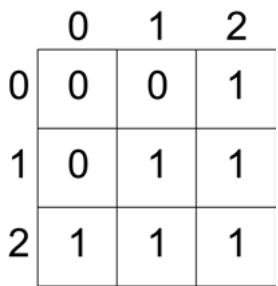
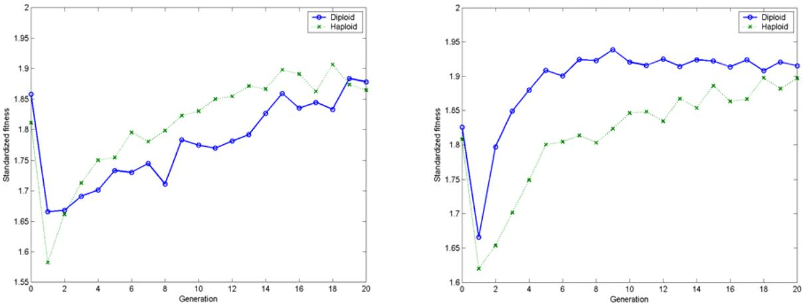
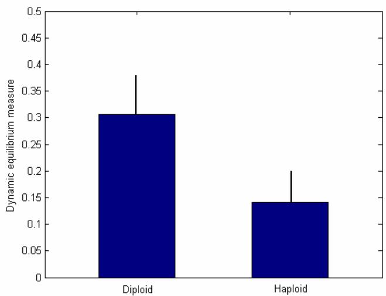

# Using a diploid genetic algorithm to create and maintain a complex system in dynamic equilibrium

# ABSTRACT

This study investigates the ability of diploid GA to approach a class of problems in which the fitness landscape is reciprocally affected by the population itself. This problem class is common in many fields of science, engineering, and the humanities, in which the entire system of environment plus population is maintained in a state of dynamic equilibrium. In particular, a system is created here in which individuals with three simulated metabolic enzymes inhabit and influence an environment with a three-gas atmosphere. Through feedback loops and frequent environment/individual interactions, diploid populations are shown to create fit, stable solutions to this problem type.

# 1.0 Introduction

# 1.1 Dominance and diploidy in GA

In the last four decades, the use of genetic algorithms (GA) has developed into a powerful optimization and problem-solving technique in a diverse range of fields. Originally, GA was modeled on the biological process of evolution by natural selection: variation in individuals results in a range of reproductive fitnesses, which translates to fitter individuals having a greater genetic representation in future generations. Because primitive GA was inspired by biological genetics, the reproductive functions used to guide propagation in most algorithms also borrowed from a biological repertoire, and the processes of crossing over, mutation, and asexual reproduction became instantiated into mainstream evolutionary algorithm strategies. At that point, increasing availability of computer power and an unending store of potential problems led GA into many different fields, often relying on the same catalog of crossover, mutation and reproduction with slight variations in algorithm metastructure.

The aim of this study is to return to some of the primary ideas behind the conception of evolutionary problem solving, and to extend them in order to create more powerful techniques that can be applied to an entirely new class of problem. In particular, standard GA problems in many fields are concerned with either optimizing an individual (or product) in a static fitness landscape, or solving a problem in which the fitness evaluation of different strategies is measurable against a schedule of static costs or benefits (either directly or indirectly, such as via a simulation). Meanwhile, problems with dynamic fitness evaluations have been only modestly approached with GA, because the “best” of the classic algorithms, or one that causes individuals to quickly converge on a solution, is not necessarily good at continuous adaptation in the face of a changing environment and fitness landscape.

Some attempts have been made to apply GA to changing-fitness problems, but all have had significant shortcomings. Bagley (1967) used the concept of diploidy, or pairs of homologous chromosomes, to model a population of individuals with a dominance map that determined which of two alleles would be expressed as the phenotype in a given situation, thereby presenting the opportunity of an individual to carry a hidden trait without expressing it. However, the individuals were evaluated under static fitness conditions, the dominance maps converged too early, and furthermore, the amount of information stored in the dominance maps was on the same order as all of the information stored in the genotypes of the individuals. In terms of memory storage and manipulation, Bagley effectively had to account for triploid individuals, instead of diploid ones. Soon after, Hollstein (1971) used a dominance schedule with much better memory efficiency, but again used a static fitness landscape, and suggested that diploidy did not offer a significant advantage to fitness. He did note, though, that population diversity increased with diploidy, as latent recessive traits would emerge and create more variability between individuals.

More recently, Goldberg (1989) took a step toward solving dynamic fitness problems by using diploidy to create individuals in changing, often oscillating, fitness environments. As predicted, the diploid populations were able to adapt to changing environments more readily than haploid populations, a result that many people attribute to the act of calling upon once-successful traits that were cached in combinations of recessive alleles that could reemerge at random times and potentially exploit different environments. The use of multiploidy, beyond two chromosomes, found similar results (Collingwood 1995).

# 1.2 Stating the problem

This paper investigates the ability of GA to move beyond this type of problem-solving in an independently-changing environment. Instead, it uses GA to create entire systems in states of dynamic equilibrium, in which maintaining diversity of individuals in a population is as important to the solution as is maintaining high fitness. In order to achieve the evolution of a complex system, GA must be applied to a new class of problem, one with links to numerous disciplines including traffic control, electrical engineering, population ecology, and endocrinology. All of these fields, plus many others, rely not only on the power of the environment to influence the individual parts of the system, but also on the reciprocal impact of the individuals on the environment itself.

In the following study, a GA protocol is first presented as a tool to approach dynamic systems with this type of reciprocal individual-environment interaction. Next, a model problem is presented, in which a population of simulated creatures live and metabolize in a three-gas atmosphere. The resulting complex system is judged in terms of 1) fitness of the individuals, and 2) equilibrium of the environment itself. Finally, the characteristics of this new GA variant are discussed, and possible applications are explored.

# 2.0 Methods

# 2.1 GA platform and protocol

A program designed for multiploid GA with dominance was created in Matlab, based upon standard GA concepts presented in Koza (1992) and Goldberg (1989) along with biological operators that are overlooked in many popular algorithms. The framework allowed for the creation of populations with varying numbers of subpopulations, and with migration of individuals between subpopulations. Mating pools were selected in tournament style, with tournament size based upon the desired certainty of the best-of-population individual reproducing. In the reproduction stage, individuals in haploid populations could undergo single-point crossover, mutation, and (asexual) reproduction. The handling of diploid populations, however, diverged from that of standard haploid GA.

Dominance was determined in diploid populations according to the triallelic map created by Hollstein (1971) shown in Figure 1, in which binary bits at each locus were replaced with three choices: 0, 1, or 2. The phenotype of an individual, which represented the traits that the individual expressed in its phenotype, were determined in the following way: the $^ { \circ } 2 ^ { \circ }$ allele at a locus was globally dominant, and resulted in a $^ { \mathfrak { c } } 1 ^ { \mathfrak { s } }$ in the corresponding phenotype. The $^ { \mathfrak { c } } 1 ^ { \mathfrak { s } }$ genotype allele also resulted in a phenotype of ‘1’, but was recessive to the $^ { \circ }$ allele, which returned a $^ { \circ }$ in the phenotype. Because the probability of a $^ { \mathfrak { c } } 1 ^ { \mathfrak { s } }$ in the phenotype was twice as great as a $^ \circ$ (six genetic combinations lead to a phenotype of $^ { \circ } 1 { } ^ { \circ }$ versus only three that lead to a $^ \circ$ ), the initial population creation during haploid runs was altered so that a $^ \circ$ occurred in a haploid genotype half as often as a ‘1’.

When diploid individuals reproduced, they were subjected to the gamut of crossover, mutation, and asexual reproduction, plus extra diploid-only operations. Crossing over was able to be applied to a single string from each parent, or to both strings simultaneously. Also, sexual reproduction was executed in place of, or in conjunction with, the other operations: two parents swapped one entire chromosome string with each other, presenting the possibility of recombination of recessive alleles. See the tableau in Table 1 for probabilities of these operations.

Figure 1: Hollstein's triallelic dominance map. The allele from chromosome lies accross the top of the square, and the allele from chromosome two is along the left. $" 2 "$ is dominant and gives a phenotype of '1', while an allele of '1' gives the same phenotype but is recessive.

# 2.2 Atmosphere and Metabolism Problem

The atmosphere/metabolism problem of focus here simulates a biochemical system within an individual, and its interaction with the environment, though variations can be applied to a wide variety of other applications. Every individual is represented by a chromosome (or two chromosomes, in diploid runs) of three genes, each encoding a different metabolic enzyme: enzyme1 uses oxygen $( \mathbf { O } _ { 2 } )$ as a substrate and therefore operates most productively under conditions of high atmospheric oxygen, enzyme2 is analogous but acts on carbon dioxide $\left( \mathrm { C O } _ { 2 } \right)$ , and enzyme3 acts on atmospheric nitrogen $( \Nu _ { 2 } )$ . Therefore, an individual’s fitness is the sum of a function on the partial pressures of these three gases: in this case the sum of the squared enzyme activity, times the partial pressures. Standardized fitness is the raw fitness normalized to a scale of 0, being no fitness, to 2, or maximal fitness. The following e quation sums over the three genes:

$$
\begin{array} { r } { F i t n e s s = \sum { ( a c t i \nu i t y \ o f e n z y m e _ { i } ) ^ { 2 } * P ( g a s _ { i } ) } } \end{array}
$$

The atmosphere, meanwhile, is reciprocally changed by the byproducts of the population during each generation: enzyme one, which acts on $\mathrm { O } _ { 2 }$ , produces $\mathrm { C O } _ { 2 }$ as a byproduct; enzyme two uses $\mathrm { C O } _ { 2 }$ but produces $\Nu _ { 2 }$ ; and enzyme three uses $\Nu _ { 2 }$ , producing $\mathrm { O } _ { 2 }$ as a result. Total atmospheric pressure is held constant at 1 bar, but the partial pressures of the gases, $\mathrm { P } ( \mathrm { O } _ { 2 } )$ , $\mathrm { P } ( \mathrm { C O } _ { 2 } )$ , and $\mathrm { P } ( \mathrm { N } _ { 2 } )$ are dynamic, and are reevaluated during each generation. The following quation multiplies over the e $\mathrm { j }$ individuals in a population, where $\mathbf { M }$ is the population size and $\mathsf { q }$ normalizes the partial pressures to maintain a total a tmospheric pressure of 1 bar:

$$
\begin{array} { r l } & { \quad P ( O _ { 2 } ) = \int P ( O _ { 2 } ) + \prod \left( I + ( ( a c t i \nu i t y o f e n z y m e _ { 3 } ) _ { j } / M ) \right) J / q } \\ & { \quad P ( C O _ { 2 } ) = \int P ( C O _ { 2 } ) + \prod \left( I + ( ( a c t i \nu i t y o f e n z y m e _ { l } ) _ { j } / M ) \right) J / q } \\ & { \quad P ( N _ { 2 } ) = \int P ( N _ { 2 } ) + \prod \left( I + ( ( a c t i \nu i t y o f e n z y m e _ { 2 } ) _ { j } / M ) \right) J / q } \end{array}
$$

In the runs presented here, each of the three genes was composed of ten bits, and the value of the gene, e integer value of the 10-digit binary phenotypecorresponding to the productivity of the simulated enzyme, was th ring normalized to a number between zero (completely inactive enzyme) and one (fully active). A single st population of 1000 individua e; the size of the population ls was used in each run, which is large for a 30-bit genom was chosen to emphasize the goal of creating a fit, stable system in dynamic equilibrium, rather than simply a single individual which solves a p nt the average best-of-roblem. Runs were terminated after 20 generations, at which poi generation fitness tended to d subsequent atmosphereplateau, but half of the runs used two fitness evaluations (an hanges) per generation. These extra evaluations were designed to test the effects of environment changes on c diff ering time scales on the success of populations in showing high fitness and stability.

Table 1: Tableau for the atmosphere/metabolism problem.   

<table><tr><td rowspan=1 colspan=1>Objective</td><td rowspan=1 colspan=1>To use GA with diploidy and dominance to create a stable, fit population ofindividuals, each with three metabolic enzymes acting on three gases in a simulatedatmosphere.</td></tr><tr><td rowspan=1 colspan=1>Representation scheme</td><td rowspan=1 colspan=1>Three genes, each of a fixed length of 10 bits. Alphabet of {0,1,2}, followingHollstein&#x27;s triallelic dominance scheme. Each gene encodes for a metabolicenzyme, with 1024 different gradations of productivity level.</td></tr><tr><td rowspan=1 colspan=1>Fitness cases</td><td rowspan=1 colspan=1>One during the GA run, another to analyze the stability of the resulting populations.</td></tr><tr><td rowspan=1 colspan=1>Raw fitness</td><td rowspan=1 colspan=1>The sum of the squared enzyme productivities times the partial pressures of theirsubstrates.</td></tr><tr><td rowspan=1 colspan=1>Standardized fitness</td><td rowspan=1 colspan=1>The raw fitness normalized to a scale from 0 to 2, with 0 as no productivity and 2 asfull enzyme productivity.</td></tr><tr><td rowspan=1 colspan=1>Global parameters</td><td rowspan=1 colspan=1>M=1000G=20, with one or two fitness evaluations per generation</td></tr><tr><td rowspan=1 colspan=1>Haploid run parameters</td><td rowspan=1 colspan=1>xover=0.9, mutation=0.01, reproduction=0.1</td></tr><tr><td rowspan=1 colspan=1>Diploid run parameters</td><td rowspan=1 colspan=1>Double string xover=0.9, asexual reproduction=0.1, sexual reproduction=0.8,mutation=0.01</td></tr><tr><td rowspan=1 colspan=1>Termination criteria</td><td rowspan=1 colspan=1>Completion of 20 generations, at which point the best-of-generation fitness wasgenerally stable</td></tr><tr><td rowspan=1 colspan=1>Result designation</td><td rowspan=1 colspan=1>The best-of generation individual and atmospheric conditions at each generation</td></tr></table>

# 3.0 Results and dis cussion

T ither a Pe rials were run on e ntium $\mathrm { I V ~ } 1 . 6 ~ \mathrm { G H z }$ ere  personal computer or a Sun Blade 2000 Workstation, and w designed to run for many replications of each parameter setting. In most cases, the best-of-generation fitness ached a plateau within 15 to 20 generations.re

# .1 Fitness results3

same atmospheric conditions, withGeneration 0 of each trial began with the $P ( O _ { 2 } ) { = } P ( C O _ { 2 } ) { = } P ( N _ { 2 } ) { = } 0 . 3 3 3$ . As a sult, the best of generation individual in both the haploid runs and diploid runs was the individual with the greatest re activity in all three enzymes, or in other words, with the greatest number of $^ { \mathfrak { c } } 1 ^ { \mathfrak { s } }$ alleles in its phenotype. For a haploid run, a representative best-of-generation-0 individual is the following, which had a standardized fitness of 1.744 out of a possible of 2.000:

An example of a diploid best-of-generation-0, which was qualitatively the same, had the following genotype and phenotype, achieving a standardized fitness of 1.766:

Genotype: 2002110112 2111210112 2200201020 2222122200 2111100112 1222100201

Phenotype: 1111111101 1111100111 1111100110

eneration 0 and at generation 1 was dramatic, and always The contrast between best-of-generation fitness at g volved a significant drop in best fitness. This drop greedy over-imprinting on the initial set of values in results from of atmospheric conditions. During the production ng pool at the end of generation 0, the algorithm of the mati behaved as if it were acting on l changes had yet been caused. static fitness measures because no environmenta However, by the next generation, it was evident that the f ness evaluation was not fixed, and those individuals that it had overzealously fixed themselves on the initial con no longer the most fit.ditions were

By the final generation of e e same template. Instead, theach run, the best of generation did not follow th reatest fitness was weighted toward the individual that not only had high enzyme activity, but also had the ability to g exploit the atmosphere to the greatest extent. For example, one diploid run’s best of generation 20 had the following genotype and phenotype:

Genotype: 0100221212 1222110200 2110120111 0022011202 1222111220 2122022012

Phenotype: 0011111101 1111110110 1111011011

y inactive enzyme1 from gene 1 and the resulting inability to get fitness from Despite having a relativel $\mathrm { O } _ { 2 }$ , this dividual still achieved a very high fitness (1.900 y exploiting the other atmospheric gases andin out of 2.000) b ignoring $\mathrm { O } _ { 2 }$ , which had reached such a low level as t le.o be negligib

A perfect standardized fitnes d when it did occur, it usually s of 2.000 out of 2.000 was rarely observed, an followed a generation during which the equilibrium of atmospheric gases experienced a crash to near-zero levels of one or two of the gases. Therefore, while a fitness o s like a goal of interest, it was actually an indicatorf 2.000 sound of problems with the system. Mor e discussion of system stability is below.

# 3.2 Time scale of environmental change

a slight fitness advantage toward haploidSurprisingly, the atmosphere/enzyme runs explained above gave pop ulations, despite the changing environment (Figure 2, left graph). This trend was true of both the mean fitness and best fitness of the generations. This observation most likely lends itself to the trade-off of benefit schedules presented to the populations: on the one hand, it was beneficial to an individual to concentrate enzyme activity on ther hand, it was also beneficial to haveavenues that were unexploited by other members of the population. On the o igh enzyme production levels in general, in order to utilize an atmospheric gas to its fullest potential. Haploid h ess variation between individuals, judged by frequency of populations tended to have approximately three times l henotypic alleles, and the greater diversity in the diploid populations may have hurt them when compared to a p greedy haploid algorithm.

However, a different scenario became apparent when two fitness measures and subsequent atmosphere changes were conducted during each generation. This algorithm variation was introduced in order to observe the results of environmental change at different timescales with respect to the lifetime of an individual, which is a serious consideration in many living systems. As an example of a real application of this, consider that some types of fungi can alternate between haploid and diploid genotypes, respectively, to quickly adapt to 1) a single, dramatic environment change, or 2) a greater number of smaller changes, as often occurs in day-to-day life.

As predicted, the increased frequency of environmental changes with respect to the lifetime of an individual resulted in a shift from haploid success to diploid success (Figure 2, graph at right). Again, the trend applied to both the mean fitness and best fitness of each generation Conceptually, the greater variance of individuals in a diploid population results in more diversity, or a less-dense cluster of genotypes in phenotype-space (in this case 30-space, because the phenotypes have 30 alleles). When the environment changes, the location of the peak fitness location in 30-space shifts slightly; if the cluster of individuals covers more area, as in diploid populations, it is more likely that an individual will be close to the new potentially best location.

  
Figure 2: Plots of best of generation fitness for cases of one fitness evaluation per generation (left) and two fitness evaluations per generation (right). Solid lines correspond to diploid populations, broken lines are haploid. The diploid populations show a dramatic improvement when the environment changes on a timescale greater than that of a generation, as in the graph at right.

The concept of a sparser cluster in phenotype-space provides a better explanation for the success of diploidy than previous attempted explanations. In nearly all GA-related diploidy papers, increased fitness in a changing environment is explained as an allowance for the inexpensive storage of the memory of past solutions in the recessive alleles of a gene. However, this does not emphasize well enough the ability of diploid populations to seek out and exploit novel environments, or environmental states that have never occurred before. The sparse-cluster explanation is more suitable, as it explains that diploid populations have the ability to cover more volume of notypes, even in novel scenarios.phenotype-space, and therefore can quickly discover potentially-best phe

# .3 System dynamics and equilibrium3

The final measure of the ability of GA to create complex, self-reinforcing systems is to create a measure of the stability of the populations. If an atmosphere became completely devoid of all but one of the atmospheric gases, for example, the resulting population of individuals would hardly be considered to be in a dynamic system in equilibrium. Therefore, the measure used to determine the state of the system relies on comparing the partial pressures of the three gases, and seeing if they are nearly equivalent. The following equation works to this effect:

$$
E ( O _ { 2 } , C O _ { 2 } , N _ { 2 } ) = ( I \mathrm { - } P ( O _ { 2 } ) ) \ ^ { * } \left( I \mathrm { - } P ( C O _ { 2 } ) \right) ^ { * } \left( I \mathrm { - } P ( N _ { 2 } ) \right) / q
$$

In this equation, $\mathsf { q }$ gned to make an atmosphere with is a normalization constant desi $P ( O _ { 2 } ) = P ( C O _ { 2 } ) = P ( N _ { 2 } ) =$ .333 have a value of 1. As a result, the E-value of a system can range between 0, in which one or two gases are0 completely absent from the atmosphere and the gases are not in equilibrium, and 1, in which all three gases occupy the same partial pressure.

Figure 3 shows the difference between diploid and haploid populations in maintaining stability of their respective dynamic systems after twenty generations. Diploid runs resulted in greater average E-values than did haploid runs $\mathrm { \hbar } ^ { - } p { < } 0 . 0 5$ , $\mathrm { n } { = } 2 0$ le  replications of each type), suggestive of the creation and maintenance of a stab stem. As mentioned before, the genotypes of individuals in diploid populations form sparser clusters insy phenotype-space than do those of haploid individuals, and as a result, the systems are more stable and less prone to collapses resulting from environment-driven selection.

  
Figure 3: A measure of the E-value of each system, which reflects the stability of a population and its environment. Diploid runs resulted in a significantly greater mean stability of the system than haploid runs. Bars show mean values, lines are standard errors of the means.

# 4.0 Conclusions

Through the simulated metabolism of a three-enzyme individual in a world with a three-gas atmosphere, this project has revealed the ability of GA with diploidy and dominance to create dynamically stable systems without a loss of rocal interaction between the individuals of the fitness. The foundation of this class of problem rests on the recip pop ation and the environment. In cases in which the environment changed only once per generation, which is onul the same timescale as the lifetime of an individual, haploid populations were shown to have a small advantage in ean and best fitness in the population. However, with frequent environment/population readjustments with respectm ess was shown to achieve levels significantly greater than those predicted by classicto individual lifetimes, fitn haploid GA.

Equally important to the atmosphere/metabolism problem, the diploid populations were able to sustain an environment in equilibrium better than haploid populations. This phenomenon can be explained not just by the fact that dominance structures allow for the inexpensive storage of past solutions, but also on the fact that diploid populations are clustered more sparsely in phenotype-space, and are therefore less likely to collapse under small changes in environmental states.

These results can be applied to numerous other problems, spanning a variety of fields, including the following:

• Traffic engineering. The fitness of a certain path is inversely related to the number of individuals exploiting that path, but conversely the exploitation of one particular path leads to a r reward from that same decision in the future. lowe

• Information transmission. Similar to the traffic control scenario, a certain band can lead to the greatest potential rates of information transmission when left virtually unused by individuals in a population. Through the process of discovery and crowding of that band, though, an individual decreases its potential transmission capacity if it continues to make the same decision.

• any problems involving the system of creating and deliveringEndocrinology. M hormones within the human body are regulated by negative feedback loops, which relate to the osphatm ere/metabolism class of problems. For example, low blood sugar levels activate the production of the hormone glucagon, which raises blood sugar. This, however, acts through an intermediary to inhibit glucagon production.

• Economics. Popular belief that a particular stock is undervalued leads to a potential reward situation, and therefore drives an increased demand for that stock. The increase in demand, though, drives up the price of the stock, thereby minimizing or erasing the reward situation.

# 5.0  Future work

Further w directed in a few primary directions. First, a system should be ork with dominance and diploidy should be created in which n each  the population and environment are continously renegotiating their states and pressures o other; th ividual is continuous crosstalk is the upper limit of the environmental change timescale with respect to ind lifetime, ulation  and should result in the greatest advantage of diploidy over haploidy. Next, the parameter of pop size sho mined, to discover the smallest number, or critical size, of a population that maintains an uld be exa nvironment in equilibrium; this could have great importance for cost-effectiveness in the creation of all types of e etworks, including computer and human networks. Also, the operations specific to diploidy, such as sexual n ng crossover, should be studied in closer detail. They are less well known than the reproduction and double-stri perations in classic haploid GA, and their levels should be optimized. Once more is known about the specifics of o how diploid GA with dominance can create and maintain stable systems, it will smooth the progress of research in the field of complexity, which holds some of the most exciting, yet elusive, problems in science today.

# Acknowledgments

Thanks to Debby Soo, David Garfield, and Professor John Koza.

# Bibliography

agley, J.D. The Behaviour of Adaptive Systems Which Employ Genetic and Correlation Algorithms. PhD thesis.B an 1967.University of Michig   
ollingwood, E. Investigation of a Multiple Chromosome Evolutionary Algorithm for Bus Driver Scheduling andC Technology. University of Edinburgh 1995. Other Problems. MSc thesis. Department of Information   
oldberg, D.E. 1989. Genetic Algorithms in Search, Optimization & Machine Learning. Reading: Addison G Wesley.   
Hollstein, R.B. Artificial Genetic Adaptation in Computer Control Systems. PhD thesis. University of Michigan 1971.   
Koza, J.R. 1992. Genetic Programming: On the Programming of Computers by Means of Natural Selection. Cambridge, MA: The MIT Press.