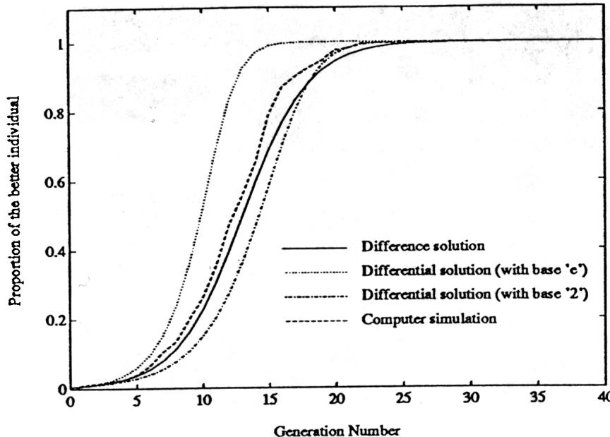
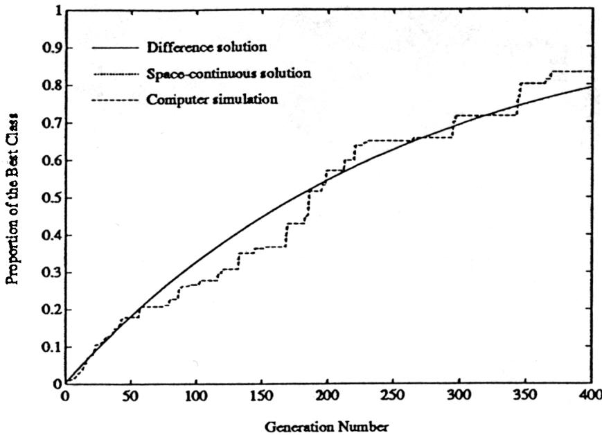
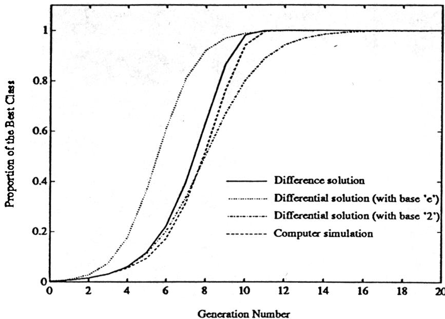
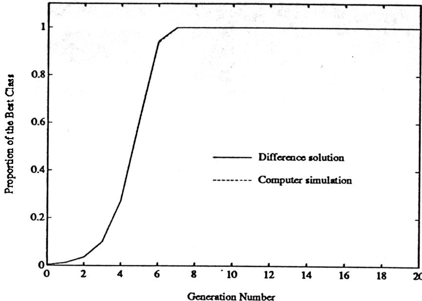
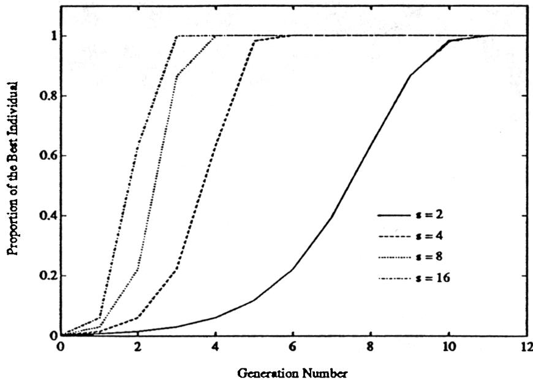
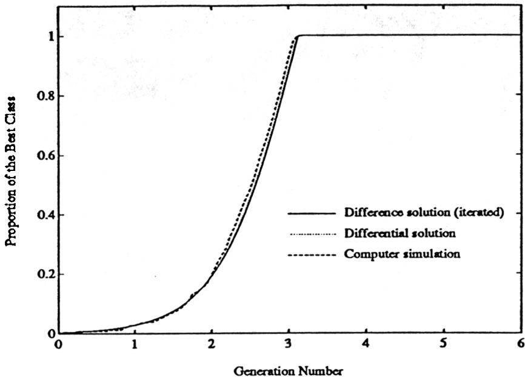
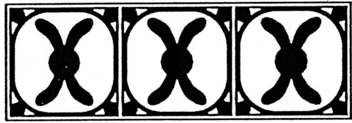

# A Comparative Analysis of Selection Schemes Used in Genetic Algorithms

# David E. Goldberg and Kalyanmoy Deb Department of General Engineering University of Illinois at Urbana-Champaign 117 Transportation Building 104 South Mathews Urbana, IL 61801-2996

# Abstract

This paper considers a number of selection schemes commonly used in modern genetic algorithms. Specifically, proportionate reproduction, ranking selection, tournament selection, and Genitor (or «steady state") selection are compared on the basis of solutions to deterministic difference or differential equations, which are verified through computer simulations. The analysis provides convenient approximate or exact solutions as well as useful convergence time and growth ratio estimates. The paper recommends practical application of the analyses and suggests a number of paths for more detailed analytical investigation of selection techniques.

Keywords: proportionate selection, ranking selection, tournament selection, Genitor, takeover time, time complexity, growth ratio.

# 1 Introduction

Many claims and counterclaims have been lodged regarding the superiority of this or that selection scheme in genetic algorithms (GAs), but most of these are based on limited (and uncontrolled) simulation experience; surprisingly little analysis has been performed to understand relative expected fitness ratios, convergence times, or the functional forms of selective convergence. This paper seeks to partially alleviate this dearth of quantitative information by comparing the expected performance of

# Goldberg and Deb

four commonly used selection schemes:

1. proportionate reproduction;   
2. ranking selection;   
3. tournament selection;   
4. Genitor (or "steady state") selection.

Specifically, deterministic finite difference equations are written that describe the change in proportion of different classes of individual, assuming fixed and identical objective function values within each class. These equations are solved explicitly or approximated in time using integrable ordinary differential equations. These solutions are shown to agree well with computer simulations, and linear ranking (Baker, 1985) and binary tournament selection (Brindle, 1981) are shown to give identical performance in expectation. Moreover, ranking and tournament selection are shown to maintain strong growth under normal conditions, while proportionate selection without scaling is shown to be less effective in keeping a steady pressure toward convergence. Whitley's (1989) Genitor or "steady state" (Syswerda, 1989) selection mechanism is also examined and found to be a simple combination of block death and birth via ranking. Analysis of this overlapping population scheme shows that the convergence results observed by Whitley may be most easily explained by the unusually high growth ratio Genitor achieves as compared to other schemes on a generational basis. The analysis also suggests that the premature convergence caused by imposing such high growth ratios is one of the reasons Genitor requires other fixes such as large population sizes or multiple populations.

In the remainder, the fundamental equation of population dynamics-the birth, life, and death equation-is described, and specific equations are written, solved, and compared to simulation results for each of the selection schemes. Different schemes are then compared and contrasted, and the use of these analyses in practical implementations is discussed. The paper concludes by briefly recommending more detailed stochastic analyses and another look at what the $\pmb { k }$ armed bandit problem can teach us about selection.

# 2 Selection: A Matter of Birth, Life, and Death

The derivation of Holland's (1975) schema theorem starts by calculating the expected number of copies of a schema under selection alone. The calculation is essentiallya continuity or conservation of individuals' relationships, where the sources and sinks of a particular class of individual are all accounted. Under selection alone, indi vid uals can only do one of three things: they may be born, they may live, or they may die. If we consider these events to be moved along synchronously, time step by time step, the following general birth, life, and death equation may be written:

$$
\begin{array} { r } { m _ { i , t + 1 } = m _ { i , t } + m _ { i , t , b } - m _ { i , t , d } , } \end{array}
$$

where $\textbf { \^ m }$ is the number of individuals, the subscript $\pmb { i }$ identifies the class of individual with common objective function value $f _ { i }$ the subscript $\pmb { t }$ is a time index (individual or generational), the subscript $\pmb { b }$ signifies individuals being born, the subscript $\pmb { d }$ signifies dying individuals, and the lack of a $\pmb { b }$ or a $\pmb { d }$ subscript signifies living individuals. In the usual nonoverlapping population model, the number of individuals dying in a generation is assumed to equal the number of living individuals, $m _ { i , t , d } = m _ { i , t }$ and the whole matter hinges around the number of births: $m _ { i , t + 1 } = m _ { i , t , b }$ . Careful consideration of birth, life, and death will become more important when we analyze an overlapping population model.

The analysis may also be performed by calculating the expected proportions $P _ { i , t + 1 }$ rather than absolute numbers $^ { m _ { i , t + 1 } }$

$$
P _ { i , t + 1 } = P _ { i , t } + P _ { i , t , b } - P _ { i , t , d } ,
$$

where the proportion $P$ is obtained by dividing the class count $_ { \pmb { m } }$ by the total number of individuals in the population at that time. Here the subscripts $\pmb { b }$ and $\pmb { d }$ are used as before to denote birth and death respectively.

In the sections that follow, specific equations are written and solved for each of the selection schemes mentioned above.

# 3 Proportionate Reproduction

The name proportionate reproduction describes a group of selection schemes that choose individuals for birth according to their objective function values $\pmb { f }$ In these schemes, the probability of selection $\pmb { p }$ of an individual from the ith class in the tth generation is calculated as

$$
p _ { i , t } = \frac { f _ { i } } { \sum _ { j = 1 } ^ { k } m _ { j , t } f _ { j } } ,
$$

where $\pmb { k }$ classes exist and the total number of individuals sums to $\pmb { n }$ . Various methods have been suggested for sampling this probability distribution, including Monte Carlo or roulette wheel selection (De Jong, 1975), stochastic remainder selection (Booker, 1982; Brindle, 1981), and stochastic universal selection (Baker, 1987; Grefenstette & Baker, 1989). As we are uninterested here in stochastic differences, these schemes receive identical analytical treatment when we calculate their expected performance.

If we consider a nonoverlap ping population of constant size $\pmb { n }$ and assume that $\pmb { n }$ selections are made each generation according to the distribution of equation 3, it is a straightforward matter to calculate the expected number of copies of the ith class in the next generation:

$$
\begin{array} { r c l } { { m _ { i , t + 1 } } } & { { = } } & { { m _ { i , t } \cdot n \cdot p _ { i , t } ; } } \\ { { } } & { { } } & { { } } \\ { { } } & { { } } & { { m _ { i , t } \frac { f _ { i } } { \tilde { f } _ { t } } ; } } \end{array}
$$

where $\bar { f } _ { t } = \sum m _ { i , t } f _ { i } / n$ is the average function value of the current generation. This equation may be written in proportion form by dividing by the population size:

$$
P _ { i , t + 1 } \quad P _ { i , t } \frac { f _ { i } } { \bar { f } _ { t } } .
$$

This equation is solved explicitly in the next section.

  
Figure 1: Various differential and difference equation solutions agree well with a representative computer simulation of proportionate reproduction using stochastic universal selection with two alternatives $( r \stackrel { - } { = } f _ { 1 } \stackrel { - } { / } f _ { 2 } = 1 . 5 )$ .

# Solving the proportionate reproduction equation

The proportionate reproduction equation (equation 5) may be solved quite directly after an interesting fact is noted. Imagine that a population of individuals grows according to the uncoupled, exponential growth equations: $m _ { i , t + 1 } = m _ { i , t } f _ { i }$ If the growth of the proportion of individuals is calculated by dividing through by the total population size at generation t + 1, we note that the resulting equation for the proportions is identical to that used under the assumption of a fixed population Size:

$$
P _ { i , t + 1 } \quad \frac { f _ { i } m _ { i , t } } { \sum _ { j } m _ { j , t + 1 } } \quad \frac { f _ { i } m _ { i , t } } { \sum _ { j } f _ { j } m _ { j , t } } = \frac { f _ { i } P _ { i , t } } { \sum _ { j } f _ { j } P _ { j , t } }
$$

Since the uncoupled equations may be solved directly $( m _ { i , t } = f _ { i } ^ { t } m _ { i , 0 } )$ the implied proportion equations can also be solved without regard for coupling. Substituting the expression for $\textbf { \^ m }$ at generation $\pmb { t }$ and dividing numerator and denominator through by the total population size at that time yields the exquisitely simple solution:

$$
P _ { i , t } = \frac { f _ { i } ^ { t } P _ { i , 0 } } { \sum _ { j } f _ { j } ^ { t } P _ { j , 0 } } .
$$

The solution at some future generation goes as the computation over a single generation except that power functions of the objective function values are used instead of the function values themselves. This solution agrees with Ankenbrandt's (1990) solution for k = 2, but the derivation of above is more direct and applies to k alternatives without approximation.

In a previous paper (Goldberg, 1989b), the solution to a differential equation approximation of equation 5 was developed for the two-alternative case. That solution, a solution of the same functional form using powers of 2 instead of $\pmb { e }$ , the solution of equation 7, and a representative computer simulation are compared in figure 1. A population size of $n = 2 0 0$ and fitness ratio $r = f _ { 1 } / f _ { 0 } = 1 . 5$ are used, and the simulation and solutions are initiated with a single copy of the better individual. The exact difference equation solution, the approximate solution with powers of 2, and the simulation result agree quite well; the approximate solution with powers of e converges too quickly, although all solutions are logistic as expected.

The exact solution (equation 7) may be approximated in space by treating the alternatives as though they existed over a one-dimensional continuum $\pmb { x }$ , relating positions in space to objective function values with a function $\pmb { f } ( \pmb { x } )$ Thus, we may solve for the proportion $P _ { I , t }$ of individuals between specified $\pmb { x }$ values $I = \{ x : a \leq$ ${ \pmb x } < b  \}$ at time $\pmb { t }$ as follows:

$$
P _ { I , t } = \frac { \int _ { a } ^ { b } f ^ { t } ( x ) p _ { 0 } ( x ) d x } { \int _ { - \infty } ^ { \infty } f ^ { t } ( x ) p _ { 0 } ( x ) d x } ,
$$

where ${ \pmb p } _ { 0 } ( { \pmb x } )$ is an appropriate initial density function.

# Two cases: a monomial and an exponential

In general, equation 8 is difficult to integrate analytically, but several special cases are accessible. Limiting consideration to the unit interval and restricting the density function to be uniformly random yields $p _ { 0 } ( { \pmb x } ) = 1$ . Thus, if $\int f ^ { t } ( x ) d x$ can be integrated analytically a time-varying expression for the proportion may be obtained. We consider two cases, $\pmb { f } ( \pmb { x } ) = \pmb { x } ^ { c }$ and $f ( x ) = e ^ { c x }$ t:

Consider the monomial first. Under the previous assumptions, equation 8 may be integrated with $f ( x ) = x ^ { c }$ and upper and lower limits of $\pmb { x }$ and ${ \pmb x } - { \pmb 1 } / n$ :

$$
P _ { I , t } = x ^ { c t + 1 } - ( x - 1 / n ) ^ { c t + 1 } .
$$

These limits parameterize individual classes on the variable $\pmb { x }$ where ${ \pmb x } = 1$ is the best individual and $\pmb { x } = 0$ is the worst, thereby permitting an approximation of the growth of an individual with specified rank in a population of size $\pmb { n }$ This space-continuous solution, the exact solution to the difference equation, and a representative computer simulation are compared in figure 2 for the linear objective function $\pmb { f } ( \pmb { x } ) = \pmb { x }$ The simulation and the discrete solution use $n = k = 2 5 6$ alternatives with one of each alternative at the start. It is interesting to note that the solutions to the difference equation and its space-continuous approximation are virtually identical, and both compare well to the representative simulation shown in the figure.

This analysis may be used to calculate the takeover time for the best individual. Setting $\pmb { x } = 1$ in equation 9, yields a space-continuous solution for the growth of

  
Figure 2: A comparison of the discrete difference equation solution, the approximate continuous solution, and a representative simulation of SUS proportionate reproduction for the function $\pmb { f } ( \pmb { x } ) = \pmb { x }$ shows substantial agreement between simulation and either model. The exact solution to the difference equation and the space-continuous solution are virtually identical.

the best class:

$$
P _ { t } ^ { * } = 1 - { \left( \frac { n - 1 } { n } \right) } ^ { c t + 1 }
$$

Setting tcontains roportion equal to best individuals, t $\frac { n - 1 } { n }$ , we calculatakeover time the time when the population ${ \pmb n } - { \pmb 1 }$ $t ^ { * }$

$$
c t ^ { * } + 1 = \frac { 1 } { 1 - \frac { \log ( n - 1 ) } { \log n } } .
$$

As the exponent on the monomial increases, the takeover time decreases correspondingly. This helps explain why a number of investigators have adopted polynomial scaling procedures to help speed GA convergence (Goldberg, $\bf { 1 9 8 9 a ) }$ . The expression $\frac { 1 } { 1 - \frac { \log ( n - 1 ) } { \log n } }$ 1 may be simplified at large $\pmb { n }$ Expanding $\log ( n - 1 )$ in a Taylor series about the value $\pmb { n }$ , keeping the first two terms, and substituting into the expression yields ${ \frac { 1 } { 1 - { \frac { \log ( n - 1 ) } { \log n } } } } \approx n \ln n$ the approximation improving with increasing $\pmb { n }$ . Using this approximation, we obtain the takeover time approximation

$$
t ^ { * } = \frac { 1 } { c } ( n \ln n - 1 )
$$

Thus, the takeover time for a polynomially distributed objective function is $O ( n \log { n } )$ It is interesting to compare this takeover time to that for an exponentially distributed (or exponentially scaled) function.

An exponential objective function may be considered similarly. Under the previous assumptions, equation 8 may be integrated using $\pmb { f } ( \pmb { x } ) = e ^ { c \pmb { x } }$ 1; and the same limits of integration as before:

$$
P _ { I , t } = \frac { e ^ { c x t } ( 1 - e ^ { - c t / n } ) } { e ^ { c t } - 1 } .
$$

Considering the best group (setting $\pmb { x } = 1$ ) and solving for the takeover time (the time when the proportion of the best group equals $\underline { { n } } _ { n } ^ { - 1 } \cdot )$ yields the approximate equation as follows:

$$
t ^ { * } = { \frac { 1 } { c } } n \ln n .
$$

It is interesting that under the unit interval consideration, both a polynomially distributed function and an exponentially distributed function have the same computational speed of convergence.

# 3.3 Time complexity of proportionate reproduction

The previous estimates give some indication of how long a G A will continue until it converges substantially. Here, we consider the time complexity of the selection algorithm itself per generation. We should caution that it is possible to place too much emphasis on the efficiency of implementation of a set of genetic operators. After all, in most interesting problems the time to evaluate the function is much greater than the time to iterate the genetics, $t _ { f } \gg t _ { g a }$ , and fiddling with operator time savings is unlikely to payoff. Nonetheless, if a more efficient operator can be used without much bother, why not do so?

Proportionate reproduction can be implemented in a number of ways. The simplest implementation (and one of the earliest to be used) is to simulate the spin of a weighted roulette wheel (Goldberg, $1 9 8 9 { \mathrm { a } } )$ . If the search for the location of the chosen slot is performed via linear search from the beginning of the list, each selection requires $O ( n )$ steps, because on average half the list will be searched. Overall, roulette wheel selection performed in this method requires $O ( n ^ { 2 } )$ steps, because in a generation $\pmb { n }$ spins are required to fill the population. Roulette wheel selection can be hurried somewhat, if a binary search (like the bisection method in numerical methods) is used to locate the correct slot. This requires additional memory locations and an $O ( n )$ sweep through the list to calculate cumulative slot totals, but overall the complexity reduces to $O ( n \log { n } )$ because binary search requires $O ( \log n )$ steps per spin and $\pmb { n }$ spins.

Proportionate reproduction can also be performed by stochastic remainder selection. Here the expected number of copies of a string is calculated as $m _ { i } = \frac { f _ { i } } { f }$ and the integer portions of the count are assigned deterministically. The remaind\~rs are then used probabilistically, to fill the population. If done without replacement, each remainder is used to bias the flip of a coin that determines whether the structure receives another copy or not. If done with replacement, the remainders are used to size the slots of a roulette wheel selection process. The algorithm without replacement is $O ( n )$ becau\~e the deterministic assignment requires only a single pass (after the calculation of $\bar { f }$ which is also $O ( n ) )$ , and the probabilistic assignment is likely to terminate in $O ( 1 )$ steps. On the other hand, the algorithm when performed

# Goldberg and Deb

with replacement takes on the complexity of the roulette wheel, because $O ( n )$ of the individuals are likely to have fractional parts to their $\pmb { m }$ values.

Stochastic universal selection is performed by sizing the slots of a weighted roulette wheel, placing equally spaced markers along the outside of the wheel, and spinning the wheel once; the number of copies an individual receives is then calculated by counting the number of markers that fall in its slot. The algorithm is $O ( n )$ because only a single pass is needed through the list after the sum of the function values is calculated.

# 4 Ranking Selection

Baker (1985) introduced the notion of ranking selection to genetic algorithm practice. The idea is straightforward. Sort the population from best to worst, assign the number of copies that each individual should receive according to a non-increasing assignment function, and then perform proportionate selection according to that assignment. Some qualitative theory regarding such schemes was presented by Grefenstette and Baker (1989), but this theory provides no help in evaluating expected performance. Here we analyze the performance of ranking selection schemes somewhat more quantitatively. A framework for analysis is developed by defining assignment functions and these are used to obtain difference equations for various ranking schemes. Simulations and various difference and differential solutions are then compared.

# 4.1 Assignment functions: a framework for the analysis of ranking

For some ranking scheme, we assume that an assignment function $\pmb { \alpha }$ has been devised that satisfies three conditions:

1. ${ \pmb { \alpha } } ( { \pmb x } ) \in R$ for ${ \boldsymbol { x } } \in \left[ 0 , 1 \right]$   
2. ${ \pmb { \alpha } } ( { \pmb x } ) \geq { \pmb 0 }$ .   
3. $\begin{array} { r } { \int _ { 0 } ^ { 1 } \alpha ( \eta ) d \eta = 1 } \end{array}$ .

Intuitively, the product ${ \pmb { \alpha } } ( { \pmb x } ) d { \pmb x }$ may be thought of as the proportion of individuals assigned to the proportion $\pmb { d x }$ of individuals who are currently ranked a fraction $\pmb { x }$ below the individual with best function value (here ${ \pmb x } = { \bf 0 }$ will be the best and $\pmb { x } = 1$ will be the worst to connect with Baker's formulation, even though this convention is the opposite of the practice adopted in section 3).

With this definition, the cumulative assignment function $\beta$ may be defined as the integral of the assignment from the best $( x = 0 )$ to a fraction $\pmb { x }$ of the current population:

$$
\beta ( x ) = \int _ { 0 } ^ { x } \alpha ( \eta ) d \eta .
$$

Analyzing the effect of ranking selection is now straightforward. Let $P _ { i }$ be the proportion of individuals who have function value better than or equal to $f _ { i }$ and let $Q _ { i }$ be the proportion of individuals who have function value worse than that same value. By the definitions above, the proportion of individuals assigned to the proportion $P _ { i , t }$ in the next generation is simply the cumulative assignment value of the current proportion:

$$
P _ { i , t + 1 } = \beta ( P _ { i , t } ) .
$$

The complementary proportion may be evaluated as well:

$$
Q _ { i , t + 1 } = 1 - \beta ( P _ { i , t } ) = 1 - \beta ( 1 - Q _ { i , t } ) .
$$

In either case, the forward proportion is only a function of the current value and has no relation to the proportion of other population classes. This contrasts strongly to proportionate reproduction, where the forward proportion is strongly influenced by the current balance of proportions and the distribution of the objective function itself. This difference is one of the attractions of ranking methods in that an controllable pressure can be maintained to push for the selection of better individuals. Analytically, the independence of forward proportion makes it possible to calculate the growth or decline of individuals whose objective function values form a convex set. For example, if $P _ { 1 }$ represents the proportion of individuals with function value greater than or equal to $f _ { 1 }$ and $Q _ { 2 }$ represents the proportion of individuals with proportion less than $f _ { 2 }$ the quantity $1 - P _ { 1 } - Q _ { 2 }$ is the proportion of individuals with function value between $f _ { 1 }$ and $f _ { 2 }$ -

# Linear assignment and ranking

The most common form of assignment function is linear: $\alpha ( x ) = c _ { 0 } - c _ { 1 } x$ Requiring a non-negative function with non-increasing values dictates that both coefficients be greater than zero and that ${ c _ { 0 } \geq c _ { 1 } }$ . Furthermore, the integral condition requires that $c _ { 1 } = 2 ( c _ { 0 } - 1 )$ Integrating $\pmb { \alpha }$ yields $\beta ( x ) = c _ { 0 } x - ( c _ { 0 } - 1 ) x ^ { 2 }$ Substituting the cumulative assignment function into equation 16 yields the difference equation

$$
P _ { i , t + 1 } = P _ { i , t } \left[ c _ { 0 } - ( c _ { 0 } - 1 ) P _ { i , t } \right] .
$$

The equation is the well known logistic difference equation; however, the restrictions on the parameters preclude any of its infamous chaotic behavior, and its solution must stably approach the fixed point $P _ { i } = 1$ as time goes on.

In general, equation 18 has no convenient analytical solution (other than that obtained by iterating the equation), but in one special case a simplified solution can be derived. When $\pmb { c _ { 0 } } = \pmb { c _ { 1 } } = \pmb { 2 }$ , the complementary equation simplifies as follows:

$$
Q _ { i , t + 1 } = 1 - \beta ( 1 - Q _ { i , t } ) = Q _ { i , t } ^ { 2 } .
$$

Sol ving for $\boldsymbol { Q }$ at generation $t$ yields the following:

$$
Q _ { i , t } = Q _ { i , 0 } ^ { 2 ^ { t } } .
$$

Since $Q = 1 - P$ the solution for $P _ { - }$ may be obtained directly as

$$
P _ { i , t } = 1 - ( 1 - P _ { i , 0 } ) ^ { 2 ^ { \prime } }
$$

Calculating the takeover time by substituting initial and final proportions of $\frac { 1 } { n }$ and!! $\frac { n - 1 } { n }$ respectively and simplifying yields the approximate equation $t ^ { * } = \log n +$ $\log ( \left. \ddot { n } \right)$ , where log is taken base 2 and In is the usual natural logarithm.

# Goldberg and Deb

Other cases of linear ranking may be evaluated by turning to the type of differential equation analysis used elsewhere (Goldberg, 1989b). Approximating the finite difference by its derivative in one step yields the logistic differential equation

$$
\frac { d P _ { i } } { d t } = c P _ { i } ( 1 - P _ { i } ) ,
$$

where $c = c _ { 0 } - 1$ Solving by elementary means, we obtain the solution

$$
P _ { i , t } = \frac { 1 } { 1 + \frac { 1 - P _ { i , 0 } } { P _ { i , 0 } } e ^ { - c t } } .
$$

The solution overpredicts proportion early on, because of the error made by approximating the difference by the derivative. This error can be corrected approximately by using 2 in place of e in equation 23. In either approximation the takeover time may be calculated in a straightforward manner:

$$
t ^ { * } = \frac { 2 } { c } \log ( n - 1 ) ,
$$

where the logarithm should be taken base e in the case of the first approximation and base 2 in the case of the second.

The two differential equation solutions, the exact solution to the difference equation, and a representative simulation using stochastic universal selection are shown in figure 3 for the case of linear ranking with $\mathbf { { c } _ { 0 } } = \mathbf { { c } _ { 1 } } = \mathbf { 2 } $ Here a population of size $\pmb { n = 2 5 6 }$ is started with a single copy of the best individual. The difference equation solution and the simulation are very close to one another as expected. The differential equation approximations have the correct qualitative behavior, but the solution using e converges too rapidly, and the solution using 2 agrees well early on but takes too long once the best constituents become a significant proportion of the total population.

# 4.3 Time complexity of ranking procedures

Ranking is a two-step process. First the list of individuals must be sorted, and next the assignment values must be used in some form of proportionate selection. The calculation of the time complexity of ranking requires the consideration of these separate steps.

Sorting can be performed in $O ( n \log { n } )$ steps, using standard techniques. Thereafter, we know from previous results that proportionate selection can be performed in something between $O ( n )$ and $O ( n ^ { 2 } )$ Here, we will assume that a method no worse than $O ( n \log { n } )$ is adopted, concluding that ranking has time complexity $O ( n \log { n } )$

# 5 Tournament Selection

A form of tournament selection attributed to unpublished work by Wetzel was studied in Brindle's (1981) dissertation, and more recent studies using tournament schemes are found in a number of works (Goldberg, Korb, & Deb, 1989; Muhlenbein, 1990; Suh & Van Gucht, 1987). The idea is simple. Choose some number of individuals randomly from a population (with or without replacement), select the best individual from this group for further genetic processing, and repeat as often as desired (usually until the mating pool is filled). Tournaments are often held between pairs of individuals (tournament size $s = 2$ ), although larger tournaments can be used and may be analyzed. We start our analysis by considering the binary case and later extend the analysis to general $\pmb { s }$ -ary tournaments.

  
Figure 3: The proportion of individuals with best objective function value grows a.s a logistic function of generation under ranking selection. A representative simulation using linear ranking and stochastic universal selection agrees well with the exact difference equation solution ( $\begin{array} { r } { { \bf \Psi } ( c _ { 0 } = c _ { 1 } = 2 ) \qquad } \end{array}$ . The differential equation approximations are too rapid or too slow depending upon whether exponentiation is performed base e or base 2.

# Binary tournaments: s 2

Here we analyze the effect of a probabilistic form of binary tournament selection.2 In this variant, two individuals are chosen at random and the better of the two individuals is selected with fixed probability $p , 0 . 5 < p \leq 1$ . Using the notation of section 4, we may calculate the proportion of individuals with function value better than or equal to $f _ { i }$ the proportion at the next generation quite simply:

$$
P _ { i , t + 1 } = p [ 2 P _ { i , t } ( 1 - P _ { i , t } ) + P _ { i , t } ^ { 2 } ] + ( 1 - p ) P _ { i , t } ^ { 2 } .
$$

Collecting terms and simplifying yields the following:

$$
\begin{array} { r l } { P _ { i , t + 1 } } & { { } 2 p P _ { i , t } \quad ( 2 p \quad 1 ) P _ { i , t } ^ { 2 } . } \end{array}
$$

# Goldberg and Deb

Letting ${ \bf 2 } p = { \bf c } _ { 0 }$ o and comparing to equation 18, we note that the two equations are identical. This is quite remarkable and says that binary tournament selection and linear ranking selection are identical in expectation. The solutions of the previous section all carry forward to the case of binary tournament selection as long as the coefficients are interpreted properly ( ${ \bf \dot { 2 } } p = { \bf c } _ { 0 }$ and $c = 2 p - 1 )$ .

Simulations of tournament selection agree well with the appropriate difference and differential equation solutions, but we do not examine these results here, because the analytical models are identical to those used for linear ranking, and the tournament selection simulation results are very similar to those presented for linear ranking. Instead, we consider the effect of using larger tournaments.

# 5.2 Larger tournaments

To analyze the performance of tournament selection with any size tournament, it is easier to consider the doughnut hole (the complementary proportion) rather than the doughnut itself (the primary proportion). Considering a deterministic tournament3 of size s and focusing on the complementary proportion $Q _ { i }$ a single copy will be made of an individual in this class only when all $\pmb { s }$ individuals in a competition are selected from this same lowly group:

$$
Q _ { i , t + 1 } = Q _ { i , t } ^ { s } ,
$$

from which the solution follows directly:

$$
Q _ { i , t } = Q _ { i , 0 } ^ { s ^ { t } } .
$$

Recognizing that $P _ { i } = 1 { - } Q _ { i }$ we may solve for the primary proportion of individuals as follows:

$$
P _ { i , t } = 1 - ( 1 - P _ { i , 0 } ) ^ { s ^ { \prime } }
$$

Solving for the takeover time yields an asymptotic expression that improves with.. Increasmg $\pmb { n }$

$$
t ^ { * } = \frac { 1 } { \ln s } [ \ln n + \ln ( \ln n ) ] .
$$

This equation agrees with the previous calculation for takeover time in the $\textstyle { c _ { 0 } = 2 }$ solution to linear ranking selection when $s = 2$ . Of course, binary tournament selection and linear ranking selection ( $( c _ { 0 } = 2 )$ ) are identical in expectation, and the takeover time estimates should agree.

The difference equation model and a representative computer simulation are compared in figure 4 for a tournament of size $s \ : = \ : 3$ . As before, a solution and a representative simulation are run with $n = k = 2 5 6$ , starting with a single copy of each alternative. The representative computer simulation shown in the figure matches the difference equation solution quite well.

Figure 5 compares the growth of the best individual starting with a proportion $\frac { 1 } { 2 5 6 }$ using tournaments of sizes ${ \mathfrak { s } } = 2$ , 4, 8, 16. Note that as the tournament size increases, the convergence time is cut by the ratio of the logarithms of the tournament sizes as predicted.

# A Comparative Analysis of Selection Schemes

  
Figure 4: A comparison of the difference equation solution and a representative computer simulation with a ternary tournament (s = 3) demonstrates good agreement.

# Time complexity of tournament selection

The calculation of the time complexity of tournament selection is straightforward. Each competition in the tournament requires the random selection of a constant number of individuals from the population. The comparison among those individuals can be performed in constant time, and n such competitions are required to fill a generation. Thus, tournament selection is $O ( n )$ .

We should also mention that tournament selection is particularly easy to implement in parallel. All the complexity estimates given in this paper have been for operation on a serial machine, but all the other methods discussed in the paper are difficult to parallelize, because they require some amount of global information. Proportionate selection requires the sum of the function values. Ranking selection (and Genitor, as we shall soon see) requires access to all other individuals and their function values to achieve global ranking. On the other hand, tournament selection can be implemented locally on parallel machines with pairwise or s-wise communication between different processors the only requirement. Muhlenbein (1989) provides a good example of a parallel implementation of tournament selection. He also claims to achieve niching implicitly in his implementation, but controlled experiments demonstrating this claim were not presented nor were analytical results given to support the observation. Some caution should be exercised in making such claims, because the power of stochastic errors to cause a population to drift is quite strong and is easy to underestimate. Nonetheless, the demonstration of an efficient parallel implementation is useful in itself.

# Goldberg and Deb

  
Figure 5: Growth of the proportion of best individual versus generation is graphed for a number of tournament sizes.

# 6 Genitor

In this section, we analyze and simulate the selection method used in Genitor (Whitley, 1989). Our purpose is twofold. First, we would like to give a quantitative explanation of the performance Whitley observed in using Genitor, thereby permitting comparison of this technique to others commonly used. Second, we would like to demonstrate the use of the analysis methods of this paper in a somewhat involved, overlapping population model, thereby lighting a path toward the analysis of virtually any selection scheme.

Genitor works individual by individual, choosing an offspring for birth according to linear ranking, and choosing the currently worst individual for replacement. Because the scheme works one by one it is difficult to compare to generational schemes, but the comparison can and should be made.

# 6.1 An analysis of Genitor

We use the symbol $\pmb { \tau }$ to denote the individual iteration number and recognize that the generational index may be related to $\pmb { \tau }$ as ${ \pmb t } = { \pmb \tau } / n$ Under individual-wise linear ranking the cumulative assignment function $\beta$ is the same as before, except that during each assignment we only allocate a proportion $1 / n$ of the population (a single individual). For block death, the worst individual (the individual with rank between \~ and one) will lose a proportion \~ of his current total. Recognizing that the best individual never loses until he dominates the population, it is a straightforward matter to write the birth, life, and death equation for an iteration of the ith class:

  
Figure 6: Comparison of the differen<;e equation solution, differential equation solution, and computer simulations of Genitor for the function $\pmb { f } ( \pmb { x } ) = \pmb { x } ,$ , $n = k = 2 5 6$ . Linear ranking with $c _ { 0 } = 2$ is used, and the individual iteration number $( \tau )$ has been divided by the population size to put the computations in terms of generations. Solutions to the difference and differential equations are so close that they appear as a single line on the plot, and both compare well to the representative computer simulation shown.

$$
P _ { i , \tau + 1 } = \left\{ \begin{array} { c l } { P _ { i , \tau } + \beta ( P _ { i , \tau } ) / n , } & { \mathrm { ~ i f ~ } P _ { i , \tau } \leq \frac { n - 1 } { n } ; } \\ { P _ { i , \tau } + \beta ( P _ { i , \tau } ) / n - ( P _ { i , \tau } - \frac { n - 1 } { n } ) , } & { \mathrm { ~ o t h e r w i s e . } } \end{array} \right.
$$

A simplified exact solution of this equation (other than by iteration) is nontrivial. Therefore, we approximate the solution by subtracting the proportion at generation $\pmb { \tau }$ from both sides of the equation, thereafter approximating the finite difference by a time derivative. The resulting equation is logistic in form and has the following solution:

$$
P _ { t } = \frac { c _ { 0 } P _ { 0 } e ^ { c _ { 0 } t } } { c _ { 0 } + ( c _ { 0 } - 1 ) P _ { 0 } ( e ^ { c _ { 0 } t } - 1 ) } .
$$

Note that the class index i has been dropped and that the solution is now written in terms of the generational index $\pmb { t }$ enabling direct comparisons to other generational schemes. The difference equation (iterated directly), the differential equation solution, and a representative computer simulation are compared in figure 6, a graph of the proportion of the best individual $( n = k = 2 5 6 )$ versus generation. It is interesting that the solution appears to follow exponential growth that is terminated when the population is filled with the best individual. The solution is logistic, but its fixed point is time any signific $\begin{array} { r } { P = \frac { c _ { 0 } } { 1 - c _ { 0 } } } \end{array}$ which can be no less than 2 c slowing in the rate of conver $\mathbf { ( 1 < } c _ { 0 } \leq 2 )$ Thus, by thes, the solution has already crashed into the barrier at $P = 1$ .

# Goldberg and Deb

To compare this scheme to other methods, it is useful to calculate the free or early growth rate. Considering only linear terms in the difference equation, we obtain PT+l = (1 + \~ )PT. Over a generation n individual iterations are performed, obtaining Pn = (1 + \~)n Po, which approaches ecopo for moderate to large n. Thus we note an interesting thing. Even if no bias is introduced in the ranked birth procedure (if Co = 1), Genitor has a free growth factor that is no less than e. In other words, unbiased Genitor pushes harder than generation-based ranking or tournament selection, largely a result of restricting death to the worst individual. When biased ranking (co> 1) is used, Genitor pushes very hard indeed. For example, with Co = 2, the selective growth factor is e2 = 1.389. Such high growth rates can cover a host of operator losses, recalling that the net growth factor / is the product of the growth factor obtained from selection alone 4> and the schema survival probability obtained by subtracting operator losses from one:

$$
\gamma = \phi \left[ 1 - \epsilon \right] ,
$$

where { = LIP {IP, the sum of the operator disruption probabilities. For example, with Co = 2 and 4> = 7.389, Genitor can withstand an operator loss of $\begin{array} { r } { \dot { \epsilon } = 1 - \frac { 1 } { 7 . 3 8 9 } = 0 . 8 6 5 } \end{array}$ = 0.865; such an allowable loss would permit the growth of building blocks wltt8aefining lengths roughly 87% of string length. Such large permissible errors, however, come at a cost of increased premature convergence, and we speculate that it is precisely this effect that motivated Whitley to try large population sizes and multiple populations in a number of simulations. Large sizes slow things down enough to permit the growth and exchange of multiple building blocks. Parallel populations allow the same thing by permitting the rapid growth of the best building blocks within each subpopulation, with subsequent exchanges of good individuals allowing the cross of the best bits and pieces from each subpopulation. U nfortunately, neither of these fixes is general, because codings can always be imagined that make it difficult to cut and splice the correct pieces. Thus, it would appear that there still is no substitute for the formation and exchange of tight building blocks.

Moreover, we find no support for the hypothesis that there is something special about overlapping populations. This paper has demonstrated conclusively that high growth rates are acting in Genitor; this factor alone can account for the observed results, and it should be possible to duplicate Whitley's results through the use of any selection scheme with equivalent duplicative horsepower. We have not performed these experiments, but the results of this paper provide the analytical tools necessary to carry out a fair comparison. Exponential scaling with proportionate reproduction, larger tournaments, or nonlinear ranking should give results similar to Genitor, if similar growth ratios are enforced and all other operators and algorithm parameters are the same.

# Genitor's takeover time and time complexity 6.2

The takeover time may be approximated. Since Genitor grows exponentially until the population is filled, the takeover time may be calculated from the equation !!.=!. = l-ecot.. Solving for the takeover time yields the following equation:

$$
t ^ { * } \quad \frac { 1 } { c _ { 0 } } \ln ( n - 1 ) .
$$

# A Comparative Analysis of Selection Schemes

Table 1: A Comparison of Three Growth Ratio Measures   

<table><tr><td>SCHEME</td><td>④t</td><td>φe</td><td>φ1</td></tr><tr><td>Proportionate</td><td>$\fra}$</td><td>$\frac {{  }$</td><td>\1 $\{\qr{{2}$</td></tr><tr><td>Linear ranking</td><td>co -(co - 1)P</td><td>co</td><td>co+1}$ $2p^fra{{+ 1}$</td></tr><tr><td>Tournament, P</td><td>2p-(2p-1)P</td><td>2p</td><td>2</td></tr><tr><td>Tournament, s</td><td>∑i=1 () )pi-1(1 P){-</td><td>s</td><td>2(1-2-s)</td></tr><tr><td>Genitor</td><td>no closed form in t</td><td>eco</td><td>e0.5(co+1)</td></tr></table>

The time complexity of Genitor may also be calculated. Once an initial ranking is established, Genitor does not need to completely sort the population again. Each generated individual is simply inserted in its proper place; however, the search for the proper place requires O(logn) steps if a binary search is used. Moreover, the selection of a single individual from the ranked list can also be done in O(log n) steps. Since both of these steps must be performed n times to fill an equivalent population (for comparison with the generation-based schemes), the algorithm is clearly $O ( n \log { n } )$

Next, we cross-compare different schemes on the basis of early and late growth ratios, takeover times, and time complexity computations for the selection algorithms themselves.

# 7 Selection Procedures Head to Head

In this section, we gather the growth ratios, takeover times, and time complexity calculations for each of the selection mechanisms to permit a side-by-side comparison.

# Growth ratios due to selection

The analyses of the previous section permit the comparison of the selection methods on the basis of their expected growth ratio for members of the best class. Specifically, we compare three values: the growth ratio at generation t, \$t = Pi+1/Pi, the darly (or free) ratio . defined as the growth ratio when the proportion of individuals is insubstantial (when P\* ≈ 0), and the late (or constrained) ratio \$1 defined das the growth ratio when the best occupy 50% of the population and the remainder of the population is occupied by second-best structures. Table 1 compares each of the schemes on the basis of these three growth ratio measures. As we can see, proportionate selection is dependent on the objective function used, and the early growth ratio is likely to be quite high, and the late growth ratio is likely to be quite low. It is exactly this efect that has caused researchers to turn to scaling techniques and ranking methods. The results presented in section 3 using an exponential function are interesting and seem to recommend the use of an exponential scaling function to control the degree of competition. The c coefficient may be used in a manner similar to the inverse of temperature in simulated annealing to control the

# Goldberg and Deb

Table 2: A Comparison of Takeover Time Values   

<table><tr><td>SCHEME</td><td>t*</td></tr><tr><td>Proportionate xc</td><td>${(nlnn-1)</td></tr><tr><td>Proportionate ecx</td><td>\ln</td></tr><tr><td>Linear ranking co = 2</td><td>logn + log(ln n)</td></tr><tr><td>Linear ranking (diff. eq.)</td><td>2 log(n - 1), co-1</td></tr><tr><td>Tournament p</td><td>same as linear ranking with co = 2p</td></tr><tr><td>Tournament s Genitor</td><td>ns[lnn+ ln(n n)] $\f{(n -1)</td></tr></table>

accentuation of salient features (Goldberg, 1990).

As was mentioned earlier, linear ranking and binary tournament selection agree in expectation, both allowing early growth ratios of between one and two, depending on the adjustment of the appropriate parameter $\left( c _ { 0 } \circ \pmb { p } \right)$ . Both achieve late ratios between 1 and 1.5. Tournament selection can achieve higher growth ratios with larger tournament sizes; the same effect can be achieved in ranking selection with nonlinear ranking functions, although we have not investigated these here. Genitor achieves early ratios between $\pmb { e } .$ and $e ^ { 2 }$ , and it would be interesting to compare Genitor selection with tournament selection or ranking selection with appropriate tournament size or appropriate nonlinear assignment function.

# Takeover time comparison

Table 2 shows the takeover times calculated for each of the selection schemes. Other than the proportionate scheme, the methods compared in this paper, all converge in something like $O ( \log n )$ generations. This, of course, does not mean that real GAs converge to global optima in that same time. In the setting of this paper, where we are doing nothing more than choosing the best from some fixed population of structures, we get convergence to the best. In a real GA, building blocks must be selected and juxtaposed in order to get copies of the globally optimal structure, and the variance of building block evaluation is a substantial barrier to convergence. Nonetheless, the takeover time estimates are useful and will give some idea how long a G A can be run before mutation becomes the primary mechanism of exploration.

# Time complexity comparison

Table 3 gathers the time complexity calculations together. The best of the methods are $O ( n )$ and it is difficult to imagine how fewer steps can be used since we must select $\pmb { n }$ individuals in some manner. Of the $O ( n )$ methods, tournament selection is the easiest to make parallel, and this may be its strongest recommendation, as GAs cry out for parallel implementation, even though most of us have had to make do with serial versions. Whether paying the $O ( n \log { n } )$ price of Genitor is worth its somewhat higher later growth ratio is unclear, and the experiments recommended earlier should be performed. Methods with similar early growth ratios and not-toodifferent late growth ratios should perform similarly. Any such comparisons should be made under controlled conditions where only the selection method is varied, however.

Table 3: A Comparison of Selection Algorithm Time Complexity   

<table><tr><td colspan="2">SCHEME</td><td>TIME COMPLEXITY</td></tr><tr><td>Roulette wheel proportionate</td><td></td><td>O(n{2</td></tr><tr><td>RW proportionate w/binary search</td><td></td><td>O(nlogn)</td></tr><tr><td>Stochastic remainder proportionate Stochastic universal proportionate</td><td></td><td>O(n)</td></tr><tr><td></td><td>Ranking</td><td>O(n)</td></tr><tr><td></td><td></td><td>O(n ln n)+ time of selection</td></tr><tr><td></td><td>Tournament Selection Genitor w/binary search</td><td>O(n) O(n logn)</td></tr></table>

# 8 Selection: What Should We Be Doing?

This paper has taken an unabashedly descriptive viewpoint in trying to shed some analytical light on various selection methods, but the question remains: how should we do selection in GAs? The question is a difficult one, and despite limited empirical success in using this method or that, a general answer remains elusive.

Holland's connection (1973, 1975) of the $\pmb { k }$ -armed bandit problem to the conflict between exploration and exploitation in selection still stands as the only sensible theoretical abstraction of the general question, despite some recent criticism (Grefenstette & Baker, 1989). Grefenstette and Baker challenge the $\pmb { k }$ armed model by posing a partially deceptive function, thereafter criticizing the abstraction because the GA does not play the deceptive bits according to the early function value averages. The criticism is misplaced, because it is exactly such deceptive functions that the G A must playas a higher-order bandit (in a 3-bit deceptive subfunction, the GA must play the bits as an eight-armed bandit) and the schema theorem says that it will do so if the linkage is sufficiently tight. In other words, GAs will play the bandit problems at as high a level as they can (or as high a level as is necessary), and it is certainly this that accounts at least partially for the remarkable empirical success that many of us have enjoyed in using simple GAs and their derivatives.

Moreover, dismissing the bandit model is a mistake for another reason, because in so doing we lose its lessons about the effect of noise on schema sampling. Even in easy deterministic problems-problems such as $\textstyle \sum _ { i } a _ { i } x _ { i } + b , a _ { i } , b \in { \overline { { R } } } ,$ and $\pmb { x _ { i } } \in$ $\{ 0 , 1 \}$ -GAs can make mistakes, because alleles with small contribution to objective function value (alleles with small $\pmb { a _ { i } }$ ) get fixed, a result of early spurious associations with other highly fit alleles or plain bad luck. These errors can occur, because the variation of other alleles (the sampling of the $\ast \boldsymbol { \mathbf { \mathit { s } } }$ in schemata such as $^ { \ast \ast _ { 1 } \ast \ast } )$ is a source of noise as far as getting a particular allele set properly is concerned. Early on this noise is very high (estimates have been given in Goldberg, Korb, $\pmb { \& }$ Deb, 1989), and only the most salient building blocks dare to become fixed. This fixation reduces the variance for the remaining building blocks, permitting less salient alleles

# Goldberg and Deb

or allele combinations to become fixed properly. Of course, if along the way down this salience ladder, the correct building blocks have been lost somehow (through spurious linkage or cumulative bad luck), we must wait for mutation to restore them. The waiting time for this restoration is quite reasonable for low-order schemata but grows exponentially as order increases.

Thinking of the convergence process in this way suggests a number of possible ways to balance or overcome the conflict between exploration and exploitation:

.Use slow growth ratios to prevent premature convergence.   
.Use higher growth ratios followed by building block rediscovery through mutation.   
.Permit localized differential mutation rates to permit more rapid restoration of building blocks.   
.Preserve useful diversity temporally through dominance and diploidy.   
.Preserve useful diversity spatially through niching.   
.Eliminate building block evaluation noise altogether through competitive templates.

Each of these is examined in somewhat more detail in the remainder of the section.

One approach to obtaining correct convergence might be to slow down convergence enough so that errors are rarely made. The two-armed bandit convergence graphs presented elsewhere (Goldberg, 1989a) suggest that using convergence rates tuned to building blocks with worst function-difference-to-noise-ratio is probably too slow to be practical, but the idea of starting slowly and gradually increasing the growth ratios makes some sense in that salient building blocks will be picked off with a minimum of pressure on not-so-salient allele combinations. This is one of the fundamental ideas of simulated annealing, but simulated annealing suffers from its lack of a population and its lack of interesting discovery operators such as recombination. The connection between simulated annealing and GAs has become clearer recently (Goldberg, 1990) through the invention of Boltzmann tournament selection. This mechanism stably achieves a Boltzmann distribution across a population of strings, thereby allowing a controllable and stable distribution of points to be maintained across both space and time. More work is necessary, but the use of such a mechanism together with well designed annealing schedules should be helpful in controlling GA convergence. As was mentioned in the paper, similar mechanisms can also be implemented under proportionate selection through the use of exponential scaling and sharing functions.

The opposite tack of using very high growth ratios permits good convergence in some problems by grabbing those building blocks you can get as fast as you can, thereafter restoring the missing building blocks through mutation (this appears to be the mechanism used in Genitor). This works fine if the problems are easy (if simple mutation can restore those building blocks in a timely fashion), and it also explains why Whitley has turned to large populations or multiple populations when deceptive problems were solved (L. Darrell Whitley, personal communication, September, 1989). The latter applications are suspect, because waiting for highorder schemata to be rediscovered through mutation or waiting for crossover to splice together two intricately intertwined deceptive building blocks are both losing propositions (they are low probability events), and the approach is unlikely to be practical in gener\~l.

It might be possible to encourage -more timely restoration of building blocks by having mutation under localized genic control, however. The idea is similar to that used in Bowen (1986), where a set of genes controlled a chromosome's mutation and crossover rates, except that here a large number of mutation-control genes would be added to give differential mutation rates across the chromosome. For example, a set of genes dictating high $( p _ { m } \approx 0 . 5 )$ or low $( p _ { m } \approx 0 )$ mutation rate could be added to control mutation on function-related genes (a fixed mutation rate could be used on the mutation-control genes). Early on salient genes could achieve highest function value by fixing the correct function-related allele and fixing the associated mutation-control allele in the low position. At the same time, poor alleles would be indifferent to the value of their mutation allele, and the presence of a number of mutation-control genes set to the high allele would ensure the generation of a significant proportion of the correct function-related alleles when those poorer alleles become salient.

This mechanism is not unlike that achieved through the use of dominance and diploidy as has been explored elsewhere (Goldberg & Smith, 1987; Smith, 1988). Simply stated, dominance and diploidy permit currently out-of-favor alleles to remain in abeyance, sampling currently poorer alleles at lower rates, thereby permitting them to be brought out of abeyance quite quickly when the environment is favorable. Some consideration needs to be given toward recalling groups of alleles together, rather than on the allele-by-allele basis tried thus far (the same comment applies to the localized mutation scheme suggested in the previous paragraph), but the notion of using the temporal recall of dominance and diploidy to handle the nonstationarity of early building block sampling appears sound.

The idea of preserving useful diversity temporally helps recall the notion of diversity preservation spatially (across a population) through the notion of niching (Deb, 1989; Deb & Goldberg, 1989; Goldberg & Richardson, 1987). If two strings share some bits in common (those salient bits that have already been decided) but they have some disagreement over the remaining positions and are relatively equal in overall function value, wouldn't it be nice to make sure that both get relatively equal samples in the next and future generations. The schema theorem says they will (in ex.pectation), but small population selection schemes are subject to the vagaries of genetic drift (Goldberg & Segrest, 1987). Simply stated, small stochastic errors of selection can cause equally good alternatives to converge to one alternative or another. Niching introduces a pressure to balance the subpopulation sizes in accordanc'e with niche function value. The use of such niching methods can form an effective pressure to maintaining useful diversity across a population, allowing that diversity to be crossed with other building blocks, thereby permitting continued exploration.

The first five suggestions all seek to balance the conflict between exploration and exploitation, but the last proposal seeks to eliminate the conflict altogether. The elimination of building block noise sounds impossible at first glance, but it is exactly the approach taken in messy genetic algorithms (Goldberg, Deb, & Korb, 1990; Goldberg & Kerzic, 1990; Goldberg, Korb, & Deb, 1990). Messy GAs (mGAs) grow

# Goldberg and Deb

long strings from short ones, but so doing requires that missing bits in a problem of fixed length be filled in. Specifically, partial strings of length $\pmb { k }$ (possible building blocks) are overlaid with a competitive temp/ate, a string that is locally optimal at the level $\pmb { k } - \pmb { 1 }$ (the competitive template may be found using an mGA at the lower level). Since the competitive template is locally optimal, any string that gets a value in excess of the template contains a $\pmb { k }$ -order building block by definition. Moreover, this evaluation is without noise (in deterministic functions), and building blocks can be selected deterministically without fear; simple binary tournament selection has been used as one means of conveniently doping the population toward the best building blocks. Some care must be taken to compare related building blocks to one another, lest errors be made when subfunctions are scaled differently. Also, some caution is required to prevent hitchhiking of wrong (parasitic) incorrect bits that agree with the template but later can prevent expression of correct allele combinations. Reasonable mechanisms have been devised to overcome these difficulties, however, and in empirical tests mGAs have always converged to global optima in a number of provably deceptive problems. Additionally, mGAs have been shown to converge in time that grows as a polynomial function of the number of decision variables on a serial machine and as a logarithmic function of the number of decision variables on a parallel machine. It is believed that this convergence is correct (the answers are global) for problems of bounded deception. More work is required here, but the notion of strings that grow in complexity to more completely solve more difficult problems has a nice ring to it if we think in terms of the way nature has filled this planet with increasingly complex organisms.

In addition to trying these various approaches toward balancing or overcoming the conflict of exploration and exploitation, we must not drop the ball of analysis. The methods of this paper provide a simple tool to better understand the expected behavior of selection schemes, but better probabilistic analyses using Markov chains (Goldberg & Segrest, 1987), Markov processes, stochastic differential and difference equations, and other techniques of the theory of stochastic processes should be tried with an eye toward understanding the variance of selection. Additionally, increased study of the $\pmb { k }$ -armed bandit problem might suggest practical strategies for balancing the conflicts of selection when they arise. Even though conflict can apparently be sidestepped in deterministic problems using messy G As, eventually we must return to problems that are inherently noisy, and the issue once again becomes germane.

# 9 Conclusions

This.paper has compared the expected behavior of four selection schemes on the basis of their difference \~uations, solutions to those equations (or related differential equation approximations), growth ratio estimates, and takeover time computations. Proportionate selection is found to be significantly slower than the other three types. Linear ranking selection and a probabilistic variant of binary tournament selection have been shown to have identical performance in expectation, with binary tournament selection preferred because of its better time complexity. Genitor selection, an overlapping population selection scheme, has been analyzed and compared to the others and tends to show a higher growth ratio than linear ranking or binary tournament selection performed on a generation-by-generation basis. On the other hand, tournament selection with larger tournament sizes or nonlinear ranking can give growth ratios similar to Genitor, and such apples-to-apples comparisons have been suggested.

Additionally, the larger issue of balancing or overcoming the conflict of exploration and exploitation inherent in selection has been raised. Controlling growth ratios, localized differential mutation, dominance and diploidy, nic.hing, and messy GAs (competitive templates) have been discussed and will require further study. Additional descriptive and prescriptive theoretical work has also been suggested to further understanding of the foundations of selection. Selection is such a critical piece of the G A puzzle that better understanding at its foundations can only help advance the state of genetic algorithm art.

# Acknowledgments

This material is based upon work supported by the National Science Foundation under Grant CTS-8451610. Dr. Goldberg gratefully acknowledges additional support provided by the Alabama Research Institute, and Dr. Deb's contribution was performed while supported by a University of Alabama Graduate Council Research Fellowship.

# Список литературы

Ankenbrandt, C. A. (1990). An extension to the theory of convergence and a proof of the time complexity of genetic algorithms (Technical Report CS/CIAKS90-0010/TU) New Orleans: Center for Intelligent and Knowledge-based Systems, Tulane University.

Baker, J. E. (1985). Adaptive selection methods for genetic algorithms. Proceedings of an International Conference on Genetic Algorithms and Their Applications, 100- 111.

Baker, J. E. (1987). Reducing bias and inefficiency in the selection algorithm.   
Proceedings of the Second International Conference on Genetic Algorithms, 14-21.

Booker, L. B. (1982). Intelligent behavior as an adaptation to the task environment. (Doctoral dissertation, Technical Report No. 243, Ann Arbor: University of Michigan, Logic of Computers Group). Dissertation Abstracts International, $4 9 ( 2 )$ , 469B. (University Microfilms No. 8214966)

Bowen, D. (1986). A study of the effects of internally determined crossover and mutation rates on genetic algorithms. Unpublished manuscript, University of AIabama,Tu\~caloosa.

Brindle, A. (1981). Genetic algorithms for function optimization (Doctoral dissertation and Technical Report TR81-2). Edmonton: University of Alberta, Department of Computer Science.

De Jong, K. A. (1975). An analysis of the behavior of a class of genetic adaptive systems. (Doctoral dissertation, University of Michigan). Dissertation Abstracts International, 36(10), 5140B. (University Microfilms No. 76-9381)

Deb, K. (1989). Genetic algorithms in multimodal function optimization (Master's thesis and TCGA Report No. 88002). Tuscaloosa: University of Alabama, The

# Goldberg and Deb

Clearinghouse for Genetic Algorithms.

Deb, K., & Goldberg, D. E. (1989). An investigation of niche and species formation in genetic function optimization. Proceedings of the Third International Conference on Genetic Algorithms, 42-50.

Goldberg, D. E. (1989a). Genetic algorithms in search, optimization, and machine learning. Reading, MA: Addison-Wesley.

Goldberg, D. E. (1989b). Sizing populations for serial and parallel genetic algorithms. Proceedings of the Third International Conference on Genetic Algorithms, 70-79.

Goldberg, D. E. (1990). A note on Boltzmann tournament selection for genetic algorithms and population-oriented simulated annealing. Complex Systems, ./, 445- 460.

Goldberg, D. E., Deb, K. & Korb, B. (1990). Messy Genetic Algorithms Revisited: Nonuniform Size and Scale. Complex Systems, ..{, 415-444.

Goldberg, D. E., & Kerzic, T. (1990). mGAJ.O: A Common Lisp implementation of a messy genetic algorithm (TCGA Report No. 90004). Tuscaloosa: University of Alabama, The Clearinghouse for Genetic Algorithms.

Goldberg, D. E., Korb, B., & Deb, K. (1990). Messy genetic algorithms: Motivation, analysis, and first results. Complex. Systems, 3, 493-530.

Goldberg, D. E., & Richardson, J. (1987). Genetic algorithms with sharing for multimodal function optimization. Proceedings of the Second International Conference on Genetic Algorithms, 41-49.

Goldberg, D. E., & Segrest, P. (1987). Finite Markov chain analysis of genetic algorithms. Proceedings of the Second International Conference on Genetic Algorithms, 1-8.

Goldberg, D. E., & Smith, R. E. (1987). Nonstationary function optimization using genetic algorithms with dominance and diploidy. Proceedings of the Second International Conference on Genetic Algorithms, 59-68.

Grefenstette, J. J. & Baker, J. E. (1989). How genetic algorithms work: A critical look at implicit parallelism. Proceedings of the Third International Conference on Genetic Algorithms, 20-27.

Holland, J. H. (1973). Genetic algorithms and the optimal allocations of trials.   
SIAM .Journal of Computing, 2(2), 88-105.

Holland, J. H. (1975). Adaptation in natural and artificial systems. Ann Arbor, MI: University of Michigan Press.

Muhlenbein, H. (1989). Parallel genetic algorithms, population genetics and combinatorialoptimization. Proceedings of the Third International Conference on Genetic Algorithms, 416-421.

Smith, R. E. (1988). An investigation of diploid genetic algorithms for adaptive search of nonstationary functions (Master's thesis and TCGA Report No. 88001). Tuscaloosa: University of Alabama, The Clearinghouse for Genetic Algorithms.

# A Comparative Analysis of Selection Schemes

Suh, J. Y. &. Van Gucht, D. (1987). Distributed genetic algorithms (Technical Report No. 225). Blooomington: Indiana University, Computer Science Department. Syswerda, G. (1989). Uniform crossover in genetic algorithms. Proceedings of the Third International Conference on Genetic Algorithms, 2-9.   
Whitley, D. (1989). The Genitor algorithm and selection pressure: Why rank-based allocation of reproductive trials is best. Proceedings of the Third International Conference on Genetic Algorithms, 116-121.

# FOUNDATIONS OF GENETIC ALGORITHMS

EDITED BY GREGORY J.E. RAWLINS

Editor: Bruce M. Spatz   
Production Editor: Yonie Overton   
Production Artist/Cover Design: Susan M. Sheldrake

Morg<tn Kaufrn<tnn Publishers, Inc. Editorial Office: 2929 Campus Drive, Suite 260 San Mateo, CA 94403

$\circledcirc$ 1991 by Morgan Kaufmann Publishers, Inc. All rights reserved Printed in the United States of America

No part of this publication may be reproduced, stored in a retrieval system, or transmiued in any form or by any means--electronic, mechanical, photocopying, recording, or otherwise-without the prior wriUen permission of the publisher.

54321