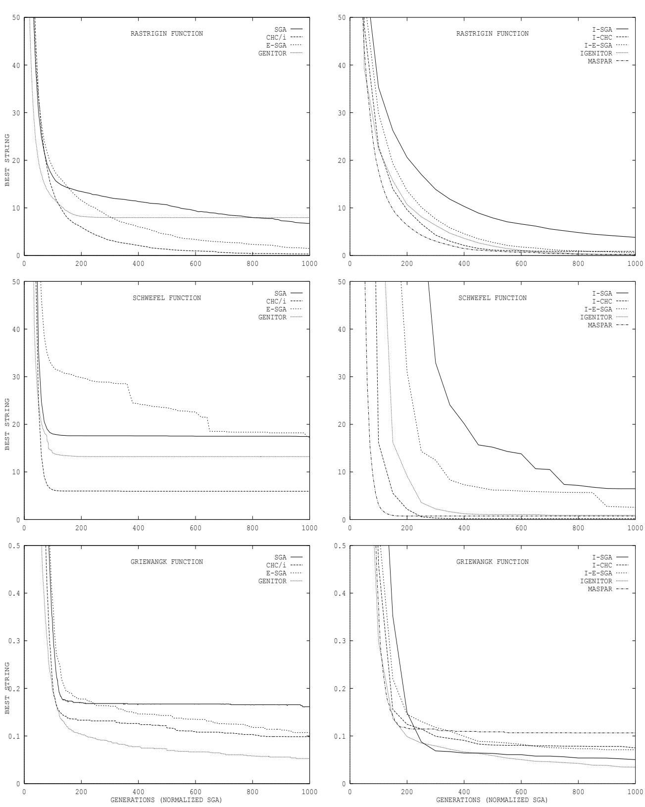

# rial and Parallel Genet Algorithms as Function

# September 16, 1993 Algorithms as Function Optimizers

V. Scott Gordon and Darrell Whitley Technical Report CS-93-114 September 16, 1993

# in ICGA-93: The 5th International Conference on Genetic Algorit993, pp 177-183. Morgan-Kaufmann (ed. Stephanie Forrest)

Published in ICGA-93: The 5th International Conference on Genetic Algorithms, UrbanaChampaign 1993, pp 177-183. Morgan-Kaufmann (ed. Stephanie Forrest)

# Serial and Parallel Genetic Algorithms as Function Optimizers

\traditional" geneti posed by Holland, especially wit pulation structure and selec . In this paper we compare s

Darrell Whitley Department of Computer Science Colorado State University LGORITHM MODEL

# Abstract

Parallel genetic algorithms are often very different from the "traditional" genetic algorithm proposed by Holland, especially with regards to population structure and selection INTRODUCTION eral parallel genetic algorithms across a wide ariet of schemes for arallelizin enetic a ms have a eared in the literature. Some o llel im lementations are ver dierent from ditional" enetic al orithm ro osed b Hol that the parallel structures perform as well as or better than standard versions, even withstructural chan es in a enetic al orithm

# 1 INTRODUCTION

chan es result in faster roblem-solvin then the arrithms have appeared in the literature. Some of the parallel implementations are very different from the "traditional" genetic algorithm proposed by Holland We have coded nine dierent genetic algorithms representing simple versions of existing parallel models. Each algorithm is run on a variety of optimization problems, and the results are normalized by the total number of function evaluations. The goal is to determine the eectiveness of various population structures and selection mechanisms, regardless of parallel execution. Thus we do not attempt to optimize the algorithms, and we do not examine hybrid versions that include local optimi

We have coded nine different genetic algorithms representing simple versions of existing parallel models. Each algorithm is run on a variety of optimization problems, and the results are normalized by the total number of function evaluations. The goal is to determine the effectiveness of various population structures and selection mechanisms, regardless of parallel execution. Thus we do not attempt to optimize the algorithms, and we do not examine hybrid versions that include local optimization. All algorithms are coded in a functional language (Sisal) to facilitate a concurrent study of the dataflow parallelism in the algorithms y p g g

# (Whitley 1993). We have encoded fo island models, and one cellular m

Global Models: SGA, Elitist-SGA, pCHC, Genitor Island Models: I-SGA I-Elitist-SGA I- CHC I-Genitor Massively Parallel: Cellular-GA netic algorithms, but it can be shown that these algorithms are in fact a subclass of cellular automata SGA and Elitist SGA. Our implementation of Goldberg's Simple Genetic Algorithm (SGA)

<table><tr><td rowspan=1 colspan=1>Global Models:</td><td rowspan=1 colspan=1>SGA, Elitist-SGA,pCHC, Genitor</td></tr><tr><td rowspan=1 colspan=1>Island Models:</td><td rowspan=1 colspan=1>I-SGA, I-Elitist-SGA,I-pCHC, I-Genitor</td></tr><tr><td rowspan=1 colspan=1>Massively Parallel:</td><td rowspan=1 colspan=1>Cellular-GA</td></tr></table>

SGA and Elitist SGA. Our implementation of GoldpCHC is a parallelized version of the CHC algorithm developed by Eshelman (1991). CHC is similar to SGA except that the best n strings are extracted from both the generation t and generation t + 1 to form the new generation. Parents are paired through incest pre $n / 2$ tion. Thus, in our implem $n$ tation, tournament seeach of which generates two members of the next generation. In SGA the very best individual in a population may not survive. In the Elitist SGA a copy of the best individual is always placed in the next generation.

$\mathbf { p } \mathbf { C } \mathbf { H } \mathbf { C }$ is a parallelized version of the CHC algorithm developed by Eshelman (1991). CHC is similar to SGA except that the best $n$ strings are extracted from both the generation $t$ and generation $t + 1$ to form the new generation. Parents are paired through incest prevention. Thus, in our implementation, tournament selection is used not to select the fittest strings, but to select pairs of individuals which are relatively dissimGenitor. Normally in the Genitor algorithm rankbased selection is appli $t + 1$ a sorted population. Two parents are selected and a single o $t$ pring is produced that displaces the worst member of the population. Tournament selection and replacement eliminates the need to keep the population in sorted order. The winners of a small tournamen $n$ recombine a $2 n$ he ospring replaces the loser of the tournament if the ospring has a higher tness. In other implementations of Genitor, one of the two possible osprings is chosen randoml

Genitor. Normally in the Genitor algorithm rankbased selection is applied to a sorted population. Two parents are selected and a single offspring is produced that displaces the worst member of the population. Island SGA and Elitist Island-SGA. The Island model involves running several single population genetic algorithms in parallel. Each \island" is an SGA with its own subpopulation. Migration between islands uses a ring topology, and a single individual is chosen for migration by tournament selection, where the losing individual is replaced by the winning individual from the adjacent subpopulation. The Elitist Island-SGA involves a straightforward insertion of the Elitist-SGA model into the Island model (in pla

Island SGA and Elitist Island-SGA. The Island model involves running several single population genetic algorithms in parallel. Each "island" is an SGA Island-pCHC and Island-Genitor. These are straightforward insertions of pCHC and Genitor into the Island model (in place of SGA). Migration is the same as in I-SGA. The Island-Genitor model is analogous to Genitor-II (Whitley and Starkweather 1990). Island-SGA involves a straightforward insertion of the Elitist-SGA model into the Island model (in place of SGA). Unlike Island-SGA, the best string in each subpopulation is the only one that migrates, since elitism guarantees that the best string is already known.

side on a two-dimensional grid, and demes consist of the four individuals directly above, below, left, and right of each individual. The best of these four is selected and crossover is performed with the individual. The ospring replaces the original individual if it has

Cellular Genetic Algorithms. Cellular Genetic Algorithms assign one individual per processor, and mating is limited to a deme (neighborhood) near the individual. Each individual is processed in parallel at each generation. In our implementation, strings reside on a two-dimensional grid, and demes consist of the four individuals directly above, below, left, and right of each individual. The best of these four is selected and crossover is performed with the individual. The offspring replaces the original individual if it has a higher fitness. Edge elements wrap around, forming a torus. It can be shown that this type of cellular genetic algorithm is a finite cellular automaton with

In order for performance comparisons to be meaningful across the nine genetic algorithm implementations, normalization is done so that the a

Other details of these implementations were previously reported (Gordon, Whitley, and Böhm 1992).

# cell lar genetic algorithm are he current implementatio

string is retained. Thus it requires n=2 (where n is the population size) generations in Genitor to perform the same number of function evaluations as one SGA generation. Therefore we divide the number of Genitor generations by n=2 when comparing results. Similarly, for Island-Genitor we divide the number of g $S G A$ tions by s=2 (where s is the subpopulation size). cellular genetic algorithm are adjusted as follows.

performs two function evaluations for each location in the 2-D grid every generation. Thus in one generation it performs twice the number of functi ${ \dot { n } } / 2$ valuatio $n$ as SGA. Therefore we multiply the number of generations performed by the cellular genetic algorithm by two. generation. Therefore we divide the number of Genitor generations by $n / 2$ when comparing results. Similarly, for Island-Genitor we divide the number of generations by $s / 2$ (where $s$ is the subpopulation size).

coded: DeJong's original test suite F1-F5 DeJong 1975 Rastri in Schwefel and Griewan k functions (Muhlenbein, Schomisch, and Born 1991); Ugly 3 and 4-bit deceptive functions; and zero-one knapsack problems of various sizes. We perform no local optimizations, as we only wish to compare the eectiveness

# We run all nine genetic

easy for the genetic algorithms and we execute until the global optimum is found in all 30 runs. In this case we report the average number of generations that it takes for each genetic algorithm to solve the function, and the standard deviation. For harder problems, we run the algorithms for a set number of generations and report the number of runs (out of 30) in which the global optimum is found

We run all nine genetic algorithms across the test suite of functions for 30 runs. Some of the test problems are easy for the genetic algorithms and we execute until the global optimum is found in all 30 runs. In this case we report the average number of generations that it takes for each genetic algorithm to solve the function, and the standard deviation. For harder problems, we run the algorithms for a set number of generations and report the number of runs (out of 30) in which the global optimum is found, along with the average fitness of the best strings found at the end of each of the 30 runs. Convergence graphs for the Rastrigin, Schwefel, and Griewangk functions are given in appendix A.

island models are set to 5 10   

<table><tr><td colspan="10">Generations to solve (gen) and standard deviation (std) on DeJong&#x27;s s Test Suite for various genetic algorithms</td></tr><tr><td>function algorithm</td><td colspan="2">F1 gen std</td><td colspan="2">F2 std</td><td colspan="2">F3</td><td colspan="2">F4</td><td colspan="2">F5</td></tr><tr><td>SGA</td><td>30.7</td><td>7.4</td><td>gen 284</td><td>198</td><td>gen 16.7</td><td>std 4.2</td><td>gen 161</td><td>std 40</td><td>gen 14.6</td><td>std 4.4</td></tr><tr><td>ESGA</td><td>28.9</td><td>6.8</td><td>83</td><td>55</td><td>15.3</td><td>4.1</td><td>153</td><td>49</td><td>14.3</td><td>4.4</td></tr><tr><td>pCHC</td><td>28.4</td><td>6.5</td><td>153</td><td>139</td><td>16.9</td><td>3.7</td><td>223</td><td>104</td><td>16.0</td><td>3.9</td></tr><tr><td>Genitor</td><td>17.0</td><td>4.1</td><td>190</td><td>160</td><td>8.2</td><td>2.1</td><td>135</td><td>67</td><td>7.9</td><td>2.5</td></tr><tr><td>I-SGA</td><td>41.3</td><td>11.2</td><td>417</td><td>253</td><td>22.0</td><td>5.3</td><td>405</td><td>192</td><td>20.3</td><td>6.9</td></tr><tr><td>I-ESGA</td><td>32.3</td><td>7.6</td><td>81</td><td>40</td><td>18.3</td><td>5.0</td><td>375</td><td>197</td><td>13.8</td><td>4.7</td></tr><tr><td>I-pCHC</td><td>33.2</td><td>7.4</td><td>78</td><td>57</td><td>18.8</td><td>4.4</td><td>495</td><td>239</td><td>16.3</td><td>5.3</td></tr><tr><td>I-Genitor</td><td>23.2</td><td>5.3</td><td>112</td><td>94</td><td>12.3</td><td>3.6</td><td>208</td><td>162</td><td>11.2</td><td>3.7</td></tr><tr><td>Cellular</td><td>32.5</td><td>8.0</td><td>105</td><td>94</td><td>17.9</td><td>4.6</td><td>397</td><td>204</td><td>15.3</td><td>4.3</td></tr></table>

Population size is fixed at 400 for all algorithms and 4.1 DeJONG TEST SUITE to maximize speed. In all of our implementations DeJong's suite contains ve test functions (DeJong 1975). F1 is a unimodal function known to be easy for genetic algorithms. F2 is a harder multimodal function. F3 is a discontinuous \step ladder". F4 involves a large solution space (2 ) plus gaussian noise. Because of the presence of noise, we consider F4 solved when the

# 4.1 DeJONG TEST SUITE

Performance results on the DeJong test suite are shown in Table 1. For the island models the swap interval is 5, except F4 where the swap interval is 50. tion. F3 is a discontinuous "step ladder". F4 involves 4.2 RASTRIGIN $( 2 ^ { 2 4 0 } )$ WEFEL AND cause of the presence of noise, we consider F4 solved when the best string in the population reaches $- 2 . 5$ F5 is characterized by the presence of several local minima. We found it useful to use Gray coding on F1, F2, and F5.

(F7) is somewhat easier than Rastrigin's function, and is characterized by a second-best minimum which is far away from the global optimum. In F7, V is the neg

# for convenience. The exact value of V depend GRIEWANGK FUNCTIONS

Rastrigin's function (F6) is a fairly difficult problem for genetic algorithms due to the large search space and large number of local minima. Schwefel's function (F7) is somewhat easier than Rastrigin's function, and is characterized by a second-best minimum which is far away from the global optimum. In F7, $V$ is the negative of the global minimum, which is added to the function so as to move the global minimum to zero, for convenience. The exact value of $V$ depends on system precision; for our experiments $V = 4 1 8 9 . 8 2 9 1 0 1$ X x2i Y xi rithms because the product term causes the 10 substrings to be strongly interdependent.

$$
F \theta : f \bigl ( x _ { \mathrm { ~ i ~ } } \big | _ { \mathrm { ~ i = 1 ~ } , 2 0 } \bigr ) = 2 0 0 + \sum _ { \mathrm { ~ i = 1 ~ } } ^ { 2 0 } x _ { \mathrm { ~ i ~ } } ^ { 2 } - 1 0 c o s \bigl ( 2 \pi x _ { \mathrm { ~ i ~ } } \bigr ) , \qquad x _ { \mathrm { ~ i ~ } } \in \bigl [ - 5 . 1 2 , 5 . 1 2 \bigr ]
$$

$$
F 7 \colon { f ( x \mid } _ { i = 1 , 1 0 } ) = V + \sum _ { i = 1 } ^ { 1 0 } - x \operatorname { i } s i n ( { \sqrt { | x  _ { i } | } } ) , \qquad x \operatorname { i } \in [ - 5 1 2 , 5 1 2 ]
$$

$$
F \delta \colon f ( x _ { i } | _ { i = 1 , 1 0 } ) = \sum _ { i = 1 } ^ { 1 0 } \frac { x _ { i } ^ { 2 } } { 4 0 0 0 } - \prod _ { i = 1 } ^ { 1 0 } c o s ( \frac { x _ { i } } { \sqrt { i } } ) + 1 , \quad x _ { i } \in [ - 5 1 2 , 5 1 2 ]
$$

Table 2 shows performance data on F6, F7, and F8 g ( ), ( ), and F8, and a swap interval of 50 for the island models. function F6 F7 F8 algorithm ns avg ns avg

Table 2: Performance of GAs on F6, F7, and F8   

<table><tr><td rowspan=1 colspan=7>Number of runs solved (ns) and average bestof 30 runs (avg) after 1000 generations.for Rastrigin (F6), Schwefel (F7),and Griewangk (F8) functions.</td></tr><tr><td rowspan=1 colspan=1>functionalgorithm</td><td rowspan=1 colspan=2>F6ns  avg</td><td rowspan=1 colspan=2>F7ns  avg</td><td rowspan=1 colspan=2>F8ns  avg</td></tr><tr><td rowspan=1 colspan=1>SGA</td><td rowspan=1 colspan=1>0</td><td rowspan=1 colspan=1>6.8</td><td rowspan=1 colspan=1>0</td><td rowspan=1 colspan=1>17.4</td><td rowspan=1 colspan=1>0</td><td rowspan=1 colspan=1>.161</td></tr><tr><td rowspan=1 colspan=1>ESGA</td><td rowspan=1 colspan=1>2</td><td rowspan=1 colspan=1>1.5</td><td rowspan=1 colspan=1>16</td><td rowspan=1 colspan=1>17.3</td><td rowspan=1 colspan=1>1</td><td rowspan=1 colspan=1>.107</td></tr><tr><td rowspan=1 colspan=1>pCHC</td><td rowspan=1 colspan=1>23</td><td rowspan=1 colspan=1>0.3</td><td rowspan=1 colspan=1>15</td><td rowspan=1 colspan=1>5.9</td><td rowspan=1 colspan=1>0</td><td rowspan=1 colspan=1>.072</td></tr><tr><td rowspan=1 colspan=1>Genitor</td><td rowspan=1 colspan=1>0</td><td rowspan=1 colspan=1>7.9</td><td rowspan=1 colspan=1>20</td><td rowspan=1 colspan=1>13.2</td><td rowspan=1 colspan=1>3</td><td rowspan=1 colspan=1>.053</td></tr><tr><td rowspan=1 colspan=1>I-SGA</td><td rowspan=1 colspan=1>0</td><td rowspan=1 colspan=1>3.8</td><td rowspan=1 colspan=1>9</td><td rowspan=1 colspan=1>6.5</td><td rowspan=1 colspan=1>7</td><td rowspan=1 colspan=1>.050</td></tr><tr><td rowspan=1 colspan=1>I-ESGA</td><td rowspan=1 colspan=1>13</td><td rowspan=1 colspan=1>0.6</td><td rowspan=1 colspan=1>13</td><td rowspan=1 colspan=1>2.6</td><td rowspan=1 colspan=1>3</td><td rowspan=1 colspan=1>.066</td></tr><tr><td rowspan=1 colspan=1>I-pCHC</td><td rowspan=1 colspan=1>10</td><td rowspan=1 colspan=1>0.9</td><td rowspan=1 colspan=1>28</td><td rowspan=1 colspan=1>0.2</td><td rowspan=1 colspan=1>3</td><td rowspan=1 colspan=1>.047</td></tr><tr><td rowspan=1 colspan=1>I-Genitor</td><td rowspan=1 colspan=1>23</td><td rowspan=1 colspan=1>0.2</td><td rowspan=1 colspan=1>24</td><td rowspan=1 colspan=1>0.9</td><td rowspan=1 colspan=1>6</td><td rowspan=1 colspan=1>.035</td></tr><tr><td rowspan=1 colspan=1>Cellular</td><td rowspan=1 colspan=1>24</td><td rowspan=1 colspan=1>0.2</td><td rowspan=1 colspan=1>26</td><td rowspan=1 colspan=1>0.7</td><td rowspan=1 colspan=1>1</td><td rowspan=1 colspan=1>.106</td></tr></table>

# 4.3 UGLY 3 AND 4-BIT DECEPTIVE deceptive problem

hyperplane sampling abilities of a genetic algorithm as well as the linkage between bits. This linkage is related to the disruptive eects of crossover. As such, ugly deceptive problems should perhaps be viewed more as analytical tools rather than \hard $1 0 { + } \mathrm { X }$ prob$2 0 + \mathrm { X }$ Muhlenbein (1992) has presented results which indicate such problems can often be solved by hillclimbing; this does not contradict the goals behind

Ugly deceptive problems have very often been misunderstood. These problems isolate interactions in the The original ugly deceptive problems (Goldberg, Korb, and Deb 1989) were used to test genetic algorithm implementations that use no mutation and a 100% probability of crossover. Whitley, Das, and Crabb (1992) have shown analytically that using low crossover rates also makes ugly deceptive problems easier to solve (since it reduces the eects of the linkage problem). Also, ugly deceptive problems are particularly designed to mislead traditional simple genetic algorithms of the kind developed by Holland and DeJong

The original ugly deceptive problems (Goldberg, Korb, hard for other al orithms or even for other forms of plementations that use no mutation and a $1 0 0 \%$ probability of crossover. Whitley, Das, and Crabb (1992) In the current set of experiments, all of the algorithms tested solve the ugly order-3 deceptive problem. SGA, for example, reliably solves the ugly order-3 deceptive problem using a crossover rate of 0.7 and a mutation rate of 1.5%. Further, parallel genetic algorithms appear to be particularly well suited to solving ugly deceptive functions. This is because dierent subproblems are solved in various subpopulations (or virtual neighborhoods). The various subproblems can then be exploited to build

Table 3 shows performance data on the 3-bit and 4-bit deceptive functions. The 3-bit problem is easy enough that we can execute all runs until the global optimum is found. We report the average number of generations in whic $1 . 5 \%$ optimum is found, and the standard deviation. The 4-bit problem, on the other hand, is harder. We execute each run for 5000 generations and report the number of runs in which the global optimum was found, along with the average of the best strings found at the end of each run. It is impo

Table 3 shows performance data on the 3-bit and 4-bit deceptive functions. The 3-bit problem is easy enough that we can execute all runs until the global optimum is found. We report the average number of generations in which the optimum is found, and the standard deviation. The 4-bit problem, on the other hand, is harder. We execute each run for 5000 generations and report the number of runs in which the global optimum was found, along with the average of the best strings found at the end of each run. It is important to note that gen std ns avg SGA 1547 675 0 23.5 ESGA 1564 1549 0 10.1 models.

Table 3: Performance of nine GAs on D3 and D4   

<table><tr><td rowspan=1 colspan=6>Generations to solve (gen) and standarddeviation (std) for Ugly 3-bit;Runs solved (ns) and avg best of 30runs(avg) forUgly 4-bit (5000 gens)</td></tr><tr><td rowspan=1 colspan=2></td><td rowspan=1 colspan=1>D3gen</td><td rowspan=1 colspan=1>std</td><td rowspan=1 colspan=2>D4ns     avg</td></tr><tr><td rowspan=3 colspan=2>SGAESGApCHC</td><td rowspan=1 colspan=1>1547</td><td rowspan=1 colspan=1>675</td><td rowspan=1 colspan=1>0</td><td rowspan=1 colspan=1>23.5</td></tr><tr><td rowspan=1 colspan=1>1564</td><td rowspan=1 colspan=1>1549</td><td rowspan=1 colspan=1>0</td><td rowspan=1 colspan=1>10.1</td></tr><tr><td rowspan=1 colspan=1>pCHC</td><td rowspan=1 colspan=1>455</td><td rowspan=1 colspan=1>192</td><td rowspan=1 colspan=1>14</td><td rowspan=1 colspan=1>1.3</td></tr><tr><td rowspan=6 colspan=2>GenitorI-SGAI-ESGAI-pCHCI-GenitorCellular</td><td rowspan=1 colspan=1>Genitor</td><td rowspan=1 colspan=1>399</td><td rowspan=1 colspan=1>133</td><td rowspan=1 colspan=1>10</td></tr><tr><td rowspan=1 colspan=1>944</td><td rowspan=1 colspan=1>273</td><td rowspan=1 colspan=1>0</td><td rowspan=1 colspan=1>24.1</td></tr><tr><td rowspan=1 colspan=1>172</td><td rowspan=1 colspan=1>49</td><td rowspan=1 colspan=1>29</td><td rowspan=1 colspan=1>0.07</td></tr><tr><td rowspan=1 colspan=1>345</td><td rowspan=1 colspan=1>139</td><td rowspan=1 colspan=1>12</td><td rowspan=1 colspan=1>1.7</td></tr><tr><td rowspan=1 colspan=1>439</td><td rowspan=1 colspan=1>158</td><td rowspan=1 colspan=1>6</td><td rowspan=1 colspan=1>2.3</td></tr><tr><td rowspan=1 colspan=1>572</td><td rowspan=1 colspan=1>240</td><td rowspan=1 colspan=1>7</td><td rowspan=1 colspan=1>2.4</td></tr></table>

# 4.4 ZERO-ONE KNAPSACK PROBLEMS

The zero-one knapsack problem is defined as follows. Given $n$ objects with positive weights $W _ { i }$ and positive profits $P _ { i }$ , and a knapsack capacity $M$ , determine a subset of the objects represented by a bit vector $X$ such that:

$$
\textstyle \sum _ { i = 1 } ^ { n } X _ { i } W _ { i } \leq M \quad a n d \quad \sum _ { i = 1 } ^ { n } X _ { i } P _ { i } \quad m a x i m a l .
$$

amount of over
ow. The second method, partial scan, adds items to the knapsack one at a time, scanning the bitstring left to right, stoppin $n$ at the end of the string or when the knapsack over
ows, in w $n$ ich case the last item added is removed. with this representation is that it is possible to represent infeasible solutions. In other words, setting too many bits might overflow the capacity of the knapsack.

jects are sorted by prot weight ratio, then the greedy approximation appears as a series of \1" bits followed by a series of \0" bits. The partial scan method now has the interesting property that a string of all \1" bits always evaluates to the greedy approximation. string or when the knapsack overflows, in which case the last item added is removed.

A greedy approximation to the global optimum can be found by selecting objects by profit/weight ratio until the knapsack cannot be filled any further. If the objects are sorted by profit weight ratio, then the greedy approximation appears as a series of "1" bits followed by a series of "0" bits. The partial scan method now has the interesting property that a string of all "1" bits always evaluates to the greedy approximation.

ser greedy approximation of knapsack).   

<table><tr><td rowspan=1 colspan=1>Algorithm</td><td rowspan=1 colspan=1>F1</td><td rowspan=1 colspan=1>F2</td><td rowspan=1 colspan=1>F3</td><td rowspan=1 colspan=1>F4</td><td rowspan=1 colspan=1>F5</td><td rowspan=1 colspan=1>F6</td><td rowspan=1 colspan=1>F7</td><td rowspan=1 colspan=1>F8</td><td rowspan=1 colspan=1>D3</td><td rowspan=1 colspan=1>D4</td><td rowspan=1 colspan=1>K20</td><td rowspan=1 colspan=1>K80</td><td rowspan=1 colspan=1>Avg</td><td rowspan=1 colspan=1>rnk</td></tr><tr><td rowspan=5 colspan=1>SGAESGApCHCGenitorI-SGA</td><td rowspan=2 colspan=1>54</td><td rowspan=1 colspan=1>8</td><td rowspan=1 colspan=1>4</td><td rowspan=1 colspan=1>3</td><td rowspan=1 colspan=1>5</td><td rowspan=1 colspan=1>8</td><td rowspan=1 colspan=1>9</td><td rowspan=1 colspan=1>9</td><td rowspan=1 colspan=1>8</td><td rowspan=1 colspan=1>8</td><td rowspan=1 colspan=1>8</td><td rowspan=1 colspan=1>3</td><td rowspan=1 colspan=1>6.5</td><td rowspan=4 colspan=1>20</td></tr><tr><td rowspan=1 colspan=1>3</td><td rowspan=1 colspan=1>3</td><td rowspan=1 colspan=1>2</td><td rowspan=1 colspan=1>4</td><td rowspan=1 colspan=1>6</td><td rowspan=1 colspan=1>8</td><td rowspan=1 colspan=1>8</td><td rowspan=1 colspan=1>9</td><td rowspan=1 colspan=1></td><td rowspan=1 colspan=1>7</td><td rowspan=1 colspan=1>9</td><td rowspan=2 colspan=1>5.84.5</td></tr><tr><td rowspan=1 colspan=1>3</td><td rowspan=1 colspan=1></td><td rowspan=1 colspan=1>5</td><td rowspan=1 colspan=1>5</td><td rowspan=1 colspan=1>7</td><td rowspan=1 colspan=1>3</td><td rowspan=1 colspan=1></td><td rowspan=1 colspan=1>6</td><td rowspan=1 colspan=1></td><td rowspan=1 colspan=1>2</td><td rowspan=1 colspan=1>3</td><td rowspan=1 colspan=1>4</td></tr><tr><td rowspan=2 colspan=1>19</td><td rowspan=1 colspan=1></td><td rowspan=1 colspan=1></td><td rowspan=1 colspan=1>1</td><td rowspan=1 colspan=1>1</td><td rowspan=1 colspan=1>9</td><td rowspan=1 colspan=1></td><td rowspan=1 colspan=1>4</td><td rowspan=1 colspan=1></td><td rowspan=1 colspan=1></td><td rowspan=1 colspan=1>1</td><td rowspan=1 colspan=1>1</td><td rowspan=1 colspan=1>3.3</td></tr><tr><td rowspan=1 colspan=1>9</td><td rowspan=1 colspan=1>9</td><td rowspan=1 colspan=1>8</td><td rowspan=1 colspan=1>9</td><td rowspan=1 colspan=1>7</td><td rowspan=1 colspan=1>6</td><td rowspan=1 colspan=1>3</td><td rowspan=1 colspan=1>7</td><td rowspan=1 colspan=1></td><td rowspan=1 colspan=1>6</td><td rowspan=1 colspan=1>8</td><td rowspan=1 colspan=1>7.5</td><td rowspan=5 colspan=1>20</td></tr><tr><td rowspan=3 colspan=1>I-ESGAI-pCHCI-Genitor</td><td rowspan=3 colspan=1>682</td><td rowspan=1 colspan=1>2</td><td rowspan=1 colspan=1>7</td><td rowspan=1 colspan=1>6</td><td rowspan=1 colspan=1>3</td><td rowspan=1 colspan=1></td><td rowspan=1 colspan=1>4</td><td rowspan=1 colspan=1></td><td rowspan=1 colspan=1>1</td><td rowspan=1 colspan=1></td><td rowspan=1 colspan=1>9</td><td rowspan=1 colspan=1></td><td rowspan=1 colspan=1>4.4</td></tr><tr><td rowspan=2 colspan=1>$</td><td rowspan=1 colspan=1>8</td><td rowspan=1 colspan=1>9</td><td rowspan=1 colspan=1></td><td rowspan=1 colspan=1></td><td rowspan=1 colspan=1></td><td rowspan=1 colspan=1>2</td><td rowspan=1 colspan=1>2</td><td rowspan=1 colspan=1></td><td rowspan=1 colspan=1>5</td><td rowspan=1 colspan=1>7</td><td rowspan=2 colspan=1>5.02.8</td></tr><tr><td rowspan=2 colspan=1>I-GenitorCellular</td><td rowspan=1 colspan=1>2</td><td rowspan=1 colspan=1>4</td><td rowspan=1 colspan=1>2</td><td rowspan=1 colspan=1>2</td><td rowspan=1 colspan=1>3</td><td rowspan=1 colspan=1></td><td rowspan=1 colspan=1></td><td rowspan=1 colspan=1></td><td rowspan=1 colspan=1>2</td><td rowspan=1 colspan=1></td></tr><tr><td rowspan=1 colspan=1>7</td><td rowspan=1 colspan=1>4</td><td rowspan=1 colspan=1>6</td><td rowspan=1 colspan=1>7</td><td rowspan=1 colspan=1></td><td rowspan=1 colspan=1></td><td rowspan=1 colspan=1>2</td><td rowspan=1 colspan=1>7</td><td rowspan=1 colspan=1></td><td rowspan=1 colspan=1></td><td rowspan=1 colspan=1>4</td><td rowspan=1 colspan=1>6</td><td rowspan=1 colspan=1>5.2</td></tr></table>

evaluation method works better on the 20-ob ect roban 80-object problem. (Branch-and-bound methods 80-ob ect roblem. Performance results are shown in Table 5. The swa interval for island models is 5. genetic algorithms.) Our 20-object problem (K20) has a global optimum of 445 and a greedy approximation gen and std for 20 and 40 object zero-one knapsack problems. 25713. Using our set of nine genetic algorithms, the gen std gen std SGA 88.7 302.1 32.5 7.9 ESGA 62.2 64.5 41.9 11.8 pCHC 31.3 12.6 32.7 8.2 Genitor 24.7 9.9 17.8 4.8 I-SGA 43.0 31.2 41.0 10.6

value by the worst performance score on that prob   

<table><tr><td rowspan=1 colspan=6>gen and std for 20 and 40 objectzero-one knapsack problems.</td></tr><tr><td rowspan=1 colspan=2></td><td rowspan=1 colspan=2>K20gen    std</td><td rowspan=1 colspan=2>K80gen  std</td></tr><tr><td rowspan=1 colspan=2>SGA</td><td rowspan=1 colspan=1>88.7</td><td rowspan=1 colspan=1>302.1</td><td rowspan=1 colspan=1>32.5</td><td rowspan=1 colspan=1>7.9</td></tr><tr><td rowspan=8 colspan=2>ESGApCHCGenitorI-SGAI-ESGAI-pCHCI-GenitorCellular</td><td rowspan=1 colspan=1>ESGA</td><td rowspan=1 colspan=1>62.2</td><td rowspan=1 colspan=1>64.5</td><td rowspan=1 colspan=1>41.9</td></tr><tr><td rowspan=1 colspan=1>31.3</td><td rowspan=1 colspan=1>12.6</td><td rowspan=1 colspan=1>32.7</td><td rowspan=1 colspan=1>8.2</td></tr><tr><td rowspan=1 colspan=1>24.7</td><td rowspan=1 colspan=1>9.9</td><td rowspan=1 colspan=1>17.8</td><td rowspan=1 colspan=1>4.8</td></tr><tr><td rowspan=1 colspan=1>43.0</td><td rowspan=1 colspan=1>31.2</td><td rowspan=1 colspan=1>41.0</td><td rowspan=1 colspan=1>10.6</td></tr><tr><td rowspan=1 colspan=1>100.3</td><td rowspan=1 colspan=1>253.8</td><td rowspan=1 colspan=1>33.0</td><td rowspan=1 colspan=1>7.7</td></tr><tr><td rowspan=1 colspan=1>34.7</td><td rowspan=1 colspan=1>12.9</td><td rowspan=1 colspan=1>37.2</td><td rowspan=1 colspan=1>8.9</td></tr><tr><td rowspan=1 colspan=1>25.8</td><td rowspan=1 colspan=1>17.6</td><td rowspan=1 colspan=1>22.0</td><td rowspan=1 colspan=1>5.8</td></tr><tr><td rowspan=1 colspan=1>32.3</td><td rowspan=1 colspan=1>12.5</td><td rowspan=1 colspan=1>34.7</td><td rowspan=1 colspan=1>7.9</td></tr></table>

# 4.5 SUMMARY OF RESULTS

Table 4 shows the relative ranking of the genetic algorithms on each of the functions. Table 8 shows the relative performance of the algorithms on each problem, normalized on a scale of 0 to 1 (where 1 is the worst). This is done by dividing each performance value by the worst performance score on that problem. Since some of the algorithms perform similarly on some problems, this gives a better picture of how the algorithms compare with each other. Aggregate

SGA 7.6 9 .84 9   
ESGA 6.3 7 .55 7   
pCHC 4.4 4-5 .29 3   
Genitor 4.4 4-5 .42 6   
I-SGA 6.9 8 .63 8   
I-ESGA 4.0 3 .34 5   
I-pCHC 3.5 2 .28 2   
I-G

I-pCHC 4.8 5-6 .46 4   

<table><tr><td rowspan=1 colspan=1>Algorithm</td><td rowspan=1 colspan=1>Avg</td><td rowspan=1 colspan=1>rnk</td><td rowspan=1 colspan=1>Nrm</td><td rowspan=1 colspan=1>rnk</td></tr><tr><td rowspan=1 colspan=1>SGA</td><td rowspan=1 colspan=1>7.6</td><td rowspan=1 colspan=1>9</td><td rowspan=1 colspan=1>.84</td><td rowspan=1 colspan=1>9</td></tr><tr><td rowspan=2 colspan=1>ESGApCHC</td><td rowspan=1 colspan=1>6.3</td><td rowspan=1 colspan=1>7</td><td rowspan=1 colspan=1>.55</td><td rowspan=1 colspan=1>7</td></tr><tr><td rowspan=1 colspan=1>4.4</td><td rowspan=1 colspan=1>4-5</td><td rowspan=1 colspan=1>.29</td><td rowspan=1 colspan=1>3</td></tr><tr><td rowspan=1 colspan=1>Genitor</td><td rowspan=1 colspan=1>4.4</td><td rowspan=1 colspan=1>4-5</td><td rowspan=1 colspan=1>.42</td><td rowspan=1 colspan=1>6</td></tr><tr><td rowspan=1 colspan=1>I-SGA</td><td rowspan=1 colspan=1>6.9</td><td rowspan=1 colspan=1>8</td><td rowspan=1 colspan=1>.63</td><td rowspan=1 colspan=1>8</td></tr><tr><td rowspan=1 colspan=1>I-ESGA</td><td rowspan=1 colspan=1>4.0</td><td rowspan=1 colspan=1>3</td><td rowspan=1 colspan=1>.34</td><td rowspan=1 colspan=1>5</td></tr><tr><td rowspan=3 colspan=1>I-pCHCI-GenitorCellular</td><td rowspan=1 colspan=1>3.5</td><td rowspan=1 colspan=1>2</td><td rowspan=1 colspan=1>.28</td><td rowspan=1 colspan=1>2</td></tr><tr><td rowspan=1 colspan=1>3.3</td><td rowspan=1 colspan=1>1</td><td rowspan=1 colspan=1>.21</td><td rowspan=1 colspan=1>1</td></tr><tr><td rowspan=1 colspan=1>4.6</td><td rowspan=1 colspan=1>6</td><td rowspan=1 colspan=1>.32</td><td rowspan=1 colspan=1>4</td></tr></table>

Table 7: Performance on long bitstring problems   

<table><tr><td rowspan=1 colspan=1>Algorithm</td><td rowspan=1 colspan=1>Avg</td><td rowspan=1 colspan=1>rnk</td><td rowspan=1 colspan=1>Nrm</td><td rowspan=1 colspan=1>rnk</td></tr><tr><td rowspan=1 colspan=1>SGA</td><td rowspan=1 colspan=1>6.4</td><td rowspan=1 colspan=1>7-8</td><td rowspan=1 colspan=1>.79</td><td rowspan=1 colspan=1>9</td></tr><tr><td rowspan=1 colspan=1>ESGA</td><td rowspan=1 colspan=1>6.6</td><td rowspan=1 colspan=1>9</td><td rowspan=1 colspan=1>.63</td><td rowspan=1 colspan=1>8</td></tr><tr><td rowspan=1 colspan=1>pCHC</td><td rowspan=1 colspan=1>4.6</td><td rowspan=1 colspan=1>3-4</td><td rowspan=1 colspan=1>.41</td><td rowspan=1 colspan=1>2</td></tr><tr><td rowspan=1 colspan=1>Genitor</td><td rowspan=1 colspan=1>4.4</td><td rowspan=1 colspan=1>2</td><td rowspan=1 colspan=1>.56</td><td rowspan=1 colspan=1>6</td></tr><tr><td rowspan=1 colspan=1>I-SGA</td><td rowspan=1 colspan=1>6.4</td><td rowspan=1 colspan=1>7-8</td><td rowspan=1 colspan=1>.59</td><td rowspan=1 colspan=1>7</td></tr><tr><td rowspan=1 colspan=1>I-ESGA</td><td rowspan=1 colspan=1>4.8</td><td rowspan=1 colspan=1>5-6</td><td rowspan=1 colspan=1>.44</td><td rowspan=1 colspan=1>3</td></tr><tr><td rowspan=1 colspan=1>I-pCHC</td><td rowspan=1 colspan=1>4.8</td><td rowspan=1 colspan=1>5-6</td><td rowspan=1 colspan=1>.46</td><td rowspan=1 colspan=1>4</td></tr><tr><td rowspan=1 colspan=1>I-Genitor</td><td rowspan=1 colspan=1>2.4</td><td rowspan=1 colspan=1>1</td><td rowspan=1 colspan=1>.26</td><td rowspan=1 colspan=1>1</td></tr><tr><td rowspan=1 colspan=1>Cellular</td><td rowspan=1 colspan=1>4.6</td><td rowspan=1 colspan=1>3-4</td><td rowspan=1 colspan=1>.47</td><td rowspan=1 colspan=1>5</td></tr></table>

The non-elitist algorithms (SGA and IslandSGA) clearly perform the worst overall, ranking 8th and 9th in every category. The parallel algorithms seem to perform better on harder functions. Island-Genitor gets the best marks, and the pCHC and cellular genetic algorithms also are consistently good. Interestingly, the cellular genetic algorithm and pCHC perform fairly well in spite of simplistic implementations.

<table><tr><td>Algorithm</td><td>F1</td><td>F2</td><td>F3</td><td>F4</td><td>F5</td><td>F6</td><td>F7</td><td>F8</td><td>D3</td><td>D4</td><td>K20</td><td>K80</td><td>Avg</td><td>rnk</td></tr><tr><td>SGA</td><td>.74</td><td>.68</td><td>.76</td><td>.33</td><td>.72</td><td>.86</td><td>1.00</td><td>1.00</td><td>.99</td><td>.98</td><td>.88</td><td>.78</td><td>.81</td><td>9</td></tr><tr><td>ESGA</td><td>.69</td><td>.19</td><td>.69</td><td>.31</td><td>.70</td><td>.19</td><td>.99</td><td>.66</td><td>1.00</td><td>.42</td><td>.62</td><td>1.00</td><td>.62</td><td>7</td></tr><tr><td>pCHC</td><td>.68</td><td>.37</td><td>.77</td><td>.45</td><td>.79</td><td>.04</td><td>.34</td><td>.45</td><td>.29</td><td>.05</td><td>.31</td><td>.78</td><td>.44</td><td>3</td></tr><tr><td>Genitor</td><td>.41</td><td>.46</td><td>.37</td><td>.27</td><td>.39</td><td>1.00</td><td>.76</td><td>.33</td><td>.26</td><td>.06</td><td>.25</td><td>.42</td><td>.42</td><td>2</td></tr><tr><td>I-SGA</td><td>1.00</td><td>1.00</td><td>1.00</td><td>.81</td><td>1.00</td><td>.48</td><td>.37</td><td>.31</td><td>.60</td><td>1.00</td><td>.43</td><td>.98</td><td>.75</td><td>8</td></tr><tr><td>I-ESGA</td><td>.78</td><td>.19</td><td>.83</td><td>.76</td><td>.68</td><td>.08</td><td>.15</td><td>.41</td><td>.11</td><td>.003</td><td>1.00</td><td>.79</td><td>.48</td><td>6</td></tr><tr><td>I-pCHC</td><td>.80</td><td>.18</td><td>.85</td><td>1.00</td><td>.80</td><td>.11</td><td>.01</td><td>.29</td><td>.22</td><td>.07</td><td>.35</td><td>.89</td><td>.46</td><td>4</td></tr><tr><td>I-Genitor</td><td>.56</td><td>.27</td><td>.56</td><td>.49</td><td>.55</td><td>.03</td><td>.05</td><td>.22</td><td>.28</td><td>.10</td><td>.26</td><td>.53</td><td>.33</td><td>1</td></tr><tr><td>Cellular</td><td>.79</td><td>.25</td><td>.81</td><td>.80</td><td>.75</td><td>.03</td><td>.04</td><td>.65</td><td>.37</td><td>.10</td><td>.32</td><td>.83</td><td>.48</td><td>5</td></tr></table>

CHC approaches are at least rithm. Foundations of Genet

# parallel execution into acco

In this paper we have compared several parallel genetic algorithms across a wide range of optimization funcfor harder roblems. better than non-elitist ones. More significantly, alterThe performance of SGA is relatively poor compared to the other alternative algorithms examined in this study. However, this paper has largely been concerned with optimization as measured by the best solution found during a single run. Much of Holland's original work was concerned with the online performance metric which considers the average value of all points sampled by the genetic algorithm. When considering online performance, consistently sampling good points takes on more import

The performance of SGA is relatively poor compared to the other alternative algorithms examined in this The ndings reported in this study are encouraging for parallel genetic algorithm research because they indicate that performance benets due to parallelism are not oset by declines in problem-solving capabilities. In fact, parallel genetic algorithm using some form of restricted selection and mating based on locality that are executed serially often yield better performance than single population implementations with global \panmictic" mating. We would point out, however, that to refer to these results as

# mization and

not achieving superlinear speedup due to the paralfor parallel genetic algorithm research because they indicate that performance benefi ts due to parallelism roblem solvin ca abilities. ities. In fact, parallel genetic algorithm using some form of restricted selection and mating based on locality that are executed serially often yield better performance than single population implementations with global "panmictic" mating. We would point out, however, that to refer to these results as an example of "superlinear speedup" is technically incorrect: we are not achieving superlinear speedup due to the parallelization of a single algorithm, but rather have examined different parallel algorithms that display superior problem solving capabilities.

g, , ( ) y Knapsack. Colorado State Univ tech report CS-92-127. K. DeJong (1975). An Analysis of the Behavior of a Class D. Goldberg and K. Deb (1991). A Comparative Analysis dations of Genetic Algorithms, ed. G. Rawlins, Morgan rithm. Foundations of Genetic Algorithms and Classifi er Systems, Morgan-Kaufmann.   
Parallelism in Genetic Algorithms. Parallel Problem Solving from Nature 2, North Holland.   
J. Holland (1975). Adaption in Natural and Articial Systems. Univ of Michigan Press. Complex Systems 3.   
Parallel Genetic Algorithm as Function Optimizer. Parallel Computing 7. North-Holland. dations of Genetic Algorithms, ed. G. Rawlins, Morgan H. Muhlen   
ing from Nature 2, North Holland. Parallelism in Genetic Algorithms. Parallel Problem SolvD. Whitley and T. Starkweather   
Intell 2 pp 189-214. tems. Univ of Michigan Press.   
in Genetic Search. Foundations of Genetic Algorithms, ed. G. Rawlins, Morgan Kaufmann. lel Computing 7. North-Holland.   
mary Hyperplane Competitors During Genetic Search. to appear in Annals of Mathematics and Articial Intell.. ing from Nature 2, North Holland.   
Algorithms: Proceedings of the Fifth International Conference (GA93), Morgan Kaufmann. Intell 2 pp 189-214.   
D. Whitley (1991). Fundamental Principles of Deception in Genetic Search. Foundations of Genetic Algorithms, ed. G. Rawlins, Morgan Kaufmann.   
D. Whitley, R. Das, and C. Crabb (1992). Tracking Primary Hyperplane Competitors During Genetic Search. to appear in Annals of Mathematics and Artificial Intell.. D. Whitley (1993). Cellular Genetic Algorithms. Genetic Algorithms: Proceedings of the Fifth International Conference (GA93), Morgan Kaufmann.

