# PRACTICAL SET PARTITIONING AND COLUMN GENERATION

Andrew Mason

a.mason@auckland.ac.nz, www.esc.auckland.ac.nz/Mason

Linkoping 1999, Auckland 2000, Auckland 2001

# Set Partitioning Problems

Given a set of objects (with index set I), find a minimal cost partition of I into mutually disjoint subsets.

Example: Copying 2 CD’s onto C60 tapes.

<table><tr><td rowspan=1 colspan=3>ENIGMA MCMXC            Mins</td></tr><tr><td rowspan=1 colspan=1>1</td><td rowspan=1 colspan=1>The Voice of Enigma</td><td rowspan=1 colspan=1>2.13</td></tr><tr><td rowspan=1 colspan=1>2</td><td rowspan=1 colspan=1>Sadeness</td><td rowspan=1 colspan=1>4.25</td></tr><tr><td rowspan=1 colspan=1>3</td><td rowspan=1 colspan=1>Find Love</td><td rowspan=1 colspan=1>4.82</td></tr><tr><td rowspan=1 colspan=1>4</td><td rowspan=1 colspan=1>Sadeness (Reprise)</td><td rowspan=1 colspan=1>2.80</td></tr><tr><td rowspan=1 colspan=1>5</td><td rowspan=1 colspan=1>Callass Went Away</td><td rowspan=1 colspan=1>4.48</td></tr><tr><td rowspan=1 colspan=1>6</td><td rowspan=1 colspan=1>MeaCulpa</td><td rowspan=1 colspan=1>4.87</td></tr><tr><td rowspan=1 colspan=1>7</td><td rowspan=1 colspan=1>The Voice&amp; The Snake</td><td rowspan=1 colspan=1>1.75</td></tr><tr><td rowspan=1 colspan=1>8</td><td rowspan=1 colspan=1>Knocking on ForbiddenDoors</td><td rowspan=1 colspan=1>4.45</td></tr><tr><td rowspan=1 colspan=1>9</td><td rowspan=1 colspan=1>9 Way to Eternity</td><td rowspan=1 colspan=1>2.30</td></tr><tr><td rowspan=1 colspan=1>10</td><td rowspan=1 colspan=1>Hallelujah</td><td rowspan=1 colspan=1>4.25</td></tr><tr><td rowspan=1 colspan=1>11</td><td rowspan=1 colspan=1>The Rivers of Belief</td><td rowspan=1 colspan=1>3.52</td></tr><tr><td rowspan=1 colspan=1>12</td><td rowspan=1 colspan=1>Sadeness II</td><td rowspan=1 colspan=1>2.72</td></tr><tr><td rowspan=1 colspan=1>13</td><td rowspan=1 colspan=1>Mea Culpa II</td><td rowspan=1 colspan=1>6.07</td></tr><tr><td rowspan=1 colspan=1>14</td><td rowspan=1 colspan=1>Principles of Lust</td><td rowspan=1 colspan=1>4.83</td></tr><tr><td rowspan=1 colspan=1>15</td><td rowspan=1 colspan=1>The Rivers of Belief II</td><td rowspan=1 colspan=1>7.07</td></tr><tr><td rowspan=1 colspan=1></td><td rowspan=1 colspan=1>Total:</td><td rowspan=1 colspan=1>60.30</td></tr></table>

<table><tr><td rowspan=1 colspan=3>ENIGMA the CROSS of        Minschanges</td></tr><tr><td rowspan=1 colspan=1>1</td><td rowspan=1 colspan=1>Second Chapter</td><td rowspan=1 colspan=1>2.27</td></tr><tr><td rowspan=1 colspan=1>2</td><td rowspan=1 colspan=1>The Eyesof Truth</td><td rowspan=1 colspan=1>7.22</td></tr><tr><td rowspan=1 colspan=1>3</td><td rowspan=1 colspan=1>Return toInnocence</td><td rowspan=1 colspan=1>4.28</td></tr><tr><td rowspan=1 colspan=1>4</td><td rowspan=1 colspan=1>I LoveYou... Ill Kill You</td><td rowspan=1 colspan=1>8.85</td></tr><tr><td rowspan=1 colspan=1>5</td><td rowspan=1 colspan=1>Silent Warrior</td><td rowspan=1 colspan=1>6.17</td></tr><tr><td rowspan=1 colspan=1>6</td><td rowspan=1 colspan=1>TheDream of theDolphin</td><td rowspan=1 colspan=1>2.78</td></tr><tr><td rowspan=1 colspan=1>7</td><td rowspan=1 colspan=1>Age of Loneliness</td><td rowspan=1 colspan=1>5.37</td></tr><tr><td rowspan=1 colspan=1>8</td><td rowspan=1 colspan=1>Out from theDeep</td><td rowspan=1 colspan=1>4.88</td></tr><tr><td rowspan=1 colspan=1>9</td><td rowspan=1 colspan=1>The CROSS of changes</td><td rowspan=1 colspan=1>2.38</td></tr><tr><td rowspan=1 colspan=1></td><td rowspan=1 colspan=2>Total:                                44.20</td></tr></table>

Set of objects:

Possible Subsets:

Cost of Subsets (assuming minimisation objective):

This particular problem is known as:

Formal Set Partitioning Definition: Given:

$1 / \phantom { 0 0 0 0 } 1 / \phantom { 0 0 0 0 } 1 / \phantom { 0 0 0 0 }$   
$2 /$ a collection of subsets $\_$ , where each $\mathrm { P _ { j } { \underline { { \subseteq } } } P }$   
$3 /$ a cost function $\mathrm { { c ( P _ { j } ) } }$   
then $\mathbf { J } { \in } \{ 1 , . . . , \mathtt { n } \}$ defines a partition of I if and only if:   
$1 /$ (all elements in a subset)   
$2 /$

We seek a minimum cost partition: min sum_j in $\mathrm { { J } \ c ( \mathrm { { P j } ) } }$ st J partitioning I

Integer Programming (IP) Formulation of Set Partitioning:

Rows correspond to elements of I Columns are elements of P $\cdot$ if element I is in $\cdot$ $\mathrm { a _ { i j } = 0 }$ otherwise cj=cost of $\cdot$ $\mathrm { x } _ { \mathrm { j } } { = } 1$ if $\mathrm { P _ { j } }$ is in the partition all items must be included in soln

Variables: Matrix Coefficients: Right hand side: Constraints: LP Dual Variables: Note: X integer $= >$ will be Binary to satisfy constraints

# Set Partitioning Example 1: Airline Planning (Pairings, Tours of Duty) Problem

Partition into (These tours will later be allocated to people.)

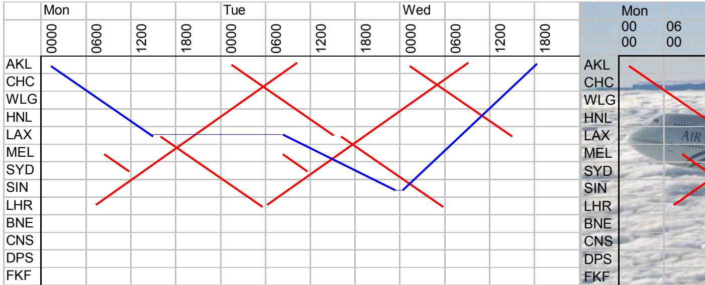  
Example and Picture from Air New Zealand

Costs include:

Rules for building columns include:

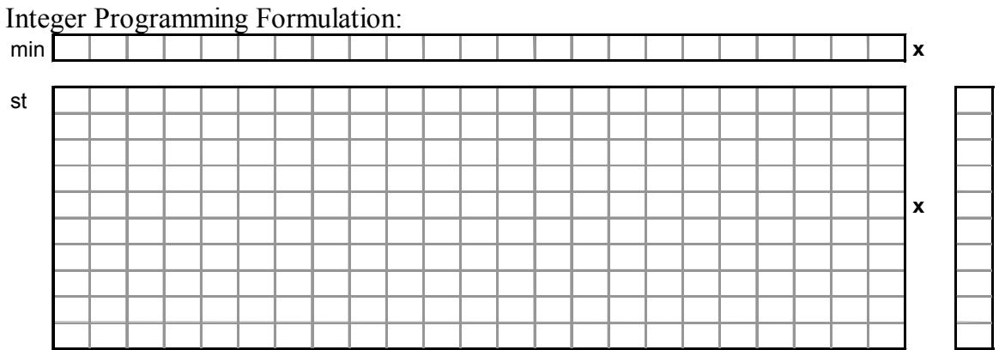

# Set Partitioning Example 2: Political Districting

  
(Images stolen from http://www.elections.org.nz/elections/general/electorates/index.html)

(c) A. Mason

Costs: Shape of electorate, natural unit (eg not split by rivers), deviation from desired populationsize!

Possible Additional Constraint: Must have 61 electorates

# Other Set Partitioning Examples:

Vehicle Routing   
- columns are routes, rows are deliveries to make   
Bin Packing

# Set Packing Problems

Variables: Integer (0/1) Right hand side: Binary LP Dual Variables:

Matrix Coefficients: Binary Constraints:

# Set Packing Example: Cutting of Boards

<table><tr><td rowspan=1 colspan=1>1</td><td rowspan=1 colspan=1>2</td><td rowspan=1 colspan=1>3</td><td rowspan=1 colspan=1>4</td><td rowspan=1 colspan=1>5</td></tr><tr><td rowspan=1 colspan=1>6</td><td rowspan=1 colspan=1>7</td><td rowspan=1 colspan=1>8</td><td rowspan=1 colspan=1>9</td><td rowspan=1 colspan=1>10</td></tr><tr><td rowspan=1 colspan=1>11</td><td rowspan=1 colspan=1>12</td><td rowspan=1 colspan=1>13</td><td rowspan=1 colspan=1>14</td><td rowspan=1 colspan=1>15</td></tr></table>

<table><tr><td rowspan=1 colspan=1>1</td><td rowspan=1 colspan=1>2</td><td rowspan=1 colspan=1>3</td><td rowspan=1 colspan=1>4</td><td rowspan=1 colspan=1>5</td></tr><tr><td rowspan=1 colspan=1>6</td><td rowspan=1 colspan=1>7</td><td rowspan=1 colspan=1>8</td><td rowspan=1 colspan=1>9</td><td rowspan=1 colspan=1>10</td></tr><tr><td rowspan=1 colspan=1>11</td><td rowspan=1 colspan=1>12</td><td rowspan=1 colspan=1>13</td><td rowspan=1 colspan=1>14</td><td rowspan=1 colspan=1>15</td></tr></table>

<table><tr><td rowspan=1 colspan=1>1</td><td rowspan=1 colspan=1>2</td><td rowspan=1 colspan=1>3</td><td rowspan=1 colspan=1>4</td><td rowspan=1 colspan=1>5</td></tr><tr><td rowspan=1 colspan=1>6</td><td rowspan=1 colspan=1>7</td><td rowspan=1 colspan=1>8</td><td rowspan=1 colspan=1>9</td><td rowspan=1 colspan=1>10</td></tr><tr><td rowspan=1 colspan=1>11</td><td rowspan=1 colspan=1>12</td><td rowspan=1 colspan=1>13</td><td rowspan=1 colspan=1>14</td><td rowspan=1 colspan=1>15</td></tr></table>

<table><tr><td rowspan=1 colspan=1>1</td><td rowspan=1 colspan=1>2</td><td rowspan=1 colspan=1>3</td><td rowspan=1 colspan=1>4</td><td rowspan=1 colspan=1>5</td></tr><tr><td rowspan=1 colspan=1>6</td><td rowspan=1 colspan=1>7</td><td rowspan=1 colspan=1>8</td><td rowspan=1 colspan=1>9</td><td rowspan=1 colspan=1>10</td></tr><tr><td rowspan=1 colspan=1>11</td><td rowspan=1 colspan=1>12</td><td rowspan=1 colspan=1>13</td><td rowspan=1 colspan=1>14</td><td rowspan=1 colspan=1>15</td></tr></table>

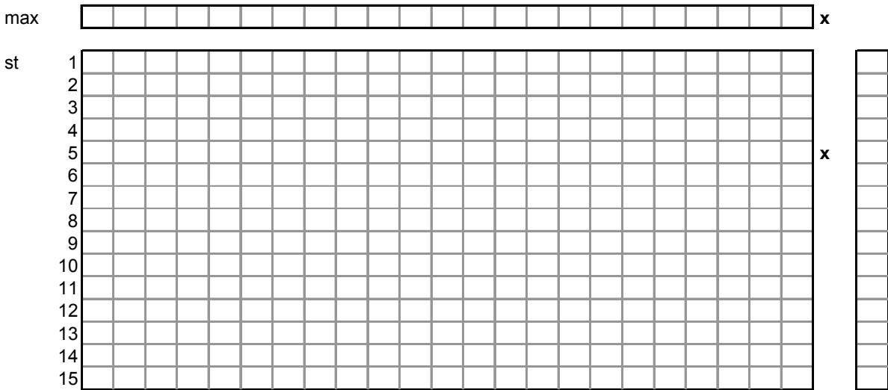

(c) A. Mason

# Set Covering Problems

Variables: Integer (0/1) Right hand side: Binary LP Dual Variables:

Matrix Coefficients: Binary Constraints:

# Set Covering Example: Mail Deliveries

Must walk along each street in town to deliver mail for that street. Each person starts at 5am, must be finished by 7am. If two people walk a street, only 1 does the deliveries (hence ‘covering’)

Columns: Cost:

# Set Covering vs Set Packing

If changing any 1 in a column into a 0 gives a valid no more expensive column, then the set covering and set packing solutions are the same.

# Set Partitioning/Covering/Packing Generalisations:

Different Possibilities:

Right Hand Side: Binary or Integer (or Real) Variables: Binary or Integer A-Matrix coefficients: Binary or Integer (or Real) Constraints: Mix of $< , = , >$

Columns are:

Costs:

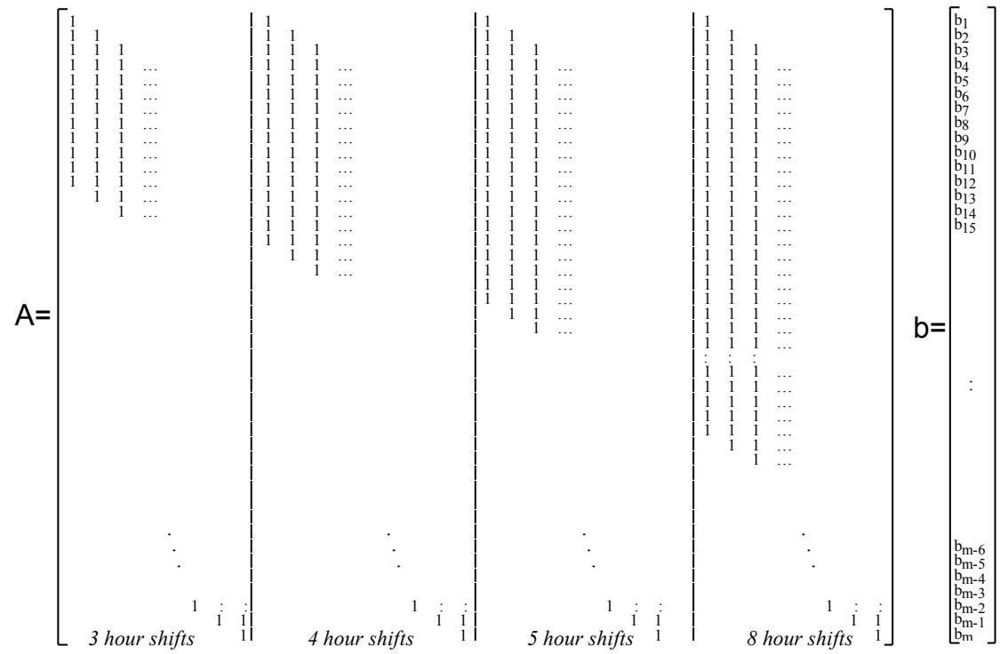

Variables: Right hand side:

Matrix Coefficients: Constraints:

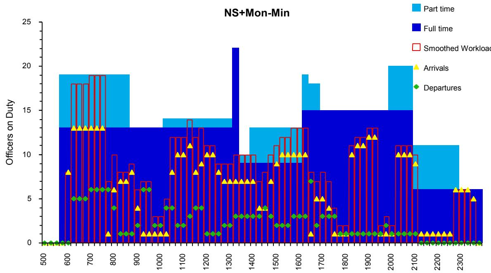  
Generalised Set Covering: Example from NZ Customs

(c) A. Mason

Note: The $\mathbf { \mathrm { G } } \mathbf { x } { = } \mathbf { e }$ constraints are known as… GUB (generalised upper bnd) OR convexity

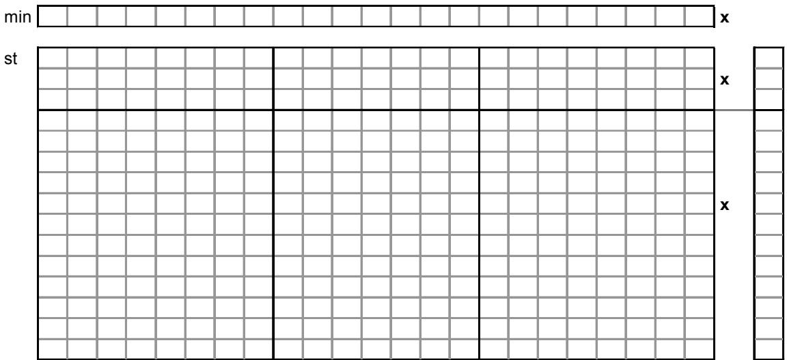

Variables: Right hand side:

Matrix Coefficients: Constraints:

# Set Partitioning Example: ToD Allocation to Crew (“Rostering”)

The problem here is take the optimal Tours of Duty (ToDs) produced earlier, and allocate them to staff, eg cabin crew. We assume that each ToD requires 4 cabin crew.

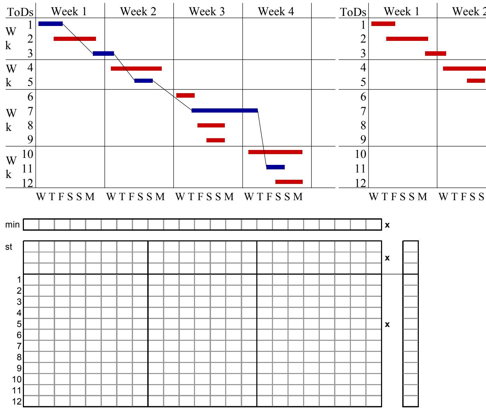

Variables: Right hand side:

Matrix Coefficients: Constraints:

# Generalised Set Covering Example: Group Single-Day Shift Generation

Building shifts with couples who prefer to work together.

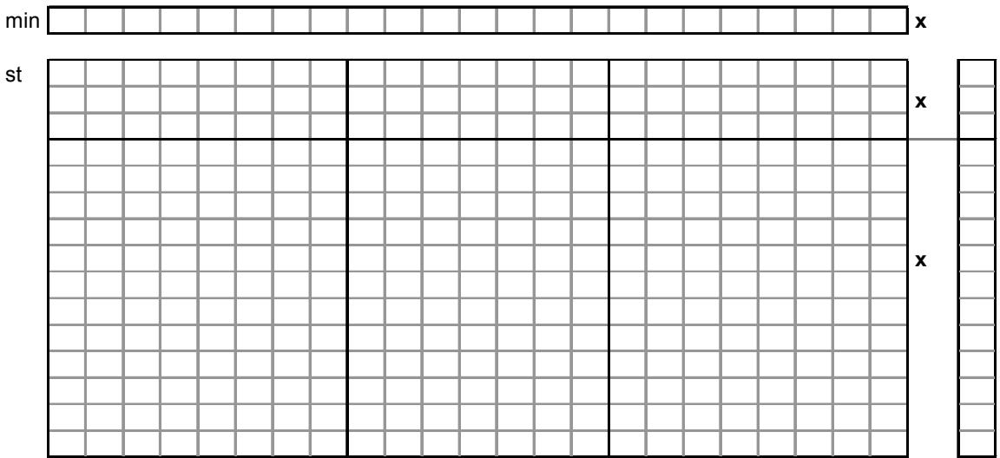

Variables: Right hand side:

Matrix Coefficients: Constraints:

Fractional matrix coefficients can arise, eg…

# Elastic Constraints

Eg for generalised set partitioning:

Introduce costed slack and surplus variables

$$
\_
$$

<table><tr><td rowspan=1 colspan=1>min</td><td rowspan=1 colspan=1></td><td rowspan=1 colspan=1></td><td rowspan=1 colspan=1></td><td rowspan=1 colspan=1></td><td rowspan=1 colspan=1></td><td rowspan=1 colspan=1></td><td rowspan=1 colspan=1></td><td rowspan=1 colspan=1></td><td rowspan=1 colspan=1></td><td rowspan=1 colspan=1></td><td rowspan=1 colspan=1></td><td rowspan=1 colspan=1></td><td rowspan=1 colspan=1>c_slack</td><td rowspan=1 colspan=1></td><td rowspan=1 colspan=1></td><td rowspan=1 colspan=1>c_surplus</td></tr></table>

<table><tr><td rowspan=5 colspan=1>st</td><td rowspan=1 colspan=1></td><td rowspan=1 colspan=1></td><td rowspan=1 colspan=1></td><td rowspan=1 colspan=1></td><td rowspan=1 colspan=1></td><td rowspan=1 colspan=1></td><td rowspan=1 colspan=1></td><td rowspan=1 colspan=1></td><td rowspan=1 colspan=1></td><td rowspan=1 colspan=1></td><td rowspan=1 colspan=1></td><td rowspan=1 colspan=1></td><td rowspan=1 colspan=1>1</td><td rowspan=1 colspan=1></td><td rowspan=1 colspan=1></td><td rowspan=1 colspan=1></td><td rowspan=1 colspan=1></td><td rowspan=1 colspan=1>-1</td><td rowspan=1 colspan=1></td><td rowspan=1 colspan=1></td><td rowspan=1 colspan=1></td><td rowspan=1 colspan=1></td></tr><tr><td rowspan=1 colspan=1></td><td rowspan=1 colspan=1></td><td rowspan=1 colspan=1></td><td rowspan=1 colspan=1></td><td rowspan=1 colspan=1></td><td rowspan=1 colspan=1></td><td rowspan=1 colspan=1></td><td rowspan=1 colspan=1></td><td rowspan=1 colspan=1></td><td rowspan=1 colspan=1></td><td rowspan=1 colspan=1></td><td rowspan=1 colspan=1></td><td rowspan=1 colspan=1></td><td rowspan=1 colspan=1>1</td><td rowspan=1 colspan=1></td><td rowspan=1 colspan=1></td><td rowspan=1 colspan=1></td><td rowspan=1 colspan=1></td><td rowspan=1 colspan=1>-1</td><td rowspan=1 colspan=1></td><td rowspan=1 colspan=1></td><td rowspan=1 colspan=1></td></tr><tr><td rowspan=1 colspan=1></td><td rowspan=1 colspan=1></td><td rowspan=1 colspan=1></td><td rowspan=1 colspan=1></td><td rowspan=1 colspan=1></td><td rowspan=1 colspan=1></td><td rowspan=1 colspan=1></td><td rowspan=1 colspan=1></td><td rowspan=1 colspan=1></td><td rowspan=1 colspan=1></td><td rowspan=1 colspan=1></td><td rowspan=1 colspan=1></td><td rowspan=1 colspan=1></td><td rowspan=1 colspan=1></td><td rowspan=1 colspan=1>1</td><td rowspan=1 colspan=1></td><td rowspan=1 colspan=1></td><td rowspan=1 colspan=1></td><td rowspan=1 colspan=1></td><td rowspan=1 colspan=1>-1</td><td rowspan=1 colspan=1></td><td rowspan=1 colspan=1></td></tr><tr><td rowspan=1 colspan=1></td><td rowspan=1 colspan=1></td><td rowspan=1 colspan=1></td><td rowspan=1 colspan=1></td><td rowspan=1 colspan=1></td><td rowspan=1 colspan=1></td><td rowspan=1 colspan=1></td><td rowspan=1 colspan=1></td><td rowspan=1 colspan=1></td><td rowspan=1 colspan=1></td><td rowspan=1 colspan=1></td><td rowspan=1 colspan=1></td><td rowspan=1 colspan=1></td><td rowspan=1 colspan=1></td><td rowspan=1 colspan=1></td><td rowspan=1 colspan=1>1</td><td rowspan=1 colspan=1></td><td rowspan=1 colspan=1></td><td rowspan=1 colspan=1></td><td rowspan=1 colspan=1></td><td rowspan=1 colspan=1>-1</td><td rowspan=1 colspan=1></td></tr><tr><td rowspan=1 colspan=1></td><td rowspan=1 colspan=1></td><td rowspan=1 colspan=1></td><td rowspan=1 colspan=1></td><td rowspan=1 colspan=1></td><td rowspan=1 colspan=1></td><td rowspan=1 colspan=1></td><td rowspan=1 colspan=1></td><td rowspan=1 colspan=1></td><td rowspan=1 colspan=1></td><td rowspan=1 colspan=1></td><td rowspan=1 colspan=1></td><td rowspan=1 colspan=1></td><td rowspan=1 colspan=1></td><td rowspan=1 colspan=1></td><td rowspan=1 colspan=1></td><td rowspan=1 colspan=1>1</td><td rowspan=1 colspan=1></td><td rowspan=1 colspan=1></td><td rowspan=1 colspan=1></td><td rowspan=1 colspan=1></td><td rowspan=1 colspan=1>-1</td></tr></table>

# Notes:

don’t normally enforce integrality of slack/surplus variables (happens naturally)

can put bounds on u and s, and/or piecewise linear costs

This problem is more stable in the sense that the LP Dual Variables are now… .. bounded $\_$

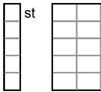

# Solution Strategies

# “Enumeration with Implication” (Constraint Logic Programming) for Set Partitioning

<table><tr><td rowspan=1 colspan=1>5</td><td rowspan=1 colspan=1></td><td rowspan=1 colspan=1>3</td><td rowspan=1 colspan=1>5</td><td rowspan=1 colspan=1>2</td><td rowspan=1 colspan=1>−2</td><td rowspan=1 colspan=1>2</td><td rowspan=1 colspan=1>1</td><td rowspan=1 colspan=1>9</td><td rowspan=1 colspan=1>6</td></tr></table>

<table><tr><td rowspan=6 colspan=1>st</td><td rowspan=1 colspan=1></td><td rowspan=1 colspan=1>1</td><td rowspan=1 colspan=1></td><td rowspan=1 colspan=1>1</td><td rowspan=1 colspan=1></td><td rowspan=1 colspan=1></td><td rowspan=1 colspan=1></td><td rowspan=1 colspan=1></td><td rowspan=1 colspan=1>1</td><td rowspan=1 colspan=1></td></tr><tr><td rowspan=1 colspan=1>1</td><td rowspan=1 colspan=1>1</td><td rowspan=1 colspan=1>1</td><td rowspan=1 colspan=1></td><td rowspan=1 colspan=1>1</td><td rowspan=1 colspan=1></td><td rowspan=1 colspan=1>1</td><td rowspan=1 colspan=1></td><td rowspan=1 colspan=1></td><td rowspan=1 colspan=1></td></tr><tr><td rowspan=1 colspan=1></td><td rowspan=1 colspan=1>1</td><td rowspan=1 colspan=1>1</td><td rowspan=1 colspan=1></td><td rowspan=1 colspan=1></td><td rowspan=1 colspan=1></td><td rowspan=1 colspan=1></td><td rowspan=1 colspan=1>1</td><td rowspan=1 colspan=1>1</td><td rowspan=1 colspan=1></td></tr><tr><td rowspan=1 colspan=1>1</td><td rowspan=1 colspan=1></td><td rowspan=1 colspan=1>1</td><td rowspan=1 colspan=1>1</td><td rowspan=1 colspan=1></td><td rowspan=1 colspan=1>1</td><td rowspan=1 colspan=1></td><td rowspan=1 colspan=1></td><td rowspan=1 colspan=1></td><td rowspan=1 colspan=1>1</td></tr><tr><td rowspan=1 colspan=1></td><td rowspan=1 colspan=1></td><td rowspan=1 colspan=1>1</td><td rowspan=1 colspan=1>1</td><td rowspan=1 colspan=1>1</td><td rowspan=1 colspan=1></td><td rowspan=1 colspan=1></td><td rowspan=1 colspan=1></td><td rowspan=1 colspan=1>1</td><td rowspan=1 colspan=1>1</td></tr><tr><td rowspan=1 colspan=1></td><td rowspan=1 colspan=1></td><td rowspan=1 colspan=1></td><td rowspan=1 colspan=1></td><td rowspan=1 colspan=1></td><td rowspan=1 colspan=1>1</td><td rowspan=1 colspan=1></td><td rowspan=1 colspan=1></td><td rowspan=1 colspan=1></td><td rowspan=1 colspan=1>1</td></tr></table>

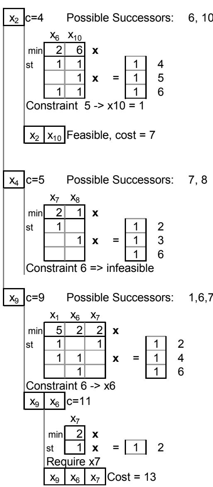

<table><tr><td rowspan=1 colspan=1>5</td><td rowspan=1 colspan=1>5 4</td><td rowspan=1 colspan=1>3</td><td rowspan=1 colspan=1>5</td><td rowspan=1 colspan=1>2</td><td rowspan=1 colspan=1>2</td><td rowspan=1 colspan=1>2</td><td rowspan=1 colspan=1>1</td><td rowspan=1 colspan=1>9</td><td rowspan=1 colspan=1>6</td></tr></table>

<table><tr><td rowspan=6 colspan=1>st</td><td rowspan=1 colspan=1></td><td rowspan=1 colspan=1>1</td><td rowspan=1 colspan=1></td><td rowspan=1 colspan=1>1</td><td rowspan=1 colspan=1></td><td rowspan=1 colspan=1></td><td rowspan=1 colspan=1></td><td rowspan=1 colspan=1></td><td rowspan=1 colspan=1>1</td><td rowspan=1 colspan=1></td><td rowspan=6 colspan=1>X  =</td></tr><tr><td rowspan=1 colspan=1>1</td><td rowspan=1 colspan=1>1</td><td rowspan=1 colspan=1>1</td><td rowspan=1 colspan=1></td><td rowspan=1 colspan=1>1</td><td rowspan=1 colspan=1></td><td rowspan=1 colspan=1>1</td><td rowspan=1 colspan=1></td><td rowspan=1 colspan=1></td><td rowspan=1 colspan=1></td></tr><tr><td rowspan=1 colspan=1></td><td rowspan=1 colspan=1>1</td><td rowspan=1 colspan=1>1</td><td rowspan=1 colspan=1></td><td rowspan=1 colspan=1></td><td rowspan=1 colspan=1></td><td rowspan=1 colspan=1></td><td rowspan=1 colspan=1>1</td><td rowspan=1 colspan=1>1</td><td rowspan=1 colspan=1></td></tr><tr><td rowspan=1 colspan=1>1</td><td rowspan=1 colspan=1></td><td rowspan=1 colspan=1>1</td><td rowspan=1 colspan=1>1</td><td rowspan=1 colspan=1></td><td rowspan=1 colspan=1>1</td><td rowspan=1 colspan=1></td><td rowspan=1 colspan=1></td><td rowspan=1 colspan=1></td><td rowspan=1 colspan=1>1</td></tr><tr><td rowspan=1 colspan=1></td><td rowspan=1 colspan=1></td><td rowspan=1 colspan=1>1</td><td rowspan=1 colspan=1>1</td><td rowspan=1 colspan=1>1</td><td rowspan=1 colspan=1></td><td rowspan=1 colspan=1></td><td rowspan=1 colspan=1></td><td rowspan=1 colspan=1>1</td><td rowspan=1 colspan=1>1</td></tr><tr><td rowspan=1 colspan=1></td><td rowspan=1 colspan=1></td><td rowspan=1 colspan=1></td><td rowspan=1 colspan=1></td><td rowspan=1 colspan=1></td><td rowspan=1 colspan=1>1</td><td rowspan=1 colspan=1></td><td rowspan=1 colspan=1></td><td rowspan=1 colspan=1></td><td rowspan=1 colspan=1>1</td></tr></table>

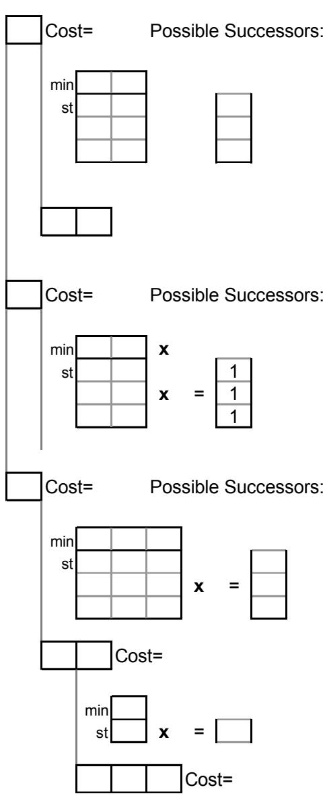

Comments: Could we bound? Yes, if all $\cdot$ , eg bound sln $\mathbf { \delta X 9 }$ , x6 by first soln found But, bounds are weak as for only partial solns, no LP to give better Can incorporate implication into IP B&B… see later

Can often preprocess A matrix to identify cost/constraint implications

Can use for Covering/Packing, but implications not so strong

CLP can be much better than IP

NB: Cplex preprocessing “probing” is close to CLP

References: eg INFORMS Journal on Computing Volume 10, Number 3, 1998 (pubsonline.informs.org)

# Heuristics

Many based on Lagrangian relaxation, genetic algorithms, simulated annealing etc. Some are very good.

# COLUMN GENERATION AND DECOMPOSITION

Andrew Mason

a.mason@auckland.ac.nz, www.esc.auckland.ac.nz/Mason

Linkoping 1999, Auckland 2000, Auckland 2001

# Integer Programming for Set Partitioning

Solve the linear programming relaxation, then use “branch and bound” or “branch and cut” to integerise.

When there is a choice of set partitioning or set covering as a formulation, set covering is preferred: (Barnhart et al 1998)

• Its linear programming relaxation is numerically far more stable and thus easier to solve; • It is trivial to construct a feasible integer solution from a solution to the linear programming relaxation

# Solving the Set Partitioning Linear Programming Relaxation

We assume A is an mxn matrix, with $\mathrm { n } > > \mathrm { m }$ . We solve:

Min $\scriptstyle \mathbf { z } = \mathbf { c } ^ { \mathrm { T } } \mathbf { X }$ st $\mathbf { A } \mathbf { x } = \mathbf { b }$ $\mathbf { \boldsymbol { x } } \geq 0$ , integer

NB: Generally hard to solve as these LP’s are very degenerate

Standard LP procedure:

Repeat Price all (non-basic) columns to find an entering variable If an entering variable is found Enter variable into basis, remove leaving column, update x, and Pi’s   
Until no entering column is found

Note: Let $\mathrm { a _ { j } }$ denote the j’th column of A, so $\mathrm { A } { \equiv } ( \mathrm { a } _ { 1 } | \mathrm { a } _ { 2 } | \mathrm { a } _ { 3 } | \dots | \mathrm { a } _ { \mathrm { n } } )$

For binary A matrices, let $\mathrm { { I } ( a _ { j } ) = \{ i : a _ { i j } = 1 \} }$ be the indices of the rows column j contributes to.

Now, the reduced cost for $\mathbf { X } _ { \mathrm { j } }$ is given by $\begin{array} { r l r l } { \mathrm { r c ( x _ { j } ) } } & { = \mathbf { c _ { j } } - \mathrm { p ^ { T } } \mathbf { a _ { j } } } & & { = \mathbf { c _ { i } } - \mathbf { s u m \_ i } \mathrm { i } \mathrm { i n \ I ( \mathbf { a _ { j } } ) } \mathrm { p { \underline { { \ j } } } } } \end{array}$

Does it matter if we price basic columns? No

Why? They will have 0 reduced cost

But... beware numerical error.. don’t want a basic column to enter!

Standard LP with Partial Pricing Assume the variables are divided (perhaps naturally) into p subsets $\mathrm { X } _ { 1 } , \mathrm { X } _ { 2 } , . . . , \mathrm { X } _ { \mathrm { p } }$

Eg, For Personalised Shifts Generation problem, $\cdot$ columns for staff member s

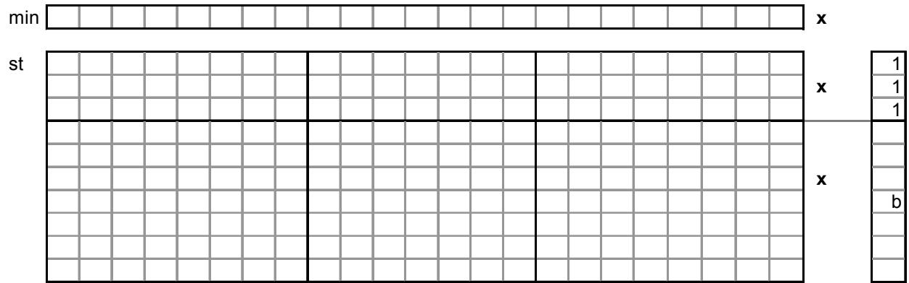

$$
\mathsf { s } = 1
$$

Repeat

Repeat

Price all (non-basic) columns in subset $\mathrm { X _ { s } }$

$$
\begin{array} { l } { { \mathrm { s = s + 1 } } } \\ { { \ } } \\ { { \mathrm { i f \left( s > p \right) s = 1 } } } \end{array}
$$

Until a ‘sufficiently good’ entering variable is found or all columns priced

If an entering variable is found

Enter variable into basis, remove leaving column, update x, and Pi’s

Until no entering column is found

Absolutely vital for fast solution of large problems. Much more efficient memory access

What is sufficiently good?

This material is not to be distrubted; contact the author for the latest version and permission to distribute.

Maintain an active set.   
Use active set for fast iterations.   
Do big pricing occasionally.

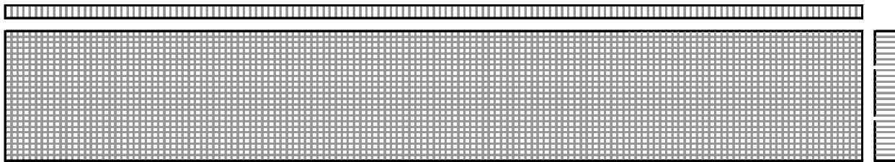

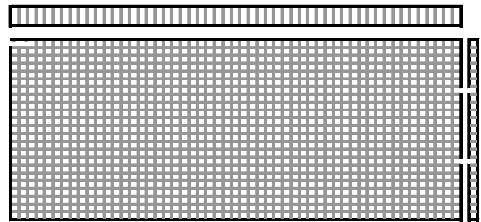

Let $\mathbf { A } _ { \mathrm { a c t i v e } }$ denote the active subset of columns from A.

$$
\mathsf { s } = 1
$$

Repeat

Repeat

Price all (non-basic) columns in active subset $\mathbf { A } _ { \mathrm { a c t i v e } }$ If a ‘sufficiently good’ entering variable is found Enter variable into basis, remove leaving column, update x, Pi’s until no ‘sufficiently good’ entering column is found Price A to find a set of good entering columns (-ve r.c.) if good (or any) entering columns are found Add entering columns to Aactive Remove non-basic (high reduced cost?) columns from $\mathbf { A } _ { \mathrm { a c t i v e } }$ Until no entering column is found

Note: The “Price A” step does not need to price all columns except in the final iterations.

Advantages: Small active set in memory Can bring in columns off disk if required

We stop our minor iterations and price A when the most negative reduced cost in $\mathbf { A } _ { \mathrm { a c t i v e } }$ is not “sufficiently good”. What’s good enough?

(c) A. Mason

This material is not to be distrubted; contact the author for the latest version and permission to distribute.

SPRINT successfully used within IBM for a number of big problems. Ideas also appear in Lagrangian-based heuristics.

Efficient Pricing in the LP – Simple (Trivial?) Column Generation Pricing is all about giving the basis a new entering column if one exists.

Example 1: The A-matrix consists of $2 ^ { \mathfrak { n } }$ columns being all possibilities or a 1 or a 0 in each position. Cost of each column is 1.

<table><tr><td rowspan=8 colspan=1>minst</td><td rowspan=1 colspan=1>1</td><td rowspan=1 colspan=1>1</td><td rowspan=1 colspan=1>1</td><td rowspan=1 colspan=1>1</td><td rowspan=1 colspan=1>1</td><td rowspan=1 colspan=1>1</td><td rowspan=1 colspan=1>1</td><td rowspan=1 colspan=1></td><td rowspan=1 colspan=1></td><td rowspan=1 colspan=1></td><td rowspan=1 colspan=1></td><td rowspan=1 colspan=1></td><td rowspan=1 colspan=1></td><td rowspan=1 colspan=1></td><td rowspan=1 colspan=1></td><td rowspan=1 colspan=1></td><td rowspan=1 colspan=1></td><td rowspan=1 colspan=1></td><td rowspan=1 colspan=1></td><td rowspan=1 colspan=1></td><td rowspan=1 colspan=1></td><td rowspan=1 colspan=1></td><td rowspan=1 colspan=1></td><td></td><td rowspan=8 colspan=2>Xπ1r3Xbπsπ6</td></tr><tr><td rowspan=1 colspan=1></td><td rowspan=1 colspan=1></td><td></td><td></td><td></td><td></td><td></td><td></td><td></td><td></td><td></td><td></td><td></td><td></td><td></td><td></td><td></td><td></td><td></td><td></td><td></td><td></td><td></td><td></td></tr><tr><td rowspan=1 colspan=1>0</td><td rowspan=1 colspan=1>0</td><td rowspan=1 colspan=1>0</td><td rowspan=1 colspan=1>0</td><td rowspan=1 colspan=1>0</td><td rowspan=1 colspan=1>0</td><td rowspan=1 colspan=1>0</td><td rowspan=1 colspan=1></td><td rowspan=1 colspan=1></td><td rowspan=1 colspan=1></td><td rowspan=1 colspan=1></td><td rowspan=1 colspan=1></td><td rowspan=1 colspan=1></td><td rowspan=1 colspan=1></td><td rowspan=1 colspan=1></td><td rowspan=1 colspan=1></td><td rowspan=1 colspan=1></td><td rowspan=1 colspan=1></td><td rowspan=1 colspan=1></td><td rowspan=1 colspan=1></td><td rowspan=1 colspan=1></td><td rowspan=1 colspan=1>1</td><td rowspan=1 colspan=1>1</td><td rowspan=6 colspan=2>X</td><td rowspan=1 colspan=1></td><td rowspan=6 colspan=1>b</td></tr><tr><td rowspan=1 colspan=1>0</td><td rowspan=1 colspan=1>0</td><td rowspan=1 colspan=1>0</td><td rowspan=1 colspan=1>0</td><td rowspan=1 colspan=1>0</td><td rowspan=1 colspan=1>0</td><td rowspan=1 colspan=1>0</td><td rowspan=1 colspan=1></td><td rowspan=1 colspan=1></td><td rowspan=1 colspan=1></td><td rowspan=1 colspan=1></td><td rowspan=1 colspan=1></td><td rowspan=1 colspan=1></td><td rowspan=1 colspan=1></td><td rowspan=1 colspan=1></td><td rowspan=1 colspan=1></td><td rowspan=1 colspan=1></td><td rowspan=1 colspan=1></td><td rowspan=1 colspan=1></td><td rowspan=1 colspan=1></td><td rowspan=1 colspan=1></td><td rowspan=1 colspan=1>1</td><td rowspan=1 colspan=1>1</td></tr><tr><td rowspan=1 colspan=1>0</td><td rowspan=1 colspan=1>0</td><td rowspan=1 colspan=1>0</td><td rowspan=1 colspan=1>0</td><td rowspan=1 colspan=1>0</td><td rowspan=1 colspan=1>0</td><td rowspan=1 colspan=1>0</td><td rowspan=1 colspan=1></td><td rowspan=1 colspan=1></td><td rowspan=1 colspan=1></td><td rowspan=1 colspan=1></td><td rowspan=1 colspan=1></td><td rowspan=1 colspan=1></td><td rowspan=1 colspan=1></td><td rowspan=1 colspan=1></td><td rowspan=1 colspan=1></td><td rowspan=1 colspan=1></td><td rowspan=1 colspan=1></td><td rowspan=1 colspan=1></td><td rowspan=1 colspan=1></td><td rowspan=1 colspan=1></td><td rowspan=1 colspan=1>1</td><td rowspan=1 colspan=1>1</td></tr><tr><td rowspan=1 colspan=1>0</td><td rowspan=1 colspan=1>0</td><td rowspan=1 colspan=1>0</td><td rowspan=1 colspan=1>0</td><td rowspan=1 colspan=1>1</td><td rowspan=1 colspan=1>1</td><td rowspan=1 colspan=1>1</td><td rowspan=1 colspan=1></td><td rowspan=1 colspan=1></td><td rowspan=1 colspan=1></td><td rowspan=1 colspan=1></td><td rowspan=1 colspan=1></td><td rowspan=1 colspan=1></td><td rowspan=1 colspan=1></td><td rowspan=1 colspan=1></td><td rowspan=1 colspan=1></td><td rowspan=1 colspan=1></td><td rowspan=1 colspan=1></td><td rowspan=1 colspan=1></td><td rowspan=1 colspan=1></td><td rowspan=1 colspan=1></td><td rowspan=1 colspan=1>1</td><td rowspan=1 colspan=1>1</td></tr><tr><td rowspan=1 colspan=1>0</td><td rowspan=1 colspan=1>0</td><td rowspan=1 colspan=1>1</td><td rowspan=1 colspan=1>1</td><td rowspan=1 colspan=1>0</td><td rowspan=1 colspan=1>1</td><td rowspan=1 colspan=1>1</td><td rowspan=1 colspan=1></td><td rowspan=1 colspan=1></td><td rowspan=1 colspan=1></td><td rowspan=1 colspan=1></td><td rowspan=1 colspan=1></td><td rowspan=1 colspan=1></td><td rowspan=1 colspan=1></td><td rowspan=1 colspan=1></td><td rowspan=1 colspan=1></td><td rowspan=1 colspan=1></td><td rowspan=1 colspan=1></td><td rowspan=1 colspan=1></td><td rowspan=1 colspan=1></td><td rowspan=1 colspan=1></td><td rowspan=1 colspan=1>1</td><td rowspan=1 colspan=1>1</td></tr><tr><td rowspan=1 colspan=1>0</td><td rowspan=1 colspan=1>1</td><td rowspan=1 colspan=1>0</td><td rowspan=1 colspan=1>1</td><td rowspan=1 colspan=1>1</td><td rowspan=1 colspan=1>0</td><td rowspan=1 colspan=1>1</td><td rowspan=1 colspan=1></td><td rowspan=1 colspan=1></td><td rowspan=1 colspan=1></td><td rowspan=1 colspan=1></td><td rowspan=1 colspan=1></td><td rowspan=1 colspan=1></td><td rowspan=1 colspan=1></td><td rowspan=1 colspan=1></td><td rowspan=1 colspan=1></td><td rowspan=1 colspan=1></td><td rowspan=1 colspan=1></td><td rowspan=1 colspan=1></td><td rowspan=1 colspan=1></td><td rowspan=1 colspan=1></td><td rowspan=1 colspan=1>0</td><td rowspan=1 colspan=1>1</td></tr></table>

We could store all our columns in an A-matrix. Then our pricing algorithm could price all the columns in sequence using $\mathrm { r c ( x _ { j } ) { = } c _ { j } - { \pi } ^ { T } a _ { j } }$ , and then return that column (if any) with themost negative reduced cost.

Or we could be smart:

We do not store any columns (except those in the basis)   
Whenever we need to price columns, use the following algorithm: Place 1’s in each row with a –ve Pi.   
Calculate reduced cost   
Return the constructed column if r.c. $\cdot$

(c) A. Mason

Example 2: The A-matrix consists of all columns with 1, 2, 3, 4, or 5 1’s in any rows. Cost of a column is the number of 1’s it contains.

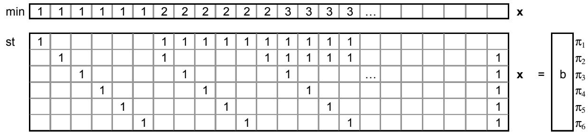

The Smart approach:

Do not store an A-matrix.   
To find an entering column:   
For each row, calculate $\cdot$   
Find the rows (up to 5) with most negative hi’s   
Place 1’s in these rows   
Return the column constructed if it has negative reduced cost

# Gilmore Gomory (Delayed) Column Generation for Stock Cutting

The Better Food Company produces cream-filled sponge rolls with a standard width of $2 0 \mathrm { c m }$ each. Each 20cm roll costs the company $\$ 2.00$ to produce. Special customer orders with different widths are produced by cutting (slitting) the standard rolls of sponge into shorter lengths. Typical orders (which may vary from day to day) are summarized in the following table. These orders need to be met at least cost.

<table><tr><td></td><td>Desired</td><td>Desired Number</td></tr><tr><td>Order</td><td>Width (cm)</td><td>of Rolls</td></tr><tr><td>A</td><td>5</td><td>150</td></tr><tr><td>B</td><td>7</td><td>200</td></tr><tr><td>C</td><td>9</td><td>300</td></tr></table>

An order is filled by setting the cutting knives to the desired widths. Usually, there are a number of ways in which a standard roll can be slit to fill a given order. The figure below shows three possible knife settings for the 20-cm roll. Although there are other feasible settings, we limit the discussion for the moment to considering settings 1, 2. and 3 in the figure. Note that the shaded area in each diagram represents lengths of sponge that are too short to be used in meeting orders, and so these pieces must be thrown away. Such wastage is called trim loss.

(c) A. Mason

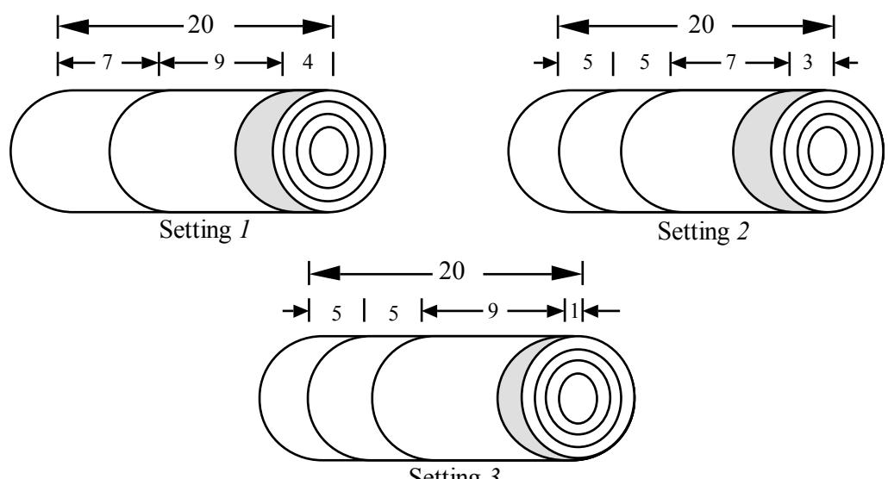  
Setting 3

The effect of all the different ‘sensible’ cutting patterns is summarised in the following table.

<table><tr><td></td><td>Pattern 1</td><td>Pattern 2</td><td></td><td></td><td>Pattern 3 Pattern 4 Pattern 5 Pattern 6</td><td></td></tr><tr><td>5 cm rolls produced</td><td>0</td><td>2</td><td>2</td><td>4</td><td>1</td><td>0</td></tr><tr><td>7 cm rolls produced</td><td>1</td><td>1</td><td>0</td><td>0</td><td>2</td><td>0</td></tr><tr><td>9 cm rolls produced</td><td>1</td><td>0</td><td>1</td><td>0</td><td>0</td><td>2</td></tr></table>

We note that each pattern uses no more than $2 0 \mathrm { c m }$

# Mathematical Representation

We seek to determine the knife setting combinations (variables) that will fill the required orders (constraints) while using the least number of rolls (objective).

To express the model mathematically, we define the variables as

$\mathbf { \mathrm { x } _ { j } } =$ number of standard rolls to be slit according to pattern j $, \mathrm { j } = 1 , 2 , . . . , 6$

# Objective:

We wish to minimise the number of the rolls we cut: $\mathrm { n i n } \mathrm { x } _ { 1 } + \mathrm { x } _ { 2 } + \mathrm { x } _ { 3 } + \mathrm { x } _ { 4 } + \mathrm { x } _ { 5 } + \mathrm { x } _ { 6 }$

# Constraints

We must ensure we cut at least the number of 5, 7 and 9 cm rolls ordered.

$$
\begin{array} { r l } { 5 \mathrm { - c m \ r o l l s . } \quad } & { 2 \mathrm { x } _ { 2 } + 2 \mathrm { x } _ { 3 } + 4 \mathrm { x } _ { 4 } + \mathrm { x } _ { 5 } \geq 1 5 0 } \\ { 7 \mathrm { - c m \ r o l l s . } \quad } & { \mathrm { x } _ { 1 } + \mathrm { x } _ { 2 } + 2 \mathrm { x } _ { 5 } \geq 2 0 0 } \\ { 9 \mathrm { - c m \ r o l l s . } \quad } & { \mathrm { x } _ { 1 } + \mathrm { x } _ { 3 } + 2 \mathrm { x } _ { 6 } \geq 3 0 0 } \end{array}
$$

Logical constraints:

${ \bf x } _ { 1 } , { \bf x } _ { 2 } , { \bf x } _ { 3 } , { \bf x } _ { 4 } , { \bf x } _ { 5 } , { \bf x } _ { 6 } \geq 0$ , integer

# Finding the Entering Column

The LP relaxation to the above IP can be written

<table><tr><td></td><td>X1</td><td></td><td></td><td>X3</td><td>X4</td><td>X5</td><td>X6</td><td></td><td></td></tr><tr><td>min</td><td></td><td>1</td><td>1</td><td>1</td><td>1</td><td>1</td><td>1</td><td></td><td>orders</td></tr><tr><td>s.t.</td><td>5cm</td><td></td><td>2</td><td>2</td><td>4</td><td>1</td><td></td><td>≥</td><td>150</td></tr><tr><td></td><td>7cm</td><td>1</td><td>1</td><td></td><td></td><td>2</td><td></td><td>≥</td><td>200</td></tr><tr><td></td><td>9cm</td><td>1</td><td></td><td>1</td><td></td><td></td><td>2</td><td>≥</td><td>300</td></tr></table>

Assume we are solving the LP relaxation, and we want to find the best entering variable (most negative reduced cost). Now, the reduced costs for all columns (including the basic ones) are:

$$
\mathrm { r . c . ( x _ { j } ) = c _ { j } - \pi ^ { T } a _ { j } }
$$

Now, any column of the A-matrix can be represented as a vector:

$$
\begin{array} { r }  \mathbf { C _ { j } } [ \begin{array} { c } { \mathbf { X _ { j } } } \\ { \mathbf { 1 } } \\ { \mathbf { y _ { 1 } } } \\ { \mathbf { 2 _ { j } } } \\ { \mathbf { 3 _ { j } } } \end{array} ] \begin{array} { l } { \zeta _ { \mathbf { j } } } \\ { \mathbf { \zeta _ { \mathbf { \overline { { \mathbf { J } } } } } } } \end{array} ] \begin{array} { l } { \zeta _ { \mathbf { j } } } \\ { \zeta _ { \mathbf { c m } } } \end{array} \end{array}
$$

where $\mathrm { y } _ { 1 } , \mathrm { y } _ { 2 }$ , & ${ \mathrm { y } } _ { 3 }$ are the integer number of 5cm, 7cm, and 9cm lengths cut from the 20cm.

When we generated the A-matrix, we considered all (sensible) combinations for which

$$
5 { \mathrm { y } } _ { 1 } + 7 { \mathrm { y } } _ { 2 } + 9 { \mathrm { y } } _ { 3 } \leq 2 0
$$

All combinations of ${ \mathrm { y } } _ { 1 } , { \mathrm { y } } _ { 2 } , \& { \mathrm { y } } _ { 3 }$ that satisfy this constraint (and are ‘sensible’ in that they could not fit another roll) appear in the A matrix, and so represent possible entering columns.

The reduced cost of this general ‘y’ column is: 1 - y1p1 - y2p2 - y3p3

Therefore, the problem of generating our most negative reduced cost column can be formulated:

min 1 - y1p1 - y2p2 - y3p3 or max y1p1 + y2p2 + y3p3 s.t. 5y1 + 7y2 + 9y3.<= 20 Knapsack Problem y1, y2, y3=0, integer

Notes:

This idea was first used by Gilmore and Gomory in the 1950’s.

How do we implement the column generator?

(c) A. Mason

# Extreme Columns…

Will all the columns above actually be generated by the column generator? Consider a simplified example:

Columns are a mix of 5cm and 7cm pieces cut from $3 0 \mathrm { c m }$

<table><tr><td></td><td></td><td>X1</td><td>X2</td><td>X3</td><td>X4</td><td>X5</td><td></td><td></td><td></td></tr><tr><td>min</td><td></td><td>1</td><td>1</td><td>1</td><td>1</td><td>1</td><td>x</td><td>orders</td><td></td></tr><tr><td>s.t.</td><td>5cm</td><td>6</td><td>4</td><td>3</td><td>1</td><td>0</td><td>≥</td><td>9</td><td>π1</td></tr><tr><td></td><td>7cm</td><td>0</td><td>1</td><td>2</td><td>3</td><td>4</td><td>≥</td><td>6</td><td>π2</td></tr></table>

Consider column generator problem of finding most negative reduced cost given $\pi _ { 1 } , \pi _ { 2 }$

min 1 - y1p1 - y2p2 or max y1p1 + y2p2 s.t. 5y1 + 7y2 .<= 30 Knapsack Problem y1, y2=0, integer

What do the solutions to this problem look like? Note all duals are non-negative.

Case $1 \colon \mathrm { p } _ { 1 } > \ 2 / 3 \ \mathrm { p } _ { 2 }$ Most negative reduced cost column is: (6,0)T

Case 2: $\mathrm { p _ { 1 } < ~ 2 / 3 ~ p _ { 2 } }$ Most negative reduced cost column is: (0,4)

What is best optimal LP solution using generated columns?:

<table><tr><td>X1</td><td>X2</td><td>X3</td><td>X4</td><td>X5</td></tr><tr><td>1.5</td><td></td><td></td><td></td><td>1.5</td></tr></table>

Cost $^ { = 3 }$

What is the best integer solution?

<table><tr><td>X1</td><td>X2</td><td>X3</td><td>X4</td><td>X5</td></tr><tr><td>1</td><td></td><td>1 or 3</td><td></td><td>1</td></tr></table>

Cost =3

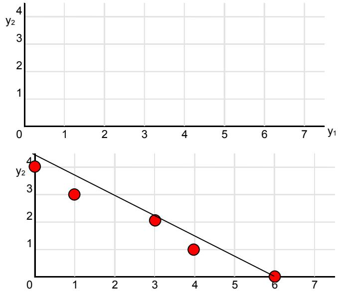

Note: Column ${ \bf X } _ { 3 }$ exists in LP solution as a linear combination of other cols

Moral of the story: Column generator gives extreme columns May need to generate new columns during integerisation

Don’t believe AMPL’s/CPlex stock cutting example! (CPlex does not generate in B&B, but only uses columns generated during the LP solve.)

(c) A. Mason

This material is not to be distrubted; contact the author for the latest version and permission to distribute.

# Dantzig Wolfe Decomposition and Column Generation

Dantzig & Wolfe developed a technique that takes some LP or IP problem, and forms from it a new problem. This new problem can, if we wish, be solved using column generation.

Example: We have 2 staff available to cover today’s 3 shifts, each 4 hours long. We require 1 or more staff on each shift. Each shift costs 1 unit to staff. Person A can work between 4 and 8 hours, person B between 8 and 12 hours.

Let $\mathrm { y _ { i j } } = 1$ if person i does shift j, and 0 otherwise, $\mathrm { y _ { i j } } \in \{ 0 , 1 \}$

We can write this problem out as follows to emphasise the independence of the $\mathrm { y _ { A } } ^ { \prime } \mathrm { s }$ and $\mathrm { { y _ { B } } ^ { \prime } \mathrm { { s } } }$

min yA1 + yA2 + yA3 $+ \mathrm { y _ { B 1 } } + \mathrm { y _ { B 2 } } + \mathrm { y _ { B 3 } }$   
st yA1 + yB1 ≥ 1 yA2 + yB2 ≥ 1 <-Complcated constraints (involve $\mathrm { y _ { A } } ^ { \prime } \mathrm { s }$ and $\mathrm { y _ { B } } ^ { \prime } \mathrm { s } _ { \mathrm { \ell } }$ ) yA3 + yB3 ≥ 1

$$
\begin{array} { r } { \mathsf { y } _ { \mathsf { B } 1 } \mathsf { y } _ { \mathsf { B } 2 } \mathsf { y } _ { \mathsf { B } 3 } \in \{ 0 , 1 \} } \end{array}
$$

If we replace the ‘easy’ constraints 4 and 5, and 6 and 7, by the set of solutions that they (and the binary restrictions on the y’s) allow, we can write this as:

$$
+ \mathrm { y _ { B 1 } } + \mathrm { y _ { B 2 } } + \mathrm { y _ { B 3 } }
$$

min yA1 + yA2 + yA3   
st yA1 + yB1 ≥ 1 yA2 + yB2 ≥ 1 yA3 + yB3 ≥ 1 (yA1, yA2, yA3) /in SA

where $\mathrm { S _ { A } }$ is the set of all possible legal values for (yA1, yA2, yA3):

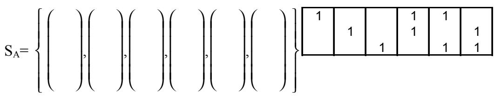

and $\mathrm { S _ { B } }$ is the set of all possible legal values for (yB1, yB2, yB3)

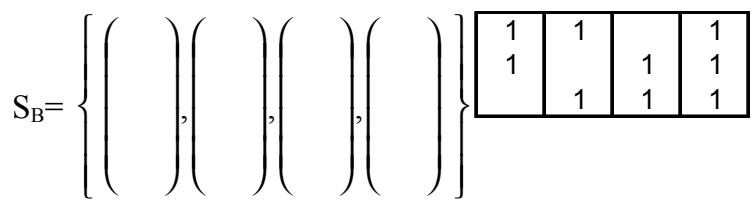

We can now represent each set as an integer convex combination of its members:

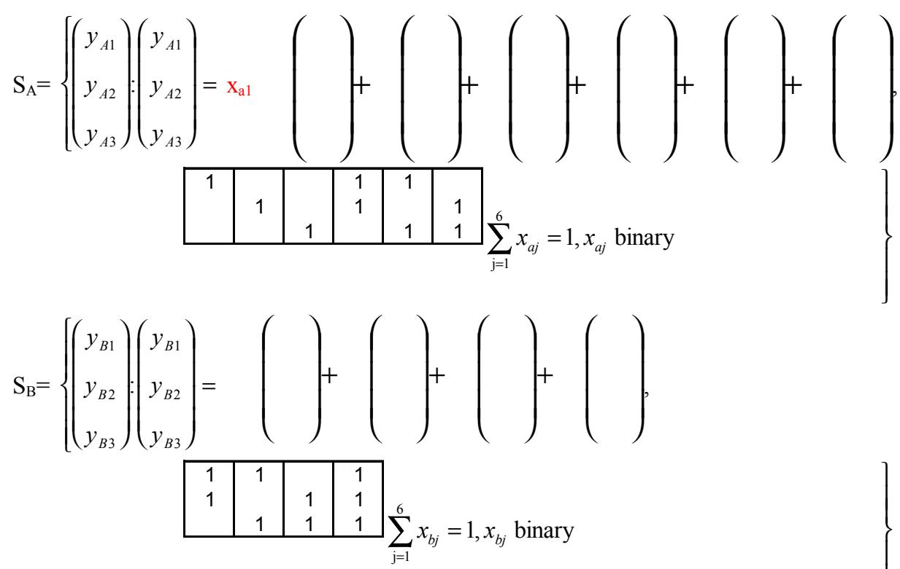

Notice the use of convexity constraints, also termed GUB (generalised upper bound) constraints.

The above give us expressions for $\mathrm { y } _ { \mathrm { A l } }$ etc in terms of the x’s, so we can now substitute back into the original formulation,

$$
\begin{array} { r l r l r } { \operatorname* { m i n } \quad } & { \mathrm { y } _ { \mathrm { A l } } + \mathrm { y } _ { \mathrm { A } ^ { 2 } } + \mathrm { y } _ { \mathrm { A } ^ { 3 } } + \mathrm { y } _ { \mathrm { B l } } + \mathrm { y } _ { \mathrm { B } ^ { 2 } } + \mathrm { y } _ { \mathrm { B } ^ { 3 } } } & \\ { \mathrm { s t } \quad } & { \mathrm { y } _ { \mathrm { A l } } + \mathrm { y } _ { \mathrm { B l } } \geq 1 } \\ & { \mathrm { y } _ { \mathrm { A } 2 } + \mathrm { y } _ { \mathrm { B } ^ { 2 } } \geq 1 } \\ & { \mathrm { y } _ { \mathrm { A } 3 } + \mathrm { y } _ { \mathrm { B } 3 } \geq 1 , } \end{array} \quad \quad \begin{array} { r } { \left( \begin{array} { l } { \boldsymbol { y } _ { \mathrm { A l } } } \\ { \boldsymbol { y } _ { \mathrm { A } 2 } } \\ { \boldsymbol { y } _ { \mathrm { A } 3 } } \end{array} \right) \in \mathrm { \ S } _ { \mathrm { A } , } } & \\ & { \left( \begin{array} { l } { \boldsymbol { y } _ { \mathrm { A } 3 } } \\ { \boldsymbol { y } _ { \mathrm { A } 3 } } \end{array} \right) \in \mathrm { \ S } _ { \mathrm { B } } } \end{array}
$$

to form a new problem in which the decision variables are the x’s. This new problem has to include the extra convexity constraints and the binary restrictions on the x’s that are used to define $\mathrm { S _ { A } }$ and $\mathrm { S _ { B } }$ . This gives us our new formulation:

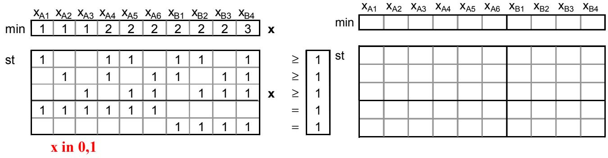

This new problem is called the IP Master Problem.

It’s LP relaxation is called the LP Master Problem.

Note that in the relaxed (LP) master problem, the x’s can be fractional, and so the requirements of $\mathbf { y } _ { \mathrm { A } }$ and $\mathbf { y } _ { \mathrm { B } }$ belonging to $\mathrm { S _ { A } }$ and $\mathrm { S _ { B } }$ respectively are relaxed instead to $\mathbf { y } _ { \mathrm { A } }$ and $\mathbf { y } _ { \mathrm { B } }$ being in their convex hulls (polyhedrons), $\mathrm { c o n v } ( \mathrm { S } _ { \mathrm { A } } )$ and conv $\mathrm { ( S _ { B } ) }$ , respectively. The key ideas in Dantzig-Wolfe are

(1) the convex hulls of $\mathrm { S _ { A } }$ and $\mathrm { S _ { B } }$ can be defined by their extreme points.   
(2) In general, $\mathrm { S _ { A } }$ and $\mathrm { S _ { B } }$ could have millions of members, and indeed millions of extreme points, so we can’t add all of these to the master.   
(3) Instead, we generate new extreme points (columns) and add these columns to the master whenever these new columns will improve the objective (i.e. have negative reduced cost).

Note: When the master has only a subset of the columns, we say it is restricted.

We have decomposed the original problem into a master and 2 column-generation subproblems, 1 for each person.

# The Column Generation SubProblems:

In this example, we know that Person A’s columns are defined by

$$
\begin{array} { r } { \left( \begin{array} { l } { y _ { _ { A 1 } } } \\ { y _ { _ { A 2 } } } \\ { y _ { _ { A 3 } } } \\ { 1 } \\ { 0 } \end{array} \right) } \end{array}
$$

where the points $( \mathrm { y _ { A 1 } , y _ { A 2 } , y _ { A 3 } } ) \in \mathrm { S _ { A } , }$ i.e. are the solutions to

Each column defined by (yA1, yA2, yA) has a cost given by

As part of our pricing, we want to find the column (yA1, yA2, yA) in $\mathrm { S _ { A } }$ that has the most negative reduced cost (i.e. is the best possible ‘Person $\mathbf { A } ^ { \prime }$ entering column). Now, given a vector of duals $( \pi _ { 1 } , \pi _ { 2 } , \pi _ { 3 } , \pi _ { \mathrm { A } } , \pi _ { \mathrm { B } } )$ any column defined by (yA1, yA2, yA) has reduced cost:

Thus the problem of finding the most negative cost column for person, i.e. the ‘Person A’ column generation problem for the LP Master is

min $\_$ -yA1 Pi1 - yA2 Pi2 - YA3 Pi3 - PiA s.t. 1£Ya1+Ya2+Ya3 £ 2, YA1, Ya2, Ya3 binary

(c) A. Mason

Note 1:

If the members of $\mathrm { S _ { A } }$ (or $\mathrm { S _ { B } }$ ) are all (0,1) vectors (i.e. the y’s are binary), then $\mathrm { S _ { A } }$ is exactly the set of extreme points of the convex hull conv $\mathrm { ( S _ { A } ) }$ of $\mathrm { S _ { A } }$ . However, this is not true if the y’s are general integer. Column generators tend to produce extreme points, and so, in the latter case, some feasible integer columns may never be generated for the LP Restricted Master.

Eg… stock cutting problem seen before

Note 2:

In this case, $\mathrm { S _ { A } }$ and $\mathrm { S _ { B } }$ could be described by linear constraints; the column generators were easy problems. However, this need not be the case. Indeed, the beauty of column generation is that we can embed very complicated rules in the column generators. The column generator handles the complexity, not the IP.

Note 3:

Given any (possibly fractional) x’s for the LP, we can calculate the original variables, i.e. the y’s. Eg, for our example:

<table><tr><td rowspan=1 colspan=1>$X_A1$</td><td rowspan=1 colspan=1>$X_μ2</td><td rowspan=1 colspan=1>×A0</td><td rowspan=1 colspan=1></td><td rowspan=1 colspan=1></td><td rowspan=1 colspan=1>$X_6$X_B1$</td><td rowspan=1 colspan=1>$X_6$X_B1$</td><td rowspan=1 colspan=1>X_B2</td><td rowspan=1 colspan=1>$X_B$</td><td rowspan=1 colspan=1>X_B</td></tr><tr><td rowspan=1 colspan=1>1/2</td><td rowspan=1 colspan=1></td><td rowspan=1 colspan=1>1/4</td><td rowspan=1 colspan=1></td><td rowspan=1 colspan=1></td><td rowspan=1 colspan=1>1/4</td><td rowspan=1 colspan=1>41/3</td><td rowspan=1 colspan=1></td><td rowspan=1 colspan=1></td><td rowspan=1 colspan=1>2/3</td></tr></table>

<table><tr><td rowspan=5 colspan=3>$y_A$1/2    stY_A21/4YAa1/2</td><td rowspan=1 colspan=1>1/2</td><td rowspan=3 colspan=2>st</td><td rowspan=1 colspan=1>1</td><td rowspan=1 colspan=1></td><td rowspan=1 colspan=1></td><td rowspan=1 colspan=1>1</td><td rowspan=1 colspan=1>1</td><td rowspan=1 colspan=1></td><td rowspan=1 colspan=1>1</td></tr><tr><td rowspan=1 colspan=1>1/4</td><td rowspan=1 colspan=1></td><td rowspan=1 colspan=1>1</td><td rowspan=1 colspan=1></td><td rowspan=1 colspan=1>1</td><td rowspan=1 colspan=1></td><td rowspan=1 colspan=1>1</td><td rowspan=1 colspan=1>1</td><td rowspan=1 colspan=1></td><td rowspan=1 colspan=1>1</td><td rowspan=1 colspan=1>1</td></tr><tr><td rowspan=1 colspan=1>1/2</td><td rowspan=1 colspan=1></td><td rowspan=1 colspan=1></td><td rowspan=1 colspan=1>1</td><td rowspan=1 colspan=1></td><td rowspan=1 colspan=1>1</td><td rowspan=1 colspan=1>1</td><td rowspan=1 colspan=1></td><td rowspan=1 colspan=1>1</td><td rowspan=1 colspan=1>1</td><td rowspan=1 colspan=1>1</td></tr><tr><td rowspan=1 colspan=1>1</td><td rowspan=1 colspan=1>1</td><td rowspan=1 colspan=1>1</td><td rowspan=1 colspan=1>1</td><td rowspan=1 colspan=1>1</td><td rowspan=1 colspan=1>1</td><td rowspan=1 colspan=1></td><td rowspan=1 colspan=1></td><td rowspan=1 colspan=1></td><td rowspan=1 colspan=1></td></tr><tr><td rowspan=1 colspan=1></td><td rowspan=1 colspan=1></td><td rowspan=1 colspan=1></td><td rowspan=1 colspan=1></td><td rowspan=1 colspan=1></td><td rowspan=1 colspan=1></td><td rowspan=1 colspan=1>1</td><td rowspan=1 colspan=1></td><td rowspan=1 colspan=1></td><td rowspan=1 colspan=1></td></tr></table>

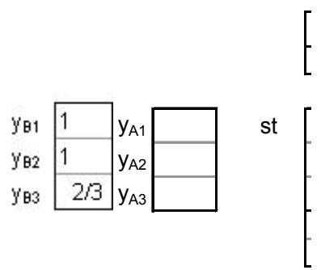

Note 4:

The Relaxed LP Master is often stronger than the original formulation as some fractional solutions in the original may not be solutions to the Dantzig-Wolfe reformulation; i.e. the Dantzig-Wolfe reformulation has a worse LP objective than the original formulation, and thus is easier to integerise. However, if the column generation problems are not NP-hard (eg their LP forms have naturally integer solutions), then the Dantzig-Wolfe reformulation and the original problem have… the same objective.

So, for our example above, the sub problem is/is not is naturally integer, and so, the DantzigWolfe reformulation is/is not is not stronger.

# Branch and Bound with Column Generation

If our original problem was an IP, then so will be our new Dantzig-Wolfe master problem. Solving integer programs using column generator almost always requires that we generate during branch and bound. If we generate columns during the branch and bound process, we call it “Branch and Price” (Barnhart et al, 1998), or “IP Column Generation” (Wolsey 1998)

# Branching Possibilities

If column generating, branches must be respected by the column generator. That is, columns must satisfy the branches imposed. We don’t want this to complicate the generator too much.

# Variable Branching:

Force a variable $\mathbf { X } _ { \mathrm { j } }$ up or down to $\lceil \mathbf { \bar { x } _ { j } ^ { \mathrm { ~ i } } } \rceil$ or $\left\lfloor \mathbf { X _ { j } ^ { \mathrm { ~ i ~ } } } \right\rfloor$ respectively $\left( \mathbf { X _ { j } } ^ { \mathrm { i } } \right.$ is value of $\mathbf { X } _ { \mathrm { j } }$ at node i), ie adding $\mathbf { \mathbf { x } } _ { \mathrm { j } } \leq \left\lfloor \mathbf { \mathbf { x } } _ { \mathrm { j } } ^ { \mathrm { ~ i ~ } } \right\rfloor$ or $\mathrm { { \bar { x } _ { j } } \geq \left\lceil { \bar { x } _ { j } } ^ { i } \right\rceil }$ .

Why not use variable branching? Problems occur if variables are forced down:

Applying an upper bound on a variable means it cannot be generated again in the column generator. How do we stop it reappearing? Need k’th shortest path- hard! C With binary variables, a zero branch $( \mathrm { x } _ { \mathrm { j } } { = } 0 )$ says little about the solution; many feasible solutions remain. (The 1-branch $\mathbf { X _ { j } } \mathbf { = } 1$ is much more powerful.)

# Constraint Branching: Binary Variables, Binary A-matrix, GUB Constraints

Developed by David Ryan and Brian Foster in 1981 • Column Generation Friendly

<table><tr><td rowspan=1 colspan=1>$X_A$</td><td rowspan=1 colspan=1>$X_A$</td><td rowspan=1 colspan=1>$X_A}$</td><td rowspan=1 colspan=1>$X_{A$</td><td rowspan=1 colspan=1>$X_A5</td><td rowspan=1 colspan=1>$X_A6$</td><td rowspan=1 colspan=1>$X_B1$</td><td rowspan=1 colspan=1>$XB2</td><td rowspan=1 colspan=1>XB3</td><td rowspan=1 colspan=1>X_B4</td></tr><tr><td rowspan=1 colspan=1>1/2</td><td rowspan=1 colspan=1></td><td rowspan=1 colspan=1></td><td rowspan=1 colspan=1></td><td rowspan=1 colspan=1>1/4</td><td rowspan=1 colspan=1>1/4</td><td rowspan=1 colspan=1>1/3</td><td rowspan=1 colspan=1></td><td rowspan=1 colspan=1></td><td rowspan=1 colspan=1>2/3</td></tr></table>

<table><tr><td rowspan=9 colspan=5>YA1 3/4     stYA2 1/4YA3 1/2</td><td rowspan=1 colspan=1>3/4</td><td rowspan=6 colspan=2>st</td><td rowspan=1 colspan=2>st</td><td rowspan=1 colspan=1>1</td><td rowspan=1 colspan=1></td><td rowspan=1 colspan=1></td><td rowspan=1 colspan=1>1</td><td rowspan=1 colspan=1>1</td><td rowspan=1 colspan=2></td><td rowspan=1 colspan=1>1</td><td rowspan=1 colspan=1>1</td></tr><tr><td rowspan=4 colspan=1>1/4</td><td rowspan=4 colspan=1></td><td rowspan=4 colspan=1>1</td><td rowspan=4 colspan=1></td><td rowspan=4 colspan=1>1</td><td rowspan=4 colspan=1></td><td rowspan=4 colspan=1>1</td><td rowspan=4 colspan=1>1</td><td rowspan=4 colspan=1></td><td rowspan=4 colspan=1>1</td><td rowspan=4 colspan=1>1</td><td rowspan=1 colspan=2></td><td></td><td></td></tr><tr><td></td><td></td><td></td></tr><tr><td></td><td rowspan=2 colspan=1>1</td><td></td></tr><tr><td rowspan=1 colspan=2></td><td></td></tr><tr><td rowspan=2 colspan=1>1/2</td><td rowspan=2 colspan=1></td><td rowspan=2 colspan=1></td><td rowspan=2 colspan=1></td><td rowspan=2 colspan=1>1</td><td rowspan=2 colspan=1></td><td rowspan=2 colspan=1></td><td rowspan=2 colspan=1>1</td><td rowspan=2 colspan=1></td><td rowspan=2 colspan=1>1</td><td rowspan=2 colspan=1>1</td><td rowspan=2 colspan=1>1</td><td></td><td></td><td rowspan=2 colspan=1>1</td><td></td></tr><tr><td rowspan=1 colspan=2></td><td></td></tr><tr><td rowspan=1 colspan=1></td><td rowspan=1 colspan=1>1</td><td rowspan=1 colspan=1>1</td><td rowspan=1 colspan=1>1</td><td rowspan=1 colspan=1>1</td><td rowspan=1 colspan=1>1</td><td rowspan=1 colspan=1>1</td><td rowspan=1 colspan=1></td><td rowspan=1 colspan=1></td><td rowspan=1 colspan=1></td><td rowspan=1 colspan=1></td><td rowspan=1 colspan=1></td><td rowspan=1 colspan=1>b</td><td rowspan=1 colspan=1>1</td><td></td></tr><tr><td rowspan=1 colspan=1></td><td rowspan=1 colspan=1></td><td rowspan=1 colspan=1></td><td rowspan=1 colspan=1></td><td rowspan=1 colspan=1></td><td rowspan=1 colspan=1></td><td rowspan=1 colspan=1>1</td><td rowspan=1 colspan=1>1</td><td rowspan=1 colspan=1>1</td><td rowspan=1 colspan=1>1</td><td rowspan=1 colspan=2>=</td><td rowspan=1 colspan=1>1</td><td></td></tr></table>

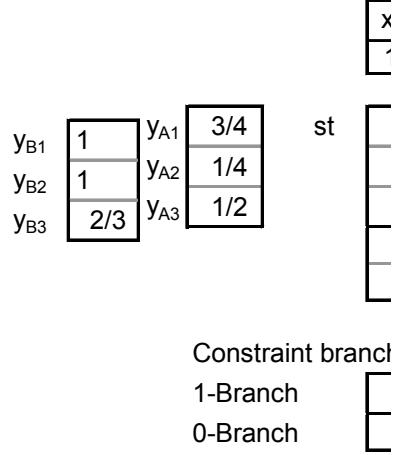

Constraint branch on constraint pair 3,4 (ie yA3)

1-Branch   
0-Branch

<table><tr><td rowspan=1 colspan=1>X</td><td rowspan=1 colspan=1>X</td><td rowspan=1 colspan=1></td><td rowspan=1 colspan=1>X</td><td rowspan=1 colspan=1></td><td rowspan=1 colspan=1></td></tr><tr><td rowspan=1 colspan=1></td><td rowspan=1 colspan=1></td><td rowspan=1 colspan=1>X</td><td rowspan=1 colspan=1></td><td rowspan=1 colspan=1>x</td><td rowspan=1 colspan=1>x</td></tr></table>

We branch to force (1-branch) or ban (0-branch) tasks for a specific person. Branch choice is based on ‘original y variables’ in Dantzig-Wolfe view.

Two branches possible above. Pick one of these. Each side of the branch is enforced by banning columns.

These branches are easy to enforce in a column generator. Eg, to force person A to undertake task 3, we tell the Person A column generator that $\cdot$

# Column Generator Structures

Column generators are typically:

Shortest Path (Dynamic Programming) • Nested shortest path Shortest Path with Resource Constraints   
• TSP solutions (vehicle routing)   
• TSP solutions with resource constraints (eg vehicle routing)   
• General IP’s Enumerators • Randomised enumerators

Note: Shortest Path/Dynamic Programming is only useful if there is significant merging of states. Otherwise, it is just inefficient enumeration.

Example: Simplified rostering. Must determine which days are worked, and which days are off for each staff member. Staff like to work 5 days on, then 2 days off $( \mathsf { a } \ ^ { \circ } 5 / 2 ^ { \circ } )$ , but can also work $3 / 1 , 4 / 2 , 6 / 2 .$ ., or $6 / 3$ . Each day worked is paid 8 hours. Staff need to work 80 hours over the fortnight roster period.

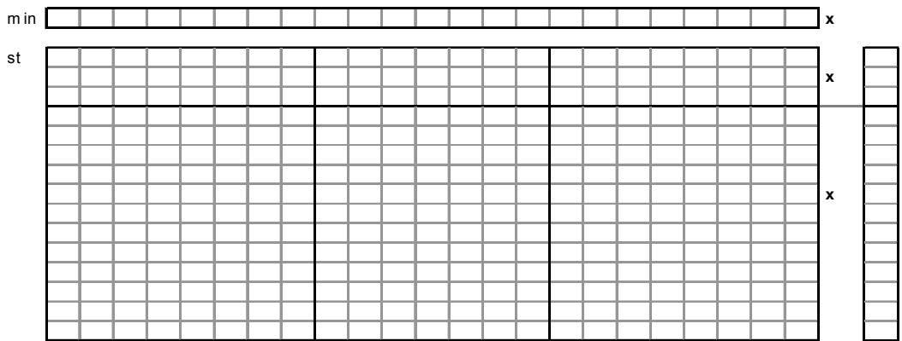

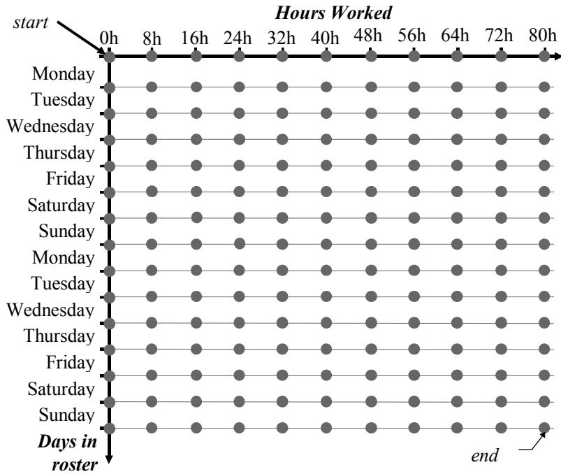

(c) A. Mason

# L.P. Dantzig-Wolfe Decomposition (Formally)

Consider the L.P.

$$
\begin{array} { l } { \operatorname* { m i n } z = c ^ { T } x } \\ { \left[ S \right] } \\ { \left[ T \right] ^ { x } } \end{array}
$$

We assume $S x = b _ { s }$ involves $m _ { s }$ constraints, $T x = b _ { \scriptscriptstyle T }$ involves $m _ { T }$ constraints i.e., $S$ is $m _ { s } \times n , T$ is $m _ { T } \times n$

Let $R _ { \scriptscriptstyle T } = \{ x : T x = b _ { \scriptscriptstyle T } , x \geq 0 \} .$ Then we can change our LP into:

$$
{ \begin{array} { r l r l } & { \operatorname* { m i n } z = c ^ { T } x } & & { \operatorname* { m i n } z = c ^ { T } x } \\ & { \left[ S \right] } \\ & { \left[ T \right] } \end{array} }
$$

$R _ { T }$ is the set of feasible solutions to a subset of the constraints $T x = b _ { \scriptscriptstyle T }$ , $x \ge 0$ . Now, $R _ { T }$ is polyhedral (defined by hyperplanes), and so any point in a bounded polyhedral set can be written as a convex combination of its extreme points, i.e., if $\boldsymbol { x } \in R _ { T }$ then (assuming $R _ { T }$ bounded),

ie,

$$
\begin{array} { l } { { \displaystyle x = \sum _ { j } I _ { j } x ^ { j } , e ^ { T } I = 1 , I \ge 0 } } \\ { { \displaystyle x = X I , e ^ { T } I = 1 , I \ge 0 , } } \end{array}
$$

where $X { = } ( x ^ { 1 } x ^ { 2 } \dots x ^ { \operatorname { t } } )$ is an $n \mathrm { ~ x ~ } t$ matrix $t$ is the number of extreme points), with $x ^ { j }$ being the $j ^ { t h }$ extreme point of $R _ { T }$ . (Don’t worry yet about how to find $x ^ { j }$ or how many there are.)

We can substitute $x = X I , e ^ { T } I = 1 , I \geq 0$ into the original LP i.e. our LP becomes:

$$
{ \begin{array} { r l r l r l } & { \operatorname* { m i n } z = c ^ { T } x } & & { \operatorname* { m i n } z = c ^ { T } x } & & { \operatorname* { m i n } z = c ^ { T } x } & & { } \\ & { { \left[ S \right] { x } = { \left[ \begin{array} { l } { b _ { s } } \\ { b _ { T } } \end{array} \right] } } } & { \Rightarrow } & { S x = b _ { s } } & & { S x = S X I = b _ { s } } \\ & { x \in R _ { T } } & & { } & & { e ^ { T } I = 1 } \\ & { x \geq 0 } & & { I \geq 0 . } \end{array} }
$$

$$
\begin{array} { c c } { { } } & { { \operatorname* { m i n } z = c ^ { T } x = c ^ { T } X I = f ^ { T } I \operatorname* { m i n } z = } } \\ { { } } & { { \qquad S x = S X I = P I = b _ { s } } } \\ { { \Rightarrow } } & { { \qquad e ^ { T } I = 1 } } \\ { { } } & { { \qquad k \geq 0 . } } \end{array}
$$

where $P = S X$ , i.e. $p _ { j } = S x ^ { j }$ , and $f ^ { T } = c ^ { T } X$ , i.e. $f _ { j } = c ^ { T } x ^ { j }$ . That is, the new LP has columns $P = S X$ , and costs $\boldsymbol { f } ^ { T } = \boldsymbol { c } ^ { T } \boldsymbol { X }$

This LP is called the Master LP (MLP). It has $m _ { s } { + } 1$ explicit constraints and as many variables as extreme points of $R _ { T }$ −  often large.

2 The new columns are $P = [ p _ { 1 } = S x ^ { 1 } ] \ldots \ | \ p _ { t } = S x ^ { t }  ]$

3. The explicit constraints in the new problem are ${ \binom { P } { e ^ { T } } } I = { \binom { b _ { s } } { 1 } }$

4. If $m _ { t }$ is large $\Rightarrow$

a. $m _ { s } + m _ { T }$ constraints in original LP – large. But just $m _ { s } { + } 1$ in Master LP. b. n vars in original L.P. but t vars in the new Master L.P (t often very large).

# Pricing using a Column Generator

Each extreme point $x ^ { j } \in R _ { T }$ leads to a column in the master of the form $\left[ \begin{array} { l } { S x ^ { j } } \\ { 1 } \end{array} \right]$ with cost $c ^ { T } x ^ { j }$ . We want to find an entering variable for the master given some duals $p ^ { T }$ , ie we want some $x ^ { j } \in R _ { T }$ with reduced cost $\operatorname { r c } ( x ^ { j } ) < 0$ .

vector If we write $\pmb { p } ^ { T } = \big ( \pmb { p } _ { 1 } ^ { T } , \pmb { p } _ { \pmb { p } _ { 0 } } \big )$ , we see that the reduced cost $\operatorname { r c } ( x ^ { j } )$ is given by scalar

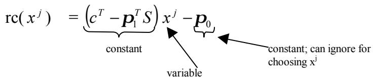

The usual Simplex criterion for entering variable is to minimize reduced cost and we therefore define a linear column generation sub-problem :

Given some master duals $\pmb { p } ^ { T } = \left( \pmb { p } _ { 1 } ^ { T } , \pmb { p } _ { 0 } \right)$ find the extreme point $x \in R _ { T }$ , $R _ { \mathit { T } } = \left\{ x : T x = b _ { \mathit { T } } , x \geq 0 \right\} .$ that has the most negative reduced cost $\left( c ^ { T } - p _ { 1 } ^ { T } S \right) x ^ { j } - p _ { 0 }$ , i.e.

$$
\begin{array} { l } { \operatorname* { m i n } \big ( c ^ { T } - { \pmb { p } } _ { 1 } ^ { T } S \big ) x } \\ { \mathrm { s t } \qquad T x = b _ { T } } \\ { \qquad x \geq 0 } \end{array}
$$

Q: Do we know we will get an extreme point of $R _ { T }$ ? Why?

Yes; LP only finds extreme points

Q: Do we need to solve this problem to optimality? Why?

Often no; can stop if we get a -ve reduced cost col

The solution $x ^ { s }$ of this LP subproblem defines the new variable $I _ { s }$ which enters the master program if the reduced cost is negative, ie. if $\Big ( c ^ { T } - p _ { 1 } ^ { T } S \Big ) x ^ { s } - p _ { 0 } < 0$ .  The column that enters the Master LP basis is then ${ \left[ \begin{array} { l } { p _ { s } } \\ { 1 } \end{array} \right] } = { \left[ \begin{array} { l } { S x ^ { s } } \\ { 1 } \end{array} \right] }$ with objective coefficient $f _ { s } = c ^ { T } x ^ { s }$ .

Having found a new variable $I _ { s }$ to enter the Master LP basis we can determine a leaving variable using the usual LP criterion (applied to the MLP). The Master LP basis is then updated, thus leading to a new $p$ -vector etc. (Each $\pi$ vector defines a new subproblem, and each subproblem generates a column for the master (i.e. an extreme pt of $R _ { T }$ ).

Special Case - Multiple Sub-Problems

Consider some L.P

$$
\begin{array} { r l } & { \left[ \begin{array} { l } { S } \\ { T } \end{array} \right] x = \left[ \begin{array} { l } { b _ { s } } \\ { b _ { T } } \end{array} \right] } \\ & { x \geq 0 } \end{array}
$$

Consider the case where $T = \left[ \begin{array} { l l l } { T _ { 1 } } & { 0 } & { 0 } \\ { 0 } & { T _ { 2 } } \\ & { 0 } & { \setminus _ { T _ { p } } } \end{array} \right]$

Write $\boldsymbol { c } ^ { T } = \left[ c _ { 1 } ^ { T } , c _ { 2 } ^ { T } , . . . , c _ { p } ^ { T } \right]$ and ${ \cal S } = \left. S _ { 1 } \ S _ { 2 } \ \dots \ S _ { p } \right.$ to correspond with the structure of T.   
(Same with $x$ and $b _ { { } _ { T } }$ ).

The LP is then

$$
\begin{array} { r } { \operatorname* { m i n } z = c _ { 1 } ^ { T } x _ { 1 } + . . . + c _ { p } ^ { T } x _ { p } = b _ { s } } \\ { s / t \quad \quad S _ { 1 } x _ { 1 } + . . . . + S _ { p } x _ { p } = b _ { s } } \\ { T _ { 1 } x _ { 1 } \quad \quad \quad \quad \quad \quad = b _ { 1 } } \end{array}
$$

$$
T _ { p } x _ { p } = b _ { p }
$$

# Master L.P.

The master looks like it did before:

(c) A. Mason

$$
\begin{array} { l } { { \bf \Pi } = f ^ { T } { \cal I } } \\ { { \cal P } { \cal I } = b _ { s } } \\ { { \cal e } ^ { T } { \cal I } = 1 } \\ { { \cal I } \geq 0 } \end{array}
$$

$$
\begin{array} { c } { f _ { j } = c ^ { T } x ^ { j } } \\ { P _ { j } = S x ^ { j } } \end{array}
$$

Subproblem

$$
\begin{array} { l } { \displaystyle \operatorname* { m i n } \big ( c ^ { T } - { \pmb { p } } _ { 1 } ^ { T } S \big ) x - { \pmb { p } } _ { 0 } } \\ { T x = b _ { T } } \\ { x \geq 0 } \end{array}
$$

Using the above matrix partitions, we find the subproblem becomes.

$$
\begin{array} { r } { \operatorname* { m i n } \sum \big ( c _ { i } ^ { T } - { \pmb { p } } _ { 1 } ^ { T } S _ { i } \big ) x _ { i } } \\ { T _ { i } x _ { i } = b _ { i } \forall i } \\ { x _ { i } \geq 0 \forall i . } \end{array}
$$

This sub-problem can be treated as $\mathfrak { p }$ separate problems since the $\boldsymbol { x _ { i } ^ { \prime } } \boldsymbol { s }$ don’t affect each other in the constraints. We therefore solve p subproblems

$$
\begin{array} { r l } { \operatorname* { m i n } { \left( c _ { i } ^ { T } - { \pmb { p } } _ { 1 } ^ { T } S _ { i } \right) } x _ { i } \ } & { } \\ { T _ { i } x _ { i } = b _ { i } { \left\{ \begin{array} { l l } { \begin{array} { l l } { \mathrm { O p t i m a l \ s o l u t i o n } } \\ { = x _ { i } ^ { s } } \end{array}  } } \\ { \right.x _ { i } \geq 0 . } \end{array} }  \end{array}
$$

 ssxx 21 Then  =sx , so the new column $\mathbf { \eta } = \left[ { \begin{array} { l } { p _ { s } } \\ { 1 } \end{array} } \right]$ .with cost $f _ { s }$ , where $p _ { s } = S x ^ { s } f _ { s } = c ^ { T } x ^ { s }$ b

NB: Each subproblem is usually relatively small.

Alternative Approach for above problem

In the above example, the column generator returned one large column that contained solutions for each sub-problem given by $T _ { \scriptscriptstyle i } x _ { \scriptscriptstyle i } = b _ { \scriptscriptstyle i }$ , $x _ { i } \geq 0$ . An alternative way of solving this problem is to add a convexity constraint to the master for each constraint sub-problem $T _ { i } x _ { i } = b _ { i }$ , $x _ { i } \geq 0$ , $i { = } I , 2 , . . . , p$ . This gives the rostering-type formulations we saw before with $p$ column generators, one solving each sub-problem defined over $T _ { i } x _ { i } = b _ { i }$ , $x _ { i } \geq 0$ .

The objective function of each subproblem has the form $\left( c _ { i } ^ { T } - p _ { 1 } ^ { T } S _ { i } \right) x _ { i }$ . The $i ^ { t h }$   
subsystem proposes a   
solution say $\boldsymbol { x } _ { i } ^ { s }$ to the master program. (The master finds that this involves $S _ { i } \mathbf { x } _ { i } ^ { s }$ units of the shared resources which are therefore not available to other subsystems. The direct cost of $x _ { i } ^ { S }$ is given by $\mathbf { c } _ { i } ^ { T } \mathbf { X } _ { i }$ but the $i ^ { t h }$ subsystem, in proposing $\mathbf { X } _ { i } ^ { S }$ , must pay for its use of shared resource. (The MLP (with knowledge of the other subsystem’s demands) charges the price $\mathbf { p } _ { 1 }$ on the shared resources. Note that there is one element of $\mathbf { p } _ { 1 }$ for each shared resource of the MLP. (i.e. constraint of MLP).

Then $d z _ { _ { M L P } } = \mathbf { p } _ { 1 } ^ { T } d \mathbf { b } _ { _ { M L P } }$ and if the $i ^ { t h }$ subproblem uses the $k ^ { t h }$ resource then $d \mathbf { b } _ { k } < 0$ (i.e less available for other subproblems. I.e. in demand) and if the $k ^ { t h }$ resource is valuable then $d z > 0$ (if we seek to minimise) therefore $p _ { k } < 0$ .

The indirect cost incurred by the $i ^ { t h }$ subsystem in choosing $\mathbf { p } _ { 1 } ^ { s }$ is represented by $- \boldsymbol { \mathsf { p } } _ { 1 } ^ { T } \ S _ { i } \ \boldsymbol { \mathbf { x } } _ { i } ^ { s }$ where $S \mathbf { x } _ { i } ^ { s }$ is the amount $\left( \geq 0 \right)$ of each resource used. Therefore the indirect cost on the $i ^ { t h }$ subproblem is ${ > } 0$ . (i.e. a charge against the $i ^ { t h }$ subproblem).

The MLP then repeatedly asks the subproblems to propose solutions and each time adjust the prices of shared resources to:

a. discourage the use of shared resources in great demand i.e. sets $p _ { 1 k } < < 0$ .   
b. encourage the use of resources underutilyed. I.e. sets $p _ { 1 k } = 0$ and charges each   
subproblem nothing to use them.

The solution of the LP is provided by the MLP which computes weights (i.e $\boldsymbol { { I } }$ ) for each of the proposals provided by the subproblems. As proposals are considered by the MLP and $\mathbf { p } _ { 1 }$ is adjusted, early proposals will no longer be attractive and will be removed from consideration by setting $I = 0$ (i.e nonbasic). When no profitable new proposal is made the solution is given as $\mathbf { x } = \sum _ { j } { I _ { j } \mathbf { x } ^ { j } } = X ?$ .

# Solving the LP: Different Pricing Calculations for the Entering Variable

Steepest Edge Pricing

eg: John J. Forrest and Donald Goldfarb, Steepest-edge simplex algorithms for linear programming, Mathematical Programming 57 (1992), pp. 341-374

Minimisation Example:

<table><tr><td colspan="6">Total Cost</td></tr><tr><td>C</td><td>. 1</td><td>1</td><td>0</td><td>0</td><td>8.60 0</td><td>0</td></tr></table>

<table><tr><td colspan="8">A Matrix</td></tr><tr><td></td><td>12 11 2</td><td>-8 -12 10</td><td>1</td><td>-1</td><td>1 1</td><td>b 31 -48 54 12</td><td>Pi 0 0 0.1 0.27</td></tr><tr><td></td><td colspan="7">3</td></tr><tr><td>Bas</td><td>E</td><td>E</td><td>E</td><td>E</td><td></td><td rowspan="4"></td></tr><tr><td>Xn</td><td></td><td></td><td></td><td>0</td><td>0</td></tr><tr><td>X</td><td>4</td><td>4.6</td><td>19.8</td><td>36.8</td><td>0 0</td></tr><tr><td>rc</td><td>0</td><td>0</td><td>0</td><td>0</td><td>-0.1 -0.3</td></tr><tr><td colspan="2">1</td><td>2</td><td>3</td><td>4</td><td>5 6</td><td></td></tr></table>

<table><tr><td colspan="4">Basis</td><td colspan="2">Xb</td></tr><tr><td>12</td><td>-8 1 -12</td><td>0</td><td>Inverse Basis 0</td><td>0 -0</td><td>0.33</td><td>4.0 1</td></tr><tr><td rowspan="3">11 2 3</td><td>0</td><td>-1</td><td>0 0</td><td>0.1</td><td>-0.07</td><td>4.6 2</td></tr><tr><td>10 0 0</td><td>0</td><td>1</td><td>0 0.8</td><td>-4.53</td><td>19.8 3</td></tr><tr><td>0 3</td><td>0 4</td><td>0 -1</td><td>-1.2</td><td>4.47</td><td>36.8 4</td></tr></table>

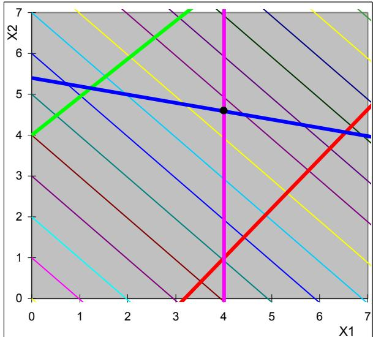

Which is the most negative reduced cost (termed Dantzig reduced cost) entering variable? $\cdot$

If we increase this variable by 1, we move to the following (non-basic) solution.

<table><tr><td colspan="6">Total Cost</td></tr><tr><td>C</td><td>1</td><td>1</td><td>0</td><td>0</td><td>0</td><td>0</td></tr></table>

<table><tr><td colspan="6">A Matrix</td><td>b</td><td></td><td>Pi</td></tr><tr><td></td><td>12 11</td><td>-8 -12 10</td><td>1</td><td rowspan="2">-1</td><td rowspan="2">1 1</td><td rowspan="2">31 -48 54 12</td><td rowspan="2">0 0 0.1 0.27</td></tr><tr><td></td><td>2 3</td><td></td></tr><tr><td>Bas</td><td>E</td><td>E</td><td>E</td><td>E 0</td><td>□ </td><td colspan="2"></td></tr><tr><td>Xn</td><td colspan="5"></td><td>1 1</td></tr><tr><td>X</td><td colspan="6">3.67 4.67 24.3 32.3 0</td></tr><tr><td></td><td colspan="6">0 0 0</td></tr><tr><td>rc</td><td colspan="6">1 2</td></tr></table>

<table><tr><td colspan="4">Basis</td><td colspan="3">Inverse Basis</td><td>Xb</td></tr><tr><td rowspan="3">12 11 2</td><td rowspan="3">-8 -12 10</td><td>1 0</td><td>0</td><td>0</td><td>-0 0.33</td><td></td><td>3.7</td></tr><tr><td>0</td><td>-1</td><td>0 0</td><td>0.1</td><td>-0.07</td><td>4.7</td></tr><tr><td>0 0</td><td>1</td><td>0</td><td>0.8</td><td>-4.53</td><td>24.3 3</td></tr><tr><td>3 1</td><td>0 2</td><td>0 3</td><td>0 4</td><td>0</td><td>-1</td><td>-1.2 4.47</td><td>32.3</td></tr></table>

Why is this a bad choice of edge to be travelling along?

What happens if we try the other direction?

<table><tr><td colspan="6">Total Cost</td></tr><tr><td>C</td><td>1</td><td>1</td><td>0</td><td>0</td><td>0</td><td>0</td></tr></table>

<table><tr><td colspan="8">A Matrix</td></tr><tr><td></td><td>12 11 2</td><td>-8 -12 10</td><td>1</td><td>-1</td><td>1</td><td>b 31 -48 54 12</td><td>Pi 0 0 0.1 0.27</td></tr><tr><td></td><td>3</td><td></td><td></td><td></td><td>1</td><td colspan="2"></td></tr><tr><td>Bas</td><td>E</td><td>E</td><td>E</td><td>E</td><td>− 1</td><td colspan="2"></td></tr><tr><td>Xn</td><td colspan="5"></td><td>0</td></tr><tr><td>X</td><td colspan="2">4 4.5</td><td>19 0</td><td>38 1 0 -0.1</td><td colspan="2">0 -0.3</td></tr><tr><td>rc</td><td colspan="5">0 0</td></tr><tr><td colspan="2">1</td><td colspan="2">2 3</td><td colspan="2">4 5</td></tr></table>

<table><tr><td colspan="4">Basis</td><td colspan="3">Basis</td></tr><tr><td>12</td><td>-8 -12</td><td>1 0</td><td>Inverse 0</td><td>0</td><td>-0 0.33</td><td>Xb 4.0</td></tr><tr><td rowspan="3">11 2 3</td><td>0 0</td><td>-1</td><td>0</td><td>0 0.1</td><td>-0.07</td><td>4.5</td></tr><tr><td>10 0</td><td>0</td><td>1</td><td>0</td><td>0.8 -4.53</td><td>19.0 3</td></tr><tr><td>0</td><td>0</td><td>0</td><td>-1 -1.2</td><td>4.47</td><td>38.0</td></tr><tr><td>1</td><td>2</td><td>3 4</td><td></td><td></td><td></td><td></td></tr></table>

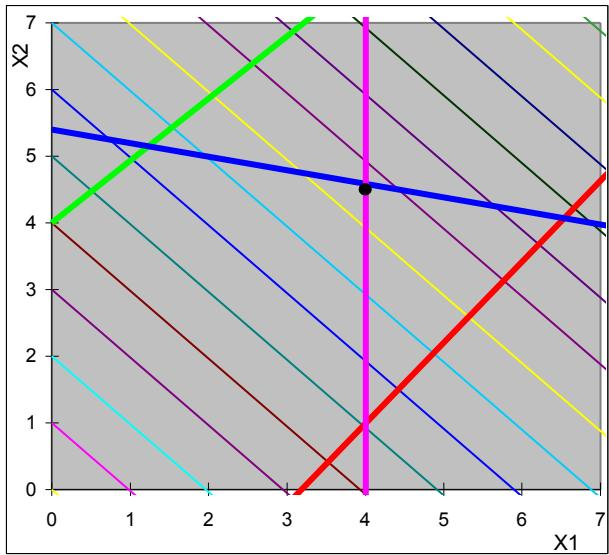

# Comment: The step taken when increasing $\cdot$ is smaller then $\mathbf { X } _ { 6 }$ This makes the reduced cost smaller

We can scale the problem to make the step sizes similar.

<table><tr><td colspan="6">Total Cost</td></tr><tr><td>C</td><td>1</td><td>1</td><td>0</td><td>0</td><td>0</td><td>0</td></tr></table>

<table><tr><td colspan="6">A Matrix</td><td>b</td><td>Pi</td></tr><tr><td></td><td>12 11 2</td><td>-8 -12 10</td><td>1</td><td>-1</td><td>4</td><td>31 -48 54 12</td><td>0 0 0.1 0.27</td></tr><tr><td></td><td>3 E</td><td>E</td><td>E</td><td>E</td><td>1 — L</td><td colspan="2"></td></tr><tr><td>Bas Xn</td><td></td><td></td><td></td><td></td><td>1 0</td><td colspan="2"></td></tr><tr><td>x</td><td colspan="5">1</td><td>0</td></tr><tr><td></td><td colspan="6">4 4.2 16.6 41.6</td></tr><tr><td>rc</td><td colspan="6">0 0 0 0 -0.4 -0.3</td></tr></table>

<table><tr><td colspan="4">Basis</td><td colspan="3">Basis</td></tr><tr><td>12 11</td><td>-8 -12</td><td>1 0 0 -1</td><td>Inverse 0</td><td>0 0</td><td>-0 0.33 0.1 -0.07</td><td>Xb 4.0</td></tr><tr><td colspan="3">2 3</td><td colspan="3">0</td><td>4.2 2</td></tr><tr><td colspan="3">10</td><td colspan="3">1 0</td></tr><tr><td colspan="3">0</td><td colspan="3"></td></tr><tr><td colspan="3">0</td><td colspan="3"></td></tr><tr><td colspan="3">0 0</td><td colspan="3"></td></tr><tr><td colspan="3">0</td><td></td><td>0.8 -4.53</td><td>16.6</td></tr><tr><td colspan="3">0 3 4</td><td>-1 -1.2</td><td>4.47</td><td>3 41.6 4</td></tr></table>

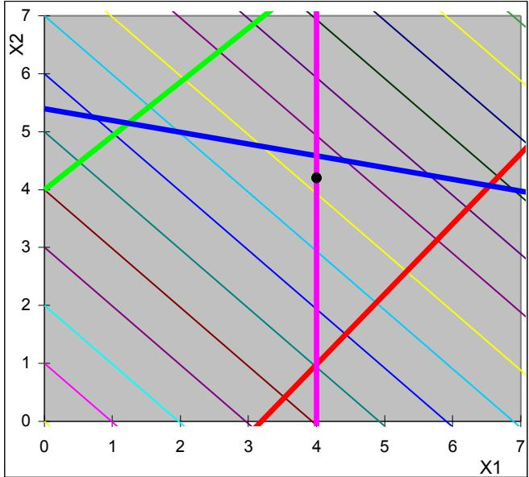

# Comment: $\cdot$ now has the better reduced cost

Steepest Edge Pricing: Calculate $\cdot$

Scale factor ‘normj’ normalises to avoid above effect.

Must calculate initial scale factors... eg CPlex’s “Steepest Edge with Slack Initial Norms”

Can make a huge improvement (particularly for .....degenerate problems).

Scale factors have to be updated at each pivot for all non-basic variables... possibly slow (eg increase time per iteration by $8 \%$ ).

But what about Sprint approach...? Have to get norms for variables added to active set

# Steepest Edge Pricing - formally

In the Dantzig rule we compute the variable with the smallest reduced cost $c _ { j } - p ^ { T } a _ { j }$ .If $x _ { j }$ is measured in different units, this has the effect of scaling $c _ { j }$ and $a _ { j }$ by some value $\varepsilon$ say. Then $r . c _ { _ j } = \mathbf { g } ( c _ { _ j } - p ^ { T } a _ { _ j } )$ . We would prefer that the choice of entering variable be independent of the scaling of the variables. Steepest edge pricing is one way of addressing this issue.

In a single RSM iteration we have

$$
\hat { x } = x + \pmb { a } y _ { s } ,
$$

− − 1 sB a 0 where $\scriptstyle x = { \left( { \begin{array} { l } { x _ { B } } \\ { 0 } \end{array} } \right) }$ is a basic feasible solution, and  =sy M gives the change in all 0 1 0

variables (basic and non-basic) when non-basic variable $x _ { s } , s { > } m$ is increasing in value. (Note that $a _ { s }$ is the column of the A matrix corresponding to $x _ { s }$ , and so $- B ^ { - 1 } a _ { s }$ is the change in the basic variables $x _ { B }$ as $x _ { s }$ increases.).

− − 1 sB a 0 For $x _ { s }$ to be the entering variable, the direction  =sy M must be downhill with respect 0 1 0

to $c$ , i.e., we have the common entering variable condition for a negative reduced cost $\mathrm { r c } ( x _ { s } )$

$$
\begin{array} { c } { { r c ( x _ { s } ) = c ^ { T } y _ { s } = c _ { s } - c _ { B } ^ { T } B ^ { - 1 } a _ { s } } } \\ { { { } } } \\ { { = c _ { s } - { \bf p } ^ { T } a _ { s } < 0 . } } \end{array}
$$

Steepest edge pricing involves choosing the direction that is most downhill with respect to $c$ , i.e., at the greatest angle to $c$ .

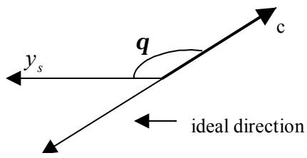

The angle $\pmb q$ can be found from $c ^ { T } y _ { s } = \| c \| \| y _ { s } \| \mathrm { c o s } \pmb { q } \mathrm { , \mpb { \phi } = > \mathrm { c o s } \pmb { q } = \frac { c ^ { T } y _ { s } } { \| c \| \| y _ { s } \| } . }$

For θ close to $1 8 0 ^ { \circ }$ , we must want cosθ as small as possible, i.e., choose the entering (hence non-basic) variable index $s$ so that

$$
{ \frac { c ^ { T } y _ { s } } { \left\| s \right\| \left\| y _ { s } \right\| } } = \operatorname* { m i n } _ { j > m } { \frac { c ^ { T } y _ { j } } { \left\| c \right\| \left\| y _ { j } \right\| } } = \operatorname* { m i n } _ { j > m } { \frac { c ^ { T } y _ { j } } { \left\| y _ { j } \right\| } } = \operatorname* { m i n } _ { j > m } { \frac { r c ( x _ { j } ) } { \left\| y _ { j } \right\| } }
$$

since $\| c \|$ is a constant. (We see that we are simply scaling each reduced cost $\operatorname { r c } ( x _ { j } )$ by its associated step size $\left\| y _ { j } \right\|$ , and then choosing the best of these scaled values.) However, we need to compute

$$
\left\| y _ { j } \right\| = \left( \begin{array} { c } { { - B ^ { - 1 } a _ { j } } } \\ { { 0 } } \\ { { \vdots } } \\ { { 0 } } \\ { { 1 } } \\ { { 0 } } \end{array} \right)
$$

for each candidate entering variable, and this requires calculating $B ^ { - 1 } a _ { j }$ for each possible entering variable $x _ { j }$ ; this will be slow. However, recurrences have been developed to keep track of these vectors from iteration to iteration so they do not have to be calculated from scratch.

# PRICING STRATEGIES:

Up to now, we have discussed a single method for determining the entering variable, i.e. entering var $=$ one with minimum reduced cost, i.e. ${ \boldsymbol { s } } = \arg \operatorname* { m i n } \left\{ { \boldsymbol { c } } _ { j } - { \boldsymbol { p } } ^ { T } { \boldsymbol { a } } _ { j } \right\} { \boldsymbol { j } } \in N$ and $x _ { s }$ is the entering variable. This is known as the Dantzig rule. But there are many pricing strategies:

(a) Full pricing (see above)   
(b) Multiple pricing: find best p r.c.’s. Then price only on subset $\scriptstyle ( { \mathtt { p } } = 5$ or 10) until r.c.’s not sufficiently negative.   
(c) Partial pricing: Like multiple pricing, but one just chooses any p columns (not necessarily ones that have negative r.c.).   
(d) Steepest edge (see later)   
(e) Lambda pricing: Similar to steepest edge pricing in that it attempts to avoid problems with scaling of variables.   
(f) Column generation: (see later).

# Lambda Pricing

Try to take into account the objective function $\mathrm { c _ { j } }$

$$
\mathbf { \ l a m b d a _ { j } = c _ { j } / \left( \ c _ { j } - r c ( x _ { j } ) \right) = c _ { j } / \left( \ p ^ { T } \ a _ { j } \right) }
$$

Example   

<table><tr><td rowspan=1 colspan=1></td><td rowspan=1 colspan=1>π a</td><td rowspan=1 colspan=1>rc(xi) = ci - πT aj</td><td rowspan=1 colspan=1>λ</td></tr><tr><td rowspan=1 colspan=1>1000</td><td rowspan=1 colspan=1>1010</td><td rowspan=1 colspan=1>-10</td><td rowspan=1 colspan=1>0.990</td></tr><tr><td rowspan=1 colspan=1>10</td><td rowspan=1 colspan=1>12</td><td rowspan=1 colspan=1>-2</td><td rowspan=1 colspan=1>0.833</td></tr><tr><td rowspan=1 colspan=1>1</td><td rowspan=1 colspan=1>2</td><td rowspan=1 colspan=1>-1</td><td rowspan=1 colspan=1>0.5</td></tr></table>

Of those columns with negative reduced cost, choose that with ...smallest $\cdot$

Not used much in practice (eg not in CPlex)

# Integerisation

In general our LP solutions will be fractional, and so we have to integerise. But, for some choices of A, we get naturally integer solutions.

# Totally Unimodular Matrices

see Hoffman $^ +$ Kruskal, 1956, and attachment.   
Naurally give integer x for any rhs b.

Totally unimodular (0,1) matrices arise if there is unique subsequence.... there is an ordering of the rows in which all columns with a one in row i have there next one (if any) in row j.

If the one’s are ordered activities, this means that all columns doing activity i do the same next activity, activity j. Limited sub-sequence can lead to solutions that are close to integer.

# Balanced 0/1 Matrices with Unit Right Hand Side

Berge (1972), Fulkerson, Hoffman & Opperheim (1974)

For $0 / 1$ right hand side and $\geq , \leq \mathrm { o r } = { \mathfrak { c } }$ constraints (i.e set covering, partitoning, and packing), fractions can only occur if there exist odd-order 2-cycles, i.e. pxp sub-matrices with p odd having row and column sums of 2 (Berge (1972)).

Some sample fractional structures demonstrating the odd-order 2-cycles

A: 1\* 0 1\* = 1 1\* 1\* 0 $= 1$ 0 1\* 1\* $= 1$   
x: ½ ½ ½

A: $\begin{array} { l l l l l } { { 1 } } & { { 0 } } & { { 1 } } & { { 1 } } & { { = 1 } } \\ { { 1 } } & { { 1 } } & { { 0 } } & { { 1 } } & { { = 1 } } \\ { { 1 } } & { { 1 } } & { { 1 } } & { { 0 } } & { { = 1 } } \\ { { 0 } } & { { 1 } } & { { 1 } } & { { 1 } } & { { = 1 } } \\ { { 1 / 3 } } & { { 1 / 3 } } & { { 1 / 3 } } & { { 1 / 3 } } \end{array}$ “3 from 4”

x:

1\* 0 1\*   
1\* 1\* 0   
0 1\* 1\*   
0 1 0

A:

Odd-order 2-cycles are necessary, but not sufficient, for there to be fractions. (See next.) Constraint branching (see next) removes columns, breaking cycles.

(c) A. Mason

# Perfect Matrices with Unit Right-hand Side

(Padberg 1974)

A (0,1) matrix is perfect if all extreme points of $\{ \mathbf { x } \colon \mathrm { A } \mathbf { x } \leq \mathbf { e } , ~ \mathbf { x } { \geq } 0 \}$ are integer. Note: Adding slacks turns this set packing problem into set partitioning (but not set covering).

In perfect matrices, odd-order 2-cycles can occur, but are neutralised (stopped from producing fractions) by other contraints.

Eg

A: 1 1 1 ≤1   
1\* 0 1\* ≤1   
$1 ^ { * }$ $1$ 0 $\leq 1$   
0 $1 ^ { * }$ $1$ ≤1

Soln $\%$ $\%$ $\%$ (which we had before) is now not feasible because of GUB constraint.

A non-singular pxp sub-matrix with row and column sums equal to $\beta$ may have a fractional solution with each variable being $1 / \beta$ . If $\beta { \geq } 2$ , these variables are fractional. However, if some other ‘integerising’ $\leq 1$ constraint on these variables includes more than $\beta$ of these variables (has more than $\beta 1 ^ { \circ } \mathrm { s }$ ), this $1 / \beta$ solution becomes infeasible because it violates this constraint.

Perfect Matrices guarantee integer solutions because they do not contain any sub-matrices with row and column sums of $\beta$ unless these sub-matrices have associated integerising constraints.

Note: GUB constraints are “integerising” for all the columns they contain. So, if a solution is fractional, it must fractionate across the GUB constraints.

x: 1/3 1/3 1/3 1/3 1/3 1/3

NB: Adding cuts adds ‘perfect matrix’ structure to matrices.

# Ideal Matrices

P. Nobili, A. Sassano, $( 0 , \pm l )$ Ideal Matrices, Mathematical Programming 80 (1998) 265-281 • Give integer solutions to set covering $( \operatorname { A x } 2 \mathrm { e } )$ , but not well characterised (yet!)

# Branch and Bound

Basically “Enumeration with Upper and Lower Bounds”. Also called “divide and conquer”.

• Upper bounds from heuristics and naturally integer solutions to LP relaxations Lower bounds from LP relaxation

If we generate columns during the branch and bound process, we call it “Branch and Price” (Barnhart et al, 1998), or “IP Column Generation” (Wolsey 1998)

See [LS97] Linderoth, J.T., Savelsburgh, M.W.P., A computational study of search strategies for mixed integer programming, Georgia Inst. of Technology, 1997, for a good analysis of branch and bound strategies; much of this summary comes from here.

# Branch and Bound Issues

Which node to explore next? • What branch to make next? • How much processing to do at each step? • Do we want to prove optimality? Big or small LP – IP duality gap? • Will we be back-tracking? Is feasiblity hard? is ‘good quality’ hard?

# Branching Decisions

“What about our solution are we going to decide next?”

How will our children nodes differ? Which variable, constraint, SOS, or other branch do we choose?

• How balanced is the branch (number of solutions on each side of the branch)?

Unbalanced ok if we don’t intend to explore the other side C Variable branching on binary variables is very unbalanced

• Make the important decisions first

• If a costly decision has to be made, make that branch earlier, not later

• How much do we change the solution?

Branching 0.9 to 1 (‘gentle branch’); small objective increase Branching 0.5 to 0 or 1; both sides may increase objective

Are we trying to find a good solution, or prove that some solution is optimal? • Finding a good solution - choose the gentle branches • Proving optimality – choose the $^ { \mathfrak { c } } 0 . 5 ^ { \mathfrak { d } }$ branches

• How much do we believe the LP vs our external knowledge?

# Predicting LP-Objective after Branching

We can often estimate the impact of a branch on the LP objective function.

Assume $\boldsymbol { z } ^ { \mathrm { i } }$ is the objective at the current node, node i. Assume some $\mathbf { X _ { j } } ^ { \mathrm { i } }$ is fractional at node i’s optimal solution. Let $\mathrm { z ^ { i } ( x _ { j } ^ { \mathrm { { i } } \uparrow } ) }$ and $\mathrm { z ^ { i } ( x _ { j } ^ { \mathrm { { i } \downarrow } } ) }$ be the new objective when $\mathbf { X _ { j } } ^ { \mathrm { i } }$ is increased to (at least) $\lceil \bar { \mathbf { x } } _ { \mathrm { j } } ^ { \mathrm { ~ i } } \rceil$ or decreased to (no more than) $\mathrm { \lfloor x _ { j } ^ { \mathrm { { i } } } \rfloor }$ respectively and the problem is resolved.

Three methods to estimate $\mathrm { z ^ { i } ( x _ { j } ^ { \mathrm { { i } } \uparrow } ) }$ . (Estimating $\mathrm { z ^ { i } ( x _ { j } ^ { \mathrm { { i } \downarrow } } ) }$ is analagous.)

(1) Find some variable ${ \mathbf { X } _ { \mathrm { h } } } ^ { \mathrm { i } }$ that when it enters and increases to value ${ \bf { X } } _ { \mathrm { { h } \ n e w ; } } ^ { \mathrm { { ~ i ~ } } }$ , increases $\mathbf { X _ { j } } ^ { \mathrm { i } }$ up to $\lceil \mathbf { { x } _ { j } } ^ { \mathrm { { i } } } \rceil .$ . Then, $\mathrm { z ^ { i } ( x _ { j } ^ { \mathrm { \scriptsize ~ i } \uparrow } ) \approx r c ( x _ { h } ^ { \mathrm { \scriptsize ~ i } } ) ( x _ { h \mathrm { \scriptsize ~ n e w } } ^ { \mathrm { \scriptsize ~ i } } - x _ { h } ^ { \mathrm { \scriptsize ~ i } } ) }$ . (see Nemhauser and Wolsey 1998, p364)   
(2) Strong Branching (see below): test the branch by branching the variable, and performing a limited number of iterations on the new problem. (One dual pivot works well.) Provides upper bound on $\mathrm { z ^ { i } ( x _ { j } ^ { \mathrm { { i } } \uparrow } ) }$   
(3) PseudoCosts: [LS97] Let $\mathrm { p _ { \ j } ^ { \mathrm { k } } \hat { \Omega } ^ { \mathrm { T } } = [ z ^ { \mathrm { k } } ( x _ { \mathrm { j } } ^ { \mathrm { k } \uparrow } ) - z ^ { \mathrm { k } } ] / [ \bar { \Gamma } x _ { \mathrm { j } } ^ { \mathrm { k } } \mathbf { \bar { \Sigma } } ] \mathrm { - x _ { \mathrm { j } } ^ { \mathrm { k } } \bar { \Sigma } ] } }$ be the actual rate of change in the objective function that occurred when $\mathbf { X _ { j } ^ { \mathrm { ~ k ~ } } }$ was increased from $\mathbf { X _ { j } ^ { \mathrm { ~ k ~ } } }$ to $\lceil \mathbf { \bar { x } } _ { \mathrm { j } } ^ { \mathrm { k } } \rceil$ at some node k. Let $\mathsf { p } \mathsf { _ { j } } ^ { \mathsf { T } }$ be the average over all nodes where $\mathbf { X } _ { \mathrm { j } }$ was branched up; $\mathsf { \Delta p _ { j } ^ { \uparrow } }$ is called xj’s ‘(up)pseudo cost’. We assume the objective will change at the same rate this time: $\mathrm { z ^ { i } ( \mathrm { x } _ { j } ^ { \mathrm { i } \uparrow } ) \approx \mathrm { z ^ { i } + \mathrm { p } _ { j } ^ { \uparrow } ( \left\lceil \mathrm { x } _ { j } ^ { \mathrm { i } } \right\rceil - \mathrm { x } _ { j } ^ { \mathrm { i } \uparrow } ) } } $ If $\mathbf { X } _ { \mathrm { j } }$ has never been branched before, can put ${ \mathfrak { p } } _ { \mathrm { j } } ^ { \uparrow } { = } { \mathfrak { c } } _ { \mathrm { j } }$ (not very good), or test the branch using partial solving (above) (recommended). Not so useful with many $0 / 1$ variables as the same variable won’t be branched often in the tree. What about constraint branching?

These methods can be combined; eg weighted combination of pseudo-cost (global) information and (local) strong branching results.

# Predicting Integer Solution Objectives

These are mainly used in node selection rules (see later).

Techniques exist for obtaining bounds on the best integer solution that can be obtained from a fractional LP solution. These use reduced costs and the requirement that variables be integer; see [LS97]. Other techniques include:

• Best (Integer) Projection

• Integer infeasibility at node i is $\mathsf { S } _ { \mathrm { i } } { = } \Sigma _ { \mathrm { j } }$ ( $\mathrm { m i n } ( \mathrm { x } _ { \mathrm { j } } ^ { \mathrm { ~ i ~ } } - \left\lfloor \mathrm { x } _ { \mathrm { j } } ^ { \mathrm { ~ i ~ } } \right\rfloor , \left\lceil \mathrm { x } _ { \mathrm { j } } ^ { \mathrm { ~ i ~ } } \right\rceil - \mathrm { x } _ { \mathrm { j } } ^ { \mathrm { ~ i ~ } } )$ ) • Best integer solution that can be found from fractional node i, ${ \bf \vec { Z } } _ { [ \mathrm { i n t } ] } ^ { \mathrm { i } }$ is given by $\scriptstyle { Z _ { [ \mathrm { i n t } ] } ^ { \mathrm { i } } \approx Z ^ { \mathrm { i } } + }$ $\mathrm { s _ { i } ( z _ { U } - z ^ { 0 } ) / \bar { s } _ { 0 } }$ , where $\mathbf { Z } _ { \mathrm { U } }$ is current upper bound, and node 0 is the root node.   
Best (Pseudo-cost+Rounding) Estimate • Modify above approach to use pseudo costs assuming each fractional variable can round in its cheapest direction   
Probabilistic Pseudo-cost Estimate • Modify best estimate to assume a variable rounds down or up with various probabilities • Probabilites are based on number of non-zeros in heuristically obtained solutions.

# Choice of Branching Variable

Range of choices to pick which variable to branch on:

Pick most fractional (good for proving optimality) Pick least fractional that is not integer (good for finding integer solutions) Use user-provided priority order on variables C Enhanced Branching: Of a set of most (or sufficiently) fractional variables, pick that variable with greatest cost [Savelburgh’s MINTO default]

• Use one of the above LP objective estimates, eg • Strong Branching (developed by CPlex). Given a set of fractional variables, try each side of each branch by performing a fixed number of simplex iterations.

• Must use $\mathrm { z ^ { i } ( x _ { j } ^ { \mathrm { { i } } \uparrow } ) }$ and $\mathrm { \dot { z } ^ { i } ( x _ { j } ^ { \ i \downarrow } ) }$ estimates in some sensible way; examples in the literature include:

eg, choose that branch that maximises min[ $Z ^ { \mathrm { i } } ( \mathrm { x _ { j } ^ { \mathrm {  i } \downarrow } } ) , Z ^ { \mathrm { i } } ( \mathrm { x _ { j } ^ { \mathrm { i } \uparrow } } ) ]$ • eg, choose that branch that maximises $\mathrm { z ^ { i } ( x _ { j } ^ { \mathrm {  i } \downarrow } ) + z ^ { i } ( x _ { j } ^ { \mathrm { i } \uparrow } ) }$ eg, choose that branch that maximises $\mathrm { z ^ { i } ( \vec { x } _ { j } ^ { \ i } } ^ { \downarrow } ) \mathrm { - } \mathrm { z ^ { i } ( \vec { x } _ { j } ^ { \ i } } ^ { \uparrow } ) $

For an example of strong branching (using the last rule above) with constraint branching and column generation, see

Klabjan, D., Johnson, E.L., Nemhauser, G.L., Solving Large Airline Crew Scheduling Problems: Random Pairing Generation and Strong Branching, Georgia Inst. of Technology, 1999 [KJN99]

# Node Choice

“Which partial solution are we going to explore next?”

• Depth first search $=$ “LP Dive”

• Choose one of the just created children   
• If both children are bounded or infeasible, step back up tree to first unexplored node   
• focuses on finding a (hopefully good) solution quickly   
• number of active (unexplored, unbounded and feasible) nodes stays small   
C finding a solution early allows bounding may be hard to prove optimality

• Best first search

Always explore best active node in tree choice of ‘best’ can use LP and IP estimates discussed above   
good for (eventually) finding a very good solution   
large number of active nodes at any time

• To choose between children

C choose least fractional (good for quick solutions) or use estimates discussed above   
• can backtrack if first child gives big objective increase   
• if branch is unclear, eg on $0 . 5 \mathrm { ^ { \circ } s }$ , • use estimates discussed above • fully solve both children, and continue from the better

• Blended strategies often used in practice ‘Depth first’ to find a solution Switch to ‘best first’ to prove optimality ‘Multi-start’ depth first if depth first starts back-tracking, switch to a new better (higher) node eg use depth first to explore both sides of • ‘uncertain branches’, $\mathrm { e g } \ 0 . 5$ ’s • critical branches, eg at top of tree

• Avoid ‘playing in the muck’; don’t generate sequences of similar solutions at the bottom of the tree

# Node Evaluation

• What solution do we start from?

• Normally use parent LP solution

• What algorithm do we use to re-optimise with the new branch?

Dual simplex can’t use column generator • Resolve without column generation?

• How much time do we spend now vs later evaluating a node?

Can partially solve a node (eg using a limited number of iterations) to get bounds on objective function; see estimate methods above

• Use heuristics to get node upper bounds

Can solve to ‘objective function optimality’ only

• If objective equals parent’s, must be optimal, even if not dual feasible

• Can leave node totally un-evaluated

• Allows multiple branches to be applied in succession

# Partial Node Solution

We can partially solve nodes

• Stop LP before optimality obtained

• Eg limited number of iterations, or stop when reduced costs become near zero

• Obtaining optimal solution is not important

• LP objective only used for bounding Can generate lower bounds on optimal LP value from partial solution (see below), allowing node to be bounded in normal way

• LP optimal variable values only used for branching decisions • LP decision variables (probably) change only slightly in final iteration

• Saves time spent in ‘tail-off’

• Particularly important for column generators, as finding an entering column often gets harder as the master gets closer to optimality

• Objective function bounds can help node selection

• Save basis of partially solved nodes for re-use if the node is explored later.

# Bounds on LP Solutions

Consider some minimisation LP solution that is sub-optimal, i.e. there are columns with –ve reduced costs. What can we say about the optimal solution?

Clearly, the current solution is an upper bound. We seek good lower bounds.

Two types of lower bounds: Dual variable based and Lagrangian. Both require a full pricing of the variables, or perhaps an iterative application (modify duals, generate, repeat if not dual feasible) if column generation is used.

# Farley’s Dual-Based Bounds – Dual Variable Scaling

See A.A. Farley, “A note on bounding a class of linear programming problems, including cutting stock problems.” Operations Research 38, 1990, p922

Basic Idea: Modify the duals to become dual feasible; by weak duality, this dual solution gives a lower bound on the primal problem.

Example: Reduce all dual variables to 0. For positive column costs, this solution is dual feasible. The dual objective $\pi ^ { \mathrm { { T } } } \mathfrak { b }$ is 0. This is a (useless but valid) lower bound on $\mathrm { c } ^ { \mathrm { T } } \mathrm { X }$ .

Consider the primal/dual pair:

P min $\begin{array} { r l } & { \mathrm { \boldsymbol { c } } ^ { \mathrm { T } } \mathrm { \boldsymbol { x } } : \mathrm { \boldsymbol { A } } \mathrm { \boldsymbol { x } } \geq \mathrm { \boldsymbol { b } } , \mathrm { \boldsymbol { x } } \geq 0 } \\ & { \mathrm { \boldsymbol { b } } ^ { \mathrm { T } } \pi : \mathrm { \boldsymbol { A } } ^ { \mathrm { T } } \pi \leq \mathrm { c } , \pi { \geq } 0 } \end{array}$ D max

As usual, we will assume $\mathrm { c } { \geq } 0$ .

Assume we have some basic sub-optimal solution to $\mathrm { P }$ and associated duals $\pi$ . We are suboptimal (i.e. not dual feasible) so for some j,

$$
\mathrm { r c } ( \mathrm { x } _ { \mathrm { j } } ) = \mathrm { c } _ { \mathrm { j } } - ( \mathrm { A } _ { \mathrm { j } } ) ^ { \mathrm { T } } \pi < 0
$$

Consider some new set of duals $\pi ^ { \prime } = \alpha \pi$ , $0 { \leq } \alpha { < } 1$ . We know $\scriptstyle \mathbf { \alpha } \mathbf { \alpha } = 0$ gives dual feasible (example above), and that $\scriptstyle \mathtt { \alpha } = 1$ is not dual feasible. What is the largest value of $\alpha$ that is dual feasible?

Solve: max $\alpha : \mathrm { { r c } ^ { \prime } ( \mathrm { { x } _ { j } ) = \mathrm { { c } _ { j } - ( \mathrm { { A } _ { j } ) } ^ { \mathrm { T } } ( \alpha \alpha \pi ) \geq 0 } } }$ for all columns j in A

$$
\alpha { = } \operatorname* { m i n } _ { \mathrm { ~ j ~ } } \{ \mathbf { c } _ { \mathrm { j } } / \left( \mathrm { A _ { j } } \right) ^ { \mathrm { T } } \pmb { \pi } : \left( \mathrm { A _ { j } } \right) ^ { \mathrm { T } } \pmb { \pi } > 0 \}
$$

Noting that $\pi { \geq } 0$ and hence $\pi ^ { \prime } = \alpha \pi \geq 0$ , the set of new duals $\pi ^ { \prime } = \alpha \pi$ satisfy both feasibility requirements for (D) above. From weak duality, any feasible solution to $\mathrm { D }$ is a lower bound on a feasible solution to $\mathrm { P }$ . Therefore, a lower bound on the optimal objective value $\operatorname { c } ^ { \mathrm { { T } } _ { \mathbf { X } } ^ { * } }$ to (P) is given by

$$
\begin{array} { r } { { \mathfrak { c } } ^ { \mathrm { T } } { \mathbf { x } } ^ { * } \geq { \mathbf { b } } ^ { \mathrm { T } } { \boldsymbol { \pi } } ^ { * } = { \mathbf { b } } ^ { \mathrm { T } } ( \alpha { \boldsymbol { \pi } } ) = \alpha { \mathbf { b } } ^ { \mathrm { T } } { \boldsymbol { \pi } } = \alpha { \boldsymbol { \pi } } ^ { \mathrm { T } } { \mathbf { b } } = \alpha { \mathbf { c } } _ { \mathrm { B } } ^ { \mathrm { T } } { \mathbf { B } } ^ { \mathrm { 1 } } { \mathbf { \Lambda } } ^ { \mathrm { T } } { \mathbf { b } } = \alpha { \mathbf { c } } ^ { \mathrm { T } } { \mathbf { x } } } \end{array}
$$

Notes:

• For column generation, must be applied iteratively as finding a is hard

# Lower Bounds from Dual Feasibility by Additive p Changes

A dual feasible solution can often be formed by decreasing one by one dual variables for successive constraints until all reduced costs are non-negative. If none of the dual variables become negative for any $\geq$ constraints, this will allow a lower bound to be calculated. (This technique is used in some Lagrangian heuristics).

(c) A. Mason

# Lower Bounds from Dual Feasibility with GUB Constraints

Consider a problem with equality GUB constraints. We will assume that any columns that are not part of a GUB constraint (eg slacks) have non-negative reduced costs. Let $\mathrm { X } _ { \mathrm { i } }$ be the set of columns $\mathbf { a } _ { \mathrm { j } }$ associated with GUB constraint i, and let $\mathrm { r c _ { m i n } ( X _ { i } ) { = } m i n ( \ r c ( x _ { j } ) : a _ { j } \in X _ { i } }$ ) be the minimum reduced cost in $\mathrm { X } _ { \mathrm { i } }$ for some current solution with objective value z. A lower bound on the optimal solution, ${ \boldsymbol { z } } ^ { * } { \mathrm { = } } { \mathrm { c } } ^ { \mathrm { T } } { \mathrm { \bar { X } } } ^ { * }$ , is given by

$$
\mathbf { z } ^ { * } \geq \mathbf { z } + \sum _ { \mathrm { i } } \mathbf { r c } _ { \mathrm { m i n } } ( \mathrm { X } _ { \mathrm { i } } )
$$

To see this, we note that at least one column in each $\mathrm { X } _ { \mathrm { i } }$ is basic and so $\mathrm { r c _ { \mathrm { m i n } } ( X _ { i } ) { \leq } 0 }$ for all $\mathrm { X } _ { \mathrm { i } }$ . Assume $\Gamma { \bf c } _ { \mathrm { m i n } } ( \mathrm { X _ { i } } ) < 0$ for some i, and hence the solution is not dual feasible. If the dual variable $\pi _ { \mathrm { i } }$ associated with GUB constraint i, is replaced by $\scriptstyle \pi _ { \mathrm { i } } ^ { \prime } = \pi _ { \mathrm { i } } + \operatorname { r c } _ { \mathrm { m i n } } ( \mathrm { X } _ { \mathrm { i } } )$ then all $\mathrm { r c } ( \mathrm { x _ { j } } ) : \mathrm { a _ { j } } \in \mathrm { X _ { i } }$ become non-negative. Applying this process to all required $\mathrm { X } _ { \mathrm { i } }$ gives a dual feasible solution, with a bound $( \pi ^ { \prime } ) ^ { \mathrm { T } } \mathsf { b }$ . The result follows from unit right hand sides on the GUB constraints, and ${ \boldsymbol { \pi } } ^ { \mathrm { { T } } } { \boldsymbol { \mathrm { b } } } = { \boldsymbol { \mathrm { c } } } ^ { \mathrm { { T } } } { \boldsymbol { \mathrm { X } } }$ at the current solution.

Implementation: Partial pricing means we don’t normally price all individuals, and so cannot calculate the bound. However, we can bound the bound as follows! Assume we stop whenever an individual i has a best reduced cost $\mathrm { r c _ { m i n } ( X _ { i } ) > - \pm _ { i } }$ , and when the objective ${ \boldsymbol { z } } < { \boldsymbol { z } } ^ { * } + { \boldsymbol { \varepsilon } } .$ , where $z ^ { * }$ is the unknown optimal solution. We assume ${ \varepsilon } { < } \sum _ { \mathrm { i } } { \varepsilon } _ { \mathrm { i } }$ , i.e. we assume the bound on z is tighter than the bound that follows from the individual $\varepsilon _ { \mathrm { i } }$ bounds. Assume we last priced up to individual p in our partial pricing. Then, in the next pricing step, we price the next individuals $\mathsf { p } { + } \mathsf { 1 }$ , then $\mathsf { p } { + } 2$ , $\mathsf { p } { + } 3$ , ... $\mathrm { p } { + } \mathbf { k }$ (assuming $\mathrm { p } { + } \mathbf { k }$ wraps around back to 1) until $\mathrm { r c _ { \mathrm { m i n } } ( X _ { p + k } ) > - \pmb { \varepsilon } _ { p + k } , }$ , in which case individual $\mathrm { p } { + } \mathbf { k }$ ’s column(s) enters, or until $\Sigma _ { \mathrm { p < i } \leq \mathrm { p + k } } \mathrm { r c } _ { \mathrm { m i n } } ( \mathrm { X } _ { \mathrm { p + k } } ) < - \varepsilon$ , at which point the best reduced cost column(s) found so far enter the basis.

# Lagrangian Lower Bound with GUB constraints

Standard Lagrangian techniques can be used to get lower bounds using the current set of LP duals. Assuming the GUB constraints are not relaxed, the Lagrangian sub-problem solution for a given set of duals is simply the set of most-negative column from each $\mathrm { X } _ { \mathrm { i } }$ (ignoring any slacks/surpluses).

# Branching Possibilities

If column generating, branches must be respected by the column generator. That is, columns must satisfy the branches imposed. We don’t want this to complicate the generator too much.

# Variable Branching:

Force a variable $\mathbf { X } _ { \mathrm { j } }$ up or down to $\lceil \mathbf { \bar { x } _ { j } ^ { \mathrm { ~ i } } } \rceil$ or $\left\lfloor \mathbf { X _ { j } ^ { \mathrm { ~ i ~ } } } \right\rfloor$ respectively $\left( \mathbf { X _ { j } } ^ { \mathrm { i } } \right.$ is value of $\mathbf { X } _ { \mathrm { j } }$ at node i), ie adding $\mathbf { \mathbf { x } } _ { \mathrm { j } } \leq \left\lfloor \mathbf { \mathbf { x } } _ { \mathrm { j } } ^ { \mathrm { ~ i ~ } } \right\rfloor$ or $\mathrm { \mathbf { x } _ { j } \geq \left\lceil \mathbf { x } _ { j } ^ { \mathrm { 1 } } \right\rceil }$ .

Why not use variable branching? Problems occur if variables are forced down:

Applying an upper bound on a variable means it cannot be generated again in the column generator. How do we stop it reappearing? Need k’th shortest path. With binary variables, a zero branch $( \mathrm { x } _ { \mathrm { j } } { = } 0 )$ says little about the solution; many feasible solutions remain. (The 1-branch $\mathbf { X _ { j } } \mathbf { = } 1$ is much more powerful.)

Fixing variables at 1 that are 1 in the LP can be a useful heuristic for big IP’s.

General form: “The number of times the column $\mathrm { a } _ { \mathrm { i } }$ appears in the solution must be integer.”

# Constraint Branching: Binary Variables, Binary A-matrix, GUB Constraints

<table><tr><td rowspan=1 colspan=1>$X_A1$</td><td rowspan=1 colspan=1>$X_A</td><td rowspan=1 colspan=1>$X_A3</td><td rowspan=1 colspan=1>$X_A4</td><td rowspan=1 colspan=1>X_A5</td><td rowspan=1 colspan=1>X_A6</td><td rowspan=1 colspan=1>X_B1</td><td rowspan=1 colspan=1>XB2</td><td rowspan=1 colspan=1>XB3</td><td rowspan=1 colspan=1>XB4</td></tr><tr><td rowspan=1 colspan=1>1/2</td><td rowspan=1 colspan=1></td><td rowspan=1 colspan=1></td><td rowspan=1 colspan=1></td><td rowspan=1 colspan=1>1/4</td><td rowspan=1 colspan=1>1/4</td><td rowspan=1 colspan=1>1/3</td><td rowspan=1 colspan=1></td><td rowspan=1 colspan=1></td><td rowspan=1 colspan=1>2/3</td></tr></table>

<table><tr><td rowspan=7 colspan=1>st</td><td rowspan=1 colspan=1>1</td><td rowspan=1 colspan=1>1</td><td rowspan=1 colspan=1>1</td><td rowspan=1 colspan=1>1</td><td rowspan=1 colspan=1>1</td><td rowspan=1 colspan=1>1</td><td rowspan=1 colspan=1></td><td rowspan=1 colspan=1></td><td rowspan=1 colspan=1></td><td rowspan=1 colspan=1></td><td rowspan=1 colspan=1></td><td></td><td rowspan=1 colspan=1></td><td rowspan=1 colspan=1>1</td></tr><tr><td rowspan=1 colspan=1></td><td rowspan=1 colspan=1></td><td rowspan=1 colspan=1></td><td rowspan=1 colspan=1></td><td rowspan=1 colspan=1></td><td rowspan=1 colspan=1></td><td rowspan=1 colspan=1>1</td><td rowspan=1 colspan=1>1</td><td rowspan=1 colspan=1>1</td><td rowspan=1 colspan=1>1</td><td></td><td></td><td></td><td rowspan=1 colspan=1>1</td></tr><tr><td rowspan=1 colspan=1>1</td><td rowspan=1 colspan=1></td><td rowspan=1 colspan=1></td><td rowspan=1 colspan=1>1</td><td rowspan=1 colspan=1>1</td><td rowspan=1 colspan=1></td><td rowspan=1 colspan=1>1</td><td rowspan=1 colspan=1>1</td><td rowspan=1 colspan=1></td><td rowspan=1 colspan=1>1</td><td rowspan=1 colspan=1></td><td></td><td rowspan=1 colspan=1></td><td rowspan=1 colspan=1>1</td></tr><tr><td rowspan=3 colspan=1></td><td rowspan=3 colspan=1>1</td><td rowspan=3 colspan=1></td><td rowspan=3 colspan=1>1</td><td rowspan=3 colspan=1></td><td rowspan=3 colspan=1>1</td><td rowspan=3 colspan=1>1</td><td rowspan=3 colspan=1></td><td rowspan=3 colspan=1>1</td><td rowspan=3 colspan=1>1</td><td rowspan=1 colspan=2></td><td></td><td></td></tr><tr><td rowspan=2 colspan=2></td><td></td><td></td></tr><tr><td rowspan=1 colspan=1></td><td rowspan=1 colspan=1>1</td></tr><tr><td rowspan=1 colspan=1></td><td rowspan=1 colspan=1></td><td rowspan=1 colspan=1>1</td><td rowspan=1 colspan=1></td><td rowspan=1 colspan=1>1</td><td rowspan=1 colspan=1>1</td><td rowspan=1 colspan=1></td><td rowspan=1 colspan=1>1</td><td rowspan=1 colspan=1>1</td><td rowspan=1 colspan=1>1</td><td rowspan=1 colspan=3>≥</td><td rowspan=1 colspan=1>1</td></tr></table>

<table><tr><td rowspan="3">$_A1 YA2 yA3</td><td>1</td></tr><tr><td>0</td></tr><tr><td>3/4</td></tr></table>

<table><tr><td>yB1</td><td>1</td></tr><tr><td>yB2</td><td>1</td></tr><tr><td>yB3</td><td>2/3</td></tr></table>

Constraint branch on constraints

1-Branch   
0-Branch

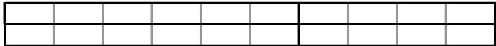

We branch to force (1-branch) or ban (0-branch) tasks for a specific person. Branch choice is based on ‘original y variables’ in Dantzig-Wolfe view.

Two branches possible above. Pick one of these. Each side of the branch is enforced by banning columns.

These branches are easy to enforce in a column generator. Eg, for force person A to undertake task 1, we put $\cdot$

General form: “The number of times we have person p working shift q in the solution must be integer (0 or 1 in fact).”

# Constraint Branching: Binary Variables, Binary A-matrix, no GUB Constraints General case of above.

<table><tr><td rowspan=7 colspan=1>12345</td><td rowspan=1 colspan=1>$X_A1$</td><td rowspan=1 colspan=1>X_A2</td><td rowspan=1 colspan=1>$X_A3</td><td rowspan=1 colspan=1>$X_A4</td><td rowspan=1 colspan=1>XA5</td><td rowspan=1 colspan=1>X_A6</td><td rowspan=1 colspan=1>X_A7</td><td rowspan=1 colspan=1>X_A8</td><td rowspan=1 colspan=1>X_A9</td><td rowspan=1 colspan=1>XA10</td><td rowspan=7 colspan=1>=</td></tr><tr><td rowspan=1 colspan=1></td><td rowspan=1 colspan=1>3/8</td><td rowspan=1 colspan=1></td><td rowspan=1 colspan=1></td><td rowspan=1 colspan=1>1/8</td><td rowspan=1 colspan=1>1/8</td><td rowspan=1 colspan=1>1/2</td><td rowspan=1 colspan=1></td><td rowspan=1 colspan=1></td><td rowspan=1 colspan=1>1/2</td></tr><tr><td rowspan=1 colspan=1>1</td><td rowspan=1 colspan=1></td><td rowspan=1 colspan=1>1</td><td rowspan=1 colspan=1>1</td><td rowspan=1 colspan=1></td><td rowspan=1 colspan=1></td><td rowspan=1 colspan=1>1</td><td rowspan=1 colspan=1>1</td><td rowspan=1 colspan=1>1</td><td rowspan=1 colspan=1>1</td></tr><tr><td rowspan=1 colspan=1></td><td rowspan=1 colspan=1>1</td><td rowspan=1 colspan=1>1</td><td rowspan=1 colspan=1></td><td rowspan=1 colspan=1>1</td><td rowspan=1 colspan=1></td><td rowspan=1 colspan=1>1</td><td rowspan=1 colspan=1>1</td><td rowspan=1 colspan=1>1</td><td rowspan=1 colspan=1></td></tr><tr><td rowspan=1 colspan=1>1</td><td rowspan=1 colspan=1>1</td><td rowspan=1 colspan=1></td><td rowspan=1 colspan=1>1</td><td rowspan=1 colspan=1></td><td rowspan=1 colspan=1>1</td><td rowspan=1 colspan=1></td><td rowspan=1 colspan=1>1</td><td rowspan=1 colspan=1></td><td rowspan=1 colspan=1>1</td></tr><tr><td rowspan=1 colspan=1></td><td rowspan=1 colspan=1></td><td rowspan=1 colspan=1></td><td rowspan=1 colspan=1>1</td><td rowspan=1 colspan=1></td><td rowspan=1 colspan=1></td><td rowspan=1 colspan=1>1</td><td rowspan=1 colspan=1></td><td rowspan=1 colspan=1>1</td><td rowspan=1 colspan=1>1</td></tr><tr><td rowspan=1 colspan=1></td><td rowspan=1 colspan=1>1</td><td rowspan=1 colspan=1>1</td><td rowspan=1 colspan=1></td><td rowspan=1 colspan=1>1</td><td rowspan=1 colspan=1></td><td rowspan=1 colspan=1></td><td rowspan=1 colspan=1>1</td><td rowspan=1 colspan=1>1</td><td rowspan=1 colspan=1>1</td></tr></table>

<table><tr><td rowspan=1 colspan=1>1</td></tr><tr><td rowspan=1 colspan=1>1</td></tr><tr><td rowspan=1 colspan=1>1</td></tr><tr><td rowspan=1 colspan=1>1</td></tr><tr><td rowspan=1 colspan=1>1</td></tr></table>

Pair   
Coverage   

<table><tr><td rowspan=1 colspan=1>1  2</td><td rowspan=1 colspan=1></td><td rowspan=1 colspan=1></td><td rowspan=1 colspan=1>0</td><td rowspan=1 colspan=1></td><td rowspan=1 colspan=1></td><td rowspan=1 colspan=1>XXXX</td><td rowspan=1 colspan=1>0.5</td><td rowspan=1 colspan=1>0</td><td rowspan=1 colspan=1>0</td><td rowspan=1 colspan=1></td><td rowspan=1 colspan=1>0.5</td></tr><tr><td rowspan=1 colspan=1>1  3</td><td rowspan=1 colspan=1>0</td><td rowspan=1 colspan=1></td><td rowspan=1 colspan=1></td><td rowspan=1 colspan=1>0</td><td rowspan=1 colspan=1>XxXx</td><td rowspan=1 colspan=1></td><td rowspan=1 colspan=1></td><td rowspan=1 colspan=1>0</td><td rowspan=1 colspan=1></td><td rowspan=1 colspan=1>0.5</td><td rowspan=1 colspan=1>0.5</td></tr><tr><td rowspan=1 colspan=1>1  4</td><td rowspan=1 colspan=1></td><td rowspan=1 colspan=1>XXXX</td><td rowspan=1 colspan=1></td><td rowspan=1 colspan=1>0</td><td rowspan=1 colspan=1>XXXX</td><td rowspan=1 colspan=1>XXXX</td><td rowspan=1 colspan=1>0.5</td><td rowspan=1 colspan=1></td><td rowspan=1 colspan=1>0</td><td rowspan=1 colspan=1>0.5</td><td rowspan=1 colspan=1>1</td></tr><tr><td rowspan=1 colspan=1>1  5</td><td rowspan=1 colspan=1></td><td rowspan=1 colspan=1></td><td rowspan=1 colspan=1>0</td><td rowspan=1 colspan=1></td><td rowspan=1 colspan=1></td><td rowspan=1 colspan=1>XXXX</td><td rowspan=1 colspan=1></td><td rowspan=1 colspan=1>0</td><td rowspan=1 colspan=1>0</td><td rowspan=1 colspan=1>0.5</td><td rowspan=1 colspan=1>0.5</td></tr><tr><td rowspan=1 colspan=1>2  3</td><td rowspan=1 colspan=1></td><td rowspan=1 colspan=1>0.375</td><td rowspan=1 colspan=1></td><td rowspan=1 colspan=1></td><td rowspan=1 colspan=1></td><td rowspan=1 colspan=1></td><td rowspan=1 colspan=1></td><td rowspan=1 colspan=1>0</td><td rowspan=1 colspan=1></td><td rowspan=1 colspan=1></td><td rowspan=1 colspan=1>0.375</td></tr><tr><td rowspan=1 colspan=1>2  4</td><td rowspan=1 colspan=1>XXXX</td><td rowspan=1 colspan=1></td><td rowspan=1 colspan=1></td><td rowspan=1 colspan=1></td><td rowspan=1 colspan=1></td><td rowspan=1 colspan=1>XXXX</td><td rowspan=1 colspan=1>0.5</td><td rowspan=1 colspan=1></td><td rowspan=1 colspan=1>0</td><td rowspan=1 colspan=1></td><td rowspan=1 colspan=1>0.5</td></tr><tr><td rowspan=1 colspan=1>2  5</td><td rowspan=1 colspan=1>XXXX</td><td rowspan=1 colspan=1>0.375</td><td rowspan=1 colspan=1>0</td><td rowspan=1 colspan=1>XXXX</td><td rowspan=1 colspan=1>0.125</td><td rowspan=1 colspan=1>XXXX</td><td rowspan=1 colspan=1></td><td rowspan=1 colspan=1>0</td><td rowspan=1 colspan=1>0</td><td rowspan=1 colspan=1></td><td rowspan=1 colspan=1>0.5</td></tr><tr><td rowspan=1 colspan=1>3  4</td><td rowspan=1 colspan=1></td><td rowspan=1 colspan=1></td><td rowspan=1 colspan=1>XXXX</td><td rowspan=1 colspan=1>0</td><td rowspan=1 colspan=1>XXXX</td><td rowspan=1 colspan=1></td><td rowspan=1 colspan=1></td><td rowspan=1 colspan=1></td><td rowspan=1 colspan=1></td><td rowspan=1 colspan=1>0.5</td><td rowspan=1 colspan=1>0.5</td></tr><tr><td rowspan=1 colspan=1>3  5</td><td rowspan=1 colspan=1></td><td rowspan=1 colspan=1>0.375</td><td rowspan=1 colspan=1></td><td rowspan=1 colspan=1></td><td rowspan=1 colspan=1></td><td rowspan=1 colspan=1></td><td rowspan=1 colspan=1>XXXX</td><td rowspan=1 colspan=1>0</td><td rowspan=1 colspan=1></td><td rowspan=1 colspan=1>0.5</td><td rowspan=1 colspan=1>0.875</td></tr><tr><td rowspan=1 colspan=1>4  5</td><td rowspan=1 colspan=1>XXXX</td><td rowspan=1 colspan=1></td><td rowspan=1 colspan=1></td><td rowspan=1 colspan=1></td><td rowspan=1 colspan=1></td><td rowspan=1 colspan=1>XXXX</td><td rowspan=1 colspan=1></td><td rowspan=1 colspan=1></td><td rowspan=1 colspan=1>0</td><td rowspan=1 colspan=1>0.5</td><td rowspan=1 colspan=1>0.5</td></tr></table>

Constraint branch on constraint pair

1-Branch   
0-Branch

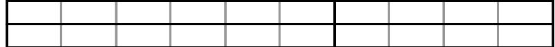

General form: “The number of times shifts $\mathfrak { p }$ and $\mathsf { q }$ occur together in a solution must be integer (0 or 1 in fact).”

# Follow-on Branching

Special case of above where the ‘constraint pair’ is restricted to tasks that occur in immediate succession. Eg if after flight sector 5 you can do one of sectors 6, 7, or 8, then a constraint branch can force (or ban) each of these options. Good for column generation as the sectors become one ‘multi-sector’... you either choose all or none of it. Eg, see [KJN99]

General Constraint Branching: Binary Variables, Binary A-Matrix (both above cases)

Developed by Ryan and Foster.

Let $\mathrm { J ( s , t ) } = \{ \mathrm { ~ j ~ } | \mathrm { ~ a _ { s j } = 1 ~ }$ and $a _ { \mathrm { { i j } } } = 1 \}$ . $\mathrm { J ( s , t ) }$ is the set of columns covering both constraints $s$ and $t .$ . Suppose activities (constraints) $s$ and $t$ appear together (i.e. occur in the same column) at a fractional value in the optimal LP solution (i.e. $0 < \sum _ { \mathrm { j } \in \mathrm { J } ( \mathrm { s , t } ) } \mathrm { x _ { \mathrm { j } } } < 1 )$ .

Then in an integer solution:

either activities $s$ and $t$ must occur together (i.e. $\sum _ { \in \mathrm { J } ( \mathrm { s } , \mathrm { t } ) } \mathbf { X } _ { \mathrm { j } } = 1 $ ) or activities $s$ and $t$ must not occur together (i.e. $\sum _ { \mathrm { i } \in \mathrm { J } ( \mathrm { s , t } ) } { \mathrm { x } } _ { \mathrm { j } } = 0 \mathrm { : }$ )

So we find constraints $s$ and $t$ with

$$
 \operatorname* { m a x } _ { \mathbf { \mu } _ { \mathrm { S } , \mathrm { t } } } { [ \sum _ { \mathrm { j } \in \mathrm { J ( s , t ) } } \mathbf { \mu } _ { \mathrm { X } _ { \mathrm { j } } } ] } < 1
$$

and then force $s$ and $t$ to occur together by setting $\mathbf { \boldsymbol { x } } _ { \mathrm { { j } } } = 0$ for all j∈ ${ \mathrm { J } _ { \mathrm { b a n } } } ^ { 1 } ( \mathrm { s , t } )$ where $\mathrm { J _ { b a n } } ^ { 1 } ( \mathrm { s , t ) } = \left\{ \mathrm { ~ j ~ } | \left( \mathrm { a _ { s j } } = 1 \right. \right.$ and ${ \sf a } _ { { \sf i } { \sf j } } = 0$ ) or $( { \sf a } _ { \mathrm { s j } } = 0$ and ${ \sf a } _ { \mathrm { t j } } = 1$ )}.

This is called the 1-branch.

In the 0-branch, we force $s$ and $t$ not to occur together by banning variables where they happen together, i.e. we ban variables in ${ \mathrm { J } _ { \mathrm { b a n } } } ^ { 0 }$ (s,t)

Note: A sequence of constraint branches leads (eventually) to a balanced matrix, and hence an integer solution for all variables in at least 1 constraint with unit right hand side.

Constraint Branching: Binary Variables, Integer A, GUB Constraints   

<table><tr><td rowspan=1 colspan=1>$X_A1$</td><td rowspan=1 colspan=1>$X_A$</td><td rowspan=1 colspan=1>$X_A3$</td><td rowspan=1 colspan=1>$X_A4</td><td rowspan=1 colspan=1>$X_A5</td><td rowspan=1 colspan=1>$X_A6</td><td rowspan=1 colspan=1>$X_B1</td><td rowspan=1 colspan=1>XB2</td><td rowspan=1 colspan=1>XB3</td><td rowspan=1 colspan=1>XB4</td></tr><tr><td rowspan=1 colspan=1>1/2</td><td rowspan=1 colspan=1></td><td rowspan=1 colspan=1></td><td rowspan=1 colspan=1></td><td rowspan=1 colspan=1>1/4</td><td rowspan=1 colspan=1>1/4</td><td rowspan=1 colspan=1>1/3</td><td rowspan=1 colspan=1></td><td rowspan=1 colspan=1></td><td rowspan=1 colspan=1>2/3</td></tr></table>

<table><tr><td rowspan=11 colspan=1>st</td><td rowspan=1 colspan=1>1</td><td rowspan=1 colspan=1>1</td><td rowspan=1 colspan=1>1</td><td rowspan=1 colspan=1>1</td><td rowspan=1 colspan=1>1</td><td rowspan=1 colspan=1>1</td><td rowspan=1 colspan=1></td><td rowspan=1 colspan=1></td><td rowspan=1 colspan=1></td><td rowspan=1 colspan=1></td><td rowspan=1 colspan=3>=</td><td rowspan=1 colspan=1>1</td></tr><tr><td rowspan=1 colspan=1></td><td rowspan=1 colspan=1></td><td rowspan=1 colspan=1></td><td rowspan=1 colspan=1></td><td rowspan=1 colspan=1></td><td rowspan=1 colspan=1></td><td rowspan=1 colspan=1>1</td><td rowspan=1 colspan=1>1</td><td rowspan=1 colspan=1>1</td><td rowspan=1 colspan=1>1</td><td rowspan=1 colspan=1></td><td></td><td></td><td></td></tr><tr><td></td><td></td><td></td><td></td><td></td><td></td><td></td><td></td><td></td><td></td><td></td><td></td><td></td><td></td></tr><tr><td></td><td></td><td></td><td></td><td></td><td></td><td></td><td></td><td></td><td></td><td></td><td></td><td></td><td rowspan=1 colspan=1>1</td></tr><tr><td rowspan=3 colspan=1>3</td><td rowspan=3 colspan=1>6</td><td rowspan=3 colspan=1>6</td><td rowspan=3 colspan=1>1</td><td rowspan=3 colspan=1>1</td><td rowspan=3 colspan=1>7</td><td rowspan=3 colspan=1>1</td><td rowspan=3 colspan=1>3</td><td rowspan=3 colspan=1>6</td><td rowspan=3 colspan=1>3</td><td rowspan=3 colspan=1></td><td></td><td></td><td></td></tr><tr><td rowspan=2 colspan=2></td><td></td><td></td></tr><tr><td rowspan=1 colspan=1></td><td rowspan=1 colspan=1>5</td></tr><tr><td rowspan=3 colspan=1>4</td><td rowspan=3 colspan=1>1</td><td rowspan=3 colspan=1>3</td><td rowspan=3 colspan=1>7</td><td rowspan=3 colspan=1>2</td><td rowspan=3 colspan=1>1</td><td rowspan=3 colspan=1>4</td><td rowspan=3 colspan=1>3</td><td rowspan=3 colspan=1>6</td><td rowspan=3 colspan=1>6</td><td rowspan=1 colspan=2></td><td></td><td></td></tr><tr><td rowspan=2 colspan=2></td><td></td><td></td></tr><tr><td rowspan=1 colspan=1></td><td rowspan=1 colspan=1>8</td></tr><tr><td rowspan=1 colspan=1>2</td><td rowspan=1 colspan=1>2</td><td rowspan=1 colspan=1>1</td><td rowspan=1 colspan=1>2</td><td rowspan=1 colspan=1>1</td><td rowspan=1 colspan=1>1</td><td rowspan=1 colspan=1>3</td><td rowspan=1 colspan=1>2</td><td rowspan=1 colspan=1>0</td><td rowspan=1 colspan=1>1</td><td rowspan=1 colspan=3>≥</td><td rowspan=1 colspan=1>3</td></tr></table>

Constraint branch on constraint pair

1-Branch   
0-Branch

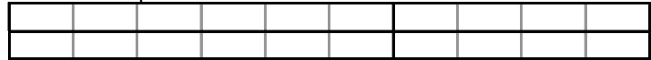

We impose branches on the y variables of the form $\mathrm { { y _ { p q } } \leq L \ \mathrm { { y _ { p q } } ^ { i } } } \mathrm { { \Theta } }$ or $\begin{array} { r } { { \tt y } _ { \tt p q } \geq \mathbb { y } _ { \tt p q } ^ { \mathrm { ~ i ~ } } \rceil , } \end{array}$ where ${ \mathrm { y } _ { p q } ^ { \mathrm { ~ i ~ } } }$ is the value of $\mathrm { { y _ { p q } } }$ at node i. These are enforced by banning all columns for person $\mathfrak { p }$ which have $\mathsf { a } _ { \mathrm { p q } } >$ $\lfloor { \mathrm { ~ } } \mathrm { y } _ { \mathrm { p q } } ^ { \mathrm { ~ } \mathrm { i } } \rfloor$ or $\mathrm { \Delta \hat { a } _ { p q } \mathrm { \scriptsize < } \ y _ { p q } \mathrm { \scriptsize ^ { \ i } ] } }$ respectively for some task (non-GUB constraint) ${ \mathsf { q } } ;$ , where $\scriptstyle \mathbf { A } = \left( \mathsf { a } _ { \mathrm { p q } } \right)$ is the non-GUB matrix in the problem.

(c) A. Mason

Note that branching may be required even if ${ \mathrm { y } _ { p q } ^ { \mathrm { ~ i ~ } } }$ is integer. This can occur when fractional x sum to give an integer ypqi.

Branches are generally easy to enforce in column generators.

General form: “The number of times person p works shift q must be integer.”

# SOS Branching: Binary Variables, Arbitrary A, GUB Constraints

<table><tr><td rowspan=1 colspan=1></td><td rowspan=1 colspan=1>$X_{1$</td><td rowspan=1 colspan=1>X_2</td><td rowspan=1 colspan=1>XA3</td><td rowspan=1 colspan=1></td><td rowspan=1 colspan=1>X_A5</td><td rowspan=1 colspan=1>X_A6</td><td rowspan=1 colspan=1>X_B1</td><td rowspan=1 colspan=1>XB2</td><td rowspan=1 colspan=1>X_B3</td><td rowspan=1 colspan=1>XB4</td></tr><tr><td rowspan=1 colspan=1>:</td><td rowspan=1 colspan=1>1/2</td><td rowspan=1 colspan=1></td><td rowspan=1 colspan=1></td><td rowspan=1 colspan=1></td><td rowspan=1 colspan=1>1/4</td><td rowspan=1 colspan=1>1/4</td><td rowspan=1 colspan=1>1/3</td><td rowspan=1 colspan=1></td><td rowspan=1 colspan=1></td><td rowspan=1 colspan=1>2/3</td></tr></table>

st

<table><tr><td rowspan=1 colspan=1>1</td><td rowspan=1 colspan=1>1</td><td rowspan=1 colspan=1>1</td><td rowspan=1 colspan=1>1</td><td rowspan=1 colspan=1>1</td><td rowspan=1 colspan=1>1</td><td rowspan=1 colspan=1></td><td rowspan=1 colspan=1></td><td rowspan=1 colspan=1></td><td rowspan=1 colspan=1></td><td rowspan=1 colspan=1></td><td rowspan=1 colspan=1></td><td rowspan=1 colspan=1>1</td></tr><tr><td rowspan=1 colspan=1></td><td rowspan=1 colspan=1></td><td rowspan=1 colspan=1></td><td rowspan=1 colspan=1></td><td rowspan=1 colspan=1></td><td rowspan=1 colspan=1></td><td rowspan=1 colspan=1>1</td><td rowspan=1 colspan=1>1</td><td rowspan=1 colspan=1>1</td><td rowspan=1 colspan=1>1</td><td rowspan=1 colspan=1></td><td rowspan=1 colspan=1></td><td rowspan=1 colspan=1>1</td></tr><tr><td rowspan=1 colspan=1>3</td><td rowspan=1 colspan=1>6</td><td rowspan=1 colspan=1>6</td><td rowspan=1 colspan=1>1</td><td rowspan=1 colspan=1>1</td><td rowspan=1 colspan=1>7</td><td rowspan=1 colspan=1>1</td><td rowspan=1 colspan=1>2.5</td><td rowspan=1 colspan=1>6</td><td rowspan=1 colspan=1>3</td><td rowspan=1 colspan=1></td><td rowspan=1 colspan=1></td><td rowspan=1 colspan=1>5</td></tr><tr><td rowspan=1 colspan=1>4</td><td rowspan=1 colspan=1>1</td><td rowspan=1 colspan=1>3</td><td rowspan=1 colspan=1>7</td><td rowspan=1 colspan=1>2</td><td rowspan=1 colspan=1>1</td><td rowspan=1 colspan=1>4</td><td rowspan=1 colspan=1>3</td><td rowspan=1 colspan=1>6</td><td rowspan=1 colspan=1>6</td><td rowspan=1 colspan=1></td><td rowspan=1 colspan=1></td><td rowspan=1 colspan=1>8</td></tr><tr><td rowspan=1 colspan=1>2</td><td rowspan=1 colspan=1>2</td><td rowspan=1 colspan=1>1</td><td rowspan=1 colspan=1>2</td><td rowspan=1 colspan=1>1</td><td rowspan=1 colspan=1>1</td><td rowspan=1 colspan=1>3</td><td rowspan=1 colspan=1>2</td><td rowspan=1 colspan=1>0</td><td rowspan=1 colspan=1>1</td><td rowspan=1 colspan=2>≥</td><td rowspan=1 colspan=1>3</td></tr></table>

<table><tr><td rowspan=2 colspan=1>WeightSoln Weight</td><td rowspan=1 colspan=1>2</td><td rowspan=1 colspan=1>3</td><td rowspan=1 colspan=1>4</td><td rowspan=1 colspan=1>6</td><td rowspan=1 colspan=1>7</td><td rowspan=1 colspan=1>9</td><td rowspan=1 colspan=1>2</td><td rowspan=1 colspan=1>3</td><td rowspan=1 colspan=1>5</td><td rowspan=1 colspan=1>7</td></tr><tr><td rowspan=1 colspan=6>5</td><td rowspan=1 colspan=4>5.333333333</td></tr></table>

SOS branch on GUB constraint

1-Branch   
0-Branch

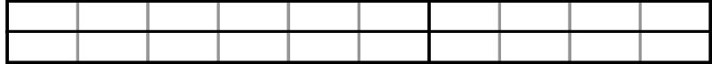

We forms ‘specially order sets’ (SOS’s) of variables with the property that, at most, only 1 variable from the set can appear in the solution . Specially ordered sets arise from $= 1$ (or $\leq 1$ ) GUB constraints. Consider some specially ordered set $X _ { \mathrm { p } }$ . Each variable $\mathbf { X } _ { \mathrm { j } }$ in $X _ { \mathrm { p } }$ has a (unique) weight $\mathrm { w _ { j } }$ . At some node i in the branch and bound tree, the average weight $\overline { { \mathscr { W } } } ^ { \mathrm { ~ i ~ } } ( { \mathrm { X } } _ { \mathrm { p } } )$ of variables in $X _ { \mathrm { p } }$ is given by

$$
\overline { { w } } ^ { \mathrm { ~ i } } ( \dot { \mathrm { X } } _ { \mathrm { p } } ) { = } \Sigma _ { \mathrm { j } \in \mathrm { X } _ { \mathrm { p } } } \mathrm { ~ W _ { j } \mathrm { X _ { j } ^ { \mathrm { ~ i ~ } } ~ } }
$$

We impose branches on $\overline { { w } } \left( \mathrm { X } _ { \mathrm { p } } \right)$ of the form $\overline { { w } } \left( \mathrm { X } _ { \mathrm { i } } \right) \leq \big \lfloor \mathrm { ~ } \overline { { w } } ^ { \mathrm { ~ i } } ( \mathrm { X } _ { \mathrm { i } } ) \ \big \rfloor$ or $\overline { { w } } \left( \mathrm { X } _ { \mathrm { i } } \right) \geq \int \overline { { w } } ^ { \mathrm { i } } ( \mathrm { X } _ { \mathrm { i } } ) \rceil .$ . These are enforced by banning all columns in $X _ { \mathrm { p } }$ which have $\mathrm { w _ { j } { > } } \lfloor \mathrm { \ z } \mathrm { \overset { . } { w } } ^ { \mathrm { i } } ( \mathrm { X } _ { \mathrm { p } } ) \rfloor$ or $\mathrm { w _ { j } } \ < \overline { { w } } ^ { \mathrm { ~ i } } ( \mathrm { X _ { p } } ) \rceil$ respectively.

Note: If the weights are not unique, SOS branching may be insufficient to form an integer solution for $\mathbf { X } _ { \mathrm { j } }$ in $X _ { \mathrm { p } }$ . Can randomly perturb $\mathrm { w _ { j } }$ before starting if required.

Above description is for ‘Type $1 ^ { \circ }$ SOS branching; it can be used for any type of variables (integer, binary, real), but without a GUB constraint, this information must be given externally (it is not in the model). ‘Type $2 ^ { \circ }$ allows for up to 2 variables from $X _ { \mathrm { p } }$ to be in the solution as long as they are adjacent in $X _ { \mathrm { p } } .$ , where $X _ { \mathrm { p } }$ is now ordered. Type 3 allows only $+ 1$ ’s and –1’s in the coefficients, but decreases the right hand side for each $^ { - 1 }$ .

SOS branching works with overlapping $X _ { \mathrm { p } } ,$ i.e. a column can belong to any number of sets.

Typically easy to handle in column generators if weight is ‘column generation friendly’, i.e.   
derived from a column property associated with an arc or a node in shortest path.

Example: $\mathbf { w _ { j } } \mathbf { = } ^ { \circ }$ ‘time spent once sector 5 is completed before starting the next sector.’ (KJN99)

General Form: “The number of times that a column from $X _ { \mathrm { p } }$ with a weight above (less than) some specified value must be integer (0 or 1 in fact).”

(c) A. Mason

# Generalised SOS Branching (‘Attribute Branching’): Integer Variables, Arbitrary A, no GUB Constraints

<table><tr><td rowspan=2 colspan=1>:</td><td rowspan=1 colspan=1>$\_{}$</td><td rowspan=1 colspan=1>$X_A</td><td rowspan=1 colspan=1>$X_A$</td><td rowspan=1 colspan=1>$X_A</td><td rowspan=1 colspan=1>X_A5</td><td rowspan=1 colspan=1>X_A6</td><td rowspan=1 colspan=1>$X_A7</td><td rowspan=1 colspan=1>$X_A8$</td><td rowspan=1 colspan=1>$X_A</td><td rowspan=1 colspan=1>$X_A10</td></tr><tr><td rowspan=1 colspan=1>13/5</td><td rowspan=1 colspan=1>3 1/3</td><td rowspan=1 colspan=1></td><td rowspan=1 colspan=1></td><td rowspan=1 colspan=1>2 1/5</td><td rowspan=1 colspan=1>1/4</td><td rowspan=1 colspan=1>1 3/4</td><td rowspan=1 colspan=1></td><td rowspan=1 colspan=1></td><td rowspan=1 colspan=1>2/3</td></tr></table>

<table><tr><td rowspan=5 colspan=1>st</td><td rowspan=1 colspan=1>1</td><td rowspan=1 colspan=1>1</td><td rowspan=1 colspan=1>1</td><td rowspan=1 colspan=1>1</td><td rowspan=1 colspan=1>5</td><td rowspan=1 colspan=1>1</td><td rowspan=1 colspan=1>0</td><td rowspan=1 colspan=1>2</td><td rowspan=1 colspan=1>2</td><td rowspan=1 colspan=1>1</td><td rowspan=1 colspan=3></td><td rowspan=1 colspan=1></td></tr><tr><td></td><td></td><td rowspan=1 colspan=1>0</td><td rowspan=1 colspan=1>2</td><td rowspan=1 colspan=1>2</td><td rowspan=1 colspan=1>1</td><td rowspan=1 colspan=1>0</td><td rowspan=1 colspan=1>0</td><td rowspan=1 colspan=1>1</td><td rowspan=1 colspan=1>0</td><td rowspan=1 colspan=3>2</td><td rowspan=1 colspan=1>4</td></tr><tr><td></td><td></td><td rowspan=1 colspan=1>3</td><td rowspan=1 colspan=1>6</td><td rowspan=1 colspan=1>6</td><td rowspan=1 colspan=1>1</td><td rowspan=1 colspan=1>1</td><td rowspan=1 colspan=1>7</td><td rowspan=1 colspan=1>1</td><td rowspan=1 colspan=1>2.5</td><td rowspan=1 colspan=3>6</td><td rowspan=1 colspan=1>3</td></tr><tr><td rowspan=1 colspan=1>4</td><td rowspan=1 colspan=1>5</td><td rowspan=1 colspan=1>5</td><td rowspan=1 colspan=1>7</td><td rowspan=1 colspan=1>2</td><td rowspan=1 colspan=1>1</td><td rowspan=1 colspan=1>4</td><td rowspan=1 colspan=1>3</td><td rowspan=1 colspan=1>5</td><td rowspan=1 colspan=1>6</td><td rowspan=1 colspan=2></td><td rowspan=1 colspan=1></td><td rowspan=1 colspan=1>8</td></tr><tr><td rowspan=1 colspan=1>2</td><td rowspan=1 colspan=1>2</td><td rowspan=1 colspan=1>3</td><td rowspan=1 colspan=1>2</td><td rowspan=1 colspan=1>1</td><td rowspan=1 colspan=1>1</td><td rowspan=1 colspan=1>3</td><td rowspan=1 colspan=1>2</td><td rowspan=1 colspan=1>2</td><td rowspan=1 colspan=1>1</td><td rowspan=1 colspan=3></td><td rowspan=1 colspan=2></td></tr></table>

<table><tr><td>X=</td><td></td><td></td><td></td><td></td><td></td><td></td><td></td><td></td><td></td><td></td><td rowspan="3"></td></tr><tr><td>0-Branch</td><td></td><td></td><td></td><td></td><td></td><td></td><td></td><td></td><td></td></tr><tr><td rowspan="2"></td><td></td><td></td><td></td><td></td><td></td><td></td><td></td><td></td><td></td><td></td></tr><tr><td></td><td></td><td></td><td></td><td></td><td></td><td></td><td></td><td></td><td></td></tr><tr><td></td><td>1-Branch</td><td></td><td></td><td></td><td></td><td></td><td></td><td></td><td></td><td></td></tr></table>

Consider any set $\mathrm { X }$ of integer variables. At some node i in the branch and bound tree, the number of times columns from X are used is given by

$\begin{array} { r } { \mathrm { { n } } ^ { \mathrm { { i } } } ( \mathrm { { X } } ) = \sum _ { \mathrm { { j } } \in \mathrm { { X } } } \mathrm { { X } } _ { \mathrm { { j } } } ^ { \mathrm { { i } } } } \end{array}$ We impose branches on $\mathrm { { \ n ( X ) } }$ of the form $\mathfrak { n } ( \mathrm { X } ) \leq \lfloor \mathfrak { n } ^ { \mathrm { i } } ( \mathrm { X } ) \rfloor \mathrm { o r } \mathfrak { n } ( \mathrm { X } ) \geq \lceil \mathfrak { n } ^ { \mathrm { i } } ( \mathrm { X } ) \rceil .$

Each branch is enforced by adding a constraint (cut) to the problem. These cuts are local; they are not valid inequalities, and have to be removed when stepping up the tree.

Where possible, choose X to be some ‘attribute’ that is important to cost, and is ‘column generator friendly.’ Eg, branch on “number of full weekends off”. For each full weekend off that the column generator includes, the reduced cost changes by the Pi for the added cut.

General Form: “The total number of times that we use columns from X in the solution must be integer.”

# Generalised Constraint Branching: Integer Variables, Arbitrary A-matrix, no GUB Constraints

<table><tr><td rowspan=1 colspan=1></td><td rowspan=1 colspan=1>$X_{1</td><td rowspan=1 colspan=1>$X_{A{2</td><td rowspan=1 colspan=1>XA3</td><td rowspan=1 colspan=1>XA4</td><td rowspan=1 colspan=1>XA5</td><td rowspan=1 colspan=1>X_A</td><td rowspan=1 colspan=1>XA7</td><td rowspan=1 colspan=1>XA8</td><td rowspan=1 colspan=1>X_A9</td><td rowspan=1 colspan=1>X_A10</td></tr><tr><td rowspan=1 colspan=1>:</td><td rowspan=1 colspan=1>1.3/5</td><td rowspan=1 colspan=1>3 1/3</td><td rowspan=1 colspan=1></td><td rowspan=1 colspan=1></td><td rowspan=1 colspan=1>2 1/5</td><td rowspan=1 colspan=1>1/4</td><td rowspan=1 colspan=1>1 3/4</td><td rowspan=1 colspan=1></td><td rowspan=1 colspan=1></td><td rowspan=1 colspan=1>2/3</td></tr></table>

<table><tr><td rowspan=5 colspan=1>st</td><td rowspan=1 colspan=1>1</td><td rowspan=1 colspan=1>1</td><td rowspan=1 colspan=1>1</td><td rowspan=1 colspan=1>1</td><td rowspan=1 colspan=1>5</td><td rowspan=1 colspan=1>1</td><td rowspan=1 colspan=1>0</td><td rowspan=1 colspan=1>2</td><td rowspan=1 colspan=1>2</td><td rowspan=1 colspan=1>1</td><td rowspan=1 colspan=1></td><td rowspan=1 colspan=1></td><td rowspan=1 colspan=1>2</td></tr><tr><td rowspan=1 colspan=1>0</td><td rowspan=1 colspan=1>2</td><td rowspan=1 colspan=1>2</td><td rowspan=1 colspan=1>1</td><td rowspan=1 colspan=1>0</td><td rowspan=1 colspan=1>0</td><td rowspan=1 colspan=1>1</td><td rowspan=1 colspan=1>0</td><td rowspan=1 colspan=1>2</td><td rowspan=1 colspan=1>4</td><td rowspan=1 colspan=1></td><td rowspan=1 colspan=1></td><td rowspan=1 colspan=1>3</td></tr><tr><td rowspan=1 colspan=1>3</td><td rowspan=1 colspan=1>6</td><td rowspan=1 colspan=1>6</td><td rowspan=1 colspan=1>1</td><td rowspan=1 colspan=1>1</td><td rowspan=1 colspan=1>7</td><td rowspan=1 colspan=1>1</td><td rowspan=1 colspan=1>2.5</td><td rowspan=1 colspan=1>6</td><td rowspan=1 colspan=1>3</td><td rowspan=1 colspan=1></td><td rowspan=1 colspan=1></td><td rowspan=1 colspan=1>5</td></tr><tr><td rowspan=1 colspan=1>4</td><td rowspan=1 colspan=1>5</td><td rowspan=1 colspan=1>5</td><td rowspan=1 colspan=1>7</td><td rowspan=1 colspan=1>2</td><td rowspan=1 colspan=1>1</td><td rowspan=1 colspan=1>4</td><td rowspan=1 colspan=1>3</td><td rowspan=1 colspan=1>5</td><td rowspan=1 colspan=1>6</td><td rowspan=1 colspan=1></td><td rowspan=1 colspan=1></td><td rowspan=1 colspan=1>8</td></tr><tr><td rowspan=1 colspan=1>2</td><td rowspan=1 colspan=1>2</td><td rowspan=1 colspan=1>3</td><td rowspan=1 colspan=1>2</td><td rowspan=1 colspan=1>1</td><td rowspan=1 colspan=1>1</td><td rowspan=1 colspan=1>3</td><td rowspan=1 colspan=1>2</td><td rowspan=1 colspan=1>2</td><td rowspan=1 colspan=1>1</td><td rowspan=1 colspan=2></td><td rowspan=1 colspan=1>3</td></tr></table>

Branch on $\mathtt { a } =$ 0-Branch

<table><tr><td></td><td></td><td></td><td></td><td></td><td></td><td></td><td></td><td></td><td></td><td></td></tr><tr><td>Branch</td></tr><tr><td></td><td></td><td></td><td></td><td></td><td></td><td></td><td></td><td></td><td></td></tr></table>

We impose branches of the generalised SOS form, where

$\mathrm { X = X _ { \geq a } = \{ j : a _ { j } \geq a \ \} }$ where $\mathbf { \dot { a } } _ { } ^ { }$ is some ‘reference column’ (typically chosen from the A-matrix).

To choose our reference column at non-integer node i (Vanderbeck and Wolsey, 1996):

Find some column $\mathrm { a _ { j } }$ for which $\mathbf { X _ { j } } ^ { \mathrm { i } }$ is the only fractional value in $\mathrm { X _ { \geq a } }$ .

Note that $\mathbf { a } _ { \mathrm { j } }$ is any maximal (undominated) column from $\mathrm { F ^ { i } { = } \{ j : \mathrm { x _ { j } ^ { i } } } $ is fractional $\}$

Must be enforced by adding a constraint.

Vanderbeck and Wolsey show how these constraint branches can be enforced in general IPbased column generators by using $0 / 1$ variables that determine when a column belongs to $\mathrm { X _ { \geq a } } .$ and hence when its reduced cost include the dual variable for the cut associated with $X _ { \mathrm { p } }$ .

General Form: “The number of times we have columns $\mathtt { a _ { j } } \ge \mathtt { a }$ appearing in the solution must be integer.”

See: F. Vanderbeck, L.A. Wolsey, An exact algorithm for IP column generation, Operations Research Letters 19 (4) (1996) pp. 151-159.

# Column Generator Structures

Column generators are typically:

Shortest Path (Dynamic Programming) • Nested shortest path Shortest Path with Resource Constraints   
• TSP solutions (vehicle routing)   
• TSP solutions with resource constraints (eg vehicle routing)   
• General IP’s Enumerators • Randomised enumerators

Note: Shortest Path/Dynamic Programming is only useful if there is significant merging of states. Otherwise, it is just inefficient enumeration.

Can blend enumeration and shortest path

• Enumerate high level structure of column, eg ‘all days on/off that give a 40 hour week’ • Fill in column detail using dual information, eg via shortest path, eg ‘what is done during days on’

# Column Generation Issues:

• Many issues similar to SPRINT pricing. How many columns do we return in each generate? • Dynamic Programs often end in multiple states, offering many ‘good’ columns • Number to return depends on speed of generator

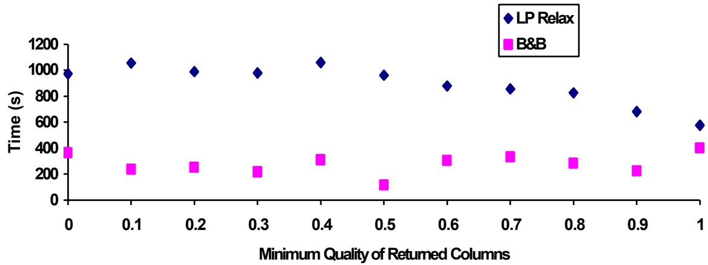  
The effect of multiple column generation (fewer columns per generate on the right)

• When many columns are available, select a range of different columns

When do we call the generator?

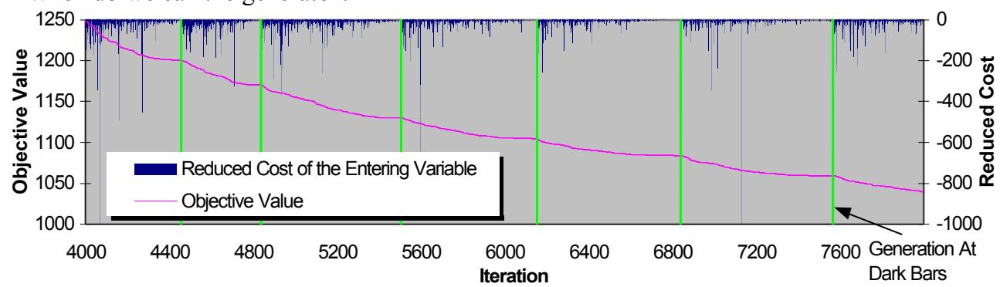  
Impact of Calling the Column Generator

• Crashing the basis

• Best to start from a good basis. One strategy is to use the ‘remaining $\mathbf { b } ^ { \prime }$ (remaining workload to cover) (possibly scaled) as a substitute for $\pi$ , updating remaining workload as columns are generated and contribute to covering the work.

Plots taken from: Mark Smith, Optimal Nurse Scheduling using Column Generation, Masters thesis, Department of Engineering Science, School of Engineering,University of Auckland, 1995

# Integerisation Strategies

Branch and Bound

The course will introduce set partitioning, set covering and set packing models and illustrate their use with several case studies.

Column generation will be discussed from both a ‘natural’ and a Dantzig-Wolfe viewpoint.

We will then consider branch and bound and use this to motivate constraint branching and its links to perfect and balanced matrices, and also limited subsequence.

Constraint branching will be discussed, and their use contrasted.   
This will include recent work on constraint branching via cuts for non-binary problems.   
General problem-motivated branching will be mentioned.

The choice of alternative column generators (enumerative, (k’th-)shortest path, and ‘delicate blends of the two) will be covered.

Other topics covered will include a selection from branch and cut, practical IP implementations, heuristic solution processes, ‘lift and project’ cuts, new work on stabilized column generation, heuristics for set partitioning, and bounded early LP termination. Some of this material will be covered in seminars researched and presented by students enrolled in the course.

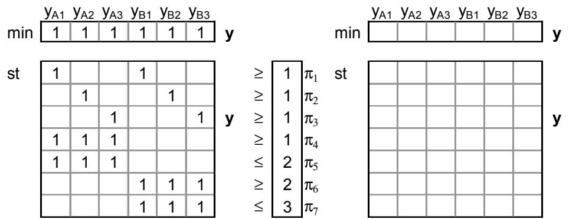  
yA1 yA2 yA3 yB1 yB2 yB3 ∈ {0,1)

Note 3:

The original objective function can be arbitrarily complex in each of the subproblem variables, but for linear programming, must be additive across sub-problems, eg

$$
\small \mathrm { m i n } \mathrm { z = f _ { A } ( y _ { A l } , y _ { A 2 } , y _ { A 3 } ) + f _ { B } ( y _ { B l } , y _ { B 2 } , y _ { B 3 } ) . }
$$

This is possible because ....we evaluate $\mathbf { f } _ { \mathrm { A } } ( \mathbf { y } _ { \mathrm { A 1 } } , \mathbf { y } _ { \mathrm { A 2 } } , \mathbf { y } _ { \mathrm { A 3 } } )$ for each column generated.

However, a complex $\mathrm { f _ { A } } ( \mathrm { y _ { A 1 } } , \mathrm { y _ { A 2 } } , \mathrm { y _ { A 3 } } )$ can make for a complex generator.

Note 4:

If some column, $\mathrm { e g \ a _ { A p } }$ is a convex combination of other columns,

but

$$
\begin{array} { r l } & { \mathrm { a } _ { \mathrm { A p } } = \sum _ { \lambda ( \mathrm { k } ) } \lambda ( \mathrm { k } ) \mathrm { a } _ { \mathrm { A k } } : \sum _ { \lambda ( \mathrm { k } ) } \lambda ( \mathrm { k } ) { = } 1 } \\ & { } \\ & { \mathrm { f } _ { \mathrm { A } } ( \mathrm { a } _ { \mathrm { A p } } ) > \sum _ { \lambda ( \mathrm { k } ) } \lambda ( \mathrm { k } ) \mathrm { f } _ { \mathrm { A } } ( \mathrm { a } _ { \mathrm { A p } } ) } \end{array}
$$

then

# column $\cdot$ will never appear in the LP solution

Our original formulation:

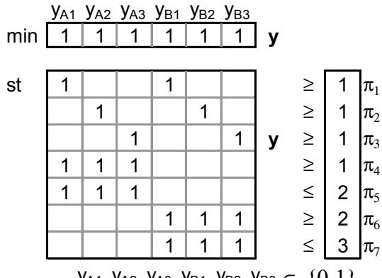  
yA1 yA2 yA3 yB1 yB2 yB3 ∈ {0,1}

Our Column Generation Reformulation:

<table><tr><td></td><td>XA1 XA2 XA3 XA4 XA5 XA6 XB1 XB2 XB3 XB4</td><td></td><td></td><td></td><td></td><td></td><td></td><td></td><td></td><td></td><td></td></tr><tr><td>min</td><td>1</td><td>1</td><td>1</td><td>1</td><td>1</td><td>1</td><td></td><td>1</td><td>1</td><td>1</td><td>x</td></tr></table>

<table><tr><td rowspan=5 colspan=1>st</td><td rowspan=1 colspan=1>1</td><td rowspan=1 colspan=1></td><td rowspan=1 colspan=1></td><td rowspan=1 colspan=1>1</td><td rowspan=1 colspan=1>1</td><td rowspan=1 colspan=1></td><td rowspan=1 colspan=1>1</td><td rowspan=1 colspan=1>1</td><td rowspan=1 colspan=1></td><td rowspan=1 colspan=1>1</td><td rowspan=5 colspan=1> IX  ≥==</td><td rowspan=2 colspan=1>11</td></tr><tr><td rowspan=1 colspan=1></td><td rowspan=1 colspan=1>1</td><td rowspan=1 colspan=1></td><td rowspan=1 colspan=1>1</td><td rowspan=1 colspan=1></td><td rowspan=1 colspan=1>1</td><td rowspan=1 colspan=1>1</td><td rowspan=1 colspan=1></td><td rowspan=1 colspan=1>1</td><td rowspan=1 colspan=1>1</td></tr><tr><td rowspan=1 colspan=1></td><td rowspan=1 colspan=1></td><td rowspan=1 colspan=1>1</td><td rowspan=1 colspan=1></td><td rowspan=1 colspan=1>1</td><td rowspan=1 colspan=1>1</td><td rowspan=1 colspan=1></td><td rowspan=1 colspan=1>1</td><td rowspan=1 colspan=1>1</td><td rowspan=1 colspan=1>1</td><td rowspan=1 colspan=1>1</td></tr><tr><td rowspan=1 colspan=1>1</td><td rowspan=1 colspan=1>1</td><td rowspan=1 colspan=1>1</td><td rowspan=1 colspan=1>1</td><td rowspan=1 colspan=1>1</td><td rowspan=1 colspan=1>1</td><td rowspan=1 colspan=1></td><td rowspan=1 colspan=1></td><td rowspan=1 colspan=1></td><td rowspan=1 colspan=1></td><td rowspan=2 colspan=1>11</td></tr><tr><td rowspan=1 colspan=1></td><td rowspan=1 colspan=1></td><td rowspan=1 colspan=1></td><td rowspan=1 colspan=1></td><td rowspan=1 colspan=1></td><td rowspan=1 colspan=1></td><td rowspan=1 colspan=1>1</td><td rowspan=1 colspan=1>1</td><td rowspan=1 colspan=1>1</td><td rowspan=1 colspan=1>1</td></tr></table>

$\mathbf { X } _ { \mathrm { i j } } \in \ \{ 0 , 1 \}$

Example solution feasible for original, but not new formulation:

<table><tr><td></td><td>ya1 ya2 ya3 yB1 yB2 yB3</td><td></td><td></td><td></td><td></td></tr><tr><td></td><td></td><td></td><td></td><td></td><td></td></tr></table>

Note 7: Where is the ‘convexity constraint’ in the stock cutting problem?

Hint: The stock cutting problem does not have natural sub-problems, so ...create them! All sub-problems are the same

# FIXES TO MAKE

2001:

• We started with a simple rostering example., then into col gen forms.

• Add something about NP-hard in sub-problem for LP complexity in Dantzig Wolfe.

• Draw a price/pivot diagram.

• Do Benders by introducing form of master first, then talking about how we find the cuts; merge this into main notes.

# 2000: DONE!

In generating extreme columns, the 2 cases are not $\cdot$ and $\cdot$ , but instead more complicated. (Depend on slope of frontier; in this case, frontier is a line from (6,0) to (0,4). Ratio is 2/3?

In Dantzig-Wolfe, costs are wrong... we have unit costs for master and original. Also, subproblem has to have the dual for Pi_A.

Example of solution in original not master is 0.5 for all x’s.

Master problem has a generator sub-problem that is naturally integer, hence the LP is NOT strengthened, contrary to example in notes.

See 2001 Second handout for more material including a rostering col generator.