# Solving Japanese Puzzles with Heuristics

Sancho Salcedo-Sanz†, Emilio G. Ort´ız-Garc´ıa†, Angel M. Perez-Bellido ´ †, Antonio Portilla-Figueras† and Xin Yao‡

†Department of Signal Theory and Communications Universidad de Alcala,´ Spain sancho.salcedo@uah.es

‡School of Computer Science   
The University of Birmingham, United Kingdom x.yao@cs.bham.ac.uk

Abstract— This paper presents two heuristics algorithms to solve Japanese puzzles, both black and white puzzles and color puzzles. First, we present ad-hoc heuristics which use the information in rows, columns, and puzzle’s constraints to obtain the solution of the puzzle. The best heuristic developed for black and white puzzles is then extended to solving color Japanese puzzles. We show the performance of the proposed heuristics in several examples from a well known web page devoted to this kind of puzzles. Comparison with an existing solver based on constraint programming and with a genetic algorithm is carried out.

Keywords: Japanese puzzles, Nonograms, Puzzles solver, Heuristics.

# I. INTRODUCTION

Puzzles, board games and computer games in general have been studied for many years in Computer Science, Mathematics and Artificial Intelligence fields [1]-[3]. They not only provide challenging problems, but also good testbeds for comparing algorithms, and novel ideas to be applied in real world problems. In the last few years, the interest in applying heuristic approaches to solving games and puzzles have been massive [4]-[7], which has contributed to the development of this kind of algorithms. The work we present here tackles the solution of a popular type of puzzles known as Japanese puzzles, which have gained popularity in the last few years.

A Japanese puzzle is a interesting and addictive game, which take the form of a $N \times M$ grid, with numbers situated on the left and the top rows and columns. There are two types of Japanese puzzles, black and white and color puzzles. In black and white Japanese puzzles, the numbers in rows and columns represent how many blocks of cells must be filled in the grid, in the order they appear. If there are two or more numbers, the blocks of cells in the grid must be separated by at least one blank square. For example, Figure 1 (b) shows the solution to the Japanese puzzle displayed in Figure 1 (a).

Note that in the first row, 3 and then 7 blocks must be filled, whereas in the second row 1, 2, 5, 1 and finally another block of 1 must be filled, with at least one blank between them. Columns in the puzzle follow the same rules. When all requirements in rows and columns are fulfilled, the puzzle is solved, and a nice picture can be seen, in this case the draw of King-Kong up to the Empire State Building in New

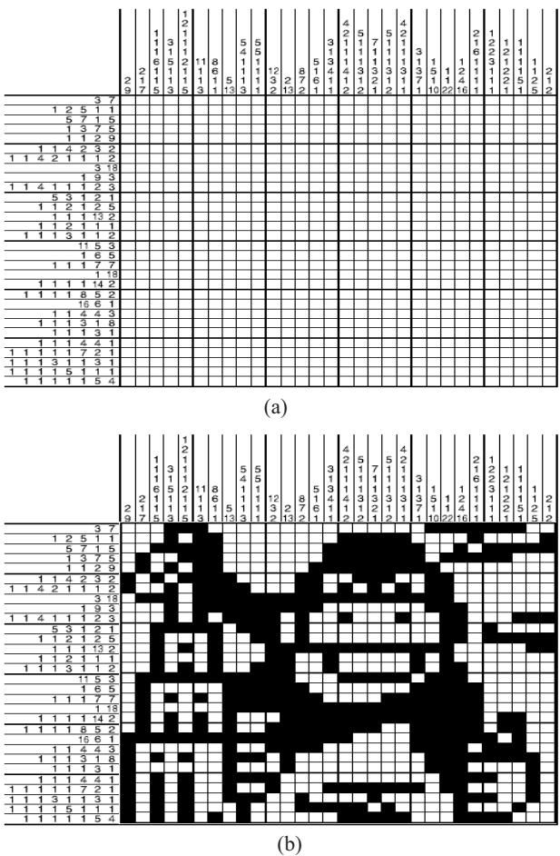  
Fig. 1. Example of a black and white Japanese puzzle; (a) Grid with conditions; (b) Solution.

York. Color Japanese puzzles follows similar rules than black and white puzzles, but taking into account that blocks of the same color must be separated by at least one blank square, and blocks of different color may or may be not separated by blanks squares. See [8], [9] and [10] for examples on color Japanese puzzles.

Japanese puzzles were independently created by Non Ishida, a graphics editor, and Tetsuya Nishio, a professional puzzler, in 1987. At the beginning, Japanese puzzles were also named Picture-forming logic puzzles. Soon, the puzzles started appearing in several Japanese puzzle magazines and gaining popularity, until 1990, when the newspaper The Sunday Telegraph starts publishing them on a weekly basis. In the United Kingdom the name for this kind of puzzles were Nonograms.

In 1993, Non Ishida published the first book of Nonograms in Japan, and later, the Sunday Telegraph published another book in the United Kingdom entitled the book of Nonograms. Japanese puzzles quickly spread through the whole world, and start being published in the United States, Sweden, South Africa, Israel and several other countries.

In the last few years the popularity of these puzzles has increased a lot. There are several companies which publish magazines and web pages only devoted to Japanese puzzles [8], [11], [12], [13], in countries like Spain, Germany, The Netherlands, Italy, Finland etc.

These puzzles are so addictive because they mix mathematics related to constrained combinatorial optimization problems with the surprise and challenge of discovering the secret of the image in the puzzle. For this reason, Japanese puzzles are really adequate for educational purposes, and also, we will show that they can be used as test bed problems in the development of new computational algorithms. In this sense, Japanese puzzles can be seen as NP-hard combinatorial optimization problems as well [14].

In this paper we propose two different computer ad-hoc heuristics for solving black and white Japanese puzzles, and the extension of one of them to solve color puzzles. We test the performance of our approaches by solving a set of puzzles downloaded from a well known web page devoted to these puzzles (see [8]), and we will show that the Logic Ad-hoc heuristic we propose is able to solve all the puzzles tested (black and white and color ones) within seconds. We compare our approaches to black and white puzzles with a popular solver which can be free downloaded from the Internet. We also provide the results obtained by our Logic Ad-hoc algorithm in color puzzle examples.

The rest of the paper is structured as follows: next section gives some indications to begin the process of solving a Japanese puzzle. Section III describes the computer algorithms we propose in this paper, and Section IV shows the performance of our heuristics in a set of Japanese puzzles. Section V closes de paper giving some final remarks.

# II. SOLVING JAPANESE PUZZLES

Japanese puzzles are thought to be solved by people through the use of logic thinking. Japanese puzzles must be unique-solution puzzles, so, if the reasonings of the solver are right, he will finally get the solution to the puzzle. The main idea to solve a Japanese puzzle is to discover squares in the grid which must be filled, or must be blanks, using the logic of the problem, i.e. using that the puzzle has associated several constraints because of its structure in a grid. In the case of a color puzzle, the same idea but using several colors instead of two.

There are several hints to solve Japanese puzzles by hand explained in [10], which is a nice way to familiarize with the puzzles and get the logic behind them. Some of these hints can be easily implemented in an algorithmic form, so we describe them.

# A. Hints for black and white puzzles

1) Complete fill: Consider a row or a column in a Japanese puzzle with a single number, such that it is equal to the length of the puzzle grid ( $N$ for rows, $M$ for columns) (see Figure 2 (a), with $N$ or $M$ equal to 15). The only possibility for this case is to fill the complete row or column, as can be seen in Figure 2 (b).

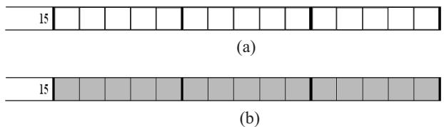  
Fig. 2. (a) Example of a full line preprocessing condition; (b) Full line fixed.

2) Complete fill with definite blanks: A similar situation is the case of a row or column with a several numbers $n _ { i }$ (let us consider $k$ numbers), which fulfil the following condition:

$$
\sum _ { i } n _ { i } + ( k - 1 ) = M
$$

for rows, or

$$
\sum _ { i } n _ { i } + ( k - 1 ) = N
$$

for columns. Note that the term $( k - 1 )$ is the minimum number of blanks possible for the row or column (see Figure 3 (a) as an example).

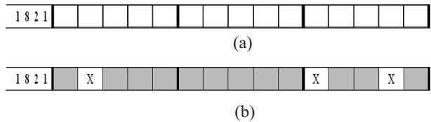  
Fig. 3. (a) Example of a full line with blanks preprocessing condition; (b) Full line with blanks fixed.

In this situation, the only possibility is to fill the corresponding squares and also mark $k - 1$ definite blanks as can be seen in Figure 3 (b).

3) Partial fills: Let us consider now the case in Figure 4 (a).

This example shows a 15-length row or column with a single number, 10 in a Japanese puzzle. Note that, independently of the initial first square we choose, at least the five central squares of the row will be filled, as shown in Figure

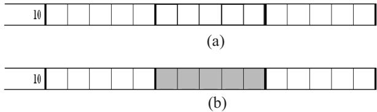  
Fig. 4. (a) Example of a partial fixed condition in a line; (b) Squares fixed.

4 (b). It is immediate that, in a situation like this, one can fill $n _ { i } - l$ squares if

$$
n _ { i } - l > 0 .
$$

where $\begin{array} { r } { l = M - ( \sum _ { i } n _ { i } + ( k - 1 ) ) } \end{array}$ .

A more complicated situation is considered in Figure 5 (a).

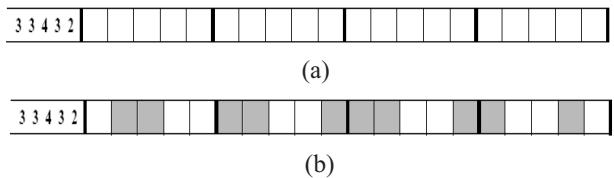  
Fig. 5. (a) Example of multiple partial condition in a line; (b) Squares fixed.

In this situation, the number of filled squares depend on the row or column length and the numbers $n _ { i }$ $k$ numbers). Consider the given example in Figure 5. The first number $n _ { i } = 3$ , in this case let us suppose that we are dealing with a row, so $M = 2 0$ , and $k = 5$ . Note that the first square where the number $n _ { i } = 3$ can start is square 1, and the last square is given by the expression

$$
I n i t i a l \mathrm { - } s q u a r e + M - \left( \sum _ { i } n _ { i } + ( k - 1 ) \right)
$$

since any other beginning square will make impossible to allocate the rest of filled squares and corresponding blanks. In this example, the initial square to be filled is the square 1 as was stated above, and the last starting square is square 2. Since the $n _ { i } = 3$ , no matter that we start in square 1 or 2, squares 2 and 3 will always be filled, so they are definite filled squares and we can mark them (see Figure 5 (b)). The rest of filled squares of the example can be obtained in a similar way.

The strategies outlined above for black and white puzzles are applicable to color puzzles, but there are several extra rules which must be taken into account. We have not included figures explaining these extra rules due to rules of the workshop discourage color graphs, however, the reader can find a good introduction to color Japanese puzzles in [10].

# B. Preprocessing: the initial solution

The above subsections have shown us how the constraints of the puzzles can be used to get definite blanks or filled squares in a given puzzle. Moreover, it is straight forward that any algorithm for solving Japanese puzzles should start looking for define blanks and filled squares using the rules described above. This can be seen as a preprocessing, in which for every row and column of the puzzle we look for complete fills, complete fills with definite blanks and partial fills. It is immediate that the more squares can be filled or be defined as blanks in the preprocessing stage, the easier will be to get the solution of the Japanese puzzle.

# III. AD-HOC HEURISTICS FOR SOLVING JAPANESE PUZZLES

In this section we present two ad-hoc algorithms, we have called Combinatorial ad-hoc and Logic ad-hoc heuristics. These heuristics are general approaches for solving black and white Japanese puzzles, and the logic ad-hoc can be extended to solve color puzzles.

1) Combinatorial Ad-hoc heuristic: The first ad-hoc approach we propose is based on trying feasible combinations of solutions in each row and column of the puzzle. It starts with the preprocessing procedure described in Section II-B. This procedure provides the initial filled and blanks squares in the puzzle. We sort then the columns and rows, in such a way that we will process first the columns or rows with most fixed (filled or blanks) squares. Starting with the row or column with most fixed squares, we try all the possible feasible combinations of solutions for that line, which keep the status of the fixed squares. In this process, we look for squares not yet fixed, and which are filled or blank in all the combinations tried. Note that, if a square is filled in a given combination, and blank in another combination, we cannot decide on it, and we mark it as unknown. In the case that a square is blank or filled with all the possible combinations, it is fixed, and the corresponding row (if we are dealing with a column) or column (if we are dealing with a row) is also modified. The algorithm continues the search in the row (or column) which more fixed squares. Note that if all the squares of a line appears as unknown, we stop trying more combinations, and we carry on the algorithm in the next line (row or column) with most fixed squares.

The pseudo-code of our Ad-hoc heuristic for black and white puzzles is the following:

# Combinatorial ad-hoc heuristic for Japanese puzzles:

Launch the Preprocessing procedure.   
while(There are unknown squares)   
Choose the line (row or column) with most   
fixed or blanks squares $( i )$ .   
Try all the possible feasible combinations for line $i$ . if(a given square $j$ is always filled or blank) then fixed square $j$ to be filled or blank. else mark $j$ as unknown. endif

# endwhile

2) Logic ad-hoc heuristic: The second ad-hoc heuristic proposed is based on logical aspects of the Japanese puzzles. This heuristic also starts with the preprocessing procedure described in Section II-B. This heuristic is based on the calculation of the feasible right-most and left-most solution for a given line, where right-most stands for the feasible solution which has the first filled square of each condition $( n _ { k } )$ most in the right, and left-most stands for the feasible solution with the first filled square of each condition most in the left, see Figure 6 as an example. The heuristic is also based on that fixed squares or blanks are maintained along the procedure. We implement then several logic subprocedures to complete the puzzle.

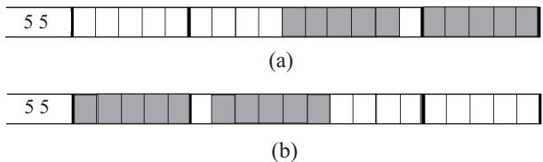  
Fig. 6. Example of right-most and left-most solutions; (a) Rightmost solution; (b) Left-most solution.

Sub-procedure 1: After the calculation of the right-most and left-most possible solutions, we can fix those filled squares in the same condition number $n _ { k }$ in which both solutions coincide. For example, in a situation given by Figure 7 (a) we could fix the squares shown in Figure 7 (d). Figures 7 (b) and (c) show the right-most and left-most solutions, respectively.

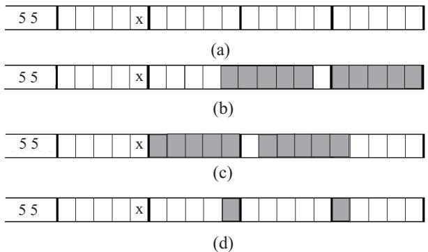  
Fig. 7. Example for sub-procedure 1 (Logic ad-hoc heuristic); (a) Initial line with a fixed blank (marked as a $\mathrm { X }$ in the figure); (b) Right-most solution; (c) Left-most solution; (d) Squares fixed with this procedure.

Sub-procedure 2: Sub-procedure 2 fixes blank squares between to consecutive conditions $n _ { k }$ and $n _ { k + 1 }$ belonging to the right-most and left-most solutions, respectively. Figure 8 shows an example of how this procedure works. Figure 8 (a) represents a possible row or column in a Japanese puzzle, with two already fixed squares. Figures 8 (b) and (c) stands for the left-most and right-most solutions for this example, respectively. Figure 8 (d) shows the blank squares that can be fixed in this case.

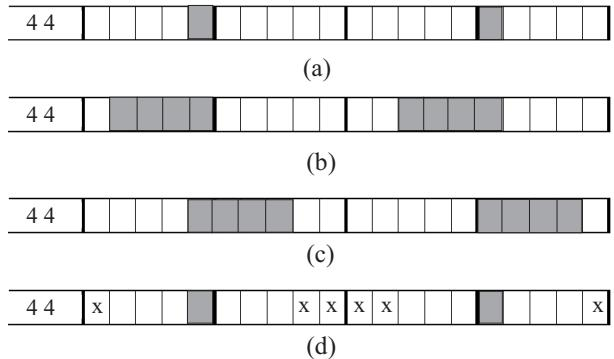  
Fig. 8. Example for sub-procedure 2 (Logic ad-hoc heuristic); (a) Initial line with two filled squares; (b) Left-most solution; (c) Rightmost solution; (d) Squares fixed with this procedure.

Sub-procedure 3: Sub-procedure 3 looks for a fixed consecutive blank and filled squares or viceversa (see Figure 9). Once it has located a filled and blank squares together, it looks among all the conditions which may contain the filled square, selects the smallest one, and fills the corresponding squares. Figure 9 shows an example of this procedure. Let us imagine that we have the situation in Figure 9 (a), where there are two consecutive squares fixed, one blank and one filled. Figures 9 (b) and (c) show the right-most and left-most solutions respectively, in this case. These solutions allow us to fix as many squares as the smallest condition in the line, in this case 3 squares.

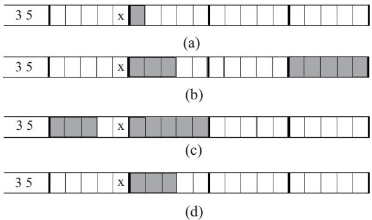  
Fig. 9. Example for sub-procedure 3 (Logic ad-hoc heuristic); (a) Initial line with a filled and a blank squares fixed; (b) Rightmost solution; (c) Left-most solution; (d) Squares fixed with this procedure.

Sub-procedure 4: Sub-procedure 4 deals with cases where there are groups of unknown squares smaller than a given condition $n _ { k }$ . Figure 10 shows an example of this situation. Figure 10 (a) shows the initial state of the line, with one filled and several blank squares fixed. Note that the unknown square number 7 is between two fixed blanks squares, and it is smaller than the remaining not assigned condition, which in this case is $n _ { 1 } = 2$ . Figures 10 (b) and (c) show the leftmost and right-most conditions respectively, and Figure 10 (d) shows that square 7 can be fixed as a blank square.

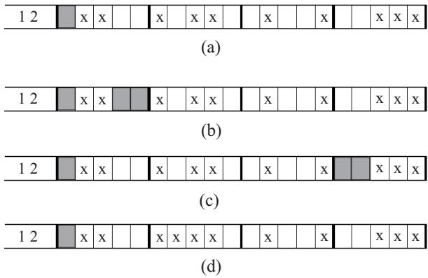  
Fig. 10. Example for sub-procedure 4 (Logic ad-hoc heuristic); (a) Initial line with a filled and several blank squares fixed; (b) Leftmost solution; (c) Right-most solution; (d) Squares fixed with this procedure.

Sub-procedure 5: Sub-procedure 5 is the final search we implement. It tries to fix blank squares. This sub-procedure deals with cases in which there are consecutive filled squares previously fixed (see Figure 11 (a)). We try then the rightmost and left-most solutions. These solutions gives you the limits of each condition, and then we know which conditions could be in a given fixed square (not all the condition will be able to be in a given fixed square, see Figure 11 (b) and (c)). Then, we check that there is a blank square besides any feasible condition. This blank can be fixed in the puzzle (Figure 11 (d).

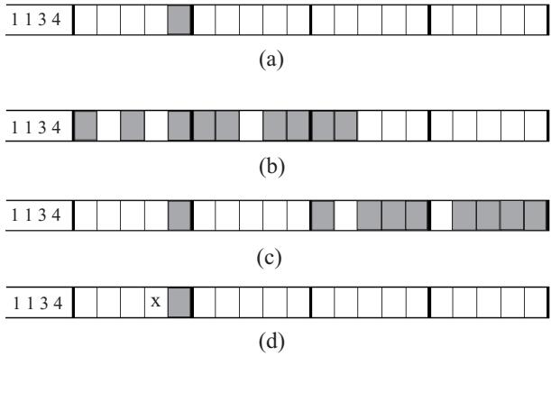  
Fig. 11. Example for sub-procedure 5 (Logic ad-hoc heuristic); (a) Initial line with a filled square fixed; (b) Left-most solution; (c) Right-most solution; (d) Squares fixed with this procedure.

The Complete Logic Ad-hoc heuristic: The complete Logic Ad-hoc heuristic starts with the preprocessing stage. The line with most modified (fixed) squares is selected to be processed by applying the sub-procedures described above. After this, another line is selected and the sub-procedures are applied until there is not an unknown square in the puzzle. The pseudo-code of the Logic Ad-hoc heuristic is the following:

# Logic ad-hoc heuristic for Japanese puzzles:

Launch the Preprocessing procedure. while(There are unknown squares) Choose the line (column or row) with the most modified squares in the previous step. Find the right-most and left-most solution.

Apply sub-procedure 1. Apply sub-procedure 2. Apply sub-procedure 3. Apply sub-procedure 4. Apply sub-procedure 5. endwhile

# A. Extension of the logic ad-hoc heuristic to color puzzles

The resolution of color puzzles requires taking into account the extra rules for color puzzles given in [10]. In this paper we present an extension of the Logic Ad-hoc heuristic to color puzzles. It is the most efficient heuristic that we have implemented to solve black and white puzzles, and its extension to color puzzles is not complicated. The structure of the Logic ad-hoc heuristic to color puzzles is the same that the heuristic for black and white puzzles. However, the right-most and left-most solutions will vary now in function of the possible colors of the squares. Again, we are constrained by the impossibility of showing color graphs, but basically the Ad-hoc Logic color heuristic adds an extra sub-procedure which substitutes black and white sub-procedures 1 and 2, maintaining sub-procedures 3, 4 and 5 with the same structure than the black and white logic heuristic, but modified to deal with colors (numbers 0, 1, 2, 3, etc, instead of only 0s and 1s).

Sub-procedure color: This procedure runs over all lines (rows and columns) in the puzzle, in its natural order. For the current line, we calculate the right-most and left-most solutions. For each square, we calculate a list of the possible colors that the square can have (including also color white for the background of the puzzle), depending on the puzzle conditions and on the right-most and left-most solutions. We try to eliminate as many colors as possible at each square, in such a way that at the end, only one color survives on each square. The right-most and left-most solutions vary dynamically when colors are eliminated from squares.

# IV. COMPUTER SIMULATIONS AND RESULTS

In order to show the performance of our heuristics, we have applied them to solve several Japanese puzzles, which can be found in [9]. In this web page there are puzzles of different type, size and difficulty, which can be free downloaded, and serve as a benchmark problems. Table I show the characteristics of the puzzles we have solved. In the case of the black and white puzzles, the smallest puzzle we consider is the charlie one, a $1 5 \times 1 5$ puzzle. The largest one is the so-called jazz puzzle, $6 0 \times 1 4 5$ . We have applied the two ad-hoc heuristics presented in this paper to all the puzzles. We stop the algorithms when it obtains the final solution of the puzzle or after one hour of calculation. In order to compare our approaches with a previous algorithm, we have used the solver in [11], and a genetic algorithm (GA) proposed in [15]. Briefly, this GA uses a gene-based encoding and modified operators in which conditions in columns are fulfilled, and the GA looks for the solution which fulfils conditions in rows. This is achieved by defining the columns of the puzzle as genes in the encoding. The crossover operator is performed then interchanging genes, as Figure 12 shows. Mutation operator is carried out by means of adding a new randomly generated column to the puzzle which fulfils the puzzle constraints. A local search is hybridized with the modified genetic algorithm in order to obtain better results.

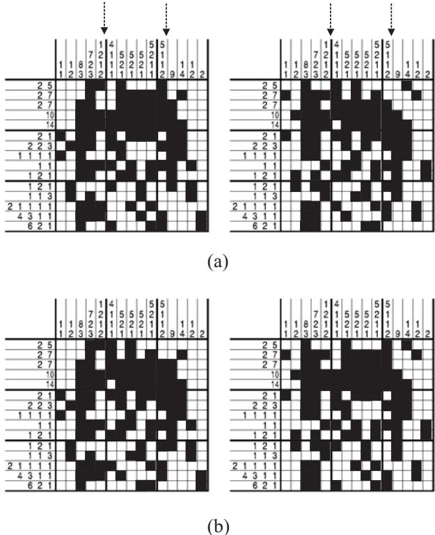  
Fig. 12. Example of the modified crossover used in the genetic algorithm in [15].

In the case of color puzzles we have tackled 8 puzzles, the smallest one is the $2 0 \times 2 0$ puzzle “Earth”, and the largest puzzle is “Parrot2” $3 5 \times 3 5$ . For color puzzles we provide the results obtained by the Logic ad-hoc color heuristic1. All the simulations were performed in a PC with a Pentium IV $( 3 ~ \mathrm { G H z } )$ processor and 1Mb of RAM memory.

TABLE IMAIN CHARACTERISTICS OF THE JAPANESE PUZZLES TACKLED (FROM[9])  

<table><tr><td>Puzzle</td><td>Rows</td><td>Columns</td><td>type</td></tr><tr><td>Charlie</td><td>15</td><td>15</td><td>B&amp;W</td></tr><tr><td>Popeye</td><td>20</td><td>20</td><td>B&amp;W</td></tr><tr><td>Van Gogh</td><td>35</td><td>25</td><td>B&amp;W</td></tr><tr><td>King Kong</td><td>30</td><td>30</td><td>B&amp;W</td></tr><tr><td>Kabuki</td><td>40</td><td>40</td><td>B&amp;W</td></tr><tr><td>Sheriff</td><td>45</td><td>45</td><td>B&amp;W</td></tr><tr><td>Liberty</td><td>50</td><td>35</td><td>B&amp;W</td></tr><tr><td>Parrot1</td><td>55</td><td>60</td><td>B&amp;W</td></tr><tr><td>Da Vinci</td><td>75</td><td>55</td><td>B&amp;W</td></tr><tr><td>Fishing</td><td>50</td><td>70</td><td>B&amp;W</td></tr><tr><td>King</td><td>60</td><td>75</td><td>B&amp;W</td></tr><tr><td>Jazz</td><td>60</td><td>145</td><td>B&amp;W</td></tr><tr><td>Earth</td><td>20</td><td>20</td><td>Color</td></tr><tr><td>Egyptian</td><td>25</td><td>25</td><td>Color</td></tr><tr><td>Flower</td><td>30</td><td>30</td><td>Color</td></tr><tr><td>Ship</td><td>30</td><td>30</td><td>Color</td></tr><tr><td>Flag</td><td>30</td><td>30</td><td>Color</td></tr><tr><td>Girl</td><td>30</td><td>30</td><td>Color</td></tr><tr><td>Fred</td><td>30</td><td>30</td><td>Color</td></tr><tr><td>Parrot2</td><td>35</td><td>35</td><td>Color</td></tr></table>

Table II shows the results obtained by the heuristics proposed in the black and white puzzles. It is easy to see that the GA only achieves to solve the puzzles solution in the smallest ones, charlie and popeye. In the rest of puzzles the GA was not able to complete the puzzles’ solution after one hour of computation.

The combinatorial ad-hoc heuristic perform much better, solving all the puzzles but the hardest ones fishing, king and jazz, where it cannot find a solution in less than one hour. The main problem with the combinatorial heuristic is that it tries all the feasible combinations for a line (row or column), and there may be quite a lot of combinations in large puzzles if the initial solutions has not fixed enough squares. This heuristics works well in small puzzles and in puzzles where the preprocessing is able to fix many squares, like in puzzle parrot.

The logic ad-hoc heuristic is the best heuristic we have implemented for black and white puzzles. It is apparent from Table II that it outperforms the algorithm in [11]. First, our Logic ad-hoc heuristic is able to solve all the puzzles considered, within a 1 second, whereas solver in [11] fails to finish fishing puzzle. It also takes larger times than the Logic ad-hoc to finish the rest of the puzzles. Our Logic adhoc is also much faster than the combinatorial one in all the puzzles considered, and obtains the solutions for the hardest puzzles fishing, king and jazz.

Figures 13, 14 and 15 shows the evolution of the GA, combinatorial and logic heuristic, respectively, in the charlie puzzle. It is interesting to appreciate the differences among how the heuristic construct the solutions. First, the GA does not consider unknown squares, it constructs the final solution of the puzzle from feasible solutions in columns, moving the

RESULTS OF THE PROPOSED HEURISTICS IN THE BLACK AND WHITE JAPANESE PUZZLES CONSIDERED. THE TABLE SHOWS THE TIME TO FINISH THE PUZZLE IN SECONDS. N/A STANDS FOR THE CASE WHERE THE HEURISTIC IS NOT ABLE TO FIND A SOLUTION WITHIN AN HOUR.

<table><tr><td>Puzzle</td><td>GA</td><td>Combinatorial</td><td>Logic</td><td>Solver in [11]</td></tr><tr><td>Charlie</td><td>100.9</td><td>0.03</td><td>0.01</td><td>0.02</td></tr><tr><td>Popeye</td><td>297.8</td><td>0.1</td><td>0.03</td><td>0.05</td></tr><tr><td>Van Gogh</td><td>N/A</td><td>0.7</td><td>0.09</td><td>0.7</td></tr><tr><td>King Kong</td><td>N/A</td><td>0.6</td><td>0.09</td><td>0.6</td></tr><tr><td>Kabuki</td><td>N/A</td><td>0.8</td><td>0.1</td><td>0.7</td></tr><tr><td>Sheriff</td><td>N/A</td><td>16.4</td><td>0.2</td><td>1.0</td></tr><tr><td>Liberty</td><td>N/A</td><td>47.9</td><td>0.2</td><td>0.9</td></tr><tr><td>Parrot1</td><td>N/A</td><td>3.6</td><td>0.2</td><td>1.0</td></tr><tr><td>Da Vinci</td><td>N/A</td><td>116.0</td><td>0.5</td><td>1.1</td></tr><tr><td>Fishing</td><td>N/A</td><td>N/A</td><td>0.6</td><td>N/A</td></tr><tr><td>King</td><td>N/A</td><td>N/A</td><td>0.8</td><td>18.1</td></tr><tr><td>Jazz</td><td>N/A</td><td>N/A</td><td>1.0</td><td>2.3</td></tr><tr><td>Earth</td><td>N/A</td><td>N/A</td><td>0.031</td><td>N/A</td></tr><tr><td>Egyptian</td><td>N/A</td><td>N/A</td><td>0.11</td><td>N/A</td></tr><tr><td>Flower</td><td>N/A</td><td>N/A</td><td>0.281</td><td>N/A</td></tr><tr><td>Ship</td><td>N/A</td><td>N/A</td><td>0.359</td><td>N/A</td></tr><tr><td>Flag</td><td>N/A</td><td>N/A</td><td>0.125</td><td>N/A</td></tr><tr><td>Girl</td><td>N/A</td><td>N/A</td><td>0.328</td><td>N/A</td></tr><tr><td>Fred</td><td>N/A</td><td>N/A</td><td>0.25</td><td>N/A</td></tr><tr><td>Parrot2</td><td>N/A</td><td>N/A</td><td>0.297</td><td>N/A</td></tr></table>

rows. The images in Figure 13 correspond to the best individual of the GA population each 10 generations. On the other hand, combinatorial and logic heuristics consider unknown squares (grey squares in the figures). Both heuristic start from the same solution, which comes from the application of the preprocessing procedure, see Figures 14 and 15.

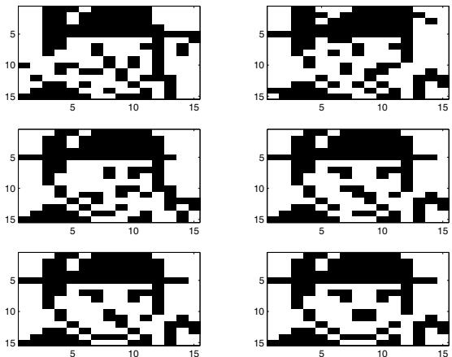  
Fig. 13. Evolution of the best solution in the Genetic Algorithm in the puzzle “charlie”.

The evolution of the algorithms is, however, different. We display six stages of both algorithms to show how they construct the solution to the puzzle. In the case of color puzzles, our Logic ad-hoc heuristic is able to solve all the puzzles tackled within seconds, as can be seen in Table II.

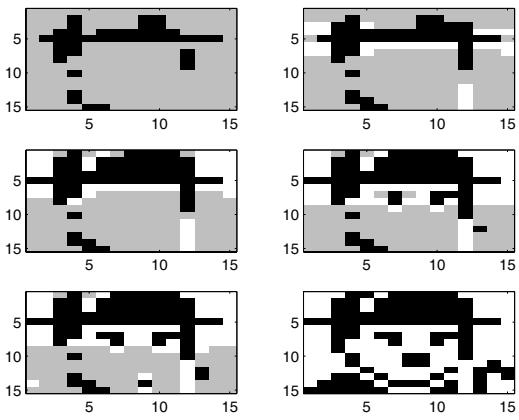  
Fig. 14. Evolution of the solution given by the Combinatorial adhoc heuristic in the puzzle “charlie”.

# A. Discussion

The ad-hoc heuristics presented in this paper are able to solve both black and white and color Japanese puzzles. They are fast algorithms which takes profit of the structure of the problem to obtain its solution. We have shown that the Combinatorial ad-hoc heuristic may fail in solving large puzzles, due to it has to try all possible combinations of feasible solutions for each row and column in the puzzle. The Logic ad-hoc is able to finish all the Japanese puzzles tested, even the largest ones, within seconds. In addition, this heuristic admits an extension for color puzzles, which has been proven to be very effective as well. It is therefore the best heuristic proposed in this paper.

# V. CONCLUSIONS

In this paper we have tackled the resolution of Japanese puzzles using computer heuristics. Specifically we have proposed two ad-hoc heuristics, a combinatorial one and a logic one. We have shown that all the heuristics proposed are able to find solutions to Japanese puzzles. We have shown that the best algorithm tested has been the Logic heuristic, which is able to find a solution to every benchmark puzzle, including the color ones, within seconds.

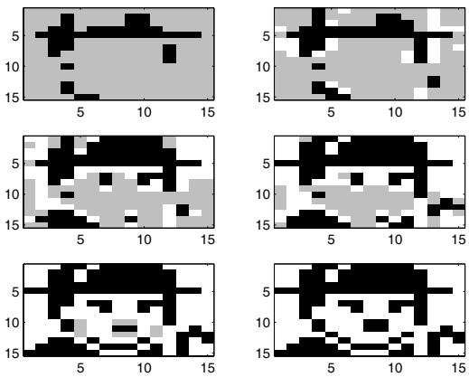  
Fig. 15. Evolution of the solution given by the Logic ad-hoc heuristic in the puzzle “charlie”.

# ACKNOWLEDGEMENT

The authors would like to thank Conceptis Puzzles and Pleyades Ediciones ´ for granting the permission to reproduce their copyrighted puzzles. The authors really appreciate the support and help of Dave Green, from Conceptis Puzzles.

# Список литературы

[1] J. E. Laird, “Using a computer game to develop advanced AI”, IEEE Computer, vol. 34, no. 7, pp. 70-75, 2001.   
[2] H. J. Herik, H. van Den and H. Iida, (eds.), Games in AI Research, Universiteit Maastricht, Maastricht, 2000.   
[3] A. Khoo, R. Zubek, “Applying inexpensive AI techniques to computer games”, IEEE Intelligent Systems, vol. 17, no. 4, pp.48-53, 2002.   
[4] J. M. Vaccaro, C. C. Guest, “Planning an endgame move set for the game RISK: a comparison of search algorithms”, IEEE Transactions on Evolutionary Computation, vol. 9, no. 6, pp. 641- 652, 2005.   
[5] C. Jefferson, A. Miguel, I. Miguel and T. Armagan, “Modelling and solving English Peg Solitaire,” Computers & Operations Research, In Press, 2005.   
[6] K. D. Smith, “Dynamic programming and board games: A survey,” European Journal of Operational Research, In Press, 2005.   
[7] S. S. Lucas and G. Kendall, “Evolutionary computation and games,” IEEE Computational Intelligence Magazine, vol. 1, no. 1, pp. 10-18, 2006.   
[8] http://www.conceptispuzzles.com   
[9] http://www.conceptispuzzles.com\products\picapix puzzle samples.htm   
[10] M. Dorant, “A begginer’s guide to solving picture forming logic puzzles,” http://www.conceptispuzzles.com\products\picapix \solving a puzzle.htm.   
[11] http://www.comp.lancs.ac.uk\computing\users\ss\nonogram index.html   
[12] G. Duncan, “Puzzle Soving”, B.Sc. Degree Final Project Report, University of York, Computer Science Department, 1999.   
[13] G. Duncan Solver, http://www-users.c.york.ac.uk\∼tw\projects \nonograms\   
[14] N. Ueda and T. Nagao, “NP-completeness results for nonograms via parsimonious reductions,” Internal Report, University of Tokyo, Computer Science Department, 1996.   
[15] S. Salcedo-Sanz, J. A. Portilla-Figueras, E. G. Ort´ız-Garc´ıa, A. M. Perez-Bellido, and X. Yao, “Teaching advanced features of evolutionary ´ algorithms using Japanese puzzles”, IEEE Transactions on Education, accepted for publication, 2006.   
[16] B. J. Batenburg, B. J. and W. A. Kosters, “A discrete tomography approach to Japanese puzzles”, In Proceedings of the Belgian-Dutch Conference on Artificial Intelligence, pp. 243-250, 2004.   
[17] J. Benton, R. Snow and N. Wallach, “A combinatorial problem associated with nonograms,” Internal Report, University of Standford, Artificial Intelligence Department, 2005.   
[18] D. E. Goldberg, Genetic algorithms in search, optimization and machine learning, Reading:MA, Addison-Wesley, 1989.   
[19] V. Kumar, “Algorithms for constraints satisfaction problems: a survey,” The AI Magazine, vol. 13, no. 1, pp. 32-44, 1992.   
[20] G. Pesant, “A regular language membership constraint for finit sequences of variables,” In Proc. of the 10th Int. Conf. on Principles and Practice of Constraint Programming, Lecture Notes in Computer Science, vol. 3258, pp. 482-495, 2004.