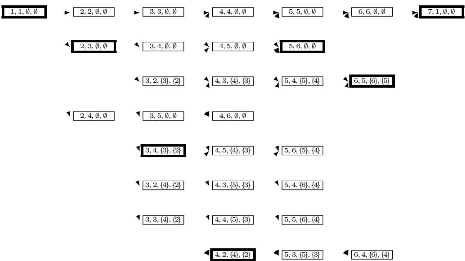

# THE TRAVELING SALESMAN PROBLEM AND ITS VARIATIONS

# EXPONENTIAL NEIGHBORHOODS AND DOMINATION ANALYSIS FOR THE TSP

Gregory Gutin   
Department of Computer Science   
Royal Holloway, University of London   
Egham, Surrey TW20 0EX, UK   
G.Gutin@rhul.ac.uk   
Anders Yeo   
Department of Computer Science   
Royal Holloway, University of London   
Egham, Surrey TW20 0EX, UK   
anders@cs.rhul.ac.uk   
Alexei Zverovitch   
Department of Computer Science   
Royal Holloway, University of London   
Egham, Surrey TW20 0EX, UK   
A.Zverovitch@rhul.ac.uk

# 1. Introduction, Terminology and Notation

In this section we provide motivation for the approaches and results described in this chapter. We overview the main results on the topics of the chapter and give basic terminology and notation used throughout the chapter.

# 1.1. Introduction

The purpose of this chapter is to introduce the reader to recently developed concepts and results on exponential (size) neighborhoods and domination analysis for the traveling salesman problem (TSP). Even though these topics are of certain practical relevance, we restrict ourselves to the theoretical study. The body of computational experiments with exponential neighborhoods is insufficient yet to carry out meaningful comparisons between new and classical approaches; we refer the reader to the papers [4, 8] and Chapter 9, where certain computational experience with exponential neighborhoods is reported. The reader may consult Chapters 9 and 10 of this book for discussion of the experimental performance of classical and new heuristics studied in the domination analysis part of this chapter.

It is worth noting that while the symmetric traveling salesman problem (STSP) can be considered, in many cases, as a subproblem of the asymmetric traveling salesman problem (ATSP), sometimes this view is too simplistic since the ATSP and STSP are defined on different graphs – complete directed and undirected. Thus, in particular, the number of tours in ATSP and STSP on $n$ vertices is $( n - 1 )$ ! and $( n - 1 ) ! / 2$ , respectively. Therefore, while we will mostly consider the ATSP in this chapter, we will provide a separate treatment of the STSP when needed. We will use the term TSP when it is not important whether the ATSP or STSP is under consideration.

Local search heuristics are among the main tools to compute near optimal tours in large instances of the TSP in relatively short time, see, e.g., Chapters 8, 9 and 10 of this book. In most cases the neighborhoods used in the local search algorithms are of polynomial cardinality. One may ask whether it is possible to have exponential size neighborhoods for the TSP such that the best tour in such a neighborhood can be computed in polynomial time. Fortunately, the answer to this question is positive. (This question is far from being trivial for some generalizations of the TSP, e.g. Deineko and Woeginger [11] conjecture that for the quadratic assignment problem there is no exponential neighborhood ”searchable” in polynomial time.)

There are only a few papers on exponential neighborhoods published before the 1990s: Klyaus [31], Sarvanov and Doroshko [42, 43] and Gutin [15, 16]. In particular, [43] and [15] independently showed the existence of $( n / 2 )$ !-size neighborhood for the TSP with $n$ vertices ( $n$ is even). In this neighborhood, the best tour can be computed in $O ( n ^ { 3 } )$ time, i.e., asymptotically in at most the same time as a complete iteration of 3-Opt, which finds the best tour among only $\Theta ( n ^ { 3 } )$ tours.

Punnen [35] showed how to generalize the neighborhood from [15, 43] and Gutin [17] proved that one of Punnen’s extensions provides neighborhoods of size $\Theta ( e x p ( \sqrt { n / 2 } ) ( n / 2 ) ! / n ^ { 1 / 4 } )$ . We study basic results on exponential neighborhoods in Section 2. Notice that while Deineko and Woeginger [11], in their own words, ”only scratched the surface” in their survey on the topic, we provide more detailed treatment of some exponential neighborhoods.

In Section 3, following Gutin and Yeo [22], we provide upper bounds on the size of ATSP neighborhood. In particular, we prove that there is no ATSP neighborhood of cardinality at least $\beta ( n - k ) !$ for any constant $\beta > 0$ and fixed integer $k$ provided NP $\nsubseteq$ P/poly. (We provide an informal description of the class P/poly in Section 3.2; for a formal introduction of the topic, see [5].)

While it is natural to study the possible cardinality of neighborhoods, it is clear that the size of a neighborhood is not the only parameter of importance. Indeed, the neighborhood introduced in [15, 43] does not perform well in computational practice. This may be a result of an unfortunate property of the neighborhood: many tours of the TSP are not reachable from each other under neighborhood structure imposed by this neighborhood. Carlier and Villon [8] showed that their neighborhood is much better in this respect: each tour can be reached from any other tour in at most logarithmic number (in $n$ ) of iterations if the choice of a tour at every iteration is ”right”. Gutin and Yeo [19] introduced a neighborhood structure, which makes the tours much closer: for every pair of tours $T _ { 1 } , T _ { 5 }$ there are three tours $T _ { 2 } , T _ { 3 } , T _ { 4 }$ such that every ${ \bf \Phi } ^ { T } i$ is in the neighborhood of $T _ { i - 1 }$ , $i = 2 , 3 , 4 , 5$ . (The neighborhoods in [19] are polynomially searchable.) We study the ”closeness” topic in Section 4.

Chapters 9 and 10 consider experimental performance of TSP heuristics. While experimental analysis is of certain importance, it cannot cover all possible families of TSP instances and, in particular, it normally does not cover the most hard ones. Experimental analysis provides little theoretical explanation why certain heuristics are successful while some others are not. This limits our ability to improve on the existing algorithms quality and efficiency. It also limits our ability to extend approaches successful for the TSP to other combinatorial optimization (CO) problems.

Approximation analysis is a frequently used tool for theoretical evaluation of CO heuristics. Let $\mathcal { H }$ be a heuristic for the TSP, and let $\mathcal { I } _ { n }$ be the set of instances of the TSP of size $n$ . In approximation analysis, we use the approximation ratio $r _ { \mathcal { H } } ( n ) = \operatorname* { m a x } \{ f ( I ) / f ^ { * } ( I ) : \ I \in \mathbb { Z } _ { n } \}$ , where $f ( I )$ $\left( f ^ { * } ( I ) \right)$ is the cost of the heuristic (optimal) tour. Unfortunately, in most of cases, estimates for $r _ { \mathcal { H } } ( n )$ are not constants and provide only a vague picture of quality of heuristics.

Domination analysis provides an alternative to approximation analysis. In domination analysis, we are interested in the number of feasible solutions that are worse or equal in quality to the heuristic one, which is called the domination number of the heuristic solution. In many cases, domination analysis is very useful. In particular, some heuristics have domination number 1 for the TSP. In other words, those heuristics, in the worst case, produce the unique worst possible solution. At the same time, the approximation ratio is not bounded by any constant. In this case, domination number provides a far better insight into the performance of the heuristics.

Results on domination number of TSP heuristics are considered in Section 5. Domination number was formally introduced by Glover and Punnen [14] $^ { 1 }$ in 1996. Interestingly, the first important results on domination number can be traced back to the 1970s, see Rublineckii [39] and Sarvanov [40]. The domination number domn $( { \mathcal { H } } , { \mathcal { Z } } )$ of a TSP heuristic $\mathcal { H }$ for a particular instance $\mathcal { T }$ of the TSP with $n$ vertices is the number of tours in $\mathcal { T }$ which are at least as costly as the tour found by $\mathcal { H }$ . The domination number domn $( \mathcal { H } , n )$ of $\mathcal { H }$ is the minimum of $\mathrm { d o m n } ( \mathscr { H } , \mathscr { T } )$ over all instances $\mathcal { T }$ with $n$ vertices. Since the ATSP on $n$ vertices has $( n - 1 )$ ! tours, an algorithm for the ATSP with domination number $( n - 1 ) !$ is exact. The domination number of an exact algorithm for the STSP is $( n - 1 ) ! / 2$ . Similarly, one can define the domination number of heuristics for other CO problems.

Glover and Punnen [14] asked whether there exists a polynomial time STSP heuristic with domination number at least $( n - 1 ) ! / p ( n )$ , where $p ( n )$ is a polynomial in $n$ , provided P=NP. Answering the this question, Gutin and Yeo [23] introduced polynomial time heuristics for the ATSP with domination number at least $( n - 2 )$ !. Two years after [23] was completed, we found out that Rublineckii [39] and Sarvanov [41] answered the above question already in the the 1970s by showing that certain polynomial time heuristics for the STSP and the ATSP are of domination number at least $( n - 2 )$ ! when $n$ is odd and $( n - 2 ) ! / 2$ when $n$ is even. Punnen, Margot and Kabadi [38] proved that the best improvement2 versions of some well-known local search heuristics for the TSP after polynomial number of steps produce tours which are not worse than at least $\Omega ( ( n - 2 ) ! )$ other tours. Punnen and Kabadi [37] obtained an $O ( n ^ { 2 } )$ − time heuristic with domination number at least $\scriptstyle \sum _ { k = 1 } ^ { n - 2 } ( k ! )$ . Gutin and Yeo [21] investigated the existence of polynomial time heuristics with domination number $\Theta ( ( n - 1 ) ! )$ .

Some heuristics may have a small domination number (thus, indicating that they are not useful, in general). For example, the ”antigreedy” heuristic for the ATSP that starts by choosing an arc of maximum cost and proceeds by choosing the most expensive arc among remaining eligible ones, is of domination number 1 (consider an instance with $c ( i , i + 1 ) = 1$ for every $i = 1 , 2 , . . . , n - 1$ , $c ( n , 1 ) = 1$ , and $c ( i , j ) = 0$ for every $j \neq i + 1$ and $( i , j ) \neq ( n , 1 )$ ). While the fact that the domination number of the anti-greedy heuristic equals one is quite expected, in Section 5, we prove that the same is true for the greedy and nearest neighbor algorithms for both the ATSP and STSP (these results were obtained by Gutin, Yeo and Zverovich in [24]). Punnen, Margot and Kabadi [38] proved that some other TSP algorithms are of very small domination number. In particular, they showed that the well-known double tree heuristic for the STSP is of domination number 1.

In this chapter we discuss approaches and results obtained mostly in the last decade. Despite limited time and effort in the areas of domination analysis and exponential neighborhoods, one can clearly see that there is a significant progress as well as a high potential. Although a few results and approaches have already been used in practice (see Chapter 9 and [4, 8, 13]), it seems that much more research is required before the above mentioned areas can be used to design new high quality heuristics for the TSP and other CO problems. We hope that this chapter will provide motivation for scholars and practitioners to continue studying the domination analysis and exponential neighborhoods for the TSP and other CO problems.

# 1.2. Basic Terminology and Notation

Recall that the ATSP is stated as follows. Given a weighted complete digraph $( \stackrel {  } { K } _ { n } , c )$ , find a Hamiltonian cycle in $\stackrel {  } { K } { } _ { n }$ of minimum cost. Here the cost function $c$ is a mapping from $A ( \stackrel {  } { K } _ { n } )$ to the set of reals. The cost of an arc $( x , y )$ o f $\stackrel {  } { K } { } _ { n }$ is $c ( x , y )$ . It is assumed that $V ( \stackrel {  } { K } _ { n } ) =$ $\{ 1 , 2 , \ldots , n \}$ . The mapping $c$ can be determined by the cost matrix $\left[ c _ { i j } \right]$ . The STSP is defined similarly with the only difference that the graph under consideration is complete undirected (denoted by $K _ { n }$ ). In this case, the matrix $\left[ c _ { i j } \right]$ is symmetric. Unless it is specified otherwise, $n$ is the number of vertices in the instance of the TSP under consideration.

←→ Let $C = x _ { 1 } x _ { 2 } . . . x _ { k } x _ { 1 }$ be a cycle in $K _ { n }$ . The operation of removal of a vertex $x _ { i }$ ( $1 \leq i \leq k$ ) results in the cycle $x _ { 1 } x _ { 2 } . . . x _ { i - 1 } x _ { i + 1 } . . . x _ { k } x _ { 1 }$ (thus, removal of $x _ { i }$ is not deletion of $x _ { i }$ from $C$ ; deletion of $x _ { i }$ gives the path $x _ { i + 1 } x _ { i + 2 } \dots x _ { k } x _ { 1 } x _ { 2 } \dots x _ { i - 1 } \big )$ . Let $y$ be a vertex of $\stackrel {  } { K } { } _ { n }$ not in $C$ . The operation of insertion of $y$ into an arc $( x _ { i } , x _ { i + 1 } )$ results in the cycle $x _ { 1 } x _ { 2 } . . . x _ { i } y x _ { i + 1 } . . . x _ { k } x _ { 1 }$ . The cost of the insertion is defined as $c ( x _ { i } , y ) +$ $c ( y , x _ { i + 1 } ) - c ( x _ { i } , x _ { i + 1 } )$ . For a set $Z = \{ z _ { 1 } , \ldots , z _ { s } \}$ ( $s \leq k$ ) of vertices not in $C$ , an insertion of $Z$ into $C$ results in the tour obtained by inserting the nodes of $Z$ into different arcs of the cycle. In particular, insertion of $y$ into $C$ involves insertion of $y$ into one of the arcs of $C$ .

For a path $P = x _ { 1 } x _ { 2 } . . . x _ { m }$ in $( \stackrel {  } { K } _ { n } , c )$ , the contraction $^ 3$ of $P$ in $( \overleftrightarrow { K } _ { n } , c )$ , $( \stackrel {  } { K } _ { n } / P , c ^ { \prime } )$ , is a complete digraph with vertex set

$$
V ( \stackrel {  } { K } _ { n } / P ) = V ( \stackrel {  } { K } _ { n } ) \cup \{ v _ { P } \} - V ( P ) ,
$$

where $v _ { P } \notin V ( \stackrel {  } { K } _ { n } )$ , such that the cost $c ^ { \prime } ( u , w )$ , for $u , w \in V ( \stackrel {  } { K } _ { n } / P )$ , is defined by $c ( u , x _ { 1 } )$ if $w = v _ { P }$ , $c ( x _ { m } , w )$ if $u = v _ { P }$ , and $c ( u , w )$ , otherwise. We can consider an arc $a = ( x , y )$ as the path $x y$ of length one; this allows us to look at $\stackrel {  } { K } _ { n } / a$ as a special case of the above definition. The above definition has an obvious extension to a set of vertex-disjoint paths.

Further definitions on directed and undirected graphs can be found in the corresponding appendix of this book; see also [6].

# 2. Exponential Neighborhoods

We adapt the definition of a neighborhood for the TSP due to Deineko and Woeginger [11]. Let $P$ be a set of permutations on $n$ vertices. Then the neighborhood (with respect to $P$ ) of a tour $T = x _ { 1 } x _ { 2 } \dots x _ { n } x _ { 1 }$ is defined as follows:

$$
N _ { P } ( T ) = \{ x _ { \pi ( 1 ) } x _ { \pi ( 2 ) } \ldots x _ { \pi ( n ) } x _ { \pi ( 1 ) } : \pi \in P \} .
$$

A neighborhood structure consists of neighborhoods for every tour $T$ . The above definition of a neighborhood is quite restrictive4 but reflects the very important ”shifting” property of neighborhoods which distinguishes them from arbitrary sets of tours. Another important property usually imposed on a neighborhood $N ( T )$ of a tour $T$ is that the best among tours of $N ( T )$ can be computed in time $p ( n )$ polynomial in $n$ . This is necessary to guarantee an efficient local search. Neighborhoods satisfying this property are called polynomially searchable or, more precisely, $p ( n )$ -searchable.

In the rest of this section and in Section 4, we only consider the ATSP: the neighborhoods we describe below can be readily adapted to the STSP.

# 2.1. The Pyramidal Neighborhood

In this subsection, we consider the pyramidal neighborhood introduced by Sarvanov and Doroshko [42]. Let $H \ = \ x _ { 1 } x _ { 2 } \dots x _ { n } x _ { 1 }$ be a tour. Define the pyramidal neighborhood of $H$ , denoted by $P Y ( x _ { 1 } , H )$ , as follows.

A tour $G = x _ { i _ { 1 } } x _ { i _ { 2 } } x _ { i _ { 3 } } \dots x _ { i _ { n } } x _ { i _ { 1 } }$ , with $i _ { 1 } = 1$ , belongs to $P Y ( x _ { 1 } , H )$ , if and only if there is an integer $k$ , such that

$$
i _ { 1 } < i _ { 2 } < . . . < i _ { k } > i _ { k + 1 } > i _ { k + 2 } > . . . > i _ { n } .
$$

Observe that $i _ { k } \ = \ n$ . Note also that given $\{ i _ { 2 } , \dotsc , i _ { k - 1 } \}$ (together with $H$ and $x _ { 1 }$ ) $G$ is uniquely determined, and given $G$ , the set

$$
F O R W ( G , H ) = \left\{ i _ { 2 } , i _ { 3 } , \dots , i _ { k - 1 } \right\}
$$

is uniquely determined. The neighborhood structure is not symmetrical as if $H = x _ { 1 } x _ { 2 } x _ { 3 } x _ { 4 } x _ { 1 }$ and $\begin{array} { r } { G = x _ { 1 } x _ { 3 } x _ { 4 } x _ { 2 } x _ { 1 } } \end{array}$ , then $G \in P Y ( x _ { 1 } , H )$ , but $H \not \in P Y ( x _ { 1 } , G )$ . We first prove the well-known fact that the size of $P Y ( x _ { 1 } , H )$ is exponential.

Theorem 1 $| P Y ( x _ { 1 } , H ) | = 2 ^ { n - 2 }$ .

Proof: As mentioned above the tours $G \in P Y ( x _ { 1 } , H )$ are uniquely determined by $F O R W ( G , H )$ , which is a subset of $\{ 2 , 3 , \ldots , n - 1 \}$ (of cardinality $n - 2$ ). Since any subset (including the empty set and the whole set) determines a tour in $P Y ( x _ { 1 } , H )$ , and there are $2 ^ { n - 2 }$ such subsets, we are done. 

The fact that the pyramidal neighborhood can be searched in time $O ( n ^ { 2 } )$ was proved for the first time by Klyaus [31]; for proofs of this assertion and its extensions, see Section 4 of Chapter 11.

Theorem 2 We can find an optimal tour in $P Y ( x _ { 1 } , H )$ in $O ( n ^ { 2 } )$ time.

Since every tour in $P Y ( x _ { 1 } , H )$ , when $H = x _ { 1 } x _ { 2 } \dots x _ { n } x _ { 1 }$ , either uses the arc $x _ { 1 } x _ { 2 }$ or the arc $x _ { 2 } x _ { 1 }$ (and either $x _ { n - 1 } x _ { n }$ or $x _ { n } x _ { n - 1 }$ ), the algorithm of Theorem 2 will not produce a good tour if these arcs are expensive. One way of avoiding this problem is to consider the neighborhood $P C V ( H ) = \cup _ { j = 1 } ^ { n } P Y ( j , H )$ instead ( $P C V$ stands for pyramidal Carlier-Villon as Carlier and Villon [8] introduced this neighborhood). Clearly, by Theorem 2, we can find an optimal tour in $P C V ( H )$ in $O ( n ^ { 3 } )$ time, by just running the algorithm of Theorem 2 $n$ times.

It is not difficult to show that, for example, the well-known $2 - O p t$ neighborhood is a subset of $P C V$ (i.e., $2 - O p t ( H ) \subset P C V ( H ) )$ for the STSP. Deineko and Woeginger [11] proved that PCV covers at least 75 $\%$ of tours in 3-Opt. For some experimental results using $P C V$ we refer the reader to [8].

# 2.2. The Assign Neighborhood and Its Variations

For the special case of $| Z | = \lfloor n / 2 \rfloor$ (see the definition of $Z$ below), this neighborhood was introduced in [15, 43]. Punnen [35] introduced the general definition of this neighborhood as well as its further extension (see the last paragraphs of this subsection).

Let $T = x _ { 1 } x _ { 2 } . . . x _ { n } x _ { 1 }$ be a tour and let $Z = \{ x _ { i _ { 1 } } , x _ { i _ { 2 } } , . . . , x _ { i _ { s } } \}$ be a set of non-adjacent vertices of $T$ , i.e., $2 \leq | i _ { k } - i _ { r } | \leq n - 2$ for all $1 \leq k < r \leq s$ . The assign neighborhood of $T$ with respect to $Z$ , $N ( T , Z )$ , consists of the tours that can be obtained from $T$ by removal of the vertices in $Z$ one by one followed by an insertion of $Z$ into the cycle derived after the removal. (Recall that, by the definition of insertion of several vertices into a cycle $C$ in Subsection 1.2, the vertices of $Z$ are inserted into different arcs of $C$ .) For example,

$$
\begin{array} { l } { { N ( x _ { 1 } x _ { 2 } x _ { 3 } x _ { 4 } x _ { 5 } x _ { 1 } , \{ x _ { 1 } , x _ { 3 } \} ) = } } \\ { { \{ x _ { 2 } x _ { i } x _ { 4 } x _ { j } x _ { 5 } x _ { 2 } , x _ { 2 } x _ { i } x _ { 4 } x _ { 5 } x _ { j } x _ { 2 } , x _ { 2 } x _ { 4 } x _ { i } x _ { 5 } x _ { j } x _ { 2 } : \{ i , j \} = \{ 1 , 3 \} \} . } } \end{array}
$$

Theorem 3 [17, 35] The neighborhood $N ( T , Z )$ is $O ( n ^ { 3 } )$ -searchable.

Proof: Let $C = y _ { 1 } y _ { 2 } \ldots y _ { n - s } y _ { 1 }$ be the cycle obtained from $T$ after removal of $Z$ and let $Z = \{ z _ { 1 } , z _ { 2 } , . . . , z _ { s } \}$ . By the definition of insertion, we have $n - s \ \geq \ s$ . Let $\phi$ be an injective mapping from $Z$ to $Y = \{ y _ { 1 } , y _ { 2 } , . . . , y _ { n - s } \}$ . (The requirement that $\phi$ is injective means that $\phi ( z _ { i } ) \neq \phi ( z _ { j } )$ if $i \neq j$ .) If we insert some $z _ { i }$ into an arc $( y _ { j } , y _ { j + 1 } )$ , then the weight of $C$ will be increased by $c ( y _ { j } , z _ { i } ) + c ( z _ { i } , y _ { j + 1 } ) - c ( y _ { j } , y _ { j + 1 } )$ . Therefore, if we insert every $z _ { i }$ , $i = 1 , 2 , \dots , s$ , into $( y _ { \phi ( i ) } , y _ { \phi ( i ) + 1 } )$ , the

weight of $C$ will be increased by

$$
g ( \phi ) = \sum _ { i = 1 } ^ { s } c ( y _ { \phi ( i ) } , z _ { i } ) + c ( z _ { i } , y _ { \phi ( i ) + 1 } ) - c ( y _ { \phi ( i ) } , y _ { \phi ( i ) + 1 } ) .
$$

Clearly, to find a tour of $N ( T , Z )$ of minimum weight, it suffices to minimize $g ( \phi )$ on the set of all injections $\phi$ from $Z$ to $Y$ . This can be done using the following weighted complete bipartite graph $B$ . The partite sets of $B$ are $Z$ and $Y$ . The weight of an edge $z _ { i } y _ { j }$ is set to be $c ( y _ { j } , z _ { i } ) + c ( z _ { i } , y _ { j + 1 } ) - c ( y _ { j } , y _ { j + 1 } )$ .

By the definition of $B$ , every maximum matching $M$ of $B$ corresponds to an injection $\phi _ { M }$ from $Z$ to $Y$ . Moreover, the weights of $M$ and $\phi _ { M }$ coincide. A minimum weight maximum matching in $B$ can be found by solving the assignment problem. Therefore, in $O ( n ^ { 3 } )$ time, we can find the best tour in $N ( T , Z )$ . 

Let $\operatorname { i n s } ( n , s )$ be the number of tours in $N ( T , Z )$ , $s = | Z |$ , and let $n \geq 5$ . Since there are $k = n - s$ ways to insert $x _ { 1 }$ in $C$ , $k - 1$ ways to insert $x _ { 2 }$ in $C$ when $x _ { 1 }$ has been inserted, etc., we obtain that $\operatorname { i n s } ( n , s ) =$ $( n - s ) ( n - s - 1 ) . . . ( n - 2 s + 1 )$ . It is natural to ask what is the largest possible size of the assign neighborhood for the ATSP with $n$ vertices. This question is answered in the following theorem. For a real $r$ , $[ r ] _ { 0 }$ ( $[ r ] _ { 1 }$ , resp.) is the maximum integer (semi-integer, respectively) that does not exceed $r$ (a semi-integer is a number of the form $p / 2$ , where $p$ is an odd integer); for an integer $m$ , $\sigma ( m ) = m$ mod 2.

Theorem 4 [17] For a fixed $n \geq 5$ , the maximum size of the assign neighborhood equals

$$
\operatorname* { m a x i n s } ( n ) = { \frac { ( n / 2 + p _ { 0 } ) ! } { ( 2 p _ { 0 } ) ! } } ,
$$

$\begin{array} { r } { p _ { 0 } = \left[ \sqrt { \frac { 1 } { 8 } ( n + \frac { 9 } { 8 } ) } + \frac { 3 } { 8 } \right] _ { \sigma ( n ) } } \end{array}$

Proof: Assume first that $n$ is even. Consider $f ( p ) = \mathrm { i n s } ( n , n / 2 - p )$ , where $p$ is a non-negative integer smaller than $n / 2$ . For $p \geq 1$ , the difference $\Delta f ( p ) = f ( p ) - f ( p - 1 ) = b ( - 2 p ( 2 p - 1 ) + ( n / 2 + p ) ) = b q ( p ) / 2$ , where $q ( p ) = - 8 p ^ { 2 } + 6 p + n$ , $b = ( n / 2 + p - 1 ) ( n / 2 + p - 2 ) \cdots ( 2 p +$ 1). Clearly, $s i g n ( \Delta f ( p ) ) = s i g n ( q ( p ) )$ . Therefore, $f ( \boldsymbol p )$ increases when $q ( p ) > 0$ , and $f ( \boldsymbol p )$ decreases when $q ( p ) < 0$ . For $p \geq 1$ , $q ( p )$ decreases and has a positive root $\begin{array} { r } { r = \sqrt { \frac { 1 } { 8 } ( n + \frac { 9 } { 8 } ) } + \frac { 3 } { 8 } } \end{array}$ . Thus, $f ( \boldsymbol p )$ , where $p \in$ $\{ 1 , \ldots , n / 2 \}$ is maximum for $p = [ r ] _ { 0 }$ .

Analogously, when $n$ is odd, we obtain that $f ( \boldsymbol p )$ is maximum for $p = [ r ] _ { 1 }$ . 

The following asymptotic formula provides us with an estimate on how large maxins( $n$ ) is. Note that, for $2 m \leq n \leq 2 m + 1$ , $\begin{array} { r } { \operatorname* { i n s } ( n , m ) = [ \frac { n + 1 } { 2 } ] _ { 0 } ! } \end{array}$ .

Theorem $\begin{array} { r } { 5 \ / \left. / { 1 7 } \right. \ W e \ h a v e \ \mathrm { m a x i n s } ( n ) = \Theta \left( \frac { e ^ { \sqrt { n / 2 } } [ \frac { n + 1 } { 2 } ] _ { 0 } ! } { n ^ { \frac { 1 } { 4 } + [ \frac { 1 } { 2 } ] _ { \sigma ( n ) } } } \right) . } \end{array}$

The value of maxins $( n )$ is the maximum known size of a neighborhood searchable in time $O ( n ^ { 3 } )$ . We can combine several neighborhoods $N ( T , Z )$ of $T$ for various sets $Z$ and construct a polynomially searchable neighborhood of size $\Theta ( e ^ { \sqrt { n / 2 } } [ { \frac { n + 1 } { 2 } } ] ! n ^ { k } )$ for every natural number $k$ [17]. Do there exist larger polynomially searchable neighborhoods? Some stronger question is raised in Section 6.

For large values of $n$ , the time $O ( n ^ { 3 } )$ appears to be too high to be used in local search algorithms. Thus, the following result is of interest (observe that $( n - 1 ) ! = 2 ^ { \Theta ( n \log n ) } )$ ):

Theorem 6 [17] 1. For every $\beta$ $, \ 0 \textless \ \beta \ \leq \ 2$ , there is an $O ( n ^ { 1 + \beta } )$ - algorithm for finding the best among $2 ^ { \Theta ( n \log n ) }$ tours.

2. For every positive integer $r$ there exists an $O ( r ^ { 5 } n )$ -time algorithm for constructing the best among $\Omega ( r ^ { n } )$ tours.

Corollary 12 in Subsection 3.1 of this chapter implies that the first part of this theorem cannot be, in some sense, improved.

Punnen [35] suggested an extension of the assign neighborhood. There we allow one to remove paths rather than vertices and insert them back. The rationale behind this extension is to preserve ”good” parts of the current tour $T$ . For example, one can use the following strategy: the cheaper an arc $a$ in $T$ the larger the probability to preserve $a$ . The reader can easily add his/her own details to this approach. In practice this more general approach seems to be more promising.

A small number of computational experiments on a fairly straightforward implementation of a local search heuristic using Punnen’s extension of the assign neighborhood were performed by Gutin, Punnen and Zverovich (unpublished). In general, the results appeared to be too modest in comparison to those of the state-of-the-art heuristics. To improve the results, one should probably combine Punnen’s extension of the assign neighborhood with some ”classical” neighborhoods.

# 2.3. The Balas-Simonetti Neighborhood

The following neighborhood, was introduced by Balas [3] and studied computationally by Balas and Simonetti in [4]. Although this neighborhood has been defined for both ATSP and STSP, we consider here only the ATSP case. Let $k$ be any integer with $2 \leq k \leq n$ , let $H =$ $x _ { 1 } x _ { 2 } \ldots x _ { n } x _ { 1 }$ be a tour, and define the neighborhood of $H$ , denoted by $B S _ { k } ( x _ { 1 } , H )$ , as follows (see [4]).

A tour ${ \cal G } = x _ { \pi ( 1 ) } x _ { \pi ( 2 ) } x _ { \pi ( 3 ) } \dots x _ { \pi ( n ) } x _ { \pi ( 1 ) }$ (with $\pi ( 1 ) = 1$ ) belongs to $B S _ { k } ( x _ { 1 } , H )$ if and only if for all integers $i$ and $j$ with $j \geq i + k$ we have $\pi ( i ) < \pi ( j )$ .

In other words if a vertex, $x _ { j }$ , lies $k$ or more places after a vertex $x _ { i }$ in $H$ , then $x _ { j }$ must lie after $x _ { i }$ in $G$ (when one walks along the tour, starting at $x _ { 1 }$ ). Furthermore, the inequality $j ~ \geq ~ i + k$ is not taken modulo $n$ , which is why the vertex $x _ { 1 }$ has a special function in the above definition. The above neighborhood is not symmetric, as seen by the following example with $n = 5$ and $k = 3$ . Let $H = x _ { 1 } x _ { 2 } x _ { 3 } x _ { 4 } x _ { 5 } x _ { 1 }$ , $G = x _ { 1 } x _ { 4 } x _ { 2 } x _ { 5 } x _ { 3 } x _ { 1 }$ , and note that $G \in B S _ { k } ( x _ { 1 } , H )$ , but $H \not \in B S _ { k } ( x _ { 1 } , G )$ as $x _ { 3 }$ does not come after $x _ { 4 }$ in $H$ .

In the proof of Theorem 8, we will illustrate how to find an optimal solution in $B S _ { k } ( x _ { 1 } , H )$ in $O ( n k ^ { 2 } 2 ^ { k } )$ time, by reducing the problem to a shortest path problem in an auxiliary digraph, $G ^ { * }$ , with at most $n k ( k +$ $1 ) 2 ^ { k - 2 }$ arcs. Note that for a fixed $k$ this implies a linear algorithm, which turns out to be quite effective in practice [4].

To the best of our knowledge, the following theorem that provides bounds for the size of $B S _ { k } ( x _ { 1 } , H )$ is a new result.

Theorem 7 For $n \geq k ( k + 1 )$ , $\begin{array} { r } { ( \frac { k } { e } ) ^ { n - 1 } < | B S _ { k } ( x _ { 1 } , H ) | \le k ^ { n - 1 } } \end{array}$ . Furthermore, we have that $| B S _ { 2 } ( x _ { 1 } , H ) | = F i b ( n )$ , where $F i b ( n )$ is the nth Fibonacci number.

Proof: We will start by proving that $\begin{array} { r } { ( \frac { k } { e } ) ^ { n } \ \leq \ | B S _ { k } ( x _ { 1 } , H ) | } \end{array}$ . First assume that $n = i k + 1$ , where $i$ is an integer, and without loss of generality let $H = x _ { 1 } x _ { 2 } \dots x _ { n } x _ { 1 }$ . Define $\mathcal { F }$ to be the set of all tours of the form $x _ { \pi ( 1 ) } x _ { \pi ( 2 ) } x _ { \pi ( 3 ) } \ldots x _ { \pi ( n ) } x _ { \pi ( 1 ) }$ with $\pi ( 1 ) = 1$ and $\{ \pi ( j k +$ $2 ) , \pi ( j k + 3 ) , \ldots , \pi ( j k + k + 1 ) \} \ = \ \{ j k + 2 , j k + 3 , \ldots , j k + k + 1 \}$ , for all $j = 0 , 1 , \ldots , i - 1$ . This means that we only allow tours that permute the first $k$ vertices (not including $x _ { 1 }$ ), the next $k$ vertices, etc, but not vertices between these sets. Clearly the number of tours in $\mathcal { F }$ is $( k ! ) ^ { i }$ and ${ \mathcal { F } } \subset B S _ { k } ( x _ { 1 } , H )$ . Using Stirling’s formula we get $( k ! ) ^ { i } > ( \sqrt { 2 \pi k } k ^ { k } e ^ { - k } ) ^ { ( n - 1 ) / k } > ( k / e ) ^ { n - 1 }$ . This proves the case when $n - 1$ is divisible by $k$ .

If $n = i k + j$ , where $1 < j \le k$ , then we proceed as follows. We still have $i$ sets of size $k$ we may permute, but now we have $j - 1$ vertices left over (we do not count $x _ { 1 }$ ). We choose the $i$ sets as follows: $\{ x _ { 2 } , x _ { 3 } , \dotsc , x _ { k + 1 } \}$ is the first set, $x _ { k + 2 }$ is a left-over vertex,

$$
\{ x _ { k + 3 } , x _ { k + 4 } , \ldots , x _ { 2 k + 2 } \}
$$

is the second set, $x _ { 2 k + 3 }$ is a left-over vertex, etc. After all $j - 1$ leftover vertices have been used, the sets will not have any vertices between them. Since $n \geq k ( k + 1 )$ this can be done.

We can obtain a tour in $B S _ { k } ( x _ { 1 } , H )$ by permuting the sets and then retaining every left-over vertex or inserting it in one of the places available. Since we have, on average, at least $k$ possibilities for every left-over vertex, we obtain that

$$
| B S _ { k } ( x _ { 1 } , H ) | > ( k / e ) ^ { i k } k ^ { j } > ( k / e ) ^ { n - 1 } .
$$

We will now prove that $| B S _ { k } ( x _ { 1 } , H ) | \ \leq \ k ^ { n - 1 }$ . We will build the tour starting at $x _ { 1 }$ , and show that we have at most $k$ choices at each position. Assume that we have built a partial tour (i.e. a path), $x _ { 1 } x _ { \pi ( 2 ) } x _ { \pi ( 3 ) } \ldots x _ { \pi ( i ) }$ , and let $l$ be the smallest index not used yet (i.e., $l = \operatorname* { m i n } ( \{ 1 , 2 , \dots , n \} - \{ 1 , \pi ( 2 ) , \pi ( 3 ) , \dots , \pi ( i ) \} )$ . Clearly we can only place $x _ { j }$ in the $( i + 1 ) \mathrm { t h }$ position if $l \leq j \leq l + k - 1$ . Therefore we get that $| B S _ { k } ( x _ { 1 } , H ) | \leq k ^ { n - 1 }$ .

Finally we prove that $| B S _ { 2 } ( x _ { 1 } , H ) | = F i b ( n )$ by induction. Note that $B S _ { 2 } ( x _ { 1 } , H )$ contains all tours where we only have swapped positions of neighbors in $H$ (and $x _ { 1 }$ stays fixed). Observe that $| B S _ { 2 } ( x _ { 1 } , H ) | = F i b ( n )$ holds for $n = 2$ and $n = 3$ , and assume that it holds for $n - 1$ and $n - 2$ , $n \geq 4$ . Let $H = x _ { 1 } x _ { 2 } \dots x _ { n } x _ { 1 }$ , and note that by the induction hypothesis there are $F i b ( n - 2 )$ tours starting with $x _ { 1 } x _ { 3 } x _ { 2 }$ , and that there are $F i b ( n - 1 )$ tours starting with $x _ { 1 } x _ { 2 }$ . Since there are no other possibilities we get that $| B S _ { 2 } ( x _ { 1 } , H ) | = F i b ( n - 2 ) + F i b ( n - 1 ) = F i b ( n )$

Note that $F i b ( n )$ is approximately $0 . 7 2 3 6 \times 1 . 6 1 8 ^ { n - 1 }$ .

Theorem 8 [3] We can find an optimum in $B S _ { k } ( x _ { 1 } , H )$ in $O ( n k ^ { 2 } 2 ^ { k } )$ time.

Proof: We transform the problem to a minimum cost path problem, in an auxiliary digraph $D _ { k } ( x _ { 1 } , H )$ , which we will simply denote by $D _ { k }$ . The vertices of $D _ { k }$ are tuples $( i , j , S ^ { - } , S ^ { + } )$ , such that there exists some tour $R = x _ { \pi ( 1 ) } x _ { \pi ( 2 ) } \ldots x _ { \pi ( n ) } x _ { \pi ( 1 ) } \in B S _ { k } ( x _ { 1 } , H )$ ( $\pi ( 1 ) = 1$ ) such that the following holds:

1. $\pi ( i ) = j$ ;

3. $S ^ { + } = \{ \pi ( i ) , \pi ( i + 1 ) , \ldots , \pi ( n ) \} \cap \{ 1 , 2 , \ldots , i - 1 \} .$

We furthermore say that the tuple $( i , j , S ^ { - } , S ^ { + } )$ is compatible with the tour $R$ . Note that $| S ^ { - } | = | S ^ { + } | \ : ( = i - 1 - | \{ \pi ( 1 ) , \pi ( 2 ) , \ldots , \pi ( i - 1 ) \} \cap$ $\{ 1 , 2 , \ldots , i - 1 \} | )$ . An arc $( x , y )$ is in $D _ { k }$ if $x = ( i , j _ { x } , S _ { x } ^ { - } , S _ { x } ^ { + } )$ and $y =$ $( i + 1 , j _ { y } , S _ { y } ^ { - } , S _ { y } ^ { + } )$ , and there exists some tour $R = \pi ( 1 ) \pi ( 2 ) \ldots \pi ( n ) \pi ( 1 )$ , for which both $x$ and $y$ are compatible. Furthermore, if this is the case, then $S _ { y } ^ { - } = S _ { x } ^ { - } \cup ( \{ j _ { x } \} \cap \{ i + 1 , i + 2 , \ldots , n \} ) - \{ i \}$ and $S _ { y } ^ { + } = S _ { x } ^ { + } \cup ( \{ i \} \cap ( V -$ $S _ { x } ^ { - } ) ) - \left\{ j _ { x } \right\}$ , where $V = \{ 1 , 2 , \dots , n \}$ . Since the last two formulas can be proved similarly, we will show only the second one. It is straightforward to see that $S _ { y } ^ { + } = S _ { x } ^ { + } \cup ( \{ \pi ( i ) , \pi ( i + 1 ) , \ldots , \pi ( n ) \} \cap \{ i \} ) - \{ j _ { x } \}$ . However,

$$
\begin{array} { r l } { \{ \pi ( i ) , \pi ( i + 1 ) , \ldots , \pi ( n ) \} \cap \{ i \} } & { = } \\ { ( \{ \pi ( i ) , \pi ( i + 1 ) , \ldots , \pi ( n ) \} \cup \{ 1 , 2 , \ldots , i - 1 \} ) \cap \{ i \} } & { = } \\ { ( V - S _ { x } ^ { - } ) \cap \{ i \} . } \end{array}
$$

We will use the fact that $S _ { y } ^ { - }$ and $S _ { y } ^ { + }$ are totally determined by $S _ { x } ^ { - }$ , $S _ { x } ^ { + }$ , $i$ and $j _ { x }$ several times below.

We will now show that there is a one-to-one correspondence between tours in $B S _ { k } ( x _ { 1 } , H )$ and paths from $( 1 , 1 , \varnothing , \varnothing )$ to $( n + 1 , 1 , \emptyset , \emptyset )$ in $D _ { k }$ . For an example, see Figure 1.1. Clearly any tour in $B S _ { k } ( x _ { 1 } , H )$ has a corresponding path from $( 1 , 1 , \varnothing , \varnothing )$ to $( n + 1 , 1 , \emptyset , \emptyset )$ in $D _ { k }$ , so now let $P$ be a path from $( 1 , 1 , \varnothing , \varnothing )$ to $( n + 1 , 1 , \emptyset , \emptyset )$ in $D _ { k }$ . Let $P =$ $( 1 , 1 , \emptyset , \emptyset ) ( 2 , \pi ( 2 ) , S _ { 2 } ^ { - } , S _ { 2 } ^ { + } ) \dots ( n , \pi ( n ) , S _ { n } ^ { - } , S _ { n } ^ { + } ) ( n + 1 , 1 , \emptyset , \emptyset )$ . Now we show that $Q = x _ { 1 } x _ { \pi ( 2 ) } x _ { \pi ( 3 ) } \ldots x _ { \pi ( n ) } x _ { 1 }$ is a tour in $B S _ { k } ( x _ { 1 } , H )$ .

Note that if $R$ is a tour compatible with $( i , \pi ( i ) , S _ { i } ^ { - } , S _ { i } ^ { + } )$ , then one can uniquely determine the first $i$ elements in $R$ (but not their order), as they are the ones with the following indices, $S _ { i } ^ { - } \cup ( \{ 1 , 2 , \ldots , i - 1 \} - S _ { i } ^ { + } ) \cup \pi ( i )$ . We will now show by induction that $( i , \pi ( i ) , S _ { i } ^ { - } , S _ { i } ^ { + } )$ is compatible with $Q$ and $1 , \pi ( 2 ) , \pi ( 3 ) , \ldots , \pi ( i )$ are distinct. Clearly this is true for $i = 2$ . So assume that it is true for $i - 1$ ( $( i \geq 3 )$ . As $1 , \pi ( 2 ) , \pi ( 3 ) \ldots , \pi ( i - 1 )$ are uniquely determined by $( i - 1 , \pi ( i - 1 ) , S _ { i - 1 } ^ { - } , S _ { i - 1 } ^ { + } )$ , and there is an arc from $( i \mathrm { ~ - ~ } 1 , \pi ( i \mathrm { ~ - ~ } 1 ) , S _ { i - 1 } ^ { - } , S _ { i - 1 } ^ { + } )$ to $( i , \pi ( i ) , S _ { i } ^ { - } , S _ { i } ^ { + } )$ we must have that $\pi ( i )$ − is distinct from $1 , \pi ( 2 ) , \pi ( 3 ) \ldots , \pi ( i - 1 )$ (as there is a tour that is compatible with both $( i \mathrm { ~ - ~ } 1 , \pi ( i \mathrm { ~ - ~ } 1 ) , S _ { i - 1 } ^ { - } , S _ { i - 1 } ^ { + } )$ and $( i , \pi ( i ) , S _ { i } ^ { - } , S _ { i } ^ { + } ) )$ . Furthermore $S _ { i } ^ { - }$ and $S _ { i } ^ { + }$ are totally determined by $S _ { i - 1 } ^ { - }$ , $S _ { i - 1 } ^ { + }$ , $i - 1$ and $\pi ( i - 1 )$ , so therefore $( i , \pi ( i ) , S _ { i } ^ { - } , S _ { i } ^ { + } )$ is compatible with $Q$ . This completes the inductive proof. It now follows that all $( 1 , 1 , \emptyset , \emptyset ) , ( 2 , \pi ( 2 ) , S _ { 2 } ^ { - } , S _ { 2 } ^ { + } ) \dots ( n + 1 , 1 , \emptyset , \emptyset )$ are compatible with $Q$ and $Q$ is a tour. Therefore $Q$ is a tour in $B S _ { k } ( x _ { 1 } , H )$ .

Now by setting the cost of the arc $x y$ , where $x = ( i , j _ { x } , S _ { x } ^ { - } , S _ { x } ^ { + } )$ and $y = ( i + 1 , j _ { y } , S _ { y } ^ { - } , S _ { y } ^ { + } )$ , to the cost of the arc $x _ { j _ { x } } x _ { j _ { y } }$ the cost of a path from $( 1 , 1 , \varnothing , \varnothing )$ to $( n + 1 , 1 , \emptyset , \emptyset )$ is equal to the cost of the corresponding tour given by this path. For an example, see the path illustrated by the thick rectangles in Figure 1.1, which corresponds to the tour $x _ { 1 } x _ { 3 } x _ { 4 } x _ { 2 } x _ { 6 } x _ { 5 } x _ { 1 }$ .

In [3] Balas proved that the number of vertices in $D _ { k }$ of the form $( i , j _ { x } , S _ { x } ^ { - } , S _ { x } ^ { + } )$ is equal to $( k + 1 ) 2 ^ { k - 2 }$ , for any given $i$ , with $k + 1 \le i \le$ $n - k + 1$ . It is easy to see that for every remaining $i$ there are at most $( k + 1 ) 2 ^ { k - 2 }$ such vertices. This implies that the total number of vertices in $D _ { k }$ is at most $n ( k + 1 ) 2 ^ { k - 2 }$ .

We will now prove that the out-degree of any vertex in $D _ { k }$ is at most $k$ . Let $x = ( i , j _ { x } , S _ { x } ^ { - } , S _ { x } ^ { + } )$ be some vertex in $D _ { k }$ , and let $y = ( i + 1 , l , S _ { y } ^ { - } , S _ { y } ^ { + } )$ be an out-neighbor of $x$ . As mentioned above, $S _ { y } ^ { - }$ and $S _ { y } ^ { + }$ are totally determined by $S _ { x } ^ { - }$ , $S _ { x } ^ { + }$ , $i$ and $j _ { x }$ . Let $p \ = \ \operatorname* { m i n } \{ S _ { y } ^ { + } \cup \{ i + 1 \} \}$ , (or $\operatorname* { m i n } \{ S _ { x } ^ { + } \cup \{ i , i + 1 \} - j _ { x } \}$ , which is equivalent), and note that $p$ is the smallest index, such that xp is not used in the path xπ(1)xπ(2) . . . xπ(i). Now it is not difficult to see that $p \leq l \leq p + k - 1$ . Therefore, the out-degree of $x$ is at most $k$ .

This implies that the number of arcs in $D _ { k }$ is bounded by $n k ( k +$ $1 ) 2 ^ { k - 2 }$ . So finding a cheapest path of length $n$ in $D _ { k }$ can be done in $O ( n k ( k + 1 ) 2 ^ { k - 2 } ) = O ( n k ^ { 2 } 2 ^ { k } )$ time. Since any tour in $B S _ { k } ( x _ { 1 } , H )$ corresponds to a path of length $n$ in $D _ { k }$ and any path of length $n$ in $D _ { k }$ corresponds to a tour in $B S _ { k } ( x _ { 1 } , H )$ , we are done. $\mid$

The above algorithm can be generalized, such that the constant $k$ depends on the position on the tour. That is, given a set of integers $\{ k ( i ) : i = 1 , 2 , \ldots , n \}$ , in the definition of the neighborhood, we have that, if $j \geq i + k ( i )$ then $\pi ( i ) < \pi ( j )$ . This generalization is not too difficult to implement and a description of this can be found in [4].

Furthermore, using the above generalizations the algorithm can be extended to time window problems as well as the time target problems. We refer the reader to [4] for more details.

The algorithm of this subsection has been tested in [4], and seems to work well as a local search algorithm. One may compare the algorithm in this subsection with $k$ -Opt as they both perform local changes. However, the neighborhood described here has exponential size, and can be searched in linear time (for constant $k$ ), whereas $k$ -Opt has polynomial size neighborhoods, and non-linear running time (in $n$ ). The algorithms of this subsection seem to perform particularly well on TSP instances that model actual cities and distances between cities. One reason for this could be that cities tend to cluster in metropolitan areas. For a more detailed discussion of this topic we refer the reader to [4].

  
Figure 1.1. Example when $n = 6$ and $k = 3$ . The path connecting the thick nodes correspond to the tour $x _ { 1 } x _ { 3 } x _ { 4 } x _ { 2 } x _ { 6 } x _ { 5 } x _ { 1 }$ .

Finally we note that the digraphs $D _ { k }$ , described in the proof of Theorem 8, can be computed using the values $n$ and $k$ , independently of the input $( \stackrel {  } { K } _ { n } , c )$ . Then it remains to add the costs, when the input becomes known. This preprocessing may, in many cases, save considerable time as actually constructing the digraphs $D _ { k }$ is more time consuming than computing the shortest path in $D _ { k }$ .

# 3. Upper Bounds for Neighborhood Size

The aim of this section is to provide upper bounds for ATSP neighborhood sizes. In Subsection 3.1 we prove upper bounds depending on the time to search the neighborhood. In Subsection 3.2 we obtain an upper bound of the size of polynomially searchable neighborhoods.

# 3.1. General Upper Bounds

This subsection is based on [22]. The next theorem provides an upper bound to the size of an ATSP neighborhood depending on the time to search the neighborhood. It is realistic to assume that the search algorithm spends at least one unit of time on every arc that it considers.

Theorem 9 Let $N _ { n }$ be an $A T S P$ neighborhood that can be searched in time $t ( n )$ . Then $\begin{array} { r } { | N _ { n } | \leq \operatorname* { m a x } _ { 1 \leq n ^ { \prime } \leq n } ( t ( n ) / n ^ { \prime } ) ^ { n ^ { \prime } } } \end{array}$ .

Proof: Let $D = ( \stackrel {  } { K } _ { n } , c )$ be an instance of the ATSP and let $H$ be the tour that our search algorithm returns, when run on $D$ . Let $E$ denote the set of arcs in $D$ , which the search algorithm actually examine; observe that $| E | \leq t ( n )$ by the assumption above. Let the arcs of $A ( H ) - E$ have high enough cost and the arcs in $A ( D ) - E - A ( H )$ have low enough cost, such that all tours in $N _ { n }$ must use all arcs in $A ( H ) - E$ and no arc in $A ( D ) - E - A ( H )$ . This can be done as $H$ has the lowest cost of all tours in $N _ { n }$ . Now let $D ^ { \prime }$ be the digraph obtained by contracting the arcs in $A ( H ) - E$ and deleting the arcs not in $E$ , and let $n ^ { \prime }$ be the number of vertices in $D ^ { \prime }$ . Note that every tour in $N _ { n }$ corresponds to a tour in $D ^ { \prime }$ and, thus, the number of tours in $D ^ { \prime }$ is an upper bound on $| N _ { n } |$ . In a tour of $D ^ { \prime }$ , there are at most $d ^ { + } ( i )$ possibilities for the successor of a vertex $i$ , where $d ^ { + } ( i )$ is the out-degree of $i$ in $D ^ { \prime }$ . Hence we obtain that

$$
| N _ { n } | \leq \prod _ { i = 1 } ^ { n ^ { \prime } } d ^ { + } ( i ) \leq \left( \frac { 1 } { n ^ { \prime } } \sum _ { i = 1 } ^ { n ^ { \prime } } d ^ { + } ( i ) \right) ^ { n ^ { \prime } } \leq \left( \frac { t ( n ) } { n ^ { \prime } } \right) ^ { n ^ { \prime } } ,
$$

where we applied the arithmetic-geometric mean inequality.

Corollary 10 Let $N _ { n }$ be an ATSP neighborhood that can be searched in time $t ( n )$ . Then $| N _ { n } | \leq \operatorname* { m a x } \{ e ^ { t ( n ) / e } , ( t ( n ) / n ) ^ { n } \}$ , where $e$ is the basis of natural logarithms.

Proof: Let $U ( n ) = \mathrm { m a x } _ { 1 \leq n ^ { \prime } \leq n } ( t ( n ) / n ^ { \prime } ) ^ { n ^ { \prime } }$ . By differentiating $f ( n ^ { \prime } ) =$ $( t ( n ) / n ^ { \prime } ) ^ { n ^ { \prime } }$ with respect to $n ^ { \prime }$ we can readily obtain that $f ( n ^ { \prime } )$ increases for $1 \leq n ^ { \prime } \leq t ( n ) / e$ , and decreases for $t ( n ) / e \leq n ^ { \prime } \leq n$ . Thus, if $n \leq$ $t ( n ) / e$ , then $f ( n ^ { \prime } )$ increases for every value of $n ^ { \prime } < n$ and $U ( n ) = f ( n ) =$ $( t ( n ) / n ) ^ { n }$ . On the other hand, if $n \geq t ( n ) / e$ then the maximum of $f ( n ^ { \prime } )$ is for $n ^ { \prime } = t ( n ) / e$ and, hence, $U ( n ) = e ^ { t ( n ) / e }$ . $\mid$

It follows from the proof of Corollary 10 that

Corollary 11 For $t ( n ) \geq e n$ , we have $| N _ { n } | \leq ( t ( n ) / n ) ^ { n }$ .

Note that the restriction $t ( n ) \geq e n$ is important since otherwise the bound of Corollary 11 can be invalid. Indeed, if $t ( n )$ is a constant, then for $n$ large enough the upper bound implies that $| N _ { n } | = 0$ , which is not correct since there are neighborhoods of constant size that can be searched in constant time: consider a tour $T$ , delete three arcs in $T$ and add three other arcs to form a new tour $T ^ { \prime }$ . Clearly, the best of the two tours can be found in constant time by considering only the six arcs mentioned above. Notice that this observation was not taken into account in [11], where the bound $| N _ { n } | \leq ( 2 t ( n ) / n ) ^ { n }$ was claimed. That bound is invalid for $t ( n ) \leq n / 2$ .

Corollary 10 immediately implies that linear-time algorithms can be used only for neighborhoods of size at most $2 ^ { O ( n ) }$ . Using Corollary 10, it is also easy to show the following:

Corollary 12 The time required to search an ATSP neighborhood of size $2 ^ { \Theta ( n \log n ) }$ is $\Omega ( n ^ { 1 + \alpha } )$ for some positive constant $\alpha$ .

# 3.2. Upper Bounds for Polynomial Time Searchable Neighborhoods

Deineko and Woeginger [11] conjectured that there is no ATSP neighborhood of cardinality at least $\beta ( n - 1 )$ ! for any positive constant $\beta$ provided P=NP. In this subsection based on [22] we prove that there is no ATSP neighborhood of cardinality at least $\beta ( n - k ) !$ for any constant $\beta > 0$ and fixed integer $k$ provided NP $\nsubseteq$ P/poly.

P/poly is a well-known complexity class in structural complexity theory, see e.g. [5], and it is widely believed that NP $\nsubseteq$ P/poly for otherwise, as proved in the well-known paper by Karp and Lipton [30], it would imply that the so-called polynomial hierarchy collapses on the second level, which is thought to be very unlikely. The idea that defines P/poly is that, for each input size $n$ , one is able to compute a polynomial-sized ”key for size $n$ inputs”. This is called the ”advice for size $n$ inputs”. It is allowed that the computation of this ”key” may take time exponential in $n$ (or worse). P/poly stands for the class of problems solvable in polynomial time (in input size $n$ ) given the poly-sized general advice for inputs of size $n$ . For formal definitions of P/poly and related non-uniform complexity classes, consult [5].

Let $S$ be a finite set and $\mathcal { F }$ be a family of subsets of $S$ such that $\mathcal { F }$ is a cover of $S$ , i.e., $\cup \{ F : \ F \in { \mathcal { F } } \} = S$ . The well-known covering problem is to find a cover of $S$ containing the minimum number of sets in $\mathcal { F }$ . While the following greedy covering algorithm (GCA) does not always produce a cover with minimum number of sets, GCA finds asymptotically optimal results for some wide classes of families, see e.g. [32]. GCA starts by choosing a set $F$ in $\mathcal { F }$ of maximum cardinality, deleting $F$ from $\mathcal { F }$ and initiating a ”cover” ${ \mathcal { C } } = \{ F \}$ . Then GCA deletes the elements of $F$ from every remaining set in $\mathcal { F }$ and chooses a set $H$ of maximum cardinality in $\mathcal { F }$ , appends it to $\mathcal { C }$ and updates $\mathcal { F }$ as above. The algorithm stops when $\mathcal { C }$ becomes a cover of $S$ . The following lemma have been obtained independently by several authors, see Proposition 10.1.1 in [2].

Lemma 13 Let $| S | = s$ , let $\mathcal { F }$ contain $f$ sets, and let every element of $S$ be in at least $\delta$ sets of $\mathcal { F }$ . Then the cover found by GCA is of cardinality at most $1 + f ( 1 + \ln ( \delta s / f ) ) / \delta$ .

Using this lemma we can prove the following:

Theorem 14 Let $\boldsymbol { \tau }$ be the set of all tours of the ATSP on n vertices. For every fixed integer $k \geq 1$ and constant $\beta > 0$ , unless NP $P$ /poly, there is no set $\Pi$ of permutations on $\{ 1 , 2 , \ldots , n \}$ of cardinality at least $\beta ( n - k )$ ! such that every neighborhood $N _ { \Pi } ( T )$ , $T \in \tau$ , is polynomial time searchable.

Proof: Assume that, for some $k \geq 1$ and $\beta > 0$ , there exists a set $\Pi$ of permutations on $\{ 1 , 2 , \ldots , n \}$ of cardinality at least $\beta ( n - k ) !$ such that every neighborhood $N _ { \Pi } ( T )$ , $T \in \mathcal { T }$ , is polynomial time searchable. Let $\mathcal { N } = \{ N _ { \Pi } ( T ) : T \in \mathcal { T } \}$ . Consider the covering problem with $S = \mathcal { T }$ and $\mathcal { F } = \mathcal { N }$ . Observe that $| S | = | { \mathcal { F } } | = ( n - 1 ) !$ . To see that every tour is in at least $\delta = ( n - k ) .$ ! neighborhoods of $\mathcal { N }$ , consider a tour $Y = y _ { 1 } y _ { 2 } \dots y _ { n } y _ { 1 }$ and observe that for every $\pi \in \Pi$ ,

$$
Y \in N _ { \Pi } ( y _ { \pi ^ { - 1 } ( 1 ) } y _ { \pi ^ { - 1 } ( 2 ) } \ldots y _ { \pi ^ { - 1 } ( n ) } y _ { \pi ^ { - 1 } ( 1 ) } ) .
$$

By Lemma 13 there is a cover $\mathcal { C }$ of $S$ with at most $O ( n ^ { k } \ln n )$ neighborhoods from $\mathcal { N }$ . Since every neighborhood in $\mathcal { C }$ is polynomial time searchable and $\mathcal { C }$ contains only polynomial number of neighborhoods, we can construct the best tour in polynomial time provided $\mathcal { C }$ is found. To find $\mathcal { C }$ (which depends only on $n$ , and not on the instance of the ATSP) we need exponential time and, thus, the fact that the best tour can be computed in polynomial time implies that NP $\subseteq$ P/poly.

# 4. Diameters of Neighborhood Structure Digraphs

The distance from a vertex $x$ to a vertex $y$ of a unweighted digraph $D$ is $0$ if $x = y$ , the length of the shortest path from $x$ to $y$ , if $D$ has one, and $\infty$ , otherwise. The diameter of a digraph $D$ is the maximum distance in $\boldsymbol { D }$ . Given neighborhood $N ( T )$ for every tour $T$ in $\stackrel {  } { K } { } _ { n }$ (i.e., a neighborhood structure), the corresponding neighborhood digraph (of order $( n - 1 )$ !) is a directed graph with vertex set consisting of all tours in $\longleftrightarrow$ and arc set containing a pair if and only if . $K _ { n }$ $( T ^ { \prime } , T ^ { \prime \prime } )$ $T ^ { \prime \prime } \in N ( T ^ { \prime } )$

The diameter of the neighborhood graph is one of the most important characteristics of the neighborhood structure and the corresponding local search scheme [8, 11, 12]. Clearly, a neighborhood structure with a neighborhood digraph of smaller diameter seems to be more powerful than one with a neighborhood digraph of larger diameter, let alone a neighborhood structure whose digraph has infinite diameter (in the last case, some tours are not ”reachable” from the initial tour during local search procedure).

# 4.1. Diameters of Pyramidal and the Balas-Simonetti Neighborhood Digraphs

If the diameter of the pyramidal neighborhood digraph is $d _ { P Y }$ , then Theorem 1 implies that $( 2 ^ { n - 2 } ) ^ { d _ { P Y } } \geq ( n - 1 ) !$ and, thus, $d _ { P Y } = \Omega ( \log n )$ . The next theorem implies that $d _ { P Y } = \Theta ( \log n )$ .

Theorem 15 [8] The diameter of the neighborhood digraph corresponding to $P Y ( x _ { 1 } , H )$ is at most $\lceil \log _ { 2 } n \rceil$ .

Observe that this theorem implies that the diameter $d _ { P C V }$ of the pyramidal Carlier-Villon neighborhood introduced in the end of Subsection 2.1 is also $\Theta ( \log n )$ . Indeed, $| P C V ( H ) | \ \leq \ n 2 ^ { n - 2 }$ and, thus, $d _ { P C V } ~ = ~ \Omega ( \log n )$ . On the other hand, $P Y ( x _ { 1 } , H ) \ \subseteq \ P C V ( H )$ and, hence, $d _ { P C V } \leq d _ { P Y }$ . The next theorem is a new result.

Theorem 16 The neighborhood digraph of $B S _ { k } ( x _ { 1 } , H )$ is of diameter $O ( n )$ .

Proof: Since $B S _ { k } ( x _ { 1 } , H )$ includes $B S _ { 2 } ( x _ { 1 } , H )$ for every $k \geq 2$ , it suffices to prove this theorem for $k \ = \ 2$ . Let $H ~ = ~ x _ { 1 } x _ { 2 } \ldots x _ { n } x _ { 1 }$ and $G = x _ { \pi ( 1 ) } x _ { \pi ( 2 ) } \ldots x _ { \pi ( n ) } x _ { \pi ( 1 ) }$ . We will show that there is a sequence of tours $G = G _ { 1 } , G _ { 2 } , \ldots , G _ { n + 1 } = H$ , such that $G _ { i + 1 } \in B S _ { 2 } ( x _ { 1 } , G _ { i } )$ , $i = 1 , 2 , \ldots , n$ .

We find $G _ { i }$ as follows. When $i$ is even, and $G _ { i - 1 } = x _ { 1 } x _ { z _ { 2 } } \dots x _ { z _ { n } } x _ { 1 }$ then let $G _ { i } = x _ { 1 } x _ { w _ { 2 } } \ldots x _ { w _ { n } } x _ { 1 }$ such that the following holds. The first two vertices on $G _ { i }$ are a sorted version of the first two vertices on $G _ { i - 1 }$ (i.e., $\{ x _ { z _ { 1 } } , x _ { z _ { 2 } } \} = \{ x _ { w _ { 1 } } , x _ { w _ { 2 } } \}$ and $w _ { 1 } < w _ { 2 }$ ), the next two vertices are a sorted version of the next two vertices on $G _ { i - 1 }$ , etc. When $i$ is odd, we leave the first vertex unchanged, but then the next two vertices are a sorted version of the next two vertices on $G _ { i - 1 }$ , etc.

Observe that $G _ { i } \in B S _ { k } ( x _ { 1 } , G _ { i - 1 } )$ holds. The claim that $G _ { n + 1 } = H$ is equivalent to the assertion that tours $G _ { 1 } , G _ { 2 } , . . . , G _ { n + 1 }$ ”sort” numbers $\pi ( 1 ) , \pi ( 2 ) , \ldots , \pi ( n )$ (to $1 , 2 , \ldots , n )$ . It remains to observe that this assertion follows from Part (c) of Problem 28-1 in [10], p. 651, i.e., from the fact that every odd-even sorting network is a sorting network. The details are left to the interested reader. 

The result of this theorem can be improved to $O ( n / k )$ . We leave details to the interested reader.

# 4.2. Diameter of Assign Neighborhood Digraphs

For a positive integer $k \leq n / 2$ , the neighborhood digraph $\Gamma ( n , k )$ of the assign neighborhood has vertex set formed by all tours in $\overleftrightarrow { K } { n }$ . An arc $( T , R )$ is in $\Gamma ( n , k )$ if there exists a set $Z$ of $k$ non-adjacent vertices of $T$ such that $R \in N ( T , Z )$ . Clearly, $( T , R )$ is in $\Gamma ( n , k )$ if and only if $( R , T )$ is in $\Gamma ( n , k )$ , i.e., $\Gamma ( n , k )$ is symmetric. We denote by $\mathrm { d i s t } _ { k } ( T , R )$ the distance (i.e., the length of a shortest path) from $T$ to $R$ in $\Gamma ( n , k )$ .

For a tour $T$ in $\overleftrightarrow { K } _ { n }$ , let $\mathcal { I } _ { n k }$ denote the family of all sets of $k$ nonadjacent vertices in $T$ . Clearly, the neighborhood $N _ { k } ( T )$ of a tour $T$ in $\Gamma ( n , k )$ equals

$$
\cup _ { Z \in \mathbb { Z } _ { n k } } N ( T , Z ) .
$$

Thus if, for some $k$ , $i ( n , k ) = | \mathcal { I } _ { n k } |$ is polynomial in $n$ , then from the fact that $N ( T , Z )$ is polynomially searchable it follows that $N _ { k } ( T )$ is polynomially searchable. Otherwise, $N _ { k } ( T )$ may be non-polynomially searchable. Since polynomially searchable $N _ { k } ( T )$ are of our interest, we start with evaluating $i ( n , k )$ in Theorem 17. It follows from Theorem 17 that, for fixed $k , \ i ( n , k )$ and $i ( n , n - k )$ are polynomial.

Theorem 17 [19] $\begin{array} { r } { i ( n , k ) = { \binom { n - k } { k } } + { \binom { n - k - 1 } { k - 1 } } } \end{array}$

Corollary 18 [19] If $p$ is a non-negative fixed integer, then $N _ { p + 1 } ( T )$ and $N _ { \lfloor ( n - p ) / 2 \rfloor } ( T )$ are polynomially searchable ( $p < \lfloor n / 2 \rfloor$ ).

Proof: This follows from Theorem 17 taking into consideration that ${ \binom { m } { k } } = { \binom { m } { m - k } }$ . 

One can easily prove that if $n$ is even, then $\Gamma ( n , n / 2 )$ consists of an exponential number of strongly connected components and, thus, its diameter is infinite (for example, $x _ { 1 } x _ { 2 } . . . x _ { n } x _ { 1 }$ and $x _ { 1 } . . . x _ { n - 2 } x _ { n } x _ { n - 1 } x _ { 1 }$ belong to different strong components of this digraph). Therefore, below we consider $\Gamma ( n , k )$ for $k < n / 2$ only.

Theorem 19 dia $\operatorname { m } ( \Gamma ( n , \lfloor ( n - 1 ) / 2 \rfloor ) ) \leq 4 .$

Proof: We assume that $n \geq 5$ , as for $2 \leq n \leq 4$ this claim can be verified directly. Let $C = x _ { 1 } x _ { 2 } \dots x _ { n } x _ { 1 }$ and $T = y _ { 1 } y _ { 2 } \ldots y _ { n } y _ { 1 }$ be a pair of distinct tours in $K _ { n }$ . Put $k = \lfloor ( n - 1 ) / 2 \rfloor$ . We will prove that $\mathrm { d i s t } _ { k } ( T , C ) \leq 4$ , thus showing that $\mathrm { d i a m } ( \Gamma ( n , k ) ) \leq 4$ .

We call a vertex $v$ even $( o d d )$ with respect to $C$ if $\boldsymbol { v } \ : = \ : \boldsymbol { x } _ { j }$ , where $1 \leq j \leq n$ and $j$ is even (odd). For a set of vertices $X$ of $K _ { n }$ , let $X _ { o d d }$ $\left( X _ { e v e n } \right)$ be the set of odd (even) vertices in $X$ .

First we consider the case of even $n$ , i.e. $k = n / 2 - 1$ . The proof in this case consists of two steps. At the first step, we show that there exists a tour $T ^ { \prime \prime }$ whose vertices alternate in parity and such that $\mathrm { d i s t } _ { k } ( T , T ^ { \prime \prime } ) \leq 2$ . Moreover, $T ^ { \prime \prime }$ has a pair of consecutive vertices which are also consecutive in $C$ . At the second step, we will see that $\mathrm { d i s t } _ { k } ( T ^ { \prime \prime } , C ) \ \leq \ 2$ as the odd and even vertices of $T ^ { \prime \prime }$ (except for the vertices of the above pair) can be separately reordered to form $C$ . Thus, we will conclude that $\mathrm { d i s t } _ { k } ( T , C ) \leq 4$ . Now, we proceed with the proof.

Clearly, $T$ has a pair $y _ { j } , y _ { j + 1 }$ such that $y _ { j + 1 }$ is odd and $y _ { j }$ is even. Let

$$
Z = \{ y _ { j + 2 } , y _ { j + 4 } , \dots , y _ { j + 2 k } \}
$$

and let $| Z _ { o d d } | = s$ . Remove the vertices of $Z$ from $T$ and then insert the $s$ odd vertices of $Z$ into the arcs $y _ { j + 1 } y _ { j + 3 } , \dotsc , y _ { j + 2 s - 1 } y _ { j + 2 s + 1 }$ and $k - s$ even vertices of $Z$ into the arcs

$$
j _ { j + 2 s + 1 } y _ { j + 2 s + 3 } , y _ { j + 2 s + 3 } y _ { j + 2 s + 5 } , . . . , y _ { j + 2 k - 1 } y _ { j } .
$$

We have obtained a tour

$$
T ^ { \prime } = y _ { j } y _ { j + 1 } v _ { j + 2 } y _ { j + 3 } v _ { j + 4 } y _ { j + 5 } \ldots y _ { j + 2 k - 1 } v _ { j + 2 k } y _ { j + 2 k + 1 } y _ { j } ,
$$

where $\{ v _ { j + 2 } , \ldots , v _ { j + 2 k } \} = Z$ .

Let $Z ^ { \prime } = \{ y _ { j + 3 } , y _ { j + 5 } , \dots , y _ { j + 2 k + 1 } \}$ and let $| Z _ { e v e n } ^ { \prime } | = t$ . Since the number of odd vertices in $V ( \stackrel {  } { K } _ { n } ) - \{ y _ { j } , y _ { j + 1 } \}$ is equal to $k = | Z _ { o d d } | + | Z _ { o d d } ^ { \prime } | =$ $s + k - t$ , we obtain that $s = t$ . Remove $Z ^ { \prime }$ from $T ^ { \prime }$ and insert the $t$ even vertices of $Z ^ { \prime }$ into the arcs $y _ { j + 1 } v _ { j + 2 } , v _ { j + 2 } v _ { j + 4 } , v _ { j + 6 } v _ { j + 8 } , \ldots , v _ { j + 2 s - 2 } v _ { j + 2 s }$ and the $k - s$ odd vertices of $Z ^ { \prime }$ into the arcs

$$
v _ { j + 2 s + 2 } v _ { j + 2 s + 4 } , \ldots , v _ { j + 2 k - 2 } v _ { j + 2 k } , v _ { j + 2 k } y _ { j } .
$$

We have derived a tour $T ^ { \prime \prime } = u _ { 1 } u _ { 2 } \dots u _ { n } u _ { 1 }$ . Clearly, the vertices of $T ^ { \prime \prime }$ alternate in parity, i.e., for every $m$ , if $u _ { m }$ is odd, then $u _ { m + 1 }$ is even.

Now we prove that the processes of insertion of $Z$ and $Z ^ { \prime }$ can be performed in such a way that $T ^ { \prime \prime }$ contains a pair of consecutive vertices which are also consecutive in $C$ (i.e. there exist indices $p$ and $q$ such that $u _ { p } = x _ { q }$ and $u _ { p + 1 } = x _ { q + 1 }$ ). Since $1 < | Z ^ { \prime } | < n$ , there exists a pair of distinct indices $i , m$ such that $x _ { i } , x _ { m } \in Z ^ { \prime }$ and $x _ { i + 1 } , x _ { m - 1 } \notin Z ^ { \prime }$ . Without loss of generality, we assume that $i$ is odd. We consider two cases.

Case 1: $| Z _ { o d d } ^ { \prime } | \ge 2$ . We prove that we may choose index $q = i$ . Since $x _ { i + 1 } \notin Z ^ { \prime }$ and $i + 1$ is even, either $y _ { j } = x _ { i + 1 }$ or $x _ { i + 1 } \in Z _ { e v e n }$ . If $x _ { i + 1 } \in$ $Z _ { e v e n }$ , in the process of insertion of $Z$ , we insert $x _ { i + 1 }$ into $y _ { j + 2 k - 1 } y _ { j + 2 k + 1 }$ , i.e. $x _ { i + 1 } = v _ { j + 2 k }$ . In the process of insertion of $Z ^ { \prime }$ , we insert $x _ { i }$ into $v _ { j + 2 k } y _ { j }$ if ${ x _ { i + 1 } = y _ { j } }$ or into $v _ { j + 2 k - 2 } v _ { j + 2 k }$ , otherwise (i.e. $x _ { i + 1 } = v _ { j + 2 k }$ ).

Case 2: $| Z _ { o d d } ^ { \prime } | = 1$ . Thus, $m$ is even. Since $n \geq 6$ , it follows that $| Z _ { e v e n } ^ { \prime } | \ge 2$ . Analogously to Case 1, one may take $q = m - 1$ .

Therefore, without loss of generality, we assume that $u _ { n - 1 } = x _ { i } , \ u _ { n } =$ $x _ { i + 1 }$ . Since $\{ u _ { 2 } , u _ { 4 } , \ldots , u _ { 2 k } , x _ { i + 1 } \} = C _ { e v e n }$ , we can delete $\{ u _ { 2 } , \ldots , u _ { 2 k } \}$ from $T ^ { \prime \prime }$ and insert it into the obtained cycle to get the tour $C ^ { \prime }$ given by $C ^ { \prime } = u _ { 1 } x _ { i + 3 } u _ { 3 } x _ { i + 5 } u _ { 5 } \dots u _ { 2 k - 1 } x _ { i - 1 } u _ { n - 1 } x _ { i + 1 } u _ { 1 }$ . Analogously, we can delete $\{ u _ { 1 } , u _ { 3 } , \dotsc , u _ { 2 k - 1 } \}$ from $C ^ { \prime }$ and insert it into the obtained cycle to get $C$ . We conclude that $\mathrm { d i s t } _ { k } ( T , C ) \leq 4$ .

Now let $n$ be odd; then $k = ( n - 1 ) / 2$ . Notice that, without loss of generality, we may assume that $x _ { n } ~ = ~ y _ { n }$ (to fix the initial labelings of $T$ and $C$ ). Consider tours $X \ = \ x _ { 1 } x _ { 2 } \dots x _ { n } x _ { n + 1 } x _ { 1 }$ and $Y =$ ←→ $y _ { 1 } y _ { 2 } \ldots y _ { n - 1 } y _ { n } y _ { n + 1 } y _ { 1 }$ in $K _ { n + 1 }$ , where $y _ { n } = x _ { n } , \ y _ { n + 1 } = x _ { n + 1 }$ . If we assume that $j = n$ , $j + 1 = n + 1$ , we can obtain, analogously to the case of even $n$ , a tour $Y ^ { \prime \prime }$ such that the vertices of $Y ^ { \prime \prime }$ alternate in parity (with respect to their indices in $X$ ), $x _ { n + 1 }$ follows $x _ { n }$ in $Y ^ { \prime \prime }$ and $\mathrm { d i s t } _ { k } ( Y , Y ^ { \prime \prime } ) \leq 2$ . Now if $i = n$ and $i + 1 = n + 1$ , then we can show, similarly to the case of even $n$ , that $\mathrm { d i s t } _ { k } ( Y ^ { \prime \prime } , X ) \le 2$ and, thus, $\mathrm { d i s t } _ { k } ( Y , X ) \leq 4$ . Notice that, in the whole process of constructing $X$ from $Y$ , we have never removed $x _ { n }$ and $x _ { n + 1 }$ or inserted any vertex into the arc $x _ { n } x _ { n + 1 }$ . Thus, we could contract the arc $x _ { n } x _ { n + 1 }$ to $x _ { n }$ and obtain $C$ from $T$ in four ”steps”. This shows that $\mathrm { d i s t } _ { k } ( T , C ) \leq 4$ . 

We can extend Theorem 19 using the following:

Theorem 20 $\left[ 1 9 \right] L e t \mathrm { d i s t } _ { k } ( T , C ) = 1$ for tours $T$ and $C$ and let m be an integer smaller than $k$ . Then, $\mathrm { d i s t } _ { m } ( T , C ) \le \lceil k / m \rceil$ .

Corollary 21 For every positive $m$ ,

$$
\mathrm { d i a m } ( \Gamma ( n , m ) ) \leq 4 \lceil \lfloor ( n - 1 ) / 2 \rfloor / m \rceil .
$$

In particular, if $p$ is a positive integral constant, then $\dim ( \Gamma ( n , \lfloor ( n -$ $p ) / 2 | ) ) \leq 8$ for every $n \geq 2 p + 1$ .

Proof: The first inequality follows directly from the above two theorems and the triangle inequality for distances in graphs. The first inequality

implies the second one. Indeed, $n \geq 2 p + 1$ implies

$$
\frac { ( n - 1 ) / 2 } { ( n - p - 1 ) / 2 } \leq 2 , \frac { \lfloor ( n - 1 ) / 2 \rfloor } { \lfloor ( n - p ) / 2 \rfloor } \leq 2 .
$$

# 5. Domination Analysis

Recall that the domination number, $\mathrm { d o m n } ( \mathscr { H } , n )$ , of a heuristic $\mathcal { H }$ for the TSP is the maximum integer $k = k ( n )$ such that, for every instance $\mathcal { T }$ of the TSP on $n$ vertices, $\mathcal { H }$ produces a tour $T$ which is not worse than at least $k$ tours in $\mathcal { L }$ including $T$ itself.

In this section, we describe some important results in domination analysis of TSP heuristics. In Subsection 5.1, domination numbers of ATSP and STSP heuristics are compared. In Subsection 5.2, we consider TSP heuristics of large domination number, at least $\Omega ( ( n - 2 ) ! )$ . It turns out that several well-known heuristics have a large domination number. In Subsection 5.3 we briefly discuss bounds on the largest possible domination number of a polynomial time TSP heuristic. TSP heuristics of small domination number are considered in Subsection 5.4. It is somewhat surprising that such heuristics as the greedy, nearest neighbor and double tree algorithms are all of domination number 1.

# 5.1. Domination Number of Heuristics for the STSP and ATSP

In this subsection we observe that, in certain cases (e.g., for lower bounds on domination number), it is enough to study heuristics for the ATSP since one can readily obtain similar results on heuristics for the STSP from the corresponding ones for the ATSP. This justifies that we mostly study ATSP heuristics in this section. We also prove an assertion that relates the maximum possible domination numbers of polynomial time heuristics for the ATSP and STSP.

For a tour $H = x _ { 1 } x _ { 2 } \dots x _ { n } x _ { 1 }$ in $K _ { n }$ , the tour $x _ { n } x _ { n - 1 } \ldots x _ { 1 } x _ { n }$ will be denoted by $\overline { H }$ .

Since an instance of the STSP can be transformed into an ”equivalent” instance of the ATSP by replacing every edge $x y$ of $K _ { n }$ by the pair $x y , y x$ of arcs of costs equal to the cost of the edge $x y$ , every heuristic for the ATSP can be used for the STSP5. Observe that a polynomial time heuristic $\mathcal { A }$ for the ATSP with domination number $d ( n )$ has domination number at least $d ( n ) / 2$ for the STSP. The factor $\frac { 1 } { 2 }$ is due to the fact that a pair $Q , Q$ of tours in $K _ { n }$ is indistinguishable in $K _ { n }$ .

One of the central natural questions on the domination number is to determine the maximum domination number of a polynomial time heuristic for the ATSP. We call it the maximum domination number of the $A T S P$ . We can introduce the similar parameter for the STSP. The STSP being, in a sense, a special case of the ATSP, one may suspect that the maximum domination number of the STSP is larger than that of the ATSP. We will now show that this is not true.

Theorem 22 [18] For every polynomial heuristic $\mathcal { H }$ for the STSP, there is a polynomial heuristic $\mathcal { H } ^ { \prime }$ for the ATSP such that $\mathrm { d o m n } ( \mathcal { H ^ { \prime } } , n ) \ge$ $\mathrm { d o m n } ( \mathscr { H } , n )$ .

Proof: To an instance of ATSP with cost function $c$ assign an instance of STSP defined on the same set of vertices and with cost function $c ^ { \prime }$ defined by $\begin{array} { r } { c ^ { \prime } ( x , y ) = \frac { 1 } { 2 } ( c ( x , y ) + c ( y , x ) ) } \end{array}$ for every $x \neq y$ . Let $T = x _ { 1 } x _ { 2 } . . . x _ { n } x _ { 1 }$ be a tour found by the heuristic $\mathcal { H }$ applied to $( K _ { n } , c ^ { \prime } )$ and let $\boldsymbol { S }$ be the set of all tours $R$ in $( K _ { n } , c ^ { \prime } )$ such that $c ^ { \prime } ( T ) \leq c ^ { \prime } ( R )$ . The cycle $T = x _ { 1 } x _ { 2 } . . . x _ { n } x _ { 1 }$ can be considered as a tour in $( \stackrel {  } { K } _ { n } , c )$ . For a tour $Q$ in $( \stackrel {  } { K } _ { n } , c )$ , let $Q ^ { - } , Q ^ { + }$ be defined as follows:

$$
\{ Q ^ { - } , Q ^ { + } \} = \{ Q , \overline { { { Q } } } \} , c ( Q ^ { - } ) = \operatorname * { m i n } \{ c ( Q ) , c ( \overline { { { Q } } } ) \} .
$$

This theorem now follows from the fact that for every $Z \in S$ , $c ( T ^ { - } ) \leq$ $c ( Z ^ { + } )$ as $c ( T ^ { - } ) \leq c ^ { \prime } ( T ) \leq c ^ { \prime } ( Z ) \leq c ( Z ^ { + } )$ .

# 5.2. Heuristics of Domination Number $\Omega ( ( n - 2 ) ! )$

While the assertion of the next theorem for odd $n$ was already known to Rev Kirkman (see [7], p. 187), the even case result was only established by Tillson [44] as a solution to the corresponding conjecture by J.C. Bermond and V. Faber (who observed that the decomposition does not exist for $n = 4$ and $n = 6$ ).

Theorem 23 For every $n \geq 2$ , $n \neq 4$ , $n \neq 6$ , there exists a decomposition of $A ( \stackrel {  } { K } _ { n } )$ into tours.

Let $T ( \stackrel {  } { K } _ { n } ) \ ( \tau ( n , c ) )$ be the total cost of all tours (the average cost of a tour) in $( \stackrel {  } { K } _ { n } , c )$ . Since every arc of $\overleftrightarrow { K } _ { n }$ is contained in $( n - 2 )$ ! tours, $\tau ( n , c ) = T ( \stackrel {  } { K } _ { n } ) / ( n - 1 ) ! = ( n - 2 ) ! c ( \stackrel {  } { K } _ { n } ) / ( n - 1 ) !$ , and hence, $\tau ( n , c ) = c ( \stackrel {  } { K } _ { n } ) / ( n - 1 )$ . This formula can also be shown using linearity of expectation. For the STSP, it is easy to see that $\tau ( n , c ) = 2 c ( K _ { n } ) / ( n - 1 )$ where as above $\tau ( n , c )$ is the average cost of a tour.

The following result was first obtained by Sarvanov [41] when $n$ is odd, and Gutin and Yeo [23] when $n$ is even. As we see below Theorem 24 allows us to show that certain heuristics are of domination number at least $( n - 2 ) !$ .

Theorem 24 Consider any instance of the ATSP and a tour $H$ such that $c ( H ) \leq \tau ( n , c )$ . If $n \neq 6$ , then $H$ is not worse than at least $( n - 2 )$ ! tours.

Proof: The result is trivial for $n = 2 , 3$ . If $n = 4$ , the result follows from the simple fact that the most expensive tour $T$ in $\stackrel {  } { K } { } _ { n }$ has cost $c ( T ) \geq c ( H )$ .

Assume that $n \geq 5$ and $n \neq 6$ . Let $D _ { 1 } \ = \ \{ C _ { 1 } , \ldots , C _ { n - 1 } \}$ be a decomposition of the arcs of $\stackrel {  } { K } { } _ { n }$ into tours (such a decomposition exists by Theorem 23). Given a tour $R$ in $\overleftrightarrow { K } { } _ { n }$ , clearly there is an automorphism of $\stackrel {  } { K } { } _ { n }$ that maps $C _ { 1 }$ into $R$ . Therefore, if we consider $D _ { 1 }$ together with the decompositions $( D _ { 1 } , \ldots , D _ { ( n - 1 ) ! } )$ of $\stackrel {  } { K } { } _ { n }$ obtained from $D _ { 1 }$ using all automorphisms of $\overleftrightarrow { K } { n }$ which map the vertex 1 into itself, we will have every tour of $\stackrel {  } { K } { } _ { n }$ in one of $D _ { i }$ ’s. Moreover, every tour is in exactly $n - 1$ decompositions $D _ { i }$ ’s (by mapping a tour $C _ { i }$ into a tour $C _ { j }$ $1 \leq i \neq j \leq$ $n - 1$ ) we fix the automorphism).

Choose the most expensive tour in each of $D _ { i }$ and form a set $\varepsilon$ from all distinct tours obtained in this manner. Clearly, $| { \mathcal { E } } | \geq ( n - 2 ) !$ . As $\begin{array} { r } { \sum _ { i = 1 } ^ { n - 1 } c ( C _ { i } ) = c ( \stackrel {  } { K } _ { n } ) } \end{array}$ , every tour $T$ of $\varepsilon$ has cost $c ( T ) \geq \tau ( n , c )$ . Therefore, $c ( H ) \leq c ( T )$ for every $T \in { \mathcal { E } }$ .

To see that the assertion of Theorem 24 is almost best possible, choose a tour $H$ and an arc $a$ not in $H$ . Let every arc in $H$ be of cost one, let $c ( a ) = n ( n - 1 )$ and let every arc not in $A ( H ) \cup \{ a \}$ be of cost zero. Clearly the cost of $H$ is less than the average (which is $n ^ { 2 } / ( n - 1 ) )$ , but only tours using the arc $a$ have higher cost. Thus, $H$ is not worse than exactly $( n - 2 ) ! + 1$ tours (including itself).

The first remark in Subsection 5.1 and Theorem 24 imply that, for the STSP, the assertion similar to Theorem 24 holds with $( n - 2 )$ ! replaced by $( n - 2 ) ! / 2$ . However, Rublineckii [39] proved the following stronger result.

Theorem 25 Consider an instance $( K _ { n } , c )$ of the STSP and a tour $H$ such that $c ( H ) \leq \tau ( n , c )$ . Then $H$ is not worse than at least $( n - 2 )$ ! tours when $n$ is odd and $( n - 2 ) ! / 2$ tours when n is even.

The ideas in the proof of Theorem 25 are similar to those used in the proof of Theorem 24. Instead of Theorem 23, Rublineckii [39] used a much simpler result that the edges $K _ { n }$ $( 2 K _ { n } )$ can be decomposed in edge-disjoint tours when $n$ is odd (even), where $2 K _ { n }$ is the complete multigraph with 2 edges between every pair of distinct vertices.

The vertex insertion algorithm for the ATSP work as follows. First, we fix some ordering $v _ { 1 } , \ldots , v _ { n }$ of the vertices of $\stackrel {  } { K } { } _ { n }$ . Then, we perform $n - 1$ steps. On the first step we form the cycle $v _ { 1 } v _ { 2 } v _ { 1 }$ . On step $k$ , $2 \leq k \leq n - 1$ , given the $k$ -cycle $v _ { \pi ( 1 ) } v _ { \pi ( 2 ) } \ldots v _ { \pi ( k ) } v _ { \pi ( 1 ) }$ from the previous step, we find the value $j _ { 0 }$ of $j$ , which minimizes the expression

$$
c ( v _ { \pi ( j ) } , v _ { k + 1 } ) + c ( v _ { k + 1 } , v _ { \pi ( j + 1 ) } ) - c ( v _ { \pi ( j ) } , v _ { \pi ( j + 1 ) } ) ,
$$

$1 \le j \le k$ , and insert $v _ { k + 1 }$ between $v _ { \pi ( j _ { 0 } ) }$ and $v _ { \pi ( j 0 + 1 ) }$ forming a $( k + 1 )$ - cycle. Clearly, the vertex insertion algorithm for the STSP differs from the ATSP one in the fact that it starts from a cycle with three vertices. The following theorem was first proved by E.M. Lifshitz (see [39]) for the STSP.

Theorem 26 Let $H _ { n }$ be a tour constructed by the vertex insertion algorithm $\mathcal { A }$ for the TSP with n vertices. Then $c ( H _ { n } ) \leq \tau ( n , c )$ .

Proof: We prove this result only for the ATSP by induction on $n$ . The theorem is trivially true for n = 2. Let Hn 1 = vπ(1)vπ(2) . . . vπ(n 1)vπ(1) be the cycle constructed in Step $n - 2$ of the algorithm and assume that in Step $n - 1$ , it was decided to insert $v _ { n }$ between $v _ { \pi ( j _ { 0 } ) }$ and $v _ { \pi ( j 0 + 1 ) }$ in ← order to obtain $H _ { n }$ . Let $V$ be the vertex set of $\dot { K } _ { n }$ and, for a partition $X \cup Y = V$ , let $( X , Y ) = \{ ( x , y ) : \ x \in X , y \in Y \}$ . Then, we have

$$
\begin{array} { r l } { c ( H _ { n - 1 } ) + c ( v _ { \pi ( j ) } , v _ { n } ) + c ( v _ { n } , v _ { \pi ( j ) + 1 } ) - c ( v _ { \pi ( j ) } , v _ { \pi ( j ) + 1 } ) } & { = } \\ { c ( H _ { n - 1 } ) + \frac { \sum _ { i = 1 } ^ { n - 1 } c ( v _ { \pi ( i ) } , v _ { n } ) + c ( v _ { \pi ( j ) } , v _ { \pi ( i + 1 ) } ) - c ( v _ { \pi ( j ) } , v _ { \pi ( i + 1 ) } ) } { n - 1 } } & { = } \\ { c ( H _ { n - 1 } ) + \frac { c ( H _ { n - 1 } , v _ { \pi ( i ) } , v _ { n } ) + c ( v _ { \pi ( i ) } , V - v _ { \pi ( i ) } , v _ { \pi ( i + 1 ) } ) - c ( H _ { n - 1 } ) } { n - 1 } } & { = } \\ { c ( H _ { n - 1 } ) + \frac { c ( V - v _ { \pi ( i ) } , v _ { n } ) + c ( v _ { \pi ( i ) } , V - v _ { \pi ( i ) } , - c ( H _ { n - 1 } ) ) } { n - 1 } } & { \leq } \\ { \frac { ( n - 2 ) \tau ( n - 1 , c ) + c ( v _ { \pi ( i ) } , V - v _ { \pi ( i ) } ) + c ( V - v _ { \pi ( i ) } , v _ { \pi ) } } { n - 1 } } & { = } \\ { n - 1 } & { = } \\ { \frac { c ( \overrightarrow { K } _ { n } - v _ { \pi } ) + c ( v _ { \pi ( i ) } , V - v _ { \pi ( i ) } ) } { n - 1 } + c ( V - v _ { \pi ( i ) } , v _ { \pi ) } = \tau ( n , c ) , } \end{array}
$$

where $\tau ( n - 1 , c )$ is the average cost of a tour in $K _ { n } - v _ { n }$ .

Theorems 24 and 26 imply the following result (similar result holds for the STSP, see Theorem 25).

Theorem 27 [37] For the ATSP vertex insertion algorithm $\mathcal { A }$ and $n \neq$ 6 we have $\operatorname { d o m n } ( A , n ) \geq ( n - 2 ) !$ .

Gutin and Yeo [23] proved that the following ATSP algorithm always produces a tour of cost at most the average cost: choose an arc $e$ such that the average cost of a tour through $e$ is minimum, contract $e$ and repeat the above choice and contraction until only two arcs remain. The output is the tour obtained from the two arcs together with the contracted ones. A similar algorithm was described by Vizing [45].

Given neighborhood structure $N$ , the best improvement local search (LS) algorithm starts from an arbitrary tour; at every iteration it finds the best tour $T ^ { \prime }$ in the neighborhood $N ( T )$ of the current tour $T$ and replaces $T$ by $T ^ { \prime }$ . The algorithm stops when $c ( T ^ { \prime } ) = c ( T )$ , in which case $T$ is a local optimum with respect to $N$ . Normally practical LS codes do not use the best improvement strategy; instead they find a better (than $T$ ) tour $T ^ { \prime }$ at every iteration as long as it is possible. This strategy saves running time and often yields better practical results, but the first improvement LS is difficult to formalize since the way to find the first improvement varies from code to code. Thus, let us restrict ourselves to the best improvement versions of 2-Opt and 3-Opt.

The $k$ -Opt, $k \geq 2$ , neighborhood of a tour $T$ consists of all tours that can be obtained by deleting a collection of $k$ edges (arcs) and adding another collection of $k$ edges (arcs). Rublineckii [39] showed that every local optimum for 2-Opt and 3-Opt for the STSP is of cost at least the average cost of a tour and, thus, by Theorem 25 is of domination number at least $( n - 2 ) ! / 2$ when $n$ is even and $( n - 2 )$ ! when $n$ is odd. Observe that this result is of restricted interest since, to reach a $k$ -Opt local optimum, one may need exponential time (see Section 3 in [29]). However, Punnen, Margot and Kabadi [38] managed to prove the following result.

Theorem 28 For the STSP the best improvement $\mathcal { Q }$ -Opt algorithm produces a tour of cost at most $\tau ( n , c )$ in at most

$$
O ( \operatorname* { m i n } \{ n ^ { 3 } \ l o g n , n \log ( c ( H _ { 0 } ) - \tau ( c , n ) ) \} )
$$

iterations, where $H _ { 0 }$ is the initial tour.

Punnen, Margot and Kabadi observed that Theorem 28 holds also for 3-Opt and the pyramidal Carlier-Villon neighborhood. The last result can be extended to the ATSP because of Theorem 22. It is pointed out in [38] that analogous results hold also for the well-known Lin-Kernighan algorithm [33] and shortest path ejection chain algorithm of Glover [12, 36] (see also Chapter 8).

# 5.3. Bounds on Maximum Domination Number of Polynomial Heuristics

Clearly, unless P=NP, there is no polynomial time ATSP algorithm with domination number $( n - 1 ) !$ . Punnen, Margot and Kabadi [38] proved that unless P=NP, there is no polynomial time ATSP algorithm with domination number at least $( n - 1 ) ! - k$ for any constant $k$ . This result can be extended from constant $k$ to some slow growing functions of $n$ .

Gutin and Yeo [21] showed that, if there is a constant $r > 1$ such that for every sufficiently large $k$ a $k$ -regular digraph of order at most $r k - 1$ can be decomposed into Hamiltonian cycles in polynomial time in $n$ , then the maximum domination number of the ATSP is $\Theta ( ( n - 1 ) ! )$ . This result is of interest due to the fact that H¨aggkvist [26, 27] announced (not published) that the above Hamiltonian decomposition exists for every $1 < r \le 2$ , see also Alspach et al. [1]. His approach is constructive and implies a polynomial algorithm to find such a decomposition. If H¨aggkvist’s result holds, the main theorem in [21] implies that, in polynomial time, one can always find a tour, which is not worse than $5 0 \%$ of all tours.

Notice that the 50% threshold may seem to be easily achievable at first glance: just find the best in a large sample $\boldsymbol { S }$ of randomly chosen tours. A random tour has approximately a $5 0 \%$ chance of being better than $5 0 \%$ of all tours. However, in this approach the probability that the best tour of $\boldsymbol { S }$ is more expensive than 50% of all tours is always positive (if we consider only polynomial size samples of random tours). The difficulty of the problem by Glover and Punnen is well illustrated by the problem [34] to find a tournament on $n$ vertices with the number of Hamiltonian cycles exceeding the average number of Hamiltonian cycles in a tournament of order $n$ . This problem formulated long time ago has not been solved yet.

# 5.4. Heuristics with Small Domination Numbers

Chapters 9 and 10 describe experimental results indicating that the greedy algorithm performs rather badly in the computational practice of the ATSP and STSP, see also [9, 13, 25, 29]. The aim of this subsection is to show that greedy-type algorithms are no match, with respect to the domination number, to heuristics considered in Subsection 5.2. This provides some theoretical explanation why ”being greedy” is not so good for the TSP. This subsection is based on Gutin, Yeo and Zverovich [24].

Before considering greedy-type algorithms in detail, we would like to notice that Punnen, Margot and Kabadi [38] recently constructed STSP instances for which the well-know double tree heuristic produces the unique worst tour. Note that these instances even satisfy the triangle inequality, i.e., for them the double tree heuristic computes a tour which is at most only twice more expensive than the cheapest tour. The authors of [38] also showed that the famous Christofides heuristic is of domination number at most $\lceil n / 2 \rceil !$ .

The greedy algorithm (GR) builds a tour in $( \stackrel {  } { K } _ { n } , c )$ by repeatedly choosing the cheapest eligible arc until the chosen arcs form a tour; an arc $a = u v$ is eligible if the out-degree of $u$ in $D$ and the in-degree of $\boldsymbol { v }$ in $D$ equal zero, where $D$ is the digraph induced by the set $S$ of chosen arcs, and $a$ can be added to $S$ without creating a non-Hamiltonian cycle. The nearest neighbor algorithm (NN) starts its tour from a fixed vertex $i _ { 1 }$ , goes to the nearest vertex $i _ { 2 }$ (i.e., $c ( i _ { 1 } , i _ { 2 } ) = \operatorname* { m i n } \{ c ( i _ { 1 } , j ) : \ j \neq i _ { 1 } \}$ ), then to the nearest vertex $i _ { 3 }$ (from $i _ { 2 }$ ) distinct from $i _ { 1 }$ and $i _ { 2 }$ , etc. Computational experience with NN for the ATSP and STSP is discussed in Chapters 9 and 10, and [9, 29]. We will also consider a stronger version of NN, the repetitive NN algorithm (RNN), which starts NN from each of the vertices in turn and chooses the best tour. In the rest of the chapter we assume that NN starts from vertex 1.

The following theorem was first proved in [24]. We give a different proof by adapting the proof of a much more general result from [20]. The result holds for a wide family of CO problems including the assignment problem, i.e., the domination number of the greedy algorithm for the assignment problem is proved to be 1.

# Theorem 29 The domination number of GR for the TSP is 1.

Proof: This proof holds for both ATSP and STSP, but for simplicity we assume that we deal with the STSP. We will consider tours of STSP as sets of their edges. For a set $S = \{ e _ { 1 } , . . . , e _ { s } \}$ of edges forming a partial tour in $K _ { n }$ (i.e., this set of edges can be extended to a tour), $Z ( e _ { 1 } , \dots , e _ { s } )$ denotes the set of edges not in $S$ such that each edge from $Z ( e _ { 1 } , \dots , e _ { s } )$ can be added to $S$ to form a (larger) partial tour.

Let $T ^ { \prime } = \{ e _ { 1 } ^ { \prime } , e _ { 2 } ^ { \prime } , . ~ . ~ . , e _ { n } ^ { \prime } \}$ be an arbitrary fixed tour and let $T$ be an arbitrary tour distinct from $T ^ { \prime }$ . It is easy to see that

$$
\sum _ { j = 0 } ^ { n - 1 } | Z ( e _ { 1 } ^ { \prime } , e _ { 2 } ^ { \prime } , \ldots , e _ { j } ^ { \prime } ) \cap T | < n ( n + 1 ) / 2 .
$$

Let $M > n$ , let $c ( e _ { i } ^ { \prime } ) \ = \ i M$ for each $e _ { i } ^ { \prime } \in T ^ { \prime }$ and, for $\textit { e } \notin \textit { T } ^ { \prime }$ , let $c ( e ) = 1 + j M$ if $e \in Z ( e _ { 1 } ^ { \prime } , e _ { 2 } ^ { \prime } , \ldots , e _ { j - 1 } ^ { \prime } )$ but $e \not \in Z ( e _ { 1 } ^ { \prime } , e _ { 2 } ^ { \prime } , . . . , e _ { j } ^ { \prime } )$ . Clearly, GR constructs $T ^ { \prime }$ and $c ( T ^ { \prime } ) = M n ( n + 1 ) / 2$ .

Let $T = \{ e _ { 1 } , e _ { 2 } , . . . , e _ { k } \}$ . Assume that $c ( e _ { i } ) \in \{ a M , a M + 1 \}$ . Then clearly

$$
e _ { i } \in Z ( e _ { 1 } ^ { \prime } , e _ { 2 } ^ { \prime } , . . . , e _ { a - 1 } ^ { \prime } ) ,
$$

but $e _ { i } \not \in Z ( e _ { 1 } ^ { \prime } , e _ { 2 } ^ { \prime } , . . . , e _ { a } ^ { \prime } )$ , so $e _ { i }$ lies in $Z ( e _ { 1 } ^ { \prime } , e _ { 2 } ^ { \prime } , . . . , e _ { j } ^ { \prime } \} ) \cap T$ , provided $j \le a - 1$ . Thus, $e _ { i }$ is counted $a$ times in the sum in (1). Hence,

$$
\begin{array} { r c l } { c ( T ) } & { = } & { \displaystyle \sum _ { i = 1 } ^ { n } c ( e _ { i } ) \leq n + M \sum _ { j = 0 } ^ { n - 1 } | Z ( \{ e _ { 1 } ^ { \prime } , e _ { 2 } ^ { \prime } , \ldots , e _ { j } ^ { \prime } \} ) \cap T | } \\ & & { \leq } & { n + M ( n ( n + 1 ) / 2 - 1 ) = n - M + c ( T ^ { \prime } ) , } \end{array}
$$

which is less than the cost of $T ^ { \prime }$ as $M > n$ . Since GR finds $T ^ { \prime }$ , and $T$ is arbitrary, we see that GR finds the unique most expensive tour. $\mid$

The proof of Theorem 29 implies that the domination number of NN for TSP is also 1 (indeed, NN will construct the same tour as GR). However, the following two theorems show that the situation is slightly better for RNN.

Theorem 30 [24] Let $n \geq 4$ . The domination number of RNN for the ATSP is at least n/2 and at most $n - 1$ .

Proof: We first consider the following instance of the ATSP, which proves that RNN for the ATSP has domination number at most $n - 1$ . Let $N > 2 n$ . Let all arcs $( i , i + 1 )$ , $1 \leq i < n$ , have cost $i N$ , all arcs $( i , i + 2 )$ , $1 \leq i \leq n - 2$ , cost $i N + 1$ , and all remaining forward arcs $( i , j )$ cost $i N + 2$ . Let a backward arc $( i , j )$ have cost $( j - 1 ) N$ .

When NN tour $T$ starts at $i \not \in \{ 1 , n \}$ , it has the form $( i , 1 , 2 , \ldots , i -$ $1 , i + 1 , i + 2 , \ldots , n , i )$ and cost

$$
\ell = \sum _ { k = 1 } ^ { n - 1 } k N - N + 1 .
$$

When $T$ starts at . Let $^ 1$ or de $n$ , we simply have te the set of all tours $T = ( 1 , 2 , \ldots , n , 1 )$ described above (note of cost $\textstyle \sum _ { k = 1 } ^ { n - 1 } k N > \ell$ $\mathcal { F }$ $T$ that $\vert \mathcal { F } \vert = n - 1 ,$ ). Observe that any tour in $\mathcal { F }$ has cost at least $\ell$ . Let $C$ be any tour not in $\mathcal { F }$ . Let $B$ denote the set of backward arcs in $C$ , and define the length of a backward arc $( i , j )$ by $i - j$ . Let $q$ denote the sum of the lengths of the arcs in $B$ . Since $C$ is a tour (and therefore there is a path from $n$ to 1) we have $q \geq n - 1$ . The cost of $C$ is at most $\begin{array} { r } { \sum _ { i = 1 } ^ { n } ( i N + 2 ) - q N - | B | N } \end{array}$ , since if $( i , j )$ is an arc in $B$ , then the corresponding term $i N + 2$ in the sum can be replaced by the real cost $( j - 1 ) N = i N + 2 - ( i - j + 1 ) N - 2$ of the arc. We have

$$
\sum _ { i = 1 } ^ { n } ( i N + 2 ) - q N - | B | N \leq \ell + 2 n + N ( n + 1 - q - | B | ) - 1 .
$$

Since $C$ is not in $\mathcal { F }$ we have $| B | \ge 2$ , implying that $2 n + N ( n + 1 -$ $q - | B | ) - 1$ is negative except for the case of $q = n - 1$ and $| B | = 2$ . We may conclude that the cost of $C$ is less than $\ell$ , as $q = n - 1$ and $| B | = 2$ would imply that $C$ belongs to $\mathcal { F }$ . Therefore all cycles not in $\mathcal { F }$ have cost less than those in $\mathcal { F }$ .

In order to prove that RNN has domination number at least $n / 2$ , assume that this is false, and proceed as follows. RNN constructs $n$ tours, but several of them may coincide. By the assumption, there exist at least three tours that coincide. Let $F = x _ { 1 } x _ { 2 } \dots x _ { n } x _ { 1 }$ be a tour such that $F = F _ { i } = F _ { j } = F _ { k }$ , where $F _ { s }$ is the tour obtained by starting NN at $x _ { s }$ and $x _ { i } , x _ { j }$ and $x _ { k }$ are distinct. Without loss of generality, we may assume that $i ~ = ~ 1$ and $2 \mathit { \Theta } < \mathit { j } \le 1 + ( n / 2 )$ . For every $m$ , with $j ~ < ~ m ~ \leq ~ n$ , let $C _ { m }$ be the tour obtained by deleting the arcs $( x _ { i } , x _ { i + 1 } ) , ( x _ { j } , x _ { j + 1 } ) , ( x _ { m } , x _ { m + 1 } )$ and adding the arcs

$$
( x _ { i } , x _ { j + 1 } ) , ( x _ { m } , x _ { i + 1 } ) , ( x _ { j } , x _ { m + 1 } ) .
$$

Note that $c ( C _ { m } ) \ \geq \ c ( F )$ , since $c ( x _ { i } , x _ { i + 1 } ) \leq c ( x _ { i } , x _ { j + 1 } )$ (because we used NN from $x _ { i }$ to construct $F _ { i }$ ), $c ( x _ { j } , x _ { j + 1 } ) \leq c ( x _ { j } , x _ { m + 1 } )$ (since we used NN from $x _ { j }$ to construct $F _ { j }$ ) and $c ( x _ { m } , x _ { m + 1 } ) \leq c ( x _ { m } , x _ { i + 1 } )$ (since NN chose the arc $x _ { m } x _ { m + 1 }$ on $F _ { j }$ , when the arc $x _ { m } x _ { i + 1 }$ was available). Therefore the cost of $F$ is at most that of $F , C _ { j + 1 } , C _ { j + 2 } , \ldots , C _ { n }$ , implying that the domination number is at least $n - j + 1 \ge n / 2$ , a contradiction.

We call a tour $x _ { 1 } x _ { 2 } \ldots x _ { n } x _ { 1 }$ , $x _ { 1 } = 1$ , of the STSP pyramidal if $x _ { 1 } <$ $x _ { 2 } < . ~ . ~ . < x _ { k } > x _ { k + 1 } > . ~ . ~ . > x _ { n }$ for some index $k$ . Since every pyramidal tour $x _ { 1 } x _ { 2 } \ldots x _ { n } x _ { 1 }$ , $x _ { 1 } = 1$ , is determined by the set $\{ x _ { 2 } , x _ { 3 } , \dotsc , x _ { k - 1 } \}$ or the set $\{ x _ { k + 1 } , x _ { k + 2 } , \ldots , x _ { n } \}$ (clearly, $x _ { k } = n$ ), we obtain that the number of pyramidal tours of the STSP is $2 ^ { n - 3 }$ .

The next theorem gives an upper bound for the domination number of RNN for the STSP. Even though the theorem leaves a possibility that this domination number is exponential, it is still much smaller than $\Theta ( ( n - 2 ) ! )$ .

Theorem 31 [24] Let $n \geq 4$ . The domination number of RNN for the STSP is at most $2 ^ { n - 3 }$ .

Proof: We consider the following instance of the STSP, which proves that RNN for the STSP has domination number at most $2 ^ { n - 3 }$ . Let $N >$ $2 n$ . Let all edges $( i , i + 1 )$ , $1 \leq i < n$ , have cost $i N$ , all edges $( i , i + 2 )$ , $1 \leq i \leq n - 2$ , cost $i N + 1$ , and all remaining edges $( i , j )$ , $i < j$ , cost $i N + 2$ .

Let $c _ { \mathrm { R N N } }$ be the cost of the cheapest tour constructed by RNN. It is straightforward to verify that

$$
c _ { \mathrm { R N N } } = c ( 1 2 \ldots n 1 ) = \sum _ { i = 1 } ^ { n - 1 } i N + N + 2 .
$$

Let $T = x _ { 1 } x _ { 2 } \dots x _ { n } x _ { 1 }$ be a tour in $K _ { n }$ , $x _ { 1 } = 1$ ; we orient all edges of $T$ such that $T$ becomes a directed cycle $T ^ { \prime }$ . Some of arcs in $T ^ { \prime }$ are forward, others are backward. For a backward arc $e = ( j , i )$ , we define its length as $q ( e ) = j - i$ . We denote the sum of the lengths of backward arcs in $T ^ { \prime }$ by $q ( T ^ { \prime } )$ . (By the definition of a backward arc the length of every backward arc is positive.) Let $c _ { \mathrm { m a x } }$ be the cost of the most expensive non-pyramidal tour $T$ . Since the number of pyramidal tours is $2 ^ { n - 3 }$ , to prove this theorem it suffices to show that $c _ { \mathrm { m a x } } < c _ { \mathrm { R N N } }$ .

Observe that $q ( T ^ { \prime } ) \geq n$ for every $T ^ { \prime }$ corresponding to a non-pyramidal tour $T$ . Let $H$ be a non-pyramidal tour of cost $c _ { \mathrm { m a x } }$ , and let $e _ { i } = ( i , j )$ b e an arc of $H ^ { \prime }$ . If $e _ { i }$ is forward, then $c ( e _ { i } ) \leq i N + 2$ , and if $e _ { i }$ is backward, then $c ( e _ { i } ) \leq j N + 2 = i N + 2 - q ( e _ { i } ) N$ . Thus,

$$
c _ { \operatorname* { m a x } } \leq \sum _ { i = 1 } ^ { n } ( i N + 2 ) - q ( H ^ { \prime } ) N \leq \sum _ { i = 1 } ^ { n - 1 } i N + 2 n
$$

as $q ( H ^ { \prime } ) \geq n$ . Since $N > 2 n$ and by (2), we conclude that indeed $c _ { \mathrm { m a x } } <$ cRNN. 

By the observation in the first paragraph of Subsection 5.1 and the lower bound in Theorem 30, the domination number of RNN for the STSP is at least $n / 4$ . It would be interesting to find the exact values of the domination number of RNN for the ATSP and STSP.

# 6. Further Research

Exponential neighborhoods can be included into a quite general approach in combinatorial optimization (CO): restrict the feasible set of solutions of a CO problem such that one can find the best solution of the restricted problem in polynomial time. This method, which we suggest to call the polynomial restriction approach (PRA) is somewhat dual to the analysis of polynomial solvable cases of the TSP: while in the latter one restricts instances to consider, in the PRA we restrict the solution set for all instances of the TSP. There is some interaction between the two approaches, see e.g. Glover and Punnen [14], but in essence they are quite different. Notice that PRA may be of interest not only for exponential neighborhoods; non-neighborhood type sets of exponential size, where the best tour can be computed in polynomial time, may be used in exact algorithms (see below) or in certain meta-heuristics.

The following approach is obviously hardly practical, but perhaps its modifications may be of interest to practical exact algorithms. All tours of the ATSP can be enumerated and represented as leaves of a special rooted tree $\boldsymbol { \tau }$ as follows. The root of $\boldsymbol { \tau }$ (e.g. the first level of $\boldsymbol { \tau }$ ) is the vertex 1. Every node of the $t$ th level of $\boldsymbol { \tau }$ corresponds to a path $i _ { 1 } i _ { 2 } . . . i _ { t }$ in $\stackrel {  } { K } { } _ { n }$ such that $i _ { 1 } = 1$ , and every edge of $\boldsymbol { \tau }$ is of the form $\{ i _ { 1 } i _ { 2 } . . . i _ { t - 1 } , i _ { 1 } i _ { 2 } . . . i _ { t } \}$ and has weight $c ( i _ { t - 1 } i _ { t } )$ (except for $t = n$ when the weight is $c ( i _ { n - 1 } i _ { n } ) + c ( i _ { n } i _ { 1 } ) )$ . It is clear how to develop a simple branchand-bound algorithm using $\boldsymbol { \tau }$ : search $\boldsymbol { \tau }$ by the means of the depth first search. The well-known Held-Karp dynamic programming algorithm [28] solves the ATSP to optimality in time $O ( n ^ { 2 } 2 ^ { n } )$ . A simple modification of this algorithm can be used to find a cheapest Hamiltonian path between a pair of given vertices in $\stackrel {  } { K } \log n$ in time $O ( n \log ^ { 2 } n )$ . This modification can be applied to cut $\log n$ last levels of $\boldsymbol { \tau }$ , i.e., visit in the worst case less than $n ^ { \log n } ( n - \log n ) !$ ! leaves instead of $( n - 1 ) !$ ! leaves.

Our study of exponential neighborhoods for the ATSP suggests the following natural question.

Problem 32 Do there exist polynomially searchable neighborhoods of size more than $\Theta ( e ^ { \sqrt { n / 2 } } \lfloor { \frac { n + 1 } { 2 } } \rfloor ! n ^ { k } )$ for any positive integer $k ^ { \ell }$

The following question is stronger in a sense; it was raised by Deineko and Woeginger [11], who conjectured that the answer to Problem 33 is yes (under the assumption that P=NP).

Problem 33 Do there exist polynomially searchable neighborhoods of size at least $\lfloor \alpha ( n - 1 ) \rfloor !$ for some fixed $\alpha > \frac { 1 } { 2 }$ ?

While one can see certain progress in the theoretical study of exponential neighborhoods, their use in computational algorithms has been less successful so far. We hope that this chapter will motivate extensive computational study of various exponential neighborhoods.

The following problem, which we raised earlier, is one of the central questions in domination analysis for the TSP.

Problem 34 Determine the maximum domination number of a polynomial heuristic for the ATSP (STSP).

We provided exact values and bounds for the domination number of various heuristics for the ATSP and STSP. Since the Euclidean TSP is of great importance to practice, it would be quite interesting to obtain domination number results for Euclidean TSP heuristics (where the set of instances is restricted to the Euclidean TSP ones). Observe that, for a given TSP instance $\mathcal { T }$ , most of TSP heuristics will retain domination number if we increase the cost of every arc (edge) in $\mathcal { T }$ by the same positive constant $M$ . This implies that such heuristics will have the same domination number even if we restrict the set of instances from all ATSP (STSP) instances to those for which the triangle inequality holds.

The domination number reflects the worst case behavior of a heuristic. If the worst case instances of the TSP are rather untypical for some heuristic, the domination number may not indicate the true value of the heuristic. Perhaps, certain probabilistic parameters, such as the average domination number, may provide further indication of the quality of the heuristic.

Acknowledgments We would like to thank Santosh Kabadi and Denis Naddef for very helpful remarks and suggestion to earlier versions of this chapter. The research of the first author was partially supported by an EPSRC grant.

# Список литературы

[1] B. Alspach, J.-C. Bermond, and D. Sotteau. Decomposition into cycles. I. Hamilton decompositions. In Cycles and Rays (Montreal, PQ, 1987), pages 9–18. Kluwer, Dordrecht, 1990.   
[2] A.S. Asratian, T.M.J. Denley, and R. H¨aggkvist. Bipartite Graphs and Their Applications. Univ. Press, Cambridge, 1998.   
[3] E. Balas. New classes of efficiently solvable generalized traveling salesman problems. Ann. Oper. Res., 86:529–558, 1999.   
[4] E. Balas and N. Simonetti. Linear time dynamic programming algorithms for new classes of restricted TSPs: A computational study. INFORMS Journal on Computing, 13:56–75, 2001. The code is currently available from http://www.contrib.andrew.cmu.edu/ neils/tsp/index.html.   
[5] J.L. Balcazar, J. Diaz, and J. Gabarro. Structural Complexity, volume I of EATCS Monographs on Theoretical Computer Science. Springer-Verlag, Berlin, 2 edition, 1995.   
[6] J. Bang-Jensen and G. Gutin. Digraphs: Theory, Algorithms and Applications. Springer-Verlag, London, 2000.   
[7] C. Berge. The Theory of Graphs. Methuen, London, 1958.   
[8] J. Carlier and P. Villon. A new heuristic for the travelling salesman problem. RAIRO, Recherche Operationelle, 24:245–253, 1990.   
[9] J. Cirasella, D.S. Johnson, L.A. McGeoch, and W. Zhang. The asymmetric traveling salesman problem: Algorithms, instance generators, and tests. In A.L. Buchsbaum and J. Snoeyink, editors, Algorithm Engineering and Experimentation, Third International Wor kshop, ALENEX 2001, Lect. Notes Comput. Sci., Vol. 2153, pages 32–59. Springer-Verlag, Berlin, 2001.   
[10] T.H. Cormen, C.E. Leiserson, and R.L. Rivest. Introduction to Algorithms. The MIT Electrical Engineering and Computer Science Series. MIT Press, Cambridge, MA, 1990.   
[11] V.G. Deineko and G.J. Woeginger. A study of exponential neighbourhoods for the traveling salesman problem and the quadratic assignment problem. Math. Program., Ser. A, 87:519–542, 2000.   
[12] F. Glover. Ejection chains, reference structures, and alternating path algorithms for traveling salesman problem. University of Colorado-Boulder, April 1992.   
[13] F. Glover, G. Gutin, A. Yeo, and A. Zverovich. Construction heuristics for the asymmetric TSP. Eur. J. Oper. Res., 129:555–568, 2001.   
[14] F. Glover and A.P. Punnen. The travelling salesman problem: new solvable cases and linkages with the development of approximation algorithms. J. Oper. Res. Soc., 48:502–510, 1997.   
[15] G. Gutin. On an approach to solving the traveling salesman problem. In Proceedings of the USSR Conference on System Research, pages 184–185. Nauka, Moscow, 1984. (in Russian).   
[16] G. Gutin. On the efficiency of a local algorithm for solving the travelling salesman problem. Autom. Remote Control, 49(11):1514– 1519, 1988.   
[17] G. Gutin. Exponential neighbourhood local search for the travelling salesman problem. Comput. Oper. Res., 26:313–320, 1999.   
[18] G. Gutin and A. Yeo. TSP heuristics with large domination number. Technical Report 12, Dept Math and Stats, Brunel University, 1998.   
[19] G. Gutin and A. Yeo. Small diameter neighbourhood graphs for the traveling salesman problem: at most four moves from tour to tour. Comput. Oper. Res., 26:321–327, 1999.   
[20] G. Gutin and A. Yeo. Anti-matroids. Submitted, 2001.   
[21] G. Gutin and A. Yeo. TSP tour domination and Hamilton cycle decomposition of regular digraphs. Oper. Res. Lett., 28:107–111, 2001.   
[22] G. Gutin and A. Yeo. Upper bounds on ATSP neighborhood size. Technical Report TR-01-01, Dept of Computer Science, Royal Holloway Univ. London, 2001.   
[23] G. Gutin and A. Yeo. Polynomial approximation algorithms for the TSP and the QAP with factorial domination number. Discrete Appl. Math., to appear.   
[24] G. Gutin, A. Yeo, and A. Zverovich. Traveling salesman should not be greedy: domination analysis of TSP greedy-type heuristics. Discrete Appl. Math., to appear.   
[25] G. Gutin and A. Zverovich. Evaluation of the Contract-or-Patch Heuristic for the Asymmetric TSP. Submitted.   
[26] R. H¨aggkvist. Series of lectures on Hamilton decomposition. British Combinatorial Conference, Swansea, UK, 1981, Iternational Conference on Convexity and Graph Theory, Israel, March 1981, and Seminar Orsey, France, 1986.   
[27] R. H¨aggkvist. Personal communications, 1999–2000.   
[28] M. Held and R.M. Karp. A dynamic programming approach to sequencing problems. J. Soc. Ind. Appl. Math., 10:196–210, 1962.   
[29] D. S. Johnson and L. A. McGeoch. The traveling salesman problem: A case study in local optimization. In E.H.L. Aarts and J.K. Lenstra, editors, Local Search in Combinatorial Optimization, pages 215–310. John Wiley & Sons, New York, 1997.   
[30] R.M. Karp and R.J. Lipton. Some connections between nonuniform and uniform complexity classes. In Proc. 12th ACM Ann. Symp. Theory Comput. (STOC’80), pages 302–309. L.A., California, 1980.   
[31] P.S. Klyaus. The structure of the optimal solution of certain classes of travelling salesman problem. Vestsi Akad. Navuk BSSR, Ser. Fiz. -Mat. Navuk, no. 6:95–98, 1976. (in Russian).   
[32] N.N. Kuzjurin. Asymptotic investigation on the problem of covering. Problemy Kybernetiky, 37:19–56, 1980. (in Russian).   
[33] S. Lin and B.W. Kernighan. An effective heuristic algorithm for the traveling salesman problem. Oper. Res., 21:972–989, 1973.   
[34] J.W. Moon. Topics on Tournaments. Holt, Rinehart and Winston, New York, 1968.   
[35] A.P. Punnen. The traveling salesman problem: new polynomial approximation algorithms and domination analysis. J. Inform. Optim. Sci., 22:191–206, 2001.   
[36] A.P. Punnen and F. Glover. Implementing ejection chains with combinatorial leverage for the TSP. Research report, University of Colorado-Boulder, 1996.   
[37] A.P. Punnen and S. Kabadi. Domination analysis of some heuristics for the asymmetric traveling salesman problem. Discrete Appl. Math., to appear, 2001.   
[38] A.P. Punnen, F. Margot, and S. Kabadi. TSP heuristics: domination analysis and complexity. Tech. Report 6, Dept. Math., University of Kentucky, 2001.   
[39] V.I. Rublineckii. Estimates of the accuracy of procedures in the traveling salesman problem. Numerical Mathematics and Computer Technology, no. 4:18–23, 1973. (in Russian).   
[40] V.I. Sarvanov. On the minimization of a linear form on a set of all $n$ -elements cycles. Vestsi Akad. Navuk BSSR, Ser. Fiz.-Mat. Navuk, no. 4:17–21, 1976. (in Russian).   
[41] V.I. Sarvanov. The mean value of the functional of the assignment problem. Vestsi Akad. Navuk BSSR Ser. Fiz. -Mat. Navuk, no. 2:111–114, 1976. (in Russian).   
[42] V.I. Sarvanov and N.N. Doroshko. The approximate solution of the traveling salesman problem by a local algorithm that searches neighborhoods of exponential cardinality in quadratic time. In Software: Algorithms and Programs, volume 31, pages 8–11. Math. Institute of the Belorussian Acad. Sci., Minsk, 1981. (in Russian).   
[43] V.I. Sarvanov and N.N. Doroshko. The approximate solution of the traveling salesman problem by a local algorithm with scanning neighborhoods of factorial cardinality in cubic time. In Software: Algorithms and Programs, volume 31, pages 11–13. Math. Institute of the Belorussian Acad. Sci., Minsk, 1981. (in Russian).   
[44] T.W. Tillson. A Hamiltonian decomposition of $K _ { 2 m } ^ { * }$ , $2 m \geq 8$ . J. Combin. Theory, Ser. B, 29(1):68–74, 1980.   
[45] V.G. Vizing. Values of the target functional in a priority problem that are majorized by the mean value. Kibernetika, Kiev, no. 5:76– 78, 1973. (in Russian).