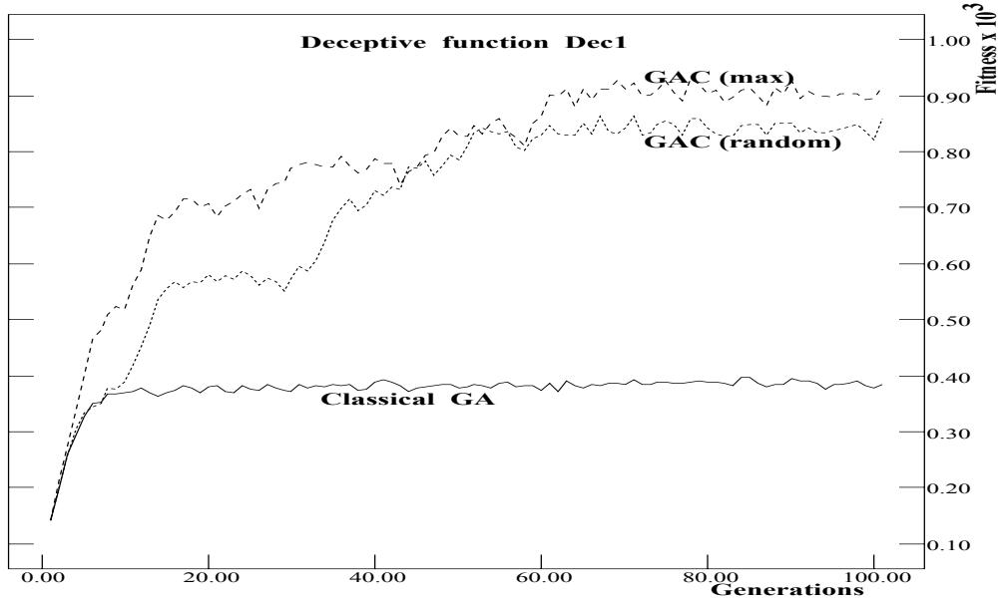
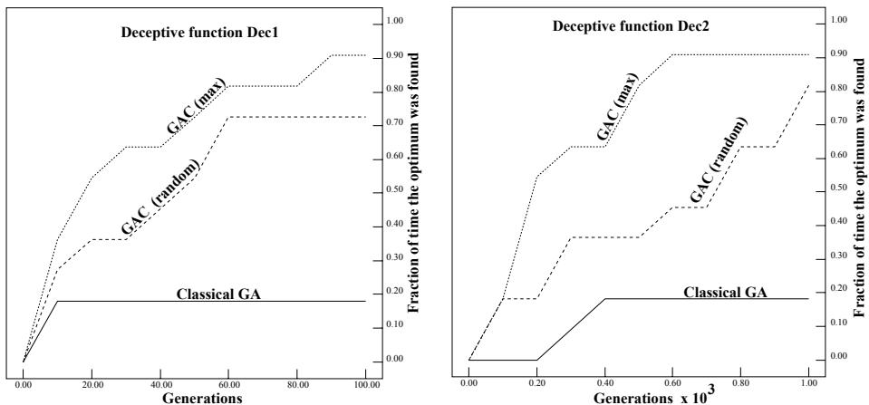

# Predicting Convergence Time for Genetic Algorithms

Sushil J. Louis Gregory J. E. Rawlins

Department of Computer Science Indiana University Bloomington, IN 47405 email: louis@cs.indiana.edu

# Abstract

It is dicult to predict a genetic algorithm's behavior on an arbitrary problem. Combining genetic algorithm theory with practice we use the average hamming distance as a syntactic metric to derive bounds on the time convergence of genetic algorithms. Analysis of a 
at function provides worst case time complexity for static functions. Further, employing linearly computable runtime information, we provide bounds on the time beyond which progress is unlikely on arbitrary static functions. As a byproduct, this analysis also provides qualitative bounds by predicting average tness.

# 1 Introduction

A Genetic Algorithm (GA) is a randomized parallel search method modeled on natural selection (Holland 1975). GAs are being applied to a variety of problems and are becoming an important tool in machine learning and function optimization (Goldberg 1989). Their beauty lies in their ability to model the robustness, 
exibility and graceful degradation of biological systems.

Natural selection uses diversity in a population to produce adaptation. Ignoring the eects of mutation for the present, if there is no diversity there is nothing for natural selection to work on. Since GAs mirror natural selection, we apply the same principles and use a measure of diversity for estimating time to stagnation or convergence. A GA converges when most of the population is identical, or in other words, the diversity is minimal. Using average hamming distance (hamming average) as a measure of population diversity we derive bounds for the time to minimal diversity, when the genetic algorithm may be expected to make no further progress (hamming convergence). Such bounds are very useful in prescribing the amount of time to run a GA on a problem.

Previous work in GA convergence by Ankenbrandt, and Goldberg and Deb focuses on the time to convergence to a particular allele (Ankenbrandt, 1991; Goldberg and Deb, 1991) using tness ratios to obtain bounds on time complexity. Since GAs use syntactic information to guide their search, it seems natural to use syntactic metrics in their analysis. Our analysis, using hamming averages, can predict the time beyond which qualitative improvements in the solution are unlikely. Since the schema theorem intimately links schema proportions with tness, we also get bounds on average tness.

The next section denes our model of a genetic algorithm and identies the eect of genetic operators on our diversity metric, which is the hamming average. Subsequently we derive an upper bound on the expected time to convergence. This suggests syntactic remedies to the problem of premature convergence and, as a side eect, how to mitigate deception in GAs. Since crossover does not aect the hamming average we extrapolate the change in the hamming average sampled during the rst few generations to predict the hamming average in later generations. Results presented in section six on a test suite of functions indicate that surprisingly accurate predictions are possible. The last section covers conclusions and directions for further research.

# 2 Genetic algorithms and hamming distance

A genetic algorithm works with a population and encodes a problem's parameters in a binary string. The initial population is formed by a randomly generated set of strings. Our model of a genetic algorithm assumes proportional selection, n-point crossover and the usual mutation operator. With the GA operators dened we can analyze their eects on the average hamming distance of a population.

The average hamming distance of a population is the average distance between all pairs of strings in a population of size $N$ . As each member of the population is involved in $N - 1$ pairs, the sample size from which we calculate the average is:

$$
\frac { N ( N - 1 ) } { 2 }
$$

Let the length of the member strings in the population be $l$ . The hamming average of the initial population is well approximated by the normal distribution with mean $h _ { 0 }$ where

$$
h _ { 0 } = \frac { l } { 2 }
$$

and standard deviation $s _ { 0 }$ given by

$$
s _ { 0 } = \frac { \sqrt { l } } { 2 }
$$

Ignoring the eect of mutation, the hamming average of a converged population is zero (mutation increases the hamming average of a converged population by an amount $\epsilon > 0$ depending on the probability of mutation). Given that the initial hamming average is $l / 2$ and the nal hamming average is zero, the eects of selection and crossover determine the behavior of a genetic algorithm in the intervening time.

# 3 Crossover and average hamming distance

Assuming that ospring replace their parents during a crossover, all crossover operators can be partitioned into two groups based on whether or not they change the hamming average. If one parent contributes the same alleles to both ospring (as in masked crossover (Louis and Rawlins 1991)) the hamming distance between the children is less than the hamming distance between their parents. This leads to a loss of genetic material, reducing population hamming average and resulting in faster hamming convergence. We do not consider such operators in this paper. The vast ma jority of traditional operators, like one-point, twopoint, : : : l-point, uniform and punctuated crossover (De Jong and Spears 1991; Schaer and Morishima 1987, 1988; Syswerda 1989), do not aect the hamming average of a population. For these crossover operators we prove the following lemma.

Lemma 1 Traditional crossover operators do not change the average hamming distance of a given population.

Proof: We prove that the hamming average in generation $t + 1$ is the same as the hamming average at generation $t$ under the action of crossover alone. Assuming a binary alphabet $\{ a , b \}$ , we can express the population hamming average at generation $t$ as the sum of hamming averages of $l$ loci, where $l$ is the length of the chromosome. Letting $h _ { i , t }$ stand for the hamming average of the $i ^ { t h }$ locus we have:

$$
h _ { t } = \sum _ { i = 1 } ^ { l } h _ { i , t }
$$

The hamming average in the next generation is

$$
h _ { t + 1 } = \sum _ { i = 1 } ^ { l } h _ { i , t + 1 }
$$

In the absence of selection and mutation, crossover only changes the order in which we sum the contributions at each locus. That is:

$$
h _ { i , t } = h _ { i , t + 1 }
$$

Therefore

$$
h _ { t } = h _ { t + 1 }
$$

Having eliminated crossover from consideration since it causes no change in the hamming average, we look to selection as the force responsible for hamming convergence.

# 4 Selection and average hamming distance

Selection is the domain-dependent part of a genetic algorithm. $\mathrm { B u t }$ , independent of the domain, we would like to prove that selection with probability greater than $1 / 2$ reduces the hamming average in successive generations, and then obtain an upper bound on the time to convergence. Obtaining an upper bound is equivalent to assuming the worst possible search space and estimating the time required for nding a point in this space. For a static function, a space on which an algorithm can do no better than random search satises this criterion. The 
at function dened by

$$
f ( x _ { i } ) = \mathrm { c o n s t a n t }
$$

contains no useful information for an algorithm searching for a particular point in the space. Thus no algorithm can do better than random search on this function. However, a simple GA without mutation loses diversity and eventually converges. An expression for the time convergence on such a function gives an upper bound on the time complexity of a genetic algorithm on any static function. The GA's convergence on the 
at function is caused by random genetic drift where small random variations in allele distribution cause a GA to drift and eventually converge. To derive an upper bound we start with the time for a particular allele to become xed due to random genetic drift.

If a population of size $N$ contains a proportion $p _ { i }$ of a binary allele $i$ , then the probability that $k$ copies of allele $i$ are produced in the following generation is given by the binomial probability distribution

$$
\left( \begin{array} { c } { { N } } \\ { { k } } \end{array} \right) p _ { i } ^ { k } ( 1 - p _ { i } ) ^ { N - k }
$$

Using this distribution we have to calculate the probability of a particular frequency of occurrence of allele $i$ in subsequent generations. This is a classical problem in population genetics. Although the exact solution is complex, we can approximate the probability that allele frequency takes value $p$ in generation $t$ . Wright's approximation for intermediate allele frequencies and population sizes, as given in Gayle (Gayle 1990), is sucient for our purposes. Let $f ( \boldsymbol { p } , t )$ stand for the probability that allele frequency takes value $p$ in generation $t$ where $0 < p < 1$ then

$$
f ( p , t ) = \frac { 6 p _ { 0 } \big ( 1 - p _ { 0 } \big ) } { N } \bigg ( 1 - \frac { 2 } { N } \bigg ) ^ { t }
$$

The probability that an allele is xed at generation $t$ is

$$
\mathcal { P } ( t ) = 1 - f ( p , t )
$$

Applying this to a genetic algorithm, assuming a randomly instantiated population at $t = 0$ we have

$$
\mathcal { P } ( t ) = 1 - \frac { 6 p _ { 0 } ( 1 - p _ { 0 } ) } { N } \left( 1 - \frac { 2 } { N } \right) ^ { t }
$$

If we assume that alleles consort independently, which is true for a 
at function, then the expression for the probability that all alleles are xed at generation $t$ for a chromosome of

length $l$ alleles, is given by

$$
\mathcal { P } ( t , l ) = \left[ 1 - \frac { 6 p _ { 0 } \big ( 1 - p _ { 0 } \big ) } { N } \left( 1 - \frac { 2 } { N } \right) ^ { t } \right] ^ { l }
$$

Equation 1 gives us the time to convergence for a genetic algorithm on a 
at function and is therefore an upper bound for any static function. For example, on a 50 bit chromosome and a population size of 30, this gives an upper bound of $9 2 \%$ on the probability of convergence in 50 generations. Experimentally, we get between $9 2 \%$ and $7 3 \%$ convergence starting with an initial hamming average of $5 0 / 2 \ = \ 2 5$ . Previous work on genetic drift gives a more exact, albeit more computationally taxing expression for time to convergence due to genetic drift (Goldberg and Segrest 1987). They also include the eect of mutation in their analysis, which once again is directly applicable to our problem. Finally, that GAs converge so quickly due to random drift gives a theoretical basis to the often observed problem of premature convergence.

# 4.1 Premature Convergence and Deception

Nature uses large population sizes to \solve" the premature convergence problem. This is expensive, furthermore we need not be restricted to nature's methods but can do some genetic engineering of our own. Mutation seems a likely candidate, and in practice, is the usual way of maintaining diversity. However, although high mutation rates may increase diversity, its random nature raises problems. Mutation is as likely to destroy good schemas as bad ones and therefore elitist selection is needed to preserve the best individuals in a population. This works quite well in practice, but is unstructured and cannot insure that all alleles are always present in the population.

Instead of increasing mutation rates, we pick an individual and add its bit complement to the population. This ensures that every allele is present and the population spans the entire encoded space of the problem. We can pick the individual to be complemented in a variety of ways depending on the assumptions we make about the search space. Randomly selecting the individual to be complemented makes the least number of assumptions and may be the best strategy in the absence of other information. We could also select the best or worst individual, or use probabilistic methods in choosing whom to complement. Instead of complementing one individual, we can choose to complement a set of individuals, thus spanning the encoded space in many directions. The most general approach is to maintain the complement of every individual in the population, doubling the population size.

The presence of complementary individuals also makes a GA more resistant to deception. Intuitively, since the optimal schema is the complement of the deceptively optimal schema, it will be repeatedly created with high probability as the GA converges to the deceptive optimum (Goldberg et al. 1989). In our experiments we replaced the minimum tness individual with either the complement of a randomly picked individual in the current population, or the complement of the current best individual. Let $l _ { i }$ represent the number of bits needed to represent variable $i$ in a deceptive problem, then the functions we used can be described as follows

$$
\mathrm { D e c e p t i v e } ( x _ { i } ) = \sum _ { i = 1 } ^ { n } \left\{ \begin{array} { l l } { x _ { i } } & { \mathrm { i f } x _ { i } \neq 0 } \\ { 2 ^ { l _ { i } + 2 } } & { \mathrm { i f } x _ { i } = 0 } \end{array} \right\}
$$

We used Dec1 and Dec2 which are 10-bit and 20-bit deceptive problems respectively. Letting superscripts denote the number of bits needed for each variable, Dec1 can be described by

$$
\mathrm { D e c 1 : D e c e p t i v e } \big ( x _ { 1 } ^ { 2 } , ~ x _ { 2 } ^ { 8 } \big )
$$

and Dec2 by

$$
\mathrm { D e c 2 : D e c e p t i v e } ( x _ { 1 } ^ { 2 } , ~ x _ { 2 } ^ { 8 } , ~ x _ { 3 } ^ { 5 } , ~ x _ { 4 } ^ { 5 } )
$$

Figure 1 compares the average tness after 100 generations of a classical GA (CGA) and a

  
Figure 1: Average tness over 100 generations of a CGA and GAC.

GA with complements (GAC) on Dec1. The GAC easily outperforms the classical GA, both in average tness and the number of times the optimum was found. In most experiments the classical GA fails to nd the optimum in 11 runs of the GA with a population size of 30 in 100 generations. Since the converged hamming average for the CGA is very small, we do not expect it to be ever able to nd the global optimum. GAC on the other hand easily nds the optimum for Dec1 within a 100 generations and usually nds the optimum for Dec2 within a few hundred generations. Figure 2 shows the number of times the optimum was found for Dec1 and Dec2 within a total of 100 and 1000 generations respectively. In both gures \GAC (max)" replaces the worst individual with the complement of the current best individual while \GAC (random)" replaces the worst individual with the complement of a random individual in the population.

  
Figure 2: Number of times the optimum was found on Dec1 and Dec2 for a CGA and GAC.

Although this genetically engineered algorithm can mitigate certain kinds of deception, it is not a panacea and cannot guarantee an optimal solution on all problems. Messy Genetic Algorithms (Goldberg et al. 1989) can make much stronger guarantees but their computational complexity is daunting. Not surprisingly, GAC also does better than a classical GA on Ackley's One Max and no worse on the De Jong test suite (Ackley 1987; De Jong 1975). In problems consisting of mixed deceptive and easy subproblems the GAC still does much better than the classical GA. Finally, GA-hard problems, that are both deceptive and epistatic, may need masked crossover or other length independent recombinant operators to be solved successfully using complements (Louis and Rawlins 1991).

# 5 Convergence Analysis

We now have an upper on time to convergence on static functions, but predicting performance on an arbitrary function is more dicult because of the non-linearities introduced by the selection intensity. However, tracking the decrease in hamming average while a GA is working on a particular problem allows us to approximately predict the time to hamming convergence.

Without mutation a GA reduces the hamming average from $l / 2$ to zero. Therefore predicting the time to convergence reduces to the problem of nding the rate of decrease in hamming average. We start with a general model for the change in hamming average per generation:

$$
h _ { t + 1 } = \mathscr { F } ( h _ { t } )
$$

relating the hamming average $h _ { t }$ in generation $t$ to the hamming average in the next generation. Finding $\mathcal { F }$ and solving the recurrence is enough to predict the time to convergence.

We can express the population hamming average at generation $t$ as the sum of hamming

averages of $l$ loci, where $l$ is the length of the chromosome. Letting $h _ { i , t }$ stand for the hamming average of the $i ^ { t h }$ locus we have:

$$
h _ { t } = \sum _ { i = 0 } ^ { l - 1 } h _ { i , t }
$$

Assuming a binary alphabet $\{ a , b \}$ and a large population, the hamming average of a locus in the current population is well approximated by the product of the number of $a ^ { \prime } \mathbf { s }$ and the number of $b \mathrm { ^ { \prime } s }$ divided by the sample size $N ( N - 1 ) / 2$ , where $N$ is the population size. More formally, letting $m ( a _ { i } , t )$ and $m ( b _ { i } , t )$ be the number of $a ^ { \dagger } \mathbf { s }$ and $b \mathrm { ^ { \prime } s }$ at a locus $i$ , we have

$$
h _ { i , t } = \frac { m ( a _ { i } , t ) m ( b _ { i } , t ) } { N ( N - 1 ) / 2 }
$$

Since $a$ and $b$ are rst order schemas competing at locus $i$ , their growth rates are given by the schema theorem. The growth rate for a schema s with tness $f ( s )$ due to selection alone is

$$
m ( s , t + 1 ) = \frac { m ( s , t ) f ( s ) } { \overline { { f } } _ { t } }
$$

Here $\overline { { f } } _ { t }$ is the population's average tness in generation $t$ . As we are only considering rst order schema, there is no modication needed to incorporate crossover's eects. Ignoring mutation for the present we can therefore calculate the hamming average in generation $t + 1$ at locus $i$ as follows. First:

$$
h _ { i , t + 1 } = \frac { m ( a _ { i } , t + 1 ) m ( b _ { i } , t + 1 ) } { N ( N - 1 ) / 2 }
$$

Then using the schema theorem we express $h _ { i , t + 1 }$ in terms of $h _ { i , t }$ ,

$$
h _ { i , t + 1 } = \frac { m ( a _ { i } , t ) f ( a _ { i } ) } { \overline { { f } } _ { t } } \frac { m ( b _ { i } , t ) f ( b _ { i } ) } { \overline { { f } } _ { t } } \frac { 1 } { N ( N - 1 ) / 2 }
$$

Substituting using equation 4:

$$
h _ { i , t + 1 } = h _ { i , t } { \frac { f ( a _ { i } ) f ( b _ { i } ) } { { \overline { { f } } } _ { t } ^ { 2 } } }
$$

The solution to this recurrence is

$$
h _ { i , t } = [ f ( a _ { i } ) f ( b _ { i } ) ] ^ { t } \frac { h _ { i , 0 } } { \displaystyle \prod _ { k = 0 } ^ { t } \overline { { f } } _ { k } ^ { 2 } }
$$

We need to calculate the denominator. This is an interesting problem not only because it helps in predicting the hamming average, but because it implies the possibility of tness

prediction. Once again concentrating on rst order schema, consider the average tness in generation $t$ at locus $i$ .

$$
\overline { { f } } _ { i , t } = \frac { f ( a _ { i } ) m ( a _ { i } , t ) + f ( b _ { i } ) m ( b _ { i } , t ) } { N }
$$

$\operatorname { B u t } { \overline { { f } } } _ { i , t }$ also approximates the population average tness in low epistasis problems. The approximation gets better as epistasis decreases and our estimates of rst order schema tnesses get better. Keeping this assumption in mind, we drop the rst subscript and write

$$
\overline { { f } } _ { t } = \frac { f ( a _ { i } ) m ( a _ { i } , t ) + f ( b _ { i } ) m ( b _ { i } , t ) } { N }
$$

Using the schema theorem (equation 5), we replace the $t$ terms on the right hand side

$$
\overline { { f } } _ { t } = \frac { 1 } { \overline { { f } } _ { t - 1 } } \frac { f ( a _ { i } ) ^ { 2 } m ( a _ { i } , t - 1 ) + f ( b _ { i } ) ^ { 2 } m ( b _ { i } , t - 1 ) } { N }
$$

Multiplying both sides by $\overline { { f } } _ { t - 1 }$

$$
\overline { { f } } _ { t } \overline { { f } } _ { t - 1 } = \frac { m ( a _ { i } , t - 1 ) f ( a _ { i } ) ^ { 2 } } { N } + \frac { m ( b _ { i } , t - 1 ) f ( b _ { i } ) ^ { 2 } } { N }
$$

But by the schema theorem (equation 5)

$$
m ( a _ { i } , t - 1 ) = \frac { m ( a _ { i } , t - 2 ) f ( a _ { i } ) } { \overline { { f } } _ { t - 2 } } \mathrm { A n d } m ( b _ { i } , t - 1 ) = \frac { m ( b _ { i } , t - 2 ) f ( b _ { i } ) } { \overline { { f } } _ { t - 2 } }
$$

Therefore

$$
\overline { { f } } _ { t } \overline { { f } } _ { t - 1 } = \frac { m ( a _ { i } , t - 2 ) f ( a _ { i } ) ^ { 3 } } { N \overline { { f } } _ { t - 2 } } + \frac { m ( b _ { i } , t - 2 ) f ( b _ { i } ) ^ { 3 } } { N \overline { { f } } _ { t - 2 } }
$$

Multiplying by $\overline { { f } } _ { t - 2 }$

$$
\overline { { { f } } } _ { t } \overline { { { f } } } _ { t - 1 } \overline { { { f } } } _ { t - 2 } = \frac { m ( a _ { i } , t - 2 ) f ( a _ { i } ) ^ { 3 } } { N } + \frac { m ( b _ { i } , t - 2 ) f ( b _ { i } ) ^ { 3 } } { N }
$$

This leads to

$$
\prod _ { k = 0 } ^ { t } \overline { { f } } _ { k } = \frac { m ( a _ { i } , 0 ) f ( a _ { i } ) ^ { t + 1 } } { N } + \frac { m ( b _ { i } , 0 ) f ( b _ { i } ) ^ { t + 1 } } { N }
$$

which is the expression we needed. This equation's signicance in tness prediction is discussed in the next section. For our present purpose, substituting equation 9 in 7 gives $h _ { i , t }$ in terms of the initial hamming average.

$$
h _ { i , t } = \left[ f ( a _ { i } ) f ( b _ { i } ) \right] ^ { t } \frac { h _ { i , 0 } } { \left[ \frac { m \left( a _ { i } , 0 \right) f \left( a _ { i } \right) ^ { t + 1 } } { N } + \frac { m \left( b _ { i } , 0 \right) f \left( b _ { i } \right) ^ { t + 1 } } { N } \right] ^ { 2 } }
$$

For a randomly initialized population

$$
m ( a _ { i } , 0 ) = m ( b _ { i } , 0 ) = N / 2
$$

Therefore

$$
h _ { i , t } = [ f ( a _ { i } ) f ( b _ { i } ) ] ^ { t } \frac { 4 h _ { i , 0 } } { [ f ( a _ { i } ) ^ { t + 1 } + f ( b _ { i } ) ^ { t + 1 } ] ^ { 2 } }
$$

Rearranging terms we get

$$
h _ { i , t } = { \frac { 4 \left[ f ( a _ { i } ) f ( b _ { i } ) \right] ^ { t } } { \left[ f ( a _ { i } ) ^ { t + 1 } + f ( b _ { i } ) ^ { t + 1 } \right] ^ { 2 } } } h _ { i , 0 }
$$

Here $h _ { i , 0 }$ is the initial hamming average at locus $i$ . For a randomly initialized population, the hamming average for each locus is $1 / 2$ . Replacing $h _ { i , 0 }$ by $1 / 2$

$$
h _ { i , t } = \frac { 2 \left[ f ( a _ { i } ) f ( b _ { i } ) \right] ^ { t } } { \left[ f ( a _ { i } ) ^ { t + 1 } + f ( b _ { i } ) ^ { t + 1 } \right] ^ { 2 } }
$$

Summing over $i$ from 0 to $l - 1$ gives the population hamming average in generation $t$

$$
h _ { t } = \sum _ { i = 0 } ^ { l - 1 } h _ { i , t } = 2 \sum _ { i = 0 } ^ { l - 1 } \frac { \left[ f \bigl ( a _ { i } \bigl ) f \bigl ( b _ { i } \bigl ) \right] ^ { t } } { \left[ f \bigl ( a _ { i } \bigl ) ^ { t + 1 } + f \bigl ( b _ { i } \bigl ) ^ { t + 1 } \right] ^ { 2 } }
$$

the expression for the hamming average in generation $t$ , depends only on the tnesses of alleles in the chromosome.

$$
h _ { t } = 2 \sum _ { i = 0 } ^ { l - 1 } \frac { [ f ( a _ { i } ) f ( b _ { i } ) ] ^ { t } } { [ f ( a _ { i } ) ^ { t + 1 } + f ( b _ { i } ) ^ { t + 1 } ] ^ { 2 } }
$$

This analysis indicates that rst order schema tnesses predict convergence time. Although exactly calculating these tnesses is not computationally feasible, we can use estimates. After all, the GA itself only works with estimated tnesses. Epistasis also introduces problems as the tnesses depend on the context in which they are evaluated. Section seven discusses practical prediction in more detail. Lastly, being restricted to rst order schema means that we can safely ignore crossover and only consider mutation in our analysis.

# 5.1 Handling Mutation

Since we are interested in the hamming average we consider mutation's eect on the number of $a ^ { \prime } \mathbf { s }$ and $b \mathrm { ^ { \prime } s }$ . Mutation 
ips a bit with probability $p _ { m }$ , changing the number of copies of $a$ and $b$ in subsequent generations. Without selection

$$
\begin{array} { c } { m ( a _ { i } , t + 1 ) = m ( a _ { i } , t ) \left[ 1 - p _ { m } \right] + m ( b _ { i } , t ) p _ { m } } \\ { m ( b _ { i } , t + 1 ) = m ( b _ { i } , t ) \left[ 1 - p _ { m } \right] + m ( a _ { i } , t ) p _ { m } } \end{array}
$$

since the $a ^ { \prime } \mathbf { s }$ become $b \mathrm { ^ { \prime } s }$ and vice-versa. Incorporating selection we get

$$
m ( a _ { i } , t + 1 ) = \frac { f ( a _ { i } ) m ( a _ { i } , t ) [ 1 - p _ { m } ] + f ( b _ { i } ) m ( b _ { i } , t ) p _ { m } } { \overline { { f } } _ { t } }
$$

$$
m ( b _ { i } , t + 1 ) = \frac { f ( b _ { i } ) m ( b _ { i } , t ) [ 1 - p _ { m } ] + f ( a _ { i } ) m ( a _ { i } , t ) p _ { m } } { \overline { { f } } _ { t } }
$$

The equation for hamming distance in generation $t$ is

$$
h _ { i , t } = \frac { m ( a _ { i } , t ) m ( b _ { i } , t ) } { N ( N - 1 ) / 2 }
$$

To solve this we need $m ( a _ { i } , t )$ in terms of $m ( a _ { i } , 0 )$ . Substituting $m ( b _ { i } , t ) = N - m ( a _ { i } , t )$ in equation 11

$$
m ( a _ { i } , t ) = \frac { f ( a _ { i } ) m ( a _ { i } , t - 1 ) ( 1 - p _ { m } ) + f \bigl ( b _ { i } \bigr ) p _ { m } [ N - m ( a _ { i } , t - 1 ) ] } { \overline { { f } } _ { t - 1 } }
$$

Collecting terms

$$
m ( a _ { i } , t ) = \frac { m ( a _ { i } , t - 1 ) \left[ f ( a _ { i } ) ( 1 - p _ { m } ) - f ( b _ { i } ) p _ { m } \right] } { \overline { { f } } _ { t - 1 } } + \frac { f ( b _ { i } ) p _ { m } N } { \overline { { f } } _ { t - 1 } }
$$

This is of the form

$$
m ( a _ { i } , t ) = \frac { c m ( a _ { i } , t - 1 ) } { \overline { { f } } _ { t - 1 } } + \frac { d } { \overline { { f } } _ { t - 1 } }
$$

where

$$
\begin{array} { l } { c = f ( a _ { i } ) ( 1 - p _ { m } ) - f ( b _ { i } ) p _ { m } } \\ { \quad } \\ { d = f ( b _ { i } ) p _ { m } N } \end{array}
$$

The solution to this recurrence is

$$
m ( a _ { i } , t ) = \frac { c ^ { t } m ( a _ { i } , 0 ) } { \displaystyle { \prod _ { k = 0 } ^ { t - 1 } \overline { { f } } _ { k } } } + \frac { d } { \displaystyle { \prod _ { k = 0 } ^ { t - 2 } \overline { { f } } _ { k } } } \sum _ { i = 0 } ^ { t - 2 } c ^ { i } \prod _ { k = i + 1 } ^ { t - 2 } \overline { { f } } _ { k }
$$

Before calculating the product of tnesses, we rewrite the second term as

$$
m ( a _ { i } , t ) = \frac { c ^ { t } m ( a _ { i } , 0 ) } { \displaystyle { \prod _ { k = 0 } ^ { t - 1 } \overline { { f } } _ { k } } } + \frac { d \overline { { f } } _ { t - 1 } } { \displaystyle { \prod _ { k = 0 } ^ { t - 1 } \overline { { f } } _ { k } } } \sum _ { i = 0 } ^ { t - 2 } c ^ { i } \prod _ { k = i + 1 } ^ { t - 2 } \overline { { f } } _ { k }
$$

Similarly letting

$$
\begin{array} { l } { { u = f ( b _ { i } ) ( 1 - p _ { m } ) - f ( a _ { i } ) p _ { m } } } \\ { { \ } } \\ { { w = f ( a _ { i } ) p _ { m } N } } \end{array}
$$

we get

$$
m ( b _ { i } , t ) = \frac { u ^ { t } m ( b _ { i } , 0 ) } { \displaystyle \prod _ { k = 0 } ^ { t - 1 } \overline { { f } } _ { k } } + \frac { w ~ \overline { { f } } _ { t - 1 } } { \displaystyle \prod _ { k = 0 } ^ { t - 1 } \overline { { f } } _ { k } } \sum _ { i = 0 } ^ { t - 2 } u ^ { i } \prod _ { k = i + 1 } ^ { t - 2 } \overline { { f } } _ { k }
$$

We can now substitute these values into equation 12 directly

$$
h _ { i , t } = \frac { \displaystyle \# ^ { t } m ( a _ { i } , 0 ) + d \overline { { f } } _ { t - 1 } \sum _ { i = 0 } ^ { t - 2 } c ^ { i } \prod _ { k = i + 1 } ^ { t - 2 } \overline { { f } } _ { k } \bigg ] \left[ u ^ { t } m ( b _ { i } , 0 ) + w \overline { { f } } _ { t - 1 } \sum _ { i = 0 } ^ { t - 2 } u ^ { i } \prod _ { k = i + 1 } ^ { t - 2 } \overline { { f } } _ { k } \right] } { \displaystyle \frac { N ( N - 1 ) } { 2 } \prod _ { k = 0 } ^ { t - 1 } \overline { { f } } _ { k } ^ { 2 } }
$$

As in the previous section we need to calculate the tness product. Starting with

$$
N f _ { t + 1 } = f ( a _ { i } ) m ( a _ { i } , t + 1 ) + f ( b _ { i } ) m ( b _ { i } , t + 1 )
$$

we substitute for the $t + 1$ terms on the right hand side (RHS) using equation 11

$$
\begin{array} { c } { { N f _ { t + 1 } f _ { t } = } } \\ { { m ( a _ { i } , t ) \left[ f ( a _ { i } ) ^ { 2 } ( 1 - p _ { m } ) + f ( a _ { i } ) f ( b _ { i } ) p _ { m } \right] + } } \\ { { m ( b _ { i } , t ) \left[ f ( b _ { i } ) ^ { 2 } ( 1 - p _ { m } ) + f ( a _ { i } ) f ( b _ { i } ) p _ { m } \right] } } \end{array}
$$

Unrolling in this way we get

$$
\begin{array} { l } { { 2 \displaystyle \prod _ { k = 0 } ^ { t } f _ { k } = \left[ f ( a _ { i } ) ^ { 2 } ( 1 - p _ { m } ) + f ( a _ { i } ) f ( b _ { i } ) p _ { m } \right] [ f ( a _ { i } ) ( 1 - p _ { m } ) + f ( b _ { i } ) p _ { m } ] ^ { t - 1 } } } \\ { { + \left[ f ( b _ { i } ) ^ { 2 } ( 1 - p _ { m } ) + f ( a _ { i } ) f ( b _ { i } ) p _ { m } \right] [ f ( b _ { i } ) ( 1 - p _ { m } ) + f ( a _ { i } ) p _ { m } ] ^ { t - 1 } } } \end{array}
$$

where we have replaced the initial number of $a ^ { \prime } \mathbf { s }$ and $b \mathrm { ^ { \prime } s }$ by their expected values of $N / 2$ The average tness in a particular generation derives from noting that

$$
\overline { { f } } _ { t } = \frac { \displaystyle \prod _ { k = 0 } ^ { t } f _ { k } } { \displaystyle \prod _ { k = 0 } ^ { t } f _ { k } }
$$

We can now substitute the values for the constants $c , d , u , w$ and the tness product to nd the hamming average in any generation. However, the cumbersome calculations in equation 15 raises the possibility of approximation. Practically speaking, a hamming average of $_ x$ with a standard deviation of $y$ where $x + y \approx z$ is accurate enough, as long as we can exhaustively search $2 ^ { z }$ points in a search space. This implies that we ignore many of the higher order terms in equation 15 and get away with a simpler model. For the purposes of computer simulation, we use equations 11 and 8, iterate the required number of generations, and predict both the hamming average and tness.

# 6 Practical Prediction

For the preceding analysis to be useful, we need to know $1 ^ { s t }$ order schema tnesses. This is computationally infeasible. We can also approximate these tnesses by considering only those representatives of the schema in the current population. But this does not address the problem of epistatic linkages. The key piece of intuition needed to address this problem is the realization that the schema theorem works both ways. If we keep track of tnesses we can calculate proportions. $\mathrm { B u t }$ , if we keep track of proportions we can calculate tnesses. That is, we can rewrite equation 5 as

$$
f ( a _ { i } ) = \frac { m ( a _ { i } , t + 1 ) \overline { { f } } _ { t } } { m ( a _ { i } , t ) }
$$

Keeping track of $m ( a _ { i } , t )$ over a few generations should give us an estimated tness for $a _ { i }$ Mutation can be handled in the same way.

If we assume that string similarity implies tness similarity, then the variance of tness is a measure of the nonlinearities in the genome and hence a measure of epistasis. Fortunately, competing schemas with a large tness variance feel high selection pressure and quickly lose diversity, diminishing epistatic eects. Since a GA exponentially reduces high variances, $O ( l o g N )$ generations should suce to mitigate most nonlinear eects.

We suggest the following methodology:

 Instead of predicting $f ( a _ { i } )$ or $f ( b _ { i } )$ by averaging the contributions of all individuals which contain $a _ { i }$ or $b _ { i }$ , we can use equations 5 and 11 to solve for $f ( a _ { i } )$ and $f ( b _ { i } )$ over a small number of generations to get an epistasis adjusted tness value for each rst order schema.

 We start sampling allele proportions after $O ( \log N )$ generations.

Using an adjusted tness computed this way, we can predict the growth rate of rst order schema and therefore the population average tness and population hamming average in subsequent generations. Consider the eect of newly discovered schemas on the predictions. Fresh schemas that decrease adjusted tnesses have little eect since they are quickly eliminated by selection. When higher tness schemas are discovered by crossover, the tness of alleles participating in these schemas increases. This means that the predicted hamming average will be greater than or equal to the observed value giving us an upper limit on the time to convergence. Our predictions therefore provide upper bounds on the hamming average and time to convergence to that hamming average. Such an estimate is more desirable than an overly optimistic estimate: It is better to let a GA run too long than to stop it early.

The variance in adjusted tness for an allele bounds the number of generations sampled to get an accurate estimate of the allele's tness. Analyzing the variance can provide statistical condence estimates on our predictions. This variance bounds the current tness of schemas in which the allele participates. At a particular locus, using the allele with the least variance to predict growth gives a conservative estimate of hamming average. Low variance implies a good approximation to the current average tness of the allele and provides an upper bound on our predicted hamming average. Similarly, using the allele with greater variance gives an optimistic estimate or lower bound. These bounds should surround the predicted value of the hamming average. Results given below support this preliminary analysis.

Noisy functions and noise induced by mutation may cause less desirable, more unpredictable behavior. We can solve this problem by having a larger sample space, using more generations to calculate adjusted tnesses.

For much the same reasons above, calculating adjusted tnesses allows predicting a lower limit on the tness average because these tnesses only incorporate the eects of current schemas. Any new schemas (created by crossover) that increase the adjusted tness of an allele can lead to a higher than predicted tness average. In multimodal functions exactly the opposite may happen. The GA could initially concentrate around one optimum and then move toward another optimum. Since the calculated adjusted tnesses may no longer be correct and it takes a GA time to overcome the inertia created by the rst optimum, the predicted tness average may be higher than the actual tness average.

# 6.1 Predicting Hamming Average

Since hamming average prediction is quite robust and we may only be interested in a rst order approximation, we can try using a linear approximation of $\mathcal { F }$ in equation 2. Assuming a quick and simple model for the case without mutation we have

$$
h _ { t + 1 } = a h _ { t }
$$

whose general solution is given by

$$
h _ { t } = a ^ { t } h _ { 0 }
$$

Table 1: Comparing actual and predicted hamming averages (no mutation)   

<table><tr><td rowspan=3 colspan=2>Function</td><td rowspan=2 colspan=1>Observed</td><td rowspan=1 colspan=3>Predicted</td></tr><tr><td rowspan=1 colspan=2>Curve fitting</td><td rowspan=1 colspan=1>Our model</td></tr><tr><td rowspan=1 colspan=1>ho   h50</td><td rowspan=1 colspan=2>h50eqn 18</td><td rowspan=1 colspan=1>h50lower  h50upper</td></tr><tr><td rowspan=2 colspan=2>FlatF1F2F3F4F5</td><td rowspan=1 colspan=1>25   4.6 (2.4)</td><td rowspan=1 colspan=2>5.1 (2.2)</td><td rowspan=5 colspan=1>4.3 (1.3)   9.3 (1.1)2.1 (0.8)   4.6 (1.3)1.7 (1.0)   4.3 (1.1)3.2 (1.2)   7.9 (2.0)17.4 (6.5)  42.2 (5.7)2.8 (1.1)   5.7 (1.0)4.2 (1.0)   8.0 (2.1)12.8 (5.4)  29.8 (4.8)</td></tr><tr><td rowspan=1 colspan=1>15   2.1 (1.1)12   2.1 (0.9)25   3.5 (1.7)120  18.6 (8.0)17   2.9 (1.7)</td><td rowspan=1 colspan=2>2.2 (1.2)2.5 (1.5)3.4 (1.5)25.3 (11.5)4.2 (2.3)</td></tr><tr><td rowspan=2 colspan=1>OneMaxI</td><td></td><td rowspan=2 colspan=1>25   3.7 (2.3)</td><td rowspan=2 colspan=1>4.7 (3.1)</td><td rowspan=2 colspan=1></td></tr><tr><td rowspan=2 colspan=2>OneMaxIOneMaxII</td></tr><tr><td rowspan=1 colspan=1>100 15.8 (8.1)</td><td rowspan=1 colspan=2>16.0 (9.7)</td></tr></table>

Since there have not been any previous attempts at this prediction task, we use the simple curve tting equation above to give us a base case for comparison with our model. The task is to predict the hamming average at generation 50 for the following functions:

1. Flat: $f ( x _ { 1 } , x _ { 2 } ) = 1 0$ ; with a 50 bit chromosome.

2. DeJong's ve functions: $F 1 \ldots F 5$ (De Jong, 1975).

3. One Max: $f ( X ) = | X |$ where $| X |$ stands for the norm of the bit string $X$ , for both a 50 (OneMaxI) and a 200 (OneMaxII) bit chromosome.

All problems were reduced to maximization problems. The GA population size in all experiments was 30, using roulette wheel selection and two-point crossover. We compute a from successive hamming averages in generations 0 through 10. Table 1 summarizes the results without mutation. The last two columns predict lower and upper bounds from equation 11 using data from generations $\lceil \log 3 0 \rceil = 5$ through 10 only. Since the encoding for the DeJong functions used a sign bit, we optimistically chose 5 samples as sucient for our purposes. The observed values are averages over 11 runs with no mutation. The standard deviations over 11 runs of the GA are given in parentheses.

Surprisingly, the values predicted using the rough approximation (equation 18) are quite good and are within a standard deviation of the observed values. That good results come from even such a simple model clearly indicates the validity of our approach. Our predicted upper and lower bounds using equation 11 on the upper limit include the observed values except for OneMaxI whose lower bound is greater than the observed hamming average. This implies a large variance in sampled allelic tnesses. Intuitively, the adjusted tness of an allele depends on the number of ones in the entire chromosome, leading to the observed conservative estimate in the absence of mutational noise. We should expect OneMax to create greater problems when including mutation.

Next, realizing that mutation makes the nal hamming average greater than 0, we again use a curve tting model to compare with our model and predict hamming average at convergence for the same set of problems but with the mutation rate set to 0:01. Since mutation makes the GA converge to hamming average greater than zero, we use

$$
h _ { t + 1 } = a h _ { t } + b
$$

to model a GA's behavior with mutation. The general solution is given by

$$
h _ { t } = a ^ { t } h _ { 0 } + b \frac { 1 - a ^ { t } } { 1 - a }
$$

In these experiments the GA ran until hamming convergence when the hamming average did not change signicantly over time. 500 generations was sucient for our problem set. Calculating the values of $a$ and $b$ in equation 19 using the method of least squares, we predict the hamming average at convergence. This is found by setting $\epsilon = h _ { t } = h _ { t + 1 }$ and solving for $h _ { t }$ , resulting in

$$
\epsilon = { \frac { b } { 1 - a } }
$$

Table 2 compares the observed hamming average at generation 500 with the predicted values. Column three tabulates the observed hamming average at convergence and its standard deviation over the 11 runs. Columns four and ve are the predicted hamming averages using equation 19 and data from generations 5 through 20 and 5 through 45 respectively. The simpler model (curve tting) does badly when mutation is incorporated. It requires many more samples, and even predicts negative hamming averages at convergence. However, our model using equation 11 predictably needs no extra information and as before only uses samples from generations 5 through 10 to produce the last two columns.

Our predictions (last two columns) in table 2 are very close to the observed values. Although the hamming average after 500 generation is large for $F 4$ and OneMaxII, there is no signicant change even after 2000 generations. This just indicates that once a GA reaches an equilibrium hamming average, we should try some other search method. Our predicted upper and lower bounds are still good except for OneMaxII. Here, noise induced by mutation is the ma jor culprit. The high variance in allele tnesses suggests using a larger sample space to increase the signal to noise ratio. Sure enough, using an additional 15 generations to sample tnesses suces to correct the problem and give good bounds on OneMaxII.

# 6.2 Predicting Average Fitness

Since a simplied curve tting model gave good results on hamming average prediction, we use equation 19 for tness prediction as well by substituting the average tness in generation $t$ for $h _ { t }$ . Table 3 predicts the average tness $( F )$ at convergence without mutation. Column two gives the observed initial average tness and column three the converged average tness

<table><tr><td rowspan="3">Function</td><td rowspan="2">Observed</td><td colspan="4">Predicted</td></tr><tr><td>Curve</td><td>fitting</td><td>Our model</td><td></td></tr><tr><td>ho h500</td><td>h500</td><td>(5-20) h500(5-45)</td><td>h500 lower</td><td>h500 upper</td></tr><tr><td>Flat</td><td>25 11.2 (1.9)</td><td></td><td>14.4 (6.0)*</td><td>11.4 (1.5)</td><td>7.7 (0.9)</td><td>11.2 (1.3)</td></tr><tr><td>F1</td><td>15 5.8 (1.1)</td><td></td><td>9.8 (10.2)</td><td>6.4 (1.3)</td><td>4.1 (0.5)</td><td>6.1(1.3)</td></tr><tr><td>F2</td><td>12</td><td>4.3 (1.2)</td><td>7.3 (2.4)</td><td>5.7(1.4)</td><td>3.5 (0.9)</td><td>5.4 (1.0)</td></tr><tr><td>F3</td><td>25</td><td>8.9 (1.7)</td><td>8.9 (3.7)*</td><td>9.1 (2.1)</td><td>6.3 (1.1)</td><td>9.5(1.3)</td></tr><tr><td>F4</td><td>120</td><td>48.9 (4.7)</td><td>64.3 (14.0)*</td><td>49.3 (12.2)*</td><td>32.3 (3.9)</td><td>51.4 (4.7)</td></tr><tr><td>F5</td><td>17</td><td>6.8 (1.3)</td><td>11.3 (4.4)*</td><td>7.2 (2.3)</td><td>4.8 (0.7)</td><td>6.8 (1.3)</td></tr><tr><td>One MaxI</td><td>25</td><td>9.2 (1.7)</td><td>10.3 (4.0)*</td><td>9.0 (2.2)</td><td>7.3 (1.3)</td><td>11.3(1.7)</td></tr><tr><td>One MaxII</td><td>100</td><td>45.7 (5.3)</td><td>51.5 (11.4)</td><td>40.3 (13.6)</td><td>25.7 (4.6)</td><td>38.7(4.5)</td></tr></table>

Table 2: Comparing actual and predicted hamming averages with the probability of mutation set to 0:01, the $\ast { } ^ { \dagger } \mathbf { s }$ indicate that the negative values predicted in some runs were discarded.

<table><tr><td rowspan="3">Function</td><td rowspan="2" colspan="2">Observed</td><td colspan="6">Predicted</td></tr><tr><td colspan="3">Curve fitting</td><td colspan="2">Our model</td></tr><tr><td></td><td>F500</td><td>F500(5-15)</td><td></td><td>F5005-25)</td><td>F500 lower</td><td></td><td>F500 upper</td></tr><tr><td>F1</td><td>Fo 53.6</td><td>74.5 (2.8)</td><td>72.9 (14.6)</td><td></td><td>72.8 (5.2)</td><td></td><td>71.7 (4.3)</td><td>72.8 (4.5)</td></tr><tr><td>F2</td><td>3462.6</td><td>3931.1 (69.1)</td><td>3856.2 (71.4)</td><td></td><td>3872.6 (65.7)</td><td></td><td>4031.0 (77.2)</td><td>4098.9 (109.0)</td></tr><tr><td>F3</td><td>32.4</td><td>49.3 (2.9)</td><td>43.0 (3.3)</td><td></td><td>51.0 (14.4)</td><td></td><td>40.8 (2.3)</td><td>41.9 (2.5)</td></tr><tr><td>F4</td><td>970.0</td><td>1055.4 (40.8)</td><td>1023.0 (31.0)</td><td></td><td>1020.1 (57.2)</td><td></td><td>1040.1 (27.5)</td><td>1055.5 (27.8)</td></tr><tr><td>F5</td><td>3.99651</td><td>3.99796 (0.0)</td><td>3.9972 (0.0)</td><td></td><td>3.99679 (0.0)</td><td></td><td>4.2 (0.0)</td><td>4.3 (0.0)</td></tr><tr><td>One MaxI</td><td>24.6</td><td>33.5 (2.3)</td><td>36.0 (12.2)</td><td></td><td>30.6 (11.2)</td><td></td><td>29.8 (1.2)</td><td>30.3 (1.3)</td></tr><tr><td>One MaxII</td><td>99.9</td><td>110.9 (5.4)</td><td>124.8 (59.8)</td><td></td><td>109.8 (5.9)</td><td></td><td>109.5 (3.2)</td><td>111.5 (2.7)</td></tr></table>

Table 3: Comparing actual and predicted tness averages (no mutation)

in generation 50. The next two columns are the predicted tness averages using equation 19 from tnesses sampled in generations 5 through 15 and 5 through 25 respectively. The last two columns use equation 16 to provide conservative and optimistic bounds on the average tness. The standard deviations of the observed and predicted average tnesses over the 11 runs are in parentheses. As stated earlier, we expect both bounds to underestimate the observed tness, unless the function is multimodal and/or has high tness variance. Since the average tness is a byproduct of hamming average prediction in our model, we use data from generations 5 through 10 for our tness prediction. We do not consider the 
at function.

The linear model predictions of average tness are are also within about one standard deviation of observed values. It is more interesting to look at the upper and lower bounds. As expected F2 and F5 which are multimodal, have higher predicted tnesses. Other predictions serve as conservative and optimistic lower bounds.

Table 4 summarizes results on the same set of problems with mutation probability set to

<table><tr><td rowspan="3">Function</td><td rowspan="2" colspan="2">Observed</td><td colspan="4">Predicted</td></tr><tr><td colspan="2">Curve fitting</td><td colspan="2">Our model</td></tr><tr><td>Fo</td><td>F500</td><td>F500 5-25)</td><td>F500 (5-50)</td><td>F lower</td><td>F upper</td></tr><tr><td>F1</td><td>53.6</td><td>75.0 (1.8)</td><td>71.2 (3.8)</td><td>73.4 (2.6)</td><td>70.8 (4.2)</td><td>72.4(4.5)</td></tr><tr><td>F2</td><td>3462.6</td><td>3919.4 (66.1)</td><td>3842.6 (43.3)</td><td>3866.8 (39.9)</td><td>3959.4 (115.0)</td><td>4029.0 (142.0)</td></tr><tr><td>F3</td><td>32.4</td><td>49.6 (1.9)</td><td>55.3 (21.6)</td><td>46.9 (2.6)</td><td>40.4(2.9)</td><td>41.5 (2.9)</td></tr><tr><td>F4</td><td>970.0</td><td>1058.6 (24.5)</td><td>1243.3 (615.8)</td><td>1077.0 (68.6)</td><td>1031.1 (22.4)</td><td>1052.7 (23.5)</td></tr><tr><td>F5</td><td>3.996</td><td>3.997 (0.00)</td><td>3.996 (0.00)</td><td>3.997 (0.00)</td><td>4.20 (0.04)</td><td>4.25 (0.06)</td></tr><tr><td>One MaxI</td><td>24.6</td><td>35.2 (1.6)</td><td>31.0 (4.5)</td><td>34.8 (5.0)</td><td>28.8 (1.1)</td><td>29.3 (1.2)</td></tr><tr><td>One MaxII</td><td>99.9</td><td>110.7 (3.6)</td><td>107.4 (3.6)</td><td>108.8 (5.2)</td><td>108.9 (2.9)</td><td>111.2 (3.0)</td></tr></table>

Table 4: Comparing actual and predicted tness averages with the probability of mutation set to 0:01

0:01. Mutation's eect forces predictions to use very large data samples for the simpler linear model limiting its usefulness. Predictions with fewer samples are not comparable. On the other hand, using our model, upper and lower bounds again fall out of data for generations 5 through 10 with mutation.

These results support our model of genetic algorithm behavior. Although curve tting has its uses in providing a very rough approximation, it cannot predict the eects of changes in GA parameters and fails badly in the presence of mutation. Our model, based on the schema theorem, is able to predict hamming averages in the presence of mutation and needs much fewer samples. Using our analysis it is easy to predict the time to convergence on a problem. This is just the time at which the change in hamming average is insignicant. Knowing available computing resources xes the hamming average below which we can undertake exhaustive search of the remaining space, and therefore the time needed to deliver on an application. Further, with our model, we can predict the eect of changes in population size and mutation rate. In practice, instrumenting a GA to keep estimates of allele tness and proportions should reduce the time spent experimenting with various parameter settings and let the developer know the computing resources needed.

# 7 Conclusions

Analyzing a GA is complicated because of its dependence on the application domain and our lack of understanding of the mapping between our view of the application domain and the GA's view of the same domain. The GA's view of the domain is implicit in the chosen encoding. However, the overall behavior is predictable and can be deduced from sampling suitable metrics.

Analysis of the syntactic information in the encoding, gives us a surprising amount of knowledge. We derived an upper bound on the time complexity from considering the eects of drift on allele frequency. This led to promising suggestions for mitigating the problems of premature convergence and deception. Then, from a model of the eect of selection and mutation on the behavior of genetic algorithms, we were able to approximate two solution characteristics at convergence for static search spaces.

# Список литературы

2. The amount of work possible by the GA, indicated by the average tness at convergence.

Within our model, combining tness prediction with hamming average prediction gives us an idea of how much progress is possible with a GA along with bounds on how much remaining work can be done. The latter is especially important when we include mutation. The predicted average tness indicates how much progress is possible, but it is the predicted hamming average that denotes the remaining work.

Currently, we are working on a more thorough analysis of variance leading to better con- dence estimates on our predictions. We plan on extending our model to dynamic multimodal functions and special genetic operators. We conjecture that crossover operators that do not preserve hamming distance may be modeled as a perturbation of the selection process and so incorporated into our model. Lastly, we would like to suggest using syntactic properties of hamming space in rening our notion of a genetic algorithm's tra jectory through search space. This should lead to easier comparisons with other search methods.

# References

[1] Ackley, D. A. (1987) A Connectionist Machine for Genetic Hillclimbing. Kluwer Academic Publishers.   
[2] Ankenbrandt, C. A. (1991) An Extension to the Theory of Convergence and a Proof of the Time Complexity of Genetic Algorithms. In G. J. E. Rawlins (ed.) Foundations of Genetic Algorithms (San Mateo: Morgan Kauman), 53-68.   
[3] De Jong, K. A. (1975) An Analysis of the Behavior of a class of Genetic Adaptive Systems, Doctoral Dissertation, Dept. of Computer and Communication Sciences, University of Michigan, Ann Arbor.   
[4] De Jong, K. A. and Spears, W. M. (1991) An Analysis of Multi-Point Crossover. In G. J. E. Rawlins (ed.) Foundations of Genetic Algorithms (San Mateo: Morgan Kauman), 301-315.   
[5] Freund, J. E. (1981) Statistics A First Course. Prentice-Hall.   
[6] Gayle, J. S. (1990) Theoretical Population Genetics. Unwin Hyman, 56-99.   
[7] Goldberg, D. E. and Deb, K. (1991) A Comparative Analysis of Selection Schemes Used in Genetic Algorithms. In G. J. E. Rawlins (ed.) Foundations of Genetic Algorithms (San Mateo: Morgan Kauman), 69-93.   
[8] Goldberg, D. E. (1989) Genetic Algorithms in Search, Optimization, and Machine Learning. Addison-Wesley.   
[9] Goldberg, D. E., Korb, B. and Deb, Kalyanmoy. (1989) Messy Genetic Algorithms: Motivation, Analysis, and First Results. TCGA Report No. 89002, (Tuscaloosa: University of Alabama, The Clearinghouse for Genetic Algorithms).   
[10] Goldberg, D. E. and Segrest, P. (1987) Finite Markov Chain Analysis of Genetic Algorithms. In J. J. Grefenstette (ed.) Proceedings of the Second International Conference on Genetic Algorithms (Lawrence Erlbaum Associates), 1-8.   
[11] Holland, John H. (1975) Adaptation In Natural and Articial Systems (Ann Arbor: The University of Michigan Press).   
[12] Louis, S. J. and Rawlins, G. J. E. (1991) Designer Genetic Algorithms: Genetic Algorithms in Structures Design. In R. K. Belew and L. B. Booker (eds.) Proceedings of the Fourth International Conference on Genetic Algorithms (San Mateo: Morgan Kauman), 53-60.   
[13] Schaer, D. J. and Morishima, A. (1987) An Adaptive Crossover Distribution Mechanism for Genetic Algorithms. In J. J. Grefenstette (ed.) Proceedings of the Second International Conference on Genetic Algorithms (Lawrence Erlbaum Associates), 36- 40.   
[14] Schaer, J. D. and Morishima, A. (1988) Adaptive Knowledge Representation: A Content Sensitive Recombination Mechanism for Genetic Algorithms, International Journal of Intel ligent Systems (John Wiley & Sons Inc.) 3:229-246   
[15] Syswerda, G. (1989) Uniform Crossover in Genetic Algorithms. In J. D. Schaer (ed.) Proceedings of the Third International Conference on Genetic Algorithms (San Mateo: Morgan Kauman), 2-8.