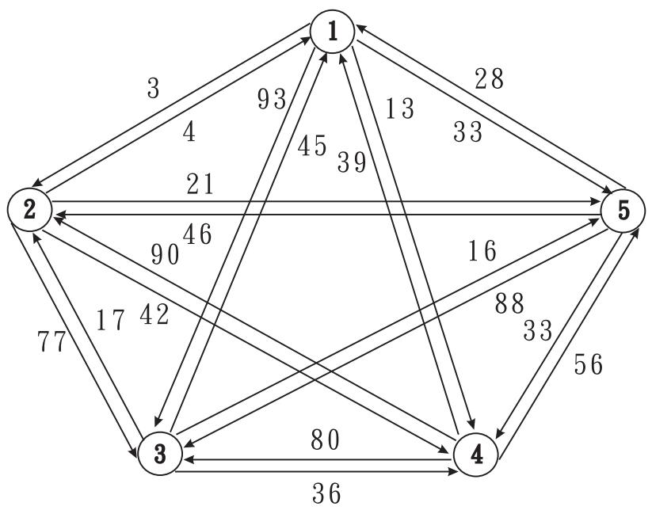
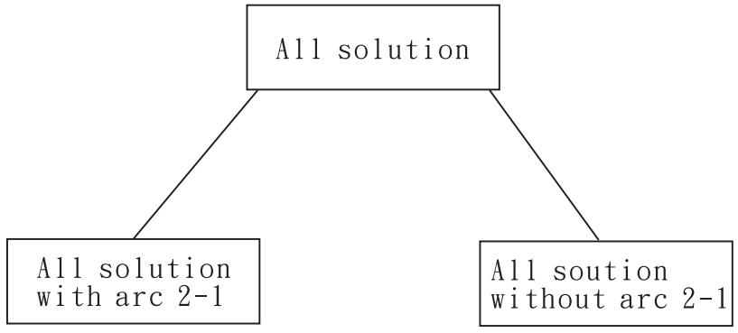
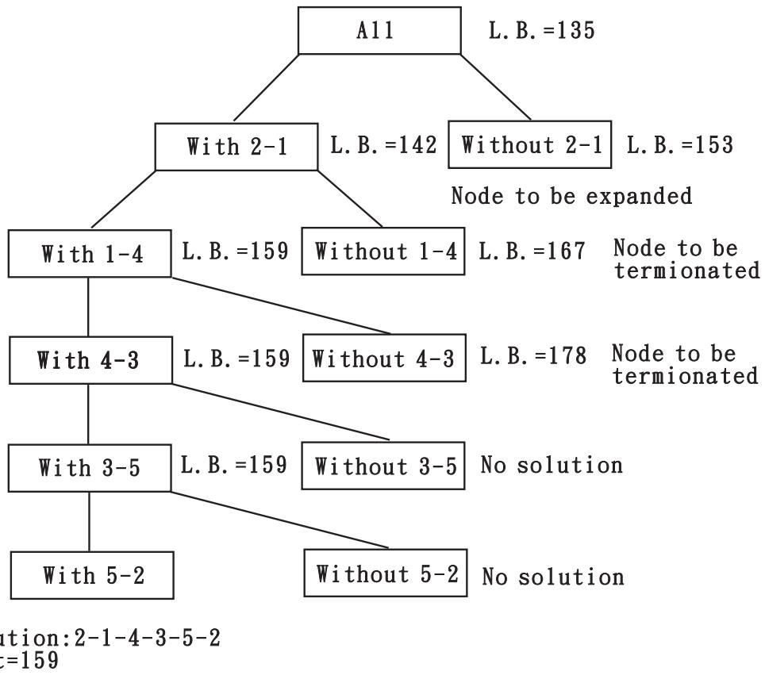
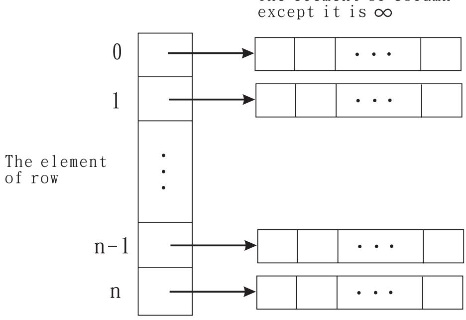
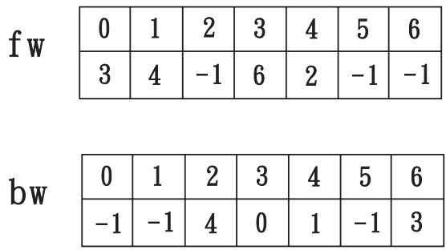

# 1 TSP Survey

The traveling salesman problem (TSP), also known as the traveling salesperson problem, is a prominent illustration of a class of problems in computational complexity theory. The problem can be stated as: Given a number of cities and the costs of traveling from one to the other, what is the cheapest roundtrip route that visits each city and then returns to the starting city?

The most direct answer would be to try all the combinations and see which one is cheapest, but given that the number of combinations is $N$ ! (The factorial of the number of cities), this solution rapidly becomes impractical. How fast are the best known deterministic algorithms? The problem has been shown to be NP-hard, and the decision version of it (given the costs and a number $x$ , decide whether there is a roundtrip route cheaper than $x$ ) is NP-complete.

TSP was known among mathematicians and statisticians under various names. Karl Menger considered a variation of TSP called the messenger problem [7, 8, 9]. It is believed that the report by Mergen [9] is the first published work on TSP. In 1995, Morton and Land [10] indicated that the TSP may be familiar to statisticians as the mean minimum distances problem. The name ”traveling salesman problem” for the optimization problem of our discussion is believed to have originated in the United States. Perhaps that first report using this name was published in 1949 [11]. However, it would be reasonable to say that a systematic study of the TSP as a combinatorial optimization problem began with the work of Dantzig, Fulkerson, and Johnson [12]. The survey papers [13, 14, 15, 16] and the books [3, 17] summarize various developments on the subject.

In fact, most of practical problems faced in daily life are NP-hard. To attack NP-hard problems, some researchers focus on approximation algorithm, or heuristic algorithm or randomized algorithm. Some researchers try branch and bound techniques. Though, it seems impossible to have an efficient algorithm for an NP-hard problem in the worst case. It is still promising that we can find efficiently an optimal solution for an NP-hard problem in average case. There are several branch and bound algorithms for solving TSP.

The origin of the branch and bound idea go back to the work of Dantzig, Fulkerson and Johnson on the traveling salesperson problem. The term branch and bound was coined by Little, Murty, Sweeney, and Karel in conjunction with their TSP algorithm [6]. In fact, it is an enumerative method and can be extended to solve virtually any optimization problems. In an experiment done by Lee et al. [2], the average case performance of the algorithm solving the $0 / 1$ knapsack problem based upon the branch and bound strategy is almost O( $n ^ { \angle }$ ). Branch and bound algorithms have been extensively studied by researchers in areas, such as artificial intelligence and operations research. Though the branch and bound strategy is a generic algorithm that can be used to solve most of optimization problems, researchers normally write ad hoc program for each problem. This inspires us the motivation to systematically develop a software package that can be used to solve several important NP-hard problems.

TSP is a very famous combinatorial optimization problem that has been extensively studied and has many applications in many areas. Much of the work on the TSP is not motivated by direct applications, but rather by the fact that the TSP provides an ideal platform for the study of general methods that can be applied to a wide range of discrete optimization problems. This is not to say, however, that the TSP does not find applications in many fields. Indeed, the numerous direct applications of the TSP bring life to the research area and help to direct future work.

The TSP naturally arises as a sub problem in many transportation and logistics applications, for example the problem of arranging school bus routes to pick up the children in a school district. This bus application is of important historical significance to the TSP, since it provided motivation for Merrill Flood, one of the pioneers of TSP research in the 1940s. A second TSP application from the 1940s involved the transportation of farming equipment from one location to another to test soil, leading to mathematical studies in Bengal by P. C. Mahalanobis and in Iowa by R. J. Jessen. More recent applications involve the scheduling of service calls at cable firms, the delivery of meals to homebound persons, the scheduling of stacker cranes in warehouses, the routing of trucks for parcel post pickup, and a host of others.

The Asymmetric Traveling Salesman Problem (ATSP), i.e., a TSP in which the cost matrix is not necessarily symmetric, is clearly more general than the Symmetric Traveling Salesman Problem (STSP) where the cost matrix is always assumed to be symmetric. Often these two versions of the TSP are investigated independently. On one hand, a code for the ATSP can in principle handle symmetric instances, but the effectiveness of many of the solution procedures for the ATSP depends on the asymmetric structure of the cost matrix (e.g., methods based on the Assignment Problem (AP) relaxation) and these procedures become less powerful in the symmetric case. On the other hand, substantial effort has been invested in developing efficient algorithm for solving the STSP. As a result very effective solution procedures and computer codes are available to solve the STSP.

An academician may be interested in software with the aim to illustrate various features of an algorithm and a practitioner may want to solve quickly a small problem without bothering to work with a large and sophisticated source code. Moreover, due to the increasing use of Internet and World

Wide Web in the academia, Java applets illustrating various steps of an algorithm have pedagogical advantages. Even in the case of source codes, one may prefer a specific programming language to another, whether it is a general-purpose language such as C, C++, FORTRAN, Pascal, etc. There are various soft wares to compute an optimal solution to the TSP.

1. Concorde: This is an ANSI C code for the exact solution of STSP and is available free of charge for academic research use. The code implements a branch-and-cut algorithm for the STSP developed by Applegate, Bixby, Chvatal and Cook [18].   
2. CDT: This is a FORTRAN 77 code to compute an exact solution to the ATSP. The code implements the branch and bound AP-based algorithm by Carpaneto, Dell’s Amico and Toth [Carp95].   
3. tsp solve: This is a C++ code for the exact solution of both ATSP and STSP. It was developed by Hurwitz and Craig, the package comes with good documentation and is available free of charge.   
4. SYMPHONY: this is a general purpose parallel branch-and-cut code for integer and mixed-integer programming, written in ANSI C programming language by Ralphs. Developed for solving vehicle routing problems.   
5. babtsp: This is a Pascal code implementing the branch and bound algorithm by Little, Murty, Sweeney, and Karel [6], and developed by Syslo for the book by Syslo, Deo and Kowalik [20].   
6. DynOpt: This is an ANSI C implementation a dynamic programming based algorithm developed by Balas and Simonetti [21]. It computes approximate solutions of both STSP and ATSP.   
7. GATSS: This is a GNU C++ code for computing a heuristic solution of the STSP and is linked to a user interface in HTML via CGI script. The code implements a standard genetic algorithm, and is suitable for didactic purposes.   
8. ECTSP: This is a software package containing two different heuristics for solving the STSP. The first heuristic is based on a genetic algorithm while the second is an evolutionary programming heuristic. The software has been developed by Ozdemir and Embrechts.   
9. GlsTsp: This is a C++ code for the heuristic solution of the STSP. The code implements the guided local search approach by Voudouris and Tsang [22].

  
Fig. 1: A direct graph.

Tab. 1: A cost matrix for Fig. 1.   

<table><tr><td rowspan=1 colspan=1>i\j</td><td rowspan=1 colspan=1>1</td><td rowspan=1 colspan=1>2</td><td rowspan=1 colspan=1>3</td><td rowspan=1 colspan=1>4</td><td rowspan=1 colspan=1>5</td></tr><tr><td rowspan=1 colspan=1>1</td><td rowspan=1 colspan=1>∞</td><td rowspan=1 colspan=1>3</td><td rowspan=1 colspan=1>93</td><td rowspan=1 colspan=1>13</td><td rowspan=1 colspan=1>33</td></tr><tr><td rowspan=1 colspan=1>2</td><td rowspan=1 colspan=1>4</td><td rowspan=1 colspan=1>∞</td><td rowspan=1 colspan=1>77</td><td rowspan=1 colspan=1>42</td><td rowspan=1 colspan=1>21</td></tr><tr><td rowspan=1 colspan=1>3</td><td rowspan=1 colspan=1>45</td><td rowspan=1 colspan=1>17</td><td rowspan=1 colspan=1>∞</td><td rowspan=1 colspan=1>36</td><td rowspan=1 colspan=1>16</td></tr><tr><td rowspan=1 colspan=1>4</td><td rowspan=1 colspan=1>39</td><td rowspan=1 colspan=1>90</td><td rowspan=1 colspan=1>80</td><td rowspan=1 colspan=1>∞</td><td rowspan=1 colspan=1>56</td></tr><tr><td rowspan=1 colspan=1>5</td><td rowspan=1 colspan=1>28</td><td rowspan=1 colspan=1>46</td><td rowspan=1 colspan=1>88</td><td rowspan=1 colspan=1>33</td><td rowspan=1 colspan=1>∞</td></tr></table>

# 2 A branch-and-bound algorithm for TSP

We implemented a branch-and-bound algorithm for the traveling salesperson optimization (TSP) problem. The algorithm is in the book [2]. Before we go to details of this algorithm, we need to know the input for this algorithm. The TSP problem can be defined on a direct graph. We assume that there is no arc between a vertex and itself and an arc between every pair of vertices which is associated with a nonnegative cost (see Fig. 1.). A direct graph can be represented to a cost matrix (see Tab. 1).

The branch-and-bound strategy is a tree search algorithm, and the searching process is as branch-and-bound tree (BBT). Every node of BBT is a tour which includes some particular arcs or does not include some particular arcs.

<table><tr><td rowspan=1 colspan=1>i\j</td><td rowspan=1 colspan=1>1</td><td rowspan=1 colspan=1>2</td><td rowspan=1 colspan=1>3</td><td rowspan=1 colspan=1>4</td><td rowspan=1 colspan=1>5</td></tr><tr><td rowspan=1 colspan=1>1</td><td rowspan=1 colspan=1>∞</td><td rowspan=1 colspan=1>0</td><td rowspan=1 colspan=1>49</td><td rowspan=1 colspan=1>5</td><td rowspan=1 colspan=1>30</td></tr><tr><td rowspan=1 colspan=1>2</td><td rowspan=1 colspan=1>0</td><td rowspan=1 colspan=1>∞</td><td rowspan=1 colspan=1>32</td><td rowspan=1 colspan=1>33</td><td rowspan=1 colspan=1>17</td></tr><tr><td rowspan=1 colspan=1>3</td><td rowspan=1 colspan=1>29</td><td rowspan=1 colspan=1>1</td><td rowspan=1 colspan=1>∞</td><td rowspan=1 colspan=1>15</td><td rowspan=1 colspan=1>0</td></tr><tr><td rowspan=1 colspan=1>4</td><td rowspan=1 colspan=1>0</td><td rowspan=1 colspan=1>51</td><td rowspan=1 colspan=1>0</td><td rowspan=1 colspan=1>∞</td><td rowspan=1 colspan=1>17</td></tr><tr><td rowspan=1 colspan=1>5</td><td rowspan=1 colspan=1>0</td><td rowspan=1 colspan=1>18</td><td rowspan=1 colspan=1>19</td><td rowspan=1 colspan=1>0</td><td rowspan=1 colspan=1>∞</td></tr></table>

Tab. 2: The reduced matrix and the lower bound is 131.

  
Fig. 2: The highest level of BBT.

First, we compute the lower bound for a tour which does not include any particular arc. Subtract the minimum cost of each row from cost matrix. If some columns still do not contain any zero, we subtract the minimum cost of the columns to forms a reduced matrix (see Tab. 2). The sum of the subtracted elements forms a lower bound for the tour.

Then we describe how to branch the node. Select an element $c ( i , j )$ which is zero and is the maximum value in minimum element of each row from reduced matrix. Branch two child nodes whose one includes the arc $i - j$ and the other does not include the arc $i - j$ (see Fig. 2). We denote the node which includes the arc $i - j$ is $+ ( i , j )$ and the other node which does not include the arc $i - j$ is $- ( i , j )$ .

For $+ ( i , j )$ , we must delete the $i$ -th row and $j$ -th column from the reduced matrix. Furthermore, since arc $i - j$ is used, arc $j - i$ can not be use. We must set element $c ( j , i )$ to be $\infty$ . Again, subtract the minimum cost of each row from reduced matrix. If some columns do not contain any zero, we subtract the minimum cost of the columns to forms a new reduced matrix for the node. And the lower bound for the node is that the lower bound of parent node adds the sum of subtracted elements.

For $- ( i , j )$ , we know that the tour excludes arc $i - j$ . If a tour does not include arc $i - j$ , then it must include some other arc which emanates from $i$ and some other arc which goes into $j$ . We must select the arc $i - k$ and $h - j$ which have the least cost. So we set $c ( i , j )$ to be $\infty$ and subtract the minimum costs in $i$ -th row and $j$ -th column to form a reduced matrix. The lower bound on $- ( i , j )$ is that the lower bound of parent node adds the sum of subtracted elements.

  
Fig. 3: The branch-and-bound tree for TSP problem.

In general, if paths $i _ { 1 } - i _ { 2 } - . . . - i _ { m }$ and $j _ { 1 } - j _ { 2 } - . . . - j _ { n }$ have already been included and a path from $i _ { m }$ to $j _ { 1 }$ is to be added, then the path from $j _ { n }$ to $i _ { 1 }$ must be prevented.

Initially, an upper bound is set to be $\infty$ . We use Depth-first search strategy to construct the BBT. When we obtain a feasible solution with a cost and the cost is less than the upper bound, the upper bound is updated with the cost and many branchings may be terminated because their lower bounds exceed this bound.

The process would produce the BBT shown in Fig. 3.

5 13 42 3 3 2 1   
3680 1 6   
39 5 6   
28 46 88 33

The element of column

  
Tab. 3: An example for a input file.   
Fig. 4: The data structure for a cost matrix.

# 3 The efficient implementation

We introduce the structure of our program for the algorithm in the following. The input data is a $n$ by $n - 1$ matrix. The first line expresses the number of vertices on the graph. The cost matrix for the graph deletes the diagonal elements to form the input data. For example, an input data is in Tab. 3. We read the input file and store into the data structure (see Fig. 4.).

For each node in BBT, we create two Boolean arrays row and col to represent that if the row or column is used in cost matrix. We can compute the lower bound efficiently by using the two arrays. For a tour with paths $i _ { 1 } - i _ { 2 } - . ~ . ~ . - i _ { m }$ and $j _ { 1 } - j _ { 2 } - . . . - j _ { n }$ , a path from $i _ { m }$ to $j _ { 1 }$ is to be added, then $c ( j _ { n } , i _ { 1 } )$ does set to be $\infty$ . When we add arc $i _ { m } - j _ { 1 }$ to the tour, we must know $i _ { 1 }$ and $j _ { n }$ . So we use two arrays $f w$ and $b w$ for each node to achieve it. If the arc $i - j$ in the tour, the value of $f w [ j ]$ is $i$ and the value of $b w [ i ]$ is $j$ . For example, there is a tour with paths $2 - 4 - 1$ and $6 - 3 - 0$ , and the arrays $f w$ and $b w$ are in the Fig. 5. So we can search the arrays $f w$ and $b w$ to get the start vertex of 1 and the end vertex of 6 on linear time.

  
Fig. 5: $f w$ and $b w$ for the tour with paths $2 - 4 - 1$ and $6 - 3 - 0$ .

# Список литературы

[1] G. Gutin and A. Punnen, The Traveling Salesman Problem and its Variations, Kluwer Academic Publishers, 2002.   
[2] R. C. T. Lee, R. C. Chang, S.S. Tseng, and Y. T. Tsai, An Introduction to the Design and Analysis of Algorithms, 2nd Ed, FLAG Publishers, 2002.   
[3] E. L. Lawler, J. K. Lenstra, A. H. G. Rinnooy Kan, and D. B. Shmoys, The Traveling Salesman Problem-A Guided Tour of Combinatorial Optimization, John wiley and Sons, 1985.   
[4] T. Ibaeaki, The Power of Dominance in Branch-and-Bound Algorithms, Journal of the ACM , 24(2), pp. 264  279, 1977.   
[5] E. L. Lawler and D. E. Wood, Branch and bound methods: a survey, Operation Research, 14, pp. 699 − 719, 1966.   
[6] J. D. C. Little, K. G. Mutry, D. W. Sweeney, and C. Karel, An Algorithm for the Traveling Salesman Problem, Operations Research, 11, pp. 972− 989, 1963.   
[20] M. M. Syslo, N. Deo, and J. S. Kowalik, Discrete Optimization Algorithms with Pascal Programs, Prentice-Hall Englewood Cliffs, NJ , 1983.   
[21] E. Balas and N. Simonetti, Linear time dynamic programming algorithms for new classes of restricted TSPs: A computational study, INFORMS J. Comput, 13, pp. 56 − 75, 2001.   
[22] C. Voudouris and E. Tsang, Guided local search and its application to the traveling salesman problem, Eur. K. Oper. Res, 113, pp. 469 − 499, 1999.