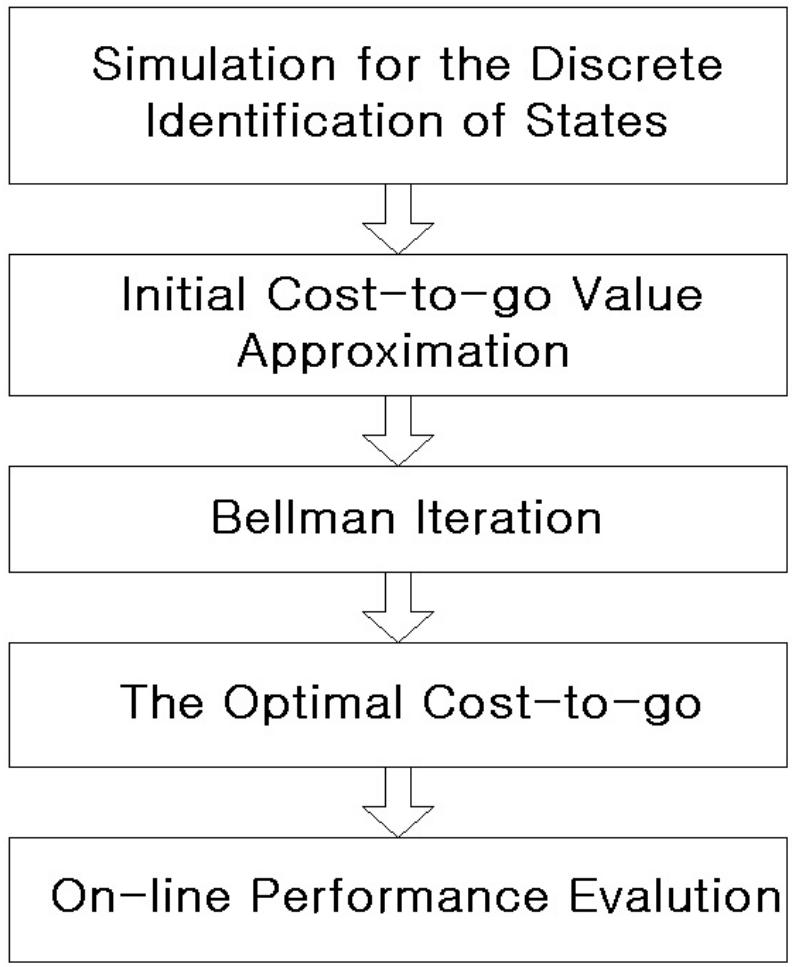
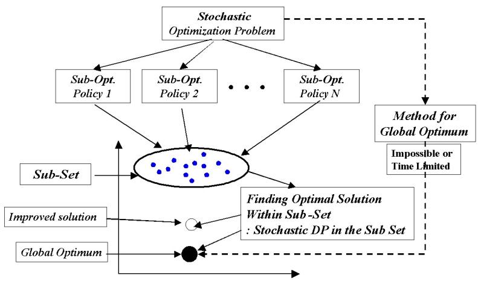
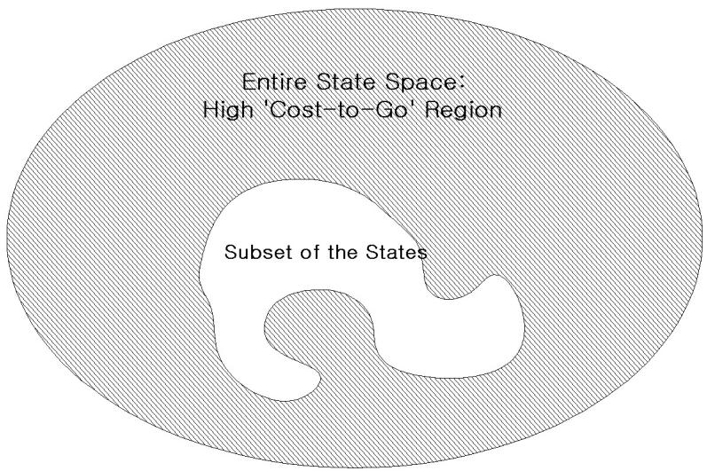
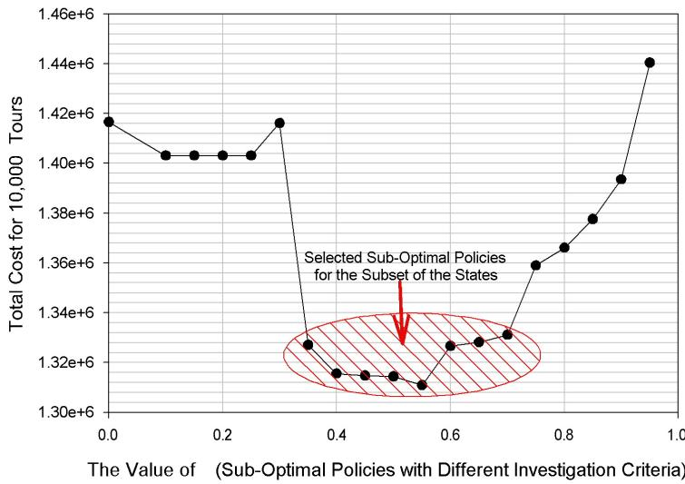
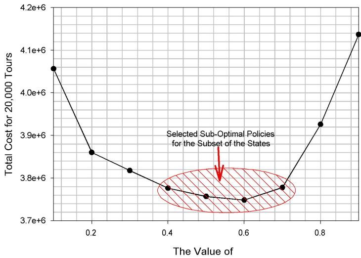

An Algorithmic Framework for Improving Heuristic Solutions Part

# II : A New Version of the Stochastic Traveling Salesman Problem

Jaein Choi, Jay H. Lee∗and Matthew J. Realff

Center for Process Systems Engineering, School of Chemical Engineering,

Georgia Institute of Technology, Atlanta, Georgia 30332

# Abstract

The algorithmic framework developed for improving heuristic solutions of the new version of deterministic TSP [Choi et al., 2002] is extended to the stochastic case. To verify the algorithmic framework for the stochastic case, a new variant of the stochastic TSP with an optional task, in which key parameters(cost matrix) of the problem change according to an underlying Markov model, is introduced in this work as a prototypical stochastic optimization problem. The optional task is the performing of an “investigation” which improves the information for decision making at some cost. The stochastic dynamic programming is performed in the subset of the states that is obtained by simulating a set of heuristics. The proposed algorithmic framework finds the approximated optimal cost-to-go only for the states in the subset. This reduces the computational time dramatically compared to the stochastic DP in the entire states space, without significant loss in the solution quality. The results show that the algorithmic framework also works efficiently for stochastic problems by improving the heuristic policies for making decisions for different realizations of the Markov process.

Keywords: Stochastic Dynamic Programming, Markov Chain, Scheduling and Planning, Combinatorial Optimization, Conditional Tasks, Heuristics, Traveling Salesman Problem

# 1 Introduction

Planning and scheduling problems for chemical production systems are a major focus of study as companies seek to lower operating costs with minimal capital investment. A significant challenge is to represent and account for the diverse sources of uncertainty that arise as the scope and complexity of the problem expand [Shah, 1998]. These uncertainties include processing time variations, rush orders, failed batches, equipment breakdowns, market trends and every problem will have its own unique set of uncertainties. The intractability of the general problem has led to the formulation and solution of deterministic scheduling and planning problems in chemical production systems [Pinto and Grossmann, 1998, Ierapertritou and Floudas, 1998a, Ierapertritou and Floudas, 1998b, Recklaitis, 1992, Kondili et al., 1993, Shah et al., 1993]. The progress in solving problems that involve uncertainty, [Subramanian et al., 2001, Vin and Ierapetritou, 2001, Harding and F Petkov and Maranas, 1997], has been limited to synthesizing solutions that are robust to the uncertainty rather than reactive to the changing conditions as they are realized, with the exception of [Subramanian et al., 20 There is little work on how to systematically use the information gained during the execution of the partial schedule proactively to influence future scheduling decisions based on revised information, [Choi et al., 2001]. Therefore, developing a systematic way to model uncertainties in the process and applying it to find the optimal solution, is one of the most challenging issues in the scheduling and planning area. One type of uncertainty is within the process itself, such as the quality of a batch at an intermediate stage. In this case, additional measurements of current process conditions or batch properties could be made to enable better downstream processing and batch-to-batch control. These measurements are labelled optional tasks [Choi et al., 2002] and may trigger new processing tasks to be performed on batches that do not meet specifications. Scheduling or planning problems involving these optional tasks and stochastic parameters require the solution of decision problems that have significant combinatorial complexity, layering the decisions about whether and when to perform the optional tasks on top of other decisions. Furthermore, the dynamically evolving nature of information for decision making makes the problem multi-stage in nature, as the new information state can be used to revise existing scheduling or planning decisions. The purpose of this paper is three-fold. First we extend the algorithmic framework for improving heuris

tic solutions developed and verified for the deterministic case in the companion paper [Choi et al., 2002] to the stochastic case. Second, we introduce a new version of TSP, stochastic TSP with an optional task(investigation) for reducing uncertainties. Several variants of the original deterministic TSP have been studied in the Chemical Engineering area and related to certain batch scheduling problems [Penky and Miller, Pekny et al., 1993, Gooding et al., 1994]. The original TSP itself represents the parallel flowshop scheduling problem because the scheduling problem can be transformed into an extension of the original TSP, the generalized TSP(GTSP)[Gooding et al., 1994], which can be transformed back into the original TSP [Noon and Bean, 1993]. Hence, in this study, we add a stochastic component and an optional task to the original deterministic (symmetric) TSP to make it representative of scheduling problem with uncertainties. Third, a discrete-time Markov process is introduced as a way to model uncertainties in key parameters. Besides developing an efficient solution method, developing proper ways to represent uncertainties in the formulation of optimization problems is also very important for practical applications. In previous literature uncertainties in scheduling problems were introduced in two different ways, with scenario based representation [Vin and Ierapetritou, 2001, Subrahmanyam et al., 1994] and with probability distribution functions [Harding and Floudas, 1997, Petkov and Maranas, 1997, Subramanian et al., 2001]. In both approaches, solution methods were based on MILP(or MINLP) formulations for deterministic equivalent or stochastic models of the problems. However, these formulations have some inherent limitation for solving complex stochastic scheduling problems because it only considers a “snapshot” of uncertain parameters by means of their expected values. Even with the reactive scheduling framework in which the expected values can be updated, this inherent limitation cannot be removed. Some recent literature [Yin et al., 2002, Kushner and Yin, 1997] point to the fact that Markov process is an attractive alternative for representing uncertainties in planning, scheduling and supply chain problems. Suppose the uncertain parameters are changing at each time unit according to some underlying probability distribution, unknown to the decision maker. Some of uncertain parameters are strongly correlated(i.e. processing time and processing cost) so that they vary together as a set. With the Markov process representation, DP, which theoretically guarantees the optimal solution, is the natural solution method for the problem since the use of Markov process automatically implies that the problem has stage-wise characteristics.

The progression of the paper is as follows. Section 2 will present the details of the stochastic TSP with an optional task. Section 3 contains the possible solution methods for the given problem, stochastic DP, suboptimal heuristic policies, and the proposed method, stochastic DP in the subset of the states. Section 4 will verify the efficacy of the proposed method with an illustrative example. This is followed by some concluding remarks and future works in section 5.

# 2 Stochastic Version of TSP with an Optional Task

In the past decade, the stochastic version TSP has been introduced by modeling each cost element as a random variable [Rhee and Talagrand, 1989, Percus and Martin, 1999]. In this work, we address a new version of stochastic TSP in which several cost modes, set of the cost elements, are changing stochastically according to a Discrete-Time Markov Process. A new feature, an optional task [Choi et al., 2002], is introduced to the new version of stochastic TSP to represent an opportunity to investigate the identity of the current cost mode.

# 2.1 Problem Description

A salesman is assigned to travel a set of $N$ cities $H$ times. If the cost matrix of the problem is deterministic, he need to follow the same route obtained by the deterministic cost matrix at every tour to minimize the total traveling cost for $H$ tours. Instead, suppose that the cost matrix evolves tour to tour according to a given Markov process. Suppose there are $M$ cost matrices with $N \times N$ cost elements(for a $N$ -city TSP). Each matrix represents one possible cost mode, in which the salesman must find the optimal tour, which can be different for different cost modes. At the end of each tour or stage, one of the $M$ modules is chosen according to the Markov process, which is unknown to the salesman. The transition probabilities from a mode $_ i$ to $j$ , $P _ { i j }$ , thus form an $M \times M$ transition matrix, which describes the governing dynamics of the cost mode change. We make two further refinements to this model:

• Unobserved Stochastic Process : The salesman does not know which cost mode he will experience on any given tour. However, he is informed of the cost matrix that governs his first tour.

• Cost Mode Investigation : Before starting a tour, the salesman has the option to determine the current cost mode by paying an investigation fee, $\beta$ .

The investigation option complicates the decision problem, affecting the choice of optimal tours at subsequent stages. Therefore, to minimize the total cost of traveling over a certain number of tours, the tours before which the investigation is to be performed become important decisions. Frequent investigation will enable an accurate decision for the current tour but the total cost may be increased by the high investigation fees. On the other hand, too rare investigation may increase the total cost, because of the inaccurate decisions due to the increased uncertainty.

# 3 Solution Methods for The Stochastic TSP

For the given problem, stochastic dynamic programming [Bertsekas, 1995, Bertsekas and Tsitsiklis, 1996] is an exact solution method, which can guarantee the optimal expected cost over a given horizon. However, stochastic DP requires significant computation to obtain the optimal cost-to-go value for each state because the dimension of the state increases due to the necessary information state introduced by the uncertainty of the system. The Bellman iteration(cost iteration) has an exponential complexity in the number of states. In this section, we develop suboptimal policies of high computational efficiency as well as the stochastic DP for the given problem. The role of suboptimal policies corresponds to the “heuristics” for the deterministic TSP developed in our previous work [Choi et al., 2002].

# 3.1 Stochastic Dynamic Programming

To develop an appropriate stochastic DP formulation for the given problem, all the necessary information of the problem must be represented explicitly in the state. The key information is the conditional probability

of each cost mode at each tour. The information state ${ \hat { x } } ( k )$ is defined as the conditional probability of the ‘cost mode’ at tour k before the decision.

$$
\begin{array} { r } { \hat { x } ( k ) = \left[ \begin{array} { c } { P r \{ C M _ { 1 } \} } \\ { P r \{ C M _ { 2 } \} } \\ { \vdots } \\ { P r \{ C M _ { M } \} } \end{array} \right] } \end{array}
$$

where $P r \{ C M _ { i } \}$ denotes the conditional probability of realizing ’cost mode’ $i$ . For the state ${ \hat { x } } ( k )$ defined in (1), the state transition rules can be derived from the transition matrix of the Markov chain. With the investigation at step $k$ , we set the investigation indicator $\delta ( k ) = 1$ and the information state for the tour decision changes to $\hat { z } ( k )$ , which represents the exact knowledge of the cost mode at tour $k$ be the tour, as a benefit of the investigation. If the current cost mode is $C _ { i }$ ,

$$
\hat { z } ( k ) = e _ { i }
$$

where, $e _ { i }$ is $M \times 1$ elementary vector with all zero elements except 1 in $i$ th position. For example, if the cost mode is 3 at tour $k$ , the information state is reset to $[ \mathbf { \Gamma } _ { 0 } \mathbf { \Gamma } _ { 0 } \mathbf { \Gamma } _ { 1 } \dots \mathbf { \Gamma } _ { 0 } ] ^ { T }$ . If the particular realization of the cost mode at the time of investigation is $i$ , then the next state ${ \hat { x } } ( k + 1 )$ is calculated by following Markov transition equation.

$$
\hat { x } ( k + 1 ) = P ^ { T } \hat { z } ( k )
$$

On the other hand, without investigation at time $k ( \delta ( k ) = 0$ ),

$$
\hat { z } ( k ) = \hat { x } ( k ) = P ^ { T } \hat { x } ( k - 1 )
$$

This is the information state propagates by the same transition rule of the equation (3)

The overall procedures of the stochastic DP are summarized in the following Figure 1.

The first step is realizing the random cost mode for simulation purposes. The realization of the random cost mode is started by choosing an arbitrary cost mode at time 0 and then evolving the cost mode according to the state transition probability matrix $P$ . For sufficiently long cost mode sequences, the overall portion of each cost mode should be same according to the limiting probability of $P$ , denoted by $P ^ { \infty }$ . However, for different realizations the cost mode sequences are different. The next step of the stochastic DP is to identify all the possible discrete values of the state. The identification can be performed by the simulation of a suboptimal policy designed to visit all the states. As results of the simulation of $\nu$ realizations of the cost modes, we can obtain following data sets, $S ^ { d a t a }$ and $C ^ { d a t a }$ :

$$
S ^ { d a t a } = \left[ \begin{array} { c } { { \hat { x } ^ { d a t a } ( 1 ) } } \\ { { } } \\ { { \hat { x } ^ { d a t a } ( 2 ) } } \\ { { } } \\ { { \vdots } } \\ { { } } \\ { { \hat { x } ^ { d a t a } ( \nu ) } } \end{array} \right] ~ , ~ C ^ { d a t a } = \left[ \begin{array} { c } { { \phi ^ { d a t a } ( 1 ) } } \\ { { } } \\ { { \phi ^ { d a t a } ( 2 ) } } \\ { { } } \\ { { \vdots } } \\ { { \phi ^ { d a t a } ( \nu ) } } \end{array} \right]
$$

where, $S ^ { d a t a }$ is the set of visited states $( \hat { x } ^ { d a t a } ( k ) )$ by the simulation and $C ^ { d a t a }$ contains the corresponding traveling c $\operatorname { \mathrm { \cdot o s t s } } ( \phi ^ { d a t a } ( k ) )$ for the states in $S ^ { d a t a }$ . Once $S ^ { d a t a }$ and $C ^ { d a t a }$ are obtained, we can calculate the cost-to-go values for all the states in, $S ^ { d a t a }$ by following the state trajectories and summing the Cost-to-Go over an approximation horizon of $H$ with the discounting factor $\alpha < 1$ .

$$
\hat { J } ( \hat { x } ^ { d a t a } ( k ) ) = \sum _ { j = 0 } ^ { H } \alpha ^ { j } \phi ^ { d a t a } ( k + j )
$$

Then, we have the approximated cost-to-go set, $J ^ { d a t a }$ .

$$
J ^ { d a t a } = \left[ \begin{array} { c } { { \hat { J } ( \hat { x } ^ { d a t a } ( 1 ) ) } } \\ { { } } \\ { { \hat { J } ( \hat { x } ^ { d a t a } ( 2 ) ) } } \\ { { } } \\ { { \vdots } } \\ { { } } \\ { { \hat { J } ( \hat { x } ^ { d a t a } ( ( \nu - H ) ) } } \end{array} \right]
$$

Because of the large value of $\nu$ needed to cover the entire set of possible states, the same state can be visited in many stages by the simulation. After eliminating redundant states in the set $S ^ { d a t a }$ , the following set of

states, $S$ can be obtained.

$$
S = \left[ \begin{array} { c } { { { \hat { x } } ( 1 ) } } \\ { { { \hat { x } } ( 2 ) } } \\ { { } } \\ { { \vdots } } \\ { { { \hat { x } } ( n ) } } \end{array} \right] ~ ,
$$

Let $L ( i )$ be the number of $\hat { x } ^ { d a t a } ( k )$ satisfying the condition, $\hat { x } ^ { d a t a } ( k ) = \hat { x } ( i )$ , where, $k$ is the index of set $S ^ { d a t a }$ and $_ i$ is the index of set $S$ . Then the expected cost-to-go for the state ${ \hat { x } } ( i )$ is obtained by averaging these data.

$$
\hat { J } ( \hat { x } ( i ) ) = \frac { 1 } { L ( i ) } \{ \sum _ { \ell = 1 } ^ { L ( i ) } \hat { J ( i ) } ( \hat { x } ^ { d a t a } ( \ell , i ) ) \}
$$

Where $\hat { x } ^ { d a t a } ( \ell , i )$ represents the $\ell$ th data point of $\hat { x } ^ { d a t a } ( k ) = \hat { x } ( i )$ . As a results of the above calculation, we obtain the first approximation of the cost-to-go values, which will be used as initial values in the Bellman iteration, for the states $\hat { x } ( i )$ in the set $S$ .

$$
J = \left[ \begin{array} { c } { \hat { J } ( \hat { x } ( 1 ) ) } \\ { } \\ { \hat { J } ( \hat { x } ( 2 ) ) } \\ { } \\ { \vdots } \\ { \hat { J } ( \hat { x } ( n ) ) } \end{array} \right] .
$$

# 3.1.2 Bellman Iteration

The Bellman equation for the given state ${ \hat { x } } ( k )$ can be formulated as:

$$
\begin{array} { c c l } { { J ^ { * } ( \hat { x } ( k ) ) } } & { { = } } & { { \displaystyle \operatorname* { m i n } _ { \delta ( k ) \in [ 0 , 1 ] } E \{ \phi ( \hat { z } ( k ) ) + \beta \delta ( k ) } }  \\ { { } } & { { } } & { { } } \\ { { } } & { { + } } & { { \alpha J ^ { * } ( \hat { x } ( k + 1 ) ) | \hat { x } ( k ) \} } } \end{array}
$$

$J ^ { * } ( { \hat { x } } ( k ) )$ is the optimal cost-to-go for the state ${ \hat { x } } ( k )$ and $\phi ( \hat { z } ( k ) )$ is the cost of the tour $k$ , which will be chosen based on $\hat { z } ( k )$ obtained after the investigation decision. Based on the above equation, we propose the following Bellman iteration scheme.

1. Set ${ \hat { J } } ^ { 1 } = { \hat { J } } ( { \hat { x } } ( k ) )$ , for $k = 1 , 2 , . . . , n$ , where ${ \hat { J } } ( k )$ is in the set $\jmath$ in the equation (10)

2. Repeat following equation (12) for each ${ \hat { x } } ( k )$ in $S$ , until ${ \hat { J } } ^ { i }$ is converged (i.e. $\| \hat { J } ^ { i + 1 } ( \hat { x } ( k ) ) - \hat { J } ^ { i } ( \hat { x } ( k ) ) \| <$ $\varepsilon$ ), for $k = 1 , 2 , . . . , n$

$$
\begin{array} { r c l } { { \hat { J } ^ { i + 1 } ( \hat { x } ( k ) ) } } & { { = } } & { { \displaystyle \operatorname* { m i n } _ { \delta ( k ) ^ { i } \in [ 0 , 1 ] } E \{ \phi ( \hat { z } ( k ) ) + \beta \delta ( k ) ^ { i } } }  \\ { { } } & { { } } & { { } } \\ { { } } & { { + } } & { { \alpha \hat { J } ^ { i } ( \hat { x } ( k + 1 ) ) | \hat { x } ( k ) \} } } \end{array}
$$

Although the cost-to-go update equation in (12) looks simple, the update is quite subtle. The detailed calculation procedures for the equation (12) can be derived using the properties of expectation operator $E$ and conditional probability.

# Detail Calculation Procedures to Obtain $\hat { J } ^ { i + 1 } ( \hat { x } ( k ) )$

1. For $\delta ^ { i } ( k ) = 0$

$$
\begin{array} { l } { { \{ \hat { J } ^ { i + 1 } ( { \hat { x } } ( k ) ) | \delta ^ { i } ( k ) = 0 \} } } \\ { { { } } } \\ { { = E \{ \phi ( { \hat { z } } ( k ) ) + \alpha \hat { J } ^ { i } ( { \hat { x } } ( k + 1 ) ) | { \hat { x } } ( k ) \} } } \end{array}
$$

• Calculating $E \{ \phi ( \hat { z } ( k ) ) | \hat { x } ( k ) \}$ : The current tour must be obtained for the given condition ${ \hat { x } } ( k )$ . With $\delta ^ { i } ( k ) = 0$ , $\hat { z } ( k ) = \hat { x } ( k )$ and the expected cost matrix $\hat { C }$ ) can be calculated by the following equation.

$$
\hat { C } = \sum _ { i = 1 } ^ { M } \hat { x } _ { i } ( k ) C _ { i }
$$

Then, the optimal t $\mathrm { o u r } ( t o u r ^ { * } ( k ) )$ for the state ${ \hat { x } } ( k )$ can be obtained by solving a single TSP with the $\hat { C }$ obtained from the equation (14). The expected current cost can be calculated with the given conditional probabilities, ${ \hat { x } } ( k )$ , of the cost modes.

$$
\begin{array} { r l r l } { E } & { } & & { \displaystyle \{ \phi ( \hat { z } ( k ) ) | \hat { x } ( k ) \} } \\ & { } & & { = \displaystyle \sum _ { i = 1 } ^ { M } \hat { x } _ { i } ( k ) \{ \phi ( t o u r _ { k } ^ { * } ) | C _ { i } \} } \end{array}
$$

which means $C _ { i }$ is realized with probability ${ \hat { x } } _ { i } ( k )$ .

• Calculating $E \{ \alpha \hat { J } ^ { i } ( \hat { x } ( k + 1 ) ) | \hat { x } ( k ) \}$ :

$E \{ \alpha \hat { J } ^ { i } ( \hat { x } ( k + 1 ) ) | \hat { x } ( k ) \} = \alpha \hat { J } ^ { i } ( \hat { x } ( k + 1 ) )$ , because the approximate cost-to-go term ${ \hat { J } } ^ { i } ( { \hat { x } } ( k + 1 ) )$ is a constant value for a given $\hat { x } ( k + 1 )$ . Hence, we can take the cost-to-go term out of the expectation summation. When $\delta ^ { i } ( k ) = 0$ . The next state, ${ \hat { x } } ( k + 1 )$ is calculated by the state transition rule in the equation (3).

$$
\hat { x } ( k + 1 ) = P ^ { T } \hat { x } ( k )
$$

Find the next state in the set $S$ , $\hat { x } ( l ) = \hat { x } ( k + 1 )$ for ${ \hat { x } } ( l ) \in S$ . Then,

$$
{ \hat { J } } ^ { i } ( { \hat { x } } ( k + 1 ) ) = { \hat { J } } ( { \hat { x } } ( l ) )
$$

Combining the equation (15) and (16), we can calculate $\hat { J } _ { \delta ^ { i } ( k ) = 0 } ^ { i + 1 } ( \hat { x } ( k ) )$

2. For $\delta ^ { i } ( k ) = 1$

$$
\begin{array} { l } { { \{ \hat { J } ^ { i + 1 } ( { \hat { x } } ( k ) ) | \delta ^ { i } ( k ) = 1 \} = E \{ \phi ( { \hat { z } } ( k ) ) } }  \\ { { { } } } \\ { { + \beta + \alpha { \hat { J } ^ { i } } ( { \hat { x } } ( k + 1 ) ) | { \hat { x } } ( k ) \} } } \end{array}
$$

• Calculating $E \{ \phi ( \hat { z } ( k ) ) | \hat { x } ( k ) \}$ :

After an investigation, $\delta ^ { i } ( k ) = 1$ , the state $\hat { z } ( k )$ can be one of $e \ell$ for $\ell = 1 , 2 , . . . , M$ . Because ${ \hat { x } } ( k )$ is the probability vector of the cost modes before the investigation, the probability of cost mode $\ell$ after the investigation( $P r ( \hat { z } ( k ) = e _ { \ell } )$ ) is given by ${ \hat { x } } _ { \ell } ( k )$ . Then, the expected current cost for the given ${ \hat { x } } ( k )$ is,

$$
E \{ \phi ( \hat { z } ( k ) ) | \hat { x } ( k ) \} = \sum _ { \ell = 1 } ^ { M } \hat { x } _ { \ell } ( k ) \phi ( e _ { \ell } )
$$

where $\phi ( e _ { \ell } )$ represents the tour cost for the cost mode $\ell$ .

• Calculating $E \{ \alpha \hat { J } ^ { i } ( \hat { x } ( k + 1 ) ) | \hat { x } ( k ) \}$ :

Once the investigation is performed, $\hat { z } ( k )$ becomes one of the e\`s with probability ${ \hat { x } } _ { \ell } ( k )$ . Therefore, $\hat { x } ( k + 1 ) = P ^ { T } e _ { \ell }$ with the probability ${ \hat { x } } _ { \ell } ( k )$ .

$$
\begin{array} { l } { { \displaystyle \alpha E \{ \hat { J } ^ { i } ( \hat { x } ( k + 1 ) ) | \hat { x } ( k ) \} } } \\ { ~ } \\ { { \displaystyle = \alpha \sum _ { \ell = 1 } ^ { M } \hat { x } _ { \ell } ( k ) \hat { J } ^ { i } ( P ^ { T } e _ { \ell } ) } } \end{array}
$$

In the above equation, it is obvious that $P ^ { I ^ { \prime } } e _ { i } \in S$ because all $e \ell$ s are visited by the selected suboptimal policy through the large number of cost mode realizations and all of their next states, $P ^ { I } e _ { \ell }$ are also visited by the suboptimal policy.

$\hat { J } _ { \delta ^ { i } ( k ) = 1 } ^ { i + 1 } ( \hat { x } ( k ) )$

3. Decision for $\hat { J } ^ { i + 1 } ( \hat { x } )$ :

With the results of step (1) and (2), the equation (12) simply becomes as following,

$$
\begin{array} { r l } & { \hat { J } ^ { i + 1 } ( \hat { x } ( k ) ) } \\ & { = \operatorname* { m i n } \{ \hat { J } _ { \delta ^ { i } ( k ) = 0 } ^ { i + 1 } ( \hat { x } ( k ) ) , \hat { J } _ { \delta ^ { i } ( k ) = 1 } ^ { i } ( \hat { x } ( k ) ) \} } \end{array}
$$

# 3.1.3 On-Line Performance Evaluation

The off-line obtained optimal cost-to-go $J ^ { * }$ can be used for on-line decision making. Here we evaluated the performance of the resulting policy for different sets of cost mode realization though stochastic simulation. The policy can be described as follows.

1. At the time $k$ , solve,

$$
\begin{array} { r l } & { J ^ { * } ( \hat { z } ( k ) ) = \underset { \delta ( k ) \in [ 0 , 1 ] } { \operatorname* { m i n } } E \{ \phi ( \hat { z } ( k ) ) } \\ & { } \\ & { + \beta \delta ( k ) + \alpha J ^ { * } ( \hat { x } ( k + 1 ) ) | \hat { x } ( k ) \} } \end{array}
$$

where, $J ^ { * }$ is the optimal cost-to-go from the Bellman iteration in 3.1.2.

(a) Calculate,

$$
\begin{array} { l } { { J _ { \delta ( k ) = 0 } ^ { * } ( \hat { x } ( k ) ) = E \{ \phi ( \hat { z } ( k ) ) } }  \\ { { { } } } \\ { { + \alpha \hat { J } ^ { * } ( \hat { x } ( k + 1 ) ) | \hat { x } ( k ) \} } } \end{array}
$$

as derived for $\hat { J } _ { \delta ( k ) = 0 } ^ { i + 1 } ( \hat { x } ( k ) )$ as in the equation (13).

(b) Calculate,

$$
\begin{array} { r } { J _ { \delta ( k ) = 1 } ^ { * } ( \hat { x } ( k ) ) = E \{ \phi ( \hat { z } ( k ) ) } \\ { \quad \quad } \\ { + \beta + \alpha \hat { J } ^ { * } ( \hat { x } ( k + 1 ) ) | \hat { x } ( k ) \} } \end{array}
$$

as derived for $\hat { J } _ { \delta ( k ) = 1 } ^ { i + 1 } ( \hat { x } ( k ) )$ in the equation (17).

(c) Compare $J _ { \delta ( k ) = 1 } ^ { * }$ and $J _ { \delta = 0 } ^ { * }$ and choose $\delta ( k )$

2. Depending on $\delta ( k )$ , obtain $\hat { z } ( k )$ and solve a deterministic TSP with the expected cost matrix conditioned by ${ \hat { x } } ( k )$ to determine the current tour.

3. Evaluate the real cost and store.

4. Update ${ \hat { x } } ( k + 1 )$ from $\hat { z } ( k )$ according to the state transition rules in the section 3.2.

5. $k = k + 1$ and repeat from step (1)

The on-line performance of the optimal policy with the optimal cost-to-go $J ^ { * }$ should be robust for any set of cost mode realizations because it is obtained by considering the underlying stochastic characteristic of the problem.

# 3.2 Suboptimal Policies

Two suboptimal policies have been developed for the given problem. One is ‘no investigation policy’ which repeats a same traveling route for every tour. The other is an ‘investigation policy’ based on a threshold on uncertainty in the cost mode.

# 3.2.1 No Investigation Policy

The first suboptimal policy repeats the same traveling route optimal in the sense of the mean traveling cost. One property of a Markov chain where every state is reachable and there are no attractor states is the existence of limiting probability distribution over the states $P ^ { \infty }$ . $P ^ { \infty }$ can be found by calculating the steady state of the transition equation. $P ^ { \infty }$ represents the long-run distribution of the cost modes. Thus, if the salesman follows the tour(mtour) obtained from the mean cost matrix with the limiting probability, his long-run average performance without investigation could be optimized. When there are $M$ cost modes, the optimal tour(mtour) can be determined by the deterministic optimization with the ‘mean cost matrix $( C )$ ’,

which is

$$
\overline { { C } } = \sum _ { i = 1 } ^ { M } P _ { i } ^ { \infty } C _ { i }
$$

and

$$
m t o u r = \arg \left( \operatorname* { m i n } _ { m t o u r } \parallel ( \phi | \overline { { C } } ) \parallel \right)
$$

where, $C _ { i }$ is the cost matrix for cost mode $_ i$ . Although this policy seems reasonable, it is far from being the optimal policy because the salesman cannot realize the potential benefit of accurate information provided by the investigation opportunity.

# 3.2.2 Investigation Policies

Without investigation, the salesman’s knowledge of which cost mode he will encounter ${ \hat { x } } ( k )$ ) eventually converges to the limiting probability, $P ^ { \infty }$ . When ${ \hat { x } } ( k )$ is close to $P ^ { \infty }$ , the salesman has only limited information about the cost mode because of the diluted probabilities of the cost modes in ${ \hat { x } } ( k )$ . To decide the proper investigation frequency, we define following variable, $\gamma ( k )$ as an approximate indicator of the uncertainty.

$$
\gamma ( k ) = \| \hat { x } ( k ) \| _ { \infty }
$$

The maximum value of $\gamma ( k )$ is $^ { 1 }$ if the salesman executes the investigation option at step $k$ and it decreases as the salesman proceeds from tour to tour without investigation.

• Investigation Criteria : The salesman decides to investigate when $\gamma ( k )$ is less than a certain constant $\theta$ .

$$
\delta ( k ) = 1 \quad , \mathrm { i f } \ \gamma ( k ) < \theta
$$

In equation (27), if the value of $\theta$ is close to $1$ , the salesman investigate very frequently. Thus, suboptimal policies can be generated by varying the parameter $\theta$ leading to different frequencies of investigation.

• Tour Decision : For given state ${ \hat { x } } ( k )$ , the expected cost matrix $( \hat { C } )$ and the optimal $\mathrm { t o u r } ( t o u r ^ { * } ( k ) )$ for the expected cost matrix is calculated by following equation.

$$
\begin{array} { r } { \hat { C } ( k ) = \displaystyle \sum _ { i = 1 } ^ { M } \hat { z } _ { i } ( k ) C _ { i } } \\ { t o u r ^ { * } ( k ) = \arg \Big ( \operatorname* { m i n } \big \| \big ( \phi | \hat { C } ( k ) \big ) \big \| \Big ) } \end{array}
$$

The equations (28) and (29) reflect the benefit of investigation in the decision of the tour at time $k$ because, with the state transition rules in (2) and (3), if the investigation is performed at time $k$ , the $\hat { C }$ in (28) becomes exactly same as the cost matrix of the particular realization of the cost mode at time $k$ . Nevertheless, we have not found a systematic way to determine the optimal value of $\theta$ . In addition, it is unlikely that a rule of this form is optimal.

# 3.2.3 Investigation Policy for Entire State Identification

As mentioned in 3.1, to start Bellman iteration for the stochastic DP, the entire state must be given with an initial cost-to-go value for each state. The suboptimal policy proposed in section 3.2.2 can be modified to visit all the possible states by changing the investigation criteria.

• Investigation Criteria : The salesman decides to investigate when ${ \hat { x } } ( k )$ becomes same as the limiting probability of the state transition probability matrix, $P ^ { \infty }$ .(within some small tolerance), i.e.

$$
\delta ( k ) = 1 \quad , \mathrm { i f } \ \left| { \hat { x } } ( k ) - P ^ { \infty } \right| < \epsilon
$$

If the investigation is performed at time $k$ when ${ \hat { x } } ( k ) \simeq P ^ { \infty }$ , the state ${ \hat { x } } ( k )$ is reset to $\hat { z } ( k )$ according to the equation (2) which is then propagated again until it reaches $P ^ { \infty }$ . Hence, using the investigation criteria in (30), this suboptimal policy can visit all of the accessible states over the course of many simulations.

# 3.3 Stochastic DP in the Subset of the States

The idea of finding solution in the subset of the state applied for the deterministic TSP can be extended to replace the full Stochastic DP derived in 3.1. From the simulation results of reasonable suboptimal policies,

the ‘good’ states can be identified and patched to obtain a subset of the states that can be searched rigorously in reasonable time. The overall idea of the proposed method is shown in Figure 2.

The proposed method can be derived from the modification of the stochastic DP method shown in 3.1. The three important modifications can be summarized as follows:

# 1. Simulation of Heuristics and Subset Identification:

Instead of the suboptimal policy shown in 3.2.3, the suboptimal policies shown in 3.2.2 are used for simulation to find ‘good’ states with different value of the investigation criteria, $\theta$ . The ‘good’ states are found by evaluating different suboptimal policies in terms of the total cost of tours over a number of stages. The first cost-to-go approximation procedure for the proposed method is exactly same as shown in 3.1.1 except the $S ^ { d a t a }$ and $C ^ { d a t a }$ in the equation (5) consist of the visited states and their current costs by the selected suboptimal policies.

# 2. Bellman Iteration for Disconnected States:

In the subset of the states, for some ${ \hat { x } } ( k )$ , it is possible that the next state of ${ \hat { x } } ( k )$ is not in the set of the state $S$ because the subset of the states are extracted from the selected suboptimal policies. In this case, the selected suboptimal policies execute the investigation option for the state following ${ \hat { x } } ( k )$ . As a result of this investigation, the intermediate state following $\hat { z } ( k )$ is set to $e _ { i }$ , therefore ${ \hat { x } } ( k + 1 )$ obtained by the state transition rule for the case $\delta ^ { i } ( k ) = 0$ will never appear in $S$ . Therefore, for those states, the investigations should be performed to approximate the cost-to-go inside the subset. To avoid any state transition to the states outside the subset, we can assign large cost-to-gos for all of the states outside the subset as pictorially described in Figure 3.

3. Cost-to-Go Barrier for the On-line Performance Evaluation:

Before the on-line performance evaluation procedure shown in 3.1.3 is executed, high values of costto-go must be assigned to the unexplored states as described in Figure 3. This leads to a high cost barrier to prevent visiting unexplored states during the on-line decision making.

The reduction of the number of states by the proposed method can dramatically decrease the computational time for the Bellman iteration, which is the major computational load of the stochastic DP.

# 4 Illustrative Example : Stochastic TSP with An Investigation Option

The proposed method was verified for 2 different stochastic TSP examples, small(5 cost modes, 5 cities) and larger(20 cost modes, 5 cities) size of Stochastic TSPs. According to the definition of the state in (1), the dimension of state is same as the number of cost modes. Hence, although the number of cities in both examples is 5, the complexity of the larger one(20 cost modes) is much higher than that of small one due to large state space. The choice of a very small TSP was made to avoid large computational costs for each step and would not affect the overall conclusions with the stochastic part of the problem.

# 4.1 Stochastic TSP Example 1 : 5 Cost Modes, 5 Cities

Obviously, the first example is a very simple but we choose this as we wanted to compare the solutions obtained by the proposed method with the optimal solution. The 5 symmetric cost matrices that represent corresponding cost modes consists of cost elements generated by realizing uniformly distributed random variables ranged from 10 to 70 as shown in equation (31)-(35).

$$
\mathrm { C o s t ~ M o d e ~ 1 } = \left[ \begin{array} { l l l l l } { 0 } & { 2 9 } & { 4 5 } & { 1 6 } & { 3 8 } \\ { 2 9 } & { 0 } & { 2 5 } & { 2 0 } & { 1 3 } \\ { 4 5 } & { 2 5 } & { 0 } & { 1 3 } & { 2 1 } \\ { 1 6 } & { 2 0 } & { 1 3 } & { 0 } & { 4 6 } \\ { 3 8 } & { 1 3 } & { 2 1 } & { 4 6 } & { 0 } \end{array} \right]
$$

$$
{ \mathrm { C o s t ~ M o d e ~ 4 } } = { \left[ \begin{array} { l l l l l } { 0 } & { 1 9 } & { 3 8 } & { 3 0 } & { 2 5 } \\ { } & { } & { } & { } & { } \\ { 1 9 } & { 0 } & { 2 6 } & { 1 8 } & { 3 7 } \\ { } & { } & { } & { } & { } \\ { 3 8 } & { 2 6 } & { 0 } & { 5 6 } & { 4 3 } \\ { } & { } & { } & { } & { } \\ { 3 0 } & { 1 8 } & { 5 6 } & { 0 } & { 2 5 } \\ { } & { } & { } & { } & { } \\ { 2 5 } & { 3 7 } & { 4 3 } & { 2 5 } & { 0 } \end{array} \right] }
$$

$$
{ \mathrm { C o s t ~ M o d e ~ 5 = } \left[ \begin{array} { l l l l l } { 0 } & { 2 2 } & { 3 0 } & { 1 6 } & { 1 9 } \\ { 2 2 } & { 0 } & { 4 3 } & { 3 2 } & { 2 3 } \\ { 3 0 } & { 4 3 } & { 0 } & { 3 1 } & { 4 4 } \\ { 1 6 } & { 3 2 } & { 3 1 } & { 0 } & { 6 5 } \\ { 1 9 } & { 2 3 } & { 4 4 } & { 6 5 } & { 0 } \end{array} \right] }
$$

Another important parameter, the transition probability matrix $P$ of the underlying Markov chain, is given by the following 5 by 5 matrix.

The corresponding limiting probability, $P ^ { \infty }$ , of $P$ is 0.1125 0.2326 0.2321 0.3157 0.1069 and the investigation cost $\beta$ is given as 60. For simulation of the suboptimal policies, 10,000 cost mode sequences are generated according to the underlying Markov chain. Figure 4 shows the performance of several suboptimal policies with different values of $\theta$ . The suboptimal policies inside the shaded area of Figure 4 are used for extracting the subset of the states. The stochastic DP using the entire state space was executed and the total number of states for the given problem turned out to be 315. The subset of the states contains 46 elements determined by the proposed method. The total cost of 10,000 tours for the first realization of the cost mode sequences are calculated by the on-line performance evaluation using the 2 different optimal cost-to-go values obtained by the stochastic DP in the entire space and just in the subset of the states. The optimal solution by the stochastic DP in the entire space is 1303591 and the solution obtained by the proposed method is 1306110 which is a 65.6% improvement of the best of the suboptimal solutions, 1310927. To verify the robustness of the cost-to-go obtained by the proposed methods, the on-line performance evaluation was performed for different sets of 10,000 cost realizations. The results of this policy evaluation verify the policy obtained by the proposed method is robust with respect to different cost modes realizations and not just for the realization set used for cost-to-go construction shown in Table 1.

# 4.2 Stochastic TSP Example 2 : 20 Cost Modes, 5 Cities

A larger example with 20 cost modes is introduced in this section. Although the number of cities(5) in this example is same as the previous one, the complexity of the problem is increased dramatically due to larger number of cost modes. All parameters of the problem(20, 5 by 5 cost matrices, a 20 by 20 state transition matrix and a investigation cost) will be supplied by the authors upon request. For simulation of the suboptimal policies developed in 3.2, 20,000 cost mode sequences are generated according to the underlying Markov chain. Figure 5 shows the performance of optimal policies with different values of investigation criteria $\theta$ . As the proposed method is applied to the previous example, the suboptimal policies inside the shaded area of Figure 5 are used to extracting the subset of the states. The total number of states in the entire state space of the problem turned out to be 1748. On the other hand, the subset of the states contains

176 states. The computational results for the problem is summarized in following table 2.

The computational results shown in table 2 imply that the proposed method is efficient in finding solutions within $0 . 5 \%$ of optimality in computation times much reduced from the full stochastic DP, and also robust with respect to different cost mode realizations.

# 5 Conclusions and Future Study

Planning and scheduling problems under uncertainty are a challenging class of stochastic optimization problems. Finding reasonable ways to represent the uncertainty is crucial, particularly when the decision involves actions whose sole purpose is to reduce uncertainty and modify the information state. To begin to develop solution approaches for this class of problems we introduced a new variant of the stochastic TSP. As a rigorous solution method for the problem, a conventional stochastic optimization method, stochastic DP was developed. However, due to the complexity of the problem, the conventional stochastic DP approach incurs high computational costs, especially in the Bellman iteration procedure for obtaining the optimal cost-togo. The computational complexity of the conventional DP formulation was reduced, without significantly compromising the solution quality, by extending the heuristic synthesis used for the deterministic case by modification of the conventional stochastic DP formulation. We tested the computational and performance improvement via the method on 2 different examples with different problem sizes(small: 5 cost modes, 5 cities and larger: 20 cost modes, 5 cities). Finally, the basic idea of the proposed method, solving optimization problem through the rigorous search of a solution space that is composed of the states visited by suitable heuristics is quite general. The introduced stochastic TSP is kept intentionally simple to facilitate the exposition of the main idea. Obviously, we could have complicated the problem further by, for example, introducing the possibility of cost transition after each segment of a tour, which will necessitate an information state update and a new decision at every segment. The proposed method can be generalized to this case without any difficulty. In fact, we expect it can be applied to many types of optimization problems, multi-stage, stochastic, or multi-objective, as long as some initial heuristics exist for their solutions. We are currently applying the proposed method to more realistic problems like a resource-constrained project scheduling problem and an inventory management for a supply chain.

# Acknowledgment

JHL gratefully acknowledges the financial support from the National Science Foundation (CTS #0096326)

# Nomenclature for the Stochastic TSP

Problem Description

– $C _ { i }$ : cost matrix $i$ for cost mode $i$ , for $i = 1 , 2 , . . . , M$ – $P$ : Markov Chain matrix for the cost mode transition – P ∞ : the limiting probability of $P$ – $\beta$ : investigation cost

• States

– $\hat { x }$ : information state vector, which represents the conditional probability of each cost mode – zˆ : information state after the investigation decision – xˆdata : the state visited by the simulation of the suboptimal policies – $e _ { i }$ : possible realization of the information state after the investigation, for $i = 1 , 2 , . . . , M$

• The suboptimal Policies

– $\delta ( k )$ : investigation indicator, i.e. $\delta ( k ) = 1 \equiv$ investigation at time $\mathrm { k \Omega }$ , $\delta ( k ) = 0 \equiv \operatorname { n c }$ investigation at time $\mathrm { k \Omega }$ .   
$- ~ \gamma ( k ) : \| \hat { x } ( k ) \| _ { \infty }$ , an uncertainty size indicator.   
– θ : investigation criteria threshold parameter   
– $\overline { { C } }$ : mean cost matrix from X

– mtour : the optimal tour for the $C$ – ${ \hat { C } } ( k )$ : expected cost matrix from ${ \hat { x } } ( k )$ – tour∗(k) : the optimal tour for the ${ \hat { C } } ( k )$

Current Cost and Cost-to-Go

– $\phi ( { \hat { x } } )$ : single tour cost   
– φdata(ˆx) : a tour cost from the simulation results of the suboptimal policies   
– φperf ect(ˆx) : the optimal current cost with cost mode $i$   
– Jˆ(ˆx) : approximate cost-to-go value for state $\hat { x }$   
– Jˆi(ˆx) : approximate cost-to-go at the ith Bellman iteration   
– $J ^ { * } ( \hat { x } )$ : the optimal cost-to-go from the Bellman iteration   
– $\alpha$ : discount factor for the cost-to-go calculation

# Список литературы

[1] D.P. Bertsekas. Dynamic Programming and Optimal Control, volume 1,2. Athena Scientific, 2nd edition, 1995.   
[2] D.P. Bertsekas and J.N. Tsitsiklis. Neuro-Dynamic Programming, volume 1. Athena Scientific, 1st edition, 1996.   
[3] J Choi, J.H. Lee, M.J. Realff, H Park, and S Park. Decision making under uncertainty. AIChE Fall Annual Meeting, Reno, USA, Nov 2001.   
[4] J Choi, M.J. Realff, and J.H. Lee. An algorithmic framework for improving heuristic solutions part i : A deterministic discount coupon traveling salseman problem. Computers and Chemical Engineering, In Press, In Press, 2002.

[5] W.B. Gooding, J.F. Pekny, and P.S. Mccroskey. Eunymerative approaches to parallel flowshop scheduling via problem transformation. Computers and Chemical Engineering, 18(10):909–927, 1994.

[6] S.T. Harding and C.A. Floudas. Global optimization in multiproduct and multipurpose batch design under uncertainty. Industrial and Engineering Chemistry Research, 36(5):1644–1664, 1997.

[7] M.G. Ierapertritou and C.A. Floudas. Effective continuous-time formulation for short-term scheduling. 1. multipurpose batch processes. Industrial and Engineering Chemistry Research, 37(11):4341–4359, 1998.

[8] M.G. Ierapertritou and C.A. Floudas. Effective continuous-time formulation for short-term scheduling. 2. continuous and semicontinuous processes. Industrial and Engineering Chemistry Research, 37(11):4360–4374, 1998.

[9] E Kondili, C.C. Pantelides, and R.W.H. Sargent. A general algorithm for short-term scheduling of batch operations-i. milp formulation. Computers and Chemical Engineering, 17(2):211–227, 1993.

[10] H.J. Kushner and G.G. Yin. Stochastic Approximation Algorithms and Applications. New York: Springer, 2nd edition, 1997.

[11] C.E. Noon and J.C. Bean. An efficient transformation of the generalized traveling salesman problem. INFOR, 31(1):39–44, 1993.

[12] J.F. Pekny, D.L. Miller, and G.K. Kudva. An exact algorithm for resource constrained sequencing with application to production scheduling under an aggregate deadline. Computers and Chemical Engineering, 17(7):671–682, 1993.

[13] J.F. Penky and D.L. Miller. Exact solution of the no-wait flowshop scheduling problem with a comparison to heuristisc methods. Computers and Chemical Engineering, 15(11):741–748, 1991.

[14] A.G. Percus and O.C. Martin. The stochastic traveling salesman problem : Finite size scaling and the cavity. Journal of Statistical Physics, 94(5-6):739–758, 1999.

[15] D.B. Petkov and C.D. Maranas. Multiperiod planning and scheduling of multiproduct batch plants under uncertainty. Industrial and Engineering Chemistry Research, 36(11):4864–4881, 1997.

[16] J.M. Pinto and I.E. Grossmann. Assignment and sequencing models for the scheduling of process systems. Annals of Operations Research, 81:433–466, 1998.

[17] G.V. Recklaitis. Overview of scheduling and planning batch process operations, technical report. NATO Advanced Study Institute, 1992.

[18] W.T. Rhee and M Talagrand. A sharp deviation inequality for the stochastic taveling saleman problem. Annals of Probability, 17(1):1–8, 1989.

[19] N Shah. Single-and multisite planning and scheduling : Current status and future chellenges. 3rd International Conference on Foundations of Coputer-Aided Process Operations, AIChE Symposium Series, 94(320):75–90, 1998.

[20] N Shah, C.C. Pantelides, and R.W.H. Sargent. A general algorithm for short-term scheduling of batch operations-ii. computational issues. Computers and Chemical Engineering, 17(2):229–244, 1993.

[21] S Subrahmanyam, J.F. Pekny, and G.V. Reklaitis. Design of batch chemical plant under market uncertainty. Industrial and Engineering Chemistry Research, 33:2688, 1994.

[22] D Subramanian, J.F. Pekny, and G.V. Recklaitis. A simulation-optimization framework for research and development pipeline management. AIChE Journal, 47(10):2226–2241, 2001.

[23] J.P. Vin and M.G. Ierapetritou. Robust short-term scheduling of multiproduct batch plans under demand uncertainty. Industrial and Engineering Chemistry Research, 40(21):4543–4554, 2001.

[24] K.K. Yin, H Liu, and N.E. Johnson. Markovian inventroy policy with application to the paper industry. Computers and Chemical Engineering, 26:1399–1413, 2002.

  
Figure 1: Overall Procedures of Formulating, Solving and Testing the Stochastic DP

  
Figure 2: The Proposed Approach : Stochastic DP in the Sub-Set of the States

  
Figure 3: Cost-to-Go for Unexplored Region(Outside the Subset) in the State Space

<table><tr><td rowspan=1 colspan=1>0.8071</td><td rowspan=1 colspan=1>0.0147</td><td rowspan=1 colspan=1>0.0608</td><td rowspan=1 colspan=1>0.0640</td><td rowspan=1 colspan=1>0.0534</td></tr><tr><td rowspan=1 colspan=1>0.0043</td><td rowspan=1 colspan=1>0.5891</td><td rowspan=1 colspan=1>0.2241</td><td rowspan=1 colspan=1>0.0348</td><td rowspan=1 colspan=1>0.1477</td></tr><tr><td rowspan=1 colspan=1>0.0425</td><td rowspan=1 colspan=1>0.1353</td><td rowspan=1 colspan=1>0.7359</td><td rowspan=1 colspan=1>0.0154</td><td rowspan=1 colspan=1>0.0709</td></tr><tr><td rowspan=1 colspan=1>0.0091</td><td rowspan=1 colspan=1>0.0554</td><td rowspan=1 colspan=1>0.0023</td><td rowspan=1 colspan=1>0.9239</td><td rowspan=1 colspan=1>0.0093</td></tr><tr><td rowspan=1 colspan=1>0.0745</td><td rowspan=1 colspan=1>0.4210</td><td rowspan=1 colspan=1>0.0151</td><td rowspan=1 colspan=1>0.0482</td><td rowspan=1 colspan=1>0.4412</td></tr></table>

  
Figure 4: Example 1: Simulation Results of the suboptimal Policies

Table 1: Example 1: Comparison of the Solutions by 3 Different Methods for Different Sets of Realizations(The values are the total costs for 10,000 tours)   

<table><tr><td rowspan=1 colspan=1>Realization Set #</td><td rowspan=1 colspan=1>1+</td><td rowspan=1 colspan=1>2</td><td rowspan=1 colspan=1>3</td><td rowspan=1 colspan=1>4</td><td rowspan=1 colspan=1>5</td></tr><tr><td rowspan=1 colspan=1>Full DP *</td><td rowspan=1 colspan=1>1303591</td><td rowspan=1 colspan=1>1302743</td><td rowspan=1 colspan=1>1292996</td><td rowspan=1 colspan=1>1296222</td><td rowspan=1 colspan=1>1297076</td></tr><tr><td rowspan=1 colspan=1>DP in the Subset *</td><td rowspan=1 colspan=1>1306110</td><td rowspan=1 colspan=1>1303299</td><td rowspan=1 colspan=1>1296291</td><td rowspan=1 colspan=1>1297953</td><td rowspan=1 colspan=1>1300475</td></tr><tr><td rowspan=1 colspan=1>The Best of Heuristics</td><td rowspan=1 colspan=1>1310927</td><td rowspan=1 colspan=1>1311197</td><td rowspan=1 colspan=1>1304445</td><td rowspan=1 colspan=1>1305716</td><td rowspan=1 colspan=1>1307001</td></tr><tr><td rowspan=1 colspan=1>% of Improvement ++</td><td rowspan=1 colspan=1>65.60</td><td rowspan=1 colspan=1>93.42</td><td rowspan=1 colspan=1>71.20</td><td rowspan=1 colspan=1>81.70</td><td rowspan=1 colspan=1>65.76</td></tr></table>

$^ *$ 315 States : Computational Time for $\mathrm { B I = 1 2 8 3 4 }$ seconds ∗∗ 46 States : Computational Time for $\mathrm { B I } = 4 8 5$ seconds for $\varepsilon < 0 . 0 1$ , where $\| \hat { J } ^ { i + 1 } ( \hat { x } ( k ) ) - \hat { J } ^ { i } ( \hat { x } ( k ) ) \| = \varepsilon$ on a Pentium III at 800 MHz: 512MB RAM $^ +$ Realization Used for Cost-to-Go Construction.

$^ { + + }$ The amount of improvement from the best of the heuristic solutions.

  
Figure 5: Example 2: Simulation Results of the suboptimal Policies

Table 2: Example 2: Comparison of the Solutions by 3 Different Methods for Different Sets of Realizations(The values are the total costs for 20,000 tours)

<table><tr><td rowspan=1 colspan=1>Realization Set #</td><td rowspan=1 colspan=1>1 +</td><td rowspan=1 colspan=1>2</td></tr><tr><td rowspan=1 colspan=1>Full DP *</td><td rowspan=1 colspan=1>3732861</td><td rowspan=1 colspan=1>3717465</td></tr><tr><td rowspan=1 colspan=1>DP in the Subset, **</td><td rowspan=1 colspan=1>3735435</td><td rowspan=1 colspan=1>3723314</td></tr><tr><td rowspan=1 colspan=1>The Best of Heuristics</td><td rowspan=1 colspan=1>3748535</td><td rowspan=1 colspan=1>3741832</td></tr><tr><td rowspan=1 colspan=1>% of Improvement ++</td><td rowspan=1 colspan=1>83.58</td><td rowspan=1 colspan=1>76.00</td></tr></table>

∗ 1748 States : Computational Time for $\mathrm { B I } = 5 . 5$ days $^ { * * }$ 167 States : Computational Time for $\mathrm { B I } = 2 . 5$ hours for $\varepsilon < 0 . 0 1$ , where $\| \hat { J } ^ { i + 1 } ( \hat { x } ( k ) ) - \hat { J } ^ { i } ( \hat { x } ( k ) ) \| = \varepsilon$ on a Pentium III at 800 MHz: 512MB RAM

$^ +$ Realization Used for Cost-to-Go Construction $^ { + + }$ The amount of improvement from the best of the heuristic solutions.