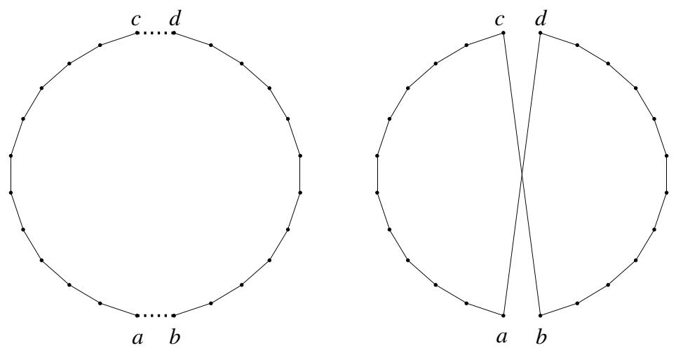
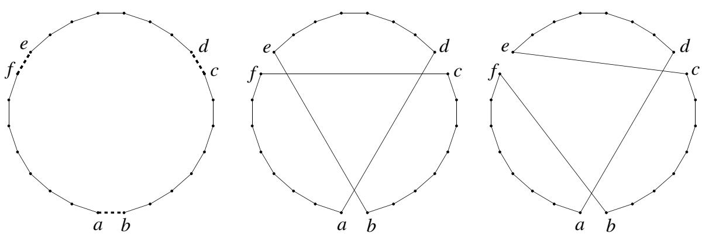
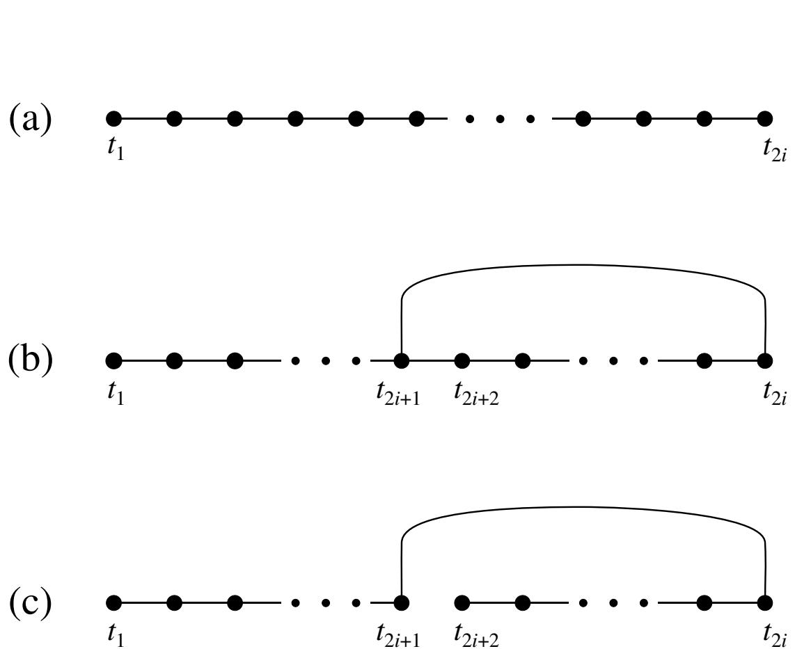
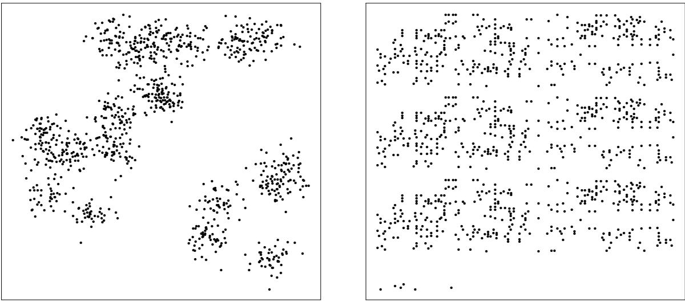
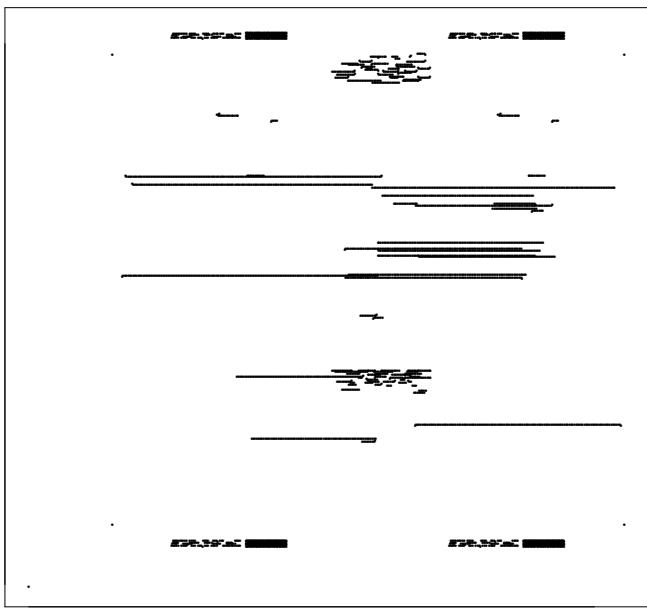
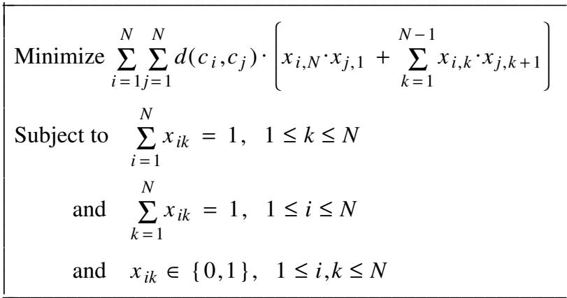
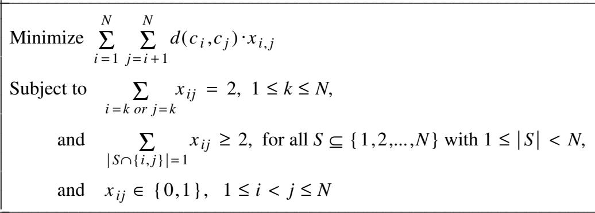
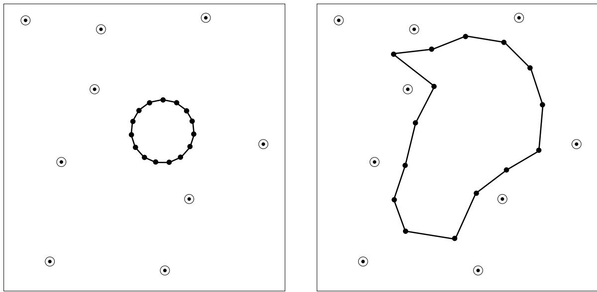

# The Traveling Salesman Problem: A Case Study in Local Optimization

David S. Johnson1   
Lyle A. McGeoch2

# Abstract

This is a preliminary version of a chapter that appeared in the book Local Search in Combinatorial Optimization, E. H. L. Aarts and J. K. Lenstra (eds.), John Wiley and Sons, London, 1997, pp. 215-310. The traveling salesman problem (TSP) has been an early proving ground for many approaches to combinatorial optimization, including classical local optimization techniques as well as many of the more recent variants on local optimization, such as simulated annealing, tabu search, neural networks, and genetic algorithms. This chapter discusses how these various approaches have been adapted to the TSP and evaluates their relative success in this perhaps atypical domain from both a theoretical and an experimental point of view.

# TABLE OF CONTENTS

1. INTRODUCTION

# 2. TOUR CONSTRUCTION HEURISTICS

2.1. Theoretical Results   
2.2. Four Important Tour Construction Heuristics   
2.3. Experimental Methodology   
2.4. Implementation Details   
2.5. Experimental Results for Tour Construction Heuristics

3. 2-OPT, 3-OPT, AND THEIR VARIANTS

3.1. Theoretical Bounds on Local Search Algorithms   
3.2. Experimental Results for 2-Opt and 3-Opt   
3.3. How to Make 2-Opt and 3-Opt Run Quickly   
3.4. Parallel 2-Opt and 3-Opt   
3.5. Other Simple Local Optimization Algorithms

4. TABU SEARCH AND THE LIN-KERNIGHAN ALGORITHM

4.1. Simple Tabu Search Algorithms for the TSP   
4.2. The Lin-Kernighan Algorithm

5. SIMULATED ANNEALING AND ITS VARIANTS

5.1. A Baseline Implementation of Simulated Annealing for the TSP   
5.2. Key Speed-Up Techniques   
5.3. Other Potential Improvements   
5.4. Threshold-Based Variants on Annealing

6. GENETIC ALGORITHMS AND ITERATED LIN-KERNIGHAN

6.1. Filling in the Schema   
6.2. Production-Mode Iterated Lin-Kernighan: Experimental Results   
6.3. Other Variants

# 7. NEURAL NETWORK ALGORITHMS

7.1. Neural Networks Based on Integer Programs   
7.2. Geometric Neural Networks

8. CONCLUSION REFERENCES

# 1. INTRODUCTION

In the traveling salesman problem, or ‘‘TSP,’’ we are given a set $\{ c _ { 1 } , c _ { 2 } , \cdots , c _ { N } \}$ of cities and for each pair $\{ c _ { i } , c _ { j } \}$ of distinct cities a distance $d ( c _ { i } , c _ { j } )$ . Our goal is to find an ordering $\pi$ of the cities that minimizes the quantity

$$
\sum _ { i = 1 } ^ { N - 1 } d ( c _ { \pi ( i ) } , c _ { \pi ( i + 1 ) } ) \ + \ d ( c _ { \pi ( N ) } , c _ { \pi ( 1 ) } ) \ .
$$

This quantity is referred to as the tour length, since it is the length of the tour a salesman would make when visiting the cities in the order specified by the permutation, returning at the end to the initial city. We shall concentrate in this chapter on the symmetric TSP, in which the distances satisfy $d ( c _ { i } , c _ { j } ) = d ( c _ { j } , c _ { i } )$ for $1 \leq i , j \leq N .$ .

The symmetric traveling salesman problem has many applications, from VLSI chip fabrication [Korte, 1988] to X-ray crystallography [Bland & Shallcross, 1989], and a long history, for which see Lawler, Lenstra, Rinnooy Kan, and Shmoys [1985]. It is NPhard [Garey & Johnson, 1979] and so any algorithm for finding optimal tours must have a worst-case running time that grows faster than any polynomial (assuming the widely believed conjecture that ${ \bf P } \neq { \bf N P } ,$ ). This leaves researchers with two alternatives: either look for heuristics that merely find near-optimal tours, but do so quickly, or attempt to develop optimization algorithms that work well on ‘‘real-world,’’ rather than worst-case instances.

Because of its simplicity and applicability (or perhaps simply because of its intriguing name), the TSP has for decades served as an initial proving ground for new ideas related to both these alternatives. These new ideas include most of the local search variants covered in this book, which makes the TSP an ideal subject for a case study. In addition, the new ideas include many of the important advances in the related area of optimization algorithms, and to keep our discussions of local search in perspective, let us begin by noting the impressive recent progress in this latter domain.

The TSP is one of the major success stories for optimization. Decades of research into optimization techniques, combined with the continuing rapid growth in computer speeds and memory capacities, have led to one new record after another. Over the past 15 years, the record for the largest nontrivial TSP instance solved to optimality has increased from 318 cities [Crowder & Padberg, 1980] to 2392 cities [Padberg & Rinaldi, 1987] to 7397 cities [Applegate, Bixby, Chvat ´ al, & Cook, 1994]. Admittedly, this last result took roughly 3-4 years of CPU-time on a network of machines of the caliber of a SPARCstation 2. (SPARC is a trademark of SPARC International, Inc. and is licensed exclusively to Sun Microsystems, Inc.) However, the branch-and-cut technology developed for these record-setting performances has also had a major impact on the low end of the scale. Problems with 100 or fewer cities are now routinely solved within a few minutes on a workstation (although there are isolated instances in this range that take much longer) and instances in the 1,000-city range typically take only a few hours (or days), e.g., see Padberg & Rinaldi [1991], Grotschel and Holland [1991], and Applegate, Bixby, Chvat ´ al, and Cook [1994].

The perspective that these optimization results yield is two-fold. First, they weaken the appeal of the more costly heuristics, at least when the number of cities is 1,000 or less. Where possible in this survey, we shall thus concentrate on results for instances with significantly more than 1,000 cities. Second, they suggest that the TSP is not a typical combinatorial optimization problem, since most such problems seem significantly harder to solve to optimality.

Another way in which the TSP may be atypical lies in the high quality of results that can be obtained by traditional heuristics. The world of heuristic approaches to the TSP can be roughly divided into two classes. In addition to the local search approaches that are the topic of this book, there are many different successive augmentation heuristics for the TSP. Such heuristics build a solution (tour) from scratch by a growth process (usually a greedy one) that terminates as soon as a feasible solution has been constructed. In the context of the TSP, we call such a heuristic a tour construction heuristic. Whereas the successive augmentation approach performs poorly for many combinatorial optimization problems, in the case of the TSP many tour construction heuristics do surprisingly well in practice. The best typically get within roughly $10 \mathrm { - } 1 5 \%$ of optimal in relatively little time. Furthermore, ‘‘classical’’ local optimization techniques for the TSP yield even better results, with the simple 3-Opt heuristic typically getting with $3 . 4 \%$ of optimal and the ‘‘variable-opt’’ algorithm of Lin and Kernighan [1973] typically getting with 1- $2 \%$ . Moreover, for geometric data the abovementioned algorithms all appear to have running time growth rates that are $o ( N ^ { 2 } )$ , i.e., subquadratic, at least in the range from 100 to 1,000,000 cities. These successes for traditional approaches leave less room for new approaches like tabu search, simulated annealing, etc. to make contributions. Nevertheless, at least one of the new approaches, genetic algorithms, does have something to contribute if one is willing to pay a large, although still $o ( N ^ { 2 } )$ , running time price.

In reaching conclusions like the above, this paper must of necessity take a hybrid approach. Where possible, we will report the results of performing experiments on common sets of instances on a fixed computer. The common test instances are the main ones used in a forthcoming study by Johnson, Bentley, McGeoch, and Rothberg [1996], and they will be described in more detail in the next section. The computer in question is an SGI ChallengeTM machine containing sixteen 150 Mhz MIPSTM R4400 processors, although our running times are for sequential implementations that use only a single one of these processors. (MIPS is a trademark of MIPS, Inc., and Challenge is a trademark of Silicon Graphics, Inc.) As a point of comparison, the MIPS processor can be 10-15 times faster than a SPARCstation 1 and perhaps 3-4 times faster than a SPARCstation 2. Our baseline experiments cover implementations of tour generation heuristics and classic local search algorithms written by Johnson, Bentley, McGeoch, and Rothberg [1996], implementations of simulated annealing written by Johnson, Aragon, McGeoch, and Schevon [1996], and implementations of the GENI and GENIUS local search heuristics written by Gendreau, Hertz, and Laporte [1992], who graciously provided us with their source code.

For many of the algorithms we cover, however, the only information we have is from published papers that provide only high-level descriptions of the algorithms and summaries of experimental results. These papers do not typically provide enough information for us to compare the algorithms directly to our baseline implementations, and we are reduced to a process of deduction if we are to make comparisons. For tour quality comparisons, we are often fortunate in that other authors have generally used test instances that were similar in nature (if not identical) to the ones in our own test set. Running time comparisons are a bit more difficult, as rules of thumb for relating times between machines are far from exact and are highly dependent on the actual code, compilers, and operating systems used. (We used the standard $\mathrm { I R I X ^ { T M } }$ operating system provided by SGI.) Moreover, many papers do not provide enough implementation details for us to know what sorts of optimizations are present in (or missing from) their codes, and some papers are unclear as to whether preprocessing is included in their running times (as it is in ours). Comparisons involving results from such papers must thus often be based on unverified assumptions about the missing details. We shall generally try to be explicit about any such assumptions we make.

In comparing results, we shall also be interested in the relationship between what is known theoretically about the algorithms we study and what can be observed empirically. We shall see that each type of analysis has useful things to say about the other, although the worst-case nature of many theoretical results makes them far too pessimistic to tell us much about typical algorithmic behavior.

The remainder of this chapter is organized as follows. In Section 2 we discuss four important tour construction heuristics, along with key theoretical results that help characterize their behavior and that identify general complexity-theoretic limitations on what any heuristic approach can achieve. We also introduce our experimental methodology and summarize experimental results for the four heuristics from the extensive study by Johnson, Bentley, McGeoch, and Rothberg [1996]. Note that tour construction heuristics are important in the context of this book not only for the perspective they provide but also because they can be used to generate the starting points (initial tours) needed by local search algorithms and their variants. Section 3 describes 2-Opt and 3-Opt, the simplest and most famous of the classical local optimization algorithms for the TSP, and it discusses both their empirical behavior and what is known about them from a theoretical point of view. In addition to providing good results in their own right, these algorithms provide the essential building blocks used by many researchers in adapting tabu search, simulated annealing, etc. to the TSP. Section 4 is devoted to adaptations of tabu search to the TSP and to the Lin-Kernighan algorithm. Although this latter algorithm was invented some 15 years prior to the introduction of tabu search, it embodies many of the same ideas, combining them with search-space truncation to yield what was for many years the ‘‘champion’’ TSP heuristic.

A key question in each of the remaining sections is whether the approach under consideration can beat Lin-Kernighan. Given how good Lin-Kernighan already is, this means we will occasionally find ourselves forced to make distinctions between algorithms based on tour quality differences as small as $0 . 1 \%$ . Even though such differences may be statistically significant, we must admit that they are unlikely to be of practical importance. Nevertheless, the intellectual appeal of the ‘‘which is best’’ question is hard to resist, and observations made here may suggest what can happen for other problems, where the ranges in solution quality may well be much wider. Section 5 surveys the results for various adaptations of simulated annealing and its variants to the TSP with special emphasis on the results and conclusions of Johnson, Aragon, McGeoch, and Schevon [1996]. Section 6 discusses genetic algorithms and the iterated local optimization algorithms that have been derived from them, in particular the Iterated LinKernighan algorithm. Section 7 surveys the wide variety of neural net algorithms that have been applied to the TSP. We conclude in Section 8 with a summary of how the best current adaptations of the various approaches compare for the TSP, and what, if anything, this means for other problem domains.

A wealth of algorithmic creativity has been applied to the TSP over the years, and by covering an extensive slice of it as we do here, we hope at the very least to provide the reader with a useful source of more widely applicable ideas.

# 2. TOUR CONSTRUCTION HEURISTICS

Every TSP heuristic can be evaluated in terms of two key parameters: its running time and the quality of the tours that it produces. Because of space limitations, we shall concentrate here on the most important undominated heuristics, where a heuristic is undominated if no competing heuristic both finds better tours and runs more quickly. Furthermore, we shall limit our main attention to just four of these, omitting heuristics that only work for particular classes of instances, such as 2-dimensional ones. The four tour construction heuristics we cover in detail are Nearest Neighbor, Greedy, Clarke-Wright, and Christofides. Each of these has a particular significance in the context of local search. The first three provide plausible mechanisms for generating starting tours in a local search procedure, and interesting lessons can be learned by evaluating them in this context. The fourth represents in a sense the best that tour construction heuristics can currently do, and so it is a valuable benchmark. We shall allude briefly to several other tour construction heuristics, but readers interested in the full picture are referred to more extensive studies such as those of Bentley [1990a,1992], Reinelt [1994], Junger, Reinelt, and Rinaldi [1994], and Johnson, Bentley, McGeoch, and Rothberg [1996].

We begin in Section 2.1 with a discussion of the general complexity-theoretic limitations imposed on all heuristics. Section 2.2 then presents brief descriptions of our key tour construction heuristics and summarizes what is known about their performance from a theoretical point of view. Section 2.3 discusses the key methodological issues involved in evaluating heuristics from an experimental point of view. In particular, we discuss the method we use for measuring tour quality and the particular instance classes we use for our primary experimental testbeds. Section 2.4 describes some of the key implementation details needed to make the heuristics run quickly on instances such as those in our testbeds. Section 2.5 then summarizes the specific results obtained by Johnson, Bentley, McGeoch, and Rothberg [1996] for the heuristics of Section 2.2.

# 2.1. Theoretical Results

Two fundamental complexity-theoretic results constrain the behavior of any heuristic for the TSP. For a given heuristic $A$ and TSP instance $I ,$ , let $A ( I )$ denote the length of the tour produced by $A$ and let $\mathrm { O P T } ( I )$ denote the length of an optimal tour. The first result concerns the best performance guarantee that is possible when there are no restrictions on the types of instances considered.

Theorem A [Sahni $\pmb { \& }$ Gonzalez, 1976]. Assuming ${ \bf P } \ne { \bf N P }$ , no polynomial-time TSP heuristic can guarantee $A ( I ) / { \mathrm { O P T } } ( I ) \leq 2 ^ { p ( N ) }$ for any fixed polynomial $p$ and all instances $I .$ .

Fortunately, most applications impose substantial restrictions on the types of instances allowed. In particular, in most applications distances must obey what is called the triangle inequality. This says that for all $i , j , k , ~ 1 \leq i , j , k \leq N , ~ d ( c _ { i } , c _ { j } ) ~ \leq$ $d ( c _ { i } , c _ { k } ) + d ( c _ { k } , c _ { j } )$ , i.e., the direct path between two cities is always the shortest route. (Even in real-world situations where the shortest physical route from city $c _ { i }$ to city $c _ { j }$ must pass through city $c _ { k }$ , we typically ignore such details in formulating the corresponding TSP instance and simply take $d ( c _ { i } , c _ { j } )$ to be the length of the shortest path between $c _ { i }$ and $c _ { j }$ , not the length of the shortest physical route that avoids all other cities.) Thus much of the theoretical work on TSP heuristics is predicated on the assumption that the triangle inequality holds. In this case the result of Sahni and Gonzalez [1976] no longer applies, and the only known constraint is the following much more limited (and recent) one, derived as a consequence of the deep connection between approximation and the characterization of NP in terms of probabilistically checkable proof systems.

Theorem B [Arora, Lund, Motwani, Sudan, & Szegedy, 1992]. Assuming $\mathrm { ~ \bf ~ P ~ } \ne$ NP, there exists an $\varepsilon > 0$ such that no polynomial-time TSP heuristic can guarantee $A ( I ) / \mathrm { O P T } ( I ) \leq 1 + \varepsilon$ for all instances $I$ satisfying the triangle inequality.

Compared to Theorem A, this imposes only a small limitation on algorithmic performance, especially since current proof techniques do not seem capable of showing that the ε in the theorem is even as large as 1/100. The natural theoretical question is thus: Assuming the triangle inequality, what kinds of performance guarantees can actually be provided by polynomial-time TSP heuristics? The four tour construction algorithms we now discuss provide a wide range of guarantees. The first three all provide a substantially better guarantee than would be possible without the triangle inequality. The fourth provides a far better guarantee and is the current champion with respect to this worst-case measure.

# 2.2. Four Important Tour Construction Algorithms

# Nearest Neighbor

Perhaps the most natural heuristic for the TSP is the famous Nearest Neighbor algorithm (NN). In this algorithm one mimics the traveler whose rule of thumb is always to go next to the nearest as-yet-unvisited location. We construct an ordering $c _ { \pi ( 1 ) } , \cdots , c _ { \pi ( N ) }$ of the cities, with the initial city $c _ { \pi ( 1 ) }$ chosen arbitrarily and in general $c _ { \pi ( i + 1 ) }$ chosen to be the city $c _ { k }$ that minimizes $\{ d ( c _ { \pi ( i ) } , c _ { k } ) \colon k \neq \pi ( j ) , 1 \leq j \leq i \}$ . The corresponding tour traverses the cities in the constructed order, returning to $c _ { \pi ( 1 ) }$ after visiting city $c _ { \pi ( N ) }$ .

The running time for NN as described is $\Theta ( N ^ { 2 } )$ . If we restrict attention to instances satisfying the triangle inequality, NN does substantially better than the general upper bound of Theorem A, although it is still far worse than the limit provided by Theorem B. In particular, we are guaranteed that $\mathbf { N N } ( I ) / \mathbf { O P T } ( I ) \leq ( 0 . 5 ) ( \big | \ \mathrm { l o g } _ { 2 } N \big ] + 1 )$ . No substantially better guarantee is possible, however, as there are instances for which the ratio grows as $\Theta ( \log N )$ [Rosenkrantz, Stearns, & Lewis, 1977].

# Greedy

Some authors use the name Greedy for Nearest Neighbor, but it is more appropriately reserved for the following special case of the ‘‘greedy algorithm’’ of matroid theory. In this heuristic, we view an instance as a complete graph with the cities as vertices and with an edge of length $d ( c _ { i } , c _ { j } )$ between each pair $\{ c _ { i } , c _ { j } \}$ of cities. A tour is then simply a Hamiltonian cycle in this graph, i.e., a connected collection of edges in which every city has degree 2. We build up this cycle one edge at a time, starting with the shortest edge, and repeatedly adding the shortest remaining available edge, where an edge is available if it is not yet in the tour and if adding it would not create a degree-3 vertex or a cycle of length less than $N .$ . (In view of the intermediate partial tours typically constructed by this heuristic, it is called the multi-fragment heuristic by Bentley [1990a,1992]).

The Greedy heuristic can be implemented to run in time $\Theta ( N ^ { 2 } \log N )$ and is thus somewhat slower than NN. On the other hand, its worst-case tour quality may be somewhat better. As with NN, it can be shown that Greedy $( I ) / \mathrm { O P T } ( I ) \le ( 0 . 5 ) ( \stackrel { } { \big | } \log _ { 2 } N \big ] + 1 )$ for all instances $I$ obeying the triangle inequality [Ong & Moore, 1984], but the worst examples known for Greedy only make the ratio grow as $( \log N ) / ( 3 \log \log N )$ [Frieze, 1979].

# Clarke-Wright

The Clarke-Wright savings heuristic (Clarke-Wright or simply CW for short) is derived from a more general vehicle routing algorithm due to Clarke and Wright [1964]. In terms of the TSP, we start with a pseudo-tour in which an arbitrarily chosen city is the hub and the salesman returns to the hub after each visit to another city. (In other words, we start with a multigraph in which every non-hub vertex is connected by two edges to the hub). For each pair of non-hub cities, let the savings be the amount by which the tour would be shortened if the salesman went directly from one city to the other, bypassing the hub. We now proceed analogously to the Greedy algorithm. We go through the non-hub city pairs in non-increasing order of savings, performing the bypass so long as it does not create a cycle of non-hub vertices or cause a non-hub vertex to become adjacent to more than two other non-hub vertices. The construction process terminates when only two non-hub cities remain connected to the hub, in which case we have a true tour.

As with Greedy, this algorithm can be implemented to run in time $\Theta ( N ^ { 2 } \log N )$ . The best performance guarantee currently known (assuming the triangle inequality) is $\mathrm { C W } ( I ) / \mathrm { O P T } ( I ) \leq \lceil \log _ { 2 } N \rceil + 1$ (a factor of 2 higher than that for Greedy) [Ong & Moore, 1984], but the worst examples known yield the same $( \log N ) / ( 3 \log \log N )$ ratio as obtained for Greedy [Frieze, 1979].

# Christofides

The previous three algorithms all have worst-case ratios that grow with $N$ even when the triangle inequality holds. Theorem B does not rule out much better performance, however, and in fact a large class of algorithms do perform much better. As observed by Rosenkrantz, Stearns, and Lewis [1977], there are at least three simple polynomial-time tour generation heuristics, Double Minimum Spanning Tree, Nearest Insertion, and Nearest Addition, that have worst-case ratio 2 under the triangle inequality. That is, they guarantee $A ( I ) / \mathrm { O P T } ( I ) \leq 2$ under that restriction, and there exist instances with arbitrarily large values of $N$ that show that this upper bound cannot be improved. We do not discuss these heuristics in detail since they are all dominated in practice by NN, Greedy, and CW, despite the fact that their worst-case performance is so much better.

One tour construction heuristic with a constant worst-case performance ratio is not so dominated, however. This is the algorithm of Christofides [1976], the current champion as far as performance guarantee is concerned, having a worst-case ratio of just 3/2 assuming the triangle inequality. (This bound is tight, even for Euclidean instances [Cornu ´ ejols & Nemhauser, 1978].) The Christofides heuristic proceeds as follows. First, we construct a minimum spanning tree $T$ for the set of cities. Note that the length of such a tree can be no longer than $\mathrm { O P T } ( I )$ , since deleting an edge from an optimal tour yields a spanning tree. Next, we compute a minimum-length matching $M$ on the vertices of odd degree in $T .$ . It can be shown by a simple argument that assuming the triangle inequality this matching will be no longer than $\mathrm { O P T } ( I ) / 2$ . Combining $M$ with $T$ we obtain a connected graph in which every vertex has even degree. This graph must contain an Euler tour, i.e., a cycle that passes through each edge exactly once, and such a cycle can be easily found. A traveling salesman tour of no greater length can then be constructed by traversing this cycle while taking shortcuts to avoid multiply visited vertices. (A shortcut replaces a path between two cities by a direct edge between the two. By the triangle inequality the direct route cannot be longer than the path it replaces.)

Not only does the Christofides algorithm provide a better worst-case guarantee than any other currently known tour construction heuristic, it also tends to find better tours in practice, assuming care is taken in the choice of shortcuts. Its running time cost is substantial, however, compared to those for Nearest Neighbor, Greedy, and Clarke-Wright. This is primarily because the best algorithms currently available for its matching step take time $\Theta ( N ^ { 3 } )$ [Edmonds,1965], [Gabow, 1973], [Lawler, 1976], whereas none of the other three algorithms takes more than $O ( N ^ { 2 } \log N )$ time. In theory this running time gap can be reduced somewhat: A modification of the Christofides algorithm with the same worst-case guarantee and an $O ( N ^ { 2 . 5 } )$ running time can be obtained by using a scalingbased matching algorithm and halting once the matching is guaranteed to be no longer than $1 + ( 1 / N )$ times optimal [Gabow & Tarjan, 1991]. As far as we know, however, this approach has never been implemented, and as we shall see, the competition from local search algorithms is sufficiently strong that the programming effort needed to do so would not be justified.

# 2.3. Experimental Methodology

# The Held-Karp Lower Bound

When evaluating the empirical performance of heuristics, we are often not allowed the luxury of comparing to the precise optimal tour length, as we did in the above theoretical results, since for large instances we typically do not know the optimal tour length. As a consequence, when studying large instances it has become the practice to compare heuristic results to something we can compute: the lower bound on the optimal tour length due to Held and Karp [1970,1971].

This bound is the solution to the standard linear programming relaxation of the TSP. For instances of moderate size it can be computed exactly using linear programming, although if one goes about this directly one is confronted with a non-trivial computation: the number of constraints in the linear program is exponential in $N .$ A more practical approach is to solve a sequence of restricted linear programs (LP’s), each involving only a subset of the constraints, and to use a separation subroutine to identify violated constraints that need to be included in the next LP. This approach has been implemented both by Reinelt [1994] and by Applegate, Bixby, Chv ´ atal, and Cook [1994] using the Simplex method to solve the linear programs. Exact values for the bound have been computed in this way for instances as large as 33,810 cities [Johnson, McGeoch, & Rothberg, 1996], including all instances in our testbeds up to this size. For larger instances, we settle for an approximation to the Held-Karp bound (a lower bound on the lower bound) computed by an iterative technique proposed in the original Held-Karp papers and sped up by a variety of algorithmic tricks [Helbig-Hansen & Krarup, 1974], [Held, Wolfe, & Crowder, 1974], [Johnson, McGeoch, & Rothberg, 1996]. We expect, based on results for instances where the true Held-Karp bound is known, that for those instances in our test beds where we must rely on this approximation, it is within $0 . 0 1 \%$ or less of the true bound. What is more important, the Held-Karp bound itself appears to provide a consistently good approximation to the optimal tour length. From a worst-case point of view, the Held-Karp bound can never be smaller than $( 2 / 3 ) \mathrm { O P T } ( I )$ , assuming the triangle inequality [Wolsey, 1980], [Shmoys & Williamson, 1990]. In practice, it is typically far better than this, even when the triangle inequality does not hold. We shall see just how much better in the next section, where we discuss our main testbeds.

# Standard Test Instances

When we talk about experimental results in this chapter, we shall for the most part be talking about behavior on instances that not only obey the triangle inequality but also are geometric in nature, typically ones in which the cities correspond to points in the plane and distances are computed under a standard metric such as the Euclidean or rectilinear norm. Many of the applications of the symmetric TSP are of this sort, and most recent published studies have concentrated on them, using two main sources of such instances. The first source consists simply of randomly generated instances, where the cities have their locations chosen uniformly in the unit square, with distances computed under the Euclidean metric. The second source is a database of instances called TSPLIB collected by Reinelt [1991] and available via anonymous ftp from softlib.rice.edu. TSPLIB contains instances with as many as 85,900 cities, including many from printed circuit board and VLSI applications, as well as geographical instances based on real cities. Results are surprisingly consistent between the two instance sources. For example, NN averages less than $24 \%$ above the Held-Karp lower bound on random Euclidean instances with $N$ ranging from 10,000 to 1,000,000, while for a selection of 15 of the largest 2-dimensional instances from Version 1.2 of TSPLIB (including all 11 with $N > 3 , 0 0 0 \rangle$ ), NN averaged roughly $26 \%$ above.

We should mention that many papers covering geometric instances of the above two types do not use the Held-Karp bound as their standard of comparison. Researchers dealing with TSPLIB instances often restrict attention to those for which optimal solutions are known, comparing their results to the optimal tour lengths. Fortunately, the exact Held-Karp bounds are known for all of these instances, so it is easy to translate from one sort of comparison to the other. The average gap over all 89 instances in TSPLIB (solved or unsolved) is $0 . 8 2 \%$ or less, with all but two of the gaps being less than $1 . 7 6 \%$ [Johnson, McGeoch, & Rothberg, 1996].

More difficult to deal with are those papers that study random Euclidean instances and compare their results only to the expected optimal tour length or, more precisely, to estimates thereof. Even if the estimated expected values were correct, the natural variation between instances of a given size means that the expected value is not a totally reliable estimate for the optimal tour length of any specific instance. (Adding about $0 . 7 \%$ to the Held-Karp lower bound for that instance would yield a much more reliable estimate [Johnson, McGeoch, & Rothberg, 1996].) Furthermore, the estimates used are typically far from correct. It is known from work of Beardwood, Halton, and Hammersley [1959] that for these instances the ratio of the optimal tour length to $\surd N$ approaches a constant $C _ { O P T }$ as $N \to \infty$ , but the most frequently quoted estimates for this constant, .749 by Beardwood et al. and .765 by Stein [1977], are both significant overestimates. Recent experiments of Percus and Martin [1996] and Johnson, McGeoch, and Rothberg [1996] suggest that the actual limit is more like .7124. Thus many claims of closeness to optimality are too optimistic by $5 \%$ or more, and we will have to reinterpret such claims in this light. In doing so, we shall rely on the following formula for the HK bound, derived empirically by Johnson, McGeoch, and Rothberg [1996]. Let $C _ { H K } ( N )$ be the expected ratio of the Held-Karp bound to $\surd N$ for $N .$ -city random Euclidean instances. Then for

$N \geq 1 0 0$ ,

$$
C _ { H K } ( N ) \sim . 7 0 8 0 5 + { \frac { . 5 2 2 2 9 } { N ^ { . 5 } } } + { \frac { 1 . 3 1 5 7 2 } { N } } - { \frac { 3 . 0 7 4 7 4 } { N ^ { 1 . 5 } } } 
$$

As this formula suggests, a result analogous to that of Beardwood et al. holds for the Held-Karp lower bound, with the ratio of the expected Held-Karp bound to $\surd N$  approaching a constant $C _ { H K } < C _ { O P T }$ as $N \to \infty$ [Goemans & Bertsimas, 1991]. Similar results (with constants bigger than $C _ { O P T } )$ may also hold for many TSP heuristics, although the only heuristic for which this question has been successfully analyzed does not quite live up to this expectation. For the Spacefilling Curve heuristic of Platzman and Bartholdi [1989], limsup $_ { N  \infty } E [ A ( L _ { N } ) ] / N ^ { 1 / 2 }$ and liminf $\dot { \phantom { } N } _ {  \infty } E [ A ( L _ { N } ) ] / N ^ { 1 / 2 }$ are both constants, but they are different constants, and so there is no true limit. (The difference between the constants is less than $0 . 0 2 \%$ , however.)

In addition to the geometric instances mentioned above, we shall also consider another testbed that is frequently encountered in the literature. These are instances in which the distances between cities are all independent, chosen randomly from the uniform distribution on [0,1]. Although these random distance matrix instances do not have any apparent practical relevance, they are interesting from a theoretical point of view. One can prove that the expected length of an optimal tour is bounded, independently of $N .$ , and statistical mechanical arguments suggest that it approaches a limiting value of 2.0415... [Krauth & M ´ ezard, 1989]. This value agrees closely with the experimental results of Johnson, McGeoch, and Rothberg [1996]. Since these instances do not typically obey the triangle inequality, they offer a strikingly different challenge to our heuristics. The Held-Karp bound remains a good estimate of the optimal tour length, better even than it was for the geometric case since the difference between it and the optimal tour length appears to be approaching 0 as $N \to \infty$ . The performance of heuristics, however, appears to degrade markedly. For example, the expected percentage excess over the Held-Karp bound for NN can be proved to grow as $\Theta ( \log N )$ for such instances, which is clearly much worse than the $2 4 - 2 6 \%$ (independent of $N$ ) observed for random Euclidean instances.

For the above two classes of random instances, our testbeds consist of instances for which $N$ is a power of $\surd 1 0$  , rounded to the nearest integer. They contain several instances of each size, and the results we report are typically averages over all instances of a given size and type. The numbers of random Euclidean instances range from 21 instances with $N = 1 0 0$ to one each for $N = 3 1 6 { , } 2 2 8$ and 1,000,000. The use of fewer instances for larger values of $N$ is made possible by the fact that the normalized variation in behavior between random instances of the same size declines with $N$ [Steele, 1981]. More specifically, the probability that $\mathrm { O P T } ( I ) / \sqrt { N }$ differs from its expected value by more than $t$ is at most $\dot { K e } ^ { - t ^ { 2 } N / K }$ for some fixed constant $K$ [Rhee & Talagrand, 1988]. The number of instances in the testbed is not enough to guarantee high precision estimates of average case behavior, but is enough for the distinctions we wish to make. For random distance matrices there is even less need for precision, and we typically use just two instances each for all the sizes considered, from 100 to 31,623 cities.

Many of the observations we shall make based on the above testbeds carry over to other classes of instances. For a more complete study that covers a variety of these other classes, see Johnson, Bentley, McGeoch, and Rothberg [1996].

# 2.4. Implementation Details

As observed in Section 2.2, all our tour construction heuristics would seem to require at least $\Theta ( N ^ { 2 } )$ time for an arbitrary instance, since in general every edge is a potential candidate for membership in the tour and there are $N ( N { - } 1 ) / 2$ edges to be considered. This is not necessarily the case, however, for geometric instances like those in the first two classes of our testbed, where cities correspond to points in the plane or some higher dimensional space and where the distance between two cities is a function of the coordinates of the cities. For such instances it may be possible to rule out large classes of edges quickly, by exploiting the geometry of the situation with appropriate data structures.

In particular, for points in the plane it is possible in ${ \cal O } ( N \mathrm { l o g } N )$ time to construct a data structure that allows us to answer all subsequent nearest neighbor queries in average time much less than $\Theta ( N )$ per query. One such data structure is the $k { - } d$ tree of Bentley [1975,1990b], exploited in the implementations of NN, Greedy, and Clarke-Wright described in Bentley [1990a], Bentley [1992] and Johnson, Bentley, McGeoch, and Rothberg [1996]. Another is the Delaunay triangulation, exploited in implementations of approximate versions of these algorithms by Reinelt [1992,1994] and Junger, Reinelt, and Rinaldi [1994]. In the case of the implementations using $k { - } d$ trees, on which we shall concentrate here, the number of operations required for finding nearest neighbors typically averages around $\Theta ( \log N )$ . (For large instances, the actual time to do the computation grows faster on our machine than does the operation count, due to increasing numbers of cache misses and other memory hierarchy effects.)

Using such a data structure, all four of our heuristics can be sped up substantially. It is relatively easy to see how this is done for Nearest Neighbor. Greedy and ClarkeWright are sped up by using nearest-neighbor (and related) queries to stock and update a priority queue that maintains an entry for each city that does not yet have degree 2 in the current tour. The entry for city $c _ { i }$ is a triple $< c _ { i } , c _ { j } , d ( c _ { i } , c _ { j } ) >$ , where $c _ { j }$ is $c _ { i }$ ’s nearest neighbor (in the case of Clarke-Wright, its neighbor yielding maximum savings).

For Christofides, a similar priority-queue-based approach can be used to compute the minimum spanning tree, although computing the minimum-length matching on the odd-degree vertices remains the bottleneck. For this we use the fast geometric matching code of Applegate and Cook [1993], although even with this fast code the largest instances we can feasibly handle involve only 100,000 cities. In addition, our implementation of Christofides uses a slightly more sophisticated shortcutting mechanism in its final stage: instead of simply traversing the Euler tour and skipping past previously visited cities, we choose the shortcut for each multiply-visited city that yields the biggest reduction in tour length. This innovation yields an improvement of roughly $5 \%$ in tour length for random geometric instances, and it is crucial if Christofides is to maintain its undominated status. (Ideally, we would have liked to find the best possible way of doing the shortcuts, but that task is NP-hard [Papadimitriou & Vazirani, 1984].)

Different implementation issues arise with our random distance matrix instances. In particular, there is the problem of storing them. We would like to get an idea of algorithmic behavior on large instances of this type, but a 10,000-city instance would take roughly 200 megabytes, at one 32-bit word per edge. We have thus chosen not to store instances directly, but instead to generate them on the fly using a subroutine that given $i$ , $j .$ , and a seed $s$ unique to the instance, computes $d ( c _ { i } , c _ { j } )$ in a reproducible fashion. For details, see Johnson, Bentley, McGeoch, and Rothberg [1996]. By allowing us to consider instances whose edge sets are too large to store in main memory, this scheme influences the algorithm implementations we use.

For NN we can still use the straightforward $\Theta ( N ^ { 2 } )$ implementation. For Greedy and CW, however, we cannot use the straightforward $\Theta ( N ^ { 2 } \log N )$ implementations, as these would require us to sort all $\Theta ( N ^ { 2 } )$ edges, and paging costs would be prohibitive if the edges cannot all fit in main memory. Thus for these algorithms we mimic the corresponding geometric implementations, replacing the $k { - } d$ data structure by one consisting of sorted lists of the 20 nearest neighbors for each city, computed in overall time $\Theta ( N ^ { 2 } )$ . To find the nearest legal neighbor of city $c _ { i }$ , we then can simply search down the list for $c _ { i }$ . Only if no $c _ { j }$ on the list is such that the edge $\{ c _ { i } , c _ { j } \}$ can be added to the current tour do we resort to a full $\Theta ( N )$ search of all possibilities. We did not implement Christofides for this last class of instances, for reasons we explain below.

# 2.5. Experimental Results for Tour Construction Heuristics

In this section we summarize the results obtained by Johnson, Bentley, McGeoch, and Rothberg [1996] for our four tour construction heuristics on random Euclidean instances and random distance matrices, as described above. Table 1 covers tour quality, and Table 2 covers running times in seconds on our SGI Challenge machine. Running times do not include the time needed to read in the instance or write out the resulting tour, which were only a small part of the overall time and could have been reduced almost to negligibility by clever coding of the input and output routines. Results for instances from TSPLIB were similar to those for the random Euclidean instances: Running times for instances of similar size were comparable, with the tour quality for NN and Greedy being slightly worse on average than for the random instances, and the tour quality for CW and Christofides being slightly better.

The results presented are averages taken over all the instances in our testbed of each given size. For NN and CW we in addition average over 10 or more random choices of the starting city for each instance. Nevertheless, the accuracy of the least significant digits in the numbers reported should be viewed with some skepticism, and it is probably safer to draw conclusions from the overall picture rather than from any particular value in the tables. This is especially so for the random distance matrix results, which are based on fewer instances of each size.

For random Euclidean instances, each of the four algorithms seems to approach a relatively small limiting value for the average percent by which its tours exceed the

Table 1. Tour quality for tour generation heuristics.   

<table><tr><td colspan="8">Average Percent Excess over the Held-Karp Lower Bound</td></tr><tr><td>N = 102 102.5 103</td><td colspan="7">103.5 104 104.5 105 105.5 106</td></tr><tr><td></td><td colspan="7">Random Euclidean Instances</td></tr><tr><td>CHR CW</td><td>9.5 9.9 9.2 10.7</td><td>9.7 11.3</td><td>9.8 11.8</td><td>9.9 11.9</td><td>9.8 12.0</td><td>9.9 12.1</td><td>− 12.1</td><td>12.2</td></tr><tr><td>GR NN</td><td>19.5 18.8 25.6 26.2</td><td>17.0 26.0</td><td>16.8 25.5</td><td>16.6 24.3</td><td>14.7 24.0</td><td>14.9 23.6</td><td>14.5 23.4</td><td>14.2 23.3</td></tr><tr><td></td><td colspan="8">Random Distance Matrices</td></tr><tr><td>GR NN</td><td</table>

Table 2. Running times for tour generation heuristics.   

<table><tr><td colspan="11">Running Time in Seconds on a 150 Mhz SGI Challenge</td></tr><tr><td>N =</td><td>102</td><td>102.5</td><td>103</td><td>103.5</td><td>104</td><td>104.5</td><td>105</td><td>105.5</td><td>106</td></tr><tr><td></td><td colspan="11">Random Euclidean Instances</td></tr><tr><td>CHR</td><td>0.03</td><td>0.12</td><td>0.53</td><td>3.57</td><td>41.9</td><td>801.9</td><td>23009</td><td></td><td></td></tr><tr><td>CW</td><td>0.00</td><td>0.03</td><td>0.11</td><td>0.35</td><td>1.4</td><td>6.5</td><td>31</td><td>173</td><td>670</td></tr><tr><td>GR</td><td>0.00</td><td>0.02</td><td>0.08</td><td>0.29</td><td>1.1</td><td>5.5</td><td>23</td><td>90</td><td>380</td></tr><tr><td>NN</td><td>0.00</td><td>0.01</td><td>0.03</td><td>0.09</td><td>0.3</td><td>1.2</td><td>6</td><td>20</td><td>120</td></tr><tr><td></td><td colspan="11">Random Distance Matrices</td></tr><tr><td>GR NN</td><td>0.02</td><td>0.12</td><td>0.98</td><td>9.3</td><td>107</td><td>1400</td><td></td><td></td><td></td></tr><tr><td>CW</td><td>0.01</td><td>0.07</td><td>0.69</td><td>7.2</td><td>73</td><td>730</td><td></td><td></td><td></td></tr><tr><td></td><td>0.03</td><td>0.24</td><td>2.23</td><td>22.0</td><td>236</td><td>2740</td><td></td><td></td><td></td></tr></table>

Held-Karp lower bound, with the best of these limits (that for Christofides) being slightly under $10 \%$ . (The result for Christofides would be more like $15 \%$ if we had not used the greedy shortcutting method mentioned in the previous section.) For all the heuristics except Christofides, results for $N = 1 0 0$ are relatively poor predictors of how good the solutions will be when $N$ is large. This is especially true for Greedy, whose average excess drops from 19.5 to $1 4 . 2 \%$ as one goes from $N = 1 0 0$ to $N = 1 , 0 0 0 , 0 0 0$ . As to running times, the time for Christofides is growing faster than $N ^ { 2 }$ , as expected, but the rest have running times that grow subquadratically (quadratic time would require that the running time go up by a factor of 10 each time $N$ went up by a factor of $\bar { \sqrt { 1 0 } }$  , which it does not). Indeed, based on actual operation counts, the running times should be more like $\Theta ( N \mathrm { l o g } N )$ , although memory hierarchy effects cause the running times to grow significantly faster than this once $N > 1 0 { , } 0 0 0$ . Even so, the slowest of NN, Greedy, and CW takes only about 10 minutes on the million-city instance.

The story for random distance matrices is markedly different. Running time growth rates are now all at least quadratic (somewhat worse for Greedy and CW). More importantly, the percentage excesses are no longer bounded by small constants independent of $N .$ , but rather they grow with $N$ for all the algorithms, starting at figures of $100 \%$ or more for $N = 1 0 0$ . For NN and Greedy, the growth rate appears to be proportional to $\mathrm { l o g } N$ (the theoretically correct growth rate for NN). For Clarke-Wright, the best of these three algorithms on Euclidean instances, the growth rate is substantially worse, more like $\surd N$ (presumably because of the failure of the triangle inequality). Christofides, had it been implemented, would likely have been even worse: Recall that the expected length of an optimal tour is bounded, independent of $N .$ . On the other hand, each time Christofides has to make a shortcut in the final stage of its operation, the edge added in making the shortcut will be more-or-less random (whatever conditioning there is might be expected to make it longer than average). Given this, its expected length would be roughly 0.5 (or perhaps 0.25, if one is picking the best of two possible shortcuts). Since typically the number of shortcuts that need to be made is proportional to $N .$ , this suggests that the percentage excess for Christofides would itself grow linearly with $N$ .

# 3. 2-OPT, 3-OPT, AND THEIR VARIANTS

In this section, we consider local improvement algorithms for the TSP based on simple tour modifications (exchange heuristics in the terminology of Chapter 1). Such an algorithm is specified in terms of a class of operations (exchanges or moves) that can be used to convert one tour into another. Given a feasible tour, the algorithm then repeatedly performs operations from the given class, so long as each reduces the length of the current tour, until a tour is reached for which no operation yields an improvement (a locally optimal tour). Alternatively, we can view this as a neighborhood search process, where each tour has an associated neighborhood of adjacent tours, i.e., those that can be reached in a single move, and one continually moves to a better neighbor until no better neighbors exist.

Among simple local search algorithms, the most famous are 2-Opt and 3-Opt. The 2-Opt algorithm was first proposed by Croes [1958], although the basic move had already been suggested by Flood [1956]. This move deletes two edges, thus breaking the tour into two paths, and then reconnects those paths in the other possible way. See Figure 1. Note that this picture is a schematic; if distances were as shown in the figure, the particular 2-change depicted here would be counterproductive and so would not be performed. In 3-Opt [Bock, 1958], [Lin, 1965], the exchange replaces up to three edges of the current tour. See Figure 2.

In Section 3.1 we shall describe what is known theoretically about these algorithms in the worst and average case. Section 3.2 then presents experimental results from Johnson, Bentley, McGeoch, and Rothberg [1996] that show that the algorithms perform much better in practice than the theoretical bounds might indicate (at least for our geometric instances). Section 3.3 sketches some of the key implementation details that make these results possible. Section 3.4 then considers the question of how local optimization algorithms like 2- and 3-Opt might be sped up by the use of parallelism. Finally, Section 3.5 briefly surveys other ‘‘simple’’ local optimization algorithms that have been considered in the literature.

  
Figure 1. A 2-Opt move: original tour on the left and resulting tour on the right.

  
Figure 2. Two possible 3-Opt moves: original tour on the left and resulting tours on the right.

# 3.1. Theoretical Bounds on Local Search Algorithms

# Worst-Case Results

The first question to address concerns the quality of tours obtainable via an arbitrary local optimization algorithm for the TSP. For arbitrary instances, such algorithms are constrained by Theorems A and B of Section 2.1, but something stronger can be said: If $\mathrm { P }$ $\neq \mathrm { N P }$ , no local search algorithm that takes polynomial time per move can guarantee

$A ( I ) / { \mathrm { O P T } } ( I ) \leq C$ for any constant $C$ , even if an exponential number of moves is allowed [Papadimitriou & Steiglitz, 1977]. In the unlikely event that ${ \bf P } = { \bf N P }$ , one can still say that no local search algorithm with polynomial-size neighborhoods that do not depend on the values of the inter-city distances can be guaranteed to find optimal solutions in polynomial time [Weiner, Savage,& Bagchi, 1973]. This latter restriction on algorithms is stronger than simply requiring polynomial time per move, but for example still allows 2- Opt, 3-Opt, and any $k$ -Opt algorithm for fixed $k$ , where $k$ -Opt is the natural generalization of 2- and 3-Opt to allow exchanges of as many as $k$ edges. For the specific cases of 2- Opt, 3-Opt and $k$ -Opt with $k < 3 N / 8$ , the situation is much worse. Papadimitriou and Steiglitz [1978] have shown that there exist instances that have a single optimal tour but exponentially many locally optimal tours, each of which is longer than optimal by an exponential factor.

The Papadimitriou and Steiglitz results mentioned above do not apply when the triangle inequality holds. Even if it does hold, however, 2- and 3-Opt can fare poorly, as the following results of Chandra, Karloff, and Tovey [1994] indicate. Assuming an adversary is allowed to choose the starting tour, the best performance guarantee possible for 2-Opt is a ratio of at least $( 1 / 4 ) \sqrt { N }$ , and for 3-Opt it is at least $( 1 / 4 ) N ^ { 1 / 6 }$ . More generally, the best performance guarantee for $k$ -Opt assuming the triangle inequality is at least $( 1 / 4 ) N ^ { 1 / 2 k }$ . On the ‘‘positive’’ side, none of these algorithms can yield a ratio worse than $4 \sqrt { N }$ . The situation is somewhat better if we restrict attention to instances where cities are points in $\mathbf { R } ^ { d }$ for some fixed $d$ and distances are computed according to some norm for that space. In this case, no $k$ -Opt algorithm has worst-case performance ratio worse than ${ \cal O } ( \log N )$ , although the ratio can grow as quickly as $\Theta ( \log N / \log \log N )$ even for ${ \bf R } ^ { 2 }$ under the Euclidean norm.

All these lower bound results hold only if we let an adversary choose our starting tours for us (in which case, the adversary simply picks a bad solution that is already locally optimal). In practice, of course, we can obtain significantly better worst-case behavior simply by using a good heuristic to generate our starting tours. For example, if we use Christofides to generate our starting tours, then 2-Opt will never be worse than 3/2 times optimal assuming the triangle inequality, much better than the above bounds would allow even for two-dimensional Euclidean instances. It is not clear, however that either 2- or 3-Opt can guarantee any consistent improvement over its starting tour. For example, the worst-case instances of Cornu ´ ejols and Nemhauser [1978] for Christofides are such that resulting starting tours are 2-Optimal, and the worst-case examples of Rosenkrantz, Stearns, and Lewis [1977] for Nearest Insertion are such that the resulting starting tours are $k$ -optimal for all $k \leq N / 4$ .

Another important question about local optimization algorithms concerns how long a sequence of moves they can make before reaching a locally optimal solution. For 2- Opt and 3-Opt, this number can be quite large (even assuming the triangle inequality holds). Lueker [1975] has shown that there exist instances and starting tours such that 2- Opt will make $\Theta ( 2 ^ { N / 2 } )$ moves before halting. A similar result has been proved for 3-Opt by Chandra, Karloff, and Tovey [1994] and extended to $k$ -Opt for any fixed $k$ . These results again assume we allow an adversary to pick the starting tour as well as the instance. However, for sufficiently large $k$ even finding a good starting tour may not help much. Krentel [1989] has shown that for $k$ sufficiently large, the problem of finding a locally optimal solution under the $k$ -Opt neighborhood structure is ‘‘PLS-complete’’ as defined by Johnson, Papadimitriou, and Yannakakis [1988] (see Chapter 2). This means that the overall time to find a locally optimal tour by any method cannot be polynomially bounded unless all PLS problems can be solved in polynomial time. A value of $k = 8$ appears to suffice for Krentel’s result, and this might conceivably be reduced to $k = 6$ , but further reductions would require substantially new ideas [Krentel, 1994] and so the question of PLS completeness for 2- and 3-Opt remains open.

Another caveat about some of the above results, in particular those of Lueker and Chandra et al., is that they also assume that the adversary is able to choose the improving move to be made when more than one exists. In the terminology of Chapter 2, the adversary gets to choose the ‘‘pivoting rule.’’ Even if the algorithm can make its own choices, however, making the best choices can be hard. Fischer [1995] has shown that given an instance of the TSP and a tour, the problem of finding the closest locally optimal tour is NP-hard, even if that local optima is only a polynomial number of moves away.

At present, we do not know any nontrivial upper bounds on the numbers of moves that may be needed to reach local optimality. There is one interesting related result, however. Suppose we restrict our attention to 2-dimensional instances, and consider only 2- Opt moves that remove crossings, i.e. those that delete from the tour two edges that intersect at a common internal point. By the triangle inequality, such moves cannot cause the length of the tour to increase (under the Euclidean norm, the length must decrease). Such a move may introduce new crossings, however. (Indeed, there can be improving moves that increase the total number of crossings.) Nevertheless, as shown by van Leeuwen and Schoone [1980], at most $N ^ { 3 }$ uncrossing moves suffice to remove all crossings. Thus the restricted version of 2-Opt in which only uncrossing moves are allowed will perform at most $O ( N ^ { 3 } )$ moves for any 2-dimensional instance. (Examples exist where $\Theta ( N ^ { 2 } )$ such moves are required.)

To complete our discussion of running times, we need to consider the time per move as well as the number of moves. This includes the time needed to find an improving move (or verify that none exists), together with the time needed to perform the move. In the worst-case, 2- and 3-Opt require $\Omega ( N ^ { 2 } )$ and $\Omega ( N ^ { 3 } )$ time respectively to verify local optimality, assuming all possible moves must be considered. The actual cost may be higher, depending on the data structures used for representing the tour. The time to perform a move also depends on the data structures used, and there are tradeoffs involved [Fredman, Johnson, McGeoch, and Ostheimer, 1995]. Using an array data structure, one can reduce the cost of evaluating a move to $\Theta ( 1 )$ while spending $\Theta ( N )$ time to actually make a move. Using the splay tree data structure of Sleator and Tarjan [1985], one can make both operations cost $\Theta ( \log N )$ . Assuming a reasonable computational model, the worst-case amortized cost per operation (over both types of operation) must be $\Omega ( \log N / \log \log N )$ [Fredman, Johnson, McGeoch, and Ostheimer, 1995].

# Bounds on Expected Behavior

Many of the questions raised in the previous section have also been addressed from an average-case point of view, in particular for random Euclidean instances and their generalizations to higher dimensions and other metrics. At present we do not know how to prove tight bounds on the expected performance ratios for sophisticated TSP heuristics like 2- and 3-Opt in these models. In the case of 2-Opt, however, a first step may have been provided by Chandra, Karloff, and Tovey [1994], who have shown that for any fixed dimension $d .$ , the expected ratio of the length of the worst 2-optimal tour to the optimal tour length is bounded by a constant. This means that on average 2-Opt can be no worse than some constant times optimal, which is a significant improvement over what we could say in the worst case.

Analogous improvements have been obtained with respect to running time, assuming we compare the unrestricted worst case to the above 2-dimensional average case model. Whereas in the worst case an exponential number of moves may be required before local optimality is reached, the expected number of moves (even starting from the worst possible tour) is polynomially bounded in the 2-dimensional model. Under the Euclidean metric the bound is $O ( N ^ { 1 0 } \log N )$ and under the rectilinear metric it is $O ( N ^ { 6 } \log N )$ , as shown by Chandra, Karloff, and Tovey [1994], improving on earlier results of Kern [1989]. Given a method for generating starting tours with expected length $c N ^ { 1 / 2 }$ (as we would presumably get from most of our tour-construction heuristics), these bounds can be reduced by a factor of $N ^ { 1 / 2 }$ . Even so, as we shall see in the next section, the bounds substantially overestimate the true expected value of the number of moves.

# 3.2. Experimental Results for 2-Opt and 3-Opt

In this section we shall summarize experimental results obtained for our testbed instances using the neighbor-list implementations of 2- and 3-Opt by Johnson, Bentley, McGeoch, and Rothberg [1996]. Key details of the implementation will be sketched in the next section. The full picture and additional results can be found in the reference itself. For now it should be noted that these implementations make certain tradeoffs, giving up the guarantee of true 2- or 3-optimality in favor of greatly reduced running time. Neither tour quality nor the numbers of moves made appear to be substantially affected by these changes, however, at least for our random Euclidean instances.

Table 3 covers tour quality for the random Euclidean and random distance matrix instances in our testbed, with the best of the tour construction heuristics for each class included as a point of comparison. For the 2- and 3-Opt results, starting tours were generated using a randomized version of the Greedy heuristic. Instead of choosing the shortest legal edge to add to the partial tour, we choose among the shortest two, with the shortest having probability 2/3 of being chosen. On average, this randomized version has essentially the same tour quality as the true Greedy heuristic. The results presented are averages over multiple runs for each instance, although not enough to ensure narrow confidence intervals on the averages, especially for the small instances; see the reference for

Table 3. Tour quality for 2- and 3-Opt, plus selected tour generation heuristics.   

<table><tr><td colspan="8">Average Percent Excess over the Held-Karp Lower Bound</td></tr><tr><td>N = 102</td><td colspan="7">102.5 103 103.5 104 104.5 105 105.5 106</td></tr><tr><td></td><td colspan="7">Random Euclidean Instances</td></tr><tr><td>GR CW</td><td>19.5 18.8</td><td>17.0</td><td>16.8</td><td>16.6</td><td>14.7</td><td>14.9</td><td>14.5 14.2</td></tr><tr><td>CHR</td><td>9.2 10.7</td><td>11.3</td><td>11.8</td><td>11.9</td><td>12.0</td><td>12.1 12.1</td><td>12.2</td></tr><tr><td>2-0pt</td><td>9.5 9.9</td><td>9.7</td><td>9.8</td><td>9.9</td><td>9.8</td><td>9.9 </td><td>−</td></tr><tr><td></td><td>4.5 4.8</td><td>4.9</td><td>4.9</td><td>5.0</td><td>4.8</td><td>4.9 4.8</td><td>4.9</td></tr><tr><td>3-Opt</td><td>2.5 2.5</td><td>3.1</td><td>3.0</td><td>3.0</td><td>2.9 3.0</td><td>2.9</td><td>3.0</td></tr><tr><td colspan="2"></td><td colspan="8">Random Distance Matrices</td></tr><tr><td>GR</td><td>100 160</td><td>170</td><td>200</td><td>250</td><td>280</td><td></td><td></td><td></td></tr><tr><td>2-0pt</td><td>34</td><td>51 70</td><td>87</td><td>125</td><td>150</td><td></td><td></td><td></td></tr><tr><td>3-0pt</td><td>10</td><td>20 33</td><td>46</td><td>63</td><td>80</td><td></td><td></td><td></td></tr></table>

details.

Note that for Euclidean instances, 2-Opt averages about 5 percentage points better than Christofides, the best of our tour construction heuristics, even though it is started from tours that average 5 to 10 percentage points worse. 3-Opt is another 2 percentage points better still, and at $3 \%$ excess over the Held-Karp lower bound it may already be as good as one needs in practice. For random distance matrix instances, the story is considerably less impressive. Although both 2- and 3-Opt offer substantial improvements over the best of our tour generation heuristics on these instances, their tour quality is still decaying at a relatively steady rate as $N$ increases, the excess over the Held-Karp lower bound seeming to grow roughly as $\log N ,$ just as we observed for Greedy and NN. Results for our testbed of TSPLIB instances are once again similar to those for the random Euclidean instances, although a bit worse. They average about $6 . 9 \%$ above HeldKarp for 2-Opt and $4 . 6 \%$ for 3-Opt, although these figures can be improved a bit if we are willing to spend more time and space in looking for moves.

There is a gross disparity between the results in Table 3 (even the ones for random distance matrices) and the worst-case bounds of Section 3.1. Given that for those bounds we allowed an adversary to choose the starting tour, it is natural to ask to what extent our experimental results are dependent on our choice of starting tour. In Table 4 we compare results for different starting heuristics (including the use of random starting tours) on the 1000-city instances in our two testbeds. The same general picture emerges for other choices of $N .$ , although in the random distance matrix case, all the numbers are bigger for larger $N _ { \ast }$ .

For random Euclidean instances, the most striking observation is that the worst percentage excesses do not correspond to the worst starting heuristic but to the best. Although CW produces the best starting tours by a significant margin, the results of applying 2- and 3-Opt to such tours are worse than those for any of the other starting heuristics, including random starts. This is not an isolated property of CW. As first observed by Bentley [1992], Greedy starts provide better final results for 2- and 3-Opt than any other known starting heuristic, including those that provide better tours per se, such as Farthest Insertion and fast approximations to Christofides. It appears that if local optimization is to make substantial improvements, its starting tour must contain some number of exploitable defects, and if a tour is too good it may not have enough of these. Note, however, that among the remaining three heuristics covered in Table 4, better starting tours do yield better final tours, albeit with the range of differences substantially compressed, especially in the case of the comparison between random starts and the other two heuristics. Ignoring CW, the same remark holds for our random distance matrix instances: better starting tours yield better results (although here the range of initial differences is perhaps not compressed quite as much by local optimization). CW again is an outlier, yielding final results that are worse than those for random starts, even though its initial tours are far better than random ones.

Table 4. Tour quality for 2- and 3-Opt using different starting heuristics.   

<table><tr><td colspan="6">Average Percent Excess over the Held-Karp Lower Bound, N = 1000</td></tr><tr><td></td><td colspan="3">Random Euclidean Instances</td><td colspan="2">Random Distance Matrices</td></tr><tr><td>Algorithm</td><td>Start 2-Opt</td><td>3-Opt</td><td>Start</td><td>2-Opt</td><td>3-0pt</td></tr><tr><td>Random</td><td>2150</td><td>7.9 3.8</td><td>24500</td><td>290</td><td>55</td></tr><tr><td>NN</td><td>25.9</td><td>6.6 3.6</td><td>240</td><td>96</td><td>39</td></tr><tr><td>Greedy</td><td>17.6</td><td>4.9 3.1</td><td>170</td><td>70</td><td>33</td></tr><tr><td>CW</td><td>11.4</td><td>8.5</td><td>5.0 980</td><td>380</td><td>56</td></tr></table>

Table 5. Normalized numbers of moves made by 2- and 3-Opt.   

<table><tr><td colspan="10">(Average Number of Moves Made)/N</td></tr><tr><td>N =</td><td>102</td><td>102.5</td><td>103</td><td>103.5</td><td>104</td><td>104.5</td><td>105</td><td>105.5</td><td>106</td></tr><tr><td>Greedy Starts</td><td colspan="9">Random Euclidean Instances</td></tr><tr><td>2-Opt 3-Opt</td><td>0.189 0.273</td><td>0.185 0.256</td><td>0.182 0.248</td><td>0.173 0.238</td><td>0.169 0.233</td><td>0.154 0.211</td><td>0.152 0.213</td><td>0.150 0.209</td><td>0.147 0.207</td></tr><tr><td>Random Starts</td><td colspan="9"></td></tr><tr><td>2-Opt 3-Opt</td><td>1.87 1.19</td><td>2.36 1.36</td><td>2.67 1.48</td><td>2.87 1.64</td><td>3.01 1.77</td><td>3.14 1.90</td><td>3.26 2.04</td><td>3.37 2.18</td><td>3.48 2.33</td></tr><tr><td>Greedy Starts</td><td colspan="9">Random n Distance Matrices</td></tr><tr><td>2-Opt</td><td>0.131 0.086 0.270</td><td></td><td>0.042 0.144</td><td>0.021 0.082</td><td>0.010 0.057</td><td>0.004 0.030</td><td></td><td></td><td>-</td></tr><tr><td>3-Opt Random Starts</td><td colspan="9">0.216</td></tr><tr><td>2-Opt 3-Opt</td><td>1.44</td><td>1.56</td><td>1.56</td><td>1.55</td><td>1.55</td><td>1.55</td><td></td><td></td><td></td></tr></table>

Let us now turn to issues related to running time, beginning with the question of the number of moves made. How well do the actual numbers stack up against the worst-case and average-case bounds of the previous two sections? See Table 5, which gives the average numbers of improving moves made under Greedy and random starts for our two testbeds of random instances. To ease comparisons for different numbers of cities, we have normalized by dividing each average count by $N .$ . For random Euclidean instances and Greedy starts, the average numbers of moves made by 2- and 3-Opt are $O ( N )$ and may well even be $o ( N )$ , with 3-Opt making about $50 \%$ more moves than 2-Opt. For random starts on the other hand, the average number of improving moves seems to grow superlinearly with $N _ { \ast }$ , with $\Theta ( N \mathrm { l o g } N )$ being a reasonable guess for both algorithms. The numbers also start out much larger, with 2-Opt making 10 times as many moves as it did from Greedy starts when $N = 1 0 0$ . Note also that now 2-Opt makes more moves than 3- Opt (presumably because 3-Opt is able to obtain bigger improvements per move when one starts from a horrible tour).

With random distance matrices, the story is somewhat different. Now the average numbers of moves made from Greedy starts is definitely sublinear within the range of $N$ covered by the table. Indeed, it doesn’t even seem to grow as fast as $N ^ { 1 / 2 }$ . The inability of 2- and 3-Opt to find many improving moves may help explain their inability to overcome the poor quality of their starting tours on these instances. For random starts, where a lot more improvement is possible, many more improving moves are made, although the number appears still to be $O ( N )$ for 2-Opt and sublinear for 3-Opt.

Finally, let us look at running times. See Table 6, which restricts attention to results for Greedy starts. We include the times for the best of the starting heuristics as a point of comparison, and we also show the breakdown of the running time for 2- and 3-Opt into preprocessing (the construction of neighbor lists, as will be explained in the next section), starting tour construction, and the time specifically devoted to 2- or 3-Optimization. Note that the overall running times for 2- and 3-Opt differ by only a small amount for random Euclidean instances and by even less for random distance matrix instances. This is because the overall time is dominated by that for preprocessing, which for random Euclidean instances contributes more than $60 \%$ of the overall time even for 3-Opt and $N = 1 0 ^ { 6 }$ . For random distance matrices, preprocessing accounts for over $9 5 \%$ of the running time for large instances. Furthermore, Greedy starting tour generation, even though it is faster than performing standalone Greedy because it can exploit the existence of the neighbor lists, still takes substantially longer than 2-Optimization and almost as long as 3-Optimization (longer on random distance matrices). Thus, although the process of 3-Optimization takes roughly three times as long as 2-Optimization for the geometric instances, this effect is swamped by the other factors.

Let us now consider how these times relate to the theoretical bounds of Section 3.1. For random Euclidean instances the times are much better than our worst case estimates would have suggested, at least with respect to the range of $N$ covered by the table. As noted in Section 3.1, the only certain bound we can place on the cost of finding an improving move is $\Theta ( N ^ { 2 } )$ for 2-Opt and $\Theta ( N ^ { 3 } )$ for 3-Opt. Thus, even if we take into account the actual number of moves, which is roughly $\Theta ( N )$ , the overall time could be something like $\Theta ( N ^ { 3 } )$ for 2-Opt and $\Theta ( N ^ { 4 } )$ for 3-Opt. The times we actually observe for the 2- and 3-Optimization phases are definitely subquadratic, and if not ${ \cal O } ( N \mathrm { l o g } N )$ then at least no worse than $O ( N ^ { 1 . 2 } )$ . As mentioned above, the time for 3-Optimization is only three times greater than that for 2-Optimization, not the factor of $N$ that worst-case theory would imply. Overall time is also decidedly subquadratic. Indeed, as $N$ increases 3-Opt’s overall time drops to less than twice that for CW!

Table 6. Running times for 2- and 3-Opt, plus selected tour construction heuristics.   

<table><tr><td colspan="10">Running Time in Seconds on a 150 Mhz SGI Challenge</td></tr><tr><td colspan="2">N = 102</td><td>102.5</td><td>103</td><td>103.5</td><td>104</td><td>104.5</td><td>105}$</td><td>105.5</td><td>106</td></tr><tr><td></td><td colspan="10">Random Euclidean Instances</td></tr><tr><td rowspan="2">CHR CW GR</td><td>0.03 0.00</td><td>0.12</td><td>0.53</td><td>3.57</td><td>41.9</td><td>801.9</td><td>23009</td><td>−</td><td></td></tr><tr><td>0.00</td><td>0.03 0.02</td><td>0.11 0.08</td><td>0.35 0.29</td><td>1.4 1.1</td><td>6.5 5.5</td><td>31 23</td><td>173 90</td><td>670 380</td></tr><tr><td>Preprocessing Starting Tour 2-Opt</td><td>0.02 0.01 0.00</td><td>0.07 0.01 0.01</td><td>0.27 0.04 0.03</td><td>0.94 0.15 0.09</td><td>2.8 0.6 0.4</td><td>10.3 2.7 1.5</td><td>41 12 6</td><td>168 50 23</td><td>673 181 87</td></tr><tr><td>3-Opt Total 2-Opt</td><td>0.01 0.03 0.04</td><td>0.03 0.09</td><td>0.09 0.34</td><td>0.32 1.17</td><td>1.2 3.8</td><td>4.5 14.5</td><td>16 59</td><td>61 240</td><td>230 940</td></tr><tr><td>Total 3-Opt</td><td></td><td>0.11</td><td>0.41</td><td>1.40 Random</td><td>4.7 Distance</td><td>17.5 Matrices</td><td>69</td><td>280</td><td>1080</td></tr><tr><td>GR</td><td colspan="9"></td></tr><tr><td rowspan="4">Preprocessing Starting Tour 2-Opt</td><td>0.02</td><td>0.12</td><td>0.98</td><td>9.3</td><td>107</td><td>1400</td><td></td><td></td><td></td></tr><tr><td>0.01</td><td>0.11</td><td>0.94</td><td>9.0</td><td>104</td><td>1370</td><td></td><td></td><td></td></tr><tr><td>0.00</td><td>0.01</td><td>0.05</td><td>0.3</td><td>3</td><td>27</td><td></td><td></td><td></td></tr><tr><td>0.00</td><td>0.01</td><td>0.03</td><td>0.1</td><td>0</td><td>1</td><td></td><td></td><td></td></tr><tr><td>3-Opt Total 2-Opt</td><td>0.01</td><td>0.04</td><td>0.16</td><td>0.6</td><td>3</td><td>15</td><td></td><td></td><td></td></tr><tr><td rowspan="2">Total 3-Opt</td><td>0.02</td><td>0.13</td><td>1.02</td><td>9.4</td><td>108</td><td>1400</td><td></td><td></td><td></td></tr><tr><td>0.02</td><td>0.16</td><td>1.14</td><td>9.8</td><td>110</td><td>1410</td><td></td><td></td><td></td></tr></table>

For random distance matrices, the time is slightly worse than quadratic for large $N$ . This is most likely due to memory hierarchy effects, given that it also holds true for preprocessing alone, which is theoretically an $\Theta ( N ^ { 2 } )$ algorithm. The added time for 2- or 3-Opting is itself subquadratic and indeed essentially negligible once $N$ gets large enough. This is consistent with our observation that the number of moves made for these instances under Greedy starts is substantially sublinear.

In the next section we describe the main implementation ideas that make these high speeds possible. A key factor we exploit is the fact that in local optimization (as opposed to such approaches as tabu search and simulated annealing) we can ignore all nonimproving moves.

# 3.3. How to Make 2-Opt and 3-Opt Run Quickly

In order to obtain running times for 2- and 3-Opt that are subquadratic in practice, we must first figure out a way to avoid looking at all possible moves in our search for one that shortens the tour. Fortunately, there is a simple and effective way to do this, apparently first noticed by Lin and Kernighan [1973].

To illustrate this, let us consider the case of 2-Opt, and let us assume a fixed orientation of the tour, with each tour edge having a unique representation as a pair $( x , y )$ , where $x$ is the immediate predecessor of $y$ in tour order. Then each possible 2-Opt move can be viewed as corresponding to a 4-tuple of cities $< t _ { 1 } , t _ { 2 } , t _ { 3 } , t _ { 4 } > _  $ , where $( t _ { 1 } , t _ { 2 } )$ and $( t _ { 4 } , t _ { 3 } )$ are the oriented tour edges deleted and $\left\{ t _ { 2 } , t _ { 3 } \right\}$ and $\{ t _ { 1 } , t _ { 4 } \}$ are the edges that replace them. Under this convention, each move actually corresponds to two distinct 4-tuples. For instance, the 2-Opt move illustrated in Figure 1 corresponds, under the counterclockwise tour orientation, to the 4-tuples $< a , b , c , d > \mathrm { a n d } < d , c , b , a >$ . As first observed by Steiglitz and Weiner [1968], we can exploit this double representation as follows. Observe that for an improving move it must be the case that either (a) $d ( t _ { 1 } , t _ { 2 } ) > d ( t _ { 2 } , t _ { 3 } )$ or (b) $d ( t _ { 3 } , t _ { 4 } ) > d ( t _ { 4 } , t _ { 1 } )$ or both. But this means that (a) must hold for at least one of the two representations of the move. Consequently, we cannot miss an improving move if we restrict attention to 4-tuples satisfying (a). This means that in our search, having fixed $t _ { 1 }$ and $t _ { 2 }$ , the possibilities for $t _ { 3 }$ can be limited to those cities that are closer to $t _ { 2 }$ than is $t _ { 1 }$ . (Note that given the choice of $t _ { 3 }$ , there is only one possible choice of $t _ { 4 }$ such that the move will yield a tour rather than two disjoint cycles.) As the algorithm progresses, the set of candidates for $t _ { 3 }$ is more and more likely to be a small set. Analogously for 3-Opt (as observed by Lin and Kernighan [1973]), we may restrict attention to 6-tuples $< t _ { 1 } , t _ { 2 } , t _ { 3 } , t _ { 4 } , t _ { 5 } , t _ { 6 } >$ in which $d ( t _ { 1 } , t _ { 2 } ) > d ( t _ { 2 } , t _ { 3 } )$ and $d ( t _ { 1 } , t _ { 2 } ) + d ( t _ { 3 } , t _ { 4 } ) > d ( t _ { 2 } , t _ { 3 } ) + d ( t _ { 4 } , t _ { 5 } )$ . This limits the search for $t _ { 3 }$ as in 2-Opt but also imposes a substantial constraint on the possibilities for $t _ { 5 }$ . (Degenerate 6-tuples that repeat some cities and hence correspond to 2-Opt moves are allowed.)

In order to exploit the above observations, we need a data structure that allows us to quickly identify the allowable candidates for $t _ { 3 } ~ ( t _ { 5 } )$ . Steiglitz and Weiner proposed storing for each city $c$ a list of the remaining cities in order of increasing distance from $c$ . To consider candidates for $t _ { 3 }$ , we then need only start at the beginning of $t _ { 2 }$ ’s list and proceed down it until a city $x$ with $d ( t _ { 2 } , x ) \geq d ( t _ { 1 } , t _ { 2 } )$ is encountered. (The search for $t _ { 5 }$ candidates in 3-Opt works similarly, using $t _ { 4 }$ ’s list.) The drawback to this approach is that it would take $\Theta ( N ^ { 2 } \log N )$ time to set up the lists and $\Theta ( N ^ { 2 } )$ space to store them. Our neighbor-list implementations make the reasonable compromise of storing sorted lists containing only the $k$ nearest neighbors for each city for a suitable fixed $k$ , typically $k = 2 0$ . We then halt our searches for $t _ { 3 } \ ( t _ { 5 } )$ if either we reach a city that is too far away or we get to the end of a list. This data structure takes only $\Theta ( N k )$ space and can be constructed in time $\Theta ( N ^ { 2 } \log { k } )$ , a bound that can be improved to roughly $\Theta ( N \mathrm { l o g } N + N k )$ for geometric instances using $k { - } d$ trees. As we saw in the last section, even with these speedups, the construction time for neighbor lists dominates the overall running time for the neighbor-list implementations of 2- and 3-Opt. Note for future reference, however, that the neighbor lists are static structures and could be re-used by subsequent runs of the algorithms on the same instance, thus amortizing the cost of their construction. Thus the time needed to perform $m$ runs of 3-Opt from different randomized Greedy starts would be substantially less than m times the time to perform a single run.

The loss of tour quality involved in using truncated neighbor lists is not a major issue in practice, although it is possible that the final solution may not be truly locally optimal. For random Euclidean instances, going from $k = 2 0$ to $k = 8 0$ only tends to improve the final tour by 0.1 or $0 . 2 \%$ on average, at significant running time cost. For some TSPLIB instances the difference can be greater, but even here the point of diminishing returns sets in around $k = 4 0$ , especially if one uses a variant in which the 40 neighbors of $c$ are chosen so as to include the 10 closest cities in each of the four quadrants of the plane surrounding $c$ . For random distance matrices and random starts, increasing $k$ may actually make the final tour get worse; the optimal choice seems to be about $k = 1 5$ .

The above ideas can for fixed $k$ reduce the time for finding an improving 2-Opt (3- Opt) move from $\Theta ( N ^ { 2 } ) ( \Theta ( N ^ { 3 } ) )$ to $O ( N )$ , but given that there are roughly $\Theta ( N )$ moves made for random Euclidean instances, a further idea is needed. This is provided by the concept of the don’t-look bit, introduced by Bentley [1992], another way of trading a slight increase in the possibility of a non-locally optimal final tour for a major reduction in running time, again based on the idea that we need only consider improving moves. Here the observation is that if for a given choice of $t _ { 1 }$ we previously failed to find an improving move, and if $t _ { 1 }$ ’s tour neighbors have not changed since that time, then it is unlikely that we will find an improving move if we look again starting at $t _ { 1 }$ . We exploit this observation by means of special flags for each of the cities, which we call don’t-look bits. Initially, these are all turned off. The bit for city $c$ is turned on whenever a search for an improving move with $t _ { 1 } = c$ fails and is turned off whenever a move is performed in which $c$ is an endpoint of one of the deleted edges. In considering candidates for $t _ { 1 }$ , we ignore all cities whose don’t-look bits are on. This is done by maintaining a first-in, first-out queue of cities whose bits are off.

As a result of all this, the total number of $t _ { 1 }$ ’s considered throughout the course of the algorithm on random Euclidean instances is reduced to roughly $\Theta ( N )$ , although the constant is fairly large. The total search time is also $\Theta ( N )$ . The running time bottleneck thus becomes the time to perform the moves that are found, which depends intimately on the method used for representing the current tour. For the results reported in the previous section, we use the two-level tree data structure of Fredman, Johnson, McGeoch, and Ostheimer [1995], which theoretically yields a cost of $O ( N ^ { 1 / 2 } )$ per move. Although this is asymptotically worse than the splay tree representation mentioned in Section 3.1, it is faster for the range of $N$ we consider. See Fredman, Johnson, McGeoch, and Ostheimer [1995] for more details. An alternative segment tree data structure due to Applegate, Chv ´ atal, and Cook [1990] is also competitive for $N \leq 1 0 0 , 0 0 0$ ; see the above reference, Reinelt [1992], and Reinelt [1994].

Beyond the above algorithmic ideas, our implementation includes several tricks that merely yield constant factor improvements, such as caching of distances. See Johnson, Bentley, McGeoch, and Rothberg [1996] for more complete details. That paper also examines in more detail the effects of various choices one must make in an implementation, such as what one does when there is more than one improving move to choose from. Choosing the best move seems a good policy, but the best move can be expensive to find, so there are tradeoffs involved. The neighbor-list implementations typically choose the first improving move found, but the search is biased so as to find better moves first. The paper also includes an extensive evaluation of the alternative on-the-fly implementation of Bentley [1992] for geometric instances, which dispenses with the neighbor lists entirely and uses a $k { - } d$ tree directly to find candidates for $t _ { 3 }$ and $t _ { 5 }$ . This enables us to consider all the legal candidates in order, without truncation. It also reduces preprocessing time and the storage space needed by the algorithm, which for the neighbor-list implementation can be substantial when $N$ is large. For $N = 1 0 ^ { 6 }$ the reduction is roughly from 275 to 72 megabytes. The drawback is that each candidate takes longer to identify, so the local optimization phase takes more time. For 2-Opt the overall result is slightly better running times than for the neighbor-list implementation and slightly better tours; for 3-Opt it is slightly slower running times and slightly worse tours (this last may be due to implementation details other than the data structure chosen, however). Another approach, advocated by Reinelt [1991,1994] and Junger, Reinelt, and Rinaldi [1994] is to stick to neighbor lists, but use Delaunay triangulations instead of $k { - } d$ trees in constructing the lists. As implemented by the above authors, this approach yields comparable running times for 2-Opt but, because of other choices made in the implementation, worse tours. For 3-Opt both running times and tours appear to be worse than with the neighbor-list implementation.

# 3.4. Parallel 2- and 3-Opt

One oft-mentioned method for speeding up TSP algorithms is the use of parallelism. Although the times reported above for 2- and 3-Opt on a single processor seem reasonable for most applications, one can conceive of situations where much greater speed would be needed because of real-time constraints, or where the number of cities grows so large that many hours would be required if one uses only one processor. Perhaps more significantly, the memory requirement of roughly 275 bytes per city for our neighbor-list implementations means that the largest instance a 30-megabyte workstation can handle is only on the order of 100,000 cities, so if one wants to solve larger instances on such machines, one must resort to parallelism of some sort, for instance by distributing the problem across a network of workstations. Various schemes have been proposed for this, all exploiting a coarse-grained parallelism where each processor has associated with it enough memory to run TSP algorithms on instances up to some reasonable size. We shall discuss three basic approaches that can be applied not only to 2- and 3-Opt but also to many of the alternative approaches to be covered in later sections.

# Geometric Partitioning

For 2-dimensional geometric instances, a partitioning scheme proposed by Karp [1977] can be used. This scheme partitions the cities in a manner similar to that used in the construction of the $k { - } d$ tree data structure. It is based on a recursive subdivision of the overall region containing the cities into rectangles, with the set of cities corresponding to a given rectangle being comprised of all the cities in the rectangle’s interior together with some of the cities on its boundary. Suppose we wish to construct a partition in which no set contains more than $K$ cities. The recursive step of the partitioning scheme works as follows. Let $C _ { R }$ be the set of cities assigned to rectangle $R$ , and suppose $| C _ { R } | > K$ . One subdivides $R$ into two subrectangles as follows. Suppose without loss of generality that the $x$ -coordinates of the cities in $C _ { R }$ have a larger range than the $y .$ -coordinates. Find a city $c$ in $C _ { R }$ whose $x$ -coordinate has the median value for cities in $C _ { R }$ . Divide $R$ into two subrectangles $R _ { 1 }$ and $R _ { 2 }$ by drawing a vertical line through $c$ , letting $R _ { 1 }$ be the rectangle to the left of the line. Each city in $C _ { R }$ to the left of the line is assigned to $R _ { 1 }$ , each city to the right is assigned to $R _ { 2 }$ , and cities on the line are divided as equally as possible between the two rectangles, except that city $c$ itself is assigned to both $R _ { 1 }$ and $R _ { 2 }$ .

Once the cities have been partitioned in this way into subrectangles, none of which has more than $K$ cities assigned to it, one can send each subrectangle to a processor, and have that processor run 2- or 3-Opt (or any other TSP algorithm) on the corresponding set of cities. The union of the tours thus found will be a connected Eulerian subgraph, and so it can be converted to a tour for the entire instance by using shortcuts as in the Christofides algorithm.

Although we have not implemented this scheme as a parallel algorithm, its value as a way to reduce memory requirements can be exploited even on a single processor: we simply solve the subproblems one after another, reusing the space required for each one. To the extent that the running time of our basic TSP algorithm is superlinear, this sequential scheme can even provide speed-ups over performing the algorithm on the complete instance. For $N = 1 0 ^ { 6 }$ and 3-Opt, the savings in run-time obtained by partitioning into 1024 subproblems was over a factor of 2. Unfortunately, there was also a corresponding loss in tour quality, with the original $3 . 0 \%$ average excess over the Held-Karp bound increasing to $5 . 5 \%$ . Partitioning into just 16 subproblems, which just might be enough to allow us to handle $1 0 ^ { 6 }$ cities on our hypothetical 30 megabyte workstation, greatly reduces the tour-quality penalty; now the increase is only to $3 . 2 \%$ . This general scheme can also be applied to instances with fewer cities, although for such instances the deterioration in tour quality sets in earlier, i.e., for smaller numbers of subproblems. A rule of thumb seems to be that as soon as the number of cites in a subproblem drops below 1000, one can expect significant deterioration.

Reinelt [1994] has proposed two variants on the above sheme, both based on generating a sparse graph whose vertices are the cities and whose connected components can serve as the subproblems to be solved by local optimization. In the first scheme, the sparse graph simply contains for each city the edges to that city’s nearest 2 (or 3) neighbors. This approach tends to yield some very small connected components, and Rohe [1995] has suggested a process whereby one successively merges nearby small components until each merged component contains between M /2 and $M$ cities, where $M$ is the maximum size subproblem one wishes to consider. In Reinelt’s second scheme, the sparse graph is generated using edges from the Delaunay triangulation of the set of cities. The edges of the triangulation are considered in order of increasing length, and an edge is added to the graph unless it would cause the creation of a subproblem with more than $M$ cities or would reduce the total number of subproblems below some prescribed threshold.

Given such a partition into connected components, a tour can be constructed as follows. The global ordering of the components within the tour is determined first, along with the identities of the edges that will link each component to its successor. Each subproblem then has two distinguished cities, i.e., those that are involved in inter-component links. Before applying local optimization to a subproblem, we add an unbreakable edge between these two. This insures that the resulting tour for the subproblem will contain a Hamiltonian path linking the entry and exit cities. Once all subproblems have been solved in this way, it will be straightforward to assemble the overall tour. Based on experiments with 24 selected instances from TSPLIB, Reinelt concludes that neither of these two approaches is preferable to a rectangle-based scheme. It should be noted, however, that his first variant is more general than the others: It does not explicitly rely on the geometric nature of the instance (although having the triangle inequality hold would probably be helpful).

# Tour-Based Partitioning

One reason for the loss in tour quality engendered by geometric partitioning schemes is the fact that each subproblem is handled in isolation, with only limited opportunities for intelligent patching together of the subtours. Another drawback of the scheme is that, although it can be generalized to higher dimensions, it is restricted to geometric instances. The alternative tour-based partitioning scheme avoids these pitfalls by basing its partition of the cities on the structure of the current tour and by performing more than one partitioning phase.

One begins by using a simple heuristic to generate an initial tour and then breaks that tour up into $k$ segments of length $N / k$ , where $k$ is greater than or equal to the number of processors available. Each segment is then handed to a processor, which converts the segment into a tour by adding an edge between its endpoints and attempts to improve the tour by local optimization (2-Opt, 3-Opt, etc.), subject to the constraint that the added edge cannot be deleted. The resulting tour can thus be turned back into a segment with the same two endpoints, and the improved segments can then be put back together into a new overall tour. We can then construct a revised partition where each new segment takes half its cities from each of two adjacent old segments and repeat the parallel local optimization phase. Additional phases can be performed until a time limit is exceeded or no significant further improvement is obtained. This scheme has been tried by Applegate and Cook [1994] on a 10,907,064-city instance using a network of 10 workstations and a $k$ of about 1000. They assigned 100 subproblems to each processor, and each processor ran its assigned subproblems in sequence. A neighbor-list implementation of the Lin

Kernighan algorithm of Section 4.2 was used as the local-optimization engine. The resulting tour was within $4 . 3 \%$ of the Held-Karp bound for the instance.

Note that there still appears to be a tour-quality penalty for partitioning in this way. Despite the shifting of the segment boundaries, it remains difficult to move a city very far away from its original position in the tour. An alternative tour-based partitioning scheme suggested by Allwright and Carpenter [1989] helps alleviate this drawback. As in the above scheme, they partition the current tour into segments, but now they create $2 k$ segments and hand out pairs of segments to processors. If the segments are $S _ { 1 } , S _ { 2 } , . . . , S _ { 2 k }$ in order around the tour, we pair $S _ { 1 }$ with $S _ { 2 k } , \ S _ { 2 }$ with $S _ { 2 k - 1 }$ , and in general $S _ { j }$ with $S _ { 2 k - j + 1 }$ , $1 \leq j \leq k$ . Note that the first and last pairs are degenerate, as the segments share an endpoint, and so each can be viewed as a single segment and treated as in the previous scheme. A non-degenerate pair of segments is converted into a tour by adding two edges, each connecting one of the endpoints of the first segment to one of the endpoints of the second. The added edges are chosen so that each shortcuts a path made up of tour edges not in either segment. The processor is then free to perform any local optimization step on its subtour that does not break an added edge. After a phase of local optimization based on such a partition, an overall tour can then be reassembled from its parts, and we can repartition the tour and try again.

Allwright and Carpenter proposed this scheme in the context of 2-Opt, but did not attempt a serious test of the algorithm. Verhoeven, Aarts, and Swinkels [1995] modified the approach and tested it on TSPLIB instances with as many as 11,849 cities, using a network of 512 INMOS T805 transputers. Their modification includes a clever repartitioning scheme that guarantees that their algorithm will not halt until it has found a solution that is locally optimal with respect to the 2-Opt neighborhood for the complete problem. Consequently, they experience little if any degradation in tour quality as the number of processors increases. Unfortunately, this scheme requires $\Omega ( N ^ { 2 } / p + p N )$ time, where $p$ is the number of processors. This is $\Omega ( N ^ { 1 . 5 } )$ regardless of $p$ and so can provide significant speedups only when compared to the naive $\Omega ( N ^ { 2 } )$ implementation of 2-Opt, which we already know how to speed up even more while using only a single processor. Thus for the 11,849-city instance and 512 processors, the running time is almost a factor 200 greater than the time for neighbor-list 2-Opt on a single SGI Challenge processor, a factor that appears to be growing with instance size.

Some of this factor can be blamed on the fact that the transputers are slower processors, but most is due to the nature of the approach itself, which is driven by the desire to obtain local optimality with respect to the full 2-Opt neighborhood. Nor is this necessarily that desirable a goal. The tours found by Verhoeven et al., although as good as the tours they obtained with their single-processor implementation of full 2-Opt, are still not as good as those obtained using neighbor-list 2-Opt. For the 11,849-city instance they are some $3 \%$ worse. This appears to be typical and is probably a consequence of the different orders in which moves are considered and made in the two algorithms. For an analogous parallel implementation of a 3-Opt variant, Verhoeven, Aarts, van de Sluis, and Vaessens [1992] report much better tour quality results (ones comparable to the neighbor-list implementation), although their running times are still far in excess of those for the single-processor neighbor-list implementation. Thus this does not appear to be a competitive approach. For a partition-based parallel scheme to succeed, it probably must be organized so that it can use the same speed-up tricks our sequential implementations exploited, even if this means that local optimality cannot be guaranteed.

One might also wish to consider the following hybrid between the geometric and tour-based partitioning schemes proposed by Rohe [1995]. Given one’s current tour, one generates subproblems consisting of cities closely related in a geometric sense, for example all cities in a given rectangle or the $M$ nearest neighbors of a given city. For a given subproblem S, the current tour induces a collection of paths through the cities of S. We add additional edges to link these paths up in the same order they occur in the overall tour, yielding a tour for S, and then perform local optimization on this tour, with the added edges being fixed and undeletable. This results in a new set of paths through $S$ which can replace the old set in the tour for the entire instance. Assuming that local optimization improved the tour for $S$ , the new overall tour will be shorter as well. When multiple subproblems of this sort are handled in parallel, there is some danger that the overall result will be a collection of disjoint cycles rather than a tour, even if no two subproblems share a city. In Rohe’s scheme, one checks for such subtours and patches them together using additional 2-Opt moves. Rohe applied this scheme in a multi-phase approach to the same 10,907,064-city instance for which we reported Applegate and Cook’s results in the previous section. Using the same Lin-Kernighan local search engine and two weeks on a network of four IBM 550 workstations, he reduced the excess over the Held-Karp bound from Applegate and Cook’s $4 . 3 \%$ to $1 . 5 7 \%$ . This is roughly the tour quality that Lin-Kernighan might be expected to produce were it to be run on the whole (unpartitioned) instance. Rohe has also obtained a tour of this quality for an even bigger instance, one whose cities correspond to the locations in the sky of some 18 million stars.

# Using Parallelism in Preprocessing and the Search for Improving Moves

When memory is not a constraint, there are much simpler ways to obtain significant speedups over our fast sequential implementations of local optimization algorithms without paying a penalty in tour quality. First recall that typically over 2/3 of the time for the neighbor-list implementations of 2- and 3-Opt is spent in building the neighbor lists themselves, which is readily parallelizable assuming each processor has enough memory to store the full instance.

Similarly, the search for improving moves typically dominates the remaining time and offers ample opportunities for parallelism. For example, when neighbor-list 3-Opt is applied to a random Euclidean instance, we typically evaluate 50 or more moves for every move actually made. There is no reason why these searches cannot be performed in parallel. Each processor may need access to the entire instance and all the neighbor lists, but assuming there is enough memory so that all this information can be replicated at each processor, significant reductions in running time should be possible.

We know of no serious attempt to exploit these two avenues of parallelism in the context of 2- and 3-Opt, but search parallelization becomes even more attractive for some of the algorithms we shall discuss in later sections, and an application of it to the LinKernighan algorithm will be mentioned in Section 4.

# 3.5. Other Simple Local Optimization Algorithms

Simpler local optimization algorithms than 2- and 3-Opt exist. For example, one could restrict exchanges to those in which two adjacent cities in the current tour are interchanged, thus reducing the size of a neighborhood from the $N ( N { - } 2 ) / 2$ of 2-Opt to $N .$ . However, such simpler neighborhoods are not powerful enough to yield results at all close to those of 2-Opt, and as observed above, versions of 2-Opt can be implemented to run far more quickly than its neighborhood size would suggest. Thus the real game is to devise local optimization algorithms that are a bit more complicated than 2-Opt (or 3- Opt) but produce better tours.

# Between 2- and 3-Opt

A first, simple extension is what Bentley [1992] calls 2.5-Opt. In this algorithm we expand the 2-Opt neighborhood to include a simple form of 3-Opt move that can be found with little extra effort. In a 2.5-Opt move one relocates a single city from its current location to a position between two current tour neighbors elsewhere in the tour. In Figure 2, this corresponds to the situation where $^ b$ and $c$ are the same city. The search for such moves can be incorporated into our basic 2-Opt search as follows: For each $t _ { 3 }$ candidate (i.e., each city that is closer to $t _ { 2 }$ than is $t _ { 1 }$ ) we evaluate the corresponding 2-Opt move plus the 2.5-Opt move that places $t _ { 2 }$ between $t _ { 3 }$ and $t _ { 4 }$ and the 2.5-Opt move that places $t _ { 3 }$ between $t _ { 1 }$ and $t _ { 2 }$ . 2.5-Opt has been implemented for geometric instances using the on-the-fly approach by Bentley [1992]. For random Euclidean instances it yields a $0 . 5 \%$ improvement in average tour length over 2-Opt at the cost of a $3 0 { - } 4 0 \%$ increase in running time. For our testbed of TSPLIB instances, the improvement in tour length over 2-Opt was more like $1 \%$ . This was still $1 \%$ worse than what our neighborlist implementation of full 3-Opt obtains, but it took only half the time.

A second algorithm that is intermediate between 2- and 3-Opt is the $O r$ -Opt algorithm originally proposed by Or [1976] and popularized by Golden and Stewart [1985]. Here we restrict attention to 3-Opt moves in which a segment consisting of three or fewer consecutive cities is excised from the tour and placed between two tour neighbors elsewhere in the tour. In Figure 2, this corresponds to the situation where cities $^ b$ and $c$ are 0, 1, or 2 cities apart in the tour, a natural generalization of the 2.5-Opt move. A version of Or-Opt could be implemented by slightly modifying an implementation of 2.5-Opt. Such an implementation should be a bit faster than full 3-Opt, although a slight loss in tour quality is to be expected. To date, however, Or-Opt has only been studied by researchers who assumed that 3-Opt requires $\Theta ( N ^ { 3 } )$ time and so settled for Or-Opt implementations that take quadratic time. Such implementations are not competitive with our neighborlist implementation of full 3-Opt in either running time or tour quality.

# $k$ -Opt for $k > 3$

2.5-Opt and Or-Opt only attempt to improve on 2-Opt. What about improving on 3-Opt? One obvious direction is to consider 4-Opt, where up to four tour edges can be changed in one move. This apparently yields little in the way of further improvement, however, as was observed by Lin [1965]. Lin’s observation, together with the subsequent development of the highly successful variable-Opt algorithm of Lin and Kernighan [1973], combined to quash any further research into the fixed- $k$ -Opt algorithms with $k > 3$ . The Lin-Kernighan algorithm itself would be hard to characterize as a simple local optimization algorithm, and we will postpone its discussion until Section 4.

One special case of the 4-Opt move is worth discussing, however, as it will come up again in Section 6. This is the double-bridge move. Such moves were first mentioned in the original Lin-Kernighan paper [1973], where they were used as an example of a simple move that, because of its non-sequential nature, would not normally be found by the Lin-Kernighan algorithm. A double-bridge moves can be viewed as the combination of two illegal 2-Opt moves (the bridges), each of which by itself converts the tour into two disjoint cycles, with the proviso that the two moves be so interleaved that performing both takes us back to full tour. Operationally, one starts by breaking four edges in the tour. Suppose the resulting four tour segments are $A _ { 1 } A _ { 2 } A _ { 3 } A _ { 4 }$ , in order. The move permutes these into the new ordering $A _ { 2 } A _ { 1 } A _ { 4 } A _ { 3 }$ (without reversing any of the segments) and this yields the new tour. Algorithms based solely on 2-bridge moves have not to date been very effective, although Schnetzler [1992] has had some success with a generalization in which several bridge moves are performed and the resulting subtours are then recombined, one pair at a time, using additional 2-Opt moves. Schnetzler does not provide full details of his algorithm and only reports results for two instances, but for one of these, the 532-city instance att532 from TSPLIB, he finds substantially better tours than 3-Opt. For the other, a 10,000-city random Euclidean instance, his algorithm does signficantly worse and also takes substantially more time, even accounting for differences in machine speed. We thus suspect that the approach does not scale well, at least as currently implemented.

# Dynasearch

Potts and van de Velde [1995], building on earlier work of Carlier and Villon [1990], have suggested another interesting approach that combines several 2-Opt moves into a single overall move. In a sense their algorithm is simply a generalization of the variant of 2-Opt in which one always chooses to make the best improving move. Typically many of the improving moves found during one step of the ‘‘choose-the-best’’ variant remain legal even after one of them has been made, so starting over from scratch in one’s search for the next improving move can involve substantial amounts of redundant effort. Potts and van de Velde attempt to eliminate some of this redundancy as follows. For a given move $M ( 2 \cdot , 2 . 5 \cdot$ , or 3-Opt), let $c ( M )$ be the set of cities that have a tour neighbor changed by $M .$ . In the terms of Section 3.3, this would be $\{ t _ { 1 } , t _ { 2 } , t _ { 3 } , t _ { 4 } \}$ for 2-Opt. If we picture the current tour as a Hamiltonian path running from $\pi ( 1 )$ to $\pi ( N )$ , Potts and van de Velde declare two moves $M _ { 1 }$ and $M _ { 2 }$ to be independent so long as either every city in $c ( M _ { 1 } )$ comes before every city in $c ( M _ { 2 } )$ or vice versa. Clearly, any set of independent improving moves can be made simultaneously and the result will be a tour whose length is improved by the sum of the individual improvments. For 2-Opt, Potts and van de Velde observe that the best such set can be determined in $O ( N ^ { 2 } )$ time using dynamic programming, and their algorithm works by repeatedly finding such sets and performing them until no improving 2-Opt move remains. They tested this dynasearch approach to 2-Opt, along with analogous schemes involving 2.5- and 3-Opt, on random Euclidean instances with from 100 to 1000 cities.

The most promising results concern the tour quality yielded by the dynasearch variants of 2- and 2.5-Opt, which appear to do better on average than the standard neighborlist implementations of the corresponding algorithms. The running times unfortunately appear to be far slower than those for neighbor-list 3-Opt, which yields better tours than any of the dynasearch variants. Potts and van de Velde do observe speedups for dynasearch 2.5- and 3-Opt over the corresponding choose-the-best variants of 2.5- and 3-Opt. The latter, however, evaluate all possible moves and are far slower than the neighbor-list implementations described here, which restrict the set of moves to be examined and make the first improving move found. Thus although the dynasearch variants could be sped up substantially by using neighbor-lists themselves, we are not optimistic about their ultimate competiveness.

# GENI and GENIUS

We conclude this section with a brief discussion of two other recent additions to the local optimization category: the GENI and GENIUS algorithms of Gendreau, Hertz, and Laporte [1992]. The first of these, GENI is a hybrid of tour construction with local optimization. Suppose that $c _ { 1 } , c _ { 2 } , \cdots , c _ { N }$ is an arbitrary ordering of the cities. We begin with the partial tour consisting of the first three cities, $c _ { 1 } , c _ { 2 } , c _ { 3 }$ . We then add cities to the current tour in the order given, starting with $c _ { 4 }$ . To add city $c _ { i }$ , we consider possible ways of inserting it into the tour and then performing a 3- or 4-Opt move with $c _ { i }$ as an endpoint of one of the deleted edges. The range of possibilities is restricted by requiring that certain of the inserted edges link cities to members of their nearest neighbor lists, where only cities currently in the tour qualify to be on such lists, and the lists are constrained to have maximum length $p$ . See the paper for more complete details.

Gendreau, Hertz, and Laporte [1992] present results for GENI on random Euclidean instances with $N$ ranging from 100 to 500 and $p$ ranging from 2 to 7. The running times they report do not include the time for constructing the neighbor lists, but the authors have provided us with their code, thus enabling us to measure the full running times and also to test the algorithm on much larger instances. Our conclusion: If one is willing to classify this algorithm as a legitimate tour construction heuristic, then it would be the best tour construction currently known. Even with $p = 3$ it finds better tours than Christofides, with an average percentage excess over the Held-Karp bound that seems to be approaching $9 . 1 \%$ in the limit, as compared to $9 . 8 \%$ for Christofides. If we take $p = 2 0$ , the limiting average percentage excess drops to around $5 . 6 \%$ , close to the performance of our 2-Opt implementation, which has a limiting average of $4 . 9 \%$ . Moreover, GENI’s average excess approaches its limit from below; for $N = 1 0 0$ it is actually better than 2- Opt so long as we take $p \geq 5$ (although still not as good as 3-Opt even with $p = 2 0 $ ).

Running times are another matter, however. For $N = 1 { , } 0 0 0$ , GENI takes 20 times longer than neighbor-list 2-Opt even when $p = 3$ . It is 500 times slower than 2-Opt when $p = 2 0$ . These ratios become even larger as $N$ increases. Some of this gap is no doubt due to the fact that the code provided has yet to be seriously optimized. It is likely that several of the ideas described above for 2- and 3-Opt are applicable, although at this point it seems unlikely that they will be able to close the gap entirely.

The GENIUS algorithm is a true local optimization algorithm based on somewhat the same principles as GENI. Given a starting tour generated by GENI, it cycles through the cities looking for improvements. If $c _ { i }$ is the current city, GENIUS first looks for the best way to delete $c _ { i }$ from the tour and follow that deletion by a restricted 3- or 4-Opt move (restrictions analogous to those in GENI). This is called an unstring operation. GENIUS then looks for the best way to reinsert $c _ { i }$ as it would under GENI (a string operation). Although the paper suggests that uphill moves are allowed, the code as provided to us by the authors actually works in true local optimization mode: If the unstring/string operations chosen for $c _ { i }$ fail to improve the tour, they are undone before proceeding to the next choice for $c _ { i }$ . GENIUS improves significantly on GENI, but not enough to yield better average tours than 3-Opt except for our $N = 1 0 0$ instances. (For these it beats 3- Opt by about $0 . 1 \%$ as soon as $p \geq 8 .$ ) On the other hand, GENIUS’s running time is worse than that for GENI by a factor of 3 or more, with the ratio growing with $N$ (at least in the implementations provided to us). For $N = 1 0 0 0$ , it is 50 times slower than 3-Opt even when $p = 3$ .

Thus if we want a practical way to improve on 3-Opt, it appears we may have to go beyond simple local optimization. In Sections 4 through 7 we examine the current alternatives.

# 4. TABU SEARCH AND THE LIN-KERNIGHAN ALGORITHM

Tabu search, like simulated annealing and several of the other techniques discussed in this book, is motivated by the observation that not all locally optimal solutions need be good solutions. Thus it might be desirable to modify a pure local optimization algorithm by providing some mechanism that helps us escape local optima and continue the search further. One such mechanism would simply be to perform repeated runs of a local optimization algorithm, using a randomized starting heuristic to provide different starting solutions. The randomized Greedy heuristic we use for generating starting tours in our codes for 2-Opt and 3-Opt was chosen with just this thought in mind. The performance gain from such a random restart approach turns out to be limited, however, and decreases with increasing $N .$ . For instance, although the best of 100 runs of 2-Opt (from randomized Greedy starts) on a 100-city random geometric instance will typically be better than an average 3-Opt solution, for 1000-city instances the best of 100 runs of 2-Opt is typically substantially worse than the worst of 100 runs of 3-Opt.

One reason for the limited effectiveness of the random restart policy is that it does not exploit the possibility that locally optimal solutions might cluster together, that is, for any given local optima, a better one might well be nearby. If this were true, it would be better to restart the search close to the solution just found, rather than at a randomly chosen location. This is in essence what tabu search does. The general strategy is always to make the best move found, even if that move makes the current solution worse, i.e., is an uphill move. Thus, assuming that all neighbors of the current solution are examined at each step, tabu search alternates between looking for a local optimum and, once one has been found, identifying the best neighboring solution, which is then used as the starting point for a new local optimization phase. If one did just this, however, there would be a substantial danger that the best move from this ‘‘best neighboring solution’’ would take us right back to the local optimum we just left or to some other recently visited solution. This is where the tabu in tabu search comes in. Information about the most recently made moves is kept in one or more tabu lists, and this information is used to disqualify new moves that would undo the work of those recent moves.

A full-blown tabu search algorithm also involves several other factors as described in Chapter 5. For instance, there are aspiration-level conditions, which provide exceptions to the general tabu rules, typically in situations where there is some guarantee that the supposedly forbidden move will not take us back to a previously seen solution. There are also diversification rules, which can provide something like a random restart, intensification rules, which constrain the search to remain in the vicinity of a previously found good solution, and a host of other possible modifications, including various schemes for dynamically modifying the underlying neighborhood structure. See Glover [1986,1989,1990]. In Section 4.1, we survey the literature on simple tabu search algorithms for the TSP based on 2- and 3-Opt moves. These have not to date been notable for their successes. The most successful application of the underlying principles is in fact the famous algorithm of Lin and Kernighan [1973], which was invented over a decade before Glover first proposed tabu search as a general approach. This algorithm uses what are in effect tabu lists, but in a much more complicated scenario than that presented above. We describe the Lin-Kernighan algorithm and its behavior on our testbed instances in Section 4.2. We postpone to Section 6 the coverage of more complicated tabu search algorithms, such as ones that use Lin-Kernighan itself as a subroutine, since these have much in common with genetic algorithms, the topic of that section.

# 4.1. Simple Tabu Search Algorithms for the TSP

Given all the flexibility inherent in the tabu search approach, not to mention the latitude one always has with respect to picking neighborhood structures and cost functions for particular problems, it is not surprising that a wide variety of tabu search algorithms have been proposed for the TSP, e.g., see Glover [1986], Rossier, Troyon, and Liebling [1986], Troyon [1988], Malek, Guruswamy, and Pandya [1989], Heap, Kapur, and Mourad [1989], Knox and Glover [1989], Glover [1991,1992], Fiechter [1994], and Knox [1994]. In this section we will restrict attention to those algorithms for which we have seen experimental results reported, thus narrowing the field somewhat.

The first tabu search algorithm implemented for the TSP appears to be the one described by Glover [1986]. Limited results for this implementation and variants on it were reported by Glover [1989], Knox and Glover [1989], Knox [1989,1994], and similar approaches were studied by Troyon [1988] and Malek, Guruswamy, and Pandya [1989]. All these algorithms use 2-Opt exchanges as their basic moves, but they differ as to the nature of the tabu lists and the implementation of aspiration levels. Glover’s original papers are unclear as to which approaches were actually implemented, but they mention several alternatives. For instance, Glover [1986] suggests adding the shortest of the two edges deleted by a move to the tabu list, with a subsequent move declared tabu if it tries to reinsert an edge currently on the tabu list. Aspiration levels can then be associated with tour lengths, and would work essentially as follows: the aspiration level $A ( L )$ is the length of the shortest tour that has ever been converted to one of length $L$ in a single move. A tabu move can be declared acceptable only if it yields a tour length less than $A ( L )$ , where $L$ is the current tour length. Note that this implementation of aspiration levels is far more restrictive than would be needed simply to prevent cycling. Knox [1994] designed his tabu lists and aspiration levels to allow significantly more moves to be considered. The tabu list consists of pairs of edges, each pair being the set of edges deleted in some previous move. Note that given the overall tour, this uniquely specifies the 2- Opt move, although depending on the tour there are two possible 2-Opt moves to which a given pair of deleted edges might correspond. A subsequent move is tabu only if it reinserts a pair of edges currently on the tabu list. Aspiration levels are associated directly with the tabu moves and are much more forgiving: A tabu move is acceptable so long as it results in a tour that is better than the tour that existed when the corresponding pair of edges was most recently deleted. The tabu mechanisms used by Troyon [1988] and Malek, Guruswamy, and Pandya [1989] are based on the endpoints of the changed edges rather than the edges themselves, but they appear to be similar in flavor.

It is not clear which of these various mechanisms is to be preferred. For the above algorithms the question is moot, however, as all of them require $\Omega ( N ^ { 3 } )$ running time and are unlikely to be practical for instances of significant size. The implementations of Glover [1989], Malek, Guruswamy, and Pandya [1989], and Knox [1994] each examines all possible 2-Opt moves at each step (to find the best one), for a total time of $\Theta ( N ^ { 2 } )$ per step, and each performs $\Omega ( N )$ steps. Counting repeated restarts, Knox [1994] actually performs $\Theta ( N ^ { 4 } )$ moves, for an overall time of $\Theta ( N ^ { 6 } )$ , as confirmed by his reported running time data.

Are such high running times necessary? The need for at least $\Omega ( N )$ steps seems consistent with the numbers of moves we observed for 2-Opt in Table 5, but must it really cost $\Theta ( N ^ { 2 } )$ to determine the next move? If we truly want to find the best neighbor at each step, our options for reducing this cost are limited, although there are some obvious improvements that can be made. For instance, we can exploit the fact that many potential moves do not experience a change in cost when a 2-Opt move is performed. Recall that a 2-Opt move may be viewed as breaking the current tour into two segments, reversing one, and then gluing the tour back together. After such an alteration, any 2-Opt move with both its deleted edges on the same one of the two segments retains its previous cost. Thus the total number of moves that need to be re-evaluated is roughly bounded by the product of the lengths of the two segments. This will yield at least a factor of 4 improvement in running time. For random Euclidean instances, the improvement is even better, because for such instances the length of the shorter segment has been observed to grow as about $\Theta ( N ^ { . 7 5 } )$ under 2-Opt [Bentley, 1992], [Fredman, Johnson, McGeoch, & Ostheimer, 1995]. The product of the segment lengths will thus only be $\Theta ( N ^ { 1 . 7 5 } )$ , and the overall running time will thus be reduced by a factor of $\Theta ( N ^ { \cdot 2 5 } )$ .

This unfortunately still leaves us far behind implementations of 2- and 3-Opt, which can substantially truncate the search space by exploiting the fact that uphill moves can be ignored (a luxury not allowed in tabu search). Some of that savings is still possible, however, if we take a hybrid approach: Proceed as in 2-Opt until one reaches a locally optimal solution (with respect to non-tabu moves and tabu moves that meet the aspiration criteria), and only then spend $\Theta ( N ^ { 2 } )$ to find the best uphill move. To obtain full advantage from this approach, one would use the truncated neighbor lists and don’t-look bits of our neighbor-list implementation during the local optimization phase, settling for the possibility that the best possible improving move will occasionally be missed. Troyon [1988] takes the more radical approach of simply taking the first (rather than the best) improving move found that is either not tabu or else yields an improvement over the best tour previously seen. If no improving moves are seen among the first $c N$ examined (for some constant $c$ , typically 1/2, 1, or 2), then the best non-tabu uphill move seen so far is chosen. This reduces the time per move from $\Theta ( N ^ { 2 } )$ to $\Theta ( N )$ , although the savings is counterbalanced by the fact that Troyon performs $\Theta ( N ^ { 2 } )$ steps, yielding a $\Theta ( N ^ { 3 } )$ running time after all. Nevertheless, he was able to run his implementation on instances with as many as 1000 cities on a machine roughly 15 times slower than our SGI Challenge. (His running time for the 1000-city instance, however, was some 12,000 times slower than we report for neighbor-list 3-Opt in Table 6, 4 hours versus 1.14 seconds.)

We thus can conclude that straightforward tabu search implementations cannot to date compete with neighbor-list 3-Opt in terms of running time. What about tour quality? Here it is a bit difficult to say. Glover [1989], Malek, Guruswamy, and Pandya [1989], and Knox [1994] restrict themselves to instances of 110 cities or less (quite natural, given the running times involved). Moreover, the instances they test are sufficiently easy that the key question seems to be how often the optimal solution is found, not how close to optimal the average solution is. Knox [1994] is the only author to have undertaken a comparison with 3-Opt, but it is a comparison in the former terms. He reports that even when he devoted as much time to 3-Opt as to his $\Theta ( N ^ { 6 } )$ tabu search algorithm (by performing multiple runs of 3-Opt from random starts), tabu search had a higher probability of finding the optimal than did 3-Opt. The tests only covered instances of up to 75 cities, however, and involved what appears to be a very inefficient implementation of 3-Opt, so the implications of these results are unclear.

Among the above researchers, only Troyon [1988] considers instances large enough for our key question of closeness to optimality (rather than optimality itself) to be relevant. In particular, he considers the instances of size 442 and 532 from TSPLIB, plus a 1000-city random Euclidean instance. Unfortunately, the results are not promising. For the first two instances, the average tour lengths he reports are substantially worse than what neighbor-list 3-Opt averages for this instance (although they are at least better than the average for neighbor-list 2-Opt). Comparisons are more difficult for the 1000-city instance since we do not have access to it. The tour length reported is however worse than the average tour lengths obtained by 2-Opt for each of the six 1000-city random Euclidean instances in our testbed, suggesting that this implementation of tabu search degrades substantially as $N$ increases.

Thus it would seem that straightforward tabu search implementations like those above are unlikely to be competitive with 3-Opt, either in terms of speed or tour quality. One idea for addressing the speed issue is to use parallelism. Heap, Kapur, and Mourad [1989] propose using a geometric partitioning scheme like the one discussed in Section 3.4, with tabu search applied to the subproblems. Here with $k$ processors one can hope for a speedup up by a factor of $k ^ { 3 }$ , assuming that the basic tabu search algorithm takes time $\Omega ( N ^ { 3 } )$ . Unfortunately, for the 532-city instance from TSPLIB on which they tested the approach, values of $k$ greater than 8 appear to reduce tour quality below that of neighbor-list 2-Opt, and the speedup obtainable by taking $k \leq 8$ is not nearly enough to reduce the running time below that of 3-Opt. On a machine whose processors are roughly 150 times slower than those on our SGI Challenge, their best parallel running time is still 750 times slower than the average time for neighbor-list 3-Opt, and the tour they produce is significantly worse than an average 3-Opt tour.

Parallelism is also exploited in the much more sophisticated tabu search algorithm of [Fiechter, 1994]. This algorithm incorporates its tabu search ideas at a much higher level than the basic 2-Opt move, however, and is closer in structure to the genetic algorithms of Section 6. We shall consequently postpone its coverage until then. In the remainder of this section we discuss the famous Lin-Kernighan algorithm, whose inner loop can be viewed as a variant of tabu search over the 2-Opt neighborhood structure, designed to fully exploit the techniques for search space truncation used in neighbor-list 2- and 3-Opt. This inner loop in turn is embedded in an overall procedure that can be viewed as embodying the tabu search idea of intensification. The result is an algorithm that in practice yields significantly better results than 3-Opt with only a modest increase in running time.

# 4.2. The Lin-Kernighan Algorithm

For over a decade and a half, from 1973 to about 1989, the world champion heuristic for the TSP was generally recognized to be the local search algorithm of Lin and Kernighan [1973]. This algorithm is both a generalization of 3-Opt and an outgrowth of ideas the same authors had previously applied to the graph partitioning problem in Kernighan and Lin [1970], ideas that have much in common with tabu search.

Both algorithms are described at a high level in Chapter 2. In this section we will give a more complete description of the one for the TSP. We base our description on the implementation of Johnson, Bentley, McGeoch, and Rothberg [1996], which we shall for the sake of brevity refer to simply as the ‘‘Johnson et al.’’ implementation in what follows. This implementation was derived from the original one of Lin and Kernighan, but it incorporates more modern data structures and new ideas such as the don’t-look bits used in the neighbor-list implementations of 2- and 3-Opt described above. We then summarize some of the performance results obtained by Johnson, Bentley, McGeoch, and Rothberg [1996] for this implementation. Because of the complexity of the algorithm’s description, and perhaps because Lin and Kernighan [1973] did not directly apply it to any instances with more than 106 cities, many practitioners have apparently been under the impression that the Lin-Kernighan algorithm is too slow to handle instances much larger than this. As we shall see, however, its modern incarnation needs less than 50 minutes on a modern machine to handle a million-city instance.

In general, the fame of the Lin-Kernighan algorithm seems to have spread far wider than knowledge of its details, and not all claims in the literature about the behavior of ‘‘Lin-Kernighan’’ should be taken at face value. Many authors rely on implementations that omit key components of the algorithm and end up producing tours that are worse on average than those produced by 3-Opt. Other authors seem to think that ‘‘LinKernighan’’ is a synonym for 3-Opt, or even 2-Opt! The description that follows, although not fully detailed, should provide enough information to enable readers to spot such spurious claims on their own. We begin our description of Lin-Kernighan with the inner loop, which we shall call an LK search.

# The Lin-Kernighan Inner Loop

As in the tabu search algorithms described above, an LK search is based on 2-Opt moves, although a significantly restricted subset of them. There are several levels of restriction, with a tabu criterion being only one of them. To understand the other criteria, it is convenient to view the current solution as an anchored Hamiltonian path $P$ rather than as a Hamiltonian circuit. The anchor of the path is a fixed endpoint city $t _ { 1 }$ , as illustrated in Figure 3(a). Let $t _ { 2 i }$ denote the other endpoint of the path $P _ { i }$ that exists at the beginning of step $i$ of the LK search. The tour corresponding to path $P _ { i }$ can then be obtained by adding the edge $\left\{ t _ { 2 i } , t _ { 1 } \right\}$ .

At each step we only consider 2-Opt moves that flip some suffix of the path, i.e. ones in which one of the tour edges being broken is $\left\{ t _ { 1 } , t _ { 2 i } \right\}$ . Furthermore, the new neighbor $t _ { 2 i + 1 }$ of $t _ { 2 i }$ must be such that the length of the one-tree (spanning tree plus one edge) obtained by adding the edge $\left\{ t _ { 2 i } , t _ { 2 i + 1 } \right\}$ to $P _ { i }$ (as in Figure 3(b)) is less than the length of the best tour seen so far. This restriction is a generalization of the criterion in 2-Opt that $d ( t _ { 2 } , t _ { 3 } )$ be less than $d ( t _ { 1 } , t _ { 2 } )$ . The general one-tree restriction can be implemented using neighbor lists in much the same way as was the corresponding restriction for 2-Opt, since all qualifying candidates for $t _ { 2 i + 1 }$ will be at the head of the neighbor list for $t _ { 2 i }$ . As in the neighbor-list implementations of 2- and 3-Opt, using neighbor-lists of length $k$ imposes the additional constraint that only the $k$ nearest cities to $t _ { 2 i }$ can be considered as candidates for $t _ { 2 i + 1 }$ , even if additional cities would satisfy the one-tree restriction.

As far as tabu conditions, Lin and Kernighan [1973] propose maintaining two lists, one of added edges (those that play the role of $\left\{ t _ { 2 i } , t _ { 2 i + 1 } \right\}$ in Figure 3), and one of deleted edges (those that play the role of $\{ t _ { 2 i + 1 } , t _ { 2 i + 2 } \} )$ ). A move is tabu if it attempts either to add an edge on the deleted tabu list or to delete an edge on the added tabu list. Unlike standard tabu search, however, there is no bound on the length of the tabu list and no use of aspiration levels. Thus there is no escape from tabu-hood: once a particular edge has been added to (deleted from) the path, it can no longer be deleted (added). This in particular implies that at most $N$ moves can be made before the process must halt. (An LK search terminates when there are no qualifying non-tabu moves for the current path $P _ { i }$ .)

  
Figure 3. LK search: (a) Path $P _ { i }$ , (b) One-tree determined by the $i .$ -th move, required to be shorter than best tour seen so far, (c) Path $P _ { i + 1 }$ .

The Johnson et al. implementation omits the deleted tabu list, and so a move is tabu in this implementation only if it attempts to delete a previously added edge. This is still enough to insure that at most $N$ moves can be made, but allows a wider range of moves to be considered. (Papadimitriou [1992] analyzes the alternative variant in which the added tabu list is omitted, so that the only restriction is that we cannot add a previously deleted edge. This variant, which to the best of our knowledge has not been implemented, could conceivably make $N ( N { - } 1 ) / 2$ moves and has the additional disadvantage of being PLScomplete (see Chapter 2), a property that has not yet been proven for the original algorithm or the Johnson et al. variant.)

To complete our description of an LK search, we must say which of the qualifying, non-tabu moves is selected. First, for each such move, we check to see if the resulting tour is better than the best one previously seen, and if so we save it for future reference. We do not necessarily choose this move as the basis for subsequent exploration, however. Instead, we choose the (possibly different) qualifying, non-tabu move that yields the shortest new path $P _ { i + 1 }$ . Note that this does not mean that the resulting path $P _ { i + 1 }$ will be shorter than $P _ { i }$ or that the corresponding tour will be shorter than the one corresponding to $P _ { i }$ . Thus uphill moves are allowed (as in tabu search).

The key differences from standard tabu search are thus (a) unbounded tabu lists with no aspiration levels, and (b) restrictions on the set of moves that are considered at each step. Both these differences serve to limit the amount of computation needed. The first restricts us to at most $N$ steps per LK search, although in practice the number of steps averages something more like 3 for our random Euclidean instances, independent of size. The second restricts us to at most $k$ alternatives, where $k$ is typically 20 or 40 (and in practice the number that qualify is more like 3.5 for $k \geq 2 0$ ).

This savings in time comes at a price, of course, since by limiting the search so substantially, we limit its effectiveness. The key to the success of the Lin-Kernighan algorithm lies in the fact that a large number of LK searches are performed and in the way in which the starting tours for these searches are obtained, which embodies the tabu search principle of intensification.

# Restart Mechanisms for the LK-Search

The simplest way to view the overall Lin-Kernighan algorithm is as neighbor-list 3-Opt with LK search grafted on. More specifically, we proceed as in 3-Opt, considering all possibilities for $t _ { 1 } , ~ t _ { 2 } , ~ t _ { 3 } , ~ t _ { 4 }$ , and $t _ { 5 }$ that satisfy $d ( t _ { 2 } , t _ { 3 } ) < d ( t _ { 1 } , t _ { 2 } )$ and $d ( t _ { 2 } , t _ { 3 } ) + d ( t _ { 3 } , t _ { 4 } ) < d ( t _ { 1 } , t _ { 2 } ) + d ( t _ { 4 } , t _ { 5 } )$ (i.e., all choices of $t _ { 1 }$ through $t _ { 5 }$ meeting the one-tree restriction at the first and second levels). For each such choice, we use the tour that would result from performing the corresponding 3-Opt move as the starting point for an LK search.

Note that for some choices of $t _ { 1 }$ through $t _ { 5 }$ there will be two possible ways of generating a corresponding 3-Opt move (two potential candidates for $t _ { 6 }$ that yield legal 3- Opt moves), and both are considered. For other choices, there may be no way to generate a legal 3-Opt move, and in these cases we attempt to find cities $t _ { 6 } , \ t _ { 7 }$ , and $t _ { 8 }$ that together with $t _ { 1 }$ through $t _ { 5 }$ yield a legal 4-Opt move that meets the one-tree restriction (with $t _ { 7 }$ restricted to those cities on the neighbor list for $t _ { 6 }$ ). The first such move found is used to produce the starting tour. In addition, we pre-load the tabu lists for the LK search with the edges added by the 3- or 4-Opt move that yielded the initial path for the search. (The average of 3 steps per LK search mentioned in the previous section did not include the work performed in creating these initial paths.)

The algorithm proceeds in a series of phases based on the notion of a champion tour, i.e., the best tour seen so far. Initially, this is just the tour produced by a starting heuristic, such as the Greedy algorithm. Until a new champion is crowned, all of our LK searches are based on tours obtained from this champion by 3-Opt (4-Opt) moves, with the search proceeding systematically through possible choices of $t _ { 1 }$ through $t _ { 5 }$ as in 3- Opt. Note that this method for restarting an LK search naturally embodies the tabu search concept of intensification, since it ensures that we keep exploring the vicinity of the current champion tour.

Whenever a tour is found that is better than the current champion, we complete the current LK search and then take as our new champion the best tour found during that search. (If a given choice of $t _ { 1 }$ through $t _ { 4 }$ yields a legal 2-Opt move that improves the current champion, and none of the LK searches derived from this choice yields a better improving move, we take as our new champion the tour resulting from performing that 2-Opt move.) Whenever a new champion is crowned, we enter a new phase based on this new champion, restarting the basic 3-Opt loop with the next available value for $t _ { 1 }$ . (The Johnson et al. implementation uses don’t-look bits to restrict the choices for $t _ { 1 }$ , as in neighbor-list 2- and 3-Opt.) The algorithm terminates when all possible choices of $t _ { 1 }$ through $t _ { 5 }$ have been considered for a given champion without yielding an improvement, i.e., when a tour is found that is locally optimal with respect to the expanded neighborhood structure implicit in the Lin-Kernighan algorithm itself.

Variants on this restart strategy have been considered in the literature, mostly with the idea of speeding up the algorithm. A common approach is to restrict attention to choices of $t _ { 1 }$ through $t _ { 6 }$ that yield valid 3-Opt moves and are such that $t _ { 1 }$ through $t _ { 4 }$ also yield a valid 2-Opt move. In addition, the number of LK searches made for each choice of $t _ { 1 }$ can be more directly restricted. Whereas the Johnson et al. implementation considers both tour neighbors of $t _ { 1 }$ as candidates for $t _ { 2 }$ , many implementations consider only one possibility for $t _ { 2 }$ , typically the successor of $t _ { 1 }$ in the current tour. Given this, the ‘‘no backtracking’’ strategy of Mak and Morton [1993], simply starts an LK search as soon as $t _ { 1 }$ has been chosen and its successor $t _ { 2 }$ identified. Reinelt [1994] and J unger, Reinelt, and Rinaldi [1994] suggest considering only the first three possibilities for $t _ { 3 }$ and starting an LK search as soon as $t _ { 3 }$ has been chosen. (This yields at most $3 \ \mathrm { L K }$ searches for each choice of $t _ { 1 }$ .) Mak and Morton [1993] suggest allowing alternatives for both $t _ { 5 }$ and $t _ { 3 }$ , but only considering the first 5 choices for each (for a bound of 25 on the total number of LK searches for a given choice of $t _ { 1 }$ ). In another variant suggested by Reinelt [1994] and Junger, Reinelt, and Rinaldi [1994], two options each are allowed for $t _ { 3 } , t _ { 5 }$ and $t _ { 7 }$ , yielding 8 possible LK searches for each choice of $t _ { 1 }$ . Only the more draconian of these approaches are likely to provide substantial speedups by themselves, however. With neighbor lists of length 20, the Johnson et al. implementation can theoretically perform 800 or more LK searches per choice of $t _ { 1 }$ , but the actual average number of calls is more like 6 for random Euclidean instances and 8 for the larger of our random distance matrix instances.

Another common modification that has been proposed is to limit the depth of LK searches, say to 50 steps [Applegate, Chv ´ atal, & Cook, 1990] or even 15 [Reinelt, 1994], [Junger, Reinelt, & Rinaldi, 1994]. This again is unlikely to cause any significant speedup of the algorithm by itself, given that the average depth searched even when no bounds are imposed is only 3 moves beyond the level at which the LK search is initiated. It does however, enable use of the Segment-Tree data structure for tour representation proposed by Applegate, Chv ´ atal, and Cook [1990], which for certain classes of instances is a serious competitor to the two-level tree data structure used in the Johnson et al. implementation. See Fredman, Johnson, McGeoch, and Ostheimer [1995] for a detailed experimental comparison.

Finally, there have been various proposals to modify the LK-search method more drastically, either by using shorter neighbor-lists to further limit the alternatives considered for $t _ { 2 i + 1 }$ by [Reinelt, 1992], [Junger, Reinelt, & Rinaldi, 1994], or conversely, by augmenting the class of possible moves considered. Mak and Morton [1993] suggest allowing 2-Opt moves that flip a prefix of the current path (as well as the standard ones that flip a suffix). Reinelt [1994] and Junger, Reinelt, and Rinaldi [1994] suggest allowing moves in which a single city is moved from its current position to the end of the path. Dam and Zachariasen have spelled out an even more flexible variant called a flower transition, based on proposals made by Glover [1991,1992]. In this search method, the base configuration is not a Hamiltonian path, as in LK search, but a one-tree consisting of a cycle (the blossom) attached to a path (the stem). Such a graph has more flexibility as there are two ways it can be turned into a tour, depending on which of the cycle edges adjacent to the stem is deleted. Individual steps of a search again involve adding an edge from the free end of the path, but now that edge may go either to another stem city or to a city in the cycle, and in the latter case there are again two choices for which edge to delete.

Unfortunately, it is difficult to determine which of these suggested augmentations to LK search have merit. Although experimental results are reported for each of them, the implementations studied differ from the Johnson et al. implementation of Lin-Kernighan in more ways than just the choice of search method. Dam and Zachariasen use the flower transition in a much more elaborate algorithm, which we shall describe in Section 6. The other variants were studied in implementations that imposed additional restrictions on $t _ { 1 }$ through $t _ { 7 }$ , like those mentioned above. Perhaps because of these restrictions, they yielded tours that were typically significantly worse that those of the Johnson et al. implementation. The latter code also appears to be faster, although this may be more a result of all the tuning that went into its construction rather than any key algorithmic advantages. The next section provides specific details on its performance.

# Experimental Results for Lin-Kernighan

Tables 7 and 8 summarize the base-line experimental results for the Johnson et al. implementation. Table 7 covers tour quality and Table 8 covers running time. Results are reported for both random geometric instances and random distance matrix instances. For comparison purposes, the tables include the corresponding results for 3-Opt from Section 3.2. As with 3-Opt, the results for Lin-Kernighan in these tables were obtained using starting tours generated by the randomized Greedy heuristic, and with neighbor-lists of length $k = 2 0$ .

Note that for random Euclidean instances, Lin-Kernighan finds tours that on average are about $1 \%$ shorter than those provided by 3-Opt, reducing the excess over the Held

Table 7. Tour quality for Lin-Kernighan in comparison to 3-Opt.   

<table><tr><td colspan="11">Average Percent Excess over the Held-Karp Lower Bound</td></tr><tr><td>N =</td><td>102 102.5</td><td>103</td><td>103.5</td><td>104</td><td>104.5</td><td></td><td>105</td><td>105.5</td><td>106</td></tr><tr><td></td><td colspan="11">Random Euclidean Instances</td></tr><tr><td>3-0pt LK</td><td>2.5 1.5</td><td>2.5 1.7</td><td>3.1 2.0</td><td>3.0 1.9</td><td>3.0 2.0</td><td>2.9 1.9</td><td>3.0 2.0</td><td>2.9</td><td></td><td>3.0 2.0</td></tr><tr><td></td><td></td><td></td><td></td><td>Random Distance Matrices</td><td></td><td></td><td></td><td></td><td>1.9</td><td></td></tr><tr><td>3-Opt LK</td><td colspan="10">10 20 33 1.4 2.5 3.5</td></tr></table>

Table 8. Running times Lin-Kernighan in comparison to 3-Opt.   

<table><tr><td colspan="10">Running Time in Seconds on a 150 Mhz SGI Challenge</td></tr><tr><td>N = 102</td><td colspan="11">102.5 103 103.5 104 104.5 105 105.5 106</td></tr><tr><td></td><td colspan="11">Random Euclidean Instances</td></tr><tr><td>3-Opt LK</td><td>0.04 0.11 0.06 0.20</td><td>0.41 0.77</td><td></td><td>1.40 2.46</td><td>4.7 9.8</td><td>17.5 39.4</td><td></td><td>69 151</td><td>280 646</td><td>1080 2650</td></tr><tr><td></td><td colspan="11">Random Distance Matrices</td></tr><tr><td>3-Opt LK</td><td>0.02 0.05</td><td>0.16 0.35</td><td>1.14 1.9</td><td>9.8 13.6</td><td>110 139</td><td></td><td>1410 1620</td><td></td><td></td><td></td></tr></table>

Karp lower bound to just 2/3 of the amount under 3-Opt. For random distance matrices, the reduction is much more dramatic, more like a factor of 10, although the percentage excess does still appear to be growing as log $N$ . Nevertheless, the tours found are quite reasonable throughout the range of instance sizes studied, with the average excess over the Held-Karp bound only growing from $1 . 4 \%$ to $6 . 9 \%$ , compared to the excess of $80 \%$ for 3-Opt at the top of the size range.

As to running times, note that for random Euclidean instances, the ratio of the running time for Lin-Kernighan to that for 3-Opt, although growing with $N .$ , has only reached factor of 2.5 for $N = 1 0 ^ { 6 }$ , with a 10,000 city instance taking less than 10 seconds, and a million-city instance taking less than 45 minutes. For random distance matrices, because the $\Theta ( N ^ { 2 } )$ time for constructing neighbor lists dominates the total running time, the ratio actually decreases with $N$ and is only 1.15 for $N = 3 1 , 6 2 3$ . The ratios of time spent in local optimization for the two algorithms (ignoring the time spent in the common operations of constructing neighbor lists and starting tours) are significantly larger, although not as large as one might expect. For the random geometric instances, the ratios grow from roughly a factor of 3 to one of 8 as one goes from 100 to $1 0 ^ { 6 }$ cities. For random distance matrices, the ratios grow from roughly a factor of 4 to a factor of 14 as one goes from 100 to 31,623 cities.

Lin-Kernighan’s performance on the more structured instances of TSPLIB is comparable to, but slightly worse than, its behavior for random geometric instances. In terms of tour quality, Lin-Kernighan’s degradation is somewhat less than that we observed for 3-Opt. The average excess of roughly $1 . 9 \%$ for our larger random geometric instances grows to an average of $2 . 8 \%$ for our suite of 15 of the largest instances in TSPLIB, whereas the increase for 3-Opt was from $3 . 0 \%$ to $4 . 6 \%$ . An even smaller degradation (to an average excess of just $2 . 3 \%$ ) is possible if we use neighbor lists of 40 quadrant neighbors as described in Section 3.3, although this typically increases running time by about a factor of two over that needed when just the 20 nearest neighbors are used. (For random geometric instances this quadrant neighbor scheme yields essentially the same average percentage excess as the 20 nearest neighbor scheme, but it appears to have real value on more structured instances.)

As to running time on these TSPLIB instances, it is fair to say that the good tours found by Lin-Kernighan are purchased at a cost. Whereas running times for 3-Opt on the TSPLIB instances were roughly the same as they would have been on random geometric instances of the same size, the TSPLIB times for Lin-Kernighan, even when using just 20 neighbors, were often a factor of 2 or 3 worse than the corresponding random geometric times (and in one case, TSPLIB’s 3795-city instance, the factor was more like 25). This slowdown is typically due to the combined effect of a deeper average search depth for the LK search (which increased from 3 to 37 for the 3795-city instance) and an increased number of qualifying moves at each level (which increased from 3.5 to 10.5 for that instance). Even so, the running times are not exorbitant, the longest being that for 40-quadrant-neighbor Lin-Kernighan on TSPLIB’s 85,900-city instance $\left( \mathtt { p l a } 8 5 9 0 0 \right)$ , which took roughly 7 minutes but produced a tour that was within $1 . 6 \%$ of the Held-Karp lower bound.

# Parallelizing Lin-Kernighan

Several schemes for constructing parallel versions of Lin-Kernighan have been proposed. Schemes based on geometric partitioning offer much the same tradeoff between tour quality and speedup as they do for 2- and 3-Opt. For instance, for $\mathtt { p l a 8 5 9 0 0 }$ , a geometric partition into four roughly equal subproblems can reduce running time by more than a factor of 4 (a superlinear speedup because Lin-Kernighan has superlinear running time), but the resulting tours average some $0 . 3 \%$ longer than those for the sequential version. A similar observation holds for schemes using tour-based partitioning. To date the most effective application of parallelism to Lin-Kernighan seems to be that of Verhoeven, Swinkels, and Aarts [1995]. Their scheme assumes that each processor has enough local memory to store the entire instance, its associated data structures, and the current tour, and it simply parallelizes the search for an improving move.

The process takes place in rounds, each of which consists of a search phase and an arbitration phase. In the search phase, the set of candidates for $t _ { 1 } \ ' \mathbf { s }$ is partitioned among the processors, which then look for improving moves based on their assigned set of candidates. The search phase concludes as soon as each processor has either found an improving move or has discovered that none exist for its list of candidates. The arbitration phase deals with the case when more than one processor finds an improving move, and it has the task of deciding which one(s) to perform. In the Verhoeven et al. scheme, the moves are ordered by the amount of reduction in tour length they provide, the first is performed, and then each remaining move is examined in turn to see if it is still legal and if so is also performed. (The processors all perform these changes to their local copies of the current tour in parallel.) Using this scheme, Verhoeven et al. obtain substantial speedups with no noticeable degradation in tour quality over their implementation of Lin-Kernighan. With 32 processors, the speedups on TSPLIB instances range from a factor of 5 to a factor of 16, depending on the instance and the type of processor they are using. The version of Lin-Kernighan parallelized by Verhoeven et al. differs in several key ways from the Johnson et al. implementation, and on average it does not produce quite as good tours or run quite as quickly. Their parallelization scheme seems fairly robust however, and is likely to provide the same sort of speedups without loss of tour quality for a wide variety of underlying Lin-Kernighan implementations.

# 5. SIMULATED ANNEALING AND ITS VARIANTS

The invention of simulated annealing actually preceded that of tabu search, although it is more convenient for us to treat it second. Like tabu search, simulated annealing allows uphill moves. However, whereas tabu search in essence only makes uphill moves when it is stuck in local optima, simulated annealing can make uphill moves at any time. Moreover, simulated annealing relies heavily on randomization, whereas tabu search in its basic form chooses its next move in a strictly deterministic fashion (except possibly when there is a tie for the best non-tabu neighbor). Nevertheless, simulated annealing is still basically a local search algorithm, with the current solution wandering from neighbor to neighbor as the computation proceeds. The key difference from other approaches is that simulated annealing examines neighbors in random order, moving to the first one seen that is either better or else passes a special randomized test. As originally proposed by Kirkpatrick, Vecchi, and Gelatt [1983] and Cerny [1985], the randomized test is the one invented by Metropolis et al. [1953] for simulating the physical behavior of atoms in a heat bath. It involves a control parameter called the temperature, and in simulated annealing that control parameter is continually lowered as the search proceeds, in a simulation of the physical annealing process.

For a detailed description of simulated annealing, its motivation, and its theoretical underpinnings, see Chapter 4. The TSP was one of the first problems to which simulated annealing was applied, serving as an example for both Kirkpatrick et al. [1983] and Cerny [1985]. Since then the TSP has continued to be a prime testbed for the approach and its variants. In this section we report on the resulting TSP algorithms and how they perform. Most adaptations have been based on the simple schema presented in Figure 4, with implementations differing as to their methods for generating starting solutions (tours) and for handling temperatures, as well as in their definitions of equilibrium, frozen, neighbor, and random. Note that the test in Step 3.1.4 is designed so that large steps uphill are unlikely to be taken except at high temperatures $t$ . The probability that an uphill move of a given cost $\Delta$ will be accepted declines as the temperature is lowered. In the limiting case, when $T = 0$ , the algorithm reduces to a randomized version of iterative improvement, where no uphill moves are allowed at all.

1. Generate a starting solution $S$ and set the initial champion solution $S ^ { * } = S$ .   
2. Determine a starting temperature $T$ .   
3. While not yet frozen do the following: 3.1. While not yet at equilibrium for this temperature, do the following: 3.1.1. Choose a random neighbor $S ^ { \prime }$ of the current solution. 3.1.2. Set $\Delta = L e n g t h ( S ^ { \prime } ) - L e n g t h ( S ) .$ 3.1.3. If $\Delta \le 0$ (downhill move): Set $S = S ^ { \prime }$ . If $L e n g t h ( S ) < L e n g t h ( S ^ { * } )$ , set $S ^ { * } = S$ . 3.1.4 Else (uphill move): Choose a random number $r$ uniformly from [ 0 , 1 ]. If $r < e ^ { - \Delta / T }$ , set $S = S ^ { \prime }$ . 3.1.5 End ‘‘While not yet at equilibrium’’ loop. 3.2 Lower the temperature $T$ . 3.3 End ‘‘While not yet frozen’’ loop.   
4. Return $S ^ { * }$ .

From the beginning, there has been a dichotomy between the way the schema of Figure 4 is implemented in practice and in theory. In theory, simulated annealing can be viewed as an optimization algorithm. As discussed in Chapter 4, the process can be interpreted in terms of Markov chains and proved to converge to an optimal solution if one insures that the temperature drops no more quickly than $C / \log n$ , where $C$ is a constant and $n$ is the number of steps taken so far. Typically, however, the convergence to an optimal solution under such a temperature schedule will take longer than finding such a solution by exhaustive search. Thus such theoretical results are essentially irrelevant to what can be accomplished in practice.

Instead, starting with Kirkpatrick et al. [1983] and Cerny [1985], researchers have tended to use cooling schedules that drop the temperatures much more rapidly, say roughly as $C ^ { n }$ , where $C < 1$ . This can be realized for instance by performing a fixed number of trials at each temperature, after which one arbitrarily declares ‘‘equilibrium’’ and reduces the temperature by a standard factor, say 0.95. Under such an exponential cooling regime, the temperature will after a polynomially-bounded amount of time reach values sufficiently close to zero that uphill moves will no longer be accepted and we can declare freezing to have set in. This happens even when, as Kirkpatrick et al. originally suggested, one starts at a temperature $T$ that is sufficiently high that essentially all uphill moves are accepted. With such a polynomially-bounded cooling schedule, simulated annealing is only an approximation algorithm (like all our other local search variants), but it would be hard to expect more for an NP-hard problem like the TSP. Theory so far has little to say about this polynomial-time bounded version of simulated annealing, except in the context of specially invented problems and neighborhood structures; again see Chapter 4.

In this section we thus concentrate on empirical results. As we shall see, there are broad performance ranges where an intelligently implemented simulated annealing algorithm would be the method of choice had its only competition been 2- and 3-Opt. Even Lin-Kernighan cannot beat it across the board (although the Iterated Lin-Kernighan algorithm of the next section can). Such powerful alternatives might not exist in other problem domains, however. Thus the lessons learned here may be of broader significance, and it is worth taking time to spell out some of the key algorithmic issues and ideas that are relevant to creating an effective implementation of simulated annealing for the TSP. Much of what follows is derived from the study of Johnson, Aragon, McGeoch, and Rothberg [1996], to which the reader is referred for additional technical details.

We begin in Section 5.1 by defining a baseline implementation similar to that of the original Kirkpatrick et al. paper and reporting on its behavior. In Section 5.2 we describe and evaluate two key ideas, neighborhood pruning and low-temperature starts, that provide more-than-constant-factor speedups and are essential if annealing is to be competitive with our more traditional TSP heuristics. Section 5.3 is devoted to other ideas for speeding up annealing and/or helping it find better tours. Finally, Section 5.4 discusses variants of simulated annealing where thresholds rather than probabilities govern the decision on whether to accept a move.

# 5.1. A Baseline Implementation of Simulated Annealing for the TSP

In adapting simulated annealing to the TSP, both Kirkpatrick et al. [1983] and Cerny [1985] suggested using a neighborhood structure based on 2-Opt moves, just as was later done for tabu search. Cerny [1985] also considered the simpler move in which the positions of two cities are interchanged but the segment between them is left unchanged, but experiments demonstrated that this was not as effective an approach. The results in these two original papers were unfortunately limited mainly to small examples and running times were not reported. Kirkpatrick et al. [1983] did run the algorithm on one problem of reasonable size (some 6000 cities), but they did not provide any detailed information on the quality of the solution found, other than that it was ‘‘good.’’ Thus the value of simulated annealing for the TSP was initially unclear.

There does, however, appear to be a serious defect in the above straightforward approach to adapting simulated annealing to the TSP. As we shall see, the number of steps at each temperature (which we shall call the temperature length) needs to be at least proportional to the neighborhood size if we are to obtain worthwhile tour quality. This is not too onerous a restriction for problems like graph partitioning, where typical neighborhood sizes are $O ( N )$ ([Kirkpatrick et al., 1983], [Johnson, Aragon, McGeoch & Schevon, 1989]). For the 2-Opt TSP neighborhood, however, the size is proportional to $N ^ { 2 }$ , so that even if the number of distinct temperatures considered does not grow with $N .$ , we will still have an algorithm whose running time is at least $\Theta ( N ^ { 2 } )$ with a large constant of proportionality. Although this may well be faster than the $\Omega ( N ^ { 3 } )$ we saw for straightforward tabu search implementations based on the 2-Opt neighborhood structure, the real competition for simulated annealing is not tabu search but 3-Opt and Lin-Kernighan, which as we have already seen are both decidedly subquadratic up to $N = 1 0 ^ { 6 }$ .

This issue is illustrated in Table 9, which reports results for a baseline implementation of simulated annealing due to Johnson, Aragon, McGeoch and Schevon [1996], which in what follows we shall denote by $\mathbf { S A } _ { 1 }$ . The table covers the random geometric instances in our testbed with $N = 1 0 0$ , 316, and 1000. For these runs the temperature reduction factor was 0.95, the temperature length was $N ( N - 1 )$ , and the starting temperature was such that only about $3 \%$ of the proposed moves were rejected. To speed up running times, we do not explicitly compute the exponential in Step 3.1.4 of Figure 4, but instead find its value using the table lookup scheme of Johnson, Aragon, McGeoch, and Schevon [1989]. The table reports averages over 10 runs for each 100-city testbed instance and 5 runs for each of the larger testbed instances. This is not enough to obtain tight confidence intervals, but enough to illustrate trends. (As with our other algorithms, there is a considerable variation between instances and between runs on the same instance when $N = 1 0 0$ , although this shrinks as $N$ increases.)

Table 9. Results for $\mathbf { S A } _ { 1 }$ using the full 2-Opt neighborhood and high initial temperature.   

<table><tr><td colspan="4">Random Euclidean Instances</td></tr><tr><td></td><td>102</td><td>102.5</td><td>103</td></tr><tr><td>SA 1 Running Time in Seconds 2-Opt Running Time in Seconds 3-Opt Running Time in Seconds LK Running g Time in Seconds</td><td>12.4 0.03 0.04 0.06</td><td>188 0.09 0.11 0.20</td><td>3170 0.34 0.41 0.77</td></tr><tr><td>Number of Temperatures</td><td>117</td><td>143</td><td>171</td></tr><tr><td>Average SA  Percentage Excess Average SA  Excess after 2-Opting Average 2-Opt Excess Average 3-Opt Excess Average LK Excess</td><td>5.2 3.4 4.5 2.5 1.5</td><td>4.1 3.7 4.8 2.5 1.7</td><td>4.1 4.0 4.9 3.1 2.0</td></tr></table>

Note that because the number of temperatures grows with $N$ , the running time growth rate is actually worse than quadratic. Most of this growth takes place at the end of the annealing schedule, when very few moves are being accepted but the current solution is still not locally optimal. In this implementation, the process is not considered frozen until 5 consecutive temperatures have passed without a new champion solution and without the acceptance percentage going above $2 \%$ . As $N$ grows, so does the proportion of time spent with the acceptance percentage below this threshold (while the tour continues to improve). Even so, the final tours are typically not 2-optimal, and so this annealing implementation has a post-processing phase in which 2-Opt is applied. Note that the percentage effect of this post-processing on tour length is substantial for $N = 1 0 0$ but decreases significantly as $N$ increases. The final tour quality degrades slightly as $N$ increases, but this is also true for 2-Opt, 3-Opt, and Lin-Kernighan when $N \leq 1 0 0 0$ . Thus holding the ratio of temperature length to neighborhood size constant, as we have done here, appears to provide roughly a constant level of performance relative to those competitors, independent of $N$ . Choosing a temperature length simply equal to the neighborhood size has not yielded impressive results, however. The average final percentage excesses, although better than those for 2-Opt, are not as good as those for 3-Opt.

In summary, this baseline implementation $\mathbf { S } \mathbf { A } _ { 1 }$ produces worse tours than 3-Opt on average, while taking almost 300 times as long when $N = 1 0 0$ and over 7500 times as long when $N = 1 0 0 0$ . If one is willing to spend even more time annealing, however, better results can be obtained. Increasing running time by a factor of 10 (by increasing temperature length to $1 0 N ( N - 1 ) )$ reduces the average final percentage excess for $N = 1 0 0$ from $3 . 4 \%$ to $1 . 9 \%$ , significantly better than 3-Opt (but taking 3000 times as long). This new excess is still worse than the $1 . 5 \%$ of Lin-Kernighan, however. Increasing temperature length by another factor of 10 reduces the average final percentage excess for $N = 1 0 0$ to $1 . 3 \%$ , now better than Lin-Kernighan (but taking 20,000 times as long).

Such increases in temperature length are not a practical option as $N$ gets large, given the quadratic growth in running time for $\mathbf { S A } _ { 1 }$ : Using a temperature length of $1 0 0 N ( N - 1 )$ for $N = 1 0 0 0$ would yield a running time some 400,000 times that for LK, i.e., some 3.5 days versus 0.77 seconds. Moreover, the fact that simulated annealing can do better than LK if allowed to spend so much more time is not necessarily an argument on its behalf. Lin-Kernighan too can profit from extra time. We shall consider more sophisticated ways of using the extra time in Section 6, but even a very simple scheme, such as performing multiple independent runs of LK and taking the best solution found, can be effective. For instance, simply taking the best of 100 different runs of LK (using independently chosen randomized Greedy starts) yields an average percentage excess of $0 . 9 \%$ for $N = 1 0 0$ , better than the best average reported above for SA, and still in significantly less time. (Moreover, these 100 runs take only 70 times as long as one run, since the initial neighbor-list construction only needs to be performed once and so can be amortized across all 100 runs.)

Thus if simulated annealing is to be useful for the TSP, we need to find ways to get the effect of longer temperature lengths while somehow simultaneously reducing the overall running time substantially. It is intuitively clear that speeding up the algorithm by simply reducing the temperature length (or using fewer temperatures) can only make the average tour length worse. Early follow-ups on Kirkpatrick et al. [1983] that in effect took this approach, such as Nahar, Sahni, and Shragowitz [1984] and Golden and Skiscim [1986], bear this out. Nahar et. al restricted their runs to just 6 temperatures (obtained using a reduction factor of 0.90) and adjusted the temperature length to keep the overall time within a fixed low multiple of the Lin-Kernighan time. Golden and Skiscim used 25 temperatures (evenly rather than geometrically spaced) as well as an adaptive temperature length that varied from temperature to temperature but whose average value was not likely to grow as $N ^ { 2 }$ . Insofar as comparisons can be made, both resulting algorithms appear to have found worse tours than those found by $\mathbf { S A } _ { 1 }$ , while still remaining significantly slower than the neighbor-list implementations of 3-Opt and LinKernighan.

# 5.2. Key Speed-Up Techniques

Effective speed-up ideas do exist, fortunately. Bonomi and Lutton [1984] described two key ones in another early follow-up to the Kirkpatrick et al. [1983] paper.

# Neighborhood Pruning

The first (and more crucial) idea was to prune the neighborhood structure. Although there are $\Theta ( N ^ { 2 } )$ possible 2-Opt moves that can be made from any tour, a 2-Opt move that introduces a long edge into a good tour will typically make things much worse, and hence is unlikely to be accepted. If we can find a way to exclude such moves a priori, we might be able to greatly speed up the algorithm without significant loss in performance. Bonomi and Lutton suggested the following approach, applicable to geometric instances. As in our implementation of 2-Opt itself, let us view a 2-Opt move as determined by a choice of a city $t _ { 1 }$ , one of its tour neighbors $t _ { 2 }$ , and a third city $t _ { 3 }$ which is to replace $t _ { 1 }$ as a tour neighbor of $t _ { 2 }$ . We restrict the choice of $t _ { 3 }$ as follows. Identify the smallest square containing all the cities, and divide it up into $m ^ { 2 }$ grid cells for some integer m. Then consider for $t _ { 3 }$ only those cities that are either in the same cell as $t _ { 2 }$ or in a neighboring cell. For random geometric instances with uniformly distributed cities, one can reduce the expected number of choices for $t _ { 3 }$ to $O ( 1 )$ by choosing $m$ to be $\Theta ( { \sqrt { N } } ) .$ . This in turn reduces the expected number of neighbors of a given tour from $\Theta ( N ^ { 2 } )$ to $\Theta ( N )$ . Bonomi and Lutton combined neighborhood pruning with the following additional key idea.

# Low Temperature Starts

The second idea was to abandon the high temperature portion of the annealing schedule and instead start with a relatively low temperature. To reduce the probability that the process might be immediately trapped in an unproductive region, they proposed using a tour construction heuristic to generate the starting tour (as in traditional local optimization). This idea of low temperature starts was also proposed by Kirkpatrick [1984], who used it without neighborhood pruning but still got sufficient speedups to make longer temperature lengths possible and thus improve on the results obtainable by baseline implementations like $\mathbf { S } \mathbf { A } _ { 1 }$ . Using Nearest Neighbor starting tours on 400- and 900-city random geometric instances, he appears to have obtained average percentage excesses of roughly $2 . 1 \%$ and $2 . 4 \%$ , respectively, only slightly worse than those for Lin-Kernighan. Kirkpatrick used the rectilinear as opposed to the Euclidean metric, but average percentage excesses for 2-Opt, 3-Opt, and LK typically are not significantly effected by such a change in metric. He did not compute the Held-Karp lower bounds for his instances, so we have estimated his average percentage excess based on the average Held-Karp lower bound for instances of this type and size, as determined using the techniques of Johnson, McGeoch, and Rothberg [1996].

# Combining the Two

Combining the two ideas of low-temperature starts and neighborhood pruning, as is done by Bonomi and Lutton [1984], should yield even better results. For starting tours, Bonomi and Lutton [1984] used a simple heuristic that generates a tour by stringing together tours for the individual cells into one overall tour, with the tour for each cell connected to tours in adjoining cells. They concentrated on random Euclidean instances and used an annealing schedule consisting of 50 temperatures with an initial temperature of $L / \sqrt { N }$ , where $L$ is the side of square in which the cities are randomly placed. They used a reduction factor of 0.925. They do not specify their temperature length, but it apparently grew more slowly than their neighborhood size, which for random geometric instances can be expected to grow as $\Theta ( N )$ . This means that the ratio of their temperature length to neighborhood size decreased as $N$ increased. Given the results summarized in Table 9, this suggests that their average percentage excess should have increased significantly as $N$ increased, and this indeed seems to have been the case. Although for instances from 200 to 400 cities they claim to have beaten 2-Opt substantially, this is not true for the one large instance they treat, a 10,000-city random geometric instance. Based on the Held-Karp estimates of Johnson, McGeoch, and Rothberg [1996] for such instances, the tour length they report is likely to be roughly $6 . 9 \%$ in excess of the HeldKarp bound, far worse than the $5 . 0 \%$ that neighbor-list 2-Opt averaged on our testbed, all by itself! Just how well their implementation performs on the smaller instances is difficult to judge, as they only report normalized differences between the annealing and 2-Opt tour lengths, and the quality of the latter depends heavily on the details of their (unspecified) implementation of 2-Opt.

To get a clearer idea of the advantages of low-temperature starts and neighborhood pruning for the TSP, we added them to our baseline implementation. An obvious drawback to the pruning scheme of Bonomi and Lutton [1984] is that its ability to substantially reduce the overall neighborhood size depends crucially on the fact that the cities are uniformly distributed. We used a more robust scheme suggested by the implementation of neighbor-list 2-Opt: In terms of the notation we used to describe that implementation, we simply restrict $t _ { 3 }$ to the nearest 20 neighbors of $t _ { 2 }$ . This results in at most $4 0 N$ neighbors for a given tour. All $N$ cities are candidates for $t _ { 1 }$ , both tour neighbors of $t _ { 1 }$ are candidates for $t _ { 2 }$ , and $t _ { 4 }$ is uniquely determined, given prior choices for $t _ { 1 } , \ t _ { 2 }$ , and $t _ { 3 }$ . (Note that some of these $4 0 N$ neighbors may actually represent the same tour.)

For improved performance, we augment the above static pruning rule for $t _ { 3 }$ with an additional dynamic one: At the beginning of each temperature $T$ we restrict the neighbor list for each city $c$ as follows: Let $c ^ { \prime }$ be the current tour neighbor of $c$ that is farther away.

When $t _ { 2 } = c$ at this temperature, candidates for $t _ { 3 }$ will be restricted to those cities $c ^ { \prime \prime }$ on the neighbor list for $c$ such that a 2-Opt move that increases tour length by $d ( c , c ^ { \prime \prime } ) - d ( c , c ^ { \prime } )$ would be accepted with probability at least 0.01, i.e., those cities $c ^ { \prime \prime }$ for which $e ^ { - ( d ( c , c ^ { \prime \prime } ) - d ( c , c ^ { \prime } ) ) / T } \geq 0 . 0 1$ . Assuming that the neighbor lists are sorted by increasing distance, this can be accomplished by simply maintaining a pointer to the last acceptable city on each list, with the pointers updated once per temperature. As to temperature length in this dynamic environment, we leave that fixed at some constant multiple $\alpha$ of the total lengths of the initial neighbor lists, i.e., at $\alpha 2 0 N$ as opposed to $\alpha N ( N - 1 )$ for the unpruned neighborhood. Note that this means that the effective temperature length actually increases as the dynamic pruning starts shrinking neighbor lists. The increase is typically from the initial $\alpha$ times current total neighborhood size to 4 or 5 times that amount.

As to low temperature starts, we follow Kirkpatrick [1984] in using Nearest Neighbor starting tours, and we follow Bonomi and Lutton [1984] in letting the initial temperature be proportional to $L / \sqrt { N }$ for random Euclidean instances, although we choose the value $1 . 5 L / { \surd N } { \overline { { N } } }$ rather than the $L / \sqrt { N }$ of Bonomi and Lutton [1984]. This results in an initial acceptance rate of about $50 \%$ , and it allows the tour length initially to grow by about a factor of two from its starting value. For other types of instances, we take this $50 \%$ initial accept rate as our criterion and determine an appropriate starting temperature by trial and error, although in retrospect it appears that multiplying the length of the Nearest Neighbor tour by $( 1 . 5 / N )$ typically gives a reasonable value, at least for geometric instances. We retain the temperature reduction factor of 0.95 from our baseline implementation.

Results for baseline annealing, annealing with pruning, and annealing with both pruning and low temperature starts are summarized in Table 10 for various values $\alpha$ . For comparison purposes, the table also includes the average results for 2-Opt, 3-Opt, and Lin-Kernighan, as well as the averages for the best of multiple runs of each algorithm (1,000 and 10,000 runs for 2- and 3-Opt and 10 or 100 runs for LK). To estimate these ‘‘best of’’ results, we performed 10,000 runs of each algorithm and assumed that the resulting distributions of tour lengths were the true probability distributions. This yields fairly good estimates for the best of 1,000, although the best-of-10,000 estimates are somewhat suspect. Typically, however, the variance of the underlying distribution is sufficiently small that the best of 10,000 is not likely to be much better than the best of 1,000, and our estimates are consistent with this.

Note that pruning not only yields significantly faster running times for $\alpha = 1$ (almost a factor of 40 for $N = 1 0 0 0 \mathrm { \Omega }$ ), but it also produces better tours! Whatever degradation in performance the truncated neighbor lists might impose appears to have been more than made up for by the advantage of getting higher effective temperature lengths at the end of the annealing schedule. Higher values of $\alpha$ , now feasible because of the speedups provided by pruning, yield further improvements in average tour quality. Increasing $\alpha$ from 1 to 10 reduces the excess over the Held-Karp bound by roughly $40 \%$ . Adding low temperature starts to neighborhood pruning appears to have no negative effect on tour quality (and indeed seems to improve it), while cutting the running time by a growing factor. The speedup factor grows with $N$ since here the number of temperatures remains relatively unchanged as $N$ increases, whereas it increased with $N$ when we did not use low temperature starts.

Table 10. Results for variants of simulated annealing, with temperature length set to $\alpha$ times the total length of the initial neighbor lists, compared to results for one or more runs of 2-Opt, 3-Opt, and Lin-Kernighan.   

<table><tr><td rowspan=1 colspan=1></td><td rowspan=1 colspan=3>Random Euclidean Instances</td></tr><tr><td rowspan=1 colspan=1></td><td rowspan=1 colspan=2>Average Percent Excess</td><td rowspan=1 colspan=1>Running Time in Seconds</td></tr><tr><td rowspan=1 colspan=1>Variant</td><td rowspan=1 colspan=2>102    102.5    103</td><td rowspan=1 colspan=1>102   102.5      103</td></tr><tr><td rowspan=4 colspan=1>SA1 (Baseline Annealing)     α=1SA1 + Pruning                 α=1SA1 + Pruning                 α=10SA2 (Pruning + Low Temp)  α=10SA2                             α=40SA2                             α=100</td><td rowspan=2 colspan=2>3.4      3.7     4.02.7      3.2     3.8</td><td rowspan=2 colspan=1>12.40  188.00  3170.003.20   18.00     81.00</td></tr><tr><td rowspan=1 colspan=1>2.7</td></tr><tr><td rowspan=1 colspan=2>1.7       1.9     2.21.6       1.8     2.0</td><td rowspan=2 colspan=1>32.00  155.00   758.0014.30    50.30    229.0058.00  204.00   805.00141.00  655.00  1910.00</td></tr><tr><td rowspan=1 colspan=2>1.3       1.5     1.71.1       1.3     1.6</td><td rowspan=1 colspan=1>58.00  204.00</td></tr><tr><td rowspan=8 colspan=1>2-0ptBest of 1000 2-OptsBest of 10000 2-Opts3-OptBest of 1000 3-OptsBest of 10000 3-OptsLin-KernighanBest of 100 LK&#x27;s</td><td rowspan=1 colspan=2>4.5       4.8     4.9</td><td rowspan=1 colspan=1>0.03     0.09      0.34</td></tr><tr><td rowspan=1 colspan=2>1.9       2.8     3.6</td><td rowspan=1 colspan=1>6.60    16.20     52.00</td></tr><tr><td rowspan=1 colspan=2>1.7       2.6     3.4</td><td rowspan=1 colspan=1>66.00   161.00    517.00</td></tr><tr><td rowspan=1 colspan=2>2.5       2.5     3.1</td><td rowspan=1 colspan=1>0.04     0.11       0.41</td></tr><tr><td rowspan=1 colspan=2>1.0       1.3     2.1</td><td rowspan=1 colspan=1>11.30    33.00    104.00</td></tr><tr><td rowspan=1 colspan=2>0.9       1.2     1.9</td><td rowspan=1 colspan=1>113.00  326.00  1040.00</td></tr><tr><td rowspan=1 colspan=2>1.5       1.7     2.0</td><td rowspan=1 colspan=1>0.06     0.20      0.77</td></tr><tr><td rowspan=1 colspan=2>0.9       1.0     1.4</td><td rowspan=1 colspan=1>4.10   14.50     48.00</td></tr></table>

In what follows, we shall use $\mathbf { \ddot { s } } \mathbf { A } _ { 2 } \mathbf { \dot { \theta } } ,$ to denote the algorithm obtained from our baseline implementation $\mathbf { S A } _ { 1 }$ by adding neighborhood pruning and low temperature starts. Note that under $\mathbf { S } \mathbf { A } _ { 2 }$ the time for an $\alpha = 1 0$ annealing run is substantially less than that for performing 10,000 runs of 2-Opt, and the average tour quality is better. This illustrates the oft-observed phenomenon that, given enough time, simulated annealing will outperform multiple runs of the corresponding local optimization algorithm, even on a time-equalized basis. For this value of $\alpha$ , however, annealing remains slower and worse than 1000 runs of 3-Opt. Increasing $\alpha$ to 40 puts annealing ahead of 3-Opt as well (on a time-equalized basis), at least for $N = 1 0 0 0$ . It also produces a better average tour than Lin-Kernighan, although it is strongly dominated by the best of 100 runs of LK, which take less than 1/10th of $\mathbf { S } \mathbf { A } _ { 2 }$ ’s time. Even increasing $\alpha$ to 100 doesn’t enable $\mathbf { S } \mathbf { A } _ { 2 }$ to catch up.

The data in Table 10 nevertheless suggests that $\mathbf { S } \mathbf { A } _ { 2 }$ may be gaining on LinKernighan as $N$ increases. For $\alpha = 1 0 0$ , the average excess for $\mathbf { S } \mathbf { A } _ { 2 }$ is roughly 0.4 percentage points below that for Lin-Kernighan for all values of $N$ in the table. Meanwhile, the variance of the LK results for a given instance declines as $N$ increases, seriously lessening the value of performing multiple runs. For sufficiently large $N _ { ; }$ , one thus might expect a crossover. To test this hypothesis, we performed comparisons on one of the

10,000-city instances in our random geometric instance testbed. For $\alpha = 1 0 0$ the running time for $\mathbf { S } \mathbf { A } _ { 2 }$ was roughly 14 hours per run, with an average excess of $1 . 5 7 \%$ over 5 runs, all but one of which had excesses of $1 . 5 6 \%$ or less. The best excess seen in 11,000 LK runs (which collectively took 24 hours) was $1 . 6 0 \%$ . This may not be a significant difference, but it does seem to lie in favor of $\mathbf { S } \mathbf { A } _ { 2 }$ . Moreover, the implementation of $\mathbf { S } \mathbf { A } _ { 2 }$ does not make use of the same sophisticated data structures for tour representation used by in neighbor-list LK. These might well have sped the former up by an additional factor of two [Fredman, Johnson, McGeoch, & Ostheimer, 1995]. In this case, one run of $\mathbf { S } \mathbf { A } _ { 2 }$ would be equivalent to 3000 runs of LK, for which the expected best excess is roughly $1 . 6 4 \%$ .

  
Figure 5. TSPLIB instances dsj1000 (left) and pr1002 (right).

For certain structured geometric instances, $\mathbf { S } \mathbf { A } _ { 2 }$ can catch up to Lin-Kernighan when $N$ is much smaller, especially since, as observed in Section 4, LK often is significantly slower for such instances than it is for random geometric ones. Thus for the 1000-city clustered instance ${ \tt d s j l 0 0 0 }$ from TSPLIB depicted on the left side of Figure 5, fewer than 500 runs of LK can be made in the time required for one $\alpha = 1 0 0$ run of $\mathbf { S } \mathbf { A } _ { 2 }$ (as opposed to over $2 0 0 0 \mathrm { L K }$ runs for a 1000-city random geometric instance), and the average excess for the best of $5 0 0 ~ \mathrm { L K }$ runs is $1 . 3 5 \%$ , compared to a $1 . 2 7 \%$ average excess for $\mathbf { S } \mathbf { A } _ { 2 }$ . Note, however, that ${ \tt d s j l 0 0 0 }$ is somewhat of an outlier in TSPLIB, as it was specifically generated to be a hard instance for Lin-Kernighan. Most TSPLIB instances do not exhibit such strongly separated clusters of cities. More typical is the situation with the printed circuit board instance $\mathtt { p r 1 0 0 2 }$ depicted on the right side of Figure 5, where the LK slowdown is much less severe. For this instance, 1000 runs of LinKernighan can be performed in the time required by a single run of $\mathbf { S } \mathbf { A } _ { 2 }$ with $\alpha = 1 0 0$ , and yield an expected best excess of excess of $1 . 5 7 \%$ versus excess of $1 . 8 9 \%$ for an average $\mathbf { S } \mathbf { A } _ { 2 }$ run.

Nevertheless, $\mathbf { S } \mathbf { A } _ { 2 }$ does seem to be capable of catching Lin-Kernighan on geometric instances as the number of cities (or the clustering) increases. For random distance matrix instances, ones that in effect have no structural complexity at all, something quite different happens, as illustrated in Table 11. Although when $N = 1 0 0$ , $\mathbf { S } \mathbf { A } _ { 2 }$ with $\alpha = 1 0 0$ again appears to be better than 2-Opt even on a time-equalized basis, when $N = 1 0 0 0$ it is worse on average than just a single run of 2-Opt, with an average excess of $9 9 \%$ versus $70 \%$ for 2-Opt. How can this be?

Table 11. Results for $\mathbf { S } \mathbf { A } _ { 2 }$ on random distance matrices.  

<table><tr><td rowspan=1 colspan=1></td><td rowspan=1 colspan=2>Random Distance Matrices</td></tr><tr><td rowspan=1 colspan=1></td><td rowspan=1 colspan=1>Average Percent Excess</td><td rowspan=1 colspan=1>RunningTime in Seconds</td></tr><tr><td rowspan=1 colspan=1>Algorithm</td><td rowspan=1 colspan=1>102    102.5    103</td><td rowspan=1 colspan=1>102    102.5       103</td></tr><tr><td rowspan=1 colspan=1>SA2, α = 100</td><td rowspan=1 colspan=1>12       37     99</td><td rowspan=1 colspan=1>101.00   447.00   2250.00</td></tr><tr><td rowspan=1 colspan=1>2-OptBest of 1000 2-OptsBest of 10000 2-Opts3-0ptBest of 1000 3-OptsBest of 10000 3-OptsLin-Kernighan</td><td rowspan=1 colspan=1>40       51      7023       38      6121       36      5910.2       20      332.8       13      282.3       12     271.4      2.5     3.6</td><td rowspan=1 colspan=1>0.01     0.12        1.06.80    17.40     70.0068.00   173.00    690.000.02     0.16        1.214.00    48.00    241.00139.00  481.00  2400.000.05     0.32        2.0</td></tr></table>

Recall from Section 3.2 that for random distance matrix instances, the performance of 2-Opt depends strongly on the method chosen for generating starting tours. If the Greedy algorithm is used, we have an average excess of $70 \%$ when $N = 1 0 0 0$ , as reported in Table 4. If we use Nearest Neighbor starts, however, as does $\mathbf { S } \mathbf { A } _ { 2 }$ , the average excess increases to $96 \%$ . And if we start with a random tour, which the $\mathbf { S } \mathbf { A } _ { 2 }$ tour may resemble after a few temperatures during which over half of all proposed moves are accepted, the average excess for 2-Opt balloons to $290 \%$ . This seems to be the reason $\mathbf { S } \mathbf { A } _ { 2 }$ has so much trouble with random distance matrices, since other experiments imply that replacing NN starts by random starts in $\mathbf { S } \mathbf { A } _ { 2 }$ does not significantly affect final tour quality. Note that if we view $\mathbf { S } \mathbf { A } _ { 2 }$ simply as a method for improving random-start 2-Opt, it is stunningly successful. It reduces the average percentage excess from $290 \%$ to $9 9 \%$ , almost a factor of 3, while the best of 10,000 runs of random-start 2-Opt still has an average excess of $240 \%$ . Unfortunately, the true competition is Greedy-start 2-Opt, and here $\mathbf { S } \mathbf { A } _ { 2 }$ is at a disadvantage because the randomization inherent in its operation prevents it from exploiting a good starting tour when dealing with instances of this type. This flaw becomes more damaging as $N$ increases, and it is fatal when $N = 1 0 0 0$ . (Starting at still lower temperatures, so as to preserve more of the starting tour, does not improve things much. $\mathbf { S } \mathbf { A } _ { 2 }$ now behaves more and more like 2-Opt itself, and so does not get much advantage from the annealing process.)

If we consider 3-Opt and Lin-Kernighan, $\mathbf { S } \mathbf { A } _ { 2 }$ is outclassed on random distance matrices even for smaller values of $N$ and even when ignoring running time considerations. Even allowing $\mathbf { S } \mathbf { A } _ { 2 }$ a further factor of 100 in running time is not enough for it to catch Lin-Kernighan. Setting $\alpha = 1 0 , 0 0 0$ reduces $\mathbf { S } \mathbf { A } _ { 2 }$ ’s average excess for $N = 1 0 0$ only to $3 . 6 \%$ , still much worse than the average of $1 . 4 \%$ for a single run of LK.

# 5.3. Other Potential Improvements

In the previous section we saw how two key speedup ideas sufficed to bring simulated annealing to the brink of competitiveness with Lin-Kernighan, at least for certain types of instances. In this section, we consider four additional ideas that have been proposed for pushing annealing to the front of the race: adaptive scheduling, using a permutationbased method for generating random moves, expanding the neighborhood structure to include 3-Opt moves, and exploiting parallelism.

# Adaptive Scheduling

Both $\mathbf { S } \mathbf { A } _ { 1 }$ and $\mathbf { S } \mathbf { A } _ { 2 }$ use cooling schedules in which the number of trials is the same for each temperature and temperatures are always reduced by the same factor. Although this sort of schedule was proposed in the original Kirkpatrick et al. [1983] paper, that paper also suggests a more adaptive approach. According to the analogy to physical annealing emphasized in that paper, one should spend enough time to reach equilibrium at each temperature before cooling further. The term ‘‘equilibrium’’ was not defined, however, and it is doubtful that its technical meaning in terms of Markov chains was intended. Instead, Kirkpatrick et al. seemed to have something more physical in mind, emphasizing an analogy to specific heat, which they measured by the variance of solution values encountered at a given temperature. The higher the variance, the longer it presumably takes to reach equilibrium, and so the longer one should spend at the temperature, or alternatively, the slower one should lower the temperature.

Various ways have been proposed to implement such adaptive schedules. At the simplest end, Golden and Skiscim [1986] proposed performing a number of trials at each temperature that was a varying multiple of a fixed, small epoch length $L$ . If at the end of a sequence of $L$ trials the current tour length was more than a fixed bound ε away from the length at the beginning, another $L$ trials were performed at the same temperature. Otherwise the temperature was lowered. At the more complicated end, several researchers have followed the suggestions of Kirkpatrick et al. [1983] more literally [Huang et al., 1986], [Aarts & van Laarhoven, 1985], [Lam & Delosme, 1986], [Lam, 1988]. In these implementations, detailed statistics are kept on the tour lengths encountered at the current temperature, so that a precise estimate of the variance can be computed. This estimate is then used in a complicated formula (differing from approach to approach) to determine the next temperature, thus controlling the cooling rate.

None of the published studies of these adaptive cooling schedules provide enough information for us to fully evaluate them. It appears possible that when properly tuned they might yield something like a factor-of-two speedup for a given average tour quality (by allowing us to spend less time at unproductive temperatures), although it is not clear that this remains true when we use low-temperature starts. Nor is it clear how far the schedules that result from these adaptive processes differ from nonadaptive schedules of $\mathbf { S A } _ { 1 }$ and $\mathbf { S } \mathbf { A } _ { 2 }$ . A detailed study that compares these approaches to each other and to non-adaptive schedules on a wide spectrum of instances would be welcome.

One simple idea that we have evaluated is that of using ‘‘cutoffs’’ – another idea due originally to Kirkpatrick [1982]. Kirkpatrick suggested that as soon as the number of accepted moves had reached a large figure like $10 \%$ of the planned trials for a given temperature, one might as well declare equilibrium and lower the temperature at once. This can have a significant effect on running times even for low temperature starts, given that we have defined the latter to mean starting with a $50 \%$ accept rate. Based on limited testing, it appears that adding such cutoffs to $\mathbf { S } \mathbf { A } _ { 2 }$ yields speedups of from 10 to $2 5 \%$ , without measurable effect on average tour length.

# Permutation-Based Move Generation

One way in which $\mathbf { S A } _ { 1 }$ and $\mathbf { S } \mathbf { A } _ { 2 }$ are adaptive is in their choice of when to stop the annealing process and switch over to a final deterministic 2-Opt phase. As we have already observed, a significant portion of the overall time spent is at low temperatures while this adaptive decision is being pondered and few moves are being accepted. Theoretical results about annealing suggest that it is worthwhile to continue annealing in this situation, rather than to switch to 2-Opt, but it still would seem that the time could be more effectively used. At such low temperatures, we typically have to try many moves before we find one that has a realistic chance of being accepted. In such a situation, the standard move-selection rule used by simulated annealing, random selection with replacement, seems inherently less efficient as a search heuristic than would be random selection without replacement. Even at higher temperatures, it might be desirable to have a fixed bound on how long one can go without examining a given potential move.

This issue was first addressed by Johnson, Aragon, McGeoch, and Schevon [1989] who discussed it in the context of Graph Partitioning. In that problem, one chose a random move by choosing a random vertex of the graph being partitioned. Rather than simply sample vertices without replacement, Johnson et al. considered the following alternative. At the beginning of each sequence of $N$ trials, where $N$ is the number of vertices in the graph, a random permutation of the vertices was constructed. Then the vertices were considered in sequence, in the order determined by the permutation, after which a new random permutation was generated. Thus one gets the advantage of sampling without replacement while still enjoying a high degree of randomization. Based on limited tests, this appeared to be a good idea, although the result was surprisingly not so much a reduction in running time as an improvement in final solution value.

We can adapt this idea to the TSP as follows. At the beginning of each temperature, we construct a list of triples $( i , j , a )$ , where $i$ is a city, $j$ is a city on $i ^ { \prime } s$ current neighborhood list (which itself can change from temperature to temperature when we are using dynamic pruning), and $a \in \{ 0 , 1 \}$ . This triple represents the move in which $i$ is $t _ { 2 } , j$ is $t _ { 3 }$ , and $t _ { 1 }$ is the tour predecessor (successor) of $i$ if $a = 0$ $( a = 1 )$ ). We then randomly permute this list and consider the corresponding moves according to their order in the permutation. When the last one has been considered, we construct a new random permutation and repeat, until the total number of trials allowed for this temperature has been exhausted.

Based on limited tests of a version $\mathbf { S } \mathbf { A } _ { 2 }$ augmented to include this permutationbased randomization, the augmentation appears to offer significant advantages. We do not obtain the improved solution quality observed for graph partitioning, but we do obtain substantial reductions in running time without any noticeable deterioration of solution quality. For our 1000-city random Euclidean instances, this running time reduction ranges from 20 to $35 \%$ . Of this, perhaps half is due to more rapid termination of the annealing process (the total number of temperatures considered is reduced by about $10 \%$ . The other half comes from the fact that this way of generating moves can be significantly more efficient on a per-move basis. This comes about because of the different way topologically illegal moves are handled under the two schemes.

In our ordinary scheme, $t _ { 2 }$ ’s two tour neighbors are very likely to be on $t _ { 2 }$ ’s neighbor list, and so there is always a chance that they will be picked when we make a random choice for $t _ { 3 }$ . If this happens we pick again, and there is a chance we will pick one of them again. (To avoid getting in an endless loop of fruitless choices, we declare the trial an a priori failure if the current neighbor list for our $t _ { 2 }$ candidate does not contain at least three elements.) Thus the average number of calls to random number generator is more than one per move under the original scheme, whereas it is precisely one under the new permutation-based scheme (made at the time the permutation is constructed).

It would thus appear that a permutation-based randomization offers a worthwhile improvement, and one that is relatively straightforward to incorporate. Moreover, permutation-based randomization combines well with the idea of cutoffs mentioned in the previous subsection to obtain even greater speedups. In our limited tests, the speedup of this combined approach over raw $\mathbf { S } \mathbf { A } _ { 2 }$ was typically by a factor of two or more, all at no significant cost in terms of tour quality. These tests will be summarized in Section 5.4 (Table 14), where we examine a still faster alternative to standard annealing.

Note that although the direct advantage of these ideas is the reduction of running time, such a reduction can be traded for improved tour quality: For a given total amount of running time, we can now double the temperature length, and as we have already seen, increases in temperature length are likely to result in better average tour quality.

The ideas of adaptive scheduling, cutoffs, and permutation-based randomization are all generic ones, in that they are not specifically tied to the TSP as an application area. Indeed, some of the proposals mentioned above originated in other domains. The second proposal we consider in this section, also due to Kirkpatrick, is more problem-specific, although it too might be relevant to other problem domains, at least by analogy.

# Including 3-Opt Moves

Given that 2-Opt is not nearly as good a local optimization algorithm as 3-Opt, it is natural to wonder whether we are losing something by restricting ourselves just to 2-Opt moves in our implementations of simulated annealing. With this as motivation,

Kirkpatrick [1984] proposed an alternative TSP neighborhood structure based on 3-Opt moves. Since he was using unpruned neighborhoods, Kirkpatrick could not afford to consider all possible 3-Opt moves and the resulting $\Theta ( N ^ { 3 } )$ neighborhood size. He thus restricted attention to a particular easy-to-generate subclass of 3-Opt moves similar to the one used in the Or-Opt algorithm [Or,1976] described in Section 3.5.

In Or-Opt, attention is restricted to 3-Opt moves in which one of the three segments into which the tour is initially broken is of length 3 or less. Kirkpatrick expanded this to include moves in which one of the segments is of length 10 or less. One can randomly pick this segment (for which there are $1 0 N$ possibilities) and then randomly decide how to reinsert it into the tour (for which there are roughly $2 N$ possibilities, depending on the neighboring cities between which the segment is inserted and on whether it is inserted in its original order or is reversed). This yields a total of roughly $2 0 N ^ { 2 }$ possibilities, larger than the unpruned 2-Opt neighborhood size that Kirkpatrick used, but only by a constant factor. For 100-city random geometric instances, he reports that using this restricted 3- Opt neighborhood and a factor-of-8.5 running time increase, he obtained a $1 . 2 \%$ improvement in average tour length over 2-Opt annealing.

It is not clear, however, whether this was the best way to spend the extra time. As we have observed, increasing the running time for ordinary 2-Opt-based annealing (without changing the neighborhood structure) will typically by itself lower the average percentage excess. To evaluate the value of 3-Opt moves for simulated annealing more fully, we augmented our implementation $\mathbf { S } \mathbf { A } _ { 2 }$ to include 3-Opt moves. The resulting implementation, which we shall denote by $\mathbf { S } \mathbf { A } _ { 3 }$ , was then extensively tested.

Given what we had learned from our experience with normal 2-Opt annealing and with 2- and 3-Opt themselves, $\mathbf { S } \mathbf { A } _ { 3 }$ does not take precisely the same approach as did Kirkpatrick. First, rather than replacing the 2-Opt neighborhood structure with one based solely on 3-Opt moves, we use a neighborhood structure that includes both sorts of moves (just as the neighbor-list implementation of 3-Opt itself looks for 2-Opt as well as 3-Opt moves). We do this by spending half our time at each temperature using a 3-Optbased neighborhood, and half using our standard pruned 2-Opt neighborhood. Second, we don’t require that our 3-Opt moves have a short segment, but instead prune the 3-Opt neighborhood structure in an analogous way to that in which we pruned the 2-Opt neighborhood structure. To be specific, we use our bounded-length neighbor lists to restrict the possibilities for both $t _ { 5 }$ and $t _ { 3 }$ .

Here is a high-level description of how a ‘‘random’’ 3-Opt move is chosen. We first randomly choose $t _ { 1 }$ and one of its tour neighbors $t _ { 2 }$ . Next, $t _ { 3 }$ is randomly chosen from the current (pruned) neighbor list for $t _ { 2 }$ . We then randomly choose $t _ { 4 }$ (both neighbors of $t _ { 3 }$ are now possible, whereas under 2-Opt the choice was forced), and randomly choose $t _ { 5 }$ from the current neighbor list for $t _ { 4 }$ . (Note that some members of the neighbor list may for topological reasons be ineligible to serve as $t _ { 5 }$ . In the search for a topologically legal candidate, we allow ourselves 5 random choices before giving up.) Finally, there will be either one or two possibilities for $t _ { 6 }$ , and in the latter case we choose randomly. For initial neighbor lists of length 20, this yields a total of at most 3200N neighbors and typically far fewer because of topological considerations.

Table 12 summarizes some of the results obtained for $\mathbf { S } \mathbf { A } _ { 3 }$ on our standard testbeds. For these results we used pruned neighborhoods based on neighbor lists of length 20 and performed runs with $\propto 2 0 N$ moves per temperature. Note that for the values of $\alpha$ tested (40 and 100), this means that only a small fraction of the 3-Opt moves that survive our pruning will actually be investigated. Permutation-based move-generation would thus have been more expensive than the standard move-generation method, and so we used the latter. We did not use cutoffs for the results reported here, although experiments indicate that, as with $\mathbf { S } \mathbf { A } _ { 2 }$ , they would yield a $1 5 - 3 0 \%$ speedup without significant loss of tour quality. For simplicity, we spend the first half of each temperature ( $\mathbf { \chi } _ { \mathbf { \alpha } } \propto 1 0 N$ moves) using the 2-Opt neighborhood and the second half using the 3-Opt neighborhood. This appears to yield similar results to those we would obtain by alternating between neighborhoods or randomly choosing a neighborhood at each move.

Table 12. Results for simulated annealing with and without 3-Opt moves.   

<table><tr><td></td><td>Average Percent Excess</td><td colspan="2">Running Time in Seconds</td></tr><tr><td></td><td>102 102.5 103</td><td>102</td><td>102.5 103</td></tr><tr><td>Algorithm</td><td colspan="3">Random Euclidean Matrices</td></tr><tr><td>SA2 α = 40</td><td>1.3 1.5 1.7</td><td>58 204</td><td>805</td></tr><tr><td>SA3 α = 40</td><td>1.2 1.2 1.5</td><td>81 269</td><td>1150</td></tr><tr><td>SA2 α = 100</td><td>1.1 1.3 1.6</td><td>141 655</td><td>1910</td></tr><tr><td>SA3 α = 100</td><td>1.1 1.2 1.3</td><td>206 674</td><td>2700</td></tr><tr><td>Best of 1000 LK&#x27;s</td><td>0.9 0.9 1.3</td><td>40 144</td><td>478</td></tr><tr><td>Algorithm</td><td colspan="4">Random Distance Matrices</td></tr><tr><td>SA2 α = 100</td><td>12 37 99</td><td>101</td><td>447 2250</td></tr><tr><td>SA3 α = 40</td><td>5 8 23</td><td>61 294</td><td>1520</td></tr><tr><td>SA3 α = 100</td><td>4 7 18</td><td>147 881</td><td>3670</td></tr><tr><td>One LK</td><td>1.4 2.5 3.5</td><td>0</td><td>0 2</td></tr></table>

Note from the table that the replacement of half of our 2-Opt moves at each temperature by 3-Opt moves does seem to yield significantly improved tour lengths. Moreover, although the replacement also increases running time, this appears to be a more effective way to use the extra time than simply to perform 2-Opt annealing with a slightly larger value of $\alpha$ . Indeed, for random Euclidean instances with $N > 1 0 0$ , $\mathbf { S } \mathbf { A } _ { 3 }$ with $\alpha = 4 0$ is both better and faster than $\mathbf { S } \mathbf { A } _ { 2 }$ with $\alpha = 1 0 0$ . For the one 10,000-city instance we tested, we did not perform enough runs to determine which produced better tours, both algorithms producing excesses in the 1.5 to $1 . 6 \%$ range, but some relative speed information is as follows: $\mathbf { S } \mathbf { A } _ { 2 }$ with $\alpha = 1 0 0$ took 14 hours (6.5 with cutoffs and permutationbased move generation) and $\mathbf { S } \mathbf { A } _ { 3 }$ with $\alpha = 4 0$ took 8 hours (5.5 with cutoffs).

The advantage of $\mathbf { S } \mathbf { A } _ { 3 }$ with $\alpha = 4 0$ over $\mathbf { S } \mathbf { A } _ { 2 }$ with $\alpha = 1 0 0$ is even more dramatic for random distance matrices, for example cutting the average percentage excess by over a factor of four when $N = 1 0 0 0$ . For real-world instances from TSPLIB, the advantage of $\mathbf { S } \mathbf { A } _ { 3 }$ typically resembles that for random Euclidean instances, although results for individual instances may vary. For instance, on ${ \tt d s j l 0 0 0 }$ , no improvement is seen, while on $\mathtt { p r 1 0 0 2 }$ , using $\mathbf { S } \mathbf { A } _ { 3 }$ with $\alpha = 1 0 0$ drops the average excess (over 20 runs) from $1 . 8 9 \%$ to $1 . 7 0 \%$ . Running times increase by $10 \%$ .

In summary the improvements obtainable by incorporating 3-Opt moves into the neighborhood structure are significant but, as comparisons to Lin-Kernighan indicate, unlikely to make simulated annealing competitive on a time-equalized basis with LK except in those situations where $\mathbf { S } \mathbf { A } _ { 2 }$ was already fairly close.

# Exploiting Parallelism

In Section 3.4 we discussed two basic schemes for exploiting parallelism in local search for the TSP: instance partitioning and parallel move generation. The discussion of the best-of- $k$ -runs approach in this section suggests a third scheme: performing multiple runs in parallel. In the annealing domain, none of these parallelization schemes has been studied extensively. (The two-path tour-partitioning scheme of Allwright and Carpenter [1989], mentioned in Section 3.4, was originally proposed in the context of annealing, but the authors did not present any significant computational results.) The easiest to implement, however, would be the multiple parallel run approach.

Simulated annealing, like the other algorithms we have discussed in this chapter, produces tour lengths with a high variance, especially for small values of $N _ { \ast }$ . Thus a best-of- $k$ -runs approach might be as effective for simulated annealing as we have seen it to be for 2-Opt, 3-Opt, and Lin-Kernighan. This may be true even if we don’t have parallel processors. It might well be that performing $k$ runs with $\alpha = x$ and taking the best solution found is a better approach than performing one run with $\alpha = k x$ .

Some idea of the relative merits of the two approaches can be gleaned from Table 13, where we have computed estimates for the best of 1, 2, and 4 runs for the random Euclidean instances in our testbed and selected values of $\alpha$ under both $\mathbf { S } \mathbf { A } _ { 2 }$ and $\mathbf { S } \mathbf { A } _ { 3 }$ . These estimates are based on the same runs used in computing the averages given in earlier tables, and much of this data is based on only 5 runs for the given $\alpha$ and neighborhood structure. Thus we cannot accurately estimate results for larger values of $k$ , and even the values for $k = 4$ are suspect, although they still can help to reveal trends. We give the data to two decimal places of accuracy mainly to prevent the obliteration by rounding effects of possibly significant differences of a tenth of a percent. Times given are those for running the $k$ iterations in sequence. To evaluate parallel performance, simply use the $k = 1$ time for all values of $k$ . (In this simple-minded scheme, there is essentially no parallel overhead, assuming each processor has enough memory to run the algorithm.) The $k = 1$ running times in some cases differ slightly from those reported in earlier tables, as we are here reporting the median rather than the mean.

Note that multiple runs do lead to significantly better tours under both algorithms, although the amount of the gain declines as average tour quality improves and as $N$ increases. The first effect is most marked with the 100-city random Euclidean instances, where improvement obtainable by taking the best of 4 runs declines from $0 . 4 0 \%$ to

Table 13. Best-of- $k$ runs for $\mathbf { S } \mathbf { A } _ { 2 }$ and $\mathbf { S } \mathbf { A } _ { 3 }$ .   

<table><tr><td></td><td>Average Percent Excess</td><td></td><td>Running Time in Seconds</td></tr><tr><td></td><td>102 102.5 103</td><td>102</td><td>102.5 103</td></tr><tr><td>Algorithm k</td><td colspan="3">Random Euclidean Matrices</td></tr><tr><td>SA2 α = 10 1</td><td>1.55 1.80</td><td>2.18 14</td><td>50 184</td></tr><tr><td>SA2 α = 10 2</td><td>1.31 1.54 2.07</td><td>29 100</td><td>372</td></tr><tr><td>SA2 α = 10 4</td><td>1.15 1.33 1.98</td><td>57</td><td>201 747</td></tr><tr><td>SA2 α = 40 1</td><td>1.28 1.51 1.66</td><td>58</td><td>201 807</td></tr><tr><td>SA2 α = 40 2</td><td>1.10 1.35 1.56</td><td>116 405</td><td>1610</td></tr><tr><td>SA2 α = 40 4</td><td>1.00 1.23 1.50</td><td>232 814</td><td>3220</td></tr><tr><td>SA2 α = 100 1</td><td>1.13 1.32</td><td>1.61 144</td><td>655 1930</td></tr><tr><td>SA2 α = 100 2</td><td>1.02 1.18</td><td>1.53 285</td><td>1310 3840</td></tr><tr><td>SA2 α = 100 4</td><td>.96 1.08</td><td>1.46 566</td><td>2620 7660</td></tr><tr><td>SA3 α = 40 1</td><td>1.19 1.24</td><td>1.48 81</td><td>271 1090</td></tr><tr><td>SA3 α = 40 2</td><td>1.04 1.10</td><td>1.37 162</td><td>539 2250</td></tr><tr><td>SA3 α = 40 4</td><td>.96 1.00</td><td>1.28 323</td><td>1080 4570</td></tr><tr><td>SA3 α = 100 1</td><td>1.08 1.21</td><td>1.32 204</td><td>666 2700</td></tr><tr><td>SA3 α = 100 2</td><td>.97 1.07 .93</td><td>1.25 410</td><td>1340 5400</td></tr><tr><td>SA3 α = 100 4</td><td>.98</td><td>1.18 822</td><td>2700 10800</td></tr><tr><td colspan="2">Best of 100 LK&#x27;s .91 .91</td><td>1.00 1.41 4</td><td></td><td>14 48</td></tr><tr><td colspan="2">Best of 1,000 LK&#x27;s</td><td>.89 1.29</td><td>41</td><td>144 478</td></tr><tr><td colspan="2">Best of 10,000 LK&#x27;s</td><td>.82</td><td>1.23 406</td><td>1440 4780</td></tr><tr><td colspan="2">.91</td><td></td><td></td><td></td></tr></table>

$0 . 1 5 \%$ as one goes from the weakest combination of algorithm and parameter setting in the table $\mathbf { S A } _ { 2 }$ with $\alpha = 1 0$ ) to the strongest $( \mathrm { S A } _ { 3 }$ with $\alpha = 1 0 0 \mathrm { \Omega }$ ). One reason for this is that the room available for improvement shrinks in the latter case to just $0 . 1 8 \%$ . The best possible average excess is the $0 . 9 1 \%$ obtained by the best of $1 0 0 \mathrm { L K }$ runs. (For random Euclidean instances this small, LK will typically find an optimal solution if given 100 tries.) The fact that the value of multiple runs also declines as $N$ increases is consistent with the already observed fact that for most algorithms, the variance of the tour lengths produced declines as $N$ grows. Indeed, if we go out as far as $N = 1 0 , 0 0 0$ , the improvement obtainable by taking the best of 4 runs for $\mathbf { S } \mathbf { A } _ { 3 }$ with $\alpha = 4 0$ drops to just $0 . 0 5 \%$ from the $0 . 2 0 \%$ figure in the table for $N = 1 0 0 0$ .

The reported results also suggest that if one plans to perform the multiple runs in parallel, the incremental reduction in average tour length obtained by adding the kth processor declines as $k$ increases. Typically there is a bigger reduction in average tour length for going from 1 to 2 processors than for going from 2 to 4, suggesting that even the value of doubling the number of processors may decline as $k$ increases. To get a better feel for this effect, we increased the number of runs of $\mathbf { S } \mathbf { A } _ { 3 }$ with $\alpha = 4 0$ on our testbed instances with $N = 3 1 6$ from 5 to 25, so that plausible estimates for the expected best of up to 16 runs could be obtained. For $k$ increasing by factors of two from 1 to 16, these new estimates for the expected best excess are $1 . 2 7 \%$ , $1 . 1 1 \%$ , $1 . 0 0 \%$ , $0 . 9 2 \%$ , and $0 . 8 6 \%$ , each successive improvement being smaller than the last.

As to the question of whether performing multiple runs on a single processor is better than increasing $\alpha$ , the answer given by the table is mixed. For $N < 1 0 0 0$ and $\mathbf { S } \mathbf { A } _ { 2 }$ , four runs at $\alpha = 1 0$ seems to be a significantly better use of time than one run at $\alpha = 4 0$ , and two runs at $\alpha = 4 0$ seem to be at least comparable to one at $\alpha = 1 0 0$ . Similarly, for $\mathbf { S } \mathbf { A } _ { 3 }$ , two runs at $\alpha = 4 0$ are possibly slightly better than one run at $\alpha = 1 0 0$ . For $N = 1 0 0 0$ , however, only one of these comparisons comes out in favor of multiple runs, and indeed one would expect the best-of- $k$ -runs approach to lose out as $N$ increases further, again because of the corresponding decline in variance.

Finally, it should be noted that the best-of- $k$ -runs approach does not for $N < 1 0 0 0$ come close to making annealing competitive with LK on a time-equalized basis (assuming the numbers of processors allowed the two approaches are the same as well). For $N = 1 0 0 0$ , however, using multiple runs of $\mathbf { S } \mathbf { A } _ { 3 }$ with $\alpha = 1 0 0$ can bring it into parity with LK. The best of 2 annealing runs is essentially just as good as the best of 10,000 LK runs, and it can be obtained in essentially the same time. Results for random distance matrices are similar, although here no parity with LK seems possible, and the advantage of larger $\alpha$ ’s over multiple runs seems to hold even for $N = 3 1 6$ .

# 5.4. Threshold-Based Variants on Annealing

We conclude our treatment of simulated annealing and the TSP by considering several variants that dispense with the coin-flipping used in deciding whether to accept a move, instead simply testing whether the resulting tour length is less than a precomputed threshold. These are variants on the threshold algorithms described in Chapter 4.

# Threshold Accepting

The threshold algorithm that is most like standard simulated annealing is the Threshold Accepting algorithm of Dueck and Scheuer [1990]. In this algorithm the temperature schedule of annealing is replaced by a threshold schedule, and a proposed move is accepted so long as it does not increase the current tour length by more than the current threshold. Assuming a threshold schedule and a temperature schedule both yielded the same total number of trials, the former would presumably have a running time advantage in that it saves one call to a random number generator and one exponentiation per trial. Note, however, that our baseline annealing implementation and its augmentations already save most of the time needed for exponentiation by using table lookup, so the running time savings might not be major. Moreover, one would need to have a schedule that not only yielded the same number of trials (or fewer) but also the same number of accepted moves (or fewer), and there might be a tour-quality penalty for using thresholds under such restrictions.

Using pruned neighbor lists, Dueck and Scheuer claim that they are able to get better solutions than does simulated annealing for a given number of trials, based on a comparison of their results for instance $\mathtt { p c b 4 4 2 }$ from TSPLIB to the simulated annealing results of Rossier, Troyon, and Liebling [1986]. The latter implementation uses neighborhood pruning, but it is the non-robust geometric version of Bonomi and Lutton [1984] rather than one based on nearest neighbors, and it is not clear whether low temperature starts are used. If we compare Dueck and Scheuer’s results to those for $\mathbf { S } \mathbf { A } _ { 2 }$ , their advantage is less clear. Their schedules were designed to produce a target number of trials, and their best result, an average tour length of 51.36, was obtained using 4,000,000 trials. If one sets $\alpha = 8$ in our implementation, the average tour length and number of trials over 20 runs are 4,020,000 and 51.33, pretty much a dead heat.

It is dangerous to generalize from just one instance, however. To expand the range of comparison, we thus modified $\mathbf { S } \mathbf { A } _ { 2 }$ to do Threshold Accepting, and we tested it on the 1000-city random Euclidean instances in our testbed. Dueck and Scheuer do not say much about how to choose an appropriate threshold schedule for a given instance class, but a natural choice would be one that mimics a temperature schedule in standard annealing: For some appropriately chosen $\beta > 0$ we simply convert each temperature $T$ into a threshold $\mathsf { \boldsymbol { \theta } } = \mathsf { \boldsymbol { \beta } } T .$ . For our 1000-city random geometric cities and $\alpha = 1 0$ , taking $\beta = 1 . 0$ yields the same initial acceptance ratio as does standard annealing (given greedy starts for both). The acceptance ratio for threshold accepting drops more rapidly, however, so that there are $25 \%$ fewer acceptances per temperature/threshold as well as $8 \%$ fewer temperature/thresholds (because of earlier termination). The overall running time savings for thresholds is about $18 \%$ , due mostly to this reduced number of trials and acceptances rather than to saved exponentiation time. And, unfortunately, the average excess increases from $2 . 0 2 \%$ to $2 . 6 8 \%$ . Choosing $\beta = 1 . 5$ equalizes the running times, but does not improve the average tour quality. This suggests that, barring the existence of much more effective schedules, Threshold Accepting offers no significant advantage over standard annealing and may indeed make things worse.

# Deterministic Threshold Accepting

Threshold acceptance removes randomization from the process of move acceptance. A second algorithm proposed by Dueck and Scheuer [1990] removes it from the process of move generation as well. In their deterministic Threshold Accepting algorithm (DTA), they simply cycle through all possibilities in a fixed order, once per threshold. Like the permutation-based move-generation process discussed above, this insures that no move will be overlooked because of inopportune random choices, and it saves the many calls to the random number generator that the latter made to re-randomize the move set each time through. Dueck and Scheuer propose to combine this approach with pruned neighbor lists of length 20 or less and to go through the move set once per threshold. (According to Dueck [1993], the best ordering is to have the choice of candidate for $t _ { 2 }$ made in an inner loop, with the location for $t _ { 3 }$ on $t _ { 2 }$ ’s neighbor list already determined by an outer loop that runs over all possible locations, from farthest to nearest. City $t _ { 1 }$ is always taken to be the tour successor of $t _ { 2 }$ .) For a fixed number of thresholds (Dueck and Scheuer suggest 100), this yields relatively rapid running times, i.e., ones close to those we would obtain using $\mathbf { S } \mathbf { A } _ { 2 }$ with $\alpha = 1$ .

Unfortunately, it also seems to yield comparable tours, i.e., ones significantly worse than what a single run of Lin-Kernighan can provide in substantially less time. (Recall that we needed values of $\alpha$ larger than 10 to get better average tours than LK.) Data reported by Dueck [1993] for the test instances $\mathtt { p c b 4 4 2 }$ and att532 from TSPLIB suggests that the best of 100 runs (from random starting tours) is often worse than an average LK run for both instances. One can get better results by using more closely spaced thresholds, and we have tested this in our own implementation of DTA. However, we were unable to find a threshold schedule that yields as good results as does $\mathbf { S } \mathbf { A } _ { 2 }$ with $\alpha = 1 0$ , even when as much time was used. Indeed, we could not get DTA to perform even as well as the original Threshold Accepting algorithm, which for our 1000-city random Euclidean instances produced tours averaging some $0 . 6 \%$ worse than those for $\mathbf { S } \mathbf { A } _ { 2 }$ . The gap between deterministic and standard Threshold Accepting could be partially closed by adding some randomization back into the former. For instance, if we randomly permuted the cities each time the threshold was changed, we typically reduced the average excess by 0.2 to 0.4 percentage points at no significant running time penalty. Nevertheless, the basic approach cannot at this point be called promising.

# Water Level Algorithms

Dueck [1993] also proposed two other variants on simulated annealing, the Great Deluge Algorithm and Record-to-Record Travel, both of which dispense with the need for a schedule as well as the need for randomized move acceptance. The analogy motivating both is best understood if we temporarily assume we are dealing with a maximization problem, not a minimization problem like the TSP. We assume the search space is a hilly terrain, currently being drenched by a continuing downpour of rain. As the rain continues to fall, the water level rises, gradually isolating the higher land elevations as islands in a surrounding sea. Our current solution randomly moves around the countryside, subject only to the constraint that it not step in the water. Eventually the rising water will force it to the top of some hill or mountain, and this is the local optima to which the process converges.

In the Great Deluge Algorithm (GDA), we link the rises of the water level to the acceptance of moves. Each time a move is accepted (does not lead underwater), the water level rises by some fixed increment $\Delta$ . (The initial water level might simply be the value of the initial random solution.) In Record-to-Record Travel (RTR), the water level rises each time a new champion solution is found, with the level maintained at some fixed distance δ below the current best solution value. Both these approaches were adapted to the TSP under the 2-Opt neighborhood structure by Dueck [1993], which concentrated on deterministic variants in which move generation was performed as in Deterministic Threshold Accepting. (Note that for a minimzation problem such as the TSP, the water level must now decrease rather than increase, so perhaps we should view ourselves as fish in the time of a drought.) Results were comparable to those for the latter algorithm and thus were not impressive.

Dueck’s [1993] tests were again limited to just two instances, however, and to settings of $\Delta$ and δ that led to relatively fast running times. Based on our own experiments, allowing additional running time and limited randomization in the move-generation process, as described above for DTA, makes the situation much more competitive, at least in the case of GDA. In our implementation, we adapt an idea of Dueck and let $\Delta$ be the maximum of a fixed fraction $a$ of the current tour length and a fixed fraction $^ b$ of the distance between the current tour length and the water level. In an attempt to automatically adapt the algorithm to instances of different sizes, we allow $a$ and $^ b$ to vary with $N .$ , setting $a = 1 / ( r ^ { * } 1 0 , 0 0 0 N )$ and $b = 1 / ( r ^ { * } N )$ , where $r$ is an additional parameter we can use to adjust the running time as $\alpha$ does for our simulated annealing implementations. Larger values of $r$ yield smaller stepsizes and hence longer running times (and presumably better tours). In analogy with the low-temperature starts of $\mathbf { S } \mathbf { A } _ { 2 }$ , we generate our starting tours using Nearest Neighbor and set the initial water level to be twice the initial tour length. Dueck’s results suggest that we can safely restrict ourselves to neighbor lists of length 10, something one cannot do for normal annealing without significantly degrading the output tours, and we do this. Our first observation is that for such lists, allowing GDA to randomly permute the cities before each pass through the set of moves, as described above, typically yields an improvement in average tour length of some $0 . 3 \%$ over that obtained with purely deterministic move generation.

Table 14. Comparison of Simulated Annealing and the Great Deluge Algorithm.   

<table><tr><td></td><td>Average Percent Excess</td><td></td><td colspan="3">Running Time in Seconds</td></tr><tr><td>Instance α, r</td><td>SA2 SA\}$</td><td>GDA</td><td>SA2</td><td>SA\2}$</td><td>GDA</td></tr><tr><td></td><td colspan="5">Random Euclidean Instances</td></tr><tr><td>N = 316</td><td>10,4 1.80 40,16 1.52</td><td>1.83 1.57</td><td>1.81 1.61</td><td>50 23 232 97</td><td>17 65</td></tr><tr><td>N = 1000</td><td>10,2 2.02 40,8</td><td>2.14 1.91</td><td>228 805</td><td>98</td><td>78</td></tr><tr><td>N = 10,000</td><td>1.66 1.77</td><td>1.68</td><td>1.70 25300</td><td>357</td><td>283 6200</td></tr><tr><td>40,2 100,5</td><td>1.57</td><td>1.79 1.64 1.53</td><td>49700</td><td>10200 23600</td><td>16200</td></tr><tr><td></td><td></td><td>1.51</td><td></td><td></td><td></td></tr><tr><td></td><td></td><td></td><td>TSPLIB Instances</td><td></td><td></td></tr><tr><td>pcb442</td><td>10,2 1.60</td><td>1.74</td><td>1.57</td><td>62</td><td>39 17</td></tr><tr><td>40,8</td><td>1.38</td><td>1.43</td><td>1.20</td><td>281 109</td><td>47</td></tr><tr><td>att532 10,2</td><td>2.12</td><td>2.18 2.23</td><td>77</td><td>38</td><td>16</td></tr><tr><td>40,8</td><td>1.84</td><td>1.83 1.84</td><td>303</td><td>151</td><td>62</td></tr><tr><td>dsj1000 10,2</td><td>1.83</td><td>2.13</td><td>1.96 216</td><td>90</td><td>69</td></tr><tr><td>40,8</td><td>1.61</td><td>1.68</td><td>1.49</td><td>907 434</td><td>276</td></tr><tr><td>pr1002 10,2</td><td>2.33</td><td>2.25</td><td>2.08</td><td>198 87</td><td>80</td></tr><tr><td>40,8</td><td>1.90</td><td>1.90</td><td>1.89 784</td><td>327</td><td>339</td></tr><tr><td></td><td>Random Distance Matrices</td><td></td><td></td><td></td><td></td></tr><tr><td>N = 316</td><td colspan="5"></td></tr><tr><td></td><td>40,2 46</td><td>44</td><td>42 39</td><td>182</td><td>107</td></tr><tr><td>100,6</td><td>37</td><td>37</td><td>447</td><td>264</td><td>21 62</td></tr></table>

As to comparisons with simulated annealing, Table 14 presents results for selected instances and instance classes (the results for 10,000-city random Euclidean instances were based on the single instance we have been tracking throughout this section). These results suggest that GDA is well matched against $\mathbf { S } \mathbf { A } _ { 2 }$ , even if we allow the latter to use permutation-based move generation and cutoffs, a variant we denote by $^ { \left. \ s \right. } \mathbf { A } _ { 2 } ^ { + \left. \right. } \mathbf { \Sigma }$ in the table and in what follows. For each instance and instance class covered in the table and for each choice of $\alpha$ , we were able to find a value of $r$ such that GDA found tours roughly as good as did $\mathbf { S } \mathbf { A } _ { 2 }$ and $\mathrm { S A } _ { 2 } ^ { + }$ (which themselves produce comparable tours, although those for $\mathbf { S } \mathbf { A } _ { 2 }$ are typically slightly better). Moreover, GDA usually produced its tours in significantly less time than $\mathrm { S A } _ { 2 } ^ { + }$ , which itself was two or more times faster than $\mathbf { S } \mathbf { A } _ { 2 }$ . Note also that for each instance and instance class, increasing $r$ (and hence running time) yields an improvement in GDA’s tours roughly equivalent to that obtained by $\mathbf { S } \mathbf { A } _ { 2 }$ when $\alpha$ is increased by the same factor.

It thus appears that the Great Deluge Algorithm is well worth further study. The Record-to-Record Travel algorithm may also perform well, although intuitively this seems somewhat less likely, and we have not tested it ourselves.

# Multicanonical Annealing

The final variant on simulated annealing that we shall discuss is another one that appears to have advantages over the standard version. It has been successfully applied to random Euclidean instances with as many as 40,000 cities. This is the Multicanonical Annealing algorithm of Lee and Choi [1994]. In structure, this algorithm is something like the Record-to-Record Travel algorithm of the previous subsection, in that we maintain a threshold that is typically a fixed distance δ above the best tour length seen so far, and we accept no move that produces a tour longer than this threshold. However, this is just the beginning, as the approach also incorporates a variant on the ‘‘rejectionless annealing’’ idea of Greene and Supowit [1986].

As with RTR, we use the pruned 2-Opt neighborhood; specifically, we consider only the 20 nearest neighbors of a chosen $t _ { 2 }$ as candidates for $t _ { 3 }$ . Now, however, instead of just picking a random such neighbor as $t _ { 3 }$ , or considering each in turn, we consider all of them in parallel. Given our choice for $t _ { 2 }$ , we let $t _ { 1 }$ be its tour successor and compute for each $t _ { 3 }$ candidate the length of the tour obtained by performing the induced 2-Opt move. Each possible tour length has a weight associated with it, the weight being 0 if the tour length exceeds the threshold [Lee, 1995]. The successor of the current tour is then chosen randomly from this set of derived tours augmented by the current tour, with probabilities proportional to their weights. The choice of one from many is the essence of rejectionless annealing, although in Greene & Supowit [1986] the current tour is not included in the options, and the weights are computed differently and are temperature dependent.

Here the weight function is designed so as to increase the probability of acceptance of the more rarely seen solution values (suitably discretized). According to the theory behind this approach (e.g., see Lee [1993]), the appropriate choice for the weight of the (rounded) tour length $L$ is $1 / \Omega ( L )$ , where $\Omega ( L )$ is the probability density for length $L$ . If we could assume everything were independent, this would make each possible value of $L$ that is less than the threshold equally likely to occur as the next tour length. Assuming that the more extreme tour lengths are the rarer ones (and that extremely bad lengths are ruled out by the threshold constraint), this scheme will cause the better of two moves to be chosen with the higher probability, as in ordinary simulated annealing. This new approach might conceivably be faster, however, because the ‘‘rejectionless’’ way in which the choices are made is potentially less biased toward retaining the current tour.

Of course, we do not typically know $\Omega ( L )$ , so the algorithm can only attempt to approximate it. The approximation is based on a continually updated histogram of the lengths of the chosen tours, with log-linear extrapolations made for tour lengths shorter than any previously seen (see Lee and Choi [1994] for details). To facilitate the maintenance of histograms, the threshold is only lowered after every MN moves (typically $M = 2 5$ ), and at that time it is set to the current tour length or δ plus the best tour length seen so far, whichever is greater. Here δ is fixed for a given instance size but shrinks as a proportion of tour length as $N$ increases.

The results reported by Lee and Choi [1994] suggest that, at least for smaller values of $N .$ , their implementation of Multicanonical Annealing attains tour quality comparable to that of $\mathbf { S } \mathbf { A } _ { 2 }$ with $\alpha = 4 0$ (interpreting the reported data in light of the estimates for expected Held-Karp bounds by Johnson, McGeoch, and Rothberg [1996]). For $N = 1 0 { , } 0 0 0$ , however, the reported tour quality for Multicanonical Annealing implies a $2 . 0 \%$ excess, compared to $1 . 7 \%$ for 2-Opt annealing. Lee and Choi do not generally report running times, so it is difficult to evaluate how the multicanonical approach competes on that basis. The one time they do report is 7 CPU-hours on an IBM 340h workstation for 10,000-city instances, which should be compared to the 6 hours that 2-Opt annealing takes for such instances on the presumably faster SGI Challenge. This suggests that on the same machine, 2-Opt annealing’s $1 . 7 \%$ excess might take significantly longer to obtain than Multicanonical Annealing’s $2 . 0 \%$ , leaving the question open as to which approach would be better once running times were equalized.

This question thus joins the many left open in this section. Clearly there are a variety of possible directions that might lead to improved performance for annealing or a close variant, and many of these ideas might be applicable in other domains. As we warned the reader at the beginning of this section, however, these questions are mostly academic in the case of the TSP. We have already seen how the much-faster LinKernighan algorithm dominates annealing when running times are limited. In the next section we shall encounter approaches that in the context of the TSP are much more effective than simulated annealing at using any extra time that might be available.

# 6. GENETIC ALGORITHMS AND ITERATED LIN-KERNIGHAN

The use of genetic algorithms as an approach to optimization can be traced back at least to the 1970’s. See Goldberg [1989] and Chapter 6 for some of the history. The best adaptations of this approach to the TSP follow the basic schema presented in Figure 6, where each performance of the loop consisting of Steps 3.1 through 3.5 can be viewed as the processing of a single generation in the evolutionary process. Note that the operations on different solutions can be performed in parallel if desired, and so this is sometimes called the ‘‘parallel genetic algorithm.’’ As with the schema for simulated annealing in Section 5, this schema leaves several operations and definitions unspecified. A specific adaptation of the schema to the TSP needs to specify $k$ and $k ^ { \prime }$ , the methods for generating starting solutions (tours), the local optimization algorithm A, the mating strategy, the nature of the crossover and mutation operators, the selection strategy, and the criterion for convergence.

1. Generate a population of $k$ starting solutions $\mathbf { S } = \{ S _ { 1 } , \ldots , S _ { k } \}$ .   
2. Apply a given local optimization algorithm A to each solution $S$ in S, letting the resulting locally optimal solution replace $S$ in S.   
3. While not yet converged do the following: 3.1. Select $k ^ { \prime }$ distinct subsets of S of size 1 or 2 as parents (the mating strategy). 3.2. For each 1-element subset, perform a randomized mutation operation to obtain a new solution. 3.3. For each 2-element subset, perform a (possibly randomized) crossover operation to obtain a new solution that reflects aspects of both parents. 3.4. Apply local optimization algorithm A to each of the $k ^ { \prime }$ solutions produced in Step 3.3, and let $\mathbf { S } ^ { \prime }$ be the set of resulting solutions. 3.5. Using a selection strategy, choose $k$ survivors from $\mathbf { S } \cup \mathbf { S } ^ { \prime }$ , and replace the contents of S by these survivors.

4. Return the best solution in S.

It should be noted that the schema in Figure 6 is not what was meant by a ‘‘genetic’’ algorithm in such early references as Holland [1975]. In particular, the application of local optimization to the individual solutions in Steps 2 and 3.4 could be viewed as an almost heretical addition: In the context of the original biological motivation for the genetic approach, it embodies the discredited Lamarckian principle that learned traits can be inherited. Nonetheless, such local optimization steps appear to be essential if competitive results are to be obtained for the TSP, and we shall restrict our attention in what follows to genetic algorithms that use them. (This is not to say that the non-Lamarckian approach has been abandoned by researchers. For an interesting recent example in which the genes correspond to schema for geometrically partitioning the cities, see Valenzuela and Jones [1994].)

Even without the local optimization steps of Figure 6, a genetic algorithm can properly be classified as a variant on local search. Implicit is a neighborhood structure in which the neighbors of a solution are those solutions that can be reached by a single mutation or mating operation. With the local optimization steps, the schema can also be viewed simply as a variant on an algorithmic approach we discussed extensively in the previous section: the best-of- $k$ -runs approach to local optimization. Here, instead of independent random starts, we use the genetically-motivated operations to construct what we hope will be better starting tours, ones that incorporate knowledge we have obtained from previous runs. It will turn out that this latter way of viewing the schema is the more productive.

We begin in Section 6.1 by covering the history of the above schema and the most influential adaptations of it. Section 6.2 then presents results on our standard testbed for the most cost-effective of these adaptations to date, the Iterated Lin-Kernighan algorithm. Section 6.3 concludes with a sampling of some recent adaptations that take the basic schema in more complicated directions.

# 6.1. Filling in the Schema

# Brady’s Algorithm and its Successors

The first TSP algorithm embodying the schema of Figure 6 appears to be that of Brady [1985]. Brady used 2-Opt for local optimization and restricted himself to matings (i.e., all offspring had two parents). For his mating strategy, he identified the parents by doing a random matching of the elements of S (thus implying $k ^ { \prime } = k / 2$ ). In his crossover operation, he examined the parent tours until he found a pair of common subpaths, one in each parent tour, that contained precisely the same set of cities, but in a different order. The child was then obtained by removing the longer of the two subpaths from the tour that contained it and replacing it by its shorter counterpart.

In his experiments with this approach, Brady first observed that increasing $k$ could yield improved results. For a 64-city random Euclidean instance, he obtained significantly better results in a given (sequential) amount of time with $k = 1 2$ than with $k = 2$ . The $k = 1 2$ results also were marginally better than he obtained by spending the same amount of time performing multiple-run 2-Opt from random starting tours. This advantage may, however, have been due to the fact that when started from the fairly good tours produced by the mating operation, his implementation of 2-Opt was 2 to 3 times faster than when it was started from a random tour, and so even with the overhead of the mating procedure, the genetic algorithm could perform twice as many 2-Opt runs in a given amount of time. This same sort of speedup could have been obtained simply by using the randomized Greedy algorithm to generate the starting tours for 2-Opt. Moreover, as observed in Section 3.2, Greedy starts yield significantly better final tours than do totally random starts.

Brady’s results nevertheless suggested that this version of the genetic approach had potential, as there were obvious ways in which it could be improved. First, the particular crossover operation he chose was severely limited. For instances with 64 cities, he was usually able to find common subpaths of nontrivial length (8 to 32 cities), but this will clearly become less likely as $N$ increases. For instances of 100 to 200 cities, Suh and Van Gucht [1987a,1987b] replaced Brady’s crossover with what they called the heuristic crossover from Grefenstette et al. [1985]. In this crossover, one constructs the child of two parents by a variant of Nearest Neighbor, restricted to the edges in the union of the two parents. The construction works roughly as follows: We begin by picking a random starting city. Inductively, if city $c$ is currently the last city in the current partial tour, the next city is the closest unvisited city that is a tour neighbor of $c$ in one of the parent tours. If no such city exists, a random unvisited city is chosen. Suh and Van Gucht combined this crossover with a truncated version of 2-Opt (one that performed a limited number of moves and did not guarantee local optimality). With $k = 1 0 0$ , they appear to have found tours comparable to those reported for 3-Opt in Section 3.2, although their studies were restricted to a few instances, all with $N \leq 2 0 0$ . Moreover, their running times, even for their parallel implementation [Suh & Van Gucht, 1987b], appear to have been far in excess of the 0.1 seconds or less required by neighbor-list 3-Opt for instances this small.

# The Muhlenbein et al. Algorithm

A major leap in genetic algorithm performance came with the work of Muhlenbein, Gorges-Schleuter, and Kramer [1988]. Their algorithm was designed from the start for parallel implementation, and it introduced a more sophisticated mating strategy, together with what appears to be an even better crossover. One tour was assigned to each processor, and every time through the loop each processor would mate its tour (the receiver) with some other processor’s tour (the donor). The donor was chosen randomly from a collection of tours consisting of the four tours on neighboring processors (their initial parallel machine used a grid to interconnect its processors) together with the best tour overall (if not a neighbor), with a bias imposed in favor of the shorter tours. The crossover operation itself proceeded by randomly choosing a subpath of length between 10 and $N / 2$ from the donor and then extending it to a full tour by adding successive cities much as in the heuristic crossover. The extension was biased toward edges in the receiver rather than to shorter edges. It worked as follows: Let city $c$ be the last city in the current path. If $c$ has a tour neighbor in the receiver tour that has not yet been visited, add such a city to the end of the path. Otherwise if $c$ has an unvisited tour neighbor in the donor tour, add such a city. If neither possibility holds, add the first as-yet-unvisited city in the receiver tour.

Muhlenbein et al. also introduced an idea for speeding up local optimization on offspring: For each offspring tour, they identified all the subpaths of 4 or more cities that were present in both parents and locked all the edges joining the cities in such paths, forbidding any 2-Opt move that breaks such an edge. As described by Muhlenbein et al. [1988], their local optimization algorithm performed Or-Opt as well as 2-Opt moves and ran until full local optimality was attained, rather than truncating the search as Guh and Van Sucht did. For their most impressive results, however, they ended up dropping the Or-Opt moves and simply used a truncated 2-Opt, sped up using the above locking trick. This allowed them to process more generations in a given amount of time, which apparently made up for the loss of local-optimization firepower.

The results reported by Muhlenbein et al. [1988] were for a 16-processor Encore system, with the biggest problem considered being an early version of the TSPLIB instance $\mathtt { p c b 4 4 2 }$ (one in which distances were computed to one less decimal place of precision than currently). For this instance, using full 2- and Or-opting, the best solution length found was $1 \%$ shorter than an average 3-Opt tour and only $0 . 1 \%$ longer than an average Lin-Kernighan tour. Followup experiments using their fast truncated 2-Opt and a network of 64 Transputers improved significantly on this. Here they concentrated on TSPLIB instance att532 and obtained an average excess over optimal of $0 . 1 9 \%$ [Gorges-Schleuter, 1991], which is significantly better than the average of $0 . 9 4 \%$ for Lin-Kernighan. (Even better results were reported by Muhlenbein and Kindermann [1989], but these were based on a corrupted copy of the instance [Muhlenbein, 1995].) Each of their runs took 3 hours on their 64-processor network, compared to 2 seconds for an LK run on our SGI Challenge. The transputers in the network were early models, however, and probably not even 1/64th as fast as our SGI Challenge. Thus their times probably translate to between 1 and 3 sequential hours on the SGI Challenge. This isn’t quite enough to make the algorithm competitive with Lin-Kernighan, for which 500 independent runs take 10 minutes and yield an expected best excess over optimal of $0 . 1 5 \%$ . It is, however, in the same ballpark as what can be accomplished with our best simulated annealing variant. Four runs of the previous section’s annealing algorithm $\mathbf { S } \mathbf { A } _ { 3 }$ with cutoffs and $\alpha = 1 0 0$ together take roughly an hour, with an expected best excess of $0 . 1 8 \%$ , based on a suite of 100 such runs.

The results of Muhlenbein et al. suggest that the genetic approach may be at least as serious a competitor for multiple-run Lin-Kernighan as is simulated annealing. Subsequent experiments with variants of the Muhlenbein et al. algorithm yielded more detailed information. Gorges-Schleuter [1989] confirmed Brady’s observation that larger population sizes lead to better results in a given amount of sequential time, at least up to her 64-processor limit (see also Muhlenbein and Kindermann [1989]). She also performed detailed studies of various mating and selection strategies, showing that they could significantly influence the quality of the final tours. More important for what follows, however, is the question of what effects the choice of local optimization algorithm has.

Jog, Suh, and Van Gucht [1990] showed that, at least for their 70-processor implementation, the less 2-Opt was truncated, the better were the solutions produced (albeit at a cost of increased running time). Braun [1991] went back to the original Muhlenbein et al. idea of using full 2- and Or-Opt and made it more practical by using neighbor-list implementations, something that earlier researchers had apparently not done. This allowed him to have the benefits of more powerful local optimization without compromising the number of generations he could perform in a reasonable length of time. For the 431-city instance in TSPLIB, he reports finding optimal tours on almost half his runs, each of which took about 35 minutes on a Sun workstation. This substantially outperforms even multiple-run Lin-Kernighan. Braun did not specify the model workstation used, but one can guess that it was probably at least 10 times slower than our SGI Challenge. Even if LK is allowed the full 35 minutes, which yields about 1200 runs, the expected best would be $0 . 3 \%$ above optimal. Moreover this estimate is based on a suite of 10,000 runs, not one of which found an optimal tour.

Ulder et al. [1991] considered using Lin-Kernighan itself for the local optimization phase, comparing this approach to one using 2-Opt. Their results are not directly comparable to the earlier ones, as they used a common bound on the overall (sequential) running times for both variants that was considerably less than what Muhlenbein et al. would have used. Nevertheless, although the 2-Opt based genetic algorithm degraded to a $2 . 9 9 \%$ excess over optimal on att532, the LK-based version averaged only $0 . 1 7 \%$ over, with comparable results for other TSPLIB instances of similar size. Note that because the running times were equal, the LK-based implementation could process significantly fewer generations than could the one based on 2-Opt, but in this case stronger local optimization more than made up for fewer generations.

# Martin, Otto, and Felten’s Algorithm and Iterated Lin-Kernighan

The above studies suggest that for a given amount of (sequential) time, the performance of a genetic algorithms can be improved by using a more powerful local optimization algorithm, assuming it is efficiently implemented. Results of Brady and Muhlenbein et al. mentioned earlier suggest that performance can also be improved by increasing the population size. Which is more important? In the context of the TSP, it now appears that the former is by far the more important factor. This was first made apparent by Martin, Otto, and Felten [1991,1992], who designed a high-performing ‘‘genetic’’ algorithm with a population size of one! (In biological terms, this might be called a parthenogenetic algorithm.)

In such an algorithm, matings are of course no longer possible, and one must restrict attention to mutations, about which we have had little to say so far. In a mutation, a solution is subjected to some form of randomized alteration that makes localized changes to the solution while leaving most of its structure intact, like the small changes in DNA structure that cause biological mutations. In an ordinary genetic algorithm, mutations are one way of adding additional diversity to the population. In the Martin-Otto-Felten algorithm, they are the only way to keep the process going.

The mutation used by Martin et al. is the double-bridge 4-Opt move described in Section 3.5, chosen because such a move normally cannot be found (or directly undone) by 3-Opt or Lin-Kernighan, as was pointed out in the original Lin-Kernighan paper [1973]. Martin, Otto, and Felten choose their mutations randomly from a restricted set of double-bridge moves in which no added edge exceeds a given length bound, typically a small multiple of the average nearest-neighbor distance. Selection, which in this case means only resolving the question of whether to keep the current tour or replace it with its locally-opted offspring, is done as in simulated annealing with a small fixed temperature $T .$ That is, if the offspring is shorter, it is selected, and otherwise it is accepted with probability $e ^ { - \Delta / T }$ , where $\Delta$ is the amount by which its length exceeds that of its parent. Because of this randomized acceptance criterion, Martin et al. originally referred to their algorithm as the Large Step Markov Chain algorithm. The shorter and more descriptive term chained local optimization has since been introduced to describe the general procedure of which this algorithm is a special case [Martin & Otto, 1995].

For local optimization, Martin et al. primarily used a fast implementation of 3-Opt, using neighbor lists and the gain criterion, along with the equivalent of the don’t-look bits mentioned in Section 3.3. The latter can be exploited even more successfully in this context. Recall that if city $c$ has its don’t-look bit on, we do not consider it as a candidate for $t _ { 1 }$ , something we can implement efficiently by simply keeping the cities whose bits are off in an active queue. When we start the local optimization process for an offspring, the active queue needs to contain only the eight cities that were endpoints of the edges broken by the preceding double-bridge mutation. As usual, we add a city to the queue when one of its tour neighbors changes as the result of an improving move, but typically there will not be many such additions. Note that this procedure is something like the Muhlenbein et al. idea of only allowing moves to break edges not shared with both parents, although it is a bit more flexible.

The results for this algorithm were quite promising. It found optimal solutions to the 318-city TSPLIB problem lin318 in an hour on a SPARCstation 1 (perhaps 4-6 minutes on our SGI Challenge). For att532, it could get within $0 . 0 7 \%$ of optimal in 15 hours (1-1.5 SGI Challenge hour). In limited experiments with a version of LinKernighan as the local optimizer, the algorithm typically found optimal solutions for this instance in 3 hours (12-18 SGI Challenge minutes). These are clearly much better results for this instance than any we have discussed so far.

A more thorough study of the value of Lin-Kernighan in this context was reported by Johnson [1990]. Inspired by preprints of Martin et al. [1991], Johnson studied a simplified variant of the Martin-Otto-Felten algorithm that he called Iterated Lin-Kernighan (ILK), where an iteration corresponds to a generation in genetic algorithm terms. Johnson’s simplifications consisted of removing the length restriction on the 4-Opt moves, so that a mutation was simply a random double-bridge move, and removing the randomness from the acceptance criterion, with the locally-opted offspring being rejected if it was longer than its parent. (Unbeknownst to Johnson, the term ‘‘iterated’’ had already been reserved for just this sort of algorithm by Baum [1986a,1986b], who proposed an iterated descent algorithm for the TSP with 2-Opt as the local optimization algorithm and the role of the 4-Opt move played by a random 2-Opt move. The key distinction between chained and iterated local optimization lies in the fact that the latter dispenses with the randomized acceptance criterion of the former.)

An early version of the Lin-Kernighan implementation discussed in Section 4.2 was used, but with all cities initially in the active queue at the beginning of each iteration. Johnson reported finding optimal solutions for lin318, pcb442, att532, $\operatorname { g r } 6 6 6$ , $\mathtt { p r 1 0 0 2 }$ , and $\mathtt { p r 2 3 9 2 }$ , which were all the large TSPLIB instances for which optimal solutions were then known. Not all runs yielded optimal solutions of course. In going from lin318 to $\mathtt { p r 2 3 9 2 }$ , the times per run, translated to our SGI Challenge, increased from 11 minutes to 5.5 hours, while the fraction of runs leading to optimal solutions dropped from $60 \%$ to $10 \%$ . However, even when not optimal, the solutions found were typically far better than multiple-run LK could find in the same number of iterations, and the running time was far less.

It is now widely believed that the Martin-Otto-Felten approach, and in particular the ILK variant on it, is the most cost-effective way to improve on Lin-Kernighan, at least until one reaches stratospheric running times, an eventuality we shall discuss briefly in Section 6.3. ILK was used as a primary upper-bounding tool in the optimization techniques of Applegate, Bixby, Chv ´ atal, and Cook that have set the last three records for the largest TSP instance solved to optimality (3038-, 4461-, and 7397-city instances, respectively) [Applegate et al., 1994]. Johnson, McGeoch, and Rothberg [1996] have used month-long runs of ILK to confirm that the Held-Karp lower bound remains with $0 . 7 5 \%$ of the optimal tour length for random Euclidean instances with as many as 100,000 cities. It also holds promise for more practical uses, however. In the next section, we shall summarize results for ILK used in what might be called ‘‘production mode.’’

Before concluding this section, however, we should point out that no thorough study has yet been performed comparing ILK to an equally well-implemented version of the original Martin-Otto-Felten approach. Recent results of Martin and Otto [1995] suggest that the two approaches are actually quite well-matched on an iteration-for-iteration basis.

# 6.2. Production-Mode Iterated Lin-Kernighan: Experimental Results

Most of the work discussed in the previous section, including the early research on the Martin-Otto-Felten algorithm and Iterated Lin-Kernighan, is difficult to extrapolate to other instances. Typically experiments were performed on just a few specific instances, and no attempt was made to determine how key parameters such as the number of iterations should be scaled to reflect instance type or size. For ILK, it turns out that a very simple rule gives reasonably predictable results, and in this section we shall summarize experiments of Johnson, Bentley, McGeoch, and Rothberg [1996] that confirm this. They also illustrate the tradeoffs between running time and solution quality that can be made by adjusting the number of iterations.

In the version of ILK discussed here, we adopt the Martin et al. idea of starting each iteration with only eight cities in the queue of candidates for $t _ { 1 }$ , i.e, the eight cities which had a tour neighbor changed as a result of the just-completed double-bridge mutation. We also follow the suggestion of Applegate, Chv ´ atal, and Cook [1990] that the depth of all the LK-searches be bounded at 50. Otherwise, the full power of Lin-Kernighan as described in Section 4.2 is applied. Let ‘ $\mathrm { \Delta ^ { * } I L K } ( m ) ^ { \prime }$ denote the algorithm in which ILK is run for $m$ iterations. For our testbed of random Euclidean instances, Table 15 reports the average percentage excess over the Held-Karp lower bound and the running times for $\mathrm { I L K } ( N / 1 0 )$ , $\mathrm { I L K } ( N / 1 0 ^ { . 5 } )$ and $\mathrm { I L K } ( N )$ , contrasting these with the expected results of performing an equivalent number of LK runs from independent random greedy starts and taking the best solution found, computed as described in Section 5.2.

Somewhat better solutions would have resulted had we started each ILK iteration with all cities in the active queue and left the LK-search depth unbounded, as in Johnson [1990]. This would have come at the cost of substantial increases in running time, however, and would not have been cost-effective on a time-equalized basis. Moreover, although we do not find optimal solutions for the solved TSPLIB instances as often as did Johnson [1990], we still do find them on over half the runs of $\mathrm { I L K } ( N )$ for lin318 and pcb442 and on about one third of the runs for att532.

Table 15. Comparison of Iterated Lin-Kernighan with independent LK runs.   

<table><tr><td colspan="7">Average Percent Excess over the Held-Karp Lower Bound</td></tr><tr><td>Independent Iterations</td><td>102</td><td>102.5</td><td>103</td><td>103.5</td><td>104</td><td>104.5</td><td>105</td></tr><tr><td>1</td><td>1.52</td><td>1.68</td><td>2.01</td><td>1.89</td><td>1.96</td><td>1.91</td><td>1.95</td></tr><tr><td>N/10</td><td>.99</td><td>1.10</td><td>1.41</td><td>1.62</td><td>1.71</td><td>-</td><td>-</td></tr><tr><td>N/10.5</td><td>.92</td><td>1.00</td><td>1.35</td><td>1.59</td><td>1.68</td><td></td><td></td></tr><tr><td>N</td><td>.91</td><td>.93</td><td>1.29</td><td>1.57</td><td>1.65</td><td></td><td></td></tr><tr><td>ILK Iterations</td><td colspan="7"></td></tr><tr><td>N/10 N/10.5</td><td>1.06 .96</td><td>1.08 .90</td><td>1.25 .99</td><td>1.21 1.01</td><td>1.26 1.04</td><td>1.25 1.04</td><td>1.31 1.08</td></tr><tr><td>N Running</td><td>.92</td><td>.79</td><td>.91</td><td>.88</td><td>.89</td><td>.91</td><td>-</td></tr><tr><td></td><td colspan="7"> Time in Seconds on a 150 Mhz SGI Challenge</td></tr><tr><td>Independent Iterations</td><td>102</td><td>102.5</td><td>103</td><td>103.5</td><td>104</td><td>104.5</td><td>105</td></tr><tr><td>1</td><td>.06</td><td>.2</td><td>.8</td><td>3</td><td>10</td><td>40</td><td>150</td></tr><tr><td>N/10</td><td>.42</td><td>4.7</td><td>48.1</td><td>554</td><td>7250</td><td>-</td><td>-</td></tr><tr><td>N/10.5</td><td>1.31</td><td>14.5</td><td>151.3</td><td>1750</td><td>22900</td><td></td><td>-</td></tr><tr><td>N</td><td>4.07</td><td>45.6</td><td>478.1</td><td>5540</td><td>72400</td><td>-</td><td>-</td></tr><tr><td>ILK Iterations</td><td colspan="7"></td></tr><tr><td>N/10</td><td colspan="2">.14</td><td>5.1</td><td>27</td><td>189</td><td>1330</td><td>10200</td></tr><tr><td colspan="2">N/10.5</td><td colspan="7">.9</td></tr><tr><td colspan="2"></td><td colspan="7">.34 2.4 13.6</td></tr><tr><td colspan="2">N</td><td colspan="7"></td></tr><tr><td colspan="2"></td><td colspan="7">.96 6.5 39.7</td></tr></table>

The averages in Table 15 are based on 10 runs per instance up to 10,000 cities, 5 for 31,623 cities, and two for 100,000 cities. As with our earlier tables of this sort, the last digit of precision in our percentage excess figures is not itself statistically significant, but it helps identify those situations where figures differ by at least $0 . 1 \%$ , a gap that may be meaningful. Note that for 100 cities, the independent run strategy seems as good if not better than ILK as far as tour quality is concerned, at least for the numbers of iterations considered. As $N$ increases, however, ILK rapidly pulls away, even for $m = N / 1 0$ iterations. The independent run results gradually approach those for a single run, while the ILK percentage excesses, like those for single-run LK itself, stay roughly constant as $N$ increases from 1000 to 100,000, or at least grow exceedingly slowly. As to the relative improvements brought by more iterations, the first $m = N / 1 0$ iterations yield a $0 . 6 \mathrm { - } 0 . 7 \%$ improvement on single-run LK. This essentially halves the excess above the expected optimal tour length, which itself is between 0.60 and $0 . 8 0 \%$ above the Held-Karp bound based on the estimates of Johnson, McGeoch, and Rothberg [1996]. Increasing m by a factor of $1 0 ^ { . 5 }$ yields another $0 . 2 \%$ improvement and increasing it by a second factor of $1 0 ^ { . 5 }$ gains us one more $0 . 1 \%$ . This composite factor of 10 has again cut the distance above optimal by a factor of two or more, and it leaves us no more than $0 . 3 \%$ above the predicted optimal.

The running times reported in Table 15 also tell an interesting story. Since instance sizes go up by factors of $1 0 ^ { . 5 }$ in each successive column, a quadratic time algorithm should see its running times increase by a factor of 10 from column to column. Confirming what was already observed in Section 4.2, the results in the table clearly indicate that single-run Lin-Kernighan is subquadratic. On the other hand, even though preprocessing time can be amortized when performing multiple runs, the overall time to perform $c N$ independent runs of LK for fixed $c$ grows worse than quadratically. Surprisingly, $\mathrm { I L K } ( c N )$ is itself subquadratic for each fixed value of $c$ . This means that the average running time per iteration in an ILK run grows sublinearly, at least within the range of $N$ covered by the table. In point of fact, there is a linear-time component to an iteration, since all cities are touched in performing each double-bridge mutation. The running time for this operation has a very low constant of proportionality, however, and for $N \leq 1 0 0 , 0 0 0$ the dominant time in an iteration remains that for performing LinKernighan. This can grow sublinearly because no matter what $N$ is, we only start with 8 cities on our active queue, and often we can stop without looking far beyond them.

Table 16. Results for Iterated Lin-Kernighan on TSPLIB instances.   

<table><tr><td>Iterations:</td><td>1</td><td>N/10</td><td>N/10.5</td><td>N</td><td>OPT</td><td>1 N/10</td><td>N/10.5</td><td>N</td></tr><tr><td>Instance</td><td colspan="4">Average Percent Excess</td><td></td><td colspan="3">Running g Time in Seconds</td></tr><tr><td>lin318</td><td>1.61</td><td>.55</td><td>.41</td><td>.32</td><td>.28</td><td>1 2</td><td>5</td><td>13</td></tr><tr><td>gr431</td><td>2.72</td><td>1.41</td><td>1.02</td><td>.89</td><td>.69</td><td>3 9</td><td>19</td><td>57</td></tr><tr><td>pcb442</td><td>1.36</td><td>.94</td><td>.72</td><td>.60</td><td>.55</td><td>1 3</td><td>8</td><td>25</td></tr><tr><td>att532</td><td>1.91</td><td>1.20</td><td>1.08</td><td>1.03</td><td>.97</td><td>2 5</td><td>12</td><td>29</td></tr><tr><td>gr666</td><td>2.38</td><td>1.20</td><td>.84</td><td>.74</td><td>.64</td><td>3 16</td><td>38</td><td>95</td></tr><tr><td>dsj1000</td><td>3.08</td><td>1.31</td><td>.87</td><td>.83</td><td>.61</td><td>6 57</td><td>164</td><td>515</td></tr><tr><td>pr1002</td><td>2.61</td><td>1.62</td><td>1.27</td><td>1.13</td><td>.89</td><td>2 10</td><td>29</td><td>74</td></tr><tr><td>pr2392</td><td>2.85</td><td>1.68</td><td>1.62</td><td>1.42</td><td>1.22</td><td>2 20</td><td>54</td><td>148</td></tr><tr><td>pcb3038</td><td>2.04</td><td>1.31</td><td>1.13</td><td>1.00</td><td>.81</td><td>2 30</td><td>86</td><td>240</td></tr><tr><td>f13795</td><td>8.41</td><td>6.72</td><td>4.78</td><td>4.79</td><td>&lt; 1.04</td><td>51 1010</td><td>3440</td><td>7930</td></tr><tr><td>fnl4461</td><td>1.66</td><td>1.06</td><td>.86</td><td>.76</td><td>.55</td><td>3 54</td><td>164</td><td>510</td></tr><tr><td>pla7397</td><td>2.19</td><td>.96</td><td>.73</td><td>.69</td><td>.58</td><td>19 960</td><td>3060</td><td>12900</td></tr></table>

We present analogous data for all the solved TSPLIB instances mentioned so far in this chapter in Table 16, concentrating on the results for single-run LK and the various $\mathrm { I L K } ( m )$ . Instances lin318, $\mathtt { g r 4 3 1 }$ , att532, and $\operatorname { g r } 6 6 6$ all have non-standard metrics and so were read into the computer as distance matrices, yielding larger times for neighbor-list construction but smaller times for subsequent distance computations. Where the optimal solution is known, we present its percentage excess above Held-Karp as well, so that closeness to optimality can be judged. Averages are over 10 or more runs for each instance.

Note first that running times typically exceed those for random Euclidean instances of comparable sizes by factors of two or more. Tour quality is also slightly worse, although the general trend of results is the same as it was for random Euclidean instances. $\mathrm { I L K } ( N / 1 0 )$ again typically reduces LK’s distance to optimal by a factor of two or more. $\mathrm { I L K } ( N )$ often comes within $0 . 2 \%$ of optimal and usually is no worse than $0 . 4 \%$ away. The one exception is instance fl3795, which we include (despite the fact that it has not yet been solved optimally) because it is the TSPLIB instance that gives our algorithms the most trouble. Note that LK is more than $8 \%$ off the Held-Karp bound for fl3795 and $\mathrm { I L K } ( N )$ is still roughly $4 . 8 \%$ away. Instance fl3795 is depicted Figure 7 and is even more pathologically clustered than was instance ${ \tt d s j l 0 0 0 }$ (shown in Figure 5 in the last section). In many places the cities of fl3795 are so close together as to appear as line segments and solid rectangles. This instance is not totally out of reach to our techniques, however. If we replace the standard 20-nearest-neighbor neighbor lists of our Lin-Kernighan implementation with the 40-quadrant-neighbor scheme described in Section 3.3, LK’s average excess drops to $3 . 9 \%$ , and ILK(N /10)’s average excess drops to $1 . 2 3 \%$ , at the cost of increasing running time by factors of 3 and 10 respectively. The upper bound given in the table of $1 . 0 4 \%$ on the optimal excess for this instance was attained by the best of ten $\mathrm { I L K } ( N / 3 )$ runs.

  
Figure 7. TSPLIB instance fl3795.

Experiments with larger TSPLIB instances reveal the same sort of performance as that shown in Table 16, albeit with larger running times. For instance, on the largest, $\mathtt { p l a 8 5 9 0 0 }$ , ILK(N /10) takes roughly 100 times longer than LK, but it lowers LK’s $2 . 1 7 \%$ average excess to . $96 \%$ .

As a final illustration of the power of Iterated Lin-Kernighan, we also tested it on our random distance matrix testbed. Recall that these were instances for which even Lin-Kernighan’s performance degrades as instance size increases. As Table 17 illustrates, ILK suffers the same fate, although it does provide improvements over LK if we give it enough iterations, in this case $N$ and $1 0 N$ rather $N / 1 0 , N / 1 0 ^ { . 5 }$ , and $N .$ . Note however that as $N$ increases, the improvement that $\mathrm { I L K } ( c N )$ gives over LK for a fixed $c$ declines. For instance, $\mathrm { I L K } ( N )$ cuts the percentage excess for LK by a factor of almost 5 for $N = 1 0 0$ , but only by about $15 \%$ for $N = 3 1 , 6 2 3$ . For $N = 1 0 0$ , $\mathrm { I L K } ( N )$ found the optimal solution on every run for each of the two instances in our testbed, which explains why $\mathrm { I L K } ( 1 0 N )$ yields no improvement for $N = 1 0 0$ . The optimal solutions have not yet been determined for larger instances in our testbed, but results reported by Johnson, McGeoch, and Rothberg [1996] suggest that for random distance matrices the gap between the Held-Karp bound and the optimal tour length averages less than . $01 \%$ for $N \geq 1 , 0 0 0$ . Thus the fact that $\mathrm { I L K } ( c N )$ provides less improvement over LK as $N$ increases does not seem to be because there is less room for improvement, but rather because ILK is just less effective for instances of this type when $N$ grows large.

Table 17. Results for Iterated Lin-Kernighan on random distance matrices.   

<table><tr><td>Iterations:</td><td>1 N</td><td>10N</td><td>1 N</td><td>10N</td></tr><tr><td>N</td><td>Average Percent Excess</td><td></td><td>Running Time in Seconds</td><td></td></tr><tr><td>100</td><td>1.42 .30</td><td>.30</td><td>.1</td><td>1 12</td></tr><tr><td>316</td><td>2.48</td><td>.45 .12</td><td>.3</td><td>15 130</td></tr><tr><td>1000</td><td>3.56 1.09</td><td>.55</td><td>2.0</td><td>81 730</td></tr><tr><td>3162</td><td>4.60 2.29</td><td>1.37</td><td>13.3 616</td><td>4660</td></tr><tr><td>10000</td><td>5.82 3.68</td><td>2.64</td><td>131.0</td><td>5700 43500</td></tr><tr><td>31623</td><td>6.94 5.83</td><td></td><td>1600.0 74000</td><td></td></tr></table>

Nevertheless, for real-world instances at least, we can conclude that productionmode ILK is a reasonably robust way of obtaining significant improvements over LinKernighan, assuming one is prepared to spend the extra amounts of time required. Within certain ranges, this extra time remains quite feasible. For geometric instances (random and real-world) of up to 1000 cities, $\mathrm { I L K } ( N )$ typically gets within 0.2 to $0 . 4 \%$ of optimal in minutes, and for instances of up to 20,000 or more cities, ILK(N /10) typically gets with 0.5 to $1 . 0 \%$ of optimal in under an hour.

As a final question related to ILK, one might wonder whether the iterating process is equally powerful at speeding up other local optimization algorithms. Recall that the original Martin-Otto-Felten algorithm used 3-Opt rather than LK as its local search engine. Given that 3-Opt (and the iterating process) is much easier to implement than is Lin-Kernighan, one might wonder whether Iterated 3-Opt might be a worthwhile option for those who do not have the time to implement Lin-Kernighan. We tested this hypothesis on our random Euclidean testbed, and the results are summarized in Table 18, where ‘‘I-3opt $( k ) ^ { \mathbf { \mu } }$ denotes the algorithm that performs $k$ iterations of Iterated 3-Opt from a

Table 18. Iterated 3-Opt versus Lin-Kernighan and Iterated Lin-Kernighan.   

<table><tr><td colspan="5">Average Percent Excess over the Held-Karp Lower Bound</td></tr><tr><td>Algorithm</td><td>102 102.5</td><td>103</td><td>103.5 104</td><td>104.5 1.91</td></tr><tr><td>LK I-3opt(N/10-.5) I-3opt(N) ILK(N/10)</td><td>1.52 1.68 1.85 1.81 1.57 1.49 1.13 1.12</td><td>2.01 2.09 1.73 1.20</td><td>1.89 1.96 2.12 2.14 1.72 1.77 1.22 1.24</td><td>2.12 1.76 1.25</td></tr><tr><td colspan="5">Running Time in Seconds on a 150 Mhz SGI Challenge</td></tr><tr><td>Algorithm</td><td>102 102.5 103</td><td></td><td>103.5 104</td><td>104.5</td></tr><tr><td>LK I-3opt(N/10.5) I-3opt(N) ILK(N/10)</td><td>.06 .20 .07 .31 .18 .79 .14 .88</td><td>.8 2.1 5.7 5.5 35.4</td><td>2.5 13.8 39.1 292</td><td>10 39 115 1340 350 4190 2480</td></tr></table>

greedy starting tour.

Note that although $\mathrm { I } { - 3 0 \mathrm { p t } ( N / 1 0 ^ { . 5 } ) }$ does not quite equal LK in tour quality, $\mathrm { I } { - } 3 \mathrm { o p t } ( N )$ beats it by . $1 5 \mathrm { - } . 1 9 \%$ for $N > 1 0 0$ , and so the latter might well be a reasonable choice for those preferring a running time penalty to a programming time penalty. That running time penalty grows quickly, however, reaching a factor of 100 by $N = 3 1 , 6 2 3$ . If one does have an LK implementation, one can find substantially better tours in less time using ILK(N /10).

# 6.3. Further Variants

The success of Iterated Lin-Kernighan supports the idea that the real contribution of the genetic approach is that it provides an effective method for adaptively generating better and better starting tours for its local optimization subroutine. Given such a view, several researchers have explored other possibilities for adaptive starting tour generation. In this subsection, we sample some of these.

Within the realm of ILK variants, several alternative mutations have been proposed, typically ones involving significantly greater change to the current champion tour than a simple 4-Opt move. Hong, Kahng, and Moon [1995] consider the most straightforward generalization: going from 4-Opt double-bridge moves to random $k$ -Opt moves for fixed values of $k > 4$ . Based on experiments with lin318, att532, and an 800-city random distance matrix, and using a less-powerful version of Lin-Kernighan than that of Johnson et al., they conclude that larger values of $k$ can yield better results. The distinctions are tiny, however, and the statistical noise in the data appears to be high. Moreover, using higher values of $k$ increases running time per iteration, because one must put $2 k$ cities on the active queue at the beginning of each iteration. When this time is factored in, the conclusions become even murkier. Certainly, however, this is worth a more extensive

study.

Fiechter [1994] proposes a mutation that does more damage by performing more 4- Opt moves. Instead of creating his next starting tour by performing just one such move, he proposes performing a sequence of from $N / 5 0$ to $N / 1 5 0$ of them, guiding the choice by randomized heuristics operating in tabu-search mode, where the tabu list contains the cities that most recently had their tour neighbors changed by one of the 4-Opt moves. His results are not comparable to those of Section 6.2, since he uses 2-Opt for his local optimization algorithm rather than Lin-Kernighan (and not even full 2-Opt but a parallel version based on tour partitioning). Given the weaker form of local optimization, the results Fiechter reports for random Euclidean instances are impressive. For $N = 1 0 , 0 0 0$ he needs only 30 iterations to obtain average excesses that are better than those reported for 3-Opt in Section 3.2, whereas Iterated 2-Opt does not catch 3-Opt on such instances even with 10,000 iterations. Each of Fiechter’s iterations takes significantly more time than one of Iterated 2-Opt, because of the high cost of generating his mutations, but it appears that it is time well spent. It would be interesting to see how this approach would perform with Lin-Kernighan as the local optimizer.

Dam and Zachariasen [1994,1995] have studied variants in which the mutations are performed via a tabu search in which neighbors are generated using relaxed versions of LK-search or their own flower transition (described in Section 3.5), with only a constant number of neighbors being examined in each step so as to speed the process along. Local optimization is then performed using strictly downhill versions of either move, although the search continues to be guided using tabu lists and a limited application of the bestseen choice rule, as opposed to the first-seen rule of Lin-Kernighan. Viewed as a tabu search algorithm, this complex approach far outclasses the simple approaches described in Section 4.1, as well as standard Lin-Kernighan. It does not appear to be quite as good as ILK, but a hybrid of the Dam and Zachariasen mutations with a more standard LinKernighan local search routine would be worth further exploration. Moreover, there are indications in their results that the flower transition may on occasion be more effective than LK-search, and this is well worth studying in the context of standard neighbor-list Lin-Kernighan and ILK.

Two other intriguing mutation schemes have been proposed by Codenotti et al. [1993,1995]. The first is restricted to geometric instances. Suppose $T$ is the current champion tour. Randomly perturb the city coordinates by small amounts, obtaining a new instance $I ^ { \prime }$ . $T$ will typically not be locally optimal with respect to $I ^ { \prime }$ , so we can perform local optimization on it with respect to $I ^ { \prime }$ , obtaining a new tour $T ^ { \prime }$ . This new tour will in turn typically not be locally optimal in $I ,$ and so it is our new ‘‘official’’ starting tour. Codenotti et al. also propose a non-geometric scheme, in which $I ^ { \prime }$ is obtained by deleting a random subset of say $N / 2 0 0$ cities. The tour $T ^ { \prime }$ is then converted to a legal tour for the original instance by inserting each deleted city into the tour immediately after one of its 20 nearest neighbors (randomly chosen). For these schemes, Codenotti et al. report significantly better improvements on a per-iteration basis than for their version of ILK. The iterations in the new schemes are more expensive, however: although the local optimization in the transformed instance can be performed by 2-Opt, this is still a nontrivial operation compared to simply generating a random double-bridge move. Moreover, each invocation of local search must typically start with far more cities in the active queue than the 8 needed by ILK, since far more than 4 tour edges are likely to have changed. Consequently, Codenotti et al. do not run any of their implementations long enough to obtain tour qualities as good as those obtained by ILK(N /10), and their results do not give a clear picture of all the running time tradeoffs involved. Nevertheless, these mutation schemes also seem well worth further study.

Gu [1994] has proposed a variant on ILK somewhat similar to the first Codenotti scheme, in that the distance metric is altered between iterations. Here, however, the true metric is not introduced until the final iteration. Suppose that all distances have been normalized to lie between 0 and 1. Let $d ^ { * }$ be the average inter-city distance and $\alpha$ the number of iterations desired. During iteration $i$ , the distance between cities $c$ and $c ^ { \prime }$ is taken to be $d ^ { * } + ( d ( c , c ^ { \prime } ) - d ^ { * } ) ^ { \alpha - i + 1 }$ if $d ( c , c ^ { \prime } ) > d ^ { * }$ and $d ^ { * } - ( d ^ { * } - d ( c , c ^ { \prime } ) ) ^ { \alpha - i + 1 }$ otherwise. Note that on the final iteration, distances attain their true values, although initially they are all very similar and hence the search space is ‘‘smoother.’’ The starting tour for each iteration is simply the final tour from the previous iteration. Gu [1994] only tests this approach on random distance matrices with $N \leq 1 0 0$ and concentrates on 2-Opt and Or-Opt as his local optimizers. He obtains significant improvements over simply performing the local optimizers by themselves: for $N = 1 0 0$ , his version using 2-Opt appears to find slightly better tours than we report for 3-Opt on such instances. As we have seen, however, results obtained using random distance matrices (and using such small instances) may be highly misleading, and so the case for this ‘‘search space smoothing’’ approach to the TSP remains to be made.

As to genetic algorithms with population sizes exceeding 1, there has been a continuing flow of proposals for new 2-parent crossovers, e.g., see Oliver, Smith, and Holland [1987], Whitley, Starkweather, and Fuquay [1989], Starkweather, McDaniel, Mathias, Whitley, and Whitley [1991], Homaifar, Guan, and Liepins [1993], and Bui and Moon [1994]. More interesting is a new development in non-traditional parenting: using mparent crossovers for $m > 2$ . Boese, Kahng, and Muddu [1994] propose taking the union of all the edges present in the current population of tours, assigning a weight to each edge based on the quality of the tours that contain it, and then using a randomized heuristic to generate starting tours based on those weights.

Unfortunately, none of these new two-or-more-parent proposals has yet been studied extensively enough to determine how competitive it might be with ILK. There is one multi-parent proposal that has been shown to find better tours than ILK, however, if one is willing to spend the extra time. The running time penalty is substantial (and unavoidable) since this new crossover is embedded in a genetic scheme whose local search algorithm is not LK but ILK itself. The new proposal is based on the observation that in typical instances, good tours share many common edges. This has been experimentally confirmed for 2- and 3-Opt by many authors, including Kirkpatrick and Toulouse [1985], Muhlenbein [1991], Boese, Kahng, and Muddu [1994]. It seems to be even more true for Lin-Kernighan and Iterated Lin-Kernighan. In fact, as observed by Applegate, Bixby, Chv ´ atal, and Cook [1994], the graph consisting of the union of edges in a small collection of ILK tours often is sufficiently sparse and well-structured that one needn’t settle for the heuristic approach of Boese et al. in generating the next starting tour. One can instead simply compute the optimal tour amongst those tours that use only edges from the graph.

The key observation is that these graphs typically have bounded branch-width, as defined by Robertson and Seymour [1991]. Even though determining branch-width is NP-hard, low branch-width decompositions for such graphs can typically be constructed using appropriate heuristics [Cook & Seymour, 1993], and once one has such a decomposition, a dynamic programming algorithm can find the optimal tour in time linear in $N _ { \ast }$ , albeit exponential in the width of the decomposition [Applegate, Bixby, Chv ´ atal, & Cook, 1994]. For this approach to work, we must start with a population of very good parent tours, which typically are obtained by taking the best tours from a large collection of runs of $\mathrm { I L K } ( m )$ with $m > > N$ , a very time-consuming approach. We then can ‘‘mate’’ various subsets of this population and apply ILK to the derived tours, which although optimal for the set of edges in their parents, need not be optimal with respect to the entire instance and hence may be improvable. The resulting tours are then added to the population, and we can try again.

This approach was a key step in finding and verifying the optimal tour lengths for $\pm { \bmod { 4 4 6 1 } }$ and $\mathtt { p l a } 7 3 9 7$ , the two largest TSPLIB instances solved to date. On the latter the best tours found by ILK were still . $01 \%$ above what turned out finally to be the optimal length, and the branch-width approach reduced the gap to . $00 \%$ . Thus the practical value of the latter is probably nil, except to those attempting to set new TSP records. Within that context, however, it seems the best way to improve on ILK, and so it deserves a place of honor at one end of the time-tour quality trade-off curve for TSP heuristics. More details on the approach should soon be forthcoming from Applegate et al.

In the meantime, the more straightforward approach alluded to above of simply performing many independent long runs of ILK and taking the best has much to recommend it, assuming the time is available and differences of less than . $02 \%$ are important. Although in our experiments an average run of $\mathrm { I L K } ( N )$ was typically better than the best of ten ILK(N /10) runs, the analogous statement does not hold for substantially longer runs. For example, Johnson, McGeoch, and Rothberg [1996] were able to find optimal tours quite frequently for 1000-city random Euclidean instances by taking the best of twenty ILK(10 , 000) runs. The alternative of performing a single run of ILK(200 , 000) would probably not have worked as well, given that the majority of the ILK(10,000) runs had stopped improving by the 5 , 000th iteration, and given that they typically averaged around $0 . 0 1 \%$ above the best-of-20 result.

# 7. NEURAL NETWORK ALGORITHMS

This section must of necessity come as something of an anticlimax to what has gone before, since none of the TSP algorithms so far proposed under the general rubric of ‘‘neural net algorithms’’ has proved competitive with more classical approaches. In particular, none can produce tours even as good as those we have reported for single-run 3-Opt, and most take substantially more time, at least on sequential machines. This section is also somewhat redundant, given Potvin’s excellent recent survey on the topic [1993]. We shall thus only briefly sketch the major ways in which researchers have attempted to adapt the neural net approach to the TSP, referring the reader to Chapter 7 for precise details of how neural algorithms work and to Potvin [1993] for a more complete and detailed survey of the variations on these themes. Since some of the studies of neural net algorithms have based their comparisons on a faulty understanding of expected optimal tour lengths and the true potential of classical algorithms, one of our emphases will also be on putting such reported results into more accurate perspective.

The set of neural net algorithms for the TSP can currently be divided into two main classes. The first consists of generally applicable algorithms in which the neurons are organized according to some formulation of the TSP as an integer program. The second is restricted to geometric instances and consists of algorithms in which the neurons can be viewed as points in space seeking out cities with which to identify. We shall cover each class in turn.

# 7.1. Neural Networks Based on Integer Programs

The first application of a neural net approach to the TSP was due to Hopfield and Tank [1985]. Their approach was based on the integer programming formulation of the TSP depicted in Figure 8. Here $x _ { i k } = 1$ is taken to mean that city $c _ { i }$ is the kth city in the tour, in which case the sum being minimized is the tour length. The first constraint says that each position contains precisely one city and the second says that each city is in precisely one position.

  
Figure 8. An integer programming formulation for the TSP.

Hopfield and Tank’s algorithm attempted to find a good feasible solution to this integer program by viewing the $x _ { i j }$ as neurons that could take on arbitrary values in the interval [ 0 , 1 ]. The neurons were connected up with an inhibitory network that tried simultaneously to impose the constraints and to lower the cost of a surrogate energy function. Local optima for this energy function were found using a local optimization algorithm where individual neurons changed state so as to lower their contribution to the total energy. Multiple random starts were allowed.

In the context of the other algorithms we have discussed in this chapter, Hopfield and Tank’s results were not at all promising. Although they regularly found optimal tours for 10-city instances, they often failed even to converge to feasible solutions when $N = 3 0$ , and the best solution they ever found on such an instance was still more than $17 \%$ above optimal. Furthermore, their approach is very sensitive to the connection weights, and even results of the above quality were difficult for other researchers to reproduce [Wilson & Pawley, 1988]. To round things off, the computational requirements of the approach are exorbitant. $N ^ { 2 }$ neurons are required, each connected to all the others. A fully parallel implementation would thus require $\Theta ( N ^ { 4 } )$ hardware, while a sequential simulation would have running time $\Omega ( N ^ { 4 } )$ .

Subsequently, researchers have tried many techniques to salvage this basic scheme. These include modifying the energy function as for example in Brandt, Wang, and Laub [1988], using simulated annealing to perform a discretized version of the local optimization as in the Boltzmann machine approach of Aarts and Korst [1989], and replacing the $N$ neurons representing $X _ { i , k }$ , $1 \leq k \leq N$ by a single $N .$ -dimensional Potts neuron and using mean field annealing, as in the approaches of Peterson and Soderburg [1989] and Van den Bout and Miller [1989] (see Chapter 7). Unfortunately, although some of these approaches led to feasible solutions for as many as 200 cities, the tour lengths obtained seem to have been $8 \%$ or more above the Held-Karp bound and hence easily dominated by the (much faster) 2-Opt algorithm of Section 3. Moreover, although several of these approaches succeeded in reducing the number of interconnections needed in the corresponding network from $\Theta ( N ^ { 4 } )$ to $\Theta ( N ^ { 3 } )$ , their computational requirements still remain far too great for instances of reasonable size.

A key factor holding all these variants back is the integer programming formulation of Figure 8, which requires that a large portion of a neural net’s work be spent merely getting a feasible solution. Researchers trying to find optimal solutions to the TSP via polyhedral techniques have relied on a much more effective formulation, as depicted in Figure 9. Here the variables $x _ { i j }$ , $1 \leq i < j \leq N$ , correspond to potential tour edges, and we take $x _ { i j } = 1$ to imply that the tour contains an edge between cities $c _ { i }$ and $c _ { j }$ . (The Held-Karp lower bound on the optimal tour length is in fact the solution to the linear programming relaxation of this formulation in which the integrality constraint is replaced by $0 \leq x _ { i j } \leq 1 . )$ )

This formulation has its own drawbacks. In particular, there are an exponential number of the middle subtour elimination constraints, one for each of the possible proper subsets $S$ . Thus neural net algorithms based on the Figure 9 formulation normally begin simply by ignoring these constraints. These algorithms typically use only $\Theta ( N ^ { 3 } )$ hardware or sequential time, a significant improvement over the $\Theta ( N ^ { 4 } )$ of the original Hopfield-Tank approach, although still impractical for large instances. Note that dropping the subtour constraints means that any collection of disjoint cycles is a feasible solution, not just Hamiltonian circuits through all the cities. (It also means that the minimum cost solution can be computed exactly and efficiently by the classic $^ b$ -matching techniques of Edmonds and Johnson [1970], although neural net algorithms have generally ignored this fact.) The problem thus becomes that of turning a disjoint collection of cycles into a tour.

  
Figure 9. A better integer programming formulation for the TSP.

Aarts and Korst [1989], in a Boltzmann machine implementation, use extra neurons to insure that locally optimal solutions correspond to connected graphs. Joppe, Cardon, and Bioche [1990] propose something similar, with a second level of neurons that can trigger changes to the external inputs for the first level. Neither approach seems to have been tried on instances with more than 30 cities, however. A more effective (if less neural) approach seems to be to invoke the classical patching algorithms of Karp [1977]. This was proposed and implemented by Xu and Tsai [1991], who were able to handle up to 150-city instances. Before switching to Karp’s patching heuristic, Xu and Tsai perform five successive neural net runs, each adding penalty terms to the energy function so as to inhibit the creation of the subtours seen in the previous rounds. This in effect implements some of the subtour constraints from the Figure 9 formulation, and it succeeds in reducing the number of cycles that eventually need to be patched together, at least for the still relatively small instances they consider.

Unfortunately, the results are not impressive except perhaps in the context of other neural net algorithms. Xu and Tsai’s main proposal thus concerns a further hybridization with classical algorithmic techniques: To use the tours they generate as starting tours for 2-Opt and Lin-Kernighan. They claim that one run of 2-Opt (Lin-Kernighan) using their method of starting tour generation yields better tours on average than the best of 25 (20) random starts of the corresponding local optimization algorithm. Note, however, that as shown in Section 3.2, random starts are already significantly outperformed by Nearest Neighbor and Greedy starts in this context. If one converts their data to a form comparable to that given in this chapter, it appears that for 100-city random Euclidean instances they do not on average obtain better tours than those for an average Greedy-start 2-Opt run, much less the best of 25. Moreover, when they use their version of Lin-Kernighan as post-processor, their average tours do not even beat the average we report for a single 3-Opt run. This suggests an error in their implementation of Lin-Kernighan.

Nevertheless, for neural net algorithms based on the integer programming formulations of Figures 8 and 9, it appears that hybrids with classical techniques are the only way to go if one wants to obtain reasonably good tours. Given the substantial computational requirements of these approaches and the difficulties that many of them have with even maintaining feasibility as $N$ grows, hybrid approaches also appear to be the only way to go if one wants to handle large instances. With this as motivation, Foo and Szu [1989] propose a hybrid with the geometric partitioning schemes mentioned in Section 3.4. Unfortunately, it would appear that once one has constructed such a hybrid algorithm, one can always obtain still better performance both in time and tour quality by simply removing the neural component entirely and replacing it with single-run 3-Opt.

In the next section we will consider approaches that for geometric instances run considerably more quickly than the approaches based on integer programming formulations, and hence can be directly applied to significantly larger instances.

# 7.2. Geometric Neural Networks

In a typical geometric neural network, the neurons can be viewed as a set of $M \geq N$ points in the plane, initially positioned as the vertices of a regular $M .$ -gon in the middle of the instance, as shown on the left side of Figure 10. The goal is to iteratively move these vertices toward cities, thus deforming the $M .$ -gon as on the right side of Figure 10. This process continues until the $M .$ -gon looks like a tour, with each city matched with one of the M-gon’s vertices, and each unmatched vertex lying on the straight line between the matched vertices immediately before and after it on the $M .$ -gon. There are two basic variants on this theme, the elastic net of Durbin and Willshaw [1987] and the self-organizing map derived from ideas of Kohonen [1988]

  
Figure 10. A geometry-based neural net at the start and middle of an execution.

# Elastic Nets

In the Durbin and Willshaw elastic net approach, each iteration of the algorithm simultaneously updates the positions of all the vertices (and hence can be executed in parallel if desired). In an iteration, each vertex independently determines its new location depending on its current position, the locations of the cities, the positions of the two neighboring $M .$ -gon vertices, and a control parameter $K$ that is reduced after each iteration. The motion of the vertices is governed by two forces. The first force pulls the vertices toward the cities, with the relative attraction of the nearer cities growing stronger as $K$ is reduced. This is what drives the vertices to match up with particular cities. Ties are avoided by choosing $M$ to be a sufficiently large multiple of $N$ and by taking advantages of side-effects of the second force. This second, unparameterized force pulls each vertex toward the current locations of its two neighboring vertices in the $M .$ -gon. It thus acts to keep the perimeter of the $M .$ -gon short. By appropriately balancing these two forces, one can insure that each city eventually is matched to a vertex of the $M .$ -gon and that no vertex is matched to more than one city [Durbin, Szeliski, & Yuille, 1989], [Simmen, 1991].

As described by Durbin and Willshaw, a sequential implementation of the elastic net algorithm would take $\Theta ( N )$ time per vertex per iteration. In their case, this meant an overall time of $\Omega ( N ^ { 3 } )$ since the number of iterations they typically performed was a large multiple of $N _ { \ast }$ . They were thus constrained as to the largest instance they could test, and they considered no instance with more than 100 cities. Furthermore, their only comparisons were with a simulated annealing algorithm of unknown quality. Nevertheless, since they concentrated on random Euclidean instances, we can get some idea of how their performance stacks up. For 50-city random Euclidean instances, the elastic net approach averaged $3 \%$ worse than the best simulated annealing solutions they saw. This is clearly worse than the 3-Opt results reported in Section 3.2, where the average excess over the Held-Karp lower bound was less than $3 \%$ . For the one 100-city instance they tested, the elastic net algorithm did better than their simulated annealing implementation, although probably still worse than 3-Opt.

Indeed, subsequent experiments suggest that when $N > 1 0 0$ the elastic net approach does not even outperform 2-Opt, which typically gets within $5 \%$ of the Held-Karp bound for random Euclidean instances. Peterson [1990] compared the elastic net approach to various others on 200-city instances and obtained results that averaged $6 \%$ worse than those found by a version of the Muhlenbein et al. [1988] genetic algorithm described in Section 6. Vakhutinsky and Golden [1995] used a hierarchical scheme to speed up the process (and slightly improve tour quality) and were able to handle 500-city random Euclidean instances, but they appear to have found tours that were more than $10 \%$ above the Held-Karp bound.

Boeres, de Carvalho, and Barbosa [1992] sped up the elastic net approach in much the same way that Bonomi and Lutton [1984] sped up simulated annealing, using a partition of the unit square into a grid of smaller cells to help narrow their searches. In particular, when computing the force imposed on a vertex by the cities, they restricted attention to just those cities in nearby cells. This enabled them to handle 1000-city random

Euclidean instances, and they claim that there is no significant loss in tour quality. Their tours, however, are $5 . 1 0 \%$ worse than those found by their implementation of LinKernighan, and they are hence worse than what 2-Opt could have provided, given that 2- Opt typically only $3 \%$ or so behind Lin-Kernighan on random Euclidean instances. Moreover, 2-Opt and even Lin-Kernighan would have been substantially faster: for 1000 cities the Boeres et al. running time is roughly 15,000 seconds on a SPARCstation, versus an average of less than a second for Lin-Kernighan on our SGI Challenge, a machine that is at most 15 times faster. In their paper, Boeres et al. claim significant speed advantages for elastic nets over Lin-Kernighan, but this comparison is based on an implementation of the latter that appears to have a worse than quadratic running time growth rate, as opposed to the decidedly subquadratic running time reported for Lin-Kernighan in Section 4.2.

# Self-Organizing Maps

The self-organizing map approach is a variant on the elastic net approach that has handled significantly larger instances. This variant was inspired by the competitive neural nets of Kohonen [1988]. Here the competition is between the vertices of the $M .$ -gon. At each step, we choose a random city $c$ and determine that vertex $\nu$ which is closest to it. The location of $\nu$ is then moved toward that of $c$ , with $\nu ^ { \mathrm { { \prime } } }$ ’s neighbors on the $M .$ -gon also moving in that direction, but to a lesser extent, and their neighbors moving to a still lesser extent, etc. The strength of the effects on neighboring vertices will normally decline in later stages of the algorithm.

Typically we choose the cities according to random permutations, rather than making an independent choice at each step, so we can speak of rounds of the cities. Note that these are different from the ‘‘iterations’’ of the elastic net algorithm. Whereas all updates in an iteration of the elastic net algorithm can at least conceptually be computed and performed in parallel, the updates in a round of the self-organizing map approach must be performed sequentially because of the very real possibility that a single vertex may be the closest vertex to two different cities. Some variants of the self-organizing map approach respond to such a double win by duplicating the winning vertex. The new vertex is inserted into the (now) $( M + 1 )$ -gon between the old one and one of its neighbors, and it is this new vertex that is declared the champion for the current city. Often this vertex-addition approach is accompanied by a vertex-deletion strategy, whereby vertices that fail to win any competitions in successive rounds get deleted.

Experiments with self-organizing map algorithms have generally led to the conclusion that while they can be made to converge faster than elastic net algorithms, they tend to produce slight worse tours [Ang ´ eniol et al., 1988], [Burke & Damany, 1992]. Fort [1988] applied the approach (without vertex duplication) to 400-city instances and got within $3 \%$ of Stein’s [1977] estimate that for random Euclidean instances the expected optimal tour length is approximately . $7 6 5 \sqrt { N }$ . As we pointed out in Section 2.3, however, Stein’s formula is a serious overestimate. For instances of this size 3-Opt typically finds tours that are better than Stein’s estimate, and 2-Opt is less than $2 \%$ above.

Fritzke and Wilke [1991] applied a version of the algorithm with vertex duplication to instances from TSPLIB up to $\mathtt { p r 2 3 9 2 }$ . In order to handle these larger instances, they restricted their nearest-vertex searches to a constant number of candidates, thus speeding the algorithm up from $\Omega ( N ^ { 2 } )$ to approximately linear time. The restriction on candidates was accomplished in the first round by starting with $M = 3$ (an allowable starting value since vertex duplication will eventually increase $M$ to at least $N$ ). In subsequent rounds, the candidates for the nearest vertex to city $c$ were restricted to the previous nearest vertex plus the $k$ vertices nearest to it on the $M .$ -gon. Fritzke and Wilke’s algorithm apparently needed only a bounded number of rounds to converge, thus yielding linear time. The constant of proportionality was high, however, yielding a time for $\mathtt { p r 2 3 9 2 }$ of about 1000 seconds on a SPARCstation 2, compared to 1.2 seconds for neighbor-list 3- Opt on our SGI Challenge, a machine that is no more than 10 times faster. As to tour quality, here Fritzke and Wilke were some $10 \%$ above optimal and hence significantly worse even than 2-Opt, as they themselves observe. They claim a speed advantage over 2-Opt, but this is because they were using an $\Omega ( N ^ { 2 } )$ implementation rather than one of the much more efficient ones discussed in Section 3.

Favata and Walker [1991] were able to handle instances with as many as 10,000 cities, using a different variant. Here there was no duplication of vertices; if a vertex was chosen by more than one city in a given round, this was taken to mean that those cities should be consecutive in the tour, but that their relative order in the tour didn’t matter. One could thus at any point in the algorithm generate a tour by traversing the cities in the order in which they were matched to $M .$ -gon vertices, randomly ordering those cities matched to any given vertex. Favata and Walker took advantage of this by stopping the process as soon as their tour’s length was within $10 \%$ of the length they obtained using a simulated annealing algorithm (and hence still far worse than what could be obtained using 2-Opt). Even so, their running time for a 1000-city random Euclidean instance was still more than 20 times that for neighbor-list 2-Opt (after adjusting for the relative speeds of their VAX 3600 and our SGI Challenge). They do not report times for their 10,000-city instance. Aarts and Stehouwer [1993] apply a similar self-organizing map approach to instances from TSPLIB of up to 11,849 cities, and although they apparently perform far more rounds than do Favata and Walker, their tour quality still loses to 2-Opt by a margin that grows with instance size, the average percentage excess over Held Karp being $1 7 . 4 \%$ on the 11,849-city instance, compared to $6 \%$ for 2-Opt.

As of this writing, the largest instance to which a self-organizing map algorithm has been applied is a 30,000-city random Euclidean instance handled by Amin [1994]. Amin’s algorithm uses dynamic duplication and elimination of vertices and yields tour quality in the same ballpark as that reported by the earlier authors: $4 \%$ worse than the Stein bound, which at $N = 3 0 { , } 0 0 0$ is itself more than $7 \%$ above the average Held-Karp lower bound. Unfortunately, Amin’s algorithm has a quadratic running-time growth rate, and so must use long running times as opposed to algorithmic efficiency to handle instances this large. The 30,000-city instance required 44 workstation hours [Arthur, 1994], compared to less than 20 seconds for 2- or 3-Opt on the SGI Challenge.

From all this we can only conclude that the geometric neural net approach, despite its ability to handle larger instances, has no more practical value than the approaches based on integer programming formulations. If the large body of research into refining these algorithms is to have any practical consequences, it will most likely have to be in other domains, where the lessons learned in the TSP domain might bear more useful fruit.

# 8. CONCLUSION

In this chapter we have surveyed a wide variety of approaches to the TSP. The best ones are all based on local search in one form or another. Assuming one has enough time to run something more sophisticated than a simple tour construction heuristic, one’s first choice would probably be an efficient implementation of one of the classic local optimization algorithms 2-Opt, 3-Opt, and Lin-Kernighan, as discussed in Sections 3 and 4. The last comes within $1 . 5 \%$ of optimal for random Euclidean instances with as many as a million cities, and it is capable of doing almost as well for the real-world instances in TSPLIB. Within the running time bounds of these algorithms, no tabu search, simulated annealing, genetic, or neural net algorithm has yet been developed that provides comparably good tours. If shorter tours are wanted and significantly more time is available, both simulated annealing and genetic algorithms can for many instances find better tours than could be found in the same time by performing multiple independent runs of LinKernighan. These approaches also have the advantage that one can use them without the detailed coding required to implement Lin-Kernighan. If one does have an implementation of the latter, however, the best choice would seem to be the ‘‘production-mode’’ Iterated Lin-Kernighan algorithm of Section 6.2. This algorithm can be implemented so that its running time grows subquadratically for $N \leq 1 0 0 , 0 0 0$ , and it can typically reduce the excess above optimal to $0 . 2 \substack { - 0 . 5 \% }$ or less. If time is no object, solutions within $0 . 1 \%$ or less of optimal can be found by performing several longer runs of ILK, and still better ones can be obtained by genetic algorithms based on ILK and the branch-width-based mating scheme of Applegate, Bixby, Chv ´ atal, and Cook [1994].

These empirical results all contrast sharply with what is known theoretically about local search for the TSP, since most of the theoretical TSP results are worst-case results, or are far-from-tight upper bounds on average-case performance. The one domain where the predictions of theory do seem to hold up is the mathematically interesting but application-free realm of random distance matrices. Here all the heuristics we studied produce tours whose percentage excess over the optimal tour length grows with $N _ { \ast }$ , although for Lin-Kernighan the average excess is still less than $7 \%$ for $N \leq 3 0 { , } 0 0 0$ .

What lessons do these results provide us for other applications? First, one must recognize that the TSP is something of an outlier among NP-hard optimization problems as far as the quality of heuristics go. Most other problems do not have a classical algorithm with the speed and effectiveness of the Lin-Kernighan algorithm, thus leaving much more room for alternative approaches to shine. Nevertheless, careful attention to data structures and algorithmic tradeoffs will probably still be necessary to obtain good performance. For many TSP heuristics, running times can be reduced by a factor of $N$ or more by making appropriate implementation choices, and this is just as true for simulated annealing and neural nets as it is for 3-Opt and Lin-Kernighan. Studying the ways in which this was done for the TSP may well be a good source of ideas about how best to accomplish it in other domains.

# ACKNOWLEDGEMENTS

The authors are grateful to many people for their help in preparing this chapter. A long list of people helped us to track down references and where relevant to clarify technical issues related to their own work. For help in this way, we thank Emil Aarts, Shara Amin, David Applegate, Jon Bentley, Kenneth Boese, Thang Bui, Bruno Codenotti, Bill Cook, Hal Gabow, Michel Gendreau, Fred Glover, Bruce Golden, Jun Gu, Andew Kahng, Scott Kirkpatrick, John Knox, Jooyoung Lee, Jan van Leeuwen, Tom Liebling, Olivier Martin, Byung-Ro Moon, Heinz Muhlenbein, Carsten Peterson, Chris Potts, Giovanni Resta, Andre Rohe, Wei-tek Tsai, Christine Valenzuela, Steef van de Velde, Marco Verhoeven, Dominique de Werra, Xin Xu, Mihalis Yannakakis, and Martin Zachariasen. Our apologies to anyone inadvertently left off the above list. We also thank Emile Aarts, Kenneth Boese, Marco Dorigo, Fred Glover, Howard Karloff, Jan Karel Lenstra, Christine Valenzuela, and Martin Zachariasen for their insightful comments on preliminary versions of this chapter.

# Список литературы

1. E. H. L. AARTS AND J. KORST, ‘‘Boltzmann machines for traveling salesman problems,’’ European J. Operational Res. 39 (1989), 79-95.   
2. E. H. L. AARTS, J. KORST, AND P. J. M. VAN LAARHOVEN, ‘‘A quantitative analysis of the simulated annealing algorithm: A case study for the traveling salesman problem,’’ J. Statistical Physics 50 (1988), 189-206.   
3. E. H. L. AARTS AND P. J. M. VAN LAARHOVEN, ‘‘Simulated annealing: An introduction,’’ Statistica Neerlandica 43 (1985), 31-52.   
4. E. H. L. AARTS AND H. P. STEHOUWER, ‘‘Neural networks and the travelling salesman problem,’’ in Proc., S. Gielen and B. Kappan (Eds.), Springer-Verlag, Berlin, 1993, 950-955.   
5. J. R. A. ALLWRIGHT AND D. B. CARPENTER, ‘‘A distributed implementation of simulated annealing for the travelling salesman problem,’’ Parallel Computing 10 (1989), 335-338.   
6. S. AMIN, ‘‘A self-organized travelling salesman,’’ Neural Comput. & Applic. 2 (1994), 129- 133.   
7. B. ANGE´NIOL, G. D. L. C. VAUBOIS, AND J.-Y. LE TEXIER, ‘‘Self-organizing feature maps and the travelling salesman problem,’’ Neural Networks 1 (1988), 289-293.   
8. D. APPLEGATE, R. BIXBY, V. CHVA´TAL, AND W. COOK, private communication (1994).   
9. D. APPLEGATE, R. BIXBY, V. CHVA´TAL, AND W. COOK, ‘‘Finding cuts in the TSP (A preliminary report),’’ Report No. 95-05, Center for Discrete Mathematics and Theoretical Computer Science (DIMACS), Rutgers University, Piscataway, NJ, 1995.   
10. D. L. APPLEGATE, V. CHVA´TAL, AND W. COOK, ‘‘Data structures for the Lin-Kernighan heuristic,’’ talk presented at the CRPC TSP Workshop, April 22-24, 1990, Houston, TX.   
11. D. L. APPLEGATE AND W. COOK, ‘‘Solving large-scale matching problems,’’ in Network Flows and Matching: First DIMACS Implementation Challenge, American Mathematical

Society, Providence, RI, 1993, 557-576.

12. D. L. APPLEGATE AND W. COOK, private communication (1994).

13. S. ARORA, C. LUND, R. MOTWANI, M. SUDAN, AND M. SZEGEDY, ‘‘Proof verification and hardness of approximation problems,’’ in ‘‘Proceedings 33rd Ann. Symp. on Foundations of Computer Science,’’ IEEE Computer Society, Los Angeles, Calif., 1992, 14-23.

14. C. ARTHUR, ‘‘Smart ants solve travelling salesman problem,’’ New Scientist (4 June 1994), 6.

15. E. B. BAUM, ‘‘Iterated descent: A better algorithm for local search in combinatorial optimization problems,’’ manuscript (1986a).

16. E. B. BAUM, ‘‘Towards practical ‘neural’ computation for combinatorial optimization problems,’’ in Neural Networks for Computing, J. S. Denker (Ed.), American Institute of Physics, New York, 1986b.

17. J. BEARDWOOD, J. H. HALTON, AND J. M. HAMMERSLEY, ‘‘The shortest path through many points,’’ Proc. Cambridge Philos. Soc. 55 (1959), 299-327.

18. J. L. BENTLEY, ‘‘Multidimensional binary search trees used for associative search,’’ Comm. ACM 18 (1975), 309-517.

19. J. L. BENTLEY, ‘‘Experiments on traveling salesman heuristics,’’ in Proc. 1st Ann. ACMSIAM Symp. on Discrete Algorithms, SIAM, Philadelphia, PA, 1990a, 91-99.

20. J. L. BENTLEY, ‘ $\ell - d$ trees for semidynamic point sets,’’ in Proc. 6th Ann. Symp. on Computational Geometry, ACM, New York, 1990b, 187-197.

21. J. L. BENTLEY, ‘‘Fast algorithms for geometric traveling salesman problems,’’ ORSA J. Comput. 4 (1992), 387-411.

22. R. G. BLAND AND D. F. SHALLCROSS, ‘‘Large traveling salesman problems arising from experiments in X-ray crystallography: A preliminary report on computation,’’ Operations Res. Lett. 8 (1989), 125-128.

23. F. BOCK, ‘‘An algorithm for solving ‘‘traveling-salesman’’ and related network optimization problems,’’ unpublished manuscript associated with talk presented at the 14th ORSA National Meeting, 1958.

24. M. C. S. BOERES, L. A. V. DE CARVALHO, AND V. C. BARBOSA, ‘‘A faster elastic-net algorithm for the traveling salesman problem,’’ in Proc. Int. Joint Conf. on Neural Networks, IEEE, Piscataway, NJ, 1992, II:215-220.

25. K. D. BOESE, A. B. KAHNG, AND S. MUDDU, ‘‘A new adaptive multi-start technique for combinatorial global optimizations,’’ Operations Res. Lett. 16 (1994), 101-113.

26. E. BONOMI AND J.-L. LUTTON, ‘‘The $N .$ -city travelling salesman problem: statistical mechanics and the Metropolis algorithm,’’ SIAM Rev. 26 (1984), 551-568.

27. R. M. BRADY, ‘‘Optimization strategies gleaned from biological evolution,’’ Nature 317 (October 31, 1985), 804-806.

28. R. D. BRANDT, Y. WANG, AND A. J. LAUB, ‘‘Alternative networks for solving the traveling salesman problem an the list-matching problem,’’ in Proc. IEEE Int. Conf. on Neural Networks, IEEE, Piscataway, NJ, 1988, II:333-340.

29. H. BRAUN, ‘‘On solving travelling salesman problems by genetic algorithms,’’ in Parallel Problem Solving from Nature, H.-P. Schwefel and R. Manner (Eds.) Lecture Notes in Computer Science, Vol. 496, Springer, Berlin, 1991, 129-133.

30. T. N. BUI AND B. R. MOON, ‘‘A new genetic approach for the traveling salesman problem,’’ in Proc. IEEE Conf. on Evolutionary Computations, D. B. Fogel (Ed.), IEEE, Piscataway, NJ, 1994, 7-12.

31. L. I. BURKE AND P. DAMANY, ‘‘The guilty net for the traveling salesman problem,’’ Computers & Oper. Res 19 (1992), 255-265.   
32. J. CARLIER AND P. VILLON, ‘‘A new heuristic for the traveling salesman problem,’’ Recherche Operationelle/Operations Research 24 (1990), 245-253.   
33. V. CERNY, ‘‘A Thermodynamical Approach to the Travelling Salesman Problem: An Efficient Simulation Algorithm,’’ J. Optimization Theory and Appl. 45 (1985), 41-51.   
34. B. CHANDRA, H. KARLOFF, AND C. TOVEY, ‘‘New results on the old $k$ -opt algorithm for the TSP,’’ in ‘‘Proceedings 5th ACM-SIAM Symp. on Discrete Algorithms,’’ Society for Industrial and Applied Mathematics, Philadelphia, 1994, 150-159.   
35. G. CLARKE AND J. W. WRIGHT, ‘‘Scheduling of vehicles from a central depot to a number of delivery points,’’ Operations Res. 12 (1964), 568-581.   
36. N. CHRISTOFIDES, ‘‘Worst-case analysis of a new heuristic for the travelling salesman problem,’’ Report No. 388, GSIA, Carnegie-Mellon University, Pittsburgh, PA, 1976.   
37. B. CODENOTTI, G. MANZINI, L. MARGARA, AND G. RESTA, ‘‘Global strategies for augmenting the efficiency of TSP heuristics,’’ in Proc. 3rd Workshop on Algorithms and Data Structures, Lecture Notes in Computer Science, Vol. 709, Springer, Berlin, 1993, 253-264.   
38. B. CODENOTTI, G. MANZINI, L. MARGARA, AND G. RESTA, ‘‘Perturbation: An efficient technique for the solution of very large instances of the Euclidean TSP,’’ manuscript, 1994.   
39. W. COOK AND P. D. SEYMOUR, private communication (1993).   
40. G. CORNUEJOLS AND G. L. NEMHAUSER, ‘‘Tight bounds for Christofides’ traveling salesman heuristic,’’ Math. Programming 14 (1978), 116-121.   
41. G. A. CROES, ‘‘A method for solving traveling salesman problems,’’ Operations Res. 6 (1958), 791-812.   
42. H. CROWDER AND M. PADBERG, ‘‘Solving large-scale symmetric travelling salesman problems to optimality,’’ Mgmt. Sci. 26 (1980), 495-509.   
43. M. DAM AND M. ZACHARIASEN, Tabu Search on the Geometric Traveling Salesman Problem, M.S. Thesis, Department of Computer Science, University of Copenhagen, Copenhagen, 1994.   
44. M. DAM AND M. ZACHARIASEN, ‘‘Tabu Search on the Geometric Traveling Salesman Problem,’’ manuscript (1995).   
45. G. DUECK, ‘‘New optimization heuristics: The great-deluge algorithm and the record-torecord-travel,’’ J. Computational Physics 104 (1993), 86-92.   
46. G. DUECK AND T. SCHEUER, ‘‘Threshold accepting: A new general purpose optimization algorithm superior to simulated annealing,’’ J. Computational Physics 90 (1990), 161-175.   
47. R. DURBIN, R. SZELISKI, AND A. YUILLE, ‘‘An analysis of the elastic net approach to the traveling salesman problem,’’ Neural Computation 1 (1989), 348-358.   
48. R. DURBIN AND D. WILLSHAW, ‘‘An analogue approach to the travelling salesman problem using an elastic net method,’’ Nature 326 (April 16, 1987), 689-691.   
49. J. EDMONDS, ‘‘Matching and a polyhedron with 0-1 vertices,’’ J. Res. Nat. Bur. Standards 69B (1965), 125-130.   
50. J. EDMONDS AND E. L. JOHNSON, ‘‘Matching: A well-solved class of integer linear programs,’’ in Combinatorial Structures and their Applications, Gordon and Breach, New York, 1970, 89-92.   
51. F. FAVATA AND R. WALKER, ‘‘A study of the application of Kohonen-type neural networks to the travelling salesman problem,’’ Biol. Cybern. 64 (1991), 463-468.   
52. C.-N. FIECHTER, ‘‘A parallel tabu search algorithm for large traveling salesman problems,’’ Disc. Applied Math. 51 (1994), 243-267.   
53. S. T. FISCHER, ‘‘A note on the complexity of local search problems,’’ Inform. Process. Lett. 53 (1995), 69-75.   
54. M. M. FLOOD, ‘‘The traveling-salesman problem,’’ Operations Res. 4 (1956), 61-75.   
55. Y. P. S. FOO AND H. SZU, ‘‘Solving large-scale optimization problems by divide-andconquer neural networks,’’ in Proc. Int. Joint Conference on Neural Networks, IEEE, Piscataway, NJ, 1989, I:507-511.   
56. J. C. FORT, ‘‘Solving a combinatorial problem via self-organizing process: An application of the Kohonen algorithm to the traveling salesman problem,’’ Biol. Cybern 59 (1988), 33-40.   
57. M. L. FREDMAN, D. S. JOHNSON, L. A. MCGEOCH, AND G. OSTHEIMER, ‘‘Data structures for traveling salesmen,’’ J. Algorithms 18 (1995), 432-479.   
58. A. M. FRIEZE, ‘‘Worst-case analysis of algorithms for travelling salesman problems,’’ Methods of Operations Research 32 (1979), 97-112.   
59. B. FRITZKE AND P. WILKE, ‘‘FLEXMAP: A neural network for the traveling salesman problem with linear time and space complexity,’’ in Proc. Int. Joint Conf. on Neural Networks, IEEE, Piscataway, NJ, 1991, 929-934.   
60. H. GABOW, Implementations of Algorithms for Maximum Matching on Nonbipartite Graphs, Ph.D Dissertation, Department of Computer Science, Stanford University, Stanford, CA,   
1973.   
61. H. N. GABOW AND R. E. TARJAN, ‘‘Faster scaling algorithms for general graph-matching problems,’’ J. Assoc. Comput. Mach. 38 (1991), 815-853.   
62. M. R. GAREY, AND D. S. JOHNSON, Computers and Intractability: A Guide to the Theory of NP-Completeness, W. H. Freeman, San Francisco, 1979.   
63. M. GENDREAU, A. HERTZ, AND G. LAPORTE, ‘‘New insertion and post-optimization procedures for the traveling salesman problem,’’ Operations Res. 40 (1992), 1086-1094.   
64. F. GLOVER, ‘‘Future paths for integer programming and links to artificial intelligence,’’ Computers & Ops. Res. 13 (1986), 533-549.   
65. F. GLOVER, ‘‘Tabu search – Part I,’’ ORSA J. Comput. 1 (1989), 190-206.   
66. F. GLOVER, ‘‘Tabu search – Part II,’’ ORSA J. Comput. 2 (1990), 4-32.   
67. F. GLOVER, ‘‘Multilevel tabu search and embedded search neighborhoods for the traveling salesman problem,’’ Manuscript, School of Business, University of Colorado, Boulder, CO, May 1991.   
68. F. GLOVER, ‘‘Ejection chains, reference structures and alternating path methods for traveling salesman problems,’’ Manuscript, School of Business, University of Colorado, Boulder, CO, April 1992.   
69. M. X. GOEMANS AND D. BERTSIMAS, ‘‘Probabilistic analysis of the Held-Karp lower bound for the Euclidean traveling salesman problem,’’ Math. Oper. Res. 16 (1991), 72-89.   
70. D. E. GOLDBERG, ‘‘Genetic Algorithms in Search, Optimization, and Machine Learning,’’ Addison-Wesley, Reading, MA, 1989.   
71. B. L. GOLDEN AND C. C. SKISCIM, ‘‘Using simulated annealing to solve routing and location problems,’’ Naval Research Logistics Quarterly 33 (1986), 266-279.   
72. B. L. GOLDEN AND W. R. STEWART, ‘‘Empirical analysis of heuristics,’’ in The Traveling Salesman Problem, E. L. Lawler, J. K. Lenstra, A. H. G. Rinnooy Kan, and D. B. Shmoys (eds.), John Wiley & Sons, Chichester, 1985, 207-249.   
73. M. GORGES-SCHLEUTER, ‘‘Asparagos: An asynchronous parallel genetic optimization strategy,’’ in 3rd Int. Conf. on Genetic Algorithms, J. D. Schaffer (ed.), Morgan-Kaufman, San Francisco, 1989, 422-427.   
74. M. GORGES-SCHLEUTER, Genetic Algorithms and Population Structures – A Massively Parallel Algorithm, Doctoral Dissertation, Fachbereich Informatik, Universitat Dortmund, 1991.   
75. J. W. GREENE AND K. J. SUPOWIT, ‘‘Simulated annealing without rejecting moves,’’ IEEE Trans. Comput.-Aided Design 5 (1986), 221-228.   
76. J. GREFENSTETTE, R. GOPAL, B. J. ROSMAITA, AND D. VAN GUCHT, ‘‘Genetic algorithms for the traveling salesman problem,’’ in Proc. Int. Conf. on Genetic Algorithms and their Applications, J. J. Grefenstette (Ed.), Lawrence Erlbaum Associates, Hillsdale, NJ, 1985, 160-168.   
77. M. GROTSCHEL AND O. HOLLAND, ‘‘Solution of large-scale symmetric travelling salesman problems,’’ Math. Programming 141-202 (1991), .   
78. J. GU, ‘‘Efficient local search with search space smoothing: A case study of the traveling salesman problem (TSP),’’ IEEE Trans. Systems, Man, and Cybernetics 24 (1994), 728-735.   
79. M. HEAP, R. KAPUR, AND A. MOURAD, ‘‘A fault tolerant implementation of the traveling salesman problem,’’ Technical Report, Dept. of EECS, University of Texas, Austin, TX, May 1989.   
80. K. H. HELBIG-HANSEN AND J. KRARUP, ‘‘Improvements of the Held-Karp algorithm for the symmetric traveling salesman problem,’’ Math. Programming 7 (1974), 87-96.   
81. M. HELD AND R. M. KARP, ‘‘The traveling-salesman problem and minimum spanning trees,’’ Operations Res. 18 (1970), 1138-1162.   
82. M. HELD AND R. M. KARP, ‘‘The traveling-salesman problem and minimum spanning trees: Part II,’’ Math. Programming 1 (1971), 6-25.   
83. M. HELD, P. WOLFE, AND H. P. CROWDER, ‘‘Validation of subgradient optimization,’’ Math. Programming 6 (1974), 62-88.   
84. J. H. HOLLAND, Adaptation in Natural and Artificial Systems, University of Michigan Press, Ann Arbor, 1975.   
85. A. HOMAIFAR, S. GUAN, AND G. LIEPENS, ‘‘A new approach on the traveling salesman problem,’’ in Proc. 5th Int. Conf. on Genetic Algorithms, S. Forrest (Ed.), Morgan Kaufman, San Francisco, CA, 1993, 460-466.   
86. I. HONG, A. B. KAHNG, AND B-R. MOON, ‘‘Improved large-step Markov chain variants for the symmetric TSP,’’ Report No. UCLA CSD TR-950035, Computer Science Department, University of California, Los Angelos, September, 1995.   
87. J. J. HOPFIELD AND D. W. TANK, ‘‘‘Neural’ computation of decisions in optimization problems,’’ Biol. Cybern 52 (1985), 141-152.   
88. M. HUANG, F. ROMEO, AND A. SANGIOVANNI-VINCENTELLI, ‘‘An efficient general cooling schedule for simulated annealing,’’ in Proc. IEEE Int. Conf. on Computer Aided Design, IEEE, Piscataway, NJ, 1986, 381-384.   
89. P. JOG, J. Y. SUH, AND D. VAN GUCHT, ‘‘Parallel genetic algorithms applied to the traveling salesman problem,’’ Report No. 314, Computer Science Department, Indiana University, Bloomington, IN, 1990.   
90. D. S. JOHNSON, ‘‘More approaches to the travelling salesman guide,’’ Nature 330 (December 10, 1987), 525.   
91. D. S. JOHNSON, ‘‘Local optimization and the traveling salesman problem,’’ in Proc. 17th Colloq. on Automata, Languages, and Programming, Lecture Notes in Computer Science 443, Springer-Verlag, Berlin, 1990, 446-461.   
92. D. S. JOHNSON, C. R. ARAGON, L. A. MCGEOCH, AND C. SCHEVON, ‘‘Optimization by Simulated Annealing: An Experimental Evaluation, Part I (Graph Partitioning),’’ Operations Res. 37 (1989), 865-892.   
93. D. S. JOHNSON, C. R. ARAGON, L. A. MCGEOCH, AND C. SCHEVON, ‘‘Optimization by Simulated Annealing: An Experimental Evaluation, Part III (The Traveling Salesman Problem),’’ in preparation (1996).   
94. D. S. JOHNSON, J. L. BENTLEY, L. A. MCGEOCH, AND E. E. ROTHBERG, ‘‘Near-optimal solutions to very large traveling salesman problems,’’ in preparation.   
95. D. S. JOHNSON, L. A. MCGEOCH, AND E. E. ROTHBERG, ‘‘Asymptotic experimental analysis for the Held-Karp traveling salesman bound,’’ in ‘‘Proceedings 7th ACM SIAM Symp. on Discrete Algorithms,’’ Society for Industrial and Applied Mathematics, Philadelphia York, 1996.   
96. D. S. JOHNSON, C. H. PAPADIMITRIOU, AND M. YANNAKAKIS, ‘‘How easy is local search?,’’ J. Comput. System Sci. 37 (1988), 79-100.   
97. A. JOPPE, H. R. A. CARDON, AND J. C. BIOCH, ‘‘A neural network for solving the traveling salesman problem on the basis of city adjacency in the tour,’’ in Proc. Int. Joint Conf. on Neural Network, IEEE, Piscataway, NJ, 1990, III:961-964.   
98. M. JUNGER, G. REINELT, AND G. RINALDI, ‘‘The Traveling Salesman Problem,’’ Report No. 92.113, Angewandte Mathematik und Informatik, Universitat zu Koln, Cologne, Germany, 1994.   
99. R. M. KARP, ‘‘Probabilistic analysis of partitioning algorithms for the traveling-salesman in the plane,’’ Math. Oper. Res. 2 (1977), 209-224.   
100. W. KERN, ‘‘A probabilistic analysis of the switching algorithm for the Euclidean TSP,’’ Math. Programming 44 (1989), 213-219.   
101. B. W. KERNIGHAN AND S. LIN, ‘‘An Efficient Heuristic Procedure for Partitioning Graphs,’’ Bell Syst. Tech. J. 49 (1970), 291-307.   
102. S. KIRKPATRICK, private communication (1982).   
103. S. KIRKPATRICK, ‘‘Optimization by simulated annealing: Quantitative studies,’’ J. Stat. Physics 34 (1984), 976-986.   
104. S. KIRKPATRICK, C. D. GELATT, JR, AND M. P. VECCHI, ‘‘Optimization by Simulated Annealing,’’ Science 220 (13 May 1983), 671-680.   
105. S. KIRKPATRICK AND G. TOULOUSE, ‘‘Configuration space and the travelling salesman problem,’’ J. Physique 46 (1985), 1277-1292.   
106. J. KNOX, The application of tabu search to the symmetric traveling salesman problem, Ph.D. Dissertation, College of Business and Administration, University of Colorado, Boulder, CO, 1989.   
107. J. KNOX, ‘‘Tabu search performance on the symmetric traveling salesman problem,’’ Computers & Ops. Res. 21 (1994), 867-876.   
108. J. KNOX AND F. GLOVER, ‘‘Comparative testing of traveling salesman heuristics derived from tabu search, genetic algorithms and simulated annealing,’’ Technical Report, Center for Applied Artificial Intelligence, University of Colorado, September, 1989.   
109. T. KOHONEN, Self-Organization and Associative Memory, Springer-Verlag, Berlin, 1988.   
110. B. KORTE, ‘‘Applications of combinatorial optimization,’’ talk at the 13th International Mathematical Programming Symposium, Tokyo, 1988.   
111. W. KRAUTH AND M. ME´ZARD, ‘‘The cavity method and the travelling-salesman problem,’’ Europhys. Lett. 8 (1989), 213-218.   
112. M. W. KRENTEL, ‘‘Structure in locally optimal solutions,’’ in ‘‘Proceedings 30th Ann. Symp. on Foundations of Computer Science,’’ IEEE Computer Society, Los Angeles, Calif., 1989, 216-221.   
113. M. W. KRENTEL, private communication (1994).   
114. J. LAM, An Efficient Simulated Annealing Schedule, Ph.D. Dissertation, Department of Computer Science, Yale University, New Haven, CT, 1988.   
115. J. LAM AND J.-M. DELOSME, ‘‘An efficient simulated annealing schedule: implementation and evaluation,’’ manuscript (1988).   
116. E. L. LAWLER, Combinatorial Optimization: Networks and Matroids, Holt, Rinehart, and Winston, New York, 1976.   
117. E. L. LAWLER, J. K. LENSTRA, A. H. G. RINNOOY KAN, AND D. B. SHMOYS, The Traveling Salesman Problem, John Wiley & Sons, Chichester, 1985.   
118. J. LEE AND M. Y. CHOI, ‘‘Optimization by multicanonical annealing and the traveling salesman problem,’’ Physical Review E 50 (1994), R651-R654.   
119. J. LEE, ‘‘New Monte-Carlo algorithm: Entropic sampling,’’ Phys. Rev. Lett. 71 (1993), 211-214, 2353.   
120. J. LEE, private communication (1995).   
121. S. LIN, ‘‘Computer solutions of the traveling salesman problem,’’ Bell Syst. Tech. J. 44 (1965), 2245-2269.   
122. S. LIN AND B. W. KERNIGHAN, ‘‘An Effective Heuristic Algorithm for the TravelingSalesman Problem,’’ Operations Res. 21 (1973), 498-516.   
123. G. LUEKER, manuscript, Princeton University, 1976.   
124. K.-T. MAK AND A. J. MORTON, ‘‘A modified Lin-Kernighan traveling salesman heuristic,’’ Operations Res. Lett. 13 (1993), 127-132.   
125. M. MALEK, M. GURUSWAMY, AND M. PANDYA, ‘‘Serial and parallel simulated annealing and tabu search algorithms for the traveling salesman problem,’’ Ann. Operations Res. 21 (1989), 59-84.   
126. O. C. MARTIN AND S. W. OTTO, ‘‘Combining simulated annealing with local search heuristics,’’ in Meta-Heuristics in Combinatorial Optimization, G. Laporte and I.H. Osman (eds.), Annals of Operations Research, Vol. 60, Balzer Scientific Publishers, Amsterdam, 1995.   
127. O. MARTIN, S. W. OTTO, AND E. W. FELTEN, ‘‘Large-step Markov chains for the traveling salesman problem,’’ Complex Systems 5 (1991), 299-326.   
128. O. MARTIN, S. W. OTTO, AND E. W. FELTEN, ‘‘Large-step Markov chains for the TSP incorporating local search heuristics,’’ Operations Res. Lett. 11 (1992), 219-224.   
129. W. METROPOLIS, A. ROSENBLUTH, M. ROSENBLUTH, A. TELLER, AND E. TELLER, ‘‘Equation of state calculations by fast computing machines,’’ J. Chem. Phys. 21 (1953), 1087- 1092.   
130. D. MITRA, F. ROMEO, AND A. SANGIOVANNI-VINCENTELLI, ‘‘Convergence and finite-time behavior of simulated annealing,’’ J. Advan. Appl. Prob. 18 (1986), 747-771.   
131. H. MUHLENBEIN, ‘‘Evolution in time and space – The parallel genetic algorithm,’’ in Foundations of Genetic Algorithms, G. Rawlins (Ed.), Morgen-Kaufman, San Mateo, 1991, 316- 337.   
132. H. MUHLENBEIN, private communication (1995).   
133. H. MUHLENBEIN AND J. KINDERMANN, ‘‘The dynamics of evolution and learning – Towards genetic neural networks,’’ in Connectionism in Perspective, R. Pfeiffer (Ed.), North-Holland, Amsterdam, 1989, 173-198.   
134. H. MUHLENBEIN, M. GORGES-SCHLEUTER, AND O. KRAMER, ‘‘Evolution algorithms in combinatorial optimization,’’ Parallel Comput. 7 (1988), 65-85.   
135. S. NAHAR, S. SAHNI, AND E. SHRAGOWITZ, ‘‘Experiments with simulated annealing,’’ Report No. 84-36, Computer Science Department, University of Minnesota, Minneapolis, MN, December, 1984.   
136. I. OLIVER, D. SMITH, AND J. HOLLAND, ‘‘A study of permutation crossover operators on the traveling salesman problem,’’ in Proc. 2nd Int. Conf. on Genetic Algorithms, J. J. Grefenstette (Ed.), Lawrence Erlbaum Associates, Hillsdale, NJ, 1987, 224-230.   
137. H. L. ONG AND J. B. MOORE, ‘‘Worst-case analysis of two travelling salesman heuristics,’’ Operations Res. Lett. 2 (1984), 273-277.   
138. I. OR, Traveling Salesman-Type Combinatorial Problems and their Relation to the Logistics of Regional Blood Banking, Ph.D. Thesis, Department of Industrial Engineering and Management Sciences, Northwestern University, Evanston, IL, 1976.   
139. M. PADBERG AND G. RINALDI, ‘‘Optimization of a 532-city symmetric traveling salesman problem by branch and cut,’’ Operations Res. Lett. 6 (1987), 1-7.   
140. M. PADBERG AND G. RINALDI, ‘‘A branch-and-cut algorithm for the resolution of largescale symmetric traveling salesman problems,’’ SIAM Review 33 (1991), 60-100.   
141. C. H. PAPADIMITRIOU, ‘‘The complexity of the Lin-Kernighan heuristic for the traveling salesman problem,’’ SIAM J. Comput. 21 (1992), 450-465.   
142. C. H. PAPADIMITRIOU AND K. STEIGLITZ, ‘‘On the complexity of local search for the traveling salesman problem,’’ SIAM J. Comput. 6 (1977), 76-83.   
143. C. H. PAPADIMITRIOU AND K. STEIGLITZ, ‘‘Some examples of difficult traveling salesman problems,’’ Operations Res. 26 (1978), 434-443.   
144. C. H. PAPADIMITRIOU AND U. V. VAZIRANI, ‘‘On two geometric problems related to the travelling salesman problem,’’ J. Algorithms 5 (1984), 231-246.   
145. A. G. PERCUS AND O. C. MARTIN, ‘‘Finite size and dimensional dependence in the Euclidean traveling salesman problem,’’ Phys. Rev. Lett., to appear.   
146. C. PETERSON, ‘‘Parallel distributed approaches to combinatorial optimization: Benchmark studies on traveling salesman problem,’’ Neural Computation 2 (1990), 261-269.   
147. C. PETERSON AND B. SODERBERG, ‘‘A new method for mapping optimization problems onto neural networks,’’ International Journal of Neural Systems 1 (1989), 3-22.   
148. L. K. PLATZMAN AND J. J. BARTHOLDI, III, ‘‘Spacefilling curves and the planar travelling salesman problem,’’ J. Assoc. Comput. Mach. 36 (1989), 719-737.   
149. C. POTTS AND S. VAN DE VELDE, ‘‘Dynasearch—Iterative local improvement by dynamic programming: Part I, The traveling salesman problem,’’ manuscript (1995).   
150. J.-V. POTVIN, ‘‘The traveling salesman problem: a neural network perspective,’’ ORSA J. Comput. 5 (1993), 328-347.   
151. G. REINELT, ‘‘TSPLIB—A traveling salesman problem library,’’ ORSA J. Comput. 3 (1991), 376-384.   
152. G. REINELT, ‘‘Fast heuristics for large geometric traveling salesman problems,’’ ORSA J. Comput. 4 (1992), 206-217.   
153. G. REINELT, The Traveling Salesman Problem: Computational Solutions for TSP Applications, Lecture Notes in Computer Science 840, Springer-Verlag, Berlin, 1994.   
154. W. T. RHEE AND M. TALAGRAND, ‘‘A sharp deviation inequality for the stochastic traveling salesman problem,’’ Annals of Probability 17 (1988), 1-8.   
155. N. ROBERTSON AND P. D. SEYMOUR, ‘‘Graph Minors X. Obstructions to treedecomposition,’’ J. Combinatorial Theory Ser. B 52 (1991), 153-190.   
156. A. ROHE, private communication (1995).   
157. D. J. ROSENKRANTZ, R. E. STEARNS, AND P. M. LEWIS, II, ‘‘An analysis of several heuristics for the traveling salesman problem,’’ SIAM J. Comput. 6 (1977), 563-581.   
158. Y. ROSSIER, M. TROYON, AND T. M. LIEBLING, ‘‘Probabilistic exchange algorithms and Euclidean traveling salesman problems,’’ OR Spektrum 8 (1986), 151-164.   
159. S. SAHNI AND T. GONZALEZ, ‘‘P-complete approximation problems,’’ J. Assoc. Comput. Mach. 23 (1976), 555-565.   
160. B. SCHNETZLER, ‘‘Des op ´ erateurs d’ ´ echange et une m ´ ethode de relaxation pour le probl \` eme du voyageur de commerce,’’ Recherche Operationelle/Operations Research 26 (1992), 57- 81.   
161. D. B. SHMOYS AND D. P. WILLIAMSON, ‘‘Analyzing the Held-Karp TSP bound: A monotonicity property with applications,’’ Inform. Process. Lett. 35 (1990), 281-285.   
162. M. W. SIMMEN, ‘‘Parameter sensitivity on the elastic net approach to the traveling salesman problem,’’ Neural Computation 3 (1991), 363-374.   
163. D. D. SLEATOR AND R. E. TARJAN, ‘‘Self-adjusting binary search trees,’’ J. Assoc. Comput. Mach. 32 (1985), 652-686.   
164. T. STARKWEATHER, S. MCDANIEL, K. MATHIAS, D. WHITLEY, AND C. WHITLEY, ‘‘A comparison of genetic sequencing operators,’’ in Proc. 4th Int. Conf. on Genetic Algorithms, R. K. Belew and L. B. Booker (Eds.), Morgan Kaufman, San Francisco, CA, 1991, 69-76.   
165. J. M. STEELE, ‘‘Complete convergence of short paths and Karp’s algorithm for the TSP,’’ Math. Oper. Res. 6 (1989), 374-378.   
166. K. STEIGLITZ AND P. WEINER, ‘‘Some improved algorithms for computer solution of the traveling salesman problem,’’ in ‘‘Proceedings 6th Ann. Allerton Conf. on Communication, Control, and Computing,’’ Department of Electrical Engineering and the Coordinated Science Laboratory, University of Illinois, Urbana, Ill., 1968, 814-821.   
167. D. STEIN, Scheduling Dial-a-Ride Transportation Systems: An Asymptotic Approach, Ph.D. Dissertation, Harvard University, Cambridge, MA, 1977.   
168. J. Y. SUH AND D. VAN GUCHT, ‘‘Distributed genetic algorithms,’’ Report No. 225, Computer Science Department, Indiana University, Bloomington, IN, 1987a.   
169. J. Y. SUH AND D. VAN GUCHT, ‘‘Incorporating heuristic information into genetic search,’’ in Proc. 2nd Int. Conf. on Genetic Algorithms, J. J. Grefenstette (Ed.), Lawrence Erlbaum Associates, Hillsdale, NJ, 1987b, 100-107.   
170. M. TROYON, Quelques Heuristiques et R ´ esultats Asymptotiques pour trois Probl \` emes d’Optimisation Combinatoire, Th \` ese No. 754, Ecole Polytechnique F ´ ed ´ erale de Lausanne, Lausanne, Switzerland, 1988.   
171. N. L. J. ULDER, E. H. L. AARTS, H.-J. BANDELT, P. J. M. VAN LAARHOVEN, AND E. PESCH, ‘‘Genetic local search algorithms for the traveling salesman problem,’’ in Proc. 1st Int. Workshop on Parallel Problem Solving from Nature, H. P. Schwefel and R. M anner (Eds.), Lecture Notes in Computer Science, Vol. 496, Springer, Berlin, 1991, 109-116.   
172. A. I. VAKHUTINSKY AND B. L. GOLDEN, ‘‘A hierarchical strategy for solving traveling salesman problems using elastic nets,’’ J. Heuristics, to appear.   
173. C. L. VALENZUELA AND A. J. JONES, ‘‘Evolutionary divide and conquer (I): A novel genetic approach to the TSP,’’ Evolutionary Computation 1 (1994), 313-333.   
174. D. E. VAN DEN BOUT AND T. K. MILLER, III, ‘‘Improving the performance of the Hopfield-Tank neural network through normalization and annealing,’’ Biol. Cybern. 62 (1989), 129-139.   
175. J. VAN LEEUWEN AND A. A. SCHOONE, ‘‘Untangling a traveling salesman tour in the plane,’’ Report No. RUU-CS-80-11, Department of Computer Science, University of Utrecht, Utrecht, The Netherlands, 1980.   
176. M. G. A. VERHOEVEN, E. H. L. AARTS, E. VAN DE SLUIS, AND R. J. M. VAESSENS, ‘‘Parallel local search and the travelling salesman problem,’’ in Parallel Problem Solving from Nature 2, North-Holland, Amsterdam, 1992, 543-552.   
177. M. G. A. VERHOEVEN, E. H. L. AARTS, AND P. C. J. SWINKELS, ‘‘A parallel 2-opt algorithm for the traveling salesman problem,’’ Future Generation Computing Systems 11 (1995), 175-182.   
178. M. G. A. VERHOEVEN, P. C. J. SWINKELS, AND E. H. L. AARTS, ‘‘Parallel local search for the traveling salesman,’’ manuscript (1995).   
179. P. WEINER, S. L. SAVAGE, AND A. BAGCHI, ‘‘Neighborhood search algorithms for finding optimal traveling salesman tours must be inefficient,’’ in ‘‘Proceedings 5th Ann. ACM Symp. on Theory of Computing,’’ Association for Computing Machinery, New York, 1973,   
207-213.   
180. D. WHITLEY, T. STARKWEATHER, AND D. FUQUAY, ‘‘Scheduling problems and traveling salesman: The genetic edge recombination operator,’’ in Proc. 3rd Int. Conf. on Genetic Algorithms, J. D. Schaffer (Ed.), Morgan Kaufman, San Francisco, CA, 1989, 133-140.   
181. G. V. WILSON AND G. S. PAWLEY, ‘‘On the stability of the traveling salesman problem algorithm of Hopfield and Tank,’’ Biol. Cybern. 58 (1988), 63-70.   
182. L. WOLSEY, ‘‘Heuristic analysis, linear programming, and branch and bound,’’ Math. Prog. Stud. 13 (1980), 121-134.   
183. X. XU AND W. T. TSAI, ‘‘Effective neural algorithms for the traveling salesman problem,’’ Neural Networks 4 (1991), 193-205.