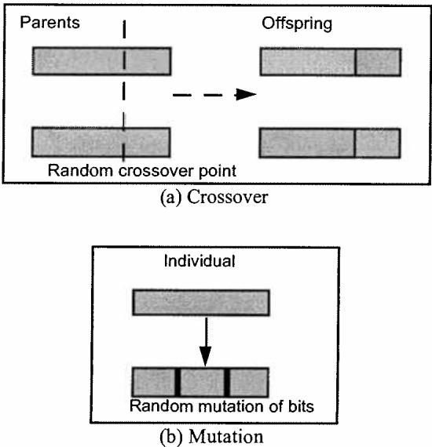
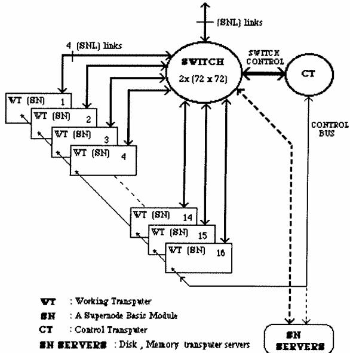
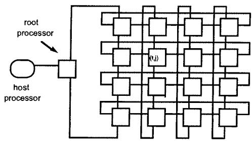
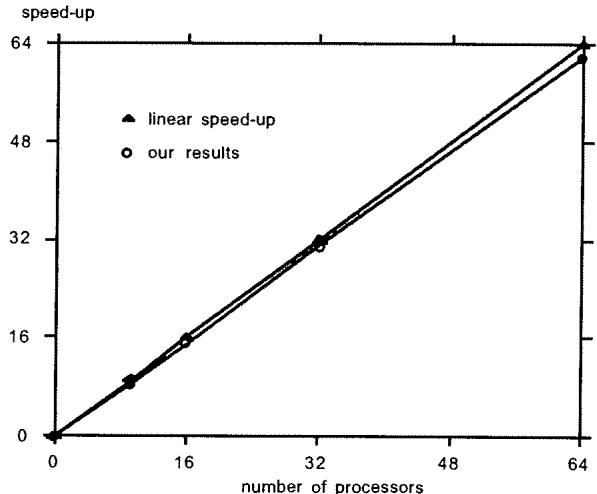
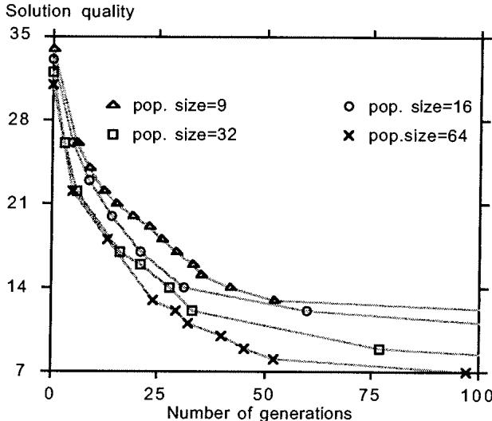
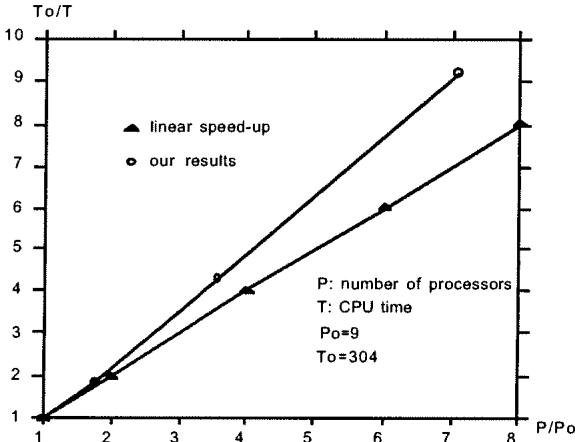

# A parallel genetic algorithm for the graph partitioning problem

El-Ghazali Talbi, Pierre Bessiere

# To cite this version:

El-Ghazali Talbi, Pierre Bessiere. A parallel genetic algorithm for the graph partitioning problem. 1991, 9 p., 1991. <hal-00089203>

# HAL Id: hal-00089203

# https://hal.archives-ouvertes.fr/hal-00089203

Submitted on 11 Sep 2006

HAL is a multi-disciplinary open access archive for the deposit and dissemination of scientific research documents, whether they are published or not. The documents may come from teaching and research institutions in France or abroad, or from public or private research centers.

L'archive ouverte pluridisciplinaire HAL, est destinée au dépôt et à la diffusion de documents scientifiques de niveau recherche, publiés ou non, émanant des établissements d'enseignement et de recherche français ou étrangers, des laboratoires publics ou privés.

E-G. Talbi & P. Bessière 2

Laboratoire de Génie Informatique / Institut IMAG University of Grenoble

# Abstract

# I. INTRODUCTION

Genetic algorithms are stochastic search and optimization techniques which can be used for a wide range of applications. This paper addresses the application of genetic algorithms to the graph partitioning problem. Standard genetic algorithms with large populations suffer from lack of efficiency (quite high execution time). A massively parallel genetic algorithm is proposed, an implementation on a SuperNode $\circled{8}$ of Transputers $^ { \textregistered }$ and results of various benchmarks are given.

The parallel algorithm shows a superlinear speed-up, in the sense that when multiplying the number of processors by p, the time spent to reach a solution with a given score, is divided by kp $( \mathsf { k } { > } 1 )$ .

A comparative analysis of our approach with hillclimbing algorithms and simulated annealing is also presented. The experimental measures show that our algorithm gives better results concerning both the quality of the solution and the time needed to reach it.

# Key Words

Distributed memory parallel architectures, Genetic algorithms, Graph partitioning, Hill-climbing, Mapping problem, Simulated annealing, Superlinear speed-up.

1. This work has been supported by ESPRIT project SuperNode2 (P2528). 2. Adress: BP53X, F-38041 Grenoble,FRANCE; Phone: (33)76.51.45.72.; Email: ghazali@imag.fr & bessiere@imag.fr.

Given a graph, the "graph partitioning problem" searches for a partition of its nodes which optimizes a given cost function.

There are numerous practical applications of this problem, for instance:

- design of V.L.S.I. (Very Large Scale Integration) circuits, where, given a set of components and a set of modules, one wants to place the components in order to minimize the number of connections between modules, yet preserving some balance concerning the number of components on each module [Lawler69][Russo71];

- routing in distributed systems, where the considered problem is to subdivide the computer network into smaller clusters so that the control overhead for routing is minimized [Bouloutas89];

- image segmentation in the field of computer vision, where segmented images are represented as graphs in which each vertex represents a segment and each weighted edge between two vertices represents a topological relationship between two segments of the image [Hérault89];

- virtual memory paging systems, where one wants to distribute the different objects on memory pages in order to minimize the number of references between objects stored on different pages [MacGregor78];

- mapping parallel programs on parallel architectures.

In our laboratory, we are especially interested in this last application, namely, the placement of communicating processes on processors of a distributed memory parallel machine. A survey of the different methods proposed in the literature to deal with this problem may be found in [Talbi90]. The parallel program is modeled as a graph where the vertices represent the processes, the vertices' weights represent known or estimated computation costs of these processes, the edges represent communication links required between them and the edges' weights estimate the relative amount of communication necessary along those links. When the number of processes exceeds the number of available processing elements, as it is usually the case in massively parallel programming, the mapping problem includes the contraction problem [Berman87] which is equivalent to the graph partitioning problem treated in this paper.

The graph partitioning problem is NP-complete. Consequently, heuristic methods should be used to deal with it. They may find solutions that are only approximations of the optimum, but they will do it in a reasonable amount of time. The different approaches that have been proposed for this problem may be divided in two main classes. On one hand, the general purpose optimization algorithms independent of the given application and, on the other hand, the heuristic approaches especially designed for a unique problem. As we want to avoid the intrinsic disadvantage of the algorithms of this second class (their limited applicability due to the problem dependance) our concern in this paper, is only the first class of algorithms.

Two widely used optimization techniques are the hillclimbing algorithm [Haden88] and simulated annealing [Sheild87]. Hill-climbing is sure to find the global minimum only in convex spaces. Otherwise, most often it is a local rather than a global minimum which is found. Simulated annealing offers a way to overcome this major drawback of hill-climbing but the price to pay to do so is an important computation time. Worst, simulated annealing algorithm is rather of a sequential nature, its parallelization is quite a difficult task [Baiardi89][Savage90]

More distributed optimization techniques may also be considered. Some of them are closely related to neural networks algorithms (see [Ackley87] & [Peretto90]). Others, namely, genetic algorithms (GAs) are considered in this paper. They are stochastic search techniques, introduced by Holland twenty years ago [Holland75], inspired by biological evolution of species. Development of massively parallel architectures made them very popular in the very last years. They have recently been applied to combinatorial optimization problems in various fields, such as, for instance, the traveling salesman problem [Grefenstette87], the optimization of connections and connectivity of neural networks [Whitley90], and classifier systems [Robertson87].

The purpose of this paper is to prove that the graph partitioning problem may be solved quite efficiently by a parallel genetic algorithm.

The structure of the paper is as follows:

- in a first section, we give a mathematical formalization of the graph partitioning problem and discuss few instances of classical cost functions.

- in the next section, we extensively present the genetic algorithm approach to the graph partitioning problem. After a recall of the genetic algorithms principles, we show how they can be used to deal with the graph partitioning problem, we discuss the matter of parallel genetic algorithms and finally we expose the proposed solution.

- the third and final section, after a detailed presentation of the Supernode implementation, presents the results of different benchmarks comparing either speed or quality of results of this algorithm given different sizes of population or given different numbers of processors. A comparative analysis of the genetic algorithm solution with hill-climbing and simulated annealing ones is also presented.

Finally, concluding remarks and possible extensions to this work are proposed.

# II. MATHEMATICAL FORMALIZATION OF THE GRAPH PARTITIONING PROBLEM

Given: - an undirected graph $\mathbf { G } = ( \mathbf { V } , \mathbf { E } )$ ; - an application $\Omega _ { 1 }$ from $\mathrm { v }$ into ${ \pmb Z } ^ { + }$ , such that $\Omega _ { 1 } ( \mathbf { v _ { i } } ) = \mathbf { w } _ { 1 \mathbf { i } }$ is the weight of vertex $\mathbf { v _ { j } } { } _ { \mathrm { : } }$ - an application $\Omega _ { 2 }$ from $\mathrm { E }$ into ${ \pmb { Z } } ^ { + }$ , such that $\Omega _ { 2 } ( \mathbf { e } _ { \mathrm { j } } ) = \mathbf { w } _ { 2 } \mathbf { \mathrm { j } }$ is the weight of edge ej; - and a set of numerical constraints $\Phi = \{ \Phi _ { 1 } , \Phi _ { 2 }$ $\ldots , \phi _ { \mathrm { { m } } } \}$ on these weights;

the graph partitioning problem has to find a partition $\Pi$ of $\mathrm { v }$ $( \Pi = \{ \pi _ { 1 } , \pi _ { 2 } , . . . , \pi _ { \mathrm { n } } \} )$ satisfying the constraints $\Phi$ .

A classical and well studied set $\Phi 1$ of constraints expresses that:

- for each sub-set ${ \mathfrak { N } } _ { \mathrm { j } }$ of $\mathrm { v }$ belonging to the partition II, the sum of the weights of its vertices must be inferior to a given value B

$$
\forall \pi _ { \mathrm { i } } \in \Pi , \qquad \sum _ { \mathrm { v } \in \pi _ { \mathrm { i } } } \Omega _ { 1 } ( \mathrm { v } ) \leq \mathbf { B }
$$

- the sum of the weights of edges going from one node of $\pi _ { \mathrm { i } }$ to one node of some other $\pi _ { \mathrm { j } }$ must be inferior to some given value C

$$
\sum _ { \mathfrak { e } \in \mathfrak { E } } \Omega _ { 2 } ( \mathfrak { e } ) \leq \mathbf { C }
$$

with $\mathfrak { E } = \{ \mathbf { \Gamma } ( \mathbf { x } , \mathbf { y } ) / \left( \mathbf { x } , \mathbf { y } \right) \in \mathrm { E }$ & xπi & yπj & i≠j }

The graph partitioning problem under constraints $\Phi 1$ has been proved NP-complete (see [Garey79]).

Most applications correspond to the following set $\Phi 2$ of constraints where the weights of all nodes are set to 1 (see [Kernighan70] & [Feo90]]:

- for each sub-set $\pi _ { \mathrm { i } }$ of $\mathrm { v }$ belonging to the partition II, the number of nodes in $\pi _ { \mathrm { j } }$ is equal to a given value $\mathrm { B } _ { \mathrm { i } }$

$$
\forall \pi _ { \mathrm { i } } \in \Pi , \qquad \sum _ { \mathrm { v } \in \pi _ { \mathrm { i } } } \Omega _ { 1 } ( \mathrm { v } ) = \mathrm { B } _ { \mathrm { i } }
$$

$$
\mathrm { w i t h ~ } \forall \mathrm { ~ v \in V , ~ } \Omega _ { 1 } ( \mathrm { v } ) { = } 1
$$

- the total cost of the edges going from one $\pi _ { \mathrm { j } }$ to another $\pi _ { \mathrm { j } }$ should be minimum

$$
\mathbf { M I N } ( \sum _ { e \in \texttt { t } } \Omega _ { 2 } ( \mathbf { e } ) )
$$

The graph partitioning problem under constraints $\Phi 2$ has also been proved NP-complete (see [Hyafil73]).

For our application, the mapping of parallel programs on parallel architectures, we have to consider the following set $\Phi 3$ of constraints:

- minimize the sum of the total communication costs between processors (total cost of the edges going from one $\pi _ { \mathrm { i } }$ to another $\pi _ { \mathrm { j } } )$ and of the variance of the loads of the different processors (variance of cost of vertices belonging to a given $\pi _ { \mathrm { i } }$ ):

$$
\bf { M I N } \left( \sum _ { \vec { \mathfrak { e } } \in \mathfrak { e } } \Omega _ { 2 } ( \vec { \mathfrak { e } } ) + ( K \ ^ { \ast } ( \frac { \sum _ { \vec { \pi } \in \Pi } \Omega _ { 1 } ( \vec { \mathfrak { e } } ) } { | \Pi | } ) ^ { 2 } - \Big ( \frac { \sum _ { \vec { \pi } \vec { \mathfrak { e } } } \Omega _ { 1 } ( \vec { \mathfrak { e } } ) } { | \Pi | } \Big ) ^ { 2 } ) \right)
$$

With ${ \tt K } { = } 0$ the set of constraints $\Phi 3$ reduces to $\Phi 2$ This proves that the partitioning problem under constraints $\Phi 3$ is NP-complete.

For the mapping problem, K is the weight of the contribution of the communication cost relative to the computational load balance across the system. Choosing a suitable value for K depends on knowledge about characteristics of the parallel architecture. Very small values of K would suggest a uniprocessor solution, and very large values would reduce the problem to one of multiprocessor scheduling without communication costs. The parallel architecture used was a network of transputers and $\mathtt { K } { = } 2$ has been chosen.

# III. GENETIC ALGORITHM SOLUTION TO THE GRAPH PARTITIONING PROBLEM

III.1. Genetic algorithms principles and their application to the graph partitioning problem

Genetic algorithms compose a very interesting family of optimization algorithms. Their basic principle is quite simple.

Given a search space $\Sigma$ of size $\mathbf { M } ^ { \mathbf { N } }$ given $\mathbf { M }$ symbols, any point of this space may be represented by a vector of $\mathbf { N }$ of these M symbols.

Given a fitness function F from $\Sigma$ into $\Re$ associating a real value to any point of $\Sigma$ .

Given an initial set of vectors, called the initial population.

Some genetic operators are used to generate new points of $\Sigma$ given some old ones in a phase of the process called "reproduction". During this phase, some points of $\Sigma$ are replaced keeping the size of the population fixed. The fundamental principle of GA is: "the fitter a vector, the most probable its reproduction". In mathematical terms it means that the probability $\mathbf { P }$ of reproduction is increasing as F increased:

$$
\forall \sigma _ { 1 } , \sigma _ { 2 } \in \Sigma , \qquad \quad \mathrm { F } ( \sigma _ { 1 } ) \mathrm { > F } ( \sigma _ { 2 } ) \implies \mathrm { P } ( \sigma _ { 1 } ) \mathrm { > P } ( \sigma _ { 2 } )
$$

The standard genetic algorithm is:

Generate a population of random individuals.   
While nber_of_generations ≤ max_nber_of_generations   
Do Evaluation assign a fitness value to each individual. Selection - make a list of pairs of individuals likely to mate, with fitter individuals listed more frequently. Reproduction - apply genetic operators to the selected pairs. Replacement - form a new population by replacing worst indivuduals by best ones.

The most common genetic operators used during reproduction are crossover and mutation. Crossover, given two vectors, cut them both at the same random point and exchange the two portions thus cut out (fig.la). Mutation is simply flitting a bit (fig.1b). Two parameters need to be defined: Pc and Pm. They represent respectively the probability of application of the crossover and mutations operators. Other genetic operators may be find in the literature, for instance, the inversion operator [Cohoon87] and many variants of the crossover operator designed for specific problem domains [Shahookar90].

  
Figure 1: Genetic operators.

To use genetic algorithm for the graph partitioning problem, the following formalism is used:

Let us suppose that we have a graph of N nodes to divide into M sub-sets. Each of these sub-sets is labelled by a symbol (for instance an integer between 0 and M-1). A given partition is represented by a $\mathbf { N }$ vector of those symbols; where symbol p in position q means that node $\mathbf { q }$ of the graph is in sub-set p.

The fitness function F is the last cost function described in section II. We use the usual version of crossover, but mutation is a random trial of one of the M possible symbols.

# III.2. A parallel genetic algorithm

Two approaches to parallel genetic algorithms have been considered so far:

standard parallel approach: In this approach, the evaluation and the reproduction are done in parallel. However, the selection is still done sequentially, becauseI tion would require a fully connected graph of individuals as any two individuals in the population may be mated [Macfarlane90].

decomposition approach: This approach consists in dividing the population into equal size subpopulations. Each processor runs the genetic algorithm on its own sub-population, periodically selecting good individuals to send to its neighbors and periodically receiving copies of its neighbors' good individuals to replace bad ones in its own sub-population [Pettey87][Tanese87]. The processor neighborhood, the frequency of exchange and the number of individuals exchanged are adjustable parameters.

The standard parallel model is not flexible in the sense that the communication overhead grows as the square of population's size. Therefore, this approach is not adapted to distributed memory architectures, where the cost of communication has a great impact on the performance of parallel programs. In the decomposition model, the inherent parallelism is not fully exploited as treatment of subpopulations may be further decomposed. This approach should be considered only when the number of available processors is less than the required size of the population.

Considering massively parallel architectures with numerous processors, we chose a fine-grained model, where the population is mapped on a connected processor graph like a grid, one individual per processor. We have a bijection between the individual set and the processor set. The selection is done locally in a neighborhood of each individual. Another version to this approach has been already proposed in [Mühlenbein89], where at each generation a hill-climbing algorithm is executed for each individual in the population.

The choice of the neighborhood is the adjustable parameter. To avoid overhead and complexity of routing algorithms in parallel distributed machines, a good choice may be to restrict neighborhood to only directly connected individuals.

The parallel genetic algorithm proposed is:

Generate in parallel a population of random individuals. While nber_of_generations $\leq$ max_nber_of_generations Do

Evaluation - Evaluate in parallel each individual.

Selection - Receive in parallel the indivuduals comming from its neighbors. Reproduction - Each individual reproduces in parallel with the individuals previously received. Replacement - Do in parallel a selection of best local offsprings.

It is important to notice that these modifications of the standard model do not cause a degradation in the search efficiency of the standard genetic algorithm as shown in [Anderson90] and [Mühlenbein88].

# IV. SUPERNODE IMPLEMENTATION AND BENCHMARKING

# IV.1. Supernode Implementation

The Supernode is a loosely coupled, highly parallel machine based on transputers (fig.2). One of its most important characteristics is its ability to dynamically reconfigure the network topology by using a programmable VLSI switch device. This architecture offers a range of 16 to 1024 processors, delivering from 24 to 1500 Mflops performance. To achieve these performance, a hierarchical structure has been adopted [Jesshope86]. The basic component is a $\mathtt { T 8 0 0 }$ transputer. It is a 32-bit microprocessor, with on-chip memory and F.P.U. (Floating Point Unit), delivering 10Mips and 1.5Mflops peak performance. Communication between transputers is supported by 4 bidirectional, serial, asynchronous, point-topoint connection links. A Sun host station is used to provide the connection between the root processor and the external world.

  
Figure 2 Supernode Parallel Architecture.

The programming environment used in our experiments is Parallel C 3L. A configurator of the physical network, developed in our laboratory has been used to obtain the desired topology of the architecture.

We assume that each individual in the population resides on a processor and communication is carried out by message passing. The following is a pseudo-Occam description of the process executed in parallel by each processor:

SEQ Generate (local_individual) Evaluate (local_individual) While nber_of_generations ≤ max_nber_of_generations SEQ -- communication phase PAR $\scriptstyle \mathrm { i = } 0$ FOR nber_of_neighbors PAR neighbor_in[i] ? neighbor_individual[] neighbor_out[i] ! local_individual -- computation phase PAR $\mathrm { i } { = } 0$ FOR nber_of_neighbors Reproduction(local_individual, neighbor_individual[i]) Replacement

Each reproduction produces two offsprings. Our sraty is to choose randomly one of the offsprings. The replacement phase consists in replacing the current local individual with the best local offspring produced in the reproduction phase.

The population is placed on a torus. Given the four links of the transputer, each individual has four neighbors. No routing is needed in the processor network because only directly connected processors have to exchange information.

We do not consider the best solution found globally since the communication involved in determining this solution would be considerable. We only pick up the best solution routing through a "spy process" placed on the "root processor" (see fig. 3).

  
Figure 3 A torus of 16 processors.

# IV.2. Varying the number of processors

The purpose of this benchmark is to measure the speedup when running the genetic parallel algorithm (for a given population sizeon different sizes of torus of processors.

We use the speed-up ratio as a metric for the performance of the parallel genetic algorithm. The speed-up ratio S is defined as $\scriptstyle \mathbf { S } = \mathbf { T s } / \mathbf { T p }$ where Ts is the execution time on a single processor and $\mathrm { T p }$ corresponds to execution time for a p processors implementation. Figure 4 shows the obtained results.

The algorithm has a near-linear speed-up. This is due to the fact that the communication cost between processes is relatively small compared with the computation cost, and is independant of the size of the architecture.

  
Figure 4: Speed-up of the parallel algorithm

# IV.3. Varying the population size

The purpose of this benchmark is to measure the evolution of solution's quality when running the parallel genetic algorithm with different sizes of population.

  
Figure 5 shows the obtained results.   
Figur :Solution quality function f population ize

Notice that given the specific graph partitioning problem used (a pipeline of 32 vertices to be partitioned in 8 sub-sets) for this benchmark, the best possible solution scores 7.

As expected, for a given number of generations, the quality improves with an increase of population's size.

It may even happen that for a too small population a premature convergence occurs and that the optimal solution will not be ever reached.

The figure 5 shows also that the greatest reduction in the cost of the partitioning occurs at the beginning. Thus a moderate quality partitioning can be obtained very quickly.

# IV.4. Time to reach a given solution

The purpose of this benchmark is to study the speed-up for a given solution's quality when running the genetic parallel algorithm on different sizes of torus of processors and with different sizes of populations (both being equal given that there is one individual per processor).

Figure 6 shows the influence of the number of processors (and population size) on the time needed to reach a solution scoring 8.

<table><tr><td colspan="2"></td></tr><tr><td>number of processors</td><td>CPU time</td></tr><tr><td>9 16</td><td>304 164</td></tr><tr><td>32</td><td>71</td></tr><tr><td></td><td></td></tr><tr><td>64</td><td>33</td></tr></table>

  
Figure 6: Execution times on different sizes of parallel architectures.

We have a "superlinear" speed-up of the parallel genetic algorithm, in the sense that when multiplying the number of processors by p the execution time is divided by $\mathbf { k } \mathbf { p }$ $( \mathbf { k } { > } 1 )$ .

# IV.5. Comparison with hill-climbing and simulated annealing algorithms

In this section, the performance of the proposed algorithm is compared with hill-climbing and simulated annealing algorithms.

# a/ Hill-climbing algorithm

The hill-climbing algorithm starts with a random configuration, and tries to improve it [Johnson85]. The improvement is carried out in small steps consisting of moving a vertice from one sub-set to another. A move is selected randomly, the cost change of the move is evaluated, and if the change is for the better the move is accepted and a new configuration is generated. Otherwise, the old configuration is kept. This process is repeated until there are no changes to the configuration that will reduce the cost function further. When this occurs a local minimum has usually been found, rather than the required global minimum. Figure 7 shows a version of the hillclimbing algorithm.

Generate a random initial state S0 $\mathrm { S } { : = } \mathrm { S } 0$ ). Repeat compute at random a neighboring state S'. if $\mathsf { c o s t } ( \mathbf { S } ^ { \prime } ) < \mathsf { c o s t } ( \mathbf { S } )$ then $\mathbf { S } { : = } \mathbf { S } ^ { \prime }$ Until there is no better neighbor.

Figure 7: The hill-climbing algorithm.

# b/ Simulated annealing algorithm

The principle of the simulated annealing algorithm is the following [Kirkpatrick83] (fig.8): the system is put in a high temperature environment. At this temperature is applied a sufficiently long sequence of random elementary transformations (markov chain) to reach the equilibrium at this temperature. Then, the temperature is slightly decreased and a new sequence of random move is applied. At each temperature the permitted energy states are governed by the metropolis criterion, which allows the configuration to accept a state with a probability $\mathrm { P } ( \Delta \mathrm { E } , \mathrm { T } )$ The search terminates when the system stabilizes.

There is a large amount of literature on this topic [Laarhoven87], and the basic algorithm allows for considerable variation and tuning of parameters. The version we considered is a straightforward version, which can probably be greatly improved. However, as the parallel genetic algorithm is also a "naive", "out-of-the-shell" version, we think that the following benchmarks give, at least, interesting order of magnitudes.

The number of available changes to the configuration, denoted by L, when moving one vertex to a different subset, is given by ${ \mathrm { L } } { = } { \mathrm { N } } ^ { * } ( { \mathrm { M } } { - } 1 )$ , where $\mathbf { N }$ is the number of vertices of the graph to be partitioned and M the number of sub-sets of the partition. This value gives a measure of the size of the problem and is used as a parameter in the annealing schedule.

1. (Initialization step) - start with a random initial configuration S0 $( \mathrm { S } { : = } \mathrm { S } 0 )$ ; - $\mathrm { T } : = \mathrm { T m a x }$ ;

2. (Stochastic hill-climb) - generate and compute a random neighboring state S'; ΔE $=$ cost(S')-cost(S) - select the new configuration $( \mathsf { S } { : = } \mathsf { S } ^ { \mathsf { \prime } }$ with probability $\scriptstyle \mathrm { P ( \Delta E , T ) = m i n ( l , e x p ( - \Delta E / T ) ) }$ ; - repeat this step $\mathbf { X } ^ { * } \mathbf { N } ^ { * } ( \mathbf { M } \mathbf { - } \mathbf { l } )$ times; $/ ^ { * }$ length of the markov chain spent at each T $^ { * } /$

3. (Anneal/Convergence test) - set $\mathrm { T } { : = } \mathbf { a } \mathrm { T }$ ; - if T≥Tmin goto step2.

Figure 8 The simulated annealing algorithm.

# c/ Experimental protocol and results

Each algorithm was run 10 times to obtain an average performance estimate. Experiments were performed on two different problems:

- a pipeline of 32 vertices to be partitioned in 8 subsets; - and a grid of 64 vertices to be partitioned in 4 subsets.

For the genetic algorithm, we use a population of 64 configurations running on a 8 by 8 torus of processors. The annealing schedule and the genetic algorithm parameter's that have been used during our experiments are given by table 1 and 2.

Table 1: The annealing schedule.   

<table><tr><td>Symbol</td><td>Value</td><td>Description</td></tr><tr><td>Tmax</td><td>10</td><td>Starting temperature</td></tr><tr><td>Tmin</td><td>0.1</td><td>Minimum temperature</td></tr><tr><td>a</td><td>0.9</td><td>Temperature decay rate</td></tr><tr><td>X</td><td>2</td><td>Lenght of the markov chain</td></tr></table>

<table><tr><td rowspan=1 colspan=1>Symbol</td><td rowspan=1 colspan=1>Value</td><td rowspan=1 colspan=1>Description</td></tr><tr><td rowspan=1 colspan=1>POPSPcPm</td><td rowspan=1 colspan=1>6410.5</td><td rowspan=1 colspan=1>Population sizeCrossover probabilityMutation probability</td></tr></table>

Table 2: Genetic algorithm parameter's.

The tables below show the minimum, maximum, average value and the variance of the obtained solutions. The results for the hill-climbing and the simulated annealing algorithms are based on an implementation on a single $\mathrm { T } 8 0 0$ transputer.

It can be observed from tables 3 and 4 that the genetic algorithm outperforms hill-climbing and simulated annealing algorithms both in the quality of the solution and the time used in the search.

Table 3: Benchmarking with a pipeline of 32 vertices and a partition of 8 sub-sets.   

<table><tr><td rowspan=1 colspan=1>Algorithm</td><td rowspan=1 colspan=1>min</td><td rowspan=1 colspan=2>Solutionmax    mean</td><td rowspan=1 colspan=1>deviation</td><td rowspan=1 colspan=1>CPU time(sec)</td></tr><tr><td rowspan=1 colspan=1>Hill-climbing</td><td rowspan=1 colspan=1>7.5</td><td rowspan=1 colspan=1>12.5</td><td rowspan=1 colspan=1>9.9</td><td rowspan=1 colspan=1>1.94</td><td rowspan=1 colspan=1>353</td></tr><tr><td rowspan=1 colspan=1>Simulated annealing</td><td rowspan=1 colspan=1>7.5</td><td rowspan=1 colspan=1>9</td><td rowspan=1 colspan=1>8.05</td><td rowspan=1 colspan=1>0.37</td><td rowspan=1 colspan=1>2296</td></tr><tr><td rowspan=1 colspan=1>Genetic algorithm</td><td rowspan=1 colspan=1>7</td><td rowspan=1 colspan=1>8</td><td rowspan=1 colspan=1>7.5</td><td rowspan=1 colspan=1>0.15</td><td rowspan=1 colspan=1>64</td></tr></table>

<table><tr><td rowspan=1 colspan=1>Algorithm</td><td rowspan=1 colspan=1>min</td><td rowspan=1 colspan=3>Solutionmax    mean    ,deviation</td><td rowspan=1 colspan=1>CPU time(sec)</td></tr><tr><td rowspan=1 colspan=1>Hill-climbing</td><td rowspan=1 colspan=1>24</td><td rowspan=1 colspan=1>47</td><td rowspan=1 colspan=1>32.9</td><td rowspan=1 colspan=1>42.49</td><td rowspan=1 colspan=1>643</td></tr><tr><td rowspan=1 colspan=1>Simulated anneallng</td><td rowspan=1 colspan=1>21</td><td rowspan=1 colspan=1>27</td><td rowspan=1 colspan=1>24</td><td rowspan=1 colspan=1>4.00</td><td rowspan=1 colspan=1>3358</td></tr><tr><td rowspan=1 colspan=1>Genetic algonthm</td><td rowspan=1 colspan=1>17</td><td rowspan=1 colspan=1>25</td><td rowspan=1 colspan=1>21</td><td rowspan=1 colspan=1>6.25</td><td rowspan=1 colspan=1>93</td></tr></table>

Table 4: Benchmarking with a grid of 64 vertices and a partition of 4 sub-sets.

For simulated annealing, best results may be obtained using bigger values of X, however, raising X will increase the computation time.

# V. CONCLUSIONS AND FUTURE

# DIRECTIONS

A parallel genetic algorithm to solve the graph partitioning problem has been proposed and evaluated.

The main results are the following:

- it is simple to implement on massively parallel distributed memory architectures;

- it outperforms hill-climbing and simulated annealing algorithms both in the quality of the solution and the time used to reach it.

An important caracteristic of genetic algorithms is that they may be used to solve a great variety of combinatorial optimization problems. We are using them to solve such optimization problems in the field of robot control and neural networks [Bessière90].

We are also studying an important improvement of the algorithm, namely, the dynamic variation of its parameters and particularly mutation probability. The crossover operator becomes less effective over time as the strings in the population become more similar. One way to avoid the premature convergence and to sustain genetic diversity is by using adaptive mutation. During the first generations when there is ample diversity in the population, mutation must occur at very low rates. However, as diversity decreases in the population, the mutation rate must increase.

More theoretical work is planned: a cellular automata based model will be used to study the influence of the algorithm's parameters on its convergence

[Ackley87] D.H.Ackley, "A connectionist machine for genetic hillclimbing", Kluwer Academic Pub., Boston, 1987.

[Anderson90] E.J.Anderson, M.C.Ferris, "A genetic algorithm for the assembly line balancing problem", Tech. Rep. No.926, Univ. of Wisconsin-Madison, Mar 1990.

[Baiardi89] F.Baiardi, S.Orlando, "Strategies for a massively parallel implementation of simulated annealing", PARLE'89, LNCS, Vol.366, Eindhoven, Netherlands, pp.273- 287, June 1989.

[Berman87] F.Berman, L.Synder, "On mapping parallel algorithms into parallel architectures", J. of Parallel and Distributed Computing 4, pp.439-458, 1987.

[Bessière90] P. Bessière, "Toward a synthetic cognitive paradigm: probabilistic inference", Proc. of COGNITIVA90, Madrid, Spain, 1990

[Bouloutas89] A.Bouloutas, P.M.Gopal, "Some graph partitioning problems and algorithms related to routing in large computer networks", 9th Int. Conf. on Distributed Computing Systems, pp.362-370, 1989.

[Cohoon87] J.P.Cohoon, S.U.Hedge, W.N.Martin, D.Richards, "Punctuated Equilibra: A parallel genetic algorithm", Proc. of the Second Int. Conf. on Genetic Algorithms, MIT, Cambridge, pp.148-154, Jul 1987.

[Feo90] T.A.Feo, M.Khellaf, "A class of bounded approximation algorithms for graph partitioning", Networks, Vol.20, No.2, pp.181-195, Mar 1990.

[Garey79] M.R.Garey, D.S.Johnson, "Computers and intractability: A guide to the theory of NP_completeness", Freeman, San Francisco, 1979.

[Grefenstette87] J.J.Grefenstette, "Incorporating problem specific knowledge into genetic algorithms", in Genetic algorithms and Simulated annealing, L.Davis ed., Morgan Kaufmann Publishers, pp.42-60, 1987.

[Haden88] P.Haden, F.Berman, "A comparative study on mapping algorithms for an automated parallel programming environment", Tech. Rep., CS-088, Univ. of California, San Diego, 1988.

[Hérault89] L.Hérault, J-J.Niez, "How neural networks can solve hard graph problems: A performance study on the graph K-partitioning", Neuro-Nimes'89 Int. Workshop on Neural Networks & their applications, Nimes, France, pp.237-255, Nov 1989.

[Holland75] J.H.Holland, "Adaptation in natural and artificial systems", Ann Arbor: Univ. of Michigan Press, 1975.

[Hyafil73] L.Hyafil, R.L.Rivest, "Graph partitioning and constructing optimal decision trees are polynomial complete problems", RR No.33, IRIA Laboria, Rocquencourt, France, Oct 1973.

[Jesshope86] C.R.Jesshope, T.Muntean, C.Whitbystrevens, J.G.Harp, "Supernode Project Pl085: Development and application of a low cost high performance multiprocessor machine", ESPRIT'86, Brussels, 1986.

[Johnson85] D.S.Johnson, C.H.Papadimitriou, M.Yannakakis, "How easy is local search ?", Proc. Annual Symp. of Foundation of Computer Science, pp.39-42, 1985.

[Kernighan70] B.W.Kernighan, S.Lin, "An efficient heuristic procedure for partitioning graphs", The Bell System Tech. Jou., Vol.49, pp.291-307, Feb 1970.

[Kirkpatrick83] S.Kirkpatrick, C.D.Gelatt, M.P.Vecchi, "Optimization by simulated annealing", Science, Vol.220, No.4598, pp.671-680, May 1983.

[Laarhoven87] P.J.M.Laarhoven, E.H.L.Aarts, "Simulated annealing: Theory and applications", D. Reidel Pub. Comp., 1987.

[Lawler69] E.L.Lawler, K.N.Levitt, J.Turner, "Module clustering to minimize delay in digital networks", IEEE Trans. on Comp., Vol.C-18, No.1, pp.47-57, Jan 1969.

[Macfarlane90] D.Macfarlane, I.East, "An investigation of several parallel genetic algorithms", Proc. of the 12th Occam User Group, Exeter, UK, pp.60-67, Apr 1990.

[MacGregor78] R.M.MacGregor, "On partitioning a graph: A heuristical and empirical study", Memorandum No.UCB/ERL M78/14, Electronics Research Laboratory, Univ. of California, Berkeley, 1978.

[Mühlenbein88] H.Mühlenbein, M.Gorges-schleuter, O.Kramer, "Evolution algorithms in combinatorial optimization", Parallel Computing, Vol.7, No.2, pp.65-85, Apr 1988.

[Mühlenbein89] H.Mühlenbein, J.Kindermann, "The dynamics of evolution and learning: Towards genetic neural networks", Connectionism in Perspective, R.Pfeifer et al. eds., North-Holland, pp.173-197, 1989.

[Pettey87] C.B.Pettey, M.R.Leuze, J.J.Grefenstette, "A parallel genetic algorithm", Proc. of the Second Int. Conf. on Genetic Algorithms, MIT, Cambridge, pp.155-161, Jul 1987.

[Peretto90] P. Peretto, "Neural networks and combinatorial optimization", Proc. of the international conference on Neural Networks, E.N.S. of Lyon, Lyon, FRANCE, 1990.

[Robertson87] G.Robertson, "Parallel implementation of genetic algorithms in a classifier system", in Genetic algorithms and Simulated annealing, L.Davis ed., Morgan Kaufmann Publishers, pp.129-140, 1987.

[Russo71] R.L.Russo, P.H.Oden, P.K.Wolff, "A heuristic procedure for the partitioning and mapping of computer logic graphs", IEEE Trans. on Comp., Vol.C-20, No.12, pp.1455- 1462, Dec 1971.

[Savage90] J.E.Savage, M.G.Wloka, "On parallelizing graph-partitioning heuristics", Automata, Languages and Programming, Warwick Univ., UK, LNCS No.443, pp.476- 489, Jul 1990.

[Shahookar90] K.Shahookar, P.Mazumder, "A genetic approach to standard cell placement using meta-genetic parameter optimization", IEEE Trans. on Computer-Aided Design, Vol.9, No.5, pp.500-511, May 1990.

[Sheild87] J.Sheild, "Partitioning concurrent VLSI simulation programs onto a multiprocessor by simulated annealing", IEE Proceedings, Vol.I34, Pt.E, No.I, pp.24-30, Jan 1987.

[Talbi90] E-G.Talbi, T.Muntean, "Static allocation of communicating processes on a parallel architecture", Research Rep. RR-833-I-, LGI/IMAG, INPG, Nov I990.

[Tanese87] R.Tanese, "Parallel genetic algorithms for a hypercube", Proc. of the Second Int. Conf. on Genetic Algorithms, MIT, Cambridge, pp.I77-I83, Jul I987.

[Whitley90] D.Whitley, T.Starkweather, C.Bogart, "Genetic algorithms and neural networks: optimizing connections and connectivity", Parallel Computing, Vol.14, No.3, pp.347-36I, Aug 1990.