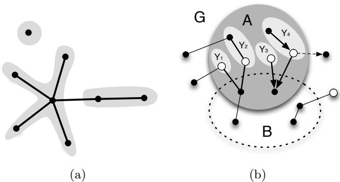
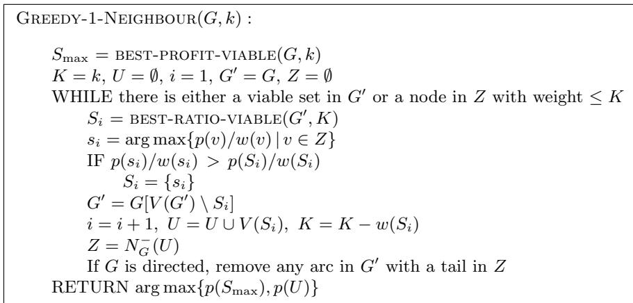
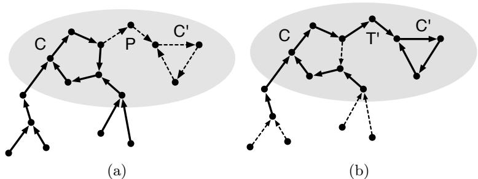

# The 1-Neighbour Knapsack Problem

Glencora Borradaile $^ { 1 }$ , Brent Heeringa $^ 2$ , and Gordon Wilfong $^ 3$ $^ { 1 }$ Oregon State University. glencora@eecs.oregonstate.edu 2 Williams College. heeringa@cs.williams.edu $^ 3$ Bell Labs. gtw@research.bell-labs.com ?

Abstract. We study a constrained version of the knapsack problem in which dependencies between items are given by the adjacencies of a graph. In the 1-neighbour knapsack problem, an item can be selected only if at least one of its neighbours is also selected. We give approximation algorithms and hardness results when the nodes have both uniform and arbitrary weight and profit functions, and when the dependency graph is directed and undirected.

# 1 Introduction

We consider the knapsack problem in the presence of constraints. The input is a graph $G = ( V , E )$ where each vertex $v$ has a weight $w ( v )$ and a profit $p ( v )$ , and a knapsack of size $k$ . We start with the usual knapsack goal—find a set of vertices of maximum profit whose total weight does not exceed $k$ —and handle the additional requirement that a vertex can be selected only if at least one of its neighbours is also selected (vertices with no neighbours can always be selected). We call this the 1-neighbour knapsack problem. We consider the problem with general (arbitrary) and uniform ( $p ( v ) = w ( v ) = 1 \forall v$ ) weights and profits, and with undirected and directed graphs. In the case of directed graphs, the constraints only apply to the out-neighbours of a vertex.

Constrained knapsack problems have applications to scheduling, tool management, investment strategies and database storage [7, 1, 6]. There are also applications to network formation. For example, suppose a set of customers $C \subset V$ in a network $G = ( V , E )$ wish to connect to a server, represented by a single sink $s \in V$ . The server may activate each edge at a cost and each customer would result in a certain profit. The server wishes to activate a subset of the edges with cost within the server’s budget. By introducing a vertex mid-edge with zero-profit and weight equal to the cost of the edge and giving each customer zero-weight, we convert this problem to a 1-neighbour knapsack problem.

Results. We show that the four resulting problems

$$
\{ { \mathrm { g e n e r a l } } , { \mathrm { u n i f o r m } } \} \times \{ { \mathrm { u n d i r e c t e d } } , { \mathrm { d i r e c t e d } } \}
$$

Table 1. Our results: upper and lower bounds on the approximation ratios for combinations of general, uniform $\} \times \left\{ \begin{array} { r l r } \end{array} \right.$ undirected, directed . For uniform, undirected, the bounds are running-times of optimal algorithms.   

<table><tr><td rowspan="3">Uniform</td><td colspan="2">Upper</td><td>Lower</td></tr><tr><td>Undirected</td><td>linear</td><td>linear</td></tr><tr><td rowspan="2"></td><td>Directed</td><td>PTAS</td><td>NP-complete</td></tr><tr><td>Undirected</td><td>(1−ε) · (1 − 1/e1−ε) 2</td><td>1− 1/e</td></tr><tr><td>General</td><td>Directed</td><td>open</td><td>1/Ω(1og1−ε n)</td></tr></table>

In Section 2 we describe a greedy algorithm that applies to the general 1- neighbour problem for both directed and undirected dependency graphs. The algorithm requires two oracles: one for finding a set of vertices with high profit and another for finding a set of vertices with high profit-to-weight ratio. In both cases, the total weight of the set cannot exceed the knapsack capacity and the subgraph defined by the vertices must adhere to a strict combinatorial structure which we define later. The algorithm achieves an approximation ratio of $( \alpha / 2 ) \cdot ( 1 - 1 / e ^ { \beta } )$ . The approximation ratios of the oracles determines the $\alpha$ and $\beta$ terms respectively.

For the general, undirected 1-neighbour case, we give polynomial-time oracles that achieve $\alpha = \beta = ( 1 - \varepsilon )$ for any $\varepsilon > 0$ . This yields a polynomial time $( ( 1 - \varepsilon ) / 2 ) \cdot ( 1 - 1 / e ^ { 1 - \varepsilon } )$ -approximation. We also show that no approximation ratio better than $1 - 1 / e$ is possible (assuming P6=NP). This matches the upper bound up to (almost) a factor of 2. These results appear in Section 2.1.

In Section 2.2, we show that the general, directed 1-neighbour knapsack problem is $1 / \varOmega ( \log ^ { 1 - \varepsilon } n )$ -hard to approximate, even in DAGs.

In Section 3 we show that the uniform, directed 1-neighbour knapsack problem is NP-hard in the strong sense but that it has a polynomial-time approximation scheme (PTAS)4. Thus, as with general, undirected 1-neighbour problem, our upper and lower bounds are essentially matching.

Finally, in Section 4 we show that the uniform, undirected 1-neighbour knapsack problem affords a simple, polynomial time solution.

Related work. There is a tremendous amount of work on maximizing submodular functions under a single knapsack constraint [12], multiple knapsack constraints [10], and both knapsack and matroid constraints [11, 4]. While our profit function is submodular, the constraints given by the graph are not characterized by a matroid (our solutions, for example, are not closed downward). Thus, the 1-neighbour knapsack problem represents a class of knapsack problems with realistic constraints that are not captured by previous work.

As we show in Section 2.1, the general, undirected 1-neighbour knapsack problem generalizes several maximum coverage problems including the budgeted variant considered by Khuller, Moss, and Naor [8] which has a tight $( 1 - 1 / e )$ - approximation unless P=NP. Our algorithm for the general 1-neighbour problem follows the approach taken by Khuller, Moss, and Naor but, because of the dependency graph, requires several new technical ideas. In particular, our analysis of the greedy step represents a non-trivial generalization of the standard greedy algorithm for submodular maximization.

Johnson and Niemi [6] give an FPTAS for knapsack problems on dependency graphs that are in-arborescences (these are directed trees in which every arc is directed toward a single root)5. This problem can be viewed as an instance of the general, directed 1-neighbour knapsack problem.

In a longer technical report [2] we explore a version of the constrained knapsack problem where an item may be selected only if all its neighbours are selected. This problem generalizes the subset-union knapsack problem (SUKP) [7], the precedence constrained knapsack problem (PCKP) [1], and the partially ordered knapsack problem (POK) [9].

Notation. We consider graphs $G$ with $n$ vertices $V ( G )$ and $m$ edges $E ( G )$ . Whether the graph is directed or undirected will be clear from context. We refer to edges of directed graphs as arcs. For an undirected graph, $N _ { G } ( v )$ denotes the neighbours of a vertex $v$ in $G$ . For a directed graph, $N _ { G } ( v )$ denotes the outneighbours of $\boldsymbol { v }$ in $G$ , or, more formally, $N _ { G } ( v ) = \{ u : v u \in E ( G ) \}$ . Given a set of nodes $X$ , $N _ { G } ^ { - } ( X )$ is the set of nodes not in $X$ but that have a neighbour (or out-neighbour in the directed case) in $X$ . That is, $N _ { G } ^ { - } ( X ) = \{ u : u v \in E ( G ) , u \notin$ $X$ , and $v \in X \}$ . The degree (in undirected graphs) and out-degree (in directed graphs) of a vertex $v$ in $G$ is denoted $\delta _ { G } ( v )$ . The subscript $G$ will be dropped when the graph is clear from context. For a set of vertices or edges $U$ , $G [ U ]$ is the graph induced on $U$ .

For a directed graph $G$ , $\mathcal { D }$ is the directed, acyclic graph (DAG) resulting from contracting maximal strongly-connected components (SCCs) of $G$ . For each node $u \in V ( \mathcal { D } )$ , let $V ( u )$ be the set of vertices of $G$ that are contracted to obtain $u$ .

For convenience, extend any function $f$ defined on items in a set $X$ to any subset $A \subseteq X$ by letting $\textstyle f ( A ) = \sum _ { a \in A } f ( a )$ . If $f ( a )$ is a set, then $f ( A ) =$ $\textstyle \bigcup _ { a \in A } f ( a )$ . If $f$ is defined over vertices, then we extend it to edges: $f ( E ) =$ $f ( V ( E ) )$ . For any knapsack problem, OPT is the set of vertices/items in an optimal solution.

Viable Families and Viable Sets. A set of nodes $U$ is a $\mathit { 1 }$ -neighbour set for $G$ if for every vertex $v \in U$ , $| N _ { G [ U ] } ( v ) | \geq \operatorname* { m i n } \{ \delta _ { G } ( v ) , 1 \}$ . That is, a 1-neighbour set is feasible with respect to the dependency graph. A family of graphs $\mathcal { H }$ is a viable family for $G$ if, for any subgraph $G ^ { \prime }$ of $G$ , there exists a partition $y _ { \mathcal { H } } ( G ^ { \prime } )$ of $G ^ { \prime }$ into 1-neighbour sets for $G ^ { \prime }$ , such that for every $Y \in { \mathcal { V } } _ { { \mathcal { H } } } ( G ^ { \prime } )$ , there is a graph $H \in \mathcal { H }$ spanning $G [ Y ]$ . For directed graphs, we take spanning to mean that $H$ is a directed subgraph of $G [ Y ]$ and that $Y$ and $H$ contain the same number of nodes. For a graph $G$ , we call $y _ { \mathcal { H } } ( G )$ a viable partition of $G$ with respect to $\mathcal { H }$ .

  
Fig. 1. (a) An undirected graph. If $\mathcal { H }$ is the family of star graphs, then the shaded regions give the only viable partition of the nodes—no other partition yields 1-neighbour sets. However, every edge viable with respect to $\mathcal { H }$ . The singleton node is also viable since it is a 1-neighbour set for the graph. (b) A graph $G$ with 1-neighbour sets $A$ (dark shaded) and $B$ (dotted). For convenience, we include both directed and undirected edges. The lightly shaded regions give a viable partition for $G [ A \backslash B ]$ and the white nodes denote $N _ { G } ^ { - } ( B )$ . For the undirected case, $Y _ { 2 }$ is viable for $G [ A \backslash B ]$ , and since $| Y _ { 2 } | > 2$ , it is viable for $G [ V ( G ) \setminus B ]$ . $Y _ { 1 }$ is not viable for $G [ V ( G ) \setminus B ]$ but it is in $N _ { G } ^ { - } ( B )$ . For the directed case, $Y _ { 3 }$ is viable in $G [ V ( G ) \setminus B ]$ whereas $Y _ { 4 }$ is a viable set only since we consider $G [ V ( G ) \setminus B ]$ with the dotted arc removed.

In Section 2.1 we show that star graphs form a viable family for any undirected dependency graph. That is, we show that any undirected graph can be partitioned into 1-neighbour sets that are stars. Fig. 1 (a) gives an example. In contrast, edges do not form a viable family since, for example, a simple path with 3 nodes cannot be partitioned into 1-neighbour sets that are edges. For DAGs, in-arborescences are a viable family but directed paths are not (consider a directed graph with 3 nodes $u , v , w$ and two arcs $( u , v )$ and $( w , v )$ ). Note that a viable family always contains a singleton vertex.

A 1-neighbour set $U$ for $G$ is viable with respect to $\mathcal { H }$ if there is a graph $H \in \mathcal { H }$ spanning $G [ U ]$ . Note that the 1-neighbour sets in $y _ { \mathcal { H } } ( G )$ are, by definition, viable for $G$ , but a viable set for $G$ need not be in $y _ { \mathcal { H } } ( G )$ . For example, if $\mathcal { H }$ is the family of stars and $G$ is the undirected graph in Fig. 1 (a), then any edge is a viable set for $G$ but the only viable partition is the shaded region. Note that if $U$ is a viable set for $G$ then it is also a viable set for any subgraph $G ^ { \prime }$ of $G$ provided $U \subseteq V ( G ^ { \prime } )$ .

Viable families and viable sets play an essential role in our greedy algorithm for the general 1-neighbour knapsack problem. Viable families establish a set of structures over which our oracles can search. This restriction simplifies both the design and analysis of efficient oracles as well as couples the oracles to a shared family of graphs which, as we’ll show later, is essential to our analysis. In essence, viable families provide a mechanism to coordinate the oracles into returning sets with roughly similar structure. Viable sets correctly capture the idea of an indivisible unit of choice in the greedy step. We formalize this with the following lemma which is illustrated in Fig. 1 (b).

Lemma 1. Let $G$ be a graph and $\mathcal { H }$ be a viable family for $G$ . Let $A$ and $B$ be 1-neighbour sets for $G$ . If $y _ { \mathcal { H } } ( C )$ is a viable partition of $G [ C ]$ where $C = A \setminus B$ then every set $Y \in \mathcal { V } _ { \mathcal { H } } ( C )$ is either (i) a singleton node $y$ such that $y \in N _ { G } ^ { - } ( B )$ (i.e., y has a neighbour in $B$ ), or (ii) a viable set for $G ^ { \prime } = G [ V ( G ) \setminus B ]$ where, in the case that $G$ is directed, $G ^ { \prime }$ contains no arc with a tail in $N _ { G } ^ { - } ( B )$ .

Proof. Let $y _ { \mathcal { H } } ( C )$ be a viable partition for $G [ C ]$ where $C = A \setminus B$ and $A$ , $B$ , $G$ , $G ^ { \prime }$ and $\mathcal { H }$ are defined as above. If $| Y | = 1$ then let $Y = \{ y \}$ . If $\delta _ { G } ( y ) = 0$ then $Y$ is a viable set for $G$ so it is viable set for $G ^ { \prime }$ . Otherwise, since $A$ is a 1-neighbour set for $G$ , $y$ must have a neighbour in $B$ so $y \in N _ { G } ^ { - } ( B )$ . If $| Y | > 1$ then, provided $G$ is undirected, $Y$ is also a viable set in $G$ so it is a viable set in $G ^ { \prime }$ . If $G$ is directed, then $Y$ may not be viable in $G$ since it might contain a node $z$ that is a sink in $G \vert C \vert$ but that is not a sink in $G$ . However, in this case $c \in N _ { G } ^ { - } ( B )$ so it is a sink in $G ^ { \prime }$ since $G ^ { \prime }$ contains no arc with a tail in $N _ { G } ^ { - } ( B )$ . Therefore, $Y$ is viable for $G ^ { \prime }$ .

# 2 The general 1-neighbour knapsack problem

Here we give a greedy algorithm Greedy-1-Neighbour for the general 1- neighbour knapsack problem on both directed and undirected graphs. A formal description of our algorithm is available in Fig. 2. Greedy1-Neighbour relies on two oracles Best-Profit-Viable and Best-Ratio-Viable which find viable sets of nodes with respect to a fixed viable family $\mathcal { H }$ . In each iteration $_ i$ , we call Best-Ratio-Viable which, given the nodes not yet chosen by the algorithm, returns the highest profit-to-weight ratio, viable set $S _ { i }$ with weight not exceeding the remaining capacity. We also consider the set of nodes $Z$ not in the knapsack, but with at least one neighbour already in the knapsack. Let $s _ { i }$ be the node with highest profit-to-weight ratio in $Z$ not exceeding the remaining capacity. We greedily add either $s _ { i }$ or $S _ { i }$ to our knapsack $U$ depending on which has higher profit-to-weight ratio. We continue until we can no longer add nodes to the knapsack.

For a viable family $\mathcal { H }$ , if we can efficiently approximate the highest profit-toweight ratio viable set to within a factor of $\beta$ and if we can efficiently approximate the highest profit viable set to within a factor of $\alpha$ , then our greedy algorithm yields a polynomial time $\displaystyle \frac { \alpha } { 2 } \big ( 1 - 1 / e ^ { \beta } \big )$ -approximation.

Theorem 1. Greedy-1-Neighbour is a $\textstyle { \frac { \alpha } { 2 } } \left( 1 - { \frac { 1 } { e ^ { \beta } } } \right)$ -approximation for the general 1-neighbour problem on directed and undirected graphs.

  
Fig. 2. The Greedy-1-Neighbour algorithm. In each iteration $i$ , we greedily add either the viable set $S _ { i }$ or the node $s _ { i }$ to our knapsack $U$ depending on which has higher profit-to-weight ratio. This continues until we can no longer add nodes to the knapsack.

Proof. Let OPT be the set of vertices in an optimal solution. In addition, let $U _ { i } = \cup _ { j = 1 } ^ { i } V ( S _ { j } )$ correspond to $U$ after the first $i$ iterations where $U _ { 0 } = \emptyset$ . Let $\ell + 1$ be the first iteration in which there is either a node in $Z \cap$ OPT or a viable set in OPT $U _ { \ell }$ whose profit-to-weight ratio is larger than $S _ { \ell + 1 }$ . Of these, let $S _ { \ell + 1 }$ be the node or set with highest profit-per-weight. For convenience, let $S _ { i } = S _ { i }$ and $\mathcal { U } _ { i } = U _ { i }$ for $i = 1 \ldots \ell$ , and $\mathcal { U } _ { \ell + 1 } = \mathcal { U } _ { \ell } \cup S _ { \ell + 1 }$ . Notice that $\mathcal { U } _ { \ell }$ is a feasible solution to our problem but that $\mathcal { U } _ { \ell + 1 }$ is not since it contains $S _ { \ell + 1 }$ which has weight exceeding $K$ . We analyze our algorithm with respect to $\mathscr { U } _ { \ell + 1 }$ .

Lemma 2. For each iteration $i = 1 , \ldots , \ell + 1$ , the following holds:

$$
p ( S _ { i } ) \geq \beta \frac { w ( S _ { i } ) } { k } \left( p ( \mathrm { O P T } ) - p ( \mathcal { U } _ { i - 1 } ) \right)
$$

Proof. Fix an iteration $i$ and let $I$ be the graph induced by $\mathrm { O P T } \setminus \mathcal { U } _ { i - 1 }$ . Since both OPT and $\mathcal { U } _ { i - 1 }$ are 1-neighbour sets for $G$ , by Lemma $^ { 1 }$ , each $Y \in \mathcal { V } _ { \mathcal { H } } ( I )$ is either a viable set for $G ^ { \prime }$ (so it can be selected by best-ratio-viable) or a singleton vertex in $N _ { G } ^ { - } ( \mathcal { U } _ { i - 1 } )$ (which Greedy-1-Neighbour always considers). Thus, if $i \leq \ell$ , then by the greedy choice of the algorithm and approximation ratio of best-ratio-viable we have

$$
{ \frac { p ( S _ { i } ) } { w ( S _ { i } ) } } \geq \beta { \frac { p ( Y ) } { w ( Y ) } } { \mathrm { ~ f o r ~ a l l ~ } } Y \in \mathcal { V } _ { \mathcal { H } } ( I ) .
$$

If $i = \ell + 1$ then $p ( S _ { \ell + 1 } ) / w ( S _ { \ell + 1 } )$ is, by definition, at least as large as the profit-to-weight ratio of any $Y \in \mathcal { V }$ . It follows that for $i = 1 , \ldots , \ell + 1$

$$
p ( \mathrm { O P T } ) - p ( \mathcal { U } _ { i - 1 } ) = \sum _ { u \in V ( I ) } p ( u ) \leq \frac { 1 } { \beta } \frac { p ( S _ { i } ) } { w ( S _ { i } ) } \sum _ { u \in V ( I ) } w ( u ) , \mathrm { ~ b y ~ E q . ~ 1 ~ }
$$

$\begin{array} { l l } { \displaystyle \leq \frac { 1 } { \beta } \frac { p ( S _ { i } ) } { w ( S _ { i } ) } w ( \mathrm { O P T } ) , \mathrm { ~ s i n c e ~ } I \mathrm { ~ i s ~ a ~ s u b ~ } } \\ { \displaystyle \leq \frac { 1 } { \beta } \frac { k } { w ( S _ { i } ) } p ( S _ { i } ) , \mathrm { ~ s i n c e ~ } w ( \mathrm { O P T } ) \leq k } \end{array}$ set of OPT

Rearranging gives Lemma 2.

Lemma 3. For $i = 1 , \ldots , \ell + 1$ , the following holds:

$$
p ( \mathcal { U } _ { i } ) \geq \left[ 1 - \prod _ { j = 1 } ^ { i } \left( 1 - \beta \frac { w ( S _ { j } ) } { k } \right) \right] p ( \mathrm { O P T } )
$$

Proof appears in Appendix A.1

We’re now ready to prove Theorem 1. Starting with the inequality in Lemma 3 and using the fact that adding $S _ { \ell + 1 }$ violates the knapsack constraint (so $w ( U _ { \ell + 1 } ) \geq$ $k$ ) we have

$$
\begin{array} { l l l } { \displaystyle p ( U _ { \ell + 1 } ) \geq \left[ 1 - \prod _ { j = 1 } ^ { \ell + 1 } \left( 1 - \beta \frac { w ( S _ { j } ) } { k } \right) \right] p ( \mathrm { O P T } ) } \\ { \displaystyle \geq \left[ 1 - \prod _ { j = 1 } ^ { \ell + 1 } \left( 1 - \beta \frac { w ( S _ { j } ) } { w ( U _ { \ell + 1 } ) } \right) \right] p ( \mathrm { O P T } ) } \\ { \displaystyle \geq \left[ 1 - \left( 1 - \frac { \beta } { \ell + 1 } \right) ^ { \ell + 1 } \right] p ( \mathrm { O P T } ) \geq \left( 1 - \frac { 1 } { e ^ { \beta } } \right) p ( \mathrm { O P T } ) } \end{array}
$$

where the penultimate inequality follows because equal $w ( S _ { j } )$ maximize the product. Since $S _ { \mathrm { m a x } }$ is within a factor of $\alpha$ of the maximum profit viable set of weight $\le \ k$ and $S _ { \ell + 1 }$ is contained in OPT, $p ( S _ { \mathrm { m a x } } ) ~ \geq ~ \alpha \cdot p ( S _ { \ell + 1 } )$ . Thus, we have $\begin{array} { r } { p ( U ) + p ( S _ { \mathrm { m a x } } ) / \alpha \geq p ( \mathcal { U } _ { \ell } ) + p ( S _ { \ell + 1 } ) = p ( \mathcal { U } _ { \ell + 1 } ) \geq \left( 1 - \frac { 1 } { e ^ { \beta } } \right) p ( \mathrm { O P T } ) } \end{array}$ . Therefore $\begin{array} { r } { \operatorname* { m a x } \{ p ( U ) , p ( S _ { \operatorname* { m a x } } ) \} \ge \frac { \alpha } { 2 } \left( 1 - \frac { 1 } { e ^ { \beta } } \right) p ( \mathrm { O P T } ) } \end{array}$ .

# 2.1 The general, undirected 1-neighbour problem

Here we formally show that stars are a viable family for undirected graphs and describe polynomial-time implementations of Best-Profit-Viable and Best-Ratio-Viable that operate with respect to stars. Both oracles achieve an approximation ratio of $( 1 - \varepsilon )$ for any $\varepsilon > 0$ . Combined with Greedy-1- Neighbour this yields a polynomial time $( ( 1 - \varepsilon ) / 2 ) \cdot ( 1 - 1 / e ^ { 1 - \varepsilon } )$ -approximation for the general, undirected 1-neighbour problem. In addition, we show that this approximation is nearly tight by showing that the general, undirected 1- neighbour problem generalizes many coverage problems including the max $k$ - cover and budgeted maximum coverage, neither of which have a $( 1 - 1 / e + \epsilon )$ - approximation for any $\epsilon > 0$ unless P=NP.

Stars. For the rest of this section, we assume $\mathcal { H }$ is the family of star graphs (i.e. graphs composed of a center vertex $u$ and a (possibly empty) set of edges all of which have $u$ as an endpoint) so that given a graph $G$ and a capacity $k$ , BestProfit-Viable returns the highest profit, viable star with weight at most $k$ and Best-Ratio-Viable returns the highest profit-to-weight, viable star with weight at most $k$ .

Lemma 4. The nodes of any undirected constraint graph $G$ can be partitioned into 1-neighbour sets that are stars.

Proof. Let $G _ { i }$ be an arbitrary connected component of $G$ . If $| V ( G _ { i } ) | = 1$ then $V ( G _ { i } )$ is trivially a 1-neighbour set and the trivial star consisting of a single node is a spanning subgraph of $G _ { i }$ . If $G _ { i }$ is non-trivial then let $T$ be any spanning tree of $G _ { i }$ and consider the following algorithm: while $T$ contains a path $P$ with $| P | > 2$ , remove an interior edge of $P$ from $T$ . When the algorithm finishes, each path has at least one edge and at most two edges, so $T$ is a set of non-trivial stars, each of which is a 1-neighbour set.

Best-Profit-Viable. Finding the maximum profit, viable star of a graph $G$ subject to a knapsack constraint $k$ reduces to the traditional unconstrained knapsack problem which has a well-known FPTAS that runs in $O ( n ^ { 3 } / \varepsilon )$ time [13]. Every vertex $v \in V ( G )$ defines a knapsack problem: the items are $N _ { G } ( v )$ and the capacity is $k - w ( v )$ . Combining $v$ with the solution returned by the FPTAS yields a candidate star. We consider the candidate star for each vertex and return the one with highest profit. Since we consider all possible star centers, Best-Profit-Viable runs in $O ( n ^ { 4 } / \varepsilon )$ time and returns a viable star within a factor of $( 1 - \varepsilon )$ of optimal, for any $\varepsilon > 0$ .

Best-Ratio-Viable. We again turn to the FPTAS for the standard knapsack problem. Our goal is to find a high profit-to-weight star in $G$ with weight at most $k$ . The standard FPTAS for the unconstrained knapsack problem builds a dynamic programing table $T$ with $n$ rows and $n P ^ { \prime }$ columns where $n$ is the number of available items and $P ^ { \prime }$ is the maximum adjusted profit over all the items. Given an item $\boldsymbol { v }$ , its adjusted profit is $\begin{array} { r } { p ^ { \prime } ( v ) = \lfloor \frac { p ( v ) } { ( \varepsilon / n ) \cdot P } \rfloor } \end{array}$ b p(v)(ε/n) P c where P is the true maximum profit over all the items. Each entry $T [ i , p ]$ gives the weight of the minimum weight subset over the first $i$ items achieving profit $p$ . An auxiliary data structure allows us to efficiently retrieve the corresponding subset.

Notice that, for any fixed profit $p$ , $p / T [ n , p ]$ is the highest profit-to-weight ratio for that $p$ . Therefore, for $1 \le p \le n P ^ { \prime }$ , the $p$ maximizing $p / T [ n , p ]$ gives the highest profit-to-weight ratio of any feasible subset provided $T [ n , p ] \ \leq \ k$ . Let $S$ be this subset. We will show that $p ( S ) / w ( S )$ is within a factor of $( 1 - \varepsilon )$ of OPT where OPT is the profit-to-weight ratio of the highest profit-to-weight ratio feasible subset $S ^ { * }$ .

Letting $r ( v ) = p ( v ) / w ( v )$ and $r ^ { \prime } ( v ) = p ^ { \prime } ( v ) / w ( v )$ , and following [13], we have

$$
r ( S ^ { * } ) - ( ( \varepsilon / n ) \cdot P ) \cdot r ^ { \prime } ( S ^ { * } ) \leq \varepsilon P / w ( S ^ { * } )
$$

since, for any item $v$ , the difference between $p ( v )$ and $( ( \varepsilon / n ) \cdot P ) \cdot p ^ { \prime } ( v )$ is at most $( \varepsilon / n ) \cdot P$ and we can fit at most $n$ items in our knapsack. Because $r ^ { \prime } ( S ) \geq r ^ { \prime } ( S ^ { * } )$ and OPT is at least $P / w ( S ^ { * } )$ we have

$$
r ( S ) \geq ( \varepsilon / n ) \cdot P \cdot r ^ { \prime } ( S ^ { * } ) \geq r ( S ^ { * } ) - \varepsilon P / w ( S ^ { * } ) \geq \mathrm { O P T } - \varepsilon \mathrm { O P T } = ( 1 - \varepsilon ) \mathrm { O P T }
$$

Now, just as with Best-Profit-Viable, every vertex $v \in V ( G )$ defines a knapsack instance where $N _ { G } ( V )$ is the set of items and $k - w ( v )$ is the capacity. We run the modified FTPAS for knapsack on the instance defined by $v$ and add $v$ to the solution to produce a set of candidate stars. We return the star with highest profit-to-weight ratio. Since we consider all possible star centers, Best-RatioViable runs in $O ( n ^ { 4 } / \varepsilon )$ time and returns a viable star within a factor of $( 1 - \varepsilon )$ of optimal, for any $\varepsilon > 0$ .

Why Stars? Besides some isolated vertices, our solution is a set of edges, but the edges are not necessarily vertex disjoint. Analyzing our greedy algorithm in terms of edges risks counting vertices multiple times. Partitioning into stars allows us to charge increases in the profit from the greedy step without this risk. In fact, stars are essentially the simplest structure meeting this requirement which is why we use them as our viable family.

General, undirected 1-neighbour knapsack is APX-complete Here we show that it is NP-hard to approximate the general, undirected 1-neighbour knapsack problem to within a factor better than $1 - 1 / e + \epsilon$ for any $\epsilon > 0$ via an approximation-preserving reduction from max $k$ -cover [3]. An instance of max $k$ -cover is a set cover instance $( S , { \mathcal { R } } )$ where $S$ is a ground set of $n$ items and $\mathcal { R }$ is a collection of subsets of $S$ . The goal is to cover as many items in $S$ using at most $k$ subsets from $\mathcal { R }$ .

Theorem 2. The general, undirected 1-neighbour knapsack problem has no $1 -$ $1 / e + \epsilon$ -approximation for any $\epsilon > 0$ unless $P { = } N P$ .

Proof. Given an instance of $( S , { \mathcal { R } } )$ of max $k$ -cover, build a bipartite graph $G =$ $( U \cup V , E )$ where $U$ has a node $u _ { i }$ for each $s _ { i } \in S$ and $V$ has a node $v _ { j }$ for each set $R _ { j } \in \mathcal { R }$ . Add the edge $\{ u _ { i } , v _ { j } \}$ to $E$ if and only if $u _ { i } \in R _ { j }$ . Assign profit $p ( u _ { i } ) = 1$ and weight $w ( u _ { i } ) = 0$ for each vertex $u _ { i } \in U$ and profit $p ( v _ { j } ) = 0$ and weight $w ( u _ { i } ) = 1$ for each vertex $v _ { j } ~ \in ~ V$ . Since no pair of vertices in $U$ have an edge and since every vertex in $U$ has no weight, our strategy is to pick vertices from $V$ and all their neighbours in $U$ . Since every vertex of $U$ has unit profit, we should choose the $k$ vertices from $V$ which collectively have the most neighbours. This is exactly the max $k$ -cover problem. □

The max $k$ -cover problem represents a class of budgeted maximum coverage (BMC) problems where the elements in the base set have unit profit (referred to as weights in [8]) and the cover sets have unit weight (referred to as costs in [8]). In fact, one can use the above reduction to represent an arbitrary BMC instance: form the same bipartite graph, assign the element weights in BMC as vertex profits in $U$ , and finally assign the covering set costs in BMC as vertex weights in $V$ .

# 2.2 General, directed 1-neighbour knapsack is hard to approximate

Here we consider the 1-neighbour knapsack problem where $G$ is directed and has arbitrary profits and weights. We show via a reduction from directed Steiner tree (DST) that the general, directed 1-neighbour problem is hard to approximate within a factor of $1 / \varOmega ( \log ^ { 1 - \varepsilon } n )$ . Our result holds for DAGs. Because of this negative result, we also don’t expect that good approximations exist for either Best-Profit-Viable and Best-Ratio-Viable for any family of viable graphs.

In the DST problem on DAGs we are given a DAG $G = ( V , E )$ where each arc has an associated cost, a subset of $t$ vertices called terminals and a root vertex $r \in V$ . The goal is to find a minimum cost set of arcs that together connect $r$ to all the terminals (i.e., the arcs form an out-arborescence rooted at $r$ ). For all $\varepsilon > 0$ , DST admits no $\log ^ { 2 - \varepsilon } n$ -approximation algorithm unless $N P \subseteq Z T I M E [ n ^ { \mathrm { p o l y l o g } n } ]$ [5]. This result holds even for very simple DAGs such as leveled $D A G s$ in which $r$ is the only root, $r$ is at level 0, each arc goes from a vertex at level $i$ to a vertex at level $i + 1$ , and there are $O ( \log n )$ levels. We use leveled DAGs in our proof of the following theorem.

Theorem 3. The general, directed 1-neighbour knapsack problem is $1 / \varOmega ( \log ^ { 1 - \varepsilon } n )$ - hard to approximate unless $N P \subseteq Z T I M E [ n ^ { \mathrm { p o l y l o g } n } ]$ .

Proof appears in Appendix A.2.

# 3 The uniform, directed 1-neighbour knapsack problem

In this section, we give a PTAS for the uniform, directed 1-neighbour knapsack problem. We rule out an FPTAS by proving the following theorem in Appendix A.3.

Theorem 4. The uniform, directed 1-neighbour problem is strongly NP-hard.

A PTAS for the uniform, directed 1-neighbour problem. Let $U$ be a 1-neighbour set. Let $A _ { U }$ be a minimal set of arcs of $G$ such that for every vertex $u \in U$ , $\delta _ { G [ A _ { U } ] } ( u ) \geq \operatorname* { m i n } \{ \delta _ { G } ( u ) , 1 \}$ . That is, $A _ { U }$ is a witness to the feasibility of $U$ as a 1-neighbour set. Since each node of $U$ in $G [ A _ { U } ]$ has out-degree $0$ or $^ { 1 }$ , the structure of $A _ { U }$ has the following form.

Property 1. Each connected component of $G [ A _ { U } ]$ is a cycle $C$ and a collection of vertex-disjoint in-arborescences, each rooted at a node of $C$ . $C$ may be trivial, i.e., $C$ may be a single vertex $v$ , in which case $\delta _ { G } ( v ) = 0$ .

For a strongly connected component $X$ , let $c ( X )$ be the size of the shortest directed cycle in $X$ with $c ( X ) = 1$ if and only if $| X | = 1$ .

Lemma 5. There is an optimal 1-neighbour knapsack $U$ and a witness $A _ { U }$ such that for each non-trivial, maximal SCC $K$ of $G$ , there is at most one cycle of $A _ { U }$ in $K$ and this cycle is a smallest cycle of $K$ .

To describe the algorithm, let $\boldsymbol { \mathcal { D } } = ( \boldsymbol { S } , \boldsymbol { F } )$ be the DAG of maximal SCCs of $G$ and let $\varepsilon > 1 / k$ be a fixed constant where $k$ is the knapsack bound. (If $\varepsilon \leq 1 / k$ then the brute force algorithm which considers all subsets $V ^ { \prime } \subseteq V ( G )$ with $| V ^ { \prime } | \leq k$ yields an acceptable bound for a PTAS.)

We say that $u \in S$ is large if $c ( u ) > \varepsilon k$ , petite if $1 < c ( u ) \leq \varepsilon k$ , or tiny if $c ( u ) = 1$ . Let $L$ , $P$ , and $T$ be the set of all large, petite and tiny SCCs respectively. Note that since $\varepsilon > 1 / k$ , for every $u \in L$ , $c ( u ) > \varepsilon k > 1$ .

Theorem 5. uniform-directed-1-neighbour is a PTAS for the uniform, directed 1-neighbour knapsack problem.   

<table><tr><td>UNIFORM-DIRECTED-1-NEIGHBOUR</td></tr><tr><td>B = Ø For every subset X  L such that |X| ≤ 1/ε DX = D[P ∪ X]. Z = {tiny sinks of D} ∪ {petite sinks of Dx}</td></tr><tr><td>P ′ = any maximal subset of Z such that c(P ′) + c(X) ≤ k. U = UKP′∪X{V (C) : C is a smallest cycle of K}</td></tr><tr><td>Greedily add vertices to U such that U remains a 1-neighbour</td></tr><tr><td>set until there are no more vertices to add or |U | = k. (Via a backwards search rooted at U.)</td></tr></table>

Proof. Let $U ^ { * }$ be an optimal 1-neighbour knapsack and let $A _ { U ^ { * } }$ be its witness as guaranteed by Lemma 5. Let ${ \mathcal { L } } , { \mathcal { P } }$ , and $\tau$ be the sets of large, petite, and tiny cycles in $A _ { U ^ { * } }$ respectively. By Lemma 5, each of these cycles is in a different maximal SCC and each cycle is a smallest cycle in its maximal SCC.

Let $\mathcal { L } = \{ L _ { 1 } , . . . , L _ { \ell } \}$ and let $L ^ { * }$ be the set of large SCCs that intersect $L _ { 1 } , \ldots , L _ { \ell }$ . Note that $| L ^ { * } | = \ell$ . Since $\begin{array} { r } { k \ge | U ^ { * } | \ge \sum _ { i = 1 } ^ { \ell } | L _ { i } | > \ell \varepsilon k } \end{array}$ we have $\ell < 1 / \varepsilon$ P. So, in some iteration of uniform-directed-1-neighbour, $X = L ^ { * }$ . We analyze this iteration of the algorithm. There are two cases:

$P ^ { \prime } = Z$ . First we show that every vertex in $U ^ { * }$ has a descendant in $X \cup P ^ { \prime }$ . Clearly if a vertex of $U ^ { * }$ has a descendant in some $\boldsymbol { L } _ { i } \in \mathcal { L }$ , it has a descendant in $X$ . Suppose a vertex of $U ^ { * }$ has a descendant in some $P _ { i } \in \mathcal { P }$ . $P _ { i }$ is within an SCC of $D _ { X }$ , and so it must have a descendant that is in a sink of $D _ { X }$ . Similarly, suppose a vertex of $U ^ { * }$ has a descendant in some $T _ { i } ~ \in { \mathcal { T } }$ . $T _ { i }$ is either a sink in $\mathcal { D }$ or has a descendant that is either a sink of $\mathcal { D }$ or a sink of $D _ { X }$ . All these sinks are contained in $X \cup P ^ { \prime }$ . Since every vertex of $U ^ { * }$ can reach a vertex in $X \cup P ^ { \prime }$ , greedily adding to this set results in $| U | = | U ^ { * } |$ and the result of uniform-directed-1-neighbour is optimal.

$P ^ { \prime } \neq Z$ . For any sink $x \notin P ^ { \prime }$ , $c ( P ^ { \prime } ) + c ( X ) + c ( x ) > k$ but $c ( x ) \leq \varepsilon k$ by the definition of tiny and petite. So, $| U | \geq c ( P ^ { \prime } ) + c ( X ) > ( 1 - \varepsilon ) k$ , and the resulting solution is within $( 1 - \varepsilon )$ of optimal.

The running time of uniform-directed-1-neighbour is $n ^ { O ( 1 / \varepsilon ) }$ . It is dominated by the number of iterations, each of which can be executed in poly time.

# 4 The uniform, undirected 1-neighbour problem

As our final result, we note that there is a relatively straightforward linear time algorithm for finding an optimal solution for instances of the uniform, undirected 1-neighbour knapsack problem. The algorithm essentially breaks the graph into connected components and then, using a counting argument, builds an optimal solution from the components. A full description of the algorithm as well as a proof of the following theorem appears in Appendix A.5.

Theorem 6. The uniform, undirected case has a linear-time solution.

Acknowledgments We thank Anupam Gupta for helpful discussions in showing hardness of approximation for general, directed 1-neighbour knapsack.

# Список литературы

1. N. Boland, C. Fricke, G. Froyland, and R. Sotirov. Clique-based facets for the precedence constrained knapsack problem. Technical report, Tilburg University Repository [http://arno.uvt.nl/oai/wo.uvt.nl.cgi] (Netherlands), 2005.   
2. Glencora Borradaile, Brent Heeringa, and Gordon Wilfong. Approximation algorithms for constrained knapsack problems. CoRR, abs/0910.0777, 2010.   
3. Uriel Feige. A threshold of $\ln n$ for approximating set cover. J. ACM, 45(4):634– 652, 1998.   
4. P.R. Goundan and A.S. Schulz. Revisiting the greedy approach to submodular set function maximization. Preprint, 2009.   
5. E. Halperin and R. Krauthgamer. Polylogarithmic inapproximability. In Proceedings of STOC, pages 585–594, 2003.   
6. DS Johnson and KA Niemi. On knapsacks, partitions, and a new dynamic programming technique for trees. Mathematics of Operations Research, pages 1–14, 1983.   
7. H. Kellerer, U. Pferschy, and D. Pisinger. Knapsack Problems. Springer, 2004.   
8. Samir Khuller, Anna Moss, and Joseph (Seffi) Naor. The budgeted maximum coverage problem. Inf. Process. Lett., 70(1):39–45, 1999.   
9. SG Kolliopoulos and G Steiner. Partially ordered knapsack and applications to scheduling. Discrete Applied Mathematics, 155(8):889–897, 2007.   
10. Ariel Kulik, Hadas Shachnai, and Tami Tamir. Maximizing submodular set functions subject to multiple linear constraints. In Proceedings of the twentieth Annual ACM-SIAM Symposium on Discrete Algorithms, SODA ’09, pages 545–554, Philadelphia, PA, USA, 2009. Society for Industrial and Applied Mathematics.   
11. Jon Lee, Vahab S. Mirrokni, Viswanath Nagarajan, and Maxim Sviridenko. Nonmonotone submodular maximization under matroid and knapsack constraints. In Proceedings of the 41st annual ACM symposium on theory of computing, STOC ’09, pages 323–332, New York, NY, USA, 2009. ACM.   
12. Maxim Sviridenko. A note on maximizing a submodular set function subject to a knapsack constraint. Operations Research Letters, 32(1):41 – 43, 2004.   
13. V. Vazirani. Approximation Algorithms. Springer-Verlag, Berlin, 2001.

# A Appendix

# A.1 Proof of Lemma 3

Lemma 3. For $i = 1 , \ldots , \ell + 1$ , the following holds:

$$
p ( \mathcal { U } _ { i } ) \geq \left[ 1 - \prod _ { j = 1 } ^ { i } \left( 1 - \beta \frac { w ( \mathcal { S } _ { j } ) } { k } \right) \right] p ( \mathrm { O P T } )
$$

Proof. We prove the lemma by induction on $i$ . For $i = 1$ , we need to show that

$$
p ( \mathcal { U } _ { 1 } ) \ge \beta \frac { w ( S _ { 1 } ) } { k } p ( \mathrm { O P T } ) .
$$

This follows immediately from Lemma 2 since $p ( \mathcal { U } _ { 0 } ) = 0$ and $\mathcal { U } _ { 1 } = S _ { 1 }$ . Suppose the lemma holds for iterations 1 through $i - 1$ . Then it is easy to show that the inequality holds for iteration $i$ by applying Lemma 2 and the inductive hypothesis. This completes the proof of Lemma 3.

# A.2 Proof of Theorem 3

Theorem 3. The general, directed 1-neighbour knapsack problem is $1 / \varOmega ( \log ^ { 1 - \varepsilon } n )$ hard to approximate unless $N P \subseteq Z T I M E [ n ^ { \mathrm { p o l y l o g } n } ]$ .

Proof. Let $D$ be an instance of DST where the underlying graph $G$ is a leveled DAG with a single root $r$ . Suppose there is a solution to $D$ of cost $C$ .

Claim. If there is an $\alpha$ -approximation algorithm for the general, directed 1- neighbour knapsack problem then a solution to $D$ with cost $O ( \alpha \log t ) \times C$ can be found where $t$ is the number of terminals in $D$ .

Proof. Let $G = ( V , A )$ be the DAG in instance $D$ . We modify it to $G ^ { \prime } = ( V ^ { \prime } , A ^ { \prime } )$ where we split each arc $e \in A$ by placing a dummy vertex on $e$ with weight equal to the cost of $e$ according to $D$ and profit of 0. In addition, we also reverse the orientation of each arc. Finally, all other vertices are given weight 0 and terminals are assigned a profit of 1 while the non-terminal vertices of $G$ are given a profit of 0. We create an instance $N$ of the general, directed 1-neighbour knapsack problem consisting of $G ^ { \prime }$ and budget bound of $C$ . By assumption, there is a solution to $N$ with cost $C$ and profit $t$ . Therefore given $N$ , an $\alpha$ -approximation algorithm would produce a set of arcs whose weight is at most $C$ and includes at least $t / \alpha$ terminals. That is, it has a profit of at least $t / \alpha$ . Set the weights of dummy nodes to $0$ on the arcs used in the solution. Then for all terminals included in this solution, set their profit to 0 and repeat. Standard set-cover analysis shows that after $O ( \alpha \log t )$ repetitions, each terminal will have been connected to the root in at least one of the solutions. Therefore the union of all the arcs in these solutions has cost at most $O ( \alpha \log t ) \times C$ and connects all terminals to the root.

Using the above claim, we’ll show that if there is an $\alpha$ -approximation algorithm for the general, directed-1-neighbour problem then there is an $O ( \alpha \log t )$ - approximation algorithm for DST which implies the theorem. Let $L$ be the total cost of the arcs in the instance of DST. For each $2 ^ { i } < L$ , take $C = 2 ^ { i }$ and perform the procedure in the previous claim for $\alpha \log t$ iterations. If after these iterations all terminals are connected to the root then call the cost of the resulting arcs a valid cost. Finally, choose the smallest valid cost, say $C ^ { \prime }$ and $C ^ { \prime }$ will be no more than $2 C _ { \mathrm { O P T } }$ where $C _ { \mathrm { O P T } }$ is the optimal cost of a solution for the DST instance. By the previous claim we have a solution whose cost is at most $2 C _ { \mathrm { O P T } } \times O ( \alpha \log t )$ .

# A.3 Proof of Theorem 4

Theorem 4. The uniform, directed 1-neighbour problem is strongly NP-hard.

Proof. The proof is a reduction from set cover. Let the base set for an instance be ${ \cal S } = \{ s _ { 1 } , s _ { 2 } , \ldots , s _ { n } \}$ and the collection of subsets of $S$ be $\mathcal { R } = \{ R _ { 1 } , R _ { 2 } , \ldots , R _ { m } \}$ The maximum number of sets desired to cover the base set is $t$ .

We build an instance of the 1-neighbour knapsack problem. Let $M = n + 1$ . The dependency graph is as follows. For each subset $R _ { i }$ create a cycle $C _ { i }$ of size $M$ ; the set of cycles are pairwise vertex disjoint. In each such cycle $C _ { i }$ choose some node arbitrarily and denote it by $c _ { i }$ . For each $s _ { j } \in S$ , define a new node in $V$ and label it $v _ { j }$ . Define $A = \{ ( v _ { j } , c _ { i } ) ~ : ~ s _ { j } \in R _ { i } \}$ . Let the capacity of the knapsack be $k = t M + n$ .

Suppose $\mathcal { R } ^ { \prime }$ is a solution to the set-cover instance. Since $1 \leq | \mathcal { R } ^ { \prime } | \leq t$ , we can define $0 \leq p < t$ to be such that $| \mathcal { R } ^ { \prime } | + p = t$ . Let $\mathcal { R } ^ { \prime \prime } = \{ R _ { i ( 1 ) } , R _ { i ( 2 ) } , . . . , R _ { i ( p ) } \}$ be a collection of $p$ elements of $\mathcal { R }$ not in $\mathcal { R } ^ { \prime }$ . Let $G ^ { \prime }$ be the graph induced by the union of the nodes in $C _ { j }$ for each $R _ { j } \in \mathcal { R } ^ { \prime }$ or $\mathcal { R } ^ { \prime \prime }$ , and $\{ v _ { 1 } , v _ { 2 } , \ldots , v _ { n } \}$ : $G ^ { \prime }$ consists of exactly $t M + n$ nodes. Every vertex in the cycles of $G ^ { \prime }$ has out-degree 1. Since $\mathcal { R } ^ { \prime }$ is a set cover, for every $s _ { j } \in S$ there is some $R _ { i } \in \mathcal { R } ^ { \prime }$ where $s _ { j } \in R _ { i }$ and so the arc $( v _ { j } , c _ { i } )$ is in $G ^ { \prime }$ . It follows that $G ^ { \prime }$ is a witness for a 1-neighbour set of size $k = t M + n$ .

Now suppose that the subgraph $G ^ { \prime }$ of $G$ is a solution to the 1-neighbour knapsack instance with value $k$ . Since $M > n$ , it is straightforward to check that $G ^ { \prime }$ must consist of a collection $\boldsymbol { \mathscr { C } }$ of exactly $t$ cycles, say $\mathcal { C } = \{ C _ { a ( 1 ) } , C _ { a ( 2 ) } , \ldots , C _ { a ( t ) } \}$ , and each node $v _ { i }$ , $1 \leq i \leq n$ , along with some arc $\left( v _ { i } , c _ { a \left( j _ { i } \right) } \right)$ . But by definition of $G$ , that means that $s _ { i } \in R _ { a ( j _ { i } ) }$ for $1 \leq i \leq n$ and so $\{ R _ { a ( j _ { 1 } ) } , R _ { a ( j _ { 2 } ) } , \dots , R _ { a ( j _ { n } ) } \}$ is a solution to the set cover instance.

# A.4 Proof of Lemma 5

Lemma 5. There is an optimal 1-neighbour knapsack $U$ and a witness $A _ { U }$ such that for each non-trivial, maximal SCC $K$ of $G$ , there is at most one cycle of $A _ { U }$ in $K$ and this cycle is a smallest cycle of $K$ .

  
Fig. 3. Construction of a witness containing the smallest cycle of an SCC. The shaded region highlights the vertices of an SCC (edges not in $C$ , $C ^ { \prime }$ , or $P$ are not depicted). The edges of the witness are solid. (a) The smallest cycle $C ^ { \prime }$ is not in the witness. (b) By removing an edge from $C$ and leaf edges from the in-arborescences rooted on $C$ , we create a witness that includes the smallest cycle $C ^ { \prime }$ .

Proof. First we modify $A _ { U }$ so that it contains smallest cycles of maximal SCCs. We rely heavily on the structure of $A _ { U }$ guaranteed by Property 1. The idea is illustrated in Fig. 3.

Let $C$ be a cycle of $A _ { U }$ and let $K$ be the maximal SCC of $G$ that contains $C$ . Suppose $C$ is not the smallest cycle of $K$ or there is more than one cycle of $A _ { U }$ in $K$ . Let $H$ be the connected component of $A _ { U }$ containing $C$ . Let $C ^ { \prime }$ be a smallest cycle of $K$ . Let $P$ be the shortest directed path from $C$ to $C ^ { \prime }$ . Since $C$ and $C ^ { \prime }$ are in a common SCC, $P$ exists. Let $T$ be an in-arborescence in $G$ spanning $P$ , $C$ and $H$ rooted at a vertex of $C ^ { \prime }$ .

Some vertices of $C ^ { \prime } \cup P$ might already be in the 1-neighbour set $U$ : let $X$ be these vertices. Note that $X$ and $V ( H )$ are disjoint because of Property 1. Let $T ^ { \prime }$ be a sub-arborescence of $T$ such that:

$- \ T ^ { \prime }$ has the same root as $T$ , and $- \ | V ( T ^ { \prime } \cup C ^ { \prime } ) \cup X | = | V ( H ) | + | X |$ .

Since $| V ( T \cup C ^ { \prime } ) | = | V ( P \cup H \cup C ^ { \prime } ) | \geq | V ( H ) | + | X |$ and $T \cup C ^ { \prime }$ is connected, such an in-arborescence exists.

Let $B = ( A _ { U } \setminus H ) \cup T ^ { \prime } \cup C ^ { \prime }$ . Let $B ^ { \prime }$ be a witness spanning $V ( B )$ contained in $B$ that contains the arcs in $C ^ { \prime }$ . We have that $B ^ { \prime }$ has $| U |$ vertices and contains a smallest cycle of $K$ .

We repeat this procedure for any SCC in our witness that contains a cycle of a maximal SCC of G that is not smallest or contains two cycles of a maximal SCC.

# A.5 Proof of Theorem 6

Theorem 6 The uniform, undirected 1-neighbour problem can be solved in linear time.

Proof. Let $\mathcal { G } = ( \mathcal { G } _ { 1 } , \mathcal { G } _ { 2 } , \ldots , \mathcal { G } _ { t } )$ be the connected components of the dependency graph $G$ in decreasing order by size. Note that each connected component $\boldsymbol { \mathcal { G } } _ { j }$ constitutes a feasible set for the uniform, undirected 1-neighbour problem on $G$ . If $k$ is odd and $| G _ { j } | = 2$ for all $j$ , then the optimal solution has size $k - 1$ since no vertex can be included on its own. In this case the first $\lfloor k / 2 \rfloor$ connected components constitutes a feasible, optimal solution.

Otherwise, let $i$ be smallest index such that $\textstyle \sum _ { j = 1 } ^ { i } | { \mathcal { G } } _ { j } | > k$ . If $i = 1$ then let $S = 0$ . Otherwise, t ke $\begin{array} { r } { \mathcal { S } = \sum _ { j = 1 } ^ { i - 1 } | \mathcal { G } _ { j } | } \end{array}$ . If $S = k$ P  then the first $i - 1$ compone $G$ $k$ $G$ Otherwise, by our choice of $i$ , $S < k$ and $| { \mathcal { G } } _ { i } | > k - S$ . Let $U = ( u _ { 1 } , u _ { 2 } , \dotsc , u _ { | \mathcal { G } _ { i } | } )$ be an ordering of the nodes in $\beta _ { i }$ given by a breadth-first search (start the search from an arbitrary node). Collect the first $k - S$ nodes of $u$ in $U = \{ u _ { l } | l \leq k { - } S \}$ . We consider three cases:

1. If $| U | = 1$ and $| \mathcal { G } _ { t } | = 1$ , then the first $i - 1$ connected components along with $\mathscr { G } _ { t }$ constitute a feasible, optimal solution.   
2. If $| U | = 1$ and $| \mathcal { G } _ { t } | \neq 1$ , then $| \mathcal { G } _ { 1 } | > 2$ . If $k = 1$ then return $\emptyset$ since there is no feasible solution, otherwise drop an appropriate node from $\mathcal { G } _ { 1 }$ (one that keeps the rest of $\zeta _ { 1 }$ connected) and add $u _ { 2 }$ to $U$ since $| \mathcal { G } _ { i } | > 1$ . Now the first $i - 1$ connected components (without the one node in $\vec { \mathcal { G } } _ { 1 }$ ) along with $U$ constitute a feasible, optimal solution.   
3. If $| U | > 1$ , then the first $i - 1$ connected components along with $U$ constitute a feasible, optimal solution.