# The Vehicle ROuting PrOBleM

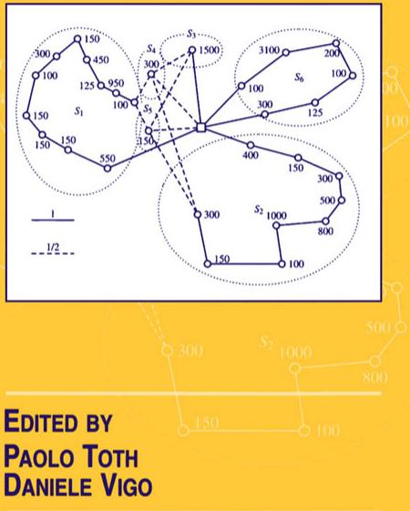

# THE VEHICLEROUTING PROBLEM

# SIAM Monographs on Discrete Mathematics and Applications

The series includes advanced monographs reporting on the most recent theoretical, computational, or applied developments in the field; introductory volumes aimed at mathematicians and other mathematically motivated readers interested in understanding certain areas of pure or applied combinatorics; and graduate textbooks. The volumes are devoted to various areas of discrete mathematics and its applications.

Mathematicians, computer scientists, operations researchers, computationally oriented natural and social scientists, engineers, medical researchers, and other practitioners will find the volumes of interest.

# Editor-in-Chief

Peter L. Hammer, RUTCOR, Rutgers, The State University of New Jersey

# Editorial Board

M. Aigner, Freie Universitat Berlin, Germany   
N. Alon, Tel Aviv University, Israel   
E. Balas, Carnegie Mellon University, USA   
C. Berge, £ R. Combinatoire, France   
J.- C. Bermond, Universite de Nice-Sophia Antipolis, France   
J. Berstel, Universite Marne-la-Vallee, France   
N. L. Biggs, The London School of Economics, United Kingdom   
B. Bollobas, University of Memphis, USA   
R. E. Burkard, Technische Universitat Graz, Austria   
D. G. Cornell, University of Toronto, Canada   
I. Gessel, Brandeis University, USA   
F. Glover, University of Colorado, USA   
M. C. Golumbic, Bar-llan University, Israel   
R. L. Graham, AT&T Research, USA   
A. J. Hoffman, IBM T. J. Watson Research Center, USA   
T. Ibaraki, Kyoto University, Japan   
H. Imai, University of Tokyo, Japan   
M. Karoriski, Adam Mickiewicz University, Poland, and Emory University, USA   
R. M. Karp, University of Washington, USA   
V. Klee, University of Washington, USA   
K. M. Koh, National University of Singapore, Republic of Singapore   
B. Korte, Universitat Bonn, Germany   
A. V. Kostochka, Siberian Branch of the Russian Academy o Sciences, Russia   
F. T. Leighton, Massachusetts Institute of Technology, USA   
T. Lengauer, Gesellschaft fur Mathematik und Datenverarbeitung mbH, Germany   
S. Martello, DEIS University of Bologna, Italy   
M. Minoux, Universite Pierre et Marie Curie, France   
R. Mohring, Technische Universitat Berlin, Germany   
C. L. Mima, Bellcore, USA   
J. Nesetril, Charles University, Czech Republic   
W. R. Pulleyblank, IBM T. J. Watson Research Center, USA   
A. Recski, Technical University of Budapest, Hungary   
C. C. Ribeiro, Catholic University of Rio de Janeiro, Brazil   
H. Sachs, Technische Universitat llmenau, Germany   
A. Schrijver, CWI, The Netherlands   
R. Shamir, Tel Aviv University, Israel   
N. J. A. Sloane, AT&T Research, USA   
W. T. Trotter, Arizona State University, USA   
D. J. A. Welsh, University of Oxford, United Kingdom   
D. de Werra, Ecole Polytechnique Federate de Lausanne, Switzerland   
P. M. Winkler, Bell Labs, Lucent Technologies, USA   
Yue Minyi, Academia Sinica, People's Republic of China

# Series Volumes

Domosi, P., and Nehaniv, C. L., Algebraic Theory of Automata Networks: An Introduction   
Murota, K., Discrete Convex Analysis   
Toth, P. and Vigo, D., The Vehicle Routing Problem   
Anthony, M., Discrete Mathematics of Neural Networks: Selected Topics   
Creignou, N., Khanna, S., and Sudan, M., Complexity Classifications of Boolean Constraint Satisfaction Problems   
Hubert, L., Arable, P., and Meulman, J., Combinatorial Data Analysis: Optimization by Dynamic Programming   
Peleg, D., Distributed Computing: A Locality-Sensitive Approach   
Wegener, I., Branching Programs and Binary Decision Diagrams: Theory and Applications   
Brandstadt, A., Le, V. B., and Spinrad, J. P., Graph Classes: A Survey   
McKee, T. A. and McMorris, F. R., Topics in Intersection Graph Theory   
Grilli di Cortona, P., Manzi, C., Pennisi, A., Ricca, F., and Simeone, B., Evaluation and Optimization of Electoral System

# THE VEHICLEROUTING PROBLEM

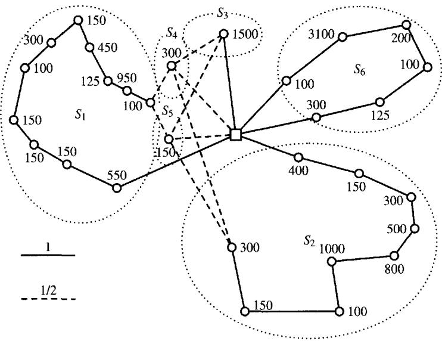

Edited by Paolo Toth Daniele Vigo Universita degli Studi di Bologna Bologna, Italy

# siam

Society for Industrial and Applied Mathematics Philadelphia

10 9 8 7 6 5 4 3 2

All rights reserved. Printed in the United States of America. No part of this book may be reproduced, stored, or transmitted in any manner without the written permission of the publisher. For information, write to the Society for Industrial and Applied Mathematics, 3600 University City Science Center, Philadelphia, PA 19104-2688.

# Library of Congress Cataloging-in-Publication Data

The vehicle routing problem / edited by Paolo Toth, Daniele Vigo. p. cm. — (SIAM monographs on discrete mathematics and applications) Includes bibliographical references and index. ISBN 0-89871-579-2 1. Transportation problems (Programming) I. Toth, Paolo. II. Vigo, Daniele. III. Series.

# List of Contributors

Arjang A. Assad   
R.H. Smith School of Business   
University of Maryland   
3313 Van Munching Hall   
College Park, MD 20742   
USA   
aassad@rhsmith.umd.edu   
Edward K. Baker   
Department of Management Science   
University of Miami   
Coral Gables, FL 33124   
USA   
ebaker@miami.edu   
Michael O. Ball   
R.H. Smith School of Business   
University of Maryland   
College Park, MD 20742   
USA   
mball@rhsmith.umd.edu

# Lawrence Bodin

R.H. Smith School of Business University of Maryland College Park, MD 20742 USA lbodin@rhsmith.umd.edu

# Julien Bramel

Columbia University 406 Uris Hall New York, NY 10027 USA jdb8@columbia.edu

Ann M. Campbell   
School of Industrial and   
Systems Engineering   
Georgia Institute of Technology   
Atlanta, GA 30332-0205   
USA   
ann@akula.isye.gatech.edu   
Lloyd W. Clarke   
School of Industrial and   
Systems Engineering   
Georgia Institute of Technology   
Atlanta, GA 30332-0205   
USA   
lloyd.clarke@isye.gatech.edu   
Jean-Francois Cordeau   
Ecole des Hautes Etudes Commerciales   
and GERAD   
3000, chemin de la Cote-Ste-Catherine   
Montreal, H3T 2A7   
Quebec, Canada   
cordeau@crt.umontreal.ca   
Guy Desaulniers   
Ecole Polytechnique de Montreal   
and GERAD   
CP 6079, Succursale "Centre Ville'   
Montreal, H3C 3A7   
Quebec, Canada   
guyd@crt.umontreal.ca   
Jacques Desrosiers   
Ecole des Hautes Etudes Commerciales   
and GERAD   
3000, chemin de la Cote-Ste-Catherine   
Montreal, H3T 2A7   
Quebec, Canada   
Jacques .Desrosiers @ hec .ca

# Andreas Erdmann

ZAIK   
University of Cologne   
Weyertal 80, 50931 Cologne   
Germany   
erdmann@zpr.uni-koeln.de

# Michel Gendreau

Departement d'Informatique et de   
Recherche Operationnelle   
and CRT   
Universite de Montreal   
C.P. 6128 Succursale "Centre Ville"   
Montreal, H3T 2A7   
Quebec, Canada   
michelg @ crt.umontreal.ca   
Bruce L. Golden   
Robert H. Smith School of Business   
University of Maryland   
College Park, MD 20742   
USA   
bgolden@rhsmith.umd.edu

# Eleni Hadjiconstantinou

The Management School Imperial College 53 Prince's Gate Exhibition Road London SW7 2PG UK e.hconstantinou $@$ ic. ac .uk

# Gilbert Laporte

Ecole des Hautes Etudes Commerciales   
and CRT   
Universite de Montreal   
CP 6128, Succursale "Centre Ville"   
Montreal, H3T 2A7   
Quebec, Canada   
gilbert@crt.umontreal.ca

# Laurence Levy

RouteSmart Technologies 8850 Stanford Boulevard Suite 2600   
Columbia, MD 20742   
USA   
llevy@routesmart.com

# Denis Naddef

Laboratoire ID   
ENSIMAG-Zirst   
51, Avenue Jean Kurtzmann   
F-38330 Montbonnot Saint Martin   
France   
Denis.Naddef@imag.fr

# Jean-Yves Potvin

Departement d'Informatique et de   
Recherche Operationnelle   
and CRT   
Universite de Montreal   
C.P. 6128, Succursale "Centre Ville"   
Montreal, H3T 2A7   
Quebec, Canada   
potvin@iro.umontreal.ca

# Giovanni Rinaldi

I.A.S.I.-C.N.R. Viale Manzoni, 30 Roma, 00185 Italy rinaldi@iasi.rm.cnr.it

# Daron Roberts

British Airways   
Waterside   
PO Box 365   
Harmondsworth, UB7 0GB   
UK   
d.r.roberts@british-akways.com

# Martin W.P. Savelsbergh

School of Industrial and   
Systems Engineering   
Georgia Institute of Technology   
Atlanta, GA 30332-0205   
USA   
martin.savelsbergh@isye.gatech.edu

# Frederic Semet

LAMIH-ROI   
Universite de Valenciennes   
et du Hainaut-Cambresis   
Le Mont Houy   
Valenciennes, 59313   
France   
frederic. semet @ univ-Valenciennes .fr   
David Simchi-Levi   
Department of Civil and Environmental   
Engineering   
Massachusetts Institute of Technology   
77 Massachusetts Avenue   
Room 1-171   
Cambridge, MA 02139   
USA   
dslevi@mit.edu   
John Sniezek   
RouteSmart Technologies   
8850 Stanford Boulevard   
Suite 2600   
Columbia, MD 20742   
USA   
jsniezek@routesmart.com   
Marius M. Solomon   
Management Science Department   
Northeastern University   
and GERAD

360 Huntington Avenue Boston, MA 02115 USA solomon@cba.neu.edu

Francois Soumis   
Ecole Polytechnique de Montreal   
and GERAD   
CP 6079, Succursale "Centre Ville'   
Montreal, H3C 3A7   
Quebec, Canada   
soumis@crt.umontreal.ca

# Paolo Toth

Dipartimento di Elettronica,   
Informatica e Sistemistica   
Universita di Bologna   
Viale Risorgimento, 2   
Bologna, 40136   
Italy   
ptoth@deis.unibo.it

# Daniele Vigo

Dipartimento di Elettronica,   
Informatica e Sistemistica   
Universita di Bologna   
Viale Risorgimento, 2   
Bologna, 40136   
Italy   
dvigo@deis.unibo.it

# Edward Wasil

Kogod School of Business   
Administration   
American University   
Washington, DC 20016   
USA   
ewasil $@$ american.edu

# Contents

# List of Contributors

# Preface

# xvii

# 1 An Overview of Vehicle Routing Problems 1

R Toth, D. Vigo

1.1 Introduction

1.2 Problem Definition and Basic Notation 5

1.2.1 Capacitated and Distance-Constrained VRP 5   
1.2.2 VRP with Time Windows 8   
1.2.3 VRP with Backhauls 9   
1.2.4 VRP with Pickup and Delivery 10

1.3 Basic Models for the VRP 11

1.3.1 Vehicle Flow Models 11   
1.3.2 Extensions of Vehicle Flow Models 17   
1.3.3 Commodity Flow Models 19   
1.3.4 Set-Partitioning Models 21   
1.4 Test Instances for the CVRP and Other VRPs 22   
Bibliography 23

1 Capacitated Vehicle Routing Problem 27

2 Branch-and-Bound Algorithms for the Capacitated VRP 29

P. Toth, D. Vigo

2.1 Introduction 29

2.2 Basic Relaxations 30

2.2.1 Bounds Based on Assignment and Matching 30   
2.2.2 Bounds Based on Arborescences and Trees 32   
2.2.3 Comparison of the Basic Relaxations 33

2.3 Better Relaxations 35

2.3.1 Additive Bounds for ACVRP 35   
2.3.2 Further Lower Bounds for ACVRP 39   
2.3.3 Lagrangian Lower Bounds for SCVRP 40   
2.3.4 Lower Bounds from a Set-Partitioning Formulation . . . 41   
2.3.5 Comparison of the Improved Lower Bounds 42

2.4 Structure of the Branch-and-Bound Algorithms for CVRP 44

2.4.1 Branching Schemes and Search Strategies 44   
2.4.2 Reduction, Dominance Rules, and Other Features 46   
2.4.3 Performance of the Branch-and-Bound Algorithms . . . . 47

2.5 Distance-Constrained VRP 48

Bibliography 49

# 3 Branch-and-Cut Algorithms for the Capacitated VRP 53

# D. Naddef, G. Rinaldi

3.1 Introduction and Two-Index Flow Model 53   
3.2 Branch-and-Cut 55   
3.3 Polyhedral Studies 58   
3.3.1 Capacity Constraints 59   
3.3.2 Generalized Capacity Constraints 61   
3.3.3 Framed Capacity Constraints 62   
3.3.4 Valid Inequalities from STSP 62   
3.3.5 Valid Inequalities Combining Bin Packing and STSP 67   
3.3.6 Valid Inequalities from the Stable Set Problem 69   
3.4 Separation Procedures 71   
3.4.1 Exact Separation of Capacity Constraints 71   
3.4.2 Heuristics for Capacity and Related Constraints 72   
3.4.3 STSP Constraints 75   
3.5 Branching Strategies 75   
3.6 Computational Results 78   
3.7 Conclusions 81   
Bibliography 81

# 4 Set-Covering-Based Algorithms for the Capacitated VRP 85

# J. Bramel, D. Simchi-Levi

4.1 Introduction 85   
4.2 Solving the Linear Programming Relaxation of P 87   
4.3 Set-Covering-Based Solution Methods 89   
4.3.1 Branch-and-Bound Algorithm for Problem CG 89   
4.3.2 Polyhedral Branch-and-Bound Algorithm 91   
4.3.3 Pseudo-Polynomial Lower Bound on $\bar { c } _ { \mathrm { m i n } }$ 92   
4.3.4 Solving $\mathbf { P } _ { D }$ via Dual-Ascent and Branch-and-Bound 94   
4.4 Solving the Set-Covering Integer Program 96   
4.4.1 A Cutting Plane Method 97   
4.4.2 Branch-and-Price 99   
4.4.3 Additional Comments on Computational Approaches . . 100   
4.5 Computational Results 100   
4.6 Effectiveness of the Set-Covering Formulation 102   
4.6.1 Worst-Case Analysis 103   
4.6.2 Average-Case Analysis 103

# Bibliography 106

# 5 Classical Heuristics for the Capacitated VRP 109

# G. Laporte, F. Semet

5.1 Introduction 109

5.2 Constructive Methods 110   
5.2.1 Clarke and Wright Savings Algorithm 110   
5.2.2 Enhancements of the Clarke and Wright Algorithm . . . . 111   
5.2.3 Matching-Based Savings Algorithms 113   
5.2.4 Sequential Insertion Heuristics 114   
5.3 Two-Phase Methods 116   
5.3.1 Elementary Clustering Methods 116   
5.3.2 Truncated Branch-and-Bound 118   
5.3.3 Petal Algorithms 120   
5.3.4 Route-First, Cluster-Second Methods 120   
5.4 Improvement Heuristics 121   
5.4.1 Single-Route Improvements 121   
5.4.2 Multiroute Improvements 122   
5.5 Conclusions 125   
Bibliography 126

# 6 Metaheuristics for the Capacitated VRP 129

# M. Gendreau, G. Laporte, J.-Y. Potvin

6.1 Introduction 129

6.2 Simulated Annealing 130

6.2.1 Two Early Simulated Annealing Algorithms 130   
6.2.2 Osman's Simulated Annealing Algorithms 131   
6.2.3 Van Breedam's Experiments 133

6.3 Deterministic Annealing 133

6.4 Tabu Search 134

6.4.1 Two Early Tabu Search Algorithms 134   
6.4.2 Osman's Tabu Search Algorithm 134   
6.4.3 Taburoute 135   
6.4.4 Taillard's Algorithm 137   
6.4.5 Xu and Kelly's Algorithm 137   
6.4.6 Rego and Roucairol's Algorithms 137   
6.4.7 Barbarosoglu and Ozgur's Algorithm 138   
6.4.8 Adaptive Memory Procedure of Rochat and Taillard . 138   
6.4.9 Granular Tabu Search of Toth and Vigo 138   
6.4.10 Computational Comparison 140

# 5 Genetic Algorithms 140

6.5.1 Simple Genetic Algorithm 140   
6.5.2 Application to Sequencing Problems 141   
6.5.3 Application to the VRP 142

# 6.6 Ant Algorithms 144

6.7 Neural Networks 146

6.8 Conclusions 148   
Bibliography 149

# II Important Variants of the Vehicle Routing Problem 155

7 VRP with Time Windows 157

# J.-E Cordeau, G. Desaulniers, J. Desrosiers, M. M. Solomon, F. Soumis

7.1 Introduction 157 .2 Problem Formulation 158

7.2.1 Formulation 158   
7.2.2 Network Lower Bound 159   
7.2.3 Linear Programming Lower Bound 159   
7.2.4 Algorithms 160

# 7.3 Upper Bounds: Heuristic Approaches 160

7.3.1 Route Construction 160   
7.3.2 Route Improvement 161   
7.3.3 Composite Heuristics 161   
7.3.4 Metaheuristics 162   
7.3.5 Parallel Implementations 165   
7.3.6 Optimization-Based Heuristics 165   
7.3.7 Asymptotically Optimal Heuristics 165

7.4 Lower Bounds from Decomposition Approaches 166

7.4.1 Lagrangian Relaxation 166   
7.4.2 Capacity and Time-Constrained Shortest-Path Problem . . 167   
7.4.3 Variable Splitting 168   
7.4.4 Column Generation 169   
7.4.5 Set-Partitioning Formulation 169   
7.4.6 Lower Bound 170   
7.4.7 Commodity Aggregation 171   
7.4.8 Hybrid Approach 172

# 7.5 Integer Solutions 173

7.5.1 Binary Decisions on Arc Flow Variables 173   
7.5.2 Integer Decisions on Arc Flow Variables 173   
7.5.3 Binary Decisions on Path Flow Variables 174   
7.5.4 Subtour Elimination and 2-Path Cuts 175   
7.5.5 $\kappa$ -Path Cuts and Parallelism 176   
7.5.6 Integer Decisions on (Fractional and Integer) Time   
Variables 176

7.6 Special Cases 177

7.6.1 Multiple TSP with Time Windows 177

7.6.2 VRP with Backhauls and Time Windows 177

Extensions 178

7.7.1 Heterogeneous Fleet, Multiple-Depot, and Initial Conditions 178 7.7.2 Fleet Size 179

7.7.3 Multiple Time Windows 179   
7.7.4 Soft Time Windows 179   
7.7.5 Time-and Load-Dependent Costs 180   
7.7.6 Driver Considerations 180   
7.8 Computational Results for VRPTW 181   
7.9 Conclusions 184   
Bibliography 186

# 8 VRP with Backhauls 195

# P. Toth, D. Vigo

# 8.1 Introduction 195

8.1.1 Benchmark Instances 197   
8.2 Integer Linear Programming Models 198   
8.2.1 Formulation of Toth and Vigo 198   
8.2.2 Formulation of Mingozzi, Giorgi, and Baldacci 200

# 8.3 Relaxations 201

8.3.1 Relaxation Obtained by Dropping the CCCs 202   
8.3.2 Relaxation Based on Projection 202   
8.3.3 Lagrangian Relaxation 203   
8.3.4 Overall Additive Lower Bound 204   
8.3.5 Relaxation Based on the Set-Partitioning Model 204

# 8.4 Exact Algorithms . 208

8.4.1 Algorithm of Toth and Vigo 208   
8.4.2 Algorithm of Mingozzi, Giorgi, and Baldacci 209   
8.4.3 Computational Results for the Exact Algorithms 210

# 8.5 Heuristic Algorithms 214

8.5.1 Algorithm of Deif and Bodin 214   
8.5.2 Algorithms of Goetschalckx and Jacobs-Blecha 215   
8.5.3 Algorithm of Toth and Vigo 216   
8.5.4 Computational Results for the Heuristics 217   
graphy 221

# 9 VRP with Pickup and Delivery

225

# G. Desaulniers, J. Desrosiers, A. Erdmann, M. M. Solomon, F. Soumis

9.1 Introduction 225

9.2 Mathematical Formulation 226   
9.2.1 Construction of the Networks 226   
9.2.2 Formulation 227   
9.2.3 Service Quality 228   
9.2.4 Reduction of the Network Size 228   
9.3 Heuristics 229   
9.3.1 Construction and Improvement 229   
9.3.2 Clustering Algorithms 230   
9.3.3 Metaheuristics 230   
9.3.4 Neural Network Heuristics 231   
9.3.5 Theoretical Analysis of Algorithms 231

# 9.4 Optimization-Based Approaches 232

9.4.1 Single Vehicle Cases 232

9.4.2 Multiple Vehicle Cases 234

Applications 236

9.6 Computational Results 236

9.7 Conclusions 237

Bibliography 238

# III Applications and Case Studies

243

# 10 Routing Vehicles in the Real World: Applications in the Solid Waste, Beverage, Food, Dairy, and Newspaper Industries

245

B. L. Golden, A. A. Assad, E. A. Wasil

10.1 Introduction 245

10.2 Computerized Vehicle Routing in the Solid Waste Industry 247

10.2.1 History 247   
10.2.2 Background 247   
10.2.3 Commercial Collection 249   
10.2.4 Residential Collection 250   
10.2.5 Case Studies 250   
10.2.6 Roll-on-Roll-off 252   
10.2.7 Further Remarks 254

10.3 Vehicle Routing in the Beverage, Food, and Dairy Industries 254

10.3.1 Introduction 254   
10.3.2 Beverage Industry 255   
10.3.3 Food Industry 259   
10.3.4 Dairy Industry 260

10.4 Distribution and Routing in the Newspaper Industry 266

10.4.1 Industry Background 266   
10.4.2 Newspaper Distribution Problem 268   
10.4.3 Vehicle Routing Algorithms for NDP 271   
10.4.4 Three Case Studies 276   
10.4.5 Further Remarks 280

10.5 Conclusions 280

Bibliography 281

# 11 Capacitated Arc Routing Problem with Vehicle-Site Dependencies: The Philadelphia Experience

287

# J. Sniezek, L. Bodin, L. Levy, M. Ball

11.1 Introduction 287

11.2 Networks, Assumptions, and Goals of the CARP-VSD 288

11.2.1 Travel Network 288   
11.2.2 Service Network 289   
11.2.3 Vehicle Classes 290   
11.2.4 Travel Network and Service Network for a Vehicle Class 291   
11.2.5 Vehicle Preference List 291   
11.2.6 Other Assumptions 292   
11.2.7 Goals and Constraints of the CARP-VSD 292   
11.3 Vehicle Decomposition Algorithm (VDA) 293   
11.3.1 Step A. Create and Verify Vehicle Class Networks . 293   
11.3.2 Step B. Estimate Total Work and Determine Initial   
Fleet Mix 294   
11.3.3 Step C. Partition the Service Network 301   
11.3.4 Step D. Determine Travel Path and Balance the Partitions 304   
11.3.5 Step E. Revise Estimate of Total Work and Adjust   
Fleet Mix 305   
11.4 Implementation of the VDA in Philadelphia 305   
11.5 Enhancements and Extensions 307

Bibliography 308

# 12 Inventory Routing in Practice 309

# Ann M. Campbell, Lloyd W. Clarke, Martin W.R Savelsbergh

12.1 Introduction 309   
12.2 Problem Definition 310   
12.3 Literature Review 311   
12.4 Solution Approach 313   
12.4.1 Phase I: Integer Programming Model 313   
12.4.2 Phase I: Solving the Integer Programming Model 315   
12.4.3 Phase II: Scheduling 316   
12.5 Computational Experience 319   
12.5.1 Instances 319   
12.5.2 Solution Quality 322   
12.5.3 Alternate Heuristic 324   
12.5.4 Computational Experiments 324   
12.6 Conclusion 327   
Bibliography 329

# 13 Routing Under Uncertainty: An Application in the Scheduling of Field Service Engineers

331

# E. Hadjiconstantinou, D. Roberts

13.1 Introduction 331   
13.2 VRPSST with Variable Costs of Recourse 332   
13.3 Literature Review 332   
13.3.1 VRPST 333   
13.3.2 VRPSD 333   
13.4 Stochastic Integer VRPSST Formulation 334   
13.4.1 First-Stage Problem 334   
13.4.2 Second-Stage Problem 335   
13.5 Paired Tree Search Algorithm (PTSA) 336   
13.5.1 Linked Trees 337   
13.5.2 Lower Bounds 337

13.5.3 Computational Implementation 339

Applied Maintenance Scheduling Problem 339

13.6.1 Maintenance Scheduling System in Practice 340   
13.6.2 Stochastic Problem Setting 340

13.7 Modeling the Applied Problem as a VRPSST 341

13.8 Model Input 342

13.8.1 Job Locations and the Road Network 342   
13.8.2 Service Times 342

Model Output: Computational Considerations 343

13.9.1 Framework for the Analysis of Results 343   
13.9.2 Reoptimization 344

13.10 Example Scenario 345

13.11 Overall Computational Results 348

13.12 Conclusion 350

Bibliography 350

# 14 Evolution of Microcomputer-Based Vehicle Routing Software:

# Case Studies in the United States

353

# E. K. Baker

14.1 Introduction 353

14.2 Definition of the VRP 356

14.2.1 Customer Specification 356   
14.2.2 Product Specification 357   
14.2.3 Vehicle Specification 357

14.3 Algorithms 358

14.4 Future Trends in Vehicle Routing Software 358

14.5 Summary and Conclusions 360

Bibliography 360

# Index

# Preface

The Vehicle Routing Problem (VRP) calls for the determination of the optimal set of routes to be performed by a fleet of vehicles to serve a given set of customers, and it is one of the most important, and studied, combinatorial optimization problems.

More than 40 years have elapsed since Dantzig and Ramser introduced the problem in 1959. They described a real-world application concerning the delivery of gasoline to service stations and proposed the first mathematical programming formulation and algorithmic approach. A few years later, in 1964, Clarke and Wright proposed an effective greedy heuristic that improved on the Dantzig-Ramser approach. Following these two seminal papers, hundreds of models and algorithms were proposed for the optimal and approximate solution of the different versions of the VRP. Dozens of packages for the solution of various real-world VRPs are now available on the market. This interest in VRP is motivated by both its practical relevance and its considerable difficulty: the largest VRP instances that can be consistently solved by the most effective exact algorithms proposed so far contain about 50 customers, whereas larger instances may be solved to optimality only in particular cases.

This book covers the state of the art of both exact and heuristic methods developed in the last decades for the VRP and some of its main variants. Moreover, a considerable part of the book is devoted to the discussion of practical issues.

The realization of this project would have been impossible for us alone to accomplish. We thus involved an enthusiastic group of very well known experts, whose contributions form a large part of the recent history of the VRP (as well as that of Mathematical Programming and Combinatorial Optimization). As editors, we constantly devoted our efforts to reducing as much as possible the overlap between chapters and to preserving coherence and ensuring uniformity of the notation and terminology.

Although focused on a specific family of problems, this book offers a complete overview of the effective use of the most important techniques proposed for the solution of hard combinatorial problems. We, however, assume that readers have a basic knowledge of the main methods for the solution of combinatorial optimization problems (complexity theory, branch-and-bound, branch-and-cut, relaxations, heuristics, metaheuristics, local search, etc.).

The book is divided into three parts, preceded by an introductory chapter in which we present an overview of the VRP family, define the most important variants of the problem, and introduce the main mathematical models. The first part covers the basic and extensively studied version of the VRP, known as capacitated VRP. Three chapters examine the main exact approaches (branch-and-bound, branch-and-cut, and set-covering-based methods), while two other chapters review traditional heuristic approaches and metaheuristics, respectively. For all methods extensive computational results are analyzed. The second part covers three main variants of the VRP: the VRP with time windows, the VRP with backhauls, and the VRP with pickup and delivery. In each chapter, both exact and heuristic methods are examined. Finally, in the third part, the issues arising in real-world VRP applications, as the presence of dynamic and stochastic components, are discussed by analyzing relevant case studies and presenting software packages.

We warmly thank all the people who contributed to this project, which occupied a considerable amount of the past 3 years: our coauthors, whose competent, patient, and collaborative activity made possible the completion of this volume; the referees whose comments greatly improved the overall presentation; Peter Hammer, editor-in-chief of SIAM Monographs on Discrete Mathematics and Applications, who since the very beginning encouraged us and followed all the steps of the project; and Vickie Kearn, Deborah Poulson, Lou Primus, Sara Triller, Marianne Will, Donna Witzleben, Sam Young, and all the people of SIAM who greatly helped us in the preparation of the overall manuscript.

Paolo Toth Daniele Vigo

Bologna, December 2000

# Chapter 1

# An Overview of Vehicle Routing Problems

# Paolo Toth Daniele Vigo

# 1.1 Introduction

The last decades have seen an increasing utilization of optimization packages, based on Operations Research and Mathematical Programming techniques, for the effective management of the provision of goods and services in distribution systems. The large number of real-world applications, both in North America and in Europe, have widely shown that the use of computerized procedures for the distribution process planning produces substantial savings (generally from $5 \%$ to $2 0 \%$ ) in the global transportation costs. It is easy to see that the impact of these savings on the global economic system is significant. Indeed, the transportation process involves all stages of the production and distribution systems and represents a relevant component (generally from $10 \%$ to $20 \%$ ) of the final cost of the goods.

The success of the utilization of Operations Research techniques is due to the development of computer systems, from both the hardware and the software points of view, and to the increasing integration of information systems into the productive and commercial processes.

A different factor of success, as important as the others, is the development of modeling and algorithmic tools implemented in recent years. Indeed, the proposed models take into account all the characteristics of the distribution problems arising in real-world applications, and the corresponding algorithms and computer implementations find good solutions for real-world instances within acceptable computing times.

In this book, we consider only the problems concerning the distribution of goods between depots and final users (customers). These problems are generally known as Vehicle Routing Problems (VRPs) or Vehicle Scheduling Problems. The models and algorithms proposed for the solution of vehicle and scheduling problems, presented in detail in this book, can be used effectively not only for the solution of problems concerning the delivery or collection of goods but for the solution of different real-world applications arising in transportation systems as well. Typical applications of this type are, for instance, solid waste collection, street cleaning, school bus routing, dial-a-ride systems, transportation of handicapped persons, routing of salespeople, and of maintenance units.

The distribution of goods concerns the service, in a given time period, of a set of customers by a set of vehicles, which are located in one or more depots, are operated by a set of crews (drivers), and perform their movements by using an appropriate road network. In particular, the solution of a VRP calls for the determination of a set of routes, each performed by a single vehicle that starts and ends at its own depot, such that all the requirements of the customers are fulfilled, all the operational constraints are satisfied, and the global transportation cost is minimized. In this section, we describe the typical characteristics of the routing and scheduling problems by considering their main components (road network, customers, depots, vehicles, and drivers), the different operational constraints that can be imposed on the construction of the routes, and the possible objectives to be achieved in the optimization process.

The road network, used for the transportation of goods, is generally described through a graph, whose arcs represent the road sections and whose vertices correspond to the road junctions and to the depot and customer locations. The arcs (and consequently the corresponding graphs) can be directed or undirected, depending on whether they can be traversed in only one direction (for instance, because of the presence of one-way streets, typical of urban or motorway networks) or in both directions, respectively. Each arc is associated with a cost, which generally represents its length, and a travel time, which is possibly dependent on the vehicle type or on the period during which the arc is traversed.

Typical characteristics of customers are

• vertex of the road graph in which the customer is located;   
• amount of goods (demand), possibly of different types, which must be delivered or collected at the customer;   
• periods of the day (time windows) during which the customer can be served (for instance, because of specific periods during which the customer is open or the location can be reached, due to traffic limitations);   
• times required to deliver or collect the goods at the customer location (unloading or loading times, respectively), possibly dependent on the vehicle type; and   
• subset of the available vehicles that can be used to serve the customer (for instance, because of possible access limitations or loading and unloading requirements).

Sometimes, it is not possible to fully satisfy the demand of each customer. In these cases, the amounts to be delivered or collected can be reduced, or a subset of customers can be left unserved. To deal with these situations, different priorities, or penalties associated with the partial or total lack of service, can be assigned to the customers.

The routes performed to serve customers start and end at one or more depots, located at the vertices of the road graph. Each depot is characterized by the number and types of vehicles associated with it and by the global amount of goods it can deal with. In some real-world applications, the customers are a priori partitioned among the depots, and the vehicles have to return to their home depot at the end of each route. In these cases, the overall VRP can be decomposed into several independent problems, each associated with a different depot.

Transportation of goods is performed by using a fleet of vehicles whose composition and size can be fixed or can be defined according to the requirements of the customers. Typical characteristics of the vehicles are

• home depot of the vehicle, and the possibility to end service at a depot other than the home one;   
• capacity of the vehicle, expressed as the maximum weight, or volume, or number of pallets, the vehicle can load;   
• possible subdivision of the vehicle into compartments, each characterized by its capacity and by the types of goods that can be carried;   
• devices available for the loading and unloading operations;   
• subset of arcs of the road graph which can be traversed by the vehicle; and   
• costs associated with utilization of the vehicle (per distance unit, per time unit, per route, etc.).

Drivers operating the vehicles must satisfy several constraints laid down by union contracts and company regulations (for instance, working periods during the day, number and duration of breaks during service, maximum duration of driving periods, overtime). In the following, the constraints imposed on drivers are imbedded in those associated with the corresponding vehicles.

The routes must satisfy several operational constraints, which depend on the nature of the transported goods, on the quality of the service level, and on the characteristics of the customers and the vehicles. Some typical operational constraints are the following: along each route, the current load of the associated vehicle cannot exceed the vehicle capacity; the customers served in a route can require only the delivery or the collection of goods, or both possibilities can exist; and customers can be served only within their time windows and the working periods of the drivers associated with the vehicles visiting them. Precedence constraints can be imposed on the order in which the customers served in a route are visited. One type of precedence constraint requires that a given customer be served in the same route serving a given subset of other customers and that the customer must be visited before (or after) the customers belonging to the associated subset. This is the case, for instance, of the so-called pickup and delivery problems, wherein the routes can perform both the collection and the delivery of goods, and the goods collected from the pickup customers must be carried to the corresponding delivery customers by the same vehicle. Another type of precedence constraint imposes that if customers of different types are served in the same route, the order in which the customers are visited is fixed. This situation arises, for instance, for the so-called VRP with Backhauls, wherein again, the routes can perform both the collection and the delivery of goods, but constraints associated with the loading and unloading operations, and the difficulty in rearranging the load of the vehicle along the route, mean that all deliveries must be performed before the collections.

Evaluation of the global cost of the routes, and the check of the operational constraints imposed on them, requires knowledge of the travel cost and the travel time between each pair of customers and between the depots and the customers. To this end, the original road graph (which often is very sparse) is generally transformed into a complete graph, whose vertices are the vertices of the road graph corresponding to the customers and the depots. For each pair of vertices $i$ and $j$ of the complete graph, an arc $( i , j )$ is defined whose cost $c _ { i j }$ is given by the cost of the shortest path starting from vertex i and arriving at vertex $j$ in the road graph. The travel time $t _ { i j }$ , associated with each arc $( i , j )$ of the complete graph, is computed as the sum of the travel times of the arcs belonging to the shortest path from $i$ to $j$ in the road graph. In the following, instead of the original road graph, we consider the associated complete graph, which can be directed or undirected, depending on the property of the corresponding cost and travel-time matrices to be asymmetric or symmetric, respectively.

Several, and often contrasting, objectives can be considered for the vehicle routing problems. Typical objectives are

• minimization of the global transportation cost, dependent on the global distance traveled (or on the global travel time) and on the fixed costs associated with the used vehicles (and with the corresponding drivers);   
• minimization of the number of vehicles (or drivers) required to serve all the customers;   
• balancing of the routes, for travel time and vehicle load;   
• minimization of the penalties associated with partial service of the customers;

or any weighted combination of these objectives.

In some applications, each vehicle can operate more than one route in the considered time period, or the routes can last for more than 1 day. In addition, sometimes it is necessary to consider stochastic or time-dependent dynamic versions of the problem, i.e., problems for which, a priori, there is only partial knowledge of the demands of the customers or of the costs (and the travel times) associated with the arcs of the road network.

More than 40 years have elapsed since Dantzig and Ramser [11] introduced the VRP. In their paper, the authors described a real-world application (concerning the delivery of gasoline to gas stations) and proposed the first mathematical programming formulation and algorithmic approach for the solution of the problem. A few years later, Clarke and Wright [9] proposed an effective greedy heuristic that improved on the Dantzig-Ramser approach. Following these two seminal papers, many models and exact and heuristic algorithms were proposed for the optimal and approximate solution of the different versions of the VRP. The most important and most effective models and algorithms are described in the various chapters of this book.

There are several main survey papers on the subject of VRPs. A classification scheme was given in Desrochers, Lenstra, and Savelsbergh [13]. Laporte and Nobert [32] presented an extensive survey that was entirely devoted to exact methods for the VRP, and they gave a complete and detailed analysis of the state of the art up to the late 1980s. Other surveys covering exact algorithms, but often mainly devoted to heuristic methods, were presented by Christofides, Mingozzi, and Toth [7], Magnanti [36], Bodin et al. [4], Christofides [5], Laporte [30], Fisher [19], Toth and Vigo [41, 42], and Golden et al. [26].

An annotated bibliography was proposed by Laporte [31], and an extensive bibliography was presented by Laporte and Osman [33]. A book on the subject was edited by Golden and Assad [25].

Models and algorithms for the solution of the so-called Arc Routing Problem, i.e., the variant of the problem arising when the customers are located not at the vertices but along the arcs of the road network, are described in the recent book edited by Dror [14]. The particular case of the VRP arising when only one vehicle is available at the depot and no additional operational constraints are imposed, i.e., the well-known Traveling Salesman Problem, is extensively described in the classic book edited by Lawler et al. [34].

# 1.2 Problem Definition and Basic Notation

In this section we give a formal definition, as graph theoretic models, of the basic problems of the vehicle routing class. These problems, which have received the greatest attention in the scientific literature, are examined in detail in the first two parts of the book. We first describe the Capacitated VRP, which is the simplest and most studied member of the family, then we introduce the Distance-Constrained VRP, the VRP with Time Windows, the VRP with Backhauls, and the VRP with Pickup and Delivery.

For each of these problems, several minor variants have been proposed and examined in the literature, and often different problems are given the same name. Although in many cases the solution methods, particularly the heuristic ones, may be adapted to incorporate additional features, this indeterminacy in problem definition generally causes much confusion. Therefore, for each problem we first describe the basic version, i.e., the one that in this book is denoted by the corresponding acronym, and then we discuss the variants. In addition, we make an explicit distinction between the symmetric and asymmetric versions of a problem only if models and solution approaches proposed in the literature make use of this distinction.

Also in this section, we introduce all the relevant notation and terminology used throughout the book. Additional notation and definitions required to describe particular variants and practical VRP problems are given in the appropriate chapters. Figure 1.1 summarizes the main problems described in this section and illustrates their connections. In the figure, an arrow moving from problem $A$ to problem $\pmb { B }$ means that $B$ is an extension of A.

# 1.2.1 Capacitated and Distance-Constrained VRP

The first part of this book (Chapters 2-6) concentrates on the basic version of the VRP, the Capacitated VRP (CVRP). In the CVRP, all the customers correspond to deliveries and the demands are deterministic, known in advance, and may not be split. The vehicles are identical and based at a single central depot, and only the capacity restrictions for the vehicles are imposed. The objective is to minimize the total cost (i.e., a weighted function of the number of routes and their length or travel time) to serve all the customers.

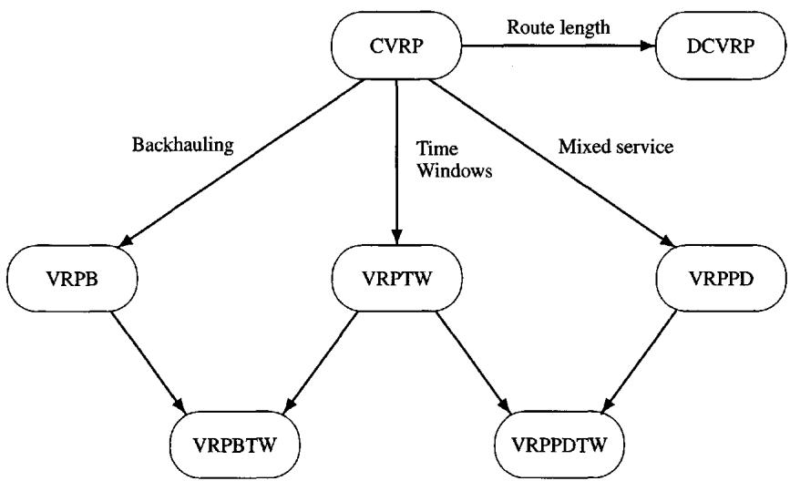  
Figure 1.1. The basic problems of the VRP class and their interconnections.

The CVRP may be described as the following graph theoretic problem. Let $G =$ $( V , A )$ be a complete graph, where $V = \{ 0 , \ldots , n \}$ is the vertex set and $\pmb { A }$ is the arc set. Vertices $i = 1 , \ldots , n$ correspond to the customers, whereas vertex 0 corresponds to the depot. Sometimes the depot is associated with vertex $n + 1$ .

A nonnegative cost, $c _ { i j }$ , is associated with each arc $( i , j ) \in A$ and represents the travel cost spent to go from vertex $_ i$ to vertex $j$ . Generally, the use of the loop arcs, $( i , i )$ ,is not allowed and this is imposed by defining $c _ { i i } = + \infty$ for all $i \in V$ . If $G$ is a directed graph, the cost matrix $c$ is asymmetric, and the corresponding problem is called asymmetric CVRP (ACVRP). Otherwise, we have $c _ { i j } = c _ { j i }$ for all $( i , j ) \in A$ , the problem is called symmetric CVRP (SCVRP), and the arc set $A$ is generally replaced by a set of undirected edges, $E$ . Given an edge $e \in E$ , let ${ \pmb { \alpha } } ( e )$ and $\beta ( e )$ denote its endpoint vertices. In the following we denote the edge set of the undirected graph $G$ by $A$ when edges are indicated by means of their endpoints $( i , j ) , i , j \in V$ , and by $E$ when edges are indicated through a single index $^ e$ .

Graph $G$ must be strongly connected and is generally assumed to be complete. Given a vertex $_ i$ , let $\Delta ^ { + } ( i )$ denote the so-called forward star of $_ i$ , defined as the set of vertices $j$ such that arc $( i , j ) \in A$ , i.e., the vertices that are directly reachable from i. Analogously, let $\Delta ^ { - } ( i )$ denote the backward star of vertex $_ i$ , defined as the set of vertices $j$ such that arc $( j , i ) \in A$ , i.e., the vertices from which $i$ is directly reachable. Given a vertex set $s \subseteq V$ , let $\delta ( S )$ and $E ( S )$ denote the set of edges $e \in E$ that have only one or both endpoints in S, respectively. As usual, when a single vertex $i \in V$ is considered, we write $\delta ( i )$ rather than $\delta ( \{ i \} )$

In several practical cases, the cost matrix satisfies the triangle inequality,

$$
c _ { i k } + c _ { k j } \geq c _ { i j } \quad { \mathrm { f o r ~ a l l ~ } } i , j , k \in V .
$$

In other words, it is not convenient to deviate from the direct link between two vertices $_ i$ and $j$ . The presence of the triangle inequality is sometimes required by the algorithms for CVRP, and this may be obtained in a simple way by adding a suitably large positive quantity $M$ to the cost of each arc. However, the drastic distortion of the metric induced by this operation may produce very bad lower and upper bounds with respect to those corresponding to the original costs. Note that when the cost of each arc of the graph is equal to the cost of the shortest path between its endpoints, the corresponding cost matrix satisfies the triangle inequality.

In some instances the vertices are associated with points of the plane having given coordinates, and the cost $c _ { i j }$ , for each arc $( i , j ) \in A$ , is defined as the Euclidean distance between the two points corresponding to vertices $i$ and $j$ . In this case the cost matrix is symmetric and satisfies the triangle inequality, and the resulting problem called Euclidean SCVRP. Observe that the frequently performed rounding to the nearest integer of the realvalued Euclidean arc costs may cause a violation of the triangle inequality, whereas this does not happen if the costs are rounded up.

Each customer i $( i = 1 , \ldots , n )$ is associated with a known nonnegative demand, $d _ { i }$ , to be delivered, and the depot has a fictitious demand $d _ { 0 } = 0$ . Given a vertex set $S \subseteq V$ let $\begin{array} { r } { d ( S ) = \sum _ { i \in S } d _ { i } } \end{array}$ denote the total demand of the set.

A set of $K$ identical vehicles, each with capacity $C$ , is available at the depot. To ensure feasibility we assume that $d _ { i } \leq C$ for each $i = 1 , \ldots , n$ . Each vehicle may perform at most one route, and we assume that $K$ is not smaller than $K _ { \mathrm { m i n } }$ , where $K _ { \operatorname* { m i n } }$ is the minimum number of vehicles needed to serve all the customers. The value of $K _ { \mathrm { m i n } }$ may be determined by solving the Bin Packing Problem (BPP) associated with the CVRP, which calls for th determination of the minimum number of bins, each with capacity $C$ , required to load all the $n$ items, each with nonnegative weight $d _ { i }$ {, $i = 1 , \ldots , n$ . Although BPP is NP-hard in the strong sense, instances with hundreds of items can be optimally solved very effectively (see, e.g., Martello and Toth [37])

Given a set $S \subseteq V \setminus \{ 0 \}$ , we denote by $r ( S )$ the minimum number of vehicles needed to serve all customers in $s$ , i.e., the optimal solution value of the BPP associated with item set S. Note that $r ( V \setminus \{ 0 \} ) = K _ { \operatorname* { m i n } }$ Often, $r ( S )$ is replaced by the trivial BPP lower bound

$$
\lceil d ( S ) / C \rceil .
$$

The CVRP consists of finding a collection of exactly $\pmb { K }$ simple circuits (each corresponding to a vehicle route) with minimum cost, defined as the sum of the costs of the arcs belonging to the circuits, and such that

(i) each circuit visits the depot vertex;   
(ii) each customer vertex is visited by exactly one circuit; and   
(iii) the sum of the demands of the vertices visited by a circuit does not exceed the vehicle capacity, $C$ .

Several variants of the basic versions of CVRP have been considered in the literature. First, when the number $K$ of available vehicles is greater than $K _ { \mathrm { m i n } }$ , it may be possible to leave some vehicles unused, and thus at most $K$ circuits must be determined. In this case, fixed costs are often associated with the use of the vehicles, and the additional objective requiring minimization of the number of circuits (i.e., of the vehicles used) is added to that requiring minimization of the total cost. Another frequently considered variant arises when the available vehicles are different, i.e., have different capacities $C _ { k } , k = 1 , \dots , K$ Finally, routes containing only one customer may not be allowed. In the next section we discuss how models for the basic CVRP can be adapted to take these additional features into account.

The CVRP is known to be NP-hard (in the strong sense) and generalizes the wellknown Traveling Salesman Problem (TSP), calling for the determination of a minimum-cost simple circuit visiting all the vertices of $G$ (Hamiltonian circuit) and arising when $C \geq d ( V )$ and $K = 1$ . Therefore, all the relaxations proposed for the TSP are valid for the CVRP.

The first variant of CVRP we consider is the so-called Distance-Constrained VRP (DVRP), where for each route the capacity constraint is replaced by a maximum length (or time) constraint. In particular, a nonnegative length, $t _ { i j }$ (or $t _ { e }$ is associated with each arc $( i , j ) \in A$ (or edge $e \in E$ ), and the total length of the arcs of each route cannot exceed the maximum route length, $T$ . If the vehicles are different, then the maximum route lengths are $T _ { k } , k = 1 , \ldots , K$ . Moreover, when arc lengths represent travel times, a service time, $s _ { i }$ i, may be associated with each customer $i$ , denoting the time period for which the vehicle must stop at its location. Alternatively, the service times can be added to the travel times of the arcs, i.e., by defining, for each arc $( i , j ) , t _ { i j } = t _ { i j } ^ { \prime } + s _ { i } / 2 + s _ { j } / 2$ where $t _ { i j } ^ { \prime }$ is the original travel time of arc $( i , j )$ .

Generally, the cost and the length matrices coincide, i.e., $c _ { i j } = t _ { i j }$ for all $( i , j ) \in A$ (or $c _ { e } = t _ { e }$ for all $e \in E$ . Hence, the objective of the problem is to minimize the total length of the routes or of their duration, when the service time is included in the travel time of the arcs. The case in which both the vehicle capacity and the maximum distance constraints are present is called Distance-Constrained CVRP (DCVRP).

Exact and heuristic algorithms for CVRP and DCVRP are described in Chapters 2-4 and 5 and 6, respectively.

# 1.2.2 VRP with Time Windows

The VRP with Time Windows (VRPTW) is the extension of the CVRP in which capacity constraints are imposed and each customer $\Dot { \iota }$ is associated with a time interval $[ a _ { i } , b _ { i } ]$ , called a time window. The time instant in which the vehicles leave the depot, the travel time, $t _ { i j }$ , for each arc $( i , j ) \in A$ (or $t _ { e }$ for each $e \in E$ and an additional service time $s _ { i }$ for each customer $i$ are also given. The service of each customer must start within the associated time window, and the vehicle must stop at the customer location for $s _ { i }$ time instants. Moreover, in case of early arrival at the location of customer i, the vehicle generally is allowed to wait until time instant $a _ { i }$ {, i.e., until the service may start.

Normally, the cost and travel-time matrices coincide, and the time windows are defined by assuming that all vehicles leave the depot at time instant 0. Moreover, observe that the time window requirements induce an implicit orientation of each route even if the original matrices are symmetric. Therefore, VRPTW normally is modeled as an asymmetric problem.

VRPTW consists of finding a collection of exactly $\pmb { K }$ simple circuits with minimum cost, and such that

(i) each circuit visits the depot vertex;

(ii) each customer vertex is visited by exactly one circuit;

(iii) the sum of the demands of the vertices visited by a circuit does not exceed the vehicle capacity, $C$ ; and   
(iv) for each customer $i$ , the service starts within the time window, $[ a _ { i } , b _ { i } ]$ , and the vehicle stops for $s _ { i }$ time instants.

VRPTW is NP-hard in the strong sense, since it generalizes the CVRP, arising when $a _ { i } = 0 , b _ { i } = + \infty$ for each $i \in V \setminus \{ 0 \}$ . Moreover, the so-called TSP with Time Windows (TSPTW) is the special case of VRPTW in which $C \geq d ( V )$ and $K = 1$ .

Exact and heuristic algorithms for VRPTW are described in Chapter 7.

# 1.2.3 VRP with Backhauls

The VRP with Backhauls (VRPB)is the extension of the CVRP in which the customer set $V \setminus \{ 0 \}$ is partitioned into two subsets. The first subset, $L$ , contains $n$ Linehaul customers, each requiring a given quantity of product to be delivered. The second subset, $\pmb { B }$ , contains m Backhaul customers, where a given quantity of inbound product must be picked up. Customers are numbered so that $L = \{ 1 , \dots , n \}$ and $B = \{ n + 1 , \ldots , n + m \}$ .

In the VRPB, a precedence constraint between linehaul and backhaul customers exists: whenever a route serves both types of customer, all the linehaul customers must be served before any backhaul customer may be served. A nonnegative demand, $d _ { i }$ , to be delivered or collected depending on its type, is associated with each customer $i$ , and the depot is associated with a fictitious demand $d _ { \mathrm { 0 } } ~ \mathrm { = ~ } \mathrm { 0 }$ - When the cost matrix is asymmetric, the problem is called Asymmetric VRP with Backhauls (AVRPB). VRPB (and AVRPB as well) consists of finding a collection of exactly $K$ simple circuits with minimum cost, and such that

(i) each circuit visits the depot vertex;   
(ii) each customer vertex is visited by exactly one circuit;   
(iii) the total demands of the linehaul and backhaul customers visited by a circuit do not exceed, separately, the vehicle capacity $C$ ; and   
(iv) in each circuit all the linehaul customers precede the backhaul customers, if any.

Circuits containing only backhaul customers generally are not allowed. Moreover, observe that precedence constraint (iv) introduces an implicit orientation of the "mixed" vehicle routes, i.e., the routes that visit both linehaul and backhaul vertices.

Let $K _ { L }$ and $K _ { B }$ denote the minimum number of vehicles needed to serve all the linehaul and backhaul customers, respectively. These values can be obtained by solving the BPP instances associated with the corresponding customer subsets. To ensure feasibility, we assume that $K$ is not smaller than the minimum number of vehicles needed to serve all the customers, i.e., $K \ge \operatorname* { m a x } \{ K _ { L } , K _ { B } \}$ .

VRPB and AVRPB are NP-hard in the strong sense, since they generalize the basic versions of SCVRP and AC VRP, respectively, arising when $B = \emptyset$ . Moreover, the so-called

TSP with Backhauls (TSPB) is the special case of VRPB in which $C \geq \operatorname* { m a x } \{ d ( L ) , d ( B ) \}$ and $K = 1$ . The case of VRPB in which time windows are present has been studied in the literature and is called the VRP with Backhauls and Time Windows (VRPBTW).

Exact and heuristic algorithms for VRPB and AVRPB are described in Chapter 8.

# 1.2.4 VRP with Pickup and Delivery

In the basic version of the VRP with Pickup and Delivery (VRPPD), each customer $\dot { \pmb { t } }$ is associated with two quantities $d _ { i }$ and $p _ { i }$ , representing the demand of homogeneous commodities to be delivered and picked up at customer $i$ , respectively. Sometimes, only one demand quantity $d _ { i } = d _ { i } - p _ { i }$ is used for each customer /, indicating the net difference between the delivery and the pickup demands (thus being possibly negative). For each customer $_ i$ , $O _ { i }$ denotes the vertex that is the origin of the delivery demand, and $D _ { i }$ denotes the vertex that is the destination of the pickup demand.

It is assumed that, at each customer location, the delivery is performed before the pickup; therefore, the current load of a vehicle before arriving at a given location is defined by the initial load minus all the demands already delivered plus all the demands already picked up.

The VRPPD consists of finding a collection of exactly $\pmb { K }$ simple circuits with minimum cost, and such that

(i) each circuit visits the depot vertex;   
(ii) each customer vertex is visited by exactly one circuit;   
(iii) the current load of the vehicle along the circuit must be nonnegative and may never exceed the vehicle capacity $C$ ;   
(iv) for each customer $i$ , the customer $O _ { i }$ when different from the depot, must be served in the same circuit and before customer $i$ ; and   
(v) for each customer $i$ , the customer $D _ { i }$ , when different from the depot, must be served in the same circuit and after customer $i$ .

Often the origin or the destination of the demands are common (for example they are associated with the depot, as in CVRP and VRPB), and hence there is no need to explicitly indicate them. This problem is known as the VRP with Simultaneous Pickup and Delivery (VRPSPD).

VRPPD and VRPSPD are NP-hard in the strong sense, since they generalize the CVRP arising when $O _ { i } = D _ { i } = 0$ and $p _ { i } = 0$ for each $i \in V$ . Moreover, the so-called $T S P$ with Pickup and Delivery (TSPPD) is the special case of VRPSPD in which $K = 1$ . The case of VRPPD in which time windows are present has been studied in the literature and is called the VRP with Pickup and Deliveries and Time Windows (VRPPDTW). Exact and heuristic algorithms for an extended version of VRPPD are described in Chapter 9.

# 1.3 Basic Models for the VRP

In this section we present the main mathematical programming formulations that can be used to model the basic VRPs presented in the previous section. In general, we give the models for the CVRP and discuss how they may be extended to incorporate additional constraints or different objective functions. Additional formulations can be found in Laporte and Nobert [32].

Three different basic modeling approaches have been proposed for the VRP in the literature. The models of the first type, known as vehicle flow formulations, use integer variables, associated with each arc or edge of the graph, which count the number of times the arc or edge is traversed by a vehicle. These are the more frequently used models for the basic versions of VRP. They are particularly suited for cases in which the cost of the solution can be expressed as the sum of the costs associated with the arcs, and when the most relevant constraints concern the direct transition between the customers within the route, so they can be effectively modeled through an appropriate definition of the arc set and of the arc costs. On the other hand, vehicle flow models cannot be used to handle many practical issues, e.g., when the cost of a solution depends on the overall vertex sequence or on the type of vehicle assigned to a route. Moreover, the linear programming relaxation of vehicle flow models can be very weak when the additional operational constraints are tight.

The second family of models is based on the so-called commodity flow formulation. In this type of model, additional integer variables are associated with the arcs or edges and represent the flow of the commodities along the paths traveled by the vehicles. Only recently have models of this type been used as a basis for the exact solution of CVRP.

The models of the last type have an exponential number of binary variables, each associated with a different feasible circuit. The VRP is then formulated as a Set-Partitioning Problem (SPP) calling for the determination of a collection of circuits with minimum cost, which serves each customer once and, possibly, satisfies additional constraints. A main advantage of this type of model is that it allows for extremely general route costs, e.g., depending on the whole sequence of the arcs and on the vehicle type. Moreover, the additional side constraints need not take into account restrictions concerning the feasibility of a single route. As a result, they often can be replaced with a compact set of inequalities. This produces a formulation whose linear programming relaxation is typically much tighter than that in the previous models. Note, however, that these models generally require dealing with a very large number of variables.

To simplify the notation, unless explicitly stated, in the following we assume that the graph $G ( V , A )$ (or $G ( V , E ) )$ is complete.

# 1.3.1 Vehicle Flow Models

We start by describing an integer linear programming formulation for ACVRP, which is later adapted to SCVRP. The model is a two-index vehicle flow formulation that uses $O ( n ^ { 2 } )$ binary variables $x$ to indicate if a vehicle traverses an arc in the optimal solution. In other words, variable $x _ { i j }$ takes value 1 if arc $( i , j ) \in A$ belongs to the optimal solution and takes value 0 otherwise.

$$
\operatorname* { m i n } \sum _ { i \in V } \sum _ { j \in V } c _ { i j } x _ { i j }
$$

subject to

$$
\begin{array} { r l } { \displaystyle \sum _ { i \neq V } x _ { i j } = 1 } & { ~ \forall j \in V \backslash \{ 0 \} , } \\ { \displaystyle \sum _ { j \in V } x _ { i j } = 1 } & { ~ \forall i \in V \backslash \{ 0 \} , } \\ { \displaystyle \sum _ { i \in V } x _ { i 0 } = K , } \\ { \displaystyle \sum _ { i \in V } x _ { i j } = K , } \\ { \displaystyle \sum _ { j \in V } x _ { 0 j } = K , } \\ { \displaystyle \sum _ { i \in V } \sum _ { i \in V } x _ { i } \geq e \langle S \rangle } & { ~ \forall S \in V \backslash \{ 0 \} , S \neq \partial _ { \star } } \\ { \displaystyle x _ { i j } \leq \{ 0 , 1 \} } & { ~ \forall i , j \in V . } \end{array}
$$

The indegree and outdegree constraints (1.4) and (1.5) impose that exactly one arc enters and leaves each vertex associated with a customer, respectively. Analogously, constraints (1.6) and (1.7) impose the degree requirements for the depot vertex. Note that one arbitrary constraint among the $2 | V |$ constraints (1.4)-(1.7) is actually implied by the remaining $2 | V | - 1$ ones; hence it can be removed.

The so-called capacity-cut constraints (CCCs) of (1.8) impose both the connectivity of the solution and the vehicle capacity requirements. In fact, they stipulate that each cut $( V \setminus S , S )$ defined by a customer set $s$ is crossed by a number of arcs not smaller than $r ( S )$ (minimum number of vehicles needed to serve set $s$ ). The CCCs remain valid also if $r ( S )$ is replaced by the trivial BPP lower bound (1.2); see, e.g., Cornuejols and Harche [10].

Observe that when $| S | = 1$ or $S = V \setminus \{ 0 \}$ the CCCs (1.8) are weakened forms of the corresponding degree constraints (1.4)-(1.7). Note also that, because of the degree constraints (1.4)-(1.7), we have

$$
\sum _ { i \notin S } \sum _ { j \in S } x _ { i j } = \sum _ { i \in S } \sum _ { j \notin S } x _ { i j } \qquad \forall S \subseteq V \setminus \{ 0 \} , S \neq \emptyset .
$$

In other words, each cut $( V \setminus S , S )$ is crossed in both directions the same number of times. From (1.10) we may also restate (1.8) as

$$
\sum _ { i \notin S } \sum _ { j \in S } x _ { i j } \ge r ( V \setminus S ) \qquad \forall S \subset V , 0 \in S .
$$

An alternative formulation may be obtained by transforming the CCCs (1.8), by means of the degree constraints (1.4)— (1.7), into the well-known generalized subtour elimination constraints (GSECs):

$$
\sum _ { i \in S } \sum _ { j \in S } x _ { i j } \le | S | - r ( S ) \qquad \forall S \subseteq V \setminus \{ 0 \} , S \neq \emptyset ,
$$

which impose that at least $r ( S )$ arcs leave each customer set S.

Both families of constraints (1.8) and (1.12) have a cardinality growing exponentially with $n$ . This means that it is practically impossible to solve directly the linear programming relaxation of problem (1.3)— (1.9). A possible way to partially overcome this drawback is to consider only a limited subset of these constraints and to add the remaining ones only if needed, by using appropriate separation procedures. The considered constraints can be relaxed in a Lagrangian fashion, as done by Fisher [18] and Miller [39] (see Chapter 2), or they can be explicitly included in the linear programming relaxation, as done in branch-andcut approaches (see Chapter 3). Alternatively, a family of constraints equivalent to (1.8) and (1.12) and having a polynomial cardinality may be obtained by considering the subtour elimination constraints proposed for the TSP by Miller, Tucker, and Zemlin in [38] and extending them to ACVRP (see, e.g., Christofides, Mingozzi, and Tom [7] and Desrochers andLaporte [12]):

$$
u _ { i } - u _ { j } + C x _ { i j } \leq C - d _ { j } \qquad \forall ~ i , j \in V \setminus \{ 0 \} , i \neq j ,
$$

such that $d _ { i } + d _ { j } \leq C$

$$
d _ { i } \leq u _ { i } \leq C \qquad \forall i \in V \setminus \{ 0 \} ,
$$

where $u _ { i } , i \in V \setminus \{ 0 \}$ , is an additional continuous variable representing the load of the vehicle after visiting customer $i$ . It is easy to see that constraints (1.13)-(1.14) impose both the capacity and the connectivity requirements of ACVRP. Indeed, when $x _ { i j } = 0$ , constraint (1.13) is not binding since $u _ { i } \leq C$ and $u _ { j } \geq d _ { j }$ whereas when $x _ { i j } = 1$ , they impose that $u _ { j } \geq u _ { i } + d _ { j }$ (Note that isolated subtours are eliminated as well.)

It is worth noting that the linear programming relaxation of formulation (1.3)-(1.7), (1.13), (1.14), and (1.9) generally is much weaker than that of formulation (1.3)-(1.9). Tightening constraints were proposed by Desrochers and Laporte [12].

Model VRP1 can be easily adapted to the symmetric problem. To this end it should be noted that in SCVRP the routes are not oriented (i.e., the customers along a route may be visited indifferently clockwise or counterclockwise). Therefore, it is not necessary to know in which direction edges are traversed by the vehicles, and for each undirected edge $( i , j ) \in A , i , j \neq 0$ , only one of the two variables $x _ { i j }$ and $x _ { j i }$ must be used, for example, that with $i < j$ Note that when single-customer routes are not allowed, the edges incident to the depot can be traversed at most once. When, instead, a single-customer route is allowed for customer $j$ , one may either include in the model both binary variables $x _ { 0 j }$ and $x _ { j 0 }$ or use a single integer variable, which may take value $\{ 0 , 1 , 2 \}$ . In this latter case, if $x _ { 0 j } = 2$ , then a route including the single customer $j$ is selected in the solution. In the following models we assume that single-customer routes are allowed. The symmetric version of model VRP1 then reads

subject to

$$
\operatorname* { m i n } _ { i \in V \backslash \{ n \} } \sum _ { j > i } c _ { i j } x _ { i j }
$$

$$
\begin{array} { r l } & { \displaystyle \sum _ { h < i } x _ { h i } + \sum _ { j > i } x _ { i j } = 2 \quad \quad \forall i \in V \setminus \{ 0 \} , } \\ & { \displaystyle \sum _ { j \in V \setminus \{ 0 \} } x _ { 0 j } = 2 K , } \\ & { \displaystyle \sum _ { i \in S } \sum _ { h < i } x _ { i h } + \sum _ { i \in S } \sum _ { j > i } x _ { i j } \ge 2 r ( S ) \qquad \forall S \subseteq V \setminus \{ 0 \} , S \neq \emptyset , } \\ & { \qquad \quad h \notin S } \\ & { \quad x _ { i j } \in \{ 0 , 1 \} \quad \quad \forall i , j \in V \setminus \{ 0 \} , i < j , } \\ & { \quad x _ { 0 j } \in \{ 0 , 1 , 2 \} \quad \quad \forall j \in V \setminus \{ 0 \} . } \end{array}
$$

The degree constraints (1.16) and (1.17) impose that exactly two edges are incident into each vertex associated with a customer and that $2 K$ edges are incident into the depot vertex, respectively. The CCCs (1.18) impose both the connectivity of the solution and the vehicle capacity requirements by forcing that a sufficient number of edges enter each subset of vertices. Constraints (1.10)-(1.12) may be adapted to SCVRP in a similar way.

The symmetric version of the two-index models is more frequently defined by using variables with a single index $^ e$ associated with the undirected edges $\textit { e } \in \textit { E }$ . If singlecustomer routes are not allowed, all used variables are binary; otherwise, \i $e \not \in \delta ( 0 )$ , then $x _ { e } \in \{ 0 , 1 \}$ , whereas if $x _ { e } \in \delta ( 0 )$ , then $x _ { e } \in \{ 0 , 1 , 2 \}$ .

$$
\operatorname* { m i n } \sum _ { e \in E } c _ { e } x _ { e }
$$

subject to

$$
\begin{array} { r l } & { \displaystyle \sum _ { e \in \delta ( i ) } x _ { e } = 2 \quad \forall i \in V \setminus \{ 0 \} , } \\ & { \displaystyle \sum _ { e \in \delta ( 0 ) } x _ { e } = 2 K , } \\ & { \displaystyle \sum _ { e \in \delta ( 0 ) } x _ { e } = 2 r ( S ) } \\ & { \displaystyle \sum _ { e \in \delta ( S ) } x _ { e } \geq 2 r ( S ) \quad \forall S \subseteq V \setminus \{ 0 \} , S \neq \theta , } \\ & { x _ { e } \in \{ 0 , 1 \} \quad \quad \forall e \not \in \delta ( 0 ) , } \\ & { x _ { e } \in \{ 0 , 1 , 2 \} \quad \quad \forall e \in \delta ( 0 ) . } \end{array}
$$

Also in this case, due to (1.22), the CCCs (1.24) may be rewritten as the generalized subtour elimination constraints:

$$
\sum _ { e \in E \left( S \right) } x _ { e } \leq | S | - r ( S ) \qquad \forall S \subset V \setminus \{ 0 \} , S \neq \emptyset ,
$$

where $r ( S )$ may be replaced by the trivial BPP lower bound.

Two-index vehicle flow models have been extensively used to model the basic versions of SCVRP and ACVRP and some other variants, such as the VRPB, but they generally are inadequate for more complex versions of VRP. In fact, as mentioned, they can be used only when the cost of the solution can be expressed as the sum of the costs associated with the traversed arcs. In addition, it is not possible to directly know which vehicle traverses an arc used in the solution. Hence, these models are not suited for the cases where the cost (or the feasibility) of a circuit depends on the overall vertex sequence or on the type of vehicle allocated to the route.

A possible way to partially overcome some of the drawbacks associated with the two-index models is to explicitly indicate the vehicle that traverses an arc, so that more involved constraints may be imposed on the routes. In this way one obtains the so-called three-index vehicle flow formulation of SCVRP and ACVRP, which uses $O ( n ^ { 2 } K )$ binary variables $x$ : variable $x _ { i j k }$ counts the number of times arc $( i , j ) \in A$ is traversed by vehicle $k \left( k = 1 , \ldots , K \right)$ in the optimal solution. In addition, there are $O ( n K )$ binary variables v: variable $y _ { i k }$ ${ \mathrm { \Omega } } _ { i k } \ ( i \in V ; k = 1 , \ldots , K )$ takes value 1 if customer $i$ is served by vehicle $k$ in the optimal solution and takes value 0 otherwise. The three-index model for ACVRP is given in the following.

$$
\operatorname* { m i n } \sum _ { i \in V } \sum _ { j \in V } c _ { i j } \sum _ { k = 1 } ^ { K } x _ { i j k }
$$

subject to

$$
\begin{array} { r l } & { \begin{array} { r l } & { \sum _ { i = 1 } ^ { N } \psi = 1 \quad \forall i \in Y \backslash \left\{ 0 \right\} , } \\ & { \psi = 1 , } \\ & { \sum _ { i = 1 } ^ { N } \psi = K , } \\ & { \sum _ { i = 1 } ^ { N } \psi = K , } \\ & { \sum _ { i \in Y } \psi _ { i , i } = \sum _ { i \in Y \backslash \left\{ i \in Y , K = 1 , \dots , K \right\} } } \\ & { \sum _ { i \in Y } \psi _ { i , i } \leq C \quad \forall i \in V , k = 1 , \dots , K , } \end{array} } \\ &  \begin{array} { r l } &  \sum _ { i ^ { \prime } \in Y \backslash \left\{ N \leq i \in Y \backslash \left\{ 0 \right\} , \delta \in \mathcal { S } \right\} , \quad \forall i \in \mathcal { S } , \quad K \in \mathcal { S } , \quad K } \\ & { \leq \sum _ { i ^ { \prime } \in Y \backslash \left\{ 0 \right\} , \delta \in \mathcal { S } , \quad K \in \mathcal { S } , \quad K } \\ & { \leq 1 , \dots , K , } \\ & { \forall i \in \mathcal { S } , \quad K = 1 , \dots , K , } \\ & { x _ { i } \leq \{ 0 , 1 \} , \quad \forall i \in Y , k = 1 , \dots , K . } \end{array} } \end{array}
$$

Constraints (1 .29)-(l .3 1) impose that each customer is visited exactly once, that $\pmb { K }$ vehicles leave the depot, and that the same vehicle enters and leaves a given customer, respectively. Constraints (1.32) are the capacity restriction for each vehicle $k$ , whereas constraints (1.33) impose the connectivity of the route performed by $k$ . These latter constraints may be replaced by subtour elimination constraints (SECs) (see Fisher and Jaikumar [20]):

$$
\sum _ { i \in S } \sum _ { j \in S } x _ { i j k } \le | S | - 1 \qquad \forall S \subseteq V \setminus \{ 0 \} , | S | \ge 2 , k = 1 , \dots , K ,
$$

which impose that for each vehicle $k$ at least 1 arc leaves each vertex set $s$ visited by $k$ and not containing the depot. Alternatively, the three-index version of the generalized Miller-Tucker-Zemlin subtour elimination constraints (1.13) can be used.

$$
\begin{array} { l } { { u _ { i k } - u _ { j k } + C x _ { i j k } \leq C - d _ { j } \qquad \forall i , j \in V \setminus \{ 0 \} , i \ne j , } } \\ { { \qquad \mathrm { ~ s u c h ~ t h a t } d _ { i } + d _ { j } \leq C , k = 1 , \dots , K , } } \\ { { \qquad d _ { i } \leq u _ { i k } \leq C \qquad \forall i \in V \setminus \{ 0 \} , k = 1 , \dots , K . } } \end{array}
$$

Note that these constraints replace also the capacity requirements (1.32).

The undirected version of the above model can be obtained easily by using binary variables $x _ { e k }$ , $e \in E$ and $k = 1 , \dots , K$ .

$$
\operatorname* { m i n } \sum _ { e \in E } c _ { e } \sum _ { k = 1 } ^ { K } x _ { e k }
$$

subject to

$$
\begin{array} { l l } { \displaystyle \sum _ { k = 1 } ^ { K } y _ { i k } = 1 } & { \forall i \in V \setminus \{ 0 \} , } \\ { \displaystyle \sum _ { k = 1 } ^ { K } y _ { 0 k } = K , } \end{array}
$$

$$
\sum _ { e \in \delta ( i ) } x _ { e k } = 2 y _ { i k } \qquad \forall i \in V , k = 1 , \dots , K ,
$$

$$
\sum _ { i \in V } d _ { i } y _ { i k } \leq C \qquad \forall k = 1 , \dots , K ,
$$

$$
\sum _ { e \in \delta ( S ) } x _ { e k } \geq 2 y _ { h k } \qquad \forall S \subseteq V \setminus \{ 0 \} , h \in S , k = 1 , \dots , K ,
$$

Three-index vehicle flow models have been extensively used to model more constrained versions of the VRP, such as the VRPTW, due to their greater flexibility in incorporating additional features (see the next section). The main drawback of these models is represented by the increased number of variables. On the other hand, they generalize the two-index models, which may be obtained by simply defining $\begin{array} { r } { x _ { i j } = \sum _ { k = 1 } ^ { K ^ { \prime } } \bar { x } _ { i j k } } \end{array}$ f°r aU $( i , j ) \in A$ or $\begin{array} { r } { x _ { e } = \sum _ { k = 1 } ^ { K } x _ { e k } } \end{array}$ for all $e \in E$ thus allowing both the direct use of all the inequalities proposed for two-index models and the development of additional and stronger formulations.

# 1 .3.2 Extensions of Vehicle Flow Models

Vehicle flow formulations, particularly the more flexible three-index ones, may be adapted to model some variants of the basic versions of SCVRP and ACVRP. In the following we discuss some of them by describing only the modifications required by the asymmetric models VRP1 and VRP4. Models VRP2, VRP3, and VRP5 can be adapted in a similar way. The adaptations required to model VRPB, VRPTW, and VRPPD are described in Chapters 7, 8, and 9, respectively.

First, we consider the case in which the graph is not complete, arising when some of the arcs are missing. This may be immediately incorporated into the considered models by defining the cost of the missing arcs as a suitably large positive value (practically equivalent to $+ \infty ,$ ). When the number of missing arcs is large, i.e., when $| A | = m \ll n ^ { 2 }$ , the models may be modified to take advantage of the graph sparsity by explicitly using the forward and backward stars of the vertices. As an example, model VRP1 becomes

$$
\operatorname* { m i n } _ { ( i , j ) \in A } c _ { i j } x _ { i j }
$$

subject to

$$
\begin{array} { r l } & { \displaystyle \sum _ { i \in \Delta ( j ) } x _ { i j } = 1 \quad \forall j \in V \backslash \{ 0 \} , } \\ & { \displaystyle \sum _ { i \in S ^ { \Delta } ( j ) } x _ { i j } = 1 \quad \forall i \in V \backslash \{ 0 \} , } \\ & { \displaystyle \sum _ { i \in S ^ { \Delta } ( i ) } x _ { i i } = 1 , } \\ & { \displaystyle \sum _ { i \in S ^ { \Delta } ( i ) } x _ { i n } = K , } \\ & { \displaystyle \sum _ { i \in \Delta ^ { \Delta } ( i ) } x _ { i i } = K , } \\ & { \displaystyle \sum _ { j \in S ^ { \Delta } ( i ) } x _ { i j } \geq r ( S ) \quad \forall S \in V \backslash \{ 0 \} , S \neq \emptyset , } \\ &  \displaystyle \sum _ { i \in S ^ { \Delta } ( i ) \} x _ { i j } \geq r ( S ) \quad \forall \ : \ : \xi \in V \backslash \ : \{ 0 \} , S \neq \emptyset . } \\ & { \displaystyle \sum _ { i , j \in \{ 0 , 1 \} } \forall \ : ( i , j ) \ : \in A . } \end{array}
$$

A frequent modification of the models we consider is obtained by replacing the single depot vertex with $K$ vertices, one for each available vehicle. For the asymmetric case, this is obtained by defining an extended complete digraph $G ^ { \prime } = ( V ^ { \prime } , A ^ { \prime } )$ , where $V ^ { \prime } : =$

$V \cup \{ n + 1 , \ldots , n + K - 1 \}$ contains $K - 1$ 1 additional copies of vertex 0, and the cos $c _ { i j } ^ { \prime }$ of each arc in $A ^ { \prime }$ is defined as follows:

$$
\begin{array} { r } { c _ { i j } ^ { \prime } : = \left\{ \begin{array} { l l } { c _ { i j } } & { \mathrm { f o r } i , j \in V \setminus \{ 0 \} , } \\ { c _ { i 0 } } & { \mathrm { f o r } i \in V \setminus \{ 0 \} , \ j \in W , } \\ { c _ { 0 j } } & { \mathrm { f o r } i \in W , \ j \in V \setminus \{ 0 \} , } \\ { \lambda } & { \mathrm { f o r } i , j \in W , } \end{array} \right. } \end{array}
$$

where $W : = \{ 0 \} \cup \{ n + 1 , \ldots , n + K - 1 \}$ } is the set of the $\pmb { K }$ vertices o $G ^ { \prime }$ associated with the depot, and $\lambda$ is a proper value. After this transformation, constraint (1.6) may be replaced by $K$ constraints of type (1.4), one for each copy of the depot. Analogously, constraint (1.7) may be replaced by $\pmb { K }$ constraints of type (1.5). This extension was originally proposed by Lenstra and Rinnooy Kan [35] to transform into an ordinary TSP the m-TSP, which calls for the determination of a collection of $\pmb { m }$ circuits visiting $m$ times a distinguished vertex (i.e., the depot) and one time each for the remaining vertices. Observe that, by appropriately defining $\lambda$ , we may obtain different effects. In particular, when $\lambda = M$ , where $M$ is a very large positive number, the model requires use of all the $K$ available vehicles, i.e., leads to the min-cost solution performing exactly $K$ routes. Defining $\lambda = 0$ leads to the min-cost solution using at most $\pmb { K }$ routes, whereas defining $\lambda = - M$ leads to the min-cost solution using $K _ { \mathrm { m i n } }$ routes. Different values of $\lambda$ can take into account possible fixed costs associated with the use of the vehicles.

An alternative way to model the case in which some vehicles may be left unused may be obtained by replacing constraints (1.6) and (1.7) in model VRP1 with

$$
\begin{array} { l } { \displaystyle \sum _ { i \in V } x _ { i 0 } \le K , } \\ { \displaystyle \sum _ { j \in V } x _ { 0 j } = \sum _ { i \in V } x _ { i 0 } , } \end{array}
$$

whereas in model VRP4 constraint (1.30) may be replaced with

$$
\sum _ { k = 1 } ^ { K } y _ { 0 k } \leq K .
$$

Generally, the possibility of leaving some vehicles unused is associated with the presence of fixed costs for their use and, possibly, the additional objective requiring the minimization of the number of vehicles used, and then of the total routing costs associated with the use of vehicles. There are different ways to take this requirement into account. When considering models that impose the use of all the $\pmb { K }$ available vehicles, one may first compute $K _ { \mathrm { m i n } }$ , by solving the BPP associated with ACVRP or SCVRP, and then define $K = K _ { \operatorname* { m i n } }$ . Otherwise, the instance may be extended, as described above, by adding multiple copies of the depot and the parameter $\lambda$ is set to $- M$ .

When the model allows for the determination of solutions using a number of vehicles smaller than $\pmb { K }$ , this objective may be easily included by adding a large constant value to the cost of the arcs leaving the depot. Thus, the optimal solution first minimizes the number of arcs leaving the depot (hence the number of circuits) then minimizes the cost of the other used arcs. In three-index models, where the use of each vehicle may be individually determined, the fixed costs may be different, and they can be directly included into an extended objective function rather than being added to the cost of the arcs leaving the depot.

Three-index vehicle flow models may easily take into account the case of a nonhomogeneous fleet, where each vehicle may have a different capacity $C _ { k } , k = 1 , \ldots , K$ . This is obtained by replacing $C$ with $C _ { k }$ in the capacity constraints (1.32).

Finally, in some cases, as in Fisher [18], routes serving a single customer are not allowed. In the models for the ACVRP, this can be imposed by adding the following additional constraints:

$$
x _ { 0 j } + x _ { j 0 } \leq 1 j \in V \setminus \{ 0 \} .
$$

In the models for SCVRP, the infeasibility of the single customer routes can be easily imposed, as discussed in the previous section, by imposing that each variable associated with an edge incident into the depot-vertex does not take value 2. In this case, constraints (1.19) and (1.20) may be replaced by

$$
x _ { i j } \in \{ 0 , 1 \} i , j \in V , i < j .
$$

It should be noted that in many practical cases the above assumption is not constraining. Indeed, customer $j$ can be served alone in a route if and only if on the remaining $K - 1$ vehicles there is enough space to load the demand of the other customers, i.e., if $r ( V \backslash \{ j \} ) \leq$ $K - 1$ . By replacing $r ( \cdot )$ with the trivial BPP lower bound we may restate the above condition as

$$
d _ { j } \geq C _ { \operatorname* { m i n } } = d ( V ) - ( K - 1 ) C .
$$

If, given an SCVRP (or ACVRP) instance, condition (1.61) is satisfied by no customer $j$ , then in any feasible solution no customer may be served alone in a route (hence the constraints preventing single-customer routes are superfluous).

# 1.3.3 Commodity Flow Models

Commodity flow models were first introduced by Garvin et al. [21] for an oil delivery problem arid later extended by Gavish and Graves [23,24] to variants of TSP and VRP. These formulations, in addition to the variables used by the two-index vehicle flow formulations of section 1.3.1, require a new set of (continuous) variables, associated with the arcs, which represent the amounts of demand that flow along them. The reader is referred to Laporte and Nobert [32] for a presentation and a discussion of early commodity flow models. However, no such model was used to develop exact approaches to VRP.

Baldacci, Mingozzi, and Hadjiconstantinou [2] presented an exact approach to SCVRP, based on the extension to SCVRP of the two-commodity flow formulation for the TSP introduced by Finke, Claus, and Gunn [16]. (See also Langevin et al. [29] for an extension of the model for the TSP with Time Windows.) Since commodity flow formulations require arc orientation, we define the model on a directed graph equivalent to the undirected one.

The formulation requires the extended graph $G ^ { \prime } = ( V ^ { \prime } , A ^ { \prime } )$ obtained from $G$ by adding vertex $n + 1$ , which is a copy of the depot node, as explained in section 1.3.2. Routes are now paths from vertex 0 to vertex $n + 1$ . Two nonnegative flow variables, $y _ { i j }$ and $y _ { j i }$ , are associated with each arc $( i , j ) \in A ^ { \prime }$ . If a vehicle travels from $i$ to $j$ , then $y _ { i j }$ and $y _ { j i }$ give the vehicle load and the vehicle residual capacity, respectively, along the arc, i.e., $y _ { j i } = C - y _ { i j }$ . The roles are reversed if the vehicle travels from $j$ to $i$ . Therefore, the equation $y _ { i j } + y _ { j i } = C$ holds for each arc $( i , j ) \in A ^ { \prime }$ .

For any route of a feasible solution, the flow variables define two directed paths, one from vertex 0 to $n + 1$ , whose variables represent the vehicle load, and another from vertex $n + 1$ to vertex 0, whose variables represent the residual capacity on the vehicle. In other words, think of this as one vehicle going from 0 to $n + 1$ , leaving vertex 0 with just enough product, delivering at every customer an amount equal to its demand, and arriving empty at vertex $n + 1$ ; and think of another vehicle leaving vertex $n + 1$ 1 empty and picking up a every customer an amount equal to its demand. An example with four clients and $C = 2 5$ is shown in Figure 1 .2, where the demands are shown next to each vertex.

As in two-index vehicle flow models, for each arc $( i , j ) \in A ^ { \prime }$ , let $x _ { i j }$ be equal to 1 if the arc is in the solution and be equal to 0 otherwise. Then, an integer formulation of SCVRP is as follows:

$$
\operatorname* { m i n } \sum _ { ( i , j ) \in A ^ { \prime } } c _ { i j } x _ { i j }
$$

subject to

$$
\begin{array} { l l } { { \displaystyle \sum _ { j \in { \mathcal { N } _ { j } } } ( g _ { j j } - g _ { j j } ) - 2 d \delta \cdot } } & { { \forall i \in { \mathcal { V } } ^ { * } \setminus \{ \| 0 , n + 1 \} } } \\ { { \displaystyle \sum _ { j \in { \mathcal { N } _ { j } } \setminus \{ 0 , n + 1 \} } \sum _ { j \in { \mathcal { N } _ { j } } \setminus \{ 1 , 1 \} } \prod _ { \ell = 1 } ^ { n } \cdot } } \\ { { \displaystyle \sum _ { j \in { \mathcal { N } _ { j } } \setminus \{ 0 , n + 1 \} } \prod _ { \ell = 1 } ^ { n } \exp { - \angle ( { \mathcal { V } } \setminus \{ 0 , n + 1 \} ) } } . } \\  { \displaystyle \sum _ { j \in { \mathcal { N } _ { j } } \setminus \{ 0 , n + 1 \} } \sum _ { j \in { \mathcal { N } _ { j } \} \setminus \{ 0 , n + 1 \} \setminus \{ 0 , n + 1 \} \setminus \{ 0 , n + 1 \} \setminus \{ 0 , n + 1 \} \setminus \{ 0 , n \} \setminus \{ 0 , n \} \setminus \{ 0 , n \} } } } \\  { \displaystyle \sum _ { j \in { \mathcal { N } _ { j } } \setminus \{ 0 , n + 1 \} } \sum _ { j \in { \mathcal { N } _ { j } \} \setminus \{ 0 , n + 1 \} \setminus \{ 0 , n \} \setminus \{ 0 , n \} \setminus \{ 0 , n \} \setminus \{ 0 , n \} \setminus \{ 0 , n \} \setminus \{ 0 , n \} \setminus \{ 0 , n \} \setminus \{ 0 , n \} \setminus \{ 0 , n \} \setminus \{ 0 , n \} \setminus \{ 0 , n \} \setminus \{ 0 , n \} } } } \\ { { \displaystyle \operatorname { V o r } } } \\  { \displaystyle { \mathcal { N } _ { j } \setminus \{ 0 , n + 1 \} } } \\ { { \displaystyle \sum _ { j \in { \mathcal { N } _ { j } } \setminus \{ 0 , n \} } } = { \mathbf { C } } _ { j j } } & { { \forall i \in { \mathcal { N } ^ { \prime } } \setminus \{ 0 , n + 1 \} } } \\  { \displaystyle \sum _ { j \in { \mathcal { N } _ { j } } \setminus \{ 0 , n \} } = { \mathbf { V } } ( i , j ) \cdot } { \displaystyle \sum _ { j \in { \mathcal { N } _ { j } } \setminus \{ 0 , n \} } = { \mathbf { V } } ( i , j ) \cdot } \\   \displaystyle \sum _ { j \in \mathcal { N } _ { j } \setminus \{ 0 , n \} } = { \mathbf { V } }  \end{array}
$$

Flow conservation constraints (1.63) impose that the difference between the sum of the commodity flow variables associated with arcs entering and leaving each vertex $i$ is equal to twice the demand of $i$ . Constraints (1.64)-(1.66) impose the correct values for the commodity flow variables incident into the depot vertices. Finally, constraints (1.67) and (1.68) impose the relation between vehicle flow and commodity flow variables and the vertex degree, respectively.

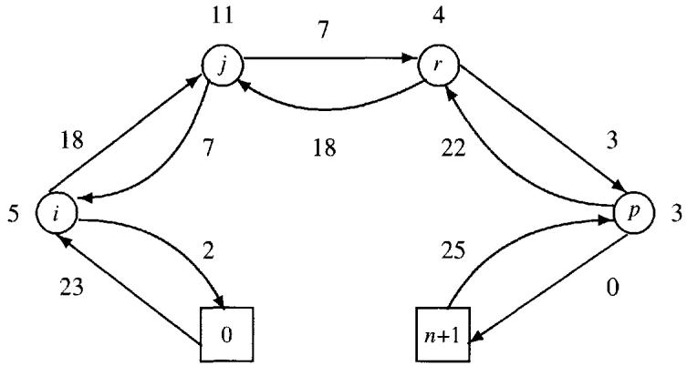  
Figure 1.2. Example of flow paths on a route $C = 2 5$ ).

Baldacci, Mingozzi, and Hadjiconstantinou [2] showed that the linear relaxation of this mixed integer program dominates that of model VRP1 when the CCCs (1.8) are dropped. The elimination of these inequalities, of course, weakens formulation VRP1 to a great extent, and thus the result is not so surprising.

# 1.3.4 Set-Partitioning Models

The set-partitioning (SP) formulation of the VRP was originally proposed by Balinski and Quandt [3] and uses a possibly exponential number of binary variables, each associated with a different feasible circuit of $G$ . More specifically, let $\mathcal { H } = \{ H _ { 1 } , \ldots , H _ { q } \}$ denote the collection of all the circuits of $G$ , each corresponding to a feasible route, with $q = | \mathcal { H } |$ . Each circuit $H _ { j }$ has an associated cost $c _ { j }$ . In addition, let $a _ { i j }$ be a binary coefficient that takes value 1 if vertex $i$ is visited (or covered, in the set partitioning jargon) by route $H _ { j }$ and takes value 0 otherwise. The binary variable $x _ { j }$ , $j = 1 , \ldots , q .$ , is equal to 1 if and only if circuit $H _ { j }$ is selected in the optimal solution. The model is

$$
\operatorname* { m i n } \sum _ { j = 1 } ^ { q } c _ { j } x _ { j }
$$

subject to

$$
\begin{array} { l l } { \displaystyle \sum _ { j = 1 } ^ { q } a _ { i j } x _ { j } = 1 \quad } & { \forall i \in V \setminus \{ 0 \} , } \\ { \displaystyle q } \\ { \displaystyle \sum _ { j = 1 } ^ { q } x _ { j } = K , } \\ { \displaystyle x _ { j } \in \{ 0 , 1 \} \quad } & { \forall j = 1 , \ldots , q . } \end{array}
$$

Constraints (1.72) impose that each customer $i$ is covered by exactly one of the selected circuits, and (1.73) requires that $K$ circuits are selected. This is a very general model

that may easily take into account several constraints as, for example, time windows, since route feasibility is implicitly considered in the definition of set $\mathcal { H }$ . Moreover, the linear programming relaxation of this formulation typically is very tight.

Observe that if the cost matrix satisfies the triangle inequality, then the set partitioning model may be transformed into an equivalent set-covering (SC) model $\scriptstyle \mathbf { V R P 8 } ^ { \prime }$ by writing (1.72) as

$$
\sum _ { j = 1 } ^ { q } a _ { i j } x _ { j } \geq 1 \qquad \forall i \in V \setminus \{ 0 \} .
$$

Any feasible solution to model VRP8 is also feasible for VRP8', and any feasible solution to $\bf V R P 8 ^ { \prime }$ may be transformed into a feasible solution of VRP8 of not greater cost. Indeed, if the $\scriptstyle \mathbf { V R P 8 } ^ { \prime }$ solution is infeasible for VRP8, this means that one or more customers are visited more than once. Then, these customers may be removed, by applying shortcuts, from all but one of the routes where they are included. Since the triangle inequality holds, each such shortcut would not increase the cost of the solution. The main advantage of using the VRP8' formulation with respect to the VRP8 one is that in the former only inclusion-maximal feasible circuits, among those with the same cost, need be considered in the definition of $\mathcal { H }$ . This considerably reduces the number $q$ of variables. In addition, when using the $\scriptstyle \mathrm { { V R P 8 ^ { \prime } } }$ formulation the dual solution space is considerably reduced since dual variables are restricted to nonnegative values only.

One of the main drawbacks of the VRP8 and VRP8' models is represented by the huge number of variables, which, in non-tightly-constrained instances with tens of customers, may easily run into the billions. The explicit generation of all the feasible circuits (columns) is thus normally impractical, and one has to resort to a column generation approach to solve the linear programming relaxation of models VRP8 and VRP8' (see Chapter 4).

# 1.4 Test Instances for the CVRP and Other VRPs

Despite the interest in VRPs by the scientific community and by practitioners, the computational testing of the solution methods for the VRP generally has been carried out by considering only a limited set of Euclidean test instances, which were proposed by Christofides and Eilon [6] and by Christofides, Mingozzi, and Toth [7]. These instances are identified with a variety of names by the various authors who used them in their papers and this may cause some confusion. Therefore, in this book we adopted the unified naming scheme described by Vigo [43] to identify the test instances used for CVRP and DCVRP.

The naming scheme for the instance data and solutions is an extension of that adopted by Augerat et al. [1]. The name of each instance should allow one to determine quickly its characteristics. In particular, the names have the form tnnnvkkp and are made up of five positional fields. The first field, t, is one alphabetical character that identifies the problem type and is equal to

• E for Euclidean SCVRP instances, • S for non-Euclidean SCVRP instances, • A for ACVRP instances, and • D for symmetric DCVRP instances.

The second field of the name, nnn, is a three-digit integer that denotes the number of vertices of the problem graph, i.e., including the depot vertex. The third field, v, is normally equal to "-", but it may be an alphabetical character used to distinguish several instances that are characterized by the same number of vertices and available vehicles. The fourth field, kk, is a two-digit integer that denotes the number of available vehicles. Finally, the last field of the name, p, is an alphabetical character that identifies the paper where the problem data are first given or an alternative source for them, as follows:

• a Hays [28] and Eilon, Watson-Gandy, and Christofides [15],   
• c Christofides, Mingozzi, and Toth [7],   
• d Dantzig and Ramser [11] and Eilon, Watson-Gandy, and Christofides [15], • e Christofides and Eilon [6],   
• f Fisher [18],   
• g Gaskell [22] and Eilon, Watson-Gandy, and Christofides [15],   
• h Hadjiconstantinou, Christofides, and Mingozzi [27],   
• m Christofides, Mingozzi, and Toth [8],   
• n Noon, Mittenthal, and Pillai [40],   
• v Fischetti, Toth, and Vigo [17], an   
• w Clarke and Wright [9] and Eilon, Watson-Gandy, and Christofides [15].

For example, according to this naming scheme, E051-05e identifies the classical 50- customers Euclidean instance with 5 available vehicles proposed by Christofides and Eilon [6], and A073-03v identifies the 72-customers ACVRP instance with 3 vehicles described by Fischetti, Toth, and Vigo [17].

# Bibliography

[1] P. Augerat, J.M. Belenguer, E. Benavent, A. Corberan, D. Naddef, and G. Rinaldi. Computational results with a branch and cut code for the capacitated vehicle routing problem. Technical Report RR 949-M, Universite Joseph Fourier, Grenoble, 1995.   
[2] R. Baldacci, E. Hadjiconstantinou and A. Mingozzi. An exact algorithm for the capacitated vehicle routing problem based on a two-commodity network flow formulation. Operations Research to appear, 2004.   
[3] M. Balinski and R. Quandt. On an integer program for a delivery problem. Operations Research, 12:300-304, 1964.

[4] L.D. Bodin, B.L. Golden, A.A. Assad, and M. Ball. Routing and scheduling of vehicles and crews, the state of the art. Computers and Operations Research, 10(2):63-212, 1983.

[5] N. Christofides. Vehicle routing. In E.L. Lawler, J.K. Lenstra, A.H.G. Rinnooy Kan, and D.B. Shmoys, editors, The Traveling Salesman Problem, Wiley, Chichester, UK, 1985, pp. 431-448.

[6] N. Christofides and S. Eilon. An algorithm for the vehicle dispatching problem. Operational Research Quarterly, 20:309-318, 1969.

[7] N. Christofides, A. Mingozzi, and P. Toth. The vehicle routing problem. In N. Christofides, A. Mingozzi, P. Toth, and C. Sandi, editors, Combinatorial Optimization, Wiley, Chichester, UK, 1979, pp. 315-338.

[8] N. Christofides, A. Mingozzi, and P. Toth. Exact algorithms for the vehicle routing problem based on the spanning tree and shortest path relaxations. Mathematical Programming, 20:255-282, 1981.

[9] G. Clarke and J.V. Wright. Scheduling of vehicles from a central depot to a number of delivery points. Operations Research, 12:568-581, 1964.

[10] G. Cornuejols and F. Harche. Polyhedral study of the capacitated vehicle routing problem. Mathematical Programming, 60:21-52, 1993.

[11] G.B. Dantzig and J.H. Ramser. The truck dispatching problem. Management Science, 6:80, 1959.

[12] M. Desrochers and G. Laporte. Improvements and extensions to the Miller-TuckerZemlin subtour elimination constraints. Operations Research Letters, 10:27-36,1991.

[13] M. Desrochers, J.K. Lenstra, and M.W.P. Savelsbergh. A classification scheme for vehicle routing and scheduling problems. Journal of Operational Research Society, 46:322-332, 1990.

[14] M. Dror, editor. Arc Routing: Theory, Solutions and Applications. Kluwer, Boston, MA, 2000.

[15] S. Eilon, C. Watson-Gandy, and N. Christofides. Distribution Management, Mathematical Modeling and Practical Analysis. Griffin, London, 1971.

[16] G. Finke, A. Claus, and E. Gunn. A two-commodity network flow approach to the traveling salesman problem. Congressus Numernatium, 41:167-178, 1984.

[17] M. Fischetti, P. Toth, and D. Vigo. A branch-and-bound algorithm for the capacitated vehicle routing problem on directed graphs. Operations Research, 42:846-859,1994.

[18] M.L. Fisher. Optimal solution of vehicle routing problems using minimum $k$ -trees. Operations Research, 42:626-642, 1994.

[19] M.L. Fisher. Vehicle routing. In M.O. Ball, T.L. Magnanti, C.L. Monma, and G.L. Nemhauser, editors, Network Routing, Handbooks in Operations Research and Management Science 8, North-Holland, Amsterdam, 1995, pp. 1-33.

[20] M.L. Fisher and R. Jaikumar. A generalized assignment heuristic for the vehicle routing problem. Networks, 11:109-124, 1981.

[21] W.M. Garvin, H.W. Crandall, J.B. John, and R.A. Spellman. Applications of linear programming in the oil industry. Management Science, 3:407^1-30, 1957.

[22] T.J. Gaskell. Bases for vehicle fleet scheduling. Operational Research Quarterly, 18:281-295, 1967.

[23] B. Gavish and S. Graves. The travelling salesman problem and related problems. Working Paper 7905, Graduate School of Management, University of Rochester, Rochester, NY, 1979.

[24] B. Gavish and S. Graves. Scheduling and routing in transportation and distributions systems: Formulations and new relaxations. Working paper, Graduate School of Management, University of Rochester, Rochester, NY, 1982.

[25] B.L. Golden and A.A. Assad. Vehicle Routing: Methods and Studies. North-Holland, Amsterdam, 1988.

[26] B.L. Golden, E.A. Wasil, J.P. Kelly, and I.M. Chao. Metaheuristics in vehicle routing. In T.G Crainic and G. Laporte, editors, Fleet Management and Logistics, Kluwer, Boston, MA, 1998, pp. 33-56.

[27] E. Hadjiconstantinou, N. Christofides, and A. Mingozzi. A new exact algorithm for the vehicle routing problem based on $q$ -paths and $k$ -shortest paths relaxations. Annals of Operations Research, 61:21^13, 1995.

[28] R. Hayes. The delivery problem. Management Science Research Report 106, Carnegie Institute of Technology, Pittsburgh, PA, 1967.

[29] A. Langevin, M. Desrochers, J. Desrosiers, S. Gelinas, and F. Soumis. A twocommodity formulation for the traveling salesman and the makespan problems with time windows. Networks, 23:631-640, 1993.

[30] G. Laporte. The vehicle routing problem: An overview of exact and approximate algorithms. European Journal of Operational Research, 59:345-358, 1992.

[31] G. Laporte. Vehicle routing. In M. DeH'Amico, F. Maffioli, and S. Martello, editors. Annotated Bibliographies in Combinatorial Optimization, Wiley, Chichester, UK, 1997.

[32] G. Laporte and Y. Nobert. Exact algorithms for the vehicle routing problem. Annals of Discrete Mathematics, 31:147-184, 1987.

[33] G. Laporte and I.H. Osman. Routing problems: A bibliography. Annals of Operations Research, 61:227-262, 1995.

[34] E.L. Lawler, J.K. Lenstra, A.H.G. Rinnooy Kan, and D.B. Shmoys, The Traveling Salesman Problem. Wiley, Chichester, UK, 1985.   
[35] J.K. Lenstra and A.H.G. Rinnooy Kan. Some simple applications of the traveling salesman problem. Operational Research Quarterly, 26:717-734, 1975.   
[36] T.L. Magnanti. Combinatorial optimization and vehicle fleet planning: Perspectives and prospects. Networks, 11:179-214, 1981.   
[37] S. Martello and P. Toth. Knapsack Problems: Algorithms and Computer Implementations, Wiley, Chichester, UK, 1990.   
[38] C.E. Miller, A.W. Tucker, and R.A. Zemlin. Integer programming formulations and traveling salesman problems. Journal of the ACM, 7:326-329, 1960.   
[39] D.L. Miller. A matching based exact algorithm for capacitated vehicle routing problems. ORSA Journal on Computing, 7(1): 1-9, 1995.   
[40] C.E. Noon, J. Mittenthal, and R. Pillai. A $\mathbf { T S S P + } 1$ decomposition strategy for the vehicle routing problem. European Journal of Operational Research, 79:524-536, 1994.   
[41] P. Toth and D. Vigo. Exact algorithms for vehicle routing. In T. Crainic and G. Laporte, editors, Fleet Management and Logistics, Kluwer, Boston, MA, 1998, pp. 1-31.   
[42] P. Toth and D. Vigo. Models, relaxations and exact approaches for the capacitated vehicle routing problem. Discrete Applied Mathematics, to appear.   
[43] D. Vigo. VRPLIB: A vehicle routing problem instances library. Technical Report OR/00/3, Universita di Bologna, Italy, 2000.

# Parti

# Capacitated Vehicle Routing Problem

# Chapter 2

# Branch-and-Bound Algorithms for the Capacitated VRP

Paolo Toth Daniele Vigo

# 2.1 Introduction

The branch-and-bound method has been used extensively in recent decades to solve the CVRP and its main variants. In many cases, as for the Asymmetric CVRP (ACVRP) and the Distance-Constrained CVRP (DCVRP), these algorithms still represent the state of the art with respect to the exact solution methods. In their extensive survey devoted to exact methods, Laporte and Nobert [23] gave a complete and detailed analysis of the branch-andbound algorithms proposed up until the late 1980s.

In this chapter, we concentrate on the most recent branch-and-bound algorithms, proposed during the last few years for the exact solution of CVRP, for both symmetric and asymmetric cost matrices. When the explicit distinction between SCVRP and ACVRP is not needed, we simply use CVRP. Although no new result has been presented for the DCVRP, we briefly review the known algorithms for this problem, too.

As mentioned in the introduction, the CVRP is an extension of the well-known Traveling Salesman Problem (TSP), calling for the determination of a Hamiltonian circuit with minimum cost visiting a given set of points exactly once. Therefore, many exact approaches for the CVRP were inherited from the extensive and successful work done for the exact solution of the TSP. Until the late 1980s, the most effective exact approaches for the CVRP were mainly branch-and-bound algorithms, which used basic combinatorial relaxations, such as the Assignment Problem (AP), the degree-constrained Shortest Spanning Tree (SST), and the state space relaxation. Recently, more sophisticated bounds were proposed, like those based on Lagrangian relaxations or on the additive approach, which substantially increased the size of the problems that can be solved to optimality by branch-and-bound.

When presenting the basic relaxations used to compute lower bounds, we treat separately problems with asymmetric and symmetric cost matrices. In fact, although the symmetric problems are special cases of the asymmetric ones, the latter were much less studied in the literature and the exact methods developed for them have in general a poor performance when applied to symmetric instances. Analogously, not all the approaches proposed for symmetric problems can be easily adapted to solve asymmetric problems.

In section 2.2 we consider the basic combinatorial relaxations proposed for ACVRP and SCVRP. We next present, in section 2.3, the more effective relaxations based on Lagrangian and additive approaches. In section 2.4 the main features and the relative performance of the branch-and-bound algorithms are discussed. Section 2.5 examines the relaxations proposed for the DCVRP, and in the last section we draw some conclusions and outline possible future directions of research.

We remind the reader that throughout this chapter, the graphs, directed or undirected, are assumed to be complete. Information on the performance of the computers used for testing the algorithms presented, expressed in Mflops, is taken (when available) from Dongarra [10]. In this chapter we extensively refer to the basic notation and to the models presented in Chapter 1.

# 2.2 Basic Relaxations

In this section we describe the basic combinatorial relaxations for ACVRP and SCVRP that were used within the early branch-and-bound algorithms.

The first type of relaxation may be obtained from the integer linear programming (ILP) formulations of ACVRP and SCVRP (see section 1.3) by dropping the constraints used to impose the connectivity and the capacity requirements, such as the Capacity-Cut Constraints (CCCs) or the Generalized Subtour Elimination Constraints (GSECs). The resulting problem amounts to an AP or to a $^ b$ -matching problem for the asymmetric and symmetric case, respectively.

The second type of relaxation leads instead to the solution of cardinality-constrained shortest spanning arborescences and trees for the asymmetric and symmetric case, respectively. These relaxations are obtained by weakening the CCCs or GSECs so as to impose only the connectivity of the solution and by ignoring part of the degree requirements of the vertices.

As we will see at the end of this section, the quality of the lower bounds obtained with these relaxations is generally poor and substantial efforts are needed to improve them.

# 2.2.1 Bounds Based on Assignment and Matching

Laporte, Mercure, and Nobert [22] proposed the first branch-and-bound algorithm for ACVRP. The algorithm is based on the relaxation obtained from model VRP1 of section 1.3.1 by dropping the CCCs (1.8). The resulting problem is a Transportation Problem (TP), calling for a min-cost collection of circuits of $G$ visiting once all the vertices in $V \backslash \{ 0 \}$ , and $\pmb { K }$ times vertex 0. This solution can be infeasible for ACVRP since

(i) the total customer demand on a circuit may exceed the vehicle capacity, and (ii) there may exist "isolated" circuits, i.e., circuits not visiting the depot (vertex 0).

It is well known that determining the optimal TP solution requires $O ( n ^ { 3 } )$ time. In practice, it is more effective to transform the problem into an AP defined on the extended complete directed graph $G ^ { \prime } = ( V ^ { \prime } , A ^ { \prime } )$ , obtained by adding $K - 1$ copies of the depot vertex as described in section 1.3.2, where the extended cost matrix, $c ^ { \prime }$ , is defined by (1.55). The resulting relaxation is thus

$$
L _ { A P } = \operatorname* { m i n } \sum _ { i \in V ^ { \prime } } \sum _ { j \in V ^ { \prime } } c _ { i j } ^ { \prime } x _ { i j }
$$

subject to

$$
\begin{array} { l l } { \displaystyle \sum _ { i \in V } x _ { i j } = 1 \quad } & { \forall j \in V ^ { \prime } , } \\ { \displaystyle \sum _ { j \in V } x _ { i j } = 1 \quad } & { \forall i \in V ^ { \prime } , } \\ { \displaystyle x _ { i j } \geq 0 \quad } & { \forall i , j \in V ^ { \prime } . } \end{array}
$$

Several efficient public domain codes for the AP are available; see, e.g., Dell'Amico andToth[8].

The counterpart, for the symmetric case, of the AP relaxation is the so-called $^ b$ - matching relaxation, which may be obtained by considering model VRP3 of section 1.3.1 and by removing the CCCs (1.24). The resulting relaxed problem requires the determination of a min-cost collection of cycles covering all the vertices and such that the degree of each vertex $i$ is equal to $b _ { i }$ , where $b _ { i } = 2$ for all the customer vertices, and $b _ { 0 } = 2 K$ for the depot vertex.

$$
( b \mathrm { - m a t c h i n g } ) \qquad L _ { b M } = \mathrm { m i n } \sum _ { e \in E } c _ { e } x _ { e }
$$

subject to

$$
\begin{array} { l } { \displaystyle \sum _ { e \in \delta ( i ) } x _ { e } = b _ { i } \qquad \forall i \in V , } \\ { \displaystyle x _ { e } \in \{ 0 , 1 \} \qquad \forall e \notin \delta ( 0 ) , } \\ { \displaystyle x _ { e } \in \{ 0 , 1 , 2 \} \qquad \forall e \in \delta ( 0 ) . } \end{array}
$$

This relaxation was used by Miller [25], after the development of efficient algorithms for the $^ b$ -matching problem (see, e.g., Miller and Pekny [27]), which can solve it in time $O ( | V | ^ { 2 } | E | )$ . Similar to what may happen to the AP relaxation for the ACVRP, the $b$ matching solution may be infeasible for SCVRP since

(i) the demand associated with a cycle may exceed the vehicle capacity, and (ii) some cycle may be isolated, i.e., disconnected from the depot.

Also, in this case it is possible to obtain an equivalent 2-matching relaxation by adding $K - 1$ copies of the depot.

# 2.2.2 Bounds Based on Arborescences and Trees

An alternative combinatorial relaxation for the ACVRP is based on the solution of degreeconstrained spanning arborescences. This relaxation may be obtained from model VRP1 by (i) removing the outdegree constraints (1.5) for all the customer vertices and (ii) weakening the CCCs (1.8) so as to impose only the connectivity of the solution, i.e., by replacing the right-hand side with 1. The resulting relaxed problem, called the $\pmb { K }$ -Shortest Spanning Arborescence problem (KSSA), is

$$
L _ { K S S A } = \operatorname* { m i n } \sum _ { i \in V } \sum _ { j \in V } c _ { i j } x _ { i j }
$$

subject to

$$
\begin{array} { r l r } { \displaystyle \sum _ { i \in V } x _ { i j } = 1 } & { \quad \forall j \in V \setminus \{ 0 \} , } & \\ { \displaystyle \sum _ { i \in V } x _ { i 0 } = K , } & \\ { \displaystyle \sum _ { i \in V } x _ { 0 j } = K , } & \\ { \displaystyle \sum _ { j \in V } x _ { 0 j } = K , } & \\ { \displaystyle \sum _ { i \notin S } \displaystyle \sum _ { j \in S } x _ { i j } \geq 1 \quad \quad \forall S \subseteq V \setminus \{ 0 \} , S \neq \emptyset , } & \\ { \displaystyle x _ { i j } \in \{ 0 , 1 \} \quad } & { \forall i , j \in V . } & \end{array}
$$

The KSSA can be effectively solved by considering two separate subproblems:

(i) the determination of a min-cost spanning arborescence with outdegree $\pmb { K }$ at the depot vertex, defined by (2.9), (2.10), (2.12), (2.13), and the continuous relaxation of (2.14), with variables $x _ { i j }$ for $i \in V$ , $j \in V \setminus \{ 0 \}$ , and

(ii) the determination of a set of $\pmb { K }$ min-cost arcs entering the depot, defined by (2.9), (2. 11), and the continuous relaxation of (2. 14), with variables $x _ { i 0 }$ for $i \in V$ .

Therefore, $L _ { K S S A }$ can be determined in $O ( n ^ { 2 } )$ since the first subproblem can be solved in $O ( n ^ { 2 } )$ time (see Gabow and Tarjan [16] and Toth and Vigo [28]), while the second subproblem clearly requires $O ( n )$ time.

A similar lower bound may be obtained by considering the antiarborescence rooted at the depot (KSSAA), in which the branches are union of paths starting from the customers and directed toward the depot, whereas in the KSSA the paths are oriented in the opposite way. It is easy to see that the $L _ { K S S A A }$ bound may be obtained by computing the KSSA on the transpose of the original cost matrix. In the following, we use the best of these two bounds, defined as

$$
L _ { K S S A } ^ { \prime } = \operatorname* { m a x } \{ L _ { K S S A } , L _ { K S S A A } \} .
$$

The above-described lower bound was never used within branch-and-bound algorithms, and the preliminary computational results discussed in the next section show that its quality is generally poor and inferior to that of the lower bound $L _ { A P }$ - However, it should be mentioned that for a problem closely related to the SCVRP and ACVRP, such as the symmetric and asymmetric VRP with backhauls (see Chapter 8), Toth and Vigo [29] successfully used a Lagrangian relaxation based on the solution of KSSAs, solving to optimality problems with up to 100 customers.

Several relaxations based on spanning trees were proposed for SCVRP by extending the well-known 1-tree relaxation proposed by Held and Karp [19] for the TSP. The earliest branch-and-bound algorithm based on such relaxations, which proved to be able to solve small size instances, was proposed by Christofides, Mingozzi, and Toth [7]. More recently, Fisher [14] presented another tree-based relaxation that requires the determination of a socalled $\pmb { K }$ -tree, defined as a min-cost set of $n + K$ edges spanning the graph. The approach used by Fisher is based on formulation VRP3 of section 1.3.1 with the additional assumption that single-customer routes are not allowed. This is imposed by denning as binary all the variables associated with edges incident into the depot. However, as Fisher observed, in many cases this assumption is not constraining (see section 1.3.2 for a discussion).

Fisher modeled the SCVRP as the problem of determining a $K$ -tree with degree equal to $2 K$ at the depot vertex, and with additional constraints imposing the vehicle capacity requirements and the degree of each customer vertex, which must be equal to 2.

The determination of a $K$ tr&e with degree $2 K$ at the depot requires $O ( n ^ { 3 } )$ time (see Fisher [15]). This degree-constrained $\pmb { K }$ -tree relaxation may easily be obtained by considering formulation VRP3 and by removing the degree constraints (1.22) for the customer vertices and weakening the CCCs (1.24) into connectivity constraints by replacing the right-hand side with 1. The resulting relaxed problem is

$$
( K { \mathrm { - t r e e } } ) \qquad \operatorname* { m i n } \sum _ { e \in E } c _ { e } x _ { e }
$$

subject to

$$
\begin{array} { l } { \displaystyle \sum _ { e \in \delta ( 0 ) } x _ { e } = 2 K , } \\ { \displaystyle \sum _ { e \in \delta ( S ) } x _ { e } \geq 1 \qquad S \subseteq V \setminus \{ 0 \} , S \neq \emptyset , } \\ { \displaystyle x _ { e } \in \{ 0 , 1 \} \qquad \forall e \in E . } \end{array}
$$

It can easily be seen that the $K$ ^-tree solution may be infeasible for SCVRP because some vertices may have degree different from 2. Moreover, the demand associated with the branches leaving the depot may exceed the vehicle capacity.

# 2.2.3 Comparison of the Basic Relaxations

The basic relaxations of AC VRP and SCVRP presented in the previous sections have in general a poor quality, as shown by the results presented in this section, obtained by considering widely used test instances from the literature.

Table 2.1 reports the percentage ratios of the different lower bound values for AC VRP with respect to the optimal solution value, when applied to the ACVRP real-world instances of pharmaceutical and herbalist's product delivery in downtown Bologna, described by Fischetti, Toth, and Vigo [13]. In particular, the table contains the ratios corresponding to $L _ { A P } , L _ { K S S A } ^ { \prime }$ and the overall additive bound $L _ { A D D }$ , which is described in section 2.3.1. The average gap, over the eight instances, of the lower bound with respect to the optimal solution value is about $8 . 7 \%$ fo $L _ { A P }$ and $2 2 . 9 \%$ for $L _ { K S S A } ^ { \prime }$ . As a consequence, none of these instances were solved by a branch-and-bound based on such basic relaxations, whereas they were solved by adopting the $L _ { A D D }$ bound, whose average ratio is $5 . 4 \%$ . Moreover, the computational experiments described by Fischetti, Toth, and Vigo [13] show that on randomly generated instances the gap was normally much smaller, being equal to $2 \%$ to $5 \%$ for $L _ { A P }$ and to $1 \%$ to $2 \%$ for $L _ { A D D }$ -

Table 2.1. Percentage ratios of different ACVRP lower bounds with respect to the optimal solution value on real-world instances.   

<table><tr><td>Problem</td><td>n</td><td>K</td><td>%LAP</td><td>%oL&#x27;KSSA</td><td>%LADD</td></tr><tr><td>A034-02v</td><td>33</td><td>2</td><td>85.8</td><td>78.7</td><td>90.1</td></tr><tr><td>A036-03v</td><td>35</td><td>3</td><td>90.9</td><td>75.2</td><td>93.2</td></tr><tr><td>A039-03v</td><td>38</td><td>3</td><td>93.8</td><td>77.6</td><td>96.1</td></tr><tr><td>A045-03v</td><td>44</td><td>3</td><td>93.4</td><td>75.6</td><td>95.7</td></tr><tr><td>A048-03v</td><td>47</td><td>3</td><td>93.6</td><td>79.0</td><td>97.2</td></tr><tr><td>A056-03v</td><td>55</td><td>3</td><td>88.5</td><td>75.4</td><td>94.3</td></tr><tr><td>A065-03v</td><td>64</td><td>3</td><td>92.6</td><td>75.6</td><td>95.5</td></tr><tr><td>A071-03v</td><td>70</td><td>3</td><td>91.7</td><td>79.3</td><td>94.6</td></tr><tr><td colspan="3"></td><td>91.3</td><td>77.1</td><td>94.6</td></tr></table>

Table 2.2 reports the average percentage ratios of the basic lower bounds $L _ { K T }$ and $L _ { b M }$ with respect to the optimal or the best-known solution value, for a set of widely used Euclidean CVRP instances from the literature. The table also reports the ratios of $L _ { A P }$ , $L _ { K S S A } ^ { \prime }$ and °f the overall additive lower bound $L _ { A D D }$ by Fischetti, Toth, and Vigo [13], which are clearly valid lower bounds for SCVRP as well.

The $L _ { K T }$ values are those reported by Fisher [14], who used real-valued cost matrices. The best-known solution values used to compute the ratios are those reported by Toth and Vigo [30], which were obtained by using real-valued cost matrices. The $L _ { b M }$ values were computed with the CPLEX $6 . 0 \ \mathrm { I I } { \bf Z }$ solver. All the remaining lower bound values were computed by using integer cost matrices, where the arc cost is defined as the real cost multiplied by 10,000 and rounded to the nearest integer. The final value is then scaled down by dividing it by 10,000. It should be recalled that the problem considered by Fisher in [14] was slightly different from what we defined as CVRP, since the single-customer routes were not allowed. In particular, among the instances reported in Table 2.2, those marked with an asterisk may include single-customer routes. As a consequence, the $L _ { K T }$ values computed by Fisher for these instances may by slightly larger than those that could be obtained in the case where single-customer routes are allowed.

Table 2.2. Percentage ratios of different basic SCVRP lower bounds with respect to the best known solution value of Euclidean instances.   

<table><tr><td>Problem</td><td>n</td><td>K</td><td>%LbM</td><td>%LKT</td><td>%L&#x27;KSSA</td><td>%LAP</td><td>%LADD</td></tr><tr><td>E045-04f</td><td>44</td><td>4</td><td>71.4</td><td>62.6 *</td><td>62.2</td><td>57.4</td><td>70.3</td></tr><tr><td>E051-05e</td><td>50</td><td>5</td><td>87.9</td><td>84.9</td><td>79.4</td><td>80.9</td><td>87.5</td></tr><tr><td>E072-04f</td><td>71</td><td>4</td><td>80.9</td><td>77.7</td><td>72.0</td><td>69.8</td><td>77.9</td></tr><tr><td>E076-10e</td><td>75</td><td>10</td><td>76.7</td><td>76.2</td><td>69.2</td><td>71.0</td><td>76.1</td></tr><tr><td>E101-08e</td><td>100</td><td>8</td><td>86.4</td><td>81.5</td><td>77.5</td><td>80.7</td><td>86.1</td></tr><tr><td>E101-10c</td><td>100</td><td>10</td><td>70.3</td><td>77.6 *</td><td>72.2</td><td>66.5</td><td>69.6</td></tr><tr><td>E135-07f</td><td>134</td><td>7</td><td>63.4</td><td>59.2</td><td>57.5</td><td>47.5</td><td>60.3</td></tr><tr><td>E151-12C</td><td>150</td><td>12</td><td>80.5</td><td>78.4 *</td><td>73.6</td><td>68.6</td><td>77.6</td></tr><tr><td>E200-16C</td><td>199</td><td>16</td><td>72.4</td><td>74.1</td><td>66.4</td><td>64.6</td><td>72.2</td></tr><tr><td></td><td></td><td></td><td>76.7</td><td>74.7</td><td>70.0</td><td>67.4</td><td>75.5</td></tr></table>

1 Single-customer routes not allowed. \*May include single-customer routes.

By observing Table 2.2, it can be noted that none of the basic relaxations reaches a quality sufficient to solve moderate-size problems. As an example, we used the Fischetti, Toth, and Vigo code FTV, proposed for the ACVRP and based on the additive bound $L _ { A D D }$ : the largest SCVRP instance it could solve included 47 customers (i.e., problem E048-04y not included in the table), and some problems with 25 to 30 customers were not solved to optimality.

# 2.3 Better Relaxations

As discussed in the previous section, the basic combinatorial relaxations available for both ACVRP and SCVRP have a poor quality, and, when used within branch-and-bound approaches, they allow for the optimal solution of small instances only. Therefore, different improved bounding techniques were proposed, which considerably increased the size of the instances solvable by branch-and-bound algorithms. In particular, for the ACVRP we examine the additive bounding procedures proposed by Fischetti, Toth, and Vigo [13], whereas for the SCVRP we describe the bounding procedures based on Lagrangian relaxation proposed by Fisher [14] and Miller [25]. We also describe the bound based on the set partitioning formulation proposed by Hadjiconstantinou, Christofides, and Mingozzi [18].

# 2.3.1 Additive Bounds for ACVRP

The following two relaxations were introduced by Fischetti, Toth, and Vigo [13], who embedded them into overall additive bounding procedures. The additive approach was proposed by Fischetti and Toth [12] and allows for the combination of different lower bounding procedures, each exploiting different substructures of the considered problem. When applied to a minimization problem of the form $\operatorname* { m i n } \{ c x : x \in F \}$ , each procedure returns a lower bound, $\rho$ , and a residual cost matrix, $\tilde { c }$ , such that

$$
\begin{array} { r } { \tilde { c } \geq 0 , } \\ { \rho + \tilde { c } x \leq c x , \qquad x \in F . } \end{array}
$$

The entries of $\tilde { c }$ represent lower bounds on the increment of the optimal solution value if the corresponding arc is imposed in the solution. The different bounding procedures are applied in sequence, and each of them uses as costs the residual cost matrix returned by the previous procedure (obviously, the first procedure starts with the original cost matrix). The overall additive lower bound is given by the sum of the lower bounds obtained by the different procedures. It can easily be shown that if the lower bounding procedures are based on linear programming relaxations, as those described for ACVRP (i.e., AP and KSSA), the linear programming reduced costs are valid residual costs. For further details see Fischetti, Toth, and Vigo [13] and Fischetti and Toth [12].

# 2.3.1.1 Disjunctive Lower Bound

The first relaxation described by Fischetti, Toth, and Vigo [13] is based on a disjunction o infeasible arc subsets. A given arc subset $B \subset A$ is called infeasible if no feasible solution to ACVRP can use all its arcs, i.e., when

$$
\sum _ { ( a , b ) \in B } x _ { a b } \leq | B | - 1
$$

is a valid inequality for ACVRP. For any given (minimal) infeasible arc subset $B \subset A$ , the following logical disjunction holds for each $x \in F$ , where $F$ is the set of all the feasible ACVRP solutions:

$$
\bigvee _ { ( a , b ) \in B } \left( x \in Q ^ { a b } = \big \{ x \in \mathfrak { R } ^ { A } : x _ { a b } = 0 \big \} \right) .
$$

Then, $| B |$ restricted problems can be defined, each denoted as $R P ^ { a b }$ , by including the additional condition $x _ { a b } = 0$ , imposed for a different arc $( a , b ) \in B$ . For each $R P ^ { a b }$ , a valid lower bound, $\vartheta ^ { a b }$ , is computed through the AP relaxation described in the previous section, with $c _ { a b } = M \equiv + \infty$ to impose $x _ { a b } = 0$ . The disjunctive bound

$$
L _ { D } = \operatorname* { m i n } \left\{ \vartheta ^ { a b } : ( a , b ) \in B \right\}
$$

clearly dominates the lower bound $L _ { A P }$ based on AP since $\vartheta ^ { a b } \geq L _ { A P }$ for all $( a , b ) \in B$ ,

A possible way to determine infeasible arc subsets $B$ , used in [13], is the following First solve the AP relaxation with no additional constraints, and store the corresponding optimal solution $( x _ { i j } ^ { * } : i , j \in V ^ { \prime } )$ If $x ^ { * }$ is feasible for ACVRP, then clearly $L _ { A P }$ cannot be improved; otherwise, a suitable infeasible arc subset $B$ is chosen to possibly improve it. Note that imposing $x _ { a b } = 0$ for any $( a , b ) \in A$ such that $x _ { a b } ^ { * } = 0$ would produce $\vartheta ^ { a b } = L _ { A P }$ , hence a disjunctive bound $L _ { D } = L _ { A P }$ - Therefore, $B$ is chosen as a subset of $A ^ { * } = \left\{ ( i , j ) \in A ^ { \prime } : x _ { i j } ^ { * } = 1 \right\}$ if any, corresponding to one of the following cases:

(i) a circuit disconnected from the depot vertex,   
(ii) a sequence of customer vertices whose total demand exceeds $c$ ,   
(iii) a feasible circuit that leaves uncovered a set of customers, $s$ whose total demand cannot be served by the remaining $K - 1$ vehicles, i.e. , such that $r ( S ) > K - 1$ , where $r ( S )$ represents the minimum number of vehicles needed to serve all the customers inS.

Different choices of the infeasible arc subset $\pmb { B }$ lead to different lower bounds. Therefore, Fischetti, Toth, and Vigo [13] used an overall additive bounding procedure, called ADD_DISJ, which considers, in sequence, different infeasible arc subsets so as to produce a possibly better overall lower bound.

Procedure ADD_DISJ starts by solving the AP relaxation with no additional constraints and defines the initial lower bound as $L _ { A P }$ and the arc set $A ^ { * }$ as the arcs used in the optimal AP solution. Then, iteratively, an infeasible subset $B$ , if any, is chosen from $A ^ { * }$ and used for the computation of the disjunctive lower bound returning a lower bound $L _ { D }$ and the corresponding residual cost matrix. The current additive lower bound is increased by $L _ { D }$ and the set $A ^ { * }$ is updated by removing from it all the arcs whose corresponding variables are not equal to 1 in the current optimal solution of the disjunctive bound. The process is iterated until $A ^ { * }$ does not contain further infeasible arc subsets. Procedure ADD_DISJ can be implemented, through parametric techniques, to have an overall time complexity equal to $O ( n ^ { 4 } )$ .

# 2.3.1.2 Lower Bound Based on Min-Cost Flow

The second lower bound described by Fischetti, Toth, and Vigo [13] is a projective bound based on a min-cost flow relaxation of ACVRP. Let $\{ S _ { 0 } , \ldots , S _ { m } \}$ be a given partition of $V$ with $0 \in S _ { 0 }$ , and define

$$
A _ { 1 } = \bigcup _ { h = 0 } ^ { m } E ( S _ { h } ) , \qquad A _ { 2 } = A \setminus A _ { 1 } ,
$$

where $E ( S _ { h } )$ is the set of arcs internal to set $S _ { h }$ . In other words, $A$ is partitioned into $\left\{ A _ { 1 } , A _ { 2 } \right\}$ , where $A _ { 1 }$ contains the arcs internal to the subsets $S _ { h }$ , and $A _ { 2 }$ contains those connecting vertices belonging to different $S _ { h }$ 's.

In the following, a lower bound $L _ { P }$ based on projection is described. The bound is given by $L _ { P } = \vartheta _ { 1 } + \vartheta _ { 2 }$ , where $\vartheta _ { t }$ $, t = 1 , 2$ , is a lower bound on $\sum ( c _ { i j } : ( i , j ) \in A ^ { * } \cap A _ { t } )$ ) for every (optimal) ACVRP solution $A ^ { * } \subset A$ .

The contribution to $L _ { P }$ of the arcs in $A _ { 1 }$ (internal to the given subsets $S _ { h }$ ) is initially neglected, i.e., $\vartheta _ { 1 }$ is set equal to 0. The rationale for this choice is clarified later. As to $\vartheta _ { 2 }$ , this is computed by solving the following linear programming relaxation, called Rl, obtained from model VRP1 by weakening degree equations (1.4)-(1.7) into inequalities, to take into account the removal of the arcs in $A _ { 1 }$ , and imposing the CCCs (1.8) and (1.11) only for the subsets $S _ { 0 } , S _ { 1 } , \ldots , S _ { m }$ . The model of Rl is

$$
\vartheta _ { 2 } = \operatorname* { m i n } \sum _ { ( i , j ) \in A _ { \hat { 2 } } } c _ { i j } x _ { i j }
$$

subject to

$$
\begin{array} { r l } & { \displaystyle \sum _ { i \in V : ( i , j ) \in A _ { 2 } } x _ { i j } \leq \left\{ \begin{array} { l l } { 1 \quad } & { \forall j \in V \setminus \{ 0 \} , } \\ { K , \quad } & { j = 0 , } \end{array} \right. } \\ & { \displaystyle \sum _ { j \in V : ( i , j ) \in A _ { 2 } } x _ { i j } \leq \left\{ \begin{array} { l l } { 1 \quad } & { \forall i \in V \setminus \{ 0 \} , } \\ { K , \quad } & { i = 0 , } \end{array} \right. } \end{array}
$$

$$
\sum _ { i \not \in S _ { h } } \sum _ { j \in S _ { h } } x _ { i j } = \sum _ { i \in S _ { h } } \sum _ { j \not \in S _ { h } } x _ { i j } \geq \left\{ \begin{array} { l l } { r ( V \setminus S _ { h } ) , } & { \quad h = 0 , } \\ { r ( S _ { h } ) } & { \quad \forall h = 1 , \ldots , m , } \end{array} \right.
$$

$$
x _ { i j } \in \{ 0 , 1 \} \qquad \forall ( i , j ) \in A _ { 2 } .
$$

This model can be solved efficiently, since it can be viewed as an instance of a mincost flow problem on an auxiliary layered network, as illustrated in Figure 2.1. The network contains $2 ( n + m + 2 )$ vertices, namely,

• two vertices, say $i ^ { + }$ and $i ^ { - }$ , for all $i \in V$ ;   
• two vertices, say $a _ { h }$ and $b _ { h }$ ,, for all $h = 1 , \ldots , m$ ;   
• a source vertex, $\pmb { S }$ , and a sink vertex, $t$ .

The arcs in the network, and the associated capacities and costs, are

• for all $( i , j ) \in A _ { 2 }$ '. arc $( i ^ { + } , j ^ { - } )$ with cost $c _ { i j }$ and capacity $+ \infty$ ;   
• for al $h = 0 , \ldots , m$ : arcs $( a _ { h } , i ^ { + } )$ and $( i ^ { - } , b _ { h } )$ for all $i \in S _ { h }$ , with cost 0 and capacity l ( i f $i \neq 0 .$ or $K$ (if $i = 0$ );   
• for all $h = 0 , \ldots , m$ : arc $\left( a _ { h } , b _ { h } \right)$ with cost 0 and capacity $| S _ { h } | - r ( S _ { h } )$ (if $h \neq 1$ ) or $| S _ { 0 } | + K - r ( V \setminus S _ { 0 } )$ (if $h = 0$ ;   
• for all $h = 0 , \ldots , m$ : arcs $( s , a _ { h } )$ and $( b _ { h } , t )$ , both with cost 0 and capacity $| S _ { h } |$ \ (if $h \neq 1 \mathrm { { ) } }$ or $| S _ { 0 } | + K$ (if $h = 0$ ).

It can easily be seen that finding the min-cost $s { - } t$ flow of value $n + K$ on this network actually solves relaxation Rl. The worst-case time complexity for the computation of $\vartheta _ { 2 }$ , and of the corresponding residual costs, is $O ( n ^ { 3 } )$ by using a specialized algorithm based on successive shortest path computations.

Different choices of the vertex partition $\{ S _ { 0 } , \ldots , S _ { m } \}$ lead to different lower bounds. Note that choosing $S _ { h } = \{ h \}$ for all $h \in V$ produces a relaxation Rl that coincides with the AP relaxation of section 2.2.1. When, on the other hand, nonsingleton $S _ { h }$ 's are present, relaxation Rl can take into account the associated CCCs (that are, instead, neglected by AP), while losing a possible contribution to the lower bound of the arcs inside $S _ { h }$ (which belong to $A _ { \mathrm { I } }$ ) and weakening the degree constraints of the vertices in $S _ { h }$ . Fischetti, Toth, and Vigo [13] used, in sequence, different partitions obtaining an overall additive procedure, called ADD_FLOW.

The procedure is initialized with the partition $S _ { h } = \{ h \}$ for all $h \in V$ (i.e., with the AP relaxation). At each iteration of the additive scheme, relaxation Rl is solved, the current lower bound is increased, and the current costs are reduced accordingly. Then a convenient collection of subsets $S _ { h _ { 1 } } , \ldots , S _ { h _ { r } }$ (with $r \geq 2$ ) belonging to the current partition is selected and the subsets are replaced with their union, say, $S ^ { * }$ . The choice of this collection is made to produce an infeasible set $S ^ { * }$ , i.e., a vertex set whose associated CCC is violated by the solution of the current relaxation Rl. This, hopefully, produces an increase of the additive lower bound in the next iteration. The additive scheme ends when either $m = 1$ or no infeasible $S ^ { * }$ is detected.

Procedure ADD_FLOW takes $O ( n ^ { 4 } )$ time, and the resulting additive lower bound clearly dominates bound $L _ { A P }$ , which is used to initialize it. On the other hand, no dominance relation exists between ADD_FLOW and procedure ADD_DISJ. Therefore, Fischetti, Toth, and Vigo proposed to apply procedures ADD_DIS J and ADD_FLOW in sequence, again in an additive fashion. To reduce the average overall computing time, procedure ADD_FLOW was stopped when no increase of the current additive lower bound $L _ { A D D }$ was observed for five consecutive iterations.

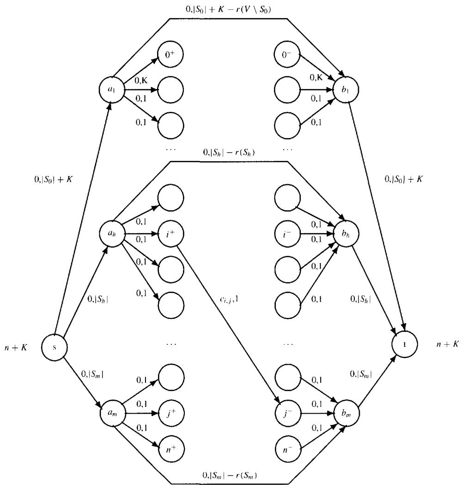  
Figure 2.1. The auxiliary layered network for relaxation Rl.

Table 2.1 reports the percentage ratios of the overall additive bounding procedure when applied to the ACVRP real-world instances of pharmaceutical and herbalist's product delivery in downtown Bologna. It can be noted that the additive procedures considerably improve the $L _ { A P }$ lower bound.

# 2.3.2 Further Lower Bounds for ACVRP

Other bounds for the ACVRP may be derived by generalizing the methods proposed for the symmetric case. For example, Fisher [14] proposed a way to extend to ACVRP the

Lagrangian bound based on a $\pmb { K }$ "-tree derived for the SCVRP (described in section 2.3.3). In this extension the Lagrangian problem calls for the determination of an undirected $\pmb { K }$ -tree on the undirected graph obtained by replacing each pair of directed arcs $( i , j )$ and $( j , i )$ with a single edge $( i , j )$ with cost $c _ { i j } ^ { \prime } = \operatorname* { m i n } \{ c _ { i j } , c _ { j i } \}$ . No computational testing for this bound was presented by Fisher [14].

Possibly better bounds may be obtained by explicitly considering the asymmetry of the problem, i.e., by using $\pmb { K }$ -arborescences rather than $\pmb { K }$ -trees and by strengthening the bound in a Lagrangian fashion as proposed by Toth and Vigo [28, 29] for the capacitated shortest spanning arborescence problem and the VRPB, respectively.

# 2.3.3 Lagrangian Lower Bounds for SCVRP

Fisher [14] and Miller [25] proposed to strengthen the basic SCVRP relaxations by dualizing, in a Lagrangian fashion, some of the relaxed constraints. In particular, Fisher included in the objective function the degree constraints (1.22) and some of the CCCs (1.24), whereas Miller included some of the GSECs (1.27). Note that Fisher did not allow single-customer routes. As in related problems, good values for the Lagrangian multipliers associated with the relaxed constraints are determined by using a standard subgradient optimization procedure (see, e.g., Held and Karp [19] and Held, Wolfe, and Crowder [20]).

The main difficulty associated with these relaxations is represented by the exponential cardinality of the set of relaxed constraints (i.e., the CCCs and the GSECs) which does not allow for the explicit inclusion of all of them into the objective function. To this end, both Fisher and Miller proposed to include only a limited family $\mathcal { F }$ of CCCs or GSECs and to iteratively add to the Lagrangian relaxation the constraints violated by the current solution of the Lagrangian problem. In particular, at each iteration of the subgradient optimization procedure, the arcs incident to the depot in the current Lagrangian solution are removed. Violated constraints (i.e., CCCs or GSECs, depending on the approach), if any, are separated (i.e., detected) by examining the connected components obtained in this way. This separation routine is exact, i.e., if a constraint associated with, say, vertex set $s$ is violated by the current Lagrangian solution, then there is a connected component of that solution spanning all the vertices in S and violating the constraint. The new constraints are added to the Lagrangian problem, i.e., to $\mathcal { F }$ , with an associated multiplier, and the process is iterated until no violated constraint is detected (hence the Lagrangian solution is feasible) or a prefixed number of subgradient iterations has been executed. Slack constraints are periodically purged (i.e., removed) from $\mathcal { F }$ .

Fisher [14] initialized $\mathcal { F }$ with an explicit set of constraints containing the customer subsets nested around $K + 3$ seed customers. The seeds were chosen as the $\pmb { K }$ customers farthest from the depot in the routes corresponding to an initial feasible solution, whereas the last three were the customers maximally distant from the depot and the other seeds. For each seed, 60 sets were generated by including customers according to increasing distances from the seed. After 50 subgradient iterations, new sets were added to $\mathcal { F }$ by identifying violated CCCs in the current Lagrangian solution as previously explained. The step size used in the subgradient optimization method was initially set to 2 and was reduced by a factor of 0.75 if the lower bound was not improved in the last 30 iterations. The number of iterations of the subgradient optimization procedure performed at the root node of the branch-andbound algorithm ranged between 2000 and 3000. The overall Lagrangian bound, $L A G _ { K T }$ , considerably improved the basic $K$ -tree relaxation and was, on average, larger than $9 9 \%$ of the optimal solution value for the three Euclidean instances with $n ~ \leq ~ 1 0 0$ solved to optimality in Fisher [14] (see section 2.3.5).

Miller [25] initialized $\mathcal { F }$ as the empty set, and at each iteration of the subgradient procedure detected violated GSECs and additional constraints belonging to the following two classes. The first type of constraint is given by additional GSECs which were added when the current Lagrangian solution $\bar { x }$ contains $k$ (with $k \geq 2$ ) overloaded routes. The customer set of these new GSECs is the union of the sets $S _ { 1 } , \ldots , S _ { k }$ associated with the GSECs violated by $\bar { x }$ . This increases the probability that arcs connecting customers belonging to the overloaded routes to those in sets $S _ { 1 } , \ldots , S _ { k }$ are selected by the $^ b$ -matching solution. The second type of constraint was added when $\bar { x }$ contained routes that were underloaded, i.e., whose associated load was smaller than the minimum vehicle load $C _ { \mathrm { m i n } }$ defined by (1.61). In this case for each such set $s$ , with $0 \in S$ , a constraint of the form

$$
\sum _ { e \in E ( S ) } x _ { e } \leq | S | - 1 ,
$$

which breaks the current underloaded route in $\overleftarrow { x }$ , was added to $\mathcal { F }$ . The procedure was iterated until no improvement was obtained over 50 subgradient iterations. The step size is modified in an adaptive way every five subgradient iterations to produce a slight oscillation in lower bound values during the progress of the subgradient procedure. If the lower bound is monotonically increasing, the step size is increased by $50 \%$ ; if the oscillation of the lower bound value is greater than $2 \%$ , the step size is reduced by $20 \%$ , and when the oscillation is smaller than $0 . 5 \%$ it is increased by $10 \%$ . The final Lagrangian bound $L A G _ { b M }$ of Miller is considerably tight, being on average $98 \%$ of the optimal solution value for the eight problems with $n \leq 5 0$ solved in Miller [25] (see section 2.3.5).

# 2.3.4 Lower Bounds from a Set-Partitioning Formulation

Hadjiconstantinou, Christofides, and Mingozzi [18] proposed a branch-and-bound algorithm where the lower bound is computed by heuristically solving the dual of the linear programming relaxation of the Set-Partitioning (SP) formulation of the SCVRP.

As described in section 1.3.4, the SP formulation of the VRP was originally proposed by Balinski and Quandt [2] and uses a possibly exponential number of binary variables, each associated with a different feasible circuit of $G$ .

Model VRP8 of section 1.3.4 is a very general one and may easily take into account several constraints (as, for example, time windows), since route feasibility is implicitly considered in the definition of set $\mathcal { H }$ . Agarwal, Mathur, and Salkin [1] proposed an exact algorithm for SCVRP based on the SP approach, whereas several successful applications of this technique to tightly constrained VRPs were reported by Desrosiers et al. [9]. (See also Chapters 4 and 7 of the present volume.) Moreover, the linear programming relaxation of this formulation typically is very tight.

Hadjiconstantinou, Christofides, and Mingozzi [18] proposed to obtain a valid lower bound for SCVRP by considering the dual of the linear relaxation of model VRP8:

$$
\operatorname* { m a x } { K \pi _ { 0 } } + \sum _ { i = 1 } ^ { n } \pi _ { i }
$$

subject to

$$
\begin{array} { l l l } { { \pi _ { 0 } + \displaystyle \sum _ { i \in { \cal H } _ { j } } \pi _ { i } \le c _ { j } ~ } } & { { ~ \forall ~ j = 1 , \dots , M , } } \\ { { { } } } & { { { } } } & { { { } } } \\ { { \pi _ { i } ~ \mathrm { \ u n r e s t r i c t e d } ~ } } & { { ~ \forall ~ i = 0 , \dots , n . } } \end{array}
$$

where $\pi _ { i } , i = 1 , . . . , n$ , are the dual variables associated with the partitioning constraints (1 .72) and $\pi _ { 0 }$ is that associated with constraint (1 .73). It is clear that any feasible solution to problem DVRP8 provides a valid lower bound for SCVRP. Hadjiconstantinou, Christofides, and Mingozzi [18] determined the heuristic dual solutions by combining in an additive way two relaxations of the original problem: the $q$ -path relaxation proposed by Christofides, Mingozzi, and Toth [7], and the $\pmb { K }$ -shortest path relaxation proposed by Christofides and Mingozzi [6]. The proposed approach was able to solve randomly generated Euclidean instances with up to 30 vertices and instances proposed in the literature with up to 50 vertices, within a time limit of 12 hours on a Silicon Graphics Indigo R4000 (12 Mflops). The percentage ratios of the overall bound $L _ { S P }$ computed in [18] on some test instances from the literature are reported in Table 2.3.

# 2.3.5 Comparison of the Improved Lower Bounds

The lower bounds described in this section are considerably better than those corresponding to the basic relaxations on which they are based, and they allow for the solution of quite larger problems.

We presented in Table 2. 1 the percentage ratios of the lower bound obtained by the additive bounding procedure for AC VRP described in section 2.3.1. As to the symmetric case, a direct computational comparison of the effectiveness of the bounds presented in this chapter is not possible. In fact, as illustrated in Table 2.3, each author either considered a slightly different problem (e.g., in Fisher [14] single-customer routes were not allowed, whereas Miller [25] allowed them) or solved a completely different set of instances. The only instance that has been tackled by almost all the authors is the 50-customers Euclidean problem described by Christofides and Eilon [5], indicated as E051-05e. However, also in this case all the authors defined the cost matrix in a different way. In particular, Table 2.3 includes the Lagrangian bounds by Fisher and Miller described in section 2.3.3, compared with the corresponding basic relaxations, the bound $L _ { S P }$ based on the SP formulation by Hadjiconstantinou, Christofides, and Mingozzi described in section 2.3.4, and the overall additive bound $L _ { A D D }$ of section 2.3.1. In Table 2.3 an asterisk denotes the instances that were solved to optimality by the corresponding branch- and-bound code.

We included in the table the $L _ { K T }$ and the Lagrangian bound $L A G _ { K T }$ values computed by Fisher [14] by using real- valued cost matrices, and we compared the bounds with respect to the optimal or the best-known-solution values determined by using real-valued cost matrices and reported by Toth and Vigo [30]. Over the nine instances considered by Fisher, the average ratio of $L _ { K T }$ is $7 4 . 7 \%$ while that of $L A G _ { K T }$ is $9 4 . 8 \%$ .

Table 2.3. Comparison of the percentage ratios of the basic and improved lower bounds for SCVRP with respect to different test instances.   

<table><tr><td>Problem</td><td>n</td><td>K %LKT</td><td>%LAGKT</td><td></td><td>%LAG2 2 bM</td><td>%oL\$</td></tr><tr><td>S007-02a</td><td>6</td><td>2</td><td></td><td></td><td>100.0 *</td><td></td></tr><tr><td>S013-04d</td><td>12</td><td>4</td><td></td><td></td><td>96.8 *</td><td></td></tr><tr><td>E016-05m</td><td>15</td><td>5</td><td></td><td></td><td></td><td>97.6 *</td></tr><tr><td>E021-04m</td><td>20</td><td>4</td><td></td><td></td><td></td><td>100.0 *</td></tr><tr><td>E022-04g</td><td>21</td><td>4</td><td></td><td>90.1</td><td>99.7 *</td><td></td></tr><tr><td>E023-03g</td><td>22</td><td>3</td><td></td><td>96.5</td><td>100.0 *</td><td></td></tr><tr><td>E026-08m</td><td>25</td><td>8</td><td></td><td></td><td></td><td>100.0 *</td></tr><tr><td>E030-03g</td><td>29</td><td>3</td><td></td><td>71.7</td><td>95.3 *</td><td></td></tr><tr><td>S031-07w</td><td>30</td><td>7</td><td></td><td></td><td>96.0 *</td><td></td></tr><tr><td>E031-09h</td><td>30</td><td>9</td><td></td><td></td><td></td><td>97.9 *</td></tr><tr><td>E033-03n</td><td>32</td><td>3</td><td></td><td>86.5</td><td>98.9 *</td><td></td></tr><tr><td>E036-11h</td><td>35</td><td>11</td><td></td><td></td><td></td><td>99.5 *</td></tr><tr><td>E041-14h</td><td>40</td><td>14</td><td></td><td></td><td></td><td>98.9 *</td></tr><tr><td>E045-04f</td><td>44</td><td>4</td><td>62.6</td><td>99.6 *</td><td></td><td></td></tr><tr><td>E051-05e</td><td>50</td><td>5</td><td>84.9</td><td>96.7 92.9</td><td>96.9 *</td><td>98.5 *</td></tr><tr><td>E072-04f</td><td>71</td><td>4</td><td>77.7</td><td>98.3 *</td><td></td><td></td></tr><tr><td>E076-10e</td><td>75</td><td>10</td><td>76.2</td><td>90.5</td><td></td><td>97.6</td></tr><tr><td>E101-08e</td><td>100</td><td>8</td><td>81.5</td><td>95.1 99.8 *</td><td></td><td>95.9</td></tr><tr><td>E101-10C</td><td>100</td><td>10</td><td>77.6</td><td>97.4</td><td></td><td></td></tr><tr><td>E135-07f</td><td>134</td><td>7</td><td>59.2</td><td>90.7</td><td></td><td>97.2</td></tr><tr><td>E151-12C</td><td>150</td><td>12</td><td>78.4 74.1</td><td>84.7</td><td></td><td></td></tr><tr><td>E200-16c</td><td>199</td><td>16</td><td></td><td></td><td></td><td></td></tr></table>

Real-valued costs and single-customer routes not allowed. 2Rounded integer costs. 3 Real costs multiplied by 10,000 and rounded to the nearest integer. \* Solved to optimality.

The results reported in Table 2.3 relative to the Lagrangian bound $L A G _ { b M }$ are those obtained by Miller [25] by using integer rounded cost matrices and whose overall ratio is about $98 \%$ . The table also includes some values of the pure $b$ -matching relaxation computed by Miller [26].

Finally, the $L _ { S P }$ values are computed by using integer costs for the arcs, defined as the Euclidean distance between the endpoints multiplied by $1 0 ^ { 4 }$ and then rounded to the nearest integer. The ratios for these bounds are obtained by comparing the scaled-down value of the lower bound with the optimal or the best-known-solution value determined by using real-valued cost matrices.

# 2.4 Structure of the Branch-and-Bound Algorithms for CVRP

We now briefly describe the main ingredients of the branch-and-bound algorithms used for the exact solution of ACVRP and SCVRP, recently proposed in the literature.

# 2.4.1 Branching Schemes and Search Strategies

The two algorithms proposed for ACVRP by Laporte, Mercure, and Nobert [22] and by Fischetti, Toth, and Vigo [13] have the same basic structure, derived from that of the algorithm for the asymmetric TSP described by Carpaneto and Toth [4] and originally proposed by Bellmore and Malone [3]: the first one uses as lower bound the AP relaxation (see section 2.2.1), whereas the second uses the additive bounding procedure described in section 2.3.1.

The branching rules used by both algorithms are related to the subtour elimination scheme used for the asymmetric TSP, and they handle the relaxed constraints by imposing the connectivity and the capacity requirements of the feasible ACVRP solutions.

At a node $\nu$ of the branch-decision tree, let $I _ { \nu }$ and $F _ { \nu }$ contain the arcs imposed and forbidden in the current solution, respectively (with $I _ { \nu } = \emptyset$ and $F _ { \nu } = \emptyset$ if $\nu$ is the root node). Given the set $A ^ { * }$ of arcs corresponding to the optimal solution of the current relaxation, a nonimposed arc subset $B : = \{ ( a _ { 1 } , b _ { 1 } ) , ( a _ { 2 } , b _ { 2 } ) , \ldots , ( a _ { h } , b _ { h } ) \} \subset A ^ { * }$ on which to branch is chosen.

Fischetti, Toth, and Vigo defined $B$ by considering the subset of $A ^ { * }$ with the minimum number of nonimposed arcs among those defining a path or a circuit that is infeasible according to conditions (i), (ii), and (iii) in section 2.3.1. Note that since the additive bounding procedure modifies the objective function of the problem, an optimal solution of the relaxed problem that is feasible for ACVRP is not necessarily optimal for it. Therefore, if $A ^ { * }$ defines a feasible ACVRP solution whose cost is greater than the current lower bound value, set $\pmb { B }$ is chosen as the feasible circuit through vertex 0 with the minimum number of nonimposed arcs. Then $h \ : = \ : | \boldsymbol { B } |$ descendant nodes are generated. The subproblem associated with node $\nu _ { i } , i = 1 , \ldots , h$ , is defined by excluding the /th arc of $\pmb { B }$ and by imposing the arcs up to $i - 1$ :

$$
\begin{array} { r l } & { I _ { \nu _ { i } } : = I _ { \nu } \cup \{ ( a _ { 1 } , b _ { 1 } ) , \dotsc , ( a _ { i - 1 } , b _ { i - 1 } ) \} , } \\ & { F _ { \nu _ { i } } : = F _ { \nu } \cup \{ ( a _ { i } , b _ { i } ) \} , } \end{array}
$$

where $I _ { \nu _ { 1 } } : = I _ { \nu }$ .

Laporte, Mercure, and Nobert defined $B$ as an infeasible subtour according to conditions (i) and (ii) of section 2.2.1 and used a more complex branching rule in which, at each descendant node, at most $r$ arcs of $\pmb { B }$ are simultaneously excluded, where $r : = \lceil d ( S ) / C \rceil$ , $s$ is the set of vertices spanned by $\pmb { B }$ , and $d ( S )$ represents the sum of the demands of the vertices in S. In this case, since at most ${ \binom { | B | } { r } }$ descendant nodes may be generated, the set $B$ is chosen as the one minimizing ${ \binom { | B | } { r } }$ .

These algorithms adopt a best-bound-first search strategy, i.e., branching is always executed on the pending node of the branch-decision tree with the smallest lower bound value. This rule allows for the minimization of the number of subproblems solved at the expense of larger memory usage, and it is computationally proved to be more effective than the depth-first strategy, where the branching node is selected according to a last-infirst-out rule.

Many branching schemes were used for SCVRP, and in this case almost all are extensions of those used for the TSP. The first scheme we consider, proposed by Christofides, Mingozzi, and Toth [7], is known as branching on arcs, and it proceeds by extending partial paths, starting from the depot and finishing at a given vertex. At each node of the branchdecision tree, an arc $( i , j )$ is selected to extend the current partial path, and two descendant nodes are generated: the first node is associated with the inclusion of the selected arc in the solution (i.e., $x _ { i j } = 1$ ), while in the second node the arc is excluded (i.e., $x _ { i j } = 0$ ).

Miller [25] used the same branching scheme, where the arc selected for branching is determined by examining the solution obtained by the Lagrangian relaxation based on $^ b$ - matching described in section 2.3.3. When a partial path is present in the current subproblem ending, say, with vertex $v$ , the arc $( \upsilon , h )$ belonging to the current Lagrangian solution is selected. If the current subproblem does not contain a partially fixed path, e.g., at the root node or when a route has been closed by the last imposed arc, the arc connecting the depot with the unrouted customer $j$ with the largest demand is selected for branching. In this case a third descendant node is also created, by imposing $x _ { 0 j } = 2$ , i.e., by considering, if feasible, the route containing only customer $j$ .

Fisher [14] used a mixed scheme where branching on arcs is used whenever no partial path is present in the current subproblem. In this case the currently unserved customer i with the largest demand is chosen and the arc $( i , j )$ is used for branching, where $j$ is the unserved customer closest to $i$ . At the node where arc $( i , j )$ is excluded from the solution, branching on arcs is again used, whereas at the second node the scheme known as branching on customers is used. One of the two ending customers, say, $v$ , of the currently imposed sequence of customers is chosen, and branching is performed by enumerating the customers that may be appended to that end of the sequence. A subset $T$ of currently unserved customers is selected (for example, that including the unserved customers closest to $v$ ) and $\lvert T \rvert + 1$ nodes are generated. Each of the firs $| T |$ \ nodes corresponds to the inclusion in the solution of a different arc $( v , j ) , j \in T$ , while in the last node all the arcs $( v , j ) , j \in T$ are excluded.

The mixed branching scheme was used by Fisher to attempt the solution of Euclidean CVRP instances with real distances and about 100 customers, but this proved unsuccessful. In fact, Fisher observed that in instances where many small clusters of close customers exist (as is the case of several instances from the literature), any solutions in which these customers are served contiguously in the same route have almost the same cost. Thus, when the sequence of these customers has to be determined through branching, unless an extremely tight bound is used, it would be very difficult to fathom many of the resulting nodes. Therefore, in Fisher [14] an alternative branching scheme was proposed, aimed at exploiting macro properties of the optimal solution whose violation would have a large impact on the cost, thus allowing the fathoming of the corresponding nodes. To this end, a subset $T$ of currently unserved customers is selected and two descendant nodes are created: at the first node the additional constraint $\textstyle \sum _ { e \in \delta ( T ) } x _ { e } = 2 \lceil d ( T ) / C \rceil$ is added to the current problem, while at the second node the constraint $\textstyle \sum _ { e \in \delta ( T ) } x _ { e } \geq 2 \lceil d ( T ) / C \rceil + 2$ is imposed. Some ways to identify suitable subsets, as well as additional dominance rules, were described by Fisher [14].

# 2.4.2 Reduction, Dominance Rules, and Other Features

Several rules may be used to possibly remove some arcs that cannot belong to an optimal solution, by forbidding their use in the computation of bounds and allowing for the early detection of infeasibilities and dominance relations, thus speeding up the solution of C VRP. Many of these rules are inspired by the work done on the TSP. In the following we refer, for short, to the more general case of the AC VRP and we explicitly remove arcs from A. An often-used alternative way to remove arcs from $\pmb { A }$ which preserves the completeness of graph $G$ and simplifies the notation, is obtained by setting the cost of the arcs to be removed equal to a very large positive value, say, $M$ , practically equivalent to $+ \infty$ .

The reduction rules may be applied either to the original problem or to a subproblem associated with a node of the branch-decision tree, where arcs of a given subset $\boldsymbol { I }$ are imposed in the solution, as happens in branch-and-bound and branch-and-cut algorithms. In this case the arcs of $I$ define complete routes and paths, some of which may enter or leave the depot. For reduction purposes, all the customers belonging to the $\rho$ complete routes (with $\rho \ge 0$ ) induced by $I$ are removed from $V$ . Let $\tilde { G } = ( \tilde { V } , \tilde { A } )$ be the subgraph of $G$ induced by vertex set $\tilde { V }$ obtained from $V$ by removing all the customers belonging to complete routes in $\boldsymbol { I }$ , and let $\tilde { K } = K - \rho$ . Moreover, let $\mathcal { P } = \{ P _ { 1 } , \ldots , P _ { r } \}$ be the set of paths induced by $I$ each defined as an ordered set of vertices, and let $h _ { j }$ and $t _ { j }$ denote the first and the last vertex of path $P _ { j }$ , $j = 1 , \dots , r$ . To simplify the notation, each customer vertex $i$ covered by no arc in $T$ is represented by a degenerate path $P _ { j } \in \mathcal { P }$ made up by a singleton vertex, where $h _ { j } = t _ { j } = i$ . Note that when $I = \emptyset$ , then $r = | \mathcal { P } | = n$ and each path is degenerate.

The first type of reduction rule tries to remove from $\tilde { A }$ all the arcs that, if used, would produce infeasible AC VRP solutions:

1. For each arc $( i , j ) \in I$ , remove from $\tilde { A }$ all the arcs $( i , p )$ , $p \in \tilde { V }$ if $i \neq 0$ , and $( p , j )$ , $p \in \tilde { V }$ if $j \neq 0$ :

2. For each nondegenerate path $P _ { i }$ such that $h _ { i }$ , $t _ { i } \neq 0$ , remove all the arcs which would form a subtour disconnected from the depot. If $h _ { i } = 0$ (resp., $t _ { i } = 0 .$ ), we may remove arc $( t _ { i } , 0 )$ , (resp., $( 0 , h _ { i } ) _ { , }$ ) when

$$
d ( P _ { i } ) < C _ { \operatorname* { m i n } } = d ( \tilde { V } ) - ( \tilde { K } - 1 ) C ,
$$

i.e., when, on the remaining $\tilde { K } - 1$ vehicles, there is not enough space to load the demand of the other customers.

3. For each pair of paths $P _ { i } , P _ { j } \in \mathcal { P }$ such that $d ( P _ { i } ) + d ( P _ { j } ) > C$ , remove arc $( t _ { i } , h _ { j } )$ from $\tilde { A }$ i $t _ { i } , h _ { j } \neq 0$

The second type of reduction rule tries to remove for $\tilde { A }$ the arcs that, if used, would not improve the currently best known solution. For example, let $L$ and $\boldsymbol { U }$ be a lower and an upper bound on the optimal AC VRP solution value, respectively. For each $( i , j ) \in \tilde { A }$ let $\overline { { c } } _ { i j }$ be the reduced cost of arc $( i , j )$ associated with the lower bound $L$ . It is well known that the reduced cost of an arc represents a lower bound on the increase of the optimal solution value if this arc is used. Therefore, for each $( i , j ) \in \tilde { A }$ if $L + \overline { { c } } _ { i j } \geq U$ we may remove $( i , j )$ from $\tilde { A }$ .

Whenever a customer has only one entering or leaving arc belonging to $\tilde { A }$ , we may impose this arc (by adding it to $I$ , redefine the set of complete routes and paths in $I$ , and again execute steps 1-3 above.

The performance of the branching schemes may be enhanced by means of a dominance test proposed by Fischetti and Toth [11]. A node of the branch-decision tree where a partial sequence of customers $v , \ldots , w$ is fixed can be fathomed if there exists a lower cost ordering of the customers in the sequence starting with $\boldsymbol { v }$ and ending with $w$ . The improved ordering may be heuristically determined, e.g., by means of insertion and exchange procedures.

In addition, several branch-and-bound algorithms include the use of heuristic algorithms that exploit the information associated with the relaxed problems to obtain feasible solutions that may improve the current incumbent solution (see, e.g., Fisher [14] and Fischetti, Toth, and Vigo [13]).

# 2.4.3 Performance of the Branch-and-Bound Algorithms

Laporte, Mercure, and Nobert [22] used their algorithm LMN to solve, on a VAX 11/780 computer (0.14 Mflops), ACVRP test instances where demands $d _ { j }$ and costs $c _ { i j }$ were randomly generated from a uniform distribution in [0, 100] and rounded to the nearest integer. The vehicle capacity was defined as

$$
C : = ( 1 - \alpha ) \operatorname* { m a x } _ { j \in V } \{ d _ { j } \} + \alpha d ( V ) ,
$$

where $\pmb { \alpha }$ is a real parameter chosen in [0, 1]. The number of available vehicles was defined as $K = K _ { \operatorname* { m i n } }$ and was computed by using the trivial BPP lower bound. Note that larger values of $\pmb { \alpha }$ produce larger $C$ and hence smaller values of $\pmb { K }$ . (When $\alpha = 1$ , ACVRP reduces to the asymmetric TSP, since $K = 1 .$ .) No monotone correlation between $\pmb { \alpha }$ and the average percentage load of a vehicle, defined as $1 0 0 d ( V ) / ( K C )$ can instead be inferred. Laporte, Mercure, and Nobert considered $\alpha = 0 . 2 5$ ,0.50, 0.75, and 1.0, producing $K = 4 , 2 , 2$ , and 1, respectively.

For each pair $^ { ( n , \alpha ) }$ , five instances were generated and algorithm LMN was run by imposing a limit on the total available memory. The LMN algorithm was able to solve instances with up to 90 vertices if $\alpha \ge 0 . 5 0$ (i.e., with $K \leq 2$ ). For the larger values of $_ n$ , only half or fewer of the instances were actually solved, while with $\alpha = 0 . 2 5$ only the instances with 10 vertices and one of those with 20 vertices were solved. The computing times for the most difficult instances solved were above 5000 seconds, whereas no statistics were reported for the nonsolved instances. The algorithm was also tested on instances of the same type but with $K = K _ { \operatorname* { m i n } } + 2$ or $K = K _ { \mathrm { m i n } } + 4$ . These problems proved much easier than the previous ones.

Fischetti, Toth, and Vigo [ 13] tested their algorithm FTV on the same class of randomly generated instances used for LMN, with $K = K _ { \operatorname* { m i n } }$ . Algorithm FTV was able to solve all the instances with up to 300 vertices and up to four vehicles within 1000 CPU seconds on a DECstation 5000/240 (5.3 Mflops). On these instances the additive lower bound considerably improved the AP value. Algorithm FTV was also tested on a class of more realistic problems where the cost matrices were obtained from those of the previous class by triangularizing the costs, i.e., by replacing each $c _ { i j }$ with the cost of the shortest path from $i$ to $j$ . The number of vehicles $K$ and the average percentage vehicle load, say, $r$ , were fixed, and the vehicle capacity was defined as $C : = \lceil 1 0 0 d ( V ) / ( r K ) \rceil$ Instances of this type with up to 300 vertices and eight vehicles and with $r$ equal to $80 \%$ and $90 \%$ were solved, those with $n \geq 1 5 0$ being easier than the smaller ones. Algorithm FTV was applied to eight real- world instances with up to 70 vertices and three vehicles, coming from pharmaceutical and herbalist's product delivery in the center of an urban area with several one-way restrictions imposed on the roads. These instances proved more difficult than the randomly generated ones: the computing time and the number of nodes were higher than those required for analogous random instances. Moreover, the average gap, over the eight instances, of the additive bound with respect to the optimal solution value was about $5 . 5 \%$ (that of AP being $8 . 9 \%$ , whereas on random instances the gap was normally much smaller ( $1 \%$ to $2 \%$ for the additive bound and $2 \%$ to $5 \%$ for the AP bound).

The results of branch-and-bound algorithms for symmetric problems were discussed in section 2.3.5. The branch-and-bound algorithm by Miller [25] was applied to Euclidean SCVRP instances from the literature, where the edge costs are computed as the Euclidean distances between the customers and rounded to the nearest integer. The algorithm was able to solve problems with up to 50 customers within 15,000 seconds on a Sun Spare 2 (4 Mflops). The branch-and-bound algorithm by Fisher [14] was successfully applied to some Euclidean CVRP instances with real- valued cost matrices and with no single customer route allowed. The largest solved instance included 100 customers and was solved within less than 60,000 seconds on an Apollo Domain 3000 computer (0.071 Mflops).

# 2.5 Distance-Constrained VRP

Exact methods for the Distance-Constrained VRP and CVRP (DVRP and DCVRP, respectively) received relatively little attention in the literature. Moreover, since the seminal articles by Laporte, Nobert, and Desrochers [21, 24], no new exact algorithm specifically designed to handle these problems has been presented. In the following we briefly describe the algorithm presented in [24] for the symmetric version of the more general DCVRP case.

Laporte, Nobert, and Desrochers [24] assumed, as usual, that the travel time and arc cost matrices coincide and are symmetric, i.e., $t _ { i j } = c _ { i j }$ for each i, $j \in A , i < j$ , and that no service time is present, i.e., $s _ { i } = 0$ for each $i \in V$ . The algorithm is based on an adaptation of formulation VRP2 for SCVRP described in section 1.3. The model is

$$
\operatorname* { m i n } \sum _ { i \in V \backslash \{ n \} } \sum _ { j > i } c _ { i j } x _ { i j }
$$

subject to

$$
\begin{array} { r l } & { \displaystyle \sum _ { h \to i } x _ { h i } + \sum _ { j > i } x _ { i j } = 2 \quad \quad \forall i \in V \setminus \{ 0 \} , } \\ & { \displaystyle \sum _ { j \in V \setminus \{ 0 \} } x _ { 0 j } = 2 K , } \\ & { \displaystyle \sum _ { i \in S } \displaystyle \sum _ { j > i } x _ { i j } \leq | S | - r ^ { \prime } ( S ) \quad \quad \forall S \subseteq V \setminus \{ 0 \} , S \neq \emptyset , } \\ & { \displaystyle \quad \quad _ { j \in S } } \\ & { \displaystyle x _ { i j } \in \{ 0 , 1 \} \quad \forall i , j \in V \setminus \{ 0 \} , i < j , } \\ & { \displaystyle x _ { 0 j } \in \{ 0 , 1 , 2 \} \quad \forall j \in V \setminus \{ 0 \} . } \end{array}
$$

The degree constraints (2.35) and (2.36) impose that exactly two edges are incident into each vertex associated with a customer and that $2 K$ edges are incident into the depot vertex, respectively. The GSECs (2.37) impose the connectivity of the solution, the vehicle capacity and the maximum route length requirements, by forcing that a sufficient number of edges leaves each subset of vertices. Given a subset S of customer vertices, the quantity $r ^ { \prime } ( S )$ represents the minimum number of vehicles needed to serve all the customers in S. This quantity is given by the maximum between $r ( S )$ which takes into account the capacity constraints, and the smallest value $v$ satisfying

$$
\boldsymbol { v } = \lceil H _ { v } ( S ) / L \rceil , \qquad \boldsymbol { v } = \boldsymbol { r } ( S ) , \dots , \operatorname* { m i n } \{ K , \lvert S \rvert \} ,
$$

where $H _ { v } ( S )$ is the optimal cost of a multiple TSP visiting all customers in $s$ and using exactly $\boldsymbol { v }$ tours passing through the depot. Since the multiple TSP is an NP-hard problem, an approximation from below of the above value may be obtained by using any lower bound on the value of $H _ { v } ( S )$ .

The lower bound used in [21, 24] is based on the continuous relaxation of model DCVRP in which the GSECs (2.37) are initially removed. The approach adopted by Laporte and others may be seen as a forerunner of the branch-and-cut algorithms, since the initial continuous relaxation is iteratively strengthened by adding violated GSECs and, at the root node of the branch-decision tree, Gomory cuts [17].

The branch-and-bound algorithm described by Laporte, Nobert, and Desrochers [24] was able to consistently solve randomly generated Euclidean DCVRP instances with up to 20 customers and different numbers of vehicles within 500 CPU seconds on a Cyber 173 computer (about 1.5 Mflops). Some larger problems, involving up to 45 customers, were also solved when both the capacity and the maximum distance constraints were loose and few vehicles were available. Non-Euclidean randomly generated problems were also considered in [24]. Laporte, Desrochers, and Nobert [21] specialized the algorithm to the case in which the capacity constraint is not present (DVRP), and they obtained analogous results.

# Acknowledgments

This work was supported by Ministero dell'Universita e della Ricerca Scientifica e Tecnologica and by Consiglio Nazionale delle Ricerche, Italy. We thank the Laboratory of Operations Research at Dipartimento di Elettronica, Informatica e Sistemistica (DEIS), University of Bologna, for the assistance in the computational experiments.

# Bibliography

[1] Y. Agarwal, K. Mathur, and H.M. Salkin. A set-partitioning-based exact algorithm for the vehicle routing problem. Networks, 19:731-749, 1989.   
[2] M. Balinski and R. Quandt. On an integer program for a delivery problem. Operations Research, 12:300-304, 1964.   
[3] M. Bellmore and J.C. Malone. Pathology of travelling salesman subtour-elimination algorithms. Operations Research, 19:278-307, 1971.

[4] G. Carpaneto and P. Toth. Some new branching and bounding criteria for the asymmetric traveling salesman problem. Management Science, 26:736-743, 1980.

[5] N. Christofides and S. Eilon. An algorithm for the vehicle dispatching problem. Operational Research Quarterly, 20:309-318, 1969.

[6] N. Christofides and A. Mingozzi. Vehicle routing: Practical and algorithmic aspects. In C.F.H. van Rijn, editor, Logistics: Where Ends Have to Meet, Oxford, UK, Pergamon Press, 1989, pp. 30-^8.

[7] N. Christofides, A. Mingozzi, and P. Toth. Exact algorithms for the vehicle routing problem based on the spanning tree and shortest path relaxations. Mathematical Programming, 20:255-282, 1981.

[8] M. Dell'Amico and P. Toth. Algorithms and codes for dense assignment problems: The state of the art. Discrete Applied Mathematics, 100:17-48, 2000.

[9] J. Desrosiers, Y. Dumas, M.M. Solomon, and F. Soumis. Time constrained routing and scheduling. In M.O. Ball, T.L. Magnanti, C.L. Monma, and G.L. Nemhauser, editors, Network Routing, Handbooks in Operations Research and Management Science 8, North-Holland, Amsterdam, 1995, pp. 35-139.

[10] J.J. Dongarra. Performance of various computers using standard linear equations software. Technical Report CS-89-85, University of Tennessee, Knoxville, 1998.

[11] M. Fischetti and P. Toth. A new dominance procedure for combinatorial optimization. Operations Research Letters, 7:181-187, 1988.

[12] M. Fischetti and P. Toth. An additive bounding procedure for combinatorial optimization problems. Operations Research, 37:319-328, 1989.

[13] M. Fischetti, P. Toth, and D. Vigo. A branch-and-bound algorithm for the capacitated vehicle routing problem on directed graphs. Operations Research, 42:846-859, 1994.

[14] M.L. Fisher. Optimal solution of vehicle routing problems using minimum $k$ -trees. Operations Research, 42:626-642, 1994.

[15] M.L. Fisher. A polynomial algorithm for the degree constrained $k$ -tree problem. Operations Research, 42:776-780, 1994.

[16] H.N. Gabow and R.E. Tarjan. Efficient algorithms for a family of matroid intersection problems. Journal of Algorithms, 5:80-131, 1984.

[17] R.E. Gomory. An algorithm for integer solution to linear programs. In Recent Advances in Mathematical Programming, McGraw-Hill, New York, 1963, pp. 269-302.

[18] E. Hadjiconstantinou, N. Christofides, and A. Mingozzi. A new exact algorithm for the vehicle routing problem based on $q$ -paths and $k$ -shortest paths relaxations. Annals of Operations Research, 61:21^3, 1995.

[19] M. Held and R.M. Karp. The traveling salesman problem and minimum spanning trees: Part II. Mathematical Programming, 1:6-25, 1971.   
[20] M. Held, P. Wolfe, and M.P. Crowder. Validation of the subgradient optimization. Mathematical Programming, 6:62-88, 1974.   
[21] G. Laporte, M. Desrochers, and Y. Nobert. Two exact algorithms for the distanceconstrained vehicle routing problem. Networks, 14:161-172, 1984.   
[22] G. Laporte, H. Mercure, and Y. Nobert. An exact algorithm for the asymmetrical capacitated vehicle routing problem. Networks, 16:33-46, 1986.   
[23] G. Laporte and Y. Nobert. Exact algorithms for the vehicle routing problem. Annals of Discrete Mathematics, 31:147-184, 1987.   
[24] G. Laporte, Y. Nobert, and M. Desrochers. Optimal routing under capacity and distance restrictions. Operations Research, 33:1050-1073, 1985.   
[25] D.L. Miller. A matching based exact algorithm for capacitated vehicle routing problems. ORSA Journal on Computing, 7:1-9, 1995.   
[26] D.L. Miller. Personal communication, 1997.   
[27] D.L. Miller and J.F. Pekny. A staged primal-dual algorithm for perfect b-matching with edge capacities. ORSA Journal on Computing, 7:298-320, 1995.   
[28] P. Toth and D. Vigo. An exact algorithm for the capacitated shortest spanning arborescence. Annals of Operations Research, 61:121-142, 1995.   
[29] P. Toth and D. Vigo. An exact algorithm for the vehicle routing problem with backhauls. Transportation Science, 31:372-385, 1997.   
[30] P. Toth and D. Vigo. The granular tabu search and its application to the vehicle routing problem. INFORMS Journal on Computing, 15:333-346, 2003.

# Chapter 3

# Branch-and-Cut Algorithms for the Capacitated VRP

Denis Naddef Giovanni Rinaldi

# 3.1 Introduction and Two-Index Flow Model

In this chapter we are concerned with solving the basic symmetric Capacitated VRP (CVRP) to optimality by a method known as branch-and-cut. This method has been extremely successful in finding optimal solutions of large instances of a closely related problem, the Symmetric Traveling Salesman Problem (STSP). However, the amount of research effort spent to solve the CVRP by this method is not comparable with what has been dedicated to the STSP; the reader should not expect that we will report such spectacular results.

The amount of research carried out on branch-and-cut applied to the CVRP is still quite limited and most of it is not yet published. The main goal of this chapter is to bring the results obtained in the last decade to public attention. At the time of this writing, several research groups were working on the subject, but not all their results were available. We mention these projects later so the interested reader can be alert for forthcoming results.

We concentrate on what in Chapter 1 was called the two-index flow model. Whether this model is the most suitable for the branch-and-cut approach is not obvious, but the success of the corresponding model for the STSP certainly pleads for it. However, we also mention another formulation that seems to give promising preliminary computational results: the two-commodity network flow model studied by Baldacci, Mingozzi, and Hadjiconstantinou [7]-

We start by recalling and integrating some of the definitions and the notation given in Chapter 1 and by stating a formal definition of the problem.

We are given an undirected complete graph $G ( V , E )$ with node set $V$ containing $n + 1$ nodes numbered $0 , 1 , \ldots , n$ . The distinguished node 0 corresponds to the depot, and the other nodes correspond to the $n$ clients. We denote by $V _ { 0 }$ the set of clients, i.e., $V _ { 0 } = V \setminus \{ 0 \}$ . For each client $i$ , we are given a positive demand $d _ { i }$ With each edge $e \in E$ , we associate a positive cost value $c _ { e }$ which corresponds to the cost of traveling along it. Let $K$ be the fixed number of vehicles available at the depot. All vehicles are assumed to have the same capacity $c$ .

For a subset $F$ of $E$ , $G ( F )$ denotes the subgraph $( V ( F ) , F )$ induced by $\pmb { F }$ where $V ( F )$ is the set of nodes incident to at least one edge of $F$ .

A route is defined as a nonempty subset $R \subset E$ of edges for which the induced subgraph $G ( R )$ is a simple cycle containing the depot 0 (i.e., $0 \in V ( R )$ , $G ( R )$ is connected, the degree of each node of $V ( R )$ in $G ( R )$ is 2) and such that the total demand of the nodes in $V ( R ) \backslash \{ 0 \}$ does not exceed the vehicle capacity $c$ . Such a route represents the trip of one vehicle leaving the depot, delivering the demand of the nodes in $V ( R )$ (traveling along the edges in $R$ ), and going back to the depot. The cost of a route is the sum of the edge costs $c _ { e }$ over all edges $e \in R$ . Note that we allow the degenerate case $| V ( R ) | = 2$ , in which a route $R$ is the set consisting of two identical copies of an edge of $E$ incident with node 0. In all the other cases, an edge appears only once in a route.

A $\pmb { K }$ -route is the union of $K$ routes $R _ { 1 } , R _ { 2 } , \ldots , R _ { K }$ such that each node $i \ \in \ V _ { 0 }$ belongs to exactly one set $V ( R _ { j } )$ $1 \leq j \leq K$ . The cost of a $\pmb { K }$ -route is the sum of the costs of the $K$ different routes defining it. Each $\pmb { K }$ -route defines a feasible solution to CVRP, and the optimization problem consists of finding a minimum length $\pmb { K }$ -route. A $\pmb { K }$ -route induces a partition $P = \{ S _ { 1 } , S _ { 2 } , \ldots , S _ { K } \}$ of $V _ { 0 }$ into $\pmb { K }$ subsets such that $d ( S _ { i } ) \leq C$ for $i = 1 , 2 , \dots , K$ . Such a partition is called a feasible $\pmb { K }$ -partition and represents a feasible assignment of the clients to the vehicles. Each feasible $K$ -partition may correspond to several $K$ -routes.

In the two-index flow model, we associate to each $K$ -route $R$ a vector $x ^ { R } \in \mathbb { R } ^ { E }$ , i.e., a real vector indexed by the elements of $E$ , such that the value of a component $x _ { e } ^ { R }$ associated with edge $e$ is the number of times $e$ appears in the $K$ -route $R$ Such a vector is called the representative vector of $R$ . (The terminology characteristic or incidence vectors is usually used for vectors whose components are 0 or 1 , which is not the case here since $x _ { e } ^ { R } \in \{ 0 , 1 , 2 \} .$ )

For a subset $F$ of the edge set $E$ and for a vector $\boldsymbol { y } \in \mathbb { R } ^ { E }$ , we denote by $y ( F )$ the sum $\textstyle \sum _ { e \in F } y _ { e }$ - For $S \subset V , T \subset V , S \cap T = \emptyset .$ , we denote by $( S : T ) , \delta ( S )$ and $E ( S )$ the sets of edges with one endpoint in S and the other in $T$ , with one endpoint in $s$ and the other in $V \backslash S$ and with both the endpoints in $s$ , respectively.

We can now formulate the problem of finding a minimum $c$ -cost feasible $\pmb { K }$ -route as an integer linear program. It is easy to check that the set of representative vectors of all the $K$ -routes of $G$ coincides with the feasible set of the following integer linear program:

$$
( \mathrm { I P } ( \mathbf { C V R P } ) ) \quad \mathrm { m i n } \sum _ { e \in E } c _ { e } x _ { e }
$$

subject to

$$
\begin{array} { r l } & { x ( \delta ( i ) ) = 2 \quad \forall i \in V _ { 0 } , } \\ & { x ( \delta ( 0 ) ) = 2 K , } \\ & { x ( \delta ( S ) ) \geq 2 \left\lceil \displaystyle \frac { d ( S ) } { C } \right\rceil \quad \forall \theta \neq S \subseteq V _ { 0 } , } \\ & { 0 \leq x _ { e } \leq 1 \quad \quad \forall e \in E \setminus \delta ( 0 ) , } \\ & { 0 \leq x _ { e } \leq 2 \quad \quad \forall e \in \delta ( 0 ) , } \\ & { x _ { e } \mathrm { ~ i n t e g e r ~ } \quad \forall e \in E . } \end{array}
$$

The constraints (3.2)-(3.3) and (3.4) are commonly called the degree equations and the capacity inequalities, respectively. In the following we see that there are several types of capacity inequality, and (3.4) will be referred to as the rounded capacity inequalities. Due to (3.4), the integer linear program IP(CVRP) has an exponential number of constraints. However, as we will see in the next sections, the difficulty in solving IP(CVRP) to optimality does not arise solely from this fact.

In section 3.2 we outline the branch-and-cut approach, and in sections 3.3 and 3.4 we survey some of the theoretical and computational work that has been done on the CVRP polytope to provide a branch-and-cut algorithm with suitable tools for solving some nontrivial CVRP instances to optimality. Finally, in section 3.6 we give some computational results based on a branch-and-cut implementation of Augerat et al. [6] and we mention some very recent results of Ralphs et al. [39] and Blasum and Hochstattler [8]. We end with conclusions and perspectives for further research.

# 3.2 Branch-and-Cut

In this section we give a short overview of the branch-and-cut method. For an extensive and comprehensive description of this method and areas of successful application, see Padberg andRinaldi [36], Jiinger, Reinelt, andRinaldi [19], Jiinger, Reinelt, andThienel [20], Thienel [41], Jiinger and Thienel [21], and Caprara and Fischetti [9].

The linear relaxation of an integer linear program $I P$ is the linear program obtained from $\mathbf { I P }$ by dropping the condition that all variables have to be integers. For example, the linear relaxation of IP(CVRP) is obtained by dropping the constraints (3.7). Therefore, the optimal value $z _ { L P }$ of the relaxation (in the minimization case) is a lower bound to the optimal value $z _ { I P }$ of the integer linear program, i.e., $z _ { L } p \le z _ { I P }$ -

If the number of constraints of an integer linear program is small enough so that its linear relaxation can be fed into an LP solver, a classical method to solve it is branch-andbound with linear programming bounds. That is, we solve first the linear relaxation. If the optimal solution $\bar { x }$ is integral, we are done; otherwise we choose a variable $\bar { x } _ { e }$ with a fractional value and build two new linear programs. In the first we add an upper bound to $x _ { e }$ equal to $\lfloor x _ { e } \rfloor$ , while in the second we set a lower bound on $x _ { e }$ equal to $\lceil x _ { e } \rceil$ . (By $\lfloor x _ { \ell } \rfloor$ and $\lceil x _ { e } \rceil$ we denote the largest integer not greater than $x _ { e }$ and the smallest integer not smaller than $x _ { e }$ , respectively.) From there, we proceed by classical branch-and-bound, in which the bounds are given by the optimal solution values of the linear programs associated with the nodes of the search tree.

When the number of linear constraints of IP is large or when the linear relaxation is strengthen by adding some families of valid inequalities, which typically have exponential size, then the constraint system cannot be fed into an LP solver and a cutting plane technique has to be used to solve the linear program.

Let IP be an integer program and $\mathbf { L P } ( \infty )$ be its linear relaxation, possibly enriched by additional valid inequalities, having a very large number of constraints, and let us assume that we want to minimize the objective function. The cutting plane algorithm works as follows.

For $h \geq 0$ , let $\mathrm { L P } ( h )$ be a linear program consisting of a subset of reasonable size of the constraints in $\mathrm { L P } ( \infty )$ . Solve $\mathrm { L P } ( h )$ , which yields an optimal solution $\bar { x } ^ { h }$ . If this solution is feasible for IP, it is an optimal solution; otherwise we assume we have a black box algorithm that gives us at least one constraint of $\mathbf { L P } ( \infty )$ violated by $\bar { x } ^ { h }$ , if one exists, or else tells us that all such constraints are satisfied. If some violated constraints are returned, ${ \displaystyle { \cal L P } ( h + 1 ) }$ is obtained from $\textstyle \operatorname { L P } ( h )$ by adding them to $\mathrm { L P } ( h )$ . Note that for every $h \geq 0$ , if ${ \boldsymbol { z } } _ { L P ( h ) }$ is the optimal value of $\textstyle \mathbf { L P } ( h )$ , we have $\zeta _ { L P ( h ) } \leq z _ { L P ( h + 1 ) } \leq z _ { L P ( \infty ) } \leq z _ { I P }$

The black box algorithm is called the separation algorithm. Therefore, we normally end with an optimal solution either to the integer program $\mathbf { I P }$ or to its linear relaxation $\mathrm { L P } ( \infty )$ . In practice we may have a separation algorithm that is not exact, that is, it may return no violated inequality although there are some. What follows remains true also in this case, since the value of the last linear program is still, as we just noted, a lower bound on $z _ { I P }$ .

If we have not terminated with an optimal solution to IP, we decompose the problem into two new problems, for example, by adding upper and lower bounds to a variable whose current value is fractional, as is done in branch-and-bound. This process is called branching. Then we solve each new problem recursively, that is, by this very same method, and the optimal solution to the original problem will be the best of these two solutions (an infeasible $\mathrm { L P } ( \cdot )$ returns a value of $+ \infty )$ . Such an integration of enumeration with cutting plane is the kernel of the method called branch-and-cut.

Note that in branch-and-cut, enumeration and cutting plane benefit from each other: on the one hand, the bound produced at each node of the enumeration tree is in general better than in branch-and-bound, because new inequalities are added to the formulation of the corresponding subproblem; on the other hand, the separation algorithm takes advantage from the branching process as it produces a perturbation on the fractional solution that could not be cut away by an inequality of $\mathbf { L P } ( \infty )$ . Such a cross fertilization of different techniques is typical also for other components of branch-and-cut (see the cited references) and is the basic philosophy underlying the whole method.

In the case of IP(CVRP) we can let $\mathbf { L P } ( 0 )$ be

$$
( \mathrm { L P } ( 0 ) ) \quad \operatorname* { m i n } \ \sum _ { e \in E } c _ { e } \ x _ { e }
$$

subject to

$$
\begin{array} { r l } & { x ( \delta ( \{ 0 \} ) ) = 2 K , } \\ & { x ( \delta ( \{ i \} ) ) = 2 \quad \quad \forall i \in V \setminus \{ 0 \} , } \\ & { 0 \leq x _ { e } \leq 1 \quad \quad \forall e \in E \setminus \delta ( \{ 0 \} ) , } \\ & { 0 \leq x _ { e } \leq 2 \quad \quad \forall e \in \delta ( \{ 0 \} ) } \end{array}
$$

and let $\mathbf { L P } ( \infty )$ be the linear program consisting of the objective function and constraints (3.1) through (3.6). Therefore, the cutting plane procedure consists of finding rounded capacity constraints violated by the optimal solution of $\mathrm { L P } ( h ) , h \geq 0$ . As we see in section 3.4, this is not a major difficulty. We exit the cutting plane procedure either with an optimal solution to IP(CVRP) or with an optimal solution ${ \bar { x } } ^ { * }$ to the linear relaxation which is not an optimal solution to IP(CVRP). There are at least two ways to execute the branching process. The first, and the one most often used, is to choose a variable that is fractional, say, $\bar { x } _ { e ^ { * } } ^ { * }$ (for simplicity let us assume that $x _ { e }$ is restricted to only two values, 0 and 1). Then consider, on one subproblem, the solutions in which $x _ { e ^ { * } } = 0$ and, on the other, those in which $x _ { e ^ { * } } = 1$ . An alternative, and, as we will see in section 3.5, a preferable, way to perform branching is to use a set $S ^ { * }$ such that $\lceil \frac { d ( S ^ { * } ) } { C } \rceil = t$ and the value $x ^ { * } ( \delta ( S ^ { * } ) )$ is close to $2 t + 1$ . We can branch by considering on one subproblem those solutions for which $x ( \delta ( S ^ { * } ) ) = 2 t$ and on the other those for which $x ( \delta ( S ^ { * } ) ) \geq 2 t + 2$ . As we will see, and will explain why, in section 3.5, we favor the case where $t = 1$ .

Branch-and-cut has been very successful in solving many combinatorial optimization problems (see Caprara and Fischetti [9]); however, it may give poor performances if some of its components are too weak. This unpleasant situation happens, for example, when

(i) we do not have a good algorithm with which to perform the cutting plane phase, (ii) the number of iterations of the cutting plane phase is too high, (iii) the linear program becomes unsolvable because of its size, or (iv) the tree generated by the branching procedure becomes too large and termination seems unlikely within a reasonable amount of time.

There is no remedy for (i) and (ii), except that, for (i), branch-and-cut, as already mentioned, does not necessarily require that the relaxed LP be solved to optimality, and we can go into the branching phase even if that LP has not been solved exactly. Therefore, it is not strictly necessary to have an exact separation procedure; a good heuristic usually suffices.

Problem (iii) can be avoided most of the time with some extra effort, such as a regular clean up of the linear program by deleting inactive constraints. For more details, see the above-mentioned references on branch-and-cut. If we make the effort, for CVRP and STSP instances this is never a problem. However, this is not the case, for example, in dealing with linear relaxations of problems related with large uncapacitated plant location problems, where the variable upper-bounding constraints of the type $x _ { i , j } \leq y _ { j }$ , although polynomial in number, pose a serious problem.

We are left with problem (iv), which is the central problem of branch-and-cut. Most failures are due to this situation. For IP(CVRP), as we will see, we have a good separation algorithm for the rounded capacity constraints, and none of the first three problems leads us to failure. Nevertheless, branch-and-cut applied as described here is doomed to failure even on quite small instances. As we will see, one solution is to change $\mathrm { L P } ( \infty )$ , either by modifying some inequalities or by adding others. Why this helps is now explained.

There is a direct relationship between problem (iv) and the gap between the solution value of the integer program and that of its linear relaxation. Note that this is also true for branch-and-bound with linear bounding. So the only possible fix to problem (iv) is to strengthen the linear relaxation, i.e., to add some linear inequalities that are satisfied by all solutions. These inequalities, although unnecessary in the integer formulation, force the optimal solution value of the linear relaxation to get closer to an optimal solution value of the integer program. Finding such inequalities is in general not an easy task and is part of the so called polyhedral study of the problem, which is the subject of the next section.

Therefore, in the cutting plane phase we will be looking for not only violated rounded capacity constraints but also for many other types of violated inequality.

# 3.3 Polyhedral Studies

We assume that readers are familiar with the basic elements of polyhedral analysis. For a reference, see, e.g., Nemhauser and Wolsey [35].

The CVRPpolytope $\mathbf { C V R P } ( n , d , C , K )$ is the convex hull of the representative vectors of all the $\pmb { K }$ -routes.

Like any poly tope, it has a linear description given by a finite number of linear inequalities. This linear description is the most we can strengthen the LP relaxation of IP(CVRP), since solving that strengthened relaxation amounts to solving the CVRP. Unfortunately, we are far from knowing this complete linear description. However, many successful applications of polyhedral analysis to the design of algorithms for solving hard combinatorial problems to optimality rely on a very small subset of the inequalities that provide a complete linear description of a given polyhedron.

Unlike the STSP polytope, the CVRP polytope has not received much attention. Moreover, most of the known results have not been published yet. Therefore, in this section we give a survey of the current results.

Like the STSP polytope, the CVRP polytope is not of full dimension; however, unlike the STSP polytope, the dimension of the CVRP polytope is not a simple function of the problem size (number of nodes) but depends, in a complex way, on all the terms of the quadruple $( n , d , C , K )$ . In the case of the STSP polytope, we know that the only equations satisfied by all the feasible solutions are the degree constraints and all their linear combinations. In the case of the CVRP polytope these equalities also hold, but in general many others do, too. For example, it may be the case that in all the $K$ -routes, the clients of a given set $s$ are served by exactly $t$ vehicles, and therefore the equality $x ( \delta ( S ) ) = 2 t$ holds for the representative vectors of all the $\pmb { K }$ -routes. In the extreme case, assuming that $\pmb { K }$ is large enough to guarantee the existence of at least one solution, this solution may be unique, and thus the dimension of $\mathbf { C V R P } ( n , d , C , K )$ is 0. (This is the case when only one $K$ -partition exists and all its sets have cardinality 1 or 2.)

The difficulty in determining the dimension of the polytope makes the task of proving that an inequality induces a facet particularly hard. Therefore, we concentrate on describing inequalities that are shown to be valid for the CVRP polytope; determining the conditions under which they also define facets it is often still an open issue, or it requires taking into account a great deal of tedious technical conditions. Whether these inequalities are powerful, from a computational point of view, can be decided in various ways. For example, via computational experiments, we can check if using them yields better performances for an exact solution algorithm. Unfortunately, this method may produce erroneous conclusions; it is not infrequent that some inequalities are totally useless for certain instances but very useful for others.

An alternative approach is to prove the facet-inducing property with respect to a relaxation of the CVRP polytope, that is, a polytope that contains the CVRP as a face and is possibly full dimensional, thus making the task of proving the facet-inducing property more manageable. We could then consider powerful an inequality that induces a facet of the relaxation, although it might happen that the same does not hold true for the CVRP polytope.

Two relaxations have been used in the literature. The first comes directly from the most successful relaxation of the STSP polytope, the graphical relaxation (see Cornuejols,

Fonlupt, and Naddef [12] and Naddef and Rinaldi [31, 32]). In this relaxation, introduced for the CVRP by Cornuejols and Harche [13], a vehicle may visit any client without making a delivery, and it may do so an arbitrary number of times for that same client. It may also make the delivery for a client and then visit it again later in the trip. To be more formal, let us extend the definition of a route by introducing the notion of a partial closed walk, defined as a multiset $R$ of edges (the same edge may appear several times in $R$ ) such that the multigraph built on $R$ , replacing an edge by as many its copies as there are in $R$ , is Eulerian and contains node 0. A $K$ -walk is the union of $K$ partial closed walks with the additional condition that it induces a feasible $K$ partition. With every $\pmb { K }$ '-walk we associate a representative vector, the components of which give the number of times each edge is present in it. The graphical CVRP polyhedron (GCVRP) is the convex hull of the representative vectors of all the $K$ - walks of the graph. This polyhedron is unbounded and has the nice feature of being of full dimension. Note that if we know the multiset of edges of a $K$ -walk, we do not have enough information to produce a solution to the problem. Actually, we must find a feasible assignment of the clients to the partial closed walks, and this task turns out to be NP-hard. If the triangular inequality is satisfied by the cost vector $c$ , then there always exists an optimal $K$ ^-walk that is a $K$ -route. Therefore, in this case, rather than CVRP, one can solve rather easily its graphical relaxation.

The second relaxation is by Araque, Hall, and Magnanti [3] and aims at removing the degree equations from the formulation. Each feasible solution of the relaxation is a set of disjoint paths of the subgraph of $G$ induced by $V _ { 0 }$ each with associated total demand not exceeding $C$ . It is easy to see that each feasible solution of this problem corresponds to a feasible solution of the CVRP (and the cost of the two solutions always differs by the constant amount $2 \sum _ { i } c _ { 0 i } )$ after we replace the cost of each edge $c _ { i j }$ with the Clarke and Wright savings $[ 0 ] - c _ { 0 i } - c _ { 0 j } + c _ { i j }$ . To avoid situations where a set of clients is served by a fixed number of vehicles in all feasible solutions, which would imply that the representative vectors of all the feasible solutions satisfy the same equation, as mentioned earlier, the number of vehicles is also relaxed to be arbitrarily large. The convex hull of the set of all representative vectors of such sets of disjoint paths forms a full dimensional polyhedron, assuming that there are no pairs of clients whose total demand exceeds the capacity $C$ . Indeed, if $i$ and $j$ are such that $d _ { i } + d _ { j } > C$ , then $x _ { i j } = 0$ is an equation satisfied by all the solutions.

# 3.3.1 Capacity Constraints

The capacity inequalities for the CVRP polytope play, in some sense, the same role as the subtour elimination inequalities for the STSP polytope: they are also exponentially many (there is one for each subset $s$ of $V _ { 0 }$ ) and all are necessary to define IP(CVRP). However, while all the subtour inequalities define facets of the STSP polytope, the same does not always hold for the capacity inequalities.

There is actually a hierarchy of capacity inequalities, all sharing the same left-hand side but having right-hand sides of nondecreasing value. The higher the right-hand side value, the stronger the inequality but the harder the corresponding separation problem. Observe that the left-hand side of the inequality, evaluated at the representative vector of a $K$ -route, gives the number of edges of the $K$ route that belong also to the cut 8 (S). Roughly speaking, this is the number of times the vehicles in the $\pmb { K }$ -route cross the boundary of the set $s$ .

We survey all the inequalities of the hierarchy from the weakest to strongest.

A fractional capacity inequality has as a right-hand side

$$
2 { \frac { d ( S ) } { C } } .
$$

The separation problem for these inequalities is quite easy and is solvable in polynomial time (see section 3.4); however, they are almost never supporting for the CVRP poly tope since their left-hand sides, evaluated at one of its vertices, have integral value. Nevertheless, it is not difficult to see that IP(CVRP), where the right-hand side of (3.4) is replaced by (3.8), still is a valid integer linear programming formulation of the problem. Thus its linear programming relaxation, obtained by dropping the integrality requirements, yields a bound that can be computed in polynomial time.

A rounded capacity inequality is obtained by rounding the right-hand side (3.8) to the nearest larger integer. The resulting inequality is (3.4) and the associated separation problem is much more difficult than the one of the fractional inequality, although it is still computationally affordable (see section 3.4). This inequality may not be supporting yet in some cases. A better lower bound on the left-hand side of the inequality is given by taking twice the minimum number of bins of capacity $c$ needed to pack the items of the set S, whose sizes are given by the vector $d$ . We call this number of bins $r ( S )$ When $\lceil \frac { d ( S ) } { C } \rceil \neq r ( S )$ men me rouncied capacity inequality relative to S is not supporting.

A weak capacity inequality has $2 r ( S )$ as a right-hand side. Since it is $N P$ -hard to compute $r ( S )$ the separation problem for these inequalities is difficult (see [15]). Nonetheless, although it might sound surprising, a weak capacity inequality is, in general, not supporting because it does not take into account the demands outside the set $s$ under consideration.

Let $\mathcal { P }$ denote the set of all feasible $\pmb { K }$ -partitions of $V _ { 0 }$ - For any nonempty set $S \subseteq V _ { 0 }$ and for any $\kappa$ -partition $P = \{ S _ { 1 } , \ldots , S _ { K } \}$ define

$$
\beta ( P , S ) = \{ \{ i : S _ { i } \cap S \neq \emptyset \} | .
$$

This quantity is obviously equal to the number of vehicles needed to satisfy the demands of all clients in $s$ in the $\pmb { K }$ -partition $P$ .

The function $R : 2 ^ { V _ { 0 } }  Z _ { + }$ defined by

$$
R ( S ) = \operatorname* { m i n } _ { P \in { \mathcal P } } \beta ( P , S )
$$

clearly gives the minimum number of vehicles needed to satisfy all client demands in $s$ in a feasible $\pmb { K }$ -partition. Any $P \in \mathcal { P }$ for which the minimum in (3.9) is attained is called a tight feasible $\pmb { K }$ -partition relative to $s$ .

The weak capacity inequality may not be supporting because there may be no tight feasible $\pmb { K }$ partition $P$ for which $\beta ( P , S ) = r ( S )$ , although it is possible to pack the items of set $s$ into $r ( S )$ bins. This situation calls for the ultimate version of the inequality.

A capacity inequality is the one having $2 R ( S )$ as a right-hand side. This inequality is supporting by definition. Whether the inequality defines a facet of the CVRP polytope still depends (for complete graphs) on the structure of the vector $d$ and on the values $\pmb { K }$ and $C$ . This issue was investigated in Cornuejols and Harche [13], where conditions are given under which the capacity inequality induces a facet of the CVRP polytope. Since the computation of $r ( S )$ is a special case of the computation of $R ( S )$ the separation for the capacity inequalities is hard.

An example, by Cornuejols and Harche [13], where the last three right-hand sides are different, has eight clients, $K = 4$ , $C = 7$ , $d = \{ 5 , 3 , 3 , 3 , 4 , 4 , 4 , 2 \}$ , and $s$ is given by the first four clients. The resulting right-hand sides are

$$
R ( S ) = 4 > r ( S ) = 3 > \left\lceil { \frac { d ( S ) } { C } } \right\rceil = 2 .
$$

An inequality is tight for a given vector ${ \boldsymbol { x } } ^ { * } \in \mathbb { R } ^ { E }$ if the left-hand side of the inequality evaluated at $x ^ { * }$ equals the right-hand side. We say that a $\pmb { K }$ -route is tight for a set $s$ if it contains exactly $2 R ( S )$ edges of the coboundary $\delta ( S )$ of $s$ . That is, the capacity inequality is tight for the representative vector of that $\pmb { K }$ -route. We also use the term "tight" when $R ( S )$ is replaced by $r ( S )$ .

# 3.3.2 Generalized Capacity Constraints

Let us consider now a set $\boldsymbol { S } = \{ S _ { 1 } , \ldots , S _ { t } \}$ of $t > 1$ disjoint subsets of $V _ { 0 }$ . If we add up the $t$ capacity inequalities defined by each subset, clearly we obtain a valid inequality that is dominated by each of the capacity inequalities used in this operation. On the other hand, it may happen that no feasible $K$ -partition tight relative to, say, $S _ { 1 }$ is also tight for all the remaining $t - 1$ sets. In this case we can increase the right-hand side of the inequality by at least two units, while preserving its validity, obtaining a new inequality that is not dominated by any capacity constraint. How much can the right-hand side be increased without losing the validity? The largest value of the right-hand side is given by

$$
2 R ( \mathcal { S } ) = 2 \operatorname* { m i n } \left\{ \sum _ { i = 1 } ^ { t } \beta ( P , S _ { i } ) : P \in \mathcal { P } \right\} .
$$

The resulting inequality

$$
\sum _ { i = 1 } ^ { t } x ( \delta ( S _ { i } ) ) \geq 2 R ( S )
$$

is called the generalized capacity inequality and was defined in De Vitis, Harche, and Rinaldi [14], where sufficient conditions for it to be facet defining for the GCVRP polyhedron as well as for the CVRP polytope are given.

Since the function $R ( \cdot )$ is difficult to compute, as a more tractable valid inequality for a cutting plane algorithm we consider a weak version of the generalized capacity inequality. Let $H$ be a subset of $V _ { 0 }$ containing all the subsets in $s$ and assume that $d ( S _ { i } ) \leq C$ holds for $i = 1 , \ldots , t$ . Then we define $r ( H \mid S _ { 1 } , S _ { 2 } , \ldots , S _ { t } )$ ) to be the bin packing solution of the problem having bin capacity of $C$ , one item with size $d ( u )$ for each node $u$ in $H \setminus \bigcup _ { i = 1 } ^ { t } S _ { i }$ , and one item having size $d ( S )$ for each $S \in S$ . Alternatively, $r ( H \mid S _ { 1 } , S _ { 2 } , \ldots , S _ { t } )$ can be seen as the optimal solution of a bin packing problem with one item of size $d ( u )$ for each node $\pmb { u }$ of $G$ , where all items in each subset ${ s \in s }$ are constrained to stay together in the same bin.

In the case $H = V _ { 0 }$ , we define the weak generalized capacity inequality to be

$$
x ( \delta ( V _ { 0 } ) ) + \sum _ { i = 1 } ^ { t } x ( \delta ( S _ { i } ) ) \geq 2 t + 2 r ( V _ { 0 } \mid S _ { 1 } , S _ { 2 } , \ldots , S _ { t } )
$$

or, equivalently, as $x ( \delta ( V _ { 0 } ) ) = 2 K$ holds,

$$
\sum _ { i = 1 } ^ { t } x ( \delta ( S _ { i } ) ) \geq 2 t + 2 ( r ( V _ { 0 } \mid S _ { 1 } , S _ { 2 } , \ldots , S _ { t } ) - K ) .
$$

The validity of this inequality is implied by the definition of its right-hand side.

While it is very difficult to check if a generalized capacity inequality is violated, because of the function $R ( \cdot )$ , checking if its weak version is violated amounts to solving a bin packing problem to compute $r ( V _ { 0 } \mid S _ { 1 } , S _ { 2 } , \ldots , S _ { t } )$ . Although bin packing is NP-hard, it is recognized to be computationally affordable for a wide number of instances (also see section 3.3.5).

# 3.3.3 Framed Capacity Constraints

Let $s$ be as in the previous section. If in the inequality (3.11) we replace $V _ { 0 }$ by any of its subsets $H$ containing all the sets $S _ { i }$ for $i = 1 , 2 , \dots , t$ , then we get the new inequality

$$
x ( \delta ( H ) ) + \sum _ { i = 1 } ^ { t } x ( \delta ( S _ { i } ) ) \geq 2 t + 2 r ( H \mid S _ { 1 } , S _ { 2 } , \ldots , S _ { t } )
$$

that is a generalization of (3.11), which we call the framed capacity constraint. This inequality was proposed by Pochet [37] and Augerat [4]. The proof of its validity is a special case of the proof of validity for the path-bin inequalities of section 3.3.5.

Observe that this inequality may be violated while the weak generalized capacity may not be.

As an example of a framed capacity constraint, consider an instance where $t = 4$ the sets $S _ { 1 } , S _ { 2 } , S _ { 3 }$ , and $S _ { 4 }$ have 8, 7, 7, 7 clients, respectively, all with unit demands, and $C = 1 0$ . Moreover, the set $H \setminus \bigcup _ { i = 1 } ^ { 4 } S _ { i }$ has only two clients with demands 5 and 6. For this case $r ( H \mid S _ { 1 } , S _ { 2 } , S _ { 3 } , S _ { 4 } ) = 6$ ; hence $\begin{array} { r } { x ( \delta ( H ) ) + \sum _ { i = 1 } ^ { t } x ( \delta ( S _ { i } ) ) \geq 2 0 } \end{array}$ is valid. Note that the sum of the five weak capacity constraints would yield a right-hand side of 16 instead of 20. Indeed, there are many other framed capacity constraints in this case; for example, $\boldsymbol { \mathcal { S } } = \{ S _ { 1 } , S _ { 2 } \}$ , $H = S _ { 1 } \cup S _ { 2 } \cup$ {the client of demand 5}, or $\boldsymbol { \mathcal { S } } = \{ S _ { 3 } , S _ { 4 } \}$ , $H = S _ { 3 } \cup S _ { 4 } \cup$ {the client of demand 6}, both have 10 as a right-hand side, while 8 is the sum of right-hand sides of the corresponding three weak capacity constraints.

# 3.3.4 Valid Inequalities from STSP

A $\pmb { K }$ -route and a Hamiltonian cycle have very close structures: they are both connected subgraphs of $G$ where all nodes in $V _ { 0 }$ have degree 2. The only difference occurs at node 0, which has a different degree in the two subgraphs. Indeed, a $K$ -route is a special case of a tour that is a feasible solution of the already cited graphical relaxation of STSP. A tour (see Cornuejols, Fonlupt, and Naddef [12]) is defined as a multiset $\Theta$ of edges such that the multigraph obtained from $\Theta$ is Eulerian, connected, and spans $G$ . Of course any inequality valid for all tours of $G$ is also valid for all its $K$ -routes (and for all its Hamiltonian cycles). What about the reverse? Is a valid inequality for STSP also valid for its graphical relaxation? Remember that the incidence vectors of all the Hamiltonian cycles satisfy all the degree equations. Therefore, if we add any linear combination of the degree equations to a valid inequality, we obtain again a valid inequality that defines the same face of the STSP polytope. The two inequalities are said to be equivalent. Thus, we usually say that a valid inequality for the polytope can be written in different (equivalent) forms. Naddef and Rinaldi [32] have studied the connections between STSP and its graphical relaxation; in particular, they showed that any valid inequality for the STSP, written in a certain form, is also valid for all tours and therefore for all $K$ routes. We make this more precise now.

An inequality $a x \geq a _ { 0 }$ (where $a$ and $x$ are vectors of $\mathbb { R } ^ { E }$ ) is in tight triangular form (TTform) if for all triples of distinct nodes $i$ , $j , k \in V$ , we have $a _ { j k } \leq a _ { i j } + a _ { i k }$ , and for every $i \in V$ there exists $j ( i ) \in V$ and $k ( i ) \in V$ such that $a _ { j ( i ) k ( i ) } = a _ { i j ( i ) } + a _ { i k ( i ) }$

The tight triangular form of the STSP valid inequalities was introduced by Naddef and Rinaldi [32] and became, for many reasons, the standard form of STSP inequalities. One reason is that the representation of a facet of the STSP polytope by an inequality in TT form is unique (up to scaling by a nonnegative constant). Naddef and Rinaldi [32] also show how to transform any STSP valid inequality into its equivalent TT form.

We give a direct proof of the following theorem.

THEOREM 3.1. All the valid inequalities for the STSP polytope, written in TT form, are valid for the CVRP polytope.

Proof. Assume a valid inequality $a x \ge a _ { 0 }$ for the STSP polytope in TT form is not valid for the CVRP polytope. Let $R$ be a $\pmb { K }$ -route, the representative vector $x ^ { R }$ of which satisfies $a x ^ { R } < a _ { 0 }$ . Choose two edges $( 0 , i )$ and $( 0 , j )$ incident with the depot and belonging to different routes in $R$ . Since the triangular inequality holds, removing these two edges and adding edge $( i , j )$ yields a $( K - 1 )$ -route $R ^ { \prime }$ (perhaps violating some capacity constraints) with $a x ^ { R ^ { \prime } } < a _ { 0 }$ . Repeating this process, we end up with a Hamiltonian cycle $\Gamma$ such that $a x ^ { \Gamma } < a _ { 0 }$ , which contradicts the fact that $a x \ge a _ { 0 }$ is a valid inequality for the STSP polytope. D

A survey of the most well-known STSP valid inequalities with an intuitive idea of their validity can be found in Naddef and Pochet [30].

The feasible solutions of CVRP inherit in a complex way the structure of the Hamiltonian cycles and those of the bin packing solutions. The inequalities of the previous section deal only with the "bin packing part" of the problem, while inequalities coming from STSP only deal with the "routing part." Therefore, it is not surprising if often STSP inequalities define faces of the CVRP polytope that are not of high dimension. However, these inequalities can be strengthened if we take into account the bin packing part of the problem.

To understand better how this can be done, it is useful to understand the role that some classes of STSP inequality play in the definition of the STSP polytope. As an example we consider the well-known class of comb inequalities. For further classes see Naddef and Pochet [30].

A comb is defined by a handle $H$ and an odd number of teeth $T _ { 1 } , T _ { 2 } , \dots , T _ { t }$ satisfying the following conditions:

$$
\begin{array} { r l } & { H , T _ { 1 } , T _ { 2 } , \dots , T _ { t } \subseteq V , } \\ & { T _ { j } \setminus H \not = \emptyset \qquad \forall 1 \leq j \leq t , } \\ & { T _ { j } \cap H \not = \emptyset \qquad \forall 1 \leq j \leq t , } \\ & { T _ { i } \cap T _ { j } = \emptyset \qquad \forall 1 \leq i < j \leq t , } \end{array}
$$

The comb inequality in TT form is

$$
x ( \delta ( H ) ) + \sum _ { i = 1 } ^ { t } x ( \delta ( T _ { i } ) ) \geq 3 t + 1
$$

or equivalently

$$
x ( \delta ( H ) ) \geq ( t + 1 ) - \sum _ { i = 1 } ^ { t } ( x ( \delta ( T _ { i } ) ) - 2 ) .
$$

We now give an informal proof of the validity for the comb inequalities for the STSP polytope. In the following, Hamiltonian cycle can be replaced by closed walk or by $\pmb { K }$ - route. Take any Hamiltonian cycle $\Gamma$ such that $| \Gamma \cap \delta ( T _ { i } ) | = 2$ for all $i = 1 , \ldots , t$ . Then $| \Gamma \cap \delta ( H ) | \geq t$ since there must be at least one edge of $\Gamma$ in $( T _ { i } \backslash H : T _ { i } \cap H )$ for each tooth $T _ { i }$ . Now, since a cycle must intersect the coboundary of any node set in a even number of edges and since $t$ is odd, we must have $| \Gamma \cap \delta ( H ) | \geq t + 1$ . So all such Hamiltonian cycles satisfy the inequality. As explained by Naddef and Pochet [30], in most inequalities described in term of handles and teeth, the role of the teeth is in some sense to force a prescribed number of edges out of the handles. Does the inequality remain valid for a Hamiltonian cycle $\Gamma$ such that $| \Gamma \cap \delta ( T _ { i } ) | = 2 + 2 s _ { i }$ ( fo $i = 1 , \ldots , t ^ { \gamma }$ 1 It can be shown that the minimum numb of edges of $\Gamma \cap \delta ( H )$ is not reduced by more than $2 \sum _ { i = 1 } ^ { t } s _ { i }$ over the former minimum off $3 t + 1$ . Thus the inequality is valid for all the Hamiltonian cycles.

To see how comb inequalities can be rather weak for the CVRP polytope, consider the following three simple observations.

1. If the handle does not contain the depot and $R ( H ) \geq ( t + 1 ) / 2$ , then obviously the comb inequality will be implied by the capacity constraint on the handle $H$ . If the handle contains the depot and $R ( V \setminus H ) \geq ( t + 1 ) / 2$ , then the same holds.   
2. If all teeth have a bin packing value of 1, but no two can be entirely picked up by a same vehicle, then there are no $\pmb { K }$ routes for which the comb inequality is tight. Section 3.3.5 shows how to transform such an inequality to one that at least has some $\pmb { K }$ -routes on the induced face.   
3. If a tooth $T _ { i }$ has a bin packing value higher than 1, or if it contains the depot and the bin packing value of its complement is more than 1, then all the $\pmb { K }$ -routes will have at least four edges in $\delta ( T _ { i } )$ , and therefore the comb inequality will be dominated by another inequality.

We now try to strengthen a comb inequality by taking the capacity constraint into account. While the intersection of the coboundary of a node set $s$ (a handle or a tooth) with a Hamiltonian cycle has cardinality at least 2, the intersection with a $K$ -route is at least $2 R ( S )$ In general, to describe a strong inequality, $2 R ( S )$ is the value to be considered; however, as done for the capacity constraints, for the sake of computational tractability we replace it by its relaxation $r ( S )$ , or even by $\lceil \frac { d ( S ) } { C } \rceil$ •

In view of the previous explanation of how comb inequalities can be derived, we try now to see how we can "force" edges out of the handle by using the capacity constraints. To do so, we need that, when the nodes of a tooth $T _ { i }$ are visited by the minimum number of necessary vehicles, at least one edge of $( T _ { i } \setminus H : T _ { i } \cap H )$ is used. The following condition, by Laporte and Nobert [25], is given precisely in this spirit: Let $H , T _ { 1 } , T _ { 2 } , \dots , T _ { t }$ define a comb such that no tooth contains the depot and

$$
r ( T _ { i } \setminus H ) + r ( T _ { i } \cap H ) > r ( T _ { i } ) ;
$$

then the following inequality is valid (Laporte and Nobert [25]):

$$
x ( \delta ( H ) ) + \sum _ { i = 1 } ^ { t } x ( \delta ( T _ { i } ) ) \geq t + 1 + 2 \sum _ { i = 1 } ^ { t } r ( T _ { i } ) .
$$

Note that if $r ( T _ { i } ) = 1$ for all $i$ , then the condition (3.13) obviously always holds, and we just get the comb inequality. Therefore, 3.14 is a proper generalization of a comb inequality.

What about the case in which a tooth, say, $T _ { \parallel }$ , contains the depot? Since a comb inequality is equivalent to the inequality defined by taking the complement of its handle, we may assume, without loss of generality, that $0 \in T _ { \mathfrak { i } } \ \backslash \ H$ . Of course, the demands of the nodes outside $T _ { \uparrow }$ now play a role, since they force a minimum number of edges in the coboundary of $T _ { 1 }$ . Therefore, in this case, assuming that for all the other teeth $r ( T _ { i } ) = 1$ holds, the right-hand side of the comb inequality would be $3 t - 1 + 2 r ( V \setminus T _ { 1 } )$ .

So far we have considered some simple situations when the plain comb inequality is not supporting for the C VRP polytope and the right-hand side can be modified to strengthen it. Deciding in general whether a comb inequality is supporting, finding the correction in the right-hand side to make it supporting, deciding if the strengthened version is facet defining, and, finally, in case it is not, determining the correction in the coefficients to make it face defining seem all to be difficult tasks and of increasing complexity. For example, for the case considered earlier of a comb with the depot in a tooth, it is likely that not only the bin packing value of $V \backslash T _ { \mathbb { I } }$ should be taken into account but also that of $\textstyle H \cup ( \bigcup _ { i = 2 } ^ { t } T _ { i } )$ >  a noc^e set that contains the clients of $H \cap T _ { 1 }$ . Figure 3.1 shows an example with each node of demand 1 (the depot is represented by a square node), $C = 3$ , $R ( V \setminus T _ { 1 } ) = r ( V \setminus T _ { 1 } ) = 2$ . The right-hand side of the strengthened comb inequality would be 12, but no $K$ -path is tight for that inequality. The lowest value we can reach on the left-hand side is 14. Note that replacing $r ( V \setminus T _ { \mathfrak { l } } )$ by $R ( V \setminus T _ { 1 } )$ does not help here, since we assumed that these two values coincide. One could then increase the right-hand side to 14, but still what we get does not define a facet: all $K$ -routes that satisfy the new inequality to equality have exactly four edges in $\delta ( T _ { \parallel } )$ , and therefore the face that it induces is contained in the one induced by the capacity inequality associated with $V \setminus T _ { \mathrm { l } }$ All this is to say that things are not easy.

A vehicle routing problem can be reduced to a pure TSP by the following operation: Replace the depot by a set $D$ of $K$ nodes. Since we deal with complete graphs, we set $x _ { e } = 0$ for each edge $e$ having both endpoints in $D$ , or alternatively, as done by Ralphs et al. [39], we just assume that there are no edges between any two nodes in $D$ . Every node of $D$ is linked to every client node by an edge of the same cost as in the original problem. A $\pmb { K }$ -route yields a Hamiltonian cycle in the new graph. Conversely, a Hamiltonian cycle such that the sum of the demands of the clients on every path between two consecutive visits to the nodes in $D$ is at most $c$ yields a $\pmb { K }$ -route. Take a comb inequality in the new graph. If we contract all the nodes of $D$ , we are back to the original graph, but the combs may now have teeth that intersect in the depot. Therefore it is quite natural to address combs with intersecting teeth in the depot as possible valid inequalities for CVRP.

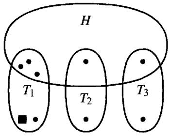  
Figure 3.1. An example with the depot in a tooth.

A comb can be defined more generally by a handle $H$ and an odd number of teeth $T _ { 1 } , T _ { 2 } , \ldots , T _ { r } , T _ { r + 1 } , \ldots , T _ { t }$ satisfying

$$
\begin{array} { r l } & { H , T _ { 1 } , T _ { 2 } , \dots , T _ { t } \subseteq V , } \\ & { T _ { j } \setminus H \ne \emptyset \qquad \forall 1 \leq j \leq t , } \\ & { T _ { j } \cap H \ne \emptyset \qquad \forall 1 \le j \le t , } \\ & { T _ { i } \cap T _ { j } = \emptyset \qquad \forall 1 \le i < j \le r , } \\ & { T _ { i } \cap T _ { j } = \{ 0 \} \qquad \forall r + 1 \le i < j \le t , } \\ & { t \geq 3 \mathrm { ~ a n d ~ o d d } , } \end{array}
$$

where $r$ may be any value between 0 (all teeth intersect) and $t$ (no teeth intersect nor contain the depot). The teeth $T _ { r + 1 }$ to $T _ { t }$ intersect in the depot; if $r = t - 1$ , only one tooth does. Moreover, assume that the full set of $\pmb { K }$ vehicles is needed to satisfy the demand of all the nodes outside a tooth containing the depot, that is, $R ( V \setminus T _ { j } ) = K$ for all $j = r + 1 , \ldots , t$ . Then the following comb inequality is valid:

$$
x ( \delta ( H ) ) + \sum _ { i = 1 } ^ { t } x ( \delta ( T _ { i } ) ) \geq t + 1 + 2 r + 2 K ( t - r ) .
$$

We give not a formal proof of validity but only an intuitive explanation. If a $\pmb { K }$ -route is going to intersect the coboundary of a tooth $T _ { j }$ containing the depot only $2 K$ times, then at least one edge of $( H \cap T _ { j } : T _ { j } \ \backslash \ H )$ must be in that $\pmb { K }$ -route. The argument then proceeds as in the case of regular comb inequalities. Note that if some teeth not containing the depot cannot be served by a single vehicle and satisfy the Laporte-Nobert condition, then we can strengthen the inequality like we have already seen.

# 3.3.5 Valid Inequalities Combining Bin Packing and STSP

As we saw, the plain STSP inequalities ignore the demands, while the capacity inequalities ignore the routing conditions. Here we try to combine the two aspects of the problem, as we started to do with the framed capacity inequalities of section 3.3.3 and with the comb inequalities.

The path-bin inequalities defined below are a generalization of the framed capacity inequalities defined in section 3.3.3 and of the comb inequalities defined in section 3.3.4. They were defined by Pochet [37] and Augerat [4]. Since this material was not readily available at the time of writing, we include the necessary proofs.

A path-bin support is defined by a handle $H$ , by teeth $T _ { 1 } , T _ { 2 } , \dots , T _ { t }$ , and by spots $S _ { \mathrm { j } } , S _ { 2 } , \ldots , S _ { s }$ . For notational simplicity, we let $T _ { t + i }$ stand for $S _ { i }$ .

These sets satisfy the following conditions:

$$
\begin{array} { r l } & { H , T _ { 1 } , T _ { 2 } , \ldots , T _ { t + s } \subset V _ { 0 } , } \\ & { d ( T _ { j } ) \leq C \qquad \forall 1 \leq j \leq t + s , } \\ & { S _ { j } \subset H \qquad \forall 1 \leq j \leq s , } \\ & { T _ { j } \cap H \neq \emptyset \qquad \forall 1 \leq j \leq t , } \\ & { T _ { j } \setminus H \neq \emptyset \qquad \forall 1 \leq j \leq t , } \\ & { T _ { i } \cap T _ { j } = \emptyset \qquad \forall 1 \leq i < j \leq t + s , } \\ & { t + s \geq 1 . } \end{array}
$$

The difference with respect to a comb is that, for a path-bin support, we impose that the total demand of a tooth or of a spot be less than or equal to the vehicle capacity $C$ and there is no parity requirement on the numbers $\pmb { \mathscr { s } }$ or $t$ . Figure 3.2 represents a path-bin support with three teeth and one spot.

Associated with the path-bin support, we define a path-bin subproblem that is the following constrained bin packing problem. Let $I$ be the set of items. Each tooth $T _ { j }$ , $1 \leq$ $j \le t$ and spot $S _ { j }$ $1 \le j \le s$ defines one item of size $d ( T _ { j } )$ and $d ( S _ { j } )$ respectively. Each node $v \in H \backslash ( \bigcup _ { j = 1 } ^ { i + s } T _ { j } )$ defines one item of size $d _ { v }$ . The bin size is the vehicle capacity $C$ . Let $r ^ { \prime } ( H \mid T _ { 1 } , \ldots , T _ { t + s } )$ be the minimum number of bins needed to contain all items of $I$ with the additional constraint that a bin can contain the items corresponding to at most two teeth.

$$
\begin{array} { r } { \frac { H } { 2 } \overbrace { \left( \frac { 1 } { 2 } \right) \ldots \left( \frac { 1 } { 2 } \right) } ^ { T _ { 2 } } } \\ { \frac { H } { T _ { 1 } } \overbrace { \left( \frac { 1 } { 2 } \right) \ldots \left( \frac { 1 } { 2 } \right) } ^ { T _ { 2 } } } \\ { \overbrace { \left( \frac { 1 } { 2 } \right) T _ { 3 } } ^ { H } } \end{array}
$$

Figure 3.2. A path-bin support with three teeth and one spot.

To link this constrained bin packing subproblem to the solutions of CVRP, we define an $H$ -path of a $\pmb { K }$ -route of CVRP as a connected component of the intersection of one of the routes with $E ( H )$ . In this definition, a single route can define several $H$ paths, but in all cases, the number of edges of the $\pmb { K }$ -route in $\delta ( H )$ equals two times the number of its $\pmb { H }$ paths. This holds because the depot does not belong to $H$ and thus each $H$ path contains two edges of $\delta ( H )$ in the $K$ -route.

The purpose of the constrained bin packing subproblem is to compute the minimum number of $H$ paths, over all $\pmb { K }$ -routes of CVRP, under the condition that the demand of a tooth or spot must be satisfied by a single vehicle, i.e., those $\pmb { K }$ -routes use exactly two edges of each tooth or spot coboundary. Such an $H$ path can contain at most two teeth and each such $H$ path corresponds to a feasible bin. More precisely, as the bin packing subproblem considers only the demand in $H \cup ( \bigcup _ { j = 1 } ^ { t } T _ { j } )$ it uses only local information and will only provide a lower bound on this minimum in the same sense as $r ( S )$ is a lower bound on $R ( S )$ . The first example in Figure 3.3 illustrates this correspondence between the $H$ paths and the bin packing subproblem. This result is formalized in the following proposition.

PROPOSITION 3.2. If $\bar { x }$ is a solution of CVRP satisfying $\bar { x } ( \delta ( T _ { j } ) ) = 2$ for $1 \leq j \leq t + s ,$ then the following inequality holds:

$$
\bar { x } ( \delta ( H ) ) \geq 2 r ^ { \prime } ( H \mid T _ { 1 } , \ldots , T _ { t + s } ) ,
$$

where $r ^ { \prime } ( H \mid T _ { 1 } , \ldots , T _ { t + s } )$ is the value of the constrained bin packing problem.

Proof, Let $\Theta$ be a $K$ '-route that contains the minimum number of edges in $\delta ( H )$ among all $\pmb { K }$ -routes satisfying the conditions of the proposition. Consider the set $F$ of edges of $\Theta$ with both the endpoints in $H$ . The number of connected components of $G ^ { \prime } = ( H , F )$ is exactly half the number of edges of $\Theta$ in $\delta ( H )$ Assume that the side condition of the bin packing problem is violated, i.e., that a connected component intersects three teeth, say, $T _ { i } , T _ { j }$ , and $T _ { p }$ , in that order (going from one extremity to the other). Since $T _ { j }$ has nodes outside the handle $H , \Theta$ must intersect $\delta ( T _ { j } )$ in at least four edges, a contradiction with our choice of $\Theta$

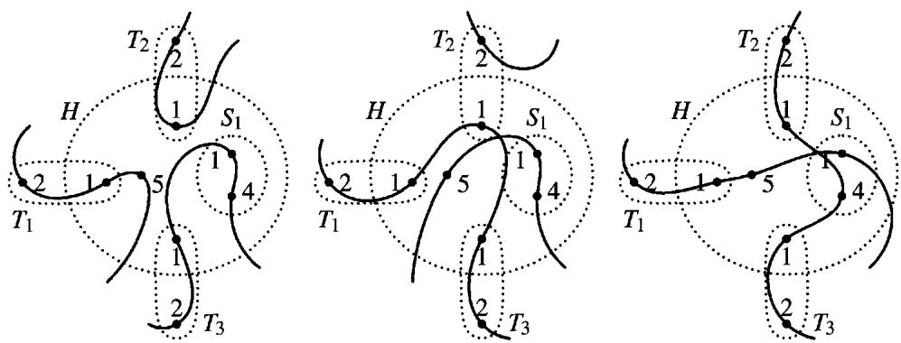  
Figure 3.3. Tight solutions for a path-bin inequality $C = 1 0 ,$ .

The path-bin inequality transforms the inequality (3.15) into a valid inequality for CVRP. It is based on a well-known property of the bin packing problem, which says that splitting an item into two parts cannot decrease the optimal number of bins by more than 1. This property is translated in terms of solutions of CVRP to build the valid inequality. Putting the item $T _ { j }$ (tooth or spot) in one bin means satisfying the demand $d ( T _ { j } )$ by only one vehicle, therefore $x ( \delta ( T _ { j } ) ) = 2$ . Splitting the item $T _ { j }$ into two parts and allowing these two parts to be in different bins means allowing the demand $d ( T _ { j } )$ to be satisfied by two vehicles an $x ( \delta ( T _ { j } ) ) = 4$ 4. So $\textstyle \sum _ { j = 1 } ^ { t + s } x ( \delta ( T _ { j } ) )$ \$(T./)) is integer, each time $\begin{array} { r } { \sum _ { j = 1 } ^ { t + s } [ x ( \delta ( T _ { j } ) ) - 2 ] } \end{array}$ is increased by 2, the number of $H$ paths cannot be reduced by more than 1 and the coboundary of $H$ cannot be reduced by more than 2. Consequently, we have the following theorem.

THEOREM 3.3. For any path-bin support $( H , T _ { 1 } , \dots , T _ { t } , S _ { 1 } , \dots , S _ { s } )$ , the associated pathbin inequality

$$
x ( \delta ( H ) ) \ge 2 r ^ { \prime } ( H \mid T _ { 1 } , \ldots , T _ { t + s } ) - \sum _ { j = 1 } ^ { t + s } \left( x ( \delta ( T _ { j } ) ) - 2 \right)
$$

w valid for the CVRP polytope.

Figure 3.3 represents three tight solutions of the path-bin inequality using the same support as in Figure 3.2, the first corresponding to a constrained bin packing solution, the second with a tooth split into two parts, and the last with a spot split into two parts.

Computing $r ^ { \prime } ( H \mid T _ { 1 } , \ldots , T _ { t } , S _ { 1 } , \ldots , S _ { s } )$ is harder than computing $r ( H )$ which is NP-hard. For small sets $H$ , the exact bin packing algorithm of Martello and Toth [26, 27] can be adapted to deal with the additional constraint on the teeth. For larger sets $H$ , the lower bounding procedure of Martello and Toth [26, 27] can be adapted. Two trivial lower bounds on $r ^ { \prime } ( H \mid T _ { 1 } , \ldots , T _ { t } , S _ { 1 } , \ldots , S _ { s } )$ are $\lceil t / 2 \rceil$ and $\textstyle \lceil d ( H \cup ( \bigcup _ { j = 1 } ^ { t + s } T _ { j } ) ) / C \rceil$ . As $r ^ { \prime } ( H \mid$ $T _ { 1 } , \dots , T _ { t } , S _ { 1 } , \dots , S _ { s } )$ appears only at the right-hand side of the path-bin inequality (3.16), replacing it by any lower bound still yields a valid inequality.

As $x ( \delta ( T _ { j } ) ) \ge 2$ in any feasible solution of CVRP, a set $T _ { j }$ or $S _ { j }$ will be introduced in the path-bin inequality only if its removal would reduce the value of the bin packing subproblern; otherwise the inequality without this set $T _ { j }$ dominates the inequality with the set $T _ { j }$ .

Note that if some tooth $T _ { i }$ is such that $r ( T _ { i } ) > 1$ but satisfies condition (3.13) of Laporte and Nobert, then it is easy to modify the path-bin inequality to take this case into account.

# 3.3.6 Valid Inequalities from the Stable Set Problem

The following inequality generalizes Araque's [2] star inequalities (not to be confused with the star inequalities for the STSP polytope defined in Fleischmann [17] nor with the multistar inequalities mentioned in section 3.4) for the special case of CVRP occurring when all demands are equal.

A clique cluster (see Pochet [37] and Augerat [4]) is defined by $W _ { 1 } , \dots , W _ { w }$ subsets of $V _ { 0 }$ such that

$$
\begin{array} { l r } { \mathbb { W } _ { i } \cap W _ { j } = \{ v \} \qquad \forall 1 \leq i < j \leq w , } \\ { r ( W _ { i } ) = 1 \qquad \forall 1 \leq i \leq w , } \\ { r ( W _ { i } \cup W _ { j } ) > 1 \qquad \forall 1 \leq i < j \leq w . } \end{array}
$$

Thus any two sets intersect in the same node $\pmb { v }$ , and each set can be served by one vehicle, but not the union of two of them. The node $v$ is called the nucleus of the cluster.

The capacity conditions imply that at most one set $W _ { i }$ can have a coboundary that intersects a $\pmb { K }$ -route in exactly two edges. Therefore, the following inequality is valid:

$$
\sum _ { i = 1 } ^ { w } x ( \delta ( W _ { i } ) ) \geq 4 w - 2 .
$$

Note that the nucleus cannot consist of more than one node. Assume ${ \cal W } _ { i } \cap { \cal W } _ { j } = N$ for all $1 \leq i < j \leq w$ with $| N | > 1$ ; then any tight $K$ -tour for the clique cluster inequality is tight for the capacity constraint on $N$ , i.e., for $x ( \delta ( N ) ) \geq 2$ . Therefore the face induced by (3.17) would be contained in the face defined by the capacity constraint on the set $N$ . In the case of a nucleus $N$ with more than one node, one can modify an inequality proposed by Araque, Hall, and Magnanti [3] for the unit capacity CVRP. The valid inequality in this case is (see [37])

$$
\sum _ { i = 1 } ^ { w } x ( \delta ( W _ { i } ) ) - ( w - 2 ) x ( \delta ( N ) ) \geq 2 w + 2 .
$$

The star inequality is a particular case of a much larger class of inequalities. Consider a rank inequality facet defining for the stable set polytope. A rank inequality is defined for some special graph $G _ { s }$ ; each variable is associated with a node of $G _ { s }$ and has a coefficient of 1, while the right-hand side is the stability number of $G _ { s }$ . Special graphs are, for example, cliques or chordless cycles of odd length. A rank inequality for the stable set polytope can be translated into a valid inequality for the CVRP polytope in the following way. The nodes of $G _ { s }$ correspond to subsets of clients of CVRP with total demand not exceeding the vehicle capacity but such that the union of any two of them requires two vehicles to be served. If two nodes of $G _ { s }$ are adjacent, then the corresponding sets intersect, let us say, for simplicity in a single node. Assume the stable set inequality has $p$ as right-hand side, this means that at most $\boldsymbol { p }$ sets of clients can have a coboundary that intersects a $K$ -route in exactly two edges, yielding the inequality

$$
\sum _ { i = 1 } ^ { w } x ( \delta ( W _ { i } ) ) \geq 4 w - 2 p .
$$

Well-known rank inequalities for the stable set polytope are the clique constraints, which say that at most one node of a clique can belong to a stable set. These yield the clique cluster inequalities. As long as the sets intersect pairwise we get a clique; therefore one inequality for the stable set polytope may yield several valid inequalities for the CVRP. Many, of course, will not even be supporting the CVRP polytope.

Another well-known inequality is the odd hole inequality, which says that at most $t$ nodes of a chordless cycle of length $2 t + 1$ can belong to a stable set. This would correspond to taking $2 t + 1$ subsets $W _ { 0 } , \ldots , W _ { 2 t }$ of $V _ { 0 }$ such that

$$
\begin{array} { r l } & { W _ { i } \cap W _ { i + 1 } = \{ v _ { i } \} \qquad \forall 0 \leq i \leq 2 t \quad ( \mathrm { m o d ~ } 2 t + 1 ) , } \\ & { W _ { i } \cap W _ { j } = \emptyset \qquad \forall 0 \leq i , j \leq 2 t , | i - j | > 1 , } \\ & { r ( W _ { i } ) = 1 \qquad \forall 0 \leq i \leq 2 t , } \\ & { r ( W _ { i } \cup W _ { i + 1 } ) > 1 \qquad \forall 0 \leq i \leq 2 t \quad ( \mathrm { m o d ~ } 2 t + 1 ) . } \end{array}
$$

That is, the sets form an odd hole, the intersection of two consecutive sets is just a node, and two consecutive sets (modulo $2 t + 1 \AA ,$ ) cannot be served by the same vehicle. Then at most $t$ sets $W _ { i }$ can have $x ( \delta ( W _ { i } ) ) = 2$ for any representative vector $x$ of a $K$ -route. Therefore the following inequality is valid:

$$
\sum _ { i = 1 } ^ { w } x ( \delta ( W _ { i } ) ) \geq 6 t + 4 .
$$

It should now be obvious that the facial structure of the CVRP polytope is extremely complex and that there is still a lot to investigate in this field. For more on this topic we refer the reader to the papers cited above.

# 3.4 Separation Procedures

Throughout this section we assume that $\bar { \boldsymbol { x } } \in \mathbb { R } ^ { E }$ is a fractional point satisfying all the constraints (3.2), (3.3), (3.5), and (3.6). We aim at describing efficient (possibly of polynomial time complexity) procedures to find a valid inequality for the CVRP polytope, belonging to one of the classes described in the previous section, that is violated by $\bar { x }$ .

# 3.4.1 Exact Separation of Capacity Constraints

We address only the problem of separating the fractional and the rounded capacity inequalities.

The separation problem for the fractional capacity inequality is solvable in polynomial time, as shown by McCormick, Rao, and Rinaldi [29], by reducing it to a network flow problem. Using the same idea, Blasum and Hochstattler [8] provided a polynomial separation for a generalization of the fractional capacity inequalities that they call multistar inequalities.

Let $G _ { \bar { x } }$ be the weighted graph induced by the edges whose associated components of $\bar { x }$ are strictly positive and by all edges incident to node {0}. Each edge of $G _ { \bar { x } }$ has the corresponding component of $\bar { x }$ as a weight. Produce a new graph $G _ { \bar { x } } ^ { \prime }$ by replacing the weight $\bar { x } _ { e }$ by $\bar { x } _ { e } \sim d _ { i } / C$ for all edges $e = ( 0 , i )$ with $i \ \in \ V _ { 0 }$ . It easy to see that if in $G _ { \bar { x } } ^ { \prime }$ there is a minimum cut with negative weight, then the shore of this cut that does not contain node 0 defines a fractional capacity inequality violated by $\bar { x }$ . Unfortunately, a standard (polynomial time) algorithm for computing the minimum cut of $G _ { \bar { x } } ^ { \prime }$ cannot be used, because such a graph may have edges with a negative weight. To overcome this problem, consider an auxiliary graph $G _ { \bar { x } } ^ { \prime \prime }$ obtained from $G _ { \bar { x } }$ by adding a node $n + 1$ connected to all nodes $1 , 2 , \ldots , n$ . All edges of $G _ { \hat { x } } ^ { \prime \prime }$ with both endnodes in $\{ 1 , 2 , \ldots , n \}$ have the same weight as the corresponding edges of $G _ { \bar { x } }$ . For $i = 1 , 2 , \ldots , n$ the edges $( 0 , i )$ and $( i , n + 1 )$ get weights $\operatorname* { m a x } \{ 0 , \bar { x } _ { ( 0 , i ) } - d _ { i } / C \}$ and $\operatorname* { m a x } \{ 0 , d _ { i } / C - \bar { x } _ { ( 0 , i ) } \}$ , respectively. Because the network $G _ { \bar { x } } ^ { \prime }$ has nonnegative weights, the minimum weight cut separating 0 from $n + 1$ can be computed in polynomial time. In McCormick, Rao, and Rinaldi [29] it is shown that the minimum cut $F ^ { \prime \prime }$ separating 0 from $n { \mathrel { + { 1 } } }$ in $G _ { \hat { x } } ^ { \prime \prime }$ yields a minimum cut $F ^ { \prime }$ for $G _ { \bar { x } } ^ { \prime }$ by removing the edges incident with $n + 1$ . Moreover, the weight of $F ^ { \prime \prime }$ exceeds the weight of $F ^ { \prime }$ by the amount $\begin{array} { r } { Z = \sum _ { i = 1 } ^ { n } \operatorname* { m a x } \{ 0 , d _ { i } / C - \bar { x } _ { ( 0 , i ) } \} } \end{array}$ - Thus, if the weight of $F ^ { \prime \prime }$ is strictly less than $Z$ , then its shore not containing $n + 1$ defines a violated fractional capacity inequality. If this weight is nonnegative but strictly less than $Z + 2$ , then all fractional capacity inequalities are satisfied, but it may be possible that the defined rounded inequality is violated. If $\bar { w }$ is more than $Z + 2$ , no rounded capacity inequalities are violated.

To explore the second situation, De Vitis and Rinaldi [15] use a procedure that produces all the cuts of $G _ { \bar { x } } ^ { \prime \prime }$ separating 0 from $n + 1$ in increasing order of their weights. The procedure stops as soon as a cut is produced that has weight greater than or equal to $Z + 2$ . For each cut generated by the procedure a check for violation of the corresponding rounded inequality is performed. There is no guarantee that the number of cuts produced is polynomial in $\pmb { n }$ . However, for the size of the instances contained in the usual testbeds, the running time of this procedure is never too long.

# 3.4.2 Heuristics for Capacity and Related Constraints

The previous algorithm for the rounded capacity inequalities may be too slow. We describe here a heuristic separation procedure for them as well for the generalized capacity constraints.

Given $\bar { x }$ and $s \subset V$ and $v \not \in S$ , we call ${ \bar { x } } \{ \{ v \} : S )$ the amount by which $v$ sees S. Given $S \subset V$ , if one wants to add a node $v$ to $s$ and have $\bar { x } ( \delta ( S \cup \{ v \} ) )$ as small as possible, then, because of the degree equations, one has to choose the node $\boldsymbol { v }$ that sees $s$ by the largest amount. Following the terminology of some authors, we say that a set $s$ is built by max-back order starting at $S _ { 0 }$ , if initially $S = S _ { 0 }$ , and at each iteration a node that sees the current set by the largest amount is added.

Greedy Rounded Capacity Heuristic. Let $S _ { 0 }$ be a set such that $\bar { x } ( \delta ( S _ { 0 } ) ) = 2$ . For example, $S _ { 0 }$ could be just a node or the set of nodes of a path of edges with weight equal to 1 having maximal length. Grow $s$ starting from $S _ { 0 }$ until it reaches $V _ { 0 }$ by max-back order. At each step check if the corresponding rounded capacity constraint is violated. Note that, due to the degree equations, it is easy to keep track of $\bar { x } ( \delta ( S ) )$ just by knowing by how much the entering node $v$ sees $S \setminus \{ v \}$ Repeat such a procedure for all possible choices of $S _ { 0 }$ .

In Augerat et al. [5], a tabu search procedure based on the previous idea is given and is shown to give good results.

Ralphs et al. [39] suggested another approach when the previous greedy heuristic fails. First, they work on the modified problem in which the depot is replaced by a set $D$ of $K$ nodes as described earlier. They try to decompose the solution $\bar { x }$ into a convex combination of Hamiltonian cycles. We will not go into the details of how this can be done. If the decomposition succeeds, then they look at all the Hamiltonian cycles of that convex combination and check whether one of the paths between two consecutive visits to $D$ yields a set S such that the corresponding rounded capacity constraint is violated. Note that if we use such a sophisticated separation algorithm, it may also be worth the effort to check the bin packing value of these sets. The authors report success in this approach. Our experience is that when we encountered such a convex combination, we rarely found a violated capacity inequality. The example of Figure 3.4, to which we will come back later, is taken from a fractional solution t o $\mathbf { E } 0 3 0 - 0 3 \mathbf { g }$ (also known as ei!30) (see section 3.6); the edges $e$ in solid lines have $\bar { x } _ { e } = 1$ , and those in dotted lines have $\bar { x } _ { e } = 0 . 5$ The capacity of the vehicles is $C = 4 5 0 0$ and $K = 3$ . The solution is a convex combination of the two 3-routes displayed in Figure 3.5, each with coefficient 0.5. It is easy to check that none of the sets of nodes of each route violates a capacity constraint in the fractional solution $\bar { x }$ since only one route, in each solution, goes over capacity, but it has an $\bar { x }$ -coboundary of 4.

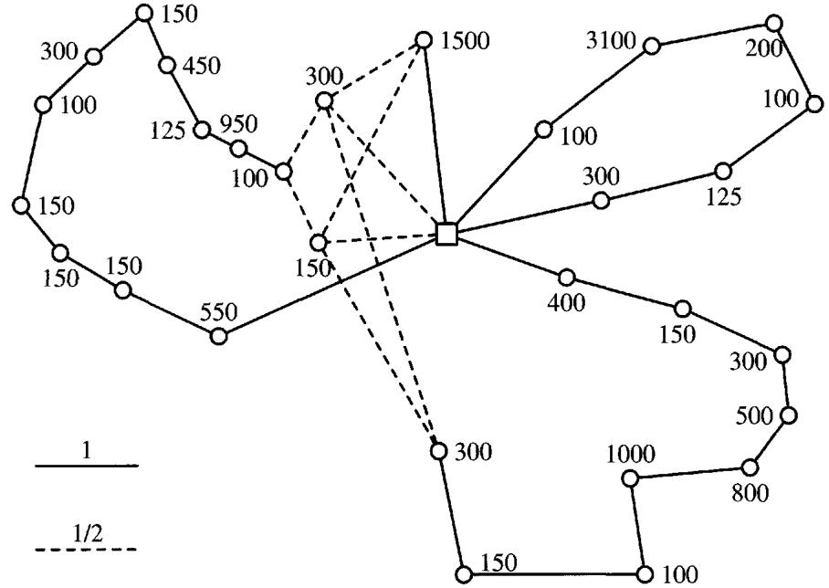  
Figure 3.4. An example of fractional solution.

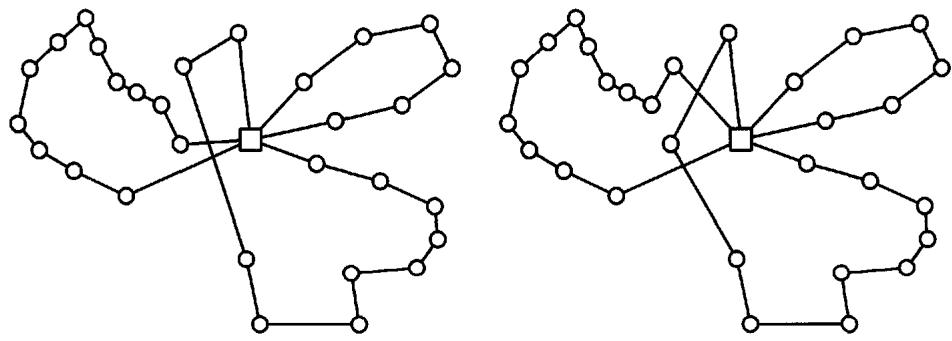  
Figure 3.5. The two solutions of the convex combination.

Heuristic for the Weak Generalized Capacity Constraints. This heuristic starts with a partition of $V _ { 0 }$ into (hopefully maximal) sets of $\bar { x }$ -coboundary equal to 2. If we have shrunk (recursively) each path of edges with weight equal to 1 to a single node, we can start with a partition where each set is a node of the shrunken graph (although there may still be sets of more than one node having coboundary of weight 2). Note that finding a partition into maximal sets of coboundary of weight 2 can be done in polynomial time, since finding all sets of minimum coboundary in an undirected graph is polynomial (see Karzanov and Timofeev [22]), but the previously described partition is in general good enough to start our heuristic. At each step of the procedure we check whether the current partition violates the generalized capacity constraint. This amounts to solving a bin packing problem, which, for the size of instances we are dealing with, can be done in a moderate amount of time.

If the check fails, we merge the two sets $S _ { i }$ and $S _ { j }$ of the partition that see each other by the largest amount, i.e., such that $\bar { x } ( S _ { i } : S _ { j } ) = \operatorname* { m a x } _ { r , s } \bar { x } ( S _ { r } : S _ { s } )$ .

Going back to the example of Figure 3.4, as shown in Figure 3.6, the initial partition yields a violated weak generalized capacity constraint. The partition is given by the circled sets. The capacity of the vehicles is $C = 4 5 0 0$ and $K = 3$ . The demands of the sets of the partition are 3175, 3700, 1500, 300, 150, and 3925, and all have a $\bar { x }$ -coboundary value of 2.

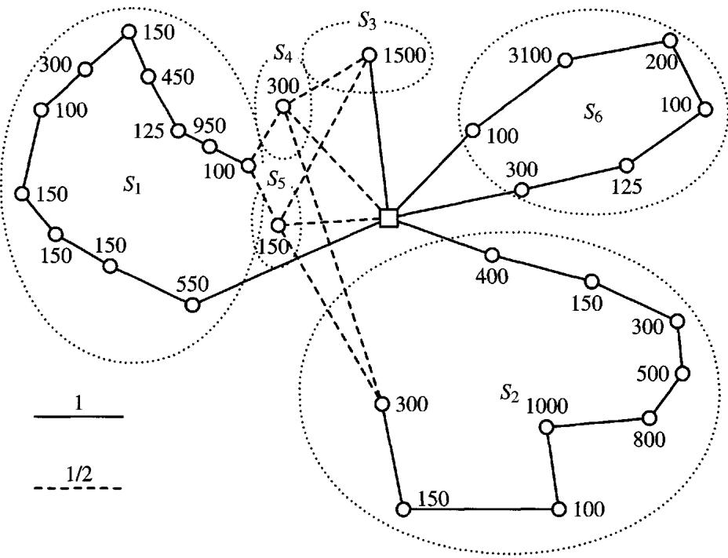  
Figure 3.6. An example of violated generalized capacity constraint.

The bin packing value is 4 since the item of size 1500 cannot fit with the first two or with the last one.

Note that the nodes in the set $S _ { 6 }$ do not play a significant role in this inequality. In fact there is also a framed capacity constraint violated by the same amount. It is defined by the handle $H = V \setminus ( S _ { 6 } \cup \{ 0 \} )$ and the two sets $S _ { 1 }$ and $S _ { 2 }$ . We have $\bar { x } ( \delta ( H ) ) = 4$ , but if only two vehicles serve $H$ , then $S _ { 1 }$ and $S _ { 2 }$ cannot be served each by a single vehicle, as is currently the case since $\bar { x } ( \delta ( S _ { 1 } ) ) = \bar { x } ( \delta ( S _ { 2 } ) ) = 2$ , because then none of these vehicles can serve the node with demand 1500.

# 3.4.3 STSP Constraints

Naddef and Thienel [33, 34] give separation routines for the STSP that can very easily be adapted to the CVRP. Moreover, these routines can easily be adapted to take into account the Laporte-Nobert conditions (3.13). The computational results given in this paper are done with an earlier version of these routines developed by Clochard and Naddef [11].

# 3.5 Branching Strategies

We devote a special section to branching since it is a critical component of any branch-andcut implementation.

As described in section 3.2, there are several ways to perform a branching. The first is to choose an edge $e ^ { * }$ for which the corresponding variable is fractional in the current LP optimal solution and split the set of solutions into those that use the edge $\begin{array} { r } { \left( x _ { e ^ { * } } \right. = 1 \rangle } \end{array}$ ) and those that do not $( x _ { e ^ { * } } = 0 )$ (assuming, of course, that $x _ { e ^ { * } }$ can take only these two values). We call this method edge or variable branching.

A crucial problem is to choose the variable on which such a branching should be performed. For the case of STSP, a general rule, proposed for the first time by Padberg and Rinaldi [36], is to choose a variable $\tilde { x } _ { e ^ { * } }$ whose value falls into a small interval centered at 0.5 and, in case this happens for more variables, to choose the one among them with largest cost. Note that the branching on variables is very asymmetric in the sense that setting a variable to 1 amounts to choosing one of the $n + K$ edges of a $K$ -route, while setting a variable to 0 corresponds to deciding that one out of $O ( n ^ { \bar { 2 } } )$ edges is not in a $\pmb { K }$ -route. This has made some researchers think that it could be a better choice to select a variable with a higher fractional value, say, 0.75. Although some authors report no success with such a choice for the STSP, we have tried it in the case of the CVRP.

Some researchers have proposed to choose a variable such that, if set to 1, it would extend an existing path of edges already set to 1. Among all possible choices, the one that leads to a path of largest total demand should be preferred. The idea behind this strategy is that it implies many other variables to be set to 0: those associated to the edges incident with an internal node of the path and those incident with the extremities of the path and with a node whose demand is not compatible with the total demand of the path. The asymmetry problem is now even more evident and therefore this does not seem to be a good choice to us.

Applegate et al. [1] suggested choosing a candidate set of variables for branching and selecting the best among them by $L P$ testing, i.e., by solving both linear programs induced by the two possible values of the variable. The best variable is then chosen as the one for which the minimum of the two objective function values is the largest.

To give an example of how the different strategies behave for the CVRP, we report on some computational tests performed on 15 instances chosen from the literature, using the branch-and-cut code developed by Augerat et al. [6] with a depth first search procedure and limiting the depth of the search tree to 30. Because the behavior of the branch-and-cut algorithm depends on so many implementation details, as has been observed, and because of the small number of experiments, the results have to be taken with some caution.

As a first experiment, three possible strategies were tested for branching variable selection:

(Al) choice of the variable with largest cost among those with value close to 0.5,   
(A2) choice of the variable with largest cost among those with value close to 0.75, and   
(A3) the best in an LP test performed on 10 variables of values between 0.45 and 0.65.

We give the number of problems solved, total times (in hours :minutes), and the number of times the strategy led to a smaller search tree. Unfortunately, the unsolved problems bias the times since, contrary to what one may expect, because of the depth first search strategy and our limit of the tree depth, these take less time than the others. See Table 3.1.

Clochard and Naddef [11] proposed, for the first time in branch-and-cut, to use an alternative branching strategy, which we will call branching on an inequality. It was implemented for the STSP using inequalities dealing with the coboundaries of sets. Any closed walk must use a positive even number of edges of any coboundary. Let $s$ be a node set such that $\bar { x } ( \delta ( S ) ) \approx 2 t + 1$ . Then we can decompose the problem into two subproblems: one where $x ( \delta ( S ) ) \leq 2 t$ holds and one where $x ( \delta ( S ) ) \geq 2 t + 2$ holds. They report significant improvements in difficult STSP instances over the classical variable branching. For example, Naddef and Thienel [34] get an improvement by a factor of 3 in solving the difficult t s2 2 5 instance of the TSPLIB library collected by Reinelt [40].

Branching on inequalities was used for the first time in Augerat [4] and Augerat et al. [6] for the CVRP. In this case the most interesting situation happens when there is a node set $s$ for which $\bar { x } ( \delta ( S ) ) \approx 3$ . As in the case of branching on variables, there is an imbalance between the side for which we impose $x ( \delta ( S ) ) = 2$ and the side where we impose $x ( \delta ( S ) ) \geq 4$ . Imposing that all the clients of set $s$ are served by the same vehicle amounts to considering $s$ as a unique client with demand equal to the sum of the demands in S. If its total demand is high enough, then one of the $K$ routes is almost fixed, and therefore this side of the search tree will be solved faster than the other side.

Table 3.1.   

<table><tr><td>Strategy</td><td>Solved instances</td><td>Time</td><td># best</td></tr><tr><td>A1</td><td>13</td><td>24:30</td><td>0</td></tr><tr><td>A2</td><td>12</td><td>18:40</td><td>0</td></tr><tr><td>A3</td><td>15</td><td>14:00</td><td>15</td></tr></table>

The computational results of this section are taken again from Augerat [4], where six strategies were tested:

(Bl) Select $s$ for which $x \langle \delta ( S ) \rangle$ is the closest to 3.0.   
(B2) Select $s$ for which $x ( \delta ( S ) )$ is the closest to 2.85.   
(B3) Select $S$ for which $x ( \delta ( S ) )$ is the closest to 3.15.   
(B4) Select S for which $2 . 7 5 \leq x ( \delta ( S ) ) \leq 3$ and $d ( S )$ maximum.   
(B5) Select $s$ for which $2 . 7 5 \leq x ( \delta ( S ) ) \leq 3$ and the distance from $s$ to depot is maximum (ties are split by total demand); by distance we mean the sum of the distances to the depot of the two nodes of $s$ that are the closest to it.   
(B6) Select $s$ for which $2 . 7 5 \leq x ( \delta ( S ) ) \leq 3$ and contains the largest number of supernodes; a supernode is a set that has been identified as having in the current solution a coboundary of weight 2, for example, the nodes of a maximal path of edges of weight 1, or the node sets the coboundary of which have been set to 2 in previous branchings.

The seventh parameter in the choice of set $s$ , namely, its cardinality, would have been worth testing. This parameter was not considered to keep the selection procedure as simple as possible. The cardinality of $s$ might be important because the smaller the S, the easier should be the subproblem where $x ( \delta ( S ) ) \geq 4$ .

The sets $s$ are built by the same procedure that is used to heuristically find violated capacity constraints, as described in the previous section. The results are reported in Table 3.2.

Note that several strategies may have given trees of the same sizes for the same instance; for this reason the entries of the last column of the table do not add up to 15.

It is clear from these results that because of the asymmetry issue mentioned earlier, it is better to choose a set of coboundary strictly less than 3. It is also evident that the last three strategies are the clear winners.

Another experiment considered if it is worthwhile spending time on looking for a good branching set by LP testing. The selection was done by LP testing from sets with coboundary weight falling into three intervals. The results are summarized in Table 3.3.

In a final experiment, selecting was done by LP testing and according to three criteria: edge branching, branching on inequalities, and a mix of the two. Edges were selected from a set made of the one with value closest to 0.75 and the 10 with value closest to 0.5. Sets were selected considering one representative from those satisfying each of the following three conditions: $x ( \delta ( S ) )$ closest to 3, 2.85, and 3.15, respectively. Finally, three more sets $s$ were selected among those with $x ( \delta ( S ) )$ falling into the interval [2.75, 3]: the one with the largest total demand, the one with the largest cardinality, and the one with maximum distance from the depot. Table 3.4 summarizes the results.

Table 3.2.   

<table><tr><td>Strategy</td><td>Solved instances</td><td>Time # best</td></tr><tr><td>B1</td><td>14 14:55</td><td>7</td></tr><tr><td>B2</td><td>13 26:10</td><td>1</td></tr><tr><td>B3</td><td>13 26:25</td><td>1</td></tr><tr><td>B4</td><td>14 5:40</td><td>4</td></tr><tr><td>B5</td><td>13 5:30</td><td>3</td></tr><tr><td>B6</td><td>13 5:25</td><td>2</td></tr></table>

Table 3.3.   

<table><tr><td>Condition</td><td>Solved instances</td><td>Time</td></tr><tr><td>2.50 ≤ 8(5) ≤ 2.85</td><td>14</td><td>17:00</td></tr><tr><td>2.75 ≤ 8 (S) ≤ 3.00</td><td>14</td><td>5:50</td></tr><tr><td>2.85 ≤ 8 (5) ≤ 3.10</td><td>14</td><td>18:00</td></tr></table>

Table 3.4.   

<table><tr><td>Strategy</td><td>Time</td><td># best</td><td>Average BC* nodes</td></tr><tr><td>Test on edges</td><td>14:00</td><td>4</td><td>76</td></tr><tr><td>Test on sets</td><td>4:57</td><td>10</td><td>50</td></tr><tr><td>Test on edges+sets</td><td>5:51</td><td>6</td><td>35</td></tr></table>

\*Branch-and-cut.

It seems clear that the two last strategies in the table are the best. More extensive computational experiments have shown that the extra time spent by LP testing in choosing proper branchings almost always pays off: it may cut by a factor of more than 2 the total time to solve harder instances, although it may double the time for the very easy ones. However, the latter situation does not affect the evaluation because we believe that a reasonable measure of performance for an exact algorithm should be "How many instances from a test set can we solve with a limited time for each?"

To conclude, we list a set of rules for the selection of S, derived by analyzing the above experimental results:

: $2 . 7 5 \leq x ( \delta ( S ) ) \leq 3 . 0$ and $d ( S ) > C / 2$ .   
: $s$ is "far" from the depot.   
: $| S |$ | is small $W \subset S$ with $x ( \delta ( W ) )$ set to 2 in previous branchings is counted as a unique node).   
: $s$ is contained or at least intersects a former branching set.

The idea behind these conditions is that if the set $s$ contains a few nodes, then with the last rule we will soon have partitioned its nodes between different vehicles. Moreover, the assignment to the vehicles of clients that are far from the depot seems to be critical; the second rule aims at making such an assignment as soon as possible.

# 3.6 Computational Results

The computational study reported here is the one of Augerat et al. [6]. It was made with a branch-and-cut algorithm that makes use of many of the separation procedures and the strategies described in the previous sections. Because the algorithm was developed by three groups of researchers, its implementation was not done with the purpose of being efficient. Rather than a state-of-the-art software, the code is a kind of experimental environment that can easily accommodate various separation routines and algorithmic strategies with the purpose of making comparison testing readily available. Another source of extensive computational experimentation is Ralphs et al. [39].

The main drawback of such a code is the lack of several components that are common to most branch-and-cut codes, like, among others, pool management and the possibility of having only subsets of variables active in the solution of the linear programs. In addition, the visit of the enumeration tree is done using the depth-first, which is the easiest to implement but also the least effective. Last, but not least, the algorithm was implemented via independent pieces of code communicating through files written in the mass storage. Such an algorithmic design provided some flexibility to the developers but has, of course, a price in terms of efficiency.

Due to these facts, the computational results and the performance indicators reported in [6] are not to be taken as reliable evidence of the actual potential of the technique. Nevertheless, the algorithm was able to find for the first time an optimal solution, and it proved its optimality for two instances of 135 nodes proposed by Fisher [16]. To our knowledge, these are still the largest instances for which a certified optimal solution has been computed.

The computational results of Augerat et al. [6] are summarized in Tables 3.5 and 3.6. The instances that form the test bed for the study were all taken from the literature. (Most are available from the electronic library TSPLIB of Reinelt [40].) The naming convention for the instances is that explained in section 1.4.

Table 3.5. Computational results (only for the root node) from Augerat et al. [6].   

<table><tr><td></td><td>Upper</td><td>Lower</td><td></td><td></td><td></td><td></td></tr><tr><td>Problem</td><td>bound</td><td>bound</td><td>Gap</td><td># Cuts</td><td># LPs</td><td>CPU*</td></tr><tr><td>E022-04g</td><td>375.</td><td>375.</td><td>0.</td><td>100</td><td>21</td><td>2</td></tr><tr><td>E023-03g</td><td>569.</td><td>569.</td><td>0.</td><td>43</td><td>9</td><td>1</td></tr><tr><td>E030-03g</td><td>534.</td><td>534.</td><td>0.</td><td>243</td><td>50</td><td>17</td></tr><tr><td>E033-04g</td><td>835.</td><td>835.</td><td>0.</td><td>389</td><td>27</td><td>8</td></tr><tr><td>E045-04f</td><td>724.</td><td>724.</td><td>0.</td><td>168</td><td>24</td><td>7</td></tr><tr><td>E045-04f(+)</td><td>748.</td><td>723.541</td><td>0.</td><td>173</td><td>28</td><td>19</td></tr><tr><td>E051-05e</td><td>521.</td><td>517.581</td><td>0.66</td><td>737</td><td>62</td><td>31</td></tr><tr><td>E072-04f</td><td>238.</td><td>235.</td><td>0.84</td><td>443</td><td>69</td><td>82</td></tr><tr><td>E072-04f(+)(a)</td><td>269.241</td><td>240.408</td><td>0.65</td><td>300</td><td>50</td><td>208</td></tr><tr><td>E072-04f(+)(b)</td><td>241.974</td><td>240.408</td><td>0.65</td><td>300</td><td>50</td><td>29</td></tr><tr><td>E076-10e</td><td>832.</td><td>793.545</td><td>4.85</td><td>1949</td><td>111</td><td>761</td></tr><tr><td>E076-07s</td><td>683.</td><td>664.361</td><td>2.81</td><td>1283</td><td>77</td><td>236</td></tr><tr><td>E076-08s</td><td>735.</td><td>713.601</td><td>3.00</td><td>1686</td><td>101</td><td>351</td></tr><tr><td>E076-14s</td><td>1032.</td><td>953.794</td><td>8.20</td><td>2157</td><td>72</td><td>466</td></tr><tr><td>E101-08e</td><td>815.</td><td>799.398</td><td>1.95</td><td>1749</td><td>111</td><td>494</td></tr><tr><td>E101-10C</td><td>820.</td><td>820.</td><td>0.</td><td>1706</td><td>48</td><td>472</td></tr><tr><td>E135-07f</td><td>1165.</td><td>1159.27</td><td>0.24</td><td>4481</td><td>136</td><td>1428</td></tr><tr><td>E135-07f(+)</td><td>1162.96</td><td>1159.28</td><td>0.32</td><td>3397</td><td>138</td><td>1098</td></tr></table>

\* Seconds in a Sun Spare 20. (+)Real distances with three decimal digits.

Table 3.6. Computational results from Augerat et al. [6].   

<table><tr><td>Problem</td><td>Optimum</td><td># Cuts</td><td># LPs</td><td># B&amp;C nodes</td><td>CPU*</td></tr><tr><td>E051-05e</td><td>521.</td><td>908</td><td>129</td><td>7</td><td>54</td></tr><tr><td>E072-04f</td><td>237.</td><td>603</td><td>390</td><td>51</td><td>180</td></tr><tr><td>E072-04f(+)(a)</td><td>241.973</td><td>1670</td><td>1862</td><td>239</td><td>4622</td></tr><tr><td>E072-04f(+)(b)</td><td>241.973</td><td>484</td><td>280</td><td>31</td><td>98</td></tr><tr><td>E135-07f</td><td>1162.</td><td>13482</td><td>3086</td><td>423</td><td>20570</td></tr><tr><td>E135-07f(+)</td><td>1162.95</td><td>10450</td><td>4833</td><td>633</td><td>15774</td></tr></table>

\* Seconds in a Sun Spare 20. (+)Real distances with three decimal digits.

All these instances are of Euclidean type. As is now customary, for the computation of the distances the convention of TSPLIB is adopted, i.e., the real Euclidean distance between any pair of nodes is rounded to the nearest integer. To compare the results with those of Fisher [16], an exception is made for the f instances marked with $( + )$ , which are obtained from the corresponding ones by taking only the first three decimal digits of the real Euclidean distances.

In Table 3.5 we summarize the results concerning the computation at the end of the root node of the enumeration tree. The values of the column labeled Upper bound are taken from the literature, while those of the column Lower bound are value obtained after adding the cutting planes. Each value of the column Gap is the ratio of the difference between the optimal value and the lower bound over the lower bound. For the cases were the optimal value is not computed, the upper bound is used instead. The columns labeled # Cuts, # LPs, and CPU give the total number of valid inequalities generated, the number of LP calls, and the total CPU time, respectively. Seven instances were solved to optimality at the root node.

Table 3.6 summarizes the results for the five instances that were solved to optimality by performing some enumeration steps. The columns of the table report the optimal value, the total number of cuts generated, the total number of LP iterations, and the total CPU time, respectively. The last four values do not include those concerning the root node that are reported in Table 3.5.

For the instances with 76 and 101 nodes, the algorithm was not able to terminate the computation in a reasonable amount of time.

In a further computational study, Ralphs et al. [39] (see also [38] and [23]) implemented a parallel branch-and-cut algorithm that exploits the ideas mentioned in section 3.3.4. Such an algorithm was able to find an optimal solution of value 815 (and prove its optimality) for the instances E0101-08e, improving by two units the best known solution. Moreover, for the first time it proved the optimality of the best known solution for $\mathtt { E 0 7 6 - 0 8 s }$ and improved the best known solution for $\mathbf { E } 0 7 6 - 0 7 \mathbf { s }$ by one unit, providing a proof of optimality. Table 3.7 summarizes these results.

Another, more recent, study was reported by Blasum and Hochstattler [8], who developed an algorithm using the same branching strategy and separation procedures as in [6] with some modifications. For example, they developed a heuristic procedure for separating the rounded capacity inequalities based on their algorithm for the separation of the multistar inequalities mentioned in section 3.4. However, they used the state-of-the-art branch-and-cut framework ABACUS, developed by lunger and Thienel [21]. The results are comparable with those of Tables 3.5 and 3.6, taking into account, of course, the differences in computer speed and LP solver efficiency. It is remarkable, however, that the algorithm was able to solve two difficult 76-node problems to optimality with computing times considerably shorter than those reported in Table 3.7. The instances E 0 7 6 - 0 7 s and $\Xi { 0 } 7 6 - 0 8 { \bf s }$ where solved with 6717 and 6259 nodes, respectively, in 27,550 and 35,466 seconds, respectively, on a $4 0 0 ~ \mathrm { M H z }$ Sun Ultrasparc II. No proof of optimality is reported for the third difficult problem of Table 3.7.

Table 3.7. Computational results from Ralphs et al. [39].   

<table><tr><td>Problem</td><td>Optimal value</td><td># B&amp;C nodes</td><td># processors</td><td>CPU*</td></tr><tr><td>E076-07s</td><td>682</td><td>115991</td><td>9</td><td>278 613</td></tr><tr><td>E076-08s</td><td>735</td><td>484 245</td><td>60</td><td>1 927 422</td></tr><tr><td>E101-08e</td><td>815</td><td>244 968</td><td>80</td><td>1 900 671</td></tr></table>

"Seconds in a network of IBM RS/6000 (from 120 to 135 MHz).

# 3.7 Conclusions

Using branch-and-cut to solve the CVRP is at the beginning of its development. We believe that a better understanding of the underlying poly tope and further effort in designing efficient separation routines should yield much better computational results than those reported here. Various groups around the world are working on the subject, and new results should appear very soon. In particular, other formulations have been studied that yield polytopes that are different from the one studied in this chapter. See, for example, the two-commodity network flow formulation studied by Baldacci, Mingozzi, and Hadjiconstantinou [7]. This formulation, described in Chapter 1, does not yet provide better results than those reported here.

Some variants of the vehicle routing can appear in the literature as particular cases of more general problems. For example, the unit demand $( d _ { i } = 1$ for all $i$ ) CVRP can be seen as a particular case of the Black-and-White TSP of Ghiani, Laporte, and Semet [18]; therefore, so can the CVRP in which we split the client demands, since in that case every client with demand $d _ { i }$ can be replaced by $d _ { i }$ clients with unit demand, the distance between the copies of the same client being 0. A polyhedral study of the split demand CVRP was carried out by Martinez, Mota, and Rinaldi [28]. Finally, for further material on the linear relaxation of CVRP, see the survey of Laporte [24].

# Bibliography

[1] D. Applegate, R. Bixby, V. Chvatal, and W. Cook. Solving traveling salesman problems. 15th International Symposium on Mathematical Programming, University of Michigan, Ann Arbor, MI, 1994.

[2] J.R. Araque. Contributions to the polyhedral approach to vehicle routing. Discussion Paper 90-74, CORE, University of Louvain La Neuve, Belgium, 1990.

[3] J.R. Araque, L. Hall, and T.L. Magnanti. Capacitated trees, capacitated routing and associated polyhedra. Discussion Paper 90-61, CORE, University of Louvain La Neuve, Belgium, 1990.

[4] P. Augerat. Approche Polyedrale du Probleme de Tournees de Vehicules. Ph.D. thesis, Institut National Polytechnique de Grenoble, France, 1995.

[5] P. Augerat, J.M. Belenguer, E. Benavent, A. Corberan, and D. Naddef. Separating capacity inequalities in the CVRP using tabu search. European Journal of Operational Research, 106:546-557, 1999.

[6] P. Augerat, J.M. Belenguer, E. Benavent, A. Corberan, D. Naddef, and G. Rinaldi. Computational results with a branch and cut code for the capacitated vehicle routing problem. Technical Report RR 949-M, Universite Joseph Fourier, Grenoble, France, 1995.

[7] R. Baldacci, E. Hadjiconstantinou and A. Mingozzi. An exact algorithm for the capacitated vehicle routing problem based on a two-commodity network flow formulation. Operations Research to appear, 2004.

[8] U. Blasum and W. Hochstattler. Application of the branch and cut method to the vehicle routing problem. Technical Report ZPR2000-386, ZPR, Universitat zu Koln, 2000. Available at http://www.zaik.uni-koeln.de/paper.

[9] A. Caprara and M. Fischetti. Branch-and-cut algorithms. In M. Dell'Amico, F. Maffioli, and S. Martello, editors, Anno fated Bibliographies in Combinatorial Optimization, Wiley, New York, 1997, pp. 45-64.

[10] G. Clarke and J.V. Wright. Scheduling of vehicles from a central depot to a number of delivery points. Operations Research, 12:568-581, 1964.

[11] J.-M. Clochard and D. Naddef. Use of path inequalities for TSP. In G. Rinaldi and L. Wolsey, editors, Proceedings of the Third Workshop on Integer Programming and Combinatorial Optimization, CORE, University of Louvain La Neuve, Belgium, 1993, pp. 291-312.

[12] G. Cornuejols, J. Fonlupt, and D. Naddef. The traveling salesman problem on a graph and some related integer polyhedra. Mathematical Programming, 33:1-27, 1985.

[13] G. Cornuejols and F. Harche. Polyhedral study of the capacitated vehicle routing problem. Mathematical Programming, 60:21-52, 1993.

[14] A. De Vitis, F. Harche and G. Rinaldi. Generalized capacity inequalities for vehicle routing problems. Manuscript, 2000.

[15] A. De Vitis, M. Queyranne and G. Rinaldi. Separating the capacity inequalities of the vehicle routing problem in polynomial time. Personal communication, 2000.

[16] M.L. Fisher. Optimal solution of vehicle routing problems using minimum $k$ -trees. Operations Research, 42:626-642, 1994.

[17] B. Fleischmann. A new class of cutting planes for the symmetric traveling salesman problem. Mathematical Programming, 40:225-246, 1988.

[18] G. Ghiani, G. Laporte, and F. Semet. Black and white traveling salesman problem. Technical Report 99-47, CRT, Montreal, Canada, 1999.

[19] M. Jtinger, G. Reinelt, and G. Rinaldi. The traveling salesman problem. In M.O. Ball, T.L. Magnanti, C.L. Monma, and G.L. Nemhauser, editors, Network Models, Handbooks in Operations Research and Management Science 7, North-Holland, Amsterdam, 1995, pp. 225-330.

[20] M. Jtinger, G. Reinelt, and S. Thienel. Practical problem solving with cutting plane algorithms in combinatorial optimization. In W. Cook, L. Lovasz, and P. Seymour, editors, Combinatorial Optimization, D1MACS Series in Discrete Mathematics and Theoretical Computer Science, AMS, Providence, RI, 1995, pp. 111-152.

[21] M. Jtinger and S. Thienel. Introduction to ABACUS—A Branch-And-CUt System. Operations Research Letters, 22:83-95, 1998.

[22] A.V. Karzanov and E.A. Timofeev. Efficient algorithm for finding all minimal edge cuts of a nonoriented graph. Kibernetika, 2:8-12, 1986 (in Russian). Translated in Cybernetics, 22:156-162, 1986.

[23] L. Kopman. A new generic separation routine and its application in a branch and cut algorithm for the capacitated vehicle routing problem. Ph.D. thesis, Cornell University Ithaca, NY, 1999.

[24] G. Laporte. The vehicle routing problem: An overview of exact and approximate algorithms. European Journal of Operational Research, 59:345-358, 1992.

[25] G. Laporte and Y. Nobert. Comb inequalities for the vehicle routing problem. Methods of Operations Research, 51:271 -276, 1984.

[26] S. Martello and P. Toth. Knapsack Problems: Algorithms and Computer Implementations. Wiley, Chichester, UK, 1990.

[27] S. Martello and P. Toth. Lower bounds and reduction procedures for the bin packing problem. Discrete Applied Mathematics, 28:59-70, 1990.

[28] M.C. Martinez, E. Mota, and G. Rinaldi. The split delivery vehicle routing polyhedron New families of facet defining inequalities. Preprint, Departamento de Estadistica e I.O., Universitat de Valencia, Spain, 1999.

[29] T. McCormick, M.R. Rao and G. Rinaldi. Easy and difficult objective functions for max cut. Mathematical Programming, 94:459-466, 2003

[30] D. Naddef and Y. Pochet. The traveling salesman polytope revisited. Mathematics of Operations Research, 26:700-722, 2001.

[31] D. Naddef and G. Rinaldi. The symmetric traveling salesman poly tope and its graphical relaxation: Composition of valid inequalities. Mathematical Programming, 51:359- 400, 1991.

[32] D. Naddef and G. Rinaldi. The graphical relaxation: A new framework for the symmetric traveling salesman polytope. Mathematical Programming, 58:53-88, 1993.

[33] D. Naddef and S. Thienel. Efficient separation routines for the symmetric traveling salesman problem I: general tools and comb separation. Mathematical Programming, 92:237-255, 2002.

[34] D. Naddef and S. Thienel. Efficient separation routines for the symmetric traveling salesman problem II: separating multi-handle inequalities. Mathematical Programming, 92:257-285, 2002.

[35] G.L. Nemhauser and L.A. Wolsey. Integer and Combinatorial Optimization. Wiley, Chichester, UK, 1988.

[36] M. Padberg and G. Rinaldi. A branch-and-cut algorithm for the resolution of largescale symmetric traveling salesman problems. SIAM Review, 33:60-100, 1991.

[37] Y. Pochet. New valid inequalities for the vehicle routing problem. In preparation.

[38] T.K. Ralphs. Parallel branch and cut for vehicle routing. Ph.D. thesis, Cornell University, Ithaca, NY, 1995.

[39] T.K. Ralphs, L. Kopman, W.R. Pulleyblank, and L.E. Trotter. A branch and cut algorithm for the vehicle routing problem (preliminary draft). Available at ftp:// branchandcut.org/pub/reference/vrp.ps.

[40] G. Reinelt. A traveling salesman problem library. ORSA Journal on Computing, 3:376-384, 1991.

[41] S. Thienel. ABACUS: A Branch and Cut System. Ph.D. thesis, Universitat zu Koln, Germany, 1995.

# Chapter 4

# Set-Covering-Based Algorithms for the Capacitated VRP

Julien Bramel David Simchi-Levi

# 4.1 Introduction

In this chapter we present several set-covering-based approaches for solving the Capacitated VRP (CVRP) and provide an analysis of the effectiveness of the approach. Throughout the chapter we consider the symmetric case, the CVRP, although the presented methods may be applied to the ACVRP as well. For this purpose, let the index set of the $n$ customers be denoted $V = \{ 1 , 2 , \dots , n \}$ . We let 0 denote the depot and $V ^ { 0 } = V \cup \{ 0 \}$ the node set of the corresponding complete graph. Associated with customer $i \in V$ is the demand $d _ { i } > 0$ , which represents the load that must be picked up at customer f s location. We let $C$ denote the vehicle capacity, and we assume there are $K$ vehicles available to perform the delivery. Clearly, feasibility requires that $d _ { i } \leq C$ for each $i \in V$ . Let $t _ { i j }$ denote the length of edge $( i , j )$ with $i , j \in V ^ { 0 }$ . It is assumed that the distances $t _ { i j }$ satisfy the triangle inequality; otherwise, one can add a large constant cost to all nodes (or to all edges).

A classical method, first suggested by Balinski and Quandt [3], for solving the CVRP is based on formulating the problem as a set-covering problem. The idea is as follows. Enumerate all feasible routes, where a feasible route is one that starts and ends at the depot and picks up a total load not exceeding $C$ . Let the index set of all feasible routes be $\mathcal { R } = \{ 1 , 2 , \ldots , R \}$ . Let $c _ { r }$ be the cost (e.g., length) of route $r$ , and let $S _ { r } \subseteq V$ denote those customers appearing in route $r$ for all $r \in \mathcal { R }$ . Define

$$
\alpha _ { i r } = \left\{ \begin{array} { l l } { { 1 } } & { { \mathrm { i f ~ c u s t o m e r ~ } i \mathrm { ~ i s ~ s e r v e d ~ i n ~ r o u t e ~ } r , } } \\ { { 0 } } & { { \mathrm { o t h e r w i s e } } } \end{array} \right.
$$

for each customer $i \in V$ and each route $r \in \mathcal { R }$ . Also, for every $r \in \mathcal { R }$ , let

$$
y _ { r } = { \left\{ \begin{array} { l l } { 1 } & { { \mathrm { i f ~ r o u t e ~ } } r { \mathrm { ~ i s ~ i n ~ t h e ~ o p t i m a l ~ s o l u t i o n } } , } \\ { 0 } & { { \mathrm { o t h e r w i s e . } } } \end{array} \right. }
$$

In the set-covering formulation of the CVRP, the objective is to select a minimum-cost set of feasible routes such that each customer is included in some route. It is

$$
\operatorname* { m i n } \sum _ { r \in \mathcal { R } } c _ { r } y _ { r }
$$

subject to

$$
\begin{array} { l l } { \displaystyle \sum _ { r \in \mathcal { R } } \alpha _ { i r } y _ { r } \geq 1 \qquad \forall i \in V , } \\ { \displaystyle } \\ { \displaystyle \sum _ { r \in \mathcal { R } } y _ { r } \leq K , } \end{array}
$$

$$
y _ { r } \in \{ 0 , 1 \} \qquad \forall r \in \mathcal { R } .
$$

Constraints (4.1) require that each customer appear in at least one route, while constraints (4.2) impose that at most $K$ route be used. Observe that we have written constraints (4.1) as inequality constraints instead of equality constraints. The formulation with equality constraints is equivalent since we have assumed that the distance matrix $\{ t _ { i j } \}$ satisfies the triangle inequality and therefore each customer will be visited exactly once in the optimal solution. The formulation with inequality constraints will be used here since it turns out to be easier to work with for implementation.

This mathematical programming formulation was used successfully by Cullen, Jarvis, and Ratliff [13] to design heuristic methods for the VRP. Exact algorithms based on this method were developed by Agarwal, Mathur, and Salkin [1] and more recently by Bixby [5] and Hadjiconstantinou, Christofides, and Mingozzi [18]. The method is quite general and can be applied to a large number of problems. We list only a few examples here. For the VRP with time windows and no capacity constraint, Desrosiers, Soumis, and Desrochers [16] considered this same model and solved a number of problems to optimality. For the CVRP with time windows (VRPTW) (i.e., with a capacity constraint), Desrochers, Desrosiers, and Solomon [14] devise a branch-and-bound algorithm to solve a number of Solomon's [26] original time-window constrained problems to optimality or near optimality. In the context of the multidepot vehicle scheduling problem, Ribeiro and Soumis [24] successfully used this approach. Similar methods have also been used to solve crew scheduling problems; see, for instance, Hoffman and Padberg [21]. Finally, the survey of Desrosiers et al. [15] is an excellent source for column generation-based approaches to crew scheduling problems, particularly in urban transit systems and for airline companies.

The general algorithmic form common to the set-covering-based methods described in this chapter is as follows. In the first step, the linear programming relaxation of the set-covering problem (obtained by removing the integrality constraint on the y variables) is solved using the method of column generation (without enumerating all possible routes). The resulting fractional optimal solution value is then a lower bound on the value of the optimal integer solution. Then, from the set of columns generated so far (which may only be a small part of $\mathcal { R }$ , an integer solution is sought using, e.g., a cutting plane or branch-and-cut approach. This solution is not guaranteed to be the optimal integer solution over all columns of $\mathcal { R }$ , but it is likely to be close. If a branch-and-price approach is used, additional columns are generated at each node of the branch-and-bound tree, resulting in the optimal integer solution over all columns in $\mathcal { R }$ .

In the next section, we describe the column generation problem. In section 4.3, we review a number of methods that have been developed to solve the linear programming relaxation of problem P, specifically, the column generation problem. In section 4.4, we describe some of the methods that can be used to find an optimal or near-optimal integer solution to P. In section 4.5, we present some of the computational results on the methods we have described. Finally, in section 4.6, we provide analyses that shed some light on why a method of this type can be effective.

# 4.2 Solving the Linear Programming Relaxation of P

To solve the linear programming relaxation of problem P without enumerating all the routes, we can use the column generation technique. A detailed explanation of this method is given below, but the general idea is as follows. A portion of all possible routes is enumerated, and the linear relaxation with this partial route set is solved. The solution to this linear program is then used to determine if there are any routes not included in the formulation that can further reduce the objective function value. This is the column generation step. Using the values of the optimal dual variables (with respect to the partial route set), we solve a simpler optimization problem where we identify if there is a route that should be included in the formulation. Then the linear relaxation of this expanded problem is resolved. This is continued until no additional routes are found that can reduce the objective function value. In that case, we can show that an optimal solution to the linear program is found, one that is optimal for the complete route set.

Specifically, we first enumerate a partial set of routes $\mathcal { R } ^ { \prime } \subseteq \mathcal { R }$ and formulate the corresponding linear relaxation of the set-covering problem with respect to this set:

$$
( \mathbf { P } ^ { \prime } ) \quad \operatorname* { m i n } \sum _ { r \in \mathcal { R } ^ { \prime } } c _ { r } y _ { r }
$$

subject to

$$
\begin{array} { r l r } {  { \sum _ { r \in \mathcal { R } ^ { \prime } } \alpha _ { i r } y _ { r } \geq 1 \qquad \forall i \in V , } } \\ & { } \\ & { } & { \sum _ { r \in \mathcal { R } ^ { \prime } } y _ { r } \leq K , } \\ & { } & { y _ { r } \geq 0 \qquad \forall r \in \mathcal { R } ^ { \prime } . } \end{array}
$$

Let $\bar { y }$ be the optimal solution to problem $\mathbf { P } ^ { \prime }$ , and let $\bar { \pi } = \{ \bar { \pi } _ { 1 } , \bar { \pi } _ { 2 } , . . . , \bar { \pi } _ { n } \}$ be the corresponding optimal dual variables associated with constraints (4.3). Let $\bar { \theta }$ be the optimal dual variable associate with constraint (4.4). We would like to know whether $\bar { y }$ (or, equivalently, $( { \bar { \pi } } , { \bar { \theta } } ) )$ is optimal for the linear relaxation of problem $\mathrm { P }$ (respectively, the dual of the linear relaxation of problem P). To answer this question, observe that the dual of the linear relaxation of problem P is

$$
( \mathrm { P } _ { D } ) \quad \operatorname* { m a x } \sum _ { i \in V } \pi _ { i } - K \theta
$$

subject to

$$
\begin{array} { r l } & { \displaystyle \sum _ { i \in V } \alpha _ { i r } \pi _ { i } - \theta \leq c _ { r } \qquad \forall r \in \mathcal { R } , } \\ & { } \\ & { \displaystyle \pi _ { i } \geq 0 \qquad \forall i \in V , } \\ & { \displaystyle \theta \geq 0 . } \end{array}
$$

Clearly, if $( { \bar { \pi } } , { \bar { \theta } } )$ satisfy every constraint in (4.5), then it is optimal for problem $\mathbf { P } _ { D }$ and therefore $\bar { y }$ is optimal for the linear programming relaxation of problem P. How can we check whether $( { \bar { \bar { \pi } } } , { \bar { \theta } } )$ satisfies every constraint in problem $\mathrm { \bf P } _ { D } \mathrm { \bf 2 }$ Observe that the vector $( { \bar { \pi } } , { \bar { \theta } } )$ is not feasible in problem $\mathbf { P } _ { D }$ if we can identify a single constraint, $r$ , such that

$$
\sum _ { i \in V } \alpha _ { i r } \bar { \pi } _ { i } > c _ { r } + \bar { \theta } .
$$

Consequently, if we can find a column $r$ minimizing the quantity $\begin{array} { r } { c _ { r } - \sum _ { i \in V } \alpha _ { i r } \bar { \pi } _ { i } } \end{array}$ and this quantity is less than $- \bar { \theta }$ , then a violated constraint is found. In that case the current vector $( { \bar { \pi } } , { \bar { \theta } } )$ is not optimal for problem $\mathrm { P } _ { D }$ . The corresponding column just found can be added to the formulation of problem P, which is solved again. The process repeats itself until no violated constraint (negative reduced cost column) is found; in this case we have found the optimal solution to the linear relaxation of problem P (the vector $\bar { y }$ ) and the optimal solution to problem $\mathbf { P } _ { D }$ (the vector $( { \bar { \pi } } , { \bar { \theta } } ) )$ .

The column-generation problem is then to identify a feasible route $r \in \mathcal { R }$ that satisfies (4.6). Define $\bar { c } _ { r }$ to be the reduced cost of column $r$ i.e., $\begin{array} { r } { \bar { c } _ { r } = c _ { r } + \bar { \theta } - \sum _ { i \in S _ { r } } \bar { \pi } _ { i } } \end{array}$ For each $r \in \mathcal { R }$ . Also define $\begin{array} { r } { d ( S ) = \sum _ { i \in S } d _ { i } } \end{array}$ for any $s \subseteq V$ The task is then to salve the column generation problem, which is

$$
\bar { c } _ { \operatorname* { m i n } } = \mathrm { M i n } \left\{ \bar { c } _ { r } : d ( S _ { r } ) \leq C \right\} .
$$

It is not clear how this column-generation problem, CG, should be solved. Problem CG is itself NP-hard since, even given $S _ { r }$ , evaluating $\bar { c } _ { r }$ (or $c _ { r }$ } requires solving the Traveling Salesman Problem (TSP) with respect to vertex set $S _ { r } \cup \{ 0 \}$ . We consider several approaches to this subproblem in the next section. This includes the work of Agarwal, Mathur, and Salkin [1], Bixby, Coullard, and Simchi-Levi [6], Bixby [5], and Hadjiconstantinou, Christofides, and Mingozzi [18] on the CVRP, and the related work of Desrochers, Desrosiers, and Solomon [14] on the VRPTW.

In summary, the column-generation algorithm for solving the linear relaxation of problem P can be described as follows:

# Column-Generation Algorithm

Step 1. Generate an initial set of columns $\mathcal { R } ^ { \prime }$ .

Step 2. Solve problem $\mathbf { P } ^ { \prime }$ and get optimal primal variables, $\bar { y }$ , and optimal dual variables, $( { \bar { \pi } } , { \bar { \theta } } )$ .

Step 3. Solve problem CG, or identify routes $r \in \mathcal { R }$ satisfying $\bar { c } _ { r } < 0$ .   
Step 4. For every $r \in \mathcal { R }$ with $\bar { c } _ { r } < 0$ add the column $r$ to $\mathcal { R } ^ { \prime }$ and go to Step 2.   
Step 5. If no routes $r$ have $\bar { c } _ { r } < 0$ , i.e., $\bar { c } _ { \operatorname* { m i n } } \geq 0$ , then stop.

The procedure produces a vector $\bar { y }$ which is the optimal solution to the linear relaxation of problem P. The objective function value $\textstyle \sum _ { r \in { \mathcal { R } } ^ { \prime } } c _ { r } { \bar { y } } _ { r }$ is then a lower bound on the optimal solution value to the CVRP, i.e., the optimal integer solution value to P.

We note here a number of implementation tricks that can improve the convergence of the column generation algorithm. The column generation step (Step 3) usually turns out to be the most time consuming. To reduce the computation time of this step, the following additional features can be implemented. First, it is important to generate a good set of initial routes in Step 1. To do this, a large number of quick heuristics for the CVRP can be used. In fact, if a good dual solution is available, then it can be used to help generate routes with low reduced cost (with respect to this dual solution). Several methods for estimating good dual variables were given by Agarwal, Mathur, and Salkin [1] and Hadjiconstantinou, Christofides, and Mingozzi [18]. Second, it is important that in each iteration of Step 3 a number of routes with negative reduced cost be generated, not just one. In addition, it is particularly helpful to generate sets of new columns that are disjoint (as in an integer solution).

# 4.3 Set-Covering-Based Solution Methods

We describe four methods that have been developed to solve, or nearly solve, the linear programming relaxation $\mathbf { P } ^ { \prime }$ of the set-covering problem. The first three deal specifically with solving CG or generating a lower bound on $\bar { c } _ { \mathrm { m i n } }$ , the minimal reduced cost of a feasible route. The last method diverges from these in that it attempts to solve directly the dual $\mathbf { P } _ { D }$ using a branch-and-bound method. In section 4.4 we consider several approaches for solving the integer program. We then give computational results on all the methods we have described.

# 4.3.1 Branch-and-Bound Algorithm for Problem CG

Agarwal, Mathur, and Salkin [1] devised a branch-and-bound algorithm to solve problem CG. This branch-and-bound algorithm is based on developing a lower bound on $\vec { c } _ { r }$ for any route $r \in \mathcal { R }$ .

The branch-and-bound approach constructs a route of minimum reduced cost that satisfies the constraint on the vehicle capacity. Branching is based on selecting a customer $i \in V$ and considering the two subproblems: find a minimum reduced cost route that includes $i$ and find a minimum reduced cost route that excludes $i$ . For this purpose, the method uses the following branching variables:

$$
x _ { i } = { \left\{ \begin{array} { l l } { 1 } & { { \mathrm { i f ~ } } \mathrm { c u s t o m e r ~ } i { \mathrm { ~ i s ~ i n ~ t h e ~ r o u t e , } } } \\ { 0 } & { { \mathrm { o t h e r w i s e } } } \end{array} \right. }
$$

for each $i \in V$ . At each node of the branch-and-bound tree, there are three sets of interest. Let $S _ { 1 } \subseteq V$ denote those customers that must be included in the route (i.e., those customers $i \in V$ for whom $x _ { i }$ has been set to 1). The set $S _ { 0 } \subseteq V$ consists of those customers that cannot be included in the route (i.e., those customers $i$ for whom $x _ { i }$ has been set to 0). The set $S _ { x } = V \setminus ( S _ { 0 } \cup S _ { 1 } )$ consists of those customers that have not yet been branched on.

At each node of the branch-and-bound tree, a lower bound on $\bar { c } _ { \mathrm { m i n } }$ is calculated. For this purpose, let $c ( S )$ denote the length of an optimal traveling salesman tour through set ${ \mathcal { S } } \cup \{ 0 \}$ with $S \subseteq V$ . This is a lower bound on the minimal reduced cost of a feasible route. Let $s$ denote the route with minimal reduced cost in this part of the branch-and-bound tree. Then $S _ { \mathfrak { l } } \subseteq S$ and $S \subseteq S _ { 1 } \cup S _ { x }$ . To construct the bound, for any set $T \subset V$ and a customer $i \notin T$ define $\begin{array} { r } { q _ { i } ( T ) = \operatorname* { m i n } _ { j , k \in T } \{ t _ { j i } + t _ { i k } - t _ { j k } \} } \end{array}$ Then it is easy to see that for all $T \subset V$ and $i \notin T$

$$
c ( T \cup \{ i \} ) \geq c ( T ) + q _ { i } ( T ) .
$$

In general, if $M = S \setminus S _ { 1 }$ and $m = | M |$ then it is clear that

$$
c ( S ) \geq c ( S _ { 1 } ) + \sum _ { i \in M } q _ { i } ( S _ { 1 } ) / m .
$$

Therefore, given $S _ { 1 } , S _ { 0 }$ , and $S _ { x }$ (i.e., at a particular node of the branch and bound tree), if we know that at most $m$ additional customers can be added to the route, then

$$
c ( S ) \geq c ( S _ { 1 } ) + \sum _ { i \in S _ { x } } x _ { i } \cdot \frac { q _ { i } ( S _ { 1 } ) } m .
$$

In addition, it is simple to get an estimate of the value of $^ m$ based on the demand sizes and the remaining vehicle capacity $\begin{array} { r } { \bar { C } = C - \sum _ { i \in S _ { 1 } } d _ { i } } \end{array}$ • This can be done by ranking the demand sizes in $S _ { x }$ in increasing order and finding the largest value of $k$ such that the sum of the first $k$ values does not exceed $\bar { c }$ . Then $^ m$ is set to this $k$ . Define $p _ { i }$ , for each $i \in S _ { x }$ , as follows:

$$
p _ { i } = q _ { i } ( S _ { 1 } ) / m - \bar { \pi } _ { i } .
$$

Then a lower bound on $\bar { c } _ { \mathrm { m i n } }$ is given by

$$
\operatorname* { m i n } { L B } = c ( S _ { 1 } ) - \sum _ { i \in S _ { 1 } } { \bar { \pi } } _ { i } + \operatorname* { m i n } \sum _ { i \in S _ { x } } x _ { i } p _ { i }
$$

subject to

$$
\begin{array} { l } { \displaystyle \sum _ { i \in S _ { x } } d _ { i } x _ { i } \leq \bar { C } , } \\ { x _ { i } \in \{ 0 , 1 \} \qquad \forall i \in S _ { x } . } \end{array}
$$

This last problem is a knapsack problem for which effective, although nonpolynomial, algorithms exist (see the excellent book by Martello and Toth [22]). In addition, since only a lower bound on $\tilde { c } _ { \mathrm { m i n } }$ is sought, it is not necessary to solve this knapsack problem as an integer program. Since the linear program is solved trivially, this is often a better approach in practice. In addition, rather than solving a TSP at each node (to evaluate $c ( S _ { \mathrm { l } } ) _ { \mathrm { \Omega } }$ ), a lower bound can be computed based on (4.7).

To make the algorithm run more efficiently, Agarwal, Mathur, and Salkin implemented a number of additional features. To avoid excessive fluctuations of the value of the dual variables from iteration to iteration, Agarwal, Mathur, and Salkin imposed an additional set of constraints on the dual variables. They add to problem $\mathbf { P } _ { D }$ the constraints

$$
\pi _ { i } \leq t , \qquad i \in V ,
$$

for some constant $t$ . The value of $t$ can be increased gradually toward the end of the algorithm to avoid any of these constraints being tight in the final linear programming solution. According to the authors, this technique substantially increased the convergence rate.

Similar approaches to (computationally) stabilize column generation procedures were applied by Du Merle et al. [17]. There, stronger primal and dual components were used, in particular, the perturbation of the right-hand side together with the introduction of the available or expected dual information. See Du Merle et al. [17] for details.

# 4.3.2 Polyhedral Branch-and-Bound Algorithm

Bixby, Coullard, and Simchi-Levi [6] developed a cutting plane algorithm for solving problem CG. To present their approach we first define a few terms. Let $E$ denote the set of edges, and let $( i , j )$ denote a particular edge. For any set of nodes $S \subseteq V ^ { 0 }$ , let $\delta ( S )$ denote those edges of $E$ that have exactly one end in S. Below set $\tilde { \pi } _ { 0 } = 0$ - They consider the following integer programming formulation of problem CG:

$$
\operatorname* { m i n } _ { ( i , j ) \in E } t _ { i j } x _ { i j } - \sum _ { i \in V ^ { 0 } } \bar { \pi } _ { i } y _ { i }
$$

subject to

$$
\begin{array} { r l r l r }  \displaystyle \sum _ { i : j \in \delta ( i ) \} x _ { i j } = 2 y _ { i } } & { \forall i \in V ^ { 0 } , } \\  \displaystyle \sum _ { i : j \in \delta ( i ) \} x _ { i j } \geq - 2 + 2 y _ { k } + 2 y _ { \ell } } & { \quad \forall S \subset V ^ { 0 } , k \in S , \ell \in V ^ { 0 } \setminus S , } \\ { \displaystyle \sum _ { i : j \in \delta ( i ) \atop i \in V } d _ { i } y _ { i } \leq C , } \\ { \displaystyle x _ { i j } \in \{ 0 , 1 \} } & { \forall ( i , j ) \in E , } \\ { \displaystyle y _ { i } \in \{ 0 , 1 \} } & { \forall i \in V , } \\ { \displaystyle y _ { 0 } = 1 , } & { } \end{array}
$$

where $x _ { i j }$ is 1 if edge $( i , j )$ is in the tour and 0 otherwise, $y _ { i }$ is 1 if node $i$ is in the tour and 0 otherwise. Note that, because of (4.11), routes with only one customer are not allowed.

Constraints (4.8) are the assignment constraints, requiring that for every node in the tour there are exactly two adjacent edges. Constraints (4.9) are the subtour elimination constraints, which ensure that for all sets $s$ , such that both $S$ and $V ^ { 0 } \setminus S$ contain nodes in the tour, there have to be at least two edges in $\delta ( S )$ included in the tour. So, (4.8), (4.9), and (4.13) along with the integrality conditions in (4.11) define the set of subtours or cycles through the depot node.

To solve this integer program, Bixby, Coullard, and Simchi-Levi [6] introduced a number of cuts, including the subtour elimination constraints (4.9) and the two-matching constraints:

$$
\sum _ { ( i , j ) \in \delta ( H ) \backslash T } x _ { i j } + \sum _ { ( i , j ) \in T } ( 1 - x _ { i j } ) \geq 1 ,
$$

where $( H , V ^ { 0 } \backslash H )$ is a partition of the nodes $V ^ { 0 }$ and $T$ is a node disjoint subset of the edges in $\delta ( H )$ with $| T | \geq 3$ and odd. These are exactly the same as the two-matching constraints for the TSP.

Another useful set of cuts for the subtour poly tope are the cocycle or cone inequalities, as in Seymour [25]. (See also Bauer [4] on facets of the cycle polytope.) They can be stated as follows:

$$
\sum _ { ( i , j ) \in \delta ( S ) \backslash ( k , \ell ) } x _ { i j } - x _ { k \ell } \geq 0 , \qquad S \subset V ^ { 0 } , k \in S , \ell \in V ^ { 0 } \setminus S .
$$

Finally, the authors used a type of cutting plane for the knapsack polytope based on minimal covers. A minimal cover is a subset $s \subseteq V$ for which $\textstyle \sum _ { i \in S } d _ { i } > C$ an(^ $\begin{array} { r } { \sum _ { i \in S \backslash \{ j \} } d _ { i } \leq C } \end{array}$ f°r aU n°desi $j$ the setS. $s$ or each such set we have the following set of valid minimal cover constraints:

$$
\sum _ { i \in S } y _ { i } \leq | S | - 1 .
$$

Some of these inequalities have been incorporated in a branch-and-cut algorithm. The algorithm was tested on several instances of problem CG, arising from CVRPs, with up to 51 customers. Some of these results are reported in Table 4.2. For further details, see Bixby, Coullard, and Simchi-Levi [6] and Bixby [5].

# 4.3.3 Pseudo-Polynomial Lower Bound on $\overline { { c } } _ { \mathrm { m i n } }$

Desrochers, Desrosiers, and Solomon [14] devised a branch-and-bound algorithm to solve the column-generation problem and thus the linear programming relaxation of the setcovering model. They considered the VRPTW, but we describe here how this method can be applied to the CVRP. They generated a lower bound on $\bar { c } _ { \mathrm { m i n } }$ using dynamic programming. Thus each calculation of this bound requires only pseudo-polynomial time. Further details on VRPTW may be found in Chapter 7.

To be able to solve CG using dynamic programming (with a state space of manageable size), we modify problem P to allow routes that visit the same customer more than once. The benefits of including this modification will be clear in a moment. Unfortunately, this method has the disadvantage of expanding the set of feasible routes. The model, call it problem $\mathbf { P } _ { m }$ (where $^ m$ stands for the "modified" formulation), is defined as follows. Enumerate all feasible routes, satisfying the capacity constraint, that may visit the same customer a number of times; each such visit increases the total load by the demand of that customer. Let the number of routes (columns) be $\mathcal { R } _ { m }$ , and let $c _ { r }$ be the total distance traveled in route $r$ . For each customer $i \in V$ and route $r = 1 , 2 , \ldots , \mathcal { R } _ { n }$ , let

$\xi _ { i r } =$ number of times customer $i$ is visited in route $r$

Also, for each $r = 1 , 2 , \ldots , \mathcal { R } _ { m }$ , define

$$
y _ { r } = { \left\{ \begin{array} { l l } { 1 } & { { \mathrm { i f ~ r o u t e ~ } } r { \mathrm { ~ i ~ } } } \\ { 0 } & { { \mathrm { o t h e r w i s e } } } \end{array} \right. }
$$

The CVRP can be formulated as

$$
( \mathrm { P } _ { m } ) \quad \operatorname* { m i n } \sum _ { r = 1 } ^ { \mathcal { R } _ { m } } c _ { r } y _ { r }
$$

subject to

$$
\begin{array} { r l r } { \displaystyle \sum _ { r = 1 } ^ { \mathcal { R } _ { m } } \xi _ { i r } y _ { r } \geq 1 } & { \quad \forall i \in V , } \\ { \displaystyle \sum _ { r = 1 } ^ { \mathcal { R } _ { m } } y _ { r } \leq K , } \\ { \displaystyle \sum _ { r = 1 } ^ { \mathcal { R } _ { r } } y _ { r } \leq K , } \\ { \displaystyle y _ { r } \in \{ 0 , 1 \} } & { \forall r = 1 , 2 , \ldots , \mathcal { R } _ { m } . } \end{array}
$$

This is the set-covering problem solved by Desrochers, Desrosiers, and Solomon [14] in the context of the VRPTW. Clearly, the optimal integer solution to problem $\mathbf { P } _ { m }$ is the optimal solution to the CVRP. However, the optimal solution values of the linear relaxations of problem $\boldsymbol { \mathrm { P } } _ { m }$ and problem $\mathbf { P }$ may be different. Of course, the linear relaxation of problem $\mathbf { P } _ { m }$ provides a lower bound on the linear relaxation of problem P.

To solve the linear programming relaxation of problem $\mathrm { P } _ { m }$ we use the method described above (for solving the linear programming relaxation of problem P). We enumerate a partial set $\mathcal { R } _ { m } ^ { \prime }$ of routes; solve problem $\mathbf { P } _ { m } ^ { \prime }$ , which is the linear relaxation of problem $\mathbf { P } _ { m }$ defined only on this partial set of routes; and use the dual variables to see whether there exists a column not in the partial set with $\textstyle \sum _ { i = 1 } ^ { n } \xi _ { i r } { \bar { \pi } } _ { i } > c _ { r } + { \bar { \theta } }$ . If there exists such a column(s), we add it (them) to the formulation and solve the resulting linear program again. Otherwise, we have the optimal solution to the linear programming relaxation of problem pm.

The modification we have made makes the column-generation step (the solution of CG) computationally easier, at the cost of only generating a lower bound. This can be done in pseudo-polynomial time using dynamic programming, as described next.

We need the following definitions. Given a path $\Pi = \{ 0 , \boldsymbol { u } _ { \textup { i } } , \boldsymbol { u } _ { 2 } , \ldots , \boldsymbol { u } _ { \ell } \}$ , where it is possible that $u _ { i } = u _ { j }$ for $i \neq j$ the total load of this path is defined as $\textstyle \sum _ { i = 1 } ^ { \ell } d _ { u _ { i } }$ - That is, the total load of the path is the sum, over all customers in $\Pi$ , of the demand of a customer multiplied by the number of times that the customer appears in $\Pi$ . Let $\{ c _ { i j } : i , j \in V ^ { 0 } \}$ denote a general distance measure between all pairs of nodes in $V ^ { 0 }$ . In what follows we use $c _ { i j } = t _ { i j } - \hat { \pi } _ { j }$ for all /, $j , \in V ^ { 0 }$ , where $\bar { \pi } _ { 0 } \equiv 0$ . Let $f _ { i } ( q )$ be the cost (evaluated using a distance measure $\{ c _ { i j } \} )$ of the least-cost path that starts at the depot and terminates at customer $i$ with a total load of $q$ (this is called a $q$ -path). This can be calculated using the following recursion:

$$
f _ { i } ( q ) = \operatorname* { m i n } _ { j \neq i } \left\{ f _ { j } ( q - d _ { i } ) + c _ { j i } \right\}
$$

with the initial conditions

$$
f _ { i } ( q ) = { \left\{ \begin{array} { l l } { c _ { 0 i } } & { { \mathrm { i f ~ } } q = d _ { i } , } \\ { + \infty } & { { \mathrm { o t h e r w i s e } } . } \end{array} \right. }
$$

Finally, let $f _ { i } ^ { 0 } ( q ) = f _ { i } ( q ) + c _ { i 0 }$ . Thus, $f _ { i } ^ { 0 } ( q )$ is the minimum reduced cost of a tour that starts at the depot, visits a subset of the customers, of which customer $_ i$ is the last to be visited, and terminates at the depot with total load $q$ . Observe that finding $f _ { i } ^ { 0 } ( q )$ for every $q , 1 \leq q \leq C$ , every $_ i$ , $i \in V$ , requires $O ( n ^ { 2 } C )$ calculations.

The recursion chooses the predecessor of $_ i$ to be a node $j \neq i$ . This requires repeat visits to the same customer to be separated by at least one visit to another customer. In fact, expanding the state space of this recursion can eliminate 2-loops: loops of the type $\cdots i , j , i \ldots$ This forces repeat visits to the same customer to be separated by visits to at least two other customers. According to the approach proposed by Christofides, Mingozzi, and Toth [11], this is done as follows. Let $p _ { i } ( q )$ denote the predecessor of $_ i$ in the path of cost $f _ { i } ( q )$ for $i \in V$ and $1 \leq q \leq C$ . Then define $g _ { i } ( q )$ as the cost of the least-cost path from the depot to customer $i \in V$ with a total load of $q$ and not having $p _ { i } ( q )$ as the last customer visited before i . Then, we have (for all $i \in V$ and $1 \leq q \leq C$ )

$$
t _ { i } ( q ) = \operatorname* { m i n } _ { j \neq i } \left\{ \left[ f _ { j } ( q - d _ { i } ) + c _ { j i } : i \neq p _ { j } ( q - d _ { i } ) \right] , \left[ g _ { j } ( q - d _ { i } ) + c _ { j i } : i = p _ { j } ( q ) \right] \right\}
$$

and

$$
\begin{array} { r l r } & { } & { g _ { i } ( \boldsymbol { q } ) = \underset { j \neq i } { \operatorname* { m i n } } \left\{ \left[ f _ { j } ( \boldsymbol { q } - d _ { i } ) + \boldsymbol { c } _ { j i } : i \neq p _ { j } ( \boldsymbol { q } - d _ { i } ) \mathrm { ~ a n d ~ } j \neq p _ { i } ( \boldsymbol { q } ) \right] , \right. } \\ & { } & { \left. \left[ g _ { j } ( \boldsymbol { q } - d _ { i } ) + \boldsymbol { c } _ { j i } : i = p _ { j } ( \boldsymbol { q } - d _ { i } ) \mathrm { ~ a n d ~ } j \neq p _ { i } ( \boldsymbol { q } ) \right] \right\} . } \end{array}
$$

Finally, let $f _ { i } ^ { 0 } ( q ) = f _ { i } ( q ) + c _ { i 0 }$ and $g _ { i } ^ { 0 } ( q ) = g _ { i } ( q ) + c _ { i 0 }$ . Note that $f _ { i } ( q ) \leq g _ { i } ( q )$ for all $i \in V$ and $1 \leq q \leq C$ . This dynamic program can lead to a stronger relaxation of the set-covering model with little extra computational effort. For a more detailed discussion of this recursion and methods of efficient implementation, see Christofides, Mingozzi, and Toth [11, 12] or Desrochers, Desrosiers, and Solomon [14].

The algorithm proceeds as follows. If there exists a $q$ , $. 1 \leq q \leq C$ , and an $i \in V$ with $f _ { i } ^ { 0 } ( q ) < 0$ , then we add the corresponding column to the set of columns in problem $\mathbf { P } _ { m } ^ { \prime }$ . If, on the other hand, $f _ { i } ^ { 0 } ( q ) \geq 0$ for every $q$ and $i$ , then the current solution is the optimal linear programming solution to $P _ { m }$ .

# 4.3.4 Solving ${ \pmb P } _ { { \pmb D } }$ via Dual-Ascent and Branch-and-Bound

A different approach to this same set-covering model was developed by Hadjiconstantinou, Christofides, and Mingozzi [18]. Instead of attacking the primal problem P, they devised a branch-and-bound algorithm to solve the dual problem $\mathbf { P } _ { D }$ . The problem is solved using a dynamic programming heuristic in conjunction with a Lagrangian ascent procedure. This produces strong lower bounds on the optimal solution value of the CVRP (the primal problem) which are used in a branch-and-bound framework.

We first describe the lower bounding procedure. Let $\mathcal { R } _ { i } \subset \mathcal { R }$ denote all feasible routes that visit customer $i \in V$ . For all $r \in \mathcal { R }$ , let $\begin{array} { r } { C _ { r } = \sum _ { i \in S _ { r } } d _ { i } } \end{array}$ denote the total load on route $r$ .

THEOREM 4.3.1. Let $\underline { { c } } _ { r }$ denote a lower bound on route $r \in \mathcal { R }$ . Then a lower bound on the optimal solution value to the CVRP is given by

$$
L B = \sum _ { i \in V } d _ { i } \operatorname* { m i n } _ { r \in \mathcal { R } _ { i } } \Big [ \frac { c _ { r } } { C _ { r } } \Big ] .
$$

Proof. We define the following feasible dual solution $( u _ { 1 } , u _ { 2 } , \ldots , u _ { n } , v )$ where $\{ u _ { i } \} _ { i \in V }$ are the dual variable associated with constraints (4.3) and $v$ is the dual variable associated with constraint (4.4).

For each $i \in V$ , let

$$
u _ { i } = d _ { i } \operatorname* { m i n } _ { r \in \mathcal { R } _ { i } } \left[ \frac { \underline { { c } } _ { r } } { C _ { r } } \right]
$$

and let $v = 0$ . We show that $( u _ { 1 } , u _ { 2 } , \ldots , u _ { n } , \upsilon )$ is feasible for $\mathrm { P } _ { D }$ . This is clear since, for any route $r \in \mathcal { R }$ , we have

$$
c _ { r } = \sum _ { i \in S _ { r } } d _ { i } \frac { c _ { r } } { C _ { r } } \geq \sum _ { i \in S _ { r } } d _ { i } \operatorname* { m i n } _ { \ell \in \mathcal { R } _ { i } } \frac { c _ { \ell } } { C _ { \ell } } \geq \sum _ { i \in S _ { r } } d _ { i } \operatorname* { m i n } _ { \ell \in \mathcal { R } _ { i } } \frac { c _ { \ell } } { C _ { \ell } } = \sum _ { i \in S _ { r } } u _ { i } + v .
$$

For each $i \in V$ and each $d _ { i } \leq q \leq C$ define the set $\mathcal { R } _ { i } ( q )$ as those routes of $\mathcal { R } _ { i }$ that have total load exactly $q$ . Then the set $\mathcal { R } _ { i }$ can be decomposed as follows:

$$
\mathscr { R } _ { i } = \mathscr { R } _ { i } ( d _ { i } ) \cup \mathscr { R } _ { i } ( d _ { i } + 1 ) \cup \cdots \cup \mathscr { R } _ { i } ( C ) .
$$

It is clear that

$$
\operatorname* { m i n } _ { r \in \mathcal { R } _ { i } } \left[ \frac { \underline { { c } } _ { r } } { C _ { r } } \right] = \operatorname* { m i n } _ { \substack { d _ { i } \leq q \leq C } } \Big \{ \operatorname* { m i n } _ { r \in \mathcal { R } _ { i } ( q ) } \left[ \frac { \underline { { c } } _ { r } } { q } \right] \Big \} .
$$

If we denote $\underline { { c } } _ { i q } = \operatorname* { m i n } _ { r \in \mathcal { R } _ { i } ( q ) } \{ \underline { { c } } _ { r } \}$ , then the lower bound can be rewritten

$$
L B = \sum _ { i \in V } d _ { i } \operatorname* { m i n } _ { d _ { i } \leq q \leq C } \Big [ \frac { \underline { { c } } _ { i q } } { q } \Big ] .
$$

# 4.3.4.1 Computation of Bounds

Several lower bounds $( \underline { { c } } _ { i q } )$ can be computed to evaluate (4.18).

The bounds calculated in section 4.3.3, namely, $f _ { i } ( q )$ (evaluated using $c _ { i j } ~ = ~ t _ { i j }$ , $i , j \in V ^ { 0 } )$ for each $i \in V$ and $d _ { i } \leq q \leq C$ can be used in (4.18) since $f _ { i } ( q ) \leq c _ { r }$ for all $r \in \mathcal { R } _ { i } ( q )$

Building on the definitions of $f _ { i } ( q ) , g _ { i } ( q )$ and $p _ { i } ( q )$ in section 4.3.3 (evaluated with $c _ { i j } = t _ { i j }$ for all $i$ , $j \in V ^ { 0 } \backslash$ ) we can determine another bound. For this purpose, define $\psi _ { i } ( q )$ as the cost of the least-cost route without 2-loops, starting at the depot, passing through customer $i$ , and ending at the depot with total load $q$ . Such a route is called a through $q$ -route. The route defining $\psi _ { i } ( q )$ can be calculated as follows:

$$
\psi _ { i } ( q ) = \operatorname* { m i n } _ { \substack { d _ { i } \leq q ^ { \prime } \leq \frac { q + d _ { i } } { 2 } } } \left\{ \begin{array} { l l } { f _ { i } ( q ^ { \prime } ) + f _ { i } ( q + d _ { i } - q ^ { \prime } ) \qquad \mathrm { i f ~ } p _ { i } ( q ) \neq p _ { i } ( q + d _ { i } - q ^ { \prime } ) , } \\ { \operatorname* { m i n } \{ f _ { i } ( q ^ { \prime } ) + g _ { i } ( q + d _ { i } - q ^ { \prime } ) , \qquad \quad } \\ { \qquad g _ { i } ( q ^ { \prime } ) + f _ { i } ( q + d _ { i } - q ^ { \prime } ) \} \qquad \mathrm { o t h e r w i s e . } } \end{array} \right.
$$

Now $\psi _ { i } ( q )$ can be used as a lower bound on $\underline { { c } } _ { i q }$ in (4.18). Formally, the lower bound LBl is

$$
L B 1 = \sum _ { i \in V } d _ { i } \cdot \operatorname* { m i n } _ { d _ { i } \leq q \leq C } \Big [ \frac { \psi _ { i } ( q ) } { q } \Big ] .
$$

# 4.3.4.2 Ascent Procedure

The lower bound $L B 1$ can be improved by observing the following. Consider each of the $n$ routes, one for each $i \in V$ , achieving the minimums in (4.19). Define $d _ { i } ^ { * }$ so that the route corresponding to $i \in V$ has cost $\psi _ { i } ( d _ { i } ^ { * } )$ Let this route be $r _ { i } ^ { * }$ . If we superimpose these routes, the degree of each node will be even (and at least two). Let $\delta _ { i } ^ { j }$ denote the degree of customer $i$ with respect to route $r _ { j } ^ { \ast }$ . Then calculate the weighted degree of node $_ i$ as

$$
D _ { i } = \sum _ { j \in V } \delta _ { i } ^ { j } \cdot \frac { d _ { j } } { d _ { j } ^ { * } } .
$$

If $D _ { i } \ = \ 2$ for all $i \in V$ , then the solution represented by $\cup _ { i } r _ { i } ^ { * }$ is a feasible solution to the CVRP; otherwise, we can apply the following penalty procedure to improve the bound $\mathbf { \nabla } _ { L B 1 }$ Let $\boldsymbol { \lambda } = ( \lambda _ { 1 } , \lambda _ { 2 } , \ldots , \lambda _ { n } )$ denote penalties on the nodes. Redefine the cost matrix so that $c _ { i j } ^ { \prime } = c _ { i j } + \lambda _ { i } + \lambda _ { j }$ for each $i$ , $j \in V ^ { 0 }$ . The functions $f _ { i } ( q ) , g _ { i } ( q )$ and $\psi _ { i } ( q )$ can be recalculated using $c _ { i j } ^ { \prime }$ , resulting in a new bound $L B 1 ( \lambda )$ . The optimal CVRP solution is unaffected by this penalty vector, since it adds only a constant term $2 \sum _ { i \in V } \lambda _ { i }$ to the objective. Now $L B 1 ( \lambda )$ can be maximized using a standard subgradient optimization procedure. See Hadjiconstantinou, Christofides, and Mingozzi [18] for details. At the conclusion of this subgradient procedure, a feasible dual solution with value close to the optimal is generated; this is a lower bound on the optimal solution value of the CVRP.

Hadjiconstantinou, Christofides, and Mingozzi [18] developed another lower bounding method based on determining the $k$ -shortest paths between the depot and node $i \in V$ . These two bounds are used to bound the objective function in a branch-and-bound tree. For details see Hadjiconstantinou, Christofides, and Mingozzi [18].

# 4.4 Solving the Set-Covering Integer Program

In the previous section we introduced several methods for solving a linear relaxation of the set-covering formulation of the CVRP, problem P, or in the case of section 4.3.4, the dual $\mathbf { P } _ { D }$ . The linear relaxation of problem P is likely to be fractional and therefore there is still the problem of finding an integer solution. In this section, we describe a number of ways to use the current set of columns to generate an optimal or a near-optimal integer solution.

We consider two general approaches and then give some additional comments on various computational aspects of this problem. The first, a cutting plane method, does not generate any additional columns from this point on. It therefore solves the integer program defined only on the current set of columns. This method is not guaranteed to generate the optimal solution to P since there may be columns in the optimal integer solution that have not yet been generated. In practice, this solution is probably close to the optimal one, and in any case, any integer solution will come with a worst-case bound on its relative error (because of the lower bound provided by the optimal solution value of the linear programming relaxation). The second method, branch-and-price, generates new columns during its search and therefore solves problem P exactly (this is the method of Desrochers, Desrosiers, and Solomon [14]). That is, it solves the integer program over the entire set of columns $\mathcal { R }$ without necessarily generating all of the feasible routes in the set. Branch-andprice is generally more complicated since it may require incorporating information about the branch-and-bound search within the column generation problem.

If an upper bound on the optimal integer solution value is known, then the following preprocessing step should be performed. Let $Z _ { \mathrm { U B } }$ denote the value of the upper bound, and let $Z _ { \mathrm { L B } }$ denote the value of a lower bound (either $Z ^ { \mathrm { L P } }$ or a lower bound on it). Then any column (route) with reduced cost not smaller than $Z _ { \mathrm { U B } } - Z _ { \mathrm { L B } }$ can be immediately eliminated from the model.

# 4.4.1 A Cutting Plane Method

A computationally attractive approach for solving the CVRP using only the current set of columns is a method called the cutting plane approach. Given a fractional solution to P, we can generate a set of constraints that will cut off this fractional solution. After adding these constraints to the formulation, we can resolve the linear program, and if it is integer, we have found the optimal integer solution (among the columns $\mathcal { R } ^ { \prime }$ )- If it is still fractional, then we continue generating constraints and resolving the linear program until an integer solution is possibly found. Additionally, one can implement this strategy within a branch-and-bound framework. Typically, this is called branch-and-cut. This method was successfully used by Padberg and Rinaldi [23] to solve the TSP and by Hoffman and Padberg [21] to solve crew-scheduling problems.

Again, the best integer solution found using this method should be close to optimal, and in any case a bound on the relative error is readily obtainable.

# Cutting Plane Algorithm

Step 1. Generate an initial set $\mathcal { R } ^ { \prime }$ of columns.

Step 2. Solve, using column generation, problem $\mathbf { P ^ { \prime } }$ (i.e., the linear programming relaxation of P).

Step 3. If the optimal solution to problem $\mathbf { P ^ { \prime } }$ is integer, stop. Else, generate cutting planes separating this fractional solution. Add these cutting planes to the linear program $\mathbf { P } ^ { \prime }$ .

Step 4. Solve the linear program $\mathbf { P } ^ { \prime }$ . Goto Step 3.

The key to success of this method is to be able to efficiently generate constraints that will separate a fractional solution from all integer solutions (Step 3). We describe two specific kinds of constraints and demonstrate how they can be efficiently identified. Let $\mathcal { R } ^ { \prime }$ be the set of routes at the end of the column generation procedure. To generate constraints, construct the intersection graph $G$ . The graph $G$ has a node for each column in $\mathcal { R } ^ { \prime }$ . Two nodes in $G$ are connected by an undirected edge if the corresponding columns have at least one customer in common. Observe that a solution to the CVRP where no customer is visited more than once can be represented by an independent set in this graph. An independent set is a collection of nodes of $G$ such that no two nodes are connected by an edge.

This observation gives rise to two simple inequalities that can be added to the formulation. In what follows, let $\bar { y }$ denote the (fractional) optimal solution to the current formulation.

# 4.4.1.1 Clique Constraints

Select a subset of the nodes of $G$ , say, $H$ , such that every pair of nodes $_ i$ , $j \in H$ is connected by an edge of $G$ . Each set $H$ , called a clique, must satisfy the following condition:

$$
\sum _ { r \in H } \bar { y } _ { r } \leq 1 .
$$

Clearly, if there is a node $j \notin H$ such that $j$ is adjacent to every $i \in H$ , then we can replace $H$ with $H \cup \{ j \}$ in inequality (4.20) to strengthen it (this is called lifting). In that sense, we would like to use inequality (4.20) when the set of nodes $H$ is maximal.

Hoffman and Padberg [21] suggested several procedures for clique identification, one of which is based on the fact that small-size cliques can be found quickly by enumeration. For this purpose, select $v$ to be the node with minimum degree among all nodes of $G$ . Clearly, every clique of $G$ containing $v$ is a subset of the neighbors of $v$ , denoted by $T ( v )$ . Thus, starting with $v$ as the current clique, that is, $H = \{ v \}$ we add an arbitrary node $w$ from $T ( v )$ to $H$ . We now delete from $T ( v )$ all nodes that are not connected to ${ \pmb w }$ . Continue adding nodes in this manner from the current set $T ( v )$ to $H$ until either there is no node in $T ( v )$ connected to all nodes in $H$ or $T ( v ) = \emptyset$ . In the end, $H$ will be a maximal clique. We then can calculate the weight of this clique, that is, the sum of the values $\bar { y } _ { r }$ of the columns in the clique. If the weight is more than 1, then the corresponding clique inequality is violated. If not, then we continue the procedure with a new starting node. The method can be improved computationally by, for example, always choosing the heaviest node (the one where $\bar { y } _ { r }$ is the largest) among those nodes eligible to enter the clique.

# 4.4.1 .2 Odd Hole Constraints

Define a cycle $H = \{ u _ { 1 } , u _ { 2 } , \ldots , u _ { \ell } \}$ in $G$ , such that node $\pmb { { u } } _ { i }$ is adjacent to $u _ { i + 1 }$ , for each $i = 1 , 2 , \ldots , \ell - 1$ , and node $\pmb { u } _ { \ell }$ is adjacent to node $\pmb { u } _ { 1 }$ . A cycle $H$ is called an odd cycle if the number of nodes in $H$ , $| H | = \ell$ , is odd. An odd cycle is called an odd hole if there is no edge connecting two nodes of the cycle except the $\ell$ edges defining the cycle. It is easy to see that in any optimal solution to the CVRP each odd hole must satisfy the following property:

$$
\sum _ { r \in H } \bar { y } _ { r } \leq \frac { | H | - 1 } { 2 } .
$$

Hoffman and Padberg used the following procedure to identify violated odd hole constraints. Starting from an arbitrary node $\nu \in G$ , construct a layered graph $G _ { \ell } ( v )$ as follows. The node set of $G _ { \ell } ( \upsilon )$ is the same as the node set of $G$ . Every neighbor of $v$ in $G$ is connected to $v$ by an edge in $G _ { \ell } ( \upsilon )$ We refer to $v$ as the root, or level 0 node, and we refer to the neighbors of $v$ as level 1 nodes. Similarly, nodes at level $k \geq 2$ are those nodes in $G$ that are connected (in $G$ ) to a level $k - 1$ node but are not connected to any node at level $<$ $k - 1$ . Finally, each edge $( u _ { i } , u _ { j } )$ in $G _ { \ell } ( \upsilon )$ is assigned a length of $1 - \bar { y } _ { u _ { i } } - \bar { y } _ { u _ { j } } \ge 0$ Now pick a node $\pmb { u }$ in $G _ { \ell } ( \boldsymbol { v } )$ at level $k \geq 2$ and find the shortest path from $\pmb { u }$ to $v$ in $G _ { \ell } ( v )$ . Delete all nodes at levels $i$ $( 1 \leq i < k )$ that are either on the shortest path or adjacent to nodes along this shortest path (other than nodes that are adjacent to $v$ . Now pick another node $w$ that is adjacent (in $G ^ { \cdot }$ ) to $\boldsymbol { u }$ in level $k$ Find the shortest path from $w$ to $v$ in the current graph $G _ { \ell } ( \boldsymbol { v } )$ Combining these two paths with the edge $( u , w )$ creates an odd hole. If the total length of this cycle is less than 1, then we have found a violated odd hole inequality. If not, we continue with another neighbor of $\boldsymbol { u }$ and repeat the process. We can then choose a node different from $\boldsymbol { u }$ at level $k$ . If no violated odd hole inequality is found at level $k$ , we proceed to level $k + 1$ . This subroutine can be repeated for different starting nodes $( v )$ as well.

# 4.4.1.3 Branching Strategies

Another method with which to find the best integer solution among the set of columns $\mathcal { R } ^ { \prime }$ is the branch-and-cut method. This method consists of splitting the problem into easier subproblems by fixing the value of a certain branching variable. In this case, a suitable choice is $\bar { y } _ { r }$ for some route $r$ . The branching variable is set to 1 in one branch of the tree and 0 in the other. To each of these subproblems, independently, are added a series of constraints (cuts) strengthening the linear programming formulation. These constraints can be along the same lines as those discussed in section 4.4.1.

Exact branching and cutting strategies together with a column generation scheme are easily defined if the CVRP (or VRPTW) is first modeled as a multicommodity flow problem and then decomposed using the Dantzig-Wolfe approach. Therefore, many decisions can be taken on the flow variables or on a combination of these. See Chapters 3 and 7, where many suggestions are provided.

# 4.4.2 Branch-and-Price

The methods described in the previous section enable us to solve the CVRP on the restricted set of columns: those generated in the process of solving the linear programming relaxation of P. If true optimality of the integer solution is sought (as opposed to a solution that might be very close to optimal), then solving the integer program over all columns of $\mathcal { R }$ is much more difficult.

In this case, we describe a branch-and-bound procedure where additional columns are generated at each node of the branch-and-bound tree. We describe here the approach of Desrochers, Desrosiers, and Solomon [14] for the VRPTW. The main difficulty with the approach described here is that it must be possible to incorporate information about the node of the branch-and-bound tree in the column-generation procedure. For instance, assume we branch on variables $y _ { r }$ as described in the previous section. It is simple to incorporate the information that $y _ { r } = 1$ for a particular route $r$ (in one branch of the tree) in the column generation procedure. This is done by simply omitting the nodes of $S _ { r }$ from the column generation procedure. However, it is not clear how to incorporate the information that $y _ { r } = 0$ into the dynamic programming procedure. Typically, an approach based on expanding the state space will not be computationally attractive. Therefore Desrochers, Desrosiers, and Solomon do not branch on these variables.

Desrochers, Desrosiers, and Solomon branch on the edge variables, i.e., whether an edge $( i , j )$ is used or not used by some route in the integer optimal solution. If we signify this branching variable by $x _ { i j } = 0$ or 1, let us consider how this affects the column generation problem CG in each branch of the tree. The information in the branch with $x _ { i j } = 1$ can be incorporated into the column-generation step by setting $c _ { i j } = - \infty$ in the dynamic program described in section 4.3.3, forcing the minimum cost route to use edge $( i , j )$ For the other branch $( x _ { i j } = 0 )$ ) we set $c _ { i j } = + \infty$ so that the edge $( i , j )$ is never used in a generated route.

# 4.4.3 Additional Comments on Computational Approaches

We note that developing a successful algorithm to solve a set-covering problem using column generation requires quite a bit of computational testing. In particular, there are a number of tricks to reduce computational time and manage the computer's memory (e.g., generating new columns, throwing away columns that have not been basic in a number of iterations).

In general, to get good integer solutions, it is more important to generate new columns, even heuristically, at all or several nodes of the branch-and-bound tree, than to spend time designing complex branching and cutting plane strategies. If optimal or near-optimal compatible columns are not present, it is useless to work hard on these strategies (even if the lower bound, computed by using only the columns selected in the optimal basis, is very good).

Finally, we suggest another computational trick to more effectively generate columns that are disjoint, collectively exhaustive, and of minimal cost. Cutting planes are used only temporarily to fix columns at value 1. Each time this happens, already-generated cutting planes are removed and new columns are generated on the residual problem (the problem consisting of the customers not served by routes fixed to 1). The lower bound on this residual problem might improve, but much more important, the "missing" columns may now appear to complete the big puzzle into an integer solution.

# 4.5 Computational Results

We report here some computational results on each of the approaches we have described. The results for the CVRP of Agarwal, Mathur, and Salkin [1], Bixby [5], and Hadjiconstantinou, Christofides, and Mingozzi [ 18] are on the standard test problems of Christofides, Mingozzi, and Toth [11]. The results of Desrochers, Desrosiers, and Solomon [14] on the VRPTW are on the standard test problems of Solomon [26]. (For further details and results on VRPTW, see Chapter 7.)

In Tables 4.1, 4.2, and 4.3, we list the problem name and number of customers, the value of the lower bound $( Z ^ { \mathrm { L P } } )$ , and the value of the upper bound $Z ^ { \mathbf { U B } }$ provided by the particular method used in the paper. The optimal integer solution to the routing problem is denoted $Z ^ { \ast }$ where applicable. The effectiveness of the lower bound is therefore defined as $1 0 0 ( Z ^ { \mathrm { L B } } / Z ^ { \mathrm { U B } } )$ or $1 0 0 ( Z ^ { \mathrm { L B } } / Z ^ { * } )$ , depending on whether an optimal solution to the problem is known.

As one can see, almost uniformly across all cases, the lower bound provided by the linear programming relaxation of the set-covering formulation is "very strong." In addition, the upper bounds are also very close to the lower bound and therefore very close to the optimal value.

Table 4.1. Results ofAgarwal, Mathur, and Salkin [1].   

<table><tr><td colspan="4"></td></tr><tr><td>Problem</td><td>n</td><td>ZLP</td><td>Effectiveness ZUB of lower bound</td></tr><tr><td>E016-03m</td><td>15</td><td>268 276</td><td>97.1%</td></tr><tr><td>E016-05m</td><td>15 326</td><td>332</td><td>98.2%</td></tr><tr><td>E021-04m</td><td>20</td><td>351 358</td><td>98.0%</td></tr><tr><td>E021-06m</td><td>20</td><td>430</td><td>430 100.0%</td></tr><tr><td>E022-04g</td><td>21</td><td>374</td><td>375 99.7%</td></tr><tr><td>E022-06m</td><td>21</td><td>479 494</td><td>97.0%</td></tr><tr><td>E026-08m</td><td>25</td><td>606 607</td><td>99.8%</td></tr></table>

Table 4.2. Results ofBixby [5].   

<table><tr><td>Problem</td><td></td><td>ZLP</td><td>ZUB</td><td>Effectiveness of lower bound</td></tr><tr><td>S007-02a</td><td>n 6</td><td>114</td><td>114</td><td>100.0%</td></tr><tr><td>S013-04d</td><td>12</td><td>279</td><td>290</td><td>96.2%</td></tr><tr><td>E021-06m</td><td>20</td><td>430</td><td>430</td><td>100.0%</td></tr><tr><td>E022-04g</td><td>21</td><td>375</td><td>375</td><td>100.0%</td></tr><tr><td>E023-03g</td><td>22</td><td>566</td><td>569</td><td>99.5%</td></tr><tr><td>E030-04s</td><td>29</td><td>503</td><td>503</td><td>100.0%</td></tr><tr><td>E051-05e</td><td>50</td><td>518</td><td>521</td><td>99.4%</td></tr></table>

Table 4.3. Results of Hadjiconstantinou, Christofides, and Mingozzi [18].   

<table><tr><td></td><td></td><td>ZLB</td><td>Best available</td><td>Effectiveness of lower bound</td></tr><tr><td>Problem</td><td>n 15</td><td>326.92</td><td>upper bound 334.96</td><td>97.6%</td></tr><tr><td>E016-05m</td><td>20</td><td>430.88</td><td>430.88</td><td>100.0%</td></tr><tr><td>E021-06m E026-08m</td><td>25</td><td>621.73</td><td>621.73</td><td>100.0%</td></tr><tr><td>E031-09h</td><td>30</td><td>597.18</td><td>610.10</td><td>97.9%</td></tr><tr><td>E036-11h</td><td>35</td><td>694.89</td><td>698.60</td><td>99.5%</td></tr><tr><td></td><td>40</td><td>852.24</td><td>861.79</td><td>98.9%</td></tr><tr><td>E041-14h</td><td>50</td><td>516.51</td><td></td><td></td></tr><tr><td>E051-05e</td><td>75</td><td>815.31</td><td>524.61</td><td>98.5%</td></tr><tr><td>E076-10e</td><td>100</td><td>792.42</td><td>835.26</td><td>97.6%</td></tr><tr><td>E101-08e E151-12c</td><td>150</td><td>1000.07</td><td>826.14 1028.42</td><td>95.9% 97.2%</td></tr></table>

Note: The lower bound here is not $Z ^ { \mathrm { L P } }$ .

Table 4.4. A Sample of Results from Desrochers, Desrosiers, and Solomon [14].   

<table><tr><td colspan="3"></td><td rowspan="2">Z*</td><td rowspan="2">Effectiveness of lower bound</td></tr><tr><td>Problem</td><td>n</td><td>ZLP</td></tr><tr><td>R103</td><td>25</td><td>454.6</td><td>454.6</td><td>100.0%</td></tr><tr><td>R107</td><td>50</td><td>703.2</td><td>711.1</td><td>98.9%</td></tr><tr><td>R108</td><td>25</td><td>396.2</td><td>397.2</td><td>99.8%</td></tr><tr><td>R110</td><td>50</td><td>692.4</td><td>697.0</td><td>99.3%</td></tr><tr><td>C101</td><td>100</td><td>827.3</td><td>827.3</td><td>100.0%</td></tr><tr><td>C103</td><td>50</td><td>361.4</td><td>361.4</td><td>100.0%</td></tr><tr><td>C106</td><td>100</td><td>827.3</td><td>827.3</td><td>100.0%</td></tr><tr><td>C107</td><td>100</td><td>827.3</td><td>827.3</td><td>100.0%</td></tr><tr><td>RC103</td><td>25</td><td>332.1</td><td>332.8</td><td>99.8%</td></tr><tr><td>RC104</td><td>25</td><td>305.9</td><td>306.6</td><td>99.8%</td></tr><tr><td>RC105</td><td>25</td><td>411.0</td><td>411.3</td><td>99.9%</td></tr><tr><td>RC108</td><td>25</td><td>280.3</td><td>294.5</td><td>95.2%</td></tr></table>

The problems given in Table 4.4 are for a randomly selected sample of the problems that were solved to optimality by Desrochers, Desrosiers, and Solomon [14]. This list therefore represents those problems that are more likely to have an effective lower bound. However, it is clear that the lower bound is most likely very strong for a large class of problems. In the next section, we consider the theoretical question of why the bound is so effective.

# 4.6 Effectiveness of the Set-Covering Formulation

We now analyze the strength of the linear programming relaxation of problem P. The effectiveness of the above approaches depends critically on the so-called integrality gap: the difference between the values of the optimal integer solution and the optimal solution to the linear relaxation of problem P. If the lower bound provided by the linear programming relaxation is not very tight (i.e., the gap is large), then the methods described most likely will not be computationally effective. On the other hand, when the gap is small, the procedures are likely to be effective.

Fortunately, many researchers have reported that the linear relaxation of the setcovering problem P provides an optimal solution value very close to the optimal integer solution value. Evidence of this can be found in Desrochers, Desrosiers, and Solomon [14] for the case of the VRPTW and Hoffman and Padberg [21] for crew-scheduling problems. That is, the solution to the linear relaxation of problem P provides a very tight lower bound on the integer programming solution value. For instance, in their paper, Desrochers, Desrosiers, and Solomon reported an average relative gap between the optimal solution value to the linear relaxation and the optimal integer solution value of only $0 . 7 3 3 \%$ .

We cite results concerning the gap's size measured by using both worst-case and average-case criteria. In particular, the average-case analysis shows that, asymptotically, the relative error between the optimal solution value to the linear relaxation of $\mathrm { \bf P }$ and the optimal integer solution value tends to zero as the number of customers increases.

# 4.6.1 Worst-Case Analysis

It is interesting to characterize the largest possible value of the ratio $Z ^ { * } / Z ^ { \mathrm { L P } }$ . A simple bound can be constructed using the Iterated Tour Partitioning (ITP) heuristic (see Haimovich and Rinnooy Kan [19] or Altinkemer and Gavish [2]). For the equal demand case $( d _ { i } = 1$ for all $i \in V$ ), we get (see Altinkemer and Gavish [2])

$$
Z ^ { * } \le Z ^ { \mathrm { I T P ( 1 ) } } \le \frac { 2 } { C } \sum _ { i \in V } t _ { 0 i } + \Big ( 1 - \frac { 1 } { C } \Big ) L ^ { * } ( V ^ { 0 } ) ,
$$

where $L ^ { * } ( V ^ { 0 } )$ is the length of the optimal traveling salesman tour through $V$ and the depot. It is easy to show that $\begin{array} { r } { Z ^ { \mathrm { L P } } \ge 2 \sum _ { i \in V } t _ { 0 i } / C } \end{array}$ . Using Held and Karp's lower bound [20], one can show that

$$
{ \cal L } ^ { * } ( V ^ { 0 } ) \leq \frac { 3 } { 2 } Z ^ { \mathtt { L P } } ,
$$

thus giving the 2.5 bound. For the general demand case, following this same line of reasoning it is possible to show that $Z ^ { * } / Z ^ { \mathrm { L P } } \leq 3 . 5$ It is not known if these bounds are tight.

Worst-case analyses of the set-covering model for a special case of the CVRP were performed in Chan, Simchi-Levi, and Bramel [10]. They looked at the Bin Packing Problem (BPP), which can be viewed as a CVRP where all the customers are at the same location at a fixed (nonzero) distance from the depot. Chan, Simchi-Levi, and Bramel showed that for the BPP, $Z ^ { * } / \lceil Z ^ { \mathrm { L P } } \rceil \leq 4 / 3$ and they provided an example achieving this bound. Therefore, if this special case is any indication, the lower bound provided by the optimal solution to the linear programming relaxation of the set-covering problem is strong indeed. That is, the lower bound is at least $7 5 \%$ of the value of the optimal integer solution.

# 4.6.2 Average-Case Analysis

We now present a probabilistic analysis of this model. A similar analysis was performed for the VRPTW, resulting in similar conclusions, by Bramel and Simchi-Levi [8]. Here we perform this same analysis for the CVRP.

To present the analysis, we assume the customers are dispersed in the Euclidean plane, specifically, customer $i \in V$ is located at $x _ { i } \in \mathbb { R } ^ { 2 }$ . We assume, without loss of generality, that the depot is at the origin, and we denote by $\| x \|$ the Euclidean distance between point $\boldsymbol { x } \in \mathbb { R } ^ { 2 }$ and the depot. We also scale the vehicle capacity to 1 and therefore assume $d _ { i } \in ( 0 , 1 ]$ for each $i \in V$ . We assume, for the purposes of simplifying the analysis, that the fleet size is not limited.

Consider the $n$ customer locations to be independently distributed according to a distribution $\mu$ with compact support in $\Re ^ { 2 }$ . Let the customer demands $\{ d _ { i } : i \in V \}$ be drawn from a distribution $\Phi$ with density $\phi$ which is assumed to be Lipschitz continuous of order $q \geq 1$ on [0, 1]. $( \mathrm { F o r } x \notin [ 0 , 1 ] , \phi ( x ) = 0 .$ ) A function $\phi$ is Lipschitz continuous of order $q$ on $s$ if there exists an $H$ such that

$$
| \phi ( x ) - \phi ( y ) | \leq H | x - y | ^ { q } , \qquad x , y \in S .
$$

This implies in particular the existence of a constant $H _ { 0 }$ such that $\phi ( x ) \ \leq \ H _ { 0 }$ for all $x \in [ 0 , 1 ]$ . Finally, we assume that a customer's location and its load are independent of each other.

THEOREM 4.6.1. Let the customer locations $x _ { 1 } , x _ { 2 } , \ldots , x _ { n }$ be a sequence of independent random variables having a distribution $\mu$ with compact support in $\mathbb { R } ^ { 2 }$ . Let the customer demands be independently and identically distributed like $\Phi$ . Let $Z ^ { \mathbf { L P } }$ be the value of the optimal fractional solution to $P ,$ and let $Z ^ { \ast }$ be the value of the optimal integer solution to $P ,$ that is, the value of the optimal solution to the CVRP. Then

$$
\operatorname* { l i m } _ { n  \infty } \frac { 1 } { n } Z ^ { \mathrm { L P } } = \operatorname* { l i m } _ { n  \infty } \frac { 1 } { n } Z ^ { * } \quad a l m o s t s u r e l y .
$$

It is interesting to note that the value of these limits is also known. Bramel et al. [7] showed that as the number of customers increases, the quantity $Z ^ { * } / n$ tends almost surely to $2 \gamma \operatorname { E } [ d ]$ where $\operatorname { E } [ d ]$ is simply the customer's expected distance to the depot and $\gamma$ is the bin packing constant associated with $\Phi$ . The bin packing constant is defined as follows. Let $b _ { n } ^ { * }$ denote the number of bins required to pack $\pmb { n }$ items drawn from $\Phi$ . Then $\gamma = \scriptstyle \operatorname* { l i m } _ { n \to \infty } b _ { n } ^ { * } / n$ , and note that $\gamma \in [ 0 , 1 ]$ . The value $1 / \gamma$ can be interpreted as the asymptotic average number of items per bin in an optimal solution.

The result described in Theorem 4.6.1 says that almost surely ${ \scriptstyle \frac { 1 } { n } } ( Z ^ { * } - Z ^ { \mathrm { L P } } ) \to 0$ as $n  \infty$ . It is also important in results of this type to characterize the rate of convergence of this quantity to zero.

# 4.6.2.1 Motivation

We do not present a proof of Theorem 4.6.1. For that, we refer the reader to Bramel and Simchi-Levi [9]. However, we do provide a simplified analysis that gives some insight into why Theorem 4.6.1 holds. To do this we consider a simpler discrete vehicle routing model, defined as follows. Define a customer type to be a location $x \in \mathbb { R } ^ { 2 }$ and demand $w \in [ 0 , 1 ]$ . That is, two customers of the same type are located at the same location and have identical customer demands. Consider a discretized vehicle routing model in which there is a finite number, W, of possible customer types. In a particular instance, let $n _ { i }$ be the number of customers of type $i$ for $i = 1 , 2 , \dots , W$ and let $\begin{array} { r } { n = \sum _ { i = 1 } ^ { W } n _ { i } } \end{array}$ ^e me tota^ number of customers. Clearly, this discretized CVRP can be solved by formulating it as a set covering problem.

Let a vehicle assignment be a vector $( a _ { 1 } , a _ { 2 } , \ldots , a _ { W } )$ , where $a _ { i } \geq 0$ are integers, such that a single vehicle can feasibly serve $a _ { i }$ customers of type $i$ for each $i = 1 , 2 , \dots , W$ , without violating the capacity constraint. Index all the possible vehicle assignments $, 2 , \ldots , R ^ { \prime }$ and let $c _ { r }$ be the total length of the shortest feasible route serving the customers in vehicle assignment $r$ . (Note $R ^ { \prime }$ is independent of $\pmb { n }$ .) The CVRP can be formulated as follows. Let $a _ { i r } =$ number of customers of type $\Dot { \iota }$ in vehicle assignment r for each $i = 1 , 2 , \dots , W$ and $r = 1 , 2 , \ldots , R ^ { \prime }$ . Let $y _ { r } =$ number of times vehicle assignment $r$ is used in the optimal solution.

Then problem $\mathrm { \bf P } _ { d }$ is

$$
( \mathbf { P } _ { d } ) \quad \operatorname* { m i n } \sum _ { r = 1 } ^ { R ^ { \prime } } c _ { r } y _ { r }
$$

subject to

$$
\begin{array} { r l r } {  { \sum _ { r = 1 } ^ { R ^ { \prime } } a _ { i r } y _ { r } \geq n _ { i } , } } & { \quad i = 1 , 2 , \ldots , W , } & \\ & { { \boldsymbol y } _ { r } \in \{ 0 , 1 \} , } & { \quad r = 1 , 2 , \ldots , R ^ { \prime } . } \end{array}
$$

Let $Z _ { d } ^ { * }$ be the optimal solution value of $\mathrm { P } _ { d }$ and let $Z _ { d } ^ { \mathrm { L P } }$ be the optimal solution value to its linear relaxation. Clearly, we can also formulate this discrete problem as an instance of problem P. If we compare the solution to $\mathbf { P } _ { d }$ and to $\mathbf { P }$ we see that problems $\mathbf { P }$ and $\mathbf { P } _ { d }$ must have the same optimal solution values, i.e., ${ Z ^ { * } = Z _ { d } ^ { * } }$ . Observe that a feasible solution to the linear programming relaxation of $\mathrm { \bf P }$ can be used to construct a feasible solution to the linear programming relaxation of $\mathrm { \bf P } _ { d }$ , and therefore

$$
Z _ { d } ^ { \mathrm { L P } } \leq Z ^ { \mathrm { L P } } .
$$

Define $\bar { c } = \operatorname* { m a x } _ { r = 1 , 2 , \ldots , R ^ { \prime } } \{ c _ { r } \}$ i.e., $\bar { c }$ is the length of the longest route among the $R ^ { \prime }$ vehicle assignments. Then, we have the following lemma.

LEMMA 4.6.2.

$$
Z ^ { \mathrm { L P } } \leq Z ^ { * } \leq Z _ { d } ^ { \mathrm { L P } } + W \bar { c } \leq Z ^ { \mathrm { L P } } + W \bar { c } .
$$

Proof. The left-most inequality is trivial while the right-most inequality is due to (4.22). To prove the central inequality, note that in $\mathrm { P } _ { d }$ there are $W$ constraints (one for each customer type). Let $\bar { y } _ { r }$ for $r = 1 , 2 , \ldots , R ^ { \prime }$ ' be an optimal solution to the linear programming relaxation of $\mathsf { P } _ { d }$ and observe that there exists such an optimal solution with at most W positive variables, one for each constraint. We construct a feasible solution to ${ \bf P } _ { d }$ by rounding the linear programming solution up; that is, for each $r = 1 , 2 , \ldots , R ^ { \prime }$ with $\bar { y } _ { r } > 0$ we make $y _ { r } = 1$ and for each $r = 1 , 2 , \ldots , R ^ { \prime }$ with $\bar { y } _ { r } = 0$ we make $y _ { r } = 0$ . The increase in the objective function is therefore at most $W$ times the largest possible cost of a route, $\bar { c }$ . D

Observe that the upper bound on $Z ^ { * }$ obtained in Lemma 4.6.2 consists of two terms. The first, $Z ^ { \mathsf { L P } }$ , is a lower bound on $Z ^ { \ast }$ , which clearly grows with the number of customers, $n$ . The second term $( W \bar { c } )$ is the product of two numbers that are fixed and independent of $n$ . Therefore, the upper bound on $Z ^ { \ast }$ of Lemma 4.6.2 is dominated by $Z ^ { \mathrm { L P } }$ , and consequently we see that for large $n$ , $Z ^ { * } \approx Z ^ { \mathtt { L P } }$ , exactly what is implied by Theorem 4.6.1. Indeed, much of the proof of Theorem 4.6.1 is concerned with approximating the distributions $\mu$ and $\Phi$ with discrete distributions and forcing the number of different customer types to be independent of $n$ .

We now outline the main steps in the proof of Theorem 4.6.1. It is clear that $Z ^ { \mathsf { L P } } \leq Z ^ { * }$ and therefore, almost surely, $\begin{array} { r } { \underline { { \operatorname* { l i m } } } _ { n \to \infty } \frac { 1 } { n } ( Z ^ { * } - Z ^ { \mathrm { L P } } ) \geq 0 } \end{array}$ . The interesting part is to find an upper bound on $Z ^ { \ast }$ that involves $Z ^ { \mathrm { L P } }$ and shows that $\begin{array} { r } { \overline { { \operatorname* { l i m } } } _ { n  \infty } \frac { 1 } { n } ( Z ^ { * } - Z ^ { \mathrm { L P } } ) \leq 0 } \end{array}$ , almost surely. We do this in essentially the same way as before. To mimic that approach, we introduce a series of discretizations of the customer parameter distributions. We discretize the customer locations using a grid of squares. Each customer is then moved to the center of the square in which it is located. We do the same with the customer demands: we select a unit and round each customer demand to a multiple of this unit. The proof then proceeds to show the following. For the purposes of this discussion, let $\hat { \boldsymbol { Z } } ^ { \mathrm { L P } }$ and $\hat { \boldsymbol { z } } ^ { * }$ denote the optimal linear relaxation value and the optimal integer solution value, respectively, of the set-covering formulation of the discretized vehicle routing problem. Under specific rounding schemes, as the discretization becomes finer,

the relative difference between $Z ^ { \ast }$ and $\hat { Z } ^ { \ast }$ decreases,   
the relative difference between $Z ^ { \mathbf { L P } }$ and $\hat { Z } ^ { \mathrm { L P } }$ decreases, and   
the relative difference between $\hat { Z } ^ { \ast }$ and $\hat { Z } ^ { \mathrm { L P } }$ decreases (as in the motivation above).

One can see then how the result follows from these points. Proving these results is rather involved and we therefore do not go through the details here (the interested reader can see Bramel and Simchi-Levi [9]). We note that a byproduct of the analysis is a bound on the rate of convergence which is $O ( n ^ { 4 / 5 } )$ . That is, $\mathbb { E } [ Z ^ { * } ] = \mathbb { E } [ Z ^ { \mathrm { L P } } ] + O ( n ^ { 4 / 5 } )$ .

# Acknowledgments

This research was supported in part by ONR contracts NOOO14-90-J-1649 and N00014-95- 1-0232 and NSF contracts DDM-9322828 and DMI-9732795.

# Bibliography

[1] Y. Agarwal, K. Mathur, and H.M. Salkin. A set-partitioning-based exact algorithm for the vehicle routing problem. Networks, 19:731-749, 1989.   
[2] K. Altinkemer and B. Gavish. Heuristics for delivery problems with constant error guarantees. Transportation Science, 24:294-297, 1991.   
[3] M. Balinski and R. Quandt. On an integer program for a delivery problem. Operations Research, 12:300-304, 1964.   
[4] P. Bauer. The circuit polytope: Facets. Methods of Operations Research, 22:110-145, 1996.   
[5] A. Bixby. Polyhedral analysis and effective algorithms for the capacitated vehicle routing problem. Ph.D. dissertation, Northwestern University, Evanston, IL, 1998.   
[6] A. Bixby, C. Coullard, and D. Simchi-Levi. The capacitated prize-collecting traveling salesman problem. Working paper, Department of Industrial Engineering and Engineering Management, Northwestern University, Evanston, IL, 1997.   
[7] J. Bramel, E.G. Coffman, Jr., P. Shor, and D. Simchi-Levi. Probabilistic analysis of algorithms for the capacitated vehicle routing problem with unsplit demands. Operations Research, 40:1095-1106, 1991.

[8] J. Bramel and D. Simchi-Levi. Probabilistic analyses and practical algorithms for the vehicle routing problem with time windows. Operations Research, 44:501-509, 1996.

[9] J. Bramel and D. Simchi-Levi. The Logic of Logistics. Springer-Verlag, New York, 1998.

[10] L.M.A. Chan, D. Simchi-Levi, and J. Bramel. Worst-case analyses, linear programming and the bin-packing problem. Mathematical Programming, 83:213-227, 1995.

[11] N. Christofides, A. Mingozzi, and P. Toth. Exact algorithms for the vehicle routing problem based on the spanning tree and shortest path relaxations. Mathematical Programming, 20:255-282, 1981.

[12] N. Christofides, A. Mingozzi, and P. Toth. State-space relaxation procedures for the computation of bounds to routing problems. Networks, 11:145-164, 1981.

[13] F. Cullen, J. Jarvis, and D. Ratliff. Set partitioning based heuristics for interactive routing. Networks, 11:125-144, 1981.

[14] M. Desrochers, J. Desrosiers, and M.M. Solomon. A new optimization algorithm for the vehicle routing problem with time windows. Operations Research, 40:342-354, 1992.

[15] J. Desrosiers, Y. Dumas, M.M. Solomon, and F. Soumis. Time constrained routing and scheduling. In M.O. Ball, T.L. Magnanti, C.L. Monma, and G.L. Nemhauser, editors, Network Routing, Handbooks in Operations Research and Management Science 8, North-Holland, Amsterdam, 1995, pp. 35-139.

[16] J. Desrosiers, F. Soumis, and M. Desrochers. Routing with time windows by column generation. Networks, 14:545-565, 1984.

[17] O. du Merle, D. Villeneuve, J. Desrosiers, and P. Hansen. Stabilized column generation. Discrete Mathematics, 194:229-237, 1999.

[18] E. Hadjiconstantinou, N. Christofides, and A. Mingozzi. A new exact algorithm for the vehicle routing problem based on $q$ -paths and $k$ -shortest paths relaxations. Annals of Operations Research, 61:21—43, 1995.

[19] M. Haimovich and A.H.G. Rinnooy Kan. Bounds and heuristics for capacitated routing problems. Mathematics of Operations Research, 10:527-542, 1985.

[20] M. Held and R.M. Karp. The traveling salesman problem and minimum spanning trees. Operations Research, 18:1138-1162, 1970.

[21] K.L. Hoffman and M. Padberg. Solving airline crew scheduling problems by branchand-cut. Management Science, 39:657-682, 1993.

[22] S. Martello and P. Toth. Knapsack Problems: Algorithms and Computer Implementations. Wiley, Chichester, UK, 1990.

[23] M. Padberg and G. Rinaldi. A branch-and-cut algorithm for the resolution of largescale symmetric traveling salesman problems. SIAM Review, 33:60-100, 1991.   
[24] C. Ribeiro and F. Soumis. A column generation approach to the multi-depot vehicle scheduling problem. Operations Research, 42:41-52, 1994.   
[25] P. Seymour. Sums of circuits. In J. Bondy and U. Murty, editors, Graph Theory and Related Topics, Academic Press, New York, 1979, pp. 341-355.   
[26] M.M. Solomon. On the worst-case performance of some heuristics for the vehicle routing and scheduling problem with time window constraints. Networks, 16:161- 174, 1986.

# Chapter 5

# Classical Heuristics for the Capacitated VRP

# Gilbert Laporte Frederic Semet

# 5.1 Introduction

Several families of heuristics have been proposed for the VRP. These can be broadly classified into two main classes: classical heuristics, developed mostly between 1960 and 1990, and metaheuristics, whose growth has occurred in the last decade. Most standard construction and improvement procedures in use today belong to the first class. These methods perform a relatively limited exploration of the search space and typically produce good quality solutions within modest computing times. Moreover, most of them can be easily extended to account for the diversity of constraints encountered in real-life contexts. Therefore, they are still widely used in commercial packages. In metaheuristics, the emphasis is on performing a deep exploration of the most promising regions of the solution space. These methods typically combine sophisticated neighborhood search rules, memory structures, and recombinations of solutions. The quality of solutions produced by these methods is much higher than that obtained by classical heuristics, but the price to pay is increased computing time. Moreover, the procedures usually are context dependent and require finely tuned parameters, which may make their extension to other situations difficult. In a sense, metaheuristics are no more than sophisticated improvement procedures, and they can simply be viewed as natural enhancements of classical heuristics. However, because they make use of several new concepts not present in classical methods, they are covered separately, in Chapter 6.

Classical VRP heuristics can be broadly classified into three categories. Constructive heuristics gradually build a feasible solution while keeping an eye on solution c'ost, but they do not contain an improvement phase per se. In two-phase heuristics, the problem is decomposed into its two natural components, clustering of vertices into feasible routes and actual route construction, with possible feedback loops between the two stages. Two-phase heuristics are divided into two classes: cluster-first, route-second methods and route-first, cluster-second methods. In the first case, vertices are first organized into feasible clusters, and a vehicle route is constructed for each of them. In the second case, a tour is first built on all vertices and is then segmented into feasible vehicle routes. Finally, improvement methods attempt to upgrade any feasible solution by performing a sequence of edge or vertex exchanges within or between vehicle routes. These three classes of methods are covered in the next three sections, respectively. The distinction between constructive and improvements methods, however, is often blurred since most constructive algorithms incorporate improvements steps (typically 3-opt (Lin [26])) at various stages. Since the number of available methods and variants is very large, we concentrate on the truly classical heuristics and enhancements, leaving some variants aside. For additional readings on classical heuristics for the VRP, see Christofides, Mingozzi, and Toth [10], Bodin et al. [6], Christofides [9], Golden and Assad [21], and Fisher [16].

Most of the heuristics developed for the VRP apply directly to capacity constrained problems (CVRPs) and normally can be extended to the case where an upper bound is also imposed on the length of any vehicle route (DCVRPs), even if this is not always explicitly mentioned in the algorithm description. Most heuristics work with an unspecified number $\pmb { K }$ of vehicles, but there are some exceptions to this rule. This is clarified for each case. The distance matrix used in the various heuristics described in this chapter can be symmetric or not, but very little computational experience has been reported for the asymmetric case. One important exception is Vigo [44]. A few methods have been designed for planar problems.

# 5.2 Constructive Methods

Two main techniques are used for constructing VRP solutions: merging existing routes using a savings criterion, and gradually assigning vertices to vehicle routes using an insertion cost.

# 5.2.1 Clarke and Wright Savings Algorithm

The Clarke and Wright [11] algorithm is perhaps the most widely known heuristic for the VRP. It is based on the notion of savings. When two routes $( 0 , \ldots , i , 0 )$ and $( 0 , j , \ldots , 0 )$ can feasibly be merged into a single route $( 0 , \ldots , i , j , \ldots , 0 )$ , a distance saving $s _ { i j } ~ =$ $c _ { i 0 } + c _ { 0 j } - c _ { i j }$ is generated. This algorithm naturally applies to problems for which the number of vehicles is a decision variable, and it works equally well for directed or undirected problems, but Vigo [44] reports that the behavior of the method worsens considerably in the directed case, although the number of potential route merges is then halved. A parallel and a sequential version of the algorithm are available. The algorithm works as follows.

Step 1 (savings computation). Compute the savings $s _ { i j } = c _ { i 0 } + c _ { 0 j } - c _ { i j }$ for $i$ , $j = 1 , \dots , n$ and $i \neq j$ Create $\pmb { n }$ vehicle routes $( 0 , i , 0 )$ for $i = 1 , \ldots , n$ . Order the savings in a nonincreasing fashion.

# Parallel version

Step 2 (best feasible merge). Starting from the top of the savings list, execute the following. Given a saving $s _ { i j }$ , determine whether there exist two routes, one containing arc or edge

$( 0 , j )$ and the other containing arc or edge $( i , 0 )$ , that can feasibly be merged. If so, combine these two routes by deleting $( 0 , j )$ and $( i , 0 )$ and introducing $( i , j )$ .

# Sequential version

Step 2 (route extension). Consider in turn each route $( 0 , i , \ldots , j , 0 )$ . Determine the first saving $\pmb { S } _ { k i }$ or $s _ { j \ell }$ that can feasibly be used to merge the current route with another route containing arc or edge $( k , 0 )$ or containing arc or edge $( 0 , \ell )$ . Implement the merge and repeat this operation to the current route. If no feasible merge exists, consider the next route and reapply the same operations. Stop when no route merge is feasible.

There is great variability in the numerical results reported for the savings heuristics, and authors often do not mention whether the parallel or the sequential version is considered. In Table 5.1, we compare these two versions on the 14 symmetric instances of Christofides, Mingozzi, and Toth [10], using real distances. These results indicate that the parallel version of the savings method clearly dominates the sequential one. Computing times on a Sun Ultrasparc 10 workstation (42 Mflops) are typically less than 0.2 second.

# 5.2.2 Enhancements of the Clarke and Wright Algorithm

One drawback of the original Clarke and Wright algorithm is that it tends to produce good routes at the beginning but less interesting routes toward the end, including some circumferential routes. To remedy this, Gaskell [19] and Yellow [48] proposed generalized savings of the form $s _ { i j } = c _ { i 0 } + c _ { 0 j } - \lambda c _ { i j }$ , where $\gimel$ is a route shape parameter. The larger the $\gimel$ , the more emphasis is put on the distance between the vertices to be connected. Golden, Magnanti, and Nguyen [22] report that using $\lambda = 0 . 4$ or 1.0 yields good solutions, taking into account the number of routes and the total length of the solution.

Table 5.1. Computational comparison of two implementations of the Clarke and Wright algorithm.   

<table><tr><td>Problem</td><td>Sequential Parallel</td><td>Best known solution value</td></tr><tr><td>E051-05e</td><td>625.56</td><td>584.64 524.611</td></tr><tr><td>E076-10e</td><td>1005.25</td><td>900.26 835.261</td></tr><tr><td>E101-08e</td><td>982.48</td><td>826.141</td></tr><tr><td>E101-10c</td><td>939.99</td><td>886.83 833.51</td></tr><tr><td>E121-07c</td><td>1291.33</td><td>819.561 1071.07 1042.11&#x27;</td></tr><tr><td>E151-12c</td><td>1299.39</td><td>1133.43 1028.421</td></tr><tr><td>E200-17c</td><td>1708.00</td><td>1395.74 1291.451</td></tr><tr><td>D051-06c</td><td>670.01</td><td>618.40 555.431</td></tr><tr><td>D076-11c</td><td>989.42</td><td>975.46 909.681</td></tr><tr><td>D101-09c</td><td></td><td></td></tr><tr><td></td><td>1054.70</td><td>973.94 865.941</td></tr><tr><td>D101-11c</td><td>952.53</td><td>875.75 866.371</td></tr><tr><td>D121-11c</td><td>1646.60</td><td>1596.72 1541.142 1162.552</td></tr><tr><td>D151-14C D200-18C</td><td>1383.87 1671.29</td><td>1287.64 1538.66 1395.851</td></tr></table>

'Taillard[41]. 2RochatandTaillard[37].

The Clarke and Wright algorithm can also be time consuming since all savings must be computed, stored, and sorted. Various enhancements have been proposed by a number of authors to speed up computations and to reduce memory requirements. Most of this work took place in the 1970s and at the early 1980s, when researchers worked with computers much less powerful than current workstations. Instances involving 200 to 600 vertices could take from 25 to 300 seconds on an IBM 4341 computer, using a straightforward implementation of the parallel savings method (Nelson et al. [30]). Now, a 200-vertex instance can be solved in 0.3 second on a Sun Ultrasparc 10 workstation with the same kind of implementation. Therefore, these enhancements are useful only for very large instances (more than 1000 vertices). When implementing the savings heuristic, two main issues must be addressed: determination of the maximum saving value and storage requirements.

Computing the maximum saving value is the most time consuming part of the algorithm. Three approaches can be considered. The first uses a full sort (e.g., quicksort) implemented in a straightforward manner. The second approach is an iterative limited sort that can be performed by means of a heap structure (Golden, Magnanti, and Nguyen [22]). A heap is a binary tree where the savings are stored in a such way that the value of the father node is always greater than or equal to that of the son nodes. When two routes are merged, the heap is rebuilt efficiently to eliminate the saving associated with the selected link and all savings corresponding to an interior vertex of a route. The third approach is an iterative computation of the maximum saving value (Paessens [33]). Assuming that distances are positive and that the triangle inequality holds, Paessens shows that $s _ { i j } ~ > ~ \overline { { s } }$ whenever $c _ { 0 i } > 0 . 5 \ : \overline { { s } }$ and $c _ { 0 j } > 0 . 5 \ : \overline { { s } }$ , where $\overline { { s } }$ is the current maximum saving value. This necessary condition is then used to efficiently identify the larger saving values. The three approaches have been implemented by Paessens. Numerical results are reported on four instances with three different vehicle capacities. The iterative determination of the maximum saving value tends to be the most efficient on the average. However, important variations in the computing times can occur, depending on the vehicle capacity, which is not the case when a complete sorting approach is used. To increase the savings method performance in terms of computing time and memory requirements, some authors proposed considering only a subset of all possible savings. Golden, Magnanti, and Nguyen [22] suggested superimposing a grid over the network. The grid is divided into rectangles, and all edges between vertices belonging to nonadjacent rectangles are eliminated with the exception of the edges linking vertices to the depot. Savings are then computed on this subnetwork. Paessens [33] proposed disregarding edges with $c _ { i j } > \alpha \operatorname* { m a x } _ { k \in \{ 1 , \dots , n \} } c _ { 0 k }$ for some constan $\pmb { \alpha }$ .

Nelson et al. [30] investigated more complex data structures based on heaps to limit storage requirements and thus obtain more efficient updating operations. They presented four different ways to use adjacency information to eliminate all edges associated with an interior vertex. For noncomplete graphs, the most efficient implementation requires $7 m + 3 n$ storage locations, whereas the storage requirement is only $3 m + 3 n$ for complete graphs, where $m$ is the number of edges. This is achieved by using hashing functions to identify the vertices associated with a given edge and to determine the location of all edges associated with an interior vertex. The last implementation proposed uses several smaller heaps instead of one large heap. At a given step, the heap contains only savings associated with noninterior vertices which exceed a threshold value. The heap is then processed until it is empty. A new threshold value is finally selected and a new heap is constructed. This is repeated until all edges have been considered. Numerical results show that the last implementation is the best. Instances containing 1000 vertices typically can be solved in 180 seconds on an IBM 4341 computer.

# 5.2.3 Match ing-Based Savings Algorithms

Desrochers and Verhoog [12] and Altinkemer and Gavish [2] described an interesting modification to the standard savings algorithm. The two algorithms are rather similar. At each iteration the saving $s _ { p q }$ obtained by merging routes $p$ and $q$ is computed as $s _ { p q } = t ( S _ { p } ) + t ( S _ { q } ) - t ( S _ { p } \cup \ S _ { q } )$ , where $S _ { k }$ is the vertex set of route $k$ and $t ( S _ { k } )$ is the length of an optimal Traveling Salesman Problem (TSP) solution on $S _ { k }$ . A max-weight matching problem over the sets $S _ { k }$ is solved using the $s _ { p q }$ values as matching weights, and the routes corresponding to optimal matchings are merged, provided feasibility is maintained. Several variants of this basic algorithm are possible, one of which approximates the $t ( S _ { k } )$ values instead of computing them exactly.

Another matching based approach is described by Wark and Holt [45]. These authors used a matching algorithm to successively merge clusters, defined as ordered sets of vertices, at their endpoints. Matching weights may be defined as ordinary savings, or these may be modified to favor mergers of clusters whose total weight is far below vehicle capacity or whose length is far below the allowed distance limit on a vehicle route. Starting with $n$ back and forth vehicle routes, the algorithm successively merges clusters. After a merge is performed, only a few lines or columns of the savings matrix need be updated. If all clusters are matched with themselves, then some of them are split with a given probability. The process thus grows a tree of sets of clusters from which a best solution can be selected.

We compare these three matching-based algorithms in Table 5.2 on the 14 instances of Christofides, Mingozzi, and Toth [10], and we also provide a comparison with the parallel version of the Clarke and Wright heuristic. These results must be interpreted with care. First, the rounding rules used for the $c _ { i j }$ coefficients are not the same for all heuristics used in the comparison. This rule is not reported for the Desrochers and Verhoog algorithm. Altinkemer and Gavish round distances to the nearest integer. The Wark and Holt and best known solutions are obtained with real distances. Also, the Altinkemer and Gavish results are the best of approximately 40 runs, using several parameters and algorithmic rules. The Wark and Holt results are the best of five runs. Computation times vary between 0.03 and 0.33 second on a Sun Ultrasparc 10 for the Clarke and Wright algorithm, and between 21.40 and 3087.73 seconds on an IBM 3083 for each round of the Altinkemer and Gavish algorithm. Desrochers and Verhoog report average computing times between 38 and 3200 seconds on an unspecified machine. Each run of the Wark and Holt algorithm requires on average between 4 and 107 minutes on a Sun 4/630MP. Despite the above remarks, it can safely be said that the use of a matching-based algorithm yields better results than the standard Clarke and Wright method, but at the expense of much higher computation time. The Wark and Holt heuristic is clearly the best of the three matching-based methods in terms of solution quality. Bold numbers in the table indicate that the algorithm has identified a best known solution.

Table 5.2. Computational comparison of four savings-based heuristics.   

<table><tr><td>Problem</td><td>Clarke and Wright</td><td>Desrochers and Verhoog2</td><td>Altinkemer and Gavish3</td><td>Wark and Holt4</td><td>Best known solution value</td></tr><tr><td>E051-05e</td><td>578.64</td><td>586</td><td>556</td><td>524.6</td><td>524.615</td></tr><tr><td>E076-10e</td><td>900.26</td><td>885</td><td>855</td><td>835.8</td><td>835.265</td></tr><tr><td>E101-08e</td><td>886.83</td><td>889</td><td>860</td><td>830.7</td><td>826.145</td></tr><tr><td>E101-10C</td><td>833.51</td><td>828</td><td>834</td><td>819.6</td><td>819.565</td></tr><tr><td>E121-07c</td><td>1071.07</td><td>1058</td><td>1047</td><td>1043.4</td><td>1042.115</td></tr><tr><td>E151-12c</td><td>1133.43</td><td>1133</td><td>1085</td><td>1038.5</td><td>1028.425</td></tr><tr><td>E200-17c</td><td>1395.74</td><td>1424</td><td>1351</td><td>1321.3</td><td>1291.455</td></tr><tr><td>D051-06c</td><td>618.40</td><td>593</td><td>577</td><td>555.4</td><td>555.435</td></tr><tr><td>D076-11c</td><td>975.46</td><td>963</td><td>939</td><td>911.8</td><td>909.685</td></tr><tr><td>D101-09c</td><td>973.94</td><td>914</td><td>913</td><td>878.0</td><td>865.945</td></tr><tr><td>D101-11c</td><td>875.75</td><td>882</td><td>874</td><td>866.4</td><td>866.375</td></tr><tr><td>D121-11c</td><td>1596.72</td><td>1562</td><td>1551</td><td>1548.3</td><td>1541.146</td></tr><tr><td>D151-14c</td><td>1287.64</td><td>1292</td><td>1210</td><td>1176.5</td><td>1162.556</td></tr><tr><td>D200-18c</td><td>1538.66</td><td>1559</td><td>1464</td><td>1418.3</td><td>1395.855</td></tr></table>

1 Parallel savings heuristic implemented by Laporte and Semet (Table 5.1). 2 Desrochers and Verhoog [12]. 3Altinkemer and Gavish [2]. Best of approximately 40 versions. 4Wark and Holt [45]. Best of five runs. 5Taillard[41]. 6Rochat and Taillard [37].

# 5.2.4 Sequential Insertion Heuristics

We now describe two representative algorithms based on sequential insertions. Both apply to problems with an unspecified number of vehicles. The first, by Mole and Jameson [29], expands one route at a time. The second, proposed by Christofides, Mingozzi, andToth [10], applies in turn sequential and parallel route construction procedures. Both methods contain a 3-opt improvement phase.

# 5.2.4.1 Mole and Jameson Sequential Insertion Heuristic

The Mole and Jameson algorithm uses two parameters $\lambda$ and $\mu$ to expand a route under construction:

$$
\begin{array} { l } { { \alpha ( i , k , j ) = c _ { i k } + c _ { k j } - \lambda c _ { i j } , } } \\ { { \beta ( i , k , j ) = \mu c _ { 0 k } - \alpha ( i , k , j ) . } } \end{array}
$$

The algorithm can be described as follows.

Step 1 (emerging route initialization). If all vertices belong to a route, stop. Otherwise, construct an emerging route $( 0 , k , 0 )$ , where $k$ is any unrouted vertex.

Step 2 (next vertex). Compute for each unrouted vertex $k$ the feasible insertion cost $\alpha ^ { * } ( i _ { k } , k , j _ { k } ) \ : = \ : \operatorname* { m i n } \left\{ \alpha ( r , k , s ) \right\}$ for all adjacent vertices $r$ and $\pmb { s }$ of the emerging route, where $i _ { k }$ and $j _ { k }$ are the two vertices yielding $\alpha ^ { * }$ . If no insertion is feasible, go to Step 1. Otherwise, the best vertex $k ^ { * }$ to insert into the emerging route is the vertex yielding $\beta ^ { * } \left( i _ { k ^ { * } } , k ^ { * } , j _ { k ^ { * } } \right) = \operatorname* { m a x } \left\{ ( \beta ( i _ { k } , k , j _ { k } ) \right\}$ over all unrouted vertices $k$ that can feasibly be inserted. Insert $k ^ { * }$ between $i _ { k ^ { * } }$ and $j _ { k ^ { * } }$ .

Step 3 (route optimization). Optimize the current route by means of a 3-opt procedure (Lin [26]), and go to Step 2.

Several standard insertion rules are governed by the two parameters $\lambda$ and $\mu$ . For example, if $\lambda = 1$ and $\mu = 0$ , the algorithm will insert the vertex yielding the minimum extra distance. If $\lambda = \mu = 0$ , the vertex to be inserted will correspond to the smallest sum of distances between two neighbors. If $\mu = \infty$ and $\lambda > 0$ the vertex furthest from the depot will be inserted.

# 5.2.4.2 Christofides, Mingozzi, and Toth Sequential Insertion Heuristic

Christofides, Mingozzi, and Toth [10] developed a somewhat more sophisticated two-phase insertion heuristic that also uses two user-controlled parameters $\lambda$ and $\mu$ .

# Phase 1. Sequential route construction.

Step 1 (first route). Set a first route index $k$ equal to 1.

Step 2 (insertion costs). Select any unrouted vertex $i _ { k }$ to initialize route $k$ . For every unrouted vertex $i$ , compute $\delta _ { i } = c _ { 0 i } + \lambda c _ { i i _ { k } }$ .

Step 3 (vertex insertion). Let $\delta _ { i ^ { * } } = \mathrm { { m i n } } _ { i \in S _ { k } } \left\{ \delta _ { i } \right\}$ , where $S _ { k }$ is the set of unrouted vertices that can be feasibly inserted into route $k$ . Insert vertex $i ^ { * }$ into route $k$ . Optimize route $k$ using a 3-opt algorithm. Repeat Step 3 until no more vertices can be assigned to route $k$ .

Step 4 (next route). If all vertices have been inserted into routes, stop. Otherwise, set $k : = k + 1$ and go to Step 2.

# Phase 2. Parallel route construction

Step 5 (route initializations). Initialize $k$ routes $R _ { t } = ( 0 , i _ { t } , 0 ) ( t = 1 , . . . , k )$ , where $k$ is the number of routes obtained at the end of Phase 1. Let $J = \{ R _ { 1 } , \ldots , R _ { k } \}$ .

Step 6 (association costs). For each vertex $i$ not yet associated with a route and for each feasible route $R _ { t } \in J$ , compute $\varepsilon _ { t i } = c _ { 0 i } + \mu c _ { i i _ { t } }$ and $\varepsilon _ { t ^ { * } i } = \operatorname* { m i n } _ { t } \left\{ \varepsilon _ { t i } \right\}$ . Associate vertex $i$ with route $\boldsymbol { R } _ { t ^ { * } }$ and repeat Step 6 until all vertices have been associated with a route.

Step 7 (insertion costs). Take any route $R _ { t } \in J$ and set $J : = J \setminus \{ R _ { t } \}$ For every vertex i associated with route $R _ { t }$ , compute $\pmb { \varepsilon } _ { t ^ { \prime } i } = \mathbf { m i n } _ { R _ { t } \in J } \left\{ \pmb { \varepsilon } _ { t i } \right\}$ and $\tau _ { i } = \varepsilon _ { t ^ { \prime } i } - \varepsilon _ { t i }$ .

Step 8 (vertex insertion). Insert into route $R _ { t }$ vertex $i ^ { * }$ satisfying $\tau _ { i ^ { * } } = \operatorname* { m a x } _ { i \in S _ { t } } \left\{ \tau _ { i } \right\}$ , where $S _ { t }$ is the set of unrouted vertices associated with route $R _ { t }$ that can feasibly be inserted into route $R _ { t }$ . Optimize route $R _ { t }$ using a 3-opt algorithm. Repeat Step 8 until no more vertices can be inserted into route $R _ { t }$ .

Step 9 (termination check). If $\lvert J \rvert \neq \emptyset$ , go to Step 6. Otherwise, if all vertices are routed, stop. If unrouted vertices remain, create new routes starting with Step 1 of Phase 1.

Comparisons between these two constructive algorithms were performed by Christofides, Mingozzi, and Toth [10] on their 14 standard benchmark instances. Results are presented in Table 5.3. This comparison indicates that the sequential insertion heuristic of Christofides, Mingozzi, and Toth [10] (CMT in the table) is superior to the Mole and Jameson algorithm. It yields better solutions in less computing time. It is also better than Christofides, Mingozzi, and Toth's implementation of the Clarke and Wright algorithm while requiring about twice the computing time. Again, the rounding convention is not specified, but solution values obtained with the CMT heuristic are in general far from the best known.

Table 5.3. Computational comparison of two sequential insertion heuristics.   

<table><tr><td></td><td colspan="2">Mole and Jameson</td><td colspan="2">CMT Two-Phase2</td><td rowspan="2">Best known solution value</td></tr><tr><td>Problem</td><td>f</td><td>Time³</td><td>f*</td><td>Time^³</td></tr><tr><td>E051-05e</td><td>575</td><td>5.0</td><td>547</td><td>2.5</td><td>524.614</td></tr><tr><td>E076-10e</td><td>910</td><td>11.0</td><td>883</td><td>4.2</td><td>835.264</td></tr><tr><td>E101-08e</td><td>882</td><td>36.0</td><td>851</td><td>9.7</td><td>826.144</td></tr><tr><td>E101-10c</td><td>879</td><td>37.2</td><td>827</td><td>6.4</td><td>819.564</td></tr><tr><td>E121-07c</td><td>1100</td><td>68.9</td><td>1066</td><td>11.3</td><td>1042.114</td></tr><tr><td>E151-12c</td><td>1259</td><td>71.7</td><td>1093</td><td>11.8</td><td>1088.424</td></tr><tr><td>E200-17c</td><td>1545</td><td>119.6</td><td>1418</td><td>16.7</td><td>1291.454</td></tr><tr><td>D051-06c</td><td>599</td><td>5.1</td><td>565</td><td>2.6</td><td>555.434</td></tr><tr><td>D076-11c</td><td>969</td><td>10.1</td><td>969</td><td>4.4</td><td>909.634</td></tr><tr><td>D101-09c</td><td>999</td><td>28.6</td><td>915</td><td>7.0</td><td>865.944</td></tr><tr><td>D101-11c</td><td>883</td><td>35.3</td><td>876</td><td>6.3</td><td>866.374</td></tr><tr><td>D121-11c</td><td>1590</td><td>54.3</td><td>1612</td><td>8.7</td><td>1541.145</td></tr><tr><td>D151-14c</td><td>1289</td><td>63.6</td><td>1245</td><td>10.1</td><td>1162.555</td></tr><tr><td>D200-18C</td><td>1770</td><td>110.0</td><td>1508</td><td>15.8</td><td>1395.854</td></tr></table>

1 Results were obtained by Christofides, Mingozzi, and Toth [10], except for the first three instances which were solved by Mole and Jameson [29]. 2Christofides, Mingozzi, and Toth [10]. 3 Seconds on a CDC6600. 4Taillard[41]. 5Rochat and Taillard [37].

# 5.3 Two-Phase Methods

In this section we first describe three families of cluster-first, route-second methods. The last subsection is devoted to route-first, cluster-second methods. There are several types of cluster-first, route-second methods. The simplest ones, referred to as elementary clustering methods, perform a single clustering of the vertex set and then determine a vehicle route on each cluster. The second category uses a truncated branch-and-bound approach to produce a good set of vehicle routes. A third class of methods, called petal algorithms, produces a large family of overlapping clusters (and associated vehicle routes) and selects from them a feasible set of routes.

# 5.3.1 Elementary Clustering Methods

We now present three elementary clustering methods: the sweep algorithm (see Gillett and Miller [20], Wren [46], and Wren and Holliday [47]), the Fisher and Jaikumar [17]

generalized-assignment-based algorithm, and the Bramel and Simchi-Levi [7] locationbased heuristic. Only these last two heuristics assume a fixed value of the number of vehicles $K$ .

# 5.3.1.1 Sweep Algorithm

The sweep algorithm applies to planar instances of the VRP. Feasible clusters are initially formed by rotating a ray centered at the depot. A vehicle route is then obtained for each cluster by solving a TSP. Some implementations include a postoptimization phase in which vertices are exchanged between adjacent clusters, and routes are reoptimized. To our knowledge, the first mentions of this type of method are found in a book by Wren [46] and in a paper by Wren and Holliday [47], but the sweep algorithm is commonly attributed to Gillett and Miller [20], who popularized it. A simple implementation of this method is as follows. Assume each vertex $i$ is represented by its polar coordinates $( \theta _ { i } , \rho _ { i } )$ , where $\theta _ { i }$ is the angle and $\rho _ { i }$ is the ray length. Assign a value $\theta _ { i } ^ { * } = 0$ to an arbitrary vertex $i ^ { * }$ and compute the remaining angles from $( 0 , i ^ { * } )$ . Rank the vertices in increasing order of their $\theta _ { i }$ .

Step 1 (route initialization). Choose an unused vehicle $k$ .

Step 2 (route construction). Starting from the unrouted vertex having the smallest angle, assign vertices to vehicle $k$ as long as its capacity or the maximal route length is not exceeded. In tightly constrained DVRPs, 3-opt may be applied after each insertion. If unrouted vertices remain, go to Step 1.

Step 3 (route optimization). Optimize each vehicle route separately by solving the corresponding TSP (exactly or approximately).

# 5.3.1.2 Fisher and Jaikumar Algorithm

The Fisher and Jaikumar algorithm is also well known. Instead of using a geometric method to form the clusters, it solves a Generalized Assignment Problem (GAP). It can be described as follows.

Step 1 (seed selection). Choose seed vertices $j _ { k }$ in $V$ to initialize each cluster $k$ . Step 2 (allocation of customers to seeds). Compute the cost $d _ { i k }$ of allocating each customer $i$ to each cluster $k$ as $d _ { i k } = \operatorname* { m i n } \{ c _ { 0 i } + c _ { i j _ { k } } + c _ { j _ { k } 0 }$ , $c _ { 0 j _ { k } } + c _ { j _ { k } i } + c _ { i 0 } \} - ( c _ { 0 j _ { k } } + c _ { j _ { k } 0 } )$ . Step 3 (generalized assignment). Solve a GAP with costs $d _ { i j }$ customer weights $q _ { i }$ , and vehicle capacity $Q$ . Step 4 (TSP solution). Solve a TSP for each cluster corresponding to the GAP solution.

The number of vehicle routes $K$ is fixed a priori in the Fisher and Jaikumar heuristic. The authors proposed a geometric method based on the partition of the plane into $K$ cones according to the customer weights. The seed vertices are dummy customers located along the rays bisecting the cones. Once the clusters have been determined, the TSPs are solved optimally using a constraint relaxation-based approach (Miliotis [28]). However, the Fisher and Jaikumar [17] article does not specify how to handle distance restrictions, although some are present in the test problems of Table 5.4.

# 5.3.1.3 Bramel and Simchi-Levi Algorithm

Bramel and Simchi-Levi [7] described a two-phase heuristic in which the seeds are determined by solving a capacitated location problem and the remaining vertices are gradually included into their allotted route in a second stage. The authors suggest first locating $\pmb { K }$ seeds, called concentrators, among the $n$ customer locations to minimize the total distance of customers to their closest seed while ensuring that the total demand assigned to any concentrator does not exceed $Q$ . Vehicle routes are then constructed by inserting at each step the customer assigned to that route seed having the least insertion cost. Consider a partial route $k$ described by the vector $( 0 = i _ { 0 } , i _ { 1 } , \dots , i _ { \ell } , i _ { \ell + 1 } = 0 )$ ,let $T _ { k } = \{ 0 , i _ { 1 } , \ldots , i _ { \ell } \}$ , and denote by $t ( T _ { k } )$ the length of an optimal TSP solution on $T _ { k }$ . Then the insertion cost $d _ { i k }$ of an unrouted customer $i$ into route $k$ is $d _ { i k } = t ( T _ { k } \cup \{ i \} ) - t ( T _ { k } )$ Since computing $d _ { i k }$ exactly may be time consuming, two approximations $\overline { { d } } _ { i k }$ are proposed: direct cost, $\begin{array} { r } { \overline { { d } } _ { i k } = \operatorname* { m i n } _ { h = 1 , \ldots , \ell } \{ 2 c _ { i i _ { h } } \} , } \end{array}$ , and nearest insertion cost, $\begin{array} { r } { \overline { d } _ { i k } = \operatorname* { m i n } _ { h = 0 , \ldots , \ell } \{ c _ { i _ { h } i } + c _ { i i _ { h + 1 } } - c _ { i _ { h } i _ { h + 1 } } \} } \end{array}$ The authors showed that the algorithm defined by the first rule is asymptotically optimal.

# 5.3.2 Truncated Branch-and-Bound

Christofides, Mingozzi, and Toth [10] proposed a truncated branch-and-bound algorithm for problems with variable $K$ , which is essentially a simplification of a previous exact algorithm by Christofides [8]. The search tree in this procedure contains as many levels as there are vehicle routes, and each level contains a set of feasible and nondominated vehicle routes. In the following implementation proposed by the authors, the tree is so simple that it consists of a single branch at each level, since all branches but one are discarded in the route selection step. However, a limited tree could be constructed by keeping a few promising routes at each level. In what follows, $F _ { h }$ is the set of free (unrouted) vertices at level $h$ .

Step 1 (initialization). Set $h : = 1$ and $F _ { h } : = V \setminus \{ 0 \}$ .

Step 2 (route generation). If $F _ { h } = \emptyset$ , stop. Otherwise, select an unrouted customer $i \in F _ { h }$ and generate a set $R _ { i }$ of routes containing $i$ and customers in $F _ { h }$ . These routes are gradually generated using a linear combination of two criteria: savings and insertion costs.

Step 3 (route evaluation). Evaluate each route $r \in R _ { i }$ using the function $f ( r ) = t ( S _ { r } \cup$ $\{ 0 \} ) + u ( F _ { h } \setminus S _ { r } )$ , where $S _ { r }$ is the vertex set of route $r$ , $t ( S _ { r } \cup \{ 0 \} )$ is the length of a good TSP solution on $S _ { r } \cup \{ 0 \}$ , and $u ( F _ { h } \setminus S _ { r } )$ is the length of a shortest spanning tree over the yet unrouted customers.

Step 4 (route selection). Determine the route $r ^ { * }$ yielding $\begin{array} { r } { \operatorname* { m i n } _ { r \in R _ { i } } \{ f ( r ) \} } \end{array}$ . Set $h : = h + 1$ and $F _ { h } : = F _ { h - 1 } \setminus S _ { r ^ { * } }$ . Go to Step 2.

We provide in Table 5.4 comparative computational results for the four algorithms described in sections 5.3.1 and 5.3.2. Again, the comparison is made on the 14 Christofides, Mingozzi, and Toth [10] benchmark instances. Bramel and Simchi-Levi [7] used real distances. For the remaining algorithms, the rounding convention is not specified.

In terms of solution quality, these methods seem to perform better than the constructive algorithms presented in section 5.2. Also, for less computational effort, the truncated branch-and-bound algorithm tends to produce better solutions than the sweep algorithm. The Fisher and Jaikumar method seems to work well on most instances, but a number of reported solution values have been questioned by some authors (see Wark and Holt [45, p. 1163]). The location-based heuristic of Bramel and Simchi-Levi seems often to improve on the Fisher and Jaikumar method.

Table 5.4. Computational comparison of four constructive heuristics.   

<table><tr><td></td><td colspan="2">Sweep</td><td colspan="2">Generalized assignment2</td><td colspan="2">Location- based heuristic3</td><td colspan="2">Truncated branch-and- bound4</td><td>Best known solution</td></tr><tr><td>Problem</td><td>f*4</td><td>Time4</td><td>f*2</td><td>Time{2</td><td>f*3</td><td>Time3</td><td>f4</td><td>Time4</td><td>value</td></tr><tr><td>E051-05e</td><td>532</td><td>12.2</td><td>524</td><td>9.3</td><td>524.6</td><td>68</td><td>534</td><td>7.1</td><td>524.615</td></tr><tr><td>E076-10e</td><td>874</td><td>24.3</td><td>857</td><td>12.0</td><td>848.2</td><td>406</td><td>871</td><td>15.6</td><td>835.265</td></tr><tr><td>E101-08e</td><td>851</td><td>65.1</td><td>833</td><td>17.7</td><td>832.9</td><td>890</td><td>851</td><td>38.2</td><td>826.145</td></tr><tr><td>E101-10c</td><td>937</td><td>50.8</td><td>824</td><td>6.4</td><td>826.1</td><td>400</td><td>816</td><td>39.3</td><td>819.565</td></tr><tr><td>E121-07c</td><td>1266</td><td>104.3</td><td></td><td></td><td>1051.5</td><td>1303</td><td>1092</td><td>51.1</td><td>1042.115</td></tr><tr><td>E151-12C</td><td>1079</td><td>142.0</td><td>1014</td><td>33.6</td><td>1088.6</td><td>2552</td><td>1064</td><td>81.1</td><td>1028.425</td></tr><tr><td>E200-17c</td><td>1389</td><td>252.2</td><td>1420</td><td>40.1</td><td>1461.2</td><td>4142</td><td>1386</td><td>138.4</td><td>1291.455</td></tr><tr><td>D051-06C</td><td>560</td><td>11.4</td><td>560</td><td>15.2</td><td></td><td></td><td>560</td><td>5.3</td><td>555.435</td></tr><tr><td>D076-11c</td><td>933</td><td>23.8</td><td>916</td><td>20.6</td><td></td><td></td><td>924</td><td>13.6</td><td>909.635</td></tr><tr><td>D101-09c</td><td>888</td><td>58.5</td><td>885</td><td>52.2</td><td></td><td></td><td>885</td><td>33.4</td><td>865.945</td></tr><tr><td>D101-11c</td><td>949</td><td>53.6</td><td>876</td><td>6.3</td><td></td><td></td><td>878</td><td>45.2</td><td>866.375</td></tr><tr><td>D121-11c</td><td>1776</td><td>85.5</td><td>—</td><td></td><td></td><td></td><td>1608</td><td>61.8</td><td>1541.146</td></tr><tr><td>D151-14c</td><td>1230</td><td>134.7</td><td>1230</td><td>121.3</td><td></td><td></td><td>1217</td><td>74.0</td><td>1162.556</td></tr><tr><td>D200-18C</td><td>1518</td><td>238.5</td><td>1518</td><td>136.6</td><td></td><td></td><td>1509</td><td>135.6</td><td>1395.855</td></tr></table>

' Gillett and Miller [20], implemented by Christofides, Mingozzi and Toth [10]. "Fisher and Jaikumar [17]. Computing times are seconds on a DEC-10, considered by Fisher and Jaikumar to be seven times slower than CDC6600. 3Bramel and Simchi-Levi [7]. Computing times are seconds on an RS6000, Model 550. Nearest insertion costs were used in this implementation. 4Christofides, Mingozzi and Toth [10]. Computing times are seconds on a CDC6600. 5TaiIlard [41]. 6Rochat and Taillard [37].

# 5.3.3 Petal Algorithms

A natural extension of the sweep algorithm is to generate several routes, called petals, and make a final selection by solving a set partitioning problem of the form

$$
\operatorname* { m i n } \sum _ { k \in S } d _ { k } x _ { k }
$$

subject to

$$
\begin{array} { l } { \displaystyle \sum _ { k \in S } a _ { i k } x _ { k } = 1 \qquad \forall i = 1 , \dots , n , } \\ { \displaystyle x _ { k } \in \{ 0 , 1 \} \qquad \forall k \in S , } \end{array}
$$

where S is the set of routes, $x _ { k } = 1$ if and only if route $k$ belongs to the solution, $a _ { i k }$ is the binary parameter equal to 1 only if vertex $i$ belongs to route $k$ , and $d _ { k }$ is the cost of petal $k$ . If the routes correspond to contiguous sectors of vertices, then this problem possesses the column circular property and can be solved in polynomial time (Ryan, Hjorring, and Glover [38]).

This formulation was first proposed by Balinski and Quandt [3], but it becomes impractical when $| S |$ \ is large. Agarwal, Mathur, and Salkin [1] used column generation t solve small instances of the VRP optimally $( 1 0 \leq n \leq 2 5 )$ . Heuristic rules for producing a promising subset $S ^ { \prime }$ of simple vehicle routes, called 1-petals, have been put forward by Foster and Ryan [18] and by Ryan, Hjorring, and Glover [38]. Renaud, Doctor, and Laporte [36] go one step further by including in $s ^ { \prime }$ not only single vehicle routes but also configurations, called 2-petals, consisting of two embedded or intersecting routes. The generation of 2-petals is quite involved and is not be described here.

Renaud, Boctor, and Laporte [36] compared their results with their own implementation of the sweep algorithm (Gillett and Miller [20]) and of the petal algorithm of Foster and Ryan [18]. The 14 standard benchmark problems were solved with real distances. Results presented in Table 5.5 indicate that the 2-petal algorithm produces solutions whose value is on the average $2 . 3 8 \%$ above that of the best known (compared with $7 . 0 9 \%$ for sweep and $5 . 8 5 \%$ for 1-petal). Average computing times are 1.76 seconds for sweep, 0.26 second for 1-petal, and 3.48 seconds for 2-petal. The larger times taken by sweep and 2-petal are due to the postoptimization phase, which is absent from 1-petal. Sweep uses 3-opt, whereas 2-petal uses 4-opt\* (Renaud, Boctor, and Laporte [35]).

# 5.3.4 Route-First, Cluster-Second Methods

Route-first, cluster-second methods construct in a first phase a giant TSP tour, disregarding side constraints, and decompose this tour into feasible vehicle routes in a second phase. This idea applies to problems with a free number of vehicles. It was first put forward by Beasley [4], who observed that the second-phase problem is a standard shortest-path problem on an acyclic graph and can thus be solved in $O ( n ^ { 2 } )$ time using, for example,

Table 5.5. Computational comparison of three petal heuristics.   

<table><tr><td rowspan="2"></td><td colspan="2">Sweep</td><td colspan="2">1-petal algorithm2</td><td colspan="2">2-petal algorithm3</td><td rowspan="2">Best known solution value</td></tr><tr><td>f*3</td><td>Time³3</td><td>$f*</td><td>Time³</td><td>f*3</td><td>Time3</td></tr><tr><td>Problem E051-05e</td><td>531.90</td><td>0.12</td><td>531.90</td><td>0.10</td><td>524.61</td><td>0.76</td><td>524.614</td></tr><tr><td>E076-10e</td><td>884.20</td><td>0.17</td><td>885.02</td><td>0.07</td><td>854.09</td><td>0.52</td><td>835.264</td></tr><tr><td>E101-08e</td><td>846.34</td><td>1.18</td><td>836.34</td><td>0.32</td><td>830.40</td><td>3.84</td><td>826.144</td></tr><tr><td>E101-10c</td><td>919.51</td><td>0.64</td><td>824.77</td><td>0.21</td><td>824.77</td><td>2.11</td><td>819.564</td></tr><tr><td>E121-07c</td><td>1265.65</td><td>3.52</td><td>1252.84</td><td>0.61</td><td>1109.14</td><td>11.70</td><td>1042.114</td></tr><tr><td>E151-12c</td><td>1075.38</td><td>2.53</td><td>1070.50</td><td>0.41</td><td>1054.62</td><td>5.93</td><td>1028.424</td></tr><tr><td>E200-17c</td><td>1396.05</td><td>3.60</td><td>1406.84</td><td>0.41</td><td>1354.23</td><td>6.21</td><td>1291.454</td></tr><tr><td>D051-06c</td><td>560.08</td><td>0.16</td><td>560.08</td><td>0.09</td><td>560.08</td><td>0.56</td><td>555.434</td></tr><tr><td>D076-11c</td><td>965.51</td><td>0.19</td><td>968.89</td><td>0.07</td><td>922.75</td><td>0.43</td><td>909.634</td></tr><tr><td>D101-09c</td><td>883.56</td><td>1.47</td><td>877.80</td><td>0.25</td><td>877.29</td><td>2.91</td><td>865.944</td></tr><tr><td>D101-11c</td><td>911.81</td><td>0.85</td><td>894.77</td><td>0.17</td><td>885.87</td><td>1.69</td><td>866.374</td></tr><tr><td>D121-11c</td><td>1785.30</td><td>2.24</td><td>1773.69</td><td>0.26</td><td>1585.20</td><td>3.31</td><td>1541.145</td></tr><tr><td>D151-14c</td><td>1220.71</td><td>3.00</td><td>1220.20</td><td>0.26</td><td>1194.51</td><td>3.58</td><td>1162.555</td></tr><tr><td>D200-18c</td><td>1526.64</td><td>4.91</td><td>1515.95</td><td>0.35</td><td>1470.31</td><td>5.19</td><td>1395.854</td></tr></table>

'Gillett and Miller [20], implemented by Renaud, Boctor, and Laporte [36]. 2Foster and Ryan [18], implemented by Renaud, Boctor, and Laporte [36]. 3 Renaud, Boctor, and Laporte [36]. All computing times are seconds on a Sun Sparcstation 2 (210.5Mips, 4.2 Mflops), with 32 megabytes RAM. 4Taillard[41]. 5Rochat andTaillard [37].

Dijkstra's [13] algorithm. In the shortest-path algorithm, the cost $d _ { i j }$ of traveling between nodes $\percase \expandafter { \romannumeral 1 }$ and $j$ is equal to $c _ { 0 i } + c _ { 0 j } + \ell _ { i j }$ where $\ell _ { i j }$ is the cost of traveling from $_ i$ to $j$ on the TSP tour. Haimovich and Rinnooy Kan [23] showed that if all customers have unit demand, this algorithm is asymptotically optimal. However, this is not so for general demands, except in some trivial cases (Bertsimas and Simchi-Levi [5]). We are not aware of any computational experience showing that route-first, cluster-second heuristics are competitive with other approaches.

# 5.4 Improvement Heuristics

Improvement heuristics for the VRP operate on each vehicle route taken separately or on several routes at a time. In a first case, any improvement heuristic for the TSP can be applied. In the second case, procedures that exploit the multiroute structure of the VRP can be developed.

# 5.4.1 Single-Route Improvements

Most improvement procedures for the TSP can be described in terms of Lin's [26] $\lambda$ -opt mechanism. Here, $\gimel$ edges are removed from the tour, and the $\lambda$ remaining segments are reconnected in all possible ways. If any profitable reconnection (the first or the best) is identified, it is implemented. The procedure stops at a local minimum when no further improvements can be obtained. Checking the $\lambda$ .-optimality of a solution can be achieved in $O ( n ^ { \lambda } )$ time. Several modifications to this basic scheme have been developed. Lin and Kernighan [27] modified A dynamically throughout the search. Or [31] proposed the Or-opt method, which consists of displacing strings of 3, 2, or 1 consecutive vertices to another location. This amounts to performing a restricted form of 3-opt interchanges. Checking Or-optimality requires $O ( n ^ { 2 } )$ time. In the same spirit, Renaud, Boctor, and Laporte [35] developed a restricted version of the 4-opt algorithm, called 4-opt\*, which attempts a subset of promising reconnections between a chain of at most $w$ edges and another chain of two edges. Checking whether a solution is 4-opt\* requires $O ( w n ^ { 2 } )$ operations. Johnson and McGeoch [24] performed a thorough empirical analysis of these and other improvement procedures for the TSP and concluded that a careful implementation of the Lin-Kernighan scheme yields the best results on average. Since the description of this technique is rather extensive, readers are referred to the Johnson and McGeoch article for further details.

As mentioned, several heuristics described in this chapter already incorporate some form of reoptimization at intermediate steps. The Clarke and Wright algorithm is different in this respect in that it is typically implemented as a pure constructive heuristic, without reoptimization. To investigate the effect of postoptimization on the Clarke and Wright algorithm, we implemented two versions of 3-opt. In the first one, FI, the first improving move is performed, whereas in the second one, BI, the whole neighborhood is explored to identify the best improvement. Comparative results on the 14 Christofides, Mingozzi, and Toth [10] instances are presented in Table 5.6. Again, all running times are below 0.2 second on a Sun Ultrasparc 1 workstation (42 Mflops). The effect of applying 3-opt after the Clarke and Wright constructive heuristic is sometimes negligible, but it can reach $2 \%$ in some instances. The use of 3-opt, when applied after the sequential heuristic, is never sufficient to correct the relative inefficiency of the constructive step. The best solutions are consistently obtained by the parallel savings algorithm combined with 3-opt and BI. This algorithm is very fast to run (it requires an average of 0.13 second on the 14 benchmark instances) and produces solutions whose value is on average $6 . 7 1 \%$ above that of the best known. This compares with $7 . 0 8 \%$ for parallel savings without 3-opt, $1 8 . 7 5 \%$ for sequential savings without 3-opt, and $7 . 0 9 \%$ for the Renaud, Boctor, and Laporte [36] implementation of the sweep algorithm.

# 5.4.2 Multiroute Improvements

Thompson and Psaraftis [42], Van Breedam [43], and Kindervater and Savelsbergh [25] provide descriptions of multiroute edge exchanges for the VRP. These encompass a large number of edge exchange schemes used by several authors (see, e.g., Stewart and Golden [40], Dror and Levy [14], Salhi and Rand [39], Fahrion and Wrede [15], Potvin et al. [34], Osman [32], and Taillard [41]). The Thompson and Psaraftis paper describes a general $^ { b }$ -cyclic, $k$ -transfer scheme in which a circular permutation of $^ b$ routes is considered and $k$ customers from each route are shifted to the next route of the cyclic permutation. The authors show that applying specific sequences of $^ { b }$ -cyclic, $k$ -transfer exchanges (with $b = 2$ or $^ { b }$ variable, and $k = 1$ or 2) yields interesting results. Van Breedam classified the improvement operations as string cross, string exchange, string relocation, and string mix, which all can be viewed as special cases of 2-cyclic exchanges, and provides a computational analysis on test problems. Kindervater and Savelsbergh define similar operations and perform experiments mostly in the context of the VRP with time windows.

Table 5.6. The effect of 3-opt on the Clarke and Wright algorithm.   

<table><tr><td rowspan="2"></td><td colspan="4">Sequential</td><td colspan="4">Parallel</td><td rowspan="2">Best known solution value</td></tr><tr><td>No 3-0pt</td><td>+3-0pt FI2</td><td>+3-opt BI 3$</td><td>K 4</td><td>No 3-opt5</td><td>+3-0pt FI6</td><td>+3-0pt BI7</td><td>K8</td></tr><tr><td>Problem E051-05e</td><td>625.56</td><td>624.20</td><td>624.20</td><td>5</td><td>584.64</td><td>578.56</td><td>578.56</td><td>6</td><td>524.619</td></tr><tr><td>E076-10e</td><td>1005.25</td><td>991.94</td><td>991.94</td><td>10</td><td>900.26</td><td>888.04</td><td>888.04</td><td>10</td><td>835.269</td></tr><tr><td>E101-08e</td><td>982.48</td><td>980.93</td><td>980.93</td><td>8</td><td>886.83</td><td>878.70</td><td>878.70</td><td>8</td><td>826.149</td></tr><tr><td>E101-10c</td><td>939.99</td><td>930.78</td><td>928.64</td><td>10</td><td>833.51</td><td>824.42</td><td>824.42</td><td>10</td><td>819.569</td></tr><tr><td>E121-07c</td><td>1291.33</td><td>1232.90</td><td>1237.26</td><td>7</td><td>1071.07</td><td>1049.43</td><td>1048.53</td><td>7</td><td>1042.119</td></tr><tr><td>E151-12c</td><td>1299.39</td><td>1270.34</td><td>1270.34</td><td>12</td><td>1133.43</td><td>1128.24</td><td>1128.24</td><td>12</td><td>1028.429</td></tr><tr><td>E200-17c</td><td>1708.00</td><td>1667.65</td><td>1669.74</td><td>16</td><td>1395.74</td><td>1386.84</td><td>1386.84</td><td>17</td><td>1291.459</td></tr><tr><td>D051-06c</td><td>670.01</td><td>663.59</td><td>663.59</td><td>6</td><td>618.40</td><td>616.66</td><td>616.66</td><td>6</td><td>555.439</td></tr><tr><td>D076-11c</td><td>989.42</td><td>988.74</td><td>988.74</td><td>12</td><td>975.46</td><td>974.79</td><td>974.79</td><td>12</td><td>909.689</td></tr><tr><td>D101-09c</td><td>1054.70</td><td>1046.69</td><td>1046.69</td><td>10</td><td>973.94</td><td>968.73</td><td>968.73</td><td>9</td><td>865.9 9</td></tr><tr><td>D101-11c</td><td>952.53</td><td>943.79</td><td>943.79</td><td>11</td><td>875.75</td><td>868.50</td><td>868.50</td><td>11</td><td>866.379</td></tr><tr><td>D121-11c</td><td>1646.60</td><td>1638.39</td><td>1637.07</td><td>11</td><td>1596.72</td><td>1587.93</td><td>1587.93</td><td>11</td><td>1541.1410</td></tr><tr><td>D151-14C</td><td>1383.87</td><td>1374.15</td><td>1374.15</td><td>15</td><td>1287.64</td><td>1284.63</td><td>1284.63</td><td>15</td><td>1162.5510</td></tr><tr><td>D200-18c</td><td>1671.29</td><td>1652.58</td><td>1652.58</td><td>20</td><td>1538.66</td><td>1523.24</td><td>1521.94</td><td>19</td><td>1395.859</td></tr></table>

Sequential savings. 2Sequential savings $^ { + 3 }$ -opt and first improvement. 3Sequential savings $^ +$ 3-opt and best improvement. 4Sequential savings: number of vehicles in solution. \$Parallel savings. 6Parallel savings $^ { + 3 }$ -opt and first improvement. 7Parallel savings $^ { + 3 }$ -opt and best improvement. 8Parallel savings: number of vehicles in solution. 9Taillard [41]. 10Rochat and Taillard [37].

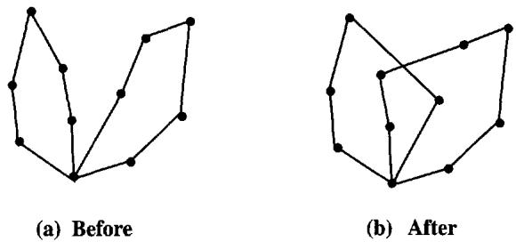  
Figure 5.1. String cross.

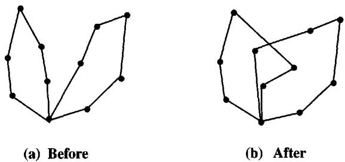  
Figure 5.2. String exchange.

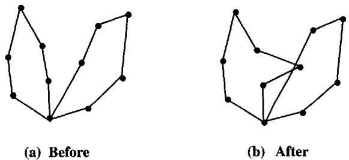  
Figure 5.3. String relocation.

We now summarize Van Breedam's analysis. The four operations considered are

String cross (SC). Two strings (or chains) of vertices are exchanged by crossing two edges of two different routes; see Figure 5.1.

String exchange (SE). Two strings of at most $k$ vertices are exchanged between two routes; see Figure 5.2.

String relocation (SR). A string of at most $k$ vertices is moved from one route to another, typically with $k = 1$ or 2; see Figure 5.3.

String mix (SM). The best move between SE and SR is selected.

To evaluate these moves, Van Breedam considers the two local improvement strategies, FI and BI. Van Breedam then defines a set of parameters that can influence the behavior of the local improvement procedure. These parameters are the initial solution (poor, good), the string length $( k )$ for moves of type SE, SR, SM $( k = 1$ or 2), the selection strategy (FI, BI), and the evaluation procedure for a string length $k \ > \ 1$ (evaluate all possible string lengths between a pair of routes, increase $k$ when a whole evaluation cycle has been completed without identifying an improvement move). To compare the various improvement heuristics, Van Breedam selects 15 tests problems among 420 instances. However, nine of these include either pickup and deliveries constraints or time-windows constraints and are therefore not relevant within the context of this chapter. The remaining six instances contain capacity constraints where all customers have the same demand, so that the capacity constraint is exactly satisfied and only SC or SE moves can be performed. Therefore, the following conclusions should be interpreted with caution. The first observation made by Van Breedam is that it is better to initiate the search from a good solution than from a poor one, in terms of both final solution quality and computing time. Also, the best solutions are obtained when SE moves are performed with a string length $k = 2$ . However, using $k = 2$ is about twice as slow as using $k = 1$ . Overall, SE moves appear to be the best. This is confirmed in a further comparison of local improvement, simulated annealing, and tabu search heuristics using various types of moves. The local improvement heuristic with SE moves yields solution values that are $2 . 2 \%$ above the best known, compared with $4 . 7 \%$ for SC moves, but computing times are more than four times larger with SC moves.

# 5.5 Conclusions

More than 35 years have passed since the publication of the savings heuristic for the VRP, and during this period a wide variety of solution techniques have been proposed. Comparisons between these heuristics are not always easy to make, especially since several implementation features can affect the performance of an algorithm. Also, the number and size of test problems used in the comparisons is rather limited, and researchers have not systematically applied the same rounding conventions, although this has been corrected in the last few years. It is now clear that in terms of solution quality, classical heuristics based on simple construction and local descent improvement techniques do not compete with the best tabu search implementations described in Chapter 6. However, several methods presented in this chapter can be easily adapted to other variants of the VRP and are easy to implement. This explains to a large extent their widespread use in commercial software. Thus, the Clarke and Wright algorithm remains probably the most popular method in practice. When followed by the BI version of 3-opt, it produces in almost no time solution values that fall within about $7 \%$ of the best known results. Much better performances are observed with some other algorithms (for example with the 2-petal algorithm), but the price to pay is often coding complexity.

Because metaheuristics for the CVRP outperform classical methods in terms of solution quality (and sometimes now in terms of computing time), we believe there is little room left for significant improvement in the area of classical heuristics. The time has come to turn the page.

# Bibliography

[1] Y. Agarwal, K. Mathur, and H.M. Salkin. A set-partitioning-based exact algorithm for the vehicle routing problem. Networks, 19:731-749, 1989.

[2] K. Altinkemer and B. Gavish. Parallel savings based heuristic for the delivery problem. Operations Research, 39:456-469, 1991.

[3] M. Balinski and R. Quandt. On an integer program for a delivery problem. Operations Research, 12:300-304, 1964.

[4] J.E. Beasley. Route-first cluster-second methods for vehicle routing. Omega, 11:403- 408, 1983.

[5] DJ. Bertsimas and D. Simchi-Levi. A new generation of vehicle routing research: Robust algorithms addressing uncertainty. Operations Research, 44:286-304, 1996.

[6] L.D. Bodin, B.L. Golden, A.A. Assad, and M. Ball. Routing and scheduling of vehicles and crews, the state of the art. Computers and Operations Research, 10:63-212,1983.

[7] J. Bramel and D. Simchi-Levi. A location based heuristic for general routing problems. Operations Research, 43:649-660, 1995.

[8] N. Christofides. The vehicle routing problem. RAIRO, 10:55-70, 1976.

[9] N. Christofides. Vehicle routing. In E.L. Lawler, J.K. Lenstra, A.H.G. Rinnooy Kan, and D.B. Shmoys, editors, The Traveling Salesman Problem, Wiley, Chichester, UK, 1985, pp. 431-448.

[10] N. Christofides, A. Mingozzi, and P. Toth. The vehicle routing problem. In N. Christofides, A. Mingozzi, P. Toth, and C. Sandi, editors, Combinatorial Optimization, Wiley, Chichester, UK, 1979, pp 315-338.

[11] G. Clarke and J.V. Wright. Scheduling of vehicles from a central depot to a number of delivery points. Operations Research, 12:568-581, 1964.

[12] M. Desrochers and T.W Verhoog. A matching based savings algorithm for the vehicle routing problem. Technical Report Cahiers du GERAD G-89-04, Ecole des Hautes Etudes Commerciales de Montreal, Canada, 1989.

[13] E.W. Dijkstra. A note on two problems in connection with graphs. Numerische Mathematik, 1:269-271, 1959.

[14] M. Dror and L. Levy. Vehicle routing improvement algorithms: Comparison of a greedy and a matching implementation for inventory routing. Computers and Operations Research, 13:33^5, 1986.

[15] R. Fahrion and W. Wrede. On a principle of chain-exchange for vehicle-routing problems (1-vrp). Journal of Operational Research Society, 41:821-827, 1990.

[16] M.L. Fisher. Vehicle routing. In M.O. Ball, T.L. Magnanti, C.L. Monma, and G.L. Nemhauser, editors, Network Routing, Handbooks in Operations Research and Management Science 8, North-Holland, Amsterdam, 1995, pp. 1-33.

[17] M.L. Fisher and R. Jaikumar. A generalized assignment heuristic for the vehicle routing problem. Networks, 11:109-124, 1981.

[18] B.A. Foster and D.M. Ryan. An integer programming approach to the vehicle scheduling problem. Operations Research, 21':361'-384, 1976.

[19] T.J. Gaskell. Bases for vehicle fleet scheduling. Operational Research Quarterly, 18:281-295, 1967.

[20] B.E. Gillett and L.R. Miller. A heuristic algorithm for the vehicle dispatch problem. Operations Research, 22:340-349, 1974.

[21] B.L. Golden and A. A. Assad. Vehicle Routing: Methods and Studies. North-Holland, Amsterdam, 1988.

[22] B.L. Golden, T.L. Magnanti, and H.Q. Nguyen. Implementing vehicle routing algorithms. Networks, 7:113-148, 1977.

[23] M. Haimovich and A.H.G. Rinnooy Kan. Bounds and heuristics for capacitated routing problems. Mathematics of Operations Research, 10:527-542, 1985.

[24] D.S. Johnson and L.A. McGeoch. The traveling salesman problem: A case study. In E.H.L. Aarts and J.K. Lenstra, editors, Local Search in Combinatorial Optimization, Wiley, Chichester, UK, 1997, pp. 215-310.

[25] G.A.P. Kindervater and M.W.P. Savelsbergh. Vehicle routing: Handling edge exchanges. In E.H.L. Aarts and J.K. Lenstra, editors, Local Search in Combinatorial Optimization, Wiley, Chichester, UK, 1997, pp. 337-360.

[26] S. Lin. Computer solutions of the traveling salesman problem. Bell System Technical Journal, 44:2245-2269, 1965.

[27] S. Lin and B.W. Kernighan. An effective heuristic algorithm for the traveling salesman problem. Operations Research, 21:498-516, 1973.

[28] P. Miliotis. Integer programming approaches to the travelling salesman problem. Mathematical Programming, 10:367-378, 1976.

[29] R.H. Mole and S.R. Jameson. A sequential route-building algorithm employing a generalized savings criterion. Operational Research Quarterly, 27:503-511, 1976.

[30] M.D. Nelson, K.E. Nygard, J.H. Griffin, and WE. Shreve. Implementation techniques for the vehicle routing problem. Computers and Operations Research, 12:273-283, 1985.

[31] I. Or. Traveling salesman-type combinatorial optimization problems and their relation to the logistics of regional blood banking. Ph.D. dissertation, Department of Industrial Engineering and Management Sciences, Northwestern University, Evanston, IL, 1976.

[32] I.H. Osman. Metastrategy simulated annealing and tabu search algorithms for the vehicle routing problem. Annals of Operations Research, 41:421-451, 1993.

[33] H. Paessens. The savings algorithm for the vehicle routing problem. European Journal of Operational Research, 34:336-344, 1988.

[34] J.-Y. Potvin, T. Kervahut, B. Garcia, and J.-M. Rousseau. The vehicle routing problem with time windows—Part I: Tabu search. INFORMS Journal on Computing, 8:158- 164, 1996.

[35] J. Renaud, F.F. Boctor, and G. Laporte. A fast composite heuristic for the symmetric traveling salesman problem. INFORMS Journal on Computing, 8:134-143, 1996.

[36] J. Renaud, F.F. Boctor, and G. Laporte. An improved petal heuristic for the vehicle routing problem. Journal of Operational Research Society, 47:329-336, 1996.

[37] Y. Rochat and E.D. Taillard. Probabilistic diversification and intensification in local search for vehicle routing. Journal of Heuristics, 1:147-167, 1995.

[38] D.M. Ryan, C. Hjorring, and F. Glover. Extensions of the petal method for vehicle routing. Journal of Operational Research Society, 44:289-296, 1993.

[39] S. Salhi and G.K. Rand. Improvements to vehicle routing heuristics. Journal of Operational Research Society, 38:293-295, 1987.

[40] W.R. Stewart Jr. and B.L. Golden. A Lagrangean relaxation heuristic for vehicle routing. European Journal of Operational Research, 15:84-88, 1984.

[41] E.D. Taillard. Parallel iterative search methods for vehicle routing problems. Networks, 23:661-673, 1993.

[42] P.M. Thompson and H.N. Psaraftis. Cyclic transfer algorithms for multi-vehicle routing and scheduling problems. Operations Research, 41:935-946, 1993.

[43] A. Van Breedam. An analysis of the behavior of heuristics for the vehicle routing problem for a selection of problems with vehicle-related, customer-related, and timerelated constraints. Ph.D. dissertation, University of Antwerp, 1994.

[44] D. Vigo. A heuristic algorithm for the asymmetric capacitated vehicle routing problem. European Journal of Operational Research, 89:108-126, 1996.

[45] P. Wark and J. Holt. A repeated matching heuristic for the vehicle routing problem. Journal of Operational Research Society, 45:1156-1167, 1994.

[46] A. Wren. Computers in Transport Planning and Operation. Ian Allan, London, 1971.

[47] A. Wren and A. Holliday. Computer scheduling of vehicles from one or more depots to a number of delivery points. Operational Research Quarterly, 23:333-344, 1972.

[48] P. Yellow. A computational modification to the savings method of vehicle scheduling. Operational Research Quarterly, 21:281-283, 1970.

# Chapter 6

# Metaheuristics for the Capacitated VRP

# Michel Gendreau Gilbert Laporte Jean-Yves Potvin

# 6.1 Introduction

In recent years several metaheuristics have been proposed for the VRP. These are general solution procedures that explore the solution space to identify good solutions and often embed some of the standard route construction and improvement heuristics described in Chapter 5. In a major departure from classical approaches, metaheuristics allow deteriorating and even infeasible intermediary solutions in the course of the search process. The best known metaheuristics developed for the VRP typically identify better local optima than earlier heuristics, but they also tend to be more time consuming.

We are aware of six main types of metaheuristic that have been applied to the VRP: Simulated Annealing (SA), Deterministic Annealing (DA), Tabu Search (TS), Genetic Algorithms (GA), Ant Systems (AS), and Neural Networks (NN). The first three algorithms start from an initial solution $x _ { 1 }$ and move at each iteration $t$ from $x _ { t }$ to a solution $x _ { t + 1 }$ in the neighborhood $N ( x _ { t } )$ of $x _ { t }$ , until a stopping condition is satisfied. If $f ( x )$ denotes the cost of $x$ , then $f ( x _ { t + 1 } )$ is not necessarily less than $f ( x _ { t } )$ As a result, care must be taken to avoid cycling. GA examines at each step a population of solutions. Each population is derived from the preceding one by combining its best elements and discarding the worst. Ant systems is a constructive approach in which several new solutions are created at each iteration using some of the information gathered at previous iterations. As was noted by Taillard et al. [63], tabu search, genetic algorithms, and ant systems are methods that record, as the search proceeds, information on solutions encountered and use it to obtain improved solutions. Neural networks is a learning mechanism that gradually adjusts a set of weights until an acceptable solution is reached. The rules governing the search differ in each case, and these must also be tailored to the shape of the problem at hand. Also, a fair amount of creativity and experimentation is required. Our purpose is to survey some of the most representative applications of local search algorithms to the VRP. For generic articles and textbooks on these metaheuristics, see Rumelhart and McClelland [57], Wasserman [73 van Laarhoven and Aarts [71], Goldberg [30], Davis [15], Pirlot [46], Reeves [52], Dori Maniezzo, and Colorni [17], Osman and Kelly [44], Osman and Laporte [45], Aarts an Lenstra [1], and Glover and Laguna [29]. Gendreau, Laporte, and Potvin [24] and Golden et al. [32] report how various metaheuristic methods have been applied to the VRP and t the VRP with time windows. In the following six sections of this chapter we report on implementations of all six algorithms to the solution of the VRP. Some of this material is borrowed or adapted from Gendreau, Laporte, and Potvin [24].

# 6.2 Simulated Annealing

At iteration $t$ of simulated annealing, a solution $x$ is drawn randomly in $N ( x _ { t } )$ If $f ( x ) \leq$ $f ( x _ { t } )$ then $x _ { t + 1 }$ is set equal to $x$ ; otherwise,

$$
x _ { t + 1 } : = { \left\{ \begin{array} { l l } { x } & { { \mathrm { w i t h ~ p r o b a b i l i t y ~ } } p _ { t } , } \\ { x _ { t } } & { { \mathrm { w i t h ~ p r o b a b i l i t y ~ } } 1 - p _ { t } , } \end{array} \right. }
$$

where $p _ { t }$ is usually a decreasing function of $t$ and of $f ( x ) - f ( x _ { t } )$ . It is common to define $p _ { t }$ as

$$
p _ { t } = \exp \Bigl ( - \Bigl [ f ( x ) - f ( x _ { t } ) \Bigr ] / \theta _ { t } \Bigr ) ,
$$

where $\theta _ { t }$ denotes the temperature at iteration $t$ . The rule employed to define $\theta _ { t }$ is called a cooling schedule. Typically, $\theta _ { t }$ is a decreasing step function of $t$ : initially, $\theta _ { t }$ is set equal to a given value $\theta _ { 1 } > 0$ and is multiplied by a factor $\alpha ( 0 < \alpha < 1 )$ ) after every $T$ iterations, so that the probability of accepting a worse solution should decrease with time. Three common stopping criteria are the value $f ^ { * }$ of the incumbent $x ^ { * }$ has not decreased by at least $\pi _ { 1 } \%$ for at least $k _ { 1 }$ consecutive cycles of $T$ iterations; the number of accepted moves has been less than $\pi _ { 2 } \%$ of $T$ for $k _ { 2 }$ consecutive cycles of $T$ iterations; and $k _ { 3 }$ cycles of $T$ iterations have been executed.

# 6.2.1 Two Early Simulated Annealing Algorithms

Two early implementations of simulated annealing in the context of the VRP are those of Robuste, Daganzo, and Souleyrette [55], and Alfa, Heragu, and Chen [2]. In the first case, the authors defined a neighborhood structure by combining several mechanisms: reversing part of a route, moving part of a route into another part of the same route, trading vertices between two routes. The algorithm was tested on four instances $( n = 8 0$ , 100, 120, 500), but no comparisons with alternative methods are available. In the second implementation, Alfa, Heragu, and Chen [2] used a route-first, cluster-second heuristic (Beasley [6]) to construct a first solution, followed by 3-opt (Lin [39]) for the search process. The method was applied to three instances $( n = 3 0$ , 50, 75) and did not produce competitive results.

# 6.2.2 Osman's Simulated Annealing Algorithms

Osman's [43] implementation of simulated annealing is much more involved, and also more successful. It uses a better starting solution, some parameters of the algorithm are adjusted in a trial phase, richer solution neighborhoods are explored, and the cooling schedule is more sophisticated. The neighborhood structure of this algorithm uses a $\lambda$ -interchange generation mechanism in which two routes $p$ and $q$ are first selected, together with two subsets of customers $S _ { p }$ and $S _ { q }$ , one from each route, satisfying $| S _ { p } | \le \lambda$ and $| S _ { q } | \le \lambda$ . The operation swaps the customers of $S _ { p }$ with those of $S _ { q }$ as long as this is feasible. The sets $S _ { p }$ or $S _ { q }$ can be empty, and therefore this family of operations includes simply shifting customers from one route to another. Because the number of combinations of route pairs and choices of $S _ { p }$ and $S _ { q }$ is usually large, this procedure is implemented with $\lambda = 1$ or 2 and, in the most efficient versions of the algorithm, the search stops as soon as an improving move is identified. (When this does not happen, the whole neighborhood must be explored.) An inferior version of this algorithm consists of examining a whole neighborhood and of implementing the best move.

The algorithm that was implemented was tested on symmetric VRPs with an unspecified number of vehicles. It operates as follows.

# Phase 1. Descent algorithm.

Step 1 (initial solution). Generate an initial solution by means of the Clarke and Wright algorithm [12].

Step 2 (descent). Search the solution space using the $\lambda$ -interchange scheme. Implement an improvement as soon as it is identified. Stop whenever an entire neighborhood exploration yields no improvement.

# Phase 2. Simulated Annealing Search.

Step 1 (initial solution). Use as a starting solution the incumbent obtained at the end of Phase 1, or a solution produced by the Clarke and Wright algorithm. Perform a complete neighborhood search using the $\lambda$ -interchange generation mechanism without, however, implementing any move. Record $\triangle _ { \mathrm { m a x } }$ and $\triangle _ { \mathrm { m i n } }$ , the largest and smallest absolute changes in the objective function, and compute $\beta$ , the number of feasible (potential) exchanges. Set $\theta _ { 1 } : = \triangle _ { \operatorname* { m a x } } , \delta : = 0 , k : = 1 , k _ { 3 } : = 3 t : = 1 , t ^ { \ast } : = 1$ (this is the iteration at which the best known solution has been identified within the current cycle). Let $x _ { 1 }$ be the current solution and $x ^ { * } : = x _ { 1 }$ .

Step 2 (next solution). Explore the neighborhood of $x _ { t }$ using $\lambda$ -interchanges. When a solution $x$ with $f ( x ) < f ( x _ { t } )$ is encountered, set $x _ { t + 1 } : = x$ ; if $f ( x ) < f ( x ^ { * } )$ , set $x ^ { * } : = x$ and $\theta ^ { * } : = \theta _ { k }$ . If a whole exploration yields no better solution than $x _ { t }$ , let $x$ be the best solution encountered in the neighborhood of $x _ { t }$ and set

$$
\begin{array} { r } { x _ { t + 1 } : = \left\{ \begin{array} { l l } { x } & { \mathrm { w i t h ~ p r o b a b i l i t y ~ } p _ { t } , } \\ { x _ { t } } & { \mathrm { w i t h ~ p r o b a b i l i t y ~ } 1 - p _ { t } , } \end{array} \right. } \end{array}
$$

where $p _ { t }$ is defined by (6.1). lf $x _ { t + 1 } : = x _ { t }$ s e t < $\delta : = 1$

Step 3 (temperature update). Occasional increment rule: if $\delta = 1 , \sec \theta _ { t + 1 } : = \operatorname* { m a x } \{ \theta _ { t } / 2 , \theta ^ { * } \}$ , $\delta : = 0$ and $k : = k + 1$ . Normal decrement rule: If $\delta = 0$ , set $\theta _ { t + 1 } : = \theta _ { t } / [ ( n \beta + n \sqrt { t } ) \triangle _ { \operatorname* { m a x } }$ $\Delta _ { \mathrm { m i n } } ]$ . Set $t : = t + 1$ . If $k = k _ { 3 }$ , stop. Otherwise, go to Step 2.

The cooling schedule employed by Osman differs from what is commonly done in S A. The temperature is not decreased continuously nor as a step function. Instead, it decreases continuously as long as the current solution is modified. Whenever $x _ { t + 1 } = x _ { t }$ , the current temperature is either halved or replaced by the temperature at which the incumbent was identified. It is not clear to what extent this modified cooling schedule is instrumental to the success of the algorithm.

The algorithm was implemented with $\lambda = 1$ , using the best Phase 1 solution to initiate Phase 2. In total, 26 instances were tested. We report in Table 6.1 results obtained on the classical 14 instances proposed by Christofides, Mingozzi, and Toth [11], some of which contain a distance restriction, i.e., an upper limit $L$ is imposed on the length of any vehicl route. Bold numbers mean that the algorithm has identified a best known solution.

Table 6.1 indicates that Osman's S A algorithm generally produces good results, but it sometimes misses the mark significantly and rarely identifies a best known solution.

Table 6.1. Computational results for Osman's SA algorithm (with first improving moves).   

<table><tr><td>Problem</td><td>f*1</td><td>Best known solution value</td><td>Time{2</td></tr><tr><td>E051-05e</td><td>528</td><td>524.611,3,4,5,6,8,9,10,12</td><td>167.4</td></tr><tr><td>E076-10e</td><td>838.62</td><td>835.263,5</td><td>6434.3</td></tr><tr><td>E101-08e</td><td>829.18</td><td>826.143,4,5</td><td>9334.0</td></tr><tr><td>E101-10c</td><td>826</td><td>819.563,4,5,6,9,11, 12</td><td>632.0</td></tr><tr><td>E121-07c</td><td>1176</td><td>1042.111,3,4,5,6</td><td>315.8</td></tr><tr><td>E151-12C</td><td>1058</td><td>1028.423</td><td>5012.3</td></tr><tr><td>E200-17c</td><td>1378</td><td>1291.457</td><td>2318.1</td></tr><tr><td>D051-06c</td><td>555.43</td><td>555.431,3,4,5,6, 12</td><td>3410.2</td></tr><tr><td>D076-11c</td><td>909.68</td><td>909.681,3,4,6</td><td>626.5</td></tr><tr><td>D101-09c</td><td>866.75</td><td>865.943.4</td><td>957.2</td></tr><tr><td>D101-11c</td><td>890</td><td>866.371,3,4,6,12</td><td>305.2</td></tr><tr><td>D121-11c</td><td>1545.98</td><td>1541.143</td><td>7622.5</td></tr><tr><td>D151-14C</td><td>1164.12</td><td>1162.553</td><td>84,301.2</td></tr><tr><td>D200-18c</td><td>1417.85</td><td>1395.857</td><td>5708.0</td></tr></table>

Computing times tend to be relatively long. Overall, applying SA to the VRP does not yield results that are competitive with those produced by the best tabu search implementations.

# 6.2.3 Van Breedam's Experiments

We note in closing this section that Van Breedam [69] compared and tested several version of S A using different neighborhood structures. Tests were conducted on the 14 Christofides, Mingozzi, and Toth [11] instances. These experiments are useful in helping to identify best SA strategies, but overall they confirm the superiority of tabu search-based heuristics.

# 6.3 Deterministic Annealing

Deterministic annealing operates in a way that is similar to simulated annealing, except that a deterministic rule is used for the acceptance of a move. Two standard implementations of this technique are threshold accepting (Dueck and Scheurer [19]) and recordto-record travel (Dueck [18]). At iteration $t$ of a threshold-accepting algorithm, solution $x _ { t + 1 }$ is accepted if $f ( x _ { t + 1 } ) \ < \ f ( x _ { t } ) + \theta _ { 1 }$ , where $\theta _ { 1 }$ is a user controlled parameter. In record-to-record travel a record is the best solution $x ^ { * }$ encountered during the search. At iteration $t$ , solution $x _ { t + 1 }$ is accepted if $f ( x _ { t + 1 } ) < \theta _ { 2 } f ( x _ { t } )$ where $\theta _ { 2 }$ is a user-controlled parameter in general slightly larger than 1. Golden et al. [32] applied a record-to-record travel heuristic to 20 large scale instances of the VRP, eight of which include distance restrictions. Data sets for these instances can be obtained on the web site http://wwwBus.colorado.edu/Publications/workingpapers/kelly. Comparisons were made with results obtained by applying the Xu and Kelly TS heuristic (described in section 6.5) on the same instances. Not only is the record-to-record heuristic much faster than the Xu and Kelly implementation, but it generates a better solution in 11 cases of 20. Results taken from Golden et al. [32] are reported in Table 6.2. As explained by Toth and Vigo [67], all instances of this series involving a distance restriction contain errors in the Xu and Kelly column and therefore have been omitted.

Table 6.2. Computational results for the record-to-record algorithm of Golden et al. [32].   

<table><tr><td rowspan="2">Problem</td><td colspan="2">Record-to-record</td><td colspan="2">Xu-Kelly&#x27;s TS</td><td rowspan="2">Best known solution value</td></tr><tr><td>\f*</td><td>Time</td><td>\f</td><td>Time2</td></tr><tr><td>E241-22k</td><td>720.44</td><td>5.69</td><td>747.23</td><td>2314.00</td><td>711.075</td></tr><tr><td>E253-27k</td><td>881.04</td><td>6.01</td><td>881.07</td><td>1465.77</td><td>868.705</td></tr><tr><td>E256-14k</td><td>587.09</td><td>23.01</td><td>589.10</td><td>340.20</td><td>587.094</td></tr><tr><td>E301-28k</td><td>1029.21</td><td>8.15</td><td>1066.59</td><td>4101.02</td><td>1016.835</td></tr><tr><td>E321-30k</td><td>1103.69</td><td>21.83</td><td>1118.09</td><td>1577.30</td><td>1096.185</td></tr><tr><td>E324-16k</td><td>749.15</td><td>31.49</td><td>746.56</td><td>501.82</td><td>746.563</td></tr><tr><td>E361-33k</td><td>1403.05</td><td>12.42</td><td>1435.90</td><td>5718.38</td><td>1400.965</td></tr><tr><td>E397-34k</td><td>1364.23</td><td>32.62</td><td>1377.79</td><td>4340.07</td><td>1363.345</td></tr><tr><td>E400-18k</td><td>934.33</td><td>69.19</td><td>932.68</td><td>852.72</td><td>932.683</td></tr><tr><td>E421-41k</td><td>1875.17</td><td>31.05</td><td>1934.96</td><td>103,839.73</td><td>1875.174</td></tr><tr><td>E481-38k</td><td>1657.93</td><td>47.55</td><td>1656.66</td><td>8943.45</td><td>1650.425</td></tr><tr><td>E484-19k</td><td>1137.18</td><td>101.09</td><td>1140.72</td><td>1151.10</td><td>1136.055</td></tr></table>

1 Minutes on a 100MHz Pentium-based PC. 2 Minutes on a DEC ALPHA workstation. $^ 3 \mathbf { X } \mathbf { u }$ and Kelly [76]. 4Golden et al. [32]. 5TothandVigo[67].

# 6.4 Tabu Search

In tabu search, sequences of solutions are examined as in simulated annealing, but the next move is made to the best neighbor of the current solution $x _ { t }$ . To avoid cycling, solutions that were recently examined are forbidden, or tabu, for a number of iterations. To alleviate time and memory requirements, it is customary to record an attribute of tabu solutions rather than the solutions themselves. The basic tabu search mechanism can be enhanced by several computational features, such as diversification and intensification strategies, as described by Glover and Laguna [28, 29] and Hertz, Taillard, and de Werra [34], for example.

Over the last 10 years or so, tabu search has been applied to the VRP by several authors. Some of the first tabu search algorithms (Willard [75], Pureza and Fran9a [51]) did not yield impressive results, but subsequent implementations were much more successful. These include the work of Osman [43], Taillard [62], Gendreau, Hertz, and Laporte [23], Xu and Kelly [76], Rego and Roucairol [54], Rego [53], and Barbarosoglu and Ozgur [3]. In addition, Rochat and Taillard [56] introduced a useful and powerful concept, the adaptive memory, which can be used to enhance any tabu search-based algorithm. In the same vein, Toth and Vigo [67] introduced granular tabu search, whose principles have far-reaching applicability.

# 6.4.1 Two Early Tabu Search Algorithms

One of the first attempts to apply tabu search to the VRP is due to Willard [75]. Here, the solution is first transformed into a giant tour by replication of the depot, and neighborhoods are defined as all feasible solutions that can be reached from the current solution by means of 2-opt or 3-opt exchanges (Lin [39]). The next solution is determined by the best nontabu move. On three of the Christofides, Mingozzi, and Toth [11] benchmark problems, the proposed algorithm does not appear to be competitive with most known approximation algorithms. Pureza and Franga [51] defined the neighbors of a solution by moving a vertex to a different route or by swapping vertices between two routes while preserving feasibility. As in Willard, the best nontabu feasible move is selected at each iteration. While better than Willard's algorithm, this implementation did not produce especially good results. Further research has shown that more sophisticated search mechanisms are required to make tabu search work.

# 6.4.2 Osman's Tabu Search Algorithm

In Osman [43], neighborhoods are again defined by means of the $\lambda$ .-interchange generation mechanism, with $\lambda = 2$ . This includes a combination of 2-opt moves, vertex reassignments to different routes, and vertex interchanges between two routes. In one version of the algorithm called BA (best admissible), the whole neighborhood is explored and the best nontabu feasible move is selected. In the other version, FBA (first best admissible), the first admissible improving move is selected if one exists; otherwise, the best admissible move is implemented. Results reported in Table 6.3 indicate that these two tabu search implementations produce excellent results, but these can still be improved in most cases.

# 6.4.3 Taburoute

With respect to the previous tabu search implementations, the Taburoute algorithm of Gendreau, Hertz, and Laporte [23] is rather involved and contains several innovative features. The neighborhood structure is defined by all solutions that can be reached from the current solution by removing a vertex from its current route and inserting it into another route containing one of its $p$ nearest neighbors using GENI, a Generalized Insertion procedure developed by Gendreau, Hertz, and Laporte [22] for the Traveling Salesman Problem (TSP). This may result in eliminating an existing route or in creating a new one. A second important feature of Taburoute is that the search process examines solutions that may be infeasible with respect to the capacity or maximum route length constraints. More precisely, the objective function contains two penalty terms, one measuring overcapacity, the other measuring overduration, each weighted by a self-adjusting parameter: every 10 iterations, each parameter is divided by 2 if all 10 previous solutions were feasible or multiplied by 2 if all were infeasible. This way of proceeding produces a mix of feasible and infeasible solutions and lessens the likelihood of being trapped in a local minimum. At various points during the search process, Taburoute reoptimizes the route in which a vertex has just been inserted. This is achieved by using the Unstringing and Stringing (US) TSP postoptimization routine developed by Gendreau, Hertz, and Laporte [22].

Taburoute does not actually use a tabu list but instead uses random tabu tags. Whenever a vertex is moved from route $r$ to route $s$ at iteration $t$ , its reinsertion into route $r$ is forbidden until iteration $t + \theta$ , where $\theta$ is an integer randomly drawn from the interval [5, 10]. Yet another feature of Taburoute is the use of a diversification strategy, which consists of penalizing vertices that have been moved frequently in order to increase the probability of considering slow-moving vertices. The objective function is artificially increased by adding to it a term proportional to the absolute frequency of movement of the vertex $v$ currently being considered. Finally, Taburoute uses false starts. Initially, several solutions are generated and a limited search is carried out on each of them. The best identified solution is then selected as a starting point for the main search.

We now provide a short description of Taburoute (see the original article [23] for a detailed discussion of the parameter choices). In what follows, $W$ is the set of vertices considered as candidates for reinsertion into another route at each iteration, $q ~ \leq ~ | W |$ is the number of these vertices for which a tentative reinsertion is actually made, and $k$ is the number of consecutive iterations without improvement.

Step 1 (initialization). Generate $\lceil \sqrt { n } / 2 \rceil$ initial solutions and perform tabu search with $W = V \backslash \{ v _ { 0 } \} , q = 5 m$ , and $k = 5 0$ . This value of $q$ ensures that the probability of selecting one vertex from each route is at least $9 0 \%$ .

Step 2 (solution improvement). Starting with the best solution observed in Step 1, perform tabu search with $W = V \setminus \{ v _ { 0 } \} , q = 5 m$ , and $k = 5 0 n$ .

Step 3 (intensification). Starting with the best solution observed in Step 2, perform tabu search with $k = 5 0$ . Here $W$ is the set of the $\lfloor \vert V \vert / 2 \rfloor$ vertices that have been most often moved in Steps 1 and 2, and $q = \{ W \}$ .

Table 6.3. Computational comparison of tabu search algorithms.   

<table><tr><td></td><td colspan="2">Osman? (BA)</td><td>Taillard8</td><td>standard</td><td>Taburoute</td><td>best</td><td>Rochat and Taillard10</td><td colspan="2">Xu and Kell4.5</td><td>Rego and Roucairol 11</td><td>Toth and Vigo012</td><td></td></tr><tr><td>Problem</td><td>f</td><td>Time1</td><td>f*</td><td>f*</td><td>Time2</td><td>f*</td><td></td><td>f*</td><td>Time3</td><td>f*</td><td>f*</td><td>Time6</td></tr><tr><td>E051-05e</td><td>524.61</td><td>1.12</td><td>524.61</td><td>524.61</td><td>6.0</td><td>524.61</td><td>f</td><td>524.614.5</td><td>29.224.5</td><td>524.61</td><td>524.61</td><td>0.81</td></tr><tr><td>E076-10e</td><td>844</td><td>1.18</td><td>835.26</td><td>835.77</td><td>53.8</td><td>835.32</td><td></td><td>835.264.5</td><td>48.804,5</td><td>835.32</td><td>838.60</td><td>2.21</td></tr><tr><td>E101-08e</td><td>835</td><td>11.25</td><td>826.14</td><td>829.45</td><td>18.4</td><td>826.14</td><td></td><td>826.144,5</td><td>71.934.5</td><td>827.53</td><td>828.56</td><td>2.39</td></tr><tr><td>E101-10C</td><td>819.59</td><td>6.79</td><td>819.56</td><td>819.56</td><td>16.0</td><td>819.56</td><td></td><td>819.564,5</td><td>56.614.5</td><td>819.56</td><td>819.56</td><td>1.10</td></tr><tr><td>E121-07c</td><td>1042.11</td><td>23.31</td><td>1042.11</td><td>1073.47</td><td>22.2</td><td>1042.11</td><td></td><td>1042.114,5</td><td>91.234,5</td><td>1042.11</td><td>1042.87</td><td>3.18</td></tr><tr><td>E151-12C</td><td>1052</td><td>51.25</td><td>1028.42</td><td>1036.16</td><td>58.8</td><td>1031.07</td><td></td><td>1029.564.5</td><td>149.904.5</td><td>1044.35</td><td>1033.21</td><td>4.51</td></tr><tr><td>E200-17c</td><td>1354</td><td>32.88</td><td>1298.79</td><td>1322.65</td><td>90.9</td><td>1311.35</td><td>1291.45</td><td>1298.584,5</td><td>272.524.5</td><td>1334.55</td><td>1318.25</td><td>7.50</td></tr><tr><td>D051-06c</td><td>555.44</td><td>2.34</td><td>555.43</td><td>555.43</td><td>13.5</td><td>555.43</td><td></td><td>555.435</td><td>30.675</td><td>555.43</td><td>555.43</td><td>0.86</td></tr><tr><td>D076-11c</td><td>913</td><td>3.38</td><td>909.68</td><td>913.23</td><td>54.6</td><td>909.68</td><td></td><td>965.625</td><td>102.135</td><td>909.68</td><td>920.72</td><td>2.75</td></tr><tr><td>D101-09c</td><td>866.75</td><td>20.00</td><td>865.94</td><td>865.94</td><td>25.6</td><td>865.94</td><td></td><td>881.385</td><td>98.155</td><td>866.75</td><td>869.48</td><td>2.90</td></tr><tr><td>D101-11c</td><td>866.37</td><td>92.98</td><td>866.37</td><td>866.37</td><td>65.7</td><td>866.37</td><td></td><td>915.245</td><td>152.985</td><td>866.37</td><td>866.37</td><td>1.41</td></tr><tr><td>D121-11c</td><td>1547</td><td>22.38</td><td>1541.14</td><td>1573.81</td><td>59.2</td><td>1545.93</td><td></td><td>1618.555</td><td>201.75</td><td>1550.17</td><td>1545.51</td><td>9.34</td></tr><tr><td>D151-14C</td><td>1188</td><td>40.73</td><td>1162.55</td><td>1177.76</td><td>71.0</td><td>1162.89</td><td></td><td>No solution</td><td>168.085</td><td>1164.12</td><td>1173.12</td><td>5.67</td></tr><tr><td>D200-18C</td><td>1422</td><td>55.17</td><td>1397.94</td><td>1418.51</td><td>99.8</td><td>1404.75</td><td>1395.85 1439.295</td><td></td><td>368.375</td><td>1420.84</td><td>1435.74</td><td>9.11</td></tr></table>

7Osman [43]. 8Taillard [62]. 9Gendreau, Hertz, and Laporte [23]. 10Rochat and Taillard [56]. 11 Rego and Roucairol [54], parallel implementation. 12Toth and Vigo [67].   
'Minutes on a VAX 8600. 2Minutes on a Silicon Graphics workstation (36MHz, 5.7 Mflops). 3Minutes on a DEC ALPHA workstation DEC OSF/1 v 3.0). $^ { 4 } \mathbf { X } \mathbf { u }$ and Kelly [76]. 5Golden et al. [32]. 6Minutes on a Pentium 200 MHz PC (about three times faster than the Silicon Graphics workstation used for Taburoute, and twice as slow as the DEC ALPHA workstation used by Xu and Kelly).

As can be seen in Table 6.3, Taburoute produces high-quality results and often yields a best known solution.

# 6.4.4 Tail lard's Algorithm

The Taillard [62] tabu search implementation contains some of the features of Taburoute, namely, random tabu durations and diversification. It defines the neighborhood using the $\lambda$ -interchange generation mechanism (Osman [43]). Rather than executing the insertions with GENI, the algorithm uses standard insertions, thus enabling each insertion to be carried out in less time, and feasibility is always maintained. Every so often, individual routes are reoptimized using the optimization algorithm of Volgenant and Jonker [72].

A novel feature of Taillard's algorithm is the decomposition of the main problems into subproblems. In planar problems, these subproblems are obtained by initially partitioning vertices into sectors centered at the depot and into concentric regions within each sector. Each subproblem can be solved independently, but periodical moves of vertices to adjacent sectors are necessary. This makes sense when the depot is centered and vertices are uniformly distributed in the plane. For nonplanar problems, and for planar problems not possessing these properties, the author suggests a different partitioning method based of the computation of shortest spanning arborescences rooted at the depot. This decomposition method is particularly well suited for parallel implementation as subproblems can then be distributed among the various processors. The combination of these strategies yields excellent computational results.

# 6.4.5 Xu and Kelly's Algorithm

With respect to the previous two tabu search algorithms, Xu and Kelly [76] used a more sophisticated neighborhood structure. They considered swaps of vertices between two routes, a global repositioning of some vertices into other routes, and local route improvements. The global repositioning strategy solves a network flow model to optimally relocate given numbers of vertices into different routes. Approximations are developed to compute the ejection and insertion costs, taking vehicle capacity into account. Route reoptimizations are performed by means of 3-opt exchanges (Lin [39]) and a tabu search improvement routine. The algorithm is governed by several parameters, which are dynamically adjusted through the search. A pool of best solutions is memorized and periodically used to reinitiate the search with new parameter values. Overall, this algorithm has produced several best known solutions on benchmark instances, but it is fair to say that it is not as effective as some other tabu search implementations. It tends to require a substantial computational effort, and properly tuning its many parameters can be problematic.

# 6.4.6 Rego and Roucairol's Algorithms

The main feature of the Rego and Roucairol [54] tabu search algorithm is the use of ejection chains to move from one solution to the next. An ejection consists of moving a vertex to the position occupied by another vertex, thus creating a chain reaction of I levels. For a given route orientation, denote by $v _ { i - 1 }$ the predecessor of $v _ { i }$ and by $v _ { i + 1 }$ its successor. An £-level ejection chain consists of replacing the triplets $( v _ { i - 1 } ^ { k } , v _ { i } ^ { k } , v _ { i + 1 } ^ { k } ) \left( k = 0 , \dots , \ell \right)$ by the triplets $( v _ { i - 1 } ^ { k } , v _ { i } ^ { k - 1 } , v _ { i + 1 } ^ { k } )$ $( k = 1 , \ldots , \ell )$ and of relocating $\boldsymbol { v } _ { i } ^ { \ell }$ . A legitimacy condition is defined to ensure that the resulting solution remains feasible, i.e., that no arc appears more than once. At a general step of the algorithm, several vertices are considered as candidate for an ejection, together with their closest neighbors that do not yield an illegitimate ejection chain. As in Taburoute, infeasible intermediate solutions are considered. A parallel implementation of this procedure was developed. Again, this TS implementation yields good-quality results but does not measure up to the best known algorithms. A variant of this algorithm, called the subpath ejection method, was introduced by Rego [53]. Unfortunately, it does not seem to improve on previous TS algorithms.

# 6.4.7 Barbarosoglu and Ozgur's Algorithm

Barbarosoglu and Ozgur [3] describe a rather simple tabu search algorithm containing no diversification strategy and in which only feasible solutions are examined. Neighbor solutions are defined by means of a $\lambda$ -interchange scheme that favors vertices relatively far from the centroid of their current route and close to the centroid of the new route. Route reoptimizations are performed by applying a 2-opt procedure. The method was applied to the six capacitated instances of the Christofides, Mingozzi, and Toth [11] set and yielded interesting results.

# 6.4.8 Adaptive Memory Procedure of Rochat and Tail lard

One of the most interesting developments to have occurred in the area of tabu search in recent years is the concept of adaptive memory developed by Rochat and Taillard [56]. It is mostly used in TS, but its applicability is not limited to this type of metaheuristic. An adaptive memory is a pool of good solutions that is dynamically updated throughout the search process. Periodically, some elements of these solutions are extracted from the pool and combined differently to produce new good solutions. In the VRP, vehicle routes selected from several solutions will be used as a starting point. The extraction process gives a larger weight to those routes belonging to the best solutions. When selecting these routes, care must be taken to avoid including the same customer twice in a solution. This restriction means that the selection process often will terminate with a partial solution that will have to be completed using a construction heuristic. In the example depicted in Figure 6.1, extracting routes A, D, and H from a memory of two solutions results in a partial solution. Rochat and Taillard showed that the application of an adaptive memory procedure can enhance a search strategy. This has enabled them to obtain two new best solutions on the 14 standard VRP benchmark instances.

# 6.4.9 Granular Tabu Search of Toth and Vigo

Granular Tabu Search (GTS) is yet another very promising concept. It was introduced by Toth and Vigo [67] and has yielded excellent results on the VRP. The main idea behind GTS stems from the observation that the longer edges of a graph have only a small likelihood of belonging to an optimal solution. Therefore, by eliminating all edges whose length exceeds a granularity threshold, several unpromising solutions will never be considered by the search process. Toth and Vigo suggested using $\nu = \beta \bar { c }$ where $\beta$ is a sparsification parameter typically chosen in the interval [1.0, 2.0], and $\bar { c }$ is the average edge length of a solution obtained by a fast heuristic. If $\beta \in \left[ 1 . 0 , 2 . 0 \right]$ then the percentage of remaining edges in the graph tends to be in the $10 \%$ to $20 \%$ range. In practice, the value of $\beta$ is dynamically adjusted whenever the incumbent has not improved for a given number of iterations and is periodically decreased to its initial value. Neighbor solutions are obtained by performing a limited number of edge exchanges within the same route or between two routes. The authors proposed a procedure able to examine all potential exchanges in $O ( | E ( \nu ) | )$ time, where $E ( \nu ) = \{ ( i , j ) \in E : c _ { i j } \leq \nu \} \cup I$ and $I$ is a set of important edges such as those incident to the depot or belonging to high-quality solutions. Toth and Vigo implemented a version of GTS containing several of the features of Taburoute. As the results presented in Table 6.3 show, GTS produces excellent solutions within very short computing times.

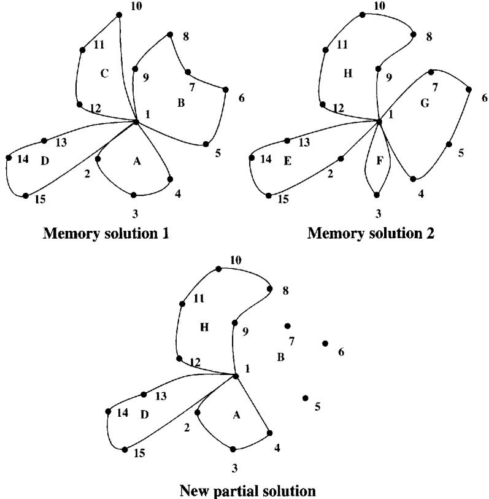  
Figure 6.1. Creating a new partial solution in the adaptive memory procedure.

# 6.4.1 0 Computational Comparison

As rightly pointed out by Barr et al. [4] and Golden et al. [32], properly testing metaheuristics is fraught with difficulties:

• These algorithms are usually governed by several user-controlled parameters. Parameter setting should be done on a different set of instances from those used for the final tests.   
• "Standard results" should be reported for one setting of the parameters. "Best results" corresponding to the best parameter values should be given alongside.   
• It is difficult to interpret computing times in the case of parallel implementations.   
• Comparable instance values should be used in all comparisons. For example, in the case of the VRP, different distance truncation rules yield vastly different results (see Gendreau, Hertz, and Laporte [23]).

There is now a consensus among researchers that stricter testing practices must be enforced, but this has not always been the case. The comparative results presented in Table 6.3 should be read with these remarks in mind. These show that TS generally yields very good solution values on the 14 benchmark instances. Two of the best known solution values are known to be optimal, and the remaining ones are probably very close to being optimal. It is now time to move to a new set of larger instances, including those recently developed by Golden et al. [32].

On the algorithmic side, the time has come to concentrate on the development of faster, simpler (with fewer parameters), and more robust algorithms, even if this causes a small loss in solution quality. These attributes are essential if we want to see more of our algorithms implemented in commercial packages.

# 6.5 Genetic Algorithms

A genetic algorithm is a randomized global search technique that solves problems by imitating processes observed during natural evolution. This problem-solving paradigm was initially proposed by Holland [35], although it was 10 years before it was fully recognized in the research community. A pure GA is a generic problem-solving method that uses little heuristic information about the problem domain. It thus can be applied to a wide range of ill-defined problems that do not lend themselves to specialized methods. Basically, a GA evolves a population of bitstrings, or chromosomes, where each chromosome encodes a solution to a particular instance. This evolution takes place through the application of operators that mimic natural phenomena observed in nature (e.g., reproduction, mutation). A simple GA is described in the following. We then explain how this paradigm can be applied to a sequencing problem like the VRP.

# 6.5.1 Simple Genetic Algorithm

Starting from some randomly generated initial population of chromosomes $X ^ { 1 } = \{ x _ { 1 } ^ { 1 } , \ldots , x _ { N } ^ { 1 } \}$ a simple GA may be described as follows. At each iteration $t = 1 , \dots , T$ , apply $k$ times Steps 1 to 3 $( k \leq N / 2 )$ , then apply Step 4.

Step 1 (reproduction). Select two parent chromosomes from $X ^ { t }$ .

Step 2 (recombination). Generate two offspring from the two parent chromosomes using a crossover operator.

Step 3 (mutation). Apply a random mutation to each offspring (with a small probability). Step 4 (generation replacement). Create $X ^ { t + 1 }$ from $X ^ { t }$ by removing the $2 k$ worst solutions in $X ^ { t }$ and replace them with the $2 k$ new offspring.

In this algorithm, parameter $T$ is the number of generations and $k$ the number of selections per generation. The best solution produced over the $T$ generations is the final result of this algorithm. In Step 1, the selection of the parents is probabilistically biased in favor of the best chromosomes. In Step 2, new offspring are produced through crossover by exchanging bit substrings found on the two parents. Each offspring may then be slightly modified in Step 3 by flipping a bit value from zero to one, or from one to zero, with a small probability at each position. Finally, generation replacement takes place in Step 4. Through this process, it is expected that an initial population of randomly generated chromosomes will improve as parents are replaced by better offspring. Some theoretical results support this claim (Holland [35], Goldberg [30]).

# 6.5.2 Application to Sequencing Problems

The classical approach presented in the previous section is not appropriate for sequencing problems, like the TSP or the VRP. For one thing, the bit string representation of a solution is not natural and is typically replaced by a path representation, namely, a string of integers where each integer stands for a particular vertex. The position of each integer on the string denotes its ordering on the route (with the last vertex being implicitly connected to the first one). Secondly, specialized order-based crossover and mutation operators must be developed to produce new offspring sequences. For example, Figure 6.2 illustrates the application of the classical one-point crossover on two parent routes 0, 1,2, 3, 4, 5 and 0, 4, 3, 2, 5, 1, where vertex 0 stands for the depot; substrings coming from parent 2 are bold. Two offspring are created by exchanging the substring located after a randomly selected cutpoint (after the third position, in this example). Clearly, neither of the offspring is a valid sequence, due to duplication and omission of vertices. A straightforward application of the classical mutation operator would also lead to the same kinds of difficulties.

Specialized crossover and mutation operators thus were proposed in the literature to produce new offspring sequences from parents (Potvin [48]). Figure 6.3 represents one of them, called the order crossover (OX) (Oliver, Smith, and Holland [42]). First, two cut points are randomly selected, and the substring located between these cut points on parent 1 is assigned to the offspring. In the example, the cut points are selected after the third and the fifth position, respectively. The remaining positions are then filled one at a time, starting after the second cut point, by considering the vertices in the order found on the second parent (wrapping around, when the end of the string is reached), while avoiding duplications. A second offspring may be created by inverting the role of the parents. Through OX, the offspring tend to inherit the relative order of the vertices on the parent strings. Other operators tend to preserve the position of the vertices (Goldberg and Lingle [31]) or the edges of the parent solutions (Whitley, Starkweather, and Fuquay [74]).

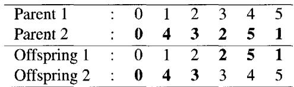  
Figure 6.2. One-point crossover.

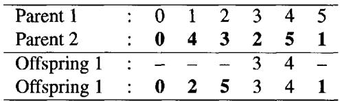  
Figure 6.3. Order crossover.

With respect to mutation, simple remove-and-reinsert (RAR) or swap operators have been devised that move one or two vertices to some other position on the string. In Figure 6.4, an RAR mutation is shown: vertex 2 is randomly selected and moved from position 3 to position 5. Note that a few vertices must be shifted accordingly. Other, more involved, mutation operators have also been devised, like inversion (Holland [35]).

Experience with genetic algorithms for solving combinatorial problems showed that the classical algorithmic framework, with mutation acting as a secondary operator to slightly perturb solutions, does not yield competitive results. Because of its general applicability, this framework does not exploit enough information about the problem to produce highquality solutions. To be effective, the genetic algorithm must be hybridized with a local search method, either a local descent (Braun [8], Davis [15], Muhlenbein, Gorges-Schleuter and Kramer [41], Suh and Gucht [61], and Ulder et al. [68]) or even a tabu search (Fleuren and Ferland [21]), specifically designed for the problem at hand. In this case, the local search method may be viewed as a powerful mutation operator integrated within the genetic algorithm and applied with some probability to each offspring. Alternatively, this approach may be viewed as a multistart local search method, with starting points obtained through a sampling of the search space provided by the genetic algorithm.

# 6.5.3 Application to the VRP

The literature on the development of genetic algorithms for solving the VRP is rather scant. This contrasts with the applications for the TSP (Potvin [48]) or more complex variants of the VRP with time windows (VRPTW) and precedence constraints (Blanton and Wainwright [7], Potvin and Bengio [49], Potvin, Duhamel, and Guertin [50], Thangiah [65], Thangiah [64], and Thangiah et al. [66]). In the first case, the abundance of research is related to the fact that the TSP is a well-known canonical problem, which provides a useful testbed for experimenting with new ideas. In the second case, the presence of complicating constraints, in particular time windows, has until recently hampered the development of effective problem-solving methods. Thus, there was clearly an opportunity for the GA to provide competitive results, given its relative robustness in the presence of complex constraints. In fact, some very effective implementations have been reported in the literature for the VRPTW (Potvin and Bengio [49], Thangiah [64]). The work done on the CVRP, including its distance or time-constrained variant, was mostly aimed at evaluating the impact of different components or parameters of a GA on the efficiency of the search. Van Breedam [70] compares a GA with previously developed simulated annealing and tabu search heuristics on different types of vehicle routing problems, including the CVRP. He also performs a statistical analysis of the impact of various parameters on solution quality for the genetic algorithm and simulated annealing. Given that a solution to a VRP is made of multiple routes (as opposed to the TSP), the path representation is extended and contains multiple copies of the depot, with each copy acting as a separator between two routes. For example, the string shown in Figure 6.5 would correspond to a VRP solution made of three routes: the first route contains vertices 1 and 2, the second route contains vertices 3 and 4, and the last route only contains vertex 5.

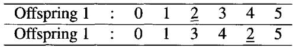  
Figure 6.4. RAR mutation.

A classical order-based crossover operator, known as PMX (Goldberg and Lingle [31]), and a RAR mutation operator are then adapted for this extended representation. At each iteration, these operators are applied until the required number of feasible offspring solutions is produced (infeasible offspring are discarded). Van Breedam also use a local descent operator based on four different types of exchange move and applies it only to the best solution in the current population. Using his own set of 15 test problems with 100 vertices, among which the first six are CVRPs, the author demonstrates that the local descent operator has a significant positive impact on the performance of the GA. Overall, the best solutions produced by the genetic algorithm, simulated annealing, and tabu search (all developed by Van Breedam) are of comparable quality. The genetic algorithm requires more computation time than the other two methods, but the author points out that "no attention has been paid to the efficiency of the code." No comparison is provided with other metaheuristics for the VRP reported in the literature, as the primary goal of this work was to evaluate the impact of different parameters on solution quality. Another GA application for the time-constrained CVRP may be found in Schmitt [58, 59]. An interesting feature of this work is that a route-first, cluster-second approach is used, thus allowing the classical path representation (without separators) to be used. That is, the strings manipulated by the GA correspond to megaroutes over all vertices. A solution to the VRP is then identified through a sweep procedure starting with the vertex in first position on the string. A route ends when either the capacity or the maximum route time constraint would be exceeded by including the next vertex. The latter vertex is then used to initiate a new route. Using this approach, each string can be decoded into a feasible solution to the problem. The implementation proposed by Schmitt [59] uses the OX crossover operator and a swap mutation operator, where two randomly selected vertices exchange their position. To improve the performance of the GA, this mutation operator is then replaced by a 2-opt local search method (Croes [14], Lin [39]), applied with a probability of 0.15 to each offspring. This GA was tested on the Christofides, Mingozzi, and Toth [11] test problems with mixed results: the GA proved better than the Clarke and Wright [12] heuristic but worse than simple construction heuristics combined with improvement procedures. In all cases, the GA was more computationally expensive than the competing methods. In Bean [5], an encoding scheme based on random keys was proposed to address sequencing problems. In this case, each element of the sequencing problem is tagged with a randomly generated key. Decoding these keys into a solution of the problem typically is accomplished through a sorting procedure. For the VRP, each customer is tagged with a random integer, which stands for the vehicle that will service the customer, plus a real number taken in the interval (0, 1). By sorting these keys, the sequence of customers on each vehicle route is obtained. This application of random keys for the VRP is provided only for illustrative purposes in Bean [5] and is not explored further. Based on these scarce results, it is fair to say that genetic algorithms are not yet competitive on the VRP, particularly in view of some recent tabu search developments. However, almost all research efforts with genetic algorithms have focused on the TSP or time window variants of the VRP. The successes obtained on the latter class of problems tend to indicate that more work on the VRP could lead to competitive implementations.

Figure 6.5. Representation of a VRP solution.   

<table><tr><td>String</td><td></td><td></td><td></td><td></td><td></td><td></td><td></td><td>5</td></tr><tr><td></td><td></td><td></td><td></td><td></td><td></td><td></td><td></td><td></td></tr></table>

# 6.6 Ant Algorithms

Ant systems methods are inspired from an analogy with real ant colonies foraging for food. In their search for food, ants mark the paths they travel by laying an aromatic essence called pheromone. The quantity of pheromone laid on a path depends on the length of the path and the quality of the food source. This pheromone provides information to other ants that are attracted to it. With time, paths leading to the more interesting food sources, i.e., those close to the nest and with large quantities of food, become more frequented and are marked with larger amounts of pheromone. Overall, this process leads to an efficient procedure for procuring food by ant colonies.

This observation led Colorni, Dorigo, and Maniezzo [13] to propose a new class of metaheuristics for solving combinatorial problems based on the following correspondences: Artificial ants searching the solution space simulate real ants exploring their environment, objective function values are associated with the quality of food sources, and values recorded in an adaptive memory mimic the pheromone trails.

To illustrate the basic principles of the approach, we briefly describe a simple AS for the TSP, the problem to which Colorni, Dorigo, and Maniezzo first applied their method. With each $( v _ { i } , v _ { j } )$ are associated two values: the visibility $n _ { i j }$ (the inverse of edge length), which is a static value, and the pheromone trail $\Gamma _ { i j }$ , which is updated dynamically as the algorithm proceeds. At each iteration, artificial ants starting from each vertex of the graph construct n new tours using a probabilistic nearest neighbor heuristic with a modified distance measure. This measure is derived from $n _ { i j }$ and $\Gamma _ { i j }$ to favor the selection of cities that are close and connected by edges with a high pheromone value. At the end of each iteration, trail values are updated by first allowing a fraction $( 1 - \rho )$ , where $0 \leq \rho \leq 1$ , of the old pheromone to evaporate and by then laying new pheromone on the edges of the tours built during this iteration. If edge $( v _ { i } , v _ { j } )$ was used by ant $k$ and the length of the tour constructed by this ant was $L _ { k }$ , the pheromone trail is increased by $\Delta _ { i j } ^ { k } = 1 / L _ { k }$ . The trail value for edge $( v _ { i } , v _ { j } )$ is thus updated as follows:

$$
\Gamma _ { i j } : = \rho \Gamma _ { i j } + \sum _ { k = 1 } ^ { N } \Delta _ { i j } ^ { k } ,
$$

where $N$ is the number of ants. This process of tour construction and trail update is repeated for a fixed number of iterations. It is important to note the role of the evaporation parameter $( 1 - \rho )$ that prevents poor solutions obtained in early iterations from conditioning the search too strongly at later stages of the algorithm.

The method was refined by the addition of several features on applications such as the symmetric and asymmetric TSP (Dorigo, Maniezzo, and Colorni [17], Dorigo and Gambardella [16]). A general conclusion can be drawn from these papers that while the method can sometimes produce excellent results, it cannot usually compete with other metaheuristics or specialized local search heuristics, unless it is hybridized one way or another with a local optimizer.

So far, only three papers have dealt with the application of ant systems to the VRP. In the first one, Kawamura et al. [37] proposed a complex hybrid variant of AS that involves 2-opt improvement procedures and probabilistic acceptance rules reminiscent of simulated annealing. The method was applied to two geometric 30- and 60-customer instances and it identified the optimal solution in both cases. No other tests were performed, which makes it difficult to assess the effectiveness of this procedure. The other two papers are by Bullnheimer, Hartl, and Strauss [9, 10]. In their first paper, the authors developed a hybrid ant systems in which each vehicle route produced in a given iteration is improved by the 2-opt heuristic before trail update. This algorithm also uses terms related to vehicle capacity and distance savings with respect to the depot when selecting the next vertex to be visited. In the trail update step, they use a number of "elitist ants" to account for the best solution found so far (these ants are assumed to always travel on this best solution). Their computational experiments on the 14 problems of Christofides, Mingozzi, and Toth [11] indicate that the addition of a 2-opt step and the use of elitist ants are clearly beneficial. The best results obtained over 30 distinct runs range from 0 to $1 4 . 0 9 \%$ above the best known solutions to the problems with an average error of $4 . 4 3 \%$ (see Table 6.4).

In their second paper, the authors refined their algorithm in several ways: (a) the capacity term previously used in the vertex selection rule, which was quite expensive to compute, is dropped, and the saving term is incorporated directly in the visibility term in a parametric fashion, (b) Only the $\lfloor n / 4 \rfloor$ nearest neighbors of any vertex are considered when choosing the next customer to visit, (c) Only the five best solutions found in each iteration are used for trail update, and the pheromone quantity laid is further weighted according to the solution's rank. These various changes have led to shorter run times and improved solutions. The computational results obtained on the 14 benchmark problems are quite good with an average error of only $1 . 5 1 \%$ above the best known solutions (see Table 6.4) and CPU times that are very reasonable.

Overall, these results are quite encouraging considering the very limited experience with the application of ant systems to the VRP. If one recalls the improvements obtained by later implementations of other metaheuristics, it seems reasonable to expect future ant systems implementations to be more competitive.

Table 6.4. Computational results for the ant systems algorithms.   

<table><tr><td rowspan="2"></td><td colspan="2">Hybrid ant systems</td><td colspan="2">Improved</td><td rowspan="2">Best known solution value</td></tr><tr><td>f*1</td><td>Time2</td><td>f*</td><td>Time2</td></tr><tr><td>Problem E051-05e</td><td>524.61</td><td>0.6</td><td>524.61</td><td>0.1</td><td>524.61</td></tr><tr><td>E076-10e</td><td>870.8</td><td>2.4</td><td>844.31</td><td>1.3</td><td>835.26</td></tr><tr><td>E101-08e</td><td>879.43</td><td>11.3</td><td>832.32</td><td>3.8</td><td>826.14</td></tr><tr><td>E101-10c</td><td>819.96</td><td>10.1</td><td>819.56</td><td>5.0</td><td>819.56</td></tr><tr><td>E121-07c</td><td>1072.45</td><td>16.2</td><td>1065.21</td><td>9.2</td><td>1042.11</td></tr><tr><td>E151-12c</td><td>1147.41</td><td>28.5</td><td>1061.55</td><td>18.4</td><td>1028.42</td></tr><tr><td>E200-17c</td><td>1473.40</td><td>82.2</td><td>1343.46</td><td>87.6</td><td>1291.45</td></tr><tr><td>D051-06c</td><td>562.93</td><td>0.2</td><td>560.24</td><td>0.1</td><td>555.43</td></tr><tr><td>D076-11c</td><td>948.16</td><td>3.5</td><td>916.21</td><td>1.7</td><td>909.68</td></tr><tr><td>D101-09c</td><td>886.17</td><td>7.3</td><td>866.74</td><td>4.8</td><td>865.94</td></tr><tr><td>D101-11c</td><td>869.86</td><td>3.1</td><td>867.07</td><td>5.8</td><td>866.37</td></tr><tr><td>D121-11c</td><td>1590.52</td><td>4.3</td><td>1559.92</td><td>11.0</td><td>1541.14</td></tr><tr><td>D151-14c</td><td>1202.01</td><td>26.6</td><td>1195.99</td><td>27.5</td><td>1162.55</td></tr><tr><td>D200-18C</td><td>1504.79</td><td>57.3</td><td>1451.65</td><td>81.8</td><td>1395.85</td></tr></table>

'Best value over 30 runs. 2 Minutes on a Pentium 100.

# 6.7 Neural Networks

Neural networks are computational models composed of units that are richly interconnected through weighted connections, like neurons in the human brain: a signal is sent from one unit to another along a connection and is modulated through the associated weight. Although superficially related to their biological counterpart, artificial neural networks exhibit characteristics related to human cognition. In particular, they can learn from experience and induce general concepts from specific examples through an incremental adjustment of their weights. These models were originally designed for tasks associated with human intelligence and where traditional computation has proven inadequate, like artificial vision and speech understanding. More recently, they have been applied to combinatorial problems as well, starting with the pioneering work of Hopfield and Tank [36]. The TSP,in particular, has been the subject of many investigations with the Hopfield-Tank model, the elastic net (EN) (Durbin and Willshaw [20]), and the self-organizing map (SOM) (Kohonen [38]). The EN and SOM models are quite remote from classical neural networks, but they have proved to be more effective on the TSP than the (more classical) Hopfield-Tank model. However, neither of these methods is yet competitive with other metaheuristics (Potvin [47]).

The elastic net and self-organizing maps are deformable templates that adjust themselves to the contour of the vertices to solve a TSP, as illustrated in Figure 6.6. The white circles are vertices and the small black circles are units of the model. These units are linked to form a ring. Starting from some arbitrary configuration, the location of each unit on the ring is incrementally adjusted (like the connection weights of classical neural network models), until at least one unit becomes sufficiently close to each vertex. At the end, each vertex is assigned to the closest unit. Through this assignment, the ordering of the units along the ring determines an ordering of the vertices on the TSP tour. EN and SOM work similarly, but they differ in the mechanisms used to control the migration of units toward the vertices.

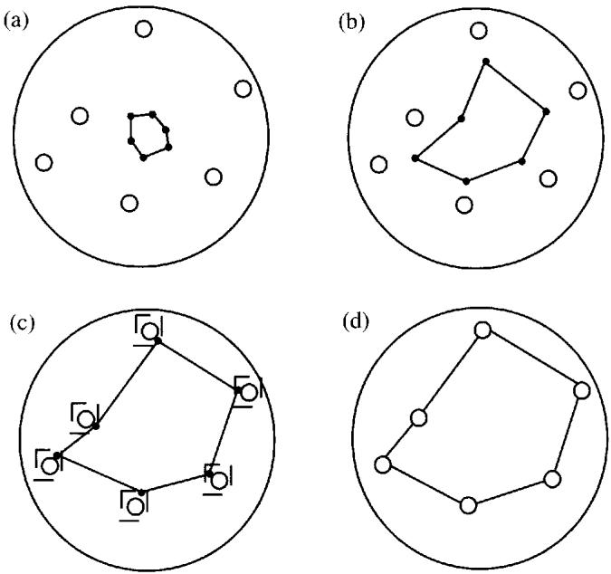  
Figure 6.6. Evolution of a deformable template in (a), (b), (c), and the final solution (d).

Deformable templates can be easily applied to pure geometric problems, like Euclidean TSPs. However, they are not designed to handle additional constraints, like capacity and maximum route time constraints, which often break the geometric nature of the problem. Only a few recent efforts have been devoted to the VRP, mostly based on variants of the SOM (Ghaziri [25], Ghaziri [26], Ghaziri [27], Matsuyama [40], and Schumann and Retzko [60]). A generalization of these models from the TSP to the VRP is obtained by using many deformable templates, one for each route. Typically, the models are applied with an increasing number of rings (routes) until a feasible solution is identified. Because multiple rings are now present, a competition takes place among the rings to get an equal share of vertices. The procedure suggested by Ghaziri [26] for the CVRP may be summarized as follows:

Step 1 (ring competition and migration). Repeat until there is a unit sufficiently close to each vertex: 1.1 Consider the next vertex (wrap around when the last vertex has been done) and set it as the current vertex. 1.2 Associate a selection probability with each ring. 1.3 Select a ring according to the probability distribution defined in step 1.2. 1.4 Tentatively assign the current vertex to the closest unit on the selected ring and move this unit (as well as some of its neighbors on the ring) toward the current vertex.

Step 2 (vertex assignment). Permanently assign each vertex to the closest unit to produce a solution.

The probability associated with each ring is dynamically adjusted as the algorithm unfolds. At the start, the distance between the current vertex and the closest unit on the ring plays the dominant role. Later on, the capacity constraint is taken into account, as rings that cannot accommodate the current vertex without violating this constraint (due to the tentatively assigned vertices) becomes less likely to be selected. At the end, only feasible rings have a nonnegligible probability of being selected. In a later study, Ghaziri [27] extended this model to address the VRP with maximum route time constraints through a modification of the probability distribution over the rings. Computational results on the Christofides, Mingozzi, and Toth [11] test set have shown that these models produce solutions of relatively good quality but are not competitive with alternative metaheuristics, in particular tabu search (Gendreau, Hertz, and Laporte [23] and Rochat and Taillard [56]).

# 6.8 Conclusions

This survey of metaheuristics for the VRP shows that the best of these methods can find excellent and sometimes optimal solutions to instances with a few hundred customers, albeit at a significant cost in computation time. Tabu search now emerges as the most effective approach. Procedures based on pure genetic algorithms and on neural networks are clearly outperformed, while those based on simulated or deterministic annealing and on ant systems are not quite competitive. Considering the performance improvements obtained with successive implementations of any given approach, it appears, however, that hybrid ant systems and genetic algorithms may, in the future, be able to match the effectiveness of existing tabu search heuristics, since these approaches have not been fully exploited. Another observation is that the data sets currently used as benchmarks are made up of instances that are too small to allow one to differentiate sharply between the various implementations of some of the metaheuristics, tabu search in particular. Data sets corresponding to larger instances are thus required. In the same vein, one may wonder how these metaheuristics would perform on the much larger instances often encountered in practical applications. Given their computing requirements, heuristics with such a level of sophistication may be unable to solve satisfactorily these large instances in any reasonable amount of time, especially if real-time applications are contemplated. With respect to the classical heuristics presented in Chapter 5, metaheuristics are rather time consuming, but they also provide much better solutions. Typically, classical methods yield solution values between $2 \%$ and $10 \%$ above the optimum (or the best known solution value), while the corresponding figure for the best metaheuristic implementation is often less than $0 . 5 \%$ . This is illustrated in Figure 6.7. It is time to develop simpler methods capable of quickly providing good quality solutions. This will probably be achieved by speeding up the best available metaheuristics, rather than investing more effort on classical approaches. The GTS algorithm proposed by Toth and Vigo is an important step in the right direction. It draws from the vast expertise accumulated in the field of metaheuristics and exploits some of their best concepts. Yet, by carefully exploiting the problem structure, it manages to avoid most of the unnecessary computations carried out in previous tabu search algorithms.

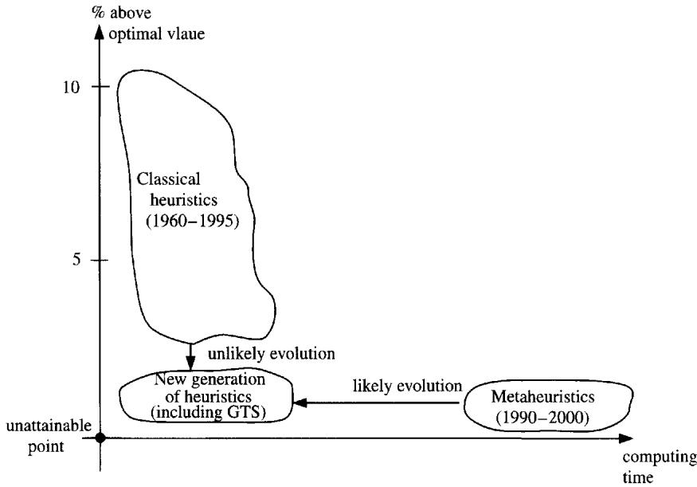  
Figure 6.7. Evolution of heuristics for the VRP.

# Bibliography

[1] E.H.L. Aarts and J.K. Lenstra. Local Search in Combinatorial Optimization. Wiley, Chichester, UK, 1997.

[2] A.S. Alfa, S.S. Heragu, and M. Chen. A 3-opt based simulated annealing algorithm for vehicle routing problems. Computers & Industrial Engineering, 21:635-639, 1991.

[3] G. Barbarosoglu and D. Ozgur. A tabu search algorithm for the vehicle routing problem. Computers and Operations Research, 26:255-270, 1999.

[4] R.S. Barr, B.L. Golden, J.P. Kelly, M.G.C. Resende, and W.R. Stewart, Jr. Designing and reporting on computational experiments with heuristic methods. Journal of Heuristics, 1:9-32, 1995.

[5] J.C. Bean. Genetic algorithms and random keys for sequencing and optimization. ORSA Journal on Computing, 6:154-160, 1994.

[6] J.E. Beasley. Route-first cluster-second methods for vehicle routing. Omega, 11:403- 408, 1983.

[7] J.L. Blanton and R.L. Wainwright. Multiple vehicle routing with time and capacity constraints using genetic algorithms. In S. Forrest, editor, Proceedings of the Fifth

International Conference on Genetic Algorithms, Morgan Kaufmann, San Mateo, CA, 1993, pp. 452^59.

[8] H. Braun. On solving travelling salesman problems by genetic algorithms. In H.P. Schwefel and R. Manner, editors, Parallel Problem-Solving from Nature, SpringerVerlag, Berlin, 1991, pp. 129-133.

[9] B. Bullnheimer, R.F. Hartl, and C. Strauss. Applying the ant system to the vehicle routing problem. In S. Voss, S. Martello, I.H. Osman, and C. Roucairol, editors, Meta-Heuristics: Advances and Trends in Local Search Paradigms for Optimization, Kluwer, Boston, MA, 1998, pp. 109-120.

[10] B. Bullnheimer, R.F. Hartl, and C. Strauss. An improved ant system for the vehicle routing problem. Annals of Operations Research, 89:319-328, 1999.

[11] N. Christofides, A. Mingozzi, and P. Toth. The vehicle routing problem. In N. Christofides, A. Mingozzi, P. Toth, and C. Sandi, editors, Combinatorial Optimization, Wiley, Chichester, UK, 1979, pp. 315-338.

[12] G. Clarke and J.V. Wright. Scheduling of vehicles from a central depot to a number of delivery points. Operations Research, 12:568-581, 1964.

[13] A. Colorni, M. Dorigo, and V. Maniezzo. Distributed optimization by ant colonies. In F. Varela and P. Bourgine, editors, Proceedings of the European Conference on Artificial Life, Elsevier, Amsterdam, 1991.

[14] G. Croes. A method for solving traveling salesman problems. Operations Research, 6:791-812, 1958.

[15] L. Davis. Handbook of Genetic Algorithms. Van Nostrand Reinhold, New York, 1991.

[16] M. Dorigo and L.M. Gambardella. Ant colony system: A cooperative learning approach for the traveling salesman problem. IEEE Transactions on Evolutionary Computation, 1:53-66, 1997.

[17] M. Dorigo, V. Maniezzo, and A. Colorni. Ant system: Optimization by a colony of cooperating agents. IEEE Transactions on Systems, Man and Cybernetics Part B, 26:29-41, 1996.

[18] G. Dueck. New optimization heuristics: The great deluge algorithm and the recordto-record travel. Journal of Computational Physics, 104:86-92, 1993.

[19] G. Dueck and T. Scheurer. Threshold accepting: A general purpose optimization algorithm. Journal of'Computational Physics, 90:161-1'}'5, 1990.

[20] R. Durbin and D. Willshaw. An analogue approach to the travelling salesman problem using an elastic net method. Nature, 326:689-691, 1987.

[21] C. Fleurent and J.A. Ferland. Genetic and hybrid algorithms for graph colouring. Annals of Operations Research, 63:437^61, 1996.

[22] M. Gendreau, A. Hertz, and G. Laporte. New insertion and postoptimization procedures for the traveling salesman problem. Operations Research, 40:1086-1094, 1992.

[23] M. Gendreau, A. Hertz, and G. Laporte. A tabu search heuristic for the vehicle routing problem. Management Science, 40:1276-1290, 1994.

[24] M. Gendreau, G. Laporte, and J.-Y. Potvin. Vehicle routing: Modern heuristics. I E.H.L. Aarts and J.K. Lenstra, editors, Local Search in Combinatorial Optimization, Wiley, Chichester, UK, 1997, pp. 311-336.

[25] H. Ghaziri. Solving routing problems by a self-organizing map. In T. Kohonen, K. Makisara, O. Simula, and J. Kangas, editors, Artificial Neural Networks, NorthHolland, Amsterdam, 1991, pp. 829-834.

[26] H. Ghaziri. Algorithmes connexionnistes pour 1'optimisation combinatoire. These de doctoral, Ecole Fob/technique Federate de Lausanne, Switzerland, 1993.

[27] H. Ghaziri. Supervision in the self-organizing feature map: Application to the vehicle routing problem. In I.H. Osman and J.P. Kelly, editors, Meta-Heuristics: Theory and Applications, Kluwer, Boston, MA, 1996, pp. 651-660.

[28] F. Glover and M. Laguna. Tabu search. In C.R. Reeves, editor, Modern Heuristic Techniques for Combinatorial Problems, Blackwell, Oxford, UK, 1993, pp. 70-150.

[29] F. Glover and M. Laguna. Tabu Search. Kluwer, Boston, MA, 1997.

[30] D.E. Goldberg. Genetic Algorithms in Search, Optimization and Machine Learning. Addison-Wesley, Reading, MA, 1989.

[31] D.E. Goldberg and R. Lingle. Alleles, loci and the traveling salesman problem. In J.J. Grefenstette, editor, Proceedings of the First International Conference on Genetic Algorithms, Lawrence Erlbaum, Hillsdale, NJ, 1985, pp. 154-159.

[32] B.L. Golden, E.A. Wasil, J.P. Kelly, and I.M. Chao. Metaheuristics in vehicle routing. In T.G Crainic and G. Laporte, editors, Fleet Management and Logistics, Kluwer, Boston, MA, 1998, pp. 33-56.

[33] E. Hadjiconstantinou, N. Christofides, and A. Mingozzi. A new exact algorithm for the vehicle routing problem based on $q$ -paths and $k$ -shortest paths relaxations. Annals of Operations Research, 61:21^3, 1995.

[34] A. Hertz, E.D. Taillard, and D. De Werra. Tabu search. In E.H.L. Aarts and J.K. Lenstra, editors, Local Search in Combinatorial Optimization, Wiley, Chichester, UK, 1997, pp. 121-136.

[35] J.H. Holland. Adaptation in Natural and Artificial Systems. The University of Michiga Press, Ann Arbor, MI, 1975.

[36] J.J. Hopfield and D.W. Tank. Neural computation of decisions in optimization prob lems. Biological Cybernetics, 52:141-152, 1985.

[37] H. Kawamura, M. Yamamoto, T. Mitamura, K. Suzuki, and A. Ohuchi. Cooperative search on pheromone communication for vehicle routing problems. IEEE Transactions on Fundamentals, E81-A: 1089-1096, 1998.

[38] T. Kohonen. Self-Organization and Associative Memory. Springer, Berlin, 1988.

[39] S. Lin. Computer solutions of the traveling salesman problem. Bell System Technical Journal, 44:2245-2269, 1965.

[40] Y. Matsuyama. Self-organization via competition, cooperation and categorization applied to extended vehicle routing problems. In Proceedings of the International Joint Conference on Neural Networks, Seattle, WA, 1991, pp. 385-390,

[41] H. Mulhenbein, M. Gorges-Schleuter, and O. Kramer. Evolution algorithms in combinatorial optimization. Parallel Computing, 7:65-85, 1988.

[42] I.M. Oliver, D.J. Smith, and J.R.C. Holland. A study of permutation crossover operators on the traveling salesman problem. In J.J. Grefenstette, editor, Proceedings of the Second International Conference on Genetic Algorithms, Lawrence Erlbaum, Hillsdale, NJ, 1987, pp. 224-230.

[43] I.H. Osman. Metastrategy simulated annealing and tabu search algorithms for the vehicle routing problem. Annals of Operations Research, 41:421-451, 1993.

[44] I.H. Osman and J.P. Kelly. Meta-heuristics: An overview. In I.H. Osman and J.P. Kelly, editors, Meta-Heuristics: Theory and Applications, Kluwer, Boston, MA, 1996, pp. 1 21.

[45] I.H. Osman and G. Laporte. Metaheuristics: A bibliography. Annals of Operations Research, 63:513-628, 1996.

[46] M. Pirlot. General local search heuristics in combinatorial optimization: A tutorial. Belgian Journal of Operations Research, Statistics and Computer Science, 32:8-67, 1992.

[47] J.-Y. Potvin. The traveling salesman problem: A neural network perspective. ORSA Journal on Computing, 5:328-348, 1993.

[48] J.-Y. Potvin. Genetic algorithms for the traveling salesman problem. Annals of Operations Research, 63:339-370, 1996.

[49] J.-Y. Potvin and S. Bengio. The vehicle routing problem with time windows Part II: Genetic search. INFORMS Journal on Computing, 8:165-172, 1996.

[50] J.-Y. Potvin, C. Duhamel, and F. Guertin. A genetic algorithm for vehicle routing with backhauling. Applied Intelligence, 6:345-355, 1996.

[51] V.M. Pureza and P.M. Fran£a. Vehicle routing problems via tabu search metaheuristic. Technical Report CRT-347, Centre for Research on Transportation, Montreal, Canada, 1991.

[52] C.R. Reeves, editor. Modern Heuristic Techniques for Combinatorial Problems, Blackwell, Oxford, UK, 1993.

[53] C. Rego. A subpath ejection method for the vehicle routing problem. Management Science, 44:1447-1459, 1998.

[54] C. Rego and C. Roucairol. A parallel tabu search algorithm using ejection chains for the vehicle routing problem. In I.H. Osman and J.P. Kelly, editors, Meta-Heuristics: Theory and Applications, Kluwer, Boston, MA, 1996, pp. 661-675.

[55] F. Robuste, C.F. Daganzo, and R. Souleyrette. Implementing vehicle routing models. Transportation Research B, 24:263-286, 1990.

[56] Y. Rochat and E.D. Taillard. Probabilistic diversification and intensification in local search for vehicle routing. Journal of Heuristics, 1:147-167, 1995.

[57] D.E. Rumelhart and J.L. McClelland, editors. Parallel Distributed Processing: Explorations in the Micro structure of Cognition, MIT Press, Cambridge, MA, 1986.

[58] LJ. Schmitt. An empirical computational study of genetic algorithms to solve order based problems: An emphasis on TSP and VRPTC. Ph.D. dissertation, Fogelman College of Business and Economics, University of Memphis, TN, 1994.

[59] L.J. Schmitt. An evaluation of a genetic algorithmic approach to the vehicle routing problem. Working paper, Department of Information Technology Management, Christian Brothers University, Memphis, TN, 1995.

[60] M. Schumann and R. Retzko. Self-organizing maps for vehicle routing problems— minimizing an explicit cost function. In F. Fogelman-Soulie, editor, Proceedings of the International Conference on Artificial Neural Networks, Paris, 1995, pp. 401^406.

[61] J.Y. Suh and D.V. Gucht. Incorporating heuristic information into genetic search. In J.J, Grefenstette, editor, Proceedings of the Second International Conference on Genetic Algorithms, Lawrence Erlbaum, Hillsdale, NJ, 1987, pp. 100-107.

[62] E.D. Taillard. Parallel iterative search methods for vehicle routing problems. Networks, 23:661-673, 1993.

[63] E.D. Taillard, L.M. Gambardella, M. Gendreau, and J.-Y. Potvin. Adaptive memory programming: A unified view of metaheuristics. Research Report IDSIA/19-98, IDSIA, Lugano, Switzerland, 1998.

[64] S.R. Thangiah. Vehicle routing with time windows using genetic algorithms. Technical Report SRU-CpSc-TR-93-23, Slippery Rock University, Slippery Rock, PA, 1993.

[65] S.R. Thangiah. An adaptive clustering method using a geometric shape for vehicle routing problems with time windows. In L.J. Eshelman, editor, Proceedings of the Sixth International Conference on Genetic Algorithms, Morgan Kaufmann, San Mateo, CA, 1995, pp. 536-543.

[66] S.R. Thangiah, I.H. Osman, R. Vinayagamoorthy, and T. Sun. Algorithms for the vehicle routing problem with time deadlines. American Journal of Mathematical and Management Sciences, 13:323-355, 1993.   
[67] P. Tom and D. Vigo. The granular tabu search and its application to the vehicle routing problem. INFORMS Journal on Computing, 15:333-346, 2003.   
[68] N.L.J. Ulder, E.H.L. Aarts, H.J. Bandelt, P.J.M. van Laarhoven, and E. Pesch. Genetic local search algorithms for the traveling salesman problem. In H.P. Schwefel and R. Manner, editors, Parallel Problem-Solving from Nature, Springer-Verlag, Berlin, 1991, pp. 109-116.   
[69] A. Van Breedam. Improvement heuristics for the vehicle routing problem based on simulated annealing. European Journal of Operational Research, 86:480-490, 1995.   
[70] A. Van Breedam. An analysis of the effect of local improvement operators in genetic algorithms and simulated annealing for the vehicle routing problem. RUCA Working Paper 96/14, University of Antwerp, Belgium, 1996.   
[71] P.J.M. Van Laarhoven and E.H.L. Aarts. Simulated Annealing: Theory and Applications, Reidel, Dordrecht, 1987.   
[72] A. Volgenant and R. Jonker. The symmetric traveling salesman problem and edge exchange in minimal 1-trees. European Journal of Operational Research, 12:394— 403, 1983.   
[73] P.D. Wasserman. Neural Computing—Theory and Practice. Van Nostrand Reinhold, New York, 1989.   
[74] D. Whitley, T. Starkweather, and D. Fuquay. Scheduling problems and traveling salesmen: The genetic edge recombination operator. In J.D. Schaffer, editor, Proceedings of the Third International Conference on Genetic Algorithms, Morgan Kaufmann, San Mateo, CA, 1989, pp. 133-140.   
[75] J.A.G. Willard. Vehicle routing using $r$ -optimal tabu search. M.sc. dissertation, The Management School, Imperial College, London, 1989.   
[76] J. Xu and J.P. Kelly. A network flow-based tabu search heuristic for the vehicle routing problem. Transportation Science, 30:379-393, 1996.

# Part II

# Important Variants of the Vehicle Routing Problem

# Chapter 7

# VRP with Time Windows

Jean-Francois Cordeau Guy Desaulniers Jacques Desrosiers Marius M. Solomon Francois Soumis

# 7.1 Introduction

The VRP with Time Windows (VRPTW) is the extension of the CVRP where the service at each customer must start within an associated time window and the vehicle must remain at the customer location during service. Soft time windows can be violated at a cost, while hard time windows do not allow for a vehicle to arrive at a customer after the latest time to begin service. In the latter case, if it arrives before the customer is ready to begin service, it waits. We will concentrate on hard time window scenarios, for which research has flourished over the last two decades.

As mentioned in Chapter 1, the VRPTW is NP-hard. Indeed, even finding a feasible solution to the VRPTW with a fixed fleet size is itself an NP-complete problem (Savelsbergh [77]). Hence, the early work on the VRPTW was case study oriented (Pullen and Webb [73], Knight and Hofer [56], Madsen [65]). Later research shifted focus to the design of heuristics able to solve realistic-size problems and the development of effective optimal approaches.

This chapter is organized as follows. The first section presents a multicommodity network flow formulation with time and capacity constraints for the VRPTW. Approximation methods proposed in the literature to derive upper bounds are then reviewed in section 7.3. Section 7.4 explains how lower bounds can be obtained using optimal approaches, namely, Lagrangian relaxation and column generation. Next, section 7.5 provides branching and cutting strategies that can be embedded within these optimal approaches to produce integer solutions through a branch-and-bound scheme. Then, sections 7.6 and 7.7 present special cases and extensions to the VRPTW, respectively. We review computational experience with leading algorithms in section 7.8. Finally, conclusions are drawn in section 7.9.

# 7.2 Problem Formulation

Starting from the notation given in Chapter 1, the VRPTW is defined on the network $G =$ $( V , A )$ , where the depot is represented by the two nodes 0 and $n + 1$ . All feasible vehicle routes correspond to paths in $G$ that start from node 0 and end at nod $n + 1$ 1 . A time windo is also associated with nodes 0 and $n + 1$ , i.e., $[ a _ { 0 } , b _ { 0 } ] = [ a _ { n + 1 } , b _ { n + 1 } ] = [ E , L ]$ , where $E$ and $L$ represent the earliest possible departure from the depot and the latest possible arrival at the depot, respectively. Moreover, zero demands and service times are defined for these two nodes, that is, $d _ { 0 } = d _ { n + 1 } = s _ { 0 } = s _ { n + 1 } = 0$ . Feasible solutions exist only if $\begin{array} { r } { { a } _ { 0 } = E \le { \mathrm { m i n } } _ { i \in V \backslash \{ 0 \} } b _ { i } - t _ { 0 i } } \end{array}$ and $\begin{array} { r } { b _ { n + 1 } = L \geq \operatorname* { m i n } _ { i \in V \backslash \{ 0 \} } a _ { i } + s _ { i } + t _ { i 0 } } \end{array}$ - Note also that an arc $( i , j ) \in A$ can be eliminated due to temporal considerations, if $a _ { i } + s _ { i } + t _ { i j } > b _ { j }$ , or to capacity limitations, if $d _ { i } + d _ { j } \ > \ C$ , or to other factors. Finally, let us mention that when vehicles are allowed to remain at the depot, especially in the case where the primary objective consists of minimizing the number of vehicles used, the arc $( 0 , n + 1 )$ with $c _ { 0 , n + 1 } = t _ { 0 , n + 1 } = 0$ must be added to the arc set A.

We next present a mathematical programming formulation for the VRPTW involving two types of variables: flow variables $x _ { i j k } , ( i , j ) \in A , k \in K$ , equal to 1 if arc $( i , j )$ is used by vehicle $k$ and 0 otherwise, and time variable $\mathfrak { s } \ w _ { i k } , i \in V , k \in K$ , specifying the start of service at node $_ i$ when serviced by vehicle $k$ .

# 7.2.1 Formulation

The VRPTW can then be formally described as the following multicommodity network flow model with time window and capacity constraints:

$$
\mathbf { ( V R P T W ) } \ \operatorname* { m i n } \ \sum _ { k \in K } \ \sum _ { ( i , j ) \in A } c _ { i j } x _ { i j k }
$$

subject to

$$
\sum _ { k \in K } \sum _ { j \in \Delta ^ { + } ( i ) } x _ { i j k } = 1 \qquad \forall i \in N ,
$$

$$
\sum _ { j \in \Delta ^ { + } ( 0 ) } x _ { 0 j k } = 1 \qquad \forall k \in K ,
$$

$$
\sum _ { i \in \Delta ^ { - } ( j ) } x _ { i j k } - \sum _ { i \in \Delta ^ { + } ( j ) } x _ { j i k } = 0 \qquad \forall k \in K , \ j \in N ,
$$

$$
\sum _ { i \in \Delta ^ { - } ( n + 1 ) } x _ { i , n + 1 , k } = \mathbf { 1 } \qquad \forall k \in K ,
$$

$$
x _ { i j k } ( w _ { i k } + s _ { i } + t _ { i j } - w _ { j k } ) \leq 0 \qquad \forall k \in K , ( i , j ) \in A ,
$$

$$
\begin{array} { r l } & { E \le w _ { i k } \le L \qquad \forall k \in K , \ i \in \{ 0 , n + 1 \} , } \\ & { \displaystyle \sum _ { i \in N } d _ { i } \displaystyle \sum _ { j \in \Delta ^ { + } ( i ) } x _ { i j k } \le C \qquad \forall k \in K , } \\ & { x _ { i j k } \ge 0 \qquad \forall k \in K , \ ( i , j ) \in A , } \\ & { x _ { i j k } \in \{ 0 , 1 \} \qquad \forall k \in K , \ ( i , j ) \in A . } \end{array}
$$

The objective function (7.1) of this nonlinear formulation expresses the total cost. Given that $N = V \setminus \{ 0 , n + 1 \}$ represents the set of customers, constraints (7.2) restric the assignment of each customer to exactly one vehicle route. Next, constraints (7.3)-(7.5) characterize the flow on the path to be followed by vehicle $k$ . Additionally, constraints (7.6)- (7.8) and (7.9) guarantee schedule feasibility with respect to time considerations and capacity aspects, respectively. Note that for a given $k$ , constraints (7.7) force $w _ { i k } = 0$ whenever customer $i$ is not visited by vehicle $k$ . Finally, conditions (7.1 1) impose binary conditions on the flow variables.

The binary conditions (7.1 1) allow constraints (7.6) to be linearized as

$$
w _ { i k } + s _ { i } + t _ { i j } - w _ { j k } \leq \left( 1 - x _ { i j k } \right) M _ { i j } \qquad \forall k \in K , ( i , j ) \in A ,
$$

where $M _ { i j }$ are large constants. Furthermore, $M _ { i j }$ can be replaced by $\operatorname* { m a x } \left\{ b _ { i } + s _ { i } + t _ { i j } - a _ { j } , 0 \right\}$ . $( i , j ) \in A$ , and constraints (7.6) or (7.6a) need only be enforced for arcs $( i , j ) \in A$ such that $M _ { i j } > 0$ ; otherwise, when max $\left\{ b _ { i } + s _ { i } + t _ { i j } - a _ { j } , 0 \right\} = 0 .$ , these constraints are satisfied for all values of $w _ { i k } , w _ { j k }$ and $x _ { i j k }$ -

# 7.2.2 Network Lower Bound

The network lower bound can be derived by relaxing the time and capacity constraints (7.6)- (7.9). Generally, the bound deteriorates as time window width increases or as capacity constraints become tighter. This bound is often of poor quality, as there is usually an integrality gap with respect to the number of vehicles. Note, however, that if the latter constraints are not binding and if $a _ { i } \ = \ b _ { i }$ for all $i \in N$ we obtain the fixed schedule problem for which the network lower bound is optimal.

# 7.2.3 Linear Programming Lower Bound

The linear programming lower bound is obtained as the solution to the linear program using constraints (7.6a) in place of (7.6) and with the binary requirements (7.11) omitted. This is the above network flow problem with the additional time and capacity constraints. Nevertheless, in many cases, this bound is no better than the network relaxation bound. This is because it is relatively easy to obtain a fractional near-optimal linear programming solution to problem (7.1)-(7.10) for which the time constraints are inactive. To see this, set the time variables at the center of their respective time windows, i.e., $w _ { i k } = ( a _ { i } + b _ { i } ) / 2$ , $i \in N , k \in K$ . Then, constraints (7.6a) are satisfied if for all $( i , j ) \in A$ and $k \in K$

$$
\left( \frac { a _ { i } + b _ { i } } { 2 } \right) + s _ { i } + t _ { i j } - \left( \frac { a _ { j } + b _ { j } } { 2 } \right) \leq ( 1 - x _ { i j k } ) ( b _ { i } + s _ { i } + t _ { i j } - a _ { j } ) .
$$

Since any existing arc $( i , j ) \in A$ satisfies $a _ { i } + s _ { i } + t _ { i j } - b _ { j } \leq 0$ , and constraints (7.6a) are only defined for arcs $( i , j )$ such that $b _ { i } + s _ { i } + t _ { i j } - a _ { j } > 0$ , the previous constraint set can be rewritten as

$$
x _ { i j k } \leq { \frac { 1 } { 2 } } \left( 1 + { \frac { b _ { j } - a _ { i } - s _ { i } - t _ { i j } } { b _ { i } + s _ { i } + t _ { i j } - a _ { j } } } \right) \qquad \forall k \in K , ( i , j ) \in A .
$$

In the above inequality, the right-hand side is greater than or equal to $\frac { 1 } { 2 }$ . Therefore, (7.6a) is always satisfied if $\begin{array} { r } { x _ { i j k } \le \frac 1 2 } \end{array}$ for al $( i , j ) \in A , k \in K$ £, such th $b _ { i } + s _ { i } + t _ { i j } - a _ { j } > 0$ A similar argument can be used for the capacity constraints.

# 7.2.4 Algorithms

Much stronger lower bounds can be derived by decomposing the VRPTW model into intelligently selected blocks and using these in the solution process. This requires an extensive effort and is the subject of section 7.4. In the next section, we focus on the derivation of upper bounds through approximate methods. Virtually all methods to be described in these two sections conduct some form of preprocessing. This involves reducing time window width and eliminating infeasible arcs. These processes are described at length by Desrosiers et al. [35].

# 7.3 Upper Bounds: Heuristic Approaches

Given the inherent computational difficulty of the VRPTW, a variety of heuristics have been reported in the literature, mostly for the hard time window version. In this section, we review some of these approximation methods.

# 7.3.1 Route Construction

Route construction algorithms build a feasible solution by inserting at every iteration an unrouted customer into a current partial route. This process is performed either sequentially, one route at a time, or in parallel, where several routes are considered simultaneously. Two key questions are posed in the design of such methods: Which customer to select next for insertion? Where will it be inserted? To address these questions, researchers have considered criteria involving the minimum additional distance and time, maximum savings, and others.

Sequential insertion heuristics were proposed by Solomon [83]. His extensive computational results highlighted a two-phase insertion algorithm. In the first phase, each unrouted customer is assigned its best feasible insertion position based on the minimum additional distance and time required. In the second, the method selects the customer to insert using a maximum savings concept. Solomon [82] also showed that the worst-case ratio of this and many other approximation methods on $_ n$ -customer problems is of at least order n. A parallel variant of the above insertion procedure was suggested by Potvin and Rousseau [71].

# 7.3.2 Route Improvement

Route improvement methods iteratively modify the current solution by performing local searches for better neighboring solutions. Generally, a neighborhood comprises the set of solutions that can be reached from the present one by swapping a subset of $r$ arcs between solutions. An $r$ -exchange is implemented only if it leads to an improved feasible solution. It can be performed within or between routes. The process terminates when an $r$ -optimal solution is found, that is, one that cannot be improved by further $r$ -interchanges.

Early route improvement procedures were proposed by Russell [75], Cook and Russell [21], and Baker and Schaffer [5]. Although these authors kept $r$ small, $r = 2$ or 3, the neighborhoods generated still proved very large. This led to effective but severely timeconsuming methods. To alleviate this problem, later procedures relied on OR-opt exchanges (Or [67]), which consider only currently adjacent customers for 2- and 3-opt interchanges. Solomon, Baker, and Schaffer [84] extended this method to the VRPTW by also accounting for the time orientation of a route. That is, at each iteration, up to three adjacent customers are shifted to a later position on the same route, between two currently consecutive customers. Schedule shifts also are used to speed up the screening of infeasible solutions. The efficient implementation of this process and of the objective function evaluation was addressed by Savelsbergh [77, 78, 79]. Further suggestions were offered by Kindervater and Savelsbergh [55] and Cordone and Wolfler Calvo [26].

Another OR-opt based algorithm was suggested by Thompson and Psaraftis [91]. They defined the neighborhood of the current solution in terms of feasible transfers of sets of demands belonging to adjacent customers. The exchanges are attempted among a subset of routes that form a cyclic permutation. The authors implemented a method based on 2- and 3-cyclic 1-transfers.

# 7.3.3 Composite Heuristics

Composite heuristic methods blend route construction and improvement algorithms. Kontoravdis and Bard [61] devised a heuristic that combines a greedy heuristic and randomization to produce initial routes in parallel. These are then improved through local search. As part of this phase, certain routes may be eliminated. The authors also proposed three lower bounds for the fleet size. Two are based on bin packing structures generated by the capacity or time window constraints. The other is derived from the associated graph created by pairs of customers who have incompatible demands or time windows.

Russell [76] developed a procedure that embeds route improvement within the tour construction process. The rationale is that this may alleviate some of the difficulties of tourimprovement algorithms to subsequently improve initial solutions. He proposes to switch customers between routes as well as the elimination of routes during the construction process.

Cordone and Wolfler Calvo [27] used similar ideas in the design of a composite heuristic, where local search is performed hierarchically. First, within a classical 2- and 3-opt exchange framework, they attempted to decrease the number of routes by moving a route into others, one customer at a time. Second, another heuristic was used to try to step away from a local optimum. This procedure resolves the problem with a partly modified objective function since the current solution may not be a local optimum for the related objective.

# 7.3.4 Metaheuristics

Metaheuristics are the core of recent work on approximation methods for the VRPTW, and they mainly include simulated annealing, tabu search, and evolutionary algorithms such as genetic search. Unlike local search heuristics that terminate once a local optimum has been reached, these methods explore a larger subset of the solution space in the hope of finding a near-optimal solution. Whereas simulated annealing depends mostly on random steps to escape local optima, tabu search uses short- and long-term memory to avoid cycling and to orient the search toward unexplored regions of the solution space. Evolutionary algorithms are derived from an analogy with the natural evolution process and consist of iteratively selecting, recombining, and mutating encoded solutions to obtain superior individuals.

In recent years, several efficient tabu search approaches have been proposed. Taillard et al. [88] described a metaheuristic based on tabu search for the VRP with soft time windows. By strongly penalizing any lateness, the same approach can also be used to address the problem with hard time windows. The metaheuristic relies on the concept of adaptive memory introduced by Rochat and Taillard [74] and on the decomposition and reconstruction procedure proposed by Taillard [87] for the VRP. The adaptive memory is in fact a pool of routes taken from the best solutions visited during the search. This memory is first partially filled with routes produced by a randomized insertion procedure based on Solomon's II heuristic [83]. At each iteration of the metaheuristic, a solution is constructed, through a randomized selection process, from the routes in the adaptive memory. This solution is then improved through repeated calls to the tabu search heuristic. The routes of the resulting solution are then stored in the adaptive memory (provided that the memory is not full or that the solution is better than the worst solution stored in memory), and the process continues until some stopping criterion is met.

The calls to the tabu search heuristic are driven by a decomposition and reconstruction mechanism that partitions (through a sweep procedure) the current solution into a number of disjoint subsets of routes. Each subset is then processed by a different tabu search, and the best routes found for every subset are merged to form the new solution for the next decomposition and reconstruction step. These steps are repeated for a certain number of iterations, and the decomposition changes from one iteration to the next by choosing a different starting angle for creating partitions through the sweep procedure. The tabu search is quite standard and consists of choosing at each iteration the best nontabu solution in the neighborhood of the current solution. This neighborhood is created through an exchange procedure, called CROSS exchange, that swaps sequences of consecutive customers between two routes. This operator generalizes both the 2-opt\* (Potvin and Rousseau [72]) and Oropt (Or [67]) exchanges, but it is a special case of the $\lambda$ -interchanges (Osman [68]) since it restricts the subsets of customers chosen in each route to be consecutive. To optimize individual routes, the neighborhood is enlarged by including CROSS exchanges that apply to a single route: two edges are removed from a route, and the segment between the two edges is moved to another location within the same route.

Whereas most tabu search heuristics are based on a two-phase approach in which an improvement procedure is invoked after an initial solution has been completely constructed, a metaheuristic embedding reactive tabu search in the parallel construction approach of Russell [76] was developed by Chiang and Russell [18]. Reactive tabu search was first proposed by Battiti and Tecchiolli [6] and consists of dynamically varying the size of the tabu list during the search process: the list size is increased if identical solutions occur too frequently, and it is decreased if no feasible solution can be found because all feasible moves are tabu. Using various customer ordering rules and criteria for measuring the best insertion points, the procedure first constructs six different solutions by gradually inserting customers and calling the tabu search heuristic on the partial solutions. The best of these solutions is then used as a starting point for the final call to the heuristic. In all steps, the $\lambda$ -interchange mechanism [68] is used to generate the neighborhood, and two types of exchanges are allowed: switch one customer from one route to another and exchange two customers that belong to different routes. A very similar approach, embedding a tabu list-enhanced simulated annealing algorithm within a parallel construction procedure, was proposed by Chiang and Russell [17].

Other tabu search heuristics for the VRPTW were developed by Carlton [16], Potvin et al. [70], and Brandao [15]. Cordeau, Laporte, and Mercier [25] introduced a tabu search heuristic that generates a single initial solution and applies a very simple exchange procedure for a predetermined number of iterations. An exchange removes a chosen customer from its current route and inserts it into the route of a different vehicle by using a least-cost insertion criterion. When the search terminates, exchanges within the routes of the best identified solution are performed by a postoptimizer that uses a specialized TSPTW heuristic (Gendreau et al. [43]). A diversification mechanism based on solution attributes is used to ensure a broad exploration of the solution space. The heuristic was also enhanced to deal with different extensions of the VRPTW. Specifically, using the algorithmic framework proposed by Cordeau, Gendreau, and Laporte [23] for the Periodic VRP and the Multidepot VRP, the authors derived a unified tabu search procedure able to handle these generalizations of the VRPTW. The heuristic was adapted to these environments by introducing a new type of exchange that modifies the combination of visit days or the depot assigned to a customer. In addition, Cordeau and Laporte [24] showed that the Site-Dependent VRPTW can be solved using the same methodology. In the latter problem, several types of vehicle are available, and compatibility constraints restrict the choice of vehicle that can visit each customer.

Another alternative to the two-phase construction and improvement approach used in most metaheuristics is a guided local search method described by Kilby, Prosser, and Shaw [54]. The guided local search paradigm is a memory-based approach that shares similarities with tabu search but operates by augmenting the cost function with a penalty term based on how near the search moves to previously visited local minima, thus encouraging diversification. The method is used to drive a local search heuristic that modifies the current solution by performing one of four moves: 2-opt exchanges within a route, switching a customer from one route to another, exchanging customers that belong to two different routes, and swapping the ends of two routes. Instead of building an initial solution with a complex procedure, all customers are first assigned to a virtual vehicle, whereas the routes for the actual vehicles are left empty. Because a penalty is associated with not performing a visit, a feasible solution will be constructed in the process of minimizing cost. The guided local search algorithm starts from this solution and performs a series of moves until a local minimum is reached. The objective function is then changed by adding a term that penalizes the presence of the arcs used in the solution. The search simply iterates by finding new local minima and accumulating more penalties until a stopping criterion is met.

Metaheuristics combining genetic algorithms, simulated annealing, and tabu search were proposed by Thangiah, Osman, and Sun [89]. Initial solutions for the metaheuristics are obtained by either the push-forward insertion method [83] or a sectoring heuristic based on genetic algorithms. This heuristic first clusters the customers using the genetic algorithm and then routes the customers within each sector using a cheapest insertion method. At each iteration, the crossover operator exchanges a randomly selected portion of the sector divisions between selected individuals to produce offspring for the next generation. The simulated annealing algorithm starts from an initial solution produced by either of these methods and tries to identify an improved solution at each iteration using the $\lambda$ -interchange mechanism of Osman [68]. To diversify the search process and avoid moves that result in cycles, the simulated annealing algorithm is in fact combined with tabu search, and moves are thus selected at each iteration from a list of nontabu candidates. The search process allows for intermediate infeasible solutions by using an objective function that imposes penalties on capacity and time window constraint violations. The authors also compared these metaheuristics with a less sophisticated local search descent method with moves selected from the set of $\lambda$ -interchanges.

Homberger and Gehring [48] proposed two evolution strategies for the VRPTW. Like genetic algorithms, evolution strategies belong to the class of evolutionary algorithms, and both methods manipulate populations of individuals that represent solutions to an optimization problem. However, evolution strategies do not encode individuals. Instead, the evolution process is simulated on problem solutions, and the search operators manipulate these solutions directly. The two solution methods described by the authors are based on the popular $( \mu , \lambda )$ evolution strategy. Starting from a population $P ( t )$ with $\mu$ individuals, subsets of individuals are randomly selected and recombined to yield a total of $\lambda > \mu$ offspring. Each offspring is then subjected to a mutation operator, and the $\mu$ most fitted offspring are finally chosen to form the new population $P ( t + 1 )$ . The fitness of an individual normally is proportional to the objective function value of the corresponding solution. Since the parents are not involved in the selection process, deterioration may occur during the evolution, and the search may thus escape from a local optimum.

In the first method, new individuals are generated directly through mutations and no recombinations take place. Mutations are obtained by performing one or several moves from the families of Or-opt [67], 2-opt\* [72], and $\lambda$ -interchanges [68]. In the second method, offspring are generated through a two-step recombination procedure in which three individuals are involved. To initialize both methods, the individuals of a starting population are generated by means of a stochastic approach based on the savings algorithm of Clarke and Wright [20]. Throughout the evolution, the fitness criterion discriminates individuals first by the number of vehicles used and then by total distance traveled. One important drawback of this approach is that the two methods tend to produce solutions of inconsistent quality from one test instance to another. As a result, choosing between the two strategies is very difficult, and both methods should be used to ensure that a good quality solution is obtained for any given instance. Related work on genetic algorithms was conducted by Potvin and Bengio [69], Blanton and Wainwright [9], and Thangiah and Petrovic [90].

To date, these metaheuristics have produced excellent quality solutions, but they also have to contend with two main difficulties. First, they are very time consuming in comparison with local search heuristics. Second, finding appropriate transformations that change a current feasible solution into another is a challenge. This is relatively simple for the classical VRP (see the survey paper by Golden et al. [45]) as well as for the VRPTW, but it becomes extremely difficult for most extensions encountered in real-world applications, such as multiple depots, heterogeneous fleet of vehicles, driver work rule restrictions, and others. An interesting application of tabu search to a real-world problem was described by SemetandTaillard[81].

# 7.3.5 Parallel Implementations

The parallel implementations line of research has been followed to explore whether tabu search methods retain solution quality when computing time is truncated. Parallelization consists of partitioning the neighborhood among several processors. The results of their searches are fed to a master processor, which, in turn, supplies them with fresh information. Schulze and Fahle [80] reported encouraging results. Badeau et al. [4] examined a parallel implementation of the heuristic by Taillard et al. [88]. The authors concluded that parallelization of the sequential algorithm maintains solution quality for equal computing efforts. This implies a substantial speed increase in practice.

# 7.3.6 Optimization-Based Heuristics

Koskosidis, Powell, and Solomon [62] exploited a mixed-integer programming model to generalize the Fisher and Jaikumar [40] heuristic for problems with soft time windows. At each iteration, customers are assigned to vehicles by solving a Capacitated Clustering Problem. The route and schedule of each vehicle is then derived by solving the corresponding TSP with soft time windows. The TSP solutions also generate the improved approximate clustering costs to be used at the next iteration.

Approximation methods also can be derived directly from optimization algorithms, by heuristically solving different phases of the process. More specifically, this includes partial exploration of a branch-and-bound tree. For example, one can obtain an integer solution by using a depth-first strategy and then explore the tree for the remaining available CPU time. Alternatively, elimination of branches on heuristic ground rules accelerates the decision process and may provide quite good solutions.

# 7.3.7 Asymptotically Optimal Heuristics

An asymptotically optimal heuristic method, called the Location Based Heuristic (LBH), is proposed by Bramel and Simchi-Levi [ 12] and represents another generalization of the Fisher and Jaikumar [40] approach. That is, while Koskosidis, Powell, and Solomon [62] assign customers to vehicles by solving a capacitated clustering problem, Bramel and SimchiLevi [12] transform the VRPTW into a Capacitated Location Problem with Time Windows (CLPTW). This problem consists of determining where vehicles should be housed given a set of possible depot locations and which customers they should serve.

The constraints forcing each customer to be served by exactly one vehicle are relaxed, and the resulting problem is separable by site and solved through Lagrangian relaxation. For a given set of multipliers, the solution to the Lagrangian problem provides information used to construct feasible solutions to the CLPTW and the VRPTW. By identifying each possible depot location with a customer site, the reduced costs of the $N$ problems are used to determine seed customers and the set customers that feasibly can be associated with each seed. The cost of this solution is then compared to the cost of the best known solution and the multipliers are updated to start a new iteration. The heuristic terminates when the step size reaches a preset value. Bramel and Simchi-Levi use probabilistic analysis to prove that the heuristic is asymptotically optimal. Note that the LBH variant for the VRP was shown earlier to be asymptotically optimal by Bramel and Simchi-Levi [11]. Furthermore, since the LBH is an extension of the generalized assignment heuristic of Fisher and Jaikumar [40], this also exhibits asymptotically optimal behavior (see [14]).

# 7.4 Lower Bounds from Decomposition Approaches

In this section, we present two decomposition approaches that derive lower bounds for the VRPTW. Other work on optimization methods includes the early papers by Christofides, Mingozzi, and Toth [19] and Kolen, Rinnooy Kan, and Trienekens [60]. Their methods were based on dynamic programming and state space relaxation.

The exact methodology presented in sections 7.4 and 7.5 is general enough to effectively contend with the VRPTW as well as a wide variety of supplementary issues. In fact, as long as the extended model falls within the unified framework proposed by Desaulniers et al. [29], the same methodology can be applied. This is a major advantage over the heuristic methods presented in section 7.3 which most of the time require substantial effort to accommodate new situations.

# 7.4.1 Lagrangian Relaxation

Lagrangian relaxation is a popular decomposition approach that can be used for different VRPTW formulations and variants. The usual trade-off between ease of solving the Lagrangian subproblem and the quality of the bound obtained is straightforward for the VRPTW. If the difficult time- and capacity-related constraints are relaxed, the resulting Lagrangian subproblem is a pure network flow problem, for which the integrality property holds (see Geoffrion [44]). The Lagrangian bound then will be no better than the linear programming lower bound. As discussed above, the integrality gap generally will be too large to be explored by branch-and-bound. To improve the Lagrangian bound, one should then retain the complicating constraints in the Lagrangian subproblem and relax part of the network flow constraints. Choosing these appropriately preserves a constrained shortest path structure for the Lagrangian problem. At present, this type of structure constitutes the basis of the most successful decomposition approaches for the VRPTW (Lagrangian relaxations, bundle methods, and column generation).

Specifically, given the set of multipliers ${ \pmb { \alpha } } = ( \alpha _ { i } , \ i \in N )$ associated with constraints (7.2) requiring that each customer be visited once, the Lagrangian subproblem $L ( \pmb { \alpha } )$ obtained by relaxing these constraints in the objective function is defined as

$$
\operatorname* { m i n } _ { k \in K } \sum _ { ( i , j ) \in A } \ : { c } _ { i j } { x } _ { i j k } + \sum _ { k \in K } \sum _ { i \in N } \alpha _ { i } \left( 1 - \sum _ { j \in \Delta ^ { + } ( i ) } { x } _ { i j k } \right)
$$

subject to (7.3)-(7. 11).

This subproblem involves a modified objective function and constraint sets (7.3)- (7.11) — that is, the path constraints (7.3)-(7.5); constraint set (7.6) and the time window constraints (7.7)-(7.8), which together ensure the feasibility of the time schedule; constraints (7.9), which guarantee capacity availability; and the binary requirements (7.11) on the flow variables. An appealing property of this structure is that it can be decomposed into $| K |$ disjoint subproblems, one for each vehicle. Furthermore, each subproblem represents an elementary shortest-path problem with capacity and time window constraints, whose solution can be obtained on a bounded polyhedron.

For any multiplier vector $\pmb { \alpha }$ , the optimal objective function value of the Lagrangian subproblem $L ( \pmb { \alpha } )$ is a (dual) lower bound for the solution of the respective VRPTW problem. In addition, when all vehicles are identical, only one subproblem needs to be solved to compute this bound. The problem of finding the Lagrangian bound $L$ defined as

$$
L = \operatorname* { m a x } _ { \alpha } L ( \alpha )
$$

is a concave nondifferentiable maximization problem. Subgradient and bundle methods (Kohl and Madsen [59]) have been applied to determine optimal multiplier values. Due to the time window and capacity constraints, the subproblems do not possess the integrality property. Consequently, solving them as integer programs narrows the integrality gap between the optimal solution of the linearized version of formulation (7.1)-(7.10) and the optimal integer VRPTW solution to (7.1)-(7.1 1).

# 7.4.2 Capacity and Time-Constrained Shortest-Path Problem

The elementary version of this problem is NP-hard and no polynomial or pseudo-polynomial algorithms are known for its solution. However, when nonelementary path solutions are allowed, i.e., solutions where paths may involve cycles of finite duration or load due to the time window and capacity restrictions present in the subproblem, pseudo-polynomial algorithms have been developed for its solution (see Desrosiers et al. [35]).

The inclusion of nonelementary paths is a computational necessity that potentially weakens the lower bound obtained. However, some strength in the bound can be regained by using a 2-cycle elimination procedure (Houck et al. [49], Kolen, Rinnooy Kan, and Trienekens [60]) within the solution process for the constrained shortest-path problem. Note that a 2-cycle is a cycle where a customer is visited twice with only one customer between. Yet, paths containing cycles cannot appear in any solution to the VRPTW since the covering constraints (7.2) enforce that each customer must be visited exactly once. Hence, they have to be eliminated during the search for integer solutions.

In addition to the above schemes, Fisher, Jornsten, and Madsen [41] used a Lagrangian relaxation based on a $K$ -tree structure, where $K$ is the set of available vehicles. This is an extension of the classical 1-tree approach for the TSP to the case of capacity constrained vehicles [39]. In their approach it is assumed that each route contains at least two customers. The authors relax the flow conservation as well as the capacity and time constraints. Vehicle capacity is handled by introducing constraints requiring that some nonempty subsets of customers $S , S \subset N$ , $| S | \ge 2$ , must be serviced by at least $\kappa ( S )$ vehicles, that is,

$$
\sum _ { k \in K } \sum _ { i \in \vec { S } } \sum _ { i \in S } x _ { i j k } \geq \kappa ( S ) ,
$$

where ${ \overline { { S } } } = V \backslash S$ Time windows are treated similarly: if the path (not necessarily from node $0 \tan + 1 { \it \cdot }$ ) represented by the set of arcs $A ^ { \prime } \subset A$ violates the time window restrictions, the constraint

$$
\sum _ { k \in K } \sum _ { ( i , j ) \in A ^ { \prime } } x _ { i j k } \leq | A ^ { \prime } | - 1
$$

is generated and Lagrangian relaxed. New capacity and time constraints are generated as they are violated.

# 7.4.3 Variable Splitting

Generally, variable splitting leads to various Lagrangian relaxation schemes, each exploiting different solvable structures. In this dual approach, the variables in some of the constraints are renamed. New constraints, coupling the original and the new variables, are introduced and Lagrangian relaxed. This decomposes the problem into two or more independent problems. In the VRPTW, the sums

$$
\sum _ { j \in \Delta ^ { + } ( i ) } x _ { i j k } \qquad \forall i \in N , k \in K ,
$$

are replaced by the integer variables $y _ { i k }$ in some constraints. One may think of each such variable as the number of times customer $i$ is serviced by vehicle $k$ The new constraints

$$
\sum _ { j \in \Delta ^ { + } ( i ) } x _ { i j k } = y _ { i k } \qquad \forall i \in N , k \in K ,
$$

are introduced and Lagrangian relaxed. The resulting Lagrangian subproblem now decomposes into two problems, one in the $y _ { i k }$ variables and one in the flow, time, and capacity variables.

For the VRPTW, it is natural to decompose the problem into a semiassignment-type problem, defined using the new variables in constraint set (7.2) and solved by inspection, and a set of shortest-path problems with capacity and time constraints, one for each available vehicle. In this case, variable splitting does not allow for any improvement of the Lagrangian lower bound since the semiassignment problem possesses the integrality property. The capacity constraints can alternatively be considered in the semiassignment problem, yielding a generalized assignment problem. In conjunction with the time window constrained shortest-path problem, this may result in a theoretical improvement of the

Lagrangian bound, unfortunately unobserved in practice. Halse [46] implemented this latter decomposition approach. Finally, the reader can find an analysis of the quality of the bounds obtainable from variable splitting for the VRPTW in Kohl [57].

# 7.4.4 Column Generation

The column generation approach represents a generalization of the Dantzig-Wolfe decomposition [28]. It has successfully been applied to the VRPTW by Desrochers, Desrosiers, and Solomon [33] and Kohl et al. [58]. We emphasize the importance of presenting the decomposition process in its entirety starting from the multicommodity network flow formulation rather than directly formulating the problem as a set-partitioning problem on which column generation is applied. Indeed, this clearly illustrates how to exploit the multicommodity network flow model to devise efficient branching and cutting strategies compatible with the column generation approach in order to obtain integer solutions as discussed in section 7.5.

The decomposition is based on two structures: a master problem and a subproblem. The master problem retains constraint sets (7.1)—(7.2) and (7.11), i.e., the objective function, the covering of each customer exactly once, and the binary requirements on the flow variables. The subproblem involves a modified objective function, to be detailed later, and constraint sets (7.3)-(7.11). Again, it decomposes into $| K |$ independent subproblems, each an elementary shortest path problem with capacity and time window constraints.

# 7.4.5 Set-Partitioning Formulation

The master problem can be reformulated to highlight a set-partitioning structure. To see this, consider the process of solving the relaxed subproblem that generates elementary paths and possibly paths containing finite cycles. Each such path $p$ can be described using integer flow values $\hat { x } _ { i j k p }$ , $( i , j ) \in A$ . Let $\Omega$ be the path set. Then, for a given $k \in K$ , any solution $x _ { i j k }$ to the master problem can be expressed as a nonnegative convex combination of paths:

$$
x _ { i j k } = \sum _ { p \in \Omega } \hat { x } _ { i j k p } \theta _ { k p } \qquad \forall ( i , j ) \in A , \qquad \sum _ { p \in \Omega } \theta _ { k p } = 1 , \quad \theta _ { k p } \geq 0 \qquad \forall p \in \Omega .
$$

Define now parameter $c _ { k p }$ as the cost of path $p$ for vehicle $k$ . Let also the nonnegative integer constant $a _ { i k p }$ indicate the number of times customer $i$ is visited by vehicle $k$ on path $p$ . Formally,

$$
\begin{array} { l l } { { \displaystyle c _ { k p } = \sum _ { ( i , j ) \in A } c _ { i j } \hat { x } _ { i j k p } } } & { { \quad \forall k \in K , p \in \Omega , } } \\ { { } } & { { } } \\ { { \displaystyle a _ { i k p } = \sum _ { j \in \Delta ^ { + } ( i ) } \hat { x } _ { i j k p } } } & { { \quad \forall i \in N , k \in K , p \in \Omega . } } \end{array}
$$

Substituting these expressions into (7.1)-(7.2) and (7.11) and rearranging the summation order expresses the master problem as a set-partitioning structure:

$$
\operatorname* { m i n } \sum _ { k \in K } \sum _ { p \in \Omega } c _ { k p } \theta _ { k p }
$$

subject to

$$
\begin{array} { r l } & { \displaystyle \sum _ { k \in { \cal K } } \displaystyle \sum _ { p \in \Omega } a _ { i k p } \theta _ { k p } = 1 \quad \forall i \in { \cal N } , } \\ & { \displaystyle \sum _ { p \in \Omega } \theta _ { k p } = 1 \quad \forall k \in { \cal K } , } \\ & { \displaystyle \theta _ { k p } \geq 0 \quad \forall k \in { \cal K } , p \in \Omega , } \\ & { \displaystyle x _ { i j k } = \sum _ { p \in \Omega } \hat { x } _ { i j k p } \theta _ { k p } \quad \forall k \in { \cal K } , ( i , j ) \in { \cal A } , } \\ & { \displaystyle x _ { i j k } \in \{ 0 , 1 \} \quad \forall k \in { \cal K } , ( i , j ) \in { \cal A } . } \end{array}
$$

In (7.14), the coefficient of $\theta _ { k p }$ is equal to 1 for all $k \in K$ and $p \in \Omega$ . Indeed, this constraint corresponds to (7.3) or to (7.5) in the original formulation, i.e.,

$$
\sum _ { j \in \Delta ^ { + } ( 0 ) } x _ { 0 j k } = \sum _ { i \in \Delta ^ { - } ( n + 1 ) } x _ { i , n + 1 , k } = 1 \qquad \forall k \in K .
$$

# 7.4.6 Lower Bound

A (primal) lower bound on the optimal integer solution of the VRPTW model can be derived from the following bilevel solution process. At the top level, the relaxed master problem is optimized over the current subset of columns as a linear program defined by (7.12)- (7.15). At the bottom level, the subproblem looks for minimum marginal cost columns given the available cost information. If the minimum is negative, the corresponding column is sent above to be appended to (7.12)-(7.15) and this coordinating problem is solved again. Otherwise, the lower bound has been found as the current linear programming optimal solution. This bound has proved very effective in practice for the VRPTW and many other vehicle-routing and crew-scheduling environments [35]. Recently, it was shown to be asymptotically optimal by Bramel and Simchi-Levi [13], which explains in part its performance.

This bound is equal to the previously defined Lagrangian bound $L$ To see this, let $\alpha _ { i }$ , $i \in N$ , and $\gamma _ { k }$ $, , k \in K$ , be the dual variables associated with constraint sets (7.13) and (7.14), respectively. These are obtained by solving (7.12)-(7.15) over the current subset of columns with the simplex method. They can be used to define the marginal cost $\overline { { c } } _ { k p }$ of path $p$ for subproblem $k$ as

$$
\begin{array} { l } { \overline { { c } } _ { k p } = c _ { k p } - \displaystyle \sum _ { i \in N } \alpha _ { i } a _ { i k p } - \gamma _ { k } } \\ { = \displaystyle \sum _ { ( i , j ) \in A } c _ { i j } \hat { x } _ { i j k p } - \displaystyle \sum _ { i \in N } \alpha _ { i } \left( \displaystyle \sum _ { j \in \Delta ^ { + } ( i ) } \hat { x } _ { i j k p } \right) - \gamma _ { k } \left( \displaystyle \sum _ { j \in \Delta ^ { + } ( 0 ) } \hat { x } _ { 0 j k } \right) } \\ { = \displaystyle \sum _ { ( i , j ) \in A } ( c _ { i j } - \alpha _ { i } ) \hat { x } _ { i j k p } + \displaystyle \sum _ { ( 0 , j ) \in A } ( c _ { 0 j } - \gamma _ { k } ) \hat { x } _ { 0 j k p } . } \end{array}
$$

In turn, the marginal cost $\overline { { c } } _ { i j } , ( i , j ) \in A$ , of an arc can then be expressed as

$$
\begin{array} { r } { \overline { { c } } _ { i j } = \left\{ \begin{array} { l l } { c _ { i j } - \alpha _ { i } } & { \mathrm { i f } \quad i \in N , } \\ { c _ { i j } - \gamma _ { k } } & { \mathrm { o t h e r w i s e } . } \end{array} \right. } \end{array}
$$

The marginal cost column minimization problem over the set $\Omega$ can now be formulated as

$$
\operatorname* { m i n } _ { k \in K } \sum _ { ( i , j ) \in A } \ \overline { { c } } _ { i j } x _ { i j k }
$$

subject to (7.3)-(7.11).

This optimization problem is equivalent to solving the Lagrangian subproblem $\mathbf { L } ( \pmb { \alpha } )$ defined in section 7.4.1.

A set of negative marginal cost paths is generated every time the subproblem is solved by dynamic programming. At every iteration but the last, this set generally has a fairly high cardinality. This observation forms the basis for accelerating the solution of the linear relaxation of the master problem, i.e., the linear program (7.12)-(7.15), by selecting several columns simultaneously. Moreover, node-disjoint paths can be selected by using a greedy algorithm. Such choices replicate the structure of integer solutions and often prove beneficial downstream in the branching phase. The current best dual lower bound also can be used at branching nodes to stop the iterative process before reaching the optimality criteria. This diminishes the tailing-off effect experienced by column-generation methods for linear programming settings.

# 7.4.7 Commodity Aggregation

When all vehicles are identical, as is the case for the generic VRPTW, the linear relaxation of the master problem admits a commodity-independent formulation. This commodity aggregation results in a single subproblem and allows the master problem to be formulated with fewer variables and constraints. The commodity-independent formulation is equivalent to the classical linear relaxation of the set-partitioning formulation with an additional limit placed on the number of vehicles used. Indeed, index $k$ can be removed from parameters $c _ { k p }$ and $a _ { i k p }$ . We then aggregate the convex combination constraints (7.14) by letting

$$
\theta _ { p } = \sum _ { k \in K } \theta _ { k p } \qquad \forall p \in \Omega .
$$

This results in $\begin{array} { r } { \sum _ { p \in \Omega } \theta _ { p } = | K | } \end{array}$ making index $k$ unnecessary for (712)-(7.13) and resulting in the formulation

$$
( \mathrm { V R P T W } ) \quad \mathrm { \ m i n } \sum _ { p \in \Omega } c _ { p } \theta _ { p }
$$

subject to

$$
\begin{array} { r l } & { \displaystyle \sum _ { \nu \in \mathbb { R } } a _ { \mu } \rho _ { \nu } = 1 \quad \forall i \in \mathcal { N } , } \\ & { \displaystyle \sum _ { \nu \in \mathbb { R } } \sum _ { \rho } b _ { \rho } = | \mathcal { K } | , } \\ & { \displaystyle \rho _ { \nu \in \mathbb { R } } } \\ & { \displaystyle \theta _ { p } \geq 0 \quad \forall \rho \in \Omega , } \\ & { \displaystyle \theta _ { p } = \sum _ { \rho \in \mathbb { R } } \theta _ { \rho } \quad \forall p \in \Omega , } \\ & { \displaystyle \sum _ { \rho \in \mathbb { R } } \sum _ { \rho \in \mathbb { R } } \quad \forall p \in \mathcal { K } , } \\ & { \displaystyle \rho _ { \nu \in \mathbb { R } } \geq 0 \quad \forall k \in \mathcal { K } , } \\ & { \displaystyle \lambda _ { \mu \in \mathbb { R } } \geq \sum _ { \rho \in \mathbb { R } } \sum _ { i \in \mathcal { K } , p \in \mathbb { R } } \exp \left( \Omega , \rho _ { \rho } \right) \in \mathcal { A } , } \\ & { \displaystyle \sum _ { \nu \in \mathbb { R } } \sum _ { \rho \in \mathbb { R } } \eta _ { \rho } \quad \forall k \in \mathcal { K } , \ ( i , j ) \in \mathcal { A } , } \\ & { \displaystyle \pi _ { \rho \in \mathbb { R } } \ ( 0 , 1 ) \quad \forall \mathcal { K } \in \mathcal { K } , \ ( i , j ) \in \mathcal { A } . } \end{array}
$$

Relaxing the binary requirements also eliminates constraints (7.25), which become irrelevant. For any fractional $\theta _ { p }$ solution to (7.18)-(7.21), there exists a solution in $\theta _ { k p }$ that satisfies (7.22)-(7.24). Setting

$$
\theta _ { k p } = \frac { \theta _ { p } } { | K | } \qquad \forall k \in K , p \in \Omega ,
$$

provides such a solution. Consequently, since any solution consisting of the aggregated variables $\theta _ { p }$ , $p \ \in \ \Omega _ { p }$ , can be converted into a solution in terms of the disaggregated variables $\theta _ { k p }$ , $k \in K$ , $p \in \Omega$ , problem (7.18)-(7.21) can be used as the linear relaxation of the master problem.

In the case where the solution of the aggregated linear relaxation of the master problem is integer, it is easy to convert it to a binary solution in terms of the variables $\theta _ { k p }$ . One simply has to assign the first solution path to the first vehicle, the second path to the next vehicle, and so on. Finally, if the aggregated solution is mixed integer, both above conversion processes need to be applied accordingly.

# 7.4.8 Hybrid Approach

Kallehauge [51] and Kallehauge, Larsen, and Madsen [52] implemented a hybrid approach combining the Lagrangian relaxation approach used by Kohl and Madsen [59] with th generalized Dantzig-Wolfe decomposition of Desrochers, Desrosiers, and Solomon [33] and Kohl et al . [5 8] . In the first phase, Lagrangian relaxation is used to take advantage of the faster multiplier convergence and the easier subproblems. Then, in phase two, Kallehauge,

Larsen, and Madsen switch to Dantzig-Wolfe decomposition and use the columns found in phase one to initiate the procedure.

# 7.5 Integer Solutions

Usually, to solve the original multicommodity flow formulation (7.1 )-(?.! 1) optimally, one has to make branching and cutting decisions on the binary flow variables and on time variables when their integrality is required. The decomposition process involving Lagrangian relaxation or column generation is then repeated at each branching node. Since the solutions obtained from the Lagrangian subproblem $\mathbf { L } ( \pmb { \alpha } )$ of section 7.4.1 define paths that usually are not feasible for the whole problem, it is difficult to design good branching and cutting strategies. Alternatively, column generation offers much more flexibility since the values of the original variables of the multicommodity flow model can be easily derived.

Specifically, these can be divided into path-exclusive and path-shared decisions. The former concern only a single path, such as fixing a flow variable at 0 or at 1, or dividing the time window of a time variable. These local decisions are made directly on the subproblem network without altering the shortest-path solution approach. The columns that no longer satisfy a branching decision are removed from the current master problem. The latter decisions concern several paths, such as when an integer cut on the total cost is imposed. These global decisions are kept at the master problem level. We now present several examples of branching and cutting decisions on arc flow and time variables for the VRPTW. Additionally, we discuss the possibility of making binary decisions on path flow variables.

# 7.5.1 Binary Decisions on Arc Flow Variables

Since any customer i must be covered exactly once, the linear combinations of flow variables

$$
x _ { i J K ^ { \prime } } = \sum _ { k \in K ^ { \prime } } \sum _ { j \in J } x _ { i j k } \qquad \forall i \in N , \ J \subseteq \Delta ^ { + } ( i ) , \ K ^ { \prime } \subseteq K ,
$$

are good candidates for binary branching decisions. When $x _ { i } \ J K ^ { \prime }$ is fractional at the current branching node, it can be set to 1 on one branch and to 0 on the other. In the former case, $x _ { i J K ^ { \prime } } = 1$ requires only that some customer (or the depot) in subset $J$ be visited immediately after customer $i$ by some vehicle. However, $x _ { i j k } = 1$ forces customer $i$ and $j$ to be consecutively serviced by vehicle $k$ Similarly, if $| J | = 1$ then this customer must immediately succeed customer $i$ . Finally, when $J = \Delta ^ { + } ( i )$ , the decision $x _ { i J K ^ { \prime } } = 1$ assigns customer $i$ to a vehicle in subset $K ^ { \prime }$ . In particular, if $| K ^ { \prime } | = 1$ 1, then this vehicle must servic customer $i$ . All the branching decisions discussed above do not affect the mathematical structure of the constrained shortest-path subproblem. As an example, setting the variable $x _ { i j K }$ with $j \in N$ , to 1 eliminates the arcs $\{ ( i , j ^ { \prime } ) \in A ~ : ~ j ^ { \prime } \neq j \}$ and $\{ ( i ^ { \prime } , j ) \in A ~ : ~ i ^ { \prime } \neq i \}$ from network $G$ . Or, fixing variable $x _ { i j K }$ at 0 allows arc $( i , j ) \in A$ to be deleted from network $G$ .

# 7.5.2 Integer Decisions on Arc Flow Variables

While a number of other viable flow variable mixes to be used for branching and cutting can be easily accommodated at the subproblem level, others cannot. As an illustration of

linear combinations that need to be addressed at the master problem level, consider the one that calculates the number of vehicles routed in subset $\pmb { K } ^ { \prime }$ \

$$
x _ { 0 J K ^ { \prime } } = \sum _ { k \in K ^ { \prime } } \sum _ { j \in J } x _ { 0 j k } \qquad \forall K ^ { \prime } \subseteq K , \ J = \Delta ^ { + } ( i ) \setminus \{ n + 1 \} .
$$

When the value of this variable $\hat { x } _ { 0 J K ^ { \prime } }$ is fractional, branching forces it to values either less than or equal to $\lfloor \hat { x } _ { 0 J K ^ { \prime } } \rfloor$ or greater than or equal to $\lceil \hat { x } _ { 0 J K ^ { \prime } } \rceil$ respectively. As another example, in a problem where the minimum number of vehicles is sought, a cut on the variable $x _ { 0 J K }$ , $J = \Delta ^ { + } ( i ) \setminus \{ n + 1 \}$ , can be introduced when this is fractional. Yet another instance occurs when the objective function has integer cost coefficients but its current value is fractional. Then

$$
\sum _ { k \in K } \sum _ { ( i , j ) \in A } c _ { i j } x _ { i j k } \geq \left\lceil \sum _ { k \in K } \sum _ { ( i , j ) \in A } c _ { i j } \hat { x } _ { i j k } \right\rceil
$$

is a valid cut. This is a specific case of the family of cuts that can be described as a weighted sum of the flow variables:

$$
\sum _ { k \in K } \sum _ { ( i , j ) \in A } b _ { i j } x _ { i j k } \geq b ,
$$

where $b _ { i j }$ . $( i , j ) \in A$ , and $^ b$ are unrestricted parameters. Applying the decomposition process to the above constraint results in an equivalent constraint in the master problem, written as

$$
\sum _ { p \in \Omega } b _ { p } \theta _ { p } \geq b ,
$$

where $\begin{array} { r } { b _ { p } \ = \ \sum _ { ( i , j ) \in A } b _ { i j } \hat { x } _ { i j k p } , k \in \ K , p \ \in \ \Omega _ { : } } \end{array}$ is the contribution of path $p$ to constraint (7.27). Denoting by $\beta$ its associated dual variable, it is fairly easy to show that the marginal cost $\bar { c } _ { i j } , ( i , j ) \in A$ , of an arc becomes

$$
\begin{array} { r } { \overline { { c } } _ { i j } = \left\{ \begin{array} { l l } { c _ { i j } - \alpha _ { i } - \beta b _ { i j } } & { \mathrm { i f } \quad i \in N , } \\ { c _ { i j } - \gamma _ { k } - \beta b _ { i j } } & { \mathrm { o t h e r w i s e } . } \end{array} \right. } \end{array}
$$

# 7.5.3 Binary Decisions on Path Flow Variables

It is easy to show that replacing in the aggregated set-partitioning formulation (7.18)-(7.26) the binary requirements (7.26) by

$$
\theta _ { p } \ : \mathrm { b i n a r y } \qquad \forall \ : p \in \Omega
$$

yields a formulation equivalent to the multicommodity network flow formulation (7.1)- (7.1 1). Using the simplifications presented in the last paragraphs of section 7.4.4, this new formulation can be restricted to (7.18)-(7.21) and (7.28). This transformation opens up the possibility of defining branching decisions on the binary path flow variables $\theta _ { p } , p \in \Omega$ .

On the one hand, when such a variable takes a fractional value, it is very simple to set it to 1 by adjusting the right-hand side of constraint (7.20), removing the covering constraints (7.19) associated with the customers covered by the corresponding path, and removing the nodes associated with these customers in the subproblem network. Such a decision simplifies the problem without altering its structure. On the other hand, as mentioned in several papers, it is much more difficult to impose the alternate decision, that is, to set to 0 a fractional path flow variable. Indeed, in this case, one must ensure that the corresponding path will not be generated again by the subproblem. Forbidding the generation of specific paths modifies the nature of the subproblem and requires the use of a different dynamic programming algorithm for solving it.

One possibility would be to use a $k$ >shortest-path algorithm, where $k$ is set to the number of forbidden paths plus one. However, such an algorithm has not yet been proposed in the literature when time window constraints are considered. Another possibility consists of using a dynamic programming algorithm for time-constrained shortest-path problems (for example, that of Soumis and Desrochers [34]) coupled with a prelabeling procedure, such as the one proposed by Arunapuram, Mathur, and Solow [3]. A prelabel is defined for each node of each forbidden path except for the last node. This prelabel represents the part of the forbidden path from the source node to the node associated with the prelabel, and it contains additional information that forbids the extension of this label to the next node on the forbidden path.

To our knowledge, this branching strategy has yet to be tested on VRPTW instances. We conjecture that it should be useful for fixing path variables with a fractional value close to 1 to rapidly reduce the size of the problem without losing the exactness of the algorithm.

# 7.5.4 Subtour Elimination and 2 -Path Cuts

For each nonempty subset of customers $S \subseteq N$ , define the following variable to represent the flow into $s$ :

$$
x ( S ) = \sum _ { k \in K } \sum _ { i \in \overrightarrow { S } } \sum _ { j \in S } x _ { i j k } ,
$$

where ${ \overline { { S } } } = V \setminus S$ The usual subtour elimination constraints can be formulated as $x ( S ) \geq$ 1, $S \subseteq N$ , $| S | \ge 2$ . These can be generalized by replacing their right-hand sides with $\kappa ( S )$ , the smallest number of vehicles needed to service all customers in S. Constraint

$$
x ( S ) \geq \kappa ( S )
$$

is called a $\kappa$ -path inequality since it requires that at least $\kappa$ paths enter subset $s$ in any feasible integer solution. For the VRPTW, the lower bounds obtained by considering capacity alone are unlikely to be very strong, especially when the time windows are relatively binding. Since the time constraints must be taken into account as well, it is difficult to calculate $\kappa ( S )$ . For this reason, Kohl et al. [58] restricted their attention to subsets $s$ satisfying

$$
1 < \hat { x } ( S ) < 2 \quad \mathrm { a n d } \quad \kappa ( S ) \geq 2 ,
$$

where ${ \hat { x } } ( S )$ denotes the value of $x ( S )$ in a given solution. In other words, the authors try to identify subsets of customers $s$ requiring at least two vehicles but presently serviced by less than two. To determine whether $\kappa ( S ) = 1$ for a particular S, one needs to check if the available capacity on a single vehicle is sufficient — which can be done in linear time — and the feasibility of the corresponding TSPTW. This latter problem is NP-hard in the strong sense, but when $\vert S \vert$ is rather small, the problem is relatively easy to solve by dynamic programming [37, 66]. Therefore, for such problem sizes, there is a fast, although not polynomial, algorithm to determine whether $\kappa ( S ) \geq 2$ .

Larsen [63] devised a parallel branch-and-bound implementation of the approach used by Kohl et al. [58]. Further improvements proposed by Larsen include a forced early stop and column deletion. The forced early stop terminates the route-generation process as soon as one route with negative reduced cost is returned. The idea behind this stopping criterion is that the routes generated in the initial phase are often of low quality and therefore it is profitable to cut down the execution time at this stage. The column deletion procedure deletes from the master problem any column that has not been part of a basis at a given number of branch-and-bound nodes. This reduces the time spent solving the linear relaxation of the master problem, although some routes might have to be recomputed later on. Experimental results indicated that to avoid having to regenerate deleted routes, column deletion should not be performed too often. Larsen [63] suggests applying it after every 20 branch-and-bound nodes. This approach was later used by Kallehauge, Larsen, and Madsen [52].

# 7.5.5 $\pmb { \kappa }$ -Path Cuts and Parallelism

Cook and Rich [22] enhanced the above method by improving the search for $\pmb { \kappa }$ -path inequalities and allowing values of $\pmb { \kappa }$ up to 6. Specifically, the authors used Karger's [53] randomized minimum-cut algorithm to generate cutting planes. Moreover, they parallelized the cutting plane generator and also the branch-and-bound, using the TreadMarks [8] distributed shared memory system. The value of $\kappa ( S )$ , $s \subset V$ , is derived by finding the minimum number of vehicles required in a smaller VRPTW instance. If this number is greater than ${ \hat { x } } ( S )$ a valid $\kappa$ -path inequality is generated. We discuss their computational results in section 7.8.

# 7.5.6 Integer Decisions on (Fractional and Integer) Time Variables

Fractional and integer time variables constitute a meaningful branching tool for problems with fairly narrow time windows. To describe their handling, we first compute the start of service at customer $i \in N$ as

$$
w _ { i } = \sum _ { k \in K } \sum _ { p \in \Omega } \hat { w } _ { i k p } \theta _ { k p } \qquad \forall i \in N ,
$$

where $\hat { w } _ { i k p }$ represents the unique start of service at customer $i$ on path $p$ of vehicle $k$ . If a customer $i$ is visited more than once on path $p$ i.e., on a cycle, the start of service $\hat { w } _ { i k p }$ is taken as the sum of all the times when service begins. Then, $w _ { i }$ above represents the weighted average of these times. If variable $w _ { i }$ is required to be integer but presently takes the fractional value, $\hat { w } _ { i }$ , then two branches are created:

$$
w _ { i } \leq \lfloor \hat { w } _ { i } \rfloor \quad \mathrm { a n d } \quad w _ { i } \geq \lceil \hat { w } _ { i } \rceil .
$$

These decisions are imposed on the subproblem network $G$ by redefining the time window at node $i$ . Note that this type of decision is also applicable for an integer value $\hat { w } _ { i }$ obtained as a convex combination of different service times on several paths. The two branches are then given by

$$
w _ { i } \leq \hat { w } _ { i } - 1 \quad \mathrm { a n d } \quad w _ { i } \geq \hat { w } _ { i } .
$$

On each branch, the columns that do not satisfy the corresponding decision are removed from the current subset of master problem columns.

# 7.6 Special Cases

The following two special cases of the VRPTW have attracted attention in the literature.   
Both can be addressed using the exact methodology presented in the previous sections.

# 7.6.1 Multiple TSP with Time Windows

The multiple TSP with time windows problem, an uncapacitated VRPTW, results by eliminating the capacity constraints (7.9) from formulation (7.1)-(7.11). It is also an immediate generalization of the fixed-schedule problem where time windows are restricted to a single value. It has attested itself as a very rewarding model for applications in school and urban bus, ship, engine, and aircraft scheduling.

The early optimization-based heuristics of Appelgren [1, 2] on ship scheduling, Levin [64] on aircraft fleet size, and Swersey and Ballard [86] on school-bus scheduling all relied on discretizing the time windows. They contributed to the impetus for much more powerful approaches developed recently. Such exact algorithms for m-TSPTW were developed in the context of urban bus scheduling by Bianco, Mingozzi, and Ricciardelli [7] and Desaulniers, Lavigne, and Soumis [32] and in the setting of daily aircraft scheduling by Desaulniers et al. [31]. The last two algorithms are variations of the column-generation approach for the VRPTW presented earlier.

# 7.6.2 VRP with Backhauls and Time Windows

We consider the variant of the VRP with Backhauls and Time Windows (VRPBTW) problem where all deliveries must be made before any pickups take place. To show that this problem is a special case of the VRPTW, one must first define load variables $l _ { i k } , i \in V , k \in K$ , specifying the quantity already delivered by vehicle $k$ just after servicing node $i$ , and rewrite the capacity constraints (7.9) the same way as the time window constraints:

$$
\begin{array} { r l } & { x _ { i j k } ( l _ { i k } + d _ { j } - l _ { j k } ) \le 0 \qquad \forall k \in K , \ ( i , j ) \in A , } \\ & { d _ { i } \left( \displaystyle \sum _ { j \in \Delta ^ { + } ( i ) } x _ { i j k } \right) \le l _ { i k } \le C \left( \displaystyle \sum _ { j \in \Delta ^ { + } ( i ) } x _ { i j k } \right) \qquad \forall k \in K , \ i \in N , } \\ & { l _ { 0 k } = 0 \qquad \forall k \in K , } \\ & { 0 \le l _ { n + 1 , k } \le C \qquad \forall k \in K . } \end{array}
$$

Next, one partitions $N$ in two subsets of customers, $N ^ { D }$ and $N ^ { P }$ that is, those requiring a delivery and those requiring a pickup, respectively. Then one removes from $A$ all arcs linking a node in $N ^ { D }$ to a node in $N ^ { P }$ and replaces constraint sets (7.30) and (7.32) by the following three sets of constraints:

$$
\begin{array} { r l } { d _ { i } \left( \displaystyle \sum _ { j \in \Delta ^ { + } ( i ) } x _ { i j k } \right) \le l _ { i k } \le C \left( \displaystyle \sum _ { j \in \Delta ^ { + } ( i ) } x _ { i j k } \right) ~ } & { ~ \forall k \in K , i \in N ^ { D } , } \\ { ( C + d _ { i } ) \left( \displaystyle \sum _ { j \in \Delta ^ { + } ( i ) } x _ { i j k } \right) \le l _ { i k } \le 2 C \left( \displaystyle \sum _ { j \in \Delta ^ { + } ( i ) } x _ { i j k } \right) ~ } & { ~ \forall k \in K , i \in N ^ { P } , } \\ { C \left( l _ { 1 } , k \le 2 C \right) ~ } & { ~ \forall k \in K , } \end{array}
$$

where $d _ { i }$ denotes the quantity of load to be delivered or picked up at node $_ i$ . Given these load intervals (7.30a), (7.30b), and (7.32a), as well as constraint set (7.29), one can see that when the delivery portion of a vehicle route is completed, $c$ new units of loading capacity are restored to undertake pickups. Finally, note that (7.29) are always satisfied for cross arcs between $N ^ { D }$ to $N ^ { P }$ Hence, these constraints are not defined for these arcs.

Given the above transformation, optimal VRPTW algorithms can then be employed for the VRPBTW. Gelinas et al. [42] illustrated such an approach. More complex algorithms, however, are necessary when the pickup and delivery requests can be performed in any order. A real-world application for this problem structure was reported by Braca et al. [10]. Given the very large problem size, the authors used a decision support system based on a variation of the LBH heuristic (Bramel and Simchi-Levi [11]) to route school buses for the New York City Board of Education.

# 7.7 Extensions

In this section, we present several VRPTW extensions for which formulation (7.1)-(7.11) can be adapted or generalized. Most of the resulting models can be directly treated using Lagrangian relaxation or column generation embedded in a branch-and-bound search tree. For the others, the same methodology applies but with more complex tools, namely, specialized constrained shortest-path algorithms.

# 7.7.1 Heterogeneous Fleet, Multiple-Depot, and Initial Conditions

The VRPTW model (7.1)-(7.11) can be generalized to account for vehicles of different size, for multiple depots, and even for situations requiring specific initial conditions for each vehicle. Indeed, in these settings, a specific network $G ^ { k } = ( V ^ { k } , A ^ { k } )$ with its own origin and destination depot-nodes, is defined for each vehicle $k \in K$ , and all $c _ { i j }$ and $t _ { i j }$ parameters are indexed by $k$ . To some extent, customer demands $d _ { i }$ and time windows $[ a _ { i } , b _ { i } ]$ can depend on the servicing vehicle $k$ .

In the presence of multiple depots or a heterogeneous fleet, vehicle aggregation can be performed if the conditions are identical for all vehicles in the same group. One constraint similar to (7.20) is retained for each group to describe the number of available vehicles within that group. The assignment of a route to a specific vehicle within a group can be done after the solution is obtained.

# 7.7.2 Fleet Size

Vehicle use can be taken into account by including a fixed charge $c$ in the cost of all arcs $( 0 , j ) , j \in N$ . In this case, the number of vehicles utilized can be minimized by assigning a very large value to $c$ . On the other hand, one may wish to set an upper limit $\kappa$ on the number of vehicles that can be deployed. For the basic VRPTW, this can easily be imposed by defining $K$ such that $| K \} = \kappa$ . However, when considering several depots or a heterogeneous fleet, the following constraint must be added to the multicommodity network flow formulation with one network $G ^ { k }$ per vehicle:

$$
\sum _ { k \in K } \sum _ { j \in N ^ { k } } x _ { 0 ( k ) . j k } \le \kappa ,
$$

where $N ^ { k }$ denotes the set of customers compatible with vehicle $k$ and $0 ( k )$ the origin depotnode of network $G ^ { k }$ . Like the covering constraints (7.2), this constraint is relaxed in the objective function when using Lagrangian relaxation or remains at the master problem level in a column generation approach.

# 7.7.3 Multiple Time Windows

The definition of a single time window per customer can be extended to include multiple service options. This may necessitate changing the objective function to account for preferred service times. Multiple time windows primarily have been examined in the multiperiod VRP framework, where they constitute full days. Each customer must be visited a specified number of times within the planning horizon. This problem is discussed further in the survey by Solomon and Desrosiers [85]. Note, however, that this generalization can be treated by Lagrangian relaxation and column-generation schemes that use time window-constrained shortest paths as substructures.

# 7.7.4 Soft Time Windows

Recall that soft time window constraints allow the vehicle to start service at the customer before or after its time window, respectively. As a result, the vehicle incurs additional costs. Formulation (7.1)-(7.11) can be extended to include soft time windows as in the following two scenarios. In the first, only deadlines can be violated at a cost and by a length of time limited by $b _ { i } ^ { \prime }$ {, $i \in N$ . In this case, enlarged hard time windows $[ a _ { i } , b _ { i } + b _ { i } ^ { \prime } ] , i \in N$ , are defined together with the following nondecreasing penalty functions that depend on the start of service lime of vehicle $k$ :

$$
c _ { i } ( w _ { i k } ) = \left\{ \begin{array} { l l } { 0 } & { \mathrm { i f } w _ { i k } \in [ a _ { i } , b _ { i } ] , } \\ { g _ { i } ( w _ { i k } ) } & { \mathrm { i f } w _ { i k } \in ( b _ { i } , b _ { i } + b _ { i } ^ { \prime } ] , } \end{array} \right.
$$

where $g _ { i } ( \cdot )$ is a positive nondecreasing function. This can be treated directly by Lagrangian relaxation or column generation with the sole modification of computing these additional costs on the arrival at a customer node in the constrained shortest-path dynamic programming algorithm (see Desaulniers et al. [29]).

Building on the previous instance, the second setting considers that the earliest start times can be violated at a cost and by a length of time limited by $a _ { i } ^ { \prime }$ [, $i \in N$ . Similarly, augmented time windows $[ a _ { i } - a _ { i } ^ { \prime } , b _ { i } + b _ { i } ^ { \prime } ] , i \in N$ , are defined together with the following penalty functions:

$$
c _ { i } ( w _ { i k } ) = \left\{ \begin{array} { l l } { \lambda _ { i } ( a _ { i } - w _ { i k } ) } & { \mathrm { i f ~ } w _ { i k } \in [ a _ { i } - a _ { i } ^ { \prime } , a _ { i } ) , } \\ { 0 } & { \mathrm { i f ~ } w _ { i k } \in [ a _ { i } , b _ { i } ] , } \\ { g _ { i } ( w _ { i k } ) } & { \mathrm { i f ~ } w _ { i k } \in ( b _ { i } , b _ { i } + b _ { i } ^ { \prime } ] , } \end{array} \right.
$$

where $\lambda _ { i }$ is a positive constant and $g _ { i } ( \cdot )$ is again a positive nondecreasing function. This more general case can be addressed by the proposed methodologies but requires a specialized dynamic programming algorithm developed by loachim et al. [50], which can handle linear decreasing node costs.

# 7.7.5 Time- and Load-Dependent Costs

The VRPTW can be extended to include arc costs $z _ { i j } ( \cdot ) , ( i , j ) \in A$ , that depend on time and load variables. Indeed, soft time windows can be viewed as yielding such arc costs when $j \in N$

$$
z _ { i j } ( w _ { j k } ) = c _ { i j } + c _ { j } ( w _ { j k } ) .
$$

Another example was provided by Desaulniers, Lavigne, and Soumis [32] for the $m$ -TSPTW with linear waiting costs. For that problem, the arc costs are given by

$$
z _ { i j } ( w _ { i k } , w _ { j k } ) = c _ { i j } + \omega ( w _ { j k } - w _ { i k } - s _ { i } - t _ { i j } ) ,
$$

where $\omega$ is a positive constant corresponding to the cost charged for waiting one unit of time, and $w _ { j k } - w _ { i k } - s _ { i } - t _ { i j }$ indicates the amount of time spent waiting on arc $( i , j )$ . As mentioned by the authors, such waiting costs can be taken into account similarly in other routing problems with time windows, such as the VRPTW.

Arc costs depending on load variables were considered in the extension of the VRP with Pickup and Delivery involving time window constraints proposed by Dumas, Desrosiers and Soumis [38]. In that version of the problem, the cost of using an arc $( i , j )$ depends on the load $l _ { i k }$ of the vehicle $k$ traversing it:

$$
z _ { i j } ( l _ { i k } ) = g _ { i } ( l _ { i k } ) c _ { i j } ,
$$

where $g _ { i } \langle \cdot \rangle$ is a positive nondecreasing function. Such load-dependent arc costs can be easily transferred to the VRPTW.

# 7.7.6 Driver Considerations

To devise vehicle routes that do not incur excessive driver costs or infeasible driver schedules, some aspects of the driver-scheduling problem can be considered while solving the VRPTW.

For instance, assuming that each driver is assigned to a single vehicle route, the following three driver-scheduling aspects are of interest: a guaranteed minimum number of hours credited per route, a maximum number of hours worked per route, and break periods of minimal duration within long routes. As shown by Desaulniers et al. [30], the first two aspects can be modeled using resource variables that are handled in a way similar to the time and load variables. The last aspect can be treated by considering a multiple-stage network where each stage contains a copy of the customer nodes, and a partial path through the nodes of the same stage corresponds to a partial vehicle route without break periods. The maximum duration of these partial routes is controlled through the use of resource variables. Arcs imposing a break of minimum duration are defined from the nodes of each stage to the nodes of the next stage. Other driver considerations also can be integrated into an extended VRPTW model.

# 7.8 Computational Results for VRPTW

In this section, we review computational experience with leading algorithms proposed for finding the optimal or heuristic solution of VRPTW. To date, the optimal algorithm of Kohl et al. [58] solved 70 of the 87 Solomon benchmark short horizon problems [33] to optimality. Recently, four additional problems were solved by Larsen [63] and six more by Cook and Rich [22] and Kallehauge, Larsen, and Madsen [52]. In particular, the new sequential implementation by Cook and Rich [22] of Kohl et al.'s [58] algorithm using the 2-path cuts succeeded in solving three additional problems. Their computational experience indicates that the marginal benefit of considering 3-path cuts in the sequential algorithm was an improved value of the LP relaxation in several problems. Yet, these cuts did not lead to any additional problems being solved or improvements in solution time. Three more problems were solved by using the parallel version with up to 16 processors. Several unsolved instances that exhibited attractive integrality gaps were resolved by using 32 processors and increasing the maximum value of $\kappa$ to 6. Three other problems were solved this way. Insight gained from this phase also led Cook and Rich to increase the time limit for the 16-processor version and solve one additional instance.

Larsen [63] was the first to provide exact solutions to any of the 81 Solomon longhorizon problems. He solved 17 problems in this set. Cook and Rich [22] solved 13 additional ones, while 16 more problems were solved by Kallehauge, Larsen, and Madsen [52]. Tables 7.1, 7.2, and 7.3 provide the cost of the best solutions, in terms of total distance, identified by either Kohl et al. [58] (KDMSS), Larsen [63] (L), Kallehauge, Larsen, and Madsen [52] (KLM), or Cook and Rich [22] (CR). The column $K$ indicates the number of vehicles used in the solution. These solutions were computed with approximate distances obtained by multiplying the real distances by 10 and truncating the result. Hence, some routes may not satisfy all time window constraints if real distances were used.

Homberger [47] extended the Solomon test problems to sizes of up to 1000 customers. Cook and Rich [22] and Kallehauge, Larsen, and Madsen [52] solved seven problems with 200 customers (one $r$ -problem and six $c$ -problems). The latter authors solved to optimality two additional $c$ -problems, one with 400 customers and the other with 1000 customers.

Several researchers derived excellent near-optimal results on Solomon's test problems. In particular, high-quality solutions were obtained in reasonable computing times by the metaheuristics of Rochat and Taillard [74] and Taillard et al. [88]. The heuristics of Homberger and Gehring [48] were also competitive and improved several previously best known solutions. The approach of Kilby, Prosser, and Shaw [54] generated particularly good results on problems with few vehicles and long routes. Similar results were reported by Chiang and Russell [18]. Finally, Cordeau, Laporte, and Mercier [25] produced new best solutions for a number of instances and competitive results for the others, although their metaheuristic was designed primarily to address various multilevel generalizations. Table 7.4 provides the best known solutions obtained by these heuristics. Distances with at least three decimal places were used. In addition, the heuristics considered a hierarchical objective function where solutions with a smaller number of vehicles and larger total distance dominate those with more vehicles and shorter distances. The authors are denoted in the table as follows: Rochat and Taillard [74] (RT), Chiang and Russell [17] (CR2), Taillard et al. [88] (TBGGP), Homberger and Gehring [48] (HG), Kilby, Prosser, and Shaw [54] (KPS), and Cordeau, Laporte, and Mercier [25] (CLM).

Table 7.1. Optimal (total distance) solutions on therl- and il-problems.   

<table><tr><td>Problem</td><td>K</td><td>Dist.</td><td>Authors</td><td>Problem</td><td>K</td><td>Dist.</td><td>Authors</td></tr><tr><td>r101.25</td><td>8</td><td>617.1</td><td>KDMSS</td><td>r201.25</td><td>4</td><td>463.3</td><td>CR+KLM</td></tr><tr><td>r101.50</td><td>12</td><td>1044.0</td><td>KDMSS</td><td>r201.50</td><td>6</td><td>791.9</td><td>CR+KLM</td></tr><tr><td>r101.100</td><td>20</td><td>1637.7</td><td>KDMSS</td><td>r201.100</td><td>8</td><td>1143.2</td><td>KLM</td></tr><tr><td>r102.25</td><td>7</td><td>547.1</td><td>KDMSS</td><td>r202.25</td><td>4</td><td>410.5</td><td>CR+KLM</td></tr><tr><td>r102.50</td><td>11</td><td>909</td><td>KDMSS</td><td>r202.50</td><td>5</td><td>698.5</td><td>CR+KLM</td></tr><tr><td>r102.100</td><td>18</td><td>1466.6</td><td>KDMSS</td><td>r202.100</td><td></td><td></td><td></td></tr><tr><td>r103.25</td><td>5</td><td>454.6</td><td>KDMSS</td><td>r203.25</td><td>3</td><td>391.4</td><td>CR+KLM</td></tr><tr><td>r103.50</td><td>9</td><td>772.9</td><td>KDMSS</td><td>r203.50</td><td></td><td></td><td></td></tr><tr><td>r103.100</td><td>14</td><td>1208.7</td><td>CR+L</td><td>r203.100</td><td></td><td></td><td></td></tr><tr><td>r104.25</td><td>4</td><td>416.9</td><td>KDMSS</td><td>r204.25</td><td></td><td></td><td></td></tr><tr><td>r104.50</td><td>6</td><td>625.4</td><td>KDMSS</td><td>r204.50</td><td></td><td></td><td></td></tr><tr><td>r104.100</td><td></td><td></td><td></td><td>r204.100</td><td></td><td></td><td></td></tr><tr><td>r105.25</td><td>6</td><td>530.5</td><td>KDMSS</td><td>r205.25</td><td>3</td><td>393.0</td><td>CR+KLM</td></tr><tr><td>r105.50</td><td>9</td><td>899.3</td><td>KDMSS</td><td>r205.50</td><td>5</td><td>690.9</td><td>L+KLM</td></tr><tr><td>r105.100</td><td>15</td><td>1355.3</td><td>KDMSS</td><td>r205.100</td><td></td><td></td><td></td></tr><tr><td>r106.25</td><td>3</td><td>465.4</td><td>KDMSS</td><td>r206.25</td><td>3</td><td>374.4</td><td>CR+KLM</td></tr><tr><td>r106.50</td><td>5</td><td>793</td><td>KDMSS</td><td>r206.50</td><td></td><td></td><td></td></tr><tr><td>r106.100</td><td>13</td><td>1234.6</td><td>CR+KLM</td><td>r206.100</td><td></td><td></td><td></td></tr><tr><td>r107.25</td><td>4</td><td>424.3</td><td>KDMSS</td><td>r207.25</td><td>3</td><td>361.6</td><td>KLM</td></tr><tr><td>r107.50</td><td>7</td><td>711.1</td><td>KDMSS</td><td>r207.50</td><td></td><td></td><td></td></tr><tr><td>r107.100</td><td>11</td><td>1064.6</td><td>CR+KLM</td><td>r207.100</td><td></td><td></td><td></td></tr><tr><td>r108.25</td><td>4</td><td>397.3</td><td>KDMSS</td><td>r208.25</td><td>1</td><td>330.9</td><td>KLM</td></tr><tr><td>r108.50</td><td>6</td><td>617.7</td><td>CR+KLM</td><td>r208.50</td><td></td><td></td><td></td></tr><tr><td>r108.100</td><td></td><td></td><td></td><td>r208.100</td><td></td><td></td><td></td></tr><tr><td>r109.25</td><td>5</td><td>441.3</td><td>KDMSS</td><td>r209.25</td><td>2</td><td>370.7</td><td>KLM</td></tr><tr><td>r109.50</td><td>8</td><td>786.8</td><td>KDMSS</td><td>r209.50</td><td></td><td></td><td></td></tr><tr><td>r109.100</td><td>13</td><td>1146.9</td><td>CR+KLM</td><td>r209.100</td><td></td><td></td><td></td></tr><tr><td>r110.25</td><td>4</td><td>444.1</td><td>KDMSS</td><td>r210.25</td><td>3</td><td>404.6</td><td>CR+KLM</td></tr><tr><td>r110.50</td><td>7</td><td>697.0</td><td>KDMSS</td><td>r210.50</td><td></td><td></td><td></td></tr><tr><td>r110.100</td><td>12</td><td>1068.0</td><td>CR+KLM</td><td>r210.100</td><td></td><td>350.9</td><td></td></tr><tr><td>r111.25</td><td>5</td><td>428.8</td><td>KDMSS</td><td>r211.25</td><td>2</td><td></td><td>KLM</td></tr><tr><td>r111.50</td><td>7</td><td>707.2</td><td>CR+KLM</td><td>r211.50</td><td></td><td></td><td></td></tr><tr><td>r111.100</td><td>12</td><td>1048.7</td><td>CR+KLM</td><td>r211.100</td><td></td><td></td><td></td></tr><tr><td>r112.25</td><td>4</td><td>393</td><td>KDMSS</td><td></td><td></td><td></td><td></td></tr><tr><td>r112.50</td><td>6</td><td>630.2</td><td>CR+KLM</td><td></td><td></td><td></td><td></td></tr><tr><td>r112.100</td><td></td><td></td><td></td><td></td><td></td><td></td><td></td></tr></table>

Table 7.2. Optimal (total distance) solutions on the cl- and c2-problems.   

<table><tr><td>Problem</td><td>K</td><td>Dist.</td><td>Authors</td><td>Problem</td><td>K</td><td>Dist.</td><td>Authors</td></tr><tr><td>c101.25</td><td>3</td><td>191.3</td><td>KDMSS</td><td>c201.25</td><td>2</td><td>214.7</td><td>CR+L</td></tr><tr><td>c101.50</td><td>5</td><td>362.4</td><td>KDMSS</td><td>c201.50</td><td>3</td><td>360.2</td><td>CR+L</td></tr><tr><td>c101.100</td><td>10</td><td>827.3</td><td>KDMSS</td><td>c201.100</td><td>3</td><td>589.1</td><td>CR+KLM</td></tr><tr><td>c102.25</td><td>3</td><td>190.3</td><td>KDMSS</td><td>c202.25</td><td>2</td><td>214.7</td><td>CR+L</td></tr><tr><td>c102.50</td><td>5</td><td>361.4</td><td>KDMSS</td><td>c202.50</td><td>3</td><td>360.2</td><td>CR+KLM</td></tr><tr><td>c102.100</td><td>10</td><td>827.3</td><td>KDMSS</td><td>c202.100</td><td>3</td><td>589.1</td><td>CR+KLM</td></tr><tr><td>c103.25</td><td>3</td><td>190.3</td><td>KDMSS</td><td>c203.25</td><td>2</td><td>214.7</td><td>CR+L</td></tr><tr><td>c103.50</td><td>5</td><td>361.4</td><td>KDMSS</td><td>c203.50</td><td>3</td><td>359.8</td><td>CR+KLM</td></tr><tr><td>c103.100</td><td>10</td><td>826.3</td><td>KDMSS</td><td>c203.100</td><td>3</td><td>588.7</td><td>KLM</td></tr><tr><td>c104.25</td><td>3</td><td>186.9</td><td>KDMSS</td><td>c204.25</td><td>2</td><td>213.1</td><td>CR+KLM</td></tr><tr><td>c104.50</td><td>5</td><td>358.0</td><td>KDMSS</td><td>c204.50</td><td>2</td><td>350.1</td><td>KLM</td></tr><tr><td>c104.100</td><td>10</td><td>822.9</td><td>KDMSS</td><td>c204.100</td><td></td><td></td><td></td></tr><tr><td>c105.25</td><td>3</td><td>191.3</td><td>KDMSS</td><td>c205.25</td><td>2</td><td>214.7</td><td>CR+L</td></tr><tr><td>c105.50</td><td>5</td><td>362.4</td><td>KDMSS</td><td>c205.50</td><td>3</td><td>359.8</td><td>CR+KLM</td></tr><tr><td>c105.100</td><td>10</td><td>827.3</td><td>KDMSS</td><td>c205.100</td><td>3</td><td>586.4</td><td>CR+KLM</td></tr><tr><td>c106.25</td><td>3</td><td>191.3</td><td>KDMSS</td><td>c206.25</td><td>2</td><td>214.7</td><td>CR+L</td></tr><tr><td>c106.50</td><td>5</td><td>362.4</td><td>KDMSS</td><td>c206.50</td><td>3</td><td>359.8</td><td>CR+KLM</td></tr><tr><td>c106.100</td><td>10</td><td>827.3</td><td>KDMSS</td><td>c206.100</td><td>3</td><td>586.0</td><td>CR+KLM</td></tr><tr><td>c107.25</td><td>3</td><td>191.3</td><td>KDMSS</td><td>c207.25</td><td>2</td><td>214.5</td><td>CR+L</td></tr><tr><td>c107.50</td><td>5</td><td>362.4</td><td>KDMSS</td><td>c207.50</td><td>3</td><td>359.6</td><td>CR+KLM</td></tr><tr><td>c107.100</td><td>10</td><td>827.3</td><td>KDMSS</td><td>c207.100</td><td>3</td><td>585.8</td><td>CR+KLM</td></tr><tr><td>c108.25</td><td>3</td><td>191.3</td><td>KDMSS</td><td>c208.25</td><td>2</td><td>214.5</td><td>CR+L</td></tr><tr><td>c108.50</td><td>5</td><td>362.4</td><td>KDMSS</td><td>c208.50</td><td>2</td><td>350.5</td><td>CR+KLM</td></tr><tr><td>c108.100</td><td>10</td><td>827.3</td><td>KDMSS</td><td>c208.100</td><td>3</td><td>585.8</td><td>KLM</td></tr><tr><td>c109.25</td><td>3</td><td>191.3</td><td>KDMSS</td><td></td><td></td><td></td><td></td></tr><tr><td>c109.50</td><td>5</td><td>362.4</td><td>KDMSS</td><td></td><td></td><td></td><td></td></tr><tr><td>c109.100</td><td>10</td><td>827.3</td><td>KDMSS</td><td></td><td></td><td></td><td></td></tr><tr><td></td><td></td><td></td><td></td><td></td><td></td><td></td><td></td></tr></table>

The tables highlight the best known solutions that we are aware of at the time of writing. Because the interest in this area will continue to grow as industry emphasizes responsiveness, we would like researchers to help us keep current the best solutions found for the Solomon problems available on the Solomon web page, http://w.cba.neu.edu $^ \prime { \sim }$ solomon/ problems.htm

Table 7.3. Optimal (total distance) solutions on the rcl- and rc2-problems.   

<table><tr><td>Problem</td><td>K</td><td>Dist.</td><td>Authors</td><td>Problem</td><td>K</td><td>Dist.</td><td>Authors</td></tr><tr><td>rc101.25</td><td>4</td><td>461.1</td><td>KDMSS</td><td rowspan="6">rc201.25 rc201.50 rc201.100 rc202.25</td><td>3 5</td><td>360.2</td><td>CR+L</td></tr><tr><td>rc101.50</td><td>8</td><td>944</td><td>KDMSS</td><td></td><td>684.8</td><td>L+KLM</td></tr><tr><td>rc101.100</td><td>15</td><td>1619.8</td><td>KDMSS</td><td>9</td><td>1261.8</td><td>KLM</td></tr><tr><td>rc102.25</td><td>3</td><td>351.8</td><td>KDMSS</td><td>3</td><td>338.0</td><td>CR+KLM</td></tr><tr><td>rc102.50</td><td>7</td><td>822.5</td><td>KDMSS rc202.50</td><td></td><td rowspan="6">356.4 KLM</td><td rowspan="6"></td></tr><tr><td>rc102.100</td><td>14</td><td>1457.4</td><td>CR+KLM rc202.100</td></tr><tr><td>rc103.25</td><td>3</td><td>332.8</td><td>KDMSS</td><td>rc203.25 2</td></tr><tr><td>rc103.50</td><td>6</td><td>710.9</td><td>KDMSS</td><td>rc203.50</td></tr><tr><td>rc103.100</td><td>11</td><td>1258.0</td><td>CR+KLM</td><td>rc203.100</td></tr><tr><td>rc104.25</td><td>3</td><td>306.6</td><td>KDMSS</td><td>rc204.25</td></tr><tr><td>rc104.50</td><td>5</td><td>545.8</td><td>KDMSS</td><td>rc204.50</td><td></td><td></td></tr><tr><td>rc104.100</td><td></td><td></td><td></td><td>rc204.100</td><td></td><td></td><td></td></tr><tr><td>rc105.25</td><td>4</td><td>411.3</td><td>KDMSS</td><td>rc205.25</td><td>3</td><td>338.0</td><td>L+KLM</td></tr><tr><td>rc105.50</td><td>8</td><td>855.3</td><td>KDMSS</td><td>rc205.50</td><td>5</td><td>631.0</td><td>KLM</td></tr><tr><td>rc105.100</td><td>15</td><td>1513.7</td><td>KDMSS</td><td>rc205.100</td><td></td><td></td><td></td></tr><tr><td>rc106.25</td><td>3</td><td>345.5</td><td>KDMSS</td><td>rc206.25</td><td>3</td><td>324.0</td><td>KLM</td></tr><tr><td>rc106.50</td><td>6</td><td>723.2</td><td>KDMSS</td><td>rc206.50</td><td></td><td></td><td></td></tr><tr><td>rc106.100</td><td></td><td></td><td></td><td>rc206.100</td><td></td><td></td><td></td></tr><tr><td>rc107.25</td><td>3</td><td>298.3</td><td>KDMSS</td><td>rc207.25</td><td>3</td><td>298.3</td><td>KLM</td></tr><tr><td>rc107.50</td><td>6</td><td>642.7</td><td>KDMSS</td><td>rc207.50</td><td></td><td></td><td></td></tr><tr><td>rc107.100</td><td></td><td></td><td></td><td>rc207.100</td><td></td><td></td><td></td></tr><tr><td>rc108.25</td><td>3</td><td>294.5</td><td>KDMSS</td><td>rc208.25</td><td></td><td></td><td></td></tr><tr><td>rc108.50</td><td>6</td><td>598.1</td><td>KDMSS</td><td>rc208.50</td><td></td><td></td><td></td></tr><tr><td>rc108.100</td><td></td><td></td><td></td><td>rc208.100</td><td></td><td></td><td></td></tr></table>

# 7.9 Conclusions

In the previous sections, we highlighted the remarkable evolution of VRPTW methodologies over the last two decades. The models and algorithms presented are the stepping stones on which progress in this area spiraled upward. Several have been successfully applied in practice.

Optimization methods have relied on the intelligent exploitation of special problem structures and have benefited from the constant advances in computing technology. Exact algorithms using branching and cutting on solutions obtained through Dantzig-Wolfe decomposition are leading the field [58,52,22]. Their success exemplifies that valid inequalities are a compelling way to strengthen the lower bounds for the VRPTW. These advances should create further interest in solving optimally the problems with many customers per route. Nevertheless, the results reported by Cook and Rich [22] illustrate that even powerful valid inequalities coupled with parallelism are not sufficient to solve all Solomon problems. Additional research on polyhedral structures should prove valuable for this. Another direction worth pursuing involves acceleration strategies. In a different context, du Merle et al. [36] showed that a stabilization method significantly decreases CPU time at the master problem level. It is based on the use of bounded perturbation variables (i.e., bounded slack variables) that virtually eliminate degeneracy, and estimates of dual variables that make it unnecessary to solve the problem to optimality. Its adaptation to the VRPTW would lead to more and larger problems to be solved.

Table 7.4. Best known solutions identified by heuristics.   

<table><tr><td>Problem</td><td>K</td><td>Dist.</td><td>Authors</td><td>Problem</td><td>K</td><td>Dist.</td><td>Authors</td></tr><tr><td>r101</td><td>19</td><td>1650.80</td><td>RT</td><td>r201</td><td>4</td><td>1252.37</td><td>HG</td></tr><tr><td>r102</td><td>17</td><td>1486.12</td><td>RT</td><td>r202</td><td>3</td><td>1197.66</td><td>CLM</td></tr><tr><td>r103</td><td>13</td><td>1292.85</td><td>HG</td><td>r203</td><td>3</td><td>942.64</td><td>HG</td></tr><tr><td>r104</td><td>10</td><td>982.01</td><td>RT</td><td>r204</td><td>2</td><td>849.62</td><td>CLM</td></tr><tr><td>r105</td><td>14</td><td>1377.11</td><td>RT</td><td>r205</td><td>3</td><td>998.72</td><td>KPS</td></tr><tr><td>r106</td><td>12</td><td>1252.03</td><td>RT</td><td>r206</td><td>3</td><td>912.97</td><td>RT</td></tr><tr><td>r107</td><td>10</td><td>1113.69</td><td>CLM</td><td>r207</td><td>2</td><td>914.39</td><td>CR2</td></tr><tr><td>r108</td><td>9</td><td>964.38</td><td>CLM</td><td>r208</td><td>2</td><td>731.23</td><td>HG</td></tr><tr><td>r109</td><td>11</td><td>1194.73</td><td>HG</td><td>r209</td><td>3</td><td>910.55</td><td>HG</td></tr><tr><td>r110</td><td>10</td><td>1125.04</td><td>CLM</td><td>r210</td><td>3</td><td>955.39</td><td>HG</td></tr><tr><td>r111</td><td>10</td><td>1099.46</td><td>HG</td><td>r211</td><td>2</td><td>910.09</td><td>HG</td></tr><tr><td>r112</td><td>9</td><td>1003.73</td><td>HG</td><td></td><td></td><td></td><td></td></tr><tr><td>c101</td><td>10</td><td>828.94</td><td>RT</td><td>c201</td><td>3</td><td>591.56</td><td>RT</td></tr><tr><td>c102</td><td>10</td><td>828.94</td><td>RT</td><td>c202</td><td>3</td><td>591.56</td><td>RT</td></tr><tr><td>c103</td><td>10</td><td>828.06</td><td>RT</td><td>c203</td><td>3</td><td>591.17</td><td>RT</td></tr><tr><td>c104</td><td>10</td><td>824.78</td><td>RT</td><td>c204</td><td>3</td><td>590.60</td><td>RT</td></tr><tr><td>c105</td><td>10</td><td>828.94</td><td>RT</td><td>c205</td><td>3</td><td>588.88</td><td>RT</td></tr><tr><td>c106</td><td>10</td><td>828.94</td><td>RT</td><td>c206</td><td>3</td><td>588.49</td><td>RT</td></tr><tr><td>c107</td><td>10</td><td>828.94</td><td>RT</td><td>c207</td><td>3</td><td>588.29</td><td>RT</td></tr><tr><td>c108</td><td>10</td><td>828.94</td><td>RT</td><td>c208</td><td>3</td><td>588.32</td><td>RT</td></tr><tr><td>c109</td><td>10</td><td>828.94</td><td>RT</td><td></td><td></td><td></td><td></td></tr><tr><td>rc101</td><td>14</td><td>1696.94</td><td>TBGGP</td><td>rc201</td><td>4</td><td>1406.94</td><td>CLM</td></tr><tr><td>rc102</td><td>12</td><td>1554.75</td><td>TBGGP</td><td>rc202</td><td>3</td><td>1389.57</td><td>HG</td></tr><tr><td>rc103</td><td>11</td><td>1262.02</td><td>RT</td><td>rc203</td><td>3</td><td>1060.45</td><td>HG</td></tr><tr><td>rc104</td><td>10</td><td>1135.48</td><td>CLM</td><td>rc204</td><td>3</td><td>799.12</td><td>HG</td></tr><tr><td>rc105</td><td>13</td><td>1637.15</td><td>HG</td><td>rc205</td><td>4</td><td>1302.42</td><td>HG</td></tr><tr><td>rc106</td><td>11</td><td>1427.13</td><td>CLM</td><td>rc206</td><td>3</td><td>1156.26</td><td>KPS</td></tr><tr><td>rc107</td><td>11</td><td>1230.54</td><td>TBGGP</td><td>rc207</td><td>3</td><td>1062.05</td><td>CLM</td></tr><tr><td>rc108</td><td>10</td><td>1139.82</td><td>TBGGP</td><td>rc208</td><td>3</td><td>832.36</td><td>CLM</td></tr></table>

Decomposition algorithms are easily adaptable to other settings. This is because they comprise modules, such as dynamic programming, that can handle a variety of objectives. Lateness, for one, is becoming an increasingly important benchmark in today's supply chains that emphasize on-time deliveries. Moreover, decomposition algorithms can be run as optimization-based heuristics by means of early stopping criteria.

Research on approximation methods has substantially increased in scope and maturity. Metaheuristics have led the way in generating near-optimal solutions, as illustrated by the results of Rochat and Taillard [74], Homberger and Gehring [48], and Cordeau, Laporte, and

Mercier [25], among others. Parallelism could resolve some of the efficiency issues. Recent composite heuristics, such as that of Cordone and Wolfler Calvo [27], are showing much promise. They provide competitive solutions while being much faster. As heuristics need to be especially effective for very-large-scale problems, we expect work on these to intensify. There is also a continuing need for standardization of the computational experiments. This should involve the data used, real or integer, the degree of approximation in the travel time calculations, and the reporting of results, whether best or average values are presented. An additional step in this direction could be for authors to report the itineraries obtained. This would ensure that identical solutions do not seem unequal simply because of differences in data type or management.

Given the success to date of both optimization and approximate methods, we envision that hybrid methods, blending aspects of each, will constitute an important direction for future research. In addition, the theoretical and practical importance of the above developments can be appreciated further by realizing that they constitute the backbone of much more complex models for fleet-planning, crew-scheduling, and crew-rostering problems. It is our hope that this chapter provides valuable insights for the pursuit of solutions to many current and future challenging problems.

# Acknowledgments

This research was supported by the Quebec Government (Fonds pour la Formation de Chercheurs et 1'Aide a la Recherche) and by the Natural Sciences and Engineering Council of Canada. We thank Oli E.G. Madsen of the Technical University of Denmark, Lyngby, for all the fruitful discussions regarding the chapter.

# Bibliography

[ 1 ] L.H. Appelgren. A column generation algorithm for a ship scheduling problem. Trans portation Science, 3:53-68, 1969.   
[2] L.H. Appelgren. Integer programming methods for a vessel scheduling problem. Transportation Science, 5:64—78, 1971.   
[3] S. Arunapuram, K. Mathur, and D. Solow. Vehicle routing and scheduling with full truck loads. Technical report, Operations Research and Operations Management, Case Western Reserve University, Cleveland, OH, 1997.   
[4] P. Badeau, M. Gendreau, F. Guertin, J.-Y. Potvin, and E.D. Taillard. A parallel tabu search heuristic for the vehicle routing problem with time windows. Transportation Research C, 5:109-122, 1997.   
[5] E. Baker and J. Schaffer. Computational experience with branch exchange heuristics for vehicle routing problems with time window constraints. American Journal of Mathematical and Management Sciences, 6:261-300, 1986.   
[6] R. Battiti and G. Tecchiolli. The reactive tabu search. ORSA Journal on Computing, 6:126-140, 1994.

[7] L. Bianco, A. Mingozzi, and S. Ricciardelli. An exact algorithm for combining vehicle trips. In J.R. Daduna, I. Branco, and J. Paixao, editors, Computer-Aided Transit Scheduling, Lecture Notes in Economics and Mathematical Systems 430, SpringerVerlag, Berlin, 1995, pp. 145-172.

[8] R. Bixby, W. Cook, A. Cox, and E. Lee. Parallel mixed integer programming. Technical Report CRPC-TR95554, Center for Research on Parallel Computation, Rice University, Houston, TX, 1995.

[9] J.L. Blanton and R.L. Wainwright. Multiple vehicle routing with time and capacity constraints using genetic algorithms. In S. Forrest, editor, Proceedings of the Fifth International Conference on Genetic Algorithms, Morgan Kaufmann, San Mateo, CA, 1993, pp. 452^59.

[10] J. Braca, J. Bramel, B. Posner, and D. Simchi-Levi. A computerized approach to the New York City school bus routing system. HE Transactions, 29:693-702, 1997.

[11] J. Bramel and D. Simchi-Levi. A location based heuristic for general routing problems. Operations Research, 43:649-660, 1995.

[12] J. Bramel and D. Simchi-Levi. Probabilistic analyses and practical algorithms for the vehicle routing problem with time windows. Operations Research, 44:501-509, 1996.

[13] J. Bramel and D. Simchi-Levi. On the effectiveness of set covering formulations for the vehicle routing problem with time windows. Operations Research, 45:295-301, 1997.

[14] J. Bramel and D. Simchi-Levi. The Logic of Logistics. Springer-Verlag, New York, 1998.

[15] J. Brandao. Metaheuristic for the vehicle routing problem with time windows. In S. Voss, S.Martello, I.H. Osman, andC.Roucairol, editors,MetaHeuristics: Advances and Trends in Local Search Paradigms for Optimisation, Kluwer, Boston, MA, 1998, pp. 19-36.

[16] W.B. Carlton. A tabu search approach to the general vehicle routing problem. Ph.D. thesis, University of Texas at Austin, TX, 1995.

[17] W.-C. Chiang and R.A. Russell. Simulated annealing metaheuristics for the vehicle routing problem with time windows. Annals of Operations Research, 63:3-27, 1996.

[18] W.-C. Chiang and R.A. Russell. A reactive tabu search metaheuristic for the vehicl routing problem with time windows. INFORMS Journal on Computing, 9:417-^430, 1997.

[19] N. Christofides, A. Mingozzi, and P. Toth. State-space relaxation procedures for the computation of bounds to routing problems. Networks, 11:145-164, 1981.

[20] G. Clarke and J.V. Wright. Scheduling of vehicles from a central depot to a number of delivery points. Operations Research, 12:568-581, 1964.

[21] T. Cook and R.A. Russell. A simulation and statistical analysis of stochastic vehicle routing with timing constraints. Decision Science, 9:673-687, 1978.

[22] W. Cook and J.L. Rich. A parallel cutting plane algorithm for the vehicle routing problem with time windows. Technical report, Computational and Applied Mathematics, Rice University, Houston, TX, 1999.

[23] J.-F. Cordeau, M. Gendreau, and G. Laporte. A tabu search heuristic for periodic and multi-depot vehicle routing problem. Networks, 30:105-119, 1997.

[24] J.-F. Cordeau and G. Laporte. A tabu search algorithm for the site dependent vehicle routing problem with time windows. Technical Report CRT-00-04, Centre for Research on Transportation, Montreal, Canada, 2000.

[25] J.-F. Cordeau, G. Laporte, and A. Mercier. A unified tabu search heuristic for vehicle routing problems with time windows. Technical Report CRT-00-03, Centre for Research on Transportation, Montreal, Canada, 2000.

[26] R. Cordone and R. Wolfer Calvo. Note on time window constraints in routing problems. Internal Report 96.005, Politecnico di Milano, Dipartimento di Elettronica e Informazione, Milan, Italy, 1996.

[27] R. Cordone and R. Wolfer Calvo. A heuristic for vehicle routing problem with time windows. Internal Report 97.012, Politecnico di Milano, Dipartimento di Elettronica e Informazione, Milan, Italy, 1997.

[28] G. B. Dantzig and P. Wolfe. The decomposition algorithm for linear programming. Operations Research, 8:101-111, 1960.

[29] G. Desaulniers, J. Desrosiers, I. loachim, M.M. Solomon, F. Soumis, and D. Villeneuve. A unified framework for deterministic time constrained vehicle routing and crew scheduling problems. In T.G. Crainic and G. Laporte, editors, Fleet Management and Logistics, Kluwer, Boston, MA, 1998, pp. 57-93.

[30] G. Desaulniers, J. Desrosiers, A. Lasry, and M.M. Solomon. Crew pairing for a regional carrier. In N. Wilson, editor, Computer-Aided Scheduling of Public Transport 7, Springer-Verlag, Berlin, 1999, pp. 19-41.

[31] G. Desaulniers, J. Desrosiers, M.M. Solomon, and F. Soumis. Daily aircraft routing and scheduling. Management Science, 43:841-855, 1997.

[32] G. Desaulniers, J. Lavigne, and F. Soumis. Multi-depot vehicle scheduling with time windows and waiting costs. European Journal of Operational Research, 111 :479-494, 1998.

[33] M. Desrochers, J. Desrosiers, and M.M. Solomon. A new optimization algorithm for the vehicle routing problem with time windows. Operations Research, 40:342-354, 1992.

[34] M. Desrochers and F. Soumis. A generalized permanent labeling algorithm for the shortest path problem with time windows. INFOR, 26:191-212, 1988.

[35] J. Desrosiers, Y. Dumas, M.M. Solomon, and F. Soumis. Time constrained routing and scheduling. In M.O. Ball, T.L. Magnanti, C.L. Monma, and G.L. Nemhauser, editors, Network Routing, Handbooks in Operations Research and Management Science 8, North-Holland, Amsterdam, 1995, pp. 35-139.

[36] O. du Merle, D. Villeneuve, J. Desrosiers, and P. Hansen. Stabilized column generation. Discrete Mathematics, 194:229-237, 1999.

[37] Y. Dumas, J. Desrosiers, E. Gelinas, and M.M. Solomon. An optimal algorithm for the traveling salesman problem with time windows. Operations Research, 43:367-371, 1995.

[38] Y. Dumas, J. Desrosiers, and F. Soumis. The pickup and delivery problem with time windows. European Journal of Operational Research, 54:7-22, 1991.

[39] M.L. Fisher. Optimal solution of vehicle routing problems using minimum $k$ -trees. Operations Research, 42:626-642, 1994.

[40] M.L. Fisher and R. Jaikumar. A generalized assignment heuristic for the vehicle routing problem. Networks, 11:109-124, 1981.

[41] M.L. Fisher, K.O. Jornsten, and O.B.G. Madsen. Vehicle routing with time windows Two optimization algorithms. Operations Research, 45:488^4-92, 1997.

[42] S. Gelinas, M. Desrochers, J. Desrosiers, and M.M. Solomon. A new branching strategy for time constrained routing problems with application to backhauling. Annals of Operations Research, 61:91-109, 1995.

[43] M. Gendreau, G. Hertz, G. Laporte, and M. Stan. A generalized insertion heuristic for the traveling salesman problem with time windows. Operations Research, 43:330-335, 1998.

[44] A.M. Geoffrion. Lagrangean relaxation for integer programming. Mathematical Pro gramming Study, 2:82-114, 1974.

[45] B.L. Golden, E.A. Wasil, J.P. Kelly, and I.M. Chao. Metaheuristics in vehicle routing In T.G Crainic and G. Laporte, editors, Fleet Management and Logistics, Kluwer, Boston, MA, 1998, pp. 33-56.

[46] K. Halse. Modeling and solving complex vehicle routing problems. Ph.D. thesis, Insti tute of Mathematical Modelling, Technical University of Denmark, Lyngby, Denmark, 1992.

[47] J. Homberger. Extended Solomon's VRPTW instances. Available at http://www. fernuni-hagen.de/WINF/touren/inhalte/probinst.htm.

[48] J. Homberger and H. Gehring. Two evolutionary metaheuristics for the vehicle routing problem with time windows. INFOR, 37:297-318, 1999.

[49] DJ. Houck Jr., J.-C. Picard, M. Queyranne, and R.R. Vemuganti. The travelling salesman problem as a constrained shortest path problem: Theory and computational experience. Opsearch, 17:93-109, 1980.

[50] I. loachim, S. Gelinas, J. Desrosiers, and F. Soumis. A dynamic programming algorithm for the shortest path problem with time windows and linear node costs. Networks, 31:193-204, 1998.

[51] B. Kallehauge. Lagrangean duality and non-differentiable optimization applied on routing with time windows. M.S. Thesis IMM-EKS-2000-13, Department of Mathematical Modelling, Technical University of Denmark, Lyngby, Denmark, 2000 (in Danish).

[52] B. Kallehauge, J. Larsen, and O.B.G. Madsen. Lagrangean duality and nondifferentiable optimization applied on routing with time windows—experimental results. Internal report IMM-REP-2000-8, Department of Mathematical Modelling, Technical University of Denmark, Lyngby, Denmark, 2000.

[53] D.R. Karger. Global min-cuts in KAfC, and other ramifications of a simple min-cut algorithm. In Proceedings of the 4th Annual ACM-SIAM Symposium on Discrete Algorithms, ACM-SIAM, Philadelphia, 1993, pp. 21-30.

[54] P. J. Kilby, P. Prosser, and P. Shaw. Guided local search for the vehicle routing problem with time windows. In S. Voss, S. Martello, I.H. Osman, and C. Roucairol, editors, Meta Heuristics: Advances and Trends in Local Search Paradigms for Optimisation, Kluwer, Boston, MA, 1998, pp. 473^86.

[55] G.A.P. Kindervater and M.W.P. Savelsbergh. Vehicle routing: Handling edge exchanges. In E.H.L. Aarts and J.K. Lenstra, editors, Local Search in Combinatorial Optimization, Wiley, Chichester, UK, 1997, pp. 337-360.

[56] K. Knight and J. Hofer. Vehicle scheduling with timed and connected calls: A case study. Operational Research Quarterly, 19:299-310, 1968.

[57] N. Kohl. Exact methods for time constrained routing and related scheduling problems. Ph.D. thesis, Institute of Mathematical Modelling, Technical University of Denmark, Lyngby, Denmark, 1995.

[58] N. Kohl, J. Desrosiers, O.B.G. Madsen, M.M. Solomon, and F. Soumis. 2-Path cuts for the vehicle routing problem with time windows. Transportation Science, 33:101-116, 1999.

[59] N. Kohl and O.B.G. Madsen. An optimization algorithm for the vehicle routing problem with time windows based on Lagrangean relaxation. Operations Research, 45:395^06, 1997.

[60] A.W.J. Kolen, A.H.G. Rinnooy Kan, and H.W.J.M. Trienekens. Vehicle routing with time windows. Operations Research, 35:266-273, 1987.

[61] G. Kontoravdis and J.F. Bard. A GRASP for the vehicle routing problem with time windows. ORSA Journal on Computing, 7:10-23, 1995.

[62] Y.A. Koskosidis, W.B. Powell, and M.M. Solomon. An optimization based heuristic for vehicle routing and scheduling with soft time window constraints. Transportation Science, 26:69-85, 1992.

[63] J. Larsen. Parallellization of the vehicle routing problem with time windows. Ph.D. thesis IMM-PHD-1999-62, Department of Mathematical Modelling, Technical University of Denmark, Lyngby, Denmark, 1999.

[64] A. Levin. Scheduling and fleet routing models for transportation systems. Transportation Science, 5:232-255, 1971.

[65] O.B.G. Madsen. Optimal scheduling of trucks—A routing problem with tight due times for delivery. In H. Strobel, R. Genser, and M. Etschmaier, editors, Optimization applied to transportation systems, IIASA, International Institute for Applied System Analysis, Laxenburgh, Austria, 1976, pp. 126-136.

[66] A. Mingozzi, L. Bianco, and S. Ricciardelli. Dynamic programming strategies for the traveling salesman problem with time window and precedence constraints. Operations Research, 45:365-377, 1997.

[67] I. Or. Traveling salesman-type combinatorial optimization problems and their relation to the logistics of regional blood banking. Ph.D. dissertation, Department of Industrial Engineering and Management Sciences, Northwestern University, Evanston, IL, 1976.

[68] I.H. Osman. Metastrategy simulated annealing and tabu search algorithms for the vehicle routing problem. Annals of Operations Research, 41:421^51, 1993.

[69] J.-Y. Potvin and S. Bengio. The vehicle routing problem with time windows—Part II: Genetic search. INFORMS Journal on Computing, 8:165-172, 1996.

[70] J.-Y. Potvin, T. Kervahut, B. Garcia, and J.-M. Rousseau. The vehicle routing problem with time windows—Part I: Tabu search. INFORMS Journal on Computing, 8:158- 164, 1996.

[71] J.-Y. Potvin and J.-M. Rousseau. A parallel route building algorithm for the vehicle routing and scheduling problem with time windows. European Journal of Operational Research, 66:331-340, 1993.

[72] J.-Y. Potvin and J.-M. Rousseau. An exchange heuristic for routing problems with time windows. Journal of Operational Research Society, 46:1433-1446, 1995.

[73] H. Pullen and M. Webb. A computer application to a transport scheduling problem. Computer Journal, 10:10-13, 1967.

[74] Y. Rochat and E.D. Taillard. Probabilistic diversification and intensification in local search for vehicle routing. Journal of Heuristics, 1:147-167, 1995.

[75] R.A. Russell. An effective heuristic for the m-tour traveling salesman problem with some side conditions. Operations Research, 25:517-524, 1977.

[76] R.A. Russell. Hybrid heuristics for the vehicle routing problem with time windows. Transportation Science, 29:156-166, 1995.

[77] M.W.P. Savelsbergh. Local search in routing problems with time windows. Annals of Operations Research, 4:285-305, 1985.

[78] M.W.P. Savelsbergh. An efficient implementation of local search algorithms for constrained routing problems. European Journal of Operational Research, 47:75-85, 1990.

[79] M.W.P. Savelsbergh. The vehicle routing problem with time windows: Minimizing route duration. ORSA Journal on Computing, 4:146-154, 1992.

[80] J. Schulze and T. Fahle. A parallel algorithm for the vehicle routing problem with time window constraints. Annals of Operations Research, 86:585-607, 1999.

[81] F. Semet and E.D. Taillard. Solving real-life vehicle routing problems efficiently using tabu search. Annals of Operations Research, 41:469-488, 1993.

[82] M.M. Solomon. On the worst-case performance of some heuristics for the vehicle routing and scheduling problem with time window constraints. Networks, 16:161- 174, 1986.

[83] M.M. Solomon. Algorithms for the vehicle routing and scheduling problems with time window constraints. Operations Research, 35:254-265, 1987.

[84] M.M. Solomon, E. Baker, and J. Schaffer. Vehicle routing and scheduling problems with time window constraints: Efficient implementations of solution improvement procedures. In B.L. Golden and A.A. Assad, editors, Vehicle routing: Methods and studies, North-Holland, Amsterdam, 1988, pp. 85-106.

[85] M.M. Solomon and J. Desrosiers. Time window constrained routing and scheduling problems. Transportation Science, 22:1-13, 1988.

[86] A. Swersey and W. Ballard. Scheduling school buses. Management Science, 30:844- 853, 1983.

[87] E.D. Taillard. Parallel iterative search methods for vehicle routing problems. Networks, 23:661-673, 1993.

[88] E.D. Taillard, P. Badeau, M. Gendreau, F. Guertin, and J.-Y. Potvin. A tabu search heuristic for the vehicle routing problem with soft time windows. Transportation Science, 31:170-186, 1997.

[89] S .R. Thangiah, I.H. Osman, and T. Sun. Hybrid genetic algorithm, simulated annealing and tabu search methods for vehicle routing problems with time windows. Technical Report UKC/OR94/4, Institute of Mathematics and Statistics, University of Kent, Canterbury, UK, 1994.

[90] S.R. Thangiah and P. Petrovic. Introduction to genetic heuristics and vehicle routing problems with complex constraints. In D.L. Woodruff, editor, Advances in computational and stochastic optimization, logic programming, and heuristic search, Operations Research/Computer Science Interfaces 9, Kluwer, Boston, MA, 1997, pp. 253- 286.

[91 ] P.M. Thompson and H.N. Psaraftis. Cyclic transfer algorithms for multi-vehicle routing and scheduling problems. Operations Research, 41:935-946, 1993.

# Chapter 8

# VRP with Backhauls

# Paolo Toth Daniele Vigo

# 8.1 Introduction

In this chapter we consider the VRP with Backhauls (VRPB), also known as the linehaulbackhaul problem, an extension of the Capacitated VRP (CVRP) where the customer set is partitioned into two subsets. The first subset contains the linehaul customers, each requiring a given quantity of product to be delivered. The second subset contains the backhaul customers, where a given quantity of inbound product must be picked up.

This customer partition is extremely frequent in practical situations. A common example is that of the grocery industry, where supermarkets and shops are the linehaul customers and grocery suppliers are the backhaul customers. It has been widely recognized that in this mixed distribution-collection context a significant saving in transportation costs can be achieved by visiting backhaul customers in distribution routes (see, e.g., Golden et al. [21]).

More precisely, the VRPB can be stated as the problem of determining a set of vehicle routes visiting all customers, and (i) each vehicle performs one route; (ii) each route starts and finishes at the depot; (iii) for each route the total load associated with linehaul and backhaul customers does not exceed, separately, the vehicle capacity; (iv) on each route the backhaul customers, if any, are visited after all linehaul customers; and (v) the total distance traveled by the vehicles is minimized. The precedence constraint (iv) is practically motivated by the fact that vehicles are often rearloaded. Hence the on-board load rearrangement required by a mixed service is difficult, or impossible, to carry out at customer locations. Another practical reason is that, in many applications, linehaul customers have a higher service priority than backhaul customers.

We examine both the symmetric and asymmetric versions of VRPB. In the symmetric version of the problem (the VRPB) the distance between each pair of locations is the same in the two directions, whereas we have the asymmetric version (the AVRPB) when this assumption does not hold.

The problem can be formulated through the following graph theory model, where each customer corresponds to a vertex. Let $G = ( V , A )$ be a complete undirected graph (directed for AVRPB) with vertex set $V : = \{ 0 \} \cup L \cup B$ . Subsets $L = \{ 1 , \ldots , n \}$ and $B = \{ n + 1 , \ldots , n + m \}$ correspond to linehaul and backhaul customer subsets, respectively. A nonnegative quantity, $d _ { j }$ of product to be delivered or collected (demand) is associated with each vertex $j \in V \setminus \{ 0 \}$ . Vertex 0 corresponds to the depot (with a fictitious demand $d _ { 0 } = 0 ,$ ), where $\pmb { K }$ identical vehicles with a given capacity, $c$ , are stationed. Let $c _ { i j }$ be the nonnegative cost associated with arc $( i , j ) \in A$ , with $c _ { i i } = + \infty$ for each $i \in V$ (and with $c _ { i j } = c _ { j i }$ for each $i$ , $j \in V$ such that $i \neq j$ for VRPB). VRPB (and AVRPB as well) then consists of finding a min-cost collection of $\pmb { K }$ simple circuits (vehicle routes) such that

(i) each circuit visits vertex 0;   
(ii) each vertex $j \in V \setminus \{ 0 \}$ is visited exactly once;   
(iii) the sum of the demands of the linehaul and backhaul vertices visited by a circuit does not exceed, separately, the vehicle capacity $C$ ;   
(iv) in each circuit the linehaul vertices precede the backhaul vertices, if any.

The objective is to minimize the total routing cost, defined as the sum of the costs of the arcs belonging to the circuits.

The mixed vehicle routes, which visit both linehaul and backhaul vertices, are implicitly oriented due to precedence constraint (iv). Let $K _ { L }$ (resp., $K _ { B }$ denote the minimum number of vehicles needed to serve all the linehaul (resp., backhaul) vertices. To ensure feasibility, we assume that $\pmb { K }$ (number of available vehicles) is not smaller than the minimum number of vehicles needed to serve all the vertices, i.e., $K \ge \operatorname* { m a x } \{ K _ { L } , K _ { B } \}$ The values $K _ { L }$ and $K _ { B }$ can be obtained by solving the Bin Packing Problem (BPP) instances associated with the linehaul and the backhaul vertices, respectively. In these instances the bin capacity is equal to $c$ and each item $j$ has a weight equal to the demand $d _ { j }$ of the corresponding vertex. Although BPP is NP-hard in the strong sense, many instances with hundreds of items can be optimally solved very effectively (see, e.g., Martello and Toth [26]).

As generally assumed in the literature, routes containing only backhaul vertices are not allowed. However, some of the heuristic approaches described in this chapter may be easily extended to consider the case where this limitation is not present.

VRPB and AVRPB are NP-hard in the strong sense, since they generalize the symmetric and asymmetric CVRP, respectively, arising when $B = \emptyset$ .

Several heuristic algorithms for the solution of VRPB have been presented in the literature. Deif and Bodin [9] proposed an extension of the well-known Clarke and Wright [8] VRP heuristic, where the saving of the arcs connecting linehaul to backhaul customers is modified to delay the formation of mixed routes. Goetschalckx and Jacobs-Blecha [19] proposed an algorithm that builds initial routes with customers of the same type by using a space-filling curves heuristic; these routes are then merged to form the final set of vehicle routes. It should be noted that the solutions obtained with both the Deif-Bodin and the spacefilling heuristics could use more than $\pmb { K }$ vehicles (hence leading to infeasible solutions). More recently, Goetschalckx and Jacobs-Blecha [20] described an extension to VRPB of the Fisher and Jaikumar [15] VRP heuristic. Toth and Vigo [34] proposed a different cluster-first, route-second heuristic for both VRPB and AVRPB. The algorithm starts from a (possibly infeasible) solution and tries to improve it through a local search procedure based on interroute and intraroute arc exchanges.

Yano et al. [36] proposed an exact, set-covering-based algorithm for the special case of VRPB in which the number of customers of each type in a circuit is not greater than four. Toth and Vigo [33] presented a branch-and-bound method for the exact solution of both VRPB and AVRPB. The algorithm is based on a reformulation of VRPB as an asymmetric problem, the addition of valid inequalities, and the computation of Lagrangian and additive lower bounds. Mingozzi, Giorgi, and Baldacci [28] proposed an exact approach for both VRPB and AVRPB. The method is based on a new set-partitioning model and the computation of an effective lower bound, obtained by considering different heuristic procedures for solving the dual of the LP relaxation of the original model.

Heuristic algorithms for the case in which the precedence constraint between linehaul and backhaul customers is not present are described by Golden et al. [21], Casco, Golden, and Wasil [5], Anily [2], and Salhi and Nagy [29]. The variant of VRPB where time window constraints are present was considered by Kontovradis and Bard [24], Duhamel, Potvin, and Rousseau [11], Gelinas et al. [17], and Thangiah, Potvin, and Sun [30] (see also section 7.6.2).

The chapter is organized as follows. In section 8.1.1, three classes of benchmark instances from the literature (two for VRPB and one for AVRPB) are illustrated. In section 8.2, two integer linear programming models for AVRPB (and hence for VRPB as well) are described: the two-index vehicle flow formulation proposed by Toth and Vigo [33] and the set-partitioning model proposed by Mingozzi, Giorgi, and Baldacci [28]. Section 8.3 presents the main relaxations used for deriving effective lower bounds on the optimal solution value of AVRPB. The exact enumerative algorithms for AVRPB proposed by Toth and Vigo [33] and by Mingozzi, Giorgi, and Baldacci [28], with the corresponding computational results on the set of benchmark instances, are described in section 8.4. The most effective heuristic algorithms for VRPB and AVRPB are summarized and computationally compared in section 8.5.

# 8.1.1 Benchmark Instances

Three classes of benchmark instances are used in the literature for experimentally comparing the performance of exact and heuristic algorithms proposed for VRPB and AVRPB. All instances described below are available on request from the authors.

The first class of test problem is made up by the 62 randomly generated Euclidean VRPB instances proposed by Goetschalckx and Jacobs-Blecha [19]. Customer coordinates are uniformly distributed in the interval [0, 24,000] for the $x$ values and in the interval [0, 32,000] for the $y$ values. The depot is located centrally in (12,000, 16,000). The cost $c _ { i j }$ of arc $( i , j ) \in A$ is defined as the Euclidean distance between customers $i$ and $j$ . Customer demands are generated from a normal distribution with mean value 500 and standard deviation 200. Fourteen values for the total number of vertices, $n + m$ (from 25 to

150) are considered, with linehaul percentage equal to $50 \%$ , $66 \%$ , and $80 \%$ . For each value of $n + m$ , the vehicle capacity is defined so that approximately 3 to 12 vehicles are used to serve all the demands.

The second class was proposed by Toth and Vigo [32] and contains 33 VRPB instances obtained from 11 CVRP test problems from the literature, with a total number of vertices between 21 and 100. For each CVRP test problem, three VRPB instances are generated, each corresponding to a linehaul percentage of $5 0 \%$ , $66 \%$ , and $80 \%$ . The customer set is partitioned by defining as backhaul the first customer in every two, three, or five, respectively, depending on the linehaul percentage desired. Customer demands and vehicle capacity are set equal to the original VRP values, and the number of available vehicles is defined by $K = \operatorname* { m a x } \{ K _ { L } , K _ { B } \}$ For the instances where $K _ { L } < K _ { B }$ , linehaul and backhaul customer sets are swapped.

The third class contains 24 AVRPB instances (proposed by Toth and Vigo [33]) obtained from the real-world ACVRP instances described by Fischetti, Toth, and Vigo [13]. As in the second class, for each ACVRP instance three AVRPB instances are generated (corresponding to a linehaul percentage of $50 \%$ , $66 \%$ , and $80 \%$ , respectively), and the customer set is partitioned by defining as backhaul the first vertex in every two, three, and five, respectively. Customer demands, vehicle capacity, and cost matrix are equal to those of the original ACVRP. The values of $K _ { L }$ , $K _ { B }$ , and $\pmb { K }$ are defined as for the second class.

# 8.2 Integer Linear Programming Models

The first formulation of the VRPB, proposed by Goetschalckx and Jacobs-Blecha [19], was an extension to VRPB of the nonlinear model of Fisher and Jaikumar [15]. We next present two integer linear programming models for AVRPB (hence, for VRPB as well), which are used to derive the relaxations on which the exact approaches are based.

# 8.2.1 Formulation of Toth and Vigo

The model proposed by Toth and Vigo [33] is based on the reformulation of VRPB as an asymmetric problem; thus it is valid for AVRPB as well. In the following we assume that single-customer (linehaul) routes are allowed.

Let us define $L _ { 0 } : = L \cup \{ 0 \}$ and $B _ { 0 } : = B \cup \{ 0 \}$ . Let $\overline { { G } } = ( \overline { { V } } , \overline { { A } } )$ be a directed graph obtained from $G$ by defining ${ \overline { { V } } } = V$ and $\overline { { A } } = A _ { 1 } \cup A _ { 2 } \cup A _ { 3 }$ , where

$$
\begin{array} { r } { A _ { 1 } : = \{ ( i , j ) \in A : i \in L _ { 0 } , j \in L \} , } \\ { A _ { 2 } : = \{ ( i , j ) \in A : i \in B , j \in B _ { 0 } \} , } \\ { A _ { 3 } : = \{ ( i , j ) \in A : i \in L , j \in B _ { 0 } \} . } \end{array}
$$

In other words, the arc set $\scriptstyle { \overline { { A } } }$ can be partitioned into three disjoint subsets. The first subset, $A _ { 1 }$ , contains all the arcs from the depot and linehaul vertices to linehaul vertices. The second subset, $\pmb { A } _ { 2 }$ , contains all the arcs from backhaul vertices to backhaul vertices and the depot. The third subset, $A _ { 3 }$ , contains the so-called interface arcs, connecting linehaul vertices to backhaul vertices or the depot. Note that $\overline { { A } }$ does not contain arcs that cannot belong to a feasible solution. In fact, no arc from a backhaul to a linehaul vertex, or from the depot to a backhaul vertex can belong to a feasible solution to VRPB, either because of the precedence constraint or because routes with only backhaul vertices are not allowed. Note that $\overline { { A } }$ is a proper subset of $A$ and that each arc $( i , j ) \in { \overline { { A } } }$ has a cost $c _ { i j }$ equal to the cost of the corresponding arc $( i , j ) \in A$ .

Let $\mathcal { L }$ (resp., $\boldsymbol { B }$ be the family of all subsets of vertices in $L$ (resp., $B$ , and let $\mathcal { F } = \mathcal { L } \cup B$ . For each $S \in { \mathcal { F } }$ , let $r ( S )$ be the minimum number of vehicles needed to serve all the customers in S. This value may be computed as the optimal solution value of the BPP with item set $s$ and bin capacity equal to $C$ . For each $i \in V$ let us define $\Delta _ { i } ^ { + } = \{ j : ( i , j ) \in \overline { { A } } \}$ (i.e., the forward star of $i$ ) and $\Delta _ { i } ^ { - } = \{ j : ( j , i ) \in \overline { { A } } \}$ (i.e., the backward star of $i$ - An integer linear programming formulation of VRPB and AVRPB is then

$$
v ( \mathrm { P } 1 ) = \mathrm { m i n } \sum _ { ( i , j ) \in \overline { { A } } } c _ { i j } x _ { i j }
$$

subject to

$$
\begin{array} { r l } { \displaystyle \sum _ { i = 1 } ^ { n } \mathbf { \Phi } _ { u , i } = 1 , } & { ~ \forall , i \in \mathbb { F } : \cup \{ 0 , 1 \} , } \\ { \displaystyle \sum _ { i = 1 } ^ { n } \sum _ { j \in \mathcal { N } _ { i } } \mathbf { \Phi } _ { u , i } = 1 , } & { ~ \forall i \in \mathbb { F } : \cup \{ 0 , 1 \} , } \\ { \displaystyle \sum _ { i = 1 } ^ { n } \mathbf { \Phi } _ { u , i } = 1 , } & { } \\ { \displaystyle \sum _ { i = 1 , i } \sum _ { j \in \mathcal { N } _ { i } } \mathbf { \Phi } _ { u , i } = 1 , } & { } \\ { \displaystyle \sum _ { i = 1 } ^ { n } \mathbf { \Phi } _ { u , i } = 1 , } & { } \\ { \displaystyle \sum _ { i = 1 } ^ { n } \sum _ { j \in \mathcal { N } _ { i } } \mathbf { \Phi } _ { u , i } = 2 , } & { ~ \forall i \in \mathcal { N } : \cup \mathcal { N } \times \mathcal { F } : \quad } \\ { \displaystyle \sum _ { i = 1 } ^ { n } \sum _ { j \in \mathcal { N } _ { i } } \mathbf { \Phi } _ { u , i } = 2 , } & { ~ \forall i \in \mathcal { N } : \quad } \\ { \displaystyle \sum _ { i = 1 } ^ { n } \sum _ { j \in \mathcal { N } _ { i } } \mathbf { \Phi } _ { u , i } = 1 , } & { ~ \forall i \in \mathcal { N } : \quad } \\ { \displaystyle \sum _ { i = 1 } ^ { n } \rho _ { i } \left( \mathbf { \Phi } _ { u , i } \right) } & { \forall i , j \in \mathcal { N } : \quad } \end{array}
$$

where $x _ { i j } = 1$ if and only if arc $( i , j )$ is in the optimal solution. Equations (8.2), (8.4) and (8.3), (8.5) impose indegree and outdegree constraints for the customer and the depot vertices, respectively. The so-called Capacity-Cut Constraints (CCCs) (8.6) and (8.7) impose both the connectivity and the capacity constraints. Note that because of degree constraints (8.2)-(8.5), for any given 5 the left-hand sides of (8.6) and (8.7) are equal (i.e., the number of arcs entering $s$ is equal to the number of arcs leaving it). Hence, if constraints (8.6) are imposed, then constraints (8.7) are redundant and vice versa. Alternatively, an equivalent model for VRPB is obtained by imposing (8.6) only for each $S \in { \mathcal { L } }$ and (8.7) only for each $S \in B$ . Note also that in (8.6) and (8.7), the value $r ( S )$ can be replaced by any lower bound on the optimal solution of the associated BPP (e.g., the continuous lower bound $\lceil d ( S ) / C \rceil )$ .

Finally, note that both families of constraints (8.6) and (8.7) have a cardinality growing exponentially with $\boldsymbol \operatorname* { m a x } \{ n , m \}$ , hence the LP relaxation of PI, defined by (8.1)-(8.7) and

$$
0 \leq x _ { i j } \leq 1 , \qquad ( i , j ) \in \overline { { A } } ,
$$

cannot be directly solved, even for problems of moderate size.

For the symmetric version of the problem, the cost matrix associated with graph $G$ is asymmetric due to the removal from $G$ of the arcs connecting backhaul to linehaul vertices and the depot to backhaul vertices. However, the two submatrices corresponding to arcs with both endpoints in $L _ { 0 }$ and in $B$ , respectively, are symmetric.

# 8.2.2 Formulation of Mingozzi, Giorgi, and Baldacci

Mingozzi, Giorgi, and Baldacci [28] proposed the following set-partitioning model for AVRPB.

Let $G _ { L } = ( L _ { 0 } , A _ { 1 } )$ and $G _ { B } = ( B _ { 0 } , A _ { 2 } )$ denote the two subgraphs of $\overline { { G } }$ induced by the linehaul and the backhaul customers, respectively (see section 8.2.1). An elementary path $\pmb { P }$ in $G _ { L }$ starting from the depot (resp., in $G _ { B }$ ending at the depot) is called feasible if its total demand satisfies the inequalities

$$
C _ { \operatorname* { m i n } } ^ { L } \leq \sum _ { j \in P } d _ { j } \leq C \qquad \left( { \mathrm { r e s p . , ~ } } C _ { \operatorname* { m i n } } ^ { B } \leq \sum _ { j \in P } d _ { j } \leq C \right) ,
$$

where $C _ { \mathrm { m i n } } ^ { L }$ (resp., $C _ { \mathrm { m i n } } ^ { B } )$ represents the minimum total demand of linehaul customers (resp., backhaul customers) of any feasible route. The values $C _ { \mathrm { m i n } } ^ { L }$ and $C _ { \operatorname* { m i n } } ^ { B }$ can be computed as follows:

$$
C _ { \mathrm { m i n } } ^ { L } = \operatorname* { m a x } \left\{ 0 , \sum _ { j \in L } d _ { j } - ( K - 1 ) C \right\}
$$

and

$$
C _ { \mathrm { m i n } } ^ { B } = \operatorname* { m a x } \left\{ 0 , \sum _ { j \in B } d _ { j } - ( K - 1 ) C \right\}
$$

Let $t ( P )$ denote both the terminal vertex of a feasible path $P$ in $G _ { L }$ and the starting vertex of a feasible path $P$ in $G _ { B }$ - Note that any pair of feasible paths $P$ in $G _ { L }$ and $P ^ { \prime }$ in $G _ { B }$ (with $P ^ { \prime }$ possibly empty) and the arc $( t ( P ) , t ( P ^ { \prime } ) ) \in A _ { 3 }$ (with $t ( P ^ { \prime } ) = 0$ when $\pmb { P } ^ { \prime }$ is empty) form a feasible route obtained by joining $P$ and $P ^ { \prime }$ through the arc $( t ( P ) , t ( P ^ { \prime } ) )$ . Observe that the $\pmb { K }$ routes of any feasible VRPB solution consist of $\pmb { K }$ feasible paths in $G _ { L }$ , at least $K _ { B }$ feasible paths in $G _ { B }$ , and $\pmb { K }$ arcs of $A _ { 3 }$ .

Let $\mathcal { L }$ be the index set of all feasible paths in $G _ { L }$ and let ${ \mathcal { L } } _ { i } \subseteq { \mathcal { L } }$ (resp., $\mathcal { L } _ { i } ^ { E } \subseteq \mathcal { L } )$ denote the index set of all paths passing through (resp., ending at) customer $i \in L$ . Similarly, let $\boldsymbol { B }$ be the index set of all feasible paths in $G _ { B }$ and let $\textstyle B _ { i } \subseteq B$ (resp., $B _ { i } ^ { S } \subseteq B )$ denote the index set of all paths passing through (resp., starting from) customer $i \in B$ . Finally, let $\overline { { c } } ( \ell )$ denote the total cost of path $P _ { \ell }$ (with $\ell \in \mathcal L \cup B )$ , defined as the sum of the cost of its arcs.

The following binary variables are defined: $x _ { \ell } , \ell \in \mathcal { L } , y _ { \ell } , \ell \in \mathcal { B }$ , and $\xi _ { i j }$ , $( i , j ) \in A _ { 3 }$ , with $x _ { \ell } = 1$ , $y _ { \ell ^ { \prime } } = 1$ , and $\xi _ { i j } = 1$ if and only if the paths $\ell \in \mathcal L$ , $\ell ^ { \prime } \in \ B$ and the arc $( i , j ) \in A _ { 3 }$ are in the optimal VRPB solution.

An integer programming formulation of the VRPB is

$$
v ( \mathrm { P } 2 ) = \operatorname* { m i n } \ \sum _ { \ell \in \mathcal { L } } \overline { { c } } _ { \ell } \ x _ { \ell } + \sum _ { \ell \in \mathcal { B } } \overline { { c } } _ { \ell } \ y _ { \ell } + \sum _ { ( i , j ) \in A _ { 3 } } c _ { i j } \ \xi _ { i j }
$$

subject to

$$
\begin{array} { r l } { \displaystyle \sum _ { i \in I _ { i } ^ { k } } x _ { i } = 1 \quad } & { \forall i \in L . } \\ { \displaystyle \sum _ { t \in I _ { i } ^ { k } } y _ { t } = 1 \quad } & { \forall j \in R . } \\ { \displaystyle \sum _ { t \in I _ { i } ^ { k } } x _ { t } = 1 \quad } & { \forall j \in R . } \\ { \displaystyle \sum _ { t \in I _ { i } ^ { k } } x _ { t } = 0 \quad } & { \forall i \in I . } \\ { \displaystyle \sum _ { t \in I _ { i } ^ { k } } y _ { t } = 1 \quad } & { \forall i \in I . } \\ { \displaystyle \sum _ { t \in I _ { i } ^ { k } } y _ { t } = \sum _ { t \in I _ { i } ^ { k } } y _ { t } = 0 \quad } & { \forall j \in R . } \\ { \displaystyle \sum _ { t \in I _ { i } ^ { k } } \sum _ { t \in I _ { i } ^ { k } } y _ { t } = R . } \\ { \displaystyle \sum _ { t \in I _ { i } ^ { k } } \xi _ { t } = \xi _ { t } , } & { } \\ { \displaystyle x _ { t } \neq \{ 0 , 1 \} , \quad \forall i \in E . } \\ { \displaystyle y _ { t } \neq \{ 0 , 1 \} \quad } & { \forall t \in B . } \\ { \displaystyle z _ { t } \neq \{ 0 , 1 \} \quad } & { \forall i \in I . } \end{array}
$$

Equations (8.14) and (8.15) require that each vertex $i \in L$ and $j \in B$ be visited by exactly one route. Equations (8.16) force the solution to contain an arc of $A _ { 3 }$ starting from vertex $i \in L$ if a path in $G _ { L }$ ends at vertex $i$ . Similarly, (8.17) requires an arc $( i , j )$ with $i \in L$ and $j \in B$ if a path in $G _ { B }$ starts from vertex $j$ . Equation (8.18) forces the solution to contain $K$ routes by requiring $K$ arcs of $A _ { 3 }$ .

Note that problem P2 (and its LP relaxation as well) cannot be solved directly, even for problems of moderate size, because the number of variables may be too large.

# 8.3 Relaxations

In this section, four relaxations for VRPB are presented. We first describe the three relaxations, based on model PI, proposed by Toth and Vigo [33]. The first relaxation is obtained by dropping the CCCs and leads to the solution of a Transportation Problem (TP). Then we describe a relaxation of the problem based on the projection of the feasible solution space, which requires the determination of degree-constrained Shortest Spanning Trees (SST) or Arborescences (SSA), as well as the optimal solution of min-cost flow problems. A Lagrangian lower bound is then derived by imbedding the relaxed degree constraints in the objective function. The lower bound is strengthened in a cutting-plane fashion by adding some of the previously relaxed CCCs. The Lagrangian lower bound is then combined, according to the additive approach, with the TP lower bound, thus obtaining an effective overall bounding procedure. Finally, the bounding procedure proposed by Mingozzi, Giorgi, and Baldacci [28] is described. The lower bound is computed by combining different heuristic methods for solving the dual of the LP relaxation of model P2.

# 8.3.1 Relaxation Obtained by Dropping the CCCs

As described in Chapter 2, we may relax problem (8.1)-(8.8) by dropping CCCs (8.6) and (8.7). We thus obtain a TP, requiring the determination of a min-cost collection of circuits of $G$ covering all the vertices in $V \backslash \{ 0 \}$ once, and visiting the depot $K$ times. This solution can be infeasible for VRPB since the total linehaul or backhaul customer demands of a circuit can exceed the vehicle capacity, or because of the possible existence of circuits not visiting the depot. Note that the precedence constraint between linehaul and backhaul vertices is satisfied because of the absence in $\overline { G }$ of arcs from backhaul to linehaul vertices or from the depot to backhaul vertices.

The solution of TP requires $O ( ( n + m ) ^ { 3 } )$ time through a transportation algorithm. However, in practice it is more effective to transform the problem into an Assignment Problem (AP) defined on the extended digraph obtained by adding $K - 1$ copies of the depot to $\overline { G }$ (see section 1.3.2 for further details).

The computational experience showed that the quality of the lower bound provided by the TP relaxation is generally poor when symmetric instances are considered. However, this bound may be combined in an additive fashion, as shown in section 8.3.4, with the other bounds proposed in the following, leading to an effective overall bound.

# 8.3.2 Relaxation Based on Projection

The arcs of any feasible solution can be divided into three groups belonging to the previously defined subsets $A _ { 1 } , A _ { 2 }$ , and $A _ { 3 }$ , respectively. As a consequence, problem PI can be relaxed by dividing it into three independent subproblems, each relative to a different arc subset $A _ { h }$ $, h = 1 , 2 , 3$ . A valid lower bound on $v ( { \mathbb { P } } 1 )$ can be obtained by adding the three corresponding optimal solution values. This relaxation is used as the basis of the Lagrangian relaxation of VRPB described in the next section.

We now briefly describe the three resulting subproblems and discuss their efficient solution. The first subproblem, corresponding to the arc set $A _ { 1 }$ , is that of determining a mincost collection of $\pmb { K }$ capacitated disjoint simple paths, starting from the depot and spanning all the linehaul vertices. This problem is NP-hard in the strong sense and remains such even if we relax it by requiring the determination of a capacitated tree with fixed outdegree $\pmb { K }$ at the depot and by spanning all the linehaul vertices. To obtain a poly normally solvable problem, the subproblem is further relaxed by dropping the capacity constraints. This leads to the determination of an SST with fixed degree $\pmb { K }$ at the depot vertex ( $\kappa$ -SST). Indeed, this problem (called ${ \bf P } _ { 1 }$ ) can be efficiently solved, in $O ( n ^ { 2 } )$ time, e.g., by using the algorithm proposed by Glover and Klingman [18]. If we consider the asymmetric version of VRPB, the only difference is that instead of determining trees, we must determine arborescences. Also in this case the capacitated SSA is an NP-hard problem (see, e.g., Toth and Vigo [31]). By dropping the capacity constraints we obtain the problem of determining an SSA with fixed outdegree $\pmb { K }$ at the depot vertex $K$ -SSA), which can be solved in $O ( n ^ { 2 } )$ time, e.g., by using the algorithm by Gabow and Tarjan [16].

Analogously, the second subproblem requires the determination of a min-cost collection of $\overline { { K } }$ , with $K _ { B } \leq \overline { { K } } \leq K _ { M } = \operatorname* { m i n } \{ K , m \}$ , disjoint capacitated paths entering the depot and spanning all the backhaul vertices. For any given $\overline { { K } }$ , the subproblem can be relaxed in the same way as the previous one, thus requiring the determination of an SST with fixed degree $\overline { { K } }$ at the depot vertex. In the asymmetric case we must determine a Shortest Spanning Antiarborescence (SSAA) with fixed indegree $\overline { { K } }$ at the depot vertex $\overline { { K } }$ SSAA). This problem (called ${ \bf P } _ { 2 } ( \overline { { K } } ) ;$ ) can be efficiently solved through the Gabow and Tarjan algorithm by transposing the corresponding cost matrix.

The third subproblem requires the determination of the so-called interface arcs, i.e., a min-cost collection of $K$ arcs, $\overline { { K } }$ of which connect distinct linehaul vertices to distinct backhaul vertices (with $K _ { B } \ \le \ \overline { { K } } \ \le \ K _ { M } )$ while the remaining $K - { \overline { { K } } }$ ones connect distinct linehaul vertices to the depot. For any given $\overrightharpoon { K }$ , this problem (called $\widetilde { \mathbf { P } } _ { 3 } ( \widetilde { K } ) )$ can be efficiently solved by transforming it into an equivalent min-cost flow problem on an auxiliary layered network, which can be computed in $O ( K ( n + m ) ^ { 2 } )$ time (see Ahuja, Magnanti, and Orlin [1]).

A valid lower bound on $v ( \mathbf { P } 1 )$ is then

$$
L { \cal B } = v ( { \bf P } _ { 1 } ) + \operatorname* { m i n } _ { K _ { B } \le \overline { K } \le K _ { M } } \left\{ v ( { \bf P } _ { 2 } ( \overline { K } ) ) + v ( { \bf P } _ { 3 } ( \overline { K } ) ) \right\} .
$$

By using parametric techniques, the computation of $v ( \mathsf { P } _ { 2 } ( \overline { { K } } ) )$ and $v ( \mathbb { P } _ { 3 } ( \overline { { K } } ) )$ for all values of $\overline { { K } }$ can be performed in $O ( m ^ { 2 } )$ and in $O ( ( 2 K - K _ { B } ) ( n + m ) ^ { 2 } )$ time, respectively. Hence, the overall time complexity of the computation of $L B$ is $O ( ( 2 K - K _ { B } ) ( n + m ) ^ { 2 } )$ .

# 8.3.3 Lagrangian Relaxation

Lower bound $L B$ of the previous section can be strengthened by considering some of the removed constraints and by introducing them in a Lagrangian fashion into the objective function. In particular, the indegree constraints (8.2) are considered only for the backhaul vertices $( j \in B )$ , and the outdegree constraints (8.3) only for the linehaul vertices $( i \in L )$ . Let $\lambda$ be the vector of the corresponding $n + m$ Lagrangian multipliers.

In addition, let $\mathcal { F } _ { \mathsf { l } } \subset \mathcal { L }$ and $\mathcal { F } _ { 2 } \subset B$ be two given (small cardinality) families of the exponentially many subsets contained in $\mathcal { F }$ . CCCs (8.6) and (8.7) are imposed only for the subsets of $\mathcal { F } _ { \mathrm { l } }$ and $\mathcal { F } _ { 2 }$ , respectively,

Families $\mathcal { F } _ { 1 }$ and $\mathcal { F } _ { 2 }$ are determined, in a branch-and-cut fashion, by considering vertex subsets for which the associated CCC is violated by the previous relaxations. The violated inequalities are introduced into the objective function with nonnegative Lagrangian multiplier vectors $\pi$ and $\rho$ , respectively. Good Lagrangian multipliers $\lambda$ , $\pi$ , and $\rho$ are computed through a two-level subgradient optimization procedure. A similar approach was applied by Fisher [14] to the CVRP, by Malik and Yu [25] to the capacitated SST, and by Toth and Vigo [31] to the capacitated SSA.

Note that given arbitrary multipliers, the corresponding Lagrangian cost matrix could be completely asymmetric even if the original matrix contained symmetric submatrices, as happens for VRPB. Hence, only the asymmetric version of the problem is considered in the following.

A polynomial time exact procedure is used to determine infeasible vertex subsets, if any, such that the current Lagrangian problem solution, $\overline { { x } }$ , violates the associated CCCs (8.6) or (8.7).

To separate violated CCCs of type (8.6) for $S \in { \mathcal { L } }$ , the arborescence corresponding to arc subset $W _ { L } = \{ ( i , j ) \in A _ { 1 } : \overline { { x } } _ { i j } = 1 \}$ is considered. For each linehaul vertex $i$ , let $X _ { i }$ be the subset containing all the linehaul vertices belonging to the subarborescence in $W _ { L }$ rooted at $_ i$ (with $i \in { \cal X } _ { i }$ ), and let $w _ { i }$ denote the total demand of subset $X _ { i }$ If $w _ { i } > C$ , then constraint (8.6) for ${ \boldsymbol { S } } = { \boldsymbol { X } } _ { i }$ is violated, since $r ( X _ { i } )$ is greater than 1 and only one arc in $W _ { L }$ enters subset $X _ { i }$ . Hence, subset $X _ { i }$ is added to family $\mathcal { F } _ { 1 }$ . The computation of $w _ { i }$ for all $i \in L$ can be performed in $O ( n )$ time. Note that although only vertex sets associated with subarborescences whose arcs are in $W _ { L }$ are considered, it is easy to see that if a violated constraint of type (8.6) exists, then it is detected by the above procedure.

Analogously, violated CCCs of type (8.7) can be separated by considering only the antiarborescence corresponding to arcs subset ${ { W } _ { B } } = \left\{ ( i , j ) \in { { A } _ { 2 } } : { { \overline { { x } } } _ { i j } } = 1 \right\}$ , thus determining vertex subsets to be added to family $\mathcal { F } _ { 2 }$ .

# 8.3.4 Overall Additive Lower Bound

The lower bounds obtained through the Lagrangian and TP relaxations can be combined according to the additive approach proposed by Fischetti and Toth [12]. This approach allows for the combination of different lower bounding procedures, each exploiting different substructures of the problem. When applied to VRPB, each procedure returns a lower bound $\delta$ and a residual cost matrix, $\tilde { c }$ , such that

$$
\begin{array} { c } { { \tilde { c } \geq 0 } } \\ { { \delta + \tilde { c } x \leq c x \forall x \mathrm { s a t i s f y i n g } ( 8 . 1 ) - ( 8 . 8 ) . } } \end{array}
$$

The entries of $\tilde { c }$ represent lower bounds on the increment of the optimal solution value if the corresponding arc is imposed in the solution. The bounding procedures are applied in sequence and each of them uses the residual cost matrix returned by the previous procedure (the first procedure starts with the original cost matrix). The additive lower bound is the sum of the lower bounds obtained by each procedure. For further details, see also Fischetti, Toth, andVigo[13].

It can be shown that the Lagrangian modified costs, as well as the reduced costs of the TP relaxation of section 8.3.1, are valid residual costs. At the end of the computation of the Lagrangian lower bound, the modified cost matrix $\overline { { c } }$ is extended by adding $K - 1$ rows and columns corresponding to the copies of the depot, and the resulting TP relaxation is solved, returning the lower bound increment. The final TP reduced costs can be used for reduction purposes.

# 8.3.5 Relaxation Based on the Set-Partitioning Model

Mingozzi, Giorgi, and Baldacci [28] described a heuristic procedure that finds a feasible solution of the dual problem D2 of the linear relaxation of P2 (see section 8.2.2), thus providing a valid lower bound to VRPB. This procedure does not require the explicit generation of the path sets $\mathcal { L }$ and $_ B$ . Moreover, this dual solution is used to reduce drastically the sets $\mathcal { L }$ and $\boldsymbol { B }$ by removing, through effective reduction procedures, those paths that cannot belong to any optimal VRPB solution.

Let $u _ { i }$ , $i \in L$ , and $v _ { j }$ , $j \in B$ , be the dual variables associated with constraints (8.14) and (8.15), respectively. Moreover, denote with $\alpha _ { i }$ , $i \in L$ , and $\beta _ { j }$ , $j \in B$ , the dual variables associated with constraints (8. 16) and (8.17), respectively. Finally, let $w$ be the dual variable associated with constraint (8.18). The dual of the LP relaxation of P2 is

$$
\nu ( \mathbf { D } 2 ) = \operatorname* { m a x } \sum _ { i \in L } u _ { i } + \sum _ { j \in B } v _ { j } + K w
$$

subject to

$$
\begin{array} { r l } { \displaystyle \sum _ { k \in { \cal P } _ { t } } u _ { k } + \alpha _ { i } \le \overline { { c } } _ { \ell } ~ } & { ~ \forall \ell \in \mathcal { L } _ { i } ^ { E } , i \in { \cal L } , } \\ { \displaystyle \sum _ { k \in { \cal P } _ { t } } u _ { k } + \beta _ { j } \le \overline { { c } } _ { \ell } ~ } & { ~ \forall \ell \in \mathcal { B } _ { j } ^ { S } , j \in { \cal B } , } \\ { \displaystyle - \alpha _ { i } - \beta _ { j } + w \le c _ { i j } ~ } & { ~ \forall ( i , j ) \in { \cal A } _ { 3 } , } \\ { \displaystyle u _ { i } , \alpha _ { i } \mathrm { ~ u r e s t r i c t e d } ~ } & { ~ \forall i \in { \cal L } , } \\ { \displaystyle v _ { j } , \beta _ { j } \mathrm { ~ u n r e s t r i c t e d } ~ } & { ~ \forall j \in { \cal B } , } \\ { \displaystyle w \mathrm { ~ u n r e s t r i c t e d } ~ } & { ~ } \end{array}
$$

with $\beta _ { 0 } = 0$ in the dual constraints (8.26) for each $( i , 0 ) \in A _ { 3 }$

In Mingozzi, Giorgi, and Baldacci [28], a heuristic procedure, called HDS, is proposed for computing a feasible solution to D2. The procedure is based on the additive bounding method introduced by Fischetti and Toth [12] for combinatorial optimization problems. Similar procedures were used by Bianco, Mingozzi, and Ricciardelli [4], Hadjiconstantinou, Christofides, and Mingozzi [22], and Mingozzi et al. [27] for solving the multiple-depot vehicle-scheduling problem, the CVRP, and the crew-scheduling problem, respectively. This procedure computes a feasible solution to D2 as the sum of the dual solutions obtained by a sequence of different relaxations of P2, where each relaxation is based on a different substructure of the problem. Procedure HDS is based on the following general idea. A feasible solution $\pi = \pi ^ { 1 } + \pi ^ { 2 } + \cdot \cdot \cdot + \pi ^ { \prime }$ of the linear problem

# (LP) max πb

subject to

$$
\pi A \leq c ,
$$

can be obtained by solving a sequence of $t$ linear programs $\mathbf { L P } ^ { 1 }$ , $\mathbf { L P } ^ { 2 } , \ldots , \mathbf { L P } ^ { t }$ by using $t$ different heuristic procedures $\bar { { \bf H } } ^ { 1 } , { \bf H } ^ { 2 } , \ldots , { \bf H } ^ { t }$ . Procedure $\mathbf { H } ^ { r } ( r = 1 , 2 , \ldots , t )$ , finds a

feasible solution $\pi ^ { r }$ of the linear program $\mathbf { L P } ^ { r }$ defined as

$$
( \mathbf { L P } ^ { r } ) \quad \mathbf { m a x } ~ \pi ^ { r } b
$$

subject to

$$
\begin{array} { l } { { \pi ^ { r } A \leq c , } } \\ { { \pi ^ { r } { \mathrm { ~ u n r e s t r i c t e d } } , } } \end{array}
$$

where $c ^ { r } = c - ( \pi ^ { 0 } + \pi ^ { 1 } + \cdots + \pi ^ { r - 1 } ) A$ and $\pi ^ { 0 } = 0$ (with $\mathbf { L P } ^ { 1 } = \mathbf { L P } ,$ ).

Procedure HDS involves two heuristic procedures, $\mathsf { H } ^ { 1 }$ and $\mathbf { H } ^ { 2 }$ , used in sequence. Procedure $\mathbf { H } ^ { 1 }$ finds a feasible solution $( u ^ { 1 } , v ^ { 1 } , \alpha ^ { 1 } , \beta ^ { 1 } , w ^ { 1 } )$ of problem $\mathbf { D } ^ { 1 }$ , which coincides with D2, without requiring the generation of the sets $\mathcal { L }$ and $\boldsymbol { B }$ . The second procedure, $\mathbf { H } ^ { 2 }$ , solves problem $\mathbf { D } ^ { 2 }$ , which is obtained from D2 by replacing the path costs $\overline { { c } } _ { \ell }$ , $\ell \in \mathcal { L } \cup B$ , and the arc costs $c _ { i j }$ , $( i , j ) \in A _ { 3 }$ , with the reduced costs $\overline { { c } } _ { \ell } ^ { \prime }$ and $c _ { i j } ^ { \prime }$ computed according to the solution $( u ^ { 1 } , v ^ { 1 } , \alpha ^ { 1 } , \beta ^ { 1 } , w ^ { 1 } )$ obtained by procedure $\mathbf { H } ^ { 1 }$ . Procedure $\mathbf { H } ^ { 2 }$ requires the generation of limited subsets of the sets $\mathcal { L }$ and $\pmb { \it { B } }$ .

Procedure $\mathbf { H } ^ { 1 }$ is based on the observation that any route of a feasible solution of VRPB contains an arc of set $A _ { 3 }$ . A lower bound for VRPB can be obtained as follows. Associate with each arc $( i , j ) \in A _ { 3 }$ a modified cost representing a lower bound on the cost of the least-cost route passing through it. As a consequence, the sum of the modified costs of the $\pmb { K }$ vertex-disjoint arcs of minimum cost of $A _ { 3 }$ is a valid lower bound for VRPB. This problem is called $P R ( \lambda , \mu )$ . Let $\lambda = ( \lambda _ { 1 } , \lambda _ { 2 } , \ldots , \lambda _ { n } )$ and $\boldsymbol { \mu } = ( \mu _ { 1 } , \mu _ { 2 } , \ldots , \mu _ { m } )$ be two vectors associated with the linehaul and backhaul customers, respectively. Let each arc $( i , j ) \in { \overline { { A } } }$ be associated with a cost $\tilde { c } _ { i j }$ , defined as

$$
\tilde { c } _ { i j } = \left\{ \begin{array} { l l } { c _ { i j } - \lambda _ { j } } & { \mathrm { i f ~ } j \in L , } \\ { c _ { i j } - \mu _ { j } } & { \mathrm { i f ~ } j \in B , } \\ { c _ { i j } } & { \mathrm { i f ~ } j = 0 . } \end{array} \right.
$$

The modified costs associated with the arcs in $A _ { 3 }$ are determined through the so-called least-cost $\pmb q$ -paths (see Christofides, Mingozzi, and Toth [7]), computed with respect to costs $( \tilde { c } _ { i j } )$ Moreover, for given vectors $\lambda$ and $\mu$ , the dual of the LP relaxation of $\mathrm { P R } ( \lambda , \mu )$ can be efficiently computed in $O ( ( n + m ) ^ { 3 } )$ time by transforming $\mathrm { P R } ( \lambda , \mu )$ into a transportation problem. Good vectors $\lambda$ and $\mu$ are obtained by using a subgradient optimization procedure.

As for procedure $\mathbf { H } ^ { 2 }$ , let $( u ^ { 1 } , v ^ { 1 } , \alpha ^ { 1 } , \beta ^ { 1 } , w ^ { 1 } )$ be the feasible solution of $\mathbf { D } ^ { 1 }$ of value $v ( \mathbf { D } ^ { 1 } )$ , produced by procedure $\mathbf { H } ^ { 1 }$ . The reduced costs of the variables of problem P2 are given by

$$
\begin{array} { r l r l } & { \overline { { c } } _ { \ell } ^ { \prime } = \overline { { c } } _ { \ell } - \displaystyle \sum _ { k \in P _ { \ell } } u _ { k } ^ { 1 } - \alpha _ { t _ { \ell } } ^ { 1 } } & & { \forall \ell \in \mathcal { L } , } \\ & { } & & { } \\ & { \overline { { c } } _ { \ell } ^ { \prime } = \overline { { c } } _ { \ell } - \displaystyle \sum _ { k \in P _ { \ell } } v _ { k } ^ { 1 } - \beta _ { t _ { \ell } } ^ { 1 } } & & { \forall \ell \in \mathcal { B } , } \\ & { } & & { } \\ & { \displaystyle c _ { i j } ^ { \prime } = c _ { i j } - \alpha _ { i } ^ { 1 } - \beta _ { j } ^ { 1 } - w ^ { 1 } } & & { \forall ( i , j ) \in A _ { 3 } . } \end{array}
$$

Let ${ \sf D } ^ { 2 }$ denote the problem obtained from D2 by replacing $\{ \overline { { c } } _ { \ell } \}$ with $\{ \overline { { c } } _ { \ell } ^ { \prime } \}$ and $\left\{ c _ { i j } \right\}$ with $\{ c _ { i j } ^ { \prime } \}$ .   
Problem $\mathbf { D } ^ { 2 }$ cannot be solved directly because the number of constraints may be too large.

Mingozzi, Giorgi, and Baldacci [28] described a heuristic procedure, called $\mathbf { H } ^ { 2 }$ , for reducing the number of constraints of $\mathbf { D } ^ { 2 }$ so that the resulting problem, called $\overline { { \mathbf { D } } } ^ { 2 }$ , can be solved directly, and any solution of $\overline { { \mathbf { D } } } ^ { 2 }$ is a feasible solution of $\mathsf { D } ^ { 2 }$ . Problem $\overline { { \mathbf { D } } } ^ { 2 }$ is obtained from $\mathsf { D } ^ { 2 }$ as follows:

(i) Reduce the number of constraints (8.24) and (8.25) by replacing $\mathcal { L }$ and $\boldsymbol { B }$ with subsets ${ \overline { { \mathcal { L } } } } \subseteq { \mathcal { L } }$ and ${ \overline { { B } } } \subseteq B$ , respectively, of limited size.   
(ii) Add constraints to force any solution of $\overline { { \mathbf { D } } } ^ { 2 }$ to satisfy constraints (8.24) for any $\ell \in$ $\mathcal { L } \setminus \overline { { \mathcal { L } } }$ and constraints (8.25) for an $\ell \in B \setminus \overline { { B } }$ 3

Let ${ \overline { { \mathcal { L } } } } \subseteq { \mathcal { L } }$ and ${ \overline { { B } } } \subseteq B$ , be the subsets of paths satisfying the conditions

$$
\begin{array} { r l } & { \bullet \ \operatorname* { m a x } _ { \ell \in \overline { { \mathcal L } } } [ \overline { c } _ { \ell } ^ { \prime } ] \leq \operatorname* { m i n } _ { \ell \in \mathcal L \backslash \overline { { \mathcal L } } } [ \overline { c } _ { \ell } ^ { \prime } ] , } \\ & { \bullet \ \operatorname* { m a x } _ { \ell \in \overline { { \mathcal B } } } [ \overline { c } _ { \ell } ^ { \prime } ] \leq \operatorname* { m i n } _ { \ell \in { \mathcal B } \backslash \overline { { \mathcal B } } } [ \overline { c } _ { \ell } ^ { \prime } ] , } \\ & { \bullet \ \overline { c } _ { \ell } ^ { \prime } < U B - v ( { \mathbf D } ^ { 1 } ) , \quad \ell \in \overline { { \mathcal L } } \cup \overline { { \mathcal B } } , } \end{array}
$$

and

$$
\begin{array} { r } { | \overline { { \mathcal { L } } } | \leq \mathsf { M a x s i z e } , } \\ { | \overline { { \mathcal { B } } } | \leq \mathsf { M a x s i z e } , } \end{array}
$$

where $U B$ is the cost of a feasible solution of VRPB and Maxsize is a given positive integer. In addition, set $\overline { { \mathcal { L } } } _ { i } ^ { E } = \overline { { \mathcal { L } } } \cap \mathcal { L } _ { i } ^ { E } , i \in L$ , and $\overline { { B } } _ { j } ^ { S } = \overline { { B } } \cap B _ { j } ^ { S }$ , $j \in B$ . Subsets $\overline { { \mathcal { L } } }$ and $\overline { B }$ are generated through a dynamic programming procedure called $\mathbf { G E N } \mathcal { P }$ .

The reduced problem $\overline { { \mathsf { D } } } ^ { 2 }$ is obtained form $\mathbf { D } ^ { 2 }$ by replacing $\mathcal { L } _ { i } ^ { E }$ and $B _ { j } ^ { S }$ with $\overline { { \mathcal { L } } } _ { i } ^ { E }$ and $\overline { { B } } _ { j } ^ { S }$ , respectively, and by adding the following constraints:

$$
\begin{array} { r l } { u _ { i } + \delta _ { i } \leq U _ { i } ~ } & { \forall i \in L , } \\ { \alpha _ { i } - \delta _ { i } \leq 0 ~ } & { \forall i \in L , } \\ { v _ { j } + \theta _ { j } \leq V _ { j } ~ } & { \forall j \in B , } \\ { \beta _ { j } - \theta _ { j } \leq 0 ~ } & { \forall j \in B , } \\ { \delta _ { i } \geq 0 ~ } & { \forall i \in L , } \\ { \theta _ { j } \geq 0 ~ } & { \forall j \in B . } \end{array}
$$

As shown by Mingozzi, Giorgi, and Baldacci [28], constraints (8.42)-(8.45) ensure that any solution ofsolution $( \overline { { \mathbf { D } } } ^ { 2 } )$ .  is a feasible solution of $( \mathbf { D } ^ { 2 } )$ , with the same objective function value, if the upper bounds $U _ { i }$ and $V _ { j }$ are computed as

$$
U _ { i } = d _ { i } \hat { c } ^ { L } / D , \quad i \in L ,
$$

and

$$
V _ { j } = d _ { j } \hat { c } ^ { B } / D , \quad j \in B ,
$$

where $\hat { c } ^ { L } = \mathrm { m a x } _ { \ell \in \overline { { \mathcal { L } } } } [ \overline { { c } } _ { \ell } ^ { \prime } ]$ and $\hat { c } ^ { B } = \mathrm { m a x } _ { \ell \in \overline { { B } } } [ \overline { { c } } _ { \ell } ^ { \prime } ]$

Procedure $\mathbf { H } ^ { 2 }$ determines the optimal solution $( u ^ { 2 } , v ^ { 2 } , \alpha ^ { 2 } , \beta ^ { 2 } , w ^ { 2 } )$ of $( \overline { { \mathbf { D } } } ^ { 2 } )$ (and hence of $\mathbf { D } ^ { 2 }$ as well) by optimally solving, through an LP solver, the corresponding dual problem.

Concluding, procedure HDS finds a solution $( u ^ { \prime } , v ^ { \prime } , \alpha ^ { \prime } , \beta ^ { \prime } , w ^ { \prime } )$ of D2 of cost $v ^ { \prime } ( \mathbf { D } 2 ) =$ $\upsilon ( \mathbf { D } ^ { 1 } ) + \upsilon ( \overline { { \mathbf { D } } } ^ { 2 } )$ by setting $u ^ { \prime } = u ^ { 1 } + u ^ { 2 }$ , $\boldsymbol { v } ^ { \prime } = \boldsymbol { v } ^ { \mathsf { I } } + \boldsymbol { v } ^ { 2 }$ , ${ \pmb { \alpha } } ^ { \prime } = { \pmb { \alpha } } ^ { 1 } + { \pmb { \alpha } } ^ { 2 }$ $\beta ^ { \prime } = \beta ^ { 1 } + \beta ^ { 2 }$ $w ^ { \prime } =$ $w ^ { 1 } + w ^ { 2 }$

# 8.4 Exact Algorithms

We next describe the exact algorithms, proposed by Toth and Vigo [33] and by Mingozzi, Giorgi, and Baldacci [28], for finding the optimal solution to AVRPB (sections 8.4.1 and 8.4.2, respectively). The performance of these algorithms is analyzed through computational experiments in section 8.4.3.

# 8.4.1 Algorithm of Toth and Vigo

The lowest-first branch-and-bound algorithm proposed by Toth and Vigo [33] is based on the Lagrangian relaxation described in section (8.3.3). The branching rule is an extension of the well-known subtour elimination scheme.

Let v be the current node of the branch decision tree and let $I _ { \nu }$ and $F _ { \nu }$ denote the set of arcs imposed and excluded in the current solution, respectively. By construction, $I _ { \nu }$ induces a collection of feasible routes and feasible paths, some of which may correspond to isolated vertices. A restricted AVRPB instance associated with $I _ { y }$ and $F _ { \nu }$ is constructed by means of the following preprocessing phase. First, all the vertices covered in $I _ { \nu }$ by complete routes are removed from the graph, and the number $\widetilde { K }$ of available vehicles is updated accordingly. Then, each path induced by the arcs of $I _ { \nu }$ not incident in vertex 0, if any, is shrunken into a single vertex. The demand associated with the new vertex is the sum of the demands of the vertices belonging to the shrunken path. A new restricted cost matrix and new demands for the shrunken vertices are thus obtained. The arcs $( 0 , j ) \in I _ { \nu }$ (resp., $( j , 0 ) \in I _ { \nu } )$ are imposed by preventing all other arcs from entering (resp., leaving) vertex $j$ . Finally all the arcs in $F _ { \nu }$ are excluded by setting the cost of the corresponding arc in the restricted matrix to $+ \infty$ .

After the preprocessing phase, the overall bounding procedure (see section 8.3.4) is applied, and the best solution $\overrightharpoon { x }$ of the Lagrangian problem (reconstructed for the original graph) is stored. If $\overline { { x } }$ is feasible for AVRPB, the current incumbent solution is possibly updated. Otherwise, a sequence $\mathcal { Q } : = \{ ( v _ { 1 } , v _ { 2 } ) , ( v _ { 2 } , v _ { 3 } ) , \ldots , ( v _ { h } , v _ { h + 1 } ) \}$ to branch with is determined. The sequence is chosen as the subset of $\{ ( i , j ) \in \overline { { A } } : \overline { { x } } _ { i j } = 1 \}$ having the minimum number of nonimposed arcs, which defines either a path which is infeasible (i.e., it is either a cycle disconnected from the depot or a path in which the total demand of linehaul and backhaul vertices exceed, separately, the vehicle capacity) or, if $\scriptstyle { \overline { { x } } }$ is feasible, a circuit through vertex 0 (in this case, $v _ { 1 } = v _ { h + 1 } = 0 ;$ ). $h$ descendant nodes $\nu _ { i } , i = 1 , \ldots , h$ , are then generated:

$$
\begin{array} { c } { { I _ { \nu _ { i } } : = I _ { \nu } \cup \{ ( v _ { 1 } , v _ { 2 } ) , \ldots , ( v _ { i - 1 } , v _ { i } ) \} , } } \\ { { { } } } \\ { { F _ { \nu _ { i } } : = F _ { \nu } \cup \{ ( v _ { i } , v _ { i + 1 } ) \} } } \end{array}
$$

(with $I _ { \nu _ { 1 } } : = I _ { \nu }$ ). When $Q$ is a feasible circuit, an additional son node, $\nu _ { h + 1 }$ , with $I _ { \nu _ { h + 1 } } : =$ $I _ { \nu } \cup Q$ and $F _ { \nu _ { h + 1 } } : = F _ { \nu }$ , is generated. Clearly, nodes $\nu _ { i }$ such that $I _ { \nu _ { i } } \cap F _ { \nu _ { i } } \neq \emptyset$ are not generated.

As for the computation of the lower bounds, at the root node of the branch-decision tree a large number of iterations of the subgradient optimization procedure are performed to obtain the best possible lower bound value. At the other nodes of the branch-decision tree a much smaller number of iterations are performed. At each node of the branch-decision tree, the families $\mathcal { F } _ { 1 }$ and $\mathcal { F } _ { 2 }$ , the associated multipliers $\mu$ and $\rho$ , and the multipliers $\lambda$ are initialized with the sets and multiplier values corresponding to the best Lagrangian lower bound obtained at the father node.

The performance of the algorithm is enhanced by means of reduction and dominance procedures and through feasibility checks. Moreover, at each node of the branch-decision tree, if the node is not fathomed by the lower bound or by the dominance rules, the heuristic algorithm HTV (see section 8.5.3) is applied, for possible updating of the incumbent solution.

# 8.4.2 Algorithm of Mingozzi, Giorgi, and Baldacci

The exact method proposed by Mingozzi, Giorgi, and Baldacci [28], called EHP, consists of reducing the number of variables of the integer program P2 so that the resulting problem can be solved by an integer programming solver. This technique is in some way similar to the so-called core problem approach, used to solve large-size NP-hard problems.

Let $( u ^ { \prime } , v ^ { \prime } , \alpha ^ { \prime } , \beta ^ { \prime } , w ^ { \prime } )$ be the solution of D2 of cost $v ^ { \prime } ( \mathbf { D } 2 )$ obtained by procedure HDS, and let $\overline { { c } } _ { \ell } ^ { \prime }$ , $\ell \in \mathcal { L } \cup B$ , and $c _ { i j } ^ { \prime } , ( i , j ) \in A _ { 3 }$ , be the reduced costs corresponding to this dual solution. It is well known that an optimal solution of VRPB can be obtained by replacing in problem P2 the sets ${ \mathcal { L } } , B$ , and $A _ { 3 }$ with the subsets $\mathcal { L } ^ { \prime } \subseteq \mathcal { L } , \mathcal { B } ^ { \prime } \subseteq \mathcal { B }$ , and $A _ { 3 } ^ { \prime } \subseteq A _ { 3 }$ , defined as

$$
\begin{array} { r l } & { \mathcal { L } ^ { \prime } = \{ \ell : \ell \in \mathcal { L } , \overline { { c } } _ { \ell } ^ { \prime } < U B - v ^ { \prime } ( \mathrm { D } 2 ) \} , } \\ & { \mathcal { B } ^ { \prime } = \{ \ell : \ell \in B , \overline { { c } } _ { \ell } ^ { \prime } < U B - v ^ { \prime } ( \mathrm { D } 2 ) \} , } \\ & { A _ { 3 } ^ { \prime } = \{ ( i , j ) : ( i , j ) \in A _ { 3 } , c _ { i j } ^ { \prime } < U B - v ^ { \prime } ( \mathrm { D } 2 ) \} . } \end{array}
$$

However, the size of $\mathcal { L } ^ { \prime }$ and/or $B ^ { \prime }$ may be too large to allow for the direct solution of the corresponding problem. Hence, Mingozzi, Giorgi, and Baldacci [28] proposed to generate $\mathcal { L } ^ { \prime }$ and $B ^ { \prime }$ so that their size is limited and the resulting problem $\boldsymbol { \mathrm { P } } \boldsymbol { 2 } ^ { \prime }$ is solvable. Subsets $\mathcal { L } ^ { \prime }$ and $B ^ { \prime }$ are generated by means of the same algorithm GENP used by procedure $\mathrm { H } ^ { 2 }$ (see section 8.3.5), where $v ( \mathbf { D } ^ { 1 } )$ is replaced by $v ^ { \prime } ( \mathbf { D } 2 )$ . Note that the size of each set $\mathcal { L } ^ { \prime }$ and $B ^ { \prime }$ is limited by the value Maxsize used in algorithm $\mathrm { G E N } \mathcal { P }$ . Let $( x ^ { * } , y ^ { * } , \xi ^ { * } )$ be an optimal solution of $\boldsymbol { \mathrm { P } } \boldsymbol { 2 } ^ { \prime }$ of cost $v ( { \bf P } 2 ^ { \prime } )$ (we assume $\upsilon ( \mathbf { P } 2 ^ { \prime } ) = + \infty$ if subsets $\mathcal { L } ^ { \prime }$ and $B ^ { \prime }$ contain no feasible solution of VRPB). If $v ( \mathbf { P } 2 ^ { \prime } ) < + \infty$ then solution $\{ x ^ { * } , y ^ { * } , \xi ^ { * } \}$ is a feasible solution of VRPB, and it also may be an optimal one. Let

$$
\Delta = \operatorname* { m i n } \left\{ \operatorname* { m a x } _ { \ell \in \mathcal { L } ^ { \prime } } [ \overline { { c } } _ { \ell } ^ { \prime } ] , \operatorname* { m a x } _ { \ell \in \mathcal { B } ^ { \prime } } [ \overline { { c } } _ { \ell } ^ { \prime } ] \right\} .
$$

We have the following cases:

(i) $v ( \mathbf { P } 2 ^ { \prime } ) \leq v ^ { \prime } ( \mathbf { D } 2 ) + \Delta$ . In this case the optimal solution of $\boldsymbol { \mathbf { P } } \boldsymbol { 2 } ^ { \prime }$ 'is also an optimal solution of VRPB. This derives from the property that any solution of VRPB involving at least one path of $\mathcal { L } \setminus \mathcal { L ^ { \prime } }$ or $B \setminus B ^ { \prime }$ has a cost greater than or equal to $v ^ { \prime } ( \mathbf { D } 2 ) + \Delta$ .   
(ii) $v ( { \bf P } 2 ^ { \prime } ) > v ^ { \prime } ( { \bf D } 2 ) + \Delta$ . The optimal solution of $\pmb { \mathrm { P } } 2 ^ { \prime }$ might not be an optimal solution of VRPB. However, it is easy to note that, in this case, the value $v ^ { \prime } ( { \bf D } 2 ) + \Delta$ is a valid lower bound to any optimal solution of VRPB.

The optimal solution of $\boldsymbol { \mathbf { P } } \boldsymbol { 2 } ^ { \prime }$ is obtained by means of the integer programming code CPLEX 3.0. Note that the method may terminate, under certain circumstances (see case (ii) above), without having found an optimal solution.

Nothing is explicitly said by Mingozzi, Giorgi, and Baldacci [28] about the steps to be performed to overcome this drawback. Following what is proposed for other core problem techniques, a possible approach could be to iteratively increase the value of parameter Maxsize and to repeat the procedure until the optimality of the current solution of $\mathbf { P } 2 ^ { \prime }$ can be proved, or subsets $\mathcal { L } ^ { \prime }$ and $B ^ { \prime }$ coincide with $\mathcal { L }$ and $\boldsymbol { B }$ , respectively.

# 8.4.3 Computational Results for the Exact Algorithms

The branch-and-bound algorithm of Toth and Vigo (see section 8.4.1), called TV herein, was implemented in FORTRAN and run on a Pentium $6 0 ~ \mathrm { M H z }$ personal computer (5.3 Mflops according to Dongarra [10]) on the three classes of problem instances described in section 8.1.1.

The exact algorithm EHP of Mingozzi, Giorgi, and Baldacci (see section 8.4.2) has been coded in FORTRAN 77 and run on a Silicon Graphics Indy MIPS R4400/200 MHz processor (30 Mflops; see Dongarra [10]) on the first two classes of test problems. According to Mingozzi, Giorgi, and Baldacci, the Pentium $6 0 ~ \mathrm { M H z }$ used for TV is about four times slower than the SGI used for EHP. Package CPLEX 3.0 has been used as the LP solver in procedure $\mathrm { H } ^ { 2 }$ and as the integer programming solver in EHP. The parameter Maxsize, used in $\mathbf { G E N } \mathcal { P }$ has been set to 70,000 in both procedures $\mathrm { H } ^ { 2 }$ and EHP.

Tables 8.1, 8.2, and 8.3 report the results obtained by algorithms TV and EHP on the instances of the corresponding classes. For the first class of VRPB instances, the cost $c _ { i j }$ of arc $( i , j ) \in A$ is defined as the Euclidean distance between customers $_ i$ and $j$ , multiplied by 10 and rounded to the nearest integer. The values reported in Table 8.1 are those obtained using the integer matrix $c$ , divided by 10 and rounded to the nearest integer. Algorithm TV has been run on the first 34 VRPB instances of the first class (with a time limit of 6000 seconds for each instance), on the first 30 VRPB instances of the second class (with a time limit of 18,000 seconds), and on all the 24 AVRPB instances of the third class (with a time limit of 6000 seconds). Algorithm EHP has been run on the first 47 VRPB instances of the first class and on all the 33 VRPB instances of the second class (with a time limit of 25,000 seconds for each instance of both classes). No result is given by Mingozzi, Giorgi, and Baldacci [28] on the AVRPB instances of the third class.

For each problem we give the problem name, the problem size (namely, the values of $\pmb { n }$ and $^ m$ ), the available number of vehicles $K$ and the minimum number of vehicles needed to serve the linehaul and the backhaul vertices, $K _ { L }$ and $K _ { B }$ , respectively. The values of $K _ { L }$ and $K _ { B }$ are determined by solving the associated BPP using the code MTP by Martello and Toth [26]. The tables also report for each algorithm

Table 8.1. Behavior of the exact algorithms on the VRPB instances of the first class. Computing times in Pentium 60 MHz seconds (time limit of 6000 seconds) for TV and in SGI R4400/200 MHz seconds (time limit of 25,000 seconds) for EHP.   

<table><tr><td colspan="6"></td><td colspan="3">TV</td><td colspan="3">EHP</td></tr><tr><td>Name</td><td>n</td><td>m</td><td>K</td><td>KL</td><td>KB</td><td>% LB</td><td>2*</td><td>Time</td><td>% LB</td><td>2.*</td><td>Time</td></tr><tr><td>AI</td><td>20</td><td>5</td><td>8</td><td>7</td><td>2</td><td>98.3</td><td>229886</td><td>902</td><td>98.8</td><td>229886</td><td>5</td></tr><tr><td>A2</td><td>20</td><td>5</td><td>5</td><td>4</td><td>1</td><td>98.1</td><td>180119</td><td>209</td><td>98.8</td><td>180119</td><td>4</td></tr><tr><td>A3</td><td>20</td><td>5</td><td>4</td><td>3</td><td>1</td><td>100.0</td><td>163405</td><td>3</td><td>100.0</td><td>163405</td><td>10</td></tr><tr><td>A4</td><td>20</td><td>5</td><td>3</td><td>3</td><td>1</td><td>100.0</td><td>155796</td><td>3</td><td>100.0</td><td>155796</td><td>12</td></tr><tr><td>B1</td><td>20</td><td>10</td><td>7</td><td>7</td><td>4</td><td>96.0</td><td>239080</td><td>148</td><td>97.8</td><td>239080</td><td>14</td></tr><tr><td>B2</td><td>20</td><td>10</td><td>5</td><td>4</td><td>3</td><td>97.4</td><td>198048</td><td>151</td><td>97.9</td><td>198048</td><td>40</td></tr><tr><td>B3</td><td>20</td><td>10</td><td>3</td><td>3</td><td>2</td><td>100.0</td><td>169372</td><td>1</td><td>100.0</td><td>169372</td><td>4</td></tr><tr><td>C1</td><td>20</td><td>20</td><td>7</td><td>6</td><td>6</td><td>95.7</td><td>249448</td><td>227</td><td>98.2</td><td>249448</td><td>17</td></tr><tr><td>C2</td><td>20</td><td>20</td><td>5</td><td>4</td><td>4</td><td>96.5</td><td>215020</td><td>322</td><td>97.0</td><td>215020</td><td>18</td></tr><tr><td>C3</td><td>20</td><td>20</td><td>5</td><td>3</td><td>3</td><td>99.8</td><td>199346</td><td>84</td><td>100.0</td><td>199346</td><td>25</td></tr><tr><td>C4</td><td>20</td><td>20</td><td>4</td><td>3</td><td>3</td><td>100.0</td><td>195366</td><td>5</td><td>100.0</td><td>195366</td><td>25</td></tr><tr><td>D1</td><td>30</td><td>8</td><td>12</td><td>10</td><td>3</td><td>97.0</td><td>322530</td><td>289</td><td>98.8</td><td>322530</td><td>9</td></tr><tr><td>D2</td><td>30</td><td>8</td><td>11</td><td>10</td><td>3</td><td>94.5</td><td>316709</td><td>491</td><td>98.2</td><td>316709</td><td>13</td></tr><tr><td>D3</td><td>30</td><td>8</td><td>7</td><td>6</td><td>2</td><td>95.9 *</td><td>239479</td><td></td><td>96.8</td><td>239479</td><td>51</td></tr><tr><td>D4</td><td>30</td><td>8</td><td>5</td><td>5</td><td>2</td><td>95.4 *</td><td>205832</td><td></td><td>96.3</td><td>205832</td><td>161</td></tr><tr><td>E1</td><td>30</td><td>15</td><td>7</td><td>6</td><td>3</td><td>95.1</td><td>238880</td><td>476</td><td>100.0</td><td>238880</td><td>12</td></tr><tr><td>E2</td><td>30</td><td>15</td><td>4</td><td>4</td><td>2</td><td>97.9</td><td>212263</td><td>788</td><td>100.0</td><td>212263</td><td>41</td></tr><tr><td>E3</td><td>30</td><td>15</td><td>4</td><td>3</td><td>2</td><td>98.2</td><td>206659</td><td>482</td><td>98.9</td><td>206659</td><td>64</td></tr><tr><td>F1</td><td>30</td><td>30</td><td>6</td><td>5</td><td>6</td><td>96.6</td><td>263173</td><td>756</td><td>97.4</td><td>263173</td><td>2049</td></tr><tr><td>F2</td><td>30</td><td>30</td><td>7</td><td>5</td><td>6</td><td>98.3</td><td>265213</td><td>891</td><td>98.9</td><td>265213</td><td>44</td></tr><tr><td>F3</td><td>30</td><td>30</td><td>5</td><td>4</td><td>4</td><td>98.0</td><td>241120</td><td>468</td><td>98.8</td><td>241120</td><td>76</td></tr><tr><td>F4</td><td>30</td><td>30</td><td>4</td><td>3</td><td>3</td><td>97.3</td><td>233861</td><td>3523</td><td>97.3</td><td>233861</td><td>173</td></tr><tr><td>G1</td><td>45</td><td>12</td><td>10</td><td>9</td><td>3</td><td>91.3 *</td><td>307274</td><td></td><td>97.8</td><td>306305</td><td>3556</td></tr><tr><td>G2</td><td>45</td><td>12</td><td>6</td><td>6</td><td>2</td><td>93.3 *</td><td>245441</td><td></td><td>98.8</td><td>245441</td><td>229</td></tr><tr><td>G3</td><td>45</td><td>12</td><td>5</td><td>5</td><td>2</td><td>96.2</td><td>229507</td><td>4225</td><td>97.3</td><td>* 229507</td><td>967</td></tr><tr><td>G4</td><td>45</td><td>12</td><td>6</td><td>5</td><td>2</td><td>96.7 *</td><td>233184</td><td></td><td>97.5</td><td>* 232521</td><td>89</td></tr><tr><td>G5</td><td>45</td><td>12</td><td>5</td><td>4</td><td>1</td><td>97.9</td><td>221730</td><td>3433</td><td>98.0</td><td>* 221730</td><td>157</td></tr><tr><td>G6</td><td>45</td><td>12</td><td>4</td><td>3</td><td>1</td><td>96.6</td><td>213457</td><td>840</td><td>97.0</td><td>* 213457</td><td>103</td></tr><tr><td>H1</td><td>45</td><td>23</td><td>6</td><td>6</td><td>3</td><td>96.6</td><td>268933</td><td>1344</td><td>98.4</td><td>* 268933</td><td>454</td></tr><tr><td>H2</td><td>45</td><td>23</td><td>5</td><td>5</td><td>3</td><td>99.4</td><td>253365</td><td>5020</td><td>99.5</td><td>253365</td><td>221</td></tr><tr><td>H3</td><td>45</td><td>23</td><td>4</td><td>4</td><td>2</td><td>99.2</td><td>247449</td><td>1465</td><td>99.4</td><td>247449</td><td>177</td></tr><tr><td>H4</td><td>45</td><td>23</td><td>5</td><td>4</td><td>2</td><td>99.7</td><td>250221</td><td>1287</td><td>99.6</td><td>250221</td><td>179</td></tr><tr><td>H5</td><td>45</td><td>23</td><td>4</td><td>3</td><td>2</td><td>99.3</td><td>246121</td><td>406</td><td>99.3 99.5</td><td>246121 249135</td><td>277</td></tr><tr><td>H6</td><td>45</td><td>23</td><td>5</td><td>3</td><td>2</td><td>99.4</td><td>249135</td><td>416</td></table>

\*Optimality not proved.

Table 8.2. Behavior of the exact algorithms on the VRPB instances of the second class. Computing times in Pentium 60 MHz seconds (time limit of 18,000 seconds) for TV and in SGI R4400/200 MHz seconds (time limit of 25,000 seconds) for EHP.   

<table><tr><td></td><td></td><td></td><td></td><td></td><td></td><td></td><td></td><td></td><td>EHP</td><td></td></tr><tr><td></td><td></td><td></td><td></td><td></td><td></td><td>TV</td><td></td><td></td><td></td><td></td></tr><tr><td>Name</td><td>n</td><td>m</td><td>K</td><td>KB</td><td>% LB 100.0</td><td>2*</td><td>Time</td><td>% LB</td><td>2*</td><td>Time</td></tr><tr><td>eil22_50</td><td>11</td><td>10</td><td>3</td><td>2</td><td>100.0</td><td>371</td><td>3</td><td>100.0 100.0</td><td>371 366</td><td>6 3</td></tr><tr><td>eil22_66</td><td>14</td><td>7</td><td>3</td><td>1</td><td>98.9</td><td>366 375</td><td>6 55</td><td>99.2</td><td>375</td><td></td></tr><tr><td>eil22_80</td><td>17</td><td>4</td><td>3</td><td>1</td><td>100.0</td><td>682</td><td></td><td>100.0</td><td>682</td><td>6 1</td></tr><tr><td>eil23_50 eil23_66</td><td>11</td><td>11</td><td>2</td><td>1 1</td><td>98.8</td><td>649</td><td>2 65</td><td>99.4</td><td>649</td><td>7</td></tr><tr><td>eil23_80</td><td>15</td><td>7</td><td>2</td><td>2</td><td>98.1</td><td>623</td><td>36</td><td>98.7</td><td>623</td><td>9</td></tr><tr><td>eil30_50</td><td>18</td><td>4</td><td>2</td><td>2</td><td>100.0</td><td>501</td><td>3</td><td>100.0</td><td>501</td><td>8</td></tr><tr><td>eil30_66</td><td>15</td><td>14 9</td><td>2 3</td><td>1</td><td>98.5</td><td>537</td><td>119</td><td>97.6</td><td>537</td><td>17</td></tr><tr><td>eil30_80</td><td>20</td><td></td><td></td><td></td><td>100.0</td><td>514</td><td>13</td><td>97.9</td><td>514</td><td>31</td></tr><tr><td>eil33_50</td><td>24</td><td>5</td><td>3</td><td>1</td><td>98.4</td><td>738</td><td>292</td><td>100.0</td><td>738</td><td>46</td></tr><tr><td>eil33_66</td><td>16</td><td>16 10</td><td>3</td><td>2 1</td><td>94.8</td><td>750</td><td>1338</td><td>100.0</td><td>750</td><td>27</td></tr><tr><td>eil33_80</td><td>22</td><td></td><td>3</td><td>1</td><td>93.9</td><td>736</td><td>1655</td><td>99.3</td><td>736</td><td>44</td></tr><tr><td>eil51_50</td><td>26</td><td>6</td><td>3</td><td></td><td>99.3</td><td>559</td><td>441</td><td>99.6</td><td></td><td>66</td></tr><tr><td>eil51_66</td><td>25</td><td>25</td><td>3</td><td>3 2</td><td>97.8</td><td>548</td><td>2754</td><td>99.3</td><td>559 548</td><td>68</td></tr><tr><td>eil51_80</td><td>34 40</td><td>16 10</td><td>4</td><td>1</td><td>98.0</td><td>565</td><td>4436</td><td>98.1</td><td>565</td><td>691</td></tr><tr><td>eilA76_50</td><td></td><td>38</td><td>4</td><td>5</td><td>98.2</td><td>739</td><td>15931</td><td>99.2</td><td>739</td><td>884</td></tr><tr><td>eilA76_66</td><td>37 50</td><td>25</td><td>6 7</td><td>4</td><td>95.4</td><td>768</td><td>13464</td><td>99.0</td><td>768</td><td>1205</td></tr><tr><td>76_80</td><td>60</td><td>15</td><td>8</td><td>2</td><td>90.5</td><td>* 781</td><td></td><td>97.7</td><td>* 781</td><td>596</td></tr><tr><td>eilB76_50</td><td>37</td><td>38</td><td>8</td><td>7</td><td>97.6</td><td>801</td><td>16345</td><td>99.3</td><td>801</td><td>124</td></tr><tr><td>eilB76_66</td><td>50</td><td>25</td><td>10</td><td>5</td><td>91.2</td><td>873</td><td>12990</td><td>99.0</td><td>873</td><td>2918</td></tr><tr><td>eilB76_80</td><td>60</td><td>15</td><td>12</td><td>3</td><td>85.2</td><td>919</td><td>10414</td><td>99.5</td><td>919</td><td>821</td></tr><tr><td>eilC76_50</td><td>37</td><td>38</td><td>5</td><td>4</td><td>98.9</td><td>713</td><td>10344</td><td>98.9</td><td>713</td><td>16659</td></tr><tr><td>eilC76_66</td><td>50</td><td>25</td><td>6</td><td>3</td><td>97.6</td><td>* 734</td><td></td><td>99.2</td><td>734</td><td>952</td></tr><tr><td>eilC76_80</td><td>60</td><td>15</td><td>7</td><td>2</td><td>93.7</td><td>* 733</td><td>—</td><td>97.8</td><td>* 733</td><td></td></tr><tr><td>eilD76_50</td><td>37</td><td>38</td><td>4</td><td>3</td><td>99.7</td><td>690</td><td>401</td><td>99.7</td><td>690</td><td>197</td></tr><tr><td>eilD76_66</td><td>50</td><td>25</td><td>5</td><td>2</td><td>98.5</td><td>* 715</td><td>—</td><td>98.6</td><td>* 715</td><td>5023</td></tr><tr><td>eilD76_80</td><td>60</td><td>15</td><td>6</td><td>2</td><td>96.8</td><td>* 703</td><td></td><td>99.0</td><td>* 694</td><td>20148</td></tr><tr><td>eilA101_50</td><td>50</td><td>50</td><td>4</td><td>4</td><td>96.3</td><td>* 843</td><td></td><td>96.3</td><td>* 843</td><td>364</td></tr><tr><td>eilA101_66</td><td>67</td><td>33</td><td>6</td><td>3</td><td>99.2</td><td>846</td><td>10913</td><td>99.6</td><td>846</td><td>434</td></tr><tr><td>eilA101_80</td><td>80</td><td>20</td><td>6</td><td>2</td><td>90.3</td><td>* 916</td><td>—</td><td>91.7</td><td>* 908</td><td>431</td></tr><tr><td>eilB101_50</td><td>50</td><td></td><td>7</td><td></td><td></td><td></td><td></td><td>95.6</td><td>* 933</td><td>—</td></tr><tr><td>eilB101_66</td><td>67</td><td>50 33</td><td></td><td>7 5</td><td></td><td>n.a.</td><td></td><td>89.1</td><td>* 1056</td><td>293</td></tr><tr><td></td><td></td><td></td><td>9</td><td></td><td></td><td>n.a.</td><td></td><td></td><td>*</td><td></td></tr><tr><td>eilB101_80</td><td>80</td><td>20</td><td>11</td><td>3</td><td></td><td>n.a.</td><td></td><td>97.2</td><td>1022</td><td>20199</td></tr></table>

"Optimality not proved.

Table 8.3. Behavior of algorithm TV on the AVRPB instances of the third class. Computing times in Pentium $6 0 \ : M H z$ seconds (time limit of 6000 seconds).   

<table><tr><td>Name</td><td>n</td><td>m</td><td>K</td><td>KB</td><td>LB %</td><td>2*</td><td>Time</td></tr><tr><td>FTV33_50</td><td>17</td><td>16</td><td>2</td><td>1</td><td>100.0</td><td>1841</td><td>3</td></tr><tr><td>FTV33_66</td><td>22</td><td>11</td><td>2</td><td>1</td><td>99.5</td><td>1899</td><td>123</td></tr><tr><td>FTV33_80</td><td>27</td><td>6</td><td>2</td><td>1</td><td>99.9</td><td>1704</td><td>37</td></tr><tr><td>FTV35_50</td><td>18</td><td>17</td><td>2</td><td>2</td><td>98.7</td><td>2077</td><td>367</td></tr><tr><td>FTV35_66</td><td>24</td><td>11</td><td>2</td><td>1</td><td>98.0</td><td>2150</td><td>653</td></tr><tr><td>FTV35_80</td><td>28</td><td>7</td><td>2</td><td>1</td><td>98.7</td><td>1996</td><td>412</td></tr><tr><td>FTV38_50</td><td>19</td><td>19</td><td>2</td><td>2</td><td>100.0</td><td>2162</td><td>56</td></tr><tr><td>FTV38_66</td><td>26</td><td>12</td><td>2</td><td>2</td><td>98.3</td><td>2132</td><td>1382</td></tr><tr><td>FTV38_80</td><td>31</td><td>7</td><td>3</td><td>1</td><td>98.8</td><td>1982</td><td>1303</td></tr><tr><td>FTV44_50</td><td>22</td><td>22</td><td>2</td><td>2</td><td>98.6</td><td>2348</td><td>1557</td></tr><tr><td>FTV44_66</td><td>30</td><td>14</td><td>2</td><td>1</td><td>97.2</td><td>2225</td><td>4035</td></tr><tr><td>FTV44_80</td><td>36</td><td>8</td><td>3</td><td>1</td><td>98.0</td><td>2184</td><td>3439</td></tr><tr><td>FTV47_50</td><td>24</td><td>23</td><td>2</td><td>2</td><td>99.6</td><td>2343</td><td>230</td></tr><tr><td>FTV47_66</td><td>32</td><td>15</td><td>2</td><td>1</td><td>99.7</td><td>2427</td><td>288</td></tr><tr><td>FTV47_80</td><td>38</td><td>9</td><td>2</td><td>1</td><td>99.3</td><td>2312</td><td>1950</td></tr><tr><td>FTV55_50</td><td>28</td><td>27</td><td>2</td><td>2</td><td>99.2</td><td>2425</td><td>2450</td></tr><tr><td>FTV55_66</td><td>37</td><td>18</td><td>2</td><td>1</td><td>98.6</td><td>2246</td><td>5045</td></tr><tr><td>FTV55_80</td><td>44</td><td>11</td><td>2</td><td>1</td><td>98.6</td><td>2264</td><td>5091</td></tr><tr><td>FTV64_50</td><td>32</td><td>32</td><td>2</td><td>2</td><td>98.7</td><td>2728</td><td>4635</td></tr><tr><td>FTV64_66</td><td>43</td><td>21</td><td>2</td><td>1</td><td>98.5</td><td>2673</td><td>5797</td></tr><tr><td>FTV64_80</td><td>52</td><td>12</td><td>3</td><td>1</td><td>98.0 *</td><td>2679</td><td></td></tr><tr><td>FTV70_50</td><td>35</td><td>35</td><td>2</td><td>2</td><td>98.3 *</td><td>2940</td><td></td></tr><tr><td>FTV70_66</td><td>47</td><td>23</td><td>2</td><td>1</td><td>99.6</td><td>2808</td><td>4950</td></tr><tr><td>FTV70_80</td><td>56</td><td>14</td><td>2</td><td>1</td><td>99.3</td><td>2688</td><td>5049</td></tr></table>

\*Optimality not proved.

• the percentage error of the lower bound, $L B$ , computed at the root node;   
• the value of the best solution found by the algorithm, $z ^ { * }$ ; if the optimality of $z ^ { * }$ is not proved (either because the time limit has been reached or because EHP was not able to check the optimality of $v ( \mathbf { P } 2 ^ { \prime } )$ ), $z ^ { * }$ indicates the best incumbent solution value and the instance is marked with an asterisk;   
• the overall computing time expressed in CPU seconds.

Percentage errors are computed as the ratio of the lower bound divided by the best $z ^ { * }$ (i.e., the optimal or the best overall incumbent solution value) and multiplied by 100.

The performance of algorithms TV and EHP can be compared only on the 64 VRPB instances (34 of the first class and 30 of the second class) considered by both algorithms. Tables 8.1 and 8.2 show that the lower bound at the root node obtained by EHP is generally better than that obtained by TV (of 64 instances, the lower bound of TV gives a superior value in only 3 cases). As for the overall algorithms, it is difficult to compare directly the corresponding computing times, since they refer to different machines. Also, with respect to the number of instances for which the algorithms were not able to prove the optimality of the solution found, a comparison is difficult, because of both the different speeds of the machines and the different time limit imposed on the execution of each instance. Of the 64 common instances, TV and EHP were not able to prove the optimality of the solution in 12 and 11 cases, respectively. In addition, it has to be noted that for 4 of the 12 instances unsolved by TV, algorithm EHP was able to find better feasible solutions (instances Gl, G4, eilD73_80, and eilA101_80).

As pointed out by Mingozzi, Giorgi, and Baldacci [28], for algorithm EHP it is better to have only a few linehaul and backhaul customers per route (say, an average of about 10 customers of each type, as occurs for the instances of the first two classes). In fact, in this case the sizes of $\pmb { \mathcal { L } ^ { \prime } }$ and $B ^ { \prime }$ are relatively small, and problem $\mathbf { P } 2 ^ { \prime }$ can be solved in reasonable computing times.

As for the AVRPB instances of the third class, it can be noted that the additive lower bound of algorithm TV is on average tighter on these instances than for those of the first two classes.

# 8.5 Heuristic Algorithms

Several heuristic algorithms proposed for the solution of VRPB are extensions of algorithms for CVRP (see Chapters 5 and 6). Most of these heuristics were developed for the symmetric, and in many cases only the Euclidean, version of the problem. The extension of these methods to AVRPB is often difficult, or even impossible, and may lead to unpredictable results.

# 8.5.1 Algorithm of Deif and Bodin

The first heuristic algorithm for VRPB was proposed by Deif and Bodin [9]. The algorithm, called DB herein, is an extension of the well-known Clarke and Wright [8] heuristic for CVRP. The Clarke and Wright algorithm starts with an infeasible solution where each customer is visited by a separate route. Routes are then iteratively combined by considering the saving, in terms of routing cost, that can be achieved by serving two customers on the same route instead of leaving them on separate routes. The saving obtained by visiting customers $i$ and $j$ in sequence on the same route can be expressed as

$$
s _ { i j } = c _ { 0 i } + c _ { i 0 } + c _ { 0 j } + c _ { j 0 } - ( c _ { 0 i } + c _ { i j } + c _ { j 0 } ) = c _ { i 0 } + c _ { 0 j } - c _ { i j } .
$$

The results obtained by using the standard Clarke and Wright algorithm for the solution of VRPB are greatly affected by the fact that the precedence constraint substantially reduces the number of feasible merging. Deif and Bodin experimentally showed that for VRPB the best results are obtained by delaying the formation of mixed routes. Hence, they proposed modifying the saving definition to penalize the arcs connecting customers of different types, thus delaying the union of linehaul and backhaul routes. The backhaul saving is defined as

$$
{ s } _ { i j } ^ { \prime } = \left\{ \begin{array} { l l } { s _ { i j } - p S } & { \mathrm { i f } \ i \in L , j \in B } \\ { s _ { i j } } & { \mathrm { o t h e r w i s e } , } \end{array} \right.
$$

where $S$ is an estimate of the maximum saving $s _ { i j }$ and $p$ is a real penalty between 0 and 1.

The Clarke and Wright method, and hence algorithm DB, does not allow for the control of the number of routes of the final solution. Indeed, the solution found for a given instance can require more than $K$ routes to serve all the vertices, thus being infeasible. From a practical point of view, both the routing cost of the solution obtained with algorithm DB and the probability that this solution is feasible are strongly related to the number of route mergings executed. It is then evident that, even if delayed, the route orientation arising in the mixed routes, and the consequent decrease of possible route merging combinations, reduces the effectiveness of this method in facing the VRPB in terms of both the overall routing cost and the number of feasible solutions found. It can be noted that algorithm DB may be easily adapted to consider AVRPB instances (see, e.g., Vigo [35] for a discussion on the extension of the Clarke and Wright method to the asymmetric CVRP).

Deif and Bodin [9] tested their algorithm on randomly generated problem instances with 100 to 300 customers and a backhaul percentage between $10 \%$ and $50 \%$ . Several $p$ values were tested, and the results obtained show that values of $p$ between 0.05 and 0.20 produced the best solutions.

# 8.5.2 Algorithms of Goetschalckx and Jacobs-Blecha

Goetschalckx and Jacobs-Blecha [19] proposed an algorithm, called SF herein, for the VRPB with Euclidean cost matrix. The approach is based on the concept of space-filling curves, previously used by Bartholdi and Platzman [3] for the solution of the planar TSP. Using the space-filling curve transformation, linehaul and backhaul customers are, separately, transformed from points in the plane into points along a line. The two separate sequences of points are then partitioned to form feasible routes each containing customers of only one type. Each linehaul route is, in turn, merged with the nearest backhaul route (according to the space-filling mapping), thus obtaining the final set of vehicle routes. Also in this case, the method does not guarantee building solutions using exactly $K$ routes. Goetschalckx and Jacobs-Blecha tested both the DB and SF algorithms on 57 Euclidean instances with 25 to 150 vertices, $20 \%$ to $50 \%$ of which are backhauls. The results presented by Goetschalckx and Jacobs-Blecha [19] show that DB solutions are generally better than those obtained by SF, while SF is faster than DB, mainly for large problems.

More recently, Goetschalckx and Jacobs-Blecha [20] presented a heuristic algorithm, called LHBH, for the Euclidean version of VRPB. The approach is based on the extension of the generalized assignment heuristic proposed by Fisher and Jaikumar [15] for CVRP. Initially, a partial solution made up of $K$ route primitives is obtained as follows: first, $K$ seed radials are determined by iteratively solving a capacitated location-allocation problem; then for each such radial a route primitive is obtained by considering the customers located close to the radial (i.e., within a 10-degree angle) and sequencing the linehaul customers by increasing distance to the depot and the backhaul customers by decreasing distance. The customers are then grouped together into $K$ clusters by heuristically solving generalized assignment problems, whose cost matrices contain the insertion cost of every vertex into each of the route primitives previously determined. Finally, the routes are determined through a modified insertion heuristic algorithm for TSP and postoptimization exchange procedures. Heuristic LHBH was tested on the Euclidean problems described in Goetschalckx and Jacobs-Blecha [19] (i.e., the instances of the first class illustrated in section 8.1.1), and it obtained better results than the previously proposed algorithms.

# 8.5.3 Algorithm of Toth and Vigo

In this section we describe the cluster-first, route-second heuristic algorithm, called HTV, proposed by Toth and Vigo [34] for both VRPB and AVRPB. The heuristic uses a general clustering method that exploits the information of the solutions associated with a lower bound. This is motivated by the fact that the solutions obtained through good relaxations of an optimization problem often are almost feasible and contain a high degree of information on the optimal solution structure. Therefore, relaxation-based clustering may provide a good starting point for heuristics based on local search, which can obtain feasible solutions quickly. For other examples on the use of relaxations to initialize heuristic algorithms for routing problems, see, e.g., Fisher [14] for the symmetric CVRP and Vigo [35] for the asymmetric CVRP.

The relaxation used to initialize algorithm HTV is the Lagrangian approach described in section 8.3.3. In the following we describe algorithm HTV by examining its main steps separately.

Clustering Step. The first step of algorithm HTV requires the construction of groups of customers, called clusters, containing only linehaul or backhaul customers. These clusters are later combined to form a basic set of, possibly infeasible, routes. The Lagrangian solution (i.e., the optimal solution to the current Lagrangian problem) is used to define $\pmb { K }$ linehaul clusters and $\widehat { \kappa }$ backhaul clusters, where $\overrightarrow { \kappa }$ with $K _ { B } \stackrel { \textstyle - } { \le } \overline { { K } } \le K _ { M } = \operatorname* { m i n } \{ K , m \}$ , is the number of arcs connecting the backhaul customer set to the depot in the Lagrangian solution (see section 8.3.2). To exploit the information on the optimal solution structure embedded in the Lagrangian solution, the connected components obtained by removing the $_ 2 \cdot K$ arcs incident in the depot and the $\overline { { K } }$ interface arcs, connecting linehaul to backhaul customers, are chosen as clusters. Thus, given the solution of the relaxed problem, the initial clusters can be determined very simply in $O ( n + m )$ time. Note that some of the clusters obtained at the end of this phase can be infeasible with respect to the capacity constraint.

Matching-Routing Step. The clusters are then combined to define the subsets of customers associated with the initial routes. In particular, $\overline { { K } }$ linehaul clusters must be associated with the $\overline { { K } }$ backhaul clusters, hence forming mixed routes, while the remaining $K - { \overline { { K } } }$ linehaul clusters, if any, are associated with the depot. To this end, the removed interface arcs of the Lagrangian solution are first considered. If a feasible (with respect to the capacity constraint) linehaul cluster is connected to one or more feasible backhaul clusters, one of them is arbitrarily chosen and combined with the linehaul cluster. The remaining clusters, say, $K ^ { \prime } \leq K$ and $\overline { { K } } ^ { \prime } \le \overline { { K } }$ , are then combined by solving an associated assignment problem. Let us define a $K ^ { \prime } \times K ^ { \prime }$ matrix, $\gamma$ , whose rows are associated with the linehaul clusters. The first ${ \overline { { K } } } ^ { \prime }$ columns are associated with the backhaul clusters and the remaining $( K ^ { \prime } - \overline { { K } } ^ { \prime } )$ columns with the depot. The value of $\gamma _ { p q }$ is an estimation of the cost incurred by serving on the same route the linehaul customers of cluster $p$ and either the backhaul customers of cluster $q$ (if $q \leq \overline { { K } } ^ { \prime } \mathrm { ~ , ~ }$ ) or the depot (if $q > \overline { { K } } ^ { \prime } \mathrm { . }$ . This value is computed as the cost of a heuristic solution to the TSPB associated with clusters $p , q$ (if any) and the depot. For each customer subset, the corresponding initial, possibly infeasible, route is built by using a farthest-insertion TSP heuristic, modified to take into account the precedence constraint between linehaul and backhaul customers.

Intraroute Postoptimization. Each route is improved by applying a postoptimization procedure that considers all the feasible (with respect to the precedence constraint between linehaul and backhaul customers) exchanges of two and three arcs belonging to the route (the so-called intraroute two-exchanges and three-exchanges). The procedure is similar to those described by Christofides and Eilon [6] and Kindervater and Savelsbergh [23]. The final solution is obtained by iteratively evaluating the cost of the route produced by each feasible exchange of two or three arcs, and by performing the best exchange among all those producing a positive cost reduction. The procedure is iterated until no cost reduction is found. As usual, only the two-exchanges are considered first, and then the three-exchange procedure is applied. For both the undirected and the directed case, the evaluation of the cost of the route produced by an exchange can be performed in constant time, through parametric labeling techniques. Hence, the overall time complexity of one iteration of the three-exchange procedure is $O ( \overline { { n } } ^ { 3 } + \overline { { m } } ^ { 3 } )$ , where $\overline { { n } }$ and $\overline { { m } }$ are, respectively, the number of linehaul and backhaul customers of the route considered (see, e.g., Vigo [35] for the application of parametric labeling techniques to the asymmetric CVRP).

Interroute Postoptimization. The final set of routes is obtained by using localsearch procedures based on the so-called interroute one-exchanges and two-exchanges. In other words, all the feasible movements of a customer from one route to another and all the feasible exchanges of two arcs belonging to different routes are evaluated. Exchanges that increase the infeasibility of an infeasible route or that produce an infeasible route starting from feasible ones are not considered. The score of an exchange is the weighted sum of the routing saving and, if one of the two routes involved in the exchange is infeasible, of the overload reduction produced by the exchange. For each procedure the final solution is obtained by iteratively evaluating the score produced by each exchange and by performing the best exchange until no improvement is found. At each iteration, $O ( n ^ { 2 } + m ^ { 2 } )$ exchanges are considered. The feasibility check and the computation of the score for each exchange can be executed in constant time through parametric labeling techniques. Hence, the computational complexity of a single iteration is $O ( n ^ { 2 } + m ^ { 2 } )$ . The intraroute postoptimization procedure is then applied to each final route.

# 8.5.4 Computational Results for the Heuristics

The heuristic algorithm HTV described in section 8.5.3 was implemented in FORTRAN and run on an IBM 486/33 personal computer for the three classes of VRPB and AVRPB test problems illustrated in section 8.1.1. Tables 8.4, 8.5, and 8.6 give the results obtained by HTV, compared with the value of the optimal solution or of the best available lower bound, and, where possible, with the results obtained by algorithms DB, SF, and LHBH.

Table 8.4. Behavior of the heuristic algorithms on the VRPB instances of the first class. Computing times in IBM 386/20 seconds.   

<table><tr><td rowspan=2 colspan=17>DB        SF       LHBHNamen m KKLKB%oratio Time%oratio Time%oratio Time%oratio</td><td rowspan=1 colspan=2>HTV</td></tr><tr><td rowspan=1 colspan=2>Time %or. Best</td></tr><tr><td rowspan=3 colspan=5>A1  2058A2  2055A3  20 54A4  2053</td><td rowspan=1 colspan=2>24 1</td><td rowspan=1 colspan=10>100.4 0.7 117.0 6.6 100.3 7.8 100.0102.8 0.6 119.6 5.6 100.6 7.8 100.0</td><td rowspan=1 colspan=1>24.116.7</td><td rowspan=1 colspan=1>100.0100.0</td></tr><tr><td rowspan=2 colspan=1>33</td><td rowspan=2 colspan=1>11</td><td rowspan=2 colspan=2>103.6 0.5105.7 0.6</td><td rowspan=2 colspan=8>111.7 5.4 104.0 7.8 100.0126.8 4.9 101.7 7.8 100.0</td><td rowspan=2 colspan=1>7.38.0</td><td rowspan=1 colspan=1>100.0</td></tr><tr><td rowspan=1 colspan=1>100.0</td></tr><tr><td rowspan=3 colspan=1>B1B2B3</td><td rowspan=2 colspan=4>20 10 720 105 4</td><td rowspan=1 colspan=1></td><td rowspan=1 colspan=1></td><td rowspan=1 colspan=2>106.3 0.9</td><td rowspan=1 colspan=5>115.8 7.7</td><td rowspan=1 colspan=1>100.3</td><td rowspan=1 colspan=2>5.7 100.0</td><td rowspan=1 colspan=1>47.7</td><td rowspan=1 colspan=1>100.0</td></tr><tr><td rowspan=1 colspan=1></td><td rowspan=1 colspan=1></td><td rowspan=1 colspan=2>106.8 0.7</td><td rowspan=1 colspan=6>124.3 5.8 100.2</td><td rowspan=1 colspan=2>00.2</td><td rowspan=1 colspan=2>5.7 100.0</td><td rowspan=1 colspan=1>25.3</td><td rowspan=1 colspan=1>100.0</td></tr><tr><td rowspan=1 colspan=4>20 103</td><td rowspan=1 colspan=1>3</td><td rowspan=1 colspan=1>2</td><td rowspan=1 colspan=2>101.7 0.7</td><td rowspan=1 colspan=6>121.6 4.9 100.0</td><td rowspan=1 colspan=1>0</td><td rowspan=1 colspan=1>5.7</td><td rowspan=1 colspan=1>100.0</td><td rowspan=1 colspan=1>0.8</td><td rowspan=1 colspan=1>100.0</td></tr><tr><td rowspan=2 colspan=5>CI   20 207C2  20 205</td><td rowspan=2 colspan=1>64</td><td rowspan=2 colspan=1>64</td><td rowspan=2 colspan=2>106.4 1.6100.0 1.4</td><td rowspan=1 colspan=5>126.5 8.1</td><td rowspan=2 colspan=1>102.7103.2</td><td rowspan=2 colspan=1>18.018.0</td><td rowspan=2 colspan=1>100.4100.0</td><td rowspan=2 colspan=1>80.343.2</td><td rowspan=1 colspan=1>100.4</td></tr><tr><td rowspan=1 colspan=3>116.9 6.6</td><td rowspan=1 colspan=2></td><td></td><td rowspan=1 colspan=1>100.0</td></tr><tr><td rowspan=1 colspan=1>C3</td><td rowspan=2 colspan=4>20 20520 204</td><td rowspan=1 colspan=1></td><td rowspan=1 colspan=1></td><td rowspan=1 colspan=2>102.3 1.4</td><td rowspan=1 colspan=2></td><td rowspan=2 colspan=5> 102.2116.7 6.8 102.3</td><td rowspan=1 colspan=1>02.2</td><td rowspan=1 colspan=1>18.0</td><td rowspan=1 colspan=1>100.0</td></tr><tr><td rowspan=1 colspan=1>C4</td><td rowspan=1 colspan=1>3</td><td rowspan=1 colspan=1>3</td><td rowspan=1 colspan=2>105.4 1.8</td><td></td><td></td><td rowspan=1 colspan=1>18.0</td><td rowspan=1 colspan=1>100.0</td><td rowspan=1 colspan=1>19.4</td><td rowspan=1 colspan=1>100.0</td></tr><tr><td rowspan=2 colspan=6>D1  30 8 1210D2  30 8 1110</td><td rowspan=2 colspan=1>3</td><td rowspan=2 colspan=2>104.4 2.0106.3 2.5</td><td rowspan=2 colspan=1>110.8</td><td rowspan=2 colspan=5>9.6 100.6 1101.4</td><td rowspan=2 colspan=1>9.89.8</td><td rowspan=1 colspan=1>100.1</td><td rowspan=1 colspan=1>73.1</td><td rowspan=1 colspan=1>100.0</td></tr><tr><td rowspan=1 colspan=1>100.0</td><td rowspan=1 colspan=1>80.2</td><td rowspan=1 colspan=1>100.0</td></tr><tr><td rowspan=1 colspan=1>D3</td><td rowspan=1 colspan=5>30 8 7 6</td><td rowspan=1 colspan=1></td><td rowspan=1 colspan=2>101.2 2.0</td><td rowspan=1 colspan=1>110.7</td><td rowspan=1 colspan=2>7.2</td><td></td><td rowspan=1 colspan=2>100.1</td><td rowspan=1 colspan=1>9.8</td><td rowspan=1 colspan=1>100.0</td><td rowspan=1 colspan=1>55.6</td><td rowspan=1 colspan=1>100.0</td></tr><tr><td rowspan=1 colspan=1>D4</td><td rowspan=1 colspan=5>30 8 5 5</td><td rowspan=1 colspan=1>2</td><td rowspan=1 colspan=2>101.4 1.9</td><td rowspan=1 colspan=1>109.5</td><td rowspan=1 colspan=2>6.6</td><td></td><td rowspan=1 colspan=2>101.1</td><td rowspan=1 colspan=1>9.8</td><td rowspan=1 colspan=1>100.0</td><td rowspan=1 colspan=1>41.2</td><td rowspan=1 colspan=1>100.0</td></tr><tr><td rowspan=1 colspan=1>E1</td><td rowspan=1 colspan=3>30 15</td><td rowspan=1 colspan=1>7</td><td rowspan=1 colspan=1></td><td rowspan=1 colspan=1></td><td rowspan=1 colspan=2>102.3 2.4</td><td rowspan=1 colspan=1>123.9</td><td rowspan=1 colspan=2>8.0</td><td></td><td rowspan=1 colspan=2>102.3</td><td rowspan=1 colspan=1>17.7</td><td rowspan=1 colspan=1>100.0</td><td rowspan=1 colspan=1>88.2</td><td rowspan=1 colspan=1>100.0</td></tr><tr><td rowspan=1 colspan=1>E2</td><td rowspan=1 colspan=3>30 15 4</td><td rowspan=1 colspan=1>4</td><td rowspan=1 colspan=1></td><td rowspan=1 colspan=1></td><td rowspan=1 colspan=2>102.92.5</td><td rowspan=1 colspan=1>132.1</td><td rowspan=1 colspan=2>7.4</td><td></td><td rowspan=1 colspan=2>105.4</td><td rowspan=1 colspan=1>17.7</td><td rowspan=1 colspan=1>100.3</td><td rowspan=1 colspan=1>53.2</td><td rowspan=1 colspan=1>100.0</td></tr><tr><td rowspan=1 colspan=1>E3</td><td rowspan=1 colspan=3>30 15</td><td rowspan=1 colspan=1>4</td><td rowspan=1 colspan=1></td><td rowspan=1 colspan=1>2</td><td rowspan=1 colspan=2>104.6 2.3</td><td rowspan=1 colspan=6>130.4 7.9 103.8</td><td rowspan=1 colspan=1>17.7</td><td rowspan=1 colspan=1>100.0</td><td rowspan=1 colspan=1>42.6</td><td rowspan=1 colspan=1>100.0</td></tr><tr><td rowspan=1 colspan=1>F1</td><td rowspan=2 colspan=3>30 3030 30</td><td rowspan=2 colspan=1>7</td><td rowspan=1 colspan=1></td><td rowspan=1 colspan=1></td><td rowspan=1 colspan=2>110.94.9</td><td rowspan=1 colspan=4></td><td rowspan=1 colspan=2>105.3</td><td rowspan=1 colspan=1>25.2</td><td rowspan=1 colspan=1>100.0</td><td rowspan=1 colspan=1></td><td rowspan=1 colspan=1>100.0</td></tr><tr><td rowspan=1 colspan=1>F2</td><td rowspan=1 colspan=1>5</td><td rowspan=1 colspan=1>6</td><td rowspan=1 colspan=2>109.4 7.3</td><td rowspan=1 colspan=4>127.9 9.3</td><td rowspan=1 colspan=2>101.5</td><td rowspan=1 colspan=2>25.2</td><td rowspan=1 colspan=1>120.3</td><td rowspan=1 colspan=1>100.1</td></tr><tr><td rowspan=1 colspan=1>F3</td><td rowspan=1 colspan=3>30 30</td><td rowspan=1 colspan=1></td><td rowspan=1 colspan=1>4</td><td rowspan=1 colspan=1>4</td><td rowspan=1 colspan=2>107.1 7.1</td><td rowspan=1 colspan=4>125.0 9.1</td><td rowspan=1 colspan=2>101.7</td><td rowspan=1 colspan=2>25.2 100.2</td><td rowspan=1 colspan=1>90.1</td><td rowspan=1 colspan=1>100.7</td></tr><tr><td rowspan=1 colspan=1>F4</td><td rowspan=1 colspan=3>30 30</td><td rowspan=1 colspan=1>4</td><td rowspan=1 colspan=1>3</td><td rowspan=1 colspan=1>3</td><td rowspan=1 colspan=2>104.8 6.2</td><td rowspan=1 colspan=4>126.3 9.6</td><td rowspan=1 colspan=2>103.3</td><td rowspan=1 colspan=2>25.2 100.2</td><td rowspan=1 colspan=1>73.7</td><td rowspan=1 colspan=1>100.0</td></tr><tr><td rowspan=2 colspan=1>GIG2</td><td rowspan=2 colspan=3>45 12 1045 12</td><td rowspan=2 colspan=1>6</td><td rowspan=1 colspan=1>9</td><td rowspan=1 colspan=1></td><td rowspan=1 colspan=2>101.9 7.5</td><td rowspan=1 colspan=1>122.1</td><td rowspan=1 colspan=3>9.1</td><td rowspan=1 colspan=2>103.2</td><td rowspan=1 colspan=2>32.7</td><td rowspan=1 colspan=1>120.7</td><td rowspan=1 colspan=1>100.3</td></tr><tr><td rowspan=1 colspan=1>6</td><td rowspan=1 colspan=1>2</td><td rowspan=1 colspan=2>100.3 5.2</td><td rowspan=1 colspan=1>120.7</td><td rowspan=1 colspan=3>8.5</td><td rowspan=1 colspan=2>100.9</td><td rowspan=1 colspan=2>32.7 100.0</td><td rowspan=1 colspan=1>120.3</td><td rowspan=1 colspan=1>100.0</td></tr><tr><td rowspan=1 colspan=1>G3</td><td rowspan=1 colspan=3>45 12</td><td rowspan=1 colspan=1>5</td><td rowspan=1 colspan=1>5</td><td rowspan=1 colspan=1>2</td><td rowspan=1 colspan=1>103.7</td><td rowspan=1 colspan=1>6.4</td><td rowspan=1 colspan=1>120.4</td><td rowspan=1 colspan=3>9.6</td><td rowspan=1 colspan=2>100.8</td><td rowspan=1 colspan=1>32.7</td><td rowspan=1 colspan=1>100.8</td><td rowspan=1 colspan=1>109.9</td><td rowspan=1 colspan=1>100.4</td></tr><tr><td rowspan=1 colspan=1>G4</td><td rowspan=1 colspan=3>45 12</td><td rowspan=1 colspan=1>6</td><td rowspan=1 colspan=1>5</td><td rowspan=1 colspan=1>2</td><td rowspan=1 colspan=1>103.4</td><td rowspan=1 colspan=1>6.4</td><td rowspan=1 colspan=1>129.3</td><td rowspan=1 colspan=3>9.6</td><td rowspan=1 colspan=2>102.9</td><td rowspan=1 colspan=1>32.7</td><td rowspan=1 colspan=1>100.1</td><td rowspan=1 colspan=1>120.1</td><td rowspan=1 colspan=1>100.1</td></tr><tr><td rowspan=1 colspan=1>G5</td><td rowspan=1 colspan=3>45 12</td><td rowspan=1 colspan=1>5</td><td rowspan=1 colspan=1>4</td><td rowspan=1 colspan=1>1</td><td rowspan=1 colspan=1>105.4</td><td rowspan=1 colspan=1>6.0</td><td rowspan=1 colspan=1>128.6</td><td rowspan=1 colspan=3>9.4</td><td rowspan=1 colspan=2>102.7</td><td rowspan=1 colspan=1>32.7</td><td rowspan=1 colspan=1>100.7</td><td rowspan=1 colspan=1>109.0</td><td rowspan=1 colspan=1>100.6</td></tr><tr><td rowspan=1 colspan=1>G6</td><td rowspan=1 colspan=2>45 12</td><td rowspan=1 colspan=3>4</td><td rowspan=1 colspan=1>3</td><td rowspan=1 colspan=1>1</td><td rowspan=1 colspan=1>102.2</td><td rowspan=1 colspan=1>6.0</td><td rowspan=1 colspan=2>121.5</td><td rowspan=1 colspan=3>15.2</td><td rowspan=1 colspan=1>102.0</td><td rowspan=1 colspan=1>32.7</td><td rowspan=1 colspan=1>100.0</td><td rowspan=1 colspan=1>61.5</td></tr><tr><td rowspan=1 colspan=1>H1</td><td rowspan=2 colspan=6>H1  45 236H2  45 235</td><td rowspan=1 colspan=1>6</td><td rowspan=1 colspan=1>3</td><td rowspan=1 colspan=1>107.0</td><td rowspan=1 colspan=2>7.6</td><td rowspan=1 colspan=2>126.6</td><td rowspan=1 colspan=1>10.2</td><td rowspan=1 colspan=1>105.6</td><td rowspan=1 colspan=1>32.5</td><td rowspan=1 colspan=1>102.5</td><td rowspan=1 colspan=1>140.4</td></tr><tr><td></td><td rowspan=1 colspan=1>5</td><td rowspan=1 colspan=1></td><td rowspan=1 colspan=1>107.2</td><td rowspan=1 colspan=1>6.4</td><td rowspan=1 colspan=1>128.1</td><td rowspan=1 colspan=3>13.8</td><td rowspan=1 colspan=2>103.9</td><td rowspan=1 colspan=1>32.5</td><td rowspan=1 colspan=1>100.0</td><td rowspan=1 colspan=1>119.2</td><td rowspan=1 colspan=1>100.0</td></tr><tr><td rowspan=1 colspan=2>H3</td><td rowspan=1 colspan=4>4 4</td><td rowspan=1 colspan=1>2</td><td rowspan=1 colspan=1>106.5</td><td rowspan=1 colspan=1>6.2</td><td rowspan=1 colspan=1>124.4</td><td rowspan=1 colspan=3>13.3</td><td rowspan=1 colspan=2>103.6</td><td rowspan=1 colspan=1>32.5</td><td rowspan=1 colspan=1>100.0</td><td rowspan=1 colspan=1>111.6</td><td rowspan=1 colspan=1>100.0</td></tr><tr><td rowspan=1 colspan=2>H4</td><td rowspan=1 colspan=4>5 4</td><td rowspan=1 colspan=1>2</td><td rowspan=1 colspan=1>108.0</td><td rowspan=1 colspan=1>5.9</td><td rowspan=1 colspan=1>118.1</td><td rowspan=1 colspan=3>12.6</td><td rowspan=1 colspan=2>104.8</td><td rowspan=1 colspan=1>32.5</td><td rowspan=1 colspan=1>100.9</td><td rowspan=1 colspan=1>134.7</td><td rowspan=1 colspan=1>100.0</td></tr><tr><td rowspan=1 colspan=2>H5</td><td rowspan=2 colspan=4>4 345 235 3</td><td rowspan=1 colspan=1>2</td><td rowspan=1 colspan=1>104.7</td><td rowspan=1 colspan=1>6.4</td><td rowspan=1 colspan=1>112.7</td><td rowspan=1 colspan=3>13.9</td><td rowspan=1 colspan=2>104.9</td><td rowspan=1 colspan=1>32.5</td><td rowspan=1 colspan=1>100.0</td><td rowspan=1 colspan=1>68.1</td><td rowspan=1 colspan=1>100.0</td></tr><tr><td rowspan=1 colspan=2>H6</td><td rowspan=1 colspan=1>3</td><td rowspan=1 colspan=1>2</td><td rowspan=1 colspan=1>106.5</td><td rowspan=1 colspan=1>6.0</td><td rowspan=1 colspan=1>118.6</td><td rowspan=1 colspan=3>12.7</td><td rowspan=1 colspan=2>104.8</td><td rowspan=1 colspan=2>32.5 100.0</td><td rowspan=1 colspan=1>68.0</td><td rowspan=1 colspan=1>100.0</td></tr><tr><td rowspan=1 colspan=2>I1</td><td rowspan=1 colspan=1>45</td><td></td><td rowspan=1 colspan=1>0</td><td rowspan=1 colspan=1>8</td><td rowspan=1 colspan=1></td><td rowspan=1 colspan=1>104.9</td><td rowspan=1 colspan=1>13.2</td><td rowspan=1 colspan=1>127.8</td><td rowspan=1 colspan=3>13.5</td><td rowspan=1 colspan=2>104.1</td><td rowspan=1 colspan=2>42.4</td><td rowspan=1 colspan=1>181.9</td><td rowspan=1 colspan=1>103.</td></tr><tr><td rowspan=1 colspan=2>I2</td><td></td><td></td><td rowspan=1 colspan=1>7</td><td rowspan=1 colspan=1>6</td><td rowspan=1 colspan=1>7</td><td rowspan=1 colspan=1>103.2</td><td rowspan=1 colspan=1>13.8</td><td rowspan=1 colspan=1>127.4</td><td rowspan=1 colspan=3>13.2</td><td rowspan=1 colspan=2>103.5</td><td rowspan=1 colspan=2>42.4</td><td rowspan=1 colspan=1>180.5</td><td rowspan=1 colspan=1>101.7</td></tr><tr><td rowspan=1 colspan=2>I3</td><td rowspan=1 colspan=3>5</td><td rowspan=1 colspan=1>4</td><td rowspan=1 colspan=1>5</td><td rowspan=1 colspan=1>107.2</td><td rowspan=1 colspan=1>25.2</td><td rowspan=1 colspan=1>117.3</td><td rowspan=1 colspan=3>32.0</td><td rowspan=1 colspan=2>106.9</td><td rowspan=1 colspan=2>42.4</td><td rowspan=1 colspan=1>180.4</td><td rowspan=1 colspan=1>103.0</td></tr><tr><td rowspan=1 colspan=2>I4</td><td rowspan=1 colspan=2>45</td><td rowspan=1 colspan=1>6</td><td rowspan=1 colspan=1>4</td><td rowspan=1 colspan=1>5</td><td rowspan=1 colspan=1>104.8</td><td rowspan=1 colspan=1>27.6</td><td rowspan=1 colspan=1>123.8</td><td rowspan=1 colspan=3>25.2</td><td rowspan=1 colspan=2>102.8</td><td rowspan=1 colspan=1>42.4</td><td rowspan=1 colspan=1>100.9</td><td rowspan=1 colspan=1>180.3</td><td rowspan=1 colspan=1>100.4</td></tr><tr><td rowspan=1 colspan=2>15</td><td rowspan=1 colspan=2>45</td><td rowspan=1 colspan=1>7</td><td rowspan=1 colspan=1>4</td><td rowspan=1 colspan=1>5</td><td rowspan=1 colspan=1>101.2</td><td rowspan=1 colspan=1>12.7</td><td rowspan=1 colspan=1>123.0</td><td rowspan=1 colspan=3>19.0</td><td rowspan=1 colspan=2>101.3</td><td rowspan=1 colspan=1>42.4</td><td rowspan=1 colspan=1>101.1</td><td rowspan=1 colspan=1>180.4</td><td rowspan=1 colspan=1>100.5</td></tr><tr><td rowspan=2 colspan=5>J1   75 19 10J2   75 198</td><td rowspan=2 colspan=2>38 2</td><td rowspan=2 colspan=1>104.9108.1</td><td rowspan=2 colspan=1>21.425.0</td><td rowspan=2 colspan=1>—121.2</td><td rowspan=2 colspan=3>16.1</td><td rowspan=2 colspan=2>107.0105.2</td><td rowspan=2 colspan=1>74.374.3</td><td rowspan=2 colspan=1>106.7</td><td rowspan=2 colspan=1>106.7 200.4</td><td rowspan=1 colspan=1>103.</td></tr><tr><td rowspan=1 colspan=1>105.8</td></tr><tr><td rowspan=1 colspan=7>J3   75 196 5 2</td><td rowspan=1 colspan=1>106.0</td><td rowspan=1 colspan=1>23.1</td><td rowspan=1 colspan=1>124.0</td><td rowspan=1 colspan=3>21.0</td><td rowspan=1 colspan=2>107.0</td><td rowspan=1 colspan=1>74.3</td><td rowspan=1 colspan=1>104.5</td><td rowspan=1 colspan=1>200.2</td><td rowspan=1 colspan=1>103.4</td></tr><tr><td rowspan=1 colspan=7>J4   75 197 7 2</td><td rowspan=1 colspan=1>107.8</td><td rowspan=1 colspan=1>23.6</td><td rowspan=1 colspan=1>120.2</td><td rowspan=1 colspan=3>18.4</td><td rowspan=1 colspan=2>106.1</td><td rowspan=1 colspan=1>74.3</td><td rowspan=1 colspan=2>106.0 200.3</td><td rowspan=1 colspan=1>104.6</td></tr><tr><td rowspan=1 colspan=5>K1   75 38 10</td><td rowspan=1 colspan=2>5</td><td rowspan=1 colspan=1>109.0</td><td rowspan=1 colspan=1>52.8</td><td rowspan=1 colspan=1>116.6</td><td rowspan=1 colspan=3>16.5</td><td rowspan=1 colspan=2>106.4</td><td rowspan=1 colspan=1>99.8</td><td rowspan=1 colspan=1>105.9</td><td rowspan=1 colspan=1>351.9</td><td rowspan=1 colspan=1>106.0</td></tr><tr><td rowspan=1 colspan=5>K2  75 388</td><td rowspan=1 colspan=2>8 4</td><td rowspan=1 colspan=1>110.5</td><td rowspan=1 colspan=1>67.3</td><td rowspan=1 colspan=1>121.4</td><td rowspan=1 colspan=3>17.0</td><td rowspan=1 colspan=2>104.1</td><td rowspan=1 colspan=2>99.8</td><td rowspan=1 colspan=1>352.4</td><td rowspan=1 colspan=1>103.8</td></tr><tr><td rowspan=1 colspan=5>K3  75 389</td><td rowspan=1 colspan=2>8 4</td><td rowspan=1 colspan=1>109.2</td><td rowspan=1 colspan=1>59.6</td><td rowspan=1 colspan=1>126.4</td><td rowspan=1 colspan=3>19.1</td><td rowspan=1 colspan=2>107.2</td><td rowspan=1 colspan=2>99.8</td><td rowspan=1 colspan=1>351.0</td><td rowspan=1 colspan=1>103.8</td></tr><tr><td rowspan=1 colspan=5>K4   75 387</td><td rowspan=1 colspan=2>7 3</td><td rowspan=1 colspan=1>109.3</td><td rowspan=1 colspan=1>77.0</td><td rowspan=1 colspan=1>123.0</td><td rowspan=1 colspan=3>20.3</td><td rowspan=1 colspan=2>105.1</td><td rowspan=1 colspan=3>99.8 106.1 351.6</td><td rowspan=1 colspan=1>105.7</td></tr><tr><td rowspan=1 colspan=5>LI  75 75 10</td><td rowspan=1 colspan=2>9 9</td><td rowspan=1 colspan=1>114.0</td><td rowspan=1 colspan=1>86.8</td><td rowspan=1 colspan=1>146.0</td><td rowspan=1 colspan=3>22.2</td><td rowspan=1 colspan=2>110.5</td><td rowspan=1 colspan=3>159.0 112.6 450.8</td><td rowspan=2 colspan=1>111.9108.6</td></tr><tr><td rowspan=1 colspan=5>L2   75 758</td><td rowspan=1 colspan=2>8 8</td><td rowspan=1 colspan=1>120.5</td><td rowspan=1 colspan=1>158.6</td><td rowspan=1 colspan=1>137.6</td><td rowspan=1 colspan=3>27.3</td><td rowspan=1 colspan=2>108.3</td><td rowspan=1 colspan=3>111.9 450.8</td></tr><tr><td rowspan=1 colspan=5>L3   75 759</td><td rowspan=1 colspan=2>8 8</td><td rowspan=1 colspan=1>110.9</td><td rowspan=1 colspan=1>116.6</td><td rowspan=1 colspan=1></td><td rowspan=1 colspan=3></td><td rowspan=1 colspan=2>107.8</td><td rowspan=1 colspan=3>159.0 108.3 451.7</td><td rowspan=1 colspan=1>106.2</td></tr><tr><td rowspan=2 colspan=7>L4  75 757 6 6L5  75 758 6 6</td><td rowspan=1 colspan=1>6 6</td><td rowspan=1 colspan=1>112.7</td><td rowspan=1 colspan=1>122.2</td><td rowspan=1 colspan=2>132.3</td><td rowspan=2 colspan=3>107.2—</td><td rowspan=1 colspan=1>107.6</td><td rowspan=1 colspan=3>159.0 107.0 450.9</td></tr><tr><td rowspan=1 colspan=1>114.0</td><td rowspan=1 colspan=1>128.0</td><td rowspan=1 colspan=1></td><td></td><td></td><td rowspan=1 colspan=2>106.1</td><td rowspan=1 colspan=3>106.7 451.6</td><td rowspan=1 colspan=1>103.6</td></tr><tr><td rowspan=1 colspan=7>M1 100 25 1110 3M2 100 25 1010 3</td><td rowspan=1 colspan=1>120.0</td><td rowspan=1 colspan=1>75.7</td><td rowspan=1 colspan=1>137.7</td><td rowspan=1 colspan=3>24.0</td><td rowspan=1 colspan=2>114.3</td><td rowspan=1 colspan=3>114.0 381.2118.4 383.0</td><td rowspan=1 colspan=1>113.3117.6</td></tr><tr><td rowspan=2 colspan=7>M3 100 259 9 3M4 100 257 7 2</td><td rowspan=1 colspan=1>115.5</td><td rowspan=1 colspan=1>65.7</td><td rowspan=1 colspan=1>131.4</td><td rowspan=1 colspan=3>28.5</td><td rowspan=1 colspan=2>114.8</td><td rowspan=1 colspan=1>157.3</td><td rowspan=1 colspan=2>112.9 382.8</td><td rowspan=1 colspan=1>112.1</td></tr><tr><td rowspan=1 colspan=1>116.0</td><td rowspan=1 colspan=1>70.8</td><td rowspan=1 colspan=1>129.1</td><td rowspan=1 colspan=3>44.4</td><td rowspan=1 colspan=2>112.3</td><td rowspan=1 colspan=1>157.3</td><td rowspan=1 colspan=2>110.5 381.6</td><td rowspan=1 colspan=1>108.7</td></tr><tr><td rowspan=1 colspan=3>N1 100 50 11N2 100 50 10</td><td></td><td rowspan=1 colspan=3>10 510 5</td><td rowspan=1 colspan=1>120.8</td><td rowspan=1 colspan=1>146.3</td><td rowspan=1 colspan=1>156.8</td><td rowspan=1 colspan=3>5.0—</td><td rowspan=1 colspan=2>116.7</td><td rowspan=1 colspan=1>159.0</td><td rowspan=1 colspan=2>111.7 453.8114.4 450.8</td><td rowspan=1 colspan=1>111.9115.1</td></tr><tr><td rowspan=1 colspan=3>N3 100 50</td><td rowspan=1 colspan=4>9 9 4</td><td rowspan=1 colspan=1>116.1</td><td rowspan=1 colspan=1>146.1</td><td rowspan=1 colspan=1>134.6</td><td rowspan=1 colspan=3>27.6</td><td rowspan=1 colspan=2>109.5</td><td rowspan=1 colspan=1>159.0</td><td rowspan=1 colspan=2>112.3 452.1</td><td rowspan=1 colspan=1>111.8</td></tr><tr><td rowspan=1 colspan=4>N4</td><td rowspan=1 colspan=3>9 4</td><td rowspan=1 colspan=1>116.0</td><td rowspan=1 colspan=1>111.5</td><td rowspan=1 colspan=1>131.6</td><td rowspan=1 colspan=3>27.4</td><td rowspan=1 colspan=2>110.0</td><td rowspan=1 colspan=1>159.0</td><td rowspan=1 colspan=2>110.7 454.2</td><td rowspan=1 colspan=1>109.2</td></tr><tr><td rowspan=1 colspan=7>N5 100 507 7 3</td><td rowspan=1 colspan=1>118.3</td><td rowspan=1 colspan=1>145.8</td><td rowspan=1 colspan=1>126.1</td><td rowspan=1 colspan=3>40.4</td><td rowspan=1 colspan=2>110.4</td><td rowspan=1 colspan=1>159.0</td><td rowspan=2 colspan=3>109.5 452.3 109.5159.0 108.0 453.4  107.2</td></tr><tr><td rowspan=1 colspan=7>N6 100 508 7 3</td><td rowspan=1 colspan=1>113.3</td><td rowspan=1 colspan=1>128.1</td><td rowspan=1 colspan=1>123.5</td><td rowspan=1 colspan=3>33.9</td><td rowspan=1 colspan=2>108.1</td><td></td></tr><tr><td rowspan=1 colspan=9>Average results           107.9 37.5</td><td rowspan=1 colspan=1>124.5</td><td rowspan=1 colspan=3>16.6</td><td rowspan=1 colspan=2>105.1</td><td rowspan=1 colspan=4>64.4 103.7 193.9</td></tr></table>

Table 8.5. Behavior of the heuristic algorithms on the VRPB instances of the second class. Computing times in IBM 486/33 seconds.   

<table><tr><td colspan="5"></td><td colspan="3"></td><td colspan="3"></td><td colspan="3">HTV</td></tr><tr><td></td><td></td><td></td><td></td><td></td><td></td><td>DB</td><td></td><td></td><td>SF</td><td></td><td></td><td></td><td></td></tr><tr><td>Name</td><td></td><td>n m</td><td>K KB</td><td></td><td></td><td>%ratio Time 115.6</td><td></td><td></td><td>%ratio Time</td><td></td><td>%ratio</td><td>Time %or. Best</td><td></td></tr><tr><td>eil22_50</td><td>11 10</td><td></td><td>3</td><td></td><td>(4)</td><td></td><td>0.1</td><td></td><td>132.6</td><td>1.1 1.2</td><td>100.0</td><td>5.1</td><td>100.0</td></tr><tr><td>eil22_66</td><td></td><td>14 7</td><td>3</td><td>1</td><td></td><td>115.8</td><td>0.2</td><td>(4)</td><td>134.7</td><td></td><td>100.0</td><td>4.8</td><td>100.0</td></tr><tr><td>eil22_80 eil23_50</td><td>17 4 3</td><td></td><td></td><td>1</td><td></td><td>100.0</td><td>0.2 0.2</td><td>(4)</td><td>140.3</td><td>1.1</td><td>100.0</td><td>7.0</td><td>100.0</td></tr><tr><td>eil23_66</td><td></td><td>11 11</td><td>2</td><td>1</td><td></td><td>103.8 109.6</td><td>0.2</td><td>(3) (3)</td><td>114.1 123.6</td><td>1.3</td><td>100.0</td><td>2.6</td><td>100.0</td></tr><tr><td>eil23_80</td><td>15 7 2</td><td></td><td></td><td>1</td><td></td><td>111.6</td><td>0.2</td><td></td><td>109.3</td><td>1.2 1.3</td><td>100.0</td><td>5.5</td><td>100.0</td></tr><tr><td>eil30_50</td><td>18 4 2</td><td></td><td></td><td>2</td><td>(3)</td><td>115.2</td><td>0.2</td><td></td><td>145.3</td><td>1.8</td><td>100.0</td><td>3.9</td><td>100.0</td></tr><tr><td>eil30_66</td><td>15 14 2</td><td></td><td></td><td>2</td><td></td><td>110.6</td><td>0.2</td><td></td><td>149.3</td><td></td><td>100.0</td><td>3.3</td><td>100.0</td></tr><tr><td></td><td></td><td>20 9</td><td></td><td>1</td><td></td><td>114.0</td><td>0.2</td><td>(4)</td><td>151.4</td><td>1.7</td><td>100.4</td><td>7.4</td><td>100.0</td></tr><tr><td>eil30_80</td><td>24 5 3</td><td></td><td></td><td>1</td><td></td><td></td><td></td><td></td><td></td><td>1.8</td><td>101.6</td><td>7.5</td><td>100.6</td></tr><tr><td>eil33_50</td><td></td><td>16 16</td><td>3</td><td>2</td><td></td><td>120.9</td><td>0.2</td><td></td><td>128.2</td><td>1.9</td><td>100.5</td><td>16.4</td><td>100.1</td></tr><tr><td>eil33_66</td><td></td><td>22 10</td><td>3</td><td>1</td><td>(4)</td><td>116.8</td><td>0.2</td><td>(4)</td><td>154.3</td><td>1.8</td><td>100.4</td><td>15.8</td><td>100.0</td></tr><tr><td>eil33_80</td><td>26 6 3</td><td></td><td></td><td>1</td><td></td><td>121.8</td><td>0.3</td><td>(4)</td><td>142.2</td><td>1.9</td><td>100.1</td><td>15.9</td><td>100.1</td></tr><tr><td>eil51_50</td><td></td><td>25 25</td><td>3</td><td>3</td><td>(4)</td><td>119.7</td><td>0.7</td><td></td><td>124.5</td><td>2.1</td><td>100.5</td><td>40.8</td><td>100.5</td></tr><tr><td>eil51_66</td><td>34 16</td><td></td><td>4</td><td>2</td><td>(5)</td><td>117.0</td><td>0.7</td><td></td><td>119.7</td><td>2.3</td><td>100.9</td><td>48.5</td><td>100.0</td></tr><tr><td>eil51_80</td><td>40 10</td><td></td><td>4</td><td>1</td><td></td><td>115.9</td><td>1.9</td><td>(5)</td><td>124.4</td><td>2.1</td><td>101.6</td><td>53.1</td><td>101.6</td></tr><tr><td>eilA76_50</td><td>37 38</td><td></td><td>6</td><td>5</td><td></td><td>113.7</td><td>2.6</td><td></td><td>124.8</td><td>2.8</td><td>102.3 164.3</td><td></td><td>100.5</td></tr><tr><td>eilA76_66</td><td>50 25</td><td></td><td>7</td><td>4</td><td>(9)</td><td>118.1</td><td>2.7</td><td></td><td>137.6</td><td>2.7</td><td>101.6 148.3</td><td></td><td>101.6</td></tr><tr><td>eilA76_80</td><td>60 15</td><td></td><td>8</td><td>2</td><td>(9)</td><td>119.7</td><td>2.7</td><td>(9)</td><td>127.4</td><td>2.9</td><td>109.2 238.2</td><td></td><td>109.2</td></tr><tr><td>eilB76_50</td><td>37 38</td><td></td><td>8</td><td>7</td><td></td><td>119.5</td><td>2.8</td><td>(9)</td><td>145.1</td><td>3.1</td><td>103.0 240.5</td><td></td><td>103.0</td></tr><tr><td>eilB76_66</td><td>50 25</td><td></td><td>10</td><td>5</td><td></td><td>112.7</td><td>2.7</td><td>(11)</td><td>140.7</td><td>2.8</td><td>102.1 241.0</td><td></td><td>102.1</td></tr><tr><td>eilB76_80</td><td>60 15</td><td></td><td>12</td><td>3</td><td></td><td>112.3</td><td>3.0</td><td></td><td>125.7</td><td>3.5</td><td>103.2 240.7</td><td></td><td>103.0</td></tr><tr><td>eilC76_50</td><td>37 38</td><td></td><td>5</td><td>4</td><td></td><td>120.8</td><td>2.7</td><td></td><td>131.0</td><td>2.6</td><td>100.3 110.5</td><td></td><td>100.3</td></tr><tr><td>eilC76_66</td><td>50 25</td><td></td><td>6</td><td>3</td><td></td><td>116.2</td><td>3.0 2.8</td><td></td><td>131.6</td><td>3.2</td><td>101.5 148.7</td><td></td><td>101.1</td></tr><tr><td>eilC76_80</td><td>60 15</td><td></td><td>7</td><td>2</td><td></td><td>116.9</td><td></td><td></td><td>133.3</td><td>3.2</td><td>105.9 219.4</td><td></td><td>105.0</td></tr><tr><td>eilD76_50 eilD76_66</td><td>37 38</td><td></td><td>4</td><td>3</td><td></td><td>116.8</td><td>2.8</td><td></td><td>124.6</td><td>3.9</td><td>100.1</td><td>93.7</td><td>100.0</td></tr><tr><td>eilD76_80</td><td>50 25</td><td></td><td>5</td><td>2</td><td></td><td>118.4</td><td>2.7 2.7</td><td></td><td>127.4</td><td>3.0</td><td>101.7</td><td>89.7</td><td>101.7</td></tr><tr><td>eilA101_50</td><td>60 15</td><td></td><td>6</td><td>2</td><td>(5)</td><td>116.2</td><td></td><td></td><td>128.7</td><td>3.7</td><td>103.3 190.6</td><td></td><td>103.3</td></tr><tr><td>eilA101_66 67 33</td><td>50 50</td><td></td><td>4 6</td><td>4 3</td><td></td><td>112.4 113.3</td><td>6.8 6.4</td><td>(5)</td><td>125.7 133.5</td><td>5.1 5.6</td><td>104.9 213.5 103.0 240.6</td><td></td><td>104.3 102.8</td></tr><tr><td>eilA101_80 80 20 6</td></table>

For each instance the tables give the problem description and, for each heuristic algorithm, the following information:

(i) the percentage ratio of the solution with respect to the optimal solution value or to the best known lower bound value;   
(ii) the computing time, expressed in IBM 386/20 seconds for Table 8.4 and in IBM 486/33 seconds for Tables 8.5 and 8.6.

Table 8.6. Behavior of the heuristic algorithms on the AVRPB instances of the third class. Computing times in IBM 486/33 seconds.   

<table><tr><td colspan="4"></td><td rowspan="2"></td><td colspan="2">DB</td><td colspan="3">HTV</td></tr><tr><td>Name</td><td>n</td><td>m K</td><td>KB</td><td>%oratio</td><td>Time</td><td>%ratio</td><td>Time</td><td>%or. Best</td></tr><tr><td>FTV33_50</td><td>17</td><td>16</td><td>2</td><td>1</td><td>131.9</td><td>0.1</td><td>100.0</td><td>1.4</td><td>100.0</td></tr><tr><td>FTV33_66</td><td>22</td><td>11</td><td>2</td><td>1</td><td>113.0</td><td>0.2</td><td>100.1</td><td>12.4</td><td>100.1</td></tr><tr><td>FTV33_80</td><td>27</td><td>6</td><td>2</td><td>1</td><td>124.9</td><td>0.2</td><td>100.0</td><td>11</td><td>100.0</td></tr><tr><td>FTV35_50</td><td>18</td><td>17</td><td>2</td><td>2</td><td>130.9</td><td>0.1</td><td>101.7</td><td>16.2</td><td>101.7</td></tr><tr><td>FTV35_66</td><td>24</td><td>11</td><td>2</td><td>1</td><td>125.4</td><td>0.2</td><td>101.9</td><td>16.7</td><td>101.9</td></tr><tr><td>FTV35_80</td><td>28</td><td>7</td><td>2</td><td>1</td><td>123.6</td><td>0.2</td><td>100.3</td><td>15.4</td><td>100.3</td></tr><tr><td>FTV38_50</td><td>19</td><td>19</td><td>2</td><td>2</td><td>114.6</td><td>0.2</td><td>100.0</td><td>20.2</td><td>100.0</td></tr><tr><td>FTV38_66</td><td>26</td><td>12</td><td>2</td><td>2</td><td>125.8</td><td>0.3</td><td>101.7</td><td>22.3</td><td>101.5</td></tr><tr><td>FTV38_80</td><td>31</td><td>7</td><td>3</td><td>1</td><td>131.2</td><td>0.3</td><td>100.4</td><td>40.7</td><td>100.0</td></tr><tr><td>FTV44_50</td><td>22</td><td>22</td><td>2</td><td>2</td><td>118.0</td><td>0.5</td><td>100.8</td><td>54.7</td><td>100.6</td></tr><tr><td>FTV44_66</td><td>30</td><td>14</td><td>2</td><td>1</td><td>123.3</td><td>0.5</td><td>100.4</td><td>26.8</td><td>100.4</td></tr><tr><td>FTV44_80</td><td>36</td><td>8</td><td>3</td><td>1</td><td>123.5</td><td>0.6</td><td>101.6</td><td>62.5</td><td>100.0</td></tr><tr><td>FTV47_50</td><td>24</td><td>23</td><td>2</td><td>2</td><td>119.7</td><td>0.9</td><td>100.4</td><td>37.2</td><td>100.4</td></tr><tr><td>FTV47_66</td><td>32</td><td>15</td><td>2</td><td>1</td><td>118.8</td><td>1.1</td><td>101.3</td><td>36.5</td><td>101.3</td></tr><tr><td>FTV47_80</td><td>38</td><td>9</td><td>2</td><td>1</td><td>118.5</td><td>1.1</td><td>101.9</td><td>32.2</td><td>101.9</td></tr><tr><td>FTV55_50</td><td>28</td><td>27</td><td>2</td><td>2</td><td>114.3</td><td>1.6</td><td>101.4</td><td>71.5</td><td>101.4</td></tr><tr><td>FTV55_66</td><td>37</td><td>18</td><td>2</td><td>1</td><td>120.1</td><td>1.7</td><td>103.4</td><td>49.9</td><td>102.5</td></tr><tr><td>FTV55_80</td><td>44</td><td>11</td><td>2</td><td>1</td><td>114.3</td><td>1.7</td><td>102.8</td><td>49.6</td><td>102.8</td></tr><tr><td>FTV64_50</td><td>32</td><td>32</td><td>2</td><td>2</td><td>135.7</td><td>2.2</td><td>102.2</td><td>116.9</td><td>102.2</td></tr><tr><td>FTV64_66</td><td>43</td><td>21</td><td>2</td><td>1</td><td>136.6</td><td>2.2</td><td>100.2</td><td>63.2</td><td>100.2</td></tr><tr><td>FTV64_80</td><td>52</td><td>12</td><td>3</td><td>1</td><td>117.9</td><td>2.4</td><td>101.9</td><td>93.4</td><td>101.9</td></tr><tr><td>FTV70_50</td><td>35</td><td>35</td><td>2</td><td>2</td><td>113.4</td><td>2.3</td><td>102.7</td><td>124</td><td>102.7</td></tr><tr><td>FTV70_66</td><td>47</td><td>23</td><td>2</td><td>1</td><td>128.9</td><td>2.4</td><td>100.8</td><td>76.9</td><td>100.8</td></tr><tr><td>FTV70_80</td><td>56</td><td>14</td><td>2</td><td>1</td><td>125.3</td><td>2.6</td><td>100.7</td><td>58.1</td><td>100.7</td></tr><tr><td>Average results</td><td></td><td></td><td></td><td></td><td>121.6</td><td>1.1</td><td>101.2</td><td>46.2</td><td>101.0</td></tr><tr><td colspan="2"></td><td></td><td></td><td></td><td></td><td></td><td></td><td></td><td></td></tr></table>

Note that the percentage ratio computed by using the lower bound value is an upper bound on the percentage ratio of the heuristic solution value with respect to the optimal solution value.

Algorithm HTV is applied to the Lagrangian solution obtained at each subgradient iteration of the Lagrangian lower bounding procedure, until 200 iterations are executed or a prefixed time limit is reached. Each result reported in the tables is the best one obtained over all the iterations, and the computing time includes the lower bound computation. The $4 \%$ r. Best" column in the tables gives the percentage ratio of the best solutions found by using different parameter settings or by allowing a longer computing time.

Table 8.4 reports the results obtained by algorithms DB, SF, LHBH, and HTV for the 62 VRPB instances of the first class. The value of the solution obtained by all the algorithms was computed by using a real-valued cost matrix and by rounding the final solution value to the nearest integer. (The solution values and the computing times (expressed in IBM 386/20 seconds) for algorithms DB, SF, and LHBH were kindly provided by Marc Goetschalckx and Charlotte Jacobs-Blecha.) The computing times of algorithm HTV reported in Table 8.4 were multiplied by four since, according to our experience with this kind of algorithm, an IBM 486/33 is almost four times faster than the IBM 386/20 used by Goetschalckx and Jacobs-Blecha. Columns labeled HTV are obtained by imposing a time limit equal to $2 ( n + m )$ seconds for instances with $( n + m ) \textless 1 0 0$ and equal to $3 ( n + m )$ seconds otherwise. Table 8.4 shows that algorithm HTV performed better than the other algorithms from the literature (obtaining the best solution in 52 of the 62 test problems) within acceptable computing times. The greater effectiveness of algorithm HTV can also be seen by noting that, over all the instances of the first class, the average percentage ratio of the solutions obtained by this algorithm is $1 0 3 . 7 \%$ , whereas the solutions obtained by DB, SF, and LHBH have an average percentage ratio equal to $1 0 7 . 9 \%$ , $1 2 4 . 5 \%$ , and $1 0 5 . 1 \%$ , respectively. All the algorithms run in a reasonable computing time. Indeed, over all the instances of the first class, the average computing time needed by algorithm HTV is 193.9 seconds, while DB, SF, and LHBH require on average 37.5, 16.6, and 64.4 seconds, respectively.

The results for the 33 VRPB instances of the second class are illustrated in Table 8.5. The implementations of heuristics DB and SF, as coded by Toth and Vigo, were used in the comparison. A time limit of 240 seconds was imposed for algorithm HTV. The results confirm the good performance of algorithm HTV. Indeed, over all the instances of the second class, HTV always found the best solution, and the average percentage ratio of the solutions obtained by this algorithm is $1 0 2 . 5 \%$ , whereas the solutions obtained by DB and SF have an average percentage ratio equal to $1 1 5 . 4 \%$ and $1 3 2 . 5 \%$ , respectively. Moreover, algorithms DB and SF were unable to determine a solution with the desired number of routes in 12 and 16 problems, respectively. (The number of determined routes, when different from $K = K _ { L }$ ,is reported in brackets.)

Table 8.6 shows the results obtained by heuristics HTV and DB on the 24 AVRPB instances of the third class. The results of heuristic DB (which may be easily modified to consider asymmetric instances) correspond to the implementation coded by Toth and Vigo. Also, in this case algorithm HTV obtains very good results: the average percentage ratio of the solutions obtained by this algorithm is $1 0 1 . 2 \%$ , whereas the solutions obtained by DB have an average percentage ratio equal to $1 2 1 . 6 \%$ .

# Acknowledgments

This work was supported by Ministero deH'Universita e della Ricerca Scientifica e Tecnologica and by Consiglio Nazionale delle Ricerche, Italy.

# Bibliography

[1] R.K. Ahuja, T.L. Magnanti, and J.B. Orlin. Network Flows. Prentice-Hall, Englewood Cliffs, NJ, 1993.

[2] S. Anily. The vehicle-routing problem with delivery and back-haul options. Naval Research Logistic Quarterly, 43:415^434, 1996.

[3] J. Bartholdi and L. Platzman. An $O ( n \log n )$ planar traveling salesman heuristic based on spacefilling curves. Operations Research Letters, 1:121-125, 1982.

[4] L. Bianco, A. Mingozzi, and S. Ricciardelli. A set partitioning approach to the multiple depot vehicle scheduling problem. Optimization Methods and Software, 3:163-194, 1994.

[5] D. Casco, B.L. Golden, and E.A. Wasil. Vehicle routing with backhauls: Models, algorithms, and case studies. In B.L. Golden and A.A. Assad, editors, Vehicle Routing: Methods and Studies, North-Holland, Amsterdam, 1988, pp. 127-147.

[6] N. Christofides and S. Eilon. An algorithm for the vehicle dispatching problem. Operational Research Quarterly, 20:309-318, 1969.   
[7] N. Christofides, A. Mingozzi, and P. Toth. Exact algorithms for the vehicle routing problem based on the spanning tree and shortest path relaxations. Mathematical Programming, 20:255-282, 1981.   
[8] G. Clarke and J.V. Wright. Scheduling of vehicles from a central depot to a numbe of delivery points. Operations Research, 12:568-581, 1964.   
[9] I. Deif and L.D. Bodin. Extension of the clarke and wright algorithm for solving the vehicle routing problem with backhauling. In A. Kidder, editor, Proceedings of the Babson College Conference on Software Uses in Transportation and Logistic Management, Babson Park, MA, 1984, pp. 75-96.   
[10] JJ. Dongarra. Performance of various computers using standard linear equations software. Technical Report CS-89-85, University of Tennessee, Knoxville, 1998.   
[11] C. Duhamel, J.-Y. Potvin, and J.-M. Rousseau. A tabu search heuristic for the vehicl routing problem with backhauls and time windows. Transportation Science, 31:49-59, 1997.   
[12] M. Fischetti and P. Toth. An additive bounding procedure for combinatorial optimization problems. Operations Research, 37:319-328, 1989.   
[13] M. Fischetti, P. Toth, and D. Vigo. A branch-and-bound algorithm for the capacitated vehicle routing problem on directed graphs. Operations Research, 42:846-859, 1994.   
[14] M.L. Fisher. Optimal solution of vehicle routing problems using minimum $k$ -trees. Operations Research, 42:626-642, 1994.   
[15] M.L. Fisher and R. Jaikumar. A generalized assignment heuristic for the vehicle routing problem. Networks, 11:109-124, 1981.   
[16] H.N. Gabow and R.E. Tarjan. Efficient algorithms for a family of matroid intersectio problems. Journal of Algorithms, 5:80-131, 1984.   
[17] S. Gelinas, M. Desrochers, J. Desrosiers, and M.M. Solomon. A new branching strategy for time constrained routing problems with application to backhauling. Annals of Operations Research, 61:91-109, 1995.   
[18] F. Glover and D. Klingman. Degree constrained spanning trees. Colloquia Mathematica Societatis Janos Bolyai 12, 1975, pp. 425-439.

[19] M. Goetschalckx and C. Jacobs-Blecha. The vehicle routing problem with backhauls. European Journal of Operational Research, 42:39-51, 1989.

[20] M. Goetschalckx and C. Jacobs-Blecha. The vehicle routing problem with backhauls: Properties and solution algorithms. Technical Report MHRC-TR-88-13, Georgia Institute of Technology, Atlanta, 1993.

[21] B.L. Golden, E. Baker, J. Alfaro, and Schaffer J. The vehicle routing problem with backhauling: Two approaches. In R. Hammesfahr, editor, Proceedings of the XXI Annual Meeting ofS.E. TIMS, Myrtle Beach, SC, 1985, pp. 90-92.

[22] E. Hadjiconstantinou, N. Christofides, and A. Mingozzi. A new exact algorithm for the vehicle routing problem based on $q$ -paths and $k$ -shortest paths relaxations. Annals of Operations Research, 61:21^3, 1995.

[23] G.A.P. Kindervater and M.W.P. Savelsbergh. Vehicle routing: Handling edge exchanges. In E.H.L. Aarts and J.K. Lenstra, editors, Local Search in Combinatorial Optimization, Wiley, Chichester, UK, 1997, pp. 337-360.

[24] G. Kontoravdis and J.F. Bard. A GRASP for the vehicle routing problem with time windows. ORSA Journal on Computing, 7:10-23, 1995.

[25] K. Malik and G. Yu. A branch and bound algorithm for the capacitated minimum spanning tree problem. Networks, 23:525-532, 1993.

[26] S. Martello and P. Toth. Knapsack Problems: Algorithms and Computer Implementations. Wiley, Chichester, UK, 1990.

[27] A. Mingozzi, M.A. Boschetti, S. Ricciardelli, and L. Bianco. A set partitioning approach to the crew scheduling problem. Operations Research, 47:873-888, 1999.

[28] A. Mingozzi, S. Giorgi, and R. Baldacci. An exact method for the vehicle routing problem with backhauls. Transportation Science, 33:315-329, 1999.

[29] S. Salhi and G. Nagy. A cluster insertion heuristic for single and multiple depot vehicle routing problems with backhauling. Journal of Operational Research Society, 50:1034-1042, 1999.

[30] S.R. Thangiah, J.-Y. Potvin, and T. Sun. Heuristic approaches to vehicle routing wit backhauls and time windows. Computers and Operations Research, 23:1043-1057, 1996.

[31] P. Toth and D. Vigo. An exact algorithm for the capacitated shortest spanning arborescence. Annals of Operations Research, 61:121-142, 1995.

[32] P. Toth and D. Vigo. A heuristic algorithm for the vehicle routing problem with backhauls. In L. Bianco and P. Toth, editors, Advanced Methods in Transportation Analysis, Springer-Verlag, Berlin, 1996, pp. 585-608.

[33] P. Toth and D. Vigo. An exact algorithm for the vehicle routing problem with backhauls. Transportation Science, 31:372-385, 1997.

[34] P. Toth and D. Vigo. A heuristic algorithm for the symmetric and asymmetric vehicle routing problems with backhauls. European Journal of Operational Research, 113:528-543,1999.   
[35] D. Vigo. A heuristic algorithm for the asymmetric capacitated vehicle routing problem. European Journal of Operational Research, 89:108-126, 1996.   
[36] C. Yano, T. Chan, L. Richter, L. Cutler, K. Murty, and D. McGettigan. Vehicle routing at quality stores. Interfaces, 17:52-63, 1987.

# Chapter 9

# VRP with Pickup and Delivery

Guy Desaulniers Jacques Desrosiers Andreas Erdmann Marius M. Solomon Francois Soumis

# 9.1 Introduction

In the VRP with Pickup and Delivery (VRPPD), a heterogeneous vehicle fleet based at multiple terminals must satisfy a set of transportation requests. Each request is defined by a pickup point, a corresponding delivery point, and a demand to be transported between these locations. The requested transport could involve goods or persons. This latter environment is called dial-a-ride. The objective function(s) generally minimizes system costs. The VRPPD with Time Windows (VRPPDTW) is a generalization of the VRPTW examined in Chapter 7. In the pickup (resp., delivery) version, the VRPTW is the particular case of the VRPPDTW where the destinations (resp., origins) are all at a common depot.

Problems in this class involve time constraints that establish time intervals during which service must take place at each stop, or that express user inconvenience and maximum ride time restrictions for passengers. For example, time windows for dial-a-ride problems model preferred pickup and delivery times specified by the customers. In addition to time windows to be satisfied at each stop, the VRPPD involves several other sets of constraints. These impose visiting each pickup and delivery stop exactly once, not exceeding the capacity of vehicles, and coupling the pickup and corresponding delivery stops on the same vehicle routes and impose visit precedence among each pickup stop and its associated drop-off stop. There are also depot constraints that ensure vehicles return to the appropriate terminals and resource restrictions on the number of drivers and vehicle types.

The VRPPDTW has a variety of practical applications, including the transport of the disabled and elderly, sealift and airlift of cargo and troops, and pickup and delivery for overnight carriers or urban services. Perspectives on this growing field were offered by Solomon and Desrosiers [52], Desrosiers et al. [12], and Savelsbergh and Sol [42]. Here, we extend their efforts by reviewing important recent developments and offering our view for future directions. We focus on static problems where all information is known with certainty when decisions are being made. We will also tangentially discuss certain dynamic VRPPDTWs where information becomes known during the planning horizon. A comprehensive examination of these latter problems is beyond the scope of this paper. Furthermore, two special cases of the VRPPDTW were addressed in Chapter 7. These are the transport of full loads, which can be appropriately modeled as a m-TSPTW, and backhaul environments where all deliveries precede pickups, which admits a VRPTW representation.

In section 9.2, we present a mathematical formulation of the VRPPDTW. In section 9.3, we overview the early work on the VRPPD and then examine route construction and improvement heuristics. We also address metaheuristics and neural network approaches. We conclude this section with a description of theoretical analyses derived for a few algorithms. Then, in section 9.4, we highlight optimization methods based on set-partitioning formulations or using dynamic programming. These are embedded in branch-and-bound algorithms or used as heuristic methods. We discuss additional applications in section 9.5, and put computational results with various approaches in perspective in section 9.6. Finally, we offer our concluding remarks in section 9.7.

# 9.2 Mathematical Formulation

We present below a request-based mathematical formulation for the VRPPDTW. It involves $\pmb { n }$ requests with pickup and delivery stops as well as associated demands.

# 9.2.1 Construction of the Networks

Identify request $_ i$ by two nodes, $i$ and $n + i$ , corresponding, respectively, to the pickup and delivery stops of the request. It is possible that different nodes may represent the same geographical location. Next, denote the set of pickup nodes by $P = \{ 1 , \ldots , n \}$ and the set of delivery nodes by $D = \{ n + 1 , \ldots , 2 n \}$ . Further, define $N = P \cup D$ . If request $i$ consists of transporting $d _ { i }$ units from $i$ to $n + i$ , let $\ell _ { i } = d _ { i }$ and $\ell _ { n + i } = - d _ { i }$ .

Let $\pmb { K }$ be the set of vehicles. Because not all vehicles can service all requests, each vehicle $k$ has a specific set $N _ { k } = P _ { k } \cup D _ { k }$ associated with it, where $N _ { k } , P _ { k }$ , and $D _ { k }$ are appropriate subsets of $N , P$ , and $\pmb { D }$ , respectively. For each vehicle $k$ define now network $G _ { k } = ( V _ { k } , A _ { k } )$ . Set ${ { V } _ { k } } = { { N } _ { k } } \cup \left\{ o ( k ) , d ( k ) \right\}$ as the set of nodes inclusive of the origin, $o ( k )$ and destination, $d ( k )$ depots for vehicle $k$ respectively. The subset $A _ { k }$ of $V _ { k } \times V _ { k }$ comprises all feasible arcs. The capacity of vehicle $k$ is given by $C _ { k }$ , and its travel time and cost between distinct nodes $i$ , $j \in V _ { k }$ , by $t _ { i j k }$ and $c _ { i j k }$ , respectively.

Vehicle $k$ is assumed to leave unloaded from its origin depot at time $a _ { o ( k ) } = b _ { o ( k ) }$ . Each admissible pickup and delivery route for this vehicle corresponds to a feasible path from $o ( k )$ to $d ( k )$ in network $G _ { k }$ , visiting each node at most once. If the vehicle visits node $i \in N$ , it must do so within the time window $[ a _ { i } , b _ { i } ]$ when the service time $s _ { i }$ must begin. Should it arrive too early, the vehicle is allowed to wait.

# 9.2.2 Formulation

The formulation involves three types of variable: binary flow variables $x _ { i j k }$ , equal to 1 if arc $( i , j ) \in A _ { k }$ is used by vehicle $k$ , and 0 otherwise; time variables $T _ { i k }$ specifying when vehicle $k$ starts the service at node $i \in V _ { k }$ ; and variables $L _ { i k }$ giving the load of vehicle $k$ after the service at node $i \in V _ { k }$ has been completed. The formulation is as follows:

$$
\operatorname* { m i n } _ { k \in K } \sum _ { ( i , j ) \in A _ { k } } c _ { i j k } x _ { i j k }
$$

subject to

$$
\begin{array} { l } { \displaystyle \sum _ { k \in K } \sum _ { j \in N _ { k } \cup \{ d ( k ) \} } x _ { i j k } = 1 \qquad \forall i \in P , } \\ { \displaystyle \sum _ { j \in N _ { k } } x _ { i j k } - \sum _ { j \in N _ { k } } x _ { j , n + i , k } = 0 \qquad \forall k \in K , i \in P _ { k } , } \end{array}
$$

$$
\sum _ { j \in { \cal P } _ { k } \cup \{ d ( k ) \} } x _ { o ( k ) , j , k } = 1 \qquad \forall k \in { \cal K } ,
$$

$$
\sum _ { i \in N _ { k } \cup \{ o ( k ) \} } x _ { i j k } - \sum _ { i \in N _ { k } \cup \{ d ( k ) \} } x _ { j i k } = 0 \qquad \forall k \in K , \ j \in N _ { k } ,
$$

$$
\begin{array} { r l } & { \begin{array} { r l } & { \gamma , \kappa , \kappa , \kappa , \kappa , \kappa , \kappa , \kappa , \kappa + 1 , \Theta , \kappa , } \\ & { \kappa , \coth , \kappa , \coth } \\ & { \quad \times \quad } \\ & { \quad \times \mu , \kappa , \kappa , \kappa , \kappa , \kappa , \kappa , \kappa , \kappa , \kappa } \end{array} } \\ & { \begin{array} { r l } & { \kappa , \kappa , \kappa , } \\ & { \kappa , \kappa , \kappa , \kappa , \kappa , \kappa , } \\ & { \quad \quad \quad \quad \quad \quad \quad \quad \quad \quad \quad \quad \quad \quad \quad \quad \quad \quad \quad \quad \quad \quad \quad \quad \quad \quad \times \kappa \in \mathcal { K } \times \mathcal { K } \times \mathcal { K } , \ \ \left( \mathrm { ~ , ~ } \mathcal { L } \mathrm { ~ ~ } \right) \cup \mathcal { K } \ A _ { k } } \\ & { \quad \quad \quad \quad \quad \quad \quad \quad \quad \quad \quad \quad \quad \quad \quad \quad \quad \quad \quad \quad \quad } \\ & { \quad \quad \quad \quad \quad \quad \quad \quad \quad \quad \quad \quad \quad \quad \quad \quad \quad \quad \quad \quad \quad \quad \quad \quad \quad \quad \quad \quad \quad \quad \quad \quad \quad \quad \quad } \\ & { \quad \quad \quad \quad \quad \quad \quad \quad \quad \quad \quad \quad \quad \quad \quad \quad \quad \quad \quad \quad \quad \quad \quad \quad \quad \quad \quad \quad \quad \quad \quad \times \mathcal { K } \times \mathcal { K } \times \mathcal { K } , } \end{array} } \\ &  \begin{ r l } & { \kappa _ { t } ( t _ { k + 1 } , \kappa , \kappa , \kappa ) = \pmb { 0 } _ { t _ { k + 1 } } \quad \quad \quad \quad \quad \quad \quad \quad \quad \quad \quad \quad \quad \quad \quad \quad \quad \quad \quad \quad \quad \quad \quad \times \kappa \in \mathcal { K } \times \mathcal { K } , } \\ & { \quad \quad \quad \quad \quad \quad \quad \quad \quad \quad \quad \quad \quad \quad \quad \quad \quad \quad \quad \quad \quad \quad \quad \times \mathcal { K } \times \mathcal { K } - \mathcal { L } _ { t _ { k } } \quad \quad \kappa \in \mathcal { K } , } \\ & { \quad \quad \quad \quad \quad \quad \quad \quad \quad \quad \quad \quad \quad \quad \quad \quad \quad \quad \quad \quad \quad \quad \quad \times \mathcal { K } \times \mathcal { K } - \mathcal { L } _ { t _ { k } } \quad \quad \quad \quad \quad \quad \quad \quad \quad \quad \quad \quad \times \mathcal { K } \times \mathcal { K } , } \\ &  \quad \quad \quad \quad \quad \end{array}
$$

The linear objective function (9.1) minimizes the total travel cost. Constraints (9.2) and (9.3) impose that each request (i.e., the pickup and delivery nodes) is served exactly once and by the same vehicle. Constraints (9.4)-(9.6) characterize a multicommodity flow structure and ensure that each vehicle $k$ starts from its origin depot $o ( k )$ and terminates its route at its destination depot $d ( k )$ . Compatibility requirements between routes and schedules are handled by constraints (9.7), and (9.8) are the time window constraints. For each request, constraints (9.9) force the vehicle to visit the pickup node before the delivery node. Next, constraints (9.10) express the compatibility requirements between routes and vehicle loads, while (9.1 1)-(9.12) form the vehicle dependent capacity intervals at pickup and delivery nodes. Finally, the initial vehicle load is imposed by (9.13), and nonnegativity and binary requirements are given by (9.14) and (9.15), respectively. Constraint sets (9.3) through (9.15), as well as the objective function, are separable for each vehicle $k \in { \cal K }$ . This will be exploited later in the solution process based on mathematical decomposition.

This formulation limits route duration to at most $b _ { d ( k ) } - a _ { o ( k ) }$ • Note also that constraints (9.7), along with the time window constraints, allow a vehicle to wait before its visit to a node. There is no penalty on waiting time, and the arrival time at node $j$ can be calculated as

$$
x _ { i j k } = 1 \Rightarrow T _ { j k } = \operatorname* { m a x } \{ a _ { j } , T _ { i k } + s _ { i } + t _ { i j k } \} , \qquad ( i , j ) \in A _ { k } .
$$

The minimization of the fleet size also can be considered in this formulation by incorporating a large cost in the values $c _ { o ( k ) , j k }$ for $j \in P _ { k }$ - In this case, one should include arc $( o ( k ) , d ( k ) )$ in $\pmb { A } _ { k }$ at zero cost to allow for a vehicle not to be used. When the fleet is heterogeneous, cost coefficients can be assigned unequal weights to encourage the use of certain classes of vehicles over others.

As proposed by Dumas, Desrosiers, and Soumis [17] (see also Desaulniers et al. [1 1] for a general discussion), the above linear objective function can easily be replaced by a more general nonlinear function. For example, let $c _ { k } ( L _ { i k } ) > 0 , i \in V _ { k }$ , denote a nondecreasing function of the total load transported on vehicle $k$ , just after the service is completed at node $i$ . This function acts as a penalty factor on the travel cost and (9.1) can be replaced by

$$
\operatorname* { m i n } \sum _ { k \in K } \sum _ { ( i , j ) \in A _ { k } } c _ { k } ( L _ { i k } ) c _ { i j k } x _ { i j k } .
$$

# 9.2.3 Service Quality

For goods transportation, it is sufficient that the objective function account for the number and type of vehicles and routing costs as described above. However, for the transport of persons, another essential component is the quality of the service provided by the system to its users. Researchers have addressed these three objectives either sequentially — beginning with fleet size minimization and ending with service quality maximization — or in parallel. Service quality commonly has been measured by user inconvenience, which models discrepancies between times requested by customers and actual pickups and deliveries. Constraints (9.8) implicitly define the service quality level. Quality increases with reductions in time window width. Yet, total service quality — zero user inconvenience — hardly can be expected given that peak demand generally leads to unrealistic capacity requirements. Nevertheless, high quality levels can be achieved by relaxing constraints (9.8) and penalizing them in the objective function, or explicitly optimizing pickup and delivery times once vehicle schedules have been obtained. Fixed-route optimization was discussed at length in Dumas, Soumis, and Desrosiers [18] and Desrosiers et al. [12].

# 9.2.4 Reduction of the Network Size

Reduction of the network size is a preliminary phase to solving the VRPPDTW by either a heuristic or an optimization-based approach. The two main steps are to narrow the widths of time windows and to eliminate the inadmissible arcs. The latter comprises a variety of techniques based on restrictions imposed by precedence, vehicle capacity, time windows, and identical location (if the travel costs satisfy the triangle inequality). Details are provided by Dumas, Desrosiers, and Soumis [17].

# 9.3 Heuristics

The early work on VRPPD was conducted for dial-a-ride scenarios. It was first examined by Wilson et al. [59], Wilson and Weissberg [60], and Wilson and Colvin [58] and was motivated by the demand-responsive transportation systems of Haddonfield, NJ, and Rochester, NY. This stream of work introduced the fundamental concepts of building tours through sequential insertion of customers and the general form of the objective function.

# 9.3.1 Construction and Improvement

A parallel insertion heuristic similar to that of Wilson et al. was proposed by Roy et al. [38,39] for the multiple VRPPDTW in the context of the transportation of disabled persons. Since a fair amount of requests are known in advance, these are used by means of timespatial proximity criteria to create initial routes for all vehicles starting at the beginning of the day. New requests are inserted in the set of existing routes or new routes initialized as needed.

Jaw et al. [25] explicitly considered time windows. Each customer specifies either a desired pickup time or a delivery time. The system operates under three types of service quality constraints: if a customer has specified a pickup (delivery) time, the actual pickup (delivery) should not take place earlier (later) than the desired time, and the waiting time, as well as the ride time, should not exceed a given maximum compared to the direct ride time. In addition, a vehicle is not allowed to be idle when carrying passengers. The authors developed an insertion heuristic where customers demanding service are selected in order of increasing earliest pickup time and inserted in the vehicle schedule with the lowest additional costs, taking into account inconvenience to the new customer and operational costs. Schedule blocks, that is, continuous periods of active vehicle time between two successive periods of vehicle slack time, play an important role in finding feasible insertions, since they allow the examination of all possible schedule sequences. Psaraftis [30] reported on a comparison with a previous approach developed by the same authors.

Madsen, Ravn, and Rygaard [29] implemented a generalized version of this approach for a partly dynamic dial-a-ride problem. Their algorithm can minimize vehicle waiting time as well as introduce breaks. Using more detailed job properties instead of schedule blocks, the number of insertions to examine was reduced. Requests known in advance are considered static, while real-time requests are handled sequentially.

Local search for the VRPPD was first considered by Psaraftis [34], who extended the ideas of Lin [27] and Lin and Kernighan [28]. A decade later, Van der Bruggen, Lenstra, and Schuur [57] presented another local search heuristic for the 1-VRPPDTW (single vehicle) for minimizing route duration. Their approach is based on a variable-depth search similar to the technique of Lin and Kernighan [28] for the TSP and simulated annealing. The algorithm involves two phases, both using arc exchange procedures. In the construction phase, it tries to find an initial feasible route allowing infeasibility and penalizing the violation of restrictions in the objective function. In the improvement phase, the method considers solely feasible solutions and tries to minimize route length.

# 9.3.2 Clustering Algorithms

Clustering algorithms use customer proximity to guide and possibly simplify the routing aspect. Geographical closeness among customers is used either a priori or in parallel with the routing process to cluster them. An early approach was that of Cullen, Jarvis, and Ratliff [8], who proposed an interactive optimization approach for the multiple vehicle diala-ride problem where customers are serviced by a homogeneous fleet. For the same context, Bodin and Sexton [4] developed a traditional cluster-first, route-second approach. Single vehicle cases are solved using the method of Sexton and Bodin [44,45].

Since each customer represents a set of two locations (pickup and delivery), it is difficult to generate high-quality clusters without incorporating some routing information. Hence, Dumas, Desrosiers, and Soumis [16] suggested the use of miniclusters, that is, customers that can form an appealing route segment. Their sequential approach is revisited in Desrosiers et al. [14], where insertions are performed in parallel. Further work in this direction was performed by loachim et al. [24], who used mathematical optimization techniques to globally define a set of miniclusters. These were generated by solving an m-VRPPDTW with an enhanced version of the algorithm of Dumas, Desrosiers, and Soumis [17].

# 9.3.3 Metaheuristics

In contrast to the generic VRP and its variants with time windows or one-sided requests, where high quality solutions were obtained by using metaheuristics (see Chapter 7), the literature is scant for the VRPPD.

Gendreau et al. [22] suggested a dynamic pickup and delivery m-TSP with soft time windows to model courier services for the same-day local pickup and delivery of small items. The objective function to be minimized is a weighted sum of the total travel time, lateness, and overtime. To solve this problem, the authors proposed an adaptive memorybased tabu search. They used a neighborhood structure based on the concept of ejection chains: a request (i.e., the pickup and delivery location) is chosen, taken from its route (ejected), and moved to another route (inserted), where another request is forced to move to another route. The problem of finding the best chain or cycle of ejection or insertion moves over the current set of routes is modeled as a constrained shortest-path problem and solved heuristically. To intensify the search, the starting solution is decomposed into disjoint subsets of adjacent routes, each to be processed by a different tabu search. A two-level parallelization is proposed where the master manages the adaptive memory and produces solutions from it. These solutions are transmitted to slave processes that improve them by performing tabu search and return the best solution to the master.

Toth and Vigo [56] described a procedure for transporting disabled persons in an urban area using a mixed fleet, an instance of the dial-a-ride problem. They used an objective function that encompasses fixed vehicle costs, routing costs, and user inconvenience penalties. That is, they discouraged the use of the more costly vehicle type—taxis—and also relaxed the time window constraints in the objective function using piecewise linear user inconvenience penalties. The algorithm first estimates the minimum number of routes necessary to undertake a given percentage of the trips based solely on capacity considerations. Each route is then initialized with a trip that maximizes a certain score. Next, unrouted trips are inserted into routes or new routes are created, if needed, by solving a minimum-cost rectangular assignment problem on the insertion cost matrix. This is composed of elements representing the additional cost of inserting a certain trip in a given route in the best feasible position.

The heuristic is then improved using Tabu Thresholding, which involves alternating between a phase where a local optimum is reached and another where moves away from it are considered. Both phases rely on an iterative candidate list method that selects a subset of moves at each iteration from a family of subsets partitioning the search neighborhood of the current solution. The subsets of trip movements and exchanges that form a partition are generated according to Toth and Vigo [55].

# 9.3.4 Neural Network Heuristics

A different approach was proposed by Shen et al. [47]. It is an expert consulting system for a dispatcher working in a courier service. It consists of two modules: dispatching and learning. The former assists the dispatcher in allocating each new request to one of the available drivers. It estimates distances and travel times and helps evaluate the consequences of insertions. The latter suggests "good" drivers to service the new requests. This module is based on a backpropagation neural network. The network is trained using decision data from a dispatcher, while its performance is evaluated by comparison to the dispatcher's decisions.

# 9.3.5 Theoretical Analysis of Algorithms

A stream of research conducted by Daganzo [9] and several coauthors attempted to obtain analytical insight into distribution patterns at the system design level. That is, they tried to characterize broad routing strategies independent of specific customer locations but rather in terms of problem characteristics. This kind of analysis could provide guidelines for districting and cost estimation.

The intrinsic complexity of this problem class made it very difficult to analyze specific solution methodologies beyond empirical testing. Stein [53] was the first to present a probabilistic analysis of a simple algorithm. This constructs a VRPPD tour by concatenating two TSP tours, one through the origins and the other through the destinations. He proved that this algorithm is asymptotically bounded by 1.06. Later, Psaraftis [32] showed that an adaptation of the minimum spanning tree heuristic for the TSP has a worst-case performance ratio of 3.0. He further showed that its practical performance is better than that of Stein's [53] method.

Gendreau, Laporte, and Vigo [23] analyzed the capacitated 1-VRPPD (or TSPPD) on trees and cycles. They show that these problems can be solved optimally in linear time. For the TSPPD on a tree, the proposed $O ( n )$ exact algorithm traverses the tree depth-first and visits all subtrees involving larger deliveries than pickups before visiting those that require positive net pickups. Within a subtree, vertices are visited in the net-deliveries-first order as well. When the underlying network is a cycle, the authors proved that the optimal solution is the better of the following two solutions. The first is obtained by eliminating the largest cost arc and traversing the rest twice, and the second involves traversing all arcs either one or three times. Note that in the former solution, once an arc has been eliminated, the cycle becomes a line and therefore a special case of a tree.

The algorithms proposed for these special cases are then turned into approximate methods for the general problem. Specifically, the tree-based heuristic applies the above procedure on a spanning tree for the underlying network. The cycle-based heuristic first generates a Hamiltonian tour by solving the TSP relaxation. Then, the above exact algorithm is used to solve the 1-VRPPD on this cycle. The solution obtained is an Eulerian tour that is transformed in a Hamiltonian solution by means of shortcuts. The authors then proved that on undirected, complete, and triangular networks, the tree- (cycle-) based heuristic has a tight worst-case performance ratio of 2 (3).

# 9.4 Optimization-Based Approaches

In this section we describe several scenarios, since different authors have analyzed slightly different VRPPD variants.

# 9.4.1 Single Vehicle Cases

Scenarios involving a single vehicle have received attention due to their intrinsic importance and to gain insight into situations where multiple vehicles are used.

# 9.4.1.1 Benders'Decomposition

Sexton and Bodin [44,45] proposed a robust heuristic based on Benders' decomposition for the single vehicle VRPPD with one-sided time windows, i.e., each request has only a desired delivery time. They used an objective function that minimizes total customer inconvenience in a manner similar to Psaraftis [31, 33], whose work is described below. The problem decomposes into a routing problem (the Benders' master) and a scheduling subproblem. While the scheduling component is a network flow problem that can be solved very efficiently, integer solutions for the routing problem are derived using a route improvement procedure. An extension to the soft time window case was given in Sexton and Choi [46]. The objective function was modified such that missed time windows incur penalties.

# 9.4.1.2 Dynamic Programming

An exact backward dynamic programming algorithm for solving the single vehicle dial-aride problem was suggested by Psaraftis [31]. Customers request service by phone and are served according to their calling order. The objective function is a weighted combination of the total route length and the total customer inconvenience (given as the sum of waiting and riding times). The algorithm was later modified by Psaraftis [33] to a forward dynamic programming approach for the variant with time windows. The time complexity for both algorithms is $O ( n ^ { 2 } 3 ^ { n } )$ . For the TSP with precedence constraints, Bianco et al. [3] were able to develop an improved backward dynamic program by using a lower bound to prune the search space.

An exact forward dynamic programming approach to minimize the total distance traveled in the static single vehicle VRPPD with time windows was developed by Desrosiers, Dumas, and Soumis [13]. The mathematical formulation can easily be derived from (9.1)- (9.15) by letting $| K |$ equal to 1. The authors capitalize on the fact that all nodes must be visited by only one vehicle. A state $( S , i )$ is defined if there exists a feasible path that starts at the depot node $^ o$ , visits all the nodes in $S \subseteq N$ , and ends at node $i \in S$ . A path is feasible if it satisfies vehicle capacity, precedence, and time window constraints. For each state $( S , i )$ two-dimensional labels are defined for each path from $^ o$ to $i$ , with time and distance components (the load can be retrieved from the visited nodes of S). As usual, only Pareto-optimal labels are kept. Such a label of state $( S , i )$ is then tested to check if there is a feasible path starting at $i$ and visiting all the remaining nodes. From these unvisited nodes, if there is one that cannot be visited, the label is eliminated. Several efficient criteria were proposed by the authors, such as testing only for the unvisited node with the earliest start of service.

# 9.4.1 .3 Polyhedral Approach

The only polyhedral approach for the VRPPD is given by Ruland [40] and Ruland and Rodin [41]. It is based on the solution of the TSP with precedence constraints. The formulation for the single-vehicle VRPPD without capacity constraints is defined on an undirected graph $G = ( V , E )$ and uses only the binary flow variables $x _ { e }$ , $e \in E$ , which are equal to 1 if the arc $e$ is used and 0 otherwise.

$$
\operatorname* { m i n } \sum _ { e \in E } c _ { e } x _ { e }
$$

subject to

$$
\begin{array} { r l } & { x _ { o d } = 1 , } \\ & { x ( \delta ( \{ v \} ) ) = 2 \qquad \forall v \in V , } \\ & { x ( \delta ( U ) ) \geq 2 \qquad \forall U \in \mathcal { U } , } \\ & { x ( \delta ( U ) ) \geq 4 \qquad \forall U \in \mathcal { U } _ { p } ^ { \prime } , } \\ & { 0 \leq x _ { e } \leq 1 \qquad \forall e \in E , } \\ & { x \in \mathbf { Z } ^ { \mid E \mid } , } \end{array}
$$

where $\mathcal { U } = \{ U \subset V : o \in U \}$ is the set of all vertex sets containing the vehicle origin depot, and $\mathcal { U } _ { p } ^ { \prime } = \{ U \subset \mathcal { U } : d \notin U , \exists i \in P , i \notin U , n + i \in U \}$ .

The objective function (9.16) minimizes the total travel cost. Constraint (9.17) gives a reference direction. Removing this arc from a feasible solution gives the vehicle route. The degree equality constraints (9.18) require the degree of each vertex $v \in V$ in a feasible solution to equal 2, and the subtour elimination constraints (9.19) forces biconnectedness. Constraints (9.20) are the precedence constraints defined on cut sets: whenever the origin depot and a delivery location $n + i \in D$ are in a cut set, and the corresponding destination depot and pickup location $i \in P$ are not, respectively, the flow crossing this cut set must b greater than or equal to 4. Finally, binary flow requirements are given by (9.21) and (9.22). Several enhancements to this formulation are proposed by Ruland and Rodin.

# 9.4.2 Multiple Vehicle Cases

To model multiple vehicle cases, researchers have relied on the set-partitioning model. The scale of the models generated has in turn naturally lead to decomposition approaches based on column generation. Before presenting them, we begin with a different solution method that reduces the complexity of the set-partitioning model through additional simplifying assumptions.

# 9.4.2.1 Matching-Based Approach

Derigs and Metz [10] dealt with a special case of the VRPPD where only one-sided time windows are present and all customers play the role of delivery and pickup points. During the first phase of the planning period, the customers receive deliveries from the depot, while pickup and transportation of goods to the depot takes place in the second phase. The problem is formulated as a (high-dimensional) set-partitioning problem with two additional nontrivial sets of side constraints. Under the assumption that the number of customers that can be supplied by a single vehicle in both the delivery and the pickup phases is at most two, the problem is reduced to a matching problem with side constraints. The problem is still NP-complete, but good approximate solutions can be constructed in acceptable computational time by relaxation and the application of optimization techniques from nonsmooth optimization and matching algorithms.

# 9.4.2.2 Column Generation

Dumas, Desrosiers, and Soumis [17] presented an exact algorithm for the VRPPDTW. They used a set-partitioning model and proposed a column-generation approach with a constrained shortest-path subproblem to build admissible routes. This model can easily be derived from (9.1)-(9.15) by applying the appropriate Dantzig- Wolfe decomposition, i.e., keeping (9.1) and (9.2) in the master problem and using the remaining constraint sets to define the constrained shortest path subproblem.

To present their formulation, assume a heterogeneous fleet of vehicles. For vehicle $k \in K$ , let $\Omega _ { k }$ be the set of feasible pickup and delivery routes and $c _ { r k }$ the cost of route $r$ . The binary constants $a _ { i r k }$ are equal to 1 if route $r$ of vehicle $k$ includes request $i$ and 0 otherwise. The formulation uses just one type of variable: the binary variable $y _ { r k }$ equals to 1 if route $r$ is used for vehicle $k$ and 0 otherwise. The VRPPDTW can now be stated as follows:

$$
\operatorname* { m i n } \sum _ { k \in K } \sum _ { r \in \Omega _ { k } } c _ { r k } y _ { r k }
$$

subject to

$$
\begin{array} { r l } { ~ } & { \displaystyle \sum _ { k \in K } \displaystyle \sum _ { r \in \Omega _ { k } } a _ { i r k } y _ { r k } = 1 \qquad \forall i \in P , } \\ { ~ } & { \displaystyle \sum _ { r \in \Omega _ { k } } y _ { r k } = 1 \qquad \forall k \in K , } \\ { ~ } & { y _ { r k } \mathrm { b i n a r y } \qquad \forall k \in K , r \in \Omega _ { k } . } \end{array}
$$

The reader can observe that the covering constraints (9.24) are imposed only on the pickup nodes since the pairing of pickup and delivery nodes within the same route also ensures the service at the delivery nodes. Similar to the column-generation algorithm described for the VRPTW in Chapter 7, new routes are generated by transferring the current dual variables of constraints (9.24) and (9.25) to the vehicle networks $G _ { k }$ and using a specialized dynamic programming algorithm for the pickup and delivery shortest path subproblems. This algorithm (see Dumas, Desrosiers, and Soumis [17]) uses three-dimensional labels and allows for multiple visits at the same node. Indeed, the smallest request cycle must satisfy a sequence of at least five nodes, $i  n + i  j ( \neq i )  i  n + i$ , as arc $( n + i , i )$ does not exist. This is unlikely in practice, when time windows are small compared to travel times. The optimal solution to the linear relaxation of the master problem is reached when routes with negative marginal cost can no longer be found.

To obtain integer solutions, a branch-and-bound tree is used. To avoid generating a huge enumeration tree when setting to 0 or 1 variables $x _ { i j k }$ from the multicommodity flow formulation stated in section 9.2, Dumas, Desrosiers, and Soumis propose another branching strategy that can be applied directly to the requests. Order variables $O _ { i j }$ , for i, $j \in P$ , are introduced to allow to branch on pickup sequences. When branching on these, the information can be inserted in the master problem by deleting variables associated with forbidden paths and in the subproblem by using a fourth label dimension. This new dimension represents the last pickup node visited, and order constraints can be easily checked when extending a label. Very good solutions were obtained by exploring only a few nodes, typically fewer than 10, of the branch-and-bound tree.

Savelsbergh and Sol [43] and Sol [48] used a similar approach that differs in the aspects below. The pricing subproblem is solved by heuristic construction and insertion algorithms using the cheapest insertion cost, in addition to a dynamic programming approach. Further, branching is done on binary variables $x _ { i k }$ for $i \in P _ { k }$ and $k \in K$ ,

$$
x _ { i k } = \sum _ { r \in \Omega _ { k } } a _ { i r k } y _ { i k } ,
$$

indicating which fraction of request $\Dot { \iota }$ is served by vehicle $k$ . Also, the current fractional solution is used for a primal heuristic: if the value $x _ { i k }$ is large, it is likely that transportation request $i$ will be served by vehicle $k$ Using the sequence of decreasing $x _ { i k }$ , routes are created from scratch using the insertion algorithm and are, if a feasible solution is found, subjected to improvement heuristics.

The above methodology was extended to a combined inventory management and VRPPDTW in a sealift environment by Christiansen and Ny green [6] and [7]. The problem involves transporting a bulk product by ship from production to consumption harbors. The amounts to be transported depend on production rates, inventory levels, and ship-harbor compatibility. Using variable splitting (see Chapter 7), the authors were able to separate the problem by ship and production harbor. The former paper discusses the overall solution approach, while the latter focuses on the ship and inventory subproblems.

An essential characteristic of the above optimization algorithms based on column generation is their flexibility. That is, they are primal methods that provide feasible solutions early in the process and hence can easily be used as approximation methods by early termination. In conjunction with sophisticated column-generation management and the use of heuristics within the overall optimization scheme whenever appropriate, these algorithms can solve realistic-size problems. Another key feature of such methods is that they are readily amenable to reoptimization. This makes them viable approaches for dynamic environments.

# 9.5 Applications

The majority of applications have occurred in sealift and airlift environments and the transportation of elderly or disabled in urban areas. Additional applications have been considered in school bus routing and scheduling. This special VRPPDTW case is discussed in Chapter 7. In early work in the sealift context, Psaraftis et al. [35] suggested a heuristic based on sequentially solving a transportation problem for each time slice of the planning horizon to decrease total tardiness. Its solutions can be improved using the method described by Thompson and Psaraftis [54]. Fisher and Rosenwein [21] examined the pickup and delivery of bulk cargoes. They presented an interactive optimization system based on the branch-andbound solution of a set packing problem (see Fisher and Kedia [20]). The method extends prior work on a truck-scheduling problem described by Bell et al. [2] and Fisher et al. [19] to this context. More recently, Christiansen [5] considered a ship-planning application for the sealift environment described in the previous section. The author solved the problem by Danzig-Wolfe decomposition embedded in an overall branch-and-bound scheme.

For airlift scenarios, Rappoport et al. [36] and [37] proposed an airlift planning algorithm that assigns payload to aircraft during a long planning horizon. This solution can then be used to initialize algorithms that provide more detailed assignments and schedules for shorter horizons. Such an approach was suggested by Solanki and South worth [49], who enhanced Solomon's [50] insertion heuristic to modify an existing military airlift schedule. Solomon's method has also been extended to a large-scale larvicide control program by Solomon et al. [51]. In this multiperiod 1-VRPPDTW, helicopters must discharge several types of larvicide in rivers to fight larvae growth. To solve the problem, the authors created miniclusters by larvicide type and then applied the insertion heuristic.

Another application area is the scheduling of vehicles for transportation of elderly or disabled. In an early application, Alfa [1] used [25] for this purpose. Later approaches include those of loachim et al. [24] and Toth and Vigo [56]. The former authors showed the benefits of their method using data from the city of Toronto. The latter produced very good results in service quality and overall cost compared to the manual schedules used in the city of Bologna. Recently, Savelsbergh and Sol [43] reported encouraging results on data from a road transportation environment in Europe.

# 9.6 Computational Results

The computational experience reported on the VRPPD indicates that algorithms capable of solving larger or more difficult problems are constantly being proposed. The papers by Solomon and Desrosiers [52], Desrosiers et al. [12], and Savelsbergh and Sol [42] illustrate this trend by discussing the computational capabilities specific to the different methods available up to publication time. Nevertheless, the relative evaluation of competing approaches is much more difficult in this environment. This is because a benchmark problem set has not been developed for the VRPPD as it has for the generic VRP or VRPTW, for example. The primary reason is the multitude of problem variants that the literature has addressed. Generally, much of the work has stemmed from applications that induced modeling differences. For example, the manner in which service quality is represented in the objective function or the constraints is often situation specific. Therefore, researchers have preferred to test their methods on data simulated from the real-world setting they were analyzing. In addition, they used the actual data to compare their methods to manual solutions in use.

The intricacy of this problem class has hampered efforts to optimally solve problems with more than tens of requests. The methodology proposed by Ruland and Rodin [41] for the 1-VRPPD was able to solve problems involving 15 requests, while that of Desrosiers, Dumas, and Soumis [13] solved 1-VRPPDTW instances with 40 requests. In the multiplevehicle case with time windows, the algorithms of Dumas, Desrosiers, and Soumis [17] and Savelsbergh and Sol [43] have been successful on problems involving about 50 requests.

Heuristic approaches have been effective in solving larger size problems found in practice. Generally, approximate methods are able to solve problems with hundreds of requests. In particular, Torn and Vigo [56] have shown their approach to be computationally viable for a problem consisting of more than 300 requests. Larger scale instances have been tackled by decomposing the original problems geographically, using miniclusters, or temporally, using time slices. The resulting problems consist of hundreds of requests. Jaw et al. [25] reported solving a real dial-a-ride problem with more than 2600 requests and 20 vehicles, while loachim et al. [24] handled more than 2500 requests. The method proposed by Dumas, Desrosiers, and Soumis [16] successfully solved problems with more than 3500 requests.

# 9.7 Conclusions

In this chapter we described the research conducted on the VRPPD over the last 20 years. Not surprising, the development of the field and the level of methodological sophistication has paralleled that of other routing variants. As practical instances of the VRPPD are large scale, researchers have favored heuristic approaches. In particular, various insertion and local search improvement procedures frequently have been proposed. While more intricate methods, such as metaheuristics, have been developed over time, these have not yielded the same benefits as other VRP variants. Parallel computing may be the answer to making them computationally viable. In addition, the work of Toth and Vigo [56] shows promise for composite heuristics that embed tabu search within an insertion or improvement solution framework. We expect interest in such methods to intensify. Future research could also benefit from the generation of a realistic benchmark problem set on which competing approaches could be evaluated.

Research on exact algorithms has attempted to exploit special problem structure and the progress in computing technology in a manner similar to that used in other VRP sectors. Yet, because of the ancillary complexity of the VRPPD, much work remains to be done. Recent ideas used successfully elsewhere, such as valid inequalities (Kohl et al. [26]) and master problem acceleration strategies using bounded perturbation variables (du Merle et al. [15]), could provide the impetus for future advances, (see Chapter 7 for a discussion and additional details). More extensive research on polyhedral approaches could also provide valuable insight in this direction.

Recent advances in the telecommunications and information infrastructure have generated noteworthy interest in dynamic aspects of the VRPPD. For example, vehicle diversion is becoming common practice since satellite systems can provide real-time information. This, coupled with current business emphasis on responsiveness and cost reduction, suggests that interest in this area will only magnify. These developments open exciting new research arenas in this field. We hope this chapter provided its readers with a starting basis for their research on the challenging problems ahead.

# Bibliography

[1] A.S. Alfa. Scheduling of vehicles for transportation of elderly. Transportation Planning and Technology, 11:203-212, 1986.

[2] W. Bell, L. Dalberto, M.L. Fisher, A. Greenfield, R. Jaikumar, P. Kedia, R. Mack, and P. Prutzman. Improving the distribution of industrial gases with an on-line computerized routing and scheduling optimizer. Interfaces, 13:4-23, 1983.

[3] L. Bianco, A. Mingozzi, S. Ricciardelli, and M. Spadoni. Exact and heuristic procedures for the traveling salesman problem with precedence constraints, based on dynamic programming. INFOR, 32:19-31, 1994.

[4] L.D. Bodin and T. Sexton. The multi-vehicle subscriber dial-a-ride problem. TIMS Studies in the Management Sciences, 22:73-86, 1986.

[5] M. Christiansen. Decomposition of a combined inventory routing and time constrained ship routing problem. Transportation Science, 33:3-16, 1999.

[6] M. Christiansen and B. Nygreen. A method for solving ship routing problems with inventory constraints. Annals of Operations Research, 81:357-378, 1998.

[7] M. Christiansen and B. Ny green. Modelling path flows for a combined routing and inventory management problem. Annals of Operations Research, 82:391^412, 1998.

[8] F. Cullen, J. Jarvis, and D. Ratliff. Set partitioning based heuristics for interactive routing. Networks, 11:125-144, 1981.

[9] C. Daganzo. Logistics systems analysis. Springer-Verlag, Heidelberg, Germany, 1991.

[10] U. Derigs and A. Metz. A matching-based approach for solving a delivery/pick-up VRP with time constraints. OR-Spektrum, 14:91-106, 1992.

[11] G. Desaulniers, J. Desrosiers, I. loachim, M.M. Solomon, F. Soumis, and D. Villeneuve. A unified framework for deterministic time constrained vehicle routing and crew scheduling problems. In T.G. Crainic and G. Laporte, editors, Fleet Management and Logistics, Kluwer, Boston, MA, 1998, pp. 57-93.

[12] J. Desrosiers, Y. Dumas, M.M. Solomon, and F. Soumis. Time constrained routing and scheduling. In M.O. Ball, T.L. Magnanti, C.L. Monma, and G.L. Nemhauser, editor Network Routing, Handbooks in Operations Research and Management Science 8, North-Holland, Amsterdam, 1995, pp. 35-139.

[13] J. Desrosiers, Y. Dumas, and F. Soumis. A dynamic programming solution of the large-scale single-vehicle dial-a-ride problem with time windows. American Journal of Mathematical and Management Sciences, 6:301-325, 1986.

[14] J. Desrosiers, Y. Dumas, F. Soumis, S. Taillefer, and D. Villeneuve. An algorithm for mini-clustering in handicapped transport. Technical Report Cahiers du GERAD G-91-02, Ecole des Hautes Etudes Commerciales, Montreal, Canada, 1991.

[15] O. du Merle, D. Villeneuve, J. Desrosiers, and P. Hansen. Stabilized column generation. Discrete Mathematics, 194:229-237, 1999

[16] Y. Dumas, J. Desrosiers, and F. Soumis. Large scale multi-vehicle dial-a-ride problems. Technical Report Cahiers du GERAD G-89-30, Ecole des Hautes Etudes Commerciales, Montreal, Canada, 1989.

[17] Y. Dumas, J. Desrosiers, and F. Soumis. The pickup and delivery problem with time windows. European Journal of Operational Research, 54:7-22, 1991.

[18] Y. Dumas, F. Soumis, and J. Desrosiers. Optimizing the schedule for a fixed vehicle path with convex inconvenience costs. Transportation Science, 24:145-152, 1990.

[19] M.L. Fisher, A. Greenfield, R. Jaikumar, and J. Lester. A computerized vehicle routing application. Interfaces, 12:42-52, 1982

[20] M.L. Fisher and P. Kedia. Optimal solution of set covering/partitioning problems using dual heuristics. Management Science, 36:674-688, 1990.

[21] M.L. Fisher and M.B. Rosenwein. An interactive optimization system for bulk-cargo ship scheduling. Naval Research Logistic Quarterly, 35:21^42, 1989.

[22] M. Gendreau, F. Guertin, J.-Y. Potvin, and R. Seguin. Neighborhood search heuristic for a dynamic vehicle dispatching problem with pick-ups and deliveries. Technical Report CRT-98-10, Centre de recherche sur les transports, Universite de Montreal, Canada, 1998.

[23] M. Gendreau, G. Laporte, and D. Vigo. Heuristics for the traveling salesman problem with pickup and delivery. Computers and Operations Research, 26:699-714, 1999.

[24] I. loachim, J. Desrosiers, Y. Dumas, M.M. Solomon, and D. Villeneuve. A request clustering algorithm for door-to-door handicapped transportation. Transportation Science, 29:63-78, 1995.

[25] J. Jaw, A. Odoni, H. Psaraftis, and N. Wilson. A heuristic algorithm for the multivehicle advance-request dial-a-ride problem with windows. Transportation Research B, 20:243-257, 1986

[26] N. Kohl, J. Desrosiers, O.B.G. Madsen, M.M. Solomon, and F. Sounds. $k$ -Path cuts for the vehicle routing problem with time windows. Transportation Science, 33:101-117, 1999.

[27] S. Lin. Computer solutions of the traveling salesman problem. Bell System Technical Journal, 44:2245-2269, 1965.

[28] S. Lin and B.W. Kernighan. An effective heuristic algorithm for the traveling salesman problem. Operations Research, 21:498-516, 1973.

[29] O.B.G. Madsen, H.F. Ravn, and J.M. Rygaard. A heuristic algorithm for a dial-a-ride problem with time windows, multiple capacities, and multiple objectives. Annals of Operations Research, 60:193-208, 1995.

[30] H. Psaraftis. Scheduling large-scale advance-request dial-a-ride systems. American Journal of Mathematical and Management Sciences, 6:327-367, 1986.

[31] H.N. Psaraftis. A dynamic programming solution to the single-vehicle, many-to-many, immediate request dial-a-ride problem. Transportation Science, 14:130-154, 1980.

[32] H.N. Psaraftis. Analysis of an $o ( n ^ { 2 } )$ heuristic for the single vehicle many-to-many euclidean dial-a-ride problem. Transportation Research B, 17:133-145, 1983.

[33] H.N. Psaraftis. An exact algorithm for the single-vehicle, many-to-many dial-a-ride problem with time windows. Transportation Science, 17:351-357, 1983.

[34] H.N. Psaraftis. $k$ -Interchange procedures for local search in a precedence-constrained routing problem. European Journal of Operational Research, 13:391^402, 1983.

[35] H.N. Psaraftis, J.B. Orlin, D. Bienstock, and P.M. Thompson. Analysis and solution algorithms of sealift routing and scheduling problems: Final report. Technical Report 1700-85, MIT, Sloan School of Management, Cambridge, MA, 1985.

[36] H.K. Rappoport, L.S. Levy, B.L. Golden, and K. Toussaint. A planning heuristic for military airlift. Interfaces, 22:73-87, 1992.

[37] H.K. Rappoport, L.S. Levy, K. Toussaint, and B.L. Golden. A transportation problem formulation for the MAC airlift planning problem. Annals of Operations Research, 50:505-523, 1994.

[38] S. Roy, J.-M. Rousseau, G. Lapalme, and J.A. Ferland. Routing and scheduling for the transportation of disabled persons—the algorithm. Technical Report TP 5596E, Centre de Recherche sur les Transports, Montreal, Canada, 1984.

[39] S. Roy, J.-M. Rousseau, G. Lapalme, and J.A. Ferland. Routing and scheduling for the transportation of disabled persons—the tests. Technical Report TP 5598E, Centre de Recherche sur les Transports, Montreal, Canada, 1984.

[40] K.S. Ruland. Polyhedral solution to the pickup and delivery problem. Ph.D. thesis, Washington University, St. Louis, MO, 1995.

[41] K.S. Ruland and E.Y. Rodin. The pickup and delivery problem: Faces and branchand-cut algorithm. Computers and Mathematics with Applications, 33:1-13, 1997.

[42] M.W.P. Savelsbergh and M. Sol. The general pickup and delivery problem. Transportation Science, 29:17-29, 1995.

[43] M.W.P. Savelsbergh and M. Sol. Drive: Dynamic routing of independent vehicles. Operations Research, 46:474^90, 1998.

[44] T.R. Sexton and L.D. Bodin. Optimizing single vehicle many-to-many operations with desired delivery times. I: Scheduling. Transportation Science, 19:378-410, 1985.

[45] T.R. Sexton and L.D. Bodin. Optimizing single vehicle many-to-many operations with desired delivery times. II: Routing. Transportation Science, 19:411-435, 1985.

[46] T.R. Sexton and Y.-M. Choi. Pickup and delivery of partial loads with "soft" tim windows. American Journal of Mathematical and Management Sciences, 6:369-398, 1986.

[47] Y. Shen, J.-Y. Potvin, J.-M. Rousseau, and S. Roy. A computer assistant for vehicl dispatching with learning capabilities. Annals of Operations Research, 61:189-211, 1995.

[48] M. Sol. Column generation techniques for pickup and delivery problems. Ph.D. thesi Eindhoven University of Technology, Netherlands, 1994.

[49] R.S. Solanki and F. South worth. An execution planning algorithm for military airlift. Interfaces, 21:121-131, 1991.

[50] M.M. Solomon. Algorithms for the vehicle routing and scheduling problems with tim window constraints. Operations Research, 35:254-265, 1987.

[51] M.M. Solomon, A. Chalifour, J. Desrosiers, and J. Boisvert. An application of vehicle routing methodology to large-scale larvicide control programs. Interfaces, 22:88-99, 1992.

[52] M.M. Solomon and J. Desrosiers. Time window constrained routing and scheduling problems. Transportation Science, 22:1-13, 1988.

[53] D.M. Stein. Scheduling dial-a-ride transportation systems. Transportation Science, 12:232-249, 1978.

[54] P.M. Thompson and H.N. Psaraftis. Cyclic transfer algorithms for multi-vehicle routing and scheduling problems. Operations Research, 41:935-946, 1993.

[55] P. Toth and D. Vigo. Fast local search algorithms for the handicapped persons transportation problem. In I.H. Osman and J.P. Kelly, editors, Metaheuristics: Theory and Applications, Kluwer, Boston, MA, 1996.

[56] P. Toth and D. Vigo. Heuristic algorithms for the handicapped persons transportation problem. Transportation Science, 31:60-71, 1997.

[57] L.J.J. Van der Bruggen, J.K. Lenstra, and P.C. Schuur. Variable-depth search for the single-vehicle pickup and delivery problem with time windows. Transportation Science, 27':298-311, 1993.

[58] H. Wilson and N. Colvin. Computer control of the Rochester dial-a-ride system. Technical Report R-77-31, Department of Civil Engineering, MIT, Cambridge, MA, 1977.

[59] H. Wilson, J. Sussman, H. Wang, and B. Higonnet. Scheduling algorithms for diala-ride systems. Technical Report USL TR-70-13, Urban Systems Laboratory, MIT, Cambridge, MA, 1971.

[60] H. Wilson and H. Weissberg. Advanced dial-a-ride algorithms research project: Final report. Technical Report R76-20, Department of Civil Engineering, MIT, Cambridge, MA, 1976.

# Part III

# Applications and Case Studies

# Chapter 10

# Routing Vehicles in the Real World: Applications in the Solid Waste, Beverage, Food, Dairy, and Newspaper Industries

Bruce L. Golden Arjang A. Assad Edward A. Wasil

This paper is concerned with the optimum routing of a fleet of gasoline delivery trucks between a bulk terminal and a large number of service stations supplied by the terminal.... A procedure based on a linear programming formulation is given for obtaining a near optimal solution. The calculations may be readily performed by hand or by an automatic digital computing machine.

G.B. Dantzig and J.H. Ramser The Truck Dispatching Problem, Management Science, October 1959

# 10.1 Introduction

It has been nearly 40 years since Dantzig and Ramser first described and formulated the VRP and then solved a problem with 12 delivery points and one terminal. Theory, practice, and computer hardware and software have come a long way since then, so that today vehicle routing is considered one of the great success stories of operations research.

In the last 40 years, there have been hundreds of successful applications in dozen of industries in numerous countries. The successful implementation of vehicle routing software has been aided by the exponential growth in computing power since 1950, the emergence of accurate and sophisticated geographic information systems (GIS) technology, and easy-to-use interface software that enables the customer to integrate routing with other key functions such as billing, inventory tracking, and forecasting (see Hall and Partyka [43]). Vehicle routing software can integrate directly with enterprise resource planning (ERP) systems; for example, the routing software of one company can interface with the sales and distribution module of SAP's transportation planning system to access information on orders, carriers, geography, and transportation requirements (for details, see www.caps.com and www.sap.com).

Many interesting applications of vehicle routing are described in the operations research literature. An early collection of informative vehicle routing case studies carried out in Great Britain is found in Mercer, Cantley, and Rand [60]. Fisher [34], Golden and Assad [37], and Golden and Wong [40] include a nice mix of more recent applications. In a unique book, Eibl [30] surveys users of computerized vehicle routing and scheduling, predominantly in the brewing industry of Great Britain. In total, more than 16 detailed case studies emerge.

Table 10.1 provides a sampling of vehicle routing applications. Most applications involve trucks, but other modes of transportation, such as ships, barges, tugboats, and helicopters, are sometimes used. In addition, a wide variety of applications and locations is represented in Table 10.1.

Today, vehicle routing applications are ubiquitous. They span a wide variety of industries and involve the commercial distribution of many products that range from newspapers to soft drinks to groceries to milk on a daily basis. Beyond the commercial distribution setting, there are applications that involve waste collection, street sweeping, and delivery of mail. All these applications contain many characteristics found in basic vehicle routing models (such as constraints on vehicle load and route duration), but they also may contain many complicating issues (such as time windows and periodic or multideliveries to customers) that affect the configuration of routes. (For details, the paper by Assad [6] provides an accessible overview of modeling and implementation issues in vehicle routing.)

Table 10.1. Selected vehicle routing applications.   

<table><tr><td>Reference</td><td>Mode</td><td>Location</td><td>Application</td></tr><tr><td>Cline, King, and Meyering [21]</td><td>Ships</td><td>Long Island Sound and Connecticut</td><td>Service Coast Guard buoys</td></tr><tr><td>Erkut and MacLean [32]</td><td>Trucks</td><td>Alberta, Canada</td><td>Food distribution</td></tr><tr><td>Fiala Timlin and Pulleyblank [33]</td><td>Helicopters</td><td>Nigeria</td><td>Service offshore oil platforms</td></tr><tr><td>Holt and Watts [46]</td><td>Trucks</td><td>Australia</td><td>Newspaper distribution</td></tr><tr><td>Larson, Minkoff, and Gregory [54]</td><td>Barges and tugboats</td><td>New York City</td><td>Sanitation transport</td></tr><tr><td>Levy and Bodin [55]</td><td>Walking and trucks</td><td>United States</td><td>Scheduling of postal carriers</td></tr><tr><td>Pape [63]</td><td>Trucks</td><td>Europe</td><td>Transport of automobiles</td></tr><tr><td>Solomon et al. [77]</td><td>Helicopters</td><td>Western Africa</td><td>Large-scale larvicide control</td></tr><tr><td>van Vliet, Boender, and Rinnooy Kan [85]</td><td>Trucks</td><td>The Netherlands</td><td>Bulk sugar delivery</td></tr><tr><td>Wang et al. [86]</td><td>Barges and tugboats</td><td>Chesapeake Bay, Maryland</td><td>Planting of oyster shells</td></tr><tr><td>Wunderlich et al. [87]</td><td>Trucks</td><td>Southern California</td><td>Route and schedule meter readers</td></tr></table>

In this chapter, we convey the maturity and diversity of applications by focusing on three industries: solid waste; beverage, food, and dairy; and newspaper distribution. We selected these three industries for their rich modeling characteristics, success of solution and implementation, and potential for new research contributions. We intend to build on our previous work in these areas (see the papers by Assad and Golden [7], Golden et al. [38], and Golden and Wasil [39]) by exploring the state of the art within each industry, examining case studies, and presenting exciting new directions in vehicle routing research and practice.

# 10.2 Computerized Vehicle Routing in the Solid Waste Industry

# 10.2.1 History

One of the early classics in the vehicle routing literature is the paper by Beltrami and Bodin [11]. This paper focuses on municipal waste collection. In particular, the authors address the problem of efficiently routing garbage trucks for residential collection. This work was sponsored by the New York City Department of Sanitation in the early 1970s.

At that time, the Department of Sanitation had an annual operating budget of $\$ 200$ million and approximately 11,000 sanitation workers. Each day, 25,000 tons of solid waste needed to be collected.

The problem involved more than just routing. To our knowledge, the first description of the period VRP appeared in this paper. Most sites required three visits per week (MondayWednesday-Friday or Tuesday-Thursday-Saturday). A small number of sites required six visits per week. Therefore, each site had to be scheduled before vehicle routes could be established. Russell and Igo [70] later allowed for more than just two frequencies of collection per week. For further information regarding the period VRP see Christofides and Beasley [19], Tan and Beasley [81], Russell and Gribbin [71], and Chao, Golden, and Wasil [18].

Trips to dump sites had to be scheduled to unload vehicles. Demand for service on a street was estimated statistically, based on the number and types of homes on the street. In short, the residential waste collection problem studied was a very rich and challenging vehicle routing problem. The authors proposed several heuristics for solving this problem. These heuristics involved modifications to the Clarke and Wright savings procedure and ideas from node coloring in graph theory

# 10.2.2 Background

Within the waste industry in the United States there are three primary types of VRP (excluding hazardous waste transportation). Commercial problems involve the collection of refuse from large containers at commercial locations. These are node routing problems. Residential collection involves collecting household refuse along a street network. These are arc routing problems. Roll-on-roll-off problems involve the pickup, transportation, unloading, and drop-off of large trailers (or containers) typically found at construction sites. These combine elements of node routing and bin packing. Each of these three problems is discussed in detail in this chapter.

In the last 10 years, technology advances and new developments in the waste industry have had a major impact on the acceptance of computerized vehicle routing software. (Baker discusses some of the technology-related issues in Chapter 14.) In particular, private haulers have emerged as fierce competition for municipal haulers. Private haulers claim they can do the job for less money. They argue that they can save payroll and overhead expenses for the municipality. Outsourcing has been popular in recent years, so the logic is hard to resist. In response, the internal (municipal) collection group adapts and competes. The result is that both private and municipal haulers are giving serious consideration to new technologies, such as computerized vehicle routing software, to reduce costs and attract business. The private haulers seem to be winning.

Another dramatic development in the waste industry in recent years has been the impact of mergers and acquisitions. In growing numbers, large private haulers are acquiring smaller haulers to fill in territorial gaps. When it is time to renegotiate contracts, the large haulers charge customers more to recover their investment costs. There are even examples of large private haulers buying substantially larger private haulers. For example, Allied Waste bought Laidlaw in 1997 and, in 1998, USA Waste bought Waste Management. To be precise, the last two companies merged, retaining the Waste Management name but operating under the management team of USA Waste. As a result of mergers and acquisitions, haulers tend to have more information technology expertise and greater financial resources at their disposal (no pun intended). At the same time, increased corporate size has led to a greater decentralization of decision making. Therefore, vehicle routing software companies often must sell to private haulers at the local level rather than the corporate level. In addition, the mergers and acquisitions climate has resulted in periods of uncertainty and instability for many private haulers. The overall impact of mergers and acquisitions on the implementation of computerized vehicle routing software within the waste industry has been mixed.

The solid waste management industry is sizeable. In the United States, 1996 revenues were $\$ 39.5$ billion. The municipal solid waste (MSW) management subsegment saw 1996 revenues of $\$ 36.5$ billion. The hazardous waste management subsegment accounted for the remaining $\$ 3$ billion. The amount of MSW generated increased by $3 . 7 \%$ from 1996 to 1997, from 328 million tons to 340 million tons. In fact, MSW increased by $3 . 8 \%$ annually from 1970 to 1997. The five largest private MSW haulers during 1997 are given in Table 10.2, along with their North America revenues (see Friedman [35] for further details).

In the next 10 years, the U.S. Bureau of the Census expects the U.S. population to grow slowly $0 . 8 \%$ annually), and the Environmental Protection Agency projects daily MSW per person also to grow slowly $( 0 . 6 \%$ annually). The MSW industry will, therefore, continue to grow. Given this and the fact that garbage trucks currently cost between $\$ 125,000$ and $\$ 200,000$ each, we expect computerized vehicle routing to play an even larger role in the industry in the next 10 years than it has during the 1990s.

Table 10.2. Largest MSW haulers in United States.   

<table><tr><td colspan="2">Company 1997 Revenues</td></tr><tr><td>Waste Management</td><td>$5.6 billion</td></tr><tr><td>Browning Ferris</td><td>4.3 billion</td></tr><tr><td>USA Waste</td><td>2.6 billion</td></tr><tr><td>Republic Industries</td><td>1.1 billion</td></tr><tr><td>Allied Waste</td><td>0.9 billion</td></tr></table>

# 10.2.3 Commercial Collection

Businesses and organizations generally place their garbage in large containers (4, 6, or 8 cubic yards in size) for collection. These container sites are visited one or more times per week by garbage trucks, which front-load the containers. Since the sites are scattered throughout the geographic area, the VRP involves point-to-point collection (also known as node routing). In node routing problems, service is required at selected points, as in Figure 10.1. Drivers are limited each day by the amount of time in a workday. When a garbage truck is full, it must travel to the nearest landfill, which usually differs from the central depot. Each truck can make several trips per day to a landfill. The vehicle capacity dictates the number of landfill trips each day. In addition to landfill trips, other complications arise because of time windows at some of the container sites and because the vehicle fleet may be heterogeneous with respect to capacity. For the most part, routes and schedules are planned and real-time routing issues don't arise.

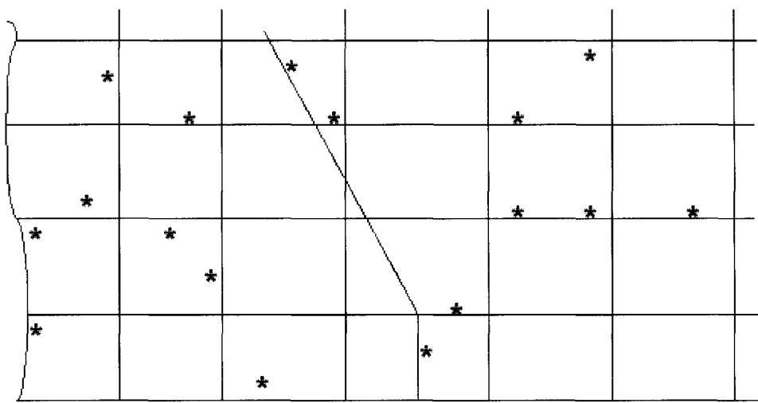  
Figure 10.1. Node routing example.

# 10.2.4 Residential Collection

Residential collection involves visiting each of the streets in a residential network. We refer to the resulting VRP as neighborhood (or arc) routing. In arc routing problems, service is required at nearly all locations, as in Figure 10.2. Note that several arcs don't require service. There may be different categories of service, e.g., garbage, recycling, and yard waste. Typically, each category requires one-day-per-week service. Vehicles are either rear-load or side-load and crew size is a function of vehicle type. Drivers are limited each day by the amount of time in a workday. When a garbage truck is full, it must travel to the nearest landfill, which usually differs from the central depot. Each truck can make several trips per day to a landfill. The vehicle capacity dictates the number of landfill trips each day. In addition to landfill trips, other complications arise because the vehicle fleet may be heterogeneous with respect to capacity, and different categories of service may imply different vehicle capacities. For the most part, routes and schedules are planned and real-time routing issues don't arise.

# 10.2.5 Case Studies

In Table 10.3, we present 10 case studies that describe the use of commercially available vehicle routing software in the solid waste industry. Nine of these involve strictly residential collection. Installation dates range from 1986 to 1998. The three vendors cited are CAPS (based in Atlanta, Georgia), RouteSmart (based in Columbia, Maryland), and GIRO (based in Montreal, Canada). Each of these companies has been in business for approximately 20 years. Most of the case studies involve RouteSmart, since RouteSmart Technologies is the one vehicle routing software firm that specializes in solid waste applications. Many of the details presented in Table 10.3 come from recent articles in trade publications or private conversations (e.g., see [5, 24, 42, 45, 58, 68, 83]). The interested reader is referred to Chapter 11 of this book.

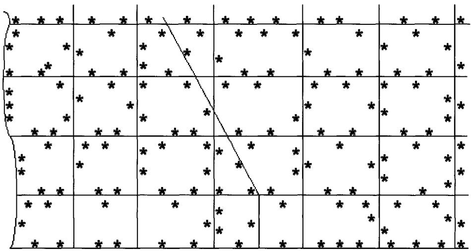  
Figure 10.2. Arc routing example.

Table 10.3. Solid waste collection case studies.   

<table><tr><td>Installation specifics‡</td><td>Comments</td></tr><tr><td>Oyster Bay, New York Goal was to balance routes better RouteSmart Beginning in 1986 Residential</td><td>Service 72,000 stops, twice per week Fewer trucks required Savings of about $1,000,000 per year</td></tr><tr><td>Metro-Dade County, Florida RouteSmart 1992 Residental</td><td>Recent growth in western part of Dade County County has become deeply involved in recycling Service 250,000 homes, twice per week Recyclable wastes are handled by separate routes County has used GIS since early 1980s Reevaluate routes once per year •After installation, a typical crew handles 10% to 15% more households per day Water department now also uses RouteSmart</td></tr><tr><td>Hempstead, New York RouteSmart 1993 Residential</td><td>Service 84,000 homes each week Hempstead runs RouteSmart several times per year Seasonal variability in waste volumes Savings of $200,000 per route per year Software is also used to better communicate with customers</td></tr><tr><td>Charlotte, North Carolina RouteSmart 1994 Residential</td><td>Saved more than 2,800 labor hours in first year City administration very satisfied Purchased an additional system for water department</td></tr><tr><td>Philadelphia, Pennsylvania RouteSmart 1994 Residential</td><td>No U-turns really tested the RouteSmart software •Reduced number of trucks from 23 to 18 Collection routes are much better balanced than before Handles site dependencies: size of truck versus type of street</td></tr><tr><td>More than 200 sites in USA serviced by Waste Management, Inc. CAPS Beginning in 1995 Residential and Commercial</td><td>Used CAPS Logistics Toolkit Cost savings of 5% to 15% Productivity improvements of 10% to 15%</td></tr><tr><td>Sacramento County, California RouteSmart 1997 Residential</td><td>RouteSmart is used by the county&#x27;s Waste Management and Recycling Division to bid for services of Sacramento Used to improve routing efficiency throughout the county</td></tr></table>

Table 10.3. (continued)   

<table><tr><td>Installation specifics†</td><td>Comments</td></tr><tr><td>Grand Rapids, Michigan RouteSmart 1997 Residential</td><td>Curbside garbage pickup Service 40,000 homes per week 15 routes per day Software has balanced the routes Eliminated two routes Freed up two people for the recycling program (10,000 homes every two weeks)</td></tr><tr><td>City of Sacramento, California GIRO 1997 Residential</td><td>Pilot project 40 vehicles for weekly collection of residential waste The reduction in overtime costs is expected to more than offset the cost of the software in the first year alone City of Sacramento decided to purchase GIRO&#x27;s software, GeoRoute</td></tr><tr><td>Midwest Ohio, American Disposal Services, Inc. RouteSmart 1998 Residential</td><td>Saved four trucks Number of drivers reduced from 17 to 10 Used software to identify a target market of noncustomers</td></tr></table>

t Location, vendor, date, and type of service.

# 10.2.6 Roll-on-Roll-off

The roll-on-roll-off variant of the VRP arises when there are large trailers (or containers) at construction sites, downtown areas, and other high-volume locations. Tractors move between these locations and a disposal facility (or landfill). Each tractor can carry a single trailer at a time. Four basic types of service are provided by the tractor:

• Round trip: the tractor picks up a full trailer at a site, brings it to the landfill for emptying, and returns the empty trailer to the site;   
• Exchange trip: the tractor picks up an empty trailer at the landfill, brings it to the site, picks up a full trailer at the site, and brings it to the landfill;   
• New site: the tractor brings an empty trailer to a new site; and   
• Removal: the tractor picks up a full trailer (for the last time) at an old site.

Drivers are limited by the number of hours in a workday. The goal is to minimize the number of tractors required and, secondarily, to minimize the total travel time incurred by the tractors.

For the most part, trailers to be serviced on a given day are known in advance. However, phone calls may trigger same day service for $20 \%$ to $30 \%$ of the daily demand. Therefore, real-time issues emerge in practice, making this an especially difficult VRP.

When the tractor performs only exchange-trip service, routes such as the two displayed in Figure 10.3 emerge. The numbers in Figures 10.3 and 10.4 indicate the sequence of moves for each tractor and not arc length. For example, on route 1, the tractor starts at the depot, brings an empty trailer to A, picks up a full trailer, and takes it to the landfill. It then carries an empty to B, picks up a full, takes it to the landfill, and so on. After the initial customers on each route (A and X), the problem becomes one of bin packing. Each trip of the form LF—customer—LF has an estimated time duration, and each tractor has something like 8 hours per day of time availability. Therefore, we seek to pack customers into routes as efficiently as possible. This will help us to minimize the number of tractors used.

When the tractor performs only round-trip service, routes such as the two displayed in Figure 10.4 emerge. For example, on route 1, the tractor travels from the depot to A without a trailer, picks up a full trailer, takes it to the landfill, empties it, returns the empty to A, travels to B, and so on. Since the travel times between the customers (e.g., A, B, C, and D) may be substantial, this problem has a significant routing component.

Figures 10.3 and 10.4 each represent atypical routes. Typically, each tractor performs several types of service during the course of a day. Therefore, the roll-on-roll-off problem involves both routing and bin packing considerations. The problem is further complicated by the fact that some trailer demands may have time windows.

This VRP is just beginning to attract research attention. In particular, Bodin et al. [12] compared three heuristics on 20 diverse test problems. The heuristics are based on setcovering, dynamic programming, and greedy insertion ideas. See Laporte et al. [53] for an alternate approach.

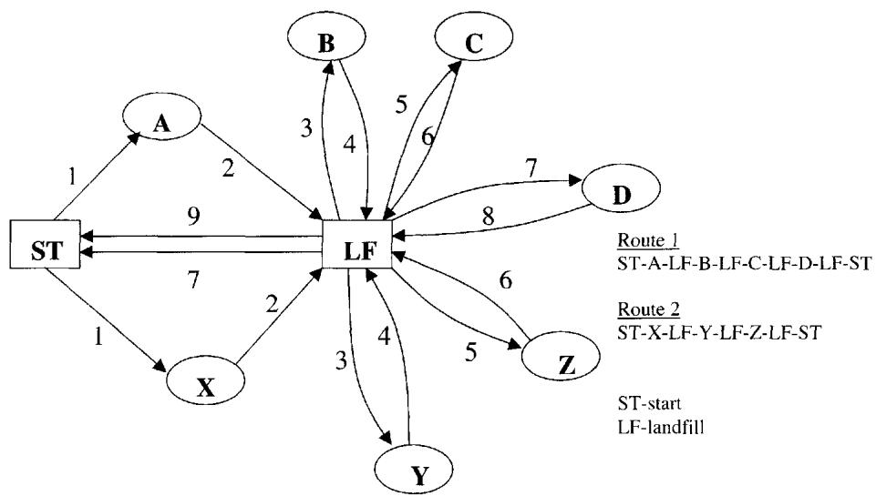  
Figure 10.3. Exchange trip. An empty trailer is brought to each customer. The tractor starts and ends with an empty trailer.

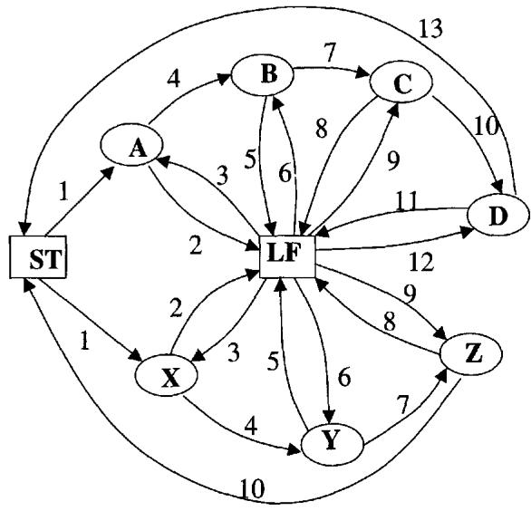  
Figure 10.4. Round trip. Each trailer must be returned to the customer. The tractor starts and ends without a trailer.

Route 2   
ST-X-LF-X-Y-LF-Y-Z   
-LF-Z-ST

ST-start LF-landfill

# 10.2.7 Further Remarks

It should be clear that there are deep and diverse vehicle routing problems facing the solid waste industry today. These problems involve node routing, arc routing, time windows, real-time, and bin packing considerations. Numerous successful applications have been reported to date, but much exciting work remains to be done.

# 10.3 Vehicle Routing in the Beverage, Food, and Dairy Industries

# 10.3.1 Introduction

In this section, we describe vehicle routing applications in the beverage, food, and dairy industries. These three industries have large volumes of sales so that the expenses associated with distribution activities typically are very large. To illustrate, retail beverage sales in the United States were $\$ 178.91$ billion in 1997 with soft drink sales of $\$ 53.4$ billion and beer sales of $\$ 53.2$ billion (see [4]).

In the food distribution industry, about 3000 companies split $\$ 140$ billion in annual sales (see Knight [51]). For example, U.S. Foodservice, based in Columbia, Maryland, has more than $6 \%$ of the market (about $\$ 6$ billion in sales for 1998) and is the second-largest distributor of food, supplies, and equipment. Sysco Corporation, based in Houston, Texas, is the largest distributor with $\$ 16$ billion in sales in 1997. U.S. Foodservice has a nationwide network of 37 distribution centers and 2400 trucks [51].

In the dairy foods industry (this includes processing, distribution, and marketing of milk, cheese, and ice cream), the U.S. market is about $\$ 65$ billion (see IDFA [48]). For example, Dean Foods, based in Franklin Park, Illinois, controls about $10 \%$ of the U.S. market share for fluid milk and is one of the largest dairy companies with $\$ 3.28$ billion in net sales in fiscal 1998 (Dwyer [28]). Suiza Foods, based in Dallas, Texas, is the largest full-line dairy in the United States with sales of about $\$ 1.79$ billion (Dwyer [29]).

The costs associated with operating vehicles and crews for delivery purposes form an important part of total distribution costs. (For additional background on costs in the soft drink industry, see the article by Golden and Wasil [39].) In May 1998, Beverage World (see Deierlein [25]) reported on the results of its annual survey of trends in beverage trucks. There were 164 respondents from randomly selected readers who managed beverage fleets (33 managed soft drink fleets, 114 managed beer fleets, and 17 managed bottled water fleets). Of the respondents, 36 had a fleet size of 1 to 9 vehicles, 86 had 10 to 49 vehicles, and 42 had more than 50 vehicles. Overall, the respondents were responsible for 7226 vehicles. For all fleets, route trucks averaged 79 miles per day and route tractors averaged 92 miles. In Table 10.4, we show the breakdown of respondents on distribution costs and computer usage. For all fleets, distribution costs were $21 \%$ of revenue, and $60 \%$ used the computer for route planning. We point out that in the 1999 Databank compiled by Beverage World, 22 companies were listed as suppliers of routing and scheduling software.

# 10.3.2 Beverage Industry

In this section, we examine the use of vehicle routing in the beverage industry (e.g., the distribution of beer, soft drinks, and bottled water). We describe the use of computerized vehicle routing by a large brewing group in Scotland. We also present a brief discussion of two vehicle routing software applications that are found in trade publications.

# 10.3.2.1 Beer Distribution in Scotland

Eibl, Mackenzie, and Kidner [31] present a detailed case study that focuses on the use of computerized vehicle routing in the brewing industry. We describe the routing problem and the managerial aspects surrounding software implementation. We point out that Eibl [30] reports on an extensive empirical study of the success of vehicle routing software in the

Table 10.4. Breakdown of respondents on distribution costs and computer usage, (Deierlein [25]).   

<table><tr><td rowspan="3"></td><td rowspan="3">All</td><td colspan="3">Fleet type</td><td colspan="3">Fleet size</td></tr><tr><td>Soft drink</td><td>Beer</td><td>Bottled water</td><td>1-9</td><td>1049</td><td>Over 50</td></tr><tr><td>Distribution costs as a percent of revenue</td><td>21</td><td>24</td><td>20</td><td>32</td><td>22</td><td>22</td><td>16</td></tr><tr><td>Computer usage (%) for route planning</td><td>60</td><td>60</td><td>58</td><td>73</td><td>44</td><td>54</td><td>84</td></tr></table>

British brewing industry. (Eibl collected and analyzed data from 151 managers, schedulers, and drivers, conducted expert interviews, and developed 16 case studies.)

# 10.3.2.2 Routing Problem

Scottish and Newcastle (SN) is one of the largest brewing groups in the United Kingdom with total sales of £1,500 million and profit of £230 million in fiscal year 1991-1992. SN's brewing and drinks division had annual sales of £900 million with distribution costs accounting for £54 million (about $6 \%$ ). Within SN, there are five regional sales companies and each company operates one or more of SN's 20 distribution depots. The characteristics of SN's routing problem are given in Table 10.5.

# 10.3.2.3 History of SN's Routing Systems

SN's use of computerized vehicle routing started in the early 1970s with the development of an in-house planning system. The system was not sophisticated enough to handle SN's distribution problems and the company eventually returned to a manual system.

The manual system relied on fixed or semifixed routes that were not cost effective with respect to vehicle utilization and distance traveled. The sequence of customers on a route was determined by geographical location, and delivery constraints, such as time windows and access restrictions, were ignored frequently. The manual system was time consuming to operate and was prone to errors. Furthermore, SN lacked accurate input data, such as precise driving times between customers.

In 1984, SN evaluated four commercially available, computerized vehicle routing systems and selected the brewery version of one system, called System B. System B was interactive, provided a color display of the routes and the road network, and allowed users to develop specialized routing subroutines called strategy files (for example, a user could run a strategy file that would plan deliveries of restricted-access customers).

The implementation of System B (at a depot in northeast England) was carried out by an internal team with expertise in data processing, logistics, and business systems. The team was led by an information transfer specialist selected from top management. The implementation took 20 person-weeks and involved a wide range of SN personnel, including vehicle schedulers and drivers who provided the system with key data (for example, exact geographical locations of customers, preferred time windows for customers, and road speeds). Eibl, Mackenzie, and Kidner point out that data handling (the collection, validation, and fine-tuning of distribution data) accounted for most of the time spent in the implementation phase. In addition, for a period of several weeks, the performance of System B was compared to the performance of the manual routing system.

# 10.3.2.4 Benefits of the Computerized Routing System

The use of System B resulted in both quantitative and qualitative benefits for SN.

• Quantitative benefits. The annual number of kilometers traveled by vehicles was decreased by $8 \%$ , and average vehicle utilization in terms of weight was increased by $11 \%$ . (The variable routes generated by System B provided more flexible allocations of orders.) The increase in transport productivity allowed SN to remove two large vehicles from its fleet, thereby saving more than $8 \%$ in total vehicle fleet costs. The time required to generate routes was reduced from 8 hours with the manual system to an hour and a half with System B. System B paid for itself within the first year of usage. (It had a net present value of more than £119,000; over the system's 5-year lifetime, the net present value was more than £297,000.)

Table 10.5. Characteristics of Scottish and Newcastle's routing problem.   

<table><tr><td>Nature of demand</td><td>Delivery of more than 200 products and pickup of re- turnable empties.</td></tr><tr><td>Demand information</td><td>Pure deliveries and pure pickups or a mixture.</td></tr><tr><td rowspan="4"></td><td>Orders collected by computerized system with an order lead time of 48 hours.</td></tr><tr><td>Emergency orders accepted if feasible.</td></tr><tr><td>200 to 250 customers served per day by a depot.</td></tr><tr><td>Average delivery quantity is 1.1 tonnes (ranging from a minimum of six bottles to a full vehicle load).</td></tr><tr><td rowspan="4">Vehicle fleet</td><td>Most customers receive deliveries once per week.</td></tr><tr><td>20 to 25 vehicles stationed at a depot.</td></tr><tr><td>Large vehicles (most common) carry 9 to 10 tonnes.</td></tr><tr><td>Small vehicles carry 1.5 tonnes. Typical route takes nine hours and covers 150 km on</td></tr><tr><td rowspan="4">Crew requirements</td><td>average (ranging from 15 km for local deliveries to 400 km for long-distance deliveries).</td></tr><tr><td>Driver pay is a combination of fixed weekly wage and a bonus based on distance traveled and delivered units.</td></tr><tr><td>Maximum driving time of nine hours.</td></tr><tr><td>Distribute driver work loads equitably.</td></tr><tr><td rowspan="4">Delivery constraints One-way streets.</td><td>Tight time windows for customers.</td></tr><tr><td>Capacity restrictions on vehicles due to orders with high volume or weight.</td></tr><tr><td>Limited access to customers.</td></tr><tr><td>Compact delivery areas.</td></tr></table>

Qualitative benefits. The use of System B led to an improvement in the quality of the delivery service. There were fewer omitted orders, shorter lead times, and better adherence to schedules. Through the use of statistical reports generated by System B, SN increased the control and monitoring of the performance of drivers and schedulers. With System B, planners at SN found their jobs interesting, challenging, and satisfying in contrast to the drudgery of the manual system.

We point out that, from the mid 1980s to the mid 1990s, SN successfully implemented System B in 15 of its 20 distribution depots.

# 10.3.2.5 Other Applications in the Beverage Industry

In Table 10.6, we provide brief details of two vehicle routing applications in the beverage industry that were reported in trade publications. Each application uses a different commercial software product (Roadshow and Roadnet).

Table 10.6. Selected vehicle routing applications in the beverage industry.   

<table><tr><td>Source</td><td>Comments</td></tr><tr><td>Gourley [41] Sfiligoj [74]</td><td>Pepsi-Cola Canada services more than 1 1,000 retailers and had used a manual system of route cards and delivery tickets to generate routes. The company now uses the Roadshow routing and schedul- ing system to develop routes that are based on actual travel times and distances within its distribution area. Roadshow accounts for vehicle capacity, time windows, dispatch times, on-site standards, and schedules of drivers, and it allows Pepsi-Cola Canada to adjust routes quickly when there are changing business conditions (e.g., new promotions of products). By using Roadshow, the company has reduced its distribution costs significantly.</td></tr><tr><td></td><td>Grey Eagle Distributors, based in Maryland Heights, Missouri, is an exclusive distributor of Anheuser-Busch products. For more than 18 years, Grey Eagle has used computerized vehicle routing and scheduling systems (McDonnell Douglas in 1981, Roadnet 4000 in 1986, and Anheuser-Busch&#x27;s routing system RAP in the 1990s). In 1996, Grey Eagle implemented Roadnet 5000. With Roadnet 5000, the company takes into account a wide variety of criteria when generating vehicle routes. Each day a driver delivers between 310 and 700 cases (the limits are set by union contract) and there are 85 route drivers. Grey Eagle has a fleet of 100 vehicles (there are 10 different types of vehicle), 1500 customers (some with tight delivery time windows), and a delivery area of 500 square miles. By using Roadnet 5000, the company has reduced the amount of time it takes to generate routes (from 2.5 hours to 1 hour) and has moved back the order cut-off time by 2 hours (this has decreased the number of last-minute orders and the need for secondary routing). Grey Eagle has reduced daily mileage by 5% to 7%, about 48,000 miles per year.</td></tr></table>

# 10.3.3 Food Industry

In this section, we examine the use of vehicle routing in the food industry. We describe in detail a complex allocation-routing problem encountered by a grocery distributor in Canada. We also present a brief discussion of four vehicle routing software applications that are found in trade and academic publications and on the Internet.

# 10.3.3.1 Grocery Distribution in Canada

Carter et al. [17] formulated and solved a distribution problem for a grocery distributor in Mississauga, Ontario. We describe the routing problem, solution algorithm, and computational results.

# 10.3.3.2 Routing Problem

Each day the distributor delivers products to grocery stores in southern Ontario. There are 179 products, 1263 stores, and a fleet of homogeneous vehicles based at a single warehouse. The decision problem has two parts: a demand allocation component and a vehicle routing component.

In the allocation problem, the distributor needs to allocate available inventory to meet the demands of the grocery stores on each day. Of course, the distributor may not have enough inventory of a certain product to satisfy the demands of all grocery stores and will need to determine how much of each store's demand to satisfy to achieve an acceptable level of service.

In the VRP with Time Windows (VRPTW), the distributor needs to generate routes for the vehicles that meet the delivery time windows for each store. Most time windows are wide and cover an entire day, but some are tight and cover a few hours. The distributor needs to consider variable delivery costs as well constraints on vehicle capacity and length of the workday.

# 10.3.3.3 Solution Algorithm

Carter et al. develop an iterated procedure for solving the allocation-routing problem. First, the problem is formulated as a large-scale mathematical program that determines the quantity of each product to deliver to each store on a day. There are hard constraints on product availability (supply) and vehicle capacity, and the objective is to minimize cost. This problem is solved approximately using a Lagrangian-based heuristic. (The hard constraints are moved into the objective function and a dual-ascent procedure is applied.)

Second, vehicle routes are determined using the solution from the allocation problem. The II insertion heuristic of Solomon [76] and the 2-opt\* procedure of Potvin et al. [65] are used to generate and improve routes. We point out that the solution to the VRPTW could be infeasible or contain unbalanced routes. The infeasibilities and imbalances are eliminated by changing the delivery capacity of certain days when solving the allocation problem. For example, if a day requires too many vehicles, the delivery capacity on that day is reduced and the allocation problem is resolved. If a day requires too few vehicles, then the delivery capacity is increased and the allocation problem is resolved.

# 10.3.3.4 Computational Results

The heuristic for solving the allocation problem was tested on 10 problems. Each problem had 100 stores, five products, and five delivery days. There were 10 parameters whose values needed to be set. (Four parameters had values generated from a uniform distribution.)

The overall solution algorithm that combined allocation and routing was tested on a subset of confidential data provided by the grocery distributor. There were 20 vehicles of capacity 1000 that were available each day for delivery to 1263 stores over a 5-day week. Six of 179 products were of stock on each day. A vehicle had to complete its route within 720 minutes. Furthermore, $9 5 \%$ of all deliveries took place in the first 600 minutes of the workday and the remaining $5 \%$ of deliveries were in tight time windows.

The overall solution algorithm required seven iterations to reach feasibility and took 1316.4 seconds. The final solution had an allocation problem cost of $\$ 26,646$ and the VRPTW had a total distance traveled of 17,226. These values compared favorably to the values of the grocery distributor's solution—estimated allocation problem cost of $\$ 35,381.8$ and VRPTW total distance traveled of 27,820. We note that the grocery distributor typically solves this problem once a week.

In addition, the authors conducted a series of computational experiments that were designed to test the effects of the geographical distribution of customers (e.g., randomly located customers versus clustered customers), costs of delivery patterns, demand distributions, and number of delivery days on the behavior of the overall solution algorithm. For example, the authors found that the algorithm is insensitive to geographical distribution.

# 10.3.3.5 Other Applications in the Food Industry

In Table 10.7, we provide brief details of selected vehicle routing applications in the food industry that have been reported in trade publications, on the website of a vehicle routing software company, and in an academic journal. Three applications use commercial software products (Roadnet, Roadshow, and CAPS Logistics).

# 10.3.4 Dairy Industry

In this section, we examine the use of vehicle routing in the dairy industry. We describe in detail a system that generates milk tanker schedules for a dairy in New Zealand. We also present a brief discussion of six vehicle routing software applications that are found in trade and academic publications and on the Internet.

# 10.3.4.1 Milk Tanker Scheduling in New Zealand

Igbaria et al. [49] and Basnet, Foulds, and Igbaria [9] reported on the development and implementation of a vehicle routing system known as FleetManager for the New Zealand dairy industry. We describe the routing problem, the routing system, and the benefits and impact of the system for the Westland Dairy Company of Hokatika, New Zealand.

Table 10.7. Selected vehicle routing applications in the food industry.   

<table><tr><td colspan="2">Comments</td></tr><tr><td>Source Cullen [23]</td><td>Joyce Foods, Inc., based in Winston-Salem, North Carolina, is a seafood and poultry processor with a fleet of 15 tractors and 25 drivers. Each day</td></tr><tr><td>Valero [84]</td><td>there are 25 delivery routes that cover customers in North Carolina, South Carolina, Virginia, and Georgia. In the past, Joyce kept in contact with drivers by telephone and pager. Recently, Joyce equipped each truck with an on-board computer system that has mobile communications and is linked to the Roadnet routing software. Joyce can track the movement of each truck and record route data, such as time spent at a customer. Joyce expects that the computer system will produce significant savings in fuel costs. The route data could be used to improve customer service (for example, providing a customer with an accurate vehicle arrival time). Associated Wholesale Grocers, Inc., based in Kansas City, Kansas, ser- vices customers in Iowa, Kansas, Missouri, and Nebraska. Associated operates a fleet of 186 refrigerated trailers, 40 drive trailers, and 89 trac- tors and ships 130 loads per night. In 1994, Associated began scheduling</td></tr><tr><td>Sperber [78], CAPS [16]</td><td>and scheduling system. In the first year that Roadshow was imple- mented, Associated decreased outbound transportation expenses by 6%, decreased the number of drivers by 6%, increased payloads by 11%, and saved $780,000 in transportation costs. Roadshow allowed dispatchers to take backhauls into account when generating routes and reduced the time to develop routes from 2 hours (by manual methods) to 45 minutes. Tom&#x27;s Foods, Inc., based in Columbus, Georgia, manufactures and dis- tributes snack food. It operates seven plants and delivers to customers</td></tr><tr><td></td><td>in 42 states. Tom&#x27;s wanted a computerized system to help with the daily dispatching at four locations including Columbus. It selected CAPS Logistics routing software. With CAPS, Tom&#x27;s found that it could ad- just routes with respect to new, daily orders, add backhauls to routes, generate reports for management (in the past, reports were manually generated), and help with strategic planning (for example, developing routes for a 6-month period). Dispatchers spend more time improving the utilization of vehicles (Tom&#x27;s switched from 43-foot to 48-foot trail- ers that carry more pallets) and generating better routes. In one region, Tom&#x27;s saved $233,000 annually by eliminating two routes.</td></tr></table>

# 10.3.4.2 Routing Problem

In general, dairy companies in New Zealand collect milk from supplier farms using tanker vehicles that deliver the milk to processing factories. The amount of milk that will be collected at each farm must be estimated, and each farm is usually serviced daily. The tankers operate two shifts a day and are located at bases that may be different from the factories.

Table 10.7. (continued)   

<table><tr><td>Source</td><td>Comments</td></tr><tr><td>Chung and Norback [20]</td><td>Kraft, Inc., is a large food distributor with more than 100,000 customers in 24 North American regions. Kraft developed an interactive distri- bution decision support system (DDSS) to carry out its daily routing. As Kraft&#x27;s food distribution network expanded and its food distribution goals became more complicated (e.g., Kraft wanted reliable delivery, that is, timely arrival of food products on specific days or during specific time windows), it realized that DDSS was not providing satisfactory solutions and it needed to revise DDSS. Using data from 3 days of de- liveries in four regions, Chung and Norback developed new clustering and insertion procedures to generate routes and allocate drivers and ve-</td></tr></table>

In 1992, Westland Dairy took in about 142 million liters of milk from 322 supplier farms using 10 tanker vehicles that traveled about 1.3 million kilometers. Vehicle schedulers in the transport office at Westland Dairy had to develop a specific sequence of suppliers for each tanker to visit on each shift. The schedulers had to take into account more than a dozen factors, including the level of customer satisfaction, access problems involving vehiclecustomer combinations, equity of routes, and labor and traffic codes. Typically, a tanker would begin at its initial base, visit the suppliers in sequence, and then end at the factory (this could be different from the initial base). The schedulers also had to take into account that, at certain times of the year, some suppliers had a low output of milk and would not be visited daily.

# 10.3.4.3 Routing System

Traditionally, a large map with colored pins was used to develop routes for the Westland Dairy tankers. One supervisor performed nearly all the scheduling and frequently experienced problems in developing satisfactory routes that met various company objectives. Westland Dairy wanted to improve the productivity and efficiency of its operations and turned to researchers in the Department of Management Systems at the University of Waikato for help. The multiyear collaboration led to the FleetManager decision support system that allowed schedulers to use their experiences and preferences in developing routes for tankers. FleetManager was written in Turbo Pascal for an IBM-compatible personal computer with a high-resolution color monitor. It is a mouse-driven user-friendly system with pull-down menus.

FleetManager has three parts: the database, the user-system interface, and the model base. The database contains information on suppliers, factories, bases, tankers, and roads.

Routes can be saved in the database. FleetManager also accesses Westland Dairy's mainframe computer for data on supplier milk output.

The user interface is a window-based graphical interface that can generate all routes automatically. The routes are displayed on a digitized map and can be modified by a scheduler clicking on a location.

The model base contains procedures for generating routes (a sweep algorithm and a farthest insertion algorithm) and forecasting milk output (a linear interpolation scheme). The sweep algorithm forms clusters of suppliers that are allocated to a tanker. The farthest insertion algorithm then determines the sequence of suppliers on a route that minimizes the distance traveled. FleetManager uses the algorithms to automatically suggest routes to the schedulers. In generating these routes, FleetManager can accommodate various constraints, including multiple shifts, suppliers visited less frequently than daily, and tanker capacity. However, all suggested routes may not satisfy all constraints; these suggested routes would then be modified by the scheduler to take the missed constraints into account.

FleetManager can also be used as a planning tool to answer what-if questions. Schedulers can examine the effects on the routes of changes in tanker capacity, factory demand, and supplier milk output.

# 10.3.4.4 Benefits and Impact

The transport office at Westland Dairy considers the FleetManager system a major success. FleetManager has

• Improved decision making. Schedulers can develop routes automatically and finetune them manually with respect to a wide variety of criteria and constraints (e.g., vehicle-customer combinations). Schedulers can perform extensive what-if analysis to determine the impact of changes to problem inputs (such as the milk output of suppliers) on vehicle routes. It is now easy to schedule suppliers on a 3-day rotation instead of the customary daily visit. From 1992 to 1994, Westland Dairy's milk volume increased by $2 5 \%$ and the number of drivers was reduced. The transport office was able to handle the increased workload effectively with FleetManager.

• Saved scheduler's time. Scheduling now takes 60 to 90 minutes, instead of the 6 hours required by the manual system, thereby saving upwards of 30 scheduling hours per week. The transport manager and the schedulers are available for more important tasks and are more productive.

• Increased satisfaction. The job satisfaction and morale of the transport manager and the schedulers have increased. They are confident that, with FleetManager, they can handle complex, unanticipated routing events. They believe that they are more effective and efficient in their jobs.

Basnet [8] reported that Westland Dairy still uses FleetManager. Some formatting and user interface changes have been made over the years to make the system more user friendly. We note that Basnet, Foulds, and Wilson [10] describe the development of a decision aid that schedules tankers when they return to unload milk at a processing factory.

Table 10.8. Selected vehicle routing applications in the dairy industry.   

<table><tr><td>Source Central Lechera Asturiana (CLAS) is the largest dairy in the north of</td><td>Comments</td></tr><tr><td>Adenso-Diaz et al. [1]</td><td>Spain. It processes 1.3 million liters of milk per day and distributes its products through 19 distributors. Each distributor has 5 to 10 teams of vendors, who deal directly with client shops. Each team is headed by a sales promoter who is responsible for about 1500 client shops. CLAS selected the distributor in Asturias as a pilot center for a new system for managing the distribution of four types of dairy products (each product, e.g., yogurt, requires trucks with different characteristics). The authors structured the problem as a five-level hierarchical system. At upper levels, they decide on the number of visits to each client per week and various assignments (e.g., clients to teams of vendors). At lower levels, they develop routes for vehicles (a local search algorithm is used to solve a traveling salesman problem with time windows). The authors discuss implementation issues with their decision support system (e.g., sales promoters saw the system as a competitor that took away their decision making). The system, implemented in February 1996, found a fair distribution of clients to vendors and was able to reduce the kilometers in each vendor&#x27;s route by 10%.</td></tr><tr><td>Mans [57], CAPS [15]</td><td>Mayfield Dairy Farms (a division of Dean Foods), located in Athens, Tennessee, services more than 14,000 customers from 19 distribution centers. It delivers milk and ice cream on more than 400 direct store delivery routes. Vehicles travel more than 11 million miles annually. Mayfield Dairy performed an eight-part routing analysis using the CAPS routing software. This analysis led to a resequencing and con- solidation of existing routes (there was a reduction of up to six routes at individual distribution centers). In addition, total miles driven and hours worked were decreased and the use of assets increased (for example, new morning and afternoon routes were created). Mayfield Dairy was able to add a significant amount of new business on existing routes.</td></tr></table>

# 10.3.4.5 Other Applications in the Dairy Industry

In Table 10.8, we provide brief details of six vehicle routing applications in the dairy industry that have been reported in an academic journal, in trade publications, and on the websites of vehicle routing software companies. Two applications involve commercial software products.

<table><tr><td colspan="2">Table 10.8. (continued)</td></tr><tr><td colspan="2">Source</td></tr><tr><td>RiMMS [67]</td><td>Comments Tuscan/Lehigh Valley Dairy, based in Philadelphia, uses the RiMMS software system to develop daily routes for 500 trucks that are located in the Northeast and Mid-Atlantic regions. The trucks deliver milk and dairy products. With RiMMS, the dairy can take into account such variables as truck capacity and loading time at the depot when developing routes. Last-minute changes can be scheduled quickly with the software (in the past, the dairy required a full day to generate routes).</td></tr><tr><td>Anonymous [3]</td><td>Baskin-Robbins supplies two-thirds of its 2500 stores with ice cream from four distribution centers. The company has a fixed customer base and, since 1992, has used the Performance Truck Routing System to develop a weekly master schedule at its distribution centers. The software also provides daily route recommendations. Baskin-Robbins estimates that, with the optimized delivery routes, it has saved 10% on mileage alone (about $180,000 annually).</td></tr><tr><td>Sankaran and Ubgade [72]</td><td>Etah Dairy is located in Uttar Pradesh, India, and has 70 milk collec- tion centers (MCCs) within a radius of 150 km from Etah (the town is located 300 km from New Delhi). Each day the dairy sends tankers to collect milk at the MCCs and deliver the milk to the dairy for process- ing. The availability of the milk depends on the season and ranges from 45 tons in spring and summer to 170 tons in fall and winter. The dairy hires 24 tankers (capacity ranges from 4 to 12.5 tons), which leave the dairy by 6:00 am. The authors developed a heuristic (using the nearest insertion approach) to route the tankers. In constructing the routes, the authors considered constraints on route length (be- tween 50 and 350 km), maximum elapsed time on a trip (from 5 hours in summer to 10 hours in winter), and maximum number of tanker trips (at most three). The heuristic is embedded in a decision support system called CARS (computer-aided routing system) that runs on a microcomputer. CARS was implemented in fall 1992 and manage- ment estimated a savings of 800,000 rupees in transportation costs. In addition, CARS reduced the amount of curdled milk by constraining long trips in very hot weather.</td></tr><tr><td>Sperber [78]</td><td>Johanna Dairies tests vehicle routing software on 29 store-door de- livery routes. The company analyzes the number of stops per route,</td></tr></table>

# 10.4 Distribution and Routing in the Newspaper Industry 10.4.1 Industry Background

The newspaper industry has always had one of the largest distribution problems, measured by the number of units distributed. In 1998, the circulation for the top 20 daily newspapers of the world ranged from 14.53 million to 1.73 million. As expected, Asian papers (Chinese, Japanese, and Korean) dominate this list, which includes only one U.S. newspaper. The corresponding range of circulation figures for the top $2 0 ~ \mathrm { U } . 5$ . dailies was 1,740,000 to 378,000 [13]. In the United States, the average circulation of a daily paper is about 38,000. More than half the daily newspapers in the United States have circulations under 25,000, and more than two-thirds fall under 50,000. Only about a quarter have circulations between 50,000 and 500,000, and fewer than $5 \%$ of U.S. dailies have a circulation greater than 500,000. On the average, a daily newspaper serves a market of 163,000 persons within an area of approximately 3000 square miles (the median area served is 1600 square miles) (see Picard and Brody [64]). The combined circulation of all daily newspapers in the United States has decreased from 62.2 million in 1980 to 56.7 million in 1997, despite a significant decrease in the number and circulation of evening papers [80]. For an overview of the structure of the newspaper industry, see the informative books by Picard and Brody [64] and Thorn and Pfeil [82]. For an economic or international perspective, see Lacy and Simon [52] and Dunnett [27].

In certain countries, the distribution of newspapers may be integrated with other printed materials, notably magazines and some low-price paperbacks. Describing the German wholesale distribution problem for newspapers and magazines, Dillmann, Becker, and Beckefeld [26] stated that the problem involves more than 200 publishers that deliver products to 96 wholesalers who supply 110,000 retail outlets on a daily basis. In this problem, each wholesaler operates as the sole supplier for 3000 different items (titles) in the wholesaler's region. These authors also estimate a delivered value of DM 9 billion for a German wholesaler of magazines and newspapers. The cost of printed goods is approximately DM 6 billion per year, while the overall delivery costs for this operation are estimated at DM 150 million, or $2 . 5 \%$ of the cost of goods sold. The overall wholesale distribution involves about 3000 vehicles that cover 150 million kilometers to deliver a total volume of about 3000 metric tons of press.

Based on data collected for 1978-1990, Stanley [79] reported that the circulation expense as a percent of the total expenses of a newspaper averaged $1 0 . 5 \%$ to $1 3 . 3 \%$ over this period, depending on the size of the paper (smaller percentages are associated with the smaller papers). In all size categories, this percentage has decreased (over time) for all size categories.

Before turning to the distribution of newspapers from the printing sites to the ultimate readers, a brief review of industrywide challenges may help set the stage. After a long period of relative stability, the newspaper industry is facing unprecedented challenges. First, direct marketing has been capturing an increasing portion of the advertising dollars. In 1990, the estimated annual advertising expenditures in the United States in direct mail was slightly more than $72 \%$ of the $\$ 32.28$ billion spent on newspaper advertising; this had grown to almost $90 \%$ by 1996, when newspaper advertising totaled $\$ 38.4$ billion [2].

Second, projecting into the future, newspapers must respond to challenges of customization. Advertising forms the main source of this pressure as advertisers move from blanket distribution to focused targeting of households informed by more refined market segmentation and consumer profiles. One example of customization is greater emphasis on zoned editions. A zoned edition of a newspaper is produced with special contents aimed at a distinct region that do not appear in other editions of the paper. Customization also may be driven by content alone. The Roanoke Times (Virginia) was reported to be considering the removal of stock listings from the daily newspaper. Instead, this firm would deliver a 20-page tabloid only to those subscribers who require it and are willing to pay the additional tabloid subscription fee (see Burks [14]). In the early 1990s, the ability to target newspaper contents at a fine level (microzoning) was considered as imminent, but this promise has not been realized (see Memmott [59]). Nonetheless, as Gauldin [36], Ostrofsky [62], and Siebert [75] described, there is software that allows targeted marketing at zip-code level. Although this software does not perform routing, it allows the distribution personnel to calculate the load on each route and its composition (the multiproduct manifest) based on consumption patterns.

A third challenge is the significant shift in the nature of the carrier force. In the past, youngsters delivered papers to 50 homes by foot or bike; today's typical carrier is in his or her mid-thirties and delivers a variety of products to 400 homes per day. To make the routes more financially rewarding to the carrier, some firms have moved toward a broader mix of delivered products. Burks [14] reported how The Roanoke Times significantly increased the mix of the products delivered by its carriers. According to Burks, in March 1991, the metropolitan carrier for The Roanoke Times delivered about 1.4 million papers. In March 1995, it "delivered the same number of newspapers, plus 110,000 Express Lines, 85,000 telephone directories, 80,000 Pinpoint Plus coupons, 54,000 magazines, 32,000 department store flyers, 20,000 Wall Street Journals, and 113,000 market saturation pieces" [14].

A fourth challenge involves the rise of new media channels in the information marketplace. Media ranging from web-based information services to interactive TV threaten to become formidable competitors as information providers. This multiplicity of channels has caused newspapers to examine how they can defend their position as the "primary information provider, regardless of the pipeline" (Consoli [22]).

Presenting a strategic plan for the industry for the Newspaper Association of America, Consoli [22] set forth a list of six technical challenges faced by the industry. At the top of the list is the ability to target advertising to specific demographic and geographic audiences. This is followed by technology that would support the delivery of news and advertising through new media channels. The first priority involving targeting reflects the challenge of mass customization in the newspaper industry. To cite one example, Ostrofsky [61] described a futuristic scenario whereby each customer receives a customized version of the newspaper providing the news and contents of special interest to the customer, containing the advertisements and inserts tailored to the demographic segment to which the customer belongs, and leaving out the contents or sections in which the customer has no interest.

Clearly, another trend that easily lends itself to customization is the use of digital newspapers. Since this option eliminates the need for physical distribution altogether, we do not discuss it in this chapter.

# 10.4.2 Newspaper Distribution Problem

Broadly defined, the Newspaper Distribution Problem (NDP) involves the downstream movement of newspapers from the printing presses into the hands of the readers. A major metropolitan morning paper in the United States has the daily task of handling several hundred thousand newspapers in multiple editions to subscribers at both homes and businesses. For some leading Asian newspapers, this number goes up to millions of copies.

The operations of a daily newspaper follow a deadline-driven cycle that is repeated daily, 365 days a year. The following description of this cycle is from Picard and Brody [64]. For a morning paper, the cycle starts after dawn when the editorial employees report to work. By $1 0 { : } 0 0 \mathbf { a } . \mathbf { m } .$ ., the newsroom comes to life as the assignments for the day take shape. While the reporters leave the office to cover events and to gather materials, the business operations, particularly circulation and advertising, continue throughout the 8-hour work day. By midafternoon, reporters return from their assignments and start crafting their stories, and by early evening the editors finalize the news budget. As the evening progresses, various sections are completed and sent to production in ascending order of importance, saving the front page for the end. A few pages are withheld for late-breaking news and sports events (for instance, coverage and results of night games). The bulk of the contents must be ready for placement on the presses at least 1 hour before printing time.

From the perspective of production and distribution, the cycle starts at midnight, when press operators start rolling the presses. Printing may continue until $\mathbf { 4 { : 0 0 } \ a . m . }$ ., depending on the circulation and capacity of the presses. As papers come off the press line, they are bundled and placed in trucks for delivery. In a large metropolitan area, trucks begin their trips shortly after midnight; in a smaller geographical area, they may not depart until an hour or two later.

If we consider the process flow from the presses to the customer site, the newspaper goes through several operations that are generically captured in Figure 10.5. The production may be divided into three steps: printing (at the presses), inserting the advertising supplements, and bundling for delivery. The inserting step used to be performed manually but now calls for sophisticated automated mechanical equipment. This step can easily be the bottleneck step limiting the production. Similarly, conveyors and feeds may be used to carry the papers directly to the docks, where the trucks are loaded. The number of docks may be limiting, thereby delaying the dispatch of trucks. The loading and dispatching decisions interact in two ways. First, the desired start time for a truck's route determines when the truck should be loaded. Second, the demand on the route governs the amount loaded onto a truck, as well as the mix of products.

The delivery operation generally involves two legs: from the presses to transfer points (which can be drop-off points, the location of the news agents, or newspaper racks), and from the transfer points to the ultimate customer. We use the term transfer point in a generic sense to mark the point at which the responsibility for the delivery changes hands. In some cases, additional work (sorting or packaging) is performed at the transfer point before release of the goods to the second stage. Most of the routing studies reported in the literature focus on the first leg of the distribution problem. Nationwide, circulation ensures that the paper arrives at the residential customer's doorstep before 6:00 or $6 { : } 3 0 { \mathrm { a . m . } }$ , in time to be read at breakfast.

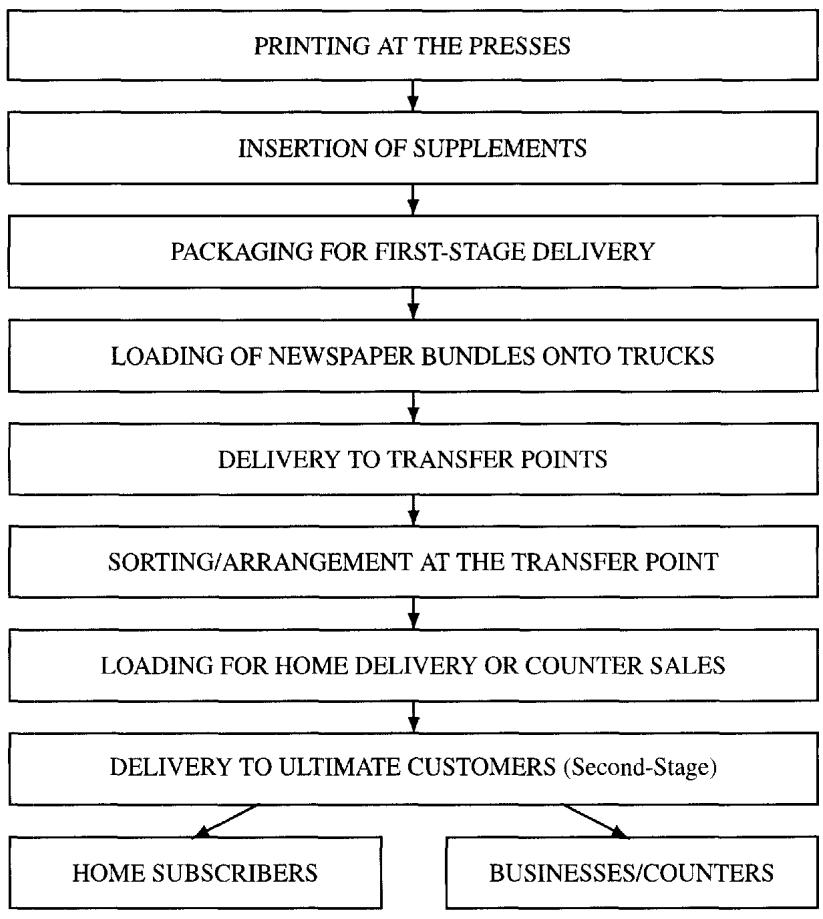  
Figure 10.5. Process view of newspaper production and distribution.

From a distribution perspective, newspaper delivery has a number of characteristics that complicate the routing and require special handling beyond the simple delivery operation captured by the standard VRP. Below, we list and discuss these distinctive features of the distribution problem.

Multiple Commodities. Newspapers often are printed in multiple editions, which may differ in news and editorial content (early and late morning editions), or in the run of advertisements, or in the mix of inserts. Holt and Watts [46] mentioned an air edition for remote places, a country edition for rural areas, a home edition for the metropolitan regions, and a late city edition for an Australian paper. However, they noted that earlier editions are printed and dispatched before the home edition starts. It is therefore important to assess the extent of coupling between the various editions. When editions that differ in content and advertising are distributed in the same time frame, then the multicommodity nature of the product assumes greater importance, especially as the pressure of customizing the delivery to different geographic or demographic profiles increases.

Hierarchical Distribution Problem. Newspaper delivery often involves two or more distinct stages. The main first step is from the production facility to the transfer points. As Hurter and Van Buer [47] noted, some larger papers may have an additional layer of distribution centers so that the first movement of the papers is from the printing facility to the distribution centers. We can regard transfer points as bases (or secondary depots) from which the retail delivery routes fan out. The NDP can therefore be viewed as a hierarchical routing problem. If we include the choice of locations for the transfer points in the overall problem, then NDP becomes a location-routing problem.

Time Windows. Since newspapers are a perishable commodity, timely delivery is important. The challenge of newspaper delivery is to work with tight time windows. In home delivery, for instance, the paper must be delivered before the household members leave for work. As commuting times increase (due to more remote suburbia or increased congestion), this window shrinks for the delivery operation. On the other hand, the earliest time a delivery can be made is governed by the start time of the presses, which editors wish to delay as much as possible to capture the latest news. Thus, the time horizon for delivery is defined from the start time of the presses to the last allowable delivery time to the customer. As Holt and Watts [46] put it: "It has been said that if the Home Edition went to press an hour earlier, all the distribution problems would be solved immediately." Although this statement oversimplifies the issue, it does point out the crucial impact of press time on the design of routes. As the total allowable time for delivery becomes more constricted, the size of the required fleet can be expected to increase. As discussed below, the number of vehicles required for delivery is often the key cost driver.

Nature of the Demand. We mentioned that, in the future, the demand for newspapers can be considerably more customized. However, even for standard versions of the newspaper, the demand exhibits variation by day of the week. The demand for Saturday and Sunday papers typically is different from the weekday demand, and other seasonal effects may be present as well. In delivery planning, the size of the demand plays an important role. Weekend papers are significantly larger, and in some cases, midweek advertising (on Wednesdays, for instance) can increase the size beyond that of other weekdays. At a minimum, one may expect these effects to result in different routes for Saturday and Sunday delivery.

Interaction Between Production and Distribution. An interesting feature of the NDP is the interaction between production planning and the distribution component. For a large newspaper, presses generally run for several hours. As the printing progresses, trucks are being loaded and dispatched. Generally, the newspapers for the remote centers (which have the tightest due times) must be printed and dispatched first. This suggests sequencing production by the geographic locations of the transfer points. On the other hand, the desired production sequence is one that minimizes the set-up and changeover times for production. The two sequences geared to the production and distribution economies may be quite different; following either one in isolation is suboptimal. In theory, in the presence of demands for multiple commodities (defined by different editions, contents, and inserts) at each transfer point, one can think of the optimal production sequence as the one that minimizes the sum of production and distribution costs, a problem that is likely intractable.

In practice, one has to devise a production schedule that offers a compromise between production economies and the vehicle scheduling requirements.

Production Rates. Since trucks are dispatched as soon as they can be loaded with the required bundles, the rate of production (number of papers per minute) is an important parameter in determining the planning horizon. Often, the limiting factor determining the production rate is not just the speed of the press but that of the automatic inserting equipment.

Vehicle Fleet and Capacities. The fleet needed to provide the first stage of transportation may involve vehicles of different sizes and capacities. A number of applications fill vehicles to capacity, making it an important parameter of the problem. Different studies report capacities ranging from 3400 newspapers for a 1-ton van (see Hurter and Van Buer [47]) to 10,000 newspapers for a large truck (see Sciarrone [73]).

# 10.4.3 Vehicle Routing Algorithms for NDP

To our knowledge, the first systematic application of vehicle routing to newspaper delivery reported in OR publications was in the work of Golden et al. [38], concerning the Worcester Telegram, an evening paper with a circulation of 92,000 within the city of Worcester, Massachusetts. The authors were able to decrease the number of routes from 20 to 13, reporting an average utilization of $67 \%$ across the fleet. Since that study, a number of more detailed reports on routing for newspaper delivery have appeared in the literature. Table 10.9 summarizes the application environment of each study and compares some key input parameters. In the following, we highlight the key features of these applications and the role played by the routing algorithms.

Sciarrone [73] describes an application of vehicle routing that is similar to Golden's study. It involves the distribution of the daily newspaper La Stampa in the metropolitan area of Turin from the central office of the paper to 400 newsstands over a period of 90 minutes. The demand at each newsstand is assumed to be known, and some newsstands have onesided time windows. However, the overall demand for the paper is subject to variation. For instance, the daily number of papers distributed averaged 120,000 in 1986 but could reach 160,000 depending on the day of the week and the events reported. A fleet of 15 vehicles is used, and each vehicle holds a maximum of 10,000 papers. Possible breakdowns in the printing process could cause the available delivery time to shrink. Since the problem is essentially a single-depot VRP with one-sided time windows, Sciarrone described an algorithm that consists of an insertion heuristic, followed by a 2-opt improvement step, implemented in Pascal to run on a personal computer. The solution technique reduced the number of vehicles used from 15 to 13, produced savings of $7 \%$ in the travel time, and created more balanced routes.

The studies by Holt and Watts [46] and Hurter and Van Buer [47] add an important element to the analysis: both explicitly considered the interaction between the routing and production decisions. Holt and Watts [46] described a routing system used to develop routes for the morning newspapers of three different companies in three Australian cities. The system constructs routes that deliver the papers from the printing facility to the news agents (see Figure 10.5) by developing routing and dispatching schedules simultaneously.

Table 10.9. Key characteristics of selected ND studies.   

<table><tr><td>Source</td><td>Hurter and Van Buer [47]</td><td>Ree and Yoon [66]</td><td>Sciarrone [73]</td><td>Holt and Watts [46]</td><td>Jacobsen and Madsen [50]</td></tr><tr><td>Paper</td><td>Unidentified morning paper</td><td>Hankook-Ilbo</td><td>La Stampa</td><td>Three different firms in Australia</td><td>Two Danish morning papers</td></tr><tr><td>Distribution area</td><td>Metro area in midwest</td><td>Seoul metro area</td><td>Turin metro area</td><td>Three different cities</td><td>Western region of Denmark</td></tr><tr><td>Circulation Transfer points</td><td>37,000</td><td>1,150,000</td><td>120,000160,000</td><td></td><td>150,000</td></tr><tr><td>(Number &amp; type)</td><td>513 drop-off points</td><td>250 local centers</td><td>400 newsstands</td><td>1000 news agents</td><td>42 transfer points</td></tr><tr><td>Production rate</td><td>18,000 per hour</td><td>4 truckloads per hour</td><td></td><td></td><td>1000 per minute</td></tr><tr><td>Fleet size</td><td colspan="3">14 15</td><td>23 to 35</td><td>26 trucks</td></tr><tr><td>Vehicle capacity Time constraints</td><td colspan="2">1,000 papers</td><td>10,000 papers</td><td></td><td>12,000 papers</td></tr><tr><td></td><td>Delivery to drop-off points by 4:30 a.m.</td><td>Delivery to centers during 1:304:00</td><td>Maximum route duration of 1.5 hours</td><td>Route durations of two hours</td><td>Delivery from 8:45 to 11:30 a.m. (2 stages)</td></tr><tr><td>Special features</td><td>Multiple editions. Zoned delivery regions. Interaction between production and routing.</td><td>a.m. Work takes place at local centers before second leg begins. Multiple deliveries to same site allowed.</td><td>Open tours end at the last delivery point.</td><td>Interaction of routing and dispatching is key.</td><td>Two-stage distribution problem. Location of transfer points may be chosen. More than 4500 sales points served by secondary</td></tr></table>

The interaction between loading and routing decisions, as described below, is a feature that is specific to the NDP.

To develop a set of routes, the algorithm starts by placing each customer on a separate route initially. It then combines routes seeking to reduce the total number of routes and the distance traveled. Within each route, a 2-opt procedure is applied to improve distance. At each stage, partially developed routes are combined with a dispatch order and checked for feasibility (with respect to time windows). In particular, the procedure computes a critical time that equals the latest time the route can start and still meet its deadlines. These times are used to determine the loading sequence at the dock: whenever a dock is released, the truck with the earliest critical time is selected to start loading. The authors provided some indicators of savings achieved. In one problem, the number of vehicles was reduced from 35 to 30 on weekends, and from 28 to 23 on weekdays. In another exercise, the algorithm produced a savings of $8 \%$ in distance traveled compared to routes already refined by the dispatchers. In another application, the procedure allowed the company to cope with an increase of $20 \%$ in the paper size (100 pages increased to 120) without requiring additional trucks. We should note that using an entirely different methodology, Han [44] also addressed optimal sizing of districts and vehicle size for home delivery.

Hurter and Van Buer [47] described a comprehensive study of the NDP for a morning paper that serves a midwest metropolitan population of 80,000 plus its semirural surroundings. The circulation figure of 37,000 for this paper includes 33,000 home subscribers. The production rate is 18,000 newspapers per hour. The limiting operation governing this rate is the speed of the inserting and folding equipment. By contrast, the press itself prints at the rate of 55,000 papers per hour. The presses begin at $1 { : } 3 0 { \mathrm { a . m } }$ . and complete the printing by $3 { : } 3 0 \ \mathrm { a . m }$ .

The distribution area fits within a rectangle 25 by 12 miles, with most of the demand concentrated within a metropolitan area 6 by 3 miles. The distribution problem has two levels: from the printing facility to the transfer points (called drop-off points) and from each drop-off point to the customer homes. There are 513 drop-off points, and each corresponds to a home delivery route. To carry out the distribution, the firm uses a fleet of 14 1-ton vans, each with a capacity of 3400 papers. On average, each van visits 37 drop-off points on its route.

The newspaper in this application has multiple editions, so that the distribution involves multiple products, and switching between two editions involves set-up at the printing press (typically 5 to 10 minutes per switchover). However, in addition to set-ups, the production plan must also consider the loading sequence since vans that are loaded and dispatched to the distribution centers must deliver the product mix required by the areas served by the vans. When loading a given van, the correct mix of editions should be available from the printing press based on the needs of the areas served by the van. Because of time constraints, the firm prefers to load vans destined for the furthest distribution centers first. The problem is therefore best viewed as a combined production-distribution problem because the production and loading decisions interact.

The routing problem addressed in this study is a VRP with time windows. The set of routes designed for the vans must visit all drop-off points by about $4 { : } 3 0 \ \mathrm { a . m }$ . The objective is to minimize the number of vehicles required. As mentioned, the problem has multiple products and each product is distributed only within certain designated geographical zones (there are seven zones). Initially, the authors assumed that each van is loaded with a single product. Under this assumption, the problem decomposes into separate routing problems by product (over the relevant zones). In each zone, the authors first construct a grand tour through all drop-off points and then partition it into a number of routes for single vehicles. Finally, they check the time constraints to ensure that the delivery windows are met. To check route feasibility with respect to time, the route start time is required. This, in turn, depends on the completion time for the loading of the van, which is computed from the production schedule. If infeasibilities arise, the production schedule is altered until a consistent production-distribution schedule is found.

The next step of the distribution procedure is to relax the zoning constraints. In this phase, one attempts to combine adjacent zones for a vehicle that has slack capacity. This relaxation stops short of allowing a vehicle to possibly visit all zones. But, as the authors point out, as one traverses zones, a greater number of dissimilar products are assigned to the same vehicle, and since these products are generally produced at different times at the press, the route start time is delayed. Combined with the additional travel time of crossing zones, the route will rapidly bump against the time windows governing deliveries.

Hurter and Van Buer established a base case by replicating the company's routes before any improvements. This base case uses a fleet of 14 vehicles with a pooled utilization rate of just under $7 5 \%$ . However, while there is slack capacity, four routes violate the delivery deadlines. The improved solution obtained by using VRP techniques saves two vans and reduces the total combined duration of all routes by $24 \%$ . An interesting feature of this study is the sensitivity analysis conducted for some key parameters. For instance, it was found that if the limiting production rate can be increased by 33 percent (from 18,000 to 24,000 per hour), the number of tardy routes can be reduced to one (from four in the base case). Similarly, a reduction of the time required to unload the paper at a drop-off point from 40 to 30 seconds reduces the number of tardy routes to one. Finally, a solution requiring only 11 vans is available if two zones are combined.

While the preceding two studies sought to coordinate production and vehicle schedules, Ree and Yoon [66] tried to overlap routing with work performed one step downstream at the local centers. Their work studied newspaper delivery for Hankook-Ilbo, a Korean newspaper that ranks among the top-40 largest dailies in the world with a circulation of over 1.15 million. In the Seoul metropolitan area, this paper has three main printing facilities that also serve as distribution centers. We call these the main centers or depots interchangeably. There are also 250 local distribution centers that serve as the transfer points for the second stage of distribution. The delivery planning problem is focused on the first stage of the distribution spanning the delivery of papers from the printing facilities to the local centers. The objective is to minimize the number of trucks used within the available time horizon.

Since papers are printed between 1:30 and $3 { : } 3 0 { \mathrm { a . m } }$ . and deliveries to the local centers must be completed by $4 { : 0 0 } \mathrm { a . m } .$ ., the relevant time horizon for routing is approximately 2.5 hours. An interesting feature of this problem is the use of split deliveries that allows the distribution and sorting activities to proceed in parallel rather than in a strictly sequential fashion. Here, the sorting activity takes place at the local centers and involves the preparation of the newspapers for home delivery by the carriers, an activity called arrangement by Ree and Yoon. Since this sorting time at the local centers is significant, the firm makes multiple (partial) deliveries to each local center. In this way, the local center can start the arrangements on the initial partial deliveries while papers are still being printed and delivered. The specific decisions addressed by Ree and Yoon are as follows:

1. Decide which main center (or depot) serves each local center.

2. Determine the number of trucks trips needed at each main center and their departure times.

3. Construct the delivery route for each truck, and determine, for each trip, the delivery quantity (number of papers) at each local center.

The authors used a two-stage procedure to make the preceding decisions. The first decision is similar to the clustering performed in assigning stops to depots in a multi-depot problem. The authors solved this as a Generalized Assignment Problem (GAP), where the printing capacities for the main centers provide the right-hand sides of the demand constraints. Once the GAP is solved, the problem decomposes (by main center) into decoupled single-depot problems. Moreover, by dividing the total demand assigned to the center by the vehicle capacity, the authors obtained an estimate of the number of truck trips originating at that center, thereby partially addressing the second decision. In the second stage of their procedure, Ree and Yoon addressed decisions 2 and 3 as follows.

Consider the distribution center as a depot from which $K$ trucks originate to visit $n$ delivery sites (these sites correspond to the local centers) as in the VRP. For each of the $K$ trucks, one must decide the time the truck leaves the depot and the amount it delivers to each of $n$ delivery points. Ree and Yoon restricted the delivery amounts to half or full loads, so that each truck delivers either half or all the demand at a delivery site if it visits the site. This allows the problem to benefit from split deliveries but controls the growth in problem size by considering only half-loads (rather than more general fractions of the site demand). The objective function for the VRP is the weighted total lateness at all sites, weighted by the site demands.

To solve this problem, they build routes sequentially by using a seed that is the most distant point from the depot and clustering the points near it until the truck capacity is exhausted. Next, they sequence each route and compute the time the route visits its last site. If demands of all sites are satisfied within the delivery deadline, this solution is accepted. Otherwise, the procedure combines a route that violates the deadline with a neighboring route and considers delivering half-loads. By shrinking the delivery times due to the smaller load, this last step effectively reduces the longest completion time by constructing more balanced routes. Finally, simulated annealing is used to improve the solution. Although the authors illustrate the possible improvements with an example, they unfortunately do not provide indicators of how the procedure produced savings in the actual newspaper delivery problem.

The last two studies of this section, performed in Denmark and Germany, consider problems of broader scope involving the full hierarchy of distribution stages in newsprint delivery. Jacobsen and Madsen [50] studied a location-routing problem for a newspaper delivery problem in western Denmark. In their study, two competing papers share production and distribution facilities. The combined daily circulation is 150,000, and the daily distribution cost was 35,000 Danish Kroner.

Small trucks are used to transport the papers from the printing facility to 42 transfer points dispersed over an approximate area of 200 by 300 kilometers. At the transfer points, the newspapers are loaded onto vans or cars that make the final deliveries to the 4510 points of sale (or customer sites). Typically, a truck visits 1 to 3 transfer points. Each transfer point serves as the base for five tours that visit 24 sites. The newspapers all must arrive at the customer sites by $1 1 { : } 3 0 \ \mathrm { a . m }$ . The printing operation therefore runs from 6:15 a.m. to $8 { : } 4 5 \ \mathrm { a . m }$ .

The objective of the hierarchical location-routing problem (see Madsen [56]) is to minimize the total distribution cost by deciding on

• the number and location of the transfer points,   
• the primary routes feeding the transfer points out of the printing facility, and   
• the design of the secondary routes based at each transfer point to feed the customer sites.

Jacobsen and Madsen [50] compared three heuristics that solve this problem. We do not describe these here, but we summarize how the solutions compare for costs. Let TCP and TCS denote the travel costs (based on mileage only) for the primary and secondary tours, respectively, and let PCS be the fixed costs for the secondary tours (these costs are proportional to the number of secondary tours). The other cost component is the cost of visiting a site, which is simply proportional to the number of sales points and therefore fixed in any solution. Together, these four cost components account for more than $90 \%$ of the total distribution cost. As shown in Table 10.10, the two algorithms ALA-SAV and SAV-DROP produce solutions comparable with the baseline in total costs ( $1 . 2 \%$ above and $1 . 7 \%$ below the baseline costs, respectively), but they differ significantly in the relative magnitude of TCP and TCS. This is because SAV-DROP opts for a substantially lower number of transfer points.

The application described by Dillmann, Becker, and Beckefeld [26] has a somewhat different focus from the preceding studies. In their applications, the distribution problem involves 200 publishers that produce a variety of printed materials. In fact, the distributed goods include magazines and inexpensive books, in addition to daily newspapers (which form only a fraction of the total volume of goods). The customers' locations of interest are retail outlets, deliveries to which are subject to one-sided time windows. The delivery volume changes by day of the week; Tuesday deliveries form $12 \%$ of the weekly volume while Thursday amounts to $23 \%$ . There is also a significant backhaul component: about one third of the delivered goods are returned to the wholesaler on a daily or weekly basis.

The authors describe the scope and challenges of the routing study performed for this application. The VRP algorithm employed is a parallel tour-building procedure in which the customer sites are successively inserted into the partial routes in ascending order of their opening times. A minimum insertion cost rule is used. The authors do not report the magnitude of the savings achieved, but they note that a major contribution of the study was to move from a route structure based on geographical clustering to one that gave primary importance to time constraints.

# 10.4.4 Three Case Studies

We now present three case studies to illustrate certain practical details of newspaper distribution and the role of routing software as a tool for planning and operation. We refer to these newspapers by fictitious names. As described below, these case studies refer to two large dailies in the United States and one European operation. All three companies are involved in residential and commercial newsprint distribution over wide geographic areas. We emphasize that the names used have no relation to actual publications with similar names.

Table 10.10. Comparison of cost components for the hierarchical NDP. (Cost ratio is the total cost of each solution divided by the baseline total costs.)   

<table><tr><td>Solution</td><td>TCP</td><td>TCS</td><td>FCS</td><td>Cost ratio</td></tr><tr><td>Baseline</td><td>17.6%</td><td>17.40%</td><td>35.95%</td><td>1.000</td></tr><tr><td>ALA-SAV</td><td>15.5%</td><td>16.96%</td><td>40.59%</td><td>1.012</td></tr><tr><td>SAV-DROP</td><td>8.1%</td><td>22.65%</td><td>43.14%</td><td>0.983</td></tr></table>

# 10.4.4.1 Two Newspaper Delivery Problems in the United States

The Morning Courier (MC) is a daily newspaper distributed in a major metropolitan area and its surroundings. Its subscribers, which involve both residential and business addresses, are served by more than 2000 delivery routes. The routing problem faced by MC has both node and arc routing components. A distinctive feature of this application is the notion of delivery types associated with routes. Because the deliveries of this paper can be quite concentrated in certain regions, such as downtown, a route may correspond to the papers destined for a single office building or an apartment complex. Accordingly, in addition to the physical location of the delivery site, the type of the delivery made is of utmost importance in planning the routes. The delivery types are divided into a number of categories:

• toss—a bundle is simply deposited at the site;   
• doorman delivery—a bundle is delivered to the doorman alone, as in a hotel;   
• doorman up—a doorman lets in the delivery person, who is responsible for the work; and   
• gates—involves a delivery to a gated community.

MC is completing the change from a compensation formula based on total miles driven and the number of deliveries to a scheme that considers the types of deliveries made on each route. Since the delivery type determines the service time at the site (the amount of time spent at the site to make the delivery), it becomes economically important for the paper to capture the mix of deliveries on each route. Moreover, since the route duration is key to the design of balanced routes, the service times form important input to the routing system.

In its metropolitan distribution area, MC faces a two-stage distribution, as described for the generic NDP. By $3 { : } 0 0 \ \mathrm { a . m . }$ , the newspaper bundles are delivered from the presses to approximately 50 depots that serve as the transfer points from which the individual carrier routes originate. Typically, more than 50 routes are based at a depot. The routes begin around $4 { : } 3 0 \ \mathrm { a . m }$ . but all deliveries must be completed by $6 { : } 3 0 \ \mathrm { a . m . }$ , leaving an interval of 2 hours for the routes. As mentioned, the desire to capture late-breaking news induces the paper to delay final printing, thereby compressing the amount of time available for distribution. The objective of the routing problem is to redesign the routes to save the number of routes used in the tight time horizon available for delivery.

In the last 2 years, MC has directed its attention to route adjustment. This activity is performed regularly when routes need to be realigned or adjusted for better balance. For example, one may decide to merge three shorter routes into two full ones. It is crucial that the routing system and the associated GIS support this activity even if the candidates for adjustments are already selected. To appreciate why, one needs to understand the structure of the data files for newspaper distribution.

First, a key component of the system is the street file, which contains the address for every subscriber and the route to which this subscriber is assigned. In effect, route planning involves the assignment of a given street address or range of addresses on the same street to a specific route. Suppose the dispatcher has determined to move five subscribers from Route A to Route B. Because the assignment to routes is stated in terms of street segments (this is a case of arc routing), not only the customers but the entire street segments on which these customers lie must be transferred from A to B. This change must be entered into a delivery file that shows street names and specifies the route each address range is currently assigned to. Moving customers from A to B will, therefore, result in a change of the route number field for all address ranges corresponding to street segments on which the reassigned customers reside. For instance, if a cul-de-sac abuts the street segments to be moved, the GIS capabilities of the system must detect the cul-de-sac and move it onto Route B although it contains no subscribers.

The carriers operate from a route manifest that lists all the subscribers who must be visited on the route. For the carrier's convenience, the list starts with deletions and highlights the new subscribers added to the route. Deletions and additions may result from shifts in demand or route adjustments, but the list of active subscribers is dynamic by nature. For example, subscribers often put a stop to their home deliveries for periods of 2 weeks or longer. Thus, changes in the delivery list occur on a daily basis. The routing system is run in batch mode daily. Between 2:00 and $3 { : } 0 0 \ \mathrm { a . m . }$ ., a list of all subscribers to be routed for that day is prepared. The new customers are geocoded and entered into the GIS for the routing system. The system then processes the routes one at a time, solving a travel path problem to arrive at the sequence in which these customers should be visited. This travel path algorithm makes full use of the information on the street network available in the GIS. For example, it includes turn penalties and can accommodate various modes of traversing the street segments. The system then prints out travel directions that are handed out to the carrier for that route. The information on the route is saved locally at the depot. If new customers arise, they can be inserted onto an existing route locally. Typically, it takes less than 10 minutes to process 60 to 70 routes based at a single depot.

Periodically, the planner may consider reconfiguring several routes together. In this case, the pooled set of subscribers is fed into the routing system to solve a VRP. This problem is solved as a node routing problem, but the system is careful to present the final output in terms of traveling along street segments.

The Union Dispatch is another large newspaper based in the United States. However, the deliveries of this paper are much sparser than those of The Morning Courier. In fact, the number of delivery addresses on each street segment is actually quite small for The Union Dispatch so that the delivery problem is best viewed as a node routing problem. Another difference between the two papers is that while the cost function for MC is largely driven by the delivery times, the objective of the Dispatch is to reduce the total number of miles driven. The paper has used routing software in selected regions for the last 6 years and continues to refine its delivery operation by expanding the number and size of regions where computer-assisted routing is used.

On a daily basis, the dispatchers download the customer set for a region to a central location. This customer list already has an assigned route number. The software is then used to geocode the customers and to determine the best sequence for visiting them on the route. The dispatcher also heavily uses the interactive features of the system to make changes in the routes. For the most part, therefore, the dispatcher uses the system's algorithmic capabilities to modify routes, one route at a time. Decisions about moving customers between routes or splitting routes are made by the user interactively. Naturally, the routing system provides a highly convenient visual interface and good database support with which to carry out these interactive changes.

# 10.4.4.2 Case Study from Europe

Euro Press (EP) publishes and distributes newspapers and other publications in a European country. The distribution area is highly residential, making the problem an arc routing problem, generally with two-sided service of the street segments. Accordingly, this firm has devoted much effort to developing extremely detailed street maps, incorporating more detail than in either of the last two applications. For example, the distribution department explicitly models walkways to houses as separate entities in the street network, making it one of the most detailed geographic databases we have encountered in routing applications.

EP uses both driving and walking routes. Both start around $4 { : } 0 0 \ \mathrm { a . m }$ . and delivery must be completed by $6 { : } 0 0 \ \mathrm { a . m }$ . In the driving routes, the main delivery activity is to place the paper in the customer's paper box. Interestingly, to service both sides of a street segment in this mode, the vehicle must traverse the street twice, each time against the normal direction of the arc, so that the driver can have direct access to the boxes along the curb. In the walking problem, the routes are designed for newspaper delivery individuals who deliver the paper by walking along the streets. Since, by law, there is a maximum weight that this person can carry, a new supply of papers must be picked up at various points along the route. These relay points are predefined locations where the paper is stored, and the route must ensure that the carrier ends up near a relay point whenever the carrier's supply of papers is exhausted. In this sense, this problem is similar to the relay box problem for postal delivery (see Assad and Golden [7]) except that the focus is on the design of the routes, not on the location of the relay boxes.

The objective of the walking problem is to minimize the distance traveled, because pay is based on this distance. The routing system is used to plan the routes by partitioning the service area into a collection of balanced routes. The system then specifies a travel path for each route. Generally, each route covers a distance of about 5 miles and takes less than 2 hours.

EP also has a node routing problem that is linked to the preceding component. At the beginning of the work day, the newspaper carriers may report to work at a central location (the depot) or be available for pickup at a given location. Vans must pick up this delivery personnel and transport them to the starting points of their routes (already determined by the preceding route-planning procedure). This defines a node routing problem for the operation of dropping off the carriers. It is advantageous to include the dropping off of newspaper bundles (at stands, for instance) into the same delivery problem. The vehicle routing problem is to route the vans through these drop-off points.

# 10.4.5 Further Remarks

The preceding case studies give some indication of the role of routing software in newspaper delivery. The availability of integrated routing-GIS software has made route adjustment a frequent exercise that would have taken the unaided human operator a prohibitively long time. As we reflect on the evolution of newspaper delivery routing, we can draw a distinction between planning and operational systems. Most delivery systems dating from the 1980s appear to have used routing capabilities primarily for planning purposes. Operational adjustments and modifications to existing routes often were made manually, and the routing systems did not provide the extensive interactive capabilities required for newspaper delivery operations as outlined in the preceding case studies. A key factor in making newspaper delivery systems operationally viable is the integration of routing and GIS software.

Although general-purpose GIS software was emerging in the late 1980s, few GIS vendors targeted routing applications (notable early exceptions were Caliper Corporation and Roadnet Technologies). Accordingly, until the mid 1990s, the newspaper delivery applications we reviewed all relied on road distances expressed as a function of Euclidean distances, as discussed by Assad [6]. The current GIS capabilities make this unnecessary and provide a wealth of additional features, such as convenient maps and travel directions. In the case of newspaper delivery, the GIS capabilities can be used to model and track the nature of deliveries as well. Overall, the marriage of GIS and routing has become a must-have feature of an operational system. As confirmed by the case studies described, convenient linkages between the GIS and routing capabilities make the difference between a system that is run infrequently for planning purposes and a tool that the dispatchers rely on day in and day out.

We expect commercial software to play a larger role in the loading and dispatching operations of newspapers as well as in routing per se. We are beginning to see software designed for targeted delivery of newsprint. For routing, one well-known family of routing software lists the newspaper industry as a specific focus area (RouteSmart [69]) and advertises such capabilities as arc routing, the design of balanced routes, and reductions in the number of vehicles, distance traveled, and carrier personnel. As the use of software becomes more prevalent in the upstream operations preceding routing, we might expect to see increased integration of circulation and delivery databases.

We have already seen how zoned editions and targeted marketing can affect newspaper distribution. Two other trends are the use of third-party delivery systems and the change in the nature of the carrier force. We know of one major U.S. newspaper that is completely refashioning its routes in one of the metropolitan regions in the south to account for the use of a third-party distributor that delivers other printed materials in addition to the daily newspapers. The example of The Roanoke Times cited above shows how these trends can combine with the pressures of customization to make the newsprint distribution problem a significantly richer and more challenging routing problem in the future.

# 10.5 Conclusions

In this chapter, we reported on numerous and diverse applications of vehicle routing. These applications involve routing over land, sea, and air, and they take place in countries around the world. To narrow the scope, we focused on vehicle routing within three broad and significant industries: solid waste; beverage, food, and dairy; and newspaper distribution.

Within the solid waste industry, we identified three separate types of vehicle routing problem: commercial collection, residential collection, and roll-on-roll-off. Commercial collection problems can be viewed as standard node routing problems with several special locations (landfills). Residential collection problems can be viewed as arc routing problems that also involve landfills. Commercial software is available for handling these two types of problems. Roll-on-roll-off problems are quite different in that they involve bin packing as well as routing (and, possibly, real-time) components. Commercial software is not yet available for roll-on-roll-off problems, which are just beginning to attract research attention. We anticipate that effective solution procedures will emerge in the next several years.

On a daily basis, fleets of vehicles deliver soft drinks, bottled water, beer, groceries, and milk to many thousands of retail outlets in the United States alone. The real-world operations of fleets, with complications such as time windows and periodic deliveries, are modeled by sophisticated vehicle routing computer programs and commercial software products that are used by such well-known companies as Pepsi-Cola, Anheuser-Busch, and Kraft. Computerized vehicle routing has had a significant impact both quantitatively (e.g., decreased fleet mileage by roughly $10 \%$ ) and qualitatively (e.g., improved quality of the delivery system and increased job satisfaction of routing personnel) on distribution activities in the beverage, food, and dairy industries.

Newspapers published in cities all around the world have challenging distribution problems. Circulations range from thousands to millions, and the task of getting newspapers from the printing presses to readers is always complicated by the linkage between production and distribution, tight time windows, and multiple editions. We explored these and related issues in several case studies, but further research into more advanced solution techniques would be beneficial.

It is clear that the many algorithmic advances made by operations researchers over the last 40 years have had an enormously positive effect on the field of logistics and distribution management. Based on our numerous case studies, we believe that plentiful opportunities still exist for operations researchers to contribute to this important area

# Acknowledgments

We dedicate this chapter to G.B. Dantzig and J.H. Ramser on the 40th anniversary of the publication of the first VRP paper.

We thank Marie Cavanagh (National Soft Drink Association), Angela McGregor (Institute of Logistics), Chuda Basnet (University of Waikato), and Marc Dupont (GIRO) for their help. In addition, we thank Larry Levy (RouteSmart Technologies) for his numerous suggestions and positive feedback.

# Bibliography

[1] B. Adenso-Diaz, M. Gonzalez, and E. Garcia. A hierarchical approach to managing dairy routing. Interfaces, 28:21-31, 1998.

[2] R. Alsop. Wall Street Journal Almanac. Ballantine, New York, 1998.

[3] Anonymous. Routing software prevents scheduling meltdown. Logistics Management, 35:85, 1996.

[4] Anonymous. 1999 databank: The US beverage market. Beverage World, December 12, 1998.

[5] Anonymous. Software streamlines solid waste department. American City & County, December 1998, p. 14.

[6] A.A. Assad. Modeling and implementation issues in vehicle routing. In B.L. Golden and A. A. Assad, editors, Vehicle Routing: Methods and Studies, North-Holland, Amsterdam, 1988, pp. 7-45.

[7] A.A. Assad and B.L. Golden. Arc routing methods and applications. In M.O. Ball, T.L. Magnanti, C.L. Monma, and G.L. Nemhauser, editors, Network Routing, Handbooks in Operations Research and Management Science 8, North-Holland, Amsterdam, 1995, pp. 375-^83.

[8] C. Basnet. Private communication, 1999.

[9] C. Basnet, L. Foulds, and M. Igbaria. Fleetmanager: A microcomputer-based decision support system for vehicle routing. Decision Support Systems, 16:195-207, 1996.

[10] C. Basnet, L. Foulds, and J. Wilson. A decision aid for milk tanker run collection. Journal of Operational Research Society, 48:786-792, 1997.

[11] E. Beltrami and L.D. Bodin. Networks and vehicle routing for municipal waste collection. Networks, 4:65-94, 1974.

[12] L.D. Bodin, A. Mingozzi, R. Baldacci, and M. Ball. The rollon-rolloff vehicle routing problem. Transportation Science, 34:271-288, 2000.

[13] B. Brunner. Almanac 2000. Time Life, 2000.

[14] B. Burks. An advanced delivery system. Technews, 3, 1997. Available at www.naa. org/technews.

[15] CAPS. Mayfield Dairy Farms, Inc.: Case study. Technical report, 1999. Available at www.caps.com.

[16] CAPS. Tom's Food: Case study. Technical report, 1999.Availableatwww.caps.com.

[17] M. Carter, J. Farvolden, G. Laporte, and J. Xu. Solving an integrated logistics problem arising in grocery distribution. INFOR, 34:290-306, 1996.

[18] I.M. Chao, B.L. Golden, and E.A. Wasil. An improved heuristic for the period vehicle routing problem. Networks, 26:25-44, 1995.

[19] N. Christofides and J. Beasley. The period routing problem. Networks, 14:237-256, 1984.

[20] H. Chung and J. Norback. A clustering and insertion heuristic applied to a large routing problem in food distribution. Journal of Operational Research Society, 42:555-564, 1991.

[21] A.K. Cline, D.H. King, and J.M. Meyering. Routing and scheduling Coast Guard buoy tenders. Interfaces, 22:56-72, 1992.

[22] J. Consoli. Strategic technology plan. Editor & Publisher, July 2, 1994, pp. 19, 31.

[23] D. Cullen. Fleets online. Fleet Owner, April 1998.

[24] G. Dallaire. How cities are using GIS for route optimization. MSW Management, May/June 1996, pp. 74-79.

[25] B. Deierlein. Truck trends: Special focus on trucks and distribution. Beverage World, May 1998, p. 62.

[26] R Dillmann, B. Becker, and V. Beckefeld. Practical aspects of route planning for magazine and newspaper wholesalers. European Journal of Operational Research, 90:1-12, 1996.

[27] P.J.S. Dunnett. The World Newspaper Industry. Groom Helm, London, 1988.

[28] S. Dwyer. Dean's got milk money. Prepared Foods, 167:10, 1998.

[29] S. Dwyer. Watch out for falling currencies. Prepared Foods, 167:12, 1998.

[30] P. Eibl. Computerized Vehicle Routing and Scheduling in Road Transport. Avebury, UK, 1996.

[31] P. Eibl, R. Mackenzie, and D. Kidner. Vehicle routing and scheduling in the brewing industry: A case study. International Journal of Physical Distribution & Logistics Management, 24:27-37, 1994.

[32] E. Erkut and D. MacLean. Alberta's energy efficiency branch conducts transportation audits. Interfaces, 22:15-21, 1992.

[33] M.T. Fiala Timlin and W.R. Pulleyblank. Precedence constrained routing and helicopter scheduling: Heuristic design. Interfaces, 22:100-111, 1992.

[34] M.L. Fisher. Vehicle routing. In M.O. Ball, T.L. Magnanti, C.L. Monma, and G.L. Nemhauser, editors, Network Routing, Handbooks in Operations Research and Management Science 8, North-Holland, Amsterdam, 1995, pp. 1-33.

[35] R. Friedman. Environmental & waste management. Standard & Poor's Industry Surveys, My 9, 1998.

[36] A. Gauldin. Manifest destiny. Technews, 2,1996. Available at www.naa.org/technews.

[37] B.L. Golden and A.A. Assad. Vehicle Routing: Methods and Studies. North-Holland, Amsterdam, 1988.

[38] B.L. Golden, T.L. Magnanti, and H.Q. Nguyen. Implementing vehicle routing algorithms. Networks, 7:113-148, 1977.

[39] B.L. Golden and E.A. Wasil. Computerized vehicle routing in the soft drink industry. Operations Research, 35:6-17, 1987.

[40] B.L. Golden and R.T. Wong. Vehicle routing by land, sea, and air. Interfaces, 22:1-3, 1992.

[41] G. Gourley. Distribution systems ease products down the road. Food Engineering, July/August 1998, p. 91.

[42] M. Greczyn. Computers tackle Pennsylvania routes. Waste News, October 27, 1997 p. 23.

[43] R.W. Hall and J.G. Partyka. On the road to efficiency. OR/MS Today, 24:38^6, 1997 [44] A.H. Han. An optimal operating strategy for a newspaper's home delivery system. Graduate Report UCB-ITS-GR-82-1. Institute of Transportation Studies, University of California, Berkeley, 1982.

[45] C. Hange. Software helps haulers merge routes. Waste News, October 26, 1998.

[46] J.N. Holt and A.M. Watts. Vehicle routing and scheduling in the newspaper industry. In B.L. Golden and A. A. Assad, editors, Vehicle Routing: Methods and Studies, NorthHolland, Amsterdam, 1988, pp. 347-358.

[47] A.P. Hurter and M.G. Van Buer. The newspaper production/distribution problem Journal of Business Logistics, 17:85-106, 1996

[48] International Dairy Foods Association. About IDEA. Technical report, 1999. Available at www.idfa.org.

[49] M. Igbaria, R Sprague, C. Basnet, and L. Foulds. The impact and benefits of a DSS: The case of FleetManager. Information & Management, 31:215-225, 1996.

[50] S.K. Jacobsen and O.B.G. Madsen. A comparative study of heuristics for a two-level routing-location problem. European Journal of Operational Research, 5:378-387, 1980.

[51] J. Knight. U.S. Foodservice cooks up big gains for shareholders. The Washingto Post, October 26, 1998.

[52] S. Lacy and T. Simon. The Economics and Regulation of United States Newspapers. Ablex, Norwood, NJ, 1993.

[53] G. Laporte, L. Meulemeester, F. Louveaux, and F. Semet. Optimal sequencing of skip collections and deliveries. Journal of Operational Research Society, 48:57-64, 1997 [54] R.C. Larson, A. Minkoff, and P. Gregory. Fleet sizing and dispatching for the marine division of the New York City Department of Sanitation. In B.L. Golden and A.A. Assad, editors, Vehicle Routing: Methods and Studies, North-Holland, Amsterdam, 1988, pp. 395^23.

[55] L. Levy and L.D. Bodin. Scheduling the postal carriers for the United States Postal Service: An application of arc partitioning and routing. In B.L. Golden and A.A. Assad, editors, Vehicle Routing: Methods and Studies, North-Holland, Amsterdam, 1988, pp. 359-394.

[56] O. Madsen. Methods for solving combined two-level location-routing problems of realistic dimensions. European Journal of Operational Research, 12:295-301, 1983.

[57] J. Mans. Downloading distribution. Dairy Foods, 8:60, 1997 [58] C. McCoy. High tech helps haul the trash. The Philadelphia Inquirer, July 10, 1995.

[59] C. Memmott. Why zoning isn't micro. Technews, 3, 1997. Available at www.naa. org/technews.

[60] A. Mercer, M. Cantley, and G. Rand. Operational Distribution Research. Taylor & Francis, London, 1978.

[61] S. Ostrofsky. A tailored and targeted tomorrow. Technews, January/February 1997. Available at www.naa.org/technews.

[62] S. Ostrofsky. Post-press award: Leading with trailers. Technews, January/February 1998. Available at www.naa.org/technews.

[63] U. Pape. Car transportation by truck. In B.L. Golden and A.A. Assad, editors, Vehicle Routing: Methods and Studies, North-Holland, Amsterdam, 1988, pp. 425-437.

[64] R.G. Picard and J.H. Brody. The Newspaper Publishing Industry. Allyn and Baco Boston, MA, 1997.

[65] J.-Y. Potvin, T. Kervahut, B. Garcia, and J.-M. Rousseau. The vehicle routing problem with time windows—Part I: Tabu search. INFORMS Journal on Computing, 8:158- 164, 1996.

[66] S. Ree and B.S. Yoon. A two-stage heuristic approach for the newspaper delivery problem. Computers & Industrial Engineering, 30:501-509, 1996.

[67] RiMMS. The Lightstone Group provides food distribution companies with a powerful software tool for expedient routing and scheduling. Technical report, 1997. Available at www.lightstone.com.

[68] RouteSmart Technologies. Private communication, 1999.

[69] RouteSmart Technologies. Newspaper industry software capabilities. Technical report, 1999. Available at www.routesmart.com.

[70] R. Russel and W. Igo. An assignment routing problem. Networks, 9:1-17, 1979.

[71] R.A. Russell and D. Gribbin. A multi-phase approach to the period routing problem. Networks, 21:747-765, 1991.

[72] J. Sankaran and R. Ubgade. Routing tankers for dairy milk pickup. Interfaces, 24:59- 66, 1994.

[73] G. Sciarrone. Delivery problems in metropolitan areas-optimizing the distribution of a daily newspaper: An application to the Turin Daily La Stampa. In Freight Transport Planning and Logistics, Lecture Notes in Economics and Mathematical Systems, 317, Springer-Verlag, Berlin, 1987, pp. 334-349.

[74] E. Sfiligoj. One for the road. Beverage World, November 1997. Available at www.roadnet.com.

[75] M. Siebert. Super-successful sampling. Technews, 3, January/February 1997. Available at www.naa.org/technews.

[76] M.M. Solomon. Algorithms for the vehicle routing and scheduling problems with time window constraints. Operations Research, 35:254-265, 1987.

[77] M.M. Solomon, A. Chalifour, J. Desrosiers, and J. Boisvert. An application of vehicle routing methodology to large-scale larvicide control programs. Interfaces, 22:88-99, 1992.

[78] B. Sperber. Integrated logistics. Food Processing, 54:21, 1993.

[79] L.R. Stanley. Trends in daily newspaper costs and revenues: 1978-1998. Technical report, Association for Education in Journalism and Mass Communication, Media Management and Economics Division, Montreal Convention, August 1992.

[80] Statistical Abstract of the U.S. 1998. Claitor's Law Books and Publishing Division, Baton Rouge, LA, 1998.

[81] C. Tan and J. Beasley. A heuristic algorithm for the period vehicle routing problem. Omega, 12:497-504, 1984.

[82] WJ. Thorn and M.P. Pfeil. Newspaper Circulation: Marketing the News. Longman, New York, 1987.

[83] K. Tunney. Automation making operations hum. MSWManagement, May/June 1997, pp. 64-70.

[84] G. Valero. Driving ahead of the competition. U.S. Distribution Journal, 223:31,1996.

[85] A. van Vliet, C.G.E. Boender, and A.H.G. Rinnooy Kan. Interactive optimization of bulk sugar deliveries. Interfaces, 22:4-14, 1992.

[86] Q. Wang, B.L. Golden, E.A. Wasil, and S. Bashyam. An operational analysis of shell planting strategies for improving the survival of oyster larvae in the Chesapeake Bay. INFOR, 34:181-196, 1996.

[87] J. Wunderlich, M. Collette, L. Levy, and L.D. Bodin. Scheduling meter readers for Southern California Gas Company. Interfaces, 22:22-30, 1992.

# Chapter 11

# Capacitated Arc Routing Problem with Vehicle-Site Dependencies: The Philadelphia Experience

John Sniezek Lawrence Bodin Laurence Levy Michael Ball

# 11.1 Introduction

In residential solid waste collection, the vehicle fleet may consist of collection vehicles with varying capacity, size, and shape. Each set of identical vehicles is said to comprise a vehicle class. A vehicle from a vehicle class with a small capacity fills up quicker and requires more trips to a disposal facility (such as a landfill) than a vehicle from a vehicle class with a larger capacity. Each vehicle class can have a restriction on the streets that it can service and streets that it can traverse. Vehicles from the larger vehicle classes cannot traverse small alleys or bridges that can support only a specific weight. Some streets allow vehicles from a vehicle class to traverse but not service the street because the street is too narrow to conduct the service (for example, side-loading sanitation vehicles).

A vehicle-site dependency on a street is a constraint that prohibits a vehicle of a certain vehicle class from servicing or traversing the street because of some limitation. Thus, a vehicle-site dependency on a street reflects the ability of a vehicle from a vehicle class to service or travel a street. The Capacitated Arc Routing Problem with Vehicle-Site Dependencies (CARP-VSD) attempts to solve a Capacitated Arc Routing Problem (CARP) where there are vehicle-site dependencies. The CARP-VSD has received almost no attention in the literature, and Nag [9] is the only paper that we are familiar with that solves the node routing problem with vehicle-site dependencies.

The CARP-VSD is a generalization of the CARP. In the CARP, a connected directed network $G = ( N , A )$ with node set $N$ and arc set $A$ , and a homogeneous vehicle fleet is specified. In $G$ , some arcs require service with known service time, and all arcs can be traversed with known deadhead time. The CARP breaks the required arcs in $\mathbf { G }$ into partitions so that each partition contains about the same amount of time (service time plus deadhead time), and the arcs in each partition are sequenced so that the total additional deadhead time needed to form a continuous travel path through the arcs is minimized. For the CARP, any vehicle can be assigned to service any partition. For a review of the CARP and its solution techniques, see Assad and Golden [1], Eiselt, Gendreau, and Laporte [3,4], Bodin et al. [2], Golden and Wong [5], Pearn [10], and Laporte [6].

The focus of this chapter is to develop effective approaches for solving the CARPVSD. Since reasonable approaches exist for solving the CARP, and these approaches can be used for solving the travel-path-generation aspects in the CARP-VSD, this chapter emphasizes practical approaches for solving the partitioning aspect of the CARP-VSD. These partitioning approaches are integrated with the travel-path-generation procedures to derive an overall algorithm for solving the CARP-VSD. This algorithm is called the Vehicle Decomposition Algorithm (VDA). A fundamental assumption of the VDA is that if a vehicle from a vehicle class of specified capacity can service (or deadhead) a specific street segment, then all vehicles in vehicle classes of smaller capacity can also service (or deadhead) that street segment. The VDA has been successfully used by the Philadelphia Sanitation Department for solving its residential sanitation-vehicle scheduling problem with vehicle-site dependencies.

In section 11.2, we define the networks, assumptions, and goals of the CARP-VSD and the VDA. In section 11.3, we give a step-by-step description of the VDA and illustrate parts of the VDA with an example. In section 11.4, we present the results of using the VDA in Philadelphia. In section 11.5, we discuss future research directions.

# 11.2 Networks, Assumptions, and Goals of the CARP-VSD

In this section, the travel network, service network, assumptions, and goals of the CARPVSD are defined. These elements of the CARP-VSD differ from the ordinary CARP due to the vehicle-site dependencies existing on the arcs, and these vehicle-site dependencies lead to a more complex network design. This more complex network design is accounted for in the design of the VDA algorithm.

# 11.2.1 Travel Network

The travel network $G = ( N , A )$ is a directed network that represents the underlying street network over which the CARP-VSD is to be solved. Each node in $G$ represents an intersection in the street network. Each arc in $\pmb { G }$ represents one side of a street segment in the street network and is directed to indicate the travel direction on the street segment. The two directed arcs for each street segment in the underlying street network are referred to as counterpart arcs (see Levy [7]) and these counterpart arcs follow the direction of travel by side of the street. The travel network $G$ is composed entirely of directed counterpart arcs; that is, every street segment in the underlying street network has two arcs defined in the travel network. If the street segment allows two-way traffic, then the two counterpart arcs in $G$ are directed in opposite directions. If the street segment allows only one-way traffic, then the two counterpart arcs in $G$ are directed in the same direction and in the direction of traffic. If the street segment allows only one-way traffic and is directed from $f$ to $g$ , then the two counterpart arcs, $a ( f , g )$ and $a ^ { \prime } ( f , g )$ , for the street segment can have different attributes.

The following attributes are defined for each arc $a ( f , g )$ in the travel network:

$D ( f , g )$ : Deadhead travel time on arc $a ( f , g )$ .

$W ( f , g ) \colon = 1$ if $a ( f , g )$ is a counterpart arc of a one- way street segment from $f$ to $g$ . In this case, $a ( f , g )$ is replicated twice in the travel network, once for each side of the street segment. For notational purposes, these two counterpart arcs in $G$ are represented as $a ( f , g )$ and $a ^ { \prime } ( f , g )$ . $\approx 2$ if $a ( f , g )$ is a counterpart arc of a street segment that allows two-way traffic. In this case, $a ( f , g )$ and $a ( g , f )$ exist in the travel network.

$M ( f , g ) \colon = 0$ if the street segment associated with arc $a ( f , g )$ has to be serviced one side at a time. $= 1$ if the street segment associated with arc $a ( f , g )$ can be meandered or zigzagged. When a street segment can be meandered, both sides of the street segment are serviced with a single traversal of the street. It is assumed that if one vehicle class services the street segment associated with $a ( f , g )$ as a meander, then all vehicle classes service the street segment as a meander. A rare exception to this assumption in residential sanitation collection is the following. One vehicle class can represent an automated side-loading vehicle that cannot meander and service a street segment while another vehicle class represents a rear-loading or front-loading vehicle in which meandering is possible. This case is not considered in this chapter.

$L ( f , g )$ : Length of arc $a ( f , g )$ . It is assumed that $L ( f , g ) = L ( g , f )$ .

$S C ( f , g )$ : Largest vehicle class that can service arc $a ( f , g )$ . If $S C ( f , g ) = s$ , then vehicle classes $1 , \ldots , s$ can service arc $a ( f , g )$ . It is assumed that $S C ( f , g ) = S C ( g , f )$ .

$T C ( f , g )$ : Largest vehicle class that can travel along arc $a ( f , g )$ . If $T C ( f , g ) = t$ , then vehicle classes $1 , \ldots , t$ can travel arc $a ( f , g )$ . It is assumed that $T C ( f , g ) = t \geq$ $S C ( f , g ) = s$ and that $T C ( f , g ) = T C ( g , f )$ .

$S ( f , g )$ : Service time on arc $a ( f , g )$ . If $a ( f , g )$ is to be serviced as a meander (i.e., $M ( f , g ) = 1 ,$ ), then $S ( f , g )$ is half the service time for the street segment associated with $a ( f , g )$ .

$ { \mathcal { Q } } ( a ( f , g ) )$ : Quantity (volume or weight) of refuse to be picked up on arc $a ( f , g )$ . $Q ( a ( f , g ) ) = 0$ if arc $a ( f , g )$ is not serviced. The notation $Q ( a ( f , g ) )$ rather than $Q ( f , g )$ is used to define the volume on arc $a ( f , g )$ to facilitate the definitions of the arc sets $M A$ and $\boldsymbol { S E }$ in section 11.2.2.

# 11.2.2 Service Network

In the service network $G _ { s }$ , the arc set $A$ from the travel network $G$ is broken into four mutually disjoint sets representing the street segments that require different types of service and the street segments that can be traversed but do not require service. These four disjoint sets are as follows.

$D A$ : Set of deadhead arcs. $D A = \{ a ( f , g ) | Q ( a ( f , g ) ) = 0 \}$ . No service is required on $a ( f , g )$ and $a ( f , g )$ is used only for deadheading.

R A: Set of arcs that require service, cannot be meandered, and two-way traffic is allowed on the corresponding street segment. Thus, $R A = \{ a ( f , g ) | Q ( a ( f , g ) ) > 0$ , $M ( f , g ) =$ 0}. If $a ( f , g ) \in R A$ , service of $a ( f , g )$ must occur by traveling along $a ( f , g )$ and not its counterpart arc.

M A: Set of arcs that require service, the service is a meander, and the street segment associated with each arc is a one-way street. $M A = \{ a ( f , g ) | Q ( a ( f , g ) ) + Q ( a ^ { \prime } ( f , g ) ) >$ 0, $M ( f , g ) = 1$ , $W ( f , g ) = 1 \}$ . Although $a ( f , g )$ is replicated twice in $A$ , once for each side of the street segment, arc $a ( f , g )$ appears once in $M A$ as a directed arc.

$S E$ : Set of edges representing the street segments that allow two-way travel, require service, and the service must be carried out as a meander. $S E = \{ e ( f , g ) | Q ( a ( f , g ) ) +$ $Q ( a ( g , f ) ) > 0 , M ( f , g ) = 1 , W ( f , g ) = 2 \}$ . Both $a ( f , g )$ and $a ( g , f )$ are in $A$ , but the edge, $e ( f , g )$ , appears once in $S E$ representing both arcs in the travel network. The travel-path-generation algorithm in the VDA determines if edge $e ( f , g )$ is serviced from node $f$ to node $\pmb { g }$ or from node $_ { g }$ to node $f$ .

The service network $G _ { s }$ is represented as the node set $N$ the arc sets $D A , R A$ and $M A$ and the edge set $\mathcal { S } E$ The service network $G _ { s }$ can be denoted as $G _ { s } = ( N , D A \cup$ $R A \cup M A \cup S E _ { \prime }$ ).

# 11.2.3 Vehicle Classes

The existence of vehicle classes in the vehicle fleet separates the CARP-VSD from the traditional CARP. Although the vehicle classes represent different types of vehicle, the vehicles are assumed to be homogeneous within each vehicle class. Attributes such as vehicle capacity and length of workday typically associated with a vehicle in the CARP can have different values for each vehicle class in the CARP-VSD.

The following attributes are defined for vehicle class $k$ :

$Q _ { k }$ '. Number of vehicles available from vehicle class $k$ . For example, if a fleet has five 1-ton vehicles, three 5-ton vehicles, and four 10-ton vehicles, then $Q _ { 1 } = 5$ , $Q _ { 2 } = 3$ , and $Q _ { 3 } = 4$ . The vehicle preference list (described below) further refines the notion of the number of vehicles in a vehicle class.

$M _ { k }$ Capacity of the vehicles from vehicle class $k$ . Vehicle capacity is the maximum volume or weight that a vehicle can hold. A vehicle route in residential sanitation collection can involve multiple trips to the disposal facility. A trip to the disposal facility is required whenever the vehicle capacity is reached, although going to the disposal facility before capacity is reached may reduce total deadhead time or distance on the route. Furthermore, it is assumed that a trip to the disposal facility is required at the end of the day even if the vehicle capacity has not been reached.

$D T _ { k }$ : Disposal time, i.e., the time it takes to empty a vehicle at the disposal facility. Disposal time is a function of vehicle class.

$O T _ { k }$ : Office time associated with a vehicle from vehicle class $k$ . Office time is the time a crew is allocated at the depot at the beginning or the end of the day. At the office, the crew carries out mandated functions, such as filling the vehicle with gas, washing the vehicle, and showering.

# 11.2.4 Travel Network and Service Network for a Vehicle Class

In the VDA, each vehicle class has its own travel network and service network. These networks are not actually created in the VDA but are implied by indicator variables in the travel network $G$ and service network $G _ { s }$ for the CARP-VSD.

For each arc in the travel network $G$ , $T C ( f , g )$ specifies the largest vehicle class that can travel on arc $a ( f , g )$ . Each vehicle class can have a different set of arcs that can be traversed by a vehicle from the vehicle class. The travel network for vehicle class z, $G ^ { i } = ( N ^ { i } , A ^ { i } )$ , is the network of arcs that can be traversed by the vehicles in vehicle class i. There is no guarantee that $G ^ { i }$ is a connected network.

For each arc in the travel network $G$ , $S C ( f , g )$ specifies the largest vehicle class that can service arc $a ( f , g )$ . As mentioned, it is possible that a street segment can be traversed by a vehicle class but cannot be serviced by that vehicle class. Because of this vehicle-site dependency, the set of arcs that a vehicle can service is also a function of the vehicle class. The service network for vehicle class $i$ is $G _ { s } ^ { i } = ( N ^ { i } , A ^ { i } = D A ^ { i } \cup R A ^ { i } \cup S A ^ { i } \cup S E ^ { i } \rangle$ .

The service network for vehicle class $i$ , $G _ { s } ^ { i }$ , is created from the travel network for vehicle class $i$ , $G ^ { i }$ , in exactly the same way as the service network, $G _ { s }$ , is created from the travel network, $G$ , as described in section 11.2.2. Arcs in $A ^ { i }$ that can be serviced by vehicle class $i$ are placed in $R A ^ { i } , S A ^ { i }$ , or $S E ^ { i }$ . Arcs in $A ^ { i }$ that cannot be serviced by vehicle class $i$ are placed in $D A ^ { i }$ '.

# 11.2.5 Vehicle Preference List

The vehicle preference list specifies, in decreasing order of preference, a vehicle class and the maximum number of vehicles that are available at that preference level. Certain vehicle classes may be more desirable due to operational costs, contractual obligations, or other reasons. A vehicle class may appear more than once in the vehicle preference list. An example of a vehicle preference list is as follows:

<table><tr><td>Vehicle class</td><td>Number available</td></tr><tr><td>3</td><td>3</td></tr><tr><td>1</td><td>11</td></tr><tr><td>2</td><td>4</td></tr><tr><td>1</td><td>4</td></tr></table>

In this vehicle preference list, the user most prefers the vehicles from vehicle class 3 because the user believes they are the most efficient, require only one trip to the disposal facility, hold the most volume, and are already owned by the organization servicing the area. The vehicle class 1 vehicles are split in the vehicle preference list because the organization owns 11 of these vehicles (no capital cost for these vehicles), but the organization can buy up to 4 additional vehicles (but these vehicles require a capital expenditure). The organization is also authorized to buy up to four vehicle class 2 vehicles. The four vehicle class 2 vehicles appear above the four vehicle class 1 vehicles because the user believes the vehicle class 2 vehicles are more efficient than the vehicle class 1 vehicles.

The VDA tries to use vehicles from the preferred vehicle classes, beginning at the top of the vehicle preference list. Less-desirable vehicle classes are used only as required.

# 11.2.6 Other Assumptions

As defined above, $G _ { s } = ( N , D A \cup R A \cup M A \cup S E )$ represents the service network. The VDA assumes that every arc in $R A \cup M A$ and every edge in $\Im E$ can be serviced by the smallest vehicle class in the vehicle preference list.

The travel network $G$ and the service network $G _ { s }$ are assumed to be connected networks, and the service network $G _ { s } ^ { 1 }$ is assumed to be a strongly connected network. In this way, it is possible to service all arcs requiring service if there are enough vehicles from vehicle class 1 in the vehicle preference list. If $G _ { s } ^ { 1 }$ is not strongly connected, then any service arcs not strongly connected to the depot and disposal facility will not be serviced by routes in the final solution.

A single depot exists where all vehicles, regardless of vehicle class, start and end their route. A single disposal facility exists where all vehicles are emptied. All vehicles, regardless of vehicle class, must return to the disposal facility at the end of the day to empty the vehicle before returning to the depot.

A target route time, $T R T _ { k }$ , is specified for each vehicle class $k$ . This target route time can vary between vehicle classes and within a vehicle class. The target route time is the target length of time for a partition being serviced by a vehicle from a specified vehicle class. To model a difference in target route time within a vehicle class, the vehicle class is split into two or more vehicle classes with different target route times in the vehicle preference list, but the vehicle-site dependencies on the arcs are identical for each of these vehicle classes.

A soft constraint on the formation of the partitions is that the length for each partition $p$ in vehicle class $k$ lies in the interval $[ L o w e r _ { p } , U p p e r _ { p } ]$ where $L o w e r _ { p } = T R T _ { k } - A _ { k }$ , $U p p e r _ { p } = T R T _ { k } + B _ { k }$ , and $A _ { k }$ and $\pmb { B } _ { k }$ are generally around 15 minutes. However, we had one organization that set $A _ { k }$ and $B _ { k }$ equal to 3 minutes.

# 11.2.7 Goals and Constraints of the CARP-VSD

A desirable solution to the CARP-VSD, as well as most other CARP-type problems, has the following characteristics:

• Each street requiring service in the service network $G _ { s }$ is assigned to a partition as long as the service network $G _ { s }$ is connected. • The route length for all routes in vehicle class $k$ lies in the interval $[ T R T _ { k } - A _ { k }$ , $T R T _ { k } +$ $B _ { k } ]$ . Such a solution is called a balanced solution. In the CARP-VSD, workload estimation in the VDA is more complicated because the VDA must decide how many vehicles of each vehicle class are needed to provide the service. Partitioning in the CARP-VSD using the VDA becomes more complex because a decision has to be made as to the vehicle class to assign to each partition that is grown (i.e. attach a vehicle class to each seed point created). These decisions on the fleet mix composition are initially made before any partition is grown. However, the VDA is set up so that this estimate can be updated in subsequent iterations of the VDA. The vehicle preference list gives us an effective way for determining the fleet mix composition.

• The travel path associated with each partition minimizes nonproductive time (or deadhead time). In most arc routing problems, the deadhead time is a small percentage of the total time needed to service all the street segments that require service in the partition. As noted, in our implementation of the VDA for Philadelphia, we used the existing travel path generation procedures found in the RouteSmart software system1 to determine the minimum deadhead travel time path for each partition, and we did not attempt to develop any new travel path generation procedure.

• The partitions interlace as little as possible. If the partitions do not interlace, the area of responsibility for each crew is better identified. In this way, it is easier to attribute any error in performing a service to the correct crew.

# 11.3 Vehicle Decomposition Algorithm (VDA)

The VDA solves the CARP-VSD by decomposing it into several smaller single vehicle class CARPs. Each of these smaller CARPs is solved by the partitioning procedures contained in RouteSmart. The solution to the smaller problems are then integrated together to form a final CARP-VSD solution. Once the partitions are formed, traditional travel-path-generation techniques contained in RouteSmart are used to find an approximately minimum deadhead time travel path for the arcs and edges in each partition.

The VDA consists of the following five steps:

• Step A. Create and verify vehicle class networks.   
• Step B. Estimate total work and determine initial fleet mix.   
• Step C. Partition the service network.   
• Step D. Determine travel path and balance the partitions.   
• Step E. Revise estimate of total work and adjust fleet mix.

The VDA initially carries out Steps A and B and then iterates between Steps C-E until it terminates. At that time, the routes and travel paths can be printed and plotted. Input to the VDA are the various quantities described in section 11.2, such as the travel and service networks, the vehicle preference list, and various parameters such as the number of partitions requested and the target route time for each partition.

# 11.3.1 Step A. Create and Verify Vehicle Class Networks

The vehicle class travel networks, $G ^ { i } = ( N ^ { i } , A ^ { i } )$ , are created for all vehicle classes from the travel network $G = ( N , A )$ , and each $G ^ { i }$ is checked for connectivity. If $G ^ { i }$ is not a strongly connected network, then the only arcs that can be serviced by a vehicle in vehicle

class $i$ are the arcs that are strongly connected to the depot and disposal facility. All the arcs in $G ^ { i }$ not strongly connected to the depot and disposal facility are removed from $G ^ { i }$ . The overall service network $G _ { s }$ and the vehicle class service networks $G _ { s } ^ { i }$ are then created.

# 1 1 .3.2 Step B. Estimate Total Work and Determine Initial Fleet Mix

In Step B, an initial fleet mix estimate is determined. This fleet mix estimate is used as the fleet mix on the first iteration of the VDA.

Let $V = [ V ( i , j ) ]$ be a lower triangular matrix. $V ( i , j )$ is the number of vehicles of vehicle class $j$ needed to service all the arcs and edges in the service network whose largest feasible vehicle class is vehicle class i, $i \geq j$ . Thus, $V ( 2 , 1 )$ is the number of vehicles of vehicle class 1 needed to service all the arcs and edges in the service network whose largest feasible vehicle class is vehicle class 2. The procedure that we developed for computing $V ( i , j )$ is given in section 11.3.2.7, and $V ( i , j )$ need not be integer. In the next sections, we describe the VDA procedure. A complete example is also given.

# 1 1 .3.2.1 Pass 1 Through Step B

On the first pass $( k = 1 )$ ) through this procedure, $V ( 1 , 1 )$ is examined by searching the vehicle preference list and finding the first instance of the smallest vehicle class. Let Wl be the number of vehicles from the smallest vehicle class specified in that entry of the vehicle preference list. Let $U = \operatorname* { m i n } ( V ( 1 , 1 ) , W 1 )$ be the number of vehicles from the smallest vehicle class to assign to service the workload associated with $V ( 1 , 1 )$ ) . I $U$ U is not an intege then $U$ is rounded up to its next largest integer.

Knowing $U$ , $V ( 1 , 1 )$ s set equal to $V ( 1 , 1 ) - U$ and Wl is set equal to $W 1 - U$ n the appropriate entry of the vehicle preference list. Then, the following three cases can occur.

1. If $V ( 1 , 1 ) > 0$ , we continue to search down the vehicle preference list for the next occurrence of the smallest vehicle class since we have not, as yet, accounted for enough vehicles from vehicle class 1 to service the demand specified in $V ( 1 , 1 )$ . If another occurrence is found, the procedure described here is repeated. If no other occurrence of a vehicle from the smallest vehicle class is found in the vehicle preference list, the VDA terminates since the problem is infeasible — there are not enough vehicles from vehicle class 1 available to service the demand.

2. If $V ( 1 , 1 ) = 0$ , all of the demand in the first row of $V$ can be serviced by vehicles from vehicle class 1 . The first pass through Step B is complete and the second pas through Step B can begin by setting $k = 2$ and executing the procedure in 1 1.3.2.2.

3. If $V ( 1 , 1 ) < 0$ , we have excess capacity for the first row of demand in V. $V ( 1 , 1 ) < 0$ occurs if $U$ is set to a noninteger $V ( 1 , 1 )$ above. Then $U$ is rounded up to the next largest integer. This excess capacity is assumed to satisfy some of the demand in the second row of the $V$ matrix. To accomplish this, the second row of $V$ is updated as follows:

$$
\begin{array} { l } { { V ( 2 , 1 ) = V ( 2 , 1 ) - | V ( 1 , 1 ) | \quad \mathrm { a n d } } } \\ { { V ( 2 , 2 ) = V ( 2 , 2 ) - \{ | V ( 1 , 1 ) | * V ( 2 , 2 ) / V ( 2 , 1 ) \} . } } \end{array}
$$

As an example, if we initially have $W 1 = 3 , V ( 1 , 1 ) = 1 . 1 , V ( 2 , 1 ) = 3 . 2$ , and $V ( 2 , 2 ) = 2 . 7$ , then the following occurs on this first pass through Step B.

$$
= 2 , W 1 = 3 - 2 , V ( 1 , 1 ) = 1 . 1 - 2 = - 0 . 9 .
$$

2. Since $V ( 1 , 1 ) < 0$ , $V ( 2 , 1 ) = 3 . 2 - 0 . 9 = 2 . 3$ and $V ( 2 , 2 ) = 2 . 7 - ( 0 . 9 * 2 . 7 / 3 . 2 ) =$ $2 . 7 - 0 . 7 5 9 = 1 . 9 4 1$

If $V ( 2 , 1 ) \ < \ 0$ as a result of the above accounting for excess capacity of a vehicle from vehicle class 1 , then all the demand in row 2 o $V$ is accounted for, row 3 of $V$ would be updated in the same manner as described for row 2, and so on.

We have now finished with this first pass through Step B and can continue with the second pass through Step B by setting $k = 2$ and executing the following procedure.

# 1 1 .3.2.2 Pass $\pmb { k }$ Through Step B $( k > 1 )$

On the $k$ th pass through Step B, the $k$ th row of $V$ is examined and the vehicle preference list is scanned for the first occurrence of a vehicle class no greater than $k$ . Let the following:

$j$ : The number of the vehicle class of the first occurrence of a vehicle class no greater than $k$ in the vehicle preference list;   
$W _ { j }$ : The number of vehicles from vehicle class $j$ that can be assigned to that workload $W _ { j }$ as specified in the vehicle preference list, and $W _ { j }$ is integer;   
$U$ : The number of vehicles from vehicle class $j$ to assign to service the workload associated with $V ( k , j )$ , i.e., $U = \operatorname* { m i n } ( V ( k , j ) , W _ { j } )$ If $U$ is not integer, then $U$ is rounded up to its next largest integer.

Knowing $U$ , $W _ { j }$ is set equal to $W _ { j } - U$ in the appropriate entry of the vehicle preference list and the $k$ th row of $V$ is updated as follows:

$$
V ( k , i ) = V ( k , i ) - [ U * V ( k , i ) / V ( k , j ) ] , \qquad i = 1 , \ldots , k .
$$

Then, the following three cases can occur:

1. If $V ( k , j ) > 0$ , we continue to search down the vehicle preference list for the next occurrence of an available vehicle class no larger than $k$ If another occurrence is found, the procedure described in this section is repeated. If no occurrence of an available vehicle class no larger than $k$ is found in the vehicle preference list, the VDA terminates since the problem is infeasible — there are not enough vehicles from vehicle class $k$ or smaller available to service the demand.

2. If $V ( k , j ) = 0$ , we have completed the $k$ th pass through Step B and can continue with the next pass through Step B by setting $k = k + 1$ and repeating the procedure.

3. If $V ( k , j ) < 0$ , we have excess capacity for the kth row of demand in $V$ , and this excess capacity can be used to satisfy the demands in the remaining rows of $V$ . To account for this excess capacity, the $k + 1$ row of $V$ is updated by setting

$$
V ( k + 1 , i ) = V ( k + 1 , i ) - [ | V ( k , j ) | * V ( k + 1 , i ) / V ( k + 1 , j ) ] , \qquad i = 1 , \dots , k + 1 .
$$

After updating row $k + 1$ of $V$ , we have completed the $k$ th pass through Step B and can continue with the next pass through Step B by setting $k = k + 1$ .

# 11.3.2.3 Example

Assume there are three vehicle classes and the $V$ matrix is

$$
V = \left( \begin{array} { c c c } { { 4 . 7 0 } } & { { - } } & { { - } } \\ { { 4 . 1 0 } } & { { 2 . 2 0 } } & { { - } } \\ { { 9 . 1 0 } } & { { 5 . 0 0 } } & { { 3 . 1 0 } } \end{array} \right) .
$$

Further assume that the vehicle preference list is the following:

<table><tr><td>Vehicle Class</td><td>Number Available</td></tr><tr><td>3</td><td>2</td></tr><tr><td>1</td><td>7</td></tr><tr><td>2</td><td>4</td></tr><tr><td>1</td><td>4</td></tr></table>

# 11.3.2.4 First Pass Through Step B

Since $V ( 1 , 1 ) = 4 . 7$ and $W 1 = 7$ $7 , U = \operatorname* { m i n } ( 4 . 7 , 7 ) = 4 . 7 , U$ is rounded to 5. Thus, five vehicles from vehicle class 1 are assigned to the fleet mix. Then, $W 1 = 7 - 5 = 2$ and $V ( 1 , 1 ) = 4 . 7 - 5 . 0 = - 0 . 3$ .

Since $V ( 1 , 1 ) < 0$ , there is excess capacity for the demand of row 1. Thus, we set

$$
\begin{array} { l } { V ( 2 , 1 ) = 4 . 1 - 0 . 3 = 3 . 8 , } \\ { V ( 2 , 2 ) = 2 . 2 - 0 . 3 ( 2 . 2 / 4 . 1 ) = 2 . 0 4 . } \end{array}
$$

# 11.3.2.5 Second Pass Through Step B

The vehicle preference list entering pass 2 is

<table><tr><td>Vehicle Class</td><td>Number Available</td></tr><tr><td>3</td><td>2</td></tr><tr><td>1</td><td>2</td></tr><tr><td>2</td><td>4</td></tr><tr><td>1</td><td>4</td></tr></table>

and the updated $V$ matrix is

$$
V = \left( \begin{array} { c c c } { { - } } & { { - } } & { { - } } \\ { { 3 . 8 0 } } & { { 2 . 0 4 } } & { { - } } \\ { { 9 . 1 0 } } & { { 5 . 0 0 } } & { { 3 . 1 0 } } \end{array} \right) .
$$

Since $V ( 2 , 1 ) = 3 . 8$ and $V ( 2 , 2 ) = 2 . 0 4 $ , we scan the vehicle preference list and find vehicle class 1 as the first available feasible vehicle class. We set $W _ { 2 } = 2$ and $U =$

$\operatorname* { m i n } ( 3 . 8 , 2 ) = 2$ , so we assign two more vehicles from vehicle class 1 to the fleet mix. Since there is still some demand in row 2 left over, the residual demands are updated as follows:

$$
\begin{array} { l } { { V ( 2 , 1 ) = 3 . 8 - 2 * ( 3 . 8 / 3 . 8 ) = 1 . 8 , } } \\ { { V ( 2 , 2 ) = 2 . 0 4 - 2 * ( 2 . 0 4 / 3 . 8 ) = 0 . 9 7 . } } \end{array}
$$

The updated vehicle preference list is

<table><tr><td>Vehicle Class</td><td>Number Available</td></tr><tr><td>3</td><td>2</td></tr><tr><td>1</td><td>0</td></tr><tr><td>2</td><td>4</td></tr><tr><td>1</td><td>4</td></tr></table>

and the updated $V$ matrix is

$$
V = \left( \begin{array} { c c c } { { - } } & { { - } } & { { - } } \\ { { 1 . 8 0 } } & { { 0 . 9 7 } } & { { - } } \\ { { 9 . 1 0 } } & { { 5 . 0 0 } } & { { 3 . 1 0 } } \end{array} \right) .
$$

Since $V ( 2 , 1 ) = 1 . 8$ and $V ( 2 , 2 ) = 0 . 9 7 $ we scan the vehicle preference list and find vehicle class 2 as the first available feasible vehicle class. We set $W 2 = 4 .$ , $U =$ $\operatorname* { m i n } ( 0 . 9 7 , 4 ) = 0 . 9 7$ and round $U$ to 1. Thus, we assign one vehicle from vehicle class 2 to the fleet mix. $W 2 = 4 - 1 = 3$ 3 an $V ( 2 , 2 ) = 0 . 9 7 - 1 = - 0 . 0 3$ . Since there is excess capacity for the demand of row 2, we set

$$
\begin{array} { c l } { V ( 3 , 1 ) = 9 . 1 - 0 . 0 3 * ( 9 . 1 / 5 . 0 ) = 9 . 0 5 , } \\ { V ( 3 , 2 ) = 5 . 0 - 0 . 0 3 * ( 5 . 0 / 5 . 0 ) = 4 . 9 7 , } \\ { V ( 3 , 3 ) = 3 . 1 - 0 . 0 3 * ( 3 . 1 / 5 . 0 ) = 3 . 0 8 . } \end{array}
$$

All the demand for row 2 is satisfied.

# 11.3.2.6 Third Pass Through Step B

The vehicle preference list entering pass 3 is

<table><tr><td>Vehicle Class</td><td>Number Available</td></tr><tr><td>3</td><td>2</td></tr><tr><td>1</td><td>0</td></tr><tr><td>2</td><td>3</td></tr><tr><td>1</td><td>4</td></tr></table>

and the updated $\mathrm { v }$ matrix is

$$
V = \left( \begin{array} { c c c } { { - } } & { { - } } & { { - } } \\ { { - } } & { { - } } & { { - } } \\ { { 9 . 0 5 } } & { { 4 . 9 7 } } & { { 3 . 0 8 } } \end{array} \right) .
$$

Since $V ( 3 , 1 ) = 9 . 0 5$ , $V ( 3 , 2 ) = 4 . 9 7$ and $V ( 3 , 3 ) = 3 . 0 8$ we scan the vehicle preference list and find vehicle class 3 as the first available feasible vehicle class. We set

$W 3 = 2$ and $U = \operatorname* { m i n } ( 3 . 0 8 , 2 ) = 2$ , so we assign two vehicles from vehicle class 3 to the fleet mix. $W 3 = 2 - 2 = 0$ and the third row of the $V$ matrix is updated as follows:

$$
\begin{array} { c } { V ( 3 , 1 ) = 9 . 0 5 - 2 * ( 9 . 0 5 / 3 . 0 8 ) = 3 . 1 7 , } \\ { V ( 3 , 2 ) = 4 . 9 7 - 2 * ( 4 . 9 7 / 3 . 0 8 ) = 1 . 7 4 , } \\ { V ( 3 , 3 ) = 3 . 0 8 - 2 * ( 3 . 0 8 / 3 . 0 8 ) = 1 . 0 8 . } \end{array}
$$

The updated vehicle preference list is

<table><tr><td>Vehicle Class</td><td>Number Available</td></tr><tr><td>3</td><td>0</td></tr><tr><td>1</td><td>0</td></tr><tr><td>2</td><td>4</td></tr><tr><td>1</td><td>4</td></tr></table>

and the updated $\mathbf { V }$ matrix is

$$
V = \left( \begin{array} { c c c } { { - } } & { { - } } & { { - } } \\ { { - } } & { { - } } & { { - } } \\ { { 3 . 1 7 } } & { { 1 . 7 4 } } & { { 1 . 0 8 } } \end{array} \right) .
$$

Since $V ( 3 , 1 ) = 3 . 1 7$ , $V ( 3 , 2 ) = 1 . 7 4 $ and $V ( 3 , 3 ) = 1 . 0 8 $ , we scan the vehicle preference list and find vehicle class 2 as the first available feasible vehicle class. We set $W _ { 2 } = 3$ and $U = \operatorname* { m i n } ( 1 . 7 4 , 3 ) = 1 . 7 4$ . $U$ is then rounded to 2. Thus, two additional vehicles from vehicle class 2 are assigned to the fleet mix. Since $W _ { 2 } = 3 - 2 = 1$ and $V ( 3 , 2 ) = 1 . 7 4 - 2 = - 0 . 2 6$ , there is excess capacity for the demand of row 3. As all the demand for row 3 is satisfied, the initial fleet mix estimation is complete. The 0.26 excess vehicle capacity is part of the initial fleet mix.

Thus, the initial fleet mix estimate for the example is the following:

$$
\begin{array} { r l } { \mathrm { V e h i c l e ~ C l a s s ~ 1 : } } & { 5 + 2 + 0 = 7 , } \\ { \mathrm { V e h i c l e ~ C l a s s ~ 2 : } } & { 0 + 1 + 2 = 3 , } \\ { \mathrm { V e h i c l e ~ C l a s s ~ 3 : } } & { 0 + 0 + 2 = 2 . } \end{array}
$$

# 11.3.2.7 Determination of $V ( i , j )$ in the $\pmb { V }$ Matrix

As stated previously, $V ( i , j )$ is the number of vehicles from vehicle class $j$ needed to service all the arcs and edges in the service network whose largest feasible vehicle class is vehicle class $i , i \geq j$ We now describe our workload estimation procedure for computing $V ( i , j )$ .

The components that go into computing the workload estimation for $V ( i , j )$ are the following:

Kl: Total volume on all arcs whose largest vehicle class that can service the arc is $_ i$ ; i.e., $\begin{array} { r } { K 1 = \sum Q [ a ( f , g ) ] } \end{array}$ for all $\{ a ( f , g ) | S C ( f , g ) = i \}$ .   
$K 2$ : Vehicle capacity for the vehicle class being analyzed; i.e., $K 2 = Q _ { j }$ .   
$K 3$ : Service time on all arcs whose largest vehicle class that can service the arc is $i$ ; i.e., $\begin{array} { r } { K 3 = \sum S ( f , g ) } \end{array}$ for all $\{ a ( f , g ) | S C ( f , g ) = i \}$ .

$K 4$ Estimate of the deadhead time between all service arcs whose largest vehicle class that can service the arc is $i$ .

K5: Target route time for a partition from vehicle class $j$ . $K 5$ is specified by the user; i.e., $K 5 = T R T _ { j }$ .

$K 6 a$ : Office time for a partition from vehicle class $j$ . $K 6 a$ is specified by the user; i.e., $K 6 a = O F _ { j }$ .

$K 6 b$ : Disposal time for a vehicle from vehicle class $j$ . $K 6 b$ is specified by the user; i.e., $K 6 b = D T _ { j }$

$K 6 c$ : Time for a vehicle from vehicle class $j$ to go from the disposal facility to the depot. $K 6 c$ is computed over the travel network and is known exactly.

$K 6 d$ : Time for a vehicle from vehicle class $j$ to go from a partition to the disposal facility. $K 6 d$ is computed over the travel network and is estimated as the average time from each arc $a ( f , g )$ to the disposal facility where $S C ( f , g ) = i$ .

$K 6$ : Total fixed overhead time. $K 6$ is computed as follows: $K 6 = K 6 a + K 6 b + K 6 c +$ K6d. Since $K 6 d$ is an estimate, $K 6$ is an estimate as well.

$K 7$ : Estimate of the time a vehicle from vehicle class $j$ takes to make an additional trip to the disposal facility. $K 7$ is the average round trip travel time from a partition to the disposal facility $( 2 * K 6 d )$ plus the time at the disposal facility $( K 6 b )$ Thus, $K 7 = 2 * K 6 d + K 6 b . K 7$ is an estimate since $K 6 d$ is an estimate and a function of vehicle class.

Let $X$ be the (integer) number of trips to the disposal facility required for each partition. Let $V ( i , j ) = \mathrm { m i n } _ { X } ( \mathrm { m a x } ( P V ( X ) , P T ( X ) ) )$ , where

$P V ( X )$ Minimum number of partitions needed to handle the total volume on the streets, which can be computed as $P V ( X ) = K 1 / ( K 2 * X )$ .

$P T ( X )$ Minimum number of partitions needed to handle all required time in the workload. $P T ( X )$ is computed as

$$
P T ( X ) = ( K 3 + K 4 ) / ( K 5 - K 6 - K 7 * ( X - 1 ) ) .
$$

Since $K 6$ is an estimate, $P T ( X )$ is as estimate.

The problem is to compute the best value of $X$ to use in the computation of $V ( i , j )$ . Initially, $X$ is not known. However, it can be observed that as $X$ increases, $P V ( X )$ decreases and $P T ( X )$ increases. A representation of $P V ( X )$ and $P T ( X )$ as a continuous function of $X$ is shown in Figure 11.1.

To determine the value of $X$ that will minimize $V ( i , j )$ we set $P V ( X ) = P T ( X )$ and solve for $X$ , which may not be integer. We then compute the adjacent integer values of $X$ that minimize $V ( i , j )$ .

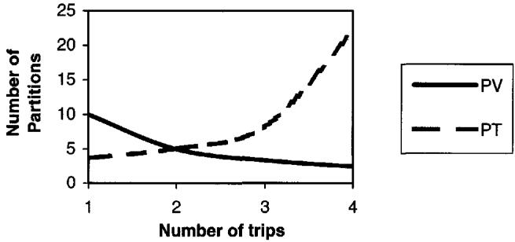  
Figure 11.1. Graph of $P V ( X )$ and $P T ( X )$ .

# 11.3.2.8 Example

This example illustrates the workload estimation procedure. Assume that the following are known:

Kl: Total volume $= 1 0 0$ tons,   
$\pmb { K } 2$ : Vehicle capacity per trip $= 1 0$ tons,   
$\pmb { K } 3$ : Service time on $\yen 123,456$ minutes,   
$K 4$ : Deadhead time between service arcs $\bf \Pi = 1 2 0$ minutes,   
$K 5$ : Route time $= 4 8 0$ minutes,   
K6a: Office time $= 3 0$ minutes,   
$K 6 b$ : Disposal time $= 6 0$ minutes,   
$K 6 c$ : Time from the disposal facility to the depot $= 1 0$ minutes,   
$K 6 d$ : Time from a partition to disposal facility ${ \bf \Omega } = 2 0 $ minutes,   
$K 6$ : Fixed overhead $= K 6 a + K 6 b + K 6 c + K 6 d = 1 2 0$ minutes,   
$K 7$ : Variable overhead $= 2 * K 6 d + K 6 b = 1 0 0$ minutes, Then $P V ( X )$ and $P T ( X )$ can be computed as follows: $\begin{array} { r l } & { P V ( X ) = K 1 / ( K 2 * X ) = 1 0 0 / ( 1 0 * X ) = 1 0 / X , } \\ & { P T ( X ) = ( K 3 + K 4 ) / ( K 5 - K 6 - K 7 ( X - 1 ) ) = 1 3 2 0 / ( 4 6 0 - 1 0 0 X ) . } \end{array}$

Equating $P V ( X )$ and $P T ( X )$ gives $X ^ { * }$ , the estimate of $X$ :

$$
X ^ { * } = ( K 1 * ( K 5 - K 6 + K 7 ) ) / ( ( K 1 * K 7 ) + ( K 2 * ( K 3 + K 4 ) ) ) = 1 . 9 8 .
$$

Since $X$ is 1.98, we compute $V ( i , j ) = \operatorname* { m i n } ( P V ( 1 ) , P T ( 2 ) )$ where $P V ( 1 ) = 1 0$ and $P T ( 2 ) = 5 . 0 8 $ . Therefore, $V ( i , j ) = 5 . 0 8$ and 5.08 is the estimate of the number of partitions needed to satisfy the workload.

# 11.3.3 Step C. Partition the Service Network

The partitioning algorithm in the VDA is significantly more complex than the partitioning algorithm used for solving the CARP with a homogeneous fleet. In the algorithms for the CARP, since all of the vehicles are identical, the partitioning step only has to assign all of the arcs in the service network to a partition. On the other hand, in the VDA, a decision has to be made about the vehicle class to service each partition, and all the required arcs and edges must be assigned to a partition.

In 11.2.6, the target route time for an entry in the vehicle preference list was defined to be the desired amount of work measured in time to a place in a partition and was allowed to vary between vehicle classes. As noted earlier, one of the constraints in the CARP-VSD is to form the partitions so that the total workload in each partition assigned to vehicle class $k$ lies between $[ T R T _ { k } \ - \ A _ { k }$ , $T R T _ { k } + B _ { k } ]$ although these bounds are assumed to be soft and, hence, can be violated.

The following five substeps of Step C form the partitions in the VDA. These five steps are iterated for each vehicle class in the vehicle fleet mix, beginning with the smallest available vehicle class in the fleet mix and ending with the largest available vehicle class in the fleet mix.

Step C1. A temporary service network (TSN) is created. The service arcs and edges in the TSN are those arcs and edges in $S A \cup S E$ that must be partitioned on this iteration and have not, as yet, been assigned to a partition.

Step C2. The TSN is partitioned as a CARP without vehicle-site dependencies using established CARP solution techniques. This partitioning is done using the available vehicles in terms of capacity that remain in the vehicle fleet mix determined in Step B and that have not as yet been assigned to a partition. This partitioning involves solving a nonhomogeneous CARP with no site dependencies. Sniezek [11] is conducting research into how to best accomplish this partitioning. For the Philadelphia study described in this chapter, this partitioning was accomplished using the existing CARP procedure for a nonhomogeneous fleet with no site dependencies that is available in the RouteSmart software system.

In this step, it is possible to have more vehicles from a vehicle class available in the fleet mix determined in Step B than the number of partitions that we want to create at this point in Step C. For example, the TSN for the smallest vehicle class may have only a small amount of workload that must be serviced by a vehicle from the smallest vehicle class. If the small vehicles were desirable, however, in the vehicle preference list, we may have several small vehicles in the fleet mix. However, to grow partitions for all or most of these small vehicles at this point in the algorithm would probably lead to inferior solutions containing imbalances in the workload and severe interlacing. The rule that we used for determining the number of partitions to grow at this time is equal to $\operatorname* { m i n } ( R 1 , R 2 )$ , where

R1: $1 . 5 *$ (minimum number of partitions needed to service the workload in the TSN). R1 is rounded up to the nearest integer.

$R 2$ : The number of vehicles of this vehicle class presently available in the fleet mix.

On the final iteration, the bounds on target route time can be violated to ensure that all arcs and edges in the service network $G _ { s }$ are assigned to a partition. The target route time has soft lower and upper bounds to ensure that all arcs and edges in $G _ { s }$ are assigned to partitions in the final solution.

Step C3. The service network $G _ { s }$ and all vehicle class service networks $G _ { s } ^ { 1 } , G _ { s } ^ { 2 } , . . . , G _ { s } ^ { i }$ are implicitly updated based on the partitioning in Step C2. No service arcs or service edges in TSN assigned to a partition in Step C2 are service arcs or service edges in $G _ { s } ^ { k } , k > i$ since Step C2 assigned arcs $a ( f , g )$ only to partitions where $S C ( f , g ) \leq i$ . Thus, the service networks $G _ { s } ^ { k }$ s, $k > i$ , need not be updated at this point.

Step C4. A second temporary service network TSN2 is now created. The service arcs and edges in TSN2 are the service arcs and edges in TSN that have already been assigned to partitions in Step C2 plus all remaining arcs and edges in $S A \cup S E$ that have, as yet, not been partitioned. In Step C4, the partitions grown in Step C2 are further expanded by assigning the arcs and edges in TSN2 until each partition grows to a specified percentage of the target route time of the vehicle class associated with each partition.

Step C5. If all of the arcs and edges requiring service have been assigned to a partition, the partitioning algorithm terminates. Otherwise, the service network $G _ { s }$ and all vehicle class service networks $G _ { s } ^ { 1 } , G _ { s } ^ { 2 } , . . . , G _ { s } ^ { k }$ are updated (as in Step C3) based on the partitioning in Step C4 and the algorithm returns to Step Cl.

# 11.3.3.1 Example

The example in Figure 11.2 illustrates the importance of partitioning the TSN first and the TSN2 later when dealing with a nonhomogeneous fleet of vehicles in the CARP-VSD. The graph in the figure has six nodes $( a , b , c , d , e , f )$ and nine edges $( A , B , C , D , E , F , G $ , $H , I )$ The volume on each edge is one unit, edges $B , C$ , and $D$ can be serviced by either a small or large vehicle, and the other edges can be serviced only by a small vehicle. Three cases are considered.

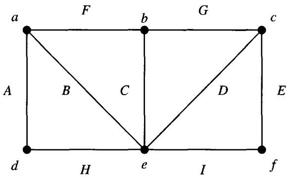  
Figure 11.2.

# 11.3.3.2 Case 1: Homogeneous CARP

Assume that the fleet has three small vehicles and the site dependencies on the edges are disregarded. The partitions for these three vehicles are seeded at $a , c$ , and $e$ . The following partitions are found:

$$
\operatorname { P a r t i t i o n } 1 ( \sec d a ) = \{ A , B , F \}
$$

$$
\operatorname { P a r t i t i o n } 2 ( \operatorname { s e e d } c ) = \{ D , E , G \} ,
$$

$$
\operatorname { P a r t i t i o n } 3 ( \sec d e ) = \{ C , H , I \}
$$

# 11.3.3.3 Case 2: CARP-VSD (Using Only TSN2)

In this case, the fleet consists of three vehicles—two small vehicles from vehicle class 1 and one large vehicle from vehicle class 2. As noted above, $B , C$ , and $D$ are the only edges that can be serviced by vehicles from vehicle class 2. In this case, Steps C2 and C3 described in the partitioning algorithm are not used.

We first partition the two small vehicles over the entire service network (TSN2) instead of the TSN. If the partitions are seeded at a and $c$ , then the following two partitions are created:

$$
{ \begin{array} { r l } { \operatorname { P a r t i t i o n } 1 ( \operatorname { s e e d } a ) = \{ A , B , F \} , } \\ { \operatorname { P a r t i t i o n } 2 ( \operatorname { s e e d } c ) = \{ D , E , G \} } \end{array} }
$$

These partitions are at capacity, and yet edges $H$ and $I$ which must be serviced by vehicle class 1, have not been assigned to a partition.

On the next iteration through Step C, the TSN2 consists of edge $C$ . Edges $H$ and $I$ are not in TSN2 since these edges cannot be serviced by the large vehicle. Thus, Partition 3 is the following:

$$
\operatorname { P a r t i t i o n } 3 ( \operatorname { s e e d } e ) = \{ C \} .
$$

Thus, in the final solution for this case, $H$ and $I$ are not assigned to a partition and Partition 1 and Partition 2 are at capacity.

# 11.3.3.4 Case 3: CARP-VSD (Using TSN then TSN2)

In this case, the fleet composition is the same as in Case 2. However, we are going to do the partitioning by first forming the TSN and then forming the TSN2.

The initial TSN for the vehicles in the smallest vehicle class consists of edges $A , E$ , $F , G , H$ , and $I$ . Edges $B$ , $c$ , and $D$ (the edges that can be serviced by vehicles from vehicle class 2) are not in the TSN for the small vehicle class. Using $\ b { a }$ and $c$ as the seed points for the partitioning, the partitions are as follows:

$$
{ \begin{array} { r l } & { \operatorname { P a r t i t i o n } 1 ( \operatorname { s e e d } a ) = \{ A , F , H \} , } \\ & { \operatorname { P a r t i t i o n } 2 ( \operatorname { s e e d } c ) = \{ E , G , I \} . } \end{array} }
$$

The two partitions are at capacity and all edges that had to be serviced by vehicle class 1 are assigned to a vehicle from vehicle class 1.

The TSN2 for the smallest vehicle class consists of the entire network. Since the two partitions for the smallest vehicle class are at saturation, no new edges are assigned to these partitions.

The algorithm begins again for the vehicle in the larger vehicle class. The TSN consists of edges $B , C$ , and $D$ . The resulting partition is the following:

$$
\mathrm { P a r t i t i o n } 3 ( \mathrm { s e e d } e ) = \{ B , C , D \} .
$$

# 11.3.3.5 Analysis

These three cases illustrate the following. The homogeneous solution (Case 1) gives the best set of partitions in terms of interlacing and covering all of the edges. When site dependencies are considered, Case 3 (TSN then TSN2) gives a better solution than Case 2 (TSN2 only) in the sense that all edges are assigned to partitions in Case 3 and some edges are not assigned to partitions in Case 2. The solution in Case 3 can be regarded as inferior to the solution in Case 1 because the Case 3 solution has more interlacing. However, the solution in Case 1 is not feasible to the vehicle-site dependency problem considered in Cases 2 and 3, where the fleet is made up of two small vehicles and one large vehicle, since there is at least one arc in each partition that must be serviced by a small vehicle only.

# 11.3.4 Step D. Determine Travel Path and Balance the Partitions

In Step D, there is no guarantee that the network of streets to be serviced in any partition found in Step C is connected. Thus, a Rural Postman Problem (RPP) is solved to find a minimum deadhead time travel path for each of the partitions. A solution to the RPP finds a continuous, minimum deadhead time travel path that covers all the arcs and edges in the partition that require service, begins and ends at the depot, and has the trips to the disposal facility integrated into the travel path. The appropriate vehicle class travel network is used in the solution of the RPP to determine the streets to deadhead when finding the minimum deadhead time travel path. Once the minimum deadhead time travel path is known, the actual time to traverse the route in the partition can be determined.

Solving the RPP can be extremely complex. The algorithm must take into account that the required street segments in a partition can form a disconnected network, some street segments are one-way, other street segments are two-way, some street segments must be serviced as a meander, and specified turn restrictions and street crossing difficulties must be considered.

If the time to traverse the route for any partition does not fall within the lower and upper bound of the target route time for the vehicle class assigned to that partition, then an automatic swapping procedure is employed to swap arcs and edges between partitions. The primary objective of this swapping is to improve the balance on the routes. In this swapping, vehicle-site dependency feasibility is maintained. When all swapping is completed, the RPP for each partition is solved again.

Let partition $p$ be in vehicle class $k$ . Then, in section 11.2.7 we defined a balanced solution as one in which the route length for each partition $p$ lies in the interval, $[ T R T _ { k } \ -$ $A _ { k }$ , $T R T _ { k } + B _ { k } ] = [ L o w e r _ { p } , U p p e r _ { p }$ . After solving the RPP for each partition $p$ if we have a balanced solution, then the results are stored and printed and the algorithm terminates.

If we do not have a balanced solution, a measure of Solution Goodness, $S G$ , is computed as $S G = T 1 + T 2$ , where

Tl: $\sum ( T i m e _ { p } - U p p e r _ { p } ) ^ { 2 }$ where the sum is over all partitions $p$ where $T i m e _ { p } >$ Upper p.

T2: $\sum ( T i m e _ { p } - L o w e r _ { p } ) ^ { 2 }$ , where the sum is over all partitions $p$ where $T i m e _ { p } \ <$ $L o w e r _ { p }$ .

$T _ { Ḋ } i m e _ { p }$ is the total time to traverse the travel path in partition $p$ . If this measure of solution goodness is better than that of any previous iteration, this solution is saved as the best solution found so far. A balanced solution is when the corresponding $S G = 0$ .

The algorithm terminates when either a balanced solution is found or a specified number of iterations have been carried out. If a balanced solution is not found, then the best solution found so far is assumed to be the best solution for this problem. If the algorithm has not reached the specified number of iterations and we have not found a balanced solution, the algorithm continues with Step E.

# 11.3.5 Step E. Revise Estimate of Total Work and Adjust Fleet Mix

Steps B and E are similar, but the deadhead travel times and the actual travel paths for each partition are known in Step E. Thus, quantities that are estimated in Step B are known more accurately after carrying out Step E. This information is used to determine a possible new fleet mix. This revision in the workload estimation is based, in part, on the out-of-balance partitions that exist in the solution found in Step D. For example, if all vehicle class 1 partitions are over-saturated while all vehicle class 2 partitions have excess capacity, then a vehicle from vehicle class 1 may be assigned to a partition rather than the vehicle from vehicle class 2 that is already assigned to that partition. This swap assumes that the vehicle preference list has an available extra vehicle from vehicle class 1. After determining a revised fleet mix, the algorithm returns to Step C for a new iteration.

# 11.4 Implementation of the VDA in Philadelphia

In many major cities, residential sanitation routes generally are formed manually by supervisors and can be extremely out of balance. Some routes can require overtime while other routes require only 4 to 5 hours of work. Because these routes are severely out of balance and overtime has to be paid to some of the crews, management has viewed these routes as ineffective. Moreover, the crews have viewed these routes as inequitable and these inequities have lead to discontent and unhappiness. Balanced routes and schedules are generally viewed positively by both management and the crews. One of the objectives of the VDA is to develop routes that are balanced. Having routes that are balanced was a primary consideration in the acceptance of the routes generated by the VDA in Philadelphia.

The routing of the residential sanitation vehicles was part of a large-scale program that introduced Geographic Information Systems (GISs) to Philadelphia. Philadelphia wanted to increase the efficiency of its residential sanitation collection and needed a GIS-based computer system to carry out its routing. The RouteSmart system had as one of its components a set of algorithms for solving the CARP without site dependencies, and the RouteSmart systern was implemented within a GIS. The VDA was developed and implemented within the RouteSmart system specifically to address the vehicle-site dependency issue. RouteSmart runs on both personal computers and UNIX platforms on various GISs. The Philadelphia Sanitation Department has RouteSmart running on a UNIX-based RS-6000 machine using ARC/INFO as the native GIS.

The version of RouteSmart in which the VDA is embedded has the following capabilities:

• The system can partition a street network of up to 20,000 street segments into as many as 100 efficient, compact partitions with up to 100 different vehicle classes. The partitions that RouteSmart generates generally have little overlap or interlacing. However, the RouteSmart solution for the CARP-VSD has more interlacing than if there were no vehicle-site dependencies.

• The system assigns a vehicle from the appropriate vehicle class to each partition.

• The system constructs a travel time path for each partition by solving an RPP over the street segments assigned to the partition.

• The system produces the desired route maps as well as a printed copy of the streets in each route and the line of travel path.

• The system creates a multicolor display of the partitions and the line of travel path for each partition.

• The system allows the user to manually swap street segments between partitions. Manual swapping allows local knowledge of the area to be incorporated into the final solution and is a critical aspect of implementation of the final solution. In many implementations in a variety of problem settings, we found that user-generated routes are more easily accepted and implemented than the computer-generated routes that do not allow user intervention.

The initial results of the VDA implemented inside RouteSmart were good. McCoy [8] reported that the city of Philadelphia was able to use 18 trucks to carry out the residential sanitation pickup in a trash district that previously required 23 trucks. These savings are similar to the results that other cities have found using the version of RouteSmart that use a homogeneous fleet. The city of Philadelphia is the first place where the VDA has been used. In Philadelphia, the target route time, $T R T _ { k }$ for each vehicle class was assumed to be the same.

McCoy [8] pointed out that it is important to the efficiency of an operation to have accurate route maps and travel paths of a region and that RouteSmart generates route maps and travel paths. The importance of route maps and travel paths on a sanitation operation can be summarized as follows. With manually generated routes, the drivers may not receive route maps and travel paths of their region. This can cause missed collections and increased costs. In many sanitation operations, it is mandated that missed pickups be collected at the end of the day. In these cases, the crews servicing these missed collections are paid overtime and overtime can be a major expense. Furthermore, in some locations, it is a common occurrence for as many as 1 in 10 sanitation workers to be out sick each day. Thus, it becomes difficult for substitute drivers to efficiently drive their routes without route maps and travel paths.

# 11.5 Enhancements and Extensions

The use of the VDA in Philadelphia was regarded as a success. Despite this success, the development of the VDA is an ongoing effort. The following issues are being explored in the doctoral dissertation of Sniezek [11].

When determining the fleet mix to satisfy the workload, Step 2 of the VDA starts at the top of the vehicle preference list and takes the most preferred feasible vehicles available. We believe that this hierarchical approach can be improved on in determining a more desirable fleet mix. We are constructing a mathematical model that uses a weighted objective function to determine the most desirable fleet mix. In the model, we assign weights (dollar values) to the daily fixed costs and variable costs of the vehicles in each vehicle class. We believe that the fleet mix determined by this weighted objective cost function will yield a better solution than the hierarchical approach currently used. Components of fixed daily costs include salary (one-person crew versus two-person crew), depreciation of the vehicle, and daily operating expense (fuel consumption, service cost, etc.). Each of these components can vary by vehicle class. Components of variable daily costs include the tipping fee paid by the vehicle to the disposal facility every time the vehicle unloads at the disposal facility. The tipping fee is important because it can be expensive for a vehicle to be emptied at a disposal facility, and different vehicle classes can have a different number of trips to the disposal facility daily.

Algorithms for the traditional CARP grow all the partitions simultaneously since the entire service network is being partitioned at the same time. This is not the case with the VDA. The VDA creates the partitions that service streets whose site dependency says that they can only be serviced by the smallest vehicle class first. Then, the VDA creates the partitions that service streets whose site dependency says that they can only be serviced by the two smallest vehicle classes, and so forth. Some partitions for a vehicle for a vehicle class may not be created at the same time as other vehicles from that class. Creating too few partitions at a time may introduce too much deadheading. Creating too many partitions at a time may introduce too much overlap or interlacing. We are exploring other ideas for determining how many partitions to grow and the fleet mix on each iteration of Step 3 of the VDA.

Knowing the fleet mix on Step 3 of the VDA, the problem is where the seed points should be located and which vehicle class to assign to each seed point. More specifically, the following questions arise.

When concurrently forming partitions from more than one vehicle class, should the partitions from each of the vehicle classes be seeded near each other or far away from each other?

Should the location of the vehicle partitions from previous iterations and the vehicle classes assigned to those partitions influence the seeding of the vehicle partitions on the current iteration?

Should the larger vehicle partitions be seeded in high-volume areas since they can hold more volume, or should they be seeded farther from the disposal facility since they require fewer trips to the disposal facility?

# Acknowledgments

We thank Dr. Arjang Assad and Dr. Bruce Golden for their ongoing guidance and insight related to vehicle-site dependencies. We also thank Professors Toth and Vigo and the referees of this chapter for their insightful comments.

# Bibliography

[1] A.A. Assad and B.L. Golden. Arc routing methods and applications. In M.O. Ball, T.L Magnanti, C.L. Monma, and G.L. Nemhauser, editors, Network Routing, Handbooks i Operations Research and Management Science 8, North-Holland, Amsterdam, 1995, pp. 375^83.   
[2] L.D. Bodin, B.L. Golden, A.A. Assad, and M. Ball. Routing and scheduling of vehicle and crews, the state of the art. Computers and Operations Research, 10:63-212,1983.   
[3] H.A. Eiselt, M. Gendreau, and G. Laporte. Arc routing problems, part I: The Chinese postman problem. Operations Research, 43:231-242, 1995.   
[4] H.A. Eiselt, M. Gendreau, and G. Laporte. Arc routing problems, part II: The rural postman problem. Operations Research, 43:399-414, 1995.   
[5] B .L. Golden and R.T. Wong. Capacitated arc routing problems. Networks, 11:305-315, 1981. [6] G. Laporte. Vehicle routing. In M. Dell'Amico, F. Maffioli, and S. Martello, editors, Annotated Bibliographies in Combinatorial Optimization. Wiley, Chichester, UK, 1997.   
[7] L. Levy. The Walking Line of Travel Problem: An Application of Arc Routing and Partitioning. Ph.D. thesis, University of Maryland, 1987.   
[8] C. McCoy. High tech helps haul the trash. The Philadelphia Inquirer, July 10, 1995.   
[9] B. Nag. Vehicle Routing in the Presence of Site/Vehicle Dependency Constraints. Ph.D. thesis, University of Maryland, 1987.   
[10] W.L. Pearn. Augment-insert algorithms for the capacitated arc routing problem. Com puters and Operations Research, 18:189-198, 1991.   
[11] J. Sniezek. The Capacitated Arc Routing Problem with Vehicle/Site Dependencies: An Application of Arc Routing and Partitioning. Ph.D. thesis, University of Maryland 1999.

# Chapter 12

# Inventory Routing in Practice

Ann M. Campbell Lloyd W. Clarke Martin W.R Savelsbergh

# 12.1 Introduction

PRAXAIR (www.praxair.com) is a large industrial gases company with about 60 production facilities and more than 10,000 customers across North America. PRAXAIR recently negotiated a policy with its customers in which PRAXAIR is in charge of managing its customers' inventories. Customers will no longer call PRAXAIR to request a delivery. Instead, PRAXAIR will determine who receives a delivery each day and what the size that delivery will be. PRAXAIR will use gauge readings received from remote telemetry units as well as regular customer phone calls to monitor and forecast product inventories. The distribution planning problems associated with such vendor-managed resupply policies are known as Inventory Routing Problems (IRPs).

IRPs are very different from VRPs. VRPs occur when customers place orders and the delivery company, on any given day, assigns the orders for that day to routes for trucks. In inventory routing problems, the delivery company, not the customer, decides how much to deliver to which customers each day. There are no customer orders. Instead, the delivery company operates under the restriction that its customers are not allowed to run out of product. Another difference is the planning horizon. VRPs typically deal with a single day, and the only requirement is that all orders have to be delivered by the end of the day. Inventory routing problems deal with a longer horizon. Each day the delivery company makes decisions about which customers to visit and how much to deliver to each of them, while keeping in mind that decisions made today impact what has to be done in the future. The objective is to minimize the total cost over the planning horizon while making sure no customers run out of product. The flexibility to decide when customers receive a delivery and how large these deliveries will be may significantly reduce distribution costs. However, this flexibility also makes it very difficult to determine a good, much less an optimal, costeffective distribution plan. When the choice becomes which of the customers to serve each day and how much to deliver to them, the choices become virtually endless.

Vendor-managed resupply policies can be used in many situations. In some instances, the use of such a policy is natural, such as when the "customers" are really part of the same company. In others, the use of a vendor-managed resupply policy is often the result of lengthy negotiations with customers who have for years followed a policy in which they call in their orders. Examples of industries where vendor-managed resupply policies are being used or considered are the petrochemical industry (gas stations), the grocery industry (supermarkets), the soft drink industry (vending machines), and the automotive industry (parts distribution). The number of industries using vendor-managed resupply policies is increasing rapidly. An important reason for this is technology. For a variety of industries and products, the monitoring technology that existed several years ago was not sophisticated enough to make a vendor-managed resupply system possible. The only way to check a customer's inventory for many types of products was for the vendor to call the customer and for the customer to go look at the meter on the tank, to count the number of items in the vending machine, and so forth. Now the use of remote telemetry units, scanners, computers, and modems allows monitoring of inventory levels directly by the vendor, opening up new opportunities for vendor-managed resupply policies.

In section 12.2, we formally introduce the IRP, and in section 12.3, we give a brief literature review. In section 12.4, we discuss the two-phase approach we have chosen to solve instances of the IRP. In section 12.5, we present the results of some computational experiments on real-world instances from PRAXAIR.

# 12.2 Problem Definition

The IRP is concerned with the repeated distribution of a single product from a single facility to a set $N$ of customers over a planning horizon of length $T$ (expressed in days), possibly infinity. Customer / consumes the product at a rate $u _ { i }$ (volume per day) and has the capability to maintain a local inventory of the product up to a maximum of $C _ { i }$ (. The inventory at customer $i$ is $I _ { i } ^ { 0 }$ at time 0. A fleet $M$ of homogeneous vehicles, with capacity $Q$ , is available for the distribution of the product. The objective is to minimize the average daily distribution cost during the planning period without causing stockouts at any of the customers. Vehicles are allowed to make multiple trips per day. Three decisions have to be made:

• When to serve a customer?   
• How much to deliver to a customer when served?   
• Which delivery routes to use?

Real-life inventory routing problems are obviously stochastic. No customer will use product the same way every single day. In many situations, however, usage is relatively predictable and customers generally use about the same amount each day if we look at their total usage for several days in a row. Therefore, solution approaches developed for the IRP as defined above provide useful planning tools.

# 12.3 Literature Review

Although the IRP is a long-term problem, almost all proposed solution approaches solve only a short-term version of the problem to make it easier. In early work, short-term was often just a single day, but in later work this was expanded to several days. Besides the number of days modeled, key features that distinguish different solution approaches include how the long-term effects of short-term decisions are modeled, how it is determined which customers are included in the short-term problem, and whether demand at the customers is treated as deterministic or stochastic. Summaries of various approaches were made by Ball [3], Dror, Ball, and Golden [14], Nori [27], and Campbell et al. [11]. In the remainder of this section, we discuss a number of proposed approaches in more detail. This discussion is not meant to provide a complete overview of work done in this area, but is an introduction to the types of approaches that have been taken.

Those following a single-day approach include Federgruen and Zipkin [17], Golden, Assad, and Dahl [22], and Chien, Balakrishnan, and Wong [13]. Federgruen and Zipkin [17] in their single-day approach capitalized on many of the ideas from vehicle routing. Their model, which is a nonlinear integer program, decomposes into a routing portion and inventory portion. They construct an initial feasible solution to the routing part of the problem and iteratively improve the solution by exchanging customers between routes and then resolving the inventory part of the problem. Golden, Assad, and Dahl [22] developed a heuristic based on a measure of the urgency of each customer, which is defined as the ratio of tank inventory level to tank size. All customers with an urgency smaller than a certain threshold are excluded. Customers are iteratively selected to receive a delivery according to the highest ratio of urgency to extra time required to visit this customer. Chien, Balakrishnan, and Wong [13] also developed a single-day approach, but it does not treat each day as a completely separate entity. By passing some information from one day to the next, the system simulates a multiple-day planning model.

The work of Fisher et al. [19, 8] was motivated, as is our work, by an application in the industrial gases industry. They took profit maximization from product distribution over several days as their objective. Demand is given by upper and lower bounds on the amount to be delivered to each customer for every period in the planning horizon. An integer program is formulated that captures delivery volumes, assignment of customers to routes, assignments of vehicles to routes, and assignment of start times for routes. It is solved using a Lagrangian dual-ascent approach.

The first serious effort to develop an approach that considers what happens beyond the next few days was made by Dror, Ball, and Golden [14] and Dror and Ball [16]. They considered demand to be stochastic and used the probability that a customer will run out on a specific day in the planning period, the average cost to deliver to the customer, and the anticipated cost of a stockout to find the optimal replenishment day $t ^ { * }$ for each customer. If $t ^ { * }$ falls within the short-term planning period of the next few days, the customer will be visited, and a value $c _ { t }$ is computed for each of the days in the planning period that reflects the expected increase in future cost if the delivery is made on day $t$ instead of on $t ^ { * }$ . An integer program is then solved that assigns customers to a vehicle and a day, or just a day, that minimizes the sum of these costs plus the transportation costs. Delivery amounts are considered to be dictated by the day of the week on which the delivery is made and thus are not a decision to be made by the integer program.

Some of the ideas of Dror and Ball were extended and improved by Trudeau and Dror [29]. Dror and Levy [15] used a similar analysis to yield a weekly schedule but applied node and arc exchanges to reduce costs in the planning period. Bard et al. [5, 4, 23] discussed another extension of this idea. They took a rolling-horizon approach to the problem by determining a schedule for 2 weeks but implementing only the first week. An analysis similar to Dror and Ball's is done to determine an optimal replenishment day for each customer, and incremental costs are computed that represent the cost for changing the next visit to a customer to a different day but keeping the optimal schedule in the future. These costs are used in an assignment problem formulation that assigns each customer to a day in the 2-week planning horizon.

Anily and Federgruen [1, 2] looked at minimizing long-run average transportation and inventory costs by determining long-term routing patterns for a set of customers with deterministic demand. The routing patterns are determined using a modified circular partitioning scheme. After the customers are partitioned, customers within a partition are divided into regions to make the demand of each region roughly equal to a truck load. A customer may appear in more than one region, but then a certain percent of the customer's demand is allocated to each region. When one customer in a region gets a visit, all customers in the region are visited. They also determine a lower bound for the long-run average cost to be able to evaluate how good their routing patterns are. Using ideas similar to those of Anily and Federgruen, Gallego and Simchi-Levi [21] evaluated the long-run effectiveness of direct shipping (separate loads to each customer). They concluded that direct shipping is at least $94 \%$ effective over all inventory routing strategies whenever minimal economic lot size is at least $71 \%$ of truck capacity. This shows that direct shipping becomes a bad policy when many customers require significantly less than a truck load, making more complicated routing policies the appropriate choice.

Another adaptation of these ideas was made by Bramel and Simchi-Levi [10]. They considered the variant of the IRP in which customers can hold an unlimited amount of inventory. To obtain a solution, they transform the problem to a capacitated concentrator location problem (CCLP), solve the CCLP, and transform the solution back into a solution to the IRP. The solution to the CCLP will partition the customers into disjoint sets, which in the inventory routing problem will become the fixed partitions. These partitions are then served in a way similar to the regions of Anily and Federgruen.

In the last few years, several researchers started to investigate a stochastic version of the problem, in which it is assumed that a probability distribution is known for customer usage. This adds more realism, since in practice customer usage is never deterministic, but obtaining probability distributions of customer usage in practice is extremely complex. Kleywegt, Nori, and Savelsbergh [25] formulated the inventory routing problem as a Markov decision process and proposed approximation methods to find good solutions with reasonable computational effort. Computational results are presented for the inventory routing problem with direct deliveries. Other work in this direction includes Minkoff [26], Bassok and Ernst [7], Barnes-Schuster and Bassok [6], Berman and Larson [9], Cetinkaya and Lee [12], and Fumero and Vercellis [20].

# 12.4 Solution Approach

A short-term approach has the tendency to defer as many deliveries as possible to the next planning period, which may lead to an undesirable situation in the next planning period. Therefore, the proper projection of a long-term objective into a short-term planning problem is essential. It needs to capture the costs and benefits of delivering to a customer earlier than necessary. Our focus has been on developing a flexible system capable of handling large instances that properly balances short-term and long-term goals and that considers all the key factors, i.e., geography, inventory, capacity, and usage rate. We wanted also to create a system that would consider routing customers together on a day where none of them are at the point of run-out but where they combine to make a good, full-truckload delivery route. We found that most systems reduce the problem by starting with only the "emergency" customers, never putting together certain combinations that make sense with regard to location and delivery size. The basis for our system is a two-phase solution approach. In the first phase, we determine which customers receive a delivery on each day of the planning period and decide on the size of the deliveries. In the second phase, we determine the actual delivery routes and schedules for each of the days.

As mentioned, real-life inventory routing problems are stochastic. Therefore, any distribution plan covering more than a couple of days will never be executed completely as planned. Actual volumes delivered differ from planned volumes because usage rates deviate from their forecasts, planned driving time is off due to traffic congestion, and so forth. Therefore, any planning system needs to be flexible. It needs to take advantage of the latest changes in the data. Given this, our approach is to embed our two-phase solution approach in a rolling-horizon framework. We always construct a distribution plan for a month to reflect the long-term nature of the planning problem, but we expect to implement only the first few days. We repeat this as often as necessary using the latest information available.

# 12.4.1 Phase I: Integer Programming Model

At the heart of the first phase is an integer program. Central to the model are two quantities: $L _ { i } ^ { t } = \operatorname* { m a x } ( 0 , t u _ { i } - I _ { i } ^ { 0 } )$ , a lower bound on the total volume that has to be delivered to customer $i$ by the end of day $t$ , and $U _ { i } ^ { t } = t u _ { i } + C _ { i } - I _ { i } ^ { 0 }$ , an upper bound on the total volume that can be delivered to customer $i$ by the end of day $t$ . Let $d _ { i } ^ { t }$ represent the delivery volume to customer $i$ on day $t$ ; then to ensure that no stockout occurs at customer $i$ and to ensure that we do not exceed the inventory capacity at customer $i$ , we need to have that

$$
L _ { i } ^ { t } \le \sum _ { 1 \le s \le t } d _ { i } ^ { s } \le U _ { i } ^ { t } , \qquad i \in N , \ t = 1 , \dots , T .
$$

To model the resource constraints with some degree of accuracy and to have a meaningful objective function, we found it necessary to explicitly use delivery routes. We added another dimension to the $d$ variable, changing it from $d _ { i } ^ { t }$ to $d _ { i r } ^ { t }$ . However, when we refer to a "route," we are really referring to a set of customers without enforcing a specific ordering among the customers in the set. We estimate the distance required to visit the customers in the set by the length of the optimal traveling salesman tour through all the customers. Now, let $R$ be the set of delivery routes, let $T _ { r }$ denote the duration of route $r$ (as a fraction of a day), and let $c _ { r }$ be the cost of executing route $r$ . Furthermore, let $x _ { r } ^ { t }$ be a 0-1 variable indicating if route $r$ is used on day $t$ $( x _ { r } ^ { t } = 1 )$ ) or not $( x _ { r } ^ { t } = 0 )$ ). The total volume that can be delivered on a single day is limited by a combination of capacity and time constraints. Since vehicles are allowed to make multiple trips per day, we cannot simply limit the total volume delivered on a given day to be the sum of the vehicle capacities. To be more precise, the resource constraints can be modeled by

$$
\sum _ { i \in r } d _ { i r } ^ { t } \le Q x _ { r } ^ { t } \qquad \forall r \in R , t = 1 , \dots , T ,
$$

and

$$
\sum _ { r \in R } T _ { r } x _ { r } ^ { t } \leq | M | \qquad \forall t = 1 , \ldots , T .
$$

These constraints ensure that we do not exceed the vehicle capacity on any of the selected routes and that the time required to execute the selected routes does not exceed the time available.

The basic Phase I integer programming model is given by

$$
\operatorname* { m i n } \sum _ { t = 1 } ^ { T } \sum _ { r \in R } c _ { r } x _ { r } ^ { t }
$$

subject to

$$
\begin{array} { l } { { L _ { i } ^ { t } \le \displaystyle \sum _ { 1 \le s \le t \ge R } d _ { i r } ^ { s } \le U _ { i } ^ { t } \qquad \forall i \in N , t = 1 , \dots , T , } } \\ { { \displaystyle \sum _ { i \in r } d _ { i r } ^ { t } \le Q x _ { r } ^ { t } \qquad \forall r \in R , t = 1 , \dots , T , } } \\ { { \displaystyle \sum _ { r \in R } T _ { r } x _ { r } ^ { t } \le | M | \qquad \forall t = 1 , \dots , T , } } \\ { { \displaystyle x _ { r } ^ { t } \in \{ 0 , 1 \} \qquad \forall r \in R , t = 1 , \dots , T , } } \\ { { \displaystyle d _ { i r } ^ { t } \ge 0 \qquad \forall i \in N , t = 1 , \dots , T . } } \end{array}
$$

The first variation of the basic model handles fixed and variable stop times at the customers as well as a vehicle reloading time at the facility. The duration $T _ { r }$ of route $r$ can be modified to include not only the estimated time to drive the distance between the customers on the route but also a fixed stop time for each customer and an initial fill time for the vehicle required before the route can start. Dispense time at a customer clearly cannot be included in $T _ { r }$ a priori because it depends on the size of the delivery. Therefore, we must alter the resource constraint as follows, where $F$ is the percentage of the day required to dispense each unit of product:

$$
\sum _ { r \in R } \left( T _ { r } x _ { r } ^ { t } + \sum _ { i \in r } F d _ { i r } ^ { t } \right) \le | M | \qquad t = 1 , \ldots , T .
$$

The second variation handles operating modes of customers. Operating mode refers to the start and end times of customer usage on each day of the week. Earlier, we assumed that each customer $i$ uses product 24 hours per day every day. Operating modes are important. When a customer does not use product on the weekend, for example, this has a big impact on properly timing the deliveries. Operating modes can be handled easily by appropriately modifying the lower- and upper-bound parameters. The value for the upper bound and lower bound on day $t$ now depend on where in the week days 1 through t fall.

The third variant handles time windows at customers. An operating mode restricts when a customer uses product. A time window restricts when a customer can receive a delivery. Time windows may be day dependent as well. To handle time windows, the lower- and upper-bound parameters need to be modified again, but in a slightly different way. Now the lower bound $L _ { i } ^ { t }$ needs to be defined as the total volume that has to be delivered to customer $i$ by the closing of the time window on day $t$ to allow customer $i$ to last until the opening of the time window on day $t + 1$ (or the opening of the time window on the first available day for the next delivery if no deliveries can be made on day $t + 1 )$ . The upper bound $U _ { i } ^ { t }$ is now defined as the largest volume that customer $i$ can receive by the close of the delivery window on day $t$ .

# 12.4.2 Phase I: Solving the Integer Programming Model

The integer programming model presented above is not very practical for two reasons: the huge number of possible delivery routes and, although to a lesser extent, the length of the planning horizon. To make the integer program computationally tractable we consider a small (but good) set of delivery routes and aggregate periods toward the end of the planning horizon.

# 12.4.2.1 Clusters

Our approach to reduce the number of routes is based on allowing customers to be on a route together only if they are in the same cluster. A cluster is a group of customers that can be served cost effectively by a single vehicle for a long period. The cost of a cluster is an approximation of the distribution cost for serving the customers in the cluster for a month. The cost of serving a cluster depends on not only the geographic locations of the customers in the cluster but also on whether the customers in the cluster have compatible inventory capacities and usage rates. Therefore, to evaluate the cost of a cluster, we need a model that considers all these factors.

The following approach is used to identify a good set of disjoint clusters covering all customers:

1. Generate a large set of possible clusters.

2. Estimate the cost of serving each cluster.

3. Solve a set-partitioning problem to select clusters.

Observe that the selection of clusters has to be done only once as a preprocessing step before the actual planning starts. It does not have to be rerun before every execution of the Phase I integer program. In practice it makes sense to recluster when new customers have been added or there have been significant changes to the data.

Since we generate a large number of clusters to choose from, we need a costing procedure that is fast but able to provide an accurate estimate of the cost of serving the cluster. We decided to use a simple integer program with key features represented.

# 12.4.2.2 Aggregation and Relaxation

Because our two-phase solution approach will be embedded in a rolling-horizon framework, the emphasis should be on the quality and detail of the decisions concerning the first few days of the plan. This provides us with an excellent opportunity to reduce the size of the integer program by aggregating days toward the end of the planning period.

For the first $k$ days, we will still have route selection variables for each day, but for the days after that, we will have route selection variables covering periods of several days. Instead of making a decision on whether to execute each route on days 8 to 14 individually, for example, we now decide how many times each of the routes will be executed during the whole week. Several aggregation schemes were tested. We found that considering weeks rather than days toward the end of the planning horizon still does a good job of preserving the costs associated with the effect of short-term decisions on the future and yields a significant reduction in CPU time. Therefore, the daily variables associated with these later days are replaced by weekly variables. Upper and lower bounds are altered accordingly as well.

A further simplification is obtained by relaxing the integrality restrictions on the variables representing the weekly decisions. Therefore, the only binary variables appearing in the integer program will be those representing route selections for the first $k$ days.

# 12.4.3 Phase II: Scheduling

A solution to the integer program of Phase I specifies the volumes to deliver to each customer for the next $k$ days. It does not specify departure times and customer sequences for the different vehicles. Therefore, we still need to construct vehicle routes and schedules.

Since the delivery volumes specified by the solution to the integer program may not fit before a specific time of the day and may need to be received before a certain later time to prevent run-out, these deliveries have self-imposed time windows. Therefore, to convert the information provided by the solution to the integer program to daily vehicle routes and schedules, we can solve a sequence of VRPs with time windows.

However, such an approach does not capitalize on the flexibility inherent in the IRP. The delivery volumes specified by the solution to the integer program are good from a long-term perspective; they may not be good from a short-term perspective. Therefore, we treat the delivery volumes and timing specified by the solution to the integer programs as suggestions. We try to follow these suggestions as closely as possible, since this helps to achieve our long-term goals, but we allow small deviations when it helps to construct better short-term plans. To be more precise, we construct vehicle routes and schedules for two consecutive days, where we force the total volume delivered to a customer over the 2 days to be greater than or equal to the total delivery volume specified by the solution to the integer program for these 2 days, but we do not enforce specific delivery volumes on individual days. In this way, we stay close to the delivery volumes suggested by the integer program, which is good from a long-term perspective, but we introduce some flexibility in the daily routing and scheduling, which is good from a short-term perspective. Deliveries can be split into smaller pieces, delivering one part on the first day and the second part on the second day if this works out to be better, for example, when resources are very tight on one of the days. This flexibility is even more important when we consider that, in practice, a few customers may not follow a vendor-managed resupply policy and may call in orders that need to be added to the daily routing and scheduling problem. With new orders and new accurate up-to-date information on customer inventory levels, it may make sense to shift around some of the deliveries over the next couple of days.

Because of customer usage and customer inventory capacities, there may be customers that require a delivery on both days or even multiple times a day. Consequently, in our 2-day routing and scheduling problem, we can distinguish two types of customer: customers that require multiple deliveries over the 2 days and customers that require only one.

We have developed and implemented an insertion heuristic for this 2-day routing and scheduling problem. The heuristic is a logical progression of commonly used techniques in insertion heuristics for the vehicle routing problem with time windows; see, for example, Solomon [28] and Kindervater and Savelsbergh [24].

In the description of the heuristic, we assume, for ease of presentation, that there are no operating modes and no time windows restricting when deliveries can take place. Both complications can easily be handled. We also do not discuss explicitly the use of fixed stop times and unloading times, though both can be included in the travel-time value used here.

The flexibility to change delivery volumes makes checking the feasibility of insertions much more complex than in the VRP. For example, the insertion of a customer on a route can affect the delivery volume of another customer on an earlier or later route for the same vehicle, which can affect the size and timing of other deliveries for the customers on that route and so forth.

To be able to evaluate the feasibility of an insertion, we maintain several quantities related to deliveries to customers already scheduled. Consider a delivery to customer / on route $r$ . The predecessor on the route is denoted by $p ( i )$ and the successor on the route is denoted by $s ( i )$ The total volume to be delivered to customer $i$ over the 2 days prescribed by the solution to the Phase I integer program is $d _ { i }$ . We consider a day as ranging from time 0 to 1 for convenience. There is a slight difference for customers that need multiple deliveries over the 2 days, but the basic quantities we maintain are the following:

• The minimum delivery volume, $q _ { r i } ^ { \mathrm { m i n } }$

$$
q _ { r i } ^ { \mathrm { m i n } } = d _ { i } .
$$

• The earliest time a delivery can be made, $t _ { r i } ^ { e a r l y }$

$$
t _ { r i } ^ { e a r l y } = \operatorname* { m a x } \left( t _ { r p ( i ) } ^ { e a r l y } + t t _ { p ( i ) , i } , ( q _ { r i } ^ { \operatorname* { m i n } } - C _ { i } + I _ { i } ) / u _ { i } \right) ,
$$

where t^' $t _ { r 0 } ^ { e u r l y } = t _ { r } ^ { e a r l y s t a r t }$ the earliest time the route can start, and $t t _ { j , k }$ is the travel time from customer $j$ to $k$ . The first term of the maximum represents the time to get to customer $i$ from $p ( i )$ The second term represents the time that the minimum delivery volume can fit at customer $i$ .

• The latest time a delivery can be made, $t _ { r i } ^ { l a t e }$

$$
t _ { r i } ^ { l a t e } = \operatorname* { m i n } \left( t _ { r s ( i ) } ^ { l a t e } - t t _ { i , s ( i ) } , I _ { i } / u _ { i } \right) ,
$$

where $t _ { r ( n + 1 ) } ^ { l a t e } = t _ { r } ^ { l a t e e n d }$ , the latest time route $r$ can end. The first term of the minimum represents the latest departure time from $_ i$ to be able to reach $s ( i )$ by the latest time for its delivery. The second term represents the time when customer $i$ runs out of product.

• The maximum delivery volume, g™

$$
q _ { r i } ^ { \operatorname* { m a x } } = \operatorname* { m i n } \left( Q - \sum _ { j \neq i \in r } q _ { r j } ^ { \operatorname* { m i n } } , C _ { i } , d _ { i } , C _ { i } - I _ { i } + u _ { i } t _ { r i } ^ { l a t e } \right) .
$$

The first term of the minimum is the capacity remaining in the vehicle if we assume all other customers on the route will receive their minimum delivery volumes, the second and third terms are obvious, and the fourth term represents the volume that will fit at the latest time a delivery can be made.

Because vehicles can drive multiple routes per day, we also maintain several quantities for each route:

• the earliest time the route can start, terar ystart, • the latest time the route can start, $t _ { r } ^ { l a t e s t a r t }$ t , • the earliest time the route can end, $t _ { r } ^ { e a r l y e n d }$ , and • the latest time a route can end, $t _ { r } ^ { l a t e e n d }$ .

Given these quantities, the feasibility of an insertion is checked as follows. First, we check whether the minimum delivery volume fits in the vehicle given the other planned deliveries. Next, we compute the earliest time and the latest time a delivery can take place. If the earliest delivery time is greater than the latest delivery time, the insertion is infeasible. Using the latest delivery time, we compute the maximum delivery size. If it is smaller than the minimum delivery size, the insertion is infeasible. If the insertion passes both of these tests, it is feasible.

If an insertion is feasible, the cost of the insertion is evaluated. The cost of an insertion is a weighted sum of several components. The first component is the increase in distance and the second component is an approximation of the minimum increase in waiting time if the insertion is carried out. The third component is a charge for making routes inflexible. In the final 2-day plan, we like to have near-capacity routes. Therefore, we want to discourage the construction of routes with a small difference $t _ { r } ^ { l a t e s t a r t } - t _ { r } ^ { e a r l y s t a r t }$ and a large difference $\begin{array} { r } { Q - \sum _ { j \in r } q _ { r j } ^ { \operatorname* { m a x } } } \end{array}$ ' smce it is unlikely that such routes can be extended to near-capacity routes. A charge is incurred if the insertion forces a route to have a gap between earliest and latest starting time that is less than $x$ minutes and a total maximum delivery volume that is less than $y \%$ of capacity. The charge is inversely related to the size of the gap.

For each delivery to a customer, we maintain the cheapest feasible insertion and the second cheapest feasible insertion, if it exists. Since we can always construct a feasible route with just a delivery to a single customer, there exists at least one feasible insertion.

All that remains to complete the description of the insertion heuristic is to specify how we select the deliveries to be inserted in each iteration. Note that we select deliveries rather than customers, because customers may require multiple deliveries over the 2 days. We use the following selection rule:

1. If there are deliveries that cannot be inserted into any existing route, then among those deliveries select the one with the most expensive route for itself. 2. If all deliveries can be inserted into at least one existing route, then select the one with the largest difference between the cost of its cheapest and second cheapest insertion.

The first part of the rule captures the idea that if there are deliveries that cannot be inserted in the current set of routes, we know that we have to create at least one more route, so we may as well do it now. The second part of the rule captures the idea of trying to insert a delivery well and before all its good potential insertion points become infeasible.

These rules are first applied to the deliveries to customers that require multiple deliveries over the 2 days. The idea is that these deliveries will be the most difficult to schedule feasibly, so we need to handle these first. When all of these are scheduled, these same insertion rules are then applied to the remaining deliveries.

After a feasible schedule is created, we run one more heuristic, the delivery-amount optimization routine, which finalizes the schedule. It reviews the current schedule, decides which of the customers should have their delivery amounts set above the minimum and, if so, the new amount, and decides where in the final feasible time ranges the delivery times should be set.

The insertion heuristic described above is embedded into a greedy randomized adaptive search procedure (GRASP; see Feo and Resende [18]). A GRASP combines a greedy heuristic with randomization. Whenever the heuristic selects the next delivery to be inserted, it will pick randomly from the $q$ best choices, where $q$ is prespecified. This allows the algorithm to make choices that do not seem to be the best at the time but may provide better opportunities later. In a GRASP framework, the heuristic is executed many times and the best plan obtained is picked.

# 12.5 Computational Experience

In this section, we present the results of various computational experiments that demonstrate the viability and value of the approach presented in section 12.4 and illustrate many of the complexities of inventory routing problems.

# 12.5.1 Instances

For our computational experiments we used actual data from two of PR AX AIR's production facilities. We chose these two production facilities because the characteristics of the set of customers they serve are quite different in terms of geography, tank capacities, and usage rates.

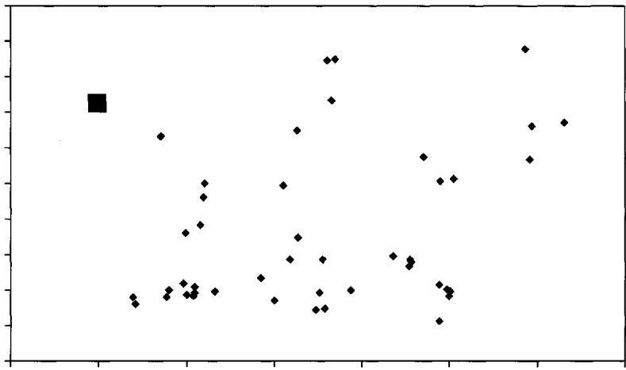  
Figure 12.1. Map of plant A and its customers.

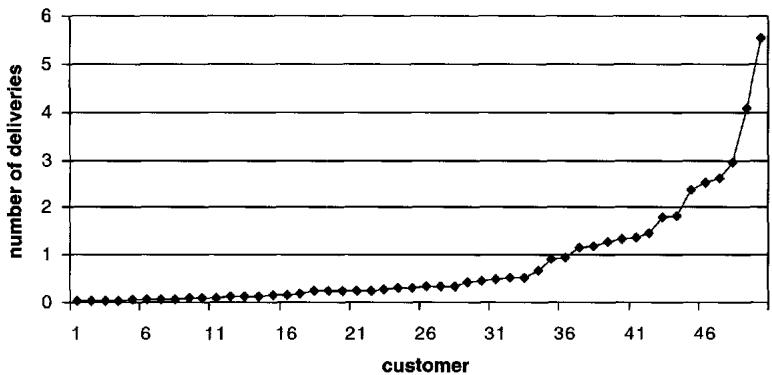  
Figure 12.2. Deliveries per week for plant A customers.

Production facility A serves 50 customers that are fairly spread out, covering a mostly rural area with some small clusters of customers near cities. The facility is located in the northwestern corner of the state, not in the center, and is represented graphically by the large square (see Figure 12.1). Customers are between 4 minutes and 4.5 hours driving time from the facility, with an average of 3 hours. The average driving time between two customers is 2 hours and 10 minutes. Of the 50 customers, $72 \%$ require less than one delivery per week, $16 \%$ require between one and two, $8 \%$ require between two and three, and $4 \%$ require between three and six (see Figure 12.2). With respect to tank capacities, $22 \%$ of the customers can receive a delivery of more than a truckload, but $58 \%$ cannot receive even half a truckload (see Figure 12.3). In the graph, the heavy line indicates truck capacity.

Production facility B serves 87 customers spread over a large geographic area in the northern United States. The customers are concentrated heavily in the middle of the area, where the facility is located, and become less concentrated as the distance from the center increases (see Figure 12.4). Customers are between 6 minutes and 10 hours driving time from the facility, with an average of 2 hours and 20 minutes. The average driving time between two points is 3 hours and 40 minutes. In terms of usage, $90 \%$ need less than one delivery per week, $8 \%$ need between one and two, and only $2 \%$ require more than one delivery per week (see Figure 12.5). Furthermore, $21 \%$ can receive a delivery of a truckload and $41 \%$ cannot receive half of a truckload (see Figure 12.6).

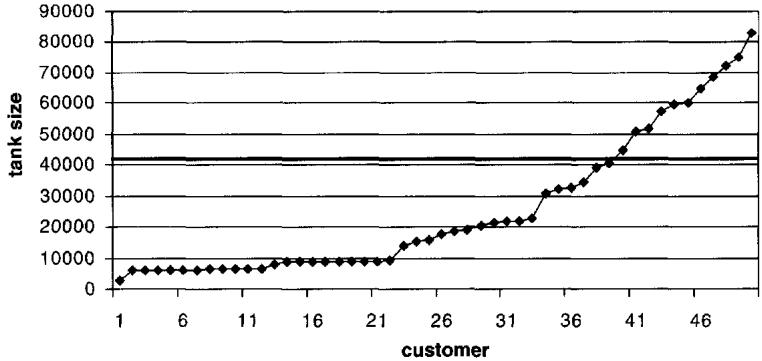  
Figure 12.3. Plant A tank capacity.

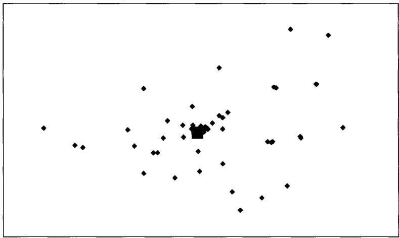  
Figure 12.4. Map of plant B and its customers.

Roughly $7 5 \%$ of the customers at both plants use product 24 hours a day, 7 days a week. Of the customers that are not constant users, many change how they use product depending on the day of the week. Most use product roughly the same way Monday through Friday, but often only 8 to 10 hours per day. The usage pattern usually changes on the weekend, with many of these customers not using product at all on Sundays and less than half of a weekday amount on Saturdays.

Other relevant information used in our computational experiments is that the time of a delivery is calculated as $0 . 5 +$ (vehicle pump rate)-(quantity delivered), that it takes 1 hour to reload a vehicle at the facility before it can depart again on another route, that all vehicles drive at a speed of $4 5 \mathrm { { \ m p h } }$ h, and that deliveries can be made 24 hours a day.

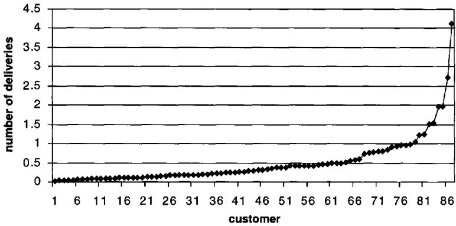  
Figure 12.5. Deliveries per week for plant B customers.

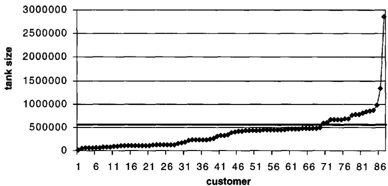  
Figure 12.6. Plant B tank capacity.

Finally, the initial inventory for all customers was chosen randomly, with the restriction that the inventory level should be sufficient to last the customer until the first time a vehicle would be able to arrive at the customer to refill its tank.

# 12.5.2 Solution Quality

A solution to the IRP for a given planning period specifies which vehicles are visiting which customers on each day of the planning period, in what order the deliveries are being made, and how much is delivered to each customer. However, even with all this information it is still nontrivial to evaluate the quality of the solution. Since the IRP is really an infinitehorizon problem, we have only specified the first part of a solution. For example, if we consider a planning period of 2 weeks, as we do in our computational experiments, it is not obvious how to compare two solutions and claim that one is better than the other. If the total distance traveled in one solution is less than in the other solution, this represents a smaller driving cost. However, if in the solution with a higher total distance traveled, only full truckload deliveries are made, how can we say this solution is worse? It utilizes the trucks extremely well and may end in a state that is a much better starting point for the deliveries that have to be made in the following weeks.

Therefore, in addition to looking at the obvious statistics, such as the number of trucks (indicated as T), number of routes (R), number of stops (S), percent utilization of the vehicles (U), total volume delivered (V), the total distance traveled (Mile), we look at several other statistics to evaluate the quality of a solution for a 2-week planning period. Some of these statistics are used by PRAXAIR to evaluate their own performance, others are proposed in the literature, and some we just found to be interesting.

A popular statistic used in industry is average volume per mile (aV/M). This statistic averages the volume per mile of all the trips, where the volume per mile of a trip is what we expect it to be, namely, the total volume delivered on a trip divided by the total distance traveled on the trip. It is easy to see that this number is very sensitive to the distance of customers from the facility and therefore does not seem to provide reliable information in an averaged form. For example, if we consider a trip to a customer 4 miles from the facility where a full truckload is delivered, the volume per mile is equal to truckload divided by 8. If we consider another trip to a customer 40 miles from the facility where we also deliver a full truckload, the volume per mile is equal to truckload divided by 80. The average of these two volumes per mile $\frac { 1 1 } { 1 6 0 }$ truckload) does not provide much information.

A more sensible statistic, especially over a period of several days, is total volume per mile (V/M), defined as the total volume delivered to all customers over the period considered divided by the total distance traveled over this period. Since we are looking only at the first piece of a long-term problem, it makes sense, in this first piece, to deliver more product than required to ensure that customers will not run out, if it can be done at a relatively small cost, i.e., a small increase in distance traveled. A large value of total volume per mile indicates that we are successful at doing so.

A third statistic, inspired by Bell et al. [8], is weighted volume per mile (wV/M). In [8], the authors discussed computing a "weighted delivery radius," which for a period equals the amount delivered to each tank times the distance of that tank from the depot summed over all tanks and divided by the amount delivered. With a representative from PRAXAIR, we modified this statistic so that it can be computed for an individual route and such that comparisons of this value among different routes can have meaning. The weighted volume per mile for a trip with $n$ customers is computed as

$$
d _ { 1 } \cdot t t _ { 0 , 1 } + d _ { 2 } \cdot t t _ { 0 , 2 } + \cdot \cdot \cdot + d _ { n } \cdot t t _ { 0 , n }
$$

The intuition behind this statistic is revealed when we look at the values it gives for the example given above. The value it gives for both trips is 0.5 truckload (which is the largest value possible). It says that both trips are equally good, in fact, as good as possible, since the best we can do when serving a customer for a long period is to deliver full truckloads. When a trip contains several stops to deliver a full truckload or when a trip does not deliver a full truckload, the value of this statistic goes down. The other benefit of this statistic is that it still provides relevant information when it is averaged over a number of trips (assuming all vehicle capacities are equal).

Other statistics that are also important to consider include the average inventory level before delivery and average inventory level after delivery (indicated as Bef and Aft, respeclively), both given as percent of capacity. Obviously, higher values are preferred, especially with respect to the average inventory level before delivery, because a high value indicates that we are less likely to experience stockouts due to fluctuations in usage rates. Furthermore, the average vehicle utilization is an interesting statistic. It tracks what percent of the truck's capacity is used in making deliveries to the customers on a route. We would like this value to be high, but not at all costs. We do not want to drive many extra miles just to ensure a high vehicle utilization. (In practice, there is a strong belief that every vehicle should leave the facility fully loaded and return empty. In part, however, this is motivated by the inherent stochasticity that sometimes allows for larger-than-expected deliveries.)

Finally, we may also want to look at the number of vehicles used. However, we do not want to put too much importance on this statistic in our experiments. In the long term, eliminating a vehicle represents significant savings for a company, but in the short term, we cannot really argue that one solution is really better than another just because it uses one less vehicle.

In our tests, we used the number of vehicles used in practice as the maximum number of vehicles available. We operated under the assumption that the number used in practice was necessary (long-term) and that therefore minimizing this number (short-term) does not make sense. If everything else is equal, however, this may be used as criterion for preferring one solution over another.

# 12.5.3 Alternate Heuristic

To compare the quality of the solutions produced by our proposed approach to current industrial practices, we implemented a solution approach based on the rules-of-thumb idea and ideas most commonly used in practice. After many discussions with the planners at PRAXAIR, we identified the following rules:

• Create trips around customers that must receive a delivery on the day being considered. Fill up that customer to capacity and then add nearby customers to the trip if there is remaining inventory in the vehicle.   
• All customers on a trip are filled to capacity except for the last one.   
• Discourage a vehicle from returning to the facility without delivering its remaining capacity to some customer.   
• Do not create trips involving only customers that do not require a delivery on the day being considered unless there are excess resources that day and it appears that there will be insufficient resources when the first of these customers requires delivery.

We refer to the heuristic that implements these ideas in our computational experiments as IND APP since it represents an approximation of what is being done in industry.

# 12.5.4 Computational Experiments

The first experiment compares the solutions obtained by our proposed approach to the solutions obtained by the industry approximation approach. The results can be found in

Table 12.1. Base case versus industry approximation.   

<table><tr><td>Setting</td><td>T</td><td>R</td><td>S</td><td>U</td><td>V</td><td>Mile</td><td>V/M</td><td>aV/M</td><td>WV/M</td><td>Bef</td><td>Aft</td></tr><tr><td>BASE</td><td>3</td><td>65</td><td>118</td><td>95.72</td><td>2613027</td><td>18841</td><td>138.69</td><td>410</td><td>18856</td><td>24.54</td><td>81.64</td></tr><tr><td>IND APP</td><td>4</td><td>67</td><td>90</td><td>89.58</td><td>2519989</td><td>18988</td><td>132.71</td><td>309</td><td>18357</td><td>11.41</td><td>81.27</td></tr><tr><td>BASE</td><td>3</td><td>61</td><td>106</td><td>90.26</td><td>30283480</td><td>14226</td><td>2128.74</td><td>8019</td><td>215095</td><td>19.91</td><td>92.49</td></tr><tr><td>IND APP</td><td>3</td><td>61</td><td>93</td><td>85.41</td><td>28656473</td><td>15042</td><td>1905.10</td><td>7016</td><td>206276</td><td>9.83</td><td>88.97</td></tr></table>

Table 12.1. In all the tables, the results for plant A appear first, and the results for plant B appear after the dividing line.

Our approach clearly outperforms the industry approximation approach. It does better for both facilities on all the important statistics. The difference in the underlying ideas of the two approaches is most clearly observed in the Bef column. The industry approximation approach is driven by customers that are getting close to running out and that have to be visited, which results in a low average inventory before delivery, whereas our approach looks further ahead and attempts to identify good opportunities to visit customers before they are near run-out.

As we indicated above, we believe that the strength of our approach is that it considers "enough" of the future to make the right decisions. In the next two experiments, we investigate the impact of varying the amount of future considered. In our chosen approach, we consider 5 days in full detail plus 4 weeks in aggregated form beyond this. We note that considering 5 days in full detail is already more than many of the solution approaches proposed in the literature. In Table 12.2, we show the results when we vary the amount of future considered in aggregated form.

It is interesting to observe the increase in the number of deliveries when 6 weeks are considered. When 6 weeks are considered, a larger portion of the objective function value represents future costs, and optimizing with this objective apparently allows us to make some unwise and expensive decisions in the part of the planning period that really counts, i.e., the first 5 days. If we do not consider any future beyond the 5 days, we appear to be missing some beneficial opportunities. There is not much difference, however, between considering 1 week or 4 weeks beyond the 5 days.

Next, we decided to investigate the effect of considering fewer days in full detail. By reducing this number from 5, we make the IPs smaller and therefore easier to solve, but it is not clear what the impact will be on the solutions. In Table 12.3, we show the results when we vary the number of days considered in full detail.

Table 12.2. Varying the number of weeks.   

<table><tr><td>Setting</td><td>T</td><td>R</td><td>S</td><td>U</td><td>V</td><td>Mile</td><td>V/M</td><td>aV/M</td><td>wV/M</td><td>Bef</td><td>Aft</td></tr><tr><td>5 days, 0 wk</td><td>4</td><td>69</td><td>119</td><td>92.43</td><td>2678599</td><td>20284</td><td>132.05</td><td>408</td><td>18114</td><td>29.87</td><td>87.76</td></tr><tr><td>5 days, 1 wk</td><td>4</td><td>67</td><td>117</td><td>95.04</td><td>2674527</td><td>19640</td><td>136.18</td><td>411</td><td>18687</td><td>25.26</td><td>82.18</td></tr><tr><td>5 days, 4 wk</td><td>3</td><td>65</td><td>118</td><td>95.72</td><td>2613027</td><td>18841</td><td>138.69</td><td>410</td><td>18856</td><td>24.54</td><td>81.64</td></tr><tr><td>5 days, 6 wk</td><td>4</td><td>74</td><td>125</td><td>88.10</td><td>2738189</td><td>20836</td><td>131.42</td><td>392</td><td>17514</td><td>24.26</td><td>80.74</td></tr><tr><td>5 days, 0 wk</td><td>3</td><td>64</td><td>105</td><td>84.58</td><td>29773123</td><td>14512</td><td>2051.62</td><td>7087</td><td>204340</td><td>20.30</td><td>92.33</td></tr><tr><td>5 days, 1 wk</td><td>3</td><td>60</td><td>102</td><td>89.02</td><td>29375272</td><td>14050</td><td>2090.77</td><td>7855</td><td>218711</td><td>18.03</td><td>92.16</td></tr><tr><td>5 days, 4 wk</td><td>3</td><td>61</td><td>106</td><td>90.26</td><td>30283480</td><td>14226</td><td>2128.74</td><td>8019</td><td>215095</td><td>19.91</td><td>92.49</td></tr><tr><td>5 days, 6 wk</td><td>3</td><td>57</td><td>111</td><td>89.40</td><td>28026955</td><td>13789</td><td>2032.56</td><td>7496</td><td>214607</td><td>19.28</td><td>85.22</td></tr></table>

Table 12.3. Varying the number of days.   

<table><tr><td>Setting</td><td>T R</td><td>−</td><td>S</td><td>U</td><td>V</td><td>Mile</td><td>V/M</td><td>aV/M</td><td>wV/M</td><td>Bef</td><td>Aft</td></tr><tr><td>2 days, 4 wk</td><td>*</td><td></td><td></td><td></td><td></td><td></td><td></td><td></td><td></td><td></td><td></td></tr><tr><td>3 days, 4 wk</td><td>4</td><td>69</td><td>103</td><td>90.32</td><td>2617434</td><td>19856</td><td>131.82</td><td>283</td><td>18188</td><td>27.99</td><td>91.30</td></tr><tr><td>5 days, 4 wk</td><td>3</td><td>65</td><td>118</td><td>95.72</td><td>2613027</td><td>18841</td><td>138.69</td><td>410</td><td>18856</td><td>24.54</td><td>81.64</td></tr><tr><td>2 days, 4 wk</td><td>3</td><td>66</td><td>102</td><td>86.19</td><td>31285911</td><td>14027</td><td>2230.41</td><td>7298</td><td>214827</td><td>18.40</td><td>94.75</td></tr><tr><td>3 days, 4 wk</td><td>3</td><td>65</td><td>103</td><td>84.53</td><td>30220444</td><td>13172</td><td>2294.29</td><td>8357</td><td>219112</td><td>17.83</td><td>92.99</td></tr><tr><td>5 days, 4 wk</td><td>3</td><td>61</td><td>106</td><td>90.26</td><td>30283480</td><td>14226</td><td>2128.74</td><td>8019</td><td>215095</td><td>19.91</td><td>92.49</td></tr></table>

As expected, the quality of the solutions decreases when we consider fewer days in full detail. In fact, when we consider just 2 days, we are unable to construct a solution in which none of the customers runs out of product during the planning period. In this case, the IP selects delivery amounts for customers that turn out to be impossible to schedule with the routing heuristic, because too many deliveries must occur on a specific day and roughly at the same time. It is interesting to observe that when we consider fewer days, the number of stops decreases significantly. Apparently, when we consider more days in full detail, the IP starts looking for inexpensive opportunities to make deliveries to customers that require a delivery only a few days out, whereas the $\mathrm { I P }$ is unable to do that when fewer days are considered in full detail.

Besides the amount of future considered, the quality of the solution also is affected by the parameter settings used in the routing and scheduling heuristic and whether delivery amount optimization is active. When delivery amount optimization is not active, a delivery amount cannot be set above the amount specified by the IP. In Table 12.4 we present the results of our approach with and without delivery optimization. Without delivery optimization (entries IP AMT), we expect the average vehicle utilization and the total volume to be less. On the other hand, we do not want it to be much less because that would suggest that our integer program is not making the right decisions.

Looking at the summary statistics, the delivery amount optimization clearly does improve truck utilization and also leads to a significantly better total volume per mile and weighted volume per mile. The increase in total volume delivered, however, was slightly less than $3 \%$ .

Our default settings for the GRASP are to run the routing and scheduling heuristic 25 times and to select from among the three best choices. To investigate the impact of these settings as well as the importance of randomization, we conducted an experiment in which we executed the heuristic without any randomization (pure greedy) and with different settings for the number of replications. The results are presented in Table 12.5.

Table 12.4. Delivery optimization.   

<table><tr><td>Setting</td><td>T</td><td>R S</td><td>U</td><td></td><td>V</td><td>Mile</td><td>V/M</td><td>aV/M</td><td>wV/M</td><td>Bef</td><td>Aft</td></tr><tr><td>IP AMT</td><td>3</td><td>69</td><td>126</td><td>87.56</td><td>2537554</td><td>19929</td><td>127.33</td><td>330</td><td>17077</td><td>24.90</td><td>78.00</td></tr><tr><td>BASE</td><td>3</td><td>65</td><td>118</td><td>95.72</td><td>2613027</td><td>18441</td><td>138.69</td><td>410</td><td>18856</td><td>24.54</td><td>81.64</td></tr><tr><td>IP AMT</td><td>3</td><td>61</td><td>111</td><td>85.81</td><td>28789623</td><td>15274</td><td>1884.88</td><td>6612</td><td>202495</td><td>19.12</td><td>85.10</td></tr><tr><td>BASE</td><td>3</td><td>61</td><td>106</td><td>90.26</td><td>30283480</td><td>14226</td><td>2128.74</td><td>8019</td><td>215095</td><td>19.91</td><td>92.49</td></tr></table>

Table 12.5. Randomization.   

<table><tr><td>Setting</td><td>T</td><td>R</td><td>S</td><td>U</td><td>V</td><td>Mile</td><td>V/M</td><td>aV/M</td><td>WV/M</td><td>Bef</td><td>Aft</td></tr><tr><td>NO RAND</td><td>4</td><td>71</td><td>121</td><td>87.82</td><td>2618675</td><td>21799</td><td>120.13</td><td>394</td><td>17092</td><td>23.54</td><td>79.87</td></tr><tr><td>5</td><td>3</td><td>67</td><td>116</td><td>93.70</td><td>2636760</td><td>19315</td><td>136.51</td><td>419</td><td>18592</td><td>24.76</td><td>82.77</td></tr><tr><td>25</td><td>3</td><td>65</td><td>118</td><td>95.72</td><td>2613027</td><td>18441</td><td>138.69</td><td>410</td><td>18856</td><td>24.54</td><td>81.64</td></tr><tr><td>50</td><td>4</td><td>65</td><td>121</td><td>93.22</td><td>2544803</td><td>19176</td><td>132.71</td><td>327</td><td>17793</td><td>23.74</td><td>77.21</td></tr><tr><td>NO RAND</td><td>3</td><td>59</td><td>99</td><td>86.22</td><td>27979401</td><td>14378</td><td>1945.99</td><td>6990</td><td>200752</td><td>15.28</td><td>88.34</td></tr><tr><td>5</td><td>3</td><td>62</td><td>111</td><td>87.99</td><td>30004693</td><td>15094</td><td>1987.86</td><td>6773</td><td>201000</td><td>19.88</td><td>89.13</td></tr><tr><td>25</td><td>3</td><td>61</td><td>106</td><td>90.26</td><td>30283480</td><td>14226</td><td>2128.74</td><td>8019</td><td>215095</td><td>19.91</td><td>92.49</td></tr><tr><td>50</td><td>3</td><td>63</td><td>111</td><td>87.57</td><td>30343074</td><td>14605</td><td>2077.58</td><td>7762</td><td>211049</td><td>19.88</td><td>89.61</td></tr></table>

Without randomization the solution has a noticeably low average vehicle utilization, total volume per mile, and average weighted volume per mile. On the other hand, going to 50 replications does not seem to improve over 25 replications; in fact, it does slightly worse. This is possible because the replications are for 2 days of the schedule at a time. Which schedule is selected affects what deliveries are made, what the customer inventories are at the end of the 2 days, and thus the input for the next integer program that is solved.

To obtain more insight in the behavior of the GRASP, we kept track of the total distance traveled for all 50 replications at two different points in the 2-week planning period. The results are plotted in Figure 12.7.

The criterion used to pick the best solution out of the 25 produced by the GRASP is total travel distance. However, the results may be quite different if we decide to use average weighted volume per mile as the criterion to pick the best solution. Our last computational experiment relating to the GRASP compares the behavior based on different selection criteria. The results are presented in Table 12.6. (D) indicates schedules selected based on mileage and (WVM) stands for schedules selected based on average weighte volume per mile.

Various other parameters can be set in the routing and scheduling heuristic. Some of these help to construct solutions that reflect company policy. For example, in our default approach, we did not penalize waiting time at customers. In practice, however, waiting time is often strongly discouraged or even not allowed. To show the impact of discouraging waiting time on the quality of the solutions, Table 12.7 presents the solution statistics when we penalize waiting time significantly.

As we expected, when we allow waiting at customers, we get a higher truck utilization, a better total volume per mile, and average weighted volume per mile.

# 12.6 Conclusion

We presented the IRP and an optimization-based approach for its solution. Extensive com putational experiments indicate the value and potential of optimization-based approaches for complex routing and scheduling problems. The IRP is of special interest because it integrates two components of supply chain management: inventory control and vehicle routing. This type of integration is essential to improve overall system performance.

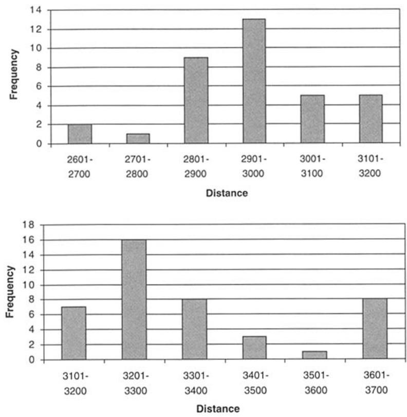  
Figure 12.7. Effects of randomization.

Table 12.6. Selection criteria.   

<table><tr><td>Setting</td><td>T</td><td>R</td><td>S</td><td>U</td><td>V</td><td>Mile</td><td>V/M</td><td>aV/M</td><td>WV/M</td><td>Bef</td><td>Aft</td></tr><tr><td>(D)</td><td>3</td><td>65</td><td>118</td><td>95.72</td><td>2613027</td><td>18441</td><td>138.69</td><td>410</td><td>18856</td><td>24.54</td><td>81.64</td></tr><tr><td>(WVM)</td><td>4</td><td>65</td><td>120</td><td>96.83</td><td>2643371</td><td>19341</td><td>136.67</td><td>423</td><td>19018</td><td>24.99</td><td>82.64</td></tr><tr><td>(D)</td><td>3</td><td>61</td><td>106</td><td>90.26</td><td>30283480</td><td>14226</td><td>2128.74</td><td>8019</td><td>215095</td><td>19.91</td><td>92.49</td></tr><tr><td>(WVM)</td><td>3</td><td>58</td><td>105</td><td>91.34</td><td>29138802</td><td>14235</td><td>2046.98</td><td>8291</td><td>220091</td><td>20.50</td><td>91.76</td></tr></table>

Table 12.7. Waiting time.   

<table><tr><td>Setting</td><td>T</td><td>R</td><td>S</td><td>U</td><td>V</td><td>Mile</td><td>V/M</td><td>aV/M</td><td>WV/M</td><td>Bef</td><td>Aft</td></tr><tr><td>NO CHG</td><td>3</td><td>65</td><td>118</td><td>95.72</td><td>2613027</td><td>18441</td><td>138.69</td><td>410</td><td>18856</td><td>24.54</td><td>81.64</td></tr><tr><td>WAIT CHG</td><td>4</td><td>70</td><td>119</td><td>90.50</td><td>2660785</td><td>20019</td><td>132.91</td><td>390</td><td>17817</td><td>21.26</td><td>77.66</td></tr><tr><td>NO CHG</td><td>3</td><td>61</td><td>106</td><td>90.26</td><td>30283480</td><td>14226</td><td>2128.74</td><td>8019</td><td>215095</td><td>19.91</td><td>92.49</td></tr><tr><td>WAIT CHG</td><td>3</td><td>58</td><td>103</td><td>88.46</td><td>28220108</td><td>14908</td><td>1892.95</td><td>6298</td><td>197806</td><td>18.06</td><td>88.17</td></tr></table>

# Bibliography

[1] S. Anily and A. Federgruen. One warehouse multiple retailer systems with vehicle routing costs. Management Science, 36:92-114, 1990.

[2] S. Anily and A. Federgruen. Rejoinder to "One warehouse multiple retailer systems with vehicle routing costs." Management Science, 37:1497-1499, 1991.

[3] M. Ball. Allocation/routing: Models and algorithms. In B.L. Golden and A.A. Assad, editors, Vehicle Routing: Methods and Studies, Elsevier Science, Amsterdam, Netherlands, 1988.

[4] J. Bard, L. Huang, M. Dror, and P. Jaillet. A branch and cut algorithm for the VRP with satellite facilities. HE Transactions on Operations Engineering, 30:821-834, 1998.

[5] J. Bard, L. Huang, P. Jaillet, and M. Dror. A decomposition approach to the inventory routing problem with satellite facilities. Transportation Science, 32:189-203, 1998.

[6] D. Barnes-Schuster and Y. Bassok. Direct shipping and the dynamic singledepot/multi-retailer inventory system. European Journal of Operational Research, 101:509-518,1997.

[7] Y. Bassok and R. Ernst. Dynamic allocations for multi-product distribution. Transportation Science, 29:256-266, 1995.

[8] W. Bell, L. Dalberto, M.L. Fisher, A. Greenfield, R. Jaikumar, P. Kedia, R. Mack, and P. Prutzman. Improving the distribution of industrial gases with an on-line computerized routing and scheduling optimizer. Interfaces, 13:4-23, 1983.

[9] O. Berman and R. Larson. Deliveries in an inventory/routing problem using stochastic dynamic programming. Technical report, Massachusetts Institute of Technology, Cambridge, MA, 1999.

[10] J. Bramel and D. Simchi-Levi. A location based heuristic for general routing problems. Operations Research, 43:649-660, 1995.

[11] A. Campbell, L. Clarke, A. Kleywegt, and M. Savelsbergh. Inventory routing. In T. Crainic and G. Laporte, editors, Fleet Management and Logistics, Kluwer, Boston, MA, 1998.

[12] S. Cetinkaya and C. Lee. Stock replenishment and shipment scheduling for vendor managed inventory systems. Technical report, Texas A & M University, College Station, TX, 1999.

[13] T. Chien, A. Balakrishnan, and R. Wong. An integrated inventory allocation and vehicle routing problem. Transportation Science, 23:67-76, 1989.

[14] M. Dror, M. Ball, and B.L. Golden. Computational comparison of algorithms for the inventory routing problem. Annals of Operations Research, 4:3-23, 1985.

[15] M. Dror and L. Levy. Vehicle routing improvement algorithms: Comparison of a "greedy" and a matching implementation for inventory routing. Computers and Operations Research, 13:33-45, 1986.

[16] M. Dror and Ball. M. Inventory/routing: Reduction from an annual to a short period problem. Naval Research Logistic Quarterly, 34:891-905, 1987.

[17] A. Federgruen and P. Zipkin. A combined vehicle routing and inventory allocation problem. Operations Research, 32:1019-1036, 1984.

[18] T.A. Feo and M.G.C. Resende. Greedy randomized adaptive search procedures. Journal of Global Optimization, 6:109-133, 1995.

[19] M.L. Fisher, A. Greenfield, R. Jaikumar, and P. Kedia. Real-time scheduling of a bulk delivery fleet: Practical application of Lagrangean relaxation. Technical report, The Wharton School, University of Pennsylvania, 1982.

[20] F. Furnero and C. Vercellis. Synchronized development of production, inventory, and distribution schedules. Transportation Science, 33:330-340, 1999.

[21] G. Gallego and D. Simchi-Levi. On the effectiveness of direct shipping strategy for the one-warehouse multi-retailer r-systems. Management Science, 36:240-243,1990.

[22] B.L. Golden, A.A. Assad, and R. Dahl. Analysis of a large scale vehicle routing problem with an inventory component. Large Scale Systems, 7:181-190, 1984.

[23] P. Jaillet, L. Huang, J. Bard, and M. Dror. A rolling horizon framework for the inventory routing problem. Working paper, University of Texas, Austin, 1997.

[24] G.A.P. Kindervater and M.W.P. Savelsbergh. Vehicle routing: Handling edge exchanges. In E.H.L. Aarts and J.K. Lenstra, editors, Local Search in Combinatorial Optimization, Wiley, Chichester, UK, 1997, pp. 337-360.

[25] AJ. Kleywegt, V.S Nori, and M.W.P. Savelsbergh. The stochastic inventory routing problem with direct deliveries. Technical Report TLI99-01, Georgia Institute of Technology, Atlanta, GA, 1999.

[26] A. Minkoff. A markov decision model and decomposition heuristic for dynamic vehicle dispatching. Operations Research, 41:77-90, 1993.

[27] V. Nori. Algorithms for Dynamic and Stochastic Logistics Problems. Ph.D. thesis, Georgia Institute of Technology, Atlanta, GA, 1999.

[28] M.M. Solomon. Algorithms for the vehicle routing and scheduling problems with time window constraints. Operations Research, 35:254-265, 1987.

[29] P. Trudeau and M. Dror. Stochastic inventory routing: Route design with stockouts and route failures. Transportation Science, 26:171-184, 1992.

# Chapter 13

# Routing Under Uncertainty: An Application in the Scheduling of Field Service Engineers

Eleni Hadjiconstantinou Daron Roberts

# 13.1 Introduction

In the classical definition of VRP, it is assumed that the associated parameters, concerning factors such as cost, customer demands, and vehicle travel times, are deterministic. This conjecture often is too simplistic in today's dynamic environment, where there exist increasing requirements on levels of productivity and service and a corresponding commitment to enlarged and more elaborate transportation systems. In parallel with the need to manage such a growing number of systems there exists an increased amount of data augmentation and volatility. Hence, when an organization does not possess enough flexibility in its labor assignments, does not possess any real-time parameter information, or cannot analyze data in an online manner, deterministic models cannot always be implemented and stochastic models need to be considered.

The Stochastic VRP (S VRP) differs from the VRP by the introduction of some element of variability within the system in question. Unlike its deterministic equivalent, the S VRP is ambiguously defined since it belongs to a class of a priori optimization problems (see Bertsimas, Jaillet, and Odoni [3]) for which it is impractical to consider an a posteriori approach that computes an optimal solution whenever the random variables are realized. Instead, an a priori solution attempts to obtain the best solution, over all possible problem scenarios, before the realization of any single scenario. Roberts and Hadjiconstantinou [24] evaluated the computational performance of such a solution method. The authors showed that an a priori solution for a VRP where demand is uncertain lies, on average, within $8 \%$ of the solution obtained by a reoptimization-based, a posteriori strategy.

The specific type of S VRP to be considered in this case study is the VRP with Stochastic Service Times (VRPSST). Roberts and Hadjiconstantinou [24] considered the factors affecting the stochastic optimum of an SVRP and concluded that given a set of fixed-recourse arrangements, route break opportunities and information disclosure patterns, a meaningful set of SVRP interpretations can be identified. Here, a new algorithm, referred to as the Paired Tree Search Algorithm (PTSA), is used to solve the VRPSST with variable costs of recourse. The algorithm is tested on a real-life operational problem at a utility company. The company needs to schedule its field service engineers across a range of possible maintenance jobs. Most jobs arise stochastically and have durations that are rarely pre-determined since the engineers have limited knowledge of the nature of the work required at each site. We model this stochastic scheduling and routing problem as a VRPSST and develop a solution procedure, based on the PTSA, that minimizes operating costs. Computational results for a pilot study, including an investigation into reoptimization, show significant improvements over current practice.

In sections 13.2 and 13.3, respectively, the theoretical problem is formally defined and the relevant SVRP literature is briefly reviewed. A stochastic integer formulation for the VRPSST is given in section 13.4, and the PTSA is summarized in section 13.5. In sections 13.6 and 13.7, an outline of the applied scheduling and routing problem and the key objectives proposed by management are described, and a comprehensive list of assumptions is presented. Detailed explanations of model input and output are given in sections 13.8 and 13.9, respectively, and an illustrated example is presented in section 13.10. Computational results are shown in section 13.11.

# 13.2 VRPSST with Variable Costs of Recourse

Let $G = ( V , E )$ be a graph where $V = \{ v _ { 1 } , v _ { 2 } , \ldots , v _ { n } \}$ is a set of vertices and $E =$ $\{ ( v _ { i } , v _ { j } ) : v _ { i } , v _ { j } \in V \}$ is a set of edges. The vertices have known and fixed locations, and every edge $( v _ { i } , v _ { j } )$ has an associated nonnegative cost $c _ { i j }$ and nonnegative travel time $t _ { i j }$ . It is assumed that the graph is undirected and the matrices $C = ( c _ { i j } )$ and $T = ( t _ { i j } )$ satisfy the triangular inequality, i.e., $( v _ { i } , v _ { j } )$ is defined only for $i < j$ and $( c _ { i k } + c _ { k j } \ge c _ { i j }$ , $t _ { i k } + t _ { k j } \ge t _ { i j }$ for all i, $j , k )$ . Vertex $v _ { 1 }$ represents a depot at which a homogeneous fleet of $\pmb { K }$ vehicles, each with an overall working (service and travel) time restriction of $\tau$ , is based. The remaining vertices correspond to a set of customers where each customer ${ \mathfrak { v } } _ { i }$ has associated service time requirements given by discrete, independent, nonnegative random variables $\xi _ { i }$ with finite means $\mu _ { i }$ and variances $\sigma _ { i } ^ { 2 }$ In a first stage, a set of $K$ vehicle routes of minimal cost are determined so that (i) each route starts and ends at the depot and (ii) each customer is visited exactly once by one vehicle. In a second stage, the first-stage routes are followed as planned but whenever $\tau$ is exceeded along a route, as a consequence of the deterministic travel times $t _ { i j }$ and the stochastic service times $\xi _ { i }$ , the vehicle returns to the depot and then continues along its predefined route with a replenished time allowance of $\pmb { \tau }$ . Because second-stage recourse costs are represented by the values of such return trips to the depot, the objective is to design a minimum expected cost set of routes such that all service time requirements are met, (i) and (ii) are satisfied, and exactly $\pmb { K }$ vehicles are used.

# 13.3 Literature Review

The SVRP, in all its guises, has seen relatively little research in comparison with its wellknown deterministic counterpart. Given the number of potential applications, this lack of research is due to the enormous complexity that the addition of a stochastic element brings to an already difficult combinatorial optimization problem. To our knowledge, the VRPSST as defined in section 13.2 has never been formulated or solved in the literature. However, the problem has very close links to two other stochastic routing problems, the VRP with Stochastic Travel Times (VRPST) and VRP with Stochastic Demands (VRPSD). Here, we briefly review both problems.

# 13.3.1 VRPST

The objective of the VRPST—and its one vehicle counterpart, the Traveling Salesman Problem with Stochastic Travel Times (TSPST)—usually involves finding an a priori solution such that the probability of completing any tour within a given deadline is maximized. In cases such as these, the VRPST is interchangeable with the multiple vehicle TSPST $\mathbf { \lambda } _ { m }$ -TSPST).

Kao [15] proposed two heuristics for the TSPST, one based on dynamic programming and one based on implicit enumeration. Sniedovich [25] showed that obtaining optimal solutions using the former dynamic programming approach is reliant on the property of monotonicity, and Carraway, Morin, and Moskowitz [4] presented a generalized dynamic programming method that overcomes this problem. Lambert, Laporte, and Louveaux [16] derived a heuristic solution algorithm for the m-TSPST, based on the well-known Clarke and Wright [5] savings procedure, and found cost-effective cash-collection routes through bank branches where the amount of cash collected is limited by an insurance company and late arrival incurs a penalty relating to lost interest. Laporte, Louveaux, and Mercure [20] were the first to consider an alternative objective for the VRPST. They presented a threeindex simple recourse model and a two-index recourse model for a VRPST based on finding a minimum cost a priori solution where the penalty for late arrival is proportional to the length of the delay. Using an integer L-shaped method (see Laporte and Louveaux [18]), they presented exact results for VRPSTs of up to 20 customers.

# 13.3.2 VRPSD

The few studies that have been completed on the VRPSD focused on heuristic methods. Tillman [29] developed an adapted Clarke and Wright [5] savings algorithm to account for stochastic demands, Teodorovic and Pavkovic [28] presented a simulated annealing heuristic, Gendreau, Laporte, and Seguin [11] described a tabu search algorithm, and Teodorovic, Krcmar-Nozic, and Pavkovic [27] presented a route-first, cluster-second approach. Golden and Stewart [14] were the first to apply stochastic programming to the VRPSD, and Stewart and Golden [26] presented formulations for the chance constrained case, where customers are served according to a given probability, and the penalty function case, where each customer is served with the inclusion of a possible recourse cost. Further stochastic programming formulations have been developed—see Dror and Trudeau [10], Dror, Laporte, and Trudeau [9], Laporte and Louveaux [17], Bastian and Kan [1], Dror [7], Dror, Laporte, and Louveaux [8], and Popovic [21]—but these yielded no exact solutions apart from a special location-routing model presented by Laporte, Louveaux, and Mercure [19] and a special case of the probabilistic VRP with stochastic demands and deterministic customer presence by Gendreau, Laporte, and Seguin [12]. In the former paper, problems are solved to optimality for $N = | 3 0 |$ , where $N$ represents both the number of customers and possible depot sites. In the latter paper, exact solutions are given for problems of up to 70 customers; however, in such cases, the parameters are set such that the problem is in essence deterministic. More recently, Roberts and Hadjiconstantinou [23] presented a new method on which the algorithm used in this study is based, that can successfully solve computationally difficult VRPSDs of medium size. For more information, see a detailed review by Roberts [22] and a survey of the generic SVRP, including the VRPSD, by Gendreau Laporte, and Seguin [13].

# 13.4 Stochastic Integer VRPSST Formulation

Given a feasible set of routes represented by $x = [ x _ { i j } ]$ and a set of service times arising from the random variables $\xi _ { i }$ for all $i = 2 , \ldots , n$ , the VRPSST can be represented by the following two-stage stochastic program with recourse:

$$
\begin{array} { r } { \operatorname* { m i n } _ { x } [ f _ { 0 } ( x ) + E _ { \varepsilon \in \xi } ( Q ( x , \varepsilon ) ) ] , } \end{array}
$$

where min $f _ { 0 } ( x )$ is the objective function of the first-stage problem and min $E _ { \varepsilon \in \xi } ( Q ( x , \varepsilon ) )$ is the objective function of the second-stage problem, i.e., $Q ( x , \varepsilon )$ is the cost of recourse given that $x = [ x _ { i j } ]$ is the first stage solution. These two stages are further defined below.

# 13.4.1 First-Stage Problem

The first-stage problem, min $f _ { 0 } ( x )$ corresponds directly to the solution of a multiple TSP or $m$ -TSP, where a complete feasible set of routes is required to minimize $c x$ . With $c _ { i j }$ and $x _ { i j }$ interpreted as $c _ { j i }$ and $x _ { j i }$ whenever $i > j$ , we define integer decision variables $x _ { i j }$ as follows:

$$
x _ { i j } = \left\{ \begin{array} { l l } { 1 } & { \mathrm { i f ~ } ( v _ { i } , v _ { j } ) \mathrm { ~ i s ~ u s e d ~ i n ~ t h e ~ s o l u t i o n ~ a n d ~ } 2 \leq i < j \leq n } \\ { 2 } & { \mathrm { i f ~ } ( v _ { i } , v _ { j } ) \mathrm { ~ i s ~ u s e d ~ a s ~ a ~ r e t u r n ~ t r i p ~ a n d ~ } i = 1 , j > 1 , } \\ { 0 } & { \mathrm { o t h e r w i s e } . } \end{array} \right.
$$

A feasible set of routes is then obtained by solving the following:

$$
\operatorname* { m i n } _ { x } \ f _ { 0 } ( x ) = c x
$$

subject to

$$
\begin{array} { r l } & { \displaystyle \sum _ { j = 2 } ^ { n } x _ { 1 j } = 2 K , } \\ & { \displaystyle \sum _ { i = k } x _ { i k } + \sum _ { j > k } x _ { k j } = 2 \qquad \forall v _ { k } \in V \backslash \{ v _ { 1 } \} , } \\ & { \displaystyle \sum _ { i , j \leq { s } } x _ { i j } \leq | S | - 1 \qquad \forall S \subset V \backslash \{ v _ { 1 } \} , 3 \leq | S | \leq n - 2 , } \\ & { \displaystyle 0 \leq x _ { 1 j } \leq 2 \qquad \forall v _ { j } \in V \backslash \{ v _ { 1 } \} , } \\ & { \displaystyle 0 \leq x _ { i j } \leq 1 \qquad \forall v _ { i } , v _ { j } \in V , 2 \leq i < j \leq n , } \\ & { x _ { i j } \mathrm { i n l e g e r } \qquad \forall v _ { i } , v _ { j } \in V , 1 \leq i < j \leq n . } \end{array}
$$

These first- stage deterministic constraints specify that $K$ vehicles enter and leave the depot (13.4), that every customer receives a visit exactly once, i.e., the vertex degree constraints (13.5), and that individual routes disconnected from the depot are prohibited, i.e., the classical connectivity constraints (13.6).

# 1 3.4.2 Second-Stage Problem

The second-stage problem, min $E _ { \varepsilon \in \xi } ( Q ( x , \varepsilon ) )$ in (13.1), is less well defined; however, some clarification can be sought by introducing a recursive stochastic formulation based on each a priori first-stage solution.

Consider a first-stage feasible solution characterized by the vector $x ^ { \nu } = [ x _ { i j } ^ { v } ]$ Let $W ( x ^ { v } ) = E _ { \varepsilon \in \xi } ( W ( x ^ { v } , \varepsilon ) )$ denote the expected second-stage costs and let $W ^ { k } \{ x ^ { \nu } , \varepsilon )$ denote the recourse cost of route $k$ in $x ^ { \nu }$ given the realization $\varepsilon$ of the random variable $\xi$ . The expected cost of $K$ vehicle routes given a current feasible solution $x ^ { \nu }$ is then simply $\begin{array} { r } { W ( x ^ { v } ) \dot { = } \sum _ { k = 1 } ^ { K } W ^ { k } ( x ^ { v } ) } \end{array}$ where the expected cost of any route $k$ can be computed separately, i.e., $W ^ { k } ( x ^ { v } ) = E _ { \varepsilon \in \xi } ( W ^ { k } ( x ^ { v } , \varepsilon ) )$

Let $p _ { i } ^ { l }$ represent the probability that the /th service time $\varepsilon _ { i } ^ { l }$ originates from the set of realizations $\{ \varepsilon _ { i } ^ { 1 } , \ldots , \varepsilon _ { i } ^ { l } , \ldots , \varepsilon _ { i } ^ { \delta _ { i } } \}$ of customer $v _ { i }$ such that $\varepsilon _ { i } ^ { l } < \varepsilon _ { i } ^ { k }$ for all $l ~ < k$ It is assumed that each customer requires a service and that the maximum time requirement of any customer is always equal to or less than the overall vehicle working time restriction, i.e., $\varepsilon _ { i } ^ { 1 } > 0$ and $\varepsilon _ { i } ^ { \delta _ { i } } \leq \bar { \tau }$ for all $i > 1$ . In addition, relabel the vertices of the $k$ ;th route of $x ^ { v }$ so that the route becomes $( v _ { 1 } , v _ { 2 } , \ldots , v _ { t _ { k } } , v _ { t _ { k } + 1 } = v _ { 1 } )$ . By denoting $g$ to be the remaining working time available for a vehicle on arrival at a customer $v _ { i }$ , the expected cost of a route $k$ is then as follows:

$$
\begin{array} { r } { W ^ { k } ( x ^ { \nu } ) = E _ { \varepsilon \in \xi } ( W ^ { k } ( x ^ { \nu } , \varepsilon ) ) = \alpha _ { 2 } ^ { k } ( \tau ) , } \end{array}
$$

where

$$
\alpha _ { t _ { k } } ^ { k } ( g ) = 2 c _ { 1 t _ { k } } \sum _ { l \mid \varepsilon _ { t _ { k } } ^ { l } > g } p _ { t _ { k } } ^ { l } , \qquad 0 < g \leq \tau , \ \mathrm { a n d }
$$

$$
\alpha _ { i } ^ { k } ( g ) = p _ { i } ^ { l ^ { * } } \alpha _ { i + 1 } ^ { k } ( 0 ) + \sum _ { \substack { l | \varepsilon _ { i } ^ { l } > g } } p _ { i } ^ { l } ( \alpha _ { i + 1 } ^ { k } ( \tau - \varepsilon _ { i } ^ { l } - t _ { 1 i } - t _ { i , i + 1 } ) + 2 c _ { 1 i } )
$$

$$
+ \sum _ { l | \varepsilon _ { i } ^ { l } < g } p _ { i } ^ { l } \alpha _ { i + 1 } ^ { k } ( g - \varepsilon _ { i } ^ { l } - t _ { i , i + 1 } ) \qquad \forall i = 2 , \ldots , t _ { k } - 1 , 0 < g \leq \tau ,
$$

and

$$
p _ { i } ^ { l ^ { * } } = \left\{ \begin{array} { l l } { p _ { i } ^ { l } } & { \mathrm { i f ~ t h e r e ~ e x i s t s } l = 1 , \ldots , \delta _ { i } \mathrm { ~ s u c h ~ t h a t } \varepsilon _ { i } ^ { l } = g , } \\ { 0 } & { \mathrm { o t h e r w i s e . } } \end{array} \right.
$$

The proof of (13. 10)-(13.12) is similar to that shown by Bertsimas [2] for the VRPSD, and it follows directly from the definition of $\alpha _ { i } ^ { k } ( g )$ which represents the expected recourse cost from vertex $v _ { i }$ of route $k$ given that the remaining working time available for any vehicle before entering vertex $\upsilon _ { i }$ is $g$ . The three terms in (13.11) are explained as follows:

• The working time of a vehicle has been exhausted (to zero) at a given customer, but no failure occurs at this customer because of the presence of late information. The vehicle will then arrive at the next present customer along its route with zero available working time.   
• Whenever the remaining working time available for a vehicle on arrival at a customer becomes exceeded, then a route failure has occurred and a trip back to the depot is necessary.   
• If the service time requirement of a given customer does not exceed the remaining working time available for the vehicle on arrival at this customer, then no route failure occurs and the vehicle continues along its route.

The resulting stochastic programming model is a highly complex composite program of two parts. Initially, a first-stage integer program, (13.3)-(13.9), needs to be solved to find a feasible solution structure (one of a number of feasible sets of routes) that can be implemented into the next stage of the solution method. Then, a recursive stochastic recourse formulation must be utilized to find the cost of the penalty function for the given first-stage solution and so enabling the derivation of a solution value for the entire VRPSST (13.1). Clearly, finding an optimal solution to such a complex problem in reasonable time is a difficult task. In the following section, we outline an algorithm that can be used to obtain optimal VRPSST solutions in reasonable time (while retaining a suitable limit on computer memory requirements) by providing an adequate structure for the implementation of a series of lower bounds for both the first-stage and second-stage problems.

# 13.5 Paired Tree Search Algorithm (PTSA)

The PTSA was developed by Roberts and Hadjiconstantinou [23] to obtain optimal solutions to the VRPSST and has its foundations in a Stochastic Decision Tree (SDT) approach. (For further details of this method, see Roberts [22].) An SDT is a tree that branches for each possible decision and each possible realization of the stochastic variables involved. The tree is then built up of a series of decision nodes and chance nodes where the outcome of one possible instance of the problem is obtained at each leaf of the tree. For the VRPSST, decision nodes represent the choice of an arc on a graph contributing to a vehicle route, and chance nodes correspond to the independent events generated after the customer service times have been realized. The PTSA further modifies the SDT method in the following two ways:

• Due to the possibility of recourse, a VRPSST solution refers to a set of planned routes that may not be completed in practice. To represent the first-stage problem, therefore, a search tree is linked to a SDT, i.e., a group of SDT nodes index a single node on a separate tree. • Unless events are properly limited, the branching from SDT chance nodes can lead to dimensionality problems. In the PTSA, therefore, SDT branching occurs according to the residual working time a vehicle can have after satisfying the service time requirements of the customer in question, i.e., events equate to alternative service time-leaving levels. In addition, an aggregation process is established where the service time-leaving level of each chance node contributes to new nodes formed in a rebranching procedure. Each of the rebranched nodes then corresponds to a unique service time-leaving level, thereby limiting the discrete number of nodes retained on each level of the SDT to $\tau$ .

# 13.5.1 Linked Trees

The PTSA is implemented based on the use of two linked trees. An example is shown in Figure 13.1. One, a binary search decision tree (OUTER tree), relates to the firststage deterministic problem, and the other, an SDT-based tree (INNER tree), relates to the second-stage stochastic recourse problem. The OUTER tree conforms exactly to a simple branch-and-bound method. Every branch corresponding to a possible routing segment in the VRPSST divides the feasible solution subset into two independent sets: one that refers to a customer $v _ { i }$ and another that refers to $\overline { { \boldsymbol { v } _ { i } } }$ . For the example in Figure 13.1, no route constructed below node 6 can include the arc $( v _ { 2 } , v _ { 3 } )$ ; however, it must include the arcs $( v _ { 1 } , v _ { 2 } )$ and $( v _ { 2 } , v _ { 4 } )$ . In the INNER tree, decision nodes branch from chance nodes according to the service time-leaving level of the next customer following from the service time requirements of the given customer and the service time-leaving level of the preceding customer. Each decision node has an independent probability of occurrence in comparison with other nodes having the same parent chance node. Each node in the OUTER tree indexes at least one decision node on the INNER tree. Such pointers are shown as dotted lines in the diagram. For example, INNER tree nodes 3, 4, 8, and 9 are assigned the same OUTER tree index, i.e., $O ( j ) = 3$ for $j = 3 , 4 , 8 , 9$ . The algorithm adopts a nested branching scheme, and lower bounds, corresponding to both stages of the formulation, are embedded on each tree to limit the search before an optimal solution to the VRPSST can be found.

# 13.5.2 Lower Bounds

A lower bound can be computed at each OUTER tree node as follows. Solving the first-stage problem (13.3)-(13.9) is equivalent to finding feasible solutions of the $^ { m }$ -TSP. A 2-perfect matching-based lower bound of the first stage problem, $L ^ { 1 }$ , can be generated by relaxing the subtour connectivity constraints (13.6) and the vehicle number constraints (13.4). Moreover, with the simple addition of $K$ artificial depots with infinite interconnecting travel costs, the necessary $K$ vehicle routes can be obtained.

A second-stage lower bound, $L ^ { 2 }$ , can be obtained by considering the recourse problem at each binary search tree node $\rho$ in which a set of customers S previously has been served. Let $w ( \rho )$ denote the customer index associated with node $\rho$ Consider the minimum total service time to be satisfied via return trips to the depot at $\rho$ . Such a quantity of time depends on the service-time distributions of the remaining customers, the combined total time restriction of the remaining vehicles, and the minimum travel time required to cover the remaining customer locations. If the set of customers still needing a service at node $\rho$ is $S ^ { \prime } = V \backslash ( S \cap \{ v _ { 1 } \} )$ , the number of vehicles available is $K ^ { \prime }$ , the minimum travel time required to visit the customers in $S ^ { \prime }$ is $P ^ { \prime }$ (a lower bound of which can be obtained using a 2-perfect matching approach), and each service time set, $\{ \varepsilon _ { i } ^ { 1 } , \ldots , \varepsilon _ { i } ^ { \delta _ { i } } \}$ is ordered in ascending size, then the minimum remaining working time $g ( \rho )$ to be satisfied through recourse is given by

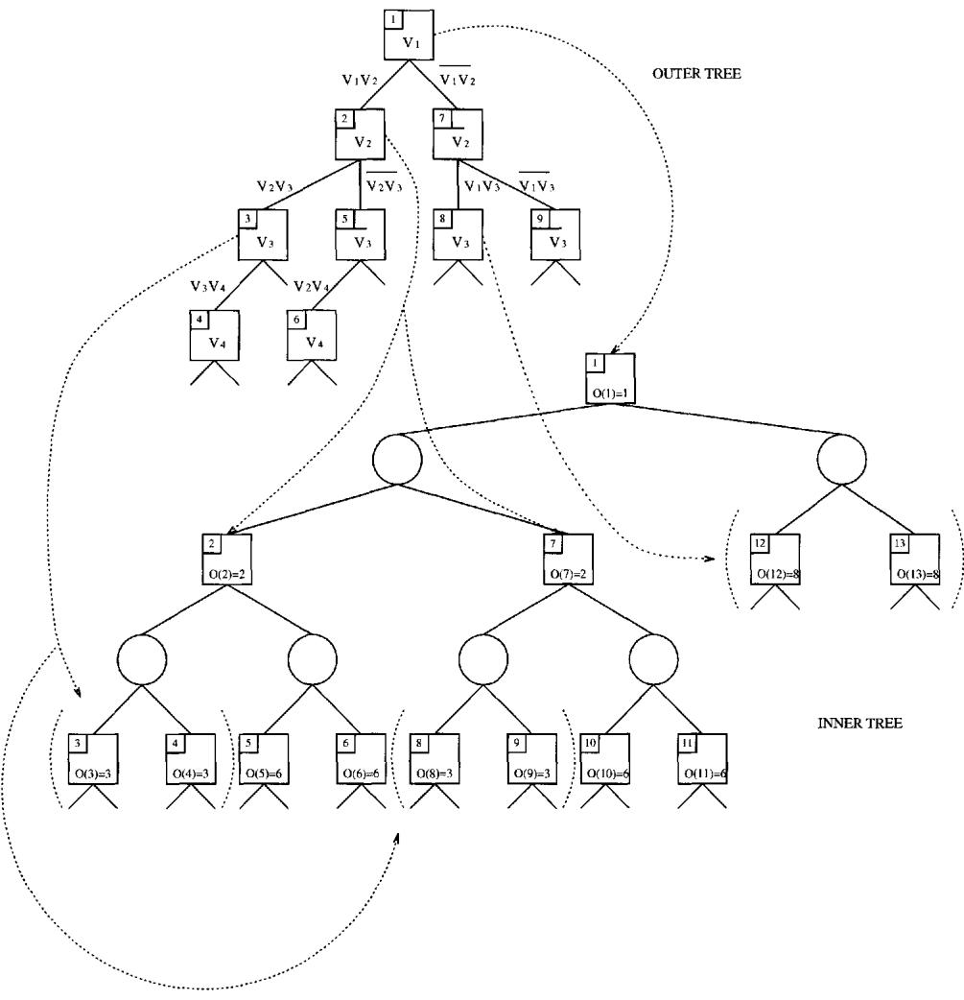  
Figure 13.1. Linked trees in the PTSA.

$$
g ( \rho ) = \left\{ \begin{array} { l l } { \displaystyle P ^ { \prime } + \sum _ { v _ { k } \in S ^ { \prime } } ( \varepsilon _ { k } ^ { 1 } ) - \tau ( K ^ { \prime } + 1 ) + 1 } & { \mathrm { i f ~ } w ( \rho ) \neq 1 , } \\ { \displaystyle P ^ { \prime } + \sum _ { v _ { k } \in S ^ { \prime } } ( \varepsilon _ { k } ^ { 1 } ) - \tau ( K ^ { \prime } + 1 ) } & { \mathrm { i f ~ } w ( \rho ) = 1 . } \end{array} \right.
$$

The proof of (13.13) is straightforward and can be given as follows. Two cases are examined:

1. If the current vehicle is situated at the depot, i.e., $w ( \rho ) = 1$ , then its overall working time restriction is given by $\tau$ . In addition, there are $K ^ { \prime }$ identical vehicles, so the total working time of the vehicles remaining to serve the customers in $S ^ { \prime }$ is given by $\tau + \tau K ^ { \prime } = \tau ( K ^ { \prime } + 1 )$ .

2. If the current vehicle is situated at a customer, i.e., $w ( \rho ) \neq 1$ , then its overall workign time restriction is less than $\tau$ ; the maximum working time now available is $\tau - 1$ 1 Since, in addition, there are $K ^ { \prime }$ vehicles (each with a working time limit $\tau$ ) remaining to serve the customers in $S ^ { \prime }$ , the total working time available is given by $\tau { + } \tau K ^ { \prime } { - } 1 =$ $\tau ( K ^ { \prime } + 1 ) - 1$ . Hence, the minimum remaining working time $g ( p )$ to be satisfied through recourse is given by (13.13).

If $g ( \rho )$ is greater than zero, then a route failure will definitely occur irrespective of how the remaining customers are routed. Indeed, the minimum number of route failures, $f ( \rho )$ that must occur while serving the remaining customers is given by $f ( \rho ) = \lceil g ( \rho ) / \tau \rceil$ , where $\lceil * \rceil$ represents the smallest integer not less than $^ *$ . Now, given that $c _ { 0 }$ represents the remaining least-cost single trip to the depot, i.e., $c _ { 0 } = \operatorname* { m i n } _ { \boldsymbol { v } _ { k } } \left[ c _ { 1 k } ~ | ~ \boldsymbol { v } _ { k } \in S ^ { \prime } \right]$ , the lower bound $L ^ { 2 }$ is given by

$$
L ^ { 2 } ( \rho ) = \left\{ \begin{array} { l l } { 2 c _ { 0 } f ( \rho ) + z _ { 2 } ^ { \lambda } } & { \mathrm { i f ~ } g ( \rho ) > 0 , } \\ { z _ { 2 } ^ { \lambda } } & { \mathrm { o t h e r w i s e } , } \end{array} \right.
$$

where $z _ { 2 } ^ { \lambda }$ is the total recourse cost for all OUTER tree nodes on the leaf from the root node of the tree up to and including node $\lambda$ , the parent node of $\rho$ .

# 13.5.3 Computational Implementation

In this section, a brief description of the complete algorithm, including the lower bounds, is presented. Let $z ^ { * }$ denote a simple upper bound obtained at the root node of the OUTER tree in a heuristic fashion. At each OUTER tree decision node $\rho$ representing customer $w ( \rho )$ with a parent node $\lambda$ the current partial route $k$ is extended using arc $( v _ { w ( \lambda ) } , v _ { w ( \rho ) } )$ . If an infeasible first-stage solution to a corresponding 2-perfect matching problem is found, then backtracking occurs; otherwise, the search continues and lower bounds, $L ^ { 1 }$ and $L ^ { 2 }$ , on the first- and second-stage problems, respectively, are computed on the OUTER tree. If $( L ^ { 1 } + L ^ { 2 } )$ is greater than the best incumbent feasible VRPSST solution value, $z ^ { * }$ , then node $\rho$ is fathomed; otherwise, the search is transferred to the INNER tree. The set of INNER tree nodes, $\Lambda ^ { \lambda }$ , that previously was developed and used to index $\gimel$ are located and full branching occurs on the INNER tree from all nodes in $\Lambda ^ { \lambda }$ to generate a series of new nodes linked to $\rho , \Lambda ^ { \rho }$ , with unique load-leaving levels. The recourse cost $z _ { 2 } ^ { \rho }$ is updated accordingly.

Once branching is completed, the search is transferred to the OUTER tree. The current solution value is computed by $z ^ { \rho } = z _ { 1 } ^ { \rho } + z _ { 2 } ^ { \rho }$ , where $z _ { \mathrm { \scriptscriptstyle I } } ^ { \rho } = L ^ { \mathrm { \scriptscriptstyle I } }$ . If a feasible first-stage set of nodes is found at node $\rho$ and $z ^ { \rho } < z ^ { * }$ , then $z ^ { * }$ is updated accordingly by $z ^ { * } = z ^ { \rho }$ .

# 1 3.6 Applied Maintenance Scheduling Problem

The PTS A was used to solve a real-life operational problem at a utility company, which has been modeled as a VRPSST. The company has a large number of major assets, including depots, work sites, buildings and machinery, and employs Field Service Engineers (FSEs) to maintain all these assets. FSEs are home-based and work independently in a set geographical region. An average day for an FSE involves 8 hours and 15 minutes of work, and overtime is paid for work completed over this allotted time. Typically, a number of jobs (usually

fewer than 10) are completed per day at a number of alternative sites (usually fewer than 5).   
Accordingly, an FSE may complete up to 30 jobs per week at up to 20 locations.

# 13.6.1 Maintenance Scheduling System in Practice

Jobs are assigned to an FSE in a variety of ways; however, each job has a basic form of prioritization and, for all but the most reactive jobs, requires some form of localized scheduling and routing. Currently, before deciding which jobs to complete each day, an FSE considers a variety of factors, including

• priority, which is a known upper limit of time before which a job must be completed,   
• site location, which is known and fixed,   
• travel time, which is estimated based on FSE knowledge of the geographical area and local traffic systems and so forth, and   
• service time, which is the length of time taken to complete a job and which is estimated according to incomplete knowledge and FSE experience.

In this study, FSE jobs are defined according to their associated priority and belong to one of the following three categories: (i) reactive (R)—emergency call-outs with a priority given in terms of hours; (ii) preplanned (P)—regular jobs with a priority given in terms of months; and (iii) unplanned (U)—irregular jobs that require some form of local prioritization usually given in terms of days or weeks. The characteristics of these job types, obtained from a database storing information for 8 months of FSE work, are shown in Table 13.1. Specifically, column 2 shows the proportion of jobs that were classified under a particular job type during this period (Total Number), column 3 displays the proportion of total time spent completing jobs of a particular job type (Total Time), column 4 highlights the average duration of time taken to complete individual jobs of a particular job type (Average Service Time), and column 5 displays approximations of the upper limits of priority per job type that accord with FSE efficiency targets.

# 13.6.2 Stochastic Problem Setting

In any stochastic environment, there exists a specific information state that refers to the amount of information available to the decision makers at the time of decision making as opposed to the time when full information becomes available. In this study, the decision makers are the engineers, decision making refers to local scheduling and routing, and full information occurs with hindsight after a job is completed. The presence of a stochastic information state is highlighted by the facts that (i) service times are deemed stochastic as opposed to fixed, and (ii) there exist inconsistencies in the way jobs are reported, e.g., a qualitative study with FSEs revealed an estimated ratio of 20:70:10 in the Total Number of P, U, and R jobs in contrast to the actual ratio of 59:11:30 (see Table 13.1). In practice, there also exist a variety of reoptimization methods, i.e., operational systems, that can be utilized in such a problem environment.

Table 13.1. Job characteristics for an engineer.   

<table><tr><td>Job type</td><td>Total number</td><td>Total time</td><td>Average service time</td><td>Priority</td></tr><tr><td>Preplanned</td><td>59%</td><td>23%</td><td>1 hour</td><td>3 months</td></tr><tr><td>Unplanned</td><td>11%</td><td>19%</td><td>5 hours</td><td>2 weeks</td></tr><tr><td>Reactive</td><td>30%</td><td>58%</td><td>6 hours</td><td>1 hour</td></tr></table>

Table 13.1 shows that more than $50 \%$ of an FSE's work time is spent doing reactive jobs. Such jobs, however, total only $30 \%$ of all jobs completed. Indeed, as P and U jobs are large in number and have shorter durations which are stochastic in nature they are seen as schedulable. Conversely, reactive jobs are seen as uncontrollable and reducible only by improved engineering techniques and preventative maintenance, i.e., an increased number of planned maintenance jobs should decrease the overall number of emergency cases.

To summarize, two uncertainties are present in the FSE scheduling and routing system. First, certain maintenance jobs completed by FSEs can arise in a probabilistic manner, and, second, the time required to complete individual jobs is unknown, i.e., the occurrence of FSE jobs can be stochastic and the completion times of FSE jobs is stochastic. Consequently, the problem of determining optimal schedules is very complex. To simplify the approach, consider a finite period of time within which a series of P, U, and R jobs have to be completed by an FSE. (Note that the geographical boundary of such jobs will be specified by the site locations themselves.) The basic routing and scheduling problem can then be described as follows: If an FSE has a list of U and P jobs to complete within a finite planning horizon (e.g., a 5-day working week), how should those jobs be scheduled to minimize overall cost, taking into account both reactive call-outs (R jobs) and the uncertain nature of job service times?

# 13.7 Modeling the Applied Problem as a VRPSST

The authors were asked to examine the possible restructuring and refinement of the existing FSE scheduling and routing system with a view to reducing costs or improving productivity and the level of service associated with maintenance operations at the utility company. These issues were addressed by developing a VRPSST-based optimization model of the basic FSE scheduling and routing problem given above and validating the model using historical information. More specifically, the optimization model can be used to identify optimal schedules of P and U jobs for a given FSE and, therefore, can be used to recommend the most efficient daily routes, taking into account stochastic service times (and reactive callouts). The relative performance of the model then can be evaluated by analyzing existing FSE schedules; i.e., model output can be used to predict schedules based on historical information and a comparison can then be made between results obtained manually and results that could have been obtained with the use of the model. Finally, it is possible to investigate the impact of using the model at two different stages of implementation. Such analysis provides a measure of the comparative efficiency of the current manual system against that of the model at two stages of practical use primarily concerned with reactive call-out recognition.

To model the FSE problem as a VRPSST, each "vehicle" corresponds to a "day" in a given planning horizon. The time restriction, $\tau$ , then equates to the normal hours of each working day. In addition, VRPSST customers correspond to jobs that require a service, and, as before, each job has an assigned geographical location, each route starts and ends at a fixed point (the depot), and each job is serviced on one day only, i.e., each customer is visited exactly once by one vehicle. The time matrix represents the travel times between customer sites, and the cost matrix may represent travel time, travel cost, or travel distance between customer sites. The objective of the VRPSST described in this context is then to design a minimum expected cost set of routes given that recourse costs (represented by return trips back to the depot) are interpreted as the cost incurred to return to a location to complete a particular job on a day outside the planning horizon.

# 13.8 Model Input

The implementation of the optimization model requires the availability of input data in the format required by the model. The primary operations involved in scheduling an FSE include the prioritization of jobs to be scheduled, the classification of individual job times from a host of job characteristics, and the inclusion of geographical site locations. The two main inputs required are discussed below.

# 13.8.1 Job Locations and the Road Network

The results presented in this case study are based on real distances calculated between any two site locations using a real Road Network System (RNS). This system covers the pilot study region of the utility company and, for this reason, 10 figure OS references were obtained for all pilot study-based sites and FSE home locations. The road network contains more than 4000 road segments (arcs) and about 1600 intersections of road segments (nodes identified by grid references).

The RNS stores not only the length of the links between road junctions but also the type of road that makes up a link. With such information, it becomes possible to adjust for differing vehicle speeds on different types of road, e.g., motorway $( 6 0 \ \mathrm { m p h } )$ , A road $( 4 0 \mathrm { m p h } )$ , and B road $( 2 0 \mathrm { m p h } )$ , and hence to calculate accurate vehicle travel times between any two locations. Note that the route that gives the minimum vehicle travel time between any two sites may well be different from the minimum mileage route between the same two sites. In this study, vehicle routes are planned on the basis of a minimum vehicle travel cost between sites, which represents an equally weighted combination of both factors. Shortest routes between any two site locations on the road network and associated path information are determined using a shortest path algorithm; see Dijkstra [6].

# 13.8.2 Service Times

A standard mathematical distribution is required to describe the service time of a particular job and act as input into the VRPSST maintenance model. For our purposes, an FSE job is not defined by precise engineering detail but by what an FSE predicts a particular job to entail since, for all but the most trivial of jobs, the precise specifics of a job are unknown until the problem is diagnosed on site. By examining service time distributions for the same job types using data for individual FSEs, log-normal distributions with differing means and standard deviations were found to fit with adequate statistical confidence. Therefore, when a service time distribution is required, the FSE's mean service time, and standard deviation, for a given job type contribute to a discretized log-normal distribution that can be entered into the model. An example of such an input distribution, where there exist 12 discrete service time possibilities, is shown in Figure 13.2. Notice that for modeling purposes, a limit of 6 hours is maintained, i.e., the probability that a time above 6 hours is realized contributes to a summed discrete probability of occurrence corresponding to exactly 6 hours.

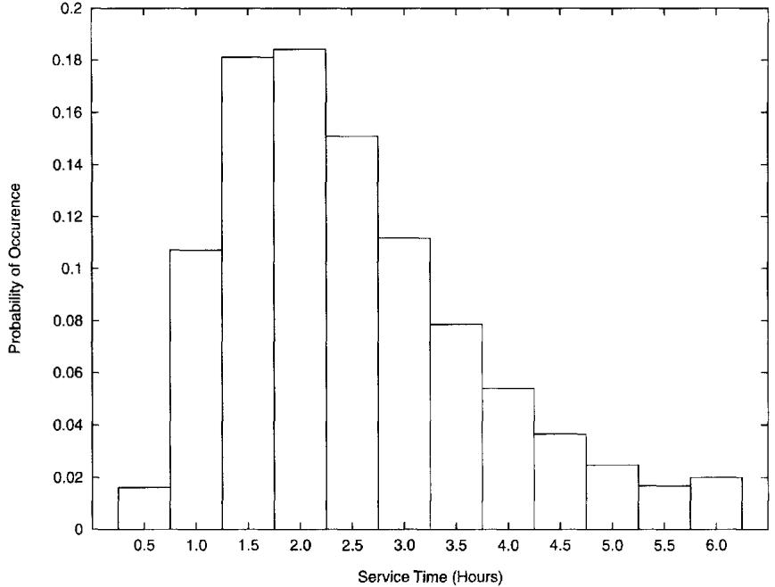  
Figure 13.2. Example FSE service time distribution input.

# 13.9 Model Output: Computational Considerations

The model was coded in FORTRAN and run on a Silicon Graphics Workstation Indigo R4000 (100MHz). The evaluation of the computational performance of the model is based on 12 scenarios (each scenario corresponding to one week's data) from one month's historical data for three FSEs based in the pilot study region.

# 13.9.1 Framework for the Analysis of Results

The actual input for each scenario, obtained from historical information, displays when and where each job was completed, what its priority was, and how long each job took to be completed (in hours) for a given FSE's working week. The following information can be obtained from such a weekly input: (i) a list of all P and U jobs to be scheduled on Monday morning, (ii) the actual service time per day (with and without reactive call-outs), (iii) the actual travel time per day (with and without reactive call-outs), (iv) the actual distance traveled per day (with and without reactive call-outs), and (v) the actual overtime per day (with and without reactive call-outs), i.e., the time beyond 8 hours and 15 minutes.

The manual sequence of jobs completed (scheduled) in practice by a given FSE for each day of the week is referred to as the manual schedule. The corresponding optimal sequence of $\mathbf { P }$ and U jobs, obtained by the optimization model at the beginning of the planning week, is referred to as the optimal schedule. Days in the optimal schedule are not ordered over the planning period, and, for that reason, a secondary ordering process is established based on the number of jobs per day and the expected service time per day.

When the actual job completion times obtained from the manual data for a particular scenario are entered into the optimal schedule, then the latter becomes the actual-optimal schedule, which can be compared to the existing manual schedule. The following assumptions have been used in developing actual-optimal schedules based on the optimal model output:

• All P and U jobs completed in the manual schedule are available for scheduling at the beginning of that week.   
• There exists a fixed limit of overtime allowed per day within the actual-optimal schedule that corresponds to the average amount of overtime used in the historical data, i.e., a job in an actual-optimal schedule will create overtime only when the total time used in that day, plus the expected time of the new job, is less than the working day plus the fixed amount of overtime allowed on average per day in the manual schedule.   
• If an FSE does not have time to complete a P or U job, even allowing for overtime, then the job will be completed at the end of any permitted subsequent daily schedule. Conversely, if an FSE has some spare time at the end of a day, then the last scheduled job in the week will be completed.   
• If a reactive call-out occurs in the historical data, then the reactive job is completed in the actual-optimal schedule and the current P or U job is abandoned to be completed later in the week (see section 13.9.2).

By finding the optimal schedule at the beginning of each scenario and using the above framework to compare the manual schedule with the actual-optimal schedule, it is possible to find estimates for the reduction in total travel time, distance traveled, and overtime that can be obtained by using the optimization model instead of the manual method. In addition, by investigating the impact of implementing the model in two stages, described below, it is possible to consider the issue of reoptimization and the cost of going online.

# 13.9.2 Reoptimization

The model initially schedules P and U jobs allowing for stochastic service times. Reactive call-outs are not included as they do not exist at the time of scheduling. Indeed, one possible manifestation of the model is to exclude the contribution of reactive call-outs entirely and to consider only jobs that can be scheduled; this would correspond to an FSE system in which reactive call-outs are never encountered and would therefore partially invalidate any associated results. Two different levels of inclusion of reactive call-outs, which correspond to two different stages of model implementation, are therefore included:

• Simple inclusion. Jobs occur as scheduled; however, when reactive call-outs arise they are implemented just as they occur in reality, and when they end the original schedule is continued. No secondary optimization is completed once the original schedule has been interrupted and so the method is similar to the manual system of dealing with reactive call-outs. (This system corresponds to one run of the optimization model at the beginning of the planning horizon.)

• Reoptimization. Jobs occur as scheduled; however, whenever reactive call-outs arise, and have been completed, reoptimization occurs. (This system corresponds to the running of the model within an online system by, for example, continually rerunning the model following the completion of a day that has included a reactive call-out.)

# 13.10 Example Scenario

Table 13.2 displays data for a week of FSE work in the pilot study region. Five reactive jobs occur during the week: one on Monday morning, one in the middle of the day on Monday, one on Tuesday, one on Thursday morning, and one on Friday afternoon. Table 13.3 displays the inputs to the VRPSST model. The index column is simply used to identify inputted jobs and allows for a combination of $\mathbf { P }$ jobs when total expected service time is small. For example, indices 7a and $\mathbf { \gamma } _ { 7 \mathbf { b } }$ are used to identify two small jobs that are combined to generate a single service time distribution that should be input to the model and represented as job 7. The expected service times $( \mu _ { i } )$ , the standard deviations $( \sigma _ { i } )$ , and the number of discrete service time points $( \delta _ { i } )$ describing each log-normal distribution of a given job are also shown.

Table 13.2. Actual data for the example scenario.   

<table><tr><td>Day</td><td>Job type</td><td>Service time (hrs)</td><td>Index</td></tr><tr><td rowspan="4">Monday</td><td>R</td><td>1.50</td><td>-</td></tr><tr><td>U</td><td>2.25</td><td>3</td></tr><tr><td>R</td><td>2.50</td><td>-</td></tr><tr><td>U</td><td>2.00</td><td>4</td></tr><tr><td rowspan="2">Tuesday</td><td>R</td><td>3.25</td><td>-</td></tr><tr><td>U</td><td>1.50</td><td>5</td></tr><tr><td rowspan="2">Wednesday</td><td>U</td><td>5.00</td><td>2</td></tr><tr><td>U</td><td>3.25</td><td>6</td></tr><tr><td rowspan="5">Thursday</td><td>R</td><td>4.00</td><td>-</td></tr><tr><td>U</td><td>1.50</td><td>8</td></tr><tr><td>P</td><td>0.25</td><td>7a</td></tr><tr><td>P</td><td>0.25</td><td>7b</td></tr><tr><td>U</td><td>2.25</td><td>12</td></tr><tr><td rowspan="8">Friday</td><td>P</td><td>0.50</td><td>11a</td></tr><tr><td>P</td><td>0.25</td><td>9a</td></tr><tr><td>U</td><td>2.25</td><td>10</td></tr><tr><td>P</td><td>0.25</td><td>11b</td></tr><tr><td>P</td><td>0.25</td><td>11c</td></tr><tr><td>P</td><td>0.25</td><td>9b</td></tr><tr><td>P</td><td>0.50</td><td>9c</td></tr><tr><td>U</td><td>2.00</td><td>13</td></tr><tr><td></td><td>U</td><td>1.00</td><td>14</td></tr><tr><td></td><td>R</td><td>1.00</td><td>-</td></tr></table>

Table 13.3. Input data for the example scenario.   

<table><tr><td rowspan="2">Job type</td><td rowspan="2">Index (*combined jobs)</td><td colspan="3">Probability Distribution</td></tr><tr><td>μi(hrs)</td><td>σ(hrs</td><td>δ</td></tr><tr><td>U</td><td>2</td><td>3.04</td><td>1.80</td><td>34</td></tr><tr><td>U</td><td>3</td><td>3.04</td><td>1.80</td><td>34</td></tr><tr><td>U</td><td>4</td><td>3.04</td><td>1.80</td><td>34</td></tr><tr><td>U</td><td>5</td><td>3.04</td><td>1.80</td><td>34</td></tr><tr><td>U</td><td>6</td><td>3.04</td><td>1.80</td><td>34</td></tr><tr><td>P</td><td>7*</td><td>0.61</td><td>0.46</td><td>17</td></tr><tr><td>U</td><td>8</td><td>3.04</td><td>1.80</td><td>34</td></tr><tr><td>P</td><td>9*</td><td>0.92</td><td>0.69</td><td>24</td></tr><tr><td>U</td><td>10</td><td>3.04</td><td>1.80</td><td>34</td></tr><tr><td>P</td><td>11*</td><td>0.92</td><td>0.69</td><td>24</td></tr><tr><td>U</td><td>12</td><td>3.04</td><td>1.80</td><td>34</td></tr><tr><td>U</td><td>13</td><td>3.04</td><td>1.80</td><td>34</td></tr><tr><td>U</td><td>14</td><td>3.04</td><td>1.80</td><td>34</td></tr></table>

When no reactive call-outs are considered, the output of the optimization model is the optimal schedule shown in Table 13.4. This list would have been used to schedule the FSE in an implemented system. Notice that there is a $5 . 1 \%$ difference between the expected service time and the actual service time (ST) over the whole week. Using the list of assumptions given in section 13.9.1, this optimal schedule can now be used to obtain the actual-optimal schedule shown in Table 13.5. The corresponding manual schedule is also shown in Table 13.5. Notice that the actual-optimal schedule differs from the optimal schedule because, since extra time was available on Thursday, jobs 5 and 11 could be added to Thursday's schedule. Contrasting the actual-optimal schedule with the manual schedule, the following can be noted: (i) the 5-day original schedule becomes a 4-day schedule in the optimized case, (ii) the spread of jobs is more even in the optimized schedule and, hence, overtime (OT) is cut from 3.17 hours to a total of 0.08 hours (a reduction of $9 7 . 5 \%$ ), (iii) travel time (TT) decreases dramatically in the optimized schedule from 7.17 hours to 4.83 hours (a reduction of $3 2 . 6 \%$ , and (iv) travel distance (TD) decreases in the optimized schedule from 460 to 320 kilometers (a reduction of $3 0 . 4 \%$ ).

Table 13.4. The optimal schedule for the example scenario.   

<table><tr><td></td><td>Sequence of jobs</td><td>Expected service time (Hours)</td></tr><tr><td></td><td>H-7-9-10-8-H</td><td>6.40</td></tr><tr><td></td><td>H-4-14-6-H</td><td>7.30</td></tr><tr><td></td><td>H-2-13-H</td><td>4.87</td></tr><tr><td>2</td><td>H-12-3-H</td><td>4.87</td></tr><tr><td></td><td>H-11-5-H</td><td>3.35</td></tr><tr><td></td><td></td><td>26.79</td></tr></table>

Table 13.5. Schedules for the example scenario with no reactive call-outs.   

<table><tr><td rowspan=1 colspan=4></td><td rowspan=1 colspan=1>ST(hrs)</td><td rowspan=1 colspan=1>TT(hrs)</td><td rowspan=1 colspan=1>OT(hrs)</td><td rowspan=1 colspan=1>TD(km)</td></tr><tr><td rowspan=1 colspan=1>Manualschedule</td><td rowspan=2 colspan=2>2F</td><td rowspan=2 colspan=1>H-3-4-HH-5-HH-2-6-HH-8-7a-7b-12-HH-11a-9a-10-11bc-9bc-13-14-H</td><td rowspan=2 colspan=1>4.251.508.254.257.25</td><td rowspan=2 colspan=1>1.330.671.001.003.17</td><td rowspan=2 colspan=1>0.000.001.000.002.17</td><td rowspan=2 colspan=1>80408060200</td></tr><tr><td rowspan=2 colspan=4>2               H-2-6-HH-8-7a-7b-12-HF  H-11a-9a-10-11bc-9bc-13-14-H</td></tr><tr><td rowspan=1 colspan=1>25.50</td><td rowspan=1 colspan=1>7.17</td><td rowspan=1 colspan=1>3.17</td><td rowspan=1 colspan=1>460</td></tr><tr><td rowspan=2 colspan=1>Actual-optimalschedule</td><td rowspan=3 colspan=2>MTW</td><td rowspan=3 colspan=1>H-7-9-10-8-HH-4-14-6-HH-2-13-HH-12-3-11-5-H</td><td rowspan=3 colspan=1>5.256.257.007.00</td><td rowspan=1 colspan=1>1.331.33</td><td rowspan=1 colspan=1>0.000.00</td><td rowspan=2 colspan=1>1108060</td></tr><tr><td rowspan=2 colspan=1>0.831.33</td><td rowspan=2 colspan=1>0.000.08</td></tr><tr><td rowspan=2 colspan=4>W           H-12-3-11-5-H</td><td rowspan=1 colspan=1></td><td rowspan=1 colspan=1>70</td></tr><tr><td rowspan=1 colspan=2></td><td rowspan=1 colspan=1>25.50</td><td rowspan=1 colspan=1>4.83</td><td rowspan=1 colspan=1>0.08</td><td rowspan=1 colspan=1>320</td></tr></table>

Employing simple inclusion in the example scenario results in a $5 . 9 \%$ reduction in travel time, an $11 \%$ reduction in overtime, and a $5 \%$ reduction in distance traveled; profiles of the use of FSE time in this case, for the manual and actual-optimal schedules, are shown in Figure 13.3. Table 13.6 displays both schedules if reoptimization is employed in the scenario. The three reruns of the VRPSST model, which occur due to reactive call-outs on Monday, Tuesday, and Thursday, alter the nature of the original optimal schedule and result in a $9 . 8 \%$ reduction in travel time, a reduction in overtime of $8 . 9 \%$ , and a reduction in distance traveled of $5 . 6 \%$ . Notice that, in this particular scenario, although travel time decreases under reoptimization, the percentage reduction in overtime is slightly less than in the case of simple inclusion.

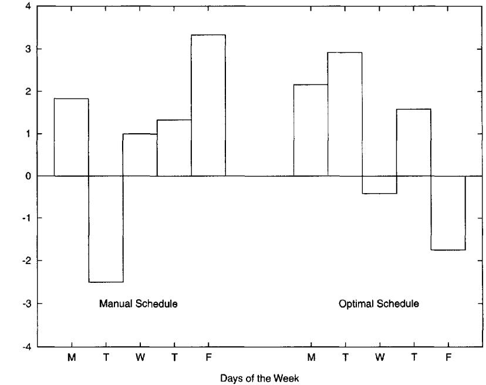  
Figure 13.3. A time profile of manual and actual-optimal schedules.

Table 13.6. Schedules for the example scenario with reoptimization.   

<table><tr><td rowspan=1 colspan=3></td><td rowspan=1 colspan=1>ST(hrs)</td><td rowspan=1 colspan=1>TT(hrs)</td><td rowspan=1 colspan=1>OT(hrs)</td><td rowspan=1 colspan=1>TD(km)</td></tr><tr><td rowspan=1 colspan=1>Manualschedule</td><td rowspan=2 colspan=1>2</td><td rowspan=2 colspan=1>H-R-3-R-4-HH-R-5-HH-2-6-HH-R-8-7a-7b-12-HH-11a-9a-10-11bc-9bc-13-14-R-H</td><td rowspan=2 colspan=1>8.254.758.258.258.25</td><td rowspan=2 colspan=1>1.831.001.001.333.33</td><td rowspan=2 colspan=1>1.830.001.001.333.33</td><td rowspan=2 colspan=1>120708070200</td></tr><tr><td rowspan=2 colspan=3>2                H-2-6-HH-R-8-7a-7b-12-HH-11a-9a-10-11bc-9bc-13-14-R-H</td></tr><tr><td rowspan=1 colspan=1>37.75</td><td rowspan=1 colspan=1>8.50</td><td rowspan=1 colspan=1>7.50</td><td rowspan=1 colspan=1>540</td></tr><tr><td rowspan=1 colspan=1>Actual-optimalschedule</td><td rowspan=2 colspan=1>2</td><td rowspan=2 colspan=1>H-R-7-9-R-10-HH-R-4-14-6-HH-3-5-11-13-HH-R-2-HH-8-12-R-H</td><td rowspan=2 colspan=1>7.759.506.759.004.71</td><td rowspan=2 colspan=1>2.671.671.331.001.00</td><td rowspan=2 colspan=1>2.172.920.001.750.00</td><td rowspan=2 colspan=1>190100807070</td></tr><tr><td rowspan=2 colspan=3>H-R-2-HH-8-12-R-H</td></tr><tr><td rowspan=1 colspan=1>37.75</td><td rowspan=1 colspan=1>7.67</td><td rowspan=1 colspan=1>6.83</td><td rowspan=1 colspan=1>510</td></tr></table>

# 13.11 Overall Computational Results

The results for all scenarios are shown in Tables 13.7-13.9. These tables display the percentage reduction in travel time, overtime, and distance traveled achieved when the optimization model is used for each scenario in the case of no reactive call-outs, reactive call-outs with simple inclusion, and reactive call-outs with reoptimization. Computation times required to obtain the optimal schedule for each scenario, together with their associated VRPSST problem sizes, are shown in Table 13.10.

Table 13.7. Results: reactive call-outs ignored.   

<table><tr><td>Scenario</td><td>TT (% reduction)</td><td>OT (% reduction)</td><td>TD (% reduction)</td></tr><tr><td>1</td><td>21.4</td><td>9.8</td><td>20.3</td></tr><tr><td>2</td><td>0.0</td><td>26.4</td><td>5.2</td></tr><tr><td>3</td><td>15.3</td><td>25.0</td><td>18.0</td></tr><tr><td>4</td><td>6.5</td><td>17.9</td><td>14.5</td></tr><tr><td>5</td><td>7.1</td><td>0.0</td><td>19.2</td></tr><tr><td>6</td><td>6.5</td><td>81.0</td><td>9.7</td></tr><tr><td>7</td><td>20.6</td><td>38.6</td><td>20.0</td></tr><tr><td>8</td><td>12.5</td><td>0.0</td><td>18.8</td></tr><tr><td>9</td><td>10.7</td><td>80.0</td><td>12.5</td></tr><tr><td>10</td><td>25.0</td><td>0.0</td><td>28.3</td></tr><tr><td>11</td><td>0.0</td><td>0.0</td><td>23.1</td></tr><tr><td>12</td><td>32.6</td><td>97.4</td><td>30.4</td></tr><tr><td>Average</td><td>13.6</td><td>32.5</td><td>18.2</td></tr></table>

Table 13.8. Results: reactive call-outs—simple inclusion.   

<table><tr><td>Scenario</td><td>TT (% reduction)</td><td>OT (% reduction)</td><td>TD (% reduction)</td></tr><tr><td>2</td><td>0.0</td><td>0.0</td><td>3.4</td></tr><tr><td>3</td><td>10.9</td><td>22.9</td><td>14.9</td></tr><tr><td>5</td><td>2.9</td><td>14.8</td><td>6.7</td></tr><tr><td>6</td><td>16.7</td><td>26.2</td><td>11.1</td></tr><tr><td>7</td><td>21.4</td><td>30.7</td><td>21.1</td></tr><tr><td>8</td><td>14.7</td><td>0.0</td><td>18.8</td></tr><tr><td>9</td><td>5.9</td><td>44.0</td><td>7.7</td></tr><tr><td>10</td><td>8.3</td><td>38.8</td><td>15.7</td></tr><tr><td>11</td><td>0.0</td><td>2.8</td><td>8.3</td></tr><tr><td>12</td><td>5.9</td><td>11.1</td><td>5.6</td></tr><tr><td>Average</td><td>8.3</td><td>20.1</td><td>11.0</td></tr></table>

If reactive call-outs are ignored (see Table 13.7), the average results over all scenarios indicate a substantial reduction in travel time $( 1 4 \% )$ and distance traveled $( 1 8 \% )$ , together with a dramatic reduction in overtime $( 3 3 \% )$ . Table 13.8 displays the results when reactive call-outs are implemented using simple inclusion. No results are available for scenarios 1 and 4 as no reactive call-outs occurred during these 2 weeks. Notice that, although the optimal schedule clearly outperforms the manual schedule, the improvements over current practice are slightly less than in the previous case $( 8 \% , 1 1 \%$ , and $20 \%$ , respectively). This decrease is because reactive call-outs occur at random points of the week and no secondary optimization is completed once the original schedule has been interrupted. Once reoptimization is implemented only minor increases in the reductions beyond the simple inclusion case are achieved. Clearly, these results indicate that reoptimization may be unnecessary in certain practical cases where large amounts of unscheduled reactive call-outs disrupt the optimal routing system. Nevertheless, results were completed only up to the end of the planning horizon, not on a rolling weekly reoptimization basis, and, therefore, depending on costs and efficiency targets, reoptimization may still be comparatively important to management.

Table 13.9. Results: reactive call-outs—reoptimization.   

<table><tr><td>Scenario</td><td>TT (% reduction)</td><td>OT (% reduction)</td><td>TD (% reduction)</td></tr><tr><td>2</td><td>0.0</td><td>0.0</td><td>3.4</td></tr><tr><td>3</td><td>10.9</td><td>22.9</td><td>14.9</td></tr><tr><td>5</td><td>8.8</td><td>7.4</td><td>6.7</td></tr><tr><td>6</td><td>22.2</td><td>23.1</td><td>22.2</td></tr><tr><td>7</td><td>21.4</td><td>30.7</td><td>23.7</td></tr><tr><td>8</td><td>14.7</td><td>0.0</td><td>18.8</td></tr><tr><td>9</td><td>5.9</td><td>30.8</td><td>7.7</td></tr><tr><td>10</td><td>8.3</td><td>38.8</td><td>15.7</td></tr><tr><td>11</td><td>0.0</td><td>41.7</td><td>4.2</td></tr><tr><td>12</td><td>9.8</td><td>8.9</td><td>5.6</td></tr><tr><td>Average</td><td>9.6</td><td>19.6</td><td>11.7</td></tr></table>

Table 13.10. Problem data and computation times for each scenario.   

<table><tr><td>Scenario</td><td>Jobs (n-1)</td><td>Days (K)</td><td>Computational times (hours)</td></tr><tr><td>1</td><td>13</td><td>5</td><td>8.41</td></tr><tr><td>2</td><td>14</td><td>6</td><td>11.16</td></tr><tr><td>3</td><td>10</td><td>5</td><td>8.87</td></tr><tr><td>4</td><td>16</td><td>6</td><td>13.58</td></tr><tr><td>5</td><td>11</td><td>5</td><td>11.64</td></tr><tr><td>6</td><td>10</td><td>5</td><td>8.46</td></tr><tr><td>7</td><td>10</td><td>5</td><td>8.73</td></tr><tr><td>8*</td><td>6</td><td>4</td><td>0.00</td></tr><tr><td>9</td><td>9</td><td>4</td><td>4.99</td></tr><tr><td>10</td><td>11</td><td>4</td><td>3.70</td></tr><tr><td>11</td><td>13</td><td>5</td><td>7.58</td></tr><tr><td>12</td><td>13</td><td>5</td><td>8.38</td></tr><tr><td>Average</td><td>11.33</td><td>4.92</td><td>7.96</td></tr></table>

"Optimal solution found at the root node of the OUTER tree.

# 13.12 Conclusion

The modeling approach presented in this study involved the construction of a VRPSST-based model and the application of a new solution method to identify optimal schedules of jobs and to recommend the most efficient routes for the FSEs taking into account stochastic service times and reactive call-outs. The performance of the model was evaluated by analyzing existing FSE schedules and investigating the impact on FSE performance of using the model at two different stages of implementation, one of which is a simulated on-line system.

The results of the optimization model show that improvements of approximately $8 \%$ and $11 \%$ in total travel time and distance traveled, respectively, can be achieved, for a given FSE, when stochastic service times and reactive call-outs are included in the FSE's weekly schedule. In addition, the average reduction in overtime in such cases is approximately $20 \%$ .

# Bibliography

[1] C. Bastian and A. Kan. The stochastic vehicle routing problem revisited. European Journal of Operational Research, 56:407^112, 1992.

[2] D. Bertsimas. A vehicle routing problem with stochastic demand. Operations Research, 40:574-585, 1992.

[3] D. Bertsimas, P. Jaillet, and A. Odoni. A priori optimisation. Operations Research, 38:1019-1033, 1990.

[4] R.L. Carraway, T.L. Morin, and H. Moskowitz. Generalized dynamic programming for stochastic combinatorial optimisation. Operations Research, 37:819-829, 1989.

[5] G. Clarke and J.V. Wright. Scheduling of vehicles from a central depot to a number of delivery points. Operations Research, 12:568-581, 1964.

[6] E.W. Dijkstra. A note on two problems in connection with graphs. Numerische Mathematik, 1:269-271, 1959.

[7] M. Dror. Modelling vehicle routing with uncertain demands as a stochastic program: Properties of the corresponding solution. European Journal of Operational Research, 64:432-441, 1993.

[8] M. Dror, G. Laporte, and F. Louveaux. Vehicle routing with stochastic demands and restricted failures. ZOR—Methods and Models of Operations Research, 37:273-283, 1993.

[9] M. Dror, G. Laporte, and P. Trudeau. Vehicle routing with stochastic demands: Properties and solution frameworks. Transportation Science, 23:166-176, 1989.

[10] M. Dror and P. Trudeau. Stochastic vehicle routing with modified savings algorithm. European Journal of Operational Research, 23:228-235, 1986.

[11] M. Gendreau, G. Laporte, and R. Seguin. A tabu search heuristic for the vehicle routing problem with stochastic demands and customers. Working paper, CRT, Montreal University, Canada, 1994.

[12] M. Gendreau, G. Laporte, and R. Seguin. An exact algorithm for the vehicle routing problem with stochastic demands and customers. Transportation Science, 29:143-155, 1995.

[13] M. Gendreau, G. Laporte, and R. Seguin. Stochastic vehicle routing. European Journal of Operational Research, 88:3-12, 1996.

[14] B.L. Golden and W.R. Stewart Jr. Vehicle routing with probabilistic demands. Computer Science and Statistics: Tenth Annual Symposium on the Interface, 503:252-259, 1978.

[15] E.P.C. Kao. A preference order dynamic program for a stochastic travelling salesman problem. Operations Research, 26:1033-1045, 1978.

[16] V. Lambert, G. Laporte, and F. Louveaux. Designing collection routes through bank branches. Computers and Operations Research, 20:783-791, 1993.

[17] G. Laporte and F. Louveaux. Formulations and bounds for the stochastic capacitated vehicle routing with uncertain supplies. In JJ. Gabszewicz, J.F. Richard, and L.A. Wolsey, editors, Economic Decision Making: Games, Econometrics and Approximate Algorithms, North-Holland, Amsterdam, 1990, pp. 443^455.

[18] G. Laporte and F. Louveaux. The integer L-shaped method for stochastic integer programs with complete recourse. Operations Research Letters, 13:133-142, 1993.

[19] G. Laporte, F. Louveaux, and H. Mercure. Models and exact solutions for a class of stochastic location-routing problems. European Journal of Operational Research, 39:71-78, 1989.

[20] G. Laporte, F. Louveaux, and H. Mercure. The vehicle routing problem with stochastic travel times. Transportation Science, 26:161-170, 1992.

[21] J. Popovic. Vehicle routing in the case of uncertain demand: A Bayesian approach. Transportation Planning and Technology, 19:19-29, 1995.

[22] D. Roberts. Algorithms for stochastic vehicle routing problems. Ph.D. thesis, Imperial College, University of London, 1998.

[23] D. Roberts and E. Hadjiconstantinou. Algorithmic developments in stochastic vehicle routing. In P. Kischka, H. Lorenz, U. Derigs, W. Domschke, P. Kleinschmidt, and R. Moehring, editors, Operations Research Proceedings 1997, Springer-Verlag, Berlin, 1998, pp. 156-161.

[24] D. Roberts and E. Hadjiconstantinou. A computational approach to the vehicle routing problem with stochastic demands. In P. Borne, M. Ksouri, and A. El Kamel, editors, Computational Engineering in Systems Applications, IEEE, 1998, pp. 139-144.

[25] E. Sniedovich. Analysis of a preference order travelling salesman problem. Operations Research, 29:1234-1237, 1981.

[26] W.R. Stewart Jr. and B.L. Golden. Stochastic vehicle routing: A comprehensive approach. European Journal of Operational Research, 14:371-385, 1983.

[27] D. Teodorovic, E. Krcmar-Nozic, and G. Pavkovic. The mixed fleet stochastic routing problem. Transportation Planning and Technology, 19:31-43, 1995.

[28] D. Teodorovic and G. Pavkovic. A simulated annealing technique approach to the vrp in the case of stochastic demand. Transportation Planning and Technology, 16:261— 273, 1992.

[29] F. Tillman. The multiple terminal delivery problem with probabilistic demands. Transportation Science, 3:192-204, 1969.

Chapter 14

# Evolution of Microcomputer-Based Vehicle Routing Software: Case Studies in the United States

Edward K. Baker

# 14.1 Introduction

To say that there has been an explosion of microcomputer-based software for the VRP in the last decade is an understatement. The availability and scope of the vehicle routing software packages today exceed expectations of but a few years ago. In their early survey paper, Golden, Bodin, and Goodwin [10], acknowledging that microcomputers were by then commonplace, reviewed 13 commercially available packages and noted that several other packages were under development. By contrast, the 1997 edition of Logistics Software [12], compiled by Andersen Consulting for the Council of Logistics Management, lists 559 microcomputer logistics software packages available from 263 vendors. Within this group, 133 packages, offered by 80 vendors, feature a traffic routing and scheduling component.

This explosion was perhaps inevitable. As the various components of the logistics supply chain, facility location, production scheduling, inventory management, and vehicle routing, yielded to microcomputer modeling methods, early papers, such as those by Geoffrion [7] and Geoffrion and Powers [8], called for the use of comprehensive optimization models in the analysis of distribution systems. With the advent of microcomputer-based geographic information systems and reasonably priced $1 0 0 \ \mathbf { M H z }$ processors and gigabyte hard drives, the fuse was lit. Today, the vast majority of vendors offering vehicle routing and scheduling packages maintain internet websites that discuss their products in detail and allow either an online or a downloadable demonstration.

We do not attempt to review and compare individual vehicle routing software packages or to provide a mechanism by which to choose a package for a specific application. Rather, our purpose is to provide some perspective on the evolution of the currently available microcomputer-based packages for vehicle routing and to give some insight into the direction of their future development. To accomplish this, the 1986 survey of Golden, Bodin, and Goodwin is used as a starting point. We follow the earlier authors' call for a wider scope of problem definition and application of the vehicle routing problem. We discuss the evolution of program capabilities with particular focus on the increased use of GIS and Graphic User Interface (GUI), and we discuss the optimization algorithms in use in several leading packages. Additionally, a summary of conversations with several software developers and current customers contributes to the discussion of how the state of the art evolved to its current position and to where it may proceed.

Given these objectives, this chapter focuses on the microcomputer-based packages for the VRP available from four vendors: CAPS Logistics (now part of Baan Supply Chain Solutions), RouteSmart Technologies, Roadnet, and MicroAnalytics. These four vendors were selected for several reasons. First, each vendor has some longevity in the market. The last three are mentioned in the 1986 survey paper. The CAPS vehicle routing package dates from 1984. Second, the four vendors operate on a national scale and boast client lists of national prominence. Third, each vendor features a specific product designed primarily for and around the VRP. Finally, each vendor offers substantial user support in the form of training center courses or user group support or both. Details of each vendor are given in Table 14.1

CAPS Logistics was incorporated in 1979 in Atlanta, Georgia, with faculty from the Georgia Institute of Technology among its principals. In 1989, CAPS Logistics introduced the basic routing, shipment planning, and supply chain platforms as part of its CAPS LOGIS

Table 14.1. Vendors and vehicle routing packages reviewed.   

<table><tr><td>Vendor</td><td>Package</td></tr><tr><td>CAPS (now SSAGlobal) 500 West Madison Suite 1600 Chicago, llinois 60661 (312) 258-6000 www.ssaglobal.com</td><td>RoutePro</td></tr><tr><td>RouteSmart Technologies 8850 Stanford Boulevard Columbia, MD 21045 (301) 596-7444 www.routesmart.com</td><td>RouteSmart</td></tr><tr><td>Roadnet Technologies 2311 York Road Timonium, MD 21093 (410) 560-4298 www.roadnet.com</td><td>Roadnet 5000</td></tr><tr><td>MicroAnalytics 2200 Clarendon Blvd Suite 1002 Arlington, VA 22201-3364 (703)841-0414 www.bestroutes.com</td><td>Truckstops</td></tr></table>

TICS TOOLKIT. With this foundation, clients could build software solutions customized to their logistics and transportation needs. In 1997, CAPS Logistics expanded and enhanced its product line with the introduction of five new products and upgrades of four existing products, including the TOOLKIT. In September 1998, CAPS Logistics was acquired by Baan Company, a leading international supplier of enterprise applications.

RouteSmart Technologies had it origins in Distinct Management Consultants, a transportation and distribution consulting company founded in 1980 by several faculty members from the School of Business at the University of Maryland. As its client base and application needs grew, Distinct formed a partnership with Bowne Consulting to become Bowne Distinct in 1985. The new company's routing software product was named RouteSmart. In 1997, Bowne Distinct became a business partner with ESRI, the leading company in GIS applications. In 1999, to be more clearly identified with its primary product, Bowne Distinct became RouteSmart Technologies.

Roadnet Technologies was founded in 1983 by a group of computer technology entrepreneurs. The initial Roadnet Vehicle Routing and Scheduling System was an early success, and in 1986 Roadnet was purchased by the United Parcel Service (UPS). In 1995, Roadnet Technologies became part of the UPS Logistics Group. Although now a subsidiary of a major corporation, UPS, Roadnet Technologies operates as an independent company in meeting its customer's software needs and requirements.

MicroAnalytics was founded in 1984. The company, based in Arlington, Virginia, found early acceptance and success with its vehicle routing product, TruckStops. One of its earliest successes was with the Canadian Postal System in Toronto, where the company maintains offices. The company has remained true to its focus on personal computer-based routing systems and offers the lowest-priced systems among those considered here. In addition to the TruckStops product, MicroAnalytics offers the OptiSite Distribution Management Systems, the GeoNet location system, and the BUSTOPS Student Transportation System.

This selection of vehicle routing software products reflects the biases of the author. In the initial step in this investigation, the author tried the telephone numbers of all 13 software products listed in the 1986 survey article. To its credit, and perhaps to the credit of Bell Atlantic, only MicroAnalytics had the same number. The author had known of the Truckstops package since 1986, when he was a consultant to Ryder Truck Rental in Miami, Florida. Additionally the author has been an Academic Link partner with CAPS Logistics since 1996. He has visited the CAPS headquarters and training center in Atlanta, Georgia, and has taken the CAPS training courses using both the Supply Chain Designer and the RoutePro modules of the CAPS toolkit. The Roadnet package was mentioned in the 1986 survey paper and has since been acquired by UPS. This vertical integration allows Roadnet entry to a global customer base. Finally, RouteSmart Technologies combines the vehicle routing expertise of Bowne Distinct together with the unique GIS capabilities of ESRI. These associations made it easier to talk with the software designers and engineers and to be able to identify customers who recently made a selection decision.

For readers interested in guidance in selecting a software package, the 1999 edition of Logistics Software CD-ROM is available from the Council of Logistics Management, Publications Department, 2805 Butterfield Road, Suite 200, Oak Brook, IL 60523, or from their website, http://clml.org. Additionally, the survey by Hall and Partyka [11] reviewed the program capabilities and features, including price and required computing platforms, of

20 available packages. A comprehensive checklist for selecting a logistics network design software is available from Insight, Inc. at www.insight-mss.com. An article comparing a number of supply chain management software packages appeared in the January 2004 issue of Logistics Today. The article may be found at www.logisticstoday.com.

# 14.2 Definition of the VRP

The formal graph theoretic definitions of the CVRP and its variants with distance and time window constraints, backhauls, and combined pickups and deliveries are given in Chapter 1. These more formally defined problems tend to have concise mathematical formulations based on a number of crucial assumptions that streamline the model. Generally, these problems and their variants have received a great deal of attention from academic researchers. For an excellent survey of classic vehicle routing formulations and solution methods, see Bodin et al. [3].

Although consistent sets of test problems are limited, some recent studies offered computational comparisons of vehicle routing algorithms. Chapters 2 through 9 of this book describe state-of-the-art exact and heuristic algorithms, along with the discussion of their computational performance, for the CVRP (Chapters 2-6) and its main variants: the VRPTW (Chapter 7), the VRPB (Chapter 8), and the VRPPD (Chapter 9).

The types and definitions of the VRP addressed by the various software packages considered in this study are typically much more general. For example, one vendor says that its software can be used "to determine which vehicle should serve each customer location and the best stop sequence to accommodate your customer's time windows while minimizing your travel time" [12].

Regardless of how formally the VRP is defined, three components must be specified: the customers, the products, and the vehicles. Once these components are specified, the software package, through a sequence of algorithms, produces a set of vehicle routes.

# 14.2.1 Customer Specification

The customers to be serviced typically are the stops to be visited by the vehicles in the vehicle routing application. The customer typically is specified by its name or by an internal identification number. The customer location generally includes the street address and the latitude and longitude of the location. With the prevalence of geocoding software and the need for a visual map display of the customer locations and vehicle routes, a major portion of commercially available software packages is devoted to file manipulation and geocoding. The Truckstops package, for example, allows the creation of a "data specification file" that allows data to be read from existing customer files into a truckstops customer file. Similarly, data may be exported from Truckstops to other files to allow customary reports to be generated.

The demands of each customer location may be specified simply as a number of units or may be composed of a sequence of orders of multiple products specified in various dimensions. The customer orders may be either pickups or deliveries that may be interspersed on the route or identified as a backhaul that may be loaded only on the return portion of the route.

Time window constraints are now so commonplace that all the packages surveyed allowed for their incorporation. The specification of the time windows allows for multiple windows to exist on multiple days through the week. The windows are specified with open and close times, and some packages, RoutePro, for example, allow cost penalties to be assessed for deviations from specified window openings.

Capacities or other limitations may sometimes exist at a customer site or loading dock. These restrictions may limit the amount of product delivered at any one time due to storage constraints or may limit the height or length of a truck that may be used to service that customer location. These "mateability" constraints are also addressed in the vehicle specifications.

# 14.2.2 Product Specification

Products are usually described by name and dimensionality. The typical dimensions of products are size (cubic feet), weight, and floor space. The floor space is how much square footage of the trailer floor space each unit of product requires. This type of dimensionality may also be measured in terms of pallets that can be loaded in the trailer.

Occasionally, products must be considered for their compatibility with one another or for the requirement of a special service, such as refrigeration. Additionally, a trailer may have to be cleaned if a particular product is transported. This requirement often is necessary when transporting various chemicals.

# 14.2.3 Vehicle Specification

The world of vehicle routing software allows various types and descriptions of vehicles to be specified. The vehicles must be identified by number and capacity so that amounts of product to be transported may be determined. In some cases, special features of the vehicle's capacity may be of interest. For example, the number of separate storage compartments in a tanker truck may allow various products to be delivered by the same vehicle. In another case, the presence of access doors in the midsection of a trailer may allow pickups and deliveries to be interspersed without requiring the trailer to be unloaded. Additionally, if loading dock mateability is an issue, vehicle length and height may also be required.

The operational cost of the vehicle typically depends on the time or distance over which the vehicle is operated. The time and distance each vehicle operates is a function of vehicle speed and highway conditions. Speeds at rush hour, for example, are usually less than at off-peak times on city streets. Additionally the drop, service, or dwell times of a vehicle may be dependent on the type and amount of product delivered and on the customer to whom the delivery is made.

Finally, the starting and ending positions of each vehicle each day may be distinct. Additionally, as routing information becomes available throughout the day, the customer stops may be dynamically routed as the uncertainty of the customer demand is realized.

If driver scheduling and costs are a consideration, driver pay rates, work rules, relief or break requirements, and other capabilities must be considered. In the case of trips covering multiple days, the consequences of single man over the road or driving teams must be considered. In a local delivery situation, the operation of more than one route in a day or redispatch may be considered.

# 14.3 Algorithms

The construction of vehicle routes in vehicle routing software packages generally is a multistep process. This multistep process usually involves an initial route construction procedure and a route improvement procedure. Both procedures may involve a combination of manual and automatic operations that are repeated until the user is satisfied with the resulting solution.

In the case of initial route construction, it is often the case that the user has a set of feasible routes that are being operated that may be used as a starting point or as an initial routing template. All packages considered here provide the user with the capability to create routes manually through a point-and-click construction process. The route under construction may be made to appear graphically on a map of the customer service area, allowing the user to get a sense of the spatial configuration of the routes.

The automatic selection of customer stops for each route is available on all packages. Depending on the type of algorithm used, however, the user may require some experience or expertise in the use of the automatic procedure before a desirable set of routes can be produced automatically.

The algorithms used by most packages are a combination of heuristics and local improvement procedures (see Chapters 5 through 9). RoutePro allows the user to select from among insertion and nearest-neighbor methods to build initial routes. Truckstops uses a method based on the generalized assignment heuristic of Fisher and Jaikumar [6] to seed routes and completes the route structure with a variant of the method of Clarke and Wright [4].

Once an initial set of vehicle routes is available, the routes may be edited by various means. All packages allow the user to manually edit the routes. This type of editing generally is done on a map showing customers and routes in a spatial perspective. By using the mouse, customers may be dropped from or added to routes or moved from one route to another. The packages check all the constraints of the proposed move and report or disallow any infeasibilities.

All packages considered also include a set of local improvement procedures along the lines of the 2-opt and 3-opt methods of Lin and Kernighan [14] and the method of Or [16]. The user may specify the routes on which the procedures are to operate and may specify the amount of time or computing effort to be expended.

The efficacy of the optimization procedures employed by the state-of-the-art vehicle routing packages is validated by their widespread implementation; however, little in the way of comparison testing has been done. MicroAnalytics does report solving three of Fisher's [5] problems to within $1 . 9 \%$ of optimality with the Truckstops package within an elapsed time of 15 minutes.

# 14.4 Future Trends in Vehicle Routing Software

To get a sense of the future direction of the vehicle routing software industry, materials of each of the products and companies were reviewed and telephone interviews were conducted with several of the software developers and with some of their major customers. As noted earlier, many companies have academic roots. In talking with the software developers, one is struck by the academic feel of the companies, not only in their personnel but also in their "campuses." The software developers are highly trained, often with advanced degrees, and they have extensive knowledge of both computer hardware and software development. For successful software companies to have exceptional people probably should not be surprising. As Don Ratliff, former chief technology officer at Baan Logistics Solutions, put it, "You can't afford to hire average software developers, you've got to get the best" [17].

With a view toward the future, software developers must keep one eye on the latest hardware and software developments and the other on their everchanging customer needs. Adapting to changes in computer hardware is something that all the surveyed companies have done very well. Each has a well-documented list of press releases extolling how its latest product releases have adapted to the changing architectural landscape of the computer world. Several developers mentioned the importance of keeping watch on what Microsoft is doing and the direction that the software giant's operating systems and support software developments are taking.

Interviews with software developers revealed several areas in which the companies are working to respond to customer needs. Larry Levy of RouteSmart Technologies mentioned two problems related to workloads [13]. The first problem involves the so-called Period Routing Problem, where workloads need to be balanced over days of the week or over several weeks. In a related area, Levy mentioned the importance of matching skill level of crews to the tasks that are to be performed at the customer location. The skill-matching problem raises issues such as, How should routing interact with skill set constraints, and, What is it worth to a customer to have this capability?

Mike Micco, director of product development for Routing Applications at Baan Logistics Solutions, identified the decisions of when and how to use common carriers as part of the routing solution as an area for future investigation [15]. This nuance augments the client defined routing problem with the availability of third-party carriers to form a more general transportation problem. The problem is further complicated by the possible existence of contractual agreements between the client and specific third-party carriers.

Several software developers mentioned "collaborative dispatching" as an area for future work. Collaborative dispatching would allow several users to view the routing solution as a dynamic model where changes to the vehicle routes could be made in real time. Such operations would assume the existence of two-way communication links between the dispatcher and each vehicle, as well as a client-server network configuration among the dispatchers. The two-way communication and data links between dispatchers and vehicles are current technology and are in use in many routing applications today. The collaborative aspects of dispatching and the protocols necessary for the system and vehicle response to real-time changes is an area in which further research must be conducted.

On the client side, trucking companies now recognize that using a computing system for their vehicle routing is essential [1]. The skepticism of early users has, in most cases, been replaced by acceptance and trust. Although at first clients wanted to see their routes mapped out and to take a major role in interactively building routes, clients now wish to take advantage of the second level of savings that comes with implementation of a vehicle routing package, that is, the reduction of onerous manual labor. This fact was reaffirmed by Miller Distributing of Fort Worth, Texas [2].

The level of user trust has developed in some cases to the point where the user wants minimal interaction with the routing system. The desired user scenario is to allow orders to be received and processed electronically and to have the vehicle routes generated without user intervention. Dispatch sheets would then be sent automatically to each vehicle at the beginning of the work period. This type of hands-off solution requires a new level of robustness in the routing system and its algorithms that heretofore had been provided by the human component. Data errors and anomalies under this scenario must be analyzed within the routing system so that appropriate action may be taken so that a workable solution is produced within the scheduling time frame.

Although the clients of vehicle routing software are becoming much more accepting and sophisticated in their use of the products, their focus remains clearly on the bottom line. This focus is not lost on the software development companies. They are acutely attuned to the fact that each of their customers is interested in saving money. The overall theme of the future directions of vehicle routing from clients is, "How can we use this technology to obtain a solution with more value?" and the response of each software developer is, "How can we work with you to accomplish this?"

A recent article [9] states, "To be done right, e-commerce logistics requires integration of systems from the Web front end to the customer's signing for the package." Within this larger context of e-logistics, vehicle routing and scheduling has become an integral part of the customer fulfillment system. Complete fulfillment of customer service requirements must provide for the tracking of individual customer deliveries through the vehicle routing and scheduling process from the customer's website access to the system. As vendors of enterprise resource planning systems add these capabilities to their suites, the scope of vehicle routing and scheduling will expand to become a vital component in the optimal structuring of e-logistics systems.

# 14.5 Summary and Conclusions

As the power and speed of microcomputers have increased dramatically in recent years, so have the capabilities of vehicle routing packages. Early packages that could be had for less than a thousand dollars solved TSPs. Today, packages costing more than a hundred times as much can be used to optimize the entire logistics supply chain from purchase of materials, through manufacturing, to the final delivery of the product to the customer.

In retrospect, the conclusions of Golden, Bodin, and Goodwin have held true. The explosion of microcomputer vehicle routing software packages has continued. The modern packages are more powerful and more flexible, handling larger and more complex problems than their predecessors. Additionally, the number of implementations producing important cost savings has grown significantly. Perhaps only the cost of the packages, which has increased substantially, does not fulfill earlier expectations. But considering the power and capability of the current systems, there has been a significant increase in the value of the product.

# Bibliography

[1] Anonymous. Oshawa foods embracing latest computer technologies. Truck News, 14, October 1994.

[2] Anonymous. The truck stops here. Beverage World, August 1995.

[3] L.D. Bodin, B.L. Golden, A. A. Assad, and M. Ball. Routing and scheduling of vehicles and crews, the state of the art. Computers and Operations Research, 10:63-212,1983.

[4] G. Clarke and J.V. Wright. Scheduling of vehicles from a central depot to a number of delivery points. Operations Research, 12:568-581, 1964.

[5] M.L. Fisher. Optimal solution of vehicle routing problems using minimum $k$ -trees. Operations Research, 42:626-642, 1994.

[6] M.L. Fisher and R. Jaikumar. A generalized assignment heuristic for the vehicle routing problem. Networks, 11:109-124, 1981.

[7] A.M. Geoffrion. Making better use of optimization capability in distribution system planning. AIIE Transactions, 11, 1979.

[8] A.M. Geoffrion and R.F. Powers. Facility location analysis is just the beginning. Interfaces, 10:22-30, 1980.

[9] A. Gilbert. Fulfilling expectations. InformationWeek, October 25, 1999.

[10] B.L. Golden, L.D. Bodin, and W.T. Goodwin. Microcomputer-based vehicle routing and scheduling software. Computers and Operations Research, 13:277-285, 1986.

[11] R.W. Hall and J.G. Partyka. On the road to efficiency. OR/MS Today, 24:38^16,1997.

[12] R.C. Haverly and J.F. Whelan. Logistics Software. Andersen Consulting, New York, 1997.

[13] L. Levy. Telephone interview, February 1999.

[14] S. Lin and B.W. Kernighan. An effective heuristic algorithm for the traveling salesman problem. Operations Research, 21:498-516, 1973.

[15] M. Micco. Telephone interview, February 1999.

[16] I. Or. Traveling salesman-type combinatorial optimization problems and their relation to the logistics of regional blood banking. Ph.D. dissertation, Department of Industrial Engineering and Management Sciences, Northwestern University, Evanston, IL, 1976.

[17] H.D. Ratliff. Personal communication, 1999.

# Index

ABACUS, 81   
ACVRP, see asymmetric capacitated vehicle routing problem   
adaptive memory, 134, 138, 144, 162, 230   
additive approach, 35-39, 42, 44, 47, 204-205   
ant systems (AS), 144-145, 148   
antiarborescence, see shortest spanning antiarborescence   
AP, see assignment problem   
arborescence, see shortest spanning arborescence   
assignment problem (AP), 29-31, 35, 36,38,48,202,216,231   
asymmetric capacitated vehicle routing problem (ACVRP), 6, 9, 11, 13, 17, 19,23,29-31,33-40, 42,44,47,85,216   
asymmetric traveling salesman problem (ATSP), 44, 47, 145   
asymmetric vehicle routing problem with backhauls (AVRPB), 9, 196-198,200,202,208,214, 216,217   
asymptotic behavior, 102, 104, 118, 121 165-166, 170,231   
average-case behavior, 103-106   
AVRPB, see asymmetric vehicle routing problem with backhauls

$^ b$ -matching, 41,43 benchmark instances, see test problems Benders' decomposition, 232 beverage industry, 255-258

bin packing problem (BPP), 7, 9, 12, 18, 47,61,62,64,67-69,74,103, 196, 199, 253   
black-and-white traveling salesman problem, 81   
BPP, see bin packing problem   
branch-and-bound, 29-49, 86, 89-92, 94-96, 165, 176,208,210, 235,337   
branch-and-cut, 53-81   
branch-and-price, 86, 97, 99-100   
bundle method, 167   
capacitated arc routing problem (CARP), 288, 293, 301,303   
capacitated arc routing problem with vehicle-site dependencies (CARP-VSD), 287-307   
capacitated concentrator location problem (CCLP), 118,312   
capacitated location problem with time windows (CLPTW), 165   
capacitated vehicle routing problem (CVRP), 5-8, 11, 22   
capacity constraints, 5, 8, 16, 19, 49, 55, 59-61,63-65,70,77,92, 148, 159, 160, 166, 177,202 exact separation of, 71-72 fractional, 60, 71,72 framed, 62 generalized, 61-62, 72, 74 rounded, 55-57, 60, 71, 73, 80   
capacity-cut constraints (CCCs), 12, 14, 30-33, 37, 38, 40, 199, 202-204   
CAPS logistics, 250, 260, 261, 354, 355   
CARP, see capacitated arc routing problem   
CARP-VSD, see capacitated arc routing problem with vehicle-site dependencies   
CCC, see capacity-cut constraints   
CCLP, see capacitated concentrator location problem   
cheapest insertion algorithm, 164, 235, 319   
chromosomes, 140, 141   
Clarke and Wright algorithm, 110-116, 122, 125, 131, 144, 164, 214, 247, 333, 358   
clique cluster constraints, 70   
clique constraints, 70, 98   
CLPTW, see capacitated location problem with time windows   
cluster-first, route-second algorithms, 110,216,230   
cocycle constraints, 92   
column generation, 22, 86-88, 91, 92, 97, 99, 120, 169, 173, 178, 179, 234-236   
comb constraints, 64, 65, 67   
commodity flow models, 11, 19-21, 81   
computational results, 33-35, 42-43, 47-48, 76, 78-81, 100-102, 111, 113,115, 118, 120, 122, 132, 133, 136, 140, 145, 146 181-183, 210-214, 217-221, 236-237, 260, 319, 324-327, 348-350   
cone constraints, see cocycle constraints   
connectivity constraints, 335   
constructive algorithms, 235   
continuous relaxation, see linear programming relaxation   
core problem, 209, 210   
CPLEX, 34, 210   
crossover, 141, 143, 164   
cutting plane, 55, 56, 91, 96-99   
CVRP, see capacitated vehicle routing problem   
dairy industry, 260-264

Dantzig-Wolfe decomposition, 99, 169, 172, 234   
DCVRP, see distance-constrained capacitated vehicle routing problem   
degree constraints, 12, 14, 37, 55, 199, 335   
deterministic annealing (DA), 133-134   
disabled persons transportation problem, 229, 230, 236   
disjunctive bounds, 36-37   
distance-constrained capacitated vehicle routing problem (DCVRP), 8, 22, 29,48   
distance-constrained vehicle routing problem (DVRP), 5-8,48   
diversification, 134, 135, 137, 163   
dominance criteria, 45-47, 209   
dual problem, 42, 88, 205, 208   
dual-ascent, 94-96, 259, 311   
DVRP, see distance-constrained vehicle routing problem   
dynamic programming, 92-94, 100, 171,175, 176, 180, 185, 207, 232-233, 235, 253, 333   
ejection chains, 137, 138, 230   
enterprise resource planning (ERP), 245, 360   
ERP, see enterprise resource planning   
Euclidean distance, 7,43   
Euclidean instances, 22, 23, 34, 41, 42, 45, 48, 49, 80   
Eulerian tour, 232   
evolutionary algorithms, 162, 164   
exchanges 2-opt, 134, 138, 145, 161-163, 217, 259, 271, 273, 358 3-opt, 122, 134,137, 161, 217, 358 edge, 122, 161 A-interchange, 121, 131, 134, 137, 138, 162 Or, 122, 161,162, 358   
experimental testing, see computational experiments   
farthest insertion algorithm, 217, 263   
flow conservation constraints, 20, 168   
food industry, 259-260   
GAP, see generalized assignment problem   
GCVRP, see graphical capacitated vehicle routing problem   
generalized assignment problem (GAP), 117,166,168,215,275,358   
generalized subtour elimination constraints (GSECs), 13, 30, 40,41,49   
genetic algorithms (GA), 140-144, 164   
geographic information systems (GIS), 245, 278, 280, 305, 306, 353, 355   
GIRO, 250   
GIS, see geographic information systems   
granular tabu search (GTS), 148   
graphical capacitated vehicle routing problem (GCVRP), 59, 61   
graphical relaxation, 58, 63   
GRASP, see greedy randomized adaptive search procedure   
greedy randomized adaptive search procedure (GRASP), 319, 326, 327   
GSEC, see generalized subtour elimination constraints   
GTS, see granular tabu search   
Hamiltonian cycle, 8, 62-64, 66, 72   
Hamiltonian tour, 232   
insertion algorithms, 135, 160, 162, 164, 229,235,259,271,317 see also cheapest insertion and farthest insertion algorithms   
intensification, 134, 135   
interface arcs, 198, 203   
inventory routing problem (IRP), 309-327   
IRP, see inventory routing problem   
$K$ -shortest spanning arborescence (KSSA), 32, 35   
knapsack problem, 90   
KSSA, see $K$ shortest spanning arborescence   
L-shaped method, 333   
Lagrangian relaxation, 29, 33, 45, 166-168, 172, 173, 179 202-204   
linear programming relaxation, 11, 13, 21,22,32,37,41,49,55,56, 58, 87-89, 92, 93, 96, 102, 103, 105, 159, 171, 172, 181 200-202, 204, 206, 235   
location-routing problem, 333   
LP relaxation, see linear programming relaxation   
matching problem, 30-31, 113, 234, 337   
maximum route length constraints, 8, 117,135,290   
MicroAnalytics, 354, 355   
minimum-cost flow problem, 37-39, 203   
multicommodity flow problem, 158, 173, 174, 179, 227   
multiple traveling salesman problem, 49, 177, 334   
multistar constraints, 71,81   
mutation, 140-143, 164   
NDP, see newspaper distribution problem   
neighborhood, 98, 122, 129-131, 133-135, 137, 139, 161-163, 165,230   
neural networks (NN), 231   
newspaper distribution problem (NDP), 268-271   
newspaper industry, 266-280   
odd hole constraints, 98-99   
path-bin constraints, 67-69   
period vehicle routing problem, 247, 359   
petal algorithms, 120   
polyhedral analysis, 58-71, 184   
precedence constraints, 3, 9, 142, 196, 199, 202, 233   
probabilistic analysis of algorithms, 103, 166,231   
projective bounds, 37, 202-203   
reoptimization, 344-345   
Roadnet, 258, 260, 354, 355   
Roadshow, 258, 260   
roll-on-roll-off problem, 252-253   
route-first, cluster-second algorithms, 110, 120-121, 130, 143,333   
RouteSmart technologies, 250, 293, 354, 355   
RPP, see rural postman problem   
rural postman problem (RPP), 304   
savings algorithm, see Clarke and Wright algorithm   
SCP, see set-covering problem   
SCVRP, see symmetric capacitated vehicle routing problem   
SEC, see subtour elimination constraints   
seed customers, 40, 117, 118, 166, 292   
separation problem, 59   
separation procedures, 13, 40, 56, 71-75, 204   
sequential insertion algorithms, 114-116   
set-covering problem (SCP), 22, 85-106, 197, 253   
set-partitioning problem (SPP), 11, 21, 41-42, 169-171, 174, 200, 234,315   
shortest spanning antiarborescence (SSAA), 32, 203, 204   
shortest spanning arborescence (SSA), 32-33,137,201,202,204   
shortest spanning tree (SST), 29, 32-33, 201,231   
shortest-path problem, 4, 42, 99, 167-168, 173, 175   
simulated annealing (SA), 130-133, 164   
single-customer routes, 13, 14, 19, 35, 42   
soft time windows, 179-180   
solid waste collection, 247-254, 287-307   
SPP, see set-partitioning problem   
SSAA, see shortest spanning antiarborescence   
SST, see shortest spanning tree   
stable set problem, 69-71   
star constraints, 69   
stochastic programming, 333, 336   
stochastic vehicle routing problem (SVRP), 331,334   
STSP, see symmetric traveling salesman problem   
subgradient optimization procedure, 40, 167, 203, 206   
subtour elimination constraints (SECs), 16,91, 175   
subtour elimination scheme, 44   
supply chain, 353   
SVRP, see stochastic vehicle routing problem   
sweep algorithm, 116-117, 162, 263   
symmetric capacitated vehicle routing problem (SCVRP), 6, 9, 13, 14,19,20,29,40-41   
symmetric traveling salesman problem (STSP), 53, 58, 59, 62-66, 75-76, 145   
tabu search, 134-140, 162-164, 230   
tabu thresholding, 231   
Taburoute algorithm, 135, 138, 139   
test problems, 22-23, 33, 115, 134, 18 197-198, 236   
threshold-accepting algorithms, 133   
time or length constraints, 143, 148, 159, 166   
TP, see transportation problem   
transportation problem (TP), 30, 201, 202, 204   
traveling salesman problem (TSP), 5, 8, 18,33,88,90, 113, 121, 135, 141, 146, 147, 168   
traveling salesman problem with backhauls (TSPB), 10   
traveling salesman problem with pickup and delivery (TSPPD), 10, 231   
traveling salesman problem with stochastic travel times (TSPST), 333   
traveling salesman problem with time windows (TSPTW), 9, 19, 177   
triangle inequality, 6, 22   
truncated branch-and-bound, 118-120   
TSP, see traveling salesman problem   
TSPB, see traveling salesman problem with backhauls   
TSPLIB, 76, 80   
TSPPD, see traveling salesman problem with pickup and delivery   
TSPST, see traveling salesman problem with stochastic travel times   
TSPTW, see traveling salesman problem with time windows   
two-matching constraints, 92   
vehicle flow formulation, 11 two-index, 11   
vehicle routing problem with backhauls (VRPB), 3, 9-10, 33 with backhauls and time windows (VRPBTW), 10, 177 with pickup and delivery (VRPPD), 10, 180,225-238 with pickup and delivery and time windows (VRPPDTW), 10, 225-238 with simultaneous pickup and delivery (VRPSPD), 10 with stochastic demands (VRPSD), 333-335 with stochastic service times (VRPSST), 331-350 with stochastic travel times (VRPST), 333 with time windows (VRPTW), 8-9, 17,86,88,92, 102, 142,259, 273   
vehicle scheduling problem, 1   
VRPB, see vehicle routing problem with backhauls   
VRPBTW, see vehicle routing problem with backhauls and time windows   
VRPPD, see vehicle routing problem with pickup and delivery   
VRPPDTW, see vehicle routing problem with pickup and delivery and time windows   
VRPSD, see vehicle routing problem with stochastic demands   
VRPSPD, see vehicle routing problem with simultaneous pickup and delivery   
VRPSST, see vehicle routing problem with stochastic service times   
VRPST, see vehicle routing problem with stochastic travel times   
VRPTW, see vehicle routing problem with time windows   
worst-case behavior, 96, 103, 161, 231, 232