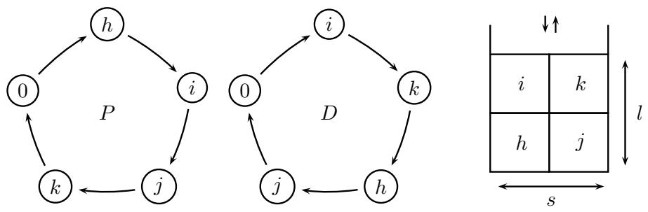
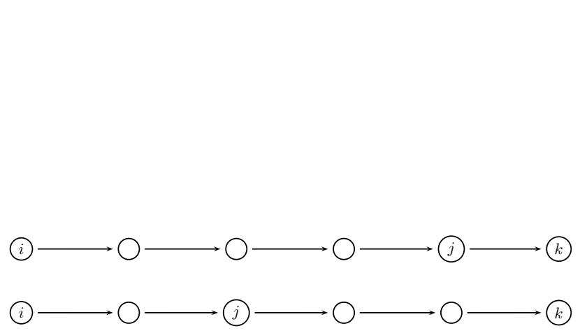
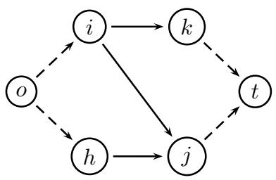
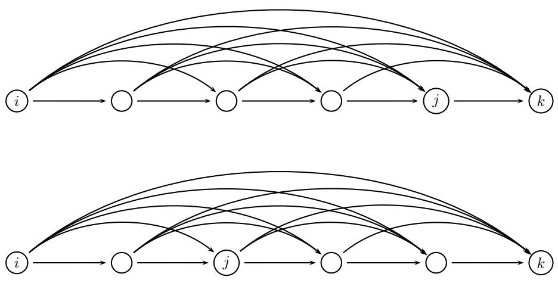
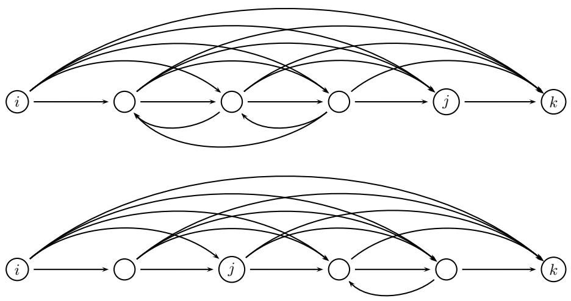
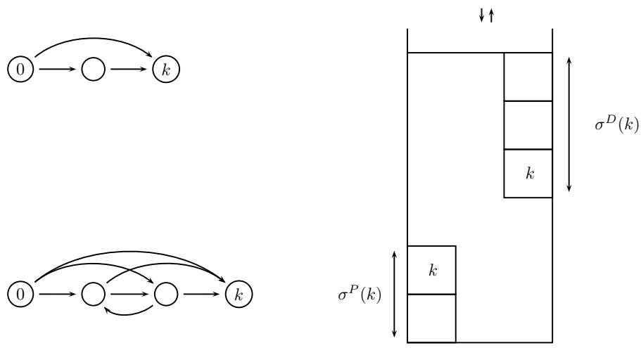
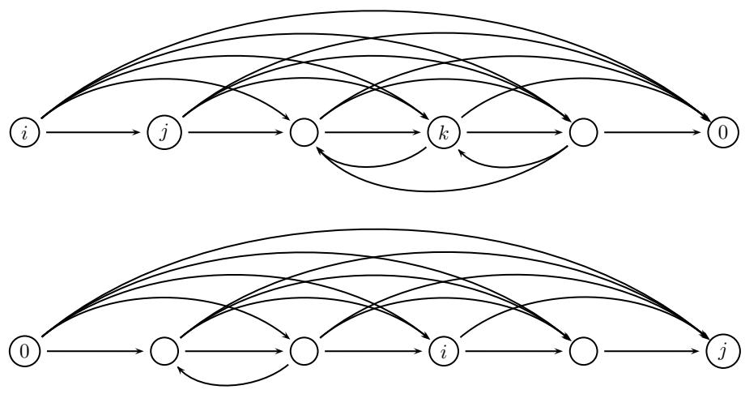

# A Branch-and-Cut Algorithm for the Double Traveling Salesman Problem with Multiple Stacks

Manuel Alba∗ Jean-Fran¸cois Cordeau† Mauro Dell’Amico∗ Manuel Iori∗

December 7, 2010

# Abstract

The double traveling salesman problem with multiple stacks is a variant of the pickup and delivery traveling salesman problem in which all pickups must be completed before any of the deliveries. In addition, items can be loaded on multiple stacks in the vehicle and each stack must obey the last-in-first-out policy. The problem consists in finding the shortest Hamiltonian cycles covering all pickup and delivery locations while ensuring the feasibility of the loading plan. We formulate the problem as two traveling salesman problems linked by infeasible path constraints. We also introduce several strengthenings of these constraints which are used within a branch-and-cut algorithm. Computational results performed on instances from the literature show that the algorithm outperforms existing exact algorithms. Instances with up to 28 requests (58 nodes) have been solved to optimality.

Keywords: Traveling salesman problem, pickup and delivery, LIFO loading, branch-and-cut.

# 1 Introduction

In the classical Pickup and Delivery Traveling Salesman Problem (PDTSP), a single uncapacitated vehicle must serve a set of transportation requests, each defined by an origin-destination pair. The problem consists in finding a least-cost Hamiltonian cycle on the pickup and delivery vertices with the additional constraint that the delivery vertex of any given request must be visited after the corresponding pickup vertex. The Double Traveling Salesman Problem with Multiple Stacks (DTSPMS) is a variant of the PDTSP in which all pickups must be performed before all deliveries, and collected items can be inserted in multiple stacks in the vehicle. The vehicle must first perform a Hamiltonian cycle on the set of pickup vertices before it performs a second Hamiltonian cycle on the set of delivery vertices. Each customer request consists of one item and the vehicle has a loading space divided into stacks of fixed height which must obey the Last-In-First-Out (LIFO) policy: each loaded item is to be placed at the top of a stack and only the items located at the top of a stack can be unloaded from the vehicle. A routing cost is associated with the arcs between the vertices, and the aim of the problem is to find two Hamiltonian cycles (one on the pickup vertices and one on the delivery vertices) of minimum total cost for which there exists a feasible loading plan satisfying the stack heights and the LIFO policy.

A simple example with four customers and a vehicle having $s = 2$ stacks of height $l = 2$ is represented in Figure 1, where, from left to right, the pickup tour, the delivery tour and a feasible loading plan are depicted. The pickup tour starts from and ends at the pickup depot, located at vertex 0 of the pickup region. While visiting the pickup points, the items are loaded into the stacks from bottom to top. The vehicle then moves to the delivery region. The second tour visits all delivery points and unloads the corresponding items from the top of the stacks.

  
Figure 1: A simple DTSPMS example, with a pickup tour (left), a delivery tour (middle) and a loading plan (right).

The DTSPMS was introduced by Petersen and Madsen (2009) and was motivated by a real-world application arising in the transportation of pallets by trucks between a pickup and a delivery region. It belongs to the class of combined routing and loading problems: the routing part consists in solving a Traveling Salesman Problem (TSP) for each region, while the loading part consists in finding a feasible loading plan for the items.

Petersen and Madsen (2009) first proposed a mathematical formulation of the DTSPMS and a simulated annealing heuristic that was computationally tested on a set of instances which are now widely used as benchmarks. Later, Lusby et al. (2010) proposed an exact algorithm based on two iterative phases: in the first phase, the $k$ best solutions are generated for each of the two separate TSPs; in the second phase, one attempts to find a feasible loading for given couples of TSP solutions. The process is iterated, considering solution pairs in non-decreasing order of total cost, until a feasible loading is found. Petersen et al. (2010) also studied several mathematical models and proposed branch-and-cut algorithms. One of these approaches, based on a two-index vehicle flow formulation with additional infeasible path constraints generated dynamically, clearly obtained better results than the others. Our work is based on a similar approach. Very recently, Carrabs et al. (2010) presented an enumerative branch-and-bound algorithm for the special case in which the vehicle has exactly two stacks.

With respect to heuristic solution approaches, Felipe et al. (2009a,b) presented neighborhood structures and a variable neighborhood search algorithm, whereas Cˆot´e et al. (2009) introduced a large neighborhood search procedure. The complexity of the DTSPMS and of several subproblems that may arise from it is discussed by Toulouse and Wolfler Calvo (2009), Casazza et al. (2009), and Bonomo et al. (2010). Finally, an approximation scheme was proposed by Toulouse (2010).

The DTSPMS is also related to the PDTSP with LIFO Loading (PDTSPL) which can be seen as a variant of the DTSPMS in which the vehicle has a single LIFO stack, and pickups do not have to be completed before deliveries can start. Several algorithms were proposed for the PDTSPL: variable neighborhood search (Carrabs et al., 2007b), additive branch-and-bound (Carrabs et al., 2007a) and branch-andcut (Cordeau et al., 2010). For surveys on pickup and delivery problems and on combined routing and loading, we refer the reader to Cordeau et al. (2007) and to Iori and Martello (2010), respectively.

The contribution of this paper is to introduce valid inequalities and a new branchand-cut algorithm for the DTSPMS. Computational experiments show that this new algorithm outperforms existing exact algorithms and can solve some instances with up to 28 requests (58 nodes).

The rest of this paper is organized as follows. The next section provides a formal definition and a mathematical formulation of the problem. Section 3 focuses on solving the loading problem. This is followed by valid inequalities in Section 4 and by the branch-and-cut algorithm in Section 5. Computational experiments are then reported in Section 6 and are followed by the conclusion.

# 2 Definition and Mathematical Formulation

To model the DTSPMS we start from the classical two-index vehicle flow formulation for the TSP, with the addition of infeasible path constraints to represent the loading subproblem. This formulation is based on the idea of decomposing the problem into its routing and loading components. The goal of the routing component is to construct two optimal TSP tours, one for the pickup region and one for the delivery region. Then, by iteratively solving the loading subproblem, we identify cuts that eliminate (partial) tours that do not allow the construction of a feasible loading plan.

More formally, let $n$ denote the number of customer requests. We define the DTSPMS on two complete directed graphs $G ^ { P } = ( V ^ { P } , A ^ { P } )$ and $G ^ { D } = ( V ^ { D } , A ^ { D } )$ , where $V ^ { P }$ and $A ^ { P }$ are, respectively, the vertex and arc set in the pickup region, and $V ^ { D }$ and $A ^ { D }$ the vertex and arc set in the delivery region. We make use of the notation $G ^ { \prime } = ( V ^ { T } , A ^ { T } )$ , with $T \in \{ P , D \}$ , to define properties that apply to both graphs.

For $T \in \{ P , D \}$ , we define $V ^ { T } ~ = ~ \{ 0 ^ { T } \} \cup V _ { 0 } ^ { T }$ , where vertex $0 ^ { T ^ { \prime } }$ represents the depot at which each tour starts and ends. Subsets $V _ { 0 } ^ { P } = \{ 1 ^ { P } , \dots , n ^ { P } \}$ and $V _ { 0 } ^ { D } =$ $\{ 1 ^ { D } , \dots , n ^ { D } \}$ represent the sets of pickup and delivery vertices, respectively. Each request $i$ is associated with pickup vertex $i ^ { P }$ and delivery vertex $i ^ { D }$ , $i = 1 , \ldots , n$ . When no confusion arises we will use the symbol $i$ to denote both $i ^ { P }$ and $i ^ { D }$ . Each arc $( i , j ) ^ { T } \in A ^ { T }$ has a non-negative routing cost $c _ { i j } ^ { I }$ , $T \in \{ P , D \}$ . Without loss of generality we suppose that the routing cost from the pickup depot $0 ^ { P }$ to the delivery depot $0 ^ { D }$ is zero.

The demand of each customer request $i$ consists of a single unit-size item (e.g., a pallet), that has to be loaded when visiting $i ^ { P }$ and unloaded at $i ^ { D }$ . The vehicle has a loading space composed of $s$ stacks, each of which can accommodate at most $l$ items. The DTSPMS requires that the LIFO policy be satisfied: if the pickup vertex $i ^ { P }$ is visited before the pickup vertex $j ^ { P }$ and $i ^ { P }$ and $j ^ { P }$ are loaded into the same stack, then the delivery vertex $j ^ { D }$ must be visited before the delivery vertex $i ^ { D }$ .

The DTSPMS consists in finding two tours, one for each region, of minimum total cost, starting from depot $0 ^ { T }$ , visiting every vertex in $V _ { 0 } ^ { T }$ exactly once, and ending at depot $0 ^ { T }$ , for $T \in \{ P , D \}$ .

To formulate the DTSPMS, we associate to each arc $( i , j ) ^ { T } \in A ^ { T } , T \in \{ P , D \}$ , a binary variable $x _ { i j } ^ { I }$ taking value 1 if and only if vertex $j ^ { T }$ is visited immediately after vertex $i ^ { \prime }$ by the vehicle. The existence of the two tours, independently from the loading problem, can then be formulated as the following integer linear program.

$$
\mathrm { M i n i m i z e } \sum _ { \begin{array} { c } { ( i , j ) ^ { T } \in A ^ { T } } \\ { T \in \{ P , D \} } \end{array} } c _ { i j } ^ { T } x _ { i j } ^ { T }
$$

subject to

$$
\begin{array} { r l r l } & { \displaystyle \sum _ { j \in V ^ { T } } \ : x _ { i j } ^ { T } = 1 } & & { i \in V ^ { T } , T \in \lbrace P , D \rbrace } \\ & { \displaystyle \sum _ { i \in V ^ { T } } \ : x _ { i j } ^ { T } = 1 } & & { j \in V ^ { T } , T \in \lbrace P , D \rbrace } \\ & { \displaystyle \sum _ { i \in S } \displaystyle \sum _ { j \in S } \ : x _ { i j } ^ { T } \leq \lvert S \rvert - 1 } & & { S \subseteq V ^ { T } , \ \lvert S \rvert \geq 2 , \ T \in \lbrace P , D \rbrace } \\ & { } & & { \boldsymbol { x } _ { i j } ^ { T } \in \lbrace 0 , 1 \rbrace } & & { ( i , j ) \in A ^ { T } , \ T \in \lbrace P , D \rbrace . } \end{array}
$$

The objective function (1) minimizes the total routing cost. Constraints (2) and (3) ensure that each pickup and delivery vertex is visited exactly once. Constraints (4) ensure the connectivity of the solution.

To model the loading component of the problem, we introduce an additional set of infeasible path constraints. Let us denote by $Q = \{ p _ { 1 } , p _ { 2 } , \ldots , p _ { q } \} \subseteq V _ { 0 } ^ { F }$ a path visiting $q$ vertices in the pickup region, and by $A ( Q )$ the set of arcs used by path $Q$ , i.e., $A ( Q ) = \{ ( p _ { 1 } , p _ { 2 } ) ^ { P } , ( p _ { 2 } , p _ { 3 } ) ^ { P } , . . .$ , $( p _ { q - 1 } , p _ { q } ) ^ { P } \}$ . Similarly, let us denote by $F =$ $\{ d _ { 1 } , d _ { 2 } , \ldots , d _ { f } \} \subseteq V _ { 0 } ^ { D }$ a path visiting $f$ vertices in the delivery region, and by $A ( F )$ the set of arcs used by path $F$ , i.e., $A ( F ) = \{ ( d _ { 1 } , d _ { 2 } ) ^ { D } , ( d _ { 2 } , d _ { 3 } ) ^ { D } , . . .$ , $( d _ { f - 1 } , d _ { f } ) ^ { D } \}$ . We say that a pair $( Q , F )$ of paths $Q \subseteq V ^ { P }$ and $F \subseteq V ^ { D }$ is load-infeasible if there exists no feasible loading of the requests belonging to both paths.

We impose the existence of a feasible loading to the associated routing solution by using the following constraint for any load-infeasible pair of paths $( Q , F )$ :

$$
\sum _ { j = 1 } ^ { q - 1 } x _ { p _ { j } , p _ { j + 1 } } ^ { P } + \sum _ { j = 1 } ^ { f - 1 } x _ { d _ { j } , d _ { j + 1 } } ^ { D } \leq | A ( Q ) | + | A ( F ) | - 1 .
$$

A simple example of constraint (6) is given in Figure 2, where the first path denotes $Q$ (i.e., the path in the pickup region) and the second $F ^ { \prime }$ (i.e., the path in the delivery region). Let us suppose that the vehicle has two stacks. Indeed, $i$ cannot be loaded in the same stack as $j$ or $k$ because of the LIFO requirement. Similarly, $j$ cannot be loaded in the same stack as $k$ . It follows that at least three stacks are needed to feasibly load the requests belonging to these two paths. Hence, at most nine arcs can be chosen among the ten depicted in the figure.

Determining if a pair of paths is load-infeasible can be done through specialized algorithms which will be described in Section 3.

  
Figure 2: Graphical representation of an infeasible path constraint.

# 3 Solution of the Loading Problem

If no limit is imposed on the height of the stacks, then checking whether the items can be loaded into the stacks, given the pickup and delivery routes, is easy and can be done in polynomial time (see, e.g., Casazza et al., 2009). However, when the stacks are capacitated the loading problem may become difficult.

Following Bonomo et al. (2010), we define the problem of determining a feasible loading plan, if any, given two pickup and delivery tours as the Pickup and Delivery Tour Combination (PDTC). As it has been observed by Toulouse and Wolfler Calvo (2009), Casazza et al. (2009) and Bonomo et al. (2010), the PDTC is directly related to the Bounded Vertex Coloring Problem (BVCP). The BVCP generalizes the classical minimum coloring problem by imposing an upper bound on the number of times each color can be used. The PDTC can be seen as a BVCP where the number of colors corresponds to the number of stacks, and the upper bound corresponds to the fixed stack height. The BVCP is NP-hard in the general case and for any fixed value of $l \geq 3$ (Hansen et al., 1993).

In the case of the PDTC, however, the underlying graph is a permutation graph. On the basis of this observation, Bonomo et al. (2010) showed that the PDTC is NP-complete even if $l$ is fixed, but can be solved in $O ( n ^ { s ^ { 2 } + s + 1 } s ^ { 3 } )$ time. Hence, it is polynomially solvable for fixed $s$ .

We solve the PDTC by using simple lower and upper bounds, followed by a complete enumerative algorithm when necessary. Let us consider two paths, a pickup path $Q$ and a delivery path $F ^ { \prime }$ , and let us define the subset $I$ of customer requests appearing in both paths. To determine whether a feasible loading for the requests in $I$ exists, we use the following procedure. We start by performing a simple check: if $I$ contains $s$ customers or less, then a feasible loading surely exists, as each item can be loaded alone in a different stack. Otherwise, we construct a precedence graph $G ^ { \prime } = ( I ^ { \prime } , A ^ { \prime } )$ , where $I ^ { \prime }$ is composed of the elements in $I$ plus two additional vertices: an origin vertex $o$ and a destination vertex $t$ , and an arc $( i , j ) \in A ^ { \prime }$ is defined if $i$ precedes $j$ both in the pickup path and in the delivery path, i.e., $i$ and $j$ cannot be loaded in the same stack. For example, the precedence graph associated to Figure 1 is given in Figure 3. Note that the original pickup and delivery depots are not included in $I ^ { \prime }$ and that the precedence graph constructed in this way is acyclic.

A lower bound on the minimum number of stacks needed to load all the items can be obtained by relaxing the constraint on the maximum height of each stack and then computing a maximum clique among the vertices in $I$ . Let us denote this clique by $C$ . If the size of $C$ is larger than $s$ , then the loading is clearly infeasible. Finding the maximum clique of a general graph is NP-hard. Fortunately, the precedence graph $G ^ { \prime }$ is not only acyclic but also transitive: if $i$ precedes $j$ and $j$ precedes $k$ , then $i$ precedes $k$ (see also Figure 2). As a result, the maximum clique can be found by computing the longest path from $o$ to $t$ , through the classical critical path method (CPM) labeling algorithm (Kelley, 1961).

  
Figure 3: The precedence graph associated to the solution depicted in Figure 1.

If $| C | \le s$ we try to compute an upper bound on the minimum number of stacks required by executing a simple greedy procedure that tries to construct a solution using the output of the CPM algorithm. This output provides, for each vertex $i$ , a minimum index $T _ { \mathrm { m i n } } ( i )$ and a maximum index $T _ { \mathrm { m a x } } ( i )$ of the stack in which the corresponding item can be loaded. Each item $i$ having $T _ { \mathrm { m i n } } ( i ) = T _ { \mathrm { m a x } } ( i )$ (i.e., belonging to a longest path) is loaded in the corresponding stack. If by doing so we exceed the maximum height of a stack the procedure stops. Otherwise, it continues by taking into consideration the items not belonging to a longest path. Each item $i$ is selected in non-decreasing value of $T _ { \mathrm { m i n } } ( i )$ , breaking ties by increasing values of $i$ , and assigned to the stack of lowest index that can accommodate it. If all items are assigned, then the feasibility of the loading problem has been proved. Otherwise, an enumeration tree is constructed.

The enumeration tree simply considers each item $i$ in turn, in the same order as in the greedy procedure. It creates a node for any possible assignment of $i$ to one of the stacks in the interval $[ 1 , s ]$ . The tree then erases all nodes for which the maximum height of the stack or the LIFO requirements are violated, and iterates with the next item. The complexity of the enumeration procedure is $s ^ { | I | }$ in the worst case, but the procedure turns out to be very fast in practice.

Bonomo et al. (2010) showed that the PDTC can be solved in polynomial time for fixed $s$ . In the DTSPMS, $s$ is indeed a fixed input data. However, for the test cases addressed in the literature, where $s \leq 4$ and $| I | \leq 2 8 $ , the complexity of the complete enumeration $( O ( s ^ { | I | } ) )$ is much smaller than the complexity of the polynomial algorithm $O ( | I | ^ { s ^ { 2 } } )$ . Therefore we adopted the complete enumeration approach. This choice is confirmed by our computational experiments, where the execution of our loading procedure never took more than 0.1 CPU second.

It is worth noting that, as in most combined routing and loading problems, the loading aspect makes the routing problem much more difficult. Indeed, the size of DTSPMS instances that can be solved to optimality is dramatically smaller than for the classical TSP. This additional difficulty does not come from the fact that the loading problem is difficult, as this is also true for other well-known combined routing and loading problems, but is rather due to the small size of the set of feasible solutions.

# 4 Strengthening the Infeasible Path Constraints

In this section, we explain how the linear programming relaxation of model (1)–(6) can be strengthened by the introduction of valid inequalities. The first family of inequalities is based on the classical tournament constraints which are often used to improve infeasible path constraints in asymmetric formulations for the TSP (see, e.g., Ascheuer et al., 2000). More specifically, constraint (6) can be strengthened as follows for any load-infeasible pair of paths $( Q , F )$ :

$$
\sum _ { j = 1 } ^ { q - 1 } \sum _ { h = j + 1 } ^ { q } x _ { p _ { j } , p _ { h } } ^ { P } + \sum _ { j = 1 } ^ { f - 1 } \sum _ { h = j + 1 } ^ { f } x _ { d _ { j } , d _ { h } } ^ { D } \leq | A ( Q ) | + | A ( F ) | - 1 .
$$

A graphical representation of constraint (7) is given in Figure 4. The arcs that have been added with respect to Figure 2, hence with respect to constraint (6), derive from the fact that each vertex is visited just once. If one of these additional arcs is used, then two of the original arcs contained in (6) cannot be used and the inequality is still valid.

Looking at Figure 4 suggests a further improvement to the above constraint. It is obvious that the loading violation originates from the clique formed by vertices $i$ , $j$ and $k$ . It is thus independent from the order of visit of the vertices that appear between $i$ and $j$ , or $j$ and $k$ , in one of the two paths. One can thus add reverse arcs among the subset of vertices that belong to the path but not to the clique. This idea is depicted in Figure 5.

More formally, let us denote by $C$ a clique formed by the vertices contained in the undirected version of the precedence graph associated to the two paths. For each vertex $c \in C$ , let us denote by $S _ { c } ^ { P }$ (resp. $S _ { c } ^ { D }$ ), the subset of vertices contained in the pickup path (resp. delivery path), and appearing between vertex $c$ and the following vertex belonging to the clique, if any. If $| C | > s$ then the above tournament constraint can be strengthened into the following lifted tournament constraint for any load-infeasible pair of paths $( Q , F )$ :

  
Figure 4: Graphical representation of a tournament constraint.

$$
\begin{array} { r l } & { \displaystyle \sum _ { j = 1 } ^ { q - 1 } \sum _ { h = j + 1 } ^ { q } x _ { p _ { j } , p _ { h } } ^ { P } + \displaystyle \sum _ { c \in C } \displaystyle \sum _ { p _ { j } , p _ { h } \in S _ { c } ^ { P } : j > h } x _ { p _ { j } , p _ { h } } ^ { P } + } \\ & { \displaystyle \sum _ { j = 1 } ^ { f - 1 } \displaystyle \sum _ { h = j + 1 } ^ { f } x _ { d _ { j } , d _ { h } } ^ { D } + \displaystyle \sum _ { c \in C } \displaystyle \sum _ { d _ { j } , d _ { h } \in S _ { c } ^ { D } : j > h } x _ { d _ { j } , d _ { h } } ^ { D } \leq | A ( Q ) | + | A ( F ) | - 1 . } \end{array}
$$

Note that some subsets $S _ { c } ^ { P }$ and $S _ { c } ^ { D }$ may be empty, as depicted again in Figure 5. Note also that there may exist paths $Q$ and $F$ which are load-infeasible although there is no clique $C$ having $| C | > s$ . In this case, we cannot lift the original tournament constraint.

Another family of valid inequalities derives from the position of a vertex in the stack in which it is loaded. Consider for example Figure 6 and assume for the moment that $s l = n$ . The pickup path starts from the depot and ends at vertex $k$ . Suppose $\sigma ^ { P } ( k )$ is the position of vertex $k$ in this path, i.e., the number of arcs that separate it from the depot along the path. It follows that its distance from the bottom of the stack in which it is loaded is at most $\sigma ^ { P } ( k )$ . Similarly, let us consider a delivery path starting from the delivery depot and ending at vertex $k$ , and let us denote by $\sigma ^ { D } ( k )$ the position of vertex $k$ in this path. It follows that its distance from the top of the stack in which it is loaded is at most $\sigma ^ { D } ( k )$ . Hence, if $\sigma ^ { P } ( k ) + \sigma ^ { D } ( k ) \leq l$ then the pair of paths is infeasible. In Figure 6 we have $\sigma ^ { P } ( k ) = 2$ and $\sigma ^ { D } ( k ) = 3 $ , hence the pair of paths is infeasible for any $l \geq 5$ .

  
Figure 5: Graphical representation of a lifted tournament constraint.

In the case where $n < s l$ some positions in the stacks can be left empty and the above condition becomes $\sigma ^ { P } ( k ) + \sigma ^ { D } ( k ) + ( s l - n ) \leq l$ . It follows that, for any loadinfeasible pair of paths $( Q , F )$ with both paths starting from 0 and ending at vertex $k$ and such that $\sigma ^ { P } ( k ) + \sigma ^ { D } ( k ) + ( s l - n ) \leq l$ , a valid inequality can be formulated as:

$$
\begin{array} { r l } & { \displaystyle \sum _ { j = 1 } ^ { q - 1 } \sum _ { h = j + 1 } ^ { q } x _ { p _ { j } , p _ { h } } ^ { P } + \displaystyle \sum _ { j = 3 } ^ { q - 1 } \sum _ { h = 2 } ^ { j - 1 } x _ { p _ { j } , p _ { h } } ^ { P } + } \\ & { \displaystyle \sum _ { j = 1 } ^ { f - 1 } \sum _ { h = j + 1 } ^ { f } x _ { d _ { j } , d _ { h } } ^ { D } + \displaystyle \sum _ { j = 3 } ^ { f - 1 } \sum _ { h = 2 } ^ { j - 1 } x _ { d _ { j } , d _ { h } } ^ { D } \ \le | A ( Q ) | + | A ( F ) | - 1 . } \end{array}
$$

A similar reasoning can also be applied to paths $Q$ and $F ^ { \prime }$ respectively ending at (instead of starting from) the pickup depot and at the delivery depot. One obtains an inequality very similar to (9), but with indices 0 and $k$ reversed.

Finally, we can apply a reasoning similar to that of the lifted tournament constraints (8) to a pair of paths whose pickup path ends at the pickup depot and whose delivery path starts from the delivery depot. This situation is represented in Figure 7. Let us suppose we have a clique $C$ of size $s$ , hence feasible. We try to prove its infeasibility by enlarging the pickup path from the last vertex up to the pickup depot.

  
Figure 6: Graphical representation of an infeasible pair of paths starting from the pickup and the delivery depot.

Similarly, we try to enlarge the delivery path backward from the first vertex back to the delivery depot. Suppose that we succeed in doing this and we find two additional sets of vertices, $S _ { c } ^ { P }$ in the pickup region and $S _ { c } ^ { D }$ in the delivery region. If one of these two sets contains a vertex that is not contained in the other set, then the pair of paths violates the LIFO requirements. Consider for example Figure 7. Vertices $i$ and $j$ are incompatible and have to be loaded into two different stacks. Vertex $k$ is loaded after $i$ and $j$ (it belongs to $S _ { c } ^ { P }$ ) in the pickup path and unloaded after them in the delivery path (it does not belong to $S _ { c } ^ { D }$ ). Hence an additional stack is needed to load $k$ , and the example depicted in the Figure 7 is infeasible for $s \leq 2$ stacks.

For any load-infeasible pair of paths $( Q , F )$ with $Q$ ending at 0 and $F$ starting from $0$ , we thus obtain the following valid inequality:

$$
\begin{array} { l } { \displaystyle \sum _ { j = 1 } ^ { q - 1 } \displaystyle \sum _ { h = j + 1 } ^ { q } x _ { p _ { j } , p _ { h } } ^ { P } + \displaystyle \sum _ { c \in C } \displaystyle \sum _ { p _ { j } , p _ { h } \in S _ { c } ^ { P } : j > h } x _ { p _ { j } , p _ { h } } ^ { P } + } \\ { \displaystyle \sum _ { j = 1 } ^ { f - 1 } \displaystyle \sum _ { h = j + 1 } ^ { f } x _ { d _ { j } , d _ { h } } ^ { D } + \displaystyle \sum _ { c \in C } \displaystyle \sum _ { d _ { j } , d _ { h } \in S _ { c } ^ { D } : j > h } x _ { d _ { j } , d _ { h } } ^ { D } \leq | A ( Q ) | + | A ( F ) | - 1 , } \end{array}
$$

where $C$ is a clique in the incompatibility graph whose cardinality is equal to $s$ , and $S _ { c } ^ { T }$ , $T \in \{ P , D \}$ , is the subset of vertices in the path between vertex $c$ and the following vertex belonging to $C$ .

  
Figure 7: Graphical representation of an infeasible pair of paths ending at the pickup depot and starting from the delivery depot.

# 5 Branch-and-Cut

We now describe our branch-and-cut algorithm by focusing on the initialization steps, the separation strategies for valid inequalities, and the branching.

# 5.1 Starting model

At the root node of the enumeration tree we initialize our model with constraints (2) and (3). We set $x _ { i i } ^ { T } = 0$ for $i = 0 , \ldots , n$ and $T \in \{ P , D \}$ . We also add the subset of inequalities (4) with $| S | = 2$ , i.e., $x _ { i j } ^ { T } + x _ { j i } ^ { T } \le 1$ for $i , j = 0 , \ldots , n$ , $i ~ < ~ j$ and $T \in \{ P , D \}$ . In the case where $n \geq ( s - 1 ) l + 2$ , we add the very simple cases of inequality (9) where the paths have unit length, i.e., $x _ { 0 i } ^ { P } + x _ { 0 i } ^ { D } \le 1$ and $x _ { i 0 } ^ { P } + x _ { i 0 } ^ { D } \leq 1$ for $i = 1 , \ldots , n$ .

# 5.2 Separation strategy

As is typically done in branch-and-cut algorithms for the TSP, subtour elimination constraints (4) are separated exactly by solving $O ( n )$ maximum flow problems.

Infeasible paths constraints (6) are separated exactly as follows. We first identify all possible fractional paths in $G ^ { P }$ and $G ^ { D }$ starting from any vertex $i = 1 , \ldots , n$ and ending at any vertex (initially excluding the depots). We keep only the paths that can possibly lead to a violation, i.e., those for which the sum of the associated variables is greater than their length minus one. We store these paths in two separate pools, one for the pickup region and one for the delivery region, in non-decreasing value of length, breaking ties by non-increasing sum of the values of the variables associated with the arcs in the path. We then check any possible pair of paths in this order for a possible violation. We check only pairs for which the sum of the associated variables could lead to a violated inequality. The loading violation is checked using the procedure described in Section 3. The separation of the tournament constraints (7) is done in the same way, but the sum of the values of the arc variables is computed by taking the additional arcs into consideration. In our final computational experiments we disregarded the infeasible paths separation and used only the separation of the stronger tournament constraints.

For the lifted tournament constraints (8), we use a heuristic separation procedure. Recall that we invoke the CPM algorithm when we check a possible pair of paths for a loading violation. Any time this procedure returns a clique having a size larger than $s$ , then the path is infeasible and we can add to the model the associated constraint (8), which is stronger than (7). If more than one clique of size larger than $s$ exists, we add a cut for every such clique.

The separation of constraints (9) is performed by identifying all possible (possibly fractional) paths in $G ^ { P }$ and $G ^ { D }$ starting from both the pickup and the delivery depot, and by checking whether the loading condition $\sigma ^ { P } ( k ) + \sigma ^ { D } ( k ) + ( s l - n ) \leq l )$ is violated. The same is done for paths that end at the pickup and the delivery depot.

The separation of constraints (10) is performed heuristically in a similar way to constraints (8). If the CPM algorithm returns a clique with a size exactly equal to $s$ , then we try to find a vertex $k$ that lies on the pickup path between the last vertex of the clique and the depot, and does not lie in the delivery path between the depot and the first vertex of the clique, or vice-versa. If we succeed, a cut is added to the model.

As soon as an infeasible pair of paths is found, we add the corresponding cut to the model and this terminates the separation step. When dealing with symmetric cost matrices (as was the case in our computational experiments), we also add the “reverse” cut, i.e., the cut obtained by reversing the pickup and the delivery paths.

On the basis of computational experiments we decided to use local cuts instead of global ones, i.e., each cut is included in the linear programming relaxation of the current node and of all descendent nodes, but not in that of the other nodes in the tree. We also experimented with other strategies that combined the generation of local and global cuts, but all such strategies proved to be less effective than adding just local cuts.

# 5.3 Branching

We use the Cplex strong branching strategy to perform branching. In computational experiments, this gave better performance than any other strategy we have tested. In particular, we have tried to extend the pickup path from the pickup depot by always choosing the variable of highest value (one-way extension). We have also attempted extending simultaneously both the pickup and the delivery path by choosing the variable of highest value (two-way extension), and extending the two paths according both to the forward and backward direction (four-way extension). In each case we reduced the graph by removing variables incompatible with the decisions already taken. The strong branching of Cplex turned out to be better than the one-way and two-way extension, and just slightly better than the four-way extension. We have also considered other strategies, such as branching first to 1 and then to 0 or vice-versa, but these did not improve the results.

# 6 Computational Results

Our branch-and-cut algorithm was implemented in C++ using Cplex 12 in sequential (non-parallel) mode as integer linear programming solver, and all experiments were performed on a 3 GHz Intel Core 2 Duo computer. Several different datasets were considered, all taken from the literature. We refer the reader to the website www.or.unimore.it/DTSP/dtsp.html for detailed results on each single instance.

We have first run some experiments on the test instances of Petersen and Madsen (2009) to assess the impact of the valid inequalities described in Section 4. What we have observed is that these inequalities have very little impact on the root node relaxation lower bound, but that they nevertheless improve the performance of the algorithm by reducing the number of nodes explored and the overall computing time for proving optimality. The inequalities were thus used in all further experiments.

In Table 1 we report the results obtained by our algorithm along those of Petersen et al. (2010), Carrabs et al. (2010), and Lusby et al. (2010) on the instances of Petersen and Madsen (2009). Each instance is identified by its name (R05 to R09), the number of stacks $s$ , the height of these stacks $l$ , and the number of requests $n$ . We have used as an initial upper bound the cost of the heuristic solution found by running the heuristic algorithm of Cˆot´e et al. (2009), which was provided to us by one of the authors. The initial upper bound supplied to each algorithm, if any, is reported in column $U B _ { 0 }$ while columns $U B$ and $L B$ report the final upper and lower bounds, respectively. An asterisk in column opt indicates that the instance was solved to optimality. For each algorithm, we report the percentage gap computed as $1 0 0 ( U B - L B ) / U B$ . We also indicate the CPU time in seconds.

The results show that our algorithm was able to solve 53 of the 60 instances within a one-hour time limit. For the remaining instances, the final optimality gap is at most $2 . 9 5 \%$ . In comparison, the algorithm of Petersen et al. (2010) was only able to solve 30 instances and the optimality gap for the unsolved instances sometimes exceeds $1 0 \%$ . Carrabs et al. (2010) only reported results on instances with two stacks while Lusby et al. (2010) reported results on instances with a number of requests between 10 and 15. In terms of computing speed, our algorithm is also considerably better. For the instances that were solved to optimality by at least one other method, our branch-and-cut algorithm is often faster by one order of magnitude. Finally, we should also point out that the CPU time limit imposed by Lusby et al. (2010) was three hours.

In Table 2 we report similar results on a set of 81 instances which were introduced in the context of the PDTSPL (see Cordeau et al., 2010) and were later adapted for the DTSPMS by Petersen et al. (2010). Our algorithm was able to solve 69 instances of these instances, including all those with up to 19 requests and some with 21, 23 and 25 requests. The optimality gap for the unsolved instances is at most $3 . 0 6 \%$ . In comparison, the algorithm of Petersen et al. (2010) could solve 46 instances and failed on one with 15 requests.

Table 3 reports more detailed results on the Petersen and Madsen (2009) instances with just two stacks and 10, 12 or 14 requests. Using a maximum computing time of 3 hours, as did Lusby et al. (2010) and Carrabs et al. (2010), we were able to solve all 60 instances, whereas the other algorithms could solve 44 and 56 instances, respectively. For most of the instances that were solved by at least one of the other algorithms, our branch-and-cut is again much faster.

Finally, Table 4 reports summary results for the full set of 220 instances introduced by Petersen and Madsen (2009). In this table, the instances are divided into 11 groups of 20 instances each. We indicate the number of instances that could be solved to optimality by each algorithm as well as the average optimality gaps and the average computing time for each group. A maximum of three hours of computing time was allowed for solving each instance. Again, we can see that our new method outperforms the two existing algorithms by solving more instances and by requiring far less computing time. Our algorithm was capable of solving to optimality 192 of the instances and the average computing time is about half an hour. The maximum optimality gap for the unsolved instances is $3 . 1 5 \%$ . The average optimality gap over all instances (including those solved to optimality) is just $0 . 1 6 \%$ . We finally note that an increase in the height of the stacks has a much larger impact on the difficulty of the problem than an increase in the number of stacks.

# 7 Conclusions

This paper has introduced a new branch-and-cut algorithm for the DTSPMS. This algorithm relies on a compact formulation of the problem and the addition of valid inequalities that can be separated efficiently. Computational experiments performed on a large set of test instances show that this new algorithm outperforms existing exact methods in terms of the problem size that can be solved and of the required computing time.

# Acknowledgements

This work was partly supported by the Italian Ministero dell’Istruzione, dell’Universit\`a e della Ricerca (MIUR) and by the Canadian Natural Sciences and Engineering Research Council under grant 227837-09. This support is gratefully acknowledged. We are also thankful to Jean-Fran¸cois Cˆot´e for fruitful discussions and for providing us with the executable of the algorithm introduced by Cˆot´e et al. (2009).

# Список литературы

N. Ascheuer, M. Fischetti, and M. Gr¨otschel. A polyhedral study of the asymmetric traveling salesman problem with time windows. Networks, 36:69–79, 2000.   
F. Bonomo, S. Mattia, and G. Oriolo. Bounded coloring of co-comparability graphs and the pickup and delivery tour combination problem. Technical Report 6, DEIS, Sapienza Universit\`a di Roma, Italy, 2010.   
F. Carrabs, R. Cerulli, and J.-F. Cordeau. An additive branch-and-bound algorithm for the pickup and delivery traveling salesman problem with LIFO or FIFO loading. INFOR, 45:223–238, 2007a.   
F. Carrabs, J.-F. Cordeau, and G. Laporte. Variable neighbourhood search for the pickup and delivery traveling salesman problem with LIFO loading. INFORMS Journal on Computing, 19:618–632, 2007b.   
F. Carrabs, R. Cerulli, and M.G. Speranza. A branch-and-bound algorithm for the double TSP with two stacks. Technical Report 4, DMI, Universit\`a di Salerno, Italy, http://www.dmi.unisa.it/people/carrabs/www/, 2010.   
M. Casazza, A. Ceselli, and M. Nunkesser. Efficient algorithms for the double TSP with multiple stacks. In Proceedings of 8th Cologne-Twente Workshop on Graphs and Combinatorial Optimization (CTW09), pages 7–10, Paris, 2009.   
J.-F. Cordeau, G. Laporte, J.-Y. Potvin, and M.W.P. Savelsbergh. Transportation on demand. In C. Barnhart and G. Laporte, editors, Transportation, Handbooks in Operations Research and Management Science 14, pages 429–466. Elsevier, Amsterdam, 2007.   
J.-F. Cordeau, M. Iori, G. Laporte, and J.J. Salazar-Gonzalez. Branch-and-cut for the pickup and delivery traveling salesman problem with LIFO loading. Networks, 55:46–59, 2010.   
J.-F. Cˆot´e, M. Gendreau, and J.-Y. Potvin. Large neighborhood search for the single vehicle pickup and delivery problem with multiple loading stacks. Technical Report CIRRELT-2009-47, University of Montreal, 2009.   
A. Felipe, M.T. Ortuno, and G. Tirado. The double traveling salesman problem with multiple stacks: A variable neighborhood search approach. Computers & Operations Research, 36:2983–2993, 2009a.   
A. Felipe, M.T. Ortuno, and G. Tirado. New neighborhood structures for the double traveling salesman problem with multiple stacks. TOP, 17:190–213, 2009b.   
P. Hansen, A. Hertz, and J. Kuplinsky. Bounded vertex colorings of graphs. Discrete Mathematics, 111:305–312, 1993.   
M. Iori and S. Martello. Routing problems with loading constraints. TOP, 18:4–27, 2010.   
J. Kelley. Critical path planning and scheduling: Mathematical basis. Operations Research, 9:296–320, 1961.   
R.M. Lusby, J. Larsen, M. Ehrgott, and D. Ryan. An exact method for the double TSP with multiple stacks. International Transactions on Operations Research, 17: 637–652, 2010.   
H.L. Petersen and O.B.G. Madsen. The double travelling salesman problem with multiple stacks. European Journal of Operational Research, 198:139–147, 2009.   
H.L. Petersen, C. Archetti, and M.G. Speranza. Exact solutions to the double travelling salesman problem with multiple stacks. Networks, 2010. To appear.   
S. Toulouse. Approximability of the multiple stack TSP. Electronic Notes in Discrete Mathematics, 36:813–820, 2010.   
S. Toulouse and R. Wolfler Calvo. On the complexity of the multiple stack TSP, $k$ STSP. Lecture Notes in Computer Science, Theory and Applications of Models of Computation, 5532/2009:360–369, 2009.

Table 1: Comparison on 60 benchmark instances (1 CPU hour)   

<table><tr><td rowspan=2 colspan=13>Petersen et al. (2010)    Carrabs et al. (2010)   Lusby et al. (2010)           Branch-and-CutPentium 4, 2.8 GHz  Intel Core 2, 2.33 GHz     Dell, 1.6 GHz           Intel Core 2, 3 GHzinst. sl n U B0 %gap opt   sec U B opt           secUB %gap opt   secUB0 UB LB %gap opt   sec</td></tr><tr><td rowspan=1 colspan=1>inst. sl n</td><td rowspan=1 colspan=1>U B0 %gap opt   sec</td><td rowspan=1 colspan=8>U B opt           secUB %gap opt   sec</td></tr><tr><td rowspan=1 colspan=1>R05 2 48</td><td rowspan=1 colspan=1>501 0.00%  *     0</td><td rowspan=1 colspan=4>501  *          0.25</td><td rowspan=1 colspan=2></td><td rowspan=1 colspan=2></td><td rowspan=1 colspan=3>501 501 501 0.00%  *   0.0</td></tr><tr><td rowspan=1 colspan=1>R062 4 8</td><td rowspan=1 colspan=1>694 0.00%  *    31</td><td rowspan=1 colspan=4>694  *          0.51</td><td rowspan=1 colspan=2></td><td rowspan=1 colspan=2></td><td rowspan=1 colspan=3>694 694 694 0.00%  *   0.1</td></tr><tr><td rowspan=1 colspan=1>R07 2 48</td><td rowspan=1 colspan=1>487 0.0%  *    27</td><td rowspan=1 colspan=4>487  *          0.56</td><td rowspan=1 colspan=2></td><td rowspan=1 colspan=2></td><td rowspan=1 colspan=3>487 487 487 0.00%  *   0.1</td></tr><tr><td rowspan=1 colspan=1>R08 2 48</td><td rowspan=1 colspan=1>642 0.0%  *    38</td><td rowspan=1 colspan=3>642  *          0.57</td><td></td><td rowspan=1 colspan=2></td><td rowspan=1 colspan=2></td><td rowspan=2 colspan=3>642 642 642 0.00%  *   0.1558 558 558 0.00%  *   0.0</td></tr><tr><td rowspan=1 colspan=1>R09 2 48</td><td rowspan=1 colspan=1>558 0.00%  *    17</td><td rowspan=1 colspan=6>558  *          0.76</td><td rowspan=1 colspan=2></td></tr><tr><td rowspan=1 colspan=1>R05 2 5 10</td><td rowspan=1 colspan=1>546 0.00%  *   196</td><td rowspan=1 colspan=4>546  *          2.28</td><td rowspan=1 colspan=2>546 0.00%  *</td><td rowspan=1 colspan=2>4</td><td rowspan=1 colspan=3>546 546 546 0.00%  *   0.3</td></tr><tr><td rowspan=1 colspan=1>R06 2 5 10</td><td rowspan=1 colspan=1>774 0.0%  *   678</td><td rowspan=1 colspan=4>774  *          5.66</td><td rowspan=1 colspan=2>774 0.00%  *</td><td rowspan=1 colspan=2></td><td rowspan=1 colspan=3>774 774774 0.00%  *   1.6</td></tr><tr><td rowspan=1 colspan=1>R07 2 5 10</td><td rowspan=1 colspan=1>547 0.0%  *   115</td><td rowspan=1 colspan=3>547  *          1.60</td><td></td><td rowspan=1 colspan=2>547 0.00%  *</td><td rowspan=1 colspan=2></td><td rowspan=1 colspan=1>547 547</td><td rowspan=2 colspan=2>0.00%  *   0.2670 670 670 0.00%  *   0.7</td></tr><tr><td rowspan=1 colspan=1>R08 2 5 10</td><td rowspan=1 colspan=1>670 0.00%  *   392</td><td rowspan=1 colspan=4>670  *          2.00</td><td rowspan=1 colspan=2>670 0.00%  *</td><td rowspan=1 colspan=2></td><td rowspan=1 colspan=1>670 670</td></tr><tr><td rowspan=1 colspan=1>R09 2 5 10</td><td rowspan=1 colspan=1>610 0.00%  *    44</td><td rowspan=1 colspan=4>610  *          4.65</td><td rowspan=1 colspan=2>610 000%  *</td><td rowspan=1 colspan=2></td><td rowspan=1 colspan=1>610 610</td><td rowspan=1 colspan=1>610</td><td rowspan=1 colspan=1>*   0.1</td></tr><tr><td rowspan=1 colspan=1>R05 2 6 12</td><td rowspan=1 colspan=1>631 7.92%      3600</td><td rowspan=1 colspan=3>631  *       172.26</td><td></td><td rowspan=1 colspan=2>631 0.00%  * 2126</td><td rowspan=1 colspan=2></td><td rowspan=1 colspan=1>631 631</td><td rowspan=1 colspan=1>631</td><td rowspan=1 colspan=1>* 176.8</td></tr><tr><td rowspan=1 colspan=1>R06 2 6 12</td><td rowspan=1 colspan=1>7932.77%      3600</td><td rowspan=1 colspan=3>793  *       111.94</td><td></td><td rowspan=1 colspan=2>793 0.00%  *  310</td><td rowspan=1 colspan=2></td><td rowspan=1 colspan=1>793 793</td><td rowspan=1 colspan=1>793</td><td rowspan=1 colspan=1>*   3.3</td></tr><tr><td rowspan=1 colspan=1>R07 2 6 12</td><td rowspan=1 colspan=1>593 4.05%      3600</td><td rowspan=1 colspan=3>593  *         61.15</td><td></td><td rowspan=1 colspan=2>930.00%  *  485</td><td rowspan=1 colspan=2></td><td rowspan=1 colspan=1>593 593</td><td rowspan=1 colspan=1>593</td><td rowspan=1 colspan=1>*   8.5</td></tr><tr><td rowspan=1 colspan=1>R08 2 6 12</td><td rowspan=1 colspan=1>749 4.65%      3600</td><td rowspan=1 colspan=3>749             74.96</td><td></td><td rowspan=1 colspan=2>749 0.1%    10823</td><td rowspan=1 colspan=2></td><td rowspan=1 colspan=1>749 749</td><td rowspan=1 colspan=2>*  30.1</td></tr><tr><td rowspan=1 colspan=1>R09 2 6 12</td><td rowspan=1 colspan=1>692 0.00%  *  1680</td><td rowspan=1 colspan=3>692  *       219.22</td><td></td><td rowspan=1 colspan=2>692 0.00%  *    45</td><td rowspan=1 colspan=2></td><td rowspan=1 colspan=1>692 692</td><td rowspan=1 colspan=2>*   1.8</td></tr><tr><td rowspan=1 colspan=1>R052 7 14</td><td rowspan=1 colspan=1>775 7.08%      3600</td><td rowspan=1 colspan=3>775  *      3052.79</td><td></td><td rowspan=1 colspan=2>775 1.98%    10807</td><td rowspan=1 colspan=2></td><td rowspan=1 colspan=1>775775</td><td rowspan=1 colspan=2>7750.00%  *392.6</td></tr><tr><td rowspan=1 colspan=1>R06 2 7 14</td><td rowspan=1 colspan=1>824 5.22%      3600</td><td rowspan=1 colspan=3>824  *      2655.48</td><td></td><td rowspan=1 colspan=2>824 0.73%    10814</td><td rowspan=1 colspan=2></td><td rowspan=1 colspan=1>824 824</td><td rowspan=1 colspan=1>824</td><td rowspan=1 colspan=1>* 33.4</td></tr><tr><td rowspan=1 colspan=1>R07 27 14</td><td rowspan=1 colspan=1>697 6.95%      3600</td><td rowspan=1 colspan=3>697  *       341.83</td><td></td><td rowspan=1 colspan=2>697 2.20%    10822</td><td rowspan=1 colspan=2></td><td rowspan=1 colspan=1>697 697</td><td rowspan=1 colspan=1>697</td><td rowspan=1 colspan=1>0.000%  *  48.4</td></tr><tr><td rowspan=1 colspan=1>R082714</td><td rowspan=1 colspan=1>824 8.01%      3600</td><td rowspan=1 colspan=3>825           3604.46</td><td></td><td rowspan=1 colspan=2>831 5.73%    10815</td><td rowspan=1 colspan=2></td><td rowspan=1 colspan=1>824824</td><td rowspan=1 colspan=1>824</td><td rowspan=1 colspan=1>0.00%  * 672.5</td></tr><tr><td rowspan=1 colspan=1>R0927 14</td><td rowspan=1 colspan=1>739 1.53%      3600</td><td rowspan=1 colspan=3>739           1225.67</td><td></td><td rowspan=1 colspan=2>739 0.00%      211</td><td rowspan=1 colspan=2></td><td rowspan=1 colspan=1>739739</td><td rowspan=1 colspan=1>739</td><td rowspan=1 colspan=1>*   5.3</td></tr><tr><td rowspan=1 colspan=1>R05 3 4 12</td><td rowspan=1 colspan=1>567 0.00%  *     7</td><td rowspan=1 colspan=3></td><td></td><td rowspan=1 colspan=2>567 0.00%  *     1</td><td rowspan=1 colspan=2>1</td><td rowspan=1 colspan=1>567 567 567</td><td rowspan=1 colspan=1>567</td><td rowspan=1 colspan=1>0.00%  *   0.1</td></tr><tr><td rowspan=1 colspan=1>R06 3 4 12</td><td rowspan=1 colspan=1>747 0.00%  *    15</td><td rowspan=2 colspan=3></td><td></td><td rowspan=2 colspan=2>747 0.00%  *557 0.00%  *</td><td rowspan=1 colspan=2></td><td rowspan=1 colspan=1>747747</td><td rowspan=1 colspan=1>747</td><td rowspan=2 colspan=1>000%  *   0.10.00%  *   0.3</td></tr><tr><td rowspan=1 colspan=1>R07 3 4 12</td><td rowspan=1 colspan=1>557 0.00%  *    90</td><td></td><td rowspan=1 colspan=2></td><td rowspan=1 colspan=1>557 557</td><td rowspan=1 colspan=1>557</td></tr><tr><td rowspan=1 colspan=1>R08 3 4 12</td><td rowspan=1 colspan=1>690 0.0%  *     7</td><td rowspan=1 colspan=3></td><td></td><td rowspan=1 colspan=2>690 0.00%  *</td><td rowspan=1 colspan=2></td><td rowspan=1 colspan=1>690 690</td><td rowspan=1 colspan=1>690</td><td rowspan=1 colspan=1>0.00%  *   0.0</td></tr><tr><td rowspan=1 colspan=1>R09 3 4 12</td><td rowspan=1 colspan=1>672 0.00%  *     6</td><td rowspan=1 colspan=3></td><td rowspan=1 colspan=1></td><td rowspan=1 colspan=2>660.00%  *</td><td rowspan=1 colspan=2></td><td rowspan=1 colspan=1>669 669</td><td rowspan=1 colspan=1>669</td><td rowspan=1 colspan=1>*   0.0</td></tr><tr><td rowspan=1 colspan=1>R05 3 5 15</td><td rowspan=1 colspan=1>737 0.00%  *  2442</td><td rowspan=1 colspan=3></td><td rowspan=1 colspan=1></td><td rowspan=1 colspan=4>737 0.00%  *    56</td><td rowspan=1 colspan=1>737 737</td><td rowspan=1 colspan=1>737</td><td rowspan=1 colspan=1>*   2.6</td></tr><tr><td rowspan=1 colspan=1>R06 3 5 15</td><td rowspan=1 colspan=1>836 0.0%  *  1815</td><td></td><td rowspan=1 colspan=3></td><td rowspan=1 colspan=1></td><td rowspan=1 colspan=3>836 0.00%  *   47</td><td></td><td rowspan=1 colspan=1>836 836</td><td rowspan=1 colspan=1>836</td><td rowspan=1 colspan=1>*   2.2</td></tr><tr><td rowspan=1 colspan=1>R07 3 5 15</td><td rowspan=1 colspan=1>690 2.39%%      3600</td><td></td><td rowspan=1 colspan=3></td><td rowspan=1 colspan=1></td><td rowspan=1 colspan=2>690 0.0%  *  415</td><td rowspan=1 colspan=2></td><td rowspan=1 colspan=1>690 690</td><td rowspan=1 colspan=1>690</td><td rowspan=1 colspan=1>*   3.6</td></tr><tr><td rowspan=1 colspan=1>R08 3 5 15</td><td rowspan=1 colspan=1>826 0.00%  *  2028</td><td></td><td rowspan=1 colspan=3></td><td rowspan=1 colspan=1></td><td rowspan=1 colspan=2>826 0.00%  *    73</td><td rowspan=1 colspan=2></td><td rowspan=1 colspan=1>826 826</td><td rowspan=1 colspan=1>826</td><td rowspan=1 colspan=1>*   3.1</td></tr><tr><td rowspan=1 colspan=1>R09 3 5 15</td><td rowspan=1 colspan=1>768000%  *   666</td><td></td><td rowspan=1 colspan=3></td><td rowspan=1 colspan=1></td><td rowspan=1 colspan=2>768 0.00%  *    29</td><td rowspan=1 colspan=2></td><td rowspan=1 colspan=1>768 768</td><td rowspan=1 colspan=1>768</td><td rowspan=1 colspan=1>*   2.3</td></tr><tr><td rowspan=1 colspan=1>R05 3 6 18</td><td rowspan=1 colspan=1>833 6.89%      3600</td><td></td><td rowspan=1 colspan=2></td><td rowspan=1 colspan=1></td><td></td><td rowspan=1 colspan=1></td><td rowspan=1 colspan=2></td><td rowspan=1 colspan=1>804 804</td><td rowspan=1 colspan=2>804 804 804 0.00%  *  23.8</td></tr><tr><td rowspan=1 colspan=1>R06 3 6 18</td><td rowspan=1 colspan=1>871 3.56%      3600</td><td></td><td rowspan=1 colspan=2></td><td rowspan=1 colspan=1></td><td></td><td rowspan=1 colspan=1></td><td rowspan=1 colspan=2></td><td rowspan=1 colspan=1>866 866</td><td rowspan=1 colspan=1>866</td><td rowspan=1 colspan=1>* 144.6</td></tr><tr><td rowspan=1 colspan=1>R07 3 6 18</td><td rowspan=1 colspan=1>758 8.0%      600</td><td></td><td rowspan=1 colspan=2></td><td rowspan=1 colspan=1></td><td></td><td rowspan=1 colspan=1></td><td rowspan=1 colspan=2></td><td rowspan=1 colspan=1>752 752</td><td rowspan=1 colspan=1>752</td><td rowspan=1 colspan=1>*119.9</td></tr><tr><td rowspan=1 colspan=1>R08 3 6 18</td><td rowspan=1 colspan=1>8644.6%%      3600</td><td></td><td rowspan=1 colspan=2></td><td rowspan=1 colspan=1></td><td></td><td rowspan=1 colspan=1></td><td rowspan=1 colspan=2></td><td rowspan=1 colspan=1>864 864</td><td rowspan=1 colspan=1>864</td><td rowspan=1 colspan=1>* 134.3</td></tr><tr><td rowspan=1 colspan=1>R09 3 6 18</td><td rowspan=1 colspan=2>7960.00%  *  1995</td><td rowspan=1 colspan=2></td><td rowspan=1 colspan=1></td><td></td><td rowspan=1 colspan=1></td><td rowspan=1 colspan=2></td><td rowspan=1 colspan=1>774 774</td><td rowspan=1 colspan=1>774</td><td rowspan=1 colspan=1>*   1.5</td></tr><tr><td rowspan=1 colspan=1>R053721</td><td rowspan=1 colspan=2>900 7.64%      3600</td><td rowspan=1 colspan=2></td><td rowspan=1 colspan=1></td><td></td><td rowspan=1 colspan=1></td><td rowspan=1 colspan=2></td><td rowspan=1 colspan=1>875 875</td><td rowspan=1 colspan=1>862</td><td rowspan=1 colspan=1>3600.4</td></tr><tr><td rowspan=1 colspan=1>R063 21</td><td rowspan=1 colspan=2>94910.41%      3600</td><td rowspan=1 colspan=2></td><td rowspan=1 colspan=1></td><td></td><td rowspan=1 colspan=1></td><td rowspan=1 colspan=2></td><td rowspan=1 colspan=1>901 901</td><td rowspan=1 colspan=1>901</td><td rowspan=1 colspan=1>*1755.8</td></tr><tr><td rowspan=1 colspan=1>R073721</td><td rowspan=1 colspan=2>841 9.45%%      3600</td><td rowspan=1 colspan=2></td><td rowspan=1 colspan=1></td><td></td><td rowspan=1 colspan=1></td><td rowspan=1 colspan=2></td><td rowspan=1 colspan=1>836 836</td><td rowspan=1 colspan=1>826</td><td rowspan=1 colspan=1>3600.4</td></tr><tr><td rowspan=1 colspan=1>R083721</td><td rowspan=1 colspan=2>916 9.53%      3600</td><td rowspan=2 colspan=2></td><td rowspan=2 colspan=1></td><td></td><td rowspan=1 colspan=1></td><td rowspan=1 colspan=2></td><td rowspan=1 colspan=1>888 888</td><td rowspan=1 colspan=1>881</td><td rowspan=1 colspan=1>0.79%    3600.6</td></tr><tr><td rowspan=1 colspan=1>R09 3721</td><td rowspan=1 colspan=2>89110.21%      3600</td><td></td><td rowspan=1 colspan=1></td><td rowspan=1 colspan=2></td><td rowspan=1 colspan=1>827 827</td><td rowspan=1 colspan=1>827</td><td rowspan=1 colspan=1>*  72.1</td></tr><tr><td rowspan=1 colspan=1>R05 4 4 16</td><td rowspan=1 colspan=2>750 0.00%  *  1271</td><td rowspan=2 colspan=2></td><td rowspan=2 colspan=1></td><td></td><td rowspan=2 colspan=1></td><td rowspan=2 colspan=2></td><td rowspan=1 colspan=1>744 744</td><td rowspan=1 colspan=1>744</td><td rowspan=1 colspan=1>*   2.3</td></tr><tr><td rowspan=1 colspan=1>R06 4 4 16</td><td rowspan=1 colspan=2>841 0.00%  *   281</td><td></td><td rowspan=1 colspan=1>821 821 821</td><td rowspan=1 colspan=1>821</td><td rowspan=1 colspan=1>0.00%  *   0.5</td></tr><tr><td rowspan=1 colspan=1>R07 4 4 16</td><td rowspan=1 colspan=2>673 0.00%  *     3</td><td rowspan=1 colspan=2></td><td rowspan=1 colspan=1></td><td></td><td rowspan=1 colspan=1></td><td rowspan=1 colspan=2></td><td rowspan=1 colspan=1>673 673</td><td rowspan=1 colspan=1>673</td><td rowspan=1 colspan=1>*   0.0</td></tr><tr><td rowspan=1 colspan=1>R08 4 4 16</td><td rowspan=2 colspan=2>819 0.00%  *   1237740.00%  *     1</td><td rowspan=2 colspan=2></td><td rowspan=2 colspan=2></td><td rowspan=2 colspan=1></td><td rowspan=2 colspan=2></td><td rowspan=2 colspan=3>815 815 815 0.00%   *   0.4755 755 755 0.00%  *   0.0</td></tr><tr><td rowspan=1 colspan=1>R09 4 4 16</td></tr><tr><td rowspan=1 colspan=1>R05 4 5 20</td><td rowspan=1 colspan=2>856 5.57%      3600</td><td rowspan=1 colspan=2></td><td rowspan=1 colspan=2></td><td rowspan=1 colspan=1></td><td rowspan=1 colspan=2></td><td rowspan=1 colspan=1>825 825</td><td rowspan=1 colspan=2>825 825 825 0.00%  *  26.4</td></tr><tr><td rowspan=1 colspan=1>R06 4 5 20</td><td rowspan=1 colspan=2>894 0.00%  *  2347</td><td rowspan=1 colspan=2></td><td rowspan=1 colspan=2></td><td rowspan=1 colspan=1></td><td rowspan=1 colspan=2></td><td rowspan=1 colspan=1>859 859</td><td rowspan=1 colspan=2>*   0.8</td></tr><tr><td rowspan=1 colspan=1>R07 4 5 20</td><td rowspan=2 colspan=2>795 0.0%  *  3542853 0.0%  *  1614</td><td rowspan=3 colspan=2></td><td rowspan=3 colspan=2></td><td rowspan=3 colspan=1></td><td rowspan=2 colspan=2></td><td rowspan=1 colspan=3>763 763 763 0.00%  *   0.5</td></tr><tr><td rowspan=1 colspan=1>R08 4 5 20</td><td rowspan=1 colspan=3>841 841 841 0.00%   *   4.2</td></tr><tr><td rowspan=1 colspan=1>R09 4 5 20</td><td rowspan=1 colspan=2>818000%  *     4</td><td rowspan=1 colspan=2></td><td rowspan=1 colspan=3>796 796 796 0.00%  *   0.1</td></tr><tr><td rowspan=1 colspan=1>R05 4 6 24</td><td rowspan=1 colspan=2>9339.62%      3600</td><td rowspan=1 colspan=2></td><td rowspan=1 colspan=2></td><td rowspan=1 colspan=1></td><td rowspan=1 colspan=2></td><td rowspan=1 colspan=1>867 867</td><td rowspan=1 colspan=2>867 867 867 0.00%   * 474.5</td></tr><tr><td rowspan=1 colspan=1>R06 4 6 24</td><td rowspan=1 colspan=2>975 10.77%      3600</td><td rowspan=1 colspan=2></td><td rowspan=1 colspan=2></td><td rowspan=1 colspan=1></td><td rowspan=1 colspan=2></td><td rowspan=1 colspan=1>898 898</td><td rowspan=1 colspan=2>* 128.5</td></tr><tr><td rowspan=1 colspan=1>R07 4 6 24</td><td rowspan=2 colspan=2>916 11.90%      36009245.25%      3600</td><td rowspan=2 colspan=2></td><td rowspan=2 colspan=2></td><td rowspan=2 colspan=1></td><td rowspan=1 colspan=2></td><td rowspan=1 colspan=1>831 831</td><td rowspan=1 colspan=2>*  14.4</td></tr><tr><td rowspan=1 colspan=1>R08 4 6 24</td><td rowspan=1 colspan=2></td><td rowspan=1 colspan=1>904 904</td><td rowspan=1 colspan=2>*  98.4</td></tr><tr><td rowspan=1 colspan=1>R09 4 6 24</td><td rowspan=1 colspan=2>8826.04%      3600</td><td rowspan=1 colspan=2></td><td rowspan=1 colspan=2></td><td rowspan=1 colspan=1></td><td rowspan=1 colspan=2></td><td rowspan=1 colspan=1>863 863</td><td rowspan=1 colspan=2>863 863 861 0.23%    3600.5</td></tr><tr><td rowspan=1 colspan=1>R05 4 7 28</td><td rowspan=1 colspan=2>984 11.88%      3600</td><td rowspan=1 colspan=2></td><td rowspan=1 colspan=2></td><td rowspan=1 colspan=1></td><td rowspan=1 colspan=2></td><td rowspan=1 colspan=1>895 895</td><td rowspan=1 colspan=2>895 895 895 0.00%  * 2023.7</td></tr><tr><td rowspan=1 colspan=1>R06 4 7 28</td><td rowspan=1 colspan=2>1034 10.93%      3600</td><td rowspan=3 colspan=2></td><td rowspan=1 colspan=2></td><td rowspan=4 colspan=1></td><td rowspan=1 colspan=2></td><td rowspan=1 colspan=1>964 964</td><td rowspan=1 colspan=1>951</td><td rowspan=1 colspan=1>3600.4</td></tr><tr><td></td><td rowspan=3 colspan=1>R07 4 7 28</td><td rowspan=3 colspan=4>1002 12.44%      3600</td><td></td><td></td><td></td><td></td><td></td><td></td></tr><tr><td></td><td rowspan=1 colspan=1></td><td></td><td rowspan=1 colspan=2></td><td></td><td></td><td></td></tr><tr><td></td><td></td><td></td><td></td><td rowspan=1 colspan=1>948 948</td><td rowspan=1 colspan=1>920</td><td rowspan=1 colspan=1>3600.4</td></tr><tr><td rowspan=1 colspan=1>R08 4 728</td><td rowspan=1 colspan=2>1088 15.26%      3600</td><td rowspan=1 colspan=2></td><td rowspan=1 colspan=2></td><td rowspan=1 colspan=1></td><td rowspan=1 colspan=2></td><td rowspan=1 colspan=1></td><td rowspan=1 colspan=1>949 949</td><td rowspan=1 colspan=1>949</td></tr><tr><td rowspan=1 colspan=1>R09 4 7 28</td><td rowspan=1 colspan=2>9759.63%      3600</td><td rowspan=1 colspan=2></td><td rowspan=1 colspan=2></td><td rowspan=1 colspan=1></td><td rowspan=1 colspan=2></td><td rowspan=1 colspan=3>918 918 906 1.31%    3600.4</td></tr><tr><td rowspan=1 colspan=3>Totals/Averages   3.84%30 2157.9</td><td rowspan=1 colspan=2></td><td rowspan=1 colspan=2></td><td rowspan=1 colspan=1></td><td rowspan=1 colspan=5>0.16% 53 531.3</td></tr></table>

Table 2: Comparison on 81 instances from the PDTSPL literature (1 CPU hour)   

<table><tr><td rowspan=1 colspan=29>Petersen et al. (2010)                            Branch-and-CutPentium 4, 2.8 GHz                           Intel Core 2, 3 GHzinst.   s   l   n        U B     LB   %gap opt   sec        U B     LB  %gap opt     sec</td></tr><tr><td rowspan=7 colspan=4>a280  3  3   93  $  113133153  0  173193213233  9  25</td><td rowspan=1 colspan=3></td><td rowspan=1 colspan=4>585     585   0.00%</td><td rowspan=1 colspan=5>*</td><td rowspan=1 colspan=3>2</td><td rowspan=1 colspan=2></td><td rowspan=1 colspan=8>585     585  0.00%    *     0.1</td></tr><tr><td rowspan=1 colspan=2>3  $3</td><td rowspan=1 colspan=1>1315</td><td rowspan=1 colspan=2></td><td rowspan=2 colspan=2></td><td rowspan=1 colspan=4>696     696   0.00%792     792   000%</td><td rowspan=1 colspan=2></td><td rowspan=1 colspan=4>*</td><td rowspan=1 colspan=1>1931</td><td rowspan=1 colspan=2>1931</td><td rowspan=1 colspan=2></td><td rowspan=1 colspan=2>696792</td><td rowspan=1 colspan=2>696792</td><td rowspan=1 colspan=2>**</td><td rowspan=1 colspan=1>0.10.1</td></tr><tr><td rowspan=1 colspan=2></td><td rowspan=1 colspan=1>17</td><td rowspan=1 colspan=2></td><td rowspan=1 colspan=4>945     945   0.00%</td><td rowspan=1 colspan=5></td><td rowspan=1 colspan=2>2277</td><td rowspan=1 colspan=3></td><td rowspan=1 colspan=2>945</td><td rowspan=1 colspan=2>945</td><td rowspan=1 colspan=1>0.00%</td><td rowspan=1 colspan=2>*</td><td rowspan=1 colspan=1>0.4</td></tr><tr><td rowspan=2 colspan=2></td><td rowspan=2 colspan=1>1921</td><td rowspan=2 colspan=3></td><td rowspan=1 colspan=1></td><td rowspan=2 colspan=4>10171127    1091   3.21%</td><td></td><td></td><td></td><td></td><td></td><td></td><td></td><td></td><td></td><td></td><td></td><td></td><td></td><td></td><td></td><td></td><td></td><td></td></tr><tr><td rowspan=1 colspan=4></td><td rowspan=1 colspan=3>3600</td><td rowspan=1 colspan=3></td><td></td><td></td><td></td><td></td><td></td><td></td><td></td><td></td></tr><tr><td rowspan=2 colspan=2>3  9</td><td rowspan=2 colspan=1>2325</td><td rowspan=2 colspan=3></td><td></td><td></td><td></td><td></td><td></td><td></td><td></td><td></td><td></td><td></td><td></td><td></td><td></td><td></td><td></td><td></td><td></td><td></td><td></td><td></td><td></td><td></td></tr><tr><td rowspan=1 colspan=4>1192</td><td rowspan=1 colspan=4></td><td rowspan=1 colspan=3>3600</td><td rowspan=1 colspan=3></td><td rowspan=1 colspan=4>1219    1219</td><td rowspan=1 colspan=4>0.00%    *    49.2</td></tr><tr><td rowspan=9 colspan=1>att532</td><td rowspan=3 colspan=2>3  403</td><td rowspan=1 colspan=1>9</td><td rowspan=1 colspan=3></td><td rowspan=1 colspan=4>5361    5361   0.00%</td><td rowspan=1 colspan=7>*     2</td><td rowspan=1 colspan=3></td><td rowspan=1 colspan=8>5361    5361  0.00%     *     0.0</td></tr><tr><td rowspan=2 colspan=1>40</td><td rowspan=2 colspan=1>111315</td><td rowspan=2 colspan=3></td><td></td><td></td><td></td><td></td><td></td><td></td><td></td><td></td><td></td><td></td><td></td><td></td><td></td><td></td><td></td><td></td><td></td><td></td><td></td><td></td><td></td><td></td></tr><tr><td rowspan=1 colspan=4>7261    7261   0.0%7562    7562   000%</td><td></td><td></td><td></td><td></td><td></td><td></td><td></td><td></td><td></td><td></td><td></td><td></td><td></td><td></td><td></td><td></td><td></td><td></td></tr><tr><td rowspan=3 colspan=2>6</td><td rowspan=4 colspan=1>171921</td><td rowspan=3 colspan=3></td><td rowspan=3 colspan=4>11369    7737  31.95%11413    7972  30.16%</td><td rowspan=3 colspan=5></td><td rowspan=3 colspan=2>36003600</td><td rowspan=3 colspan=3></td><td rowspan=3 colspan=2>78638208</td><td></td><td></td><td></td><td></td><td></td><td></td></tr><tr><td rowspan=2 colspan=2>8208</td><td></td><td></td><td></td><td></td></tr><tr><td></td><td rowspan=1 colspan=2>**</td><td rowspan=1 colspan=1>1.514.1</td></tr><tr><td rowspan=1 colspan=2></td><td></td><td></td><td></td><td></td><td></td><td></td><td></td><td></td><td></td><td></td><td></td><td></td><td></td><td></td><td></td><td></td><td></td><td></td><td></td><td></td><td></td><td></td><td></td><td></td><td></td></tr><tr><td rowspan=2 colspan=3>239  25</td><td></td><td></td><td rowspan=2 colspan=1></td><td rowspan=2 colspan=4>1253015709</td><td rowspan=2 colspan=5></td><td rowspan=2 colspan=2>36003600</td><td rowspan=2 colspan=3></td><td rowspan=2 colspan=4>13006   1300616214   16214</td><td></td><td></td><td></td><td></td></tr><tr><td></td><td></td><td rowspan=1 colspan=1>0.00%</td><td rowspan=1 colspan=2>*</td><td rowspan=1 colspan=1>1181.7</td></tr><tr><td rowspan=8 colspan=1>brd14051</td><td rowspan=3 colspan=2>3  803</td><td rowspan=3 colspan=1>91113</td><td rowspan=3 colspan=3></td><td rowspan=1 colspan=4>7897    7897   0.00%8064    8064   0.00%</td><td rowspan=1 colspan=5></td><td rowspan=1 colspan=2>0</td><td rowspan=1 colspan=3></td><td rowspan=1 colspan=2>7897</td><td rowspan=1 colspan=2>7897</td><td rowspan=1 colspan=4>0.00%    *     0.0</td></tr><tr><td rowspan=2 colspan=3>8079    8079</td><td></td><td></td><td></td><td></td><td></td><td></td><td></td><td></td><td></td><td></td><td></td><td></td><td></td><td></td><td></td><td></td><td></td><td></td><td></td></tr><tr><td></td><td></td><td></td><td></td><td></td><td></td><td></td><td></td><td></td><td></td><td></td><td></td><td></td><td></td><td></td><td></td><td rowspan=1 colspan=3>*     0.0*     0.1</td></tr><tr><td rowspan=5 colspan=2>3  0339</td><td rowspan=5 colspan=1>151719212325</td><td rowspan=5 colspan=3></td><td></td><td></td><td></td><td></td><td></td><td></td><td></td><td></td><td></td><td></td><td></td><td></td><td></td><td></td><td></td><td></td><td></td><td></td><td></td><td></td><td></td><td></td></tr><tr><td rowspan=4 colspan=4>8300    8226   0.89%8434    8394   0.48%9109    8400   7.79%84998513</td><td rowspan=2 colspan=2>0.89%0.48%</td><td rowspan=2 colspan=5></td><td></td><td></td><td></td><td></td><td></td><td></td><td></td><td></td><td></td><td></td><td></td><td></td><td></td></tr><tr><td rowspan=1 colspan=2>3600</td><td rowspan=1 colspan=2></td><td></td><td rowspan=1 colspan=2>8419</td><td rowspan=1 colspan=2>8419</td><td></td><td></td><td></td><td></td></tr><tr><td></td><td></td><td></td><td></td><td></td><td></td><td></td><td></td><td></td><td></td><td></td><td></td><td></td><td></td><td rowspan=1 colspan=1>0.00%0.00%</td><td rowspan=1 colspan=2>**</td><td rowspan=1 colspan=1>70.362.8</td></tr><tr><td rowspan=1 colspan=5></td><td rowspan=1 colspan=2>3600</td><td rowspan=1 colspan=3></td><td rowspan=1 colspan=2>8644</td><td rowspan=1 colspan=2>8588</td><td rowspan=1 colspan=3>0.65%</td><td rowspan=1 colspan=1>3600.6</td></tr><tr><td rowspan=5 colspan=1>d15112</td><td rowspan=1 colspan=2>3</td><td rowspan=1 colspan=1>911</td><td rowspan=1 colspan=3></td><td rowspan=1 colspan=1>93597100489</td><td rowspan=1 colspan=3>93597   0.00%100489   0.00%</td><td rowspan=1 colspan=5>**</td><td rowspan=1 colspan=2>2839</td><td rowspan=1 colspan=3></td><td rowspan=1 colspan=2>93597100489</td><td rowspan=1 colspan=2>93597100489</td><td rowspan=1 colspan=4>0.00%    *     0.10.00%    *     0.2</td></tr><tr><td rowspan=1 colspan=2>$$</td><td rowspan=1 colspan=1>1315</td><td rowspan=1 colspan=3></td><td></td><td></td><td></td><td></td><td></td><td></td><td></td><td></td><td></td><td></td><td></td><td></td><td></td><td></td><td></td><td></td><td></td><td></td><td></td><td></td><td></td><td></td></tr><tr><td rowspan=1 colspan=2></td><td rowspan=1 colspan=1>17</td><td rowspan=1 colspan=3></td><td rowspan=1 colspan=1>141408</td><td rowspan=1 colspan=3>126627  10.45%130153</td><td rowspan=1 colspan=5></td><td></td><td></td><td></td><td></td><td></td><td rowspan=1 colspan=2>131421136488</td><td rowspan=1 colspan=2>131421136488</td><td></td><td rowspan=1 colspan=2>*</td><td rowspan=1 colspan=1>47.7504.0</td></tr><tr><td rowspan=2 colspan=2>33  89</td><td rowspan=2 colspan=1>19212325</td><td rowspan=2 colspan=3></td><td rowspan=1 colspan=1>188222</td><td rowspan=1 colspan=3>132034  29.85%133448</td><td rowspan=1 colspan=5></td><td rowspan=1 colspan=2>360036003600</td><td rowspan=1 colspan=3></td><td rowspan=1 colspan=2>139965141404</td><td rowspan=1 colspan=2>138437139508</td><td rowspan=1 colspan=1>1.09%1.34%</td><td rowspan=1 colspan=2></td><td rowspan=1 colspan=1>3600.33600.4</td></tr><tr><td rowspan=1 colspan=1></td><td rowspan=1 colspan=3>1386</td><td rowspan=1 colspan=5></td><td rowspan=1 colspan=2>3600</td><td rowspan=1 colspan=3></td><td rowspan=1 colspan=2>149772</td><td rowspan=1 colspan=2>145188</td><td rowspan=1 colspan=1>3.06%</td><td rowspan=1 colspan=2></td><td rowspan=1 colspan=1>3600.4</td></tr><tr><td rowspan=6 colspan=1>d18512</td><td rowspan=1 colspan=2>3</td><td rowspan=2 colspan=1>9111315</td><td rowspan=2 colspan=3></td><td rowspan=1 colspan=1>79518023</td><td rowspan=1 colspan=3>7951   0.00%8023   000%</td><td rowspan=1 colspan=5>**</td><td rowspan=1 colspan=2></td><td rowspan=1 colspan=3></td><td rowspan=1 colspan=2>79518023</td><td rowspan=1 colspan=2>79518023</td><td rowspan=1 colspan=1>0.00%000%</td><td rowspan=1 colspan=3>0.1*     0.0</td></tr><tr><td rowspan=5 colspan=2>20333333  9</td><td rowspan=5 colspan=1>13151719212325</td><td rowspan=1 colspan=1>80348098</td><td rowspan=1 colspan=2>80348098</td><td rowspan=1 colspan=1>0.0%0.00%</td><td rowspan=1 colspan=5>*</td><td rowspan=1 colspan=2>19</td><td rowspan=1 colspan=3></td><td rowspan=1 colspan=2>80348098</td><td rowspan=1 colspan=2>80348098</td><td rowspan=1 colspan=1>000%000%</td><td rowspan=1 colspan=2>**</td><td rowspan=1 colspan=1>0.00.00</td></tr><tr><td rowspan=4 colspan=3></td><td rowspan=2 colspan=1>856710664</td><td rowspan=1 colspan=2>81248292</td><td rowspan=1 colspan=1>5.17%</td><td rowspan=4 colspan=5></td><td rowspan=4 colspan=2>36003600360036003600</td><td rowspan=4 colspan=3></td><td rowspan=4 colspan=2>81518327848285558672</td><td rowspan=1 colspan=2>81518327</td><td rowspan=1 colspan=1>0.00%0.00%</td><td rowspan=4 colspan=2>***</td><td rowspan=4 colspan=1>54.7120.21072.33600.43600.4</td></tr><tr><td rowspan=1 colspan=3>82928425  21.00%</td><td rowspan=2 colspan=3>8482  000%8529  0.30%8607  0.75%</td><td rowspan=1 colspan=1>000%0.30%</td></tr><tr><td rowspan=2 colspan=4>84768556</td></tr><tr><td></td><td></td><td></td><td rowspan=1 colspan=1></td></tr><tr><td rowspan=4 colspan=1>fnl4461</td><td rowspan=2 colspan=2>33  203</td><td rowspan=4 colspan=1>91113151719212325</td><td rowspan=4 colspan=3></td><td rowspan=1 colspan=4>3387    3387   0.00%</td><td rowspan=1 colspan=5></td><td rowspan=1 colspan=2>1</td><td rowspan=1 colspan=3></td><td rowspan=1 colspan=2>3387</td><td rowspan=1 colspan=2>3387</td><td rowspan=1 colspan=1>0.00%</td><td rowspan=1 colspan=2>*</td><td rowspan=1 colspan=1>0.1</td></tr><tr><td rowspan=1 colspan=4>3430    3430   0.0%3628   3628   0.00%3796    3796   0.00%</td><td rowspan=1 colspan=5>**</td><td rowspan=1 colspan=2>9185</td><td rowspan=1 colspan=3></td><td rowspan=1 colspan=2>34303628</td><td rowspan=1 colspan=2>343036283796</td><td rowspan=1 colspan=1>000%0.00%0.00%</td><td rowspan=1 colspan=3>*     0.0*     1.0*     0.3</td></tr><tr><td rowspan=2 colspan=2>203339</td><td rowspan=1 colspan=4>3853    3837   0.42%5344    3981  225.52%4589    4058  11.58%</td><td rowspan=1 colspan=3></td><td rowspan=1 colspan=2></td><td rowspan=1 colspan=2>360036003600</td><td rowspan=1 colspan=3></td><td rowspan=1 colspan=2></td><td rowspan=1 colspan=2>385340274147</td><td rowspan=1 colspan=1>38534027</td><td rowspan=1 colspan=2>38534027</td><td rowspan=1 colspan=1>38534027</td><td rowspan=1 colspan=1>0.00%000%</td><td rowspan=1 colspan=2>***</td><td rowspan=2 colspan=1>6.692.5813.13600.43600.6</td></tr><tr><td rowspan=1 colspan=4>41704253</td><td rowspan=1 colspan=5></td><td rowspan=1 colspan=2>36003600</td><td rowspan=1 colspan=3></td><td rowspan=1 colspan=2>43154427</td><td rowspan=1 colspan=2>42734349</td><td rowspan=1 colspan=1>0.97%1.76%</td><td rowspan=1 colspan=2></td></tr><tr><td rowspan=5 colspan=1>nrw1379</td><td rowspan=1 colspan=2>203</td><td rowspan=1 colspan=1>91113</td><td rowspan=1 colspan=3></td><td rowspan=1 colspan=4>4572    4572   0.00%4733    4733   00%4872    4872   000%</td><td rowspan=1 colspan=5>**</td><td rowspan=1 colspan=2>317273</td><td rowspan=1 colspan=3></td><td rowspan=1 colspan=2>457247334872</td><td rowspan=1 colspan=2>457247334872</td><td rowspan=1 colspan=1>0.00%00%000%</td><td rowspan=1 colspan=3>*     0.2*     0.0*     0.9</td></tr><tr><td rowspan=4 colspan=3>153  67  173193213  9  2325</td><td rowspan=1 colspan=1>1517</td><td rowspan=2 colspan=3></td><td rowspan=2 colspan=4>4984    4984   0.00%535    5195   2.99%5245</td><td rowspan=2 colspan=5></td><td rowspan=2 colspan=2>12303600</td><td rowspan=2 colspan=3></td><td rowspan=2 colspan=2>49845212</td><td rowspan=2 colspan=2>49845212</td><td rowspan=2 colspan=1>0.00%0.00%</td><td rowspan=2 colspan=2>**</td><td rowspan=2 colspan=1>2.21.8</td></tr><tr><td rowspan=1 colspan=2>36003600</td></tr><tr><td rowspan=2 colspan=3></td><td rowspan=2 colspan=4>52456114    5434  11.12%54815862</td><td rowspan=1 colspan=3></td><td rowspan=1 colspan=4>36003600</td><td rowspan=1 colspan=3></td><td rowspan=1 colspan=5>543    535  0.14%592    5582  0.18%</td><td rowspan=1 colspan=2></td><td rowspan=1 colspan=1>3600.43600.4</td></tr><tr><td rowspan=1 colspan=3></td><td rowspan=1 colspan=4></td><td rowspan=1 colspan=3></td><td rowspan=1 colspan=7>6056    5961  1.57%</td><td rowspan=1 colspan=1>600.5</td></tr><tr><td rowspan=6 colspan=1>pr1002</td><td rowspan=1 colspan=2>3  40</td><td rowspan=1 colspan=1>911</td><td rowspan=1 colspan=3></td><td rowspan=1 colspan=4>21498   21498   0.00%22977   22977   0.0%</td><td rowspan=1 colspan=7>015</td><td rowspan=1 colspan=3></td><td rowspan=1 colspan=8>21498   21498  0.00%    *     0.022977   22977  0.00%    *     0.1</td></tr><tr><td rowspan=1 colspan=2></td><td rowspan=1 colspan=1>1315</td><td rowspan=1 colspan=3></td><td rowspan=1 colspan=1>25087225899</td><td rowspan=1 colspan=3>25087   0.0%225899   0.00%</td><td rowspan=1 colspan=7>*    184929</td><td rowspan=1 colspan=3></td><td rowspan=1 colspan=2>2508725899</td><td rowspan=1 colspan=2>2508725899</td><td rowspan=1 colspan=1>000%0.00%</td><td rowspan=1 colspan=3>*     0.1*     0.3</td></tr><tr><td rowspan=2 colspan=2>3  </td><td rowspan=2 colspan=1>171921</td><td rowspan=2 colspan=3></td><td rowspan=1 colspan=1>2724628196</td><td rowspan=1 colspan=3>27246   000%28196   0.0%</td><td rowspan=1 colspan=7>7311733</td><td rowspan=1 colspan=3></td><td rowspan=1 colspan=2>2724628196</td><td rowspan=1 colspan=3>27246  000%28196  0.00%</td><td rowspan=1 colspan=3>*     0.2*     0.5</td></tr><tr><td></td><td></td><td></td><td></td><td></td><td></td><td></td><td></td><td></td><td></td><td></td><td></td><td></td><td></td><td></td><td></td><td></td><td></td><td></td><td rowspan=2 colspan=3>*     0.1*     0.1</td></tr><tr><td rowspan=2 colspan=2>3  8</td><td rowspan=2 colspan=1>2325</td><td rowspan=2 colspan=3></td><td></td><td></td><td></td><td></td><td></td><td></td><td></td><td></td><td></td><td></td><td></td><td></td><td></td><td></td><td></td><td></td><td></td><td></td><td></td></tr><tr><td rowspan=1 colspan=1>32319</td><td rowspan=1 colspan=3>32319   000%</td><td rowspan=1 colspan=3></td><td rowspan=1 colspan=4>*      5</td><td rowspan=1 colspan=3></td><td rowspan=1 colspan=2>32319</td><td rowspan=1 colspan=5>32319  000%    *</td><td rowspan=1 colspan=2>*     0.1</td></tr><tr><td rowspan=4 colspan=1>ts225</td><td rowspan=1 colspan=2>33</td><td rowspan=1 colspan=1>91113</td><td rowspan=1 colspan=3></td><td rowspan=1 colspan=1>3400043000</td><td rowspan=1 colspan=3>34000   0.00%</td><td rowspan=1 colspan=7>*      0*   443</td><td rowspan=1 colspan=3></td><td rowspan=1 colspan=5>34000   34000  0.00%43000   43000  0.00%</td><td rowspan=1 colspan=1></td><td rowspan=1 colspan=2>*     0.0*     0.2</td></tr><tr><td rowspan=1 colspan=2>36</td><td rowspan=1 colspan=1>1719</td><td rowspan=1 colspan=2></td><td rowspan=1 colspan=2></td><td rowspan=1 colspan=1></td><td rowspan=1 colspan=2>5088151371</td><td rowspan=1 colspan=6>50881   0.00%51371   0.00%</td><td rowspan=2 colspan=2></td><td rowspan=1 colspan=3>**</td><td rowspan=1 colspan=1></td><td rowspan=1 colspan=1></td><td rowspan=1 colspan=2>508151371</td><td rowspan=1 colspan=3>5081  0.00%51371  0.00%</td><td rowspan=1 colspan=1>*     0.1*     0.1*     0.1</td></tr><tr><td rowspan=2 colspan=2>033  9</td><td rowspan=2 colspan=1>212325</td><td rowspan=2 colspan=3></td><td></td><td></td><td></td><td></td><td></td><td></td><td></td><td></td><td></td><td></td><td></td><td></td><td></td><td></td><td></td><td></td><td></td><td></td><td></td><td></td></tr><tr><td rowspan=1 colspan=4>54460   5460   000%62688   62688   000%</td><td rowspan=1 colspan=7>**   808</td><td rowspan=1 colspan=3></td><td rowspan=1 colspan=8>54460   54460  000%    *     0.162688   62688  000%    *     1.1</td></tr><tr><td rowspan=1 colspan=29>Totals/Averages                                           46                               0.15%   69   604.3</td></tr></table>

Table 3: Further comparison on 60 instances with two stacks (3 CPU hours)   

<table><tr><td rowspan=1 colspan=19>Lusby et al. (2010)        Carrabs et al. (2010)                 Branch-and-CutDell, 1.6 GHz          Intel Core 2, 2.33 GHz              Intel Core 2, 3 GHz</td></tr><tr><td rowspan=1 colspan=5>inst.  s   l   n</td><td rowspan=1 colspan=4>%gap  opt       sec</td><td rowspan=1 colspan=2>opt</td><td rowspan=1 colspan=2>sec</td><td rowspan=1 colspan=6>U B  LB   %gap  opt       sec</td></tr><tr><td rowspan=1 colspan=5>R00  2  5  10</td><td rowspan=1 colspan=4>0.00%    *         5</td><td rowspan=1 colspan=2>*</td><td rowspan=1 colspan=2>5.12</td><td rowspan=1 colspan=2>680</td><td rowspan=1 colspan=4>680  0.00%    *       0.6</td></tr><tr><td rowspan=1 colspan=9>R01  2  5  10     0.00%     *</td><td rowspan=1 colspan=2></td><td rowspan=1 colspan=2>4.11</td><td rowspan=1 colspan=2>704</td><td rowspan=1 colspan=3>704  0.00%</td><td rowspan=1 colspan=1>0.5</td></tr><tr><td rowspan=1 colspan=9>R02  2  5  10     0.00%    *</td><td rowspan=1 colspan=2></td><td rowspan=1 colspan=2>7.57</td><td rowspan=1 colspan=2>629</td><td rowspan=1 colspan=3>629  0.00%</td><td rowspan=1 colspan=1>1.6</td></tr><tr><td rowspan=1 colspan=5>R03  2  5  10</td><td rowspan=1 colspan=4>0.00%     *</td><td rowspan=1 colspan=2></td><td rowspan=1 colspan=2>0.98</td><td rowspan=1 colspan=2>610</td><td rowspan=1 colspan=3>610  0.00%</td><td rowspan=1 colspan=1>0.1</td></tr><tr><td rowspan=1 colspan=5>R04  2  5  10</td><td rowspan=1 colspan=4>0.00%     *</td><td rowspan=1 colspan=2></td><td rowspan=1 colspan=2>1.28</td><td rowspan=1 colspan=2>614</td><td rowspan=1 colspan=3>614  0.00%</td><td rowspan=1 colspan=1>0.2</td></tr><tr><td rowspan=1 colspan=1>R05</td><td rowspan=1 colspan=4>2  5  10</td><td rowspan=1 colspan=4>0.00%</td><td rowspan=1 colspan=2></td><td rowspan=1 colspan=2>2.29</td><td rowspan=1 colspan=2>546</td><td rowspan=1 colspan=3>546  0.00%</td><td rowspan=1 colspan=1>0.3</td></tr><tr><td rowspan=1 colspan=1>R06</td><td rowspan=1 colspan=2>2  5</td><td rowspan=1 colspan=2>10</td><td rowspan=1 colspan=4>0.00%               5</td><td rowspan=1 colspan=2></td><td rowspan=1 colspan=2>5.72</td><td rowspan=1 colspan=2>774</td><td rowspan=1 colspan=3>774  0.00%</td><td rowspan=1 colspan=1>1.6</td></tr><tr><td rowspan=1 colspan=1>R07</td><td rowspan=1 colspan=2>2  5</td><td rowspan=1 colspan=2>10</td><td rowspan=1 colspan=4>0.00%               1</td><td rowspan=1 colspan=2></td><td rowspan=1 colspan=2>1.61</td><td rowspan=1 colspan=2>547</td><td rowspan=1 colspan=3>547  0.00%</td><td rowspan=1 colspan=1>0.2</td></tr><tr><td rowspan=1 colspan=3>R08  2  5</td><td rowspan=1 colspan=2>10</td><td rowspan=1 colspan=2>0.00%</td><td rowspan=1 colspan=2>5</td><td rowspan=1 colspan=2></td><td rowspan=1 colspan=2>2.02</td><td rowspan=1 colspan=2>670</td><td rowspan=1 colspan=3>670  0.00%</td><td rowspan=1 colspan=1>0.7</td></tr><tr><td rowspan=1 colspan=3>R09  2  5</td><td rowspan=1 colspan=2>10</td><td rowspan=1 colspan=2>0.00%</td><td rowspan=1 colspan=2>1</td><td rowspan=1 colspan=2></td><td rowspan=1 colspan=2>4.68</td><td rowspan=1 colspan=2>610</td><td rowspan=1 colspan=1>610</td><td rowspan=1 colspan=2>0.00%    *</td><td rowspan=1 colspan=1>0.1</td></tr><tr><td rowspan=1 colspan=1>R10</td><td rowspan=1 colspan=2>2  5</td><td rowspan=1 colspan=2>10</td><td rowspan=1 colspan=2>0.00%</td><td rowspan=1 colspan=2></td><td rowspan=1 colspan=2></td><td rowspan=1 colspan=2>0.88</td><td rowspan=1 colspan=2>624</td><td rowspan=1 colspan=1>624</td><td rowspan=1 colspan=2>0.00%</td><td rowspan=1 colspan=1>0.4</td></tr><tr><td rowspan=1 colspan=1>R11</td><td rowspan=1 colspan=2>2  5</td><td rowspan=1 colspan=2>10</td><td rowspan=1 colspan=2>0.00%</td><td rowspan=1 colspan=2></td><td rowspan=1 colspan=2></td><td rowspan=1 colspan=2>0.56</td><td rowspan=1 colspan=2>536</td><td rowspan=1 colspan=1>536</td><td rowspan=1 colspan=2>0.00%</td><td rowspan=1 colspan=1>0.1</td></tr><tr><td rowspan=1 colspan=1>R12</td><td rowspan=1 colspan=2>2  5</td><td rowspan=1 colspan=2>10</td><td rowspan=1 colspan=1>0.00%</td><td rowspan=1 colspan=1></td><td rowspan=1 colspan=2></td><td rowspan=1 colspan=2></td><td rowspan=1 colspan=2>1.72</td><td rowspan=1 colspan=2>678</td><td rowspan=1 colspan=1>678</td><td rowspan=1 colspan=1>0.00%</td><td rowspan=1 colspan=1></td><td rowspan=1 colspan=1>0.3</td></tr><tr><td rowspan=1 colspan=1>R13</td><td rowspan=1 colspan=2>2  5</td><td rowspan=1 colspan=2>10</td><td rowspan=1 colspan=1>0.00%</td><td rowspan=1 colspan=1></td><td rowspan=1 colspan=2></td><td rowspan=1 colspan=2></td><td rowspan=1 colspan=2>1.30</td><td rowspan=1 colspan=2>654</td><td rowspan=1 colspan=1>654</td><td rowspan=1 colspan=1>0.00%</td><td rowspan=1 colspan=1></td><td rowspan=1 colspan=1>0.2</td></tr><tr><td rowspan=1 colspan=1>R14</td><td rowspan=1 colspan=2>2  5</td><td rowspan=1 colspan=2>10</td><td rowspan=1 colspan=1>0.00%</td><td rowspan=1 colspan=1></td><td rowspan=1 colspan=2>13</td><td rowspan=1 colspan=2></td><td rowspan=1 colspan=2>4.78</td><td rowspan=1 colspan=2>603</td><td rowspan=1 colspan=1>603</td><td rowspan=1 colspan=1>0.00%</td><td rowspan=1 colspan=1></td><td rowspan=1 colspan=1>1.3</td></tr><tr><td rowspan=1 colspan=1>R15</td><td rowspan=1 colspan=2>2  5</td><td rowspan=1 colspan=2>10</td><td rowspan=1 colspan=1>0.00%</td><td rowspan=1 colspan=1></td><td rowspan=1 colspan=2>2</td><td rowspan=1 colspan=2></td><td rowspan=1 colspan=2>2.52</td><td rowspan=1 colspan=2>586</td><td rowspan=1 colspan=1>586</td><td rowspan=1 colspan=1>0.00%</td><td rowspan=1 colspan=1></td><td rowspan=1 colspan=1>0.3</td></tr><tr><td rowspan=1 colspan=1>R16</td><td rowspan=1 colspan=2>2  5</td><td rowspan=1 colspan=2>10</td><td rowspan=1 colspan=1>0.00%</td><td rowspan=1 colspan=1></td><td rowspan=1 colspan=2>114</td><td rowspan=1 colspan=2></td><td rowspan=1 colspan=2>0.99</td><td rowspan=1 colspan=2>535</td><td rowspan=1 colspan=1>535</td><td rowspan=1 colspan=1>0.00%</td><td rowspan=1 colspan=1></td><td rowspan=1 colspan=1>3.8</td></tr><tr><td rowspan=1 colspan=3>R17  2  5</td><td rowspan=1 colspan=2>10</td><td rowspan=1 colspan=1>0.00%</td><td rowspan=1 colspan=1></td><td rowspan=1 colspan=2>11</td><td rowspan=1 colspan=2></td><td rowspan=1 colspan=2>4.52</td><td rowspan=1 colspan=2>729</td><td rowspan=1 colspan=1>729</td><td rowspan=1 colspan=1>0.00%</td><td rowspan=1 colspan=1></td><td rowspan=1 colspan=1>1.1</td></tr><tr><td rowspan=1 colspan=3>R18  2  5</td><td rowspan=1 colspan=2>10</td><td rowspan=1 colspan=1>0.00%</td><td rowspan=1 colspan=1></td><td rowspan=1 colspan=2>1</td><td rowspan=1 colspan=2></td><td rowspan=1 colspan=2>0.58</td><td rowspan=1 colspan=2>616</td><td rowspan=1 colspan=1>616</td><td rowspan=1 colspan=1>0.00%</td><td rowspan=1 colspan=1></td><td rowspan=1 colspan=1>0.1</td></tr><tr><td rowspan=1 colspan=3>R19  2  5</td><td rowspan=1 colspan=2>10</td><td rowspan=1 colspan=2>0.00%</td><td rowspan=1 colspan=2>1</td><td rowspan=1 colspan=2></td><td rowspan=1 colspan=2>0.58</td><td rowspan=1 colspan=2>650</td><td rowspan=1 colspan=1>650</td><td rowspan=1 colspan=2>0.00%</td><td rowspan=1 colspan=1>0.1</td></tr><tr><td rowspan=1 colspan=1>R00</td><td rowspan=1 colspan=2>2  6</td><td rowspan=1 colspan=2>12</td><td rowspan=1 colspan=1>0.00%</td><td rowspan=1 colspan=1></td><td rowspan=1 colspan=2>*       142</td><td rowspan=1 colspan=2></td><td rowspan=1 colspan=2>*            108.48</td><td rowspan=1 colspan=2>726</td><td rowspan=1 colspan=1>726</td><td rowspan=1 colspan=2>0.00%    *</td><td rowspan=1 colspan=1>8.3</td></tr><tr><td rowspan=1 colspan=1>R01</td><td rowspan=1 colspan=2>2  6</td><td rowspan=1 colspan=2>12</td><td rowspan=1 colspan=1>0.00%</td><td rowspan=1 colspan=1></td><td rowspan=1 colspan=2>17</td><td rowspan=1 colspan=2></td><td rowspan=1 colspan=2>68.51</td><td rowspan=1 colspan=2>741</td><td rowspan=1 colspan=1>741</td><td rowspan=1 colspan=1>0.00%</td><td rowspan=1 colspan=1></td><td rowspan=1 colspan=1>1.8</td></tr><tr><td rowspan=1 colspan=1>R02</td><td rowspan=1 colspan=2>2  6</td><td rowspan=1 colspan=2>12</td><td rowspan=1 colspan=1>0.00%</td><td rowspan=1 colspan=1></td><td rowspan=1 colspan=2>2432</td><td rowspan=1 colspan=2></td><td rowspan=1 colspan=2>197.68</td><td rowspan=1 colspan=2>660</td><td rowspan=1 colspan=1>660</td><td rowspan=1 colspan=1>0.00%</td><td rowspan=1 colspan=1></td><td rowspan=1 colspan=1>42.8</td></tr><tr><td rowspan=1 colspan=1>R03</td><td rowspan=1 colspan=2>2  6</td><td rowspan=1 colspan=1>12</td><td rowspan=1 colspan=1></td><td rowspan=1 colspan=1>0.00%</td><td rowspan=1 colspan=1></td><td rowspan=1 colspan=2>4</td><td rowspan=1 colspan=2></td><td rowspan=1 colspan=2>3.43</td><td rowspan=1 colspan=2>690</td><td rowspan=1 colspan=1>690</td><td rowspan=1 colspan=1>0.00%</td><td rowspan=1 colspan=1></td><td rowspan=1 colspan=1>0.2</td></tr><tr><td rowspan=1 colspan=1>R04</td><td rowspan=1 colspan=2>2  6</td><td rowspan=1 colspan=1>12</td><td rowspan=1 colspan=1></td><td rowspan=1 colspan=1>0.00%</td><td rowspan=1 colspan=1></td><td rowspan=1 colspan=2>1151</td><td rowspan=1 colspan=2></td><td rowspan=1 colspan=2>62.28</td><td rowspan=1 colspan=2>659</td><td rowspan=1 colspan=1>659</td><td rowspan=1 colspan=1>0.00%</td><td rowspan=1 colspan=1></td><td rowspan=1 colspan=1>40.7</td></tr><tr><td rowspan=1 colspan=1>R05</td><td rowspan=1 colspan=2>2  6</td><td rowspan=1 colspan=1>12</td><td rowspan=1 colspan=1></td><td rowspan=1 colspan=1>0.00%</td><td rowspan=1 colspan=1></td><td rowspan=1 colspan=2>2126</td><td rowspan=1 colspan=2></td><td rowspan=1 colspan=2>173.91</td><td rowspan=1 colspan=2>631</td><td rowspan=1 colspan=1>631</td><td rowspan=1 colspan=1>0.00%</td><td rowspan=1 colspan=1></td><td rowspan=1 colspan=1>176.8</td></tr><tr><td rowspan=1 colspan=1>R06</td><td rowspan=1 colspan=2>2  6</td><td rowspan=1 colspan=2>12</td><td rowspan=1 colspan=1>0.00%</td><td rowspan=1 colspan=1></td><td rowspan=1 colspan=2>310</td><td rowspan=1 colspan=2></td><td rowspan=1 colspan=2>109.72</td><td rowspan=1 colspan=2>793</td><td rowspan=1 colspan=1>793</td><td rowspan=1 colspan=1>0.00%</td><td rowspan=1 colspan=1></td><td rowspan=1 colspan=1>3.3</td></tr><tr><td rowspan=1 colspan=3>R07  2  6</td><td rowspan=1 colspan=2>12</td><td rowspan=1 colspan=1>0.00%</td><td rowspan=1 colspan=1></td><td rowspan=1 colspan=1></td><td rowspan=1 colspan=1>485</td><td rowspan=1 colspan=2></td><td rowspan=1 colspan=2>61.80</td><td rowspan=1 colspan=2>593</td><td rowspan=1 colspan=1>593</td><td rowspan=1 colspan=1>0.00%</td><td rowspan=1 colspan=1></td><td rowspan=1 colspan=1>8.5</td></tr><tr><td rowspan=1 colspan=3>R08  2  6</td><td rowspan=1 colspan=2>12</td><td rowspan=1 colspan=1>0.13%</td><td rowspan=1 colspan=1></td><td rowspan=1 colspan=1></td><td rowspan=1 colspan=1>10823</td><td rowspan=1 colspan=2></td><td rowspan=1 colspan=2>75.36</td><td rowspan=1 colspan=2>749</td><td rowspan=1 colspan=1>749</td><td rowspan=1 colspan=1>0.00%</td><td rowspan=1 colspan=1></td><td rowspan=1 colspan=1>30.1</td></tr><tr><td rowspan=1 colspan=1>R09</td><td rowspan=1 colspan=2>2  6</td><td rowspan=1 colspan=2>12</td><td rowspan=1 colspan=1>0.00%</td><td rowspan=1 colspan=1></td><td rowspan=1 colspan=1></td><td rowspan=1 colspan=1>45</td><td rowspan=1 colspan=2></td><td rowspan=1 colspan=2>220.29</td><td rowspan=1 colspan=2>692</td><td rowspan=1 colspan=1>692</td><td rowspan=1 colspan=1>0.00%</td><td rowspan=1 colspan=1>*</td><td rowspan=1 colspan=1>1.8</td></tr><tr><td rowspan=1 colspan=1>R10</td><td rowspan=1 colspan=2>2  6</td><td rowspan=1 colspan=2>12</td><td rowspan=1 colspan=1>0.00%</td><td rowspan=1 colspan=1></td><td rowspan=1 colspan=1></td><td rowspan=1 colspan=1>2452</td><td rowspan=1 colspan=2></td><td rowspan=1 colspan=2>16.62</td><td rowspan=1 colspan=2>663</td><td rowspan=1 colspan=1>663</td><td rowspan=1 colspan=1>0.00%</td><td rowspan=1 colspan=1></td><td rowspan=1 colspan=1>12.0</td></tr><tr><td rowspan=1 colspan=1>R11</td><td rowspan=1 colspan=2>2  6</td><td rowspan=1 colspan=2>12</td><td rowspan=1 colspan=1>0.00%</td><td rowspan=1 colspan=1></td><td rowspan=1 colspan=1></td><td rowspan=1 colspan=1>356</td><td rowspan=1 colspan=2></td><td rowspan=1 colspan=2>53.16</td><td rowspan=1 colspan=2>625</td><td rowspan=1 colspan=1>625</td><td rowspan=1 colspan=1>0.00%</td><td rowspan=1 colspan=1></td><td rowspan=1 colspan=1>17.9</td></tr><tr><td rowspan=1 colspan=1>R12</td><td rowspan=1 colspan=2>2  6</td><td rowspan=1 colspan=2>12</td><td rowspan=1 colspan=1>0.00%</td><td rowspan=1 colspan=1></td><td rowspan=1 colspan=1></td><td rowspan=1 colspan=1>7</td><td rowspan=1 colspan=2></td><td rowspan=1 colspan=2>7.32</td><td rowspan=1 colspan=2>741</td><td rowspan=1 colspan=1>741</td><td rowspan=1 colspan=1>0.00%</td><td rowspan=1 colspan=1></td><td rowspan=1 colspan=1>0.3</td></tr><tr><td rowspan=1 colspan=1>R13</td><td rowspan=1 colspan=2>2  6</td><td rowspan=1 colspan=2>12</td><td rowspan=1 colspan=1>0.00%</td><td rowspan=1 colspan=1></td><td rowspan=1 colspan=1></td><td rowspan=1 colspan=1>16</td><td rowspan=1 colspan=2></td><td rowspan=1 colspan=2>8.10</td><td rowspan=1 colspan=2>694</td><td rowspan=1 colspan=1>694</td><td rowspan=1 colspan=1>0.00%</td><td rowspan=1 colspan=1></td><td rowspan=1 colspan=1>1.4</td></tr><tr><td rowspan=1 colspan=1>R14</td><td rowspan=1 colspan=2>2  6</td><td rowspan=1 colspan=2>12</td><td rowspan=1 colspan=1>0.00%</td><td rowspan=1 colspan=1></td><td rowspan=1 colspan=1></td><td rowspan=1 colspan=1>205</td><td rowspan=1 colspan=2></td><td rowspan=1 colspan=2>110.49</td><td rowspan=1 colspan=2>680</td><td rowspan=1 colspan=1>680</td><td rowspan=1 colspan=1>0.00%</td><td rowspan=1 colspan=1></td><td rowspan=1 colspan=1>4.2</td></tr><tr><td rowspan=1 colspan=1>R15</td><td rowspan=1 colspan=2>2  6</td><td rowspan=1 colspan=2>12</td><td rowspan=1 colspan=1>0.00%</td><td rowspan=1 colspan=1></td><td rowspan=1 colspan=1></td><td rowspan=1 colspan=1>306</td><td rowspan=1 colspan=2></td><td rowspan=1 colspan=2>85.37</td><td rowspan=1 colspan=2>628</td><td rowspan=1 colspan=1>628</td><td rowspan=1 colspan=1>0.00%</td><td rowspan=1 colspan=1></td><td rowspan=1 colspan=1>20.6</td></tr><tr><td rowspan=1 colspan=1>R16</td><td rowspan=1 colspan=2>2  6</td><td rowspan=1 colspan=2>12</td><td rowspan=1 colspan=1>0.00%</td><td rowspan=1 colspan=1></td><td rowspan=1 colspan=1></td><td rowspan=1 colspan=1>3537</td><td rowspan=1 colspan=2></td><td rowspan=1 colspan=2>4.04</td><td rowspan=1 colspan=2>610</td><td rowspan=1 colspan=1>610</td><td rowspan=1 colspan=1>0.00%</td><td rowspan=1 colspan=1></td><td rowspan=1 colspan=1>25.4</td></tr><tr><td rowspan=1 colspan=1>R17</td><td rowspan=1 colspan=2>2  6</td><td rowspan=1 colspan=2>12</td><td rowspan=1 colspan=1>0.00%</td><td rowspan=1 colspan=1></td><td rowspan=1 colspan=2>3832</td><td rowspan=1 colspan=2></td><td rowspan=1 colspan=2>551.97</td><td rowspan=1 colspan=1></td><td rowspan=1 colspan=1>780</td><td rowspan=1 colspan=1>780</td><td rowspan=1 colspan=1>0.00%</td><td rowspan=1 colspan=1></td><td rowspan=1 colspan=1>92.3</td></tr><tr><td rowspan=1 colspan=1>R18</td><td rowspan=1 colspan=2>2  6</td><td rowspan=1 colspan=2>12</td><td rowspan=1 colspan=1>0.00%</td><td rowspan=1 colspan=1></td><td rowspan=1 colspan=2>16</td><td rowspan=1 colspan=2></td><td rowspan=1 colspan=2>14.00</td><td rowspan=1 colspan=1></td><td rowspan=1 colspan=1>735</td><td rowspan=1 colspan=1>735</td><td rowspan=1 colspan=1>0.00%</td><td rowspan=1 colspan=1></td><td rowspan=1 colspan=1>0.7</td></tr><tr><td rowspan=1 colspan=3>R19  2  6</td><td rowspan=1 colspan=2>12</td><td rowspan=1 colspan=1>0.00%</td><td rowspan=1 colspan=1></td><td rowspan=1 colspan=2>171</td><td rowspan=1 colspan=1></td><td rowspan=1 colspan=1></td><td rowspan=1 colspan=2>150.80</td><td rowspan=1 colspan=1></td><td rowspan=1 colspan=1>789</td><td rowspan=1 colspan=1>789</td><td rowspan=1 colspan=1>0.00%</td><td rowspan=1 colspan=1></td><td rowspan=1 colspan=1>9.0</td></tr><tr><td rowspan=1 colspan=1>R00</td><td rowspan=1 colspan=2>2  7</td><td rowspan=1 colspan=1>14</td><td rowspan=1 colspan=1></td><td rowspan=1 colspan=1>1.18%</td><td rowspan=1 colspan=1></td><td rowspan=1 colspan=2>10838</td><td rowspan=1 colspan=1></td><td rowspan=1 colspan=1></td><td rowspan=1 colspan=2>7592.21</td><td rowspan=1 colspan=1></td><td rowspan=1 colspan=1>774</td><td rowspan=1 colspan=1>774</td><td rowspan=1 colspan=1>0.00%</td><td rowspan=1 colspan=1>*</td><td rowspan=1 colspan=1>156.6</td></tr><tr><td rowspan=1 colspan=1>R01</td><td rowspan=1 colspan=2>2  7</td><td rowspan=1 colspan=1>14</td><td rowspan=1 colspan=1></td><td rowspan=1 colspan=1>0.00%</td><td rowspan=1 colspan=1></td><td rowspan=1 colspan=2>653</td><td rowspan=1 colspan=1></td><td rowspan=1 colspan=1></td><td rowspan=1 colspan=2>1787.94</td><td rowspan=1 colspan=1></td><td rowspan=1 colspan=1>761</td><td rowspan=1 colspan=1>761</td><td rowspan=1 colspan=1>0.00%</td><td rowspan=1 colspan=1></td><td rowspan=1 colspan=1>41.9</td></tr><tr><td rowspan=1 colspan=1>R02</td><td rowspan=1 colspan=2>2  7</td><td rowspan=1 colspan=1>14</td><td rowspan=1 colspan=1></td><td rowspan=1 colspan=1>1.47%</td><td rowspan=1 colspan=1></td><td rowspan=1 colspan=2>10863</td><td rowspan=1 colspan=1></td><td rowspan=1 colspan=1></td><td rowspan=1 colspan=2>5638.48</td><td rowspan=1 colspan=1></td><td rowspan=1 colspan=1>690</td><td rowspan=1 colspan=1>690</td><td rowspan=1 colspan=1>0.00%</td><td rowspan=1 colspan=1></td><td rowspan=1 colspan=1>125.5</td></tr><tr><td rowspan=1 colspan=1>R03</td><td rowspan=1 colspan=2>2</td><td rowspan=1 colspan=1>14</td><td rowspan=1 colspan=1></td><td rowspan=1 colspan=1>0.13%</td><td rowspan=1 colspan=1></td><td rowspan=1 colspan=2>10807</td><td rowspan=1 colspan=2></td><td rowspan=1 colspan=2>423.42</td><td rowspan=1 colspan=1></td><td rowspan=1 colspan=1>791</td><td rowspan=1 colspan=1>791</td><td rowspan=1 colspan=1>0.00%</td><td rowspan=1 colspan=1></td><td rowspan=1 colspan=1>24.1</td></tr><tr><td rowspan=1 colspan=1>R04</td><td rowspan=1 colspan=2>2</td><td rowspan=1 colspan=2>14</td><td rowspan=1 colspan=1>6.47%</td><td rowspan=1 colspan=1></td><td rowspan=1 colspan=2>10805</td><td rowspan=1 colspan=2></td><td rowspan=1 colspan=2>6437.22</td><td rowspan=1 colspan=2>756</td><td rowspan=1 colspan=1>756</td><td rowspan=1 colspan=1>0.00%</td><td rowspan=1 colspan=1></td><td rowspan=1 colspan=1>3815.1</td></tr><tr><td rowspan=1 colspan=3>R05  2</td><td rowspan=1 colspan=2>14</td><td rowspan=1 colspan=1>1.98%</td><td rowspan=1 colspan=1></td><td rowspan=1 colspan=2>10807</td><td rowspan=1 colspan=2>*</td><td rowspan=1 colspan=2>3040.04</td><td rowspan=1 colspan=2>775</td><td rowspan=1 colspan=1>775</td><td rowspan=1 colspan=1>0.00%</td><td rowspan=1 colspan=1></td><td rowspan=1 colspan=1>392.6</td></tr><tr><td rowspan=1 colspan=3>R06  2</td><td rowspan=1 colspan=2>14</td><td rowspan=1 colspan=1>0.73%</td><td rowspan=1 colspan=1></td><td rowspan=1 colspan=2>10814</td><td rowspan=1 colspan=2>*</td><td rowspan=1 colspan=2>2657.65</td><td rowspan=1 colspan=2>824</td><td rowspan=1 colspan=1>824</td><td rowspan=1 colspan=1>0.00%</td><td rowspan=1 colspan=1></td><td rowspan=1 colspan=1>33.4</td></tr><tr><td rowspan=1 colspan=3>R07  2</td><td rowspan=1 colspan=2>14</td><td rowspan=1 colspan=1>2.20%</td><td rowspan=1 colspan=1></td><td rowspan=1 colspan=2>10822</td><td rowspan=1 colspan=2></td><td rowspan=1 colspan=2>339.85</td><td rowspan=1 colspan=2>697</td><td rowspan=1 colspan=1>697</td><td rowspan=1 colspan=1>0.00%</td><td rowspan=1 colspan=1></td><td rowspan=1 colspan=1>48.4</td></tr><tr><td rowspan=1 colspan=3>R08  2</td><td rowspan=1 colspan=2>14</td><td rowspan=1 colspan=1>5.73%</td><td rowspan=1 colspan=1></td><td rowspan=1 colspan=2>10815</td><td rowspan=1 colspan=2></td><td rowspan=1 colspan=2>10802.00</td><td rowspan=1 colspan=2>824</td><td rowspan=1 colspan=1>824</td><td rowspan=1 colspan=1>0.00%</td><td rowspan=1 colspan=1></td><td rowspan=1 colspan=1>672.5</td></tr><tr><td rowspan=1 colspan=3>R09  2</td><td rowspan=1 colspan=2>14</td><td rowspan=1 colspan=1>0.00%</td><td rowspan=1 colspan=1></td><td rowspan=1 colspan=2>211</td><td rowspan=1 colspan=2></td><td rowspan=1 colspan=1></td><td rowspan=1 colspan=1>1209.25</td><td rowspan=1 colspan=2>739</td><td rowspan=1 colspan=1>739</td><td rowspan=1 colspan=1>0.00%</td><td rowspan=1 colspan=1></td><td rowspan=1 colspan=1>5.3</td></tr><tr><td rowspan=1 colspan=3>R10  2</td><td rowspan=1 colspan=2>14</td><td rowspan=1 colspan=1>2.09%</td><td rowspan=1 colspan=1></td><td rowspan=1 colspan=2>10845</td><td rowspan=1 colspan=2></td><td rowspan=1 colspan=1></td><td rowspan=1 colspan=1>3924.84</td><td rowspan=1 colspan=2>733</td><td rowspan=1 colspan=1>733</td><td rowspan=1 colspan=1>0.00%</td><td rowspan=1 colspan=1></td><td rowspan=1 colspan=1>390.8</td></tr><tr><td rowspan=1 colspan=3>R11  2</td><td rowspan=1 colspan=2>14</td><td rowspan=1 colspan=1>2.84%</td><td rowspan=1 colspan=1></td><td rowspan=1 colspan=2>10815</td><td rowspan=1 colspan=2></td><td rowspan=1 colspan=1></td><td rowspan=1 colspan=1>3658.66</td><td rowspan=1 colspan=2>725</td><td rowspan=1 colspan=1>725</td><td rowspan=1 colspan=1>0.00%</td><td rowspan=1 colspan=1></td><td rowspan=1 colspan=1>989.0</td></tr><tr><td rowspan=1 colspan=3>R12  2</td><td rowspan=1 colspan=2>14</td><td rowspan=1 colspan=1>1.01%</td><td rowspan=1 colspan=1></td><td rowspan=1 colspan=2>10814</td><td rowspan=1 colspan=1></td><td rowspan=1 colspan=1></td><td rowspan=1 colspan=2>343.56</td><td rowspan=1 colspan=1></td><td rowspan=1 colspan=3>803  803  0.00%</td><td rowspan=1 colspan=1></td><td rowspan=1 colspan=1>86.5</td></tr><tr><td rowspan=1 colspan=2>R13  2</td><td rowspan=1 colspan=1></td><td rowspan=1 colspan=2>14</td><td rowspan=1 colspan=1>0.00%</td><td rowspan=1 colspan=1></td><td rowspan=1 colspan=2>1499</td><td rowspan=1 colspan=1></td><td rowspan=1 colspan=1></td><td rowspan=1 colspan=2>240.62</td><td rowspan=1 colspan=1></td><td rowspan=1 colspan=2>746  746</td><td rowspan=1 colspan=1>0.00%</td><td rowspan=1 colspan=1></td><td rowspan=1 colspan=1>26.4</td></tr><tr><td rowspan=1 colspan=2>R14  2</td><td rowspan=1 colspan=1></td><td rowspan=1 colspan=2>14</td><td rowspan=1 colspan=1></td><td rowspan=1 colspan=1></td><td rowspan=1 colspan=2>10841</td><td rowspan=1 colspan=1></td><td rowspan=1 colspan=1></td><td rowspan=1 colspan=2>10802.00</td><td rowspan=1 colspan=1></td><td rowspan=1 colspan=2>765  765</td><td rowspan=1 colspan=1>0.00%</td><td rowspan=1 colspan=1></td><td rowspan=1 colspan=1>10134.9</td></tr><tr><td rowspan=1 colspan=2>R15  2</td><td rowspan=1 colspan=1></td><td rowspan=1 colspan=2>14</td><td rowspan=1 colspan=1>0.00%</td><td rowspan=1 colspan=1></td><td rowspan=1 colspan=2>1152</td><td rowspan=1 colspan=1></td><td rowspan=1 colspan=1></td><td rowspan=1 colspan=2>436.30</td><td rowspan=1 colspan=1></td><td rowspan=1 colspan=2>765  765</td><td rowspan=1 colspan=1>0.00%</td><td rowspan=1 colspan=1></td><td rowspan=1 colspan=1>22.1</td></tr><tr><td rowspan=1 colspan=2>R16  2</td><td rowspan=1 colspan=3>14</td><td rowspan=1 colspan=1>0.88%</td><td rowspan=1 colspan=3>10826</td><td rowspan=1 colspan=1></td><td rowspan=1 colspan=1></td><td rowspan=1 colspan=2>284.46</td><td rowspan=1 colspan=1></td><td rowspan=1 colspan=2>685  685</td><td rowspan=1 colspan=1>0.00%</td><td rowspan=1 colspan=1></td><td rowspan=1 colspan=1>66.6</td></tr><tr><td rowspan=1 colspan=5>R17  2      14</td><td rowspan=1 colspan=1>4.41%</td><td rowspan=1 colspan=3>10860</td><td rowspan=1 colspan=2></td><td rowspan=1 colspan=2>10802.00</td><td rowspan=1 colspan=1></td><td rowspan=1 colspan=3>818  818  0.00%</td><td rowspan=1 colspan=1></td><td rowspan=1 colspan=1>956.7</td></tr><tr><td rowspan=1 colspan=5>R18  2       14</td><td rowspan=1 colspan=1>0.00%</td><td rowspan=1 colspan=3>*     3607</td><td rowspan=1 colspan=2></td><td rowspan=1 colspan=2>757.32</td><td rowspan=1 colspan=4>774  774  0.00%</td><td rowspan=1 colspan=1></td><td rowspan=1 colspan=1>31.2</td></tr><tr><td rowspan=1 colspan=5>R19  2  7  14</td><td rowspan=1 colspan=1>1.81%</td><td rowspan=1 colspan=3>10839</td><td rowspan=1 colspan=1></td><td rowspan=1 colspan=1></td><td rowspan=1 colspan=2>10802.00</td><td rowspan=1 colspan=6>836  836  0.00%    *    149.3</td></tr><tr><td rowspan=1 colspan=9>Totals/Averages        0.56%   44  3302.60</td><td rowspan=1 colspan=4>56           1401.95</td><td rowspan=1 colspan=6>0.00%   60    311.3</td></tr></table>

Table 4: Aggregate comparison on 220 benchmark instances (3 CPU hours)   

<table><tr><td></td><td></td><td></td><td colspan="3">Lusby et al. (2010) Dell, 1.6 GHz</td><td colspan="2">Carrabs et al. (2010) Intel Core 2, 2.33 GHz</td><td colspan="3">Branch-and-Cut Intel Core 2, 3 GHz</td></tr><tr><td>s</td><td>l</td><td>n</td><td>%gap</td><td>opt</td><td>sec</td><td>opt</td><td>sec</td><td>%gap</td><td>opt</td><td>sec</td></tr><tr><td>2</td><td>5</td><td>10</td><td>0.00%</td><td>20</td><td>9.5</td><td>20</td><td>2.7</td><td>0.00%</td><td>20</td><td>0.7</td></tr><tr><td>2</td><td>6</td><td>12</td><td>0.01%</td><td>19</td><td>1421.7</td><td>20</td><td>104.2</td><td>0.00%</td><td>20</td><td>24.9</td></tr><tr><td>2</td><td>7</td><td>14</td><td>1.73%</td><td>5</td><td>8476.7</td><td>16</td><td>4099.0</td><td>0.00%</td><td>20</td><td>908.4</td></tr><tr><td>3</td><td>4</td><td>12</td><td>0.00%</td><td>20</td><td>4.0</td><td></td><td></td><td>0.00%</td><td>20</td><td>0.2</td></tr><tr><td>3</td><td>5</td><td>15</td><td>0.00%</td><td>20</td><td>492.2</td><td></td><td></td><td>0.00%</td><td>20</td><td>13.5</td></tr><tr><td>3</td><td>6</td><td>18</td><td></td><td></td><td></td><td></td><td></td><td>0.00%</td><td>20</td><td>275.8</td></tr><tr><td>3</td><td>7</td><td>21</td><td></td><td></td><td></td><td></td><td></td><td>0.78%</td><td>8</td><td>8001.1</td></tr><tr><td>4</td><td>4</td><td>16</td><td></td><td></td><td></td><td></td><td></td><td>0.00%</td><td>20</td><td>0.7</td></tr><tr><td>4</td><td>5</td><td>20</td><td></td><td></td><td></td><td></td><td></td><td>0.00%</td><td>20</td><td>15.3</td></tr><tr><td>4</td><td>6</td><td>24</td><td></td><td></td><td></td><td></td><td></td><td>0.00%</td><td>20</td><td>1287.6</td></tr><tr><td>4</td><td>7</td><td>28</td><td></td><td></td><td></td><td></td><td></td><td>0.97%</td><td>4</td><td>9264.9</td></tr><tr><td colspan="3">Totals/Averages</td><td colspan="3">84</td><td></td><td>56</td><td>0.16%</td><td>192</td><td>1799.4</td></tr></table>