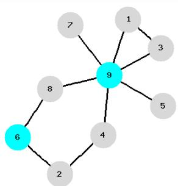
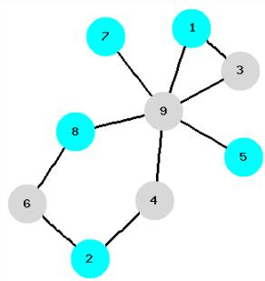
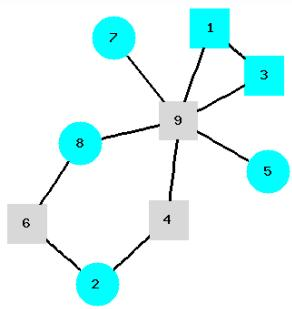
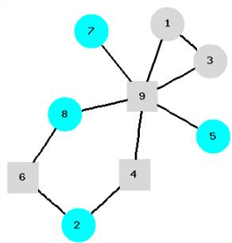

# Solving the Maximum Independent Set Problem in Graphs with Large Independence Number

Sergiy Butenko, Svyatoslav Trukhanov

Industrial and Systems Engineering Texas A&M University College Station, TX

Yalta 2006

Introduction

• Graph theory basics Problem formulation

• $\overline { { G } } = ( V , \overline { { E } } )$ , is the complement graph of $G = ( V , E )$ , where $\overline { { E } } = \{ ( i , j ) \mid i , j \in V , \ i \neq j$ and $( i , j ) \notin E \}$ .

For $S \subseteq V$ , $G ( S ) = ( S , E \cap S \times S )$ the subgraph induced by $S$ .

# 2 2 Results

• Theoretical results • Extension to weighted graphs Numerical experiments Conclusions

• $G = ( V , E )$ is a simple undirected graph, $V = \{ 1 , 2 , \dots , n \}$ .

• A subset $I \subseteq V$ is called an independent set (stable set) if $G ( I )$ has no edges.

An independent set is said to be – maximal, if it is not a subset of any larger independent set; – maximum, if there is no larger independent set in the graph.

• The cardinality of maximum independent set $\alpha ( G )$ is called the independence (stability) number of $G$ .

• For $S \subseteq V$ , neighborhood of $S$ is defined as $N ( S ) = \cup _ { v \in S } N ( v )$ .

• A vertex set $U _ { c }$ is critical if $| U _ { c } | - | N ( U _ { c } ) | = \mathsf { m a x } \{ | U | - | N ( U ) | : U \subseteq V \} .$

• An independent set $I _ { c }$ is called critical if $| I _ { c } | - | N ( I _ { c } ) | = \mathsf { m a x } \{ | I | - | N ( I ) | : I$ is an independent set of $G \}$ .

. If $U _ { c }$ is a critical set and $I _ { c }$ is a critical independent set then $| U _ { c } | - | N ( U _ { c } ) | = | I _ { c } | - | N ( I _ { c } ) |$ (Zhang, 1990).

$I = \{ 6 , 9 \}$ is the maximal independent set. $N ( I ) = \{ 1 , 2 , 3 , 4 , 5 , 7 , 8 \}$

$I = \{ 1 , 2 , 5 , 7 , 8 \}$ is the maximum independent set. $N ( I ) = \{ 3 , 4 , 6 , 9 \}$

$U = \{ 1 , 2 , 3 , 5 , 7 , 8 \}$ is the critical set. $N ( U ) = \{ 1 , 3 , 4 , 6 , 9 \}$

$U = \{ 2 , 5 , 7 , 8 \}$ is the critical independent set. $N ( U ) = \{ 4 , 6 , 9 \}$

• Given an undirected graph, find a maximum cardinality independent set.

The problem is NP-hard.

IP formulation

$$
\alpha ( G ) = { \mathfrak { m a x } } \sum _ { i = 1 } ^ { n } x _ { i } ,
$$

s.t. $x _ { i } + x _ { j } \leq 1 , \forall \left( i , j \right) \in E$ ,

$$
x _ { i } \in \{ 0 , 1 \} , \ i = 1 , \ldots , n .
$$

• Given an undirected graph, find a critical set.

The problem is polynomialy solvable. (Ageev, 1994)

IP formulation

$$
\begin{array} { r l } { \operatorname* { m a x } } & { \displaystyle \sum _ { u \in V } x _ { u } - \sum _ { v \in V } y _ { v } , } \\ { \mathrm { s . t . } \quad } & { y _ { v } \geq x _ { u } , \forall ( u , v ) \in E , } \\ & { x _ { u } , y _ { v } \in \{ 0 , 1 \} , u , v \in V . } \end{array}
$$

If $x ^ { * } = [ x _ { u } ^ { * } ] _ { u \in V } , y ^ { * } = [ y _ { v } ^ { * } ] _ { v \in V }$ is an optimal solution to this problem then $x ^ { * }$ is the incidence vector of a critical vertex se

Putting $y _ { v } = 1 - z _ { v } , \ v \in V$ , we obtain ...

s.t.

$$
\begin{array} { r l } & { \displaystyle \sum _ { u \in V } x _ { u } + \sum _ { v \in V } z _ { v } - | V | , } \\ & { x _ { u } + z _ { v } \leq 1 , \forall ( u , v ) \in E , } \\ & { x _ { u } , z _ { v } \in \{ 0 , 1 \} , u , v \in V . } \end{array}
$$

. This is an instance of the maximum independent set problem on bipartite graph with the vertex set $V \cup V ^ { \prime }$ , where $V ^ { \prime }$ is a copy of $V$ , and an edge between each pair of vertices $\{ ( u , v ^ { \prime } ) : u \in V , v ^ { \prime } \in V ^ { \prime } \}$ such that

Introduction Results References

# Theoretical results

Extension to weighted graphs Numerical experiments Conclusions

Introduction Results References

heor Extension to weighted graphs Numerical experiments Conclusions

# Results

We proved the following facts:

• If $I _ { c }$ is a critical independent set and $I _ { c }$ is a maximal independent set, then $I _ { c }$ is a maximum independent set.

• If $I _ { c }$ is a critical independent set and a maximal independent set at the same time, then $\alpha ( G ) \geq n / 2$ .

• If $I _ { c }$ is a critical independent set, then there exists a maximum independent set $I$ , such that $I _ { c } \subseteq I$ .

# Results

We proved the following facts:

If $U _ { c }$ is a critical set then there exists critical set $W _ { c } \supseteq U _ { c }$ such that $W _ { c } \cup N ( W _ { c } ) = V$ .

. If $U _ { c }$ is a critical set such that $U _ { c } \cup N ( U _ { c } ) = V$ and $I _ { c }$ is a critical independent set obtained from $U _ { c }$ by taking isolated in $G ( U _ { c } )$ vertices, then

$$
V \setminus \left( I _ { c } \cup N ( I _ { c } ) \right) = U _ { c } \setminus I _ { c }
$$

Introduction Results References

Theoretical results Extension to weighted graphs Numerical experiments Conclusions

Introduction Results References

Theoretical results Extension to weighted graphs Numerical experiments Conclusions

# Definitions

Weighted graph: associate non-negative weight $w \in \mathbb { R } _ { + } ^ { | V | }$ with graph vertices.

For $S \subseteq V$ , $| S | _ { w } = \sum _ { i \in S } w _ { i }$ is the weight of vertex set $S$ .

• Maximum weight independent set problem: find an independent set with maximum weight.

A vertex set $U _ { c }$ is weighted critical if $| U _ { c } | _ { w } - | N ( U _ { c } ) | _ { w } = \mathsf { m a x } \{ | U | _ { w } - | N ( U ) | _ { w } : U \subseteq V \}$ .

Extensions of the results

. Maximum weight independent set problem is NP-hard.   
Weighted critical (critical independent) set problem is polynomialy solvable.   
All results presented above still hold (with appropriate changes).   
If $I _ { c }$ is a weighted critical independent set and a maximal weight independent set at the same time, then $\alpha _ { w } ( G ) \ge \sum _ { i \in V } w _ { i } / 2 .$ .

Introduction Results References

heoretica Extension to weighted graphs Numerical experiments Conclusions

Implementation

Find a critical set $U _ { c }$ in original graph $G$ using reduction to maximum independent set problem in bipartite graph. $O ( n ^ { 3 } )$ algorithm (Cook, 1998).   
• Find critical independent set $I _ { c }$ by taking isolated vertices from $U _ { c }$ (Ageev, 1994).   
• Reduce original graph to subgraph, induced by $V \setminus \left( I _ { c } \cup N ( I _ { c } ) \right)$ .

The critical set approach to the maximum independent set problem was tested on graphs $G = ( V , E )$ with $\alpha ( G ) > | V | / 2$ , since in this case the critical independent set $I _ { c }$ is guaranteed to be nonempty. Maximum independent set problem remains NP-hard even if restricted to graphs with $\alpha ( G ) > | V | / 2$ .

A number of graphs were generated with this property using Sanchis generator of maximum clique instances (Sanchis, 1993). Due to their large size, the maximum independent set problem in these graphs cannot be solved using standard exact algorithms.

Table: Results of experiments with Sanchis graphs.   

<table><tr><td>|V|</td><td>|E|</td><td>α(G)</td><td>|U|</td><td>||</td><td>α(G)</td><td>|N(Uc)|</td><td>|Vr|</td><td>|Er|</td><td>time</td></tr><tr><td>1000</td><td>181256</td><td>524</td><td>524</td><td>524</td><td>476</td><td>48</td><td>0</td><td>0</td><td>0.07</td></tr><tr><td>2000</td><td>711955</td><td>1067</td><td>1067</td><td>1067</td><td>933</td><td>134</td><td>0</td><td>0</td><td>0.44</td></tr><tr><td>3000</td><td>954717</td><td>1563</td><td>1563</td><td>1563</td><td>1437</td><td>126</td><td>0</td><td>0</td><td>0.87</td></tr><tr><td>4000</td><td>1014603</td><td>2069</td><td>2069</td><td>2069</td><td>1931</td><td>138</td><td>0</td><td>0</td><td>7.08</td></tr><tr><td>5000</td><td>1533472</td><td>2717</td><td>2717</td><td>2717</td><td>2283</td><td>434</td><td>0</td><td>0</td><td>11.43</td></tr><tr><td>6000</td><td>1775988</td><td>3302</td><td>3305</td><td>3259</td><td>2741</td><td>564</td><td>46</td><td>44</td><td>86.97</td></tr><tr><td>7000</td><td>890777</td><td>4493</td><td>4493</td><td>4493</td><td>2507</td><td>1986</td><td>0</td><td>0</td><td>154.07</td></tr><tr><td>8000</td><td>481800</td><td>5249</td><td>5249</td><td>5249</td><td>2751</td><td>2498</td><td>0</td><td>0</td><td>263.44</td></tr><tr><td>9000</td><td>4040615</td><td>4927</td><td>4930</td><td>4887</td><td>4113</td><td>817</td><td>43</td><td>41</td><td>273.70</td></tr><tr><td>10000</td><td>3775385</td><td>5811</td><td>5813</td><td>5799</td><td>4201</td><td>1612</td><td>14</td><td>12</td><td>625.58</td></tr><tr><td>11000</td><td>6528244</td><td>5901</td><td>5902</td><td>5868</td><td>5132</td><td>770</td><td>34</td><td>33</td><td>220.11</td></tr><tr><td>12000</td><td>4862197</td><td>7098</td><td>7097</td><td>7075</td><td>4925</td><td>2172</td><td>22</td><td>20</td><td>1041.04</td></tr><tr><td>13000</td><td>5638263</td><td>7698</td><td>7705</td><td>7640</td><td>5358</td><td>2347</td><td>67</td><td>58</td><td>1865.82</td></tr><tr><td>14000</td><td>10772525</td><td>7417</td><td>7423</td><td>7346</td><td>6654</td><td>769</td><td>77</td><td>72</td><td>1045.77</td></tr><tr><td>15000</td><td>4207335</td><td>9413</td><td>9417</td><td>9386</td><td>5614</td><td>3803</td><td>31</td><td>27</td><td>2288.17</td></tr><tr><td>16000</td><td>4807361</td><td>10042</td><td>10042</td><td>10042</td><td>5958</td><td>4084</td><td>0</td><td>0</td><td>2215.34</td></tr><tr><td>17000</td><td>10748092</td><td>9898</td><td>9901</td><td>9862</td><td>7138</td><td>2763</td><td>39</td><td>36</td><td>2666.40</td></tr><tr><td>18000</td><td>5106081</td><td>11412</td><td>11412</td><td>11402</td><td>6594</td><td>4818</td><td>14</td><td>10</td><td>3830.01</td></tr></table>

• Protein interaction network From: http://www.nd.edu/networks/database/

The protein-protein interaction map of Helicobacter pylori. Rain J. C. et al, Nature. 2001 Jan 11;409(6817):211-5.

Table: Results of experiments with Biodata graphs.   

<table><tr><td>|V|</td><td>|E|</td><td>α(G)</td><td>|Uc|</td><td>||</td><td>αc(G)</td><td>|N(Uc)|</td><td>|Vr|</td></tr><tr><td>1846</td><td>2203</td><td>1220</td><td>1030</td><td>980</td><td>610</td><td>420</td><td>494</td></tr><tr><td>720</td><td>1403</td><td>517</td><td>517</td><td>517</td><td>314</td><td>203</td><td>0</td></tr></table>

Introduction Results References

• A critical independent set, if nonempty, can successfully be used for computing maximum independent set or reduce the size of maximum independent set problem drasticaly.

. The results of numerical experiments demonstrate that this approach is very effective if the independence number is at least half of all vertices in the graph.

Theoretical results   
Extension to weighted graphs   
Numerical experiments   
Conclusions

Future work

Extend results to maximum weight independent set (in progress).

• Identify other classes of graphs in which critical independent sets are not empty and thus is useful for the maximum independent set problem solving.

A. A. Ageev, On finding critical independent and vertex sets.   
SIAM J. Discrete Math., 7: 293–295, 1994.

W. J. Cook, W. H. Cunningham, W. R. Pulleyblank, A. Schrivjer, Combinatorial Optimization. John Willey and Sons, New York, 1998.

L. Sanchis, A. Jagota, Some Experimental and Theoretical Results on Test Case Generators for the Maximum Clique Problem. DIMACS Tech. Report, 69, 1993.

C.-Q. Zhang. Finding critical independent sets and critical vertex subsets are polynomial problems. SIAM J. Discrete Math., 3: 431-438, 1990.

<table><tr><td rowspan=1 colspan=1>IntroductionResultsReferences</td><td></td></tr><tr><td rowspan=1 colspan=1>S. Butenko, S. Trukhanov</td><td rowspan=1 colspan=1>Solving the Maximum Independent Set Problem in Graphs with</td></tr></table>