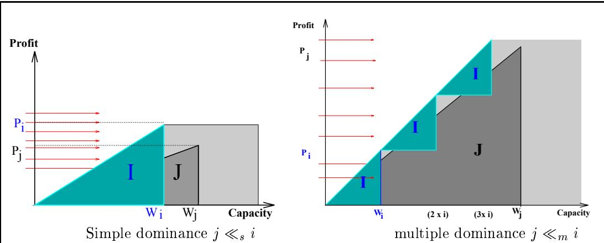
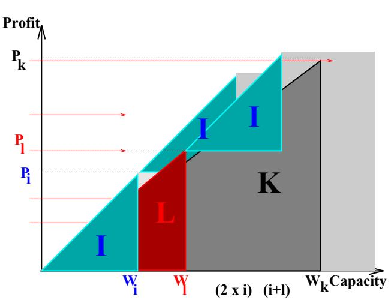
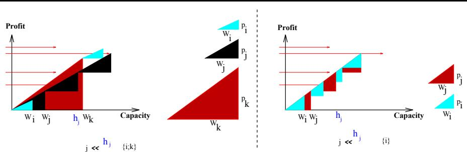
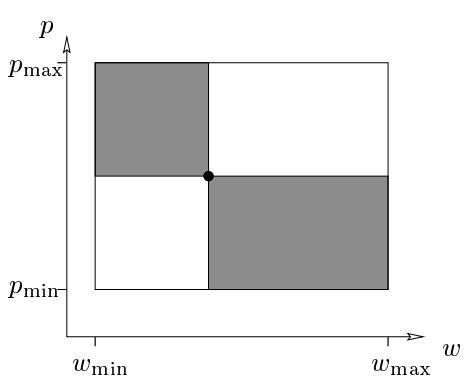
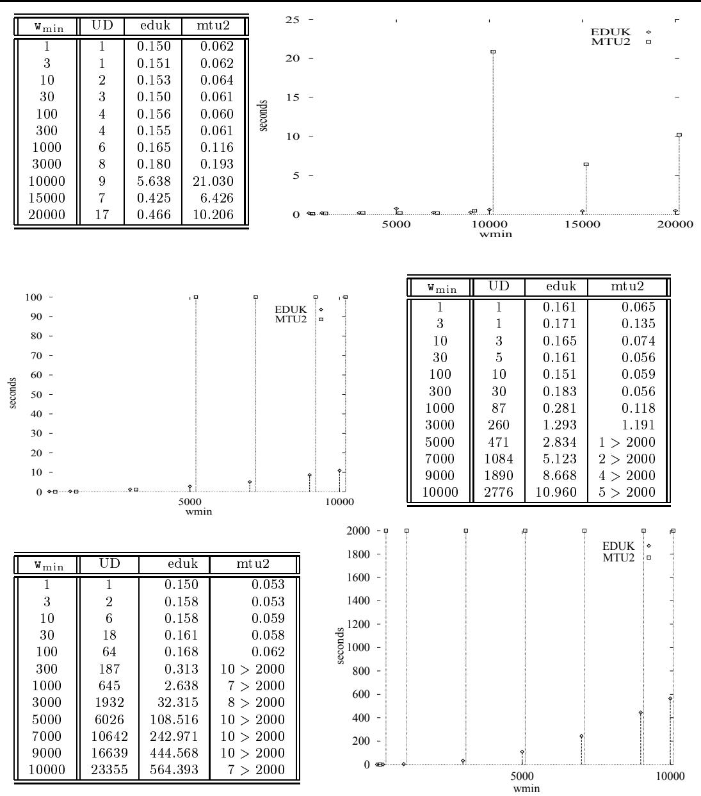
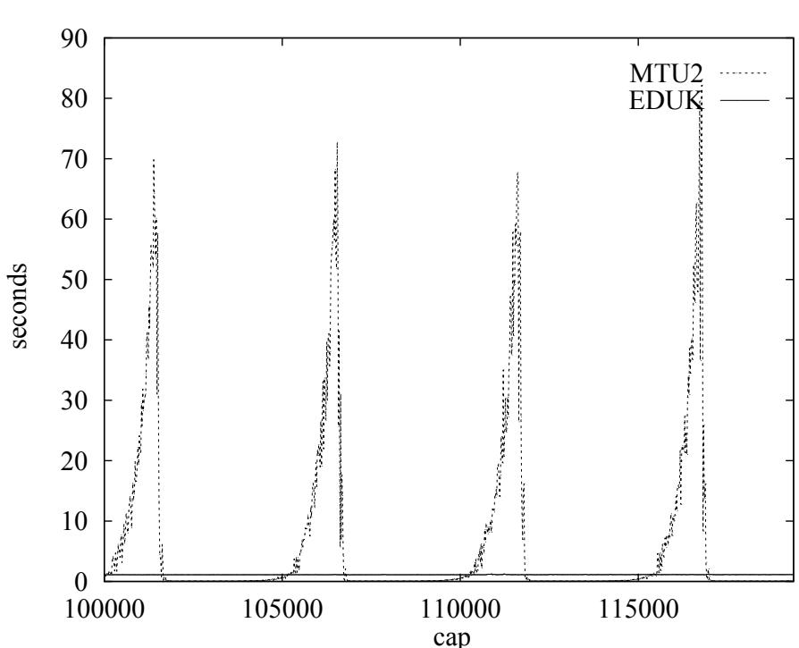
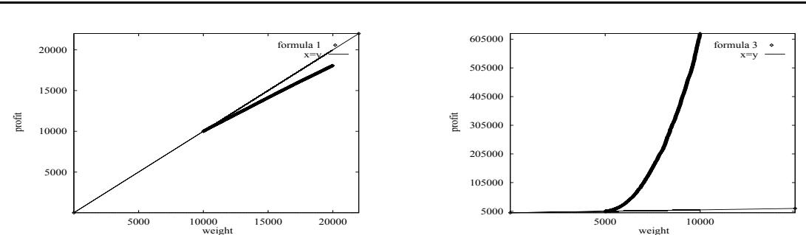

P U B L I C A T I O N   
I N T E R N E   
No PI-1152

RUMEN ANDONOV AND VINCENT POIRRIEZ AND SANJAY RAJOPADHYE

# Rumen Andonov\* and Vincent Poirriez\*\* and Sanjay Rajopadhye\*\*\* Revisited

Rumen Andonov\* and Vincent Poirriez\*\* and Sanjay Rajopadhye\*\*\*

Thème 1 — Réseaux et systèmes Projet API

Publication interne n  PI-1152 — Octobre 1997 — 24 pages of all the previously known dominance relations. We then show that combining it with a sparse representation of the iteration domain and the periodicity property leads to a drastic reduction of the solution space. Numerous computational experiments with various data instances are presented to validate our ideas and demonstrate their eciency. We also compare EDUK with the available and widely used exact algorithm MTU2. sparse representation of the iteration domain and the periodicity property leads to a drastic reduction of the solution space. Numerous computational experiments with various data instances are presented to validate our ideas and demonstrate their efficiency. We also compare EDUK with the available and widely used exact algorithm MTU2.

Key-words: Integer Programming, Dominances, Dynamic Programming, periodiciy, cominatorial optimization

(Résumé : tsvp)

# On presente EDUK, un algorithme ecace de programmation dynamique pour le proe du sac a dos non borne. Il repose sur une nouvelle relation de dominances entr

# neralisatio

binaison avec une representation creuse de l'espace d'iteration et la propriete de periodicite donne une reduction considerable de l'espace de recherche de solution. De nombreuses experiences avec divers jeux de donnees valident nos idees et montrent l'ecacite d'EDUK. On compare aussi EDUK et MTU2 un algorithme connu dans la litterature. combinaison avec une représentation creuse de l'espace d'itération et la propriété de périodicité donne une réduction considérable de l'espace de recherche de solution. De nombreuses expériences avec divers jeux de données valident nos idées et montrent l'efficacité d'EDUK. On compare aussi EDUK et MTU2 un algorithme connu dans la littérature.

Mots clés : programmation en nombre entiers, dominance, programmation dynamique, périodicité, optimisation combinatoire

# are given a knapsack of ca

we have an unbounded number of copies of each object type). Determine, for i = 1 : : : m, the number xi, of i-th type objects to be chosen so as to maximize the total prot without exceeding the capacity, i.e., $c$ , into which we may put $m$ types of objects. Each object of type $i$ has a profit, $p _ { i }$ , and a weight, $w _ { i }$ $( w _ { i } , p _ { i }$ $m$ and $c$ are all positive integers, and max (X pixi : X wixi  c; xi  0 integer; i = 1; 2; : : : ; m) $i = 1 \dots m$ ) the number $x _ { i }$ =1 $i$ -th type objects to be chosen so as to maximize the total profit without The two classic approach

$$
\operatorname* { m a x } \ \left\{ \sum _ { i = 1 } ^ { m } p _ { i } x _ { i } \ : \ \sum _ { i = 1 } ^ { m } w _ { i } x _ { i } \leq c , \ x _ { i } \geq 0 \ \mathrm { i n t e g e r } , \ i = 1 , 2 , \ldots , m \right\}
$$

determine an actual solution which has this optimal prot. In 1963, Gilmore and Gomory proposed the notion of dominance [7]. Intuitivel $O ( m c )$ object type has a larger (or no smaller) weight, and smaller (or no larger) prot than another, the former will never occu $m \times c$ n optimal solution (recall that we have an unbounded number of copies). Martello and Toth introduce a more po

the fact that an object type can be dominated by multiple copies of another. In both cases, a dominated object type can be discarded from consideration. Often, this is detected by preprocessing the inputs. Dudzinski observes that dominance is a partial order [5] and proposes ecient preprocessing techniques. All previous work on dominance (well surveyed by Pisinger [13]) is in the context of branch and bound algorithms (or at least as a preprocessing step for other algorithms). Exploiting dominance (also called coecient reduction) is very important. Empirical evidence shows that the number of non dominated items is usually extremely small. For uniform distribution of the weights and prots, this has been analytically conrmed [11], which actually raises questions about the suitability of the \uncorrelated" data sets [12]. Another well known approach to reduce the search space is available for dynamic programming based algorithms. In 1966 Gilmore and Gomory gave a periodicity property [8] which allows signicant reduction of the capacity dimension of the search space. A third technique, again app

Andonov and Rajopadhye [2]. It is based on the fact that the standard recurrence is monotonic. This allows a \sparse" representation of the computation. A similar property also holds for the 0/1 knapsack problem, and an algorithm using a sparse rep

IFO lists) was proposed at least twenty years ago [9], but this had not previously been used for the unbounded knapsack problem. monotonic. This allows a "sparse" representation of the computation. A similar property also holds for the $0 / 1$ knapsack problem, and an algorithm using a sparse representation (LIFO lists) was proposed at least twenty years ago [9], but this had not previously been PI nPI-1152

ecting such a dominance necessitates the solution of a knapsack (sub) problem, and it is unacceptable as a preprocessing step. Our rst key idea is that collective dominance could be naturally exploited in a dynamic programming algorithm because the solutions of all knapsack sub problems of smaller capacity (and the same set of object types) are available \for free". Our second key idea is based on

es not dominated collectively by the others, many contribute very few times in the optimal solution. Note that every such object type contributes at least once, namely for the (sub) problem with capacity equal to its weight. This leads to

minance, which occurs when a linear combination of the other object types collectively has a larger prot and lower weight than a nite number, say , instances of the object type. Hence no optimal solution will have more than  copies of this object type. As a result, we can discard this object type from consideration beyond a threshold capacity, namely times its weight. Our goal is to exploit all these properties (collective an $\alpha$ threshold dominance, sparse representation, periodicity, and ecient backtra $\alpha$ ing). Our main contributions are as folwe can discard this object type from consideration beyond a threshold capacity, namely $\alpha$ times its weight.

 We introduce and formalize the notions of collective dominance and threshold dominance. We present a complete classication and show that threshold dominance lows.

terms of coecient reduction. dominance. We present a complete classification and show that threshold dominance strictly includes collective dominance, which is a strict generalization of the previously studied versions of dominance. We show that collective dominance is maximal, in terms of coefficient reduction.   
g y p g g g p p p sense that periodicity is attained if and only if the cardinality of the set of object types not dominated beyond a given threshold is 1.   
to this recurrence. a slice wise evaluation of a well known (but not commonly used) recurrence for the forward phase. This eliminates preprocessing, which is incorporated into the main p g y [ ], y y to this recurrence.   
• We present a backtracking algorithm with the same performance Hu's well know idea of computing an auxiliary recurrence [10], but without any auxiliary information. In addition, our technique enables us to determine all solutions.

•We validate our algorithm by numerous computational experiments with a number of { simil

the standard random (uncorrelated, and weakly and strongly correlated) data sets used in the literature [12, 5]; almost inconceivable in real life "false" advantages due to simple dominance); the runs of hundreds of examples; (i.e., has higher weight and smaller profit than) another, since such a situation is almost inconceivable in real life; had excellent performance (even for very large instances of the UKP). We are searching for problems that are d   
data drawn from real life cutting stock problems.

We had excellent performance (even for very large instances of the UKP). We are still searching for problems that are difficult for our algorithm, whether artificially generated (some of which are illustrated here) or from real data.

eshold dominance, give their properties and their relation with periodicity. Section 3 describes how our algorithm by slices incorporates all the above features and also presents the backtracking algorithm. Section 4 presents our experimental results, and we conclude remainder of this paper is organized as follows. In Section 2 we develop collective and threshold dominance, give their properties and their relation with periodicity. Section 3 Notation: Z+ denotes the set of non negative integers. We use the m-vectors, w\~ and p\~, respectively, to denote the weights and prots for a given problem instance. An object type can be ident

solution, who $\mathcal { Z } _ { + }$ i-th element, xi species the number of chosen instanc $m$ of the i- $\vec { w }$ obje $\bar { p }$ t type. For any candidate solution \~x, W(\~x) = X xiwi and P(\~x) = X xipi are called its can be identified either by its index, $i$ , or by the ordered pair $( w _ { i } , p _ { i } )$ M $M = \{ 1 , \dots , m \}$ weight and prot. We denote by UK $m$ a kna $\vec { x }$ ack $\mathcal { Z } _ { + } ^ { m }$ b)-problem with capacity j and j y $i$ -th element, $x _ { i }$ S  ; g p ( ) U $i$ (j; S) is the optimal prot that can be a $\vec { x }$ hi $W ( \vec { x } ) = \sum _ { i \in M } x _ { i } w _ { i }$ UKP $P ( \vec { x } ) = \sum _ { i \in M } x _ { i } p _ { i }$ are called its air s = W \~x P \~x . We sa $\mathrm { U K P } _ { j } ^ { S }$ is a feasible solution for UKPS if 8i 2 $j$ S xi = 0 (the operator n represents se $S \subseteq M$ ence), and if its weight, W(\~x) is $\mathrm { U K P } _ { c } ^ { M } . ~ F ( j , S )$ the knapsack capacity, c. $\mathrm { U K P } _ { j } ^ { S }$ .

Definition 1 We associate to each candidate solution, $\vec { x }$ , a solution point, namely the pair, $( s , f ) = ( W ( \vec { x } ) , P ( \vec { x } ) )$ . We say that $\vec { x }$ is a feasible solution for $\mathrm { U K P } _ { c } ^ { S }$ if $\forall i \in M \backslash S$ $x _ { i } = 0$ (the operator $\backslash$ represents set difference), and if its weight, $W ( \vec { x } )$ is no greater than PI nPI-1152 $c$

  
Figure 1: Illustration of the two pairwise dominance relations: simple and multiple. An object type is shown as a triangle of width $w$ and height $p$

Two ob ect t es with e ual rotab $\vec { x }$ it a $\mathrm { U K P } _ { c } ^ { S }$ to be e ui $P ( \vec { x } ) = F ( c , S )$ g wi. an optimal solution for $\mathrm { U K P } _ { c } ^ { S }$ ${ \mathrm { O p t } } ( { \mathrm { U K P } } _ { c } ^ { S } )$ denotes the set of the optimal solutions of $\mathrm { U K P } _ { c } ^ { \bar { S } }$ c

j wj wk ( wj w k j $\frac { p _ { i } } { w _ { i } }$ This order is often used in the literature, typically in a preprocessing pha $i \equiv j$ h

Let b be the index of the best object type (the one with greatest protability). total order relation in $M ^ { 2 }$ defined as $j \subseteq k$ iff eithr $\begin{array} { r } { \frac { p _ { j } } { w _ { j } } < \frac { p _ { k } } { w _ { k } } } \end{array}$ or $\begin{array} { r } { \frac { p _ { j } } { w _ { j } } = \frac { p _ { k } } { w _ { k } } } \end{array}$ and $w _ { j } \geq w _ { k }$ This order is often used in the literature, typically in a preprocessing phase either on all the object types [6, 12] or on pre-selected core problems [5, 12].

no $b$ dene the dierent dominance relations and describe their ro erties an

# integers), and then describe dominances

threshold dominance. actions. We first introduce dominance between solution points (actually, any two pairs of p , ( ; f ) , ( ; f), ( ; f)( ; f ),  clusion relations between them, and finally describe how periodicity can be detected using threshold dominance.

Definition 4 A pair, $( s ^ { \prime } , f ^ { \prime } )$ dominates another, $( s , f )$ , denoted as $( s , f ) \triangleleft ( s ^ { \prime } , f ^ { \prime } )$ , iff $s \geq s ^ { \prime }$ and $f \leq f ^ { \prime }$

$i$ fy that  is a partial order ( $j$ noted by D $i \ll _ { s } j$ ki fo $( w _ { i } , p _ { i } ) \triangleleft ( w _ { j } , p _ { j } )$ [ $i$ is multiply (simply) dominated by $j$ , written as $i \ll _ { m } j$ , iff $\begin{array} { r } { \left\lfloor \frac { w _ { i } } { w _ { j } } \right\rfloor \ge \frac { p _ { i } } { p _ { j } } } \end{array}$

These two relations (called pairwise dominances) are illustrated in Fig 1. It is easy to verify that $\vartriangleleft$ is a partial order (as noted by Dudzinski for the ${ \ll _ { m } }$ Irisa

  
ny subproblem which includes at least T [ T $k \ll \{ i , l \}$

Denition $\vec { x }$ Let $\vec { x ^ { \prime } }$ be a set of ob ect t es i.e. J  $\mathrm { U K P } _ { c } ^ { T }$ d i 2 $\mathrm { U K P } _ { c ^ { \prime } } ^ { T ^ { \prime } }$ e i-th ob ect t e is collectively domi $( s , f ) \triangleleft ( s ^ { \prime } , f ^ { \prime } )$ ritten as i $\vec { x }$ J i 9\~x 2 Zm (P x w  w , and P J xjpj  pi). In other words, a positive linear combi $T \cup T ^ { \prime }$ of t $f = f ^ { \prime }$ ects in $\vec { x ^ { \prime } }$ ields a \better"

w
 is the weight $J$ f the heaviest object type in $J \subset M )$ and $i \not \in J$ . The $i$ -th object type collectively dominated by $J$ , written as $i \ll J$ iff $\begin{array} { r } { \exists \vec { x } \in \mathcal { Z } _ { + } ^ { m } \mid ( \sum _ { j \in J } x _ { j } w _ { j } \leq w _ { i } } \end{array}$ , and $\begin{array} { r } { \sum _ { j \in J } x _ { j } p _ { j } \ge p _ { i } ) } \end{array}$ minance (illustrated in Fig. 2) is maximal in the following sense: $J$ f i  J, the i-th object type can be discarded from $i$ o

$\Omega = \{ i \in M \mid i \not \ll M \backslash \{ i \} \}$ nversel whenever an ob ect t e i is in 
 it contributes to the o is the weight of the heaviest object type in $\Omega$ .

Finally, we observed empirically that, many object types contribute relatively few $i \ll J$ s to t $i$ e optimal solution (for any capacity). The explanation lies in the fact that for each of these object types, t $c$ ere is a threshold, beyond which it can $i$ be sub $\Omega$ ituted by a linear combination of other objects. This led us to the followin $c = w _ { i }$ ti

Finally, we observed empirically that, many object types contribute relatively few times J  , 62 J; > 0 i b wi c + i , multiple of wi strictly greater than t. We say that the i-th object type is dominated above combination of other objects. This led us to the following definition.

jthat i t and $J \subseteq M , i \not \in J , t > 0$ ( yd ambi uit $\begin{array} { r } { t ^ { \prime } = \alpha w _ { i } = \left( \left\lfloor \frac { t } { w _ { i } } \right\rfloor + 1 \right) w _ { i } } \end{array}$ j ),e ob ect with the larger $w _ { i }$ ght is dominated abo $t$ ve t by the other. $i$ Threshold dominance is illustrated in Fig. 3. $t$ by $J$ , written as $i \ll ^ { t } J$ iff $\exists \vec { x } \in \mathcal { Z } _ { + } ^ { m } \mid \sum _ { j \in J } x _ { j } w _ { j } \leq t ^ { \prime }$ , and $\sum _ { j \in J } x _ { j } p _ { j } \geq \alpha p _ { i }$

Note that if $j \equiv i$ there exists a $t$ (namely $l - 1$ where $l$ is the lcm of $w _ { i }$ and $w _ { j }$ ), such that $i \ \ll ^ { t } \ \{ j \}$ and $j \ll ^ { t } \{ i \}$ . To avoid ambiguity, we consider that only the object with the larger weight is dominated above $t$ by the other. Threshold dominance is illustrated in PI nP

  
Figure 3: Illustration of threshold dominance. (on the left:) object type $j$ is dominated by $\{ i , k \}$ above $2 w _ { j }$ , and (on the right:) a particular case, when two object types have the same multiple of its weight $j \ll ^ { 3 w _ { j } } \{ i \}$ i

Observe that if $i \ll ^ { t } J$ , then for any positive integer, $k , i \ll ^ { t + k } J$ and for $\begin{array} { r } { t ^ { \prime } = \lfloor \frac { t } { w _ { i } } \rfloor w _ { i } } \end{array}$ $i \ll ^ { t ^ { \prime } } J$ ition 1 If i  J, for any c > t, there ex $h _ { i }$ ts x 2 $i$ pt(UKPc ) such that xiwi < t. multiple of its weight such that $i \ll ^ { h _ { i } } M \backslash \{ i \}$ if such an $h _ { i }$ exists. Formally, let $H _ { i } = \{ t \mid$ $i \ll ^ { t } M \backslash \{ i \} \}$ . Then, $h _ { i }$ is the minimum of $H _ { i }$ (if $H _ { i }$ is empty, $h _ { i } = \infty$ ).

Proposition 1 If $i \ll ^ { t } J$ , for any $c > t$ , there exists $\vec { x ^ { \prime } } \in \operatorname { O p t } ( \mathrm { U K P } _ { c } ^ { M } )$ such that $x _ { i } ^ { \prime } w _ { i } < t$ j2J $\begin{array} { r } { t ^ { \prime } = \alpha w _ { i } = \left( \left\lfloor \frac { t } { w _ { i } } \right\rfloor + 1 \right) w _ { i } } \end{array}$ is the smallest multiple of $w _ { i }$ strictly 0  r < . $t$ e construct the desired optimal solution b $\exists \vec { z } : \sum _ { j \in J } z _ { j } w _ { j } \ \leq \ \alpha w _ { i }$ opies $\sum _ { j \in J } z _ { j } p _ { j } \ \geq \ \alpha p _ { i }$ vector $\vec { x }$ 0 given by $\mathrm { O p t } ( \mathrm { U K P } _ { c } ^ { M } )$ .If $x _ { i } ~ < ~ \alpha$ then $\vec { x }$ 8 x0 = xj if j 2 $x _ { i } = k \alpha + r$ for positive integers $k , r$ such that $0 \leq r < \alpha$ < x0 = xj + kzi if j 2 J $k \alpha$ copies : x0 = $i$ by $k$ copies (of the part corresponding to the object types in $J$ ) of $\vec { z }$ Thus the vector $\vec { x ^ { \prime } }$ given by

$$
x _ { j } ^ { \prime } = { \left\{ \begin{array} { l l } { x _ { j } ^ { \prime } = x _ { j } } & { { \mathrm { ~ i f ~ } } j \in M \backslash \{ i \} \backslash J } \\ { x _ { j } ^ { \prime } = x _ { j } + k z _ { i } } & { { \mathrm { ~ i f ~ } } j \in J } \\ { x _ { j } ^ { \prime } = r } & { { \mathrm { ~ i f ~ } } j = i } \end{array} \right. }
$$

hi ) q

Hence if $i \ll ^ { t } J$ the $i$ -th object may be discarded beyond a capacity of $t$ . The threshold $h _ { i }$ p y i p ( $\alpha$ y ) i y= i i y Proof: $\vec { x }$ fea $\mathrm { U K P } _ { h _ { i } } ^ { M }$ lution for UKPM consist $x _ { k } ~ = ~ 0 , k ~ \neq ~ i$ copie $x _ { i } ~ = ~ \alpha$ and has the sufficient condition to detect the threshold.

Proposition 2 If $y$ mod $w _ { i } = 0$ and $\exists \vec { x } \in \mathrm { O p t } ( \mathrm { U K P } _ { y } ^ { M } )$ j2Mnf $x _ { i } < y / w _ { i }$ then $h _ { i } < y$

Proprt le sole $\mathrm { U K P } _ { y } ^ { M }$ nsists f just $y / w _ { i }$ $i$ ad s the $y p _ { i } / w _ { i }$ $\vec { x } \in \mathsf { O p t } ( \mathrm { U K P } _ { y } ^ { M } )$ $x _ { i } p _ { i } + \sum _ { j \in M \backslash \{ i \} } x _ { j } p _ { j } \geq y p _ { i } / w _ { i }$ $\sum _ { \in M \backslash \{ i \} } x _ { j } w _ { j } \leq y - x _ { i } w _ { i } \leq y$ . Therefore the object type $i$ is dominated above $t =$ $y - x _ { i } w _ { i }$ llectively d $h _ { i } < y$ e

We now present some useful properties the dominances and as well as some relationships 3. The obje

4. $i$ here is no threshold beyond $\{ j \}$ ch $i \neq j$ est o $i$ ject type is threshold dom $j$   
2. $i$ is collectively dominated by the set $J$ y $i$ is threshold dominated above 0 by $J$   
3. The object type with the smallest weight is never collectively dominated.   
4. There is no threshold beyond which the best object type is threshold dominated.   
5. If $i$ is threshold dominated above some $t$ by a set $J$ y g g y   
ote t $j \in J$ e cost req $i \subseteq j$ t

The above properties lead to the following result.

Theorem 1 The four dominance relations are in strictly increasing order of generality.

Note that the cost required to check for a dominance relation is increasing from ${ \ll } _ { s }$ to $\ll ^ { t }$ . In fact, $\ll$ and $\ll ^ { t }$ require the solution of knapsack sub-problems.

# yp g

We now describe the relation between threshold dominance and periodicity, a well known property of the UKP [6, 8]. Periodicity states that beyond a capacity, $y$ , only the best object type contributes again to the solution. Hence, knowing the solutions for each capacity below $y$ is sufficient to solve the problem for any capacity. Formally it can be formulated as follows:

$$
\forall c \geq y , F ( c , M ) = \lceil ( c - y ) / w _ { b } \rceil p _ { b } + F ( c - \lceil ( c - y ) / w _ { b } \rceil w _ { b } , M )
$$

We define the period level, $y ^ { \star }$ as the smallest $y$ satisfying (2). The following result relates the periodicity property with the threshold dominance and gives a simple test to check if the period level is reached. For any capacity $y$ , we define $\mathcal { U } ( y ) = \{ j \in M \ | \ j \not \ll ^ { y } M \}$ as the ) Obvio us. $y$

Theorem 2 The set $\mathcal { U } ( y )$ is a singleton, iff the capacity $y$ satisfies Eqn. 2.

# Let

$\Rightarrow \mathrm { { O b v i o u s } }$   
$\iff \operatorname { L e t } \ k$ be an object type different from the best object type. We will show that $k \ll ^ { y } M \backslash \{ k \}$   
oroll $t ^ { \prime }$ ry 1 y? = minfy such that $w _ { k }$ (y) j= 1g $t ^ { \prime } > y$ . According to Eqn. (2) there xists $\vec { x } \in \mathsf { O p t } ( \mathrm { U K P } _ { t ^ { \prime } } ^ { M } )$ such that $x _ { b } ~ > ~ 0$ which implies $x _ { k } ~ < ~ y / w _ { k }$ .Hence from proposition 2 we obtain $h _ { k } < y$ . Therefore only the best object type is not dominated above $y$ I

PI nPI-1152 $y ^ { \star } = m i n \{ y$ such that $\mid \mathcal { U } ( y ) \mid = 1 \}$

# rence for the forward phase is given below. It is a sta

We now describe how the above properties are combined into an efficient algorithm, EDUK (Efficient Dynamic programming for the Unbounded Knapsack problem). The basic recurrence for the forward phase is given below. It is a standard, though not common recurrence, and can be easily derived from the principle of optimality. $F ( c , M ) = g ( c , m )$ where,

$$
g ( j , k ) = \left\{ \begin{array} { l l l } { { j < 0 \mathrm { ~ a n d ~ } k = m } } & { { \Rightarrow } } & { { - \infty } } \\ { { j = 0 \mathrm { ~ o r ~ } k = 0 } } & { { \Rightarrow } } & { { 0 } } \\ { { j > 0 } } & { { \Rightarrow } } & { { \operatorname* { m a x } \bigl ( g ( j , k - 1 ) , g ( j - w _ { k } , m ) + p _ { k } \bigr ) } } \end{array} \right.
$$

capacity has exceede $m \times c$ threshold bey $m$ d which an object type does not contribute any more, the re $c$ ainder of its column is deleted, thus achieving capacity reduction. And nally, we also exploit sparsity: in the (sub) columns where the recurrence is to be evaluated, we do not evaluate it for all values of j. Since the function g(j; k) is monotonically increasing in j, we need to compute it only when it changes value (at the so called critical points). Our challenges are to detect dominance (collective as well as threshold) as (i) cheaply and (ii) early as possible, and (iii) to integrate it with the sparse algorithm, i.e., the data required for this detection must be $j$ vailable only by insp $g ( j , k )$ the results at critical points. in $j$ The recurrence is evaluated by horizontal slices. This can be done easily if the l

umn of the table is retained up to the start of the slice (say capacity c0), and the boundary conditions of Eqn. 3 are modied appropriately. The height of each slice could be constant (a parameter of the algorithm) or variable. For each slice, EDUK maintains g0 = F(c0; M), the

ue of Opt(UKPMc ) and the index of the current best object, b0. The main data structures are th ree li st s: $c _ { 0 }$ ), and the boundary conditions of Eqn. 3 are modified appropriately. The height of each slice could be constant (a parameter of the algorithm) or variable. For each slice, EDUK maintains $g _ { 0 } = F ( c _ { 0 } , M )$ y value of $\mathrm { O p t } ( \mathrm { U K P } _ { c _ { 0 } } ^ { M } )$ e set o object types w ose we g ts a e $b ^ { \prime }$ ge t a c0 ( e ce we do t are three lists:

: $\mathcal { R }$ , a list of residual object types. It is initialized to $M$ , and (at the start of any slice) contains the set of object types whose weights are larger than $c _ { 0 }$ (hence we don't yet know whether they are collectively dominated or not), and which have not been y p j yp   
• $\mathcal { L }$ , a list of size $p$ , a parameter, which contains the $p$ object types introduced during j yp ( ) g 0 , ( ) y with exactly $p$ new object types introduced in each slice).   
• $\boldsymbol { u }$ , the list of "currently non-dominated" object types (at the start of each slice). These are object types that (i) have weights smaller than $c _ { 0 }$ , (ii) are not collectively dominated by the other object types, and whose (ii) thresholds are not less than $c _ { 0 }$

Evaluation of a slice: The computation performed in evaluating a slice consists of the following.

type so far. It is a tradeo whether this test, $\mathcal { R }$ hich involves a couple of a $p$ ithmetic operations should be done here for all elements $\mathcal { T }$ f R, or in the post-processing step for only a few object types. If $\mathcal { R }$ it is immediately discarded. If it passes these tests, insert it in I, and w $g _ { 0 }$ e doing so, check that it is not simply dominated by the object types already there. Then too it is discarded (these are the \easy tests" mentioned ab ove). $\mathcal { R }$ , or in the post-processing step for only a few object types. If so it is immediately discarded. If it passes these tests, insert it in $\mathcal { T }$ , and while doing so, check that it is not simply dominated by the object types already there. Then too it is discarded (these are the "easy tests" mentioned above).

it is appended at $i$ the $\mathcal { T }$ nd of U . $w _ { i }$ using only object types in $\boldsymbol { u }$ . This is done by evaluating the recurrence $g ( j , k )$ , using the sparse algorithm (see Sec. 3.1). At the end of each such evaluation, check if the object type $i$ is collectively dominated by the others. If so, it is discarded, otherwise it is appended at the end of $\boldsymbol { u }$

lity, it is possible to detect threshold dominance, at the earliest possible moment, an $\mathcal { L }$ this may lead to som $\mathcal { U }$ avings (this implementation tradeo is not discussed here). $( w _ { p } , F ( w _ { p } , M ) )$ . Finally, for all object types in $\mathcal { U }$ , test to see if their threshold has dard Phase The slice-wise evalu $\mathcal { U }$ ion $\mathcal { U }$ performed repeatedly until R becomes y. This concludes the reduction phase. Assuming that the capacity c and the period have not yet been reached (otherwise we are done), we move on to the standard pha slices (but without the preprocessing above). As before, we detect threshold d $\mathcal { R }$ inance at the end of each slice, and thus U may continue to decrease. Each time th $c$ s occurs we test to see if U is a singleton. When this happens, we know that we have attained periodicity, and the solution is computed with the closed form formula of Eqn. 2, and we are done! slices (but without the preprocessing above). As before, we detect threshold dominance at 3.1 A sparse represen $\mathcal { U }$ may continue to decrease. Each time this occurs we test to see if $\mathcal { U }$ is a singleton. When this happens, we know that we have attained periodicity, and the solution is computed with the closed form formula of Eqn. 2, and we are done!

# 3.1 A sparse representation

Yet another method of search space reduction is the so called sparse representation [2]. A complete discussion is beyond the scope of this paper, and we simply present an overview of the method here. It is based on the key observation that the function $g ( j , k )$ is monotonically sparse matric $j$ s (hence the name). The sparse representation, which is ful $a l l$ exploited i $j$ our algorithm requires lazy data structures known in functional $j$ languages as lazy lists, (or streams). It is for this reason t $g ( j , k )$ have chosen to $k$ implement our algorithm in a programming language $( s , f )$ e functional style (although an implementation in C, Fortran or a more conventional language could arguably have been more ecient, we found that the program development time was considerably reduced). (or streams). It is for this reason that we have chosen to implement our algorithm in a 3.2 Backtracking phase or a more conventional language could arguably have been more efficient, we found that the program development time was considerably reduced).

# recurrence g(j; k) has been evalua

saved in order to compute the solution. Often overlooked is the fact that, for the unbounded knapsack problem, we can compute an auxiliary recurrence during the forwar $\vec { x }$ phase, and then, back $g ( j , k )$ g can be performed by traversing only the last column of the table. This was initially presented in Hu's text in 1969 [10]. $\Theta ( m c )$ er algorithm was presented by Garnkel and Nemhauser [6]. Both algorithms use an auxiliary function during the forward phase and thus two lists of size c are kept in the memory. We now present an algorithm which achieves the same space and time complexity as these, but with no overhead in the forward phase. In addition, our technique enables us to determine all solutions, unlike the Garfinkel and Nemhauser [6]. Both algorithms use an auxiliary function during the forward We start with recursions and $c$ otations similar to these of Garnkel and Nemhauser [6], but we use them in a slightly dierent manner and also take into account the notion of forward phase. In addition, our technique enables us to determine all solutions, unlike the others.

ynd for some k 2 M such that  w 0 we have but we use them in a slightly different manner and also take into account the notion of dominance.

Proposition 3 Let ${ \mathcal { D } } ( y ) = \{ k : x _ { k } > 0$ gg $\vec { x } \in \mathrm { O p t } ( \mathrm { U K P } _ { y } ^ { M } ) \}$ . Then when $F ( y , M ) \neq$ $0$ o ow g a go $k \in M$ e e t e ve $y - w _ { k } \ge 0$ t a ed t

$$
F ( y , M ) - p _ { k } = F ( y - w _ { k } , M ) \Leftrightarrow k \in \mathcal { D } ( y )
$$

Recall that $\Omega = \{ j \in M \mid j \not \ll M \backslash \{ j \} \}$ and let us initialize $S : = \Omega$ . We then have the following algorithm where the vector $\vec { x }$ is initialized to $\vec { 0 }$

while $\mathrm { ~ \tt ~ { ~ S ~ } ~ } < >$ e S:= S-{k $\texttt { y } > \texttt { 0 }$ do let k in S if $y - w \_ { \tt k } < \ 0$ then $\mathsf { S } : = \mathsf { \Omega S } - \{ \mathsf { k } \}$ else if $\mathtt { F ( y - w \_ k , M ) } \ = \ \mathtt { F ( y , M ) - p \_ k }$ then (x_k := x_k + 1; y := y - w_k) else $\mathsf { S } : = \mathsf { \Omega S } - \{ \mathsf { k } \}$

Irisa

useful heuristic for rapidly obtainin $\Omega$ one solution is to f $M$ ow the order of the decreasing protability of object types (i.e., the best object type to be considered rst). Fin $\Omega$ y, the algorit $\Omega$ m above can be directly adapted to exploit sparsity, and this is implemented in the working versi $k$ n of our algorithm. A useful heuristic for rapidly obtaining one solution is to follow the order of the decreasing profitability of object types (i.e., the best object type to be considered first). Finally, the algorithm above can be directly adapted to exploit sparsity, and this is implemented in the We now evaluate the erformanc

# comparison purposes, we also give the r

written in fortran 77, available in the public domain. It is recognized as the de facto standard program for the UKP. Although the two are implemented dierently, our results nevertheless serve to indicate the trends. Moreover, the EDUK was developed using a rigorous program development approach, where the transformations on the program were based on formal properties of the recurrences involved, and as a result the nal ocaml program was very close to the recurrences. We expect that if the algorithm was recoded in fortran 77, the performance would improve by a small constant factor, since we expect that the implementation of arrays is better optimized in fortran 77. Typically, three kinds of data sets have been used in the literature for comparing the performance of knapsack algorithms [12]: in fortran 77, the performance would improve by a small constant factor, since we expect that the implementation of arrays is better optimized in fortran 77.

Typically, three kinds of data sets have been used in the literature for comparing the performance of knapsack algorithms [12]:

generating random data sets for the UKP, and we also present results with what we call \realistic random" data sets. Our goal is to separately highlight the performance gains due to each of the properties we have presented. Our experiments highlight some limitations in current methods of generating random data sets for the UKP, and we also present results with what we call "realistic random" data sets.

Pathological examples which exhibit worst case behavior. Since the knapsack problem caml is a language in the ML family. It was developed at INRIA, Rocquencourt, France. Documentation e found at: http://pauillac.inria.fr/caml the branch and bound algorithm). We give formulæ to generate a family of problems for which the EDUK algorithm has high running times, and try to identify which of the properties contribute to an improvement.

•Real life examples drawn from actual problem instances. We have posted a request for data sets on the sci.op-research newsgroup, and have also contacted researchers in the domain. So far we have one class of such data, which we present here. The code will be shortly made publicly available at our ftp site, and we welcome additional feedback.

# independent of each other. In th

predetermined constants, a and b). In weakly correlated data sets the wi's are random, and pi is chosen randomly in the interval awi  b. The interval for weights used by Martello and Toth is [10; 103] and for weakly and strongly correlated data sets, the constants are dened as a = 1 and b = 100. $p _ { i } = a w _ { i } + b$ for some Johnson and Khan [1 $a$ pro $b$ d that for uncorrelated data sets, t $w _ { i }$ e are very few ob$p _ { i }$ ct types that are not multiply dom $a w _ { i } \pm b$ and that the expected value of the number of (multip $[ 1 0 , 1 0 ^ { 3 } ]$ dominated object types is as low as 1.6! An intuitive explanation is given in Fi $a = 1$ s a r $b = 1 0 0$ g

UK are bound to have excellent performance on such data sets, which are not therefore truly representative. Another interesting point concerns the strongly correlated data sets. Since the prot of an object type is a function of its weight, the number of distinct object types is simply the range of possible weights. For the interval [10; 103], none of the corresponding 990 object types is (simply) do

(multiply) dominate all the other object types (it is easy to check that the object type of weight 10 (multiply) dominates any object type with weight greater or equal than 20). Now, if m  1000, all distinct object types will $[ 1 0 , 1 0 ^ { 3 } ]$ n with high probability, and hence, the number of non-dominated object types (for both the  and s relations) will be constant (resp. 10 and 990) independent of m. To avoid this eect, the range of possible weights should be reasonably large compared to m. if $m \gg 1 0 0 0$ f the above limitations, such data sets are widely used in the literature, and are almost de rigeur in comparing various algorithms for $\ll$ e kn $\ll _ { s }$ ck and related problem(s). For this reason, we rst present a s $m$ ies of experiments using these data sets, but with an eort to reduce the eects of duplicates. $m$ e

In spite of the above limitations, such data sets are widely used in the literature, and are almost de rigeur in comparing various algorithms for the knapsack and related problem(s). For this reason, we first present a series of experiments using these data sets, but with an effort to reduce the effects of duplicates. We then present experiments illustrating the behain the shaded region, it either dominates or is dominated by the rst point. Thus, ther $[ w _ { \mathrm { m i n } } , p _ { \mathrm { m i n } } ]$ o $[ w _ { \mathrm { m i n } } , p _ { \mathrm { m a x } } ]$ $[ w _ { \mathrm { m a x } } , p _ { \mathrm { m i n } } ]$ data $[ w _ { \mathrm { m a x } } , p _ { \mathrm { m a x } } ]$ many object types that are (simply) dominated by some other, especially if the number of object types is reasonably large. minated by the first point.

Thus, there is high probability that uncorrelated Figure 4: Why completely uncorrelated ply) dominated by some other, especially if the ior of both algorithms as the capacity is

  
designing our experiments, our goal was to show a progression of increasing r

of duplicates. Now, the running time is very sensitive to the number of (multiply) non dominated object types rather than m (the explanation is the one d

mber of object types are dominated in uncorrelated data sets, and thus tend to be pruned out early by any reasonably smart algorithm). Pisinger recently observed [13] that the number of non dominated object types is very sensitive to wmin: the larger the value of wmin, the greater the number of non $m$ ominated object types. Based on these observations, we chose to x m at a reasonably large value and allowed wmin to vary. In particular, we used the following parameters: m = 105, wmax = 105, and wi 2 [wmin; wmax], with wmin varying between 1 and 10 $w _ { \mathrm { m i n } }$ e capacity was xed to a $w _ { \mathrm { m i n } }$ value greater than 2 - 108. We generated the three stan

akly and strongly correlated). Fig. 5 summar $m$ s our results, showing the running times $w _ { \mathrm { m i n } }$ DUK and MTU2. The column UD gives the number of (coll $m = 1 0 ^ { 5 }$ n $w _ { \mathrm { m a x } } = 1 0 ^ { 5 }$ d obje $w _ { i } \in [ w _ { \operatorname* { m i n } } , w _ { \operatorname* { m a x } } ]$ at the $w _ { \mathrm { m i n } }$ er of multiply non-domi $1 0 ^ { 4 }$ ed object types determined by MTU2 is not available, $2 \times 1 0 ^ { 8 }$ o larger than this value. For the uncorrelated data sets, pi was chosen randomly in the interval [pmin; pmax], for the weakly correlated data sets, it was chosen randomly in the interval [wi  100; wi + 100], and for the strongly correlated case, it was set to wi + 100. The random number generator we used was the ocaml module random. As noted above, EDUK is implemented in ocaml and MTU2 in fortran 77. $p _ { i }$ As can be seen, EDUK consiste $[ p _ { \mathrm { m i n } } , p _ { \mathrm { m a x } } ]$ orms MTU2, except possibly for the early part of the uncorrelated data se $[ w _ { i } - 1 0 0 , w _ { i } + 1 0 0 ]$ s case (i) both algorithms are fast, (ii) EDUK sta $w _ { i } + 1 0 0$ g better performance as the number of non dominated object types starts to increase, and (iii) we have already argued that such data sets are not re

senting our results with more realistic data sets, we rst discuss how the running time depends on the capacity. EDUK starts having better performance as the number of non dominated object types starts to increase, and (ii) we have already argued that such data sets are not realistic. Before presenting our results with more realistic data sets, we first discuss how the running time PI nPI-1152

Figure 5: Comparison of eduk and mtu2 for the standard rand $w _ { \mathrm { m i n } }$ xper $m = 1 0 ^ { 5 }$ for uncorrelated (top), weakly correlated (middle) and strongly correlated (bottom) data sets. Each table entry (and point on the graphs) is the average of 10 runs (truncated for the $U D$ column). The entry $n > 2 0 0 0$ ensitivity $n$ of Running time to the Capacity happens only for mTu2, and we generously assume that the running time is 2000 seconds in this case.

rtant to study how the capacity aects the running time. We conducted the follo

# 4.2 Sensitivity of Running time to the Capacity

Dynamic programming is often rejected out of hand for very large capacities. Hence it is important to study how the capacity affects the running time. We conducted the following

<table><tr><td rowspan=1 colspan=1>av_eduk</td><td rowspan=1 colspan=2>min_eduk</td><td rowspan=1 colspan=1>max_eduk</td><td rowspan=1 colspan=3>av_mtu2</td><td rowspan=1 colspan=1>min_mt u2</td><td rowspan=1 colspan=1>max_mtu2</td></tr><tr><td rowspan=1 colspan=1>0.0880.083</td><td rowspan=1 colspan=2>0.0830.066</td><td rowspan=1 colspan=1>0.1000.116</td><td rowspan=1 colspan=3>0.0740.049</td><td rowspan=1 colspan=1>0.0390.038</td><td rowspan=6 colspan=1>0.1220.1330.0560.1220.1400.0860.1780.126</td></tr><tr><td rowspan=5 colspan=1>0.0860.0910.1050.0940.0940.082</td><td rowspan=2 colspan=2>0.0660.083</td><td rowspan=1 colspan=1>0.066</td><td rowspan=1 colspan=3>0.100</td><td rowspan=1 colspan=1>0.047</td><td rowspan=1 colspan=1>0.037</td></tr><tr><td rowspan=1 colspan=1>0.100</td><td rowspan=1 colspan=2>0.051</td><td rowspan=1 colspan=2>0.051</td><td rowspan=3 colspan=1>0.0400.0400.0390.040</td></tr><tr><td rowspan=2 colspan=2>0.0830.0660.083</td><td rowspan=2 colspan=1>0.1160.1160.116</td><td rowspan=1 colspan=3>0.0540.048</td><td rowspan=1 colspan=1>0.054</td></tr><tr><td rowspan=1 colspan=3>0.082</td></tr><tr><td rowspan=1 colspan=2>0.066</td><td rowspan=1 colspan=1>0.100</td><td rowspan=1 colspan=3>0.068</td><td rowspan=1 colspan=1>0.040</td></tr><tr><td rowspan=1 colspan=1>0.094</td><td rowspan=1 colspan=2>0.083</td><td rowspan=1 colspan=1>0.133</td><td rowspan=1 colspan=3>0.093</td><td rowspan=1 colspan=1>0.040</td><td rowspan=1 colspan=1>0.226</td></tr><tr><td rowspan=1 colspan=1>0.095</td><td rowspan=1 colspan=2>0.083</td><td rowspan=1 colspan=1>0.116</td><td rowspan=1 colspan=3>0.066</td><td rowspan=1 colspan=1>0.040</td><td rowspan=1 colspan=1>0.102</td></tr><tr><td rowspan=1 colspan=1>0.091</td><td rowspan=1 colspan=2>0.066</td><td rowspan=1 colspan=1>0.116</td><td rowspan=1 colspan=3>0.063</td><td rowspan=1 colspan=1>0.037</td><td rowspan=1 colspan=1>0.226</td></tr></table>

val [10 ; 2:6 - 10 ]. Fig. 6 presents the average, mini   

<table><tr><td>av_eduk</td><td>min_eduk</td><td>max_eduk</td><td>av_mtu2</td><td>min_mt u2</td><td>max_mtu2</td></tr><tr><td>1.203</td><td>1.133</td><td>1.283</td><td>0.211</td><td>0.048</td><td>10.974</td></tr><tr><td>1.107</td><td>1.016</td><td>1.416</td><td>0.869</td><td>0.048</td><td>4.355</td></tr><tr><td>0.905</td><td>0.883</td><td>0.933</td><td>0.668</td><td>0.049</td><td>2.362</td></tr><tr><td>1.109</td><td>1.083</td><td>1.133</td><td>0.517</td><td>0.047</td><td>1.795</td></tr><tr><td>1.124</td><td>1.083</td><td>1.166</td><td>0.092</td><td>0.049</td><td>2.154</td></tr><tr><td>1.157</td><td>1.116</td><td>1.183</td><td>0.271</td><td>0.048</td><td>9.836</td></tr><tr><td>1.083</td><td>1.050</td><td>1.116</td><td>0.105</td><td>0.048</td><td>3.537</td></tr><tr><td>1.374</td><td>1.216</td><td>1.533</td><td>3.184</td><td>0.048</td><td>115.992</td></tr><tr><td>1.141</td><td>1.100</td><td>1.166</td><td>0.337</td><td>0.049</td><td>20.949</td></tr><tr><td>1.221</td><td>1.100</td><td>1.483</td><td>1.348</td><td>0.049</td><td>9.670</td></tr><tr><td>1.143</td><td>0.883</td><td>1.533</td><td>0.760</td><td>0.047</td><td>115.992</td></tr></table>

Average, maximum and minimum running times (in seconds) of EDUK and MTU2, for uncorrelated (above) and weakly correlated (below) data sets. Each line corresponds to 500 instances (each for a periment: we set wmin = $\left[ 1 0 ^ { 5 } , 2 . 6 \times 1 0 ^ { 6 } \right] _ { . }$ 10 and m = 50000. For each set of values o ei hts and rots we mea $m = 5 \times 1 0 ^ { 4 }$ u $\dot { w } _ { \mathrm { m a x } } = 1 0 ^ { 5 }$ for $w _ { \mathrm { m i n } } = 5 \times 1 0 ^ { 3 }$ ca acit randoml table is the average of the columns.

seconds for strongly $w _ { \mathrm { m i n } } = 5 0 0 0$ t $w _ { \mathrm { m a x } } = 1 0 ^ { 5 }$ hese $m = 5 0 0 0 0$ we report here only results for non-correlated and weakly correlated data sets). These gures illust $[ 1 0 ^ { 5 } , 2 . 6 \times 1 0 ^ { 6 } ]$ ime required by EDUK is stable, the average time is at the middle of the interval and the maximal time is two times the minimal one. On the same examples the maximal time required by MTU2 can be 2500 times its minimal time. In order to try to illustrate the behavior mor

s for a particular (weakly correlated) data set from the above experiment, but chose the capacity randomly in the range [105; 119400]. Fig 7 reports the running time of both algorithms for each value of the capacity. We observe that the running time of M

In order to try to illustrate the behavior more precisely, we conducted 1000 similar runs for a particular (weakly correlated) data set from the above experiment, but chose the capacity randomly in the range [105, 119400]. Fig 7 reports the running time of both algorithms for each value of the capacity. We observe that the running time of MTU2 is

  
arly periodic with a period equal to the weight of the best object type (here, about 5000) hile that of EDUK is constant. $[ 1 0 ^ { 5 }$ , 119400]. The average $( \mathrm { m a x } / \mathrm { m i n } )$ times for EDUK and MTU2 were respectively, 1.119 $\left( 1 . 0 8 / 1 . 2 5 \right)$ seconds, and 6.731 (0.028/82.184) seconds. e that EDUK is more stable than MTU2 to variations in the

periodicity), and also the sparse representation.   
while that of EDUK is constant.

.1 Realistic Random Data Sets is due to the way in which EDUK exploits threshold dominance dominance (and hence periodicity), and also the sparse representation.

# 4.2.1 Realistic Random Data Sets

randomly in the interval [pmin; pmax]. Then (i) sort these two sequences, (ii) pair up the weights and prots, and (iii) permute this list randomly (or return it to the original order in which (one of) the weights (or prots) were generated). This yields a realistic uncorrelate $m$ distinct values of weights, randomly in the interval $[ w _ { \mathrm { m i n } } , w _ { \mathrm { m a x } } ]$ , and $m$ values of profits 2Actually, the term uncorre $[ p _ { \mathrm { m i n } } , p _ { \mathrm { m a x } } ]$ nomer, since there is a correlation (though not the linear/ane o e o t e st o g y co e ated data sets) betwee t e we g ts a d p o ts a a ge we g t p es a g eate which (one of) the weights (or profits) were generated). This yields a realistic uncorrelated2

d duplicates are ruled out).   

<table><tr><td>Wmin</td><td>UD</td><td>eduk</td><td>mtu2</td></tr><tr><td>1 3</td><td>6 69</td><td>0.098 0.873</td><td>0.021 1 &gt; 1000</td></tr><tr><td></td><td></td><td></td><td></td></tr><tr><td>10</td><td>460*</td><td>1 &gt; 1000</td><td>3 &gt; 1000</td></tr><tr><td>30</td><td>1780</td><td>111.075</td><td>3 &gt; 1000</td></tr><tr><td>100</td><td>7581*</td><td>4 &gt; 1000</td><td>9 &gt; 1000</td></tr><tr><td>300</td><td>27724*</td><td>10 &gt; 1000</td><td>9 &gt; 1000</td></tr><tr><td>1000</td><td> *</td><td>10 &gt; 1000</td><td>10 &gt; 1000</td></tr><tr><td>3000</td><td>. * —</td><td>10 &gt; 1000</td><td>10 &gt; 1000</td></tr></table>

Realistic data sets are those where there is no simple dominance: larger weight implies a larger proft. The parameters were: $m = 5 \times 1 0 ^ { 4 }$ $w _ { \mathrm { m a x } } = 1 0 ^ { 5 }$ $w _ { i } ~ \in ~ [ w _ { \operatorname* { m i n } } , w _ { \operatorname* { m a x } } ]$ $p _ { i } \ \in \ [ w _ { i } \ - \ 1 0 0 , w _ { i } \ + \ 1 0 0 ]$ and $c > 2 \times 1 0 ^ { 8 }$ . Both EDUK and MTU2 have fairly poor performance on such data sets. Each line is the ta set, and although weakly correlated data sets could also be generated, they do not seem to solve (some instances of) the problem within 3000 sec. In such cases, the number in the $U D$ column is the average of the available data.

for both EDUK and MTU2 although EDUK remains faster. This is due to the fact that here, the number of undominated object types (for ) grows rapidly with wmin and then the \real" size to be considered, which d

t interesting real life problems fall in this family. for both EDUK and MTU2 although EDUK remains faster. This is due to the fact that 4.3 Hard Problems $\ll$ )grows rapidly with $w _ { m i n }$ and then the "real" size to be considered, which depends of this number, is actually large. We conjecture that interesting real life problems fall in this family.

# 4.3 Hard Problems

type is collectively dominated by the others. problems that force any given algorithm into exponential running time. Here, we exhibit 4.3.1 A random example examples. Problems of the second kind are built with formulæ that ensure that no object type is collectively dominated by the others.

# 4.3.1 A random example

threshold of the best object type was greater than the capacity (which was 106). EDUK took 3,430 seconds to solve it, while MTU2 failed to solve it in 20,000 seconds. It was generated with $m = 1 0 ^ { 5 }$ $w _ { \mathrm { m i n } } = 3 0$ $w _ { \mathrm { m a x } } = 1 0 ^ { 5 }$ $p _ { m a x } = 1 0 ^ { 6 } ~ c = 1 0 ^ { 6 }$ . It turned out that for this example, there were 22,077 (collectively) non dominated items, and the threshold of the best object type was greater than the capacity (which was $1 0 ^ { 6 }$ ). EDUK took 3,430 seconds to solve it, while MTU2 failed to solve it in 20,000 seconds.

<table><tr><td rowspan=1 colspan=1>Prob</td><td rowspan=1 colspan=1>eduk</td><td rowspan=1 colspan=1>mtu2</td></tr><tr><td rowspan=1 colspan=1>F1</td><td rowspan=1 colspan=1>4.316</td><td rowspan=1 colspan=1>113.734</td></tr><tr><td rowspan=1 colspan=1>F2</td><td rowspan=1 colspan=1>4.183</td><td rowspan=1 colspan=1>103.137</td></tr><tr><td rowspan=1 colspan=1>F3</td><td rowspan=1 colspan=1>3.983</td><td rowspan=1 colspan=1>98.432</td></tr><tr><td rowspan=1 colspan=1>F4</td><td rowspan=1 colspan=1>3.800</td><td rowspan=1 colspan=1>96.533</td></tr><tr><td rowspan=1 colspan=1>F5</td><td rowspan=1 colspan=1>3.866</td><td rowspan=1 colspan=1>93.107</td></tr><tr><td rowspan=1 colspan=1>F6</td><td rowspan=1 colspan=1>3.866</td><td rowspan=1 colspan=1>94.688</td></tr><tr><td rowspan=1 colspan=1>F7</td><td rowspan=1 colspan=1>3.766</td><td rowspan=1 colspan=1>103.925</td></tr><tr><td rowspan=1 colspan=1>F8</td><td rowspan=1 colspan=1>3.666</td><td rowspan=1 colspan=1>104.185</td></tr><tr><td rowspan=1 colspan=1>F9</td><td rowspan=1 colspan=1>3.633</td><td rowspan=1 colspan=1>86.464</td></tr><tr><td rowspan=1 colspan=1>F10</td><td rowspan=1 colspan=1>3.600</td><td rowspan=1 colspan=1>92.914</td></tr><tr><td rowspan=1 colspan=1>F11</td><td rowspan=1 colspan=1>3.616</td><td rowspan=1 colspan=1>77.667</td></tr><tr><td rowspan=1 colspan=1>F12</td><td rowspan=1 colspan=1>3.733</td><td rowspan=1 colspan=1>111.204</td></tr><tr><td rowspan=1 colspan=1>F13</td><td rowspan=1 colspan=1>3.566</td><td rowspan=1 colspan=1>83.674</td></tr><tr><td rowspan=1 colspan=1>F14</td><td rowspan=1 colspan=1>3.666</td><td rowspan=1 colspan=1>78.156</td></tr><tr><td rowspan=1 colspan=1>F15</td><td rowspan=1 colspan=1>3.533</td><td rowspan=1 colspan=1>64.176</td></tr><tr><td rowspan=1 colspan=1>F16</td><td rowspan=1 colspan=1>3.600</td><td rowspan=1 colspan=1>55.614</td></tr><tr><td rowspan=1 colspan=1>F17</td><td rowspan=1 colspan=1>3.633</td><td rowspan=1 colspan=1>91.784</td></tr><tr><td rowspan=1 colspan=1>F18</td><td rowspan=1 colspan=1>3.600</td><td rowspan=1 colspan=1>87.066</td></tr><tr><td rowspan=1 colspan=1>F19</td><td rowspan=1 colspan=1>3.516</td><td rowspan=1 colspan=1>83.365</td></tr><tr><td rowspan=1 colspan=1>F20</td><td rowspan=1 colspan=1>3.516</td><td rowspan=1 colspan=1>72.872</td></tr><tr><td rowspan=1 colspan=1>F21</td><td rowspan=1 colspan=1>3.483</td><td rowspan=1 colspan=1>75.390</td></tr><tr><td rowspan=1 colspan=1>F22</td><td rowspan=1 colspan=1>3.583</td><td rowspan=1 colspan=1>100.651</td></tr></table>

<table><tr><td rowspan=1 colspan=1>Prob</td><td rowspan=1 colspan=1>eduk</td><td rowspan=1 colspan=1>mtu2</td></tr><tr><td rowspan=1 colspan=1>G1</td><td rowspan=1 colspan=1>1.716</td><td rowspan=1 colspan=1>3.355</td></tr><tr><td rowspan=1 colspan=1>G2</td><td rowspan=1 colspan=1>4.950</td><td rowspan=1 colspan=1>&gt;20000</td></tr><tr><td rowspan=1 colspan=1>G3</td><td rowspan=1 colspan=1>7.816</td><td rowspan=1 colspan=1>0.601</td></tr><tr><td rowspan=1 colspan=1>$G\f}$</td><td rowspan=1 colspan=1>17.016</td><td rowspan=1 colspan=1>0.365</td></tr><tr><td rowspan=1 colspan=1>G5</td><td rowspan=1 colspan=1>14.816</td><td rowspan=1 colspan=1>2.276</td></tr><tr><td rowspan=1 colspan=1>G6</td><td rowspan=1 colspan=1>20.983</td><td rowspan=1 colspan=1>&gt;20000</td></tr><tr><td rowspan=1 colspan=1>G7</td><td rowspan=1 colspan=1>21.033</td><td rowspan=1 colspan=1>&gt; 20000</td></tr><tr><td rowspan=1 colspan=1>G8</td><td rowspan=1 colspan=1>26.016</td><td rowspan=1 colspan=1>&gt; 20000</td></tr><tr><td rowspan=1 colspan=1>G</td><td rowspan=1 colspan=1>22.350</td><td rowspan=1 colspan=1>0.081</td></tr><tr><td rowspan=1 colspan=1>G10</td><td rowspan=1 colspan=1>37.716</td><td rowspan=1 colspan=1>76.941</td></tr><tr><td rowspan=1 colspan=1>G11</td><td rowspan=1 colspan=1>30.100</td><td rowspan=1 colspan=1>2.331</td></tr><tr><td rowspan=1 colspan=1>G12</td><td rowspan=1 colspan=1>18.833</td><td rowspan=1 colspan=1>&gt;20000</td></tr><tr><td rowspan=1 colspan=1>G13</td><td rowspan=1 colspan=1>25.133</td><td rowspan=1 colspan=1>&gt;20000</td></tr><tr><td rowspan=1 colspan=1>G14</td><td rowspan=1 colspan=1>14.233</td><td rowspan=1 colspan=1>&gt; 20000</td></tr><tr><td rowspan=1 colspan=1>G15</td><td rowspan=1 colspan=1>15.983</td><td rowspan=1 colspan=1>&gt;20000</td></tr><tr><td rowspan=1 colspan=1>G16</td><td rowspan=1 colspan=1>12.683</td><td rowspan=1 colspan=1>1.358</td></tr><tr><td rowspan=1 colspan=1>G17</td><td rowspan=1 colspan=1>13.366</td><td rowspan=1 colspan=1>&gt; 20000</td></tr><tr><td rowspan=1 colspan=1>G18</td><td rowspan=1 colspan=1>19.150</td><td rowspan=1 colspan=1>&gt;20000</td></tr><tr><td rowspan=1 colspan=1>G19</td><td rowspan=1 colspan=1>11.966</td><td rowspan=1 colspan=1>&gt;20000</td></tr><tr><td rowspan=1 colspan=1>G20</td><td rowspan=1 colspan=1>13.133</td><td rowspan=1 colspan=1>&gt; 20000</td></tr><tr><td rowspan=1 colspan=1>G21</td><td rowspan=1 colspan=1>20.683</td><td rowspan=1 colspan=1>76.413</td></tr><tr><td rowspan=1 colspan=1>G22</td><td rowspan=1 colspan=1>8.366</td><td rowspan=1 colspan=1>77.602</td></tr></table>

n dominated object types, sorted by increasing weight and let Ci denote the i-th elem   

<table><tr><td rowspan=1 colspan=1>Prob</td><td rowspan=1 colspan=1>eduk</td><td rowspan=1 colspan=1>mtu2</td></tr><tr><td rowspan=1 colspan=1>C</td><td rowspan=1 colspan=1>1643.483</td><td rowspan=1 colspan=1>&gt; 20000</td></tr><tr><td rowspan=1 colspan=1>Difficult</td><td rowspan=1 colspan=1>3430.333</td><td rowspan=1 colspan=1>&gt; 20000</td></tr></table>

onstructed by simply partitioning C \by blocks" into subsets of 1000 consecutive object types, and throwing in u, i.e., Fi = fCjj(i $\mathcal { C }$ 1) < d j1 e  ig [ fug, yielding 22 problems. The second one G is constructed by partitioning \cyclically", i.e., $\mathcal { C } _ { i }$ king every 2 $i$ -th element of $\zeta$ . Formal $u = \mathcal { C } _ { 2 2 , 0 7 7 }$ j mod 20 = ig [ fug. Fig. 9 reports the time needed by EDUK a $\mathcal { F }$ d MTU2 to resolve these problems (as b $\mathcal { C }$ fore, > 20000 denotes that the time required exceeds 20,000 seconds). The la $u$ t tabl $\begin{array} { r } { \mathcal { F } _ { i } = \{ \mathcal { C } _ { j } | ( i - 1 ) < \lceil \frac { j } { 1 0 0 0 } \rceil \leq i \} \cup \{ u \} } \end{array}$ core problem, C itself, and the origina $\mathcal { G }$ problem with 105 object types. of $\mathcal { C }$ . Formally, $\mathcal { G } _ { i } = \{ \mathcal { C } _ { j } | j \mathrm { ~ m o d ~ } 2 0 = i \} \cup \{ u \}$ . Fig. 9 reports the time needed by EDUK and MTU2 to resolve these problems (as before, $> 2 0 0 0 0$ denotes that the time required exceeds 20,000 seconds). The last table gives the times required to solve the core problem, $\mathcal { C }$ itself, and the original problem with $1 0 ^ { 5 }$ object types.

  
Figure 10: Sample data sets for Eqns. 6 and 7. Observe how the profitability decreases (resp. increases) with weight.

These experiments indicate that EDUK seems to consistently outperform MTU2 on this class of data.

# 4.3.2 Artificially constructed hard problems

follows. Choose the weights randomly and sort them in increasing order. The prots are as given by Eqns. (5{7) below (for the latter two, p1 is chosen randomly). then there is no simply dominated object type; if, in addition, $w _ { \mathrm { m a x } } < 2 w _ { \mathrm { m i n } }$ , no object type is maximally dominated. Three such data sets (illustrated in Fig. 10) can be constructed as pi = max pi1;  wipi1  (6) given by Eqns. (5-7) below (for the latter two, $p _ { 1 }$ is chosen randomly).

$$
\begin{array} { r c l } { { p _ { i } } } & { { = } } & { { w _ { i } } } \\ { { p _ { i } } } & { { = } } & { { \operatorname* { m a x } \ \left( p _ { i - 1 } , \left\lfloor \frac { w _ { i } p _ { i - 1 } } { w _ { i - 1 } } \right\rfloor \right) } } \\ { { } } & { { } } & { { } } \\ { { p _ { i } } } & { { = } } & { { \left\lfloor \frac { w _ { i } p _ { i - 1 } } { w _ { i - 1 } } \right\rfloor + i - 1 } } \end{array}
$$

ect types have maximum protability (as is the case with Eqn. 5) then the periodicity is greater [6]. The weight-prot pairs so generated were randomly permuted before we ran the experiments3. Fig. 11 presents the running times which clearly highlight that the problem performance because of threshold dominance. For example, it is well known that if several object types have maximum profitability (as is the case with Eqn. 5) then the periodicity is As an aside, we observed that MTU2 was very sensitive to this. For example, for a particular data set sorted by increasing weight, MTU2 is unable to resolve the problem in 10,000 seconds, while if the same data set is not sorte

<table><tr><td colspan="4">Formula 1</td><td rowspan="2"></td><td colspan="3">Formula 2</td><td colspan="3">Formula 3</td></tr><tr><td>m</td><td>eduk</td><td>mtu2</td><td></td><td>m</td><td>eduk</td><td>mtu2</td><td>m</td><td>eduk</td><td>mtu2</td></tr><tr><td>1000</td><td>40.48</td><td>&gt; 1000</td><td></td><td>1000</td><td>44.43</td><td>0.02</td><td>1000</td><td>2.78</td><td>126.02</td></tr><tr><td>2000</td><td>116.87</td><td>&gt; 1000</td><td></td><td>2000</td><td>63.38</td><td>0.01</td><td>2000</td><td>13.17</td><td>&gt; 1000</td></tr><tr><td>4000</td><td>304.83</td><td>&gt; 1000</td><td></td><td>4000</td><td>147.33</td><td>0.01</td><td>4000</td><td>52.97</td><td>&gt; 1000</td></tr><tr><td>5000</td><td>396.55</td><td>&gt; 1000</td><td></td><td>5000</td><td>197.87</td><td>0.01</td><td>5000</td><td>88.22</td><td>1000</td></tr><tr><td>10000</td><td>&gt; 1000</td><td>&gt; 1000</td><td></td><td>10000</td><td>551.73</td><td>0.02</td><td>10000</td><td>403.32</td><td>&gt; &gt; 1000</td></tr><tr><td>20000</td><td>&gt;1000</td><td>&gt; 1000</td><td></td><td>20000</td><td>&gt;1000</td><td>0.02</td><td>20000</td><td>&gt; 1000</td><td>&gt; 1000</td></tr></table>

# 4.4 Other Examples

where w0 and z are parameters. These problems are shown to be hard for the

$$
w _ { i } = i + w _ { 0 } ; \quad p _ { i } = w _ { i } + z
$$

of inst $w _ { 0 }$ ces o $z$ the problem, which for even relatively small values of m and c provoke exponential time for branch and bound algorithms (some of them exceed their machine capacity). All the \hard" instances were resolved by EDUK in less than 0:02 seconds4! In practice, one often encounters problems with small capacity (the UKP often arises as a frequently called subproblem in other combinatorial optimization problem $m$ . For $c$ hese problems, it seems that for preprocessing may not be prohibitively expensive, and the overhead of computing by slices may be high. For this reason we wanted to compare the EDUK

ithm with a straightforward dynamic programming algorithm, with a preprocessing step removing object types according to simple dominance, s. We have done that comparison with a set of 265 problems generated with a generator that Valerio de Carvalho and Roderiguez [14] have kindly allowed us to use. The values shown below are the average values of: the number of object types, the capacities, the time of EDUK, the time for SDP (standard dynamic programming plus sorting), the time for MTU $\ll _ { s }$ nd the number of non-dominated object types (using the two dominance relations).We give also the minimum and maximum time for EDUK and MTU2. They lead us to conclude that the EDUK algorithm is better than the standard DP with preprocessing to remove (simply) dominated object types. Also note that for these example, maximal dominance does not give increased savings (as object types (using the two dominance relations).We give also the minimum and maximum 4We do not claim that this improved performance is due it is due to EDUK. It is well known that even naive dynamic programming gives better results than branch and bound on these examples. Also note that for these example, maximal dominance does not give increased savings (as compared to simple dominance) and we conjecture that the improvement comes merely by avoiding the sorting.

<table><tr><td rowspan=1 colspan=1>m</td><td rowspan=1 colspan=1>c</td><td rowspan=1 colspan=1>EDUK</td><td rowspan=1 colspan=1>MTU2</td><td rowspan=1 colspan=1>SDP</td><td rowspan=1 colspan=1>&lt;</td><td rowspan=1 colspan=1>&lt;s</td><td rowspan=1 colspan=1>edukmin</td><td rowspan=1 colspan=1>mtu2min</td><td rowspan=1 colspan=1>edukmax</td><td rowspan=1 colspan=1>mtu2max</td></tr><tr><td rowspan=1 colspan=1>1288</td><td rowspan=1 colspan=1>1035</td><td rowspan=1 colspan=1>0.033</td><td rowspan=1 colspan=1>0.023</td><td rowspan=1 colspan=1>0.039</td><td rowspan=1 colspan=1>124.61</td><td rowspan=1 colspan=1>125.17</td><td rowspan=1 colspan=1>0.</td><td rowspan=1 colspan=1>0.</td><td rowspan=1 colspan=1>0.066</td><td rowspan=1 colspan=1>0.438</td></tr></table>

# We incorporated all the

constraints). This allowed us to design an ecient algorithm with very low sensitivity to variations of the knapsack capacity. This stability is one of the most signicant dierences between dynamic programming and branch and bound algorithms. We illustrate this advantage by comparing our results with MTU2, which is the most widely used today branch and bound algorithm for solving UKP. Our results indicate the viability of dynamic programming for this NP-hard problem. We validate our ideas by a large number of computational experiments and comparisons. Our results conrm again that even very large randomly generated instances of UKP have few undominated items and can be reduced to small core problems. Therefore the number of object types (m) is not

value of the minimum weight (wmin) is more relevant to indicate the hardness of the instance. However this parameter is not sucient by itself since independently of its value an UKP is easily solvable when the instance contains simply dominated object items. We further $( m )$ w that the problem remains time consuming in the case of the so called realistic random instances, i.e., wh $( w _ { \mathrm { m i n } } )$ object type is simply dominated and wmin is as instance. However this parameter is not sufficient by itself since independently of its value We have identied non-trivial data instances for UKP by using these criteria in co

n, no simply dominated object types and increasing wmin. We believe that it should be interesting to compare other exact algorithms on these instances, and for this p $w _ { \mathrm { m i n } }$ se we are developi

We have identified non-trivial data instances for UKP by using these criteria in conjuncAcknowledgments The authors are very thankful to Nicol $w _ { \mathrm { m i n } }$ ev for many helpful and encouraging interesting to compare other exact algorithms on these instances, and for this purpose we are developing a database of benchmarks5.

Acknowledgments The authors are very thankful to Nicola Yanev for many helpful and encouraging discussions, and for his numerous suggestions which contributed significantly for the current version o the paper.

# [2] R. Andonov andConference on A

[1] R. Andonov, V. Poirriez, and S. Rajopadhye. Efficient Dynamic Programming for the Unbounded R. Bellman. Dynamic Programming. Princeton University Press, Princeton, NJ, 1957. C-S. Chung, M. S. Hung, and W. O. Rom. A hard   
[2] R. Andonov and S. V. Rajopadhye. A sparse knapsack algo-tech-cuit and its synthesis. In International K. Dudzinski. A note on dominance relation in unbounded knapsack problem. Operations Research Letters, 10:4   
[6] R. Garnkel and G. Nemhauser. Integer Programming. John Wiley and Sons, 1972.   
[7] P. C. Gilmore and R. E. Gomory. A linear programming approach to the cutting stock problem { Part II. Operations   
[8] P. C. Gilmore and R. E. Gomory. The theory and computation of knapsack functions. Operations Research, 14:1045{1074, 1   
[9] E. Horowitz and S. Sahni. Fundamentals of Computer Algorithms. Computer Scienc   
[7] P. C. Gilmore and R. E. Gomory. A linear programming approach to the cutting stock problem  Part T. C. Hu. Integer Programming and Netwo   
11] R. Johnson and L. Khan. A note on dominance in unbounded knapsack problems. Asia-Pasic Journal of Operationnal Research, (12)   
[12] S. Martello and P. Toth. Knapsack Problems: Algorithms and Computer Implementation. John Wiley and Sons, 1   
[13] D. Pisinger. Dominance Relations in Unbounded Knapsack Problems. Techn   
University of Copenhagen,DK-2100 Copenhagen,Denmark, December 1994. J.M. Valerio de Carvalho and A.J. Rodri ues.   
[12] Problem. European Journal of Operational Research, 84:580{589, 1995. and Sons, 1990.   
[13] D. Pisinger. Dominance Relations in Unbounded Knapsack Problems. Technical Report 94/33, DIKU, University of Copenhagen,DK-2100 Copenhagen,Denmark, December 1994.   
[14] J.M. Valério de Carvalho and A.J. Rodrigues. An LP-based Approach to a Two-Stage Cutting Stock Problem. European Journal of Operational Research, 84:580589, 1995.