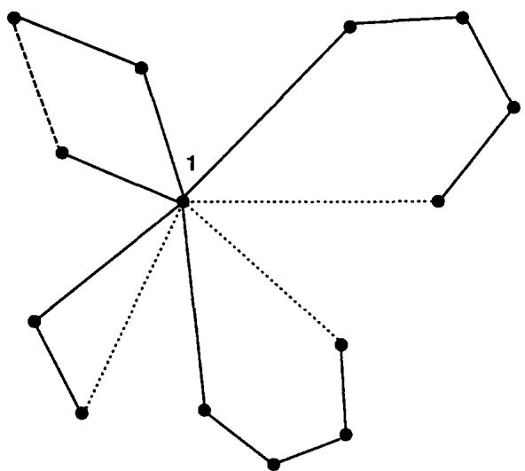

# The Vehicle Routing Problem: An overview of exact and approximate algorithms

Gilbert Laporte   
Centre de Recherche sur les Transports, Université de Montréal, C.P. 6128 Station A, Montréal,   
Canada H3C 3J7

Received May 1991

Absrc: In his pape, so hemain o resuls elative  he Vehice Routg rbl a surveThe pape  organize as follows: definition; exact algorithms; heurisic algoris; (4) conclusion.

Keywords: Vehicle Routing Problem; survey

The Vehicle Routing Problem (VRP) can be described as the problem of designing optimal delivery or collection routes from one or several depots to a number of geographically scattered cities or customers, subject to side constraints. The VRP plays a central role in the fields of physical distribution and logistics. There exists a wide variety of VRPs and a broad literature on this class of problems (see, for example, the surveys of Bodin et al., 1983, Christofides, 1985a, Laporte and Nobert, 1987, Laporte, 1990, as well as the recent classification scheme proposed by Desrochers, Lenstra and Savelsbergh, 1990). The purpose of this paper is to survey the main exact and approximate algorithms developed for the VRP, at a level appropriate for a first graduate course in combinatorial optimization.

# . Definition

Let $G = \left( V , A \right)$ be a graph where $V = \{ 1 , \ldots , n \}$ is a set of vertices representing cities with the depot located at vertex 1, and $\pmb { A }$ is the set of arcs. With every arc $( i , j ) \ i \neq j$ is associated a non-negative distance matrix $C = ( c _ { i j } )$ In some contexts, $c _ { i j }$ can be interpreted as a travel cost or as a travel time. When $C$ is symmetrical, it is often convenient to replace $\pmb { A }$ by a set $E$ of undirected edges. In addition, assume there are $^ { m }$ available vehicles based at the depot, where $m _ { \mathrm { L } } \leq m \leq m _ { \mathrm { U } }$ When $m _ { \mathrm { L } } = m _ { \mathrm { U } }$ , $_ m$ is said to be fixed. When $m _ { \mathrm { L } } = 1$ and $m _ { \mathrm { U } } = n - 1$ , $^ { m }$ is said to be free. When $_ { m }$ is not fixed, it often makes sense to associate a fixed cost $f$ on the use of a vehicle. For the sake of simplicity, we will ignore these costs and unless otherwise specified, we assume that ll vehicles are identical and have the same capacity $D$ . The VRP consists of designing a set of least-cost vehicle routes in such a way that

(i) each city in $V \setminus \{ 1 \}$ is visited exactly once by exactly one vehicle;   
(ii) all vehicle routes start and end at the depot;   
(iii) some side constraints are satisfied.

The most common side conditions include:

(i capacity restrictions: a non-negative weight (or demand) $d _ { i }$ is attached to each city $i > 1$ and the sum of weights of any vehicle route may not exceed the vehicle capacity. Capacity-constrained VRPs will be referred to as CVRPs;

(ii) the number of cities on any route is bounded above by $q$ (this is a special case of (i) with $d _ { i } = 1$   
for all $i > 1$ and $D = q$ ); (ii) total time restrictions: the length of any route may not exceed a prescribed bound $L$ ; this length is   
made up of intercity travel times $c _ { i j }$ and of stopping times $\delta _ { i }$ at each city $i$ on the route. Time- or   
distance-constrained VRPs will be referred to as DVRPs; time windows: city $i$ must be visited within the time interval $[ a _ { i } , b _ { i } ]$ and waiting is allowed at city   
i; precedence relations between pairs of cities: city $i$ may have to be visited before city $j$ .

This list is by no means exhaustive. A number of other interesting variants are described in the Golden and Assad (1988) book, for example. Here, we will mainly concentrate on CVRPs and on DVRPs.

# 2. Exact algorithms

Following the Laporte and Nobert (1987) survey, exact algorithms for the VRP can be classified into three broad categories: (i) direct tree search methods; (ii) dynamic programming, and (ii) integer linear programming. As the number of proposed algorithms is very large, we will provide six representative examples only: two direct tree search methods based on different relaxations, a dynamic programming formulation, and three integer linear programming algorithms. For some of the descriptions, we basically follow Laporte and Nobert (1987).

# 2.1. The assignment lower bound and a related branch-and-bound algorithm

The following algorithm due to Laporte, Mercure and Nobert (1986) exploits the relationship between the VRP and one of its relaxations, the $m$ TSP. Given the graph $G = ( V , A )$ with a depot at vertex 1 and $^ { m }$ vehicles based at the depot, the $^ { m }$ -TSP consists of establishing $_ m$ least-cost vehicle routes starting and ending at the depot, and in such a way that every remaining vertex is visited exactly once. As shown by Lenstra and Rinnooy Kan (1975), given an upper bound $m _ { \mathrm { U } }$ on $_ { m }$ , the $^ { m }$ -TSP can be transformed into a 1-TSP as follows: ,

Increase the number of vertices by introducing $m _ { \mathrm { U } } - 1$ artificial depots; let $n ^ { \prime } = n + m _ { \mathrm { U } } - 1$ , $V ^ { \prime } =$ $\left\{ 1 , \ldots , n ^ { \prime } \right\}$ and $A ^ { \prime } = A \cup \{ ( i , j ) \colon i , j \in V ^ { \prime } , i$ $i \neq j$ $i$ or $j \in V ^ { \prime } \backslash V \}$ .

(ii) The extended distance matrix $C ^ { \prime } = ( c _ { i j } ^ { \prime } )$ associated with $A ^ { \prime }$ is defined by

$$
c _ { i j } ^ { \prime } = \left\{ \begin{array} { l l } { c _ { i j } } & { ( i , j \in V ) , } \\ { c _ { i 1 } } & { ( i \in V \setminus \{ 1 \} , j \in V ^ { \prime } \setminus V ) , } \\ { c _ { 1 j } } & { ( i \in V ^ { \prime } \setminus V , j \in V \setminus \{ 1 \} ) , } \\ { \gamma } & { ( i , j \in ( V ^ { \prime } \setminus V ) \cup \{ 1 \} ) , } \end{array} \right.
$$

where the value of $\pmb { \gamma }$ depends on the variant of the problem considered:

$\gamma = \infty$ yields the minimum distance for $m _ { \mathrm { U } }$ vehicles; $\gamma = 0$ yields the minimum distance for at most $m _ { \mathrm { U } }$ vehicles; $\gamma = - \infty$ yields the minimum distance for the minimum number of vehi

The VRP (CVRP, DVRP or both) can then be formulated as follows. Let $x _ { i j } \ ( i \neq j )$ be a binary variable equal to 1 if and only f ac $( i , j )$ of $A ^ { \prime }$ appears in the optimal solution. I $d _ { i } + d _ { j } \geq D$ , $i$ and $j$

cannot belong to the same route and $\boldsymbol { x } _ { i j }$ need not be defined.

$$
\begin{array} { l } { { \displaystyle \sum _ { i \neq j } \sum _ { j } c _ { i j } ^ { \prime } x _ { i j } } } \\ { { \displaystyle \sum _ { j = 1 } ^ { n ^ { \prime } } x _ { i j } = 1 \quad ( i = 1 , \dots , n ^ { \prime } ) } } \\ { { \displaystyle \sum _ { i = 1 } ^ { n ^ { \prime } } x _ { i j } = 1 \quad ( j = 1 , \dots , n ^ { \prime } ) , } } \\ { { \displaystyle \sum _ { i = 1 } ^ { n } x _ { i j } \leq | S | - v ( S ) \quad ( S \subset V ^ { \prime } \setminus \{ 1 \} ; | S | \geq 2 ) , } } \\ { { \displaystyle \sum _ { i , j \in S } s _ { i j } \leq | S | - v ( S ) \quad ( S \subset V ^ { \prime } \setminus \{ 1 \} ; | S | \geq 2 ) , } } \\ { { \displaystyle x _ { i j } \in \{ 0 , 1 \} \quad ( i , j = 1 , \dots , n ^ { \prime } ; i \neq j ) . } } \end{array}
$$

In this formulation, (2), (3), (4) and (6) define a modified assignment problem (i.e. assignments on the main diagonal are prohibited). Constraints (5) are subtour elimination constraints: $v ( S )$ is an appropriate lower bound on the number of vehicles required to visit all vertices of $s$ in the optimal solution. These constraints are obtained by observing that for any $S \subset V ^ { \prime } \setminus \{ 1 \} , | S | \geq 2 , \overline { { S } } = V ^ { \prime } \setminus V$ ,we must have:

$$
\sum _ { i \in S } \sum _ { j \in { \widetilde { S } } } x _ { i j } \geq v ( S ) ,
$$

and that the following identity holds:

$$
\left| S \right| = \sum _ { i , j \in S } x _ { i j } + \sum _ { i \in S } \sum _ { j \in \bar { S } } x _ { i j } .
$$

The value of $v ( S )$ depends on the type of VRP under consideration. In the CVRP, it is valid to take

$$
v ( S ) = \left\lceil { \frac { \sum _ { i \in S } d _ { i } } { D } } \right\rceil .
$$

In the DVRP, $v ( S )$ is not as easy to determine a priori. Usually, however, a lower bound on its value can easiy bdetermine durigthecoursea ranc-anbound process.Filng this i salway va to take $v ( S ) = 1$ . It is worth observing that constraints (5) play a dual role: they ensure that all vehicle routes satisfy the capacity- or maximum-length restrictions; they also guarantee that the solution contains no subtour disconnected from the depot, since every subset $s$ of $V \setminus \{ 1 \}$ will be linked to its complement.

A natural algorithm now presents itself. Like the assignment-based algorithm for the TSP (see Laporte, 1992), the problem is solved through a branch-and-bound process in which subproblems are assignment problems. The only difference lies in the definition of illegal subtours. These now include

subtours over a set $s$ of vertices of $V \setminus \{ 1 \}$ (ivehicle routes violating capacity- or maximum-length restrictions: these consist of paths of vertices $( i _ { 1 } , i _ { 2 } , \ldots , i _ { r } )$ where $i _ { 1 } , i _ { r } \in \{ 1 , n + 1 , . . . , n + m _ { \mathrm { U } } - 1 \}$ b $i _ { 2 } , \ldots , i _ { r - 1 } \in V \backslash \{ 1 \}$ and $\Sigma _ { t = 2 } ^ { r - 1 } d _ { i _ { t } } > D$ or $\begin{array} { r } { \sum _ { t = 1 } ^ { r - 1 } c _ { i _ { t } , i _ { t + I } } > L } \end{array}$ .

These can be eliminated by partitioning the current infeasible subproblem, as in Step 3 of the TSP algorithm, taking $v ( S ) = 1$ More sophisticated partitioning schemes for $v ( S ) \geq 1$ are detailed in Laporte, Mercure and Nobert (1986).

In order to interpret the output as a CVRP solution, we apply the following rules. Consider an arc $( i , j )$ belonging to the solution:

i) if $i \in V \setminus \{ 1 \}$ and $j \in V ^ { \prime } \setminus V$ , replace $( i , j )$ by $( i , 1 )$ ; ii) if $i \in V ^ { \prime } \backslash V$ and $j \in V \setminus \{ 1 \}$ , replace $( i , j )$ by $( 1 , j ) _ { ; }$ iii) if $i$ , $j \in V ^ { \prime } \setminus V$ ,delete $( i , j )$ .

Using this methodology, Laporte, Mercure and Nobert (1986) have solved to optimality randomly generated asymmetrical CVRPs involving up to 260 vertices. Extensions to problems involving several types of side constraints are reported in Laporte, Mercure and Nobert (1991).

# 2.2. The $k$ -degree center tree and a related algorithm

Christofides, Mingozzi and Toth (1981a) have developed an algorithm for symmetrical VRPs defined on a graph $G = ( V , E )$ . It is based on the following $\cdot _ { k }$ -degree center tree relaxation' of the $^ { m }$ TSP where $m$ is fixed. In any feasible solution, the set $E$ of edges can be partitioned into four subsets:

$E _ { 0 }$ :edges not belonging to the solution;

$E _ { 1 }$ : edges forming a $k$ -degree center tree, i.e. a spanning tree over $G$ where the degree of vertex 1 is equal to $k$ (with $k = 2 m - y )$ ;

$E _ { 2 }$ : $y$ edges incident to vertex $1 \ ( 0 \leq y \leq m )$

$E _ { 3 }$ : $m - y$ edges not incident to vertex 1.

In this representation, it is implicitly assumed that vehicle routes including vertex 1 and only one other vertex $j$ are represented by 2 edges between 1 and $j$ The partition of $E$ into four subsets is illustrated in Figure 1 for a 14-vertex problem, with $m = 4$ In this figure, $y = 3$ and $k = 2 m - y = 5$

Now, denote by $l$ any edge of $E$ and by $c _ { l }$ , its cost (length). Further define $E ^ { i }$ : the set of all edges incident to vertex $i$ ; $( s , { \bar { s } } )$ : the set of all edges with one vertex in $s$ and one vertex in $\overline { { S } } _ { \mathrm { i } }$ $\xi _ { l } ^ { \prime } ( t = 1 , 2 , 3 ; l \in E )$ : binary variables equal to 1 if and only if in the optimal solution, edge $\iota$ belongs to $E _ { t }$ .

The problem is then

$$
\sum _ { l \in E } c _ { l } \big ( \xi _ { l } ^ { 1 } + \xi _ { l } ^ { 2 } + \xi _ { l } ^ { 3 } \big )
$$

$$
\begin{array} { r l } & { \underset { \{ x \in S , y \} } { \sum } \xi ^ { \perp } \equiv 1 \ ( S \subset V ; \ | \ | \ \geq 1 \ ) , } \\ & { \underset { \{ x \in S , y \} } { \sum } \xi ^ { \perp } = 2 m - p , } \\ & { \underset { \{ x \in S , y \} } { \sum } \xi ^ { \perp } = n - 1 , } \\ & { \underset { \{ x \in S , y \} } { \sum } \xi ^ { \perp } = n - 1 , } \\ & { \underset { \{ x \in S , y \} } { \sum } \xi ^ { \perp } = p , } \\ & { \underset { \{ x \in S , y \} } { \sum } \xi ^ { \perp } = m - y , } \\ & { \underset { \{ x \in S , y \} } { \sum } \xi ^ { \perp } + \xi ^ { \perp } + \xi ^ { \perp } \leq 2 \ ( i - 2 , . . . . , n ) , } \\ & { \underset { \{ x \in S , y \} } { \sum } \xi ^ { \perp } = \ \{ 0 , 1 \ \} \ ( i \in E ) , } \\ & { \underset { \{ x \in S , y \} } { \sum } \xi ^ { \perp } = \{ 0 , 1 \ } \ ( i \in E ) ,  \\ & { \underset { \{ x \in \{ 0 , 1 \} \} } { \sum } \ ( i \in E ) , } \\ & { \underset { \{ x \in \{ 0 , 1 \} \} } { \sum } \ ( i \in E ) , } \\ & { \underset { \{ x \in \{ 0 , 1 \} \} } { \sum } \ ( i \in E ) , } \end{array}
$$

In this formulation, constraints (8)-(10) define a $k$ -degree center tree; constraints (11) stipulate that there must be $y$ additional edges (with respect to $k$ ) incident to the depot, and constraints (12) state there must be an additional $m - y$ edges not incident to the depot. Constraints (13) specify that the deree of every vertex, except thedepot', i equal to. The ojective is the sum o all ege costs n the solution.

  
Fgure  artiion  l e   asl olutionintosubses $\pmb { k }$ -degree center tree $( k = 5 ) , \cdots y$ edges adjacent to the depot $( y = 3 ) , \ldots . \ldots . m - y = 1$ edges not adjacent to the depot

Constraints (1) can be relaxed in a Lagrangean fashion. Associate with each of these a multipler $\lambda _ { i }$ and rewrite the objective as

$$
\sum _ { l \in E } c _ { l } \big ( \xi _ { l } ^ { 1 } + \xi _ { l } ^ { 2 } + \xi _ { l } ^ { 3 } \big ) + \sum _ { l \in E } \big ( \lambda _ { \alpha ( l ) } + \lambda _ { \beta ( l ) } \big ) \big ( \xi _ { l } ^ { 1 } + \xi _ { l } ^ { 2 } + \xi _ { l } ^ { 3 } \big ) - 2 \sum _ { i = 2 } ^ { n } \lambda _ { i } ,
$$

where $\lambda _ { 1 } = 0$ and $\alpha ( l ) \ \beta ( l )$ are the two terminal vertices of edge $l .$ For a fixed $y$ ,(VRP2) can be rewritten as:

$$
\sum _ { t = 1 } ^ { 3 } \sum _ { l \in E } \big ( c _ { l } + \lambda _ { \alpha ( l ) } + \lambda _ { \beta ( l ) } \big ) \xi _ { l } ^ { t } - 2 \sum _ { i = 2 } ^ { n } \lambda _ { i }
$$

The optimal value of (17) is not less than $\Sigma _ { t = 1 } ^ { 3 } z ^ { t } ( \lambda , y ) - 2 \Sigma _ { i = 2 } ^ { n } \lambda _ { i }$ , where

$$
z ^ { 1 } \big ( \lambda , y \big ) = \operatorname* { m i n } \sum _ { l \in E } \big ( c _ { l } + \lambda _ { \alpha ( l ) } + \lambda _ { \beta ( l ) } \big ) \xi _ { l } ^ { 1 }
$$

$$
z ^ { 2 } \big ( \lambda , y \big ) = \operatorname* { m i n } \sum _ { l \in E } \big ( c _ { l } + \lambda _ { \alpha ( l ) } + \lambda _ { \beta ( l ) } \big ) \xi _ { l } ^ { 2 }
$$

$$
z ^ { 3 } \bigl ( \lambda ; y \bigr ) = { \bf \mathrm { m i n } } \sum _ { l \in E } \big ( c _ { l } + \lambda _ { \alpha ( l ) } + \lambda _ { \beta ( l ) } \big ) \xi _ { l } ^ { 3 }
$$

For given $\lambda$ and $y$ , the problems of determining $z ^ { t } ( \lambda , y )$ for $t = 1 , 2 , 3$ are easy and can be solved in polynomial time.

A lower bound on the optimal VRP solution is then given by

$$
\operatorname* { m a x } _ { m _ { 1 } \leq y \leq m } \operatorname* { m a x } _ { \lambda } \left\{ \sum _ { t = 1 } ^ { 3 } z ^ { t } \big ( \lambda , y \big ) - 2 \sum _ { i = 2 } ^ { n } \lambda _ { i } \right\} ,
$$

where $m _ { 1 }$ is a lower bound on the number of routes made up of the depot and only one vertex in $V \setminus \{ 1 \}$ . Taking into account capacity- and maximum-length constraints, $m _ { 1 }$ can be determined so as to satisfy the following conditions:

i suppose the vertices are ordered in decreasing order of their weight $d _ { i }$ Then $m _ { 1 }$ is the largest value satisfying

$$
( m - m _ { 1 } ) D \geq \sum _ { i = m _ { 1 } + 1 } ^ { n } d _ { i } ;
$$

(ii) similarly, every vertex contributes an amount of at least $u _ { i } = \delta _ { i } + ( c _ { i i _ { 1 } } + c _ { i i _ { 2 } } )$ to the length of a route, where $\delta _ { i }$ is the service time of vertex $_ i$ and $i _ { 1 } , i _ { 2 }$ are the two vertices nearest to $_ i$ Then, if the vertices are ordered in decreasing order of the $u _ { i } ^ { \prime \prime } \mathbf { s } , m _ { 1 }$ must satisfy

$$
( m - m _ { 1 } ) L \geq \sum _ { i = m _ { 1 } + 1 } ^ { n } u _ { i } .
$$

Christofides, Mingozzi and Toth (1981a) have embedded the lower bound defined by (18) in a branch-and-bound scheme and have successfully solved VRPs ranging in size from 10 to 25 vertices.

# 2.3. Dynamic programming

Dynamic programming was first proposed for VRPs by Eilon, Watson-Gandy and Christofides (1971). Consider a VRP with a fixed number $_ { m }$ of vehicles. Let $c ( \pmb { S } )$ denote the cost (length) of a vehicle route through vertex 1 and all vertices of a subset $s$ of $V \setminus \{ 1 \}$ . Let $f _ { k } ( U )$ be the minimum cost achievable using $k$ vehicles and delivering to a subset $U$ of $V \setminus \{ 1 \}$ . Then the minimum cost can be determined through the following recursion:

$$
f _ { k } ( U ) = \left\{ \begin{array} { l l } { c ( U ) } & { ( k = 1 ) , } \\ { \displaystyle \operatorname* { m i n } _ { U ^ { * } \subset U \subseteq V \setminus \{ 1 \} } \big [ f _ { k - 1 } ( U \setminus U ^ { * } ) + c ( U ^ { * } ) \big ] } & { ( k > 1 ) . } \end{array} \right.
$$

The solution cost is equal to $f _ { m } ( V \setminus \{ 1 \} )$ and the optimal solution corresponds to the optimizing subsets $U ^ { * }$ in (19).

It is apparent that if $f _ { k } ( U )$ has to be computed for all values of $k$ and for all subsets $U$ of $V \setminus \{ 1 \}$ , the number of computations required is likely to be excessive in most problems. Efficient use of dynamic programming requires a substantial reduction of the number of states by means of a relaxation procedure, or by using feasibility or dominance criteria. For example, in the CVRP the sets $U$ and $U ^ { * }$ must satisfy

$$
\sum _ { i \in V \setminus \{ 1 \} } d _ { i } - ( m - k ) D \leq \sum _ { i \in U } d _ { i } \leq k D \quad ( k = 1 , \dots , m )
$$

and

$$
\sum _ { i \in U } d _ { i } - ( k - 1 ) D \leq \sum _ { i \in U ^ { * } } d _ { i } \leq D \quad ( k = 1 , \ldots , m ) .
$$

State-space relaxation provides another efficient way of reducing the number of states. The method was introduced by Christofides, Mingozzi and Toth (1981b). It provides a longer bound on the cost of the optimal solution. The optimum can then be reached by embedding the bounding procedure in an enumerative scheme. The method can be summarized as follows. Consider the general DP recursion

$$
f _ { 0 , i } ( 0 , j ) = \operatorname* { m i n } _ { k \in \Delta ^ { - 1 } ( j ) } \left[ f _ { 0 , i - 1 } ( 0 , k ) + c _ { i } ( k , j ) \right]
$$

where

$f _ { 0 , i } ( 0 , j )$ is the least cost of going from state 0 at stage 0 to state $j$ at stage $i$

$\pmb { \Delta } ^ { - 1 } ( j )$ is the set of all possible states from which state $j$ can be reached directly, and $c _ { i } ( k , j )$ is the cost of going from state $k$ at stage $i - 1$ to state $j$ at stage $_ i$

Let $g ( \cdot )$ be a mapping from the state space $s$ associated with (22) to a state space $T$ of smaller cardinality, and let $F ^ { - 1 } ( g ( j ) )$ be a set satisfying

$$
k \in \Delta ^ { - 1 } ( j ) \Rightarrow g ( k ) \in F ^ { - 1 } ( g ( j ) ) .
$$

Recursion (22) then becomes

$$
f _ { 0 , i } \bigl ( g \bigl ( 0 \bigr ) , g \bigl ( j \bigr ) \bigr ) = \operatorname* { m i n } _ { t \in F ^ { - 1 } ( g ( j ) ) } \bigl [ f _ { 0 , i - 1 } \bigl ( g \bigl ( 0 \bigr ) , t \bigr ) + \bar { c } _ { i } \bigl ( t , g \bigl ( j \bigr ) \bigr ) \bigr ]
$$

where

$$
\begin{array} { r } { \overline { { c } } _ { i } \big ( t , g \big ( j \big ) \big ) = \operatorname* { m i n } \big [ c _ { i } \big ( k , l \big ) : g \big ( k \big ) = t , g \big ( j \big ) = g \big ( l \big ) \big ] . } \end{array}
$$

It results that

$$
f _ { 0 , i } ( g ( 0 ) , g ( i ) ) \leq f _ { 0 , i } ( 0 , i ) .
$$

This relaxation is useful only if

(i) $F ^ { - 1 } ( \cdot )$ can easily be determined: this will be so if $g ( \cdot )$ is separable, so that given $g ( U )$ and $r , g ( U \setminus \{ r \} )$ can be computed; (ii) $g ( \cdot )$ is such that the optimization of (25) is over a small domain or that a good lower bound on $\bar { c } _ { i } ( t , g ( j ) )$ can be computed.

Christofides, Mingozzi and Toth (1981b) have used the following relaxation for CVRPs. Let $f _ { k } ( U , r )$ be the least cost of supplying a set $U$ of vertices, using $k$ vehicles, where the last vertices of the $k$ corresponding routes belong to $\left\{ 2 , \ldots , r \right\} \left( k \leq r \leq n \right)$ Let $c ( U , r )$ be the cost of the TSP solution through $U \cup [ 1 \}$ , where the last vertex before the depot is $r$ The recursion is then

$$
f _ { k } ( U , r ) = \left\{ \begin{array} { l l } { \displaystyle \operatorname* { m i n } \left[ f _ { k } ( U , r - 1 ) , \operatorname* { m i n } _ { u ^ { * } \in U } \left\{ f _ { k - 1 } ( U \setminus U ^ { * } , r - 1 ) + c ( U ^ { * } , r ) \right\} \right] } & { \mathrm { ( } k , r > 1 } \\ { c ( U , r ) } & { \mathrm { ( } k = 1 ) , } \end{array} \right.
$$

subject to (20). For this problem, the mapping function is given by

$$
g ( U ) = \sum _ { i \in U } d _ { i } .
$$

Recursion (24) then becomes

$$
f _ { k } \big ( g ( U ) , r \big ) = \operatorname* { m i n } \biggl [ f _ { k } \big ( g ( U ) , r - 1 \big ) , \operatorname* { m i n } _ { p } \big \{ f _ { k - 1 } \big ( g ( U ) - p , r - 1 \big ) + \bar { c } \big ( p , r \big ) \big \} \biggr ] ,
$$

Using this and other relaxations, lower bounds on optimal VRP solutions were obtained for 10 problems containing 10 to 25 vertices. The ratio 'lower bound/optimum' varied between $9 3 . 1 \%$ and $100 \%$ .More recently, Christofides (1985b) reported that CVRPs with up to 50 vertices could be solved systematically with this approach.

# 2.4. Set partitioning and column generation

Balinski and Quandt (1964) were among the first to propose a set partitioning formulation for VRPs. Consider $\pmb { J }$ , the set of all feasible routes $j$ and $a _ { i j }$ be a binary coefficient equal to 1 if and only if vertex $i > 1$ appears on route $j .$ Let $c _ { j } ^ { * }$ be the optimal cost of route $j$ and $x _ { j }$ , a binary variable equal to 1 if and only if route $j$ is used in the optimal solution.

The problem can then be formulated as follows:

$$
\begin{array} { r l } { \ge } & { { } ~ \displaystyle \sum _ { j \in J } c _ { j } ^ { * } x _ { j } } \\ { \ge } & { { } ~ \displaystyle \sum _ { j \in J } a _ { i j } x _ { j } = 1 \quad \big ( i \in V \setminus \{ 1 \} \big ) , } \\ { } & { { } ~ \displaystyle x _ { j } \in \{ 0 , 1 \} \big ( j \in J \big ) . } \end{array}
$$

There are two main difficulties associated with this formulation:

(i the large number of binary variables $x _ { j }$ which can run into the millions in most real-life cases. Only in extremely constrained problems (i.e. in problems with very few feasible solutions) will the number of variables be small enough to enable the problem to be solved directly;

the difficulty of computing the $c _ { j } ^ { * }$ values. For example, in the CVRP, every route $j$ corresponds to a set of vertices $S _ { j }$ satisfying

$$
\sum _ { i \in S _ { j } } d _ { j } \leq D .
$$

The value of $c _ { j } ^ { * }$ is then obtained by solving a TSP on $S _ { j }$

However, if the number of variables is relatively smal and the objective is to minimize the number of vehicles, i.e. $c _ { j } ^ { * } = 1$ for all $j \in J$ , the linear relaxation of (VRP3) often provides an integer solution (Toregas and ReVelle, 1972). If the solution $( x ^ { * } )$ is non-integer and gives a fractional objective value, then the cutting plane

$$
\sum _ { j \in J } x _ { j } > \left\lceil \sum _ { j \in J } x _ { j } ^ { * } \right\rceil
$$

can be introduced. Very few cuts are generally required to reach integrality (Orloff, 1976).

A natural way around the difficulties just mentioned is to use a column generation algorithm. This technique has been applied to the field of vehicle routing by Rao and Zionts (1968), Foster and Ryan (1976), Orloff (1976), Desrosiers, Soumis and Desrochers (1984), Agarwal, Mathur and Salkin (1989), and Desrochers, Desrosiers and Solomon (1990). A recent introduction to the field can be found in Haouari, Dejax and Desrochers (1990).

In column generation, a reduced problem containing only a restricted subset of all possible columns (variables) is repeatedly solved. The linear relaxation of the reduced problem provides an optimal dual variable vector $\pmb { \lambda }$ . Checking for optimality implies computing the column $\pmb { s }$ of least marginal cost, i.e., determining the column $\pmb { \mathscr { s } }$ satisfying

$$
c _ { s } ^ { * } - \lambda y _ { s } = \operatorname* { m i n } _ { j \in J } \big \{ c _ { j } ^ { * } - \lambda y _ { j } \big \}
$$

where $y _ { j }$ is the column-vector of constraint coefficients of variable $x _ { j }$ If the marginal cost of $x _ { s }$ is non-negative, the current solution is optimal and the procedure terminates. Otherwise, $\pmb { x } _ { s }$ enters the basis and the problem is re-optimized. Since VRP solutions must be integer, this procedure must be used in conjunction with a branch-and-bound algorithm. Solving (32) is done using an algorithm for a shortest-path problem constrained in the same manner as the original VRP. This procedure has been applied with success by Desrosiers, Soumis and Desrochers (1984) and more recently, by Desrochers, Desrosiers and Solomon (1991) to the solution of VRPs with time windows containing up to 100 vertices. As expected, the method performs better on tightly constrained problems, as the number of feasible columns is then smaller.

# 2.5. A three-index vehicle flow formulation

Fisher and Jaikumar (1978, 1981) have developed a three-index vehicle flow formulation for VRPs with capacity restrictions, time windows and no stopping times $\delta _ { i }$ . Such formulations use variables to nt   e $( i , j )$ I v $x _ { i j k }$ indicate whether $( i , j )$ is traversed by vehicle $k$ or not. In two-index formulations, variables $x _ { i j }$ do not specify which vehicle is used on $( i , j )$ . Fisher and Jaikumar have also developed an algorithm based on this formulation. Although this algorithm seems to have been used only to provide a heuristic solution to the problem, it guarantees an optimal solution in a finite number of steps, if run to completion. The formulation does not require vehicles to be identical. Let $D _ { k }$ be the capacity of vehicle $k , \left\{ a _ { i } , b _ { i } \right\}$ the time window for vertex $i$ ,and $t _ { i j }$ , the travel time on arc $( i , j )$ Define binary variables $x _ { i j k } \ ( i \neq j )$ , equal to 1 if and only if in the optimal solution, arc $( i , j )$ is traversed by vehicle $k$ Also define binary variables $y _ { i k }$ , equal to 1 if and only if vertex $_ i$ is served by vehicle $k$ Finally, let $t _ { i }$ denote the arrival time at vertex $i$ and let $T$ be a very large number.

The formulation is then

$$
\begin{array} { r c l } { \displaystyle \sum _ { k = 1 } ^ { n } \sum _ { i \neq j } x _ { i j k } } & & & \\ { \displaystyle \sum _ { k = 1 } ^ { n } \boldsymbol { \mathrm { i } } \cdot \boldsymbol { \mathrm { i } } \cdot \boldsymbol { \mathrm { e } } } & { \boldsymbol { \mathrm { } } ( k = 1 , \dots , m ) , } \\ { \displaystyle \sum _ { i = 1 } ^ { n } \boldsymbol { \mathrm { i } } \cdot \boldsymbol { \mathrm { i } } \cdot \boldsymbol { \mathrm { s } } = D _ { k } } & { ( k = 1 , \dots , m ) , } \\ { \displaystyle \sum _ { k = 1 } ^ { m } y _ { i k } - \left\{ \begin{array} { l l } { m } & { ( i = 1 ) , } \\ { 1 } & { ( i = 2 , \dots , n ) , } \\ { \sum } & { \boldsymbol { \mathrm { } } ( j = 1 , \dots , n ; k = 1 , \dots , m ) , } \\ { \boldsymbol { \mathrm { } } \cdot \boldsymbol { \mathrm { i } } \cdot \boldsymbol { \mathrm { e } } } & { \boldsymbol { \mathrm { } } ( j = 1 , \dots , n ; k = 1 , \dots , m ) , } \end{array} \right. } \\ { \displaystyle \sum _ { i = 1 } ^ { n } x _ { i j k } - y _ { j k } } & { ( j = 1 , \dots , n ; k = 1 , \dots , m ) , } \\ { \displaystyle \sum _ { j = 1 } ^ { n } x _ { i j k } - y _ { j k } } & { ( j = 1 , \dots , n ; k = 1 , \dots , m ) , } \end{array}
$$

$$
\sum _ { i , j \in S } x _ { i j k } \leq | S | - 1 \quad ( S \subset V ; \ | \ S | \geq 2 ; \ k = 1 , \ldots , m ) ,
$$

$$
\begin{array} { l } { { t _ { j } \Bigg \{ \stackrel { \geq { t _ { i } } + t _ { i j } - \left( 1 - { x _ { i j k } } \right) T } { \leq t _ { i } + t _ { i j } + \left( 1 - { x _ { i j k } } \right) T } \quad ( i , j = 1 , \ldots , n ; k = 1 , \ldots , m ) , } } \\ { { a _ { i } \leq t _ { i } \leq b _ { i } \quad ( i = 2 , \ldots , n ) , } } \\ { { x _ { i j k } \in \{ 0 , 1 \} \quad ( i , j = 1 , \ldots , n ; k = 1 , \ldots , m ) , } } \\ { { y _ { i k } \in \{ 0 , 1 \} \quad ( i = 1 , \ldots , n ; k = 1 , \ldots , m ) . } } \end{array}
$$

Most constraints of this formulation are either self-explanatory or have been previously discussed. Note that if arc $( i , j )$ does not appear in the solution, $x _ { i j k }$ is equal to 0 for all $k$ and constraints (39) are ineffective then; otherwise, $x _ { i j k }$ is equal to 1 for some $k$ and then $t _ { j } = t _ { i } + t _ { i j }$

Essentially, two well known problems are contained in (VRP4):

(i)the generalized assignment problem (GAP) obtained by relaxing constraints (38), (39) and (41); (ii) the TSP with time windows (TSPTW): for given $y _ { i k }$ 's satisfying the GAP constraints and for a given $k$ , constraints (36)(40) are those of a TSPTW for vehicle $k$ .

Fisher and Jaikumar propose an algorithm based on Benders' decomposition (Benders, 1962). The procedure iterates between solving a GAP master problem that assigns vertices to vehicles, and solving a TSPTW to determine the best vehicle route for each vehicle. The method has the advantage of producing a feasible solution, even if not run to completion (its authors did not, in fact, run it to optimality). Also, since it repeatedly solves a GAP and a TSPTW, it can benefit directly from any improvement in algorithms for these two problems. Such improvements have been proposed recently by Martello and Toth (1990) and by Desrochers, Desrosiers and Solomon (1991). Fisher and Jaikumar (1981) report computational results for VRPs ranging from 50 to 199 vertices.

# 2.6. A two-index vehicle flow formulation

In symmetrical CVRPs and DVRPs, a more compact formulation can be obtained by dropping the index $k$ from the variables. Here $x _ { i j } \ ( i < j )$ indicates how many timed edge $( i , j )$ is traversed by a vehicle: if $i$ , $j \in V \setminus \{ 1 \}$ ,then $x _ { i j } \in \{ 0 , 1 \}$ if $i = 1$ and $j \in V \setminus \{ 1 \}$ , then $x _ { i j } \in \{ 0 , 1 , 2 \}$ . The case $x _ { i j } = 2$ corresponds to the single vertex trip $( 1 , j , 1 )$ . In addition,

(i) in CVRPs, $x _ { i j }$ is not defined if $d _ { i } + d _ { j } > D$ ;

i) in DVRPs, let $s _ { i }$ be the length of a shortest path from vertex 1 to vertex $_ i$ and $t _ { j }$ , the length of a shortest path from vertex $j$ to vertex 1. Then $\boldsymbol { x } _ { i j }$ is not defined whenever $s _ { i } + c _ { i j } + t _ { j } > L$ . The following formulation was proposed by Laporte, Nobert and Desrochers (1985).

subject to

$$
\begin{array} { r l } & { \frac { n } { \hbar } < _ { i j } x _ { i j } } \\ & { \xrightarrow [ { i , 1 ] { \boldsymbol { \varepsilon } } } } \\ & { \xrightarrow [ { \boldsymbol { \varepsilon } ] { \boldsymbol { \varepsilon } } } } \\ & { \xrightarrow [ { \boldsymbol { \varepsilon } ] { \boldsymbol { \varepsilon } } } } \\ & { \xrightarrow [ { \boldsymbol { \varepsilon } ] { \boldsymbol { \varepsilon } } } } \\ & { \xrightarrow [ { \boldsymbol { \varepsilon } ] { \boldsymbol { \varepsilon } } } } \\ & { \xrightarrow [ { \boldsymbol { \varepsilon } ] { \boldsymbol { \varepsilon } } } } \\ & { \xrightarrow [ { \boldsymbol { \varepsilon } ] { \boldsymbol { \varepsilon } } } } \\ & { \xrightarrow [ { \boldsymbol { \varepsilon } ] { \boldsymbol { \varepsilon } } } } \\ & { \quad \boldsymbol { x } _ { i j } \in \{ 0 , 1 \} } \\ & { \quad \boldsymbol { x } _ { i j } \in \{ 0 , 1 \} } \\ & { \quad \boldsymbol { x } _ { i j } \in \{ 0 , 1 \} } \\ & { \quad \boldsymbol { x } _ { i j } \in \{ 0 , 1 \} } \\ & { \quad \boldsymbol { x } _ { i j } \in \{ 0 , 1 \} } \end{array} \scriptscriptstyle ( i , j = 2 , \dots , n ) ,
$$

This formulation is a direct extension of the corresponding (SYM) formulation for the TSP (Laporte, 1991). It is worth noting that $_ { m }$ can be taken as a fixed constant or as a variable. In the latter case, it is often convenient to impose a lower or an upper bound on $^ m$ . In subtour elimination constraints (46), $v ( S )$ is a lower bound on the number of vehicles required to visit $s .$ As in the TSP, the validity of these constraints can easily be established from the identity

$$
\sum _ { k \in S } \left( \sum _ { i < k } x _ { i k } + \sum _ { j > k } x _ { k j } \right) = 2 \sum _ { \stackrel { i , j \in S } { i < j } } x _ { i j } + \sum _ { \stackrel { i \in S , j \in \bar { S } } { \operatorname { o r } i \in \bar { S } , j \in S } } x _ { i j }
$$

and the connectivity constraints

$$
\sum _ { \stackrel { i \in S , j \in \bar { S } } { \mathrm { o r } \ i \in \bar { S } , j \in S } } x _ { i j } \ge 2 v ( S ) \quad ( S \subset V \setminus \{ 1 \} ; 3 \le | \ S | \le n - 3 ) .
$$

These constraints force at least $2 v ( s )$ edges to exist between $s$ and its complement if $v ( S )$ vehicles are used for S. As in the asymmetrical case (VRP1), the value of $v ( S )$ can be taken as $\textstyle \lceil ( \sum _ { i \in s } d _ { i } ) / D \rceil$ for CVRPs, but is not so easily computed for DVRPs (see Laporte, Nobert and Desrochers, 1985).

This model can be solved by means of the following constraint relaxation algorithm:

Step 1. (Initialization) Define a first subproblem containing (43), the degree constraints (44) and (45), as well as the bounds on the variables. Insert this subproblem in a queue. Let $z ^ { * }$ be the value of the best known VRP solution (If no such solution is known, set $z ^ { * } : = \infty .$ )

Step 2. (Termination check) If the queue is empty, stop. Otherwise, extract from it the next subproblem to be solved.

Step 3. (Subproblem solution) Solve the subproblem (a linear program). Let $\bar { z }$ be its solution value.

Step 4. (Feasibility check) If $\bar { z } \geq z ^ { * }$ , fathom the current subproblem and go to Step 2. Otherwise, check whether any violated subtour elimination constraint can be identified. If so, generate one or several such constraints and go to Step 3. If no violation of constraints (46) can be detected, check whether the solution is integer. If it is, set $z ^ { * } : = \bar { z }$ and go to Step 2. If the solution is non-integer, create subproblems by branching on a fractional variables; insert these subproblems in the queue and go to Step 2.

This algorithm has been used by Laporte, Nobert and Desrochers (1985) on problems containing up to 60 vertices. Loosely constrained problems are easier than tight problems since they require fewer subtour elimination constraints. By contrast, the $k$ -degree centre-tree algorithm, dynamic programming and set partitioning work better on tightly constrained problems.

# 3. Heuristic algorithms

Heuristic algorithms for the VRP can often be derived from procedures derived from the TSP (see Laporte, 1992, Section 5.2). The nearest neighbour algorithm, insertion algorithms and tour improvement procedures can be applied to CVRPs and DVRPs almost without modifications. However, when applying these methods to VRPs care must be taken to ensure that only feasible vehicle routes are created. The Fisher and Jaikumar (1978) algorithm described in Section 2.5 may also be viewed as a heuristic since it provides at every step a feasible VRP solution and is often interrupted before optimality can be achieved.

In this section, we will describe four heuristics specifically developed for the VRP.

# 3.1. The Clarke and Wright algorithm (1964)

This classical algorithm was first proposed in 1964 by Clarke and Wright to solve CVRPs in which the number of vehicles is free. The method starts with vehicle routes containing the depot and one other vertex. At each step, two routes are merged according to the largest saving that can be generated.

Step 1. Compute the savings $s _ { i j } = c _ { i 1 } + c _ { 1 j } - c _ { i j }$ for $, j = 2 , \ldots , n$ , and $i \neq j$ Create $n - 1$ vehicle routes (1, i, 1) $( i = 2 , \ldots , n )$ .

Step 2. Order the savings in a non-increasing fashion.

Step 3. Consider two vehicle routes containing arcs $( i , 1 )$ and $( 1 , j )$ , respectively. If $s _ { i j } > 0$ , tentatively merge these routes by introducing arc $( i , j )$ and by deleting arcs $( i , 1 )$ and $( 1 , j )$ Implement the merge if the resulting route is feasible. Repeat this step until no further improvement is possible. Stop.

This procedure can be executed in $\mathsf { O } ( n ^ { 2 } \log { n } )$ time, but this complexity can be reduced by using appropriate data structures (Golden et al., 1977; Nelson et al., 1985; Paessens, 1988). Gaskell (1967), Yellow (1970) and Paessens (1988) have also proposed a number of variants of this method. The Clarke and Wright algorithm implicitly ignores vehicle fixed costs and fleet size. Vehicle costs $f$ can easily be taken into account by adding this constant to every $c _ { 1 j } \left( j = 2 , \ldots , n \right)$ Solutions with a fixed number of vehicles can be obtained by repeating Step 3 until the required number of routes has been reached, even if the savings become negative.

3.2. The sweep algorithm (Wren, 1971; Wren and Holliday, 1972; Gillett and Miller, 1974)

It seems that the origins of the sweep algorithm can be traced back to the work of Wren (1971) and Wren and Holliday (1972) for CVRPs with one or several depots, and vertices located in the Euclidean plane. The method is commonly attributed to Gillett and Miller (1974) who gave it its name. In order to ease the implementation of this method, it is preferable to represent vertices by their polar coordinates $( \pmb \theta _ { i } , \pmb \rho _ { i } )$ , where $\theta _ { i }$ is the angle and $\pmb { \rho } _ { i }$ is the ray length. Assign a value ${ \pmb \theta } _ { i } ^ { * } = 0$ to an arbitrary vertex $i ^ { * }$ and compute the remaining angles from $( 1 , i ^ { * } )$ . Rank the vertices in increasing order of their $\pmb \theta _ { i }$ A possible implementation of the method is the following.

Step 1. Choose an unused vehicle $k$ .

S.Starting from the unouted vertex having the smallest angle, assin verties to the vehic long as its capacity is not exceeded. If unrouted vertices remain, go to Step 1.

Step 3. Optimize each vehicle route separately by solving the corresponding TSP (exactly or approximately). Perform vertex exchanges between adjacent routes if this saves distance. Re-optimize and stop.

# 3.3. The Christofides-Mingozzi-Toth two-phase algorithm (1979)

This algorithm was basically designed for CVRPs and DVRPs. It produces two alternative solutions for given parameters $\lambda \geq 1$ and $\mu \geq 1$ set by the user. The better of the two solutions can then be selected. This procedure can be repeated for several values of $\lambda$ and $\pmb { \mu }$ .

Phase 1 Sequential route construction.

Step 1. Set a first route index $k$ equal to 1.

Step 2. Select any unrouted vertex $i _ { k }$ to initialize route $k$ .For every unrouted vertex i, compute $\delta _ { i } = c _ { 1 i } + \lambda c _ { i i _ { k } }$ .

Step 3. Let $\delta _ { i ^ { * } } = \mathbf { m i n } _ { i \in S _ { k } } \{ \delta _ { i } \}$ , where $S _ { k }$ is he  ofruted vertices hat can b easibly nserte n route $k$ Insert vertex $i ^ { * }$ into route $k$ Optimize route $k$ using an $r$ -opt algorithm (Lin, 1965). Repeat Step 3 until no more vertices can be assigned to route $k$ .

S 4. If all vertices have been nserte into routes, stop. Otherwise, set $k : = k + 1$ and go to Step 2.

Phase 2 Parallel route construction.

Step 5. Initialize $k$ routes $R _ { t } = \left( 1 , i _ { t } , 1 \right) \left( t = 1 , \ldots , k \right) ;$ where $k$ is the number of routes obtained at the end of Phase 1. Let $K = \{ R _ { 1 } , \ldots , R _ { k } \}$ .

Step 6. For each route $R _ { t } \in K$ and for each vertex $i$ not yet associated with a route, compute $\varepsilon _ { t i } = c _ { 1 i } + \mu c _ { 1 k _ { t } } - c _ { 1 i _ { t } }$ and $\varepsilon _ { t ^ { * } i } = \operatorname* { m i n } _ { t } \{ \varepsilon _ { t i } \}$ Associate vertex $i$ with route $R _ { t ^ { * } }$ and repeat Step 6 until all vertices have been associated with a route.

Step 7. Take any route $R _ { t } \in K$ and set $K : = K \setminus \{ R _ { t } \}$ For every vertex $i$ associated with route $R _ { t }$ compute $\begin{array} { r } { \pmb { \varepsilon } _ { t ^ { \prime } i } = \operatorname* { m i n } _ { R _ { t } \in K } \{ \pmb { \varepsilon } _ { t _ { i } } \} } \end{array}$ and $\tau _ { i } = \varepsilon _ { t ^ { \prime } i } - \varepsilon _ { t i }$ .

Step 8. Insert into route $R _ { t }$ vertex $i ^ { * }$ satisfying $\tau _ { i ^ { * } } = \mathrm { m a x } _ { i \in S _ { i } } \{ \tau _ { \mathrm { i } } \}$ , where $S _ { t }$ is the set of unrouted vertices associated with route $R _ { t }$ that can feasibly be inserted into route $R _ { t }$ Optimize route $R _ { t }$ using an r-opt algorithm. Repeat Step 8 until no more vertices can be inserted into route $R _ { t }$ .

Step 9. If $K \neq \emptyset$ , go to Step 6. Otherwise, if all vertices are routed, stop. If unrouted vertices remain, create new routes starting with Step 1 of Phase 1.

# 3.4. A tabu search algorithm (Gendreau, Hertz and Laporte, 1991)

This tabu search heuristic (see Laporte, 1992, Section 5.2.2) constructs a sequence of solutions, and then executes an improvement step. The successive vehicle routes produced by the algorithm may not be feasible; their degree of departure from feasibility is measured by means of a penalty in the objective function.

Step 1. Constitute back and forth routes between the depot and customers. Let $x$ be this solution and let its cost be $F ( x )$ .Set the tabu list $T : = \emptyset$ .

Step 2. Define $N ( x )$ , the neighbourhood of $\pmb { x }$ , as the set of all solutions that can be reached by inserting an arbitrary vertex in its $p$ -neighbourhood by using the GENI procedure (Gendreau, Hertz and Laporte, 1992). If $N ( x ) \setminus T = \emptyset$ , go to Step 3. Otherwise, identify the least cost solution $\pmb { y }$ in $N ( x ) \setminus T$ and set $x : = y$ . Update the best known solution.

Step 3. If the maximum number of iterations since the beginning of the process or since the last update has been reached, go to Step 4. Otherwise, update $T$ and go to Step 2.

Ste 4. Attempt to improve each of the vehicle routes by means of the US post-optimization procedure (Gendreau, Hertz and Laporte, 1992).

This algorithm was successfully applied to a number of classical VRPs described in the OR literature. Computational results indicate that the proposed heuristic may be one of the best ever developed for the VRP

# 4. Conclusion

The Vehicle Routing Problem lies at the heart of distribution management. There exist several versions of the problem, and a wide variety of exact and approximate algorithms have been proposed for

its solution. Exact algorithms can only solve relatively small problems, but a number of approximate algorithms have proved very satisfactory. However, several promising avenues of research deserve more attention, such as tabu search methods.

# Acknowledgements

This research was in part supported by the Canadian Natural Sciences and Engineering Research Council (grant OGP0039682), and by a Quebec-New-Brunswick interprovincial research grant. An extended version of this paper will appear in Discrete Optimization Models, H.A. Eiselt and C.L. Sandblom (eds.), De Gruyter, Berlin, 1993. Permission to publish this paper in EJOR is gratefully acknowledged. Finally, thanks are also due to Paolo Toth for his valuable comments on a preliminary version of this paper.

# Список литературы

a 19, 731750.   
Balisk   Quan R.96 On tee pra r  dlivey probleOpetierc, 0004   
u 238252.   
L . . art", Computers and Operations Research 10, 69211.   
. VLw J...G.aBTe Traveling Salesman Problem. A Guided Tour of Combinatorial Optimization, Wiley, Chichester, 431448.   
Cie eout  ala Programming, Cambridge, MA.   
Sandi (eds.), Combinatorial Optimization, Wiley, Chichester, 315338.   
shortest path relaxations", Mathematical Programming 20, 255282.   
problems", Networks 11, 145164.   
Research 12, 568581.   
time windows", Operations Research, forthcoming.   
problems", European Journal of Operational Research 46, 322332.   
  
-Gan .TaCiiMhalonan Analysis. Griffin, London.   
Department of Decision Sciences, University of Pennsylvania.   
F .  JaiarR.8  liz  rivi utNek 11   
Quarterly 27, 367384.   
Gaskell, T. (1967), "Bases for vehicle fleet scheduling", Operational Research Quarterly 18, 281295.   
Centre de recherche sur les transports, Montréal.   
problem", Operations Research forthcoming.   
  
Golden, B.L., and Assad, A.A. (1988), Vehicle Routing: Methods and Studies, North-Holland, Amsterdam.   
G B.L Maant T.L n Nguyen H.Q.9, "I hiu ois Nerks 111   
generation", Working Paper, LEIS, ÉEcole Centrale de Paris.   
Lapr9 éveopeet goriique écent perpetive rechercrbutque",L Scientifiques du Transport 21, 6184.   
Operational Research 59/2, 231248.   
Networks 16, 3346.   
pJlhe OpealR Soc .   
and C. Ribeiro (eds.), Surveys in Combinatorial Optimization, North-Holland, Amsterdam, 147184.   
Research 33, 10501073.   
J.y .  e  o Research Quarterly 26, 717734.   
L S.9 "Cuolu  he ravel al probl Be ys Teil Jural   
. Algorithms and Computer Implementations, Wiley, Chichester, 189220.   
n..H Computers & Operations Research 12, 273283.   
Orloff, C. (1976), "Route-constrained fleet scheduling", Transportation Science 10, 149-168.   
336344.   
R .R.   ic  h out-of-kilter subproblems", Operations Research 16, 5263. 133143.   
Wren, A. (1971), Computers in Transport Planning and Operation, Ian Allan, London.   
o Operations Research Quarterly 23, 333344.   
281283.