# Vehicle Routing Problems

Massimo Paolucci (paolucci@dist.unige.it) 010-353 2996

DIST – Università di Genova

# Vehicle Routing Problems

Vehicle Routing Problems (VRP) deal with the management of pickup and/or delivery activities

Critical problems, in particular in short distance transportation

Operational decisions: how the available fleet of vehicles (resources) can be efficiently used to satisfy a given service demand according to a set of operational requirements?

Vehicle Routing: define the routes and possibly the schedule for the available vehicles

# Vehicle Routing Problems

VRPs include:

Static problems: the service demand is fixed and a priori known Dynamic problems: all or part of the service demand may become known when the vehicles have already started their service (the vehicle routes may be defined or changed on-line)

Main assumptions for the problems considered in the following:

The problems are static   
The available vehicles are homogeneous (every vehicle provide the same kind of service)

# VRP – Characteristics and Components

Freight transportation provided by vehicles through a route network 7

Main components:

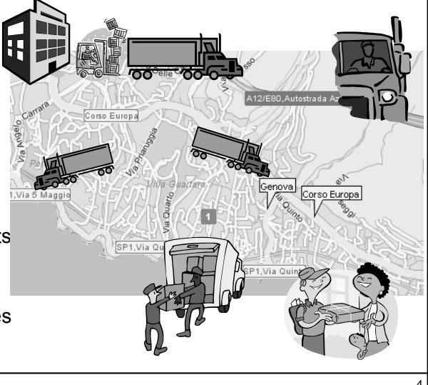

Operational constraints: global for single routes

Optimization objectives

VRP – Massimo Paolucci

# VRP – Characteristics and Components

The road network:

A graph $G { = } ( V , A )$ , $G { = } ( V , E )$ or $G = ( V , A \cup E )$

Directed, undirected or mixed Sparse vs Dense ${ \begin{array} { r l } { - \operatorname { S p a r s e } \Rightarrow | A | = \operatorname { O } ( | V | ) } \\ { - \operatorname { D e n s e } \Rightarrow | A | = \operatorname { O } ( | V | ^ { 2 } ) } \end{array} }$

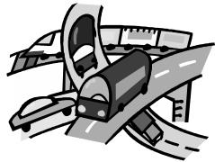

Undirected graph: large scale road network (countries, regions)

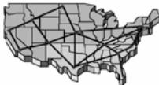

Directed graph: small scale road network (cities)

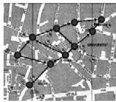

# VRP – Characteristics and Components

The road network: Vertices depots, customers, road intersections $\neg V = \{ 0 , 1 , . . . , n \}$

Arcs roads directed $( i , j ) { \in } A$ or undirected e∈ $E$ length, or travel cost $c _ { i j } ~ V ( i , j ) { \in } A$ travel time $t _ { i j } ~ V ( i , j ) { \in } A$

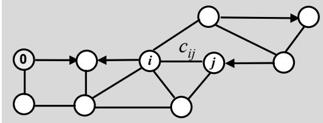

VRP – Massimo Paolucci

# VRP – Characteristics and Components

The road network: The triangle inequality

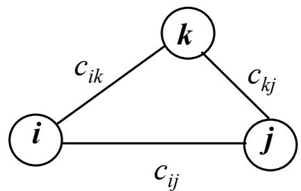

cij ≤ cik + ckj ∀i, j, k

# VRP – Characteristics and Components

Customers:

The entities requiring service   
Associated with vertices or arcs   
Service demand $\Rightarrow$ quantity of goods or materials to be delivered or picked up

Characteristics:

Service time windows   
Desired service start time (with penalties)   
Service time (load/unload)   
Vehicle compatibility   
Possibility of splitting service

# VRP – Characteristics and Components

# Vehicles:

Fleet size (fixed or variable)   
Company or outsourced fleet (fixed vehicle cost)   
Depot of reference (single, multiple, possibility of change)   
Vehicle capacity (maximum load allowed; weight, volume)   
Freight compatibility (perishable goods, dangerous materials)   
Compatibility with streets   
Load/unload procedure   
Costs (associated with mileage, time, fuel, journey, load)

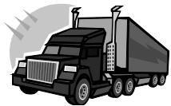

VRP – Massimo Paolucci

# VRP – Characteristics and Components

# Drivers

Employee workers or vehicle owners Union and contract conditions Working periods, shifts and breaks Availability and possibility of overtime

# Depots

Single or multiple Number and type of available vehicles Set of a priori assigned customers $\Rightarrow$ decomposable problems

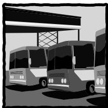

<table><tr><td></td></tr><tr><td>VRP - Characteristics and Components Operational constraints</td></tr><tr><td>Relevant to: - the nature of transport - the quality of service - the driver working contract</td></tr><tr><td> Two classes of constraints:</td></tr><tr><td></td></tr><tr><td>- Local constraints (single route)</td></tr><tr><td></td></tr><tr><td>- Global constraints (the whole set of routes)</td></tr><tr><td></td></tr><tr><td></td></tr><tr><td></td></tr><tr><td></td></tr></table>

# VRP – Characteristics and Components

# Operational constraints

Local constraints (single route)

vehicle capacity   
maximum allowed route distance/duration   
time constraints (arrival, departure, time windows)   
kind of service (pickup, delivery or both)   
precedence among customers: pickup and delivery linehaul/backhaul

# Global constraints (whole set of routes)

maximum number of vehicles   
maximum number of routes (for vehicle or depot)   
workload balancing   
working periods and shifts (minimum time between routes)

# VRP – Characteristics and Components

# Objectives

Minimize: the global transportation cost $^ +$ drivers and vehicles fixed costs Minimize: the number of vehicles and/or drivers Balancing of the routes   
Minimize: penalties for not/partially served customers   
$\Rightarrow$ Conflicting objectives

# VRP – Characteristics and Components

# Other characteristics

<table><tr><td>- Service split on several days - More routes for vehicles in a day</td></tr><tr><td>- More requests for a customer</td></tr><tr><td>- Demand partially or not a priori known (dynamic, on-line problems)</td></tr><tr><td>- Stochastic and/or time dependent arc costs/travel times</td></tr><tr><td></td></tr><tr><td></td></tr><tr><td></td></tr></table>

# The General Vehicle Routing Problem

Problem formulation

Given a generic graph $G { = } ( V , A \cup E )$ determine a minimum cost set of $M$ cycles (routes) that serve the required vertices $U { \subseteq } V$ and the required edges $R \subseteq A \cup E$ satisfying a set of operational constraints

Cost of a route $=$ the sum of the cost of the edges belonging to the route

Applications:

collection and delivery of goods   
waste collection   
street cleaning   
school-bus routing   
dial-a-ride systems   
transportation of people with handicap   
routing of salespeople

# The General Vehicle Routing Problem

Two main classes of problems

Node Routing Problem (NRP)

Customers/demand concentrated in sites associated with vertices $\gtrdot$ only required vertices U, $R { = } \emptyset$ $\gtrdot$ frequently denoted as VRP or Vehicle Scheduling Problem

Arc Routing Problem (ARP) Customers/demand evenly distributed along the edges $\gtrdot$ only required edges R, $U { = } \mathcal { O }$

The problems without operational constraints:

NRP reduces to Traveling Salesman Problem (TSP) ARP reduces to Rural Chinese Postman Problem (RCPP) ARP with $\mathsf { R } { = } \mathsf { A }$ reduces to Chinese Postman Problem (CPP)

<table><tr><td></td></tr><tr><td>The Node Routing Problems The Traveling Salesman Problem (TSP)</td></tr><tr><td>The Capacitated Vehicle Routing Problem (CVRP)</td></tr><tr><td>Characteristics Models Algorithms (heuristics)</td></tr><tr><td></td></tr></table>

VRP – Node routing problems

It concerns the distribution/collection of goods

Main components:

Vehicles   
Depots   
Drivers   
Road Network

# Solution:

A set of routes performed by a fleet of vehicles such that:

each route starts and ends at vehicles’ depots the customers’ requirements are satisfied the operational constraints are fulfilled the global transportation cost is minimized

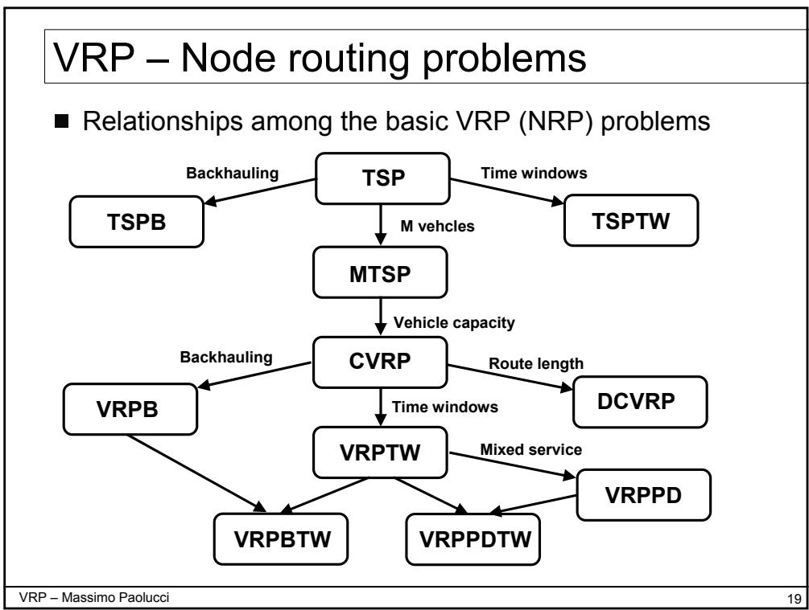

# VRP – Node routing problems

− Traveling Salesman Problem (TSP) Traveling Salesman Problem with Backhauls (TSPB) Traveling Salesman Problem with Time Windows (TSPTW) Multiple Traveling Salesman Problem (MTSP) Capacitated Vehicle Routing Problem (CVRP) Distance Constrained Vehicle Routing Problem (DCVRP) Vehicle Routing Problem with Backhauls (VRPB) Vehicle Routing Problem with Time Windows (VRPTW) Vehicle Routing Problem with Pickup and Delivery (VRPPD) RP – Massimo Paolucci 20

VRP – Node routing problems

$\scriptstyle - { G = } ( V , A )$ (strongly) connected $ G ^ { \prime } { = } ( V , A ^ { \prime } )$ complete   
. $\mathbf { \partial } = \{ 0 , 1 , . . . , n \}$ , $\vert { \cal { V } } \vert = n { + } 1$ , set of vertices   
0 the depot   
$- 1 , . . . , n$ customers’ locations (cities)   
$- \forall ( i , j ) \in A ^ { \prime } c _ { i j } { \geq } 0$ is a positive minimum cost (distance) of traveling from city $i$ to city $j$

# VRP – Node routing problems

Road graph if $G ^ { \prime } { = } ( V , E ^ { \prime } )$ undirected define $- \ \forall i \in V \ \delta ( i ) { = } \{ ( i , j ) \colon ( i , j ) { \in } E ^ { \prime } \}$ star of $i$ if $G ^ { \prime } { = } ( V , A )$ directed define $\textstyle - \forall i \in V \delta ^ { + } ( i ) { = } \{ ( i , j ) colon ( i , j ) { \in } A ^ { \prime } \}$ forward star of $i$ $- \ \forall i \in V \delta ( i ) { = } \{ ( j , i ) \colon ( j , i ) \in A ^ { \prime } \}$ backward star of $i$ $- \forall S \subseteq V$ δ(S)={(i, j): (i, j) A ' i S j S}∪{(i, j): (i, j) A ' i  S j S}

# VRP – Node routing problems

Triangle Inequality (TI)

Given $G { = } ( V , A ^ { \prime } )$ complete $\forall ( i , j , k ) \in V$ such that $\scriptstyle { i \neq j } \neq k$

$$
c _ { i j } \leq c _ { i k } + c _ { k j }
$$

TI is satisfied if $G ^ { , }$ is derived from $G$ by the computation of the shortest paths between each pair of vertices

Euclidean problem

if the vertices are associated with points in a plane and the cost is given by the euclidean distance between two points (the cost matrix is symmetric)

# VRP – Node routing problems

TSP (node routing problems without operational constraints)

A traveling salesman must visit his customers located in different cities and come back home

Single vehicle

Road graph $G { = } ( V , A ) \to G ^ { : } { = } ( V , A ^ { \prime } )$ complete $V =$ customers’ cities and TS home (depot); $\scriptstyle { | { V | = n } }$ $- \triangledown \forall ( i , j ) \in { \cal A } ^ { \prime } c _ { i j } 2 0$ the minimum cost (distance) of traveling from city $i$ to city $j$

Solution: a minimum cost route which starts and ends at depot and reaches each customer

# VRP – Node routing problems

TSP (node routing problems without operational constraints) (cont.)

Feasible solutions in $G$ ’: any hamiltonian circuit in $G ^ { \prime }$

Hamiltonian circuit: a closed path which visit each vertex exactly once.

Solution: the minimum cost hamiltonian circuit in $G ^ { \prime }$

Two cases:

G’ directed: asymmetric TSP (ATSP): $c _ { i j } \neq c _ { j i }$ G’ undirected: symmetric TSP (STSP): $c _ { i j } { = } c _ { j i }$

Complexity: Strongly NP-hard optimization problem

# VRP – Node routing problems

MTSP (multiple traveling salesmen) M vehicles A single common depot Each vehicle (salesman) must visit at least one customer

Solution: M minimum cost routes (tours) which start and end at depot so that each customer is visited exactly once

VRP – Massimo Paolucci

# VRP – Node routing problems

CVRP (Capacitated VRP)

$K$ identical vehicles   
$C$ vehicle capacity   
A single common depot   
$- \forall i \in W \{ 0 \}$ customer a demand $d _ { i } { \geq } 0$ is defined $( d _ { \rho } { = } 0 )$ such that $d _ { i } { \leq } C$   
$\forall S \subseteq V$ define $d ( S ) = \sum _ { i \in S } d _ { i }$

Each vehicle performs at most one route

$K { \geq } K _ { m i n }$ where $K _ { m i n }$ is the minimum number of vehicles to serve all the customers

$K _ { m i n }$ may be determined solving a Bin Packing Problem (BPP) (NPhard problem but with fast approximation algorithms)

# VRP – Node routing problems

CVRP (Capacitated CRP) (cont.)

$- \forall S \subseteq { \cal { N } } \{ 0 \}$ define $r ( S )$ the minimum number of vehicles to serve the customers in $S$

trivial bound

$$
r ( S ) = \left\lceil { \frac { d ( S ) } { C } } \right\rceil
$$

Solution: a set of exactly $K$ routes (circuits) with minimum cost such that:

(a) each circuit visits the depot   
(b) each customer is visited by exactly a single route   
(c) the sum of the customer demands visited by a route does not exceed $C$

# VRP – Node routing problems

# CVRP (Capacitated CRP) (cont.)

Simple variants:

If $K { > } K _ { m i n }$ some vehicle may not be used

find at most $K$ routes fixed costs for using vehicles find the minimum number of routes

Different vehicle capacities $C _ { k } k { = } 1 , . . . , K$

The routes must contains more than a single customer

# Complexity

the CVRP is a Strongly NP-hard optimization problem it generalizes the TSP

# VRP – Node routing problems

# DCVRP (Distance Constrained VRP)

A variant of CVRP:

the capacity constraints is replaced by a maximum route length (time) constraint   
$- \ \forall ( i , j ) \in A ^ { \prime } t _ { i j } \ge 0$ the length (time) to travel from $i$ to $j$   
$T =$ maximum route length (time)   
$- \ T _ { k } k { = } 1 , . . , K$ if the vehicles are different   
∀i∈V customer, a service time $s _ { i }$ may be defined explicitly or added to the travel times $( t _ { { i j } } ^ { \prime } { = } t _ { { i j } } { + } s _ { { i } } { / } 2 + s _ { { j } } { / } 2$ )   
The cost usually coincides with length (time)   
Solution: the minimum total length (time) solution as for CVRP

DC-CVRP: both distance and capacity of vehicles are constrained

# VRP – Node routing problems

# VRPTW (VRP with time windows)

A variant of CVRP:

∀i∈ $V$ customer, a time window (TW) is defined as the time interval $[ a _ { i } , b _ { i } ]$   
$- \forall i \in W \{ 0 \}$ customer, a service time $s _ { i }$ is given   
$- \ \forall ( i , j ) \in A ^ { \prime } t _ { i j } \ge 0$ a travel time is given   
the service for each customer must start within his TW   
in case of early arrival the vehicle must wait time instant $\mathsf { a } _ { \mathrm { i } }$ before starting the service   
the routes starts at time 0   
Travel times usually coincide with costs   
TWs induce an implicit orientation (an asymmetric model can be use

# VRP – Node routing problems

# VRPTW (VRP with time windows) (cont.)

A variant of CVRP:

Solution: a set of exactly $K$ routes (circuits) with minimum cost such that:

(a) each circuit visits the depot   
(b) each customer is visited by exactly a single route   
(c) the sum of the customer demands visited by a route does not exceed $C$   
(e) for each customer the service starts within the TW $[ a _ { i } , b _ { i } ]$ and th vehicle stops $s _ { i }$ time instants

Complexity: Strongly NP-hard generalizes CVRP $\left( a _ { i } { = } 0 b _ { i } { = } { \infty } \right)$ TSPTW is the special case for $K { = } 1$ and $C { \geq } d ( V )$

# VRP – Node routing problems

VRPB (VRP with backhauls)

An extension of CVRP:

the set of customers is partitioned into Linehaul Customers (LC) and Backhaul Customers (BC)

V=L∪B |L|=n |B|=m

LC require a quantity of goods to be delivered BC require a quantity of goods to be picked up

Precedence constraint among the LC and BC served by the same route: all LC must be served before any BC

# VRP – Node routing problems

# VRPB (VRP with backhauls) (cont.)

An extension of CVRP:

∀i∈ $B$ BC, $d _ { i }$ is the demand to be collected ∀i∈ $L$ LC, $d _ { i }$ is the demand to be delivered In general, routes including only BC are not allowed $- K { \ge } \mathrm { m a x } [ K _ { L } , K _ { B } ]$ where $K _ { \theta }$ is the minimum number of vehicles to serve the customers of type $\theta$

Solution: a set of exactly $K$ routes (circuits) with minimum cost such that:

(a) each circuit visits the depot   
(b) each customer is visited by exactly a single route   
(c) the total demand of LC and BC visited by a route do not exceed separately the vehicle capacity C   
(d) in each route all the LC must preceede the BC, if any

# VRP – Node routing problems

VRPB (VRP with backhauls) (cont.)

An extension of CVRP:

Complexity: Strongly NP-hard generalizes CVRP $( B { = } \emptyset )$ TSPB is the special case for $K { = } 1$ and $C \ge \operatorname* { m a x } [ d ( L ) , d ( B ) ]$

VRP – Massimo Paolucci

# VRP – Node routing problems

# VRPPD (VRP with Pickup and Delivery)

A further extension of CVRP:

each customer is associated with two quantities:

$d _ { i }$ demand of commodities to be delivered $p _ { i }$ demand of commodities to be picked up

the commodities are assumed homogeneous (sometimes only $d _ { i } = d _ { i } - p _ { i }$ is specified)

for each customer is defined:

$O _ { i }$ vertices that are origin of the delivery demand $D _ { i }$ vertices that are destination of the picked up demand

at each customer location the delivery is performed before the pickup

# VRP – Node routing problems

# VRPPD (VRP with Pickup and Delivery) (cont.)

A further extension of CVRP:

Solution: a set of exactly $K$ routes (circuits) with minimum cost such that:

(a) each circuit visits the depot   
(b) each customer is visited by exactly a single route   
(c) the current load of a vehicle along the circuit is non negative never exceed the vehicle capacity $C$   
(d) $\forall$ customer $i$ , the customer in $O _ { i }$ (different from the depot) are served in the same circuit before $i$   
(e) $\forall$ customer $i$ , the customer in $D _ { i }$ (different from the depot) are served in the same circuit after i

# VRP – Node routing problems

# VRPPD (VRP with Pickup and Delivery) (cont.)

A further extension of CVRP:

If the origin and destination of demands are common (e.g., the depot) they may be not explicitly considered $\Rightarrow$ VRP with simultaneous P & D (VRPSPD)   
Complexity: Strongly NP-hard generalizes CVRP $\mathrm { \langle } O _ { i } { = } D _ { i } { = } \{  0 \}$ , $\scriptstyle { p _ { i } = 0 } \forall i )$   
TSPPD specializes the VRPPD for $K { = } 1$

VRP – Massimo Paolucci

# The Traveling Salesman Problem - TSP

VRP (NRP) basic and very important particular case:

single depot   
single vehicle   
unlimited vehicle capacity (the demand quantities are neglected) objective: find a mininum cost route to serve all the customers

The TSP solution is a minimum cost Hamiltonian circuit Complete graph with n vertices: the solution $\equiv$ a permutation of {1,…, $| n \}$ The number of possible solutions is (n-1)!

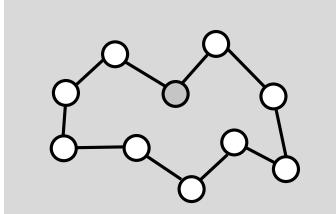

VRP – Massimo Paolucci

# The Traveling Salesman Problem - TSP

The TSP is an extensively studied NP-hard problem "[...] the TSP is one of the most intensely studied problems in computational mathematics and yet no effective solution method is known for the general case. Indeed, the resolution of the TSP would settle the $P$ versus NP problem and fetch a \$1,000,000 prize from the Clay Mathematics Institute (www.claymath.org/millennium/).

[...] for over 50 years its study has led the way to improved solution methods in many areas of mathematical optimization." (www.tsp.gatech.edu//index.html)

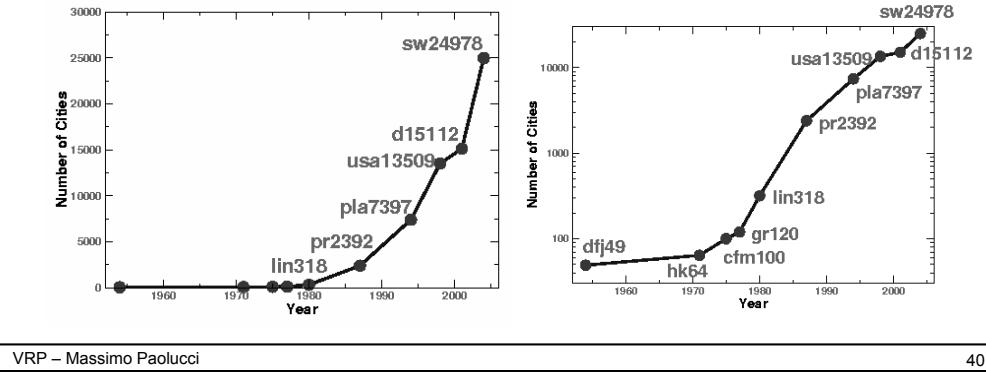

# The Traveling Salesman Problem - TSP

The currently largest instance ever solved:the tour visiting all the 24.978 cities in Sweden (2004)

"The majority of the work was carried out on a cluster of 96 dual processor Intel Xeon 2.8 GHz workstations at Georgia Tech's School of Industrial and Systems Engineering"

“The cumulative CPU time used in the five branch-and-cut runs and in the cutting-plane procedures for the five root LPs was approximately 84.8 CPU years on a single Intel Xeon $2 . 8 G H z$ processor. ”

(www.tsp.gatech.edu//index.html)

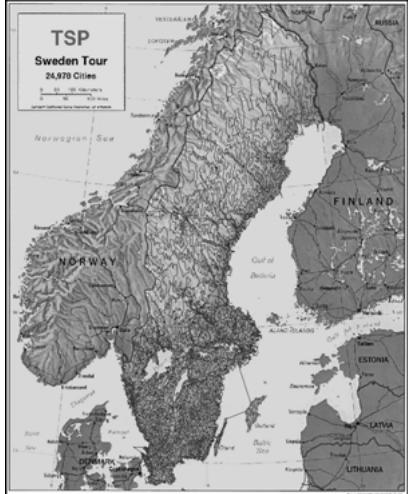

# The Traveling Salesman Problem - TSP

Two cases depending on the structure of the cost matrix:

ATSP : Asymmetric TSP directed graph $G { = } ( V { , } A )$ ∀(i, j)∈A cij≠cji or cij=cji

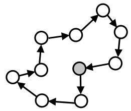

TSP o STSP : Symmetric TSP undirected graph $G { = } ( V , E )$ ∀ (i, j)∈E cij=cji

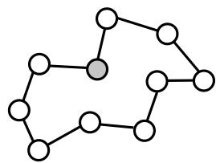

VRP – Massimo Paolucci

# The Traveling Salesman Problem - TSP

The TSP is a Strongly NP-hard problem

How to solve it?

Exact algorithms are based on Mixed Integer Programming (MIP) formulations and branch and cut approaches

Heuristics approaches:

constructive heuristics improvement heuristics metaheuristics

# The Traveling Salesman Problem - TSP

Heuristics vs Exact algorithms

Heuristic algorithms should be used when:

the problem dimensions exceed the maximum dimensions which can be dealt with exact approaches in acceptable computation times

the problem, although of limited dimensions, must be solved in a very short computation time

the problem data are approximated (seeking for optimality is not worthy)

there are problem variations for which exact approach   
cannot be easily extended   
the problem is dynamic

# The Traveling Salesman Problem - TSP

The study of MIP formulations can provide insights for a better understanding of the problem properties and lead to the computations of Lower Bounds

Lower bounds provide an estimation of the quality of sub-optimal solution and are fundamental in branch & bound or branch & cut approaches

Z\*TSP optimal solution   
ZLB lower bound   
$- \ Z _ { T S P }$ a feasible sub-optimal solution   
ZLB≤ Z\*TSP≤ ZTSP

VRP – Massimo Paolucci

<table><tr><td>The Traveling Salesman Problem - TSP</td></tr><tr><td>Two MIP formulations -MIP formulation for the ATSP -MIP formulation for the STSP</td></tr><tr><td></td></tr><tr><td></td></tr><tr><td></td></tr><tr><td></td></tr><tr><td></td></tr><tr><td></td></tr></table>

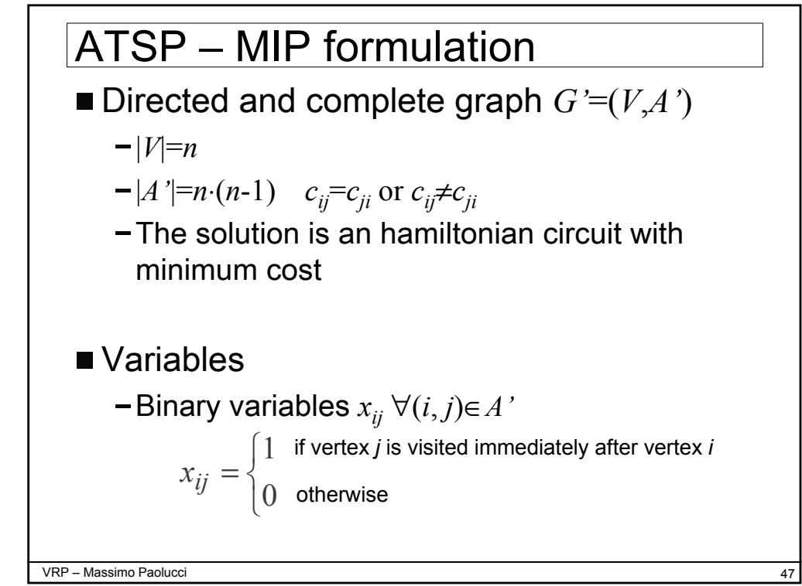

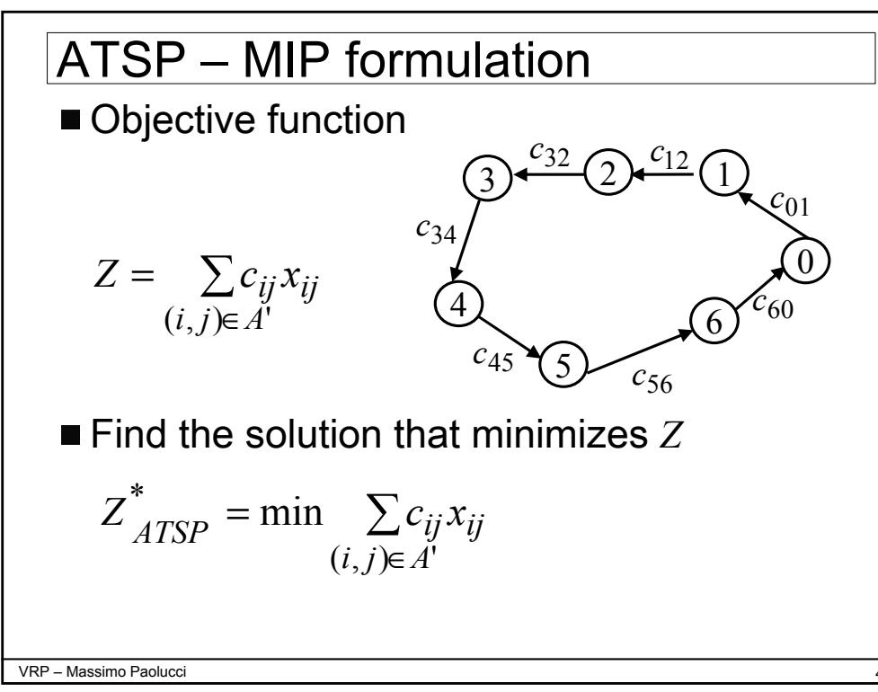

# ATSP – MIP formulation

Constraints - Degree constraints In a hamiltonian circuit each vertex is visited only once:

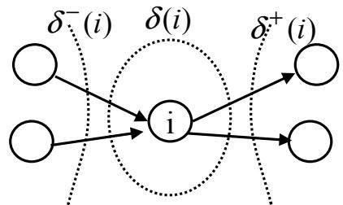

x ij = ∑ 1 j V∀ ∈ i V j∈ \{ }   
x ij = ∑ 1 i V∀ ∈ j V i∈ \{ }

VRP – Massimo Paolucci

# ATSP – MIP formulation

Constraints - STE Degree constraints are not sufficient ...

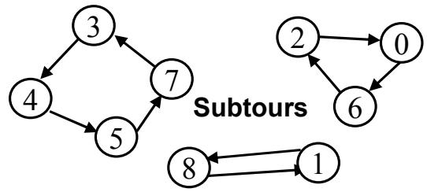

Subtour Elimination Constraints (STE)

Two classes of connectivity STE (cardinality of exponential order) A class of polynomial order cardinality STE

VRP – Massimo Paolucci

# ATSP – MIP formulation

Constraints – STE – Connectivity contraints

Connectivity constraints are defined for any proper subset of vertices with at least two vertices

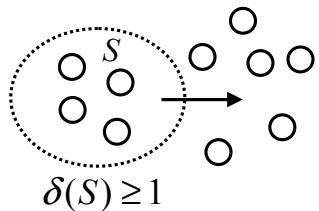

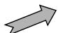

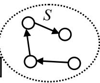

Note that the orientations must satisfy the degree contraints

# ATSP – MIP formulation

Constraints – STE – Connectivity constraints

Drawback:

the number of connectivity constraints grows as the number of subset of a given $\mathsf { s e t } \Rightarrow O ( 2 ^ { | \boldsymbol { r } | } )$

Example: A choice of S satisfying the connectivity constraints

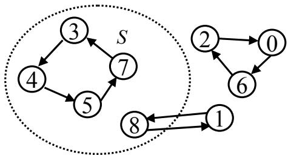

VRP – Massimo Paolucci

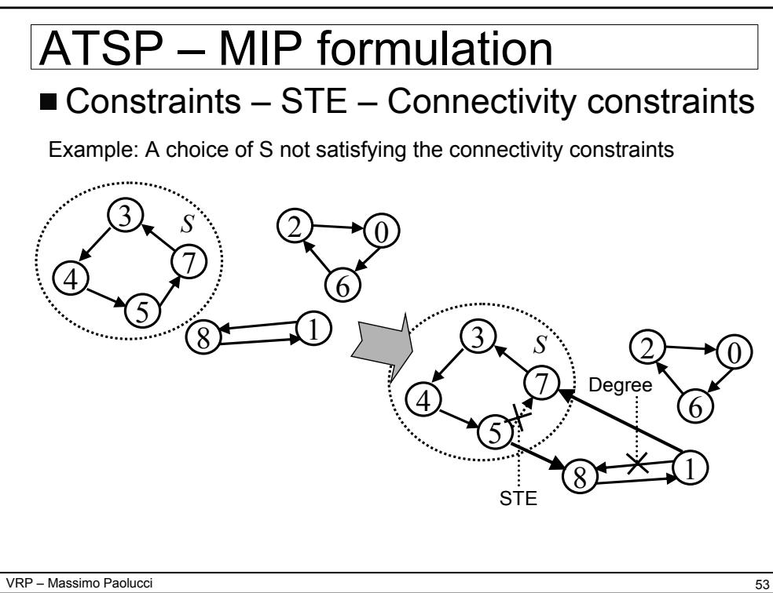

# ATSP – MIP formulation

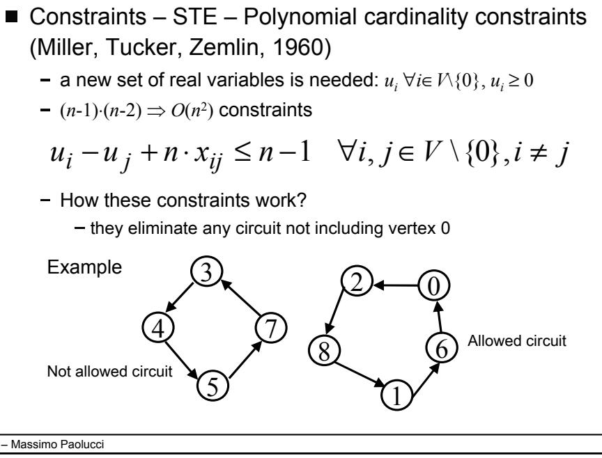

# ATSP – MIP formulation

Constraints – STE – Polynomial cardinality constraints

Example: not allowed circuit

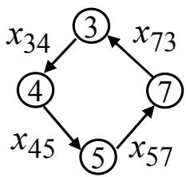

$$
\begin{array} { r l } & { u _ { 3 } - u _ { 4 } + 9 \cdot x _ { 3 4 } \leq 8 } \\ & { u _ { 4 } - u _ { 5 } + 9 \cdot x _ { 4 5 } \leq 8 } \\ & { u _ { 5 } - u _ { 7 } + 9 \cdot x _ { 5 7 } \leq 8 } \\ & { u _ { 7 } - u _ { 3 } + 9 \cdot x _ { 7 3 } \leq 8 } \end{array}
$$

Always false !

VRP – Massimo Paolucci

# ATSP – MIP formulation

Constraints – STE – Polynomial cardinality constraints Example: allowed circuit

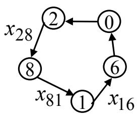

$$
\begin{array} { r l } & { u _ { 2 } - u _ { 8 } + 9 \cdot x _ { 2 8 } \leq 8 } \\ & { u _ { 8 } - u _ { 1 } + 9 \cdot x _ { 8 1 } \leq 8 } \\ & { \frac { u _ { 1 } - u _ { 6 } + 9 \cdot x _ { 1 6 } \leq 8 } { u _ { 2 } - u _ { 6 } + 9 \cdot 3 \leq 8 \cdot 3 } } \\ & { u _ { 2 } - u _ { 6 } + 9 \cdot 3 \leq 8 \cdot 3 \Rightarrow u _ { 6 } - u _ { 2 } \geq 3 } \end{array}
$$

$$
\Rightarrow e . g . ~ u _ { 2 } = 0 , u _ { 6 } = 3
$$

Only hamiltonian circuits are finally allowed

The values assigned to $\mathsf { u } _ { \mathrm { i } }$ denote the order with which the vertices are visited

VRP – Massimo Paolucci

# ATSP – MIP formulation

$$
\begin{array} { r l } { \underset { ( i , j ) \in A _ { i } ^ { \prime } } { \operatorname* { m i n } } \underset { ( i , j ) \in A _ { i } ^ { \prime } } { \sum c _ { i j } x _ { i j } } } & { } \\ { \underset { { i \in V \backslash \{ j \} } } { \sum x _ { i j } } = 1 } & { \quad j \in V } \\ { \underset { { j \in V \backslash \{ i j \} } } { \sum x _ { i j } } = 1 } & { \quad i \in V } \\ { 0 \leq x _ { i j } \leq 1 } & { } \end{array}
$$

The solution is binary

The bound is good for strongly asymmetric cost matrices $( < 1 \%$ from the optimal solution)

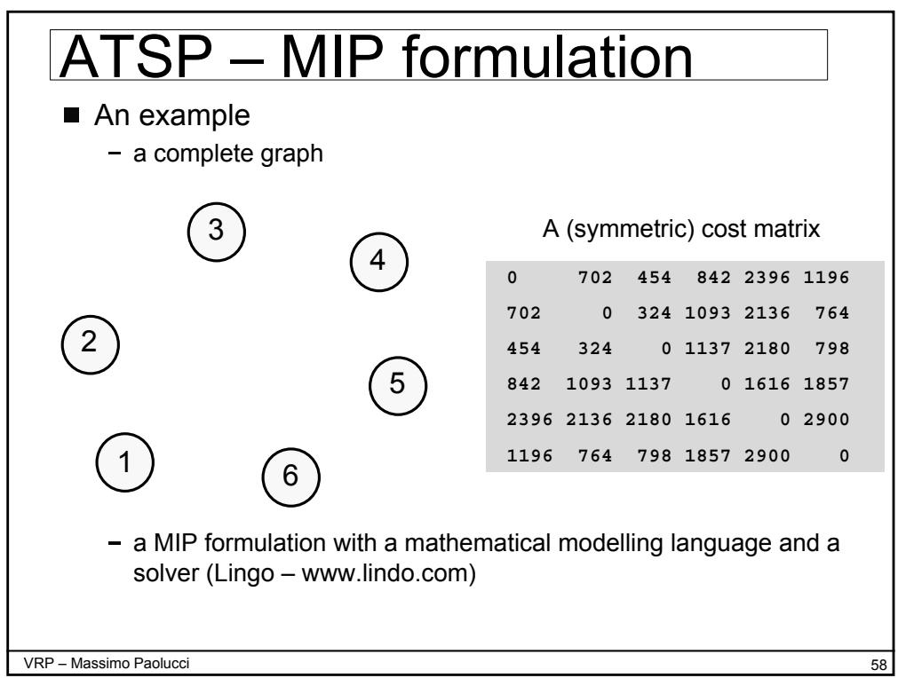

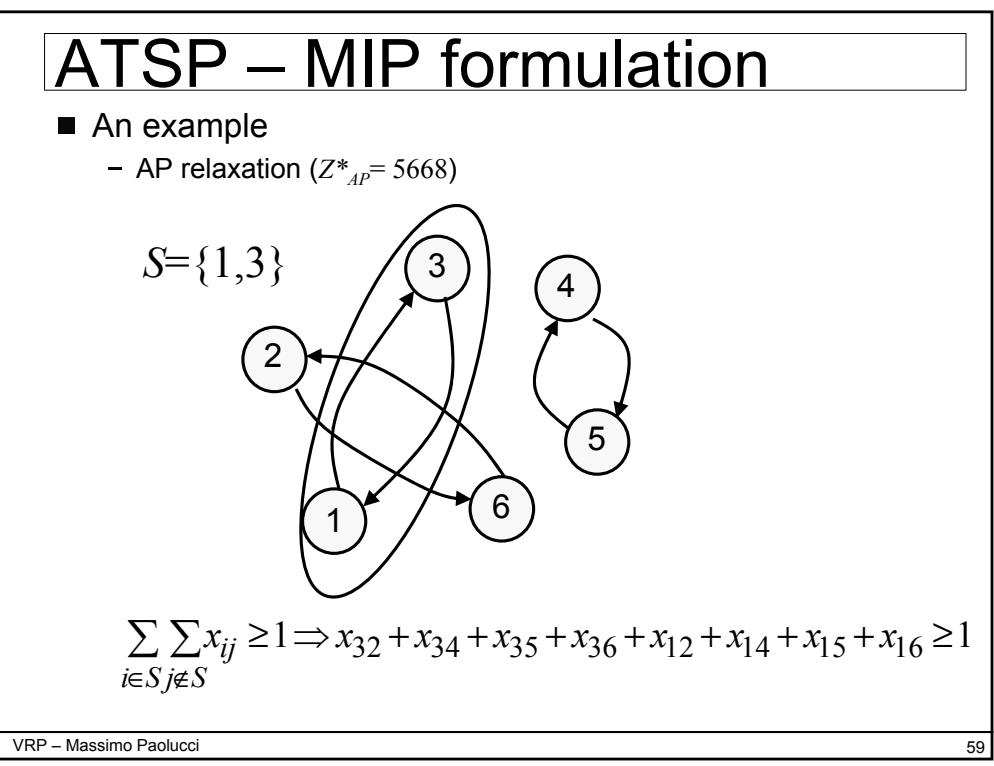

# ATSP – MIP formulation

An example STE cut for $S { = } \{ 1 , 3 \}$ $( Z ^ { * } = 5 9 5 0 )$ )

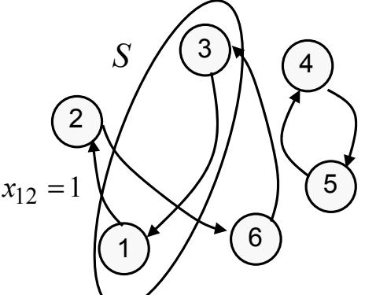

$$
\sum _ { i \in S } \sum _ { j \notin S } x _ { i j } \ge 1 \Longrightarrow x _ { 3 2 } + x _ { 3 4 } + x _ { 3 5 } + x _ { 3 6 } + x _ { 1 2 } + x _ { 1 4 } + x _ { 1 5 } + x _ { 1 6 } \ge 1
$$

VRP – Massimo Paolucci

# ATSP – MIP formulation

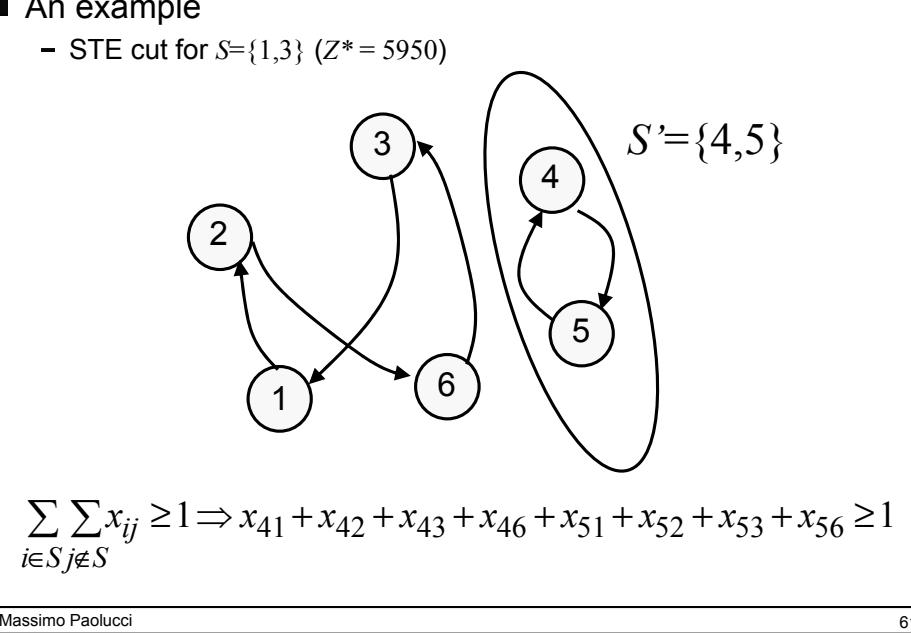

# ATSP – MIP formulation

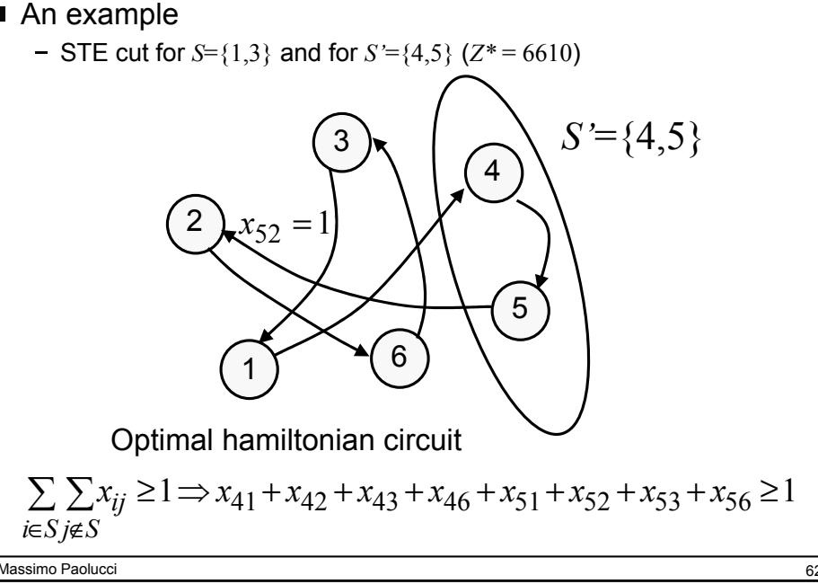

# STSP – MIP formulation

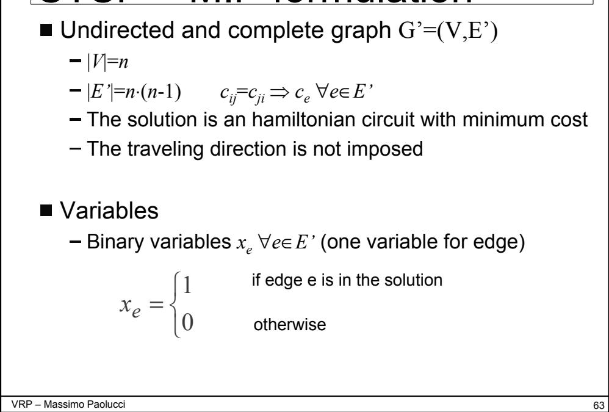

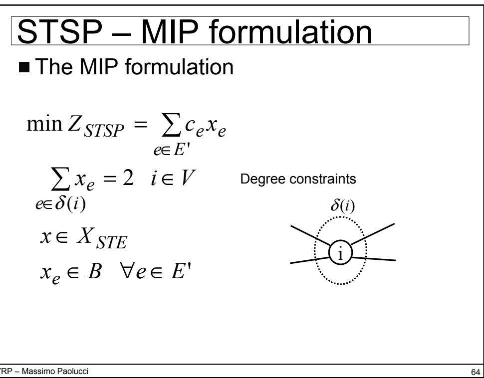

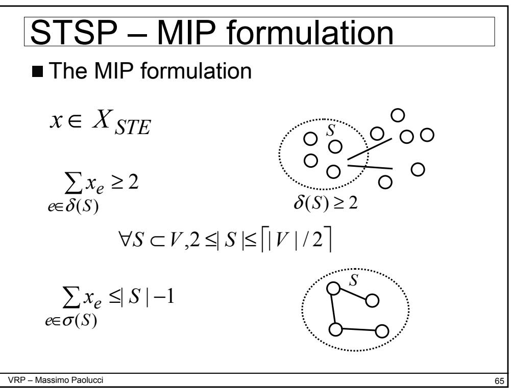

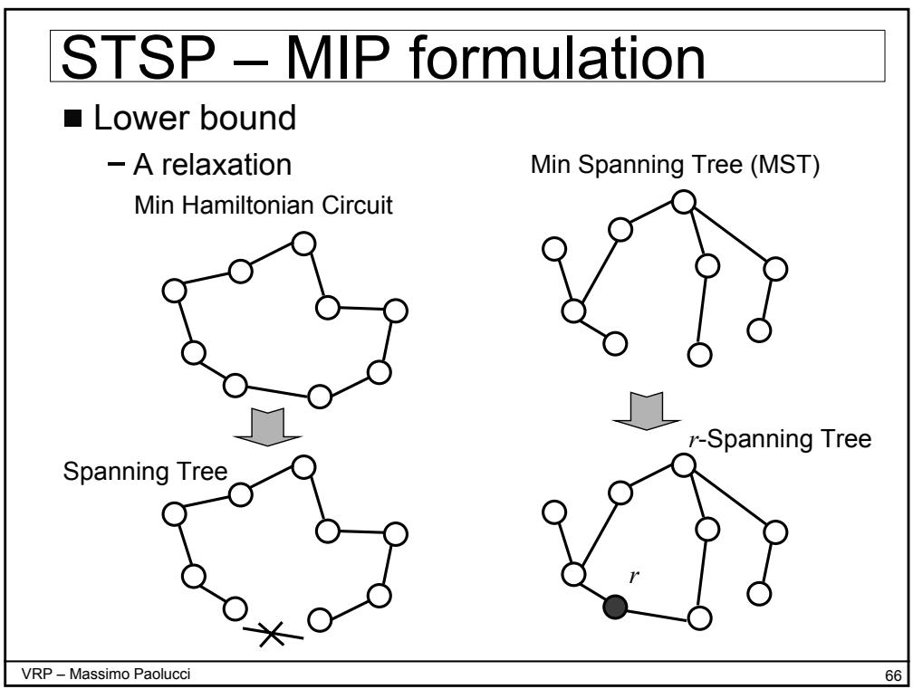

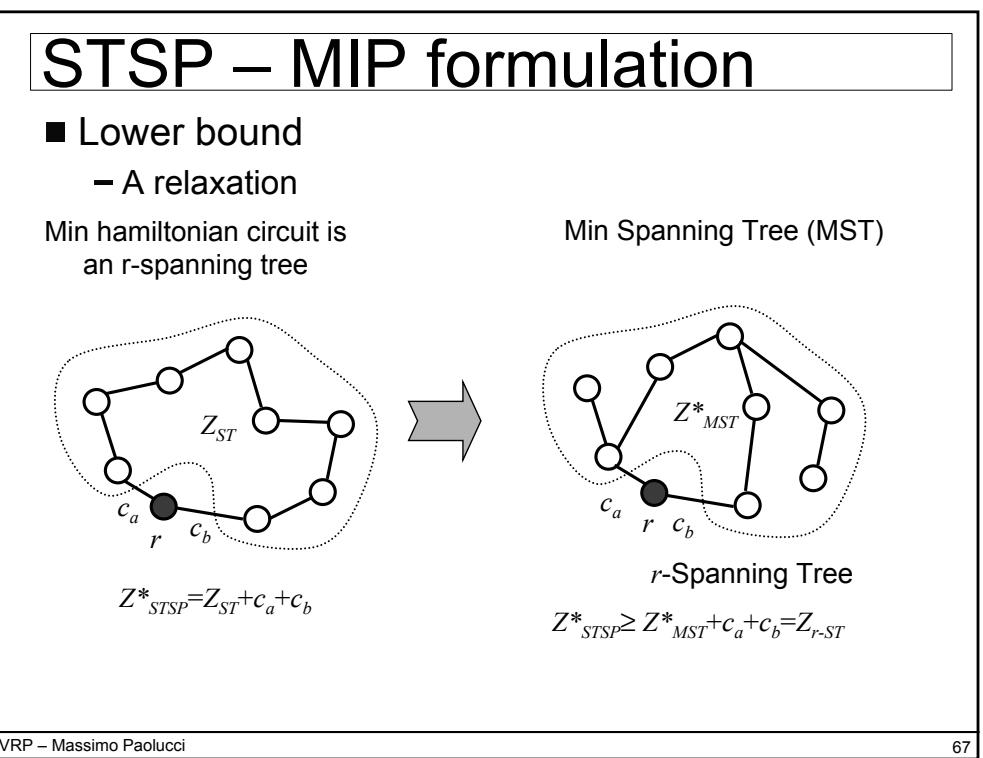

# STSP – MIP formulation

# Lower bound

The $Z _ { \phantom { * } M S T } ^ { * }$ objective is a LB for $Z ^ { * } { } _ { S T S P }$ The $Z ^ { * } { } _ { r - S T }$ is a better LB for $Z _ { \ S T S P } ^ { * }$ The MIP formulation for the Min $r$ -ST $r$ arbitrary vertex)

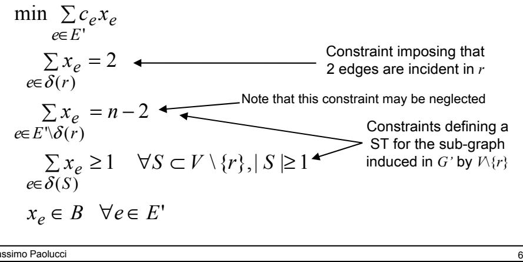

VRP – Massimo Paolucci

# STSP – MIP formulation

Lower bound The Min r-ST lower bond can be improved:

Initialize $Z _ { L B } = \ - \infty$ For each i∈ $V$

Find the MST $T ^ { \mathit { t } }$ for $G ^ { i } ( \mathbb { N } \{ i \} , E ^ { i } )$ the graph induced in $G$ ’ by vertices $\cal { V } \{ i \}$

Find the Min $r – { \mathsf { S T } }$ where $r { = } i$ adding to $T ^ { \mathit { i } }$ the vertex $i$ with 2 edges at minimum cost, and compute $Z ^ { * } { } _ { r - S T }$ If ${ Z } _ { L B } { < } { Z ^ { * } } _ { r - S T }$ then ${ Z } _ { L B } { = } { Z } ^ { \ast } { } _ { r - S T }$

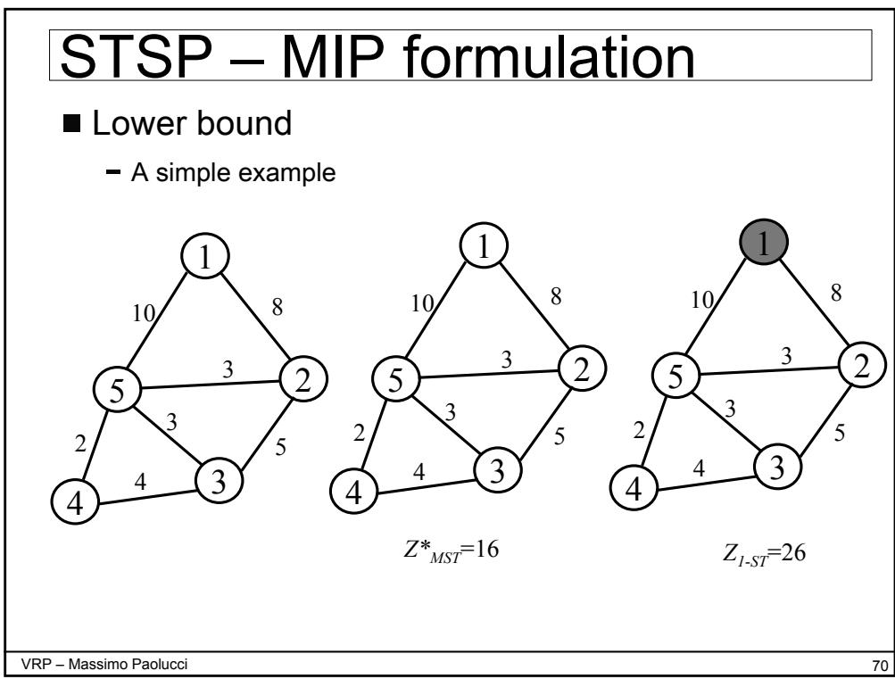

# STSP – MIP formulation

A better lower bound: the Held and Karp Bound

The Min $r .$ -ST lower bound can be further improved (Lagrangean relaxation of degree constraints):

Associate a multiplier $\pi _ { j }$ with each vertex $i$ Replace the costs: $c _ { \ e } ^ { \prime } = c _ { e } + \pi _ { i } + \pi _ { j }$ where $e { = } ( i , j ) { \in } E$ :

every tour increases its cost of $2 \sum \pi _ { i }$ i∈V $\sum _ { i \in V } \delta _ { i } \pi _ { i }$   
the cost of optimal $r$ -tree changes of where $\delta _ { i }$ is the degree of vertex $i$ in the $r$ -tree

$$
\begin{array} { r l } & { Z _ { S T S P } ^ { * } + 2 \underset { i \in V } { \sum } \pi _ { i } \geq \operatorname* { m i n } [ Z _ { r - S T } + \underset { i \in V } { \sum } \delta _ { i } \pi _ { i } ] } \\ & { Z _ { S T S P } ^ { * } \geq \operatorname* { m i n } [ Z _ { r - S T } + \underset { i \in V } { \sum } ( \delta _ { i } - 2 ) \pi _ { i } ] = w ( \pi ) } \\ & { Z _ { S T S P } ^ { * } \geq { w ^ { * } } \overset { } { = } \operatorname* { m a x } w ( \pi ) \qquad \mathsf { i s ~ t h e ~ b e s t ~ l o w e r } } \end{array}
$$

# STSP – MIP formulation

A better lower bound: the Held and Karp Bound

The bounding procedure (subgradient optimization)

1. $\pi _ { i } { = } 0 , i { = } 1 , . . . , n $ ; Set $k { = } 0$ , $\mathrm { w } ( { \boldsymbol { \pi } } ) { = } 0$ , and $t _ { \theta }$ according to (a)

2. Determine the Min $r – { \mathsf { S T } }$ and set $w ( \pi ) { = } \mathrm { m a x } \left\{ w ( \pi ) , Z _ { r - S T } ^ { * } ( \pi ) \right\}$

3. Determine $\delta ^ { k } { } _ { i }$ (the vertices degree at iteration $k$ ) for $i { = } 1 , . . . , n$

4. If $\delta ^ { k } { } _ { i } = 2$ for $i { = } 1$ , …, $n$ then $Z ^ { * } { } _ { \mathrm { S T S P } } { } ^ { = } w ( \pi )$ and stop; Else set $k { = } k + 1$ ;

5. if $k > k _ { \mathrm { m a x } }$ then stop Else set $\pi _ { i } { = } \pi _ { i } { + } ~ t _ { k } ( \delta ^ { k } { } _ { i } - 2 )$ for $i { = } 1 , . . . , n$ and continue with step 2.

$$
t _ { k } = \frac { \alpha ( U B - w ( \pi ) ) } { \sum _ { i \in V } ( \delta _ { i } ^ { k } - 2 ) ^ { 2 } } \qquad 0 < \alpha \leq 2
$$

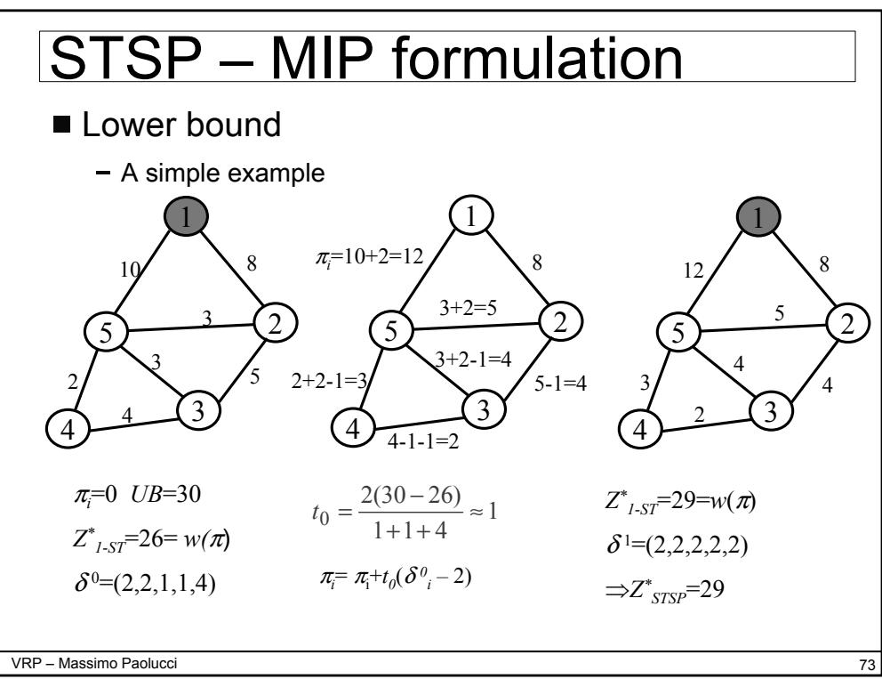

# CVRP – MIP formulation

CVRP (Capacitated VRP) – Asymmetric network

$K$ identical vehicles   
$C$ vehicle capacity   
A single common depot   
∀i∈V\{0} customer a demand $d _ { i } { \geq } 0$ is defined $( d _ { \rho } { = } 0 )$ such that $d _ { i } { \leq } C$   
Each vehicle performs at most one route   
The problem: find a set of exactly $K$ routes (circuits) with minimum cost such that: (a) each circuit visits the depot (b) each customer is visited by exactly a single route (c) the sum of the customer demands visited by a route does not exceed $C$

A vehicle flow formulation Binary variables $x _ { i j } \ \forall ( i , j ) \in A ^ { \prime }$ $x _ { i j } = \left\{ { 1 \atop 0 } \right.$ if $( i , j )$ is in the solution otherwise

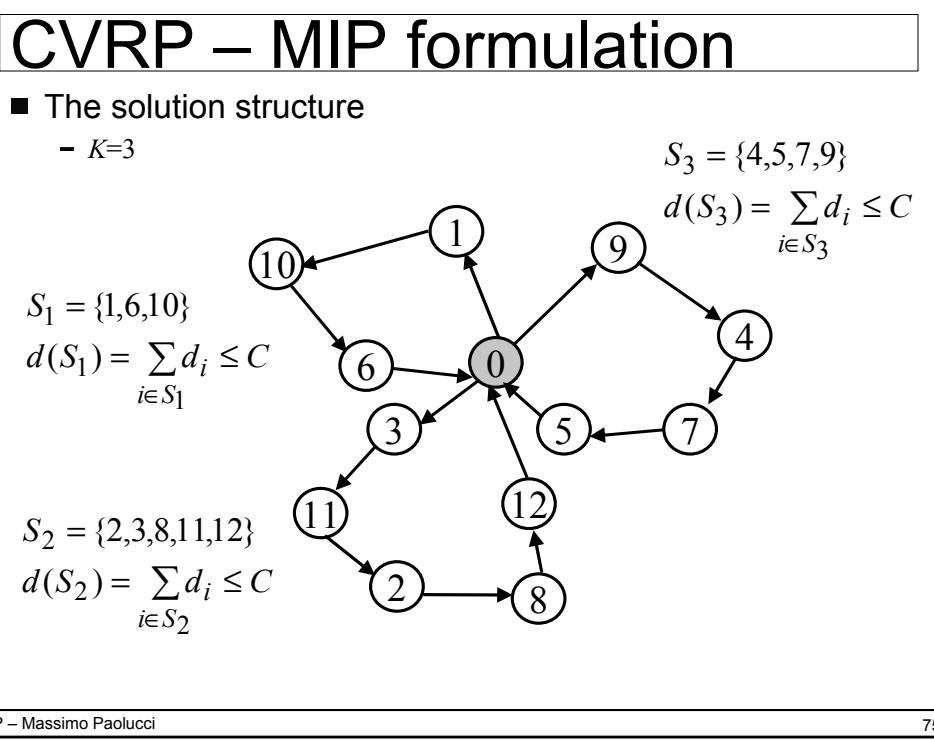

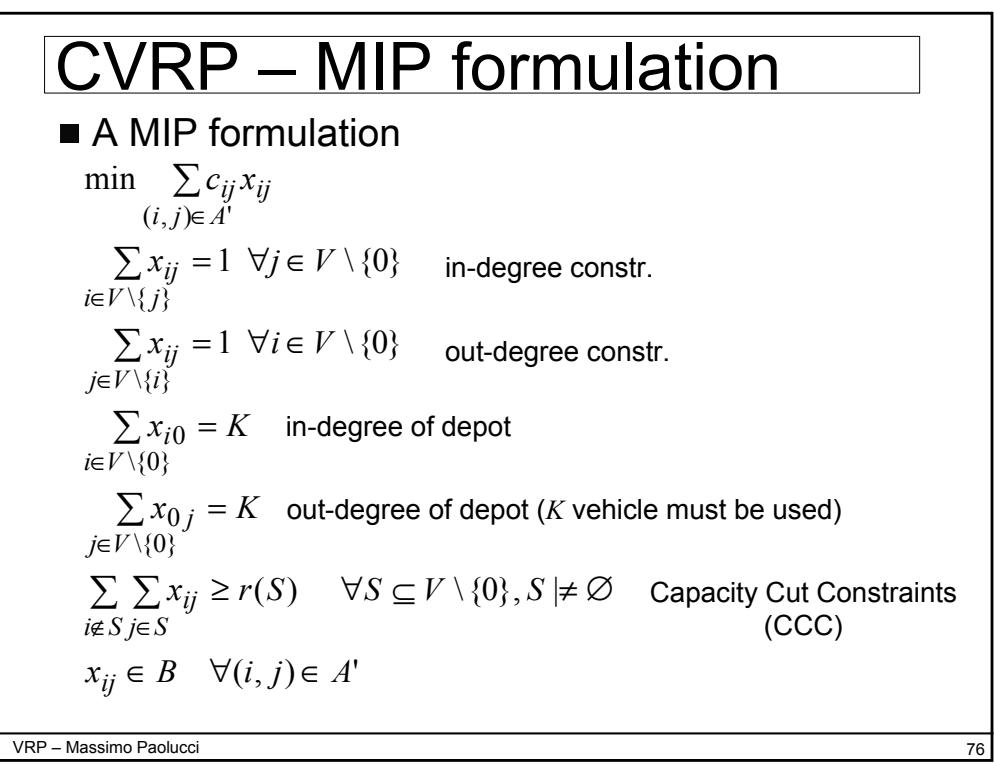

# CVRP – MIP formulation

A MIP formulation

The Capacity Cut Constraints impose both the connectivity and the vehicle capacity requirements $r ( S )$ is the minimum number of vehicle needed to serve the vertices in $S$ , found as solution of a BP problem or simply fixed

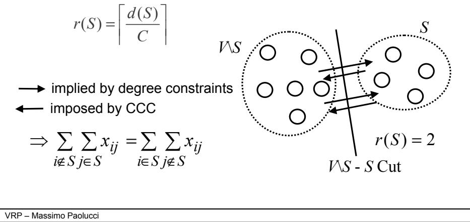

# CVRP – MIP formulation

A MIP formulation The CCC avoid subtours not including the depot ... e.g.:

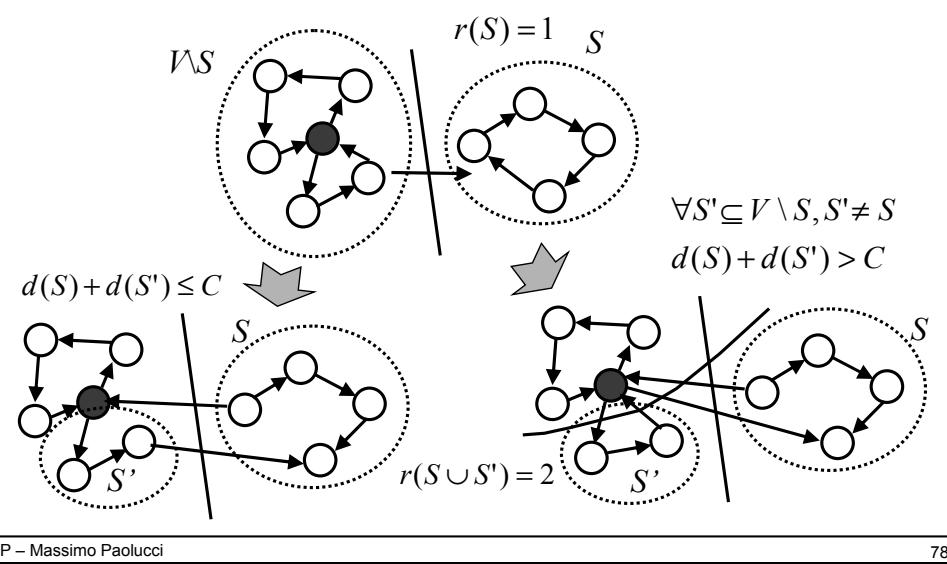

# CVRP – MIP formulation

A MIP formulation

Alternative: generalized subtour elimination constraints (GSEC)

$$
\sum _ { i \in S } \sum _ { j \in S } x _ { i j } \le \mid S \mid - r ( S ) \forall S \subseteq V \setminus \{ 0 \} , S \neq \emptyset
$$

The cardinality of CCC and GSEC is exponential

Alternative: constraints with polynomial cardinality (Christofides, Mingozzi, Toth, 1979)

$$
u _ { i } - u _ { j } + C \cdot x _ { i j } \leq C - d _ { j } \quad \forall i , j \in V \setminus \{ 0 \} , i \neq j
$$

$$
d _ { i } \le u _ { i } \le C \quad \forall i , j \in V \backslash \{ 0 \}
$$

$u _ { i } =$ the vehicle load after visiting customer $i$

# CVRP – MIP formulation

<table><tr><td>A MIP formulation u; = the vehicle load after visiting customer i</td></tr><tr><td>   =  ⇒  −  ≤ −  alwas true</td></tr><tr><td>- otherwise</td></tr><tr><td> = 1 ⇒→ 𝑢  ≥ 𝑢 +  j</td></tr><tr><td></td></tr><tr><td></td></tr><tr><td></td></tr><tr><td></td></tr><tr><td>VRP - Massimo Paolucci</td></tr><tr><td></td></tr></table>

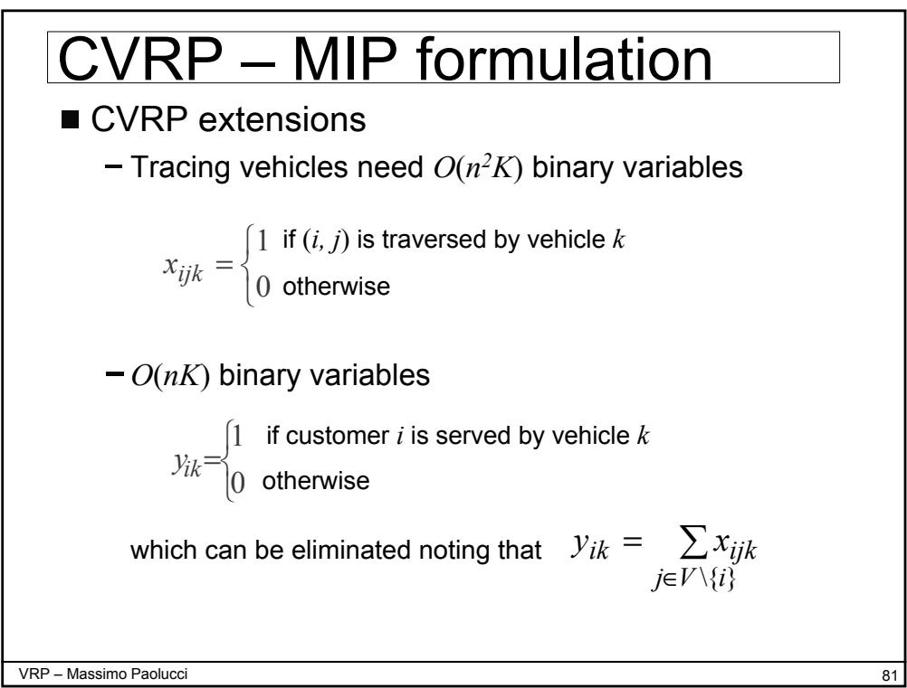

<table><tr><td>CVRP - MIP formulation</td></tr><tr><td>CVRP extensions K ∑ ij ∑ min</td></tr><tr><td>(i,j) A' =1 K each customer is served by</td></tr><tr><td>∑ k = 1 ∀i V \{0} =1 exactly one vehicle</td></tr><tr><td>∑x = ∑x j ∀i  V, = 1,., K</td></tr><tr><td></td></tr><tr><td>customer vertex also leaves it</td></tr><tr><td>jV {i} jV{i} the same vehicle that enters a</td></tr><tr><td>CVRP extensions K</td></tr><tr><td>∑ y0k ≤ K at most K vehicles are used =1 (some vehicle may be not used)</td></tr><tr><td>u −  +  ≤  −   ,     {0}, = 1,., K such that  +   ≤ </td></tr><tr><td>STE and capacity constraints (different vehicles) ≤ u ≤ vehicles' load after serving customer i</td></tr><tr><td>  B ∀(i, j) A',  = 1,., K</td></tr><tr><td>k  B u   ∀i V \ {0}, = 1,., K VRP  Massimo Paolucci 83</td></tr></table>

# CVRP – MIP formulation

# CVRP extensions

Distance constrained

$t _ { i j }$ travel time from $i$ to $j$   
$s _ { i }$ service time at customer $i$   
$T$ maximum total service time for the vehicles

$$
\sum _ { i \in V } \sum _ { j \in V } t _ { i j } x _ { i j k } + \sum _ { i \in V \setminus \{ 0 \} } s _ { i } y _ { i k } \leq T
$$

Basic LBs for CVRP derive from the extension of LBs for ATSP and STSP

Exact algorithms (B&B, B&C) are able to solve small instances $\scriptstyle n < 5 0$ sometimes $n { < } 1 0 0$ )

# VRP – Heuristic approaches

Heuristics in general allow finding sub-optimal, usually good, solutions in an acceptable computation time

Three main classes of heuristics   
Constructive (the solution progressively build)   
Improvement (a given solution is progressively improved by a local search process)   
Metaheuristic (extend local search, consider a population o solution)

Summary:

Constructive heuristics for the TSP Local search approaches for TSP Constructive heuristics for CVRP

# TSP – Constructive heuristics

Constructive heuristics for the TSP:

Nearest Neighbour algorithm   
Insertion algorithm   
Patching/Merger algorithm   
Minimum spanning tree (based) algorithm   
Christofides’ algorithm

VRP – Massimo Paolucci

# TSP – Constructive heuristics

Performance guarantees of TSP heuristics Bad news for the general case

# Theorem

Let A be a heuristic alg., $\mathsf { A } ( I )$ the tour length produced by A and Opt(I) the optimal tour length for an instance I of the TSP. If given a constant $1 \leq r < \infty$ , for all instances I

$$
\mathsf { A } ( I ) \le \mathsf { r } \cdot \mathsf { O p t } ( I )
$$

then $\mathbf { P } { = } \mathbf { N P }$

That means ... no hope of defining a heuristic algorithm with any fixed performance guarantee for the general TSP case

The theorem does not hold true for the STSP restricted to distance matrices satisfying the triangle inequality (metric TSP), a property mostly verified for real world logistic problems

# TSP – Constructive heuristics

Nearest Neighbour (NN)

Start from an arbitrary vertex $\nu$ (e.g., the depot), set $k { = } 1$ and $U { = } \{ \nu \}$ the set of visited vertices

While $k { < } n$ select the next vertex w to visit such that $c _ { \nu w } = \operatorname* { m i n } _ { h \not \in U } c _ { \nu h }$ update $U { = } U \cup \{ w \}$ , set the current vertex $\scriptstyle \nu = w$ and $k { = } k { + } 1$

Greedy heuristic simple to be implemented

Bad performance: it selects short arcs only in the first iterations and final arcs are usually quite long Average solution are $2 5 \%$ greater than the optimum - $O ( n ^ { 2 } )$ complexity: too slow for more than 10.000 vertices Could be a good starting solution for improvement heuristics

# TSP – Constructive heuristics

Nearest Neighbour (NN)

An example: euclidean distance matrix

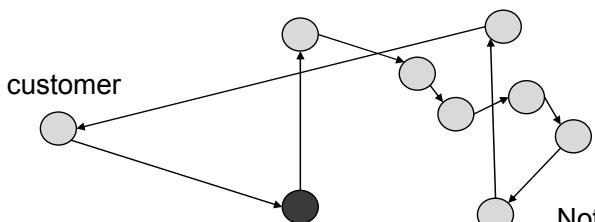

depot: starting vertex

Note that in this case in an optimal tour no crossing would appear ...

Bad news for NN (Theorem):

For every $r { > } 0$ there exists an $n$ -vertices instance $I _ { \ast }$ , for arbitrarily large $n$ , satisfying the triangle inequality such that

$$
\mathrm { N N } ( I ) \geq r \mathrm { { \cdot O p t } } ( I )
$$

# TSP – Constructive heuristics

Insertion Algorithm

Base algorithm

Start from a partial circuit   
Insert a new vertex in the circuit until all the vertices have been considered

Insertion rules (average error):

– the nearest vertex $( 2 0 \% )$ ) – the farthest vertex $( 1 0 \% )$ – the cheapest insertion $( 1 7 \% )$ – random $( 1 1 \% )$

# TSP – Constructive heuristics

Insertion Algorithm An example (with the farthest vertex rule)   
Distance Matrix (symmetric)

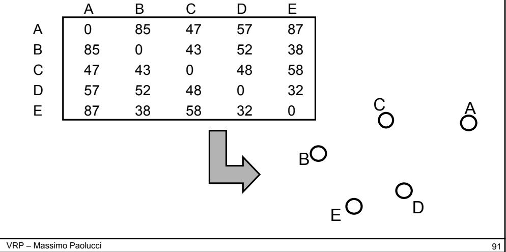

#

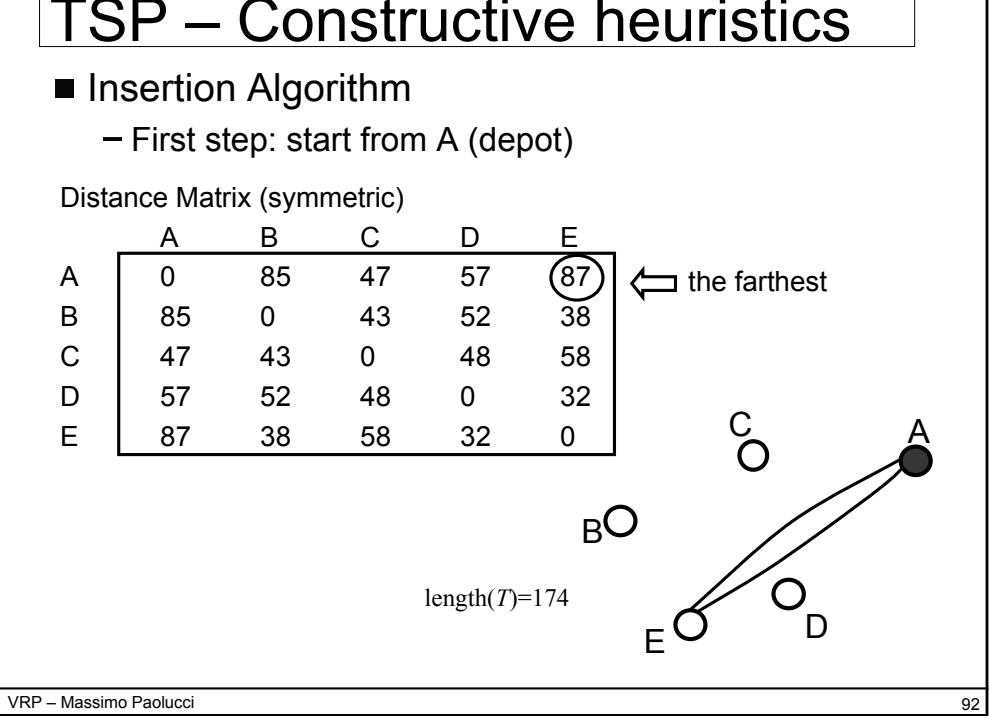

# TSP – Constructive heuristics

Insertion Algorithm Second step: the farthest from A or E

Distance Matrix (symmetric)

<table><tr><td></td><td>A</td><td>B</td><td>C</td><td>D</td><td>E</td></tr><tr><td>A</td><td>0</td><td>→ 85</td><td>47</td><td>57</td><td>87</td></tr><tr><td>B</td><td>85</td><td>0</td><td>43</td><td>52</td><td>38</td></tr><tr><td>C</td><td>47</td><td>43</td><td>0</td><td>48</td><td>58</td></tr><tr><td>D</td><td>57</td><td>52</td><td>48</td><td>0</td><td>32</td></tr><tr><td>E</td><td>87</td><td>38</td><td>55</td><td>32</td><td>0</td></tr></table>

length(T)=210

Tour $( T , k )$ : a procedure which selects the edge $( i , j )$ in the tour $T$ where to insert vertex $k$ as

$$
\arg \operatorname* { m i n } _ { ( i . j ) } ( { c _ { i k } + c _ { k j } - c _ { i j } } )
$$

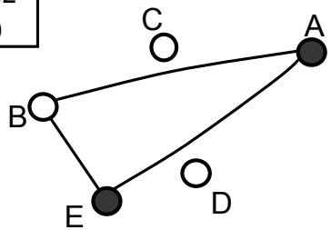

VRP – Massimo Paolucci

# TSP – Constructive heuristics

Insertion Algorithm Third step: the farthest from A or E or B

Distance Matrix (symmetric)

<table><tr><td></td><td>A</td><td>B</td><td>C</td><td>D</td><td>E</td></tr><tr><td>A</td><td>0</td><td>85</td><td></td><td></td><td>87</td></tr><tr><td>B</td><td>85</td><td>0</td><td></td><td></td><td>38</td></tr><tr><td>C</td><td>47</td><td>43</td><td></td><td></td><td>58</td></tr><tr><td>D</td><td>57</td><td>52</td><td>48 L</td><td>0</td><td>32</td></tr><tr><td>E</td><td>87</td><td>38</td><td>58</td><td>32</td><td>0</td></tr></table>

length(T)=215

Tour(T, C):

(A, B): ∆c = 47 + 43 - 85 = 5   
(B, E): ∆c = 43 + 58 - 38 = 63   
(E, A): ∆c = 58 + 47 - 87 = 18

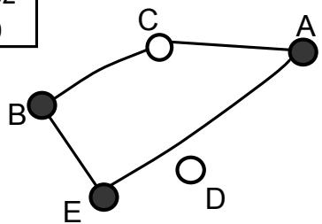

VRP – Massimo Paolucci

# TSP – Constructive heuristics

Insertion Algorithm

Fourth step: where to insert D?

Distance Matrix (symmetric)

<table><tr><td></td><td>A</td><td>B</td><td>C</td><td>D</td><td>E</td></tr><tr><td>A</td><td>0</td><td>85</td><td>47</td><td>57</td><td>87</td></tr><tr><td>B</td><td>85</td><td>0</td><td>43</td><td>52</td><td>38</td></tr><tr><td>C</td><td>47</td><td>43</td><td>0</td><td>48</td><td>58</td></tr><tr><td>D</td><td>57</td><td>52</td><td>48</td><td>0</td><td>32</td></tr><tr><td>E</td><td>87</td><td>38</td><td>58</td><td>32</td><td>0</td></tr></table>

${ \mathrm { T o u r } } ( T , C ) { \mathrm { : } }$

(A, C): ∆c = 57 + 48 - 47 = 58   
(C, B): ∆c = 48 + 52 - 43 = 57   
(B, E): ∆c = 52 + 32 - 38 = 46   
(E, A): ∆c = 32 + 57 - 87 = 2

length(T)=217

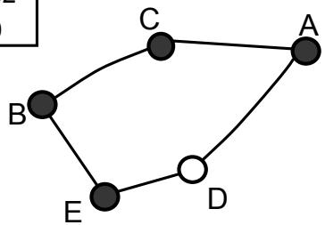

VRP – Massimo Paolucci

# TSP – Constructive heuristics

Patching/Merger algorithm

Merger

Start from $n$ single-vertex tour

While number of tours ${ > } 1$

select a pair of tours $( T , T ^ { \prime } )$ to be merged such that is minimum $\operatorname* { m i n } \{ c _ { i j } : i \in T , j \in T ^ { \prime } \}$

merge the selected tours If $T$ and $T '$ are single-vertex tour then ${ \mathrm { T o u r } } ( T , k ^ { \prime } )$ or $\operatorname { T o u r } ( T ^ { \prime } , k )$ Else determine $( i , j ) { \in } T$ and $( k , h ) \in T ^ { \prime }$ such that is minimum

$$
c _ { i k } + c _ { h j } - c _ { i j } - c _ { k h }
$$

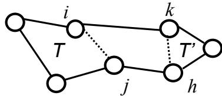

VRP – Massimo Paolucci

# TSP – Constructive heuristics

Patching/Merger algorithm

Patching (ATSP)

Start from the subtours generated by the AP relaxation of the ATSP

While number of tours ${ > } 1$

select a pair of tours $( T , T ^ { \prime } )$ to be merged such that is minimum $c _ { i k } + c _ { h j } - c _ { i j } - c _ { h k }$ being $( i , j ) { \in } T$ and $( h , k ) \in T ^ { \prime }$   
merge the selected tours

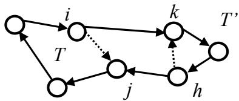

VRP – Massimo Paolucci

# TSP – Constructive heuristics

Minimum Spanning Tree (MST) based algorithm

Foundations

Given a complete undirected graph $G$ , a Hamiltonian Path (HP) is a tree in $G$ with cost not less than the cost $c ( M S T )$ of the Minimum Spanning Tree (MST)

The MST can be found in $O ( n ^ { 2 } )$

A Hamiltonian Circuit (HC) is a HP with an added edge ...

then the cost of the minimum cost HC is $c ( T S P )$ and $c ( M S T ) { \leq } c ( T S P )$

A circuit (possibly visiting some vertex more than once) can be generated from a MST by a procedure which doubles all the MST edges

# TSP – Constructive heuristics

Minimum Spanning Tree (MST) based algorithm

Foundations

Depth first MST traversal procedure

Start from a leaf vertex (current vertex)   
repeat   
If there is any not traversed MST edge from the current vertex follow that edge to a new current vertex   
otherwise go back to the vertex from which the current vertex was first reached traversing backward the edge previously followed   
until all the MST edges have been traversed twice

The procedure terminates in the starting vertex The cost of the circuit is $2 { \cdot } c ( M S T )$ then

$$
c ( M S T ) \leq c ( T S P ) \leq 2 { \cdot } c ( M S T )
$$

# TSP – Constructive heuristics

Minimum Spanning Tree (MST) based algorithm An example

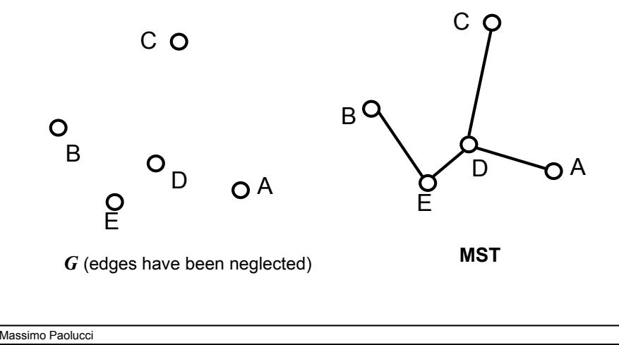

# TSP – Constructive heuristics

Minimum Spanning Tree (MST) based algorithm An example

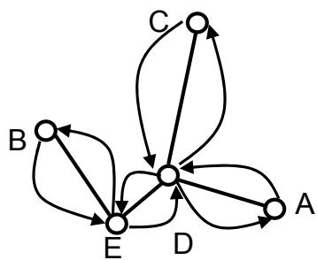

Doubled MST (DMST) circuit: B-E-D-A-D-C-D-E-B

# TSP – Constructive heuristics

Minimum Spanning Tree (MST) based algorithm

Foundations

If the triangle inequality holds the DMST circuit can be transformed in a HC of lesser cost, $c ( H C ) \leq 2 { \cdot } c ( M S T ) .$ , by introducing shortcuts

Shortcut traversal: whenever the depth first traversal would take back to an already-visited vertex, skip ahead in the traversal and go directly to the next unvisited vertex (if all vertices have been visited come back to the start)

Algorithm (MSTS) Find a MST of G Built a HC by a Depth First Traversal with Shortcuts

The HC cost is lower and upper bounded

$$
c ( M S T ) \leq c ( T S P ) \leq c ( H C ) \leq 2 { \cdot } c ( M S T )
$$

MSTS(I)≤2⋅Opt(I)

VRP – Massimo Paolucci

# TSP – Constructive heuristics

Minimum Spanning Tree (MST) based algorithm

Foundations An example

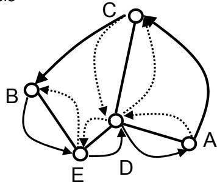

Traversal with shortcuts: B-E-D-A-C-B

Note that following a different depth first traversal B-E-D-C-D-A-D-E-B and introducing shortcuts the final HC would be longer

# TSP – Constructive heuristics

# Christofides’ algorithm

Algorithm (CA)

Find a MST for G

Transform the MST in an Eulerian graph by introducing minimum cost edges between pairs of vertices with odd degree (minimum weight matching problem)

Build a HC by an Eulerian Traversal with Shortcuts

Note that:

The number of vertices with odd degree in a graph is always even   
The minimum weight matching problem can be solved in polynomial time $( O ( n ^ { 3 } ) )$   
It can be proved that

$$
\mathrm { C } ( I ) { \leq } 3 / 2 \cdot \mathrm { O p t } ( I )
$$

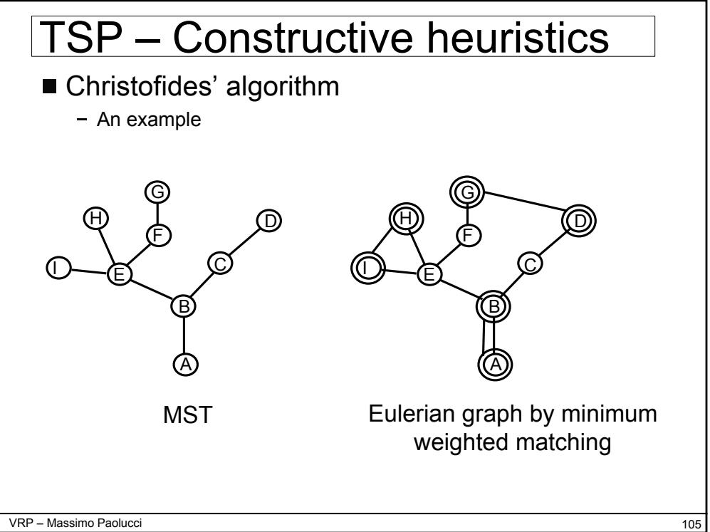

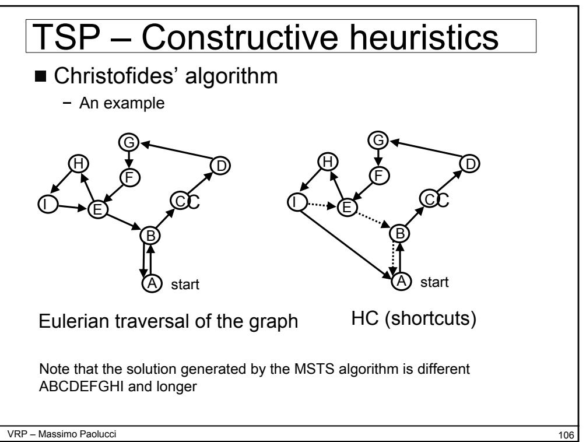

# TSP – Improvement heuristics

Improvement heuristics for the TSP:

Local search based on: 2-OPT 3-OPT   
Lin-Kerninghan

# TSP – Improvement heuristics

# Basic Local Search (LS) Algorithm

Initialization:

generate a initial solution $x$ Set the current solution and objective $x _ { c } = x$ ; $Z _ { c } { = } Z ( x )$

Repeat Set $x _ { b } { = } x _ { c } { , } Z _ { b } { = } Z _ { c }$ For each candidate solution $x \in N ( x _ { b } )$ If $Z ( x ) { < } Z _ { c }$ then ${ x _ { c } } \mathrm { { = } } x$ ; $Z _ { c } { = } Z ( x )$

Until $Z _ { c } < Z _ { b }$

• $N ( x )$ is the neighbourhood of solution $x$ A neighbourhood of $x$ is made of solutions that can be generated by modifying $x$ If $x _ { a } \in N ( x _ { b } )$ then $x _ { b } \in N ( x _ { a } )$

VRP – Massimo Paolucci

# TSP – Improvement heuristics

2-OPT and 3-OPT

The $N ( x )$ is generated by 2-exchange (3-exchange) moves 2 (3) egdes in the current solution are removed and substituted with 2 (3) other edges so that a different HC is produced

Good performance (small $\%$ deviation from optimal in the average)

If all the possible moves are explored it may be time consuming

Best Improvement (default) vs First Improvement strategy

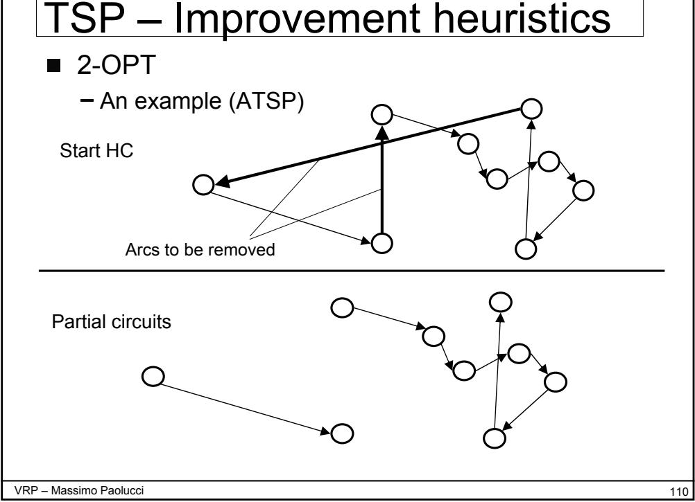

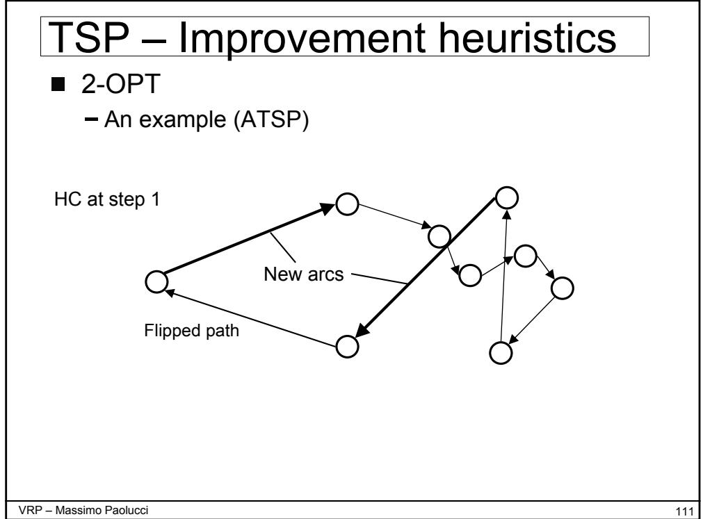

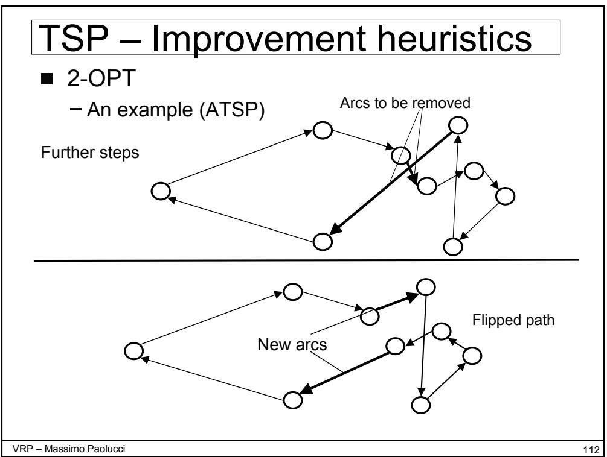

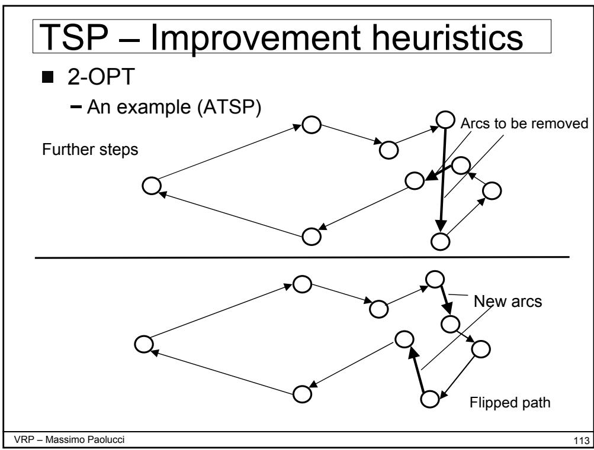

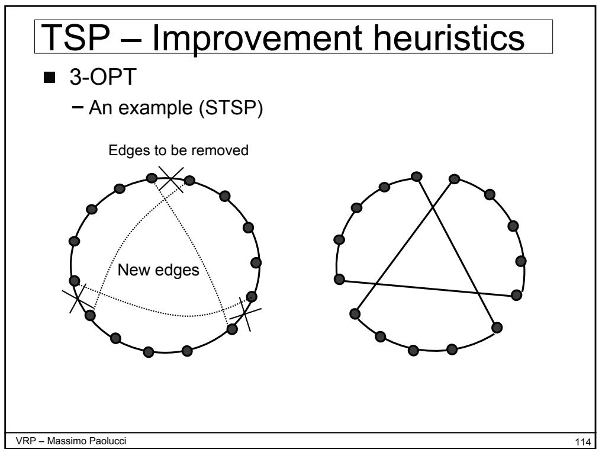

# TSP – Improvement heuristics

Lin-Kernighan (variable $k$ -OPT)

A trade-off is needed

$k$ -exchange moves provide solutions said k-optimal: A tour is said to be $k$ -Optimal (or simply $k$ -OPT) if it is impossible to obtain a shorter tour by replacing any $k$ of its links by any other set of $k$ links

Any $k$ -OPT tour is also $k$ -OPT with $k { ' } { \le } k$   
A tour is optimal if is $n$ -OPT   
The larger is $k$ the more likely the solution is optimal   
Increasing $k$ the required computation time also rapidly increase (for naive implementation $O ( n ^ { k } )$ and $k$ is limited to 2 and 3 in practice   
Drawback: the value of $k$ must be a priori specified

# TSP – Improvement heuristics

Lin-Kernighan (variable $k$ -OPT)

Lin-Kernighan

One of the best heuristic available   
Variable k-OPT   
Average running time $O ( n ^ { 2 . 2 } )$ (original implementation)   
Not easy to implement $\Rightarrow$ extensively studied   
The algorithm changes the value of $k$ during its execution deciding at each iteration which value should be assigned to $k$

# Basic LK heuristic (LKH)

At each iteration step examine for ascending values of $k$ if an interchange of $k$ edges may result in a shorter tour:

Given that the exchange of $r$ edges is being considered, a series of tests is performed to determine whether $r { + 1 }$ edge exchanges should be considered

The iterations continue until some stopping condition is satisfied

# TSP – Improvement heuristics

Lin-Kernighan (variable k-OPT)

At each step LKH considers a growing set of potential exchanges (starting with $r = 2$ )   
The exchanges are chosen so that a feasible tour may be formed at any stage of the process   
If the exploration finds a new shorter tour then the current tour is replaced   
There are several variations of the basic LKH

Let:

b $X$ the set of $r$ edges to be removed and $Y$ the set of $r$ edges to be added (initially empty)   
$\mathbf { \varepsilon } - ( \nu _ { i } , \nu _ { i + I } )$ be an edge, $x$ an edge in $X$ and $y$ an edge in $Y$   
$- \ G { = } c ( x _ { i } ) – c ( y _ { i } )$ the gain of replacing $x _ { i }$ with $y _ { i }$

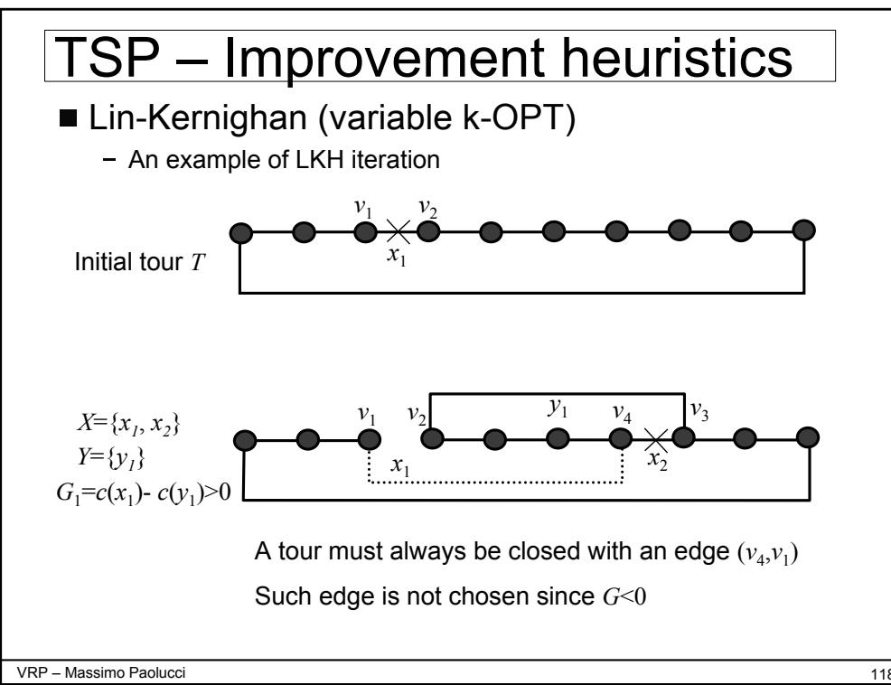

# TSP – Improvement heuristics

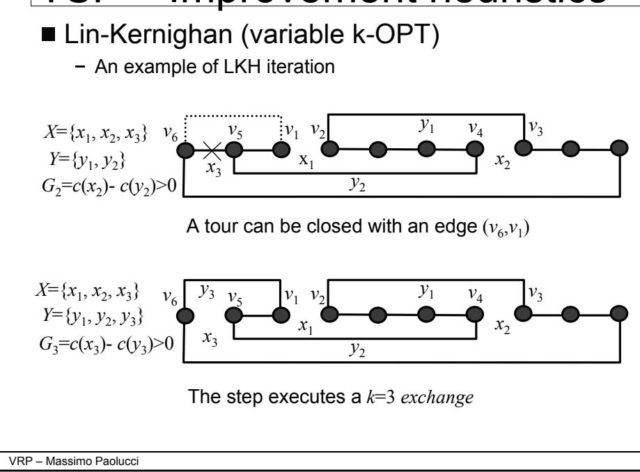

# Heuristics for the CVRP

Exact algorithms for VRP are based on models generalizing the TSP ones Only quite small instances can be optimally solved (e.g., 100 customers, and 5 vehicles)

Heuristic approaches are always used in the practice: Constructive heuristics Two phase methods: Cluster First – Route Second Route First – Cluster Second Improvement heuristics

# Metaheuristics:

Actually the most powerful ones (but more time consuming and difficult to tune, extend, adapt) ... will be covered in a dedicated lecture

# Heuristics for the CVRP

Constructive heuristics

Sequential: the solution is built one tour at a time Parallel: more tours are built in parallel

Two main techniques

Merge existing route (savings criterion) Assign customer to routes (insertion cost criterion)

Clark and Wright Savings Algorithm

Both sequential and parallel version   
It can be applied when the number of vehicles is a decision variable   
It merges pairs of routes so that the end of one route continue with the start of the other in order to maximise the distance savings derived from the merges

# Heuristics for the CVRP

Clark and Wright Savings Algorithm (sequential version) Initialization

For each vertex $i { = } 1 , . . .$ ., $n$ generate a route $( 0 , i , 0 )$   
For each $i$ compute the savings ${ s _ { i j } } ^ { = } { c _ { i 0 } } ^ { + } { c _ { 0 j } } ^ { - } { c _ { i j } }$ for $j { = } 1 , { \ldots } , n , j { \neq } i$ , and sort the savings in non increasing order   
Define route $( 0 , 1 , 0 )$ as the current route

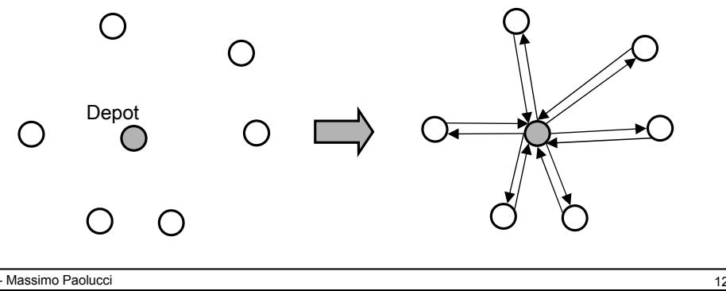

# Heuristics for the CVRP

Clark and Wright Savings Algorithm

Iteration (sequential version: route extension)

Let route $( 0 , i , . . . . , j , 0 )$ be the generic current route

Determine the first saving $s _ { k i }$ or $s _ { j e }$ so that the route can be feasibly merged with another route including edge (arc) $( k , 0 )$ or $^ { ( 0 , e ) }$ .

If a feasible merge exists then implement it and iterate with the current route

Else

If there are other routes not considered so far, then select a next route as current route and iterate Else stop (no more feasible merge is possible)

# Heuristics for the CVRP

Clark and Wright Savings Algorithm (sequential version) An example

1) Current route $( 0 , i , 0 )$

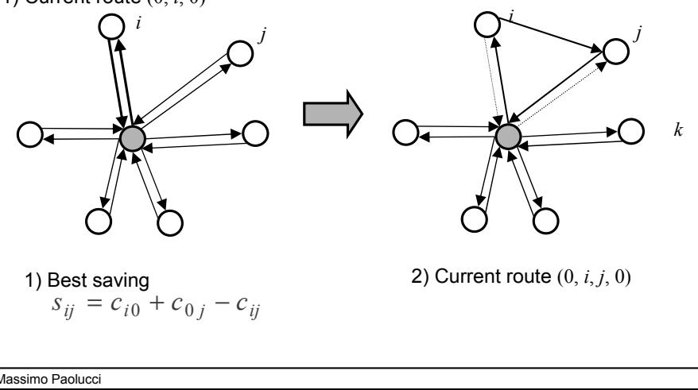

# Heuristics for the CVRP

Clark and Wright Savings Algorithm (sequential version) An example

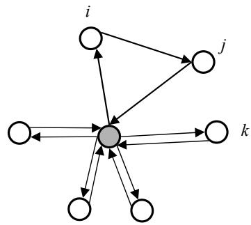

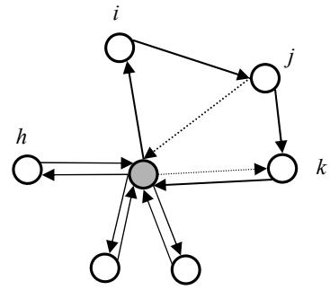

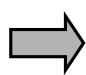

2) Current route $( 0 , i , j , 0 )$

2) Best saving

$$
s _ { j k } = c _ { j 0 } + c _ { 0 k } - c _ { j k }
$$

3) Current route $( 0 , i , j , k , 0 )$ cannot be extended anymore in a feasible way.

The next current route is $( 0 , h , 0 )$

VRP – Massimo Paolucci

# Heuristics for the CVRP

Clark and Wright Savings Algorithm (sequential version) An example

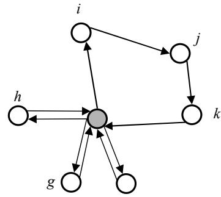

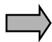

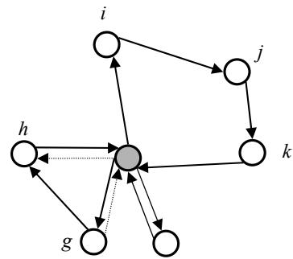  
4) Current route $( 0 , g , h , 0 )$

3) Current route $( 0 , h , 0 )$

3) Best saving

No more merge is feasibly possible.

$$
s _ { g h } = c _ { g 0 } + c _ { 0 h } - c _ { g h }
$$

A 3-routes solution is found !

VRP – Massimo Paolucci

# Heuristics for the CVRP

Clark and Wright Savings Algorithm (parallel version) Initialization

For each vertex $i { = } 1 , . . . , n$ generate a route $( 0 , i , 0 )$ Compute the savings ${ s _ { i j } } ^ { = } { c _ { i 0 } } ^ { + } { c _ { 0 j } } ^ { - } { c _ { i j } }$ for $\scriptstyle j = 1 , \ldots , n , j \neq i$ , and sort the savings in non increasing order

Iteration (parallel version: best feasible merge) If a positive saving does exist then

Starting from the largest saving $s _ { i j }$ determine if the two routes, one including edge (arc) $( i , 0 )$ and the other $( 0 , j )$ can be feasibly merged;

If so, merge the two routes by deleting $( i , 0 )$ and $( 0 , j )$ and iterate with the next saving

# Heuristics for the CVRP

Clark and Wright Savings Algorithm (parallel version)

An example:

Symmetric and euclidean distances Vehicles’ capacity $C { = } 8$ Customer demands associated with vertices

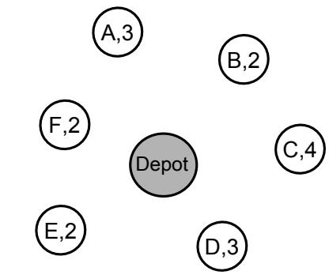

<table><tr><td rowspan=1 colspan=1>cj</td><td rowspan=1 colspan=1>Dep</td><td rowspan=1 colspan=1>A</td><td rowspan=1 colspan=1>B</td><td rowspan=1 colspan=1>C</td><td rowspan=1 colspan=1>D</td><td rowspan=1 colspan=1>E</td><td rowspan=1 colspan=1>F</td></tr><tr><td rowspan=1 colspan=1>Dep</td><td rowspan=1 colspan=1>0</td><td rowspan=1 colspan=1>64</td><td rowspan=1 colspan=1>58</td><td rowspan=1 colspan=1>54</td><td rowspan=1 colspan=1>41</td><td rowspan=1 colspan=1>58</td><td rowspan=1 colspan=1>41</td></tr><tr><td rowspan=1 colspan=1>A</td><td rowspan=1 colspan=1>64</td><td rowspan=1 colspan=1>0</td><td rowspan=1 colspan=1>70</td><td rowspan=1 colspan=1>95</td><td rowspan=1 colspan=1>103</td><td rowspan=1 colspan=1>81</td><td rowspan=1 colspan=1>40</td></tr><tr><td rowspan=1 colspan=1>B</td><td rowspan=1 colspan=1>58</td><td rowspan=1 colspan=1>70</td><td rowspan=1 colspan=1>0</td><td rowspan=1 colspan=1>36</td><td rowspan=1 colspan=1>92</td><td rowspan=1 colspan=1>113</td><td rowspan=1 colspan=1>81</td></tr><tr><td rowspan=1 colspan=1>C</td><td rowspan=1 colspan=1>54</td><td rowspan=1 colspan=1>95</td><td rowspan=1 colspan=1>36</td><td rowspan=1 colspan=1>0</td><td rowspan=1 colspan=1>72</td><td rowspan=1 colspan=1>112</td><td rowspan=1 colspan=1>91</td></tr><tr><td rowspan=1 colspan=1>D</td><td rowspan=1 colspan=1>41</td><td rowspan=1 colspan=1>103</td><td rowspan=1 colspan=1>92</td><td rowspan=1 colspan=1>72</td><td rowspan=1 colspan=1>0</td><td rowspan=1 colspan=1>61</td><td rowspan=1 colspan=1>71</td></tr><tr><td rowspan=1 colspan=1>E</td><td rowspan=1 colspan=1>58</td><td rowspan=1 colspan=1>81</td><td rowspan=1 colspan=1>113</td><td rowspan=1 colspan=1>112</td><td rowspan=1 colspan=1>61</td><td rowspan=1 colspan=1>0</td><td rowspan=1 colspan=1>41</td></tr><tr><td rowspan=1 colspan=1>F</td><td rowspan=1 colspan=1>41</td><td rowspan=1 colspan=1>40</td><td rowspan=1 colspan=1>81</td><td rowspan=1 colspan=1>91</td><td rowspan=1 colspan=1>71</td><td rowspan=1 colspan=1>41</td><td rowspan=1 colspan=1>0</td></tr></table>

VRP – Massimo Paolucci

# Heuristics for the CVRP

Clark and Wright Savings Algorithm (parallel version) An example:

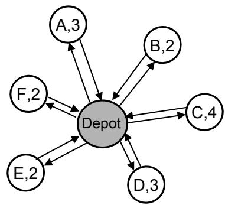

Initial routes and lengths   
• c(0-A-0) = 128   
• c(0-B-0) = 116   
• c(0-C-0) = 108   
• c(0-D-0) = 82   
• c(0-E-0) = 116   
• c(0-F-0) = 82   
Total cost $= 6 3 2$   
Number of vehicles $= 6$

VRP – Massimo Paolucci

# Heuristics for the CVRP

Clark and Wright Savings Algorithm (parallel version) An example:

$S _ { A B } = c _ { A D e p } + c _ { D e p B } - c _ { A B }$ $= 6 4 + 5 8 - 7 0 = 5 2$

<table><tr><td rowspan=1 colspan=1>Sij</td><td rowspan=1 colspan=1>A</td><td rowspan=1 colspan=1>B</td><td rowspan=1 colspan=1>C</td><td rowspan=1 colspan=1>D</td><td rowspan=1 colspan=1>E</td><td rowspan=1 colspan=1>F</td></tr><tr><td rowspan=1 colspan=1>A</td><td rowspan=1 colspan=1>0</td><td rowspan=1 colspan=1>52</td><td rowspan=1 colspan=1>23</td><td rowspan=1 colspan=1>2</td><td rowspan=1 colspan=1>41</td><td rowspan=1 colspan=1>65</td></tr><tr><td rowspan=1 colspan=1>B</td><td rowspan=1 colspan=1>52</td><td rowspan=1 colspan=1>0</td><td rowspan=1 colspan=1>76</td><td rowspan=1 colspan=1>7</td><td rowspan=1 colspan=1>3</td><td rowspan=1 colspan=1>18</td></tr><tr><td rowspan=1 colspan=1>C</td><td rowspan=1 colspan=1>23</td><td rowspan=1 colspan=1>76</td><td rowspan=1 colspan=1>0</td><td rowspan=1 colspan=1>23</td><td rowspan=1 colspan=1>0</td><td rowspan=1 colspan=1>4</td></tr><tr><td rowspan=1 colspan=1>D</td><td rowspan=1 colspan=1>2</td><td rowspan=1 colspan=1>7</td><td rowspan=1 colspan=1>23</td><td rowspan=1 colspan=1>0</td><td rowspan=1 colspan=1>38</td><td rowspan=1 colspan=1>11</td></tr><tr><td rowspan=1 colspan=1>E</td><td rowspan=1 colspan=1>41</td><td rowspan=1 colspan=1>3</td><td rowspan=1 colspan=1>0</td><td rowspan=1 colspan=1>38</td><td rowspan=1 colspan=1>0</td><td rowspan=1 colspan=1>58</td></tr><tr><td rowspan=1 colspan=1>F</td><td rowspan=1 colspan=1>65</td><td rowspan=1 colspan=1>18</td><td rowspan=1 colspan=1>4</td><td rowspan=1 colspan=1>11</td><td rowspan=1 colspan=1>58</td><td rowspan=1 colspan=1>0</td></tr></table>

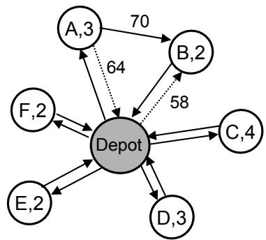

VRP – Massimo Paolucci

# Heuristics for the CVRP

Clark and Wright Savings Algorithm An example:

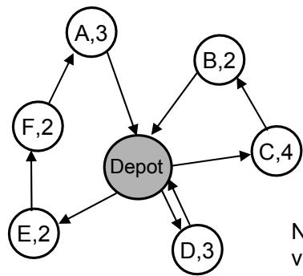

<table><tr><td rowspan=1 colspan=1>Si</td><td rowspan=1 colspan=1>A</td><td rowspan=1 colspan=1>B</td><td rowspan=1 colspan=1>C</td><td rowspan=1 colspan=1>D</td><td rowspan=1 colspan=1>E</td><td rowspan=1 colspan=1>F</td></tr><tr><td rowspan=1 colspan=1>A</td><td rowspan=1 colspan=1>0</td><td rowspan=1 colspan=1>52</td><td rowspan=1 colspan=1>23</td><td rowspan=1 colspan=1>2</td><td rowspan=1 colspan=1>41</td><td rowspan=1 colspan=1>65</td></tr><tr><td rowspan=1 colspan=1>B</td><td rowspan=1 colspan=1>52</td><td rowspan=1 colspan=1>0</td><td rowspan=1 colspan=1>76</td><td rowspan=1 colspan=1>7</td><td rowspan=1 colspan=1>3</td><td rowspan=1 colspan=1>18</td></tr><tr><td rowspan=1 colspan=1>C</td><td rowspan=1 colspan=1>23</td><td rowspan=1 colspan=1>76</td><td rowspan=1 colspan=1>0</td><td rowspan=1 colspan=1>23</td><td rowspan=1 colspan=1>0</td><td rowspan=1 colspan=1>4</td></tr><tr><td rowspan=1 colspan=1>D</td><td rowspan=1 colspan=1>2</td><td rowspan=1 colspan=1>7</td><td rowspan=1 colspan=1>23</td><td rowspan=1 colspan=1>0</td><td rowspan=1 colspan=1>38</td><td rowspan=1 colspan=1>11</td></tr><tr><td rowspan=1 colspan=1>E</td><td rowspan=1 colspan=1>41</td><td rowspan=1 colspan=1>3</td><td rowspan=1 colspan=1>0</td><td rowspan=1 colspan=1>38</td><td rowspan=1 colspan=1>0</td><td rowspan=1 colspan=1>58</td></tr><tr><td rowspan=1 colspan=1>F</td><td rowspan=1 colspan=1>65</td><td rowspan=1 colspan=1>18</td><td rowspan=1 colspan=1>4</td><td rowspan=1 colspan=1>11</td><td rowspan=1 colspan=1>58</td><td rowspan=1 colspan=1>0</td></tr></table>

No more merges are possible without violating the capacity constraint

3 vehicles total cost=433

VRP – Massimo Paolucci

# Heuristics for the CVRP

Clark and Wright Savings Algorithm An example:

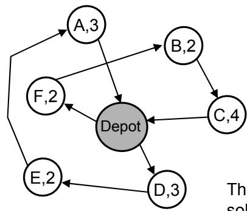

<table><tr><td rowspan=1 colspan=1>Sj</td><td rowspan=1 colspan=1>A</td><td rowspan=1 colspan=1>B</td><td rowspan=1 colspan=1>C</td><td rowspan=1 colspan=1>D</td><td rowspan=1 colspan=1>E</td><td rowspan=1 colspan=1>F</td></tr><tr><td rowspan=1 colspan=1>A</td><td rowspan=1 colspan=1>0</td><td rowspan=1 colspan=1>52</td><td rowspan=1 colspan=1>23</td><td rowspan=1 colspan=1>2</td><td rowspan=1 colspan=1>41</td><td rowspan=1 colspan=1>65</td></tr><tr><td rowspan=1 colspan=1>B</td><td rowspan=1 colspan=1>52</td><td rowspan=1 colspan=1>0</td><td rowspan=1 colspan=1>76</td><td rowspan=1 colspan=1>7</td><td rowspan=1 colspan=1>3</td><td rowspan=1 colspan=1>18</td></tr><tr><td rowspan=1 colspan=1>C</td><td rowspan=1 colspan=1>23</td><td rowspan=1 colspan=1>76</td><td rowspan=1 colspan=1>0</td><td rowspan=1 colspan=1>23</td><td rowspan=1 colspan=1>0</td><td rowspan=1 colspan=1>4</td></tr><tr><td rowspan=1 colspan=1>D</td><td rowspan=1 colspan=1>2</td><td rowspan=1 colspan=1>7</td><td rowspan=1 colspan=1>23</td><td rowspan=1 colspan=1>0</td><td rowspan=1 colspan=1>38</td><td rowspan=1 colspan=1>11</td></tr><tr><td rowspan=1 colspan=1>E</td><td rowspan=1 colspan=1>41</td><td rowspan=1 colspan=1>3</td><td rowspan=1 colspan=1>0</td><td rowspan=1 colspan=1>38</td><td rowspan=1 colspan=1>0</td><td rowspan=1 colspan=1>58</td></tr><tr><td rowspan=1 colspan=1>F</td><td rowspan=1 colspan=1>65</td><td rowspan=1 colspan=1>18</td><td rowspan=1 colspan=1>4</td><td rowspan=1 colspan=1>11</td><td rowspan=1 colspan=1>58</td><td rowspan=1 colspan=1>0</td></tr></table>

The heuristic is not able to find a 2-vehicle solution (total cost=459)

VRP – Massimo Paolucci

# Heuristics for the CVRP

Two phase methods: Cluster First – Route Second

Phase 1: Clustering A clustering problem is solved to assign each customer to a single vehicle

Phase 2: Routing Find the route for each vehicle (solving a TSP problem)

# Heuristics for the CVRP

Two phase methods: Cluster First – Route Second

Methods:

Elementary clustering methods

Sweep algorithm   
Fisher-Jaikumar Generalized Assignment (GA) based algorithm   
Location-based heuristic

Truncated Branch-and-Bound approaches

Levels of the exploration tree $\Rightarrow$ vehicle routes   
Each level contains a set of (partial) feasible routes generated by one or more criteria (e.g., savings)   
Branching $\Rightarrow$ route selection

Petal Algorithms

# Heuristics for the CVRP

Two phase methods: Cluster First – Route Second

Sweep Algorithm

Planar VRP Feasible cluster initially obtained by rotating a ray centred at the depot A vehicle route is found by solving a TSP problem for each cluster

Cluster 1 (customers assigned to vehicle 1)

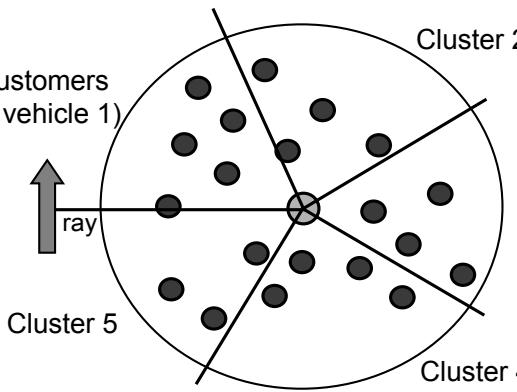  
Cluster 3

VRP – Massimo Paolucci

# Heuristics for the CVRP

Two phase methods: Cluster First – Route Second

Sweep Algorithm

Planar VRP Feasible cluster initially obtained by rotating a ray centred at the depot A vehicle route is found by solving a TSP problem for each cluster

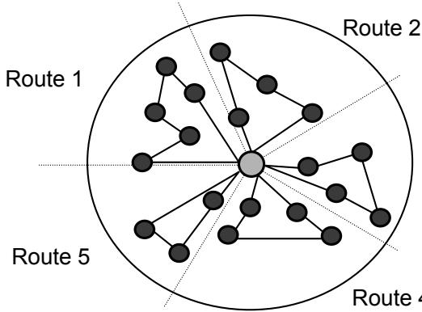  
Route 3   
VRP – Massimo Paolucci

# Heuristics for the CVRP

Two phase methods: Cluster First – Route Second Fisher-Jaikumar Generalized Assignment based algorithm Step 1 (seed selection): select a seed $j _ { k }$ in $\vee$ for each cluster $k { = } 1 , { \ldots } , K$ Step 2 (allocation of customers to seed): compute $c _ { i k }$ the cost of allocating customer $i$ to $k$ as the cost of inserting $i$ in the route $0 { - } j _ { k } { - } 0$ $c _ { i k } = \operatorname* { m i n } \{ c _ { 0 i } + c _ { i j _ { k } } + c _ { j _ { k } 0 } , c _ { 0 j _ { k } } + c _ { j _ { k } i } + c _ { i 0 } \} - ( c _ { 0 j _ { k } } + c _ { j _ { k } 0 } )$ Step 3 (generalized assignment): Solve a GA problem with costs cij, weights for the customers $d _ { i } ,$ and vehicle capacity $\boldsymbol { Q }$ Step 4 (TSP solution): solve a TSP for each cluster found

# Heuristics for the CVRP

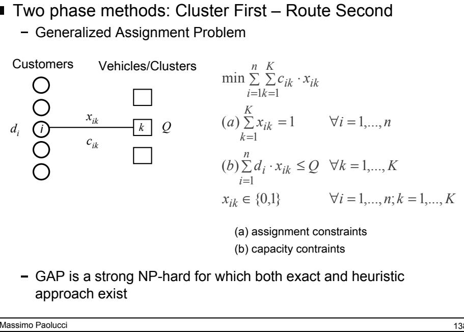

# Heuristics for the CVRP

Two phase methods: Cluster First – Route Second

Location based heuristic

Step 1 (concentrators selection): select a concentrator $j _ { k }$ in V for each cluster $k { = } 1 , { \ldots } , K$ such that the total distance of allocating the $n$ customers to the closest concentrator is minimized, and the total capacity of each cluster does not exceed $\boldsymbol { Q }$

Step 2: Build the vehicle route for each cluster by inserting a customer at a time with the minimum (estimated) insertion cost

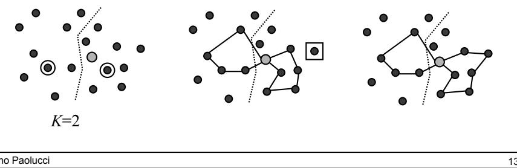

VRP – Massimo Paolucci

# Heuristics for the CVRP

Two phase methods: Cluster First – Route Second

Petal heuristic

Order the vertices $( \nu _ { 1 } , \nu _ { 2 } , . . . , \nu _ { \mathrm { n } } )$ , e.g., use sweep order. For every vertex $\nu _ { i }$ create clusters $\{ \nu _ { i } \}$ , $\{ \nu _ { i } , \nu _ { i + I } \}$ , $\{ \nu _ { i } , \nu _ { i + I } , \nu _ { i + 2 } \}$ , ..., as long as it is possible to feasibly serve the cluster by a single vehicle (Note that subscripts should be interpreted modulo $n$ )

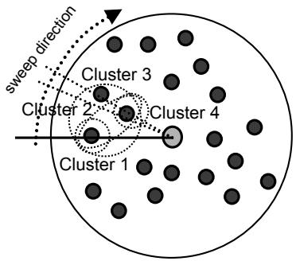

VRP – Massimo Paolucci

# Heuristics for the CVRP

Two phase methods: Cluster First – Route Second

Petal heuristic (cont.)

Compute for each cluster $k$ the cost $c _ { k }$ by solving (exactly or with a heuristic) the associated TSP problem Define end solve a set partitioning problem (SPP) associating a column with each cluster and assigning $c _ { k }$ cost to it

If the incidence matrix A is an interval matrix the SPP is polynomially solvable

# Heuristics for the CVRP

Two phase methods: Route First – Cluster Second Beasley's algorithm Phase 1: Routing Solve a single TSP problem relaxing the capacity (duration) constraints

Phase 2: Clustering Cut the TSP solution into routes that satisfy the capacity (duration) constraints

Note:

Phase 2 can be optimally solved in polynomial time using the approach of the Petal heuristic RFCS heuristic is a special case of the Petal one

# Heuristics for the CVRP

Two phase methods: Route First – Cluster Second

An example: Vehicles’ capacity $C { = } 8$

The TSP solution

Route length $\mathtt { \Lambda } = 3 4 3$ (not feasible)

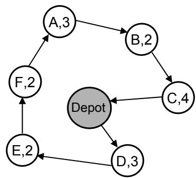

<table><tr><td rowspan=1 colspan=1>j</td><td rowspan=1 colspan=1>Dep</td><td rowspan=1 colspan=1>A</td><td rowspan=1 colspan=1>B</td><td rowspan=1 colspan=1>C</td><td rowspan=1 colspan=1>D</td><td rowspan=1 colspan=1>E</td><td rowspan=1 colspan=1>F</td></tr><tr><td rowspan=1 colspan=1>Dep</td><td rowspan=1 colspan=1>0</td><td rowspan=1 colspan=1>64</td><td rowspan=1 colspan=1>58</td><td rowspan=1 colspan=1>54</td><td rowspan=1 colspan=1>41</td><td rowspan=1 colspan=1>58</td><td rowspan=1 colspan=1>41</td></tr><tr><td rowspan=1 colspan=1>A</td><td rowspan=1 colspan=1>64</td><td rowspan=1 colspan=1>0</td><td rowspan=1 colspan=1>70</td><td rowspan=1 colspan=1>95</td><td rowspan=1 colspan=1>103</td><td rowspan=1 colspan=1>81</td><td rowspan=1 colspan=1>40</td></tr><tr><td rowspan=1 colspan=1>B</td><td rowspan=1 colspan=1>58</td><td rowspan=1 colspan=1>70</td><td rowspan=1 colspan=1>0</td><td rowspan=1 colspan=1>36</td><td rowspan=1 colspan=1>92</td><td rowspan=1 colspan=1>113</td><td rowspan=1 colspan=1>81</td></tr><tr><td rowspan=1 colspan=1>C</td><td rowspan=1 colspan=1>54</td><td rowspan=1 colspan=1>95</td><td rowspan=1 colspan=1>36</td><td rowspan=1 colspan=1>0</td><td rowspan=1 colspan=1>72</td><td rowspan=1 colspan=1>112</td><td rowspan=1 colspan=1>91</td></tr><tr><td rowspan=1 colspan=1>D</td><td rowspan=1 colspan=1>41</td><td rowspan=1 colspan=1>103</td><td rowspan=1 colspan=1>92</td><td rowspan=1 colspan=1>72</td><td rowspan=1 colspan=1>0</td><td rowspan=1 colspan=1>61</td><td rowspan=1 colspan=1>71</td></tr><tr><td rowspan=1 colspan=1>E</td><td rowspan=1 colspan=1>58</td><td rowspan=1 colspan=1>81</td><td rowspan=1 colspan=1>113</td><td rowspan=1 colspan=1>112</td><td rowspan=1 colspan=1>61</td><td rowspan=1 colspan=1>0</td><td rowspan=1 colspan=1>41</td></tr><tr><td rowspan=1 colspan=1>F</td><td rowspan=1 colspan=1>41</td><td rowspan=1 colspan=1>40</td><td rowspan=1 colspan=1>81</td><td rowspan=1 colspan=1>91</td><td rowspan=1 colspan=1>71</td><td rowspan=1 colspan=1>41</td><td rowspan=1 colspan=1>0</td></tr></table>

VRP – Massimo Paolucci

# Heuristics for the CVRP

Two phase methods: Route First – Cluster Second

An example: Vehicles’ capacity $C { = } 8$

First set of clusters/routes

Total length $\mathtt { \Pi } = 4 8 4$ (feasible)   

<table><tr><td rowspan=1 colspan=1>j</td><td rowspan=1 colspan=1>Dep</td><td rowspan=1 colspan=1>A</td><td rowspan=1 colspan=1>B</td><td rowspan=1 colspan=1>C</td><td rowspan=1 colspan=1>D</td><td rowspan=1 colspan=1>E</td><td rowspan=1 colspan=1>F</td></tr><tr><td rowspan=1 colspan=1>Dep</td><td rowspan=1 colspan=1>0</td><td rowspan=1 colspan=1>64</td><td rowspan=1 colspan=1>58</td><td rowspan=1 colspan=1>54</td><td rowspan=1 colspan=1>41</td><td rowspan=1 colspan=1>58</td><td rowspan=1 colspan=1>41</td></tr><tr><td rowspan=1 colspan=1>A</td><td rowspan=1 colspan=1>64</td><td rowspan=1 colspan=1>0</td><td rowspan=1 colspan=1>70</td><td rowspan=1 colspan=1>95</td><td rowspan=1 colspan=1>103</td><td rowspan=1 colspan=1>81</td><td rowspan=1 colspan=1>40</td></tr><tr><td rowspan=1 colspan=1>B</td><td rowspan=1 colspan=1>58</td><td rowspan=1 colspan=1>70</td><td rowspan=1 colspan=1>0</td><td rowspan=1 colspan=1>36</td><td rowspan=1 colspan=1>92</td><td rowspan=1 colspan=1>113</td><td rowspan=1 colspan=1>81</td></tr><tr><td rowspan=1 colspan=1>c</td><td rowspan=1 colspan=1>54</td><td rowspan=1 colspan=1>95</td><td rowspan=1 colspan=1>36</td><td rowspan=1 colspan=1>0</td><td rowspan=1 colspan=1>72</td><td rowspan=1 colspan=1>112</td><td rowspan=1 colspan=1>91</td></tr><tr><td rowspan=1 colspan=1>D</td><td rowspan=1 colspan=1>41</td><td rowspan=1 colspan=1>103</td><td rowspan=1 colspan=1>92</td><td rowspan=1 colspan=1>72</td><td rowspan=1 colspan=1>0</td><td rowspan=1 colspan=1>61</td><td rowspan=1 colspan=1>71</td></tr><tr><td rowspan=1 colspan=1>E</td><td rowspan=1 colspan=1>58</td><td rowspan=1 colspan=1>81</td><td rowspan=1 colspan=1>113</td><td rowspan=1 colspan=1>112</td><td rowspan=1 colspan=1>61</td><td rowspan=1 colspan=1>0</td><td rowspan=1 colspan=1>41</td></tr><tr><td rowspan=1 colspan=1>F</td><td rowspan=1 colspan=1>41</td><td rowspan=1 colspan=1>40</td><td rowspan=1 colspan=1>81</td><td rowspan=1 colspan=1>91</td><td rowspan=1 colspan=1>71</td><td rowspan=1 colspan=1>41</td><td rowspan=1 colspan=1>0</td></tr></table>

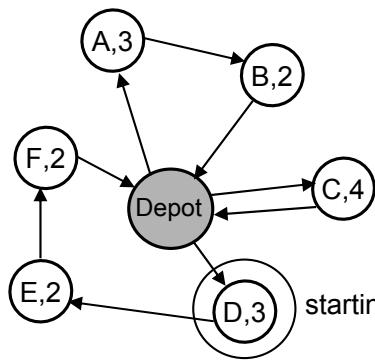

starting vertex

VRP – Massimo Paolucci

# Heuristics for the CVRP

Two phase methods: Route First – Cluster Second

An example: Vehicles’ capacity $C { = } 8$

Second set of clusters/routes

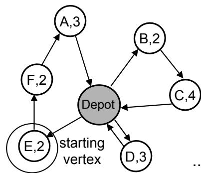

Total length $^ { = 4 3 3 }$ (feasible)   

<table><tr><td rowspan=1 colspan=1>c</td><td rowspan=1 colspan=1>Dep</td><td rowspan=1 colspan=1>A</td><td rowspan=1 colspan=1>B</td><td rowspan=1 colspan=1>C</td><td rowspan=1 colspan=1>D</td><td rowspan=1 colspan=1>E</td><td rowspan=1 colspan=1>F</td></tr><tr><td rowspan=1 colspan=1>Dep</td><td rowspan=1 colspan=1>0</td><td rowspan=1 colspan=1>64</td><td rowspan=1 colspan=1>58</td><td rowspan=1 colspan=1>54</td><td rowspan=1 colspan=1>41</td><td rowspan=1 colspan=1>58</td><td rowspan=1 colspan=1>41</td></tr><tr><td rowspan=1 colspan=1>A</td><td rowspan=1 colspan=1>64</td><td rowspan=1 colspan=1>0</td><td rowspan=1 colspan=1>70</td><td rowspan=1 colspan=1>95</td><td rowspan=1 colspan=1>103</td><td rowspan=1 colspan=1>81</td><td rowspan=1 colspan=1>40</td></tr><tr><td rowspan=1 colspan=1>B</td><td rowspan=1 colspan=1>58</td><td rowspan=1 colspan=1>70</td><td rowspan=1 colspan=1>0</td><td rowspan=1 colspan=1>36</td><td rowspan=1 colspan=1>92</td><td rowspan=1 colspan=1>113</td><td rowspan=1 colspan=1>81</td></tr><tr><td rowspan=1 colspan=1>c</td><td rowspan=1 colspan=1>54</td><td rowspan=1 colspan=1>95</td><td rowspan=1 colspan=1>36</td><td rowspan=1 colspan=1>0</td><td rowspan=1 colspan=1>72</td><td rowspan=1 colspan=1>112</td><td rowspan=1 colspan=1>91</td></tr><tr><td rowspan=1 colspan=1>D</td><td rowspan=1 colspan=1>41</td><td rowspan=1 colspan=1>103</td><td rowspan=1 colspan=1>92</td><td rowspan=1 colspan=1>72</td><td rowspan=1 colspan=1>0</td><td rowspan=1 colspan=1>61</td><td rowspan=1 colspan=1>71</td></tr><tr><td rowspan=1 colspan=1>E</td><td rowspan=1 colspan=1>58</td><td rowspan=1 colspan=1>81</td><td rowspan=1 colspan=1>113</td><td rowspan=1 colspan=1>112</td><td rowspan=1 colspan=1>61</td><td rowspan=1 colspan=1>0</td><td rowspan=1 colspan=1>41</td></tr><tr><td rowspan=1 colspan=1>F</td><td rowspan=1 colspan=1>41</td><td rowspan=1 colspan=1>40</td><td rowspan=1 colspan=1>81</td><td rowspan=1 colspan=1>91</td><td rowspan=1 colspan=1>71</td><td rowspan=1 colspan=1>41</td><td rowspan=1 colspan=1>0</td></tr></table>

... and so on

# Heuristics for the CVRP

# Improvement heuristics

Based on LS: exploration of a neighbourhood $N ( x )$ of solutions $N ( x )$ is built using “moves”

Possible moves:

Insert a customer in a different position in the sequence of visit Swap the positions of a pair of customers k-Opt

Two classes of methods:

Single route improvement the assignment of customers to routes (vehicles) not change (analogous to TSP improvement heuristic)

Multi route improvement the moves may also change the customer-route assignment

VRP – Massimo Paolucci

# Heuristics for the CVRP

Improvement heuristics

Multi route improvements: String crossing Two chains of customers are exchanged by exchanging the endpoints of two edges in two different routes

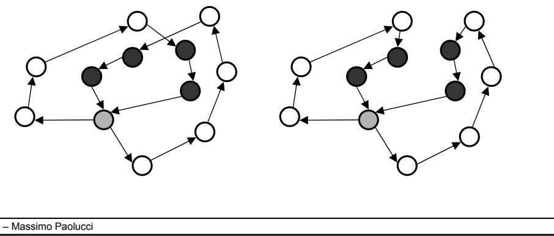

# Heuristics for the CVRP

# Improvement heuristics

Multi route improvements:

String relocation

A chain of at most $k$ customers is moved from one route to another Higher value of $k$ may produce better results but the neighbourhood exploration time also increases

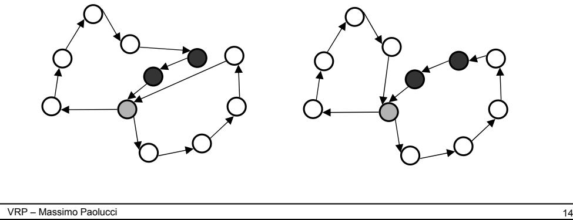

# Heuristics for the CVRP

# Improvement heuristics

Multi route improvements:

String exchange

Two chain of at most $k$ customers are exchanged between two routes If $k = n$ then string exchange contains string cross as well (but this is a large neighborhood which is time consuming to evaluate). The values for $k$ are usually small $\{ 1 , 2 , 3 \}$

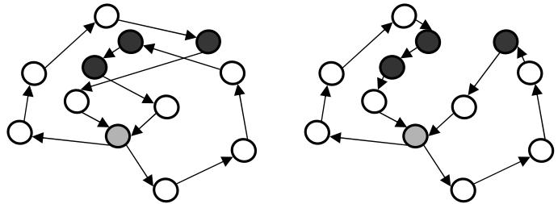

String relocation is a special case if $k _ { 1 } { > } 0$ and $k _ { 2 } { = } 0$ String crossing is a special case if $k _ { 1 } { = } k _ { 2 }$ and the strings are at the routes’ ends.

VRP – Massimo Paolucci

<table><tr><td></td></tr><tr><td>The Arc Routing Problems</td></tr><tr><td>The Chinese Problem (CPP)</td></tr><tr><td>Characteristics</td></tr><tr><td>Models</td></tr><tr><td>Algorithms (heuristics)</td></tr><tr><td></td></tr><tr><td></td></tr></table>

# ARP – Arc Routing Problems

ARPs concern the distribution/collection of goods or materials along the arcs (edges) of a road network Same main components as NRP The density of customers along streets is sufficiently high to consider the associated arc (edge) the key network element to be served

Solution:

A set of routes performed a fleet of vehicles such that:

each route starts and ends at vehicles’ depots the requests for service associated with arcs or edges are satisfied the operational constraints are fulfilled the global transportation cost is minimized

# ARP – Arc Routing Problems

Operational constraints of the same kind of the ones for NRP (e.g., number of available vehicles, vehicles’ capacity, route duration ...)

ARP without operational constraints:

All arcs (edges) must be served: the Chinese Postman Problem (CPP)   
Only a subset of arcs (edges) must be served: the Rural Chinese Postman Problem (RCPP)

Other ARP variations: The Windy Chinese Postman Problem The Stacker Crane Problem

# ARP – Arc Routing Problems

The CPP is characterized by:

A single vehicle   
All the arcs (edges) must be served   
The service demand is neglected (as well as the vehicle capacity)   
For each arc (edge) the service cost and the traversing cost (without service) are known

Solution: a minimum cost route that traverses at least once every arc (edge)

starting vertex $=$ depo

Does a route exist which traverses each edge exactly once?

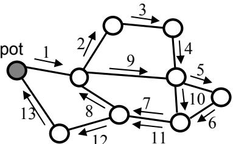

edge traversal without service $=$ deadheading

# ARP – Arc Routing Problems

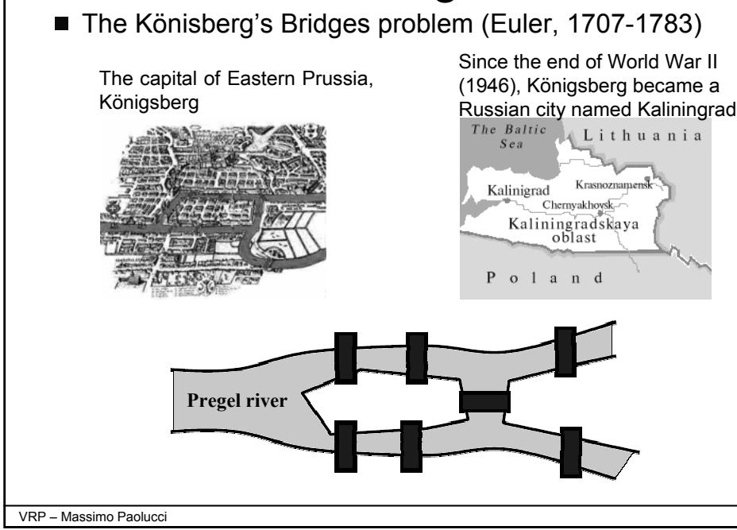

# ARP – Arc Routing Problems

The Könisberg’s Bridges problem (Euler, 1707-1783)

Is it possible to cross each bridge exactly once starting and ending at the same point? (Euler, 1736)

The graph model is a Multi-Graph

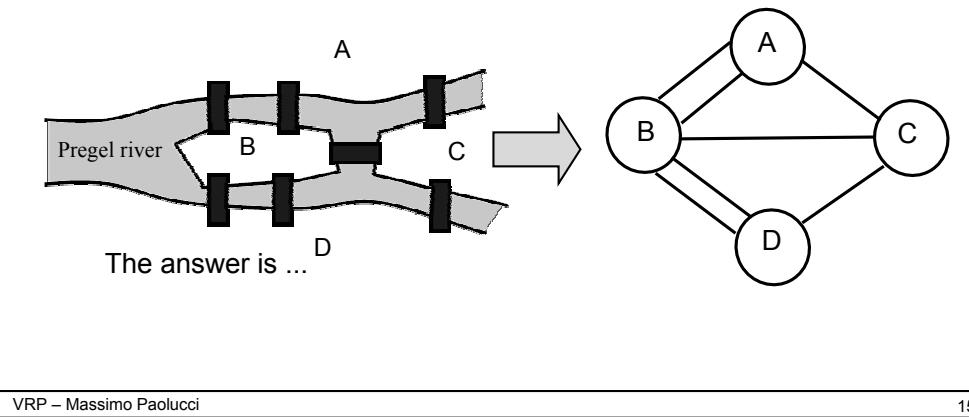

# ARP – Arc Routing Problems

The Könisberg’s Bridges problem (Euler, 1707-1783)

The answer is ... the same of the following decision problem:

Is the graph in the figure an eulerian graph ?

i.e., does it contain a tour (closed walk) that transits on every edge exactly once?

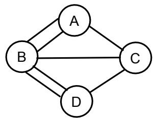

Unfortunately the answer is no ! (the graph is not an eulerian one)

VRP – Massimo Paolucci

# ARP – Arc Routing Problems

Euler showed that for an eulerian cycle to exist, all the vertices must have even degree Note that an eulerian (not closed) path can exist if the graph includes at most two vertices with odd degree

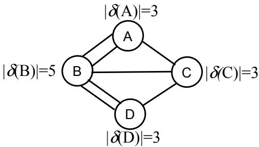

Every vertex has an odd degree Note that ∑ = ⋅ | δ i | 2 | E | $\sum _ { i \in V } \delta _ { i }  = 2 \cdot  E $

# ARP – Arc Routing Problems

An eulerian tour in a graph is a tour that contains each edge (arc) exactly once   
A postman tour in a graph is a tour that contains each edge (arc) at least once   
If the (multi) graph G(V,A) is eulerian the optimal solution to the CPP is trivially $Z _ { C P P } ^ { * } = \underset { e \in E } { \sum } c _ { e }$ and the CPP problem reduces to find the eulerian tour in the graph   
If $\sf { G }$ is not eulerian the CPP solution is a tour that transit on a subset of arcs (edges) more than once Then the problem reduces to add to $\sf G$ copies of the arcs (edges) so that G becomes eulerian while the increment of the cost so generated

# ARP – Arc Routing Problems

How to determine if a connected graph $\sf { G }$ is eulerian?

An undirected $G ( V , E )$ is eulerian $\Leftrightarrow \forall i \in V | \delta ( i ) |$ is even ( $G$ is even)   
A directed $G ( V , A )$ is eulerian $\iff \forall \mathrm { i } \in V | \delta ^ { - } ( i ) | = | \delta ^ { + } ( i ) |$ $G$ is symmetric)   
A mixed $G ( V , A \cup E )$ is eulerian $\Leftrightarrow G$ is even and satisfies the following   
balanced set condition (balanced) For every subset of vertices $S { \subset V }$ , the difference between the number of directed arcs that cross the cut $( S , W \mathbf { \mathbb { S } } )$ from $S$ to $\boldsymbol { { \cal { W } \mathrm { S } } }$ and the number of the directed arcs from $\boldsymbol { { \cal { W } \mathrm { S } } }$ to $S$ must be less than or equal to the number of undirected edges crossing $( S , W \mathbf { \mathbb { S } } )$

# Examples

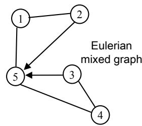

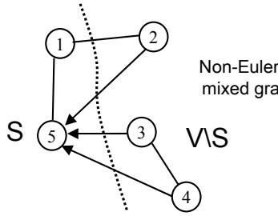

VRP – Massimo Paolucci

# CPP – The Chinese Postman Problem

Formulation of the Undirected PP (UPP)

Notation:

$G ( V , E )$ undirected graph   
$V _ { O } \subseteq V$ the subset of odd vertices   
- $A _ { G } = [ a _ { i e } i \in V , e \in E ]$ the vertex-edge adjacent matrix $[ a _ { i e } = 1$ if $e \in \delta ( i )$ , 0 otherwise)

# Variables:

$x _ { e } = { \mathfrak { n } }$ number of times edge e is added to $G$ to transform it into an eulerian graph ${ ( x _ { e } = 0 }$ for every $e \in E$ if $G$ is eulerian) $w _ { i }$ for i∈ $V$ a positive integer

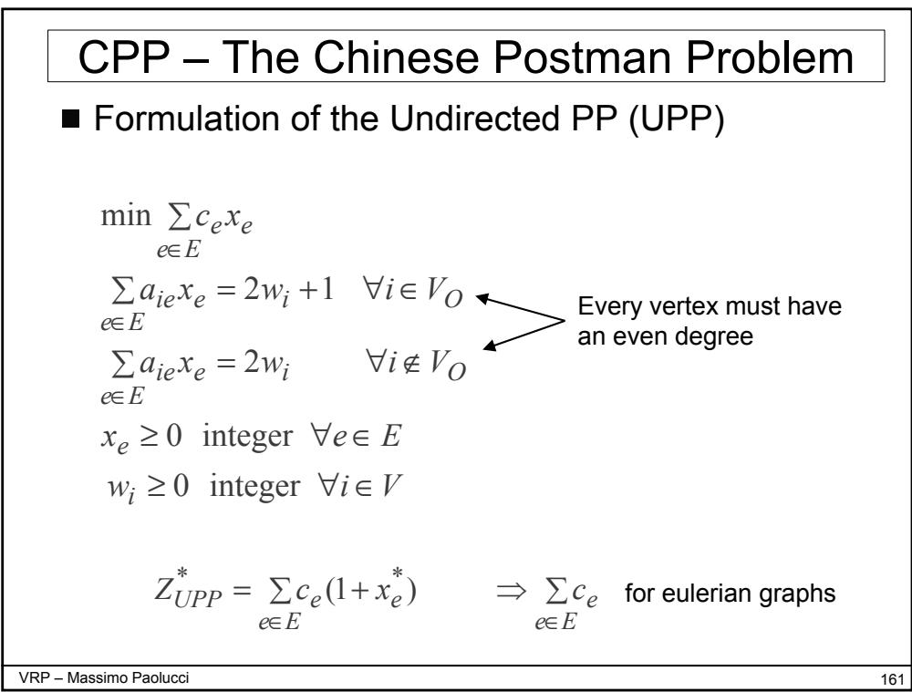

# CPP – The Chinese Postman Problem

Solution of the UPP

The UPP is solvable in polynomial time

If $G$ is eulerian determine the eulerian tour

Fleury Algorithm End-Pairing Algorithm

If $G$ is not eulerian:

First add copies of the edges in order to transform it into an eulerian graph $G$ ’ with the minimum additional cost by solving a Matching Problem (polynomial)   
Then determine the eulerian tour in $G$ ’

VRP – Massimo Paolucci

# CPP – The Chinese Postman Problem

# Solution of the UPP

The Fleury Algorithm

1. Let $T { \equiv } E$ , $W { = } V$ . Select a starting vertex $\nu { = } i$

2. Select randomly an edge $\mathrm { e } \in T$ incident in $\nu$ , $e \in \delta ( \nu )$ , $e { = } ( \nu , h )$ , such that $e$ is not a bridge (if no other choice exists the graph is not eulerian)

3. Traverse $e$ and remove it from $T ;$ if $\delta ( \nu ) \cap T = \emptyset$ then $W { = } W \backslash \{ \nu \}$ ; set $\scriptstyle \nu = h$

4. If $T \neq \emptyset$ and $\nu { \neq } i$ then continue with step 2

# Definition:

An edge is a bridge if the number of connected components in $F ( W , \mathrm { T } \backslash \{ \mathbf { e } \} )$ is increased by 1

# CPP – The Chinese Postman Problem

Solution of the UPP The Fleury Algorithm An example: G eulerian

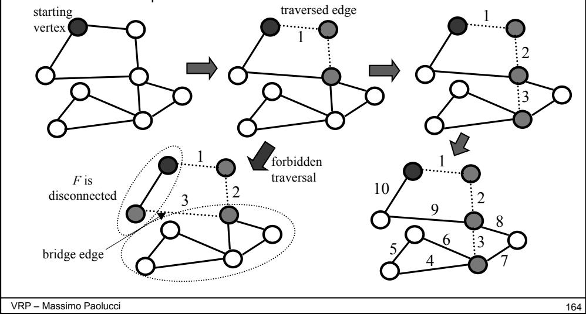

# CPP – The Chinese Postman Problem

Solution of the UPP

The End-Pairing Algorithm

1. Trace a first simple $T _ { 1 }$ tour in $G$ (that may not contain all vertices). If all the edges are traversed then stop

2. Consider any vertex $\nu$ on $T _ { 1 }$ which is incident to an edge not on the tour, and form a second tour $T _ { 2 }$ from $\nu$ not overlapping $T _ { 1 }$

3. Merge $T _ { 2 }$ with $T _ { 1 }$ : starting from $\nu$ follow $T _ { 1 }$ and then continue with T2

4. If all the edges are traversed then stop, otherwise continue with step 2

Both Fleury and End-Pairing algorithms are easily generalized to directed eulerian graphs

# CPP – The Chinese Postman Problem

Solution of the UPP The End-Pairing Algorithm An example

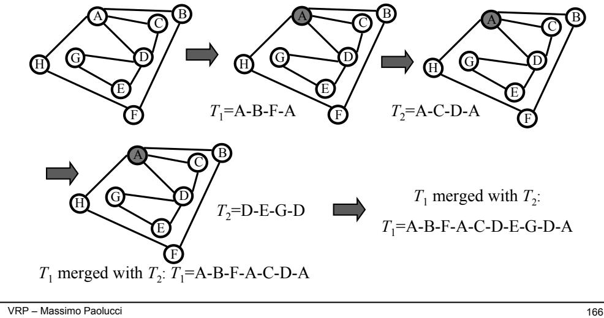

# CPP – The Chinese Postman Problem

Solution of the UPP

Undirected non eulerian $G ( V , E )$ : the Matching Problem

1. Let $E { \stackrel { \prime } { = } } E$ . Identify the set $V _ { O }$ of odd degree vertices and compute the shortest paths $s p _ { i j }$ between all pairs of vertices i, j∈ $V _ { O }$ i<j

2. Build a complete undirected graph $G _ { O } ( V _ { O } , E _ { O } ) , E _ { O } { = } \{ ( i , j ) \colon i , j { \in } V _ { O } i { < } j \}$ , and associate the costs $s p _ { i j }$ to each edge in $E _ { o }$

3. Find a minimum cost matching $M$ in $G _ { o }$ where $M \mathrm { { C } } E _ { o }$ such that every $\nu \in V _ { O }$ is incident to exactly an edge in $M$

4. For each edge $( i , j ) \in M$ add to $E ^ { : }$ a copy of the edge included in the shortest path between $i$ and $j$

5. Form the eulerian graph $G ^ { \prime } ( V , E ^ { \prime } )$

6. The optimal solution of the UPP corresponds to the eulerian tour in $G$ ’

The minimum matching problem can be solved with polynomial algorithms with complexity of $O ( | V | ^ { 3 } )$ or less

# CPP – The Chinese Postman Problem

Solution of the UPP

Undirected non eulerian $G ( V , E )$ : the Matching Problem An example

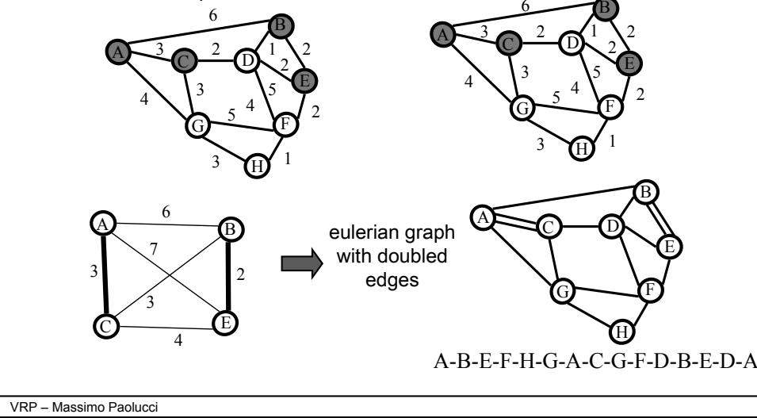

# CPP – The Chinese Postman Problem

Formulation of the Directed PP (DPP)

Notation:

- $G ( V { , } A )$ directed graph   
∀i∈V $\begin{array} { r } { d ^ { - } ( i ) = \mid \delta ^ { - } ( i ) \mid } \end{array}$ in-degree and $d ^ { + } ( i ) = \mid \delta ^ { + } ( i ) \mid$ out-degree   
∀i∈V $b ( i ) = d ^ { - } ( i ) - d ^ { + } ( i )$

# Variables:

$x _ { i j } =$ number of additional copies of arc $( i , j )$ added to $G$ to transform it into an eulerian graph $( x _ { i j } = 0 \forall ( i , j ) \in A$ if $G$ is eulerian)

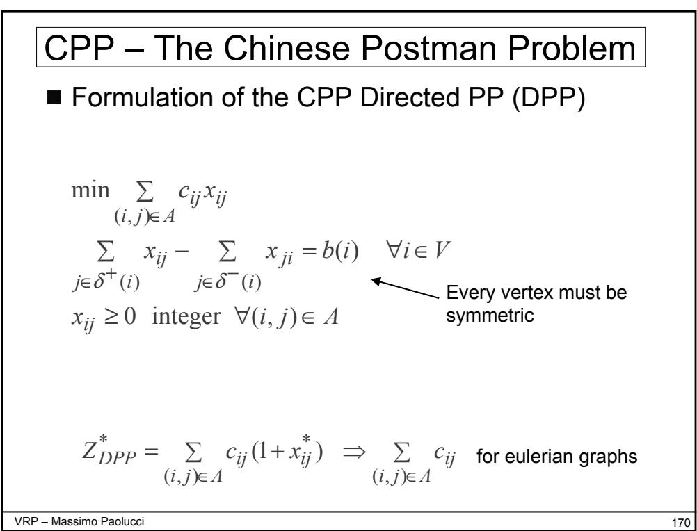

# CPP – The Chinese Postman Problem

# Solution of the DPP

The DPP is solvable in polynomial time

If $G$ is eulerian determine the eulerian tour

Fleury or End-Pairing Algorithms adapted to directed graphs van Aardenne-Ehrenfest and De Bruijn Algorithm

If $G$ is not eulerian:

First add copies of the arcs in order to transform it into an eulerian graph $G$ ’ with the minimum additional cost by solving a Transportation Problem (polynomial) Then determine the eulerian tour in $G$ ’

# CPP – The Chinese Postman Problem

# Solution of the DPP

The van Aardenne-Ehrenfest and De Bruijn Algorithm

1. Build an spanning in-tree arborescence routed in an arbitrary vertex $\nu$

2. Label all arcs in $G$ as follows: order and arbitrary label the arcs outgoing from $\nu _ { ; } ^ { \prime }$ ; order and label the arcs outgoing from any other vertex consecutively in an arbitrary way but selecting as the last arc an arc used in the arborescence

3. Starting from an arbitrary vertex traverse the lowest labelled arc outgoing from it and continue by leaving any entered vertex following the arc not yet traversed with the lowest label. When all arcs have been traversed the eulerian tour is found

# Definitions:

An in-tree is an oriented tree in which a single vertex is reachable from any other one.

An spanning arborescence of a directed graph $G$ (if it exists) is an arborescence with include every vertex of $G$

# CPP – The Chinese Postman Problem

Solution of the DPP

The van Aardenne-Ehrenfest and De Bruijn Algorithm An example

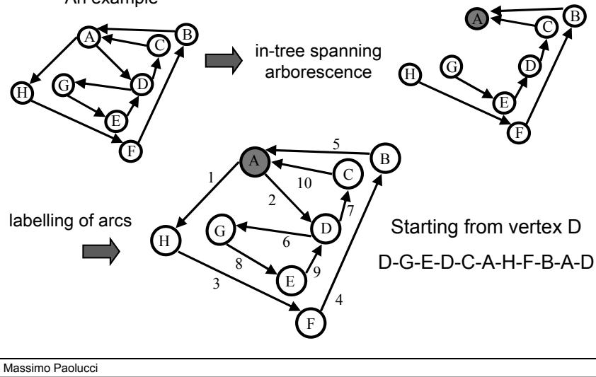

# CPP – The Chinese Postman Problem

# Solution of the DPP

Directed non eulerian $G ( V , A )$ : the Transportation Prob.

1. Define the subset of $V$ ƒ $S { = } \{ i { \in } V ; b ( i ) { > } 0 \}$ (supply vertices) ƒ $D { = } \{ i { \in } V ; b ( i ) { < } 0 \}$ (demand vertices)

2. Compute the shortest paths $s p _ { i j }$ between all pairs of vertices $( i , j )$ such that $i { \in } S , j { \in } D$

3. Solve a transportation problem for the supply and demand vertices defined with the $s p _ { i j }$ costs, finding the optimal flow $y _ { i j }$ for each pair $( i , j )$

4. For each $y _ { i j } { > } 0$ augment the original graph $G$ with the copies of the arcs associated to the shortest path between vertex $i$ and $j$ , forming the eulerian graph $G ^ { \prime } ( V , A ^ { \prime } )$

5. The optimal solution of the UPP corresponds to the eulerian tour in $G$ ’

The transportation problem can be solved with complexity of $O ( | V | ^ { 3 } )$ or $O ( | A | | W | ^ { 2 } )$

# CPP – The Chinese Postman Problem

Solution of the DPP Directed non eulerian $G ( V , A )$ : the Transportation Prob. An example

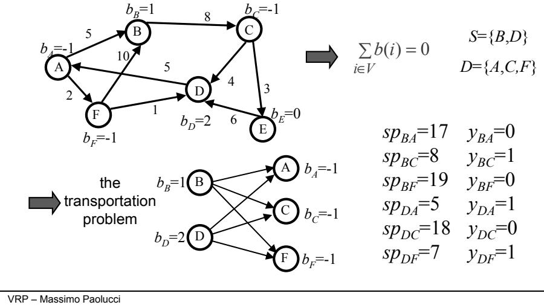

# CPP – The Chinese Postman Problem

Solution of the DPP Directed non eulerian $G ( V , A )$ : the Transportation Prob. An example

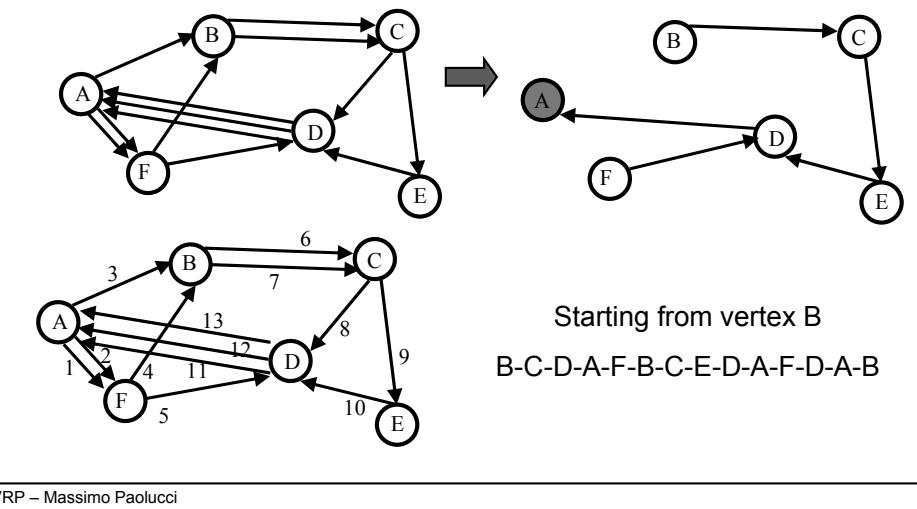

# CPP – The Chinese Postman Problem

The Mixed PP (MPP)

If $G ( V , A \cup E )$ mixed graph is eulerian (even and balanced) the postman tour is found as follows:

assign a direction to some edges in order to make $G$ symmetric complete the orientation of the remaining edges to transform $G$ into an eulerian directed graph determine the postman tour with one of the available algorithms

If $G$ is even but not balanced the problem is solved by the Minieka’s Algorithm

Note that if $G$ is even and symmetric is also balanced but symmetry is not a necessary condition to eulerian

# CPP – The Chinese Postman Problem

The Mixed PP (MPP)

The Ford-Fulkerson’s procedure for transforming an eulerian mixed graph $G ( V , A \cup E )$ into a eulerian directed graph

Transform $G$ into a symmetric graph

1. replace each $( i , j ) { \in } E$ with two directed arcs $( i , j )$ and $( j , i )$ transforming the graph into $G ( V , A ^ { \prime } )$ . Assign to each arc in $A$ a lower bound of 1 and to each arc in $A \ " \boldsymbol { \rtimes }$ a lower bound of 0. Assign to any arc in $A ^ { \prime }$ an upper bound of 1.

2. Determine a feasible circulation for the network flow model so defined. Let $x _ { i j }$ the flow in arc $( i , j )$

3. Orient the edge $( i , j ) { \in } E$ as arc $( i , j )$ , if $x _ { i j } = 1$ and $x _ { j i } { = } 0$ , remove the edge from $E$ and include the arc in $A$ .

# CPP – The Chinese Postman Problem

The Mixed PP (MPP): eulerian graphs

The Ford-Fulkerson’s procedure for transforming an eulerian mixed graph $G ( V , A \cup E )$ into a eulerian directed graph Transform $G$ into a symmetric graph: an example

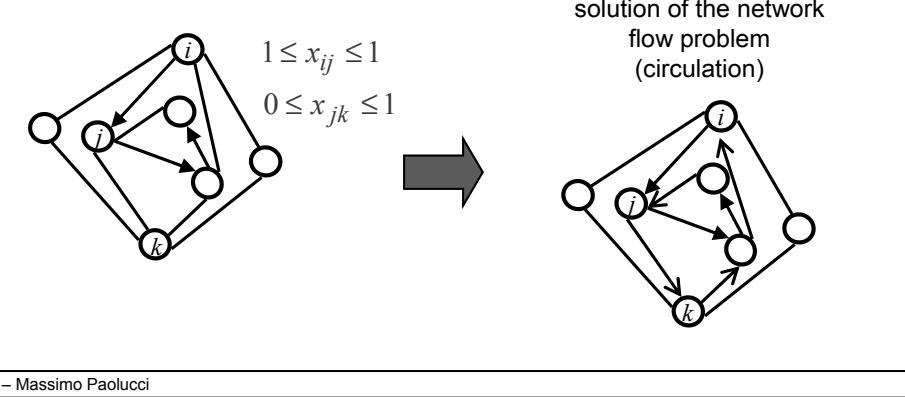

# CPP – The Chinese Postman Problem

The Mixed PP (MPP): eulerian graphs

The Ford-Fulkerson’s procedure for transforming an eulerian mixed graph $G ( V , A \cup E )$ into a eulerian directed graph

Transform the mixed symmetric graph $G$ into a directed symmetric one

1. If $E$ is empty then stop   
2. Le $i$ a vertex with at least an incident edge $( i , j ) { \in } \mathrm { E }$ . Set $\scriptstyle \nu = i$ and $w { = } j$   
3. Orient $( \nu , w )$ from $\nu$ to $w$ . If $\scriptstyle w = i { \mathfrak { g o } }$ to step 1   
4. Set $\scriptstyle \nu = w$ and identify an edge $( \nu , w )$ incident to $\nu$ . Go to step 3

# CPP – The Chinese Postman Problem

The Mixed PP (MPP): eulerian

The Ford-Fulkerson’s procedure for transforming an eulerian mixed graph $G ( V , A \cup E )$ into a eulerian directed graph Transform the mixed symmetric graph $\pmb { G }$ into a directed symmetric one: an example

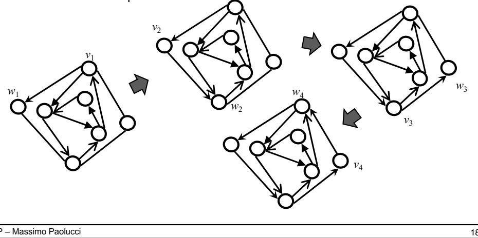

# CPP – The Chinese Postman Problem

The Mixed PP (MPP)

Even graph

The Minieka’s Algorithm transforms an even unbalanced mixed graph $G ( V , A \cup E )$ into an even and balanced one (i.e., into an eulerian directed graph)

The algorithm is based on the definition and solution of a minimum cost flow problem:

if no feasible solution exists then the graph cannot be balanced and no postman tour exists

For not even mixed graph the problem is NP-hard

A possible heuristic is a two-stage procedure:

(1) optimally adding edges (matching) to make the graph even (2) to apply the Minieka’s algorithm

The procedure may not find the optimal solution even if each single stage is performed optimally.

# RCPP – The Rural Chinese Postman Problem

The Rural CPP

Given a general $G ( V , A \cup E )$ only a subset R⊂A∪E of arcs and edges must be served

Solution: a minimum cost circuit that traverses each arc and edge in $R$ at least once

Notation: let $G _ { R }$ the graph induced in $G$ by $R$

Complexity:

$G$ directed or undirected and $G _ { R }$ connected $\Rightarrow \mathsf { R C P P }$ polynomially solvable

$G$ directed or undirected and $G _ { R }$ not connected $\Rightarrow \mathsf { R C P P }$ is NP-hard

# RCPP – The Rural Chinese Postman Problem

The Rural CPP

Algorithm for $G$ undirected and $G _ { R }$ connected

Determine the minimum cost paths in $G$ between every pair of   
odd vertices in $G _ { R }$   
Solve a minimum cost matching for such vertices   
Augment $G _ { R }$ by adding the edges corresponding to the minimum   
matching   
Solve a UPP on $G _ { R }$

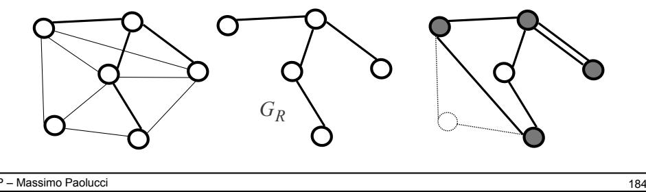

# RCPP – The Rural Chinese Postman Problem

The RCPP: $G$ undirected and $G _ { R }$ not connected

Balance-and-Connect Heuristic

Build and extend $G _ { R }$ by solving a matching problem to obtain and even graph

Connect the $G _ { R }$ components by solving a MST problem on a complete graph $T ( V _ { c } , E _ { c } )$ such that

the vertices in $V _ { c }$ correspond to the components of $G _ { R }$ the cost associated with each edge $( r , s ) \in T$ is computed as the minimum cost path connecting any pair of vertices in $G$ belonging to the components of $G _ { R }$ the node $r$ and $s$ are associated with

Apply the algorithm for RPP with connected $G _ { R }$

# RCPP – The Rural Chinese Postman Problem

The RCPP: directed $G$

The approaches for the undirected case can be extended:

The exact algorithm when $G _ { R }$ is connected is extended by solving a transportation problem to make $G _ { R }$ symmetric

The balance-and-connect heuristic is extended by solving a minimum spanning arborescence problem to connect the components of $G _ { R }$

An example (Directed RCPP)

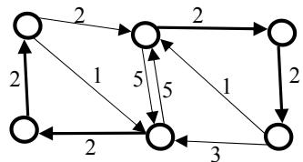

VRP – Massimo Paolucci

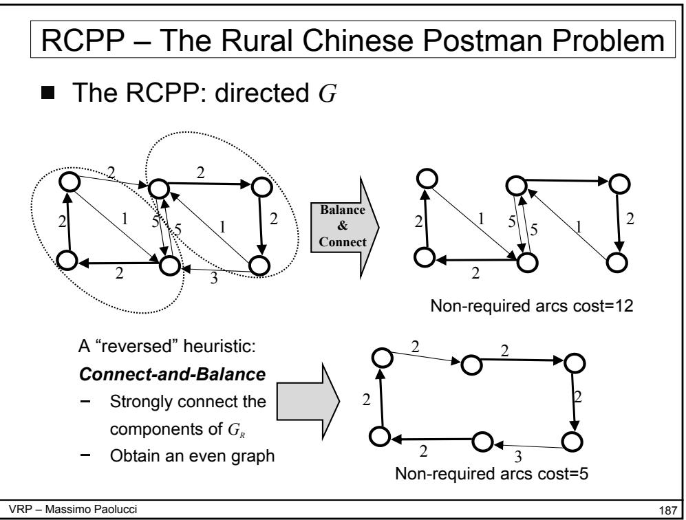

# RCPP – The Rural Chinese Postman Problem

Other PP

The Stacker Crane Problem

A RPP on a mixed graph where $R { = } A$ (NP-hard – close to TSP)

The Windy CPP

A UPP where the costs of edge traversing depend on the travel direction (polynomially solvable if the graph is eulerian, NP-hard otherwise)

# CARP – The Capacitated ARP

ARP with operational constraints

Components:

A connected road network $G = ( V , A )$ A cost (distance) $c _ { i j }$ is associated with each arc $( i , j ) { \in } A$ A demand $d _ { i j }$ is associated with each arc $( i , j ) { \in } R \subseteq A$ A fleet made of $K$ vehicle with capacity $C$ A depot associated with vertex 0

Solution:

A set of $K$ routes, all including vertex 0, covering all the arcs in $R$ and such that: the total demand served by each vehicle does not exceed the capacity $C$ each arc in $R$ is served by a unique route (vehicle)

Objective: Minimize the total cost (distance) of the $K$ routes

# CARP – The Capacitated ARP

Examples of CARP applications:

Street sweeping Winter gritting Refuse collection Electric meter reading Airline scheduling

VRP – Massimo Paolucci

#

CARP – MIP formulation CARP – Symmetric network $G { = } ( V , E )$ . $\cdot \ R { \subseteq } E \ R { = } \{ ( i , j ) { \in } E ; { d _ { i j } } { > } 0 \}$ $\mathbf { \Omega } = \mathrm { k } { = } 1 , . . . , \mathrm { K }$ identical vehicles with capacity $C$ Binary variables x ijk $x _ { i j k } = 1$ if $( i , j ) \in E$ traversed $\dot { l _ { i j k } } = 1$ if $( i , j ) \in R$ served Formulation (Golden & Wong) $\operatorname* { m i n } \sum _ { k = 1 } ^ { K } \sum _ { ( i , j ) \in E } c _ { i j } x _ { i j k }$ (Objective) $\sum _ { j : ( i , j ) \in E } \big ( x _ { i j k } - x _ { j i k } \big ) = 0 \forall i \in V \forall k = 1 , . . . , K$ (Route continuity) x l i j R k Kijk ijk ( , ) 1,...,≥ ∀ ∈ ∀ = (Serviced edge must be traversed) VRP – Massimo Paolucci 191

# CARP – MIP formulation

CARP – Symmetric network $G = ( { \mathsf { V } } , { \mathsf { E } } )$ Formulation (cont.) $\sum _ { k = 1 } ^ { K } ( l _ { i j k } + l _ { j i k } ) = 1 \forall ( i , j ) \in R$ (Required edges must be served) $\sum _ { ( i , j ) \in R } ( l _ { i j k } + l _ { j i k } ) d _ { i j } \le C \quad \forall k = 1 , . . . , K \quad ( C a p a c i t y )$ $ \begin{array} { c } { { \sum _ { i , j \in S } x _ { i j k } \le \mid S \mid - 1 + n ^ { 2 } y _ { S } ^ { k } } } \\ { { \sum _ { i \in S } \sum _ { j \not \in S } x _ { i j k } \ge 1 - u _ { S } ^ { k } } } \\ { { y _ { S } ^ { k } + u _ { S } ^ { k } \le 1 y _ { S } ^ { k } , u _ { S } ^ { k } \in \{ 0 , 1 \} } } \end{array} \} \begin{array} { c } { { ( E I i m i n a t i o n ~ o f ~ d i s c o n n e c t e d } } \\ { { } } \\ { { \forall S \subseteq V \setminus \{ 0 \} \forall k = 1 , . . . , K } } \\ { { \sum _ { i \in S } \sum _ { i \in \backslash \{ i , \dots \} } ( u _ { S } ^ { k } } } \\ { { } } \end{array} $ subtours) 192

# CARP – MIP formulation

Disconnected subtour elimination constraints Examples

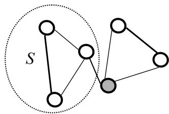

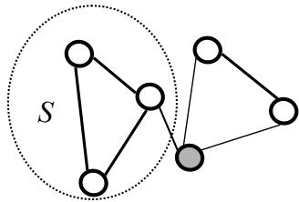

• $S$ is connected to $\boldsymbol { { \cal { W } \mathrm { S } } }$ by at least 1 edge

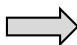

impose that:

• vehicle $k$ cannot traverse more than 2 edges of $S$ • $S$ is connected to $\boldsymbol { { V } } \boldsymbol { { S } }$ by at least 1 edge

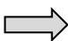

# = 1 = 0 kSkSy u

impose that:

• vehicle $k$ is allowed to traverse the 3 required edges of $S$

VRP – Massimo Paolucci

# CARP – The Capacitated ARP

CARP is NP-hard even for directed and undirected graphs

# Heuristics for the CARP

Classes of heuristics:

Constructive heuristics   
Improvement heuristics   
Two-phase methods Cluster First – Route Second Route First – Cluster Second

An undirected graph $G { = } ( V , E )$ is assumed in the following

# Heuristics for the CARP

Constructive heuristics: The Path Scanning Algorithm

1. Let $R _ { U } \subseteq R$ the subset of service edges not yet served. Initialize $R _ { U } = R , k = 1 , \nu =$ $\scriptstyle \nu = 0$

2. (Decision at vertex $\nu$ ) If an edge can be selected from $R _ { U }$ that can be served by route $k$ , then

serve the edge and remove it from $R _ { U }$ update the vehicle capacity and the vehicle position $\nu$ with the reached vertex w go to step 2

Otherwise reach the depot following the shortest path $S P ( \nu , 0 )$ , and set $k { = } k { + } 1$ and $\scriptstyle \nu = 0$

3. If $k { \le } K$ and $R _ { U } { \neq } \emptyset$ then go to step 2 Otherwise stop

# Heuristics for the CARP

Constructive heuristics: The Path Scanning Algorithm

The edge selected at each iteration (step 2) from $R _ { U }$ must satisfy the vehicle capacity constraint and can be chosen with one among the following criteria:

the cost increment is minimized   
the residual capacity is maximized   
the distance from the depot is either maximized or minimized   
the distance from the depot is maximized if half of the vehicle capacity is available, otherwise is minimized random

# Heuristics for the CARP

Constructive heuristics: The Augment-Merge Algorithm

Build a distinct tour for serving each single edge in $R$

Augment:

starting from the longest tour, serving, e.g., edge $e$ , extend the service to edges different from $e$ but included in the tour as long as it is allowed by the vehicle capacity

# Merge:

compute the savings caused by any possible merge of pairs of routes sort the savings in non increasing order merge the pair of tours starting from the greatest saving as long as the vehicle capacity allowed it and the savings is positive

# Heuristics for the CARP

Constructive heuristics: The Augment-Insert Algorithm

# Initialize:

Set $R _ { U } { = } R$ , and the list $L$ of edges $( i , j )$ in $R _ { U }$ in descending order of $S P ( 0 , i ) + S P ( j , 0 )$ . Find the least cost cycles $C ( i , j )$ that serves the required edges

Iteration Augment:

Select the first (farthest) edge in $R _ { U }$ from $L$ . If no edge is found go to the following step. Augment $C ( i , j )$ by assigning edges in $R _ { U }$ on the cycle following $L$ until the vehicle capacity is exhausted. Remove the serviced edges from $R _ { U }$

Insert:

Following $L$ insert in the current cycle edges in $R _ { U }$ as long as the insertion cost does not exceed the upper bound CLIM (parameter) or the vehicle capacity is exhausted.

# Heuristics for the CARP

Constructive heuristics: The Augment-Insert Algorithm

In a version II of the algorithm the priority is given to the edge with smaller demand

The value assigned to CLIM influence the length of the cycles, and larger values allows greater detours

# Heuristics for the CARP

Constructive heuristics: The Construct-Strike Algorithm Iteration

Construct:

By sequentially adding edges form a capacity-feasible cycle $C$ such that G-C remains connected

Strike: remove the cycle from $G$ and repeat the construct step until all the required edges are served or no more cycles are found.

Remove any non required edges added in previous iteration

Obtain an eulerian circuit by solving a matching problem for the odd degree vertices remaining in $G$ and two copies of the depot (that must have even degree)

Iterate until all the required edges are served

# Heuristics for the CARP

Constructive heuristics: The Construct-Strike Algorithm

Criteria similar to the Path-Scanning can be used for edge selection   
in the construct phase   
A good quality alternative is to select the $( i , j )$ edge that maximize   
the total demand on the path from $j$ back to the depot with the   
smallest total demand

The heuristics behaving better:

— Augment-Insert Construct-Strike (with the above selection rule) Path Scanning with random insertion

No constructive algorithm is dominant

# Heuristics for the CARP

Two-Phase heuristics: The Route First - Cluster Second Algorithm (Ulusoy)

# Route:

Determine a single tour $C$ that include all the required edges but disregards the vehicles’ capacity (solve a RCPP)

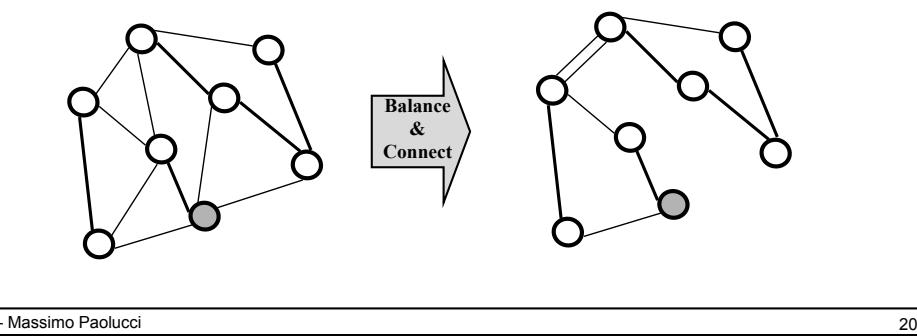

# Heuristics for the CARP

Two-Phase heuristics: The Route First - Cluster Second Algorithm (Ulusoy)

Cluster:

Build an auxiliary directed graph $T = ( V , A )$ as follows:

the vertices in $V$ correspond to the edges in $R$ , plus a final vertex $f$ each arc $( i , j ) { \in } A$ connects a pair of vertices associated with two edges in $R$ such that $i$ is visited before $j$ and the partial tour from $i$ to $j \mathrm { - } I$ can be feasibly served by vehicle. An arc $( i , f ) { \in } A$ means that all the edges from $i$ to the end of tour $C$ can be feasibly served by a vehicle

a cost is associated with each arc $( i , j ) { \in } A$ which includes the cost from depot to edge $i$ , from edge $i$ to edge j-1 and from this latter to the depot

Find the min cost path on $T$ from the vertex associated with the first edge of $C$ to vertex $f .$ Each arc on such path corresponds to a vehicle route on the original network

# Heuristics for the CARP

Two-Phase heuristics: The Route First - Cluster Second

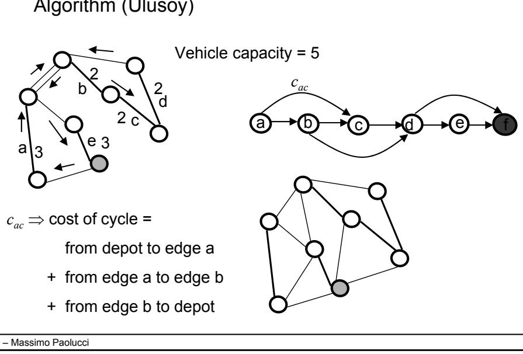

# Bibliography

Handbooks in Operations Research and Management Science, Vol. 8: Network. Routing, eds M. O. Ball, T. L. Magnanti, C. L. Monma, and G. L. Nemhauser, Elsevier, Amsterdam, NL (1995).

The vehicle routing problem, eds P. Toth, D. Vigo, SIAM, Philadelphia, USA (2001).

Scienze delle decisioni per i trasporti, eds S. Pallottino, A.   
Sciomachen, Franco Angeli, Milano, I (1999).

Arc Routing : Problems, Applications and Algorithms. Eiselt,H.A., Gendreau,M., Laporte,G., Centre for Research in Transportation Edition, University of Montreal, (1992).