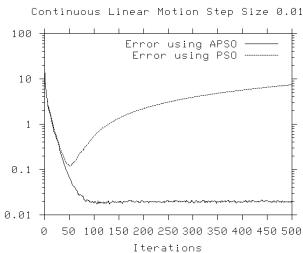
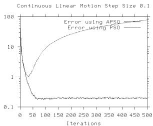
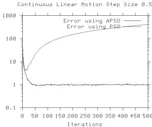
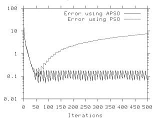
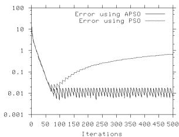
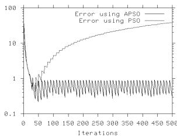
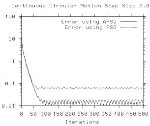
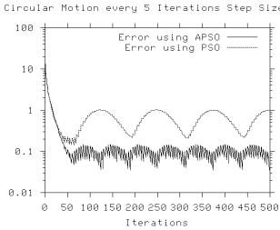
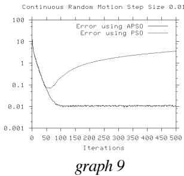
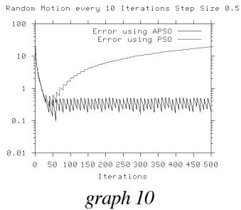

# Tracking Changing Extrema with Adaptive Particle Swarm Optimizer

Anthony Carlisle Department of Mathematical and Computer Sciences, Huntingdon College antho@huntingdon.edu

Gerry Dozier Department of Computer Science and Software Engineering, Auburn University gvdozier@eng.auburn.edu

# Abstract

A modification of the Particle Swarm Optimizer involving updating obsolete particle memories has been shown to be effective in locating a changing extrema. In this paper we investigate the effectiveness of the modified PSO in tracking changing extrema over time. We demonstrate that a modified PSO we call Adaptive PSO (APSO) reliably and accurately tracks a continuously changing solution.

# 1. Introduction

The Particle Swarm Optimizer was introduced by Kennedy and Eberhart [6,11] in 1995 and compares favorably to genetic algorithms [7,12]. The basic algorithm involves casting a population of particles over the search space, each with an individual, initially random, location and velocity vector. The particles $f l y$ over the solution space, remembering the best (most fit) solution encountered. At each iteration, every particle adjusts its velocity vector, based on its momentum and the influence of both its best solution and the best solution of its neighbors, then computes a new point to examine. The momentum of each particle tends to keep it from being trapped by a local, non-optimal, extrema, yet by each particle considering both its own memory and that of its neighbors, the entire swarm tends to converge on a global extrema.

The original PSO formulae, as described in [9], are:

$$
\begin{array} { r l } & { \mathrm { v _ { i d } = v _ { i d } + \bar { \prod } _ { 1 } ^ { \bar { * } } \ r n d _ { 1 } \Sigma ^ { * } \left( p _ { i d } - X _ { i d } \right) } } \\ & { \mathrm { ~ \Sigma + \prod _ { 2 } * \bar { \ r n d } _ { 2 } * \bar { ( p g d - X _ { i d } ) } ~ } } \\ & { \mathrm { X _ { i d } = X _ { i d } + V _ { i d } ~ } } \end{array}
$$

where $d$ is the number of channels (variables), $i$ is an individual particle in the population, $g$ is the particle in the neighborhood with the best fitness, $\nu$ is the velocity vector, $x$ is the location vector, and $p$ is the location vector for an individual particle’s best fitness yet encountered. Parameters $\prod _ { 1 }$ and $\bar { \bigcup _ { 2 } } \bar { }$ are the cognitive and social learning rates, respectively [1]. These two rates control the relative influence of the memory of the neighborhood to the memory of the individual.

In addition to the $\prod _ { 1 }$ and $\prod _ { 2 }$ parameters, implementation of the original algorithm also requires placing limits on the search area (Xmax and Xmin) and limiting the velocities (Vmax).

Maurice Clerc has derived a constriction coefficient, a modification of the PSO that also operates without Vmax [4], reducing some undesirable explosive feedback effects. Kennedy and Eberhart provided the formulae for this modification in [10]. The constriction factor is computed as:

$$
{ \cal K } = \frac { 2 } { \mathrm { ~ \displaystyle ~ \displaystyle ~ \displaystyle ~ \displaystyle ~ \frac ~ { ~ \displaystyle ~ 2 ~ \big ~ \scriptstyle ~ \left[ ~ \frac ~ { ~ \displaystyle ~ \mu ~ } ~ \right] ~ } ~ } \mathrm { ~ \displaystyle ~ \left. ~ \frac ~ { ~ \displaystyle ~ \mu ~ } ~ \right| ~ } \mathrm { ~ \displaystyle ~ \left. ~ \frac ~ { ~ \displaystyle ~ \mu ~ } ~ \right\| ~ } \mathrm { ~ \displaystyle ~ \left. ~ \frac ~ { ~ \displaystyle ~ \mu ~ } ~ \right\| ~ } \mathrm { ~ \displaystyle ~ \left. ~ \frac ~ { ~ \displaystyle ~ \mu ~ } ~ \right\| ~ } \mathrm { ~ \displaystyle ~ \left. ~ \frac ~ { ~ \displaystyle ~ \mu ~ } ~ \right\| ~ } \mathrm { ~ \displaystyle ~ \left. ~ \frac ~ { ~ \displaystyle ~ \mu ~ } ~ \right\| ~ } }
$$

where $\boldsymbol { L }$ is $\prod _ { 1 } + \prod _ { 2 }$ . Since this value is based on $\prod _ { 1 }$ and $\prod _ { 2 }$ , using the constriction factor does not require any additional parameters.

With the constriction factor, $K$ , the PSO formula for computing the new velocity is:

$$
\begin{array} { r } { \mathbf { v _ { i d } } = \iint \mathbf { \Omega ^ { * } } \left[ \mathbf { v _ { i d } } + \left[ \mathbf { \Omega } \right] \mathbf { \Omega ^ { * } } \mathbf { \Omega } \mathbf { r a n d ( ) } \mathbf { \Omega ^ { * } } \left( \mathbf { p _ { i d } } - \mathbf { X _ { i d } } \right) + \left[ \mathbf { \Omega } \right] 2 \mathbf { \Omega ^ { * } } \mathbf { \Omega } \mathbf { r a n d ( ) } \mathbf { \Omega ^ { * } } \left( \mathbf { p _ { g d } } - \mathbf { X _ { i d } } \right) \right] } \end{array}
$$

While the PSO algorithm has been demonstrated effective in finding stationary solutions to a variety of problems, it is not so successful in its initial configuration for finding solutions in dynamic environments. In an earlier work, [2], we found the original PSO algorithm did not respond to changes in the environment, and was, instead, trapped in non-optimal regions by its own $p$ (particle) and $g$ (global) memories. We made some modifications to the original algorithm, and our modified PSO was very successful in finding changing optimal solutions, even when the rate of change was large.

In this paper, we tackle a new objective: instead of simply locating the solution, we wish to track the solution over time. That is, we want to be able to query the swarm at any time for the current optimal solution in the search space.

# 2. Modifications to the PSO algorithm

In [2] we introduced a modification to the PSO algorithm, where we used a fixed point in the search space, called a sentry, to test for changes in the environment. Before each iteration, the sentry would reevaluate its fitness and compare it to the previous evaluation. Since the point was stationary, if the fitness changed, this indicated that the environment had changed, and the sentry then alerted the swarm to update their best location memories. In that modification to PSO, each particle replaced its $p$ -vector (best location memory) with its $x$ -vector (current location) when alerted to a change in the environment.

In [3] we refined this modification in several important ways. Firstly, we replaced the fixed-point sentry with one or more randomly chosen particles. In the first case, the sentry only detected a change if that change affected the region in which the point resided. Some environments, such as those examined by Grefenstette in [8] exhibit local changes, which may not be detected by the fixed sentry. By randomly picking a sentry for each test, we eventually cover all of the search space the swarm occupies. In addition, we can pick more than one sentry at a time if we need to increase the probability of detecting localized changes, up to utilizing the entire swarm population. Of course, every invocation of a sentry costs an additional call to the fitness evaluation function, so some restraint in in order.

Finally, instead of blindly replacing all $p$ -vectors by their corresponding $x$ -vectors, we found that it was worthwhile to first recompute the fitness of the current $p$ -vector to accommodate the changed environment and replace it with $x$ only if the current location was more fit than $p$ . This preserved information if that information still had validity and resulted in greater accuracy, but did so at the cost of an additional fitness evaluation for each particle.

We call this modification to the basic PSO algorithm the Adaptive Particle Swarm Optimizer, or APSO. In the following experiments we demonstrate the APSO is superior to the basic PSO for tracking solutions in nonstationary environments.

# 3. Experiment Design

We patterned this experiment after Peter Angeline’s experiments in [1], Tracking Extrema in Dynamic Environments. Angeline constructed dynamic environments by starting with a simple parabolic function in three dimensions,

$$
f ( x , y , z ) = x ^ { 2 } + y ^ { 2 } + z ^ { 2 }
$$

which has a minimum at (0,0,0), and then translating the function along each dimension based on time. Angeline could then control the movement of the solution using three parameters: dynamic type, specifying the type of motion involved, step size, specifying the distance moved along each dimension, and update frequency, specifying the time intervals between changes in the solution.

Angeline implemented three types of movement: linear, circular, and random. For linear motion, the function is offset step size distance on each dimension at update frequency intervals. For circular motion the function is offset to create a circular path with a cycle of 25 updates. For random motion, random Gaussian noise is added to each dimension with each update, resulting in random movement with a change in distance that follows a Gaussian distribution.

# 4. Experiment Implementation

As in Angeline’s experiments, the search space was restricted to [-50,50] on all dimensions, step size parameters were 0.01, 0.1, and 0.5, and update frequencies were 1, 5, and 10 iterations. We ran a total of 54 experiments, each combination of dynamic type, step size, and update frequency, both with and without implementing a sentry (APSO Voss. PSO). Otherwise, the parameters remained constant: swarm population size of 30 initially randomly distributed over [-50,50] in each dimension; $\prod _ { 1 }$ and $\prod _ { 2 } = 2 . 0 5$ ; and each swarm allowed to run for 500 iterations. Each experiment was repeated 100 times, and the results across the 100 runs were averaged.

# 5. Results

We compared the results of all the PSO experiments to the corresponding APSO results. The data for some representative outcomes are shown below. In every graph, we plot the error, that is, the distance of the swarm’s global best position from the actual solution. We plot both the non-sentry and sentry results on the same graph, with iterations on the $x -$ -axis and error on the y-axis. Note that the y-axis is plotted on a log scale to emphasize fine detail and minimize the impact of the magnitude of the early iterations. Also note that all the graphs are not plotted to the same scale.

In all instances the PSO failed to track the moving solutions, getting trapped by obsolete data within the first fifty iterations. Graphs 1, 2, and 3 show the results for continuous linear motions (update frequency $\mathord { \left. \vert { \begin{array} { r l r } \end{array} } \right. } \ = 1$ ) at the various step sizes. Obviously, as the step size increases, the APSO has more trouble keeping up, and the accuracy suffers.

  
graph 1

  
graph 2

  
graph 3

  
Compare these results to graphs 4, 5, and 6, where the update frequency is every 10 iterations.   
  
graph 5

  
graph 4

  
graph 6

With the longer periods of stability, the APSO has more time to close in on the solution, and the accuracy improves substantially.

With circular motion, the improvement of APSO over PSO is equally obvious. In graph 7 we see that the non-sentry swarm gets locked into an early global best, so the error grows as the solution moves away, but then shrinks as the solution completes the loop and returns to its original position. This phenomenon is even more pronounced with a larger step size and less frequent update, as seen in graph 8.

  
graph 7

  
graph 8

The results for random motion look very much like those for linear motion, except that the APSO tracks with more accuracy, since the random movement often brings the back into the swarm, essentially giving the swarm more search time in the same region. Comparing graph 9 to graph 1, and graph 10 to graph 6, the improvement in accuracy is apparent.

# 6. Discussion

The addition of sentries does result in additional cost. Every invocation of a sentry adds an extra call to the fitness evaluation function, and if the sentry sounds the alarm, every particle must reevaluate its best location vector and possibly replace it with its current location vector. The net result is that a sentry alarm doubles the work performed in that iteration. These costs can be controlled somewhat by setting a threshold, a minimum level of change that the sentry must detect before sounding the alarm. Of course, this means the swarm will have more environmental change to overcome, and accuracy may suffer.

In these experiments, we used only one sentry, as we knew that the environment changed uniformly. In more complex environments, there may be a need for more sentries in each iteration, to more broadly sample the environment. This will result in additional costs as each sentry checks for local changes, but if any sentry sounds the alarm, further checking for that iteration can be discontinued.

Finally, for environments that are generally stable and only suffer occasional changes, it may be acceptable to invoke a sentry less often than every iteration, resulting in some savings.

# 7. Conclusions

The APSO modification to the basic Particle Swarm Optimizer algorithm results in swarms that can detect and compensate for changes in the environment. The additional costs are low, and can be controlled.

# 8. Future Work

These experiments dealt with uniform changes in a simple continuous function across a simple environment. We next intend to compare the APSO to other evolutionary algorithms that have been applied to nonstationary environments, such as Cobb’s Hypermutation GA [5].

# Список литературы

[1] Angeline, P. (1997). Tracking Extrema in Dynamic Environments, Proceedings of the Sixth Annual Conference on Evolutionary Programming VI, pp. 335-345.   
[2] Carlisle, A. and Dozier, G. (2000), Adapting Particle Swarm Optimization to Dynamic Environments, Proceedings, 2000 ICAI, Las Vegas, NV, Vol. I, pp 429-434.   
[3] Carlisle, A. and Dozier, G. (2001), Tracking Changing Extrema with Particle Swarm Optimizer, Auburn University Technical Report CSSE01-08.   
[4] Clerc, M. (1999) The swarm and the queen: towards a deterministic and adaptive particle swarm optimization. Proceedings, 1999 ICEC, Washington, DC, pp 1951-1957.   
[5] Cobb, H.G. (1990), An Investigation into the Use of Hypermutation as an Adaptive Operator in Genetic Algorithms having Continuous, Time-Dependent Nonstationary Environments, NRL Memorandum Report 6760.   
[6] Eberhart, R. and Kennedy, J. (1995). A New Optimizer Using Particles Swarm Theory, Proc. Sixth International Symposium on Micro Machine and Human Science (Nagoya, Japan), IEEE Service Center, Piscataway, NJ, 39-43.   
[7] Eberhart, R. and Shi, Y. (1998). Comparison between Genetic Algorithms and Particle Swarm Optimization, The 7th Annual Conference on Evolutionary Programming, San Diego, USA.   
[8] Grefenstette, J.J. (1992), Genetic Algorithms for Changing Environments, Proceedings of Parallel Problem Solving from Nature-2, R. Maenner & B. Manderick (Eds.), North-Holland, 137-144.   
[9] Kennedy, J. (1997), The Particle Swarm: Social Adaptation of Knowledge, IEEE International Conference on Evolutionary Computation (Indianapolis, Indiana), IEEE Service Center, Piscataway, NJ, 303-308.   
[10] Kennedy, J., Eberhart, Russell C., (2001), Swarm Intelligence, pp 339.   
[11] Kennedy, J. and Eberhart, R. (1995). Particle Swarm Optimization, IEEE International Conference on Neural Networks (Perth, Australia), IEEE Service Center, Piscataway, NJ, IV: 1942-1948.   
[12] Kennedy, J. and Spears, W. (1998). Matching Algorithms to Problems: An Experimental Test of the Particle Swarm and some Genetic Algorithms on the Multimodal Problem Generator, IEEE

International Conference on Evolutionary Computation, Anchorage, Alaska, USA.