# Chapter 1 An Introduction to Evolutionary Computation

D. B. Fogel (1994) "An Introduction to Simulated Evolutionary Optimization," IEEE Trans.   
Neural Networks, Vol. 5:1, pp. 314.

T. Bäck, U. Hammel, and H.-P. Schwefel (1997) "Evolutionary Computation: Comments on the History and Current State," IEEE Trans. Evolutionary Computation, Vol. 1: 1, pp. 3-17.

VOLUTION is in essence a two-step process of random variation and selection (Mayr, 1988, pp. 9798). A population of individuals is exposed to an environment and responds with a collection of behaviors. Some of these behaviors are better suited to meet the demands of the environment than are others. Selection tends to eliminate those individuals that demonstrate inappropriate behaviors. The survivors reproduce, and the genetics underlying their behavioral traits are passed on to their offspring. But this replication is never without error, nor can individual genotypes remain free of random mutations. The introduction of random genetic variation in turn leads to novel behavioral characteristics, and the process of evolution iterates. Over successive generations, increasingly appropriate behaviors accumulate within evolving phyletic lines (Atmar, 1994).

Evolution optimizes behaviors (i.e., the phenotype), not the underlying genetics per se, because selection can act only in the face of phenotypic variation. The manner in which functional adaptations are encoded in genetics is transparent to selection; only the realized behaviors resulting from the interaction of the genotype with the environment can be assessed by competitive selection. Useful variations have the best chance of being preserved in the struggle for life, leading to a process of continual improvement (Darwin, 1859, p. 130). Evolution may in fact create "organs of extreme perfection and complication" (Darwin, 1859, p. 171), but must always act within the constraints of physical development and the historical accidents of life that precede the current population. Evolution is entirely opportunistic (Jacob, 1977), and can only work within the variation present in extant individuals.

The process of evolution can be modeled algorithmically and simulated on a computer. In the most elementary of models, it may be summarized as a difference equation:

$$
\mathbf { x } [ t + 1 ] = s ( \nu ( \mathbf { x } [ t ] ) )
$$

where the population at time, $t ,$ ,denoted as ${ \bf x } [ t ]$ , is operated on by random variation, $\nu .$ ,and selection, $s .$ , to give rise to a new population ${ \bf x } [ t + 1 ]$ .Natural evolution does not occur in discontinuous time intervals, but the use of a digital computer requires discrete events. Over successive iterations of variation and selection, an evolutionary algorithm can drive a population toward particular optima on a response surface that represents the measurable worth of each possible individual that might reside in a population. Evolutionary computation is the field that studies the properties of these algorithms and similar procedures for simulating evolution on a computer.

Although the term evolutionary computation was invented as recently as 1991, the field has a history that spans four decades. Many independent efforts to simulate evolution on a computer were offered in the 1950s and 1960s. Three broadly similar avenues of investigation in simulated evolution have survived as main disciplines within the field: evolution strategies, evolutionary programming, and genetic algorithms. Each begins with a population of contending trial solutions brought to a task at hand. New solutions are created by randomly varying the existing solutions. An objective measure of performance is used to assess the "fitness" of each trial solution, and a selection mechanism determines which solutions to retain as "parents" for the subsequent generation. The differences between the procedures are characterized by the typical data representations, the types of variations that are imposed on solutions to create offspring, and the methods employed for selecting new parents. Over time, however, these differences have become increasingly blurred, and will likely become of only historical interest.

The two papers reprinted here, Fogel (1994) and Bäck et al. (1997), provide surveys of evolutionary computation. Fogel (1994) offered an introduction to a special issue of the IEEE Transactions on Neural Networks devoted to evolutionary computation, while Bäck et al. (1997) offered the first paper of the IEEE Transactions on Evolutionary Computation. These two publications represent important milestones in the acceptance of evolutionary algorithms as practical tools for addressing complex problems in engineering. The papers include numerous references that will assist novice readers who are just entering the field.

[2] T. Bäck, U. Hammel, and H.-P. Schwefel (1997) "Evolutionary computation: comments on the history and current state," IEEE Trans. Evolutionary Computation, Vol. 1: 1, pp. 317.   
[3] C. Darwin (1859) The Origin of Species by Means of Natural Selection or the Preservation of Favoured Races in the Struggle for Life, Mentor Reprint, 1958, NY.   
[4] D. B. Fogel (1994) "An introduction to simulated evolutionary optimization," IEEE Trans. Neural Networks, Vol. 5: 1, pp. 314.   
[5] F. Jacob (1977) "Evolution and tinkering," Science, Vol. 196, pp. 11611166.   
[6] E. Mayr (1988) Toward a New Philosophy of Biology: Observations of an Evolutionist, Belknap, Harvard.

# Список литературы

[1] W. Atmar (1994) "Notes on the simulation of evolution," IEEE Trans. Neural Networks, Vol. 5: 1, pp. 130147.

# An Introduction to Simulated Evolutionary Optimization

David B. Fogel, Member, IEEE

Abstract—Natural evolution is a population-based optimization process. Simulating this process on a computer results in stochastic optimization techniques that can often outperform classical methods of optimization when applied to difficult real-world problems. There are currently three main avenues of research in simulated evolution: genetic algorithms, evolution strategies, and evolutionary programming. Each method emphasizes a different facet of natural evolution. Genetic algorithms stress chromosomal operators. Evolution strategies emphasize behavioral changes at the level of the individual. Evolutionary programming stresses behavioral change at the level of the species. The development of each of these procedures over the past 35 years is described. Some recent efforts in these areas are reviewed.

# I. INTRODUCTION

HE fundamental approach to optimization is to formulate a single standard of measurement—a cost function-that summarizes the performance or value of a decision and iteratively improve this performance by selecting from among the available alternatives. Most classical methods of optimization generate a deterministic sequence of trial solutions based on the gradient or higher-order statistics of the cost function [1, chaps. 8-10]. Under regularity conditions on this function, these techniques can be shown to generate sequences that asymptotically converge to locally optimal solutions, and in certain cases they converge exponentially fast [2, pp. 12-15]. Variations on these procedures are often applied to training neural networks (backpropagation) [3], [4], or estimating parameters in system identification and adaptive control applications (recursive prediction error methods, Newton-Gauss) [2, pp. 2223], [5]. But the methods often fail to perform adequately when random perturbations are imposed on the cost function. Further, locally optimal solutions often prove insufficient for real-world engineering problems.

Darwinian evolution is intrinsically a robust search and optimization mechanism. Evolved biota demonstrate optimized complex behavior at every level: the cell, the organ, the individual, and the population. The problems that biological species have solved are typified by chaos, chance, temporality, and nonlinear interactivity. These are also characteristics of problems that have proved to be especially intractable to classic methods of optimization. The evolutionary process can be applied to problems where heuristic solutions are not available or generally lead to unsatisfactory results.

The most widely accepted collection of evolutionary theories is the neo-Darwinian paradigm. These arguments assert that the history of life can be fully accounted for by physical processes operating on and within populations and species [6, p. 39]. These processes are reproduction, mutation, competition, and selection. Reproduction is an obvious property of extant species. Further, species have such great reproductive potential that their population size would increase at an exponential rate if all individuals of the species were to reproduce successfully [7], [8, p. 479]. Reproduction is accomplished through the transfer of an individual's genetic program (either asexually or sexually) to progeny. Mutation, in a positively entropic system, is guaranteed, in that replication errors durin information transfer will necessarily occur. Competition is a consequence of expanding populations in a finite resource space. Selection is the inevitable result of competitive replication as species fill the available space. Evolution becomes the inescapable result of interacting basic physical statistical processes ([9], [10, p. 25], [11] and others).

Individuals and species can be viewed as a duality of their genetic program, the genotype, and their expressed behavioral traits, the phenotype. The genotype provides a mechanism for the storage of experiential evidence, of historically acquired information. Unfortunately, the results of genetic variations are generally unpredictable due to the universal effects of pleiotropy and polygeny (Fig. 1) [8], [12], [13], [14, p. 224], [15][19], [20, p. 296]. Pleiotropy is the effect that a single gene may simultaneously affect several phenotypic traits. Polygeny is the effect that a single phenotypic characteristic may be determined by the simultaneous interaction of many genes. There are no one-gene, one-trait relationships in natural evolved systems. The phenotype varies as a complex, nonlinear function of the interaction between underlying genetic structures and current environmental conditions. Very different genetic structures may code for equivalent behaviors, just as diverse computer programs can generate similar functions.

Selection directly acts only on the expressed behaviors of individuals and species [19, pp. 477-478]. Wright [21] offered the concept of adaptive topography to describe the fitness of individuals and species (minimally, isolated reproductive populations termed demes). A population of genotypes maps to respective phenotypes (sensu Lewontin [22]), which are in turn mapped onto the adaptive topography (Fig. 2). Each peak corresponds to an optimized collection of phenotypes, and thus one or more sets of optimized genotypes. Evolution probabilistically proceeds up the slopes of the topography toward peaks as selection culls inappropriate phenotypic variants.

Others [11], [23, pp. 400401] have suggested that it is more appropriate to view the adaptive landscape from an inverted rapidly, falling down the walls of the error troughs until their cohesive set of interrelated behaviors are optimized, at which point stagnation occurs. If the topography is generally static, rapid descents will be followed by long periods of stasis. If, however, the topography is in continual flux, stagnation may never set in.

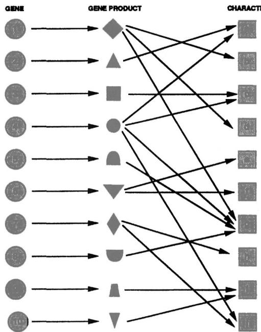  
Fig. 1. Pleiotropy is the effect that a single gene may simultaneously affect several phenotypic traits. Polygeny is the effect that a single phenotypic characteristic may be determined by the simultaneous interaction of many genes. These one-to-many and many-to-one mappings are pervasive in natural systems. As a result, even small changes to a single gene may induce a raft of behavioral changes in the individual (after [18]).

Viewed in this manner, evolution is an obvious optimizing problem-solving process. Selection drives phenotypes as close to the optimum as possible, given initial conditions and environmental constraints. But the environment is continually changing. Species lag behind, constantly evolving toward a new optimum. No organism should be viewed as being perfectly adapted to its environment. The suboptimality of behavior is to be expected in any dynamic environment that mandates trade-offs between behavioral requirements. But selection never ceases to operate, regardless of the population's position on the topography.

Mayr [19, p. 532] has summarized some of the more salient characteristics of the neo-Darwinian paradigm. These include:

The individual is the primary target of selection.   
Genetic variation is largely a chance phenomenon. Stochastic processes play a significant role in evolution.   
Genotypic variation is largely a product of recombination and "only ultimately of mutation."   
Gradual" evolution may incorporate phenotypic discontinuities.   
Not all phenotypic changes are necessarily consequences of ad hoc natural selection.   
Evolution is a change in adaptation and diversity, not merely a change in gene frequencies.   
Selection is probabilistic, not deterministic.

Simulations of evolution should rely on these foundations.

# II. GENETIC ALGORITHMS

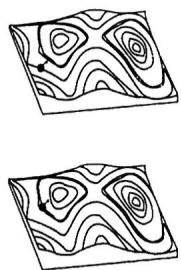  
Fig. 2. Wright's adaptive topology, inverted. An adaptive topography, or adaptive landscape, is defined to represent the fitness of all possible phenotypes. Wright [21] proposed that as selection culls the least appropriate existing behaviors relative to others in the population, the population advances to areas of higher fitness on the landscape. Atmar [1i] and others have suggested viewing the topography from an inverted perspective. Populations then advance to areas of lower behavioral error.

position. The peaks become troughs, "minimized prediction error entropy wells" [11]. Such a viewpoint is intuitively appealing. Searching for peaks depicts evolution as a slowly advancing, tedious, uncertain process. Moreover, there appears to be a certain fragility to an evolving phyletic line; an optimized population might be expected to quickly fall off the peak under slight perturbations. The inverted topography leaves an altogether different impression. Populations advance

Fraser [24][28], Bremermann et al. [29][36], Reed et al. [37], and Holland [38], [39] proposed similar algorithms that simulate genetic systems. These procedures are now described by the term genetic algorithms and are typically implemented as follows:

The problem to be addressed is defined and captured in an objective function that indicates the fitness of any potential solution.   
A population of candidate solutions is initialized subject to certain constraints. Typically, each trial solution is coded as a vector $\pmb { x }$ , termed a chromosome, with elements being described as genes and varying values at specific positions called alleles. Holland [39, pp. 7072] suggested that all solutions should be represented by binary strings. For example, if it were desired to find the scalar value $_ x$ that maximizes:

$$
F ( x ) = - x ^ { 2 } ,
$$

then a finite range of values for $x$ would be selected and the minimum possible value in the range would be represented by the string $\{ 0 \ldots 0 \}$ , with the maximum value being represented by the string $\{ 1 \ldots 1 \}$ .The desired degree of precision would indicate the appropriate length of the binary coding.

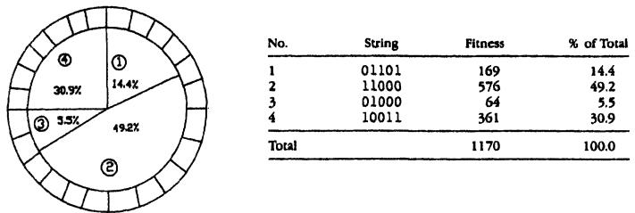  
generate more copies than those with below-average fitness. The figure is adapted from [143].

Each chromosome, $\pmb { x } _ { i }$ $, i = 1 , \ldots , P$ , in the population is decoded into a form appropriate for evaluation and is then assigned a fitness score, $\mu ( \pmb { x } _ { i } )$ according to the objective.

4)Each chromosome is assigned a probability of reproduction, ${ \pmb p } _ { i }$ , $\textit { i } = 1$ , . . . , $P$ , so that its likelihood of being selected is proportional to its fitness relative to the other chromosomes in the population. If the fitness of each chromosome is a strictly positive number to be maximized, this is often accomplished using roulette wheel selection (see Fig. 3).

According to the assigned probabilities of reproduction, $p _ { i } , i = 1 , \ldots , P$ , a new population of chromosomes is generated by probabilistically selecting strings from the current population. The selected chromosomes generate "offspring" via the use of specific genetic operators, such as crossover and bit mutation. Crossover is applied to two chromosomes (parents) and creates two new chromosomes (offspring) by selecting a random position along the coding and splicing the section that appears before the selected position in the first string with the section that appears after the selected position in the second string, and vice versa (see Fig. 4). Other, more sophisticated, crossover operators have been introduced and will be discussed later. Bit mutation simply offers the chance to flip each bit in the coding of a new solution. Typical values for the probabilities of crossover and bit mutation range from 0.6 to 0.95 and 0.001 to 0.01, respectively [40], [41].

The process is halted if a suitable solution has been found, or if the available computing time has expired; otherwise the process proceeds to step (3) where the new chromosomes are scored and the cycle is repeated.

For example, suppose the task is to find a vector of 100 bits {0,1 } such that the sum of all of the bits in the vector is maximized. The objective function could be written as:

$$
\mu ( \pmb { x } ) = \sum _ { i = 1 } ^ { 1 0 0 } x _ { i } ,
$$

where $\pmb { x }$ is a vector of 100 symbols from {0,1}. Any such vector $\pmb { x }$ could be scored with respect to $\mu ( { \pmb x } )$ and would receive a fitness rating ranging from zero to 100. Let an initial population of 100 parents be selected completely at random and subjected to roulette wheel selection in light of $\mu ( { \pmb x } )$ , with the probabilities of crossover and bit mutation being 0.8 and 0.01, respectively. Fig. 5 shows the rate of improvement of the best vector in the population, and the average of all parents, at each generation (one complete iteration of steps 36) under such conditions. The process rapidly converges on vectors of all 1's.

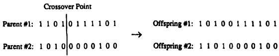  
Fi. The one-point crossover operator. A typical method of recombination in genetic algorithms is to select two parents and randomly choose a splicing point along the chromosomes. The segments from the two parents are exchanged and two new offspring are created.

There are a number of issues that must be addressed when using a genetic algorithm. For example, the necessity for binary codings has received considerable criticism [42][44]. To understand the motivation for using bit strings, the notion of a schema must be introduced. Consider a string of symbols from an alphabet A. Suppose that some of the components of the string are held fixed while others are free to vary. Define a wild card symbol, #, that matches any symbol from A. A string with fixed and variable symbols defines a schema. Consider the string {01##}, defined over the union of {#} and the alphabet $A = \{ 0 , 1 \}$ . This set includes {0100}, {0101}, {0110} and {0111 }. Holland [39, pp. 6674] recognized that every string that is evaluated actually offers partial information about the expected fitness of all possible schemata in which that string resides. That is, if the string {0000} is evaluated to have some fitness, then partial information is also received about the worth of sampling from variations in {0###}, {#0##}, {#00#}, {#O#0}, and so forth. This characteristic is termed implicit parallelism, as it is through a single sample that information is gained with respect to many schemata. Holland [39, p. 71] speculated that it would be beneficial to maximize the number of schemata being sampled, thus providing maximum implicit parallelism, and proved that this is achieved for $| \pmb { A } | = 2$ Binary strings were therefore suggested as a universal representation.

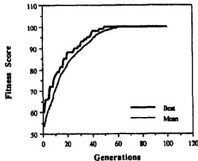  
.

The use of binary strings is not universally accepted in genetic algorithm literature, however. Michalewicz [44, p. 82] indicates that for real-valued numerical optimization problems, floating-point representations outperform binary representations because they are more consistent, more precise, and lead to faster execution. But Michalewicz [44, p. 75] also claims that genetic algorithms perform poorly when the state space of possible solutions is extremely large, as would be required for high-precision numerical optimization of many variables that could take on real-values in a large range. This claim is perhaps too broad. The size of the state space alone does not determine the efficiency of the genetic algorithm, regardless of the choice of representation. Very large state spaces can sometimes be searched quite efficiently, and relatively small state spaces sometimes provide significant difficulties. But it is fair to say that maximizing implicit parallelism will not always provide for optimum performance. Many researchers in genetic algorithms have foregone the bit strings suggested by Holland [39, pp. 7072] and have achieved reasonable results to difficult problems [44][47].

Selection in proportion to fitness can be problematic. There are two practical considerations: 1) roulette wheel selection depends upon positive values, and 2) simply adding a large constant value to the objective function can eliminate selection, with the algorithm then proceeding as a purely random walk. There are several heuristics that have been devised to compensate for these issues. For example, the fitness of all parents can be scaled relative to the lowest fitness in the population, or proportional selection can be based on ranking by fitness. Selection based on ranking also eliminates problems with functions that have large offsets.

One mathematical problem with selecting parents to reproduce in proportion to their relative fitness is that this procedure cannot ensure asymptotic convergence to a global optimum [48]. The best chromosome in the population may be lost at any generation, and there is no assurance that any gains made up to a given generation will be retained in future generations. This can be overcome by employing a heuristic termed elitist selection [49], which simply always retains the best chromosome in the population. This procedure guarantees asymptotic convergence [48], [50], [51], but the specific rates of convergence vary by problem and are generally unknown.

The crossover operator has been termed the distinguishing feature f genetic algorithms [52, pp. 1718]. Holland [39, pp. 110-111] indicates that crossover provides the main search operator while bit mutation simply serves as a background operator to ensure that all possible alleles can enter the population. The probabilities commonly assigned to crossover and bit mutation reflect this philosophical view. But the choice of crossover operator is not straightforward.

Holland [39, p. 160], and others [53], [54], propose that genetic algorithms work by identifying good "building blocks" and eventually combining these to get larger building blocks. This idea has become known as the building block hypothesis. The hypothesis suggests that a one-point crossover operator would perform better than an operator that, say, took one bit from either parent with equal probability (uniform crossover), because it could maintain sequences (blocks) of "good code" that are associated with above-average performance and not disrupt their linkage. But this has not been clearly demonstrated in the literature. Syswerda [55] conducted function optimization experiments with uniform crossover, two-point crossover and one-point crossover. Uniform crossover provided generally better solutions with less computational effort. Moreover, it has been noted that sections of code that reside at opposite ends of a chromosome are more likely to be disrupted under one-point crossover than are sections that are near the middle of the chromosome. Holland [39, pp. 106109] proposed an inversion operator that would reverse the index position for a section of the chromosome, so that linkages could be constructed between arbitrary genes. But inversion has not been found to be useful in practice [52, p. 21]. The relevance of the building block hypothesis is presently unclear, but its value is likely to vary significantly by problem.

Premature convergence is another important concerm in genetic algorithms. This occurs when the population of chromosomes reaches a configuration such that crossover no longer produces offspring that can outperform their parents, as must be the case in a homogeneous population. Under such circumstances, all standard forms of crossover simply regenerate the current parents. Any further optimization relies solely on bit mutation and can be quite slow. Premature convergence is often observed in genetic algorithm research ([40], [52, pp. 25, 26], [56], [57], and others) because of the exponential reproduction of the best observed chromosomes coupled with the strong emphasis on crossover. Davis [52, pp. 26, 27] recommends that when the population converges on a chromosome that would require the simultaneous mutation of many bits in order to improve it, the run is practically completed and it should either be restarted using a different random seed, or hill-climbing heuristics should be employed to search for improvements.

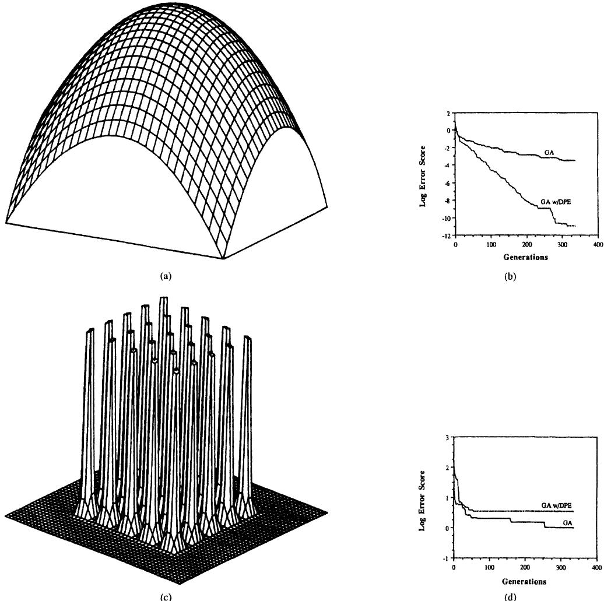  
s oeasing the precisin   olutioon-, u my lso eounr probles w pematuecnve.

One recent proposal for alleviating the problems associated with premature convergence was offered in [41]. The method, termed dynamic parameter encoding (DPE), dynamically resizes the available range of each parameter. Broadly, when a heuristic suggests that the population has converged, the minimum and maximum values for the range are resized to a smaller window and the process is iterated. In this manner, DPE can zoom in on solutions that are closer to the global optimum than provided by the initial precision. Schraudolph [58] has kindly provided results from experiments with DPE presented in [41]. As indicated in Fig. 6, DPE clearly outperforms the standard genetic algorithm when searching a quadratic bowl, but actually performs worse on a multirnodal function (Shekel's foxholes). The effectiveness of DPE is an open, promising area of research. DPE only zooms in, so the initial range of parameters must be set to include the global optimum or it will not be found. But it would be relatively straightforward to include a mechanism in DPE to expand the search window, as well as reduce it.

Although many open questions remain, genetic algorithms have been used to successfully address diverse practical optimization problems [59]. While some researchers do not view genetic algorithms as function optimization procedures per se (e.g., [60]), they are commonly used for precisely that purpose. Current research efforts include: 1) developing a stronger mathematical foundation for the genetic algorithm as an optimization technique [41], [48], [61], [62], including analysis of classes of problems that are difficult for genetic algorithms [63]-[66] as well as the sensitivity to performance of the general technique to various operator and parameter settings [42], [44], [67][70]; 2) comparing genetic algorithms to other optimization methods and examining the manner in which they can be enhanced by incorporating other procedures such as simulated annealing [71][73]; 3) using genetic algorithms for computer programming and engineering problems [74][79]; 4) applying genetic algorithms to machine learning rule-based classifier systems [80][84]; 5) using genetic algorithms as a basis for artificial life simulations [85], [86, pp. 186195]; and 6) implementing genetic algorithms on parallel machines [87][89]. The most recent investigations can be found in [90].

# III. EVOLUTION STRATEGIES AND Evolutionary Programming

An alternative approach to simulating evolution was independently adopted by Schwefel [91] and Rechenberg [92] collaborating in Germany, and L. Fogel [93], [94] in the United States, and later pursued by [95}[99], among others. These models, commonly described by the terms evolution strategies or evolutionary programming, or more broadly as evolutionary algorithms [87], [100] (although many authors use this term to describe the entire field of simulated evolution), emphasize the behavioral link between parents and offspring, or between reproductive populations, rather than the genetic link. When applied to real-valued function optimization, the most simple method is implemented as follows:

1) The problem is defined as finding the real-valued $\pmb { n }$ . dimensional vector $\pmb { x }$ that is associated with the extremum of a functional $F ( { \pmb x } ) : { \pmb R } ^ { n }  { \pmb R }$ Without loss of generality, let the procedure be implemented as a minimization process.   
An initial population of parent vectors, $\qquad x _ { i } , i = 1 , \ldots ,$ $P$ , is selected at random from a feasible range in each dimension. The distribution of initial trials is typically uniform.   
An offspring vector, $\pmb { x } _ { i } ^ { \prime } , i = 1 , \ldots , P$ , is created from each parent $\pmb { x } _ { i }$ by adding a Gaussian random variable with zero mean and preselected standard deviation to each component of $\pmb { x } _ { i }$ .   
4) Selection then determines which of these vectors to maintain by comparing the errors $F ( \pmb { x } _ { i } )$ and $\pmb { F } ( \pmb { x } _ { i } ^ { \prime } )$ , $i = 1 , \dots , P$ .The $P$ vectors that possess the least error become the new parents for the next generation.   
The process of generating new trials and selecting those with least error continues until a sufficient solution is reached or the available computation is exhausted.

In this model, each component of a trial solution is viewed as a behavioral trait, not as a gene. A genetic source for these phenotypic traits is presumed, but the nature of the linkage is not detailed. It is assumed that whatever genetic transformations occur, the resulting change in each behavioral trait will follow a Gaussian distribution with zero mean difference and some standard deviation. Specific genetic alterations can affect many phenotypic characteristics due to pleiotropy and polygeny (Fig. 1). It is therefore appropriate to simultaneously vary all of the components of a parent in the creation of a new offspring.

The original efforts in evolution strategies [91], [92] examined the preceding algorithm but focused on a single parentsingle offspring search. This was termed a $( 1 + 1 ) - E S$ in that a single offspring is created from a single parent and both are placed in competition for survival, with selection eliminating the poorer solution. There were two main drawbacks to this approach when viewed as a practical optimization algorithm: 1) the constant standard deviation (step size) in each dimension made the procedure slow to converge on optimal solutions, and 2) the brittle nature of a point-to-point search made the procedure susceptible to stagnation at local minima (although the procedure can be shown to asymptotically converge to the global optimum vector $\pmb { x }$ [101].

Rechenberg [92] defined the expected convergence rate of the algorithm as the ratio of the average distance covered toward the optimum and the number of trials required to achieve this improvement. For a quadratic function

$$
F ( \pmb { x } ) = \sum _ { i = 1 } ^ { n } x _ { i } ^ { 2 } ,
$$

where $\pmb { x }$ is an $\pmb { n }$ -dimensional vector of reals, and $x _ { i }$ denotes the ith component of $\pmb { x }$ , Rechenberg [92] demonstrated that the optimum expected convergence rate is given when $\sigma \approx$ $1 . 2 2 4 r / n$ , where $\sigma$ is the standard deviation of the zero mean Gaussian perturbation, $r$ denotes the current Euclidean distance from the optimumn and there are $_ { n }$ dimensions. Thus, for this simple function the optimum convergence rate is obtained when the average step size is proportional to the square root of the error function and inversely proportional to the number of variables. Additional analyses have been conducted on other functions and the results have yielded similar forms for setting the standard deviation [102].

The use of multiple parents and offspring in evolution strategies was developed by Schwefel [103], [104]. Two approaches are currently explored, denoted by $\left( \mu + \lambda \right) - E S$ and $( \mu , \lambda ) - E S$ In the former, $\mu$ parents are used to create $\lambda$ offspring and all solutions compete for survival, with the best being selected as parents of the next generation. In the latter, only the $\lambda$ offspring compete for survival, and the parents are completely replaced each generation. That is, the lifespan of every solution is limited to a single generation. Increasing the population size increases the rate of optimization over a fixed number of generations.

To provide a very simple example, suppose it is desired to find the minimum of the function in (1) for $n = 3$ Let the original population consist of 30 parents, with each component initialized in accordance with a uniform distribution over [-5.12, 5.12] (after [40]). Let one offspring be created from each parent by adding a Gaussian random variable with mean zero and variance equal to the error score of the parent divided by the square of the number of dimensions $( 3 ^ { 2 } = 9 )$ to each component. Let selection simply retain the best 30 vectors in the population of parents and offspring. Fig. 7 indicates the rate of optimization of the best vector in the population as a function of the number of generations. The process rapidly converges close to the unique global optimum.

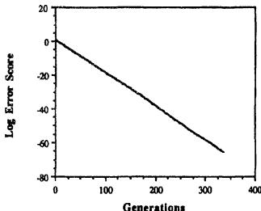  
Fig. 7. The rate of optimization using a primitive version of evolution strategies on the three-dimensional quadratic bowl. Thirty parents are maintained at each generation. Offspring are created by adding a Gaussian random variable to each component.

Rather than using a heuristic schedule for reducing the step size over time, Schwefel [104] developed the idea of making the distribution of new trials from each parent an additional adaptive parameter (Rechenberg, personal communication, indicates that he introduced the idea in 1967). In this procedure, each solution vector comprises not only the trial vector $\pmb { \mathcal { T } }$ of $\mathscr { n }$ dimensions, but a perturbation vector $\pmb { \sigma }$ which provides instructions on how to mutate $\pmb { x }$ and is itself subject to mutation. For example, if $\pmb { x }$ is the current position vector and $\pmb { \sigma }$ is a vector of variances corresponding to each dimension of $\pmb { x }$ , then a new solution vector $( { \pmb x } ^ { \prime } , { \pmb \sigma } ^ { \prime } )$ could be created as:

$$
\begin{array} { r l } { \pmb { \sigma } _ { i } ^ { \prime } = } & { { } \pmb { \sigma } _ { i } \exp ( \tau ^ { \prime } \cdot N ( 0 , 1 ) + \tau \cdot N _ { i } ( 0 , 1 ) ) } \\ { \pmb { x } _ { i } ^ { \prime } = } & { { } \pmb { x } _ { i } + N ( 0 , \pmb { \sigma } _ { i } ^ { \prime } ) } \end{array}
$$

where $i = 1 , \ldots , n$ , and $N ( 0 , 1 )$ represents a single standard Gaussian random variable, $N _ { i } ( 0 , 1 )$ represents the ith independent identically distributed standard Gaussian, and $\tau$ and $\tau ^ { \prime }$ are operator set parameters which define global and individual step-sizes [102]. In this manner, the evolution strategy can selfadapt to the width of the error surface and more appropriately distribute trials. This method was extended again [104] to incorporate correlated mutations so that the distribution of new trials could adapt to contours on the error surface (Fig. 8).

Finally, additional extensions were made to evolution strategies to include methods for recombining individual solutions in the creation of new offspring. There are many proposed procedures. These include selecting individual components from either of two parents at random, averaging individual components from two parents with a given weighting, and so forth [102].

The original evolutionary programming approach was similar to that of Schwefel and Rechenberg but involved a more complex problem, that of creating artificial intelligence. Fogel [94] proposed that intelligent behavior requires the composite ability to predict one's environment coupled with a translation of the predictions into a suitable response in light of the given goal. To provide maximum generality, in a series of experiments, a simulated environment was described as sequence of symbols taken from a finite alphabet. The problem was then defined to evolve an algorithm that would operate on the sequence of symbols thus far observed in such a manner as to produce an output symbol that is likely to maximize the benefit to the algorithm in light of the next symbol to appear in the environment and a well-defined payoff function. Finite state machines (FSM's) [105] provided a useful representation for the required behavior (Fig. 9).

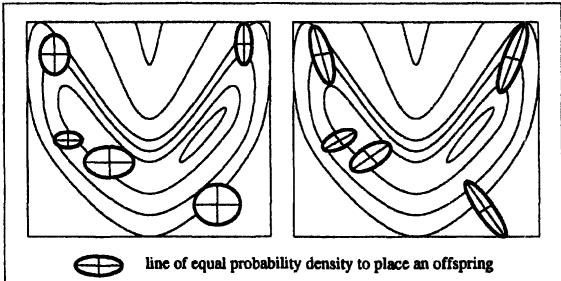  
Fig. 8. Under independent Gaussian perturbations to each component of every parent, new trials are are distributed such that the contours of equal probability are aligned with the coordinate axes (left picture). This will not be optimal in general because the contours of the response are rarely similarly aligned. Schwefel [104] suggests a mechanism for incorporating self-adaptive covariance terms. Under this procedure, new trials can be distributed in any orientation (right picture). The evolutionary process adapts to the contours of the response surface, distributing trials so as to maximaize the probability of discovering improved solutions.

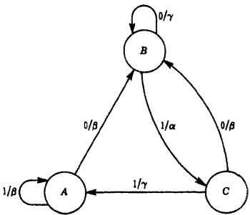  
Fig. 9. A finite state machine (FSM) consists of a finite number of states. For each state, for every possible input symbol, there is an associated output symbol and next-state transition. In the figure, input symbols are shown to the left of the virgule, output symbols are shown to the right. The input alphabet is {0, 1} and the output alphabet is $\{ \alpha , \beta , \gamma \}$ . The machine is presumed to start in state A. The figure is taken from [144].

Evolutionary programming operated on FSM's as follows:

)Initially, a population of parent FSM's is randomly constructed.   
The parents are exposed to the environment; that is, the sequence of symbols that have been observed up to the current time. For each parent machine, as each input symbol is offered to the machine, each output symbol is compared to the next input symbol. The worth of this prediction is then measured with respect to the given payoff function (e.g., allnone, absolute error, squared error, or any other expression of the meaning of the symbols). After the last prediction is made, a function

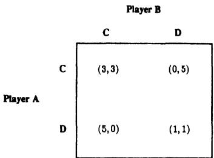  
Fig. 10. A payoff matrix for the prisoner's dilemma. Each of two players must either cooperate (C) or defect (D). The entries in the matrix, $^ { ( \mathfrak { a } , \mathfrak { b } ) }$ , indicate the gain to players A and B, respectively. This payoff matrix was used in simulations in [106][108].

of the payoff for each symbol (e.g., average payoff per symbol) indicates the fitness of the machine.

3)Offspring machines are created by randomly mutating each parent machine. There are five possible modes of random mutation that naturally result from the description of the machine: change an output symbol, change a state transition, add a state, delete a state, or change the initial state. The deletion of a state and the changing of the start state are only allowed when the parent machine has more than one state. Mutations are chosen with respect to a probability distribution, which is typically uniform. The number of mutations per offspring is also chosen with respect to a probability distribution (e.g., Poisson) or may be fixed a priori.

4The offspring are evaluated over the existing environment in the same manner as their parents.

5)Those machines that provide the greatest payoff are retained to become parents of the next generation. Typically, the parent population remains the same size, simply for convenience.

Steps 3)5) are iterated until it is required to make an actual prediction of the next symbol (not yet experienced) from the environment. The best machine is selected to generate this prediction, the new symbol is added to the experienced environment, and the process reverts to step 2).

The prediction problem is a sequence of static optimization problems in which the adaptive topography (fitness function) is time-varying. The process can be easily extended to abstract situations in which the payoffs for individual behaviors depend not only on an extrinsic payoff function, but also on the behavior of other individuals in the population. For example, Fogel [106], [107], following previous foundational research by Axelrod using genetic algorithms [108], evolved a population of FSM's in light of the iterated prisoner's dilemma (Fig. 10). Starting with completely random FSM's of one to five states, but ultimately possessing a maximum of eight states, the simulated evolution quickly converged on mutually cooperative behavior (Fig. 11). The evolving FSM's essentially learned to predict the behavior (a sequence of symbols) of other FSM's in the evolving population.

Evolutionary programming has recently been applied to real-valued continuous optimization problems and is virtually equivalent in many cases to the procedures used in evolution strategies. The extension to using self-adapting independent variances was offered in [109] with procedures for optimizing the covariance matrix used in generating new trials offered in [110]. These methods differ from those offered in [104] in that Gaussian perturbations are appl ied to the self-adaptive parameters instead of lognormal perturbations. Initial comparisons [111], [112] indicate that the procedures in [104] appear to be more robust than those in [110]. One possible explanation for this would be that it is easier for variances of individual terms to transition between small and large values under the method of [104]. Theoretical and empirical comparison between these mechanisms is an open area of research.

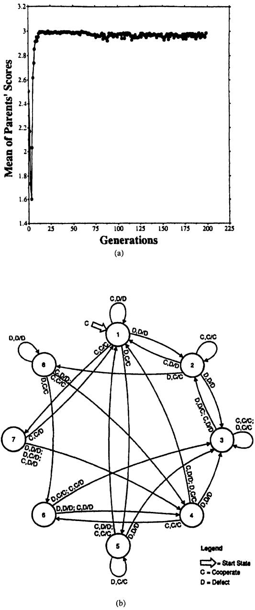  
Fig. 1l. (a) The mcan of all parents'scores as a function of the number generations when using evolutionary programming to simulate an iterated prisoner's dilemma incorporating 50 parents coded as finite state machines (FM's). The input alphabet consists of the previous moves for the current player and the opponent {(C,C), (C,D). (D,C), (D,D)); the output alphabet consists of the next move (C,D). Each FSM plays against every other FSM in the population over a long series of moves. The results indicate a propensity to evolve cooperative behavior even though it would appear more beneficial fr nindividual to defect ny iven ply. typical F evolved after 200 generations when using 100 parents. The cooperative nature of the machine can be observed by noting that (C,C) typically elicits further cooperation, and in states 2 and 3, such cooperation will be absorbing. Furr (D,D) typically elicits further defection, indicating that the machine will not be taken advantage of during an encounter with a purely selfish machine. These results appear in [107].

As currently implemented, there are two essential differences between evolution strategies and evolutionary programming.

1) Evolution strategies rely on strict deterministic selection. Evolutionary programming typically emphasizes the probabilistic nature of selection by conducting a stochastic tournament for survival at each generation. The probability that a particular trial solution will be maintained is made a function of its rank in the population.   
Evolution strategies typically abstracts coding structures as analogues of individuals. Evolutionary programming typically abstracts coding structures as analogues of distinct species (reproductive populations). Therefore, evolution strategies may use recombination operations to generate new trials [111], but evolutionary programming does not, as there is no sexual communication between species [100].

The current efforts in evolution strategies and evolutionary programming follow lines of investigation similar to those in genetic algorithms: 1) developing mathematical foundations for the procedures [51], [111], [113], investigating their computational complexity theoretically and empirically [114], [115] and combining evolutionary optimization with more traditional search techniques [116]; 2) using evolutionary algorithms to train and design neural networks [117][121]; 3) examining evolutionary algorithms for system identification, control, and robotics applications [122][127], as well as pattern recognition problems [128][130], along with the possibility for synergism between evolutionary and fuzzy systems [131], [132]; 4) applying evolutionary optimization to machine learning [133]; 5) relating evolutionary models to biological observations or applications [107], [134][137]; and also 6) designing evolutionary algorithms for implementation on parallel processing machines [138], [139], [140]. The most recent investigations can be found in [141], [142].

# IV. SUMMARY

Simulated evolution has a long history. Similar ideas and implementations have been independently invented numerous times. There are currently three main lines of investigation: genetic algorithms, evolution strategies, and evolutionary programming. These methods share many similarities. Each maintains a population of trial solutions, imposes random changes to those solutions, and incorporates the use of selection to determine which solutions to maintain into future generations and which to remove from the pool of trials. But these methods also have important differences. Genetic algorithms emphasize models of genetic operators as observed in nature, such as crossing over, inversion, and point mutation and apply these to abstracted chromosomes. Evolution strategies and evolutionary programming emphasize mutational transformations that maintain behavioral linkage between each parent and its offspring, respectively, at the level of the individual or the species. Recombination may be appropriately applied to individuals, but is not applicable for species.

No model can be a complete description of the true system. Each of the three possible evolutionary approaches described above is incomplete. But each has also been demonstrated to be of practical use when applied to difficult optimization problems. The greatest potential for the application of evolutionary optimization to real-world problems will come from their implementation on parallel machines, for evolution is an inherently parallel process. Recent advances in distributed processing architectures will result in dramatically reduced execution times for simulations that would simply be impractical on current serial computers.

Natural evoluions bust  fcint oblm-olvg technique. Simulated evolution can be made as robust. The same procedures can be applied to diverse problems with relatively little reprogramming. While such efforts will undoubtedly continue to address difficult real-world problems, the ultimate advancement of the field will, as always, rely on the careful observation and abstraction of the natural process of evolution.

# ACKNOWLEDGMENT

The author is grateful to W. Atmar, T. Bäck, L. Davis, G. B. Fogel, L. J. Fogel, E. Mayr, Z. Michalewicz, G. Rudolph, H.-P. Schwefel, and the anonymous referees for their helpful comments and criticisms of this review.

# Список литературы

[1] M. S. Bazaraa and C. M. Shetty, Nonlinear Programming, New York: John Wiley, 1979.   
[2] B. D. O. Anderson, R. R. Bitmead, C. R. Johnson, P. V. Kokotovic, R.L. Ks, I M..Mes, L.Pray,an B. .R, Sb Adaptive Systems: Passivity and Averaging Analysis. Cambridge, MA: MIT Press, 1986.   
[3] P. Werbos, "Beyond regression: new tools for prediction and analysis in the behavioral sciences," Doctoral dissertation, Harvard University, 1974.   
[D. E. Rumelhart and J. L. McClelland, Parallel Distributed Processing: Explorations inthe Microstructuresf Cognition. olCamrge, MA: MIT Press, 1986.   
[5] L. Ljung, System Identification: Theory for the User, Englewood Cliffs, NJ: Prentice-Hall, 1987.   
[A. Hoffman, Arguments on Evolution: A Paleontologist's Perspective, New York: Oxford University Press, 1988.   
[7] T. R. Malthus, An Essay on the Principle of Population, as it Affects the Future Improvement of Society, 6th ed., London: Murray, 1826.   
[8] E. Mayr, The Growth of Biological Thought: Diversity, Evolution and Inheritance, Cambridge, MA: Belknap Press, 1988.   
[9] J. Huxley, "The evolutionary process," in Evolution as a Process, J. Huxley, A. C. Hardy, and E. B. Ford, Eds. New York: Collier Books, pp. 933, 1963.   
0D. E. Wooldridge, The Mechanical Man: The Physical Basis of Intelligent Life. New York: McGraw-Hill, 1968.   
[W.Atr, "The inevitabilityo evolutionary invention,"unpublised manuscript, 1979.   
vo e , o 97-159, 1931.   
W e voluio  ," nlisussin  voluti aw: Isss n voltin, ol. a n llener. Chicago: Univ. of Chicago Press, 1960.   
GG.Sn The Mean Evou uy he Hit Lie and Its Significance for Man. New Haven, CT: Yale Univ. Press, 1949.   
[15] T. Dobzhansky, Genetics of the Evolutionary Processes. New York: Columbia Univ. Press, 1970.   
S. . Stanley, " theory  evolution above he species level,"c. Nat. Acad. Sci., vol. 72, no. 2, pp. 646650, 1975.   
E Mayr, "Whee re e?" Cold Sprng Harbor Symp.Quant. Biol, vol. 24, pp. 409440, 1959.   
Mr, Anial Speci nEvolut.Cme,A: Belk s, 1963.   
[E.Mayr, Toward a New Philosophy of Biology: Observations of an Evolutionist. Cambridge, MA: Belknap Press, 1988.   
R. Dawkins, The Blind Watchaker. Oxford Clarenon Press, 1986.   
[2 S. Wright, "The roles of mutation, inbreeding, crossbreeding, and selection in evolution,"Proc. 6th Int. Cong. Genetics, Ithaca, vol.1, pp. 356366, 1932.   
[22] R. C. Lewontin, The Genetic Basis of Evolutionary Change. New York: Columbia University Press, NY, 1974.   
P.H. Raven and G. B. Johnson, Biology, St. Louis, MO: Tmes Mirror, 1986.   
[24] A. S. Fraser, "Simulation of genetic systems by automatic digital 484491, 1957.   
[25] A. S. Fraser, "Simulation of genetic systems by automatic digital computers. II. Effects of linkage on rates of advance under selection," alanJ. Biol.Scip   
[26] A. S. Fraser, "Simulation of genetic systems by automatic digital purs.IV.pis,usla. Bicil. 329346, 1960.   
Fraser, Smulatio eneiyst," .Theor.Bi. 2, pp. 329346, 1962.   
olu  puibevor, Systems, H. von Foerster, J. D. White, L. J. Peterson, and J. K. Russell, E Wahion, DC Spartan Books, pp. 13, 168.   
HJ. Ben, T vol el.T  s as a model of its environment," Technical Report No. 1, Contract No. 477(17), Dept. of Mathematics, Univ. of Washington, Seattle, 1958.   
[30] H. J. Bremermann, "Optimization through evolution and recombination," in Self-Organizing Systems. M. C. Yovits, G. T. Jacobi, and G. D. Goldstine, Eds. Washington, DC: Spartan Books, pp. 93-106, 1962.   
[H. J.Breeran, "Quantiativ spect  l-eekn eorganiz systems," in Progress in Theoretical Biology, vol. 1, New York: Academic Press, pp. 577, 197.   
[32] H. J. Bremermann, "Numerical Optimization Procedures Derived from Biological Evolution Processes," in Cybernetic Problems in Bionics, H. L. Oestreicher and D. R. Moore, Eds. New York: Gordon & Breach, pp. 543562, 1968. [33] H. J. Bremermann, "On the Dynamics and Trajectories of Evolution Processes," in Biogenesis, Evolution, Homeostasis. A. Locker, Ed. New York SpringerVerlag. pp.  3   
. J. B  R oTy S o Conx Sets, OR Teccl Report, Conc ( 3656(58), UC Berkeley, 1964.   
.  ,  Rn  .  y vo" in Biophysics and Cybernetic Systems. M. Maxfield, A. Callahan, and L. J. Fogel, Eds. Washington, DC: Spartan Books, pp. 157-167, 1965.   
. J. Bn  R  S.  "Gol oe Evolution Processes," in Natural Automata and Useful Simulations. H. H. DC: Spartan Books, pp. 3-41, 1966.   
[37] J. Reed, R. Toombs, and N. A. Barricelli, "Simulation of biological evolution and machine learning," Journal of Theoretical Biology, vol. 17. pp. 319342, 1967.   
oit yo C S 1969.   
[39] J. H. Holland, Adaptation in Natural and Artificial Systems. Ann Arbor: Univ. Of Michigan Press, 1975.   
0   og Ta aptivesysts,Doctoral disseration, Un Michian 1975.   
[ N. N. Schraudoph and . K. Belw, "Dynamic parmeer encodig or genetic algorithms," Machine Learning, vol. 9, no. 1, pp. 921, 1992.   
[ G. A. Vignaux and Z. Michalewicz, "A genetic algorithm for the linear transportation problem," IEEE Trans. on Systems, Man and Cybernetics, l.1, no. , pp. 44542, 1991.   
.Aniseepeaion  hea otation h the binary encoding constraint," Proc. of the Third International Conf. nic  .cSo C Kaufmann Publishers, pp. 8691, 1989.   
[44] Z. Michalewicz, Genetic Algorithms $^ +$ Data Structures $\approx$ Evolution Programs. New York: Springer-Verlag, 1992.   
[45] D. J. Montana, "Automated parameter tuning for interpretation of synthetic images," in Handbook of Genetic Algorithms. L. Davis, Ed. New York: Van Nostrand Reinhold, pp. 282311, 1991.   
[ .ya, cu tmiation nics,"i Handbook of Genetic Algorithms, L. Davis, Ed. New York: Van Nostrand Reinhold, pp. 332349, 1991.   
..right, Geneticalgorithms or al parameter optimizaton," Foundations of Genetic Algorithms, G. J. E. Rawlins, Ed. San Mateo, CA: Morgan Kaufmann Publishers, pp. 205218, 1991.   
R, Cvec oerl n IEEE Trans. on Neural Networks, vol. 5. no. 1, 1994.   
[49] J. J. Grefenstette, "Optimization of control parameters for genetic . 122128, 1986.   
[50] A. E. Eiben, E. H. Aarts, and K. M. Van Hee, "Global convergence of genetic algorithms: An infinite Markov chain analysis," Parallel Problem Solving from Nature, H.-P. Schwefel and R. Manner, Eds. Heidelberg Ber Sprnr-Verlag, .,.   
[ D. B. Fogel, "Asymptotic convergence properties of genetic algorithms and evolutionary programming: Analysis and experiments," Cybernetics and Systems, in press, 1994.   
[52] L. Davis, Ed. Handbook of Genetic Algorithms, New York: Van Nostrand Reinhold, 1991.   
i e t nul ea,Doctral isseatio, Uni Min Ann Arbor, 1983.   
J. J.Grefenstette, R. Gopal, B. Rosmaita, and D.Van Gucht, "Genetic algorithms for the traveling salesman problem," in Proc. of an Intern. Conf. on Genetic Algorithms and Their Applications, J. J. Grefenstette, E Lawrence Earlbaum, pp. 16068, 1985.   
[5 .Se Uno co " the Third Intern. Conf. on Genetic Algorithms, J. D. Schaffer, Ed. San Mateo, CA: Morgan Kaufmann, pp. 2-9, 1989.   
[ A. S. Bickel and R. W. Bickel, "Determination of near-optimum use shell," Comput. Biol. Med., vol. 20, no. 1, pp. 11, 1990.   
. y .S  e Gn   - on Neural Networks 1990, vol. III, IEEE, pp. 925932, 1990.   
[58] N. N. Schraudolph. personal communication, UCSD, 1992. July, 1992.   
0       e" the Sec. Parallel Problem Solving from Nature Conf., R. Manner and 1992.   
. theory for the simple genetic algorithm," Proc. of the Fourth Intern. Conf. on Genetic Algorithms, R. K. Belew and L. B. Booker, Eds. San Mateo, CA; Morgan Kaufman,  174181, 1991.   
[2] X. Qi and F. Palmieri, "Adaptive mutation in the genetic algorithm," Proc. of the Sec. Ann. Conf. on Evolutionary Programming, D.B. Fogel Jo pp. 192196, 1993.   
dynamics," in Foundations of Genetic Algorithms, G. J. E. Rawlins, Ed. Mao, CA:MorgK,  3, .   
[ L. D.Whitley, "Fundamental principles of deception  genetic search," o  Gi .R E , CAMoa n, p. 21, 1. nt orit," rohe ourth Inten.Con Gc Kaufmann, pp. 190-195, 1991.   
algorithm?" Machine Learning. vol. 13, no. 23, pp. 285319, 1993.   
. S .  y " : rue. R. K. Bel L. B. Bookr, E. Sa o, CA: Kaufmann, pp. 6168, 1991.   
[68] W. M. Spears and K. A. De Jong, "On the virtues of parameterized er, F Inn R.. B L o E.S Kaufmann, pp. 230236, 1991.   
o DnJ. H. the sizing f populations," Complex Systems, vol. 6, pp., 1.   
[70] V. Kreinovich, C. Quintana, and O. Fuentes, "Genetic algorithms—what . 926, 1993.   
S.W. Mahfoud and .E. Goldberg, arallel recombinative simulate aalinA enticlgrith," IliGAL Report No. 200, Un Illinois, Urbana-Champaign, 1992.   
[72] L. Ingber and B. Rosen, "Genetic algorithms and very fast simulated annealing—a comparison," Math. and Comp. Model., vol. 16, no. 11, pp. 87-100, 1992.   
posal," in IEEE Conference on Neural Networks 1993, pp. 1104-1109, 93.   
[74] J. R. Koza, "A hierarchical approach to learing the boolean multiplexer function," in Foundations of Genetic Algorithms. G. J. E. Rawlins, Ed. San Mateo, CA: Morgan Kaufmann, pp. 171-192, 1991.   
[75] J. R. Koza, Genetic Programming. Cambridge, MA: MIT Press, 1992.   
S. Forest and G. Mayer-Kress "Geneic oith, noninrynmal ytems, n model nteatinal ecuriy," Handoo Genetic Algorithms, L. Davis, Ed. New York: Van Nostrand Reinhold, pp. 166185, 1991.   
[77] J. R. Koza, "Hierarchical automatic function definition in genetic programming," Fondations  Geneicoriths  y, Ed. San Mateo, CA: Morgan Kaufmann, pp. 297-318, 1992.   
[78 . Kristinsson  .A. Dumot, System ientifcatin n col using genetic alorithms," IEE Trans. ys. Man and Cyber vo no. 5, pp. 10331046, 1992.   
[79] K. Krishnakumar and  E. Goldberg, "Control system optimization using genetic algorithms," Journ. of Guidance, Control and Dynamics, vol. 15, no. 3, pp. 735740, 1992.   
[80] J. H. Holland, "oncerning the emergence of tag-mediated lookahead in claser sts," Physica , v. , pp.10190.   
.Fo . H.  "m a a ," Physica D, vol. 42, pp. 213227, 1990.   
., "   t m   cas system," in Proc. of the Fourth Intern. Conf. on Genetic Algorithms, R. K. Belew and L. B. Booker, Eds. San Mateo, CA: Morgan Kaufmann, pp. 324-333, 1991.   
[ ..Lip .R. Hilliar, . aler a G. Ranraa, e assignment and discovery in classifier systems," Intern. Journ. of Intelligent Sys., vol. 6, no. 1, pp. 5569, 1991.   
[8] S. Tokinaga and A.B. Whinston, "Applying adaptive credit assignment algorithms for the learning classifier system based upon the genetic algorithm," IEICE Trans. on Fund. Elec. Comm. and Comp. Sci, vol. E75A, no. 5, pp. 568577, 1992.   
[] D. Jefferson, R. Collins, C. Cooper, M. Dyer, M. Flowers, R. Korf, CTaylor, and A.Wang, "Evolution as a theme in artificial lif: The Genesys/Tracker system," in Artificial Life II, C. G. Langton, C. Taylor, J..F a .Rn, Readi MA:Addion-Wesy pp. 549578, 1991.   
[86] J. H. Holland, Adaptation in Natural and Artificial Systems. 2nd ed., Cambridge, MA: MIT Press, 1992.   
[87] H. Muhlenbein, "Evolution in time and space—the parallel genetic arm," Founatins  GenticAoiths,.Rws Ed. San Mateo, CA: Morgan Kaufmann, pp. 316337, 1991.   
[Spiess n .Maneck, massively pralel enet ago implementation and first analysis," in Proc. of the Fourth Intern. Conf. on Genetic Algorithms, R. K. Belew and L. B. Booker, Eds. San Mateo, CA: Morgan Kaufmann, pp. 279286, 1991.   
[89] H. Muhlenbein, M. Schoich and J. Bo, "The parallel enetc . 619632, 1991.   
[90] S. Forrest, Ed., Proc. of the Fifth Intern. Conf. on Genetic Algorithms, San Mateo, CA: Morgan Kaufmann, 1993.   
[91 H.-P. Schwefel, "Kybemetische evolution als strategie der experimentellen forschung in der strmungstechnik," Diploma thesis, Technical Univ. of Berlin, 1965.   
[ Rechnberg, Evolutionsratgi: Optimirung technischersystme nach prinzipien der biolgischen evolution. Stuttgart: FrommannHolzboog Verlag. 1973.   
[  " o . 1419, 1962.   
l, UCLA, 1964.   
"Evo  ," Ju heoBi. 46 pp. 167188, 1974.   
.C . H.  "vo expe   l ecosystem," Journ. Theor. Biol., vol. 28, pp. 393409, 1970.   
H u  y o i payTan  Sn. SSC-5, no. 4, pp. 369370, 1969.   
. B y  izato l , 1974.   
..A "peulation  he voution inteence nd  ssible realization in machine form," Doctoral dissertation, New Mexico State University, Las Cruces, 1976.   
0  .     - rithms and evolutionary algorithms," in Proc. of the Sec. Ann. Conf. n Eolnay ri D.B.F  .Atr, E.L Joll Evolunay i Socty .   
F. J. Solis and R. J.B. Wets, "Miniization by random search echniques," Math. Operations Research, vol. 6, pp. 1930, 1981.   
[102] T. Bäck and H.P. Schwefel, "An Overview of Evolutionary Algorithms for Parameter Optimization," Evolutionary Computation, vol., n, pp. 1-24, 1993..   
evoluonstratge," Intrdiclinay ysts eserch, vo Basel: Birkhuser, 1977.   
[104] H.-P. Schwefel, Numerical Optimization of Computer Models. Chichester, UK: John Wiley, 1981.   
. Tech. Journ., vol. 34, pp. 10541079, 1955.   
. T" Cybernetics and Systems, vol. , p. 236, 11.   
oel Evolvi behavir era prinr' i," vluoa Cuation, o.   p   
[108] R. Axelrod, "The evolution of strategies in the iterated prisoner's a n latl  , . London: Pitman Publishing, pp. , 97.   
.. J. - ming," in Proc. of the 25th Asilomar Conf. on Signals, Systems and Cuters, R. R. Cn, E. IEEE Copuer Sociy, . 0, 1991.   
D B. Foel L. J.Foel, W.Aa n G. B.Foel "Hi methods of evolutionary programming," in Proc. of the First Ann. Conf. on Evolutionary Programming, D. B. Fogel and W. Atmar, Eds. La Jolla, CA: Evolutionary Programming Society, pp. 175-182, 1992.   
T. Bck, G. Rudolph, and H.. Schwefel, "Evolutioary programing an evolution strategies: similarities and differences," in Pro. of the Second Ann. Conf. on Evolutionary Programming, D. B. Fogel and . 1122, 1993.   
[2 . Saravanan, "Learning  Strategy Parameters in Evolutionary Programming," Proc. of Third Annual Conference on Evolutionary Pro.V. S  L. J. Fo E. RveE J. Wrl Scientific, to appear, 1994.   
[113] G. Rudolph, "On correlated mutations in evolution strategies," in lo  a .. , Eds. The Netherlands: Elsevier Science Press, pp. 105114, 1992.   
B. K. Ambat, J. Ambai, an . . okar "Heuristic coi optimization by simulated darwinian evolution: A polynomial time algorithm for the traveling salesman problem," Biological Cybernetics, vol. 65, pp. 3135, 1991.   
[115] D. B. Fogel, "Empirical estimation of the computation required to evolutionary programming," in Proc. of the Second Ann. Conf. on Evolutionary Programming, D. B. Fogel and W. Atmar, Eds. La Jolla, CA: Evolutionary Programming Society, in press, 1993.   
D.Waagen, P. Diercks, and J. R. McDonnel "The stochastic directon s algorithm:Ahybrid technique or fndingfunction extrema," in ro. of the First Ann. Conf. on Evolutionary Programming, D. B. Fogel and W.Atmar, Eds. La Jolla, CA: Evolutionary Programming Society. pp. 3542, 1992.   
[1 R. Lohmann, "Structure evolution and incomplete induction," in Proc.of the Sec. Parallel Problem Solving from Nature Conf., R. Männer and B. Manderick, Eds. The Netherlands: Elsevier Science Press, pp. 175186, 1992.   
[118] J. R. McDonnell and D. Waagen, "Evolving neural network connectivity," Intern. Conf. on Neural Networks 1993, IEEE, pp. 863868, 1993.   
[11] P. J. Angeline, G. Saunders and J. Pollack, "An evolutionary algorithm that constructs neural networks," IEEE Trans. Neural Networks, vol. 5, no 1, 1994.   
[120] D. B. Fogel, "Using evolutionary programming to create neural networks that are capable of playing tic-tac-toe," Inern. Conf. on Neural Networks 1993, IEEE, pp. 875880, 1993.   
[121] R. Smalz and M. Conrad, "Evolutionary credit apportionment and timedependent neural processing," in Proc. of the Second Ann. Conf. on Evolutionary Programming, D. B. Fogel and W. Atmar, Eds. La Jolla, CA: Evolutionary Programming Society, pp. 119-126, 1993.   
[122] W. Kuhn and A. Visser, "Identification of the system parameter of a 6 axis robot with the help of an evolution strategy," Robotersysteme, vol. 8, no. 3, pp. 123133, 1992.   
[123] J. R. McDonnell, B. D. Andersen, W. C. Page and F. Pin, "Mobile manipulator configuration optimization using evolutionary programming," in Proc. of the First Ann. Conf. on Evolutionary Programming, D. B. Fogel and W. Atmar, Eds. La Jolla, CA: Evolutionary Programming Society, pp. 5262, 1992.   
[124] W. C. Page, B. D. Andersen, and J. R. McDonnell, "An evolutionary programming approach to multi-dimensional path planning," in Proc. of the First Ann. Conf. on Evolutionary Programming, D. B. Fogel and Atmar, Eds. La Jolla, CA:Evolutionay rorai Sociy, pp. 6370, 1992.   
[125] A. V. Sebald, J. Schlenzig, and D. B. Fogel, "Minimax design of CMAC encoded neural controllers for systems with variable time delay," in Proc. of the First Ann. Conf. on Evolutionary Programming, D. B. Fogel W. Atmar, Eds. La Jolla, A:Evolutionary Programmig Society, pp. 120126, 1992.   
[126] D. B. Fogel, System Identification Through Simulated Evolution: A Machine Learning Approach to Modeling. Needham, MA: Ginn Press, 1991.   
[27] D. B. Fogel, "Using evolutionary programming for modeling: An ocean acousticexample," IEEE Journ. on Oceanic Engineering, vol. 17, no. 4, pp. 333340, 1992.   
[128] V. W. Porto, "Alternative methods for training neural networks," in Pr.f the First An.Con.on Evolutionary Programming, D. B.Fogel and W. Atmar, Eds. La Jolla, CA: Evolutionary Programmig Society, pp. 100110, 1992.   
A. Tambrio, M.A. Zmuda and M. M. Rizki Applying evolutary search to pattern recognition problers," in Proc. of the Sec. Ann. Conf. on Evolutionary Programming, D. B. Fogel and W. Atmar, Eds. Evolutionary Programming Society, La Jolla, CA, pp. 183-191, 1993.   
[130] M. M. Rizki, L. A. Tamburino and M. A. Zmuda, "Evolving multil aurs, So tinary Programming, D. B. Fogel and W. Atmar, Eds. La Jolla, CA: Evolutionary Programming Society, pp. 108-118, 1993.   
[ D. B.Fogel and P. K. Simpson, "Evolving fuzzy clusters," Intern. Conf. on Neural Networks 1993, IEEE, pp. 18291834, 1993.   
[132] S. Haffner and A. V. Sebald, "Computer-aided design of fuzzy HVAC controllers using evolutionary programming," in Proc. of the Sec. Ann. Conf. on Evolutionary Programming, D. B. Fogel and W. Atmar, Eds. La Jolla, CA: Evolutionary Programming Society, pp. 98-107, 1993.   
[133] S. H. Rubin, "Case-based learning: A new paradigm for automated knowledge acquisition," ISA Transactions, Special Issue on Artif. Intell. for Eng., Design and Manuf. vol. 31, pp.181209, 1992.   
[134] W. Atmar, "Notes on the simulation of evolution," IEEE Trans. on Neural Networks, vol. 5. no. 1, 1994.   
[5] G. B. Fogel, "An introduction to the protein folding problem and the potential application of evolutionary programming," in Proc. of the Sec. Ann. Conf. on Evolutionary Programming, D. B. Fogel and W. Atmar, Eds. La Jola, CA: Evolutionary Programming Society, pp. 170-177, 1993.   
[136 M. Conrad, "Molecular computing: The lock-key paradigm," Computer, Special Issue on Molecular Computing, M. Conrad, Ed. Nov., pp. 1120, 1992.   
[137] J. O'Callaghan and M. Conrad, "Symbiotic interactions in the EVOLVE III eosystem model," Bioystems, vol. 26, pp. 199209 19.   
[18 G. Rudolph, "Parallel approaches to stochastic global optimization," in Parall Computing: From Theory to Sound Practice. W. Joosen andE Milgrom, Eds. Amsterdam: IOS Press pp. 256267, 1992.   
. Ann. Conf. on Evolutionary Programming. D.B. Fogel and W. Atmar, Es. La Jolla, CA: Evolutionary Programming Society, pp. 202208, 1993.   
[10 .Hoffmeister, "Scalable Parallelism by Evolutionary Algorithms," in Parallel Comp. & Math. Opt., D. B. Grauer, Ed. Heidelberg, Berlin: Springer-Verlag, pp. 177198, 1991.   
[] D. B. Fogel and W. Atmar Eds., Proc. of the Sec. Ann. Conf. on Evolutionary Programming, La Jolla, CA:Evolutionary Programing Society, 1993.   
[12] R. Männer and B. Manderick, Eds., Proc. of the Sec. Parallel Problem Solving from Nature Conf. The Netherlands: Elsevier Science Press, 1992.   
[143] D. E. Goldberg, Genetic Algorithms in Search, Optimization and Machine Learning. Reading, MA: Addison Wesley, 1989.   
L.J.F . J.  .., Simulated Evolution. New York: John Wiley, 1966.

# Evolutionary Computation: Comments on the History and Current State

Thomas Bäck, Ulrich Hammel, and Hans-Paul Schwefel

Abstract— Evolutionary computation has started to receive significant attention during the last decade, although the origins can be traced back to the late $\mathbf { 1 9 5 0 ^ { 5 } s } .$ This article surveys the history as well as the current state of this rapidly growing field. We describe the purpose, the general structure, and the working principles of different approaches, including genetic algorithms (GA) [with links to genetic programming (GP) and classifier systems (CS)], evolution strategies (ES), and evolutionary programming $( \pmb { \mathrm { E P } } )$ by analysis and comparison of their most important constituents (i.e., representations, variation operators, reproduction, and selection mechanism). Finally, we give a brief overview on the manifold of application domains, although this necessarily must remain incomplete.

Index Terms— Classifier systems, evolution strategies, evolutionary computation, evolutionary programming, genetic algorithms, genetic programming.

# I. Evolutionary COmputation: ROOtS and PurposE

THIS first issue of the IEEE TRANSACTIONS ON EvoLuTIonaRY CoMpuTaTIoN marks an important point in the history of the rapidly growing field of evolutionary computation, and we are glad to participate in this event. In preparation for this summary, we strove to provide a comprehensive review of both the history and the state of the art in the field for both the novice and the expert in evolutionary computation. Our selections of material are necessarily subjective, and we regret any significant omissions.

Although the origins of evolutionary computation can be traced back to the late 1950's (see e.g., the influencing works of Bremermann [1], Friedberg [2], [3], Box [4], and others), the field remained relatively unknown to the broader scientific community for almost three decades. This was largely due to the lack of available powerful computer platforms at that time, but also due to some methodological shortcomings of those early approaches (see, e.g., Fogel [5, p. 103]).

The fundamental work of Holland [6], Rechenberg [7], Schwefel [8], and Fogel [9] served to slowly change this picture during the 1970's, and we currently observe a remarkable

Manuscript received November 13, 1996; revised January 23, 1997. The work of T. Bäck was supported by a grant from the German BMBF, Project EVOALG.

T. Bäck is with the Informatik Centrum Dortmund, Center for Applied Systems Analysis (CASA), D-44227 Dortmund, Germany, and Leiden University, NL-2333 CA Leiden, The Netherlands (e-mail: baeck@icd.de).

U. Hammel and H.-P. Schwefel are with the Computer Science Department, Dortmund University, D-44221 Dortmund, Germany (e-mail: hammel@LS11.informatik.uni-dortmund.de; schwefel@LS11.informatik.unidortmund.de).

Publisher Item Identifier S 1089-778X(97)03305-5.

and steady (still exponential) increase in the number of publications (see, e.g., the bibliography of [10]) and conferences in this field, a clear demonstration of the scientific as well as economic relevance of this subject matter.

But what are the benefits of evolutionary computation (compared to other approaches) which may justify the effort invested in this area? We argue that the most significant advantage of using evolutionary search lies in the gain of flexibility and adaptability to the task at hand, in combination with robust performance (although this depends on the problem class) and global search characteristics. In fact, evolutionary computation should be understood as a general adaptable concept for problem solving, especially well suited for solving difficult optimization problems, rather than a collection of related and ready-to-use algorithms.

The majority of current implementations of evolutionary algorithms descend from three strongly related but independently developed approaches: geneticalgorithms, evolutionary programming, and evolution strategies.

Genetic algorithms, introduced by Holland [6], [11], [12], and subsequently studied by De Jong [13]-[16], Goldberg [17][21], and others such as Davis [22], Eshelman [23], [24], Forrest [25], Grefenstette [26][29], Koza [30], [31], Mitchell [32], Riolo [33], [34], and Schaffer [35][37], to name only a few, have been originally proposed as a general model of adaptive processes, but by far the largest application of the techniques is in the domain of optimization [15], [16]. Since this is true for all three of the mainstream algorithms presented in this paper, we will discuss their capabilities and performance mainly as optimization strategies.

Evolutionary programming, introduced by Fogel [9], [38] and extended in Burgin [39], [40], Atmar [41], Fogel [42][44], and others, was originally offered as an attempt to create artificial intelligence. The approach was to evolve finite state machines (FSM) to predict events on the basis of former observations. An FSM is an abstract machine which transforms a sequence of input symbols into a sequence of output symbols. The transformation depends on a finite set of states and a finite set of state transition rules. The performance of an FSM with respect to its environment might then be measured on the basis of the machine's prediction capability, i.e., by comparing each output symbol with the next input symbol and measuring the worth of a prediction by some payoff function.

Evolution strategies, as developed by Rechenberg [45], [46] and Schwefel [47], [48], and extended by Herdy [49], Kursawe [50], Ostermeier [51], [52], Rudolph [53], Schwefel [54], and others, were initially designed with the goal of solving difficult discrete and continuous, mainly experimental [55], parameter optimization problems.

During the $1 9 8 0 ^ { \circ } { \mathsf { s } }$ , advances in computer performance enabled the application of evolutionary algorithms to solve difficult real-world optimization problems, and the solutions received a broader audience. In addition, beginning in 1985, international conferences on the techniques were offered (mainly focusing on genetic algorithms [56]-[61], with an early emphasis on evolutionary programming [62][66], as small workshops on theoretical aspects of genetic algorithms [67][69], as a genetic programming conference [70], with the general theme of problem solving methods gleaned from nature [71]-[74], and with the general topic of evolutionary computation [75][78]). But somewhat surprisingly, the researchers in the various disciplines of evolutionary computation remained isolated from each other until the meetings in the early $1 9 9 0 ^ { \prime } { \mathsf { s } }$ [59], [63], [71].

The remainder of this paper is intended as an overview of the current state of the field. We cannot claim that this overview is close to complete. As good starting points for further studies we recommend [5], [18], [22], [31], [32], [48], and [79][82]. In addition moderated mailing lists1 and newsgroups²2 allow one to keep track of current events and discussions in the field.

In the next section we describe the application domain of evolutionary algorithms and contrast them with the traditional approach of mathematical programming.

# II. OPTIMIZATIoN, EVOLUTIONARY COMPUTaTION, AND MATHEMatICAL PROGRAMMing

In general, an optimization problem requires finding a setting $\vec { \pmb { x } } \in \textbf { \em M }$ of free parameters of the system under consideration, such that a certain quality criterion $f \colon M \to \mathbb { R }$ (typically called the objective function) is maximized (or, equivalently, minimized)

$$
f ( { \vec { \pmb { x } } } )  { \mathrm { ~ m a x } } .
$$

The objective function might be given by real-world systems of arbitrary complexity. The solution to the global optimization problem (1) requires finding a vector $\pmb { \hat { x } ^ { * } }$ such that $\forall \pmb { \vec { x } } \in \pmb { M }$ : $f ( { \vec { \pmb { x } } } ) ~ \leq ~ f ( { \vec { \pmb { x } } } ^ { * } ) ~ = ~ f ^ { * }$ Characteristics such as multimodality, i.e., the existence of several local maxima $\pmb { \vec { x } } ^ { \prime }$ with

$$
\exists \varepsilon > 0 \colon \forall \vec { x } \in M \colon \rho ( \vec { x } , \vec { x } ^ { \prime } ) < \varepsilon \Rightarrow f ( \vec { x } ) \leq f ( \vec { x } ^ { \prime } )
$$

(where $\pmb { \rho }$ denotes a distance measure on $M$ ), constraints, i.e., restrictions on the set $M$ by functions $g _ { j } \colon M \to \mathbb { R }$ such that the set of feasible solutions $F \subseteq M$ is only a subset of the domain of the variables

$$
F = \{ \vec { \pmb { x } } \in M \ | \ g _ { j } ( \vec { \pmb { x } } ) \geq 0 \ \forall j \}
$$

and other factors, such as large dimensionality, strong nonlinearities, nondifferentiability, and noisy and time-varying

1For example, GA-List-Request@AIC.NRL.NAVY.MIL and EP-ListRequest@magenta.me.fau.edu.

2For example, comp.aic.

objective functions, frequently lead to difficult if not unsolvable optimization tasks (see [83, p. 6]). But even in the latter case, the identification of an improvement of the currently known best solution through optimization is often already a big success for practical problems, and in many cases evolutionary algorithms provide an efficient and effective method to achieve this.

Optimization problems occur in many technical, economic, and scientific projects, like cost-, time-, and risk-minimization or quality-, profit-, and efficiency-maximization [10], [22] (see also [80, part G]). Thus, the development of general strategies is of great value.

In real-world situations the objective function $\pmb { f }$ and the constraints ${ \pmb g } _ { \pmb j }$ are often not analytically treatable or are even not given in closed form, e.g., if the function definition is based on a simulation model [84], [85].

The traditional approach in such cases is to develop a formal model that resembles the original functions close enough but is solvable by means of traditional mathematical methods such as linear and nonlinear programming. This approach most often requires simplifications of the original problem formulation. Thus, an important aspect of mathematical programming lies in the design of the formal model.

No doubt, this approach has proven to be very successful in many applications, but has several drawbacks which motivated the search for novel approaches, where evolutionary computation is one of the most promising directions. The most severe problem is that, due to oversimplifications, the computed solutions do not solve the original problem. Such problems, e.g., in the case of simulation models, are then often considered unsolvable.

The fundamental difference in the evolutionary computation approach is to adapt the method to the problem at hand. In our opinion, evolutionary algorithms should not be considered as off-the-peg, ready-to-use algorithms but rather as a general concept which can be tailored to most of the real-world applications that often are beyond solution by means of traditional methods. Once a successful EC-framework has been developed it can be incrementally adapted to the problem under consideration [86], to changes of the requirements of the project, to modifications f the model, and to the change of hardware resources.

# III. The Structure of an Evolutionary Algorithm

Evolutionary algorithms mimic the process of natural evolution, the driving process for the emergence of complex and well-adapted organic structures. To put it succinctly and with strong simplifications, evolution is the result of the interplay between the creation of new genetic information and its evaluation and selection. A single individual of a population is affected by other individuals of the population (e.g., by food competition, predators, and mating), as well as by the environment (e.g., by food supply and climate). The better an individual performs under these conditions the greater is the chance for the individual to live for a longer while and generate offspring, which in turn inherit the (disturbed) parental genetic information. Over the course of evolution, this leads to a penetration of the population with the genetic information of individuals of above-average fitness. The nondeterministic nature of reproduction leads to a permanent production of novel genetic information and therefore to the creation of differing offspring (see [5], [79], and [87] for more details).

This neo-Darwinian model of organic evolution is reflected by the structure of the following general evolutionary algorithm.

# Algorithm $\jmath$

$t : = 0 ;$ .   
initialize $P ( t )$ ;   
evaluate $P ( t )$ ;   
while not terminate do $P ^ { \prime } ( t ) : =$ variation $[ P ( t ) ]$ ; evaluate $[ P ^ { \prime } ( t ) ]$ ; $P ( t + 1 ) : = { \mathsf { s e l e } }$ ct $[ P ^ { \prime } ( t ) \cup Q ]$ $t : = t + 1$ ;   
od

In this algorithm, $P ( t )$ denotes a population of $\mu$ individuals at generation t. $Q$ is a special set of individuals that might be considered for selection, e.g., $Q \ = \ P ( t )$ (but $Q \ =$ $\emptyset$ is possible as well). An offspring population $P ^ { \prime } ( t )$ of size $\lambda$ is generated by means of variation operators such as recombination and/or mutation (but others such as inversion [11, pp. 106-109] are also possible) from the population $P ( t )$ . The offspring individuals are then evaluated by calculating the objective function values $f ( \vec { \pmb { x } } _ { k } )$ for each of the solutions $\vec { \pmb { x } } _ { k }$ represented by individuals in $P ^ { \prime } ( t )$ , and selection based on the fitness values is performed to drive the process toward better solutions. It should be noted that $\lambda = 1$ is possible, thus including so-called steady-state selection schemes [88], [89] if used in combination with $Q = P ( t )$ .Furthermore, by choosing $1 \leq \lambda \leq \mu$ an arbitrary value of the generation gap [90] is adjustable, such that the transition between strictly generational and steady-state variants of the algorithm is also taken into account by the formulation offered here. It should also be noted that $\lambda > \mu$ ,i.e., a reproduction surplus, is the normal case in nature.

# IV. DEsigning aN Evolutionary Algorithm

As mentioned, at least three variants of evolutionary algorithms have to be distinguished: genetic algorithms, evolutionary programming, and evolution strategies. From these ("canonical") approaches innumerable variants have been derived. Their main differences lie in:

the representation of individuals;   
•the design of the variation operators (mutation and/or recombination);   
the selection/reproduction mechanism.

In most real-world applications the search space is defined by a set of objects, e.g., processing units, pumps, heaters, and coolers of a chemical plant, each of which have different parameters such as energy consumption, capacity, etc. Those parameters which are subject to optimization constitute the so-called phenotype space. On the other hand the genetic operators often work on abstract mathematical objects like binary strings, the genotype space. Obviously, a mapping or coding function between the phenotype and genotype space is required. Fig. 1 sketches the situation (see also [5, pp. 38-43]).

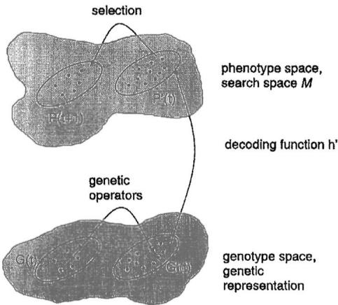  
Fi. 1. The relation of genotype space and phenotype space [5, p. 3].

In general, two different approaches can be followed. The first is to choose one of the standard algorithms and to design a decoding function according to the requirements of the algorithm. The second suggests designing the representation as close as possible to the characteristics of the phenotype space, almost avoiding the need for a decoding function.

Many empirical and theoretical results are available for the standard instances of evolutionary algorithms, which is clearly an important advantage of the first approach, especially with regard to the reuse and parameter setting of operators. On the other hand, a complex coding function may introduce additional nonlinearities and other mathematical difficulties which can hinder the search process substantially [79, pp. 221227], [82, p. 97].

There is no general answer to the question of which one of the two approaches mentioned above to follow for a specific project, but many practical applications have shown that the best solutions could be found after imposing substantial modifications to the standard algorithms [86]. We think that most practitioners prefer natural, problem-related representations. Michalewicz [82, p. 4] offers:

It seems that a "natural" representation of a potential solution for a given problem plus a family of applicable "genetic" operators might be quite useful in the approximation of solutions of many problems, and this nature-modeled approach . . . is a promising direction for problem solving in general.

Furthermore, many researchers also use hybrid algorithms, i.e., combinations of evolutionary search heuristics and traditional as well as knowledge-based search techniques [22, p. 56], [91], [92].

It should be emphasized that all this becomes possible because the requirements for the application of evolutionary heuristics are so modest compared to most other search techniques. In our opinion, this is one of the most important strengths of the evolutionary approach and one of the reasons for the popularity evolutionary computation has gained throughout the last decade.

# A. The Representation

Surprisingly, despite the fact that the representation problem, i.e., the choice or design of a well-suited genetic representation for the problem under consideration, has been described by many researchers [82], [93], [94] only few a publications explicitly deal with this subject except for specialized research directions such as genetic programming [31], [95], [96] and the evolution of neural networks [97], [98].

Canonical genetic algorithms use a binary representation of individuals as fixed-length strings over the alphabet $\{ 0 , 1 \}$ [11], such that they are well suited to handle pseudo-Boolean optimization problems of the form

$$
f \colon \{ 0 , 1 \} ^ { \ell }  \mathbb { R } .
$$

Sticking to the binary representation, genetic algorithms often enforce the utilization of encoding and decoding functions $h \colon M \to \{ 0 , 1 \} ^ { \ell }$ and $h ^ { \prime } \colon \{ 0 , 1 \} ^ { \ell } \to \bar { M }$ that facilitate mapping solutions $\pmb { \vec { x } } \in M$ to binary strings $h ( \vec { \pmb { x } } ) \in \{ 0 , 1 \} ^ { \ell }$ and vice versa, which sometimes requires rather complex mappings $h$ and $h ^ { \prime }$ . In case of continuous parameter optimization problems, for instance, genetic algorithms typically represent a realvalued vector $\vec { \pmb { x } } \in \mathbb { R } ^ { n }$ by a binary string $\mathring { \pmb { y } } \in \{ 0 , 1 \} ^ { \ell }$ as follows: the binary string is logically divided into $\pmb { n }$ segments of equal length $\ell ^ { \prime }$ (i.e., $\ell = n \cdot \ell ^ { \prime } )$ , each segment is decoded to yield the corresponding integer value, and the integer value is in turn linearly mapped to the interval $\{ u _ { i } , v _ { i } \} \subset \mathbb { R }$ (corresponding with the ith segment of the binary string) of real values [18].

The strong preference for using binary representations of solutions in genetic algorithms is derived from schema theory [11], which analyzes genetic algorithms in terms of their expected schema sampling behavior under the assumption that mutation and recombination are detrimental. The term schema denotes a similarity template that represents a subset of $\{ 0 , 1 \} ^ { \ell }$ , and the schema theorem of genetic algorithms offers that the canonical genetic algorithm provides a near-optimal sampling strategy (in terms of minimizing expected losses) for schemata by increasing the number of well-performing, short (i.e., with small distance between the left-most and rightmost defined position), and low-order (i.e., with few specified bits) schemata (so-called building blocks) over subsequent generations (see [18] for a more detailed introduction to the schema theorem). The fundamental argument to justify the strong emphasis on binary alphabets is derived from the fact that the number of schemata is maximized for a given finite number of search points under a binary alphabet [18, pp. 4041]. Consequently, the schema theory presently seems to favor binary representations of solutions (but see [99] for an alternative view and [100] for a transfer of schema theory to $s$ -expression representations used in genetic programming).

Practical experience, as well as some theoretical hints regarding the binary encoding of continuous object variables [101]-[105], however, indicate that the binary representation has some disadvantages. The coding function might introduce an additional multimodality, thus making the combined objective function $f = f ^ { \prime } \circ h ^ { \prime }$ (where $f ^ { \prime } \colon M \to \mathbb { R } )$ more complex than the original problem $f ^ { \prime }$ was. In fact, the schema theory relies on approximations [11, pp. 7883] and the optimization criterion to minimize the overall expected loss (corresponding to the sum of all fitness values of all individuals ever sampled during the evolution) rather than the criterion to maximize the best fitness value ever found [15]. In concluding this brief excursion into the theory of canonical genetic algorithms, we would like to emphasize the recent work by Vose [106][109] and others [110], [111] on modeling genetic algorithms by Markov chain theory. This approach has already provided a remarkable insight into their convergence properties and dynamical behavior and led to the development of so-called executable models that facilitate the direct simulation of genetic algorithms by Markov chains for problems of sufficiently small dimension [112], [113].

In contrast to genetic algorithms, the representation in evolution strategies and evolutionary programming is directly based on real-valued vectors when dealing with continuous parameter optimization problems of the general form

$$
f \colon M \subseteq \mathbb { R } ^ { n } \to \mathbb { R } .
$$

Both methods have originally been developed and are also used, however, for combinatorial optimization problems [42], [43], [55]. Moreover, since many real-world problems have complex search spaces which cannot be mapped "canonically" to one of the representations mentioned so far, many strategy variants, e.g., for integer [114], mixed-integer [115], structure optimization [116], [117], and others [82, ch. 10], have been introduced in the literature, but exhaustive comparative studies especially for nonstandard representations are still missing. The actual development of the field is characterized by a progressing integration of the different approaches, such that the utilization of the common labels "genetic algorithm," evolution strategy," and "evolutionary programming" might be sometimes even misleading.

# B. Mutation

Of course, the design of variation operators has to obey the mathematical properties of the chosen representation, but there are still many degrees of freedom.

Mutation in genetic algorithms was introduced as a dedicated "background operator" of small importance (see [11, pp. 109-111]). Mutation works by inverting bits with very small probability such as ${ { p } _ { m } } = 0 . 0 0 1$ [13], $p _ { m } \in \left[ 0 . 0 0 5 , 0 . 0 1 \right]$ [118], or $p _ { m } = 1 / \ell$ [119], [120]. Recent studies have impressively clarified, however, that much larger mutation rates, decreasing over the course of evolution, are often helpful with respect to the convergence reliability and velocity of a genetic algorithm [101], [121], and that even self-adaptive mutation rates are effective for pseudo-Boolean problems [122]-[124].

Originally, mutation in evolutionary programming was implemented as a random change (or multiple changes) of the description of the finite state machines according to five different modifications: change of an output symbol, change of a an of the initial state. The mutations were typically performed with uniform probability, and the number of mutations for a single offspring was either fixed or also chosen according to a probability distribution. Currently, the most frequently used mutation scheme as applied to real-valued representations is very similar to that of evolution strategies.

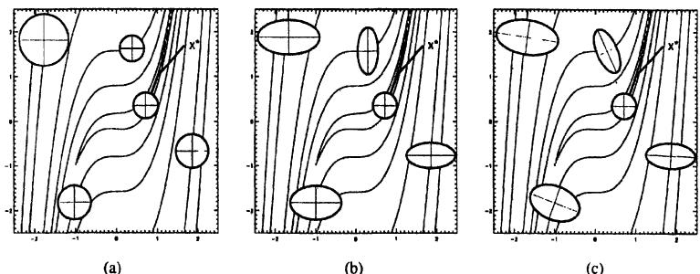  
$\pmb { n }$ step sizes, and (c covariances. $x ^ { * }$ individual located at the center o theellipses. Five sample individuals a shown n each oftheplots.

In evolution strategies, the individuals consist of object variables $x _ { i } ~ \in ~ \mathbb { R } ~ ( 1 ~ \leq ~ i ~ \leq ~ n )$ and so-called strategy parameters, which are discussed in the next section. Mutation is then performed independently on each vector element by adding a normally distributed random value with expectation zero and standard deviation $\pmb { \sigma }$ (the notation $N _ { i } ( \cdot , \cdot )$ indicates that the random variable is sampled anew for each value of the index $_ { i }$

$$
x _ { i } ^ { \prime } = x _ { i } + \sigma \cdot N _ { i } ( 0 , 1 ) .
$$

This raises the question of how to control the so-called step size $\pmb { \sigma }$ of (6), which is discussed in the next section.

# C. Self-Adaptation

In [125] Schwefel introduced an endogenous mechanism for step-size control by incorporating these parameters into the representation in order to facilitate the evolutionary selfadaptation of these parameters by applying evolutionary operators to the object variables and the strategy parameters for mutation at the same time, i.e., searching the space of solutions and strategy parameters simultaneously. This way, a suitable adjustment and diversity of mutation parameters should be provided under arbitrary circumstances.

More formally, an individual $\pmb { \vec { a } } = ( \pmb { \vec { x } } , \pmb { \vec { \sigma } } )$ consists of object variables $\vec { \pmb { x } } \in \mathbb { R } ^ { n }$ and strategy parameters $\vec { \pmb { \sigma } } \in \mathbb { R } _ { + } ^ { n }$ .The mutation operator works by adding a normally distributed random vector $\vec { z } \in \mathbb { R } ^ { n }$ with $z _ { i } ~ \sim ~ N ( 0 , \sigma _ { i } ^ { 2 } )$ (i.e., the components of $\vec { z }$ are normally distributed with expectation zero and variance $\sigma _ { i } ^ { 2 \cdot }$ .

The effect of mutation is now defined as

$$
\begin{array} { r l } & { \sigma _ { i } ^ { \prime } = \sigma _ { i } \cdot \exp \left[ \tau ^ { \prime } \cdot N ( 0 , 1 ) + \tau \cdot N _ { i } ( 0 , 1 ) \right] } \\ & { x _ { i } ^ { \prime } = x _ { i } + \sigma _ { i } ^ { \prime } \cdot N _ { i } ( 0 , 1 ) } \end{array}
$$

where $\tau ^ { \prime } \propto ( \sqrt { 2 n } ) ^ { - 1 }$ and $\tau \propto ( \sqrt { 2 \sqrt { n } } ) ^ { - 1 }$ .

This mutation scheme, which is most frequently used in evolution strategies, is schematically depicted (for $n = 2 \mathrm { : }$ in the middle of Fig. 2. The locations of equal probability density for descendants are concentric hyperellipses (just one is depicted in Fig. 2) around the parental midpoint. In the case considered here, i.e., up to n variances, but no covariances, the axes of the hyperellipses are congruent with the coordinate axes.

Two modifications of this scheme have to be mentioned: a simplified version uses just one step-size parameter for all of the object variables. In this case the hyperellipses are reduced to hyperspheres, as depicted in the left part of Fig. 2. A more elaborate correlated mutation scheme allows for the rotation of hyperellipses, as shown in the right part of Fig. 2. This mechanism aims at a better adaptation to the topology of the objective function (for details, see [79]).

The settings for the learning rates $\tau$ and $\tau ^ { \prime }$ are recommended as upper bounds for the choice of these parameters (see [126, pp. 167168]), but one should have in mind that, depending on the particular topological characteristics of the objective function, the optimal setting of these parameters might differ from the values proposed. For the case of one selfadaptable step size, however, Beyer has recently theoretically shon that, r the shere moel  quadratic bowl, the stt $\tau _ { 0 } \propto 1 / \sqrt { n }$ is the optimal choice, maximizing the convergence velocity [127].

The amount of information included into the individuals by means of the self-adaptation principle increases from the simple case of one standard deviation up to the order of $n ^ { 2 }$ additional parameters, which reflects an enormous degree of freedom for the internal models of the individuals. This growing degree of freedom often enhances the global search capabilities of the algorithm at the cost of the expense in computation time, and it also reflects a shift from the precise adaptation of a few strategy parameters (as in case of one step size) to the exploitation of a large diversity of strategy parameters. In case of correlated mutations, Rudolph [128] has shown that an approximation of the Hessian could be computed with an upper bound of $\mu + \lambda = ( n ^ { 2 } + 3 n + 4 ) / 2$ on the population size, but the typical population sizes $\mu = 1 5$ and $\lambda = 1 0 0$ , independently of $\pmb { n }$ , are certainly not sufficient to achieve this.

The choice of a logarithmic normal distribution for the modification of the standard deviations $\sigma _ { i }$ is presently also acknowledged in evolutionary programming literature [129]-[131]. Extensive empirical investigations indicate some advantage of this scheme over the original additive selfadaptation mechanism introduced independently (but about 20 years later than in evolution strategies) in evolutionary programming [132] where

$$
\sigma _ { i } ^ { \prime } = \sigma _ { i } \cdot \left[ 1 + \alpha \cdot N ( 0 , 1 ) \right]
$$

(with a setting of $\alpha \approx 0 . 2$ [131]). Recent preliminary investigations indicate, however, that this becomes reversed when noisy objective functions are considered, where the additive mechanism seems to outperform multiplicative modifications [133].

A study by Gehlhaar and Fogel [134] also indicates that the order of the modifications of $x _ { i }$ and $\sigma _ { i }$ has a strong impact on the effectiveness of self-adaptation: It appears important to mutate the standard deviations first and to use the mutated standard deviations for the modification of object variables. As the authors point out in that study, the reversed mechanism might suffer from generating offspring that have useful object variable vectors but poor strategy parameter vectors because these have not been used to determine the position of the offspring itself.

More work needs to be performed, however, to achieve any clear understanding of the general advantages or disadvantages of one self-adaptation scheme compared to the other mechanisms. A recent theoretical study by Beyer presents a first step toward this goal [127]. In this work, the author shows that the self-adaptation principle works for a variety of different probability density functions for the modification of the step size, i.e., it is an extremely robust mechanism. Moreover, [127] clarifies that (9) is obtained from the corresponding equation for evolution strategies with one self-adaptable step size by Taylor expansion breaking off after the linear term, such that both methods behave equivalently for small settings of the learning rates $\tau$ and $\pmb { \alpha }$ , when $\tau = \alpha$ . This prediction was confirmed perfectly by an experiment reported in [135].

Apart from the early work by Schaffer and Morishima [37], self-adaptation has only recently been introduced in genetic algorithms as a mechanism for evolving the parameters of variation operators. In [37], punctuated crossover was offered as a method for adapting both the number and position of crossover points for a multipoint crossover operator in canonical genetic algorithms. Although this approach seemed promising, the operator has not been used widely. A simpler approach toward self-adapting the crossover operator was presented by Spears [136], who allowed individuals to choose between two-point crossover and uniform crossover by means of a self-adaptable operator choice bit attached to the representation of individuals. The results indicated that, in case of crossover operators, rather than adapting to the single best operator for a given problem, the mechanism seems to benefit from the existing diversity of operators available for crossover.

Concerning the mutation operator in genetic algorithms, some effort to facilitate self-adaptation of the mutation rate has been presented by Smith and Fogarty [123], based on earlier work by Bäck [137]. These approaches incorporate the mutation rate $p _ { m } \in [ 0 , 1 ]$ into the representation of individuals and allow for mutation and recombination of the mutation rate in the same way as the vector of binary variables is evolved. The results reported in [123] demonstrate that the mechanism yields a significant improvement in performance of a canonical genetic algorithm on the test functions used.

# D. Recombination

The variation operators of canonical genetic algorithms, mutation, and recombination are typically applied with a strong emphasis on recombination. The standard algorithm performs a so-called one-point crossover, where two individuals are chosen randomly from the population, a position in the bitstrings is randomly determined as the crossover point, and an offspring is generated by concatenating the left substring of one parent and the right substring of the other parent. Numerous extensions of this operator, such as increasing the number of crossover points [138], uniform crossover (each bit is chosen randomly from the corresponding parental bits) [139], and others, have been proposed, but similar to evolution strategies no generally useful recipe for the choice of a recombination operator can be given. The theoretical analysis of recombination is still to a large extent an open problem. Recent work on multi-parent recombination, where more than two individuals participate in generating a single offspring individual, clarifies that this generalization of recombination might yield a performance improvement in many application examples [140][142]. Unlike evolution strategies, where it is either utilized for the creation of all members of the intermediate population (the default case) or not at all, the recombination operator in genetic algorithms is typically applied with a certain probability $_ { p _ { c } }$ , and commonly proposed settings of the crossover probability are $p _ { \mathrm { c } } = 0 . 6$ [13] and $p _ { c } \in \left[ 0 . 7 5 , 0 . 9 5 \right]$ [118].

In evolution strategies recombination is incorporated into the main loop of the algorithm as the first operator (see Algorithm 1) and generates a new intermediate population of $\lambda$ individuals by $\lambda$ -fold application to the parent population, creating one individual per application from $\varrho$ $( 1 \leq \varrho \leq \mu )$ individuals. Normally, $\varrho = 2$ or $\varrho ~ = ~ \mu$ (so-called global recombination) are chosen. The recombination types for object variables and strategy parameters in evolution strategies often differ from each other, and typical examples are discrete $\pmb { r e }$ - combination (random choices of single variables from parents, comparable to uniform crossover in genetic algorithms) and intermediary recombination (often arithmetic averaging, but other variants such as geometrical crossover [143] are also possible). For further details on these operators, see [79].

The advantages or disadvantages of recombination for a particular objective function can hardly beassessed in advance, and certainly no generally useful setting of recombination operators (such as the discrete recombination of object variables and global intermediary of strategy parameters as we have claimed in [79, pp. 82-83]) exists. Recently, Kursawe has impressively demonstrated that, using an inappropriate setting t  h 00 with n self-adaptable variances might even diverge on a sphere model for $n = 1 0 0$ [144]. Kursawe shows that the appropriate choice of the recombination operator not only depends on the objective function topology, but also on the dimension of the objective function and the number of strategy parameters incorporated into the individuals. Only recently, Rechenberg [46] and Beyer [142] presented first results concerning the convergence velocity analysis of global recombination in case of the sphere model. These results clarify that, for using one (rather than $\pmb { n }$ as in Kursawe's experiment) optimally chosen standard deviation $\sigma$ ,a $\pmb { \mu }$ -fold speedup is achieved by both recombination variants. Beyer's interpretation of the results, however, is somewhat surprising because it does not put down the success of this operator on the existence of building blocks which are usefully rearranged in an offspring individual, but rather explains it as a genetic repair of the harmful parts of mutation.

Concerning evolutionary programming, a rash statement based on the common understanding of the contending structures as individuals would be to claim that evolutionary programming simply does not use recombination. Rather than focusing on the mechanism of sexual recombination, however, Fogel [145] argues that one may examine and simulate its functional effect and correspondingly interpret a string of symbols as a reproducing population or species, thus making recombination a nonissue (refer to [145] for philosophical reasons underlining this choice).

# E. Selection

Unlike the variation operators which work on the genetic representation, the selection operator is based solely on the fitness values of the individuals.

In genetic algorithms, selection is typically implemented as a probabilistic operator, using the relative fitness $p ( \vec { \pmb { a } } _ { i } ) =$ $\scriptstyle f ( { \vec { a } } _ { i } ) / \sum _ { j = 1 } ^ { \mu } f ( { \vec { a } } _ { j } )$ an individual $\pmb { \vec { a } } _ { i }$ (proportional selection). This method requires positive fitness values and a maximization task, so that scaling functions are often utilized to transform the fitness values accordingly (see, e.g., [18, p. 124]). Rather than using absolute fitness values, rank-based selection methods utilize the indexes of individuals when ordered according to fitness values to calculate the corresponding selection probabilities. Linear [146] as well as nonlinear [82, p. 60] mappings have been proposed for this type of selection operator. Tournament selection [147] works by taking a random uniform sample of a certain size $q > 1$ from the population, selecting the best of these $\pmb q$ individuals to survive for the next generation, and repeating the process until the new population is filled. This method gains increasing popularity because it is easy to implement, computationally efficient, and allows for finetuning the selective pressure by increasing or decreasing the tournament size $\pmb q$ . For an overview of selection methods and a characterization of their selective pressure in terms of numerical measures, the reader should consult [148] and [149]. While most of these selection operators have been introduced in the framework of a generational genetic algorithm, they can also be used in combination with the steady-state and generation gap methods outlined in Section III.

The $( \pmb { \mu } , \lambda )$ -evolution strategy uses a deterministic selection scheme. The notation $( \pmb { \mu } , \lambda )$ indicates that $\pmb { \mu }$ parents create $\lambda > \mu$ offspring by means of recombination and mutation, and the best $\pmb { \mu }$ offspring individuals are deterministically selected to replace the parents (in this case, $Q \ = \ \emptyset$ in Algorithm I). Notice that this mechanism allows that the best member of the population at generation $t + 1$ might perform worse than the best individual at generation $t ,$ i.e., the method is not elitist, thus allowing the strategy to accept temporary deteriorations that might help to leave the region of attraction of a local optimum and reach a better optimum. In contrast, the $( \mu + \lambda )$ strategy selects the $\mu$ survivors from the union of parents and offspring, such that a monotonic course of evolution is guaranteed $\boldsymbol { { [ Q = P ( t ) } }$ in Algorithm 1]. Due to recommendations by Schwefel, however, the $( \mu , \lambda )$ strategy is preferred over the $( \mu + \lambda )$ strategy, although recent experimental findings seem to indicate that the latter performs as well as or better than the $( \mu , \lambda )$ strategy in many practical cases [134]. It should also be noted that both schemes can be interpreted as instances of the general $( \mu , \kappa , \lambda )$ strategy, where $1 \leq \kappa \leq \infty$ denotes the maximum life span (in generations) of an individual. For $\kappa = 1$ , the selection method yields the $( \mu , \lambda )$ strategy, while it turns into the $( \mu + \lambda )$ strategy for $\kappa = \infty$ [54].

A minor difference between evolutionary programming and evolution strategies consists in the choice of a probabilistic variant of $( \mu + \lambda )$ selection in evolutionary programming, where each solution out of offspring and parent individuals is evaluated against $q > 1$ (typically, $q \leq 1 0 )$ other randomly chosen solutions from the union of parent and offspring individuals $[ Q = P ( t )$ in Algorithm 1 ]J. For each comparison, a "win" is assigned if an individual's score is better or equal to that of its opponent, and the $\mu$ individuals with the greatest number of wins are retained to be parents of the next generation. As shown in [79, pp. 9699], this selection method is a probabilistic version of $( \mu + \lambda )$ selection which becomes more and more deterministic as the number $q$ of competitors is increased. Whether or not a probabilistic selection scheme should be preferable over a deterministic scheme remains an open question.

Evolutionary algorithms can easily be ported to parallel computer architectures [150], [151]. Since the individuals can be modified and, most importantly, evaluated independently of each other, we should expect a speed-up scaling linear with the number of processing units $\pmb { p }$ as long as $\pmb { p }$ does not exceed the population size $\mu$ , But selection operates on the whole population so this operator eventually slows down the overall performance, especially for massively parallel architectures where $p \gg \mu$ , This observation motivated the development of parallel algorithms using local selection within subpopulations like in migration models [53], [152] or within small neighborhoods of spatially aranged individuals like in diffusion models [153][156] (also called cellular evolutionary algorithms [157][159]). It can be observed that local selection techniques not only yield a considerable speed-up on parallel architectures, but also improve the robustness of the algorithms [46], [116], [160].

# F. Other Evolutionary Algorithm Variants

Although it is impossible to present a thorough overview of all variants of evolutionary computation here, it seems appropriate to explicitly mention order-based genetic algorithms [18], [82], classifier systems [161], [162], and genetic programming [31], [70], [81], [163] as branches of genetic algorithms that have developed into their own directions of research and application. The following overview is restricted to a brief statement of their domain of application and some literature references:

• Order-based genetic algorithms were proposed for searching the space of permutations π: $\mathring { \{ 1 , \cdots , n \} } $ $\{ 1 , \cdots , n \}$ directly rather than using complex decoding functions for mapping binary strings to permutations and preserving feasible permutations under mutation and crossover (as proposed in [164]). They apply specialized recombination (such as order crossover or partially matched crossover) and mutation operators (such as random exchanges of two elements of the permutation) which preserve permutations (see [82, ch. 10] for an overview).   
Classifier systems use an evolutionary algorithm to search the space of production rules (often encoded by strings over a ternary alphabet, but also sometimes using symbolic rules [165]) of a learning system capable of induction and generalization [18, ch. 6], [161], [166], [167]. Typically, the Michigan approach and the Pittsburgh approach are distinguished according to whether an individual corresponds with a single rule of the rulebased system (Michigan) or with a complete rule base (Pittsburgh).   
•Genetic programming applies evolutionary search to the space of tree structures which may be interpreted as computer programs in a language suitable to modification by mutation and recombination. The dominant approach to genetic programming uses (a subset of) LISP programs (S expressions) as genotype space [31], [163], but other programming languages including machine code are also used (see, e.g., [70], [81], and [168]).

Throughout this section we made the attempt to compare the constituents of evolutionary algorithms in terms of their canonical forms. But in practice the borders between these approaches are much more fluid. We can observe a steady evolution in this field by modifying (mutating), (re)combining, and validating (evaluating) the current approaches, permanently improving the population of evolutionary algorithms.

# V. APPLICATIONS

Practical application problems in fields as diverse as engineering, natural sciences, economics, and business (to mention only some of the most prominent representatives) often exhibit a number of characteristics that prevent the straightforward application of standard instances of evolutionary algorithms. Typical problems encountered when developing an evolutionary algorithm for a practical application include the following.

1) A suitable representation and corresponding operators need to be developed when the canonical representation is different from binary strings or real-valued vectors.   
2)Various constraints need to be taken into account by means of a suitable method (ranging from penalty func

tions to repair algorithms, constraint-preserving operators, and decoders; see [169] for an overview).

Expert knowledge about the problem needs to be incorporated into the representation and the operators in order to guide the search process and increase its convergence velocity-without running into the trap, however, of being confused and misled by expert beliefs and habits which might not correspond with the best solutions.   
4)An objective function needs to be developed, often in cooperation with experts from the particular application field.   
5) The parameters of the evolutionary algorithm need to be set (or tuned) and the feasibility of the approach needs to be assessed by comparing the results to expert solutions (used so far) or, if applicable, solutions obtained by other algorithms.

Most of these topics require experience with evolutionary algorithms as well as cooperation between the application's expert and the evolutionary algorithm expert, and only few general results are available to guide the design of the algorithm (e.g., representation-independent recombination and mutation operators [170], [171], the requirement that small changes by mutation occur more frequently than large ones [48], [172], and a quantification of the selective pressure imposed by the most commonly used selection operators [149]). Nevertheless, evolutionary algorithms often yield excellent results when applied to complex optimization problems where other methods are either not applicable or turn out to be unsatisfactory (a variety of examples can be found in [80]).

Important practical problem classes where evolutionary algorithms yield solutions of high quality include engineering design applications involving continuous parameters (.g, for the design of aircraft [173], [174] structural mechanics problems based on two-dimensional shape representations [175], electromagnetic systems [176], and mobile manipulators [177], [178]), discrete parameters (e.g., for multiplierless digital filter optimization [179], the design of a linear collider [180], or nuclear reactor fuel arrangement optimization [181]), and mixed-integer representations (e.g., for the design of survivable networks [182] and optical multilayer systems [115]). Combinatorial optimization problems with a straightforward binary representation of solutions have also been treated successfully with canonical genetic algorithms and their derivatives (e.g., set partitioning and its application to airline crew scheduling [183], knapsack problems [184], [185], and others [186]). Relevant applications to combinatorial problems utilizing a permutation representation of solutions are also found in the domains of scheduling (e.g., production uln 18]nela pbs 8] ut, o vehicles [189] or telephone calls [190]), and packing .. of pallets on a truck [191]).

The existing range of successful applications is extremely broad, thus by far preventing an exhaustive overview—the list of fields and example applications should be taken as a hint for further reading rather than a representative overview. Some of the most challenging applications with a large profit potential are found in the field of biochemical drug design, where evolutionary algorithms have gained remarkable interest and success in the past few years as an optimization procedure to support protein engineering [134], [192][194]. Also, finance and business provide a promising field of profitable applications [195], but of course few details are published about this work (see, e.g., [196]). In fact, the relation between evolutionary algorithms and economics has found increasing interest in the past few years and is now widely seen as a promising modeling approach for agents acting in a complex, uncertain situation [197].

In concluding this section, we refer to the research field of computational intelligence (see Section VI for details) and the applications of evolutionary computation to the other main fields of computational intelligence, namely fuzzy logic and neural networks. An overview of the utilization of genetic algorithms to train and construct neural networks is given in [198], and of course other variants of evolutionary algorithms can also be used for this task (see e.g., [199] for an evolutionary programming, [200] for an evolution strategy example, and [97] and [201] for genetic algorithm examples). Similarly, both the rule base and membership functions of fuzzy systems can be optimized by evolutionary algorithms, typically yielding improvements of the performance of the fuzzy system (e.g. [202][206]). The interaction of computational intelligence techniques and hybridization with other methods such as expert systems and local optimization techniques certainly opens a new direction of research toward hybrid systems that exhibit problem solving capabilities approaching those of naturally intelligent systems in the future. Evolutionary algorithms, seen as a technique to evolve machine intelligence (see [5]), are one of the mandatory prerequisites for achieving this goal by means of algorithmic principles that are already working quite successfully in natural evolution [207].

# VI. SUMMARY AND OUTLOOK

To summarize, the current state of evolutionary computation research can be characterized as in the following.

•The basic concepts have been developed more than 35 years ago, but it took almost two decades for their potential to be recognized by a larger audience. Application-oriented research in evolutionary computation is quite successful and almost dominates the field (if we consider the majority of papers). Only few potential application domains could be identified, if any, where evolutionary algorithms have not been tested so far. In many cases they have been used to produce good, if not superior, results. •In contrast, the theoretical foundations are to some extent still weak. To say it more pithy: "We know that they work, but we do not know why." As a consequence, inexperienced users fall into the same traps repeatedly, since there are only few rules of thumb for the design and parameterization of evolutionary algorithms.

A constructive approach for the synthesis of evolutionary algorithms, i.e., the choice or design of the representations, variation operators, and selection mechanisms is needed. But first investigations pointing in the direction of design principles for representation-independent operators

are encouraging [171], as well, as is the work on complex nonstandard representations such as in the field of genetic programming.   
Likewise, the field still lacks a sound formal characterization of the application domain and the limits of evolutionary computation. This requires future efforts in the field of complexity theory.

There exists a strong relationship between evolutionary computation and some other techniques, e.g., fuzzy logic and neural networks, usually regarded as elements of artificial intelligence. Following Bezdek [208], their main common characteristic lies in their numerical knowledge representation, which differentiates them from traditional symbolic artificial intelligence. Bezdek suggested the term computational intelligence for this special branch of artificial intelligence with the following characteristics3:

numerical knowledge representation;   
adaptability;   
fault tolerance;   
4processing speed comparable to human cognition processes;   
5)error rate optimality (e.g., with respect to a Bayesian estimate of the probability of a certain error on future data).

We regard computational intelligence as one of the most innovative research directions in connection with evolutionary computation, since we may expect that efficient, robust, and easy-to-use solutions to complex real-world problems will be developed on the basis of these complementary techniques. In this field, we expect an impetus from the interdisciplinary cooperation, e.g., techniques for tightly coupling evolutionary and problem domain heuristics, more elaborate techniques for self-adaptation, as well as an important step toward machine intelligence.

Finally, it should be pointed out that we are far from using all potentially helpful features of evolution within evolutionary algorithms. Comparing natural evolution and the algorithms discussed here, we can immediately identify a list of important differences, which all might be exploited to obtain more robust search algorithms and a better understanding of natural evolution.

Natural evolution works under dynamically changing environmental conditions, with nonstationary optima and even changing optimization criteria, and the individuals themselves are also changing the structure of the adaptive landscape during adaptation [210]. In evolutionary algorithms, environmental conditions are often static, but nonelitist variants are able to deal with changing environments. It is certainly worthwhile, however, to consider a more flexible life span concept for individuals in evolutionary algorithms than just the extremes of a maximum life span of one generation [as in a $( \mu , \lambda )$ strategy] and of an unlimited life span (as in an elitist strategy), by introducing an aging parameter as in the $( \mu , \kappa , \lambda )$ strategy [54].

3The term "computational intelligence" was originally coined by Cercone and McCalla [209].

The long-term goal of evolution consists of the maintenance of evolvability of a population [95], guaranteed by mutation, and a preservation of diversity within the population (the term meliorization describes this more appropriately than optimization or adaptation does). In contrast, evolutionary algorithms often aim at finding a precise solution and converging to this solution.

• In natural evolution, many criteria need to be met at the same time, while most evolutionary algorithms are designed for single fitness criteria (see [211] for an overview of the existing attempts to apply evolutionary algorithms to multiobjective optimization). The concepts of diploidy or polyploidy combined with dominance and recessivity [50] as well as the idea of introducing two sexes with different selection criteria might be helpful for such problems [212], [213].

Natural evolution neither assumes global knowledge (about all fitness values of all individuals) nor a generational synchronization, while many evolutionary algorithms still identify an iteration of the algorithm with one complete generation update. Fine-grained asynchronously parallel variants of evolutionary algorithms, introducing local neighborhoods for recombination and selection and a time-space organization like in cellular automata [157]-[159] represent an attempt to overcome these restrictions.

•The co-evolution of species such as in predator-prey interactions implies that the adaptive landscape of individuals of one species changes as members of the other species make their adaptive moves [214]. Both the work on competitive fitness evaluation presented in [215] and the co-evolution of separate populations [216], [217] present successful approaches to incorporate the aspect of mutual interaction of different adaptive landscapes into evolutionary algorithms. As clarified by the work of Kauffman [214], however, we are just beginning to explore the dynamics of co-evolving systems and to exploit the principle for practical problem solving and evolutionary simulation.

The genotype-phenotype mapping in nature, realized by the genetic code as well as the epigenetic apparatus (i.e., the biochemical processes facilitating the development and differentiation of an individual's cells into organs and systems), has evolved over time, while the mapping is usually fixed in evolutionary algorithms (dynamic parameter encoding as presented in [218] being a notable exception). An evolutionary self-adaptation of the genotype-phenotype mapping might be an interesting way to make the search more flexible, starting with a coarse-grained, volume-oriented search and focusing on promising regions of the search space as the evolution proceeds.

•Other topics, such as multicellularity and ontogeny of individuals, up to the development of their own brains (individual learning, such as accounted for by the Baldwin effect in evolution [219]), are usually not modeled in evolutionary algorithms. The self-adaptation of strategy parameters is just a first step into this direction, realizing the idea that each individual might have its own internal strategy to deal with its environment. This strategy might be more complex than the simple mutation parameters presently taken into account by evolution strategies and evolutionary programming.

With all this in mind, we are convinced that we are just beginning to understand and to exploit the full potential of evolutionary computation. Concerning basic research as well as practical applications to challenging industrial problems, evolutionary algorithms offer a wide range of promising further investigations, and it will be exciting to observe the future development of the field.

# ACKNOWLEDGMENT

The authors would like to thank D. B. Fogel and three anonymous reviewers for their very valuable and detailed comments that helped them improve the paper. They also appreciate the informal comments of another anonymous reviewer, and the efforts of the anonymous associate editor responsible for handling the paper submission and review procedure. The first author would also like to thank C. Müller for her patience.

# Список литературы

[1] H. J. Bremermann, "Optimization through evolution and recombinao."in SelOranizg Syss, M..Yvits et al. s.Wa, DC: Spartan, 1962.   
[2] R. M. Friedberg, "A learning machine: Part I," IBM J., vol. 2, no. 1. pp. 213, Jan. 1958.   
[3] R. M. Friedberg, B. Dunham, and J. H. North, "A learning machine: Par II," IBM J. vol. , no.  pp. 282287, July 1959.   
[4] G. E. P. Box, "Evolutionary operation: A method for increasing industal produciviy," App. Statti, vol. VI, no., pp.8101, 1.   
. B. Fogel, Evolutinary Computatin: Toward a New Philosohy of Machine Intelligence. Piscataway, NJ: IEEE Press, 1995.   
[J.H.Holland, "Outline or  logical theory  adaptive systems,"J. Assoc. Comput. Mach., vol. 3, pp. 297314, 1962.   
[7] I. Rechenberg, "Cybemetic solution path of an experimental problem," Royal Aircraft Establishment, Library translation No. 1122, Farnborough, Hants., U.K., Aug. 1965.   
[8] H.-P. Schwefel, "Projekt MHD-Staustrahlrohr: Experimentelle Optimierung einer Zweiphasenduse, Teil I," Technischer Bericht 11.034/68, 35, AEG Forschungsinstitut, Berlin, Germany, Oct. 1968.   
L. J. Fogel, "Autonoous utoata," Ind Res. vol., pp. 1-9, 1.   
[0 J. T.Alne "ne raph no pa 196," University of Vasa, Department of Information Technology and Prouctio Econmics, Rep.- 1.wasa. c/eo ga96bib.ps.Z).   
[11] J. H. Holland, Adaptation in Natural and Artificial Systems. Ann Arbor, MI: Univ. of Michigan Press, 1975.   
[12] J. H. Holland and J. S. Reitman, "Cognitive systems based on adaptive algorithms," in Pattern-Directed Inference Systems, D. A. Waterman and F. Hayes-Roth, Eds. New York: Academic, 1978.   
[13] K. A. De Jong, "An analysis of the behavior of a class of genetic adaptive systems," Ph.D. dissertation, Univ. of Michigan, Ann Arbor, 175, Diss. Abstr. Int. 36(10). 5140B, University Microfilms no. 7- 9381.   
[14] "Onus netic aoriths  searc program spaces,"in . d In.Conon Genetic Algoriths and Their Applications.Hillsale, NJ: Lawrence Erlbaum, 1987. pp. 210216.   
[15] , "Are genetic algorithms function optimizers?" in Parallel Problem Solving from Nature 2. Amsterdam, The Netherlands: Elsevier, 1992, pp. 3-13.   
[16] "Genetic algorithms are NOT function optimizers," in Foundations of Genetic Algorithms . San Mateo, CA: Morgan Kaufmann, 1993, pp. 5-17.   
] .E. Goldberg, "Geneic algorithms and ule learning in ynamic system control," in Proc. Ist Int. Conf. on Genetic Algorithms and Their Applications. Hillsdale, NJ: Lawrence Erlbaum, 1985, pp. 815.   
[18] , Genetic Algorithms in Search, Optimization and Machine Learning. Reading, MA: Addison-Wesley, 1989.   
[19] Th from Nature—Proc. 1st Workshop PPSN 1I. (Lecture Notes in Computer Science, vol. 496). Berlin, Germany: Springer, 1991, pp. 1322.   
0..o.  H. the sizing of populations," Complex Syst., vol. 6, pp. 333362, 1992.   
D. E. Goldberg, K. Deb, H. Kargupta, and G. Harik, "Rapid, accurate optimization of diffcult problems using fast messy enetic algorithms," in Proc. 5th Int. Conf. on Genetic Algorithms. San Mateo, CA: Morgan Kaufmann, 1993, pp. 5664.   
[2 L. Davis, Ed. Handbook of Genetic Algorithms. New York: Van Nostrand Reinhold, 1991.   
[] L. J. Eshelman and J. D. Schaffer, "Crossover's niche," in Proc. Sth Int. Conf. on Genetic Algorithms. San Mateo, CA: Morgan Kaufmann, 1993, pp. 9-14.   
[24] Productive recombination and propagating and preserving schemata," in Foundations of Genetic Algorithms 3. San Francisco, CA: Morgan Kaufmann, 1995, pp. 299313.   
algorithm? Some anomalous results and their explanation," Mach. Learn., vol. 13, pp. 285319, 1993.   
[26] J. J. Grefenstette, "Optimization of control parameters for genetic E a- . 122128, 1986.   
[27] "Incorporating problem specific knowledge into genetic algorithms," in Genetic Algorithms and Simulated Annealing, L. Davis, Ed. San Mateo, CA: Morgan Kaufmann, 1987, pp. 4260.   
[28] "Conditions for implicit parallelism," in Foundations of Genetic Aloriths. San Mateo, CA: Morgan Kaufmann, 1991, pp. 52261.   
[29] , "Deception considered harmful," in Foundations of Genetic Algorithms 2. San Mateo, CA: Morgan Kaufmann, 1993, pp. 7591.   
0 . Hl noe ua of computer programs," in Proc. 1Ith Int. Joint Conf. on Artificial .. , 1989, pp. 768774.   
[31] GenetProgramiherograming  Cpute Means of Natural Selection. Cambridge, MA: MIT Press, 1992.   
[32] M. Mitchell, An Introduction to Genetic Algorithms. Cambridge, MA: MIT Press, 1996.   
[] R. L. Riolo, "The emergence of coupled sequences of classifiers," in Proc. 3rd Int. Conf. on Genetic Algorithms. San Mateo, CA: Morgan Kaufmann, 1989, pp. 256264.   
[34] "The emergence of default hierarchies in learning classifier systems," in Proc. 3rd Int. Conf. on Genetic Algorithms. San Mateo, CA: Morgan Kaufmann, 1989, pp. 322327.   
[] J. D.Schaffer, "Multiple objective optimization with vector evaluated genetic algorithms," in Proc. Ist Int. Conf. on Genetic Algorithms pil  . 93100.   
.  . viable strategy," in Proc. 4th Int. Conf. on Genetic Algorithms. San Mateo, CA: Morgan Kaufmann, 1991. pp. 6168.   
[3 J. D. Schaffer and A. Morishima, "An adaptive crossover distribution mechanism for genetic algorithms," in Proc. 2nd Int. Conf. on Genetic Algorithms and Their Applications. Hillsdale, NJ: Lawrence Erlbaum, 1987, pp. 36-40.   
[38] L. J. Fogel, "On the organization of intellect," Ph.D. dissertation, University of California, Los Angeles, 1964.   
[39] G. H. Burgin, $\mathfrak { w } _ { \mathbf { O } \mathbf { n } }$ playing two-person zero-sum games against nonminplay ans 369370, Oct. 1969.   
[40] programming," J. Cybern., vol. 3, no. 2, pp. 575, 1973.   
[41] J. W. Atmar, "Speculation on the evolution of intelligence and its possible realization in machine form," Ph.D. dissertation, New Mexico State Univ., Las Cruces, 1976.   
[L. J. Foel, A. J. O, an. J. Walsh, Aril Ine T Simulated Evolution. New York: Wiley, 1966.   
]  B.Fol An oy  he ve problem," Biological Cybern., vol. 60, pp. 139144, 1988.   
[44] Evolvin ticial intellignce,h.DdissrationUn California, San Diego, 1992.   
[45] I. Rechenberg, Evolutionsstrategie: Optimierung technischer Systeme ch Pnzipien  bologischen Evolution. Sttgant Geray: Frommann-Holzboog, 1973.   
[46] Evolutionsstrategie $^ { 1 } 9 4 ,$ in Werksta Bionik und Evolutionstechnik. Stuttgart, Germany: Frommann-Holzboog, 1994, vol. 1.   
H-P.Se Eyolttratnche Optmiissertation, Technische Universitat Berlin, Germany, May 1975.   
[48] , Evolution and Optimum Seeking. New York: Wiley, 1995 (Sixth-Generation Computer Technology Series).   
Hy iva pcally organized evolution strategies," in Parallel Problem Solving from Nature 2. Amsterdam, The Netherlands: Elsevier, 1992, pp. 207217.   
[50 F. Kursawe, "A variant of Evolution Strategies or vector optimization," in Parallel Problem Solving from Nature—Proc. 1st Workshop PPSN No  Sc G: Springer, 1991, pp. 193-197.   
a dapat AT ra Elr  0   
r .Gzk, . Haize based on nonlocal use of selection information," in Parallel Problem Solving from Nature—PPSN II, Int. Conf. on Evolutionary Computation. Lece Notes n Computer Science, vol8 Bern, Germany: Springer, 1994, pp. 189198.   
[53] G. Rudolph, "Global optimization by means of distributed evolution strategies," in Parallel Problem Solving from Nature—Proc. Ist WorkNo Germany: Springer, 1991, pp. 209213.   
[ HSG. Ro "C o ." inAdvaes in Artiicial Lie.r Int.Con.on rtificial LieLcue Not in Artificial Intelligence, vol. , F.Mon, A. Moreno J. J. o      . 893907.   
[55] J. Klockgether and H.-P. Schwefel, "Two-phase nozzle and hollow core jet experiments," in Proc. 11th Symp. Engineering Aspects of .  A Institute of Technology, Mar. 2426, 1970, pp. 141148.   
J. J. Grefenstette, Ed. Proc. 1st Int. Conf. on Genetic Algorithms and Their Applications. Hillsdale, NJ: Lawrence Erlbaum, 1985.   
[57] r.nd Int.Con. on Genetic Algorithms and Their Applications. Hillsdale, NJ: Lawrence Erlbaum, 1987.   
[58] J. D. Schaffer, Ed. Proc. 3rd Int. Conf. on Genetic Algorithms. San Mateo, CA: Morgan Kaufmann, 1989.   
[59] R. K. Belew and L. B. Booker, Eds., Proc. 4th Int. Conf. on Genetic Algorithms. San Mateo, CA, Morgan Kaufmann, 1991. CA: Morgan Kaufmann, 1993.   
[ L. Eshelman, Ed. Genetic Algorithms: Proc. 6th Int. Conf. San Francisco, CA: Morgan Kaufmann, 1995.   
[2] D. B. Fogel and W. Atmar, Eds., Proc Ist Annu. Conf. on Evolutionary Programming. San Diego, CA: Evolutionary Programming Society, 1992.   
[63] - Proc.nd Annu. Conon Evolutionary ProgramingSn Diego, CA: Evolutionary Programming Society, 1993.   
[ A. V. Sebald and L. J. Fogel, Eds., Proc. rd Annual Conf. on Evoluionary Programming. Singapore: World Scientific, 1.   
[ J. R. McDonnel, R. G. Reynols, and D. B. Fogel, Eds., Proc. 4th Annu. Conf. on Evolutionary Programming. Cambridge, MA: MIT Press, 1995.   
[ L J. Fogel, P. J.nie, andT. Bäck, Ed. roc. h nu Evolutionary Programming. Cambridge, MA: The MIT Press, 1996.   
. J. R Ed Fo  GeiS CA: Morgan Kaufmann, 1991.   
DWhiey, EdFunio  Gnic Algo n o, CA: Morgan Kaufmann, 1993.   
L  Whi E   GenA 3.San Francisco, CA: Morgan Kaufmann, 1995.   
.R. .. B.F .LRoE Programming 1996. Proc. 1st Annu. Conf. Cambridge, MA: MIT Press, 1996.   
H.-P.Scweeland R. Mäner, Es Parallel robl Solvi o Nature—Proc. 1st Workshop PPSN I. Berlin, Germany: Springer, 1991, vol. 496 of Lecture Notes in Computer Science.   
[72] R. Männer and B. Manderick, Eds., Parallel Problem Solving from Nature 2. Amsterdam, The Netherlands: Elsevier, 1992.   
[73] Y. Davidor, H.-P. Schwefel, and R. Männer, Eds., Parallel Problem Solving from Nature—PPSN II, Int. Conf. on Evolutionary Computation. Lectre Notes in Computer Science, vol. 866) Berlin: Springer, 1994.   
H.M. Voigt, W. Ebeling, I. Rechenbrg, and H.P. Schwefel, Eds. Parallel Problem Solving from Nature IV. Proc. Int. Conf. on Evolutionary Computation. Berlin, Germany: Springer, 1996, vol. 1141 of Lecture Notes in Computer Science.   
5 on Evolut Cu, Oan, Lscataway, NJ: IEEE Press, 1994.   
r.nd IEEE onn Evolutinay Cputain, Perth, Austaa. Piscataway, NJ: IEEE PreSss, 1995.   
[7] Proc. 3rd IEEE Conf. on Evolutionary Computation, Nagoya, Japan. Piscataway, NJ: IEEE PresS, 1996.   
[78] Proc. 4th IEEE Conf. on Evolutionary Computation, Indianapolis, IN. Piscataway, NJ: IEEE Press, 1997.   
[9] T. Bäck, Evolutionary Algorithms in Theory and Practice. New York: Oxford Univ. Press, 1996.   
[0 T. Bäck, D. B. Fogel, and Z. Michalewicz, Eds., Handbook of Evolutionary Computation. New York: Oxford Univ. Press and Institute of Physics, 1997.   
KinAvan n Gentic roe, MA: MIT Press, 1994.   
[82] Z. Michalewicz, Genetic Algorithms $^ +$ Data Structures $=$ Evolution Programs. Berlin, Germany: Springer, 1996.   
[ A. T nd A.Zilinskas, Global Optiization (Lectue Nots in Computer Science, vol. 350). Berlin: Springer, 1989.   
[84] T. Bäck, U. Hammel, M. Schütz, H.-P. Schwefel, and J. Sprave, "Applications of evolutionary algorithms at the center for applied systems analysis," in Computational Methods in Applied Sciences'96, JA. C. Hr, .LeTE.OaeM.J., and E. Stein, Eds. Chichester, UK: Wiley, 1996, pp. 243250.   
[85] H.-P. Schwefel, "Direct search for optimal parameters within simulation models," in Proc. 12th Annu. Simulation Symp., Tampa, FL, Mar. 1979, pp. 91-102.   
[86] Z. Michalewicz, "A hierarchy of evolution programs: An experimental study," Evolutionary Computation, vol. 1, no. 1, pp. 5176, 1993.   
[87 W. Atmar, "Notes on the simulation of evolution," IEEE Trans. Neural Networks, vol. 5, no. 1, pp. 130148, 1994.   
[88] L. D. Whitley, "The GENITOR algorithm and selection pressure: Why rank-based allocation of reproductive trials is best,"in Proc.3rd In. Conf. on Genetic Algorithms. San Mateo, CA: Morgan Kaufmann, 1989, pp. 116121.   
[DWhit n JKuh, "GEITOR diffent genetic aor," i oc c  ol  nC . 118-130.   
[90] K. A. De Jong and J. Sarma, "Generation gaps revisited," in Foundations of Genetic Algorithms 2. San Mateo, CA: Morgan Kaufmann, 1993, pp. 19-28.   
J.Pel, M.M.Skoc,an S. S.T In hybrid technique for engineering design optimization employing genetic algorithms, expert systems, and numerical optimization," in Handbook of Genetic Algorithms. New York: Van Nostrand Reinhold, 1991, ch. 20, pp. 312321.   
. Hy - rithms for global optimization," IEE Trans. Syst., Man, Cybern. B, vol. 26, no. 2, pp. 243258, 1996.   
[93] K. A. De Jong, "Evolutionary computation: Recent developments and open issues," in Ist Int. Conf. on Evolutionary Computation and Its Applications, E. D. Goodman, B. Punch, and V. Uskov, Eds. Moskau: P i y   
[4] . Mitchell and S. Forrest, "Genetic algoriths nd artificial ie," Artificial Lie, vol. no. pp.8 .   
[95] L. Altenberg, "The evolution of evolvability in genetic programming." Aane  Gntica Cmri A: T , 1994, pp. 47-74.   
. Keler. Banzaf, Genic programin us geoyephenotype mapping rom linear genomes it linear phenotypes,"i Genetic Programming 1996: Proc. Ist Annu. Conf., J. R. Koza, D. E. Goldberg, D. B. Fogel, and R. L. Riolo, Eds., 1996.   
[9 F. Gruau, "Genetic synthesis of modular neural networks," in Proc. Sth Int. Conf. on Genetic Algorithms. San Mateo, CA: Morgan Kaufmann, 1993, pp. 318325.   
[98] M. Mandischer, "Representation and evolution of neural networks," in Artificial Neural Nets and Genetic Algorithms, R. F. Albrecht, C. R. Re  .. Sel n  Ser . 643649.   
[99] H. J. Antonisse, "A new interpretation of schema notation that oerheben cnsaint," rICon on Genetic Algorithms. San Mateo, CA: Morgan Kaufmann, 1989, pp. 8691.   
0  pc lo  gton  - Ah Francisco  og n  . 7388.   
t  rh,. C n GneticAlorihs, S. Forest, Ed.n Mato, CA: Kaufmann, 1993, pp. 28.   
[ L. J. Ee n J. D. S Keal-co n grns and interval-schemata," in Foundations of Genetic Algorithms . San Mateo, CA: Morgan Kaufmann, 1993, pp. 187202.   
[103] C. Z. Janikow and Z. Michalewicz, "An experimental comparison binary and floating point representations in genetic algorithms," in Proc. 4th Int. Conf. on Genetic Algorithms. San Mateo, CA, Morgan Kaufmann, 1991, pp. 3136.   
[0 .J.Radclie, Equivalence class analysis enetic goris," Complex Systems, vol. 5, no. 2, pp. 183206, 1991.   
.H.Wright, "Genetic algoriths or eal parameter optimization,"in Foundations of Genetic Algorithms. San Mateo, CA: Morgan Kaufmann, 1991, pp. 205218.   
0 . ix nd. Modelng enetic algoriths with markov chains," Ann. Math. Artif. Intell, vol.5, pp.78 1992.   
. "Moe p n os," Fn i th  aorgua,  . 6373.   
[108] M. D. Vose and A. H. Wright, "Simple genetic algorithms with linear fitness," Evolutionary Computation, vol. , no. 4, pp. 347368, 1994.   
[109] M. D. Vose, "Modeling simple genetic algorithms," Evolutionary Computation, vol. 3, no. 4, pp. 453-472, 1995.   
[110 G. Rudolph, "Convergence analysis of canonical genetic algorithms," u e Scl Iss o ation, vol. 5, no. 1, pp. 96101, 1994.   
[11] J. Suzuki, "A Markov chain analysis on simple genetic algorithms," IEETrans. Sys., Man, Cybern., vol. 5, no. , pp. 65559, Apr. 1995.   
[1 K. A. De Jong, W. M. Spears, and D. F. Gordon, "Using Markov chains to analyze GAFO's," in Foundations of Genetic Algorithms 3. San Francisco, CA: Morgan Kaufmann, 1995, pp. 115-137.   
[11] L. D. Whitley, An executable model of a simple genetic algorithm," in Foundations of Genetic Algorithms 3. San Francisco, CA: Morgan Kaufmann, 1995, pp. 4562.   
[114] G. Rudolph, "An evolutionary algorithm for integer programming," iarallel rob Solvnrm Natue-PP  In.Co Evolutionary Computation (Lecture Notes in Computer Science, vol. Berlin, Germany: Springer, 1994, pp. 139148.   
15] . Schutz and J. Sprave, Application of parallel mixed-integer evolution strategies with mutation rate pooling," in Proc. 5th Annu. Conf. on AT   . 345354.   
B.Gro, U. Hamel, A.Meyr, P. Maldaner, P. Roosen, andM. Scz, Optiation  h xcane etorks  an strategies,"in Parallel Problem Solving from Nature IV. Proc. Int. Con. on Evolutionary Computation. Lecture Notes in Computer Science, vol. 111). Berlin: Springer, 1996, pp. 10021011.   
[ R. Ln, S vo ul ysts," c, ncC Eds. New York: Wiley, 1992, pp. 395-411.   
[ J. D. Schaffer R.A.Caruaa, L . Esheln, an R. as, A stuy control parameters affecting online performance of genetic algorithms . San Mateo, CA: Morgan Kaumann, 1989, pp. 5160.   
[9] H. J. Bremermann, M. Rogson, and S. Salaff, "Global properties of evolution processes," in Natural Automata and Useful Simulations, H. H. F.Cl EW DC: Spartan, 1966, ch. 1, pp. 341.   
[120] H. Muhlenbein, "How genetic algorithms really work: I. Mutation and hillclimbing," in Parallel Problem Solving from Nature . Amsterdam: Elsevier, 1992, pp. 1525.   
F   oly algorithm," in Proc. 3rd Int. Conf. on Genetic Algorithms. San Mato, CA: Morgan Kaufmann, 1989, pp. 104-109.   
[122] T. Bäck and M. Schütz, "Intelligent mutation rate control in canonical genetic algorithms," in Foundations of Intelligent Systems, 9th Int. Symp. MIS'96 cure Notesin Artiicl Inteince, vol 10 . WRas and M. Michalwicz, Eds.Berlin, Germany: Springer, 199 pp. 158-167.   
h ..Foay ept u Coputation. Piscataway NJ: IEEE Press, 1996, pp. 31833.   
[124] M. Yanagiya, "A simple mutation-dependent genetic algorithm," in Kaufmann, 1993, p. 659.   
..chwel,Numeical OptimizationCouter Model.Chichester: Wiley, 1981.   
[126] , Numerische Optimierung von Computer-Modellen mittels der Evolutionsstrategie olInterdisciplinary ste Rch. Basel, Germany: Birkhäuser, 1977.   
B Tr  heoryvoluat Sdpt," Evolutionary Computation, vol. 3, no. 3, pp. 311348, 1995.   
[12 G.Ruolh, On corlat matins in olutn sategs,"i Parallel Problem Solving from Nature 2. Amsterdam, The Netherlands: Elsevier, 1992, pp. 105114.   
- lutionary programming," in Proc. 1st IEEE Conf. on Evolutionary Copuation.Piscataway, NJ: IEEE Press, 1, vol. 1, pp.1   
[130] "Learning of strategy parameters in evolutionary programming: An empirical study," in Proc. 3rd Annu. Conf. on Evolutionary Programming. Singapore: World Scientific, 1994, pp. 269280.   
[131] N. Saravanan, D. B. Fogel, and K. M. Nelson, "A comparison of methods for self-adaptation in evolutionary algorithms," BioSystems, vol. 36, pp. 157166, 1995.   
.  .o - ming," in Proc. 25th Asilomar Conf. Sig., Sys. Comp., R. R. Chen, Ed. Pacific Grove, CA, 1991, pp. 540545.   
[13] P. J. Angeline, "The effects of noise on self-adaptive evolutionary Cambrige, MA: MIT Press, 1996, pp. 33440.   
B. conformationally flexible molecular docking," in Proc. 5th Annu. Conf. volnary rie,MA:T s  . 419429.   
[135] T. Bäck and H.-P. Schwefel, "Evolutionary computation: An overview," i .  o voly i NJ: IEEE Press, 1996, pp. 2029.   
[W. . Spears, "Adaptg crossover in evolutionary algoriths," in rc. 4th Annu. Conf. on Evolutionary Programming. Cambridge, MA: MIT Press, 1995, pp. 367384. 1st European Conference on Artificial Life, F. J. Varela and P. Bourgine, Eds. Cambridge, MA: MIT Press, 1992, pp. 263271.   
8] L. J. Eshelman, R. A. Caruna, and J. D. Schaffer, "Biases in the crossover landscape," in Proc. 3rd Int. Conf. on Genetic Algorithms. San Mateo, CA: Morgan Kaufmann, 1989, pp. 10-19.   
]G. Syswerda, "Uniform crossover n genetic algorithms," in Proc. rd Int. Conf. on Genetic Algorithms. San Mateo, CA: Morgan Kaufmann, 1989, pp. 2-9.   
[140] A. E."Eiben, P.-E. Raué, and Zs. Ruttkay, "Genetic algorithms ult tiol Sol Nature-PPSN II, Int. Conf. on Evolutionary Computation. Berlin: c oteseci. 7887.   
[141] A. E. Eiben, C. H. M. van Kemenade, and J. N. Kok, "Orgy in the computer: Multi-parent reproduction in genetic algorithms," in Advances in Artificial Life. 3rd Int. Conf. on Artificial Life, F. Morán, A. Moreno, J.J. Merelo, and P. Chacón, Eds. Berlin: Springr, 195, vol. 9 Lecture Notes in Artificial Intelligence, pp. 934945.   
..BT heoy   O of sex-the ${ ( \mu / \mu }$ ,λ-heory," Evolutionary Computation, vol 3, no. 1, pp. 81111, 1995.   
[1] Z. Michalewicz, G. Nazhiyath, and M. Michalewicz, "A note on usefulness of geometrical crossover for numerical optimization problems," in Proc. Sth Annu. Conf. on Evolutionary Programming. Cambridge, MA: The MIT Press, 1996, pp. 305312.   
urse Tw seapt evolun rateies, IEEE Conf. Evolutionary Computation, Perth, Australia Piscataway, NJ: IEEE Press, 1995, pp. 283288.   
y algorithms and genetic algorithms," in Proc. 2nd Annu. Conf. on Evolutionary Programming. San Diego, CA: Evolutionary Programming Society, 1993, pp. 2329.   
[16] J. E. Baker, "Adaptive selection methods for genetic algorithms,"in Proc. Ist Int. Conf. on Genetic Algorithms and Their Applications. Hillsdale, NJ: Lawrence Erlbaum, 1985, pp. 101111.   
[ D. E. Goldberg, B. Korb, and K. Deb, "Messy genetic algorithms: Motivation, analysis, and first results," Complex Syst., vol. 3, no. 5, pp. 493-530, Oct. 1989.   
8T. Bäck, "Selective pressure in evolutionary algorithms: characterization of selection mechanisms," in Proc. Ist IEEE Conf. on Evolutionary Computation. Piscataway, NJ: IEEE Press, 1994, pp. 5762.   
[149] D. E. Goldberg and K. Deb, "A comparative analysis of selection schemes used in genetic algorithms," in Foundations of Genetic Algoiths. San Mateo, CA: Morgan Kaufmann, 1991, pp. 6993.   
[10 M. Dorigo and V. Maniezzo, "Parallel genetic algoriths: Introduction and overview of current research," in Parallel Genetic Algorithms: Theory & Applications, Frontiers in Artificial Intelligence and Applications, .Sener, E, Te ean: IS, 19 .   
i Parallel Computing and Mathematical Optimization, (Lecture Notes in Economics and Mathematical Systems, vol. 367), M. Grauer and D. B. Ern  Snr  .   
[12] M. Munetomo, Y. Takai, and Y. Sato, "An efficient migration scheme ubppulatin-basu pralle enohs," i IC  Ao o Kaufmann, 1993, p. 649.   
search," in Proc. Sth Int. Conf. on Genetic Algorithms. San Mateo, CA: Morgan Kaufmann, 1993, pp. 155162.   
C alrithms," in roc. 4th Int. Con. on Genetic Algorths. San Mato, CA, Morgan Kaufmann, 1991, pp. 249256.   
[155] M. Gorges-Schleuter, "ASPARAGOS: An asynchronous parallel genetic optimization strategy," in Proc. 3rd Int. Conf. on Genetic Algorithms. San Mateo, CA: Morgan Kaufmann, 1989, pp. 2427.   
S . s,i C . CA: Morgan Kaufmann, 1989, pp. 428433.   
[157] V. S. Gordon, K. Mathias, and L. D. Whitley, "Cellular genetic arits sncton ptimizers: Locality effects,i1 AC U H. Berghel, Eds. New York: ACM, 1994, pp. 237241.   
[158] G. Rudolph and J. Sprave, A cellular genetic algorithm with selfaustng accptance threshold,"in Proc. st EE/EEE Int. Con. Genc Algorithms in Eng. Sys.: Innovations and Appl. London: IEE, 1995, pp. 365372.   
h Ce Genetic Algorithms. San Mateo, CA: Morgan Kaufmann, 1993, p. 658.   
0 c N A Elr, 1, p..   
J. H. HolK.J. Hoy, R. E. Ni an P.R.Taar I: Prces Ience, Larng,an Disoy.mi MA MIT Press, 1986.   
. Z  s nCi s. Berlin: Springer, 1990.   
[163] M. L. Cramer, "A representation for the adaptive generation of simple sequential programs," in Proc. Ist Int. Conf. on Genetic Algorithms Hil 183187.   
[164] J. C. Bean, "Genetics and random keys for sequences and optimization," Department  nstrial d Oeraton ineerin The n Michigan, Ann Arbor, Tech. Rep. 92-43, 1993.   
[ D. A. Gordon and J. J. Grefenstette, "Explanations of empirically i  . San Mateo, CA: Morgan Kaufmann, June 1990. pp. 198-203.   
[166] L. B. Booker, D. E. Goldberg, and J. H. Holland, "Classifer systems and genetic algorithms," in Machine Learning: Paradigms and Methods, . A T  . 235282.   
[167] S. W. Wilson, "ZCS: A zeroth level classifier system," Evolutionary Computation, vol. 2, no. 1, pp. 118, 1994.   
[18] F. D. Francone, P. Nordin, and W. Banzhaf, "Benchmarkng the generalization capabilities of a compiling genetic programming system ui sare at ts,in Genetic r r Con Cmbridge, MA: MIT Press 1996, pp. 20.   
[1] . Michalewicz and M. Schoenauer, "Evolutionary algorithms for constrained parameter optimization problems," Evolutionary Computation, vol. 4, no. 1, pp. 1-32, 1996.   
0 . J. Radcliffe, The algebra  genetic algoriths,"Ann. Math.. Intel, vol. 10, pp. 3384, 194   
. Su .J.Ri "Fo $^ +$ formal representations $\equiv$ search strategies," in Parallel Problem Solving from Nature IV. Proc. Int. Conf. on Evolutionary Computation. (Lecture Notes in C Sc  : Sn 366375.   
. .R  ..Sy, Fs vo performance prediction," in Foundations of Genetic Algorithms 3. San Francisco, CA: Morgan Kaufmann, 1995, pp. 5172.   
. F. Bramlette an . E. Boucard, "Genetic algorith in paraeric design of aircraft," in Handbook of Genetic Algorithms. New York: Van Nostrand Reinhold, 1991, ch. 10, pp. 109123.   
J. i, . Sefri B. Stoufet, B. Manl, nd .Lapr, "Rot genetic algorithms for optimization problems in aerodynamic dsign," in Genetic Algorithms in Engineering and Computer Science, G. Winter, J. Perx, M. Galan, ana P. Cuesta, Eus. Cmchestr. wey, 1J, Cn. , pp. 371-396.   
[175] M. Schoenauer, "Shape representations for evolutionary optimization and identification in structural mechanics," in Genetic Algorithms in Engineering and Computer Science, G. Winter, J. Périaux, M. Galan, and P. Cuesta, Eds. Chichester: Wiley, 1995, ch. 22, pp. 443-463.   
[176 E. Michielssen and D. S. Weile, "Electromagnetic system design using genetic algorithms," in Genetic Algorithms in Engineering and Computer Science, G. Winter, J. Périaux, M. Galan, and P. Cuesta, Eds. Chichester: Wiley, 1995, ch. 18, pp. 345369.   
[177] B. Anderson, J. McDonnell, and W. Page, "Configuration optimization of mobile manipulators with equality constraints using evolutionary pi c o volutiary o io Evoluy rr Socty   
8 J. R.Mc B.L. W.C.  F. G. e manpulato ogurationtizationlunay ming," in Proc Ist Annu.Con. on Evolutionary Programming. San Diego, CA: Evolutionary Programming Society, 1992, pp. 5262.   
[9] J. D.Schaffer and L. J. Eshelman, "Designing multiplierless digital usi ne s,   o Algorithms. San Mateo, CA: Morgan Kaufmann, 1993, pp. 439444.   
[10 H.G. Beyer, "Some aspects of the evolution strategy'for solving TSPlike otimization problems appearing at the design studies of a 0.5 TeV $\dot { e } ^ { + } e ^ { - }$ -linear collier,"in Parallel Problem Solving from Nature Amsterdam: Elsevier, 1992, pp. 361-370.   
[8T. Bäck, J. Heistermann, C. Kappler, and M. Zamparel, "Evolutionary algorithms support refueling of pressurized water reactors," in Proc. 3rd IEEE Conference on Evolutionary Computation. Piscataway, NJ: IEEE Press, 1996, pp. 104108.   
[182] L. Davis, D. Orvosh, A. Cox, and Y. Qiu, "A genetic algorithm for survivable network design," in Proc. Sth Int. Conf. on Genetic Algorithms. San Mateo, CA: Morgan Kaufmann, 1993, pp. 408-415.   
[ D.. Levine, A genetic algorithm or the et partitioning problem," i Proc. 5th Int. Conf. on Genetic Algorithms. San Mateo, CA: Morgan Kaufmann, 1993, pp. 481487.   
[18] V. S. Gordon, A. P.W. Böhm, and L. D. Whitley, "A note on the performance of geneticalgorithms on zero-one knapsack problems," in Proc. 1994 ACM Symp. Applied Computing, E. Deaton, D. Oppenheim, JUrban, and H. Berghel, Eds. New York ACM, 1994, pp 495.   
[185] A.Olsen, "Penalty functions and the knapsack problem," in Proc. 1st IEEE Conf. on Evolutionary Computation. Piscataway, NJ: IEEE Press, 1994, pp. 554558.   
[ S. Khuri, T. Bäck, and J. Heitkötter, "An evolutionary approac to comial tzati obl"   u.C C Science Conf., D. Cizmar, Ed. New York: ACM, 1994, pp. 6673.   
[187] R. Bruns, "Direct chromosome representation and advanced genetic operators for production scheduling," in Proc. 1st Annu. Conf. on Evoyvol Society, 1992, pp. 352359.   
H.-L. F  Ross  .Coe  s entic ing problems," in Proc. Ist Annu. Conf. on Evolutionary Programming. C Evoy a Scy, , ..   
[189] J. L. Blanton and R. L. Wainwright. "Multiple vehicle routing with time and capacity constraints using genetic algorithms," in Proc. th CGni to C oga 1993, pp. 452459.   
0 A.ox L vi . Q n cy oui circuit-switched telecommunications networks," in Handbook of Genetic e or N io  . 109-143.   
[1 K. Juli A multi-chromosome genetic algorithmfor pallet loading," in Proc. 5th Int. Conf. on Genetic Algorithms. San Mateo, CA: Morgan Kaufmann, 1993. pp. 67473.   
{2 S.Sculze-Kremer, "Genetic riths or protei teray stcue prediction," in Parallel Genetic Algorithms: Theory & Applications, J. Sner, E.Arm: IS, 1, Froners in Arifical Inell and Applications, pp. 129-150.   
[13] R. Unger and J. Moult. "A genetic algorithm for 3D protein folding ato, i. CA: Morgan Kaufmann, 1993, pp. 581588.   
[1] D. C. Youvan, A. P. Arkin, and M. M. Yang, "Recursive ensemble mutagenesis: A combinatorial optimization technique for protein engineering," in Parallel Problem Solving from Nature . Amsterdam: Elsevier, 1992, pp. 401410.   
[195] R. F. Walker, E. W. Haasdijk, and M. C. Gerrets, "Credit evaluation using a genetic algorithm," in Intelligent Systems for Finance and Business.Chichester: Wiley, 1995, ch. 3, pp. 3959.   
.Gooin Tlavn Inllin yst and Business. Chichester: Wiley, 1995.   
[ P.G. Harald, "Evolutionary algorithms and economic models: A viw," i . . Co voluiay oe MA: MIT Press, 1996, pp. 37.   
[198] L. D. Whitley, "Genetic algorithms and neural networks,"in Genetic Algorithms in Engineering and Computer Science, G. Winter, J. Périaux, Galán, and P. Cuesta, Eds. Chichester, UK: Wiley, 1995, ch. 11, pp. 203216.   
. y algorithm that constructs recurrent neural networks," IEEE Trans. Neural Networks, vol. 5, no. 1, pp. 5465, 1994.   
[200] W. Wienholt, "Minimizing the system error in feedforward neural orks with voluin raty," in roc. It.Conon Artficial ural . 490493.   
[201] M. Mandischer, "Genetic optimization and representation of neural networks," in Proc. 4th Australian Conf. on Neural Networks, P. Leong and M. Jabri, Eds. Sidney Univ., Dept. Elect. Eng., 1993, pp. 122-125.   
[202] A. Homaifar and E. McCormick, "Full design of fuzzy controllers using genetic algorithms," in Neural and Stochastic Methods in Image Sgal sng .hen EThe Ietial Soc Optical Engineering, 1992, vol. SPIE-1766, pp. 393404.   
[2] C. L. Karr, "Genetic algorithms for fuzzy controllers," AI Expert, vol. no. 2, pp. 2733, 1991.   
. B. HaeSbal, oueraid s zy HVAC controllers using evolutionary programming," in Proc.nd Annu. C Evl   A:E Programmig Society, 1993 pp107.   
[].Tri, Fuzzy lgic syntheis with enetic algorithms," ro. Int. Conf. on Genetic Algorithms. San Mateo, CA, Morgan Kaufmann, 1991, pp. 514518.   
z algorithm," in Proc. 1992 Ini. Conf. on Industrial Electronics, Control, 977981.   
ennt Dar anou eaNeYor Tu, 1995.   
[.  Bz W  ine C I:   .. R. J. J. n E   
[] N. Cercone nd G. McCalla, "Ten years f computational intelligece," iol   
[0 J. Schull, "The iw fro the daptiv anscape," n Parallel Problm o o a—.    ,   
[ C. M.F  . J. F A   o vol. 3, no. 1, pp. 1-16, 1995.   
Indianapolis, IN Piscataway, NJ: IEEE Press, 1997.   
: . 167173.   
uf e r nd S in Evolution. New York: Oxford Univ. Press, 1993.   
[ . J.A  J. B. ol, "pivvl better solutions or complex tasks,"in roc.Sth In.Con. on Genetc Aithms. San Mateo, CA: Morga uann, 1993, p. 0.   
[216] W. D. Hillis, $\ " \mathtt { c o }$ Collective, and Cooperative Phenomena in Natural and Artificial Computing Networks. Cambridge, MA: MIT Press, 1990, pp. 228234.   
Soing om Nature . roc. In. onon volutiary Copuaton Lc Notes  Compuer Scince, vol 11Bern Geray: Springer, 1996, pp. 7280.   
. . .   
[219] R. W. Anderson, "Genetic mechanisms underlying the Baldwin efAT   . 547564. Cooperative Phenomena in Natural and Artificial Computing Networks. Cambridge, MA: MIT Press, 1990.