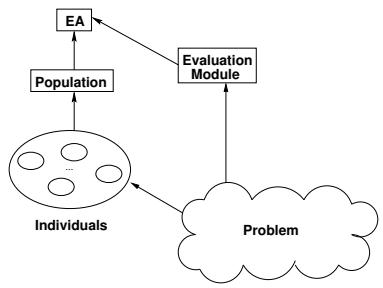
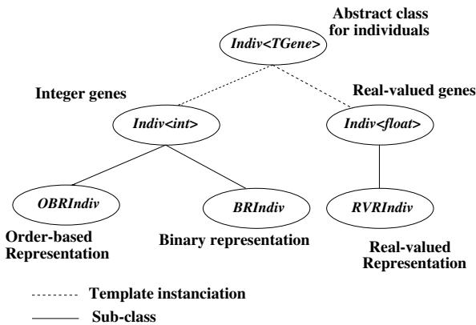

# A Study of Order Based Genetic and Evolutionary Algorithms in Combinatorial Optimization Problems

Miguel Rocha, Carla Vilela, and Jos´e Neves

Departamento de Inform´atica Universidade do Minho Braga - PORTUGAL mrocha@di.uminho.pt, carla@labia01.di.uminho.pt, jneves@di.uminho.pt

Abstract In Genetic and Evolutionary Algorithms (GEAs) one is faced with a given number of parameters, whose possible values are coded in a binary alphabet. With Order Based Representations (OBRs) the genetic information is kept by the order of the genes and not by its value. The application of OBRs to the Traveling Salesman Problem (TSP) is a well known technique to the $G E A$ community. In this work one intends to show that this coding scheme can be used as an indirect representation, where the chromosome is the input for the decoder. The behavior of the GEA’s operators is compared under benchmarks taken from the Combinatorial Optimization arena.

Keywords: Genetic and Evolutionary Algorithms, Order Based Representations.

# 1 Introduction

For a considerable number of researchers, the term Genetic and Evolutionary Algorithm (GEA) is strongly related with the use of binary representations; i.e., the solution to a given problem is typically coded, from a $0 / 1$ alphabet. In fact, this was the representation John Holland proposed in his pioneering work on the field[4], and its use has been supported by numerous studies. In terms of the schema theorem, one can justify the binary alphabet by noticing that a minimal alphabet maximizes the number of hyper-plane partitions made available for the schema processing[12]. Furthermore, one can point that the use of an universal representation, in conjunction with simple operators, makes a domain independent approach, easier to implement and to address theoretically.

However, some authors have referred advantages in the use of other kinds of representations. It has been argued that the use of alphabets that are closer to the problem’s data structures, allows for the definition of richer genetic operators[1]. This has been the case of real-valued representations, now being considered to be more efficient in numerical optimization[6]. When, back in the 1980’s, some researchers aimed at tackling the Traveling Salesman Problem (TSP) by using $G E A s$ , it became clear that the binary representations had serious difficulties when handling heavily constrained problems. In 1985, Goldberg and Lingle[2], proposed a different representation, the Order Based Representation (OBR) that was based on the relative order of the genes in the chromosome. In this approach, each individual has a genotype that is made of a permutation of a set of values, given by a fixed alphabet. In the case of the $T S P$ , the alphabet is the set of nodes of the particular instance being solved. The results obtained were substantially better, and they lead to numerous studies in this area. The main problem to be solved was the need to develop a whole new set of operators. Several researchers gave their contribution to this task, developing new operators, and evaluating their performance, namely in the TSP[11][5]. Some of the newly defined operators were designed to work with general purpose $O B R$ individuals, while others were designed with the $T S P$ in mind.

In this work, one argues that $O B R$ is a feasible coding scheme, not only for the $T S P$ , but also as an indirect representation used in solving different combinatorial optimization problems, namely those of Scheduling, Knapsacking and Graph Coloring. In this approach, an individual does not directly encode a solution, but instead it defines a strategy to reach one, so it depends on the work of a decoder, that takes the genotype and, by using a given heuristic procedure, arrives at the solution. Typically, the heuristic is a greedy method; i.e., it takes the genes in the given order, and at each point builds the best solution possible. One’s purpose is to evaluate the order based $G E A$ and to make a comparison of several genetic operators, both in solving the $T S P$ and the afore mentioned problems. The aim is to uncover regularities in the results beyond the obvious and substantial differences in the problem’s structures and data.

The paper is organized as follows: it starts with a description of the basic concepts of $G E A s$ and the practical work so far developed; next, the problems to be addressed are defined as well as their software structure; finally, some results are presented and discussed.

# 2 Genetic and Evolutionary Algorithms

# 2.1 Basic Concepts

In this work the term Genetic and Evolutionary Algorithm (GEA) is used to name a family of computational procedures that share a set of common features:

– there are a number of potential solutions (individuals) to a problem, evolving simultaneously (a population); each individual represents a solution to a problem, which is coded by a string (chromosome) of symbols (genes), taken from a well defined alphabet;   
– the individuals are evaluated; i.e., to each of them is assigned a numeric value (fitness), that stands for their quality, in solving the problem;   
– the solutions to the problem can be recombined and/or changed in some way, by using genetic operators (eg. crossover, mutation), in order to create new solutions (reproduction); the process is evolutionary; i.e., it is based on the Darwinian process of natural selection, where the fittest individuals have greater chances of surviving;   
– its major structure is the one outlined in the pseudo-code of Figure 1.

BEGIN

Initialize time $t = 0$ ).   
Generate and evaluate the individuals in the initial population ( $P _ { 0 }$ ).   
WHILE NOT (termination criteria) DO Select from $P _ { t }$ , a number of individuals for reproduction. Apply to those individuals the genetic operators to breed the offspring. Evaluate the offspring. Select the offspring to insert into the next population $\left( P _ { t + 1 } \right)$ . Select the survivors from $P _ { t }$ to be reinserted into $P _ { t + 1 }$ . Increase current time ( $t = t + 1$ ).

END

# 2.2 Order Based Representations

In an individual’s Order Based Representation (OBR), the genetic information is based on the order of the genes, that take values from a fixed set of values, with the constraint take each one is unique and such that every value in the set is on the chromosome; i.e., the chromosome is a permutation of the symbols in a given alphabet. The constraint on non-duplicates justifies the development of a whole new class of genetic operators, namely the crossover and the mutation ones.

A crossover operator is defined to take two individuals as input (the ancestors) and return two different ones (the offspring). In this study a number of different crossover operators, designed to work with $O B R$ individuals, were used:

– Order Preserving Crossover (OPX) The $O P X$ family emphasizes the relative order of the genes from both parents. The algorithm works by selecting a random cutting point and then taking all genes, from the beginning to the cutting point, from one parent. The other parent is used to fill in the remaining genes, by preserving their relative order. The process can be generalized to $n$ cutting points, although only values of one (OPX1) and two (OPX2) were considered. Uniform Order Preserving Crossover (UOPX) This operator has some similarities with the previous one. It works with a randomly generated binary mask. In all positions marked with 1, the offspring takes the gene from the first parent, in the same position. The second parent is used to fill in the gaps, preserving the relative order of the nodes[1]. Partially Matched Crossover (PMX) Under the PMX[2] two crossing points are randomly chosen, defining a matching section on the string, used to effect a cross between the two parents, through position-to-position exchange operations. Cycle Crossover (CYCX) Cycle crossover[9] performs recombination under the constraint that each gene in a certain position must come from one parent or the other.

EDGe Crossover (EDGX)   
The $E D G X$ is based on the principle of maintaining all possible pairs of adjacent genes on the chromosome. It was specially designed for the TSP[11]. The algorithm works by collecting the neighborhood information, for each gene, in a table of adjacencies, from both ancestors.   
Maximum Preservative Crossover (MPX)   
The $M P X$ operator was designed by Muhlen ¨ bein[7] with the purpose to tackle the $T S P$ by preserving, in the offspring, sub-tours contained in the two parents.   
SCHleuter Crossover (SCHX)   
The SCHX[10] is a variation of the MPX, with some features similar to the $O P X$ ones, and also contemplating the inversion of partial tours.

A mutation, typically induces a small change to the genotype of an ancestor, returning one offspring. A parameter is defined, called Mutation Rate (MR), which sets the probability under which a mutation operator is applied, to a particular position of the genotype. In this work, four different mutation operators were considered:

– ADJacent swap (ADJ) - It consists of a swap of positions among the selected gene and the next one on the string;   
– Non-ADJacent swap (NADJ) - Swaps positions between the current gene and a different one at a random position on the string;   
– K-PERMutation (KPERM) - Given a parameter $k$ it scrambles a sub-list of size $k$ , starting at the current position on the string; INVersion (INV) - Given a parameter $k$ it inverts a partial sub-list of size $k$ , starting at the current position on the string.

# 2.3 The Genetic and Evolutionary Programming Environment

The Genetic and Evolutionary Programming Environment (GEPE) was built with the purpose to increment the productivity when developing applications with GEAs[8]. It takes advantage on the features of the object-oriented paradigm, identifying a common background in the existing approaches, allowing for modularity and incremental development.

The framework developed is made of four main blocks (Figure 2), namely the individuals, the populations, the $G E A s$ and the evaluation module. Each of these modules is materialized by an hierarchy of classes, that are built in a way that the common attributes and behaviors are defined in the root classes, and a process of specialization is followed when one walks to the leafs, redefining or adding new attributes and/or behaviors.

At the individual’s level, the root is an abstract class with a template field that contains its genotype; i.e., its genetic information. In this way, one sets the doings for any kind of representational scheme, simply by assignment of the template with the necessary data type (Figure 3). To implement, under this framework, the $O B R$ individuals, one considers that any alphabet of cardinality $n$ can be represented by integers from 1 to $n$ . In this way, the template field is instantiated with the integer type. A subclass OBRIndiv is created, where one defines the set of crossover and mutation operators described.

  
Figure2. The GEPE’s Archetype

  
Figure3. The Individuals hierarchy’s class

At the population and $G E A$ levels, similar strategies are followed, allowing for the easy definition of default behaviors, but also for the possibility of redefining the parameters, such as the selection methods, the re-insertion parameters, or the structure of the overall algorithm.

The last of the modules in the system is the evaluation one, where the programmer defines the decoding procedure; i.e., how to reach a solution to a given problem, starting with the chromosome, and how to assign a fitness to the solution. This module makes the connection between the $G E A$ and the problem to solve.

In $G E P E$ the concept of genetic operator was generalized, to allow for $m$ individuals as input, and $n$ individuals as output. For each application, the user supplies a table of operators to be used, among the feasible ones. To each operator it is associated a selection’s value (probability), in order to generate offspring.

# 3 Problem Formulation

# 3.1 The Traveling Salesman Problem

The Traveling Salesman Problem (TSP) is stated as a $n$ -dimensional cost matrix of values $d _ { i j }$ , where the purpose of the exercise is to obtain a permutation of these values, such that the sum of the costs $d _ { i j }$ , for any $_ i$ and $j$ , being $i$ the precedent of $j$ in the sequence, is minimal. More formally, one has:

$$
\begin{array} { r l r } { M i n i m i z e : } & { \sum _ { i = 1 } ^ { n } \sum _ { j = 1 } ^ { n } d _ { i j } x _ { i j } } & \\ { S u b j e c t ~ t o : } & { \sum _ { j = 1 } ^ { n } x _ { i j } = 1 , \forall i } & \\ & { \sum _ { i = 1 } ^ { n } x _ { i j } = 1 , \forall j } & \\ & { } & { x _ { i j } \in \{ 0 , 1 \} , \forall i , j } & \\ & { \sum _ { i , j \in S } x _ { i j } < | S | , \forall S \subset V , S \neq \emptyset } & \end{array}
$$

When $d _ { i j } = d _ { j i } , \forall i , j$ one is faced with a Symmetric TSP (STSP); the inverse problem is said to be an Asymmetric TSP (ATSP).

# 3.2 The Knapsacking Problem

The $\theta / 1$ Knapsacking problem deals with a set of $n$ objects, characterized by a given weight ( $W _ { i }$ ) and profit ( $P _ { i }$ )[6]. One aims to select a subset of those objects, in a way to maximize the sum of its profits, but preventing the sum of its weights to exceed a given capacity $C$ . More formally one has:

$$
\begin{array} { c } { { M a x i m i z e : \sum _ { i = 1 } ^ { n } x _ { i } P _ { i } } } \\ { { R e s t r i c t i o n s : \sum _ { i = 1 } ^ { n } x _ { i } W _ { i } \leq C } } \\ { { x _ { i } \in \{ 0 , 1 \} , \forall i } } \end{array}
$$

# 3.3 The Scheduling Problem

Scheduling problems are concerned with decision-making processes that produce plans, allotting the work to be done and the time for it. Part of the scheduling problems can be described in terms of the Job Shop Scheduling Problem (JSSP), where one has a set $J$ of $n$ tasks, a set $M$ of $m$ machines, and a set $O$ of operations. For each operation $o p \in O$ there is a task $j _ { o p } \in J$ to which a machine $m _ { o p } \in M$ is conjuncted, where task $j _ { o p }$ will be processed, in a given time $t _ { o p } \in \Re$ . There is also a temporary binary ordering relation that decomposes the set $O$ in a group of partially ordered sets according to the tasks; i.e., if $x  y$ then $j _ { x }  j _ { y }$ , and there is not a $z$ different from $x$ or $y$ , such that $x \longrightarrow z$ or $z  y$ . Electing as objective the minimization of the time elapsed with the processing of all tasks, the problem consists on seeking an initial time $s _ { o p }$ for each operation $\it { o p }$ , such that the function $m a x ( s _ { o p } + t _ { o p } )$ and $o p \in O$ is minimized, taking into attention the invariants:

$$
\begin{array} { l } { { t _ { o p } \in O , \forall o p \in O } } \\ { { s _ { x } - s _ { y } \geq t _ { y } , \mathrm { i f } y  x , \mathrm { a n d } x , y \in O } } \\ { { ( s _ { i } - s _ { j } \geq t _ { j } ) \vee ( s _ { j } - s _ { i } \geq t _ { i } ) \mathrm { i f } m _ { i } = m _ { j } , \mathrm { a n d } i , j \in O } } \end{array}
$$

# 3.4 The Graph Coloring Problem

Consider a graph, with a numerical weight associated with each node; given $n$ different colors, the Graph Coloring problem consists in achieving the highest score by assigning to each node of the graph one color from the set. It is required that no pair of connected nodes can have the same color. The total score of a feasible solution is the sum of the weights for the colored nodes.

# 4 The Implementation

The GEAs designed to solve each of the given problems were implemented under the $G E P E$ framework, and used $O B R$ . The differences in the approaches were at the evaluation module level. In the $T S P$ case the decoding of the solution is quite straightforward, once the order of the genes corresponds to the order of the nodes in the solution. The fitness is the sum of the costs, for each edge in the solution. In the other problems, the strategy used is an indirect one. The genotype is used as an order by which the different items are taken, and an heuristic procedure is used to create the solution based on that information.

In the Knapsacking problem, each gene represents an object, and one builds a solution by getting them into it, according to the order in the chromosome. The fitness is gotten by the sum of the objects profits in the solution. The Graph Coloring problem uses a similar strategy, once the nodes are colored according a predefined order, assuring that no connected nodes receive the same color, and evaluate the solution by summing the weights of the colored nodes. In terms of the $J S S P$ , the chromosome represents a sequence of orders. The heuristic thus takes the orders in the sequence and schedules them in the best way possible; i.e., allocates one order at a time without violating any of the constraints, and minimizing the time it takes to be finished. The fitness is the total time necessary for the completion of a given portfolio.

# 5 Results

For each of the problems referred to above, it was selected a representative instance. In the TSP case, the $S T S P$ and $A T S P$ variants were considered, taken from TSPLIB[3]. The Graph Coloring instance was taken from [1]. The Knapsacking and Scheduling instances were generated using stochastic simulators. In the former case, one used the concepts from [6] and created an instance with 200 objects, with an average capacity and a weakly correlation between profits and weights. In the latter, the instance of the $J S S P$ was a typical portfolio of 50 orders, in an environment of 5 machines.

Each run was defined to have two genetic operators: one of crossover and one of mutation. The crossover operator was responsible for generating $7 5 \%$ of the offspring, while the mutation one generated the remaining $2 5 \%$ (with a mutation rate of 5% per gene). The results for each pair crossover/mutation were obtained by averaging the best result obtained in 20 runs, with random initial populations. In the $T S P$ and $J S S P$ problems one run the $G E A$ for 1000 iterations with populations of 200 individuals, while on the other ones the number of generations was 500, and the population size 100.

In tables 1 to 5 one shows the results so far obtained. It is easy to reach an immediate conclusion: the crossover operators designed with the $T S P$ in mind don’t behave well in the other problems. This is something one should expect to happen. On the other hand, the $U O P X$ , a general purpose operator, seems to behave remarkably well in all cases, and also when combined with all the mutation operators, which is a proof of its robustness. One of the reasons for such success can probably be found in the way this operator deals with the maintenance of the genetic diversity, once it is quite disruptive, and prevents excessively homogeneous populations.

Table1. Experimental results for the STSP-Eil51’s problem   

<table><tr><td rowspan=2 colspan=1>CrossoverOperator</td><td rowspan=1 colspan=4>MutationOperator</td></tr><tr><td rowspan=1 colspan=1>ADJ</td><td rowspan=1 colspan=1>NADJ</td><td rowspan=1 colspan=1>K-PERM</td><td rowspan=1 colspan=1>INV</td></tr><tr><td rowspan=1 colspan=1>OPX1</td><td rowspan=1 colspan=1>762.8</td><td rowspan=1 colspan=1>567.0</td><td rowspan=1 colspan=1>658.7</td><td rowspan=1 colspan=1>676.6</td></tr><tr><td rowspan=1 colspan=1>OPX2</td><td rowspan=1 colspan=1>569.1</td><td rowspan=1 colspan=1>517.8</td><td rowspan=1 colspan=1>540.2</td><td rowspan=1 colspan=1>531.2</td></tr><tr><td rowspan=1 colspan=1>UOPX</td><td rowspan=1 colspan=1>475.3</td><td rowspan=1 colspan=1>466.3</td><td rowspan=1 colspan=1>464.9</td><td rowspan=1 colspan=1>462.3</td></tr><tr><td rowspan=1 colspan=1>PMX</td><td rowspan=1 colspan=1>570.8</td><td rowspan=1 colspan=1>573.0</td><td rowspan=1 colspan=1>582.3</td><td rowspan=1 colspan=1>634.8</td></tr><tr><td rowspan=1 colspan=1>CYCX</td><td rowspan=1 colspan=1>864.9</td><td rowspan=1 colspan=1>604.0</td><td rowspan=1 colspan=1>725.0</td><td rowspan=1 colspan=1>806.4</td></tr><tr><td rowspan=1 colspan=1>EDGX</td><td rowspan=1 colspan=1>459.6</td><td rowspan=1 colspan=1>467.5</td><td rowspan=1 colspan=1>457.1</td><td rowspan=1 colspan=1>499.6</td></tr><tr><td rowspan=1 colspan=1>SCHX</td><td rowspan=1 colspan=1>469.4</td><td rowspan=1 colspan=1>580.0</td><td rowspan=1 colspan=1>500.5</td><td rowspan=1 colspan=1>517.2</td></tr><tr><td rowspan=1 colspan=1>MPX</td><td rowspan=1 colspan=1>482.8</td><td rowspan=1 colspan=1>470.0</td><td rowspan=1 colspan=1>473.5</td><td rowspan=1 colspan=1>500.6</td></tr></table>

# 6 Conclusions and Future Work

When one looks at the Nature, the kind of genetic representation used is highly indirect; i.e., it relies heavily on the embryogenetic mechanisms that translate from an abstract quaternary alphabet into the diversity of life one may observe. In the computational counterpart, one believes that the trend is to increase on the complexity of the decoders and keeping the representations simple. The complexity of the systems must emerge from the combination of a simple evolutionary process, with general purpose operators, with a set of decoding procedures, giving by straightforward heuristic methods. This work showed that, although the structure of the problems may change, one could find a set of genetic operators with a good level of performance.

Table2. Experimental results for the ATSP-ft53’s problem   

<table><tr><td rowspan=2 colspan=1>CrossoverOperator</td><td rowspan=1 colspan=4>MutationOperator</td></tr><tr><td rowspan=1 colspan=1>ADJ</td><td rowspan=1 colspan=1>NADJ</td><td rowspan=1 colspan=1>K-PERM</td><td rowspan=1 colspan=1>INV</td></tr><tr><td rowspan=1 colspan=1>OPX1</td><td rowspan=1 colspan=1>12821.6</td><td rowspan=1 colspan=1>9974.8</td><td rowspan=1 colspan=1>12875.0</td><td rowspan=1 colspan=1>10619.2</td></tr><tr><td rowspan=1 colspan=1>OPX2</td><td rowspan=1 colspan=1>9600.5</td><td rowspan=1 colspan=1>8985,0</td><td rowspan=1 colspan=1>9352.6</td><td rowspan=1 colspan=1>9264.5</td></tr><tr><td rowspan=1 colspan=1>UOPX</td><td rowspan=1 colspan=1>8500.2</td><td rowspan=1 colspan=1>8625.1</td><td rowspan=1 colspan=1>8210.8</td><td rowspan=1 colspan=1>9412.8</td></tr><tr><td rowspan=1 colspan=1>PMX</td><td rowspan=1 colspan=1>9857.0</td><td rowspan=1 colspan=1>9466.1</td><td rowspan=1 colspan=1>9915.1</td><td rowspan=1 colspan=1>12757.2</td></tr><tr><td rowspan=1 colspan=1>CYCX</td><td rowspan=1 colspan=1>14187.1</td><td rowspan=1 colspan=1>10615.9</td><td rowspan=1 colspan=1>13653.7</td><td rowspan=1 colspan=1>11959.5</td></tr><tr><td rowspan=1 colspan=1>EDGX</td><td rowspan=1 colspan=1>8528.8</td><td rowspan=1 colspan=1>8586.0</td><td rowspan=1 colspan=1>8361.4</td><td rowspan=1 colspan=1>8684.3</td></tr><tr><td rowspan=1 colspan=1>SCHX</td><td rowspan=1 colspan=1>8756.0</td><td rowspan=1 colspan=1>10632.2</td><td rowspan=1 colspan=1>10834.2</td><td rowspan=1 colspan=1>10931.5</td></tr><tr><td rowspan=1 colspan=1>MPX</td><td rowspan=1 colspan=1>8445.7</td><td rowspan=1 colspan=1>8133.5</td><td rowspan=1 colspan=1>8349.0</td><td rowspan=1 colspan=1>8541.4</td></tr></table>

Table3. Experimental results for the Knapsacking problem   

<table><tr><td rowspan=2 colspan=1>CrossoverOperator</td><td rowspan=1 colspan=4>MutationOperator</td></tr><tr><td rowspan=1 colspan=1>ADJ</td><td rowspan=1 colspan=1>NADJ</td><td rowspan=1 colspan=1>K-PERM</td><td rowspan=1 colspan=1>INV</td></tr><tr><td rowspan=1 colspan=1>OPX1</td><td rowspan=1 colspan=1>11585.5</td><td rowspan=1 colspan=1>12601.3</td><td rowspan=1 colspan=1>11869.8</td><td rowspan=1 colspan=1>11881.1</td></tr><tr><td rowspan=1 colspan=1>OPX2</td><td rowspan=1 colspan=1>12778.5</td><td rowspan=1 colspan=1>12881.3</td><td rowspan=1 colspan=1>12831.6</td><td rowspan=1 colspan=1>12840.7</td></tr><tr><td rowspan=1 colspan=1>UOPX</td><td rowspan=1 colspan=1>12966.2</td><td rowspan=1 colspan=1>12972.2</td><td rowspan=1 colspan=1>12964.9</td><td rowspan=1 colspan=1>12962.4</td></tr><tr><td rowspan=1 colspan=1>PMX</td><td rowspan=1 colspan=1>12818.2</td><td rowspan=1 colspan=1>12853.7</td><td rowspan=1 colspan=1>12622.9</td><td rowspan=1 colspan=1>12585.1</td></tr><tr><td rowspan=1 colspan=1>CYCX</td><td rowspan=1 colspan=1>12788.5</td><td rowspan=1 colspan=1>12816.0</td><td rowspan=1 colspan=1>12799.1</td><td rowspan=1 colspan=1>12790.1</td></tr><tr><td rowspan=1 colspan=1>EDGX</td><td rowspan=1 colspan=1>11582.4</td><td rowspan=1 colspan=1>11698.2</td><td rowspan=1 colspan=1>11448.3</td><td rowspan=1 colspan=1>11578.8</td></tr><tr><td rowspan=1 colspan=1>SCHX</td><td rowspan=1 colspan=1>12480.6</td><td rowspan=1 colspan=1>12574.0</td><td rowspan=1 colspan=1>12451.4</td><td rowspan=1 colspan=1>12439.7</td></tr><tr><td rowspan=1 colspan=1>MPX</td><td rowspan=1 colspan=1>11754.4</td><td rowspan=1 colspan=1>11786.2</td><td rowspan=1 colspan=1>11572.1</td><td rowspan=1 colspan=1>11581.4</td></tr></table>

In the future one intends to work on several other problems (eg. vehicle routing, clustering problems) in order to further generalize these results. The work on embryogenesis within $G E A s$ is also a topic under study.

# Список литературы

1. Lawrence Davis. Handbook of Genetic Algorithms. Van Nostrand Reinhold, 1991.   
2. D. Goldberg and R. Lingle. Alleles, Loci and the Traveling Salesman Problem. In J.Grenfenstette, editor, Proc. of the 1st Intern. Conf. on Genetic Algorithms and their Applications, Hillsdale, New Jersey, 1985. Lawrence Erlbaum Assoc.   
3. G.Reinelt. Tsplib’95. Technical report, 1995.   
4. John Holland. Adaptation in Natural and Artificial Systems. PhD thesis, University of Michigan, Ann Arbor, 1975.   
5. K. Mathias and D. Whitley. Genetic Operators, the Fitness Landscape and the Traveling Salesman Problem. In R.Manner and B.Manderick, editors, Parallel Problem Solving from Nature 2- Brussels, Amsterdam, 1992. Elsevier.   
6. Z. Michalewicz. Genetic Algorithms $^ +$ Data Structures = Evolution Programs. Springer-Verlag, USA, third edition, 1996.   
7. H. Muhlen ¨ bein. Evolution in time and space - the parallel genetic algorithm. In G. Rawlins, editor, Foundations of Genetic Algorithms, pages 316–337. MorganKaufman, 1991.   
8. J. Neves, M. Rocha, H. Rodrigues, M. Biscaia, and J. Alves. Adaptive Strategies and the Design of Evolutionary Applications. In Proc. of the Genetic and Evolutionary Computation Conference (GECCO99), Orlando, Florida, USA, 1999.   
9. I.M. Oliver, D.J. Smith, and J. Holland. A Study of Permutation Crossover Operators on the Travelling Salesman Problem. In J.Grenfenstette, editor, Proc. of the 2nd Intern. Conf. on Genetic Algorithms and their Applications. Lawrence Erlbaum Assoc., July 1987.   
10. M.G. Schleuter. ASPARAGOS - An Asynchronous Parallel Genetic Optimization Strategy. In J.D.Schafer, editor, Proc. of the 3rd ICGA. George-Mason Univ., Morgan Kaufman, 1989.   
11. T. Starkweather, S. McDaniel, K. Mathias, D. Whitley, and C. Whitley. A Comparison of Genetic Sequencing Algorithms. In R.Belew and L.Booker, editors, Proc. of the 4th ICGA, San Diego, July 1991. Morgan-Kaufmann Publishers.   
12. D. Whitley. A Genetic Algorithm Tutorial. Stastistics and Computing, 4, 1994.

Table4. Experimental results for the Scheduling problem   

<table><tr><td rowspan=2 colspan=1>CrossoverOperator</td><td rowspan=1 colspan=4>MutationOperator</td></tr><tr><td rowspan=1 colspan=1>ADJ</td><td rowspan=1 colspan=1>NADJ</td><td rowspan=1 colspan=1>[K-PERM</td><td rowspan=1 colspan=1>INV</td></tr><tr><td rowspan=1 colspan=1>OPX1</td><td rowspan=1 colspan=1>5019.3</td><td rowspan=1 colspan=1>1095.4</td><td rowspan=1 colspan=1>2929.9</td><td rowspan=1 colspan=1>1607.7</td></tr><tr><td rowspan=1 colspan=1>OPX2</td><td rowspan=1 colspan=1>3024.1</td><td rowspan=1 colspan=1>1214.8</td><td rowspan=1 colspan=1>1554.3</td><td rowspan=1 colspan=1>1797.5</td></tr><tr><td rowspan=1 colspan=1>UOPX</td><td rowspan=1 colspan=1>1127.4</td><td rowspan=1 colspan=1>1133.9</td><td rowspan=1 colspan=1>1139.5</td><td rowspan=1 colspan=1>1141.4</td></tr><tr><td rowspan=1 colspan=1>PMX</td><td rowspan=1 colspan=1>1098.7</td><td rowspan=1 colspan=1>1165.1</td><td rowspan=1 colspan=1>1172.4</td><td rowspan=1 colspan=1>1235.1</td></tr><tr><td rowspan=1 colspan=1>CYCX</td><td rowspan=1 colspan=1>5956.2</td><td rowspan=1 colspan=1>1092.3</td><td rowspan=1 colspan=1>2083.0</td><td rowspan=1 colspan=1>3022.5</td></tr><tr><td rowspan=1 colspan=1>EDGX</td><td rowspan=1 colspan=1>2428.8</td><td rowspan=1 colspan=1>2956.4</td><td rowspan=1 colspan=1>2100.0</td><td rowspan=1 colspan=1>2763.1</td></tr><tr><td rowspan=1 colspan=1>SCHX</td><td rowspan=1 colspan=1>1213.5</td><td rowspan=1 colspan=1>1464.3</td><td rowspan=1 colspan=1>1358.0</td><td rowspan=1 colspan=1>1220.9</td></tr><tr><td rowspan=1 colspan=1>MPX</td><td rowspan=1 colspan=1>1109.8</td><td rowspan=1 colspan=1>1116.9</td><td rowspan=1 colspan=1>1235.1</td><td rowspan=1 colspan=1>1199.2</td></tr></table>

Table5. Experimental results for the Graph Coloring problem   

<table><tr><td rowspan=2 colspan=1>CrossoverOperator</td><td rowspan=1 colspan=4>MutationOperator</td></tr><tr><td rowspan=1 colspan=1>ADJ</td><td rowspan=1 colspan=1>NADJ</td><td rowspan=1 colspan=1>K-PERM</td><td rowspan=1 colspan=1>INV</td></tr><tr><td rowspan=1 colspan=1>OPX1</td><td rowspan=1 colspan=1>9894.7</td><td rowspan=1 colspan=1>9787.4</td><td rowspan=1 colspan=1>10003.2</td><td rowspan=1 colspan=1>10151.2</td></tr><tr><td rowspan=1 colspan=1>OPX2</td><td rowspan=1 colspan=1>10407.5</td><td rowspan=1 colspan=1>10464.4</td><td rowspan=1 colspan=1>10409.7</td><td rowspan=1 colspan=1>10387.8</td></tr><tr><td rowspan=1 colspan=1>UOPX</td><td rowspan=1 colspan=1>10503.0|</td><td rowspan=1 colspan=1>10540.4</td><td rowspan=1 colspan=1>10516.7</td><td rowspan=1 colspan=1>10533.5</td></tr><tr><td rowspan=1 colspan=1>PMX</td><td rowspan=1 colspan=1>10370.8</td><td rowspan=1 colspan=1>10429.0</td><td rowspan=1 colspan=1>10420.4</td><td rowspan=1 colspan=1>10437.8</td></tr><tr><td rowspan=1 colspan=1>CYCX</td><td rowspan=1 colspan=1>10154.2</td><td rowspan=1 colspan=1>10443.3</td><td rowspan=1 colspan=1>10296.4</td><td rowspan=1 colspan=1>10285.3</td></tr><tr><td rowspan=1 colspan=1>EDGX</td><td rowspan=1 colspan=1>9861.9</td><td rowspan=1 colspan=1>9995.0</td><td rowspan=1 colspan=1>9932.0</td><td rowspan=1 colspan=1>9992.4</td></tr><tr><td rowspan=1 colspan=1>SCHX</td><td rowspan=1 colspan=1>10373.5</td><td rowspan=1 colspan=1>10229.8</td><td rowspan=1 colspan=1>10412.2</td><td rowspan=1 colspan=1>10407.3</td></tr><tr><td rowspan=1 colspan=1>MPX</td><td rowspan=1 colspan=1>9947.5</td><td rowspan=1 colspan=1>10001.9</td><td rowspan=1 colspan=1>10033.6</td><td rowspan=1 colspan=1>9966.3</td></tr></table>