# Сравнение механизмов доминирования и простой мутации на нестационарных задачах

Джонатан Льюис,* Эмма Харт, Грэм Ричи

Кафедра искусственного интеллекта, Университет Эдинбурга, Эдинбург EH1 2QL, Шотландия

Аннотация. Иногда утверждается, что генетические алгоритмы, использующие диплоидные представления, будут более подходящими для задач, в которых среда время от времени меняется, поскольку дополнительная информация, хранящаяся в двойном наборе хромосом, обеспечит разнообразие, что, в свою очередь, позволит системе быстрее и надежнее реагировать на изменение функции приспособленности. Мы протестировали различные диплоидные алгоритмы, с механизмами изменения доминирования и без них, на нестационарных задачах и пришли к выводу, что какая-либо форма изменения доминирования существенна, поскольку самого по себе диплоидного кодирования недостаточно для гибкого реагирования на изменения. Более того, гаплоидный метод, который случайным образом мутирует хромосомы, чья приспособленность резко упала, также показывает хорошие результаты на этих задачах.

# 1 Введение

Генетические алгоритмы (ГА) часто используются для решения стационарных задач, в которых критерии успеха, заложенные в функции приспособленности, не меняются в ходе вычислений. В нестационарной задаче среда может колебаться, что приводит к резким изменениям приспособленности хромосомы от одного цикла к другому. Иногда утверждается, что диплоидное кодирование задачи особенно подходит для нестационарных ситуаций, поскольку дополнительная информация, хранящаяся в генотипе, обеспечивает скрытый источник разнообразия в популяции, даже если фенотипы могут демонстрировать очень незначительное разнообразие. Аргументируется то, что это генотипическое разнообразие позволит популяции быстрее и эффективнее реагировать при изменении функции приспособленности. Наряду с поддержанием разнообразия, диплоидная структура может сохранять своего рода долгосрочную память, что позволяет ей быстро адаптироваться к меняющейся среде, «запоминая» прошлые решения.

Эффективность диплоидного ГА может зависеть от точных деталей его схемы доминирования. Кроме того, если изменение среды является центральным вопросом, важно рассмотреть изменения, которые влияют на поведение доминирования хромосом с течением времени, поскольку это может обеспечить дополнительную гибкость.

Мы провели тестирование ряда диплоидных методов, включая те, в которых возможно изменение доминирования. Мы обнаружили, что диплоидные схемы без какой-либо формы изменения доминирования не значимо превосходят гаплоидные ГА на нестационарных задачах, но определенные механизмы изменения доминирования дают явное улучшение. Также было установлено, что некоторые представления очень эффективны для поддержания памяти, в то время как другие более эффективны для поддержания разнообразия. Таким образом, характер нестационарной задачи может повлиять на выбор методологии. Кроме того, мы показываем, что в некоторых ситуациях гаплоидный ГА с подходящим механизмом мутации одинаково эффективен.

# 2 Предыдущие работы

Нг и Вонг [4] описывают диплоидное представление с простым изменением доминирования следующим образом (для простоты мы ограничим наше внимание фенотипами, которые являются строками из нулей и единиц). Существуют 4 генотипических аллеля: 1, 0 (доминантные) и $i$, $o$ (рецессивные). Экспрессируемый ген всегда принимает значение доминантного аллеля. Если возникает конфликт между двумя доминантными или двумя рецессивными аллелями, то для экспрессии произвольно выбирается один из двух аллелей. Отображение доминирования для вычисления фенотипа из генотипа показано на рисунке 1, где «0/1» указывает на равную вероятность любого значения. Появление комбинаций $1i$ или $0o$ запрещено — если это все же происходит, рецессивный ген повышается до доминантного в генотипе. Это последнее правило представляет собой простую форму изменения доминирования, наблюдаемую в природе, при которой рецессивные гены с течением времени склонны к устранению в пользу своих доминантных аналогов. Мы будем называть эту схему «базовый метод Нга-Вонга».

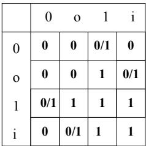  
Рис. 1. Схема Нга-Вонга

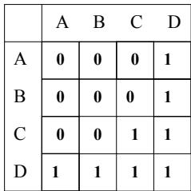  
Рис. 2. Аддитивная схема

Райан [5] предложил концепцию аддитивного доминирования. В этой схеме генотипические аллели рассматриваются как имеющие квазичисловые (или как минимум упорядоченные) значения, и эти значения объединяются с использованием некоторой подходящим образом разработанной формы псевдоарифметики, при этом результирующий фенотипический аллель зависит от значения этой «суммы». Один из способов реализации этой схемы — associates фактические числа с аллелями генотипа, а затем применить некоторый порог к результату. Райан использует 4 генотипических значения $A, B, C, D$ и присваивает им значения 2, 3, 7 и 9 соответственно, причем любой результат больше 10 отображается в 1, а меньшие значения — в 0. Полученная карта доминирования показана на рисунке 2.

В обеих этих схемах вероятность создания фенотипического 0 в точности равна 0.5, и, следовательно, отображение в каждом случае является несмещенным.

Существуют и другие формы доминирования, которые не рассматриваются в этой статье. К ним относятся использование «маски доминирования», например [1, 2], или реализация формы мейоза, как это наблюдается в природных системах, при котором гаплоидная хромосома производится из пары хромосом через операторы рекомбинации, например [6]. См. [3] для дальнейшего обсуждения некоторых из этих вопросов.

# 3 Изменение доминирования

В природных системах доминирование может меняться с течением времени в результате присутствия или отсутствия определенных ферментов. Нг и Вонг [4] определяют конкретное условие для возникновения изменения доминирования (которое мы принимаем в этой статье для всех наших методов изменения доминирования): если приспособленность члена популяции падает на определенный процент $\Delta$ между последовательными циклами оценки, то статус доминирования аллелей в генотипе этого члена изменяется. То есть отображение доминирования для вычисления фенотипа не меняется, но значения аллелей изменяют свои характеристики доминирования.

Изменение доминирования в диплоидной схеме Нга-Вонга достигается путем инвертирования значений доминирования всех пар аллелей, так что 11 становится $ii$, 00 становится $oo$, 1o становится $i0$ и наоборот. Можно показать, что это приводит к вероятности $3/8$ получения 1 в фенотипе там, где изначально был 0, после применения инверсии. Мы будем называть этот метод «Полный метод Нга-Вонга».

Мы расширили аддитивный ГА Райана, добавив аналогичный механизм изменения доминирования, в котором генотипические аллели понижаются или повышаются на один уровень. Таким образом, понижение $B$ на 1 уровень делает его $A$, а повышение делает его $C$. Кроме того, $A$ не может быть понижен, а $D$ не может быть повышен. Для каждого локуса мы случайным образом выбираем один из двух генотипических аллелей, а затем используем следующую процедуру:

- Если фенотипическое выражение в этом локусе равно «1», то понизить выбранный генотипический аллель на один уровень, если только это не $A$.
- Если фенотипическое выражение в этом локусе равно «0», то повысить выбранный генотипический аллель на один уровень, если только это не $D$.

Можно доказать, что этот «Расширенный аддитивный» метод приводит к вероятности $3/8$ изменения фенотипического 0 на фенотипическую 1.

Наконец, мы вводим сопоставимый механизм «восстановления» для гаплоидного ГА, в котором оператор мутации инвертирования бита применяется к каждому локусу гаплоидного генотипа с вероятностью $3/8$, всякий раз, когда наблюдается падение приспособленности особи на $\Delta$ между последовательными поколениями.

Схемы «Расширенный аддитивный» и «Гаплоидное восстановление» были разработаны с вероятностью $3/8$ инвертирования фенотипического 0 в 1 после изменения доминирования, чтобы сделать их точно сопоставимыми с методом «Полный Нг-Вонг».

# 4 Эксперименты

Тестируемые методы. Чтобы исследовать преимущество механизма изменения доминирования, мы протестировали простой аддитивный и базовый ГА Нга-Вонга (раздел 2 выше) без изменения доминирования, а также обычный гаплоидный ГА со скоростью мутации 0.01. Тестируемые ГА с изменением доминирования были описаны в разделе 3 выше: Полный Нг-Вонг, Расширенный аддитивный и Гаплоидное восстановление.

Параметры. Все ГА запускались с размером популяции 150. Использовался ранговый отбор с равномерным кроссовером, стационарным воспроизводством и скоростью мутации 0.01. Во время кроссовера диплоидных генотипов хромосома 1 первого диплоидного родителя всегда скрещивалась с хромосомой 1 второго диплоидного родителя. Порог $\Delta$ для применения изменения доминирования (Полный Нг-Вонг и Расширенный аддитивный) или восстанавливающей мутации (для Гаплоидного восстановления) составлял падение на 20% приспособленности фенотипа. Модифицированная версия особи заменяла оригинальную с вероятностью 1.0, если модифицированная версия была не менее приспособленной; в противном случае — с вероятностью 0.5. Каждый эксперимент повторялся 50 раз, а результаты усреднялись.

Тестовые задачи. ГА тестировались на осциллирующей версии общеизвестной задачи об одномерном рюкзаке. Цель состоит в том, чтобы заполнить рюкзак, используя подмножество объектов из доступного набора размером $n$, так, чтобы сумма весов объектов была как можно ближе к целевому весу $t$. В осциллирующей версии цель осциллирует между двумя значениями $t_1$ и $t_2$ каждые $o$ поколений. Решение представляется фенотипом длины $n$, где каждый ген $x_i$ имеет значение 0 или 1, указывающее, включен ли объект в рюкзак. Приспособленность $f$ любого решения $\overline{x}$ определяется как

$$
f(\overline{x}) = \frac{1}{1 + |target - \sum_{i=1}^{n} w_i x_i|}
$$

В следующих экспериментах использовалось 14 объектов. Каждый объект имел вес $w_i = 2^i$, где $i$ ranged от 0 до 13. Это гарантирует, что любая случайно выбранная цель может быть достигнута уникальной комбинацией объектов. Две цели выбирались случайным образом при условии, что не менее половины их битов должны отличаться. Фактические использованные цели составляли 12643 и 2837, которые имеют расстояние Хэмминга, равное 9. Целевой вес менялся каждые 1500 поколений. Каждый период в 1500 поколений в дальнейшем тексте называется периодом осцилляции.

# 5 Результаты

# 5.1 Осциллирующий рюкзак, фиксированные цели - Простая диплоидность

Результаты для базовых ГА показаны на рисунках 3, 4 и 5. Простая аддитивная схема и гаплоидный ГА показывают очень плохие результаты для обеих целей после первого изменения цели. Базовый ГА Нга-Вонга делает больший прогресс в поиске решения для первого целевого значения, но так и не удается найти решение для второй цели, которое имело бы приспособленность больше 0.05. Очевидно, что одной только диплоидности недостаточно для поддержания достаточного разнообразия, позволяющего перестроиться на новую цель.

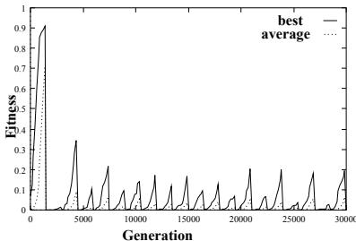  
Рис. 3. Простой гаплоидный ГА с фиксированной осцилляцией целей

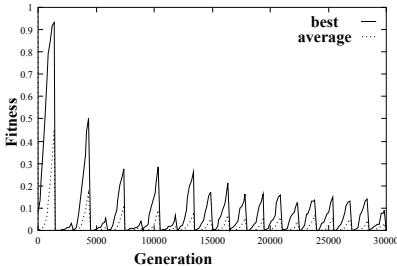  
Рис. 4. Аддитивный ГА Райана с фиксированной осцилляцией целей

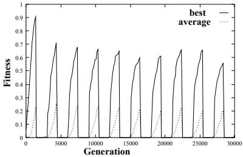  
Рис. 5. Базовый метод Нга-Вонга с фиксированной осцилляцией целей

# 5.2 Осциллирующий рюкзак, фиксированные цели - Изменение доминирования

На рисунках 6, 7 и 8 показана усредненная приспособленность за 50 прогонов, отложенная в зависимости от поколения для каждого из 3 ГА. Каждый график показывает лучшую и среднюю приспособленность популяции в каждом поколении. В таблице 1 показано количество экспериментов из 50, в которых оптимальная приспособленность, равная 1, была достигнута в течение каждого периода осцилляции.

Таблица 1. Количество случаев достижения оптимума в каждом периоде. Периоды, в которых цель была 2837 (низкая), выделены курсивом.

| Метод | 1 | 2 | 3 | 4 | 5 | 6 | 7 | 8 | 9 | 10 |
| :--- | :---: | :---: | :---: | :---: | :---: | :---: | :---: | :---: | :---: | :---: |
| **Гаплоидное восстановление** | 45 | *44* | 33 | *45* | 33 | *44* | 29 | *43* | 37 | *47* |
| **Расширенный аддитивный** | 43 | *29* | 44 | *42* | 39 | *40* | 45 | *37* | 39 | *40* |
| **Нг-Вонг** | 32 | *21* | 41 | *25* | 34 | *27* | 32 | *26* | 32 | *27* |

Сравнение графиков, полученных для Расширенного аддитивного метода и Гаплоидного восстановления, показывает очень похожую производительность. Расширенный аддитивный метод находит решение в пределах 20% от оптимальной приспособленности (т.е. > 0.8) в 90% периодов осцилляции, по сравнению с гаплоидным методом, который находит решение в пределах 20% от оптимума в 60% периодов. Однако, если мы посмотрим на периоды, в которых полученное решение было в пределах 10% от оптимума (т.е. > 0.9), то обнаружим, что Гаплоидное восстановление превосходит Расширенный аддитивный метод с показателями успеха 35% и 15% соответственно. Оба метода демонстрируют быструю реакцию на изменение среды, при которой ГА быстро улучшает качество новых, плохо приспособленных решений, появившихся в результате изменения среды. Это свидетельствует о том, что в популяции создается достаточное разнообразие в результате изменения доминирования или восстанавливающей мутации, позволяющее эволюции продолжать эффективно работать.

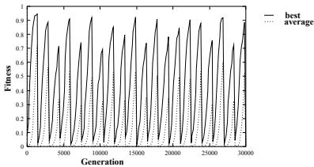  
Рис. 6. Гаплоидное восстановление с фиксированной осцилляцией целей

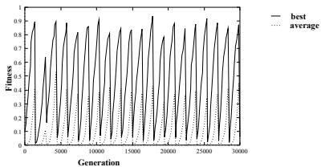  
Рис. 7. Расширенный аддитивный метод с фиксированной осцилляцией целей

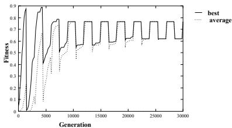  
Рис. 8. Полный метод Нга-Вонга с фиксированной осцилляцией целей

Полный метод Нга-Вонга, однако, ведет себя совершенно иначе. Во-первых, мы замечаем постепенное улучшение лучшей приспособленности, полученной для более низкой, 2-й цели. Наблюдается четкая «кривая обучения», пока после 12 полных периодов осцилляции ГА не оказывается способным поддерживать постоянное значение для этой цели сразу после изменения среды. Во-вторых, ГА быстро находит хорошее решение для высокой цели, и это решение каждый раз быстро восстанавливается при переключении цели. В-третьих, после 2 периодов нет падения приспособленности популяции, когда цель переключается с низкой на высокую. Наконец, лучшие решения, достигнутые для обеих целей, являются плохими по сравнению с ГА с гаплоидным восстановлением и аддитивным восстановлением — 0.62 для низкой цели и 0.77 для высокой цели.

Производительность Полного метода Нга-Вонга можно объяснить, исследовав механизм доминирования. Если не существует конфликтов типа «10» или «i0», то генотип может кодировать два произвольных решения, переходя от одного решения к другому путем простого применения механизма изменения доминирования. Таким образом, возможно закодировать генотип, который представляет идеальное решение для обеих целей, и переключаться между ними путем инвертирования доминирования без какого-либо требования для дальнейшей эволюции. Таким образом, градиент, показанный на рисунке 8, обусловлен тем, что популяция просто «изучает» последовательность значений доминирования, которая позволяет этому быстрому изменению происходить. Обратите внимание, что этот механизм позволяет «запоминать» только 2 решения в генотипе, поэтому этот механизм не будет полезен в среде, где возможны более 2 ситуаций, или, в более общем смысле, где изменение среды приводит к совершенно новой функции приспособленности или, в данном случае, к новой цели. Чтобы подтвердить это и исследовать способность других ГА справляться с такими изменениями, мы повторили эксперименты, используя задачу о рюкзаке со случайной осцилляцией.

# 5.3 Рюкзак со случайным изменением целей

Задача о рюкзаке с 14 объектами была повторена, но на этот раз новая случайная цель выбиралась в конце каждого периода осцилляции из 1500 поколений. Значения целей были ограничены диапазоном от 0 до 16383. На рисунках 9, 10 и 11 проиллюстрирована производительность трех ГА на этой задаче.

Результаты показывают, что Полный метод Нга-Вонга работает плохо по сравнению с двумя другими методами. Поддержание памяти о среде не полезно в случае случайной цели, и любой ГА должен полагаться на поддержание достаточно разнообразной популяции, чтобы иметь возможность адаптироваться к меняющимся условиям. Результаты imply, что механизм изменения доминирования в случае Полного метода Нга-Вонга не reintroduces разнообразие в популяцию, в то время как использование простой мутации может быть крайне полезным.

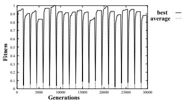  
Рис. 9. Гаплоидное восстановление со случайной осцилляцией целей

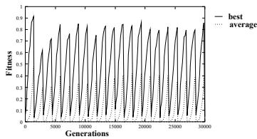  
Рис. 10. Расширенный аддитивный метод со случайной осцилляцией целей

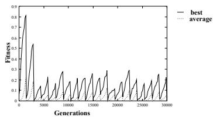  
Рис. 11. Полный метод Нга-Вонга со случайной осцилляцией целей

# 5.4 Анализ дисперсии популяции

Чтобы более подробно проанализировать производительность каждого ГА, мы можем посмотреть на фенотипическую дисперсию в популяции по мере эволюции каждого ГА, а для Полного метода Нга-Вонга и Расширенного аддитивного метода мы можем сравнить фенотипическое разнообразие с генотипическим. На рисунках 12, 13 и 14 показана фенотипическая дисперсия генов в популяции в каждом локусе фенотипа, отложенная в зависимости от поколения для экспериментов с фиксированной целью. Для каждого типа ГА построены два графика, показывающие дисперсию (по вертикальной оси) по обе стороны от двух изменений цели (с низкой на высокую — поколение 3000; с высокой на низкую — поколение 4500).

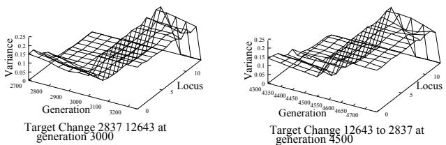  
Рис. 12. Фенотипическая дисперсия популяции: Гаплоидное восстановление

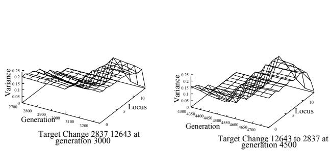  
Рис. 13. Фенотипическая дисперсия популяции: Расширенный аддитивный метод

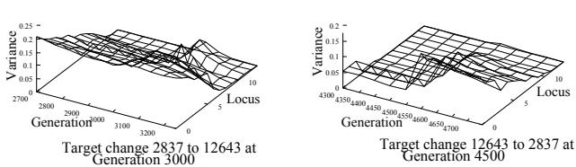  
Рис. 14. Фенотипическая дисперсия популяции: Полный метод Нга-Вонга

На рисунке 12 показано, что Гаплоидное восстановление почти сходится каждый раз, когда цель меняется, но разнообразие быстро вводится благодаря восстанавливающей мутации. Расширенный аддитивный метод поддерживает несколько большее фенотипическое разнообразие в своей популяции на протяжении всего прогона, чем Гаплоидное восстановление. Это неудивительно, поскольку можно ожидать, что диплоидный ГА будет сходиться медленнее, чем гаплоидный. Однако эффект от изменения доминирования тот же. Полный метод Нга-Вонга показывает несколько иную картину. justo перед изменением с низкой цели на высокую разнообразие в популяции высокое. Однако в следующий раз, когда цель переключается, фенотипическое разнообразие низкое во всех локусах, и лишь небольшое увеличение получается в результате применения механизма изменения доминирования. Этот эффект становится более выраженным по мере увеличения количества переключений цели, которым подвергается популяция.

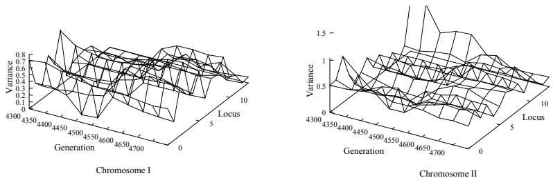  
Рис. 15. Генотипическая дисперсия популяции для Расширенного аддитивного метода

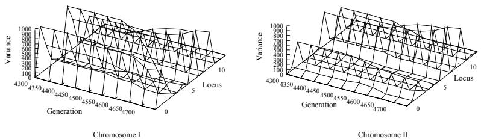  
Рис. 16. Генотипическая дисперсия популяции для Полного метода Нга-Вонга

Мы исследуем генотипическое разнообразие, построив аналогичный график для каждой из двух строк, составляющих диплоидный генотип. На рисунках 15 и 16 показано генотипическое разнообразие для Полного метода Нга-Вонга и Расширенного аддитивного метода по обе стороны от 3-го изменения цели, на поколении 4500. Для Расширенного аддитивного метода обе части генотипа сохраняют разнообразие, но отображение генотипа в фенотип приводит к менее разнообразному фенотипу, чем генотип. Генотипическое разнообразие Полного метода Нга-Вонга показывает ряд пиков, идущих параллельно оси поколений, что указывает на некоторые локусы с очень разнообразными генотипами и другие, которые полностью сошлись. Более детальное рассмотрение показывает, что те локусы с малой дисперсией — это в точности те локусы, в которых фенотип остается неизменным от оптимального решения цели 1 до оптимального решения цели 2, следовательно, даже на поколении 4500 популяция уже начинает «изучать» два различных решения.

# 6 Заключения

Используя две вариации нестационарной задачи, мы показали, что простая диплоидная схема не работает хорошо в обоих случаях. Добавление какой-либо формы механизма изменения доминирования значительно улучшает положение дел, но форма механизма изменения может оказать существенное влияние. В случае Полного метода Нга-Вонга механизм изменения доминирования вводит форму памяти, которая позволяет популяции «изучать» два различных решения. Хотя это может быть полезно в определенных ситуациях, это нельзя использовать, если существует более двух возможных решений или если изменения среды не следуют регулярному шаблону.

Для рассматриваемых задач расширение аддитивной схемы доминирования механизмом изменения значительно улучшает ее. Она быстро реагирует на изменения среды, даже когда изменения случайны. Однако есть незначительная разница в производительности между этим ГА и простым гаплоидным ГА, который подвергается сильной мутации при наблюдении падения приспособленности между оценками. Будущие эксперименты с другими нестационарными задачами позволят наблюдать, можно ли обобщить эти результаты на весь этот класс задач. Если это так, то аргументы в пользу реализации диплоидного механизма в противовес простому оператору мутации могут быть ослаблены, учитывая, что диплоидные схемы требуют больше места для хранения и дополнительных вычислений для декодирования генотипа в фенотип.

# Список литературы

1. Эмма Коллингвуд, Дэвид Корн и Питер Росс. Useful diversity via multiploidy. В материалах Международной конференции по эволюционным вычислениям, 1996.
2. Дэвид Корн, Эмма Коллингвуд и Питер Росс. Investigating multiploidy's niche. В материалах мастерской AISB по эволюционным вычислениям, 1996.
3. Джонатан Льюис. A comparative study of diploid and haploid binary genetic algorithms. Магистерская диссертация, Кафедра искусственного интеллекта, Университет Эдинбурга, Эдинбург, Шотландия, 1997.
4. Кхим Пео Нг и Кок Чонг Вонг. A new diploid sceme and dominance change mechanism for non-stationary function optimisation. В материалах Шестой международной конференции по генетическим алгоритмам, 1995.
5. Конор Райан. The degree of oneness. В материалах семинара ECAI по генетическим алгоритмам. Springer-Verlag, 1996.
6. Куико Йошида и Нобуэ Адачи. A diploid genetic algorithm for preserving population diversity. В материалах конференции Parallel Problem Solving from Nature: PPSN III, страницы 36-45. Springer Verlag, 1994.
