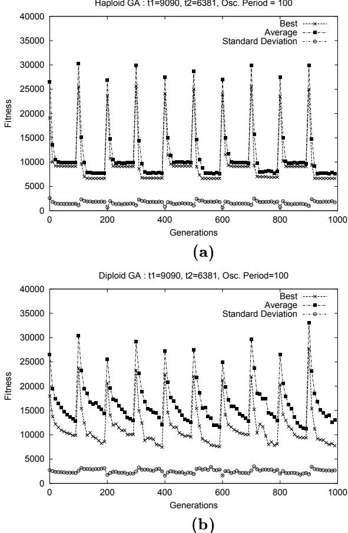
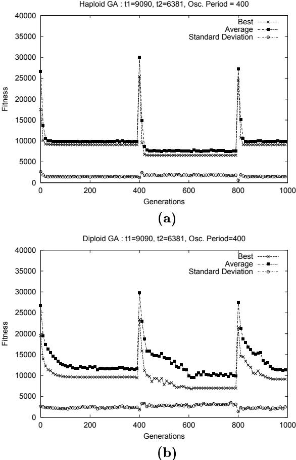
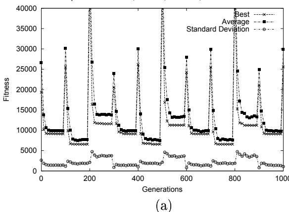
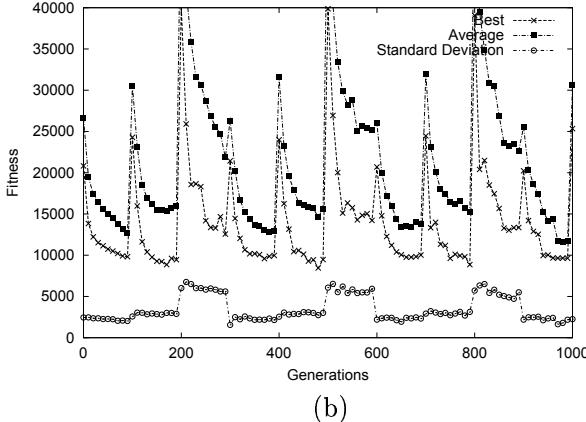

# Сравнение гаплоидности и диплоидности без доминирования при целочисленном представлении

Ayse S. Yilmaz Кафедра информатики Университет Центральной Флориды Орландо, Флорида 32816 selen@cs.ucf.edu

Annie S. Wu Кафедра информатики Университет Центральной Флориды Орландо, Флорида 32816 aswu@cs.ucf.edu

# Аннотация

Диплоидность и механизмы доминирования в основном исследовались для бинарных представлений и стационарных задач. В данной работе мы предлагаем новую диплоидную схему без механизма доминирования для целочисленных представлений. Все диплоидные особи эволюционируют без использования какой-либо гаплоидной стадии. Производительность диплоидного генетического алгоритма (ГА) сравнивается с гаплоидным ГА как для стационарных, так и для нестационарных сред. Наша тестовая задача — это модифицированная версия задачи коммивояжера (TSP). Для нашего целочисленного представления простой гаплоидный ГА без дополнительных механизмов восстановления, по-видимому, превосходит наш диплоидный ГА с точки зрения вычислительных затрат, качества решения и затрат на хранение. Способность диплоидности поддерживать разнообразие замедляет время адаптации к желаемому целевому значению.

# 1. Введение

Считается, что диплоидность и механизмы доминирования принесли пользу процессу процессу ГА, предоставляя механизм памяти. Большинство исследований делают вывод, что диплоидный ГА с бинарным представлением в нестационарных средах улучшает производительность ГА [1, 2]. Наш интерес к пониманию поведения механизма диплоидности на различных представлениях побудил нас исследовать целочисленное представление для задачи коммивояжера.

Голдберг [1] предложил триаллельную схему и показал ее превосходство над традиционным гаплоидным представлением. Нг и Вонг [2] доказали, что триаллельная схема работает лучше для изолированного примера, но это нельзя обобщить. Они вводят механизм изменения доминирования для использования неявной памяти диплоидности; однако он терпит неудачу в случаях с более чем двумя целями. Сравнительное исследование Льюиса и др. [3] показывает, что для задач с несколькими целями гаплоидный ГА с гипермутацией превосходит диплоидный ГА благодаря своей способности поддерживать разнообразие. Упомянутые методы в основном применялись к задачам с битовым кодированием, где локус гена определяет его значение. Они неприменимы к задачам, где важен относительный порядок элементов, как в задаче коммивояжера. Бинарное представление для TSP обычно требует использования алгоритмов восстановления для получения допустимых маршрутов после выполнения операций. Йошида и др. [4] используют метод, называемый псевдомейозом, для решения TSP. Гаплоидная хромосома, образованная с помощью операторов рекомбинации из диплоидных хромосом, подвергается генетическим операциям. Таким образом, информация диплоидного генотипа не полностью сохраняется после образования гаплоидной хромосомы.

Мы исследуем использование диплоидности для последовательного представления пути. Наш метод использует диплоидность без механизма доминирования. Генетические операции выполняются непосредственно над диплоидным генотипом. Однако фенотип каждой диплоидной особи формируется путем применения оператора рекомбинации к паре диплоидных хромосом, и отбор основывается на этом фенотипе. Тем не менее, в этой работе нет гаплоидной стадии, как это наблюдается при псевдомейозе [4]. Используемые операторы являются краеугольным камнем производительности при решении TSP. Мы применяем кроссовер на основе рекомбинации ребер [5], который показывает лучшие результаты среди восьми других операторов кроссовера для трех различных тестовых задач [6], и три лучших типа мутаций: мутацию смещения [7], простую инверсионную мутацию [8] и инверсионную мутацию [9].

# 2. Разработка диплоидного ГА

# 2.1. Система работы

1. Инициализировать каждую хромосому каждой особи в популяции случайным образом. Вычислить выраженный фенотип каждой особи.
2. Оценить приспособленность каждой особи в текущем поколении с использованием формулы 1 из раздела 2.4.
3. Продолжать, пока не будет достигнуто максимальное количество поколений.
4. Вычислить ожидаемое количество потомков для каждой особи в текущей популяции. Чем ниже значение приспособленности, тем больше количество потомков.
5. Выбрать родителей для следующего поколения.
6. Применить генетические операторы для размножения и формирования следующего поколения. Используется поколенческое размножение, при котором вся популяция хромосом заменяется потомками. Хромосома $i$ первого родителя скрещивается с соответствующей хромосомой $i$ второго родителя с вероятностью, определяемой скоростью кроссовера. Полученные затем потомки мутируют для получения окончательной формы особей нового поколения.
7. Перейти к шагу 2.

# 2.2. Тестовая задача

Мы используем экземпляр задачи коммивояжера, состоящий из 20 городов. Матрица затрат представляет стоимость (время или цену) поездки между каждой парой городов. В стационарной задаче TSP матрица затрат остается неизменной на протяжении всего прогона. В нестационарной задаче TSP матрица затрат изменяется в ходе прогона, чтобы исследовать производительность ГА с точки зрения адаптивности к изменениям среды.

# 2.3. Представление в ГА

Представление в виде пути или целочисленное представление, которое считается одним из лучших для задачи TSP [6], используется в этой работе для представления особей или маршрутов. Каждый ген в хромосоме представляет метку города, а вся последовательность генов представляет полный маршрут. В то время как гаплоидная особь содержит только один маршрут, диплоидная особь в генотипе состоит из двух маршрутов.

# 2.4. Функция приспособленности

Значение приспособленности каждой особи — это общая длина маршрута, который представляет фенотип этой особи. $d(i, j)$ — это стоимость проезда между городом $i$ и городом $j$. Наша цель — минимизировать это значение приспособленности.

$$
fitness = \sum_{i=0}^{n-1} d(i, (i+1) \bmod n)
$$

# 2.5. Операторы

2.5.1. Генетический кроссовер на основе рекомбинации ребер. Этот оператор работает с использованием карты ребер, которая задает ребра для каждого города в родителях. Этот оператор всегда производит валидных потомков. Детали алгоритма рекомбинации можно найти в работе Уайтли [5]. Мы принимаем этот оператор для операции кроссовера, происходящей между родителями, и используем модифицированную версию этого оператора для определения фенотипа диплоидной особи. Модифицированный оператор преобразует двух «родителей» (или две диплоидные хромосомы) в потомка, который представляет фенотип особи. Мы расширили алгоритм так, чтобы, когда количество записей городов в списке ребер одинаково, выбирался город, который имеет минимальную стоимость достижения от текущего города, чтобы стать следующим текущим городом. Таким образом, диплоидный механизм получает возможность выражать хорошие решения.

2.5.2. Операторы мутации. Оператор мутации смещения [7] выбирает подтур и случайным образом меняет его место. Простая инверсионная мутация [8] случайным образом выбирает подтур и меняет порядок следования в нем на обратный. В операторе инверсионной мутации [9] случайно выбранный подтур удаляется из маршрута и вставляется обратно в случайное место в обратном порядке.

# 2.6. Параметры

Если не указано иное, параметры по умолчанию установлены следующим образом. Популяция гаплоидного ГА в два раза больше, чем популяция диплоидного ГА, чтобы убедиться, что оба ГА имеют доступ к одинаковому объему генотипической информации.

Размер популяции : 300/150 (гаплоидный/диплоидный)   
Длина генома : 20   
Выбор родителей : Турнирный, размер: 5   
Ожидаемое кол-во потомков : от 0 до 2   
Тип кроссовера : рекомбинация ребер   
Скорость кроссовера : 1.0   
Тип мутации : инверсионная   
Скорость мутации : 0.5 (на особь)   
Скорость размножения : 1.0   
Макс. количество поколений : 300   
Количество прогонов : 100   
Период осцилляции : 100 (нестационарная среда)

# 2.7. Тестовые наборы

Мы сравниваем производительность нашего диплоидного ГА с традиционным гаплоидным ГА как в стационарных, так и в нестационарных средах.

2.7.1. Тесты в стационарной среде. Цели этого набора тестов:
1. Исследовать влияние различных скоростей мутации и кроссовера.
2. Как поддерживается разнообразие в обеих схемах и как это влияет на качество решения.
3. Влияние изменения размера популяции и типов мутации для обоих ГА.

2.7.2. Тесты в нестационарной среде. Исходная матрица затрат состоит из расстояний между 20 городами. Минимальная стоимость, полученная с использованием исходной матрицы затрат, составляет 9090. Чтобы смоделировать изменения в среде, мы случайным образом генерируем матрицы затрат с использованием равномерного распределения. Матрица затрат переключается между различными целевыми матрицами затрат после каждого периода осцилляции, то есть заданного количества поколений. Аспекты, подлежащие исследованию:

1. Диплоидный ГА по сравнению с гаплоидным ГА при различных резких изменениях среды. Минимальная стоимость, найденная для каждой из трех случайно сгенерированных матриц, составляет 6976, 6381 и 16128 соответственно.
2. Влияние увеличения периода осцилляции. Длина периода осцилляции влияет на степень сходимости каждого ГА. Тестируемые периоды осцилляции составляют 100, 200 и 400.
3. Влияние изменения скорости мутации. Гаплоидный ГА полностью зависит от оператора мутации для адаптации к изменениям, в то время как диплоидный ГА способен поддерживать разнообразие благодаря своей двойной хромосомной структуре. Использование более высоких скоростей мутации может увеличить разнообразие и устранить вопрос о том, не смещены ли результаты в пользу диплоидности. Тестируемые скорости мутации составляют 0.1, 0.3 и 0.4.
4. Влияние увеличения количества целей. Диплоидная структура обеспечивает механизм памяти только для двух решений. Этот тест показывает, позволяет ли введенный нами диплоидный механизм обеспечить необходимый механизм памяти и поддержание разнообразия для адаптации более чем к двум изменениям цели.

# 3. Экспериментальные результаты

# 3.1. Стационарная среда

Первый набор экспериментов направлен на определение лучшей комбинации скорости мутации и кроссовера для диплоидной схемы. Таблица 1 показывает, что в обеих схемах (гаплоидной и диплоидной) скорость мутации 0.3 и скорость кроссовера 1.0 дают нам самую высокую частоту нахождения лучшего решения из 100 прогонов. Однако почти во всех случаях диплоидный ГА не так успешен, как гаплоидный ГА. Второй и третий наборы экспериментов мы проводим с лучшей комбинацией скоростей мутации и кроссовера.

Второй набор экспериментов сравнивает способность гаплоидности и диплоидности поддерживать разнообразие. Диплоидный ГА явно превосходит в этом: лучшая приспособленность за 100 прогонов выходит на плато после 100-го поколения. Гаплоидный ГА выходит на плато примерно к 30-му поколению. В обоих ГА лучшая приспособленность продолжает улучшаться после выхода на плато, но очень медленно.

Таблица 1: Процент нахождения оптимума при различных скоростях мутации и кроссовера, X: Скорость кроссовера   

<table><tr><td rowspan=1 colspan=1></td><td rowspan=1 colspan=10>Скорости мутации</td></tr><tr><td rowspan=1 colspan=1></td><td rowspan=1 colspan=5>Гаплоидный ГА</td><td rowspan=1 colspan=5>Диплоидный ГА</td></tr><tr><td rowspan=1 colspan=1>X</td><td rowspan=1 colspan=1>0.1</td><td rowspan=1 colspan=1>0.3</td><td rowspan=1 colspan=1>0.5</td><td rowspan=1 colspan=1>0.7</td><td rowspan=1 colspan=1>1</td><td rowspan=1 colspan=1>0.1</td><td rowspan=1 colspan=1>0.2</td><td rowspan=1 colspan=1>0.3</td><td rowspan=1 colspan=1>0.4</td><td rowspan=1 colspan=1>0.5</td></tr><tr><td rowspan=1 colspan=1>0.1</td><td rowspan=1 colspan=1>24</td><td rowspan=1 colspan=1>82</td><td rowspan=1 colspan=1>42</td><td rowspan=1 colspan=1>67</td><td rowspan=1 colspan=1>2</td><td rowspan=1 colspan=1>0</td><td rowspan=1 colspan=1>1</td><td rowspan=1 colspan=1>1</td><td rowspan=1 colspan=1>3</td><td rowspan=1 colspan=1>0</td></tr><tr><td rowspan=1 colspan=1>0.5</td><td rowspan=1 colspan=1>38</td><td rowspan=1 colspan=1>85</td><td rowspan=1 colspan=1>57</td><td rowspan=1 colspan=1>80</td><td rowspan=1 colspan=1>0</td><td rowspan=1 colspan=1>11</td><td rowspan=1 colspan=1>23</td><td rowspan=1 colspan=1>39</td><td rowspan=1 colspan=1>37</td><td rowspan=1 colspan=1>6</td></tr><tr><td rowspan=1 colspan=1>1</td><td rowspan=1 colspan=1>68</td><td rowspan=1 colspan=1>93</td><td rowspan=1 colspan=1>91</td><td rowspan=1 colspan=1>83</td><td rowspan=1 colspan=1>1</td><td rowspan=1 colspan=1>42</td><td rowspan=1 colspan=1>59</td><td rowspan=1 colspan=1>61</td><td rowspan=1 colspan=1>34</td><td rowspan=1 colspan=1>3</td></tr></table>

Таблица 2: Процент нахождения оптимума при различных типах мутации и размерах популяции. SIM: Простая инверсия, DM: Смещение, IVM: Инверсия   

<table><tr><td rowspan=1 colspan=1></td><td rowspan=1 colspan=6>Типы мутации</td></tr><tr><td rowspan=1 colspan=1></td><td rowspan=1 colspan=3>Гаплоидный ГА</td><td rowspan=1 colspan=3>Диплоидный ГА</td></tr><tr><td rowspan=1 colspan=1>Размер_популяции</td><td rowspan=1 colspan=1>SIM</td><td rowspan=1 colspan=1>DM</td><td rowspan=1 colspan=1>IVM</td><td rowspan=1 colspan=1>SIM</td><td rowspan=1 colspan=1>DM</td><td rowspan=1 colspan=1>IVM</td></tr><tr><td rowspan=1 colspan=1>100</td><td rowspan=1 colspan=1>22</td><td rowspan=1 colspan=1>47</td><td rowspan=1 colspan=1>71</td><td rowspan=1 colspan=1>44</td><td rowspan=1 colspan=1>30</td><td rowspan=1 colspan=1>35</td></tr><tr><td rowspan=1 colspan=1>200</td><td rowspan=1 colspan=1>54</td><td rowspan=1 colspan=1>64</td><td rowspan=1 colspan=1>90</td><td rowspan=1 colspan=1>50</td><td rowspan=1 colspan=1>46</td><td rowspan=1 colspan=1>38</td></tr><tr><td rowspan=1 colspan=1>300</td><td rowspan=1 colspan=1>62</td><td rowspan=1 colspan=1>77</td><td rowspan=1 colspan=1>93</td><td rowspan=1 colspan=1>54</td><td rowspan=1 colspan=1>62</td><td rowspan=1 colspan=1>63</td></tr></table>

В третьем наборе экспериментов мы тестируем три разных размера популяции: 100, 200 и 300. В таблице 2 указано количество прогонов (из 100), в котором было найдено лучшее решение, в зависимости от типа мутации и размера популяции. Для гаплоидного ГА инверсионная мутация превосходит другие типы мутаций независимо от размера популяции. Для диплоидного ГА при небольших размерах популяции более эффективной оказывается простая инверсионная мутация, в то время как при больших размерах популяции лучше работает инверсионная мутация. В обеих схемах увеличение размера популяции приводит к улучшению производительности.

# 3.2. Нестационарная среда

Мы тестируем эффективность целочисленного диплоидного представления для нестационарной среды. Первый набор экспериментов сравнивает поведение диплоидного и гаплоидного ГА в нестационарных средах с резкими осциллирующими изменениями. Мы проводим тесты с двумя разными наборами матриц затрат: первый набор осциллирует между целями 6381 и 9090, а второй — между 6381 и 16128, оба с периодом осцилляции 100. Результаты первого эксперимента показаны на рисунке 1. В обоих примерах гаплоидный ГА лучше находит минимальное значение приспособленности для обеих целей и демонстрирует лучшее поведение с точки зрения среднего значения по популяции. По-видимому, диплоидный ГА адаптируется медленнее, что приводит к худшим значениям приспособленности в конце каждого периода осцилляции. Дисперсия для диплоидного ГА выше, чем для гаплоидного ГА, что указывает на большее разнообразие.

  
Рисунок 1: Лучшая/средняя приспособленность в зависимости от поколения для TSP с 2 осциллирующими целями, t1 = 9090, t2 = 6381. Гаплоидный ГА на (а), Диплоидный ГА на (b). Период осцилляции = 100.

Поскольку диплоидный ГА сходится позже, чем гаплоидный ГА, мы ожидаем улучшить качество решения для диплоидности за счет увеличения периода осцилляции. Наш второй набор экспериментов сосредоточен на изменениях периода осцилляции. Мы чередуем две цели, дающие минимальные значения приспособленности 9090 и 6381. Тестируемые периоды осцилляции составляют 200 и 400. На рисунке 2 показаны результаты для периода осцилляции 400. Короткие периоды осцилляции не дают диплоидному ГА шанса найти лучшую приспособленность. Увеличение периода осцилляции приводит к лучшему качеству решения на момент изменения цели. Несмотря на это улучшение, мы все еще не наблюдаем подавляющего превосходства диплоидного ГА над гаплоидным ГА. Гаплоидный ГА по-прежнему имеет меньшую дисперсию с лучшей сходимостью к двум значениям 9090 и 6381.

  
Рисунок 2: Лучшая/средняя приспособленность в зависимости от поколения для TSP с 2 осциллирующими целями, t1 = 9090, t2 = 6381. Гаплоидный ГА на (а), Диплоидный ГА на (b). Период осцилляции = 400.

Наш третий набор экспериментов сосредоточен на изменении скоростей мутации. Увеличение скорости мутации — единственный способ для гаплоидного ГА получить разнообразие, в то время как диплоидный ГА может поддерживать разнообразие благодаря избыточности представления. Мы наблюдаем, что увеличение скорости мутации в гаплоидном ГА не значительно улучшает качество лучшего найденного решения. Любое отклонение от скорости мутации 0.3 заставляет обе схемы работать хуже с точки зрения поиска хороших решений.

Большинство диплоидных механизмов и механизмов доминирования в бинарных представлениях не способны хорошо работать в случаях с более чем двумя целями. Мы examined производительность обеих схем (гаплоидной и диплоидной) на задаче с тремя целями. Мы используем матрицы затрат, обеспечивающие минимальные значения приспособленности 9090, 6138 и 11177. На рисунке 3 показано, что обе схемы способны найти все цели, но гаплоидная схема работает лучше при нахождении оптимальных особей.

# 4. Заключение

В ГА с бинарным кодированием было показано, что диплоидность улучшает производительность ГА для нестационарных задач, не имея при этом заметных преимуществ в стационарных задачах. Мы проверяем это утверждение на целочисленном представлении.

Для стационарной версии TSP, где оптимальное значение приспособленности не меняется в ходе прогона, мы протестировали различные настройки параметров. Мы пришли к выводу, что при лучших настройках параметров диплоидный ГА работает довольно хорошо, но не так хорошо, как гаплоидный ГА. Более высокое разнообразие, достигаемое диплоидным ГА, не помогает улучшить качество решения.

Заявленные преимущества диплоидности для бинарных представлений в нестационарных средах как с [2], так и без [1] дополнительного механизма изменения доминирования, по-видимому, не распространяются на целочисленное представление. Что еще более интересно в нашем ГА с целочисленным представлением для TSP, так это то, что гаплоидный ГА может превосходить диплоидный ГА, устраняя необходимость в дополнительных механизмах восстановления, которые обычно требуются в бинарных представлениях сразу после изменения цели [3]. Использование гаплоидного ГА вместо диплоидного ГА приводит к значительной экономии вычислительных ресурсов, включая примерно треть объема памяти, необходимого для диплоидной схемы, а также отсутствие необходимости обрабатывать одну дополнительную хромосому и связанные с ней вычислительные усилия. Диплоидный ГА хорош в поддержании разнообразия, так что он может предотвратить сходимость к локальному оптимуму, что для протестированной нами задачи TSP наблюдается нечасто. Сравнение этой диплоидной схемы с гаплоидной схемой на различных, более крупных задачах с несколькими целями оставлено для будущей работы.

# Список литературы

[1] D.E. Goldberg и R.E. Smith, "Nonstationary function optimization using genetic algorithms with dominance and diploidy," в Proceedings of the second ICGA, 1987.   
[2] Khim Peow Ng и Kok Cheong Wong, "A new diploid scheme and dominance change mechanism for non-stationary function optimization," в Proceedings of the Sixth International Conference on Genetic Algorithms, 1995, стр. 159-166.   
[3] J. Lewis, E. Hart и G. Ritchie, "A comparison of dominance mechanisms and simple mutation on non-stationary problems," в Parallel Problem Solving from Nature, 1998, т. 1498, стр. 139-148.   
[4] Kukiko Yoshida и Nobue Adachi, "A diploid genetic algorithm for preserving population diversity,"

  
Диплоидный ГА: t1 = 9090, t2 = 6381, t3 = 11177, Период осц. = 100

  
Рисунок 3: Лучшая/средняя приспособленность (в среднем за 100 прогонов) в зависимости от поколения для 3 целей, гаплоидный ГА на (а) и диплоидный ГА на (b). t1 = 9090, t2 = 6381, t3 = 11177

в Parallel problem solving from nature: PPSN III, 1994, стр. 36-45.

[5] D. Whitley, T. Starkweather и D. Shaner, "The travelling salesman and sequence scheduling: Quality solutions using recombination," в Handbook of Genetic Algorithms, 1999, стр. 350-372.   
[6] P. Larranaga, C. Kuijpers, R. Murga, I. Inza и S. Dizdarevic, "Genetic algorithms for travelling salesman problem: a review of representations and operators," Artificial Intelligence Review, т. 13, стр. 129-170, 1999.   
[7] Z. Michalewicz, "Genetic algorithms + data structures = evolution programs," в Springer Verlag, Berlin Heidelberg, 1992.   
[8] J.J. Grefenstette, "Genetic algorithms and their applications," в Proceedings of the second international conference, 1987.   
[9] D.B. Fogel, "Applying evolutionary programming to selected tsp problems," в Cybernetics and systems, 1993, т. 24, стр. 27-36.