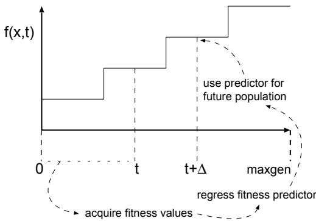

# A "Futurist" approach to dynamic environments

Jano van Hemert Leiden University jvhemert@liacs.nl

Clarissa Van Hoyweghen University of Antwerp hoyweghe@ruca.ua.ac.be

Eduard Lukschandl Ericsson & Hewlett-Packard eduard.lukschandl@ieee.org

Katja Verbeeck University of Brussels kaverbee@vub.ac.be

# Abstract

The optimization of dynamic environments has proved to be a difficult area for Evolutionary Algorithms. As standard haploid populations find it difficult to track a moving target, different schemes have been suggested to improve the situation. We study a novel approach by making use of a meta learner which tries to predict the next state of the environment, i.e. the next value of the goal the individuals have to achieve, by making use of the accumulated knowledge from past performance.

# 1 INTRODUCTION

In this study we are interested in how Evolutionary Algorithms (EAs) behave in dynamic environments. Most of the time, EAs are used in static environments, where the fitness function does not vary over time. Of course, this is not what happens in natural evolution. Most often, when standard EAs (using a haploid representation) are tested they have difficulties tracking a moving target and tend to get stuck in local optima or lag behind the moving optimum. In [4] a haploid system using Polygenic Inheritance is constructed for use in dynamic environments. In this paper,we present an alternative approach based on our definition of a dynamic or non-stationary environment.

In [2] and [4] the notion of non-stationarity problems is discussed. Lewis changes the environment every 1500 generations, whereas Ryan, following [1], does so every 15 generations. We believe that the predictability and tractability of the dynamic environment are important. When we do not have any information about what is going to happen, as is the case in a chaotic environment, we should not expect the EA to adapt to new situations immediately.

Under the assumption that the environment is somehow predictable, we propose to complement the EA with a meta learner which is responsible for estimating the next state of the environment. Therefore the meta learner analyzes the pairs of generations and best values seen so far. The basic idea is to have two evolutionary algorithms. The first EA, called the current evolutionary algorithm will use the given fitness function, while the second EA, called the future evolutionary algorithm uses a predicted fitness function which hopefully matches the fitness function in a future time step.

The rest of the paper is structured as follows. In the next section the problem solver is described in more detail. In Section 3 the two dynamic problems we use as test cases are explained. In Section 4 experiments and results are shown. And Section 5 discusses conclusions and future work.

# 2 SOLVING DYNAMIC PROBLEMS

In this section the use of a meta learner which predicts the future environment changes is motivated and techniques that can be applied by the meta learner to predict the future fitness are described.

# 2.1 THE PROBLEM SOLVER

The core of the problem solver consists of two steady state EAs which evolve simultaneously and a meta learner that predicts the future environment. At each generation $t$ , the first EA tries to find good elements with respect to the current fitness function, while the second EA tries to find good elements for the future fitness function predicted by the meta learner, e.g. the predicted fitness function at generation $t + \Delta$ The two EAs, respectively called the current evolutionary for $\mathrm { ~ \tt ~ t ~ } = \mathrm { ~ 0 ~ }$ to T-1 future_EA.do_one_generation(); if time_to_migrate(t, delta) then migrate(m); current_EA.do_one_generation(); info $=$ meta_learner.learn(); pred $=$ metalearner.predict(t+delta, info); future_EA.change_fitness(pred);

Figure 1: Pseudo code of the problem solver algorithm and the future evolutionary algorithm, use the same selection and reproduction operators. Every $d$ steps, a set of individuals migrates from the future population to the current population. In this way, we hope that the current population is prepared for changes that will occur in the environment $\Delta$ generations later.

The migration step in the problem solver works as follows. First select the $m$ best individuals from the future population and copy them to the current population. Then reevaluate the current population and resize it to its initial size by removing the $m$ worst individuals. Figure 1 shows the pseudo code of the problem solver.

# 2.2 USING FUTURE PREDICTIONS

If the solver knows the goal we have to achieve in the future it can start creating solutions which will be useful later on. Hopefully this will improve the accuracy of our solver. The idea is that our solver will evolve two populations of candidate solutions. First, a population that optimizes the problem of the current situation. Second, a population that optimizes the problem in the future. Given that we use a steady state EA that is optimizing a function, we need for our second population a fitness function which matches the fitness function in the future. Hence we need some kind of prediction to set our goal. The idea is to create a fitness function that predicts the fitness of an individual in the future using the knowledge of the problems that we have seen so far. More accurate, by analyzing the pairs of generations and best values we hope to find a function that predicts the future best value.

# 2.3 MINING THE PAST

When the steady state EA is running we record the best individual for each generation. These individuals will be used to make predictions later. There are many ways of creating a predictor, for example we can use genetic programming, linear regression, neural networks, Fourier transformations and Walsh coefficients.

  
Figure 2: The general idea of regressing a predicting fitness function to be used in another population that should prepare for the future

Here we take a different approach and test our solver using a perfect predictor and a noisy predictor. Both will be discussed in Section 4.

# 3 TWO DYNAMIC PROBLEMS

The problem solver is tested on two different types of dynamic problems, the 0-1 knapsack problem [1] and the Omera's dynamic problem [3]. In this section we present a short description of both problems.

# 3.1 THE KNAPSACK PROBLEM

The aim of the knapsack problem is to fill a knapsack with objects, all having a certain value of interest and a weight. As there is a maximum weight the knapsack can hold, the problem is to choose among the available objects a subset which maximizes the value of the objects without violating the maximum weight. The problem is made dynamic by changing over time the maximum weight the knapsack can hold. In our experiments, the maximum weight is varied from $8 0 \%$ of the total weight of the objects to $5 0 \%$ of the total weight and then back to $8 0 \%$ and so on. This change happens every 15 generations.

The knapsack problem can be represented by a binary string with as string length the number of available objects. If the value at string position $i$ is one (respectively zero) the object with number $i$ is added (respectively not added) to the knapsack. If the total weight of all items in the knapsack is more than the allowed weight, the string has fitness value zero; otherwise, the string has as fitness value the sum of the values of all items in the knapsack.

# 3.2 OSMERA'S DYNAMIC PROBLEM DOMAIN I

Omera's dynamic problem is specified by the following function:

$$
g _ { 1 } ( x , t ) = 1 - e ^ { 2 0 0 ( x - c ( t ) ) ^ { 2 } }
$$

with $c ( t ) = 0 . 0 4 ( \lfloor t / 2 0 \rfloor )$ , $x \in \{ 0 . 0 0 0 , . . . 2 . 0 0 0 \}$ and each time step $t \in \{ 0 , \dots 1 0 0 0 \}$ equal to one generation. The aim of the problem is to find the value $x$ at time $t$ such that $g _ { 1 } ( x , t )$ is minimized. The solution of the problem can be represented by a binary string of length 31 that is normalized to yield a value between 0 and 2.

# 4 EXPERIMENTS

To test our concept, the performance of our problem solver is tested in two extreme situations. First, the performance of the problem solver is checked given a perfect view of the future. In this way the idea of preparing the current population by using a future population is validated. Second, the performance of the problem solver using random or deceptive values as a predictor is compared with the performance of a normal EA without prediction. In this way we want to see whether the use of a predictor can be harmful.

The EA used in the experiments is a steady state algorithm using two-point crossover, mutation with rate $\textstyle { \frac { 1 } { l } }$ and linear ranking selection [6] with bias 1.5. For all experiments the population size is set to 100 and children replace older individuals in the population by using worst replacement selection. A more elaborate description of the experiments can be found in [5].

# 4.1 PERFECT PREDICTOR

To check the performance of the problem solver using a perfect predictor we actually do not use a predictor at all, but instead we give our solver the correct optimal value at the future time step. At any time $t$ the current population is evaluated with $f ( t )$ and the future population is evaluated with $f ( t + \Delta )$ .

# 4.1.1 0-1 Knapsack Problem

Table 1 gives the results of the knapsack problem for different lookahead times and different migration numbers. The error is calculated by max-best fitnessl .100, with best fitness the fitness of the best individual. In all experiment the migration step $d$ is set to one.

The experiments show a slightly better result using future prediction if $\Delta$ is set to 5. Unfortunately for $\Delta$ set to 15 the problem solver with perfect future predictions performs worse than a normal EA. This is an unexpected result as we imagined that $\Delta = 1 5$ would help the algorithm best because $\Delta$ is equivalent to the period of change in the problem. The experiments show that the settings for the parameter $\Delta$ is very important.

Table 1: Error percentages for the 0-1 Knapsack problem over 50 runs with a bitstring representation   

<table><tr><td>predictor</td><td>∆</td><td>m</td><td>error</td><td>stdev</td><td>best run</td></tr><tr><td>none</td><td>×</td><td>×</td><td>16.6%</td><td>3.52</td><td>8.96%</td></tr><tr><td>perfect</td><td>5</td><td>10</td><td>11.9%</td><td>3.77</td><td>4.85%</td></tr><tr><td>perfect</td><td>15</td><td>10</td><td>20.3%</td><td>4.26</td><td>11.7%</td></tr><tr><td>perfect</td><td>5</td><td>50</td><td>11.8%</td><td>3.70</td><td>5.97%</td></tr><tr><td>perfect</td><td>15</td><td>50</td><td>21.4%</td><td>6.06</td><td>12.0%</td></tr><tr><td>noisy</td><td>5</td><td>10</td><td>12.6%</td><td>4.12</td><td>6.77%</td></tr><tr><td>noisy</td><td>15</td><td>10</td><td>13.0%</td><td>3.74</td><td>7.50%</td></tr><tr><td>noisy</td><td>5</td><td>50</td><td>12.7%</td><td>4.02</td><td>6.47%</td></tr><tr><td>noisy</td><td>15</td><td>50</td><td>12.8%</td><td>4.07</td><td>4.99%</td></tr></table>

# 4.1.2 Omera's Function

Table 2 shows the results of the dynamic Omera Problem for different lookahead times $\Delta$ and different migration numbers $m$ . The error is calculated by $\lvert \mathrm { \ m i n - b e s t { } }$ fitness | $\cdot 1 0 0 = \mid 0 - { \mathrm { b e s t } }$ fitness | ·100, with best fitness the fitness of the best individual.

If we compare the performance of the problem solver using a perfect predictor with the performance of a normal EA, we see (as probably could be expected) that for all tested settings the problem solver performs much better.

Table 2: Error percentage for the Omera problem for 50 runs   

<table><tr><td>predictor</td><td>∆</td><td>m</td><td>error</td><td>stdev</td><td>best run</td></tr><tr><td>none</td><td>×</td><td>×</td><td>63.8%</td><td>10.3</td><td>41.2%</td></tr><tr><td>perfect</td><td>5</td><td>10</td><td>0.261%</td><td>0.153</td><td>0.0751%</td></tr><tr><td>perfect</td><td>5</td><td>50</td><td>0.168%</td><td>0.148</td><td>0.0266%</td></tr><tr><td>perfect</td><td>10</td><td>10</td><td>0.241%</td><td>0.220</td><td>0.0680%</td></tr><tr><td>perfect</td><td>10</td><td>50</td><td>0.203%</td><td>0.099</td><td>0.0698%</td></tr><tr><td>noisy</td><td>5</td><td>10</td><td>0.241%</td><td>0.186</td><td>0.0488%</td></tr><tr><td>noisy</td><td>5</td><td>50</td><td>0.144%</td><td>0.122</td><td>0.0358%</td></tr><tr><td>noisy</td><td>10</td><td>10</td><td>0.241%</td><td>0.186</td><td>0.0488%</td></tr><tr><td>noisy</td><td>10</td><td>50</td><td>0.168%</td><td>0.148</td><td>0.0266%</td></tr></table>

To check how harmful the use of a predictor can be, the performance of the problem solver using noisy and deceitful values as a predictor is compared with the performance of a normal EA without prediction.

For the knapsack problem the maximum size of the sack at the wrong point in the future is used as noisy prediction, which makes it a deceptive goal. Instead of supplying the correct value we take the other maximum size. For the Omera function all individuals in the future population are assigned a random fitness value between 0 and 1.

The experiments show that the use of a noisy predictor does not harm the search process. Even more the migration of bad predicted individuals increases the diversity of the current population which makes it easier for the population to adapt to the changing environment. In case of the Omera function the error percentages for noisy prediction are equally good as those for perfect prediction. In case of the knapsack problem the error percentages for the noisy predictor are even better than those for the perfect predictor. It seems that in these cases prediction is not really necessary. However, adding more diversity to the population, e.g. by migrating some individuals from an other population, helps the population to adapt to changes of the dynamic environment.

# Acknowledgments

We thank the organizers of the COIL 2000 summer school for bringing us together and for providing an environment that enabled us to learn and, at the same time, give us the opportunity to write this paper. Especially, we would like to thank Riccardo Poli for providing us with great ideas and for guidance, without we would never have gotten far enough to receive the best paper award.

The second author is supported by the Flemish Institute for the Encouragement of Scientific and Technological Research in Industry - (IWT) (Flanders) (Belgium).

# Список литературы

# 5 DISCUSSION

Our results show that in case of the the Omera problem setting, perfect future prediction as well as noisy future prediction helps the current population to adapt to changes of the environment. However for the knapsack problem the results are not so promising. More experiments on different problems should be done to evaluate the concept of future prediction. It would be interesting to study theoretically the symbiosis of the current and the future population. Hereby we think on the importance and the influence of the parameter $\Delta$ and $m$ in the migration step and the rate of change of the environment.

Although we have not that many results yet, we hope that our idea of predicting the future using a meta learner will prove to be useful. Despite the fact that we did not perform well on the dynamic knapsack problem our results on the Omera's function have given us the feeling that the concept might actually work.

[1] D. Goldberg and R.E. Smith. Nonstationary function optimization with dominance and diploidy. In J.J. Grefenstette, editor, Proceedings of the 2nd International Conference on Genetic Algorithms and Their Applications, pages 59-68. Lawrence Erlbaum Associates, 1987.   
[2] J. Lewis, E. Hart, and G. Ritchie. A comparison of dominance mechanisms and simple mutation on nonstationary problems. In Agoston E. Eiben, Thomas Back, Marc Schoenauer, and Hans-Paul Schwefel, editors, Proceedings of Parallel Problem Solving from Nature, number 1498 in Lecture Notes in Computer Science, pages 139-148. Springer, Berlin, 1998.   
[3] P. Omera, V. Kvasnicka, and J. Pospichal. Genetic algorithms with diploid chromosomes. In Proceedings of Mendel '97, pages 111116, 1997.   
[4] C. Ryan and J.J. Collins. Non-stationary function optimization using polygenic inheritance. In Submitted to IEEE Transactions on Evolutionary Computation, 1999.   
[5] J.I. van Hemert, C. Van Hoyweghen, E. Lukschandl, and K. Verbeeck. A "futurist" approach to dynamic environments. Technical Report $\operatorname { t r } 2 0 0 1 .$ 02, Leiden Institute for Advanced Computer Science, Leiden University, 2001. http://www.liacs. nl/\~jvhemert/publications/.   
[6] D. Whitley. The GENITOR algorithm and selection pressure: Why rank-based allocation of reproductive trials is best. In J. David Schaffer, editor, Proceedings of the Third International Conference on Genetic Algorithms (ICGA '89), pages 116-123, San Mateo, California, 1989. Morgan Kaufmann Publishers, Inc.