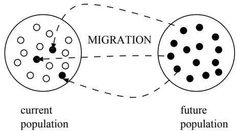
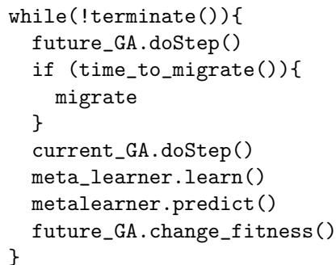
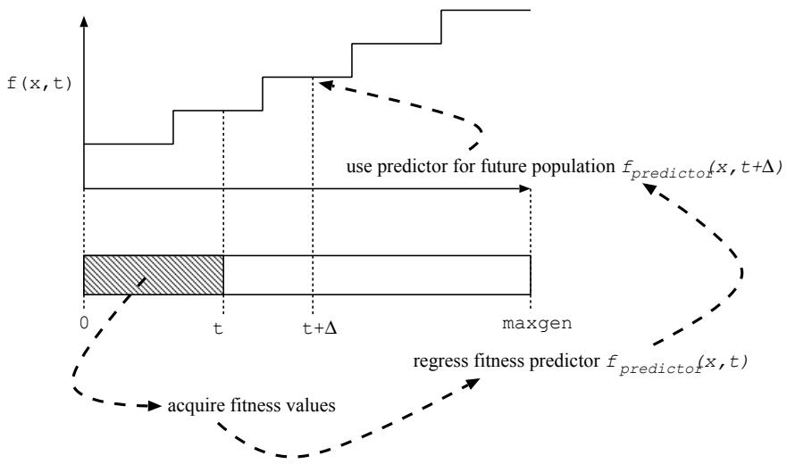
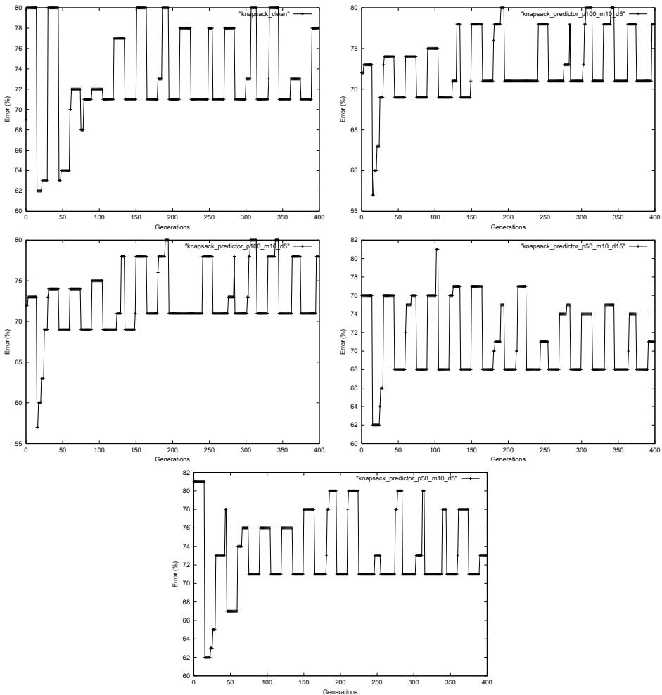
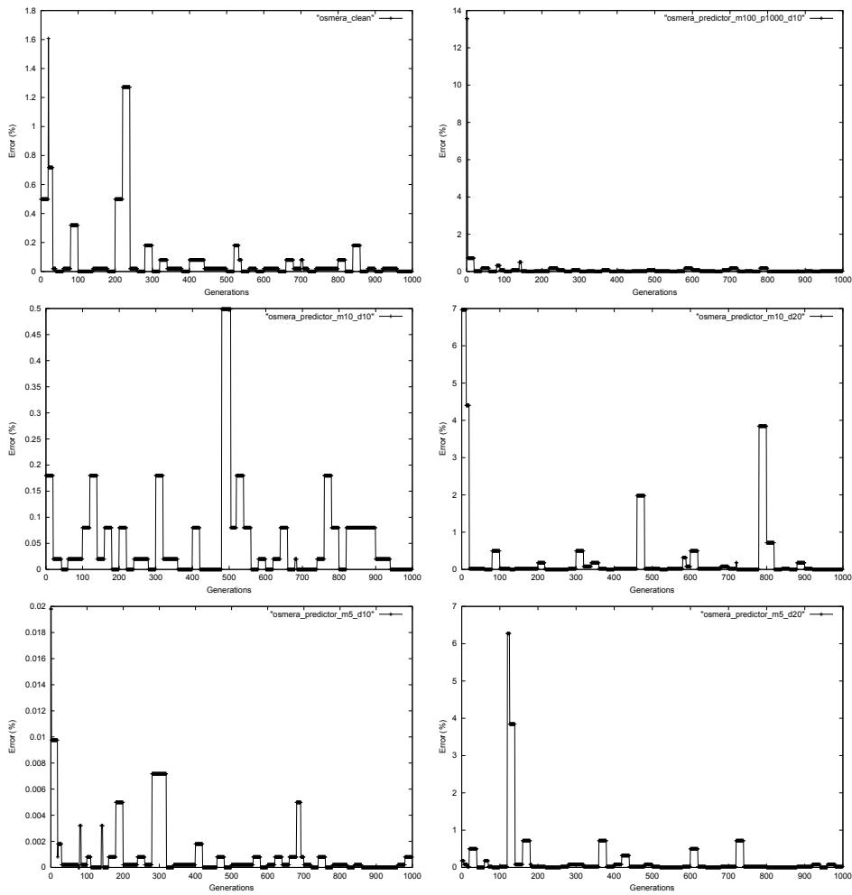
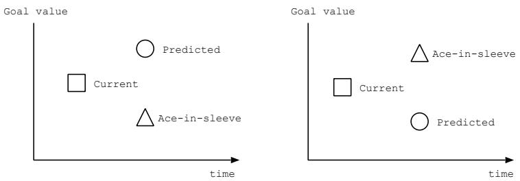

# A “Futurist” approach to dynamic environments

Jano van Hemert jvhemert@cs.leidenuniv.nl Leiden University

Clarissa van Hoyweghen hoyweghe@ruca.ua.ac.be University of Antwerp

Eduard Lukschandl eduard.lukschandl@ieee.org Ericsson and Hewlett-Packard

Katja Verbeeck kaverbee@vub.ac.be University of Brussels

advisor Riccardo Poli R.Poli@cs.bham.ac.uk University of Birmingham

October 11, 2000

# Abstract

The optimization of dynamic environments has proved a difficult area for Genetic Algorithms. As standard haploid populations find it difficult to track a moving target, different schemes have been described to improve on the situation. We propose a novel approach by making use of a metalearner which tries to predict the next state of the environment, i.e. the next value of the goal the individuals have to achieve, by making use of the accumulated knowledge from the past performances.

# 1 Introduction

In this study we are interested in how Genetic Algorithms (GAs) behave in dynamic environments. In general, GAs are used in static environments, where the fitness function does not vary over time. But this is of course not what happens in natural evolution. When standard GAs (using haploid populations) are tested in dynamical environments it is found that they have difficulties with tracking a moving target and tend to get stuck in local optima. In [4] a new haploid system which uses Polygenic Inheritance is constructed for use in dynamic environments. In this paper we present a different approach based on our definition of what a dynamic or nonstationary environment is.

There has been some discussion about the definition of the notion of nonstationarity [2], [4]. Lewis changes the environment every 1500 generations, whereas Ryan, following [1], does so every 15 generations. We believe that what is important is that the dynamic environment is still predictable or tractable in some way. When we don’t have any information about what is going to come next, as in a chaotic environment, we cannot hope the GA to adapt to new situations immediately.

Under this assumption we propose to complement the GA with a metalearner which is responsible for learning the next state of the environment. Therefore the metalearner has to data mine pairs of generations and best fitness values seen so far. The basic idea is then to have work with two populations within the problem solver, the first population, called em the current population is being evaluated with the current fitness function, while the second population , called the future population will be evaluated with the predicted fitness function.

In the next section we describe the problem solver in more detail, in section 3 the two dynamic problems we use as test cases are defined and the result of the experiments are shown in section 4. In section 5 some conclusions are discussed and section 6 concludes with future work.

# 2 Solving dynamic problems

# 2.1 The problem solver

The core of the problem solver consists of two steady state GAs which evolve together and a meta learner which predicts the future environment. At each generation $t$ , the first GA tries to solve the current fitness function, while the second GA tries to solve the future fitness function predicted by the meta learner, e.g. the fitness function at generation $t + \Delta$ . The two GAs, respectively called the current $G A$ and the future $G A$ , use the same selection and reproduction operators. Every $d$ steps, a set of individuals migrate from the future population to the current population (see figure 1). In this way, we hope that the current population is prepared for future changes in environment.

  
Figure 1: Migration of members of the future population into the current population.

The migration step in the problem solver works as follows: First select the $m$ best individuals from the future population and copy them to the current population. Then resize the current population to its initial size by removing the $m$ worst individuals. Figure 2 shows the pseudo code of the problem solver.

  
Figure 2: Pseudo code of the problem solver.

In next section the use of a metalearner which predict the future environment changes is motivated and in section 2.3 some techniques the metalearner can use to predict the future fitness are described.

# 2.2 Using future predictions

If the solver knows what goal we are to achieve in the future it can start creating solutions that will be useful later on. Hopefully this will include the accuracy of our solver. This depends highly on how well we can predict the future. Also, the behavior in time of the dynamic problem highly influences our success. Not only because it influences our prediction, but because it is expected that functions that behave irregularly are more difficult to track as a population of candidate solutions needs some time to adjust to a new optimum.

The idea is that our solver will evolve two sets of candidate solutions. First, a set that optimizes the problem of the current generation. Second, a set that optimizes problems in the future. Given that we use an SGA we are actually optimizes a fitness function. Thus, for our second set we need a fitness function that shows what fitness value we need to obtain in the future.

Normally we do not know what the future holds for us. Thus we need some kind of predictions to set our goal. The idea here is to make a fitness function that predicts values in the future. To get this done we have only knowledge of the problems (or more accurate, the fitness value corresponding to a solution) we have seen so far. By using a data mining or data analysis of pairs of generation and best fitness values we hope to regress a function that predicts what future fitness values will appear.

# 2.3 Mining the past

When the SGA is running we record the best individual for each generation. We want to use this series of data to make predictions later. There are many ways of creating a predictor for the future. Some ideas to regress a function are: genetic

  
Figure 3: The general idea of regressing a predicting fitness function to be used in another population that should prepare for the future.

programming, linear regression, neural networks, Fourier transformations and Walsh coefficients.

# 3 Two dynamic problems

The problem solver is tested on two different kinds of dynamic problems. The first problem, the knapsack problem [1] changes periodically, while the second problem, the Osmera’s dynamic problem [3] varies continuously in time. In this section a short description of both problems is given.

# 3.1 The Knapsack problem

The aim of the knapsack problem is to fill a knapsack with objects, each having a certain value of interest and a weight. As there is a maximum weight the knapsack can hold, the problem is to choose among the available objects a subset which maximizes the value of the objects without violating the weight constraint. The problem is made dynamic when the maximum weight the knapsack can hold is changing. In our case the maximum weight is varied from $8 0 \ \%$ of the total weight of the objects to $5 0 \ \%$ of the total weight and then back to $8 0 \%$ and so on. Changes happen every 15 generations. The objects and their associated weights and values for the problem are depicted in table 1.

<table><tr><td rowspan=1 colspan=1>Object nr</td><td rowspan=1 colspan=1>Value</td><td rowspan=1 colspan=1>Weigth</td></tr><tr><td rowspan=1 colspan=1>0</td><td rowspan=1 colspan=1>2</td><td rowspan=2 colspan=1>125</td></tr><tr><td rowspan=1 colspan=1>1</td><td rowspan=1 colspan=1>3</td></tr><tr><td rowspan=1 colspan=1>2</td><td rowspan=1 colspan=1>9</td><td rowspan=1 colspan=1>20</td></tr><tr><td rowspan=1 colspan=1>3</td><td rowspan=1 colspan=1>2</td><td rowspan=1 colspan=1>1</td></tr><tr><td rowspan=1 colspan=1>4</td><td rowspan=1 colspan=1>4</td><td rowspan=2 colspan=1>53</td></tr><tr><td rowspan=1 colspan=1>5</td><td rowspan=1 colspan=1>4</td></tr><tr><td rowspan=1 colspan=1>6</td><td rowspan=1 colspan=1>2</td><td rowspan=1 colspan=1>10</td></tr><tr><td rowspan=1 colspan=1>7</td><td rowspan=1 colspan=1>7</td><td rowspan=1 colspan=1>6</td></tr><tr><td rowspan=1 colspan=1>8</td><td rowspan=1 colspan=1>8</td><td rowspan=1 colspan=1>8</td></tr><tr><td rowspan=1 colspan=1>9</td><td rowspan=1 colspan=1>10</td><td rowspan=1 colspan=1>7</td></tr><tr><td rowspan=1 colspan=1>10</td><td rowspan=1 colspan=1>3</td><td rowspan=1 colspan=1>4</td></tr><tr><td rowspan=1 colspan=1>11</td><td rowspan=1 colspan=1>6</td><td rowspan=1 colspan=1>12</td></tr><tr><td rowspan=1 colspan=1>12</td><td rowspan=1 colspan=1>5</td><td rowspan=1 colspan=1>3</td></tr><tr><td rowspan=1 colspan=1>13</td><td rowspan=1 colspan=1>5</td><td rowspan=1 colspan=1>3</td></tr><tr><td rowspan=1 colspan=1>14</td><td rowspan=1 colspan=1>7</td><td rowspan=1 colspan=1>20</td></tr><tr><td rowspan=1 colspan=1>15</td><td rowspan=1 colspan=1>8</td><td rowspan=1 colspan=1>1</td></tr><tr><td rowspan=1 colspan=1>16</td><td rowspan=1 colspan=1>6</td><td rowspan=1 colspan=1>2</td></tr></table>

# 3.2 Osmera’s dynamic problem domain I

Osmera’s dynamic problem is specified by the following function:

$$
g _ { 1 } ( x , t ) = 1 - e ^ { 2 0 0 ( x - c ( t ) ) ^ { 2 } } w h e r e c \left( t \right) = 0 . 0 4 ( \lfloor t / 2 0 \rfloor )
$$

where $x \in \{ 0 . 0 0 0 , \ldots 2 . 0 0 0 \}$ and $t \in \{ 0 , \ldots 1 0 0 0 \}$ . t is the time step, being equal to one generation. So the problem here is to find a value of $_ \textrm { x }$ at time $\mathrm { t }$ that minimizes $g ( x , t )$ .

# 4 Experiments

To test how well our concept of future predictions works on the two dynamic problems we first test how well the solver works given a perfect view of the future. Basically we exactly know how the goal will change over time (i.e., generations) and we can use this to ’cheat’. Instead of using a predictor we can use a fitness function that knows what the next optimum will be in the future. In this way we can validate our idea very quickly. Knowing if it works with perfect information is a necessary condition. Otherwise, we cannot hope that predicted behavior will give good results.

# 4.1 Preliminary results

Table 2 gives the results for the knapsack problem for different values of lookahead time ( $\Delta$ ) and migration numbers. Migration step $d$ in all the experiments is set to one.

Table 2: Results for the 0-1 Knapsack problem.   

<table><tr><td>Population size</td><td>∆</td><td>m</td><td>max Value</td><td>min Value</td></tr><tr><td>100</td><td>X</td><td>X</td><td>80</td><td>62</td></tr><tr><td>100</td><td>15</td><td>10</td><td>82</td><td>59</td></tr><tr><td>100</td><td>5</td><td>10</td><td>80</td><td>57</td></tr><tr><td>50</td><td>5</td><td>10</td><td>81</td><td>62</td></tr><tr><td>50</td><td>15</td><td>10</td><td>81</td><td>62</td></tr></table>

Table 3 given below gives the results for different values of lookahead time $\Delta$ and migration numbers $m$ for the Osmera Problem.

Table 3: Results for the Osmera problem.   

<table><tr><td rowspan=1 colspan=1>Population size</td><td rowspan=1 colspan=1>∆</td><td rowspan=1 colspan=1>m</td><td rowspan=1 colspan=1>Average error</td></tr><tr><td rowspan=6 colspan=1>100100100100100100</td><td rowspan=1 colspan=1>10</td><td rowspan=1 colspan=1>10</td><td rowspan=1 colspan=1>0.055</td></tr><tr><td rowspan=1 colspan=1>10</td><td rowspan=1 colspan=1>100</td><td rowspan=1 colspan=1>0.096</td></tr><tr><td rowspan=1 colspan=1>10</td><td rowspan=1 colspan=1>20</td><td rowspan=1 colspan=1>0.306</td></tr><tr><td rowspan=1 colspan=1></td><td rowspan=1 colspan=1>10</td><td rowspan=1 colspan=1>0.00095</td></tr><tr><td rowspan=1 colspan=1></td><td rowspan=1 colspan=1>20</td><td rowspan=1 colspan=1>0.184</td></tr><tr><td rowspan=1 colspan=1>X</td><td rowspan=1 colspan=1>X</td><td rowspan=1 colspan=1>0.088</td></tr></table>

Comparing this results with [4] we see that our best average tracking error in the Osmera problem $0 . 0 0 0 9 5 \%$ ) is actually better than the one obtained in [4], where the best average attained is $0 . 0 1 6 \%$ . For the Knapsack problem however, our results are more difficult to compare. Figure 4 shows the fitness of the best individual of every generation for the knapsack problem. The different plots vary in population size, migration number and lookahead time. Figure 5 shows the average checking error over all generations for the Osmera function.

# 5 Discussion

# 5.1 General remarks

As stated in the introduction there exist different opinions about what a dynamic system actually is. The first observation we make, is that if we express as rate of change only, e.g. a change every 15th generation or a change every 1500th generation, we get into trouble, because a very small change in the first case, compared to a very large change in the second case, will make the first system look less dynamic than the second one.

  
Figure 4: Fitness of the best individual of every generation for the knapsack problem.

  
Figure 5: Average checking error for the Osmera problem.

Having said that, we see another problem because of the choice of how the change rate is measured, i.e. the number of generations between the changes. Following Ryan in referring to real-world problems, we would state that the change rate should be given using real time units, i.e. seconds. Even if the consequence would be that dynamic problems would become less dynamic with the increase of computer performance in the sense that the difference between computer an real world dynamics is decreasing.

On the other hand, if we define dynamic functions as such that, given certain hardware performance constraints these environmental changes occur around the time it takes for a population to find a solution for a given environment, we get a lot of dependencies on design choices for the GA, the most important being population size. What population size to choose? Why not choose a very big population size if one believes it to be advantageous for the solution of the problem? In other words: What are the real-world constraints?

Concluding, we think the problem statement is rather artificial (in the negative sense) in the dynamics definition parts. (Or to use Ryan’s formulation: We are somewhat uncomfortable with it.)

# 5.2 Restrictions on the predictor

When does the predictor not work? Obviously if the environment’s behavior is unpredictable, i.e is randomly changing. So, some crude classification of the problem is advised, before making false or unnecessary assumptions. But a simplification/generalization of our method might take care of randomly changing environments too: The first change would be to let the different populations evolve independently from each other, the second, to use more than one future population. Then, we let one of the populations evolve towards the predicted goal, the other one towards a goal with a value such that it is higher than the present one, if the predicted one is lower, and the other way around. In this way we will be prepared for both eventualities, that is an increasing and a decreasing goal. As an aside, if we only allow real-world constraints the interesting question arises of how to distribute the given computational resources amongst the number of populations, the (possibly different) population sizes, and the meta-learner, etc.

  
Figure 6: Evolving two future populations.

# 5.3 Preprocessing

It might be a good idea to try to do some preprocessing on the input data in order to reduce the search space as often is the case in solving constraint satisfaction problems. E.g., in the knapsack problem, already a superficial inspection of the object table shows that object 0 has the lowest value of all, and at the same time the 3rd highest weight. One might assume that modifying the table by deleting such objects from it could improve the performance of the SGA.

# 6 Conclusions and future research

Although these are very premature results we hope that our idea of predicting the future using a metalearner will prove to be useful. Although we did not perform well on the dynamic knapsack problem our results on the Osmera’s function has given us the feeling that we have stumbled on something nice.

Still much remains to be done, especially on the predicting part. We would like to know how well this method works when we change our future predictor with a predictor that has been deduced by a metalearning algorithm such as genetic programming, neural networks or more convential linear regression or Fourier transformations. The possibilities seem endless here.

# Список литературы

[1] D. Goldberg; Nonstationary function optimization with dominance and diploidy Proceedings of ICGA2 1987.   
[2] J.Lewis; E.Hart ; G.Ritchie; A Comparison of Dominance Mechanisms and Simple Mutation on Nonstationary Problems In Proc of Parallel Problem Solving from Nature - PPSN V pp 139 - 148 1998.   
[3] P.Osmera; V. Kvasnicka; J.Pospichal; Genetic algorithms with diploid chromosomes In Procof Mendel’97 pp 111-116 1997.   
[4] C. Ryan; J.J. Collins; Non-stationary Function Optimization using Polygenic Inheritance in review