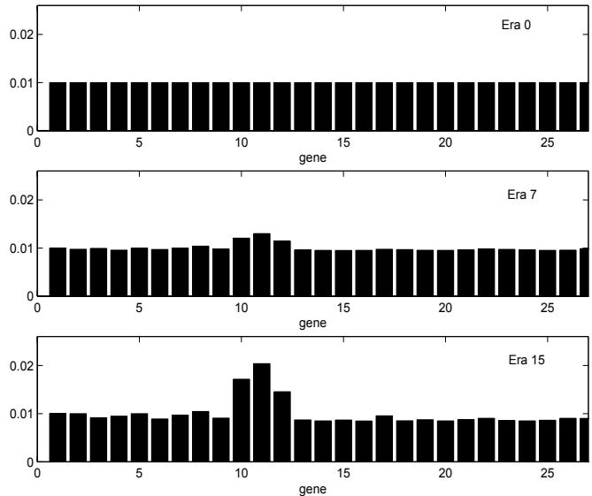

# A Genetic Algorithm with Gene Dependent Mutation Probability for Non-Stationary Optimization Problems

Renato Tinos´   
Department of Physics and Mathematics   
FFCLRP - University of Sao Paulo (USP) ˜ Ribeirao Preto, SP, 14040-901, Brazil ˜ Email: rtinos@icmc.usp.br

Andre C. P. L. F. de Carvalho ´ Department of Computer Science and Statistics ICMC - University of Sao Paulo (USP) ˜ Sao Carlos, SP, 13560-970, Brazil ˜ Email: andre@icmc.usp.br

Abstract— Genetic Algorithms (GAs) with gene dependent mutation probability applied to non-stationary optimization problems are investigated in this paper. In the problems studied here, the fitness function changes during the search carried out by the GA. In the GA investigated, each gene is associated with an independent mutation probability. The knowledge obtained during the evolution is utilized to update the mutation probabilities. If the modification of a set of genes is useful when the problem changes, the mutation probabilities of these genes are increased. In this way, the search in the solution space is concentrated into regions associated with the genes with higher mutation probabilities. The class of non-stationary problems where this GA can be interesting and its limitations are investigated.

# I. INTRODUCTION

The research in Genetic Algorithms (GAs) has been mainly focused on stationary optimization problems, in spite of a significant part of optimization problems in real world being non-stationary optimization problems (NSPs) [2]. In stationary optimization problems, the evaluation function (or fitness function) and the constraints of the problem are fixed [23], what is not a rule in dynamic systems, where the actual solution can evolve with changes that may occur in the problem.

There are several causes of changes in NSPs, like faults, machine degradation, environmental or climatic modifications, and economic factors. In fact, the natural evolution, which is the inspiration for GAs, is always non-stationary. The occurrence of natural cataclysms, geological modifications, competition for natural resources, coevolution between species, and climatic modifications are only some examples of changes related to natural evolution. Moreover, the Punctuate Equilibrium Theory indicates that environmental changes have an important role in the evolutionary process [8].

Several solutions based on GAs to NSPs have appeared in literature over the past years. Most of them can be grouped into one of the following categories [2], [23]:

Maintenance of the diversity level throughout the run: the diversity can be a useful tool when the GA needs to search for a solution in regions of the solution space that cannot be reached by applying the traditional genetic operators in a population that has already converged.

Typical examples of this approach are the hypermutation and the random immigrants mechanism [3].

• Adaptation mechanisms: the GA parameters are adapted by statistical or heuristic rules to be used in NSPs [5] . Use of the knowledge obtained during the evolution: past experiences are used to guide the search for the new solution. The experiences can be memorized by numerical [18], [20], symbolic [19], or exact memory [9], [12].

In previous approaches to solve NSPs, all the genes of each individual have the same probability to be chosen for mutation. In nature, the codifying sequences of nucleotides for the genes can have different mutation probabilities. This happens, for example, because of the size and type of the sequence, use of different enzymes during the replication process, and occurrence of neutral mutations [24]. But, how the mutation probability of the gene influences the evolution?

The idea that the genetic codes could have evolved to their current configurations has been repeatedly suggested [6]. In the beginning, the genetic codes randomly employed the nucleotides to codify genes. During the evolution, the encoded sequences of nucleotides in genes have been “chosen” in order to increase or decrease the stability of the controlled characteristics [16], [24]. For example, if a sequence codifies for a protein that is vital for the cell, independently of the environmental changes, a small mutation probability is more interesting than a high one. In the opposed case, a high mutation probability is more interesting in the genes controlling characteristics that should be modified after an environmental change, like those controlling the resistance of a bacteria to chemical substances. Moreover, researchers have related cases where the probability of an advantageous mutation suddenly increases when environmental changes take place [10]. This interesting behavior could explain the fast adaptation of some organisms, e.g. bacteria, to environmental changes.

The use of genes with independent evolving mutation probabilities in GAs applied to NSPs is investigated in this paper. In the GA with gene dependent mutation probabilities (GAGDM), each gene of each individual is associated with an independent mutation probability [22]. The use of a nonuniform mutation probability in GAs is not a new approach. In [13], in order to search the maximum of multiple-peak variable-separable stationary functions, stochastic automata are used to learn the locus of effective genes on the individual where mutation yields a higher fitness.

In the GAGDM, the knowledge obtained during the evolutionary process is used to modify the mutation probabilities of the genes. If the modification of a set of genes causes a better adaptation to changes of the NSP, the mutation probabilities of this set are increased. In this way, the search in the solution space is concentrated into regions associated with higher mutation probabilities. The search, however, is not restricted to such regions, as all mutation probabilities are always higher than zero. This approach can be interesting in special NSPs where only some genes of the GA should change. However, the performance of the GAGDM can be poor in cases where several genes should be modified after a change in the problem. When to apply the GAGDM is an interesting question that is investigated in this paper.

This article is organized as follows: the GAGDM is described in Section II; a method to determine the parameters of the GAGDM is presented in Section III; in Section IV, the algorithm is analyzed and the class of non-stationary problems where the algorithm can be interesting is discussed; the experiment results are presented in Section V; finally, this article is concluded in Section VI.

# II. GENETIC ALGORITHM WITH GENE DEPENDENT MUTATION PROBABILITY

In the standard GA, a population of individuals representing the problem solutions is evolved according to mechanisms based on the mechanics of natural selection and natural genetics [7]. The solution $\mathbf { x } _ { i }$ , represented by the individual $i = 1 , \ldots , N _ { \mathrm { { \scriptsize ~ ; ~ } } }$ , is evaluated by a fitness function $f ( \mathbf { x } _ { i } )$ , which is utilized to determine if the individual will be reproduced. The standard GA utilizes two main genetic operators, known as crossover and mutation, to change the problem solutions. In the crossover operator, genes of two individuals are exchanged. The number of individuals chosen for crossover in a generation is defined by the crossover rate $p _ { c }$ . After the crossover, some genes of the individuals are mutated. The number of mutated genes in an individual is defined by the mutation rate $p _ { m }$ . In the standard GA, the genes of all individuals have the same mutation probability, which is equal to the mutation rate $p _ { m }$ . When adaptation mechanisms (Section I) are employed, the mutation rate can be allowed to change across the generations. However, like in the standard GA, all the genes have the same mutation probability.

If the fitness function $f ( \mathbf { x } _ { i } )$ changes over time, the problem can be described as an NSP. In these problems, the change of the fitness function $f ( \mathbf { x } _ { i } )$ can be discrete or continuous. The discrete changes, which appear from time to time after stagnation periods, are studied in this work. Several are the examples of this type of NSPs, like those ones that involve intermittent faults, seasonal changes, and consumption variation. For simplicity, it is considered that the stagnation period, here named era, is fixed in $\xi$ generations.

In the GAGDM, the mutation probability of each gene is independent and is allowed to change. The mutation probability of a gene $g$ $( g = 1 , \ldots , n )$ of the individual $i$ is now given by

$$
\gamma _ { i _ { g } } = n p _ { m } \frac { v _ { i _ { g } } } { \sum _ { j = 1 } ^ { n } v _ { i _ { j } } }
$$

where $\left\{ v _ { i _ { g } } \in \mathbb { R } \mid 0 < v _ { m i n } \leq v _ { i _ { g } } \leq v _ { m a x } \right\}$ controls the mu-tation probability of the gene $i _ { g }$ (gene $g$ of the individual $\ddot { \iota }$ ), and $v _ { m i n }$ and $v _ { m a x }$ are constants. If ${ v _ { i } } _ { g }$ has the same value for all genes of the individual, then $\gamma _ { i _ { g } } = p _ { m }$ for $g = 1 , \ldots , n$ and the GAGDM is converted into the standard GA

In the GAGDM, each gene of each individual is associated with a variable ${ v _ { i } } _ { g }$ . In the beginning of the running, every ${ v _ { i } } _ { g }$ is equal to $v _ { m i n }$ , i.e., all genes have the same mutation probability $p _ { m }$ . In nature, the variation of the gene stability is controlled by natural selection. When it is known which genes should have higher mutation probabilities, ${ v _ { i } } _ { g }$ can be chosen a priori. In this work, it is considered that the GA does not know which genes should have higher mutation probabilities, and the knowledge obtained across the evolutionary process is utilized to change $v _ { i _ { g } }$ . The method to update ${ v _ { i } } _ { g }$ in one generation is presented next.

The offspring generated by crossover inherit their ${ v _ { i } } _ { g }$ from their parents in the GAGDM. In the offspring generated by mutations, three cases can be considered. When the fitness of the offspring is higher than the fitness of the mutated individual (parent), ${ v _ { i } } _ { g }$ , where $g$ is the mutated gene, has its value increased in the offspring and in the parent. In this situation, the other genes do not have their mutation probabilities updated. Successive advantageous mutations across the eras result in higher mutation probabilities. When the fitness of the offspring is smaller than the fitness of the mutated individual, ${ v _ { i } } _ { g }$ has its value decreased in the parent and increased in the offspring. In this way, the mutation of the gene $g$ is stimulated in the offspring and unstimulated in the parent. When the fitness of the offspring is equal to the fitness of the mutated individual, ${ v _ { i } } _ { g }$ is not updated.

When a gene $g$ of the individual $i$ (parent) is mutated, ${ v _ { i } } _ { g }$ is updated according to

$$
\Delta v _ { i _ { g } } = { \left\{ \begin{array} { l l } { + \beta \alpha } & { { \mathrm { i f ~ } } f ( \mathbf { x } _ { o } ) > f ( \mathbf { x } _ { i } ) } \\ { - \alpha } & { { \mathrm { i f ~ } } f ( \mathbf { x } _ { o } ) < f ( \mathbf { x } _ { i } ) } \\ { 0 } & { { \mathrm { o t h e r w i s e } } } \end{array} \right. }
$$

where individual $o$ is the offspring and the parameters $\beta > 0$ and $\alpha > 0$ control the size of the update. The variable ${ { \upsilon } _ { o _ { g } } }$ for the gene $g$ of individual $o$ (offspring) is updated according to

$$
\Delta v _ { o _ { g } } = \left\{ \begin{array} { l l } { + \beta \alpha } & { \mathrm { i f ~ } f ( \mathbf { x } _ { o } ) > f ( \mathbf { x } _ { i } ) } \\ { + \alpha } & { \mathrm { i f ~ } f ( \mathbf { x } _ { o } ) < f ( \mathbf { x } _ { i } ) } \\ { 0 } & { \mathrm { o t h e r w i s e } } \end{array} \right. \qquad .
$$

The GAGDM can be summarized by Algorithm 1.

The GAGDM will be slower than the standard GA in the beginning, because the search produced by the mutation operator will be concentrated in those regions related to the genes that have already been mutated (and, sometimes, have

1. Define the initial population;   
2. Do $v _ { i _ { g } } = v _ { m i n }$ for $g = 1 , \ldots , n$ and $i = 1 , \dots , N$ ;   
3. Compute the fitness $f ( \mathbf { x } _ { i } )$ for $i = 1 , \ldots , N$ ;   
4. Apply elitism;   
5. Do until the new population is complete: 5.1. Select two individuals of the old population according to their fitness; 5.2. Apply crossover with a probability $p _ { c }$ ; 5.3. Copy the parameter $\gamma _ { i _ { g } }$ from the parent to the offspring $( \gamma _ { o g }$ ); 5.4. Compute the fitness of the offspring; 5.5. Apply mutation in each gene $g$ of the offspring $^ o$ with a probability $\gamma _ { o _ { g } }$ ( eq. 1); 5.6. If the mutation was applied, compute the new values of $\gamma _ { i _ { g } }$ for the parent and $\gamma _ { o _ { g } }$ for the offspring (eqs. 2-3), and the fitness of the offspring;

6. Update the generation and go to step 4.

already converged to the desired value). To avoid this problem, the parameter $\beta$ is initiated with a value equal to zero and converges to a value $\beta _ { v } > 0$ across the eras. Thus, all genes have the same mutation probability in the initial era and are gradually modified later. Here, $\beta$ is updated according to

$$
\beta = \beta _ { v } ( 1 - e ^ { \hat { k } / \sigma } )
$$

where $\hat { k } = 0 , 1 , \ldots$ is an estimate of the index of the era and $\sigma$ controls the update of $\beta$ . The index of the era $( k )$ is not directly available for the algorithm. However, it can be estimated by monitoring the fitness of the best individual of the population (e.g., the index of the era can be increased every time that the fitness of the best individual is significantly decreased).

# III. PARAMETER SETTINGS

The maximum and minimum mutation probabilities of the gene $g$ of the individual $i$ can be computed by eq. (1). The minimum probability happens if $v _ { i _ { g } } = v _ { m i n }$ and $v _ { i _ { j } } = v _ { m a x }$ for $j = 1 , \dots , n ; j \neq g$ . In this way, the minimum probability is given by

$$
\gamma _ { m i n } = n p _ { m } \frac { v _ { m i n } } { v _ { m i n } + ( n - 1 ) v _ { m a x } } \quad .
$$

From eq. (5), $v _ { m a x }$ can be computed as a function of $\gamma _ { m i n }$ and $v _ { m i n }$ by

$$
v _ { m a x } = \frac { v _ { m i n } ( n p _ { m } - \gamma _ { m i n } ) } { \gamma _ { m i n } ( n - 1 ) }
$$

where $0 < \gamma _ { m i n } < p _ { m } < 1$ , $n > 1$ , and $v _ { m i n } > 0$ .

The maximum probability happens when $v _ { i _ { g } } = v _ { m a x }$ and $v _ { i _ { j } } = v _ { m i n }$ for $j = 1 , \dots , n ; j \neq g$ , i.e.,

$$
\gamma _ { m a x } = n p _ { m } \frac { v _ { m a x } } { v _ { m a x } + ( n - 1 ) v _ { m i n } }
$$

which results in $\gamma _ { m a x } > p _ { m }$ . In this way, eqs (6) and (7) define the parameters $v _ { m a x }$ and $\gamma _ { m a x }$ for the given parameters $v _ { m i n }$ and $\gamma _ { m i n }$ . In the following, a method to determine the parameters $\alpha$ and $\beta _ { v }$ is proposed.

Here, the parameters $\alpha$ and $\beta _ { v }$ are chosen in order to make the average of $\Delta v _ { i _ { g } }$ be equal or greater than 0 when at least one advantageous mutation occurs in the gene $i _ { g }$ across one era and the maximum probability of mutation is considered. When only one advantageous mutation of gene $i _ { g }$ occurs across one era $k \gg 0$ , then by eq. (2), the sum of updates caused by advantageous mutations is given by

$$
\Delta v _ { i _ { g } k + } = + \beta _ { v } \alpha 1 = + \beta _ { v } \alpha \quad .
$$

When deleterious mutations occur in the gene $i _ { g }$ with maximum probability for $( \xi - 1 )$ generations (the number of generations in one era minus 1), the expected sum of updates caused by deleterious mutations (2) can be computed as

$$
\Delta v _ { i _ { g } k - } = - \alpha \gamma _ { m a x } ( \hat { \xi } - 1 )
$$

where $\hat { \xi }$ is an estimate of the number of generation in one era, which can be estimated in the same way as $\hat { k }$ .

As the average of the sum of updates should be equal or greater than zero across one era, then, from eqs. (8) and (9), the following equation can be written

$$
\beta _ { v } \geq \gamma _ { m a x } ( \hat { \xi } - 1 ) \quad .
$$

As the maximum probability is considered, $\beta _ { v }$ can be computed by

$$
\beta _ { v } = \gamma _ { m a x } ( \hat { \xi } - 1 ) \quad .
$$

The parameter $\alpha$ is chosen in order to $v _ { i _ { g } } = v _ { m i n }$ after $k _ { p }$ eras in which the gene did not experienced any advantageous mutation and the mutation probability is maximum. The expected sum of negative variation (eq. 9) in $k _ { p }$ eras is computed by

$$
\Delta v _ { i _ { g } k _ { p } - } = - k _ { p } \gamma _ { m a x } \hat { \xi } \alpha = v _ { m a x } - v _ { m i n }
$$

and, then, $\alpha$ can be computed by

$$
\alpha = \frac { { v } _ { m a x } - { v } _ { m i n } } { k _ { p } \gamma _ { m a x } \hat { \xi } } \quad .
$$

There are cases where the value of $\hat { \xi }$ is too large. In these cases, $\hat { \xi }$ can be defined as a small value and, when this number of generations is reached, $v _ { i _ { g } }$ is fixed to the current value. When a degradation is observed in the fitness of the best individual, the update of ${ v _ { i } } _ { g }$ is started again and last until further $\hat { \xi }$ generations.

# IV. ANALYSIS

When to apply the GAGDM is an interesting question that is discussed in this section.

The analysis of the modification of the number of templates representing potential solutions across the evolution can give important information about the optimization process in a GA. Each such template is known as a schema. In [11] and [7], schemata were utilized to explain the manner in which GAs operate (an alternative explanation was presented in [1]).

The expected number of copies that a particular schema $H$ receives in the next generation $t + 1$ under reproduction, one-point crossover, and mutation for the standard GA [11] is given by

$$
m ( H , t + 1 ) \ge m ( H , t ) \frac { f ( H , t ) } { \bar { f } ( t ) } \biggl ( 1 - p _ { c } \frac { \delta ( H ) } { n - 1 } \biggr ) ( 1 - p _ { m } ) ^ { o ( H ) } \qquad 
$$

where $f ( H , t )$ is the average fitness of the individuals representing schema $H$ at generation $t .$ , $\bar { f } ( t )$ is the average fitness of the entire population at generation t, $\delta ( H )$ is the defining length (the distance between the beginning and the end) of the schema $H$ , and $o ( H )$ is the order (the number of fixed positions) of the schema $H$ . The last term between the parentheses is related to the probability that each of the $o ( H )$ genes at the fixed positions of $H$ survives to the next generation.

If genes with independent evolving mutation probabilities are considered (GAGDM), the expected number of copies that a particular schema $H$ receive in the next generation $t + 1$ is now given by

$$
\begin{array} { r } { m ( H , t + 1 ) \geq m ( H , t ) \frac { f ( H , t ) } { \bar { f } ( t ) } \bigg ( 1 - p _ { c } \frac { \delta ( H ) } { n - 1 } \bigg ) \times } \\ { \displaystyle \left( \prod _ { j = 1 } ^ { o ( H ) } \big ( 1 - \gamma _ { H _ { j } } ( t ) \big ) \right) } \end{array}
$$

where $\gamma _ { H _ { j } } ( t )$ is the average mutation probability of the genes at the fixed position $j$ of the individuals representing schema $H$ at generation $t$ .

Consider now a class of NSPs where some genes of the current solution should be modified after a change in the problem, while others should remain fixed. Consider that the genes that should remain fixed form a schema $H$ . When this schema $H$ is present in the population, genes of $H$ that are not at the fixed positions should be modified more often than the genes that are at the fixed positions after the changes in the problem. If the mutations of the genes that are not at the fixed position increase the fitness of the individuals representing schema $H$ , the mutation probabilities of these genes will be higher than the mutation probabilities of those genes that are at the fixed positions of $H$ , for the GAGDM, as the number of eras increase.

In this way, the mutation probabilities of the genes at the fixed positions of $H$ will be smaller than the mutation probabilities for the standard GA, if the same mutation rate $p _ { m }$ is considered in an era $k \gg 0$ (Section II). Then, the following equation can be written for $k \gg 0$

$$
\prod _ { j = 1 } ^ { o ( H ) } ( 1 - \gamma _ { H _ { j } } ) > ( 1 - p _ { m } ) ^ { o ( H ) } \quad .
$$

As a result of eqs. (14-16), the expected number of copies that the schema $H$ receive in the next generation $t + 1$ for the GAGDM is greater or equal than that one for the standard GA for the same mutation rate $p _ { m }$ . If the schema $H$ receives more copies, the GA can find faster the optimum, if it is based on the schema $H$ . However, this fact is not enough to ensure that the GAGDM can find the optimum faster than the standard GA for this class of NSP, as there is a limit of the expected number of copies of the schema $H$ in the population.

Let us investigate now the probability of changing only one gene that is not at the fixed positions of $H$ by the mutation operator. For the studied class of problems, changing these genes is important to find the optimum based on the schema $H$ . We want to verify if the probability of changing only one gene that is not at the fixed positions of $H$ is higher for the GAGDM.

For the GAGDM, the following equation can be written for the probability $\gamma _ { m }$ of changing only one gene $g$ that is not at the fixed positions of an individual $i$ representing schema $H$

$$
\gamma _ { m } = \gamma _ { i _ { g } } \prod _ { j = 1 , j \neq g } ^ { n } ( 1 - \gamma _ { i _ { j } } ) > \gamma _ { i _ { g } } ( 1 - \gamma _ { m a x } ) ^ { n - 1 } \quad .
$$

For the standard GA, the probability of changing only one gene is given by $\gamma _ { m } ~ = ~ p _ { m } ( 1 - p _ { m } ) ^ { n - 1 }$ . As $\gamma _ { m a x } \ > \ p _ { m }$ (Section II), the mutation probability $\gamma _ { i _ { g } }$ where the probability of changing only one gene $g$ is higher for the GAGDM can be computed by

$$
\gamma _ { i _ { g } } > \frac { p _ { m } ( 1 - p _ { m } ) ^ { n - 1 } } { ( 1 - \gamma _ { m a x } ) ^ { n - 1 } } \quad .
$$

For values of mutation probabilitiy $\gamma _ { i _ { g } }$ given by eq. (18) for the genes that are not at the fixed positions of $H$ , the following can be stated:

- the probabilities of changing only one of the genes that are not at the fixed positions of $H$ by mutation are higher for the GAGDM, and - the probabilities of changing the genes that are at the fixed positions of $H$ by mutation are smaller for the GAGDM.

In eq. (18), the values of $\gamma _ { i _ { g } }$ increase with $\gamma _ { m a x }$ . For higher values of $\gamma _ { m a x }$ , higher values of $\gamma _ { i _ { g } }$ are required. However, there is a limit for the value of $\gamma _ { i _ { g } }$ , which is directly related to the order of the schema $H$ . For smaller values of $o ( H )$ , the probability that two or more gene be mutated in one generation is higher, which makes more difficult the convergence of the algorithm. This occurs because the mutation probabilities of all genes that are not at the fixed positions of $H$ are high. In this way, the class of NSPs where the GAGDM can be interesting is restricted as the order of the schema $H$ are constrained. In the following, the order $o _ { * } ( H )$ of the schema $H$ which can make the GAGDM interesting is investigated.

Consider that $v _ { i _ { g } } ~ = ~ v _ { m i n }$ for the $o _ { * } ( H )$ genes that are at the fixed positions of $H$ for an individual $i$ representing schema $H$ , and $v _ { i _ { g } } = v _ { m a x }$ for the remaining $\left( n - o _ { * } ( H ) \right)$ genes when $k \gg 0$ . Then, by eq. (1), the mutation probability for a gene that is not at the fixed positions of $H$ is given by

$$
\gamma _ { * } = n p _ { m } \frac { v _ { m a x } } { o _ { * } ( H ) v _ { m i n } + \left( n - o _ { * } ( H ) \right) v _ { m a x } } \quad .
$$

By eq. (19), the order $o _ { * } ( H )$ which can make the GAGDM interesting can be computed as

$$
o _ { * } ( H ) \geq \frac { n v _ { m a x } ( \gamma _ { * } - p _ { m } ) } { \gamma _ { * } ( v _ { m a x } - v _ { m i n } ) }
$$

where, by eq. (18),

$$
\gamma _ { * } = \frac { p _ { m } ( 1 - p _ { m } ) ^ { n - 1 } } { ( 1 - \gamma _ { m a x } ) ^ { n - 1 } }
$$

The order of $H$ restricts the class of NSPs where the GAGDM can be interesting. For NSPs where the solutions can be represented by the same schema $H$ after changes in the problem (i.e., some genes of the current solution should be modified after a change in the problem while others should remain fixed), the class of NSPs where the probabilities of changing only one of the genes that are not at the fixed positions of $H$ are higher for the GAGDM can be defined by the minimum order of $H$ constrained by eq. (20).

The performance of the GAGDM can be poor in cases where several genes (i.e., schemata with order that is not constrained by eq. 20) should be modified. In these cases, the probability to change only one gene becomes smaller.

The GAGDM can be more interesting than the standard GA for a class of NSPs where only some genes should be modified after a change in the problem (i.e., schemata with order constrained by eq. 20). In this case, the search in the solution space by the mutation operator is concentrated into regions associated with the genes that are not at the fixed positions of $H$ . As a result, the expected adaptation speed is, in general, higher for the GAGDM for the considered class of NSPs. The search, however, is not restricted to such regions, as all mutation probabilities are always greater than zero. Thus, the GAGDM can modify the mutation probabilities to adapt to changes that need a modification of the current schema $H$ . In this scenario, the optimum is not anymore based on the schema $H$ . As all the mutation probabilities are greater than zero, the mutation probabilities can be adapted to this new schema. However, the adaptation will be slower for the GAGDM when compared to the standard GA in this case.

# V. EXPERIMENT RESULTS

In this section, experiments are presented in order to evaluate the GAGDM for the class of NSPs discussed in the last section. It is important to observe that GAGDM can be utilized with other strategies for NSPs, like the maintenance of the diversity level throughout the run and the adaptation mechanisms (Section I). In the experiments, the GAGDM is compared to the standard GA, and to the random immigrants GA (Section I). Besides, results of the GAGDM combined with the random immigrants mechanism are presented.

# A. Experiments

In all experiments performed in this section, the individuals of the initial population are randomly chosen. The individuals are selected in each generation according to elitism and to the roulette wheel method, and are represented by a vector of real values (real coded representation). The two-point crossover is utilized. The method presented in Section III defines the parameters of the GAGDM (Table I). The parameters $n , N , p _ { c } ,$ and $p _ { m }$ are the same for all algorithms.

1) Optimization of a Multimodal Function: In this example, the GAs should find the global maximum in a landscape with 2 local maxima. The fitness function, composed by 3 Cauchy

TABLE I PARAMETERS OF THE GAS   

<table><tr><td>Experiment</td><td>Function Optimization</td><td>EANNs</td></tr><tr><td>number of genes (n)</td><td>30</td><td>27</td></tr><tr><td>population size (N)</td><td>100</td><td>100</td></tr><tr><td>crossover rate (pc)</td><td>0.1</td><td>0.1</td></tr><tr><td>mutation rate (pm)</td><td>0.01</td><td>0.01</td></tr><tr><td>Umin</td><td>1.0</td><td>1.0</td></tr><tr><td>Vmax</td><td>5.1379</td><td>5.1538</td></tr><tr><td>Ymin</td><td>0.002</td><td>0.002</td></tr><tr><td>Ymax</td><td>0.0452</td><td>0.0447</td></tr><tr><td>kp</td><td>5</td><td>5</td></tr><tr><td>α</td><td>0.0061</td><td>0.0372</td></tr><tr><td>βv</td><td>135.4094</td><td>22.2887</td></tr><tr><td>σ</td><td>10</td><td>10</td></tr></table>

functions, is given by

$$
f ( \mathbf { x } _ { i } ) = \frac { h _ { 1 } } { 1 + r _ { 1 } ^ { - 1 } \| \mathbf { x } _ { i } - \mathbf { d } _ { I } \| } + \sum _ { j = 2 } ^ { 3 } \frac { h _ { j } } { 1 + r _ { j } ^ { - 1 } \| \mathbf { x } _ { i } - \mathbf { d } _ { j } \| }
$$

where $h$ . and $r$ . respectively control the height and width of the peaks, the global maximum is located at ${ \bf d } _ { \varLambda }$ , and the local maxima are located at $\mathbf { d } _ { 2 }$ and $\mathbf { d } _ { 3 }$ . The heights of the peaks are 1.0, 0.6, and 0.2, and the widths of the peaks are 0.1, 0.125, and 0.08. The components of the individuals $\mathbf { x } _ { i }$ and of the vector d. are integers between -100 and $+ 1 0 0$ , and $\mathbf { d }$ . is randomly generated in the beginning of each trial. In the beginning of each era $( \xi = 3 0 0 0$ generations), the components from 11 to 15 of $\mathbf { d } _ { \var { 1 } }$ are changed to random integers. In this way, after the first era, the current solution should be given by a schema with the genes from 11 to 15 located at the positions that are not fixed, while the other genes are located at fixed positions.

Ten trials of each algorithm were executed. In this experiment, the averaged mutation probabilities of the genes 11 to 15 of the best individual increased across the eras for the GAGDM. After few eras, the GAGDM reached the best solution faster than the standard GA (see next section).

2) Evolutionary Artificial Neural Networks: Artificial Neural Networks (ANNs) in which artificial evolution is used as a fundamental form of adaptation are known as Evolutionary Artificial Neural Networks (EANNs) [25]. GAs can be used to perform several tasks in an ANN, such as architecture design [14], synaptic weight adjustment, learning rule adaptation, and synaptic weight initialization. The adaptability to changes in the optimization problem is an important feature of EANNs.

In this section, the GAGDM is applied to synaptic weight adjustment of an EANN utilized in a classification problem. The classification problem utilized in the experiments is a simplified version of a class of real process diagnosis problems [15], where ANNs have been successfully employed [21]. In such problems, it is assumed that the process has a normal operation (class 1) condition $\mathbf { x _ { 0 } }$ , and $n _ { p }$ possible faults (classes from 2 to $n _ { p } + 1 )$ represented by changes in the process parameters p. The ANN should detect and isolate the faults based on the classification of the process measurements $\mathbf { x }$ . There are cases where the residual vector is classified instead of the process measurements [21]. The residual vector is formed by the deviation of the value predicted by a model from the process measurements.

The effect of the variation of $\mathbf { p }$ on the process measurements $\mathbf { x }$ is given by

$$
x _ { j } = x _ { 0 j } + \eta _ { j } + \sum _ { k = 1 } ^ { n _ { p } } a _ { j k } p _ { k } \qquad , \qquad j = 1 , \dotsc , n _ { x } .
$$

where the matrix a relates the effect of $\mathbf { p }$ on $\mathbf { x }$ , and $\eta _ { j }$ is the Gaussian noise corresponding to the measurement $x _ { j }$ .

In this work, the number of process measurements $( n _ { x } )$ i s two, the normal operation condition is $\mathbf { x _ { 0 } } = \mathbf { 0 }$ , the directions of the faults are given by $\mathbf { a } = { \left[ \begin{array} { l l l l l } { 1 } & { 1 } & { \vdots } & { 1 } & { - 1 } \end{array} \right] }$ , and the measurement noise $\eta _ { j }$  has normal distribution with mean zero and standard deviation 0.005. The classes are defined as

$C _ { 1 }$ (normal): $p _ { 1 l } < p _ { 1 } < p _ { 1 u }$ and $p _ { 2 l } < p _ { 2 } < p _ { 2 u }$ ;   
$C _ { 2 }$ (fault 1): $p _ { 1 } \leq p _ { 1 l }$ or $p _ { 1 } \geq p _ { 1 u }$ ;   
$C _ { 3 }$ (fault 2): $p _ { 2 } \leq p _ { 2 l }$ or $p _ { 2 } \geq p _ { 2 u }$ .

In era 0, the constraints in the process parameters $\mathbf { p }$ are given by $p _ { 1 l } = p _ { 2 l } = - 0 . 1$ and $p _ { 1 u } = p _ { 2 u } = + 0 . 1$ . The NSP is characterized by changing one of these constraints to a random value between 0.05 and 0.5 in the beginning of each era $\xi = 5 0 0$ generations). The constraints in the process parameters can change by several causes in a real process, like component degradation, modeling errors (in the case of the residual vector), bias, changes in the measurement noise distribution, and environmental changes (e.g. variation in the temperature or pressure).

Here, the EANN is a feed-forward ANN where the synaptic weights are adjusted by GAs. The activation of the neurons in the hidden layers is given by the threshold function, and the classification is taken as the class corresponding to the output neuron with the highest activation. Each individual of the GA specifies one EANN and each gene determines the value of one synaptic weight. When a gene (synaptic weight) is mutated, a random value between $- 0 . 5$ and $+ 0 . 5$ is added to its old value. Each EANN classifies the vectors $\mathbf { x }$ of the training set, and generates the classification of the patterns. The fitness function for an individual $i$ is given by

$$
f ( \mathbf { x } _ { i } ) = \frac { 1 } { 1 + N _ { e } / N _ { t } }
$$

where $N _ { e }$ is the number of patterns of the training set incorrectly classified and $N _ { t }$ is the total number of patterns.

In the beginning of each era, 1000 patterns for each class are randomly chosen from a set of 50000 patterns generated with normal distribution (mean zero and standard deviation 0.25). The patterns are separated in a training set with 900 patterns and a test set with 100 patterns. Four experiments are considered, one for each changing process parameter $( p _ { 1 l } , p _ { 2 l } , p _ { 1 u }$ , and $p _ { 2 u . }$ ). For each experiment, the training and test patterns are partitioned in 10 different ways (ten-fold cross validation), and the algorithms are executed ten times for each partition. In this way, each one of the four experiments are executed 100 times for each GA.

EANNs with 2 input units, 4 neurons in a single hidden layer, and 3 output neurons are evolved. The individuals obtained in the end of era 0 for each experiment compose the initial population of era 1 for all algorithms.

Decision boundaries generated by the four hyperplanes created by the hidden neurons of the EANNs are utilized to separate the classes. In the experiments, one hyperplane presented larger displacements in its location due to the changes of the problem than the others. As a result, the GAGDM increased the mutation probabilities of the genes linked to the synaptic weights associated with this hyperplane. For example, the fourth hyperplane of the EANN associated with the best individual of the experiment with the changing process parameter $p _ { 1 u }$ generated the decision boundary with the larger displacements in its location. The occurrence of several advantageous mutations in the genes associated with the fourth hyperplane resulted in an increase of the mutation probabilities of the corresponding genes (Figure 1). In this way, the number of mutations in genes corresponding to the synaptic weights associated with the fourth hyperplane became larger than those for the other genes. It is important to observe that the mutation probabilities of other genes were increased with a smaller intensity due to the adjustment of the hyperplane locations due to the measurement noise.

  
Fig. 1. Mean mutation probabilities of the genes of the best individual (EANN for the changing process parameter $p _ { 1 u _ { \perp } }$ ) in the end of eras $0 , 7 ,$ and 15. The genes 10, 11, and 12 are associated with the fourth hyperplane.

# B. Analysis of the Results

The comparison of the results obtained from two algorithms in NSPs is more complex than the same comparison for stationary problems [23]. In NSPs, it is necessary to evaluate not the final result, but rather the optimization process itself. Two measures are utilized here to evaluate the results obtained. The first, named Adaptability and proposed in [23], is based on a measure proposed by De Jong [4]. It is computed as the difference between the fitness of the current best individual of each generation and the optimum value averaged over the entire run. The second, which is here named Velocity, is computed as the number of generations taken by the algorithm to reach a given value $f _ { d }$ of fitness for its current best individual. In the first experiment (optimization of a multimodal function), $f _ { d }$ is equal to the optimum value in each era. In the EANNs experiments, $f _ { d } = 0 . 9 8 5$ (the optimum value, equal to 1.0, is not reachable for the feed-forward ANN utilized here due to the detection errors originated by the stochastic overlap of the borders between classes). The best results for the Adaptability and Velocity measures are those with the smallest values.

Table II presents the measures Adaptability and Velocity averaged over 10 trials for the function optimization experiment. The percentage inside the parentheses is over the optimum value for Adaptability and the number of generation in one era for Velocity. It is important to observe that the values of Adaptability depend on the influence of the change over the fitness. Table II still presents the mean fitness of all individuals averaged over 10 trials for all experiments.

TABLE II RESULTS - OPTIMIZATION OF A MULTIMODAL FUNCTION   

<table><tr><td></td><td>GA</td><td>Value</td></tr><tr><td rowspan="4">Velocity (best individual)</td><td>Standard</td><td>1210.2 (40.30%)</td></tr><tr><td>GAGDM</td><td>835.8 (27.86%)</td></tr><tr><td>Standard with Random immigrants</td><td>1154.4 (38.48%)</td></tr><tr><td>GAGDM with Random immigrants</td><td>830.1 (27.67%)</td></tr><tr><td rowspan="4">Adaptability (best individual)</td><td>Standard</td><td>0.1114 (10.97%)</td></tr><tr><td>GAGDM</td><td>0.0788 (7.76%)</td></tr><tr><td>Standard with Random immigrants</td><td>0.1087 (10.71%)</td></tr><tr><td>GAGDM with Random immigrants</td><td>0.0759 (7.48%)</td></tr><tr><td rowspan="4">Mean Fitness (all individuals)</td><td>Standard</td><td>0.5086</td></tr><tr><td>GAGDM</td><td>0.6477</td></tr><tr><td>Standard with Random immigrants</td><td>0.5047</td></tr><tr><td>GAGDM with Random immigrants</td><td>0.6431</td></tr></table>

Table III presents the measures Adaptability and Velocity averaged over all trials of the EANNs experiments. Table III still presents the mean fitness of all individuals and the mean fitness of the best individual for the test set in the end of the era. This measure is computed by eq. (23) for the best individual in the end of each era, where the error are taken over the test set (Section V-A.2). The error for the test set is an important indicative of how good the EANN generalizes for new data and the better results for the fitness are those with the larger values.

Hypothesis tests indicate that the mean values of the measures Velocity and Adaptability are smaller for GAGDM than for the standard GA with a level of significance equal to $9 9 . 9 \%$ for the of the function optimization experiment and greater than $9 2 . 2 \%$ for the EANNs experiments. In the GAGDM, the knowledge obtained during the evolutionary process is used to modify the mutation probabilities of the genes. In the experiments, the mutation probabilities of the set of genes whose advantageous mutations have improved the adaptability of the NSP have increased. In this way, the search in the solution space has been concentrated into regions associated with higher mutation probabilities. As a result, the velocity of adaptation increased, as can be observed in the results.

In the EANNs experiments, the mutation probabilities of almost all genes were modified because small adjustments of the hyperplane locations were necessary due to the measurement noise. However, the changes in the classification space required larger adjustments of only one hyperplane in each experiment. In this way, the mutation probabilities of the genes associated with this hyperplane were larger.

A negative effect of the gene dependent mutation probability is that the diversity decreased, which resulted in mean fitness with higher values for the individuals of the GAGDM. This fact happens because the mutations occur more often in genes with higher mutation probabilities. Mainly in the function optimization experiment, where the best results were obtained by the GAGDM combined with the random immigrants mechanism, the diversity of the solutions, which is the main advantage of the random immigrants mechanism, were occasionally utilized by the crossover operator to find the new optimum.

# VI. CONCLUSIONS

In this work, a GA with gene dependent mutation probabilities (GAGDM) applied to NSPs has been investigated. In the GAGDM, each gene of each individual is associated with an independent mutation probability. The knowledge obtained during the evolutionary process is used to modify the mutation probabilities of the genes. If the modification of a set of genes improves the adaptation to the changes of the NSP, the mutation probabilities of the genes in this set are increased.

It is important to observe that the GAGDM generally improves adaptation in a class of NSPs where only some genes should be modified after changes in the problem (i.e., the solution is represented by a schema $H$ with order constrained by eq. 20). For NSPs in such class, the probabilities of changing only one of the genes that are not at the fixed positions of $H$ each time for the GAGDM are higher than for the standard GA if the mutation probabilities of these genes are given by eq. (18). In this way, the search in the solution space by the mutation operator is concentrated into regions associated with the genes that are not at the fixed positions of $H$ . As a result, the expected adaptation speed is, in general, higher for the GAGDM for the class of NSPs considered.

However, the performance of the GAGDM can be poor in cases where several genes (i.e., schema $H$ with order that is not constrained by eq. 20) should be modified because the probability to mutate only one gene becomes smaller. In these cases, diversity plays an important role and, as in the beginning of the optimization process, the probabilities of mutation should be equal.

NSPs of the class discussed in this paper frequently occur in nature. In cells, only a small part of the genes should be modified after environmental changes. Those genes controlling characteristics like reproduction and energy transformation are not usually modified. In a similar way, optimization problems where the components of the solution are weakly correlated can represent this class of NSPs. One can consider, for example, the case where a GA is utilized to find the parameters of a controller of a robot with sensors of light, obstacle, velocity, force, and energy. It can be expected that changes in illumination of the robot’s environment is going to affect more the parameters linked to the sensors of light than to the sensors of velocity. Other example of this class of NSPs in the robotics field is presented in [17], where ANNs utilized to control a mobile robot were evolved in a task where the robot should explore a close environment and return to a battery recharging area identified by a light source. The authors observed a certain degree of specialization in the hidden nodes of the evolved ANN, like path planning and reactive behavior (e.g. obstacle avoidance). When the environment were modified by changing the location of the light source to the opposed corner of the recharging area, only some synaptic weights were modified by the GA. In this case, the symmetry of the new environment did not require a drastic change of the internal representation of the ANN. As a result, only few genes were modified, while the others remained fixed.

TABLE III RESULTS - EANNS FOR EACH CHANGING PROCESS PARAMETER $p _ { 1 l } , p _ { 2 l } , p _ { 1 u }$ , AND $p _ { 2 u }$   

<table><tr><td></td><td>GA</td><td>p1u</td><td>p1l</td><td>p2u</td><td>p2l</td></tr><tr><td rowspan="4">Velocity (best individual)</td><td>Standard</td><td>54.0 (10.80%)</td><td>69.6 (13.92%)</td><td>149.2 (29.8%)</td><td>32.8 (6.6%)</td></tr><tr><td>GAGDM</td><td>42.5 (8.49%)</td><td>51.1 (10.22%)</td><td>106.5 (21.3%)</td><td>23.0 (4.6%)</td></tr><tr><td>Standard with Random immigrants</td><td>48.5 (9.70%)</td><td>114.9 (22.98%)</td><td>133.9 (26.8%)</td><td>34.3 (6.9%)</td></tr><tr><td>GAGDM with Random immigrants</td><td>50.5 (10.10%)</td><td>66.5 (13.30%)</td><td>120.8 (24.2%)</td><td>19.9 (4.0%)</td></tr><tr><td rowspan="4">Adaptability (best individual)</td><td>Standard</td><td>0.01101 (1.101%)</td><td>0.01057 (1.057%)</td><td>0.01349 (1.347%)</td><td>0.00766 (0.766%)</td></tr><tr><td>GAGDM</td><td>0.00971 (0.971%)</td><td>0.00925 (0.925%)</td><td>0.01366 (1.366%)</td><td>0.00692 (0.692%)</td></tr><tr><td>Standard with Random immigrants</td><td>0.01143 (1.143%)</td><td>0.01151 (1.151%)</td><td>0.01374 (1.374%)</td><td>0.00770 (0.770%)</td></tr><tr><td>GAGDM with Random immigrants</td><td>0.00938 (0.938%)</td><td>0.00969(0.969%)</td><td>0.01284 (1.284%)</td><td>0.00705 (0.705%)</td></tr><tr><td rowspan="4">Mean Fitness (all individuals)</td><td>Standard</td><td>0.80004</td><td>0.80122</td><td>0.79706</td><td>0.81440</td></tr><tr><td>GAGDM</td><td>0.85545</td><td>0.85773</td><td>0.85537</td><td>0.86710</td></tr><tr><td>Standard with Random immigrants</td><td>0.78959</td><td>0.78752</td><td>0.78603</td><td>0.80313</td></tr><tr><td>GAGDM with Random immigrants</td><td>0.84376</td><td>0.84403</td><td>0.84451</td><td>0.85590</td></tr><tr><td>Fitness for the</td><td>Standard</td><td>0.98554</td><td>0.98932</td><td>0.98596</td><td>0.98990</td></tr><tr><td>Test Set in the</td><td>GAGDM</td><td>0.98833</td><td>0.99031</td><td>0.98585</td><td>0.99038</td></tr><tr><td>end of the era</td><td>Standard with Random immigrants</td><td>0.98614</td><td>0.98926</td><td>0.98504</td><td>0.98998</td></tr><tr><td>(best individual)</td><td>GAGDM with Random immigrants</td><td>0.98796</td><td>0.98991</td><td>0.98565</td><td>0.99032</td></tr></table>

# ACKNOWLEDGMENTS

The authors would like to thank CNPq (Proc. 300015/03- 8 and 550188/02-9) and FAPESP (Proc. 01/13745-7) for the financial support.

# Список литературы

[1] H.-G. Beyer. An alternative explanation for the manner in which genetic algorithms operate. BioSystems, 41:1–15, 1997.   
[2] J. Branke. Evolutionary approaches to dynamic optimization problems - introduction and recent trends. In J. Branke, editor, GECCO Work. on Evol. Alg. for Dynamic Optimization Problems, pages 2–4, 2003.   
[3] H. G. Cobb and J. J. Grefenstette. Genetic algorithms for tracking changing environments. In S. Forrest, editor, Proc. of the 5th Int. Conf. on Genetic Alg., pages 523–530, 1993.   
[4] K. A. De Jong. An analysis of the behavior of a class of genetic adaptive systems. PhD Dissertation, Univ. of Michigan, 1975.   
[5] A. E. Eiben, R. Hinterding, and Z. Michalewicz. Parameter control in evolutionary algorithms. IEEE Trans. on Evol. Comp., 3(2):124–141, 1999.   
[6] D. Gilis, S. Massar, N. J. Cerf, and M. Rooman. Optimality of the genetic code with respect to protein stability and amino-acid frequencies. Genome Biology, 2(11), 2001.   
[7] D. A. Goldberg. Genetic Algorithms in Search, Optimization, and Machine Learning. Addison-Wesley Publishing Company, Inc., 1989.   
[8] S. J. Gould. What is life? as a problem in history. In M. P. Murphy and L. A. J. O’Neill, editors, What is Life? The Next Fifty Years, pages 134–137. Cambridge Univ. Press, 1995. [9] B. S. Hadad and C. F. Eick. Supporting polyploidy in genetic algorithms using dominance vectors. In P. J. Angeline, R. G. Reynolds, J. R. McDonell, and R. Eberhart, editors, Evol. Programming VI, pages 223– 234, 1997.   
[10] B. G. Hall. Increased rates of advantageous mutations in response to environmental challenges. ASM News, 57(2):82–86, 1991.   
[11] J. H. Holland. Adaptation in natural and artificial systems. Ann Arbor: The Univ. of Michigan Press, USA, 1975.   
[12] T. Isokawa, N. Matsui, H. Nishimura, and F. Peper. Coping with nonstationary environments: a genetic algorithm using neutral variation. IEEE Trans. on Syst., Man, and Cyb. Part A: Syst. and Humans, 32(4):497–504, 2002.   
[13] S. Kitamura and M. Hiroyasu. Genetic algorithm with stochastic automata-controlled, relevant gene-specific mutation probabilities. In Proc. of the IEEE Conf. on Evol. Comp., pages 352–355, 1995.   
[14] E. Lacerda, A. C. P. L. F. Carvalho, and T. Ludemir. Evolutionary design of radial basis function networks. Int. Journal of Neural Syst., 11(3):287–294, 2001.   
[15] J. A. Leonard and M. A. Kramer. Radial basis function networks for classifying process faults. IEEE Control Syst., 11(3):31–38, 1991.   
[16] T. Maeshiro. The importance of the robustness and changeability in evolutionary systems. In Proc. of the IEEE Conf. on Syst., Man, and Cyb., pages 2342–2347, 1998.   
[17] S. Nolfi and D. Floreano. Evolutionary robotics: the biology, intelligence, and technology of self-organizing machines. MIT Press/Bradford Books: Cambridge, USA, 2000.   
[18] R. G. Reynolds and C. Chung. A cultural algorithm framework to envolve multiagent cooperation with evolutionary programming. In P. J. Angeline, R. G. Reynolds, J. R. McDonell, and R. Eberhart, editors, Evol. Programming VI, pages 323–333, 1997.   
[19] M. Sebag, M. Schoenauer, and C. Ravis. Inductive learning of mutation step-size in evolutionary parameter optimizations. In P. J. Angeline, R. G. Reynolds, J. R. McDonell, and R. Eberhart, editors, Evol. Programming VI, pages 247–261, 1997.   
[20] P. D. Stroud. Kalman-extended genetic algorithm for search in nonstationary environments with noisy fitness evaluations. IEEE Trans. on Evol. Computation, 5(1):66–77, 2001.   
[21] M. H. Terra and R. Tinos. Fault detection and isolation in robotic ma- ´ nipulators via neural networks - a comparison among three architectures for residual analysis. Journal of Robotic Syst., 18(7):357–374, 2001.   
[22] R. Tinos and A. C. P. L. F. Carvalho. Alterac ´ ¸ao da probabilidade ˜ de mutac¸ao do gene em algoritmos gen ˜ eticos aplicados a problemas ´ nao-estacion ˜ arios. In ´ Proc. of the IV Brazilian Meeting of Artificial Intelligence (ENIA’2003), pages 1977–1986, 2003.   
[23] K. Trojanowski and Z. Michalewicz. Evolutionary algorithms for nonstationary environments. In M. A. Klopotek and M. Michalewicz, editors, Intelligent Inf. Systems, Proc. of the 8th Int. Work. on Intelligent Inf. Syst. (IIS’99), pages 229–240, 1999.   
[24] C. O. Wilke and C. Adami. Evolution of mutational robustness. Mutation Research, 522:3–11, 2003.   
[25] X. Yao. Evolving artificial neural networks. Proc. of the IEEE, 87(9):1423–1447, 1999.