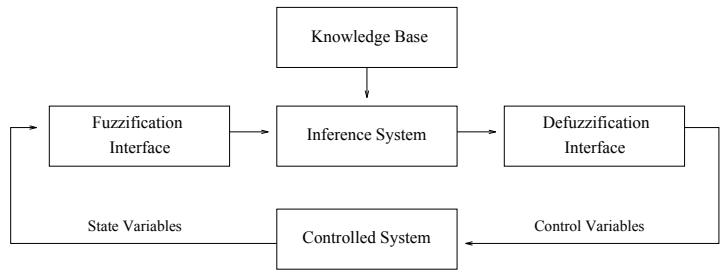
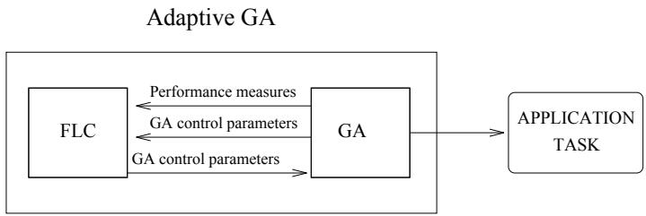
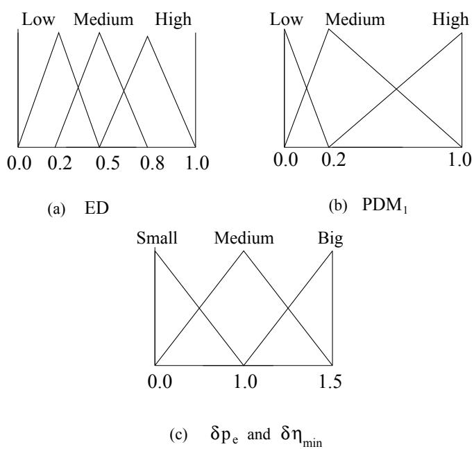

# Adaptation of Genetic Algorithm Parameters Based on Fuzzy Logic Controllers \*

Francisco Herrera and Manuel Lozano

Department of Computer Science and Artificial Intelligence   
University of Granada   
18071 - Granada, Spain

Abstract. The genetic algorithm behaviour is determined by the exploitation and exploration relationship kept throughout the run. Adaptive genetic algorithms have been built for inducing exploitation/exploration relationships that avoid the premature convergence problem and improve the final results. One of the most widely studied adaptive approaches are the adaptive parameter setting techniques. In this paper, we study these techniques in depth, based on the use of fuzzy logic controllers. Furthermore, we design and discuss an adaptive realcoded genetic algorithm based on the use of fuzzy logic controllers. Although suitable results have been obtained by using this type of adaptive technique, we report some reflections on open problems that still remain.

Keywords. Exploitation/exploration relationship, adaptive genetic algorithms, fuzzy logic controllers.

# 1 Introduction

GA behaviour is strongly determined by the balance between exploiting what already works best and exploring possibilities that might eventually evolve into something even better. The loss of critical alleles due to selection pressure, the selection noise, the schemata disruption due to crossover operator, and poor parameter setting may make this exploitation/exploration relationship (EER) disproportionate and produce the lack of diversity in the population ([38, 43, 40]). Under these circumstances a preeminent problem appears: the premature convergence problem.

Some tools for monitoring the EER were proposed in order to avoid the premature convergence problem and improve GA performance. These tools include modified selection and crossover operators (see [43] and [40]) and optimization of parameter settings ([24, 49]). However, finding robust genetic operators or parameter settings that allow the premature convergence problem to be avoided in any problem is not a trivial task, since their interaction with GA performance is complex and the optimal ones are problem dependent ([3]). Furthermore, different operators or parameter configurations may be necessary during the course of a run for inducing an optimal EER. For these reasons, many adaptive techniques were suggested for changing the GA configuration based on the current information about the search space in order to offer the most appropriate exploration/exploitation behaviour. One of the these techniques lies in the application of fuzzy logic controllers for adjusting the control parameter of GAs. The goal of this paper is to report on an extensive study of the parameter setting adaptation, based on the use of fuzzy logic controllers. For doing this, it is set up as follows: in Section 2, we review different parameter setting adaptive techniques presented in the literature, in Section 3, we tackle the study of adaptive GAs based on fuzzy logic controllers, in Section 4, we present different diversity measures that may be used by these FLCs, in Section 5, we review the applications of the FLCs for controlling GAs, in Section 6, we design an adaptive real-coded GA, in Section 7, open problems that still remain about the topic are discussed, finally some conclusions are presented in Section 8.

# 2 Adaptive Genetic Algorithms

In this section we briefly study the classification of the different adaptive methods proposed in the literature and we go into the parameter setting adaptation in depth.

# 2.1 Classifications of Adaptive Genetic Algorithms

Adaptive methods may be classified following two different ways. The first one takes into account the GA issues that are adapted throughout the GA run:

adaptive parameter settings ([32, 41, 7, 63, 11, 20, 14, 59, 60, 12, 3, 5, 38, 53, 1, 55, 34]),   
adaptive genetic operators ([42, 30, 31, 44]),   
adaptive genetic operator selection ([48, 54, 52, 62, 51]),   
− adaptive representation ([46, 61, 50]) and   
adaptive fitness function ([22, 42, 35, 45]).

The other one, suggested by Spears ([54]), concerns the interaction between the adaptive method and the evolutive process:

Tightly Coupled. The adaptation is driven by the internal forces of evolution itself. There are three levels where the adaptation may be carried out ([51]): the level of individuals, the level of subpopulations and the level of population. The level implicitly defines the time interval when the adaptation takes place. If, for instance, populations are used for adaptation, then a minimum number of generations is needed for evaluating the population. In contrast, individuals are evaluated after each generation. This approach is elegant and straightforward, since no new adaptive mechanism is needed, however, two possible problems may arise ([54]):

The coupling of the two search spaces could hinder the adaptive mechanism. As the population evolves, diversity will be lost in both spaces. If diversity has been lost, adaptation may be difficult to accomplish. •This mechanism may only work well with large population sizes, since the population is being used to sample the space of GAs.

- Uncoupled. A totally separate adaptive mechanism adjusts the GA. An uncoupled approach does not rely upon the GA for the adaptive mechanism. While this may alleviate the problems associated with coupling, such mechanisms appear to be difficult to construct, and involve a lot of separate bookkeeping. In [23], Goldberg wrote:

"Nature acts in a distributed fashion without central coordination or control. Such distributed processing gives nature and genetic algorithms a large measure of their global perspective by permitting different solutions to be explored in parallel".

With these words he pointed out his disagreement with the uncoupled mechanisms, since they break the original GA philosophy. Moreover, he suggested that the loss of explicit parallelism often implied by central control may reduce some portion of the search to serial hillclimbing. Loosely Coupled. The GA is partially used for the adaptive mechanism, i.e., either the population or the genetic operators are used in some fashion.

Next, we review the adaptive GAs based on adaptive parameter settings. This type of adaptive GAs have been widely studied.

# 2.2 Parameter Setting Adaptation

The GA control parameter settings such as mutation probability $\left( p _ { m } \right)$ , crossover probability $\left( p _ { c } \right)$ and population size $( N )$ are key factors in the determination of the exploitation versus exploration tradeoff. It has long been acknowledged that they have a significant impact on GA performance [24]. If poor settings are used, the EER may not be reached in a profitable way; the $\mathrm { G A s } ^ { \prime }$ performance shall be severely affected [14]. Next, we report on some adaptive approaches that are described in the literature for adjusting these parameters.

# 2.2.1. Adapting the Mutation Probability

At first glance, it would seem that premature convergence is best treated by an increase in the mutation probability to restore the lost alleles ([11]). However, there are some problems associated with this solution ([8]): 1) the high influx of material would disrupt the ongoing genetic search and 2) this task attempts to recover from convergence rather than to avoid it, and hence, may suffer from the loss of potentially valuable, genetic combinations. More suitable proposals for enforcing diversity through $p _ { m }$ have been proposed. Next, we review these.

A direction followed by GA research for the variation of $p _ { m }$ lies in the specification of an externally specified schedule which modifies it depending on the time, measured by the number of generations. A time-dependency of $p _ { m }$ was first suggested by Holland ([32]) himself, although he did not give a detailed choice of the parameter for the time-dependent reduction of $p _ { m }$ . Later on, in [20] and [12], the variation of $p _ { m }$ was proposed by decreasing it exponentially during the GA run. A theoretical argument for introducing a time-dependent schedule of $p _ { m }$ is presented in [3].

Mauldin ([41]) defined a uniqueness value as the minimum Hamming distance allowed between any offspring and all existing chromosomes in the population. If a new chromosome is closer than this to an existing chromosome, the allele values which match are randomly changed in the offspring until the uniqueness value is achieved. This implicitly represents an increase in the mutation probability. To ensure that the GA is allowed to converge, the uniqueness value is decreased as the search proceeds from a value of $k$ to 1.

The idea of sustaining genetic diversity through mutation is presented in [59, 60] as well. Mutation is invoked in response to increasing genetic homogeneity in the population. Population homogeneity is indirectly monitored by measuring the Hamming distance between the two parents during reproduction. The more similar the two parents, the more likely that mutation would be applied to bits in the offspring created by recombination.

In [3, 5], a coupled adaptive method for mutation probabilities was adopted. The principal features of this model are 1) each position of each chromosome has associated a mutation probability, 2) these probabilities are incorporated into the genetic representation of the chromosomes encoded as bitstrings and 3) they are also subject to mutation and selection, i.e., they undergo evolution as well as the chromosomes.

# 2.2.2 Adapting the Population Size

The population size is one of the most important choices faced by any user of GAs and may be critical in many applications. If the population size is too small, the GA may converge too quickly, whereas if it is too large, the GA may waste computational resources. Next, we present some approaches for the adaptation of $N$ .

One of the first attempts for controlling $N$ was made by Baker in [7]. Baker emphasized the importance of preventing rapid convergence rather than recovering from it. He observed that rapid convergence often occurs after a chromosome or small group of chromosomes contributes a large number of offspring through selection. Since population is finite, a large number of offspring for one chromosome means fewer offspring for the rest of the population. When too many chromosomes have no offspring at all, the result is a rapid loss of diversity and premature convergence. In order to recognize rapid convergence before the genetic material is lost, Baker presented a measure, called percent involvement, as the percentage of the current population which contributes offspring for the next generation. Baker proposed a dynamic population size method that enforces a lower bound on the percent involvement. This is done by adding chromosomes to the population until the acceptable value for the percentage involvement is reached. The population size decreases during periods of slow convergence.

A different proposal is attempted in [1]. In this paper a GA with varying population size (GAVaPS) was discussed. This algorithm introduces the concept of age of a chromosome, which is equivalent to the number of generations that such a chromosome stays alive. GAVaPS does not operates with a selection mechanism; the age of the chromosomes replaces the concept of selection. When a chromosome is born a lifetime is assigned to it. The death of this chromosome occurs when its age exceeds its lifetime value. In the calculation of the lifetime value the current state of the GA is taken into consideration. This state is described by the average, maximal and minimal fitness values in the current population and the maximal and minimal found so far. Any lifetime calculation strategy should assign the higher lifetime values to chromosomes having above-average fitness values. Different proposals were implemented and compared. None of them stood out as the best with regards to the results and its computational cost. Hence, it was pointed out that the choice of the optimal strategy of lifetime calculation is still an open problem and it deserves further investigation.

Finally, we point out that in [53], an algorithm was presented, which adjusts the population size with respect to the probability of selection error.

# 2.2.3 Adapting the Crossover Probability

In a paper by Wilson ([63]) on GAs for classifier systems, he claimed that dynamically varying the crossover probability may be beneficial. His approach is based on the use of an entropy measure over the population. Crossover probability is adjusted up slightly if entropy is falling and down if entropy is flat or rising. Another attempt for adapting the crossover probability is presented by Booker in [11]. He pointed out that the crossover operator is the key point for solving the premature convergence problem. Furthermore, he proposed varying the crossover probability depending on the percent involvement presented by Baker ([7]) (see previous subsection). Every percentage change in percent involvement will be countered with an equal and opposite percentage change in the crossover probability. Experiments carried out showed that ofline and online measures were improved with this model.

# 2.2.4 Adapting both the Crossover and Mutation Probabilities

In [38], two diversity functions were defined for describing GA behaviour and were used for handling the $p _ { c }$ and $p _ { m }$ parameters in order to induce an ideal EER. One of these diversity functions measures the diversity between chromosomes (BC) in the population and the other measures the diversity between the alleles (BA) in all the chromosomes. The former is concerned with the efficiency of genetic operators and the latter expresses the state of convergence. Li et al. ([38]) proposed a dynamic $G A$ that can approximate an ideal genetic procedure, which is an approach so that the EER can be automatically adjusted and the genetic operators will be most efficient. In order to construct a dynamic GA, the whole procedure is divided into three stages: initiation, search and refinement. In the initial stage, the values of the diversity measures are dependent on the initial conditions of the GA, so the diversity measure's behaviour is unpredictable. The control parameters are kept at their initial values at this stage. In the search stage, the control parameters are designed to vary and to guarantee a broad search and efficient exploitation. If the BC value is less than a minimum critical limit, the $p _ { c }$ is adjusted upwards slightly and if the BC value is larger than a maximum critical limit, the $p _ { c }$ is forced downwards slightly. According to the BA value, the $p _ { m }$ was varied from 0.001 to 0.2 to have sufficient alleles in the population. This stage was designated as the main part of the GA, i.e, half of the generation time. Finally, in the last stage, refinement, the balance must be designed towards exploitation and the search is forced in the local regions where there are higher probabilities of finding the optimum solutions. To do so, $p _ { m }$ decreases from the current value to a minimum value of 0.001 and $p _ { c }$ is help at a constant value of 0.6. The experiments showed that dynamic GA was near an ideal behaviour defined by Li et al. with respect to the level of diversity generated.

In [55], the use of adaptive probabilities of crossover and mutation was recommended to achieve the twin goals of maintaining diversity in the population and sustaining the convergence capacity of the GA. AGA was proposed, an adaptive GA where $p _ { c }$ and $p _ { m }$ are varied depending on the fitness values of the solutions. Each chromosome has its own $p _ { c }$ and $p _ { m }$ . Both are proportional to $( f _ { b e s t } - f ) / ( f _ { b e s t } - \bar { f } )$ ,where $f$ is the chromosome's fitness, $f _ { b e s t }$ is the population maximum fitness and $\bar { f }$ is the mean fitness. In this way, high-fitness solutions are protected, whilst solutions with subaverage fitnesses are totally disrupted. AGA increases $p _ { c }$ and $p _ { m }$ when the population tends to get stuck at a local optimum and decreases them when the population is scattered in the solution space. The factor $f _ { b e s t } - \bar { f }$ is used by AGA as a measure for detecting convergence.

In [14], a real-coded GA is implemented by using two types of crossover operators, guaranteed uniform crossover and guaranteed average, and three types of mutation operators, guaranteed mutation, guaranteed big creep and guaranteed little creep. These operators offer a wide range of exploration and exploitation levels. Each operator is given an initial application probability. For each reproduction event, a single operator is selected probabilistically according to the set of operator probabilities, as opposed to the technique used more commonly, in which both crossover and mutation could be applied to the same individual during reproduction. An adaptive process provides for the alteration of operator probabilities in proportion to the fitnesses of chromosomes created by the operators during the course of a run. Operators which create and cause the generation of better chromosomes are allotted higher probabilities, i.e., they should be used more frequently. On the other hand, operators producing offspring with a fitness which is lower than that of the parents should be used less frequently. In [34], a similar model is presented for a steady-state GA. This method adjusts the operators' probabilities after the generation of each offspring, rather than at

# 3 Adaptive GAs based on Fuzzy Logic Controllers

Currently, a certain body of expertise, experience and knowledge on GAs has become available as a result of empirical studies conducted over a number of years. This human expertise and knowledge would be very useful for increasing the capabilities of GAs to reach a suitable EER for avoiding premature convergence and improve GA behaviour. However, generally, too much of this information is vague, incomplete, or ill-structured to a certain degree, which causes it to be rarely applied. This latter feature suggests the use of fuzzy logic-based tools for dealing with this type of knowledge. One application of fuzzy logic (FL) that is useful for controlling GAs following control strategies underlying in the human expertise and knowledge are fuzzy logic controllers (FLCs). FLCs implement an expert operator's approximate reasoning process in the selection of a control action. An FLC allows one to qualitatively express the control strategies based on experience as well as intuition. These control strategies may be expressed in a form that permits both computers and humans to share them efficiently.

Next, we study the application of the FLCs for controlling GAs, before briefly describing the generic structure of FLCs.

# 3.1 Description of the FLCs

An FLC is composed by a knowledge base, that includes the information given by the expert in the form of linguistic control rules, a fuzzification interface, which has the effect of transforming crisp data into fuzzy sets, an Inference System, that uses them together with the knowledge base to make inference by means of a reasoning method, and a defuzzification interface, that translates the fuzzy control action thus obtained to a real control action using a defuzzification method. The generic structure of an FLC is shown in Figure 1 ([36]).

  
Fig.1. Generic structure of an FLC.

The knowledge base encodes the expert knowledge by means of a set of fuzzy control rules. A fuzzy control rule is a conditional statement with the form

"if a set of conditions are satisfied then a set of consequences can be inferred' in which the antecedent is a condition in its application domain, the consequent is a control action to be applied in the controlled system (notion of control rule) and both antecedent and consequent are associated with fuzzy concepts, that is, linguistic terms (notion of fuzzy rule).

The knowledge base is composed of two components, a data base, containing the definitions of the fuzzy control rules linguistic labels, i.e., the membership functions of the fuzzy sets specifying the meaning of the linguistic terms, and a rule base, constituted by the collection of fuzzy control rules representing the expert knowledge.

# 3.2 Application of the FLCs for Controlling GAs

Applications of FLCs for controlling GAs are to be found in [37, 64, 65, 2, 27, 10, 56]. The main idea is to use an FLC whose inputs are any combination of GA performance measures or current control parameters and whose outputs are GA control parameters. Current performance measures of the GA are sent to the FLC, which computes new control parameters values that will be used by the GA. Figure 2 shows this process. Clearly, under Spears' classification, this adaptive technique is uncoupled.

  
Fig.2. Structure of an Adaptive GA based on FLCs.

For designing a FLC that controls a GA, the following steps are needed:

# 1. Define the inputs and outputs

Inputs should be robust measures that describe GA behaviour and the effects of the genetic setting parameters and genetic operators. In [56], some possible inputs were cited: diversity indices, maximum, average and minimum fitness, etc. In [37] and [64, 65], it is suggested that current control parameters may also be considered as inputs. Since an adaptive GA based on FLCs should maintain an adequate EER for avoiding premature convergence, we think that diversity measures stand out as important input candidates due to the fact that they describe the convergence state of the population. In Section 4, a broad study of this type of measures is carried out.

Outputs indicate values of control parameters or changes in these parameters ([37]). In [56], the following outputs were reported: $p _ { m } , p _ { c } , N$ ,selective pressure, the time the controller must spend in a target state in order to be considered successful, the degree to which a satisfactory solution has been obtained, etc.

2. Define the data base

Each input and output should have an associated set of linguistic labels. The meaning of these labels is specified through membership functions of fuzzy sets. So, it is necessary that every input and output have a bounded range of values in order to define these membership functions over it.

3. Obtain the rule base

After selecting the inputs and outputs and defining the data base, the fuzzy rules describing the relations between them should be defined. There are different ways to do so:

(a) using the experience and the knowledge of the GA experts or (b) using an automatic learning technique for those cases where knowledge or expertise are not available.

In [37], an automatic fuzzy design technique is used for obtaining the rule base (and the data base as well). The technique is very similar to the metaGA of Grefentette [24]. By using an automatic technique, relevant relations and membership functions may be automatically determined and may offer insight for understanding the complex interaction between GA control parameters and GA performance.

# 4 Diversity Measures

There are two types of diversity measures that describe the state of the population: genotypic diversity measures (GDMs) and phenotypic diversity measures (PDMs). GDMs involve the genetic material held in the population whereas PDMs concern the fitness of the chromosomes. Next, we review each one of these measure types.

# 4.1 Genotypic Diversity Measures

GDMs describe variation or lack of similarity between the genetic material, e.g., alleles, chromosomes, etc. Different ways have been followed for defining them, such as using allele frequency measures, statistical dispersion measures, histograms over the action interval of the genes, Hamming distance, Euclidean distance, entropy measures, etc. Next, we summarize some of these.

# 4.1.1 GDMs Based on Allele Frecuencies

Diversity measures based on allele frequencies are common for binary-coded GAs (BCGAs). De Jong, in [15], proposed two diversity measures based on allele frequencies, the lost alleles, a count of the gene positions which are completely converged, i.e., the number of gene positions for which the entire population has the same allele, and the converged alleles, a count of the gene positions which are at least $9 5 \%$ converged, i.e., the number of gene positions for which $9 5 \%$ of the population has the same allele. Baker ([8]) claimed that these measures do not indicate the overall convergence in the population, so he presented the commitment, which is the average convergence of each gene position. For example, if the individuals are composed of 5 genes, and each gene has converged by $1 0 0 \%$ , $8 0 \%$ , $9 5 \%$ , $5 0 \%$ , and $7 0 \%$ , respectively, then the commitment is $\frac { 1 0 0 + 8 0 + 9 5 + 5 0 + 7 0 } { 5 }$ . Collins et al. ([13]) measure the allele diversity of a BCGA population by comparing the current allele frequencies with the expected allele frequencies of a maximally diverse population. Maximum diversity occurs when each allele frequency is 0.5, since each gene position has two possible alleles. The diversity of alleles at position $i$ is defined as

$$
D _ { i } = 1 - 4 ( 0 . 5 - f r e c _ { i } )
$$

where $f r e c _ { i }$ is the current frequency of the 0 allele at position i. $D _ { i }$ can range from 0, which indicates complete convergence, to 1, which indicates the maximum possible genetic diversity. The diversity of the population is calculated as the average value of the $D _ { i }$ . Mauhfoud ([40]) presented a general model of diversity measures based on the idea of comparing a frequency distribution associated with a particular feature of the elements of the population and a distribution representing the full diversity with respect to this feature. The diversity measures of Mauhfoud take on real values in the range from O to $M A X$ , with 0 indicating no diversity, higher values indicating higher levels of diversity, and $M A X$ indicating maximal diversity. Mauhfoud demostrated that the proposals of De Jong and Collins et al. are instances of his model.

# 4.1.2 GDMs Based on Histograms

In [33], a measure of diversity, called total allele lost, for a population with integer-coded chromosomes, was presented. The action interval of each gene, $[ - 1 0 , 1 0 ]$ , was divided into seven subintervals, $I _ { 1 } = [ - 1 0 , - 8 ] , I _ { 2 } = [ - 7 , - 5 ] , . . . , I _ { 7 } =$ [8, 10]. A histogram, $h i s t ( \cdot , \cdot )$ , was computed such as for each position $i$ of the chromosomes and each interval $I _ { j }$ $I _ { j } , h i s t ( i , j )$ stores the number of alleles at position $i$ that belong to the subinterval $I _ { j }$ . For each position $i$ , a measure, $A L ( \cdot )$ , called allele lost, was defined as

$$
A L ( i ) = \sum _ { j = 1 } ^ { 7 } { \mathrm { n u m b e r ~ o f ~ z e r o s ~ i n ~ h i s t ( j , ~ i ) } } .
$$

So, the total allele lost was defined as the sum of the $A L ( \cdot )$ measures. This measure has a bounded range of values, therefore it is adequate as the input for an FLC. A similar measure is defined in [50] for detecting convergence of binarycoded GAs that works on continuous spaces. The action interval associated with each coded parameter in the chromosomes is divided into four zones, which have the same length, called quarters. A histogram is computed on the quarters, with the parameter's available values in the population. Then, the intersections of the quarters are considered and the associated values of the histogram are calculated. With these intervals, statistics are created. If the sampling rate of the most sampled intersection interval exceeds a trigger threshold, then convergence in such an interval is assumed.

# 4.1.3 GDMs Based on Hamming Distance

Other approaches for measuring the diversity of BCGAs are based on the Hamming distance. Louis et al. ([39]) calculated the Hamming distance between all non-redundant combinations of two strings and take an average. Whitley et al. ([61]) proposed measuring the Hamming distance between the worst and the best chromosomes in the population for monitoring population diversity.

# 4.1.4 GDMs Based on Euclidean Distance

For real-coded GAs, it seems interesting to dispose of GDMs based on the Euclidean distance between chromosomes. We propose one of these measures, which is based on the Euclidean distances of the chromosomes in the population from the best one. It is denoted as $E D$ .

$$
E D = \frac { \bar { d } - d _ { m i n } } { d _ { m a x } - d _ { m i n } }
$$

where $\begin{array} { r } { \bar { d } = \frac { 1 } { N } \sum _ { i = 1 } ^ { N } d \big ( C _ { b e s t } , C _ { i } \big ) } \end{array}$ , $d _ { m a x } = \operatorname* { m a x } \{ d ( C _ { b e s t } , C _ { i } ) | C _ { i } \in P \}$ and $d _ { m i n } =$ $\operatorname* { m i n } \{ d ( C _ { b e s t } , C _ { i } ) | C _ { i } \in P \}$ . $P$ denotes the population of real-coded chromosomes. The range of $E D$ is $[ 0 , 1 ]$ . If $E D$ is low, most chromosomes in the population are concentrated around the best chromosome and so convergence is achieved. If $D E$ is high most chromosomes are not biased toward the current best element.

# 4.1.5 GDMs Based on Dispersion Statistical Measures

Diversity measures for BCGAs based on dispersion statistical measures have been considered as well. This is the case of Li et al ([38]), which proposed two diversity measures: the diversity between the chromosomes (BC) and the diversity between the alleles (BA). If it is considered that the population is a matrix, in which a row expresses a chromosome and a column an allele, then BC and BA are defined as follows:

$\star$ diversity between the chromosomes $B C = \frac { \sum _ { i } s _ { i } ^ { 2 } } { N - 1 } - \frac { S ^ { 2 } } { L * N }$   
$\star$ diversity between the alleles $B A = \frac { \sum _ { j } s _ { j } ^ { 2 } } { { \cal L } - { \frac { S } { { \cal L } \ast { \cal N } } } }$   
where $N$ is the population size, $L$ the length of the chromosomes, $S$ is the sum of genes $^ { \dag } 1 ^ { \dag }$ , $S _ { i }$ expresses the sum over a row $i$ and $S _ { j }$ expresses the sum over a column $j$ . Li et al. showed that BC and BA show the following properties:   
1. If the population is homogeneous in either 0 or 1, BC and BA are zero.   
2. When all the chromosomes in the population are identical, BC is zero and BA holds a constant value that is dependent on how many genes 1 are in a chromosome.   
3. BA is independent from the crossover operator.   
4. BC and BA are always less than $\textstyle { \frac { L } { N } }$ and $\textstyle { \frac { N } { L } }$ , respectively..

These measures show clear limits and their ideal behaviour throughout the GA run was studied in depth by Li et al. in [38].

In [27], other instances of diversity measures of the same type were considered for real coding. They were based on the the variance average of the chromosomes (VAC) and the average variances of the alleles (AVA): \* The variance average chromosomes VAC = $\begin{array} { r } { V A C = \frac { \sum _ { i = 1 } ^ { N } ( \bar { S } _ { i } - \bar { S } ) ^ { 2 } } { N } } \end{array}$ $\star$ The average variances alleles $\begin{array} { r } { A V A = \frac { \sum _ { j = 1 } ^ { N } \sum _ { i = 1 } ^ { L } \left( S _ { i j } - \bar { S } _ { j } \right) ^ { 2 } } { L N } } \end{array}$ where $S _ { i }$ , $\mathrm { i } = 1$ , .., N, denotes the chromosome $i$ , $S _ { j } , \mathrm { { j } = 1 , \ . . . , \mathrm { { L } } }$ , denotes the vector of genes with position $j$ in the population, $S _ { i j }$ , denotes the gene with position $j$ in the chromosome $i$ , and

$$
\bar { S } _ { i } = \frac { \sum _ { j = 1 } ^ { L } S _ { i j } } { L } ~ , ~ \bar { S } = \frac { \sum _ { i = 1 } ^ { L } \sum _ { j = 1 } ^ { N } S _ { i j } } { L N } \mathrm { ~ a n d ~ } \bar { S } _ { j } = \frac { \sum _ { i = 1 } ^ { N } S _ { i j } } { N } .
$$

The properties of these diversity measures are the following: they are indifferent to mutual exchange of two chromosomes in a population; and when all the chromosomes in a population are almost identical, the VAC and AVA measures take low values.

In [9], four diversity measures were defined in a similar fashion for real coding as well. They were called: the within-individual diversity $( W _ { b } )$ , the betweenindividual diversity $\left( B _ { b } \right)$ , the within-gene diversity $( W _ { g } )$ and the between-gene diversity $\left( B _ { g } \right)$ . A total diversity measure was defined as the sum of the previous four measures.

# 4.1.6 GDMs Based on Entropy Measures

Finally, we point out that some authors used entropy measures for describing the convergence state of the population ([63, 25]).

# 4.2 Phenotypic Diversity Measures

The first measures based on fitness function presented for describing the convergence state of the population are the percent involvement ([7]) (See Subsection 2.2.2) and the reproduction rate ([8]) (defined in the same way). The principal feature of this type of measures is that they allow premature convergence to be predicted rather than being detected.

Other phenotypic diversity measures have been proposed. Most of them are defined through the combinations of some of the following measures: average fitness $( \bar { f } )$ , the best fitness $\left( f _ { b e s t } \right)$ and the worst fitness $\left( f _ { w o r s t } \right)$ . Srinivas et al. ([55]) used $f _ { b e s t } - \bar { f }$ for detecting convergence. This measure is likely to be less for a population that has converged to an optimum solution than that for a population scattered across the solution space. Lee et al. ([37]) propose two performance measures that may be considered as phenotypic diversity measures:

$$
P D M _ { 1 } = \frac { f _ { b e s t } } { \bar { f } } \ \mathrm { a n d } \ P D M _ { 2 } = \frac { \bar { f } } { f _ { w o r s t } } .
$$

$P D M _ { 1 }$ and $P D M _ { 2 }$ belong to the interval [0, 1]. If they are near to 1, convergence has been reached, whereas if they are near to 0, the population shows a high level of diversity.

In [2], a measure called fitness range was defined as the difference between the fitness values of the best and worst chromosomes.

Another phenotypic diversity measure is the Online average ([15]), which is the average fitness of all the chromosomes tested during the search. This measure would be appropriate in situations where the testing of every chromosome must be paid for and penalizes GAs that must test many poor chromosomes before locating good ones. To do well in online measures, a GA must quickly decide where the best values lie and concentrate its search there ([49]).

Finally, in [42], another phenotypic diversity measure called span was defined as follows:

$$
s p a n = { \frac { \sqrt { { \frac { 1 } { N - 1 } } \sum _ { i = 1 } ^ { N } ( f _ { i } - { \bar { f } } ) ^ { 2 } } } { { \frac { 1 } { n } } \sum _ { i = 1 } ^ { N } f _ { i } } } .
$$

The maximum value of span is $\sqrt { N - 1 }$ . span was used in [42] as a measure of the difficulty of the fitness function.

# 5 FLC Applications for Controlling GAs

Next, we review different models of application of FLC to the control of GAs described in the literature.

# 5.1 Dynamic Parametric GAs

In [37], the dynamic parametric GA (DPGA) was proposed, a GA that uses an FLC for controlling GA parameters. The inputs to the FLC are any combination of GA performance measures or current control settings, and outputs may be any of the GA control parameters. An automatic fuzzy design technique was proposed for obtaining both the data base and the rule base for those cases where knowledge or expertise are not available. An example was developed by Lee et al. ([37]); they proposed to build three FLCs. All of them use the measures $P D M _ { 1 }$ , $P D M _ { 2 }$ (see Subsection 4.2) and the change in the best fitness since the last control action as inputs. The outputs of the three FLCs are variables that control variations in the current mutation probability, crossover probability and population size, respectively. For example, such output for the control of the population size, represents the degree to which the current population size should vary. The new population size is computed by multiplying the output value by the current population size.

The automatic fuzzy design mechanism was executed for learning both the data base and the rule base for this example. A DPGA based on the resultant FLCs were used in a particular problem: the inverted pendulum control task. The results obtained exhibited better performance than a simple, static GA.

# 5.2 Fuzzy GAs

In [64, 65], the use of FLCs for control GAs is considered for solving two problems to which a standard GA may be subjected: very slow search speed and premature convergence. For Xu et al. ([64, 65]) these problems are due to: 1) control parameters not well chosen initially for a given task, 2) parameters always being fixed even though the environment in which the GA operates may be variable and 3) difficulties resulting from selection of other parameters such as population size and in understanding their influence, both individually and in combination, on the GA's performance. They proposed fuzzy GAs (FGA), i.e., GAs integrated with FLCs. FGAs may 1) choose control parameters before GA's run, 2) adjust the control parameters on-line to dynamically adapt to new situations and 3) assist the user in accessing, designing, implementing and validating the GA for a given task.

Experiments were carried out with an FGA, in which the adaptation of the parameters was performed by two FLCs. Both of them had the same inputs: generation and population size. The outputs were $p _ { c }$ and $p _ { m }$ . They proposed using the rule bases shown in Table 1.

The FGA stood out as the most efficient algorithm against a standar GA in solving the travelling salesman and other optimization problems.

# 5.3 Fuzzy Government

In [2], it is claimed that evolutionary algorithms require human supervision during their routine use as practical tools for the following reasons: 1) for detecting the emergence of a solution, 2) for tuning algorithm parameter and 3) for monitoring the evolution process in order to avoid undesiderable behaviour such as premature convergence. Arnone et al. ([2]) advised that any attempt to develop artificial intelligence tools based on evolutionary algorithms should take these issues into account . They proposed using FLCs for this task. They called the collection of fuzzy rules and routines in charge of controlling the evolution of the GA population fuzzy government. In [2], fuzzy government was applied to the symbolic inference of formulae problem. Genetic programming was used to solve the problem along with different FLCs, which dynamically adjusted the maximum length for genotypes, acted on the mutation probability, detected the emergence of a solution and stopped the process. The results showed that the performance of the fuzzy governed GA was almost impossible to distinguish from the performance of the same algorithm operated directly with human supervision.

Table 1. Rule Bases for the Control of $p _ { c }$ and $p _ { m }$ , respectively   

<table><tr><td rowspan=1 colspan=1></td><td rowspan=1 colspan=3>Population Size</td><td rowspan=1 colspan=1></td><td rowspan=1 colspan=3>Population Size</td></tr><tr><td rowspan=1 colspan=1>Generation</td><td rowspan=1 colspan=1>Small</td><td rowspan=1 colspan=1>Medium</td><td rowspan=1 colspan=1>Big</td><td rowspan=1 colspan=1>Generation</td><td rowspan=1 colspan=1>Small</td><td rowspan=1 colspan=1>Medium</td><td rowspan=1 colspan=1>Big</td></tr><tr><td rowspan=1 colspan=1>Short</td><td rowspan=1 colspan=1>Medium</td><td rowspan=1 colspan=1>Small</td><td rowspan=1 colspan=1>Small</td><td rowspan=1 colspan=1>Short</td><td rowspan=1 colspan=1>Large</td><td rowspan=1 colspan=1>Medium</td><td rowspan=1 colspan=1>Small</td></tr><tr><td rowspan=1 colspan=1>Medium</td><td rowspan=1 colspan=1>Large</td><td rowspan=1 colspan=1>Large</td><td rowspan=1 colspan=1>Medium</td><td rowspan=1 colspan=1>Medium</td><td rowspan=1 colspan=1>Medium</td><td rowspan=1 colspan=1>Small</td><td rowspan=1 colspan=1>Very Small</td></tr><tr><td rowspan=1 colspan=1>Long</td><td rowspan=1 colspan=1>Very Large</td><td rowspan=1 colspan=1>Very Large</td><td rowspan=1 colspan=1>Large</td><td rowspan=1 colspan=1>Long</td><td rowspan=1 colspan=1>Small</td><td rowspan=1 colspan=1>Very Small</td><td rowspan=1 colspan=1>Very Small</td></tr></table>

# 5.4 Other Attempts

In [27], the use of FLCst was propose for monitoring the population diversity and the EER of a real-coded GA using the GDMs based on dispersion statistical measures, VAC and AVA. It was proposed to build two FLCs that control $p _ { c }$ and $p _ { m }$ , depending on VAC and AVA, respectively. The range for the diversity measures, VAC and AVA, was established as follows: $V A C _ { m i n } = 0$ and $V A C _ { m a x }$ as the maximun value obtained at the first stage, for some value higher than it, we automatically interchange the maximun value; and similarly for AVA, with $A V A _ { m i n } = 0$ . The fuzzy rules suggested were the following:

If VAC is low then $p _ { c }$ should be adjusted upwards slightly.

If VAC is high then $p _ { c }$ should be forced downwards slightly. and

If AVA is low then $p _ { m }$ should be be adjusted upwards slightly.

If AVA is high then $p _ { m }$ should be forced downwards slightly.

Another attempt to apply FLCs for improving GA behaviour is to be found in [10].

# 6 An Adaptive Real-Coded GA Based on FLCs

In this Section, we propose and study an adaptive real-coded GA based on FLCs, called ARGAF. Its principal features are the following:

1. It applies two different crossover operators; one with exploitation properties and another with exploration properties. A parameter, denoted as $p _ { e }$ , defines the frequency of application of the exploitative operator.   
2. It uses the linear ranking selection mechanism ([7]).   
3. The $p _ { e }$ parameter and the $\eta _ { m i n }$ parameter of the linear ranking mechanism that determines the selective pressure produced by the selection, are adjusted using two FLCs. The inputs of the FLCs are a genotypic diversity measure and a phenotypic diversity measure. The first measure determines the quantity of diversity in the population and the second the quality of this diversity.

Next, we describe the conceptual foundations of ARGAF in greater detail, then, we formulate the FLCs used in ARGAF and finally we test it through empirical study.

# 6.1 Conceptual Foundations of ARGAF

In this subsection, we describe the types of crossover operators that are used by ARGAF. Furthermore, we justify the adaptation of the $p _ { e }$ and $\eta _ { m i n }$ parameters and finally, we report some considerations about the effects of their integration.

# 6.1.1 Crossover Operators Used by ARGAF

Different proposals of crossover operators for RCGAs are available in the literature (see [28]). We have built different versions of ARGAF with the following types:

fuzzy connectives-based crossovers (FCB-crossovers) ([27, 29]), dynamic FCB-crossovers ([31, 30]), heuristic FCB-crossovers ([30]) and   
dynamic heuristic FCB-crossovers ([30]).

Next, we comment on some of the main features of these crossover operators and describe how ARGAF uses them.

FCB-crossovers These crossovers include explorative and exploitative crossovers. The first ones are the $F$ -crossover and $S$ -crossover operators, whereas the second ones are the $M$ -crossover operators. Different familes of $F$ , $S _ { - }$ and $M$ -crossover operators were presented in [27, 29]: the Logical, Hamacher, Algebraic and Einstein ones. Logical $F$ -and $S$ -crossover operators show the lowest degree of exploration. The crossover strategy for ARGAF using FCB-crossovers is the following:

For each pair of chromosomes from a total of $p _ { c } \cdot N$ Do If a random number $r \in [ 0 , 1 ]$ is lower than $p _ { e }$ Then Generate two offspring, the result of applying two $M$ -crossovers. Else Generate two offspring, the result of applying an $F$ -crossover and an $S$ crossover.

The two offspring substitute their parents in the population.

Dynamic FCB-crossovers These operators keep a suitable sequence between the exploration and the exploitation throughout the GA run: "to protect the exploration in the initial stages and the exploitation later". This sequence is suitable for avoiding the premature convergence problem and for improving GA efficiency [42]. The $\mathcal { F }$ -crossovers and the $s$ -crossovers vary the exploration degree throughout the GA run: firstly, high diversity is induced, later on, their behaviour is similar to the one in the Logical $F$ and $S .$ -crossovers and so convergence is caused. The $\mathcal { M }$ -crossovers vary the exploitation degree throughout the GA run. Different families of dynamic FCB-crossover were presented in [31, 30]: the Dubois, Dombi and Frank ones. Dubois operators supply the lowest levels of diversity. The crossover strategy for ARGAF using dynamic FCB-crossovers, $S T _ { 2 }$ , is similar to $S T _ { 1 }$ , but now $\mathcal { F } \mathrm { ~ , ~ } \mathcal { S } \mathrm { - }$ and $\mathcal { M }$ -crossover operators are applied.

Heuristic FCB-crossovers Heuristic FCB-crossover operators use the fitness parents for leading the search process towards the most promising zones. Two types were presented in [30]: one with heuristic exploration properties, called dominated heuristic FCB-crossovers, that attempts to introduce a useful diversity into the GA population; another with heuristic exploitation properties, called biased heuristic FCB-crossovers, that induces a biased convergence led toward the best elements. The crossover strategy for ARGAF using heuristic FCB-crossovers, $S T _ { 3 }$ , is the following:

$\star$ Strategy $S T _ { 3 }$

Repeat $p _ { c } \cdot N$ times Choose a pair of parents If a random number $r \in [ 0 , 1 ]$ is lower than $p _ { e }$ Then Generate an offspring, the result of applying a biased heuristic FCBcrossover. Else Generate a offspring, the result of applying an dominated heuristic FCB-crossover.

The offspring generated substitute one of its parents. It shall never be considered as a parent.

Dynamic Heuristic FCB-crossovers Dynamic heuristic FCB-crossovers put together the heuristic properties and the features of the dynamic FCB-crossover operators. Again, two types were presented in [30]: the dynamic dominated heuristic FCB-crossovers and the dynamic biased heuristic FCB-crossovers. The crossover strategy for ARGAF using dynamic heuristic FCB-crossovers, $S T _ { 4 }$ , is analogous to $S T _ { 3 }$ .

Next, we justify the reasons for the adaptation of the parameter $p _ { e }$

# 6.1.2 Adaptation of the $p _ { e }$ parameter

The role of the $p _ { e }$ parameter is to establish the frequency of application of each crossover type (the exploitative and explorative ones). It is a control parameter for the selection of crossover operators.

The crossover operator plays an important role in the RCGA's performance ([19, 58, 29, 30]). The value of $p _ { e }$ strongly influences the EER induced by crossover; if $p _ { e }$ is low, ARGAF shall generate diversity and so exploration takes effect, whereas if it is high, the current diversity shall be used for generating best elements and so exploitation comes into force. With the adaptation of $p _ { e }$ , ARGAF may handle the EER produced by crossover in a suitable way.

Many adaptive GAs include the crossover operator as a key element in the adaptation mechanism ([48, 14, 54, 52, 62, 30, 31]). The idea of an adaptive selection between crossover operators with different explorative or exploitation properties appears in [54] and [14]. In the first paper, a tightly coupled adaptive BCGA was defined that considers only two forms of crossover: the two-point and uniform ones. It was claimed that the use of these operators is reasonable since they represent two extremes regarding their associated disruption level: the lower one is for two-point crossover whilst the higher one is for uniform crossover ([16]). Thus, it is natural to allow the GA to explore a relative mixture of these two operators.

The model in the second reference was described in Subsection 2.2.4; an uncoupled adaptive RCGA adjusted parameters similar to $p _ { e }$ . These parameters defined the frequency of crossover and mutation operators with different exploitation and exploration properties.

We should point out that although the adaptation of $p _ { e }$ may be considered as an instance of adaptive parameter settings, it may also be considered to be an instance of adaptive genetic operator selection.

Now, we explain the reasons for tuning the selective pressure $\left( \eta _ { m i n } \right)$ along with $p _ { e }$ .

# 6.1.3 Adaptation of the $\eta _ { m i n }$ parameter

The final results for GAs depend on the interactions between their components (genetic operators, parameter settings, etc). If we want to control a particular GA element, these interactions should be taken into account, and so other elements need to be controlled as well. Since $p _ { e }$ is controlled, we consider that selection should be controlled as well; one reason for doing so is explained in [17]:

Although the amount of exploration provided by crossover will be affected by the crossover rate, it will also be affected by selection. As selection pressure is increased, variability is decreased in the population, and consequently there are fewer differences that crossover can explore by recombination. To the extent that the population has converged, there is less information that can be shared between individuals. In short, crossover is severely affected by the exploration-exploitation tradeoff. The amount of exploration performed by crossover is limited by the amount of exploitation performed by selection. Increased exploitation by selection leads to decreased exploration by crossover.

These words highlight the important relations between the crossover operator and the selection mechanism. These relations have been considered for improving the GA search by some authors; in [18], for example, it is advised that a disruptive crossover operator accompanied by a conservative selection strategy provides an effective search.

So, a feedback between crossover and selection must be established, allowing a suitable balance between their actions to be reached through the GA run. For doing so, in ARGAF, the selective pressure of the linear ranking selection mechanism is adjusted along with $p _ { e }$ . In [6], the following properties of selection mechanisms are pointed out which seem particularly desirable in order to easily control the characteristics of the search process by means of varying the control parameters of selection mechanisms:

1. The impact of the control parameters on selective pressure should be simple and predictable.   
2. One single control parameter for selective pressure is preferable.   
3. The range of selective pressure that can be made by varying the control parameter should be as large as possible.

Linear ranking mechanism matches these requeriments well. In this selection mechanism the selective pressure is determined by the parameter $\eta _ { m i n } \in [ 0 , 1 ]$ . If $\eta _ { m i n }$ is low, high pressure is achieved, whereas if it is high, the pressure is low.

Finally, we point out that Baker suggested, in [7], adapting selection as well; he proposed switching between two selection mechanisms with different properties when a rapid convergence is predicted.

# 6.1.4 An Integrated Frame

Using the $p _ { e }$ parameter, ARGAF controls the effects of crossovers, i.e., either generating diversity or using diversity, whereas using the $\eta _ { m i n }$ parameter, it controls the effects of selection, i.e., either keeping diversity or eliminating diversity.

The joint management of these parameters allows ARGAF to administer the diversity in a suitable way. For example, if useful diversity is detected by ARGAF, then it sets selection for keeping diversity and crossover for using it. If the level of diversity is high and its quality is not good, then ARGAF increases the selective pression and tries to obtain better elements by increasing exploitation by means of crossover. In the rule base presented below, all these considerations are highlighted.

# 6.2 Design of the FLCs Used by ARGAF

In this subsection, we discuss the different steps in the design of the FLCs used by ARGAF. First, we consider the inputs and outputs by establishing their associated ranges and linguistic labels, then we define the data base and the rule base.

# 6.2.1 Inputs

Two diversity measures are considered as inputs. One is the genotypic diversity measure $E D$ described in Subsection 4.1.4 and the other is the phenotypic diversity measure $P D M _ { 1 }$ presented in Subsection 4.2. The first measure represents the quantity of diversity of the genetic material in the population and the second the quality of this diversity. Most adaptive approaches based on diversity measures use only one of these measures, i.e. either a genotypic diversity measure or a phenotypic diversity measure (see Subsection 2.2). We think that it is more adequete to control the EER of the RCGAs using two diversity measures; one of each type. The main goal of the FLCs used by ARGAF is to maintain genotypic diversity, but with good properties, i.e, with an apropriate phenotypic diversity. In [21] it is stated that maintaining diversity for its own sake is not the issue; by itself, it doesn't guarantee the improvement of GA behaviour. Instead, we need to maintain appropriate diversity, i.e., diversity that in some way helps cause good chromosomes, i.e., useful diversity ([40]). Using a genotypic diversity measure and a phenotypic diversity measure we may measure the quantity and quality of the diversity. In this way, useful diversity may be first detected and later handled.

The range of $E D$ and $P D M _ { 1 }$ is [0, 1]. The linguistic label set of these inputs is $\{ L o w , M e d i u m , H i g h \}$ . Table 2. shows the correspondences between the $E D$ measure and the level of genotypic diversity and the $P D M _ { 1 }$ measure and the level of phenotypic diversity.

# 6.2.2 Outputs

The outputs are variables that control the variation on the current $p _ { e }$ and $\eta _ { m i n }$ parameters, which are kept within the range [0.25, 0.75]. These variables, noted as $\delta p _ { e }$ and $\delta \eta _ { m i n }$ , represent the degree to which the current $p _ { e }$ and $\eta _ { m i n }$ should vary, respectively. The variations shall be carried out by multiplying the $\delta p _ { e }$ and $\delta \eta _ { m i n }$ values, obtained by the FLC, by the current $p _ { e }$ and $\eta _ { m i n }$ values, respectively. The action interval of $\delta p _ { e }$ and $\delta \eta _ { m i n }$ is [0.5, 1.5] and its associated linguistic labels shall be $\{ S m a l l , M e d i u m , B i g \}$ as well.

Table 2. Correspondences between the diversity measures and the diversity levels   

<table><tr><td>ED</td><td>Genotypic Diversity</td><td>P D M1 Phenotypic Diversity</td></tr><tr><td>Low Low</td><td>Low</td><td>High</td></tr><tr><td>Medium</td><td>Medium</td><td>Medium Medium</td></tr><tr><td>High</td><td>High</td><td>High Low</td></tr></table>

# 6.2.3 Data Base

The data base is shown in Figure 3. The meaning of the linguistic terms associated with inputs $E D$ is depicted in (a), the ones for $P D M _ { 1 }$ in (b) and finally, the ones for $\delta p _ { e }$ and $\delta \eta _ { m i n }$ in (c). For each linguistic term, there is a triangular fuzzy set that defines its semantic, i.e, its meaning.

  
Fig.3. Meaning of the linguistic terms associated with the inputs and the outputs

# 6.2.4 Rule Bases

The rules describe the relation between the inputs and outputs. Table 3. shows the rule bases used by the FLCs of ARGAF.

Table 3. Rule Bases for the Control of $p _ { e }$ and $\eta _ { m i n }$ , respectively   

<table><tr><td rowspan=1 colspan=1></td><td rowspan=1 colspan=3>P D M1</td></tr><tr><td rowspan=1 colspan=1>ED</td><td rowspan=1 colspan=1>Low</td><td rowspan=1 colspan=1>Medium</td><td rowspan=1 colspan=1>High</td></tr><tr><td rowspan=1 colspan=1>Low</td><td rowspan=1 colspan=1>Small</td><td rowspan=1 colspan=1>Small</td><td rowspan=1 colspan=1>Medium</td></tr><tr><td rowspan=1 colspan=1>Medium</td><td rowspan=1 colspan=1>Big</td><td rowspan=1 colspan=1>Big</td><td rowspan=1 colspan=1>Medium</td></tr><tr><td rowspan=1 colspan=1>High</td><td rowspan=1 colspan=1>Big</td><td rowspan=1 colspan=1>Big</td><td rowspan=1 colspan=1>Medium</td></tr></table>

<table><tr><td rowspan=1 colspan=1></td><td rowspan=1 colspan=3>P D M1</td></tr><tr><td rowspan=1 colspan=1>ED</td><td rowspan=1 colspan=1>Small</td><td rowspan=1 colspan=1>Medium</td><td rowspan=1 colspan=1>Large</td></tr><tr><td rowspan=1 colspan=1>Low</td><td rowspan=1 colspan=1>Small</td><td rowspan=1 colspan=1>Medium</td><td rowspan=1 colspan=1>Big</td></tr><tr><td rowspan=1 colspan=1>Medium</td><td rowspan=1 colspan=1>Small</td><td rowspan=1 colspan=1>Big</td><td rowspan=1 colspan=1>Big</td></tr><tr><td rowspan=1 colspan=1>High</td><td rowspan=1 colspan=1>Small</td><td rowspan=1 colspan=1>Small</td><td rowspan=1 colspan=1>Big</td></tr></table>

# 6.3 Experiments

Minimization experiments on four functions shown in Table 4., were carried out in order to study the efficiency of ARGAF. The number of variables, $n$ , is 25. $f _ { 1 }$ is a continuous, strictly convex and unimodal function. $f _ { 2 }$ is a continuous and unimodal function, with the optimum located in a steep parabolic valley with a fat bottom. This feature will probably cause slow progress in many algorithms, since they must permanently change their search direction to reach the optimum. $f _ { 3 }$ is a scalable, continuous and multimodal function which is produced from $f _ { 1 }$ by modulating it with $a \cdot c o s ( \omega \cdot x _ { i } ) .$ $f _ { 4 }$ is a continuous and multimodal function. This function is very difficult to optimize because it is non-separable.

Table 4. Test functions   

<table><tr><td>• Sphere model ([15, 47])</td><td>• Generalized Rosenbrock&#x27;s function ([15])</td></tr><tr><td>f(x) = ∑ i=1 x2 -5.12 ≤ xi ≤ 5.12 f1 = f1(0, . . . , 0) = 0</td><td>f2(x) = ∑=1 (10· (xi+1 − x)2 + xi − 1)2) −5.12 ≤ xi ≤ 5.12 $f2} = f2 (1, . . . , 1) = 0</td></tr><tr><td>• Generalized Rastringin&#x27;s</td><td> Griewangk&#x27;s function ([26])</td></tr><tr><td>function ([57, 5])</td><td></td></tr><tr><td>f3(x) = a · n + ∑i=1 x2 − a · cos(ω · xi) f() = 1 ∑ i=1 x2 − In=1 cos n</td><td>+ 1</td></tr><tr><td>a = 10, ω = 2π</td><td></td></tr><tr><td>−5.12 ≤ xi ≤ 5.12 f 3 = f3 (0, . . . , 0) = 0</td><td>d = 4000 -600.0 ≤ xi ≤ 600.0 f = f4 (0, . . . , 0) = 0</td></tr></table>

# 6.3.1 Algorithms

Table 5. shows the different ARGAF variations built for the experiments.

Table 5. ARGAF variations   

<table><tr><td>ARGAFs</td><td>Crossover Strategy Operator Families</td></tr><tr><td>ARGAF L</td><td>ST1 Logical</td></tr><tr><td>ARGAF Ha</td><td>ST1 Hamacher</td></tr><tr><td>ARGAF D u</td><td>ST2 Dubois</td></tr><tr><td>ARGAF D ST2</td><td>Dombi</td></tr><tr><td>ARGAF L</td><td>ST3 Logical</td></tr><tr><td>ARGAF Ha</td><td>ST3 Hamacher</td></tr><tr><td>ARGAF D u ST4</td><td>Dubois</td></tr><tr><td>ARGAFD</td><td>ST4 Dombi</td></tr></table>

For studying the adaptive behaviour of ARGAF, we have executed some algorithms like ARGAF, but with fixed $p _ { e }$ and $\eta _ { m i n }$ values. Different combinations of these parameters were considered. For denoting these algorithms, we add to each ARGAF name a suffix such as those shown in Table 6.

Γable 6. Suffix used for denoting the algorithms with fixed $p _ { e }$ and $\eta _ { m i n }$   

<table><tr><td>Suffix</td><td>pe ηmin</td></tr><tr><td>a 0.25</td><td>0.75</td></tr><tr><td>b</td><td>0.5 0.75</td></tr><tr><td>c</td><td>0.25 0.25</td></tr><tr><td>d</td><td>0.75 0.25</td></tr></table>

The mutation operator used by all the algorithms is the non-uniform mutation ([42]). We carried out the experiments using the following parameters: the population size is 61 individuals, the crossover probability $p _ { c } = 0 . 6$ , the mutation probability $p _ { m } = 0 . 0 0 5$ , the sampling model used was stochastic universal sampling ([8]). The FLCs of ARGAF are fired every 5 generations. The initial values for $p _ { e }$ and $\eta _ { m i n }$ are 0.25 and 0.75, respectively. We executed all the algorithms 5 times, each one with 5000 generations, and presented their average value.

# 6.3.2 Results

Table 7. shows the average values of the results obtained. For each function the Best from 5000 generations is shown and the final Online measure (see Sec

tion 4.2), which is used for measuring the phenotypic diversity measure produced throughout the GA run.

# 6.4 Discussions of the Results

Looking over the results, we may report the following considerations about the behaviour of the ARGAFs compared with their corresponding fixed configurations.

In general, the results of ARGAF are similar to the ones of the most successful fixed configuration. So, this shows that ARGAF is a very robust GA since it adapts the $p _ { e }$ and $\eta _ { m i n }$ parameters to the setting that returns the best results.

ARGAFs based on crossover operators of the Dombi and Hamacher types $A R G A F _ { 2 } ^ { D o }$ for example). These operators supply good levels of diversity and so ARGAF may administer it. This does not occur with the operators of the Logical and Dubois types; since the diversity produced by them is very low, the reactions of ARGAF don't produce any positive effects. For example, let's suppose that the population shows a low level of diversity, then ARGAF will try to produce more diversity through crossover by means of the decrease in $p _ { e }$ . However, this reaction does not have a preeminent effect, due to probability the diversity produced by crossover shall not be sufficient. On the other hand, with crossover operators with high associated diversity levels, ARGAF produces sufficient diversity for subsequent treatment. So, we conclude that the ARGAF operation is better using crossover operators with high associated diversity levels.

The Online measure associated with the ARGAFs show average values. This is reasonable, since ARGAF changes settings frequentely.

# 7 Open Problems and Extensions

Although ARGAF has shown a good behaviour and other applications of FLCs to the control of GAs have achieved suitable results, we think that there are still many open problems. Next, we discuss some of them.

1. The behaviour of GAs and the interelations between the genetic operators are very complex, although there are many possible inputs and outputs for the FLCs, frequently rule bases are not easily available: "finding good rule bases is not an easy task".   
2. Automatic learning mechanisms for obtaining the rule bases may be used for avoiding the previous problem. As we reported in Subsection 3.2, in [37], this kind of automatic learning technique was proposed for obtaining suitable rule bases (and the data bases as well). This technique is very similar to the metaGA of Grefenstette, ([24]). This implies that the robustness of the returned rule bases depends strongly on the test function set and the performance measures used by the technique. Therefore, the rule base definition is still a challenging feature in the fuzzy control of the GAs; Tettamanzi, in [56], quoted an interesting reflexion on this theme:

Table 7. Results   

<table><tr><td rowspan=1 colspan=1>Algorithms</td><td rowspan=1 colspan=2>$\ff$5000  Online</td><td rowspan=1 colspan=2>$f5000  Online</td><td rowspan=1 colspan=2>f5000  Online</td><td rowspan=1 colspan=2>$\f$5000  Online</td></tr><tr><td rowspan=1 colspan=1>ARGAF Lo</td><td rowspan=1 colspan=1>7.98e-16</td><td rowspan=1 colspan=1>8.77e-01</td><td rowspan=1 colspan=1>2.10e+01</td><td rowspan=1 colspan=1>7.54e+02</td><td rowspan=1 colspan=1>3.98e-01</td><td rowspan=1 colspan=1>1.86e+01</td><td rowspan=1 colspan=1>2.84e-02</td><td rowspan=1 colspan=1>3.74e+00</td></tr><tr><td rowspan=1 colspan=1>ARGAF Toa</td><td rowspan=1 colspan=1>3.20e-11</td><td rowspan=1 colspan=1>1.13e+00</td><td rowspan=1 colspan=1>2.20e+01</td><td rowspan=1 colspan=1>1.07e+03</td><td rowspan=1 colspan=1>3.98e-01</td><td rowspan=1 colspan=1>2.00e+01</td><td rowspan=1 colspan=1>5.91e-03</td><td rowspan=1 colspan=1>4.44e+00</td></tr><tr><td rowspan=1 colspan=1>ARGAF Lb</td><td rowspan=1 colspan=1>1.90e-11</td><td rowspan=1 colspan=1>8.91e-01</td><td rowspan=1 colspan=1>2.21e+01</td><td rowspan=1 colspan=1>8.18e+02</td><td rowspan=1 colspan=1>1.59e+00</td><td rowspan=1 colspan=1>2.22e+01</td><td rowspan=1 colspan=1>1.33e-02</td><td rowspan=1 colspan=1>3.67e+00</td></tr><tr><td rowspan=1 colspan=1>ARGAF T</td><td rowspan=1 colspan=1>6.46e-17</td><td rowspan=1 colspan=1>6.45e-01</td><td rowspan=1 colspan=1>2.84e+01</td><td rowspan=1 colspan=1>6.71e+02</td><td rowspan=1 colspan=1>3.98e-14</td><td rowspan=1 colspan=1>5.57e+00</td><td rowspan=1 colspan=1>3.04e-02</td><td rowspan=1 colspan=1>2.56e+00</td></tr><tr><td rowspan=1 colspan=1>ARGAF Ld</td><td rowspan=1 colspan=1>8.55e-16</td><td rowspan=1 colspan=1>5.15e-01</td><td rowspan=1 colspan=1>2.10e+01</td><td rowspan=1 colspan=1>5.45e+02</td><td rowspan=1 colspan=1>6.03e-13</td><td rowspan=1 colspan=1>8.92e+00</td><td rowspan=1 colspan=1>2.60e-02</td><td rowspan=1 colspan=1>2.12e+00</td></tr><tr><td rowspan=1 colspan=1>ARGAF H αa</td><td rowspan=1 colspan=1>[1.75e-09</td><td rowspan=1 colspan=1>2.34e+01</td><td rowspan=1 colspan=1>8.29e+00</td><td rowspan=1 colspan=1>8.38e+03</td><td rowspan=1 colspan=1>2.23e+01</td><td rowspan=1 colspan=1>3.08e+02</td><td rowspan=1 colspan=1>4.48e-02</td><td rowspan=1 colspan=1>8.56e+01</td></tr><tr><td rowspan=1 colspan=1>ARGAF rH a</td><td rowspan=1 colspan=1>2.36e-02</td><td rowspan=1 colspan=1>1.15e+02</td><td rowspan=1 colspan=1>1.01e+01</td><td rowspan=1 colspan=1>1.01e+05</td><td rowspan=1 colspan=1>3.32e+01</td><td rowspan=1 colspan=1>3.87e+02</td><td rowspan=1 colspan=1>1.12e+00</td><td rowspan=1 colspan=1>3.97e+02</td></tr><tr><td rowspan=1 colspan=1>ARGAF H ab</td><td rowspan=1 colspan=1>2.79e-02</td><td rowspan=1 colspan=1>7.56e+01</td><td rowspan=1 colspan=1>1.53e+01</td><td rowspan=1 colspan=1>5.05e+04</td><td rowspan=1 colspan=1>3.72e+01</td><td rowspan=1 colspan=1>3.51e+02</td><td rowspan=1 colspan=1>1.09e+00</td><td rowspan=1 colspan=1>2.61e+02</td></tr><tr><td rowspan=1 colspan=1>ARGAF rac</td><td rowspan=1 colspan=1>8.78e-03</td><td rowspan=1 colspan=1>7.33e+01</td><td rowspan=1 colspan=1>6.73e+00</td><td rowspan=1 colspan=1>3.55e+04</td><td rowspan=1 colspan=1>2.24e+01</td><td rowspan=1 colspan=1>3.46e+02</td><td rowspan=1 colspan=1>9.50e-01</td><td rowspan=1 colspan=1>2.53e+02</td></tr><tr><td rowspan=1 colspan=1>ARGAF FH ad</td><td rowspan=1 colspan=1>1.12e-09</td><td rowspan=1 colspan=1>2.16e+01</td><td rowspan=1 colspan=1>1.24e+01</td><td rowspan=1 colspan=1>7.81e+03</td><td rowspan=1 colspan=1>7.76e+00</td><td rowspan=1 colspan=1>1.87e+02</td><td rowspan=1 colspan=1>4.63e-02</td><td rowspan=1 colspan=1>7.51e+01</td></tr><tr><td rowspan=1 colspan=1>ARGAF Du</td><td rowspan=1 colspan=1>7.70e-16</td><td rowspan=1 colspan=1>[1.30e+00</td><td rowspan=1 colspan=1>3.68e+01</td><td rowspan=1 colspan=1>[1.23e+03</td><td rowspan=1 colspan=1>7.96e-01</td><td rowspan=1 colspan=1>2.04e+01</td><td rowspan=1 colspan=1>3.29e-02</td><td rowspan=1 colspan=1>5.54e+00</td></tr><tr><td rowspan=1 colspan=1>ARGAF D ua</td><td rowspan=1 colspan=1>2.57e-11</td><td rowspan=1 colspan=1>1.56e+00</td><td rowspan=1 colspan=1>2.07e+01</td><td rowspan=1 colspan=1>1.59e+03</td><td rowspan=1 colspan=1>5.97e-01</td><td rowspan=1 colspan=1>2.13e+01</td><td rowspan=1 colspan=1>1.97e-02</td><td rowspan=1 colspan=1>5.93e+00</td></tr><tr><td rowspan=1 colspan=1>ARGAF D ub</td><td rowspan=1 colspan=1>2.88e-11</td><td rowspan=1 colspan=1>1.22e+00</td><td rowspan=1 colspan=1>2.19e+01</td><td rowspan=1 colspan=1>1.21e+03</td><td rowspan=1 colspan=1>3.38e+00</td><td rowspan=1 colspan=1>2.86e+01</td><td rowspan=1 colspan=1>1.53e-02</td><td rowspan=1 colspan=1>4.85e+00</td></tr><tr><td rowspan=1 colspan=1>ARGAF D uc</td><td rowspan=1 colspan=1>6.37e-16</td><td rowspan=1 colspan=1>8.44e-01</td><td rowspan=1 colspan=1>2.43e+01</td><td rowspan=1 colspan=1>9.01e+02</td><td rowspan=1 colspan=1>3.41e-14</td><td rowspan=1 colspan=1>7.06e+00</td><td rowspan=1 colspan=1>5.05e-02</td><td rowspan=1 colspan=1>3.27e+00</td></tr><tr><td rowspan=1 colspan=1>ARGAF D d</td><td rowspan=1 colspan=1>4.03e-15</td><td rowspan=1 colspan=1>6.77e-01</td><td rowspan=1 colspan=1>7.06e+00</td><td rowspan=1 colspan=1>6.70e+02</td><td rowspan=1 colspan=1>2.57e-12</td><td rowspan=1 colspan=1>8.95e+00</td><td rowspan=1 colspan=1>2.85e-02</td><td rowspan=1 colspan=1>2.71e+00</td></tr><tr><td rowspan=1 colspan=1>ARGAF D</td><td rowspan=1 colspan=1>2.46e-09</td><td rowspan=1 colspan=1>2.80e+01</td><td rowspan=1 colspan=1>9.04e-04</td><td rowspan=1 colspan=1>2.93e+04</td><td rowspan=1 colspan=1>1.59e+00</td><td rowspan=1 colspan=1>1.94e+02</td><td rowspan=1 colspan=1>1.78e-02</td><td rowspan=1 colspan=1>1.02e+02</td></tr><tr><td rowspan=1 colspan=1>ARGAF 2 °a</td><td rowspan=1 colspan=1>1.01e-04</td><td rowspan=1 colspan=1>1.06e+02</td><td rowspan=1 colspan=1>2.66e-02</td><td rowspan=1 colspan=1>1.41e+05</td><td rowspan=1 colspan=1>4.53e+00</td><td rowspan=1 colspan=1>3.41e+02</td><td rowspan=1 colspan=1>5.35e-01</td><td rowspan=1 colspan=1>3.65e+02</td></tr><tr><td rowspan=1 colspan=1>ARGAF D ob</td><td rowspan=1 colspan=1>1.15e-04</td><td rowspan=1 colspan=1>7.36e+01</td><td rowspan=1 colspan=1>1.61e-02</td><td rowspan=1 colspan=1>8.85e+04</td><td rowspan=1 colspan=1>1.51e+00</td><td rowspan=1 colspan=1>3.01e+02</td><td rowspan=1 colspan=1>1.77e-01</td><td rowspan=1 colspan=1>2.54e+02</td></tr><tr><td rowspan=1 colspan=1>ARGAF D c</td><td rowspan=1 colspan=1>7.31e-04</td><td rowspan=1 colspan=1>8.19e+01</td><td rowspan=1 colspan=1>1.36e-01</td><td rowspan=1 colspan=1>9.20e+04</td><td rowspan=1 colspan=1>6.58e+00</td><td rowspan=1 colspan=1>3.18e+02</td><td rowspan=1 colspan=1>5.69e-01</td><td rowspan=1 colspan=1>2.82e+02</td></tr><tr><td rowspan=1 colspan=1>ARGAF  d</td><td rowspan=1 colspan=1>6.60e-10</td><td rowspan=1 colspan=1>2.68e+01</td><td rowspan=1 colspan=1>1.29e-03</td><td rowspan=1 colspan=1>2.74e+04</td><td rowspan=1 colspan=1>4.18e+00</td><td rowspan=1 colspan=1>1.58e+02</td><td rowspan=1 colspan=1>4.72e-02</td><td rowspan=1 colspan=1>9.29e+01</td></tr><tr><td rowspan=1 colspan=1>ARGAF Lo</td><td rowspan=1 colspan=1>2.06e-18</td><td rowspan=1 colspan=1>3.87e-01</td><td rowspan=1 colspan=1>3.23e+01</td><td rowspan=1 colspan=1>4.24e+02</td><td rowspan=1 colspan=1>2.27e-14</td><td rowspan=1 colspan=1>4.85e+00</td><td rowspan=1 colspan=1>3.10e-02</td><td rowspan=1 colspan=1>1.56e+00</td></tr><tr><td rowspan=1 colspan=1>ARGAF Loa</td><td rowspan=1 colspan=1>6.79e-16</td><td rowspan=1 colspan=1>3.88e-01</td><td rowspan=1 colspan=1>3.21e+01</td><td rowspan=1 colspan=1>4.28e+02</td><td rowspan=1 colspan=1>1.19e-13</td><td rowspan=1 colspan=1>4.69e+00</td><td rowspan=1 colspan=1>2.21e-02</td><td rowspan=1 colspan=1>1.55e+00</td></tr><tr><td rowspan=1 colspan=1>ARGAF Zob</td><td rowspan=1 colspan=1>2.11e-15</td><td rowspan=1 colspan=1>3.30e-01</td><td rowspan=1 colspan=1>2.13e+01</td><td rowspan=1 colspan=1>3.71e+02</td><td rowspan=1 colspan=1>3.69e-13</td><td rowspan=1 colspan=1>4.86e+00</td><td rowspan=1 colspan=1>7.89e-03</td><td rowspan=1 colspan=1>1.31e+00</td></tr><tr><td rowspan=1 colspan=1>ARGAF 2 c</td><td rowspan=1 colspan=1>1.04e-17</td><td rowspan=1 colspan=1>3.75e-01</td><td rowspan=1 colspan=1>1.98e+01</td><td rowspan=1 colspan=1>3.91e+02</td><td rowspan=1 colspan=1>2.27e-14</td><td rowspan=1 colspan=1>4.69e+00</td><td rowspan=1 colspan=1>4.51e-02</td><td rowspan=1 colspan=1>1.57e+00</td></tr><tr><td rowspan=1 colspan=1>ARGAF Z2d</td><td rowspan=1 colspan=1>1.40e-15</td><td rowspan=1 colspan=1>2.92e-01</td><td rowspan=1 colspan=1>2.15e+01</td><td rowspan=1 colspan=1>3.36e+02</td><td rowspan=1 colspan=1>5.97e-01</td><td rowspan=1 colspan=1>6.60e+00</td><td rowspan=1 colspan=1>1.33e-02</td><td rowspan=1 colspan=1>1.17e+00</td></tr><tr><td rowspan=1 colspan=1>ARGAF Ha</td><td rowspan=1 colspan=1>2.00e-14</td><td rowspan=1 colspan=1>1.94e+01</td><td rowspan=1 colspan=1>2.05e+01</td><td rowspan=1 colspan=1>7.37e+03</td><td rowspan=1 colspan=1>[1.95e+02</td><td rowspan=1 colspan=1>4.02e+02</td><td rowspan=1 colspan=1>1.08e-02</td><td rowspan=1 colspan=1>6.78e+01</td></tr><tr><td rowspan=1 colspan=1>ARGAF H a</td><td rowspan=1 colspan=1>1.26e-02</td><td rowspan=1 colspan=1>7.59e+01</td><td rowspan=1 colspan=1>2.32e+01</td><td rowspan=1 colspan=1>4.93e+04</td><td rowspan=1 colspan=1>2.27e+02</td><td rowspan=1 colspan=1>4.21e+02</td><td rowspan=1 colspan=1>8.62e-01</td><td rowspan=1 colspan=1>2.63e+02</td></tr><tr><td rowspan=1 colspan=1>ARGAF H ab</td><td rowspan=1 colspan=1>1.85e-11</td><td rowspan=1 colspan=1>3.51e+01</td><td rowspan=1 colspan=1>5.59e+00</td><td rowspan=1 colspan=1>1.25e+04</td><td rowspan=1 colspan=1>1.76e+02</td><td rowspan=1 colspan=1>3.87e+02</td><td rowspan=1 colspan=1>2.60e-01</td><td rowspan=1 colspan=1>1.22e+02</td></tr><tr><td rowspan=1 colspan=1>ARGAF H ac</td><td rowspan=1 colspan=1>5.43e-05</td><td rowspan=1 colspan=1>5.62e+01</td><td rowspan=1 colspan=1>8.97e+00</td><td rowspan=1 colspan=1>2.48e+04</td><td rowspan=1 colspan=1>1.95e+02</td><td rowspan=1 colspan=1>3.98e+02</td><td rowspan=1 colspan=1>5.19e-01</td><td rowspan=1 colspan=1>1.94e+02</td></tr><tr><td rowspan=1 colspan=1>ARGAF Hd</td><td rowspan=1 colspan=1>1.29e-14</td><td rowspan=1 colspan=1>1.72e+01</td><td rowspan=1 colspan=1>1.70e+01</td><td rowspan=1 colspan=1>7.21e+03</td><td rowspan=1 colspan=1>2.07e+01</td><td rowspan=1 colspan=1>1.92e+02</td><td rowspan=1 colspan=1>1.28e-02</td><td rowspan=1 colspan=1>5.95e+01</td></tr><tr><td rowspan=1 colspan=1>ARGAF p u</td><td rowspan=1 colspan=1>1.37e-17</td><td rowspan=1 colspan=1>4.83e-01</td><td rowspan=1 colspan=1>3.22e+01</td><td rowspan=1 colspan=1>5.14e+02</td><td rowspan=1 colspan=1>3.41e-14</td><td rowspan=1 colspan=1>5.54e+00</td><td rowspan=1 colspan=1>3.78e-02</td><td rowspan=1 colspan=1>1.98e+00</td></tr><tr><td rowspan=1 colspan=1>ARGAF D ua</td><td rowspan=1 colspan=1>3.47e-19</td><td rowspan=1 colspan=1>4.90e-01</td><td rowspan=1 colspan=1>2.07e+01</td><td rowspan=1 colspan=1>5.16e+02</td><td rowspan=1 colspan=1>5.68e-15</td><td rowspan=1 colspan=1>5.06e+00</td><td rowspan=1 colspan=1>2.55e-02</td><td rowspan=1 colspan=1>1.99e+00</td></tr><tr><td rowspan=1 colspan=1>ARGAF D b</td><td rowspan=1 colspan=1>2.53e-22</td><td rowspan=1 colspan=1>4.06e-01</td><td rowspan=1 colspan=1>2.14e+01</td><td rowspan=1 colspan=1>4.30e+02</td><td rowspan=1 colspan=1>0.00e+00</td><td rowspan=1 colspan=1>5.93e+00</td><td rowspan=1 colspan=1>2.11e-02</td><td rowspan=1 colspan=1>1.68e+00</td></tr><tr><td rowspan=1 colspan=1>ARGAF D c</td><td rowspan=1 colspan=1>2.94e-18</td><td rowspan=1 colspan=1>4.71e-01</td><td rowspan=1 colspan=1>3.14e+01</td><td rowspan=1 colspan=1>4.94e+02</td><td rowspan=1 colspan=1>1.14e-14</td><td rowspan=1 colspan=1>4.81e+00</td><td rowspan=1 colspan=1>2.41e-02</td><td rowspan=1 colspan=1>1.93e+00</td></tr><tr><td rowspan=1 colspan=1>ARGAF D d</td><td rowspan=1 colspan=1>5.43e-21</td><td rowspan=1 colspan=1>3.26e-01</td><td rowspan=1 colspan=1>2.15e+01</td><td rowspan=1 colspan=1>3.55e+02</td><td rowspan=1 colspan=1>0.00e+00</td><td rowspan=1 colspan=1>5.15e+00</td><td rowspan=1 colspan=1>2.75e-02</td><td rowspan=1 colspan=1>1.38e+00</td></tr><tr><td rowspan=1 colspan=1>ARGAF D</td><td rowspan=1 colspan=1>[1.65e-13]</td><td rowspan=1 colspan=1>2.44e+01</td><td rowspan=1 colspan=1>1.33e+01</td><td rowspan=1 colspan=1>2.51e+04</td><td rowspan=1 colspan=1>1.48e+01</td><td rowspan=1 colspan=1>2.62e+02</td><td rowspan=1 colspan=1>8.97e-03</td><td rowspan=1 colspan=1>8.48e+01</td></tr><tr><td rowspan=1 colspan=1>ARGAF p a</td><td rowspan=1 colspan=1>3.18e-05</td><td rowspan=1 colspan=1>7.54e+01</td><td rowspan=1 colspan=1>2.28e+01</td><td rowspan=1 colspan=1>9.32e+04</td><td rowspan=1 colspan=1>1.02e+01</td><td rowspan=1 colspan=1>3.14e+02</td><td rowspan=1 colspan=1>3.03e-01</td><td rowspan=1 colspan=1>2.60e+02</td></tr><tr><td rowspan=1 colspan=1>ARGAF D </td><td rowspan=1 colspan=1>1.44e-06</td><td rowspan=1 colspan=1>4.80e+01</td><td rowspan=1 colspan=1>2.35e+01</td><td rowspan=1 colspan=1>5.07e+04</td><td rowspan=1 colspan=1>1.18e+01</td><td rowspan=1 colspan=1>2.78e+02</td><td rowspan=1 colspan=1>1.71e-01</td><td rowspan=1 colspan=1>1.66e+02</td></tr><tr><td rowspan=1 colspan=1>ARGAF D c</td><td rowspan=1 colspan=1>9.53e-06</td><td rowspan=1 colspan=1>6.80e+01</td><td rowspan=1 colspan=1>4.92e+00</td><td rowspan=1 colspan=1>7.90e+04</td><td rowspan=1 colspan=1>1.30e+01</td><td rowspan=1 colspan=1>3.08e+02</td><td rowspan=1 colspan=1>1.93e-01</td><td rowspan=1 colspan=1>2.34e+02</td></tr><tr><td rowspan=1 colspan=1>ARGAF d</td><td rowspan=1 colspan=1>2.21e-13</td><td rowspan=1 colspan=1>2.36e+01</td><td rowspan=1 colspan=1>9.02e+00</td><td rowspan=1 colspan=1>2.34e+04</td><td rowspan=1 colspan=1>8.76e+00</td><td rowspan=1 colspan=1>1.91e+02</td><td rowspan=1 colspan=1>2.67e-02</td><td rowspan=1 colspan=1>8.19e+01</td></tr></table>

Statistics and parameters are in part universal to any evolutionary algorithm and in part specific to a particular application. Therefore it is hard to state general rules to control the evolutionary process. These are to be discovered by the implementer by means of experiments and empirical observations.

3. Another important issue to consider is the frequency of application of the fuzzy control. Usually, a fixed scheduling for firing the FLC has been followed, i.e. after each fixed number of generations. However, the choice of the timeinterval between controls is a parameter that has an influence on the final controller performance. If the controller is fired with a low time-interval the effects of previous controls may not be achieved, whereas if the controller is fired with a high time-interval, the search process may be misled by particular parameter values. A possible solution is to fire the controller when certain conditions relating to some performance measures are reached.

Next, we set out some possible extensions that may improve the behaviour of adaptive GAs based on FLCs.

1. Design FLCs taking into account the action of each genetic operator in relation to the behaviour of each one of the remaining ones. The future action of an operator may be tuned depending on the repercussions of the actions of other operators (even itself). In this way, a feedback between operators must be established, allowing a suitable balance between their actions to be reached throughout the GA run.

2. Try a distributed application of FLCs. In Subsection 2.1, it was stated that uncoupled adaptive GAs show certain problems due to their central coordination or control.

In [55], a central control of the $p _ { c }$ and $p _ { m }$ parameter was sustituted by a model where $p _ { c }$ and $p _ { m }$ are computed for each chromosome depending on the convergence state of the population and the performance of such chromosome (see Subsection 2.2.4). Simple ideas were used for implementing this model, such as high-fitness chromosomes should be protected, i.e., the $p _ { m }$ for them should be low, whereas subaverage fitnesses should be disrupted, i.e. the $p _ { m }$ for them should be high. These ideas may be easily implemented by means of fuzzy rules.

For RCGAs, for example, it would be interesting to control which changes produced by mutation operators on real-coded chromosomes are adequate: genes belonging to 'not good' chromosomes should receive large changes, whereas these changes should be small for genes belonging to good chromosomes. This issue may be easily tackled by an FLC.

These examples show that a distributed application of FLC to the control of GAs is possible. Inputs to the FLC may be central measures along with measures associated with particular chromosomes or sets of chromosomes. The outputs would be control parameters associated with genetic operators that are applied on those chromosomes.

3. Build adaptive representation and adaptive fitness function models based on FLCs. In this paper, we have seen that FLCs are used for adaptive parameter setting and adaptive genetic operator selection (ARGAF is an example of this). Extensions of the application of FLCs may be made for designing adaptive representation and adaptive fitness function techniques.

# 8 Conclusions

In this paper we have reviewed many aspects of the adaptation of GA parameters based on FLCs; we have stressed the different steps for the design of such controllers and we have highlighted the diversity measures as suitable candidate inputs for them. Moreover, we presented ARGAF, an adaptive RCGA based on the use of FLC. An important feature of ARGAF is that it applies two types of crossover operators, one with exploration properties and the other with exploitation properties. The results of the experiment carried out with ARGAF showed that the ARGAF operation is better using crossover operators with high associated diversity levels .

An important conclusion arising from our study is that: "designing good FLCs for controlling GAs is not an easy task". This is due to the great complexity of GA behaviour and the interelations between the genetic operators. Therefore, we have explained that many open problems still remain and that some extensions may be taken into account for improving the technique studied.

# Список литературы

[1] J. Arabas, Z. Michalewicz, J. Mulawka, GAVaPS - a Genetic Algorithm with varying population size, in: Proc. of The First IEEE Conference on Evolutionary Computation (1994) 73-78.   
[2] S. Arnone, M. Dell'Orto, A. Tettamanzi, Toward a fuzzy government of genetic populations, in: Proc. of the 6th IEEE Conference on Tools with Artificial Intelligence (IEEE Computer Socity Press, Los Alamitos, CA, 1994).   
[3] T. Bäck, The interaction of mutation rate, selection, and self-adaptation within genetic algorithm, in: R. Männer, B. Manderick, Eds., Parallel Problem Solving from Nature 2 (Elsevier Science Publishers, Amsterdam, 1992) 85-94.   
[4] T. Bäck, F. Hoffmeister, Genetic algorithms and evolution strategies: similarities and differences, Technical Report No. SYS-1/92. Dept. of Computer Science, University of Dortmund, Germany (1992).   
[5] T. Bäck, Self-adaptation in genetic algorithms, in: F.J. Varela, P. Bourgine, Eds., Proc. of the First European Conference on Artificial Life (The MIT Press, Cambridge, MA, 1992) 263-271.   
[6] T. Bäck. Selective pressure in evolutionary algorithms: a characterization of selection mechanisms, in: Proc. of The First IEEE Conference on Evolutionary Computation (1994) 57-62.   
[7] J.E. Baker, Adaptive selection methods for genetic algorithms, in: Proc. First Int. Conf. on Genetic Algorithms (L. Erlbaum Associates, Hillsdale, MA, 1985) 101-111.   
[8] J.E. Baker, An analysis of the effects of selection in genetic algorithms, Doctoral Dissertation, University of Vanderbilt (1989).   
[9] M.A. Bedau, F. Ronneburg, M. Zwick, Dynamic of diversity in an evolving population, in: R. Männer, B. Manderick, Eds., Parallel Problem Solving from Nature 2 (Elsevier Science Publichers, Amsterdam, 1992) 95-104.   
[10] A. Bergmann, W. Burgard, A. Hemker, Adjusting paremeters of genetic algorithms by fuzzy control rules, in K.-H. Becks, D. Perret-Gallix, Eds., New Computing Techniques in Physics Research III (World Scientific Press, Singapore, 1994).   
[11] L. Booker, Improving search in genetic algorithms, in: L. Davis, Ed., Genetic Algorithms and Simulated Annealing (Morgan Kaufmann Publishers, Los Altos, 1987) 61-73.   
[12] M.F. Bramlette, Initialization, mutation and selection methods in genetic algorithms for function optimization, in: R. Belew, L.B. Booker, Eds., Proc. of the Fourth Int. Conf. on Genetic Algorithms (Morgan Kaufmmann, San Mateo, 1991) 100-107.   
[13] R.J. Collins, D.R. Jefferson, Selection in massively parallel genetic algorithms, in: R. Belew, L.B. Booker, Eds., Proc. of the Fourth Int. Conf. on Genetic Algorithms (Morgan Kaufmmann, San Mateo, 1991) 7249-256.   
[14] L. Davis, Adapting operator probabilities in genetic algorithms, in: J. David Schaffer, Ed., Proc. of the Third Int. Conf. on Genetic Algorithms (Morgan Kaufmann Publishers, San Mateo, 1989) 61-69.   
[15] K.A. De Jong, An analysis of the behavior of a class of genetic adaptive systems, Doctoral Dissertation, University of Michigan (1975).   
[16] K.A. De Jong, W.M. Spears, A formal analysis of the role of multi-point crossover in genetic algorithms, Annals of Mathematics and Artificial Intelligence Journal 5(1) (1992) 1-26.   
[7] L.J. Eshelman, R.A. Caruna, J.D. Schafer, Biases in the cossover landsape, in: J. David Schaffer, Ed., Proc. of the Third Int. Conf. on Genetic Algorithms (Morgan Kaufmann Publishers, San Mateo, 1989) 10-19.   
[18] L.J. Eshelman, The CHC adaptive search algorithm: how to have safe search when engaging in nontraditional genetic recombination, in: G.J.E Rawlin, Ed., Foundations of Genetic Algorithms 1 (Morgan Kaufmann, San Mateo) 265-283.   
[19] L.J. Eshelman, J.D. Schaffer J.D., Real-coded genetic algorithms and intervalschemata, in: L.Darrell Whitley, Ed., Foundation of Genetic Algorithms-2 (Morgan Kaufmann Publishers, San Mateo, 1993) 187-202.   
[20] T.C. Fogarty, Varying the probability of mutation in the genetic algorithm, in: J. David Schaffer, Ed., Proc. of the Third Int. Conf. on Genetic Algorithms (Morgan Kaufmann Publishers, San Mateo, 1989) 104-109.   
[21] D.E. Goldberg, J. Richardson, Genetic algorithms with sharing for multimodal function optimization, in: Genetic Algorithms and their Applications: Proc. of the Second Int. Conf. on Genetic Algorithms (L. Erlbaum Associates, Hillsdale, MA, 1987) 41-49.   
[22] D.E. Goldberg, Genetic Algorithms in Search, Optimization, and Machine Learning, (Addison-Wesley, New York, 1989).   
[23] D.E. Goldberg, Zen and the art of genetic algorithms, in: J. David Schaffer, Ed., Proc. of the Third Int. Conf. on Genetic Algorithms (Morgan Kaufmann Publishers, San Mateo, 1989) 61-69.   
[24] J.J. Grefenstette, Optimization of control parameters for genetic algorithms, IEEE Trans. on Systems, Man, and Cybernetics 16 (1986) 122-128.   
[25] J.J. Grefenstette, Incorporating problem specifc knowledge into genetic algorithms, in: L. Davis, Ed., Genetic Algorithms and Simulated Annealing (Morgan Kaufmann Publishers, Los Altos, 1987) 42-60.   
[26] A.O. Griewangk, Generalized descent of global optimization, JOTA 34 (1981) 11- 39.   
[27] F. Herrera, E. Herrera-Viedma, M. Lozano, J.L. Verdegay, Fuzzy tools to improve genetic algorithms, in: Proc. of the Second European Congress on Intelligent Techniques and Soft Computing (1994) 1532-1539.   
[28] F. Herrera, M. Lozano, J.L. Verdegay, Tackling real-coded genetic algorithms: operators and tools for the behavioural analysis, Artificial Intelligence Reviews (1996). To appear.   
[9] . He .Lzo J.L. er, Fuzz to model genetic algorithms population diversity, Technical Report #DECSAI95110, Dept. of Computer Science and A. I., University of Granada (Spain) (1995).   
[30] F. Herrera, M. Lozano, J.L. Verdegay, Dynamic and heuristic fuzzy connectives based crossover operators for controlling the diversity and convergence of realcoded genetic algorithms. International Journal of Intelligent Systems (1996). To appear.   
[31] F. Herrera, M. Lozano, J.L. Verdegay, The use of fuzzy connectives to design real-coded genetic algorithms, Mathware & Soft Computing 1(3) (1995) 239-251.   
[32] J.H. Holland, Adaptation in Natural and Artificial Systems, (The University of Michigan Press, 1975). (The MIT Press, London, 1992).   
[33] Y. Ichikawa, Y. Ishiiolland, Retainig diversity of genetic algorithms for multivariable optimization and neural network learning, in: Proc. IEEE Int. Conf. on Neural Networks (San Francisco, California, 1993) 1110-1114.   
[34] B. A. Julstrom. What have you done for me lately? adapting operator probabilities in a steady-state genetic algorithm, in: L. Eshelman, Ed., Proc. of the Sixth Int. Conf. on Genetic Algorithms (Morgan Kaufmann Publishers, San Francisco, 1995) 81-87.   
[35] Y. Kakazu, H. Sakanashi, K. Suzuki, Adaptive search strategy for genetic algorithms with additional genetic algorithms, in: R. Männer, B. Manderick, Ed., Parallel Problem Solving from Nature 2 (Elsevier Science Publishers, Amsterdam, 1992) 311-320.   
[36] C.C. Lee, Fuzzy logic in control systems: fuzzy logic controller - Parts I and II, IEEE Transactions on Systems, Man and Cybernetics 20(2) (1990) 404-435.   
[37] M.A. Lee, H. Takagi, Dynamic control f genetic algorithms using fuzz logic techniques, in: S. Forrest, Ed., Proc. of the Fifth Int. Conf. on Genetic Algorithms (Morgan Kaufmmann, San Mateo, 1993) 76-83.   
[38] T-H. Li, C.B. Lucasius, G. Kateman, Optimization of calibration data with the dynamic genetic algorithm, Analytica Chimica Acta 2768 (1992) 123-134.   
[39] S.J. Louis, G.J.E Rawlins. Syntactic analysis of convergence in genetic algorithms, in: L.Darrell Whitley, Ed., Foundations of Genetic Algorithms-2 (Morgan Kaufmann Publishers, San Mateo, 1993) 141-151.   
[40] S.W. Mahfoud, Niching methods for genetic algorithms, IlGAL Report No. 95001, Urbana: University of Illinois, Ilinois Genetic Algorithms Laboratory (1995).   
[41] M.L. Mauldin, Maintaining diversity in genetic search, in: Proc. of the Nat. Conf. on Art. Int. (Austin, TX, 1984) 247-250.   
[42] Z. Michalewicz, Genetic Algorithms $+$ Data Structures $=$ Evolution Programs, (Springer-Verlag, New York, 1992).   
[43] J.C. Potts, T.D. Giddens, S.B. Yadav, The development and evaluation of an improved genetic algorithm based on migration and artificial selection. IEEE Trans. on Systems, Man, and Cybernetics 24 (1994) 73-86.   
[44] X. Qi. Analysis and applications of darwinian optimization algorithms in multidimensional spaces. Doctoral Dissertation, University of Connecticut, 1992.   
[45] H. Sakanashi, K. Suzuki, Y. Kakazu, Controlling dynamics of GA through filtered evaluation function, in: Y. Davidor, H.-P. Schwefel, R. Maenner, Eds., Parallel Problem Solving from Nature-PPSN II, International Conf. on Evolutionary Computation, Proceedings, volume 866 of Lecture Notes in Computer Science (Berlin, Germany, Springer-Verlag, 1994) 239-248.   
[46] C.G. Shaefer, The ARGOT strategy: adaptive representation genetic optimizer technique, in: Proc. of the Second International Conference (Hillsdale, NJ: Lawrence Erlbaum Associates, 1987).   
[47] H-P. Schwefel, Numerical Optimization of Computer Models, (Wiley, Chichester, 1981).   
[48] J.D. Schaffer, A. Morishima. An adaptive crossover distribution mechanism for genetic algorithms, in: Proc. Second Int. Conf. on Genetic Algorithms (L. Erlbaum Associates, Hillsdale, MA, 1987) 36-40.   
[49] J.D. Schaffer, R.A Caruana, L.J. Eshelman, R. Das, A study of control parameters affecting online performance of genetic algorithms for function optimization, in: J. David Schaffer, Ed., Proc. of the Third Int. Conf. on Genetic Algorithms (Morgan Kaufmann Publishers, San Mateo, 1989) 51-60.   
[50] N.N. Schraudolph, R.K Belew, Dynamic parameter encoding for genetic algorithms. Machine Learning 9 (1992) 9-21.   
[51] D. Schlierkamp-Voosen, H. Mühlenbein, Strategy adaptation by competing subpopulations, in: Y. Davidor, H.-P. Schwefel, R. Maenner, Eds., Parallel Problem Solving from Nature—PPSN III, International Conf. on Evolutionary Computation, Proceedings, volume 866 of Lecture Notes in Computer Science (Berlin, Germany, Springer-Verlag, 1994) 199-208.   
[52] M. Sebag, M. Schownauer, Controlling crossover through inductive learning, in: Y. Davidor, H.-P. Schwefel, R. Maenner, Eds., Parallel Problem Solving from Nature— PPSN III, International Conf. on Evolutionary Computation, Proceedings, volume 866 of Lecture Notes in Computer Science (Berlin, Germany, Springer-Verlag, 1994) 209-218.   
[53] R.E. Smith, Adaptively resizing populations: an algorithm and analysis, in: S. Forrest, Ed., Proc. of the Fifth Int. Conf. on Genetic Algorithms (Morgan Kaufmmann, San Mateo, 1993) 653-653.   
[54] W.M. Spears, Adapting crossover in a genetic algorithm, Laboratory Report, #AIC-92-025, Navy Center for Applied Research in Artificial Intelligence, USA (1992).   
[55] M. Srinivas, L.M. Patnaik, Adaptive probabilities of crossover and mutation in genetic algorithms. IEEE Trans. on Systems, Man, and Cybernetics 24(4) (1994) 656-667.   
[56] A.G. Tettamanzi, Evolutionary algorithms and fuzzy logic: a two-way integration, in: 2nd Joint Conference on Information Sciences (Wrightsville Beach, NC, 1995).   
[57] A. Törn, Z Antanas, Global Optimization, (Lecture Notes in Computer Science, Vol 350, Springer, Berlin, 1989).   
[58] Voigt, H.M., Mühlenbein, H., Cvetkovi, Fuzzy recombination for the breeder genetic algorithm, in: L. Eshelman, Ed., Proc. of the Sixth Int. Conf. on Genetic Algorithms (Morgan Kaufmann Publishers, San Francisco, 1995) 104-111.   
[59] D. Whitley, T. Hanson, Optimizing neural networks using faster, more accurate genetic search. Proc. of the Third Int. Conf. on Genetic Algorithms, J. David Schaffer (Ed.), (Morgan Kaufmann Publishers, San Mateo, 1989) 391-396.   
[60] D. Whitley, D. Starkweather, Genitor-II: a distributed genetic algorithm, J. Expt. Theor. Artif Int. 2 (1990) 189-214.   
[61] D. Whitley, K. Mathias, P. Fitzhorn, Delta coding: an iterative search strategy for genetic algorithms, in: R. Belew, L.B. Booker, Ed., Proc. of the Fourth Int. Conf. on Genetic Algorithms (Morgan Kaufmmann, San Mateo, 1991) 77-84.   
[62] T. White, Adaptive crossover using automata, in: Y. Davidor, H.-P. Schwefel, R. Maenner, Eds., Parallel Problem Solving from Nature-PPSN III, International Conf. on Evolutionary Computation, Proceedings, volume 866 of Lecture Notes in Computer Science (Berlin, Germany, Springer-Verlag, 1994) 228-237.   
[63] S. W. Wilson, Classifier system learning of a boolean function. Research Memo RIS-27r, Rowland Institute for Science, Cambridge Mass (1986).   
[64] H.Y. Xu, G. Vukovich, A fuzzy genetic algorithm with effective search and optimization, in: Proc. of 1993 International Joint Conference on Neural Networks (1993) 2967-2970.   
[65] H.Y. Xu, G. Vukovich, Y. Ichikawa, Y. Ishi, Fuzzy evolutionary algorithms and automatic robot trajectory generation, in: Proc. of The First IEEE Conference on Evolutionary Computation (1994) 595-600.