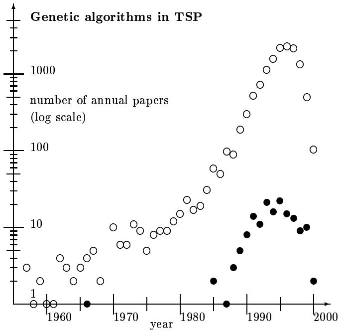

# An Indexed Bibliography of Genetic Algorithms and the Traveling Salesman Problem

compiled by

Jarmo T. Alander

Dedicated to the tired salesmen

Department of Information Technology and Production Economics

University of Vaasa

P.O. Box 700, FIN-65101 Vaasa, Finland

e-mail: Jarmo.Alander@uwasa.fi   
www: http://www.uwasa.fi/\~ jal phone: +358-6-324 8444 fax: +358-6-324 8467

Report Series No. 94-1-TSP

# DRAFT December 12, 2000

available via anonymous ftp: site ftp.uwasa.fi directory cs/report94-1 file gaTSPbib.ps.Z

Copyright $©$ 1994, 1995, 1996, 1997, 1998, 1999 Jarmo T. Alander

# Trademarks

Product and company names listed are trademarks or trade names of their respective companies.

# Warning

While this bibliography has been compiled with the utmost care, the editor takes no responsibility for any errors, missing information, the contents or quality of the references, nor for the usefulness and/or the consequences of their application. The fact that a reference is included in this publication does not imply a recommendation. The use of any of the methods in the references is entirely at the user's own responsibility. Especially the above warning applies to those references that are marked by trailing ' r \*), which are the ones that the editor has unfortunately not had the opportunity to read. An abstract was available of the references marked with '\*'.

# Contents

# 1 Preface 1

1.1 Your contributions erroneous or missing? 2   
1.1.1 How to cite this report? 2   
1.2 How to get this report via Internet? 2   
1.3 Acknowledgement . . 2

# 2 Introduction 5

# 3 Statistical summaries 7

3.1 Publication type 7

3.2 Annual distribution 7   
3.3 Classification 7   
3.4 Authors . 8   
3.5 Geographical distribution 8   
3.6 Conclusions and future . 9

# 4 Indexes 11

# 4.1 Books 11

4.2 Journal articles 11   
4.3 Theses . . 11   
4.3.1 PhD theses 12   
4.3.2 Master's theses 12   
4.4 Report series 12   
4.5 Patents 12   
4.6 Authors . . 13   
4.7 Subject index . 16   
4.8 Annual index 18   
4.9 Geographical index . . . 19

# Bibliography

# 21

# Appendixes 31

A Abbreviations 31   
B Bibliography entry formats 32

# List of Tables

1.1 Indexed GA subbibliographies in directory ftp.uwasa.fi/cs/report94-1. 3   
2.1 Queries used to extract this subbibliography from the source database. 5   
3.1 Distribution of publication type. 7   
3.2 Annual distribution of contributions. 7   
3.3 The most popular subjects. 8   
3.4 The most productive genetic algorithms in TSP authors. 8   
3.5 The geographical distribution of the authors. Observe that joint papers may have authors from several countries. This decreases the unknown country count ( $=$ all - known countries). 8

# Chapter 1

# Preface

" Living organism are consummate problem solvers. They exhibit a versatility that puts the best computer programs to shame. "

The material of this bibliography has been extracted from the genetic algorithm bibliography [2], which when this report was compiled (December 12, 2000) contained 13545 items and which has been collected from several sources of genetic algorithm literature including Usenet newsgroup comp.ai.genetic and the bibliographies [3, 4, 5, 6]. The following index periodicals have been used systematically

• A: International Aerospace Abstracts: Jan. 1995 - Sep. 1998   
• ACM: ACM Guide to Computing Literature: 1979 - 1993/4   
•BA: Biological Abstracts: July 1996 - Aug. 1998   
• CA: Computer Abstracts: Jan. 1993 - Feb. 1995   
• CCA: Computer & Control Abstracts: Jan. 1992 - Dec. 1999 (except May -95)   
•ChA: Chemical Abstracts: Jan. 1997 - Dec. 1999   
• CTI: Current Technology Index Jan./Feb. 1993 - Jan./Feb. 1994   
•DAI: Dissertation Abstracts International: Vol. 53 No. 1 - Vol. 56 No. 10 (Apr. 1996)   
•EEA: Electrical & Electronics Abstracts: Jan. 1991 - Apr. 1998   
• EI A: The Engineering Index Annual: 1987 - 1992   
• EI M: The Engineering Index Monthly: Jan. 1993 - Apr. 1998 (except May 1997)   
N: Scientific and Technical Aerospace Reports: Jan. 1993 - Dec. 1995 (except Oct. 1995)   
• P: Index to Scientific & Technical Proceedings: Jan. 1986 - Dec 1999 (except Nov. 1994)   
PA: Physics Abstracts: Jan. 1997 - June 1999   
PubMed: National Library of Medicine Jan. 2000 - Oct. 2000

# 1.1 Your contributions erroneous or missing?

The bibliography database is updated on a regular basis and certainly contains many errors and inconsistences. The editor would be glad to hear from any reader who notices any errors, missing information, articles etc. In the future a more complete version of this bibliography will be prepared for the genetic algorithms in TSP research community and others who are interested in this rapidly growing area of genetic algorithms.

When submitting updates to the database, paper copies of already published contributions are preferred. Paper copies (or ftp ones) are needed mainly for indexing. We are also doing reviews of different aspects and applications of GAs where we need as complete as possible collection of GA papers. Please, do not forget to include complete bibliographical information: copy also proceedings volume title pages, journal table of contents pages, etc. Observe that there exists several versions of each subbibliography, therefore the reference numbers are not unique and should not be used alone in communication, use the key appearing as the last item of the reference entry instead.

Complete bibliographical information is really helpful for those who want to find your contribution in their libraries. If your paper was worth writing and publishing it is certainly worth to be referenced right in a bibliographical database read daily by GA researchers, both newcomers and established ones.

For further instructions and information see ftp.uwasa.fi/cs/GAbib/README.

# 1.1.1 How to cite this report?

The complete BiBTEX record for this report is shown below:

You can alsouse the BiBTX le GASuB.ib, which isavailable inour sie.wasa. direy cs/report94-1 and contains records for all GA subbibliographies.

# 1.2 How to get this report via Internet?

Versions of this bibliography are available via anonymous ftp and www from the following sites:

media country site directory file ftp Finland ftp.uwasa.fi /cs/report94-1 gaTSPbib.ps.Z wwW Finland http://www.cs.hut.fi ja/gaTSPbib gaTSPbib.html

Observe that these versions may be somewhat different and perhaps reduced as compared to this volume that you are now reading. Due to technical problems in transforming IATEXdocuments into html ones the www versions contain usually less information than the corresponding ftp ones. It is also possible that the www version is completely unreachable.

The directory also contains some other indexed GA bibliographies shown in table 1.1. In case you do not find a proper one please let us know: it may be easy to tailor a new one.

# 1.3 Acknowledgement

The editor wants to acknowledge all who have kindly supplied references, papers and other information on genetic algorithms in TSP literature. At least the following GA researchers have already kindly supplied their complete autobibliographies and/or proofread references to their papers: Dan Adler, Patrick Argos, Jarmo T. Alander, James E. Baker, Wolfgang Banzhaf, Helio J. C. Barbosa, Hans-Georg Beyer, Christian Bierwirth, Joachim Born, Ralf Bruns, I. L. Bukatova, Thomas Bäck, David E. Clark, Carlos A. Coello Coello, Yuval Davidor, Dipankar Dasgupta, Marco Dorigo, J. Wayland Eheart, Bogdan Filipic, Terence C. Fogarty, David B. Fogel, Toshio Fukuda, Hugo de Garis, Robert C. Glen, David E. Goldberg, Martina Gorges-Schleuter, Hitoshi Hemmi, Vasant Honavar, Jeffrey Horn, Aristides T. Hatjimihail, Mark J. Jakiela, Richard S. Judson, Bryant A. Julstrom, Charles L. Karr, Akihiko Konagaya, Aaron Konstam,

file contents   
ga90bib.ps.Z GA in 1990   
ga91bib.ps.Z GA in 1991   
ga92bib.ps.Z GA in 1992   
ga93bib.ps.Z GA in 1993   
ga94bib.ps.Z GA in 1994   
ga95bib.ps.Z GA in 1995   
ga96bib.ps.Z GA in 1996   
ga97bib.ps.Z GA in 1997   
ga98bib.ps.Z GA in 1998   
gaAIbib.ps.Z GA in artificial intelligence   
gaALIFEbib.ps.Z GA in artificial life   
gaARTbib.ps.Z GA in art and music   
gaAUSbib.ps.Z GA in Australia   
gaBASICSbib.ps.Z Basics of GA   
gaBIObib.ps.Z GA in biosciences including medicine   
gaCADbib.ps.Z GA in Computer Aided Design   
gaCHEMPHYSbib.ps.Z GA in chemistry and physics   
gaCONTROLbib.ps.Z GA in control   
gaCSbib.ps.Z GA in computer science (incl. databases and GP)   
gaDBbib.ps.Z GA in databases   
gaECObib.ps.Z GA in economics and finance   
gaENGbib.ps.Z GA in engineering   
gaESbib.ps.Z Evolution strategies   
gaFAR-EASTbib.ps.Z GA in the Far East (Japan etc)   
gaFRAbib.ps.Z GA in France   
gaFTPbib.ps.Z GA papers available via ftp   
gaFUZzYbib.ps.Z GA and fuzzy logic   
gaGERbib.ps.Z GA in Germany   
gaGPbib.ps.Z genetic programming   
gaIMPLEbib.ps.Z implementations of GA   
gaISbib.ps.Z immune systems   
gaJOURNALbib.ps.Z journal articles   
gaJAPANbib.ps.Z GA in Japan   
gaLATINbib.ps.Z GA in Latin America, Portugal & Spain   
gaLOGISTICSbib.ps.Z GA in logistics   
gaMANUbib.ps.Z GA in manufacturing   
gaMEDITERbib.ps.Z GA in the Mediterranean   
gaNNbib.ps.Z GA in neural networks   
gaNORDICbib.ps.Z GA in Nordic countries   
gaOPTIMIbib.ps.Z GA and optimization (only a few refs)   
gaOPTICSbib.ps.Z GA in optics and image processing   
gaORbib.ps.Z GA in operations research   
gaPARAbib.ps.Z Parallel and distributed GA   
gaPOWERbib.ps.Z GA in power engineering   
gaPROTEINbib.ps.Z GA in protein research   
gaROBOTbib.ps.Z GA in robotics   
gaSAbib.ps.Z GA and simulated annealing   
gaSIGNALbib.ps.Z GA in signal and image processing   
gaTHEORYbib.ps.Z Theory and analysis of GA   
gaTHESESbib.ps.Z PhD etc theses   
gaTOP10bib.ps.Z Authors having at least 10 GA papers   
gaUKbib.ps.Z GA in United Kingdom   
gaVLSIbib.ps.Z GA in VLSI design and testing

John R. Koza, Kristinn Kristinsson, D. P. Kwok, Gregory Levitin, Carlos B. Lucasius, Michael de la Maza, John R. McDonnell, J. J. Merelo, Laurence D. Merkle, Zbigniew Michalewics, Melanie Mitchell, David J. Nettleton, Volker Nissen, Ari Nissinen, Tomasz Ostrowski, Kihong Park, Nicholas J. Radcliffe, Colin R. Reeves, Gordon Roberts, David Rogers, Ivan Santibáñez-Koref, Marc Schoenauer, Markus Schwehm, Hans-Paul Schwefel, Michael T. Semertzidis, Moshe Sipper, William M. Spears, Donald S. Szarkowicz, ElGhazali Talbi, Masahiro Tanaka, Leigh Tesfatsion, Peter M. Todd, Marco Tomassini, Andrew L. Tuson, Kanji Ueda, Jari Vaario, Gilles Venturini, Hans-Michael Voigt, Roger L. Wainwright, D. Eric Walters, James F. Whidborne, Steward W. Wilson, Xin Yao, and Xiaodong Yin.

The editor also wants to acknowledge Elizabeth Heap-Talvela for her kind proofreading of the manuscript of this bibliography.

# Chapter 2

# Introduction

"Many scientist, possibly most scientist, just do science without thinking too much about it. They run experiments, make observations, show how certain data conflict with more general views, set out theories, and so on. Periodically, however, some of us—scientists included—step back and look at what is going on in science."

David L., Hull, [7]

The table 2.1 gives the queries that have been used to extract this bibliography. The query system as well as the indexing tools used to compile this report from the BiBTEX-database [8] have been implemented by the author mainly as sets of simple awk and gawk programs [9, 10].

Table 2.1: Queries used to extract this subbibliography from the source database.

# Chapter 3

# Statistical summaries

This chapter gives some general statistical summaries of genetic algorithms in TSP literature. More detailed indexes can be found in the next chapter.

References to each class (c.f table 2.1) are listed below:

# Traveling Salesman Problem (TSP) 153 references ([11]-[163])

Observe that each reference is included (by the computer) only to one of the above classes (see the queries for classification in table 2.1; the textual order in the query gives priority for classes).

# 3.1 Publication type

This bibliography contains published contributions including reports and patents. All unpublished manuscripts have been omitted unless accepted for publication. In addition theses, PhD, MSc etc., are also included whether or not published somewhere.

Table 3.1 gives the distribution of publication type of the whole bibliography. Observe that the number of journal articles may also include articles published or to be published in unknown forums.

Table 3.1: Distribution of publication type.   

<table><tr><td>type</td><td>number of items</td></tr><tr><td>book</td><td>1</td></tr><tr><td>part of a collection</td><td>7</td></tr><tr><td>journal article</td><td>56</td></tr><tr><td>proceedings article</td><td>68</td></tr><tr><td>report</td><td>8</td></tr><tr><td>PhD thesis</td><td>12</td></tr><tr><td>MSc thesis</td><td>1</td></tr><tr><td>total</td><td>153</td></tr></table>

# 3.2 Annual distribution

Table 3.2 gives the number of genetic algorithms in TSP papers published annually. The annual distribution is also shown in fig. 3.1. The average annual growth of GA papers has been approximately $4 0 \ \%$ during almost the last twenty years.

Table 3.2: Annual distribution of contributions.   

<table><tr><td>year</td><td>items</td><td>year</td><td>items</td></tr><tr><td>1966</td><td>1</td><td>1967</td><td>0</td></tr><tr><td>1968</td><td>0</td><td>1969</td><td>0</td></tr><tr><td>1970</td><td>0</td><td>1971</td><td>0</td></tr><tr><td>1972</td><td>0</td><td>1973</td><td>0</td></tr><tr><td>1974</td><td>0</td><td>1975</td><td>0</td></tr><tr><td>1976</td><td>0</td><td>1977</td><td>0</td></tr><tr><td>1978</td><td>0</td><td>1979</td><td>0</td></tr><tr><td>1980</td><td>0</td><td>1981</td><td>0</td></tr><tr><td>1982</td><td>0</td><td>1983</td><td>0</td></tr><tr><td>1984</td><td>0</td><td>1985</td><td>2</td></tr><tr><td>1986</td><td>0</td><td>1987</td><td>1</td></tr><tr><td>1988</td><td>3</td><td>1989</td><td>5</td></tr><tr><td>1990</td><td>8</td><td>1991</td><td>14</td></tr><tr><td>1992</td><td>11</td><td>1993</td><td>21</td></tr><tr><td>1994</td><td>16</td><td>1995</td><td>22</td></tr><tr><td>1996</td><td>15</td><td>1997</td><td>13</td></tr><tr><td>1998</td><td>9</td><td>1999</td><td>10</td></tr><tr><td>2000</td><td>2</td><td></td><td></td></tr><tr><td>total</td><td></td><td></td><td>153</td></tr></table>

# 3.3 Classification

Every bibliography item has been given at least one describing keyword or classification by the editor of this bibliography. Keywords occurring most are shown in table 3.3.

# 3.4 Authors

TSP 147   
parallel GA 17   
crossover 14   
comparison 13   
hybrid 12   
implementation 10   
others 366

Table 3.4 gives the most productive authors.

total number of authors 284   
1 author 4   
12 authors 3   
28 authors 2   
243 authors 1

# 3.5 Geographical distribution

The following table gives the geographical distribution of authors, when the country of the author was known. Over $8 0 \%$ of the references of the source database are classified by country.

  
Table 3.3: The most popular subjects.   
Figure 3.1: The number of papers applying genetic algorithms in TSP $( \bullet )$ $\circ =$ total GA papers. Observe that the last two years are most incomplete in the database.

Table 3.4: The most productive genetic algorithms in TSP authors.   
Table 3.5: The geographical distribution of the authors. Observe that joint papers may have authors from several countries. This decreases the unknown country count ( $\underline { { \underline { { \mathbf { \Pi } } } } }$ all - known countries).   

<table><tr><td>country</td><td>abs</td><td>%</td></tr><tr><td>Total</td><td>140</td><td>100.00</td></tr><tr><td>United States</td><td>52</td><td>37.14</td></tr><tr><td>Germany (incl. DDR)</td><td>19</td><td>13.57</td></tr><tr><td>Japan</td><td>14</td><td>10.00</td></tr><tr><td>United Kingdom</td><td>9</td><td>6.43</td></tr><tr><td>Canada</td><td>6</td><td>4.29</td></tr><tr><td>Finland</td><td>4</td><td>2.86</td></tr><tr><td>China (incl. Hong Kong)</td><td>3</td><td>2.14</td></tr><tr><td>Czech Republic</td><td>3</td><td>2.14</td></tr><tr><td>France</td><td>3</td><td>2.14</td></tr><tr><td>Spain</td><td>3</td><td>2.14</td></tr><tr><td>Taiwan R.o.C.</td><td>3</td><td>2.14</td></tr><tr><td>The Netherlands</td><td>3</td><td>2.14</td></tr><tr><td>Australia</td><td>2</td><td>1.43</td></tr><tr><td>Brazil</td><td>2</td><td>1.43</td></tr><tr><td>Italy</td><td>2</td><td>1.43</td></tr><tr><td>Russia</td><td>2</td><td>1.43</td></tr><tr><td>Belgium</td><td>1</td><td>0.71</td></tr><tr><td>Hungary</td><td>1</td><td>0.71</td></tr><tr><td>Romania</td><td>1</td><td>0.71</td></tr><tr><td>South Korea</td><td>1</td><td>0.71</td></tr><tr><td>Sweden</td><td>1</td><td>0.71</td></tr><tr><td>Switzerland</td><td>1</td><td>0.71</td></tr><tr><td>Unknown country</td><td>0</td><td>0.00</td></tr></table>

# 3.6 Conclusions and future

The editor believes that this bibliography contains references to most genetic algorithms in TSP contributions upto and including the year 1998 and the editor hopes that this bibliography could give some help to those who are working or planning to work in this rapidly growing area of genetic algorithms.

# Chapter 4

# Indexes

# 4.1 Books

The following list contains all items classified as books.

Näkökulmia laskennalliseen tieteeseen - Alkuräjähdyksestä kännykkään [Views to Computational Science From Big Bang to Mobile Phones], [82]

# 4.2 Journal articles

The following list contains the references to every journal article included in this bibliography. The list is arranged in alphabetical order by the name of the journal.

Acta Electronica Sinica (China), [68]   
Advanced Technology for Developers, [132, 147]   
Ann. Oper. Res. (Netherlands), [55, 66]   
Artificial Intelligence, [12]   
Artificial Intelligence Review, [93]   
Autom. Prod. Inform. Ind. (France), [30]   
Biological Cybernetics, [99, 100, 101, 102, 115, 119, 129]   
Br. Telecommun. Eng. (UK), [14]   
Complex Systems, [126]   
Computers $\&$ Industrial Engineering, [23]   
Cybern. Syst. (USA), [81]   
Cybernetics and Systems, [121]   
Discrete Applied Mathematics, [19]   
Electronics Letters, [28]   
European Journal of Operational Research, [53, 87]   
Europhysics Letters, [107]   
Evolutionary Computation, [112]   
Future Generation Computer Systems, [117]   
IEEE Transactions on Computer-Aided Design of I: grated Circuits and Systems, [149]   
IEEE Transactions on Evolutionary Computing, [69]   
IEEE Transactions on Systems, Man, and Cybernetics, [60, 116]   
IEICE Transaction on Information and Systems, [56]   
Information Sciences, [94]   
J. Inf. Optimization Sci. (India), [163]   
J. KISS(A), Comput. Syst. Theory (South Korea), [86]   
J. Korea Inf. Sci. Soc. (South Korea), [47]   
J. Syst. Eng. (UK), [26]   
Journal of Heuristics, [70]   
Journal of Japanese Society for Artificial Intelligence, [161]   
lectron. Eng. Aust. (Australia), [80]   
Man. Sci., [148]   
Math. Comput. Modelling, [36]   
Mathematical and Computer Modelling, [25]   
Memoirs of the Faculty of Engineering, Fukui University, [156]   
Memoirs of the Faculty of Engineering, Okayama University, [37]   
Neural Computation, [145]   
OR Spektrum, [133]   
Parallel Processing Letters, [114]   
Physical Review Letters, [92, 98]   
SIAM Journal on Optimization, [154]   
Systems Analysis - Modeling - Simulation, [106]   
Trans. Soc. Instrum. Control Eng. (Japan), [88]   
Transactions of the Institute of Electronics, Information, and Communication Engineers D-I, [85]   
Wirtschaftsinformatik, [131]   
Wuhan Univ. J. Nat. Sci. (China), [64] total 56 articles in 45 series

# 4.3 Theses

The following two lists contain theses, first PhD theses and then Master's etc. theses, arranged in alphabetical order by the name of the school.

# 4.3.1 PhD theses

Eidgenössische Technische Hochschule Zürich, [97]   
Louisiana State University of Agricultural and Mechanical College, [105]   
North Dakota State University of Agriculture and Applied Sciences, [111, 130, 155]   
State University of New York at Binghamton, [43]   
Syracuse University, [29]   
The Pennsylvania State University, [22]   
The University of Memphis, [20]   
The University of Tulsa, [16]   
University of North Carolina at Charlotte, [151]   
University of Turku, [95] total 12 thesis in 10 schools

# 4.3.2 Master's theses

This list includes also "Diplomarbeit", "Tech. Lic.   
Theses", etc.

Universität Bonn, [140]

# 4.4 Report series

The following list contains references to all papers published as technical reports. The list is arranged in alphabetical order by the name of the institute.

Christian Brothers University, [38]   
Friedrich-Alexander-Universität Erlangen-Nürnberg, [150]   
MITRE Corporation, [134]   
North Carolina A & T State University, [125]   
Ruhr Universität Mannheim, [104]   
University of Turku, [73]   
Universität Würzburg, [33] total 7 reports in 7 institutes

# 4.5 Patents

The following list contains the names of the patents of genetic algorithms in TSP. The list is arranged in alphabetical order by the name of the patent.

# 4.6 Authors

The following list contains all genetic algorithms in TSP authors and references to their known contribu tions.

Aarts, E. H. L., [144] Dizdarevic, S., [93] Holland, J. R. C., [127] Aizawa, J., [83] Dorigo, Marco, [69] Homaifar, Abdollah, [125, 126, 13 Alander, Jarmo T., [11] Drummond, Lucia M.A. [39] Hoos, H., [78] Aldana Montes, José Francisco, [32] Dzubera, J., [17] Horng, Jorng-Tzong, [45] Ambati, Balamurali Krishna, [99, 100] Ebeling, Werner, [106, 107] Houdayer, J., [92, 98] Ambati, Jayakrishna, [99, 100] Eiben, Agoston, [50] Hsu, Chin-Chih, [49, 83] Amin, S., [14] Eigen, Manfred, [115] Hsu, Ching-Chi, [116] Amini, Mohammad M., [87] Engst, Norbert, [150] Ikeda, Y., [156] Amini, Mohammed M., [38] Falco, I. De, [114] Inoue, K., [84] Bac, Fam Quang, [101] Faulkner, Graeme, [34] Inza, I, [93] Balakrishnan, J., [36] Fernandez-Villanacas, J.-L., [14] Isern, G., [91] Balio, R. Del, [114] Flores, B., [148] Jog, P. D., [36] Bandelt, H.-J.,, [144] Fogarty, Terence C., [117, 118] Jog, Prasanna, [128, 154] Banzhaf, Wolfgang, [102] Fogel, David B., [19, 120, Johnson, D. S., [113] Boseniuk, Thorsten, [106, 107, 108] Fuquay, D'Ann, [157] Kakazu, Yukinori, [40,44] Bradwell, R., [67] Gambardella, Luca M., [69] Kanet, John J., [131] Braun, Heinrich, [109] Gammack, John G., [117] Kanzaki, Y., [84] Brudaru, Octav, [90] Garigliano, Roberto, [141] Kao, Cheng-Yan, [45, 116] Buckles, Bill P., [110] Gause, Donald C., [21] Karp, R., [65] Bui, Thang Nguyen, [15] Gen, Mitsuo, [23] Katayama, K., [85] Carrera, Cecilia, [53] Gold, Sönke-Sonnich, [150] Kindermann, J., [138] Carrier, Jean-Yves, [52] Goldberg, David E., [123] Kita, Hajime, [24] Caux, Christophe, [30] Gopal, Rajeev, [124] Klimasauskas, Casimir C., [132] Chatterjee, Sangit, [53] Gorges-Schleuter, Martina, [71] Kobayashi, Shigenobu, [161] Chen, Gwo-Dong, [45] Graham, Paul, [35] Kolen, Antoon, [19] Cheng, Runwei, [23] Grefenstette, John J., [124] Kopfer, Herbert, [133] Cochrane, P., [14] Guan, Shanguchuan, [125, 126, 136] Krasnogor, Natalio, [13] Corcoran, Arthur L., [31] Gucht, Dirk Van, [124, 128, 154] Kuang, Lu, [64] Corcoran, III, Arthur Leo, [16] Guertin, François, [62] Kubota, Naoyuki, [58] Cotta Porras, Carlos, [32] Gusfield, D., [65] Kubota, N., [88] Cui, Jun, [117, 118] Han, Seung-Kee, [47] Kuester, Rebecca L., [110] Dabs, Tanja, [33] Haneda, H., [84] Kuijpers, C. M. H., [93] Delgado-Frias, Jose G. [1] Hilliard, M. R., [135] Kuijpers, Cindy M. H., [60]

Laarhoven, P. J. M. van, [144] Nebro, Antonio, [32] Laporte, G., [70] Nelson, Brent, [35] Larrañaga, Pedro, [60] Nêmec, Viktor, [61] Larrañaga, P., [93] Nettleton, David John, [141] Lee, Kang-Ku, [47] Nevalainen, Olli, [73] Lee, Keon-Myung, [86] Nishikawa, Yoshikazu, [24] Lee, Kyung-Mi, [86] Nobue, A., [27] Lee, Seong-Whan, [47] Nurnberg, H. -T., [74] Leung, Henry, [52] Nygard, Kendall E., [142, 143] Leung, K. S., [18] Ochi, Luiz S., [39, 96] Lidd, Mark L., [134] Okada, D., [84] Liepins, Gunar E., [126, 135, 136] Oliver, I. M., [127] Lin, Feng-Tse, [116] Ono, Isao, [161] Lin, Wei, [21, 43, 81] Opaterny, Thilo, [150] Lingle, Robert, Jr., [123] Omera, Pavel, [48, 75, 77] Litva, John, [52] Ost, Alexander, [150] Lo, Titus, [52] Pal, K. F., [129] Lu, Chien-Ying, [81] Palmer, Mark R., [135] Lynch, Lucy A., [53] Pao, Yoh-Han, [162] Maekawa, Keiji, [24] Percus, Allon, [12] Magyar, Gábor, [73] Perov, V. L., [101] Maini, Harpal Singh, [29] Pesch, Erwin, [19, 144] Manderick, Bernard, [137] Peterson, Carsten, [145] Martin, Juan, [49] Petry, Frederick E., [110] Martin, O. C., [92, 98] Pierreval, Henri, [30] Mathias, Keith E., [152, 159] Portmann, Marie-Claude, [30] Matsuo, S., [156] Potvin, Jean-Yves, [55, 62, 66] McDaniel, S., [152] Potvin, J.-Y., [70] Megherbi, D., [91] Prinetto, P., [146] Melikhov, A. N., [59] Qu, Liangsheng, [94] Merz, Peter, [54, 76] Quilleret, F., [70] Miagkikh, V. V., [59] Radcliffe, Nicholas J., [63] Mizuno, Takafumi, [44] Rao, Vasant B., [149] Mokhtar, Mazen Moein, [99, 100] Raué, Paul-Erik, [50] Montenegro, Anselmo A,[39] Rebaudengo, Maurizio, [146] Moon, Byung Ro, [15] Reetz, Bob, [147] Moon, Byung-Ro, [22] Reinartz, Karl Dieter, [150] Mühlenbein, Heinz, [138, 139] Richardson, Jon T., [135] Murga, R. H., [93] Roberts, A., [28] Murga, Roberto H., [60] Roberts, S. M., [148] Napierala, G., [140] Ronald, Simon, [51]

Ross, Brian J., [89] Ruttkay, Zsófia, [50] Saab, Youssef G., [149] Sakanashi, Hidenori, [40] Santos, Elisangela M., [39] Savelev, O. V., [59] Schäftner, Christoph, [150] Schmitt, Lawrence J., [38, 87] Schmitt, II, Lawrence John, [20] Schober, Andreas, [115] Schoof, Jochen, [33] Schwarz, Josef, [61] Schwehm, Markus, [150] Sena, G., [91] Seniw, D., [151] Shaner, Daniel, [158] Shida, Koichiro, [49] Shida, K., [83] Shimizu, Nobuhiko, [24] Shimojima, Koji, [58] Singh, Sanjeev, [41] Smith, Alice E., [25] Smith, D. J., [127] Smith, Jim, [13] Sonza Reorda, Matteo, [146] Spiessens, Piet, [137] Sridharan, V., [131] Starkweather, Timothy John, [152, 157, 158] Stelling, P., [65] Stender, Joachim, [153] Stutzle, T., [78] Suh, Jung Y., [128, 154] Sun, Ruixiang, [94] Surry, Patrick D., [63] Suzuki, Keiji, [40] Tagawa, K., [84] Takita, Masatoshi, [44] Talhami, Habib, [34] Tamaki, Hisashi, [24]

Tanaka, Masahiro, [37, 56] Valenzuela, Christine L., [112] Tang, A. Y. C., [18] Vieyra, P. W. Polo, [96] Tanino, Tetsuzo, [37, 5] Vilcu, Adrian, [90] Tarantino, E., [114] Wade, G., [28] Tate, David M., [25] Wainwright, Roger L., [31] Thangiah, Sam Rabindranath, [155] Walter, Thomas, [150] Thuerk, Marcel, [115] Wang, Lusheng, [65] Tian, Peng, [163] Watanabe, K., [156] Topchy, A. P., [59] Weger, Mark de, [137] Troya, J. M., [32] Whitley, C., [152] Tsuji, T., [156] Whitley, Darrell L., [152, 159] Tunasar, C., [25] Whitley, Darrell, [17, 157, 158] Turton, B. C. H., [26] Wijkman, Pierre A. I., [79] Ulder, N. L. J., [144] Williams, L. P., [67] Vaccaro, R., [114] Xianfu, Chen, [68] Valenzuela, C. L., [67] Xufa, Wang, [68] Valenzuela, Christina L., [42] Yamada, Shin-ichi, [49]

Yamada, S., [83]   
Yamamura, Masayuki, [161]   
Yang, C. H., [80]   
Yang, Cheng-Hong, [111, 142, 143]   
Yang, Zihou, [163]   
Yao, Xin, [160]   
Ye, Ju, [37, 56]   
Yip, Percy P. C., [162]   
Yokoi, Horoshi, [44]   
Yukiko, Y., [27]   
Yurramendi, Yosu, [60]   
Zhangcan, Huang, [64]   
Zhenquan, Zhuang, [68]   
Zitzler, Eckart, [97] total 152 articles by 284 different authors

# 4.7 Subject index

All subject keywords of the papers given by the editor of this bibliography are shown next.

accelerators simulated annealing, [149] partitioning, [22, 29] Linac, [104] tabu search, [80] traversal, [65]   
analysing ES, [74] various GA versions, [87] TSP, [90]   
analysing GA, [128] credit scoring, [63] GUI, [33] ANOVA, [87] crossover, [110, 141, 60] hierarchical, [115] crossover, [46] cycle, [127] hybrid, [22] initial population, [75] group theory, [101] branch and bound techniques, Markov chains, [101] harmonic, [84] evolution strategies and simulated statistically, [87] heuristic, [129] annealing, [107] TSP, [83] knowledge-based, [29] heuristics, [43]   
ant colony, [96] order, [87] local search, [13]   
ant system, [78] permutation, [127, 132, 53, Newton-Raphson, [21]   
ant systems 85] renormalization, [92, 98] TSP, [69] PMX, [114, 60] simulated annealing, [116, 162, 163]   
artificial intelligence, [60, 12] TSP, [23] tabu search, [70]   
ASPARAGOS96, [71] databases, [117] image processing, [52]   
Bayes networks, [60] electronics fractals, [150]   
bin packing, [31] assembly, [95] medical, [34]   
bin-packing, [16] PCB assembly, [95] implementation   
building  blocks, [10 evoluttion straategies, [56107, 103.   
CAD, [149] TSP, [106] GIDEON, [155] Da evoltiary rorm1. 9. TSP, [93] Taguchi, [26] Occam, [61]   
cmbigatatip101] fiteFFIR, [28] Prolog, Splash 2, [3 )   
comparison, [113, 99, 142] fitness transputers, [138, 117, 61]   
comparison bitwise expected value, [105] XROUTE, [130] parallel methods in TSP, [145] landscape, [137, 159] insertion   
comparison formal languages, [150] rank ordered, [132] coding in TSP, [24] generations inversion, [114, 115] evolution strategies, [87] 150, [89] knapsack, [97] greedy, [147] GESA, [162] knapsack problem, [156] in TSP, [20, 36, 41, 43] GIGA, [33] layout design, [149] neural networks, [127] graph colouring, [50] LibGA, [31] parameters, [87] graphs Lin-Kernighan algorithm, [12]   
local search, [113]   
macro cell layout, [150]   
manufacturing electronics assembly, [95] TSP, [36]   
MCKP, [116]   
MIMD, [114]   
molecular evolution, [115]   
mutation, [15, 141, 37]   
n-queens problem, [50]   
network bisection, [149]   
neural networks, [130,52]   
operators, [159] TSP, [93]   
optimization, [160, 133] combinatorial, [149, 19, 31] constrained, [50] GA, [26] multiobjective, [97] multivariable, [16]   
parallel GA, [138, 140, 120, 145, 109, 139, 114, 156, 104, 17, 118, 150, 39, 4, 48, 6, 91]   
parents multi, [50]   
particle physics, [103]   
permutation crossover, [110]   
permutations, [101]   
physics particle, [104] solid state, [92, 98]   
popular TSP, [82]   
population diversi ty, [27] initial, [143, 63, 77]   
population size, [57] 200, [89] 50, [132] 6-24, [116]   
preGA, [148]   
PROGENITOR, [131]   
protein folding lattice model, [13]   
quasispecies algorithm, [115]   
reasoning, [60]   
recursive, [92, 98]   
review TSP, [11, 93]   
routing, [111] telecommunications, [14] TSP, [51] vehicle, [20]   
Royal Road functions, [16]   
SAT 3SAT, [105] large Boolean expressions, [105]   
scheduling, [157, 131 158, 101, 150, 30] JSS, [51] multiprocessor, [51] multiprocessors, [31] school bus, [51]   
schema, [110]   
self-organization, [12]   
sequencing, [152]   
set covering, [135]   
set partitioning, [116]   
simulated annealing, [160]   
simulation ecology, [58]   
spin glass, [92, 98]   
spin-glass, [115]   
subdivision, [112]   
system identification, [56] fuzzy, [37]   
tabu search, [113]   
test case spin-glass, [115]   
transportation, [133, 90]   
TSP, [148, 123, 124, 12. 107. 19 108 18 13357 145, 99, 109, 125, 131, 134, 137. 139, 149, 151, 152, 154, 158, 11, 150 101 11 14 12 13 56 121, 122, 136, 141, 143, 146, 150. 153, 162, 163, 14, 15 10, 19,  21. , 23, 26, 27, 28, 29, 30, 31, 32, 33, 4, 47, 48, 49, 50, 52, 53, 54, 55, 56 57, 58, 59, 60, 61, 62, 63, 64, 65 66, 68, 69, 70, 71. 72. 74, 75, 77. 78. 79, 80 81, 84, 86, 88, 89, 90 91, 92, 94, 95, 96, 97, 98, 12, 13] 100 cities, [132] 318 cities, [129] 3MP, [73] 40 cities, [160] 442 cities, [115] 532 cities, [118] asymmetric, [101] comparison, [87] edge recombination, [18] Euclidean, [25, 44] heuristics, [67] local search, [76] NC drilling, [147] on hardware, [35] operator analysis, [17] operators, [83] parallel, [140] review, [93] time windows, [142]   
TSP?, [85]   
TSProuting vehicle, [155]   
VEGA, [58]   
VLSI design, [22, 51] standard cell placement, [51   
VLSI design, [61, 97] layout, [150]

# 4.8 Annual index

The following table gives references to the contributions by the year of publishing.

1966, [148]   
1985, [123, 124]   
1987, [127]   
1988, [106, 107, 119]   
1989, [108, 128, 138, 140, 157]   
1990, [102, 110, 113, 120, 130, 135, 144, 145]   
1991, [99, 109, 125, 131, 134, 137, 139, 149, 151, 152, 154, 155, 158, 160]   
1992, [11, 100, 103, 111, 114, 126, 133, 142, 156, 159, 161]   
1993, [101, 104, 105, 112, 115, 116, 117, 118, 121, 122, 129, 132, 136, 141, 143, 146, 147, 150, 153, 162. 163]   
1994, [14, 15, 16, 17, 18, 19, 20, 21, 22, 23, 24, 25, 26, 27, 28, 29]   
1995, [30, 31, 32, 33, 34, 35, 36, 37, 38, 39, 40, 41, 42, 43, 44, 45, 46, 47, 48, 49, 50, 51]   
1996, [52, 53, 54, 55, 56, 57, 58, 59, 60, 61, 62, 63, 64, 65, 66]   
1997, [67, 68, 69, 70, 71, 72, 73, 74, 75, 76, 77, 78, 79]   
1998, [80, 81, 82, 83, 84, 85, 86, 87, 88]   
1999, [89, 90, 91, 92, 93, 94, 95, 96, 97, 98]   
2000, [12, 13]

# 4.9 Geographical index

The following table gives references to the contributions by country.

• Australia: [34, 51]   
• Belgium: [69]   
• Brazil: [39, 96]   
• Canada: [36, 52, 55, 62, 66, 89]   
• China (incl. Hong Kong): [64, 68, 94]   
• Czech Republic: [75, 48, 61]   
• Finland: [11, 73, 82, 95]   
• France: [30, 92, 98]   
• Germany (incl. DDR): [106, 107, 108, 138, 140, 102, 131, 139, 103, 133, 104, 115, 150, 33, 54, 71, 74, 76, 78]   
• Hungary: [129]   
• Italy: [114, 146]   
•Japan; [156, 161, 23, 27, 37, 40, 44, 49, 56, 58, 83, 84, 85, 88]   
• Romania: [90]   
• Russia: [101, 59]   
• South Korea: [47]   
• Spain: [32, 60, 93]   
• Sweden: [79]   
• Switzerland: [97]   
• Taiwan R.o.C.: [116, 143, 45]   
• The Netherlands: [144, 19, 50]   
• United Kingdom: [117, 118, 141, 14, 26, 28, 42, 63, 13]   
• United States: [123, 124, 119, 157, 120, 130, 135, 99, 125, 134, 149, 151, 152, 154, 155, 158, 100, 111, 126, 142, 159, 105, 121, 122, 132, 136, 147, 162, 15, 16, 17, 20, 21, 22, 24, 25, 29, 31, 35, 38, 41, 43, 46, 53, 57, 65, 67, 72, 81, 87, 91, 12]   
• Unknown country: [70, 77, 80, 86]

# Bibliography

[1] John H. Holland. Genetic algorithms. Scientific American, 267(1):4450, 1992. ga:Holland92a.   
[2] Jarmo T. Alander. An indexed bibliography  genetic algorithms: Years 1957-1993. Art of CAD Ltd., Vaasa (Finland), 1994. (over 3000 GA references). [3] David E. Goldberg, Kelsey Milman, and Christina Tidd. Genetic algorithms: A bibliography. IliGAL Report 92008, University of Illinois at Urbana-Champaign, 1992. ga:Goldberg92f.   
[4] N. Saravanan and David B. Fogel. A bibliography ofevolutionary computation & applications. Technical Report FAU-ME-93-100, Florida Atlantic University, Department of Mechanical Engineering, 1993. (available via anonymous ftp site magenta.me.fau.edu directory /pub/ep-list/bib fle EC-ref.ps.Z) ga:Fogel93c.   
[5] Thomas Bäck. Genetic algorithms, evolutionary programming, and evolutionary strategies bibliographic database entries. (personal communication) ga:Back93bib, 1993. [6] Thomas Bäck, Frank Hoffmeister, and Hans-Paul Schwefel. Applications of evolutionary algorithms. Technical Report SYS-2/92, University of Dortmund, Department of Computer Science, 1992. ga:Schwefe192d. [7] David L. Hull. Uncle Sam wants you. Science, 284(5417):11311133, 14. May 1999. [8] Leslie Lamport. ATEX: A Document Preparation System. User's Guide and Reference manual. AddisonWesley Publishing Company, Reading, MA, 2 edition, 1994.   
[9] Alfred V. Aho, Brian W. Kernighan, and Peter J. Weinberger. The AWK Programming Language. AddisonWesley Publishing Company, Reading, MA, 1988.   
[10] Diane Barlow Close, Arnold D. Robbins, Paul H. Rubin, and Richard Stallman. The GAWK Manual. Cambridge, MA, 0.15 edition, April 1993.   
[11] Jarmo T. Alander. Kauppamatkustajan ongelma ja geneettiset algoritmit [Traveling salesman problem and genetic algorithms]. Technical Report 1992/2, Helsinki University of Technology, Faculty of Machine Engineering, Laboratory of Automobile Technology, 1992. (in Finnish) GA:AjoNavi92.   
[12] Stefan Boettcher and Allon Percus.Nature's way of optimizing.Artificial Inteence, 119(1-2):275286, May 2000. ga00aBoettcher.   
[13] Natalio Krasnogor and Jim Smith. A memetic algorithm with self-adaptive local search: TSP as a case study. In Darrell Whitley, David E. Goldberg, Erick Cantú-Paz, Lee Spector, Ian Parmee, and HansGeorg Beyer, editors, Proceedings of the Genetic and Evolutionary Computation Conference (GECCO-2000), volume ?, pages 987-994, Las Vegas, CA, 10.-12. July 2000. Morgan Kaufmann Publishers, San Francisco, CA. ga00aKrasnogor.   
[.m JLF-Vil.C hve . Br. Telecommun. Eng. (UK), 13(2):117-122, July 1994. †EEA 79643/94 CCA 75496/94 ga94aAmin.   
[15] Thang Nguyen Bui and Byung Ro Moon. A new genetic approach for the traveling salesman problem. In ICEC'94 [164], pages 7-12. ga94aBui.   
[16] Arthur Leo Corcoran, II.Techniques for reducing the disruption of superior building blocks in genetic algorithms. PhD thesis, The University of Tulsa, 1994. \* DAI Vol. 55 No. 4 ga94aCorcoran.   
[17] J. Dzubera and Darrell Whitley. Advanced correlation analysis of operators for the traveling salesman problem. In Davidor et al. [165], page ? †conf. prog. ga94aDzubera.   
[18] K. S. Leungnd A.Y.C. Tang. A modf edge recobiatin perator or thetravellin salesm problem. In Davidor et al. [165], pages 180188. conf. prog. ga94aKSLeung.   
[19] Antoon Kolen and Erwin Pesch. Genetic local search in combinatorial optimization. Discrete Applied Mathematics, 48(3):273284, 15. February 1994. \* EEA 33495/94 ga94aKolen.   
[20] Lawrence John Schmitt, II. An empirical computational study of genetic algorithms to solve order based problems: An emphasis on TSP and VRPTC. PhD thesis, The University of Memphis, 1994. \* DAI Vol 56 No 3 ga94aLJSchmitt.   
[1 WeiLin, Jose G. Delgad-Fris, and Donald C. Gause.Solvingthetraveing salesman problemusing ayrid genetic algorithm approach. In Proceedings of the Artificial Neural Networks in Engineering Conference, volume 4, pages 10691074, St. Louis, MO, 13.-16. November 1994. ASME, New York. †CCA 61771/96 EI M057085/95 ga94aLin.   
[22] Byung-Ro Moon. Hybrid genetic algorithms with hyperplane synthesis: A theoretical and empirical study. PhD thesis, The Pennsylvania State University, 1994. \* DAI Vol 56 No 2 ga94aMoon.   
[23] Runwei Cheng and Mitsuo Gen. Crossover on intensive search and traveling salesman problem. Computers & Industrial Engineering, 27(1-4):485488, September 1994. (Proceedings of the 16th Annual Conference on Computers and Industrial Engineering, Ashigaga (Japan), 7.-9. Mar.) \* CCA 11849/95 EI M083564/95 ga94aRCheng.   
[24] Hisashi Tamaki, Hajime Kita, Nobuhiko Shimizu, Keiji Maekawa, and Yoshikazu Nishikawa. A comparison study of genetic codings for the traveling salesman problem. In ICEC'94 [164], pages 16. ga94aTamaki.   
[5] David M. Tate, C. Tunasar, nd AliceE.Smith. Geneticaly iprove presequence for Eucliden traveing salesman problems. Mathematical and Computer Modelling, 20(2):135143, July 1994. \* CCA 66872/94 ga94aTate.   
[26] B. C. H. Turton. Optimization of genetic algorithms using the Taguchi method. J. Syst. Eng. (UK), 4(3):121130, ? 1994. \* EEA 223/95 ga94aTurton.   
[27] Y. Yukiko and A. Nobue. A diploid genetic algorithm for preserving population  pseudo-meiosis GA. In Davidor et al. [165], pages 3645. \* CCA 36479/95 ga94aYukiko.   
[28] G. Wade and A. Roberts. Ordering of cascade FIR flter structures. Electronics Letters, 30(17):13931394, 18. September 1994. \* EI M003834/95 ga94bWade.   
[29] Harpal Singh Maini. Incorporation of knowledge in genetic recombination. PhD thesis, Syracuse University, 1994. \* DAI Vol 56 No 3 ga94dMaini.   
[30] Christophe Caux, Heri Pierreval, and Marie-Claude Portmann. Les algorithmes généiques et leur application aux problèmes d'ordonnancement [Genetic algorithms and scheduling problems]. Autom. Prod. Inform. Ind. (France), 29(4-5):409443, ? 1995. †Bounsaythip CCA 88194/95 ga95aCaux.   
[31]Arthur L. Corcoran and Roger L. Wainwright. Practical handbook of genetic algorithms. In Chambers [166], cr UsLbGAve olvatltiza 143-172. ga95aCorcoran.   
[32] Carlos Cotta Porras, José Francisco Aldana Montes, Antonio Nebro, and J. M. Troya. Hybridizing genetic arithms wit branc and bound techniques for the resolutionof the TSP. In D. W. Pearson, N.C.Steele, and R. F. Albrecht, editors, Artificial Neural Nets and Genetic Algorithms, pages 277280, Alès (France), 19.-21. April 1995. Springer-Verlag, Wien New York. ga95aCotta.   
[33] Tanja Dabs and Jochen Schoof. A graphical user interface for genetic algorithms. Report 98, Universitt Würzburg, Institut für Informatik, 1995. ga95aDabs.   
[34] Graeme Faulkner and Habib Talhami.Using "biological" genetic algorithms to solve the travelling salesman problem with applications in medical image processing. In ICEC'95 [167], pages 707712. †prog. ga95aFaulkner.   
[35] Paul Graham and Brent Nelson. A hardware genetic algorithm for the traveling salesman problem on Splash 2. In ?, editor, Proceedings of the 5th International Workshop on Field-Programmable Logic and Applications, pages 352361, Oxford, UK, 29. August-1. September 1995. Springer-Verlag, Berlin. \* [168] CCA 13887/97 ga95aGraham.   
[36] J. Balakrishnan and P. D. Jog. Manuacturing cell formation using similarity coefcients and a paralel genetic TSP algorithm: Formulation and comparison. Math. Comput. Modelling, 21(12):6173, 1995. †[169] CCA66272/95 ga95aJBalakrishnan.   
[37] Ju Ye, Masahiro Tanaka, and Tetsuzo Tanino. Geneticalgorithm with evolutionary chain-based mutation and its applications. Memoirs of the Faculty of Engineering, Okayama University, 30(1):111120, December 1995. ga95aJuYe.   
[38] Lawrence J. Schmitt and Mohammed M. Amini. Genetic algorithmic approaches to the traveling salesman problem: Design and configuration issues. Working Paper ITMGA01.002/95, Christian Brothers University, Memphis, TN, 1995. †[87] ga95aLJSchmitt.   
[39] Anselmo A Montenegro, Elisangela M. Santos, Lucia M.A. Drummond, and Luiz S. Ochi. Um algoritmo paralelo distribuido para  travelling purchaser problem [A parallel distributed algorithm or he traveling salesman problem]. In ?, editor, Proceedings of the Second Brazilian Symposium on Neural Networks, page ?, Sao Carlos, SP - Brazil, 18.-20. October 1995. The Brazilian Computer Science Society. (in Portuguese) conf. prog. ga95aMontenegro.   
[40] Hidenori Sakanashi, Keiji Suzuki, and Yukinori Kakazu. Filtering-GA: the evolutionary TSP landscape modifier. In ICEC'95 [167], pages 390395. †prog. ga95aSakanashi.   
[41] SanjeeSingh. An empirical cmparison  3 population-based search agorithm or the travelng saleman problem. In John R. Koza, editor, Genetic Algorithms at Stanford 1995, page ?, Stanford, CA, 1995. Stanford Bookstore. †Koza ga95aSingh.   
[2CristiaLVlezuelaanAntoni J. Jones.A paralel iplemtatioevolutiary divie nqr for the TSP. In Proceedings of the First IEE/IEEE International Conference on Genetic Algorithms in Engineering Systems: Innovations and Applications, pages 499504, Sheffield (UK), 12.-14. September 1995. IEEE. conf.prog ga95aValenzuela.   
[43] Wei Lin. High quality tour hybrid genetic schemes for TSP optimization problems. PhD thesis, State University of New York at Binghamton, 1995. \* DAI Vol 56 No 9 ga95aWLin.   
[44] Horoshi Yokoi, Yukinori Kakazu, Takafumi Mizuno, and Masatoshi Takita. Euclidean TSP using characteristics of slimemold. In ICEC'95 [167], pages 689694. †prog. ga95aYokoi.   
[45] Jorng-Tzong Horng, Cheng-Yan Kao, and Gwo-Dong Chen. Error-tolerance genetic algorithm for traveling salesman problems. In Proceedings of the 1995 IEEE International Conference on Systems, Man and Cybernetics, volume 1, pages 795799, Vancouver, BC (Canada), 22.-25. October 1995. IEEE, Piscataway, NJ. EI M035881/95 ga95bHorng.   
[46] Bryant A. Julstrom. Very greedy crossover in a genetic algorithm for the traveling salesman problem. In K. M. George, Janice H. Carroll, Ed Deaton, Dave Oppenheim, and Jim Hightower, editors, Proceedings of the 10th ACM Symposium on Applied Computing, pages 324-328, ?, ? 1995. ACM Press, New York. ga95bJulstrom.   
[47] Kang-Ku Lee, Seung-Kee Han, and Seong-Whan Lee. A genetic algorithm for the traveling salesman problem. J. Korea Inf. Sci. Soc. (South Korea), 22(4):559566, 1995. †CCA51577/95 ga95bK-KLee.   
[48] Pavel Omera. Hybrid and distributed genetic algorithms for travelling salesman problem in LAN. In Pavel Omera, editor, Proceedings of the MENDEL'95, pages 105108, Brno (Czech Republic), 26.-28. September 1995. Technical University of Brno. ga95bOsmera.   
[9]Chin-Chih Hsu, Juan Martin, Shin ichi Yaada, Hideji Fujikawa, and Koichiro Shida.Effectiveness analysis of genetic operators for TSP. In Proceedings of the 1995 IEEE International Symposium on Industrial Electronics, volume 2, pages 766770, Athens (Greece), 10.-14. July 1995. IEEE, Piscataway, NJ. \* EI M093960/95 ga95dC-CHsu.   
[50] Ágoston Eiben, Paul-Erik Raué, and Zsóa Ruttkay. Practical handbook of geneticalgorithms. In Chambers [166], chapter 10. How to apply genetic algorithms to constrained problems, pages 307-365. ga95dEiben.   
[51] Simon Ronald. Practical handbook of genetic algorithms. In Chambers [166], chapter 11. Routing and scheduling problems, pages 367430. ga95eRonald.   
[52] Jean-Yves Carrier, John Litva, Henry Leung, and Titus Lo. Genetic algorithm for multiple target tracking data association. In Michael K. Masten and Larry A. Stockum, editors, Acquisition, Tracking, and Pointing X, volume SPIE-2739, pages 180190, Orlando, FL, 10.-11. April 1996. The International Society for Optical Engineering, Bellingham, WA. †A96-35348 SPIE/Boston P68447/96 ga96aCarrier.   
[3] Sangi ChatterjCeciCarraanLuyA.Lync.Geneioritnravein lemproms. European Journal of Operational Research, 93(3):490510, 20. September 1996. ga96aChatterjee.   
[54] BerndFreisleben and Peter Merz. New genetic local searchoperators for the traveling salesman problem. In Hans-Michael Voigt, Werner Ebeling, Ingo Rechenberg, and Hans-Paul Schwefel, editors, Parallel Problem Solving from Nature  PPSN IV, volume 1141 of Lecture Notes in Computer Science, pages 890-899, Berlin (Germany), 22.-26. September 1996. Springer-Verlag, Berlin. ga96aFreisleben.   
[5] Jean-Yves Potvin. Genetic algorithms for the traveling salesman problem.Ann. Oper. Res.(Netherlands), 63:339370, 1996. †CCA70141/96 ga96aJ-YPotvin.   
[56] Ju Ye, Masahiro Tanaka, and Tetsuzo Tanino. Eugenics-based genetic algorithm. IEICE Transaction on Information and Systems, E79-D(5):600607, May 1996. ga96aJuYe.   
[7] Bryant A. Julstrom.A simple etimate o population iz n geneticlgorithms or he traveligsaleman problem. In Jarmo T. Alander, editor, Proceedings of the Second Nordic Workshop on Genetic Algorithms and their Applications (2NWGA), Proceedings of the University of Vaasa, Nro. 11, pages 314, Vaasa (Finland), 19.-23. August 1996. University of Vaasa. (available via anonymous ftp site ftp.uwasa.fi directory cs/2NwGA file Julstrom1.ps.Z) ga96aJulstrom.   
[58] Naoyuki Kubota, Koji Shimojima, and Toshio Fukuda. Virus-evolutionary genetic algorithm  ecological model on planar grid. In Proceedings of the 1996 Biennial Conference of the North American Fuzzy Information Processing Society (NAFIPS), pages 505509, Berkeley, CA, 19.-22. June 1996. IEEE, New York, NY. \* EEA 92512/96 ga96aKubota.   
[59] V. Kureichick, A. N. Melikhov, V. V. Miagkikh, O. V. Savelv, and A. P. Topchy. Some new features in genetic solution of the travelling salesman problem. In Ian Parmee and M. J. Denham, editors, Adaptive Computing in Engineering Design and Control '96 (ACEDC'96), 2nd International Conference of the Integration of Genetic Algorithms and Neural Network Computing and Related Adaptive Techniques with Current Engineering Practice, page ?, Plymouth (UK), 26.28. March 1996.? †conf.prog ga96aKureichick.   
[60] Pedro Larrañaga, Cindy M. H. Kuijpers, Roberto H. Murga, and Yosu Yurramendi. Learning Bayesian network structures by searching for best ordering with genetic algorithm. IEEE Transactions on Systems, Man, and Cybernetics, 26(4):487493, July 1996. ga96aLarranaga.   
[61] Viktor Nmecand Josef Schwarz. Parall geneticalgorithms implementedon transputers. In Pavel Omera, editor, Procedings of the MENDEL'96, pages 8590, Brno (Czech Republic), June 1996. Technical University of Brno. ga96aNemec.   
[2] Jan-Yves Potvin and François Guertin. Theclustered travelng salesman problem:A geneticapproach. In Ibrahim H. Osman and James P. Kelly, editors, Meta-heuristics: Theory and Applications, pages 619632, Breckenridge, CO, 22.-26. July 1996. Kluwer Academic Publishers, Norwell, MA. †TKKpaa ga96aPotvin.   
[63] Patrick D. Surry and Nicholas J. Radcliffe.Inoculation to initialise evolutionary search. In Terence C. Fogarty?, editor, Evolutionary Computing, Proceedings of the AISB96 Workshop, pages 260276, Brighton, UK, 1.-2. April 1996. ? ga96aSurry.   
[64] Huang Zhangcan and Lu Kuang. A hybrid algorithm for TSP. Wuhan Univ. J. Nat. Sci. (China), 1(3- 4):461464, 1996. †EEA34018/98 ga96aZhangcan.   
[65] D.Gusfield, R. Karp, Lusheng Wang, and P. Stelling. Graph traversals, genes, and matroids: an efficient case of the travelling salesman problem. In Proceedings f the7th Annual Symposium, Combinatorial Pattern Matching, pages 304-319, Laguna Beach, CA, USA, 10.-12. June 1996. Springer-Verlag, Berlin (Germany). †CCA 84150/96 ga96bGusfield.   
[6] Jean-Yves Potvin. Genetic algorithms for the traveling salesman problem. Ann. Oper. Res. (Netherlands), 63:339370, 1996. †CCA70141/96 ga96fJ-YPotvin.   
[7] R.Bradwe, L. P. Wilms, and C. L. Valenzuela. Breeing perturbedcity coordinates andfool rvelling salesman heuristic algorithms. In George D. Smith and Nigel C. Steele, editors, Proceedings of the International Conference on Artificial Neural Networks and Genetic Algorithms, pages 241244, Norwich, UK, 2.-4. April 1997. Springer-Verlag, Berlin. ga97aBradwell.   
[68] Chen Xianfu, Zhuang Zhenquan, and Wang Xufa. Adaptive evolution strategies of genetic algorithms and genetic optimization of the traveling salesman problem. Acta Electronica Sinica (China), 25(7):11114, 1997. In Chinese †CCA79968/97 ga97aCXianfu.   
[69] Marco Dorigo and Luca M. Gambardella. Ant colony system: a cooperative learning approach to the traveling salesman problem. IEEE Transactions on Evolutionary Computing, 1(1):5366, 1997. †CCA61584/97 ga97aDorigo.   
[70] G. Laporte, J.-Y. Potvin, and F. Qulleret. A tabu search heuristics usin enetic diversification for the clustered traveling salesman problem. Journal of Heuristics, 2(?):187200, ? 1997. †David E. Clark/bib ga97aGLaporte.   
[71] Martina Gorges-Schleuter. Asparagos96 and the traveling salesman problem. In Proceedings of 1997 IEEE International Conference on Evolutionary Computation, pages 171174, Indianapolis, IN, 13.-16. April 1997. IEEE, New York, NY. †CCA44457/97 ga97aGorges-Schleuter.   
[72] Bryant A. Julstrom. Strings of weights as chromosomes in genetic algorithms for combinatorial problems. In Jarmo T. Alander, editor, Proceedings of the Third Nordic Workshop on Genetic Algorithms and their Applications (3NWGA), pages 3348, Helsinki (Finland), 18.-22. August 1997. Finnish Artificial Intelligence Society (FAIS). (available via anonymous ftp site ftp.uwasa.fi directory cs/3NwGA file Julstrom.ps.Z) ga97aJulstrom.   
[73] Mika Johnsson, Gábor Magyar, and Olli Nevalainen. On the 3-matching problem. Technical Report 112, University of Turku, TUCS, 1997.  ga97aMJohnsson.   
[74] H. T. Nurnberg and H. G. Beyer. The dynamics of evolution strategies in the optimization of traveling salesman problems. In Proceedings of the 6th International Conference, Evolutionary Programming, pages 349359, Indianapolis, IN, 13.-16. April 1997. Springer-Verlag, Berlin (Germany). †CCA71290/97 ga97aNurnberg.   
[75] Pavel Omera. The initial populationf geneti algorithms or travelig salesman problem. In Pavel Omera, editor, Proceedings of the 3rd International Mendel Conference on Genetic Algorithms, Optimization problems, Fuzzy Logic, Neural networks, Rough Sets (MENDEL'97), pages 105-110, Brno (Czech Republic), 25.-27. June 1997. Technical University of Brno. ga97aOsmera.   
[76] Peter Merz and Bernd Freisleben. Genetic local search for the TSP: new results. In Procedings of 1997 IEEE International Conference on Evolutionary Computation, pages 159164, Indianapolis, IN, 13.-16. April 1997. IEEE, New York, NY. †CCA44455/97 ga97aPMerz.   
[77] Pavel Omera. Heuristicmethods for initialization o genetic algorithms for traveling salesman problem. In B. Katalinic, editor, Proceedings of the 8th International DAAAM Symposium, pages 245246, Dubrovnik, Croatia, 23.-25. October 1997. DAAAM International, Vienna, TU Wien. ga97aPOsmera.   
[78] T. Stutzle and H. Hoos. MAX-MIN ant system and local search for the traveling salesman problem. In Proceedings of 1997 IEEE International Conference on Evolutionary Computation, pages 309314, Indianapolis, IN, 13.-16. April 1997. IEEE, New York, NY. †CCA44460/97 ga97aStutzle.   
[79] Pierre A. I. Wijkman. Solving the TSP problem with a new model in evolutionary computation. In ?, editor, Proceedings of the Second International Conference on Genetic Algorithms in Engineering Systems:Innovations and Applications, pages 145150, Glasgow (UK), 2.-4. September 1997. IEE, London. CCA 5116/98 ga97aWijkman.   
[80] C. H. Yang. Comparison of genetic search and tabu search for the time-constrained travelling salesman problem. lectron. Eng. Aust. (Australia), 18(1):5559, 1998. †CCA85367/98 ga98aCHYang.   
[81] Chien-Ying Lu and Wei Lin. A clustering and genetic scheme for large TSP optimization problems. bern. Syst. (USA), 29(2):137-157, 1998. †CCA43616/98 ga98aChien-Lu.   
[82] Juha Haataja, editor. Näkökulmia laskennaliseen tieteeseen  Alkuräjhdyksestã kännykkän [Views to Computational Science - From Big Bang to Mobile Phones]. CSC  Tietellinen laskenta Oy, Espoo (Finland), 1998. (in Finnish) ga98aHaataja.   
[3] J.Aizawa, Chin-Chih Hsu,S. Yamaa, H. Fujkawa, andK.ShidaAneetivees nalysis geneticoators for TSP. In Proceedings of the 6th European Congress on Intelligent Techniques and Soft Computing, volume 1, pages 465469, Aachen (Germany), 7.-10. September 1998. Verlag-Mainz, Aachen (Germany). †CCA68211/99 ga98aJAizawa.   
[84] K. Tagawa, Y. Kanzaki, D. Okada, K. Inoue, andH. Haneda. Anew metricfunction and harmonic crossover for symmetric and asymmetric traveling salesman problems. In Proceedings of the 1998 IEEE International Conference on Evolutionary Computation, pages 822827, Anchorage, AK, 4.-9. May 1998. IEEE, New York, NY. †CCA74652/98 ga98aKTagawa.   
[85] K. Katayama and H. Narihisa. A fast algorithm to enumerate all common subtours in complete subtour exchange crossoverand the behavior propertyTransactionsof the Institute of Electronics, Information, and Communication Engineers D-I, J81D-I(2):213218, 1998. (In Japanese) †CCA35029/98 ga98aKatayama.   
[86] Kyung-Mi Lee and Keon-Myung Lee. A genetic algorithm for traveling salesman problem with prededence constraints. J. KISS(A), Comput. Syst. Theory (South Korea), 25(4):362368, 1998. In Korean CCA56836/98 ga98aKyungLee.   
[87] Lawrence J. Schmitt and Mohammad M. Amini. Performance characteristic of alternative geneti algorithmic approaches to the traveling salesman problem using path representation: An empirical study. European Journal of Operational Research, 108(3):551570, 1. August 1998. ga98aLJSchmitt.   
[88] N.Kubota and Toshi Fukuda. Genetialgorithm basednvirus theory volution ortravelling salesman problem. Trans. Soc. Instrum. Control Eng. (Japan), 34(5):408414, 1998. In Japanese †CCA65872/98 ga98bNKubota.   
[89] Brian J. Ross. Practical handbook of genetic algorithms. volume 3, Complex Coding Systems, chapter 1. A Lamarckian evolution strategy for genetic algorithms, pages 1-16. CRC Press, Boca Raton, FL, 1999. ga99aBJRoss.

[90] Octav Brudaru and Adrian Vilcu. Geneticlgrithm for transportation problem with variable chargalong Hamiltonian circuits. In B. Katalinic, editor, Proceedings of the 10th International DAAAM Symposium: Intelligent Manufacturing & Automation: Past - Present - Future, pages 6364, Vienna (Austria), 21.- 23. October 1999. DAAAM International Vienna. ga99aBrudaru.

[91] G. Sena, G Isern, and D. Megherbi. Implementation of a parallel genetic algorithm on a cluster of workstations: The travelling salesman problem, a case study. In Proceedings of the 11th IPPS/SPDP99 Workshops Held in Conjunction with the 13th International Parallel Processing Symposium and 10th Symposium on Parallel and Distributed Processing, pages 266274, San Juan, Puerto Rico, 12.-16. April 1999. SpringerVerlag, Berlin (Germany). CCA91171/99 ga99aGSena. [92] J. Houdayer and O. C. Martin. Ising spin glasses in a magnetic field. Physical Review Letters, 82(24):4934 4937, 14. June 1999. ga99aHoudayer. [93] P. Larrañaga, C. M. H. Kuijpers, R. H. Murga, I. Inza, and S. Dizdarevic. Genetic algorithms for the travelling salesman problem: A review of representations and operators. Artificial Intelligence Review, 13(2):129170, April 1999. ga99aLarranaga.   
[94] Liagsheng Qund RuiangSu. Agepprach  eioiths or lvigraveing alem problem. Information Sciences, 117(3-4):267283, August 1999. ga99aLiangshengQu. [95] Mika Johnson. Operational and Tactical level Optimization in Printed Circuit Board Assembly. PhD thesis, University of Turku, Turku Centre for Computer Science, 1999. ga99aMJohnson. [] W. olo Vieyra and Lui S. Ochi.Ahybrid metaheurisic usig geneti algorithm and ant coloy sysems for the clustered traveling salesman problem. In Proceedings of the Third Metaheuristics International Conference, pages 365369, Rio de Janeiro (Brazil), 19.23. July 199 Gatholic University of Rio de Janeiro, Brazil. ga99aPWVieyra. [97] Eckart Zitzler. Evolutionary Algorithms for Multiobjective Optimization: Methods and Applications. PhD thesis, Eidgenössische Technische Hochschule Zürich, Institut für Technische Informatik und Kommunikationsnetze, 1999. available via www URL: http://www.tik.ee.ethz.ch/ zitzler/#publications ga99aZitzler.   
[98] J. Houdayer and O. C. Martin. Renormalization for discrete optimization. Physical Review Letters, 83(5):10301033, 2. August 1999. ga99bHoudayer.   
[99] Balamurali Krishna Ambati, Jayakrishna Ambati, and Mazen Moein Mokhtar. Heuristic combinatorial optimization by simulated Darwinian evolution: a polynomial time algorithm for the traveling salesman problem. Biological Cybernetics, 65(1):3135, 1991. ga:Ambati91.   
[10] Balamurali Krishna Ambati, Jayakrishna Ambati, and Mazen Moein Mokhtar. Eratum: Heuristic combinatorial optimization by simulated Darwinian evolution: a polynomial time algorithm for the Traveling Salesman Problem. Biological Cybernetics, 66(3):290, 1992. ga:Ambati92.   
[101] Fam Quang Bac and V. L. Perov. New evolutionary genetic algorithms for NP-complete combinatorial optimization problems. Biological Cybernetics, 69(3):229234, 1993. ga:Bac93a.   
[102] Wolfgang Banzhaf. The "molecular" traveling salesman. Biological Cybernetics, 64(?:714, 1990. ga:Banzhaf90a.   
[103] Hans-Georg Beyer. Some aspects of the evolution strategy for solving TSP-like optimization problems appearing at the design studies of a 0.5 TeV $e ^ { + } – e ^ { - }$ -linear collider. In Männer and Manderick [170], pages 351-360. ga:Beyer92a.   
[104] Hans-Georg Beyer. Optimization of large-scale order problems by the evolution strategy. Report: One year KSR1 at the University of Mannheim; Results & Experiences RUM 35/93, Ruhr Universität Mannheim, 1993. ga:Beyer93c.   
[105] Thomas A. Bitterman.Geneticalgorithms and the satisfability oflarge-scale Boolean expressions. PhD thesis, Louisiana State University of Agricultural and Mechanical College, 1993. \* DAI Vo. 54 No. 9 ga:BittermanThesis.   
[106] Thorsten Boseniuk and Werner Ebeling. Evolution strategies in complex optimization: The travelling salesman problem. Systems Analysis  Modeling  Simulation, 5(5):413422, 1988. † ga:Boseniuk88a.   
[107] Thorsten Boseniuk and Werner Ebeling. Optimization of NP-complete problems by Boltzmann-Darwin strategies including life cycles. Europhysics Letters, 6(2):107112, 15. May 1988. ga:Boseniuk88b.   
[08 Thorste Bosenik.Travelling salesman problem: Optiization by evolution  interacting tours. In HansMichael Voigt, Heinz Mühlenbein, and Hans-Paul Schwefel, editors, Evolution and Optimization '89, Selected Papers on Evolution Theory, Combinatorial Optimization, and Related Topics, pages 189-198, Wartburg Castle, Eisenach (Germany), 2.-4. April 1989. Akademie-Verlag, Berlin. ga:Boseniuk89a.   
[109] Heinrich Braun. On solving travelling salesman problems by genetic algorithms. In Schwefel and Männer [171], pages 129133. ga:Braun90.   
[10] Bil P. Buckes, Fredrick E. Petry, and Rebecca L. Kuester.Schema survival rates and heuristic sarch in genetic algorithms. In Apostolos Dollas and Nikolaos G. Bourbakis, editors, Proceedings of the 1990 IEEE International Conference on Tools for Artificial Intelligence TAI'90, pages 322327, Herndon, VA, 6.-9. November 1990. IEEE Computer Society Press, Los Alamitos, CA. ga:Buckles90.   
[11] Cheng-Hong Yang. Genetic search and time constrained routing. PhD thesis, North Dakota State University of Agriculture and Applied Sciences, 1992. \* ACM/92 DAI 53/5 ga:CHYangThesis.   
[1Cristi.alzatoJ. JoEvolyivinnr) vee to the TSP. Evolutionary Computation, 1(4):313333, Fal 1993. \* News /Schlapfer ga:CLValenzuela93a.   
[13] D. S. Johnson. Local optimization and the traveling salesman problem. In ?, editor, Proceedings o the 17th Colloquium on Automata, Languages, and Programming, pages 446461, ?, ? 1990. Springer-Verlag. † ga:DSJohnson90.   
[114] I. De Falco, R. Del Balio, E. Tarantino, and R. Vaccaro. Simulation of genetic algorithms on MIMD multicomputers. Parallel Processing Letters, 2(4):381-389, December 1992. ga:DeFalco92a.   
[115] Andreas Schober, Marcel Thuerk, and Manfred Eigen. Optimization by hierarchical mutant production. Biological Cybernetics, 69(5-6):493501, ? 1993. ga:Eigen93a.   
[16] Feng-Tse Lin, Cheng-Yan Kao, and Ching-Chi Hsu. Applying the genetic approach to simulated annealing in solving some NP-hard problems. IEEE Transactions on Systems, Man, and Cybernetics, 23(6):17521767, December 1993. ga:FTLin93a.   
[117] Jun Cui, Terence C. Fogarty, and John G. Gammack. Searching databases using parallel genetic algorithms on a transputer computing surface. Future Generation Computer Systems, 9(1):3340, May 1993. ga:Fogarty93b.   
[18] Terence C. Fgarty and Jun Cui.Optimization a532-city symmeric travelling salesman problem wh a parallel genetic algorithm. In A. E. Fincham and B. Ford, editors, Proceedings of the IMA Conference on Parallel Computing, pages 295304, ?, ? 1993. Clarendon Press, Oxford. †Fogarty ga:Fogarty93e.   
[19] David B. Fogel. An evolutionary approach to the traveling salesman problem. Biological Cybernetics, 60(2):139144, 1988.  ga:Foge188b.   
[0] Dav B. Fel.A pale sip le ravelle poblm sioly programming. In L. Cantor, editor, Proceedings of the Fourth Annual Symposium on Parallel Processing, pages 318326, Fullerton, CA, April 1990. IEEE Computer Society Press, Los Alamitos , CA. †Fogel/bib ga:Fogel90j.   
[11] David B. Fogel. Applying evolutionary programming to selected traveling salesman problems. Cybernetics and Systems, 24(1):27-36, January-February 1993. †Fogel/bib ga:Foge193f.   
[122] David B. Fogel. Empirical estimation of the computation required to reach approximate solutions to the travelling salesman problem using evolutionary programming. In David B. Fogel and W. Atmar, editors, Proceedings of the 2nd Annual Conference on Evolutionary Programming, pages 5661, La Jolla, CA, 25.- 26. February 1993. Evolutionary Programming Society, San Diego. Fogel/bib ga:Foge193g.   
[3 DaviE.Goldberg n J.Robert Ling. es, oc andthe ravelg alem problem. In Greensette [172], pages 154-159. ga:Goldberg85c.   
[124] John J. Grefenstette, Rajeev Gopal, Brian J. Rosmaita, and Dirk Van Gucht. Genetic algorithms for the traveling salesman problem. In Grefenstette [172], pages 160-168. ga:Grefenstette85b.   
[125] Abdollah Homaifar and Shanguchuan Guan. A new approach on the traveling salesman problem by genetic algorithm. Technical Report ?, North Carolina A & T State University, 1991. †Michalewicz92book ga:Homaifar91a.   
[26]Abdollah Homaifar, Shanguchuan Guan, and Gunar E. Liepins. Schema analysis of the traveling salesman problem using genetic algorithms. Complex Systems, 6(6):533552, December 1992. \* EEA 48825/94 ga:Homaifar92b.   
[27] I. M. Oliver, D. J. Smith, and J. R. C. Holland.A study of permutation crossover operators on the traveling salesman problem. In John J. Grefenstette, editor, Genetic Algorithms and their Applications: Proceedings of the Second International Conference on Genetic Algorithms and Their Applications, pages 224230, MIT, Cambridge, MA, 28. - 31. July 1987. Lawrence Erlbaum Associates: Hillsdale, New Jersey. ga: JRCHolland87.   
[8 raJo Ju.u  iVGuche improvement on a genetic algorithm for the traveling salesman problem. In Schaffer [173], pages 110115. ga: Jog89.   
[9] K. F. Pal. Geneticgorithms o the traveling salesman problem bason heuristiccossovr. Bil Cybernetics, 69(5-6):539549, ? 1993. \* CCA 25514/94 ga:KFPa193a.   
[130] Nagesh Kadaba. XRouTE: A knowledge-based routing system using neural networks and genetic algorithms. PhD thesis, North Dakota State University of Agriculture and Applied Sciences, Fargo, 1990. ga:KadabaThesis.   
[131] John J. Kanet and V. Sridharan. PRoGENIToR: A genetic algorithm for production scheduling. Wirtschaftsinformatik, 33(4):332336, August 1991. ga:Kanet91.   
[132] Casimir C. Klimasauskas. Genetic algorithm optimizes 100-city route in 21 minutes on a PC! Advanced Technology for Developers, 2(?):9-17, February 1993. ga:Klimasauskas93b.   
[133] Herbert Kopfer. Konzepte genetischer Algorithmen und ihre Anwendung auf das Frachtoptimierungsproblem im gewerblichen Güterfernverkehr [Genetic algorithms concepts and their application to freight minimization in commercial long distance freight transportation]. OR Spektrum, 14(3):137-147, 1992. (in German) ga:Kopfer92a.   
[134] Mark L. Lid. Travein lesman problemomai plicatio   fndametally newprach uizi genetic algorithms. Technical Report Air Force Contract F4920-90-G-0033, MITRE Corporation, 1991. †Michalewicz92book ga:Lidd91a.   
[5] M. R. Hilliar, Gunar E. Liepins, Jon T. Richardson, and Mark R. Palmer. Genetic algorithms applications to set covering and traveling salesman problems. In D. E. Brown and C. C.White, editors, Operations research and artificial intelligence: The integration of problem solving strategies, pages 2957. Kluwer Academic Publishers, Boston, MA, 1990.  ga:Liepins90c.   
[136] Abdollah Homaifar, Shanguchuan Guan, and Gunar E. Liepins. A new approach on the traveling salesman problem by the geneticalgorithms. In Stephanie Forrest, editor, Proceedings of the Fifth Internatinal Conference on Genetic Algorithms, pages 460466, Urbana-Champaign, IL, 17.-21. July 1993. Morgan Kaufmann, San Mateo, CA. ga:Liepins93a.   
[137] Bernard Manderick, Mark de Weger, and Piet Spiessens. The genetic algorithm and the structure of the fitness landscape. In Belew and Booker [174], pages 143150. ga:Manderick91a.   
[138] Heinz Mühlenbein and J. Kinderman. The dynamics of evolution and learning — towards genetic neural networks. In R. Pfeifer, Z. Schreter, F. Fogelmann-Soulie, and L. Stees, editors, Connectionism in 9 Perspective, pages 173-198. North-Holland, 1989. ga:Muhlenbein89b.   
[9] Heinz Mülenbei. Evolution in time and space the parallel gnetic algorithm. In Gregory J. E. Rawlins, editor, Foundations of Genetic Algorithms, pages 316337, Indiana University, 15.-18. July 1990 1991. Morgan Kaufmann: San Mateo, CA. ga:Muhlenbein91a.   
[140] G. Napierala. Ein paralleler Evolutionsalgorithmus zur Lösung des Travelling Salesman Problems. Diplomarbeit, Universität Bonn, 1989. †Achilles/GMD ga:NapieralaMSThesis.   
[141] David John Nettleton and Roberto Garigliano. Large ratios of mutation to crossover: The example of the traveling salesman problem. In F. A. Sadjadi, editor, Adaptive and Learning Systems II, volume SPIE1, page 11019 Orlando, FL, 1..April 1993. The Inteational Society or Optical Engin. ga:Nettleton93b.   
[142] Kendall E. Nygard and Cheng-Hong Yang. Genetic algorithms for the traveling salesman problem with time windows. In Balci, Sharda, and Zenios, editors, Computer Science and Operations Research. New Developments in their Interfaces, pages 411423, Williamsburg, VA, 8.10. January 1992. Pergamon, Oxford. \* CCA 24815/94 ga:Nygard92a.   
[3Cheg-Hon YananKendalE.ygarEfcialpoulationeicarcor ecsd traveling salesman problem. In Stan C. Kwasny and John F. Buck, editors, Proceedings of the 21st Annual ACM Computer Science Conference, pages 378383, Indianapolis, IN, 16.-18. February 1993. ACM, New York. \* EI M089103/93 ACM/93 ga:Nygard93a.   
[.L.J.UlE.H.LAar H.J.Be P. J. M.v arw Pes. Ga algorithm for the travelling salesman problem. In Schwefel and Männer [171], pages 109116. ga:Pesch90.   
[145] Carsten Peterson. Parallel distributed approaches to combinatorial optimization: benchmark studies on traveling salesman problem. Neural Computation, 2:261269, 1990. ga:Peterson90.   
[0] . r urz o, at y aort e v salesman problem. In R. F. Albrecht, C. R. Reeves, and N. C. Steele, editors, Artificial Neural Nets and Genetic Algorithms, pages 559566, Innsbruck, Austria, 13. -16. April 1993. Springer-Verlag, Wien. ga:Prinetto93a.   
[147] Bob Reetz. Greedy solutions to the traveling sales person problem. Advanced Technology for Developers, 2(?):814, May 1993. ga:Reetz93a.   
[148] S. M. Roberts and B. Flores. An engineering approach to the travelling salesman problem. Man. Sci., 13(?):269288, ? 1966. †Reeves94/2FWGA ga:SMRoberts66.   
[19] Youssef G. Saab andVasant B. Rao. Combinatorial optimization by stochasticevolution. IEEE Transaions on Computer-Aided Design of Integrated Circuits and Systems, 10(4):525535, 1991. ga:Saab91a.   
[150] Markus Schwehm, Karl Dieter Reinartz, Thomas Walter, Sönke-Sonnich Gold, Christoph Schäftner, Thilo Opaterny, Alexander Ost, and Norbert Engst. Massiv parallele genetische Algorithmen, Beiträge zum Tag der Informatik Erlangen 1993. Interner Bericht IMMD VII - 8/93, Friedrich-Alexander-Universität ErlangenNürnberg, Institut für Matematische Maschinen und Datenverarbeitung, 1993. (in German) ga:Schwehm93b.   
[] D.Sen.A genicalgorith for the travelig salem problem. PhD thes, Universiy Nort Caroia at Charlotte, 1991. †Michalewicz92book ga:SeniwThesis.   
[152] Timothy John Starkweather, S. McDaniel, C. Whitley, Keith E. Mathias, and Darrl L. Whitley. A comparison of genetic sequencing operators. In Belew and Booker [174], pages 6976. ga:Starkweather91.   
[3 Joachim Stender.Solvincomplex tour-planng problems.chapter4.Applications.1993 ga:Stener.   
[154] Prasanna Jog, Jung Y. Suh, and Dirk Van Gucht. Parallel genetic algorithms applied to the traveling salesman problem. SIAM Journal on Optimization, 1(4):515529, ? 1991. †Levine93a ga:Suh91a.   
[155] Sam Rabindranath Thangiah. GidEon: A genetic algorithm system for vehicle routing with time windows. PhD thesis, North Dakota State University of Agriculture and Applied Sciences, Fargo, 1991. ga:ThangiahThesis.   
[156] K. Watanabe, Y. Ikeda, S.Matsuo, and T. Tsuj. Improvementof genetic algorithm and its applications. Memoirs of the Faculty of Engineering, Fukui University, 40(1):133149, 1992. (in Japanese) † ga:Tsuji92.   
[157] Darrell Whitley, Timothy John Starkweather, and D'Ann Fuquay. Scheduling problems and traveling salesmen: The genetic edge recombination operator. In Schaffer [173], pages 133-140. ga:Whitley89c.   
[158] Darrell Whitley, Timothy John Starkweather, and Daniel Shaner. chapter 22. The traveling salesman and sequence scheduling: Quality solutions using edge recombination, pages 350372. 1991. ga:Whitley91a.   
[9] MahDr Wy ohepenhv problem. In Männer and Manderick [170], pages 219228. † ga:Whitley92c.   
[160] Xin Yao. Optimization by genetic annealing. In M. Jabri, editor, Proceedings of the Second Australian Conference on Neural Networks, pages 94-97, Sydney, February 1991. ga:XYa091.   
[161] Masayuki Yamamura, Isao Ono, and Shigenobu Kobayashi. Character-preserving genetic algorithms for traveling salesman problem. Journal of Japanese Society for Artificial Intelligence, 7(6):10491059, November 1992. (in Japanese) †Fogel/bib ga:Yamamura92a.   
[162] Percy P. C. Yip and Yoh-Han Pao. A new approach to the traveling salesman problem. In IJCNN'93- NAGOYA Proceedings of 1993 International Joint Conference on Neural Networks, volume 2, pages 1569 1572, Nagoya (Japan), 25.-29. October 1993. IEEE. \* CCA 36475/95 ga:Yip93a.   
[163] Peng Tian and Zihou Yang. An improved simulated annealing algorithm with genetic characteristics and the traveling salesman problem. J. Inf. Optimization Sci. (India), 14(3):241255, September 1993. \* CCA 9369/94 ga:ZYang93a.   
[164] Proceedings of the First IEEE Conference on Evolutionary Computation, Orlando, FL, 27.-29. June 1994. IEEE, New York, NY. ga94ICCIEC.   
[165] Yuval Davidor, Hans-Paul Schwefel, and Reinhard Manner, editors. Parall Problem Solving from Nature PPSN II, volume 866 of Lecture Notes in Computer Science, Jerusalem (Israel), 9.-14. October 1994. Springer-Verlag, Berlin.  ga94PPSN3.   
[1] Lance D. Chambers, editor. Practical Handbook of Genetic Algorithms, volume 1, Applications. CRC Press, Boca Raton, FL, 1995. ga95CRC1.   
[167] Proceedings of the Second IEEE Conference on Evolutionary Computation, Perth (Australia), November 1995. IEEE, New York, NY. ga95ICEC.   
[168] Stephen D. Scott, Sharad Seth, and Ashok Samal. A synthesizable VHDL coding of a genetic algorithm. Technical Report UNL-CSE-97-009, University of Nebraska-Lincoln, 1997. ga97aSDScott.   
[19] Marc Gravel, Aaron Luntala Nsakanda, and Wilson Price. Effiient solutions to the celformation problem with multiple routings via a double-loop genetic algorithm. European Journal of Operational Research, 109(2):286298, 1. September 1998. ga98aMarcGravel.   
[70] R. Männer and B. Manderick, editors. Parallel Problem Solvig from Nature, 2, Brussels, 28-30. September 1992. Elsevier Science Publishers, Amsterdam. ga:PPSN2.   
[171] Hans-Paul Schwefel and R. Männer, editors. Parall Problem Solving from Nature, volume 496 of Lecture Notes in Computer Science, Dortmund (Germany), 1.-3. October 1991. Springer-Verlag, Berlin. (Proceedings of the 1st Workshop on Parallel Problem Solving from Nature (PPSN1)) ga:PPSN1.   
[172] John J. Grefenstette, editor. Proceedings of the First International Conference n Genetic Algorithms and Their Applications, Pittsburgh, PA, 24. - 26. July 1985. Lawrence Erlbaum Associates: Hillsdale, New Jersey. ga:GA1.   
[73] J.DavidSchaffer, editor. Proceedings f the Third International Conference n Genetic Algoriths, Georg Mason University, 4.-7. June 1989. Morgan Kaufmann Publishers, Inc. ga:GA3.   
[174] Richard K. Belew and Lashon B. Booker, editors. Proceedings of the Fourth International Conference on Genetic Algorithms, San Diego, 13.-16. July 1991. Morgan Kaufmann Publishers. ga:GA4.

# Notations

$\begin{array} { r l } { \dagger ( \mathrm { r e f } ) } & { { } = } \end{array}$ the bibliography item does not belong to my collection of genetic papers.   
(ref) $=$ citation source code. $\mathrm { A C M } = \mathrm { A C M }$ Guide to Computing Literature, EEA = Electrical & Electronics Abstracts, $\mathrm { B A = }$ Biological Abstracts, $\mathrm { { C C A } = }$ Computers & Control Abstracts, $\mathrm { C T I } = \mathfrak { e }$ Current Technology Index, EI $=$ The Engineering Index ( $\textrm { A } =$ Annual, M = Monthly), DAI $=$ Dissertation Abstracts International, $\mathrm { \nabla { P } } =$ Index to Scientific & Technical Proceedings, $\mathrm { P A } =$ Physics Abstracts, PubMed $=$ National Library of Medicine, BackBib $=$ Thomas Bäck's unpublished bibliography, Fogel/Bib $=$ David Fogel's EA bibliography, etc   
$^ * \quad =$ only abstract seen.   
$? \_ =$ data of this field is missing (BiBTeX-format).

The last feld in each reference item in Teletype font is the BiBTEXkey of the corresponding reference.

# Appendix A

# Abbreviations

The following other abbreviations were used to compress the titles of articles in the permutation title index:

AI $=$ Artificial Intelligence   
Alg. $=$ Algorithm(s)   
AL $=$ Artificial Life   
ANN(s) $=$ Artificial Neural Net(work)(s)   
Appl. $=$ Application(s), Applied   
Appr. $=$ Approach(es)   
Cntr. $=$ Control, Controlled, $=$ Controlling, Controller(s)   
Coll. $=$ Colloquium   
Comb. $=$ Combinatorial   
Conf. $=$ Conference   
CS(s) $=$ Classifier System(s)   
Distr. $=$ Distributed   
Eng. $=$ Engineering   
EP $=$ Evolutionary Programming   
ES $=$ Evolutionsstrategie(n), $=$ Evolution(ary) strategies   
Evol. $=$ Evolution, Evolutionary   
ExS(s) $=$ Expert System(s)   
FF(s) $=$ Fitness Function(s)   
GA(s) $=$ Genetic Algorithm(s)   
Gen. $=$ Genetic(s), Genetical(ly)   
GP $=$ Genetic Programming   
Ident. $=$ Identification   
Impl. $=$ Implementation(s)   
Int. $=$ International   
$\mathrm { I m P r }$ $=$ Image Processing   
JSS $= \mathrm { J o b }$ Shop Scheduling   
ML $=$ Machine Learning   
Nat. $=$ Natural   
NN(s) $=$ Neural Net(work)(s)   
Opt. $=$ Optimization, Optimal, $=$ Optimizer(s), Optimierung   
OR $=$ Operation(s) Research   
Par. $=$ Parallel, Parallelism   
Perf. $=$ Performance   
Pop. $=$ Population(s), Populational(ly)   
Proc. $=$ Proceedings   
Prog. $=$ Programming, Program(s), Programmed   
Prob. $=$ Problem(s)   
QAP $=$ Quadratic Assignment Problem   
Rep. $=$ Representation(s), Representational(ly)   
SA $=$ Simulated Annealing   
Sch. $=$ Scheduling, Schedule(s)   
Sel. $=$ Selection, Selectionism   
Symp. $=$ Symposium   
Syst. $=$ System(s)   
Tech. $=$ Technical, Technology   
TSP $=$ Travel(l)ing Salesman Problem

# Appendix B

# Bibliography entry formats

This documentation was prepared with $\mathrm { { I A T } _ { E } X }$ and reproduced from camera-ready copy supplied by the editor. The ones y hoo Xih nThelel co y he the reference entry and/or its indexing may be more or less incomplete.

3ook: Author(s), Title, Publisher, Publisher's address, year.

# Example

John H. Holland. Adaptation in Natural and Artificial Systems. The University of Michigan Press, Ann Arbor, 1975.

Journal article: Author(s), Title, Journal, volume(number): first page - last page, [month,] year.

# Example

David E. Goldberg. Computer-aided gas pipeline operation using genetic algorithms and rule learning.   
Part I: Genetic algorithms in pipeline optimization. Engineering with Computers, 3(?):35-45, 1987.   
†. Note: the number of the journal unknown, the article has not been seen.   
T op conference, date of the conference, publisher of the proceedings, publisher's address.

# Example

John R. Koza. Hierarchical genetic algorithms operating on populations of computer programs. In N. S. Sridharan, editor, Eleventh International Joint Conference on Artificial Intelligence (IJCAI-89), pages 768774, Detroit, MI, 20.-25. August 1989. Morgan Kaufmann, Palo Alto, CA. †.

Technical report: Author(s), Title, type and number, institute, year.

# Example

Thomas Bäck, Frank Hoffmeister, and Hans-Paul Schwefel. Applications of evolutionary algorithms.   
Technical Report SYS-2/92, University of Dortmund, Department of Computer Science, 1992.