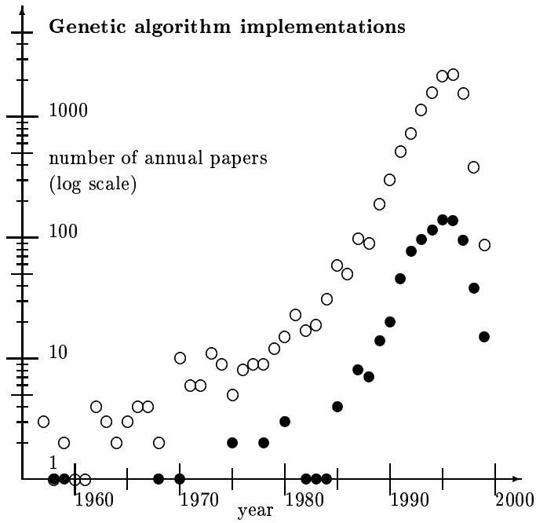

# An Indexed Bibliography of Genetic Algorithm Implementations

compiled by

Jarmo T. Alander

Department of Information Technology and Production Economics

University of Vaasa

P.O. Box 700, FIN-65101 Vaasa, Finland

e-mail: Jarmo.Alander@uwasa.fi   
www: http://www.uwasa.fi/\~ jal phone: +358-6-324 8444 fax: +358-6-324 8467

Report Series No. 94-1-IMPLE

DRAFT July 23, 1999

available via anonymous ftp: site ftp.uwasa.fi directory cs/report94-1 file gaIMPLEbib.ps.Z

Copyright $©$ 1994, 1995, 1996, 1997, 1998, 1999 Jarmo T. Alander

# Trademarks

Product and company names listed are trademarks or trade names of their respective companies.

# Warning

While this bibliography has been compiled with the utmost care, the editor takes no responsibility for any errors, missing information, the contents or quality of the references, nor for the usefulness and/or the consequences of their application. The fact that a reference is included in this publication does not imply a recommendation. The use of any of the methods in the references is entirely at the user's own responsibility. Especially the above warning applies to those references that are marked by trailing ' r \*), which are the ones that the editor has unfortunately not had the opportunity to read. An abstract was available of the references marked with '\*'.

# Contents

# 1 Preface 1

1.1 Your contributions erroneous or missing? 1   
1.1.1 How to cite this report? 2   
1.2 How to get this report via Internet? 2   
1.3 Acknowledgement . . 2

# 2 Introduction 5

# 3 Statistical summaries 7

3.1 Publication type 7

3.2 Annual distribution 7   
3.3 Classification 8   
3.4 Authors . 8   
3.5 Geographical distribution 8   
3.6 Conclusions and future . 10

# 4 Indexes 11

# 4.1 Books 11

4.2 Journal articles 11   
4.3 Theses . . 13   
4.3.1 PhD theses 13   
4.3.2 Master's theses 13   
4.4 Report series 14   
4.5 Patents 14   
4.6 Authors 15   
4.7 Subject index 25   
4.8 Annual index 34   
4.9 Geographical index . . . 35

# Bibliography

# 37

# Appendixes 81

A Abbreviations 81   
B Bibliography entry formats 82

# List of Tables

1.1 Indexed GA subbibliographies. 3   
2.1 Queries used to extract this subbibliography from the source database. 5   
3.1 Distribution of publication type. 7   
3.2 Annual distribution of contributions. 7   
3.3 The most popular subjects. 8   
3.4 The most productive genetic algorithm implementations authors. 8   
3.5 The geographical distribution of the authors. Observe that joint papers may have authors from several countries. This decreases the unknown country count ( $=$ all- known countries). 9

# Chapter 1

# Preface

"Living organism are consummate problem solvers. They exhibit a versatility that puts the best computer programs to shame."

John H. Holland [1]

The material of this bibliography has been extracted from the genetic algorithm bibliography [2], which when this report was compiled (July 23, 1999) contained 11380 items and which has been collected from several sources of genetic algorithm literature including Usenet newsgroup comp.ai.genetic and the bibliographies [3, 4, 5, 6]. The following index periodicals have been used systematically

• A: International Aerospace Abstracts: Jan. 1995 - Sep. 1998   
• ACM: ACM Guide to Computing Literature: 1979 - 1993/4   
• BA: Biological Abstracts: July 1996 - Aug. 1998   
•CA: Computer Abstracts: Jan. 1993 - Feb. 1995   
• CCA: Computer & Control Abstracts: Jan. 1992 - Apr. 1998 (except May -95)   
•ChA: Chemical Abstracts: Jan. 1997 - Dec. 1998   
• CTI: Current Technology Index Jan./Feb. 1993 - Jan./Feb. 1994   
• DAI: Dissertation Abstracts International: Vol. 53 No. 1 - Vol. 56 No. 10 (Apr. 1996)   
•EEA: Electrical & Electronics Abstracts: Jan. 1991 - Apr. 1998   
• EI A: The Engineering Index Annual: 1987 - 1992   
• EI M: The Engineering Index Monthly: Jan. 1993 - Apr. 1998 (except May 1997)   
• N: Scientific and Technical Aerospace Reports: Jan. 1993 - Dec. 1995 (except Oct. 1995)   
• P: Index to Scientific & Technical Proceedings: Jan. 1986 - May 1998 (except Nov. 1994)   
•PA: Physics Abstracts: Jan. 1997 - Sep. 1998

# 1.1 Your contributions erroneous or missing?

The bibliography database is updated on a regular basis and certainly contains many errors and inconsistences. The editor would be glad to hear from any reader who notices any errors, missing information, articles etc. In the future a more complete version of this bibliography will be prepared for the genetic algorithm implementations research community and others who are interested in this rapidly growing area of genetic algorithms.

When submitting updates to the database, paper copies of already published contributions are preferred. Paper copies (or ftp ones) are needed mainly for indexing. We are also doing reviews of different aspects and applications of GAs where we need as complete as possible collection of GA papers. Please, do not forget to include complete bibliographical information: copy also proceedings volume title pages, journal table of contents pages, etc. Observe that there exists several versions of each subbibliography, therefore the reference numbers are not unique and should not be used alone in communication, use the key appearing as the last item of the reference entry instead.

Complete bibliographical information is really helpful for those who want to find your contribution in their lbraries. If your paper was worth writing and publishing it is certainly worth to be referenced right in a bibliographical database read daily by GA researchers, both newcomers and established ones.

For further instructions and information see ftp.uwasa.fi/cs/GAbib/README.

# 1.1.1 How to cite this report?

The complete BiBTEX record for this report is shown below:

@TECHREPORT{gaIMPLEbib, KEY $=$ "IMPLE", ANNOTE $=$ "\*on, $\ast \mathtt { F } \mathtt { I N }$ ,bibliography /special", AUTHOR $=$ "Jarmo T. Alander", TITLE $=$ "Indexed Bibliography of Genetic Algorithm Implementations", INSTITUTION $=$ "University of Vaasa, Department of Information Technology and Production Economics", TYPE $=$ "Report", NUMBER $=$ "94-1-IMPLE", NOTE $=$ "(\ftp{ftp.uwasa.fi}{cs/report94-1}{gaIMPLEbib.ps.Z})", YEAR $=$ 1995

}

You can alsouse the BiBTX fle GASUB.ib,which isavailable nour sitepwasa. direy cs/report94-1 and contains records for all GA subbibliographies.

# 1.2 How to get this report via Internet?

Versions of this bibliography are available via anonymous ftp and www from the following sites:

media country site directory file ftp Finland ftp.uwasa.fi /cs/report94-1 gaIMPLEbib.ps.Z WWW Finland http://www.cs.hut.fi \~ja/gaIMPLEbib gaIMPLEbib.html

Observe that these versions may be somewhat different and perhaps reduced as compared to this volume that you are now reading. Due to technical problems in transforming ITEXdocuments into html ones the www versions contain usually less information than the corresponding ftp ones. It is also possible that the www version is completely unreachable.

The directory also contains some other indexed GA bibliographies shown in table 1.1. In case you do not find a proper one please let us know: it may be easy to tailor a new one.

# 1.3 Acknowledgement

The editor wants to acknowledge all who have kindly supplied references, papers and other information on genetic algorithm implementations literature. At least the following GA researchers have already kindly supplied their complete autobibliographies and/or proofread references to their papers: Dan Adler, Patrick Argos, Jarmo T. Alander, James E. Baker, Wolfgang Banzhaf, Helio J. C. Barbosa, Hans-Georg Beyer, Christian Bierwirth, Joachim Born, Ralf Bruns, I. L. Bukatova, Thomas Bäck, David E. Clark, Carlos A. Coello Coello, Yuval Davidor, Dipankar Dasgupta, Marco Dorigo, J. Wayland Eheart, Bogdan Filipi, Terence C. Fogarty, David B. Fogel, Toshio Fukuda, Hugo de Garis, Robert C. Glen, David E. Goldberg, Martina Gorges-Schleuter, Hitoshi Hemmi, Vasant Honavar, Jefrey Horn, Aristides T.

ga90bib.ps.Z   
ga91bib.ps.Z   
ga92bib.ps.Z   
ga93bib.ps.Z   
ga94bib.ps.Z   
ga95bib.ps.Z   
ga96bib.ps.Z   
ga97bib.ps.Z   
ga98bib.ps.Z   
gaAIbib.ps.Z   
gaALIFEbib.ps.Z   
gaARTbib.ps.Z   
gaAUSbib.ps.Z   
gaBASICSbib.ps.Z   
gaBIObib.ps.Z   
gaCADbib.ps.Z   
gaCHEMPHYSbib.ps.Z   
gaCONTROLbib.ps.Z   
gaCSbib.ps.Z   
gaDBbib.ps.Z   
gaECObib.ps.Z   
gaENGbib.ps.Z   
gaESbib.ps.Z   
gaFAR-EASTbib.ps.Z   
gaFRAbib.ps.Z   
gaFTPbib.ps.Z   
gaFUZZYbib.ps.Z   
gaGERbib.ps.Z   
gaGPbib.ps.Z   
gaIMPLEbib.ps.Z   
gaISbib.ps.Z   
gaJOURNALbib.ps.Z   
gaLATINbib.ps.Z   
gaLOGISTICSbib.ps.Z   
gaMANUbib.ps.Z   
gaMEDITERbib.ps.Z   
gaNNbib.ps.Z   
gaNORDICbib.ps.Z   
gaOPTIMIbib.ps.Z   
gaOPTICSbib.ps.Z   
gaORbib.ps.Z   
gaPARAbib.ps.Z   
gaPOWERbib.ps.Z   
gaPROTEINbib.ps.Z   
gaROBOTbib.ps.Z   
gaSAbib.ps.Z   
gaSIGNALbib.ps.Z   
gaTHEORYbib.ps.Z   
gaTOP10bib.ps.Z   
gaUKbib.ps.Z   
gaVLSIbib.ps.Z   
GA in 1990   
GA in 1991   
GA in 1992   
GA in 1993   
GA in 1994   
GA in 1995   
GA in 1996   
GA in 1997   
GA in 1998   
GA in artificial intelligence   
GA in artificial life   
GA in art and music   
GA in Australia   
Basics of GA   
GA in biosciences including medicine   
GA in Computer Aided Design   
GA in chemistry and physics   
GA in control   
GA in computer science (incl. databases and GP)   
GA in databases   
GA in economics and finance   
GA in engineering   
Evolution strategies   
GA in the Far East (Japan etc)   
GA in France   
GA papers available via ftp   
GA and fuzzy logic   
GA in Germany   
genetic programming   
implementations of GA   
immune systems   
journal articles   
GA in Latin America, Portugal & Spain   
GA in logistics   
GA in manufacturing   
GA in the Mediterranean   
GA in neural networks   
GA in Nordic countries   
GA and optimization (only a few refs)   
GA in optics and image processing   
GA in operations research   
Parallel and distributed GA   
GA in power engineering   
GA in protein research   
GA in robotics   
GA and simulated annealing   
GA in signal and image processing   
Theory and analysis of GA   
Authors having at least 10 GA papers   
GA in United Kingdom   
GA in VLSI design and testing

Hatjimihail, Mark J. Jakiela, Richard S. Judson, Bryant A. Julstrom, Charles L. Karr, Akihiko Konagaya, Aaron Konstam, John R. Koza, Kristinn Kristinsson, D. P. Kwok, Gregory Levitin, Carlos B. Lucasius, Michael de la Maza, John R. McDonnell, J. J. Merelo, Laurence D. Merkle, Zbigniew Michalewics, Melanie Mitchell, David J. Nettleton, Volker Nissen, Ari Nissinen, Tomasz Ostrowski, Kihong Park, Nicholas J. Radcliffe, Colin R. Reeves, Gordon Roberts, David Rogers, Ivan Santibáñez-Koref, Marc Schoenauer, Markus Schwehm, Hans-Paul Schwefel, Michael T. Semertzidis, Moshe Sipper, William M. Spears, Donald S. Szarkowicz, El-Ghazali Talbi, Masahiro Tanaka, Leigh Tesfatsion, Peter M. Todd, Marco Tomassini, Andrew L. Tuson, Jari Vaario, Gilles Venturini, Hans-Michael Voigt, Roger L. Wainwright, D. Eric Walters, James F. Whidborne, Steward W. Wilson, Xin Yao, and Xiaodong Yin.

The editor also wants to acknowledge Elizabeth Heap-Talvela for her kind proofreading of the manuscript of this bibliography.

# Chapter 2

# Introduction

The table 2.1 gives the queries that have been used to extract this bibliography. The query system as well as the indexing tools used to compile this report from the BiBTEX-database [7] have been implemented by the author mainly as sets of simple awk and gawk programs [8, 9].

<table><tr><td>string</td><td>field</td><td>class</td></tr><tr><td>MANUAL</td><td>citeKey</td><td>Implementation</td></tr><tr><td>implementation /hardware</td><td>ANNOTE</td><td>Implementation</td></tr><tr><td>implementation</td><td>ANNOTE</td><td>Implementation</td></tr><tr><td>population size</td><td>ANNOTE</td><td>Implementation</td></tr><tr><td>crossover</td><td>ANNOTE</td><td>Implementation</td></tr><tr><td>mutation</td><td>ANNOTE</td><td>Implementation</td></tr><tr><td>fitness</td><td>ANNOTE</td><td>Implementation</td></tr><tr><td>coding</td><td>ANNOTE</td><td>Implementation</td></tr><tr><td>text book</td><td>ANNOTE</td><td>Implementation</td></tr><tr><td>gaPARAbib</td><td>citeKey</td><td>Implementation</td></tr><tr><td>gaGPbib</td><td>citeKey</td><td>Implementation</td></tr><tr><td>gaTHEORYbib</td><td>citeKey</td><td>Implementation</td></tr><tr><td>gaIMPLEbib</td><td>citeKey</td><td>Implementation</td></tr></table>

Table 2.1: Queries used to extract this subbibliography from the source database.

# Chapter 3

# Statistical summaries

This chapter gives some general statistical summaries of genetic algorithm implementations literature. More detailed indexes can be found in the next chapter.

References to each class (c.f table 2.1) are listed below:

Implementation 820 references ([10]-[829]

Observe that each reference is included (by the computer) only to one of the above classes (see the queries for classification in table 2.1; query order gives priority for classes).

type number of items   

<table><tr><td>book</td><td>36</td></tr><tr><td>section of a book</td><td>3</td></tr><tr><td>part of a collection</td><td>26</td></tr><tr><td>journal article</td><td>228</td></tr><tr><td>proceedings article</td><td>423</td></tr><tr><td>report</td><td>65</td></tr><tr><td>manual</td><td>9</td></tr><tr><td>PhD thesis</td><td>16</td></tr><tr><td>MSc thesis</td><td>13</td></tr><tr><td>others</td><td>1</td></tr><tr><td>total</td><td>820</td></tr></table>

# 3.1 Publication type

This bibliography contains published contributions including reports and patents. All unpublished manuscripts have been omitted unless accepted for publication. In addition theses, PhD, MSc etc., are also included whether or not published somewhere.

Table 3.1 gives the distribution of publication type of the whole bibliography. Observe that the number of journal articles may also include articles published or to be published in unknown forums.

# 3.2 Annual distribution

Table 3.2 gives the number of genetic algorithm implementations papers published annually. The annual distribution is also shown in fig. 3.1. The average annual growth of GA papers has been approximately $4 0 ~ \%$ during almost the last twenty years.

Table 3.1: Distribution of publication type.   
Table 3.2: Annual distribution of contributions.   

<table><tr><td>year</td><td>items</td><td>year</td><td>items</td></tr><tr><td>1958</td><td>1</td><td>1959</td><td>1</td></tr><tr><td>1960</td><td>0</td><td>1961</td><td>0</td></tr><tr><td>1962</td><td>0</td><td>1963</td><td>0</td></tr><tr><td>1964</td><td>0</td><td>1965</td><td>0</td></tr><tr><td>1966</td><td>0</td><td>1967</td><td>0</td></tr><tr><td>1968</td><td>1</td><td>1969</td><td>0</td></tr><tr><td>1970</td><td>1</td><td>1971</td><td>0</td></tr><tr><td>1972</td><td>0</td><td>1973</td><td>0</td></tr><tr><td>1974</td><td>0</td><td>1975</td><td>2</td></tr><tr><td>1976</td><td>0</td><td>1977</td><td>0</td></tr><tr><td>1978</td><td>2</td><td>1979</td><td>0</td></tr><tr><td>1980</td><td>3</td><td>1981</td><td>0</td></tr><tr><td>1982</td><td>1</td><td>1983</td><td>1</td></tr><tr><td>1984</td><td>1</td><td>1985</td><td>4</td></tr><tr><td>1986</td><td>0</td><td>1987</td><td>8</td></tr><tr><td>1988</td><td>7</td><td>1989</td><td>14</td></tr><tr><td>1990</td><td>20</td><td>1991</td><td>45</td></tr><tr><td>1992</td><td>77</td><td>1993</td><td>95</td></tr><tr><td>1994</td><td>114</td><td>1995</td><td>139</td></tr><tr><td>1996</td><td>136</td><td>1997</td><td>94</td></tr><tr><td>1998</td><td>38</td><td>1999</td><td>15</td></tr><tr><td>total</td><td></td><td></td><td>820</td></tr></table>

# 3.3 Classification

Every bibliography item has been given at least one describing keyword or classification by the editor of this bibliography. Keywords occurring most are shown in table 3.3.

# 3.4 Authors

Table 3.4 gives the most productive authors.

total number of authors 1190   
Goldberg, David E. 14   
Alander, Jarmo T. 12   
Fogarty, Terence C. 11   
1 author 9   
3 authors 8   
4 authors 7   
3 authors 6   
22 authors 5   
18 authors 4   
36 authors 3   
152 authors 2   
947 authors 1   
implementation 276   
crossover 136   
coding 117   
parallel GA 108   
population size 89   
analysing GA 73   
mutation 60   
comparison 43   
fitness 41   
genetic programming 39   
protein folding 35   
neural networks 33   
optimization 32   
TSP 31   
engineering 28   
text book 27   
scheduling 23   
generations 22   
evolution strategies 17   
chemistry 17   
image processing 16   
control 13   
mutations 12   
CAD 11   
hybrid 10   
graphs 10   
fitness function 10   
others 1921

# 3.5 Geographical distribution

The following table gives the geographical distribution of authors, when the country of the author was known. Over $8 0 \%$ of the references of the source database are classified by country.

Table 3.5: The geographical distribution of the authors. Observe that joint papers may have authors from several countries. This decreases the unknown country count ( $\underline { { \underline { { \mathbf { \Pi } } } } }$ all - known countries).   

<table><tr><td>country</td><td>abs</td><td>%</td></tr><tr><td>Total</td><td>820</td><td>100.00</td></tr><tr><td>United States</td><td>273</td><td>33.29</td></tr><tr><td>United Kingdom</td><td>95</td><td>11.59</td></tr><tr><td>Germany (incl. DDR)</td><td>86</td><td>10.49</td></tr><tr><td>Japan</td><td>55</td><td>6.71</td></tr><tr><td>Unknown country</td><td>42</td><td>5.12</td></tr><tr><td>Finland</td><td>28</td><td>3.41</td></tr><tr><td>Australia</td><td>25</td><td>3.05</td></tr><tr><td>Italy</td><td>19</td><td>2.32</td></tr><tr><td>Canada</td><td>16</td><td>1.95</td></tr><tr><td>China (incl. Hong Kong)</td><td>16</td><td>1.95</td></tr><tr><td>Spain</td><td>16</td><td>1.95</td></tr><tr><td>India</td><td>11</td><td>1.34</td></tr><tr><td>The Netherlands</td><td>11</td><td>1.34</td></tr><tr><td>South Korea</td><td>10</td><td>1.22</td></tr><tr><td>Czech Republic</td><td>8</td><td>0.98</td></tr><tr><td>Russia</td><td>8</td><td>0.98</td></tr><tr><td>Austria</td><td>7</td><td>0.85</td></tr><tr><td>France</td><td>7</td><td>0.85</td></tr><tr><td>Taiwan R.o.C.</td><td>7</td><td>0.85</td></tr><tr><td>Ireland</td><td>6</td><td>0.73</td></tr><tr><td>Sweden</td><td>6</td><td>0.73</td></tr><tr><td>Poland Switzerland</td><td>5</td><td>0.61</td></tr><tr><td></td><td>5</td><td>0.61</td></tr><tr><td>Denmark</td><td>4</td><td>0.49</td></tr><tr><td>Israel</td><td>4</td><td>0.49</td></tr><tr><td>Belgium</td><td>3</td><td>0.37</td></tr><tr><td>Romania</td><td>3</td><td>0.37</td></tr><tr><td>Hungary</td><td>2</td><td>0.24</td></tr><tr><td>New Zealand</td><td>2</td><td>0.24</td></tr><tr><td>Portugal Singapore</td><td>2</td><td>0.24</td></tr><tr><td>Turkey</td><td>2</td><td>0.24 0.24</td></tr><tr><td>Brazil</td><td>2</td><td>0.12</td></tr><tr><td>Croatia</td><td>1</td><td></td></tr><tr><td>Republic of South Africa</td><td>1</td><td>0.12</td></tr><tr><td>Saudi Arabia</td><td>1</td><td>0.12</td></tr><tr><td>Slovak Republic</td><td>1 1</td><td>0.12 0.12</td></tr><tr><td>Thailand</td><td>1</td><td>0.12</td></tr><tr><td></td><td></td><td></td></tr><tr><td>Ukraina</td><td>1</td><td>0.12</td></tr></table>

  
Figure 3.1: The number of papers applying genetic algorithm implementations $( \bullet )$ $\circ = { \mathrm { t o } } -$ tal GA papers. Observe that the last two years are most incomplete in the database.

# 3.6 Conclusions and future

The editor believes that this bibliography contains references to most genetic algorithm implementations contributions upto and including the year 1998 and the editor hopes that this bibliography could give some help to those who are working or planning to work in this rapidly growing area of genetic algorithms.

# Chapter 4

# Indexes

# 4.1 Books

The following list contains all items classified as books.

An Introduction to Genetic Algorithms, [809, 813]   
Applications of Modern Heuristic Methods, [803]   
Artificial Life, An Overview, [802]   
Biochemistry, [825]   
$\mathrm { C } + +$ Power Paradigms, [409]   
Computational Intelligence for Optimization, [811]   
Enzyme Structure and Mechanism, [821]   
Evolution and Optimum Seeking, [804]   
Evolutionary Algorithms in Theory and Practice, [810]   
Evolutionary Computation: Toward a New Philosophy of Machine Intelligence, [801]   
Evolutionary Search and the Job Shop, [807]   
Evolutionsstrategie '94, [796]   
Evolutionäre Algorithmen, Darstellung, Beispiele, betriebswirtschaftliche Anwendungmöglichkeiten, [795]   
Genetic Algorithms, [805]   
Genetic Algorithms $^ +$ Data Structures $=$ Evolution Programs, [800, 808, 818]   
Genetic Programming II, Automatic Discovery of Reusable Programs, [799]   
Genetic Programming III, [816]   
Genetic Programming \~ An Introduction, [812]   
Genetic algorithm, [817]   
Genetic algorithms in optimization, simulation and modelling, [798]   
Genetischer Algoritmen und Evolutionsstrategien, [797]   
Giant Molecules - Here, There, and Everywhere.., [823]   
Industrial Enzymes and Their Applications, [829]   
Introduction to Proteins and Protein Engineering, [828]   
Introduction to Protein Folding, [820]   
Optimierung mit genetischen und selektiven Algorithmen, [794]   
Practical Genetic Algorithms, [814]   
Principles of Enzymology for Technical Applications, [827]   
Principles of Protein Structure, [822]   
Protein Folds, [824]   
Solu- ja molekyylibiologia, [826]   
Statistical thermodynamics for chemists and biochemists, [819]   
Theory of Deductive Systems and its Applications, [694] total 33 books

# 4.2 Journal articles

The following list contains the references to every journal article included in this bibliography. The list is arranged in alphabetical order by the name of the journal.

@CSC, [482]   
ACM Trans. Math. Softw., [421]   
Acta Electronica Sinica (China), [58]   
Advanced Technology for Developers, [522, 525, 560, 768]   
AI Expert, [370, 388, 408, 569, 594]   
Analytica Chimica Acta, [769]   
Annals of Mathematics and Artificial Intelligence, [633, 242, 270]   
APL Quote Quad, [404, 444, 450, 509, 561]   
Applied Mathematics and Computation, [741]   
Applied Optics, [574, 791]   
Artificial Intelligence Review, [98, 108]   
Atmospheric Environment Part A General Topics, [754]   
Biochemical Journal, [709]   
Biochemistry, [218, 621]   
Bioinformatics, [503]   
Biological Cybernetics, [234, 686, 758, 250, 336]   
BioSystems, [164, 44]   
BYTE, [382]   
Chemical Physics Letters, [792]   
Chromatographia, [770]   
Complex Systems, [13, 156, 184, 326, 121, 761, 332]   
Complex Systems (USA), [47]   
Comput. Appl. Biosci., [604]   
Comput. Ind. (Netherlands), [487]   
Computer, [392]   
Computer Applications in the Biosciences (CABIOS), [464]   
Computer Graphics, [602]   
Computer Methods and Programs in Biomedicine, [407]   
Computer Physics Communications, [785]   
Computer-Aided Innovation of New Materials, [696]   
Computers and Geotechnics, [790]   
Computers & Chemistry, [372, 391, 394, 104]   
Computers & Industrial Engineering, [144, 146, 41]   
Computers & Mathematics with Applications, [532, 765]   
Computers & Operations Research, [720, 152, 725, 176, 179, 668, 310]   
Control Engineering Practice, [400]   
Cybernetics and Systems, [330]   
Discrete Applied Mathematics, [111]   
Dr. Dobb's Journal, [373, 484]   
Electric Power Systems Research, [360]   
Electronic Engineering Times, [617]   
Electronics Letters, [30, 351, 779]   
Engineering Applications of Artificial Intelligence, [535]   
Eur. J. Oper. Res. , [669]   
European Journal of Operational Research, [49, 197, 230, 749]   
European Journal of Operations Research, [772]   
Europhysics Letters, [748]   
Evolutionary Computation, [276, 163, 180, 499]   
Future Generation Computer Systems, [539]   
Geophysical Journal International, [774]   
Geophysics, [773]   
IBM Journal, [541]   
IBM Journal of Research and Development, [542]   
IEE Proc., Commun. (UK), [72]   
IEE Proc., Comput. Digit. Tech. (UK), [488]   
IEE Proceedings J: Optoelectronics, [129]   
IEE Proceedings, Computers and Digital Techniques, [147]   
IEEE Control Systems Magazine, [776]   
IEEE Engineering in Medicine and Biology, [707]   
IEEE Transactions on Communications, [65]   
IEEE Transactions on Computer-Aided Design of Integrated Circuits and Systems, [521]   
IEEE Transactions on Evolutionary Computing, [227]   
IEEE Transactions on Industrial Electronics, [51, 100]   
IEEE Transactions on Knowledge and Data Engineering, [303]   
IEEE Transactions on Magnetics, [398, 456]   
IEEE Transactions on Neural Networks, [365, 723, 15]   
IEEE Transactions on Power Systems, [203, 480, 116, 581]   
IEEE Transactions on Systems, Man, and Cybernetics, [631, 204, 755]   
IEICE Transactions on Fundamentals of Electronics Communications and Computer Sciences, [150]   
Image and Vision Computing, [764]   
Inf. Sci. (USA), [96]   
Information Processing & Management, [232]   
Information Sciences, [623, 744]   
Int. J. Mod. Phys. C, Phys. Comput. (Singapore), [356, 425]   
Int.J. Syst. Sci. (UK), [231]   
International Journal of Electronics, [258]   
International Journal of Intelligent Systems, [210]   
International Journal of Production Research, [555]   
International Journal of Quantum Chemistry, [329]   
J. KISS(A), Comput. Syst. Theory (South Korea), [442]   
J. Korea Inst. Telemat. Electron. (South Korea), [730]   
Journal of Chemical Information and Computer Sciences, [458, 747, 757]   
Journal of Chemical Physics, [102]   
Journal of Computational Chemistry, [734, 767]   
Journal of Computer-Aided Molecular Design, [713]   
Journal of Molecular Biology, [77]   
Journal of Optimization Theory and Applications, [97]   
Journal of Parallel and Distributed Computing, [489, 492]   
Journal of Soviet Mathematics, [692, 693]   
Journal of Structural Engineering, [417]   
Journal of Structural Engineering - ASCE, [558]   
Journal of Systems Architecture, [452]   
Journal of the Chemical Society - Faraday Transactions, [221]   
Journal of the Chemical Society - Perkin Transactions 1, [740]   
Journal of Theoretical Biology, [397, 419, 33]   
Kwart. Elektron. Telekomun. (Poland), [661]   
Kybernetes, [695]   
Lettre du Transputer et des Calculateurs Distribués, [609]   
Machine Learning, [114, 789]   
Math. Comput. Model. (UK), [636, 298]   
Mathematical Biosciences, [257]   
Mathware & Soft Computing, [45]   
Mechatronics, [381, 473]   
Memoirs of the Faculty of Engineering, Okayama University, [639]   
Microprocessing and Microprogramming EURO-Micro Journal, [528]   
Mikroelektronika (Russia), [343]   
Nanjing University of Aeronautics & Astronautics, Transactions, [84]   
Nature, [704, 705, 711, 712]   
Neural Networks, [86]   
Neural Process. Lett. (Netherlands), [50]   
Nippon Kikai Gakkai Ronbunshu A Hen, [646]   
Nuclear Technology, [483]   
Operations Research, [212]   
Parallel Computing, [328]   
Parallel Processing Letters, [239]   
Pattern Recognition, [222, 681]   
Physical Review E, [746, 680]   
Physical Review Letters, [766]   
Proc. Inst. Mech. Eng. I, J. Syst. Control Eng. (UK), [673]   
Proceedings of the National Academy of Sciences of the United States of America, [719, 229, 702, 706, 139, 140, 141]   
Protein Engineering, [375]   
Protein Science, [736]   
Protins: Structure, Function, and Genetics, [74]   
Robotics and Autonomous Systems, [468]   
Russian Microelectronics (USA), [422]   
Science, [710]   
Scientific American, [589]   
Scientific Computing World, [478]   
SIAM News, [608]   
SIGICE Bulletin, [385]   
Signal Processing, [593]   
SIGPLAN OOPS Messenger, [620]   
SuperMenu, [550]   
The International Journal of Mathematical Applications in Science and Technology, [35]   
The Mathematica Journal, [556]   
Trans. Inst. Electr. Eng. Jpn. C (Japan), [181]   
Transaction of the Institute of Electrical Engineers of Japan C, [38]   
Transaction of the Institute of Electronics, Information and Communication Engineers D-I (Japan), [387, 334]   
Transactions of the Institute of Electrical Engineers of Japan C, [160]   
Transactions of the Institute of Electrical Engineers of Japan D, [301]   
Transactions of the Institute of Electronics, Information, and Communication Engineers D-I, [228]   
Transactions of the Institute of Electronics, Information, and Communication Engineers D-II (Japan), [80]   
Transactions of the Institute of System, Control, and Information Engineers (Japan), [300]   
Transactions of the Society of Instrument and Control Engineers (Japan), [366]   
Wall Street Journal, [504]   
Wuhan Univ. J. Nat. Sci. (China), [439, 656] total 228 articles in 146 series

# 4.3 Theses

The following two lists contain theses, first PhD theses and then Master's etc. theses, arranged in alphabetical order by the name of the school.

# 4.3.1 PhD theses

Colorado State University, [128]

Illinois Institute of Technology, [371]   
Louisiana State University of Agricultural and Mechanical College, [320]   
North Dakota State University of Agriculture and Applied Sciences, [246, 559, 612]   
Syracuse University, [162]   
Tampere University of Technology, [465]   
The Ohio State University, [554]   
The Pennsylvania State University, [618]   
University of California, [363]   
University of Illinois at Chicago, [619]   
University of Missouri - Rolla, [243]   
University of New Hamshire, [99]   
University of New Mexico, [290]   
University of Stirling, [123] total 16 thesis in 14 schools

# 4.3.2 Master's theses

This list includes also "Diplomarbeit", "Tech. Lic.   
Theses", etc.   
Air Force Institute of Technology, [530]   
Concordia University, [255]   
Helsinki University of Technology, [374]   
Tampere University of Technology, [378]   
University of Helsinki, [297]   
University of Nebraska-Lincoln, [380]   
University of North Carolina at Charlotte, [352]   
University of Tampere, [460]   
University of Tulsa, [568]   
Universität Würzburg, [359]   
Vanderbilt University, [591]   
Victoria University of Wellington, [124]   
Vienna University of Economics and Business Admimisti tion, [440]

# 4.4 Report series

The following list contains references to all papers published as technical reports. The list is arranged in alphabetical order by the name of the institute.

Akademie der Wissenschaft der DDR, [515]   
Australian Defence Force Academy, [287]   
Carnegie-Mellon University, [186]   
Catholic University Nijmegen, [570]   
Edinburgh Parallel Computing Centre, [606, 607]   
Friedrich-Alexander-Universität Erlangen-Nürnberg, [600 Indian Institute of Technology, [786]   
International Computer Science Institute (ICSI), [321] Kernforschungsanlage Jülich, [595, 596]   
Leiden University, [187]   
Michigan State University, [361, 436]   
Naval Research Laboratory, [185]   
Naval Research Laboratory AI Center, [266]   
Navy Research Laboratory, [684]   
Physical Optics Corporation, [358]   
Plymouth Engineering Design Centre, [244]   
Politecnico di Milano, [526]   
Rensselaer Polytechnic Institute, [592]   
Ruhr-Universität Bochum, [643]   
Sandia National Laboratories, [584, 586]   
Stanford University, [428]   
Tennessee University, [778]   
The University of Rochester, [518]   
Tulane University, [433, 252]   
Universidad de Granada,[48]   
University of Alabama, [759, 247, 543, 545, 782, 784]   
University of California, [549]   
University of Cambridge, [110]   
University of Dortmund, [190, 512, 553]   
University of Edinburgh, [383]   
University of Granada, [188, 193]   
University of Illinois at Urbana-Champaign, [119, 325, 54. University of Michigan, [588]   
University of Nebraska-Lincoln, [490, 497]   
University of San Diego, [113]   
University of Tampere, [437, 471]

University of Vaasa, [137, 339, 340, 341, 342] Universität Hildesheim, [729] Universität Karlsruhe, [355] Universität Osnabrück, [564] Universität Würzburg, [399] Université McGill, [635] Vanderbilt University, [548, 590] total 65 reports in 43 institutes

# 4.5 Patents

The following list contains the names of the patents of genetic algorithm implementations. The list is arranged in alphabetical order by the name of the patent.

# 4.6 Authors

The following list contains all genetic algorithm implementations authors and references to their known contributions.

Aarts, E. H. L., [111]   
Abe, Tamotsu, [744]   
Abkevich, Victor I., [229]   
Abramson, David, [508]   
Adeli, H., [365]   
Adeli, Hojjat, [417]   
Aggarwal, Charu C., [212]   
Aguado-Bayon, L. Enrique, [27]   
Ahuja, Sanjay P., [622]   
Ait-Boudaoud, D., [389]   
Aizawa, Akiko, [291]   
Akamatsu, N., [304]   
Akbarzadeh, Mohammad-R., [395]   
Alander, Jarmo T., [345, 318, 507, 137, 715, 339, 340, 353, 341 716, 717, 342   
Alfonseca, Manuel, [509]   
Alippi, Cesare, [392, 510]   
Almeida, F., [418]   
Amin, Minesh B., [489]   
Amini, Mohammad M., [230]   
Anand, Vic, [264]   
Anderson, D., [523]   
Anderson, P. G., [299]   
Andre, Dayid, [428, 68, 469,   
Angeline, Peter J., [194, 213, 496]   
Angus, J. E., [636]   
Anheyer, Thomas, [632]   
Ann, SouGuil, [30]   
Anon., 532. 57] [10, 504, 520,   
Ansari, Nirwan, [811]   
Antonisse, Hendrik James, [112]   
Arabas, Jaroslaw, [718, 165]   
Argos, Patrick, [752]   
Arslan, T., [415, 455, 467, 350]   
Açveren, Tolga, [195]   
Audic, Stéphane, [141]

Born, Joachim, [514, 515, 516, 517, 321] Bornberg-Bauer, Erich, [306] Bornholdt, Stefan, [292] Bowie, James U., [719] Bramer, M. A., [466] Branden, Carl, [820] Branke, Jürgen, [355] Breeden, Joseph L., [278, 286] Brigger, P., [28] Brown, Christopher M., [518, 519] Brunak, Søren, [824] Brusic, Vladimir, [503] Bubak, M., [432, 474] Buckles, Bill P., [433, 236] Bui, Thang Nguyen, [634] Bull, David R., [24, 51, 59] Burton, A. R., [305, 313] Burton, Randall E., [621] Buxton, Bernard, [462] Buydens, Lutgarde M. C., [202, 769] Cain, Greg, [429] Calabretta, R., [50] Camacho, E. F., [78] Campanini, Renato, [356] Camussi, A., [604] Cantu-Paz, E., [743] Carpio, Carlos Adriel Del, [458] Carr, William L., [237] Carrasco, A., [72] Carrera, Cecilia, [197] Carter, Bob, [183] Carter, Jonathan Neil, [176] Cartwright, Hugh M., [754] Caruana, Richard A., [30, 260, 131] Caruana, Rich, [186, 192] Castañon, David A., [489] Castellanos, J., [500]

Caumeid, n. Jom, [41] Culway, Damer G., [IZU] Dultas, nejtall, [111] Cedeño, Walter, [307] Cook, Diane J., [721] Dorey, Robert E., [775,776] Celino, M., [446] Copland, H., [672] Dorigo, Marco, [526, 527, 528] Cemes, R., [389] Corcoran, III, Arthur Leo, [20, 61] Drechsler, Rolf, [477] Chae, Soo-Ik, [30] Corne, David W., [627] Dumont, Guy A. M., [381] Chambers, Lance, [420] Corno, Fulvio, [434] Dunham, B., [542] Chan, H., [406] Corwin, Edward M., [531] Durrani, T. S., [529] Chan, K. C., [144] Crummey, T. P., [390] Dvoák, Vaclav, [401, 435, 493] Chan, Shu-Park, [258] Cui, Jun, [537, 538, 539] Dyabin, M. I., [343, 422] Chang, Mei-Shiang, [56] Culberson, Joseph C., [180, 685] Dymek, A., [530] Chatterjee, Amitabha, [222] Dabs, Tanja, [359, 399] East, Ian R., [650, 731] Chatterjee, Sangit, [197] D'Agostino, G., [446] East, Ian, [571, 573] Chaudhury, Santanu, [222] DAmbrosio, Joseph G., [294] Eaton, Malachy, [73, 95] Chellapilla, Kumar, [214, 227] Dandekar, Thomas, [752] Edmondson, L. Vincent, [243] Chen, Cha'o-Kuang, [741] Danowitz, Joshua, [42] Eiben, Agoston E., [187, 198] Chen, Chieh-Li, [741] D'Antone, I. D., [356] Eiben, Agoston E., [233] Chen, Huye-Kuo, [56] Darden, Thomas A., [218] Eigen, Manfred, [686] Chen, J. H., [645] Darwen, Paul J., [287, 289, 293] Eijsink, Vincent, [713] Chen, Y., [403] Dasgupta, Dipankar, [279] Eisenberg, David, [719] Chen, Yung-Yaw, [15] Davidor, Yuval, [722, 238] Eisenhammer, Thomas, [791] Chen, Z., [457] Davies, R., [400] Elagin, V. M., [343, 422] Cheng, Runwei, [146] Davis, Lawrence, [524, 525] El-Hawary, M. E., [116] Chi, Ping-Chung, [322] Davis, M., [624] El-Keib, A. A., [360] Chida, Naoki, [709] De, Susmita, [296] Ellis, C., [244] Chincarini, A., [398] Deb, Kalyanmoy, [47, 544, 761, Elo, Sara, [362] Chipperfield, Andew J. 35, 3 762] Eloranta, Timo, [437, 460, 471] Choi, H. S., Choslad, Bastion, [566] [4 2, 474) Ded, A Horia, DeCegama, Angel, [557] Engishh, Thomas M, English, T. M., [281] [3 1) Clark, James H., [761, 762] Delchambre, A., [118] Erickson, J. A., [545] Clark, T., [248] Delmaire, H., [635] Esbensen, H., [481] Claverie, Jean-Michel, [141] Deugo, Dwight, [32, 39] Eshelman, Larry J., [260, 131, Clement, Stuart J., [105] D'haeseleer, Patrik, [153] 1 32, 262 Cline, D. D., [584, 585] Dickinson, John, [64] Esposito, A., [97] Cobb, Helen G., [684] Di Caro, G., [356] Esquivel, S. C., [215] Cohen, N., [77] Ding, H., [360] Evans, Philip A., [704] Cohoon, James P., [521] Dinner, Aaron R., [745] Fabbricatore, P., [398] Coli, M., [29] Diplock, G., [459] Fairley, Andrew, [245] Colin, Andrew, [522] Dizdarevic, S., [108] Falco, I. De, [239] Collins, J. J., [73, 95] Dobson, Christopher M., [704] Falkenauer, Emanuel, [118] Colvin, M. E., [329] Dodd, Nigel, [572] Fan, Alex, [751] Comellas, F., [115] Doi, Hirofumi, [630, 702] Fang, Hsiao-Lan, [627]

Farrell, Patrick G., [27]   
Faulkner, T. R., [734]   
Feddersen, S., [797]   
Fersht, Alan R., [705, 821] Ficek, Rhonda Janes, [246]   
Field, P., [14]   
Filho, J. R., [534]   
Finch, J. W., [402]   
Finck, I., [636]   
Fitzhorn, P., [136]   
Fleming, Peter J., [357, 390] Fogarty, Terence C., [22, 285, 659. 5 6 539   
Fogel, David B., [164, 801, 44, 670   
Fonlupt, C., [314]   
Fontain, Eric, [757]   
Foo, Han Yang, [481]   
Forrest, Stephanie, [323, 327] Foster, James A., [64]   
Fox, Robert O., [704]   
Francone, Frank D., [191, 190, 54,211, 812]   
Freedman, Steven J., [218]   
Freeman, James, [556]   
Freisleben, Bernd, [540]   
Friedberg, R. M., [541, 542] Friedman, Michael, [574]   
Fuat Üler, Gökçe, [456]   
Fuentes, Olac, [330]   
Fujimoto, Yoshiji, [499]   
Fukuda, Toshio, [324]   
Fukumi, M., [300, 304] Fukunaga, Alex S., [280]   
Furie, Barbara C., [218]   
Furie, Bruce, [218]   
Furst, M., [781]   
Furuhashi, Takeshi, [85, 88]   
Furusawa, Mitsuru, [630]   
Furuya, Tatsumi, [347]   
Galar, R., [758]   
Galbiati, R., [50]

Gallard, K. H., [215] Gammack, John G., [537, 539] Garcia, F., [418] Garcia, O. N., [166] Garg, S., [31] Garigliano, Roberto, [254] Garlick, Mark A., [478] Garnier, Jean, [828] Gasteiger, Johann, [747] Gates, Jr., George H., [75] Gathercole, Chris, [199, 742] Gawelczyk, Andreas, [637, 727] Geary, R. A., [529] Gemme, G., [398] Gen, Mitsuo, [146] Genshe, Chen, [793] Gero, John S., [40] Gerth, R., [41] Geyer-Schulz, Andreas, [404, 479, 561] Ghosh, Ashish, [296, 499] Ghozeil, Adam, [670] Gielewski, Harry, [638] Gillespie, Jaysen, [308] Giusti, Giuliano, [356] Göckel, Nicole, [477] Gohtoh, T., [655] Gold, Sönke-Sonnich, [600] Goldberg, David E., [743, 759, Goldberg, Robert, [10] Goldstein, Richard A., [706] Golub, M., [54] Gong, W.-B., [298] Goodman, Erik D., [361, 174, 436] Göös, Janne, [295] Gorges-Schleuter, Martina, [546, 547] Gotesman, M., [281] Gottlieb, J, [71] Govindarajan, Sridhar, [70] Graham, Paul, [405, 438] Gravel, Marc, [749] Greenwell, R. N., [636]

Greenwooa, Garrson ., [<94] Grefenstette, John J., [524, 548, 122, 59, 582 Grosberg, Alexander Yu., [823] Gruau, Frédéric C., [55] Gultyaev, Alexander P., [419] Gupta, Mahesh C., [772] Gupta, Yash P., [772] Gutierrez, D., [329] Güvenir, H. Altay, [167] Gzickman, H. R., [657] Haataja, Juha, [482, 550] Hahnert, W. F., [763] Hahnert, III, W. H., [725] Halliday, Jonathan, [105] Hämäläinen, Timo, [414, 452, 465] Hammel, Ulrich, [272] Hammer, Jürgen, [503] Hammerman, Natalie, [106] Hampp, Norbert, [707] Han, Mun-sung, [249] Han, Seung Kee, [746] Han, Zhangang, [87] Hancock, Peter J. B., [688, 123] Handschuh, Sandra, [747] Hansdah, R. C., [626, 511] Hansen, Nikolaus, [637, 727] Harik, Georges, [743] Harris, Christopher, [462] Harris, G., [333] Harris, R., 142, 244] Harris, Stephen P., [754] Harrison, Leonard, [503] Hart, William E., [107] Hart, William Eugene, [363] Härtfelder, Michael, [540] Hartley, Stephen J., [237] Hatfull, Graham, [704] Haupt, Randy L., [93, 814] Haupt, S. E., [93] Haupt, Sue Ellen, [814] Hauser, R., [364]

Haynes, Thomas, [225]   
Heffer-Lauc, Marija, [138]   
Hegde, Shailesh U., [521]   
Heinzmann, F., [797]   
Heistermann, Jürgen, [660]   
Hendtlass, T., [672]   
Herrera, Francisco, [143, 188, 145, 48 200, 21098   
Herrera-Viedma, E., [143]   
Herrmann, Frank, [501]   
Hesser, J., [346, 689, 551, 690]   
Higuchi, Tetsuya, [347]   
Higuchi, T., [348]   
Hill, A., [764]   
Hillebrand, E., [798]   
Hinterding, Robert, [638, 647, , 732   
Hiraga, Akira, [709]   
Hiroyasu, Makoto, [640]   
Hiskey, Rchard G., [218]   
Hobbs, Matthew F., [124]   
Hobday, Steven, [221]   
Hoffmeister, Frank, [552, 553]   
Höhn, Christian, [201]   
Holland, J. R. C., [691]   
Holland, John H., [327]   
Hon, K. K. B., [555]   
Honeyman, Marco, [503]   
Hong, Inki, [168]   
Hong, Tzung-Pei, [666]   
Hörner, Helmut, [440, 461]   
Horrocks, David H., [455]   
Hou, Edwin S. H., [811]   
Hsu, Ching-Chi, [755]   
Hu, Xiaobo (Sharon), [294]   
Hu, Y. T., [457]   
Huang, Ching-Lien, [480]   
Huang, Runhe, [448, 536]   
Huffer, A., [329]   
Hung, Shih-Lin, [365, 554]   
Hunter, Andrew, [11, 416]   
Hurley, S., [678, 328]

Julstrom, Bryant A., [182, 733, 74] Kadaba, Nagesh, [559] Kahng, Andrew B., [280, 168] Kaiser, C. E., [75] Kajitani, Isamu, [347] Kakazu, Yukinori, [274, 275] Kall, L., [217] Kalus, A., [466] Kampen, Antoine H. C. van, [202] Kampis, George, [127] Kang, L., [403] Kang, Tae-Won, [206] Kao, Cheng-Yan, [755] Kappler, Cornelia, [660, 671] Karaboga, D., [673] Karpinskii, N. G., [343, 422] Karplus, Martin, [745] Karpiek, Zdenk, [316] Karube, Isao, [740] Kaski, Kimmo, [414,452] Katayama, K., [228] Kateman, Gerrit, [372, 391, 570, 769, 770] Kautz, Roger A., [704] Kawaji, S., [301] Kazimierczak, Jan, [485] Keane, Martin A., [816] Keith, Mike J., [368] Keller, Robert E., [812] Kelly, P, [298] Kershenbaum, Aaron, [16] Kerzic, Travis, [543] Khamisani, W., [147] Khokhlov, Alexei R., [823] Khuri, Sami, [251] Kidwell, Michelle D., [721] Kim, Dai H., [358] Kim, Junhwa, [442] Kim, Yeo Keun, [668] Kim, Yeongho, [668] Kindermann, J., [580]

<table><tr><td>Kingdon, J.,</td><td>[798, 533]</td><td>Kuh, E. S.,</td><td>[481]</td><td>Levine, David Mark,</td><td>[371]</td></tr><tr><td>Kinnear, Jr., Kenneth E., [273]</td><td></td><td>Kuijpers, C. M. H.,</td><td>[108]</td><td>Levinson, G.,</td><td>[154]</td></tr><tr><td>Kinnebrock, W.,</td><td>[794]</td><td>Kuijpers, Cindy M. H., [204]</td><td></td><td>Li, Guo-Jie,</td><td>[271]</td></tr><tr><td>Kinsner, W.,</td><td>[476]</td><td>Kumar, Anup,</td><td>[622, 47, 772]</td><td>Li, Guo,</td><td>[656]</td></tr><tr><td>Kiss, Yaroslav P.,</td><td>[33]</td><td>Kumar, Sanjay,</td><td>[417]</td><td>Li, Leping,</td><td>[218]</td></tr><tr><td>Kita, Hajime,</td><td>[17]</td><td>Kumbla, Kishan K.,</td><td>[395]</td><td>Li, Yan-Da,</td><td>[644]</td></tr><tr><td>Kitagawa, Minoru,</td><td>[581]</td><td>Kundu, Malay K.,</td><td>[231]</td><td>Li, Yong,</td><td>[618]</td></tr><tr><td>Kitamura, Shinzo,</td><td>[640]</td><td>Kunt, M.,</td><td>[28]</td><td>Liang-Jie, Zhang,</td><td>[171]</td></tr><tr><td>Klapuri, Harri,</td><td>[452]</td><td>Kusuda, Kazuyuki,</td><td>[709]</td><td>Liepins, Gunar E.,</td><td>[270]</td></tr><tr><td>Kleinberg, Jon M.,</td><td>[338]</td><td>Kvasnika, Vladimír,</td><td>[486, 90]</td><td>Lin, Chen-Sin,</td><td>[152]</td></tr><tr><td>Klimasauskas, Casimir C.,</td><td>[560, 768]</td><td>Kwok, D. P.,</td><td>[566, 567]</td><td>Lin, Feng-Tse,</td><td>[755]</td></tr><tr><td>Knight, Leslie R.,</td><td>[568, 615]</td><td>Kwong, Sam,</td><td>[100]</td><td>Lin, G.,</td><td>[403]</td></tr><tr><td>Ko, Eun-Joung,</td><td>[166]</td><td>Lai, L. L.,</td><td>[203]</td><td>Lin, Guangming,</td><td>[439, 216]</td></tr><tr><td>Ko, Myung-Sook,</td><td>[206]</td><td>Laine, Tei,</td><td>[297]</td><td>Lin, Jin-Mu,</td><td>[741]</td></tr><tr><td>Kobayashi, Naoki,</td><td>[724]</td><td>Lamont, Gary B.,</td><td>[75]</td><td>Linden, D. S.,</td><td>[89]</td></tr><tr><td>Kobayashi, Shigenobu,</td><td>[151]</td><td>Lane, Alex,</td><td>[370, 408, 569]</td><td>Lint, J. H. van,</td><td>[111]</td></tr><tr><td>Kobayashi, Takayasu,</td><td>[709]</td><td>Langdon, William B.,</td><td>[226]</td><td>Lis, J.,</td><td>[648]</td></tr><tr><td>Koehler, Gary J.,</td><td>[13, 49]</td><td>Langevin, A.,</td><td>[635]</td><td>Liu, J.,</td><td>[352]</td></tr><tr><td>Kohlmorgen, Udo,</td><td>[355]</td><td>Larrañaga, Pedro,</td><td>[204]</td><td>Liu, Xingzhao,</td><td>[150]</td></tr><tr><td>Kolarik, Thomas,</td><td>[561]</td><td>Larrañaga, P.,</td><td>[108]</td><td>Liu, Zhi-Feng,</td><td>[100]</td></tr><tr><td>Kolarov, K.,</td><td>[311]</td><td>Lattaud, C.,</td><td>[76]</td><td>Logar, Antonette M.,</td><td>[531]</td></tr><tr><td>Kolaskar, A. S.,</td><td>[451]</td><td>Lau, T. L.,</td><td>[667]</td><td>Loggi, L. W.,</td><td>[299]</td></tr><tr><td>Kolonko, M.,</td><td>[184]</td><td>Lauc, Gordan,</td><td>[138]</td><td>Lozano, Manuel,</td><td>[143, 188.</td></tr><tr><td>Konstam, Aaron H.,</td><td>[237]</td><td>Lawrence, P. D.,</td><td>[381]</td><td>1 4,,200, 210,8</td><td></td></tr><tr><td>Kopfer, Herbert,</td><td>[196]</td><td>Lazarov, M.,</td><td>[791]</td><td>Lu, Ruqian,</td><td>[87]</td></tr><tr><td>Koskimäki, Esa,</td><td>[295]</td><td>Leclerc, Francois,</td><td>[282]</td><td>Lu, Zheng,</td><td>[67]</td></tr><tr><td>Kowalski, S. V.,</td><td>[369]</td><td>Lee, Chang-Yong,</td><td>[746]</td><td>Lucas, S. M.,</td><td>[62]</td></tr><tr><td>Koza, John R., 469, 816]</td><td>[799, 428, 46,</td><td>Lee, Chong-hyun,</td><td>[249]</td><td>Lucasius, Carlos B., 570, 769, 770]</td><td>[372, 391,</td></tr><tr><td>Koziel, S.,</td><td>[661]</td><td>Lee, Michael A., Lee, Shane,</td><td>[771]</td><td>Ludvig, J.,</td><td>[346]</td></tr><tr><td>K.Pal, Sankar,</td><td>[296]</td><td>Lehmann, H.,</td><td>[103]</td><td>Luke, Sean,</td><td>[674]</td></tr><tr><td>Krasnogor, Natalio,</td><td>[107]</td><td>Lehninger, Albert L.,</td><td>[711] [825]</td><td>Lund, Henrik Hautop,</td><td>[283]</td></tr><tr><td>Krawczyk, Jacek R.,</td><td>[765]</td><td>Leiva, A.,</td><td>[215]</td><td>Lynch, Lucy A.,</td><td>[197]</td></tr><tr><td>Kreinovich, Vladik,</td><td>[330]</td><td>Leiva, S.,</td><td>[500]</td><td>Ma, J. T.,</td><td>[203]</td></tr><tr><td>Krejsa, Jiri,</td><td>[60]</td><td>Lemarchand, L.,</td><td>[620]</td><td>Ma, Jianhua,</td><td>[448]</td></tr><tr><td>Kreutz, Martin,</td><td>[643, 664]</td><td>Leou, Jin-Jang,</td><td></td><td>Macfarlane, Donald,</td><td>[571, 572, 573]</td></tr><tr><td>KrishnaKumar, K.,</td><td>[31, 413]</td><td>Leu, M. C.,</td><td>[681]</td><td>Mackensen, Elke,</td><td>[477]</td></tr><tr><td>Krishnamoorthy, C. S., [786]</td><td></td><td></td><td>[658]</td><td>Maclay, David,</td><td>[775, 776]</td></tr><tr><td>Kröger, Berthold,</td><td></td><td>Leutbecher, M.,</td><td>[791]</td><td>Macleod, I.,</td><td>[403, 439]</td></tr><tr><td>Krone, Jörg,</td><td>[562, 563, 564]</td><td>Leuze, Michael R.,</td><td>[582, 583]</td><td>MacNiven, Scott,</td><td></td></tr><tr><td>Kueblbeck, C.,</td><td>[565] [453]</td><td>Levenick, Jim, Levi, Paul,</td><td>[170] [501]</td><td>Maekawa, Keiji,</td><td>[740] [17]</td></tr><tr><td></td><td></td><td></td><td></td><td></td><td></td></tr><tr><td>Kuester, Rebecca L.,</td><td>[236]</td><td>Levin, Michael,</td><td>[109]</td><td>Maher, Mary Lou,</td><td>[284]</td></tr></table>

maoua, r ,   
Mahlab, Uri, [574]   
Maimon, O., [781]   
Maini, Harpal Singh, 145, 156, 25, 162, 163]   
Mäkinen, Erkki, [471]   
Man, Kim-Fung, [100]   
Manderick, Bernard, 277, 331]   
Mangano, Salvatore R., [373]   
Männer, R., [364, 346, 689, 551, 690]   
Mäntykoski, Janne, [374]   
Mao, Zhi-Hong, [644]   
Marchette, David J., [66]   
Marland, C., [572]   
Marques, R. M. Lopes, [770]   
Martin, Martin C., [368]   
Martin, Ralph R., [24, 59]   
Martin, Worthy N., [521]   
Maslov, S. Yu., [692, 693, 694]   
Mason, Andrew J., [110]   
Mason, Andrew, [172]   
Mason, J. S., [248]   
Masters, Timothy, [575]   
Masuda, T., [38]   
Mathias, Keith E., [21, 26, 128, 13, 37   
Matouek, Radek, [316]   
Mattfeld, Dirk C., [196, 807]   
Maturana, F., [487]   
Mauri, G., [91]   
May, Alex C. W., [375]   
Mayne, Howard R., [102]   
Mayoh, Brian, [443]   
Mazumder, Pinaki, [147, 406]   
McClurkin, G. D., [529]   
McGarrah, D. B., [767]   
Medsker, C., [576]   
Megson, G. M., [470, 351, 488]   
Mehrotra, Kishan, 45, 156, 25, 13]   
Mendes, R., [376]   
Menth, Stefan, [753]   
Mercer, R. E., [695]   
Merkle, Laurence D., [75]   
Messa, Kenneth C., [252]   
Meza, J. C., [734, 329]   
Michalewicz, Zbigniew, [718, 800 808, 125,765, 818   
Michielssen, Eric, [129]   
Mignot, Bernard, [384]   
Mihaila, D., [431, 675]   
Mikami, Sadayoshi, [285]   
Milik, M., [410]   
Mill, Frank, [57, 578]   
Miller, Brad L., [743]   
Mills, Graham, [508]   
Mills, Holland, [603]   
Mirny, Leonid Alex, [229]   
Mitchell, Melanie, [809, 813, , 327   
Mitlöhner, Johann, [444]   
Mittra, Raj, [129]   
Mohammed, Osama A., [45]   
Mohan, Chilukuri K., 145, 156, 25, 163]   
Moldovan, D., [369]   
Molgedey, Lutz, [662]   
Molitor, Paul, [195]   
Moon, Byung Ro, [168]   
Moon, Byung-Ro, [634]   
Moore, Jason H., [407]   
Morales, D., [418]   
Moret, Marcelo A., [680]   
Morishima, Amy, [259]   
Moult, John, [253, 777, 696]   
Mühlenbein, Heinz, 79, 580, 697, 698, 332   
Mulawka, Jan J., [718, 165, 495]   
Murakawa, Masahiro , [347]   
Murga, R. H., [108]   
Murga, Roberto H., [204]   
Musenich, R., [398]   
Myers, Jeffrey K., [621]   
Na, KyungMin, [30]   
Nagao, Tomoharu, [80]   
Nakano, Ryohei, [722, 207]

L---1 Nandi, S., [231] Nang, Jongho, [442] Nara, Koichi, [581] Narayanaswamy, S., [31] Narihisa, H., [228] Nash, H. H., [426] Naumann, A., [487] Ndeh-Che, F., [203] Negoita, Mircea Gh., [675] Nelson, Brent, [405, 438] Nelson, K. M., [377] Nelson, Kevin M., [44] Nmec, Viktor, [445] Nettleton, David John, [254] Neubauer, André, [43] Neubauer, A., [676, 679] Neves, J., [376] Nguyen, Khanh V., [219] Niemi, Mikko, [826] Niesse, John Arthur, [99, 102] Nishihira, Tetsuro, [709] Nishikawa, Y., [300] Nishikawa, Yoshikazu, [17] Nissen, Volker, [795] Nissinen, Ari S., [378] Nix, Allen E., [778] Nobue, A., [19] Noever, David, [224] Nolfi, S., [50] Nomura, T., [220] Nordin, Peter, [191, 190 654, 211, 812] Nordman, Mikael, [345] Norrie, D. H., [487] North, T., [542] Nose, Matsuo, [744] Nsakanda, Aaron Luntala, [749] Nygard, Kendall E., [611] Oas, Terrence G., [621] Obradovi, Zoran, [739]

<table><tr><td>Oda, Junachi,</td><td>[177]</td><td>Patnaik, L. M.,</td><td>[626, 303]</td><td></td><td></td></tr><tr><td>Odetayo, Michael O.,</td><td>[735, 780]</td><td>Patnaik, Lalit M.,</td><td>[631]</td><td>Pyeatt, Larry,</td><td>[55]</td></tr><tr><td>Ogasawara, K.,</td><td>[301]</td><td>Patton, Anne,</td><td>[603]</td><td>Qi, Xiaofeng,</td><td>[723, 157, 256]</td></tr><tr><td>Oh, Sang-Hoon,</td><td>[312]</td><td>Patton, Arnold L.,</td><td>[174]</td><td>Qingchun, Meng,</td><td>[58]</td></tr><tr><td>Ohkura, Kazuhiro,</td><td>[625, 649, 655]</td><td>Pawlowsky, Marc Andrew, [175, 255]</td><td></td><td>Quintana, Chris,</td><td>[330]</td></tr><tr><td>Ohkura, K.,</td><td>[463]</td><td>Peachey, T. C.,</td><td>[638, 732]</td><td>Rabelo, L. C.,</td><td>[41]</td></tr><tr><td>Ohnishi, Motoko,</td><td>[709]</td><td>Pedersen, Lee G.,</td><td>[218]</td><td>Rabinowitz, F. M.,</td><td>[421]</td></tr><tr><td>Ojala, Pekka,</td><td>[414, 452]</td><td>Peliti, L.,</td><td>[748]</td><td>Rabitz, Herschel,</td><td>[766]</td></tr><tr><td>Oliker, S.,</td><td>[781]</td><td>Pelta, David A.,</td><td>[107]</td><td>Rabow, Alfred A.,</td><td>[736]</td></tr><tr><td>Oliver, I. M.,</td><td>[691]</td><td>Pennisi, Elizabeth,</td><td>[710]</td><td>Rackovsky, S.,</td><td>[139, 140]</td></tr><tr><td>Omatsu, S.,</td><td>[300]</td><td>Perkins, Sonya,</td><td>[508]</td><td>Radcliffe, Nicholas J., 354, 69.70]</td><td>[383, 161,</td></tr><tr><td>O&#x27;Neill, A. W.,</td><td>[779]</td><td>Perov, V. L.,</td><td>[234]</td><td>Ragg, T.,</td><td>[447]</td></tr><tr><td>Opaterny, Thilo,</td><td>[600]</td><td>Perutz, M. F.,</td><td>[711, 712]</td><td>Raghavendra, C. S.,</td><td>[739]</td></tr><tr><td>Oppacher, Franz, 173, 39]</td><td>[148, 18, 32,</td><td>Petry, Frederick E.,</td><td>[433, 236]</td><td>Raidl, G. R.,</td><td>[52]</td></tr><tr><td>O&#x27;Reilly, Una-May,</td><td>[173]</td><td>Pettey, Chrisila Cheri Baxter, 583]</td><td>[582,</td><td>Raidt, H.,</td><td>[712]</td></tr><tr><td>Orlin, James B.,</td><td>[212]</td><td>Pham, D. T.,</td><td></td><td>Rajeev, S.,</td><td>[786]</td></tr><tr><td>Osei, A.,</td><td>[411]</td><td></td><td>[673]</td><td>Ralston, Patricia A. S.,</td><td>[725, 763]</td></tr><tr><td>Osgood, Richard M.,</td><td></td><td>Piccolboni, A., Pierreval, H.,</td><td>[91]</td><td>Ranjithan, S.,</td><td>[129]</td></tr><tr><td>Omera, Pavel,</td><td>[138] [90, 101]</td><td>Pipe, Anthony G.,</td><td>[502]</td><td>Ranka, Sanjay,</td><td>[145, 156, 25,</td></tr><tr><td>Ost, Alexander,</td><td>[600]</td><td>Pisacane, F.,</td><td>[22, 738]</td><td>163]</td><td></td></tr><tr><td>Ostermeier, Andreas,</td><td>[637, 727]</td><td>Plantec, A.,</td><td>[446]</td><td>Rankin, R.,</td><td>[333]</td></tr><tr><td>Oussaidène, Moloud,</td><td>[412]</td><td>Pleij, Cornelis W. A.,</td><td>[620]</td><td>Rao, B. B. Prahlada,</td><td>[626, 511]</td></tr><tr><td>Pachter, Ruth,</td><td>[75]</td><td>Pohlheim, H. P.,</td><td>[419]</td><td>Rattray, Magnus,</td><td>[302]</td></tr><tr><td>Pal, K. F.,</td><td>[250]</td><td>Pokrasniewicz, Jacek,</td><td>[357]</td><td>Rebaudengo, Maurizio, [434]</td><td></td></tr><tr><td>Pal, Nikhil R.,</td><td>[623, 231]</td><td></td><td>[165]</td><td>Rechenberg, Ingo,</td><td>[796]</td></tr><tr><td>Pal, S. K.,</td><td></td><td>Poli, Riccardo,</td><td>[226]</td><td>Reddy, S. M.,</td><td>[147]</td></tr><tr><td>Palazzari, P.,</td><td>[96]</td><td>Polovyanyuk, A. I.,</td><td>[343, 422]</td><td>Red&#x27;ko, V. G.,</td><td>[343, 422]</td></tr><tr><td>Palmer, Charles C.,</td><td>[29]</td><td>Ponnuswamy, Subburajan, [489]</td><td></td><td>Redmill, David W.,</td><td>[51, 59]</td></tr><tr><td>Palmer, T.,</td><td>[16]</td><td>Poon, Josiah,</td><td>[284]</td><td>Reese, G. M.,</td><td>[586, 587]</td></tr><tr><td>Palmieri, Francesco,</td><td>[827]</td><td>Poon, Pui Wah,</td><td>[176]</td><td>Reeves, Colin R.,</td><td>[201, 787]</td></tr><tr><td>Paris, J. L.,</td><td>[723, 157, 256]</td><td>Popela, Pavel,</td><td>[316]</td><td>Reinartz, Karl Dieter,</td><td>[600]</td></tr><tr><td>Parisi, D.,</td><td>[502]</td><td>Pospíchal, Jirí,</td><td>[486, 90]</td><td>Reinefeld, A.,</td><td>[423]</td></tr><tr><td>Park, Cheol Hoon,</td><td>[50] [169, 189,</td><td>Pottier, B.,</td><td>[620]</td><td>Renner, A.,</td><td>[306]</td></tr><tr><td>730, 312]</td><td></td><td>Potvin, Jean-Yves,</td><td>[282]</td><td>Ribeiro-Filho, J.,</td><td>[384]</td></tr><tr><td>Park, Jeon-gue,</td><td>[249]</td><td>Preux, P.,</td><td>[314]</td><td>Ribeiro Filho, Jose L.,</td><td>[379]</td></tr><tr><td>Park, Jong-man,</td><td>[249]</td><td>Price, Kenneth,</td><td>[484]</td><td>Ribeiro Filho, José L.,</td><td>[392, 510, 533]</td></tr><tr><td>Park, Kihong,</td><td>[183]</td><td>Price, Wilson,</td><td>[749]</td><td>Richards, Dana S.,</td><td>[521]</td></tr><tr><td>Park, Lae-Jeong, 730, 312</td><td>169, 189,</td><td>Priest, Stephen D.,</td><td>[790]</td><td>Ridao, M. A.,</td><td>[78]</td></tr><tr><td>Parmee, Ian C.,</td><td></td><td>Prinetto, Paolo,</td><td>[434]</td><td>Riolo, Rick L.,</td><td>[588, 589]</td></tr><tr><td>Parodi, R.,</td><td>[223]</td><td>Pryor, R. J.,</td><td>[584, 585]</td><td>Riopel, D.,</td><td>[635]</td></tr><tr><td></td><td>[398]</td><td>Pucello, N.,</td><td>[446]</td><td>Riquelme, J.,</td><td>[78]</td></tr><tr><td>Parsons, Rebecca J.,</td><td>[726, 317, 319]</td><td>Pullan, W. J.,</td><td>[104]</td><td>Riznyk, Volodymyr V., [33]</td><td></td></tr></table>

Roberts, Stephen G., [34]   
Robertson, George G., [788, 789]   
Robilliard, D., [314]   
Robson, Barry, [828]   
Roca, R., [115]   
Roda, J,, [418]   
Rodrigo, J., [500]   
Rodriguez, C., [418]   
Rodriguez-Paton, A., [500]   
Romaniuk, Steve G., [158]   
Romero, G., [505]   
Ronald, Simon, [79]   
Rosati, M., [446]   
Rosato, V., [446]   
Rosenberg, R. S., [257]   
Rosmaita, Brian J., [590, 591]   
Ross, Brian J., [750]   
Ross, Peter, [627, 199, 742]   
Roupec, Jan, [60]   
Rowe, Jon, [650, 731]   
Rowlands, Hefin, [103]   
Roysam, Badrinath, [592, 593]   
Rudnick, William Michael, [35, ]   
Rudolph, Günter, [677, 699]   
Rudy, George, [503]   
Ryan, Conor, [61, 92, 94, 498   
Ryynänen, Matti, [737]   
Saarinen, Jukka, [414, 452]   
Sait, Sadiq M., [806]   
Saito, Hideo, [724]   
Sakamoto, Akio, [150]   
Sakamoto, Jiro, [177]   
Sakanashi, H., [274, 275]   
Sakawa, Masatoshi, [805]   
Sakurai, A., [334]   
Salami, Mehrdad, [429]   
Salami, M., [349]   
Salomon, Ralf, [63]   
Samal, Ashok, [344, 449, 490, 497, 506]   
Sampan, S., [82]   
Sampson, J. K., [695]   
Sangalli, Nicoletta, [642]   
Sannomiya, Nobuo, [181, 53]   
Santibáñez-Koref, Ivan, [516, 517, 321]   
Saravanan, N., [44]   
Sato, K., [38]   
Satoh, Hiroshi, [151]   
Satomi, Susumu, [709]   
Satyadas, Antony, [413]   
Schafer J   
Schäftner, Christoph, [600]   
Schamschula, M. P., [411]   
Scheraga, Harold A., [736]   
Schippers, C. A., [198]   
Schirmer, R., [822]   
Schittko, C., [453]   
Schlierkamp-Voosen, Dirk, [698]   
Schmeck, Hartmut, [355]   
Schmitt, Lawrence J., [230]   
Schnecke, V., [423]   
Schnier, T., [40]   
Schober, Andreas, [686]   
Schoenauer, Marc, [159, 663, 217]   
Schoenmakers, P. J., [770]   
Schöffel, U., [791]   
Schöneburg, E., [797]   
Schoof, Jochen, [399]   
Schraudolph, Nicol N., [113, 114, 549]   
Schulz, G., [822]   
Schutz, M., [653]   
Schwarz, Josef, [445]   
Schwefel, Hans-Paul, [804, 430, 5 5966 597   
Schwehm, Markus, [393, 598, 599, 600, 601]   
Schwenderling, Peter, [562, 563, 564]   
Scott, Stephen D., 380, 344, 49, 490, 497, 506]   
Sebag, Michéle, [159]   
Sebag, Michèle, [663]   
Semeraro, Quirico, [642]   
Semmler, Klaus, [753]   
Sen, Mrinal K., [773, 774]

Sendhoff, Bernhard, [643, 664] Sepehri, N., [381] Serechenko, V. A., [343, 422] Seront, Grégory, [235] Setälä, Henri, [345] Seth, Sharad, [344, 4. 490, 497, 506] Shahookar, Khushro, [147] Shakhnovich, Eugene I., [2] Shamir, Joseph, [411, 574] Shang, Yi, [271] Shapiro, Bruce A., [464] Shapiro, Jonathan, [302] Sheble, Gerald B., [116] Sheung, Julian, [751] Shi, Guoyong, [53] Shi, Tan Kiat, [425] Shi, Wei, [645] Shi, Xizhi, [67] Shibata, Takanori, [744, 324] Shimamoto, Takashi, [150] Shimizu, Nobuhiko, [17] Shimodaira, Hisashi, [491] Shimodaira, H., [665] Shineha, Ryuzaburo, [709] Shiose, Atsushi, [581] Shyu, Ming-Suen, [681] Silverman, H., [424] Simpson, Angus R., [790] Sims, Karl, [602] Singh, Montek, [222] Singleton, Andrew, [382, 603] Sirtori, Enrico, [526, 527] Sitkoff, N, [424] Sizmann, R., [791] Skomorokhov, A. O., [450] Smith, Alice E., [700] Smith, A., [424] Smith, D. J., [691] Smith, Howard, [218]

Smith, Jeff, [557]   
Smith, Jim E., [659]   
Smith, Jim, [107]   
Smith, John, [472]   
Smith, Michael, [705]   
Smith, R. E., [360]   
Smith, Richard A., [57]   
Smith, Richard W., [785]   
Smith, Robert Elliot, [545, 782, 783, 784]   
Smith, Robert E., [105]   
Smith, Roger, [221]   
Smuda, Ellen, [784]   
So, Sung-Sau, [745]   
Solka, Jeffrey L., [66]   
Solms, F., [425]   
Song, I. Y., [576]   
Song, Jianjian, [481]   
Song, Y. H., [209]   
Sonza Reorda, Matteo, [4]   
Soto, I., [72]   
Soule, Terence, [64]   
Sowa, K., [432, 474] Spears, William M., [178, 185. 1,,6 ,26 Spector, Lee, [674]   
Spiessens, Piet, [277, 331] Spooner, E., [457]   
Sprave, Joachim, [597]   
Spring, J., [333]   
Srinivas, M., [631, 303] State, Luminita, [728]   
Stayton, L., [164]   
Steeb, W. -H., [425]   
Stefanini, F. M., [604]   
Stefanski, P. A., [426]   
Stender, Joachim, [798]   
Stoffa, Paul L., [773, 774] Stork, David G., [605]   
Storn, Rainer, [484]   
Stras, Robert, [492]   
Sugihara, Kazuo, [472]   
Sullivan, Charles. C. W., [738]   
Sundararajan, V., [451]   
Surry, Patrick D., [383, 16: 34, 69, 70, 606, 607]   
Suzuki, Hideaki, [309]   
Suzuki, Keiji, [274]   
Sycara, Katia P., [657]   
Syswerda, Gilbert, [267, 268]   
Szarkowicz, Donald S., [35, 133, 13 135]   
Szuba, Tadeusz, [492]   
Tagami, T., [36]   
Tai, Ray P., [212]   
Takagi, Hideyuki, [771]   
Takeuchi, M., [334]   
Talbi, El-Ghazali, [608, 609]   
Tamaki, Hisashi, [17]   
Tamura, Shinri, [709]   
Tanaka, Chin-Ichi, [702]   
Tanaka, Masahiro, [639, 805]   
Tanese, Reiko, [610]   
Tang, Anthony, [751]   
Tang, Jiafu, [310]   
Tang, Kit-Sang, [100]   
Tanie, Kazuo, [744]   
Tanino, Tetsuzo, [639]   
Tanomaru, J., [36]   
Tansri, H., [144]   
Tarantino, E., [239]   
Tate, David M., [700]   
Tautou, L., [502]   
Taylor, C. J., [764]   
Teller, Astro, [68]   
Thangiah, Sam Rabindranath, [61: 12   
Thomas, G. M., [41]   
Thompson, S. G., [466]   
Thuerk, Marcel, [686]   
Tolio, Tullio, [642]   
Tomassini, Marco, [412, 613]   
Tomita, Keiichi, [646]   
Tommiska, Matti, [454]   
Tooze, John, [820]   
Toro, M., [78]   
Tosaka, Nobuyoshi, [646]   
Tout, K., [384]   
Treasurywala, Adi M., [734]   
Treleaven, Philip C., [392, 510, 533]   
Treptow, J., [515]   
Trint, K., [628]   
Tsang, E. P. K., [667]   
Tsutsui, Shigeyoshi, [499]   
Turega, Mike, [34]   
Turton, B. C. H., [415, 455, 467, 350]   
Uchikawa, Yoshiki, [85]   
U coluk, G., [81]   
Ueda, Kanji, [625, 649, 655]   
Ueda, K., [463]   
Uhlig, Helmut, [829]   
Unger, Ron, [253, 777, 696]   
Urgant, O. V., [343, 422]   
U trecht, U., [628]   
Vaccaro, R., [239]   
Vaessens, R. J. M., [111]   
Valenzuela, C. L., [678]   
Valtonen, Martti, [12]   
Vanbatenburg, F. H. D., [419]   
VanLandingham, H. F., [82]   
van Kemenade, Cees H. M., [187]   
Vavak, Frank, [315]   
Velasco, T., [41]   
Velde, A. Van der, [660]   
Vemuri, V. Rao, [307]   
Venkatachalam, A. R., [179]   
Venkataramanan, M. A., [720]   
Venkateswaran, R., [739]   
Venturini, Gilles, [614]   
Verdegay, Jose Luis, [143, 188, 193, 45, 48, 210   
Verdegay, Jose-Luis, [98]   
Verma, Brijesh, [495]   
Vieira, Fernando de M. C., [680]   
Villani, Marco, [356]   
Virtanen, Ismo, [826]   
Vladimirova, T., [305, 313]   
Vleuten, René J. van der, [65]   
Voget, Stefan, [729]   
Voigt, Hans-Michael, [632, 515, 516, 517, 321]   
Vornberger, Oliver, [562, 563, 564]   
Vose, Michael D., [633, 276, 270, 701]   
Voss, N., [71]   
Vrajitoru, Dana, [232]   
Vriend, Gert, [713]   
Vuori, Jarkko, [37,454]   
Vuorio, Eero, [826]   
Wada, Ken-Nosuke, [630, 702]   
Wada, Mitsuo, [285]   
Wada, Yoshiko, [702]   
Wagener, Markus, [747]   
Wagner, T., [453]   
Wainwright, Roger L., [385, 615, 616]   
Wakefield, Jonathan P. [208]   
Wakunda, J., [494]   
Wallet, Bradley C., [66]   
Walsh, Paul, [498]   
Walter, Thomas, [600]   
Walters, David C., [116]   
Wan, Frank Lup Ki, [381]   
Wang, Dingwei, [310]   
Wang, G. S., [209]   
Wang, Hong-Shung, [666]   
Wang, Lui, [513]   
Wang, P. Y., [209]   
Wang, P., [566, 567]   
Wang, Q., [473]   
Wang, Xuejun, [67]   
Ward, David, [83]   
Warrington, Stephen, [57]   
Wasiewicz, Piotr, [495]   
Watson, Andrew H., [223]   
Watson, Mark, [409]

Yanagiya, Masayuki, [703] Yan-Da, Li, [171] Yang, Hong-Tzer, [480] Yang, Pai-Chuan, [480] Yao, Xin, [403, 287 289, 293, 439, 216] Yao, X., [348] Yasunaga, M., [387] Ye, Ju, [639] Yeralan, Sencer, [152] Yokobayashi, Yohei, [740] Yoshikawa, Tomohiro, [85] Yoshizawa, Shuji, [347] Youssef, Habib, [806] Yukiko, Y., [19] Yulu, Qi, [629] Yun, Wei-Min, [468] Yurramendi, Yosu, [204] Zalzala, A. M. S., [473] Zamparelli, Michele, [86] Zamparelli, M., [660] Zanati, S., [620] Zeanah, Jeff, [388] Zeisel, Dieter, [707] Zell, A, [494] Zhai, W., [298] Zhang, Byoung-Tak, [332] Zhang, B., [398] Zhang, Lei, [205] Zhang, Liang-Jie, [644] Zheng, Weimin, [205] Zhi-Hong, Mao, [171] Zhou, Yejin, [619] Zhu, Zhaoda, [84] Zhuang, Wenjun, [481] Zoller, Mark, [705]

# 4.7 Subject index

All subject keywords of the papers given by the editor of this bibliography are shown next.

acoustics, [82] analysing GP   
adaptation, [732] mutation, [674]   
adaptive coding, [133, 134, 135] population size, [742]   
rerospace schema theory, [226] rendezvous, [793] analysing GP/crossover, [674]   
alloys, [785] analyzing   
analysing GA, [695, 353, crossover, [151] 120, 778, 682, 701, 276, 180, 731, 01, 662, 61] antennas   
analysing GA optimization, [77] ANOVA, [230] wire, [89] coding, [652, 95] APLOGEN, [604] continuous space, [723, 157] application, [535] convergence, [672, 677] geotechnics, [790] crossover, [242, 244, 256, medical imaging, [764] 142, 154, 164, 172, 175, 179, 182, 18 188, 193, 202, 205, 216, ] applications diploidy, [90] manufacturing, [619] diversity, [188, 193, real-time, [415] , 4911 art, [602] dominance, [60] artificial intelligence, [204] factor analysis, [772] artificial life fitness, [316, 317] text book, [802] fitness function, [294] ASTRA, [547] fitness landscape, [291, 292, 309] astronomy, [478] fitness landscapes, [290] astrophysics, [478] fitness moments, [303] automata forking, [499] coding, [106] infinite population size, [729] automatic design, [771] information theory, [728] autonomous robot, [614] Markov chains, [234, 49] bacteriorhodopsin mtatio 6 6 mutations, [707] mutation rate, [658, 664] Bayes networks, [204] mutations, [692, 693, 694] BEA, [477] bibliography parameters, [716] codes, [137] population size, [715, 717, 725, 726, 727, 658, 736, 318] coding, [137] power spectrum, [746] implementation, [507] selection, [154] parallel GA, [341] statistically, [230] special, [339, 3   
bin-packing, [562, 563, 118, 564 2D, [600]   
binary encoding, [112]   
biochemistry, [504] docking, [394] peptides, [503]   
biotechnology, [504]   
brachistochrone, [133, 135]   
breeder GA, [698]   
building blocks, [202, 318]   
building blocks hypothesis, [323]   
C Darwin II, [520]   
CAD, [786, 521, 133, 5 129, 134, 15, 753, 398, 295]   
CAD shape design, [398] VLSI, [258]   
carbon clusters, [221]   
cellular automata neural networks, [86]   
CFS-C, [588]   
channel routing, [626, 150]   
chemical process optimization, [134]   
chemistry, [757, 329, 785,769] chromatography, [770] combinatorial, [740] drug design, [10] physical, [363, 446, 221] structural, [419, 218, 501, 747, 99, 102, 104]   
chromosome structured, [76] variable length, [641]   
chromosome length 56 bits, [375] 88bit, [681]   
ciphers substitution, [370]   
classification inventory, [167] rule sets, [20] sparse sets, [654]   
classifier implementation AGIL, [614] ALECSYS, [526, 527]   
classifier systems, [588, 788, 789, 444] APL, [404]   
classifiers, [526, 527, 614, 376]   
cluster molecular, [99]   
clusters atomic, [99]   
coding, [122, 117, 110, 128, 136, 114, 121, 123, 116, 127. 15, 16, 18, 630, 24, 27, 32, 33, 49 52, 60, 64, 73, 80, 141]   
coding 2D, [754, 66] binary, [54, 95] binary vs. real, [93] chromosome differentiation, [96] chromosome structure, [76] column tables, [486] diploid, [19, 50, 101, 103 diploidy, [61, 90, 92, 94] DNA, [85, 88] E-code, [95] equivalence class, [69] expert systems, [56] finite state machine, [106] floating point, [126,54] fractal, [59, 77] gene duplication, [46] graphs, [486] Gray, [30, 131, 26, 95] hierarchical, [23, 39] integer, [218] integer vs. real, [102] introns, [68] matrix, [754, 109] memory efficiency, [105] Morse, [83] multiple value, [42] neural net applications, [34] non-binary, [13] nonbinary, [14] optimal, [29] permutations, [196, 81, 678] protein folding, [91] real, [124, 129, 132, 7, 143, 20, 22, 48, 30,35, 36, ,193, 65, 4, 4, 47200 63, 70, 210, 75, 220, 82, 84, 86, 89, 97, 98, 99, 104] relative, [107] SAT, [71] scheduling, [53] self-encoding, [67] set based, [62] shape, [57] stochastic, [31] symmetric, [58] TCM, [72] tree structured, [87] trellis, [65] TSP, [108] variable length, [38,78] weights, [74]   
coding theory, [111] constant weight codes, [115]   
coding?, [40]   
color images, [681]   
color system LHS, [681] RBG, [681]   
combinatorial optimization, [234]   
comparison basin-hopping, [102] classical methods, [129] coding, [107] coding in TSP, [17] conventional graph plotting, [437, 460 direct search, [734] evolution strategies, [31, 44, 230] exhaustive search, [622] GAMS in control, [765] Gray coded, [36] hill-climbing, [323, 262, 316] implementation: software vs. hardware, [438] incremental GA, [756] Levenberg-Marquartd, [775, 776] Metropolis, [183] mutation, [675] neural networks, [691] opportunistic algorithm, [721] order crossovers, [196] other optimization methods, [104] pairwise comparison, [167] parallel GA, [739] parameters, [230] population size, [778] random search, [329, 719] scheduling fitness function, [328] simulated annealing, [764, 329. 581, 258, 751, 253, 360, 183, 202, 736, 312, 680] simulated annealing; GA better, [102] various GA versions, [230] [253], [174]   
comparison: crossover, [269]   
complexity, [722]   
computational biology, [726]   
computational chemistry text book, [815]   
computational geometry cutting problem, [52]   
computer graphics, [602] L-systems, [427]   
computer networks, [622]   
computer science, [667] operating systems, [622]   
control, [536, 775, 776, 378, 407] discrete time, [765] environmental, [754] fuzzy, [793, 395] nonlinear, [301] pole-cart, [735] power system stabilizer, [402] rule based, [725]   
controller aircraft, [31]   
controllers, [763] fuzzy, [673] PID, [566, 567, 402]   
convergence, [286] premature, [730]   
crossover, [257, 695, 247, 236, 251, 240, 245, 261, 264 271, 235, 242, 265, 266, 268, 270. 685, 244, 249, 698, 254, 262, 622, 142, 143, 149, 151, 152, 154, 158, 165, 168, 170, 171, 173, 175, 179. 180, 184, 186, 188, 651, 192, 193. 194, 201, 203, 204, 210, 211, 213. 219,232]

# crossover

2D, [754, 724, 66] 3 parent, [243] active schedule constructive, [169] adaptive, [259, 248, 148, 631, 166, 178, 206] analogous, [238] analysis, [97] arithmetic, [681] biased, [177] binary, [47] Cartesian, [736] color, [222] comparison, [217] comparison of 13 types, [150] constrained, [223] context preserving, [153] cycle, [691, 258, 222] diversification role of, [157] fuzzy logic controlled, [209] GP, [190, 191, 199] group theory, [234] heuristic, [250, 200] hierarchical, [208]

l-- JSS, [189] knowledge-based, [156, 162, 212] landscape, [260] learning, [159] linear, [220] local (separabable fitness), [221] Moebius, [224] multi point, [241] multi-dimensional, [634] multi-step, [207] multiparent, [187, 198, 233] multiple, [215] multipoint, [681] multivariate, [237] n point, [161] niches, [155] no, [218, 229] none, [214] nonuniform, [145] one point, [253, 226, 746] order, [668, 230] permutation, [691, 768, 144, 176, 197, 668, 228] PMX, [239, 204, 222] review, [252] robustness, [181] scheduling, [160] self-, [231] sequencing problems, [195] TSP, [146] two point, [174] two-point, [751, 791] un iform, 255, 246, 248, 256, 163, 167, 175, 185] issover rate, [635] 'ptology substitution ciphers, [370] ting by a robot, [744] iting problem, [52] ;a fusion, [557] :a struictures. [16]

databases, [537, 539] retrieval, [232]   
DCGA, [491]   
deception, [649] mutation, [650]   
deceptive problems, [778]   
decision binary, [435]   
decision making, [358]   
delta coding, [21]   
differential equations, [741]   
diploidy, [702]   
distribution loss, [581]   
diversity, 256, 787. 1, 366, 188, 193, 731, 200, 210   
DNA, [726, 503, 504] coding, [138]   
drug design, [363, 503, 504]   
economic modeling, [444]   
economics currency trading, [522] portfolio, [560] project selection, [308]   
EDGA, [511]   
EFFC, [501]   
electric machines, [295]   
electromagnetics, [129, 456, 77, 89]   
electronics, [258] circuit simulation, [12]   
elitism, [665, 86] 1, [253] $1 0 \% .$ [218]   
encoding, [13, 120, , 118] hierarchical, [100] permutation, [174]   
engineering, [756, 558, 790] aerospace, [594, 793, 31] construction, [558] electrical, [581] mechanical, [775, 776, 381] nuclear, [483] power, [581, 753, , 360, 402, 660, 295, 203, 47. 48, 483] radio, [398, 678] solar power, [791] structural, [786, 177, 417, 646] telecommunications, [115]   
entropy, [138]   
environment pollution control, [443]   
enzyme phosphatase $2 \mathrm { C } \beta$ , [709]   
enzymes industrial, [829] text book, [821, 827]   
ESCAPADE, [552]   
EVA, [494]   
evaluations 1000000, [253]   
evolution, [758] differential, [484] heat shock protein, [710] simulation, [475, 229]   
evolution strategies, [797, 637, 0738, 478, 484] Boolean, [663] fitness function, [272] implementation, [595, 596, 552, 553, 516, 517] mutations, [699] text book, [796] tutorial, [482]   
evolutionary strategies, [77]   
Evolver, [525]   
EXODUS, [590, 591]   
experimental design, [787]   
expert systems, [756, 769] fuzzy, [56]   
ferrodoxin, [712]   
filters 2D, [51] multiplier-less, [389]   
fullerenes, [221]   
fuzzy logic control, [793]   
fuzzy rules, [771, 358] control, [395]   
fuzzy systems, 143, 45, 200, 100]   
GA-hard problems, [179]   
GACART, [735]   
GAGS, [505]   
GALLOPS, [174]   
GALME, [665]   
GALOPPS, [361]   
gambler's ruin problem, [743]   
GAME, [533, 534, 792, 394]   
GAPE, [521]   
GATES, [570, 770, 372, 391]   
GATutor, [385]   
GAucsd, [549]   
GAVaPS, [718]   
GAWindows, [569]   
gene size 2880bits, [771]   
generations 100, [779, 116, 680] 1000, [754, 86, 747] 120, [752] 150, [218, 750] 200, [375] 2000, [790, 746] 2000-5000, [721] 20; 50; 100, [734] 300, [777] 300-500, [791] 50, [745, 681] 50-200, [724] 500, [744] 50;100, [720] 6, [740]   
genetic programming, [602, 799, 166, 173, 190, 191, 46, 194, 654, 55. , 6,68, 49, 211, 13, 1,83 225, 226 498   
genetic programming $\mathrm { C } + +$ [368, 382, 461, 462] crossover, [153, 199] crossoverless, [227] fitness landscape, [273] global optimization, [495] implementation, [486,496] implementation?, [479] parallel, [412, 428, 441, 469] text book, [816] transputers, [441]   
genetic programming?, [541, 542, 485]   
Genie, [396]   
GENITOR, [269]   
genome length 48 bits, [792]   
GENROUTE, [246]   
geophysics, [773, 754]   
geosciences, [459]   
GIGA, [399]   
GLEAM, [547]   
global optimization algorithm, [421]   
graphs, [222] directed, [373] implementation, [486] independent set, [212] max-clique, [183] partitioning, [162,406] plot, [437, 460, 471]   
Gray code, [130, 131, 26]   
GUI, [399]   
haemoglobin, [712]   
halftoning, [724]   
hardware, [675] evolvable, [347, 485] programmable logic, [454]   
heat shock protein evolution, [710]   
heat stability, [712]   
hierarchical, [686]   
HIPS, [769]   
hybrid dynamic programming, [669] fuzzy, [188] fuzzy logic, [209] linear programming, [619] local search, [363] Monte Carlo, [253] simplex and conjugate gradient, [329] simulated annealing, [755, 736, 680]   
hydraulics, [381]   
hydrocarbons clusters, [102]   
hydrodynamics, [584, 585]   
HYPERGEN, [615, 568, 385]   
identification, [56]   
image analysis, [466]   
image processing, [764, 565, 592, 593, 466] coding, [28, 51] enchancement, [681] filtering, [86] fractals, [600,59] halftoning, [724] hardware, [467] pattern recognition, [304] registration, [455] textures, [453]   
implementation, [590, 591, 577, 50, 616, 359, 361, 390   
implementation 386 PC, [558] ACM Algorithm 744, [421] ANSI C, [570] AP1000, [442] APL, [509, 561, 19, 397, 404, 444]   
APL2, [450]   
ASPARAGOS, [546, 579]   
ASTOP, [514]   
bacteria, [504]   
Borland $\mathrm { C } + + 3 . 1$ , [468]   
C, [521, 524, 544, 545, 555, 589, 754, 522, 116, 766 11, 408, 416, 478, 484, 681]   
C++, [353, 557 770, 575, 594, 368, 373, 382, 409, 440, , 460, 6, 4 495,05]   
C?, [399]   
Cde\*, [605]   
Connection Machine, [602, 605, 13, 443]   
Connection Machine CM-2, [362]   
Connection Machine CM-5, [417]   
Convex 200, [754]   
Cray Y-MP8/864, [554, 365]   
CUBE multiprocessor, [584]   
DAP 510, [466]   
diversity, [366, 491]   
electro-optic, [574]   
evolution strategies, [515, 430]   
Excel, [525, 560, 532, 388]   
forking, [499]   
FORTRAN, [541, 542, 618, 394,451]   
Fortran 77, [503]   
FORTRAN 90, [482]   
FORTRAN77, [581]   
FPGA, [405, 470]   
GALOPPS, [436]   
GAME, [533, 534]   
GAucsd, [549]   
GENESIS, [548]   
GENEsYs, [512]   
GIDEON, [611, 612]   
hardware, [523, 617, 352, 367, 380, 387, 405, 343, 344 4,35, 438,34634449 70 0351, 477, 485   
Hypercube, [582, 610, , 0 6,6   
IBM SP1, [371]   
IBM SP2, [481]   
Internet, [476]   
iterated prisoner's dilemma, [569]   
Java, [472]   
LabView, [407]   
LISP, [543]   
MasPar, [531, 598, 600, 601, 433]   
MasPar MP-1, [599, 377, 393]   
MasPar MP-2, [464,501]   
Mathematica, [556, 427, 7, 621   
MATLAB, [550, 586, 389   
Meiko, [539]   
MIMD, [511, 363, 364]   
molecular computing, [500]   
NCUBE multiprocessor, [585]   
NeuroGraph, [386]   
object-oriented, [604, 620,   
Occam, [441, 445]   
optical, [358, 411]   
Paragon XP/S 10, [86]   
parallel, [489]   
PARAM, [451]   
Parix, [423]   
Pascal, [398]   
PC, [520, 603]   
PLD, [347]   
programmable logic, [454]   
programming environments, [392]   
Prol02, 750) [535, 576,   
PVM, [374, 403, 41, , , 4 ,483, 498, 502   
reprogrammable architectures, [429]   
review, [372]   
RISC 6000, [360]   
RPL2, [606, 607, 354, 383]   
SIMD, [466]

special hardware, [414, 452] Splash 2, [405] Splicer, [513] spreadsheet, [525] subdivision, [499] supercomputer, [459] systolic architecture, [406] systolic array, [523, 488] TMS320C30 DSP, [395] TRANSIM, [493] transputer, [418] transputer T800, [547, 540] transputers, [546, 580. 536, 562, 1, 516, 563,572 60, , 8, 7, 58 565, 592, 593, 597, 598, 609, 508. 511, 518, 539, 573, 355, 356, 381, 384, 400, 401, 428, 435, 445, 448. 8, 469, 73, 480, transputers /8, [519] Turbo C, [566, 567] VHDL, [380, 344, 345, 490, 497, 506] VLSI, [415] Wingz, [525] XROUTE, [559] YAGA, [551] implemetation GAME, [379] incremental GA, [756] induction, [369] information theory analysing GA, [728] coding, [25, 27] initial population identical, [253] insertion rank ordered, [768] intervals, [132] introns, [323, 211] crossover, [190, 191] inversion, [239, 686] inversion problems, [773, 774] job shop problem, [772]

juu oup duui   
knapsack problem, [702]   
KORR, [553]   
lasers, [766]   
lattice model, [229] 128mer, [745] 27-mer, [253, 174] 64-mer, [253, 174] fitness landscape, [306]   
layout design, [21, 555 720, 144, 409] job shop, [619] VLSI, [147]   
learning, [528, 614]   
LibGA, [385]   
Lin-Kernighan algorithm, [691]   
line balancing, [118]   
local hill-climbing, [618]   
machine learning, [554, 186, 192, 738, 302]   
macro cell layout, [600]   
macromolecules hydrocarbons, [102] peptides, [503] RNA, [419]   
management science, [167]   
manufacturing, [502] assembly, [668] cell formation, [749]   
mapping problem, [608]   
mazes, [22]   
MCKP, [755]   
MCSS, [747]   
mechanics brachistochrone, [35]   
memetic algorithms, [161]   
messy GA, [543, 544]   
meta GA, [353, 715, 540]   
meteorology, [754] cloud identification, [433]   
microbiology, [504]   
MicroGA, [594]   
MIMD, [239]   
minimum chemical distance, [757]   
modeling, [420] dynamic systems, [286] populations, [286]   
molecular clusters, [792]   
molecular docking, [792]   
molecular dynamics, [218]   
molecular evolution, [686]   
molecule ground state, [446]   
Monte Carlo, [134, 745]   
music, [299] composition, [313]   
mutation, [695, 68 684, 689, 682, 690, 265, 685, 686 698, 254, 700, 701, 702, 703, 62: 626, 628, 165, 634, 637, 638, 63 640, 180, 651, 652, 663, 667, 67: 706, 697]

# mutation

adaptive, [629, 631, 657, 659, 676] analysis, [633] annealing, [464] Cauchy-Lorentz, [680] deterministic, [304] directed, [623, 627] dynamic, [648, 661, 666] Gaussian, [624, 647, 680] genom-dependent, [643] GP, [654] heat shock protein, [710] large, [671] modal, [632] non-uniform, [661, 679] none, [650] optimal probability, [636] tree, [214] uniform, [662] variable rate, [646, 673] mutation calculi, [692, 693, 694] mutation rate, [683, 635, 748] 0.001, [174, 681] adaptive, [653]

large, [665]   
mutations, [705, 713, 677] adaptive, [732] asymmetric, [630] directed, [670] genome dependence, [664] hydrophobic core, [711, 712] neutral, [625, 649, 655]   
nesting, [555]   
neural network design, [300]   
neural networks, [559, 572, 264, 688, 123, 554, 557, 605, 648, 0, 47]   
neural networks adaptive resonance, [305] cellular, [86] coding, [55] crossover, [158] fitness, [332, 313] generalization, [355] hardware, [347] hybrid, [745, 503] implementation, [575] learning, [365, 62] optoelectronic, [779] pattern recognition, [304] structure, [378, 628, 34] training, [779, 781, 09, 86] weights, [540, 363]   
niche, [767, 198, 307]   
niching, [293]   
NMR, [769]   
NOESY, [769]   
noise, [762]   
NP-complete problems, [33]   
nuclear power, [660]   
Occam, [573]   
oceanogaphy, [433]   
offspring 6, [736]   
Onemax, 180 290] [715, 717,   
OOGA, [524]   
operating systems disc scheduling, [350]   
operations research, [219]   
operators, [337, 277] crossover, [175, 225] SAT, [71] TSP, [108]   
optics, [574] filters, [129] interference filters, [791]   
optimization, [756, 133, 611, 557, 589, 134, 135, 550, 790. 37, 165, 84, 697]   
optimization combinatorial, [371, 183, 318] global, [363, 495] many parameters, [31] multi, [680] multi-modal, [362] multiobjective, [294] nesting, [555] nonstationary, [625, 36] numerical, [187, 80] Pareto, [294, 747] penalty, [174] pH, [770] real-time, [346] text book, [811]   
Paragen II, [498]   
parallel, [564, 592, 593] GA, [481]   
parallel GA, [610, 583, , 579, 580, 529, 536, 562, 571 1, 526, 527, 578, 602, 608, 237 9, 528, 530, 531, 537, 538, 547. 561, 584, 585, 598, 605, 609, 615 51, 518,539, 540, 568, 781 599, 600, 601, 613, 354, 355, 356. 6, 362, 363, 364, 365, 369, 371 37679,381383890 393, 400, 401, 403, 411, 412, 174, 15, 47, 418, 423, 44, 433, 45 436, 442, 443, 445, 446, 447, 448. 451, 453, 455, 739, 458, 464, 466. 47 350 47476, 480, 483,489 492, 493, 86, 501, 502, 104]   
parallel GA 8 CPUs,

[519]

bibliography, [341] hardware, [387] island, [222] isolation, [731] object-oriented, [432] PVM, [439] subpopulations, [434] transputers, [384]   
parallel GP, [441, 441, 469]   
parameter estimation, [586, 587, 378] Weibull, [41]   
parameters, [114] optimization, [540]   
parents 3, [243]   
PARSIM, [390]   
pattern recognition, [764, 554, 222]   
peptides, [740]   
permutation, [641] crossover, [147]   
permutation crossover, [236]   
permutation problems, [642, 669]   
permutations, [591, 688, 234,645]   
pharmacology, [747, 503]   
physical chemistry, [766, 767, 792]   
physics chemical, [102] magnetics, [456] particle, [398]   
planning, [547]   
polypeptides, [458]   
popular, [504]   
population diversity, [19]   
population size, 759, 788, 760 789, 240, 758, 716, 717, 761, 762. 751, 763, 772, 780, 782, 783, 787. 722,7377 8   
population size 10, [771, 86, 749] 100, [757,764,774, 753, 116, 770, 792, 167, 741, 747] 1000, [174] 10; 50; 200; 400; 1000, [726] 10;50;100, [767] 12, [721] 150, [791] 2, [737, 680] 20-60, [786] 200, 773, 253, 777, 724, 745, 750] 24, [740] 30, [756, 779, 785] 30; 100, [739] 320, [519] 40, 775,754, 776, 781] 400, [719, 720] 50, [766, 768, 790, 375, 218] 500, [752, 769, 746, 680] 50; 100, [734] 6-24, [755] 60, [793] 66, [681] 70, [765] 8, [744] adaptive, [784, 730, 732] infinite, [723, 157, 729, 220 optimal, [722] resising, [784] small, [738] varying, [718, 731]   
orinting halftoning, [724]   
process control, [535]   
)rogramming environment object-oriented, [384]   
rolog, [492]   
roloGA, [576]   
proportional fitness, [329]   
protein engineering, [705, 708,714] text book, [828]   
protein folding, [705, 752, 329, 767, 769, 792, 202, 736, 451, 458]   
protein rolding analysing prediction, [139, 140] coding, [139, 140, 107] dynamics, [621] enzymes, [821] homology modeling, [719] hydrophobic core, [711, 712] lattice model, [253, 777. 0 mutation, [704, 708] mutations, [714, 709] peptide conformation, [501] review, [91] sequence design, [338] text book, [820, 824]   
proteins, [769, 394, 740,504] coagulation factor IX, [218] gloco-, [218] structure, [218] structure comparison, [375] text book, [828] transmembrane sequences, [410]   
PUMA robot, [473]   
PVM, [412]   
QAP, [757, 618, 635]   
QSAR, [10]   
QSPR, [10, 745]   
quadratic programming, [310]   
quasispecies algorithm, [686]   
ratio allocation, [522]   
real coding, [119, 121]   
reasoning, [204] fuzzy, [38]   
recombination, 165, 634, 637, 651] adaptive, [659] multiparent, [233]   
regression, [10]   
rendezvous spaceship, [793]   
representation trees, [16]

crossover, [252] real coded GA, [98] TSP, [108] review of [830], [710] RNA secondary structure, [397] robotics, [324, 88] control, [473] manipulator control, [78] mobile, [738] motion planning, [468, 744] planning, [547] trajectory planning, [238] robustness, [103] routing manufacturing, [749] vehicle, [611, 246] RPL2, [606, 607] rule sets, [20] rules, [535] SAGA, [732] sampling entropic, [746] SAT, [71] 3SAT, [320] large Boolean expressions, [320] scheduling, 578, 118. 6, 508, 234, 772, 600, 152, 160. 415 203 scheduling disc, [350] JSS, [169, 642, 189, 196, 53, 655, 807, 207, 487] multiprocessors, [721] parallel processes, [328] schema, [236] schemata, [95] seismology, [774] selection, [682, 154, 194] random, [218] roulette wheel, [218] tournament, [174, 662, 746] sensoring, [790] set partitioning, [755, 371]

724, 395] 1000, 2201   
shape design, [456]   
signal processing, [557, 790, 407, 65] bilinear estimation, [43] compression, [617]   
simulation animal communication, [109] evolution, [475]   
software Evolver 2.1, [388]   
spectroscopy, [766] NMR, [218]   
spin-glass, [686]   
spreadsheets, [532]   
statistical thermodynamics text book, [819]   
subpopulations, [371]   
SUGAL, [11, 416]   
survey coding, [79]   
system identification, [269, 775, 776, 15, 381] fuzzy, [639]   
telecommunications, [150] coding, [163, 37] network design, [448]   
test case spin-glass, [686]   
test functions onemax, [201]   
testing digital circuits, [434] real world problems, [371]   
text book, [822, 818, 817, 795, 797, 798, 799, 800, 801, 803, 8,805, 808, 809, 810,81,8   
text book biochemistry, [825] cell biology, [826] computational chemistry, [815] enzymes, [829] genetic programming, [812, 816] JSS, [807] molecular biology, [826] optimization, [794] popular, [823] VLSI design, [806]   
theory, [13] evolution, [748] formal GA, [161] SGA, [276]   
thermodynamic hypothesis, [706]   
thermostability, [713]   
time series, [378]   
time windows, [611]   
time-table, [751]   
timetabling, [627]   
TimGA, [437, 460, 471]   
transportation, [420]   
TSP, [691, 580, 236. 559, 331, 239, 337, 320, 755, 539, 254, 600, 146, 19, 162, 399, 639, 182, 197, 733, 204, 445, 74, 750]   
TSP 100 cities, [768] 318 cities, [250] 442 cities, [686] asymmetric, [234] comparison, [230] on hardware, [405] review, [108]   
TSP?, [228]   
TSProuting vehicle, [612]   
tutorial, [408] evolution strategies, [430]   
unfolding, [713]   
uniform crossover, [267, 263] modified, [255, 175]   
unit commitment, [480]   
Visual Basic, [569]   
VLSI design, [806]   
VLSI design, [521, 147, 445, 675] channel routing, [511] layout, [600]   
water tank, [269]   
zoology animal communication, [109]

# 4.8 Annual index

The following table gives references to the contributions by the year of publishing.

1958, [541]   
1959, [542]   
1968, [711]   
1970, [257]   
1975, [825, 712]   
1978, [692, 695]   
1980, [693, 595, 596]   
1982, [705]   
1983, [548]   
1984, [514]   
1985, [759, 590, 591, 821]   
1987, [247, 122, 691, 694, 582, 259, 610, 704]   
1988, [535, 583, 588, 788, 130, 335, 828]   
1989, [112, 322, 238, 687, 756, 760, 546, 252, 579, 580, 260, 131, 267, 708]   
1990, [113, 236, 684, 117, 529, 536, 119, 543, 52, 553, 559, 251, 562, 571, 786, 789, 269, 336, 822, 714]   
1991, [353, 110, 509, 513, 515, 516, 520, 521, 523, 524, 240, 241, 526, 527, 245, 758, 120, 325, 326, 544, 545, 689, 551, 124, 327, 125, 563, 570, 773, 572, 331, 128, 578, 778, 261, 602, 263, 264, 133, 608, 611, 612, 136, 271, 820]   
1992, [715, 716, 717, 752, 512, 682, 114, 235, 57, 237, 525, 239, 242, 528, 530, 531, 118, 537, 538, 757. 11, 761, 762, 547, 549, 688, 123, 690, 764, 55, 555 557, 765, 558, 329, 766, 560, 561, 564, 565, 566, 567, 774, 7, 818, 577, 581, 779, 255, 584, 585, 129, 785, 589, 592 593, 699, 258, 132, 597, 598, 265, 266, 605, 268, 134, 135 6 , 70, 6, 33, 6, 618, 819]   
1993, [751, 111, 508, 510, 753, 511, 234, 683, 321, 518, 519,754, 522, 115, 685, 116, 243, 686, 244 2, 755, 246, 53, 534, 539, 540, 324, 550, 763, 328, 556 6, 0 ,7305 770, 77, , 776, 5, 57, 25, 777 6 698, 332, 254, 780, 781, 256, 782, 783, 784, 333, 586, 587. 787, 594, 262, 599, 600, 601, 790, 603, 791, 604, 606, 607 334, 700, 613, 701, 702, 616, 792, 793, 619, 703, 620, 138 827, 139, 713]   
1994, [354, 622, 718, 272, 623, 13, 719, 355, 37,720 358, 359, 360, 361, 362, 1, 142, 363 364 37 1, 873 3, 624, 1, 37, 37, 375, 67, 377, 79, 378. ,  7 , 17, 382, 383, 148, 17, 384, 628, 385, 19, 386, 18, 150 17116 6 60 , 6, 16, 392, 393, 798,276, 39, 1, 77, 10 13. 799, 800, 164, 419, 48, 707]   
1995, [11, 27, 395, 165, 396, 397, 278, 2634, 398, 29, 399, 279, 400, 635, 401, 166, 402, 801, 280 40, 404, 281, 405, 636, 167, 406, 725, 637, 638, 168, 407. 639, 30, 640, 31, 169, 408, 802, 282, 170, 171, 283, 409, 284. 172, 285, 410, 173, 32, 411, 412, 726, 174, 175, 176, 803, 33,641 , 177, 62, 413, 804, 344, 643, 178, 3, 14 3 415, 179, 37, 416, 417, 418, 286, 180, 287, 727, 181, 288 182, 183, 184, 644, 420, 805, 38, 39, 421, 422, 423, 806, 40. 645, 424, 185, 728, 425, 426, 41, 646, 729, 42, 186, 289, 187. 188, 647, 648, 427, 428, 189, 43, 190, 649, 650, 651, 191 12, 193, 652, 730, 290, , 45, 46 47, 429, 345, 430, 137. , 340, 341, 342, 826]   
1996, [431, 291, 194, 195, 49, 653, 654, 196, 7 53, 199, 655, 5, 438, 294, 55,439, 656 657, 440 68 20, 346, 732, 201, 441, 659, 733, 442, 202, 660, 295, 661 , 204, 205, 56, 206, 807, 4, 73, 808, 5, 809, 444, 662 45, 75, 46, ,76, 47, 5, 60, 48, 6,77,62 6, 449, 663, 664, 665, 450, 64, 738, 451, 296, 666, 810, 452. 667, 453, 297, 454, 455, 456, 739, 65, 298, 66, 67, 668, 457, 740, 669, 207, 68, 208, 299, 458, 459, 460, 300, 670, 461, 462, 463, 671, 301, 302, 464, 303, 69, 465, 466, 467, 468, 348, 209, 4, 470, 471, 304, 472, 349, 70, 350, 210, 211, 473, 824]   
1997, [12, 305, 306, 212, 213, 811, 351, 72, 479, 308, 71, 480, 309, 481, 482, 743, 72, 73, 483, 310 7431 48621448 ,80, 492, 8, 493, 678, 8, 494, 83, 495, 223, 8, 85,86 , 496, , 3,8,  89, , 909, 269, 47   
1998, [745, 96, 812, 97, 500, 746, 98, 501, 747, 99, 228, 100, 229, 230, 748, 680, 813, 749, 316, 681, 231, 101, 502, 814, 102, 103, 503, 232, 104, 504, 317, 621, 706, 709, 710, 140, 141, 829]   
1999, [318, 750, 105, 233, 106, 815, 816, 107, , 109,50, ,50, 507, 338

# 4.9 Geographical index

The following table gives references to the contributions by country.

• Australia: [508, 126, 790, 144, 396, 403, 284, 287, 420, 40, 289, 647, 652, 429, 293, 439, 203, 348, 349, 672, 216, 79, 495, 503, 105]   
• Austria: [561, 404, 52, 440, 444, 461, 224]   
Belgium: [235, 118, 277]   
Brazil: [680]   
•Canada: [255, 381, 148, 635, 282, 173, 32, 175, 39, 421, 734, 475, 476, 487, 749, 750]   
•China (incl. Hong Kong): [793, 171, 644, 656, 205, 58, 67, 468, 741, 310, 84, 87, 566, 567, 751, 100]   
• Croatia: [54]   
•Czech Republic: [493, 90, 316, 101, 401, 435, 445, 60]   
•Denmark: [283, 443, 824, 815]   
• Finland: [353, 715, 716, 717, 550, 362, 374, 378, 414, 37, 345, 137, 339, 340, 341, 342, 826, 437, 295, 737, 452, 297, 454, 460, 465, 471, 12, 482]   
France: [608, 609, 614, 663, 217, 76, 314]   
• Germany (incl. DDR): [697, 595, 596, 514, 546, 579, 580, 552, 553, 562, 515, 516, 563, 752, 512, 682, 517, 757, 547, 564, 565, 699, 597, 598, 683, 321, 686, 540, 698, 332, 599, 600, 601, 791, 272, 355, 359, 794, 795, 796, 797, 384, 386, 632, 393, 798, 399, 637, 804, 643, 727, 184, 423, 729, 427, 43, 190, 191, 430, 195, 653, 654, 196, 292, 346, 660, 807, 662, 447, 664, 810, 453, 671, 211, 306, 477, 71, 483, 676, 677, 494, 86, 679, 812, 501, 747   
•Hungary: [250, 127]   
•India: [786, 511, 623, 626, 631, 47, 451, 303, 222, 96, 231]   
Ireland: [61, 73, 92, 94, 498, 95]   
•Israel: [238, 819, 781, 722]   
Italy: [526, 527, 239, 528, 604, 613, 356, 392, 398, 29, 642, 50, 434, 446, 91, 97, 748]   
•Japan: [708, 714, 581, 324, 817, 334, 702, 703, 366, 625, 146, 724, 274, 150, 151, 387, 19, 630, 275, 160, 639, 640, 285, 177, 36, 181, 805, 38, 646, 649, 291, 53, 655, 347, 448, 665, 740, 669, 207, 458, 300, 463, 301, 304, 309, 220, 744, 491, 80, 85, 88, 499, 228, 709]   
New Zealand: [124, 172]   
• Poland: [718, 648, 432, 661, 474]   
Portugal: [376]   
Republic of South Africa: [441]   
•Romania: [728, 431, 675]   
• Russia: [692, 693, 694, 234, 343, 422, 450, 823]   
• Saudi Arabia: [806]   
Singapore: [158, 481]   
• Slovak Republic: [486]   
•South Korea: [249, 30, 169, 189, 730, 442, 206, 668, 312, 746]   
• Spain: [115, 143, 48, 418, 188, 193, 45, 200, 204, 210, 78, 500, 98, 107, 108, 505]   
•Sweden: [520, 753, 149]   
•Switzerland: [364, 28, 412, 63]   
Taiwan R.0.C.: [755, 365, 15, 56, 666, 480, 681]   
Thailand: [629]   
The Netherlands: [570, 111, 769, 770, 372, 391, 397, 187, 198, 202, 233]   
Turkey: [167, 81]   
Ukraina: [33]   
• United Kingdom: [821, 704, 535, 687, 756, 536, 269, 110, 245, 578, 537, 538, 764, 555, 558, 775, 779, 754, 522, 244, 539, 328, 776, 254, 780, 787, 606, 607, 827, 354, 357, 14, 142, 375, 627, 383, 389, 390, 22, 23, 24, 161, 11, 27, 279, 400, 402, 176, 803, 641, 34, 415, 416, 288, 650, 51, 731, 201, 659, 57, 735, 59, 62, 738, 667, 455, 457, 208, 459, 302, 69, 466, 467, 209, 470, 70, 350, 473, 305, 213, 351, 673, 478, 72, 488, 221, 223, 313, 226, 315, 103]   
•United States: [257, 825, 548, 759, 590, 591, 247, 122, 582, 259, 610, 583, 588, 130, 335, 760, 252, 260, 131, 113, 684, 117, 119, 543, 559, 251, 336, 513, 521, 523, 524, 240, 241, 120, 325, 326, 54, 545, 27, 125, 773, 128, 778, 261, 602, 263, 264, 611, 612, 136, 114, 237, 525, 242, 530, 531, 323, 121, 761, 762, 549, 554, 765, 329, 766, 560, 774, 818, 584, 585, 129, 785, 589, 592, 593, 258, 132, 265, 266, 605, 270, 615, 337, 618, 320, 518, 519, 685, 116, 243, 246, 352, 767, 768, 330, 568, , 576, 253, 777, 696, 56, 782, 783, 78, 586, 587, 594, 262, 603, 700, 701, 616, 792, 619, 138, 139, 622, 13, 719, 720, 358, 360, 361, 363, 367, 368, 721, 273, 369, 370, 371, 624, 145, 373, 377, 16, 380, 147, 382, 17, 385, 152, 388, 20, 153, 154, 155, 156, 21, 633, 25, 26, 276, 394, 162, 10, 163, 799, 800, 164, 707, 395, 278, 166, 801, 280, 281, 405, 636, 406, 725, 168, 407, 31, 408, 409, 410, 411, 726, 174, 413, 344, 178, 35, 179, 417, 286, 182, 183, 645, 424, 185, 426, 41, 42, 186, 428, 192, 290, 44, 46, 194, 49, 433, 197, 436, 438, 294, 55, 657, 658, 732, 733, 808, 809, 736, 449, 456, 739, 298, 66, 68, 299, 670, 464, 469, 472, 212, 811, 307, 308, 743, 74, 484, 75, 311, 218, 219, 489, 490, 678, 82, 83, 497, 227, 745, 99, 229, 230, 813, 102, 104, 504, 317, 621, 706, 140, 141, 318, 106, 816, 109, 319, 506, 507, 338]   
•Unknown country: [541, 542, 711, 712, 695, 828, 822, 617, 419, 425, 296, 65, 214, 215, 742, 479, 485, 674, 77,

496, 225, 89, 93, 502, 232, 710, 829]

# Bibliography

[1] John H. Holland. Genetic algorithms. Scientific American, 267(1):4450, 1992. ga:Holland92a.   
[ Jarmo T.Alander. An indexd bibliography  geneicalgorithms:Years 1957-1993.Art of CAD Ltd. Vasa (Finland), 1994. (over 3000 GA references). [3] David E. Goldberg, Kelsey Milman, and Christina Tidd. Genetic algorithms: A bibliography. IliGAL Report 92008, University of Illinois at Urbana-Champaign, 1992. ga:Goldberg92f. [4] N. Saravanan and David B. Fogel. A biblography of evolutionary computation & applications. Technical Report FAU-ME-93-100, Florida Atlantic University, Department of Mechanical Engineering, 1993. (available via anonymous ftp sitemagenta.me.fau.edu directory/pub/ep-list/bib file EC-ref.ps.Z) ga:Fogel93c.   
[5] Thomas Bäck. Genetic algorithms, evolutionary programming, and evolutionary strategies bibliographic database entries. (personal communication) ga:Back93bib, 1993.   
[6] Thomas Bäck, Frank Hoffmeister, and Hans-Paul Schwefel. Applications of evolutionary algorithms. Technical Report SYS-2/92, University of Dortmund, Department of Computer Science, 1992. ga:Schwefe192d. [7] Leslie Lamport. ATEX: A Document Preparation System. User's Guide and Reference manual. AddisonWesley Publishing Company, Reading, MA, 2 edition, 1994. [8] Alfred V. Aho, Brian W. Kernighan, and Peter J. Weinberger. The AWK Programming Language. AddisonWesley Publishing Company, Reading, MA, 1988.   
[9] Diane Barlow Close, Arnold D. Robbins, Paul H. Rubin, and Richard Stallman. The GAWK Manual. Cambridge, MA, 0.15 edition, April 1993.   
[10] Anon. Cerius Release 1.6, Drug Discovery Workbench QSAR+ User's Reference, Chapter 16: Introduction to genetic function approximation, 1994. ga94eAnon.   
[11] Andrew Hunter. SUGAL Programming manual V2.1, 1995. †[?] ga95aAHunter.   
[12] Martti Valtonen et al. APLACTM Circuit Simulation and Design Tool, User's Manual. Kotka, 1997. ga97APLAC.   
[13] Siddartha Bhattacharrya and Gary J. Koehler. An analysis of non-binary genetic algorithms with cardinality v. Complex Systems, 8(4):227-256, August 1994. \* EEA 37285/95 CCA 36469/95 ga94aBhattacharrya.   
[4] P. Field. Noniar ranorms or enei algorith problems. InTrence C. Fgary, edior, Evoly Computing. Selected Papers of the AISB Workshop, pages 3850, Leeds (UK), 11.-14. April 1994. SpringerVerlag, Berlin. \* CCA 11907/95 ga94aField.   
[15] Kuang-Tsang Jean andYung-Yaw Chen. Variable-based genetic algorithm. In Proceedings of the 1994 IEEE International Conference on Systems, Man, and Cybernetics, volume 2, pages 1597-1601, San Antonio, TX, 2.-5. October 1994. IEEE, New York. \* EI M096129/95 ga94aJean.   
[16] Charles C. Palmer and Aaron Kershenbaum. Representing trees in genetic algorithms. In ICEC'94 [842], pages 379384. ga94aPalmer.   
[17] Hisashi Tamaki, Hajime Kita, Nobuhiko Shimizu, Keiji Maekawa, and Yoshikazu Nishikawa. A comparison study of genetic codings for the traveling salesman problem. In ICEC'94 [842], pages 1-6. ga94aTamaki.   
[18] Mark Wineberg and Franz Oppacher. A representation scheme to perform program induction in a canonical genetic algorithm. In Davidor et al. [843], page ? conf. prog. ga94aWineberg.   
[19] Y. Yukiko and A. Nobue. A diploid genetic algorithm for preserving population  pseudo-meiosis GA. In Davidor et al. [843], pages 3645. \* CCA 36479/95 ga94aYukiko.   
[20] Arthur Leo Corcoran, II and Sandip Sen. Using real-valued genetic algorithms to evolve rule sets for classification. In ICEC'94 [842], pages 120124. ga94bCorcoran.   
[21] Keith E. Mathias and Darell L. Whitley. Initial performance comparisons for the delta coding algorithm. In ICEC'94 [842], pages 433438. ga94bMathias.   
[22] Anthony G. Pipe, Terence C. Fogarty, and A. Winfield. Balancing exploration with exploitation  solving mazes with real numbered search spaces. In ICEC'94 [842], pages 485489. ga94bPipe.   
[23] T. Watson. Genetic algorithms and the representation of hierarchies. In ?, editor, Proceedings of the 2nd Singapore International Conference on Intelligent Systems (SPICIS'94), pages B165-B170, Singapore, 14.-17. November 1994. Japan-Singapore AI Centre, Singapore. †CCA 61009/96 ga94bWatson.   
[24] David Beasley, David R. Bul and Ralph R. Martin. Complexity reduction using expansive coding. In Terec C. Fogarty, editor, Procdingsf the AISB Workshop n Evolutionary Computation; Selected Papers, pags 304319, Leeds (UK), 11.-13- April 1994. Springer-Verlag, Berlin.CCA 11914/95 ga94cBeasey.   
[25] Harpal Singh Maini, Kishan Mehrotra, Chilukuri K. Mohan, and Sanjay Ranka. Soft decision decoding of linear block codes using genetic algorithms. In Proceedings of the 1994 IEEE International Symposium on Information Theory, page 397, Trondheim (Norway), 27. June-1. July 1994. IEEE, New York. \* EEA 48807/95 ga94cMaini.   
[26] Keith E. Mathias and Darrell L. Whitley. Transforming the search space with gray coding. In ICEC'94 [842], pages 513518. ga94cMathias.   
[27] L. Enrique Aguado-Bayon and Patrick G. Farell. Reducing the complexity of trellises for block codes. In Proceedings of the 1995 IEEE Symposium on Information Theory, page 347, Whistler, BC (Canada), 17.-22. September 1995. IEEE, Piscataway, NJ. \* EI M190278 ga95aAguado-Bayon.   
[28] P. Brigger and M. Kunt. Morphological contour coding using structuring functions optimized by genetic algorithms. In Proceedings of the 1995 IEEE International Conference on Image Processing, volume 1, pages 534537, Washington, DC, 23.-26. October 1995. IEEE, Los Alamitos, CA. †EI M036743/95 ga95aBrigger.   
[29] M. Coli and P. Palazzari. Searching for the optimal coding in genetic algorithms. In ICEC'95 [859], pages 9296. †prog. ga95aColi.   
[30] KyungMin Na, Soo-Ik Chae, and SouGuil Ann. Modified delta coding algorithm for real parameter optimisation. Electronics Letters, 31(14):11691171, 1995. ga95aKMNa.   
[31] K. KrishnaKumar, S. Narayanaswamy, and S. Garg. Solving large parameter optimization problems using a genetic algorithm with stochastic coding. In Winter et al. [856], pages 287303. ga95aKrishnaKumar.   
[32] Franz Oppacher and Dwight Deugo. Automatic change of representation in genetic algorithm. In Pearson et al. [847], pages 218222. ga95aOppacher.   
[33] Volodymyr V. Riny and Yaroslav P. Kiss. Application of combinatorial sequencing theory for synthesis of a protective codes. In Omera [852], pages 127-131. ga95aRiznyk.   
[34] Stephen G. Roberts and Mike Turega. Evolving neural network structures: An evaluation of encoding techniques. In Pearson et al. [847], pages 96-99. ga95aRoberts.   
[35] Donald SSzarkowicz. Investigating brachistochrone trajectoris with amulti-stage real-parameter geic algorithm. The International Journal of Mathematical Applications in Science and Technology, ?(?):?, ? 1995. (Submitted for publication) ga95aSzarkowicz.   
[36] T. Tagamiand J. Tanomaru. Enhanced performance of geneticalgorithms in non-stationary environments. In?, editor, Proceedings of the ISCA International Conference, pages 5154, San Francisco, CA, 12-14. June 1995. International Society of Computers and Their Applications (ISCA), Raleigh, NC. †CCA 77701/95 ga95aTagami.   
[37] Jarkko Vuori. Genetic algorithm for codebook design in spread spectrum correlator receiver. In Omera [852], pages 165168. ga95aVuori.   
[38] T. Masuda, A. Ito, and K. Sato. An acquiring method of fuzzy reasoning rules by genetic algorithm with variable gene length. Transaction of the Institute of Electrical Engineers of Japan C, 115-C(11):12651272, 1995. †CCA28722/95 ga95bMasuda.   
[39] Franz Oppacher and Dwight Deugo. The evolution of hierarchical representations. In ?, editor, Advances in Artificial Life. Proceedings of the Third European Conference on Artificial Life, volume 929 of Lecture Notes in Artificial Intelligence, pages 302313, Granada (Spain), 4.-6. June 1995. Springer-Verlag, Berlin. †CCA 77702/95 ga95bOppacher.   
[40] T. Schnier and John S. Gero. Learning representations for evolutionary computation. In Proceedings f the Eighth Australian Joint Conference on Artificial Intelligence, pages 387394, Canberra, ACT, Australia, 13.-17. November 1995. World Scientific, Singapore. †CCA9297/97 ga95bSchnier.   
[41] G. M. Thomas, R. Gerth, T. Velasco, and L. C. Rabelo. Using real-coded genetic algorithms for Weibull parameter estimation. Computers & Industrial Engineering, 29(?):377381, 1995. †CCA86999/95 ga95bThomas.   
[42] T. C. Wessekamper and Joshua Danowitz. Some new results for multiple-valued genetic algorithms. In Proceedings of the 1995 25th International Symposium on Multiple-Valued Logic, pages 264269, Bloomington, IN, 23.-25. May 1995. IEEE, Los Alamitos, CA. †EI M162202/95 ga95bWesselkamper.   
[43] Andé Neubauer. Real-coded genetic algorithms for bilinear signal estimation. In D. Schipanski, editor, Tagungsband des 40. Internationalen Wissenschaftlichen Kolloquiums, volume 1, pages 347352. Ilmenau (Germany), ? 1995. †[?] ga95cNeubauer.   
[44] N. Saravanan, David B. Fogel, and Kevin M. Nelson. A comparison of methods for self-adaptation in evolutionary algorithms. BioSystems, 36(?):157-166, ? 1995. ga95eFogel.   
[45] Francisco Herrera, Manuel Lozano, and Jose Luis Verdegay. The use of fuzzy connectives to design realcoded genetic algorithms. Mathware & Soft Computing, 1(3):239251, ? 1995. (available via anonymous ftp site decsai.ugr.es directory pub/arai/tech_rep/ga-fl file Mathware95.ps.Z) ga95eHerrera.   
[46] JonR.Koza. Gene uplication tonable geneic programming toconcurrently evolveboth the rchiteue and work-performing steps of a computer program. In , editor, Proceedings of the Fourteenth International Join Conference on Artificial Intelligence, volume 1, pages 734740, Montreal, Que (Canada), 20.-25. August 1995. Morgan Kaufmann Publishers, San Mateo, CA, USA. †CCA66432/97 ga95eJohnKoza.   
[47] Kalyanmoy Deb and Anup Kumar. Real-coded genetic algorithms with simulated binary crossover: studles on multimodal and multiobjective problems. Complex Systems (USA), 9(6):431454, 1995. †CCA53372/97 ga95fDeb.   
[48] Francisco Herrera, Manuel Lozano, and Jose Luis Verdegay. Tackling real-coded genetic algorithms: operators and tools for behavioural analysis. Technical Report DECSAI 95107, Universidad de Granada, ETS de Ingenieria Informaática, 1994. (available via anonymous ftp site decsai.ugr.es directory pub/arai/tech_rep/ga-fl file RCGA.ps.Z) ga95hHerrera.   
[49] Haldun Aytug, Siddartha Bhattacharrya, and Gary J. Koehler. A Markov chain analysis of genetic algorithms with power of 2 cardinality alphabets. European Journal of Operational Research, 96(1):195201, 10. January 1996. ga96aAytug.   
[50] R.Calabretta, R. Galbat S.Nol, and D. PariiTwo is better thane: a diploid genotype for eural networks. Neural Process. Lett. (Netherlands), 4(3):149155, 1996. †CCA44774/97 ga96aCalabretta.   
[51] David R. Bull and David W. Redmill. Optimization of image coding algorithms and architectures using genetic algorithms. IEEE Transactions on Industrial Electronics, 43(5):549558, October 1996. ga96aDRBull.   
[52] G. R. Raidl. Skillful genotype decoding in EAs for solving the cutting problem. In ?, editor, Procedings of the Fifth Annual Conference on Evolutionary Programming, pages 113120, San Diego, CA (USA), 29. February- 3. March 1996. MIT Press, Cambridge, MA. †CCA105612/97 ga96aGRRaidl.   
[53] Guoyong Shi, Hitoshi lima, and Nobuo Sannomiya. A new encoding scheme for solving job shop problems by netic algorithm. In Procedigs f the 35th IEEE Conferenceon Decision and Control, volume 4, pages 4395-4400, Kobe, Japan, 11.-13. December 1996. IEEE, New York, NY. †CCA35235/97 ga96aGShi.   
[54] M. Golub. An implementation of binary and foating point chromosomerepresentation in geneticalgorithm. In Proceedings of the 18th International Conference on Information Technology Interfaces, pages 417422, Pula, Croatia, 18.-21. June 1996. Univ. Zagreb, Zagreb (Croatia). †CCA26515/97 ga96aGolub.   
[55] Frédéric C. Gruau, Darrell L. Whitley, and Larry Pyeatt. A comparison between celular encoding and direct encoding for genetic neural networks. In Koza et al. [865], page ? †conf.prog ga96aGruau.   
[56] Mei-Shiang Chang and Huye-Kuo Chen. A new encoding method of genetic algorithms towards parameter ientiication f uzz expert sstes. In rocedings f he 996 Asin Fuz Systems Smosium, pes 406411, Kenting, Taiwan, 11.-14. December 1996. IEEE, New York, NY. CCA40877/97 ga96aM-SChang.   
[57] Frank Mill, Stephen Warrington, and Richard A. Smith. Component shape encodings for genetic algorithms. In Ian Parmee and M. J. Denham, editors, Adaptive Computing in Engineering Design and Control '96 (ACEDC'96), 2nd International Conference of the Integration of Genetic Algorithms and Neural Network Computing and Related Adaptive Techniques with Current Engineering Practice, page ?, Plymouth (UK), 26.-28. March 1996. ? †conf.prog ga96aMill.   
[58] Meng Qingchun. An approach on genetic algorithm with symmetric codes. Acta Electronica Sinica (China), 24(10):27-31, 1996. (In Chinese) CCA9149/97 ga96aQingchun.   
[59] David W. Redmill, David R. Bull, and Ralph R. Martin. Genetic algorithms for fast search in fractal image coding. In Proc. SPIE - Int. Soc. Opt. Eng. (USA), volume SPIE-2727, pages 1367-1376, ?, ? 1996. †EEA86547/96 ga96aRedmill.   
[60] Jan Roupec and Jií Krejsa. Dominance and recessivity in genetic algorithms. In Omera [853], pages 197199. ga96aRoupec.   
[61] Conor Ryan. The degree of oneness. In Proceedings of the First Online Workshop on Soft Computing (WSC1), pages 4348, WWW (World Wide Web), 19.-30. August 1996. Nagoya University. ga96aRyan.   
[62] S. M. Lucas. Evolving neural network learning behaviours with set-based chromosomes. In ?, editor, Procdings of the 4th European Symposium on Artificial Neural Networks, volume?, pages 291296, Bruges, Belgium, 24.-26. April 1996. D Facto, Brussels. †CCA87097/96 ga96aSMLucas.   
[63] Ral Salomon. The infuence of different coding schemes on the computational complexity of geneti algorithms in function optimization. In Voigt et al. [844], pages 227-235. ga96aSalomon.   
[64] Terence Soule, James A. Foster, and John Dickinson. Code growth in genetic programming. In Koza et al. [865], page ? †conf.prog ga96aSoule.   
[65] Reé J. van der Vleuten and Jos H. Weber. Optimized signal constellations for trel coded modulation on AWGN channels. IEEE Transactions on Communications, 44(6):646648, June 1996. ga96aVleuten.   
[] Bradley C. Wallet, David J Marchette, and JereyL. Solka. A matrix representation or genetic agorits. In ?, editor, Automatic object recognition VI, volume SPIE-2756, pages 206214, Orlando, FL, 9. -10. April 1996. The International Society for Optical Engineering, Bellingham, WA. \* A96-31780 ga96aWallet.   
[7] Xuejun Wang, Xizhi Shi, and Zheng Lu. The selencoin eneticagorithm. In Procedigs  the Iteational Conference on Neural Information Processing, volume 2, pages 832837, Hong Kong, 24.-27. September 1996. Springer-Verlag, Berlin (Germany). †EEA21114/97 ga96aXuejunWang.   
[68] David Andre and Astro Teller. A study in program response and the negative effects of introns in genetic programming. In Koza et al. [865], page ? †conf.prog ga96bAndre.   
[69] Patrick D. Surry and Nicholas J. Radcliffe. Formal algorithms $^ +$ formal representations $=$ search strategies. In Vog  .84, p 3663 y   
[70] Patrick D. Surry and Nicholas J. Radcliffe. Real representations. In Richard K. Belew and Michael D. Vose, editors, Proceedings of the fourth Foundations of Genetic Algorithms Workshop, pages 343364, Alcala Park, San Diego, 2.-5. August 1996. Morgan Kauffman, San Mateo, CA. † ga96cPatrickDSurry.   
[71] J. Gottlieb and N. Voss. Representations, ftness functions and genetic operators for the satisfiability problem. In ? [850], page ? ga97aGottlieb.   
[72] I. Soto and A. Carrasco. Searching for TCM codes using genetic algorithms. IEE Proc., Commun. (UK), 144(1):610, 1997. †EEA45582/97 ga97aISoto.   
[73] J. J. Collins and Malachy Eaton. A gobal representation scheme for geneticalgorithms. In?, editor, Proceedings of the International Conference on Computational Intelligence, Lecture Notes in Computer Science, page?, Dordmund, 28.-30. April 1997. Springer-Verlag, Berlin. (to appear) conf. prog. ga97aJJCollins.   
[74] Bryant A. Julstrom. Strings of weights as chromosomes in genetic algorithms for combinatorial problems. In Alander [862], pages 33-48. (available via anonymous ftp site ftp.uwasa.fi directory cs/3NwGA file Julstrom.ps.Z) ga97aJulstrom.   
[75] C. E. Kaiser, Gary B. Lamont, Laurence D. Merkle, George H. Gates, Jr., and Ruth Pachter. Exogenous parameter selection in a real-valued genetic algorithm. In Proceedings of 1997 International Conference on Evolutionary Computation, pages 569-574, Indianapolis, IN, 13.-16. April 1997. IEEE, New York, NY. †CCA51488/97 ga97aKaiser.   
[76] C. Lattaud. Evolution of the chromosomic architecture of genetic agents. In? [850], page? ga97aLattaud.   
[77] N. Cohen. Fractal coding in genetic algorithm (GA) antenna optimization. In Proceedings of the 1997 IEEE Antennas and Propagation Society International Symposium Digest, volume 1, pages 16921695, Montreal, Que (Canada), 13.-18. July 1997. †Johnson/bib ga97aNCohen.   
[78] J. Riquelme, M. A. Ridao, E. F. Camacho, and M. Toro. Using genetic algorithms with variable-length individuals for planning two-manipulators motion. In George D. Smith and Nigel C. Steele, editors, Proceedings of the International Conference on Artificial Neural Networks and Genetic Algorithms, pages 2630, Norwich, UK, 2.-4. April 1997. Springer-Verlag, Berlin. ga97aRiquelme.   
[79] Simon Ronald. Robust encodings in genetic algorithm: a survey of encoding issues. In Procedings of 1997 IEEE International Conference on Evolutionary Computation, pages 4348, Indianapolis, IN, 13.-16. April 1997. IEEE, New York, NY. †CCA44437/97 ga97aSRonald.   
[80] Tomoharu Nagao. Homogeneous encoding for genetic algorithm based numericaloptimization. Transactions of the Institute of Electronics, Information, and Communication Engineers D-II (Japan), J80D-II(1):5662, 1997. In Japanese CCA18530/97 ga97aTNagao.   
[81] G. Ucoluk. A method for chromosome handling of r-permutations of n-element set in genetic algorithms. In Proceedings of 1997 IEEE International Conference on Evolutionary Computation, pages 5558, Indianapolis, IN, 13.-16. April 1997. IEEE, New York, NY. †CCA44438/97 ga97aUcoluk.   
[82] H. F. VanLandingham and S. Sampan. Evolutionary algorithms for design. In Proceedings of the IEEE SOUTHEASTCON 97, pages 191195, Blacksburg, VA (USA), 12.-14. April 1997. IEEE, New York, NY. †EEA101465/97 ga97aVanLandingham.   
[83] David Ward. A program to decode Morse code developed with a genetic programming technique. In Koza [858], page ? †Koza ga97aWard.   
[84] Wei Yan and Zhaoda Zhu. A real-valued genetic algorithm for optimization problem with continuous variables. Nanjing University of Aeronautics & Astronautics, Transactions, 14(1):15, 1997. †A97-34984 ga97aWeiYan.   
[85] Tomohiro Yoshikawa, Takeshi Furuhashi, and Yoshiki Uchikawa. The ffects of combination of DNA coding method with pseudo-bacterial GA. In Proceedings of 1997 IEEE International Conference on Evolutionary Computation, pages 285290, Indianapolis, IN, 13.-16. April 1997. IEEE, New York, NY. †EEA56313/97 ga97aYoshikawa.   
[86] Michele Zamparelli. Genetically trained cellular neural networks. Neural Networks, 10(6):11431151, August 1997. ga97aZamparelli.   
[87] Zhangang Han and Ruqian Lu. Tree structure genetic algorithm with a nourishment mechanism. In ?, editor, Proceedings of the Third Annual International Conference, volume ?, pages 482491, Shanghai, China, 20.-22. August 1997. Springer-Verlag, Berlin (Germany). †CCA89510/97 ga97aZhangHan.   
[88] Takeshi FuruhashiFuzz evolutionary computatio chapter2. Development  i-hen rules with the use of DNA coding, pages 108-105. Kluwer Academic Publishers, New York, 1997. ga97bFuruhashi.   
[9] D. S.Linde.Using a realcromosome ina geneti algorit or wire ntenaoptiiztin. In Pros of the 1997 IEEE Atennas and Propagation Society International Symposium Digest, volume 3, pages 1704- 1707, Montreal, Que (Canada), 13.-18. July 1997. †Johnson/bib ga97bLinden.   
[90] Pavel Omera, Vladimír Kvasnika, and Ji Pospíchal. Genetic algorithms with diploid chromosomes. In Omera [854], pages 111116. ga97b0smera.   
[91] A. Piccolboni and G. Mauri. Application of evolutionary algorithms to protein folding prediction. In? [850], pages 123135. \* CCA 40990/98 ga97bPiccolboni.   
[92] Conor Ryan. Shades - a polygenic inheritance scheme. In Omera [854], pages 140147. ga97bRyan.   
[93] Randy L. Haupt and S. E. Haupt. Continuous parameter vs. binary genetic algorithms. In ?, editor, Applied Computational Electromagnetics Symposium Digest, volume II, pages 1387-1392, Monterey, CA, 17.-21. March 1997. ? †Johnson/bib ga97cHaupt.   
[94] Conor Ryan. Diploidy without dominance. In Alander [862], pages 6370. (available via anonymous ftp siteftp.uwasa.f directory cs/3NwGA fle Ryan.ps.Z ga97dRyan.   
[95] J. J. Collins and Malachy Eaton. Genocodes for genetic algorithms. In Omera [854], pages 2330. ga97nJJCollins.   
[9] S.Bandyopadhyay and S. K. Pal. Incorporating chromosome diferentiation in genetic algorithms. Inf. Sci. (USA), 104(3-4):293319, 1998. †CCA9745/98 ga98aBandyopadhyay.   
[97] N. P. Belfiore and A. Esposito. Theoretical and experimental study of crossoveroperators of genetialgorithms. Journal of Optimization Theory and Applications, 99(2):271302, November 1998. ga98aBelfiore.   
[98] Francisco Herrera, Manuel Lozano, and Jose-Luis Verdegay. Tackling real-coded genetic algorithms: Operators and tools for behavioural analysis. Artificial Intelligence Review, 12(4):265319, August 1998. ga98aFHerrera.   
[99] John Arthur Niesse. The structural optimization of atomic and molecular microclusters using a genetic algorithm in real-valued space-fixed coordinates. PhD thesis, University of New Hamshire, 1998. (UMI No. DA9831963) \* ChA 193956e/98 ga98aJANiesse.   
[100] Kit-Sang Tang, Kim-Fung Man, Zhi-Feng Liu, and Sam Kwong. Minimal fuzzy memberships and rules using hierarchical genetic algorithms. IEEE Transactions on Industrial Electronics, 45(1):162169, 1998. †CCA19561/98 ga98aKit-SangTang.   
[101] Pavel OmeraAn pplication feneticalgorithms with diploidalgorithms. InProcdingsf the h Innational Mendel Conference on Genetic Algorithms, Optimization problems, Fuzzy Logic, Neural networks, Rough Sets (MENDEL'98) [855], pages 86-89. ga98aOsmera.   
[102] Ronald P. White, John Arthur Niesse, and Howard R. Mayne. A study of genetic algorithm approaches to global geometry optimization of aromatic hydrocarbon microclusters. Journal of Chemical Physics, 108(5):22082218, 1. February 1998. ga98aRonaldWhite.   
[103] Shane Lee and Hefn Rowlands. A diploid geneticalgorithm for fndingrobust olutions in a problem space. In Omera [855], pages 6368. ga98aShaneLee.   
[104] W. J.Pulan. Genetic operators for a two-dimensional bonded molecular model. Computer &Chemistry, 22(4):331338, ? 1998. \* ChA 193852t/98 ga98aWJPullan.   
[105] Stuart J.Clem, Jonathan Halliday, ndRober E.Smih. Practical handbook f genetic algoriths. In Chambers [841], chapter 11. Memory efficient code for GAs, pages 407-431. ga99aClement.   
[106] Natalie Hammerman and Robert Goldberg. Practical handbook of genetic algorithms. In Chambers [841], chapter Algorithms to improvethe convergenceof a geneticalgorithm with afnite state machine genome, pages 120238. ga99aHammerman.   
[107] Natalio Krasnogor, William E. Hart, Jim Smith, and David A. Pelta. Protein structure prediction with evolutionary algorithms. In?, editor, Proceedings of the GECCO-99 Conference, volume?, page ?, Orlando, FL, 13.-17. July 1999. ? ga99aKrasnogor.   
[108] P. Larrañaga, C. M. H. Kuijpers, R. H. Murga, I. Inza, and S. Dizdarevic. Genetic algorithms for the travelling salesman problem: A review of representations and operators. Artificial Intelligence Review, 13(2):129170, April 1999. ga99aLarranaga.   
[109] Michael Levin. Practical handbook of genetic algorithms. In Chambers [841], chapter 5. Matrix-based GA representations in a model of evolving animal communication, pages 103-117. ga99aMLevin.   
[110] Andrew J. Mason. Non-binary codings andpartition coeficients or genetic algorithms. Management Studies Research Paper 3/91, University of Cambridge, Engineering Department, 1991. †Mason91a ga:AJMason91b.   
[ R. J. M. Vessens, E. H. L.Aarts, and J. H. vn Lint.Geneicaloris n codi theory -  tabe r $A _ { 3 } ( n , d )$ . Discrete Applied Mathematics, 45(1):7187, August 1993. ga:Aarts93a.   
[112] Hendrik James Antonisse. A new interpretation of schema notation that overturns the binary encoding constraint. In Schaffer [832], pages 86-91. ga: Antonisse89.   
[13] Nicol N. Schraudolph and Richard K. Belew. Dynamic parameter encoding for genetic algorithms. Technical Report CS90-175, University of San Diego, La Jolla, Computer Science and Engineering Department, 1990. † ga:Belew90c.   
[114] Nicol N. Schraudolph and Richard K. Belew. Dynamic parameter encoding for genetic algorithms. Machine Learning, 9(1):921, June 1992. ga:Belew92b.   
[115] F. Comellas and R. Roca. Using genetic algorithms to design constant weight codes. In J. Alspector, R. Goodman, and T. X. Brown, editors, Proceedings of the International Workshop on Applications of Neural Networks to Telecommunications, pages 119-124, Princeton, NJ, 18.-20. October 1993. Lawrence Erlbaum Associate Publishers, Hillsdale. †P62660/94 ga: Come1las93a.   
[16 David C. Walters, Gerald B. Sheble, and M.E.E-Hawary. Geneti algorithm solution  economi-dispatch with valve point loading. IEEE Transactions on Power Systems, 8(3):1325-1332, 1993. (Proceedings of the 1992 Summer Meeting of the Power-Engineering-Society of IEEE, Seattle, WA, 12.-16. Jul. 1992) ga:DCWalters93a.   
[117] Kejitan Dontas and Kenneth A. De Jong. Discovery of maximal distance codes using genetic algorithms. In Apostolos Dollas and Nikolaos G. Bourbakis, editors, Proceedings of the 1990 IEEE International Conference on Tools with Artificial Intelligence TAI'90, pages 905-911, Herndon, VA, 6.-9. November 1990. IEEE Computer Society Press, Los Alamitos, CA. \* EI A029381/92 ga:DeJong90f.   
[118] Emanuel Falkenauer and A. Delchambre. A genetic algorithm for bin packing and line balancing. In Proceedings of the 1992 IEEE International Conference on Robotics and Automation, volume 2, pages 11861192, Nice, France, 12. - 14. May 1992. IEEE Robotics and Automation Society, IEEE Computer Society Press, Los Alamitos, California. ga:Falkenauer92a.   
[19] David E. Goldberg. Real-coded geneticalgorithms, virtual alphabets, and blocking. IliGAL Report 90001, University of Ilinois at Urbana-Champaign, 1990. also as [121] ga:Goldberg90e.   
[120] David E. Goldberg. A theory of virtual alphabets. In Schwefel and Männer [835], pages 1322. ga:Goldberg90g.   
[121] David E. Goldberg. Real-coded genetic algorithms, virtual alphabets and blocking. Complex Systems, 5(2):139167, 1992. also as [119] ga:Goldberg91f.   
[122] John J. Grefenstette. Incorporating problem specific knowledge into genetic algorithms. In Lawrence Davis, editor, Genetic Algorithms and Simulated Annealing, pages 4260. Pitman Publishing, London, 1987. ga:Grefenstette87a.   
[123] Peter J. B. Hancock. Coding strategies for genetic algorithms and neural nets. PhD thesis, University of Stirling, Department of Computing Science and Mathematics, 1992. †Fogel/bib ga:HancockThesis.   
[124] Matthew F. Hobbs. Genetic algorithms, annealing, and dimension alleles. Master's thesis, Victoria University of Wellington, New Zealand, 1991. †Michalewicz92book ga:HobbsMSThesis.   
[125] Cezary Z. Janikow and Zbigniew Michalewicz. An experimental comparison of binary and foating point representation in genetic algorithms. In Belew and Booker [836], pages 31-36. ga: Janikow91a.   
[126] Kit Po Wong and Yin Wa Wong. Floating-point number coding method for genetic algorithms. In ?, editor, ANZIIS-93 Proceedings of the Inaugural Australian and New Zealand Conference on Intelligent Information Systems, page ?, Perth (Australia), 1.-3. December 1993. ? (to appear) tprog ga:KPWong93a.   
[127] George Kampis. Coevolution in the computer: The necessity and use of distributed code systems. In?, editor Self-organizationand life, from simple rules to global complexity, Proceedings of the Second European Conference on Artificial Life, pages 537546, Brussels (Belgium), 24.-26. May 1993. MIT Press, Cambridge, MA. ga:Kampis93a.   
[128] Keith E. Mathias. Delta coding strategies for genetic algorithms. PhD thesis, Colorado State University, Fort Collins, 1991. †Mathias/FOGA2 ga:MathiasThesis.   
[129] Eric Michielssen, S. Ranjithan, and Raj Mittra. Optimal multilayer flter design using real coded geneic algorithms. IEE Proceedings J: Optoelectronics, 139(6):413420, December 1992. ga:RMittra92.   
[130] Richard A. Caruana and J. David Schaffer. Representation and hidden bias: Gray vs. binary coding for genetic algorithms. In Proceedings of the Fifth International Conference on Machine Learning, pages 153- 162, ?, ? 1988. Morgan Kaufmann, Los Altos, CA. † ga:Schaffer88a.   
[1 Richard A. Caruana, J. David Schaf, and Larry J.Ehelman. Usigmultiple representations o prove inductive bias - Gray and binary coding for genetic algorithms. In A. M. Segre, editor, Proceedings of the Sixth International Workshop on Machine Learning, pages 375-378, Cornell University, Ithaca, NY, June 1989. Morgan Kauffman, San Mateo, CA. †P42485 ga:Schaffer89c.   
[2] Larry J. Eshelman and J. David Schafer. Real-code genetic algorithms andinterval-schemata. In Whitey [837], pages 187202. ga:Schaffer92b.   
[3] Donald S. Szarkowicz. A multi-stage adaptive-coding genetic algorithm or desi applications. In D. Page, editor, Proceedings of the 1991 Summer Computer Simulation Conference, pages 138144, Baltimore, MD, 22.-24. July 1991. SCS, San Diego, CA. ga:Szarkowicz91a.   
[134] Donald S. Szarkowicz. A geneticalgorithm for mixed-parameter design applications. In Proceedings f the 1992 Sixth Annual Midwest Computer Conference, pages 4553, Hammond, IN, 27. March 1992. Purdue University Calumet, Hammond, IN. ga:Szarkowicz92a.   
[135] Donald S. Szarkowiz. A genetic algorithm for minimum-time trajectories. In Proceedings of the 192 Summer Computer Simulation Conference, pages 184188, Reno, NV, 27.-29. July 1992. Simulation Councils, Inc., San Diego, CA. ga:Szarkowicz92b.   
[36] Darrell L. Whitley, Keith E. Mathias, and P. Fitzhorn. Delta coding: An iterative search strategy for genetic algorithms. In Belew and Booker [836], pages 77-84. ga:Whitley91b.   
[37 JarmoT. Alander. Indexe biblography fgeneicalgorithms andcoding. Report 94-1-CODE,Universiy Vaasa, Department of Information Technology and Production Economics, 1995. (available via anonymous ftp site ftp.uwasa.fi directory cs/report94-1 file gaCODEbib.ps.Z) gaCODEbib.   
[138] Igon ic, Richard M. Osgood, Gordan Lauc, Marija Heffer-Lauc, and Gordana Ilic. Use of entropy to characterize coding genes for translation of proteins from DNA. In ?, editor, Proceedings of the 15th Annual International Conference on Engineering in Medicine and Biology Society, volume 15 of Proc. Annu. Conf. Eng. Med. Biol., page 1496, San Diego, CA, 28.-31. October 1993. IEEE, Piscataway, NJ.   
[19] S. Rackovsky. On the nature of the protein folding code. Procedings of the National Academy of Sciences of the United States of America, 90(2):644648, January 1993.   
[140] S. Rackovsky. "Hidden" sequence periodicities and protein architecture. Procedings of the National Academy of Sciences of the United States of America, 95(15):85808584, 21. July 1998.   
[141SéhaneAudicandJean-MichelClavee.Selidentiation prote-codinregionsinicobalmes. Proceedings of the National Academy of Sciences of the United States of America, 95(17):10026-10031, 18. August 1998.   
[142] R. Harris.An alternative description of the action of crossover. In ?, editor, Proceedings of Adaptive Computing in Engineering Design and Control, page ?, University of Plymouth (UK), 21.-22. September 1994. ? †Plymouth ga94aHarris.   
[143] Francisco Herrera, E. Herrera-Viedma, Manuel Lozano, and Jose Luis Verdegay. Fuzzy tools to improve genetic algorithms. In Proceedings of the Second European Congress on Intelligent Techniques and Soft Computing (EUFIT'94), volume 3, pages 15321539, Aachen (Germany), 20.-23. September 1994. ELITEFoundation. (available via anonymous ftp site decsai.ugr.es directory pub/arai/tech-rep/ga-fl file eufit94.ps.Z) ga94aHerrera.   
[4 K.C. Chan nd H. Tansi Study geneticcrossove perationsonthefacilit layou problem.Cur & Industrial Engineering, 26(3):537550, July 1994. \* CCA 64979/94 EI M179458/94 ga94aKCChan.   
[145] Harpal Singh Maini, Kishan Mehrotra, Chilukuri K. Mohan, and Sanjay Ranka. Knowledge-based nonuniform crossover. In ICEC'94 [842], pages 2227. ga94aMaini.   
[146] Runwei Cheng and Mitsuo Gen. Crossover on intensive search and traveling salesman problem. Computers & Industrial Engineering, 27(1-4):485488, September 1994. (Proceedings of the 16th Annual Conference on Computers and Industrial Engineering, Ashigaga (Japan), 7.-9. Mar.) \* CCA 11849/95 EI M083564/95 ga94aRCheng.   
[147] Khushro Shahookar, W. Khamisani, Pinaki Mazumder, and S. M. Reddy. Genetic beam search for gate matrix layout. IEE Proceedings, Computers and Digital Techniques, 141(2):123128, March 1994. ga94aShahookar.   
[148 Tony White and Franz Oppacher. Adaptivecrossover usinautomata. In Davidor e al. [843], pages 29238. \* CCA 36490/95 ga94aTWhite.   
[49] Pirre A. I. Wijkman. The purpose of sex. In Procedings of the 1994 Second Australian and New Zealand Conference on Intelligent Information Systems, pages 273277, Brisbane, QLD, 29. November- 2. December 1994. IEEE, New York. \* CCA 45480/95 ga94aWijkman.   
[150] Xingzhao Liu, Akio Sakamoto, and Takashi Shimamoto. Genetic channel router. IEICE Transactions on Fundamentals of Electronics Communications and Computer Sciences, E77-A(3):492501, March 1994. ga94aXLiu.   
[151] Masayuki Yamamura, Hiroshi Satoh, and Shigenobu Kobayashi An analysis of crosover's effct in geneic algorithms. In ICEC'94 [842], pages 613618. ga94aYamamura.   
[152] Sencer Yeralan and Chen-Sin Lin. Genetic search with dynamic operating disciplines. Computers &Operations Research, 21(8):941954, October 1994. ga94aYeralan.   
[153] Patrik D'haeseleer. Context preserving crossover in genetic programming. In ICEC'94 [842], pages 256261. ga94bDhaeseleer.   
[154] G. Levinson. Crossovers generate non-random recombinants under Darwinian selection. In? editor, Proceings ofthe Fourth International Workshop on the Synthesis and Simulation of Living Systems, pages 90101, Cambridge, MA, USA, 6.-8. July 1994. MIT Press, Cambridge, MA. \* CCA43691/94 ga94bLevinson.   
[155] Samir W. Mahfoud. Crossover interactions among niches. In ICEC'94 [842], pages 188193. ga94bMahfoud.   
[156] Harpal Singh Maini, Kishan Mehrotra, Chilukuri K. Mohan, and Sanjay Ranka. Knowledge-based nonuniform crossover. Complex Systems, 8(4):257293, August 1994. \* EEA 37286/95 CCA 36470/95 ga94bMaini.   
[7 Xieg QnrnPlmTheilnalysvouao ihfi ulation siz in continuousspace, part II: Analysis o thediversifcation role  thecrossover. Trani on Neural Networks, 5(1):120129, January 1994. †toc ga94bQi.   
[158] Steve G. Romaniuk. Applying crossover operators to automatic neural network construction. In ICEC'94 [842], pages 750752a. ga94bRomaniuk.   
[159] Marc Schoenauer and Michéle Sebag. Controlling crossover throug inductive learning. In Davidor et al. [843], page ? †conf. prog. ga94bSchoenauer.   
[160] Mutsunori Yagiura and Toshihide Ibaraki. On genetic crossover operators for sequencing problems. Transas f henstitu Electrical Engineer  Japan16:7120 June 199 Japane CCA 999/95 ga94bYagiura.   
[161] Nicholas J. Radcliffe and Patrick D. Surry. Formal memetic algorithms. In Terence C. Fogarty, editor, Evolutionary Computing. Selected Papers of the AISB Workshop, pages 1-16, Leeds (UK), 11.-14. April 1994. Springer-Verlag, Berlin. \* CCA 11844/95 ga94cRadcliffe.   
[162] Harpal Singh Maini. Incorporation of knowledge ingeneticrecombination. PhD thesis, Syracuse University, 1994. \* DAI Vol 56 No 3 ga94dMaini.   
[163] Harpal Singh Maini, Chilukuri K. Mohan, Kishan Mehrotra, and Sanjay Ranka. Genetic algorithms for soft-decision decoding of linear block codes. Evolutionary Computation, 2(2):145164, Summer 1994. ga94eMaini.   
[164] David B. Fogel and L. Stayton.On the efectiveness o crossover in simulated evolutionary optimization. BioSystems, 32(3):171182, ? 1994. †[198][654] ga94hFogel.   
[165] Jaroslaw Arabas, Jn J.Mulawka, and Jacek Pokrasniewiz. A new clas crossover perators fonueial optimization. In Eshelman [849], page ? †prog ga95aArabas.   
[6Eun-JoungKoandO. N.GarcAdaptive contro crossover rate i genic programmig.InProcigs of the Artificial Neural Networks in Engineering (ANNIE'95), volume 5, pages 331337, St. Louis, MO, 12.-15. November 1995. ASME Press, New York, NY. †CCA11001/97 ga95aE-JKo.   
[] H. Altay Güvei.A geneicalgorithm or multicritea inventory cassiicatin.In Pearson et al. [87], pages 6-9. ga95aGuvenir.   
[168] Inki Hong, Andrew B. Kahng, and Byung Ro Moon. Exploiting synergies of multiple crossovers: initial studies. In ICEC'95 [859], pages 245250. †prog. ga95aHong.   
[169] Lae-Jeong Park and Cheol Hoon Park. A genetic algorithm for job shop scheduling. In Korea-Australia EC'95 [857], pages 217227. ga95aLJPark.   
[170] Jim Levenick. Metabits: Generic endogenous crossover control. In Eshelman [849], page ? †prog ga95aLevenick.   
[171] Zhang Liang-Jie, Mao Zhi-Hong, and Li Yan-Da. Mathematical analysis of crossover operator in genetic algorithms and its improved strategy. In ICEC'95 [859], pages 412417. †prog. ga95aLiang-Jie.   
[172] Andrew Mason. A non-linearity measure of a problem' crossover suitability. In ICEC'95 [859], pages 6873. tprog. ga95aMason.   
[173]Una-May O'Reilly and Franz Oppacher. Hybridizedcrossover-based searc techniques in program discovery. In ICEC'95 [859], pages 573578. †prog. ga95a0'Reilly.   
[74]AroldL Patton, Wiliam. uch, II, andEriGooa.standard GAapprach t native p conformation prediction. In Eshelman [849], pages 574581. ga95aPatton.   
[175] Marc Andrew Pawlowsky. Practical handbook of genetic algorithms. In Chambers [840], chapter 4. Crossover operators, pages 101-114. ga95aPawlowsky.   
[176] Pui Wah Poon and Jonathan Neil Carter. Geneticalgorithm crossover operators for ordering applications. Computers & Operations Research, 22(1):135148, 1995. ga95aPoon.   
[177] Jiro Sakamoto and Juhachi Oda. Topological optimum design of truss structures using genetic algorithm with biased crossover. In ?, editor, Technical Papers of the 36th AIAA/ASME/ASCE/AHS/ASC Structures, Structural Dynamics and Materials Conference, volume Pt. 5, pages 35363542, New Orleans, LA, 10.-13. April 1995. American Institute of Aeronautics and Astronautics, Washington, DC. \* A95-26904 ga95aSakamoto.   
[178] William M. Spears. Adapting crossover in evolutionary algorithms. In McDonnell et al. [848], page? †conf.prog ga95aSpears.   
[179] A. R. Venkatachalam. An analysis of an embedded crossover scheme on GA-hard problem. Computers & Operations Research, 22(1):149157, 1995. ga95aVenkatachalam.   
[180] Joseph C. Culberson. Mutation-crossover isomorphisms and the construction of discriminating functions. Evolutionary Computation, 2(3):?, ? 1995. †[201] ga95bCulberson.   
[181] Hitoshi ima and Nobuo Sannomiya. Robustness ofcrossover operation f geneticalgorithm ina production ordering problem. Trans. Inst. Electr. Eng. Jpn. C (Japan), 115-C(10):12081214, 1995. †CCA10456/95 ga95bIima.   
[182] Bryant A. Julstrom.Very greedy crossover in a geneticalgorithm for the traveling salesman problem. In K. M. George, Janice H. Carroll, Ed Deaton, Dave Oppenheim, and Jim Hightower, editors, Proceedings of the 10th ACM Symposium on Applied Computing, pages 324328, ?, ? 1995. ACM Press, New York. ga95bJulstrom.   
[183] Kihong Park and Bob Carter. On the effectivenesof genetic search in combinatorial otimization. In K. M. George, Janice H. Carroll, Ed Deaton, Dave Oppenheim, and Jim Hightower, editors, Proceedings of the 10th ACM Symposium on Applied Computing, pages 329336, ?, ? 1995. ACM Press. ga95bKPark.   
[184] M. Kolonko. A generalized crossover operation for genetic algorithms. Complex Systems, 9(3):177191, 1995. †CCA51807/96 ga95bKolonko.   
[185] William M. Spears and Kenneth A. De Jong. On the virtues of parametrized uniform crossover. NASA Contract Report AD-A293985, Naval Research Laboratory, 1995. \* N95-34456 ga95bSpears.   
[186] Shumeet Baluja and Rich Caruana. Removing the genetics from the standard genetic algorithm. Report CMU-CS-95-151, Carnegie-Mellon University, Department of Computer Science, 1995. (also as [192], available via www URL: http://rose.mercury.acs.cmu.edu:80/) ga95cBaluja.   
[187] Ágoston E. Eiben and Cees H. M. van Kemenade. Performance of multi-parent crossover operators on numerical function optimization problems. Technical Report 95-33, Leiden University, Department of Computer Science, 1995. (available via anonymous ftp site ftp.wi.leidenuni.nl directory /pub/CS/TechnicalReports/1995/ file tr95-33.ps.gz)uuttuu[198] Jarkko Vuori ga95cEiben.   
[188] Francisco Herrera, Manuel Lozano, and Jose Luis Verdegay. Fuzzy connectives based crossover operators to model genetic algorithms population diversity. Technical Report DECSAI-95110, University of Granada, Department of Computer Science and Artificial Intelligence, 1995. (to appear in Mathware & Soft Computing) †[?] ga95cHerrera.   
[189] Lae-Jeong Park and Cheol Hoon Park.Application  geneticgorithm to job shop scheduling problems wih active schedule constructive crossover. In Proceedings of the IEEE International Conference on Systems, Man and Cybernetics, volume 1, pages 530535, Vancouver, BC (Canada), 22.-25. October 1995. IEEE, New York, NY. †CCA1840/95 ga95cL-JPark.   
[190] Peter Nordin, Frank D. Francone, and Wolfgang Banzhaf. Explicitly defined introns and destructive crossover in genetic programming. Internal Report SYS-3/95, University of Dortmund, Fachbereich Informatik, 1995. (also as [?]) ga95cNordin.   
[191] Peter Nordin, Frank D. Francone, and Wolfgang Banzhaf. Explicitly defined introns and destructive crossover in genetic programming. In ?, editor, Proceedings of the 12th International Conference on Machine Learning, GP Workshop, number 95.2, pages 622, Tahoe City, ? 1995. University of Rochester. (also as [?]) ga95ccNordin.   
[192] Shumeet Baluja and Rich Caruana. Removing the genetics from the standard genetic algorithm. In ?, editor, Proceedings of the Twefth International Conference on Machine Learning, volume ?, page ?, Lake Tahoe, CA, July 1995. ? (also as [186], available via www URL: http://rose.mercury.acs.cmu.edu:80/) ga95dBaluja.   
[193] Francisco Herrera, Manuel Lozano, and Jose Luis Verdegay. Dynamic and heuristic crossover operators for controlling the diversity and convergence of real-coded genetic algorithms. Technical Report DECSAI95113, University of Granada, Department of Computer Science and Artificial Inteligence, 1995. (available via anonymous ftp site decsai.ugr.es directory pub/arai/tech_rep/ga-fl file HD-crossovers.ps.Z) †[ ga95dHerrera.   
[194] Peter J. Angeline. Aninvestigation into the sensitivity of genetic programming tothe frequency  lea selection during subtree crossover. In Koza et al. [865], page ? †conf.prog ga96aAngeline.   
[195] Tolga Averen and Paul Molitor. New crossover methods for sequencing problems. In Voigt et al. [844], pages 290299. ga96aAsveren.   
[196] Christian Bierwirth, Dirk C. Mattfeld, and Herbert Kopfer. On permutation representations for scheduling problems. In Voigt et al. [844], pages 310-318. ga96aBierwirth.   
[97 angChatteree CeciCarrrandLA.LyncGenigonraveale rs. European Journal of Operational Research, 93(3):490510, 20. September 1996. ga96aChatterjee.   
[198] Ágoston E. Eiben and C. A. Schippers. Multi-parent's niche: n-ary crossovers on NK-landscapes. In Voigt et al. [844], pages 319328. ga96aEiben.   
[199] Chris Gathercole and Peter Ross. An adverse interaction between crossover and restricted tree depth in genetic programming. In Koza et al. [865], page ? †conf.prog ga96aGathercole.   
[200] Francisco Herrra and Manuel Lozano. Heuristi crossovers or real-codegeneticalgorithms basedon fuzzy coives. In oig  al. [84], pages 33634.available vinoous ite decaigr irey pub/arai/tech_rep/ga-fl file paper_86.ps.Z) ga96aHerrera.   
[201] Christian Höhn and Colin R. Reeves. The crossover landscape for the onemax problem. In Alander [861], pages 27-44. (available via anonymous ftp site ftp.uwasa.fi directory cs/2nwGA fle Reeves.ps.Z) ga96aHohn.   
[202] Antoine H. C. vn Kampen and Lutgarde M. C.Buydens. The effectiveness o recombination in the genetic algorithm methodology. A comparison to simulated annealing. In Alander [861], pages 115130. (available via anonymous ftp site ftp.uwasa.fi directory cs/2NwGA file Kampen.ps.Z) ga96aKampen.   
[203] L. L. Lai, J. T. Ma, F. Ndeh-Che, Kit Po Wong, and Suzanah Yin Wa Won Discussin [f [203]. IEEE Transactions on Power Systems, 11(1):136, February 1996. ga96aLLLai.   
[204] Pedro Larrañaga, Cindy M. H. Kuijpers, Roberto H. Murga, and Yosu Yurramendi. Learning Bayesian network structures by searching for best ordering with genetic algorithm. IEEE Transactions on Systems, Man, and Cybernetics, 26(4):487493, July 1996. ga96aLarranaga.   
[205] Lei Zhang and Weimin Zheng. "blind" crossover operators useless? In ?, editor, Proceedings of the Fourth European Congress on Intelligent Techniques and Soft Computing, volume 1, pages 389390, Aachen (Germany), 2.-5. September 1996. Verlag Mainz, Aachen (Germany). CCA35040/98 ga96aLeiZhang.   
[206] Myung-Sook Ko, Tae-Won Kang, and Chong-Sun Hwang. Adaptive crossover operator based on locality and convergence. In Procedings of the 1996 IEEE International Conference on Intelligence and Systems, pages 1822, Rockville, MD, 4.-5. November 1996. IEEE Computer Society Press, Los Alamitos, CA. \* EI M041204/97 ga96aM-SKo.   
[207]Takeshi amada and Ryohei akano. Scheduling by genetic local search with multi-step crossover. In Voigt et al. [844], pages 960969. ga96aYamada.   
[208] Peter J. Bentley and Jonathan P.Wakefeld.Hierarchical crossover in geneticalgorithms. In Procings of the First Online Workshop on Soft Computing (WSC1), pages 37-42, WWW (World Wide Web), 19.- 30. August 1996. Nagoya University. ga96bBentley.   
[209] Y. H. Song, G. S. Wang, A. T. Johns, and P. Y. Wang. Improve genetic algorithms with fuzzy logic controlled crossover and mutation. In Proceedings of the 1996 UKACC International Conference on Control, 404 Exer UK2S 996IEE e UKI0737/97.   
[210] Francisco Herrera, Manuel Lozano, and Jose Luis Verdegay. Dynamic and heuristic fuzzy connectives based crossover operators for controlling the diversity and convergence of real-coded genetic algorithms. International Journal of Intelligent Systems, 11(?):10131041, ? 1996. (available via anonymous ftp site decsai.ugr.es directory pub/arai/tech_rep/ga-fl file IJIS.ps.Z) ga96dHerrera.   
[211] Peter Nordin, Frank D. Francone, and Wolfgang Banzhaf. Explicitly defined introns and destructive crossover in genetic programming. In Peter J. Angeline and K. Kinnear, editors, Advances in Genetic Programming II, pages 111-134. MIT Press, Cambridge, CA, 1996. ga96dNordin.   
[12] Charu C.Aggarwal, James B.Orlin, and Ray P. Tai.Optimized crossover for the independent set problem. Operations Research, 45(2):226234, March-April 1997. ga97aAggarwal.   
[13] Pete J. Angeline. Subtree crossover: Buildin block engineor macromutation?In Koza et al. [866], pge? †conf.prog ga97aAngeline.   
[214] Kumar Chellapilla. Evolutionary programming with tree mutations: Evolving computer programs without crossover. In Koza et al. [866], page ? †conf.prog ga97aChellapilla.   
[S.C.Esqie A.LeivanR.H.GalrMul over r oup ns. In - ings of 1997 IEEE International Conference on Evolutionary Computation, pages 103106, Indianapolis, IN, 13.-16. April 1997. IEEE, New York, NY. †CCA44447/97 ga97aEsquivel.   
[216] Guangming Lin and Xin Yao. Analysing crossover operators by search step size. In Proceedings of 1997 IEEE International Conference on Evolutionary Computation, pages 107-110, Indianapolis, IN, 13.-16. April 1997. IEEE, New York, NY. †CCA44448/97 ga97aGLin.   
[17] L.Kalle and Mar Schoenauer.A prioricomparisonof binary crossover operators:No universal statisical measure, but a set of hints. In ? [850], page ? ga97aKallel.   
[218] Leping Li, Thomas A. Darden, Steven J. Freedman, Barbara C. Furie, Bruce Furie, James D. Baleja, Howard Smith, Rchard G. Hiskey, and Lee G. Pedersen. Refinement of the NMR solution structure of the gamma-carboxyglutamic acid domain of coagulation factor IX using molecularBLdynamics simulation with initial $\mathrm { C a 2 + }$ positions determined by genetic algorithm. Biochemistry, 36(8):21322138, 25. February 1997. ga97aLepingLi.   
[219] Khanh V. Nguyen. Improving the crossover operator in genetic algorithms and applications in optimal conference room booking. In Koza [858], page ? †Koza ga97aNguyen.   
[220] T. Nomura. An analysis on linear crossover for real number chromosomes in an infinite population size. In Proceedings of 1997 IEEE International Conference on Evolutionary Computation, pages 111114, Indianapolis, IN, 13.-16. April 1997. IEEE, New York, NY. †CCA44449/97 ga97aNomura.   
[221] Steven Hobday and Roger Smith. Optimization of carbon cluster geometry using a genetic algorithm. Journal of the Chemical Society - Faraday Transactions, 93(22):3919-3926, 21. November 1997. ga97aSHobday.   
[22] Montek Singh, Amitabha Chatterjee, and Santanu Chaudhury. Matching structural shape descriptions using genetic algorithms. Pattern Recognition, 30(9):14511462, September 1997. ga97aSingh.   
[223] Andrew H. Watson and Ian C. Parmee. Steady state genetic programming with constrained complexity crossover. In Koza et al. [866], page ? †conf.prog ga97aWatson.   
[224] Subbiah Baskaran and David Noever. Möbius crossover and excursion set mediated genetic algorithms. In George D. Smith and Nigel C. Steele, editors, Proceedings of the International Conference on Artificial Neural Networks and Genetic Algorithms, pages 166170, Norwich, UK, 2.-4. April 1997. Springer-Verlag, Berlin. ga97bBaskaran.   
[225] Thomas Haynes and Sandip Sen. Crossover operators for evolving a team. In Koza et al. [86], page? †conf.prog ga97bHaynes.   
[226] Ricardo Poli and William B. Langdon. A new schema theory for genetic programming with one-point crossover and point mutation. In Koza et al. [866], page ? †conf.prog ga97bPoli.   
[227] Kumar Chellapilla. Evolving computer programs without subtree crossover. IEEE Transactions on Evolutionary Computing, 1(3):209216, 1997. †CCA28751/98 ga97cChellapilla.   
[228] K. Katayama and H. Narihisa. A fast algorithm to enumerate all common subtours in complete subtour exchange crossover and the behavior property.Transactionsof the Institute o Electronics, Information, and Communication Engineers D-I, J81D-I(2):213-218, 1998. (In Japanese) †CCA35029/98 ga98aKatayama.   
[229] Leonid Alex Mirny, Victor I. Abkevich, and Eugene I. Shakhnovich. How evolution makes protein fold quickly. Proceedings of the National Academy of Sciences of the United States of America, 95(9):49764981, 28. April 1998. ga98aLAMirny.   
[30] Lawrence J. Schmitt and Mohammad M.Amii Performance characteristicf alternative geneti algorithmic approaches to the traveling salesman problem using path representation: An empirical study. European Journal of Operational Research, 108(3):551570, 1. August 1998. ga98aLJSchmitt.   
[ Nikhil R. Pal, S. Nandi and Malay K. Kundu. Self-crosover - a new geneti operator and its applition to feature selection. Int.J. Syst. Sci. (UK), 29(2):207-212, 1998. †CCA25808/98 ga98aNikhilRPal.   
[232] Dana Vrajitoru.Crossover improvement for the genetic algorithm ininformation retrieval.Information Processing & Management, 34(4):405416, July 1998. ga98aVrajitoru.   
[] Agoston E. Eiben. Practical handbook of genetic algorithms. In Chambers [841], chapter 4.Experimental results on the effects of multi-parent recombination: an overview, pages 487-502. ga99aEiben.   
[234] Fam Quang Bac and V. L. Perov. New evolutionary genetic algorithms for NP-complete combinatorial optimization problems. Biological Cybernetics, 69(3):229234, 1993. ga:Bac93a.   
[25] Hugues Bersini and Grégory Seront. In searchof a good crossover between evolution and optimization. In Männer and Manderick [833], pages 479488. † ga:Bersini92b.   
[36] Bil P. Buckles, Frederick E. Petry, and Rebea L. Kuester.Schema survival rates and heurisicrch in genetic algorithms. In Apostolos Dollas and Nikolaos G. Bourbakis, editors, Proceedings of the 1990 IEEE International Conference on Tools for Artificial Intelligence TAI'90, pages 322327, Herndon, VA, 6.-9. November 1990. IEEE Computer Society Press, Los Alamitos, CA. ga:Buckles90.   
[237] Aaron H. Konstam, Stephen J. Hartley, and William L. Carr.Optimization in a distributed-processing environment using genetic algorithms with multivariate crossover. In 20th Annual Computer Science Symposium, 1992 ACM Computer Science Conference, Proceedings: Communications, pages 109-116, Kansas City, MO, 3.-5. March 1992. Assoc. Comp. Machinery. ga:Carr92.   
[238] Yuval Davidor. Analogous crossover. In Schaffer [832], pages 98-103. ga:Davidor89a.   
[239] I. De Falco, R. Del Balio, E. Tarantino, and R. Vaccaro. Simulation of genetic algorithms on MIMD multicomputers. Parallel Processing Letters, 2(4):381-389, December 1992. ga:DeFalco92a.   
[240] Kenneth A. De Jong and William M. Spears. An analysis of the interacting roles of population size and crossover in genetic algorithms. In Schwefel and Männer [835], pages 3847. ga:DeJong90b.   
[241] William M. Spears and Kenneth A. De Jong. An analysis of multi-point crossover. In Gregory J. E. Rawlins, editor, Foundations of Genetic Algorithms, pages 301315, Indiana University, 15.-18. July 1990 1991. Morgan Kaufmann: San Mateo, CA. (also AIC Report No. AIC-90-014) ga:DeJong91d.   
[2] e.D JoWi.Sraly helpv algorithms. Annals of Mathematics and Artificial Intelligence, 5(1):126, April 1992. † ga:DeJong92e.   
[243] L. Vincent Edmondson. Genetic algorithms with 3-parent crossover. PhD thesis, University of Missouri - Rolla, 1993. \* DAI Vo. 54 No. 9 ga:EdmondsonThesis.   
[2] R Harris and C. Es.Analternative description  the action  crossover. Internal Repor PEDC-0-93, Plymouth Engineering Design Centre, 1993. †Plymouth ga:Ellis93c.   
[245] Andrew FaireyComparison  method of choosin the crossover points in the genetic crossover operatin, 1991.  ga:Fairley91a.   
[246] Rhonda Janes Ficek. GRoTE: Ahybridapproach or singleandmultiple depot routing.PhD thesis, North Dakota State University of Agriculture and Applied Sciences, 1993. \* DAI Vol. 55 No. 1 ga:FicekThesis.   
[247] David E. Goldberg. A noteon the disruption due to crossover in a binary-coded geneti algorithm. TCGA Report 87001, University of Alabama, 1987. ga:Goldberg87h.   
[248] T.lark an J.S. Mason. Aaptivenor cossover i genioihms. In rig  the IEE/IEE Workshop on Natural Algorithms in Signal Processing, page ?, Essex (UK), 14.-16. November 1993. IEEE. GAdigest.v7n29 ga: JSMason93a.   
[249] Jong man Park, Jeonue Park, Chong hyun L,and Mun sung Han. Robus nefct enecoer operator: homologous recombination. In IJCNN'93-NAGOYA Procedings of 1993 International Joint Conference on Neural Networks, volume 3, pages 29752978, Nagoya (Japan), 25.-29. October 1993. IEEE. ga : JmPark93a.   
[50] K. F. Pal. Gnetialgorithms forthe travelnsalesman proble basedon heuristicossover. Biial Cybernetics, 69(5-6):539549, ? 1993. \* CCA 25514/94 ga:KFPa193a.   
[251] Sami Khuri. Informatic crossover in genetic algorithms. In 1990 IEEE International Symposium on Information Theory, page 62, San Diego, CA, 14.-19. January 1990. IEEE. \* ga:Khuri90a.   
[252] Kenneth C. Messa. Classification of crossover operators in genetic algorithms. Technical Report CS/CIAKS89-003/TU, Tulane University, Department of Computer Science, 1989. ga:Messa89.   
[253] Ron Unger and John Moult. A genetic algorithm for 3D protein folding simulations. In Forrest [834], pages 581588. ga:Moult93b.   
[254] David John Nettleton and Roberto Garigliano. Large ratios of mutation to crossover: The example of the traveling salesman problem. In F. A. Sadjadi, editor, Adaptive and Learning Systems II, volume SPIE1, pages 11019 Orlando, FL, 1.13April 1993. The Interatinal Society or Optical Enginen. ga:Nettleton93b.   
[255] Marc Andrew Pawlowsky Modified uniform crossover and desegredation in genetic algorithms. Master's thesis, Concordia University, Montreal, Quebec, Canada, 1992. †[175] ga:Pawlowsky92a.   
[256] Xiaofeng Qi and Francesco Palmieri.The diversification role of crossover in the genetic algorithms. In Forrest [834], pages 132137. ga:Qi93a.   
[7] R. S. Rosenberg.Simulation of genetic populations with biochemical properties: I. selection of cossover probabilities. Mathematical Biosciences, 8(?):137, 1970. † ga:Rosenberg70b.   
[258] Lin-Ming Jin and Shu-Park Chan. Analogue placement by formulation of macrocomponents and genetic partitioning. International Journal of Electronics, 73(1):157173, July 1992. ga:SPChan92d.   
[259] J. David Schaffer and Amy Morishima. An adaptiv crossover distributin mechanism fr genetic algorithms. In Grefenstette [839], pages 3640. ga:Schaffer87.   
[260] Larry J. Eshelman, Richard A. Caruana, and J. David Schaffer.Biases in the crossover landscape. In Schaffer [832], pages 10-19. ga:Schaffer89b.   
[ J. David Schar and Larry J.Eshelman.On crossover as an evolutionariy viabl strategy. In Belw and Booker [836], pages 6168. ga:Schaffer91a.   
[62] Larry J.Eshelma and J. David Schafr.rossover' niche. In Forrest [834], pages 14.ga:Schafer93a.   
[263] William M. Spears and Kenneth A. De Jong. On the virtues of parametrized uniform crossover. In Belew and Booker [836], pages 230236. ga:Spears91a.   
[264] William M. Spears and Vic Anand. A study of crossover operators in genetic programming. In Z. W. Ras and M. Zemankova, editors, Methodologies for Intelligent Systems, 6th International Symposium, ISMIS '91, pages 409418, Charlotte, N.C., USA, 16. - 19. October 1991. Springer-Verlag. ga:Spears91b.   
[265] William M. Spears. Crossover or mutation? In Whitley [837], pages 221238. ga:Spears92a.   
[266] William M. Spears. Adapting crossover in a genetic algorithm. Report AIC-92-025, Naval Research Laboratory AI Center, Washington, DC, 1992. †Spears/GA5 ga:Spears92b.   
[267] Gilbert Syswerda. Uniform crossover in genetic algorithms. In Schaffer [832], pages 29. ga:Syswerda89.   
[268] Gilbert Syswerda. Simulated crossover in genetic algorithms. In Whitley [837], pages 239256. ga:Syswerda92a.   
[269] Timothy Johnson and Philip Husbands. System identification using genetic algorithms. In Schwefel and Männer [835], pages 8589. ga:TJohnson90.   
[270] Gunar E. Liepins and Michael D. Vose. Characterizing crossover in genetic algorithms. Annals of Mathematics and Artificial Intelligence, 5(1):2734, 1992. †Fogel/bib ga:Vose92a.   
[271] Yi Shang and Guo-Jie Li. New crossover operators in genetic algorithms. In Proceedings of the 1991 IEEE International Conference on Tools with Artificial Inteligence TAI'91, pages 150153, San Jose, CA, 10.- 13. November 1991. IEEE Computer Society Press, Los Alamitos, CA. \* CCA 62653/92 EI A029486/92 ga:YiShang91.   
[272] Thomas Bäck and Urich Hammel. Evolutin strategies applied o perturbedobjective functions. In ICEC'94 [842], pages 4045. ga94aBack.   
[73 Keh .iar, J. anpe ifuly ic ro. In ICEC'94 [842], s 142147. ga94aKinnear.   
[274] H. Sakanashi, Keij Suzuki, and Yukinori Kakazu. Controlling dynamics o GA through fltere evaluation function. In Davidor et al. [843], page ? †conf. prog. ga94aSakanashi.   
[275] H. Sakanashi and Yukinori Kakazu. Co-evolving geneti algorithm with fltered evaluation function. In 1994 IEEE Symposium on Emerging Technologies and Factory Automation., pages 454-457, Tokyo (Japan), 6.- 10. November 1994. IEEE New York. †CCA 44131/95 ga94bSakanashi.   
[76] Michael D. Vose and G. Wright. Simple genetic algorithms with linear fitness. Evolutionary Computaion, 2(4):347368, ? 1994. †[?] ga94cVose.   
[277] Bernard Manderick and Piet Spiessens. Computational inteligence imitating life. chapter How to select genetic operators for combinatorial optimization problems by analyzing their fitness landscape, pages 170- 181. IEEE Press, New York, 1994. ga94dManderick.   
[78 Joseh L. Breee. Uncrtainyanmultine uncion timizatin. In McDonnel al. [848], p? †conf.prog ga95aBreeden.   
[279] Dipankar Dasgupta. Practical handbook of genetic algorithms. volume 2, Applications, chapter 13. Incorporating redundancy and gene activation mechanisms in genetic search for adapting to non-stationary environments, pages 303-316. CRC Press, Boca Raton, FL, 1995. ga95aDasgupta.   
[280] Alex S. Fukunaga and Andrew B. Kahng. Improving the performance of evolutionary optimization by dynamically scaling the evaluation function. In ICEC'95 [859], pages 182187. †prog. ga95aFukunaga.   
[281] M. Gotesman and T. M. English. Stacked generlization and fitness ranking in evolutionary algorithms. In McDonnell et al. [848], page ? †conf.prog ga95aGotesman.   
[282] Francois Leclerc and Jean-Yves Potvin. A fitness scaling method based on a span measure. In ICEC'95 [859], pages 561565. †prog. ga95aLeclerc.   
[283] Henrik Hautop Lund. Genetic algorithms with dynamic fitness measures. In Alander [860], pages 6984. (available via anonymous ftp site ftp.uwasa.fi directory cs/1NwGA file Lund1.ps.Z) ga95aLund.   
[284] Mary Lou Maher and Josiah Poon. Co-evolution of the fitness function and design solution for design exploration. In ICEC'95 [859], pages 240244. †prog. ga95aMaher.   
[285] Sadayoshi Mikami, Mitsuo Wada, and Terence C. Fogarty. Learning to achieve co-operation by temporalspatial fitness sharing. In ICEC'95 [859], pages 803807. †prog. ga95aMikami.   
[286 Joseph L. Breeden. Practical handbook of genetic algorithms. In Chambers [840], chapter 5. Optimal state space representations via evolutionary algorithms: Supporting expensive fitness functions, pages 115141. ga95bBreeden.   
[287] Paul J. Darwen and Xin Yao. How good is ftness sharing with a scaling function. Technical Report CS8/95, Australian Defence Force Academy, Department of Computer Science, 1995. (represented at ICEC'95) †News /Yao ga95bDarwen.   
[] W. . Jenkns.The etimation  partal triftnesses n the ene agorithm.In B. H. V. T, editor, Proceedings of the Developments in Neural Networks and Evolutionary computing for civil and structural engineering, pages 137141, Cambridge, England, 28.-30. August 1995. Civil Comp. Press, Edingburgh. †P67192 ga95bJenkins.   
[289] Paul J. Darwen and Xin Yao. A dilemma for fitness sharing with a scaling function. In ICEC'95 [859], pages 166171. tprog. ga95cDarwen.   
[290] Terry Jones. Evolutionary Algorithms, Fitness Landscapes and Search. PhD thesis, University of New Mexico, 1995. †[?][201] ga95dTJones.   
[91] Akiko Aizawa. Fitness landscape characterization by variance of decompositions. In Richard K. Belew and Michael D. Vose, editors, Proceedings of the fourth Foundations of Genetic Algorithms Workshop, pages 225246, Alcala Park, San Diego, 2.-5. August 1996. Morgan Kauffman, San Mateo, CA.  ga96aAkAizawa.   
[92] Stefan Bornholdt. Probing genetic algorithm performance of ftness landscapes. In Richard K. Belew and 154, Alcala Park, San Diego, 2.-5. August 1996. Morgan Kauffman, San Mateo, CA. † ga96aBornholdt.   
[93] aul J. Dare nd Xio. Evey i ethod as s niche: s harg nd andpc hag compared. In Voigt et al. [844], pages 398-407. ga96aDarwen.   
[294] Garrison W. Greenwood, Xiaobo (Sharon) Hu, and Joseph G. DAmbrosio. Fitness functions for multiple objective optimization problems: combining preferences with pareto rankings. In Richard K. Belew and Michael D. Vose, editors, Proceedings of the fourth Foundations of Genetic Algorithms Workshop, pages 437 455, Alcala Park, San Diego, 2.-5. August 1996. Morgan Kauffman, San Mateo, CA.  ga96aGreenwood.   
[295] Esa Koskimäki and Janne Göös. Fuzzy ftness function for electricmachine design by gnetic algorithm. In Alander [861], pages 237-244. (available via anonymous ftp site ftp.uwasa.fi directory cs/2NwGA file Koskimaki.ps.Z) ga96aKoskimaki.   
[96] SusmitaDe, Ashish Ghosh, and Sankar K.Pal. Genetic algorithms for pattern recognition. chapter Fitness evaluation in genetic algorithms with ancestor's influence, page ? CRC Press, Boca Raton, FL, 1996. toc ga96aSusmitaDe.   
[97] Tei LaieUsia ntic alorithm ortiizatio  hangievioment. Master'thesis,Univey of Helsinki, Department of Computer Science, 1996. †report on activities ga96aTeiLaine.   
[298] W. Zhai, P. Kely, and W.-B. Gong. Genetic algorithms with noisy fitness. Math. Comput. Model. (UK), 23(11-12):131142, 1996. †CCA61019/96 ga96aWZhai.   
[9 J. A. Bil P. G.Aern, anL. W. Lo Neutu o ul IGA. In - ings of the International ICSC Symposia on Intelligent Industrial Automation and Soft Computing, pages B3944, Reading, UK, 26.-28. March 1996. Int. Comput. Sci. Conventions, Millet, Alta. †CCA85988/96 ga96bBiles.   
[300] M. Fukumi, S. Omatsu, and Y. Nishikawa. A method to desig a neural network by the genetic algorithm with partial ftness. Transactions of the Institute of System, Control, and Information Engineers (Japan), 9(3):7481, 1996. †CCA43797/96 ga96bFukumi.   
[301] S.Kawaji and K. Ogasawara. Nonlinear contro of dynamic systemusing geneticalgorithms-structurization of search space by switching the fitness function.Transactions of the Institute of Electrical Engineers of Japan D, 116-D(4):435440, 1996. (In Japanese) †CCA62668/96 ga96bKawaji.   
[302] Magus Rattray and Jonathan Shapiro. Noisy fitness evaluation in genetic algorithms and the dynamicsof learning. In Richard K. Belew and Michael D. Vose, editors, Proceedings of the fourth Foundationsof Genetic Algorithms Workshop, pages 117140, Alcala Park, San Diego, 2.-5. August 1996. Morgan Kauffman, San Mateo, CA.  ga96bRattray.   
[303] M. Srinivas and L. M. Patnaik. Genetic search: analysis using fitness moments. IEEE Transactions on Knowledge and Data Engineering, 8(1):120-133, February 1996. ga96bSrinivas.   
[304] M. Fukumi and N. Akamatsu. A method to design a neural pattern recognition system by using a genetic algorithm with partial fitness and a deterministic mutation. In Proceedings of the 1996 IEEE International Conference on Systems, Man and Cybernetics, volume 3, pages 19891993, Beijing, China, 14-17. October 1996. IEEE, New York, NY. †CCA22215/97 ga96cFukumi.   
[305] A.R. Burton nd T.VladimrovaUtilati n daptiveresonaheoy neural network as algorithm ftness evaluator. In Procedings of the 1997 IEEE International Symposium on Information Theory, page 209, Ulm, Germany, 29. jun- 4. jul ? 1997. IEEE, New York, NY. †CCA29266/98 ga97aARBurton.   
[306] A. Renner andErich Bornberg-Bauer. Exploring the fitness landscapes ofattice proteins. In R. Altman, K. Dunker, L. Hunter, and T. Klein, editors, Proceedings of the 1997 Pacific Symposium on Biocomputing, pages 361373, Maui, HI, 6.-9. January 1997. World Scientific, London. PA 120233/98 [?] ga97aARenner.   
[307] Walter Cedeño and V. Rao Vemuri. On the useof niching for dynamic landscapes. In Procedings of 1997 IEEE International Conference on Evolutionary Computation, pages 361366, Indianapolis, IN, 13.-16. April 1997. IEEE, New York, NY. †CCA44466/97 ga97aCedeno.   
[308] Jaysen Gillespe. A geneticalgorithm solution to the project selection problem using static and dynamic fitness functions. In Koza [858], page ? †Koza ga97aGillespie.   
[09HikuzukianYohIasGA pec babel-ke anscape. I rheih IEEE International Conference on Tools with Artificial Intelligence, volume ?, pages 357-366, Newport Beach, CA, 3.-8. November 1997. IEEE Computer Society Press, Los Alamitos, CA. ga97aHSuzuki.   
[10 Jiu Tangnd Dinw Wanteraip bas engo r yp q programming problems with fuzzy objective and resources. Computers & Operations Research, 24(5):413- 422, May 1997. ga97aJTang.   
[311] K. Kolarov. Landscape ruggedness in evolutionary algorithms. In Proceedings of 1997 IEEE International Conference on Evolutionary Computation, pages 19-24, Indianapolis, IN, 13.-16. April 1997. IEEE, New York, NY. †CCA44433/97 ga97aKolarov.   
[312] Lae-Jeong Park, Dong-Kyung Nam, Cheol Hoon Park, and Sang-Hoon Oh. An empirical comparison of simulated annealing and genetic algorithms on NK fitness landscapes. In Proceedings of 1997 IEEE inteational Conferecn Evolutinar Computation, pages 14751, Indianapolis, IN, 13.1Apri 1997. IEEE, New York, NY. †CCA44453/97 ga97aL-JPark.   
[13] A. R.Burtonan T. Vladimiova. Genelgorithutili neural networkftne evaluation oual composition. page 219.   
[14] C.Fnlupt, DRoilr, an P. Pr. F ancape n he behavieuis. In [850], p? ga97bFonlupt.   
[315] Frank Vavak, Ken Jukes, and Terence C. Fogarty. Learnig the local searc range or genetioptimiation in nonstationary environments. In Proceedings of 1997 IEEE International Conference on Evolutionary Computation, pages 355360, Indianapolis, IN, 13.-16. April 1997. IEEE, New York, NY. †CCA44465/97 ga97bVavak.   
[316] Radek Matouek, avel Popela, and Zden Karpek. Some possibilitis f ftness - value - stremanalysis. In Omera [855], pages 69-73. ga98aMatousek.   
[Rebe J. ars.Aleaivfncins thhevouihihicl-d individuals. In?, editor, Proceedings of the Third Euromicro International Conference on Massively Paralle Computing Systems, page ?, Colorado Springs, CO, April 1998. ? †Parsons ga98bRJParsons.   
[318] Jarmo T. Alander. Practical handbook of genetic algorithms. In Chambers [841], chapter 13. Population size, building blocks, ftness landscape and geneticalgorithm search eiciency in combinatorialoptimization: An empirical study, pages 459485. ga99aAlander.   
[319] Rebea J. Parsons. Evolution f cooperating and competin individuals in a dynamictnes nvironment. In ?, editor, Proceedings of the 13th Annual SPIE International Symposium on Aerospace, Defense Sensing, Simulation and Controls, volume SPIE-3, pages 294-302, Orlando, FL, ?April 1999. The International Society for Optical Engineering, Bellingham, WA. †Parsons ga99aRJParsons.   
[320] Thomas A.Bitterman.Geneticalgorithms and the satisfiability flarge-scale Boolean expressions. PhD thesis, Louisiana State University of Agricultural and Mechanical College, 1993. \* DAI Vo. 54 No. 9 ga:BittermanThesis.   
[321 Hans-MichaelVoig, Joachim Born,and Iva Santibáz-Koref. Amultivaluevolutinary algorith. Technical Report TR-93-022, International Computer Science Institute (ICSI), Berkeley, CA, 1993. ga:Born93d.   
[322] Ping-Chung Chi. Genetic search with proportion estimations. In Schaffer [832], pages 9297. ga:Chi89.   
SeFRc heoyIn Whitley [837], pages 109126. (available via anonymous ftp site ftp.santafe.edu directory /pub/Users/mm file Forrest-Mitchell-FOGA.ps.Z) ga:Forrest92c.   
[324] Takanor Shibata and Toshio Fukuda.Intelligent motion planning by genetic algorithm with fuzzycic. In Proceedings IEEE International Symposium on Intelligent Control, pages 565-570, Chicago, IL, 25.- 27. August 1993. IEEE, New York. ga:Fukuda93m.   
[325] David E. Goldberg and William Michael Rudnick. Geneticalgorithms and the variance of fitness. IliGAL Report 91001, University of Illinois at Urbana-Champaign, 1991. ga:Goldberg91a.   
[326] David E. Goldberg and Wiiam Michael Rudnick. Genetic algorithms and the variance of ftness.Complex Systems, 5(3):265278, June 1991. also as [325] ga:Goldberg91b.   
[327] Melanie Mitchell, Stephanie Forrest, and John H. Holland. The royal road for genetic algorithms: Fitness landscapes and GA performance. In Francisco J. Varela and Paul Bourgine, editors, Toward a Practice of Autonomous System: Proceedings of the First European Conference on Artificial Life, pages 245254, Paris, 11.-13. December 1991. MIT Press, Cambridge, MA. (available via anonymous ftp site ftp.santafe.edu directory /pub/Users/mm file sfi-91-10-046.ps.Z) ga:Holland91a.   
[328] S. Hurley. Taskgraph mapping using a genetic algorithm: a comparison of fitness functions. Parallel Computing, 19(11):13131217, November 1993. \* CA 1613 Vol. 38 No. 3/4 ga:Hurley93a.   
9RicrS.Juon ..Colv J.C.Me A.Hufr .e iqueuperfrranoar r amolculItatinal JouraluantuCem, 44(2):277290, 1992. ga:Judson92a.   
[330] Vladik Kreinovich, Chris Quintana, and Olac Fuentes. Genetic algorithms: what fitness scaling is optimal? Cybernetics and Systems, 24(1):9-26, January-February 1993. ga:Kreinovich93a.   
[331] Bernard Manderick, Mark de Weger, and Piet Spiessens. The genetic algorithm and the structure of the fitness landscape. In Belew and Booker [836], pages 143150. ga:Manderick91a.   
[332] Byoung-Tak Zhang and Heinz Mühlenbein. Evolving optimal neural networks using genetic algorithms with Occam's razor. Complex Systems, 7(3):199220, June 1993. \* CCA 66251/94 ga:Muhlenbein93e.   
[33] R.Rankin, R. Wilkerson, G. Harris, and J. Spring. A hybridgeneicalgorith foran NP-complete problem with an expensive evaluation function. In K. M. George Deaton and George Hedrick Hal. Berghel, editors, Proceedings of the 1993 ACM/SIGAPP Symposium on Applied Computing, pages 251256, Rolla, MO, 14.-16 February 1993. ACM, New York. \* EEA 48825/94 CCA 45425/94 ACM/93 ga:Rankin93a.   
[334] M. Takeuchi and A.Sakurai.  geneicalgorithm with sel-ormation mechanismf genotype-to-pheoype mapping. Transaction of the Institute of Electronics, Information and Communication Engineers D-I (Japan), J76D-I(6):229236, June 1993. (in Japanese) \* CCA 63729/93 ga:Takeuchi93a.   
[335] Ed Weinberger. A more rigorous derivation of some properties of uncorrelated fitness landscapes. Journal of Theoretical Biology, 134(?):125129, 1988. † ga:Weinberger88.   
[36] Ed Weinberger. Correlated and uncorrelated fitnes landscapes and how to tell the difference. Biological Cybernetics, 63(?):325336, 1990. ga:Weinberger90.   
[37 eMahDr WhiGor heeanpenheave problem. In Männer and Manderick [833], pages 219228. † ga:Whitley92c.   
[338] Jon M.Kleinber. Eent algorithms or protein sequence desin and the nalysi  certai evolutnay fitness landscapes. In ?, editor, Proceedings of the RECOM99, page ?, Lyon (France), 11.-14. April 1999.?   
[339] Jarmo T. Alander. Indexed bibliography of genetic programming. Report 94-1-GP, University of Vaasa, Department of Information Technology and Production Economics, 1995. (available via anonymous ftp site ftp.uwasa.fi directory cs/report94-1 file gaGPbib.ps.Z) gaGPbib.   
[340] Jarmo T. Alander. Indexed bibliography of genetic algorithm implementations. Report 94-1-IMPLE, University of Vaasa, Department of Information Technology and Production Economics, 1995. (available via anonymous ftp site ftp.uwasa.fi directory cs/report94-1 file gaIMPLEbib.ps.Z) gaIMPLEbib.   
[41JarmoT.Alandr. Indexeblgraphy  distributgeneticgrihms. Repor 94--PARA Univer Vaasa, Department of Information Technology and Production Economics, 1995. (available via anonymous ftp site ftp.uwasa.fi directory cs/report94-1 file gaPARAbib.ps.Z) gaPARAbib.   
[342] Jarmo T. Alander. Indexed bibliography of genetic algorithms theory and comparisons. Report 94- 1-THEORY, University of Vaasa, Department of Information Technology and Production Economics, 1995. (available via anonymous ftp site ftp.uwasa.fi directory cs/report94-1 fle gaTHEoRYbib.ps.Z) gaTHEORYbib.   
[343] V. G. Red'ko, M. I. Dyabin, V. M. Elagin, N. G. Karpinskii, A. I. Polovyanyuk, V. A. Serechenko, and O. V. Urgant. On microelectronic implementation of an evolutionary optimizer. Mikroelektronika (Russia), 24(3):207210, 1995. (in Russian;English translation as [422]) †[490] EEA65081/95 ga95aRedko.   
[344] Stephen D. Scott, Ashok Samal, and Sharad Seth. HGA: a hardware-based genetic algorithm. In ?, editor, Proceedings of the 1995 ACM Third International Symposium on Field-Programmable Gate Arrays (FPGA'95), pages 5359, Monterey, CA, 12.-14. February 1995. ACM, New York. (available via www URL: http://www.cs.wustl.edu/\~ sds/)\* ga95aScott.   
[345] Jarmo T. Alander, Mikael Nordman, and Henri Setää. Register-level hardware design and simulation of a genetic algorithm using VHDL. In Omera [852], pages 10-14. ga95gAlander.   
[346] J. Hesser, J. Ludvig, and R. Männer. Real-time optimization by hardware supported genetic algorithms. In Omera [853], pages 5259. ga96aHesser.   
[347] Masahiro Murakawa, Shuji Yoshizawa, Isamu Kajitani, Tatsumi Furuya, Masaya Iwata, and Tetsuya Higuchi. Hardware evolution at function level. In Voigt et al. [844], pages 6271. ga96aMurakawa.   
[48 X.Y nd . H all  olablehrare. In  th International Conference, ICES 6, pages 5578, Tsukuba, Japan, 78. October 1996 Springer-Veag, Berlin (Germany). †EEA82577/97 ga96bXYao.   
[349] M.Salami. Genetic algorithm processor on reprogrammable architectures. In ?, editor, Proceedings f the Fifth Annual Conference on Evolutionary Programming, pages 355361, San Diego, CA (USA), 29. February3. March 1996. MIT Press, Cambridge, MA. †CCA102457/97 ga96cMSalami.   
[0 B..H. TurtonaT.Ars. par eneSI rciteure r ataal-imeppl - disc scheduling. In ? [863], page? ga96cTurton.   
[351] I. M. Bland and G. M. Megson. Efficient operator pipelining in a bit serial genetic algorithm engine. Electronics Letters, 33(12):10261028, 5. June 1997. ga97aBland.   
[352] J. Liu. A general purpose hardware implementation o genetic algorithms.Master' thesi, Universiyof North Carolina at Charlotte, 1993. †[490] ga:JLiu93.   
[353] Jarmo T. Alander. On finding the optimal genetic algorithms for robot control problems. In Procedings IROS '91 IEEE/RSJ International Workshop on Inteligent Robots and Systems '91, volume 3, pages 1313- 1318, Osaka, 3.-5. November 1991. IEEE Cat. No. 91TH0375-6. GA: IR0S'91.   
[354] Nicholas J. Radcliffe and Patrick D. Surry. RPL2: A language and parallel framework for evolutionary i. Iior  .  CC9 .   
[355] Jürgen Branke, Udo Kohlmorgen, and Hartmut Schmeck. A distributed genetic algorithm improving the generalization behaviour of neural networks. Forschungsberichte 311, Universitt Karlsruhe, Institut AIFB, 1994. ga94aBranke.   
[56] Renato Campanini, G. Di Caro, Marco Villani, I. D. D'Antone, and Giuliano Giusti Parallel architecures anintrinsically parallel algorithms: genetic algorithms. Int.J.Mod. Phys. C, Phys. Comput. (Singapore), 5(1):95112, February 1994. \* CCA 38731/94 ga94aCampanini.   
[357] Andrew J.Chipperfeld, Peter J. Fleming, and H. P.Pohlheim. A genetic algorithm toolbox for MATLAB. In ?, editor, Proceedings of the International Conference on Systems Engineering, pages 200207, Coventry (UK), 6.-8. September 1994. ? †[?] ga94aChipperfield.   
[358] Dai H. Kim. A highly functional decision paradigm based on nonlinear adaptive genetic algorithm. Final report ARO-31432.1-EL-SBI, Physical Optics Corporation, Torrance, CA, 1994. \* N95-16077 ga94aDHKim.   
[359] Tanja Dabs. Eine Entwicklungsumgebung zum Monitoring Genetischer Algorithmen [A development tool for monitoring genetic algorithms]. Diploma thesis, Universität Würzburg, Lehtstuhl für Informatik II, 1994. †[399] ga94aDabs.   
[360] H. Ding, A.A. El-Keib, and R. E.Smith. Optimal clusterig of power networks usig geneticalgorithms. Electric Power Systems Research, 30(3):209214, 1994. (Proceedings of the 3rd Biennial Symposium on Indusrial Electric Power Applications, New Orleans, LA, Nov.12. 1992\* ga9Ding.   
[361] Erik D. Goodman. An introduction to GALOPPS  the 'Genetic ALgorithm Optimized for Portability and Parallelism' systemTechnical Report 94-11-01, Michigan State University, Inteligent Systems Laboratory and Case Center for Computer-Aided Engineering and Manufacturing, 1994. †[174] ga94aEDGoodman.   
[362] Sara Elo. A parallel genetic algorithm on the CM-2 for multi-modal optimization. In ICEC'94 [842], pages 818822. ga94aElo.   
[363] William Eugene Hart.Adaptive globaloptiization with local search. PhD thesis, Universiy o Calfornia, San Diego, 1994. \* DAI Vol. 55 No. 7 ga94aHart.   
[364] R. Hauser and R. Männer. Implementation of standard genetic algorithm on MIMD machines. In Davidor et al. [843], pages 504513. \* CCA 39189/95 ga94aHauser.   
[365] Shih-Lin Hung and H. Adeli. A paralel genetic/neuralnetwork learning algorithm or MIMD shared meory machines. IEEE Transactions on Neural Networks, 5(6):900-909, November 1994. ga94aHung.   
[Ichikawan.IshReaiiverygeicaori basestrbuTtions of the Society of Instrument and Control Engineers (Japan), 30(10):12421250, 1994. (In Japanese) †CCA294/95 ga94aIchikawa.   
[367 G F. Joyce. Amassively parall analog system or evolutionary ptimization:The wetware approach. In Sebald and Fogel [845], page ? †conf.prog ga94aJoyce.   
[368 Mike JKeith andMarti C.Marti.Advances in geneic programming. In Kenneth .Kinnear, Jr.edior, Advances in Genetic Programming, chapter 13. Genetic programming in $\mathrm { C } + +$ Implementation issues, pages 285310. MIT Press, Cambridge, MA, 1994. †cessu ga94aKeith.   
[369] S. V. Kowalski and D. Moldovan. Parallel induction on hypercube. In Procedings of the Sixth IASTED/ISMM International Conference. Parallel and Distributed Computing and Systems, pages 218221, Washington, DC, 3.-5. October 1994. IASTED/ISMM-ACTA Press, Anaheim, CA (USA). †CCA40370/96 ga94aKowalski.   
[370] Alex Lane. Genetic cryptography. AI Expert, 9(9):1319, September 1994. ga94aLane.   
[371] David Mark Levine. A parallel genetic algorithm for the set partitioning problem. PhD thesis, Iliois I /pub/tech_reports file ANL9423.ps.Z) \* DAI Vol 55 No 5 ga94aLevine.   
[372Carlos B. Lucasis and Gei Kateman. GATES towars evolutionary lrge-scal optimization: sotwareoriented approach to genetic algorithms. I. general perspectives. Computers & Chemistry, 18(2):127136, June 1994. †[?] CCA 56692/94 ga94aLucasius.   
[373] Salvatore R. Mangano. Algorithms for directed graphs a unique approach using genetic algorithms. Dr. Dobb's Journal, 19(4):92,9497,106107,147, April 1994. ga94aMangano.   
[374] Janne Mäntykoski. Paralel implementation of genetic algorithms. Master's thesis, Helsinki University of Technology, Department of Electrical Engineering, Laboratory of Signal Processing and Computer Technology, 1994. ga94aMantykoski.   
[375] Alex C. W. May and Mark S. Johnson. Protein structure comparisons using a combination of a genetic algorithm, dynamic programming and least-squares minimization. Protein Engineering, 7(4):475485, April 1994. ga94aMay.   
[376] R. Mendes and J. Neves. Geneti algorithms, classifers and parallelism  n objecoriented approac. In J. Liebowitz, editor, Moving Toward Expert Systems Globally in the 21st Century, Proceedings of the 2nd World Congress on Expert Systems, pages 11991206, Lisbon (Portugal), 10.-14. January 1994. Cognizant Communications Corp., Elmsford. †P63788/95 ga94aMendes.   
[377] K. M. Nelson. Function optimization and parallel evolutionary programming on the MasPar MP-1. In Sebald and Fogel [845], page ? †conf.prog ga94aNelson.   
[378] Ari S. Nissinen.Structural optimization of feedforward neural networks using genetic algorithm.Master's thesis, Tampere University of Technology, Department of Electrical Engineering, Control Engineering Laboratory, 1994. (Report 5; in English) ga94aNissinen.   
[379] Jose L. Ribeiro Filho. GAME system. In ?, editor, IEE Computing and Control Division Colloquium on 'Applications of Genetic Algorithms', volume Digest No. 1994/067, pages 2/12/4, London, 15. March 1994. IEE, London. \* EI M154011/94 ga94aRibeiroFilho.   
[380] Stephen D. Scott. HGA: A hardware-based genetic algorithm. Master's thesis, University of NebraskaLincoln, 1994. (available via anonymous ftp site ftp.cs.unl.edu directory /pub/TechReps file UNL-CSE-94-020.ps.gz) ga94aSDScott.   
[381 N.Seper FrankLup KiWan, P.D.Lawrec, and Guy A. M.Dumt. Hydraucopianentiin using a parallel genetic algorithm. Mechatronics, 4(6):617633, September 1994. ga94aSepehri.   
[382] Andrew Singleton. Genetic programming with $\mathrm { C } + +$ BYTE, 19(2):171176, February 1994. ga94aSingleton.   
[383] Patrick D. Surry and Nicholas J. Radclife. Rpl2: A language and parallel framework for evolutionary computing. Technical Report EPCC-TR94-10, University of Edinburgh, Parallel Computing Centre, 1994. comp.ai.genetic ga94aSurry.   
[ . . programming environment. In ?, editor, Proceedings of the 1994 World Transputer Congress, Transputer Applications and Systems $^ { \dag } { \vartheta } _ { 4 } ^ { \phantom { \dag } }$ , pages 7990, Como (Italy), 5.-7. September 1994. IOS Press, Amsterdam. \* CCA 40639/95 ga94aTout.   
[385] Roger L. Wainwright. A family of genetic algorithm packages on a workstation for solving combinatorial optimization problems. SIGICE Buletin, 19(3):3036, February 1994. \* CCA 51407/94 ga94aWainwright.   
[386] Peter Wilke. Visualization of neural networks using neuro graph. In ?, editor, Procedings of the IFIP WG3.2 Working Conference on Visualization in Scientific Computing:Uses in University Education, pages 105117, Irvine, CA, 28.-30. July 1994. Chapman & Hall Ltd, London. \* EI M027484/95 ga94aWilke.   
[387] M. Yasunaga. Genetic algorithms implemented by wafer scal integration wafer scale integration by LDA (leaving defects alone) approach. Transaction of the Institute of Electronics, Information and Communication Engineers D-I (Japan), J77D-I(2):141148, February 1994. (in Japanese) \* CCA 41288/94 CCA 41982/94 ga94aYasunaga.   
[388] Jeff Zeanah. Naturally selective Axelis Evolver 2.1. AI Expert, 9(9):223, September 1994. ga94aZeanah.   
[389] R. Cemes and D. Ait-Boudaoud. A MATLAB based development tool for multiplier-less filter design using genetic algorithm. In Proceedings of the 5th International Conference on Signal Processing Applications and Technology, volume 1, pages 408413, Dallas, TX (USA), 18.-21. October 1994. DSP Associates, Waltham, MA. †EEA83243/96 ga94bCemes.   
[390] Andrew J. Chipperfield, Peter J. Fleming, and T. P. Crummey. PARSIM: a paralel optimization tool. In Proceedings of the IEEE/IFAC Joint Symposium on Computer-Aided Control System Design, pages 579- 584, Tucson, AZ, 7-9. March 1994. IEEE Computer Society Press, Los Alamitos, CA. \* CCA 50657/95 ga94bChipperfield.   
[391]Carlos B. Lucasius and Gerit Kateman. GATES towards evolutionarylarge-scale optimization: A stwareoriented approach to genetic algorithms. II. toolbox description. Computers & Chemistry, 18(2):137156, June 1994. †CCA 56624/94 ga94bLucasius.   
[392] José L. Ribeiro Filho, Philip C. Treleaven, and Cesare Alippi. Genetic-algorithm programming environments. Computer, 27(6):2845, June 1994. ga94cRibeiroFilho.   
[393] Markus Schwehm. Massively parallel genetic algorithms. In L. Dekker, W. Smit, and J. C. Zuidervaart, editors, Massively Parallel Processing Applications and Development, pages 505512, ?, ? 1994. Elsevier Science Publ., Amsterdam. †Schwehm ga94cSchwehm.   
[394] Yong Liang (Leon) Xiao and Donald E. Williams. GAME: Genetic algorithm for minimization of energy, an interactive FORTRAN program or three-dimensional intermolecular interactions.Computers &Chemistry, 18(2):199201, June 1994. †Xiao ga94cXiao.   
[395] Mohammad-R. Akbarzadeh, Kishan K. Kumbla, and Mohammad Jamshidi. Genetic algorithms in learning fuzzy hierarchical control of distributed parameter systems. In Proceedings of the 1995 IEEE International Conference on Systems, Man and Cybernetics, volume 5, pages 4027-4032, Vancouver, BC (Canada), 22.- 25. October 1995. IEEE, Piscataway, NJ. \* EI M033873/96 ga95aAkbarzadeh-T.   
[96 Geo Bartlett.Practical andbook of geneticgorithms. In Chambers [840], chapter . Genie: frst GA, pages 31-56. ga95aBartlett.   
[397] F. H. van Batenburg. An APL-programmedgenetic algorithm for the prediction of RNA secondary structure. Journal f Theoretical Biology, 174(3):269280, 7. June 1995.MEDLINE ga95aBatenburg.   
[98.Chincari P.Fabricatore, GGemm, R. Musenich, R. arodi, and B. Zhang Headway icavity dn through genetic algorithms. IEEE Transactions on Magnetics, 31(3):15661569, May 1995. (Proceedings og theSixth Biennial EEE Conference on Electromagnetics Field Computation EFC'94), Grenoble (France), 5.-7. July 1994) ga95aChincarini.   
[39] Tanja Dabs and Jochen Schoof. A graphical user interface for genetic algorithms. Report 98, Universiä Würzburg, Institut für Informatik, 1995. ga95aDabs.   
[400] R. Davies. Parallel implementation of a genetic algorithm. Control Engineering Practice, 3(1):1119, January 1995. †EI M079066/95 ga95aDavies.   
[401] Vaclav Dvoák. Performance prediction of GA on transputer arrays. In Omera [852], pages 35-40. ga95aDvorak.   
[402] J. W. Finch and M. R. Besmi. Genetic algorithms applied to a power system stabiliser. In IEE/IEEE Sheffield '95 [851], pages 100105. ga95aFinch.   
[403] G. Lin, Xin Yao, I. Macleod, L. Kang, and Y. Chen. Paralel genetic algorithms on PVM. In ?, editor, Proceedings of the International Conference on Parallel Algorithms $( I C P A ` 9 5 ,$ , page ?, Wuhan (China), ? 1995. Gordon and Breach. †News /Yao ga95aGLin.   
[404] Andreas Geyer-Schulz. Holland classifer systems. APL Quote Quad, 25(4):4355, June 1995. (Proceedings of the International Conference on APL, June 4.-8., 1995, San Antonio, TX) ga95aGeyer-Schulz.   
[405] Paul Graham and Brent Nelson. A hardware genetic algorithm for the traveling salesman problem on Splash 2. In ?, editor, Proceedings of the 5th International Workshop on Field-Programmable Logic and Applications, pages 352361, Oxford, UK, 29. August-1. September 1995. Springer-Verlag, Berlin. \* [490] CCA 13887/97 ga95aGraham.   
[06 .Chan nd inak Mazuer. stoli rchiteure r hgh speed hypergraph partining usig c algorithms. In Yao [846], pages 109126. †[490] Yao /conf. prog. ga95aHChan.   
[407] Jason H. Moore.Artificialintelligence programming with LabVIEW:geneticalgorithms for instrumentation control and optimization. Computer Methods and Programs in Biomedicine, 47(1):7379, June 1995. \* ga95aJHMoore.   
[408] Alex Lane. Walkin' our way through GA. AI Expert, ?(?):1116, February 1995. ga95aLane.   
[409] Mark Watson. $C + +$ Power Paradigms. McGraw-Hill, Inc., New York, 1995. †Mallat ga95aMWatson.   
[410] M. Milk. An object oriented environment for artificial evolution of protein sequences: The example of rational design of transmembrane sequences. In McDonnell et al. [848], page ? †conf.prog ga95aMilik.   
[ A.OsiM. P.Schaua, H. Joh Caule, nd Jse Shamr.Us  quanuideeri l parallel genetic algorithms. In ?, editor, Optical Implementation of Information Processing, volume SPIE2565, pages 192197, San Diego, CA, 10. -11. July 1995. The International Society for Optical Engineering, Bellingham, WA. \* CCA 65119/96 ga95a0sei.   
[412] Moloud Oussaidène, Bastien Chopard, and Marco Tomassini. Programmation évolutionniste paralèle. In Dekeyser, Lebert, and Manneback, editors, Proceedings of the RenPar'7, Actes des $\gamma ^ { e s }$ Recontres Francopones du Parallélisme, page ?, ?, 30. May- 2. June 1995. PIP-FPMs Mons, Belgium. ga95aOussaidene.   
[413] Antony Satyadas and K. KrishnaKumar. Genetic algorithm modules in MATLAB: Design and implementation using software engineering practices. In Winter et al. [856], pages 321344. ga95aSatyadas.   
[414] Timo Hämäläinen, Jukka Saarinen, Pekka Ojala, and Kimmo Kaski. Implementing genetic algorithms in a tree shape computer architecture. In Alander [860], pages 259284. (available via anonymous ftp site ftp.uwasa.fi directory cs/1NwGA file Hamalainen.ps.Z) ga95aTHamalainen.   
[15 B.C.HTurton nT.Ars paralel gniLSIarciteue r batal real-imeapl - disc scheduling. In IEE/IEEE Sheffield '95 [851], pages 493498. †conf.prog ga95aTurton.   
[416] Andrew Hunter. SUGAL User manual V2.1, 1995. †[?] ga95bAHunter.   
[417] Hojjat Adeli and Sanjay Kumar. Concurrent structural optimization on massively parallel supercomputer. Journal of Structural Engineering, 121(11):15881597, November 1995. ga95bAdeli.   
[418] F. Almeida, F. Garcia, J. Roda, D. Morales, and C. Rodriguez. A comparative study of two distributed systems: PVM and transputers. In ?, editor, Proceedings of the 1995 World Transputer Congress, pages 244258, Harrogate, UK, 4.-6. September 1995. IOS Press, Amsterdam. †CCA29089/96 ga95bAlmeida.   
[419] F. H. D. Vanbatenburg, Alexander P. Gultyaev, and Cornelis W. A. Pleij. An APL-programmed genetic algorithm for the prediction of RNA secondary structure. Journal of Theoretical Biology, 174(?):269280, ? 1994. David E. Clark/bib ga95bGultyaev.   
[420] Lance Chambers. Practical handbook of genetic algorithms. In Chambers [840], chapter 7. Strategic modelling using a genetic algorithm approach, pages 173218. ga95bLChambers.   
[421] F. M. Rabinowitz. Algorithm 744: a stochastic algorithm for global optimization with constraints. ACM Trans. Math. Softw., 21(2):194213, 1995. †CCA77638/95 ga95bRabinowi.   
[42] V. G. Red'ko, M. I. Dyabin, V. M. Elagin, N. G. Karpinski, A. I. Polovyanyuk, V. A. Serechenko, and O. V. Urgant. On microelectronic implementation of an evolutionary optimizer. Russian Microelectronics (USA), 24(3):182185, 1995. (Translation of [343]) †EEA65081/95 ga95bRedko.   
[423] A. Reinefeld and V. Schnecke. Portability versus effciency? Parallel applications on PVM and Parix. In ?, editor, Proceedings of the Workshop on Parallel Programming and Computation (ZEUS'95) and the 4th Nordic Transputer Conference (NTUG'95), pages 3549, Linköping, Sweden, ? 1995. IOS Press 1995, Amsterdam, Netherlands. †CCA30605/96 ga95bReinefeld.   
[424] N. Sitkof, M. Wazlowski, A. Smith, and H. Silverma.Implementing a genetic algorith n a parallel custom computing machine. In Proceedings of the IEEE Symposium on FPGAs for Custom Computing Machines, pages 180187, Napa Valley, CA, 19.-21. April 1995. IEEE Computer Society Press, Los Alamitos, CA. (available via www URL: http://www.lems.brown.edu/arm/) ga95bSitkoff.   
[25] W. H. Steeb, F. Solms, and Tan Kiat Shi. Genetic algorithms and object-oriented programming. Int. J. Mod. Phys. C, Phys. Comput. (Singapore), 6(6):853869, 1995. †CCA51740/96 ga95bSteeb.   
[6 P. A. Steanski, H. H. Nash, andKeneh A. De Jong.A bjec-orintetolkit r evolutina agos. In Proceedings of the Seventh International Conference on Tools with Artificial Intelligence, pages 156163, Herndon, VA, 5.-8. November 1995. IEEE Computer Society Press, Los Alamitos, CA. †CCA13695/95 ga95bStefansk.   
[427]Christian Jacob. Geneti L-system programming: breeding and evolvingartifcal fowers with Mathematica. In Proceedings of the First International Mathematica Symposium, pages 21522, Southampton (England), 16.-20. July 1995. Comput. Mech. Publications, Southampton (UK). †CCA33976/97 ga95cJacob.   
[428] John R. Koza and David Andre. Parallel genetic programming on a network of transputer. Report STANCS-TR-95-1542, Stanford University, Computer Science Department, 1995. †News ga95cKoza.   
[429] Mehrdad Salami and Greg Cain. Implementation of genetic algorithms on reprogrammable architectures. In Xin Yao, editor, Proceedings of the Eight Australian Joint Conference on Artificial Intelligence, pages 581?, ?, ? 1995. World Scientific Publishers, Co., Singapore. †News /Yao ga95fSalami   
[430] Thomas Bäck and Hans-Paul Schwefel. Evolution strategies I: Variants and their computational implementation. In Winter et al. [856], pages 111126. ga95gBack.   
[1] A. H. Dedu and D. Mihail. Soft computinggenetictool. In? editor, Procedings f the FourhEuropn Congress n Inteligent Techniques and Soft Computing, volume 1, pages 415-418, Aachen (Germany), 2.-5. September 1996. Verlag Mainz, Aachen (Germany). †CCA40648/98 ga96aAHDediu.   
[2] M. Bubak, W. Ciesa, and K.Sowa Prallelbje-ient library  giarihms. In roi the Third International Workshop, pages 135146, Lyngby, Denmark, 18.-21. August 1996. Springer-Verlag, Berlin (Germany). †CCA30596/97 ga96aBubak.   
[] Bi P.Bucks nd Fredrick E. Pery.louidentiationusgnei aorihms anmassivey le computation. NASA Contract Report NASA-CR-201071, Tulane University, Department of Mechanical Engineering, 1996. †N96-28891/5GAR ga96aBuckles.   
[434] Fulvio Corno, Paolo Prinetto, Maurizio Rebaudengo, and Matteo Sonza Reorda. Exploiting competing upulatins uacatio   uenc  igal circsI    ], 792-800. ga96aCorno.   
[435] Vaclav Dvoák. Construction of optimum OBDDs using a parallel genetic approach. In Omera [853], pages 29-31. ga96aDvorak.   
[436] Erik D. Goodman. An introduction to GALOPPS  the "Genetic ALgorithm Optimized for Portability and Parallism" system. Technical Report GARAGe 96-07-01, Michigan State University, 1996. ga96aEDGoodman.   
[437] Timo Eloranta. Geneettsten algoritmien soveltaminen suntaamattomien verkkojen pirtoon [Applying genetic algorithms to drawing undirected graphs]. Report Series B B-1996-1, University of Tampere, Department of Computer Science, 1996. (in Finnish, also as [460]) ga96aEloranta.   
[438] Paul Graham and Brent Nelson. Genetialorithms in softwareandin hardware- a performance analysis of workstation and custom computing machine implementations. In Proceedings of the 1996 IEEE Symposium on FPGAs for Custom Computing Machines, pages 216-225, Napa Valley, CA, 17.-19. April 1996. †EI M082673/97 ga96aGraham.   
[439] Guangming Lin, Xin Yao, and I. Macleod. Parallel genetic algorithm on PVM. Wuhan Univ. J. Nat. Sci. (China), 1(3-4):605610, 1996. †CCA25783/98 ga96aGuangLin.   
[440] Helmut Hörner. Ein Kern für genetisches Programmieren in $\mathrm { C } + +$ [Genetic programming kernel in $\mathrm { C } + + ]$ . Master's thesis, Vienna University of Economics and Business Admimistration, Department: Informationsverarbeitung und Informationswirtschaft, 1996. (in German; partly in English as [461]) †Hörner ga96aHHorner.   
[441] I. M. Ikram. An Occam library for genetic programming on transputer networks. In ?, editor, Proceedings of the International Conference on Parallel and Distributed Processing Techniques and Applications (PDPTA'96), page ?, Sunnyvale, CA, 9.-11. August 1996. ? †prog ga96aIkram.   
[442] Junhwa Kim and Jongho Nang. Implementation of parallel genetic algorithm on AP1000 and its performance evaluation. J. KISS(A), Comput. Syst. Theory (South Korea), 23(2):127-141, 1996. (In Korean) †CCA57018/96 ga96aJunhwaKim.   
[3] BrMayoArtiicialnpol contrExpatins  geeiorisstemnhey parallel Connection Machine. In ?, editor, ?, volume 1181 of Lecture Notes in Computer Science, pages 6879, ?, ? 1996. Springer Verlag, Berlin. ga96aMayoh.   
[444] Johann Mitlöhner. Classifier systems and economic modeling. APL Quote Quad, 26(4):77-86, June 1996. (Proceedings of the APL96 Conference) ga96aMitlohner.   
[445] Viktor Nmec and Josef Schwarz. Parallel genetic algorithms implemented on transputers. In Omera [853], pages 8590. ga96aNemec.   
[446] N. Pucello, M. Rosati, M. Celino, G. D'Agostino, F. Pisacane, and V. Rosato. Search of molecuarground state via genetic algorithm; implementation on a hybrid SIMD-MIMD platform. In Proceedings of the Third European PVM Conference, pages 339342, Munich (Germany), 7.-9. October 1996. Springer-Verlag, Berlin (Germany). †P77277 CCA24539/97 ga96aPucello.   
[447] T. Ragg. Parallelization f an evolutionary neural network optimizer base on PVM. In Procdings the Third European PVM Conference, pages 351354, Munich (Germany), 7.9. October 1996. Springer-Verlag, Berlin (Germany). CCA22220/97 ga96aRagg.   
[448] Runhe Huang and Jianhua Ma. A distributed geneti algorithm over a transputer based parallel machine for survivable communication network design. In ?, editor, Proceedings of the International Conference on Parallel and Distributed Processing Techniques and Applications (PDPTA'96), page ?, Sunnyvale, CA, 9.1. August 1996.? prog ga96aRunheHuang.   
[449] Stephen D. Scott, Ashok Samal, and Sharad Seth. HGA:A hardware-based genetic algorithm. In ? [863], page ? ga96aScott.   
[450] A. O. Skomorokhov. Genetic algorithms: APL2 implementation and a real life application. APL Quote Quad, 26(4):97106, June 1996. (Proceedings of the APL96 Conference, Lancaster (UK)29. July-1. August) \* CCA 67749/97 ga96aSkomorokhov.   
[451] V. Sundararajan and A. S. Kolaskar. Parallel genetic algorithms on PARAM for conformation of biopolymers. In Proceedings of the 1996 3rd International Conference on High Performance Computing (HiPC), pages 2226, Trivandrum (India), 19.-22. December 1996. IEEE Computer Society Press, Los Alamitos, CA. \* CCA 24628/97 EI M042376/97 ga96aSundararajan.   
[452] Timo Hämäläinen, Harri Klapuri, Jukka Saarinen, Pekka Ojala, and Kimmo Kaski. Accelerating genetic algorithm computation in tree shaped parallel computer. Journal of Systems Architecture, 42(1):1936, August 1996. ga96aTHamalainen.   
[53] T. Wagner, C. Kueblbeck, andC. Schittko. Geneticelection and generation f textural fatures wit PVM. In Proceedings of the Third European PVM Conference, pages 305-310, Munich (Germany), 7.-9. October 1996. Springer-Verlag, Berlin (Germany). †EEA25668/97 ga96aTWagner.   
[454] Matti Tommiska and Jarkko Vuori. Implementation of geneticalgorithms with programmable logic devices. In Alander [861], pages 71-78. (available via anonymous ftp site ftp.uwasa.fi directory cs/2NwGA file Vuori.ps.Z) ga96aTommiska.   
[5 B H. Turn, T.Arsn,an Davi . Horks.arwaarhiu or pare for image registration. In ? [863], page ? ga96aTurton.   
[456] Gökçe Fuat Üler and Osama A. Mohammed. Ancillary techniques for the practical implementation of GAs to the optimal design of electromagnetic devices. IEEE Transactions on Magnetics, 32(3/1):11941197, 1996. (Proceedings of the 10th Conference on the Computation of Electromagnetic Fields (COMPUMAG'95), Berlin (Germany), July 10.-13. 1995) ga96aUler.   
[457] Y. T. Hu, Z. Chen, and E. Spooner. Evolutionary design of permanent-magnet machines. In?, editor, Proceedings of the 1996 31st Universities Power Engineering Conference, volume 2, pages 594597, Iraklio (Greece), 18.-20. September 1996. Technological Educational Institute, Iraklio (Greece). \* EI M003896/97 ga96aYTHu.   
[458] Caros Adriel Del Carpi. A parallel genetic agorithmor polypeptie thredimensional sructure prediction. A transputer implementation. Journal of Chemical Information and Computer Sciences, 36(2):258269, March/April 1996. ga96bDelCarpio.   
[459] G. Diplock. Building new spatial interaction models using genetic programming and a supercomputer. In ?, editor, Proceedings of the 1st International Conference on GeoComputation, volume 1, pages 213226, Leeds (UK), 17.-19. September 1996. Univ. Leeds (Leeds, UK). †CCA18051/97 ga96bDiplock.   
[460] Timo Eloranta. Genettisten algoritmien soveltaminen suntaamattomien verkkojen pirtoon [Applying genetic algorithms to drawing undirected graphs]. Master's thesis, University of Tampere, Department of Computer Science, 1996. (in Finnish, also as [437]) ga96bEloranta.   
[461] Helmut Hörner. A_ $C + +$ Class Library for Genetic Programming: The Vienna University of Economics Genetic Programming Kernel, 1996. (in German as [440];available via www URL: http://aif.wu-wien.ac.at/%7Egeyers/archive/gpk/vuegpk.html) ga96bHHorner.   
[462] Christopher Harris and Bernard Buxton. GP-COM: A distributed component-based genetic programming system in $\mathrm { C } + +$ . In Koza et al. [865], page ? †conf.prog ga96bHarris.   
[463] K. Ohkura and K. Ueda. Structured string representation and adaptive genetic search. In ?, editor, Proceedings of the Japan-USA Symposium on Flexible Automation, volume 2, pages 1477-1480, Boston, MA, 7.-10. July 1996. ASME, New York, NY. †CCA89513/97 ga96bKOhkura.   
[464] Bruce A. Shapiro and Jin Chu Wu. An annealing mutation operator in the genetic algorithms for RNA folding. Computer Applications in the Biosciences (CABIOS), 12(3):171-180, ? 1996. ga96bShapiro.   
[465] Timo Hämääinen. Implementation and Algorithms of a Tree Shape Parallel Computer. PhD thesis, Tampere University of Technology, 1996. ga96bTHamalainen.   
[466] S. G. Thompson, M. A. Bramer, and A. Kalus. MPGAIA - A Massively Parallel Genetic Algorithm for Image Analysis. In Fogarty? [864], pages 277290. ga96bThompson.   
[7 B.C. H. Turton and T. Arsan. Anarchitecture orehancig image procesing via parallel genetgorithms & data compression. In ? [863], page ? ga96bTurton.   
[468] Wei-Min Yun and Yu-Geng Xi. Optimum motion planning in joint space for robots using genetic algorithms. Robotics and Autonomous Systems, 18(4):373393, October 1996. ga96bw-MYun.   
[49] David Andre and John R. Koza. A parall implementation of genetic programming using the transputer architecturethat achieves super-ner perormance. In?editor, Procdigs theInteratial Confernce on Parallel and Distributed Processing Techniques and Applications (PDPTA'96), page ?, Sunnyvale, CA, 9.-11. August 1996. ? tprog ga96cAndre.   
[70] I.M. Bland and G. M. Megson. Implemetin  geneic systolic array or genetic algorithms. In Proci of the First Online Workshop on Soft Computing (WSC1), pages 268267, WWW (World Wide Web), 19.-30. August 1996. Nagoya University. ga96cBland.   
[471] Timo Eloranta and Erkki Mäkinen. TimGA - a genetic algorithm for drawing undirected graphs. Report Series A-1996-10, University of Tampere, Department of Computer Science, 1996. ga96cEloranta.   
[472] John Smith and Kazuo Sugihara. GA toolkit on the Web. In Procdings of the First Online Workshop on Soft Computing (WSC1), pages 9398, WWW (World Wide Web), 19.-30. August 1996. Nagoya University. ga96cJSmith.   
[473] Q. Wang and A. M. S. Zalzala. Transputer based GA motion control for PUMA robot. Mechatronics, 6(3):349365, 1996. ga96dQWang.   
[474] M. Bubak, W. Ciesla, and K. Sowa. Object-oriented library of parallel genetic algorithms and its implementation on workstations and HP/Convex Exemplar. In Proceedings of the International Conference and Exhibition, pages 514523, Vienna (Austria), 28.-30. April 1997. Springer-Verlag, Berlin (Germany). †CCA67057/97 ga97aBubak.   
[475] C. Jacob. Simulatingevolution with Mathematica. In ?, editor, Proceedings of the 1997 2nd International Mathematica Symposium, pages 263-272, Rovaniemi, Finland. Computational Mechanics Publ, Ashurst, England.   
[76] D. Joseph and W.Kinsner. Design of a parallel genetic algorithm for the Internet. In Procedings  the 1997 Conference on Communications, Power and Computing WESCANEX'97, pages 333-343, Winnipeg, MB, 22.-23. May 1997. IEEE, Piscataway, NJ. ga97aDJoseph.   
[477] Rolf Drechsler, Nicole Göckel, Elke Mackensen, and Bernd Becker. BEA: specialized hardware for implementation of evolutionary algorithms. In Koza et al. [866], page ? †conf.prog ga97aDrechsler.   
[478] Mark A. Garlick.Evolution stars in astrophysical research.Scientific Computing World, (26):39, March 1997. (available via www URL: http://lautaro.fb10.tu-berlin.de/evoC.html) ga97aGarlick.   
[479] Andreas Geyer-Schulz. The next 700 programming languages for genetic programming. In Koza et al. [866], page ? conf.prog ga97aGeyer-Schulz.   
[80 Hon-Tzer ang, ai-Chuang, andChig-Li Huang.  are eiopch lv the unit commitment problem: Implementation on the transputer networks. IEEE Transactions on Power Systems, 12(2):661-668, May 1997. (Proceedings of the IEEE/PES Summer Meeting, July 28 - August 1, 1996 Denver, CO) ga97aH-TYang.   
[481] Han Yang Foo, Jianjian Song, Wenjun Zhuang, H. Esbensen, and E. S. Kuh. Implementation of a parallel genetic algorithm for foorplan optimization on IBM SP2. In Proceedings of the High Performance Computing on the Information Superhighway HPC Asia '97, pages 456459, Seoul (South Korea), 28. Apr - 2. May 1997. IEEE Computer Society Press, Los Alamitos , CA. †CCA52069/97 ga97aHYFoo.   
[482] Juha Haataja.Evolutiostrategiat Fortran 90:ä [Evolution strategies in Fortran 90]. @CSC, (3):2830, June 1997. (In Finnish) ga97aHaataja.   
[483] Joachim K.Axman. Paral adaptiveevolutionary algorithms forpressurizdwater reactorreload patte optimizations. Nuclear Technology, 119(3):276291, September 1997. ga97aJKAxmann.   
[484] Kenneth Price and Rainer Storn. Differential evolution.Dr. Dobb's Journal, 2(4):1820,22,24,78, April 1997. ga97aKPrice.   
[485] Jan Kazimierczak. An approach to evolvable hardware representing the knowledge base in an automatic programming system. In Koza et al. [866], page ? †conf.prog ga97aKazimierczak.   
[486] Vladimí Kvasnika and J Pospíchal. Simple implementation of genetic programming by column tables. In Omera [854], pages 71-76. ga97aKvasnicka.   
[87] F.Maturana, A.Naumann, and D. H. Nor. Object-orientedjob-shopschedulig using genetic algorithms. Comput. Ind. (Netherlands), 32(3):281294, 1997. †CCA67726/97 ga97aMaturana.   
[488] G. M. Megson and I. M. Bland. Generic systolic array for genetic algorithms. IEE Proc., Comput. Digit. Tech. (UK), 144(2):107119, 1997. †CCA48249/97 ga97aMegson.   
[489] Subburajan Ponnuswamy, Minesh B. Amin, Rakesh Jha, and David A. Castañon. A $C ^ { 3 } I$ parallel benchmark basedon genetic algorithmsimplementation and performance analysis.Journal of Parallel and Distributed Computing, 47(1):2338, 25. November 1997. ga97aPonnuswamy.   
[490] Stephen D. Scott, Sharad Seth, and Ashok Samal. A synthesizable VHDL coding of a genetic algorithm. Technical Report UNL-CSE-97-009, University of Nebraska-Lincoln, 1997. ga97aSDScott.   
[491] Hisashi Shimodaira. DCGA: a diversity control oriented genetic algorithm. In Proceedings of the Ninth IEEE International Conference on Tools with Artificial Intelligence, volume ?, pages 367-374, Newport Beach, CA, 3.-8. November 1997. IEEE Computer Society Press, Los Alamitos, CA. ga97aShimodai.   
[492] Tadeusz Szuba and Robert Stra. Parall evolutionary computing with the random PROLOG processor. Journal of Parallel and Distributed Computing, 47(1):7885, 25. November 1997. ga97aTSzuba.   
[493] Vaclav Dvoák. Evaluating embedded parallel applications in TRANSIM. In Omera [854], pages 4449. ga97aVDvorak.   
[94] J. Wakunda and A. Zell. EVA  tool or tization with evolutionary lgorithms. In Procingsf the 23rd Euromicro Conference - New Frontiers of Information Technology, pages 644-652, Budapest (Hungary), 1.-4. September 1997. IEEE Computer Society Press, Los Alamitos, CA. †P77002/97 ga97aWakunda.   
[495] Piotr Wasiewicz, Jan J. Mulawka, and Brijesh Verma. Global optimisation and genetic methods. In Michael Blumenstein, editor, Proceedings of the International Conference on Computational Intelligence and Multimedia Applications, pages 30-36, Gold Coast, QUE, Australia, February 1997. Watson Ferguson & Company (Griffith University). ga97aWasiewicz.   
[96 Peter JAngeline.A lternative o indexedmemory for evolving programs with explicit state representations. In Koza et al. [866], page ? †conf.prog ga97bAngeline.   
[497] Stephen D. Scott, Sharad Seth, and Ashok Samal. A hardware engine for genetic algorithms. Technical Report UNL-CSE-97-001, University of Nebraska-Lincoln, 1997. ga97bSDScott.   
[498] Conor Ryan and Paul Walsh. Paragen II: evolving parall transformation rules. In Proceedings of the 5th Fuzzy Days, page 573, Dortmund (Germany), 28.-30. April 1997. Springer-Verlag, Berlin (Germany). †CCA75043/97 ga97eConorRyan.   
[499] Shigeyoshi Tsutsui, Yoshiji Fujimoto, and Ashish Ghosh. Forking genetic algorithms: GAs with search space division schemes. Evolutionary Computation, 5(1):61-80, 1997. †BA99760 ga97eTsutsui.   
[500] J. Castellanos, S. Leiva, J. Rodrigo, and A. Rodriguez-Paton. Molecular computation for genetic algorithms. In ?, editor, Proceedings of the First International Conference on Rough Sets and Current Trends in Computing, volume ?, pages 9198, Warsaw, Poland, 22.-26. June 1998. Springer-Verlag, Berlin (Germany). †CCA87203/98 ga98aCastella.   
[501] Frank Herrmann and Paul Levi. Massively parallel genetic algorithm applied to molecular structure optimization by energy minimization. In ?, editor, Proceedings of the ACM International Conference on Supercomputing, Mol. Bioinf. Workshop, pages 9-19, Stuttgart (Germany), ? 1998. Shaker Verlag, Aachen (Germany). \* ChA 242152a/98 ga98aFHerrmann.   
[JL. .va.T tool using PVM and its application in manufacturing. In Kaj Juslin, editor, Proceedings of the Eurosim'98 Simulation Congress, volume 2, pages 340346, Espoo (Finland), 14.-15. April 1998. ? †TKK ga98aParis.   
[503] Vladimir Brusic, George Rudy, Marco Honeyman, Jürgen Hammer, and Leonard Harrison. Prediction of MHC class II-binding peptides using an evolutionary algorithm and artificial neural network. Bioinformatics, 14(2):121130, 1998. ga98aVBrusic.   
[504] Anon. A scientist seeks gold in a controversial drug patent. Wall Street Journal, ??):Marketplace/1, 3. August 1998. M. Gottlieb/genetic-programming list ga98bAnon.   
[505] J. J. Merelo and G. Romero. Practical handbook of genetic algorithms. In Chambers [841], chapter 10. Doing GAs with GAGS, pages 385-406. ga99aMerelo.   
[06] Stephen D. Scott Sharad Seth, and Ashok Samal. Practical handbook of genetic algorithms. In Chambers [841], chapter 7. A synthesizable VHDL coding of a genetic algorithm, pages 239268. ga99aStephenDScott.   
[507] Jarmo T. Alander. Practical handbook of genetic algorithms. In Chambers [841], chapter Appendix 1. An indexed bibliography of genetic algorithms, pages 503572. ga99bAlander.   
[508] David Abramson, Graham Mils, and Sonya Perkins. Parallisation a genetic algorithm for the computation of effcient train schedules. In D. Arnold, R. Christie, J. Day, and P. Roe, editors, Parallel Computing and Transputers, volume 37 of Transputer and Occam Engineering Series, pages 139-149, Brisbane (Australia), 3.-4. November 1993. IOS Press. (available via anonymous ftp site ftp.cit.gu.edu.au directory pub/D.Abramson file Trains.ps.Z) ga:Abramson93a.   
[509] Manuel Alfonseca. Genetic algorithms. APL Quote Quad, 21(4):16, August 1991. ga:Alfonseca91.   
[10 JoséL.RibeoFio, Cesare AlippiandPhil CTreleave. Geneticlgorith programminvironments. pages 6584. 1993. †Back/bib/unp ga:Alippi93a.   
[511] B. B. Prahlada Rao and R. C. Hansdah. Extended distributed genetic algorithm for channel routing. In Proceedings of the Fifth IEEE Symposium on Parallel and Distributed Processing, pages 726-733, Dallas, TX, 1.-4. December 1993. IEEE Computer Society Press, Los Alamitos, CA. \* EEA 37601/95 CCA 42753/95 ga:BBPRao93b.   
[512] Thomas Bäck. A user's guide to GENEsYs 1.0. Technical report, University of Dortmund, Department of Computer Science, 1992. ga:Back92a.   
[513] Steven E. Bayer and Lui Wang. A genetic algorithm programming environment: SpLICER. In Proceedings of the 1991 IEEE International Conference on Tools with Artificial Intelligence TAI'91, pages 138-144, San Jose, CA, 10.-13. November 1991. IEEE Computer Society Press, Los Alamitos, CA. \* CCA 65846/92 EI 029646/92 ga:Bayer91.   
[514] Joachim Born. AsTo Ein interaktives Softwarepaket zur Optimierung mit adaptiven, stochastischen Verfahren. In Vortragsauszüge Jahrestagung "Matematische Optimierung", pages 1517, ?, ? 1984. HumboldtUniversität zu Berlin. Santibanez-Koref ga:Born84a.   
[15 Hans-Michael Voigt, Joachim Born, and J. Treptow.The evolution machine manual, v.2.1. Inforak Informationen Reporte iir 7(1991), Akademie der Wissenschaft der DDR, Institute for Informatics and Computing Techniques, 1991. (available viaanonymous ftp site ftp-bionik.fb10.tu-berlin.de directory /pub/software/Evolution-Machine file em-man.ps.Z) ga:Born91b.   
[516] Ivan Santibáñez-Koref, Hans-Michael Voigt, and Joachim Born. Paralele Evolutionsalgorithmen Implementierung und Andwendungen auf Transputernetzen. In Abstraktband des 3. bundesweiten Transputer - Anwender  Treffens, pages 216218, Klinikum der RWTH Aachen, ? 1991. Santibanez-Koref ga:Born91c.   
[517] Ivan Santibáñez-Koref, Hans-Michael Voigt, and Joachim Born. Parallele diploide Evolutionsalgorithmen. In TAT '92, Abstract Volume of the 4th German Transputer Users Group Meeting, pages 98100, Aachen, 3. September 1992. Medical School of the Technical University (RWTH), Institute for Physiology. †Santibanez-Koref ga:Born92c.   
[518] Ricardo Bianchini and Christopher M. Brown. Parall genetic algorithms on distributed-memory architectures. Technical Report Technical Report 436, The University of Rochester, Computer Science Department, 1993. ga:CBrown93a.   
[519] Ricardo Bianchini and Christopher M. Brown. Parallel genetic algorithms on distributed-memory architectures. In Transputer Research and Applications, NATUG-6, Procedings of the Sixth Conference on the North American Transputer Users Group, pages 67-82, Vancouver, BC (Canada), 10.-11. May 1993. IOS Press, Amsterdam. ga:CBrown93b.   
[520] Anon. C Darwin II - Genvägen till Kunskap, 1991. †Novacast ga:CDarwinII91.   
[521] James P. Cohoon, Shailesh U. Hegde, Worthy N. Martin, and Dana S. Richards. Distributed genetic algorithms for the foorplan design problem. IEEE Transactions on Computer-Aided Design of Integrated Circuits and Systems, 10(4):483492, April 1991. ga:Cohoon91c.   
[522] Andrew Colin. Solving ratio optimization problems with a genetic algorithm. Advanced Technology for Developers, 2(?):18, May 1993. ga:Colin93a.   
[523] D. Anderson. Systolic array IC for genetic computation. In ?, editor, Proceedings of the 1991 3rd NASA Symposium on VLSI Design, page ?, Idaho Univ., ? 1991. NASA. \* N94-18361 ga:DAnderson91.   
[524] Lawrence Davis and John J. Grefenstette. Concerning GENEsIs and ooGA. pages 374-376. 1991. ga:Davis91c.   
[25] Lawrence Davis. Geneticalgorithm profles: Mat Jensen and user-friendlyevaluation functions.Advancd Technology for Developers, 1(?):710, December 1992. ga:Davis92c.   
[526] Marco Dorigo and Enrico SirtoriALEs: A parallel laboratory for learning classifer systems. Tecnical Report 91-004, Politecnico di Milano, Dipartimento di Elettronica, 1991. ga:Dorigo91b.   
[27] Marco Dorigo and Enrico Sirtori. ALEcsYs: A parallel laboratory or learning classier systems. In Belew and Booker [836], pages 296302. ga:Dorigo91bb.   
[28 MarDorUsiranputerc peenxibilyi-basciari. Microprocessing and Microprogramming EURO-Micro Journal, 34(1-5):147-152, 1992. ga:Dorig092a.   
[29] G. D. McClurkin, R. A. Geary, and T. S. Durrani. An investigation into the parallelism of geneti algorithms. In D. J. Pritchard and C. J. Scott, editors, Proceedings of the Second International Conference on Applications of Transputers, pages 581587, Southhampton (UK), 1.-13. July 1990. IOS Press, Amsterdam. †Fogel/bib ga:Durrani90a.   
[30] A. Dymek. An examination of hypercube implementations o genetic algorithms. Master's thesis, Air Force Institute of Technology, Wright-Patterson Air Force Base, Ohio, 1992. (report No. AFIT/GCS/ENG/92M02) Goldberg/GA5 ga:DymekMSThesis.   
[531] Antonette M. Logar, Edward M. Corwin, and Thomas M. English. Implementation of massively parallel genetic algorithm on the MasPar MP-1. In H. Berghel, G. Hedrick, E. Deaton, D. Roach, and R. Wainwright, editors, SAC'92 Proceedings of the 1992 ACM/SIGAPP Symposium, volume II, pages 10151020, Kansas City, KS, 1-3. March 1992. ACM Press, New York. \* CCA 89585/94 ACM/92 EI 078457/93 ga:English92a.   
[ A voe0 h hp, 26(12):94, 1993. ga:Evolver20.   
[3] J. Kingdon, José L. Ribeiro Filho, and Philip C. Treleaven. The GAME programming environment architecture. pages 85-94. 1993. †Back/bib/unp ga:Filho93a.   
[534] J. R. Filho. GAME's library structure. pages 111-116. 1993. †Back/bib/unp ga:Filho93b.   
[5] Terence C. Fogarty.Rule-basedoptimization  combustion in multiple-burner furnaces and boiler plants. Engineering Applications of Artificial Intelligence, 1:203209, 1988. ga:Fogarty88.   
[536] Terence C. Fogarty and Runhe Huang. Implementing the genetic algorithm on transputer based parallel processing systems. In Schwefel and Männer [835], pages 145149. ga:Fogarty90a.   
[37] Jun Cui, Terence C. Fogarty, and John G. Gammack. Searchig databases using parall geneticalgorithms uh page ?, Manchester Business School, University of Manchester, 9.-10. April 1992. ? † ga:Fogarty92a.   
[538] Jun Cui and Terence C. Fogarty. Optimization by using a parallel genetic algorithm on a transputer computing surface. In M. Valero, E.Onate, M. Jane, J. L. Larriba, and B. Suarez, editors, Transputer and Occam Engineering Series, volume 28, pages 246254, Barcelona (Spain), 21.-25. September 1992. IOS Press, Amsterdam. \* P57782/93 CCA 63706/93 ga:Fogarty92d.   
[539] Jun Cui, Terence C. Fogarty, and John G. Gammack. Searching databases using parallel genetic algorithms on a transputer computing surface. Future Generation Computer Systems, 9(1):3340, May 1993. ga:Fogarty93b.   
[540] Bernd Freisleben and Michael Härtfelder. Optimization of genetic algorithms by genetic algorithms. In Albrecht et al. [838], pages 392399. ga:Freisleben93a.   
[541] R. M. Friedberg. A learning machine: Part I. IBM Journal, 2(?):213, ? 1958. †[?] ga:Friedberg58.   
[542] R. M. Friedberg, B. Dunham, and T. North. A learning machine: Part I. IBM Joural of Research and Development, 3(3):282287, ? 1959. †[?] ga:Friedberg59.   
[543] David E. Goldberg and Travis Kerzic. mGA1.0: A Common LISP implementation of a messy genetic algorithm. TCGA Report 90004, University of Alabama, 1990. ga:Goldberg90k.   
[544] Kalyanmoy Deb and David E. Goldberg. mGA in C: A messy genetic algorithm in C. IlliGAL Report 91008, University of Illinois at Urbana-Champaign, 1991. (available via anonymous ftp site gal4.ge.uiuc.edu directory /pub/papers/IlliGALs file 91008.ps.Z) ga:Goldberg91j.   
[45] Robert Elot Smith, DavidE. Goldberg, and J.A.Erickson.GA-Ca Clanguage mplementation f simple genetic algorithm. TCGA Report 91002, University of Alabama, 1991. ga:Goldberg91o.   
[546] Martina Gorges-Schleuter. AsPARAGos an asynchronous parallel genetic optimization strategy. In Schaffer [832], pages 422427. ga:Gorges-Schleuter89a.   
[547] Wilfied Jakob, Martina Gorges-Schleuter, and Christian Blume. Applicationof genetic algorithms totask planning and learning. In Männer and Manderick [833], pages 291-300. ga:Gorges-Schleuter92a.   
[548] John J. Grefenstette. A user's guide to GENEsIs. Technical Report CS-83-11, Vanderbilt University, Nashville, Department of Computer Science, 1983. †Cobb/FOGA2 ga:Grefenstette83a.   
[549] Nicol N. Schraudolph and John J. Grefenstette. A user's guide to GAucsd 1.4. Technical Report CS92-249, University of California, San Diego, 1992. Campbell/GA5 ga:Grefenstette92d.   
[550] Juh Haataja. Gneeisten algoritmie simulointi Matlab 4.0:a [On simulation  geneti algorithms by Matlab 4.0]. SuperMenu, ?(2):2125, 1993. (in Finnish) ga:Haataja93a.   
[551] J. Hesser and R. Männer. An alternative genetic algorithm. In Schwefel and Männer [835], pages 3337. ga:Hesser90b.   
[552] Frank Hoffmeister. The User's Guide to EscAPADE $1 . 0 - A$ Runtime Environment for Evolution Strategies, November 1990. †Back/bib/unp ga:Hoffmeister90b.   
[553] Frank Hoffmeister. KoRR 2.1  implementation of a $( \gamma ^ { + } , \lambda )$ evolution strategy. Technical Report ?, University of Dortmund, Department of Computer Science, 1990. †Back/bib/unp ga:Hoffmeister90c.   
[554] Shih-Lin Hung. Neural network and genetic learning algorithms for computer-aided design and pattern recognition. PhD thesis, The Ohio State University, 1992. \* DAI 53/11 ga:HungThesis.   
[55] H. S. Ismail and K. K. B. Hon. New approaches for the nesting of two-dimensional shapes for press tool design. International Journal of Production Research, 30(4):825837, April 1992. ga:Ismai192a.   
[556] James Freeman. Simulating a basic genetic algorithm. The Mathematica Journal, 3(2):5256, 1993. ga:JFreeman93.   
[557] Angel DeCegama and Jef Smith. Neural networks and genetic algorithms for combinatorial optimization of sensor data fusion. In Vibeke Libby and Ivan Kadar, editors, Signal Processing, Sensor Fusion, and Target Recognition, volume SPIE-1699, pages 108115, Orlando, FL, 20. -22. April 1992. The International Society for Optical Engineering. ga: JSmith92.   
[58] W. M. Jenkis. laneframetiu desgeviromet basen neiaorithm. Joural Stral Engineering - ASCE, 118(11):3103-3112, November 1992. ga:Jenkins92b.   
[559] Nagesh Kadaba. XRouTE: A knowledge-based routing system using neural networks and genetic algorithms. PhD thesis, North Dakota State University of Agriculture and Applied Sciences, Fargo, 1990. ga:KadabaThesis.   
[560] Casimir C. Klimasauskas. An Excel macro for genetic optimization of a portfolio. Advanced Technology for Developers, 1(8):11-17, December 1992. ga:Klimasauskas92c.   
[561] Andreas Geyer-Schulz and Thomas Kolarik. Distributed computing with APL. APL Quote Quad, 23(1):60- 69, July 1992. (Proceedings of the International Conference on APL 6.-10. July 1992 St. Petersburg (Russia)) ga:Kolarik92a.   
[562] Berthold Kröger, Peter Schwenderling, and Oliver Vornberger. Parallel genetic packing of rectangles. In Schwefel and Männer [835], pages 160164. ga:Kroger90.   
[563] Berthold Kröger, Peter Schwenderling, and Oliver Vornberger. Genetic packing of rectangles on transputers. In P. Welch, D. Stiles, T. L. Kunii and A. Bakkers, editors, Transputing '91. Proceedings of the World Transputer User Group (WOTUG), pages 593608, Sunnyvale, CA, 22.-26. April 1991. IOS Press, Amsterdam. †ACM/91 ga:Kroger91a.   
[564] Berthold Kröger, Peter Schwenderling, and Oliver Vornberger. Parallel genetic packing on transputers. Technical Report Reihe I Informatik Heft 29, Universität Osnabrück, Fachbereich Matematik/Informatik, 1992. ga:Kroger92a.   
[565] Jörg Krone. Ein Evolutionsalgorithmus zur parallen Bildsegmentierung. In R. Grebe and M. Baumann, editors, TAT '92, Abstract Volume of the 4th German Transputer Users Group Meeting, pages 144145, Aachen, 22-23. September 1992. Medical School of the Technical University (RWTH), Institute for Physiology. †[6] ga:Krone92a.   
[ D. P.Kk, P.WnganH. S.Cho.Otl-ti assial ID cnolr usig eneigos. In Proceedings of HKIE CAI Symposium'92 on Advanced Control and Automation and Applications, pages 2839, Hong Kong, March 1992. ga:Kwok92c.   
[6] D. P. Kwok and P.Wangine-tunigof cassical PID controlers basedon gneti algoriths. In R. Zurawski and T.S. Dillon, editors, Proceedings of the IEEE International Workshop on Emerging Technologies and Factory Automation, pages 37-43, Melbourne (Australia), 11.-14. August 1992. CRL Publishing Ltd., London. ga:Kwok92d.   
[568] Leslie R. Knight. HypERG distributed genetic algorithm on ahypercube. Master's thesis, Universty of Tulsa, Tulsa, OK, 1993. †Wainwright ga:LRKnightMSThesis.   
[569] Alex Lane. Programming with genes. AI Expert, 8(12):1619, December 1993. ga:Lane93a.   
[570] Carlos B. Lucasius and Gerrit Kateman. GATES: geneticalgorithm toolbox for evolutionary search, Software library in ANSI C. Technical Report ?, Catholic University Nijmegen, Laboratory for Analytical Chemistry, 1991. † ga:Lucasius91d.   
[7] Donald Macarane and IanEast.Aninvetigation of several parallel genetic algorithms. In S. J. Turer, editor, Procedings of the 12th Occam User Group, Technical Meeting, pages 6067, Exeter (UK), 2.-4. April 1990. IOS Press, Amsterdam.  ga:Macfarlane90.   
[72] Nigel Dodd, Donald Macfarlane, and C. Marland.Optimization of artificialneural network structure using geneic techniques on multiple transputers. In P.Welch, D.Stiles, T.L. Kunii, and A. Bakkers, editors, Transputing '91. Proceedings of the World Transputer User Group (WOTUG), pages 687-700, Sunnyvale, CA, 22.-26. April 1991. IOS Press, Amsterdam. †ACM/91 ga:Macfarlane91a.   
[573] Ian East and Donald Macfarlane. Implementation in Occam of parallel genetic algorithms on transputer networks. chapter 3. Implementation, pages 4364. 1993. † ga:Macfarlane93a.   
[574] Michael Friedman, Uri Mahlab, and Joseph Shamir. Collective genetic algorithm or optimization and its electro-optic implementation. Applied Optics, 32(23):44234429, 1993. ga:Mahlab93a.   
[575] Timothy Masters. Practical neural network recipes in $C + +$ ,chapter 8, Genetic Optimization. Academic Press, Inc., San Diego, CA, 1993. †Computing Reviews Apr. $9 4 \ \mathtt { g a }$ :Masters93book.   
[76C.MeskeranI.Y.Sn.ProlGA: a Proliplemetation a enetialgorithm.In IEEE Intea Conference on Developing and Managing Intelligent System Projects, pages 77-84, Washington, DC, 29.-31. Marc 1993. IEEE Computer Society Press, Los Alamitos, CA. \* CCA 67755/93 ga:Medsker93a.   
[577] Anon. MicroGA. Palo Alto, CA, 1992. †Xu93a ga:MicroGA.   
[578] Philip Husbands and Frank Mill. Simulated co-evolution as the mechanism for emergent planning and scheduling. In Belew and Booker [836], pages 264270. ga:Mil191.   
[579] Heinz Mühlenbein. Parallel genetic algorithms, population genetics and combinatorial optimization. In Schaffer [832], pages 416421. ga:Muhlenbein89a.   
[580] Heinz Mühlenbein and J. Kindermann. The dynamics of evolution and learning — towards genetic neural networks. In R. Pfeifer, Z. Schreter, F. Fogelmann-Soulie, and L. Stees, editors, Connectionism in 9 Perspective, pages 173198. North-Holland, 1989. ga:Muhlenbein89b.   
[581 Koichiar, AtsushiShiose, Minor Kitagawa, ad Toshihisa Ishihara. Implemntationfgenetialgorth for distribution systems loss minimum re-configuration. IEEE Transactions on Power Systems, 7(3):1044 1051, August 1992. ga:Nara92a.   
[82CriChe Baxt Pettey MichelR. LeuzeandJon JGreet.Geneorypee multiprocessor. In Hypercube Multiprocessors 1987, pages 333341, 1987. † ga:Pettey87b.   
[8Chrisi Cheri Baxter Pettey and Michael R. Leuz. aralel placemen  parale proceses. In roci of the Third Conference on Hypercube Concurrent Computers and Applications, pages 232238, Pasadena, CA, 19.-20. January 1988. ACM, New York. \* EEA 7722/91 ga:Pettey88a.   
[584] R. J. Pryor and D. D. Cline.Use of a genetic algorithm to solve two-fuid fow problems on an NCUBE multiprocessor computer. Report SAND-92-2847C, Sandia National Laboratories, Albuquerque, NM, 1992. (also as [585]) \* N93-30184 ga:Pryor92a.   
[585] R. J. Pryor and D. D. Cline. Use of a genetic algorithm to solve two-fuid fow problems on an NCUBE multiprocessor computer. In ?, editor, Proceedings of the International Topical Meeting on Mathematical Methods and Supercomputing in Nuclear Applications, page ?, Karlsruhe (Germany), 19.-23. April 1992.? (also as [584]) \* N93-30184 ga:Pryor93a.   
[586] G. M. Reese. Parameter estimation by genetic algorithms. Report SAND-93-1298C, Sandia National Laboratories, Albuquerque, NM, 1993. (also as [587]) \* N94-26146 ga:Reese93a.   
[587] G. M. Reese. Parameter estimation by genetic algorithms. In ?, editor, Proceedings of the 1993 MATLAB Conference, page ?, Boston, MA, 18.-20. October 1993. ? (also as [586]) \* N94-26146 ga:Reese93b.   
[588] Rick L. Riolo. CFS-C: A package of domain-independent subroutines for implementing classfer systems in arbitrary, user-defined environments. Technical Report ?, University of Michigan, Department of Computer Science and Engineering, Logic of Computers Group, 1988. †[?] ga:Riolo88a.   
[589] Rick L. Riolo. Survival of the fittest bits. Scientific American, 267(1):8991, July 1992. ga:Riolo92a.   
[590] Brian J. Rosmaita. ExoDus user's manual (version 1.8). Technical Report No. CS-85-06, Vanderbilt University, Nashville, Department of Computer Science, 1985. † ga:Rosmaita85.   
[91] Brian J. Rosmaita. Exous: An extension o the genetic algorithm to problems dealing with permutations. Master's thesis, Vanderbilt University, Nasville, 1985. † ga:RosmaitaMSThesis.   
[592] Anoop K. Bhattacharjya, Douglas E. Becker, and Badrinath Roysam. A genetic algorithm for intelligent imaging from quantum-limited data. Technical Report ?, Rensselaer Polytechnic Institute, Troy, NY, Department of Electrical, Computer and Systems Engineering, 1992. †BackBib ga:Roysam92a.   
[593] Anoop K. Bhattacharjya, Douglas E. Becker, and Badrinath Roysam. A genetic algorithm for intelligent imaging from quantum-limited data. Signal Processing, 28(3):335348, October 1992. ga:Roysam92b.   
[594] Steve Wilson. How to grow a starship pilot [genetic algorithms for space probes]. AI Expert, 8(12):2026, December 1993. ga:SWilson93a.   
[595] Hans-Paul Schwefel. Subroutines evol, grup, korr, listings and user's guide. Interner Bericht KFA-STEIB-2/80, Kernforschungsanlage Jülich, Programmgruppe Systemforschung und Technologische Entwicklung, 1980. †Back/bib/unp ga:Schwefe180a.   
[596] Hans-Paul Schwefel. Unterprogramme evol, grup, korr, Programme und Benutzeranleitungen. Interner Bericht KFA-STE-IB-3/80, Kernforschungsanlage Jülich, Programmgruppe Systemforschung und Technologische Entwicklung, 1980. †Back/bib/unp ga:Schwefe180b.   
[597] Joachim Sprave and Hans-Paul Schwefel. Evolutionäre Algorithmen auf Transputerfarmen zur Lösung schwieriger Optimierungsprobleme. In R. Grebe and M. Baumann, editors, TAT '92, Abstract Volume of the 4th German Transputer Users Group Meeting, pages 106109, Aachen, 2.-23. September 1992. Medical School of the Technical University (RWTH), Institute for Physiology. ga:Schwefe192f.   
[598] Markus Schwehm. Implementation of genetic algorithms on various interconnection networks. In E. Oñate M. Valero, M. Jane, J. L. Larriba, and B. Suárez, editors, Parallel Computing and Transputer Applications, volume I, pages 195203. CIMNE, Barcelona & IOS Press, Amsterdam, Barcelona (Spain), 21.-25. September 1992. ga:Schwehm92.   
[599] Markus Schwehm. A massively parallel genetic algorithm on the MasPar MP-1. In Albrecht et al. [838], pages 502507. ga:Schwehm93a.   
[600] Markus Schwehm, Karl Dieter Reinartz, Thomas Walter, Sönke-Sonnich Gold, Christoph Schäftner, Thilo Opaterny, Alexander Ost, and Norbert Engst. Massiv parallele genetische Algorithmen, Beiträge zum Tag der Informatik Erlangen 1993. Interner Bericht IMMD VII - 8/93, Friedrich-Alexander-Universität ErlangenNürnberg, Institut für Matematische Maschinen und Datenverarbeitung, 1993. (in German) ga:Schwehm93b.   
[601] Markus Schwehm. Massiv parallele genetische Algorithmen. In Parallel-Algorithmen, -Rechnerstrukturen und-Systemsoftware (PARS-Mitteilungen Nr. 12), pages 181191, ?, June 1993. Gesellschaft für Informatik E. V. & Informationstechnische Gesellschaft im VDE. ga:Schwehm93c.   
[602] Karl Sims. Artificial evolution for computer graphics. Computer Graphics, 25(4):319-328, July 1991. ga:Sims91.   
[603] Andrew Singleton, Holland Mills, and Anne Patton. DooDLE GARDEN - A screen saver using genetic programming, 1993. ga:Singleton93a.   
[604] F. M. Stefanini and A. Camussi. APLOGEN: an object-oriented genetic algorithm performing Monte Carlo optimization. Comput. Appl. Biosci., 11(2):74-91,121123, June 1993. †MEDLINE ga:Stefanini93a.   
[605] David G. Stork. Preadaptation and principles of organization in organisms. In Jay E. Mittenthal and Arthur B. Baskin, editors, The Principles of Organization in Organisms, Proceedings of the Workshop on Principlesf Organization in Organims, volum I Studies in the Scieces  Complexity ol. II ages 205224, Santa Fe, NM, June 1990 1992. Addison-Wesley Publishing Company, Reading, MA. ga: Stork92b.   
[606] Patrick D. Surry. RPL2 programmer's guide. Technical Report EPCC-BG-PAP-RPL2-PG, Edinburgh Parallel Computing Centre, 1993. †refereed article ga:Surry93a.   
[607] Patrick D. Surry. RPL2 user guide. Technical Report EPCC-BG-PAP-RPL2-UG, Edinburgh Parallel Computing Centre, 1993. †refereed article ga:Surry93b.   
[608] El-Ghazali Talbi and Pierre Bessre. A parallel genetic algorithm applied to the mapping problem. SIAM News, 24(4):1227, July 1991. \* ga:Talbi91a.   
[609]E-Ghazali Talbi. Etudeexpéimentaled'lgorithmes deplacement de processus. Lettre Transputer de Calclateurs Distribués, 15(?):726, September 1992. (in French; available via anonymous ftp site imag.fr directory /pub/SYMPA file talbi.LT92.e.ps.Z) ga:Talbi92b.   
[610] Reiko Tanese. Parallel genetic algorithms for a hypercube. In Grefenstette [839], pages 177183. ga: Tanese87.   
[611] Sam Rabindranath Thangiah, Kendall E. Nygard, and Paul L. Juel. GIDEoN: A genetic algorithm system for vehicle routing with time windows. In Proceedings of the Seventh IEEE Conference on Artificial Intelligence Applications, volume 1, pages 322328, Miami Beach, FL, 24.-28. February 1991. IEEE Computer Society Press, Los Alamitos. ga:Thangiah91.   
[612] Sam Rabindranath Thangiah. GidEoN: A genetic algorithm system for vehicle routing with time windows. PhD thesis, North Dakota State University of Agriculture and Applied Sciences, Fargo, 1991. ga:ThangiahThesis.   
[13] MarcoTomassii Massivly parale evolutinary algorithms. In?edior, Procings  the nd Con Machine User Meeting, page ?, Paris (France), ? 1993. ? †Tomassini ga:Tomassini93b.   
[14] Gilles Venturii. AgL: Solving the exploration versus exploitation dilemma in a simple classifer system applied to simulated robotics. In Derek Sleeman and Peter Edwards, editors, Machine Learning, Proceedings of the Ninth International Workshop (ML92), pages 458463. Morgan Kaufmann Publishers?, July 1992. ga:Venturini92a.   
[615] Leslie R. Knight and Roger L. Wainwright. HypERGEN - a distributed geneticalgorithm on hypercube. In Proceedings, Scalable High Performance Computing Conference SHPCC-92, pages 232235, Williamsburg, VA, 26.-29. April 1992. IEEE Computer Society Press, Los Alamitos, CA. \* CCA 37081/93 EI M064733/93 ga:Wainwright92a.   
[616] Arthur Leo Corcoran, II and Roger L. Wainwright. LibGA: A user-friendly workbench for order-based genetic algorithm research. In K. M. George Deaton and George Hedrick Hal. Berghel, editors, Proceedings of the 1993 ACM/SIGAPP Symposium on Applied Computing, pages 111117, Indianapolis, IN, 14.-16. February 1993. ACM, New York. \* Wainwright CCA 49825/94 ACM/93 ga:Wainwright93a.   
[617] L. Wirbel. Compression chip is first to use genetic algorithms. Electronic Engineering Times, ??):17, December 1992. †[490] ga:Wirbe192.   
[18] Yong Li. Heuristicandexact algorithms fr the quadraticassinmet problem. PhD thess, The Pennsyana State University, 1992. \* DAI 53/12 ga:YLiThesis.   
[619] Yejin Zhou. Genetic algorithm with qualitative knowledge enchancement for layout design under continuous space formulation. PhD thesis, University of Illinois at Chicago, 1993. \* DAI 54/12 ga:YZhouThesis.   
[620] L. Lemarchand, A. Plantec, B. Pottier, and S. Zanati. An object-oriented environment for specification and concurrent execution of genetic algorithms. SIGPLAN OOPS Messenger, 4(2):163-165, April 1993. (Addentum to the proceedings of OOPSLA'92) †ACM/93 ga:Zanati93a.   
[621] Randall E. Burton, Jeffrey K. Myers, and Terrence G. Oas. Protein folding dynamics: Quantitative comparison between theory and experiment. Biochemistry, 37(16):53375343, 21. April 1998.   
[622] Anup Kumar and Sanjay P. Ahuja. Performance & reliability oriented combined fle, capacity allocation on distributed systems. In Proceedings of the 1994 IEEE 13th Annual International Phoenix Conference on Computers and Communications, pages 282288, Phoenix, AZ, 12.-15. April 1994. IEEE, New York. \* EI M120559/95 ga94aAKumar.   
[623] Dinabandhu Bhandari and Nikhil R. Pal. Directed mutation in geneticalgorithms. Information Sciences, 79(3-4):251270, July 1994. ga94aBhandari.   
[624] M. Davis. An empirical evaluation of the Gaussian mutation function in evolutionary programming. In Sebald and Fogel [845], page ? †conf.prog ga94aMDavis.   
[625] Kazuhiro Ohkura and Kanji Ueda. A genetic algorithm with neutral mutations for solving nonstationary function optimization problems. In Proceedings of the 1994 Second Australian and New Zealand Conference on Intelligent Information Systems, pages 248252, Brisbane, QLD (Australia), 2. December 1994. IEEE, New York. †CCA 44126/95 ga94a0hkura.   
[6 B. B. Pralaa Ro, L. M. Patnaik, and R.C. Hansah.A gene agorithm or canl routi ui inter-cluster mutation. In ICEC'94 [842], pages 97-103. ga94aRao.   
[ Peter Ross, David W.Core, and Hsio-Lan Fang. Improvigevolutionary timeabling wit delta evaluation and directed mutation. In Davidor et al. [843], pages 556565. \* CCA 41663/95 ga94aRoss.   
[28 U. Utrecht and K.Trint. Mutation operators or structure evolution f neural networks. In Davidor  al. [843], pages 492501. †Branke ga94aUtrecht.   
[9] Qi Yulu and Nyi yiWi. An adaptive mutatin rateapproach ingeneicalgorithm. In?dior, Proci of the 3rd Paciic Rim International Conference on Artificial Intelligence (PRICAI-94), volume 1, pages 409414, Beijing (China), 15.-18. August 1994. International Academic Publishers, Beijing. \* CCA 46980/95 ga94aYulu.   
[630] Hirofumi Doi, Ken-Nosuke Wada, and Mitsuru Furusawa. Asymmetric mutations due to semiconservative DNA replication: double-stranded DNA type genetic algorithms. In ?, editor, Proceedings of the Fourth International Workshop on the Synthesis and Simulation f Living Systems, pages 359364, Cambridge, MA, USA, 6.-8. July 1994. MIT Press, Cambridge, MA. \* CCA 43469 ga94bDoi.   
[1 M.Srinivasan Lali .Patidaptive probabil crossover ndmutatio  eneialgos. IEEE Transactions on Systems, Man, and Cybernetics, 24(4):656667, April 1994. ga94bSrinivas.   
[632] Hans-Michael Voigt and Thomas Anheyer. Modal mutations in evolutionary algorithms. In ICEC'94 [842], pages 8892. ga94bVoigt.   
[633] Michael D. Vose. A closer look at mutation in genetic algorithms.Annals of Mathematics and Artificial Intelligence, 10(4):423434, ? 1994. †CCA 75462/94 ga94bVose.   
[634] Thang Nguyen Bui and Byung-Ro Moon. On multi-dimensional encoding/crossover. In Eshelman [849], page ? tprog ga95aBui.   
[635] H. Delmaire, A. Langevin, and D. Riopel. Evolution systems and the quadratic assignment problem. Report G-95-24, Université McGill, École Polytechnique, GERAD, 1995. \* GERAD report cataloque ga95aDelmaire.   
[636] R. N. Greenwell, J. E. Angus, and I. Finck. Optimal mutation probability for genetic algorithms. Math. Comput. Model. (UK), 21(8):1-11, April 1995. \* CCA 36466/95 ga95aGreenwell.   
[637] Nikolaus Hansen, Andreas Ostermeier, and Andreas Gawelczyk. On the adaptation of arbitrary normal mutation distributions in evolution strategies: The generating set adaptation. In Eshelman [849], page ? †prog ga95aHansen.   
[8] Robert Hinterding, Harry Gielewski, and T. C. Peachey. The nature of mutation in genetic algorithms. In Eshelman [849], page ? †prog ga95aHinterding.   
[639] Ju Ye, Masahiro Tanaka, and Tetsuzo Tanino. Geneticalgorithm with evolutionary chain-based mutation and its applications. Memoirs of the Faculty of Engineering, Okayama University, 30(1):111120, December 1995. ga95aJuYe.   
[640] Shinzo Kitamura and Makoto Hiroyasu. Genetic algorithm with stochastic automata-controlled, relevant gene-specific mutation probabilities. In ICEC'95 [859], pages 352355. †prog. ga95aKitamura.   
[ hi Robbins. The s variable ngh roosoe or perutatin manipulatio  geneicaorihs. In Pearson et al. [847], pages 144147. ga95aRobbins.   
[2 NicoletSangl QuiSmeraro,aTuToanc niorihshesolu permutation flowshop problems. In Pearson et al. [847], pages 495498. ga95aSangalli.

[643] Bernhard Sendhoff and Martin Kreutz. Analysis of possible genome-dependence of mutation rates in genetic algorithms. Internal Report 95-07, Ruhr-Universität Bochum, Institut für Neuroinformatik, 1995. (available via www URL: http://www.neuroinformatik.ruhr-uni-bochum.de/ini/VS/PUBLIST/1995/html/irini95.html) †[664] ga95aSendhoff.

[644] Liang-Jie Zhang, Zhi-Hong Mao, and Yan-Da Li. Mathematical analysis of mutation operator in genetic algorithms and its improved strategy. In ?, editor, Proceedings of International Conference on Neural Information Processing (ICONIP95), volume 1, pages 267270, Beijing (China), 30. October-2. November 1995. Publishing House of Electron. Ind. (Beijing, China). CCA26460/96 ga95bL-JZhang.   
[645] Wei Shi and J. H. Chen. Intelligent permuting and its optimization. In ?, editor, Proceedings of the Conference on Intelligent Manufacturig, volume SPIE-2620, pages 514519, Bellingham, WA? (tuskin, ETSI OSOITE), 10. June 1995. Society of Photo-Optical Instrumentation Engineers, Bellingham, WA. †EI M063208/96 ga95bShi.   
[6 KeiiTomitaand NobuyoshiToaka.Otium des truss tructure y enetilgorithm wi vable mutation ratio. Nippon Kikai Gakkai Ronbunshu A Hen, 61(585):1096-1101, 1995. †EI M171060/95 ga95bTomita.   
[647] Robert Hinterding. Gaussian mutation and self-adaption for numeric genetic algorithms. In ICEC'95 [859], pages 384389. †prog. ga95cHinterding.   
[8 JLis.The ynthe theankeuralewok ppyneim wih heni proy of mutation. In J. Mira and F. Sandoval, editors, Proceedings of the International Workshop on Artificial Neural Networks, pages 498504, Malaga-Torremolinos, 7.-9. June 1995. Springer-Verlag, Berlin (Germany). †P66841 CCA34623/96 ga95cJLis.   
[649] Kazuhiro Ohkura and Kanji Ueda. Solving deceptive problems using a genetic algorithm with neutral mutations. In Proceedings of the Artificial Neural Networks in Engineering (ANNIE95), volume 5, pages 345350, St. Louis, MO, 12.-15. November 1995. ASME Press, New York, NY (USA). †CCA10578/97 ga95cOhkura.   
[650] Jon Rowe and Ian R. East. Direct replacement: a geneticalgorithm without mutation which avoids deception. In Yao [846], pages 4148. \* CCA 77654/95 ga95cRowe.   
[651] Terry Jones. Crossover, macromutation, and population-based search. In Eshelman [849], pages 7380. tprog ga95cTJones.   
[652] Robert Hinterding. Representation and self-adaptation in genetic algorithms. In Korea-Australia EC'95 [857], pages 77-90. ga95dHinterding.   
[] Thomas Bäck and M.Schutz. Intelet utation rate control icaical gneiclgoriths. In?or, Proceedings of the 9th International Symposium, ISMIS 96, volume ?, pages 158167, Zakopane (Poland), 9.-13. June 1996. Springer-Verlag, Berlin (Germany). †CCA94491/96 ga96aBack.   
[654] Wolfgang Banzhaf, Frank D. Francone, and Peter Nordin. The effect of extensive use of the mutation operator on generalization in genetic programming using sparse data sets. In Voigt et al. [844], pages 300309. ga96aBanzhaf.   
[65] T. Gohtoh, Kazuhiro Ohkura, and Kanj Ueda. An application o geneticalgorithm with neutral mutations to job shop scheduling problems. In Proceedings of the International Conference on Advances in Production Management Systems - APMS'96, pages 563568, Kyoto (Japan), 4.-6. November 1996. Kyota Univ. (Kyota, Japan). †CCA35361/97 ga96aGohtoh.   
[] Guo Li and Zongben Xu. A theoretical analysis on mutation operator f standard genetic algorithm.Wuhan Univ. J. Nat. Sci. (China), 1(3-4):599604, 1996. †CCA25782/98 ga96aGuoLi.   
[7 H.R. Gzicman andKatiP. SycaraSel-adaptationmutation rates and dynamictness. In Proci of the Thirteenth National Conference on Artificial Intelligence and the Eighth Innovative Applications of Artificial Intelligence Conference, volume 2, page 1389, Portland, OR, 4.-8. August 1996. MIT Press, Cambridge, MA. †CCA53409/97 ga96aGzickman.   
[658] Hermean Wong and M. C. Leu. Effect of link length, population size, and mutation rate on the convergence of an order-based genetic algorithm. In ?, editor, Proceedings of the Japan-USA Symposium on Flexible Automation, volume 2, pages 1533-1537, Boston, MA, 7.-10. July 1996. ASME, New York, NY. †CCA89514/97 ga96aHermeanWong.   
[59] Jim E. Smith and Terence C. Fogarty. Adaptive parameterised evolutionary systems: Se adaptive recombination and mutation in a genetic algorithm. In Voigt et al. [844], pages 441450. ga96aJESmith.   
[660] Cornelia Kappler, Thomas Bäck, Jürgen Heistermann, A. Van der Velde, and M. Zamparell. Refueling of a nuclear power plant:Comparison of a naive and a specialized mutation operator. In Voigt et al. [844], pages 829838. ga96aKappler.   
[661] S. Koziel. Non-uniform and non-stationary mutation in numerical optimization using genetic algorithms. Kwart. Elektron. Telekomun. (Poland), 42(3):273285, 1996. †CCA3983/97 ga96aKoziel.   
[66] Lutz Molgedey. Mean field analysis of tournament selection on a random manifold. In Voigt et al. [844], pages 174-177. ga96aMolgedey.   
[663] Michèle Sebag and Marc Schoenauer. Mutation by imitation in Boolean evolution strategies. In Voig  al. [844], pages 356365. ga96aSebag.   
[64 BerarSendofandMartireuzAnalysi possiblegeodependencmtatin rate inic algorithms. In Fogarty? [864], pages 216226. ga96aSendhoff.   
[665] H. Shimodaira. A new genetic algorithm using large mutation rates and population-elitist selection (GALME). In Proceedings of the Eighth IEEE International Conference on Tools with Artificial Intelligence, pages 2532, Toulouse, France, 16.-19. November 1996. IEEE Computer Society Press, Los Alamitos, CA. †CCA331/97 ga96aShimodai.   
[666] Tzung-Pei Hong and Hong-Shung Wang. A dynamicmutation genetic algorithm. In Proceedings of the 1996 IEEE International Conference on Systems and Cybernetics, volume 3, pages 2000-2005, Beijing, China, 14.-17. October 1996. IEEE, New York, NY. †EEA21093/97 ga96aT-PHong.   
[667] T. L. Lau and E. P. K. Tsang. Applying a mutation-based genetic algorithm to processor configuration problems. In Proceedings of the Eighth IEEE International Conference on Tools with Artificial Intelligence, volume ?, pages 17-24, Toulouse, France, 16.-19. November 1996. IEEE Computer Society Press, Los Alamitos, CA. †CCA3666/97 ga96aTLLau.   
[668] Yeo Keun Kim, Chul Ju Hyun, and Yeongho Kim. Sequencing in mixed model assembly lines: a genetic algorithm approach. Computers & Operations Research, 23(12):11311145, 1996. ga96aYKKim.   
[669] Mutsunori Yagiura and Toshihide Ibaraki. Use of dynamic programming in genetic algorithms for permutation problems. Eur. J. Oper. Res., 92(2):387401, 1996. ga96aYagiura.   
[670] Adam Ghozeil and David B. Fogel. A preliminary investigation into directed mutations in evolutionary algorithms. In Voigt et al. [844], pages 329-335. ga96bGhozeil.   
[71] Cornelia Kappler.Are evolutionary algorithms improved by large mutations? In Voigt et al. [844], pages 346355. ga96bKappler.   
[72] H. Copland and T. Hendtlass. Migration through mutation space: a means of accelerating convergence in evolutionary algorithms. In George D. Smith and Nigel C. Steele, editors, Proceedings of the International Conference on Artificial Neural Networks and Genetic Algorithms, pages 183-187, Norwich, UK, 2.-4. April 1997. ga97aCopland.   
[673] D. T. Pham and D. Karaboga. Genetic algorithms with variable mutation rates: application to fuzzy logic controller design. Proc. Inst. Mech. Eng. I, J. Syst. Control Eng. (UK), 211(I2):157-167, 1997. †CCA63069/97 ga97aDTPham.   
[674] Sean Luke and Lee Spector. A comparison of crossover and mutation in genetic programming. In Koza et al. [866], page ? †conf.prog ga97aLuke.   
[75 Mircea Gh. Negoita, A. Horia Dediu, and D.Mihaila. Desig elements of EHW using GA with local improvement of chromosomes. In Proceedings of the 5th International Conference Fuzzy Days, page 604, Dortmund (Germany), 28.-30. April 1997. Springer-Verlag, Berlin (Germany). †CCA73725/97 ga97aNegoita.   
[76 A. Neubauer.Adaptive on-uniform mutation or geneti algorithms. In? editor, Procedings f theInternational Conference on Computational Intelligence, Lecture Notes in Computer Science, page ?, Dordmund, 28.-30. April 1997. Springer-Verlag, Berlin. (to appear) †conf. prog. ga97aNeubauer.   
[677] Günter Rudolph. Asymptotical convergence rates of simple evolutionary algorithms under factorizing mutation distributions. In ? [850], page ? ga97aRudolph.   
[78 C. L.Vlenzuela, A. Jones, andS. Hurley. Breeding permutations or miniu span requenc assimnt. In George D. Smith and Nigel C. Steele, editors, Proceedings of the International Conference on Artificial Neural Networks and Genetic Algoihms, pages 308311, Norwich, UK, 2.4. April 1997. Sprinr-Veag, Berlin. ga97aValenzuela.   
[679] A. Neubauer. A theoretical analysisof the non-uniform mutation operators for the modifeld geneti algorithm. In Proceedings of 1997 IEEE International Conference on Evolutionary Computation, pages 9396, Indianapolis, IN, 13.-16. April 1997. IEEE, New York, NY. †CCA44445/97 ga97bNeubauer.   
[680] Marcelo A. Moret, Paulo M. Bisch, and Fernando de M. C. Vieira. Algorithm for multiple minima search. Physical Review E, 57(3):R2535-R2538, March 1998. ga98aMAMoret.   
[681] Ming-Suen Shyu and Jin-Jang Leou. A genetic algorithm approach to color image enchancement. Pattern Recognition, 31(7):871880, July 1998. ga98aMing-SuenShyu.   
[82] Thomas Bäck.Theinteraction  mutation-rate, slection, and self-adaptatio withi  geneti algorithm. In Männer and Manderick [833], pages 85-94. ga:Back92b.   
[683] Thomas Bäck. Optimal mutation rates in genetic search. In Forrest [834], pages 28. ga:Back93b.   
[4 Hel GCobb.Aninvetigati intoth us ypermutation  an daptivperatorn eneiaorhs having continuous, time-dependent nonstationary environments. Memorandum Report 6760, Navy Research Laboratory, Washington, D.C., 1990. Back/bib/unp ga:Cobb90a.   
[685] Joseph C.Culberson.Crossover versus mutation: Fueling the debate: Tga versus giga. In Forrest [834], page 632. ga:Culberson93a.   
[686] Andreas Schober, Marcel Thuerk, and Manfred Eigen. Optimization by hierarchical mutant production. Biological Cybernetics, 69(5-6):493501, ? 1993. ga:Eigen93a.   
[87] Terenc . Fogarty.arying the probabily  mutatin n the neti algorthm. In Schafer [32], paes 104109. ga:Fogarty89a.   
[688] Peter J. B. Hancock. Genetic algorithms and permutation problems: A comparison of recombination operators for neural net structure specification. In J. David Schaffer and Darrell Whitley, editors, COGANN-92, International Workshop on Combinations of Genetic Algorithms and Neural Networks, pages 108-122, Baltimore, MD, 6. June 1992. IEEE Computer Society Press, Los Alamitos, CA. \* Fogel/bib ga:Hancock92c.   
[89] J. Hesser and R. Männer. Towards an optimal mutation probability for genetic algorithms. In Schwefel and Männer [835], pages 2332. ga:Hesser90a.   
[690] J. Hesser and R. Männer. Investigation of the M-heuristic for optimal mutation. In Männer and Manderick [833], pages 115126. † ga:Hesser92a.   
[ I. .Oiv . J., J. R..H  p h salesman problem. In Grefenstette [839], pages 224230. ga: JRCHolland87.   
[692] S. Yu. Maslov. The mutation calculi. Journal of Soviet Mathematics, 10(?):495517, ? 1978. †[] ga:Maslov78a.   
[693] S. Yu. Maslov. Absorption relation on regular sets. Journal of Soviet Mathematics, 14(?):14681475, ? 1980. [?] ga:Maslov80a.   
[694] S. Yu. Maslov. Theory of Deductive Systems and its Applications. The MIT Press, Cambridge, MA, 1987. [?] ga:Maslov87book.   
[95] R.E. Mercer and J.R. Sampson. Adaptive searchusing a reproductive meta-plan. Kybernetes, 7(?):215228, ? 1978. †[540] ga:Mercer78.   
[696] Ron Unger and John Moult.Efect of mutations on the performance of genetic algorithms suitable for protein folding simulations. Computer-Aided Innovation of New Materials, 2(?):12831286, 1993. †David E. Clark/bib ga:Moult93d.   
[697] Heinz Mühlenbein. How genetic algorithms really work I. mutation and hill-climbing. In Männer and Manderick [833], pages 1526. ga:Muhlenbein92f.   
[698] Heinz Mühlenbein and Dirk Schlierkamp-Voosen. Optimal interaction of mutation and crossover in the breeder genetic algorithm. In Forrest [834], page 648. ga:Muhlenbein93c.   
[699] Günter Rudolph. On correlated mutations in evolution strategies. In Männer and Manderick [833], pages 105114. † ga:Rudolph92a.   
[0 Davi .Taten Ai. mi.Expealcoveeanhe olmua enego. In Forrest [834], pages 3137. ga:Tate93a.   
[701] Michael D. Vose. A closer look at mutation in genetic algorithms. In Su-Shing Chen, editor, Neural and Stochastic Methods in Image and Signal Processing II, volume SPIE-2032, pages 4854, San Diego, CA, 12. -13. July 1993. The International Society for Optical Engineering. \* P59379/94 EEA 26321/94 ga:Vose93c.   
[702] Ken-Nosuke Wada, Hirofumi Doi, Chin-Ichi Tanaka, and Yoshiko Wada. A neo-Darwinian algorithm: Asymmetrical mutations due to semiconservative DNA-type replication promote evolution. Proceedings of the National Academy of Sciences of the United States of America, 90(24):11934-11938, December 1993. ga : Wada93a.

[703] Masayuki Yanagiya. A simple mutation-dependent genetic algorithm. In Forrest [834], page 659. ga:Yanagiya93a.

[704] Philip A. Evans, Christopher M. Dobson, Roger A. Kautz, Graham Hatfull, and Robert O. Fox. Proline isomerism in staphylococcal nuclease characterized by NMR and site-directed mutagenesis. Nature. 329(6136):266270, 17. September 1987.

[705] Greg Winter, Alan R. Fersht, Anthony J. Wilkinson, Mark Zoller, and Michael Smith. Redesigning enzyme structure by site-directed mutagenesis: tyrosyl tRNA synthetase and ATP binding. Nature, 299(5885):756 75, 21. October 1982.

[706] Sridhar Govindarajan and Richard A. Goldstein. On the thermodynamic hypothesis of protein folding. Proceedings of the National Academy of Sciences of the United States of America, 95(10):55455549, 12. May 1998.

[707] Norbert Hampp and Dieter Zeisel. Mutated bacteriorhodopsins, versatile mediain opticalmage processing. IEEE Engineering in Medicine and Biology, 13(1):67-74, February/March 1994.

[708] Taiji Imoto. Strategy t examine thefunctio  hen lysozyme by protein engineering pags 153158,1989.

[709] Kazuyuki Kusuda, Takayasu Kobayashi, Shoko Ikeda, Motoko Ohnishi, Naoki Chida, Yuchio Yanagawa, Ryuzaburo Shineha, Tetsuro Nishihira, Susumu Satomi, Akira Hiraga, and Shinri Tamura. Mutational analysis of the domain structure of mouse protein phosphatase $2 \mathrm { C } \beta$ . Biochemical Journal, 332(1):243250, 15. May 1998.

[710] Elizabeth Pennisi. Heat shock protein mutes genetic changes. Science, 282(5395):1796, 4. December 1998.

711] M. F. Perutz and H. Lehmann. (mutations in hydrophobic core). Nature, 219(?):9029, ? 1968.

[...R A2. Nature, 255(5505):256259, 15. May 1975.

[Gerel - like proteases. Journal of Computer-Aided Molecular Design, 7(?):367-396, 1993.

714] Conformational stability of mutant tryptophan synthase $\alpha$ -subunit. pages 215234, 1990.

[715] Jarmo T. Alander.On optimal population size of genetic algorithms. In Patrick Dewilde and Joos Vandewall, editors, CompEuro 1992 Proceedings, Computer Systems and Software Engineering, 6th Annual European Computer Conference, pages 6570, The Hague, 4.-8. May 1992. IEEE Computer Society, IEEE Computer Society Press. GA:CompEuro92.

[716] Jarmo T. Alander. Optimal GA. In Alander [831], pages 164179. also as [353] GA:parameters

717] Jarmo T. Alander. Population size. In Alander [831], pages 180189. also as [715] GA:psize.

[718] Jaroslaw Arabas, Zbigniew Michalewicz, and Jan J. Mulawka. GAVaPS - a genetic algorithm with varying population size. In ICEC'94 [842], pages 7378. ga94aArabas.

[719] James U. Bowie nd David Eisenberg.An evolutionary approach o folding smal alpha-helical proteis that uses sequence information and an empirical guiding fitness function. Proceedings of the National Academy of Sciences of the United States of America, 91(10):44364440, 10. May 1994. ga94aBowie.

[720] Daniel G. Conway and M. A. Venkataramanan. Genetic search and the dynamic facility layout problem. Computers & Operations Research, 21(8):955960, October 1994. ga94aConway.

[71] Michelle D. Kidwell and Diane J. Cook. Genetic algorithm for dynamic task scheduling. In Proceedings f the 1994 IEEE 13th Annual International Phoenix Conference on Computers and Communications, pages 6167, Phoenix, AZ, 12.-15. April 1994. IEEE, New York. ga94aKidwell.

[722] Ryohei Nakano, Yuval Davidor, and T. Yamada. Optimal population size under constant computation cost. In Davidor et al. [843], pages 130138. \* CCA 36485/95 ga94aNakano.

[73 Xie nFraalmTheialnalysvoluiaryos ifniul tion size in continuous space, part I: Basic properties. IEEE Transactions on Neural Networks, 5(1):102119, January 1994. †toc ga94aQi.

[724] Hideo Saito and Naoki Kobayashi. Evolutionary computation approaches to halftoning algorithm. In ICEC'94 [842], pages 787791. ga94aSaito.

[5 W.H. Haner, I a Patric.S.Ralsto.nalys  ppulati izhccucy n pero of genetic training for rule-based control systems. Computers & Operations Research, 22(1):6572, 1995. ga95aHahnert.

[726] Rebecca J. Parsons and Mark E. Johnson. DNA sequence assembly and genetic algorithms  new results and puzzling insights. In Christopher Rawlings, Dominic Clark, Russ Altman, Lawrence Hunter, Thomas Lengauer, and Shoshana Wodak, editors, Proceedings of the Third International Conference on Intelligent Systems for Molecular Biology (ISMB-95), pages 277284, Cambridge (UK), 16.-19. July 1995. AAAI Press, Menlo Park, CA. ga95aParsons.   
[727] Nikolaus Hansen, Andreas Gawelczyk, and Andreas Ostermeier. Sizing the population with respect to the local progress in $( 1 , \lambda )$ -evolution strategies - a theoretical analysis. In ICEC'95 [859], pages 8085. ga95bHansen.   
[78 LuminitaState.Inormation theoryanalysi ofthe convergence nd larnig properti certaicas of genetic algorithms in continuous space and infinite population assumption. In Proceedings of the 1995 IEEE international Conference on Systems, Man and Cybernetics, pages 229234, Vancouver, BC (Canada), 22.-25. October 1995. IEEE, Piscataway, NJ. †EI M035872/95 ga95bState.   
[79] Stefan Voget.Theoretical analysis of genetic algorithms wit infinite population size. Hildesheimer Informatikberichte 31/95, Universität Hildesheim, Institut für Matematik, 1995. ga95bVoget.   
[730] Lae-Jeong Park and Cheol Hoon Park. Preventing premature convergence in genetic algorithms with adaptive population size. J. Korea Inst. Telemat. Electron. (South Korea), 32B(12):136142, 1995.  ga95dPark.   
[1 IanR.East and JonRow.Ect iolation stbut popuatigeneiorihm. In Vo . [844], pages 408419. ga96aEast.   
[732] Robert Hinterding, Zbigniew Michalewicz, and T. C. Peachey. Self-adaptive genetic algorithm for numeric functions. In Voigt et al. [844], pages 420-429. ga96aHinterding.   
[3] Bryn AJulstrom. simple etimate  population iz  eneti algorithms or the ravelng salemn problem. In Alander [861], pages 314. (available via anonymous ftp site ftp.uwasa.i directory cs/2GA file Julstrom1.ps.Z) ga96aJulstrom.   
[734] J. C. Meza, Richard S. Judson, T. R. Faulkner, and Adi M. Treasurywala. A comparison of a direct src methodanda geneicalgorithm orconformatioal searching Joural Computational Chemisry, 17(9):11421151, 15. July 1996. ga96aMeza.   
[735] Michael O. Odetayo. Relationship between replacement strategy and population size. In Omera [853], pages 91-96. ga96a0detayo.   
[736] Alfred A. Rabow and Harold A. Scheraga. Improved genetic algorithm for the protein folding problem by use of a Cartesian combination operator. Protein Science, 5(9):1800-1815, September 1996. ga96aRabow.   
[737] Matti Ryynänen. The optimal population size of genetic algorithm in magnetic field refinement. In Alander [861], pages 281282. (available via anonymous ftp site ftp.uwasa.fi directory cs/2NwGA file Ryynanen.ps.Z) ga96aRyynanen.   
[78] Charles. C. W. Sullivan and Anthony G. Pipe. Efficient evolution strategies for exploration in mobile robotics. In Fogarty? [864], pages 245259. ga96aSullivan.   
[739] R.Venkateswaran, Zoran Obradovi, and C.S.Raghavendra. Cooperative geneticalgorithm oroptimization problems in distributed computer systems. In Procedings of the Second Online Workshop on Evolutionary Computation (WEC2), pages 49-52, Nagoya (Japan), 4.-22. March 1996. ? ga96aVenkateswaran.   
[740] Yohei Yokobayashi, Kazunori Ikebukuro, Scott MacNiven, and Isao Karube.Directed evolution of trypsin inhibiting peptides using genetic algorithm. Journal of the Chemical Society  Perkin Transactions 1, 1(20):24352439, 21. October 1996. ga96aYYokobayashi.   
[741] Cha'o-Kuang Chen, Jin-Mu Lin, and Chieh-Li Chen. Error bounds estimate of weighted residuals method using genetic algorithms. Applied Mathematics and Computation, 81(2-3):207219, February 1997. ga97aC-KChen.   
[742] Chris Gathercole and Peter Ross. Smal populations over many generations can beat large populations over few generations in genetic programming. In Koza et al. [866], page ? †conf.prog ga97aGathercole.   
[743] Georges Harik, E. Cantu-Paz, David E. Goldberg, and Brad L Miller. The gambler's ruin problem, genetic algorithms, and the sizing of populations. In Proceedings of 1997 IEEE International Conference on Evolutionary Computation, pages 7-12, Indianapolis, IN, 13.-16. April 1997. IEEE, New York, NY. †CCA44431/97 ga97aHarik.   
[7] Takanori Shibata, Tamotsu Abe, Kazuo Tanie, and Matsuo Nose. Motion planning by genetic algorithm for a redundant manipulator using a model of criteria of skilled operators. Information Sciences, 102(1-4):171 186, 1997. ga97aShibata.   
[75AarnR. ie,Sung-SauSo and MartKarplusUsef quantiativ ructure-property eatinshis o predict the folding ability of model proteins. Proteins: Structure, Function, and Genetics, 33(2):177203, 1. November 1998. ga98aARDinner.   
[746] Chang-Yong Lee and Seung Kee Han. Evolutionary optimization algorithm by entropic sampling. Physical Review E, 57(3):3611-3617, March 1998. ga98aChang-YongLee.   
[747] Sandra Handschuh, Markus Wagener, and Johann Gasteiger. Superposition of three-dimensional chemical structures allowing for conformational fexibility by a hybrid method. Journal of Chemical Information and Computer Sciences, 38(2):220232, March/April 1998. ga98aHandschuh.   
[748 L.Peli. A solvable model of the evolutionary loop.Europhysic Letters, 44(5):546551, 1. December1998. ga98aLPeliti.   
[749] Marc Gravel, Aaron Luntala Nsakanda, and Wilson Price. Effient solutions to the ceormation problem with multiple routings via a double-loop genetic algorithm. European Journal of Operational Research, 109(2):286298, 1. September 1998. ga98aMarcGravel.   
[750] Brian J. Ross. Practical handbook of genetic algorithms. In Chambers [841], chapter 1. A Lamarckian evolution strategy for genetic algorithms, pages 1-16. ga99aBJRoss.   
[751] Julian Sheung, Alex Fan, and Anthony Tang. Time tabling using genetic algorithm andsimulated annealing. In Proceedings of the 1993 IEEE Region 10 Conference on Computer, Communication, Control and Power Engineering (TENCON'93), volume 1, pages 448451, Beijing (China), 19.-21. October 1993. IEEE. ga:ATang93a.   
[752] Thomas Dandekar and Patrick Argos. Genetic algorithms as a new tool to study protein stability. In W. J. J. van den Tweel, A. Harder, and R. M. Buitelaar, editors, Stability and Stabilization of Enzymes (Procdings ofthe International Symposium on Stability and Stabilization of Enzymes), volume 47 of Studies in Organic Chemistry, pages 283290, Maastricht (Netherlands), 22.-25. November 1992. Elsevier Science Publ., Amsterdam. ga:Argos92b.   
[73 Jakob Axelsson, Stefan Menth, and Klaus Semmer. Geneticlgorithms inindustrial desig. In Proc, Fifth International Conference on Tools with Artificial Intelligence TAI'93, pages 6467, Boston, MA, 8.- 11. November 1993. IEEE Computer Society Press, Los Alamitos, CA. ga:Axelsson93a.   
[754] Hugh M. Cartwright and Stephe P.Harris.Analysis o the distribution of airbore pollution usg enetic algorithms. Atmospheric Environment Part A General Topics, 27A(12):17831791, August 1993. ga:Cartwright93b.   
[755] Feng-Tse Lin, Cheng-Yan Kao, and Ching-Chi Hsu. Applying the genetic approach to simulated aneling in solving some NP-hard problems. IEEE Transactions on Systems, Man, and Cybernetics, 23(6):17521767, December 1993. ga:FTLin93a.   
[6TerecC.Fogarty.Ancemental eneialgorithm or real-imetimization. In Pring  the989 nal Con S n e lum II p 2Ce MA, 14. - 17. November 1989. IEEE. ga:Fogarty89c.   
[ntatioihetiual yJolC Information and Computer Sciences, 32(6):748752, 1992. (May 1992 Workshop on Similarity in Organic Chemistry) ga:Fontain92b.   
[758] R. Galar.Simulation of local evolutionary dynamicsof small populations. Biological Cybernetic, 65(1):37 45, 1991. ga:Galar91.   
[759] David E. Goldberg. Optimal initial population size for binary-coded genetic algorithms. TCGA Report 85001, University of Alabama, 1985. ga:Goldberg85e.   
[760 Davi . Golberg Sig populations or al nd parallel eni aorihms. In Schafr [3], ps 70-79. ga: Goldberg89d.   
[761] David E. Goldberg, Kalyanmoy Deb, and James H. Clark. Genetic algorithms, noise, and the sizing of populations. Complex Systems, 6(4):333-362, 1992. (Also TCGA Report No. 91010) ga:Goldberg92c.   
[762] David E. Goldberg, Kalyanmoy Deb, and James H. Clark.Accountig for noise in the sizing of populations. In Whitley [837], pages 127140. ga:Goldberg92n.   
[3 .F.Ha n ari. .Ralsto.Gn  roai ponsize on training accuracy and efficiency. In B. J. Schneider and Donald A. Stanley, editors, Emerging computer techniques for the mining industry, pages 2130. Soc. Min. Engineers AIME, 1993. †P57065 ga:Hahnert93a.   
[764] A. Hill and C. J. Taylor. Model-based image interpretation using genetic algorithms. Image and Vision Computing, 10(5):295300, June 1992. ga:Hill92b.   
[765] Zbigniew Michalewicz, Cezary Z. Janikow, and Jacek R. Krawczyk. A modifedgeneti algorithm for otimal control problems. Computers & Mathematics with Applications, 23(12):8394, 1992. ga:Janikow92c.   
[76] Richard S. Judson and Herschel Rabitz. Teaching lasers to control molecules. Physical Review Letters, 68(10):15001503, 1992. ga:Judson92c.   
[767] D. B. McGarrah and Richard S. Judson. An analysis of the genetic algorithm method of molecular conformation determination. Journal of Computational Chemistry, 14(11):1385-1395, 1993. ga:Judson93b.   
[768] Casimir C. Klimasauskas. Genetic algorithm optimizes 100-city route in 21 minutes on a PC! Advanced Technology for Developers, 2(?):9-17, February 1993. ga:Klimasauskas93b.   
[769] Ron Wehrens, Carlos B. Lucasius, Lutgarde M. C. Buydens, and Gerrit Kateman. HIPS, a hybrid selfadapting expert-system for nuclear-magnetic-resonance spectrum interpretation using genetic algorithms. Analytica Chimica Acta, 277(2):313324, May 1993. ga:Lucasius93c.   
[770] R. M. Lopes Marques, P. J. Schoenmakers, Carlos B. Lucasius, and Gerrit Katean. Modeling chromatographic behaviour as a function of pH and solvent composition in RPLC. Chromatographia, 36:83-95, 1993. (in the Proceedings of the 19th International Symposium on Chromatography, Aix-en-Provence (France), 13.-18. Sept. 1992) ga:Lucasius93g.   
[71Mich  Leend HideyukiTakagi Interating estage ffuzz stes usigneicagori. In Second IEEE International Conference on Fuzzy Systems (FUZZ-IEEE'93), volume I, pages 612617, San Francisco, March 28.- April 1. 1993. IEEE. ga:MALee93a.   
[772] Mahesh C. Gupta, Yash P. Gupta, and Anup Kumar. Minimizing fow time variance in a single machine system using genetic algorithm. European Journal of Operations Research, 70(3):289303, November 1993. ga:MCGupta93a.   
[773] Paul L.Stofa and Mrinal K. Sen. Nonlinear multiparameter optimization using genetic algorithms - inversion of plane wave seismograms. Geophysics, 56(11):17941810, November 1991. ga:MKSen91a.   
[774] Mrinal K. Sen and Paul L. Stofa Rapid samplingof model space using genetic algorithms: Examples from seismic waveform inversion. Geophysical Journal International, 108(1):281+, January 1992. ga:MKSen92a.   
[775] David Maclay and Robert E. Dorey. Application of genetic search techniques to drivetrain modeling. In Proceedings of the 1992 IEEE International Symposium on Intelligent Control, pages 542547, Glasgow (Scotland), 11.-13. August 1992. IEEE. ga:Maclay92a.   
[776] David Maclay and Robert E. Dorey. Applying genetic search techniques to drivetrain modeling. IEEE Control Systems Magazine, 13(3):5055, 1993. also as [775] ga:Maclay93a.   
[777] Ron Unger and John Moult. Genetic algorithms for protein folding simulations. Journal of Molecular Biology, 231(1):7581, May 1993. ga:Moult93c.   
[778] Allen E. Nix. Comparing finite and infite population models of a genetic algorithm using the minimum deceptive problem. Goverment report AD-A238679/5, Tennessee University, 1991. \* CA 1643 Vol. 36 No. 3 ga:Nix91a.   
[779] A. W. O'Neill. Genetic based training of two-layer, optoelectronic neural network.Electronic Letters, 28(1):4748, January 1992. ga:0'Neill92a.   
[780 Michael O. OdetayoOptial population size or geneticalgorithms:aninvestigation. In Procedingse IEE Colloquium on Genetic Algorithms for Control and Systems Engineering, volume Digest No. 1993/130, pages $2 / 1 \mathrm { - } 2 / 4$ , London, 28. May 1993. IEE, London. \* CCA 69312/93 ga:0detay093a.   
[781 .Oir M.Fur, O.Ma. Desiue ainelewok i s genetic algorithm. In 1993 IEEE International Conference on Neural Networks, volume I, pages 199202, San Francisco, CA, 28. March - 1. April 1993. IEEE. ga:0liker93a.   
[782] Robert Ellot Smith. Adaptively resizing populations: An algorithm and analysis. TCGA Report 93001, University of Alabama, Tuscaloosa, 1993. †Fogel/bib ga:RESmith93a.   
[783] Robert Ellot Smith. Adaptively resizing populations: An algorithm and analysis. In Forrest [834], page 653. ga:RESmith93d.   
[784] Robert Eiot Smith and Een Smuda. Adaptively resizing populations: Algorithm, analysis, and first results. Report NASA-CR-194277, University of Alabama, Department of Engineering Science and Mechanics, 1993. \* N94-12808 ga:RESmith93f.   
[785] Richard W. Smith. Energy minimization in binary alloy models via genetic algorithms. Computer Physics Communications, 71(2):134-146, August 1992. ga:RWSmith92a.   
[786] S. Rajeev and C. S. Krishnamoorthy. Computer aided optimal design of structural systems using genetic algorithms. Technical Report CE01-90, Indian Institute of Technology, Madras, 1990. †Rajeev92a ga:Rajeev90a.   
[787] Colin R. Reeves. Using genetic algorithms with small populations. In Forrest [834], pages 9299. ga:Reeves93e.   
[788] George G. Robertson. Population size in classifer systems. In Proceedings of the Fifth International Conference on Machine Learning, pages 142152, ?, ? 1988. ?  ga:Robertson88a.   
[789] George G. Robertson. Population size in classifier systems. Machine Learning, 5(?):142152, 1990. † ga:Robertson90a.   
[790] Angus R. Simpson and Stephen D. Priest. The application of genetic algorithms to optimization problems in geotechnics. Computers and Geotechnics, 15(1):1-19, 1993. ga:Simpson93b.   
[791] Thomas Eisenhammer, M. Lazarov, M. Leutbecher, U. Schöfel, and R. Sizmann. Optimization of interference flters with genetic algorithms applied to silver-based heat mirrors. Applied Optics, 32(31):63106315, 1. November 1993. ga:Sizmann93a.   
[792] Yong Liang (Leon) Xiao and Donald E. Wiiams. Genetic algorithm: a new approach to the prediction of the structure of molecular clusters. Chemical Physics Letters, 215(1-3):1724, November 1993. ga:Xia093a.   
[793] Chen Genshe and Chen Xinhai. Improved fuzzy logic controllerusing genetialgorithm and ts applicatin to spacecraft rendezvous. In Proceedings of the 1993 IEEE Region 10 Conference on Computer, Communication, Control and Power Engineering (TENCON'93), volume 4, pages 300-303, Beijing (China), 19.-21. October 1993. IEEE. ga:Xinhai93a.   
[794] W. Kinnebrock. Optimierung mit genetischen und selektiven Algorithmen. Oldenburg Verlag, München (Germany), 1994. †[?] ga94aKinnebrock.   
[795] Volker Nissen. Evolutionäre Algorithmen, Darstellung, Beispiele, betriebswirtschaftliche Anwendungmöglichkeiten. DUV Deutscher Universitäts Verlag, Wiesbaden, 1994. †News/Nissen ga94aNissen.   
[796] Ingo Rechenberg. Evolutionsstrategie '94. Frommann-Holzboog-Verlag, Stuttgart (Germany), 1994. (in German; includes also [ga9aRechenberg.   
[797] E. Schöneburg, F. Heinzmann, and S. Feddersen. Genetischer Algoritmen und Evolutionsstrategien. Addison-Wesley Verlag, 1994[399] ga9aSchoneburg.   
[798] Joachim Stender, E. Hillebrand, and J. Kingdon. Genetic algorithms in optimization, simulation and modelling. IOS Press, ?, 1994. †[443] ga94cStender.   
[799] John R. Koza. Genetic Programming I, Automatic Discovery of Reusable Programs. MIT Press, Cambridge, MA, 1994. †Koza ga94gKoza.   
[800] Zbigniew Michalewicz. Genetic Algorithms $^ +$ Data Structures $=$ Evolution Programs. Springer-Verlag, New York, 2 edition, 1994. (the second edition of [818]) $\dagger$ ga94gMichalewicz.   
[81] David B.Fogel. Evolutionary Computation:Toward a New Philosophy f Machine Inteligence. IEEE Press, Piscataway, NJ, 1995. †publisher ga95aFogel.   
[802] Christopher G. Langton, editor. Artificial Life, An Overview. The MIT Press, Cambridge, MA, 1995. †Akateeminen 299:- ga95aLangton.   
[803] Vic J. Rayward-Smith, editor. Applicationsf Modern HeurisicMethods. Alfred Waller /UNICOM, Henleyon-Thames (UK), 1995. †[?] ga95aRaywardSmith.   
[804] Hans-Paul Schwefel. Evolution and Optimum Seeking. John Wiley & Sons, Inc., New York, 1995. ga95aSchwefel.   
[805] Masatoshi Sakawa and Masahiro Tanaka. Genetic Algorithms. Asakura Book Publishers Co. ltd, ?, 1995. (in Japanese) $^ \dagger$ Tanaka ga95bMSakawa.   
[806] Sadiq M. Sait and Habib Youssef. VLSI Physical Design Automaton: Theory and Practice, chapter 4. Placement, pages 186-191. McGraw-Hill, New York, 1995. ga95bSait.   
[807] Dirk C. Mattfeld. Evolutinary Search and the Job Shop. Physica-Verlag, c/o Springer-Verlag, Berlin, 1996. †publisher ga96aMattfeld.   
[808] Zbigniew Michalewicz. Genetic Algorithms $^ +$ Data Structures $=$ Evolution Programs. Springer Verlag, Berlin, 3rd edition, 1996. ga96aMichalewicz.   
[809] Melanie Mitchell. An Introduction to Genetic Algorithms. MIT Press, Cambridge, MA, 1996. †News ga96aMitchell.   
[810] Thomas Bäck. Evolutionary Algorithms in Theory and Practice. Oxford university Press, New York, 1996. †OUP ga96aTBack.   
[811] Nirwan Ansari and Edwin S. H. Hou. Computational Intelligence for Optimization. Kluwer Academic Publishers, London (UK), 1997. †www.amazon.com [?] ga97aAnsari.   
[812] Wolfgang Banzhaf, Peter Nordin, Robert E. Keller, and Frank D. Francone. Genetic Programming  An Introduction. Morgan Kauffmann Publishers, Inc., San Francisco, CA, 1998. ga98aBanzhaf.   
[813] Melanie Mitchell. An Introduction to Genetic Algorithms. The MIT Press, Cambridge, MA, 1998. ga98aMMitchell.   
[814] Randy L. Haupt and Sue Ellen Haupt. Practical Geneic Algorithms. John Wiley & Sons, New York, 1998. †www.amazon.com ga98aRLHaupt.   
[815] Frank Jensen. Introduction to Computational Chemistry, chapter 14.7.4 Geneticalgorithms, page 342. John Wiley & Sons, New York, 1999. †TKKpaa ga99aJensen.   
[816] John R. Koza, Forrest H. BennettIII, David Andre, and Martin A. Keane. Genetic Programming III. Morgan Kaufmann Publishers, San Francisco, CA, 1999. \* GA digest v. 13 n. 7 ga99aKoza.   
[817] Hiroaki Kitano, editor. Genetic algorithm. Sangyo Tosho K.K., Tokyo (Japan), 1993. (in Japanese) †[?]] ga:Kitano93book.   
[818] Zbigniew Michalewicz. Genetic Algorithms $^ +$ Data Structures $=$ Evolution Programs. Artificial Intelligence. Springer-Verlag, New York, 1992. ga:Michalewicz92book.   
[819] Arieh Ben-Naim. Statistical thermodynamics for chemists and biochemists. Plenum Press, New York, 1992.   
[820] Carl Branden and John Toze. Introduction to Protein Folding. Garland Publishing, Inc. New York, 1991.   
[821] Alan R. Fersht. Enzyme Structure and Mechanism. Freeman, New York, 2 edition, 1985.   
[822] G. Schulz and R. Schirmer. Principles of Protein Structure. Springer-Verlag, Berlin, 1990.   
[823] Alexander Yu. Grosberg and Alexei R. Khokhlov. Giant Molecules - Here, There, and Everywhere.. Academic Press, New York, 1997. (includes simulations on a CR-ROM).   
[824] Henrik G. Bohr and Søren Brunak. Protein Folds. CRC Press, Inc., Boca Raton, FL, 1996.   
[825] Albert L. Lehninger. Biochemistry. Worth Publishers, Inc., New York, NY, 2 edition, 1975.   
[826] Mikko Niemi, Ismo Virtanen, and Eero Vuorio. Solu- ja molekyylibiologia. Weilin $^ +$ Göö (WSOY), Porvoo, 6 edition, 1995.   
[827] T. Palmer. Principles of Enzymology for Technical Applications. Butterworth-Heinemann, Oxford, 1993.   
[828] Barry Robson and Jean Garnier. Introduction to Proteins and Protein Engineering. Elsevier, 1988.   
[829] Helmut Uhlig. Industrial Enzymes and Their Applications. John Wiley, New York, 1998.   
[830] Suzanne L. Rutherford and Susan Lindquist. Hsp90 as a capasitor for morphological evolution. Nature, 396(6709):336342, 26. November 1998.   
[831] Jarmo T. Alander, editor. Geneettiset algoritmit  Genetic Algorithms, number TKO-C53. Helsinki University of Technology (HUT), Department of Computer Science, 1992. (Proceedings of a GA Seminar held at HUT) GA: GArap092.   
[832] J.David Schafr, editor, Procdingsf the Third International Conference on Genetic Algoriths, Georg Mason University, 4.-7. June 1989. Morgan Kaufmann Publishers, Inc. ga: GA3.   
[3] R. Mäner and B. Manderick, editors Parallel Problem Solvig from Nature, 2, Brussels, 28-30. September 1992. Elsevier Science Publishers, Amsterdam. ga:PPSN2.   
[34] StephanieForret, editor.Procings  the FithInternatial Conference n GeneticAlgoriths,UrbanaChampaign, IL, 17.-21. July 1993. Morgan Kaufmann, San Mateo, CA. ga:GA5.   
[835] Hans-Paul Schwefel and R. Männer, editors. Parall Problem Solving from Nature, volume 496 of Lecture Notes in Computer Science, Dortmund (Germany), 1.-3. October 1991. Springer-Verlag, Berlin. (Proceedings of the 1st Workshop on Parallel Problem Solving from Nature (PPSN1)) ga:PPSN1.   
[836] Richard K. Belew and Lashon B. Booker, editors. Proceedings of the Fourth International Conference on Genetic Algorithms, San Diego, 13.-16. July 1991. Morgan Kaufmann Publishers. ga:GA4.   
[837] Darrell Whitley, editor. Foundations of Genetic Algorithms — 2 (FOGA-92), Vail, CO, 24.-29. July 1992 1993. Morgan Kaufmann: San Mateo, CA. ga:FOGA92.   
[838] R. F. Albrecht, C. R. Reeves, and N. C. Steele, editors. Artificial Neural Nets and Genetic Algorithms, Innsruck Austri, 1..April 1993. Springe-Verlag, Wi aANGA3.   
[839] John J.Grefenstette, editor. Geneic Algorithms and their Applications: Proceedings of the Second International Conference on Genetic Algorithms and Their Applications, MIT, Cambridge, MA, 28. - 31. July 1987. Lawrence Erlbaum Associates: Hillsdale, New Jersey. ga:GA2.   
[840] Lance D. Chambers, editor. Practical Handbook of Genetic Algorithms, volume 1, Applications. CRC Press, Boca Raton, FL, 1995. ga95CRC1.   
[81] LanceD.Chambers, editor. Practical Handbook of GeneticAlgorithms, volume 3, Complex Coding Systems. CRC Press, Boca Raton, FL, 1999. ga99CRC.   
[842] Proceedings of the First IEEE Conference on Evolutionary Computation, Orlando, FL, 27.-29. June 1994. IEEE, New York, NY. ga94ICCIEC.   
[843] Yuval Davidor, Hans-Paul Schwefel, and Reinhard Manner, editors. Parall Problem Solving from Nature PPSN III, volume 866 of Lecture Notes in Computer Science, Jerusalem (Israel), 9.-14. October 1994. Springer-Verlag, Berlin.  ga94PPSN3.   
[844] Hans-Michael Voigt, Werner Ebeling, Ingo Rechenberg, and Hans-Paul Schwefel, editors. Parall Problem Solving from Nature - PPSN IV, volume 1141 of Lecture Notes in Computer Science, Berlin (Germany), 22.-26. September 1996. Springer-Verlag, Berlin. ga96PPSN4.   
[85] A. V.Sebald andLawrence J. Foel ditors. Prcdg  the FourAnual ConferencenEvoluiy Programming (EP94), San Diego, CA, 24.-26. February 1994. World Scientific, Singapore. †Fogel ga94EP.   
[846] Xin Yao, editor. Progress in Evolutionary Computation. Proceedings of the AI'93 and AI'94 Workshops on Evolutionary Computation, volume 956 of Lecture Notes in Artificial Intelligence, Melbourne and Armidale (Australia), 16. November 1993 and 21.-22. November 1994 1995. Springer Verlag, Berlin. †News /Yao ga95Springer956.   
[87] D.W. Pearson, N.C. Steee, nd R. F. Albre, ediors.Artificial Neural Nets and GeneicAlgohs, Alès (France), 19.-21. April 1995. Springer-Verlag, Wien New York. ga95ICANNGA.   
[848] J. R. McDonnell, R. G. Reynolds, and David B. Fogel, editors. Evolutionary Programming IV: Procdings of the Fourth Annual Conference on Evolutionary Programming (EP95), San Diego, CA, 1.-3. March 1995. MIT Press. †Fogel ga95EP.   
[849] Larry J.Eshelman,editor. Procedings o the Sixth International Conference n Geneti Algorithms, Pittburgh, PA, 15.-19. July 1995. ? †prog ga95ICGA.   
[850] In?editor Procding f the ArtificialEvolution97 (EA'97) Conferece, Nimes (France), 22.-24.Octber 1997. Springer-Verlag, Berlin. †prog ga97EA.   
[851] Proceedings of the First IEE/IEEE International Conference on Genetic Algorithms in Engineering Systems: Innovations and Applications, Sheffield (UK), 12.-14. September 1995. IEEE. †conf. prog. ga95Sheffield.   
[852] Pavel Omera, editor. Proceedings of the MENDEL'95, Brno (Czech Republic), 26.-28. September 1995. Technical University of Brno. ga95Brno.   
[853] Pavel Omera, editor. Proceedings of the MENDEL'96, Brno (Czech Republic), June 1996. Technical University of Brno. ga96Brno.   
[854] Pavel Omera, editor. Proceedings of the 3rd International Mendel Conference on Genetic Algorithms, Optimization problems, Fuzzy Logic, Neural networks, Rough Sets (MENDEL'97), Brno (Czech Republic), 25.-27. June 1997. Technical University of Brno. ga97Brno.   
[855] Pavel Omera, editor. Proceedings of the 4th International Mendel Conference on Genetic Algorithms, Optimization problems, Fuzzy Logic, Neural networks, Rough Sets (MENDEL'98), Brno (Czech Republic), 24.-26. June 1998. Technical University of Brno. ga98Brno.   
[856] G. Winter, J. Périaux, M. Galán, and P. Cuesta, editors. Genetic Algorithms in Engineering and Computer Science (EUROGEN95), Las Palmas (Spain), December 1995. John Wiley & Sons, New York. ga95LasPalmas.   
[857] The Korea Science Engineering Foundation, The Australian Academy of Science, The Australian Academy of Technological Sciences and Engineering. Proceedings of the 1st Korea - Australia Joint Workshop on Evolutionary Computation, Taejon (Korea), 26.-29. September 1995. KAIST, Korea. ga95Korea-Australia.   
[858] John R. Koza, editor. Genetic Algorithms and Genetic Programming at Stanford 1997, Stanford, CA, Winter 1997. Stanford University Bookstore. †News /Koza ga97Stanford.   
[859] Proceedings of the Second IEEE Conference on Evolutionary Computation, Perth (Australia), November 1995. IEEE, New York, NY. ga95ICEC.   
[860] Jarmo T. Alander, editor. Proceedings of the First Nordic Workshop on Genetic Algorithms and their Applications (1NWGA), Proceedings of the University of Vaasa, Nro. 2, Vaasa (Finland), 9.-12. January 19University of Vaasa. (available viaanonymous ftp siteftp.uwasa.idirectory c/wAfle .ps. ga95NWGA.   
[861] Jarmo T. Alander, editor. Proceedings of the Second Nordic Workshop on Genetic Algorithms and their Applications (2NWGA), Proceedings of the University of Vaasa, Nro. 11, Vaasa (Finland), 19.-23. August 1996 University of Vaasa. (available via anonymous ftp site ftp.uwasa.fi directory cs/2nwGA file $^ *$ .ps.Z) ga96NWGA.   
[862] Jarmo T. Alander, editor. Proceedings of the Third Nordic Workshop on Genetic Algorithms and their Applications (3NWGA), Helsinki (Finland), 18.-22. August 1997. Finnish Artificial Intelligence Society (FAIS). (available via anonymous ftp site ftp.uwasa.fi directory cs/3NwGA file \*.ps.Z) ga97NWGA.   
[863] ?, editor. Proceedings of the Third Online Workshop on Soft Computing, Nagoya (Japan), August 1996.? (to appear) †News ga96WEC3.   
[864] Terence C. Fogarty? editor. Evolutionary Computing, Proceedings of the AISB96 Workshop, Brighton, UK, 1.-2. April 1996. ? (to appear) tssq ga96AISB.   
[85] John R. Koza, David E. Goldberg, David B. Fogel, and Rick L. Riolo, editors. Proceedings of the GP-96 Conference, Stanford, CA, 28.-31. July 1996. MIT Press, Cambridge, MA. †prog ga96GP.   
[866] John R. Koza, Kalyanmoy Deb, Marco Dorico, David B. Fogel, Max Garson, Hitoshi Iba, and Rick L. Riolo, editors. Genetic Programming 1997: Proceedings of the Second Annual Conference, Stanford, CA, 13.-16. July 1997. Morgan Kaufmann, San Francisco, CA. †prog ga97GP.

# Notations

$\begin{array} { r l } { \dagger ( \mathrm { r e f } ) } & { { } = } \end{array}$ the bibliography item does not belong to my collection of genetic papers.   
$( { \mathrm { r e f } } ) =$ citation source code. $\mathrm { A C M } = \mathrm { A C M }$ Guide to Computing Literature, EEA $=$ Electrical & Electronics Abstracts, $\mathrm { B A = }$ Biological Abstracts, CCA = Computers $\&$ Control Abstracts, $\mathrm { C T I } = \mathfrak { C }$ Current Technology Index, EI $=$ The Engineering Index ( $\mathrm { ~ A ~ } =$ Annual, $\textrm { M } =$ Monthly), DAI $=$ Dissertation Abstracts International, $\mathrm { ~ P ~ } =$ Index to Scientific & Technical Proceedings, BackBib $=$ Thomas Bäck's unpublished bibliography, Fogel/Bib $=$ David Fogel's EA bibliography, etc   
$^ * \quad =$ only abstract seen.   
$? \quad = \quad$ data of this field is missing (BiBTeX-format).

The last field in each reference item in Teletype font is the BiBTEXkey of the corresponding reference.

# Appendix A

# Abbreviations

The following other abbreviations were used to compress the titles of articles in the permutation title index:

AI $=$ Artificial Intelligence   
Alg. $=$ Algorithm(s)   
AL $=$ Artificial Life   
ANN(s) $=$ Artificial Neural Net(work)(s)   
Appl. $=$ Application(s), Applied   
Appr. $=$ Approach(es)   
Cntr. $=$ Control, Controlled, $=$ Controlling, Controller(s)   
Coll. $=$ Colloquium   
Comb. $=$ Combinatorial   
Conf. $=$ Conference   
CS(s) $=$ Classifier System(s)   
Distr. $=$ Distributed   
Eng. $=$ Engineering   
EP $=$ Evolutionary Programming   
ES $=$ Evolutionsstrategie(n), $=$ Evolution(ary) strategies   
Evol. $=$ Evolution, Evolutionary   
ExS(s) $=$ Expert System(s)   
FF(s) $=$ Fitness Function(s)   
GA(s) $=$ Genetic Algorithm(s)   
Gen. $=$ Genetic(s), Genetical(ly)   
GP $=$ Genetic Programming   
Ident. $=$ Identification   
Impl. $=$ Implementation(s)   
Int. $=$ International   
$\mathrm { I m P r }$ $=$ Image Processing   
JSS $= \mathrm { J o b }$ Shop Scheduling   
ML $=$ Machine Learning   
Nat. $=$ Natural   
NN(s) $=$ Neural Net(work)(s)   
Opt. $=$ Optimization, Optimal, $=$ Optimizer(s), Optimierung   
OR $=$ Operation(s) Research   
Par. $=$ Parallel, Parallelism   
Perf. $=$ Performance   
Pop. $=$ Population(s), Populational(ly)   
Proc. $=$ Proceedings   
Prog. $=$ Programming, Program(s), Programmed   
Prob. $=$ Problem(s)   
QAP $=$ Quadratic Assignment Problem   
Rep. $=$ Representation(s), Representational(ly)   
SA $=$ Simulated Annealing   
Sch. $=$ Scheduling, Schedule(s)   
Sel. $=$ Selection, Selectionism   
Symp. $=$ Symposium   
Syst. $=$ System(s)   
Tech. $=$ Technical, Technology   
TSP $=$ Travel(l)ing Salesman Problem

# Appendix B

# Bibliography entry formats

footnotesize This documentation was prepared with LATEX and reproduced from camera-ready copy supplied by the editor. The ones who are familiar with BiBTEX may have noticed that the references are printed using abbrv bibliography style and have no difficulties in interpreting the entries. For those not so familiar with BiBTEX are given the following formats of the most common entry types. The optional fields are enclosed by "[ ]" in the format description. Unknown fields are shown by "?". $\dagger$ after the entry means that neither the artice nor the abstract of the artice was available for reviewing and so the reference entry and/or its indexing may be more or less incomplete.

Book: Author(s), Title, Publisher, Publisher's address, year.

# Example

John H. Holland. Adaptation in Natural and Artificial Systems. The University of Michigan Press, Ann Arbor, 1975.

Journal article: Author(s), Title, Journal, volume(number): first page  last page, [month,] year.

# Example

David E. Goldberg. Computer-aided gas pipeline operation using genetic algorithms and rule learning.   
Part I: Genetic algorithms in pipeline optimization. Engineering with Computers, 3(?):3545, 1987.   
†.

Note: the number of the journal unknown, the article has not been seen. Proceedings article: Author(s), Title, editor(s) of the proceedings, Title of Proceedings, [volume,] pages locationof the conference, date o theconference, publisher of the proceedings, publisher's adress.

# Example

John R. Koza. Hierarchical genetic algorithms operating on populations of computer programs. In N. S. Sridharan, editor, Eleventh International Joint Conference on Artificial Intelligence (IJCAI-89), pages 768774, Detroit, MI, 20.-25. August 1989. Morgan Kaufmann, Palo Alto, CA. †.

Technical report: Author(s), Title, type and number, institute, year.

# Example

Thomas Bäck, Frank Hoffmeister, and Hans-Paul Schwefel. Applications of evolutionary algorithms.   
Technical Report SYS-2/92, University of Dortmund, Department of Computer Science, 1992.