# An Introduction to

Genetic Algorithms

Sami Khuri   
Dept. of Math. & Computer Science   
San Jose State University   
One Washington Square   
San Jose, CA 95192-0103   
U.S.A.   
khuri@cs.sjsu.edu

# Outline

 Introduction to the Simple Genetic Algorithm.

 Applying Genetic Algorithms to Tackle NP-hard Problems.

 Other Applications of Genetic Algorithms: { Tracking a Criminal Suspect. { Genetic Programming.

 Concluding Remarks.

# Introduction to Genetic Algorithms

 GA's were developed by John Holland.

 GA's are search procedures based on the mechanics of natural selection and natural genetics.

 GA's make few assumptions about the problem domain and can thus be applied to a broad range of problems.

 GA's are randomized, but not directionless, search procedures that maneuver through complex spaces looking for optimal solutions.

# Comparison with other optimization procedures

# Genetic Algorithm

# T raditional Algorithm

 works with coding of parameter set  works with parameters themselves

 searches from population of points

 searches from a single point

 uses payo information: objective function

 uses auxiliary knowledge: derivatives, gradients, etc...

 uses probabilistic transition values  is deterministic  Example:

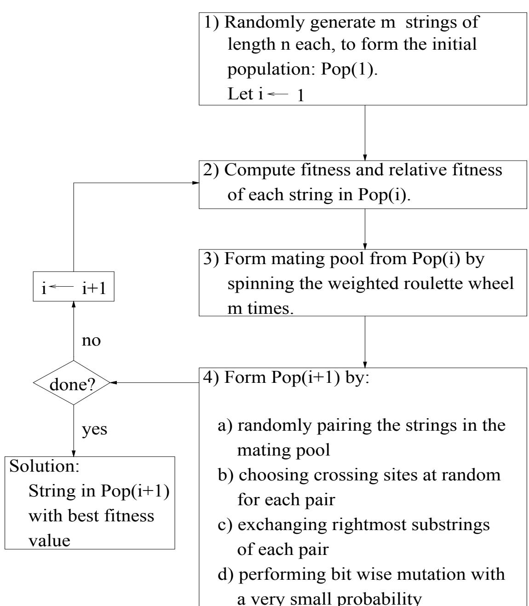

<table><tr><td rowspan=1 colspan=1>Strings</td><td rowspan=1 colspan=1>Fitness</td><td rowspan=1 colspan=1>RelativeFitness</td></tr><tr><td rowspan=2 colspan=1>11010101011001</td><td rowspan=1 colspan=1>52.5</td><td rowspan=4 colspan=1>.25.40.20.15</td></tr><tr><td rowspan=1 colspan=1>84.0</td></tr><tr><td rowspan=2 colspan=1>01001101000101</td><td rowspan=1 colspan=1>42.0</td></tr><tr><td rowspan=1 colspan=1>31.5</td></tr></table>

 Roulette Wheel:

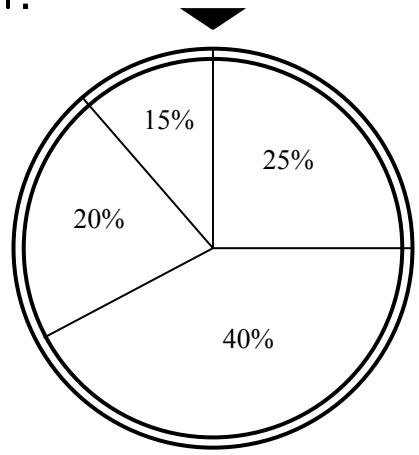

 Mating Pool:

1011001   
0100110   
1011001   
1101010

#  Crossover

{ Choose 2 strings from mating pool. Choose a X-site:

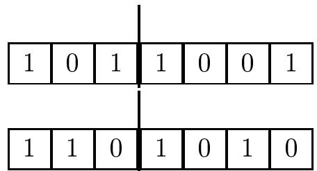

{ Children:

<table><tr><td rowspan=1 colspan=1></td><td rowspan=1 colspan=1>0</td><td rowspan=1 colspan=1>1</td><td rowspan=1 colspan=1>1</td><td rowspan=1 colspan=1>0</td><td rowspan=1 colspan=1>1</td><td rowspan=1 colspan=1>0</td></tr><tr><td rowspan=1 colspan=1></td><td rowspan=1 colspan=1></td><td rowspan=1 colspan=1></td><td rowspan=1 colspan=1></td><td rowspan=1 colspan=1></td><td rowspan=1 colspan=1></td><td rowspan=1 colspan=1></td></tr><tr><td rowspan=1 colspan=1>1</td><td rowspan=1 colspan=1>1</td><td rowspan=1 colspan=1>0</td><td rowspan=1 colspan=1>1</td><td rowspan=1 colspan=1>0</td><td rowspan=1 colspan=1>0</td><td rowspan=1 colspan=1>1</td></tr></table>

 Mutation:

{ Flip a randomly chosen bit:

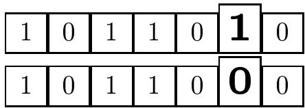

# The 0/1 Knapsack Problem

Weights: Objects: $\begin{array} { l } { 1 \ldots i \ldots n } \\ { w _ { 1 } \ldots w _ { i } \ldots w _ { n } } \\ { p _ { 1 } \ldots p _ { i } \ldots p _ { n } } \end{array}$   
Prots:   
Knapsack capacity: M

Maxim where $\begin{array} { l } { \mathsf { i } z \mathsf { e } ~ \sum _ { i = 1 } ^ { n } x _ { i } p _ { i } ~ \mathsf { s u b j e c t } ~ \mathsf { t o } ~ \sum _ { i = 1 } ^ { n } x _ { i } w _ { i } \le M , } \\ { x _ { i } \in \{ 0 , 1 \} ~ \mathsf { f o r } ~ 1 \le i \le n . } \end{array}$

Each string of the population represents a possible solution. If the $j ^ { t h }$ position of the string is 1 i.e. $x _ { j } = 1$ , then the $j ^ { t h }$ object is in the knapsack; otherwise it is not.

A string might represent an infeasible solution: the total sum of the weights of the objects exceeds the capacity of the knapsack.

# Problem Instance:

Objects: 1 2 3 4 5 6 7 8 9 10   
Weights: 20 18 16 16 12 8 6 5 3 1   
Prots: 55 40 30 27 20 13 9 7 4 1

Knapsack capacity : 80

String 1001001011 is of weight 46 and has a prot of 96.

Two alternatives for the tness functions are:

$$
f ( \vec { x } ) = \sum _ { i = 1 , n } x _ { i } p _ { i } ,
$$

where ${ \vec { x } } = ( x _ { 1 } , x _ { 2 } , \ldots , x _ { n } )$ is a feasible solution; or

$$
f ( { \vec { x } } ) = \sum _ { i = 1 , n } x _ { i } p _ { i } - p e n a l t y
$$

for any $\vec { x }$ , where infeasible strings are penalized.

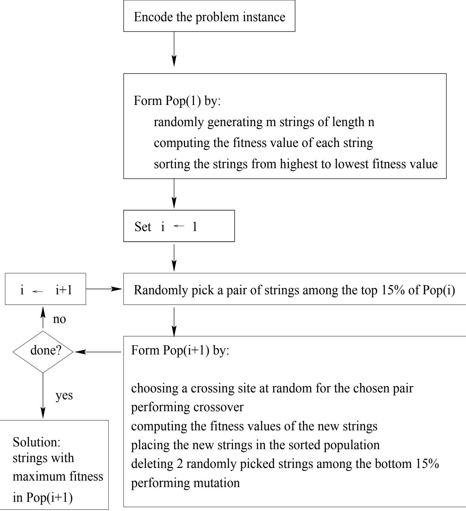

# Representations, Operators and Techniques:

Integer, real and Gray code representations.

 Randomly generated and seeded initial populations.

 Inversion and mutation swap.

 2-point, k-point, uniform, edge recombination, and partially mapped crossovers.

Elitism.

# Partially Mapped Crossover (PMX)

 PMX is used with permutations (eg. TSP).

 Parents: Choose 2 X-sites.

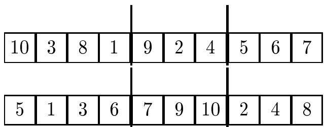

 Children: Swap middle strings, then ll the rest.

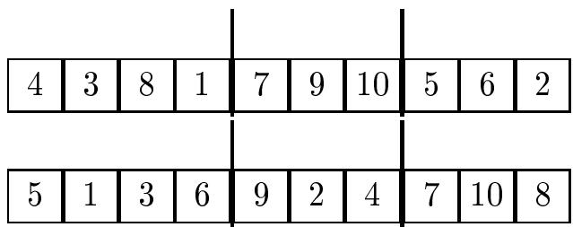

Why does the GA work?

 $H = \star \star 1 0 \star 1 1$ is a schema, hyperplane partition, or similarity template describing f0010011, 0110011, ...g.

 There are $3 ^ { \ell } - 1$ schemata in the search space, where $\ell$ is the length of the encoded string.

$\bullet$ Every string in the population belongs to $2 ^ { \ell } - 1$ dierent schemata.

# Implicit Parallelism

 When sampling a population, we are sampling more than just the strings of the population.

 Many competing schemata are being sampled in an implicitly parallel fashion when a single string is being processed.

 The new distribution of points in each schema should change according to the average tness of the strings in the population that are in the schema.

# Schema Properties

 Order: $o ( H )$ { Number of xed positions in the schema $H$ . { $o ( \star 0 \star 1 1 \star 1 ) = 4 .$   
 Dening length: $\delta ( H )$ { Distance between leftmost and rightmost xed positions in $H$ . { $\delta ( \star 0 \star 1 1 \star 1 ) = 5 .$

# The Building Block Hypothesis

When $f ( H ) > \bar { f }$ , the representation (instances) of $H$ , in generation $t + 1$ , is expected to increase, if $\delta ( H )$ and $o ( H )$ are small.

# The Schema Theorem

$$
\begin{array}{c} \begin{array} { r } { t + 1 ) \geq m ( H , t ) \frac { f ( H , t ) } { \bar { f } ( t ) } \left[ 1 - p _ { c } \frac { \delta ( H ) } { \ell - 1 } - p _ { m } o ( . \right.} \end{array}   \end{array}
$$

where

H schema   
t generation number   
f(H; t) average tness of H   
f(t) tness average of strings   
m(H; t) expected number of instances of H   
(H) dening length of H   
o(H) order of H   
pc crossover probability   
pm mutation probability   
\` length of strings

# Limitations of the Schema Theorem

 Computing average tnesses to evaluate $f ( H )$ at time $t$ is often misleading in trying to predict $f ( H )$ after several generations.

 The Schema Theorem cannot predict how a particular schema behaves over time.

 Other models, of a more dynamic nature, have been proposed.

# Applications

 Subset Sum Problem

 0=1 and Multiple Knapsack Problems

 Scheduling Problems

 Maximum Cut Problem

 Set Covering Problem

 Maximum Independent Set Problem

 Minimum Vertex Cover Problem

 Vertex and Edge Graph Coloring Problems

 Terminal Assignment Problem

 Encodng and Decoding of Group Codes

 DNA Fragment Assembly Problem

# Dierent Approaches:

 Knowledge-based restrictions on search space and stochastic operators.

 In the coming examples, only the tness function is problem-dependent.

# Strategy for Fitness Functions:

 The tness function uses a graded penalty term. The penalty is a function of the distance from feasibility.

 Infeasible strings are weaker than feasible strings.

 Note: The infeasible string's lifespan is quite short.

# Maximum Cut Problem

Problem Instance: A weighted graph $G = ( V , E )$ . $V = \{ 1 , \ldots , n \}$ is the set of vertices and $E$ the set of edges. $w _ { i j }$ represents the weight of edge $\langle i , j \rangle$ .

Feasible Solution: A set $C$ of edges, the cut-set, containing all the edges that have one endpoint in $V _ { 0 }$ and the other in $V _ { 1 }$ , where $V _ { 0 } \cup V _ { 1 } = V$ , and $V _ { 0 } \cap V _ { 1 } = \emptyset$ .

Objective Function: The cut-set weight $\boldsymbol { W } = \sum _ { \langle i , j \rangle , \in C } w _ { i j }$ , which is the sum of the Pweights of the edges in $C$ .

Optimal Solution: A cut-set that gives the maximum cut-set weight.

# GA encoding for the Maximum Cut Problem:

 Encode the problem by using binary strings $( x _ { 1 } , x _ { 2 } , \ldots , x _ { n } )$ where each digit corresponds to a vertex.

$\bullet$ The tness function to be maximized is:

$$
f ( \vec { x } ) = \sum _ { i = 1 } ^ { n - 1 } \sum _ { j = i + 1 } ^ { n } w _ { i j } \cdot [ x _ { i } ( 1 - x _ { j } ) + x _ { j } ( 1 - x _ { i }
$$

In absence of test problems of signicantly large sizes, use scalable test problems.

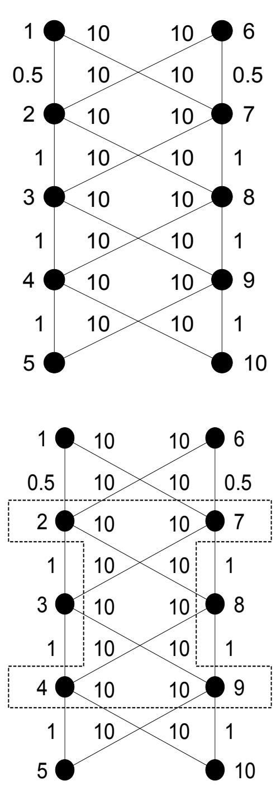

 For $n = 1 0$ , the maximum cut value is $f ^ { * } = 8 7 .$

 Graph can be scaled up, for any even n.

$\bullet$ The optimal partition is described by the n=2-fold repetition of the bit pattern 01 (or its complement) and has objective function value: $f ^ { * } = 2 1 + 1 1 \cdot ( n - 4 ) \mathrm { ~ f o r ~ } n \geq 4$ .

# Runs for the Maximum Cut Problem:

 \cut20-0.1" is a sparse graph, and \cut20-0.9" is a dense graph.

 Perform a total of 100 runs with population size: 50. Use 200 generations for the small graphs, and 1000 generations for the large one.

<table><tr><td rowspan=1 colspan=2>cut20-0.1</td><td rowspan=1 colspan=2>cut20-0.9</td><td rowspan=1 colspan=2>cut100</td></tr><tr><td rowspan=1 colspan=1>f(x)</td><td rowspan=1 colspan=1>N</td><td rowspan=1 colspan=1>f(x)</td><td rowspan=1 colspan=1>N</td><td rowspan=1 colspan=1>f(x)</td><td rowspan=1 colspan=1>N</td></tr><tr><td rowspan=1 colspan=1>10.11981</td><td rowspan=1 colspan=1>68</td><td rowspan=1 colspan=1>56.74007</td><td rowspan=1 colspan=1>70</td><td rowspan=1 colspan=1>1077</td><td rowspan=1 colspan=1>6</td></tr><tr><td rowspan=4 colspan=1>9.75907</td><td rowspan=4 colspan=1>32</td><td rowspan=4 colspan=1>56.1229556.0382055.84381</td><td rowspan=1 colspan=1>1</td><td rowspan=1 colspan=1>1055</td><td rowspan=1 colspan=1>13</td></tr><tr><td rowspan=3 colspan=1>1118</td><td rowspan=1 colspan=1>1033</td><td rowspan=1 colspan=1>30</td></tr><tr><td rowspan=2 colspan=1>1011989967945</td><td rowspan=1 colspan=1>35</td></tr><tr><td rowspan=1 colspan=1>1231</td></tr></table>

# Conclusions: Maximum Cut Problem

1. With the dense and the sparse graphs, the global optimum is found by more than two thirds of the runs.

2. The genetic algorithm performs 104 function evaluations, and the search space is of size $2 ^ { 2 0 }$ . Thus, the genetic algorithm searches only about one percent of the search space.

3. Similarly for cut100.

The optimum is found in six of the runs. Average value from remaining runs: $\bar { f } = 1 0 2 2 . 6 6$ , which is about 5% from the global optimum. Only (5  104 )=2100  100%  4  1024 % of the search space is explored.

# Minimum Tardy Task Problem

Problem instance:

Tasks: 1 2 n i > 0   
Lengths: l1 l2 ln 1 li > 0   
Deadlines: d1 d2 dn 1 di > 0   
Weights: w1 w2 wn , wi > 0

Feasible solution: A one-to-one scheduling function $g$ dened on $S \subseteq T$ , $g : S \longrightarrow Z ^ { + } \cup \{ 0 \}$ that satises the following conditions for all $i , j \in S$ :

1. If $g ( i ) < g ( j )$ then $g ( i ) + l _ { i } \leq g ( j )$ .

2. $g ( i ) + l _ { i } \leq d _ { i }$ .

Objective function: The tardy task weight $\begin{array} { r } { W = \sum _ { i \in T - S } w _ { i } } \end{array}$ , which is the sum of the weights of unscheduled tasks.

Optimal solution: The schedule S with the minimum tardy task weight W.

Fact $S$ is feasible if and only if the tasks in S can be scheduled in increasing order by deadline without violating any deadline.

# Example

Tasks: 1 2 3 4 5 6 7 8   
Lengths: 2 4 1 7 4 3 5 2   
Deadlines: 3 5 6 8 10 15 16 20   
Weights: 15 20 16 19 10 25 17 18

 $S = \{ 1 , 3 , 5 , 6 \}$ $S$ is feasible with $W = 7 4$  $S ^ { \prime } = \{ 2 , 3 , 4 , 6 , 8 \} \Rightarrow g ( 4 ) + l _ { 4 } = 5 + 7$ and $d _ { 4 } = 8 \ \mathsf { i . e }$ . $g ( 4 ) + l _ { 4 } > d _ { 4 }$ Therefore $S ^ { \prime }$ is infeasible.

# GA Specications

 $S$ can be represented by a vector ${ \vec { x } } = ( x _ { 1 } , x _ { 2 } , \ldots , x _ { n } )$ where $x _ { i } \in \{ 0 , 1 \}$ . The presence of task $i$ in $S$ means that $x _ { i } = 1$ .

 The tness function to be minimized is the sum of three terms:

$$
\begin{array} { r c l } { { \mathrm {  ~ \gamma ~ } } } & { { = } } & { { \sum _ { i = 1 } ^ { n } w _ { i } \cdot ( 1 - x _ { i } ) + ( 1 - s ) \cdot \sum _ { i = 1 } ^ { n } } } \\ { { } } & { { } } & { { } } \\ { { } } & { { + } } & { { \sum _ { i = 1 } ^ { n } w _ { i } x _ { i } \cdot { \bf 1 } _ { R ^ { + } } \left( l _ { i } + \sum _ { j = 1 } ^ { i - 1 } l _ { j } x _ { j } - d \right. } } \end{array}
$$

In the third term, $x _ { j }$ is for schedulable jobs only. The whole term keeps checking the string to see if a task could have been scheduled. It makes use of the indicator function:

$$
\mathbf { 1 } _ { A } ( t ) = { \left\{ \begin{array} { l l } { 1 } & { { \mathsf { i f } } \ t \in A } \\ { 0 } & { { \mathsf { o t h e r w i s e . } } } \end{array} \right. }
$$

$s = 1$ when $\vec { x }$ is feasible, and $s = 0$ when $\vec { x }$ is infeasible.

# Scalable Problem Instance

 Construct a problem instance of size $n = 5$ that is scalable.

Tasks: 1 2 3 4 5   
Lengths: 3 6 9 12 15   
Deadlines: 5 10 15 20 25   
Weights: 60 40 7 3 50

 To construct a MTTP instance of size $n = 5 t$ from above model:

The rst ve tasks of the large problem are identical to the 5-model problem instance.

The length $l _ { j }$ , deadline $d _ { j }$ , and weight $w _ { j }$ of the $j ^ { t h }$ task, for $j = 1 , 2 , \dots , n$ , is given by: $l _ { j } = l _ { i }$ , $d _ { j } = d _ { i } + 2 4 \cdot m$ and

$$
w _ { j } = { \left\{ \begin{array} { l l } { w _ { i } } & { { \mathrm { i f ~ } } j \equiv 3 { \bmod { 5 } } { \mathrm { ~ o r ~ } } j \equiv 4 { \bmod { ~ } } } \\ { ( m + 1 ) \cdot w _ { i } } & { { \mathrm { o t h e r w i s e } } \ , } \end{array} \right. }
$$

where $j \equiv i$ mod 5 for $i = 1$ ; 2; 3; 4; 5 and $m = \lfloor j / 5 \rfloor$ .

The tardy task weight for the globally optimal solution of this problem is $_ 2 \cdot n$ .

# Runs for the Minimum Tardy Task Problem

# mttp20

 Population Size: 50 Number of Generations: 200 Crossover: Uniform Probability of Crossover: 0.6 Mutation: Swap Probability of Mutation: 0.05  A total of 100 runs is performed.

<table><tr><td rowspan=1 colspan=1>f1(x)</td><td rowspan=1 colspan=1>d(x, opt)</td><td rowspan=1 colspan=1>N</td></tr><tr><td rowspan=1 colspan=1>41</td><td rowspan=1 colspan=1>0</td><td rowspan=1 colspan=1>88</td></tr><tr><td rowspan=1 colspan=1>4651</td><td rowspan=1 colspan=1>31</td><td rowspan=1 colspan=1>111</td></tr></table>

# mttp100

 Scalable problem of size $n = 1 0 0$ .

 Population Size: 200 Number of Generations: 100 Crossover: Uniform Probability of Crossover: 0.6 Mutation: Swap Probability of Mutation: 0.05 Note: About 1:6  1023 % of the search space is investigated.

 $f _ { 2 } ( \vec { x } )$ replaces infeasible strings by feasible ones.

<table><tr><td rowspan=1 colspan=1>f1(x)</td><td rowspan=1 colspan=1>d(x, opt)</td><td rowspan=1 colspan=1>N</td><td rowspan=1 colspan=1>f2(x)</td><td rowspan=1 colspan=1>d(x, opt)</td><td rowspan=1 colspan=1>N</td></tr><tr><td rowspan=1 colspan=1>200</td><td rowspan=1 colspan=1>0</td><td rowspan=1 colspan=1>56</td><td rowspan=1 colspan=1>200</td><td rowspan=1 colspan=1>0</td><td rowspan=1 colspan=1>35</td></tr><tr><td rowspan=5 colspan=1>240243276280329</td><td rowspan=5 colspan=1>12345</td><td rowspan=1 colspan=1>2</td><td rowspan=2 colspan=1>243</td><td rowspan=5 colspan=1>234455</td><td rowspan=5 colspan=1>44411141</td></tr><tr><td rowspan=1 colspan=1>29</td></tr><tr><td rowspan=1 colspan=1>3</td><td rowspan=1 colspan=1>276</td></tr><tr><td rowspan=2 colspan=1>19</td><td rowspan=1 colspan=1>280</td></tr><tr><td rowspan=1 colspan=1>296329379</td></tr></table>

# Terminal Assignment Problem

Problem Instance:

Weights: Terminals: $\begin{array} { r l } & { l _ { 1 } , l _ { 2 } , \dotsc , l _ { T } } \\ & { w _ { 1 } , w _ { 2 } , \dotsc , w _ { T } } \\ & { r _ { 1 } , r _ { 2 } , \dotsc , r _ { C } } \\ & { p _ { 1 } , p _ { 2 } , \dotsc , p _ { C } } \end{array}$   
Concentrators:   
Capacities:

Feasible Solution: Vector: ${ \vec { x } } = x _ { 1 } x _ { 2 } \dots x _ { T }$ $x _ { i } = j \colon \ i ^ { t h }$ terminal assigned to $j$ . Assign all terminals to concentrators without exceeding the concentrators' capacities.

Objective Function: A function $Z ( \vec { x } ) = \Sigma _ { i = 1 } ^ { T } c o s t _ { i j }$ , where costij is the Pdistance between terminal i and concentrator $j$ .

Optimal Solution: A feasible vector $\vec { x }$ that yields the smallest possible $Z ( \vec { x } )$ .

# Encoding for TA:

Use non-binary strings: $x _ { 1 } x _ { 2 } \dots x _ { T }$

The value of $x _ { i }$ is the concentrator to which the $i ^ { t h }$ terminal is assigned.

Example:

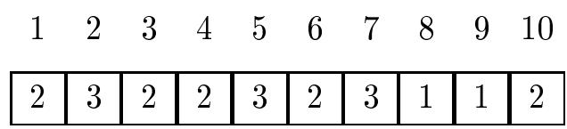

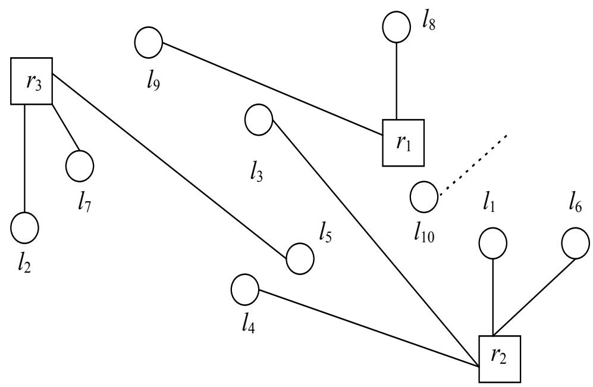

# Fitness Function:

It is the sum of two terms:

1. the objective function which calculates the total cost of all connections.

2. a penalty function used to penalize infeasible strings. It is the sum of two terms:

#  oset term:

the product of the number of terminals and the maximum distance on the grid.

#  graded term:

the product of the sum of excessive load of concentrators and the number of concentrators that are in fact overloaded.

# Experimental Runs

 Ten problem instances of 100 terminals each. Each concentrator has capacity between 15 and 25. The number of concentrators is between 27 and 33.

 Number of generations: 20,000 Population size: 500 Crossover rate: 0.6 Mutation rates: Between 0.025 and 0.1 for LibGA and for GeneSyS.

 The results for the Genetic Algorithm are the best obtained after 20,000 generations on each problem instances.

 Probably for 100 1, 100 2, and 100 3, the solutions obtained by LibGA (and Procedure Greedy) are the global optima.

<table><tr><td rowspan=2 colspan=1>ProblemInstances</td><td rowspan=2 colspan=1>GreedyAlgorithm</td><td rowspan=1 colspan=2>GeneticAlgorithms</td></tr><tr><td rowspan=1 colspan=1>GENEsYs</td><td rowspan=1 colspan=1>LibGA</td></tr><tr><td rowspan=1 colspan=1>100_1</td><td rowspan=1 colspan=1>928</td><td rowspan=1 colspan=1>963</td><td rowspan=1 colspan=1>928</td></tr><tr><td rowspan=1 colspan=1>100_2</td><td rowspan=1 colspan=1>935</td><td rowspan=1 colspan=1>973</td><td rowspan=1 colspan=1>935</td></tr><tr><td rowspan=1 colspan=1>100_3</td><td rowspan=1 colspan=1>846</td><td rowspan=1 colspan=1>881</td><td rowspan=1 colspan=1>846</td></tr><tr><td rowspan=1 colspan=1>100_4</td><td rowspan=1 colspan=1>1076</td><td rowspan=1 colspan=1>1123</td><td rowspan=1 colspan=1>1069</td></tr><tr><td rowspan=1 colspan=1>100_5</td><td rowspan=1 colspan=1>1116</td><td rowspan=1 colspan=1>1178</td><td rowspan=1 colspan=1>1111</td></tr><tr><td rowspan=1 colspan=1>100_6</td><td rowspan=1 colspan=1>1071</td><td rowspan=1 colspan=1>1106</td><td rowspan=3 colspan=1>107012791186</td></tr><tr><td rowspan=4 colspan=1>100_7100_8100_9100_10</td><td rowspan=1 colspan=1>1315</td><td rowspan=1 colspan=1>1404</td></tr><tr><td rowspan=1 colspan=1>1211</td><td rowspan=1 colspan=1>1225</td></tr><tr><td rowspan=1 colspan=1>1088</td><td rowspan=1 colspan=1>1169</td><td rowspan=2 colspan=1>1065901</td></tr><tr><td rowspan=1 colspan=1>902</td><td rowspan=1 colspan=1>977</td></tr></table>

# Grouping Problems

 Many problems consist in partitioning a given set U of items into a collection of pairwise disjoint subsets $U _ { j }$ under some constraint.

 In essence, we are asked to distribute the elements of U into small groups $U _ { j }$ . Some distributions (i.e., groupings) are forbidden.

 Some examples: Bin packing problem, terminal assignment, graph coloring.

 The objective is to minimize a cost function over the set of all possible legal groupings.

# The Edge Coloring Problem

# Problem Instance

A graph $G = ( V , E )$ , $V = \{ v _ { 1 } , \ldots , v _ { n } \}$ is the set of vertices, $E = \{ e _ { 1 } , \ldots , e _ { m } \}$ is the set of edges.

# Feasible Solution

Vector \~y = y1 y2 : : : ym,   
$y _ { i } = j$ means that the $i ^ { t h }$ edge $e _ { i }$ is given color $j , \ 1 \leq j \leq m$ .

The components of $\vec { y }$ are essentially the colors assigned to the m edges of $G$ , where:

 Two adjacent edges have dierent colors.  The colors are denoted by 1; 2; : : : ; q, where $1 \leq q \leq m$ .

# Objective function

For a feasible vector $\vec { y }$ , let $P ( \vec { y } )$ be the number of colors used in the coloring of the edges represented by $\vec { y }$ . More precisely,

$P ( \vec { y } ) = m a x \{ y _ { i } \mid y _ { i }$ is a component of $\vec { y } \}$ :

# Optimal solution

A feasible vector \~y that yields the smallest $P ( \vec { y } )$ .

# Applications

Practical applications include scheduling problems, partitioning problems, timetabling problems, and wavelength-routing in optical networks.

# NP-Hard

Holyer proved that the edge coloring problem is NP-hard.

# Denition

 is maximum vertex degree of G. $\chi ^ { \prime } ( G )$ : the chromatic index of G, is the minimum number of colors required to color the edges of G.

# Vizing's Theorem

If G is a nonbipartite, simple graph, then $\chi ^ { \prime } ( G ) = \triangle \ \mathrm { o r } \ \chi ^ { \prime } ( G ) = \triangle + 1 .$

# Edge-Coloring Bipartite Graphs

 Journal of Algorithms, February 2000 Article by A. Kapoor and R. Rizzi:

$$
O ( m \log _ { 2 } \Delta + \frac { m } { \Delta } \log _ { 2 } \frac { m } { \Delta } \vert 0 9 2 ^ { 2 } \Delta )
$$

 SIAM, Journal on Computation, 1982 Article by Hopcroft and Cole:

$$
O ( m \log _ { 2 } \Delta + \frac { m } { \Delta } \log _ { 2 } \frac { m } { \Delta } \vert 0 9 2 ^ { 3 } \Delta )
$$

# The Genetic Algorithm

# Encoding:

Use non-binary strings of length m (number of edges):

The value of $y _ { j }$ represents the color assigned to the $j ^ { t h }$ edge.

For example, if a graph has 12 edges then the following string is a possible coloring, where edge e1 has color number 5, edge e2 has color number 3, and so on.

<table><tr><td>1</td><td>2</td><td>3</td><td>4</td><td>5</td><td>6</td><td>7</td><td>8</td><td>9</td><td>10</td><td>11 12</td></tr><tr><td>5</td><td>3</td><td>5</td><td>5</td><td>1</td><td>3</td><td>2</td><td>1</td><td>4</td><td>4</td><td>1 3</td></tr></table>

# The GA Operators

 generational genetic algorithms  roulette wheel selection  uniform crossover  uniform mutation

Each string in the population occupies a slot on the roulette wheel of size inversely proportional (since the edge coloring problem is a minimization problem) to the tness value.

# Fitness Function

The tness function of $\vec { y } = y _ { 1 } y _ { 2 } \dots y _ { m }$ is given by:

$$
f ( \vec { y } ) = P ( \vec { y } ) + s [ ( \Delta + 1 ) + T ( \vec { y } ) ]
$$

It is the sum of two terms:

1. the objective function $P ( \vec { y } )$ , which calculates the total number of colors used to color the edges of the graph.

2. a penalty term used to penalize infeasible strings. It is the sum of two parts:

 The rst part is the maximum vertex degree to which one is added, i.e., $\triangle + 1$ . It is an oset term.

$\bullet$ The second part of the penalty term, $T ( \vec { y } )$ , is the number of violated pairs.

# The Grouping Genetic Algorithm

# Encoding

To capture the grouping entity of the problem, the simple (standard) chromosome is augmented with a group part.

For example, the chromosome of our hypothetical 12-edge graph:

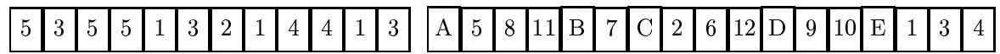

The colors are labeled with letters, the edges { with numbers.

The rst half is the object part (the entire chromosome of the previous section), the second half is the group part.

# Fitness Function

The tness function of a string considers the object part of the string only and computes the tness value as explained before.

# Crossover Operator

Two parents are randomly chosen from the mating pool and two crossing sites are chosen for each parent:

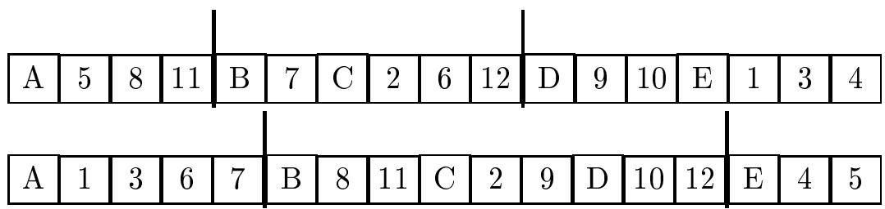

Inject the entire group part between the two crossing sites of the second parent into the rst parent at the beginning of its crossing site:

<table><tr><td rowspan=1 colspan=1>A</td><td rowspan=1 colspan=1>5</td><td rowspan=1 colspan=1>8</td><td rowspan=1 colspan=1>11</td><td rowspan=1 colspan=1>B</td><td rowspan=1 colspan=1>8</td><td rowspan=1 colspan=1>11</td><td rowspan=1 colspan=1>C</td><td rowspan=1 colspan=1>2 9</td><td rowspan=1 colspan=1>2 9</td><td rowspan=1 colspan=1>D</td><td rowspan=1 colspan=1>1012</td><td rowspan=1 colspan=1>1012</td><td rowspan=1 colspan=1>B</td><td rowspan=1 colspan=1>7</td><td rowspan=1 colspan=1>C2</td><td rowspan=1 colspan=1>C2</td><td rowspan=1 colspan=1>6</td><td rowspan=1 colspan=1>12D</td><td rowspan=1 colspan=1>12D</td><td rowspan=1 colspan=1>9</td><td rowspan=1 colspan=1>10</td><td rowspan=1 colspan=1>E</td><td rowspan=1 colspan=1></td><td rowspan=1 colspan=1>3</td><td rowspan=1 colspan=1>4</td></tr></table>

# Dealing with Redundancy

Resolve redundancy by eliminating groups B, C, and D from their old membership (i.e., from the rst parent string):

<table><tr><td rowspan=1 colspan=1>A</td><td rowspan=1 colspan=1>5</td><td rowspan=1 colspan=1>8</td><td rowspan=1 colspan=1>11</td><td rowspan=1 colspan=1>B</td><td rowspan=1 colspan=1>8</td><td rowspan=1 colspan=1>11</td><td rowspan=1 colspan=1>C</td><td rowspan=1 colspan=1>2</td><td rowspan=1 colspan=1>9</td><td rowspan=1 colspan=1>D</td><td rowspan=1 colspan=1>10</td><td rowspan=1 colspan=1>12</td><td rowspan=1 colspan=1>E</td><td rowspan=1 colspan=1></td><td rowspan=1 colspan=1>3</td><td rowspan=1 colspan=1>4</td></tr></table>

Remove duplicate edges (8 and 11) from their old membership (from the rst parent string):

<table><tr><td rowspan=1 colspan=1>A</td><td rowspan=1 colspan=1>5</td><td rowspan=1 colspan=1>B</td><td rowspan=1 colspan=1>8</td><td rowspan=1 colspan=1>11</td><td rowspan=1 colspan=1>C</td><td rowspan=1 colspan=1>2</td><td rowspan=1 colspan=1>9</td><td rowspan=1 colspan=1>D</td><td rowspan=1 colspan=1>10</td><td rowspan=1 colspan=1>12</td><td rowspan=1 colspan=1>E</td><td rowspan=1 colspan=1>1</td><td rowspan=1 colspan=1>3</td><td rowspan=1 colspan=1>4</td></tr></table>

Use the rst{t heuristic to reassign lost edges (6 and 7): assign the edge to the rst group that is able to service it, or to a randomly selected group if none is available.

Reversing the roles of the two parents allows the construction of a second ospring.

# The Mutation Operator

Probabilistically remove some group from the chromosome and reassign its edges.

Each edge is assigned to the rst group that is able to take it.

After crossover and mutation are performed on the group part, the object part is rearranged accordingly to re
ect the changes that the group part has undergone.

# Benchmarks

 Twenty eight simple graphs with the number of edges between 20 and 2596:

{ Five book graphs from the Stanford GraphBase.   
{ Two miles graphs from the Stanford GraphBase.   
{ Nine queen graphs from the Stanford GraphBase.   
{ Four problem instances based on the My transformation from the DIMACS collec   
{ Eight complete graphs.

 Fifteen multigraphs generated by repeatedly assigning edges to randomly chosen pairs of vertices until each vertex has a xed degree.

We denote the multigraphs we generated by rexmg10 x, rexmg20 x, and rexmg30 x, where 10, 20 and 30 are the number of vertices and x is the degree and has the values of 10, 20, 30, 40 and 50.

# Tracking a Criminal Suspect

# Genetic Programming

 The structures undergoing adaptation in Genetic Programming are general, hierarchical computer programs of dynamically varying size and shape.

 The search space consists of all possible computer programs composed of functions and terminals appropriate to the problem domain.

# Conclusion

1. Simple Genetic & Grouping Genetic Algorithms. Genetic Programming. Other Evolutionary-based Algorithms: Evolution Strategies and Evolutionary Programming.

2. Hybrid Algorithms and Parallel Genetic Algorithms.

3. What problems are suitable for Genetic Algorithms?

Weak classication of problems between hard and easy.

4. The study of Genetic Algorithms is still in its embryonic stage.

# References

1. [CJ91] C. Caldwell and V. Johnson. Tracking a Criminal Suspect through \Face-Space" with a Genetic Algorithm, Proceedings of the Fourth International Conference on Genetic Algorithms, San Diego, CA, 1991, pp. 416-421.

2. [CW93] A. Corcoran and R. Wainwright. LibGA: A User-friendly Workbench for Ordered-based Genetic Algorithm Research, Proceedings of the 1993 ACM/SIGAPP Symposium on Applied Computing, ACM Press, 1993, pp. 111-117.

3. [Fal93] E. Falkenauer. The Grouping Genetic Algorithms - Widening the Scope of Genetic Algorithms, Belgian Journal of Operations Research, Statistics and Computer Science, vol. 33, 1993, pp. 416-421.

4. [Gol89] D. Goldberg. Genetic Algorithms in Search, Optimization, and Machine Learning, Addison-Wesley, NY, 1989.

5. [Hol75] J. Holland. Adaptation in Natural and Articial Systems, The University of Michigan Press, Ann Arbor, 1975.

6. [KB90] S. Khuri and A. Batarekh. Heuristics for the Integer Knapsack Problem, Proceedings of the $X ^ { t h }$ International Conference of the Chilean Computer Science Society, Santiago, Chile, 1990, pp. 161-172.

7. [KBH94] S. Khuri, T. Back and J. Heitkotter. An Evolutionary Approach to Combinatorial Optimization Problems, Proceedings of the $2 2 ^ { n d }$ ACM Computer Science Conference, editor, D. Cizmar, ACM Press, NY, 1994, pp. 66-73.

8. [KC97] S. Khuri and T. Chiu. Heuristic Algorithms for the Terminal Assignment Problem, Proceedings of the 1997 ACM/SIGAPP Symposium on Applied Computing, ACM Press, 1997.

9. [KWS00] S. Khuri, T. Walters and Y. Sugono. A Grouping Genetic Algorithm for Coloring the Edges of Graphs, Proceedings of the 2000 ACM/SIGAPP Symposium on Applied Computing, ACM Press, 2000.

10. [Koz92] J. Koza. Genetic Programming: On the Programming of Computers by Means of Natural Selection, Cambridge, MA, MIT Press, 1992.