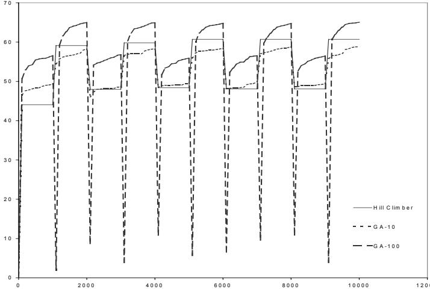
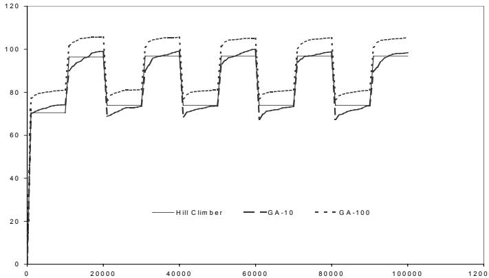
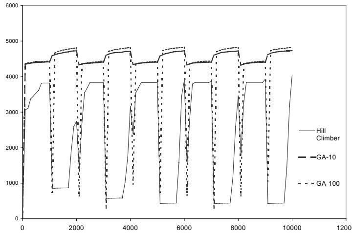
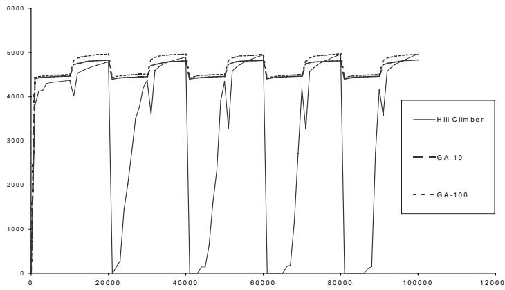

# Diversity does not Necessarily Imply Adaptability

Marcus Andrews Andrew Tuson

Department of Computing City University, London Northampton Square, London, EC1V 0HB m.andrews@city.ac.uk, a.tuson@city.ac.uk

# Abstract

Dynamic optimiser design currently assumes that diversity is a desirable property towards achieving adaptability, as a population-based optimiser contains an implicit memory. This paper examines the applicability of this assumption. Population-based algorithms of different size are tested against optimisers using a single solution. Results presented here suggest that this view is somewhat simplistic, and that population size should be considered as a design variable in optimiser design for dynamic environments.

# 1. Introduction

Research in dynamic optimization [1] focuses on population-based optimizers, mostly evolutionary algorithms (EAs). EAs are seen as suitable due to their analogy with nature, which is itself a dynamic environment [2], and their distributed and parallel nature [3].

This paper examines the premise that a population-based mechanics is suitable for dynamic optimization, as it will be able to adapt quickly. If the population is diverse and a change in the problem occurs, there will more than likely be a member of the population sitting in a promising area of the search space, allowing the optimizer to quickly adapt to the change. Maintaining a population might thus be seen as a memory for storing solutions that have had a high quality in the recent past, and can be used as a head start for optimising under the new conditions.

# 2. Literature Review

Further to the idea of a population as suitable for dynamic optimization problems, there is realization in the literature that diversity in the population is a desired characteristic for dynamic optimisation, to enable adaptation after a change in the environment. This is due to optimisation and adaptation requiring different and opposing behaviours in any population, i.e. optimisation requires convergent behaviour [2].

In contrast, adaptive behaviour, as noted earlier in this text, requires divergent behaviour in order to explore the search space for a new optimum after a change has occurred. A homogenous population offers no benefit over a single solution, in terms of search space coverage, or the chance of having a member near the new optimum. Much of the research into optimizers for dynamic environments aims at maintaining or (re)introducing such diversity into a population, either after a change has occurred, or throughout the run.

For example, [4] acknowledge this fact saying that “...improving adaptiveness means counteracting convergence” because “polymorphism is a desirable characteristic in a population, and diversity is important to this”. They draw justification for this from both nature and cybernetics. In nature, Darwin’s theory of survival of the fittest seems to be at odds with the diversity found in ecosystems where no single species dominates. In biology, they point out, “…redundancy seems to be the key word in structures like DNA, neural networks and immune systems”. From cybernetics, they quote W. Ross Ashby [5], one of the fathers of cybernetics and his principle of selective variety where “The larger the variety of configurations a system undergoes, the larger the probability that at least one of these configurations will be selectively retained”. They [4] claim that “whether it is spelled redundancy, or variety, diversity is the foremost motivation of many evolutionary approaches to [dynamic optimisation]”.

The above has lead to suggestions that EAs are inherently good at dynamic optimization, especially regarding EA designs that support population diversity. However, the premise of the suitability of population-based models assumes a larger population will receive a performance increase in its adaptive ability as the optimizer will have a greater coverage of the search space, assuming the population is diversified; but this ignores additional costs. A larger population will entail a greater cost in terms of the computational overhead of evaluating its members. The question is whether a time/quality trade off is involved in population size (or any other diversity enhancing mechanism), varying for different problems and the different characteristics of the changes taking place.

This paper aims to show the suitability of a population-based optimizer should treat population sizes as a design variable when dealing with dynamic optimization problems. It therefore attempts to establish or refute the suitability of an optimizer, in terms of adaptation, when maintaining a diverse population of solutions.

# 3. Experimental Setup

To investigate this, EAs of a large and small population size will be compared against a single-solution based heuristic over an oscillating knapsack problem common in the literature (e.g. [6]). If population size is considered as a design variable, there will be a variety of influences over the choice of population size; including factors such as problem instance, problem size, and characteristics of the various changes that can take place.

It is obviously impossible to examine the performance of population sizes over all these factors; therefore this paper will focus on a subset drawn from a more extensive study.

This study adopts an oscillating knapsack problem common in the literature, containing 17 bits. This study uses this small instance size but additionally extends the problem to 1700-bits. Weights and values for all objects are determined randomly, but lie in the range set in the original problem [6]. Weights are thus set in the range $\{ 1 , 2 0 \}$ and values are in the range $\{ 1 , 1 0 \}$ . The same objects are used for each algorithm.

In dynamic optimization problems it is important to consider the computational efforts needed by the optimizer. There will be a finite amount of time in which to find these solutions before the environment changes. Most optimizers usually spend most of their time on evaluating solutions for quality, at least in complicated real-world problems. Therefore it is common to compare the performance of algorithms using the number of fitness function evaluations as a measure of time.

The change characteristics contain many variables [2]; e.g. the severity and frequency of the changes, whether it is oscillating between states, or involves a linear form of change, or perhaps a catastrophic change. This study shall restrict itself to one of the more simple characteristics, namely the frequency with which the changes occur. Two speeds will be considered here, changing every 1000 evaluations and every 10,000 evaluations.

There are four combinations of problem size and change frequencies examining the effect of population on an optimiser’s performance at adapting in dynamic environments. All algorithms are run 30 times with the mean result being reported, best quality solution found since change being recorded 10 times per cycle, in common with the literature.

# 3.1 First-Ascent Hill-Climber

The first ascent hill climber tests the neighbourhood in positional order from the first bit to the last. It accepts or moves to the first neighbour found which shows some improvement in quality. Upon finding a local optimum, the hill-climber shall restart from a random starting point.

# 3.2 Evolutionary Algorithms

In preliminary experiments (not quoted here due to space limitations), the authors found a steady state EA was more often able to produce better results. For this study, a generational GA is used as it is the more common replacement strategy in the literature and the relative results are still the same. The implementation follows that in the sGA (Simple Genetic Algorithm) described in [6], but adopts uniform crossover. A population of 100 is adopted for the larger population size, with a smaller population of 10 members.

# 3. Results

The small problem size, fast change case (Figure 1) clearly shows that high diversity does not assist adaptability. The large-population EA is inferior to both the hill-climber and the small-population EA. Interestingly this is the case dominantly used in the literature for evaluating novel dynamic optimisers. There is a pronounced quality dip for the large population EA (also see Figure 4), corresponding to the only just re-evaluated post-change EA population. If any memory of useful features is being retained, its effects are weak.

  
Fig. 1. 17-Bit Size & 1000 Change Frequency

The small problem size, slow change case (Figure 2) shows the large-population EA attains the best quality solutions over the period between changes. However adaptability would seem to be a moot point in this case, as one could arguably re-optimise from scratch so in this case diversity is supporting thoroughness of search. If speed of recovery is at a premium the hill-climber wins, albeit at the expense of quality.

  
Fig. 2. 17-bit Size & 10,000 Change Frequency

Figure 3 depicts the results of the large instance, fast change case. Both EAs clearly outperform the hill-climber, with only small differences in attained quality and similar apparent adaptivity. This would suggest that this is a better problem instance with which to evaluate dynamic optimisers.

  
Fig. 3. 1700-bit Size & 1000 Change Frequency

The large instance, slow change case (Figure 4) shows a similar pattern to the previous case (Figure 3), but without to dip in solution quality due to the large recording interval.

  
Fig. 4. 1700-bit Size and 10,000 Change Frequency

# 4. Conclusion

The assumption that diversity is good for dynamic optimization is not universally applicable. Results show that population size has a complex effect on performance when adapting to changing problems. Additionally, the standard benchmark may not be sufficient to compare dynamic optimisers. Investigation should clarify the time/quality trade-off between population size and the characteristics of the changes taking place.

# Список литературы

[1] J. Branke: Evolutionary Approaches to dynamic optimization – an updated survey. In GECCO Workshop on Evolutionary Algorithms for Dynamic Optimization Problems, pp. 27-30 (2001)   
[2] J. Branke: Evolutionary Optimization in Dynamic Environments, Kluwer Academic Publishers (2003)   
[3] Z. Michalewicz & D. Fogel: How to Solve It: Modern Heuristics, Springer (2000)   
[4] A. Gaspar & P. Collard: From Gas to Artificial Immune Systems: Improving Adaptation in Time Dependent Optimization. In CEC’99: IEEE International Congress on Evolutionary Computation, Washington, pp. 1867-1874 (1999)   
[5] W. Ross Ashby: An Introduction to Cybernetics, Chapman & Hall, London (1956)   
[6] D. E. Goldberg & R. E. Smith: Non-Stationary Function Optimisation with Dominance and Diploidy. In Proceedings of the Second International Conference on Genetic Algorithms (1987)