# Appendix A

# THE ENVIRONMENT E

# A.1 Introduction

In order to evaluate the capabilities of different adaptive strategies, an environment E was chosen to include instances of performance measures representing a broad class of functions. For convenience, each function in E was defined to be a performance index to be minimized. Care was taken to include instances of continuous, discontinuous, convex, non-convex, unimodal, multimodal, quadratic, non-quadratic, low-dimensional and high-dimensional functions as well as functions with Gaussian noise.

For testing purposes, each function was restricted to a bounded subspace of $\mathtt { R } ^ { \mathtt { n } }$ of the form $a _ { 1 } \leq x _ { 1 } \leq b _ { 1 }$ : $1 = 1 \ldots 1$ . Within this subspace each function was discretized by specifying a resolution factor $\pmb { \Delta x _ { 1 } }$ for each axis. Since the genetic algorithms use a binary representation of the search space, the number of discrete points on each axis, $( \mathtt { b } _ { \mathtt { 1 } } { - } \mathtt { a } _ { \mathtt { 1 } } ) / \Delta \mathtt { x } _ { \mathtt { 1 } } + \mathtt { 1 }$ , was chosen to be a power of 2 so that a direct comparison with alternative adaptive plans could be made.

# A.2 Test Function F1

Test function F1 is given by:

$$
\mathtt { F 1 } ( \mathbf { X } ) = \sum \limits _ { i = 1 } ^ { 3 } x _ { 1 } ^ { 2 }
$$

Fl is a simple $3$ -dimensional parabola with spherical constant-cost contours. It is a continuous, convex, unimodal, low-dimensional quadratic function with a minimum of zero at the origin. Because of its simplicity and symmetry, F1 provides an easily analyzable first test for an adaptive plan. For testing purposes F1 was restricted to the space A defined by $- 5 . 1 2 \leq x _ { 1 } \leq 5 . 1 2$ $\mathbf { 1 } = \mathbf { 1 } , 2 , 3$ with a resolution factor $\Delta x _ { 1 } = . 0 1$ on each axis. So the space A to be searched consisted of $( 1 0 2 4 ) ^ { 3 } \cong 1 0 9$ alternative solutions on which:

$$
\begin{array} { l l l } { \displaystyle \mathbb { M } \mathbb { A } \mathbb { X } \big ( \mathbb { F } \mathbb { 1 } \big ) } & { = } & { \displaystyle \mathbb { F } \big ( \pm 5 \mathbf { * } \mathbf { * } \mathbf { * } 2 \mathbf { * } \pm 5 \mathbf { * } \mathbf { 1 } 2 \mathbf { * } \pm 5 \mathbf { * } 1 2 \big ) } & { = \mathbf { \ 7 } 8 \mathbf { * } } \\ { \displaystyle \mathbb { M } \mathbb { T } \mathbb { N } \big ( \mathbb { F } \mathbb { 1 } \big ) } & { = } & { \displaystyle \mathbb { F } \big ( 0 \mathbf { \ , } 0 \mathbf { \ , } 0 \big ) } & { = 0 } \\ { \displaystyle \mathbb { A } \mathbb { V } \mathbb { E } \big ( \mathbb { F } \mathbb { 1 } \big ) } & { = } & { \displaystyle \frac { 1 } { \big ( 1 0 \mathbf { , } 2 4 \big ) } 3 \quad \displaystyle \int _ { \mathbb { A } } \mathbb { F } \mathbb { 1 } \big ( \mathbb { X } \big ) \& \mathbf { X } = \mathbf { \ } 2 6 \mathbf { , } 2 } \end{array}
$$

Figures A.la and A.1b illustrate the surface defined by F1 in its two-dimensional form.

A.3 Test Function F2 Test function F2 is given by:

$$
\begin{array} { r } { { \bf F } 2 \{ { \bf X } \} = ~ 1 0 0 * ( { \bf x } _ { 1 } ^ { 2 } - { \bf x } _ { 2 } ) ^ { 2 } ~ + ~ ( 1 - { \bf x } _ { 1 } ) ^ { 2 } } \end{array}
$$

F2 is a standard test function in the optimization literature, first proposed by Rosenbrock(1960). It is a continuous, non-convex, unimodal, low-dimensional quartic function with a minimum of zero at (1,1). It is a difficult minimization problem because it has a deep parabolic valley along the curve $x _ { 2 } = x _ { 1 } ^ { 2 }$ , For testing purposes, F2 was restricted to the space A defined by $- 2 . 0 4 8$ $x _ { 1 } \leq 2 . 0 4 8$ , $\Im { = } 1$ ,2 with a resolution factor of $\Delta \tt { x } _ { 1 } = . 0 0 1$ along each aris. So the space A to be searched consisted of $( 4 0 9 6 ) ^ { 2 } \ \cong \ 1 . 7 { \star } 1 0 ^ { 6 }$ alternative solutions on which:

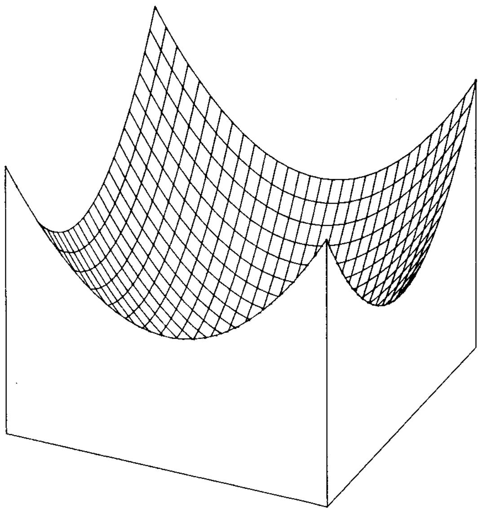  
Figure A.la: Top surface defined by the 2-dimensional version of F1.

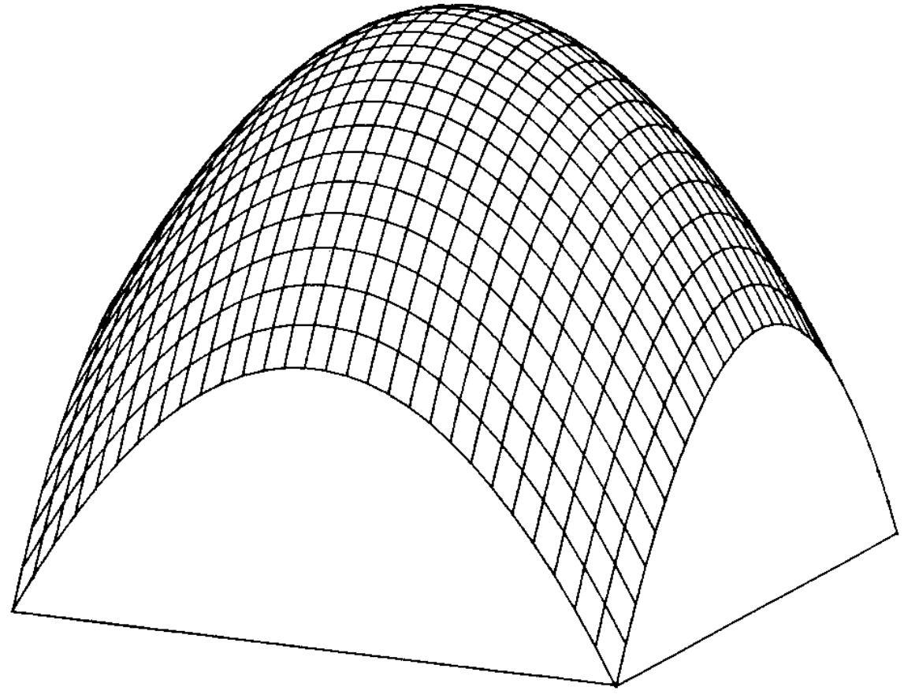  
Figure A.lb: Bottom surface defined by the 2-dimensional version of Fl.

$$
\begin{array} { r c l } { { \mathrm { R A X } { \left( \mathrm { F } { { 2 } } \right) } } } & { { = } } & { { \mathrm { F } { \left( \mathrm { - } 2 , \mathrm { { } } 0 4 8 , \mathrm { { } - } 2 , 0 4 8 \right) } = 3 9 0 5 . 9 3 } } \\ { { \mathrm { R I N } { \left( \mathrm { F } { 2 } \right) } } } & { { = } } & { { \mathrm { F } { \left( \mathrm { 1 } , \mathrm { { } 1 } \right) } = 0 } } \\ { { \mathrm { A V E } { \left( \mathrm { F } { 2 } \right) } } } & { { = } } & { { \displaystyle \frac { 1 } { { \left( \mathrm { 4 } , \mathrm { { } } 0 9 6 \right) } ^ { 2 } } \displaystyle \int _ { \mathrm { A } } { \mathrm { F } { } ^ { 2 } } { \left( \mathrm { X } \right) } \mathrm { d } \mathrm { X } = 4 9 4 . 0 5 } } \end{array}
$$

Figures A.2a and A.2b illustrate the surface derined by F2.

A.4 Test Function F3

Test function F3 is given by:

$$
F 3 ( X ) = \sum \limits _ { 1 = 1 } ^ { 5 } [ X _ { 1 } ]
$$

where $[ x _ { 1 } ]$ represents the greatest integer less than or equal to $\pmb { x _ { 1 } }$ . Hence, F3 is a 5-dimensional step function. It is a discontinuous, non-convex, unimodal function of moderate dimension which is piece-wise constant. F3 was chosen as a test for handling discontinuities. For testing purposes, F3 was restricted to the space A defined by $- 5 . 1 2 \leq x _ { 1 } \leq 5 . 1 2$ with a resolution factor of $\Delta \tt { x } _ { 1 } = \tt { \nabla } \cdot 0 1$ on each axis. So the space A to be searched consisted of $( 1 0 2 4 ) ^ { 5 } \cong 1 0 ^ { 1 5 }$ alternative solutions on which

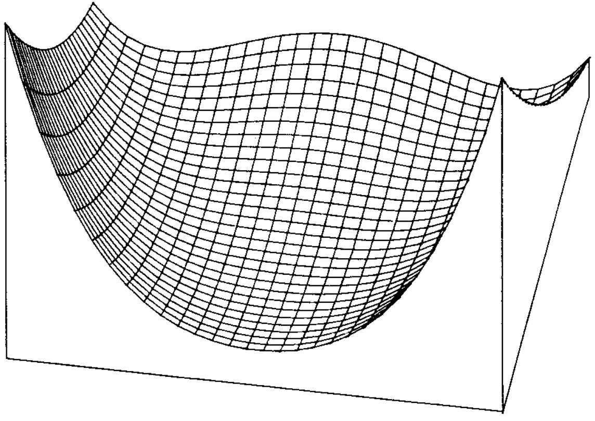  
Figure A.2a: Top surface defined by test function F2.

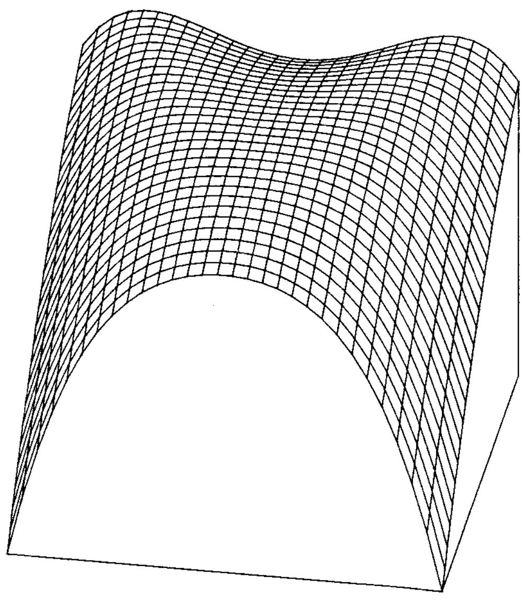  
Figure A.2b: Bottom surface defined by test function F2.

$$
1 1 \times \{ ( 1 3 ) \} = 1 7 3 ( 5 . 1 2 , 5 . 1 2 , 5 . 1 2 , 5 . 1 2 , 5 . 1 2 ) = 2 5
$$

$$
\begin{array} { r c l } { { \mathrm { H T N } ( \mathrm { F 3 } ) } } & { { = } } & { { \displaystyle { \mathbb { F } 3 ( \mathrm { \texttt { - 5 } } { \bf { * } } 1 2 , \mathrm { \texttt { - 5 } } { \bf { * } } 1 2 , \mathrm { \texttt { - 5 } } { \bf { * } } 1 2 , \mathrm { \texttt { - 5 } } { \bf { * } } 1 2 , \mathrm { \texttt { - 5 } } { \bf { * } } 1 2 ) } } } & { { = } ~ { \bf { - 3 0 } } } \\ { { \mathrm { A V E } ( \mathrm { F 3 } ) } } & { { = } } & { { \displaystyle { \sum _ { i = 1 } ^ { 5 } } } } & { { \mathrm { A V E } ~ { \left[ \hat { \mathrm { \bf { x } } } _ { \mathrm { { i } } } \right] } ~ = ~ \bf { - 2 } { \cdot } 5 } } \\ { { } } & { { } } & { { \displaystyle { \mathrm { \texttt { 1 } } } = 1 } } \end{array}
$$

Figure A.3 illustrates the surface defined by F3 in its two-dimensional form.

A.5 Test Function F4 Test function $\mathtt { F 4 }$ is given by: $\begin{array} { r c l } { { \mathtt { F } 4 \left( \mathrm { X } \right) } } & { { = } } & { { \displaystyle \sum _ { 1 = 1 } ^ { 3 0 } \phantom { \sum _ { i } ^ { 3 } } \quad \mathtt { i } \mathtt { x _ { 1 } ^ { 4 } } + \mathtt { G A U S S } \left( 0 \_ { 1 } \right) } } \end{array}$

F4 is a continuous, convex, unimodal, high-dimensional quartic function with Gaussian noise. For testing purposes, $\pmb { \mathcal { F } } \pmb { 4 }$ was restricted to the space A defined by $- 1 . 2 8 \le x _ { \perp } \le 1 . 2 8$ , $1 { = } 1 \ldots { } 3 0$ with a resolution factor of $\Delta x _ { 1 } = . 0 1$ on each axis. So the space A to be searched consisted of (256) $3 0 \ \cong \ _ { 1 0 } 7 2$ alternative solutions on which:

$$
\begin{array} { l l l } { { \texttt { M A X ( F 4 ) } } } & { { = } } & { { \texttt { F 4 ( \pm 1 . 2 8 , \pm 1 . 2 8 , \ldots , \pm 1 . 2 8 ) } \ = \ 1 \ 2 4 8 . 2 } } \\ { { } } & { { } } & { { } } \\ { { \texttt { M I N ( F 4 ) } } } & { { = } } & { { \texttt { F 4 ( 0 , 0 , \ldots , 0 ) } \ = \ 0 } } \\ { { } } & { { } } & { { } } \\ { { \texttt { A V E ( F 4 ) } } } & { { = \ 2 4 9 . 6 } } \end{array}
$$

Figures A. $4 0$ and A.4b illustrate the surface defined by $\mathtt { \pmb { F 4 } }$ in its two-dimensional form without Gaussian noise.

A.6 Test Function F5 Test function F5 1s given by:

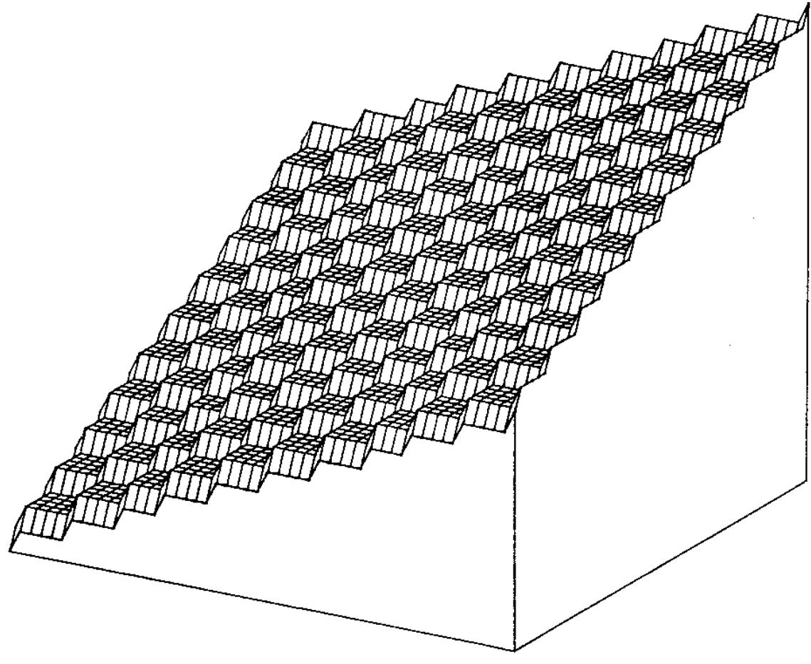  
Figure A.3: Surface defined by the 2-dimensional version of test function F3.

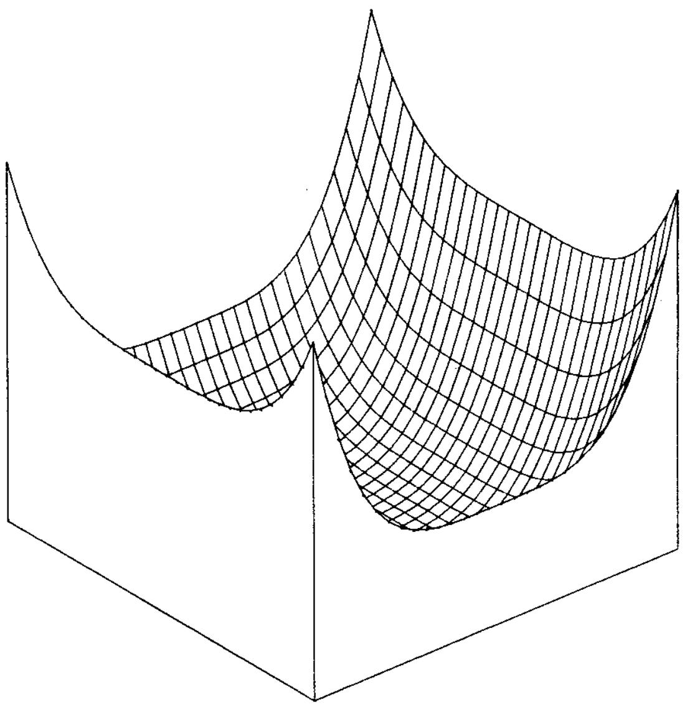  
Figure A.4a: Top surface defined by the 2-dimensional version of test function F4.

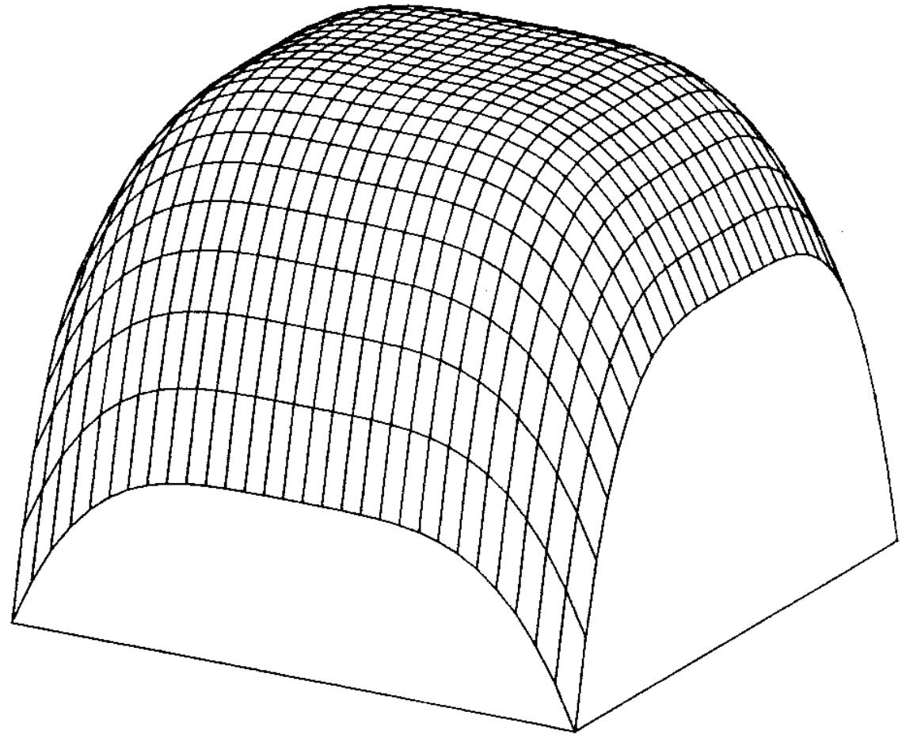  
Figure A.4b: Bottom surface defined by the 2-dimensional version of test function $p 4$

$$
\frac { 1 } { \sqrt { 5 ( X ) } } = \frac { 1 } { \sqrt { 5 } } + \sum \limits _ { j = 1 } ^ { 2 5 } \frac { 1 } { f _ { j } ( X ) }
$$

where

$$
t _ { j } ( x ) = c _ { j } + \sum _ { 1 = 1 } ^ { 2 } ( x _ { 1 } - a _ { 1 j } ) ^ { 6 }
$$

F5 is an interesting multimodal function synthesized as suggested by Shekel (1971). It is a continuous, nonconvex, non-quadratic, two-dimensional function with 25 loal minprimatel $\left\{ ( a _ { 1 } , j , a _ { 2 } , j \right\} _ { j = 1 } ^ { 2 5 } .$ The function value at the point $( a _ { 1 } , 1 , a _ { 2 } , 1$ is approximately $c _ { j } \cdot$

For testing purposes, the $a _ { 1 , 1 }$ were defined by:

$$
{ \left[ \begin{array} { l } { \mathbf { a _ { 1 , j } } } \\ { \mathbf { a _ { 1 , j } } } \end{array} \right] } = { \left[ \begin{array} { l l l l l } { - 3 2 , - 1 6 , } & { 0 , } & { 1 6 , } & { 3 2 , - 3 2 , - 1 6 , } & { \dots \dots , } & { 0 , 1 6 , } & { 3 2 } \\ { - 3 2 , - 3 2 , - 3 2 , - 3 2 , - 3 2 , - 3 2 , - 1 6 , - 1 6 , } & { \dots \dots , } & { 3 2 , } & { 3 2 } \end{array} \right] }
$$

with $c _ { 1 } = 1$ and $\tt { K } = 5 0 0$ . F5 was restricted to the space A defined by $- 6 5 . 5 3 6 \leq x _ { 1 } \leq 6 5 . 5 3 6$ , $\pmb { \downarrow } = \pmb { 1 }$ ,2 with a resolution factor of $\Delta \tt { x _ { 1 } } = . 0 0 1$ on each aris. So the space A to be searched consisted of $( 1 3 1 , 0 7 2 ) ^ { 2 } \ \cong \ 1 6 * 1 0 ^ { 9 }$ alternative solutions on which:

$$
\begin{array} { l } { { \mathbb { M } \mathrm { A X } \left( \mathrm { F } \varsigma \right) \~ \cong ~ \varsigma _ { 0 0 } } } \\ { { \ } } \\ { { \mathbb { M } \mathrm { T N } \left( \mathrm { F } \varsigma \right) \~ \cong ~ 1 } } \\ { { \ } } \\ { { \mathrm { A V E } \left( \mathrm { F } \varsigma \right) \~ \cong ~ 4 7 3 } } \end{array}
$$

Figures A.5a and A.5b illustrate the surface defined by F5. It is essentially a flat surface $\mathfrak { F } 5 ( \mathbf { x } ) \ = \ 5 0 0$ with 25 deep perforations centered about the points $\ \{ \mathsf { a } _ { 1 , 1 , 9 , 2 , \mathrm { j } } \}$ :

Near the point (a1j,a2j), F5 is almost completely dominated by the term ${ \pmb f } _ { 1 } ( { \pmb x } )$ , i.e.

$$
\mathtt { F S ( X ) } = \mathtt { c _ { j } } + \sum _ { \mathtt { i } = 1 } ^ { 2 } ( \mathtt { x _ { i } } \mathtt { s a _ { 1 j } } ) ^ { 6 }
$$

and hence $p s ( a _ { 1 } , a _ { 2 } j ) \cong c _ { j } \triangleq j .$ , So F5 has 25 local minima at which F5 takes on the values $1 , 2 , \ldots , 2 5 .$

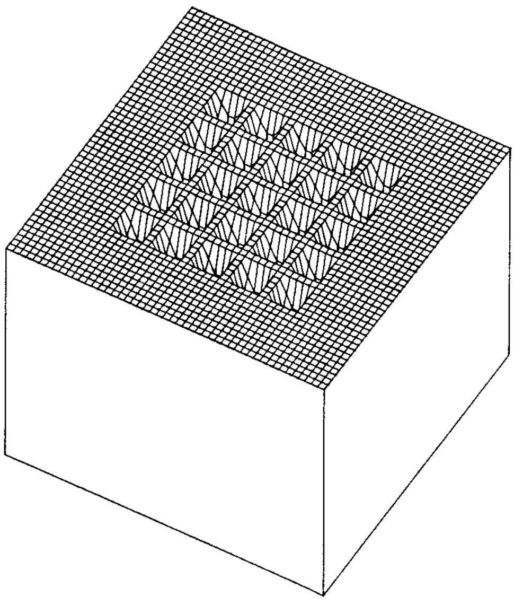  
Figure A.5a: Top surface defined by test function F5.

FIG. A.5B: INVERTED F5 (25 FOX HOLES)

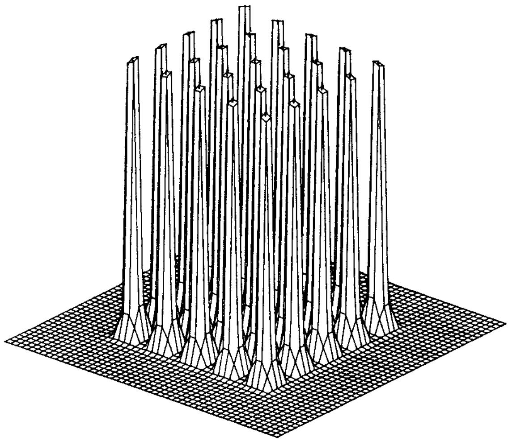  
Figure A.5b: Bottom surface defined by test function F5.

# Appendix B

# RANDOM SEARCH ON E

# B.1 Introduction

As a first attempt at evaluating genetic adaptive plans, their performance was compared with pure random search on the environment described in appendir A. Since pure random search takes advantage of none of the information accumulating over a sequence of trials, its performance serves as a lower bound on the performance of an adaptive plan. Any plan which claims to dynamically exploit sampling information had better show improved performance over random search.

In order to evaluate the performance of pure random search on the environment E, a plan RANDoM was implemented in PL/I to simulate a uniformly-distributed random search over the discrete spaces A associated with the test functions. Considerable difficulty was encountered in validating the uniform randomness of RANDoM on the multi-dimensional spaces associated with the test functions. Initially, RANDom called the standard system library random number generator URAND N times to produce a point in N-space. However, this resulted in a non-uniform distribution biased toward a hypersphere in the center of the space. This approach was modified to maintain N separate pseudo-random streams in parallel, one for each aris. This improved the randomness in $\pmb { \mathrm { N } } .$ -space somewhat, although considerable difficulties arose in determining a method for selecting N seeds so that the streams were in fact independent.

At this point I began reading about random number generators and discovered Marsaglia's article (1968) pointing out the dirfioulties in generating uniform distributions in N-space with multiplicative congruential random number generators, of which URAND was an instance. This led me to papers by Tootill, etc. (197l, 1973) describing the properties of several classes of Tausworthe generators, first suggested by Tausworthe (1965), which are based on primitive polynomials over GF(2) and are implemented by linear shift register sequences. These generators can be shown analytically to generate uniformly random distributions in N-space when $\Re \preceq \mathbb { K }$ : The value of K depends on the particular member of the class chosen, and the cost of generating the random numbers increases with K. A member of the class for which K=3o was chosen and implemented as the subroutine TRAND for use with RANDoM. This resulted in a considerable improvement in the uniform randomness of RANDoM and led to very little difficulty in validating the performance of RANDOM on the environment E.

# B.2 Validating RANDOM on E

In order to provide a comparison with genetic algorithms, both the off-line and on-line performance of RANDom was measured for each of the test functions. Care was taken to attempt to validate the perrormance curves obtained from the simulated random searches. That is, I attempted to verify that performance curves approximated the expected performance and did not in fact represent an artifact of the pseudo-uniform distribution over the space. The verification took two forms. Whenever possible, I derived an analytic erpression for the expected performance curve assuming a uniform distribution. If this was not possible, the space was rotated and inverted during the sequence of simulations used to generate a performance curve in an attempt to counteract any pseudo-random bias.

Expected off-line performance was derived as follow If we consider a test function F as a random variable on the space A, we can ask: what is the expected number of trials required to find a point X in A such that $\mathbb { F } ( \mathbb { X } ) \le \epsilon$ , This is a standard waiting time problem for a sequence of Bernouli trials. That is, let p be the probability of a success (F(x)=e ). Then the erpected number of trials required to generate the first success is simply $f = \frac { 1 } { \tt p }$ . So the problem reduces to one of computing PROB $[ F ( X ) \leq \epsilon ]$ , Whether or not this is easily computed depends, of course, on the particular function.

For on-line performance, we need to know the expected value of a sample at time t. For uniform random search, this is simply the average value of F on the space A. Whether or not this is easily computed depends again on the particular test function.

# B.3 RANDOM on F1

F1 provides a good validation test for RANDoM since it is amenable to mathematical analysis. For off-line performance, we need to compute PROB $[ F 1 ( X ) \leq \epsilon ]$ , We note that, for Fl, the points in A satisfying this constraint lie in the sphere defined by $\tt { x } _ { 1 } ^ { 2 } + \tt { x } _ { 2 } ^ { 2 } + \tt { x } _ { 3 } ^ { 2 } = \epsilon$ Moreover, the search space A is bounded by constraints o1 the form (I=b. HeNce, for 'b, we have:

$$
\begin{array} { r l } { \mathtt { P B O B } \left[ \mathtt { P 1 } ( \mathtt { X } ) \le \overline { { \epsilon } } \right] } & { = \frac { \mathtt { V _ { S } } ( \sqrt { \epsilon } ) } { \mathtt { V _ { C } } ( 2 \mathtt { b } ) } } \end{array}
$$

where Vg(√ ) represents the volume of a sphere of radius VE' and v(2b) represents the volume of a cube with sides of length 2b. The volume of a sphere is given by:

$$
v _ { e } ( \sqrt { e } ) = \frac { 4 } { 3 } \pi k ^ { 3 / 2 }
$$

so that

$$
{ \begin{array} { r l } { { \tt P B O B } \left[ { \tt F 1 } ( \mathrm { X } ) \leq \epsilon \right] } & { = { \frac { 4 \pi \epsilon ^ { 3 / 2 } } { 3 ( 2 \mathrm { b } ) ^ { 3 } } } = { \frac { \pi \epsilon ^ { 3 / 2 } } { 6 \mathrm { b } ^ { 3 } } } } \end{array} } 
$$

and hence the expected number of trials required to locate a point satisfying the constraint is given by:

$$
t = \frac { 1 } { P R O B \Big [ P 1 ( X ) \leq \epsilon \Big ] } = \frac { 6 b ^ { 3 } } { \pi \epsilon ^ { 3 / 2 } }
$$

Expected on-line performance is obtained by computing:

$$
\operatorname { A V E } ( \operatorname { F 1 } ( \mathbf { X } ) ) = \frac { 1 } { ( 2 \mathbf { b } ) ^ { 3 } } \int _ { A } \mathbf { F 1 } ( \mathbf { X } ) \mathrm { d } \mathbf { X }
$$

$$
\begin{array} { l } { { \displaystyle \ = \ \frac { 1 } { ( 2 { \bf b } ) ^ { 3 } } \quad \displaystyle et { } { ' } \displaystyle et { } { ' } \displaystyle et { } { ' } \displaystyle et { } { ' } \displaystyle et { } { ' } \displaystyle \ s ( \displaystyle \sum _ { - { \bf b } } \displaystyle \sum _ { i = { \bf b } } \displaystyle \ s ( \displaystyle \ s ( \displaystyle \ s , \displaystyle \ \mathrm { d } \displaystyle \mathbf s _ { i } ^ { 2 } + \displaystyle \mathbf s _ { i } ^ { 2 } + \displaystyle \mathbf s _ { i } ^ { 2 } + \displaystyle \mathbf s _ { i } ^ { 2 } + \displaystyle \mathbf s _ { i } ^ { 2 } + \displaystyle \mathbf s _ { i } ^ { 2 } + \displaystyle \mathbf s _ { i } ^ { 2 } + \displaystyle \mathbf s _ { i } ^ { 2 } + \displaystyle \mathbf s _ { i } ^ { 2 } + \displaystyle \mathbf s _ { i } ^ { 2 } + \displaystyle \mathbf s _ { i } ^ { 2 } + \displaystyle \mathbf s _ { i } ^ { 2 } ) ) } } \\ { { \displaystyle \ = \ \frac { 1 } { ( 2 { \bf b } ) ^ { 3 } } \ \ast \ \delta { \bf b } ^ { 5 } } } \\ { { \displaystyle \ } } \\ { { \displaystyle = \ \mathbf s ^ { 2 } } } \end{array}
$$

Figures B.la and B.1b compare the expected performance curves with those generated by RANDom. As can be seen. the values agree closely.

# B.4 RANDOM on F2

Deriving an analytic expression for the off-line performance of RANDOM on F2 is very difficult, if not impossible. As a consequence, no direct validation of the performance curve illustrated in figure B.2a was done. However, the space A was rotated and inverted during the generation of the performance curve in an attempt to minimize any bias.

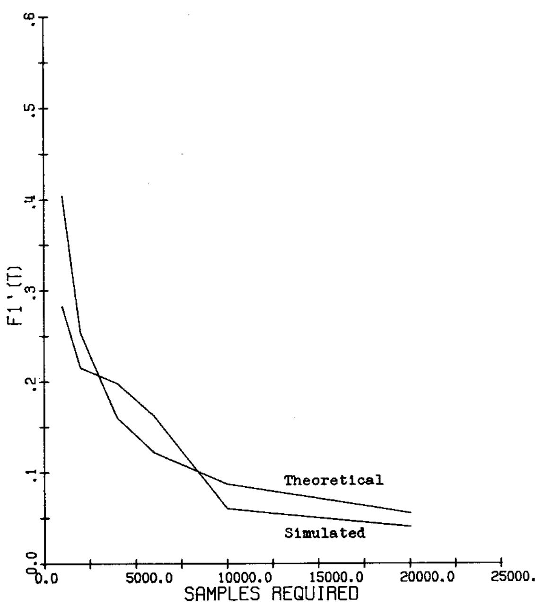  
Figure B.la: Off-line performance curves for random search on test function Pl.

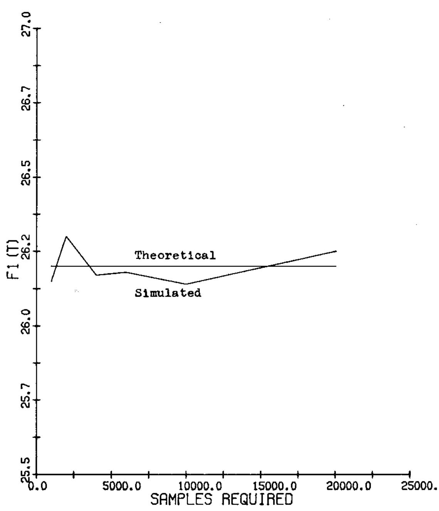  
Figure B.ib: On-line performance curves for random search on test function F1.

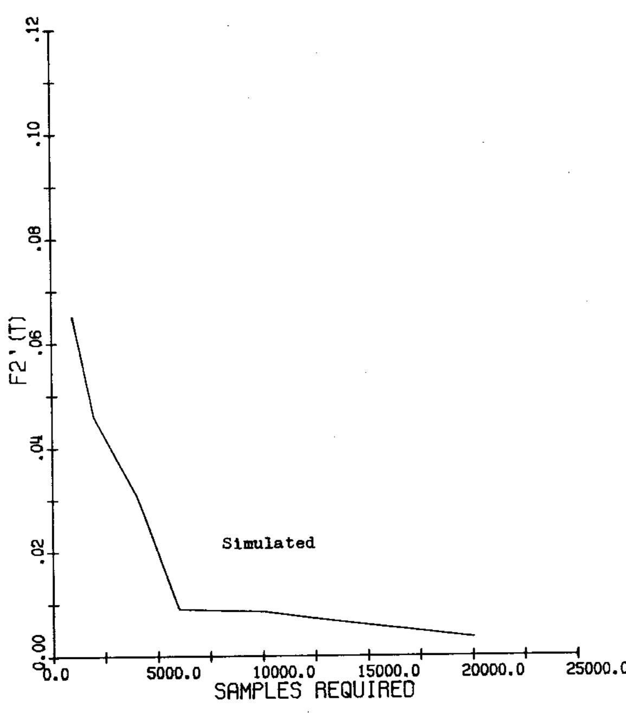  
Figure B.2a: off-line performance curve for random search on test function F2.

Expected on-line performance on F2 is computed as follows:

$$
\begin{array} { r l } { \mathbf { A V E } ( \mathbf { F } 2 ( \mathbf { X } ) ) } & { = \frac { 1 } { \left( 2 \mathbf { B } \right) ^ { 2 } } \quad \displaystyle \sum _ { k } \mathbf { \Psi } ^ { \mathrm { p } _ { 2 } } ( \mathbf { X } ) \ \mathrm { ~ d } \mathbf { X } } \\ & { = \frac { 1 } { \left( 2 \mathbf { B } \right) ^ { 2 } } \quad \displaystyle \sum _ { s = \mathbf { b } } ^ { \mathbf { b } } \ \displaystyle \sum _ { 1 \leq 0 } ^ { \mathbf { b } } \ \sum _ { \alpha = \frac { 1 } { 2 } \alpha , 1 } ^ { 2 } \mathbf { \Psi } ^ { 2 } + \left( 1 - \mathbf { z } _ { 1 } \right) ^ { 2 } \ \mathrm { d } \mathbf { z } _ { 1 } \mathrm { d } \mathbf { z } _ { 2 } } \\ & { \quad \displaystyle - \frac { 1 } { \alpha \mathbf { b } ^ { 2 } } \ \mathrm { ~ s } 0 0 \mathbf { b } ^ { 6 } + \frac { \mu _ { 0 } ( \mathbf { b } _ { \mathbf { b } } ) } { 3 } \mathbf { \Psi } ^ { 4 } + \mathrm { i } \mathbf { b } ^ { 2 } } \\ & { \quad \displaystyle - \ 2 0 \mathbf { b } ^ { 4 } + \frac { 1 0 \mathbf { 1 } } { 3 } \ \mathbf { \Psi } ^ { 2 } + 1 } \end{array}
$$

Figure B.2b compares the theoretical on-line performance with that generated by RANDoM. The agreement is quite good.

# B.5 RANDOM on F3

Deriving the expected off-line performance on F3 is a straightforward, but tedious, problem in combinatorics. The probability of landing on a particular $\cdot$ plateau is given by:

$$
p = \frac { 1 } { ( 2 b ) ^ { 5 } } \frac { 5 } { 1 2 1 } l _ { 1 }
$$

where $l _ { 1 }$ are the lengths of the sides of the plateau. It remains only to count the number of plateaus satis

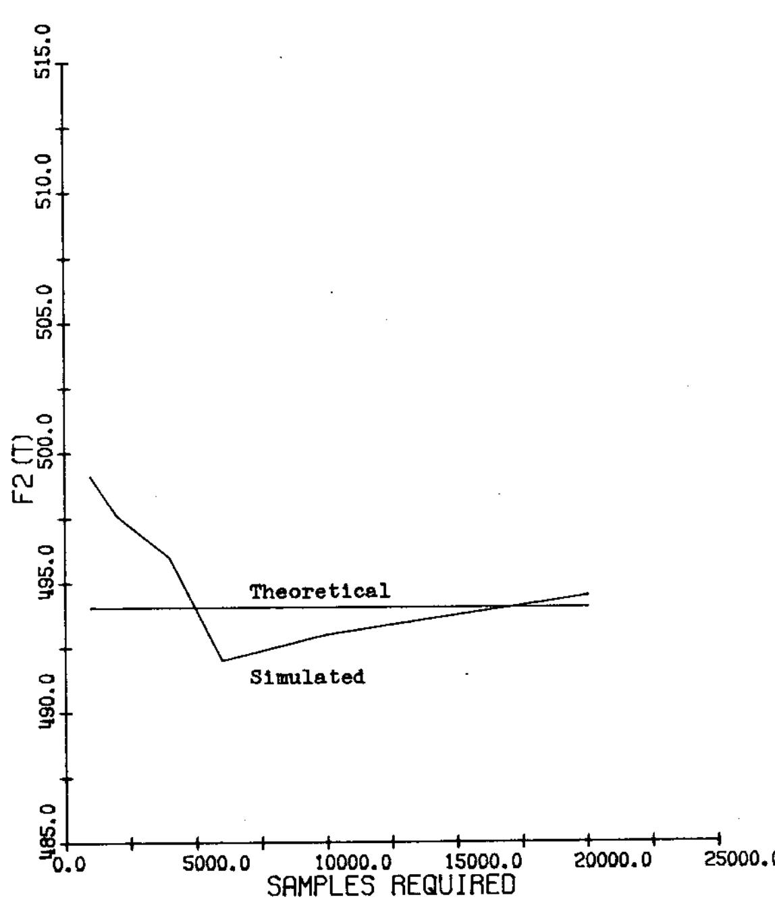  
Figure B.2b: . On-line performance curves for random searoh on test function F2.

fying the constraint $\mathbb { P } 3 ( \mathbb { X } ) \leq \epsilon$ and sum their associated probabilities. oexample,  PROB $[ F 3 ( x ) \leq - 2 9 ]$ when $| x _ { 1 } | \leq 5 . 1 2$ is computed as follows:

Since $p 3 ( x ) = \sum \limits _ { i } ^ { 5 } [ x _ { i } ]$ , the minimum value $1 7 3 ( x ) = - 3 0$ can only be obtained by $[ x _ { 1 } ] = 6$ for all i. Hence,

$$
\begin{array} { r l } { { \biggl [ } { \mathfrak { F } } 3 ( \mathbf { { x } } ) = - 3 0 { \biggr ] } } & { { } = \left( { \frac { \mathbf { { \sigma } } \cdot 1 2 } { \mathbf { { 1 0 } } \cdot 2 4 } } \right) ^ { \ 5 } } \end{array}
$$

Similarly, $9 3 ( x ) = - 2 9$ is obtained by summing

$$
( - 6 ) + ( - 6 ) + ( - 6 ) + ( - 6 ) + ( - 5 )
$$

s0 that

$$
\begin{array} { r l } { \operatorname { \mathbb { P } R O B } \left[ \operatorname { \mathbb { P } 3 } \left( \operatorname { \mathbb { X } } \right) = - 2 9 \right] } & { { } = { \binom { 5 } { 1 } } \left( { \frac { - 1 2 } { 1 0 \cdot 2 4 } } \right) ^ { 4 } \left( { \frac { 1 } { 1 0 \cdot 2 4 } } \right) } \end{array}
$$

and summing the to yields PROB $[ F 3 ( X ) \leq - 2 9 ]$

Erpected on-line performance on F3 is given by:

$$
\begin{array} { r l } { \underset { \mathrm { A V E } } { \sum } ( \mathbb { P } 3 ( \mathrm { X } ) ) = } & { \underset { 1 } { \overset { { , } } { \sum } } \underset { 1 } { \overset { { , } } { \sum } } \left[ \underset { 1 } { \overset { { , } } { \mathbf { x } } } _ { 1 } \right] } \\ & { = \underset { 1 } { \overset { { , } } { \sum } } \underset { 1 } { \overset { { , } } { \operatorname { A v E } } } \left[ \underset { 1 } { \overset { { , } } { \mathbf { x } } } _ { 1 } \right] } \\ & { = \underset { 1 } { \overset { { , } } { \sum } } \underset { 1 } { \overset { { , } } { \sum } } \left( \underset { 1 } { \overset { { , } } { \sum } } \right) / 2 } \end{array}
$$

Figures B.3a and B.3b compare the expected performance curves with those obtained from RANDoM. As can be seen, the values are very close.

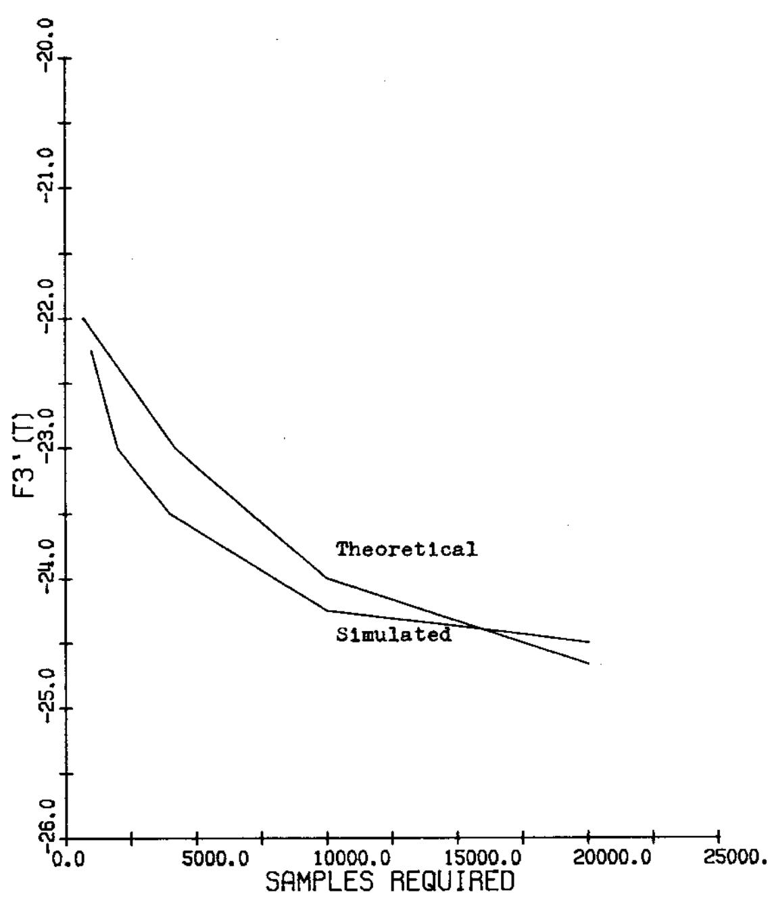  
Figure B.3a: off-line performance curves for random search on test function F3.

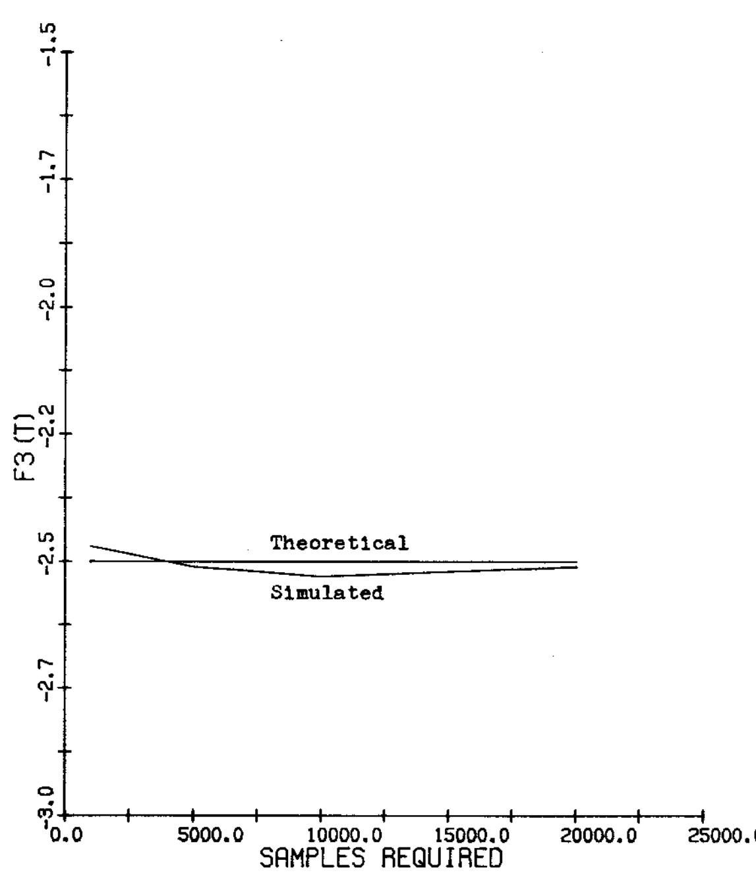  
Figure B.3b: On-line performance curves for random search on test function F3.

# B.6 RANDOM On F4

Deriving expected off-line performance for F4 1s 4 diffioult. We need to compute PROBl The problem can be simpliried somewhat by noting that over the interval of observation, RANDoM was unable to reduce $\sum 4 ^ { \infty } ( t )$ below 50, This suggests that a reasonable approximation is obtained by ignoring the Gaussian noise, that is, PROB $[ \sum \limits _ { i } ^ { 3 0 } \mathbf { i x _ { i } ^ { 4 } } \leq \epsilon ]$ . As in the case of Fl, we have that

$$
\mathrm { \tt P R O B } \left[ \sum _ { 1 } ^ { 3 0 } \mathrm { \ u x } _ { 1 } ^ { 4 } \le \epsilon \right] = \frac { \mathrm { v } _ { s } \left( \epsilon ^ { 1 / 4 } \right) } { \mathrm { v } _ { \tt c } \left( 2 5 \right) } \ , \epsilon ^ { 1 / 4 } \le \ b
$$

Note, however, that $v = 1 , 2 8$ for F4, limiting the above computation to $\epsilon < 3$ which is far beyond any practical interval of observation.

FRO $\{ x _ { 1 } ^ { 4 } \leq t \}$ by o tt to bou the

$$
\left\{ x : | x _ { 1 } | \leq \left( { \frac { \in } { \mathfrak { S } ^ { 1 } } } \right) ^ { 1 / 4 } \right\} C \left\{ x : \begin{array} { l } { 3 0 } \\ { \leq \begin{array} { l } { 1 } \\ { 1 } \end{array} } \end{array} \right. \leq \left\{ x _ { 1 } ^ { 4 } : \leq \epsilon \right\} C \left\{ x : | x _ { 1 } | \leq \left( { \frac { \epsilon } { 1 } } \right) ^ { 1 / 4 } \right\}
$$

However, because of the high dimensionality of $\mathtt { p 4 }$ , these bounds are ertremely crude, effectively bounding the probability by O and 1. As a consequence no direct validation of the off-line performance curve for RANDoM on F4 (shown in figure $B \cdot 4 a$ ) was made. Rather, an attempt was made to minimize any bias due to pseudo-randomness by rotating and inverting the space as the performance

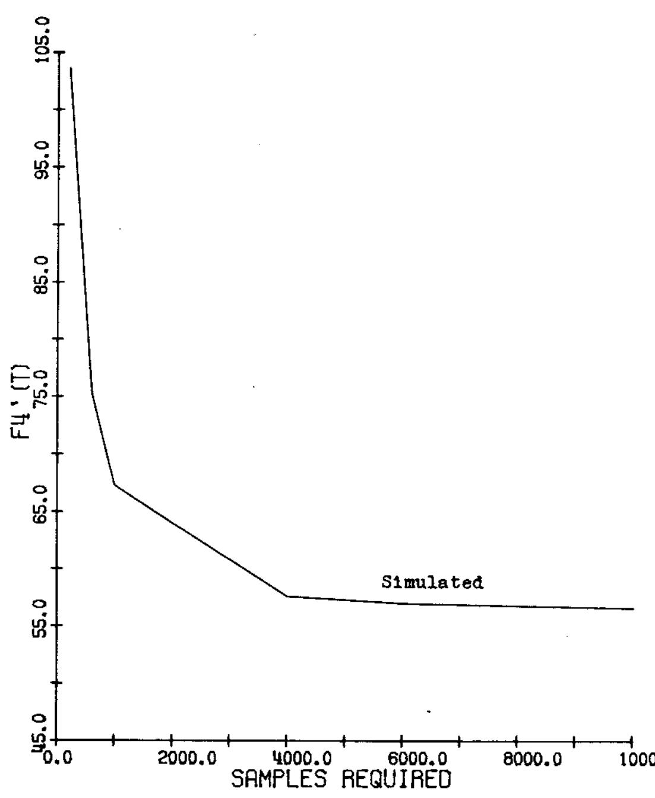  
Figure B.4a: off-line performance curves for random search on test function F4.

curve was generated.

Erpeoted on-line performance on F4 is given by:

$$
\begin{array} { r l } & { \quad \quad - \frac { 1 } { ( 2 0 8 ) ^ { 2 0 } } \displaystyle \sum _ { i = 1 } ^ { 9 8 } \Bigg \{ \displaystyle \sum _ { j = 0 } ^ { 8 } \cdots \int _ { - 2 0 } ^ { 1 8 } x _ { 1 } ^ { i } \ : \alpha _ { 1 } \ : \hdots \ : \alpha _ { 3 0 } } \\ & { \quad \quad - \frac { 1 } { ( 2 0 8 ) ^ { 2 0 } } \displaystyle \sum _ { i = 1 } ^ { 9 8 } \cdots \left. \frac { 3 \theta _ { i } } { 5 } \cdot ( 2 0 8 ) ^ { 3 0 } \right. } \\ & { \quad \quad \quad \quad \quad \quad \quad \quad \quad \quad \quad \quad \quad } \\ & { \quad \quad \quad = \frac { \mathrm { B } ^ { i } } { 5 } \displaystyle \sum _ { i = 1 } ^ { 3 9 } \cdots \sum _ { i } } \\ & { \quad \quad \quad \quad \quad \quad \quad \quad \quad \quad \quad \quad \quad \quad } \\ & { \quad \quad \quad \quad \quad \quad \quad \quad \quad \quad \quad \quad \quad \quad \quad \quad \quad \quad } \end{array}
$$

Figure B.4b compares the expected on-line performance of random search on $\tt R 4$ with the curve generated by RANDOM. The results closely match.

# B.7 RANDOM on F5

To analytically derive the expected off-line performance for random search on F5 is diffioult. However, because of the composite nature of F5, a reasonable approximation is not dirficult. Since near the $g ^ { \tt t h }$ local minimum $\Im { \{ x \} } \cong \Im { \{ x \} }$ and elsewhere $\yen 5( x ) \cong500$ , we have

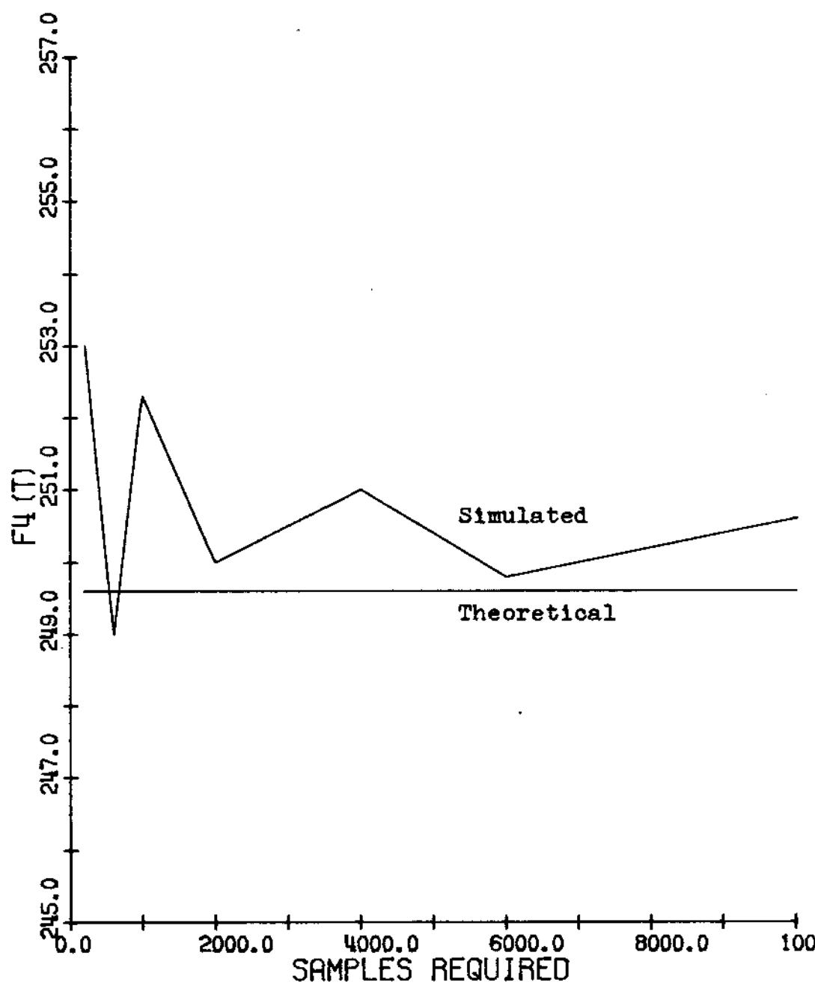  
Figure B.4b: On-line performance curves for random search on test function F4.

$$
[ F 5 ( X ) \leq 6 ] = \sum \limits _ { j = 1 } ^ { 2 5 } \frac { 2 5 } { 2 0 0 } [ t _ { j } ( X ) \leq 6 ] = 6 < < 5 0 0
$$

For each j we have:

$$
{ \begin{array} { r l } { [ \mathbf { r } _ { 3 } ( \mathbf { x } ) \leq \epsilon { \Bigg ] } } & { = { \mathrm { ~ r B o n ~ } } { \Bigg [ } \mathbf { e } _ { 3 } + \sum _ { 1 = 1 } ^ { 2 } { ( \mathbf { r } _ { 1 } { - } \mathbf { e } _ { 1 , 1 } ) } ^ { 6 } \leq \epsilon { \Bigg ] } } \\ & { = { \mathrm { ~ P B o ~ } } { \Bigg [ } \sum _ { 1 = 1 } ^ { 2 } { ( \mathbf { x } _ { 1 } { - } \mathbf { a } _ { 1 , 1 } ) } ^ { 6 } \leq \epsilon { - } \mathbf { e } _ { 3 } { \Bigg ] } } \\ & { = { \mathrm { ~ P B o ~ } } { \Bigg [ } \sum _ { 1 = 1 } ^ { 2 } x _ { 1 } ^ { 6 } \leq \epsilon { - } \mathbf { e } _ { 3 } { \Bigg ] } } \end{array} }
$$

$$
\mathbf { \Sigma } = \left\{ \begin{array} { l } { 0 \ \mathrm { ~ 1 ~ f ~ } \ \in < \mathsf { e } _ { 3 } } \\ { \qquad } \\ { \underbrace { \Psi _ { s } \{ ( \in - \mathsf { e } _ { 3 } ) ^ { 1 / 6 } \} } _ { \nabla _ { \mathsf { e } } \{ \mathsf { 2 b } \} } \ \mathsf { 1 } f \ \ 0 \leq ( \mathsf { \Sigma } \in \mathsf { e } _ { 3 } ) ^ { 1 / 6 } \leq \mathsf { \Delta } \mathsf { b } } \\ { \qquad } \end{array} \right.
$$

where

$$
\begin{array} { r l } { \nabla _ { \mathbf { g } } ( \mathbf { r } ^ { 1 / 6 } ) } & { = \displaystyle \sum _ { - \mathbf { k } ^ { 1 / 6 } } ^ { \mathbf { k } ^ { 1 / 6 } } \displaystyle \sum _ { - ( \mathbf { k } - \mathbf { x } _ { \mathbf { k } } ^ { 6 } ) ^ { 1 / 6 } } ^ { ( \mathbf { k } - \mathbf { x } _ { \mathbf { k } } ^ { 6 } ) ^ { 1 / 6 } } \Delta \mathbf { r } _ { 1 } \mathrm { d } \mathbf { r } _ { 2 } } \\ & { = \displaystyle \mathbf { \operatorname* { d } } _ { \mathbf { \phi } } \displaystyle \sum _ { 0 } ^ { \mathbf { k } ^ { 1 / 6 } } \frac { ( \mathbf { r } _ { 1 } - \mathbf { x } _ { 2 } ^ { 6 } ) ^ { 1 / 6 } } { ( \mathbf { k } - \mathbf { x } _ { 2 } ^ { 6 } ) ^ { 1 / 6 } } \Delta \mathbf { r } _ { 2 } } \end{array}
$$

$$
= 4  { \mathbf { k } } ^ { 1 / 3 } \int \limits _ { 0 } ^ { 1 } ( 1 -  { \mathbf { g } } ^ { 6 } ) ^ { 1 / 6 }  { \mathrm { ~ d } }  { \mathbf { y } }
$$

which is beyond my powers of integration. However, numerical integration yields:

$$
\int \limits _ { 0 } ^ { 1 } ( 1 - y ^ { 6 } ) ^ { 1 / 6 } d y = \cdot 9 6 3 6 8 8
$$

If we assume this is aocurate enough for our purposes, we have:

$$
\begin{array} { r l } & { \texttt { P a t s v e } } \\ & { \texttt { P B O B } \left[ \texttt { f } _ { \texttt { j } } ( \texttt X ) \leq \epsilon \right] \stackrel { \sim } { = } \left\{ \begin{array} { l l } { 0 \texttt { i f } \epsilon < \epsilon _ { \texttt { j } } } \\ { \frac { \sum _ { * } 8 \zeta \Sigma / \zeta 2 } { \left( 2 \texttt { b } \right) ^ { 2 } } \left( \epsilon - \texttt { e } _ { \texttt { j } } \right) ^ { 1 / 3 } , 0 \leq \left( \zeta - \texttt { e } _ { \texttt { j } } \right) ^ { 1 / 6 } \texttt { b } } \end{array} \right. } \end{array}
$$

This approximation was used to estimate the expected off-line performance of random search on F5. Figure B.5e compares this approrimation with the curve generated by RANDOM. The two agree surprisingly well.

The expected on-line performance of random search on F5 is also difficult to derive. In fact, even a reasonable approrimation is difficult to find. As a consequence, no direct validation of the on-line performance curve for RANDom shown in figure B.5b was done. Rather, the search space was rotated and inverted while

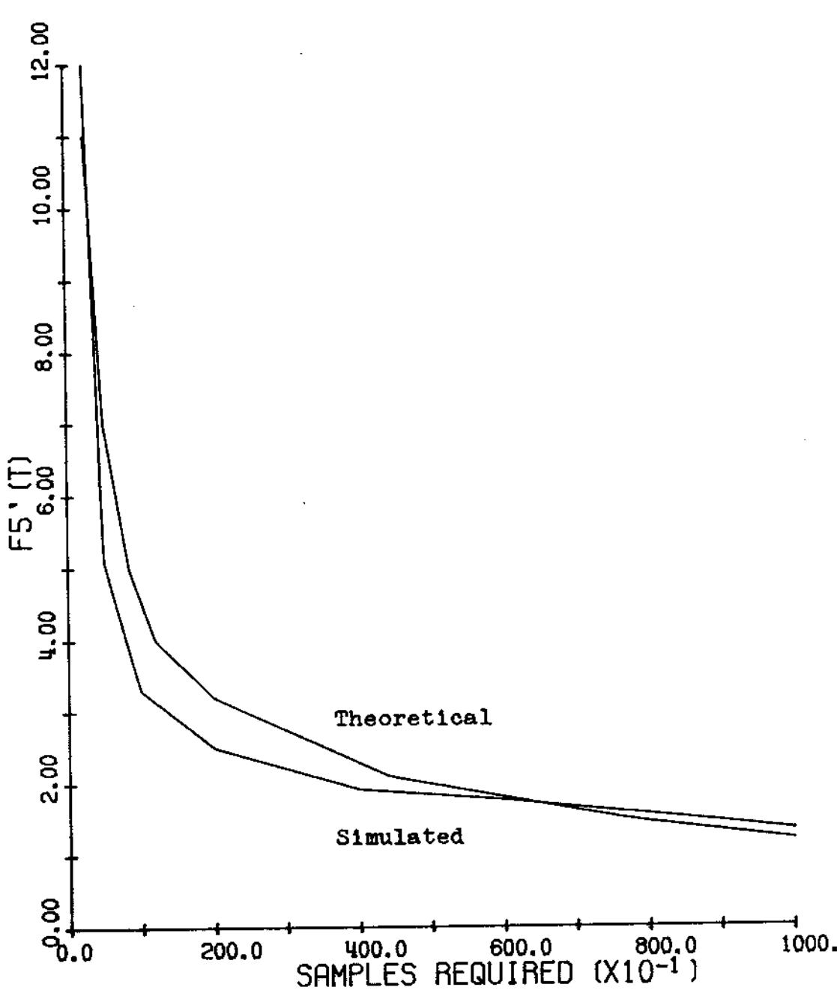  
Figure B.5a: off-line performance curves for random search on test function F5.

# Fig. B.5: On-line Performance on F5

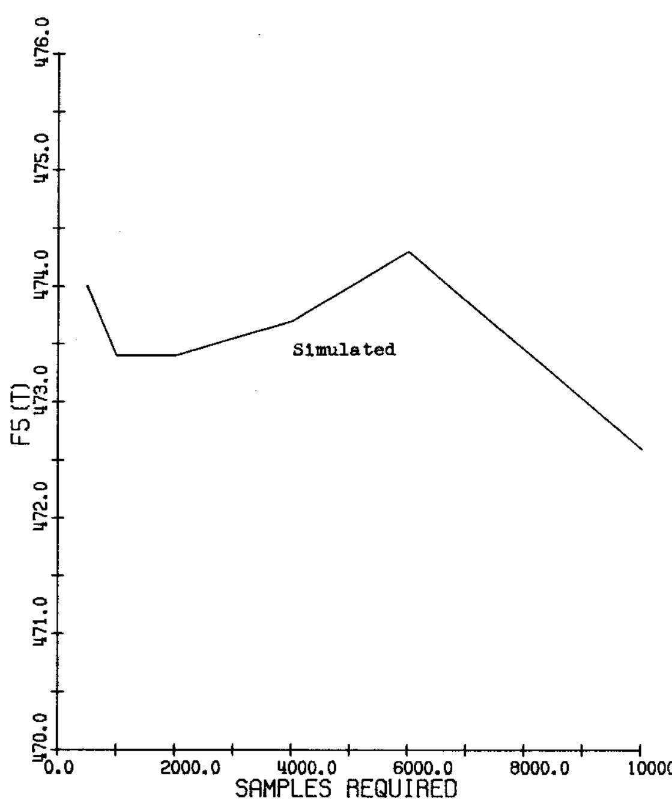  
Figure B.Sb: On-line performance curve for random search on test function F5.

generating the performance curve in an attompt to minimize any bias due to pseudo-randomness,

# Appendix C

# PLAN H1 ON E

# C.1 Introduction

The idea of simulating the information processing mechanisms of heredity and evolution as strategies for adaptation in artificial systems was first introduced by Holland. Since then considerable experimentation and analysis has been done in such areas as the kind of genetic operators to be applied, the form of the representation space, the mating rules to be used, and so on.

Bagley has compared the behavior of correlation algorithms and genetic algorithms with respect to environments exhibiting first and second order non-linearities. He showed that comparable or superior behavior could be generated by genetic algorithms using population sizes of 20o, standard genetic operators applied at fixed levels, and random mating.

Cavicchio has studied the behavior of genetic algorithms in a pattern-matching environment. He was able to show the negative effects of a small population size (less than 20) and experimented with several forms of genetic operators applied at varying levels. He was able to generate excellent adaptive behavior using a scheme for modifying the frequency with which genetic operators are applied during adaptation.

Hollstien has studied the effects that representation and breeding plans have on the behavior of genetic algorithms in a variety of continuous and discontinuous two-variable environments. Using mutation and crossover at fixed rates and a population of size 16, he exhibited robust behavior for both random mating and reourrent inbreeding-crossbreeding. He showed the negative effects of such breeding plans as linebreeding and inbreeding. He also examined the effect of several representations for genes including binary, gray code, and polygene forms.

Frantz has studied the effects of the genetic operators on the composition of the resultant population in the face of highly non-linear environments. He was able empirically to verify hypotheses about the effects of crossover and mutation, but had difficulty in verifying inversion effects..

Foo and Bosworth have attempted mathematical analyses of the basic genetic operators. Bosworth, Foo, and Zeigler have experimented with incorporating gradient information as a mutation operator in the context of function optimization. In the same context Zeigler, Bosworth, and Bethke have shown genetic algorithms to be relatively insensitive to noisy environments when compared with classical gradient optimization techniques.

The cumulative erperience of these studies provided the framework for the definition of the initial elementary reproductive plan A1 introduced in chapter 2 and

which operates as follows:

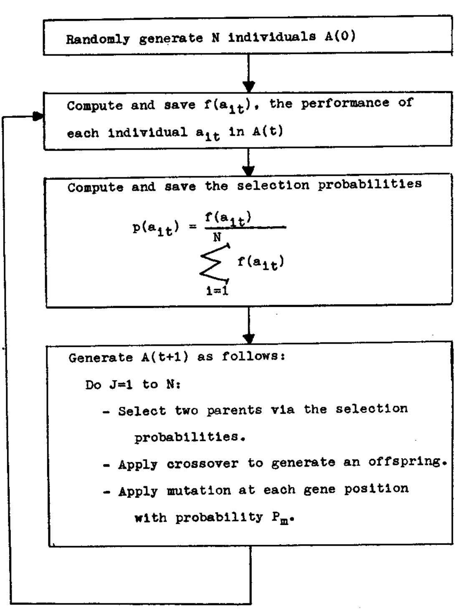

This actually specifies a class of genetic algorithms which differ in the parameters $\pmb { \mathbb { M } }$ and $\overline { { \mathbf { p } } } _ { \mathbf { a } } \bullet$ Previous eXperience suggested that population sizes smaller than 30 were subject to severe stochastio effeots which made performance measurements difficult. For these measurements, a population size of $N = 5 0$ was chosen, and a mutation rate of .ool which is an upperbound on the estimate of the mutation rate in nature.

Because A1 is a stochastic process, a minimum of 5 trials was made on each test function. More were made if required to reduce the standard $9 5 \%$ confidence intervals associated with the performance measurements. The. results are presented in several ways. Graphs are given to compare the off-line and on-line performance curves $f ^ { \mu } ( t )$ and $\pmb { \mathcal { F } } ( \pmb { \mathcal { t } } )$ of Al and random search on each of the test functions described in appendir A. Tables are given to compare the performance indices $\mathfrak { x } _ { \mathtt { e } } ^ { * } ( \mathfrak { T } )$ and $\pmb { x _ { e } } ( \updownarrow )$ for R1 and random search for various values of $\pmb { \mathbb { T } }$ on each of the test functions. Finally, the robustness of Rl and random search on E is compared using the measures defined in Chapter 1.

# C.2 Plan R1 on F1

Figures C.la and C.ib compare the performance curves for H1 and random search on Fl over the interval of observation. The associated performance ratings $\pmb { x } _ { \widetilde { \mathbf { F } } 1 } ^ { * } ( \pmb { \tau } )$ and $\pmb { \mathrm { x } } _ { \pmb { \mathrm { F } } 1 } ( \pmb { \mathrm { T } } )$ are tabularized below for various values of T:

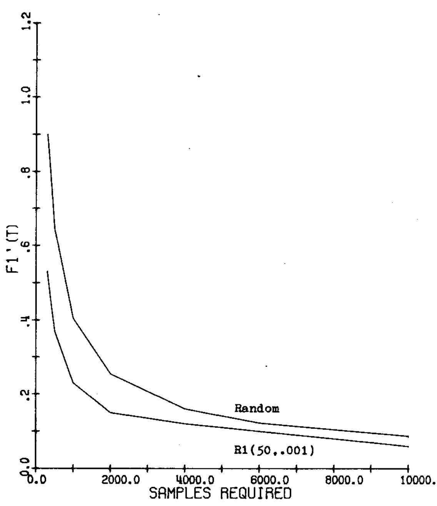  
Figure C.ia: off-line performance curve for plan RI on test function Fl.

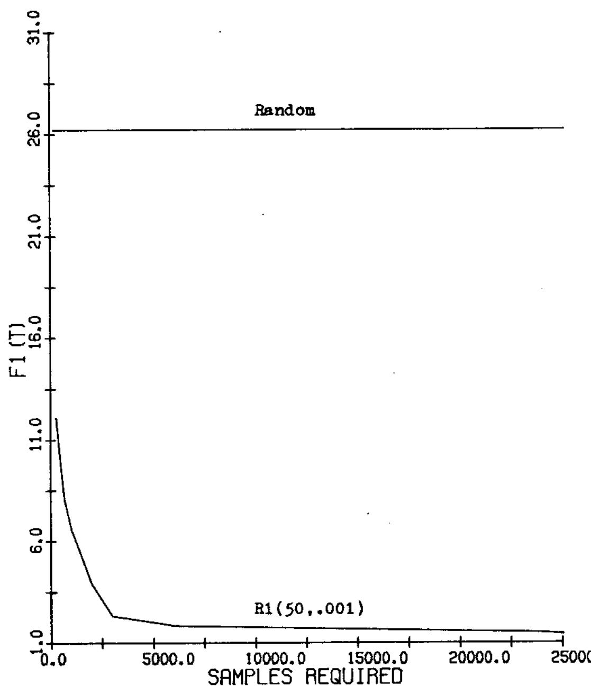  
Figure C.ib: On-line performance curve for plan R1 on test function Fl.

\$xp)   

<table><tr><td rowspan=1 colspan=1>T</td><td rowspan=1 colspan=1>B1</td><td rowspan=1 colspan=1>Random</td></tr><tr><td rowspan=1 colspan=1>500</td><td rowspan=1 colspan=1>1.25</td><td rowspan=1 colspan=1>3.0</td></tr><tr><td rowspan=1 colspan=1>1000</td><td rowspan=1 colspan=1>.73</td><td rowspan=1 colspan=1>.94</td></tr><tr><td rowspan=1 colspan=1>2000</td><td rowspan=1 colspan=1>.48</td><td rowspan=1 colspan=1>.75</td></tr><tr><td rowspan=1 colspan=1>4000</td><td rowspan=1 colspan=1>.28</td><td rowspan=1 colspan=1>.44</td></tr><tr><td rowspan=1 colspan=1>6000</td><td rowspan=1 colspan=1>.22</td><td rowspan=1 colspan=1>.36</td></tr><tr><td rowspan=1 colspan=1>10000</td><td rowspan=1 colspan=1>.125</td><td rowspan=1 colspan=1>.27</td></tr></table>

XF1(T)   

<table><tr><td rowspan=1 colspan=1>T</td><td rowspan=1 colspan=1>R1</td><td rowspan=1 colspan=1>Random</td></tr><tr><td rowspan=1 colspan=1>500</td><td rowspan=1 colspan=1>14.0</td><td rowspan=1 colspan=1>26.2</td></tr><tr><td rowspan=1 colspan=1>1000</td><td rowspan=1 colspan=1>10.6</td><td rowspan=1 colspan=1>26.2</td></tr><tr><td rowspan=1 colspan=1>2000</td><td rowspan=1 colspan=1>7.8</td><td rowspan=1 colspan=1>26.2</td></tr><tr><td rowspan=1 colspan=1>4000</td><td rowspan=1 colspan=1>5.3</td><td rowspan=1 colspan=1>26.2</td></tr><tr><td rowspan=1 colspan=1>6000</td><td rowspan=1 colspan=1>4.6</td><td rowspan=1 colspan=1>26.2</td></tr><tr><td rowspan=1 colspan=1>10000</td><td rowspan=1 colspan=1>3.1</td><td rowspan=1 colspan=1>26.2</td></tr></table>

So we see that Ri performs better than random search on Fi over the interval of observation. This, of course, was expected for on-line performance. Notice that the off-line performance of RI is not strikingly better; it gets off to a good start and then seems to plateau. This observation is explored more fully in chapter 3.

# C.3 Plan A1 on F2

Figures C.2a and c.2b compare the performance curves of Rl and random search on F2. The associated performance ratings $\mathfrak { x } _ { \mathtt { P } 2 } ^ { * } ( \mathfrak { T } )$ and ${ \tt x } _ { { \tt F } 2 } ( { \tt T } )$ are tabularized below for various values of T:

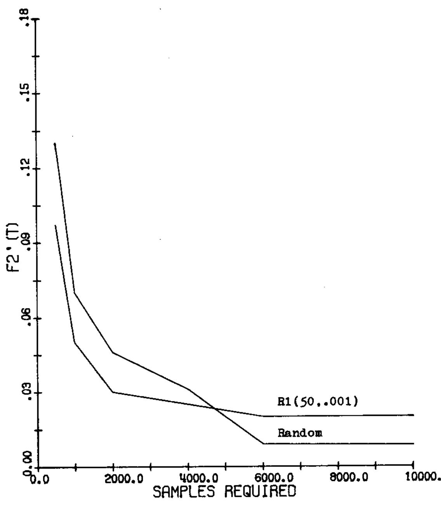  
Figure C.2a: off-line performance curve for plan R1 on test funotion. F2.

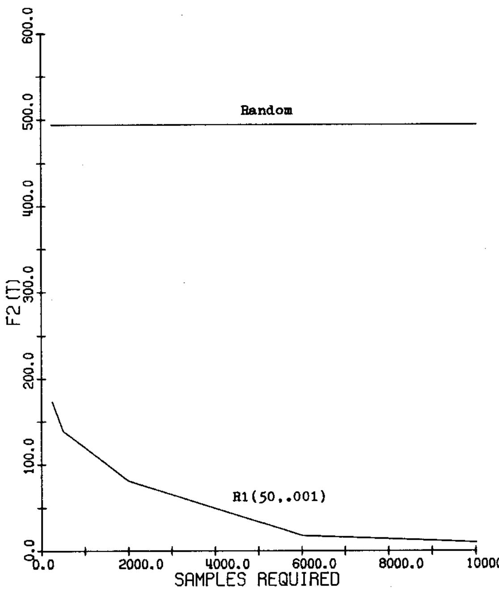  
Figure C.2b: On-line performance curve for plan R1 on test function F2.

<table><tr><td rowspan=1 colspan=1>T</td><td rowspan=1 colspan=1>R1</td><td rowspan=1 colspan=1>Random</td></tr><tr><td rowspan=1 colspan=1>500</td><td rowspan=1 colspan=1>3.72</td><td rowspan=1 colspan=1>3.97</td></tr><tr><td rowspan=1 colspan=1>1000</td><td rowspan=1 colspan=1>1.84</td><td rowspan=1 colspan=1>1.93</td></tr><tr><td rowspan=1 colspan=1>2000</td><td rowspan=1 colspan=1>.93</td><td rowspan=1 colspan=1>1.02</td></tr><tr><td rowspan=1 colspan=1>4000</td><td rowspan=1 colspan=1>.47</td><td rowspan=1 colspan=1>.53</td></tr><tr><td rowspan=1 colspan=1>6000</td><td rowspan=1 colspan=1>.34</td><td rowspan=1 colspan=1>.35</td></tr><tr><td rowspan=1 colspan=1>10000</td><td rowspan=1 colspan=1>.25</td><td rowspan=1 colspan=1>.20</td></tr></table>

XF2(T)   

<table><tr><td rowspan=1 colspan=1>T</td><td rowspan=1 colspan=1>R1</td><td rowspan=1 colspan=1>Random</td></tr><tr><td rowspan=1 colspan=1>500</td><td rowspan=1 colspan=1>219.3</td><td rowspan=1 colspan=1>494.05</td></tr><tr><td rowspan=1 colspan=1>1000</td><td rowspan=1 colspan=1>170.0</td><td rowspan=1 colspan=1>494.05</td></tr><tr><td rowspan=1 colspan=1>2000</td><td rowspan=1 colspan=1>133.3</td><td rowspan=1 colspan=1>494.05</td></tr><tr><td rowspan=1 colspan=1>4000</td><td rowspan=1 colspan=1>100.2</td><td rowspan=1 colspan=1>494.05</td></tr><tr><td rowspan=1 colspan=1>6000</td><td rowspan=1 colspan=1>78.4</td><td rowspan=1 colspan=1>494.05</td></tr><tr><td rowspan=1 colspan=1>10000</td><td rowspan=1 colspan=1>67.7</td><td rowspan=1 colspan=1>494.05</td></tr></table>

So we see that R1 generally outperforms random search on F2 over the interval of observation. This, of course, was expected for on-line performance. However, note that off-line performance is initially better, but then actually falls behind random search. This observation is explored more fully in chapters 3 and 4.

# C.4 Plan RI on F3

Figures C.3a and C.3b compare the performance curves of R1 and random search on F3. The associated performance ratings $\mathbf { x } _ { \mathbf { \overline { { F } } } 3 } ^ { * } ( \mathbf { \bar { r } } )$ and $\pmb { \mathrm { x } } _ { \pmb { \mathrm { y } } _ { 3 } } ( \pmb { \mathrm { T } } )$ are tabulated below for various values of T:

<table><tr><td rowspan=1 colspan=1>T</td><td rowspan=1 colspan=1>H1</td><td rowspan=1 colspan=1>Random</td></tr><tr><td rowspan=1 colspan=1>500</td><td rowspan=1 colspan=1>-23.1</td><td rowspan=1 colspan=1>-18.0</td></tr><tr><td rowspan=1 colspan=1>1000</td><td rowspan=1 colspan=1>-23.8</td><td rowspan=1 colspan=1>-19.7</td></tr><tr><td rowspan=1 colspan=1>2000</td><td rowspan=1 colspan=1>-24.6</td><td rowspan=1 colspan=1>-21.1</td></tr><tr><td rowspan=1 colspan=1>4000</td><td rowspan=1 colspan=1>-25.5</td><td rowspan=1 colspan=1>-22.3</td></tr><tr><td rowspan=1 colspan=1>6000</td><td rowspan=1 colspan=1>-26.2</td><td rowspan=1 colspan=1>-22.7</td></tr><tr><td rowspan=1 colspan=1>10000</td><td rowspan=1 colspan=1>-27.1</td><td rowspan=1 colspan=1>-23.3</td></tr></table>

1F3(T)   

<table><tr><td rowspan=1 colspan=1>T</td><td rowspan=1 colspan=1>R1</td><td rowspan=1 colspan=1>Random</td></tr><tr><td rowspan=1 colspan=1>500</td><td rowspan=1 colspan=1>-10.8</td><td rowspan=1 colspan=1>-2.5</td></tr><tr><td rowspan=1 colspan=1>1000</td><td rowspan=1 colspan=1>-14.4</td><td rowspan=1 colspan=1>-2.5</td></tr><tr><td rowspan=1 colspan=1>2000</td><td rowspan=1 colspan=1>-18.3</td><td rowspan=1 colspan=1>-2.5</td></tr><tr><td rowspan=1 colspan=1>4000</td><td rowspan=1 colspan=1>-21.0</td><td rowspan=1 colspan=1>-2.5</td></tr><tr><td rowspan=1 colspan=1>6000</td><td rowspan=1 colspan=1>-22.1</td><td rowspan=1 colspan=1>-2.5</td></tr><tr><td rowspan=1 colspan=1>10000</td><td rowspan=1 colspan=1>-23.0</td><td rowspan=1 colspan=1>-2.5</td></tr></table>

So we see that Ri performed considerably better on F3 than random search, indicating that discontinuous functions pose no problem for genetic plans.

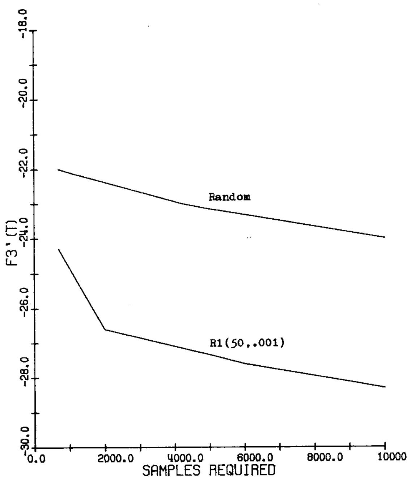  
Figure C.3a: Off-line performance curve for plan R1 on test function F3.

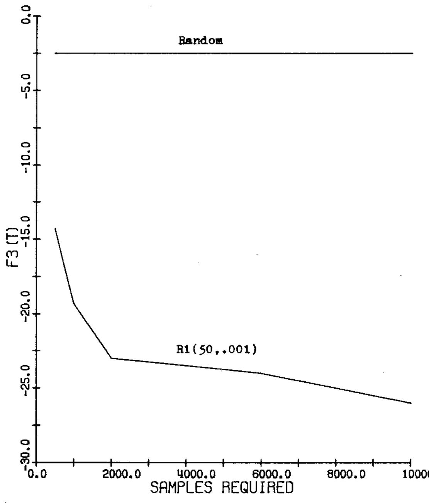  
Figure C.3b: On-line performance curve for plan R1 on test function F3.

# C.5 Plan R1 on F4

Figures C.4a and c.4b compare the performance curves for R1 and random search on F4. The associated performance indices computed for several values of T are given below:

1F4(T)   

<table><tr><td rowspan=1 colspan=1>T</td><td rowspan=1 colspan=1>B1</td><td rowspan=1 colspan=1>Random</td></tr><tr><td rowspan=1 colspan=1>500</td><td rowspan=1 colspan=1>80.9</td><td rowspan=1 colspan=1>105.0</td></tr><tr><td rowspan=1 colspan=1>1000</td><td rowspan=1 colspan=1>61.2</td><td rowspan=1 colspan=1>89.2</td></tr><tr><td rowspan=1 colspan=1>2000</td><td rowspan=1 colspan=1>46.7</td><td rowspan=1 colspan=1>78.6</td></tr><tr><td rowspan=1 colspan=1>4000</td><td rowspan=1 colspan=1>38.5</td><td rowspan=1 colspan=1>70.6</td></tr><tr><td rowspan=1 colspan=1>6000</td><td rowspan=1 colspan=1>35.9</td><td rowspan=1 colspan=1>66.3</td></tr><tr><td rowspan=1 colspan=1>10000</td><td rowspan=1 colspan=1>31.6</td><td rowspan=1 colspan=1>63.7</td></tr></table>

XF4(T)   

<table><tr><td rowspan=1 colspan=1>T</td><td rowspan=1 colspan=1>R1</td><td rowspan=1 colspan=1>Random</td></tr><tr><td rowspan=1 colspan=1>500</td><td rowspan=1 colspan=1>180.1</td><td rowspan=1 colspan=1>249.6</td></tr><tr><td rowspan=1 colspan=1>1000</td><td rowspan=1 colspan=1>149.5</td><td rowspan=1 colspan=1>249.6</td></tr><tr><td rowspan=1 colspan=1>2000</td><td rowspan=1 colspan=1>120.9</td><td rowspan=1 colspan=1>249.6</td></tr><tr><td rowspan=1 colspan=1>4000</td><td rowspan=1 colspan=1>105.4</td><td rowspan=1 colspan=1>249.6</td></tr><tr><td rowspan=1 colspan=1>6000</td><td rowspan=1 colspan=1>97.3</td><td rowspan=1 colspan=1>249.6</td></tr><tr><td rowspan=1 colspan=1>10000</td><td rowspan=1 colspan=1>75.6</td><td rowspan=1 colspan=1>249.6</td></tr></table>

So we see that R1 performed considerably better on F4 than random search, indicating that high-dimensionality and noise pose no particular problems for genetic algorithms.

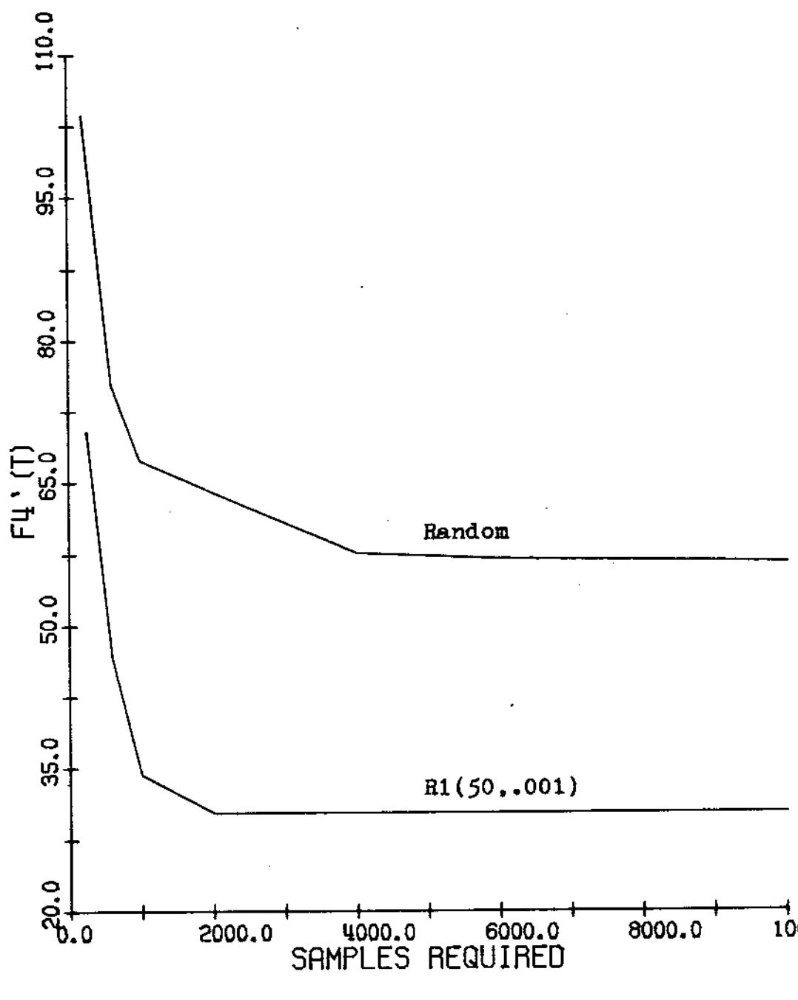  
Figure C.ka: Ofr-line performance curve for plan R1 on test funotion F4.

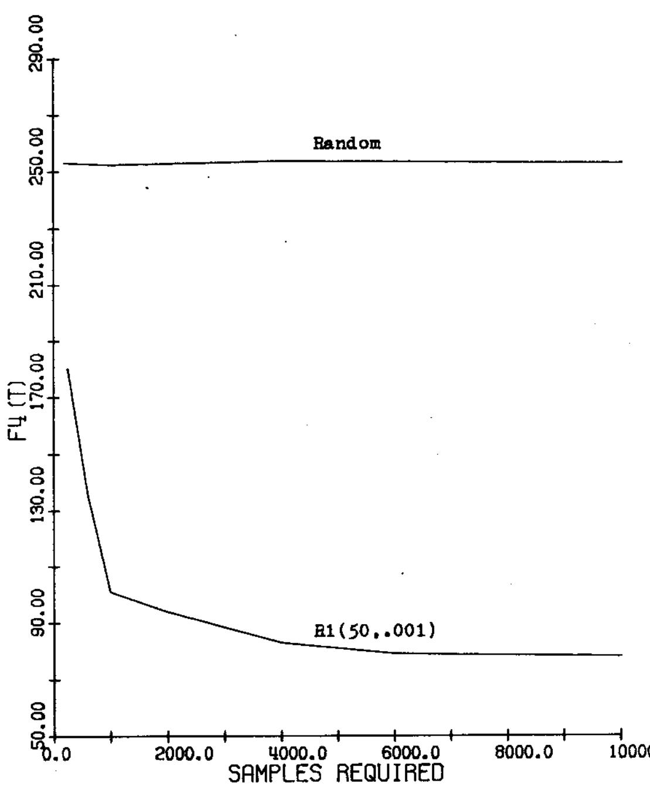  
Figure C.4b: On-line performance curve for plan R1 on test function F4.

# C.6 Plan B1 on F5

Figures C.5a and C.5b compare the performance curves for R1 and random search on F5. The associated performance indices computed for various values of T are given below:

\$\p)   

<table><tr><td rowspan=1 colspan=1>T</td><td rowspan=1 colspan=1>B1</td><td rowspan=1 colspan=1>Random</td></tr><tr><td rowspan=1 colspan=1>500</td><td rowspan=1 colspan=1>11.4</td><td rowspan=1 colspan=1>35.7</td></tr><tr><td rowspan=1 colspan=1>1000</td><td rowspan=1 colspan=1>6.21</td><td rowspan=1 colspan=1>19.2</td></tr><tr><td rowspan=1 colspan=1>2000</td><td rowspan=1 colspan=1>3.74</td><td rowspan=1 colspan=1>10.6</td></tr><tr><td rowspan=1 colspan=1>4000</td><td rowspan=1 colspan=1>2.15</td><td rowspan=1 colspan=1>6.25</td></tr><tr><td rowspan=1 colspan=1>6000</td><td rowspan=1 colspan=1>1.83</td><td rowspan=1 colspan=1>4.82</td></tr><tr><td rowspan=1 colspan=1>10000</td><td rowspan=1 colspan=1>1.61</td><td rowspan=1 colspan=1>3.45</td></tr></table>

XF5(T)   

<table><tr><td rowspan=1 colspan=1>T</td><td rowspan=1 colspan=1>B1</td><td rowspan=1 colspan=1>Random</td></tr><tr><td rowspan=1 colspan=1>500</td><td rowspan=1 colspan=1>127.0</td><td rowspan=1 colspan=1>474</td></tr><tr><td rowspan=1 colspan=1>1000</td><td rowspan=1 colspan=1>99.7</td><td rowspan=1 colspan=1>473.4</td></tr><tr><td rowspan=1 colspan=1>2000</td><td rowspan=1 colspan=1>71.9</td><td rowspan=1 colspan=1>473.4</td></tr><tr><td rowspan=1 colspan=1>4000</td><td rowspan=1 colspan=1>51.6</td><td rowspan=1 colspan=1>473.7</td></tr><tr><td rowspan=1 colspan=1>6000</td><td rowspan=1 colspan=1>36.2</td><td rowspan=1 colspan=1>473.3</td></tr><tr><td rowspan=1 colspan=1>10000</td><td rowspan=1 colspan=1>14:7</td><td rowspan=1 colspan=1>472.6</td></tr></table>

So we see that Ri outperforms random search on F5, indicating that multimodal surfaces pose no particular problems for genetic algorithms.

C.7 Robustness of Plan R1 Robustness is derined in chapter 1 as the average

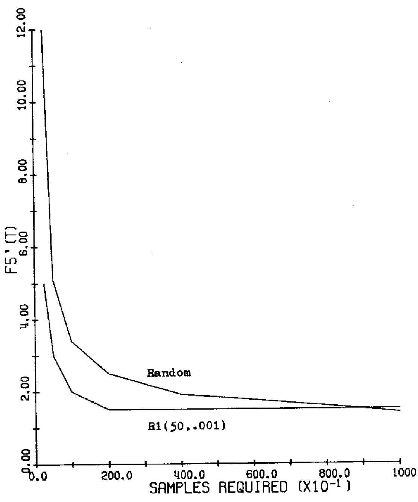  
Pigure C.5a: Off-line performance curve for plan R1 on test function F5.

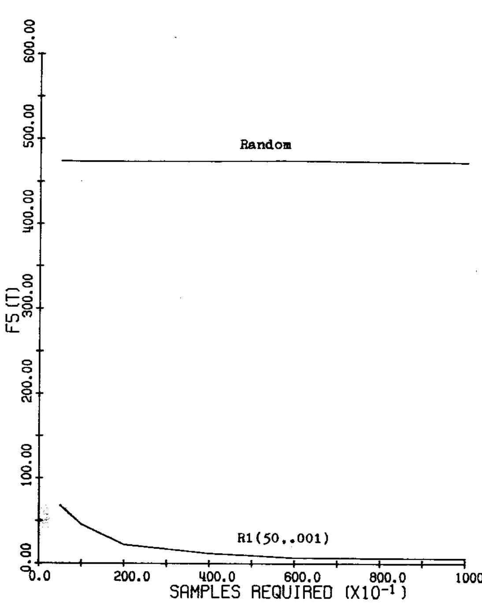  
Figure C.5b: On-line performance curve for plan RI on test function F5.

# performance rating over E. This is computed for various values of T below:

\$x\$ra)   

<table><tr><td rowspan=1 colspan=1>T</td><td></td><td rowspan=1 colspan=1>B1</td><td rowspan=1 colspan=1>Handom</td></tr><tr><td rowspan=1 colspan=1>500</td><td></td><td rowspan=1 colspan=1>14.83</td><td rowspan=1 colspan=1>25.93</td></tr><tr><td rowspan=1 colspan=1>1000</td><td></td><td rowspan=1 colspan=1>9.24</td><td rowspan=1 colspan=1>18.34</td></tr><tr><td rowspan=1 colspan=1>2000</td><td></td><td rowspan=1 colspan=1>5.45</td><td rowspan=1 colspan=1>13.97</td></tr><tr><td rowspan=1 colspan=1>4000</td><td></td><td rowspan=1 colspan=1>3.18</td><td rowspan=1 colspan=1>11.10</td></tr><tr><td rowspan=1 colspan=1>6000</td><td></td><td rowspan=1 colspan=1>2.48</td><td rowspan=1 colspan=1>9.83</td></tr><tr><td rowspan=1 colspan=1>10000</td><td></td><td rowspan=1 colspan=1>1.29</td><td rowspan=1 colspan=1>8.86</td></tr></table>

xg(T)   

<table><tr><td rowspan=1 colspan=1>T</td><td rowspan=1 colspan=1>1     HT</td><td rowspan=1 colspan=1>Handom</td></tr><tr><td rowspan=1 colspan=1>500</td><td rowspan=1 colspan=1>105.92</td><td rowspan=1 colspan=1>147.66</td></tr><tr><td rowspan=1 colspan=1>1000</td><td rowspan=1 colspan=1>83.08</td><td rowspan=1 colspan=1>147.77</td></tr><tr><td rowspan=1 colspan=1>2000</td><td rowspan=1 colspan=1>63.12</td><td rowspan=1 colspan=1>147.57</td></tr><tr><td rowspan=1 colspan=1>4000</td><td rowspan=1 colspan=1>48.30</td><td rowspan=1 colspan=1>147.59</td></tr><tr><td rowspan=1 colspan=1>6000</td><td rowspan=1 colspan=1>38.88</td><td rowspan=1 colspan=1>147.61</td></tr><tr><td rowspan=1 colspan=1>10000</td><td rowspan=1 colspan=1>27.62</td><td rowspan=1 colspan=1>147.55</td></tr></table>

So we see that R1 is definitely more robust on E than random search is.

Aigner, D. J. 1968. Principles of Statistical Decision Making. New York: MacMillan.   
Bagley, J. D. 1967. The behavior of adaptive systems which employ genetic and correlation algorithms. Doctoral Thesis, Department of Computer and Communication Sciences, University of Michigan.   
Bauer, M. J. 1974. A simulation approach to the design of dynamic reedback scheduling algorithms for timeshared computer systems. Simuletter, ACM SIGSIM Quarterly. 514: 23-31.   
Bellman, R. 1959. Adaptive Control Processes: A Guided Tour. Princeton University Press.   
Bosworth, J. L.: Foo. N.: and Zeigler, B. P. 1972. Comparison of genetic algorithms with conjugate gradient methods. University of Michigan Technical Report No. 00312-1-T.   
Bremermann, H. 1970. A method of unconstrained global optimization. Mathematical Biosciences. 9:1-15.   
Brent, R. P. 1971. Algorithms for finding zeros and extrema of functions without calculating derivatives. Doetoral Thesis, Computer Science Department, Stanford.   
Cavicchio, D. J. Jr. 1970. Adaptive search using simulated evolution. Doctoral Thesis, Department of Computer and Communication Sciences, University of Michigan.   
Crow, J. F.. and Kimura, M. 1970. An Introduction to Ropulation Genetics Theory. Harper & How.   
Feller, W. 1950. An Introduction to Probability Theory and its Applications, Volume I. New York: John Wiley & Sons.   
Fletcher, B. and Powell, M. J. D. 1963. A rapiDly convergent descent method for minimization. The Computer Journal. 6: 163.   
Fletoher, R. and Reeves, C. M. 1964. Function minimization by conjugate gradients. The Computer Journal. 7: 149.   
Fletcher, R. 197o. A new approach to variable metrio algorithms. The Computer Journal. 13: 317.   
Foo, N. Y. and Bosworth, J. L. 1972. Algebraic, geometric, and stochastic aspects of genetic operators. University of Michigan Technical Report No. 003120-2-T.   
Frantz, D. R. 1972. Non-linearities in genetic adaptive search. Doctoral Thesis, Department of Computer and Communication Sciences, University of Michigan.   
Hill, J. D. 1969. A search technique for multimodal surfaces. IEEE Transactions on System Science and Cybernetics, SSC-3,1.   
Hogg. R. V. and Craig, A. T. 1965. Introduction to Mathematical Statistics. New York: MacMillan.   
Holland, J. H. 1962. Outline for a logical theory of adaptive systems. Journal of the Association for Computing Mechinery (ACM). 3: 297-314. 1967. Nonlinear environments permitting efficient adaptation. Computer and Information Sciences-II. New York: Academic Press. 147-164. 1975. Adaptation in Natural and Artificial Systems. University of Michigan Press.   
Hollstien, R. B. 1971. Artificial genetic adaptation in computer control systems. Doctoral Thesis, Department of Computer and Communication Sciences, University of Michigan.   
Howard, R. A. 1971. Dynamic Probabilistic Systems. Volume I. New York: John Wiley & Sons.   
Huang, H. Y. 197o. Unified approach to quadratically convergent algorithms for function minimization. Journal of Optimization Theory and Applications. 5: 405.   
Jacoby, S. L. S.; Kowalik, J. S.; and Pizzo, J. T. 1972. Iterative Methods for Non-linear Optimization Problems. Englewood cliffs, New Jersey: PrenticeHall.   
John, P. W. M. 1971. Statistical Design and Analysis of Experiments. New York: MacMillan.

Marsaglia, G. 1968. Random numbers fall mainly in the planea. Proo. Nat. Acad. Soi. 61,1: 25-28.

Mettler, L. E. and Gregg, T. G. 1969. Population Genetics and Evolution. Foundations of Modern Genetlcs Series. Prentice-Hall.

Powell, M. J. 1964. An effioient method for finding the minimum of a function of several variables without calculating derivatives. The Computer Journal. 7: 155.

Rastrigin, L. A. 196o. External control by the method of random scanning. Automatika i Telemakhanika. 21: 1264-1271.

Rosenbrock, H. H. 196o. An automatic method for finding the greatest or least value of a function. The Computer Journal. 3: 175.

Schumer, M. A. and Steiglitz, K. 1968. Adaptive step size random search. IEEe Transactions of Automatic Control. AC-13: 270.

Shekel, J. 197l. Test functions for multimodal search techniques. Fifth Annual Princeton Conference on Information Science and Systems.

Summerville, D. M. Y. 1958. An Introduction to the Geometry of N Dimensions. New York: Dover.

Sworder, D. 1966. Optimal Adaptive Control Systems. New York: Academic Press.

Tausworthe, R. C. 1965. Random numbers generated by linear recurrence modulo two. Math. Comput. 19. 90: 201-209.

Toothill, J. P. R..; Robinson, W. D.; and Adams, A. G. 197l. The runs up-and-down performance of Tausworthe pseudo-random number generators. J. ACM 18. 3: 381-399.

Toothill, J. P. R.; Robinson, W. D.: and Eagle, D. J. 1973. An asymptotically random Tausworthe sequence. J. ACM 20. 3: 469-481.

Tsypkin, Y. Z. 1971. Adaptation and Learning in Automatic Systems. New York: Academic Press.

Wilde, D. J. and Beightler, C. S. 1969. Foundations of Optimization. Englewood Cliffs, New Jersey: Prentice-Hall.

Yahowitz, S. J. 1969. Mathematics of Adaptive Control Processes. New York: American Klsevier.

Zeigler, B. P; Bosworth, J. L.; and Bethke, A. D. 1973. Noisy function optimization by genetio algorithms and conjugate gradient methods. Logic of Computers Technical Report No. 143. University of Michigan.