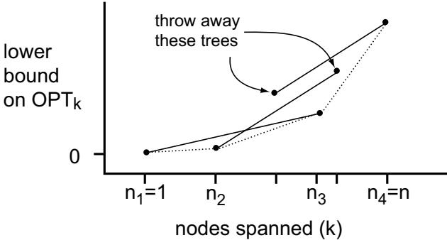

# Faster Approximation Algorithms for the Minimum Latency Problem

Aaron Archer∗

David P. Williamson†

# Abstract

In this paper, we give a 9.28-approximation algorithm for the minimum latency problem that uses only $O ( n \log n )$ calls to the prize-collecting Steiner tree (PCST) subroutine of Goemans and Williamson. A previous algorithm of Goemans and Kleinberg for the minimum latency problem requires an approximation algorithm for the $k$ -MST problem which is called as a black box. Their algorithm can achieve a performance guarantee of 10.77 while making $O ( n ^ { 2 } \log n )$ PCST calls (via a $k$ -MST algorithm of Garg), or a performance guarantee of $7 . 1 8 + \epsilon$ while using $n ^ { O ( 1 / \epsilon ) }$ PCST calls (via a $k$ -MST algorithm of Arora and Karakostas). In order to match our approximation ratio (i.e. setting $\epsilon = 2 . 1 0$ ), the latter version requires $O ( n ^ { 5 } \log ^ { 2 } n )$ PCST calls, so our running time bound is faster by a factor of $\Theta ( n ^ { 4 } \log n )$ . Since PCST can be implemented to run in $O ( n ^ { 2 } )$ time, the overall running time of our algorithm is $O ( n ^ { 3 } \log n )$ .

The basic idea for our improvement is that we do not treat the $k$ -MST algorithm as a black box. Thus we are able to take advantage of some situations in which the PCST subroutine delivers a $k$ -MST with an improved performance guarantee.

called the traveling repairman problem or the delivery man problem, and has been well studied in both the computer science and operations research literature. The MLP models routing problems in which one wants to minimize the average time each customer (node) has to wait before being served (visited), rather than the total time to visit all nodes, as in the case of the famous traveling salesman problem (TSP). In this sense, the MLP takes a customeroriented view, whereas the TSP is server-oriented.

Koutsoupias et al. [20] and Ausiello et al. [6] motivate the MLP in terms of searching a graph (such as the web) to find a hidden treasure. If the treasure is equally likely to reside at any node of the graph, then the optimal MLP tour minimizes the expected time to find it.

The MLP was shown to be NP-hard for general metric spaces by Sahni and Gonzalez [26]. It is also Max-SNP hard, by a reduction from TSP(1,2) (the traveling salesman problem with all distances 1 or 2) [24, 9]. Therefore, there is no polynomialtime approximation scheme for the MLP on general metric spaces unless $P = N P$ . Recently, Sitters [28] showed the problem is NP-hard even for weighted trees. On the positive side, Arora and Karakostas give quasipolynomial-time approximation schemes for the MLP on weighted trees and constant dimensional Euclidean spaces [3]. Blum et al. [9] gave the first constant factor approximation algorithm for general metric spaces, which was later improved by Goemans and Kleinberg [18]. We elaborate on these below. Recently, Fakcharoenphol et al. [11] gave a constant factor approximation algorithm for the variant where there are $k$ repairmen who must collectively visit all the nodes.

# 1 Introduction

Given a metric space with $n$ nodes and a tour starting at some node and visiting all of the others, the latency of node $\boldsymbol { v }$ is defined to be the total distance traveled before reaching $v$ . The minimum latency problem (MLP) asks for a tour starting at a specified root $r$ and visiting all nodes, such that the total latency is minimized. This problem is sometimes

Much work has focused on exact (exponential time) solution approaches to the MLP [27, 13, 8, 22, 34], and to the more general time-dependent traveling salesman problem (TDTSP) [31, 25]. In the TDTSP, the distance between the $i ^ { t h }$ and $( i + 1 ) ^ { s t }$ nodes in the traveling salesman tour is multiplied by some weight $w ( i )$ in the objective function. The ordinary TSP is the case where all $w ( i ) = 1$ ; the MLP is the case where $w ( i ) = n - i$ . The time-dependent orienteering problem (considered in [14]) is dual to the TDTSP – the salesman aims to maximize the number of nodes visited before a given deadline, given that travel times vary as in the TDTSP. Various heuristics for the MLP are evaluated in [30, 32], while [2] analyzes a stochastic version of the problem. In the online variant [12, 21], new nodes appear in the graph as the repairman is traveling. Many authors have considered special cases of the MLP, where the metric is given by an underlying network with some special structure [1, 23, 7, 29, 33].

Because the MLP is NP-hard, we shall consider approximation algorithms for the problem. An $\alpha$ - approximation algorithm produces solutions with total latency no more than $\alpha$ times the total latency of a minimum latency tour. The value of $\alpha$ is sometimes called the performance guarantee of the algorithm.

The first approximation algorithm for the problem was given by Blum et al. [9], who show how to use a $\beta$ -approximation algorithm for the rooted $k$ - minimum spanning tree ( $k$ -MST) problem as a black box, and convert it into an $8 \beta$ -approximation for the MLP. In the $k$ -MST problem, we are given a graph with costs on the edges, and must find the minimum-cost tree spanning at least $k$ nodes. In the rooted version, the tree must contain some specified root $r$ . The connection between the $k$ -MST problem and the MLP is that the cost of the optimal $k$ -MST rooted at $r$ is a lower bound on the latency of the $k ^ { t h }$ point visited by the optimal MLP tour. Goemans and Kleinberg (GK) [18] subsequently improved the performance guarantee of the algorithm of Blum et al. to $3 . 5 9 \beta$ . The best approximation algorithms known for the rooted $k$ -MST problem are a $( 2 + \epsilon )$ - approximation by Arora and Karakostas (AK) [4], and a 3-approximation by Garg [16].1

to an algorithm of Goemans and Williamson for the prize-collecting Steiner tree (PCST) problem [19]. A naive implementation of the AK algorithm with $\epsilon = 0 . 5 8$ , as given in their paper, requires $O ( n ^ { 7 } \log n )$ subroutine calls; a more clever implementation requires $O ( n ^ { 5 } \log ^ { 2 } n )$ calls. Our algorithm requires only $O ( n \log n )$ calls to this subroutine. Thus, in order to match our performance guarantee by setting $\epsilon = 0 . 5 8$ , the GK algorithm using AK as a subroutine is slower by a factor of $n ^ { 4 } \log n$ . We note that for the same running time, the GK algorithm using AK can also obtain the performance guarantee with $\epsilon = 0 . 5$ , or roughly 8.98. The GK algorithm using Garg as a subroutine requires $O ( n ^ { 2 } \log n )$ PCST calls, so our algorithm improves both the performance guarantee and running time over this algorithm.

Goemans and Williamson showed how to implement their PCST algorithm in $O ( n ^ { 2 } \log { n } )$ time. A recent result of Gabow and Pettie [15] improves this to $O ( n ^ { 2 } )$ . Thus, our algorithm runs in time $O ( n ^ { 3 } \log { n } )$ overall.

The main idea in achieving our result is that we do not treat the $k$ -MST algorithm as a black box. It is easy to show that Garg’s algorithm returns $k$ - MSTs of cost no more than twice optimal for some values of $k$ that cannot be specified in advance. While this strengthens our bounds on the latency of the $k ^ { t h }$ points for these values of $k$ , the bounds for the other values of $k$ are weakened. Moreover, we have fewer trees at our disposal to help us create an MLP tour. Fortunately, we can show that whenever our $k$ -MST lower bounds suffer, we can also improve our upper bound on the latency of the tour we construct. The tradeoff between the stronger and weaker bounds is good enough to obtain the improved performance guarantee.

In this paper we further explore the connection between the MLP and rooted $k$ -MST problem. We obtain a performance guarantee of 9.28 for the MLP, which is better than what GK would achieve using Garg’s 3-approximation for $k$ -MST as a subroutine, and equivalent to using the AK $( 2 + \epsilon )$ -approximation with $\epsilon = 0 . 5 8$ . Hence we do not improve the best performance guarantee. However, we do greatly improve the running time. In each of these algorithms, the running time is dominated by subroutine calls

# 2 Intuition and overview

We now describe the basic ideas behind the Blum et al. [9] and GK [18] algorithms, and how our approach departs from them. Both analyses use the cost of the optimal $k$ -MST as a lower bound for the latency of the $k ^ { t h }$ node visited in the optimal MLP tour, and both algorithms start with $\beta$ -approximate solutions to the $k$ -MST problem rooted at $r$ , for $k = 2 , 3 , \ldots , n$ . They then select a subsequence of these trees with geometrically increasing costs and concatenate them to get a solution for the MLP. For the sake of intuition, let us assume throughout this section that the sets of nodes spanned by these trees are nested, which turns out to be the worst case for the analysis.

Without loss of generality, the cost of the $k$ -MST’s increases with $k$ . The Blum et al. algorithm buckets the trees according to their cost – for each integer $\ell$ , it selects the most expensive tree with cost in $( 2 ^ { \ell } , 2 ^ { \ell + 1 } ]$ It doubles each of the selected trees and shortcuts it to make a cycle rooted at $r$ , then traverses all of these cycles in order, shortcutting nodes it has already visited. Since the last tree selected spans all the nodes, so does the resulting MLP tour. They compare the latency of the $k ^ { t h }$ node visited in the tour to the cost of the optimal $k$ -MST. They upper bound the latency of the $k ^ { t h }$ node visited by the total cost of all the concatenated cycles up to and including the first one that visits this node. They lose a factor of $\beta$ because the trees are $\beta$ -approximate $k$ -MST’s, a factor of 2 from the bucketing ratio, a factor of 2 from doubling the trees to get cycles, and a factor of 2 from the geometric sum. This yields the approximation factor of $8 \beta$ .

The GK improvement derives from two sources. First, it orients each of the concatenated cycles in the direction that minimizes the total latency of the new nodes visited by that cycle. Second, it applies a random shift to the bucket breakpoints. Using buckets of ratio $\gamma \approx 3 . 5 9$ instead of ratio 2, it achieves an approximation guarantee of $\gamma \beta$ .

Our algorithm departs from these previous ones in that we do not start off with approximate $k$ - MST’s for every value of $k$ . Instead, we obtain $\textstyle { \left( { 2 - { \frac { 1 } { n } } } \right) }$ -approximate $n _ { i }$ -MST’s for some subsequence $1 = n _ { 1 } < . . . < n _ { \ell } = n$ that is not under our control. Let $d _ { i }$ denote the cost of the tree spanning $i$ nodes, for $i = n _ { 1 } , \ldots , n _ { \ell }$ . We derive these trees using a Lagrangean relaxation technique, which allows us to guarantee that the sum of the costs of the optimal $k$ -MST’s for $k = ( n _ { i - 1 } + 1 ) , . . . , n _ { i }$ is at least $\frac { 1 } { 4 } ( d _ { n _ { i - 1 } } + d _ { n _ { i } } ) ( n _ { i } - n _ { i - 1 } )$ , for each $i$ . We will obtain our MLP solution by concatenating some subset of these trees, as in Blum et al. and GK. We borrow the idea of a modified latency from the GK analysis. Roughly, one can think of the modified latency of node $v$ as the average latency of all the nodes first visited by the cycle in the concatenation that first visits node $v$ . We refer to the $n _ { i } - n _ { i - 1 }$ nodes spanned by tree $T _ { n _ { i } }$ but not by $T _ { n _ { i - 1 } }$ as block $i$ . We will analyze our approximation ratio block by block. Since the modified latencies are the same throughout a block, we just need to compare the modified latency to the average lower bound over the nodes in the block, which is $\textstyle { \frac { 1 } { 4 } } ( d _ { n _ { i - 1 } } + d _ { n _ { i } } )$ . It turns out that the modified latency of block $i$ is linear in $d _ { n _ { i } }$ , so the lower bound suffers when the ratio ${ R = d _ { n _ { i } } / d _ { n _ { i - 1 } } }$ is large. However, when $R$ is large, we will also gain something in the analysis of the upper bound. The geometric sum will be smaller because the second summand is smaller than the first by a factor of at least $R$ , even if the bucket size is small. Optimizing the bucket size to balance these two effects yields our approximation ratio of 9.28.

# 3 The algorithm

Here we precisely specify our MLP algorithm. We start by using our tree-generating algorithm of Section 5 to produce some set of $\ell$ trees $T _ { n _ { 1 } } , \ldots , T _ { n _ { \ell } }$ rooted at $r$ and spanning $n _ { 1 } < \ldots < n _ { \ell }$ nodes respectively, where $n _ { 1 } ~ = ~ 1$ and $\mathit { n } _ { \ell } ~ = ~ \pi$ . For $i \ =$ $n _ { 1 } , n _ { 2 } , \ldots , n _ { \ell }$ , let $d _ { i }$ denote the cost of tree $T _ { i }$ . Without loss of generality we assume $d _ { i }$ is increasing with $i$ . Our tree-generating algorithm also establishes lower bounds $b _ { k }$ on the cost of the optimal $k$ -MST rooted at $r$ , and hence the latency of the $k ^ { t h }$ node visited in the optimal MLP tour, for $k = 2 , \ldots , n$ . $\begin{array} { r } { \frac { 1 } { 4 } ( d _ { n _ { i - 1 } } + d _ { n _ { i } } ) ( n _ { i } - n _ { i - 1 } ) \leq \sum _ { k = n _ { i - 1 } + 1 } ^ { n _ { i } } b _ { k } } \end{array}$ rop-, for $i = 2 , \ldots , \ell$

Now we must choose which trees to concatenate. We select some constant parameter $c > 1$ as the bucketing ratio. (Later, we tune $c$ to be about 2.981.) We choose one random breakpoint in $[ 1 , c )$ at $c ^ { Y }$ , where $Y \sim \mathrm { u n i f o r m } [ 0 , 1 )$ . From there we chop up the real line into buckets (intervals) whose breakpoints are geometrically increasing by a factor of $c$ . On a $\log _ { c }$ scale, the buckets all have width 1, and they slide uniformly left or right according to the random variable $Y$ . We plot the tree costs $d _ { i }$ (which are increasing in $i$ ), and select the greatest cost tree in each bucket. These are the trees we will concatenate. Denote them by $T _ { j _ { 1 } } , \ldots , T _ { j _ { m } }$ , so $j _ { 1 } , \dots , j _ { m }$ is the increasing sequence of nodes they span.

For each selected tree $T _ { i }$ $( i = j _ { 1 } , \ldots , j _ { m } )$ ), double all of the tree edges and traverse an Eulerian tour starting at $r$ , shortcutting nodes already visited, to obtain a cycle $\hat { C } _ { i }$ . Now obtain cycle $C _ { i }$ from $\hat { C } _ { i }$ by shortcutting all nodes (except for $r$ ) that are visited by some $\hat { C } _ { k }$ with $k < i$ . Let $S _ { i } = C _ { i } - r$ . Orient $C _ { i }$ in the direction that minimizes the total latency of the points in $S _ { i }$ . To obtain our MLP solution, simply traverse each rooted, oriented cycle $C _ { j _ { 1 } } , \ldots , C _ { j _ { m } }$ in order, shortcutting the intermediate visits to the root between cycles. Let $C = C _ { j _ { 1 } } , \ldots , C _ { j _ { m } }$ denote this concatenated tour.

# 4 Analyzing the approximation ratio

First we derive an upper bound on the cost of $C$ in terms of $d _ { j _ { i } } , \ldots , d _ { j _ { m } }$ . Since the $j _ { i }$ are random, we analyze the expected cost in terms of the bucketing parameter $c$ , and compare it to the lower bound. Finally, we tune $c$ in order to optimize the approximation guarantee.

Let us consider the latency of the $k ^ { t h }$ node we visit in $C$ , where $r$ is considered to be the first node, whose latency is zero. If the $k ^ { t h }$ node in $C$ was encountered as part of cycle $C _ { j _ { p } }$ , then we can upper bound its latency by the sum of the costs of cycles $C _ { j _ { 1 } } , \dotsc , C _ { j _ { p - 1 } }$ plus the portion of cycle $C _ { j _ { p } }$ that is traversed prior to reaching this node. Since we traverse cycle $C _ { j _ { p } }$ in the direction that minimizes the total latency of the new nodes $S _ { j _ { p } }$ , the average contribution of this cycle to the latencies of the nodes in $S _ { j _ { p } }$ is at most half the cost of the cycle. To see this, notice that for any node $i \in S _ { j _ { p } }$ , if we traverse $C _ { j _ { p } }$ in one direction, it contributes some amount $x$ to the latency of $i$ , and if we traverse it in the other direction, it contributes $\cos \mathrm { t } ( C _ { j _ { p } } ) - x$ , so on average it contributes $\mathrm { c o s t } ( C _ { j _ { p } } ) / 2$ . For each $i = j _ { 1 } , \dots , j _ { m }$ , the cost of $C _ { i }$ is clearly at most $2 d _ { i }$ . Therefore, the average latencies of the nodes in $S _ { j _ { p } }$ is at most $2 ( d _ { j _ { 1 } } + \ldots + d _ { j _ { p - 1 } } ) + d _ { j _ { p } }$ , so the total latency of $C$ is at most

$$
\sum _ { p = 1 } ^ { m } | S _ { j _ { p } } | ( 2 ( d _ { j _ { 1 } } + \ldots + d _ { j _ { p - 1 } } ) + d _ { j _ { p } } ) .
$$

Since $\sum | S _ { j _ { p } } | = n$ , we can view this as a weighted sum. Clearly, the worst case for this analysis is when the sets of nodes spanned by the trees $T _ { j _ { 1 } } , \ldots , T _ { j _ { m } }$ are nested, since this puts the greatest weight on the larger terms in (1). In this worst case, our upper bound on the average latency of the $( j _ { p - 1 } + 1 ) ^ { t h }$ through $j _ { p } ^ { t h }$ nodes in $C$ becomes $2 ( d _ { j _ { 1 } } + . . . + d _ { j _ { p - 1 } } ) +$ $d _ { j _ { p } }$ . Following GK, this motivates us to define the modified latency of the $k ^ { t h }$ node of $C$ to be

$$
\pi _ { k } = d _ { j _ { p ( k ) } } + 2 ( d _ { j _ { p ( k ) - 1 } } + \ldots + d _ { j _ { 1 } } ) ,
$$

where $p ( k )$ is the smallest index such that $k \le j _ { p ( k ) }$ Thus, our tour has latency at most $\sum \scriptstyle { \tau = 1 } { \pi _ { k } }$ . The advantage of this form of the upper bound is that it depends only on the costs of the selected trees and the number of nodes they span, not on their structure.

Let us divide the indices $\{ 2 , \ldots , n \}$ into blocks, where block $B _ { i } = \{ n _ { i - 1 } + 1 , . . . , n _ { i } \}$ , $i = 2 , \ldots , \ell$ . By definition, the modified latencies within each block

$B _ { i }$ are all the same, so denote this number by $\pi ^ { i }$ . In fact, $\pi ^ { i } = \pi ^ { i + 1 }$ as long as $T _ { n _ { i } }$ is not one of the tours chosen for the concatenation. Note that the $\pi _ { k }$ and $\pi ^ { i }$ are random variables, because they depend on the choice of which trees we concatenate.

Our tree-generating algorithm gives us a lower bound $b _ { k }$ on the latency of the $k ^ { t h }$ point in the optimal tour. If we could prove that, for each block $B _ { i }$ , we have

$$
\sum _ { k \in B _ { i } } E [ \pi _ { k } ] \leq \alpha \sum _ { k \in B _ { i } } b _ { k } ,
$$

it would follow that

$$
E [ \cos ( C ) ] \leq \sum _ { k = 1 } ^ { n } E [ \pi _ { k } ] \leq \alpha \sum _ { k = 1 } ^ { n } b _ { k } \leq \alpha { \mathrm { O P T } } ,
$$

so our solution would be an $\alpha$ -approximation in expectation. Since $\pi _ { k } = \pi ^ { i }$ for all $k \in B _ { i }$ and Theorem 5.6 guarantees

$$
\sum _ { k \in B _ { i } } b _ { k } \geq \frac { 1 } { 4 } ( d _ { n _ { i - 1 } } + d _ { n _ { i } } ) ,
$$

it is enough to show

$$
E [ \pi ^ { i } ] \leq \alpha \frac { 1 } { 4 } ( d _ { n _ { i - 1 } } + d _ { n _ { i } } ) ,
$$

for each block $B _ { i }$ . Thus, our calculation reduces to comparing the expected modified latency for block $i$ against the average latency lower bound for that block.

Now we find an upper bound for $E [ \pi ^ { i } ]$ . Recall that

$$
\pi ^ { i } = 2 ( d _ { j _ { 1 } } + \ldots + d _ { j _ { p - 1 } } ) + d _ { j _ { p } }
$$

where $p$ is the smallest index such that $j _ { p } \geq n _ { i }$ . Because of the bucketing, we can bound $d _ { j _ { 1 } } , \dotsc , d _ { j _ { p } }$ by a geometric sequence of ratio $c$ . This induces a tension in our choice of $c$ . If $c$ is small, then the cost of the first tree larger than $T _ { n _ { i } }$ in the concatenation will have cost close to $d _ { n _ { i } }$ , in which case the first term of the geometric series is small. However, if $c$ is larger, then the terms of the geometric series drop off more quickly, so the tail is smaller.

Since our upper bound on $E [ \pi ^ { i } ]$ is tied to $d _ { n _ { i } }$ , our lower bound suffers in comparison when $d _ { n _ { i - 1 } } \ll d _ { n _ { i } }$ , this suggests we should analyze a block $B _ { i }$ in terms of $d _ { n _ { i } } / d _ { n _ { i - 1 } }$ , which we will call its endpoint ratio. Consider a block $B _ { i }$ of endpoint ratio $R$ . If $R$ is close to $^ { 1 }$ , we are in good shape because our lower bound is still close to $\textstyle { \frac { 1 } { 2 } } d _ { n _ { i } }$ . However, if $R$ is large, we can obtain a better upper bound on $\pi ^ { i }$ . In particular, the most costly tree before block $B _ { i }$ in the concatenation costs at most $d _ { n _ { i - 1 } } = d _ { n _ { i } } / R$ . So if $R > c$ , this allows a better bound on the geometric tail. Intuitively, the worst case is when $R = c$ .

We now calculate an upper bound on $E [ \pi ^ { i } ]$ , when block $B _ { i }$ has endpoint ratio $R$ . We split into two cases, according to whether $R \geq c$ or $R \leq c$ . Since we are fixing $i$ , set $d = d _ { n _ { i } }$ . Since our average lower bound for block $i$ is $\textstyle { \frac { 1 } { 4 } } d ( 1 + { \frac { 1 } { R } } )$ , we seek to upper bound $\pi ^ { i }$ in terms of $d , R$ , and $c$ .

First consider the case $R \geq c$ . Let $L$ be the value of the first bucket breakpoint larger than $d$ . Let $L _ { t }$ be the value of the $t ^ { t h }$ bucket breakpoint smaller than $d / R$ . Then in (2), we have $d _ { j _ { p } } \leq L$ , $d _ { j _ { p - 1 } } = d / R$ , and $d _ { j _ { p - t - 1 } } \leq L _ { t }$ akpoin, where for $L \sim d c ^ { Y }$ $t = 1 , 2 , \ldots$ $\begin{array} { r } { L _ { 1 } \sim \frac { d } { c R } c ^ { Y } } \end{array}$ . Because of our choice , $L _ { t + 1 } =$ $L _ { 1 } / c ^ { t }$ $Y \sim \mathrm { u n i f o r m } [ 0 , 1 )$ $\begin{array} { r } { E [ c ^ { Y } ] = \frac { c - 1 } { \ln c } } \end{array}$ we obtain

$$
\begin{array} { r c l } { { \pi ^ { i } } } & { { \le } } & { { L + 2 { \displaystyle \frac { d } { R } } + 2 ( L _ { 1 } + L _ { 2 } + \ldots ) } } \\ { { } } & { { } } & { { } } \\ { { E [ \pi ^ { i } ] } } & { { \le } } & { { E [ L ] + 2 { \displaystyle \frac { d } { R } } + 2 E [ L _ { 1 } ] ( 1 + { \displaystyle \frac { 1 } { c } } + { \displaystyle \frac { 1 } { c ^ { 2 } } } + \ldots ) } } \\ { { } } & { { = } } & { { d E [ c ^ { Y } ] + 2 { \displaystyle \frac { d } { R } } + 2 { \displaystyle \frac { d } { c R } } E [ c ^ { Y } ] { \displaystyle \frac { c } { c - 1 } } } } \\ { { } } & { { = } } & { { { \displaystyle \frac { d } { R \ln c } } [ R ( c - 1 ) + 2 \ln c + 2 ] . } } \end{array}
$$

Now consider the case $R \leq c$ . Again, let $L$ be the value of the first bucket breakpoint larger than $d$ . If $L < c { \frac { d } { R } }$ , then the next smaller breakpoint $L / c$ is less than the lower endpoint $d / R$ of block $B _ { i }$ , so we obtain the bound

$$
\pi ^ { i } \leq L + 2 ( \frac { L } { c } + \frac { L } { c ^ { 2 } } + . . . ) .
$$

For fixed $c$ , we need to know which endpoint ratio $R$ maximizes our upper bound on $E [ \pi ^ { i } ] / ( \textstyle { \frac { 1 } { 4 } } d ( 1 + \textstyle { \frac { 1 } { R } } ) )$ . One can check that, for $c < c ^ { * } \approx 6 . 8 4 8$ , the worst case is $\textit { R } = \textit { c }$ , and for $c \geq c ^ { * }$ , the worst case is When $R = \infty$ $c \geq c ^ { * }$ . (Here, , the approximation bound is $c ^ { * }$ is the root of $c = 3 + 2 \ln c .$ $4 \frac { c - 1 } { \ln { c } }$ .) which achieves a minimum of 12.1481 at $c \ = \ c ^ { * }$ . When $c < c ^ { * }$ , the approximation bound is 4( $c ( c -$ $1 ) + 2 + 2 \ln c ) / ( ( c + 1 ) \ln c )$ , which achieves a minimum of 9.28171 when $c = \bar { c } \approx 2 . 9 8 1 3 4$ . (Here, $c$ is the root of $c \ln c ( c ^ { 2 } + 2 c - 3 - 2 \ln c ) = ( c + 1 ) ( c ^ { 2 } - c + 2 ) )$ . Therefore, we set $c = c$ , and our algorithm obtains an approximation ratio of 9.28171. This is the same ratio that would be obtained from the GK algorithm, if we used a 2.58463-approximation algorithm for $k$ - MST as a subroutine.

$$
\pi ^ { i } \leq L + 2 ( \frac { d } { R } + \frac { L } { c ^ { 2 } } + . . . ) .
$$

Otherwise $L \ \geq \ c { \frac { d } { R } }$ , so the next breakpoint $L / c$ is greater than $d / R$ . In this case we can therefore improve the second term of (3) from $2 \textstyle { \frac { L } { c } }$ to $2 \frac { d } { R }$ , yielding

Since $L \sim d c ^ { Y }$ where $Y \sim \mathrm { u n i f o r m } [ 0 , 1 )$ , the expectation of the second term of $\pi ^ { i }$ is

The choice of which trees to concatenate can be easily derandomized, as in GK [18], since selecting the subsequence that minimizes the total modified latency boils down to a shortest path computation.

while the expectation of the common terms is $1 + { \textstyle \frac { 2 } { c } } )$ . Thus, overall we get

$$
\begin{array} { l } { \displaystyle { \int _ { 0 } ^ { 1 - \log _ { c } R } 2 \frac { d } { c } c ^ { u } d u + \int _ { 1 - \log _ { c } R } ^ { 1 } 2 \frac { d } { R } d u } } \\ { \displaystyle { \ = \frac { 2 d } { R \ln c } \left( 1 - \frac { R } { c } + \ln R \right) , } } \end{array}
$$

# 5 The tree-finding algorithm and analysis

In this section, we give the algorithm for finding the set of trees $T _ { n _ { 1 } } , T _ { n _ { 2 } } , \ldots , T _ { n _ { \ell } }$ including a root node $r$ and spanning $1 = n _ { 1 } < n _ { 2 } < \cdots < n _ { \ell } = n$ nodes. Denote the cost of the trees by $d _ { n _ { 1 } } , \ldots , d _ { n _ { \ell } }$ . We also compute a set of $n$ lower bounds $b _ { 1 } , \ldots , b _ { n }$ . For simplicity, we denote the cost of an optimal $k$ -MST as $O P T _ { k }$ . We need to find a set of trees and lower bounds such that the following three properties hold:

$$
E [ \pi ^ { i } ] \leq \frac { d } { R \ln c } \left( R ( c - 1 ) + 2 + 2 \ln R \right) .
$$

1. $b _ { k } \le O P T _ { k }$ for all $k$ , $1 \leq k \leq n$ ;

2. $d _ { n _ { i } } \leq 2 b _ { n _ { i } }$ ;

3. for $i = 2 , \ldots , \ell$ , it is the case that $\begin{array} { r } { \frac { 1 } { 4 } ( d _ { n _ { i - 1 } } + d _ { n _ { i } } ) \leq \frac { 1 } { n _ { i } - n _ { i - 1 } } \sum _ { k = n _ { i - 1 } + 1 } ^ { n _ { i } } b _ { k } . } \end{array}$ .

The basic idea is as follows. To obtain trees, we apply a primal-dual algorithm that is parameterized by $\lambda$ ; more precisely, we apply the 2-approximation algorithm of Goemans and Williamson [19] for the prize-collecting Steiner tree problem, where all penalties are set to $\lambda$ . The algorithm returns a tree $T$ and a lower bound $b$ such that $\mathrm { c o s t } ( T ) \leq ( 2 - \frac { 1 } { n - 1 } ) b$ , and $\begin{array} { r l } { \frac { d } { \ln c } \bigl ( c - } & { { } \bigr ) \leq O P T _ { | T | } } \end{array}$ . For $k = 1 , \ldots , n$ , we perform a binary search on the value of $\lambda$ , seeking a tree returned by the algorithm with exactly $k$ nodes. If we succeed, we add the tree and the lower bound to our collection. If we do not succeed, in the end we have two trees $T _ { l o }$ and $T _ { h i }$ and two bounds $b _ { l o }$ and $b _ { h i }$ with $| T _ { l o } | < k$ and $| T _ { h i } | > k$ for two values of $\lambda$ sufficiently close. We add both trees and bounds to our collection. We show that for a small enough value of $\lambda$ , an interpolation of $b _ { l o }$ and $b _ { h i }$ gives a lower bound $b _ { k }$ on the value of a tree containing $k$ nodes. At the end of the procedure, we pick a subset of trees found so that all three desired properties hold.

We begin by explaining the pieces of the algorithm that we will need. We model the $k$ -MST problem as the following integer program:

Min

$$
\sum _ { e \in E } c _ { e } x _ { e }
$$

subject to:

$$
\begin{array} { l } { { \displaystyle \sum _ { e \in \delta ( S ) } x _ { e } + \sum _ { T : T \supseteq S } z _ { T } \geq 1 \quad \forall S \subseteq V \setminus \{ r \} } } \\ { { \displaystyle \sum _ { S : S \subseteq V \setminus \{ r \} } \lvert S \rvert z _ { S } \leq n - k } } \\ { { \qquad x _ { e } \in \{ 0 , 1 \} \qquad \forall e \in E } } \\ { { \quad z _ { S } \in \{ 0 , 1 \} \qquad \forall S \subseteq V \setminus \{ r \} , } } \end{array}
$$

where $\delta ( S )$ is the set of edges with exactly one endpoint in $S$ . The variable $x _ { e } = 1$ indicates that the edge $e$ is in the tree, while $z _ { S } ~ = ~ 1$ indicates that the set of nodes $S$ is not spanned. The first set of constraints says that for any set $S$ of nodes not containing the root, either they are contained in the unspanned set, or there is a selected edge in $\delta ( S )$ . The second constraint says that at most $n - k$ nodes are unspanned.

Following [10], we can convert this to something close to a prize-collecting Steiner tree problem by applying Lagrangean relaxation to the second constraint:

Min

$$
\sum _ { e \in E } c _ { e } x _ { e } + \lambda \left( \sum _ { S : S \subseteq V \setminus \{ r \} } | S | z _ { S } - ( n - k ) \right)
$$

subject to:

$$
\begin{array} { r l } { \displaystyle \sum _ { e \in \delta ( S ) } x _ { e } + \displaystyle \sum _ { T : T \supseteq S } z _ { T } \geq 1 \qquad } & { \forall S \subseteq V \setminus \{ r \} } \\ { \displaystyle x _ { e } \in \{ 0 , 1 \} \qquad } & { \forall e \in E } \\ { \displaystyle z _ { S } \in \{ 0 , 1 \} \qquad } & { \forall S \subseteq V \setminus \{ r \} . } \end{array}
$$

Note that any solution feasible for the previous integer program will be feasible for this one at no greater cost for $\lambda \geq 0$ . Recall the definition of the prizecollecting Steiner tree problem: we are given an undirected graph $G = ( V , E )$ , a root node $r \in V$ , nonnegative costs on the edges $c _ { e } \geq 0$ for all $\textit { e } \in \textit { E }$ , and non-negative penalties $p _ { i }$ for $i \in V , i \neq r$ . The goal is to find a tree spanning the root node so as to minimize the cost of the edges in the tree plus the penalties of the nodes not in the tree. Here we set all penalties $p _ { i } = \lambda$ . Observe that the integer program above exactly models this problem for $p _ { i } = \lambda$ , except that the objective function has an additional constant term of $- ( n - k ) \lambda$ .

Goemans and Williamson [19] give a primal-dual 2-approximation algorithm for the prize-collecting Steiner tree problem. Their algorithm returns a tree spanning the root node, and a solution to the dual of a linear programming relaxation of the prize-collecting Steiner tree problem. The dual solution is feasible for the dual of the linear programming relaxation of the integer program above; in particular, this dual is:

$$
\begin{array} { r l r } { \mathrm { M a x } } & { ~ { \displaystyle \sum _ { S \subseteq V \setminus \{ r \} } } y _ { S } - ( n - k ) \lambda } \\ { \mathrm { s u b j e c t ~ t o : } } & { ~ } & \\ & { ~ { \displaystyle \sum _ { S \colon e \in \delta ( S ) } } y _ { S } \le c _ { e } } & { \forall e \in E } \\ { ( D ) } & { ~ { \displaystyle \sum _ { T \colon T \subseteq S } } y _ { T } \le | S | \lambda } & { ~ \forall S \subseteq V \setminus \{ r \} ~ } \\ & { ~ y _ { S } \ge 0 } & { \forall S \subseteq V \setminus \{ r \} . } \end{array}
$$

We will abbreviate their algorithm as PCST. In particular, they show the following.

Theorem 5.1 ([19]) PCST returns a tree $T$ and a dual solution y feasible for ( $D$ ) such that if $X$ is the set of nodes not spanned by $T$ , then

$$
\sum _ { e \in T } c _ { e } + \left( 2 - { \frac { 1 } { n - 1 } } \right) \lambda | X | \leq \left( 2 - { \frac { 1 } { n - 1 } } \right) \sum _ { S \subseteq V \setminus \{ r \} } y _ { S } .
$$

Lemma 5.2 If the tree $T$ returned by PCST contains $k$ nodes, then

$$
\tilde { b } _ { k } : = \sum _ { S \subseteq V \setminus \{ r \} } y _ { S } - ( n - k ) \lambda \leq O P T _ { k } ,
$$

and the cost of $T$ is no more than $\begin{array} { r } { \left( 2 - \frac { 1 } { n - 1 } \right) \tilde { b } _ { k } } \end{array}$

Proof: Note that if $y$ is a feasible dual solution to ( $D$ ), then since $\begin{array} { r } { \sum _ { S \subseteq V \backslash \{ r \} } y _ { S } - ( n - k ) \lambda } \end{array}$ is the dual objective function of ( $\mathcal { D }$ ), it is a lower bound on the cost of an optimal $k$ -MST. By Theorem 5.1, if PCST returns tree $T$ and $X$ is the set of $n - k$ nodes not

spanned by $T$ , then

$$
\begin{array} { r l r } {  { \sum _ { e \in T } c _ { e } + ( 2 - \frac { 1 } { n - 1 } ) \lambda ( n - k ) } } \\ & { } & { \leq ( 2 - \frac { 1 } { n - 1 } ) \displaystyle \sum _ { S \subseteq V \setminus \{ r \} } y _ { S } , } \end{array}
$$

which implies that

$$
\begin{array} { r c l } { \displaystyle \sum _ { e \in T } c _ { e } } & { \le } & { \displaystyle \left( 2 - \frac { 1 } { n - 1 } \right) \left( \displaystyle \sum _ { S \subseteq V \setminus \{ r \} } y _ { S } - ( n - k ) \lambda \right) } \\ & { \le } & { \displaystyle \left( 2 - \frac { 1 } { n - 1 } \right) O P T _ { k } . } \end{array}
$$

We further need the following observation, which relies on the workings of the PCST algorithm.

Observation 5.3 If we call PCST with $\lambda = 0$ , it will return a tree containing only the root node. If we call PCST with $\lambda = c _ { \mathrm { m a x } }$ , where $c _ { \mathrm { m a x } }$ is the maximum edge cost, it will return a tree with n nodes.

As suggested above, we now perform the following algorithm. For each value of $k$ , we call a $k$ -MST subroutine. This subroutine performs binary search on the value of $\lambda$ , looking for a value of $\lambda$ such that PCST returns exactly $k$ nodes. If we find such a tree, we return it and the corresponding dual lower bound $\ddot { b } _ { k }$ equal to the value of the objective function of ( $D$ ) for the dual solution returned by PCST. If we do not find such a tree, we continue the binary search until $\lambda _ { h i } - \lambda _ { l o }$ is no more than $c _ { \operatorname* { m i n } } / n ( 2 n - 3 )$ , where $c _ { \mathrm { m i n } }$ is the cost of the cheapest edge adjacent to the root. We then return the two trees $T _ { l o }$ and $T _ { h i }$ , and the two lower bounds $\tilde { b } _ { l o }$ and $\tilde { b } _ { h i }$ . Note that we can assume that $c _ { \operatorname* { m i n } } > 0$ since otherwise we can take the connected component of zero cost edges containing the root node, visit all the nodes in the component first as part of our latency tour, and return to the root. We can then discard these nodes from consideration in building the rest of the tour, since they add no latency to the rest of the tour.

For technical reasons, we will actually scale the values of the lower bounds down by a factor of 1− 12(n−1) before returning them. Let $b$ denote the scaled value of $\tilde { b }$ ; that is, $\begin{array} { r } { b = \left( 1 - \frac { 1 } { 2 ( n - 1 ) } \right) \tilde { b } } \end{array}$ . We state below that in the case that the $k$ -MST routine returns two trees, then interpolating the scaled bounds $b _ { l o }$ and $b _ { h i }$ appropriately gives a lower bound $b _ { k }$ on the value of an optimal $k$ -MST. The proof is deferred for a moment. For two trees $T _ { l o }$ and $T _ { h i }$ returned by the algorithm such that $| T _ { l o } | < k$ and $| T _ { h i } | > k$ , let $\alpha _ { l o } , \alpha _ { h i } \ge 0$ b e such that $\alpha _ { l o } + \alpha _ { h i } = 1$ and $\alpha _ { l o } | T _ { l o } | + \alpha _ { h i } | T _ { h i } | = k$ .

Lemma 5.4 Let $T _ { l o }$ , $T _ { h i }$ be trees returned by PCST when all penalties are set to $\lambda _ { l o }$ and $\lambda _ { h i }$ respectively, with $\left| T _ { l o } \right| < k$ and $| T _ { h i } | ~ > ~ k$ , and $\lambda _ { h i } - \lambda _ { l o } \ \leq$ $c _ { \operatorname* { m i n } } / n ( 2 n - 3 )$ . Express $k$ as a convex combination $k = \alpha _ { l o } | T _ { l o } | + \alpha _ { h i } | T _ { h i } |$ , where $\alpha _ { l o } + \alpha _ { h i } = 1$ . If we set $b _ { k } = \alpha _ { l o } b _ { l o } + \alpha _ { h i } b _ { h i }$ , then $b _ { k } \le O P T _ { k }$ .

At the end of the process we will have a set of trees $T$ and their associated lower bounds $b$ . For a tree $T _ { k }$ of cost $d _ { k }$ , and its associated lower bound $b _ { k }$ , Lemma 5.2 gives

$$
d _ { k } \leq \left( 2 - \frac { 1 } { n - 1 } \right) \tilde { b } _ { k } \leq \frac { 2 - \frac { 1 } { n - 1 } } { 1 - \frac { 1 } { 2 ( n - 1 ) } } b _ { k } = 2 b _ { k } ,
$$

by Lemma 5.2, so we satisfy Property (2). To enforce Property (3), we keep only a subset of the trees, removing every $T _ { k }$ such that its corresponding bound $b _ { k }$ is greater than the linear interpolation of any pair of other bounds in the set. This is equivalent to keeping only the trees corresponding to the lower envelope of bounds plotted with the size of the tree on the $x$ axis and the value of the bound on the $y$ axis. We show below that this is sufficient to achieve Property (3). We denote our final set of trees by $T _ { n _ { 1 } } , \ldots , T _ { n _ { \ell } }$ , where $n _ { 1 } = 1 < n _ { 2 } < \cdots < n _ { \ell } = n$ , and tree $T _ { n _ { i } }$ spans $n _ { i }$ nodes, costs $d _ { n _ { i } }$ , and has an associated bound $b _ { n _ { i } }$ . For $k$ such that $n _ { i - 1 } < k < n _ { i }$ , we set $b _ { k }$ to be the appropriate interpolation of $b _ { n _ { i - 1 } }$ and $b _ { n _ { i } }$ . We first show that this satisfies Property (1), which should be clear from Figure 1.

# Lemma 5.5 For all $k$ , $1 \leq k \leq n$ , $b _ { k } \le O P T _ { k }$ .

Proof: For the set of trees prior to pruning it is the case that for every $k$ , $1 \leq k \leq n$ , either there is a tree of size $k$ in the set or, by Lemma 5.4, there are two trees $T ^ { \prime }$ and $T ^ { \prime \prime }$ , with $| T ^ { \prime } | < k$ and $| T ^ { \prime \prime } | > k$ , such that there exist $\alpha ^ { \prime } , \alpha ^ { \prime \prime } \geq 0$ with $\alpha ^ { \prime } + \alpha ^ { \prime \prime } = 1$ , $\alpha ^ { \prime } | T ^ { \prime } | + \alpha ^ { \prime \prime } | T ^ { \prime \prime } | = k$ , and $\alpha ^ { \prime } b ^ { \prime } + \alpha ^ { \prime \prime } b ^ { \prime \prime } \leq O P T _ { k }$ . After taking the lower envelope, we claim it is clear that the appropriate interpolation of $b _ { n _ { i - 1 } }$ and $b _ { n _ { i } }$ is a lower bound on $O P T _ { k }$ , for $k$ such that $n _ { i - 1 } < k <$ $n _ { i }$ . This follows since the lower bound on $O P T _ { k }$ is a convex combination of one or two bounds in the initial set; once we take the lower envelope, the appropriate interpolation of $b _ { n _ { i - 1 } }$ and $b _ { n _ { i } }$ can be no greater.

We can now show Property (3).

  
Figure 1: Each dot represents a (size of tree,lower bound) pair returned by PCST, and the solid lines are the interpolated lower bounds from Lemma 5.4. The lower envelope (dotted line) is still clearly a valid lower bound at each point, since it is below the solid lines. We keep only the trees whose dots are on the lower envelope.

Theorem 5.6 For the final set of trees $T _ { n _ { i } }$ of cost $d _ { n _ { i } }$ and bounds $b _ { 1 } , \ldots , b _ { n }$ returned by the algorithm, we have $\begin{array} { r } { \frac { 1 } { 4 } ( d _ { n _ { i - 1 } } + d _ { n _ { i } } ) \leq \frac { 1 } { n _ { i } - n _ { i - 1 } } \sum _ { k = n _ { i - 1 } + 1 } ^ { n _ { i } } b _ { k } } \end{array}$ , for $i = 2 , \ldots , \ell$ .

Proof sketch: For $k = n _ { i - 1 } , \ldots , n _ { i }$ , $b _ { k }$ is the linear interpolation of $b _ { n _ { i - 1 } }$ and $b _ { n _ { i } }$ . Thus, these $b _ { k }$ ’s average to $\frac { 1 } { 2 } ( b _ { n _ { i - 1 } } + b _ { n _ { i } } )$ . Hence,

$$
{ \frac { 1 } { n _ { i } - n _ { i - 1 } } } \sum _ { k = n _ { i - 1 } + 1 } ^ { n _ { i } } b _ { k } \geq { \frac { 1 } { 2 } } { \big ( } b _ { n _ { i - 1 } } + b _ { n _ { i } } { \big ) } .
$$

Since $d _ { n _ { i } } \leq 2 b _ { n _ { i } }$ , the result follows.

We can now discuss the total running time of this algorithm. For each value of $k$ , we call PCST $\begin{array} { r } { O ( \log { \frac { n c _ { \operatorname* { m a x } } } { c _ { \operatorname* { m i n } } } } ) } \end{array}$ times, for a total of $\begin{array} { r } { O ( n \log { \frac { n c _ { \mathrm { m a x } } } { c _ { \mathrm { m i n } } } } ) } \end{array}$ ncmax ) inmin minvocations. This dominates the running time of other parts of the algorithm (such as finding the lower envelope). We can also get a total of $O ( n \log n )$ invocations in the following way. We look at the connected component of edges of cost at most $c _ { \operatorname* { m a x } } / 4 n ^ { 3 }$ containing the root. We visit all of these nodes first at the beginning of our tour and return to the root. We then disregard these nodes as we construct the rest of our tour. This adds cost at most $c _ { \operatorname* { m a x } } / 2 n$ to the total latency of the tour, since edge costs obey the triangle inequality. But $c _ { \operatorname* { m a x } } \leq O P T _ { n }$ , so this adds an additional $1 / 2 n$ to our approximation factor, which we can get rid of by modifying Lemma 5.4 slightly. We do not go into the details here.

Proof of Lemma 5.4: Let $k _ { l o } = | T _ { l o } |$ and $k _ { h i } =$ $| T _ { h i } |$ . Let $y ^ { l o }$ and $y ^ { h i }$ be the dual solutions returned by PCST for penalty value $\lambda _ { l o }$ and $\lambda _ { h i }$ respectively. Letting $y = \alpha _ { l o } y ^ { l o } + \alpha _ { h i } y ^ { h i }$ and $\begin{array} { r } { \delta = ( 1 - \frac { 1 } { 2 ( n - 1 ) } ) } \end{array}$ , observe that

$$
\begin{array} { r l } { \mathbf { \lambda } } & { = \lambda _ { 0 } \mathbf { \lambda } _ { 0 } + \mathbf { \lambda } _ { 0 } \mathbf { \lambda } _ { 0 } \mathbf { \lambda } _ { 1 } , } \\ { \mathbf { \lambda } } & { =  \begin{array} { l } { \mathbf { \lambda } _ { 0 } \mathbf { \lambda } _ { 1 } \mathbf { \lambda } _ { 2 } \mathbf { \lambda } _ { 2 } \mathbf { \lambda } _ { 3 } } \\ { \mathbf { \lambda } _ { 1 } \mathbf { \lambda } _ { 2 } \mathbf { \lambda } _ { 3 } } \end{array}  } \\ & { = \lambda _ { 0 } ( \begin{array} { l } { \mathbf { \lambda } _ { 0 } \mathbf { \lambda } _ { 2 } \mathbf { \lambda } _ { 3 } } \\ { \mathbf { \lambda } _ { 2 } \mathbf { \lambda } _ { 3 } } \end{array} ) + \frac { \lambda _ { 1 } } { \lambda _ { 2 } \mathbf { \lambda } _ { 3 } } ( \begin{array} { l } { \mathbf { \lambda } _ { 0 } \mathbf { \lambda } _ { 2 } \mathbf { \lambda } _ { 3 } } \\ { \mathbf { \lambda } _ { 2 } \mathbf { \lambda } _ { 3 } } \end{array} ) } \\ & { \quad - \lambda _ { 1 } ( \begin{array} { l } { \mathbf { \lambda } _ { 0 } \mathbf { \lambda } _ { 3 } \mathbf { \lambda } _ { 3 } \mathbf { \lambda } _ { 3 } } \\ { \mathbf { \lambda } _ { 2 } \mathbf { \lambda } _ { 3 } } \end{array} ) } \\ &  = - \lambda _ { 0 } ( \begin{array} { l } { \mathbf { \lambda } _ { 0 } \mathbf { \lambda } _ { 2 } \mathbf { \lambda } _ { 3 } \mathbf { \lambda } _ { 3 } ( \begin{array} { l } { \mathbf { \lambda } _ { 0 } \mathbf { \lambda } _ { 2 } \mathbf { \lambda } _ { 3 } } \\ { \mathbf { \lambda } _ { 2 } \mathbf { \lambda } _ { 3 } } \end{array} ) + \frac { \lambda _ { 1 } } { \lambda _ { 2 } \mathbf { \lambda } _ { 3 } } ( \begin{array} { l } { \mathbf { \lambda } _ { 0 } \mathbf { \lambda } _ { 2 } \mathbf { \lambda } _ { 3 } } \\ { \mathbf { \lambda } _ { 2 } \mathbf { \lambda } _ { 3 } } \end{array} ) } \\ &  \quad - \lambda _ { 0 } ( \begin{array} { l }  \mathbf { \lambda } _ { 0 } \mathbf { \lambda } _ { 2 } \mathbf { \lambda } _ { 3 } \mathbf { \lambda } _  3  \end{array} \end{array} \end{array}
$$

The last inequality holds because $( y , \lambda _ { h i } )$ is feasible for $( D )$ by the convexity of the feasible region, and thus both $\sum _ { \cdot } S \subseteq V \rangle \{ r \} ^ { \ y _ { S } - ( n - k ) \lambda _ { h i } }$ and $c _ { \mathrm { m i n } }$ are lower bounds on the cost of an optimal $k$ -MST.

# 6 Acknowledgments

The authors thank Tim Roughgarden for many enlightening discussions. The first author is supported by the Fannie and John Hertz Foundation. His research was carried out primarily while visiting IBM Almaden.

# Список литературы

[1] F. Afrati, S. Cosmadakis, C. H. Papadimitriou, G. Papageorgiou, and N. Papakostantinou. The complexity of the traveling repairman problem. Informatique Theorique et Applications, 20(1):79–87, 1986.

[2] S. R. Agnihothri. A mean value analysis of the travelling repairman problem. IIE Trans., 20(2):223–229, June 1988.

[3] S. Arora and G. Karakostas. Approximation schemes for minimum latency problems. In STOC 1999, 688–693.

[4] S. Arora and G. Karakostas. A $2 + \epsilon$ approximation algorithm for the $k$ -MST problem. In SODA 2000, 754–759.

[5] S. Arya and H. Ramesh. A 2.5 factor approximation algorithm for the k-MST problem. Inform. Proc. Letters, 65(3):117–118, 1998.

[6] G. Ausiello, S. Leonardi, and A. MarchettiSpaccamela. On salesmen, repairmen, spiders and other traveling agents. In Proc. of the Italian Conference on Algorithms and Complexity 2000, 1–16.

[7] I. Averbakh and O. Berman. Sales-delivery man problems on treelike networks. Networks, 25:45– 58, 1995.

[8] L. Bianco, A. Mingozzi, and S. Ricciardelli. The traveling salesman problem with cumulative costs. Networks, 23(2):81–91, 1993.

[9] A. Blum, P. Chalasani, D. Coppersmith, B. Pulleyblank, P. Raghavan, and M. Sudan. The minimum latency problem. In STOC 1994, 163–171.

[10] F. Chudak, T. Roughgarden, and D. P. Williamson. Approximate $k$ -MSTs and $k$ - Steiner trees via the primal-dual method and Lagrangean relaxation. In IPCO 2001, 60–70.

[11] J. Fakcharoenphol, C. Harrelson, and S. Rao. The $k$ -traveling repairman problem. In SODA 2003.

[12] E. Feuerstein and L. Stougie. On-line singleserver dial-a-ride problems. Theoretical Comp. Sci., 268(1):91–105, 2001.

[13] M. Fischetti, G. Laporte, and S. Martello. The delivery man problem and cumulative matroids. Operations Research, 41:1065–1064, 1993.

[14] F. V. Fomin and A. Lingas. Approximation algorithms for time-dependent orienteering. Inform. Proc. Letters, 83:57–62, 2002.

[15] H. N. Gabow and S. Pettie. The dynamic vertex minimum problem and its application to clustering-type approximation algorithms. In Scandinavian Workshop on Algorithm Theory 2002, 190–199.   
[16] N. Garg. A 3-approximation for the minimum tree spanning $k$ vertices. In FOCS 1996, 302– 309.   
[17] N. Garg. Personal communication, 1999.   
[18] M. Goemans and J. Kleinberg. An improved approximation ratio for the minimum latency problem. Math. Prog., 82:111–124, 1998.   
[19] M. X. Goemans and D. P. Williamson. A general approximation technique for constrained forest problems. SIAM J. Comp., 24:296–317, 1995.   
[20] E. Koutsoupias, C. H. Papadimitriou, and M. Yannakakis. Searching a fixed graph. In ICALP 1996, 280–289.   
[21] S. O. Krumke, W. E. de Paepe, D. Poensgen, and L. Stougie. News from the online traveling repairman. In International Symp. on Math. Foundations of Comp. Sci. 2001, 487–499.   
[22] A. Lucena. Time-dependent traveling salesman problem - the deliveryman case. Networks, 20(6):753–763, 1990.   
[23] E. Minieka. The delivery man problem on a tree network. Annals of Operations Research, 18:261– 266, 1989.   
[24] C. H. Papadimitriou and M. Yannakakis. The traveling salesman problem with distances one and two. Math. of Operations Research, 18:1– 11, 1993.   
[25] J.-C. Picard and M. Queyranne. The timedependent traveling salesman problem and its application to the tardiness problem in onemachine scheduling. Operations Research, 26:86–110, 1978.   
[26] S. Sahni and T. Gonzalez. P-complete approximation problems. J. ACM, 23:555–565, 1976.   
[27] D. Simchi-Levi and O. Berman. Minimizing the total flow time of $n$ jobs on a network. IIE Trans., 23(3):236–244, Sept 1991.   
[28] R. Sitters. The minimum latency problem is NPhard for weighted trees. In IPCO 2002, 230–239.   
[29] J. N. Tsitsiklis. Special cases of traveling salesman and repairman problems with time windows. Networks, 22:263–282, 1992.   
[30] R. J. Vander Wiel and N. V. Sahinidis. Heuristic bounds and test problem generation for the timedependent traveling salesman problem. Transportation Sci., 29(2):167–183, May 1995.   
[31] R. J. Vander Wiel and N. V. Sahinidis. An exact solution approach for the time-dependent traveling-salesman problem. Naval Research Logistics, 43:797–820, 1996.   
[32] I. R. Webb. Depth-first solutions for the deliveryman problem on tree-like networks: an evaluation using a permutation model. Transportation Sci., 30(2):134–147, May 1996.   
[33] B. Wu. Polynomial time algorithms for some minimum latency problems. Inform. Proc. Letters, 75:225–229, 2000.   
[34] C. Yang. A dynamic programming algorithm for the travelling repairman problem. Asia-Pacific J. Operations Research, 6:192–206, 1989.