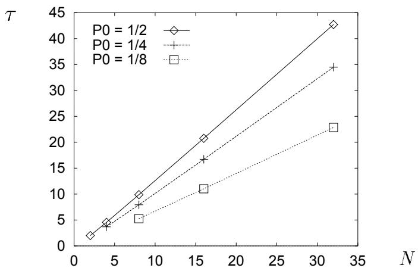
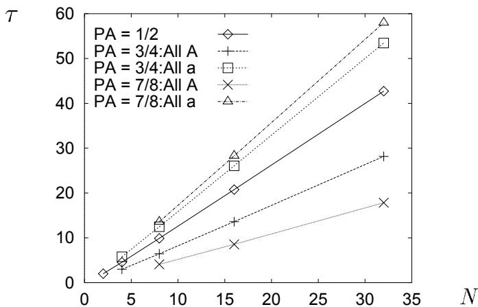
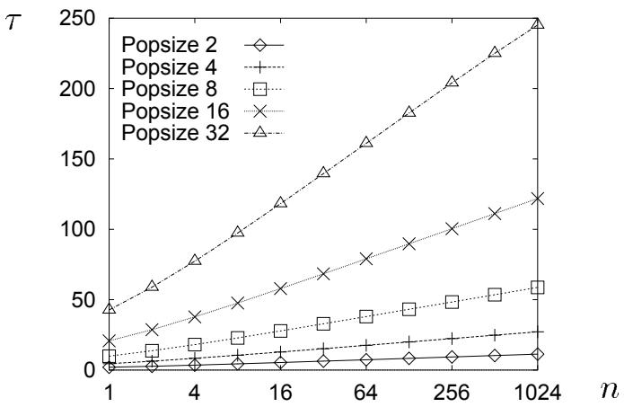
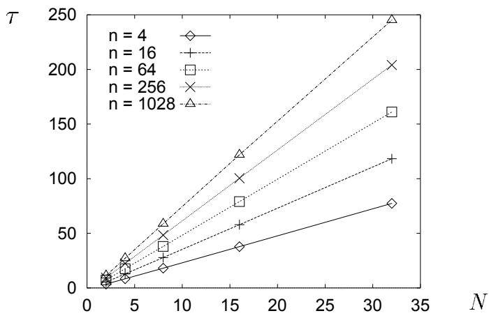
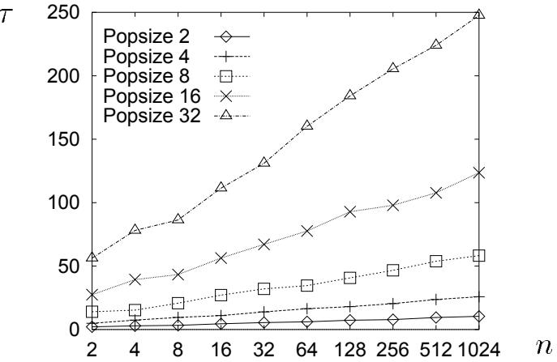
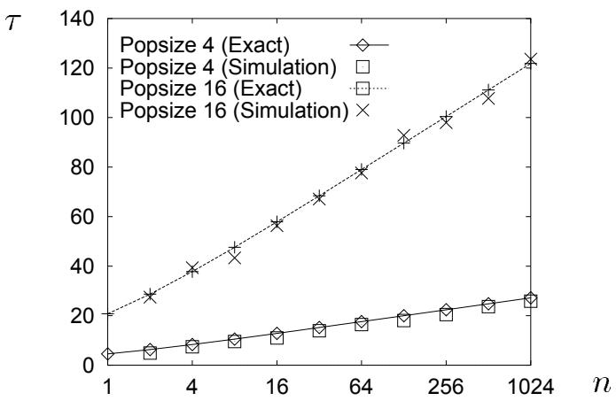

# On the Mean Convergence Time of Evolutionary Algorithms without Selection and Mutation\*

Hideki Asoh   
Electrotechnical Laboratory   
Tsukuba, Ibaraki 305, Japan asoh@etl.go.jp

Heinz Mühlenbein GMD, Schlof Birlinghoven D-53754 Sankt Augustin, Germany muehlen@gmd.de

# Abstract

In this paper we study random genetic drift in a finite genetic population. Exact formulae for calculating the mean convergence time of the population are analytically derived and some results of numerical calculations are given. The calculations are compared to the results obtained in population genetics. A new proposition is derived for binary alleles and uniform crossover. Here the mean convergence time $\tau$ is almost proportional to the size of the population and to the logarithm of the number of the loci. The results of Monte Carlo type numerical simulations are in agreement with the results from the calculation.

# 1 Introduction

Two opposite tendencies operate on natural populations: natural selection, or the propensity to adapt to a given environment; and polymorphism, or the propensity to produce variation to cope with changing environments. With the explosion of data reporting polymorphism on the biochemical level, the long-standing problem of the relative importance of nonrandom and random processes in the genetic structuure of populations has revived in the form of a selectionist-neutralist controversy. The most prominent neutralist is Kimura[8].

The controversy has stimulated the study of many stochastic models including the infinite alleles model and the sampling formula. Later Kimura and many others extensively applied diffusion analysis to the study of stochastic genetic models[7]. The problems considered include the analysis of random sampling effects due to small populations, the balance in small populations of recurrent mutation and random genetic drift, the expected time of fixation of a mutant gene.

Random genetic drift is also important for evolutionary algorithms. It is a source of reducing the variation of the population. But if the variation is reduced then the response to selection becomes less in the next generation [10]. In this paper we will compute the expected time until convergence for different genetic models. Convergence means that all genotypes in the population become equal. One model deals with recombination by unifrom crossover. This model, which is the most important for evolutionary algorithms, has not been investigated before. We derive exact formulae for calculating the mean convergence time and compare them with the results from Monte Carlo type simulations. These results show that uniform crossover recombination increases the convergence time only slightly.

The outline of the paper is as follows. In the next section we analyse the classical simple sampling case as a preparation for treating the case with uniform crossover. In section 3 we present the main result. Section 4 is for the comparison with simulations, and section 5 is for discussion and conclusion.

# 2 Random drift with simple sampling

# 2.1 Two alleles

Consider a population of $N$ individuals. Assume that each individual has only one gene (one locus) in which there are two different alleles termed "A" and "a". There is no mutation, crossover, and selection. The generations are discrete and the size of the population is fixed, that is, in each new generation we sample $N$ offspring from the gene pool of $N$ ancestors with replacements. This model is approximately equivalent with the classical diploid model with $N / 2$ individuals which is usually treated in the literatures of quantitative genetics.

We can describe the status of the population by the number of individuals which have genotype "A". Let the set of possible states be $\Theta = \{ 0 , 1 , . . . , \mathrm { ~ N ~ } \}$ . The development of the state of the population can be described by a simple Markov chain[2][6]. We denote the probability of the population to be in state $i \in \Theta$ at time $t$ as $P _ { i } ( t )$ . Then the transition probability of the Markov chain from the state $i$ to the state $j$ is denoted as $q ( j | i ) i , j \in \Theta$ .

The product law leads us to the following formula for $q ( j | i )$

$$
q ( j | i ) = \left( \begin{array} { c } { { N } } \\ { { j } } \end{array} \right) \left( \frac { i } { N } \right) ^ { j } \left( \frac { N - i } { N } \right) ^ { N - j } ,
$$

and the relation

$$
P _ { j } ( t ) = \sum _ { i = 0 } ^ { N } q ( j | i ) P _ { i } ( t - 1 )
$$

holds.

When we use vector-matrix notation, we denote the transition probability matrix as $Q = \left( q _ { j i } \right)$ , where $q _ { j i } = q ( j - 1 | i - 1 )$ and probability vector as $\mathbf P ( t )$ . The $i$ -th element of $\mathbf P ( t )$ is $P _ { i - 1 } ( t )$ . Then we can write the equation (2) as

$$
\mathbf P ( t ) = Q \mathbf P ( t - 1 )
$$

and naturally the equation

$$
\mathbf { P } ( t ) = Q ^ { t } \mathbf { P } ( 0 )
$$

holds. Here $Q ^ { t }$ is the power $t$ of the matrix $Q$ .

If the population is in the state 0 or $N$ , the population is homogeneous. Hence, the probability of the population converging by time $t = k$ can be expressed as

$$
s ( k ) = P _ { 0 } ( k ) + P _ { N } ( k ) .
$$

The probability of convergence just at time $t = k > 0$ is

$$
c ( k ) = s ( k ) - s ( k - 1 ) .
$$

We can calculate the mean convergence time $\tau$ using $c ( k )$ as

$$
\tau = \sum _ { k = 1 } ^ { \infty } k \ c ( k ) .
$$

When $k$ is large enough, $k c ( k )$ decreases as $k$ increases and converges to 0 quickly. By taking a large enough $K$ we can approximately calculate $\tau$ as

$$
\tau \approx \sum _ { k = 1 } ^ { K } k \ c ( k ) = K s ( K ) - ( \sum _ { k = 0 } ^ { K - 1 } s ( k ) ) .
$$

Table 1 and figure 1 show some results of numerical calculations using the equation (8). We tested values of $K$ and found that $K = 1 0 0 0$ is large enough for obtaining the given results.

Table 1. Mean convergence time $\tau$ for simple sampling for 2 alleles (1)   

<table><tr><td rowspan=1 colspan=1>pA</td><td rowspan=1 colspan=1>N = 2</td><td rowspan=1 colspan=1>N = 4</td><td rowspan=1 colspan=1>N = 8</td><td rowspan=1 colspan=1>N = 16</td><td rowspan=1 colspan=1>N = 32</td><td rowspan=1 colspan=1></td></tr><tr><td rowspan=1 colspan=1>1/2</td><td rowspan=1 colspan=1>2.00</td><td rowspan=1 colspan=1>4.55</td><td rowspan=1 colspan=1>9.89</td><td rowspan=1 colspan=1>20.76</td><td rowspan=1 colspan=1>42.71</td><td rowspan=1 colspan=1>T ≈ 1.4N</td></tr><tr><td rowspan=1 colspan=1>3/4</td><td rowspan=1 colspan=1>—</td><td rowspan=1 colspan=1>3.69</td><td rowspan=1 colspan=1>7.94</td><td rowspan=1 colspan=1>16.71</td><td rowspan=1 colspan=1>32.48</td><td rowspan=1 colspan=1>T ≈ 1.0N</td></tr><tr><td rowspan=1 colspan=1>7/8</td><td rowspan=1 colspan=1>—</td><td rowspan=1 colspan=1>—</td><td rowspan=1 colspan=1>5.26</td><td rowspan=1 colspan=1>11.02</td><td rowspan=1 colspan=1>22.85</td><td rowspan=1 colspan=1>T ≈ 0.7N</td></tr></table>

  
Figure 1. Population size versus mean convergence time (1)

Here the value of $p _ { A }$ means that in the initial population $p _ { A } * N$ individuals have genotype "A" and the rest $( ( 1 - p _ { A } ) * N )$ have genotype "a". We can summarize the results in the following proposition.

Proposition 1 Let each individual have one gene with two alleles "A" and "a". Then in a population of size $N$ with random sampling, the mean convergence time $\tau$ increases almost proportionally with the population size $N$ , and in case of $p _ { A } = 1 / 2$ (half of the initial population have allele $^ { 6 6 } A ^ { \prime \prime }$ , the rest have allele $^ { \circ } a ^ { \prime \prime } ,$ ) $\tau \approx 1 . 4 N \ h o l d s$ .

Kimura et al. approximately analysed the equivalent genetic model using the diffusion equations. The first order approximation of $s ( k )$ is[7]

$$
s ( k ) \approx 1 - 6 p _ { A } ( 1 - p _ { A } ) e ^ { - t / 2 N } .
$$

From this formula one can calculate $\tau$ as $\tau = 1 2 p _ { A } \big ( 1 - p _ { A } \big ) N$ . This gives $\tau = 3 N$ for $p _ { a } = 1 / 2$ . If more terms are used $\tau = 2 . 8 N$ is obtained for $p _ { A } = 1 / 2 [ 5 ]$ . Considering that in their model each individual has two chromosomes (diploid), their results and the above exact calculation are consistent.

If $p _ { A } > 1 / 2$ , the initial population is biased and has a greater tendency to converge to genotype "A" and lesser tendency to converge to genotype "a". We call these cases as "all $\mathrm { A } ^ { \prime \prime }$ and "all a" respectively. For these cases, we can calculate the conditional mean of the convergence time under the condition of "all A" or "all a". These results are shown in the following.

Table 2. Mean convergence time for simple sampling for 2 alleles (2)   

<table><tr><td rowspan=1 colspan=1>pA</td><td rowspan=1 colspan=1>Final State</td><td rowspan=1 colspan=1>N = 4</td><td rowspan=1 colspan=1>N = 8</td><td rowspan=1 colspan=1>N = 16</td><td rowspan=1 colspan=1>N = 32</td><td rowspan=1 colspan=1></td></tr><tr><td rowspan=1 colspan=1>3/4</td><td rowspan=1 colspan=1>all A</td><td rowspan=1 colspan=1>2.99</td><td rowspan=1 colspan=1>6.43</td><td rowspan=1 colspan=1>13.60</td><td rowspan=1 colspan=1>28.16</td><td rowspan=2 colspan=1>T ≈ 0.9NT ≈ 1.7N</td></tr><tr><td rowspan=1 colspan=1>3/4</td><td rowspan=1 colspan=1>all a</td><td rowspan=1 colspan=1>5.78</td><td rowspan=1 colspan=1>12.47</td><td rowspan=1 colspan=1>26.06</td><td rowspan=1 colspan=1>53.45</td></tr><tr><td rowspan=2 colspan=1>7/87/8</td><td rowspan=2 colspan=1>all Aall a</td><td rowspan=1 colspan=1></td><td rowspan=1 colspan=1>4.08</td><td rowspan=1 colspan=1>8.55</td><td rowspan=1 colspan=1>17.83</td><td rowspan=2 colspan=1>T ≈ 0.6NT ≈ 1.9N</td></tr><tr><td rowspan=1 colspan=1></td><td rowspan=1 colspan=1>13.57</td><td rowspan=1 colspan=1>28.30</td><td rowspan=1 colspan=1>57.98</td></tr><tr><td rowspan=2 colspan=1>15/1615/16</td><td rowspan=2 colspan=1>all Aall a</td><td rowspan=1 colspan=1></td><td rowspan=1 colspan=1></td><td rowspan=1 colspan=1>5.26</td><td rowspan=1 colspan=1>10.89</td><td rowspan=1 colspan=1>T ≈ 0.35N</td></tr><tr><td rowspan=1 colspan=1></td><td rowspan=1 colspan=1></td><td rowspan=1 colspan=1>29.34</td><td rowspan=1 colspan=1>60.10</td><td rowspan=1 colspan=1>T ≈ 1.92N</td></tr></table>

  
Figure 2. Population size versus mean convergence time (2)

Let $P _ { A } ( \infty )$ and $P _ { a } ( \infty )$ denote the probability of the population converging to "all A" and "all a" respectively. As for these probabilities, we can prove the following theorem:

Theorem 1 Consider a genetic population of size $N$ . Let each individual have only one gene with two alleles "A" and $^ { 6 } a ^ { \prime \prime }$ , and in the initial state, $p _ { A } N$ individuals have allele "A" and the rest have allele $^ { 6 } a ^ { \prime \prime }$ . Then in a randomly mating population,

$$
P _ { A } ( \infty ) = p _ { A } , \quad P _ { a } ( \infty ) = 1 - p _ { A } .
$$

Proof Using the formula

$$
\sum _ { i = 0 } ^ { N } q ( i | k ) \frac { N - i } { N } = \sum _ { i = 0 } ^ { N } \left( \begin{array} { c } { { N } } \\ { { i } } \end{array} \right) \left( \frac { k } { N } \right) ^ { i } \left( \frac { N - k } { N } \right) ^ { N - i } \frac { N - i } { N } = \frac { N - k } { N } ,
$$

we can caliculate $Q ^ { \infty } = \operatorname* { l i m } _ { t \to \infty } Q ^ { t }$ as

$$
Q ^ { \infty } = \left( \begin{array} { c c c c c c c } { { 1 } } & { { ( N - 1 ) / N } } & { { ( N - 2 ) / N } } & { { \ldots } } & { { 1 / N } } & { { 0 } } \\ { { 0 } } & { { 0 } } & { { 0 } } & { { \ldots } } & { { 0 } } & { { 0 } } \\ { { \vdots } } & { { \vdots } } & { { \vdots } } & { { \vdots } } & { { \vdots } } & { { \vdots } } \\ { { 0 } } & { { 0 } } & { { 0 } } & { { \ldots } } & { { 0 } } & { { 0 } } \\ { { 0 } } & { { 1 / N } } & { { 2 / N } } & { { \ldots } } & { { ( N - 1 ) / N } } & { { 1 } } \end{array} \right) .
$$

With this $Q ^ { \infty }$ we can readily get $\mathbf { P } ( \infty )$ I

That is, if the initial population has $n$ times more individuals with genotype "A" at the initial stage, then the probability of the population converging to "all $\mathrm { A } ^ { \prime \prime }$ is also $n$ times larger.

# 2.2 Many alleles

When we have more than two alleles, the Markov chain describing the development of the popilalionl b coie Lave $m \geq 2$ alles s u couider a $\begin{array} { r } { \big ( \sum _ { i _ { m } = 0 } ^ { N } \sum _ { i _ { m - 1 } = 0 } ^ { i _ { m } } \cdot \cdot \cdot \sum _ { i _ { 2 } = 0 } ^ { i _ { 3 } } 1 \big ) } \end{array}$   
number of each genotype included in the population. Although we can calculate the mean convergence time in principle, it is almost impossible to do the calculation, and we will not describe the formulae here. However, if the number of alleles is very large and we can assume that all individuals have a different genotype at the initial stage, there is a simple trick to calculate the mean convergence time.

Let each different genotype be $a _ { i }$ $\mathbf { \chi } _ { i } ^ { \prime } = 1 , . . . , N \mathbf { \epsilon } )$ . The probability of the convergence to a genotype $a _ { i }$ is equal for all $i$ and is $1 / N$ . We denote this probability as $P _ { a _ { i } } ( \infty )$ . The conditional mean convergence time $\tau _ { a _ { i } }$ under the condition that the population converges to $a _ { i }$ is also equal for all $i$ . Let this conditional mean be $\tau _ { c }$ . The "unconditional" mean convergence time $\tau$ can be calculated as

$$
\tau = \sum _ { a _ { i } } \tau _ { a _ { i } } P _ { a _ { i } } ( \infty ) = \sum _ { a _ { i } } \frac { 1 } { N } \tau _ { c } ,
$$

and is equal to $\tau _ { c }$ in this case.

Now a fact worth noticing is that $\tau _ { c }$ is equal to the conditional mean convergence time in the two alleles case under the condition of converging "all $\mathrm { A } ^ { \prime \prime }$ from the initial state $p _ { A } = 1 / N$ . According to this consideration, we can calculate $\tau$ for the case with very large number of alleles by the same formula as for the case with two alleles. The results are shown in the following table 3. We also show the results from Monte Carlo type simulations done by Mühlenbein et al.[11].

Table 3. Mean convergence time for simple sampling with many alleles   

<table><tr><td rowspan=1 colspan=1></td><td rowspan=1 colspan=1>N = 2</td><td rowspan=1 colspan=1>N = 4</td><td rowspan=1 colspan=1>N = 8</td><td rowspan=1 colspan=1>N = 16</td><td rowspan=1 colspan=1>N = 32</td><td rowspan=1 colspan=1></td></tr><tr><td rowspan=1 colspan=1>Exact</td><td rowspan=1 colspan=1>2.00</td><td rowspan=1 colspan=1>5.78</td><td rowspan=1 colspan=1>13.57</td><td rowspan=1 colspan=1>29.34</td><td rowspan=1 colspan=1>61.12</td><td rowspan=1 colspan=1>T ≈ 2.0N</td></tr><tr><td rowspan=1 colspan=1>Simulation</td><td rowspan=1 colspan=1>—</td><td rowspan=1 colspan=1>—</td><td rowspan=1 colspan=1>13.6</td><td rowspan=1 colspan=1>29.4</td><td rowspan=1 colspan=1>60.3</td><td rowspan=1 colspan=1></td></tr></table>

The remarkable fact is that $\tau$ is still proportional to $N$ and only slightly larger than the case with two alleles. Now we can state the following proposition.

Proposition 2 Let the number of alleles be sufficiently large. Then in a population of size $N$ with random sampling the mean convergence time $\tau$ increases almost proportionally with the population size $N$ , and $\tau \approx 2 . 0 N$ holds approximately.

Note that in this case $\tau$ is mathematically equivalent to the the mean fixation time of a mutant gene introduced in a population. In Crow and Kimura[1] $\tau \approx 4 . 0 N$ is derived for the diploid case using the diffusion equation model. Our results are consistent with theirs.

# 3 Genetic drift with uniform crossover

In this section we investigate how much recombination by uniform crossover can reduce the influence of genetic drift. Uniform crossover is an adaptation of Mendel's chance model to haploid organisms. It is used in many genetic algorithms.

We assume that each individual has one chromosome and each chromosome has $n$ loci. We denote the set of alleles for the $i$ -th locus as $\Theta _ { i }$ .

Let the chromosome of parents be $\mathbf { x } = ( x _ { 1 } , . . . , x _ { n } )$ and $\mathbf { y } = ( y _ { 1 } , . . . , y _ { n } )$ . Here $x _ { i } , y _ { i } \in \Theta _ { i }$ . Then the offspring $\mathbf { z } = ( z _ { 1 } , . . . , z _ { n } )$ is computed by the uniform crossover operation according to the following probability;

$$
P r o b [ z _ { i } = x _ { i } ] = 0 . 5 , \quad P r o b [ z _ { i } = y _ { i } ] = 0 . 5 .
$$

In the following we assume that all $\Theta _ { i }$ are the same. Then the probability of fixing (converging) each locus till time $t = k$ is same for all $i$ and we denote it as $r ( k )$ . Because each locus behaves statistically independent, the probability of fixing all $n$ loci till the time $t = k$ is easily calculated as $r ( k ) ^ { n }$ . Now we got the following theorem,

Theorem 2 Let the number of loci be $n$ . Then the mean convergence time $\tau$ of the population with uniform crossover operation is

$$
\tau = \sum _ { k = 1 } ^ { \infty } k ( r ( k ) ^ { n } - r ( k - 1 ) ^ { n } ) .
$$

We will now assume that each locus has two alleles. In this case, we can put $r ( k ) = s ( k )$ , where $s ( k )$ was introduced in the previous section. If $k$ is large enough $k c _ { n } ( k ) = k ( s ( k ) ^ { n } -$ $s ( k - 1 ) ^ { n } )$ is decreasing for $k$ and converges to 0 very rapidly. By taking a large enough $K$ we can approximately calculate $\tau$ as

$$
\tau \approx \sum _ { k = 1 } ^ { K } k \ c _ { n } ( k ) = K s ( K ) ^ { n } - ( \sum _ { k = 0 } ^ { K - 1 } s ( k ) ^ { n } ) .
$$

Table 4 and figures 3 show a result of numerical calculations using the above equation (10). We tested some value of $K$ and found that $K = 5 0 0 0$ is large enough. The horizontal axis of the figures are scaled by $\log _ { 2 }$ .

Table 4. Mean convergence time with uniform crossover ( $p _ { A } = 1 / 2$ )   

<table><tr><td rowspan=1 colspan=1>n</td><td rowspan=1 colspan=1>IN = 2</td><td rowspan=1 colspan=1>N = 4</td><td rowspan=1 colspan=1>N = 8</td><td rowspan=1 colspan=1>N = 16</td><td rowspan=1 colspan=1>N = 32</td></tr><tr><td rowspan=1 colspan=1>1</td><td rowspan=1 colspan=1>2.00</td><td rowspan=1 colspan=1>4.55</td><td rowspan=1 colspan=1>9.89</td><td rowspan=1 colspan=1>20.76</td><td rowspan=1 colspan=1>42.71</td></tr><tr><td rowspan=1 colspan=1>2</td><td rowspan=1 colspan=1>2.67</td><td rowspan=1 colspan=1>6.32</td><td rowspan=1 colspan=1>13.72</td><td rowspan=1 colspan=1>28.71</td><td rowspan=1 colspan=1>58.90</td></tr><tr><td rowspan=1 colspan=1>4</td><td rowspan=1 colspan=1>3.50</td><td rowspan=1 colspan=1>8.35</td><td rowspan=1 colspan=1>18.10</td><td rowspan=1 colspan=1>37.80</td><td rowspan=1 colspan=1>77.38</td></tr><tr><td rowspan=1 colspan=1>8</td><td rowspan=1 colspan=1>4.42</td><td rowspan=1 colspan=1>10.55</td><td rowspan=1 colspan=1>22.86</td><td rowspan=1 colspan=1>47.63</td><td rowspan=1 colspan=1>97.38</td></tr><tr><td rowspan=1 colspan=1>16</td><td rowspan=1 colspan=1>5.37</td><td rowspan=1 colspan=1>12.86</td><td rowspan=1 colspan=1>27.82</td><td rowspan=1 colspan=1>57.91</td><td rowspan=1 colspan=1>118.24</td></tr><tr><td rowspan=1 colspan=1>32</td><td rowspan=1 colspan=1>6.36</td><td rowspan=1 colspan=1>15.21</td><td rowspan=1 colspan=1>32.90</td><td rowspan=1 colspan=1>68.41</td><td rowspan=1 colspan=1>139.56</td></tr><tr><td rowspan=1 colspan=1>64</td><td rowspan=1 colspan=1>7.34</td><td rowspan=1 colspan=1>17.60</td><td rowspan=1 colspan=1>38.03</td><td rowspan=1 colspan=1>79.03</td><td rowspan=1 colspan=1>161.07</td></tr><tr><td rowspan=1 colspan=1>128</td><td rowspan=1 colspan=1>8.34</td><td rowspan=1 colspan=1>19.99</td><td rowspan=1 colspan=1>43.19</td><td rowspan=1 colspan=1>89.71</td><td rowspan=1 colspan=1>182.62</td></tr><tr><td rowspan=1 colspan=1>256</td><td rowspan=1 colspan=1>9.34</td><td rowspan=1 colspan=1>22.39</td><td rowspan=1 colspan=1>48.37</td><td rowspan=1 colspan=1>100.42</td><td rowspan=1 colspan=1>204.03</td></tr><tr><td rowspan=1 colspan=1>512</td><td rowspan=1 colspan=1>10.33</td><td rowspan=1 colspan=1>24.80</td><td rowspan=1 colspan=1>53.55</td><td rowspan=1 colspan=1>111.14</td><td rowspan=1 colspan=1>225.05</td></tr><tr><td rowspan=1 colspan=1>1024</td><td rowspan=1 colspan=1>11.33</td><td rowspan=1 colspan=1>27.21</td><td rowspan=1 colspan=1>58.74</td><td rowspan=1 colspan=1>121.87</td><td rowspan=1 colspan=1>245.17</td></tr></table>

  
Figure 3. Number of loci versus mean convergence time $\tau$ $p _ { A } = 1 / 2$ )

As you can see from the figure, the mean convergence time $\tau$ increases almost proportionally to $\log n$ .

Next figure 4 is about the relation with the population size $N$ .

  
Figure 4. Population size versus mean convergence time $p _ { A } = 1 / 2$ )

This figure shows that $\tau$ increases proportionally to $N$ . To maintain consistency with the results in the previous section, we approximate the above numerical results by a simple formula

$$
\tau \approx C _ { 0 } N \big ( a \log _ { e } n + 1 . 0 \big ) ^ { b } .
$$

Here $C _ { 0 }$ is a constant which depends on $p _ { A }$ and from table 1. The optimal value of $a$ and $b$ which minimize the squared error have been computed and we got the following approximative formulae for some values of $p _ { A }$ .

Proposition 3 Let the number of loci be $n$ . Let each gene have two alleles. Then the mean convergence time $\tau$ of the population with uniform crossover is approximately

$$
\begin{array} { r c l } { { \tau } } & { { \approx } } & { { 1 . 4 N \ ( 0 . 5 \log _ { e } n + 1 . 0 ) ^ { 1 . 1 } \ \mathrm { f o r } p _ { A } = 1 / 2 , } } \\ { { \tau } } & { { \approx } } & { { 1 . 0 N \ ( 0 . 7 \log _ { e } n + 1 . 0 ) ^ { 1 . 1 } \ \mathrm { f o r } p _ { A } = 3 / 4 , } } \\ { { \tau } } & { { \approx } } & { { 0 . 7 N \ ( 0 . 8 \log _ { e } n + 1 . 0 ) ^ { 1 . 2 } \ \mathrm { f o r } p _ { A } = 7 / 8 . } } \end{array}
$$

# 4 Comparison with simulations

We have also done numerical (Monte Carlo type) experiments with our Parallel Genetic Algorithm Simulator "PeGAsuS". The initial population is generated randomly, that is, each locus has a probability $1 / 2$ to have the value 0 and $1 / 2$ to have the value 1. In the simulations self-fertilization is prohibited. This is different from the theoretical analysis. However these differences are not essential here.

In figure 5 the results of simulations are shown, and in figure 6 we make comparison between our exact calculation and simulation.

  
Figure 5. Number of loci versus mean convergence time (Monte Carlo type Simulation)

  
Figure 6. Comparison between exact calculation and simulation

The agreement between the analytical fit and the simulations are very good.

# 5 Discussion and conclusion

We have derived exact formulae for calculating the mean convergence time of random genetic drift in a random mating population without selection and mutation. Exact numerical calculations using the formulae show that in all cases treated here, the mean convergence time $\tau$ is approximately proportional to the size of the population $N$ and to the logarithm of the number of loci $n$ . This means that genetic drift is an important factor for reducing the variance of the population. But the reduction of the variance will reduce the increase of of the average fitness of the population [11]

The above results have been compared with the results from Monte Carlo type experiments. The fit between them is very good. The simulation results also suggest that the standard deviation of the convergence time increases rather rapidly with population size $N$ . Although in this paper we evaluate only the mean of convergence time, the extension for calculating the variance is straightforward.

An analytical derivation of the proposition 3 and its extension to the case with $n$ genes and large number of alleles are left for future work. Evolutionary Algorithms provide the field of theoretical quantitative genetics with many interesting experimental phenomena in artificial situations. Many topics remain to be investigated in the future.

# Acknowledgements

The Monte Carlo type simulation results in section 2 and section 4 are from Andreas Reinholtz. Dirk Schlierkamp-Voosen helped to use PeGAsuS. Byoung-Tak Zhang and Bill Buckles carefully read the manuscript and gave us useful comments. This work was done while one of the authors (Hideki Asoh) was at GMD as a guest researcher. He thanks GMD for that opportunity, and also to the Science and Technology Agency in Japan for supporting his stay. This work is a part of the SIFOGA project supported by Real World Computing Partnership.

# Список литературы

[1] Crow,J.F. and Kimura,M. An Introduction to Population Genetics Theory, Harper and Row, New York, 1970.   
[2] Feller,W. An Introduction to Probability Theory and its Applications. vol.1 (3rd ed.), John Wiley & Sons, New York, 1957.   
[3] Fisher,R.A. On the dominance ratio. Proc. Roy. Soc. Edinburgh 42, 321-341, 1922.   
[4] Goldberg,D.E. Genetic Algorithms in Search, Optimization and Machine Learning, AddisonWesley, Readin, 1989.   
[5] Hartl,D.L. A Primer of Population Genetics, Sinauer Associates, Sunderland, 1981.   
[6] Karlin,S. and Taylor H.M. A First Course in Stochastic Processes.(2nd ed.), Academic Press, New York, 1975.   
[7] Kimura,M. Diffusion Models in Population Genetics, J. Appl. Prob. 1, 177-232, 1964.   
[8] Kimura,M. The Neutral Theory of Molecular Evolution, Cambridge Univ. Press, 1983.   
[9] Mühlenbein,H. Evolutionary algorithms: Theory and applications, in E.Aarts and J.K.Lenstra (eds.) Local Search in Combinatorial Optimization, Wiley, 1993.   
[10] Mühlenbein,H.and Schlierkamp-Voosen,D. Predictive models for the Breeder Genetic Algorithm, Evolutionary Comptation 1, 25-49, 1993.   
[11] Mühlenbein,H. and Schlierkamp-Voosen,D. The science of breeding and its application to the breeder genetic algorithm BGA, preprint, 1994.   
[12] Wright,S. Evolution in Mendelian populations, Genetics 16, 97-159, 1931.