# An Evolutionary Algorithm for Discrete Tomography

K.J. Batenburg LIACS Universiteit Leiden

October 31, 2003

This thesis is the result of research that was performed by the author in the year 2003, forming the “graduation project” in Computer Science at the Leiden Institute of Advanced Computer Science (LIACS). The research was carried out under the supervision of Dr. W.A. Kosters and Dr. H.J. Hoogeboom.

Joost Batenburg started studying in Leiden in 1998. In 2002, he graduated in Mathematics. Since then, he has been working as a Ph.D. student, partially at CWI in Amsterdam, partially at the Mathematical Institute in Leiden. The first part of this thesis has been submitted for publication in the Elsevier journal “Discrete Applied Mathematics”.

# Contents

# 1 Introduction 1

2 Preliminaries 3

# 3 Algorithmic approach 7

3.1 Overview of the approach 7   
3.2 A new crossover operator . 9   
3.3 The hillclimb operator 11   
3.4 The mutation operator 13   
3.5 Algorithm details 14

# 4 Computational results 16

4.1 Reconstruction of hv-convex images . . . 16   
4.2 Reconstruction from three projections . 18   
4.3 Reconstruction using Gibbs priors . . 19

# 5 Solving Japanese puzzles 22

6 Conclusions 29

7 Acknowledgments 30

# References 31

# Abstract

One of the main problems in Discrete Tomography is the reconstruction of binary matrices from their projections in a small number of directions. In this thesis we consider a new algorithmic approach for reconstructing binary matrices from only two projections. This problem is usually underdetermined and the number of solutions can be very large. We present an evolutionary algorithm for finding the reconstruction which maximises an evaluation function, representing the “quality” of the reconstruction, and show that the algorithm can be successfully applied to a wide range of evaluation functions. We discuss the necessity of a problem-specific representation and tailored searchoperators for obtaining satisfactory results. Our new search-operators can also be used in other discrete tomography algorithms.

# 1 Introduction

Discrete Tomography (DT) is concerned with the reconstruction of a discrete image from its projections. One of the key problems is the reconstruction of a binary (black-and-white) image from only two projections, horizontal and vertical (see Figure 1). In 1957 Ryser [20] and Gale [8] independently derived necessary and sufficient conditions for the existence of a solution. Ryser also provided a polynomial time algorithm for finding such a solution. However, the problem is usually highly underdetermined and a large number

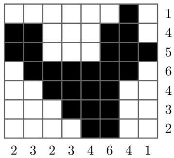  
Figure 1: A binary image with its horizontal and vertical projections

of solutions may exist [26].

Among the applications of discrete tomography are the reconstruction of crystal lattices from projections obtained by electron microscopy [14, 22] and the reconstruction of angiographic images in medical imaging [19, 23]. In such applications the projection data are the result of measurements of a physical object and we are interested in finding a reconstruction which resembles the original image as closely as possible, not just one that corresponds to the given projections. Therefore it is necessary to use all available information about the class of images to which the measured image belongs.

For certain classes of highly-structured images, such as hv-convex polyominoes (the black pixels in each row and column are contiguous), polynomialtime reconstruction algorithms exist (see, e.g., [2, 3]). On the other hand, there are classes of images, such as the more general class of hv-convex images (which may consist of many separate polyominoes), for which the reconstruction problem is NP-hard (see [16]).

Instead of assuming specific properties of the image structure, we will focus on a more general approach. Suppose that we are able to define an evaluation function, which assigns a value to each of the solutions, reflecting how good a particular solution is in our context. An algorithm that maximises the evaluation over the set of all solutions will then yield the most desirable

solution.

As an example, consider the class of hv-convex images. Suppose that the unknown original image belongs to this class. In [5] it is shown that when we define the evaluation of an image to be the number of neighbouring pairs of black pixels (either horizontal or vertical), the evaluation function is minimised by a reconstruction that has the prescribed projections if and only if the reconstruction is also hv-convex. Similarly, we can define an evaluation function for the reconstruction of hv-convex polyominoes, where we subtract a large penalty if the image consists of more than one polyomino.

Probably of greater practical relevance is the case where the measured object can be considered to be a random variable, sampling from a certain known distribution. In this case the evaluation function reflects the likelihood that the image is a random sample from this distribution.

Finally we remark that the NP-hard problem of reconstructing binary images from more than two projections, including the horizontal and vertical projections, fits in our model as well. Define the projection deviation of an image to be the total difference (as a sum of absolute values) between the image’s projections and the prescribed projections. Because we only deal with maximisation problems, we use the negated projection deviation as the evaluation function.

The flexibility of our model comes at a price. The problem of maximising the evaluation function over the set of all solutions is NP-hard, which follows directly from the NP-hardness of the problem of reconstructing binary images from more than two projections (see [9]). In order to deal with this intractability, we resort to the use of modern approximation algorithms. Several preliminary experiments with different algorithms resulted in the choice for an evolutionary algorithm.

In Section 3 we discuss the choices that we made in designing the algorithm. Because the problem at hand has a natural binary encoding it seems attractive to apply a classical genetic algorithm (GA) (see [18]), using the bitstring representation. For several reasons however, this does not lead to good results. We will discuss the problem features that cause the application of classical GA’s to be inadequate and introduce new problem-specific mutation and crossover operators. We discuss the necessity of using a hillclimb operator as a post-mutation and post-crossover operator for improving the solution quality.

Section 4 presents our experimental results. The results clearly show that our algorithm can be successfully applied to a wide range of evaluation functions, making it very versatile.

# 2 Preliminaries

We will now introduce some notation and define the DT problem mathematically. Parts of our algorithm are based on well-known theoretical results, which we will summarise. We assume that the reader is familiar with the theory of network flows and the basic principles of evolutionary algorithms.

Throughout this thesis we will assume that all binary matrices are of size $m \times n$ . We consider the problem of reconstructing a binary matrix from its horizontal and vertical projections.

Definition 2.1 Let $R = ( r _ { 1 } , \ldots , r _ { m } ) $ and $S = ( s _ { 1 } , \ldots , s _ { n } ) $ be nonnegative integral vectors. We denote the class of all binary matrices $A = \left( a _ { i j } \right)$ satisfying

$$
\begin{array} { r c l } { { \displaystyle \sum _ { j = 1 } ^ { n } a _ { i j } } } & { { = } } & { { r _ { i } , \quad i = 1 , \ldots , m , } } \\ { { \displaystyle \sum _ { i = 1 } ^ { m } a _ { i j } } } & { { = } } & { { s _ { j } , \quad j = 1 , \ldots , n , } } \end{array}
$$

by $A ( R , S )$ . The vectors $R$ and $S$ are called the row and column projections of any matrix $A \in { \mathcal { A } } ( R , S )$ .

Because DT is strongly related to digital image processing we often refer to binary matrices as images and call the matrix entries pixels with values black (1) and white (0).

From this point on we assume that the row and column projections are consistent, meaning that $A ( R , S )$ is nonempty. In particular, this implies that $\textstyle \sum _ { i = 1 } ^ { m } r _ { i } = \sum _ { j = 1 } ^ { n } s _ { j }$ . Necessary and sufficient conditions for the nonemptiness of $A ( R , S )$ are given in [15].

One of the basic problems in DT is the reconstruction problem:

Problem 2.2 Let $R$ and $S$ be given integral vectors. Construct a binary matrix $A \in { \mathcal { A } } ( R , S )$ .

Because the number of possible solutions of the reconstruction problem can be very large it is necessary to impose additional properties on the solution being sought. In this thesis we consider the following problem:

Problem 2.3 Let $R$ and $S$ be given integral vectors and let $f : \mathcal { A } ( R , S )  \mathbb { Z }$ be a given evaluation function. Find a binary matrix $A \in { \mathcal { A } } ( R , S )$ such that $f ( A )$ is maximal.

Although in Problem 2.3 the domain of $f$ is restricted to the class $A ( R , S )$ , $f$ is usually defined on the entire set $\{ 0 , 1 \} ^ { m \times n }$ .

The notion of switching components plays an important role in the characterisation of the class $A ( R , S )$ .

Definition 2.4 Let $A \in { \mathcal { A } } ( R , S )$ . $A$ switching component of $A$ is a $2 \times 2$ submatrix of the form

$$
\left( \begin{array} { c c } { { 1 } } & { { 0 } } \\ { { 0 } } & { { 1 } } \end{array} \right) \quad o r \quad \left( \begin{array} { c c } { { 0 } } & { { 1 } } \\ { { 1 } } & { { 0 } } \end{array} \right) .
$$

Switching components have the property that if we interchange the $0$ ’s and 1’s, the projections do not change. We call such an interchange operation an elementary switching operation. An important theorem of Ryser [21] describes how the class $A ( R , S )$ is characterised by a single element of this class and the set of switching components:

Theorem 2.5 Let $A \ \in \ A ( R , S )$ . There exists $B \in \mathcal { A } ( R , S )$ , $B \neq A$ , if and only if $A$ contains a switching component. Moreover, if such a matrix $B$ exists, then A can be transformed into $B$ by a sequence of elementary switching operations.

We remark that every matrix $B$ that is the result of applying a sequence of elementary switching operations to $A$ is also in $A ( R , S )$ . The fact that we can transform a matrix in $A ( R , S )$ into any other matrix having the same projections by means of elementary switching operations, makes the use of elementary switching operations very suitable for local search procedures. In our evolutionary algorithm, we make extensive use of these operations.

An important operation in our algorithm is the computation of matrices in $A ( R , S )$ , given $R$ and $S$ . We use a network flow approach for computing these matrices, which was first introduced by Gale [8]. First, we construct a directed graph $N$ . The set $V$ of nodes consists of a source node $S$ , a sink node $T$ , one layer $V _ { 1 } , \ldots , V _ { m }$ of nodes that correspond to the image rows (row nodes) and one layer $W _ { 1 } , \dots , W _ { n }$ of nodes that correspond to the image columns (column nodes). The set $A$ of arcs consists of arcs $( S , V _ { i } )$ for $i = 1 , \ldots , m$ , arcs $( V _ { i } , W _ { j } )$ for $i = 1 , \ldots , m , j = 1 \ldots , n$ , and arcs $( W _ { j } , T )$ for $j = 1 , \dots , n$ . We remark that the two layers of row nodes and column nodes form a complete bipartite graph.

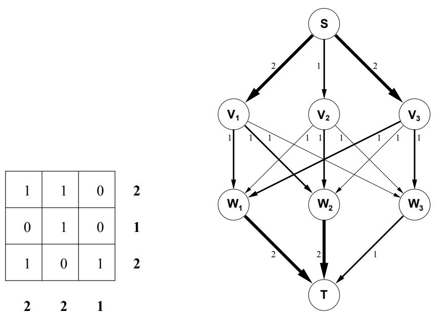  
Figure 2: A $3 \times 3$ image instance and its corresponding network flow

We also define a capacity function $C : A  \mathbb { N } _ { 0 }$ which assigns an integral capacity to every arc. All arcs between a row node and a column node are assigned capacity 1. We will denote these arcs as pixel-arcs, because each of them corresponds to a single, unique pixel of the image (determined by the row and column). The prescribed projections determine the capacities of the arcs from the source node and the arcs to the sink node. Every arc $( S , V _ { i } )$ has capacity $r _ { i }$ and every arc $( W _ { j } , T )$ has capacity $s _ { j }$ . Figure 2 shows the network $N$ for an example $3 \times 3$ image.

It is well-known that a maximum flow from $S$ to $T$ can be found in polynomial time. From the theory of linear programming we know that there is a maximum flow which is integral. Suppose that this maximum flow fully saturates all outgoing arcs from the source (and all incoming arcs towards the sink). Every pixel-arc carries a flow of either 0 or 1. Assign a 1 to pixel $( i , j )$ if arc $( V _ { i } , W _ { j } )$ carries a flow of 1 and assign 0 otherwise. It is easy to verify that the resulting image has the prescribed projections in both directions. Conversely, if the horizontal and vertical projections are consistent, i.e., there is an image that satisfies them, the network must have a maximal flow that saturates all outgoing arcs from the source. We see that the problem of finding a maximum integral flow in $N$ is equivalent to the reconstruction problem.

We can use algorithms for solving the max flow problem to compute solutions of the DT reconstruction problem. In our case we want to impose additional requirements on the resulting image. In particular, given a binary image $M \in \{ 0 , 1 \} ^ { m \times n }$ , we want to find the binary image $A \in { \mathcal { A } } ( R , S )$ that differs from $M$ in as few pixels as possible. We will refer to $M$ as the model image.

Problem 2.6 Let $R$ and $S$ be given integral vectors and let $M = ( m _ { i j } )$ be $a$ given binary matrix. Find $A = ( a _ { i j } ) \in \mathcal { A } ( R , S )$ such that

$$
\sum _ { i = 1 } ^ { m } \sum _ { j = 1 } ^ { n } \left| m _ { i j } - a _ { i j } \right|
$$

is minimal.

Problem 2.6 can be solved efficiently using an extension of the network flow model, incorporating a cost function. We assign a cost $c _ { i j } = - m _ { i j }$ to every arc $( V _ { i } , W _ { j } )$ . The remaining arcs are all assigned a cost of 0. The process of finding a maximum flow of minimal cost now comes down to finding an integral flow that saturates the maximum number of pixel-arcs for which the corresponding model image pixel has value 1. In other words, if $A$ is the image that corresponds to the maximal flow of minimal cost, then $A$ has as many 1’s in common with $M$ as possible.

Suppose that For any matrix $B \in { \mathcal { A } } ( R , S )$ $B = ( b _ { i j } ) \in \{ 0 , 1 \} ^ { m \times n }$ . Clearly, we have , denote the number of $\begin{array} { r } { n _ { B } = \sum _ { i = 1 } ^ { m } r _ { i } = \sum _ { j = 1 } ^ { n } s _ { j } } \end{array}$ $1$ ’s in $B$ by . Put $n _ { B }$

$$
v _ { B } = | \{ ( i , j ) : b _ { i j } = 1 \land m _ { i j } = 1 \} | .
$$

Then

$$
| \{ ( i , j ) : b _ { i j } \neq m _ { i j } \} | = ( n _ { B } - v _ { B } ) + ( n _ { M } - v _ { B } ) = n _ { B } + n _ { M } - 2 v _ { B } ,
$$

so

$$
| \{ ( i , j ) : b _ { i j } = m _ { i j } \} | = m n - ( n _ { B } + n _ { M } - 2 v _ { B } ) ,
$$

which shows that maximising the number of common 1’s between $B$ and $M$ is equivalent to solving Problem 2.6, because $m n$ , $n _ { B }$ and $n _ { M }$ are constant for $B \in { \mathcal { A } } ( R , S )$ . Numerous standard algorithms are available for solving the min cost max flow problem in polynomial time. We can use any of these algorithms for solving Problem 2.6.

# 3 Algorithmic approach

# 3.1 Overview of the approach

Because finding a reconstruction that maximises the evaluation function is an NP-hard problem, we have to resort to approximation algorithms. In preliminary experiments we implemented and tested several approaches, based on simulated annealing [1], tabu search [10] and evolutionary algorithms [24]. We found that simulated annealing and tabu search, which only use local search operators, are not well suited for this task. The main reason for this is that the DT problem usually has a great number of local optima and moving between different optima may require a large number of “uphill” steps.

Evolutionary algorithms can handle this problem in two ways. Firstly, the algorithm uses a diverse population of candidate solutions, instead of a single solution. Secondly, the crossover operator is capable of performing large steps in the search space.

Because the problem at hand allows for a natural bitstring representation of candidate solutions it fits directly into the framework of classical genetic algorithms on bitstrings. Simply use $\{ 0 , 1 \} ^ { m n }$ as the candidate solution space. We now have two optimisation criteria, the evaluation function and the deviation from the prescribed projections.

We found this approach to be inadequate for several reasons. In the first place, the crossover operator usually results in candidate solutions that deviate greatly from the prescribed projections. This is particularly common when the two parent solutions have many differences. This behaviour makes the crossover operator hardly effective at all, reducing the algorithm to a simple hillclimb procedure that only uses mutation to improve upon the solutions. In addition, the most common crossover operators, singlepoint crossover and uniform crossover, do not take into account the twodimensional spatial structure of the candidate solutions. Intuitively, building blocks for this problem are made up of regions of pixels, not necessarily horizontally or vertically aligned. A problem-specific operator could benefit from this structure.

We have designed a problem-specific evolutionary algorithm to overcome the disadvantages of the classical GA. Instead of optimising over all bitstrings in $\{ 0 , 1 \} ^ { m n }$ , the algorithm optimises exclusively over ${ \mathcal { A } } ( R , S )$ . At the end of each generation all candidate solutions have the prescribed horizontal and vertical projections. This requires a new crossover operator, that is not only capable of mixing features from both parents, but also of ensuring that the produced children adhere to the prescribed projections. Similar requirements apply to the mutation operator.

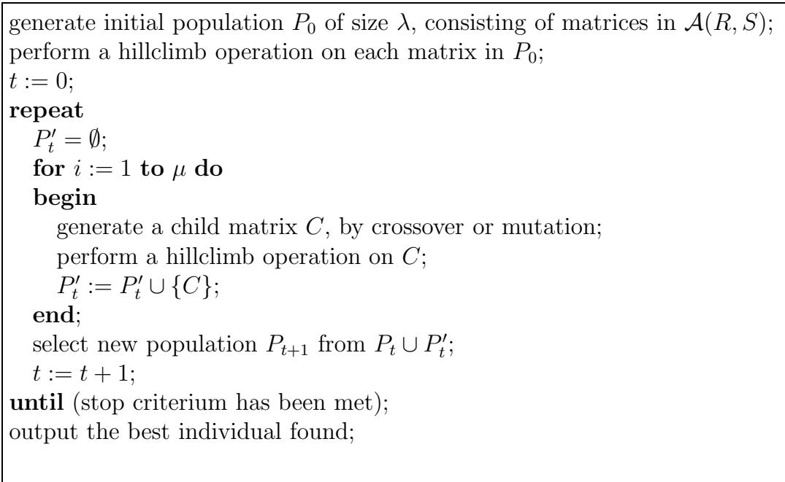  
Figure 3: Outline of the evolutionary algorithm

Our algorithm is a memetic algorithm (see [4]): after every crossover or mutation operation a stochastic hillclimb is performed until the solution has reached a local optimum. In this way, individuals always represent local optima in the search space. We chose this approach, because although the proposed crossover operator generates children that have the prescribed projections, the children are often of inferior quality with respect to the evaluation function (when compared to the parents). In order to fully exploit the explorative power of the crossover operator, the hillclimb procedure increases the solution quality while still remaining quite close to the solution that resulted from the crossover operation. Another reason for choosing this approach is that our crossover and mutation operators are computationally expensive operations. Memetic algorithms typically require only a small number of generations (while performing a lot of work for each generation). Figure 3 summarises our algorithm. The parameters $\lambda$ and $\mu$ are the population size and the number of children that are created in each generation, respectively. In the next sections we will describe the various operators in more detail.

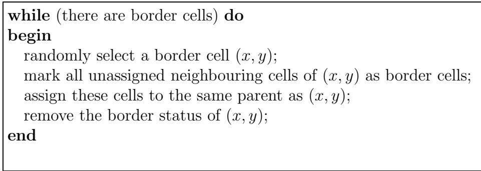  
Figure 4: Main loop of the procedure that generates the crossover mask.

# 3.2 A new crossover operator

The crossover operator is one of the main parts of our algorithm. The input of the operator consists of two parent images. The output is a child image, which has certain features from both parents. Because all images in the population are members of $A ( R , S )$ , the resulting image should have the prescribed projections. In order to enforce this constraint, we use the network flow formulation of the DT problem.

First, a crossover mask $X = ( x _ { i j } ) \in \{ 0 , 1 \} ^ { m \times n }$ is computed, which determines for each pixel from which parent image it inherits. In the following description, assigning cell $( i , j )$ to the first parent means setting $x _ { i j } ~ = ~ 0$ and assigning cell $( i , j )$ to the second parent means setting $x _ { i j } ~ = ~ 1$ . By neighbouring cells of a cell $( i , j )$ we mean the four horizontal and vertical neighbours. As discussed in Section 3.1 we want the crossover operator to take the spacial structure of our image into account. Therefore the crossover mask should assign areas of the image to each of the parents. We use the following procedure for realising this. First, one random cell is selected in each of the four quadrants. Two (randomly chosen) of those cells are assigned to the first parent, the other two are assigned to the second parent. The four cells are marked as border cells. Next, the algorithm enters a loop, show in Figure 4. Because the first four border cells are each in a different quadrant, this procedure results in a crossover mask that roughly assigns the same number of cells to both parents.

From the crossover mask and both parent images $P = ( p _ { i j } )$ and $Q = \left( q _ { i j } \right)$ , a model image $M = ( m _ { i j } )$ is computed, as follows:

$$
m _ { i j } = \left\{ \begin{array} { l l } { p _ { i j } \quad } & { \mathrm { i f } \ x _ { i j } = 0 } \\ { q _ { i j } } & { \mathrm { i f } \ x _ { i j } = 1 } \end{array} \right.
$$

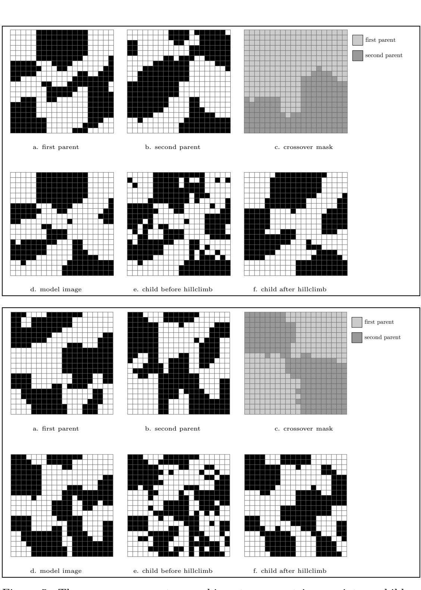  
Figure 5: The crossover operator combines two parent images into a child image.

Subsequently, we construct the child image $C$ by solving Problem 2.6, using $M$ as the model image. This will result in a child image that is in $A ( R , S )$ , resembles the first parent in a certain part and resembles the other parent in the rest of the image. Figure 5 shows two parent images (having the same projections), a crossover mask, the corresponding model image and the resulting child image. In this example, we use the number of neighbouring pairs of black pixels as the evaluation function. Although the child image resembles both parents in their corresponding parts, it is clear that the child image is far from a local optimum with respect to the evaluation function. To ensure that the child image has sufficient quality, we apply a local hillclimb operator after the crossover operation.

# 3.3 The hillclimb operator

The hillclimb operator applies a sequence of small modifications, all of which increase the evaluation function, until a local optimum is reached. Because we want the resulting image to be in $A ( R , S )$ , we use elementary switching operations as local steps. The outline of the procedure is shown in Figure 6. It is of great importance that the switching component in each step is chosen randomly among all those yielding an increase of the evaluation function. We have performed experiments with implementations for which this was not the case: the search for switching components always started in the topleft corner and proceeded from left to right, top to bottom. However, this introduces a bias in the hillclimb process, resulting in “skew images”, clearly showing the consequences of the biased operator.

Although the hillclimb operation can be easily described, its implementation offers several computational challenges. Finding all applicable switching components (switching components that are present in the image) is an $O ( ( m n ) ^ { 2 } )$ operation, making it computationally expensive. Although the number of applicable switching components is also $O ( ( m n ) ^ { 2 } )$ , it is usually much smaller. We store all applicable switching components in a hash table. Switching components are stored as two integer-pairs: (top-left, bottom-right). We can use the hash table to iterate over all applicable switching components. The search efficiency of hash tables is required to update the datastructure after a switching operation has been applied by first removing all switching components containing any of the four pixels involved and subsequently adding all new switching components that contain any of those four pixels. If the hash table is large enough we can perform this update operation in $O ( m n )$ time.

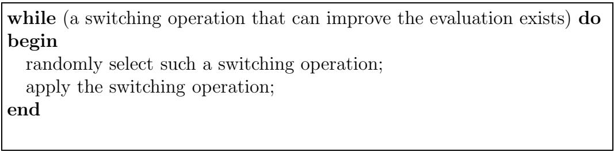  
Figure 6: Outline of the hillclimb procedure.

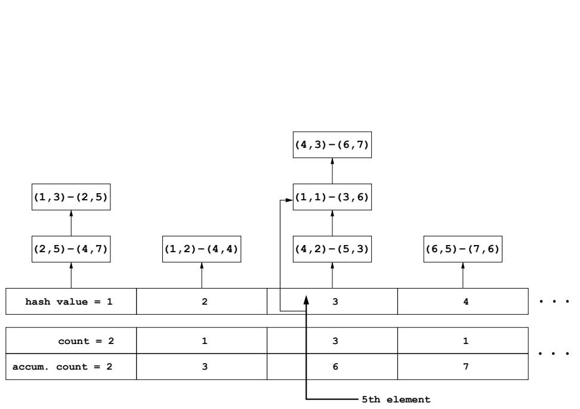  
Figure 7: The hash table of switching components is extended to allow binary search for an indexed element.

A second operation that our datastructure must support is efficient selection of a randomly chosen element. Each hash table entry points to a linked list of switching components. In a separate array, we store the number of switching components that reside in each list. In another array, we compute the accumulated number of switching components, up to and including that entry. Using this information, we can efficiently find the $i$ th element in the hash table, given any index $i$ : first perform a binary search to find the right table entry and then perform a (tiny) linear search to find the actual switching component. Figure 7 illustrates the approach.

Figure 8 shows a more precise formulation of the hillclimb operator. In every iteration of the outer loop the evaluation of the image is increased. If the evaluation function is bounded from above and from below (as is the case for the evaluation functions we consider in more detail), these bounds yields a bound on the number of iterations of the outer loop. Note that the evaluation function of Problem 2.3 is discrete.

As the evaluation of the solution increases, the number of iterations in the inner loop until an improvement is found will generally increase. Because the efficiency of the inner loop contributes greatly to the efficiency of the hillclimb procedure we want to make the inner loop as efficient as possible. To improve efficiency, we can use the fact that for many evaluation functions the evaluation function after application of a switching component does not have to be computed from scratch, but can be derived from the previous evaluation (delta updating). It is essential to exploit this feature, because the inner loop is executed so often. Despite the performance optimisations that we proposed, the hillclimb procedure is still the bottle-neck for the runtime of our algorithm.

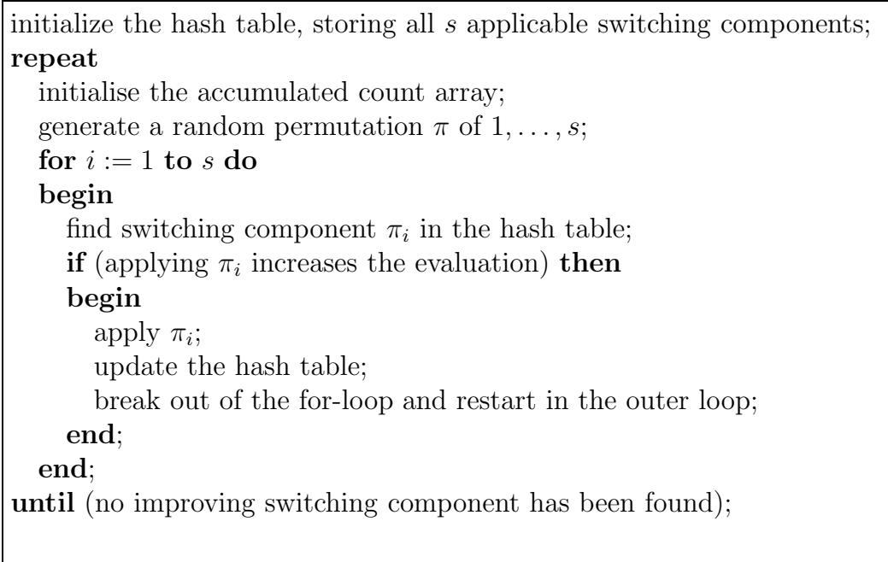  
Figure 8: The hillclimb procedure.

# 3.4 The mutation operator

Besides the crossover operator, our algorithm also uses a mutation operator. This operator “distorts” a region of the image, while still adhering to the prescribed projections. The mutation operator is composed of several algorithmic steps, very similar to the crossover operator. Instead of the crossover mask, a mutation mask $X = ( x _ { i j } ) \in \{ 0 , 1 \} ^ { m \times n }$ is computed. First, a random number $k \in | k _ { m i n } , k _ { m a x } |$ and a random cell $( i , j )$ are selected. We assign $x _ { i j } = 1$ and mark $( i , j )$ as border cell. Subsequently, a similar procedure as in Figure 4 is executed. In this case however, the loop is only executed $k$ times. All cells that are still unassigned after the loop terminates are assigned $0$ in

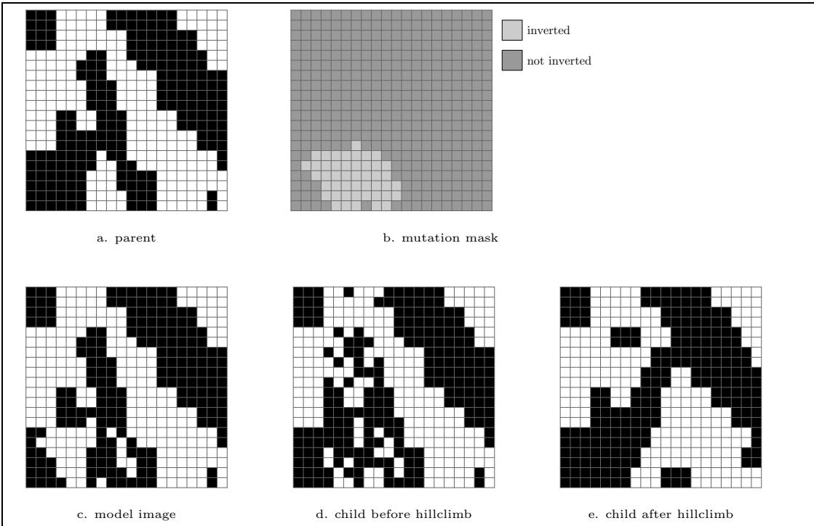  
Figure 9: The mutation operator transforms a parent image into a child image.

the mutation mask.

From the mutation mask $X$ and a parent image $P$ , a model image $M = ( m _ { i j } )$ is computed by assigning $m _ { i j } = p _ { i j }$ if $x _ { i j } = 0$ and assigning $m _ { i j }$ a random value (0 or 1) if $x _ { i j } = 1$ . In other words, the mutation mask determines which part of the parent image will be distorted in the model image.

After the model image has been computed, the same steps are performed as for the crossover operator: Problem 2.6 is solved using the weight mask as $M$ . Subsequently, the hillclimb operator is applied, yielding the child individual. Figure 9 shows the the different steps of the mutation operator. As the figure shows, there may be differences between the child and the parent individual outside the distorted region, as a result of the projection constraints.

# 3.5 Algorithm details

In this section we address several details of our evolutionary algorithm that have not been discussed in the preceding sections.

The initial population is generated by repeatedly solving Problem 2.6, each time using a new random binary matrix as the weight mask $M$ . Although this procedure does not generate all matrices in $A ( R , S )$ with equal probability, it leads to sufficient diversity in the initial population.

The algorithm is designed to work with a variety of evaluation functions. Therefore, using selection operators that use the evaluation value directly, such as roulette wheel selection, is not practical. We use tournament selection, because it is independent of the actual evaluation values (it only depends on their ordering) and because the selective pressure can be adjusted easily, by changing the tournament size.

The probabilities of crossover vs. mutation are adjusted dynamically after each generation. For every generated child image, the algorithm keeps track of the operator that generated it. It also counts the number of children generated by crossover $\left( a _ { c } \right)$ and by mutation $\left( a _ { m } \right)$ . After the new population has been selected, the algorithm counts the number of individuals in the new population that were created by crossover $\left( b _ { c } \right)$ and by mutation $\left( b _ { m } \right)$ . From these numbers the average crossover yield $y _ { c } = b _ { c } / ( a _ { c } + 1 )$ and mutation yield $y _ { m } = b _ { m } / ( a _ { m } + 1 )$ are computed. (We add 1 to the denominator to avoid division by zero). The probability that a child will be generated through crossover in the next generation is set to $y _ { c } / ( y _ { c } + y _ { m } )$ . In this way, the algorithm creates more children by crossover in the generation when the crossover operation in the current generation creates children of high quality. An explicit lower- and upperbound for $y _ { c }$ are used: $0 . 1 < y _ { c } < 0 . 9$ . If the computed value of $y _ { c }$ is outside these bounds, it is adjusted.

According to Section 3.4, the mutation operation randomly selects an integer $k$ in the interval $[ k _ { m i n } , k _ { m a x } ]$ . For all experiments in Section 4 we used $k _ { m i n } = m n / 6 4$ and $k _ { m a x } = 5 \times m n / 6 4$ .

Because the algorithm can be used with many different evaluation functions, it is difficult to design a universal termination condition. For some specific problems, such as the reconstruction from three projections, an upper bound on the evaluation function value is known in advance and the algorithm can terminate as soon as an individual having that evaluation is found. For such problems, having solutions for which optimality can easily be checked, separate termination procedures can be implemented in our system. In general, however, the algorithm terminates when no improvement on the best solution so far has been found in the last 20 generations.

As indicated in Figure 3 the selection procedure selects individuals for the new population from both the old population and the group of new children. Individuals are allowed to be selected more than once for the new population. We performed experiments to find the best values for the population size $\lambda$ and the number of children $\mu$ that is created in each generation. We found that our algorithm performs best when $\lambda > \mu$ , and with a large population. For all the experiments in Section 4 we used $\lambda = 1 0 0 0$ , $\mu = 5 0 0$ and a tournament size of 3.

# 4 Computational results

We have implemented our algorithm in C++, using the gcc compiler. The implementation is fully object oriented. By using inheritance and virtual methods, different evaluation functions can be used without modifying the algorithm code. The evolutionary algorithm uses a base class Individual to represent a member of the population (a single image). For each evaluation function we implemented a derived class, which computes the evaluation function and performs delta updating computations. In this way new evaluation functions can be added with very little extra coding effort and without modifying existing code.

For the implementation of the network flow algorithm we used the MCFClass library [7]. The source code of our algorithm (except the MCF library) is available from the author.

All our experiments were run on a Pentium IV 2800MHz PC with 512Mb of memory. We performed experiments with several evaluation functions. The evaluation functions are very different from each other, in order to demonstrate the versatility of the problem model and the algorithm. The experimental results are intended to demonstrate the feasibility and flexibility of our approach, not to provide extensive results on each of the individual problems that we consider.

# 4.1 Reconstruction of hv-convex images

The first class of test images consists of hv-convex images. Using methods from [13] we generated 10 hv-convex images of size $4 0 \times 4 0$ . Each image consists of three or four hv-convex objects. There are no empty horizontal or vertical lines between the objects. The test images are shown in Figure 10. For this image class, the evaluation function is the total number of neighbouring black pixels (horizontal and vertical). We performed ten test runs for each of the images. Table 1 shows the results. The table shows the number of runs that achieved a perfect reconstruction, the average runtime of the algorithm (in minutes) and the average number of generations after which the best reconstruction was found. When the algorithm did not find a perfect reconstruction, the reconstruction was always very different from the original image. Therefore, we do not report solution quality for those cases.

In the cases that the algorithm did not find the optimal solution, it converged to a local optimum. Figure 11 demonstrates the difficulties involved in this optimisation problem. It shows the second test image, having 155 neighbouring black pixels, and another locally optimal image having the same projections and 175 neighbouring black pixels. The images are very dissimilar, except for the object in the center. This problem is due to the presence of large blocks of switching components.

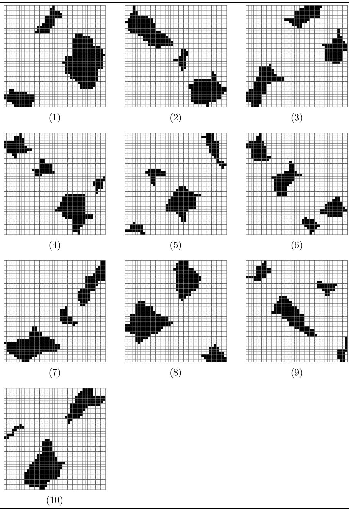  
Figure 10: hv-convex test images

Table 1: Reconstruction results for the set of hv-convex images   

<table><tr><td rowspan=1 colspan=1>image</td><td rowspan=1 colspan=1>1</td><td rowspan=1 colspan=1>2</td><td rowspan=1 colspan=1>3</td><td rowspan=1 colspan=1>4</td><td rowspan=1 colspan=1>5</td><td rowspan=1 colspan=1>6</td><td rowspan=1 colspan=1>7</td><td rowspan=1 colspan=1>8</td><td rowspan=1 colspan=1>9</td><td rowspan=1 colspan=1>10</td></tr><tr><td rowspan=1 colspan=1>#perfect</td><td rowspan=1 colspan=1>9</td><td rowspan=1 colspan=1>5</td><td rowspan=1 colspan=1>8</td><td rowspan=1 colspan=1>8</td><td rowspan=1 colspan=1>9</td><td rowspan=1 colspan=1>6</td><td rowspan=1 colspan=1>6</td><td rowspan=1 colspan=1>6</td><td rowspan=1 colspan=1>6</td><td rowspan=1 colspan=1>9</td></tr><tr><td rowspan=1 colspan=1>avg.time (m)</td><td rowspan=1 colspan=1>25.6</td><td rowspan=1 colspan=1>16.6</td><td rowspan=1 colspan=1>15.5</td><td rowspan=1 colspan=1>8.8</td><td rowspan=1 colspan=1>8.5</td><td rowspan=1 colspan=1>10.8</td><td rowspan=1 colspan=1>17.7</td><td rowspan=1 colspan=1>17.7</td><td rowspan=1 colspan=1>8.8</td><td rowspan=1 colspan=1>15.7</td></tr><tr><td rowspan=1 colspan=1>avg. #gen.</td><td rowspan=1 colspan=1>24.6</td><td rowspan=1 colspan=1>17.3</td><td rowspan=1 colspan=1>18.5</td><td rowspan=1 colspan=1>14.8</td><td rowspan=1 colspan=1>15.8</td><td rowspan=1 colspan=1>18.5</td><td rowspan=1 colspan=1>30.2</td><td rowspan=1 colspan=1>15.0</td><td rowspan=1 colspan=1>21.0</td><td rowspan=1 colspan=1>23.6</td></tr></table>

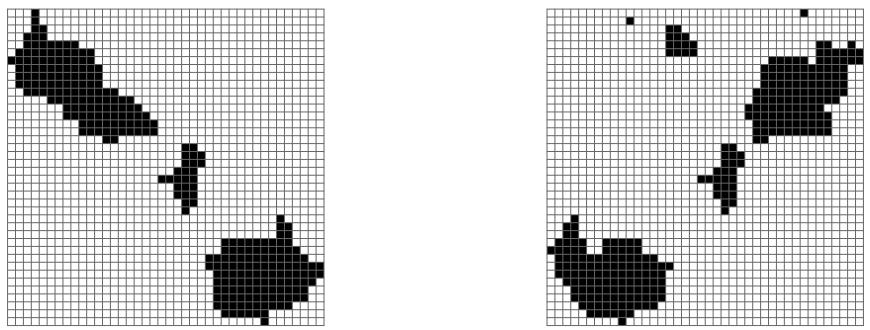  
Figure 11: Two locally optimal images having the same projections, yet being very dissimilar.

# 4.2 Reconstruction from three projections

The second group of test images are phantom images from [6]. These images have been used as test images in several publications ([11], [17]). In this case we reconstruct the images from three projections: horizontal, vertical and diagonal (top left to bottom right). The evaluation function to be maximised is the negated total deviation of the image’s diagonal projection from the prescribed projection (as a sum of absolute values). The three test images and their reconstructions are shown in Figure 12. We performed a single test run for each of the images. The first two images were reconstructed perfectly (the reconstruction was equal to the original image) within 8 seconds. For the third image, however, the algorithm did not find a reconstruction with the given diagonal projection. The resulting reconstruction has a total difference of 4 from the prescribed diagonal projection, and took 30 seconds to compute. The main strength of our algorithm is its flexibility. All test images are completely 4-connected and have no “holes” in them. When we assume this as a priori information, we can incorporate it in the evaluation function.

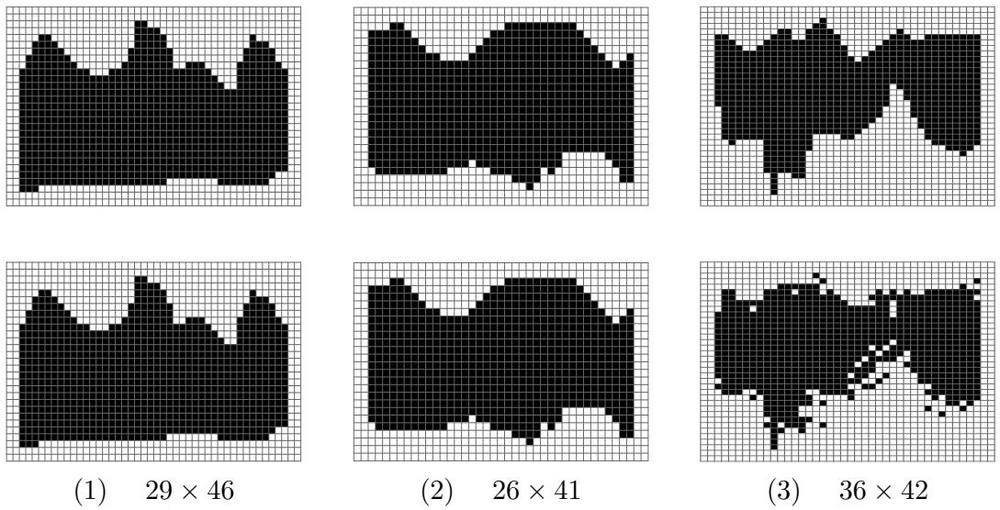  
Figure 12: Three phantom images and their reconstructions.

For an image $A$ , put

$$
f ( A ) = - c \times d ( A ) + b ( A )
$$

where $d ( A )$ denotes the total difference between the diagonal projection of $A$ and the prescribed projection, $b ( A )$ denotes the total number of pairs of neighbouring black pixels in $A$ and $c$ is a large constant. Maximising $f ( A )$ will result in the reconstruction that satisfies the prescribed diagonal projection and has as many neighbouring black pixels as possible. Using this new evaluation function, the algorithm reconstructed the original images perfectly within one minute, even the third image. This experiment shows that reconstructions from three projections can be very accurate if appropriate a priori information is used and that such information can easily be incorporated in our algorithm.

# 4.3 Reconstruction using Gibbs priors

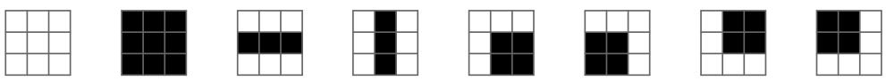  
Figure 13: The eight patterns having a nonzero local energy.

The third evaluation function involves a probability distribution, known as a Gibbs distribution. A method for using Gibbs priors in the reconstruction process was presented in [17]. We use similar definitions. We assume that the original image is a random sample of a certain known probability distribution. Let $\Pi$ be such a probability distribution, on the set $\{ 0 , 1 \} ^ { m \times n }$ , which determines for each matrix the probability that it is sampled. The probability $\Pi ( A )$ of a matrix $A$ is given by

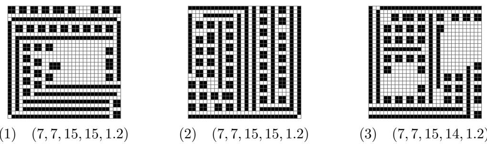  
Figure 14: Three samples from Gibbs distributions.

$$
\Pi ( A ) = { \frac { 1 } { Z } } e ^ { \beta \sum _ { i = 1 } ^ { m } \sum _ { j = 1 } ^ { n } I _ { i j } ( A ) } .
$$

Here, $Z$ is a normalising factor, $\beta$ is a parameter defining the “peakedness” of the distribution and $I _ { i j } ( A )$ is the local energy function of cell $( i , j )$ . The local energy function of a cell is determined by the value of the cell and each of its eight neighbours. Border pixels, which have less than eight neighbours, are treated as if the lacking neighbours are white. Figure 14 shows the eight patterns that have nonzero local energy: homogeneous white and black, horizontal and vertical edges, and four corners. The corresponding local energy values are $k _ { w }$ , $k _ { b }$ , $k _ { e }$ and $k _ { c }$ respectively. We denote a Gibbs distribution by the 5-tuple $( k _ { w } , k _ { b } , k _ { e } , k _ { c } , \beta )$ , which we call the parameters of the distribution. As we know that the original image is a random sample from the given Gibbs distribution, we want to find a reconstruction that has maximal likelihood. We remark that this reconstruction is not guaranteed to be equal to the original image.

Maximising $\Pi ( A )$ is equivalent to maximising $\begin{array} { r } { E ( A ) \ = \ \sum _ { i = 1 } ^ { m } \sum _ { j = 1 } ^ { n } I _ { i j } ( A ) } \end{array}$ since $\Pi ( A )$ is a monotonously increasing function of $E ( A )$ . Computing $E ( A )$ involves only the known five parameters of the distribution and the image $A$ , we do not need to compute $Z$ .

We implemented a Metropolis algorithm, described in [17], for generating random samples from Gibbs distributions. Three such samples of size $3 0 \times 3 0$ and their parameters are shown in Figure 14. The reason that we selected three images, instead of showing results for a large number of images, is that many generated images are not tomographically challenging. For example, many contain several lines that only consist of black or white pixels. The fact that all three images consist of lines and blocks of four pixels is due to the selected patterns in Figure 13. Different patterns lead to other types of images. As our goal here is to illustrate the feasibility of our approach, we only show results for this set of patterns. We performed 10 test runs for each of the three images. Table 2 shows the reconstruction results. For the third image, the algorithm actually found a reconstruction that is slightly different from the original image, but has higher likelihood. We still marked this reconstruction as a perfect reconstruction. The results show clearly that perfect reconstruction from only two projections and a given Gibbs distribution is possible in nontrivial cases.

Table 2: Reconstruction results for the Gibbs samples.   

<table><tr><td rowspan=1 colspan=1>image</td><td rowspan=1 colspan=1>1</td><td rowspan=1 colspan=1>2</td><td rowspan=1 colspan=1>3</td></tr><tr><td rowspan=1 colspan=1>#perfect</td><td rowspan=1 colspan=1>10</td><td rowspan=1 colspan=1>5</td><td rowspan=1 colspan=1>10</td></tr><tr><td rowspan=1 colspan=1>average time(m)</td><td rowspan=1 colspan=1>16.4</td><td rowspan=1 colspan=1>19.5</td><td rowspan=1 colspan=1>14.4</td></tr><tr><td rowspan=1 colspan=1>average #generations</td><td rowspan=1 colspan=1>17.3</td><td rowspan=1 colspan=1>36.8</td><td rowspan=1 colspan=1>20.1</td></tr></table>

# 5 Solving Japanese puzzles

Japanese puzzles are a form of logic drawing: the puzzler gradually makes a drawing on a grid, by means of logical reasoning. They are very popular in the Netherlands nowadays and are sold at every newspaper-stand.

Similar to the two-projection DT problem, the puzzler is provided with information about the horizontal and vertical arrangement of the black pixels along every line. Figure 15 shows an image and its corresponding horizontal and vertical description. For each line, the description indicates the size of the segments of consecutive black pixels, in the order in which they appear on the line.

The problem of solving Japanese puzzles is NP-complete. Several complexity results concerning Japanese puzzles, which are also known as nonograms, were derived in [25].

As summation of the segment sizes of a line yields the total number of black pixels on that line, Japanese puzzles can be considered to be a special form of the DT problem, in which extra a priori information is available. Therefore, it seems natural to consider Japanese puzzles as an instance of Problem 2.3, which was first suggested by Walter Kosters. However, before our algorithm can be applied, a suitable evaluation function has to be defined.

We regard this problem as a minimisation problem. The evaluation function should reflect the deviation of a given image from the horizontal and vertical descriptions. We consider this deviation separately for each (horizontal or vertical) line. We can then obtain an evaluation function for the whole image by summation of the deviations of all lines. The minimal deviation possible, 0, should correspond to a solution of the puzzle.

From this point on, we will refer to the set of given line descriptions as the prescribed description and to the description of an actual image as the description of the image.

A very coarse way to compute the deviation $d _ { s } ( \ell )$ of a given line of pixels $\ell$ from its prescribed description $s$ is given by

$$
d _ { s } ( \ell ) = { \left\{ \begin{array} { l l } { 0 } & { { \mathrm { i f ~ } } \ell { \mathrm { ~ c o r r e s p o n d s ~ t o ~ } } s } \\ { 1 } & { { \mathrm { o t h e r w i s e } } } \end{array} \right. }
$$

The resulting evaluation function does indeed have a minimal value of $0$ , when the image adheres to the prescribed description along all lines. However, the function $d _ { s }$ does not provide much information to the algorithm if $\ell$ deviates from its description. In order for the evolutionary algorithm to be succesful, the evaluation values should lead the algorithm to an optimal solution as gradually as possible.

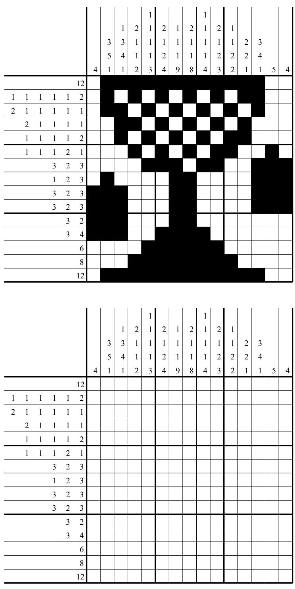  
Figure 15: Top: an image and its line descriptions. Bottom: the corresponding Japanese puzzle.

A different approach is to let $d _ { s }$ be a measure of the difference between $s$ and the actual description of $\ell$ , providing more information to the algorithm than the coarse approach. This brings up several difficulties. It is not easy to see how this difference could be defined exactly. One possibility is to consider joining two adjacent segments, or splitting a segment into two separate segments, as elementary operations and count the minimum number of such operations that can transform one description into another. This method has the disadvantage that two segments that are adjacent in the description may be separated by a large number of white pixels in the actual line. In such a case, the operation of joining segments does not make sense. The value of all pixels on the line is known, so it does not seem to be a good idea to throw away this information and only work with the descriptions.

Ideally, the function $d _ { s }$ should make full use of all information available: the value of the pixels on $\ell$ and the prescribed description $s$ of $\ell$ . Let $( \ell _ { 1 } , \ell _ { 2 } , \ldots , \ell _ { k } )$ be the pixel values of $\ell$ (where $k = n$ if $\ell$ is horizontal, $k = m$ if $\ell$ is vertical). We call the operation of changing the value of one pixel of $\ell$ a bitflip operation. We now define $d _ { s } ( \ell )$ to be the minimal number of bitflip operations that are required to make $\ell$ conform to $s$ .

This definition of $d _ { s }$ has several advantages. Firstly, it is a very intuitive way of defining the “distance” between a given line of pixels and its prescribed description and it uses all available information. If a line $\ell$ adheres to its description $s$ , we have $d _ { s } ( \ell ) = 0$ , as desired.

Secondly, $d _ { s }$ has the property that performing a single bitflip operation on $\ell$ , yielding a line $\ell ^ { \prime }$ , can change the value of $d _ { s }$ by no more than 1. For example, if $d _ { s } ( \ell ^ { \prime } ) > d _ { s } ( \ell ) + 1$ there is a contradiction, because repeating the bitflip operation on $\ell ^ { \prime }$ (yielding $\ell$ ) and subsequently applying bitflips on $\ell$ so that it conforms to $s$ only takes $d _ { s } ( \ell ) + 1$ bitflip operations. In a discrete sense, $d _ { s }$ can be regarded as a continuous function of $\ell$ .

Surprisingly, $d _ { s } ( \ell )$ can be computed quite efficiently by means of dynamic programming. Suppose that the prescribed description $s$ of $\ell$ consists of $h$ segments of black pixels, $\left( s _ { 1 } , \ldots , s _ { h } \right)$ . Without loss of generality, we may assume that $\ell$ starts and ends with a white pixel: adding white pixels at the beginning or end of a line does not change its description.

We define a line segmentation $\hat { \ell } = ( \hat { \ell } _ { 1 } , \dots , \hat { \ell } _ { 2 h + 1 } )$ , corresponding to the number $h$ of black segments in $s$ :

$$
\hat { \ell } _ { i } = \left\{ \begin{array} { l l } { 0 } & { ( \mathrm { w h i t e } ) \quad \mathrm { i f ~ } i \mathrm { ~ i s ~ o d d } } \\ { 1 } & { ( \mathrm { b l a c k } ) \quad \mathrm { i f ~ } i \mathrm { ~ i s ~ e v e n } } \end{array} \right.
$$

The entries of the line segmentation correspond to the alternating black and white segments in the description (where we consider the white segments to be implicitly present). Figure 16 shows a line description $s$ , its corresponding line segmentation $\hat { \ell }$ and a realisation of $s$ , which is a line $\ell$ that adheres to $s$ . The arrows indicate for each pixel of $\ell$ to which entry of $\hat { \ell }$ it corresponds. If pixel $i$ corresponds to entry $j$ of $\hat { \ell }$ , we say that pixel $i$ is linked to entry $j$ of the line segmentation. We call the corresponding mapping $L : \{ \ell _ { 1 } , \dots , \ell _ { k } \} \longrightarrow$ $\{ \hat { \ell } _ { 1 } , \dots , \hat { \ell } _ { 2 s + 1 } \}$ a link mapping.

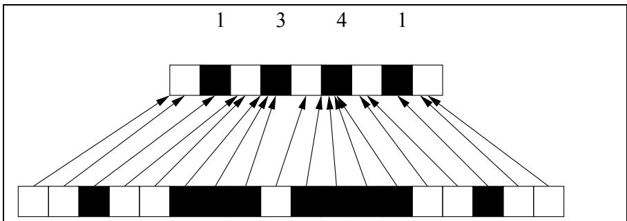  
Figure 16: A line description (top), the corresponding line segmentation (middle), and an actual line that adheres to the description (bottom). The arrows indicate the links between the line and the segmentation.

If $\ell$ does not correspond to $s$ , we can also link every pixel $i$ consecutively to an entry $j$ of $\hat { \ell }$ . In that case, however, there are pixels in $\ell$ that do not match the colour of the entries of $\hat { \ell }$ to which they are linked. A bitflip operation will have to be applied to these pixels in order to make $\ell$ conform to $\hat { \ell }$ , with the given links.

Valid link mappings must satisfy several requirements: consecutive pixels should be linked either to the same entry of $\hat { \ell }$ or to consecutive entries of $\hat { \ell }$ . The number of pixels linked to each black entry $\hat { \ell } _ { j }$ must be $s _ { j / 2 }$ . There must be at least one pixel linked to each white entry of $\hat { \ell }$ .

A valid partial link mapping from $( \ell _ { 1 } , \ldots , \ell _ { i } )$ to $( \hat { \ell } _ { 1 } , \dots , \hat { \ell } _ { j } )$ satisfies the same requirements as a total valid link mapping. In addition, if pixel $i$ is linked to a black entry $\hat { \ell } _ { j }$ , the pixels $( \ell _ { i - s _ { j / 2 } + 1 } , \ldots , \ell _ { i - 1 } )$ should also be linked to entry $j$ .

We now introduce the function $\delta : ( 1 , \ldots , k ) \times ( 1 , \ldots , 2 h + 1 )  \mathbb { N }$ . The function value $\delta ( i , j )$ is the minimal number of bitflip operations, over all valid partial link mappings from $( \ell _ { 1 } , \ldots , \ell _ { i } )$ to $( \hat { \ell } _ { 1 } , \dots , \hat { \ell } _ { j } )$ , that has to be applied to $\ell$ in order to make it conform to the partial link mapping (so that all pixels have the same colours as the entries to which they are linked). We remark that $\delta ( k , 2 h + 1 )$ is the minimal number of bitflip operations that is required to transform $\ell$ into a line that adheres to $s$ .

The function $\delta$ can be represented by a table. For computing the entries of the table we use two recursive relationships. Let $b ( i _ { 1 } , i _ { 2 } )$ be the total number of black pixels in $( \ell _ { i _ { 1 } } , \ldots , \ell _ { i _ { 2 } } )$ , where $i _ { 1 } ~ < ~ i _ { 2 }$ . Suppose that we want to compute $\delta ( i , j )$ . If $j$ is even, then entry $j$ of $\hat { \ell }$ is black and it corresponds to segment $s _ { j / 2 }$ of $s$ . We have

$$
\delta ( i , j ) = \left( s _ { j / 2 } - b ( i - s _ { j / 2 } + 1 , i ) \right) + \delta ( i - s _ { j / 2 } , j - 1 )
$$

if we assume that all indexes in this relation are greater than 0. In order for a partial link mapping from $( \ell _ { 1 } , \ldots , \ell _ { i } )$ to $( \hat { \ell } _ { 1 } , \dots , \hat { \ell } _ { j } )$ to be valid, the pixels $( \ell _ { i - s _ { j / 2 } + 1 } , \ldots , \ell _ { i - 1 } )$ should all be linked to entry $j$ of $\hat { \ell }$ . Then pixel $i - s _ { j / 2 }$ must be linked to the white entry $\hat { \ell } _ { j - 1 }$ . The first term on the right side of the equation indicates the number of white pixels that should be black (and all have to be flipped), the second term is the minimal number of bitflip operations that is required to transform the rest of the pixels in the proper way. If one or more of the indexes in the equation are less than 1, or the $\delta$ -term on the right is undefined because the transformation is not possible, then $\delta ( i , j )$ is also undefined (and we set $\delta ( i , j ) = \infty$ ).

If $j$ is odd, then $\hat { \ell } _ { j }$ is white and it either corresponds to the segment of white pixels between the segments $\mathcal { S } ( j - 1 ) / 2$ and $\boldsymbol { s } _ { ( j + 1 ) / 2 }$ of black pixels, or is at the beginning or end of the line. In order for a partial link mapping from $( \ell _ { 1 } , \ldots , \ell _ { i } )$ to $( \hat { \ell } _ { 1 } , \dots , \hat { \ell } _ { j } )$ to be valid, pixel $i - 1$ must either be linked to entry $j - 1$ (corresponding to a black segment), or it must be linked to the same white segment as pixel $i$ . The first option requires a minimum of

$$
c _ { b } = \ell _ { i } + \delta { ( i - 1 , j - 1 ) }
$$

bitflip operations, the second options requires a minimum of

$$
c _ { w } = \ell _ { i } + \delta ( i - 1 , j )
$$

operations. The term $\ell _ { i }$ will be 0 if pixel $i$ is white and 1 if pixel $i$ is black (and has to be flipped). We now have

$$
\delta ( i , j ) = m i n ( c _ { b } , c _ { w } ) .
$$

Once again, there may be terms that are undefined in the equations. If any of the indexes of $\delta ( i , j )$ is less than 1, we set $\delta ( i , j ) = \infty$ , indicating that the corresponding transformation is not possible.

Using these recursive relationships we can compute the table representation of $\delta$ by using two nested loops. The outer loop iterates over all pixels of $\ell$ , the inner loop iterates over all entries of $\hat { \ell }$ . Using this order, the values of $\delta$ that are required at any step will be available at that step. Figure 17 shows the resulting table for a certain prescribed description $s$ and line $\ell$ . Entries containing the symbol “x” correspond to impossible transformations.

prescribed description

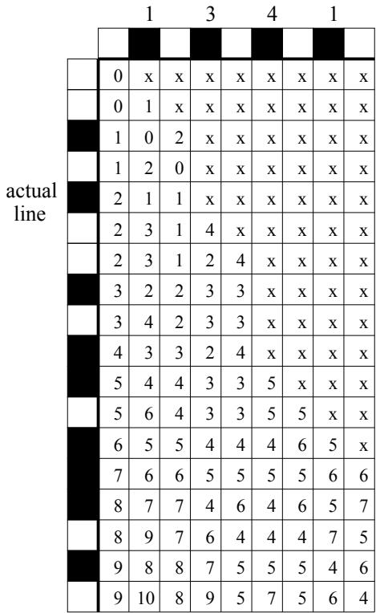  
Figure 17: The table representation of $\delta$ .

As we remarked before, the value $\delta ( k , 2 h + 1 )$ is the minimal number of bitflip operations that is required to transform $\ell$ into a line that adheres to the prescribed description, so we can directly use it as the evaluation function for our algorithm. We remark that using the tabular representation of $\delta$ , $\delta ( k , 2 h + 1 )$ can be computed in $O ( k h )$ operations. The time required for this computation is much longer than for the other problem types that we considered.

We implemented the evaluation function and performed several test runs. Figure 18 shows the test images that we used. The first two examples, of size $2 5 \times 2 5$ , are from the Dutch “Puzzelsport” series and are known to have a unique solution. We performed one test run for each image. The first image was reconstructed perfectly in 80 minutes after 15 generations of the algorithm. The second image proved to be much harder: the algorithm converged to a local optimum. The resulting reconstruction is shown in Figure 19. Note that the reconstruction is quite different from the original image, yet it adheres to nearly all line descriptions.

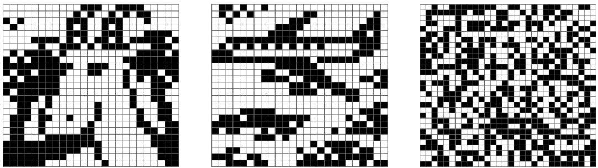  
Figure 18: Test images for the Japanese puzzle variant of the algorithm.

Surprisingly, the third test image, a random $3 0 \times 3 0$ image (50% black), was reconstructed perfectly in about 12 hours. Although the reconstruction process took a long time to complete, this is still a very positive result, since random images are very hard to reconstruct using only logic reasoning. Branching seems inevitable for that type of image.

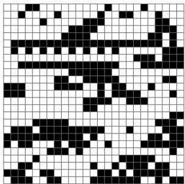  
Figure 19: Reconstruction result for the second test image.

# 6 Conclusions

We have designed a new algorithm for finding a binary image that satisfies prescribed horizontal and vertical projections and has an optimal or nearoptimal evaluation function value. Our experimental results demonstrate that the algorithm is effective for several different evaluation functions, corresponding to diverse reconstruction problems.

As demonstrated by the results in Section 4.2, a main feature of our approach is its ability to encorporate various forms of a priori information in the evaluation function.

The idea of using our algorithm to solve Japanese puzzles was suggested after the main algorithm was implemented. Yet, the implementation could be extended for this case without any difficulties.

The bottleneck of the runtime is the hillclimb operator. Because our hillclimb procedure involves keeping track of all applicable switching components, our algorithm is limited to images of size $5 0 \times 5 0$ or less. Perhaps making the hillclimb operation less exhaustive could result in improved time complexity of the operation.

In our experiments we often observed that only finding the global optimum of the evaluation function was sufficient to find an image that resembled the unknown original image. Near-optimal solutions were usually very different. In order to increase the stability of the search procedure, it is necessary to incorporate as much information as possible in the evalution function, in order to provide proper gradients throughout the search space.

The various reconstruction results show that when sufficient information is incorporated, our algorithm is capable of finding accurate reconstructions.

# 7 Acknowledgments

The author would like to thank Walter Kosters and Hendrik Jan Hoogeboom for supervising this research project and providing valuable comments and suggestions. Our algorithm makes extensive use of the MCF library. The author would like to thank Antonio Frangioni and his coworkers for developing this library and making it available. The author is also grateful to Robert Tijdeman and Herman te Riele, for allowing part of the research to happen during working hours.

# Список литературы

[1] E. Aarts and J. Korst. Simulated Annealing and Boltzmann Machines: A Stochastic Approach to Combinatorial Optimization and Neural Computing. Wiley, 1996.   
[2] E. Barcucci, A. Del Lungo, M. Nivat, and R. Pinzani. Reconstructing convex polyominoes from horizontal and vertical projections. Theoretical Computer Science, 155:321–347, 1996.   
[3] S. Brunetti, A. Del Lungo, F. Del Ristoro, A. Kuba, and M. Nivat. Reconstruction of 4- and 8-connected convex discrete sets from row and column projections. Linear Algebra and its Applications, 339:37–57, 2001.   
[4] D. Corne, M. Dorigo, and F. Glover. New ideas in optimisation. McGraw-Hill Education, 1999.   
[5] G. Dahl and T. Flatberg. Optimization and reconstruction of hv-convex (0,1)-matrices. In A. Del Lungo, V. Di Gesu, \` and A. Kuba, editors, Electronic Notes in Discrete Mathematics, volume 12. Elsevier, 2003.   
[6] P. Fishburn, P. Schwander, L. Shepp, and R. Vanderbei. The discrete Radon transform and its approximate inversion via linear programming. Discrete Applied Mathematics, 75:39–61, 1997.   
[7] A. Frangioni, C. Gentile, and D. Bertsekas. The MCFClass Project, RelaxIV Solver. www.di.unipi.it/di/groups/optimize/Software/MCF. html, 2003.   
[8] D. Gale. A theorem on flows in networks. Pacific Journal of Mathematics, 7:1073–1082, 1957.   
[9] R.J. Gardner, P. Gritzmann, and D. Prangenberg. On the computational complexity of reconstructing lattice sets from their X-rays. Discrete Mathematics, 202:45–71, 1999.   
[10] F. Glover and M. Laguna. Tabu Search. Kluwer Academic Publishers, 1998.   
[11] L. Hajdu and R. Tijdeman. An algorithm for discrete tomography. Linear Algebra and its Applications, 339:147–169, 2001.   
[12] G.T. Herman and A. Kuba, editors. Discrete Tomography: Foundations, Algorithms and Applications. Birkh¨auser, Boston, 1999.   
[13] W. Hochst¨attler, M. Loebl, and C. Moll. Generating convex polyominoes at random. Discrete Mathematics, 153:165–176, 1996.   
[14] C. Kisielowski, P. Schwander, F. Baumann, M. Seibt, Y. Kim, and A. Ourmazd. An approach to quantitative high-resolution transmission electron microscopy of crystalline materials. Ultramicroscopy, 58:131– 155, 1995.   
[15] A. Kuba and G.T. Herman. Discrete tomography: A historical overview. Chapter 1 of [12], pages 3–34, 1999.   
[16] A. Del Lungo and M. Nivat. Reconstruction of connected sets from two projections. Chapter 7 of [12], pages 163–188, 1999.   
[17] S. Matej, A. Vardi, G.T. Herman, and E. Vardi. Binary tomography using gibbs priors. Chapter 8 of [12], pages 191–212, 1999.   
[18] Z. Michalewicz. Genetic Algorithms $^ +$ Data Structures = Evolution Programs; 3rd Revision edition. Springer Verlag, 1996.   
[19] D.G.W. Onnasch and G.P.M. Prause. Heart chamber reconstruction from biplane angiography. Chapter 17 of [12], pages 385–401, 1999.   
[20] H.J. Ryser. Combinatorial properties of matrices of zeros and ones. Canadian Journal of Mathematics, 9:371–377, 1957.   
[21] H.J. Ryser. Combinatorial Mathematics. The Carus Mathematical Monographs no. 14, Chapter 6. AMS, 1963.   
[22] P. Schwander, C. Kisielowski, F. Baumann, Y. Kim, and A. Ourmazd. Mapping projected potential, interfacial roughness, and composition in general crystalline solids by quantitative transmission electron microscopy. Physical Review Letters, 71:4150–4153, 1993.   
[23] C.H. Slump and J.J. Gerbrands. A network flow approach to reconstruction of the left ventricle from two projections. Computer Graphics and Image Processing, 18:18–36, 1982.   
[24] Th.B¨ack, D.B. Fogel, and T. Michalewicz, editors. Evolutionary Computation 1. Institute of Physics Publishing, Bristol and Philadelphia, 2000.   
[25] N. Ueda and T. Nagao. NP-completeness results for nonogram via parsimonious reductions. Technical Report TR96-0008, Department of Computer Science, Tokyo Institute of Technology, 1996.   
[26] B. Wang and F. Zhang. On the precise number of $( 0 , 1 )$ -matrices in ${ \mathcal { A } } ( R , S )$ . Discrete Mathematics, 187:211–220, 1998.