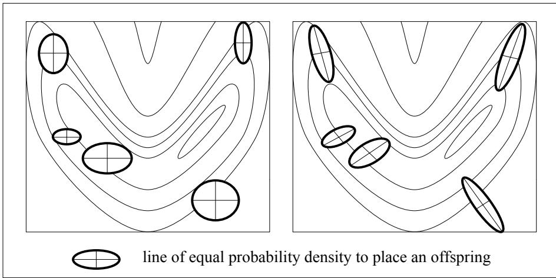

# A Survey of Evolution Strategies

# Frank Hoffmeister†

University of Dortmund Department of Computer Science XI P.O. Box 50 05 00 · D-4600 Dortmund 50 · Germany

# Abstract

Similar to Genetic Algorithms, Evolution Strategies (ESs) are algorithms which imitate the principles of natural evolution as a method to solve parameter optimization problems. The development of Evolution Strategies from the first mutation-selection scheme to the refined $( \mu , \lambda ) { \mathrm { - E S } }$ including the general concept of self-adaptation of the strategy parameters for the mutation variances as well as their covariances are described.

# 1 Introduction

The idea to use principles of organic evolution processes as rules for optimum seeking procedures emerged independently on both sides of the Atlantic ocean more than two decades ago. Both approaches rely upon imitating the collective learning paradigm of natural populations, based upon Darwin's observations and the modern synthetic theory of evolution.

In the USA Holland introduced Genetic Algorithms in the 60ies, embedded into the general framework of adaptation [Hol75]. He also mentioned the applicability to parameter optimization which was first realized in the work of De Jong [Jon75].

This article focuses on the German development called Evolution Strategies (ESs), introduced by Rechenberg at Berlin in the 60ies as well [Rec73], and further developed by Schwefel [Sch75b]. ESs were applied first to experimental optimization problems with more or less continuously changeable parameters only. The first numerical applications were performed by Hartmann [Har74] and Höfler [Höf76], and a first attempt towards extending this strategy in order to solve discrete or even binary parameter optimization problems was made by Schwefel [Sch75a].

The aim of this paper is to give an overview of the development of ESs, beginning with the first simple mutation-selection mechanism with two individuals per generation only and stopping at the $( \mu , \lambda ) { \mathrm { - E S } }$ as used nowadays on single processor computers. The important idea of the on-line adaptation of the strategy parameters during the search process by incorporating them into the genetic representation of the individuals is also explained.

First a short introduction to the basic terminology concerning the parameter optimization problem is given. The overall goal of a parameter optimization problem $f : M \subseteq \bar { \mathbb { R } ^ { n } } \to \mathbb { R }$ , $M \neq \emptyset$ , where $f$ is called the objective function, is to find a vector $x ^ { * } \in M$ such that:

$$
\forall x \in M \ : \ f ( x ) \geq f ( x ^ { * } ) = f ^ { * }
$$

where $f ^ { * }$ is called a global minimum; $x ^ { * }$ is the minimum location (point or set).

$$
M = \{ x \in \mathbb { R } ^ { n } \mid g _ { j } ( x ) \geq 0 \forall j \in \{ 1 , . . . , q \} \}
$$

is the set of feasible points for a problem with inequality constraints $g _ { j } : \mathbb { R } ^ { n }  \mathbb { R }$ . For an unconstrained problem $M = \mathbb { R } ^ { n }$ .

Since $\operatorname* { m a x } \{ f ( x ) \} = - \operatorname* { m i n } \{ - f ( x ) \}$ , the restriction to minimization is without loss of generality. In the following a minimization problem is assumed. In general the optimization task is complicated by the existence of non-linear objective functions with multiple local optima. A local minimum ${ \hat { f } } = f ( { \hat { x } } )$ is defined by the condition (3).

$$
\exists \epsilon > 0 \forall x \in M \ : \ \| x - { \hat { x } } \| < \epsilon \Rightarrow { \hat { f } } \leq f ( x )
$$

Even if there is only one local optimum, it may be difficult to find a path towards it in case of discontinuities of the objective function or its derivatives. Simplification, e.g. linearization, may help to make things easier, but it can lead to results which are far away from the true optimum.

# 2 The Two Membered ES

According to Rechenberg [Rec73], the first efforts towards an evolution strategy took place in 1964 at the Technical University of Berlin (TUB). Then, the idea to imitate principles of organic evolution was applied in the field of experimental parameter optimization. The applications dealt with hydrodynamical problems like shape optimization of a bended pipe and of a flashing nozzle, or with control problems like the optimization of a PID regulator within a highly nonlinear system. Besides of simulating different versions of the strategy on the first available digital computer at the TUB, a Zuse Z23 [Sch65], computers soon were also used to solve numerical optimization problems by means of the first versions of simple ESs [Har74, Höf76].

The algorithm used in these applications was a simple mutation-selection scheme called two membered ES. It is based upon a "population" consisting of one parent individual (a real-valued vector), and one descendant, created by means of adding normally distributed random numbers. The better of both individuals then serves as the ancestor of the following iteration/generation. Such a $( 1 { + } 1 ) { - } \mathrm { E S }$ can be described as the following 8-tuple:

$$
( 1 + 1 ) \mathrm { - } \mathrm { E S } = \left( P ^ { 0 } , m , s , c _ { d } , c _ { i } , f , g , t \right)
$$

where

$$
\begin{array} { l c l l } { { P ^ { 0 } } } & { { = } } & { { ( x ^ { 0 } , \sigma ^ { 0 } ) \in I \quad } } & { { \mathrm { p o p u l a t i o n } } } \\ { { } } & { { } } & { { } } & { { I = \mathbf { R } ^ { n } \times \mathbf { R } ^ { n } } } \\ { { m \hfill } } & { { : } } & { { I  I \quad } } & { { \mathrm { m u t a t i o n ~ o p e r a t o r } } } \\ { { s \hfill } } & { { : } } & { { I \times I  I \quad } } & { { \mathrm { s e l e c t i o n ~ o p e r a t o r } } } \\ { { c _ { d } , c _ { i } } } & { { \in } } & { { \mathbb { R } \hfill } } & { { \mathrm { s t e p - s i z e ~ c o n t r o l } } } \\ { { f \hfill } } & { { : } } & { { \mathbb { R } ^ { n }  \mathbb { R } \hfill } } & { { \mathrm { o b j e c t i v e ~ f u n c t i o n } } } \\ { { g _ { j } } } & { { : } } & { { \mathbb { R } ^ { n }  \mathbb { R } \hfill } } & { { \mathrm { c o n s t r a i n t ~ f u n c t i o n } } } \\ { { } } & { { } } & { { } } &  { \} } & { { \hfill j \in \{ 1 , ~ . . . , q \} } } \\ { { t \hfill } } & { { : } } & { { I \times I  \{ 0 , 1 \} } } & { { \mathrm { t e r m i n a t i o n ~ c r i t e r i s } } } \end{array}
$$

$P ^ { 0 }$ denotes the initial "population" consisting of a single parent which produces by means of mutation a single offspring resulting in

determines the fitter individual to become the parent of the next "generation":

$$
P ^ { t + 1 } = s ( P ^ { \prime t } ) = \left\{ { \begin{array} { l } { a _ { 2 } ^ { \prime } { \mathrm { ~ i f ~ } } \left\{ { \begin{array} { l } { f ( x ^ { \prime t } ) \leq f ( x ^ { t } ) \land } \\ { g _ { j } ( x ^ { \prime t } ) \geq 0 } \\ { \forall j \in \{ 1 , \dots , q \} } \end{array} } \right. } \\ { a _ { 1 } ^ { \prime t } = P ^ { t } { \mathrm { ~ e l s e } } } \end{array} } \right.
$$

in case of minimization. The iteration process $P ^ { t } $ $P ^ { t + 1 }$ stops when the termination criterion $t ( a _ { 1 } ^ { \prime } , a _ { 2 } ^ { \prime \ell } ) =$ 1 holds. Function $t$ depends on the implementation and may utilize elapsed CPU time, elapsed number of generations, absolute or relative progress per generation, etc.

In the description presented so far the standard deviations $\sigma ^ { t } \in { \bar { \mathbb { R } } } ^ { n }$ remain constant over time. For theoretical considerations all components of $\sigma ^ { t }$ are identical, i.e. $\forall i , j \in \{ 1 , . . . , n \} : \sigma _ { i } ^ { t } = \sigma _ { j } ^ { t } = : \sigma$ For a $( 1 + 1 ) { - } \mathrm { E S }$ and a regular optimization problem a convergence property can be shown (see [Bor78]). The regularity of the optimization problem is specified by the criteria given in definition 1.

# Definition 1

The optimization problem (1) is called regular, iff the following conditions are satisfied:

1. $f$ is continuous.   
2. $M$ is a closed set.   
$3 . \ \forall \tilde { x } \in M \quad : \tilde { M } : = \{ x \in M \mid f ( x ) \leq f ( \tilde { x } ) \}$ is a closed set.   
$4 . \ \forall \epsilon > 0 \quad : \quad L _ { f ^ { * } + \epsilon } ^ { 0 } : = \mathrm { i n t } \left( L _ { f ^ { * } + \epsilon } \right) \neq \varnothing$ where int denotes the set of all internal points and $L _ { f ^ { * } + \epsilon } : =$ $\{ x \in M \mid f ( x ) \leq f ^ { * } + \epsilon \}$ is a level set of $f$ .

Then the global convergence of the $( 1 + 1 ) { \mathrm { - E S } }$ can be shown:

Theorem 1

For $\sigma > 0$ and a regular optimization problem (1) with $f ^ { * } > - \infty$

$$
\begin{array} { l c l } { { P ^ { \prime } { } ^ { \ell } } } & { { = } } & { { \left( a _ { 1 } ^ { \prime } , a _ { 2 } ^ { \prime } \right) \in I \times I } } \\ { { a _ { 1 } ^ { \prime } } } & { { = } } & { { P ^ { t } = \left( x ^ { t } , \sigma ^ { t } \right) } } \\ { { a _ { 2 } ^ { \prime } } } & { { = } } & { { m ( P ^ { t } ) = \left( x ^ { \prime t } , \sigma ^ { t } \right) } } \end{array}
$$

The mutation operator is applied to all components of the object parameter $x ^ { t }$ . According to the biological observation that offspring are similar to their parents and that smaller changes occur more often than larger ones, mutation is realized by normally distributed random numbers:

$$
x ^ { \prime t } = x ^ { t } + \mathbf { N _ { 0 } } ( \sigma ^ { t } )
$$

where ${ \bf { N } } _ { 0 }$ denotes a vector of independent Gaussian random numbers with zero mean and standard deviations $\boldsymbol { \sigma } _ { i } ^ { t }$ $( i = 1 , \ldots , n )$ . The selection operator then

$$
p \left\{ \operatorname* { l i m } _ { t \to \infty } f ( x ^ { t } ) = f ^ { * } \right\} = 1
$$

holds, i.e. the global optimum is found with probability 1 for sufficiently long search times.

The longish proof is omitted here; it can be found in [Bor78]. The basic idea is to use the monotone sequence $f ( x ^ { 0 } ) \geq f ( x ^ { 1 } ) \geq . . . \geq f ( x ^ { i } ) \geq . . . \geq$ of objective function values generated by the process. Then, for the limit value $\begin{array} { r } { f ^ { * } \le \bar { f } = \operatorname* { l i m } _ { t \to \infty } \bar { f } ( x ^ { t } ) } \end{array}$ under the assumption $\tilde { f } > f ^ { * }$ a contradiction emerges, such that $\tilde { f } = f ^ { * }$ must be valid.

As is well known from similar theorems for Simulated Annealing [AK89] and Genetic Algorithms [EAH91], such results are not of much practical relevance due to the unlimited time condition. In fact, we are interested in the expectation of the convergence rate $\varphi$ , which is given by the quotient of the distance covered towards the optimum and the number of trials needed for this distance.

Rechenberg calculated the convergence rates for the model functions

$$
\begin{array} { l l l } { f _ { 1 } ( x ) } & { = } & { \operatorname { F } ( x _ { 1 } ) = c _ { 0 } + c _ { 1 } x _ { 1 } } \\ & & { \forall i \in \{ 2 , . . . , n \} : \displaystyle - b / 2 \leq x _ { i } \leq b / 2 } \\ { f _ { 2 } ( x ) } & { = } & { \displaystyle \sum _ { i = 1 } ^ { n } x _ { i } ^ { 2 } } \end{array}
$$

where $x = ( x _ { 1 } , \ldots , x _ { n } ) ^ { \mathrm { T } } \in \mathbb { R } ^ { n }$ . $f _ { 1 }$ is called the corridor model and represents a simple linear function with inequality constraints. Improvement of this objective function is only accomplished by moving along the first axis of the search space inside a corridor of width $b$ . $f _ { 2 }$ is called the sphere model. It comprises the simplest kind of non-linear, unimodal function. For these model functions the expectations of the rates of convergence are [Rec73]

$$
\begin{array} { r c l } { \varphi _ { 1 } } & { = } & { \displaystyle \frac { \sigma } { \sqrt { 2 \pi } } \left( 1 - \sqrt { \frac { 2 } { \pi } } \frac { \sigma } { b } \right) ^ { n - 1 } } \\ & & { \mathrm { f o r } \ n \gg 1 } \\ { \varphi _ { 2 } } & { = } & { \displaystyle \frac { \sigma } { \sqrt { 2 \pi } } \left( \exp \left( - \left( \frac { n \sigma } { \sqrt { 8 } r } \right) ^ { 2 } \right) \right) } \\ & & { - } & { \displaystyle \frac { \sigma } { \sqrt { 2 \pi } } \left( \sqrt { \pi } \frac { n \sigma } { \sqrt { 8 } r } \left( 1 - \mathrm { e r f } \left( \frac { n \sigma } { \sqrt { 8 } r } \right) \right) \right) } \\ & & { \mathrm { f o r } \ n \gg 1 } \end{array}
$$

where $\operatorname { e r f } ( x )$ refers to the well-known error function. The rate of convergence for the sphere model depends on the current location within the search space where $r$ denotes the current euclidean distance from the optimum. From (9) it is possible to determine the optimum standard deviations $\sigma _ { i } ^ { \mathrm { { o p t } } } ~ ( i = 1 , 2 )$ according to $\left. \frac { \mathrm { d } _ { \varphi _ { i } } } { \mathrm { d } _ { \sigma _ { i } } } \right| _ { \sigma _ { i } ^ { \circ } \mathrm { P } ^ { \dagger } ; \varphi _ { i } ^ { \mathrm { m a x } } } = 0 :$

$$
\begin{array} { l c l c } { { \sigma _ { 1 } ^ { \mathrm { o p t } } } } & { { = } } & { { \displaystyle { \sqrt { \frac { \pi } { 2 } } } \cdot { \frac { b } { n } } } } & { { ; \quad \varphi _ { 1 } ^ { \mathrm { m a x } } = { \frac { 1 } { 2 e } } \cdot { \frac { b } { n } } } } \\ { { \sigma _ { 2 } ^ { \mathrm { o p t } } } } & { { \approx } } & { { \displaystyle 1 . 2 2 4 \cdot { \frac { r } { n } } } } & { { ; \quad \varphi _ { 2 } ^ { \mathrm { m a x } } \approx 0 . 2 0 2 5 \cdot { \frac { r } { n } } } } \end{array}
$$

It should be noted, that in both cases the step size $\boldsymbol { \sigma } _ { i } ^ { \mathrm { { o p t } } }$ is inversely proportional to the number of object variables $n$ . Hence, the maximum rate of convergence is also inversely proportional to $n$ .

The optimum standard deviations can be combined with the probabilities for a successful mutation:

$$
\begin{array} { r c l } { { p _ { 1 } ^ { t } } } & { { = } } & { { \displaystyle \frac { 1 } { 2 } \left( 1 - \sqrt { \frac { 2 } { \pi } } \frac { \sigma } { b } \right) ^ { n - 1 } \quad \mathrm { f o r } n \gg 1 } } \\ { { } } & { { } } & { { } } \\ { { p _ { 2 } ^ { t } } } & { { = } } & { { \displaystyle \frac { 1 } { 2 } \left( 1 - \mathrm { e r f } \left( \frac { n \sigma } { \sqrt { 8 } r } \right) \right) \quad \mathrm { f o r } n \gg 1 } } \end{array}
$$

For optimum step sizes these probabilities turn to the values pop $p _ { 1 } ^ { \mathrm { o p t } } = 1 / ( 2 e ) \approx 0 . 1 8 4$ and $p _ { 2 } ^ { \mathrm { o p t } } \approx 0 . 2 7 0$ From these findings Rechenberg postulated his $I / 5$ success rule:

The ratio of successful mutations to all mutations should be 1/5. If it is greater than $I / 5$ . increase the variance; if it is less, decrease the mutation variance.

Though, in general, problems of interest may have characteristics different from those of the model functions used above, the following heuristic often helps to dynamically adjust the $\sigma ^ { t }$ not individually, but all at the same time, only. Hence, the mutation operator $m$ is extended by the following equation:

$$
\begin{array} { r l r } { \sigma ^ { t + n } } & { = } & { \left\{ \begin{array} { l l } { c _ { d } \cdot \sigma ^ { t } \quad } & { , \ \mathrm { i f } \ p _ { s } ^ { t } < 1 / 5 } \\ { c _ { i } \cdot \sigma ^ { t } \quad } & { , \ \mathrm { i f } \ p _ { s } ^ { t } > 1 / 5 } \\ { \sigma ^ { t } \quad } & { , \ \mathrm { i f } \ p _ { s } ^ { t } = 1 / 5 } \end{array} \right. } \end{array}
$$

where $p _ { s } ^ { t }$ is the frequency of successful mutations, measured e.g. over intervals of $1 0 n$ trials. Schwefel [Sch81] gives reasons to use the factors $c _ { d } = 0 . 8 2$ and $c _ { i } ~ = ~ \bar { 1 } / 0 . 8 2$ for the adjustment, which should take place every $n$ mutations. It should be noted that with (6) and (12) the operator $m$ consists of a random and a deterministic component, now.

As explained in [Sch81] the $1 / 5$ success rule is a measure to increase the efficiency at the cost of effectiveness or robustness. It may lead the $( 1 { + } 1 ) { \mathrm { - E S } }$ to premature termination even in the case of unimodal functions if there are discontinuities or active restrictions.

# 3 The First Multimembered ES

So far the population principle has not really been used. The $( 1 { + } 1 ) { \mathrm { - E S } }$ can be designated as a kind of probabilistic gradient search technique - not, however, as a pure random or Monte Carlo method. To introduce the population concept into the algorithm, Rechenberg proposed the multimembered ES, where $\mu > 1$ parents can participate in the generation of one offspring individual. This has been denoted by Schwefel as $( \mu { + } 1 ) { - } \mathrm { E S }$ and can be formalized this way:

$$
( \mu { + } 1 ) { \mathrm { - } } \mathrm { E S } = ( P ^ { 0 } , \mu , r , m , s , c _ { d } , c _ { i } , f , g , t )
$$

where

$$
{ \begin{array} { l l l l } { P ^ { 0 } } & { = } & { \left( a _ { 1 } ^ { 0 } , \dots , a _ { \mu } ^ { 0 } \right) \in I ^ { \mu } } & { { \mathrm { p o p u l a t i o n } } } \\ & & & { I = \mathbb { R } ^ { n } \times \mathbb { R } ^ { n } } \\ { \mu } & { > } & { 1 } & { { \mathrm { n u m b e r ~ o f ~ p a r e n t s } } } \\ { r } & { : } & { I ^ { \mu } \to I } & { { \mathrm { r e c o m b i n a t i o n ~ o p e r a t o r } } } \\ { m } & { : } & { I \to I } & { { \mathrm { m u t a t i o n ~ o p e r a t o r } } } \\ { s } & { : } & { I ^ { \mu + 1 } \to I ^ { \mu } } & { { \mathrm { s e l e c t i o n ~ o p e r a t o r } } } \end{array} }
$$

$$
\begin{array} { l l l l } { { c _ { d } , c _ { i } } } & { { \in } } & { { \mathbb { R } } } & { { \mathrm { s t e p - s i z e ~ c o n t r o l } } } \\ { { f } } & { { : } } & { { \mathbb { R } ^ { n }  \mathbb { R } } } & { { \mathrm { o b j e c t i v e ~ f u n c t i o n } } } \\ { { g _ { j } } } & { { : } } & { { \mathbb { R } ^ { n }  \mathbb { R } } } & { { \mathrm { c o n s t r a i n t ~ f u n c t i o n s } } } \\ { { } } & { { } } & { { } } & { { j \in \{ 1 , . . . , q \} } } \\ { { t } } & { { : } } & { { I ^ { \mu }  \{ 0 , 1 \} } } & { { \mathrm { t e r m i n a t i o n ~ c r i t e r i o } } } \end{array}
$$

With the introduction of $\mu$ parents instead of only one, the imitation of sexual reproduction is possible, which is provided by the additional recombination operator $r$ :

$$
r ( P ^ { t } ) = a ^ { \prime } = ( x ^ { \prime } , \sigma ^ { \prime } ) \in I \quad x ^ { \prime } \in \mathbb { R } ^ { n } \ , \ \sigma ^ { \prime } \in \mathbb { R } ^ { n }
$$

$$
\begin{array}{c} \begin{array}{c} \begin{array} { r l r } { x _ { i } ^ { \prime } } & { = } & { \left\{ \begin{array} { l l } { x _ { a , i } } \end{array} , \ x \leq 1 / 2 \qquad \forall i \in \{ 1 , . . . , n \} \quad \right.} \\ { x _ { b , i } \ , \ x > 1 / 2 \qquad \forall i \in \{ 1 , . . . , n \} \quad } \end{array}   \\ { \sigma _ { i } ^ { \prime } } & { = } & { \left\{ \begin{array} { l l } { \sigma _ { a , i } } \end{array} , \ x \leq 1 / 2 \qquad \forall i \in \{ 1 , . . . , n \} \quad \right.} \\ { \sigma _ { b , i } \ , \ x > 1 / 2 \qquad \forall i \in \{ 1 , . . . , n \} \quad } \end{array}   \end{array}
$$

where $a = ( x _ { a } , \sigma _ { a } ) , b = ( x _ { b } , \sigma _ { b } ) \in I$ are two parents internally chosen by $r$ . By convention all parents in a population have the same mating probabilities, i.e. the parents $a$ and $b$ are determined by uniform random numbers. $\mathcal { X }$ denotes a uniform random variable on the interval $[ 0 , 1 ]$ , and it is sampled anew for each component of the vectors $x ^ { \prime }$ and $\sigma ^ { \prime }$ . $r$ is called a discrete recombination operator due to the fact that component values are just copied from on of the parents.

According to the saying "survival of the fittest" (which was not coined by Darwin, but by one of his antagonists) the selection operator $s$ removes the least fit individual - may it be the offspring or one of the parents - from the population before the next generation starts producing a new offspring.

$$
\begin{array} { l c l } { { P ^ { \prime \prime } } } & { { = } } & { { \bigl ( a _ { 1 } ^ { \prime t } , \ldots , a _ { \mu + 1 } ^ { \prime t } \bigr ) = \bigl ( a _ { 1 } ^ { t } , \ldots , a _ { \mu } ^ { t } , m \bigl ( r \bigl ( P ^ { t } \bigr ) \bigr ) \bigr ) } } \\ { { P ^ { t + 1 } } } & { { = } } & { { s \bigl ( P ^ { \prime t } \bigr ) \quad \mathrm { s u c h ~ t h a t ~ } \forall a _ { i } ^ { t + 1 } = \bigl ( x , \sigma \bigr ) \qquad ( } } \\ { { } } & { { } } & { { \ j a _ { j } ^ { \prime t } = \bigl ( x ^ { \prime } , \sigma ^ { \prime } \bigr ) : f ( x ^ { \prime } ) < f ( x ) } } \end{array}
$$

The mutation operator $m$ and the adjustment of $\sigma ^ { t }$ is realized in the same manner as for a $( 1 + 1 ) { - } \mathrm { E S }$ (4,5,12). Self-adaptation of the step sizes has not been possible within the $( \mu { + } 1 ) { - } \mathrm { E S }$ scheme, since offspring with reduced mutation variances are always preferred.

# 4 $( \mu { + } \lambda )$ ES and $( \mu , \lambda ) { \mathrm { - E S } }$

The motivation to extend the $( \mu { + } 1 ) { - } \mathrm { E S }$ to a $( \mu { + } \lambda ) { \mathrm { - E S } }$ and $( \mu , \lambda ) { \mathrm { - E S } }$ has been twofold [Sch77, Sch81]: first, to make use of (at that time futuristic) parallel computers, and secondly, to enable selfadaptation of strategic parameters like the (even $n$ different) standard deviations of the mutations. Instead of changing the $\sigma ^ { t }$ by an exogenous heuristic in a deterministic manner, Schwefel completely viewed $\sigma ^ { t }$ as a part of the genetic information of an individual. Consequently, it is subject to recombination and mutation as well. Those individuals with better adjusted strategy parameters are expected to perform better. Thus, selection will favour them accordingly and sooner or later those individuals will dominate the population, i.e. a better parameter setting will emerge by means of self-adaptation.

As the nomenclature $( \mu { + } \lambda )$ ES suggests, $\mu$ parents produce $\lambda$ offspring which are reduced again to the $\mu$ parents of the next generation. In all variants of $( \mu { + } \lambda ) { \mathrm { - E S } }$ selection operates on the joined set of parents and offspring. Thus, parents survive until they are superseded by better offspring. It might be even possible for very well adapted individuals to survive forever. This feature gives rise to some deficiencies of a $( \mu { + } \lambda )$ ES:

1. On problems with an optimum moving over time a $( \mu { + } \lambda ) { \mathrm { - E S } }$ gets stuck at an out-dated good location if the internal parameter setting becomes unsuitable to jump to the new field of possible improvements.   
2. The same happens if the measurement of the fitness (objective) or the adjustment of the object variables are subject to noise, e.g. in experimental settings.   
3. For a (µ+λ)−ES with µ/λ ≥ po (t) (probability for a successful mutation) there is a deterministic selection advantage for those offspring which reduce some of their $\sigma _ { i }$ (9).

In order to avoid these effects Schwefel investigated the properties of a $( \mu , \lambda ) { \mathrm { - E S } }$ where only the offspring undergo selection, i.e. the life time of every individual is limited to one generation. The limited life span allows to forget inappropriate internal parameter settings. This may result in short phases of recession, but it avoids long stagnation phases due to misadapted strategy parameters [Sch87]. The $( \mu + \lambda ) \mathrm { - E S }$ and $( \mu , \lambda ) { \mathrm { - E S } }$ fit into the same formal framework with the only difference being the limited life time of individuals in $( \mu , \lambda ) { \mathrm { - E S } }$ . Thus, only a formal description of a $( \mu , \lambda ) { \mathrm { - } } { \dot { \mathrm { E } } } \mathrm { S }$ is presented here:

$$
( \mu , \lambda ) – \mathrm { E S } = ( P ^ { 0 } , \mu , \lambda ; r , m , s ; \Delta \sigma ; f , g , t )
$$

where

$$
\begin{array} { r l r } { P ^ { 0 } } & { { } = } & { \left( a _ { 1 } ^ { 0 } , . . . , a _ { \mu } ^ { 0 } \right) \in I ^ { \mu } } \end{array}
$$

$$
I = \mathbb { R } ^ { n } \times \mathbb { R } ^ { n }
$$

$$
\lambda > \mu
$$

$$
\begin{array} { l l l } { r } & { : } & { I ^ { \mu } \longrightarrow I } \\ { m } & { : } & { I \longrightarrow I } \\ { s } & { : } & { I ^ { \lambda } \longrightarrow I ^ { \mu } } \\ { \Delta \sigma } & { \in } & { \mathbb { R } } \\ { f } & { : } & { \mathbb { R } ^ { n } \longrightarrow \mathbb { R } } \\ { g _ { j } } & { : } & { \mathbb { R } ^ { n } \longrightarrow \mathbb { R } } \end{array}
$$

In case of a $( \mu + \lambda )$ ES the selection operator $s$ is modified to $s : \ddot { I } ^ { \mu + \lambda } \stackrel { \cdot } {  } I ^ { \mu }$ . The major difference to the ES variants given before results from the handling of the internal strategy parameter $\sigma ^ { t }$ , which now is incorporated into the genetic information of an individual $a _ { i } ^ { t } = ( x ^ { t } , \sigma ^ { t } ) \in \bar { I }$ and which is not controlled by some meta-level algorithm like the $1 / 5$ success rule anymore. As a result, the mutation operator is different from before:

$$
\begin{array} { l c l } { { a _ { i } ^ { \prime } } } & { { = } } & { { r ( P ^ { t } ) } } \\ { { m ( a _ { i } ^ { \prime } ) } } & { { = } } & { { a _ { i } ^ { \prime \prime t } = \left( x ^ { \prime \prime t } , \sigma ^ { \prime \prime t } \right) } } \\ { { \sigma ^ { \prime \prime t } } } & { { = } } & { { \sigma ^ { \prime t } \exp { \bf N _ { 0 } } ( \Delta \sigma ) } } \\ { { x ^ { \prime \prime t } } } & { { = } } & { { x ^ { \prime t } + { \bf N _ { 0 } } ( \sigma ^ { \prime \prime t } ) } } \end{array}
$$

Mutation not only works on $x ^ { t }$ but also on $\sigma ^ { t }$ . The adjustment of $\sigma ^ { t }$ by the $1 / 5$ success rule has been replaced by a random modification, where unsuitable $\sigma ^ { \prime \prime \ell }$ are removed by means of selection. The operators $r$ and s work as in (13).

Schwefel theoretically investigated the case of a $( 1 , \lambda ) – \mathrm { E S }$ in a similar way as Rechenberg did before with respect to the (1+1)-ES. In particular, severe analytical problems arise as soon as one has to look for the stationary distribution of a population. More details are omitted here, but may be found in [Sch77, Sch81]. Like Rechenberg, Schwefel considered the corridor model and the sphere model (8). From an approximation of the maximum rates of convergence at optimum $\sigma ^ { t }$ he deduced the corresponding best values for $\lambda$ , the number of offspring per generation, for a $( 1 , \lambda ) – \mathrm { E S }$ on a SISD computer with sequential evaluations of the offspring:

$$
\begin{array} { r l r } { \lambda _ { 1 } } & { { } = } & { 6 } \\ { \lambda _ { 2 } } & { { } = } & { 5 } \end{array}
$$

On average at least one out of $\lambda _ { 1 } ~ ( \lambda _ { 2 } )$ offspring represents an improvement of the objective function, i.e. the probability for a successful offspring is approximately $\bar { 1 } / \lambda _ { 1 } \ ( 1 / \lambda _ { 2 } )$ . These values are pretty close to Rechenberg's $1 / 5$ 'success rule. On a MIMD computer, a $( 1 , \bar { \lambda } )$ ES outperforms the simple (1+1)-ES by far and it has the additional advantage to be able to escape from local optima as soon as $\mu$ is increased beyond only 1 while $\mu / \lambda =$ const. Like for the $( 1 { + } 1 ) { \mathrm { - E S } }$ the maximum rate of convergence is inversely proportional to $n$ , the number of object variables [Sch77, Sch81].

ESs which are operated with an optimum ratio of $\mu / \lambda$ for a maximum rate of convergence, are biased towards local search. As a result, such ESs tend to reduce their genetic diversity, i.e. the number of different alleles (specific parameter settings) in a population, as soon as they are attracted by some local optimum. In order to avoid the effect of missing alleles Born [Bor78] proposed the concept of a genetic load for some kind of $( \mu { + } 1 )$ ES. With genetic load a population is made up of an initially fixed, constant sub-population and a dynamic sub-population which evolves over time as described before: $P ^ { t } = P _ { l } \cup P _ { a } ^ { t }$ where $P _ { \mathit { l } }$ denotes the genetic load and $P _ { a } ^ { t }$ refers to the evolving (active) subpopulation. The genetic load may be used to introduce knowledge about suitable strategy parameters and object variables which are close to the optimum. Its major task is to maintain a minimum genetic diversity and a set of alleles that need not be learned by the algorithm itself. Recombination and mutation are extended and include the genetic load component as well as the dynamic part of the population. It is important to note that in this approach the genetic load is not subject to selection, i.e. no individual of the genetic load is replaced by offspring. For this case of a $( \mu { + } 1 ) { - } \mathrm { E S }$ with genetic load Born could also prove the global convergence analogous to theorem 1 [Bor78].

# 4.1 Recombination Types

Intermediate recombination is motivated by the following Gedankenexperiment. When a population moves up-hill along a ridge or down-hill along a narrow valley, the individuals will have positions either on one or the other side of the ridge / ravine. In this case intermediate recombination of parents on different sides of the collective pathway (which is close to the gradient) may yield extraordinary successes.

$$
\begin{array} { l c l } { { r ( P ^ { t } ) } } & { { = } } & { { { a } ^ { \prime } = ( x ^ { \prime } , \sigma ^ { \prime } ) \in I } } \\ { { x _ { i } ^ { \prime } } } & { { = } } & { { { \displaystyle \frac { 1 } { 2 } } ( x _ { a , i } + x _ { b , i } ) } } & { { i = 1 , . . . , n } } \\ { { \sigma _ { i } ^ { \prime } } } & { { = } } & { { { \displaystyle \frac { 1 } { 2 } } ( \sigma _ { a , i } + \sigma _ { b , i } ) } } \end{array}
$$

Again, $\boldsymbol { a } = \left( \boldsymbol { x } _ { a } , \sigma _ { a } \right)$ and $\boldsymbol { b } = \left( \boldsymbol { x } _ { b } , \sigma _ { b } \right)$ are two parents chosen by $r$ . Unfortunately, this type of recombination tends to reduce the genetic diversity of the population, but on the other hand it is a measure to avoid overadaptation, especially with respect to the strategy parameters. In ESs the model functions suggest that the achievable rate of progress is inversely proportional to the number of object variables, hence individuals moving in a subspace of the object variables can exhibit a temporarily larger convergence rate than those moving in the full space. These individuals will reach a relative optimum only, and the whole evolution process may stagnate there for a while.

By intermediate recombination, a random but unsuitable extinction of a mutation step size $\sigma _ { i }$ is always reverted (increased again) as long as there is no mate with a similar step size adaptation. Actually, Schwefel's implementation of $( \mu { + } \lambda ) { \mathrm { - E S } }$ and $( \mu , \lambda ) { \mathrm { - E S } }$ contains five types of recombination [Sch81]:

$$
\begin{array} { r l r } { x _ { i } ^ { \prime } } & { = } & { r ( P ^ { t } ) = a ^ { \prime } = ( x ^ { \prime } , \sigma ^ { \prime } ) \in I } \\ { x _ { i } } & { } & { \mathrm { ( A ) ~ n o ~ r e c o m b i n a t i o } } \\ { x _ { i } ^ { \prime } } & { = } & { \left\{ \begin{array} { l l } { x _ { a , i } } & { \mathrm { ( B ) ~ d i s c r e t e } } \\ { \frac { 1 } { 2 } ( x _ { a , i } + x _ { b , i } ) } & { \mathrm { ( C ) ~ i n t e r m e d i a t e } } \\ { x _ { a , i } \ \mathrm { o r } \ x _ { b , i } } & { \mathrm { ( D ) ~ g l o b a l , d i s c r e t e } } \\ { \frac { 1 } { 2 } ( x _ { a , i } + x _ { b _ { \mathrm { i } , i } } ) } & { \mathrm { ( E ) ~ g l o b a l , i n t e r m e d i } } \end{array} \right. } \end{array}
$$

where $a , b , b _ { i } \in P ^ { t }$ are parents chosen by $r$ . Note that with global recombination the mating partners for the recombination of a single component $\boldsymbol { x } _ { i } ^ { \prime }$ are chosen anew from the population resulting in a higher mixing of the genetic information than in the standard case (B). An experimental comparison of most traditional, commonly used, direct optimization strategies to ESs on a set of 50 test functions, including multimodal as well as unimodal ones, restricted as well as unrestricted ones, has shown rather good results for ESs. Their convergence rate is comparable to other algorithms, but their reliability as well as their chance to find a low-dimensional global optimum was remarkably better than for the other strategies compared [Sch81]. Best results were obtained with different recombination types for the object variables (discrete) and the strategy parameters (intermediate).

# 4.2 Correlated Mutations

In ESs mutation realizes a kind of hill-climbing search procedure (12), when it is considered in combination with selection. With dedicated $\sigma _ { i }$ for each object variable $x _ { i }$ preferred directions of search can be established only along the axes of the coordinate system. In general, the best search direction (the gradient) is not aligned on those axes. Thus, an optimum rate of progress is achieved only by chance when suitable mutations coincide, i.e. when they are correlated. Otherwise, the trajectory of the population through the search space is zigzagging along the gradient. In order to avoid this reduction of the rate of progress, Schwefel [Sch81] extended the mutation operator to handle correlated mutations which require an additional strategy vector $\theta$ .

$$
\begin{array} { l l l } { m ( a _ { i } ^ { \prime t } ) } & { = } & { a _ { i } ^ { \prime \prime t } = ( x ^ { \prime \prime } , \sigma ^ { \prime \prime } , \theta ^ { \prime \prime } ) \in I \ , \ I = \mathbb { R } ^ { n } \times \mathbb { R } ^ { n } \times \mathbb { R } ^ { w } } \\ { \sigma ^ { \prime \prime } } & { = } & { \sigma ^ { \prime t } \exp { \bf N } _ { \bf 0 } ( \Delta \sigma ) } \\ { \theta ^ { \prime \prime } } & { = } & { \theta ^ { \prime t } + { \bf N } _ { \bf 0 } ( \Delta \theta ) } \\ { x ^ { \prime \prime } } & { = } & { x ^ { \prime t } + { \bf N } _ { \bf 0 } ( { \bf A } ) } \end{array}
$$

where ${ \bf { N } } _ { 0 }$ denotes a vector of independent Gaussian random numbers with expectation zero and standard deviations $\Delta \sigma _ { i }$ and $\Delta \theta _ { i }$ , respectively. $\mathbf { N _ { 0 } } ( \mathbf { A } )$ refers to a normally distributed random vector $z$ with expectation zero and probability density

$$
p ( z ) = { \sqrt { \frac { \mathrm { d e t } \mathbf { A } } { ( 2 \pi ) ^ { \mathrm { n } } } } } \ \exp \ \left( - { \frac { 1 } { 2 } } z ^ { \mathrm { T } } \mathbf { A } z \right)
$$

The diagonal elements of the covariance matrix $\mathbf { A } ^ { - 1 }$ $\sigma _ { i } ^ { \prime \prime 2 }$ (squares of the muo $\boldsymbol { x } _ { i } ^ { t }$ , while the off-diagonal elements represent the covariances $c _ { i , j }$ of the mutations. Schwefel restricts the space of equal probability density to the surface of n-dimensional rotating hyperellipsoids, which are realized by a set of inclination angles $\theta ^ { \prime \prime } \in \mathbb { R } ^ { w }$ of the main axes of the hyperellipsoid, $w = n ( n - 1 ) / 2$ . This helps to keep the covariance matrix positive definite. The standard deviations $\boldsymbol { \sigma } _ { i } ^ { \prime \prime }$ serve as a kind of mean step size along those axes.

Like the strategy parameter $\sigma ^ { t }$ , $\theta ^ { t }$ is also incorporated into the genetic representation of an individual and is modified in a similar way, i.e. the recombination operator is extended to work on the inclination angles $\theta ^ { t }$ , as it has been done before for the mutation step size $\sigma ^ { t }$ (12). This way the ES may adapt to any preferred direction of sear ch by means of self-learning. Due to the additional meta-parameter $\Delta \theta$ the signature of an ES with correlated mutations is defined as

$$
( \mu , \lambda ) – \mathrm { E S } = ( P ^ { 0 } , \mu , \lambda ; r , m , s ; \Delta \sigma , \Delta \theta ; f , g , t )
$$

The step sizes $\sigma _ { i }$ of an individual make up an ellipsoid of equal probability density to place an offspring if these step sizes are applied to $x ^ { t }$ of the individual itself. The left part of the illustration in figure 1 shows some individuals with their corresponding ellipsoids if the step sizes are not correlated (simple mutations), while the illustration on the right hand shows the same individuals with correlated mutations. In long, narrow valleys the step sizes with simple mutations must be smaller than with correlated mutations, where a single step size may reach far into the valley if it is oriented appropriately. In such situations the resulting rate of convergence is much higher.

# 5 Conclusion

Evolution Strategies went through a long period of stepwise development since the formulation of the basic ideas in the middle of the 60ies. Some important milestones in their development were

the analytical convergence rate calculations, which led to the development of the 1/5 success rule;   
the introduction of a population instead of one single individual, which also allowed for the sexual recombination process;   
the self-learning process of strategy parameters by means of incorporating them into the set of genetically inherited variables;   
the $( \mu , \lambda )$ —ES, which introduces a forgetting principle and is important in changing environments as well as a measure against over-adaptation, especially of the strategy parameters;   
the introduction of additional strategy parameters to allow for correlated mutations and thus self-learning of simple "natural laws" in the topological environment.

The third and fifth points establish a two-level learning process, since not only the object-variable population adapts according to the response surface, but also the strategy parameters are changed with respect to the actual topolocigal requirements. Schwefel has pointed to the difficulties as well as opportunities of the two-level collective learning in [Sch87]. The strategy parameters make up an internal model of the objective function, which is learned on-line during the optimum seeking without any exogenous controlling instance or additional measure of fitness.

  
Figure 1: Searching with simple and correlated mutations

Besides of the different levels of genotypic/phenotypic information representation and of different selection mechanisms the two-level learning in ESs is the most striking difference between ESs and Genetic Algorithms [HB90, HB91].

Current research concerning ESs deals with applications like the travelling salesman problem [Her91, Rud91], girder-bridge optimization [Loh91], neural networks [Sal91], vector optimization [Kur91], and parameter optimization in general [BBK84, Bor78, BB79].

Furthermore the scalable parallelism of such an Evolutionary Algorithm [Hof91] is investigated with the help of implementations on MIMD-computers at the University of Dortmund, especially on a small Transputer network with 30 T800 processors [Bor89, Rud91].

# Список литературы

[AK89] Emile H. L. Aarts and Jan Korst. Simulated Annealing and Boltzmann Machines. Wiley, Chichester, 1989.   
[BB79] Joachim Born and Klaus Bellmann. Numerische Parameteroptimierung in mathematischen Modellen mittels einer Evolutionsstrategie, volume 18 of Lecture Notes in Control and Information Sciences, pages 157167. Springer, Berlin, 1979.   
[BBK84] U. Bernutat-Buchmann and J. Krieger. Evolution strategies in numerical optimization on vector computers. In Feilmeier, Joubert, and Schendel, editors, Parallel Computing 83, pages 99-105. Elsevier, Amsterdam, 1984.   
[Bor78] Joachim Born. Evolutionsstrategien zur numerischen Lösung von Adaptationsaufgaben. Dissertation A, Humboldt-Universität, Berlin, 1978.   
[Bor89] Andreas Bormann. Parallelisierungsmöglichkeiten für direkte Optimierungsverfahren auf Transputersystemen. Master thesis, University of Dortmund, Germany, April 1989.   
[EAH91] A. E. Eiben, E. H. L. Aarts, and K. M. Van Hee. Global convergence of genetic algorithms: an infinite markov chain analysis. In Schwefel and Männer [SM91], pages 412.   
[Har74] Dietrich Hartmann. Optimierung balkenartiger Zylinderschalen aus Stahlbeton mit elastischem und plastischem Werkstoffverhalten. PhD thesis, University of Dortmund, July 1974.   
[HB90] Frank Hoffmeister and Thomas Bäck. Genetic algorithms and evolution strategies: Similarities and differences. Technical Report "Grüne Reihe" No. 365, Department of Computer Science, University of Dortmund, November 1990.   
[HB91] Frank Hoffmeister and Thomas Bäck. Genetic algorithms and evolution strategies: Similarities and differences. In Schwefel and Männer [SM91], pages 455470.   
[Her91] Michael Herdy. Application of the 'Evolutionsstrategie' to discrete optimization probEvolutionsstrategie, volume 26 of Interdisciplinary systems research. Birkhäuser, Basel, 1977.   
[Sch81] Hans-Paul Schwefel. Numerical Optimization of Computer Models. Wiley, Chichester, 1981.   
[Sch87] Hans-Paul Schwefel. Collective phenomena in evolutionary systems. In Preprints of the 31st Annual Meeting of the International Society for General System Research, Budapest, volume 2, pages 1025-1033, June 1987.   
[SM91] Hans-Paul Schwefel and Reinhard Männer, editors. Parallel Problem Solving from Nature, volume 496 of Lecture Notes in Computer Science. Springer, Berlin, 1991. lems. In Schwefel and Männer [SM91], pages 188192.   
[Höf76] A. Höfler. Formoptimierung von Leichtbaufachwerken durch Einsatz einer Evolutionsstrategie. PhD thesis, Technical University of Berlin, June 1976. Dept. Verkehrswesen.   
[Hof91] Frank Hoffmeister. Parallel evolutionary algorithms. In Alexander N. Antamoshkin, editor, Random Search as a Method for Adaptation and Optimization of Complex Systems, pages 90-94, Divnogorsk, USSR, March 1991. Krasnojarsk Space Technology University.   
[Hol75] John H. Holland. Adaptation in natural and artificial systems. The University of Michigan Press, Ann Arbor, 1975.   
[Jon75] Kenneth De Jong. An analysis of the behaviour of a class of genetic adaptive systems. PhD thesis, University of Michigan, 1975. Diss. Abstr. Int. 36(10), 5140B, University Microfilms No. 76-9381.   
[Kur91] Frank Kursawe. A variant of Evolution Strategies for vector optimization. In Schwefel and Männer [SM91], pages 193197.   
[Loh91] Reinhard Lohmann. Application of evolution strategy in parallel populations. In Schwefel and Männer [SM91], pages 198208.   
[Rec73] Ingo Rechenberg. Evolutionsstrategie: Optimierung technischer Systeme nach Prinzipien der biologischen Evolution. FrommannHolzboog Verlag, Stuttgart, 1973.   
[Rud91] Günter Rudolph. Global optimization by means of distributed evolution strategies. In Schwefel and Männer [SM91], pages 209- 213.   
[Sal91] R. Salomon. Improved convergence rate of back-propagation with dynamic adaptation of the learning rate. In Schwefel and Männer [SM91], pages 269273.   
[Sch65] Hans-Paul Schwefel. Kybernetische Evolution als Strategie der experimentellen Forschung in der Strömungstechnik. Diploma thesis, Technical University of Berlin, March 1965.   
[Sch75a] Hans-Paul Schwefel. Binäre Optimierung durch somatische Mutation. Technical report, Technical University of Berlin and Medical University of Hannover, May 1975.   
[Sch75b] Hans-Paul Schwefel. Evolutionsstrategie und numerische Optimierung. Dissertation, Technische Universität Berlin, May 1975.   
[Sch77] Hans-Paul Schwefel. Numerische Optimierung von Computer-Modellen mittels der