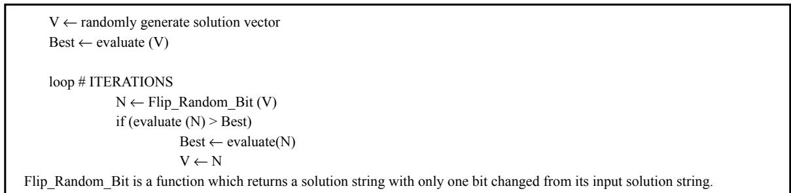
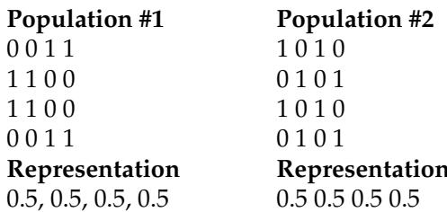
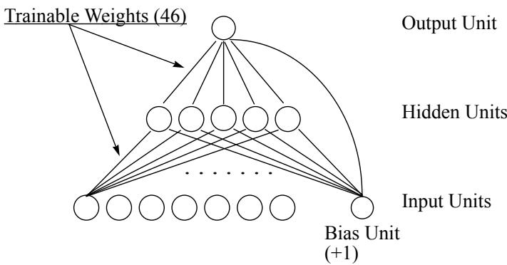
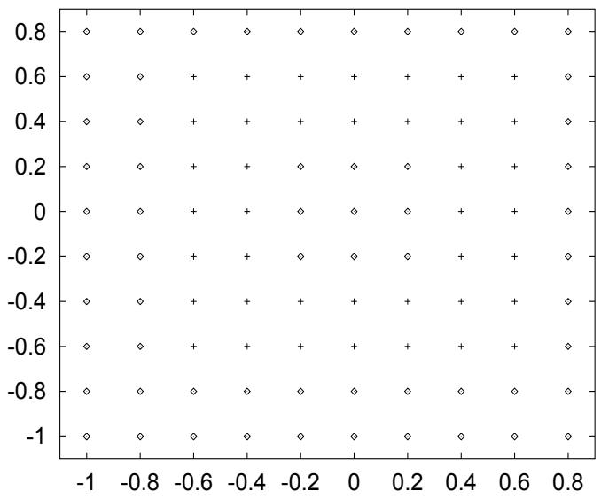

# An Empirical Comparison of Seven Iterative and Evolutionary Function Optimization Heuristics

Shumeet Baluja September 1, 1995 CMU-CS-95-193

School of Computer Science Carnegie Mellon University Pittsburgh, Pennsylvania 15213

baluja@cs.cmu.edu

# Abstract

This report is a repository for the results obtained from a large scale empirical comparison of seven iterative and evolution-based optimization heuristics. Twenty-seven static optimization problems, spanning six sets of problem classes which are commonly explored in genetic algorithm literature, are examined. The problem sets include job-shop scheduling, traveling salesman, knapsack, binpacking, neural network weight optimization, and standard numerical optimization. The search spaces in these problems range from $2 ^ { 3 6 8 ^ { \prime } }$ b $2 ^ { 2 0 4 0 }$ does not yield a benefit, in terms of the final answer obtained, over simpler optimization heuristics. Descriptions of the algorithms tested and the encodings of the problems are described in detail for reproducibility.

This work was started while the author was supported by a National Science Foundation Graduate Fellowship. He is currently supported by a graduate student fellowship from the National Aeronautics and Space Administration (NASA), administered by the Lyndon B. Johnson Space Center. The views and conclusions containedn this document are thos of the auhor and hould ot be interpretd s represnting the official policies, either expressed or implied, of the National Science Foundation, NASA, or the U.S. Government.

# Keywords

Heuristic StaticFunction Optimization, Evolutionary Algorithms, GeneticAlgorithms, Hillimbing, Population-Based Incremental Learning

# 1. INTRODUCTION

Genetic algorithms (GAs) and other evolutionary procedures are commonly used for static function optimization. Although there has been growing evidence that methods such as GAs are, in general, not well suited in this domain [De Jong, 1992], a large amount of research has been devoted to improving their effectiveness for function optimization. Hybrid mechanisms, ranging from alternate evolutionary methods to specialized operators and representations which can intelligently use problem specifi information, have achieved good results in many specifi applications. Nonetheless, r elatively few of these techniques work well across a wide range of problems.

The aim of this paper is to compare two standard genetic algorithms with simpler methods of optimization: multiple-restart stochastic hillclimbing (MRSH) and population-based incremental learning (PBIL). Previous comparisons between forms of MRSH and GAs can be found in [Ackley, 1994], [Juels & Wattenberg, 1994], [Forrest & Mitchell, 1992], [Mitchell & Holland, 1994], and [Davis, 1991], to name a few. A comparison between GAs and PBIL has been made in [Baluja, 1994][Baluja & Caruana, 1995]. This paper provides a large scale empirical comparison of these algorithms on problems commonly found in GA literature. Three variants of MRSH, two variants of PBIL, and two GAs are compared.

# 1.1 The Aims of this Paper

This study aims at answering only one question: "How effective are standard GAs for optimizing static functions, given a set number of function evaluations, in comparison to other, simpler, algorithms?" This paper presents results on many large problems; the size and quantity of the problems makes it hard to givein-depth analysis of the results beyond the algorithms' relative performances. A more in-depth analysis of PBIL in comparison to standard GAs on a problem which was specifcally designed to be easy for the genetic algorithm (and easier to analyze than the problems explored here) is provided in [Baluja & Caruana, 1995]. This paper does not attempt to address the problem of whether the classes of problems investigated ar suited or evolutionaryor terative function otimization. The focusof this paper s on comparing seven static function optimization methods on problems which are representative of problems commonly used as benchmarks in GA literature. No problem specife featur es have been added to any of the algorithms; allof the mechanisms used in the algorithms are "standard", and have been explored and described in the applicable literature. The inclusion of problem specifi mechanisms or mor e sophisticated features has the potential to improve the performance of all the algorithms.

There are two major concerns with performing a purely empirical comparison of these algorithms. The f is that eac  theor  e y  pr an i is phiiy p i practice, to thoroughly explore the space of the parameters while providing breadth in the types and sizes of problems attempted. The GA parameters used here were chosen to work well on many of the problems, but are not biased to any particular single problem. The parameters for the other algorithms were chosen in the same manner. In addition, GAs were selected to perform well on the task of optimization; they use mechanisms, such as elitist selection and scaling of fness values, which ar eoften used for theoptimization  staticfnctons [De Jon, 192]One thegals  thi study use heagorith wh as little problem-specific knowledge as possible. The only problem-specif knowledge used in these algorithms is the number of bits in the solution encoding for each of the problems.

The second concern is that there are many criteria by which the effectiveness of each algorithm can be measured. As mentioned before, there has recently been some controversy in the GA community as to whether GAs should be used for static function optimization. One of the reasons for this controversy is that GAs "attempt to maximize the cumulative payof f of a sequence of trials"[De Jong, 1992] rather than attempt to fid the single best optimum. Ther efore, using the 'best answer found"criteria may not be the best way to measure the GA's abilities. Nonetheless, a considerable amount of effort has been devoted to making the GAs better in function optimization. 'Better"has usually been measur ed in terms of the best solution found in a given number of trials. The common forms of measurement for function optimization are on-line and off-line performance. On-line performance measures the average of all function evaluations up to and including the current evaluations. Off-line performance is a running average of the best performance values to a particular time. Other measurements include the best solution found in the fial generation and the best solution found in any generation through the search. Although all these measure reveal different insights into the search algorithm's ability, the measure we are interested in this study is the best solution ever found through the search. The issues of cumulative payo,on-line and offline performance are not addressed here. The effectiveness of each algorithm is based solely upon the best answer it can fid in the given number of trials.

It is important to understand the scope of these results. All of the empirical comparisons are based upon static function optimization problems. The performance of each method is judged solely by the best soluclasses of problems are not considered here, and should be explored in the future:

•Noise in the evaluation function [Grefenstette & Fitzpatrick, 1988].   
A changing, or time-varying, evaluation function (over the period of a single run) [Cobb, 1993]. Problems in which queries have an associated cost, which must also be minimized [Cohn, 1994].   
• Problems in which multiple "solution vectors"must interact [Langton, 1994].   
• Problems in which cumulative payoff is to be optimized [Holland, 1975], [Golberg, 1989]. Problems which use variable-length encodings, or encodings with change over time [Koza, 1992].

Although the above domains are not addressed here, the domain which is concentrated upon covers a wide variety of problems. A large portion of GA research has been devoted to the types of problems analyzed in this paper. The feld of Operations Resear ch is another source of many similar problems.

Thenext section describes the simplest algorithm tested multiple-restart stochastic hillclimbing. This section is followed by descriptions of genetic algorithms, in section 3, and population-based incremental learning in section 4. In section 5, the problems attempted and the results obtained are described together. Section 6 summarizes the empirical results. Section 7 concludes the report and suggests some areas for future studies.

# 2. MULTIPLE-RESTART STOCHASTIC HILLCLIMBING

Multiple-restart stochastic hillimbing (MRSH) is a method of iterative optimization of static functions. It is the simplest of the optimization procedures explored in this paper. [Wattenberg and Juels, 1994] have compare e version tohast hilclimbing wih GAs on seveal problems commonl us or ug ing genetic algorithms and genetic programming, and have achieved very promising results. The basic stochastic hillclimbing algorithm is shown in Figure 1.

  
Figure 1: The stochastic hillclimbing algorithm for binary solution vectors. In the full algorithm, the best vector along with its evaluation would be saved. In practice the algorithm could be restarted in random locations many times - and the best solution ever found returned.

Three variants of this algorithm are explored in this paper. The fist variant, (MRH-1) maintains a list of the position of the bit flips which wereattempted without improvement. These bit lips are not attempted againuntil a better solution is found. When a better solution is found, the list is emptied. If the list becomes as large as the solution encoding, then no single bit flip can improve the solution. In this case, MRSH-1 is restarted at a random location with an empty list.

The second and third variants of stochastic hillclimbing, (MRSH-2 & MRSH-3), allow moves to regions of higher and equal evaluation. This is different than MRsH-1, which only allows moves to regions of higher evaluation. MRSH-2 & 3 differ from each other in the number of evaluations allowed before restarting search in a random location. In MRSH-2, the number of evaluations is dependent upon the length of the encoded solution. MRSH-2 allows $1 0 ^ { * }$ (length of solution) evaluations without improvement before search is restarted. When a solution with a higher evaluation is found, the count is reset. MRSH-3 enforces a much srir pol  restar; e hetotalube  iteratins ise etar is ormu search, at equally spaced intervals.

# 3. GENETIC ALGORITHMS

Genetic algorithms (GAs) are biologically motivated adaptive systems which are based upon the principles of natural selection and genetic recombination. A GA combines the principles of survival of the ftest with a randomized information exchange. It has the ability to recognize trends toward optimal solutions, and to exploit such information by guiding the search toward them.

In the standard GA, candidate solutions are encoded as fxed length vectors. The initial gr oup of potential solutions is chosen randomly. These candidate solutions, called 'chr omosomes," ar e allowed to evolve over a number of generations. At each generation, the fness of each chr omosome is calculated; this is a measure of how well the chromosome optimizes the objective function. The subsequent generation is created through a process of selection, recombination, and mutation. The chromosomes are probabilistically selected for recombination based upon their fness. General r ecombination (crossover) operators merge the information contained within pairs of selected "par ents"by placing random subsets of the information from both parents into their respective positions in a member of the subsequent generation. Although the chromosomes with high fness values have a higher pr obability of selection for recombination than those with low fness values, they ar e not guaranteed to appear in the next generation. Due to the random factors involved in producing "childr en"chr omosomes, the children may, or may not, have higher fness values than their par ents. Nevertheless, becauseof the selective pressure applied through a number of generations, the overall trend is towards higher fness chr omosomes. Mutations are used to help preserve diversity in the population. Mutations introduce random changes into the chromosomes. A good overview of GAs can be found in [Goldberg, 1989] [De Jong, 1975].

Twovariants of the traditional genetic algorithm are tested in this study. The fist, SGA, has the following parameters: Two-Point crossover, with a Crossover Rate of $1 0 0 \%$ ,Mutation Rate: 0.001, Population Size: 100, Elitist selection (the best chromosome in generation N replaces the worst chromosome in generation $_ { \mathrm { N + 1 } }$ ). The second GA used, termed GA-Scale, uses the same parameters, with the following exceptions: Uniform crossover with a crossover rate of $8 0 \%$ , and the finess of the worst member in a generation is subtracted from the fnesses of each member of the generation befor e the probabilities of selection are determined. Both GAs are generational, and both employ the elitist selection mechanism described above.

# 4. POPULATION-BASED INCREMENTAL LEARNING

Population-based incremental learning (PBIL) is a combination of evolutionary optimization and hillclimbing [Baluja, 1994]. The object of the algorithm is to create a real valued probability vector which, when sampled, reveals high quality solution vectors with high probability. For example, if a good solution to a problem can be encoded as a string of alternating $0 ^ { \prime } \mathrm { s }$ and 1's, a suitable final pr obability vector would be 0.01, 0.99, 0.01, 0.99, etc.

Initially, the values of the probability vector are set to 0.5. Sampling from this vector yields random solution vectors because the probability of generating a 1 or 0 is equal. As search progresses, the values in the probability vector gradually shift to represent high evaluation solution vectors. This is accomplished as follows: A number of solution vectors are generated based upon the probabilities specifed in the pr obability vector. The probability vector is pushed towards the generated solution vector(s) with the highest evaluation. The distance the probability vector is pushed depends upon the learning rate parameter. After the probability vector is updated, a new set of solution vectors is produced by sampling from the updated probabilityvector, and the cycle is continued. As the search progresses, entries in the probability vector move away from ther initial settings of 0.5 towards either 0.0 or 1.0. The probability vector can be viewed as a prototype vector for generating solution vectors which have high evaluations with respect to the available knowledge of the search space.

This algorithm is an extension of the Equilibrium Genetic Algorithm developed in conjunction with [Juels, 1993, 1994]. Another algorithm related to EGA/PBIL is Bit-Based Simulated Crossover (BSC) [Syswerda, 1992][Eshelman & Schaffer, 1993]. BSC regenerates the probability vector at each generation; it also uses selection probabilities (as do standard GAs) to generate the probability vector. In contrast, PBIL does not regenerate the probability vector at each generation, rather, the probability vector is updated through the search procedure. Additionally, PBIL does not use selection probabilities. Instead, it updates the probability vector using a few (in these experiments 1) of the best performing individuals.

The manner in which the updates to the probability vector occur is similar to the weight update rule in supervised competitive learning networks, or the update rules used in Learning Vector Quantization (LVQ) [Hertz, Krogh & Palmer, 1993]. Many of the heuristics used to make learning more effective in supervised competitive learning networks (or LVQ), or to increase the speed of learning, can be used with the PBIL algorithm. This relationship is discussed in greater detail in [Baluja, 1994].

# 4.1 PBIL's Relation to Genetic Algorithms

One key feature of the early portions of geneti optimization is the parallelism in the search; many diverse points are represented in the population of early generations. As the search progresses, the population of the GA tends to converge around a good solution vector in the function space (the respective bit positions in the majority of the solution strings converge to the same value. BIL attempts to create a probability vector that is a prototype for high evaluation vectors for the function space being explored. As search progresses in PBIL, the values in the probability vector move away from 0.5, towards either 0.0 or 1.0. Analogously to genetic search, PBIL converges from initial diversity to a single point where the probabilirecos ither ..Atth poin, ther  hdegreilarytheectorn

Bu BI   le poabily co   em hav es rei poeha GA a full population that can represent a large number of points simultaneously. For example, in Figure 2, the vector representations for populations #1 and #2 are the same although the members of the two populations are quite different. This appears to be a fundamental limitation of PBIL; a GA would not treat these two populations the same. A traditional single population GA, however, would not be able to maintain ethe of these populations. Becauseof sampling errors, the population will converge toone point; t will not be able to maintain multiple dissimilar points. This phenomenon is summarized below:

". the theor em [Fundamental Theorem of Genetic Algorithms [Goldberg, 1989]], assumes an infitely lar ge population size. In a fiite size population, even when ther e is no selective advantage for either of two competing alternatives.. the population will converge to one alternative or the other in fnite time (De Jong, 1975; [Goldber g & Segrest, 1987]). This problem of fnite populations is so important that geneticists have given it a special name, genetic drift. Stochastic errors tend to accumulate, ultimately causing the population to converge to one alternative or another"[Goldber g & Richardson, 1987].

Similarly, BIL wil converge to a probability vector that represents one of the two solutions in each o the populations in Figure 2; the probability vector can only represent one of the dissimilar points.

In addition to moving the prototype vector towards the highest evaluation vector, the prototype vector can also be moved away from the lowest evaluation vector generated in each generation. However, as the prototype vector becomes fxed towar ds either 0.0 or 1.0 for each bit position, the hamming distance between the best and worst generated vectors will diminish. If the hamming distance between the best and worst vector is small, moving away from the worst vector is counter-productive, because it also moves away from the best vector in many of the bit positions. Instead, the probability vector can be moved away rom the values in the worst vector which differ from those in the respective positions of the best vector. The full algorithm is shown in Figure 3.

In this study, twovariants of the algorit shown in Figure3 are used. The fist, BIL, uses the following parameters: Mutation Probability: 0.02, Mutation Shift:0.05, Learning Rate: 0.1, and Negative Learning

  
Figure 2: The probability representation of 2 small populations of 4-bit solution vectors; population size is 4. Notice that the representations for both populations are the same, although the solution vectors represented are entirely different.

Rate: 0.075. The second algorithm, the PBIL/EGA algorithm, uses the same parameters with the Negative Learning Rate set to 0.0.

# 5. AN EMPIRICAL COMPARISON

In this section, the algorithms described previously are applied to six classes of problems: Traveling Salesman, jobshop scheduling, knapsack, bin packing, neural network weight optimization, and numerical function optimization. The results obtained in this study should not be considered to be state-of-the-art. The problem encodings were chosen to be easily reproducible, and to allow easy and fair comparison with other studies. Alternate encodings may yield superior results. In addition, no problem-specif information was used for any of the algorithms. In the cases in which problem-specife information is available, it may be able to help all of the search algorithms presented in this study.

In the problems presented in this paper, all of the variables were encoded either with Gray-code or standard base-2 representation, as indicated with the problem. The variables were represented in non-overlapping, contiguous positions within the chromosome (solution encoding). The results reported are the best evaluations found through the search of each algorithm, averaged over at least 20 independent runs per algorithm per problem. In the problems in which random values are assigned to problem attributes (such as the location of cities in the Traveling Salesman Problems or sizes of elements in the bin packing and knapsack problems), the values are consistent across all algorithms attempted and across all 20 trials for each algorithm.

All algorithms were allowed an equal number of evaluations per run (200,00). In each run, the GA and PBIL algorithms both were allowed 2000 generations, with 100 function evaluations per generation. In each run, the MRSH algorithms were restarted in random locations as many times as needed until 200,000 evaluations were performed. The best answer ever found in the 200,00 evaluations was returned as the best answer found in the run. The fial r esults for the problems are given in tables following the description of the problems. The best results are highlighted.

# 5.1 Traveling Salesman Problems (TSP)

The TSP problem is probably the most famous of the NP-complete problems. Given N cities, the object is to fid a minimum length tour which visits each city exactly once. The encoding used in this study requires a bit string of size ${ \bf N } \mathrm { l o g } _ { 2 } { \bf N }$ bits. Each city is assigned a substring of length $\log _ { 2 } \mathbf { N }$ which is interpre s an ntee. The iy with thelowesnteger value ome sin the tour  thecity with the eon

\*\*\*\* nialize ProbabilityVector\*\*\*   
for i $: = 1$ to LENGTH do P[] $= 0 . 5$ ;   
while (NOT termination condition) \*\*\* Generate Samples \*\*\*\*\* for i $= 1$ to SAMPLES do sample_vectors[i] $\cdot =$ generate_sample_vector_according_to_probabilities (P); evaluations[] $\underline { { \underline { { \mathbf { \Pi } } } } } =$ Evaluate_Solution (sample[]); best_vector $\cdot ^ { = }$ find_vector_with_best_evaluation (sample_vectors, evaluations); worst_vector $: =$ find_vector_with_worst_evaluation (sample_vectors, evaluations); \*\*\*\* Update Probabiliy Vector towards best solutio\*\* for i $= 1$ to LENGTH do P[i] $\because$ P[] $^ { \star } \left( 1 . 0 - \mathsf { L R } \right) +$ best_vector[i] \* (LR); \*\*\*\* Update Probability Away from Worst Solutio \*\*\* for i $= 1$ to LENGTH do if (best_vector[i] $\neq$ worst_vector[i]) then P[i] $: =$ P[] $^ \star$ (1.0 - NEGATIVE_LR) $^ +$ best_vector[i] \* (NEGATIVE_LR); \*\*\*\* Mutate Probability Vector \*\*\*\* for $\mathrm { i } \cdot = 1$ to LENGTH do if (random (0,1) $<$ MUT_PROBABILITY) then if (random $( 0 , 1 ) > 0 . 5$ then mutate_direction $\Bumpeq 1$ else mutate_direction $\mathrel { \mathop : } = 0$ P[i] $: =$ P[i] \* (1.0 - MUT_SHIFT) $^ +$ mutate_direction \* (MUT_SHIFT);

# USER DEFINED CONSTANTS (Values Used in this Study):

SAMPLES: the number of vectors generated before update of the probability vector (100).   
LR: the learning rate, how fast to exploit the search performed (0.1).   
NEGATIVE_LR: the negative learning rate, how much to learn from negative examples (PBIL $= 0 . 0 7 5$ , $\mathsf { E G A } = 0 . 0 $ .   
LENGTH: the number of bits in a generated vector (problem specific).   
MUT_PROBABILITY: the probability for a mutation occurring in each position (0.02).   
MUT_SHIFT: the amount a mutation alters the value in the bit position (0.05).

Figure 3: The PBIL/EGA algorithm for a binary alphabet.

lowest comes second, etc. In the case of ties, the city whose substring comes fist in the bit string comes fist in the tour . This encoding was taken from [Syswerda, 192]. To minimize the tour length, the evaluation used is 1.0/Tour_Length. Four problems were atempted: the fist contained 128 cities, the second contained 200 cities, and the third and fourth contained 255 cities. The integer encoding of the fourth problem used Gray-code, while the rest used standard binary code. The results for these four problems are shown in Table I. The distances between cities were generated randomly for each problem.

Table I: Traveling Salesman Problem - Average Final Tour Length   

<table><tr><td rowspan=1 colspan=1>PROBLEM</td><td rowspan=1 colspan=1>MRSH1</td><td rowspan=1 colspan=1>MRSH2</td><td rowspan=1 colspan=1>MRSH2</td><td rowspan=1 colspan=1>EGA</td><td rowspan=1 colspan=1>PBIL</td><td rowspan=1 colspan=1>SGA</td><td rowspan=1 colspan=1>GA-Scale</td></tr><tr><td rowspan=1 colspan=1>TSP 128 (binary)</td><td rowspan=1 colspan=1>2516.3</td><td rowspan=1 colspan=1>2122.7</td><td rowspan=1 colspan=1>2144.1</td><td rowspan=1 colspan=1>1980.2</td><td rowspan=1 colspan=1>1718.2</td><td rowspan=1 colspan=1>3256.4</td><td rowspan=1 colspan=1>2275.8</td></tr><tr><td rowspan=1 colspan=1>TSP 200 (binary)</td><td rowspan=1 colspan=1>7815.5</td><td rowspan=1 colspan=1>7707.2</td><td rowspan=1 colspan=1>7642.3</td><td rowspan=1 colspan=1>6993.0</td><td rowspan=1 colspan=1>6097.5</td><td rowspan=1 colspan=1>12012.1</td><td rowspan=1 colspan=1>7966.8</td></tr><tr><td rowspan=1 colspan=1>TSP 255 (binary)</td><td rowspan=1 colspan=1>5002.5</td><td rowspan=1 colspan=1>4201.6</td><td rowspan=1 colspan=1>4381.2</td><td rowspan=1 colspan=1>4587.1</td><td rowspan=1 colspan=1>4545.4</td><td rowspan=1 colspan=1>8756.5</td><td rowspan=1 colspan=1>5598.2</td></tr><tr><td rowspan=1 colspan=1>TSP 255 (Gray-Code)</td><td rowspan=1 colspan=1>5054.3</td><td rowspan=1 colspan=1>3558.7</td><td rowspan=1 colspan=1>4051.0</td><td rowspan=1 colspan=1>4587.1</td><td rowspan=1 colspan=1>4484.3</td><td rowspan=1 colspan=1>8644.8</td><td rowspan=1 colspan=1>5550.5</td></tr></table>

# 5.2 Jobshop Scheduling Problems

Recently, genetic algorithms have been applied to the jobshop scheduling problem because it is diffult for conventional search based methods to fnd near -optimal solutions in a reasonable amount of time [Fang et al., 193]. A good description of the jobshop problem is given by Fang:

'In the general job shop pr oblem, there are j jobs and m machines; each job comprises a set of tasks which must each be done on a different machine for different specifed pr ocessing times, in a given job-dependent order. . A legal schedule is a schedule of job sequences on each machine such that each job's task order is preserved, a machine is not processing two different jobs at once, and different tasks of the same job are not simultaneously being processed on different machines. The problem is to minimize the total elapsed time between the beginning of the fist task and the completion of the last task (the makespan)" [Fang et al., 1993].

The problem is encoded in two ways. The fist encoding is derived fr om [Fang et. al, 1993]. The exact encding can be found in [Fang et al., 1993] and [Baluja, 1994]. The diference between this encoding and that used by Fang is that in this study, bit strings were used to encode the integers (in standard binary encoding) in the range of 1.J. Fang used chunks which are atomic for the GA. Although the encoding used here makes the problem diffult for these optimization techniques, it is used to pr ovide results which are comparable to other algorithms. As the makespan is to be minimized, the evaluation of the potential solution is (1.0/makespan). Two standard test problems are attempted, a 10 job, 10 machine problem and a 20-job, 5-machine problem. A description of the problems can be found in [Muth & Thompson, 1963]. The results are shown in Table II.

Table II: Jobshop Scheduling - Minimum Makespan - Using First Encoding.   

<table><tr><td rowspan=1 colspan=1>PROBLEM</td><td rowspan=1 colspan=1>MRSH1</td><td rowspan=1 colspan=1>MRSH2</td><td rowspan=1 colspan=1>MRSH3</td><td rowspan=1 colspan=1>EGA</td><td rowspan=1 colspan=1>PBIL</td><td rowspan=1 colspan=1>SGA</td><td rowspan=1 colspan=1>GA-Scale</td></tr><tr><td rowspan=1 colspan=1>Jobshop 10x10</td><td rowspan=1 colspan=1>1033.0</td><td rowspan=1 colspan=1>1003.4</td><td rowspan=1 colspan=1>1003.9</td><td rowspan=1 colspan=1>984.3</td><td rowspan=1 colspan=1>979.4</td><td rowspan=1 colspan=1>1002.0</td><td rowspan=1 colspan=1>1001.2</td></tr><tr><td rowspan=1 colspan=1>Jobshop 20x5</td><td rowspan=1 colspan=1>1295.3</td><td rowspan=1 colspan=1>1284.6</td><td rowspan=1 colspan=1>1282.9</td><td rowspan=1 colspan=1>1204.8</td><td rowspan=1 colspan=1>1200.5</td><td rowspan=1 colspan=1>1256.3</td><td rowspan=1 colspan=1>1213.9</td></tr></table>

The second encoding is very similar to the encoding used in the Traveling Salesman Problem. The drawback of this encoding is that it uses more bits than the previous one. Nonetheless, empirically, it revealed improved results. Each job is assigned M entries of size $\log _ { 2 } ( \mathrm { J } ^ { * } \mathrm { M } )$ bits. The total length of the encoding is $\mathrm { J } ^ { * } \mathrm { M } ^ { * } \mathrm { l o g } _ { 2 } ( \mathrm { J } ^ { * } \mathrm { M } )$ . Therefore, each of these problems is encoded in a 700 bit solution vector. The value of each entry (of length $\log _ { 2 } ( \mathrm { J } ^ { * } \mathrm { M } ) )$ determines the order in which the jobs are scheduled. The job which contains the allest valued entry is scheduled fist, etc. The or der in which the machines are selected or eac jo depends upon the ordering required by the problem specifcation. The r esults are shown in Table I. With this encoding, six out of the seven algorithms perform better than, or at least as well as, the fist jobshop encoding presented (the performance of MRSH-1 does not improve with this encoding).

Table III: Jobshop Scheduling - Minimum Makespan - Using Second Encoding   

<table><tr><td rowspan=1 colspan=1>PROBLEM</td><td rowspan=1 colspan=1>MRSH1</td><td rowspan=1 colspan=1>MRSH2</td><td rowspan=1 colspan=1>MRSH3</td><td rowspan=1 colspan=1>EGA</td><td rowspan=1 colspan=1>PBIL</td><td rowspan=1 colspan=1>SGA</td><td rowspan=1 colspan=1>GA-Scale</td></tr><tr><td rowspan=1 colspan=1>Jobshop 10x10</td><td rowspan=1 colspan=1>1059.0</td><td rowspan=1 colspan=1>968.2</td><td rowspan=1 colspan=1>970.2</td><td rowspan=1 colspan=1>963.4</td><td rowspan=1 colspan=1>960.6</td><td rowspan=1 colspan=1>967.1</td><td rowspan=1 colspan=1>961.4</td></tr><tr><td rowspan=1 colspan=1>Jobshop 20x5</td><td rowspan=1 colspan=1>1360.6</td><td rowspan=1 colspan=1>1217.1</td><td rowspan=1 colspan=1>1215.5</td><td rowspan=1 colspan=1>1186.2</td><td rowspan=1 colspan=1>1182.0</td><td rowspan=1 colspan=1>1230.4</td><td rowspan=1 colspan=1>1190.3</td></tr><tr><td rowspan=1 colspan=1>Jobshop 20x5(Randomly generated)</td><td rowspan=1 colspan=1>1164.5</td><td rowspan=1 colspan=1>1031.2</td><td rowspan=1 colspan=1>1025.5</td><td rowspan=1 colspan=1>995.0</td><td rowspan=1 colspan=1>992.1</td><td rowspan=1 colspan=1>1044.2</td><td rowspan=1 colspan=1>1005.1</td></tr></table>

# 5.3 Knapsack Problem

In the knapsack problem, there is a single bin of limited capacity, and M elements of varying sizes and values. The problem is to select the elements which will yield the greatest summed value without exceedihepac the iTheaa the ali  thes e  wa h tion selects too many elements, such that the summed size of the elements is too large, the solution is jge you he pac theb thele i the pacthe betteh to I the  heem izihe pache i tes thevlu the elements is used as the evaluatio. To ensure that the solutins whic over the bin r enot competiive with those which do not, their evaluations are multiplied by a small constant. This makes the invalid solutions competitive only when there are no solutions in the population which are valid. The evaluations are described below.

if size is greater than capacity of bin

∑ value selectedElements if size is less than or equal to capacity of bin

The weights and values for each problem were randomly generated. In the fist two pr oblems, having 512 and 2000 elements respectively, a unique element is represented by each bit. When a bit is set to 1, the corresponding element is included. In the third and fourth problems, there are 100 and 120 unique elements, respectively. However, there are 8 and 32 copies of each element; the number of elements of each type which are included in the solution is determined by interpreting a bit string, length 3 $( \log _ { 2 } 8 )$ bits and 5 $( \log _ { 2 } 3 2 )$ bits, into decimal, respectively. The results are given in Table IV. Note that the SGA algorithm was unable to fid valid solutions in the second and fourth pr oblems.

Table IV: Knapsack Problem - Average of Best Values   

<table><tr><td rowspan=1 colspan=1>PROBLEM</td><td rowspan=1 colspan=1>MRSH1</td><td rowspan=1 colspan=1>MRSH2</td><td rowspan=1 colspan=1>MRSH3</td><td rowspan=1 colspan=1>EGA</td><td rowspan=1 colspan=1>PBIL</td><td rowspan=1 colspan=1>SGA</td><td rowspan=1 colspan=1>GA-Scale</td></tr><tr><td rowspan=1 colspan=1>Knap (512 elem., 1 cpy)</td><td rowspan=1 colspan=1>27.1</td><td rowspan=1 colspan=1>24.1</td><td rowspan=1 colspan=1>26.7</td><td rowspan=1 colspan=1>79.8</td><td rowspan=1 colspan=1>80.1</td><td rowspan=1 colspan=1>62.2</td><td rowspan=1 colspan=1>72.3</td></tr><tr><td rowspan=1 colspan=1>Knap (2000 elem., 1 cpy)</td><td rowspan=1 colspan=1>41.3</td><td rowspan=1 colspan=1>39.0</td><td rowspan=1 colspan=1>38.8</td><td rowspan=1 colspan=1>171.5</td><td rowspan=1 colspan=1>130.8</td><td rowspan=1 colspan=1>0.0</td><td rowspan=1 colspan=1>135.2</td></tr><tr><td rowspan=1 colspan=1>Knap (100 elem., 8 cpy)</td><td rowspan=1 colspan=1>148.4</td><td rowspan=1 colspan=1>136.3</td><td rowspan=1 colspan=1>101.1</td><td rowspan=1 colspan=1>394.9</td><td rowspan=1 colspan=1>403.7</td><td rowspan=1 colspan=1>49.3</td><td rowspan=1 colspan=1>414.2</td></tr><tr><td rowspan=1 colspan=1>Knap(120 elem., 32 cpy)</td><td rowspan=1 colspan=1>848.7</td><td rowspan=1 colspan=1>801.1</td><td rowspan=1 colspan=1>669.0</td><td rowspan=1 colspan=1>2856.4</td><td rowspan=1 colspan=1>2920.4</td><td rowspan=1 colspan=1>0.0</td><td rowspan=1 colspan=1>2559.1</td></tr></table>

# 5.4 Bin Packing

In the bin packing problem, there are N bins of varying capacities and M elements of varying sizes. The problem is to pack the bins with elements as tightly as possible, without exceeding the maximum capacity of any bin. In the problems attempted here, the error is measured by:

$$
E R R O R = \sum _ { i = 1 } ^ { N } \left| C A P _ { i } - A S S I G N E D _ { i } \right| \qquad { \mathrm { C A P } } _ { \mathrm { i } } { \mathrm { i s ~ t h e ~ c a p a c i t y ~ o f ~ b i n i } } 
$$

The solution is encoded in a bit string of length $\mathbf { M } \ ^ { * } \log _ { 2 } \mathbf { N }$ Each element to be packed is assigned a sequential substring of length $\log _ { 2 } \mathbf { N }$ whose value indicates the bin in which the element is placed. In order to minimize the ERROR, the evaluation of the potential solution is 1.0/ERROR.

Four bin packing problems of various sizes were tested: 32 bins, 128 elements; 16 bins, 128 elements; 4 bins, 256 elements; and 2 bins, 512 elements. All of the problems generated were guaranteed to have a solution with 0.0 error. The results are shown below, in Table V.

Table V: Bin Packing Problems - Minimum Error   

<table><tr><td rowspan=1 colspan=1>PROBLEM</td><td rowspan=1 colspan=1>MRSH1</td><td rowspan=1 colspan=1>MRSH2</td><td rowspan=1 colspan=1>MRSH3</td><td rowspan=1 colspan=1>EGA</td><td rowspan=1 colspan=1>PBIL</td><td rowspan=1 colspan=1>SGA</td><td rowspan=1 colspan=1>GA-Scale</td></tr><tr><td rowspan=1 colspan=1>Bin(32 bins,128 elem.)</td><td rowspan=1 colspan=1>0.62</td><td rowspan=1 colspan=1>0.58</td><td rowspan=1 colspan=1>0.62</td><td rowspan=1 colspan=1>0.49</td><td rowspan=1 colspan=1>0.42</td><td rowspan=1 colspan=1>0.54</td><td rowspan=1 colspan=1>0.51</td></tr><tr><td rowspan=1 colspan=1>Bin(16 bins,128 elem.)</td><td rowspan=1 colspan=1>4.4 x 10-2</td><td rowspan=1 colspan=1>6.8 x 10-2</td><td rowspan=1 colspan=1>3.8 x 10-2</td><td rowspan=1 colspan=1>3.0 x 10-2</td><td rowspan=1 colspan=1>2.2 x 10-2</td><td rowspan=1 colspan=1>2.8 x 10-2</td><td rowspan=1 colspan=1>3.1 x 10-2</td></tr><tr><td rowspan=1 colspan=1>Bin(4 bins, 256 elem.)</td><td rowspan=1 colspan=1>1.2 x10-5</td><td rowspan=1 colspan=1>1.9 x10-5</td><td rowspan=1 colspan=1>6.0  10-6</td><td rowspan=1 colspan=1>7.0 x 10-6</td><td rowspan=1 colspan=1>6.9 x 10-6</td><td rowspan=1 colspan=1>7.8 x 10-6</td><td rowspan=1 colspan=1>5.0 x 10-6</td></tr><tr><td rowspan=1 colspan=1>Bin (2 bins, 512 elem.)</td><td rowspan=1 colspan=1>2.4 x 10-7</td><td rowspan=1 colspan=1>2.4 x 10-6</td><td rowspan=1 colspan=1>3.5 x 10-8</td><td rowspan=1 colspan=1>4.0 x 10-8</td><td rowspan=1 colspan=1>1.8 x 10-8</td><td rowspan=1 colspan=1>1.2 x 10-7</td><td rowspan=1 colspan=1>4.8 x 10-7</td></tr></table>

# 5.5 Evolving Weights for an Artificial Neural Network (ANN)

Recently, evolutionary algorithms have been used to evolve the weights of artifcial neural networks. In the experiments reported here, the weights of two small predefied network ar chitectures were evolved. In the st tst, the object of the neural network was to identiy the parity of 7 inputs. The inputs wer e  (repreente by0.r1 (epreented by 0..  the pariy was, the target utput s 0.; e parity was0, he target output i ..The evaluation was th sum o suare error on the 8 tai examples.A bias input (a unit whose input is set to 1.0) was also used; this has connections to the hidden and the output units [Hertz, Krogh & Palmer, 1993]. The network architecture consisted of 8 input units (including bias), 5 hidden units, and 1 output unit. The network was fully connected between sequential layers. There were a total of 46 connections in the network, the values of the weights were restricted to the range of $- 1 0 . 0$ to $+ 1 0 . 0$ A resented as binary and gray code, and were assigned 8 non-overlapping bits in the solution string.

  
Figure 4: Network Architecture.

In the second two tests, eight real valued inputs were used. The fist two inputs r epresent the coordinates o a point within a square with upper left corner (ULC) of (1.0, 1.0) and lower right corner (LRC) of (1.0, -1.0 The task was to determine whether the point fellinto a square region between ULC(-0.75, 0,75), and LRC (0.75,-0.75) and outside a smaller square with ULC (-0.35, 0,35), and LRC (0.35,-0.35). A diagram of this is shown in Figure 5. 5 inputs contained random noise in the region $\left[ - 1 { : } + 1 \right]$ This noise was determined in the beginning of the run, and remained the same, in each training example, throughout the run. The last input was a bias unit. In total, the network had 8 inputs (including bias), 5hidden units, and 1 output; this created 46 connections. For training, 100 uniformly distributed examples were used. The same representation and scaling of weights was used as in the previous problem. In these two problems, weights were represented as binary and Gray code, respectively. The results are shown in Table VI.

  
Figure 5: Training Examples for the ANN Square Problem.

Table VI: ANN Weight Optimization - Sum of Squares Error.   

<table><tr><td rowspan=1 colspan=1>PROBLEM</td><td rowspan=1 colspan=1>MRSH1</td><td rowspan=1 colspan=1>MRSH2</td><td rowspan=1 colspan=1>MRSH3</td><td rowspan=1 colspan=1>EGA</td><td rowspan=1 colspan=1>PBIL</td><td rowspan=1 colspan=1>SGA</td><td rowspan=1 colspan=1>GA-Scale</td></tr><tr><td rowspan=1 colspan=1>ANN PARITY 7(binary)</td><td rowspan=1 colspan=1>16.1</td><td rowspan=1 colspan=1>16.1</td><td rowspan=1 colspan=1>23.3</td><td rowspan=1 colspan=1>12.8</td><td rowspan=1 colspan=1>11.2</td><td rowspan=1 colspan=1>15.0</td><td rowspan=1 colspan=1>13.3</td></tr><tr><td rowspan=1 colspan=1>ANN PARITY 7(Gray)</td><td rowspan=1 colspan=1>13.7</td><td rowspan=1 colspan=1>15.1</td><td rowspan=1 colspan=1>16.4</td><td rowspan=1 colspan=1>8.3</td><td rowspan=1 colspan=1>8.2</td><td rowspan=1 colspan=1>11.6</td><td rowspan=1 colspan=1>12.3</td></tr><tr><td rowspan=1 colspan=1>ANN SQUARE (binary)</td><td rowspan=1 colspan=1>14.1</td><td rowspan=1 colspan=1>14.5</td><td rowspan=1 colspan=1>17.5</td><td rowspan=1 colspan=1>11.6</td><td rowspan=1 colspan=1>10.9</td><td rowspan=1 colspan=1>12.7</td><td rowspan=1 colspan=1>13.0</td></tr><tr><td rowspan=1 colspan=1>ANN SQUARE (Gray)</td><td rowspan=1 colspan=1>8.4</td><td rowspan=1 colspan=1>7.9</td><td rowspan=1 colspan=1>9.3</td><td rowspan=1 colspan=1>6.7</td><td rowspan=1 colspan=1>8.3</td><td rowspan=1 colspan=1>8.9</td><td rowspan=1 colspan=1>9.3</td></tr></table>

# 5.6 Numerical Function Optimization

In this section, the seven algorithms are compared on three numerical optimization problems. In the fist and second problems, the variables in the ist portions of the solution string have a lar ge infence n the qality o the rest of the solutin; small changes in theirvalues can cause large changes in the evaluation of the solution. In the third problem, each variable can be set independently. Each variable, $x _ { i } ,$ was represented using 9 bits, and was scaled uniformly into the range $\pm 2 . 5 6$ To avoid a division by zero error, a small constant, C $\left( = 0 . 0 0 0 0 1 \right)$ , was added to the denominator of each function. Each problem was tested with the variables represented in standard binary and Gray code. Results are shown in Table VII. The maximization functions are:

$$
- 2 . 5 6 \leq x _ { i } < 2 . 5 6 , i = 1 \dots 1 0 0
$$

<table><tr><td colspan="6">1 = 1 = =  + n− 1, i = 2..100 =  +− ,  = 2... 100</td></tr><tr><td>1.0 f1 = C+ | | ∑ || =2</td><td>$\2=$ 100</td><td>1.0 100 C + | 1| + ∑ pγi| =2</td><td colspan="2">1.0 $\=$ 100 C + ∑ |(0.024× (i + 1)) = 1</td></tr></table>

<table><tr><td rowspan=1 colspan=1>PROBLEM</td><td rowspan=1 colspan=1>MRSH1</td><td rowspan=1 colspan=1>MRSH2</td><td rowspan=1 colspan=1>MRSH3</td><td rowspan=1 colspan=1>EGA</td><td rowspan=1 colspan=1>PBIL</td><td rowspan=1 colspan=1>SGA</td><td rowspan=1 colspan=1>GA-Scale</td></tr><tr><td rowspan=1 colspan=1>F1 (Binary) (x100)</td><td rowspan=1 colspan=1>1.04</td><td rowspan=1 colspan=1>1.01</td><td rowspan=1 colspan=1>0.97</td><td rowspan=1 colspan=1>1.93</td><td rowspan=1 colspan=1>2.12</td><td rowspan=1 colspan=1>1.96</td><td rowspan=1 colspan=1>1.72</td></tr><tr><td rowspan=1 colspan=1>F1 (Gray Code)(x100)</td><td rowspan=1 colspan=1>1.21</td><td rowspan=1 colspan=1>1.18</td><td rowspan=1 colspan=1>1.17</td><td rowspan=1 colspan=1>2.06</td><td rowspan=1 colspan=1>2.62</td><td rowspan=1 colspan=1>1.92</td><td rowspan=1 colspan=1>1.78</td></tr><tr><td rowspan=1 colspan=1>F2 (Binary) (x100)</td><td rowspan=1 colspan=1>3.08</td><td rowspan=1 colspan=1>3.06</td><td rowspan=1 colspan=1>2.91</td><td rowspan=1 colspan=1>4.00</td><td rowspan=1 colspan=1>4.40</td><td rowspan=1 colspan=1>3.58</td><td rowspan=1 colspan=1>3.68</td></tr><tr><td rowspan=1 colspan=1>F2 (Gray Code) (x100)</td><td rowspan=1 colspan=1>4.34</td><td rowspan=1 colspan=1>4.38</td><td rowspan=1 colspan=1>4.28</td><td rowspan=1 colspan=1>4.67</td><td rowspan=1 colspan=1>5.61</td><td rowspan=1 colspan=1>3.64</td><td rowspan=1 colspan=1>4.63</td></tr><tr><td rowspan=1 colspan=1>F3 (Binary) (x 100)</td><td rowspan=1 colspan=1>8.07</td><td rowspan=1 colspan=1>8.10</td><td rowspan=1 colspan=1>7.56</td><td rowspan=1 colspan=1>14.57</td><td rowspan=1 colspan=1>16.43</td><td rowspan=1 colspan=1>9.171</td><td rowspan=1 colspan=1>12.30</td></tr><tr><td rowspan=1 colspan=1>F3 (Gray Code) (x100)</td><td rowspan=1 colspan=1>416.64</td><td rowspan=1 colspan=1>416.64</td><td rowspan=1 colspan=1>416.64</td><td rowspan=1 colspan=1>331.69</td><td rowspan=1 colspan=1>366.77</td><td rowspan=1 colspan=1>28.35</td><td rowspan=1 colspan=1>210.37</td></tr></table>

# 6. SUMMARY OF EMPIRICAL RESULTS

Many results have been presented in the previous section. This paper has concentrated on breadth; a large number of problems were attempted with seven optimization heuristics. It should be noted that because all of thealgorithms have tunable parameters, it is possible that different settings may yield iferent results. Additional mechanisms, which take advantage of problem specife information, may also improve the performance of each of these methods. Nonetheless, by selecting a variety of problems and problem sizes to compare, al of the algorithms should show their strengths and weaknesses in some portion of the test set.

The relative ranks of the algorithms on all of the problems are shown in Table VII; this table ranks the algorithms with respect to the average best results produced over all runs. It should be noted that with only 2runs peralgorithm,not alof the diffren are tatistically nifnt. Mordetails on theifentials between each algorithm's performance were presented in Section 5. In terms of the fial solutions found, the PBIL algorithm worked the best overall, followed by the EGA algorithm. In the majority of problems attempted here (25 out of 27), learning from negative examples improved the quality of the final solutions found (PBIL performed better than EGA). Only in two of the pr oblems did the negative learning hurt the performance of the PBIL algorithm (EGA performed better than PBIL).

In terms of clock speed, the MRSH algorithms worked the fastest. However, if the time for each chromosome/solution string's evaluation is much larger than the time for the algorithm's procedures, this beneffdiminishes. Moves to equalr egions (rather than only strictly better regions) had mixed results overall. Nonetheless, in several problems, such as the jobshop (both encodings) and TSP problems, the moves to equal regions improved performance. In other problems sets, not explored here, it was also found that moves to regions of equal evaluations were important for good performance [Juels & Wattenberg, 1994]. MRSH did well on the largest TSP examined; it was able to find a shorter tour than the other algorithms. (when encoded in binary and Gray Code). Similarly, in F3, MRSH was able to take the largest advantage of the gray code.

Although the standard genetic algorithm (SGA) performed only as well as the MRSH algorithms, the GA-scale algorithm performed slightly better. A summary of the results can be found in Table VIII. This table has the following columns:

1. In the cases in which PBIL did better than GA-Scale, this column gives the generation in which PBIL was able, on average, to surpass the highest evaluation GA-Scale found, on average, in its 20 runs. For example, in the fist pr oblem: TSP-128 (binary), the highest evaluation of the GA was 2275.8 (Table I), by generation 210, PBIL was able to surpass this evaluation.

2. The same numbers are given for GA-Scale. For example, on the knapsack01 (2000 elem, 1 copy) problem, the highest evaluation PBIL was able to obtain was 403.7, in generation 1505 GAScale was, on average, able to surpass it.

Columns (3),(4) and (5) of Table VIII compare the three different types of algorithms:

3. Marks the problems on which any form of MRSH was able to do better than GA-Scale.

4. Marks when any form of MRSH did better than PBIL.

5. Marks the problems in which GA-Scale outperformed PBIL.

Columns 6,7 and 8 of Table VIII compare different variations of each algorithm.

6. Indicates the problems on which moves to equal regions helped the performance of MRSH. These are the problems in which either MRSH-2 or MRSH-3 did better than MRSH-1.   
7. Marks the problems in which learning from negative examples helped the PBIL/EGA algorithm. These are the problems in which PBIL performed better than EGA.   
8. Indicates the problems in which GA-Scale did better than SGA. The improvement may be due to the scaling of ftness values and/or the dif ferent crossover operators (GA-Scale: Uniform, SGA: Two Point).

For the problems which were attempted with gray and binary code, Table IX provides a list of which algorithms beneffed fr om using gray code.

# 7. CONCLUSIONS

This paper has presented results on many problems. From the results reported in this paper, t is evident that algorithms which are simpler than standard GAs can perform comparably to GAs, on both small and large problems. Other studies have also shown this for various sets of problems [uels & Wattenberg, 1994][Mitchell & Forrest, 1992], etc. In studies analyzing the performance of GAs on particular problems, these results suggest that analyses should include comparisons not only to other GAs, but also to other simpler methods of optimization before a beneff is claimed in favor of GAs. This study did not include techniques such as Simulated Annealing or Tabu Search, which should be included in the future.

It is interesting to note that the PBIL algorithm, which does not use the crossover operator, and redefies the role of the population to one which is very different than that of a GA, performs either better than or comparably to a GA on the majority of the problems. PBIL and GAs both generate new trials based on statistics from a population of prior trials. The PBIL algorithm explicitly maintains these statistics, while the GA implicitly maintains them in its population. The GA extracts the statistics by the selection and crossover operators. More detailed comparisons between these two algorithms can be found in [Baluja & Caruana, 1995].

It should be noted that the relative performance of GAs in comparison to PBIL willimprove as the population size of the GA increases [Baluja & Caruana, 1995]. As the population size of the GA increases, the GA will be able to maintain more dissimilar points in its population, and will therefore be able to use crossover more effectively. On the other hand, in its current implementation, the PBIL algorithm only use a few solution vectors for updating the probability vector regardless of the population size. Nonetheless, the large population size needed by a GA is not always feasible because of the need to balance the number of generations required and the total number of evaluations possible. However, even when the resources to use large populations are available, a large amount of empirical work has shown that using an 'parallel island-model" GA may be mor e effective than a single panmictic population. The islandmodel evolves multiple small population in parallel, with only a small amount of interaction between subpopulations. The parallel subpopulation model, in many cases, has outperformed the use of a single large population; see for example: [Davidor et. al, 1993][Gordon & Whitley, 1993][Baluja, 1993][Whitley & Starkweather, 1990]. If these parallel subpopulations are used instead of a single large population, each subpopulation can be modeled with individual probability vectors, as in the PBIL algorithm.

A GA with different mechanisms, such as non-stationary mutation rates, local optimization heuristics, parallel subpopulations, specialized crossover, or larger operating alphabets, may perform better than the GAs explored here. It should be noted, however, that all of these mechanisms, with the exception of specialized crossover operators, can be used with PBIL with few, if any, modifcations.

Another direction to explore in the future is how these algorithm perform with alternate solution encodings; in this study only binary encodings were used. Although work has already been conducted in this area with GAs (a good introduction to this can be found in [Eshelman & Schaffer, 1992]), how well will PBIL or MRSH perform with these alternate encodings? Finally, in this study, optimization was only explored in static environments. Future research should also include search and optimization in dynamic environments, or environments which require maximization of cumulative payoff. The adaptive nature of GAs may reveal a pronounced beneff in these mor e complex domains.

Table VII: Summary of Ranks   

<table><tr><td rowspan=1 colspan=1></td><td rowspan=1 colspan=1>EncodingLength(biits)</td><td rowspan=1 colspan=1>MRSH1</td><td rowspan=1 colspan=1>MRSH2</td><td rowspan=1 colspan=1>MRSH3</td><td rowspan=1 colspan=1>EGA</td><td rowspan=1 colspan=1>PBIL</td><td rowspan=1 colspan=1>SGA</td><td rowspan=1 colspan=1>GA-Scale</td><td rowspan=1 colspan=1>20</td><td rowspan=1 colspan=1>20</td><td rowspan=1 colspan=1>20</td></tr><tr><td rowspan=1 colspan=1>TSP 128 (binary)</td><td rowspan=1 colspan=1>896</td><td rowspan=1 colspan=1>6</td><td rowspan=1 colspan=1>3</td><td rowspan=1 colspan=1>4</td><td rowspan=1 colspan=1>2</td><td rowspan=1 colspan=1>1</td><td rowspan=1 colspan=1>7</td><td rowspan=1 colspan=1>5</td><td rowspan=1 colspan=1></td><td rowspan=1 colspan=1>•</td><td rowspan=1 colspan=1></td></tr><tr><td rowspan=1 colspan=1>TSP 200 (binary)</td><td rowspan=1 colspan=1>1600</td><td rowspan=1 colspan=1>5</td><td rowspan=1 colspan=1>4</td><td rowspan=1 colspan=1>3</td><td rowspan=1 colspan=1>2</td><td rowspan=1 colspan=1>1</td><td rowspan=1 colspan=1>7</td><td rowspan=1 colspan=1>6</td><td rowspan=1 colspan=1></td><td rowspan=1 colspan=1>•</td><td rowspan=1 colspan=1></td></tr><tr><td rowspan=1 colspan=1>TSP 255 (binary)</td><td rowspan=1 colspan=1>2040</td><td rowspan=1 colspan=1>5</td><td rowspan=1 colspan=1>1</td><td rowspan=1 colspan=1>2</td><td rowspan=1 colspan=1>4</td><td rowspan=1 colspan=1>3</td><td rowspan=1 colspan=1>7</td><td rowspan=1 colspan=1>6</td><td rowspan=1 colspan=1>•</td><td rowspan=1 colspan=1></td><td rowspan=1 colspan=1></td></tr><tr><td rowspan=1 colspan=1>TSP 255 (Gray-Code)</td><td rowspan=1 colspan=1>2040</td><td rowspan=1 colspan=1>5</td><td rowspan=1 colspan=1>1</td><td rowspan=1 colspan=1>2</td><td rowspan=1 colspan=1>4</td><td rowspan=1 colspan=1>3</td><td rowspan=1 colspan=1>7</td><td rowspan=1 colspan=1>6</td><td rowspan=1 colspan=1>•</td><td rowspan=1 colspan=1></td><td rowspan=1 colspan=1></td></tr><tr><td rowspan=1 colspan=1></td><td rowspan=1 colspan=1></td><td rowspan=1 colspan=1></td><td rowspan=1 colspan=1></td><td rowspan=1 colspan=1></td><td rowspan=1 colspan=1></td><td rowspan=1 colspan=1></td><td rowspan=1 colspan=1></td><td rowspan=1 colspan=1></td><td rowspan=1 colspan=1></td><td rowspan=1 colspan=1></td><td rowspan=1 colspan=1></td></tr><tr><td rowspan=1 colspan=1>Jobshop 10x10 (Encoding 1)</td><td rowspan=1 colspan=1>500</td><td rowspan=1 colspan=1>7</td><td rowspan=1 colspan=1>5</td><td rowspan=1 colspan=1>6</td><td rowspan=1 colspan=1>2</td><td rowspan=1 colspan=1>1</td><td rowspan=1 colspan=1>4</td><td rowspan=1 colspan=1>3</td><td rowspan=1 colspan=1></td><td rowspan=1 colspan=1>:</td><td rowspan=1 colspan=1></td></tr><tr><td rowspan=1 colspan=1>Jobshop 20x5 (Encoding 1)</td><td rowspan=1 colspan=1>500</td><td rowspan=1 colspan=1>7</td><td rowspan=1 colspan=1>6</td><td rowspan=1 colspan=1>5</td><td rowspan=1 colspan=1>2</td><td rowspan=1 colspan=1>1</td><td rowspan=1 colspan=1>4</td><td rowspan=1 colspan=1>3</td><td rowspan=1 colspan=1></td><td rowspan=1 colspan=1>•</td><td rowspan=1 colspan=1></td></tr><tr><td rowspan=1 colspan=1></td><td rowspan=1 colspan=1></td><td rowspan=1 colspan=1></td><td rowspan=1 colspan=1></td><td rowspan=1 colspan=1></td><td rowspan=1 colspan=1></td><td rowspan=1 colspan=1></td><td rowspan=1 colspan=1></td><td rowspan=1 colspan=1></td><td rowspan=1 colspan=1></td><td rowspan=1 colspan=1></td><td rowspan=1 colspan=1></td></tr><tr><td rowspan=1 colspan=1>Jobshop 10x10 (Encoding 2)</td><td rowspan=1 colspan=1>700</td><td rowspan=1 colspan=1>7</td><td rowspan=1 colspan=1>5</td><td rowspan=1 colspan=1>6</td><td rowspan=1 colspan=1>3</td><td rowspan=1 colspan=1>1</td><td rowspan=1 colspan=1>4</td><td rowspan=1 colspan=1>2</td><td rowspan=1 colspan=1></td><td rowspan=1 colspan=1>•</td><td rowspan=1 colspan=1></td></tr><tr><td rowspan=1 colspan=1>Jobshop 20x5 (Encoding 2)</td><td rowspan=1 colspan=1>700</td><td rowspan=1 colspan=1>7</td><td rowspan=1 colspan=1>5</td><td rowspan=1 colspan=1>4</td><td rowspan=1 colspan=1>2</td><td rowspan=1 colspan=1>1</td><td rowspan=1 colspan=1>6</td><td rowspan=1 colspan=1>3</td><td rowspan=1 colspan=1></td><td rowspan=1 colspan=1>•</td><td rowspan=1 colspan=1></td></tr><tr><td rowspan=1 colspan=1>Jobshop 20x5 (Encoding 2)</td><td rowspan=1 colspan=1>700</td><td rowspan=1 colspan=1>7</td><td rowspan=1 colspan=1>5</td><td rowspan=1 colspan=1>4</td><td rowspan=1 colspan=1>2</td><td rowspan=1 colspan=1>1</td><td rowspan=1 colspan=1>6</td><td rowspan=1 colspan=1>3</td><td rowspan=1 colspan=1></td><td rowspan=1 colspan=1>•</td><td rowspan=1 colspan=1></td></tr><tr><td rowspan=1 colspan=1></td><td rowspan=1 colspan=1></td><td rowspan=1 colspan=1></td><td rowspan=1 colspan=1></td><td rowspan=1 colspan=1></td><td rowspan=1 colspan=1></td><td rowspan=1 colspan=1></td><td rowspan=1 colspan=1></td><td rowspan=1 colspan=1></td><td rowspan=1 colspan=1></td><td rowspan=1 colspan=1></td><td rowspan=1 colspan=1></td></tr><tr><td rowspan=1 colspan=1>Knap (512 elem., 1 copy)</td><td rowspan=1 colspan=1>512</td><td rowspan=1 colspan=1>5</td><td rowspan=1 colspan=1>7</td><td rowspan=1 colspan=1>6</td><td rowspan=1 colspan=1>2</td><td rowspan=1 colspan=1>1</td><td rowspan=1 colspan=1>4</td><td rowspan=1 colspan=1>3</td><td rowspan=1 colspan=1></td><td rowspan=1 colspan=1>•</td><td rowspan=1 colspan=1></td></tr><tr><td rowspan=1 colspan=1>Knap (2000 elem., 1 copy)</td><td rowspan=1 colspan=1>2000</td><td rowspan=1 colspan=1>4</td><td rowspan=1 colspan=1>5</td><td rowspan=1 colspan=1>6</td><td rowspan=1 colspan=1>1</td><td rowspan=1 colspan=1>3</td><td rowspan=1 colspan=1>7</td><td rowspan=1 colspan=1>2</td><td rowspan=1 colspan=1></td><td rowspan=1 colspan=1>•</td><td rowspan=1 colspan=1></td></tr><tr><td rowspan=1 colspan=1>Knap (100 elem., 8 copies)</td><td rowspan=1 colspan=1>300</td><td rowspan=1 colspan=1>4</td><td rowspan=1 colspan=1>5</td><td rowspan=1 colspan=1>6</td><td rowspan=1 colspan=1>3</td><td rowspan=1 colspan=1>2</td><td rowspan=1 colspan=1>7</td><td rowspan=1 colspan=1>1</td><td rowspan=1 colspan=1></td><td rowspan=1 colspan=1></td><td rowspan=1 colspan=1>•</td></tr><tr><td rowspan=1 colspan=1>Knap (120 elem., 32 copies)</td><td rowspan=1 colspan=1>600</td><td rowspan=1 colspan=1>4</td><td rowspan=1 colspan=1>5</td><td rowspan=1 colspan=1>6</td><td rowspan=1 colspan=1>2</td><td rowspan=1 colspan=1>1</td><td rowspan=1 colspan=1>7</td><td rowspan=1 colspan=1>3</td><td rowspan=1 colspan=1></td><td rowspan=1 colspan=1>•</td><td rowspan=1 colspan=1></td></tr><tr><td rowspan=1 colspan=1></td><td rowspan=1 colspan=1></td><td rowspan=1 colspan=1></td><td rowspan=1 colspan=1></td><td rowspan=1 colspan=1></td><td rowspan=1 colspan=1></td><td rowspan=1 colspan=1></td><td rowspan=1 colspan=1></td><td rowspan=1 colspan=1></td><td rowspan=1 colspan=1></td><td rowspan=1 colspan=1></td><td rowspan=1 colspan=1></td></tr><tr><td rowspan=1 colspan=1>Bin (32 bins, 128 elem.)</td><td rowspan=1 colspan=1>640</td><td rowspan=1 colspan=1>6</td><td rowspan=1 colspan=1>5</td><td rowspan=1 colspan=1>6</td><td rowspan=1 colspan=1>2</td><td rowspan=1 colspan=1>1</td><td rowspan=1 colspan=1>4</td><td rowspan=1 colspan=1>3</td><td rowspan=1 colspan=1></td><td rowspan=1 colspan=1>•</td><td rowspan=1 colspan=1></td></tr><tr><td rowspan=1 colspan=1>Bin (16 bins, 128 elem.)</td><td rowspan=1 colspan=1>512</td><td rowspan=1 colspan=1>6</td><td rowspan=1 colspan=1>7</td><td rowspan=1 colspan=1>5</td><td rowspan=1 colspan=1>3</td><td rowspan=1 colspan=1>1</td><td rowspan=1 colspan=1>2</td><td rowspan=1 colspan=1>4</td><td rowspan=1 colspan=1></td><td rowspan=1 colspan=1>•</td><td rowspan=1 colspan=1></td></tr><tr><td rowspan=1 colspan=1>Bin (4 bins, 256 elem.)</td><td rowspan=1 colspan=1>512</td><td rowspan=1 colspan=1>6</td><td rowspan=1 colspan=1>7</td><td rowspan=1 colspan=1>2</td><td rowspan=1 colspan=1>4</td><td rowspan=1 colspan=1>3</td><td rowspan=1 colspan=1>5</td><td rowspan=1 colspan=1>1</td><td rowspan=1 colspan=1></td><td rowspan=1 colspan=1></td><td rowspan=1 colspan=1>•</td></tr><tr><td rowspan=1 colspan=1>Bin (2 bins, 512 elem.)</td><td rowspan=1 colspan=1>512</td><td rowspan=1 colspan=1>5</td><td rowspan=1 colspan=1>7</td><td rowspan=1 colspan=1>2</td><td rowspan=1 colspan=1>3</td><td rowspan=1 colspan=1>1</td><td rowspan=1 colspan=1>4</td><td rowspan=1 colspan=1>6</td><td rowspan=1 colspan=1></td><td rowspan=1 colspan=1>•</td><td rowspan=1 colspan=1></td></tr><tr><td rowspan=1 colspan=1></td><td rowspan=1 colspan=1></td><td rowspan=1 colspan=1></td><td rowspan=1 colspan=1></td><td rowspan=1 colspan=1></td><td rowspan=1 colspan=1></td><td rowspan=1 colspan=1></td><td rowspan=1 colspan=1></td><td rowspan=1 colspan=1></td><td rowspan=1 colspan=1></td><td rowspan=1 colspan=1></td><td rowspan=1 colspan=1></td></tr><tr><td rowspan=1 colspan=1>ANN PARITY 7 (binary)</td><td rowspan=1 colspan=1>368</td><td rowspan=1 colspan=1>5</td><td rowspan=1 colspan=1>5</td><td rowspan=1 colspan=1>7</td><td rowspan=1 colspan=1>2</td><td rowspan=1 colspan=1>1</td><td rowspan=1 colspan=1>4</td><td rowspan=1 colspan=1>3</td><td rowspan=1 colspan=1></td><td rowspan=1 colspan=1>•</td><td rowspan=1 colspan=1></td></tr><tr><td rowspan=1 colspan=1>ANN PARITY 7 (gray)</td><td rowspan=1 colspan=1>368</td><td rowspan=1 colspan=1>5</td><td rowspan=1 colspan=1>6</td><td rowspan=1 colspan=1>7</td><td rowspan=1 colspan=1>2</td><td rowspan=1 colspan=1>1</td><td rowspan=1 colspan=1>3</td><td rowspan=1 colspan=1>4</td><td rowspan=1 colspan=1></td><td rowspan=1 colspan=1>•</td><td rowspan=1 colspan=1></td></tr><tr><td rowspan=1 colspan=1>ANN SQUARE (binary)</td><td rowspan=1 colspan=1>368</td><td rowspan=1 colspan=1>5</td><td rowspan=1 colspan=1>6</td><td rowspan=1 colspan=1>7</td><td rowspan=1 colspan=1>2</td><td rowspan=1 colspan=1>1</td><td rowspan=1 colspan=1>3</td><td rowspan=1 colspan=1>4</td><td rowspan=1 colspan=1></td><td rowspan=1 colspan=1>•</td><td rowspan=1 colspan=1></td></tr><tr><td rowspan=1 colspan=1>ANN SQUARE (gray)</td><td rowspan=1 colspan=1>368</td><td rowspan=1 colspan=1>4</td><td rowspan=1 colspan=1>2</td><td rowspan=1 colspan=1>7</td><td rowspan=1 colspan=1>1</td><td rowspan=1 colspan=1>3</td><td rowspan=1 colspan=1>5</td><td rowspan=1 colspan=1>6</td><td rowspan=1 colspan=1></td><td rowspan=1 colspan=1>•</td><td rowspan=1 colspan=1></td></tr><tr><td rowspan=1 colspan=1></td><td rowspan=1 colspan=1></td><td rowspan=1 colspan=1></td><td rowspan=1 colspan=1></td><td rowspan=1 colspan=1></td><td rowspan=1 colspan=1></td><td rowspan=1 colspan=1></td><td rowspan=1 colspan=1></td><td rowspan=1 colspan=1></td><td rowspan=1 colspan=1></td><td rowspan=1 colspan=1></td><td rowspan=1 colspan=1></td></tr><tr><td rowspan=1 colspan=1>F1 (Encoded in Binary)</td><td rowspan=1 colspan=1>900</td><td rowspan=1 colspan=1>5</td><td rowspan=1 colspan=1>6</td><td rowspan=1 colspan=1>7</td><td rowspan=1 colspan=1>3</td><td rowspan=1 colspan=1>1</td><td rowspan=1 colspan=1>2</td><td rowspan=1 colspan=1>4</td><td rowspan=1 colspan=1></td><td rowspan=1 colspan=1>•</td><td rowspan=1 colspan=1></td></tr><tr><td rowspan=1 colspan=1>F1 (Encoded in Gray Code)</td><td rowspan=1 colspan=1>900</td><td rowspan=1 colspan=1>5</td><td rowspan=1 colspan=1>6</td><td rowspan=1 colspan=1></td><td rowspan=1 colspan=1>2</td><td rowspan=1 colspan=1>1</td><td rowspan=1 colspan=1>3</td><td rowspan=1 colspan=1>4</td><td rowspan=1 colspan=1></td><td rowspan=1 colspan=1>•</td><td rowspan=1 colspan=1></td></tr><tr><td rowspan=1 colspan=1>F2 (Encoded in Binary)</td><td rowspan=1 colspan=1>900</td><td rowspan=1 colspan=1>5</td><td rowspan=1 colspan=1>6</td><td rowspan=1 colspan=1>7</td><td rowspan=1 colspan=1>2</td><td rowspan=1 colspan=1>1</td><td rowspan=1 colspan=1>4</td><td rowspan=1 colspan=1>3</td><td rowspan=1 colspan=1></td><td rowspan=1 colspan=1>•</td><td rowspan=1 colspan=1></td></tr><tr><td rowspan=1 colspan=1>F2 (Encoded in Gray Code)</td><td rowspan=1 colspan=1>900</td><td rowspan=1 colspan=1>5</td><td rowspan=1 colspan=1>4</td><td rowspan=1 colspan=1>6</td><td rowspan=1 colspan=1>2</td><td rowspan=1 colspan=1>1</td><td rowspan=1 colspan=1>7</td><td rowspan=1 colspan=1>3</td><td rowspan=1 colspan=1></td><td rowspan=1 colspan=1>•</td><td rowspan=1 colspan=1></td></tr><tr><td rowspan=1 colspan=1>F3 (Encoded in Binary)</td><td rowspan=1 colspan=1>900</td><td rowspan=1 colspan=1>6</td><td rowspan=1 colspan=1>5</td><td rowspan=1 colspan=1>7</td><td rowspan=1 colspan=1>2</td><td rowspan=1 colspan=1>1</td><td rowspan=1 colspan=1>4</td><td rowspan=1 colspan=1>3</td><td rowspan=1 colspan=1></td><td rowspan=1 colspan=1>•</td><td rowspan=1 colspan=1></td></tr><tr><td rowspan=1 colspan=1>F3 (Encoded in Gray Code)</td><td rowspan=1 colspan=1>900</td><td rowspan=1 colspan=1>1</td><td rowspan=1 colspan=1>1</td><td rowspan=1 colspan=1>1</td><td rowspan=1 colspan=1>5</td><td rowspan=1 colspan=1>4</td><td rowspan=1 colspan=1>7</td><td rowspan=1 colspan=1>6</td><td rowspan=1 colspan=1>•</td><td rowspan=1 colspan=1></td><td rowspan=1 colspan=1></td></tr><tr><td rowspan=1 colspan=1></td><td rowspan=1 colspan=1></td><td rowspan=1 colspan=1></td><td rowspan=1 colspan=1></td><td rowspan=1 colspan=1></td><td rowspan=1 colspan=1></td><td rowspan=1 colspan=1></td><td rowspan=1 colspan=1></td><td rowspan=1 colspan=1></td><td rowspan=1 colspan=1></td><td rowspan=1 colspan=1></td><td rowspan=1 colspan=1></td></tr><tr><td rowspan=1 colspan=1>TOTAL (27 Problems)</td><td rowspan=1 colspan=1></td><td rowspan=1 colspan=1></td><td rowspan=1 colspan=1></td><td rowspan=1 colspan=1></td><td rowspan=1 colspan=1></td><td rowspan=1 colspan=1></td><td rowspan=1 colspan=1></td><td rowspan=1 colspan=1></td><td rowspan=1 colspan=1>3</td><td rowspan=1 colspan=1>22</td><td rowspan=1 colspan=1>2</td></tr></table>

Table VIII: Comparison of Methods   

<table><tr><td rowspan=1 colspan=1></td><td rowspan=1 colspan=1>2020</td><td rowspan=1 colspan=1>2020T</td><td rowspan=1 colspan=1>20 </td><td rowspan=1 colspan=1>202</td><td rowspan=1 colspan=1>20</td><td rowspan=1 colspan=1>202020</td><td rowspan=1 colspan=1>IA V H MIEM- R20</td><td rowspan=1 colspan=1>20</td></tr><tr><td rowspan=1 colspan=1>TSP 128 (binary)</td><td rowspan=1 colspan=1>210</td><td rowspan=1 colspan=1></td><td rowspan=1 colspan=1>•</td><td rowspan=1 colspan=1></td><td rowspan=1 colspan=1></td><td rowspan=1 colspan=1>•</td><td rowspan=1 colspan=1>•</td><td rowspan=1 colspan=1>•</td></tr><tr><td rowspan=1 colspan=1>TSP 200 (binary)</td><td rowspan=1 colspan=1>496</td><td rowspan=1 colspan=1></td><td rowspan=1 colspan=1>•</td><td rowspan=1 colspan=1></td><td rowspan=1 colspan=1></td><td rowspan=1 colspan=1>•</td><td rowspan=1 colspan=1>•</td><td rowspan=1 colspan=1>•</td></tr><tr><td rowspan=1 colspan=1>TSP 255 (binary)</td><td rowspan=1 colspan=1>772</td><td rowspan=1 colspan=1></td><td rowspan=1 colspan=1>•</td><td rowspan=1 colspan=1>•</td><td rowspan=1 colspan=1></td><td rowspan=1 colspan=1>•</td><td rowspan=1 colspan=1>•</td><td rowspan=1 colspan=1>•</td></tr><tr><td rowspan=1 colspan=1>TSP 255 (Gray-Code)</td><td rowspan=1 colspan=1>741</td><td rowspan=1 colspan=1></td><td rowspan=1 colspan=1>•</td><td rowspan=1 colspan=1>•</td><td rowspan=1 colspan=1></td><td rowspan=1 colspan=1>•</td><td rowspan=1 colspan=1>•</td><td rowspan=1 colspan=1>•</td></tr><tr><td rowspan=1 colspan=1></td><td rowspan=1 colspan=1></td><td rowspan=1 colspan=1></td><td rowspan=1 colspan=1></td><td rowspan=1 colspan=1></td><td rowspan=1 colspan=1></td><td rowspan=1 colspan=1></td><td rowspan=1 colspan=1></td><td rowspan=1 colspan=1></td></tr><tr><td rowspan=1 colspan=1>Jobshop 10x10 (Encoding 1)</td><td rowspan=1 colspan=1>215</td><td rowspan=1 colspan=1></td><td rowspan=1 colspan=1></td><td rowspan=1 colspan=1></td><td rowspan=1 colspan=1></td><td rowspan=1 colspan=1>•</td><td rowspan=1 colspan=1>•</td><td rowspan=1 colspan=1>•</td></tr><tr><td rowspan=1 colspan=1>Jobshop 20x5 (Encoding 1)</td><td rowspan=1 colspan=1>191</td><td rowspan=1 colspan=1></td><td rowspan=1 colspan=1></td><td rowspan=1 colspan=1></td><td rowspan=1 colspan=1></td><td rowspan=1 colspan=1>•</td><td rowspan=1 colspan=1>•</td><td rowspan=1 colspan=1>•</td></tr><tr><td rowspan=1 colspan=1></td><td rowspan=1 colspan=1></td><td rowspan=1 colspan=1></td><td rowspan=1 colspan=1></td><td rowspan=1 colspan=1></td><td rowspan=1 colspan=1></td><td rowspan=1 colspan=1></td><td rowspan=1 colspan=1></td><td rowspan=1 colspan=1></td></tr><tr><td rowspan=1 colspan=1>Jobshop 10x10 (Encoding 2)</td><td rowspan=1 colspan=1>1690</td><td rowspan=1 colspan=1></td><td rowspan=1 colspan=1></td><td rowspan=1 colspan=1></td><td rowspan=1 colspan=1></td><td rowspan=1 colspan=1>•</td><td rowspan=1 colspan=1>•</td><td rowspan=1 colspan=1>•</td></tr><tr><td rowspan=1 colspan=1>Jobshop 20x5 (Encoding 2)</td><td rowspan=1 colspan=1>418</td><td rowspan=1 colspan=1></td><td rowspan=1 colspan=1></td><td rowspan=1 colspan=1></td><td rowspan=1 colspan=1></td><td rowspan=1 colspan=1>•</td><td rowspan=1 colspan=1>•</td><td rowspan=1 colspan=1>•</td></tr><tr><td rowspan=1 colspan=1>Jobshop 20x5 (Encoding 2)</td><td rowspan=1 colspan=1>366</td><td rowspan=1 colspan=1></td><td rowspan=1 colspan=1></td><td rowspan=1 colspan=1></td><td rowspan=1 colspan=1></td><td rowspan=1 colspan=1>•</td><td rowspan=1 colspan=1>•</td><td rowspan=1 colspan=1>•</td></tr><tr><td rowspan=1 colspan=1></td><td rowspan=1 colspan=1></td><td rowspan=1 colspan=1></td><td rowspan=1 colspan=1></td><td rowspan=1 colspan=1></td><td rowspan=1 colspan=1></td><td rowspan=1 colspan=1></td><td rowspan=1 colspan=1></td><td rowspan=1 colspan=1></td></tr><tr><td rowspan=1 colspan=1>Knap (512 elem., 1 copy)</td><td rowspan=1 colspan=1>277</td><td rowspan=1 colspan=1></td><td rowspan=1 colspan=1></td><td rowspan=1 colspan=1></td><td rowspan=1 colspan=1></td><td rowspan=1 colspan=1></td><td rowspan=1 colspan=1>•</td><td rowspan=1 colspan=1>•</td></tr><tr><td rowspan=1 colspan=1>Knap (2000 elem., 1 copy)</td><td rowspan=1 colspan=1>-</td><td rowspan=1 colspan=1>1505</td><td rowspan=1 colspan=1></td><td rowspan=1 colspan=1></td><td rowspan=1 colspan=1>•</td><td rowspan=1 colspan=1></td><td rowspan=1 colspan=1></td><td rowspan=1 colspan=1>•</td></tr><tr><td rowspan=1 colspan=1>Knap (100 elem., 8 copies)</td><td rowspan=1 colspan=1>-</td><td rowspan=1 colspan=1>633</td><td rowspan=1 colspan=1></td><td rowspan=1 colspan=1></td><td rowspan=1 colspan=1>•</td><td rowspan=1 colspan=1></td><td rowspan=1 colspan=1>•</td><td rowspan=1 colspan=1>•</td></tr><tr><td rowspan=1 colspan=1>Knap (120 elem., 32 copies)</td><td rowspan=1 colspan=1>700</td><td rowspan=1 colspan=1></td><td rowspan=1 colspan=1></td><td rowspan=1 colspan=1></td><td rowspan=1 colspan=1></td><td rowspan=1 colspan=1></td><td rowspan=1 colspan=1>•</td><td rowspan=1 colspan=1>•</td></tr><tr><td rowspan=1 colspan=1></td><td rowspan=1 colspan=1></td><td rowspan=1 colspan=1></td><td rowspan=1 colspan=1></td><td rowspan=1 colspan=1></td><td rowspan=1 colspan=1></td><td rowspan=1 colspan=1></td><td rowspan=1 colspan=1></td><td rowspan=1 colspan=1></td></tr><tr><td rowspan=1 colspan=1>Bin (32 bins, 128 elem.)</td><td rowspan=1 colspan=1>1039</td><td rowspan=1 colspan=1></td><td rowspan=1 colspan=1></td><td rowspan=1 colspan=1></td><td rowspan=1 colspan=1></td><td rowspan=1 colspan=1>•</td><td rowspan=1 colspan=1>•</td><td rowspan=1 colspan=1>•</td></tr><tr><td rowspan=1 colspan=1>Bin (16 bins, 128 elem.)</td><td rowspan=1 colspan=1>235</td><td rowspan=1 colspan=1></td><td rowspan=1 colspan=1></td><td rowspan=1 colspan=1></td><td rowspan=1 colspan=1></td><td rowspan=1 colspan=1>•</td><td rowspan=1 colspan=1>•</td><td rowspan=1 colspan=1></td></tr><tr><td rowspan=1 colspan=1>Bin (4 bins, 256 elem.)</td><td rowspan=1 colspan=1>-</td><td rowspan=1 colspan=1>1491</td><td rowspan=1 colspan=1></td><td rowspan=1 colspan=1>•</td><td rowspan=1 colspan=1>•</td><td rowspan=1 colspan=1>•</td><td rowspan=1 colspan=1>•</td><td rowspan=1 colspan=1>•</td></tr><tr><td rowspan=1 colspan=1>Bin 2 bins, 512 elem.)</td><td rowspan=1 colspan=1>968</td><td rowspan=1 colspan=1>-</td><td rowspan=1 colspan=1>•</td><td rowspan=1 colspan=1></td><td rowspan=1 colspan=1></td><td rowspan=1 colspan=1>•</td><td rowspan=1 colspan=1>•</td><td rowspan=1 colspan=1></td></tr><tr><td rowspan=1 colspan=1></td><td rowspan=1 colspan=1></td><td rowspan=1 colspan=1></td><td rowspan=1 colspan=1></td><td rowspan=1 colspan=1></td><td rowspan=1 colspan=1></td><td rowspan=1 colspan=1></td><td rowspan=1 colspan=1></td><td rowspan=1 colspan=1></td></tr><tr><td rowspan=1 colspan=1>ANN PARITY 7 (binary)</td><td rowspan=1 colspan=1>500</td><td rowspan=1 colspan=1></td><td rowspan=1 colspan=1></td><td rowspan=1 colspan=1></td><td rowspan=1 colspan=1></td><td rowspan=1 colspan=1></td><td rowspan=1 colspan=1>•</td><td rowspan=1 colspan=1>•</td></tr><tr><td rowspan=1 colspan=1>ANN PARITY 7 (gray)</td><td rowspan=1 colspan=1>650</td><td rowspan=1 colspan=1></td><td rowspan=1 colspan=1></td><td rowspan=1 colspan=1></td><td rowspan=1 colspan=1></td><td rowspan=1 colspan=1></td><td rowspan=1 colspan=1>•</td><td rowspan=1 colspan=1></td></tr><tr><td rowspan=1 colspan=1>ANN SQUARE (binary)</td><td rowspan=1 colspan=1>250</td><td rowspan=1 colspan=1></td><td rowspan=1 colspan=1></td><td rowspan=1 colspan=1></td><td rowspan=1 colspan=1></td><td rowspan=1 colspan=1></td><td rowspan=1 colspan=1>•</td><td rowspan=1 colspan=1></td></tr><tr><td rowspan=1 colspan=1>ANN SQUARE (gray)</td><td rowspan=1 colspan=1>1000</td><td rowspan=1 colspan=1></td><td rowspan=1 colspan=1>•</td><td rowspan=1 colspan=1>•</td><td rowspan=1 colspan=1></td><td rowspan=1 colspan=1>•</td><td rowspan=1 colspan=1></td><td rowspan=1 colspan=1></td></tr><tr><td rowspan=1 colspan=1></td><td rowspan=1 colspan=1></td><td rowspan=1 colspan=1></td><td rowspan=1 colspan=1></td><td rowspan=1 colspan=1></td><td rowspan=1 colspan=1></td><td rowspan=1 colspan=1></td><td rowspan=1 colspan=1></td><td rowspan=1 colspan=1></td></tr><tr><td rowspan=1 colspan=1>F1 (Encoded in Binary)</td><td rowspan=1 colspan=1>630</td><td rowspan=1 colspan=1></td><td rowspan=1 colspan=1></td><td rowspan=1 colspan=1></td><td rowspan=1 colspan=1></td><td rowspan=1 colspan=1></td><td rowspan=1 colspan=1>•</td><td rowspan=1 colspan=1></td></tr><tr><td rowspan=1 colspan=1>F1 (Encoded in Gray Code)</td><td rowspan=1 colspan=1>512</td><td rowspan=1 colspan=1></td><td rowspan=1 colspan=1></td><td rowspan=1 colspan=1></td><td rowspan=1 colspan=1></td><td rowspan=1 colspan=1></td><td rowspan=1 colspan=1>•</td><td rowspan=1 colspan=1></td></tr><tr><td rowspan=1 colspan=1>F2 (Encoded in Binary)</td><td rowspan=1 colspan=1>492</td><td rowspan=1 colspan=1></td><td rowspan=1 colspan=1></td><td rowspan=1 colspan=1></td><td rowspan=1 colspan=1></td><td rowspan=1 colspan=1></td><td rowspan=1 colspan=1>•</td><td rowspan=1 colspan=1>•</td></tr><tr><td rowspan=1 colspan=1>F2 (Encoded in Gray Code)</td><td rowspan=1 colspan=1>1272</td><td rowspan=1 colspan=1></td><td rowspan=1 colspan=1></td><td rowspan=1 colspan=1></td><td rowspan=1 colspan=1></td><td rowspan=1 colspan=1>•</td><td rowspan=1 colspan=1>•</td><td rowspan=1 colspan=1>•</td></tr><tr><td rowspan=1 colspan=1>F3 (Encoded in Binary)</td><td rowspan=1 colspan=1>429</td><td rowspan=1 colspan=1></td><td rowspan=1 colspan=1></td><td rowspan=1 colspan=1></td><td rowspan=1 colspan=1></td><td rowspan=1 colspan=1>•</td><td rowspan=1 colspan=1>•</td><td rowspan=1 colspan=1>•</td></tr><tr><td rowspan=1 colspan=1>F3 (Encoded in Gray Code)</td><td rowspan=1 colspan=1>947</td><td rowspan=1 colspan=1></td><td rowspan=1 colspan=1>•</td><td rowspan=1 colspan=1>•</td><td rowspan=1 colspan=1></td><td rowspan=1 colspan=1></td><td rowspan=1 colspan=1>•</td><td rowspan=1 colspan=1>•</td></tr><tr><td rowspan=1 colspan=1></td><td rowspan=1 colspan=1></td><td rowspan=1 colspan=1></td><td rowspan=1 colspan=1></td><td rowspan=1 colspan=1></td><td rowspan=1 colspan=1></td><td rowspan=1 colspan=1></td><td rowspan=1 colspan=1></td><td rowspan=1 colspan=1></td></tr><tr><td rowspan=1 colspan=1>TOTAL (27 Problems)</td><td rowspan=1 colspan=1></td><td rowspan=1 colspan=1></td><td rowspan=1 colspan=1>7</td><td rowspan=1 colspan=1>5</td><td rowspan=1 colspan=1>3</td><td rowspan=1 colspan=1>16</td><td rowspan=1 colspan=1>25</td><td rowspan=1 colspan=1>20</td></tr></table>

Table IX: Algorithms which benefited by using Gray Code over standard binary code.   

<table><tr><td rowspan=1 colspan=1></td><td rowspan=1 colspan=1>MRSH1</td><td rowspan=1 colspan=1>MRSH2</td><td rowspan=1 colspan=1>MRSH3</td><td rowspan=1 colspan=1>EGA</td><td rowspan=1 colspan=1>PBIL</td><td rowspan=1 colspan=1>SGA</td><td rowspan=1 colspan=1>GA-Scale</td></tr><tr><td rowspan=1 colspan=1>TSP 255</td><td rowspan=1 colspan=1></td><td rowspan=1 colspan=1>•</td><td rowspan=1 colspan=1>•</td><td rowspan=1 colspan=1></td><td rowspan=1 colspan=1>•</td><td rowspan=1 colspan=1>•</td><td rowspan=1 colspan=1>•</td></tr><tr><td rowspan=1 colspan=1></td><td rowspan=1 colspan=1></td><td rowspan=1 colspan=1></td><td rowspan=1 colspan=1></td><td rowspan=1 colspan=1></td><td rowspan=1 colspan=1></td><td rowspan=1 colspan=1></td><td rowspan=1 colspan=1></td></tr><tr><td rowspan=1 colspan=1>ANN PARITY 7</td><td rowspan=1 colspan=1>•</td><td rowspan=1 colspan=1>•</td><td rowspan=1 colspan=1>•</td><td rowspan=1 colspan=1>0</td><td rowspan=1 colspan=1>•</td><td rowspan=1 colspan=1>•</td><td rowspan=1 colspan=1>•</td></tr><tr><td rowspan=1 colspan=1>ANN SQUARE</td><td rowspan=1 colspan=1>•</td><td rowspan=1 colspan=1>•</td><td rowspan=1 colspan=1>•</td><td rowspan=1 colspan=1>•</td><td rowspan=1 colspan=1>•</td><td rowspan=1 colspan=1>•</td><td rowspan=1 colspan=1>•</td></tr><tr><td rowspan=1 colspan=1></td><td rowspan=1 colspan=1></td><td rowspan=1 colspan=1></td><td rowspan=1 colspan=1></td><td rowspan=1 colspan=1></td><td rowspan=1 colspan=1></td><td rowspan=1 colspan=1></td><td rowspan=1 colspan=1></td></tr><tr><td rowspan=1 colspan=1>F1</td><td rowspan=1 colspan=1>•</td><td rowspan=1 colspan=1>•</td><td rowspan=1 colspan=1>•</td><td rowspan=1 colspan=1>•</td><td rowspan=1 colspan=1>•</td><td rowspan=1 colspan=1></td><td rowspan=1 colspan=1>•</td></tr><tr><td rowspan=1 colspan=1>F2</td><td rowspan=1 colspan=1>•</td><td rowspan=1 colspan=1>•</td><td rowspan=1 colspan=1>•</td><td rowspan=1 colspan=1>•</td><td rowspan=1 colspan=1>•</td><td rowspan=1 colspan=1>•</td><td rowspan=1 colspan=1>•</td></tr><tr><td rowspan=1 colspan=1>F3</td><td rowspan=1 colspan=1>•</td><td rowspan=1 colspan=1>•</td><td rowspan=1 colspan=1>•</td><td rowspan=1 colspan=1>•</td><td rowspan=1 colspan=1>•</td><td rowspan=1 colspan=1>•</td><td rowspan=1 colspan=1>•</td></tr></table>

# ACKNOWLEDGEMENTS

Thanks are extended to Henry Rowley, Conrad Poelman, Rich Caruana, and Kaari Flagstad who all help proof-read different versions of this paper and provided useful suggestions and discussions. The impetus and foundations for this work came from the collaboration with Ari Juels, at the University of California - Berkeley.

# Список литературы

Ackley, D.H. (1987) "An Empirical Study of Bit Vector Function Optimization"in Davis, L. (ed) Genetic Algorithms and Simulated Annealing, 1987. Morgan Kaufmann Publishers, Los Altos, CA.

Balua, S. (1993) The Evolution of Genetic Algorithms: owards Massive Parallelism" In Utgof , P. (ed Proceedings of the Tenth International Conference on Machine Learning, pp. 1-8. Morgan Kaufman Pub lishers.

Baluja, S. (1994) 'Population-Based Incr emental Learning: A Method for Integrating Genetic Search Based Function Optimization and Competitive Learning". Carnegie Mellon University. Technica Report. CMU-CS-94-163. Available via anonymous FTP at reports.adm.cs.cmu.edu.

Baluja, S. & Caruana, R. (1995) 'Removing the Genetics fr om the Standard Genetic Algorithm", in A. Prieditis & S. Russel (ed.) Machine Learning: Proceedings of the Twelfth International Conference. Morgan Kaufmann Publishers, San Francisco, CA. Report also available via anonymous FTP at reports.adm.cs.cmu.edu (CMU-CS-95-141).

Cobb, H. (1992) 'Genetic Algorithms for Tracking Changing Environments", in Forr est (ed). (ICGA-5) Proceedings of the Fifth International Conference on Genetic Algorithms. 523-530. Morgan Kaufmann Publishers. San Mateo, CA.

Cohn, D.A. (1994) Neural Network Exploration Using Optimal Experiment Design"in Cowan, T esaurc Alspector (eds.) (NIPS-6). Advances in Neural Information Processing Systems. 679-686. Morgan Kauf mann Publishers. San Mateo, CA.

De Jong, K. (1975) An Analysis of the Behavior of a Class of Genetic Adaptive Systems. Ph.D. Dissertation.

De Jong, K. (1992) 'Genetic Algorithms ar e NOT Function Optimizers" In Whitley (ed.) FOGA-2 Founda tions of Genetic Algorithms-2. 5-17. Morgan Kaufmann Publishers. San Mateo, CA.

Davis, L. (1991) Bit-Climbing, Repr esentational Bias, and Test Suite Design", Proceedings of the Fourth International Conference on Genetic Algorithms. (18-23). Morgan Kaufmann Publishers. San Mateo, CA

Davidor, Y., Yamada, T., Nakano, R. (1993) The ECOlogical Framework II: Impr oving GA Performance a Virtually Zero Cost". In Forr est, S. (ed) ICGA-5.Proceedings of the Fifth International Conference o1 Genetic Algorithms. 171-176.

Eshelman, L.J. & Schaffer, D. (1992) 'Real-Coded Genetic Algorithms and Interval Schemata"in FOGA-2 Foundations of Genetic Algorithms-2. Morgan Kaufmann Publishers. San Mateo, CA187-202.

Esheman, L.J. & Schaffer, D. (1993) Cr osovers Niche". In Forr est (ed). (ICGA-5) Procedins of the Fifth International Conference on Genetic Algorithms. 9-14. Morgan Kaufmann Publishers. San Mateo, CA.

Fang, H.L, Ross, P., Corne, D. (1993) "A Pr omising Genetic Algorithm Approach to Job-Shop Scheduling Rescheduling, and Open- Shop Scheduling Problems". In Forr est, S. (ed) ICGA-5.Proceedings of the Fifth International Conference on Genetic Algorithms.

Forrest, S. and Mitchell, M (1993) What Makes a Pr oblem Hard for a Genetic Algorithm" Machine Learn

ing 13. 2 & 3. Kluwer Academic Publishers, Boston MA.   
Goldberg, D.E. (1989) Genetic Algorithms in Search, Optimization, and Machine Learning. Addison-Wesley.   
Gordon, V.S. & Whitley, D. (1993) 'Serial and Parallel Genetic Algorithms as Function Optimizers," In Forrest, S. (ed) IGA-5.Proceedings of the Fifth International Conference on Genetic Algorithms. 177-184.   
Grefenstette, J.J. & Fitzpatrick, J.M. (1988) 'Genetic Algorithms in Noisy Envir onments"Machine Learning, Vol. 3 No. 2/3, Kluwer Academic Publishers, pp. 101-120.   
Hertz, J., Krogh, A., & Palmer, G. (1993). Introduction to the Theory of Neural Computation. Addison-Wesley.   
Holland, J. H. Adaptation in Natural and Artifial Systems. Ann Arbor: The University of Michigan Press.   
Juels, Ari. (1993, 1994) Personal Communication. University of California - Berkeley.   
Koza, J.R. (1992) Genetic Programming: On the Programming of Computers by Means of Natural Selection. Cambridge, MA: The MIT Press.   
Langton, C. (1994) Artifcial Life Journal. MIT Pr ess.   
Mitchell, M. and Holland, J. (1994) "When will a Genetic Algorithm Outperform Hill Climbing" Advances in Neural Information Processing Systems 6, 1994. Cowan, Tesauro, Alspector (eds). Morgan Kaufmann Publishers. San Francisco, CA.   
Muth & Thompson (1963) Industrial Scheduling Prentice Hall International. Englewood Cliffs, NJ.   
Syswerda, G.(1989) Uniform Cr ossover in GeneticAlgorithms" InProcedings of the Third Internatnal Conference on Genetic Algorithms and their Applications, 2-9. J.D. Schaeffer, ed. Morgan Kaufmann.   
Syswerda, G. (1992) 'Simulated Cr ossover in Genetic Algorithms". FOGA-2. 239-255. FOGA-2 Foundations of Genetic Algorithms-2. Morgan Kaufmann Publishers. San Mateo, CA.   
Wattenberg, M. & Juels, A. (1994) 'Stochastic Hillclimbing as a Baseline Method for Evaluating Genetic Algorithms,"University of California - Berkeley , Technical Report. CSD-94-834.   
Whitley, D. & Starkweather, T. 'GENIT OR II: a distributed genetic algorithm". Journal of Experimental and Theoretical Artifcial Intelligence 2. 189-214.