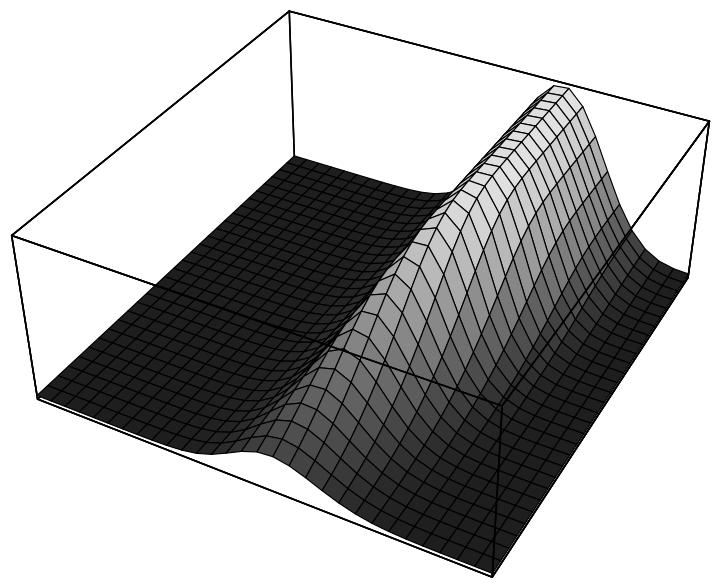
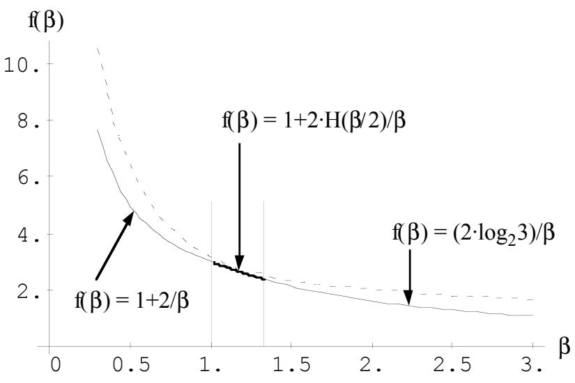

# Implicit Parallelism in Genetic Algorithms\*

Alberto Bertoni+

Marco Dorigo#

TR-93-001-Revised

April 1993

# Abstract

This paper is related to Holland's result on implicit parallelism. Roughly speaking, Holland showed a lower bound of the order of $\frac { \mathrm { { n } } ^ { 3 } } { \mathrm { c } _ { 1 } \sqrt { l } }$ to the number of schemata usefully processed by the genetic algorithm in a population of $\mathbf { n } = \mathbf { c } _ { 1 } \cdot 2 ^ { l }$ binary strings, with $\mathrm { c } _ { 1 }$ a small integer. We analyze the case of population of $\boldsymbol { \mathrm { n } } = 2 ^ { \boldsymbol { \beta l } }$ binary strings where $\beta$ is a positive parameter (Holland's result is related to the case $\beta { = } 1$ ). In the main result, for all $\beta { > } 0$ we state a lower bound on the expected number of processed schemata; moreover, we prove that this bound is tight up to a constant for all $\beta { \geq } 1$ and, in this case, we strengthen in probability the previous result.

# Abstract

This paper is related to Holland's result on implicit parallelism. Roughly speaking, Holland showed a lower bound of the order of $\frac { \mathrm { { n } } ^ { 3 } } { \mathrm { c _ { 1 } } \sqrt { l } }$ to the number of schemata usefully processed by the genetic algorithm in a population of $\boldsymbol { \mathrm { n } } = \boldsymbol { \mathrm { c } } _ { 1 } \cdot 2 ^ { l }$ binary strings, with $c _ { 1 }$ a small integer. We analyze the case of population of $\mathbf { n } = 2 ^ { \beta l }$ binary strings where $\beta$ is a positive parameter (Holland's result is related to the case $\beta { = } 1$ ). In the main result, for all $\beta \mathrm { > } 0$ we state a lower bound on the expected number of processed schemata; moreover, we prove that this bound is tight up to a constant for all $\beta { \geq } 1$ and, in this case, we strengthen in probability the previous result.

# Introduction

The term implicit parallelism, and that closely related of building block, are used to explain how genetic algorithms (GAs) work.

Implicit parallelism refers to the fact that the effective number of schemata processed by a GA is greater than the number of structures processed (i.e., greater than the population size).

A well known result is Holland's estimate of an $\frac { \mathrm { { n } } ^ { 3 } } { \mathrm { c _ { 1 } } \sqrt { l } }$ lower bound on the number of effective schemata processed [1], where $\mathbf { n }$ is the number of structures processed and $c _ { 1 }$ is a small integer. This result is usually interpreted to say that, despite the processing of only n structures, the GA processes at least $\mathbf { n } ^ { 3 }$ schemata. This result has been analyzed in [2], [3], [4], [5], [6], [7], [8].

In our paper, fixed $\mathbf { k } ,$ ε and a parameter $\beta { > } 0$ , we found a lower bound of the type $\mathrm { n } ^ { \mathrm { f ( \beta ) } }$ on the expected number of schemata processed by the genetic algorithm applied to a population of $\mathbf { n } = 2 ^ { \beta l }$ individuals obtained by random extractions from $\{ 0 , 1 \} ^ { \mathrm { k } }$ with probability of being disrupted by crossover less than ε, where $l = \frac { \mathrm { k } \varepsilon } { 2 }$ =  2 . Moreover, we prove that this bound is tight up to a constant for all $\beta { \geq } 1$ and, in this case, we strengthen in probability the previous result, showing that with probability $\mathsf { P } \geq ( 1 - 2 \cdot \mathsf { e } ^ { - 1 } )$ the number of schemata which propagate is greater than one half the previous bound.

# Preliminary definitions

Let ${ < } \{ 0 , 1 \} ^ { \mathrm { k } }$ , $\mathrm { U } >$ be a probability space, where $\{ 0 , 1 \} ^ { \mathrm { k } }$ is the set of words of length k on the alphabet {0,1} and U is the uniform distribution.

Let $\mathbf { \mathcal { M } } = < \omega _ { 1 } , . . . , \omega _ { \mathrm { n } } >$ be a sample (population) of n elements chosen independently from ${ < } \{ 0 , 1 \} ^ { \mathrm { k } } , \mathrm { U } >$ .

Let XOVER $( \mathbf { \mathcal { N } } )$ be the population obtained from $\mathbf { \mathcal { M } }$ applying the usual single point crossover operator [4].

A schema S is a word $S \in \{ 0 , 1 , ^ { * } \} ^ { \mathrm { k } } ;$ 0 and 1 are called specific symbols, \* is said non specific and the positions occupied by specific symbols are said defining positions.

We denote with the set of strings of $\{ 0 , 1 \} ^ { \mathrm { k } }$ obtained from S by substituting every occurrence of symbol $^ *$ with the symbols 0 or 1 in every possible way. Schemata S and $\mathbf { S ^ { \prime } }$ are called disjoint iff $\bar { \bf S } \bar { \ne } \bar { \bf S } ^ { \bar { \bf \Delta } }$ and $\bar { \mathbf { S } } ^ { \bullet } \corner \bar { \mathbf { \Lambda } }$ . In the following we will consider classes of schemata containing the same number of defining positions: in this way all pairs of schemata will be disjoint.

Example: given the schema $\mathrm { S _ { A } } = 0 \mathrm { ~ ^ { * } ~ ^ { * } ~ 1 ~ 1 ~ 0 ~ 0 ~ ^ { * } ~ ^ { * } ~ }$ , positions 1,4,5,6, and 7 are defining positions while $\pmb { \delta } _ { \mathbf { A } }$ is the set of $2 ^ { 4 }$ words that are obtained from $\mathrm { S _ { A } }$ substituting the symbols \* with the symbols 0 or 1 in every possible way.

Given a population $\mathbf { \mathcal { M } }$ , we say that $\mathbf { \mathcal { M } }$ contains an instance of S iff $\cap \pm \emptyset$ .

We say that, because of an application of the crossover operator, schema S propagates if $( \mathbf { \hat { M } } \cap \mathbf { \hat { s } } \mathbf { \neq } \mathbf { \big / } )$ and $( \mathrm { X O V E R } ( \mathbf { \mathcal { M } } ) \bar { \cap } \mathbf { \vec { s } } \not = \emptyset )$ .

Finally, we will consider the "entropy function" $\mathrm { H } ( \boldsymbol { \xi } )$ , where, for $0 { < } \xi { < } 1$ , $\mathrm { H } ( \xi ) = - \xi \cdot \log \xi - ( 1 - \xi ) \cdot \log ( 1 - \xi )$ .

# The main result

# Theorem

Fixed k and ε, let $l = { \frac { \mathrm { k } \mathfrak { E } } { 2 } } .$ , and consider a sample $\mathbf { \mathcal { M } }$ of $\boldsymbol { \mathrm { n } } = \boldsymbol { \mathrm { n } } _ { \beta } = \boldsymbol { \mathrm { c } } _ { 1 } \cdot 2 ^ { l } = 2 ^ { \beta l }$ individuals independently chosen from $< \{ 0 , 1 \} ^ { \mathrm { k } }$ , $\mathrm { U } >$ , where $\beta$ is a parameter $( \beta { > } 0 )$ . Then:

(1) The expected number of disjoint schemata defined in a window of dimension $2 l .$ , and which propagate with a probability $\leq \varepsilon$ of being disrupted by crossover, is at least order of $\frac {  { \mathrm { n } } ^ { \mathrm { f } ( \beta ) } } { \sqrt { \log _ { 2 } \mathrm { n } } } ,$ where $\mathrm { f } ( \beta ) = 1 + 2 / \beta$ for $0 { < } \beta { < } 1$ $\mathrm { 1 , f ( \mathsf { \beta } ) = 1 + 2 \cdot H ( \mathsf { \beta } \mathrm { / 2 } ) / \beta }$ for $1 { \le } \beta { \le } 4 / 3$ , $\operatorname { f } ( { \mathfrak { p } } ) = ( 2 \cdot \log _ { 2 } 3 ) / { \beta }$ for $\beta { > } 4 / 3$ .

(2) For $\beta { \geq } 1$ the previous lower bound order of $\frac { \mathrm { n } ^ { \mathrm { f } ( \mathsf { \beta } ) } } { \sqrt { \mathrm { l o g } _ { \mathit { 2 } } \mathrm { n } } }$ is optimal up to a constant.

(3) For $\beta { \geq } 1$ , with probability ${ \mathrm { P } } { \geq } ( 1 - 2 { \mathrm { e } } ^ { - 1 } )$ the number of schemata which propagate is greater than one half of the previous lower bound order of $\frac { { \bf n } ^ { { \bf f } ( { \bf \beta } ) } } { \sqrt { \log _ { 2 } { \bf n } } }$

# Proof

Consider a window of $2 l$ contiguous positions in the string $\omega \in \mathbb { M }$ . It is clear that any schema with its defining positions within this window will propagate with a probability of being disrupted by crossover $\leq \frac { 2 l } { \mathrm { k } } = \tt { \varepsilon }$ .

The number of disjoint schemata with $x$ defining positions in a window of dimension $2 l$ is $\mathrm { L } = { \binom { 2 l } { x } } \cdot 2 ^ { x }$ . Observe that although $_ \mathrm { L }$ is a function of $x$ for the sake of simplicity we do not make evident this dependency. This function has a maximum for $x = \left\lfloor { \frac { 4 l } { 3 } } - { \frac { 1 } { 3 } } \right\rfloor .$

Let $\{ S _ { \mathrm { 1 } } , . . . , S _ { \mathrm { L } } \}$ be the set of schemata with $x$ defining positions within the window.

Let $\times _ { \mathrm { S i } }$ be the random variable:

Defined $\mathsf { X } = \sum _ { \mathrm { i } = 1 } ^ { \mathrm { L } } \mathsf { X } _ { \mathsf { S } \mathrm { i } } ,$ then $\mathbf { \times } ( < \omega _ { 1 } , . . . , \omega _ { \mathrm { n _ { \beta } } } > )$ is the number of different schemata in $\mathbf { \ M } = < \omega _ { 1 } , . . . , \omega _ { \mathrm { n _ { \beta } } } >$ (obviously $0 \leq \times \leq \mathrm { L }$ ), and the expected value of $\times$ is

$$
\operatorname { E } ( \mathbf { \bigtimes } ) = \sum _ { \mathrm { i = 1 } } ^ { \mathrm { L } } \operatorname { E } ( \mathbf { \bigtimes } _ { \mathrm { S i } } ) = \mathrm { L } \cdot \operatorname { E } ( \mathbf { \bigtimes } _ { \mathrm { S _ { i } } } ) .
$$

Note that although $\times$ is a function of $x ,$ for the sake of simplicity we do not make evident this dependency.

To compute $\mathrm { E } ( \mathsf { \times } _ { \mathrm { S 1 } } )$ , consider, without loss of generality, the schema $S _ { 1 }$ defined on the first $x$ defining positions, i.e. $\mathsf { S } _ { 1 } = \mathsf { b } _ { 1 } \dots \mathsf { b } _ { \mathrm { i } } \dots \mathsf { b } _ { x }$ \* ... \* ... \* , where $\mathsf { b } _ { \mathrm { i } } \in \{ 0 , 1 \}$ . Then $\begin{array} { c } { { \displaystyle \mathbb { E } ( \mathbb { X } _ { S _ { 1 } } ) = \mathrm { P r o b } ( < \omega _ { 1 } , . . . , \ \omega _ { \mathfrak { n } _ { \mathfrak { h } } } > ^ { \mid } \ \exists \mathbf { k } \ \omega _ { \mathbf { k } } \in \mathbb { S } _ { 1 } ) = 1 - \mathrm { P r o b } ( < \omega _ { 1 } , . . . , \ \omega _ { \mathfrak { n } _ { \mathfrak { h } } } > ^ { \mid } \ \omega _ { 1 } \not \in \mathbb { S } _ { 1 } , . . . , \ \omega _ { \mathfrak { n } _ { \mathfrak { h } } } > ^ { \mid } \ \omega _ { 1 } \not \in \mathbb { S } _ { 1 } , . . . , \ \omega _ { \mathfrak { n } _ { \mathfrak { h } } } > ^ { \perp } ) + } } \\ { { \displaystyle 1 - \prod _ { \mathrm { i } = 1 } ^ { \mathfrak { n } _ { \mathfrak { h } } } \mathrm { P r o b } ( \omega _ { \mathrm { i } } \not \in \mathbb { S } _ { 1 } ) = 1 \ - \ \left( 1 - \displaystyle \frac { 1 } { 2 ^ { x } } \right) ^ { \mathfrak { n } _ { \mathfrak { h } } } \geq \quad 1 - \mathrm { e } ^ { - \mathfrak { n } _ { \mathfrak { h } } / 2 ^ { x } } \ \mathrm { b e c a u s e ~ \ o f ~ \ t h e ~ \ i n d e p e n d e r ~ } } } \end{array}$ ce of the extractions and since for every real $z , 1 { \mathrm { – } } z \leq \mathrm { e } ^ { - z }$ .

The expected number of schemata processed by the GA is therefore $\operatorname { E } ( \times ) \geq$ L ⋅ (1 − e− nβ 2x ).

Since $\mathrm { n _ { \beta } } { = } 2 ^ { \beta l } .$ , the expected number of schemata is $\operatorname { E } ( \mathbf { \mathcal { X } } ) \geq \ \binom { 2 l } { x } \cdot 2 ^ { x } \cdot ( 1 - \mathrm { e } ^ { - 2 ^ { \beta l - x } } ) .$

Let $\mathsf { M } ( x , \mathsf { \beta } ) = \binom { 2 l } { x } \cdot 2 ^ { x } \cdot ( 1 - \mathrm { e } ^ { - 2 ^ { \beta l - x } } )$ and $\mathbf { M } ( \beta ) = \mathbf { M } \mathbf { a } \mathbf { x } \mathbf { M } ( x , \beta ) , 0 \leq x \leq 2 l , \beta > ($ . Obviously, for every $\beta$ and calling $\hat { \times }$ the random variable obtained evaluating $\times$ on the maximum of $\mathbf { M } ( x , \beta ) .$ , it holds $\operatorname { E } ( \mathsf { X } ) \geq \operatorname { M } ( \beta ) .$ ; therefore we will estimate the function $\mathrm { M } ( \beta )$ .

First of all, we observe that if $x < < \beta l ,$ , then $\mathrm { M } \big ( \boldsymbol { x } , \boldsymbol { \beta } \big ) \approx \left( \begin{array} { l } { 2 l } \\ { \boldsymbol { x } } \end{array} \right) \cdot \boldsymbol { 2 } ^ { \boldsymbol { x } } ,$ , and that if $x > > \beta l ,$ , then $\mathbf { M } ( x , \mathbf { \beta } ) \approx { \binom { 2 l } { x } } \cdot 2 ^ { x } \cdot \left( 1 - { \left( 1 - { \frac { \mathbf { n } _ { \beta } } { 2 ^ { x } } } \right) } \right) = { \binom { 2 l } { x } } \cdot \mathbf { n } _ { \beta } = { \binom { 2 l } { x } } \cdot 2 ^ { \beta l } .$

Since the maximum of $\binom { 2 l } { x }$ is in $x { = } l ,$ , while the maximum of $\binom { 2 l } { x } \cdot 2 ^ { x }$ is in $x = { \frac { 4 l } { 3 } } ,$ within the approximation we used (see also Fig.1), the class of functions $\mathbf { M } ( x , \beta )$ with parameter $\beta$ has the following behavior.

• For a fixed $\mathsf { \beta } \ll 1 , \mathsf { M } ( x , \mathsf { \beta } )$ reaches the maximum in $x { = } l : \mathrm { M } ( \beta ) \approx { \binom { 2 l } { l } } \cdot 2 ^ { \beta l } .$

$\beta , 1 { \leq } \beta { \leq } 4 / 3 , \mathrm { M } ( x , \beta )$ reaches the maximum in $x { = } \beta l : \mathrm { M } ( \beta ) \approx \left( \begin{array} { c } { { 2 l } } \\ { { \beta l } } \end{array} \right) \cdot 2 ^ { \beta l } .$

• For a fixed $\beta { > } 4 / 3 , \mathrm { M } ( x , \beta )$ reaches the maximum in $\boldsymbol { x } = \frac { 4 l } { 3 } \colon \mathrm { M } ( \beta ) \approx \binom { 2 l } { \lfloor 4 l / 3 \rfloor } \cdot 2 ^ { 4 l / 3 } .$ .

Therefore, by recalling that $\binom { \mathrm { ~ N ~ } } { \xi \cdot \mathrm { N } } \sim \frac { 2 ^ { \mathrm { N } \cdot \mathrm { H } ( \xi ) } } { \sqrt { 2 \pi \xi ( 1 - \xi ) \mathrm { N } } } ,$ , where $_ \mathrm { H }$ is the entropy function, we obtain the following bounds:

$$
\begin{array} { r l r } {  { \beta < 1 \mathrm { ~ t h e n ~ } \mathrm { ~ } \mathrm { ~ M } ( \beta ) \sim \frac { 1 } { \sqrt { \pi l } } \cdot 2 ^ { ( 2 + \beta ) \cdot l } ; } } \\ & { } & \\ & { } & { 1 \leq \beta \leq \frac { 4 } { 3 } \mathrm { ~ t h e n ~ } \mathrm { ~ M } ( \beta ) \sim \frac { 1 } { \sqrt { \pi \beta ( 2 - \beta ) l } } \cdot 2 ^ { ( \beta + 2 \cdot \mathrm { H } ( 8 / 2 ) ) \cdot l } ; } \\ & { } & \\ & { \beta > \frac { 4 } { 3 } \mathrm { ~ t h e n ~ } \mathrm { ~ M } ( \beta ) \sim \displaystyle \frac { 3 } { 2 } \cdot \frac { 1 } { \sqrt { 2 \pi l } } \cdot 2 ^ { ( 2 \log _ { 2 } 3 ) \cdot l } . } \end{array}
$$

  
Figure 1. A 3D plot of the function $M ( x , \beta )$ for $l { = } 2 4$

Since $\mathrm { n } { = } 2 ^ { \beta l }$ , omitting a multiplicative term depending only on the parameter $\beta$ , we obtain for $\mathrm { M } ( \beta )$ a lower bound of the order of ${ \frac { 1 } { \sqrt { \log _ { 2 } \mathrm { n } } } } \cdot \mathrm { n } ^ { \mathrm { f } ( \mathsf { \beta } ) } .$ , where

$$
\begin{array} { l } { { \beta < 1 \mathrm { t h e n } \mathrm { f } ( \beta ) = 1 + 2 / \beta } } \\ { { \displaystyle 1 \leq \beta \leq \frac { 4 } { 3 } \mathrm { t h e n } \mathrm { f } ( \beta ) = 1 + 2 \cdot \mathrm { H } ( \beta / 2 ) / \beta } } \\ { { \displaystyle \beta > \frac { 4 } { 3 } \mathrm { t h e n } \mathrm { f } ( \beta ) = ( 2 \cdot \mathrm { l o g } _ { 2 } 3 ) / \beta } } \end{array}
$$

This proves the first part of the theorem.

Figure 2 gives a pictorial representation of the function $\mathrm { f } ( \beta )$ .

  
Figure 2. A plot of the function $f ( \beta )$

Now we observe that $\mathrm { L } = { \binom { 2 l } { x } } \cdot 2 ^ { x } .$ , while $\mathrm { M } ( \beta )$ is the maximum, in the interval

$$
\leq x \leq 2 l , \mathrm { o f } \mathbf { M } ( x , \mathbf { \beta } ) = \binom { 2 l } { x } \cdot 2 ^ { x } \cdot ( 1 - \mathrm { e } ^ { - 2 ^ { \beta l - x } } ) = \mathrm { L } \cdot ( 1 - \mathrm { e } ^ { - 2 ^ { \beta l - x } } ) .
$$

Therefore, if $\beta { \geq } 1$ then $\mathrm { M } ( \beta ) \geq \hat { \mathrm { L } } \cdot ( 1 - \mathrm { e } ^ { - 1 } )$ , where $\hat { \mathrm { ~ L ~ } }$ denotes the value of $\mathrm { L } = { \binom { 2 l } { x } } \cdot 2 ^ { x }$ evaluated on the maximum of $\mathbf { M } ( x , \beta )$ . Since $\widehat { \mathrm { L } } \cdot ( 1 - \mathrm { e } ^ { - 1 } ) \leq \mathrm { M } ( \beta ) \leq \mathrm { E } ( \widehat { \sf X } ) \leq \widehat { \mathrm { L } }$ , where $\times$ is the random variable obtained evaluating $\times$ on the maximum of $\mathbf { M } ( x , \beta )$ , we obtain that the lower bound $\mathrm { M } ( \beta )$ is optimal (up to a constant) in the case $\beta { \geq } 1$ , under the assumption of considering classes of schemata with the same number of defining positions. This proves (2).

Let now $\mathrm { P } ( \mathbb { Q } )$ be the probability of the event $\begin{array} { r } { \mathbf { 0 } = \{ \mathbf { \mathcal { X } } \geq \mathbf { M } ( \mathbf { \beta } ) / 2 \} . } \end{array}$ , and let $\mathsf { a } = ( 1 - \mathsf { e } ^ { - 1 } )$ . Then, in the case $\beta { \geq } 1$ and remembering that $\widehat { \mathbf { x } } \leq \widehat { \mathbf { L } }$ :

$$
\begin{array} { r l } { \mathbf { a } \cdot \hat { \mathbf { L } } \leq \mathbf { E } ( \widehat { \mathbf { X } } ) = } & { { } \int \hat { \mathbf { X } } \mathbf { d } \mu = \int _ { \mathbf { Q } } \hat { \mathbf { X } } \mathbf { d } \mu + \int _ { \mathbf { Q } ^ { \mathrm { c } } } \hat { \mathbf { X } } \mathbf { d } \mu \leq \hat { \mathrm { L } } \cdot \int _ { \mathbf { Q } } \mathbf { d } \mu + \frac { \hat { \mathrm { L } } } { 2 } \cdot \int _ { \mathbf { Q } ^ { \mathrm { c } } } \mathbf { d } \mu = \hat { \mathrm { L } } \cdot \hat { \mathbf { L } } \mathbf { a } } \end{array}
$$

$$
\hat { \mathrm { L } } \cdot \mathrm { P } ( { \bf Q } ) + \mathrm { \frac { ~ \hat { L } ~ } { ~ 2 ~ } } \cdot ( 1 - \mathrm { P } ( { \bf Q } ) ) .
$$

Therefore $\mathrm { P } ( \mathfrak { Q } ) \geq 1 \mathfrak { - } 2 \mathrm { e } ^ { - 1 }$ . By remembering the order of the lower bound $\frac { { \bf n } ^ { { \bf f } ( \mathsf { \bf \beta } ) } } { \sqrt { \log _ { 2 } { \bf n } } } \mathrm { ~ f o r ~ }$ ${ \bf M } ( \beta ) / 2$ we conclude the proof.

# Conclusions

In this paper we showed that the lower bound on the expected number of schemata processed by an application of the genetic algorithm to a population of $\mathrm { n } _ { \beta } { = } 2 ^ { \beta l }$ individuals obtained by random and independent extractions from $\{ 0 , 1 \} ^ { \mathrm { k } }$ with a probability of being disrupted by crossover $\leq \varepsilon$ is a monotonically decreasing function of the population dimension (i.e., of $\beta$ ). We identify three interesting ranges of values of the parameter $\beta$ .

$1 \bullet$ For $\beta { < } 1$ the lower bound on the expected number of schemata processed by the genetic algorithm is order of $\frac { 1 } { \sqrt { \log _ { 2 } \mathfrak { n } } } \cdot \mathfrak { n } ^ { ( 2 + \beta ) / \beta }$ .

2 • For $1 \leq { \mathsf { \beta } } \leq { \frac { 4 } { 3 } }$ the lower bound on the expected number of schemata processed by the genetic algorithm is order of $\frac { 1 } { \sqrt { \log _ { 2 } \tt n } } \cdot \tt n ^ { \mathrm { 1 + 2 \cdot H ( \tt \{ \beta / 2 \} / \beta } }$ . Imposing the constraint $\beta { = } 1$ (as Holland did) gives the well known lower bound order of $\frac { { \mathrm { n } } ^ { 3 } } { \sqrt { l } }$ .

3 • For $\beta { > } 4 / 3$ the expected number of schemata processed by the GA remains constant $( \mathrm { M } ( x , \beta ) = \left( \begin{array} { c } { { 2 l } } \\ { { \lfloor 4 l / 3 \rfloor } } \end{array} \right) \cdot 2 ^ { 4 l / 3 } )$ and the lower bound becomes order of ${ \frac { 1 } { \sqrt { \log _ { 2 } \mathrm { n } } } } \cdot \mathrm { n } ^ { ( 2 \cdot \log _ { 2 } 3 ) / \beta } .$

We also show that for $\beta { \geq } 1$ the lower bound is optimal up to a constant and that with probability $( 1 - 2 \mathrm { e } ^ { - 1 } )$ the number of schemata propagated is greater than one half the value of the lower bound.

It is widely believed that Holland has proved an order $\mathbf { n } ^ { 3 }$ lower bound on the number of effective schemata processed. However, the problem with Holland's result is that one doesn't get to pick an arbitrary population size n and then assert that order of $\mathbf { n } ^ { 3 }$ schemata are processed. In fact, it is the population size n (or more precisely its relationship to the window size $2 l$ as given by the parameter $\beta$ and the defining relation $\mathrm { n _ { \beta } } { = } 2 ^ { \beta l }$ ) which determines whether $\boldsymbol { \mathrm { n } } ^ { 3 } , \boldsymbol { \mathrm { n } } ^ { 3 0 0 0 } , \boldsymbol { \mathrm { n } } ^ { 0 . 3 } ,$ (or any number of other possibilities) is the appropriate bound.

For example, choosing $\beta { = } 0 . 1$ gives a lower bound order of ${ \frac { \mathrm { n } ^ { 2 1 } } { \sqrt { \log _ { 2 } \mathrm { n } } } } , \beta \mathrm { = } 1 0$ gives a lower bound order of ${ \frac { \mathbf { n } ^ { 0 . 3 1 7 } } { \sqrt { \log _ { 2 } \mathbf { n } } } } ,$ and $\scriptstyle \beta = 1 0 0 0$ gives a lower bound order of n0.00317 $\frac { \mathrm { n } ^ { 0 . 0 0 3 1 7 } } { \sqrt { \mathrm { l o g } _ { 2 } \mathrm { n } } } .$ Only the choice $\beta { = } 1$ gives Holland's $\frac { \mathrm { n } ^ { 3 } } { \sqrt { \log _ { 2 } \mathrm { n } } }$ estimate.

# Acknowledgement

We acknowledge the many useful comments provided by one of the referees. This work was partially supported by Progetto Finalizzato Sistemi Informatici e Calcolo Parallelo - Sottoprogetto 2 - Tema Processori Dedicati and by MURST $4 0 \%$ - Modelli e specifiche per sistemi concorrenti. Thanks to Alberto Colorni for helpful comments.

# Список литературы

1 . Booker L.B., D.E. Goldberg & J.H. Holland (1989). Classifier Systems and Genetic Algorithms, Artificial Intelligence, 40, 2, 235-282.   
2 . Fitzpatrick J.M. & J.J. Grefenstette (1988). Genetic Algorithms in Noisy Environments, Machine Learning 3, 2-3, 101-120.   
3. Goldberg D.E. (1985). Optimal Initial Population Size for Binary-coded Genetic Algorithms. TCGA Report N.85001, The University of Alabama, Tuscaloosa, AL.   
4 . Goldberg D.E. (1989). Genetic Algorithms in Search, Optimization & Machine Learning, Addison-Wesley, Reading, MA.   
5 . Goldberg D.E. (1989). Sizing populations for serial and parallel Genetic Algorithms, Proceedings of the Third International Conference on Genetic Algorithms, George Mason University, Morgan Kaufmann, 70-79.   
6. Holland J.H. (1975). Adaptation in Natural and Artificial Systems, Ann Arbor: The University of Michigan Press. Reprinted by MIT, 1992.   
7. Holland J.H. (1980). Adaptive algorithms for discovering and using general patterns in growing knowledge-bases, International journal of Policy Analysis and Information Systems, 4, 217-240.   
8. Holland J.H. (1988). The Dynamics of Searches Directed by Genetic Algorithms, in: Evolution, Learning and Cognition Lee, Y.C. (Ed.) World Scientific, 111-127.