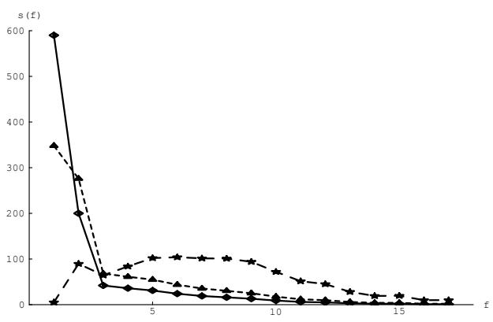
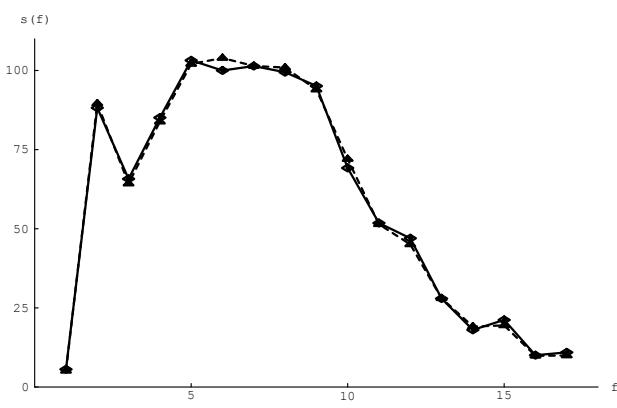
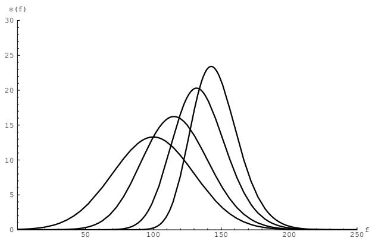
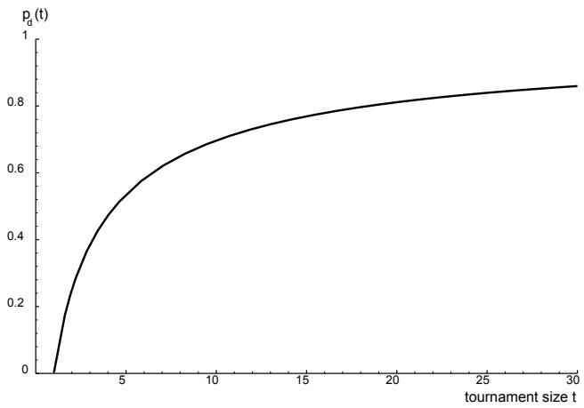
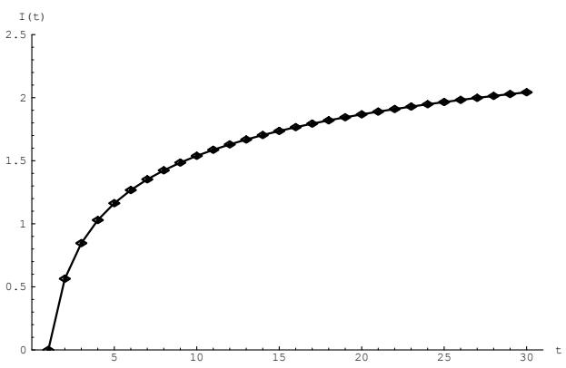
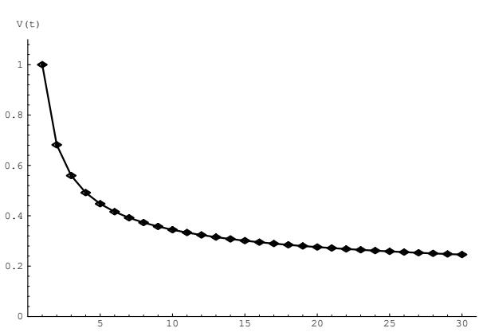

# A Mathematical Analysis of Tournament Selection

Tobias Blickle and Lothar Thiele blickle@tik.ethz.ch thiele@tik.ethz.ch Computer Engineering and Communication Networks Lab (TIK) Swiss Federal Institute of Technology Zurich (ETHZ) Gloriastrasse 35 CH-8092 Zürich, Switzerland

# Abstract

Genetic Algorithms are a common probabilistic optimization method based on the model of natural evolution. One important operator in these algorithms is the selection scheme used to prefer better individuals. In this paper a new description model for selection schemes is introduced that operates on the fitness distribution of the population. With this method an extensive mathematical analysis of the tournament selection scheme is carried out that allows an exact prediction of the fitness values after selection. Furthermore several new properties of tournament selection are derived.

# 1 INTRODUCTION

Genetic Algorithms $( G A )$ are probabilistic search algorithms characterized by the fact that a number $N$ of potential solutions (called individuals $J _ { i } \in \mathbf { J }$ where J represents the space of all possible individuals) of the optimization problem simultaneously sample the search space. This population $P = \left\{ J _ { 1 } , J _ { 2 } , . . . , J _ { N } \right\} \in$ ${ \bf J } ^ { N }$ is modified according to the natural evolutionary process: after initialization, selection and recombination are executed in a loop until some termination criterion is reached. Each run of the loop is called a generation and $P ( \tau )$ denotes the population at generation $\tau$ .

The selection operator is intended to improve the average quality of the population by giving individuals of higher quality a higher probability to be copied into the next generation. Thereby selection focusses the search on promising regions in the search space. The quality of an individual is measured by a fitness function $f : \textbf { J } \mapsto \textbf { R }$ . Recombination changes the genetic material in the population by crossover or by mutation in order to exploit new points in the search space.

The balance between exploitation and exploration can be adjusted either by the selection pressure of the selection operator or by the recombination operator, e.g. by the probability of crossover. As this balance is critical for the behaviour of the GA it is of great interest to know the properties of the selection and recombination operators to understand their influence on the convergence speed.

Some work has been done to classify the different selection schemes such as proportionate selection, ranking selection, tournament selection. To do so, Goldberg [Goldberg and Deb, 1991] introduced the term of takeover time. The takeover time is the number of generations that is needed for a single best individual to fill up the whole population if no recombination is used at all. Recently Bäck [Bäck, 1994] has analyzed the most prominent selection schemes used in Evolutionary Algorithms with respect to their takeover time. In [Mühlenbein and Schlierkamp-Voosen, 1993] the selection intensity $I$ in the so called Breeder Genetic Algorithm (BGA) is used to measure the progress in the population. The selection intensity is derived for proportional selection and truncation selection. De la Maza and Tidor [de la Maza and Tidor, 1993] analyzed several selection methods according to their scale and translation invariance.

An analysis based on the behaviour of the best individual (as done by Goldberg and Bäck) or on the average population fitness (as done by Mühlenbein) only describes a small aspect of a selection method. In this paper a selection scheme is described by its interaction on the distribution of fitness values. This description is introduced in the next section. In Section 3 an analysis of the tournament selection is carried out and the properties of the tournament selection are derived in Section 4. Section 5 compares tournament selection with other selection methods, namely truncation selection. Finally some conclusions are given.

# 2 DESCRIPTION OF SELECTION SCHEMES

In general the behaviour of a selection scheme depends only on the fitness values of the individuals in the population. In this paper we describe a selection scheme using the fitness distribution before and after selection. It thereby is assumed that selection and recombination are done sequentially: first a selection phase creates an intermediate population and then recombination is performed with a certain probability on the individuals of this intermediate population to get the population for the next generation. This kind of description differs from the common paradigms where selection is made to obtain the individuals for recombination ([Goldberg, 1989; Koza, 1992]). But it is mathematically equivalent and allows to analyze the selection method separately.

Definition 2.1 (Fitness distribution) The function $s : R \mapsto Z _ { 0 } ^ { + }$ assigns to each fitness value $f \in R$ the number of individuals in a population $P \in \mathbf { J } ^ { N }$ carrying this fitness value. s is called the fitness distribution of a population $P$ .

Definition 2.2 (Cumulative fitness distribution) Let n be the number of unique fitness values and $f _ { 1 } < . . . < f _ { n - 1 } < f _ { n }$ $( n \leq N )$ the ordering of the fitness values with $f _ { 1 }$ denoting the worst fitness occuring in the population and $f _ { n }$ denoting the best fitness in the population.

$S ( f _ { i } )$ denotes the number of individuals with fitness value $f _ { i }$ or worse and is called cumulative fitness distribution, i.e.

$$
S ( f _ { i } ) = \left\{ \begin{array} { r l l } { { 0 } } & { { : } } & { { i < 1 } } \\ { { \sum _ { j = 1 } ^ { j = i } s ( f _ { j } ) } } & { { : } } & { { 0 \leq i \leq n } } \\ { { N } } & { { : } } & { { i > n } } \end{array} \right.
$$

With these definitions a selection method can be described as a function that transforms a fitness distribution into another fitness distribution.

Definition 2.3 (Selection method) $A$ selection method $\Omega$ is a function that transforms a fitness distribution s into an new fitness distribution $s ^ { \prime }$ :

As the selection methods are probabilistic we will often make use of the expected fitness distribution.

Definition 2.4 (Expected fitness distribution) $\Omega ^ { * }$ denotes the expected fitness distribution after applying the selection method $\Omega$ to the fitness distribution $s$ , i.e.

$$
\Omega ^ { \ast } ( s , p a r \_ l i s t ) : = E ( \Omega ( s , p a r \_ l i s t ) )
$$

$s ^ { * } = \Omega ^ { * } ( s , p a r \_ l i s t )$ is used as an abbreviation.

With this notation not only the behaviour of the best individual in the population or of the average fitness value can be described but all the aspects of a selection scheme. Our aim is to predict $s ^ { * } \left( f \right)$ out of the given fitness distribution $s ( f )$ . In the next section we want to derive this prediction for tournament selection.

# 3 TOURNAMENT SELECTION

Tournament selection works as follows: Choose some number $t$ of individuals randomly from the population and copy the best individual from this group into the intermediate population, and repeat $N$ times. Often tournaments are held only between two individuals (binary tournament) but a generalization is possible to an arbitrary group size $t$ called tournament size.

For the following calculations we assume that tournament selection is done with replacement.

Theorem 3.1 The expected fitness distribution $\Omega _ { T } ^ { * } ( s , t )$ after performing tournament selection with tournament size t on the distribution s is

$$
s ^ { * } ( f _ { i } ) = \Omega _ { T } ^ { * } ( s , t ) ( f _ { i } ) = N \left( \left( \frac { S ( f _ { i } ) } { N } \right) ^ { t } - \left( \frac { S ( f _ { i - 1 } ) } { N } \right) ^ { t } \right)
$$

Proof: We first calculate the expected number of individuals with fitness $f _ { i }$ or worse, i.e. $S ^ { * } \left( f _ { i } \right)$ . An individual with fitness $f _ { i }$ or worse can only win the tournament if all other individuals in the tournament have a fitness of $f _ { i }$ or worse. This means we have to calculate the probability that all $t$ individuals have a fitness of $f _ { i }$ or worse. As the probability to choose an individual with fitness $f _ { i }$ or worse is given by $\textstyle { \frac { S ( f _ { i } ) } { N } }$ we get

$$
s ^ { \prime } = \Omega ( s , p a r \_ l i s t )
$$

$$
S ^ { * } \left( f _ { i } \right) = N \left( \frac { S ( f _ { i } ) } { N } \right) ^ { t }
$$

par_list is an optional parameter list of the selection method.

Using this equation and the relation $s ^ { * } ( f _ { i } ) = S ^ { * } ( f _ { i } ) -$ $S ^ { * } \left( f _ { i - 1 } \right)$ (see Definition 2.2) we obtain (4). (4) shows the strong influence of the tournament size $t$ on the behavior of the selection scheme. Obviously for $t ~ = ~ 1$ we obtain (in average) the unchanged initial distribution as $s ^ { * } ( f _ { i } ) = \Omega _ { T } ^ { * } ( s , 1 ) ( f _ { i } ) =$ $\begin{array} { r } { N \left( \frac { \hat { S ( f _ { i } ) } } { N } - \frac { S ( f _ { i - 1 } ) } { N } \right) = S ( f _ { i } ) - S ( f _ { i - 1 } ) = s ( f _ { i } ) } \end{array}$ .

As an example of a discrete fitness distribution we use the initial fitness distribution of the "wall-followingrobot" problem from Koza [Koza, 1992]. This distribution is typical of problems solved by genetic programming: many bad (fitness value 1) and only very few good (fitness value 17) individuals exist. Figure 1 shows the initial fitness distribution and the resulting fitness distributions for different tournament sizes. The high agreement between the theoretical derived results and a simulation is verified in Figure 2. Here the distributions accoring to (4) and the average of 20 simulations are shown.

  
Figure 1: Fitness Distribution before $( - )$ and after Tournament Selection with Tournament Size $t = 2$ (- - -), and $t = 1 0 ~ ( - ~ - )$ . The Population Size is $N = 1 0 0 0$ .

In [Bäck, 1994] the probability for the individual with rank $i$ to be selected by tournament selection is given as $p _ { i } = N ^ { - t } ( ( N - i + 1 ) ^ { t } - ( N - i ) ^ { t } )$ , under the assumption that the individuals are ordered according to their fitness value $f ( J _ { 1 } ) \leq f ( J _ { 2 } ) \leq . . . \leq f ( J _ { N } )$ . Note that Bäck uses an "reversed" fitness function where the best individual has the lowest index. For comparison with our results we transform the task into an maximization task using $j = N - i + 1$ :

$$
p _ { j } = N ^ { - t } ( j ^ { t } - ( j - 1 ) ^ { t } ) \qquad 1 \leq j \leq N
$$

This formula is as a special case of (4) with all individuals having a different fitness value. Then $s ( f _ { i } ) = 1$ for all $i \in [ 1 , N ]$ and $S ( f _ { i } ) = i$ and $\begin{array} { r } { p _ { i } = \frac { s ^ { * } ( f _ { i } ) } { N } } \end{array}$ s (fi yields the same equation as given by Bäck. Note that this formula is not valid if some individuals have the same fitness value.

  
Figure 2: Comparison between Theoretical derived Distribution $( - )$ and Simulation (- - -) (Tournament Size $t = 1 0$ ).

# 3.1 DESCRIPTION USING CONTINUOUS DISTRIBUTION

We will now describe the distribution $s ( f )$ as a continuous distribution $\bar { s } ( f )$ allowing the following properties to be easily derived. To do so, we assume continuously distributed fitness values. The range of the function $\overline { { s } } ( f )$ is $f _ { 0 } < f \le f _ { n }$ , using the same notation as in the discrete case.

We denote all functions in the continuous case with a bar, e.g. we write $\bar { s } ( f )$ instead of $s ( f )$ . Similar sums are replaced by integrals, hence

$$
\bar { S } ( f ) = \int _ { f _ { 0 } } ^ { f } \bar { s } ( x ) d x
$$

denotes the continuous cumulative fitness distribution.

Theorem 3.2 Let s be the continuous fitness distribution of the population. Then the expected fitness distribution $\overline { { \Omega } } _ { T } ^ { * } ( \bar { s } , \bar { t } )$ after performing tournament selection with tournament size t is

$$
\bar { s } ^ { * } \left( f \right) = \overline { { \Omega } } _ { T } ^ { * } \left( \bar { s } , t \right) \left( f \right) = t \bar { s } \left( f \right) \left( \frac { \bar { S } \left( f \right) } { N } \right) ^ { t - 1 }
$$

Proof: Analogous to the proof of the discrete case the probability of an individual with fitness $f$ or worse to win the tournament is given by

$$
\bar { S } ^ { * } \left( f \right) = N \left( \frac { \bar { S } ( f ) } { N } \right) ^ { t }
$$

As $\begin{array} { r } { \bar { s } ^ { * } \left( f \right) = \frac { d \bar { S } ^ { * } \left( f \right) } { d f } } \end{array}$ , we obtain (8).

Figure 3 shows the resulting distributions after tournament if the initial distribution is a Gaussian distribution $G ( \mu , \sigma )$ with $\begin{array} { r } { G ( \mu , \sigma ) ( x ) = \frac { 1 } { \sqrt { 2 \pi } \sigma } e ^ { - \frac { ( x - \mu ) ^ { 2 } } { 2 \sigma ^ { 2 } } } } \end{array}$ . The distribution $\bar { s } _ { G } ( f ) \ = \ N G ( \mu , \sigma ) ( f )$ with $\sigma = 3 0 , \mu =$ 100, $N = 1 0 0 0$ and $f _ { 0 } = - \infty , f _ { n } = + \infty$ and the resulting distributions after tournament with tournament size 2, 5, and 10 are shown in the interesting region $f \in [ 0 , 2 0 0 ]$ .

  
Figure 3: Gaussian Fitness Distribution approximately leads again to Gaussian Distributions after Tournament (from left to right: initial Distribution, Distribution after Tournament Selection with Tournament Size $t = 2$ , $t = 5$ , $t = 1 0$ ).

# 4 PROPERTIES OFTOURNAMENT SELECTION

# 4.1 CONCATENATION OFTOURNAMENT SELECTION PHASES

An interesting property of tournament selection is the concatenation of several selection phases. Assume an arbitrary population with the fitness distribution s. We apply first tournament selection with tournament size $t _ { 1 }$ to this population and then on the resulting population again tournament selection with tournament size $t _ { 2 }$ (with no recombination in between). The obtained fitness distribution is the same as if only one tournament selection with the tournament size $t _ { 1 } t _ { 2 }$ is applied to the initial distribution $\bar { s }$ .

Theorem 4.1 Let s be a fitness distribution and $t _ { 1 } , t _ { 2 } \geq 1$ two tournament sizes. Then the following equation holds

$$
\overline { { \Omega } } _ { T } ^ { * } ( \overline { { \Omega } } _ { T } ^ { * } ( \bar { s } , t _ { 1 } ) , t _ { 2 } ) = \overline { { \Omega } } _ { T } ^ { * } ( \bar { s } , t _ { 1 } t _ { 2 } )
$$

Proof:

$$
\begin{array} { l } { \displaystyle \overline { { \Omega } } _ { T } ^ { * } \big ( \overline { { \Omega } } _ { T } ^ { * } \big ( \bar { s } , t _ { 1 } \big ) , t _ { 2 } \big ) ( f ) = } \\ { \displaystyle t _ { 2 } \overline { { \Omega } } _ { T } ^ { * } \big ( \bar { s } , t _ { 1 } \big ) ( f ) \left( \frac { 1 } { N } \int _ { f _ { 0 } } ^ { f } \overline { { \Omega } } _ { T } ^ { * } \big ( \bar { s } , t _ { 1 } \big ) ( x \big ) d x \right) ^ { t _ { 2 } - 1 } = } \end{array}
$$

$$
\begin{array} { l } { \displaystyle _ { t _ { 2 } t _ { 1 } \bar { s } ( f ) } \left( \frac { 1 } { N } \int _ { f _ { 0 } } ^ { f } \bar { s } ( x ) d x \right) ^ { t _ { 1 } - 1 } } \\ { \displaystyle _ { * } \left( \frac { 1 } { N } \int _ { f _ { 0 } } ^ { f } t _ { 1 } \bar { s } ( x ) \left( \frac { 1 } { N } \int _ { f _ { 0 } } ^ { x } \bar { s } ( y ) d y \right) ^ { t _ { 1 } - 1 } d x \right) ^ { t _ { 2 } - 1 } } \end{array}
$$

As

$$
\begin{array} { l } { \displaystyle \int _ { f _ { 0 } } ^ { f } t _ { 1 } \bar { s } ( \boldsymbol { x } ) \left( \frac 1 N \int _ { f _ { 0 } } ^ { x } \bar { s } ( \boldsymbol { y } ) d \boldsymbol { y } \right) ^ { t _ { 1 } - 1 } d \boldsymbol { x } } \\ { \displaystyle \quad = N \left( \frac 1 N \int _ { f _ { 0 } } ^ { f } \bar { s } ( \boldsymbol { x } ) d \boldsymbol { x } \right) ^ { t _ { 1 } } } \end{array}
$$

we can write

$$
\begin{array} { l } { \displaystyle \overline { { \Omega _ { T } ^ { * } } } ( \overline { { \Omega } } _ { T } ^ { * } ( \bar { s } , t _ { 1 } , f ) , t _ { 2 } , f ) = } \\ { \displaystyle t _ { 2 } t _ { 1 } \bar { s } ( f ) \left( \frac { 1 } { N } \int _ { f _ { 0 } } ^ { f } \bar { s } ( x ) d x \right) ^ { t _ { 1 } - 1 } } \\ { \displaystyle * \left( \left( \frac { 1 } { N } \int _ { f _ { 0 } } ^ { f } \bar { s } ( x ) d x \right) ^ { t _ { 1 } } \right) ^ { t _ { 2 } - 1 } = } \\ { \displaystyle t _ { 2 } t _ { 1 } \bar { s } ( f ) \left( \frac { 1 } { N } \int _ { f _ { 0 } } ^ { f } \bar { s } ( x ) d x \right) ^ { t _ { 1 } t _ { 2 } - 1 } = \overline { { \Omega _ { T } ^ { * } } } ( \bar { s } , t _ { 1 } t _ { 2 } ) ( f ) } \end{array}
$$

In [Goldberg and Deb, 1991] the proportion $P _ { \tau }$ of bestfit individuals after $\tau$ selections with tournament size $t$ (without recombination) is given to

$$
P _ { \tau } = 1 - ( 1 - P _ { 0 } ) ^ { t ^ { \tau } }
$$

This can be obtained as a special case from Theorem 4.1.

Corollary 4.1 Let $\bar { s } ( f )$ be a fitness distribution representable as

$$
\bar { s } ( f ) = \beta g ( f ) \left( \frac { \int _ { f _ { 0 } } ^ { f } g ( x ) d x } { N } \right) ^ { \beta - 1 }
$$

with $\beta \geq 1$ and $\begin{array} { r } { \int _ { f _ { 0 } } ^ { f _ { n } } g ( x ) d x = N } \end{array}$ . Then the expected distribution after tournament with tournament size $t$ is

$$
\bar { s } ^ { * } ( f ) = \beta t g ( f ) \left( \frac { \int _ { f _ { 0 } } ^ { f } g ( x ) d x } { N } \right) ^ { \beta t - 1 }
$$

Proof: If we assume that $\overline { { s } } ( f )$ is the result of applying tournament selection with tournament size $\beta$ on the distribution $g ( f )$ , (13) is directly obtained using Theorem 4.1.

# 4.2 REPRODUCTION RATE

Definition 4.1 (Reproduction rate) The reproduction rate $\bar { R } ( f )$ denotes the ratio of the number of individuals with a certain fitness value $f$ after and before selection

$$
\bar { R } ( f ) = \left\{ \begin{array} { r l } { { \frac { \bar { s } ^ { * } ( f ) } { \bar { s } ( f ) } } } & { { : \quad \bar { s } ( f ) > 0 } } \\ { { 0 } } & { { : \quad \bar { s } ( f ) = 0 } } \end{array} \right.
$$

A reasonable selection method should favor good individuals by assigning them a reproduction rate $\bar { R } ( f ) >$ 1 and punish bad individuals by a ratio $\bar { R } ( f ) < 1$ . The reproduction rate of tournament selection is

$$
\bar { R } ( f ) = t \left( \frac { \bar { S } ( f ) } { N } \right) ^ { t - 1 }
$$

This means that the individuals with the lowest fitness have the lowest reproduction rate and the individuals with the highest fitness have a reproduction rate of $t$ . In between the reproduction rate is monotonically increasing.

# 4.3 LOSS OF DIVERSITY

During every selection phase bad individuals will be lost and be replaced by copies of better one. Thereby a certain amount of "genetic material" is lost that was contained in the bad individuals. The number of individuals that are replaced corresponds to the strength of the "loss of diversity". This leads to the following new definition.

Definition 4.2 (Loss of diversity) The loss of diversity $p _ { d }$ is the proportion of individuals of a population that is not selected during the selection phase.

Theorem 4.2 The loss of diversity of tournament selection is

$$
p _ { d } = t ^ { - \frac { 1 } { t - 1 } } - t ^ { - \frac { t } { t - 1 } }
$$

Proof: Let $f _ { z }$ denote the fitness value such that $\bar { R } ( f _ { z } ) = 1$ . For all fitness values $f \in ] f _ { 0 } , f _ { z } ]$ the reproduction rate is less than one. Hence the number of individuals that are not the selected during selection is given by $\begin{array} { r } { \int _ { f _ { 0 } } ^ { f _ { z } } \left( \bar { s } ( x ) - \bar { s } ^ { * } \left( x \right) \right) d x } \end{array}$ . It follows that

$$
\begin{array} { r c l } { { p _ { d } } } & { { = } } & { { \displaystyle \frac { 1 } { N } \int _ { f _ { 0 } } ^ { f _ { z } } \left( \bar { s } ( x ) - \bar { s } ^ { * } ( x ) \right) d x } } \\ { { } } & { { = } } & { { \displaystyle \frac { 1 } { N } \left( \int _ { f _ { 0 } } ^ { f _ { z } } \bar { s } ( x ) d x - \int _ { f _ { 0 } } ^ { f _ { z } } \bar { s } ^ { * } ( x ) d x \right) } } \\ { { } } & { { = } } & { { \displaystyle \frac { 1 } { N } \left( \bar { S } ( f _ { z } ) - \bar { S } ^ { * } ( f _ { z } ) \right) } } \end{array}
$$

From the demand that $\bar { R } ( f _ { z } ) ~ = ~ 1$ it follows that $\bar { S } ( f _ { z } ) = N t ^ { - \frac { 1 } { t - 1 } }$ and hence $p _ { d } = t ^ { - \frac { 1 } { t - 1 } } - t ^ { - \frac { t } { t - 1 } }$

It is interesting to note that the loss of diversity is independent of the initial fitness distribution. It turns out that the number of individuals lost increases with the tournament size (see Figure 4). About the half of the population is lost at tournament size $t = 5$ .

  
Figure 4: The Loss of Diversity $p _ { d }$ of Tournament Selection

# 4.4 SELECTION INTENSITY

The term "selection intensity" or "selection pressure" is often used in different contexts and for different properties of a selection method. Goldberg and Deb [Goldberg and Deb, 1991] and Bäck [Bäck, 1994] use the "takeover time" to define the selection pressure.

We use the term "selection intensity" in the same way it is used in population genetics [Bulmer, 1980]. Mühlenbein has adopted the definition and applied it to genetic algorithms [Mühlenbein and SchlierkampVoosen, 1993].

The change of the average fitness of the population is a reasonable measure for selection intensity, but this depends on the initial fitness distribution. Using the normalized Gaussian distribution $G ( 0 , 1 )$ as initial fitness distribution leads to the following definition.

Definition 4.3 (Selection intensity) The selection intensity $I$ is the expected average fitness value of the population after applying the selection method $\Omega$ to the normalized Gaussian distribution $G ( 0 , 1 ) ( f ) : =$ ${ \frac { 1 } { \sqrt { 2 \pi } } } e ^ { - { \frac { f ^ { 2 } } { 2 } } }$

$$
I = \int _ { - \infty } ^ { \infty } f \overline { { \Omega } } ^ { \ast } ( G ( 0 , 1 ) ) ( f ) \ d f
$$

The "effective" average fitness value $\bar { M } ^ { * }$ of a Gaussian distribution with mean $\mu$ and variance $\sigma ^ { 2 }$ can easily be derived as $\bar { M } ^ { * } = \sigma I + \stackrel { . } { \mu }$ . Note that this definition of the selection intensity can only be applied if the selection method is scale and translation invariant. This is the case for tournament selection as shown for example in [de la Maza and Tidor, 1993].

To calculate the selection intensity of tournament selection the integral equation

$$
I _ { T } ( t ) = \int _ { - \infty } ^ { \infty } t \ x \ \frac { 1 } { \sqrt { 2 \pi } } e ^ { - \frac { x ^ { 2 } } { 2 } } \left( \int _ { - \infty } ^ { x } \frac { 1 } { \sqrt { 2 \pi } } e ^ { - \frac { y ^ { 2 } } { 2 } } d y \right) ^ { t - 1 } \ d x
$$

has to be evaluated. This can be done analytically for the cases $t = 2$ and $t = 3$ :

$$
\begin{array} { l l l } { { I _ { T } ( 2 ) } } & { { = } } & { { { \displaystyle \frac { 1 } { \sqrt { \pi } } } } } \\ { { I _ { T } ( 3 ) } } & { { = } } & { { { \displaystyle \frac { 3 } { 2 \sqrt { \pi } } } } } \end{array}
$$

For larger tournament sizes (18) can be accurately evaluated by numerical integration. The result is shown in Figure 5 for a tournament size from 1 to 30.

  
Figure 5: Dependence of the Selection Intensity $I$ on the Tournament Size $t$ .

Thierens and Goldberg derive for a tournament size of two the same average fitness value [Thierens and Goldberg, 1994] in a completely different manner. But their formulation can not be extended to other tournament sizes.

An explicit expression of (18) may not exist. By means of the steepest descent method (see e.g. [Henrici, 1977]) an approximation for large tournament sizes can be given. But even for small tournament sizes this approximation gives acceptable results.

The calculations lead to the following recursion equation:

$$
I _ { T } ( t ) ^ { k } \approx \sqrt { c _ { k } ( \ln ( t ) - \ln ( I _ { T } ( t ) ^ { k - 1 } ) ) }
$$

with $I _ { T } ( t ) ^ { 0 } = 1$ and $k$ the recursion depth. The calculation of the constants $c _ { k }$ is difficult. Taking a rough approximation with $k = 2$ the following equation is obtained that approximates (18) with an relative error of less than $2 . 4 \%$ for $t \in [ 2 , 5 ]$ , for tournament sizes $t > 5$ the relative error is less than $1 \%$ :

$$
I _ { T } ( t ) \approx { \sqrt { 2 ( \ln ( t ) - \ln ( { \sqrt { 4 . 1 4 \ \ln ( t ) } } ) ) } }
$$

# 4.5 SELECTION VARIANCE

In addition to the selection intensity we introduce the term of "selection variance".

Definition 4.4 (Selection variance) The selection variance $V$ is the expected variance of the fitness distribution of the population after applying the selection method $\Omega$ to the normalized Gaussian distribution $G ( 0 , 1 )$ .

$$
V = \int _ { - \infty } ^ { \infty } ( f - I ) ^ { 2 } { \overline { { \Omega } } } ^ { * } ( G ( 0 , 1 ) ) ( f ) d f
$$

Note that there is a difference between the selection variance and the loss of diversity. The loss of diversity gives the proportion of individuals that are not selected, regardless of their fitness value. As a result it is possible to determine the loss of diversity independent of the initial fitness distribution. The selection variance is defined as the new variance of the fitness distribution assuming a Gaussian initial fitness distribution. By specifying the fitness values specific statements about the selection variance (as well as about the selection intensity) can be made.

To determine the selection variance we need to solve the equation

$$
\begin{array} { l l l } { { V _ { T } ( t ) } } & { { = } } & { { \displaystyle \int _ { - \infty } ^ { \infty } t ( x - I _ { T } ( t ) ) ^ { 2 } \ \frac { 1 } { \sqrt { 2 \pi } } e ^ { - \frac { x ^ { 2 } } { 2 } } } } \\ { { * } } & { { \displaystyle \left( \int _ { - \infty } ^ { x } \frac { 1 } { \sqrt { 2 \pi } } e ^ { - \frac { y ^ { 2 } } { 2 } } d y \right) ^ { t - 1 } \ d x } } \end{array}
$$

For a binary tournament we have

$$
V _ { T } ( 2 ) = 1 - \frac { 1 } { \pi }
$$

Here again only numerical computations give the selection variance for larger tournament sizes. Figure 6 shows the dependence of the selection variance on the tournament size.

  
Figure 6: The Dependence of the Selection Variance $V$ on the Tournament Size $t$ .

# 5 COMPARISON WITH OTHER SELECTION SCHEMES

The selection intensity is a important measure for the classification of selection schemes, because it allows a prediction of the behaviour of a simple genetic algorithm if the fitness values are normally distributed. In [Mühlenbein and Schlierkamp-Voosen, 1993] a prediction is made for a genetic algorithm optimizing the ONEMAX (or bit-counting) function using truncation selection and uniform crossover. In truncation selection $\Omega _ { \Gamma }$ with threshold $T$ the fraction $T$ best individuals survive and have the same selection probability $\textstyle { \frac { 1 } { T } }$ . It is calculated that the number of generations until convergence is determined by $\begin{array} { r } { \tau _ { c } = \frac { \pi } { 2 } \frac { \sqrt { n } } { I } } \end{array}$ 1, where n is the problem size (string length) and $I$ is the selection intensity. Form this formula the convergence time can be obtained for an arbitrary selection method by substituting $I$ with the selection intensity of the corresponding selection method. For tournament selection we have

$$
\tau _ { c } \approx { \frac { \pi } { 2 } } { \sqrt { \frac { n } { 2 ( \ln ( t ) - \ln { \sqrt { 4 . 1 4 \ln ( t ) } } } } }
$$

In Table 1 some parameter settings for tournament selection and truncation selection are given that lead to the same selection intensity.

A more detailed comparison of the selection methods tournament selection, truncation selection and ranking selection can be found in [Blickle and Thiele, 1995]. It is shown that for the same selection intensity tournament selection has the smallest loss of diversity and the highest selection variance. It is concluded that tournament selection is in some sense the best selection method among the three.

Table 1: Some Parameter Settings for Truncation Selection $( T )$ and Tournament Selection $t$ that lead to the same Selection Intensity $I$ (from [Blickle and Thiele, 1995]).   

<table><tr><td rowspan=1 colspan=1>I</td><td rowspan=1 colspan=1>0.56</td><td rowspan=1 colspan=1>0.84</td><td rowspan=1 colspan=1>1.03</td><td rowspan=1 colspan=1>1.16</td><td rowspan=1 colspan=1>1.54</td><td rowspan=1 colspan=1>2.16</td></tr><tr><td rowspan=1 colspan=1>ΩT:t</td><td rowspan=1 colspan=1>2</td><td rowspan=1 colspan=1>3</td><td rowspan=1 colspan=1>4</td><td rowspan=1 colspan=1>5</td><td rowspan=1 colspan=1>10</td><td rowspan=1 colspan=1>40</td></tr><tr><td rowspan=1 colspan=1>ΩΓ:T</td><td rowspan=1 colspan=1>0.66</td><td rowspan=1 colspan=1>0.47</td><td rowspan=1 colspan=1>0.36</td><td rowspan=1 colspan=1>0.30</td><td rowspan=1 colspan=1>0.15</td><td rowspan=1 colspan=1>0.04</td></tr></table>

# 6 CONCLUSION

Based on a mathematical description using the fitness distribution of a population, several new properties of the tournament selection scheme have been derived in this paper. Often the behaviour of tournament depends on the initial fitness distribution and no general behaviour can be given without knowledge of the fitness distribution. But some properties are independent of the distribution namely the concatenation of tournament runs (Theorem 4.1) and the loss of diversity (Theorem 4.2). By this several independently derived aspects of the tournament selection scheme could be unified as special cases of Theorem 3.1. The calculation of the selection intensity allowed the prediction of the convergence time for a simple GA using tournament selection with arbitrary tournament size $t$ and uniform crossover.

The described properties give a better insight into the behaviour of the tournament selection scheme and the influence of the tournament size parameter.

# Acknowledgements

The authors thank J. Waldvogel who derived the approximation formula (19) for the selection intensity.

# Список литературы

[Bäck, 1994] Thomas Bäck. Selective pressure in evolutionary algorithms: A characterization of selection mechanisms. In Proceedings of the First IEEE Conference on Evolutionary Computation. IEEE World Congress on Computational Intelligence (WCCI), pages 5762, 1994.

[Blickle and Thiele, 1995] Tobias Blickle and Lothar Thiele. A comparison of selection schemes used in genetic algorithms. Technical Report 11, Computer Engineering and Communication Networks Lab (TIK), Swiss Federal Institute of Technology (ETH) Zurich, Gloriastrasse 35, CH-8092 Zurich, 1995.

[Bulmer, 1980] M.G. Bulmer. The Mathematical Theory of Quantitative Genetics. Clarendon Press, Oxford, 1980.

[de la Maza and Tidor, 1993] Michael de la Maza and Bruce Tidor. An analysis of selection procedures with particular attention paid to proportional and bolzmann selection. In Stefanie Forrest, editor, Proceedings of the Fifth International Conference on Genetic Algorithms, pages 124131, San Mateo, CA, 1993. Morgan Kaufmann Publishers.

[Goldberg and Deb, 1991] David E. Goldberg and Kalyanmoy Deb. A comparative analysis of selection schemes used in genetic algorithms. In G. Rawlins, editor, Foundations of Genetic Algorithms, pages 6993, San Mateo, 1991. Morgan Kaufmann.

[Goldberg, 1989] David E. Goldberg. Genetic Algorithms in Search, Optimization and Machine Learning. Addison-Wesley Publishing Company, Inc., Reading, Massachusetts, 1989.

[Henrici, 1977] P. Henrici. Applied and Computational Complex Analysis, volume 2. A Wiley-Interscience Series of Texts, Monographs, and Tracts, 1977.

[Koza, 1992] John R. Koza. Genetic programming: on the programming of computers by means of natural selection. The MIT Press, Cambridge, Massachusetts, 1992.

[Mühlenbein and Schlierkamp-Voosen, 1993] Heinz Mühlenbein and Dirk Schlierkamp-Voosen. Predictive models for the breeder genetic algorithm. Evolutionary Computation, 1(1), 1993.

[Thierens and Goldberg, 1994] D. Thierens and D. Goldberg. Convergence models of genetic algorithm selection schemes. In Yuval Davidor, HansPaul Schwefel, and Reinhard Männer, editors, Parallel Problem Solving from Nature - PPSN III, pages 119 - 129, Berlin, 1994. Lecture Notes in Computer Science 866 Springer-Verlag.