# Jürgen Branke(ed.)

Proceedings of the Workshop on

# Evolutionary Algorithms for Dynamic Optimization Problems

(EvoDOP-2003)

held in conjunction with the

# Genetic and Evolutionary Computation Conference (GECCO-2003)

12 July 2003, Chicago, USA

# Evolutionary Approaches to Dynamic Optimization Problems - Introduction and Recent Trends -

Jürgen Branke Institute AIFB, University of Karlsruhe D-76128 Karlsruhe, Germany Email: branke@aifb.uni-karlsruhe.de

# 1 Introduction

Most research in evolutionary computation focuses on optimization of static, non-changing problems. Many real world optimization problems however are actually dynamic, and optimization methods capable of continuously adapting the solution to a changing environment are needed.

A restart of the optimizer whenever the problem changes is certainly the simplest possibility. However, if one assumes that the changes of the problem are relatively small, it is likely that the new optimum will be in some sense related to the old one. In that case one should be able to transfer valuable knowledge from one state of the problem to the next, e.g. by transferring individuals.

The other extreme would be to just continue running the EA. However, then main problem with standard evolutionary algorithms used for dynamic optimization problems appears to be that EAs eventually converge to an optimum and thereby loose their diversity necessary for efficiently exploring the search space and consequently also their ability to adapt to a change in the environment when such a change occurs.

Over the past years, a number of authors have addressed this problem in many different ways, most of those could be grouped into one of the following categories:

1. The EA is run in standard fashion, but as soon as a change in the environment has been detected, explicit actions are taken to increase diversity and thus to facilitate the shift to the new optimum. Typical representatives of this approach are Hypermutation [11] or Variable Local Search [26]. 2. Convergence is avoided all the time and it is hoped that a spread-out population can adapt to changes more easily. The random immigrants approach [15] or EAs using sharing or crowding mechanisms belong into this group [10].

3. The EA is supplied with a memory to be able to recall useful information from past generations, which seems especially useful when the optimum repeatedly returns to previous locations. Memory based approaches can be further divided into explicit memory with specific strategies for storing and retrieving information (see e.g. [5, 22, 23]) or implicit memory, where the EA is simply using a redundant representation (e.g. [12, 14, 19, 21, 24]). As has been first noted in [5] and later confirmed by several others, memory is very dependent on diversity and should thus be used in combination with diversity-preserving techniques.

4. Multiple subpopulations are used, some to track known local optima, some to search for new optima. The different subpopulations can maintain information about several promising regions of the search space, and thus act as a kind of diverse, self-adaptive memory. Examples for this approach are for example [7, 8, 25, 28]

The above mentioned approaches hare well known and more detailed surveys can be found in [6, 8]. In [6], the topic of evolutionary optimization in dynamic environments is treated from a more holistic perspective, also considering aspects like robustness and flexibility of solutions, as well as changeover costs. An online repository with currently more than 110 related articles can be found at http://www.aifb.uni-karlsruhe.de/\~jbr/EvoDOP A dedicated mailing-list disseminates more up to date information on the topic. For subscription, visit http://www.aifb.uni-karlsruhe.de/mailman/ listinfo/evodop.

# 2 Recent Trends

It is difficult to distinguish between random fluctuations and real trends. However, there have recently been a number of publication in the following two areas, and I would expect these areas to continue to grow at least in the next couple of years.

# 2.1 Theory

While most of the early work was of empirical nature, in the recent past, more and more authors try to look at the problem from a theoretical point of view, a trend which is also reflected in the proceedings of the workshop.

Droste [13] calculates the first passage time (the expected time to hit the optimum for the first time) for a $( 1 + 1 )$ evolution strategy on the dynamic bit matching problem. Branke and Wang [9] also consider the dynamic bit matching problem, and analytically compare different strategies to deal with an environmental change within a generation (as opposed to between two generations). Finally, Arnold and Beyer [1] examine the tracking behavior of an evolution strategy on a single moving peak.

# 2.2 Other Metaheuristics

EAs are not the only nature inspired heuristic intuitively suitable for dynamic optimization problems. Recently, also some other population-based heuristics have been applied to dynamic optimization problems, namely ant colony optimization [16, 18, 17] and particle swarm optimization [3, 20] (see also in the proceedings of this workshop).

# 3 The Workshop

# 3.1 History

The EvoDOP workshop as part of GECCO2003 is the third of a successful series of bi-annual workshops on "Evolutionary Algorithms for Dynamic Optimization Problems".

# 3.2 Program

This workshop starts with a paper on performance measures by Ronald Morrison, a topic which is vital for comparisons, and which has been discussed recently also by others [4, 6, 27]. Then, Tim Blackwell examines, theoretically as well as empirically, the application of charged swarms to dynamic optimization problems. The other three papers all have to do with population sizing. First, Liekens et al. propose a Markov model of an EA in an alternating environment, and use it to compare a diploid and haploid genetic algorithm. Andrews and Tuson empirically compare the performance of different population sizes, while Schönemann looks at population size from a theoretical perspective. The workshop concludes with a panel discussion.

# 3.3 Program Committee

Jürgen Branke (Chair, Germany)   
Ernesto Costa (Portugal)   
• Kenneth DeJong (USA)   
• Naoki Mori (Japan)   
• Ron Morrison (USA)   
• Christopher Ronnewinkel (Germany)   
Karsten Weicker (Germany)

# Список литературы

[1] D. V. Arnold and H.-G. Beyer. Random Dynamics Optimum Tracking with Evolution Strategies. In J. Merelo, P. Adamidis, H.-G. Beyer, J. FernándezVillacañas, and H.-P. Schwefel, editors, Parallel Problem Solving from Nature, pages 3-12, Heidelberg, 2002. Springer.   
[2] T. Bäck, editor. Seventh International Conference on Genetic Algorithms. Morgan Kaufmann, 1997.   
[3] T. M. Blackwell and P. J. Bentley. Dynamic search with charged swarms. In W. B. L. et al., editor, Genetic and Evolutionary Computation Conference, pages 1926. Morgan Kaufmann, 2002.   
[4] J. Branke. Evolutionary algorithms for dynamic optimization problems - a survey. Technical Report 387, Insitute AIFB, University of Karlsruhe, Feb. 1999.   
[5] J. Branke. Memory enhanced evolutionary algorithms for changing optimization problems. In Congress on Evolutionary Computation CEC99, volume 3, pages 18751882. IEEE, 1999.   
[6] J. Branke. Evolutionary Optimization in Dynamic Environments. Kluwer, 2001.   
[7] J. Branke, T. Kauler, C. Schmidt, and H. Schmeck. A multi-population approach to dynamic optimization problems. In Adaptive Computing in Design and Manufacturing 2000. Springer, 2000.   
[8] J. Branke and H. Schmeck. Designing evolutionary algorithms for dynamic optimization problems. In S. Tsutsui and A. Ghosh, editors, Theory and Application of Evolutionary Computation: Recent Trend s, pages 239262. Springer, 2002.

[9] J. Branke and W. Wang. Theoretical analysis of simple evolution strategies in quickly changing environments. In Genetic and Evolutionary Computation Conference. Springer, 2003.

[10] W. Cedeno and V. R. Vemuri. On the use of niching for dynamic landscapes. In International Conference on Evolutionary Computation, pages 361-366. IEEE, 1997.

[11] H. G. Cobb. An investigation into the use of hypermutation as an adaptive operator in genetic algorithms having continuous, time-dependent nonstationary environments. Technical Report AIC-90-001, Naval Research Laboratory, Washington, USA, 1990.

[12] D. Dasgupta and D. R. McGregor. Nonstationary function optimization using the structured genetic algorithm. In R. Männer and B. Manderick, editors, Parallel Problem Solving from Nature, pages 145154. Elsevier Science Publisher, 1992.

[22] N. Mori, S. Imanishi, H. Kita, and Y. Nishikawa. Adaptation to changing environments by means of the memory based thermodynamical genetic algorithm. In Bäck [2], pages 299306.   
[23] C. L. Ramsey and J. J. Grefenstette. Case-based initialization of genetic algorithms. In S. Forrest, editor, Fifth International Conference on Genetic Algorithms, pages 8491. Morgan Kaufmann, 1993.   
[24] C. Ryan. Diploidy without dominance. In J. T. Alander, editor, Third Nordic Workshop on Genetic Algorithms, pages 6370, 1997.   
[25] R. K. Ursem. Mutinational GAsptimization techniques in dynamic environments. In D. Whitley, D.Goldberg, E. Cantu-Paz, L. Spector, I. Parmee, and H.-G. Beyer, editors, Genetic and Evolutionary Computation Conference, pages 19-26. Morgan Kaufmann, 2000.   
[26] F. Vavak, K. Jukes, and T. C. Fogarty. Adaptive combustion balancing in multiple burner boiler using a genetic algorithm with variable range of local search. In Bäck [2], pages 719726.   
[27] K. Weicker. Performance measures for dynamic environments. In J. Merelo, P. Adamidis, H.-G. Beyer, J. Fernández-Villacañas, and H.-P. Schwefel, editors, Parallel Problem Solving from Nature, volume 2439 of LNCS, pages 6473. Springer, 2002.   
[28] M. Wineberg and F. Oppacher. Enhancing the GA's ability to cope with dynamic environments. In W. et al., editor, Genetic and Evolutionary Computation Conference, pages 3-10. Morgan Kaufmann, 2000.

[13] S. Droste. Analysis of the $( 1 + 1 )$ EA for a dynamically changing onemax-variant. In Congress on Evolutionary Computation, pages 5560, 2002.

[14] D. E. Goldberg and R. E. Smith. Nonstationary function optimization using genetic algorithms with dominance and diploidy. In J. J. Grefenstette, editor, Second International Conference on Genetic Algorithms, pages 5968. Lawrence Erlbaum Associates, 1987.

[15] J. J. Grefenstette. Genetic algorithms for changing environments. In R. Maenner and B. Manderick, editors, Parallel Problem Solving from Nature 2, pages 137144. North-Holland, 1992.

[16] M. Guntsch, J. Branke, M. Middendorf, and H. Schmeck. ACO strategies for dynamic TSPs. In ANTS Workshop Proceedings, pages 5962, 2000.

[17] M. Guntsch and M. Middendorf. Applying population based ACO to dynamic optimization problems. In ANTS Workshop Proceedings, volume 2463 of LNCS, pages 111-122. Springer, 2002.

[18] M. Guntsch, M. Middendorf, and H. Schmeck. An ant colony optimization approach to dynamic TSP. In Genetic and Evolutionary Computation Conference, pages 860-867. Morgan Kaufmann, 2001.

[19] B. S. Hadad and C. F. Eick. Supporting polyploidy in genetic algorithms using dominance vectors. In P. J. A. et al., editor, 6th Intl. Conf. on Evolutionary Programming, volume 1213 of LNCS, pages 223234. Springer, 1997.

[20] X. Hu and R. C. Eberhart. Adaptive particle swarm optimization: detection and response to dynamic systems. In Congress on Evolutionary Computation, pages 16661670. IEEE, 2001.

[21] J. Lewis, E. Hart, and G. Ritchie. A comparison of dominance mechanisms and simple mutation on non-stationary problems. In A. E. Eiben, T. Bäck, M. Schoenauer, and H.-P. Schwefel, editors, Parallel Problem Solving from Nature, volume 1498 of LNCS, pages 139148. Springer, 1998.

# Performance Measurement in Dynamic Environments

Ronald W. Morrison

Mitretek Systems, Inc. 3150 Fairview Park Drive South Falls Church, VA 22043-4519 ronald.morrison@mitretek.org

# Abstract

There has not been a uniform agreement regarding what constitutes "good" performance for evolutionary algorithms in dynamic environments. A performance measurement method should, as a minimum, have an intuitive meaning and provide straightforward methods for statistical significance testing of comparative results. In this paper we attempt to resolve some issues related to EA performance measurement in dynamic environments.

# 1 Introduction

Despite the interest in evolutionary algorithms for dynamic fitness landscapes, there has not been a uniform agreement regarding what constitutes "good" performance for these algorithms. Advances in research require that experiments be repeatable and that experimental results be reported in a way that facilitates comparisons of experimental results. For EA research in dynamic environments, this means that in addition to the EA extension or modification we are researching, we must describe the problem we are examining and describe the performance measurement methods. The problem description and the description of the results reporting methods take up valuable pages in the (usually page limited) published paper. Many papers need to abbreviate the descriptions of each area to the point where the results are not repeatable, nor can any analysis of the limitations or generality of the reported results be conducted. This severely limits the usefulness of published papers. While there has been some research into standard and easily describable dynamic problems [1], [2], there is no universal agreement on methods for reporting results.

In this paper we attempt to resolve some issues related to EA performance measurement in dynamic environments. The next section will describe previously used techniques, examine some problems associated with their use, and delineate the minimum requirements for a good measurement technique. The third section will present our recommended performance evaluation reporting methods and provide examples of this performance reporting method.

# 2 Issues and Requirements in Performance Measurement

Studies of the performance of EAs in dynamic environments have sometimes reported results using traditional measures of EA performance (i.e., offline performance, online performance, and best-so-far curves). These measurements are, in general, not appropriate for measuring EA performance on practical dynamic problems for the following reasons:

• Best-so-far curves are inappropriate, because a population member with a previously discovered "best" value may have a very low fitness after a landscape change.

• Off-line performance measures the running average best-so-far evaluation for each generation. In static landscapes, this measure provides a monotonically increasing value that indicates how rapidly an EA achieves good performance. In dynamic landscapes, however, the use of the "bestso-far" values are inappropriate, because the values are meaningless after a landscape change.

• On-line performance, which measures the average of all fitness function evaluations up to and including the current trial, provides no information about the best values found, which are the values of interest in any practical implementation of an EA in a dynamic environment.

To address these shortcomings, other researchers examining EA performance in dynamic fitness landscapes have suggested the use of the following:

the difference between the optimum value and the value of the best individual in the environment just before the environment change [3],   
• a modified off-line performance measure, where the best-so-far value is reset at each fitness landscape change [1],   
• the average Euclidean distance to the optimum at each generation [4],   
• best-of-generation averages, at each generation, for many EA runs of the same specific problem, [5], [6], [7], and   
• the best-of-generation minus the worst within a small window of recent generations, compared to the best within the window minus the worst within the window [8].

The first two of these measures require knowledge of the generation when the fitness landscape changed. This severely restricts their use in standardized evaluation of EA performance in dynamic fitness landscapes because in many real problem, and some test problems, acquiring this information can be problematic. In real problems, there may not be any practical way to determine that the landscape changed, and, in both real and test problems, many landscape changes may not be relevant to the EA performance.

The third measure, the average Euclidean distance to the optimum at each generation, is only available in test problems where the exact position of the global optimum in the search space is already known.

The fourth and most commonly reported measure, average best-of-generation at each generation over many runs of the same problem, addresses several of the concerns identified so far. The difficulty in using this measure is that, as mentioned previously, we are interested in the performance of the EA across the entire range of landscape dynamics, not just at specific generations. Users of this method usually provide performance curves that can be compared at each specific generation. This method does not, however, provide a convenient method for comparing performance across the full range of landscape dynamics, nor measuring the statistical significance of the results. Since this method is the most commonly used method, Figure 1 is provided to illustrate the difficulties in using it for comparing experimental results. Figure 1 shows the best of generation over many runs of the same dynamic problem for five different EA techniques. As can be seen by the figure, it is very difficult to determine which technique performs best and whether any differences in performance are statistically significant.

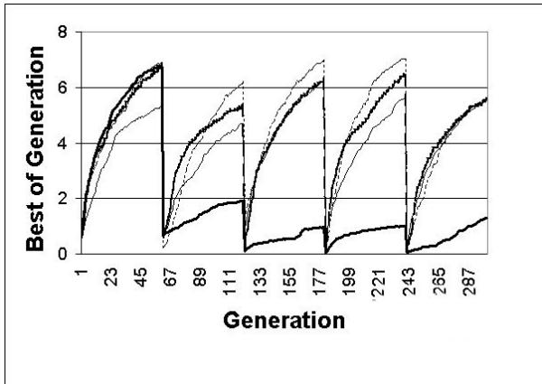  
Figure 1: Best of Generation, Five Different Techniques, Landscape Moving Every 60 Generations

The fifth technique mentioned above is a recent attempt to address performance measurement in dynamic environments. It is based on an assumption that the best fitness value will not change much over a small number of generations, which may not be true. This measure also does not provide a convenient method for comparing performance across the full range of landscape dynamics.

It appears that a good performance measurement method for EAs in dynamic environments should, at a minimum have: (1) intuitive meaning; (2) straightforward methods for statistical significance testing of comparative results; and (3) a measurement over a sufficiently large exposure to the landscape dynamics so as to reduce the potential of misleading results caused by examination of only small portions of the possible problem dynamics.

# 3 Performance Measurement: Collective Mean Fitness

A new method of dynamic performance measurement is presented here that is related to several previous methods, but differs from previous methods in the choice of the experimental unit. Since we are concerned with the performance of the EA across the entire range of landscape dynamics, we will consider the experimental unit to be the entire fitness trajectory, collected across EA exposure to a large sample of the landscape dynamics. To begin, we must first define Total Mean Fitness $F _ { T }$ as the average best-of-generation values over an infinite number of generations, thereby experiencing all possible problem dynamics, further averaged over multiple runs. More formally:

$$
F _ { T } = \frac { \displaystyle \sum _ { m = 1 } ^ { M } \left( \frac { \displaystyle \sum _ { g = 1 } ^ { G } ( F _ { B G } ) } { G } \right) } { M } = \mathrm { C o n s t a n t , ~ f o r } ~ G = \infty .
$$

Where:

$$
\begin{array} { r l } & { F _ { T } = \mathrm { t h e ~ t o t a l ~ a v e r a g e ~ f i t n e s s ~ o f ~ t h e ~ E A ~ o v e r } } \\ & { \mathrm { ~ i t s ~ e x p o s u r e ~ t o ~ a l l ~ t h e ~ p o s s i b l e ~ l a n d s c a p e } } \\ & { \mathrm { ~ d y n a m i c s } } \\ & { F _ { B G } = \mathrm { t h e ~ b e s t { - } o f { - } g e n e r a t i o n } } \\ & { M = \mathrm { t h e ~ n u m b e r ~ o f ~ r u n s ~ o f ~ t h e ~ E A } } \\ & { G = \mathrm { t h e ~ n u m b e r ~ o f ~ g e n e r a t i o n s } . } \end{array}
$$

It should be noted that as $G \to \infty$ , the effect on $F _ { T }$ caused by variation in the best-of-generation fitness value in any specific generation is reduced. For any particular run, $m$ , the value of $F _ { T _ { m } }$ is the average performance over exposure to all possible landscape dynamics. The differences between the various $F _ { T _ { m } }$ values against the same dynamic problem represent the variation caused by the stochastic operation of the EA.

While the above description might indicate that very large experiments are required for use of this performance metric, the value $F _ { T }$ for an EA approaches a constant after a exposure to a much smaller representative sample of the dynamic environment under the following conditions:

1. the EA has a reasonable recovery time for all types of landscape changes. This means that the EA doesn't "get lost" for long periods of time and then recover. If the EA did get lost for long periods of time, increased exposure to the dynamics would be necessary to dampen out the effects of getting lost.

2. the global maximum fitness can be assumed to be restricted to a relatively small range of values. Larger ranges of fitness values require longer exposures to the landscape dynamics to dampen the effect of fitness value fluctuations.

  
Figure 2: Running Average Best of Generation for a 14-cone Landscape Moving Every 20 Generations

These conditions permit us to define a new measure of performance for use in dynamic fitness landscapes, the Collective Mean Fitness, $F _ { C }$ . This is a single value that is designed to provide an aggregate picture of an EA's performance, where the performance information was collected over a representative sample of the fitness landscape dynamics. Collective fitness is defined as the average best-of-generation values, averaged over a sufficient number of generations, $G ^ { \prime }$ , required to expose the EA to a representative sample of all possible landscape dynamics, further averaged over multiple runs. More formally:

$$
\begin{array} { r } { F _ { C } = \frac { \displaystyle \sum _ { m = 1 } ^ { M } \left( \frac { \sum _ { g = 1 } ^ { G ^ { \prime } } ( F _ { B G } ) } { G ^ { \prime } } \right) } { M } \approx F _ { T } . } \end{array}
$$

The collective mean fitness will approach the total mean fitness after a sufficiently large exposure to the landscape dynamics. Sufficient, in this context, means large enough to provide a representative sample of the fitness dynamics and allow the stabilization of the running average best-of-generation fitness value. Examples of the dampening of individual fluctuations of the value of $F _ { C }$ over 20 generations using this performance metric is illustrated in Figures 2 and 3 for two of the problems used in a recent study (in these graphs, $F _ { C }$ is over 100 runs). Figure 2 shows the running average best-of-generation value where the landscape has 14 cones in 2 dimensions, with all cones are moving chaotically every 20 generations. Figure 3 shows the running average best-of-generation for a 5-dimensional, 5-cone problem, where all cones move in large steps every 10 generations. In these two sample cases it is easy to see the dampening effect of individual best-of-generation values on the $F _ { C }$ value.

  
Figure 3: Running Average Best of Generation for for a 5-cone Landscape Moving Every 10 Generations

Using this metric requires determination of the number of generations to be used for a representative sample of the landscape dynamics. The number of generations necessary is principally determined by the dynamic behavior of the landscape under examination. In some problems where the dynamics are well understood, it may be possible to estimate the appropriate number of generations necessary to achieve a stable value of $F _ { C }$ . In other problems, where the landscape dynamics may be completely unknown, the number of generations needed to achieve an acceptably stable value for $F _ { C }$ may need to be experimentally established. This is done by observing the running average of the best-ofgeneration values and identifying the number of generations necessary to achieve an acceptably stable value. Different EA runs against an identical problem will result in somewhat different values of $F _ { C _ { m } }$ , caused by the stochastic characteristics of evolutionary search. The number of runs required is then based on the variance of the $F _ { C _ { m } }$ values and the desired confidence interval for $F _ { C }$ .

There are two additional items to notice about this performance metric. First, in the case where the fitness landscape changes every generation, this measure is identical to Branke's modified off-line performance [1] if the modified off-line performance metrics were computed over a sufficiently large number of generations. Second, this method of performance measurement is a form of data compression of the performance curves provided in [5], [6], and [7], permitting simple comparison of the performance across the entire dynamic run.

# 4 Summary

In this paper we have addressed issues with measurement of performance when evaluating EAs in dynamic environments and described a performance measure that reduces the potential for misinterpreting the effectiveness of any EA enhancements in dynamic fitness landscapes. Use of this method ensures that experimental results are based on a representative sample of the landscape dynamics and provides a basis for determination of the statistical significance of observed experimental results in dynamic fitness landscapes.

# Список литературы

[1] Branke, J.: Evolutionary Optimization in Dynamic Environments. Kluwer Academic Publishers (2002)   
[2] Morrison, R. and De Jong, K.: A Test Problem Generator for Non-stationary Environments. In: Proceedings of Congress on Evolutionary Computation, CEC99. IEEE 1999 2047-2053.   
[3] Trojanowski, K. and Michalewicz, Z.: Searching for Optima in Non-stationary Environments. In: Proceedings of Congress on Evolutionary Computation, CEC99. IEEE 1999 1843-1850   
[4] Weicker, K. and Weicker, N.: On Evolutionary Strategy Optimization in Dynamic Environments. In: Proceedings of the Congress on Evolutionary Computation, CEC99. IEEE 1999 2039-2046.   
[5] Gaspar, A. and Collard, P.: From GAs to Artificial Immune Systems: Improving Adaptation in Time Dependent Optimization. In: Proceedings of Congress on Evolutionary Computation, CEC99. IEEE 1999 1859-1866.   
[6] Grefenstette, John J.: Evolvability in Dynamic Fitness Landscapes, a Genetic Algorithm Approach. In: Proceedings of the Congress on Evolutionary Computation, CEC99. IEEE 1999 2031- 2038   
[7] Bäck, T.: On the Behavior of Evolutionary Algorithms in Dynamic Fitness Landscapes. In: Proceeding of the IEEE International Conference on Evolutionary Computation. IEEE 1998 446-451   
[8] Weicker, K.: Performance Measures for Dynamic Environments. In: Parallel Problem Solving from Nature - PPSN VII, Lecture Notes in Computer Science 2349. Springer-Verlag 2002 64-73.

# Particle Swarms and Population Diversity I: Analysis

# T. M. Blackwell

Department of Computer Science   
University College London   
Gower Street   
London UK   
tim.blackwell@ieee.org

# Abstract

The optimization of dynamic optima can be a difficult problem for evolutionary algorithms due to diversity loss. However, another population based search technique, particle swarm optimisation (PSO), is well suited to this problem. If some or all of the particles are "charged", an extended swarm can be maintained, and dynamic optimization is possible with a simple algorithm. Charged particle swarms are based on an electrostatic analogy - inter-particle repulsions enable charged particles to swarm around a nucleus of neutral particles. This paper examines the rate of convergence of neutral swarms, extending some results that were previously only available for a simplified model. A diversity measure is proposed and bounds obtained for neutral and charged swarms. These bounds enable predictions for the feasibility of optima tracking given knowledge of the amount of dynamism.

the optimization of certain benchmark functions (Eberhart and Shi 2001a).

# 1 INTRODUCTION

Particle Swarm Optimization (PSO) is a population based optimization technique inspired by models of swarm and flock behavior (Kennedy and Eberhart 1995). Although PSO has much in common with evolutionary algorithms, it differs from other approaches by the inclusion of a solution (or particle) velocity. New potentially good solutions are generated by adding the velocity to the particle position. Particles are connected both temporally and spatially to other particles in the population (swarm) by two accelerations. These accelerations are spring-like: each particle is attracted to its previous best position, and to the global best position attained by the swarm, where 'best' is quantified by the value of a state function at that position. These swarms have proven to be very successful in finding global optima in various static contexts such as

Evolutionary techniques have been applied to the dynamic problem (Angeline 1998, Bäck 1998, Branke 1999). The application of PSO techniques is a new area and results for environments of low spatial severity are encouraging (Eberhart and Shi 2001b, Carlise and Dozier 2000). Both evolutionary and PSó algorithms, in a dynamic context, can suffer from over-specialization. In general, they require further adaptations so that they can detect change, and then response to it. Some work has been done on possible adaptations of the PSO, but these adaptations remain arbitrary (Hu and Eberhart 2002). A different extension of PSO, which solves the problem of change detection and response, has been suggested by Blackwell and Bentley (2002). In this extension (CPSO), some or all of the particles have, in analogy with electrostatics, a 'charge'. A third collision-avoiding acceleration is added to the particle dynamics, by incorporating electrostatic repulsion between charged particles. This repulsion maintains population diversity, enabling the swarm to automatically detect and respond to change, yet does not diminish greatly the quality of solution. In particular, it works well in certain spatially severe environments (Blackwell and Bentley 2002). Entirely charged swarms and swarms with $50 \%$ or their members charged have been compared with adapted PSO and random search in a variety of dynamic contexts, including cases of very high spatial and temporal severity (Blackwell 2003).

Much of the understanding of the behavior of particle swarms is of an empirical nature, but a recent paper by Clerc and Kennedy advances theoretical knowledge by proving convergence for a simplified model (2002). This simplified one-dimensional model, which does not optimize anything, is for non-interacting particles. For optimization, particle interactions need to be included so that knowledge of a good position a particle may find (i.e. potential good solution) can be communicated with the other particles. In practice, the spring constants are randomized so that the influence of the swarm as a whole (the attractor at the global best position) and of the particle's own history (the attractor at its personal best position) vary in significance from iteration to iteration.

This paper extends the work of Clerc and Kennedy to include particle interactions. It is suggested here that the maximum spatial extent $| S |$ of the swarm is a suitable diversity measure. For neutral (i.e. uncharged) swarms, the rate of contraction of $| S |$ will then give bounds for the jump rate of the optimum position; if the optimum always moves within the hypersphere $| S |$ , it will expected that the swarm can re-optimize without further adaptations. A limit is also suggested for $| S ^ { + } |$ , the maximum spatial extent of a charged swarm. The balance of electrostatic repulsion between charged particles and the attraction to the best positions will maintain the population diversity at a fixed level, so that optimum jumps on any time scale can be attracted, if they occur within $| S ^ { + } |$ .

The (C)PSO algorithm is defined and the background to Clerc and Kennedy's proof is covered in the next section. Section 3 defines $| S |$ and obtains bounds for the simplified model of Clerc and Kennedy, and for the simplified model with particle interactions and charge. The paper ends with a discussion of the results.

# 2 PARTICLE SWARM ALGORITHMS AND CONVERGENCE

A swarm of $i = 1 . . . N$ particles is a set of positions $\pmb { x } _ { i }$ and velocities $\textit { S } = \{ \pmb { x } _ { i } , \pmb { \nu } _ { i } \}$ where each vector has components $j = 1 . . . d$ Particle positions are updated by adding an acceleration to the current velocity. The updated velocity is then added to the current position to give an updated position. The acceleration is a simple spring-like attraction to an attractor ${ \pmb p } _ { i }$ (spring constant $\phi _ { I } )$ , whch may differ or each partice, and to the attcor $\pmb { p } _ { g }$ (spring constant $\phi _ { 2 } )$ of the best performing particle (index g) in some neighborhood (which may be the whole swarm). The particles interact by modifying attractors $\{ p _ { i } \}$ . This modification, which is the essence of what may be termed swarm intelligence (SI), arises from the evaluation of an objective function $f$ at $\mathbf { \boldsymbol { x } } _ { i } .$ The PSO algorithm is given in Table 1. The statements enclosed by brackets $[ ]$ and braces $\{ \}$ refer to parts of the algorithm concerning charged PSO and SI respectively.

$$
{ \pmb a } _ { i k } = \frac { Q _ { i } Q _ { k } } { r _ { c } ^ { 2 } } \frac { ( { \pmb x } _ { i } - { \pmb x } _ { k } ) } { \mid { \pmb x } _ { i } - { \pmb x } _ { k } \mid } , \qquad \mid { \pmb x } _ { i } - { \pmb x } _ { k } \mid < r _ { c }
$$

$$
\mathbf { \nabla } \pmb { a } _ { i k } = \pmb { \theta }
$$

$$
r _ { p } < \mid \pmb { x } _ { i } - \pmb { x } _ { k } \mid
$$

and $i , k$ are particle indices. The PSO is therefore a special case of the CPSO, whereby every particle is uncharged, $Q _ { i } = 0$ .

Table 1. Particle Swarm Algorithm for Charged and Neutral Swarms   

<table><tr><td>[C]PSO {with SI}</td></tr><tr><td>initialise S = {xi, vi} in cube [-X, X]d g, t = 0 {for i = 1 to Population Size pi= x if f(pi) &lt; f(pg) then g = i}</td></tr><tr><td>next i} do t++ for i =1 to Population Size (N)</td></tr><tr><td></td></tr><tr><td>[calculate ai]</td></tr><tr><td>for j = 1 to Dimension Size (d) Vj = χ(j + ξ1φ1(pij − xij ) + ξ22(pgj − xi ))</td></tr><tr><td>[Vij = ij + aij] i =  + j next j {if f(xi) &lt; f(pi) then pi = xi</td></tr></table>

In Table 1, $\chi$ is a constriction factor, chosen to ensure convergence, and $\xi _ { \scriptscriptstyle { I , 2 } }$ are random numbers drawn from the interval [0, 1]. Since $\xi _ { \scriptscriptstyle { I , 2 } }$ multiply the spring constants, they have the effect of randomising the spring constants within $[ 0 , \phi _ { I , 2 } ]$ at each iteration. Table 1 also shows an additional repulsive acceleration $\pmb { a } _ { i } = \sum \pmb { a } _ { i k }$ , which is included only for charged swarms , wheré≠i

$$
\pmb { a } _ { i k } = \frac { Q _ { i } Q _ { k } } { \mid \pmb { x } _ { i } - \pmb { x } _ { k } \mid ^ { 3 } } ( \pmb { x } _ { i } - \pmb { x } _ { k } ) , \quad r _ { c } \leq \mid \pmb { x } _ { i } - \pmb { x } _ { k } \mid \leq r _ { p }
$$

Avoidance is only between pairs of particles that have non zero charge $\boldsymbol { Q }$ , and is Coulomb-like in the shell $r _ { c } \le r$ $\leq \ r _ { p }$ At separations less than the core radius $r _ { \mathrm { c } }$ ,the repulsion is fixed at the value at the core radius, and there is no avoidance for separations beyond the perception limit of each particle, $r _ { p }$ The core radius serves to tame the repulsion at small separations. If the Coulomb law were operative to very short separations, the acceleration would be very large and the charged sub-swarm would be in danger of exploding. The limit of perception, $r _ { p }$ is also set at $X$ since this expected to control the size of the swarm. Notice that the particle repulsion $\pmb { a } _ { i }$ is determined before the update of each component $\mathbf { \nabla } _ { \mathbf { x } _ { i } } .$ This is because the Coulomb law, unlike the spring laws used for the attractive accelerations, depends on the Euclidean separation $r$ and not on the component separation $r _ { i j }$ ,and so should not be implemented inside the 1 $\scriptstyle { \mathsf { o o p } } j = 1 , \dotsc { \dot { d } }$ .

The convergence proof of Clerc and Kennedy is for a simplified model without interaction and without random springs (2002). The algorithm is set out in Table 2.

The convergence conditions for $\chi$ and $\phi$ are obtained by noting that $\| P ( t ) \|$ increases as $\begin{array} { r l } { \| M ^ { t } P ( \dot { O } ) \| ~ = ~ } & { { } \| L ^ { t } A P ( O ) \| } \end{array}$ where $\left. . \right.$ is, for example, the Euclidean norm. Clerc and Kennedy show that the eigenvalues $e _ { I , 2 }$ are complex and of modulus $\surd \chi$ for $\phi > 4$ ,with $\chi$ given by

$$
\chi = \frac { 2 \kappa } { \phi - 2 + \sqrt { \phi ^ { 2 } - 4 \phi } }
$$

Table 2. The Simplified Model One Dimensional Noninteracting Model   

<table><tr><td>Simplified Model</td></tr><tr><td>initialise S = {xi, vi} in cube [-X, X]d do</td></tr><tr><td>for i =1 to Population Size (N)</td></tr><tr><td>for j = 1 to Dimension Size (d)</td></tr><tr><td> = (j + (p − xi ) )</td></tr><tr><td> = j j</td></tr><tr><td>next j</td></tr><tr><td>next i</td></tr><tr><td>until termination criterion is met</td></tr></table>

which is smaller than 1 for $\kappa < 1$ Hence convergence will follow if the constriction factor for a given spring constant $\phi$ is given by Equation (7) .

# 3 DIVERSITY MEASURE FOR PARTICLE SWARMS

The above result can be used to estimate the maximum spatial extent $| S |$ of the swarm. Consider an ensemble $S$ of $N$ non-interacting particles, moving in $d$ dimensions and attracted to the same fixed attractor $\pmb { p }$ . Then the simplified model applies to each component $x _ { i j } . \ | S |$ at iteration $t$ is defined as the maximum distance between position components $j$

This model is analysed by considering a one dimensional dynamic system with fixed attractor $p$ and fixed spring constant $\phi$

$$
\begin{array} { r l } & { \nu ( t + 1 ) = \nu ( t ) + \phi ( p - x ( t ) ) } \\ & { x ( t + 1 ) = x ( t ) + \nu ( t ) + \phi ( p - x ( t ) ) } \end{array} .
$$

$$
\begin{array} { r } { | S | = \operatorname* { m a x } _ { j } \left( \operatorname* { m a x } _ { i } \{ x _ { i j } \} - \operatorname* { m i n } _ { i } \{ x _ { i j } \} \right) . } \end{array}
$$

Since $\lvert y ( t ) \rvert$ is the distance of a particle position component from the attractor $p = x _ { a } .$

$$
\mid S \mid \leq \operatorname* { m a x } _ { i j } ( 2 \mid y _ { i j } \mid ) ~ .
$$

Velocity constriction, which takes the place of velocity clamping in older versions of PSO, is applied by scaling $\boldsymbol { \nu } ( t { + } 1 )$ by a factor $\chi < 1$ :

$$
\begin{array} { l } { { \nu ( t + 1 ) = \chi ( \nu ( t ) + \phi ( p - x ( t ) ) ) } } \\ { { x ( t + 1 ) = x ( t ) + \chi ( \nu ( t ) + \phi ( p - x ( t ) ) ) } } \end{array} .
$$

For simplicity, this is rewritten by Clerc and Kennedy as

$$
\begin{array} { l } { { \nu ( t + 1 ) = \chi ( \nu ( t ) + \phi y ( t ) ) } } \\ { { y ( t + 1 ) = y ( t ) + \chi ( - \nu ( t ) - \phi y ( t ) ) } } \end{array}
$$

In the following, a point at $_ { x }$ is considered to be inside the swarm if $| \textbf { \em x } - \textbf { \em x } _ { C M } \ | \ \leq \ | S |$ and outside the swarm if $| \pmb { x } - \pmb { x } _ { C M } | > | S |$ where the swarm centre of mass is denoted $\mathbf { \Omega } _ { \mathbf { x } _ { C M } } .$ .

If $x _ { a }$ is within the swarm, then $\mathrm { m a x _ { i j } } ( 2 | y _ { i j } | )$ will be a good estimate of $| S |$ . A typical configuration of attractors (triangles) inside the swarm is illustrated in Figure 1. If, though, $x _ { a }$ is outside the swarm, maxij $( 2 \lvert y _ { i j } \rvert )$ will overestimate $| S |$ This would be the case for unusual configurations where the swarm is undergoing collective oscillations about $x _ { a }$ (Figure 2)

or in matrix form as

$$
P ( t + 1 ) = ~ M P ( t )
$$

where $y ( t ) = p \cdot x ( t ) , P ( t ) = [ \nu ( t ) , y ( t ) ] ^ { T }$ and $M$ is the $2 \mathbf { x } 2$ transformation matrix defined by the matrix equation

$$
{ \begin{array} { r } { { \Big [ } \nu ( t + 1 ) { \Big ] } = { \left[ \begin{array} { l l } { \chi } & { \chi \varphi } \\ { - \chi } & { 1 - \chi \varphi } \end{array} \right] } { \Big [ } \nu ( t ) { \Big ] } } \\ { { \Big [ } y ( t + 1 ) { \Big ] } } \end{array} } .
$$

M is diagonalized by the similarity transform A,

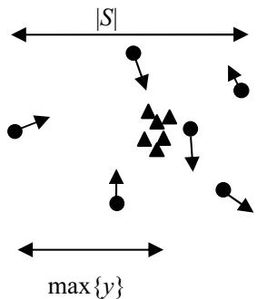  
Figure 1: Attractors lying within swarm

$$
\boldsymbol { A } \boldsymbol { M } \boldsymbol { A } ^ { - 1 } = \boldsymbol { L } = \left[ \begin{array} { l l } { e _ { 1 } } & { 0 } \\ { 0 } & { e _ { 2 } } \end{array} \right] .
$$

This leads to an estimate of $\| P ( t ) \|$ so that equation (5) becomes, in the presence of swarm intelligence,

$$
\parallel P ( t ) \parallel < ( 1 + \delta _ { t } ) \parallel M P ( t - 1 ) \parallel
$$

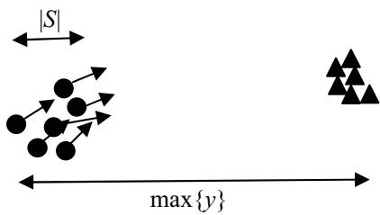  
Figure 2: Collective oscillation of particles about an attracting group lying outside swarm

In order to proceed, some estimate of $\delta _ { t }$ is necessary. A simple argument suggests that the maximum relative shift $\delta _ { t }$ is independent of $| S |$ and hence of $t$ .

Firstly, $| \nu _ { k } ( t ) |$ is of order $| S |$ this follows because $\begin{array} { r } { \pmb { \nu } _ { k } ( t ) = \pmb { y } _ { k } ( t - 1 ) \cdot \pmb { y } _ { k } ( t ) \implies | \pmb { \nu } _ { k } ( t ) | < | \pmb { y } _ { k } ( t - 1 ) | + | \pmb { y } _ { k } ( t ) | < | S ( t - 1 ) | + } \end{array}$ $| S ( t ) |$ .

This argument suggests that $| S |$ increases as $( \surd \chi ) ^ { \mathrm { t } }$

$$
\mid S \mid \approx ( \sqrt \chi ) ^ { t } ( \mathrm { S M } ) .
$$

Second, $\delta _ { t }$ is also $\mathrm { O } ( | S | )$ . To obtain this, note if the attractors $\pmb { p }$ are within the swarm then $| \delta p _ { k g } | < | S |$ Since $| \nu _ { k } ( t ) | , | \nu _ { k } ( t ) |$ and $| \delta \pmb { p } |$ are $\mathrm { O } ( | S | )$ , their ratio, $\delta _ { t }$ will not, to first order, depend on $| S |$ (and therefore not on $t$ . It is therefore proposed that the swarm shrinks at a constant rate given by the exponential law

This result can be extended to an interacting neutral swarm without random springs by modifying the velocity update to

$$
\parallel P ( t ) \parallel < ( 1 + \delta ) \parallel M P ( t - 1 ) \parallel
$$

$$
\pmb { \nu } ( t + 1 ) = \pmb { \nu } ( t ) + \phi _ { 1 } ( \pmb { p } _ { i } - \pmb { x } _ { i } ( t ) ) + \phi _ { 2 } ( \pmb { p } _ { g } - \pmb { x } _ { i } ( t ) ) .
$$

The simplified form is recovered by the replacement

$$
\pmb { p } = \frac { \phi _ { 1 } \pmb { p } _ { i } \ + \ \phi _ { 2 } \pmb { p } _ { g } } { \phi _ { 1 } + \phi _ { 2 } }
$$

$$
\phi = \phi _ { 1 } + \phi _ { 2 } .
$$

If ${ \pmb p } _ { i }$ or $\pmb { p } _ { g }$ should lie outside the swarm then $\delta { p } _ { k g } < \mathrm { \ m a x _ { i j } ~ } ( 2 | \gamma _ { i j } | )$ and the above argument needs to be repeated with $| S |$ replaced by maxij $( 2 \lvert y _ { i j } \rvert )$ . The same result (17) will follow since we are using maxij $( 2 \lvert \nu _ { i j } \rvert )$ as an estimator of $| S |$ (equation (10) ).

Over a period $\mathrm { T }$ of many iterations, the shift in $\pmb { p }$ may occur $T _ { p } = q T$ times, $1 / T \le q \le 1$ . The final result is that, with SI, $| S |$ should decrease as

Consider particle $i$ at iteration $t$ and suppose that $\pmb { p } _ { i }$ and/or $\pmb { p } _ { g }$ were updated at iteration $_ { t - 1 }$ This may happen when $x _ { i } ( t - 1 )$ betters ${ \pmb p } _ { i }$ and if $\pmb { p } _ { g }$ is bettered by one or more members of the set $\{ p _ { j } \}$ In either case, $\pmb { p }$ changes by an amount

$$
\delta { \pmb p } _ { i g } \left( t \right) = \frac { \phi _ { 1 } } { \phi } \delta { \pmb p } _ { i } + \frac { \phi _ { 2 } } { \phi } \delta { \pmb p } _ { g }
$$

$$
\vert S \vert \approx ( \sqrt { \eta \chi } ) ^ { T }
$$

providing that $\eta = ( 1 + \delta ) ^ { 2 q }$ is a small factor $> 1$ , which renormalizes $\chi .$ Convergence therefore requires that $\chi _ { R } =$ $\eta \chi < 1$ .

which is bounded by $\operatorname* { m a x } \{ | \delta \pmb { p } _ { i } | , | \delta \pmb { p } _ { g } | \}$

Now consider a particle $k$ that lies on the edge of the swarm i.e. a component of $\pmb { x } _ { k }$ contributes to ISI. If, instead of updating $\pmb { p } _ { k g }$ as a result of the swarm intelligence, we always hold $\pmb { p } _ { k g }$ fixed, then the effect is equivalent to adding $\delta p _ { k g }$ t $\ddot { \boldsymbol { P } } = \left[ \boldsymbol { \nu } _ { k } , \boldsymbol { y } _ { k } \right] ^ { \mathrm { T } }$ i.e. a coordinate 'shift' $y _ { k } ( t ) \gets$ $\mathbf { y } _ { k } ( t ) + \delta \mathbf { p } _ { k g }$ and $\mathbf { } \mathbf { } \mathbf { } \mathbf { } \mathbf { } \mathbf { } \mathbf { } \mathbf { } \mathbf { } \mathbf { } \mathbf { } \mathbf { } \mathbf { } \mathbf { } \mathbf { } \mathbf { } \mathbf { } \mathbf { } \mathbf { } \mathbf { } \mathbf { } \mathbf { } \mathbf { } \mathbf { } \mathbf { } \mathbf { } \mathbf { } \mathbf { } \mathbf { } \mathbf { } \mathbf { } \mathbf { } \mathbf { } \mathbf { } \mathbf { } \mathbf { } \mathbf { } \mathbf { } \mathbf { } \mathbf { } \mathbf { } \mathbf { } \mathbf { } \mathbf { } \mathbf { } \mathbf { } \mathbf { } \mathbf { } \mathbf { } \mathbf { } \mathbf { } \mathbf { } \mathbf { } \mathbf { } \mathbf { } \mathbf { } \mathbf { } \mathbf { } \mathbf { } \mathbf { } \mathbf { } \mathbf { } \mathbf { } \mathbf { } \mathbf { } \mathbf { } \mathbf { } \mathbf { } \mathbf { } \mathbf { } \mathbf { } \mathbf { } \mathbf { } \mathbf { } \mathbf { } \mathbf { } \mathbf { } \mathbf { } \mathbf { } \mathbf { } \mathbf { } \mathbf { } \mathbf { } \mathbf { } \mathbf { } \mathbf { } \mathbf { } \mathbf { } \mathbf { } \mathbf { } \mathbf { } \mathbf { } \mathbf { } \mathbf { } \mathbf { } \mathbf { } \mathbf { } \mathbf { } \mathbf { } \mathbf { } \mathbf { } \mathbf { } \mathbf { } \mathbf { } \mathbf { } \mathbf { } \mathbf { } \mathbf { } \mathbf { } \mathbf { } \mathbf { } \mathbf { } \mathbf { } \mathbf { }  \mathbf { } \mathbf { } \mathbf { } \mathbf { } \mathbf { } \mathbf { } \mathbf { } \mathbf { } \mathbf { } \mathbf { } \mathbf { } \mathbf { } \mathbf { } \mathbf { } \mathbf { } \mathbf { } \mathbf { } \mathbf { } \mathbf { } \mathbf { } \mathbf { } \mathbf { }  \mathbf { } \mathbf { } \mathbf { } \mathbf { } \mathbf { } \mathbf { } \mathbf { } \mathbf { } \mathbf { } \mathbf { } \mathbf { } \mathbf { } \mathbf { } \mathbf { } \mathbf { } \mathbf { } \mathbf { } \mathbf { } \mathbf { } \mathbf { } \mathbf { } \mathbf { } \mathbf { } \mathbf { } \mathbf { } \mathbf { } \mathbf { } \mathbf { } \mathbf { } \mathbf { } \mathbf { } \mathbf { } \mathbf { } \mathbf { } \mathbf { } \mathbf { } \mathbf { } \mathbf { } \mathbf { } \mathbf { } \mathbf { } \mathbf { } \mathbf { } \mathbf { } \mathbf { } \mathbf { } \mathbf { } \mathbf \mathbf { } \mathbf { } \mathbf { } \mathbf { } \mathbf \mathbf { } \mathbf { } \mathbf { } \mathbf $ .

If the coordinate shifts are implemented by multiplying $P ( t )$ by a transformation matrix $\varDelta$ then $\parallel P _ { s h i f t e d } \parallel < \parallel \varDelta P \parallel$ where $\varDelta = \mathrm { d i a g ( \nabla 1 + } \delta _ { t }$ and

$$
\delta _ { t } = \operatorname* { m a x } \{ \frac { | \delta { \pmb { p } } _ { k g } ( t ) | } { | { \pmb { \nu } } _ { k } ( t ) | } , \frac { | \delta { \pmb { p } } _ { k g } ( t ) | } { | { \pmb { y } } _ { k } ( t ) | } \} .
$$

Finally, predictions can be made for the median and maximum spatial extent of a charged swarm of $\mathbf { M } ^ { + }$ particles. For simplicity, if $r _ { c }$ is set to zero and $r _ { p }$ is set to infinity, then standard results for the inverse square force can be used. Suppose a charged particle at $r$ is on the surface, or above, a sphere centered at $o$ containing a continuous charge density, amounting to a total charge of $( M ^ { + } - 1 ) Q ~ \approx M ^ { + } \breve { Q }$ Then the repulsive acceleration is $M ^ { + } ( Q ^ { 2 } / r ^ { 2 } )$ radially away from $o$ If $\pmb { p }$ is also at $o$ repulsion will be in equilibrium with the attractive acceleration towards $\pmb { p }$ at $R$ ,where $R$ satisfies $M ^ { + } Q ^ { 2 } / R ^ { 2 } =$ $\phi R$ or $R = ( M ^ { + } Q ^ { 2 } / \phi ) ^ { 1 / 3 }$ If the charged particle is inside the sphere of uniform charge density, then the repulsive acceleration is $M ^ { + } ( Q ^ { 2 } r / R ^ { 3 } )$ . This leads to the same equilibrium condition for $R$ This suggests that the charged swarm has median size $R$ where, defining the probability density $n ( r )$ for particle positions, $\overset {  } { \int _ { 0 } ^ { R } } n ( r ) d r = 0 . \overset {  } { . }$ ,

$$
R \approx \left( \frac { M ^ { + } Q ^ { 2 } } { \phi } \right) ^ { \frac { 1 } { 3 } }
$$

The maximum spatial extent $| S ^ { + } |$ ,is a measure of the maximum component separation between charged particles and might be considerably bigger than $R$ Since the maximum repulsive acceleration between particles is $Q ^ { 2 } / { r _ { c } } ^ { 2 }$ a si he tn  p $\pmb { p }$ , the maximum acceleration radially away from $\pmb { p }$ that a particle $k$ c conceivably expernceis $( M ^ { + } { - } I ) Q ^ { 2 } / { r _ { c } } ^ { 2 }$ which could only happen if all other charged particles clump together at a point within a separation $r _ { c }$ from $k$ . Assuming that the velocity of $k$ is small compared to this acceleration (it is unlikely anyway to lie in the same direction), particle $k$ will receive a position update of the order $M ^ { \dagger } Q ^ { 2 } / r _ { c } ^ { 2 }$ sending it to the edge of the swarm at $r$ $\approx M ^ { + } Q ^ { 2 } / r _ { c } ^ { 2 }$ , which is an estimate of the swarm spatial size $| S ^ { + } |$ in this extreme case. Therefore,

$$
\mid S ^ { + } \mid \approx \frac { M ^ { + } Q ^ { 2 } } { r _ { c } ^ { 2 } } .
$$

Note that $R$ and $| S ^ { + } |$ are time independent since the charged swarm is not converging $\mathrm { { o n } } p$ .

# 4 CONCLUSIONS

This paper has extended a convergence proof for noninteracting swarms to the interacting model which includes Swarm Intelligence (but not random spring constants). This has important consequences for the predictability of particle swarm optimisation in the dynamic context. The neutral particle swarm shrinks towards the optimum position, losing diversity. $| S |$ ,the maximum spatial extent of the swarm is a useful diversity measure; if optimum jumps occur within $| S |$ at any time, then the swarm should be able to re-optimize. However, this paper argues that $| S |$ is exponentially decreasing which places constraints on the amount of dynamism that this scheme can cope with.

Alternatively, a charged swarm does not contract and therefore maintains particle diversity. The diversity measure, $| S ^ { + } |$ , is time independent and is given by parameters of the model. The conclusion is that if dynamism is expected to occur within some dynamic range $X ,$ then the parameters can be set to give $\dot { \vert S ^ { \dag } \vert } \sim X$ so that tracking can be achieved on any time scale. $| S ^ { + } |$ will however be subject to fluctuations in time, so this conclusion is based on the assumption that fluctuations will be small. This may not be the case for small core radii, since particle accelerations can then be very large. Another measure which will be less sensitive to fluctuations is the median swarm size $R$ Once more this is given by parameters of the model and setting $X$ to $R$ would be another strategy.

Expressions for $| S | , | S ^ { + } |$ and $R$ have been derived in this paper, but are subject to a number of assumptions. It would be interesting to test out these predictions on some standard dynamic problems. In particular, the assertion that $| S |$ follows a similar scaling law to the simplified model, but with renormalized constriction is important and needs verifying, and the proof needs to extended to include the full model with random springs.

# Список литературы

Angeline P.J. (1998). Tracking extrema in dynamic environments. Proc Evolutionary Programming IV, 335- 345   
Bäck T. (1998). On the behaviour of evolutionary algorithms in dynamic environments. Proc Int. Conf. on Evolutionary Computation, 446-451   
Blackwell T.M. and Bentley P.J. (2002) Dynamic search with charged swarms. Proc Genetic and Evolutionary Computation Conference, 19-26   
Blackwell T.M. (2003). Swarms in Dynamic Environments. (Accepted for publication) Proc Genetic and Evolutionary Computation Conference   
Branke J. (1999). Evolutionary algorithms for changing optimization problems. Proc Congress on Evolutionary Computation, 1875-1882.   
Carlisle A. and Dozier G. (2000). Adapting particle swarm optimization to dynamic environments. Proc of Int Conference on Artificial Intelligence, 429-434   
Clerc M. and Kennedy J. (2002). The Particle Swarm: Explosion, Stability and Convergence in a MultiDimensional Complex Space. IEEE Transactions on Evolutionary Computation, Vol 6 pp 158-73   
Eberhart R.C. and Shi Y. (2001). Particle swarm optimization: Developments, applications and resources. Proc Congress on Evolutionary Computation , 81- 86 Eberhart R.C. and Shi Y. (2001). Tracking and optimizing dynamic systems with particle swarms. Proc Congress on Evolutionary Computation, 94-97   
$\mathrm { H u } \mathrm { X }$ and Eberhart R.C. (2002). Adaptive particle swarm optimisation: detection and response to dynamic systems. Proc Congress on Evolutionary Computation, 1666-1670. Kennedy J. and Eberhart, R.C. (1995). Particle Swarm Optimisation. Proc of the IEÉE International Conference on Neural Networks IV, 1942-1948

# Particle Swarms and Population Diversity II: Experiments

# T.M.Blackwell

Department of Computer Science   
University College   
Gower Street   
London, UK   
tim.blackwell@ieee.org

# Abstract

Particle swarms, if suitably adapted, are candidates for dynamic optimization algorithms. In one such adaptation, the charged particle swarm, diversity is maintained by inter-particle repulsion. This paper examines, in a series of experiments, the use of the maximum swarm spatial extent as a useful diversity measure both for neutral and charged swarms, and compares the results with some theoretical predictions. The conjecture that neutral particle swarms collapse exponentially is verified for the sphere function in three dimensions. The efficacy of charged swarms in dynamic problems of high spatial severity is also demonstrated and comparisons made with a neutral swarm.

# 1 INTRODUCTION

Evolutionary techniques and particle swarm optimization (PSO) have been applied to dynamic optimization problems (Branke 1999, Eberhart and Shi 2001, Blackwell and Bentley 2002). However, both can suffer from over-specialization. In general, they require further adaptations so that they can detect change, and then response to it. Some work has been done on possible adaptations of the PSO, but these adaptations remain arbitrary (Hu and Eberhart 2002). A different extension of PSO, which solves the problem of change detection and response, has been suggested by Blackwell and Bentley (2002). In this extension (CPSO), some or all of the particles have, in analogy with electrostatics, a 'charge'. A collision-avoiding acceleration is added to the particle dynamics, by incorporating electrostatic repulsion between charged particles. This repulsion maintains population diversity, enabling the swarm to automatically detect and respond to change, yet does not diminish greatly the quality of solution. In particular, it works well in certain spatially severe environments.

Recently, a measure of particle swarm diversity has been proposed (Blackwell 2003). This measure estimates the maximum spatial extent ISl of the particle swarm. If, at any time, the optimum location jumps position to a new point within ISl, the prediction is that the swarm will be able to re-optimize. In the above paper, the time dependence of ISl is estimated for a simplified noninteracting model and for the simplified model plus particle interactions. But in a charged swarm, $| S ^ { + } |$ is expected to be constant in time, although there will be fluctuation about the mean. A conjecture is also made concerning the relationship between $| S ^ { + } |$ and the parameters of the algorithm. Such a relationship would enable the parameters of a charged swarm to be tuned to a particular environment, where, bounds can be placed on jumps of the optimum location. Since $| S ^ { + } |$ is subject to fluctuations, an alternative and steadier diversity measure may be useful. The median swarm size $R$ has been put forward as an alternative to $| S ^ { + } |$ .

This paper presents an experimental study of the conjectures referred to above. The experiments are described in section 2 and the results presented in section 3. These results are analyzed in section 4 and the paper ends with some conclusions. Particle swarm algorithms, parameter definitions and nomenclature are described in detail by Blackwell (2003), which, for reasons of brevity, are not reproduced in this paper.

# 2 EXPERIMENT DESIGN

Six experiments were devised to investigate the effects of swarm intelligence, random spring constants and particle charge on swarm spatial extent, $\mid S \mid = \operatorname* { m a x } _ { j } \left( \operatorname* { m a x } _ { i } \{ x _ { i j } \} - \operatorname* { m i n } _ { i } \{ x _ { i j } \} \right)$ , for charged and neutral swarms. For the charged swarm, a further statistic, the radial density $\rho ( \mathbf { r } )$ was also studied for two different values of the core radius $r _ { c }$ (The inverse square law repulsion is operative in the shell $r _ { c } \le r \le r _ { p }$ where $r _ { p }$ is the perception limit; the accelerations are zero for separations bigger than $r _ { p }$ and held at the core radius acceleration for separations less than $r _ { c } .$ ) The first experiment sets up the conditions for Clerc-Kennedy convergence by implementing the simplified model (no interactions between the particles, descriptor $S M$ with a 20 particle neutral swarm and fixing the attractor $\pmb { p }$ at $^ o$ The presence of an objective function $f$ is irrelevant in this experiment. Experiments 2-4 group examine the effects of introducing swarm intelligence (particle attractions to the global and individual best positions $\pmb { p } _ { g }$ and $p _ { g } ,$ descriptor $S I )$ and spring randomization (multiplication of the spring constants $\phi _ { I , 2 }$ by random numbers $\xi _ { I , 2 } \sim [ 0 , 1 ]$ ,descriptor $R S )$ into the simplified model. Experiments 5 and 6 investigate swarm spatial size for charged swarms (swarms with $N$ neutral and $M ^ { + }$ charged particles of charge $\boldsymbol { Q }$ descriptor $C S$ with different core radii. The objective function $f$ was chosen to be the threedimensional sphere function $f _ { s p h } ( \pmb { x } ) = \pmb { x } . \pmb { x }$ .

A further two experiments, 7 and 8, were also devised for the neutral and charged swarms without random springs in a dynamic environment where the attractor moves by one half of the dynamic range in periods of 100 iterations. These two experiments study the performance of a neutral swarm and a charged swarm in a dynamic scenario (descriptor $D$ ). In each case, an offset vector (5, 5, 5) was added to the global minimum $x _ { a }$ of the sphere function $f _ { s p h } ( \pmb { x } )$ every 100 iterations, where an iteration is a complete update of each particle in the swarm. The swarms examined were an $( N , ~ M ^ { \dagger } ) ~ = ~ ( 4 0 , ~ 0 )$ neutral swarm and a $Q = 1$ , $( 2 0 , 2 0 ^ { + } )$ , charged swarm with $r _ { c } = 1 . 0$ and $r _ { p } = 1 0$ . In each case, the spring constants were not randomized.

All experiments were run for 1000 iterations, with each random number generator separately seeded so that the initial swarm configuration for a given number of $N + M ^ { + }$ particles and the sequence of random numbers $\xi _ { I }$ and $\xi _ { 2 }$ were identical across runs. All experiments are in $d = 3$ dimensions and for a dynamic range $X = 1 0$ The spring constants $\phi _ { I , 2 }$ are 2.05 in all cases. The details of the experiments are set out in Table 1.

Table 1: Experiment Details   

<table><tr><td rowspan=1 colspan=1>ID</td><td rowspan=1 colspan=1>Swarm</td><td rowspan=1 colspan=1>Description</td><td rowspan=1 colspan=1>rc</td><td rowspan=1 colspan=1>rp</td><td rowspan=1 colspan=1>ζ1,2</td><td rowspan=1 colspan=1>Qi</td></tr><tr><td rowspan=1 colspan=1>1</td><td rowspan=1 colspan=1>(20, 0)</td><td rowspan=1 colspan=1>SM</td><td rowspan=1 colspan=1>-</td><td rowspan=1 colspan=1>-</td><td rowspan=1 colspan=1>-</td><td rowspan=1 colspan=1>-</td></tr><tr><td rowspan=1 colspan=1>2</td><td rowspan=1 colspan=1>(20, 0)</td><td rowspan=1 colspan=1>SM, SI</td><td rowspan=1 colspan=1>-</td><td rowspan=1 colspan=1>-</td><td rowspan=1 colspan=1>-</td><td rowspan=1 colspan=1>-</td></tr><tr><td rowspan=1 colspan=1>3</td><td rowspan=1 colspan=1>(20, 0)</td><td rowspan=1 colspan=1>SM, RS</td><td rowspan=1 colspan=1>-</td><td rowspan=1 colspan=1>-</td><td rowspan=1 colspan=1>~[0,1]</td><td rowspan=1 colspan=1>-</td></tr><tr><td rowspan=1 colspan=1>4</td><td rowspan=1 colspan=1>(20, 0)</td><td rowspan=1 colspan=1>SM, SI, RS</td><td rowspan=1 colspan=1>-</td><td rowspan=1 colspan=1>-</td><td rowspan=1 colspan=1>~[0,1]</td><td rowspan=1 colspan=1>-</td></tr><tr><td rowspan=1 colspan=1>5</td><td rowspan=1 colspan=1>(20, 20*)</td><td rowspan=1 colspan=1>SM, SI, CS</td><td rowspan=1 colspan=1>1.0</td><td rowspan=1 colspan=1>10.0</td><td rowspan=1 colspan=1>-</td><td rowspan=1 colspan=1>1.0</td></tr><tr><td rowspan=1 colspan=1>6</td><td rowspan=1 colspan=1>(20, 20)</td><td rowspan=1 colspan=1>SM, SI, CS</td><td rowspan=1 colspan=1>0.1</td><td rowspan=1 colspan=1>10.0</td><td rowspan=1 colspan=1>-</td><td rowspan=1 colspan=1>1.0</td></tr><tr><td rowspan=1 colspan=1>7</td><td rowspan=1 colspan=1>(40, 0)</td><td rowspan=1 colspan=1>SM, SI, D</td><td rowspan=1 colspan=1>-</td><td rowspan=1 colspan=1>-</td><td rowspan=1 colspan=1>-</td><td rowspan=1 colspan=1>-</td></tr><tr><td rowspan=1 colspan=1>8</td><td rowspan=1 colspan=1>(20, 20)</td><td rowspan=1 colspan=1>SM, SI,D,CS</td><td rowspan=1 colspan=1>1.0</td><td rowspan=1 colspan=1>10.0</td><td rowspan=1 colspan=1></td><td rowspan=1 colspan=1>1.0</td></tr></table>

line. Figures 5 and 7 depict the spatial extent $| S ^ { \dagger } |$ of the charged sub-swarm for Experiments 5-6. This is because the neutral swarm is unaffected by accelerations due to charge and hence is shrinking in a similar way to Figure 2 (Experiment 2, a (20, 0) swarm). Two additional graphs have also been prepared for these two experiments. Figures 6 and 8 show the radial probability density $n ( r )$ for the charged sub-swarm, where $n ( r ) \delta r$ is the probability that a particle position lies in the shell $\left[ \boldsymbol { r } , \boldsymbol { r } + \delta \boldsymbol { r } \right]$ The statistics in Figures 6 and 8 were compiled from 16000 particle positions and with $\delta r = 0 . 2$ .The results for the dynamic experiments 7 and 8 are shown in Figures 9 and 10. For these figures, the statistic is $p _ { g } ( t ) \textrm { -- } x _ { a } ( t ) |$ ,the Euclidean distance of the entire swarm's best position at iteration $t , p _ { g } ( t )$ , from the global minimum at $x _ { a }$

# 4 ANALYSIS

A striking feature of Figures 1-4 is the clear evidence for exponentially decaying neutral swarm size,

$$
\left| S \right| = k \alpha ^ { - t } \ ,
$$

Figures 1-4 show $| S ( t ) |$ for the Experiments 1-4. The figure caption gives the equation of the best fit straight $k$ and $\alpha$ constants. This evidence is particularly strong for the simplified model (Figure 1) and the simplified model with interactions (Figure 2). When random springs are included, the plots show fluctuations about a straight line but the trend is still, on average, an exponential decay.

The gradient of Figure 1 is -0.0684 giving $\alpha = 1 0 ^ { - 0 . 0 6 8 4 } =$ 0.854, in very good agreement with the prediction

$$
\vert S \vert \approx ( \sqrt \chi ) ^ { t }
$$

where $\chi$ is given by equation (8) in Blackwell (2003). For $\phi = \phi _ { I } + \phi _ { 2 } = 4 . 1$ $\left( \phi _ { I , 2 } = 2 . 0 5 \right)$ and $\kappa = 1 . 0$ , the predicted relation is $| S | \sim ( { \sqrt { 0 . 7 2 9 8 4 3 7 8 8 } } ) ^ { t } = 0 . 8 5 4 3 0 8 9 5 3 ^ { t }$ .

# 3 RESULTS

Figure 2 suggests that, in the presence of swarm intelligence, and for this choice of $f ,$ the collapse of the swarm is slowed to $1 0 ^ { - 0 . 0 3 4 9 } = 0 . 9 2 3$ which is close to nonconvergence. This experimental evidence of exponential decay supports the analysis of Blackwell (2003),

$$
\vert S \vert \approx ( \sqrt { \eta \chi } ) ^ { t }
$$

with a renormalization of $\chi$ by a factor $\eta = ( 1 + | \delta | ) ^ { 2 q } \ =$ 1.17 where $\delta$ is a time indepedent estimate for the quantity $\delta _ { t }$ defined by Blackwell (2003) in equation (15) and $q$ is the update probability. An inspection of the data files produced in Experiment 2 suggested that $q \approx 1$ .This leads to a figure of 0.082 for $\delta .$

The inclusion of randomization, Figures 3 and 4, shows that convergence still occurs, but is less regular. The values for $\alpha$ are 0.915 (Figure 3) and 0.921 (Figure 4). Random springs, therefore, only have a small effect on average convergence when included with swarm intelligence, and an effect similar to SI when compared to the non-interacting model. The result that, when SI and/or randomization is included, the convergence factor $\alpha$ is close to the limiting value for convergence of 1.0, may

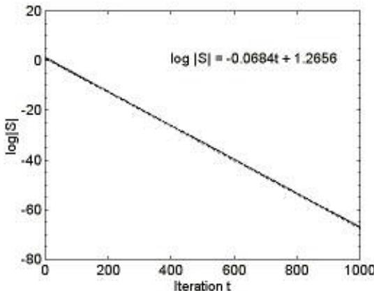  
Figure 1: Expt 1 - Simplified Model

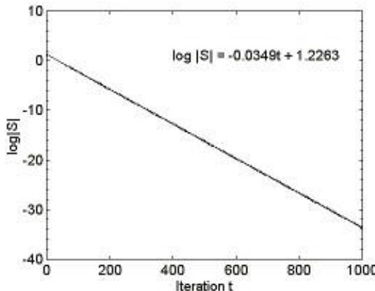  
Figure 2: Expt 2 - Simplified Model with Swarm Intelligence

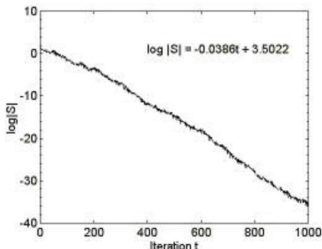  
Figure 3: Expt 3 - Simplified Model with Random Springs

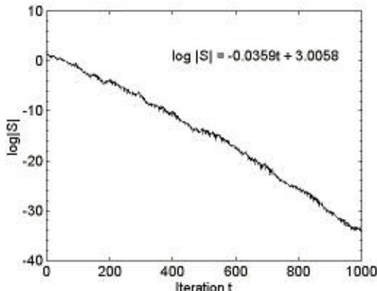  
Figure 4: Expt 4 - Simplified Model with RS and SI

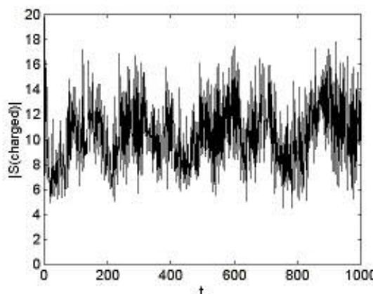  
Figure 5: Expt 5 - CPSO, core radius $= 1 . 0$

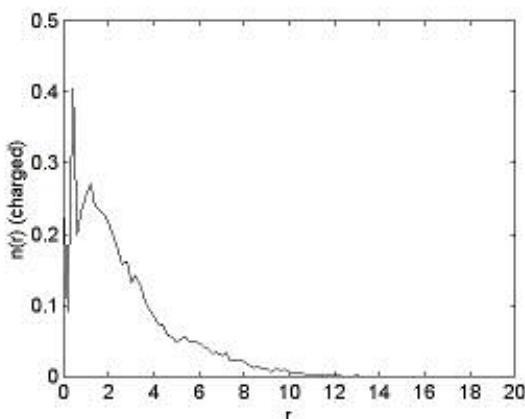  
Figure 6: Expt 5 - CPSO, core radius $= 1 . 0$

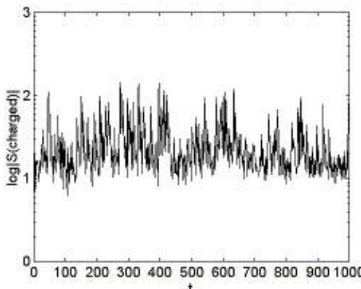  
Figure 7: Expt 6 - CPSO, core radius $= 0 . 1$

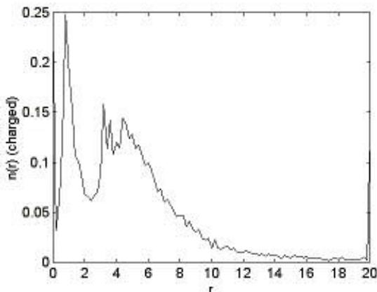  
Figure 1: Expt 6 - CPSO, core radius $= 0 . 1$

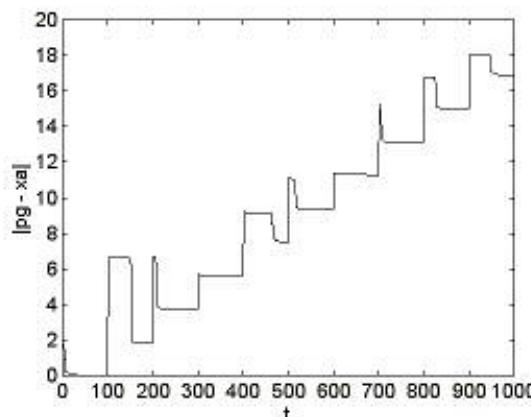  
Figure 9: Expt 7 - PSO with Dynamism

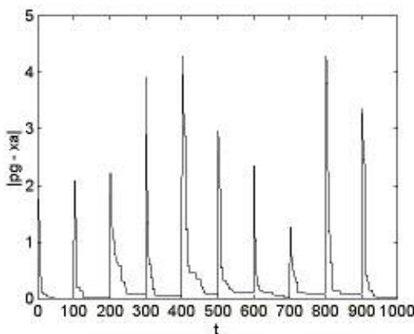  
Figure 10: Expt 8 - CPSO with Dynamism

explain why a clamping velocity is often used in PSO implementations. For example, Eberhart and Shi (2000) recommend that each particle velocity is clamped, immediately after velocity update, to the dynamic range.

Figures 6 and 8 show the charge density for 20 particle charged swarms when the core radius $r _ { c }$ is 1.0 and 0.1 respectively. Figure 6 show three peaks, at $r \approx 0$ ,0.5 and Ater the thrd peak, there s  seay all i $n$ up to $r \approx 1 3$ . The prediction of Blackwell (2003) equation (18) for median size $R _ { ; }$ ,for $\boldsymbol { M } ^ { + } = 2 0$ and $\phi = 4 . 1$ , is $R =$ 1.70. This predicted value of $R$ falls just to the right of the third peak, and is broadly consistent with the definition of $R$ as the median distance. The peak at the origin corresponds to particles which have been attracted to $\pmb { p }$ and have experienced zero total repulsive acceleration. The peak at $r \approx 0 . 5$ is interesting because it is close to $r _ { c }$ However, when $r _ { c }$ is changed to 0.1 (Figure 8), this peak moves closer to 1.0, so its position dos not appear to be correlated with $r _ { c }$ .Also, Figure 8 shows a third broader peak displaced to higher $r _ { \cdot }$ This could be explained by the higher maximum acceleration $( M ^ { + } { - } I ) Q ^ { 2 } / { r _ { c } } ^ { 2 }$ that will increase the diversity of the swarm, pushing particles further outward.

The results for $| S ^ { + } |$ (Figures 5 and 7) show an average value around 12 for both $r _ { c } = 1 . 0$ and 0.1, but with very large fluctuations, $\vert \boldsymbol { S } ^ { + } \vert < 2 0 0$ , when $r _ { c } = 0 . 1 . ~ | \boldsymbol { S } ^ { ^ { + } } |$ has smaller fluctuation for $r _ { c } ~ = ~ 1 . 0$ ,with $\vert S ^ { + } \vert ~ < ~ 1 8$ The prediction for $| S ^ { + } |$ given by Blackwell (2003) in equation (19), is compatible with Figure 5, but badly overestimates at $r _ { c } ~ = ~ 0 . 1$ . This is because the particle configuration $( M ^ { \ast } \cdot 1$ particles clumped at a point within $r _ { c }$ of a particle which is close to $\pmb { p }$ which leads to this prediction is very unlikely. In fact the results indicate that large fluctuations occur due to the repulsion of a particle by just one or two others. The similarity of the average value of $| S ^ { + } |$ for either core radius is interesting since it is of the order of the dynamic range, which is also the limit of perception.

Figure 9, a plot of $| p _ { g } ( t ) - x _ { a } ( t ) |$ versus iteration $t$ shows that the neutral swarm struggles to optimize this dynamic function. Although there is some improvement in $\pmb { p } _ { g } ( t ) -$ $x _ { a } ( t ) |$ between jumps, the best position found by the swarm at the end of each period (i.e. just before a jump), $\vert p _ { g } - { \pmb x } _ { a } \vert .$ is monotonically increasing.

On the other hand, the charged swarm achieves more success in following $x _ { a }$ (Figure 10). The jumps are clearly seen as spikes in Figure 10. The charged swarm, with its greater diversity, always has a particle close enough to the new attractor to pull the swarm in the direction of the change, with a rapid improvement in $p _ { g } ( t ) \textrm { -- } x _ { a } ( t ) |$ and final best values $\left| p _ { g } - \pmb { x } _ { a } \right|$ in the range $0 . 0 1 \textrm { - } 0 . 1$ for each period.

# 5 CONCLUSIONS

If Particle Swarm Optimization is to be applied to a dynamic problem, then some knowledge of the rate of convergence of the swarm compared to the average jump in optimum position is desirable. If, at change, the swarm size is much smaller than the average jump length, it will be difficult for the swarm to diversify and follow the change. One measure of diversity which takes into account fluctuations is the maximum swarm spatial size, ISI. If the jump to the new optimum position occurs within ISI, then the swarm may have enough diversity to follow the change.

It should be noted that ISl does not take into account asymmetric particle distributions which may arise with asymmetric problems. In such cases, an analysis using the maximum spatial extent along each axis, ISJ, $j = 1 . . . d ,$ might be more appropriate. (Experiments and analysis of a simple case where the optimum does lie outside $| S |$ has already been reported (Blackwell and Bentley 2002)).

The neutral swarm of PSO can be adapted with a charged sub-swarm. This charged sub-swarm maintains population diversity through the collision avoiding repulsions of charged particles. However, some quantification of the spatial size $| S |$ is still needed since the repulsions depends on a number of adjustable parameters such as particle charge, core radius and perception limit. The median radius of the swarm, $R$ ,is a second measure of diversity, and is less sensitive to fluctuations.

This paper presents empirical results for ISl for a simplified non-interacting swarm, and for the simplified model with swarm intelligence. The analysis motivates the result that an interacting swarm should shrink as $\vert S \vert = ( \sqrt { \eta \chi } ) ^ { T }$ where $\eta$ is a small renormalization factor (η $> 1 \AA$ and $\chi$ is a constriction factor introduced by Clerc and Kennedy to ensure convergence of the simplified model. The empirical results, for the sphere function in three dimensions support this finding, and the near critical convergence $\left( \chi _ { R } = \eta \chi = 0 . 9 2 3 \right)$ shed light on the PSO folk-lore that velocity clamping is helpful even under constriction. The empirical results for the simplified model are in agreement with theory.

In practice, PSO is usually implemented with random spring constants. This is believed to aid convergence in difficult cases. Theoretical analysis of the effects of randomization is lacking, but the empirical result of this paper for a single objective function is that randomization produces fluctuations around the exponential decay law, with a renormalized constriction factor $\chi _ { R }$ similar to that gained from particle interactions. When random springs and particle interactions are included, $\chi _ { R }$ is approximately the same as for the model without randomization, except that convergence is less regular.

Two results for the maximum size $| S ^ { + } |$ and median size $R$ of a charged swarm have also been derived. The analysis for $R$ is based on an electrostatic argument and assumes an inverse square repulsive acceleration between charged particles. In the CPSO, the Coulomb acceleration is replaced by a constant acceleration at distances less than a core radius, and is set to zero for separations beyond a perception limit. The empirical results for charged swarms of different core radii indicates that median swarm size $R$ should not be affected by the core radius or perception limit.

The analysis for $| S ^ { + } |$ , the maximum spatial size of a charged swarm, does indicate a dependence on core radius, although the theoretical prediction $\vert S ^ { \dagger } \vert \sim r _ { c } ^ { - 2 }$ badly over estimates for small $r _ { c }$ . The argument rests on a calculation of a maximum acceleration due to a very unlikely swarm configuration, and clearly needs to be refined.

The conclusion of the analysis for charged swarms is that if the dynamic range is within $| S ^ { \dagger } |$ then the charged swarm should be able to follow any change. This was demonstrated for a simple dynamic problem with $| S ^ { \dagger } |$ set at twice the dynamic range, and optimum jumps occurring within one half the dynamic range. The neutral PSO, by contrast, was not able to track this dynamism.

# Список литературы

Blackwell T.M. (2003) Particle Swarms and Population Diversity I: Analysis. GECCO workshop on Evolutionary Algorithms for Dynamic Optimization Problems

Blackwell T.M. and Bentley P.J. (2002) Dynamic search with charged swarms. Proc Genetic and Evolutionary Computation Conference, 19-26

Branke J. (1999). Evolutionary algorithms for changing optimization problems. Proc Congress on Evolutionary Computation, 1875-1882.

Eberhart R. and Shi Y. (2000) Comparing inertia weights and constriction factors in particle swarm optimization. Proc. Congress on Evolutionary Computation. (2000) 84-88

Eberhart R.C. and Shi Y. (2001) Tracking and optimizing dynamic systems with particle swarms. Proc Congress on Evolutionary Computation. (2001) 94-97

Hu X. and Eberhart R.C. (2002) Adaptive particle swarm optimisation: detection and response to dynamic systems. Proc Congress on Evolutionary Computation, 1666-1670.

# Finite Population Models of Dynamic Optimization with Alternating Fitness Functions

Anthony M.L. Liekens Huub M.M. ten Eikelder Peter A.J. Hilbers Department of Biomedical Engineering, Technische Universiteit Eindhoven P.O. Box 513, 5600MB Eindhoven, the Netherlands {a.m.l.liekens, h.m.m.t.eikelder, p.a.j.hilbers}@tue.nl

# Abstract

# 2 Models and Methods

In order to study genetic algorithms in dynamic environments, we describe a stochastic finite population model of dynamic optimization, assuming an alternating fitness functions approach. We propose models and methods that can be used to determine exact expectations of performance. As an application of the model, an analysis of the performance of haploid and diploid genetic algorithms for a small problem is given. Some preliminary, exact results on the influences of mutation rates, population sizes and ploidy on the performance of a genetic algorithm in dynamic environments are presented.

We first give a general definition of a stochastic, finite population model of the Simple GA (SGA) with a static fitness function. Similar models are later combined to form a model of a GA with a dynamic fitness function. In order to build a (stochastic) Markov model for a GA, we have to identify all states of the GA, and to determine the transition probabilities between these states.

# 2.1 Haploid and diploid reproduction schemes

The following constructions are based on the definition of haploid and diploid simple genetic algorithms with finite population sizes as described in [4].

# 2.1.1 Haploid reproduction

# 1 Introduction

In dynamic optimization, online optimization techniques try to track optima of changing problems [1] Genetic algorithms (GA) in dynamic environments have been studied formally assuming infinite population models [2]. In this paper, we present a stochastic model of GAs with finite population sizes in specific dynamic environments. Stochastic transition matrices of consecutive generations - with possibly distinct fitness functions - are combined into one Markov matrix. We can then determine and analyze the limit behavior of these stochastic systems. In order to find expectations of performance of the GA toward the limit, we unroll the combined matrix again to calculate an expectation of fitness, based on the limit behavior of the combined chain. In a similar coupled model, we have studied the limit behavior of co-evolution of haploid and diploid populations [3].

Let $\Omega _ { H }$ be the space of binary bit strings with length l. The bit string serves as a genotype with $l$ loci, that each can hold the alleles 0 or 1. $\Omega _ { H }$ serves as the search space for the Haploid Simple Genetic Algorithm (HSGA). Let $P _ { H }$ be a haploid population, $P _ { H } = \left\{ x _ { 0 } , x _ { 1 } , \dots , x _ { r _ { H } - 1 } \right\}$ , a multi set with $x _ { i } \ \in \ \Omega _ { H }$ for $0 \leq i < r _ { H }$ , and $r _ { H } = | P _ { H } |$ the population size. Let $\pi _ { H }$ denote the set of all possible populations $P _ { H }$ of size $r _ { H }$ .

Let $f _ { H } : \Omega _ { H }  \mathbb { R } ^ { + }$ denote the fitness function. Let $\varsigma _ { f _ { H } } : \pi _ { H }  \Omega _ { H }$ represent stochastic selection, proportional to fitness function $f _ { H }$ . Crossover is a genetic operator that takes two parent individuals, and results in a new child individual that shares properties of these parents. Mutation slightly changes the genotype of an individual. Crossover and mutation are represented by the stochastic functions $\chi : \Omega _ { H } \times \Omega _ { H } \to \Omega _ { H }$ and $\mu : \Omega _ { H } \to \Omega _ { H }$ respectively.

In a HSGA, a new generation of individuals is created through sexual reproduction of selected parents from the current population. The probability that a haploid individual $i \in \Omega _ { H }$ is generated from a population $P _ { H }$ can be written according to this process as

$$
\begin{array} { r l } & { \mathrm { P r } \left[ i \mathrm { ~ i s ~ g e n e r a t e d ~ f r o m ~ } P _ { H } \right] = } \\ & { \mathrm { P r } \left[ \mu \left( \chi \left( \varsigma _ { f _ { H } } \left( P _ { H } \right) , \varsigma _ { f _ { H } } \left( P _ { H } \right) \right) \right) = i \right] } \end{array}
$$

where it has been shown in [4] that the order of mutation and crossover may be interchanged in (1).

# 2.1.2 Diploid reproduction

In the Diploid Simple Genetic Algorithm (DSGA), an individual consists of two haploid genomes. An individual of the diploid population is represented by a multi set of two instances of $\Omega _ { H }$ , e.g. $\{ i , j \}$ with $i , j \in \Omega _ { H }$ . The set of all possible diploid instances is denoted by $\Omega _ { D }$ , the search space of the DSGA. A diploid population $P _ { D }$ with population size $r _ { D }$ is defined over $\Omega _ { D }$ , similar to the definition of a haploid population. Let $\pi _ { D }$ denote the set of possible populations.

Haploid selection, mutation and crossover are reused in the diploid algorithm. Two more specific genetic operators must be defined. Let $\delta : \Omega _ { D }  \Omega _ { H }$ be the dominance operator. A fitness function $f _ { H }$ defined for the haploid algorithm, can be reused in a fitness function $f _ { D }$ for the diploid algorithm with $f _ { D } ( \{ i , j \} ) = f _ { H } ( \delta ( \{ i , j \} ) )$ for any $\{ i , j \}$ in $\Omega _ { D }$ . Another diploid-specific operator is fertilization, which merges two gametes (members of $\Omega _ { H }$ )into one diploid individual: $\phi : \Omega _ { H } \times \Omega _ { H } \to \Omega _ { D }$ Throughout this paper we will assume that $\phi ( i , j ) = \{ i , j \}$ for all $i , j$ in $\Omega _ { H }$ . The probability that a diploid child is generated according to this scheme can now be written as

$P ^ { \prime }$ only depends on the previous state $P$ , the SGA is Markovian. This implies that the SGA can now be written as a Markov chain with transition matrix $T$ with $T _ { P ^ { \prime } P } = \mathrm { P r } \left[ \tau ( P ) = P ^ { \prime } \right]$ . If mutation can map any individual to any other individual, all elements of $T$ become strictly positive, and $T$ becomes irreducible and aperiodic. The limit behavior of the Markov chain can then be studied by finding the eigenvector, with corresponding eigenvalue 1, of $T$ .

We will assume uniform crossover, bitwise mutation according to a mutation probability $\mu$ ,and selection proportional to fitness throughout the paper.

This completes the formal construction of haploid and diploid simple genetic algorithms. More details of this construction can be found in [4].

# 2.3 Alternating fitness functions

Next, we extend these models for dynamic environments. Our approach is to combine several Markov models of GAs, with specific fitness functions, into one new transition matrix.

Consider a GA and $n$ fitness functions $f _ { i }$ . For each of the fitness functions, let $\tau _ { i }$ describe the state transitions of the GA, with selection according to $f _ { i }$ . Let $T _ { i }$ denote the Markov matrix of the GA according to transition $\tau _ { i }$ . We assume that all other parameters of the modeled GAs - such as population sizes and parameters of reproduction - are equal for any of the $n$ Markov matrices. If we assume that during a run of the GA each of the $n$ fitness functions $f _ { i }$ governs the selection alternately for a fixed finite number of generations $t _ { i }$ , then we can construct a combined Markov model $T _ { d y n }$ with

$$
T _ { d y n } = T _ { n } ^ { t _ { n } } \cdot \cdot \cdot \cdot T _ { 2 } ^ { t _ { 2 } } \cdot T _ { 1 } ^ { t _ { 1 } } .
$$

$$
\mathrm { P r } \left[ \phi \left( \mu \left( \chi \left( \varsigma _ { f _ { D } } \left( P _ { D } \right) \right) \right) , \mu \left( \chi \left( \varsigma _ { f _ { D } } \left( P _ { D } \right) \right) \right) \right) = \{ i , j \} \right] .
$$

# 2.2 Simple genetic algorithms

In the simple GA (SGA), a new population $P ^ { \prime }$ of fixed size $r$ over search space $\Omega$ for the next generation is built according to population $P$ with

$$
{ \sf P r } \left[ \tau ( P ) = P ^ { \prime } \right] =
$$

This combined transition matrix $T _ { d y n }$ gives the transition of the GA for $\textstyle t _ { t o t } = \sum _ { i = 1 } ^ { n } t _ { i }$ generations, starting with the first generation with fitness function $f _ { 1 }$ , and ending with the last generation of fitness function $f _ { n }$ . Consequently, a run of the model repeatedly visits all fitness functions and simulates a dynamic environment. Since $T _ { d y n }$ is independent of time, the chain is Markovian.

# 2.4 Limit behavior

# 2.4.1 Existence of a unique limit

where $\tau : \pi  \pi$ represents the stochastic construction of a new population from and into population space $\pi$ of the SGA, and $P ^ { \prime } ( i )$ denotes the number of individuals $i$ in $P ^ { \prime }$ . Since the system to create a new generation

One can show that the combination of irreducible and aperiodic Markov matrices $T _ { 1 } , \ldots , T _ { n }$ , as defined above, does not always result in a transition matrix $T _ { d y n }$ that is irreducible and aperiodic. Therefore, we cannot simply assume that the Markov chain based on transition matrix $T _ { d y n }$ converges to a unique equilibrium distribution.

We can, however, make the following assumptions: If mutation can map any individual to any other individual in the algorithm's search space with a strictly positive probability, then all elements in transition matrices $T _ { i }$ are strictly positive [4]. According to (4), all transition probabilities of the combined model $T _ { d y n }$ are thus strictly positive. This makes the combined Markov model irreducible and aperiodic, and hence, due to Perron-Frobenius theorem, there exists a unique eigenvector of the matrix with corresponding eigenvalue 1. Consequently, this eigenvector describes the fixed point distribution over the states of the GA toward the limit.

# 2.4.2 Interpretation of the limit

Let $\xi _ { 0 }$ denote the unique eigenvector, with corresponding eigenvalue 1, of the irreducible and aperiodic transition matrix $T _ { d y n }$ . The eigenvector describes the probability distribution over the states of the GA. By definition, $\xi _ { 0 } ~ = ~ T _ { d y n } ~ \cdot ~ \xi _ { 0 }$ or more specifically, $\xi _ { 0 } = T _ { n } ^ { t _ { n } } \cdot \cdot \cdot \cdot T _ { 2 } ^ { t _ { 2 } } \cdot T _ { 1 } ^ { t _ { 1 } } \cdot \xi _ { 0 }$ Let $\xi _ { u }$ denote the distribution over all states of the GA, $u$ generations since eigenvector $\xi _ { 0 }$ , with $0 \leq u \leq t _ { t o t }$ , i.e.,

$$
\xi _ { u } = T _ { v } ^ { w } \cdot T _ { v - 1 } ^ { t _ { v - 1 } } \cdot \cdot \cdot T _ { 1 } ^ { t _ { 1 } } \cdot \xi _ { 0 }
$$

where $u = t _ { 1 } + t _ { 2 } + \cdot \cdot \cdot + t _ { v - 1 } + w$ and $0 \leq w \leq t _ { v }$ . All $\xi _ { u }$ are vectors describing the consecutive distributions over the GA's search space with $\xi _ { 0 } = \xi _ { t _ { t o t } }$ .

# 2.5 Expected performance

Since we know the fitness function at each of the generations, we can find a mean fitness of all generations, as the system defined by $T _ { d y n }$ converges toward the limit. This mean fitness, derived from the exact eigenvector, gives us the expected mean fitness of a simulation run of the GA.

Let $\xi _ { u } ( P )$ denote the probability of being in state $P$ of the GA, at $u$ generations since eigenvector $\xi _ { 0 }$ . Let $f _ { ( u ) }$ denote the fitness function that is applied at the uth generation since $\xi _ { 0 }$ . Let $\overline { { f _ { ( u ) } } }$ denote the weighted mean fitness of the populations according to distribution $\xi _ { u }$ i.e.,

where $\overline { { f _ { ( u ) } ( P ) } }$ denotes the mean fitness of population $P$ according to fitness function $f _ { ( u ) }$ . The overall mean fitness $\overline { { f } }$ of all $\overline { { f _ { ( u ) } } }$ with

$$
\overline { { f } } = \frac { 1 } { t _ { t o t } } \sum _ { u = 1 } ^ { t _ { t o t } } \overline { { f _ { ( u ) } } }
$$

gives us the expected fitness over all generation, as the GA goes toward the limit. Similarly to the mean fitness measure, we could compute the expected proportion of individuals with maximal fitness toward the limit. Because of limited space, we do not discuss the maximum fitness measure here.

# 3 Applications

In order to show how the models and methods from section 2 can be utilized in practical applications to study the performance of distinct algorithms and their parameters in dynamic optimization, we discuss a small dynamic problem, and give the expected performance toward the limit of a haploid and diploid GA tracking the problem.

# 3.1 Alternating the deleterious bit

We discuss a small single locus, two allele dynamic problem. In terms of bit strings, this implies that the GAs have a bit string of length 1 as their phenotype. We will use $n = 2$ different fitness functions for our dynamic problem. Alternately, we let 0 and 1 be the deleterious allele for a finite number of generations $t _ { 0 } = t _ { 1 } = 1 0$ . Therefore, let $f _ { 0 }$ and $f _ { 1 }$ , with $f _ { 0 } ( 0 ) = L , f _ { 0 } ( 1 ) = 1 , f _ { 1 } ( 0 ) = 1$ and $f _ { 1 } ( 1 ) = L$ , be the alternating fitness functions, with $L$ denoting a measure of selection pressure, with $0 \leq L \leq 1$ With $L$ smaller, the selection pressure is higher. Let $T _ { 0 }$ and $T _ { 1 }$ denote the transition matrices for one generation of a GA whose selection is according to $f _ { 0 }$ and $f _ { 1 }$ , respec$T _ { d y n } = T _ { 1 } ^ { t _ { 1 } } { \cdot } T _ { 0 } ^ { t _ { 0 } }$   
probabilities of the GA for $t _ { 0 } + t _ { 1 }$ consecutive generations, starting with the first generation using fitness function $f _ { 0 }$ . The unique eigenvector of $T _ { d y n }$ , with corresponding eigenvalue 1, of this transition matrix is used for computing the algorithm's performance for this problem.

# 3.2 Limit behavior

$$
{ \overline { { f _ { ( u ) } } } } = \sum _ { P \in \pi } \xi _ { u } ( P ) \cdot { \overline { { f _ { ( u ) } ( P ) } } }
$$

with

$$
\overline { { f _ { ( u ) } ( P ) } } = \frac { 1 } { | P | } \sum _ { i \in P } f _ { ( u ) } ( i )
$$

Several preliminary results of the algorithm's behavior under several parameter settings are given. As default parameters, population size $r$ is set to 10, bit-flip mutation rate $\mu$ equals 0.02, selection pressure measure $L = 0 . 1$ , assuming fitness proportional selection. The fixed point distribution, or eigenvector of the resulting transition matrix $T _ { d y n }$ has been computed. Consequently, we can compute the exact fitness measures $\overline { { f _ { ( u ) } } }$ and $\overline { { f } }$ .

# 3.2.1 Haploid algorithm

Figures 1 and 2 show the mean fitnesses $\overline { { f _ { ( u ) } } }$ . In the first 10 generations of both figures, selection of the GA is governed by $f _ { 0 }$ , whereas $f _ { 1 }$ is active in the last 10 generations. The results in both halves of each figure have the same performance results since the haploid algorithm reacts analogous when switching the deleterious allele from 0 to 1 or vice versa. As fitnesses switch, $\overline { { f } }$ becomes $( 1 + L ) - { \overline { { f } } }$ , and selection and reproduction proceeds according to the new fitness function. The distribution at generation 20 is equal to that at generation 0, by definition.

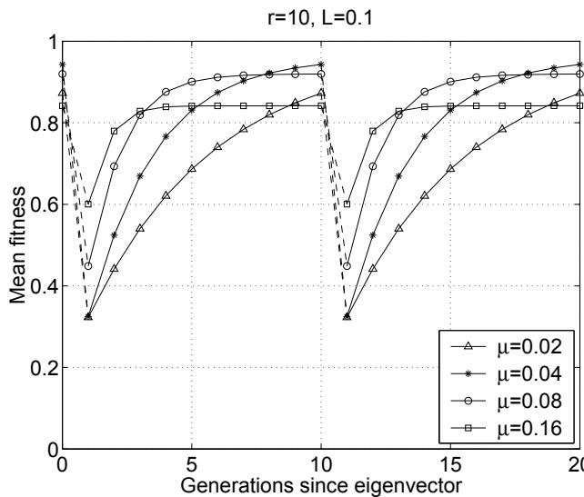  
Figure 1: Exact limit behavior of the haploid algorithm under different mutation rates. Performance measure $\overline { { f } }$ equals 0.6677, 0.7692, 0.8322, 0.8097 for $\mu =$ 0.02, 0.04, 0.08, 0.16, respectively.

Figure 1 shows the influence of different mutation rates on the performance of the GA for the dynamic problem. It can be shown that a bitwise mutation rate of $\mu \approx 0 . 0 9 5$ gives the best performance, with $\overline { { f } } \approx 0 . 8 3 5$ .

Figure 2 shows that, as we increase the population size of the GA, it performs better at tracking the optima of the dynamic problem. An infinite population approach could show the limit of the performance as $r$ goes to $\infty$ . Since larger populations require more computational effort for making the step to the next generation, one could choose to speed up the dynamic environment as the population becomes larger. Since selection and reproduction proceed inherently parallel in nature and our primary goal is to build a biologically viable model, we ignore this for now.

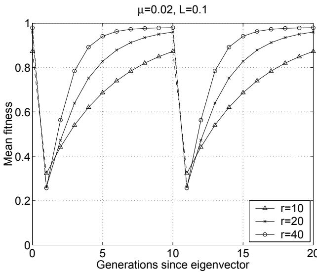  
Figure 2: Influence of different population sizes. ${ \overline { { f } } } =$ 0.6677, 0.7589, 0.8305 for $r = 1 0 , 2 0 , 4 0$ , respectively.

# 3.2.2 Diploid algorithm

Figures 3 and 4 show some preliminary results of the influence of ploidy on the performance of the GA in the dynamic environment.

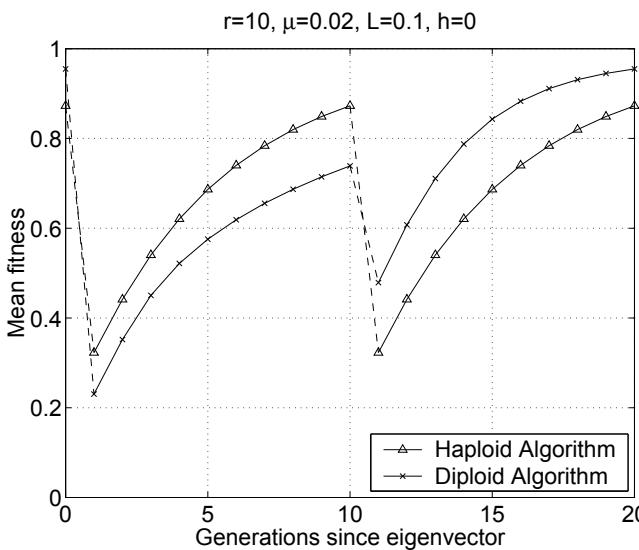  
Figure 3: Exact limit behavior of comparable haploid and diploid algorithms. $\overline { { f } }$ equals 0.6677 and 0.6798 for the haploid and diploid algorithm, respectively.

Figure 3 shows how a haploid and diploid GA perform at tracking the dynamic problem. In our specific example, diploidy performs slightly better than the haploid implementation. The diploid algorithm assumes 1 as its dominant allele. Therefore, the diploid algorithm is able to gather more fitness when O is the deleterious allele, and less when 1 is deleterious. Hence the asymmetry in the figures of the diploid algorithm. The haploid algorithm performs increasingly better as the period of alternating the fitness function becomes larger. It can be shown that a diploid algorithm inherently performs not as good as haploid algorithms in static environments. As the periods between fitness function shifts become longer, the haploid algorithm can profit from this effect.

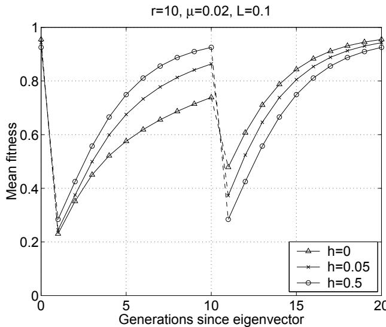  
Figure 4: Influence of different dominance coefficients in the diploid algorithm. $\overline { { f } } ~ = ~ 0 . 6 7 9 8 , 0 . 7 0 1 8 , 0 . 7 0 7 0$ for $h = 0 , 0 . 0 5 , 0 . 5$ respectively.

Figure 4 shows the influence of a varying coefficient of dominance for the deleterious allele. The coefficient of dominance, symbolized by $h$ , is a measure of dominance of the recessive allele in the case of heterozygosity. In this dominance scheme, the heterozygous genotype $\{ 0 , 1 \}$ has phenotype 0 with probability $h$ and phenotype 1 with probability $1 - h$ The diploid algorithm gathers more fitness in the dynamic setup as the dominance degree goes to 0.5. Figure 3 is based on a dominance degree of $h = 0$ . The asymmetry in the graphs that arose as diploidy was introduced, disappears again as $h = 0 . 5$ .

# 4 Discussion and Future Work

We have proposed a stochastic model and methods for analyzing the limit behavior of GAs tracking the optima of dynamic problems. The model provides a method for calculating an exact and stochastic performance expectation. This can be utilized to study the influences of different parameter settings in the GA's implementation on the performance.

However, the applications of the model proposed here are limited by the characteristic of deterministically alternating fitness functions. We are currently working on relaxations of this property, by stochastically alternating the fitness functions, which can easily be incorporated in the Markov model of the GA. Also, Markov models have the property of becoming computationally hard to solve as the size of the state space increases, e.g., because of larger search spaces or increasing population sizes. Consequently, this problem is also present in our model. The model allows many future enhancements, such as implementations of $n$ . ploidy and complexer dominance schemes.

The computational results in this paper are preliminary, and more work needs to be done on a general analysis of the performance of haploid and diploid GAs in dynamic applications. Based on the current results of the models it is hard to state whether haploid or diploid algorithms perform generally better for instantiations of dynamic problems. The difficulty of this process increases as many parameters - such as measures of selection and recombination pressure - need to be taken into account in such an analysis. Similarly, it is unclear whether the single locus results carry over to multiple loci problems. However, stochastic models and the limit behavior for small problems can prove helpful in predicting the performance of algorithms in dynamic environments, complimentary to empirical studies or theoretical infinite population approximations.

# Список литературы

[1] Branke, J.: Evolutionary Optimization in Dynamic Environments. Kluwer (2001)   
[2] Ronnewinkel, C., Wilke, C.O., Martinetz, T.: Genetic algorithms in time-dependent environments. In: Theoretical Aspects of Evolutionary Computation. (2001)   
[3] Liekens, A.M.L., ten Eikelder, H.M.M., Hilbers, P.A.J.: Finite population models of co-evolution and their application to haploidy versus diploidy. In: GECCO 2003. (2003)   
[4] Liekens, A.M.L., ten Eikelder, H.M.M., Hilbers, P.A.J.: Modeling and simulating diploid simple genetic algorithms. In: Foundations of Genetic Algorithms VII. (2003)

# Diversity does not Necessarily Imply Adaptability

# Marcus Andrews

Department of Computing City University, London Northampton Square, London, EC1V 0HB

# Andrew Tuson

Department of Computing City University, London Northampton Square, London, EC1V 0HB

m.andrews@city.ac.uk a.tuson@city.ac.uk

# Abstract

Dynamic optimiser design currently assumes that diversity is a desirable property towards achieving adaptability, as a population-based optimiser contains an implicit memory. This paper examines the applicability of this assumption. Population-based algorithms of different size are tested against optimisers using a single solution. Results presented here suggest that this view is somewhat simplistic, and that population size should be considered as a design variable in optimiser design for dynamic environments.

# 1 INTRODUCTION

Research in dynamic optimization [1] focuses on population-based optimizers, mostly evolutionary algorithms (EAs). EAs are seen as suitable due to their analogy with nature, which is itself a dynamic environment [2], and their distributed and parallel nature [3].

This paper examines the premise that a population-based mechanics is suitable for dynamic optimization, as it will be able to adapt quickly. If the population is diverse and a change in the problem occurs, there will more than likely be a member of the population sitting in a promising area of the search space, allowing the optimizer to quickly adapt to the change. Maintaining a population might thus be seen as a memory for storing solutions that have had a high quality in the recent past, and can be used as a head start for optimising under the new conditions.

# 2 LITERATURE REVIEW

Further to the idea of a population as suitable for dynamic optimization problems, there is realization in the literature that diversity in the population is a desired characteristic for dynamic optimisation, to enable adaptation after a change in the environment. This is due to optimisation and adaptation requiring different and opposing behaviours in any population, i.e. optimisation requires convergent behaviour [2].

In contrast, adaptive behaviour, as noted earlier in this text, requires divergent behaviour in order to explore the search space for a new optimum after a change has occurred. A homogenous population offers no benefit over a single solution, in terms of search space coverage, or the chance of having a member near the new optimum. Much of the research into optimizers for dynamic environments aims at defining structures and methods for either maintaining (e.g. [4], [5]) or (re)introducing (e.g. [4]) such diversity into a population, either after a change has occurred, or throughout the run.

For example, [6] acknowledge this fact saying that "improving adaptiveness means counteracting convergence" because "polymorphism is a desirable characteristic in a population, and diversity is important to this". They draw justification for this from both nature and cybernetics. In nature, Darwin's theory of survival of the fittest seems to be at odds with the diversity found in ecosystems where no single species dominates. In biology, they point out, ".. .redundancy seems to be the key word in structures like DNA, neural networks and immune systems". From cybernetics, they quote W. Ross Ashby [7], one of the fathers of cybernetics and his principle of selective variety where "The larger the variety of configurations a system undergoes, the larger the probability that at least one of these configurations will be selectively retained".

The above has lead to suggestions that EAs are inherently good at dynamic optimization, especially regarding EA designs that support population diversity. However, the premise of the suitability of population-based models assumes a larger population will receive a performance increase in its adaptive ability as the optimizer will have a greater coverage of the search space, assuming the population is diversified; but this ignores additional costs.

A larger population will entail a greater cost in terms of the computational overhead of evaluating its members. The question is whether a time/quality trade off is involved in population size (or any other diversity enhancing mechanism), varying for different problems and the different characteristics of the changes taking place.

This paper aims to show that the design of a populationbased optimizer should treat population sizes as a variable when dealing with dynamic optimization problems, that does not necessarily relate to performance in an obvious way. It therefore attempts to establish or refute the suitability of an optimizer, in terms of adaptation, when maintaining a diverse population of solutions.

# 3 EXPERIMENTAL SETUP

To investigate the issue above, EAs of a large and small population size are compared against a single-solution based heuristic over an oscillating knapsack problem common in the literature (e.g. [4]). If population size is considered as a design variable, there will be a variety of influences over the choice of population size; including factors such as problem instance, problem size, and characteristics of the various changes that can take place.

It is obviously impossible to examine the performance of population sizes over all these factors; therefore this paper will focus on a subset drawn from a more extensive study.

This study adopts an oscillating knapsack problem common in the literature, containing 17 bits. This study uses this small instance size but additionally extends the problem to 1700-bits. Weights and values for all objects are determined randomly, but lie in the range set in the original problem [6]. Weights are thus set in the range $\{ 1 , 2 0 \}$ and values are in the range $\{ 1 , 1 0 \}$ . The same objects are used for each algorithm.

In dynamic optimization problems it is important to consider the computational efforts needed by the optimizer. There will be a finite amount of time in which to find these solutions before the environment changes. Most optimizers usually spend most of their time on evaluating solutions for quality, at least in complicated real-world problems. Therefore it is common to compare the performance of algorithms using the number of fitness function evaluations as a measure of time.

The change characteristics contain many variables [2]; e.g. the severity and frequency of the changes, whether it is oscillating between states, or involves a linear form of change, or perhaps a catastrophic change. This study shall restrict itself to one of the more simple characteristics, namely the frequency with which the changes occur. Two speeds will be considered here, changing every 1000 evaluations and every 10,000 evaluations.

There are four combinations of problem size and change frequencies examining the effect of population on an optimiser's performance at adapting in dynamic environments. All algorithms are run 30 times with the mean result being reported, best quality solution found since change being recorded 10 times per cycle, in common with the literature.

# 3.1 FIRST-ASCENT HILL CLIMBER

The first ascent hill climber tests the neighbourhood in positional order from the first bit to the last. It accepts or moves to the first neighbour found which shows some improvement in quality. Upon finding a local optimum, the hill-climber shall restart from a random starting point.

# 3.2 EVOLUTIONARY ALGORITHMS

In preliminary experiments (not quoted here due to space limitations), the authors found a steady state EA was more often able to produce better results. For this study, however, a generational EA is used as it is the more common replacement strategy in the literature and the relative results are still the same. The implementation follows that in the sGA (Simple Genetic Algorithm) described in [6], but adopts uniform crossover. A population of 100 is adopted for the larger population size, with a smaller population of 10 members.

# 3.3 OSCILLATING 0/1 KNAPSACK PROBLEM

The Oscillating $_ { 0 / 1 }$ Knapsack problem is a common dynamic problem from the literature [4] and is defined as follows: given a set of $n$ items, each of which has a weight, W[i], and a value, V[i], and a knapsack which has a constraint in the amount of weight it may contain, $C$ The goal is to place objects in the knapsack such that the value of the objects is maximized, while the weight constraint is not exceeded. Each object may either be placed in the knapsack, or not. Multiple copies do not exist (hence the $_ { 0 / 1 }$ ).

More formally, given a set of weights $W [ i ]$ and values V[i for a set of objects $i { = } \{ 1 { \ldots } { \ldots } n \}$ , and a capacity $C ,$ the goal is to maximize

$\sum _ { i = 1 } ^ { i = n } V [ i ]$ such that the weight cntai $\sum _ { i = 1 } ^ { i = n } W [ i ] \leq C$ is realised.

# 4 RESULTS

The small problem size, fast change case (Figure 1) clearly shows that high diversity does not assist adaptability. The large-population EA is inferior to both the hill-climber and the small-population EA. Interestingly this is the case dominantly used in the literature for evaluating novel dynamic optimisers. There is a pronounced quality dip for the large population EA (also see Figure 4), corresponding to the only just reevaluated post-change EA population. If any memory of useful features is being retained, its effects are weak.

The small problem size, slow change case (Figure 2) shows the large-population EA attains the best quality solutions over the period between changes. However adaptability would seem to be a moot point in this case, as one could arguably re-optimise from scratch so in this case diversity is supporting thoroughness of search. If speed of recovery is at a premium the hill-climber wins, albeit at the expense of quality.

Figure 3 depicts the results of the large instance, fast change case. Both EAs clearly outperform the hillclimber, with only small differences in attained quality and similar apparent adaptivity. This would suggest that this is a better problem instance with which to evaluate dynamic optimisers.

The large instance, slow change case (Figure 4) shows a similar pattern to the previous case (Figure 3), but without to dip in solution quality due to the large recording interval.

# 5 CONCLUSION

The assumption that diversity is good for dynamic optimization is not universally applicable. Results show that population size has a complex effect on performance when adapting to changing problems, even when considering this simple, yet common, problem, and only considering a single very simple, aspect of change, namely the frequency of the changes.

The hill climber struggles with larger size problem due to the large search space defeating it's local view. It can often, however, react more quickly, albeit often at the expense of quality.

The EA copes with the larger problem more easily, yet struggles with the faster change rate. Its distributed nature would explain the first while the computational overhead in maintaining the population goes someway to explaining the later.

These differences also serve to highlight that the standard benchmark may not be sufficient to compare dynamic optimisers.

Investigation should clarify the time/quality trade-off between population size and the characteristics of the changes taking place.

Finally, the results here also suggest that focusing on the development of dynamic EAs that implement diversity and memory in a low-cost way would likely prove useful.

# Acknowledgments

The authors would like to thank QinetiQ/EPSRC for CASE Studentship 008022621, without which this research would not have been possible, and in particular Marcel Hernandez, for his valuable support and feedback.

# Список литературы

[1] J. Branke: Evolutionary Approaches to dynamic optimization  an updated survey. In GECCO Workshop on Evolutionary Algorithms for Dynamic Optimization Problems, pp. 27-30 (2001)   
[2] J. Branke: Evolutionary Optimization in Dynamic Environments, Kluwer Academic Publishers (2003)   
[3] Z. Michalewicz & D. Fogel: How to Solve It: Modern Heuristics, Springer (2000)   
[4] D. E. Goldberg & R. E. Smith: Non-Stationary Function Optimisation with Dominance and Diploidy. In Proceedings of the Second International Conference on Genetic Algorithms (1987)   
[5] H. G. Cobb & J.J. Grefenstette: Genetic algorithms for tracking changing environments In Genetic Algorithms: Proc. Fifth International Conference (ICGA93), San Mateo: Morgan Kaufmann, pp523-530.   
[6] A. Gaspar & P. Collard: From Gas to Artificial Immune Systems: Improving Adaptation in Time Dependent Optimization. In CEC'99: IEEE International Congress on Evolutionary Computation, Washington, pp. 1867- 1874 (1999)   
[7] W. Ross Ashby: An Introduction to Cybernetics, Chapman & Hall, London (1956)

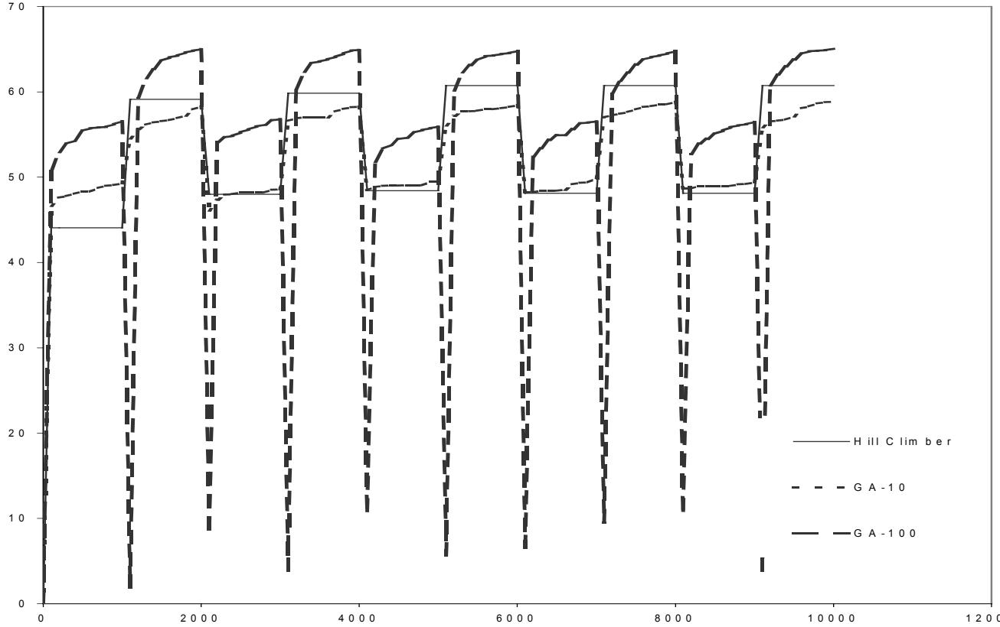  
Figure 1: 17-Bit & 1000 Evaluation Change Frequency

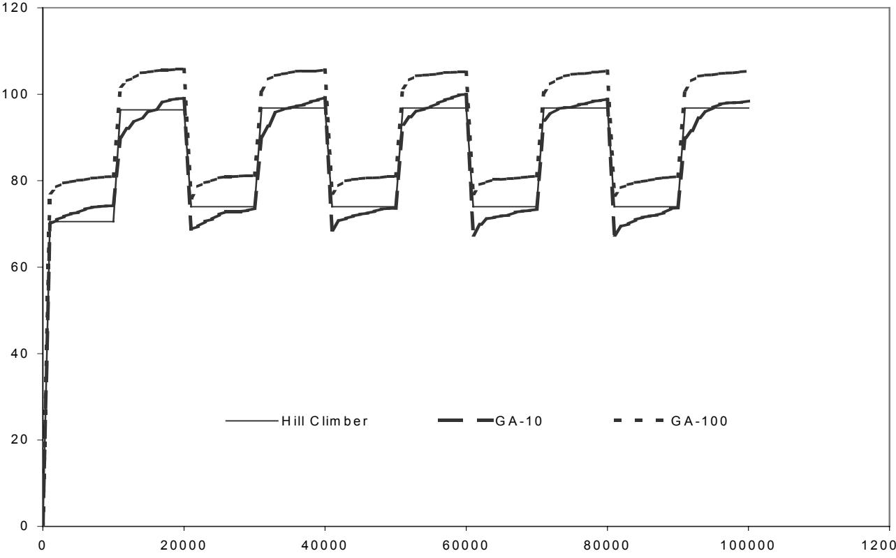  
Figure 2: 17-Bit & 10,000 Evaluation Change Frequency

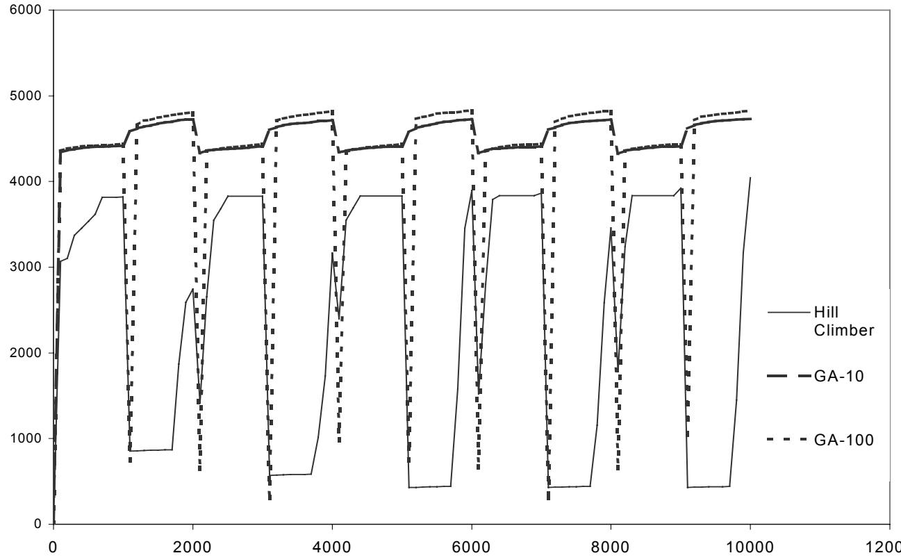  
Figure 3: 1700-Bit & 1000 Evaluation Change Frequency

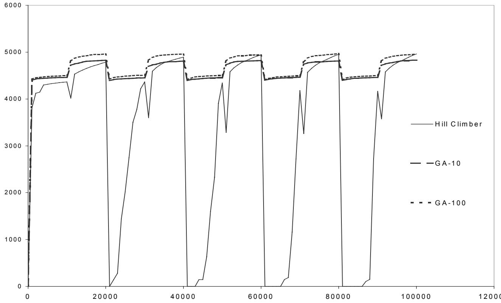  
Figure 4: 1700-Bit & 10,000 Evaluation Change Frequency

# On the Influence of Population Sizes in Evolution Strategies in Dynamic Environments

Lutz Schönemann

University of Dortmund, Dept. of Computer Science, D-44221 Dortmund, Germany schoenemann@LS11.cs.uni-dortmund.de

# Abstract

In time-dependent optimization problems the main task for a problem solver is not to find a good solution, but to track the moving best solution. It is well-known that evolutionary algorithms can cope with this requirement. For the case of evolution strategies we demonstrate that even a slight variation of the settings of population sizes $\mu$ and $\lambda$ may lead to significantly different results. For the necessary comparisons we define a new measurement and present an approach to get significant results.

# 1 INTRODUCTION

Evolutionary algorithms (EA) belong to a class of problem solvers which mimic the information processing within natural systems. The most important representatives of EA are evolution strategies (ES), genetic algorithms (GA) and evolutionary programming (EP).

For dynamic optimization tasks often special variants of EA are recommended (for an overview see [5]). In the lack of problem-specific knowledge standard EA are commonly used. An overview of the self-adaptive evolution strategies used here can be found in [2, 3]. We use the comma selection in which the $\mu$ best offspring form the new parental population. The number of different step sizes is $n _ { \sigma } = n$ .

Although primary investigations in this area were done [1, 6, 8], particularly in evolution strategies a theoretical foundation of population sizes is still outstanding. Following a heuristic rule many authors recommend a (15, 100)-ES as a good choice [2]. In the following experiments we try to estimate the influence of different population sizes on the results.

Branke divides several types of dynamism [4, 5]. He emphasizes that in dynamic environments usually the main task is not to find the optimum only once. Instead, it is essential to follow the optimum with high accuracy. In this study we concentrate on timedependent optimization problems in which the optimum changes in constant time (mostly after every generation) with a moderate severity. We extend the wellknown sphere model to a time-dependent optimization problem

$$
\operatorname* { m i n } { f ( x , t ) } = \operatorname* { m i n } \sum _ { i = 1 } ^ { n } ( x _ { i } - x _ { i } ^ { t } ) ^ { 2 } ,
$$

where $t$ denotes the time, $x = ( x _ { 1 } , \ldots , x _ { n } ) \in \mathbb { R } ^ { n }$ the current solution and $\boldsymbol { x } ^ { t } = ( x _ { 1 } ^ { t } , \ldots , x _ { n } ^ { t } )$ the optimizer at time $t$ .

Because we are only interested in tracking the optimum, the period to find the optimum for the first time is not considered here.

# 2 COMPARING TWO OR MORE STRATEGIES

Fig. 1 shows a common single run of an ES in a dynamic environment. After a few generations (the searching period) the EA has found a solution with a certain accuracy. Due to statistical fluctuations in the following generations (the tracking period) the function values oscillate around this value.

A single run of one strategy is not sufficient to get meaningful results. We reduce the random influences by taking the median (0.5-quantile) of repeated runs. In contrast to the mean the median is more robust against statistical outliers. To get an impression of the statistical fluctuations fig. 2 shows in addition to the median the 0.05- and 0.95-quantiles of 50 runs of the same experiment. Adding these quantiles leads to an approximative $9 0 \%$ confidence interval for the function value of every generation of a single run.

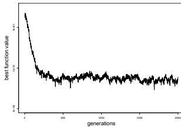  
Figure 1: Single run

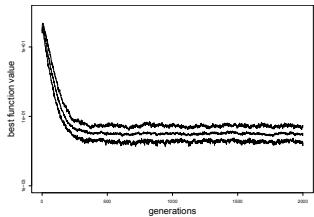  
Figure 2: $\alpha$ quantiles

For a simple comparison of two strategies we need a single measurement for every strategy. Although several attempts have been made [9] we define a new measurement. It is obvious that in dynamic environments the process of optimization is infinity. Due to selfevident reasons we have to restrict our investigations to a limited time horizon.

We calculate a measurement for a single strategy in the following way. In every single run and every generation we write out the best function value of the current population. Repeating every strategy 50 times we get for every generation 50 function values. Afterwards, we take for every generation the median of these 50 function values and get a median run. The mean of this median run during the tracking period serves as the tracking measurement $M _ { ( \mu , \lambda ) }$ , which we call the average best function value. Fig. 3 demonstrates our approach. In this example the average best function value of the generations from 1000 to 2000 is approximately $M _ { ( 1 5 , 1 0 0 ) } = 0 . 0 3 2$ .

As an alternative we use a (10, 100)-ES on the same problem. Fig. 4 shows the median runs for both strategies. In this figure we see a noticeable better performance of the variant with $\mu ~ = ~ 1 0$ . The respective tracking measurement is $M _ { ( 1 0 , 1 0 0 ) } = 0 . 0 1 2$ .

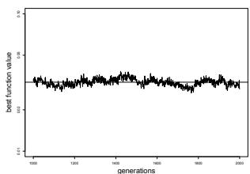  
Figure 3: The median function value of generations $1 0 0 0 - 2 0 0 0$ of 50 runs of a (15, 100)-ES on the dynamic sphere with $n = 3 0$ . The optimum moved every generation in one dimension with a constant $s = 0 . 1$ . Additionally, the horizontal line shows the mean of the 1001 plotted values, which we call the average best function value.

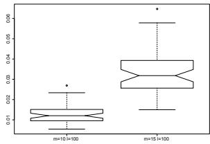  
Figure 4: Median runs

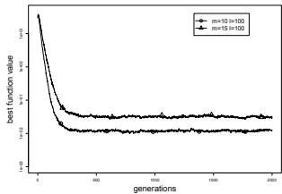  
Figs.1, 2. Results of a (15,100)-ES on the dynamic sphere with $n = 3 0$ . The optimum moved every generation in one dimension with a constant $s = 0 . 1$ . Fig.2 shows the 0.05-, 0.5- and 0.95-quantiles of the best function values of every generation of 50 runs.   
Figure 5: Boxplot of mean function values   
Figs. 4, 5. Comparison of 50 runs of a (10, 100)- and a (15,100)-ES on the dynamic sphere with $n = 3 0$ The optimum moved every generation in one dimension with a constant $s = 0 . 1$ .

To decide if this difference is significant much more work is needed. For every generation we sort all 50 values (one of each run) and calculate each possible $\alpha$ quantile $\begin{array} { r l r } { ( \alpha } & { { } \in } & { \{ 0 , 1 / 4 9 , 2 / 4 9 , 3 / 4 9 , . . . , 4 7 / 4 9 , } \end{array}$ 48/49,1}). For a fixed $\alpha$ we combine the $\alpha$ -quantiles of every generation to a $\alpha$ -quantile run. E.g., the Oquantiles of every generation make the worst run and the median run arises from the 0.5-quantiles. Be aware that every $\alpha$ -quantile run may be compounded of values of different real runs.

After this we calculate for every $\alpha$ -quantile run the mean function value during the tracking period. By this manner we get 50 different mean function values. One for the best run (1-quantile), one for the second best run (48/49-quantile), ..., and one for the worst run (0-quantile).

Now, we have for every strategy a random sample of the mean function value during the tracking period. Fig. 5 shows the boxplots of these samples of size 50 each. The non-overlapping notches of the boxplots show that the median of the function values reached by the (10, 100)-ES is significant (at the $5 \%$ -level) better than the one of the (15, 100)-ES.

# 3 EXPERIMENTAL RESULTS

In the following experiments we minimize the dynamic sphere with $n = 3 0$ . We compare the average best function values in the tracking period reached by ES with different population sizes $\mu$ and $\lambda$ . The population sizes vary for $\mu = \{ 1 , 2 , 3 , 4 , 5 , 8 , 1 0 , 1 5 , 2 0 , 3 0 ,$ $4 0 \}$ and for $\lambda = \{ 4 0$ , 50, 60, 70, 80, 90, 100, 120, 140, 160, 180, 200, 240, $2 8 0 \}$ . In sect. 3.2 some strategies were run with a higher $\lambda$ .

In sect. 3.1 we run every ES for 2000 generations, which is enough for the considered function class. To reduce the searching period we start the EA near the optimum. In every case the searching period is completed after 1000 generations and the tracking period is in action. In sect. 3.2 we run each strategy over 600,000 function evaluations. There, the tracking period is always in action after 300,000 function evaluations.

# 3.1 CONSTANT NUMBER OF GENERATIONS

In figs. 6 and 7 we see the average best function value of several $( \mu , \lambda )$ -ES. The optimum moved in one dimension with a severity of $s = 0 . 1$ and $s = 1 . 0$ at every generation. Therefore, the total covered distance was $s \cdot g = 2 0 0$ and $s \cdot g = 2 0 0 0$ respectively. For the reason of clarity, in the figures the curves for some $\lambda$ are suppressed. In both cases the best performance is reached with $\mu = 3$ parents.

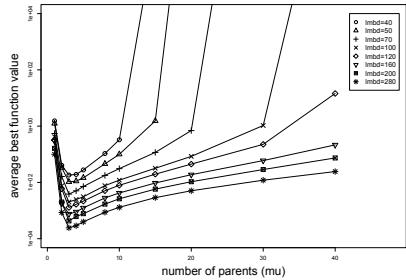  
Figure 6: $s = 0 . 1$ .

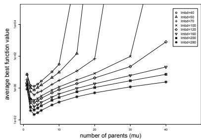  
Figure 7: $s = 1 . 0$ .   
Figs.6, 7. The average best function value of selected $( \mu , \lambda )$ -ES on the dynamic sphere with $n = 3 0$ . The optimum moved every generation in one dimension with a constant $s = 0 . 1$ and $s = 1 . 0$ . All strategies were run 2000 generations.

Figs. 8 and 9 show the results if the optimum moves in all dimensions. In this situation it is beneficial to use more than three parents. Now, the ES gains from a higher diversity. But, if $\mu$ is too large (and thus the selection pressure $\lambda / \mu$ is very low) the performance reduces with increasing $\mu$ .

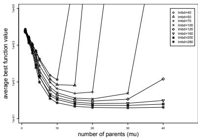  
Figure 8: $s = 0 . 1$ .

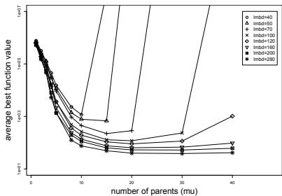  
Figure 9: $s = 1 . 0$ .   
Figs. 8, 9. The average best function value of selected $( \mu , \lambda )$ -ES on the dynamic sphere with $n = 3 0$ . The optimum moved every generation in all dimensions with a constant $s = 0 . 1$ and $s = 1 . 0$ . All strategies were run 2000 generations.

Although the severity is identical the function values reached in the case of one moving dimension are conspicuous better than in the case of $n$ moving dimensions. An assumption for this behavior may result from the common method how the mutation of the step sizes and the object variables

$$
\begin{array} { r } { \sigma _ { i } ^ { \prime } = \sigma _ { i } \exp ( \tau _ { 0 } N _ { 0 } ( 0 , 1 ) + \tau N _ { i } ( 0 , 1 ) ) , x _ { i } ^ { \prime } = x _ { i } + \sigma _ { i } ^ { \prime } N _ { i } ( 0 , } \end{array}
$$

is performed. Assume, that the step sizes have nearly their optimal values. Then, for the case of one moving dimension the step sizes are nearly $\sigma _ { 1 } = 1 , \sigma _ { 2 } =$ $\dots \cdot \sigma _ { n } = \epsilon$ with $\boldsymbol { \epsilon }$ small. For the case of $n$ moving dimensions they are nearly $\sigma _ { 1 } = . . . = \sigma _ { n } = \sqrt { 1 / n } + \epsilon$ . Depending on $\tau _ { 0 }$ and $\tau$ a possible change of $\sigma _ { i } \gg \epsilon$ by a factor $c$ have a higher negative effect on the function value than the same percentage change of $\sigma _ { i } \approx \epsilon$ . In this sense, in the first case only one step size is "fragile". In the second case all $n$ step sizes are fragile.

# 3.2 CONSTANT NUMBER OF FUNCTION EVALU ATIONS

In the following experiments we hold the number of function evaluations constant (600,000) and vary the number of generations. To get comparable results we keep the total covered distance equal for every strategy. E.g., a (15, 100)-ES with severity $s ~ = ~ 0 . 1$ will cover in 6000 generations a total distance of 600. In the case of a (8, 50)-ES we double the number of generations and have two choices. On the one hand we may halve the covered distance for one generation. On the other hand we may hold the severity constant but double the changing frequency to every second generation. In both cases after 600,000 function evaluations we get the same total covered distance of 600.

Fig. 10 shows the results of several $( \mu , \lambda )$ -ES with

When the optimum moves in all dimensions the situation is a little bit different. Fig. 11 shows that a (20, 200)-ES reached the best performance. Obviously as already seen in fig. 8 the ES suffers from a too small diversity. Overall, for the problem class used fig. 11 advises to choose $\mu$ between 10 and 30. But for a deeper insight more investigations are needed.

To see if the differences of several strategies are significant we calculate the boxplots. Fig. 12 shows the re

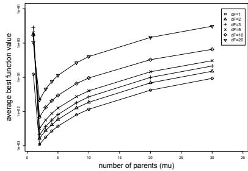  
Figure 10: One moving dimension.

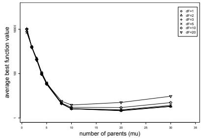  
Figure 11: All moving dimensions.

Figs.10, 11. The average best function value of several $( \mu , \lambda )$ -ES (with $\lambda / \mu = 1 0$ ) on the dynamic sphere with $n = 3 0$ . The optimum moved in one dimension and in all dimensions. The moving frequency was altered by $\Delta F \in \{ 1 , 2 , 3 , 5 , 1 0 , 2 0 \}$ . The total covered distance was 600 and every strategy was run 600,000 function evaluations.

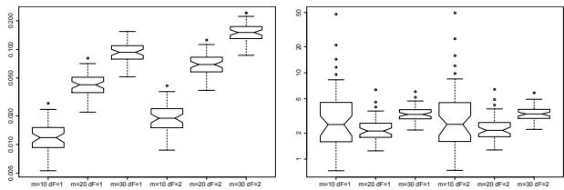  
Figure 12: One moving dimension.   
Figure 13: All moving dimensions.

Figs.12, 13. Boxplot of the 50 mean function values of a (10, 100)-, (20, 200)- and a (30,300)-ES on the dynamic sphere with $n = 3 0$ . The optimum moved every $\Delta F = 1$ or every second ( $\Delta F = 2$ generation in one dimension and in all dimensions. The total covered distance was 600 and all strategies were run 600,000 function evaluations.

sults for moving in one dimension. The differences between the medians are significant because the notches of the different boxplots don't overlap.

In opposite to this, fig. 13 shows the results for moving in all dimensions. At first, the figure shows a variety of strong outliers (marked by circles above the top of a box). This is particularly the case for $\mu = 1 0$ . Additional, for this moving type the average best function value for $\mu = 2 0$ is better than the one for $\mu = 1 0$ . But as the notches of both boxplots overlap the differences are not significant.

$\lambda / \mu = 1 0$ when the optimum moved in one dimension. Every strategy was run for 600,000 function evaluations. This results in $g ~ = ~ 6 0 0 , 0 0 0 / \lambda$ generations. The moving frequency $\Delta F$ was altered by $\{ 1 , 2 , 3 , 5 , 1 0 , 2 0 \}$ . For every strategy the severity $s _ { g }$ per generation was set to a value that the total covered distance $s _ { t o t a l } = s _ { g } \cdot g / \Delta F$ was 600. In our case this rule leads to $s _ { g } = 1 / 1 0 0 0 \cdot \lambda \cdot \Delta F$ .

The best results are obtained when the optimum moves every generation $( \Delta F = 1 \dot { }$ . With growing $\Delta F$ the average best function value increases. The almost best function value is reached with a (2,20)-ES. The comparatively bad performance for $\mu = 1$ may follow from the missing recombination.

Last, we examine the progress of several ES depending on the selection pressure $\lambda / \mu$ . Fig. 14 shows the average best function value for the case of one moving dimension. The best results are obtained with a (2, 20)-ES. For all $\mu$ the associated curve decrease with increasing selection pressure. To estimate if this holds for much higher fractions $\lambda / \mu$ we need additional experiments with a higher selection pressure. But in most of such experiments much more than 300,000 function evaluations are necessary to reach the tracking period.

Whereas fig. 15 shows the same for the case that the optimum changes in all dimensions. It seems to be the best choice to choose a combination with $4 \leq \lambda / \mu \leq 5$ .

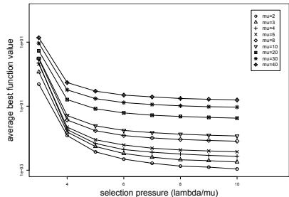  
Figure 14: One moving dimension.

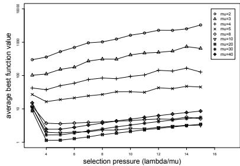  
Figure 15: All moving dimensions.   
Figs.14, 15. The average best function value of several $( \mu , \lambda )$ -ES on the dynamic sphere with $n \ = \ 3 0$ . The optimum moved every generation in one dimension and in all dimensions. Every strategy was run 600,000 function evaluations and the total covered distance was 600.

The optimal number of parents seems to lie between 10 and 30. In both cases for a deeper insight further investigations are needed.

# 4 CONCLUSIONS

In this article we presented the results of several experiments of different evolution strategies on the dynamic sphere model. We developed a new method for comparing two or more strategies.

It shows that the optimal population sizes depend on several factors. Beside others the moving type has a non-negligible effect. The experiments suggest a higher number of parents if the optimum moves in every dimension.

For clearer recommendations we need more experiments. This holds especially for other problem dimensions than the used one here. Optimizing another objective function than the sphere model would probably lead to different results. Last but not least tests with miscellaneous dynamic types must be performed. But these time-consuming experiments belong to further studies.

# Acknowledgments

This work was supported by the Deutsche Forschungsgemeinschaft (DFG) as part of the Collaborative Research Center "Computational Intelligence" (SFB 531).

# Список литературы

[1] D. V. Arnold and H.-G. Beyer. Random Dynamics Optimum Tracking with Evolution Strategies. In Guervós et al. [7], pages 312.   
[2] T. Bäck and H.-P. Schwefel. Evolution strategies I: Variants and their computational implementation. In G. Winter, J. Priaux, M. Galn, and P. Cuesta, editors, Genetic Algorithms in Engineering and Computer Scienc, Proc. First Short Course EUROGEN'95, Las Palmas de Gran Canaria, Spain, pages 111126. Wiley, New York, 1995.   
[3] H.-G. Beyer and H.-P. Schwefel. Evolution strategies: A comprehensive introduction. Natural Computing, 1(1):352, 2002.   
[4] J. Branke. Evolutionary optimization in dynamic environments. Kluwer, 2001.   
[5] J. Branke and H. Schmeck. Designing evolutionary algorithms for dynamic optimization problems. In S. Tsutsui and A. Ghosh, editors, Theory and Application of Evolutionary Computation: Recent Trends, pages 239262. Springer, Berlin, 2003.   
[6] L. Gruenz and H.-G. Beyer. Some Observations on the Interaction of Recombination and SelfAdaptation in Evolution Strategies. In P. J. Ange line, editor, International Congress on Evolutionary Computation 1999 (CEC 99), volume I, pages 639645. IEEE Press, Piscataway, NJ, 1999.   
[7] J. J. Merelo Guervós, P. Adamidis, H.-G. Beyer, J. L. Fernández-Villacañas, and H.-P. Schwefel, editors. Parallel Problem Solving from Nature - PPSN VII, Proc. Seventh Int'l Conf., Granada, Spain. Springer, Berlin, 2002.   
[8] K. Weicker. An Analysis of Dynamic Severity and Population Size. In M. Schoenauer, K. Deb, G. Rudolph, X. Yao, E. Lutton, J. J. Merelo, and H.-P. Schwefel, editors, Parallel Problem Solving from Nature - PPSN VI, 6th Int'l Conf., Paris, France, pages 159168. Springer, Berlin, 2000.   
[9] K. Weicker. Performance Measures for Dynamic Environments. In Guervós et al. [7], pages 6473.