Artificial Intelligence Master's Thesis Section Computational Science

Wouter Caarls

Faculty of Science University of Amsterdam

April 15, 2002

Copyright (c) 2001-2002 Wouter Caarls, University of Amsterdam.

This document was typeset using 10pt Computer Modern by the author with LATFX $2 _ { \varepsilon }$ and using the AMS macros for mathematical formulae.

Title page: visualisation of the clusters found by the convergent k-means algorithm when clustering a genetic algorithm searching the 100-bit 2-peak landscape. The circles are plotted at the locations found by mapping the 100- dimensional cluster centroids onto the first two principal components of the point cloud consisting of all cluster centroids of generation 0 through 499. The colour of each circle represents the mean fitness of the cluster, and the size is proportionate to the average within-cluster distance.

# Abstract

Genetic Algorithms (GAs) have been used to successfully optimise a wide variety of problems. However, the reason why they work and how to correctly set the many parameters they use is not yet fully understood. In this thesis, I describe a way to visualise the progress a GA makes towards reaching its goal, partly based on dividing the population into clusters and following and visualising them. By analysing this trajectory and other visualisations, more insight can be had about the optimality of the parameter settings, the behaviour of the algorithm on different domains, and the way in which it reaches a solution. We will see that this can be turned around as well, thereby using a GA for landscape visualisation.

# Acknowledgements

First of all, I would like to thank my supervisor, Jaap Kaandorp, for his enthusiasm. When I first came to him, my head filled with grand visions and few particulars, he brought me down to earth while keeping my original ideas intact. In this spirit, I also want to thank Peter Sloot, who taught me to appreciate hard facts and data  especially necessary in a thesis that deals with the inherently heuristic disciplines of genetic algorithms, clustering and visualisation.

In the years of my study, my college friends - the Golden Boys  have provided me with the necessary relief, and especially Barry Koopen, Erik de Ruiter and Matthijs Spaan, alongside whom I had the pleasure of working while writing my thesis, deserve my thanks. More thanks go to Bas Doodeman, who in the early stages of my research was always willing to discuss anything from specific visualisation techniques to ISO C99 variable argument macros.

Finally, I want to thank my brother Jurjen and my parents for their support.

# Notation

Where possible, I have tried to keep the notation and symbols used in the thesis consistent.

Common variables are printed in lowercase roman italic: $i$ , $j$ , $k$ , etc. Constants are italic roman capitals, like $N$ , $L$ , sometimes indexed with a descriptor such as $P _ { m }$ or $C _ { m u l t }$ .

Vectors are in roman lowercase italics with an arrow above them: $\vec { v }$ , $\vec { s }$ , etc. $s _ { i }$ is the ith value in the vector $\vec { s }$ , while $\vec { s _ { ( i ) } }$ is the $i$ th $K$ -value block (defined below) in $\vec { s }$ . For example, $s _ { ( 2 ) } ^ {  }$ is a vector containing $s _ { K + 1 }$ through $s _ { 2 K }$ .

Matrices use bold symbols: $_ c$ , $\pmb { T } / \pmb { \imath }$ . $m _ { i j }$ is the element of $\pmb { T } / \pmb { \imath }$ at row $i$ and column $j$ . $m _ { i }$ . and $m _ { . j }$ are respectively a row vector containing all elements of $_ { m }$ at row $i$ , and a column vector containing all elements of $_ { m }$ at column $j$ .

Functions have calligraphic capital letters: $\mathcal { F } , \mathcal { U }$

A few useful recurring symbols are described below:

$P$ is the number of individuals in a population.   
$G$ is the number of generations after which a solution is returned.   
$L$ is the length of a genotype in bits.   
$N$ is the number of encoded integers in the De Jong test functions, the number of blocks in the Royal Road and Royal Staircase functions, and the number of bits in an NK function.   
$K$ is the length of an encoded integer in the De Jong test functions, the length of a building block in the Royal Road and Royal Staircase functions, the number of dependent bits in an NK function, and the number of peaks in a $\mathcal { P }$ -peak landscape.   
$P _ { m }$ and $P _ { c }$ are probabilities of mutation and crossover, respectively.   
$C _ { m u l t }$ is a multiplication constant for linear fitness scaling.   
$T$ is the tournament group size in tournament selection.   
$M$ is the maximum mass in the knapsack problem.   
$U$ is the number of clusters in a population at a specific generation.

Vectors are column vectors unless otherwise stated. Binary column vectors and bitstrings are used interchangeably. (part of) A column vector can also be interpreted as the real number it encodes. A population matrix consists of a number of individual column vectors, and therefore has $L$ rows and $P$ columns.

# Contents

# 1 Introduction 1

1.1 Genetic Algorithms . . . 2   
1.2 GA literature . . 2   
1.3 Software visualisation 3   
1.4 GA visualisation literature 3   
1.5 Clustering . . 7   
1.6 Problems with GAs . 9   
1.7 Research presented in this thesis 10

# 2 Methods 11

2.1 Genetic Algorithms . . . 11   
2.2 Test optimisation problems 14   
2.3 Clustering . 18   
2.4 Principal component analysis 23   
2.5 Visualisation techniques 24

# 3 Results 29

3.1 Parameter settings 29   
3.2 Problem domains . 37   
3.3 Trajectory analysis 41

# 4 Discussion 47

4.1 Parameter settings . 47   
4.2 Problem domains . 49   
4.3 Trajectory analysis 51

# 5 Conclusions 53

5.1 Future work . . . 53

A Default values 55   
B Colour scales 57   
C Software engineering aspects 59   
C.1 Decomposition 59   
C.2 Libraries and utilities . 60   
C.3 Interaction 61

# Bibliography 63

# Chapter 1

# Introduction

In the field of artificial intelligence, search and optimisation have always played an important role. Examples include searching for the best path to follow in autonomous robotics, searching for the best hypothesis describing a set of data in machine learning, and optimising the behaviour of a controlling agent in dynamic control systems. A wide range of optimisation algorithms has been designed to solve these tasks, but of course there are drawbacks to each one, concessions made to reach solutions quickly in often enormous search spaces.

A major problem in many optimisation algorithms is that they can get stuck when the structure of the underlying search space is erratic, or when their heuristics fail. If the local search neighbourhood yields no better solutions than the one under consideration, measures must be taken to avoid aborting the search when in fact, the current solution is not the optimal one.

An optimisation algorithm inspired by natural evolution, the genetic algorithm has been one of the methods suggested to escape these local optima, but the mathematical validation of its search pattern has been problematic. The research presented here strives to give some more empirical insight into its workings by visualising the trajectory the algorithm takes in finding (sub-)optimal solutions.

In this chapter, the fields of Genetic Algorithms and Software Visualisation are introduced and a rough summary of the research that has been done on genetic algorithms and their visualisation is given. I will describe the problems that have led to this thesis and give a brief overview of the research I have done.

In chapter 2, I will describe the methods and algorithms I have used to produce the simulation and visualisations presented here. This includes the simulation, clustering and visualisation algorithms that were used, as well as the problems it was tested on.

Chapter 3 presents the results that can be deducted from the visualisations and analyses, while trying not to interpret them. Chapter 4, then, interprets and discusses the results. Finally, chapter 5 will contain the conclusions and some possibilities for future work.

# 1.1 Genetic Algorithms

Genetic algorithms (GAs) are an abstraction from Darwin's evolution theory [Darwin, 1859]. In nature, organisms evolve via natural selection and the recombination and mutation of genetic material in mating. This basic concept is the basis of GAs, but they are no simulation of nature: it is merely the inspiration for the thought that, if nature can create such diverse and complicated organisms as humans, perhaps the concept of evolution can be used for solving other very hard optimisation tasks.

Genetic algorithms are also a generalisation of normal, one-solution optimisation algorithms. Instead of considering only one solution at a time, a GA uses a population of solutions, which serve as a memory and as a source of diversity.

Each step of the algorithm (called generation), solutions (called individuals) are selected according to their utility (fitness), recombined and mutated. In this process, high-fitness individuals are selected over low-fitness individuals and thus recombined with other high-fitness individuals to create, hopefully, even better fit individuals.

After a predetermined number of generations, or after some other stopping criterion is met, the run terminates and returns the solution that scored best on the objective function under consideration. In complex optimisation tasks, this will most likely not be the best possible solution, but genetic algorithms are known for giving near-optimal solutions on a wide range of problems quickly. Of course, better-suited methods are available if the structure of the underlying search space (fitness landscape) is known in advance.

# 1.2 GA literature

The first simulations of genetic systems using computers date from the late 1950's and early 1960's [Barricelli, 1957, Fraser, 1962]. The first to suggest using evolution to search artificial domains, however, was Holland, for example in [Holland, 1962]. In the following years, his students wrote many testbed applications for the new technique, and in the late 1960's Bagley developed the first published application of a genetic algorithm (as well as coining the word) [Bagley, 1967]; he studied game-playing tasks modelled after the game Hexapawn.

Holland continued his work on laying the mathematical fundaments for GAs, culminating in the development of the Schema theorem in [Holland, 1968] and [Holland, 1971]. This theorem states that, in genetic algorithms, "short, loworder, above-average schemata receive exponentially increasing trials in subsequent generations" . He also calculated why this is a good thing, using a $k$ -armed bandit as an analog. De Jong later combined the theorem with carefully controlled experiments and comparisons in his PhD dissertation [Jong, 1975].

Since these first years, and indeed in them as well, the field has continued to develop new operators, selection schemes, evolution control techniques, analysis techniques and mathematical analyses. I will highlight some of the publications that are most important to this thesis. For a more thorough summary (up to 1989), see [Goldberg, 1989], and for more recent introductionary books, refer to [Mitchell, 1996] and [Michalewicz, 1996].

This thesis deals with visualising the trajectory a simple genetic algorithm takes in a fitness landscape, and using this information to comment on various aspects of the algorithm. Wright introduced the term fitness landscape in the field of natural genetics in [Wright, 1932], and analysing Hamming distance landscapes has become popular in the last decade. Mitchell, Forrest and Holland, for example, researched some features which make landscapes particularly easy or hard for genetic algorithms [Mitchell et al., 1991]. Having an isolated region of high fitness (containing the optimum) within a larger region of lower fitness is such a feature that will present a problem. Jones and Forrest [Jones and Forrest, 1995] used Fitness Distance Correlation, which is the degree in which the (Hamming) distance to the global optimum is correlated to the fitness, to predict GA performance. Jones [Jones, 1995] and Stadler [Stadler, 1995] generalised the landscape concept to include arbitrary operator distance functions, such as the crossover landscape.

A lot of research has also been done into the role of the mutation and recombination operators, parameter settings, and convergence. Spears [Spears, 1998] investigated the different effects mutation and recombination have on GA performance. De Jong and Goldberg had already given rules of thumb for the mutation and crossover probabilities, but Van Nimwegen calculated the optimal mutation setting for a specific kind of observed evolution trajectory (epochal evolution) in his dissertation [Nimwegen, 1999].

# 1.3 Software visualisation

In [Stasko et al., 1998], software visualisation is defined as "the use of the crafts of typography, graphic design, animation, and cinematography with modern humancomputer interaction and computer graphics technology to facilitate both the human understanding and effective use of computer software" (note that visualisation in this context does not necessarily mean making pictures, but creating mental images in the mind of the user to facilitate understanding). The algorithm visualisation subfield is defined in the same text to mean "the visualisation of the higher-level abstractions which describe software", which is what this thesis is about.

Program visualisation, the visualisation of actual program code and constructs, has been used since the early days of computer programming [Goldstine and von Neumann, 1947], and algorithm visualisation and animation have been around for about twenty years. A very influential piece of work in this field is "Sorting out Sorting" [Baecker and Sherman, 1981], which aims to visualise sorting algorithms for educational purposes. More general-purpose visualisation frameworks have been introduced over the years (see, for example, [Brown, 1988] and [Stasko, 1990]).

# 1.4 GA visualisation literature

The field of visualising genetic algorithms is a bit younger, and has recently been summarised in [Collins, 1998]. Collins distinguishes seven characteristics that are potentially useful for understanding a GA's search behaviour. Five of these are visualisation categories, and the other two, the ability to navigate the execution and edit the individuals during execution, are characteristics of visualisation programs  they will not be discussed here.

The first category is showing the operation of the GA. This means visualising the actual operators, most often selection, mutation and recombination. An example would be GIGA's internals window [Dabs and Schoof, 1995], shown in figure 1.1. It is clear that this does not scale very well, and is only useful for educational and debugging purposes.

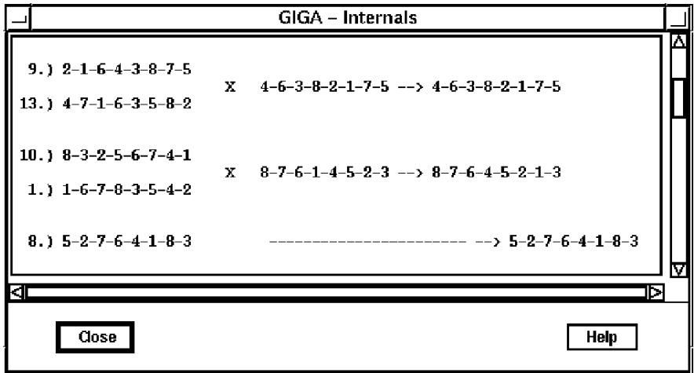  
Figure 1.1: The GIGA interals window showing some crossover and mutation operations for the Travelling Salesman Problem [Dabs and Schoof, 1995].

The second category, visualising the quality of the solutions found by the GA, is more widespread and has been in use since before the use of GAs in artificial domains [Fraser, 1962]. Because no absolute measure of solution quality is available (we do not know the optimal solution, after all, or we would not be searching), the techniques in this category mostly deal with showing fitness values with respect to previous generations or other individuals in the same generation. They are, therefore, often used as a method of displaying per-generation similarity or fitness convergence. Examples in this category include the ordinary generation/fitness graph [Fraser, 1962] and 3d fitness graphs [Harvey and Thompson, 1996], shown in figures 1.2 and 1.3.

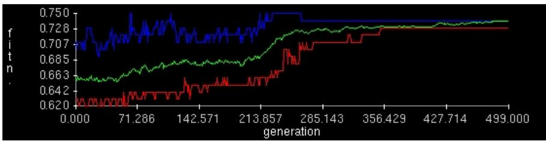  
Figure 1.2: A generation/fitness graph showing the best (blue), average (green) and worst (red) fitness per generation

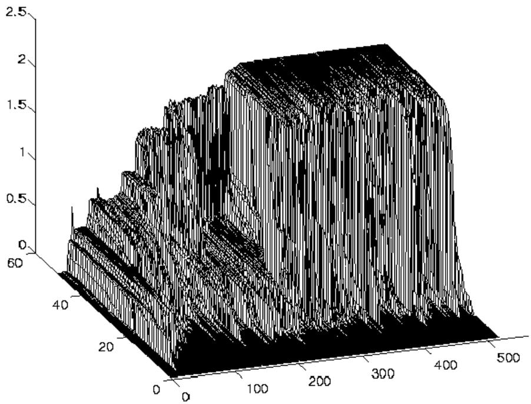  
Figure 1.3: A 3d fitness distribution graph [Harvey and Thompson, 1996]. The generations are displayed along the $\mathrm { X }$ axis, the individuals, sorted by fitness, along the $\mathrm { Y }$ axis, and the actual fitness is the height.

In the third category, the individuals' genotypes themselves are visualised. For example, Spears visualised the binary genotype of all individuals in a generation using coloured pixels [Spears, 1994]: each individual is a row, and each bitposition a column; see figure 1.4. Wu et al. visualised, among a host of other graphs, the best individual of each generation in such a way in their VIS tool [Wu et al., 1999]. Their visualisation contained a row for each best-ofgeneration individual and a column for each bitposition, giving some insight into the genotype evolution while keeping the amount of data presented somewhat in check.

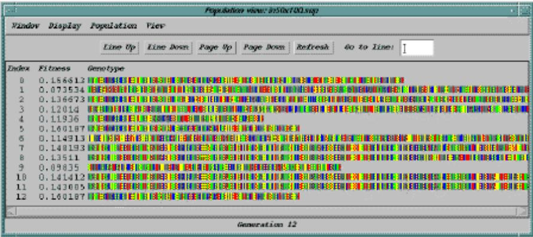  
Figure 1.4: Spears's population window showing a list of individual genotypes [Spears, 1994]. Each genotype consists of a number of stripes, where the colour of the stripe represents the allele at that locus.

Another approach is not visualising the genotype of one individual at a time, but to give statistical information averaged over an entire generation to help concentrate the information. Collins, for example, proposed an allele/loci frequency matrix [Collins, 1993], which displays the frequency of each allele at a specific locus, averaged over one generation. In figure 1.5 there are two alleles (possible values of a genotype segment): 0 and 1. There are five loci or positions in the genotype where these two alleles can occur, making this a five-bit binary encoding.

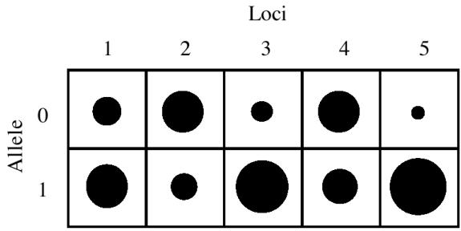  
Figure 1.5: An allele/loci frequency matrix, as proposed in [Collins, 1993]. The size of the circles represents the number of genotypes found that have that allele at that locus.

Of course, in some cases you can also visualise an individual's phenotype, showing what the genotype actually means in the real world. For example, an individual encoding a path for the Travelling Salesman Problem would be visualised as a number of dots (cities) with connections between them (travelled roads). This is the fourth category, but since you would have to develop a new visualisation for each problem this is not a very general method. Some progress has been made, however, to provide simple plug-in environments for creating such visualisations. TANGO [Stasko, 1990] (figure 1.6) is an example of this, although it is not limited to the field of genetic algorithms.

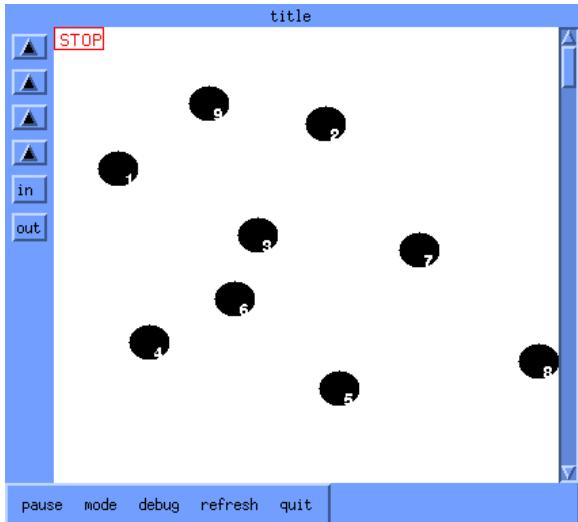  
Figure 1.6: An XTANGO visualisation of the Travelling Salesman Problem [Stasko, 1990]. During the search, connections between the cities change, and could be used to show the current best-fit phenotype.

Finally, the fifth category deals with visualising the GA's sampling of the search space. Because a non-ambiguous mapping is not possible beyond 2d problems, the early work concentrated on this [Nassersharif et al., 1994]. Other studies used Principal Component Analysis [Harvey and Thompson, 1996] (see figure 1.7), Sammon Mapping [Dybowski et al., 1996] or other projection techniques. They project the genotypic space onto a 2d or 3d space, and draw a scatterplot of all individuals, or those in the current generation.

# 1.5 Clustering

For some of the visualisations that are described in this thesis, I use techniques to cluster the individuals in a generation into a few partitions. Apart from significantly decreasing the amount of data that needs to be visualised, this allows the algorithm to perform statistical analyses and visualisations based on the clusters rather than the entire population, hopefully leading to better results in the case of a diverged population.

There are a lot of clustering algorithms available, from very simple to very complex, from very efficient to very slow. Even genetic algorithms themselves have been suggested for this problem [Cole, 1998]. However, because I need to cluster the entire population along all the bits at every generation, a fast clustering algorithm is necessary.

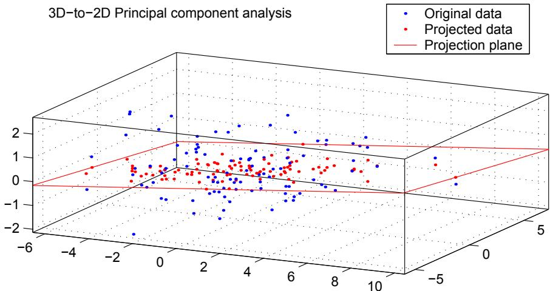  
Figure 1.7: Principal component analysis mapping 3d data to a 2d plane with the most variance. The red plane represents the two axis with the most variance that can be found by rotating the original axes.

The different characteristics of the many clustering techniques available are difficult to discern. Because in most applications the researcher will use the results of the clustering interactively, changing distance measures or update schemes, the data on this subject is sketchy. Anderberg [Anderberg, 1973] proposes a number of axes on which to compare the various clustering techniques he describes, but such comparisons are most often done on a case-by-case basis and hard to extrapolate.

Choosing a particular technique must therefore be based on the results in the selected application, in this case clustering GA individuals using the hamming distance between their genotypes as a distance measure. Yin and Germay [Yin and Germay, 1993] have used MacQueen's $k$ -means technique [MacQueen, 1967] which is simple, has linear time complexity and provides good results on their domain. Dittrich et al. [Dittrich et al., 1998] cluster the same domain, albeit for a different reason, and they use a generalised fuzzy version called fuzzy c-means. I have therefore chosen to evaluate some k-means derived techniques. Based on this quick evaluation, presented in section 2.3, I have decided to use the fuzzy c-means method using the continuous city block or $L _ { 1 }$ metric over the individuals' genotypes as a distance measure.

Another problem is determining how many clusters are actually present in the dataset, if any. Since a dataset can potentially be clustered in many ways, no one best solution is available for this either. Methods for solving this problem generally compare average within-cluster distances and/or average between-cluster distances, using some statistical measures. Milligan and Cooper [Milligan and Cooper, 1985] compared a great range of these stopping criteria, but unfortunately most of them cannot discern whether the dataset needs to be clustered at all. One of the few algorithms that can, and gives reasonably satisfying results, is Hartigan's method as described in [Hartigan, 1975], which I use.

# 1.6 Problems with GAs

Of course, the genetic algorithm is not the be-all-end-all of search algorithms [Wolpert and Macready, 1996]. I will summarise some issues that are relevant to this thesis below:

# • Insufficient theory

The mathematical foundation of GAs is primarily the Schema Theorem by Holland, which says that "short, low-order, above-average schemata receive exponentially increasing trials in subsequent generations". However, the schema theorem predicts that using low-cardinality alphabets  binary strings being the obvious choice - is most beneficial because it maximises the amount of schemata, but great successes have been reported using real values as genes, and discussion has arisen in this area [Antonisse, 1989, Goldberg, 1991]. Also, Holland stresses the importance of recombination in combining schemata, and uses mutation only as a background operator to ensure diversity; but evolutionary algorithms without crossover, such as evolution strategies [Rechenberg, 1973] have been applied successfully as well.

• Parameter settings

GAs typically have a lot of parameters: at least the population size, mutation and crossover rates and the number of generations. This allows the algorithm to be adapted to different kinds of domains, but also poses a problem: what are the correct values to use for my domain? Some research has been done, but it usually deals with problems too abstract to be of use in the real world. Typically, the user tries different settings, perhaps using some kind of visualisation to steer the probing (the generation/fitness graph, most often).

Some GAs incorporate control of the parameter settings in the coding of the individuals themselves or employ meta-GAs to search for the best parameter settings, but especially the meta-GA approach takes a lot of time (each evaluation of the meta-GA being an entire run of the problemGA).

# • Difficulty estimating the optimality of solutions

After a GA run is completed, it returns the current best-fit individual. It is impossible to know how optimal this solution is in natural domains. The method most often used to get insight into this is by interpreting the average and best fitness along the entire run: Did the progress stop quickly, or did it get better up until the end? When extrapolating the graph, how many generations would reasonably be needed? Collins' second and fifth visualisation categories can address this problem, but it will always involve sweeping generalisations and "gut feelings" of the researcher.

# 1.7 Research presented in this thesis

This thesis tries to give empirical information about the success of a GA by providing various visualisations. It is hoped that by analysing the trajectory the GA takes in reaching a solution, more insight can be had about the optimality of the parameter settings, the behaviour of the algorithm on different domains and the way in which it reaches the solution. Another hope is that the path of the search can provide us with valuable information about the fitness landscape itself.

Among the visualisations that will be presented is a new method based on using a clustering technique to partition the data a genetic algorithm generates. It is created by clustering the individuals inside a generation, using Hamming distance as a distance measure. This is done for each generation, and the clusters are then matched with those of previous generations, providing a chain of clusters that summarise the trajectory the GA has taken in the search space. Various statistics of the clusters are then visualised.

# Chapter 2

# Methods

This chapter presents the theory that is necessary to understand the characteristics of the visualisations that are the subject of this thesis. This includes a brief, but technical description of genetic algorithms themselves, as well as the algorithms that underlie the actual visualisations and the problems under which the visualisations were observed. A quick evaluation of the relative merits of some clustering techniques is also presented.

# 2.1 Genetic Algorithms

Genetic algorithms use a Selection-Reproduction-Evaluation loop to incrementally search a representation space for high-utility solutions to some kind of objective function. I will describe a simple GA, with the most common operators; see figure 2.1 for pseudocode. This kind of algorithm is known as a generational genetic algorithm because each generation the entire population is selected/reproduced, in contrast with a steady-state GA, in which only one individual is selected each time step.

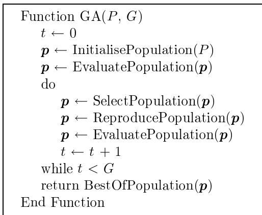  
Figure 2.1: Pseudocode for a basic generational genetic algorithm with population size $P$ and a set number of $G$ generations. $p$ is an $L \times P$ population matrix.

When using a GA, the first step is to find a good representation that casts the problem into a format that is easily modified by the algorithm. In the case that we consider here, that means finding a way to characterise the parameters of the problem in a binary string of some fixed length $L$ . For example, the knapsack problem involves filling a knapsack (maximum carrying capacity $M$ ) with objects of mass $m _ { i }$ and value $v _ { i }$ $1 \leq i \leq L$ ) such that the total value is maximised. A natural representation is a binary vector $\vec { s }$ of length $L$ , with objects that are in the knapsack having $s _ { i } = 1$ , and objects not in the knapsack $s _ { i } = 0$ .

The GA starts by initialising a population of $P$ $L$ -bit individuals, with each bit 0 or 1 with equal probability. It then evaluates each individual in the population using the objective function, and starts the loop. The loop ends after $G$ generations.

# 2.1.1 Evaluation

In our example, the utility will be the total value of the objects in the knapsack, modified by a severe penalty if the knapsack is over-weight. An example would be

$$
\mathcal { U } = \sum _ { i } ^ { L } \left( s _ { i } v _ { i } \right) - \mathcal { H } ,
$$

where $\begin{array} { r } { \mathcal { H } = 1 0 \Big ( \sum _ { i } ^ { L } \big ( s _ { i } m _ { i } \big ) - M \Big ) ^ { : 2 } } \end{array}$ if the sck is vereight, and $\mathcal { H } = 0$ otherwise.

For some selection methods, the fitness value must be scaled to ensure enough selection pressure during the entire run, the selection pressure being the degree in which the fitness value determines whether an individual is selected. For example, for stochastic sampling, one can use linear fitness scaling, which maps the utility to a fitness value such that the average scaled fitness $\mathcal { F } _ { a v g }$ equals the average utility ${ { \mathcal { U } } _ { a v g } }$ , and the best scaled fitness is some value $C _ { m u l t }$ times $\mathcal { F } _ { a v g }$ . This ensures that the number of expected offspring is 1 for an individual of average utility and $C _ { m u l t }$ for the best individual in the population.

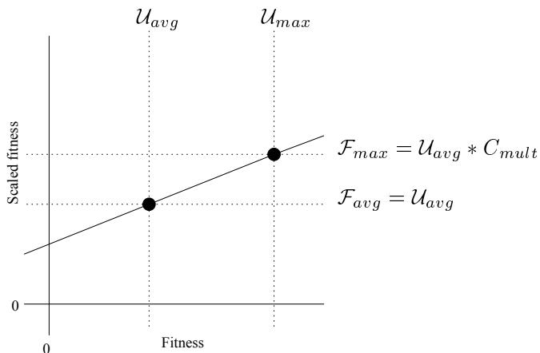  
Figure 2.2: Linear fitness scaling, which scales the utility such that the selection pressure is constant throughout the run.

# 2.1.2 Selection

During selection, individuals from the parent population are copied to the new population. There are a lot of ways to determine exactly which individuals need to be copied, but I will discuss only the ones used in this thesis: Stochastic sampling and remainder stochastic sampling.

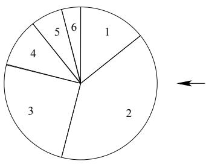  
Figure 2.3: Stochastic sampling; the roulette wheel is spun once for each place in the next generation. Each time an individual is chosen.

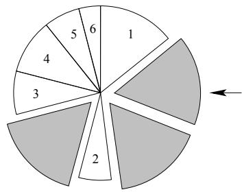  
Figure 2.4: Remainder stochastic sampling; individuals with a larger than average fitness are first copied to the next generation. Then, only the remainders of the individuals' fitness are considered, and the wheel is spun once for each place left in the next generation.

# Stochastic sampling

Stochastic sampling (with replacement) can best be visualised as spinning a roulette wheel $P$ times; once for each place in the next generation (figure 2.3). On the roulette wheel, each individual has a space proportional to its (scaled) fitness, so for each spin of the wheel the chance for an individual to be selected is F() This is the selection method used by Holland in formulating his schema theorem.

# Remainder stochastic sampling

Remainder stochastic sampling is almost the same as stochastic sampling, with the difference that an individual is first copied $\lfloor \frac { \mathcal { F } ( i ) } { \mathcal { F } _ { a v g } } \rfloor$ times to the next generation, and stochastic sampling is performed on the remainder of that value. This results in a less disruptive selection process. In figure 2.4, the $\lfloor \frac { \mathcal { F } ( i ) } { \mathcal { F } _ { a v g } } \rfloor$ part is marked grey and taken out of the roulette wheel to indicate that it will not be times, and only the remainders of the individuals' fitness are considered. This can be viewed as taking the grey parts out and scaling the remainders to occupy the entire wheel.

# Tournament selection

Tournament selection tries to avoid the somewhat arbitrary fitness scaling needed for stochastic sampling. It sets up $P$ tournaments with a specific tournament group size $T$ . The winner of each tournament (which in the case of deterministic tournament selection that we consider here is the individual with the highest utility) is copied to the next generation. Individuals participating in the tournament can be sampled either with or without replacement (in the latter case, when all individuals have been used, throw them back in the pool).

# 2.1.3 Reproduction

Once the individuals for the next generation have been selected, they are recombined and mutated. Many of these operators have been proposed, but I will stick to the most elementary ones: point mutation and single-point crossover.

# Mutation

Point mutation just flips each bit in the individual with a certain probability $P _ { m }$ . In our example, this means that the object is either put in the sack (when 0 flips to 1) or dropped (when 1 flips to $0$ ).

The role of mutation is to introduce diversity in the population, and to provide an element of random search. Typical values of $P _ { m }$ are 0.001 and $1 / L$

# Crossover

Single-point crossover takes two individuals and creates two new individual using part of the first parent $\vec { a }$ , and part of the second parent $\vec { b }$ . A random breaking point $i$ is selected somewhere along the bitstring ( $0 ~ < ~ i ~ < ~ L$ ), and the first offspring consists of the first $i$ bits of $\vec { a }$ , and the last $L - i$ bits of $\vec { b }$ . The second offspring is the first $i$ bits of $\vec { b }$ and the last $L - i$ bits of $\vec { a }$ . Crossover is performed with probability $P _ { c }$ , typically very high $( > 0 . 5 )$ .

The role of crossover is to use high-utility solutions to create even better solutions by combining them.

# 2.2 Test optimisation problems

A number of problems have become standard test cases in genetic algorithms, and I use them too. In addition, some problems are a good test case for certain aspects of the algorithm I present, and are therefore explained as well.

# 2.2.1 De Jong's functions

De Jong's test functions, presented in [Jong, 1975], are all based on bitstrings $\vec { s }$ encoding a number of real-valued numbers. In the following formulae, $\vec { s _ { ( i ) } }$ is the ith real number encoded in $\vec { s }$ .

All De Jong functions need to be minimised. This is typically done by inverting the utility, and raising it such that the fitness of the worst individual in the population is 0. Other fitness scaling methods can be applied after this.

# De Jong's F1

De Jong's first test function represents a three-dimensional problem with a single optimum, and a landscape that continually descends towards that optimum. In particular, it is a three dimensional quadratic bowl. A two dimensional example is shown in figure 2.5.

$$
\mathcal { F } _ { 1 } ( s ) = \sum _ { i = 1 } ^ { 3 } \vec { s _ { ( i ) } } ^ { 2 } , ~ - 5 . 1 2 \leq s _ { ( i ) } ^ {  } \leq 5 . 1 2
$$

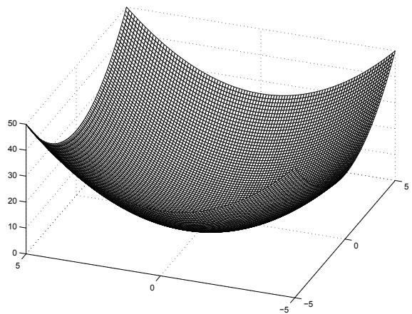  
Figure 2.5: De Jong's F1 test function

# De Jong's F2

Function two is a two-dimensional fourth-degree polynomial, as shown in figure 2.6.

$$
\mathcal { F } _ { 2 } ( s ) = 1 0 0 ( { s _ { ( 1 ) } ^ {  } } ^ { 2 } - s _ { ( 2 ) } ^ {  } ) ^ { 2 } + ( 1 - s _ { ( 1 ) } ^ {  } ) ^ { 2 } , \quad - 2 . 0 4 8 \leq s _ { ( i ) } ^ {  } \leq 2 . 0 4 8
$$

# De Jong's F3

The third De Jong function introduces neutral subbasins, planes of equal fitness, in a five-dimensional stairway. A two dimensional version is shown in figure 2.7.

$$
\mathcal { F } _ { 3 } ( s ) = \sum _ { i = 1 } ^ { 5 } \lfloor s _ { ( i ) } ^ {  } \rfloor , \quad - 5 . 1 2 \leq s _ { ( i ) } ^ {  } \leq 5 . 1 2
$$

I did not use function four because it uses noisy fitness functions, and I want to test on stable landscapes.

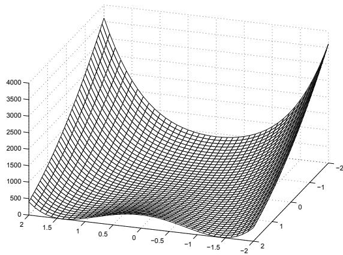  
Figure 2.6: De Jong's F2 test function

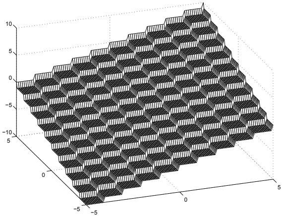  
Figure 2.7: De Jong's F3 test function

# De Jong's F5

The fifth function contains a number of pits in an otherwise flat landscape; see figure 2.8. The search algorithm is likely to become stuck in a suboptimal pit.

$$
\mathcal { F } _ { 5 } ( s ) = \Bigg [ 0 . 0 0 2 + \sum _ { j = 1 } ^ { 2 5 } \frac { 1 } { j + \sum _ { i = 1 } ^ { 2 } { ( s _ { ( i ) } ^ { \ast } - a _ { i j } ) ^ { 6 } } } \Bigg ] ^ { - 1 } , \quad - 6 5 . 5 3 6 \leq s _ { ( i ) } ^ { \ast } \leq 6 5 . 5 3 6
$$

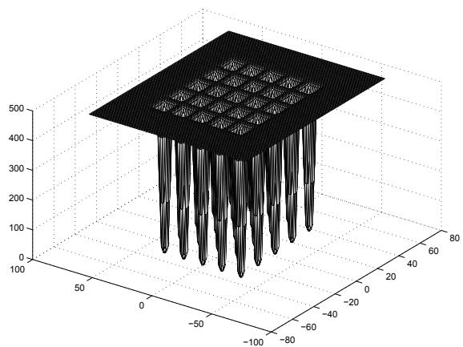  
Figure 2.8: De Jong's F5 test function

# 2.2.2 Royal Road and Royal Staircase

The Royal Road and Royal Staircase functions, described in [Mitchell et al., 1991] and [Nimwegen, 1999], work with $N$ $K$ -bit blocks, which can be either aligned or not. In the simplified case, which we use here, aligned means that the block consists of $K$ 1's. In the Royal Road case, the fitness of an individual is the number of aligned blocks, while in Royal Staircase, only the number of consecutive aligned blocks (starting at block 1) is used.

In the formulae below, $\vec { s _ { ( i ) } }$ is the $i$ $K$ -bit block in $\vec { s }$ ,and $\mathcal { T } ( \vec { v } )$ is the number of consecutive 1 bits in $\vec { v }$ .

Royal Road

$$
\mathcal { R R } ( \vec { s } ) = \sum _ { i = 1 } ^ { N } \lfloor \mathcal { T } ( s _ { ( i ) } ^ { \vec { \mathbf { \alpha } } } ) / K \rfloor
$$

# Royal Staircase

$$
\mathcal { R } S ( \vec { s } ) = 1 + \lfloor \mathcal { T } ( \vec { s } ) / K \rfloor
$$

# 2.2.3 Kauffman's NK fitness landscapes

Kauffman's NK fitness landscapes provide a way to adjust the epistasis within the fitness landscape, the degree in which components of the bitstring depend upon each other. They were introduced in [Kauffman and Levin, 1987] and a good overview is presented in [Altenberg, 1997]. In the equation below, $s _ { i }$ is the $i$ th bit in $\vec { s }$ $\boldsymbol { s } _ { i _ { j } }$ is $j$ th bit on which $s _ { i }$ depends and $\mathcal { R } _ { i } ( s _ { i } ; s _ { i _ { 1 } } , \ldots , s _ { i _ { K } } )$ is a fixed random value in $[ 0 , 1 ]$ .

$$
\mathcal { N } \mathcal { K } ( \vec { s } ) = \frac { 1 } { N } \sum _ { i = 1 } ^ { N } \mathcal { R } _ { i } ( s _ { i } ; s _ { i _ { 1 } } , \ldots , s _ { i _ { K } } )
$$

# 2.2.4 $\mathcal { P }$ -peak or $k$ -DNF

The $\mathcal { P }$ -peak problem lets the user create a random landscape with a predetermined number of peaks. These peaks are built in hamming-distance and can be of varying height, thus making it possible to research GA performance on different numbers or peaks $\mathcal { P }$ or peak heights $h$ . They were introduced as the $k$ -DNF problem (because each peak can be seen as a solution to a boolean formula in disjunctive normal form) in [Jong and Spears, 1990].

The fitness value of a string $\vec { s }$ is determined by the hamming distance to the nearest peak and the maximum height of that peak. The peak height is linearly interpolated between $h$ for peak 1 and 1 for peak $\mathcal { P }$ :

$$
\mathcal { P P } ( \vec { s } ) = \left\{ \begin{array} { l l } { \frac { 1 } { L } \big ( L - H a m m i n g ( \vec { s } , \vec { P e a } k ) \big ) } & { \mathrm { i f ~ } \mathcal { P } = 1 } \\ { \frac { 1 } { L } \sum _ { i = 1 } ^ { \mathcal { P } } \frac { h ( \mathcal { P } - i ) + i - 1 } { \mathcal { P } - 1 } \big ( L - H a m m i n g ( \vec { s } , \vec { P e a } k _ { i } ) \big ) } & { \mathrm { o t h e r w i s e } } \end{array} \right.
$$

# 2.3 Clustering

Clustering is the science of dividing a dataset $_ p$ of $P$ observations over $L$ variables into $U$ partitions, such that some distance measure is minimised. In this case, it is performed on the individuals of each generation, hopefully giving better statistics in the case of a diverged population. As discussed before, of all the clustering techniques available I have chosen to evaluate some k-means derived algorithms because they are simple, fast, and have been used on this domain before. The three techniques evaluated are k-means, convergent $\mathrm { k \Omega }$ -means and fuzzy c-means.

I have chosen to cluster the individuals based on their genotype only, using Hamming distance. While better results could possibly be obtained when clustering on phenotypic traits like parameter values or fitness, the genotype is closer to the algorithm itself (requiring no adaptation for new domains) and provides a major advantage: it is not necessary to scale the variables. If one were to deal with phenotypic distances, it could be difficult to compare variables on a 0-99 scale to variables on a 0-9 scale, and this is circumvented because all our "variables" only have 0 and 1 as possible values.

For the problem of deciding the number of clusters in the dataset, I use Hartigan's method, because it is one of the few methods able to determine if the

data should be clustered at all:

$$
\mathcal { H } ( k ) = \left[ \frac { \mathcal { W } ( k ) } { \mathcal { W } ( k + 1 ) } - 1 \right] \big ( P - k - 1 \big ) ,
$$

where $\mathcal { W } ( k )$ is the average within-cluster distance of the clustering containing $k$ partitions, and $P$ is the number of items in the dataset. Hartigan suggests using more clusters while $\mathcal { H } ( k ) > 1 0$ , and I have not deviated from this setting.

To assess the performance of the clustering algorithms on this domain, I have created two simple testbeds and a visualisation (see, for example, image 2.10(a)). The testbeds each consist of two clusters of 100-bit individuals that the clustering algorithms are supposed to separate. For each trial, the mean vectors of the clusters, $\vec { v _ { 1 } }$ and $\vec { v _ { 2 } }$ , are a specific hamming distance $d$ apart, shown in the visualisation along the horizontal axis. The clusters also have a specific spread, expressed in the chance of a bitflip occurring on each bit (the same as if a mutation would occur on the cluster mean vector; the bitflips are thus independent). This is shown on the vertical axis of the visualisation.

The colour value, then, is the average performance of the clustering algorithm on all trials that fell within a grid cell. Since 100000 trials were conducted for each image and the grid is 20x20 cells, a grid cell consists, on average, of 250 trials. This performance is calculated according to the following formula:

$$
\begin{array} { r } { \mathrm { p e r f } ( U , m ) = \left\{ \begin{array} { l l } { 2 L } & { - \operatorname* { m i n } \left\{ \| \vec { m _ { \cdot 1 } } - \vec { v _ { 1 } } \| , \| \vec { m _ { \cdot 1 } } - \vec { v _ { 2 } } \| \right\} } \\ & { - \operatorname* { m i n } \left\{ \| \vec { m _ { \cdot 2 } } - \vec { v _ { 1 } } \| , \| \vec { m _ { \cdot 2 } } - \vec { v _ { 2 } } \| \right\} } \\ & { } \\ { 0 } & { \mathrm { o t h e r w i s e , } } \end{array} \right. } \end{array}
$$

where $U$ is the number of clusters found by the algorithm under testing, and $\pmb { T } / \pmb { \imath }$ is an $L \times U$ matrix containing the cluster centroids.

In the first testbed, the two clusters have 50 members each and their spread is the same. In the second testbed, one cluster is much smaller and more compact than the other, having only 25 members and half the spread of the large cluster (which is shown on the vertical axis). The large cluster consists of 50 individuals, while the remaining 25 individuals are random and provide white noise.

# 2.3.1 k-means

MacQueen's basic $k$ -means clustering algorithm [MacQueen, 1967] works as follows: take the first $U$ data units in the data set as clusters of one member each. Then assign each of the remaining $P - U$ data units to the cluster with the nearest centroid. After each assignment, recompute the centroid of the gaining cluster. After all the data units have been assigned, take the existing cluster centroids as fixed seed points and make one more pass through the data set assigning each data unit to the nearest point. For pseudocode, see figure 2.9. In this figure, $\mathcal { P }$ is the partition, assigning a cluster to each individual.

Anderberg [Anderberg, 1973] states that this method tries to minimise the within-group sum of absolute errors according to the continuous city block or $L _ { 1 }$ metric if the centroids are computed as the per-bit medians of the clusters they represent. However, better results in the case of differing cluster sizes have been observed when using the $L _ { 1 }$ metric itself in recomputing the cluster centroids.

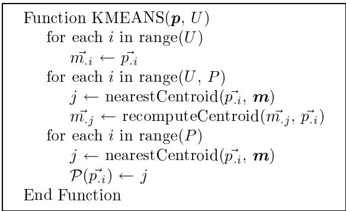  
Figure 2.9: Pseudocode for MacQueen's k-means clustering algorithm.

Figure 2.10 shows the performance of the k-means algorithm on the testbeds. From image 2.10(a), we gather that the algorithm clusters reasonably well for spreads of 0.125 or below, but for very small spreads,it performs poorly. The reason for this is probably that the algorithm chooses the initial cluster centres as the first two individuals, and if these are in the same, small, cluster, this can result in poor clustering. In the upper-left part of the image, only one cluster is detected, because the spread is either just too large (above 0.375) or too large in relation to the distance between the clusters.

The results on the second testbed show a very different picture (image 2.10(b)). Because of the noise, the clustering really breaks up when the two testclusters get close together. If they are really close (left part of the graph), the algorithm puts them in one cluster, and assigns the noise to a second one. If they are really small (bottom part), the algorithm separates the data into three clusters.

# 2.3.2 Convergent k-means

Convergent $k$ -means as described in [Anderberg, 1973] works the same as normal k-means, but continues the clustering - every time taking the existing cluster centroids as seed points - until the partition doesn't change anymore. This method provides for a more robust clustering, because it relies less on the order in which the data units are supplied to the algorithm.

The results of the algorithm on the two testbeds are shown in figure 2.11. They are much the same as the standard k-means algorithm, but with less problems with very small clusters.

# 2.3.3 Fuzzy c-means

The fuzzy c-means algorithm by Bezdek [Bezdek, 1981] generalises the notion of a partition into the fuzzy domain by introducing fuzzy pseudopartitions. In a fuzzy pseudopartition, $\mathcal { P } ( \vec { p _ { . i } } )$ is a membership vector instead of a single value; the membership vector specifies the degree of membership for each cluster, and

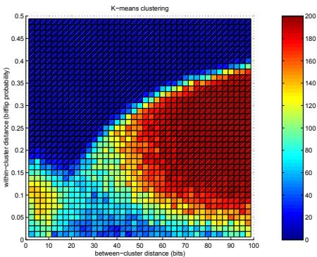

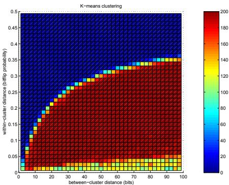  
Figure 2.10: The performance of MacQueen's k-means algorithm on the testbeds. The colour shows the average score of the algorithm on all the trials in a grid cell.

(a) The first testbed, with equal cluster sizes and spread.

(b) The second testbed, where one cluster has only 25 members and the other 50, with the remainder of the population being noise. The smaller cluster also has half the spread of the larger one.

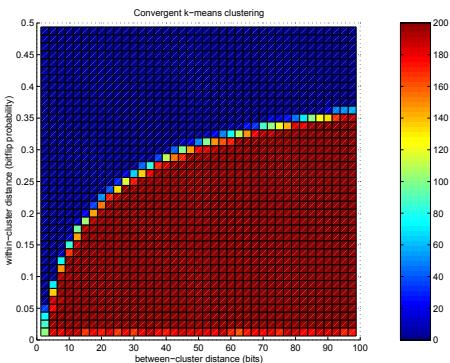

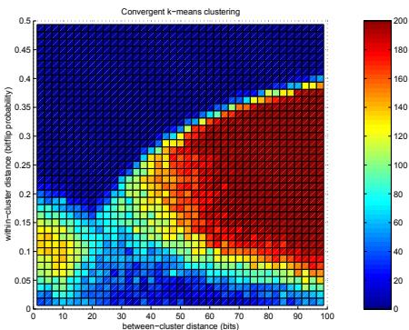

(a) The first testbed, with equal cluster sizes and spread.

(b) The second testbed, where one cluster has only 25 members and the other 50, with the remainder of the population being noise. The smaller cluster also has half the spread of the larger one.

Figure 2.11: The performance of the convergent $\mathrm { k \cdot }$ -means algorithm on the testbeds. The images show that the algorithm has less trouble with very small cluster spreads than $\mathrm { k \Omega }$ -means on the first testbed.

satisfies

$$
\forall i \in P : \sum _ { j = 1 } ^ { U } \mathcal { P } ( \vec { p _ { . i } } ) _ { j } = 1 .
$$

This allows for a finer distinction of membership during the clustering, but because the final result must be a normal partition, the fuzzy pseudopartition is hardened at the end of the clustering by assigning each individual to the cluster to which it has the highest degree of membership.

The algorithm was used for the genetic domain in [Dittrich et al., 1998], and the version I use works as follows:

1. Create an initial fuzzy pseudopartition ${ \mathcal { P } } ^ { ( 0 ) }$ by assigning the degrees of membership randomly, while satisfying equation 2.12.

2. Calculate the $U$ cluster centres by using the following formula:

$$
\vec { m _ { . i } ^ { ( t ) } } = \frac { \sum _ { j = 1 } ^ { P } \left( \mathcal { P } ( \vec { p _ { . j } } ) _ { i } ^ { ( t ) } \right) ^ { \mu } \vec { p _ { . j } } } { \sum _ { j = 1 } ^ { P } \left( \mathcal { P } ( \vec { p _ { . j } } ) _ { i } ^ { ( t ) } \right) ^ { \mu } } ,
$$

where $\mu > 1$ is a real-valued "fuzzyness" parameter.

3. Update the fuzzy pseudopartition. If an individual coincides with one or more cluster centres, spread its degree of membership uniformly over those centres. Otherwise, apply

$$
\mathcal { P } ( \vec { p _ { \cdot j } } ) _ { i } ^ { ( t + 1 ) } = \Bigg ( \sum _ { k = 1 } ^ { U } \bigg ( \frac { \| \vec { p _ { \cdot j } } - \vec { m _ { \cdot i } } ^ { ( t ) } \| } { \| \vec { p _ { \cdot j } } - \vec { m _ { \cdot k } } ^ { ( t ) } \| } \bigg ) ^ { \frac { 2 } { \mu - 1 } } \Bigg ) ^ { - 1 } ,
$$

where $\| { \vec { x } } - { \vec { y } } \|$ is the distance between $\vec { x }$ and $\vec { y }$ .

4. Compare $\mathcal { P } ^ { ( t + 1 ) }$ to $\mathcal { P } ^ { ( t ) }$ . I calculate this distance as the largest movement of a cluster centre between $\mathcal { P } ^ { ( t ) }$ and $\mathcal { P } ^ { ( t + 1 ) }$ :

$$
| \mathcal { P } ^ { ( t + 1 ) } - \mathcal { P } ^ { ( t ) } | = \operatorname* { m a x } _ { i \in U } \Vert m _ { i i } ^ { ( \vec { t } + 1 ) } - \vec { m _ { . i } ^ { ( t ) } } \Vert .
$$

As long as this distance is larger than a certain value $\epsilon$ , the iteration continues with step 2.

I have used $\epsilon = 1 \cdot 1 0 ^ { - 3 }$ , $\mu = 1 . 2 5$ and $L _ { 1 }$ as the distance measure. When $\mu \to 1$ , the algorithm converges to a generalised convergent $\mathrm { k \Omega }$ -means. When $\mu \to \infty$ , all cluster centres are near the middle of the dataset.

On the first testbed, fuzzy c-means performed worse than the convergent $\mathrm { k \Omega }$ . means algorithm; see image 2.12(a). Although the behaviour is quite similar, the curve is flatter such that clusters with large spreads in relation to their distances are not recognised. However, the algorithm shines when noise is present, as is apparent from image 2.12(b). While perhaps not as good with high-spread clusters as the non-fuzzy versions, the clustering is a lot more consistent and perfect scores are achieved on smaller distances.

(a) The first testbed, with equal cluster sizes and spread.

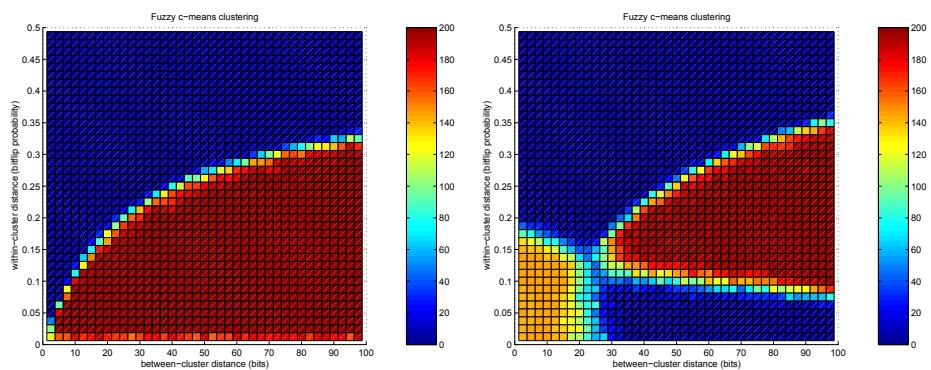  
(b) The second testbed, where one cluster has only 25 members and the other 50, with the remainder of the population being noise. The smaller cluster also has half the spread of the larger one.   
Figure 2.12: The performance of Bezdek's fuzzy c-means algorithm on the testbeds. The algorithm performs worse on high-spread clusters, but much better in the presence of noise.

Note, though, that because of the fractional exponents in the computation of the centroids and updated memberships, this algorithm is quite a bit slower than the previous two.

After evaluating these results, I opted to go with the fuzzy c-means technique, because it is the most robust of the algorithms that were considered. Although it is slow, real-world applications with complex evaluation routines will not suffer from this greatly.

# 2.4 Principal component analysis

Principal component analysis (PCA) is a technique designed to map $L$ variables in a correlated multivariate dataset onto $L$ new variables that are linear combinations of the original ones [Jolliffe, 1986]. These new variables are uncorrelated and sorted to the degree of variance that they explain. By choosing just the first $\boldsymbol { D }$ of the new variables, the original $L$ -dimensional dataset can be projected onto a $\boldsymbol { D }$ -dimensional subspace that nevertheless explains a lot of the variance in the data (see figure 1.7).

I use PCA to map $L$ -dimensional cluster centroids onto a 2-dimensional space, using the first two principal components. This allows the user to get a rough overview of the place of the clusters in relation to each other and clusters in previous generations.

To calculate the principal components of an $L$ -dimensional dataset consisting of $P$ observations (represented in an observation matrix $_ { \textbf { \em x } }$ ), the data is first normalised such that the means of each variable is zero (because the PCA axes

will all go through the origin):

$$
o _ { i j } = x _ { i j } - \frac { 1 } { P } \sum _ { k = 1 } ^ { P } x _ { i k } ,
$$

where $x _ { i j }$ is the value of the ith variable of the $j$ th observation. Next, obtain the covariance matrix $c$ by postmultiplying $^ o$ with its transpose $o ^ { T }$ .

$$
\displaystyle c = { \frac { 1 } { P } } o o ^ { T }
$$

such that

$$
c _ { i j } = \frac { \sum _ { k = 1 } ^ { P } o _ { i k } o _ { j k } } { P } ,
$$

using, for simplicity, a $P$ divisor instead of $( P - 1 )$ . To use the correlation matrix instead of the covariance matrix (in order to normalise the variables to unit variance), divide each $x _ { i j }$ by the the square root of the variance of ${ \vec { x _ { i } } } .$ .

Obtaining the principal components is now a matter of determining the eigenvalues and corresponding eigenvectors of the covariance/correlation matrix: solve

$$
| c - \lambda I | = 0
$$

and then solve

$$
( \pmb { c } - \lambda _ { k } \pmb { I } ) v _ { k } = \vec { 0 }
$$

for each $\lambda _ { k }$ . The eigenvector $v _ { k }$ with the highest $\lambda _ { k }$ is the first principal component, explaining the most variance that any linear combination of the original variables can. The eigenvector with the second-highest $\lambda _ { k }$ is the second principal component, etc.

The PCA code used in this thesis was written by Fionn Murtagh [Murtagh, 1989] and contains routines from Numerical Recipes [Press et al., 1988].

# 2.5 Visualisation techniques

I will describe the graphs used in the next chapter, as well as the algorithms used to create them, if they are not obvious.

# 2.5.1 Generation/fitness graph

The generation/fitness graph (figure 2.13) is the most widely used visualisation technique for genetic algorithms. This version contains three lines: a blue line showing the best fitness in the generation, a green line showing the average fitness, and a red line showing the worst fitness. Generations are plotted horizontally, and fitness vertically. Obviously the lines will never cross, thus providing a neat picture of the fitness convergence of the simulation.

Because often more detailed information is necessary than the graph can depict, the user can select a specific generation with the mouse and get the exact vales of best, average and worst fitness.

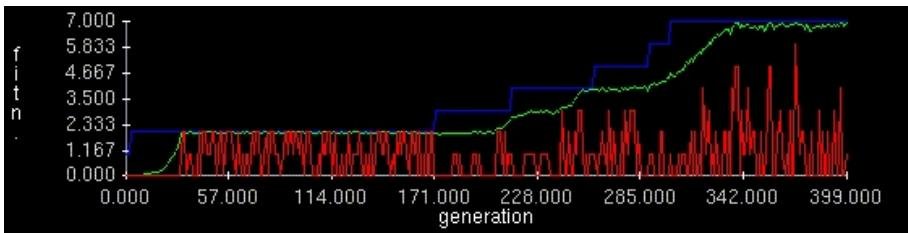  
Figure 2.13: The generation/fitness graph, showing fitness convergence.

# 2.5.2 Fitness distribution graph

The fitness distribution graph (figure 2.14) is an adaptation of the "fitness landscape" visualisation presented in [Harvey and Thompson, 1996]. The difference is that the height dimension of the original visualisation has been changed into a hue colourmap, thereby avoiding overlap. The procedure to create the graph is as follows:

1. Create a hue colourmap starting with the lowest fitness in the entire simulation at angle 0 and ending at the highest fitness at angle $\frac { 5 \pi } { 3 }$ (see appendix B).   
2. Sort the individuals of each generation according to their fitness values.   
3. For each generation, drawn along the horizontal axis, plot the colourmappec fitness values of its population along the vertical axis.

Thus, a visualisation of the fitness structure of the entire simulation is rendered. This view allows the user to get an idea of the takeover rate as well as the mutation force. The takeover rate is defined as the number of generations it takes for a new best-fit individual to take over a significant part of the population.

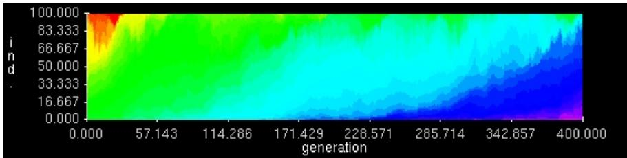  
Figure 2.14: The fitness distribution graph, which allows for a rough view of takeover rate and mutation force.

Again, the user can get more detailed information about the specific fitness of an individual by pointing the mouse somewhere in the graph. It will then display statistics about the generation, as well as the fitness of that particular individual.

# 2.5.3 Cluster visualisation

The cluster visualisation (figure 2.15) strives to give insight into the relative separation and movement of the clusters. For this, the clusters are drawn on the first two principal components (see section 2.4) of the point cloud determined by all cluster centroids across all visualised generations. Around each cluster centroid a circle is drawn with a particular size and colour, which can be mapped from cluster size, within-cluster error and mean fitness. Lines between these circles denote parent-child relationships. A cluster $c$ in generation $t$ is said to be a child of cluster $p$ when $p$ is the cluster closest to $c$ in generation $t - 1$ , and the distance between $c$ and $p$ is smaller than twice the average within-cluster distance of $p$ .

The circle surface area in figure 2.15 is determined by cluster size and colour by within-cluster error. The visualisation is tested on an artificial testbed where one 100-individual, 100-bit cluster is moving from 0000..00 to 1111...11 and then splitting into two 50-individual clusters moving to 0101..01 and 1010..10. All clusters have a mean within-cluster error of 5. In image 2.15(a), no noise has been added and you can see that the image provides a clear view of what is happening, whereas in image 2.15(b) $2 5 \%$ of the population is noise (which has caused the clustering to create a separate noise cluster) and it is impossible to find a mapping which prevents overlap.

However, because the axes in this graph are the first two principal components  which are the axes with the most variance that can be created by linearly combining the original axes $-$ , overlap is minimised, and we can study the spatial relations between the clusters. Care must be taken, however, that we keep in mind that the visual representation of these relations is based on providing as high a variance as possible within the graph; conclusions about variance based on the graph should therefore be treated with caution. For example, the curved lines in the images are a result of projecting a high-dimensional space on two dimensions, while looking at an angle. In reality all angles are 90 degrees, but it is impossible to find a projection that reflects this.

The user can interact with this visualisation by selecting a cluster. The program will then show information about that cluster consisting of its generation, size, within-cluster error and average fitness.

# 2.5.4 Generation/cluster graph

In the generation/cluster graph (figure 2.16), the lineage, birth, death and change of clusters is shown, without the spatial dimension the cluster visualisation has. This allows for a more detailed inspection of said events. The graph has the following properties:

• Generations are drawn along the horizontal axis.   
• For each generation, its clusters are plotted along the vertical axis, using the following placing constraints: 1. The clusters of the first visualised generation are spaced equally along the vertical axis. 2. The child with the longest line of descendants is plotted at the same height as the parent. 3. Other children are spaced such that as much branching room is available as possible within the previous constraints.

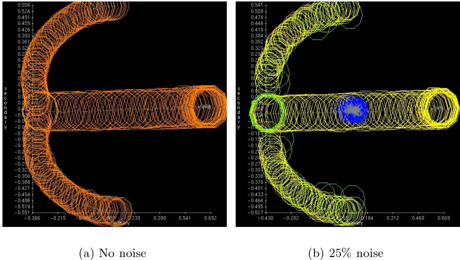  
Figure 2.15: The cluster visualisation, designed to get an idea of the relative separation and movement of clusters. The axes, being the first two principal components of the point cloud determined by the cluster centroids of all visualised generations, provide a maximum of separation to prevent overlap. The area of the circles is mapped from cluster size, and the colour from within-cluster error

• The width and colour of a cluster can be mapped from cluster size, withincluster error and fitness. These parameters are interpolated between parent and child. In figure 2.16, width is mapped from cluster size, and colour from within-cluster error. The figure was made under the same testing circumstances as the cluster visualisation described in section 2.5.3.

Because the generation/fitness graph has a specific "time" axis and can plot the clusters for best viewing, it is a lot less cluttered than the cluster visualisation. Of course, no spatial information can be deducted from it. As you can see in image 2.16(b), no overlap is occurring here and we see that the noise cluster isn't related to the main one, which wasn't clear from the cluster visualisation presented in section 2.5.3. We can also see that the clustering algorithm only finds the two clusters distinct enough to separate around generation 118, and that the within-cluster distance was growing before that time.

The extra information that can be obtained from this graph by interaction are the same as with the cluster visualisation. See appendix C for a screenshot which shows this interaction.

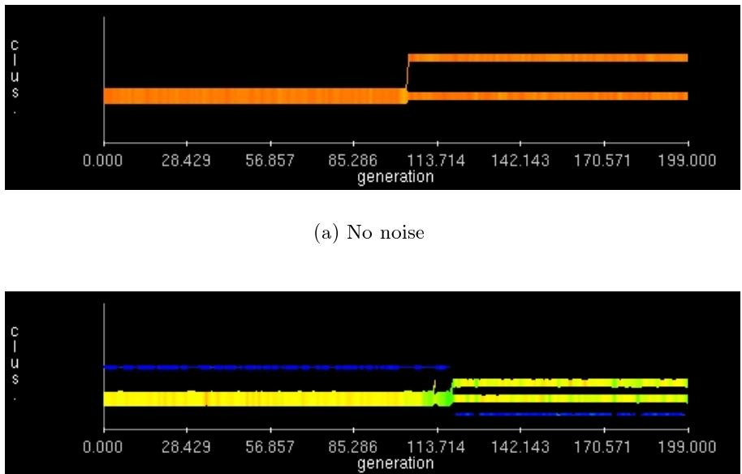  
Figure 2.16: The generation/cluster graph, showing cluster lineage and genotype convergence.

(b) $2 5 \%$ noise. The narrow blue line is a noise cluster which is smaller than the other ones, but has a much larger spread.

# Chapter 3

# Results

In this chapter, the results of the research are presented. The effect of parameter settings and selection scheme on the various visualisations is shown, and observations are made. I will also show some examples of using the visualisations to study the fitness landscapes instead of the algorithm. Finally, some experiments on the trajectory of the algorithm that were inspired by viewing the visualisations are also presented. Interpretation of the experiments will occur in chapter 4.

The results in this chapter were generated using the default values shown in appendix A, except where otherwise stated in the captions. For an explanation of the colours used, see appendix B; please note that we are not specifically interested in the absolute values of the colours used, and therefore scales will not be printed alongside each figure.

# 3.1 Parameter settings

As noted earlier, genetic algorithms can have a lot of parameters, and there are no explicit rules on how to set them. I will highlight three of them below, and discuss what their effects are on the various visualisations presented in the previous chapter. All three are parameters setting the trade-off between the exploration of the search space, leading to new solutions and escaping from local optima, and exploitation, leading to refinement of the solutions that have already been found. This trade-off is a fundamental aspect of all search algorithms, and the optimal setting is dependent on the actual optimisation task at hand.

The experiments in this section are not averaged over a number of runs, but care has been taken to ensure that the observations made in this section are consistent and not limited to the runs presented.

# 3.1.1 Mutation pressure

The mutation pressure in a GA using point-mutation is determined by the probability, per bit, of a bit-fip occurring. Typical values for this parameter are 0.001 or $1 / L$ , $L$ being the number of bits in a genotype. Higher mutation settings can speed up evolution, but also lead to loss of solutions by disrupting them. It is the task of the user to find a setting that is appropriate for the domain, and visualisations can help make that decision.

Figure 3.1 displays the effect of mutation pressure on the generation/fitness graph. When examining these images, some observations can be made:

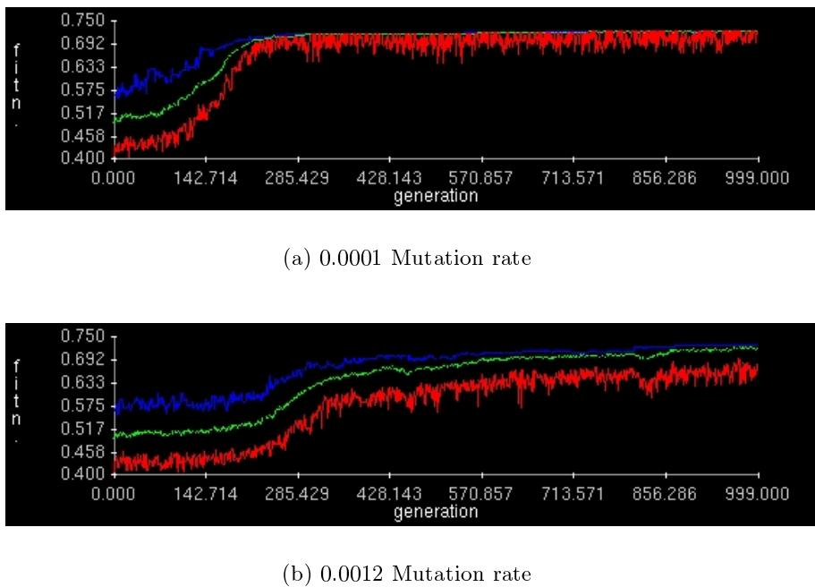  
Figure 3.1: The effect of the mutation rate on the generation/fitness graph for the (100, 10) NK problem. The lines depict best, average and worst fitness.

The slope of the green average fitness line in the image showing the lower mutation rate 3.1(a) is slightly steeper than in the higher mutation rate image 3.1(b).

•A lower mutation rate causes the green average fitness line to more closely follow the blue best fitness line, especially in later generations. In fact, they almost coincide.

• In the lower mutation rate image the red worst fitness line is very close to, and often touches, the green average fitness line.

• While no better-fit individuals are found after generation 250 in the lowermutation image, this continues to happen with a higher mutation rate. Note, though, that image 3.1(a) has a higher best fitness at that time than 3.1(b).

There is a drop in average fitness around generation 800 in image 3.1(b).

Figure 3.2 shows the same runs on the fitness distribution graph. The observations about this figure are the following:

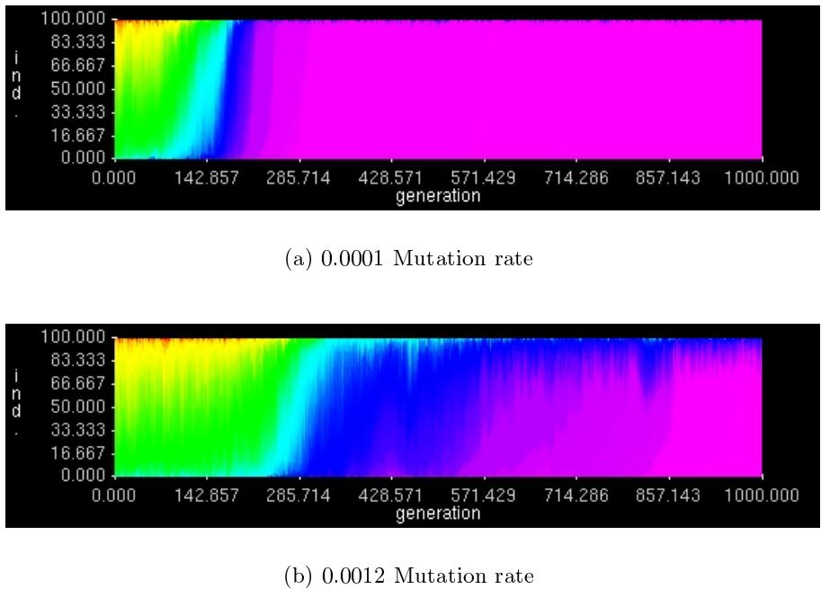  
Figure 3.2: The effect of the mutation rate on the fitness distribution graph for the (100, 10) NK problem. The colours represent an individual's fitness, and are sorted form top (lowest, red) to bottom (highest, purple).

• Again, the slopes are steeper with a lower mutation rate. Note that the colours are computed for best viewing per image, and will therefore not be compared.

• A higher mutation rate causes the edges between the fitness values to be more rugged. The difference between the fitness distributions of nearby generations is greater.

• As noted above, no new best-fit individuals are found in the lower mutation rate image after generation 250.

• We can now very clearly see the drop in average fitness in image 3.2(b), occurring at the same time that a new best-fit individual starts taking over the population.

• In the high mutation rate image, at the end of the evolution, the amount of individuals with the highest fitness is lower than in the low mutation rate image. There is a noticeable gap between the top of the figure and the first highest-fitness individual.

# 3.1.2 Selection pressure

Selection pressure is determined by the nature of the problem domain, any (scaling) operators applied to the fitness values, and the selection scheme. In order to have a well-defined value with which to set the selection pressure, I use the $C _ { m u l t }$ parameter from the linear fitness scaling. When using remainder stochastic sampling, a $C _ { m u l t }$ value of 1 means that selection does not depend on fitness at all, while a value of $P$ means that the next generation will consist completely of copies of the best-fit individual. Typical values of this parameter are 1.2 and 2.

Again, there is a tradeoff between low selection pressure allowing a broader search, and high selection pressure speeding up evolution but risking getting stuck in a local optimum.

In figure 3.3, the effect of selection pressure on the generation/fitness graph is shown. Again, these pictures give rise to some observations:

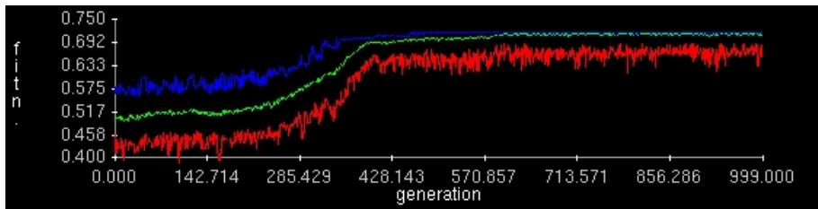  
(a) 1.2 selection pressure

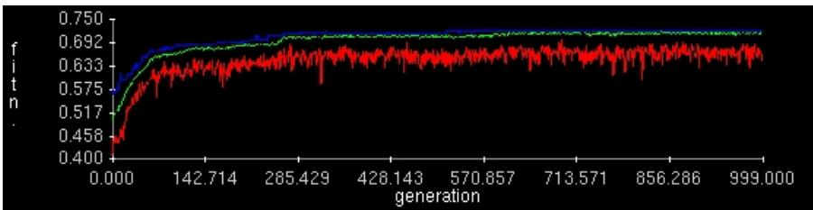  
(b) 2.0 selection pressure   
Figure 3.3: The effect of the selection pressure on the generation/fitness graph for the (100, 10) NK problem. The lines depict best, average and worst fitness.

• The change in slopes, already observed when changing the mutation rate, is much more pronounced. A factor two change in selection pressure gives rise to a much greater change in slope than a factor ten change in mutation rate.

•The best fitness is less noisy when using a higher selection pressure. A decrease in the best fitness is much less likely in this case.

The average fitness more closely follows the best fitness when using high selection pressure.

We can examine the change in the fitness distribution graph as well. Figure 3.4 shows this. The observations about this figure are the following:

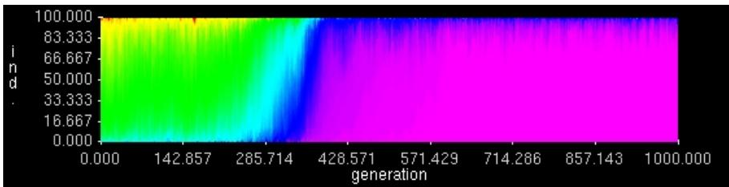  
(a) 1.2 selection pressure

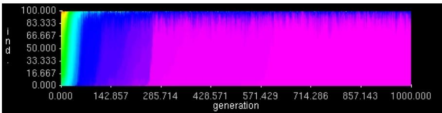  
(b) 2.0 selection pressure   
Figure 3.4: The effect of the selection pressure on the fitness distribution graph for the (100, 10) NK problem. The colours represent an individual's fitness, and are sorted form top (lowest, red) to bottom (highest, purple).

• There is again a marked change in slope, with the high selection pressure slopes being almost vertical. • A change in ruggedness of the fitness edges is also apparent, but this time this is not the case at the end of the evolution; the ruggedness in the top right corner of the image is about the same in both images.

It is interesting to take a look at the effects of selection pressure on the generation/cluster graph, not only because of the cluster lineage, but also to view the within-cluster distance. In figure 3.5, purple means an average withincluster distance of 50, and red of 0. The observations about this figure are the following:

• The average within-cluster distance converges much faster in the high selection pressure image 3.5(b). • Long-lived clusters (aside from the main trunk) are more likely to occur under lower selection pressure. Examination has shown that these clusters are not far apart, but rather very close in both genotype and fitness.

A special case occurs when the mutation rate is so high that no evolution occurs at all. This is shown in figure 3.6. In this case there are no slopes at all and there is no trend in the fitness distribution, just noise.

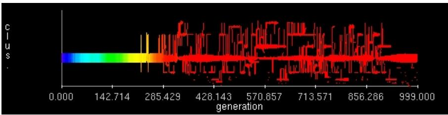  
(a) 1.2 selection pressure

# (b) 2.0 selection pressure

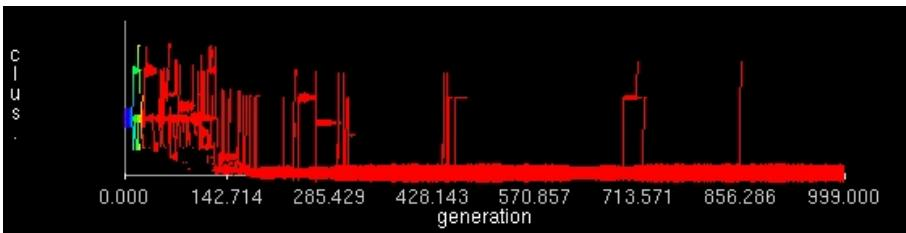  
Figure 3.5: The effect of the selection pressure on the generation/cluster graph for the (100, 10) NK problem. Colour represents mean within-cluster distance from red (lowest, 0) to purple (highest, $L / 2$ ), and width represents cluster size.

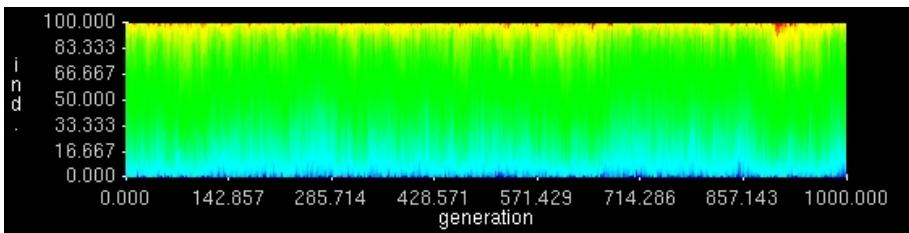  
Figure 3.6: The result of using a value for the selection pressure that is unable to cope with the mutation for the (100, 10) NK problem. Mutation rate is 0.002 and selection pressure is 1.05. The colours represent an individual's fitness, and are sorted form top (lowest, red) to bottom (highest, purple).

# 3.1.3 Selection scheme

Which scheme is used to select the individuals for the next generation has a large effect on the performance of a GA. The choice of selection scheme impacts the selection pressure in a nonlinear way, and cross-scheme comparisons of a scaling parameter are therefore difficult. We will review three selection schemes: stochastic sampling, remainder stochastic sampling and tournament selection. Stochastic sampling and remainder stochastic sampling have the same expected number of offspring, and are therefore easily comparable. Tournament selection is used as an example of a different option.

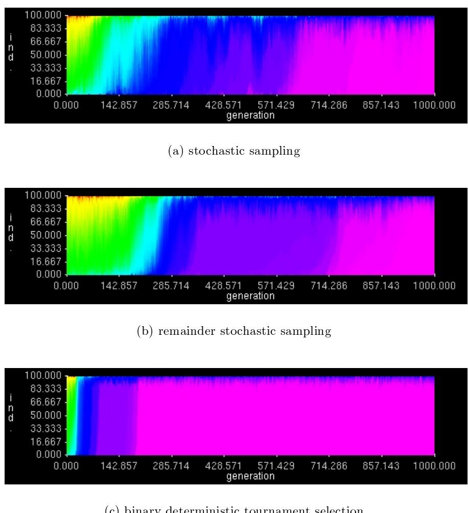  
Figure 3.7 shows how the choice of selection scheme affects the fitness distribution graph:   
  
Figure 3.7: The fitness distribution graph for some selection schemes acting on the (100, 10) NK problem. The colours represent an individual's fitness, and are sorted form top (lowest, red) to bottom (highest, purple).

•The stochastic sampling selection scheme in image 3.7(a) is more rugged than the remainder stochastic sampling shown in 3.7(b). Other than that, there is no significant difference.   
• Tournament selection, however, has very steep slopes, comparable to 3.4(b).   
• Also, for tournament selection there is a difference in the ruggedness of the top-right part of the image; it is a lot more stable than in image 3.7(a) or 3.7(b)

We get more insight into the difference between stochastic sampling and remainder stochastic sampling by looking at the generation/cluster graphs shown in figure 3.7. Here, the changes are a lot more apparent:

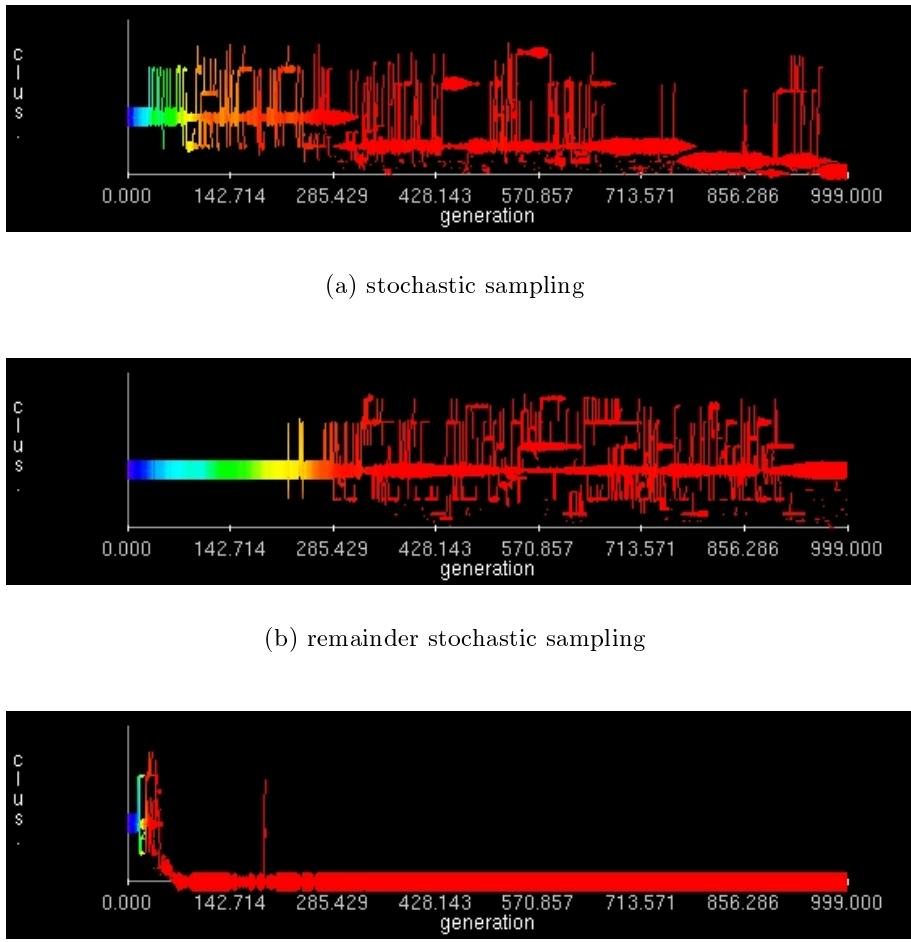  
(c) binary deterministic tournament selection   
Figure 3.8: The generation/cluster graph for some selection schemes acting on the (100, 10) NK problem. Colour represents mean within-cluster distance from red (lowest, 0) to purple (highest, $L / 2$ ), and width represents cluster size.

•Especially at the start of the evolution, there is a lot more clustering going on when using the stochastic sampling selection scheme in image 3.8(a) than when using remainder stochastic sampling in image 3.8(b), even when comparing this at the same level of genotype convergence.   
• Genotype convergence is a lot quicker with stochastic sampling than with remainder stochastic sampling.   
• The tournament selection shown in image 3.8(c) has even less clustering and even faster genotype convergence.

# 3.2 Problem domains

Until now, we have only looked at the NK fitness landscape, and only in one particular configuration. However, when using a genetic algorithm the most difficult aspect is tuning it to your fitness landscape, by using a good coding and choosing acceptable parameter settings. It is therefore important to see what a change in fitness landscape does to the various visualisations provided here, and to perhaps recognise what kind of landscape is under consideration. Although only a very rough picture can be estimated from these visualisations, it still is instructive to have a look.

# 3.2.1 Different landscape topologies

First, we will take a look at the results of the visualisations when substantially different landscapes are considered. Those landscapes are the ones presented in chapter 2: De Jong's F1, F2, F3 and F5; Royal Road and Royal staircase, Kauffman's NK landscapes and $\mathcal { P }$ -peak. Not all visualisations for these problems will be given, but an interesting subsection will be presented.

Figure 3.9 shows the fitness distribution graph for three different landscapes: De Jong's F5, Royal Staircase and Kauffman's NK landscape. If we now look at the different fitness transitions, some interesting differences occur:

• Image 3.9(a) shows only one fitness transition: from red to purple, and during this transition the individuals' fitness values grow rapidly, shown by the tightly packed colours during the event.   
• Image 3.9(c) also has only one transition, but this one is a lot smoother. It occurs much later in the evolution as well, but this fact is observed more closely in section 3.2.2.   
• Image 3.9(b) has very sharp edges, showing no gradient of colours during a jump in fitness.

Looking at the generation/fitness graph, we can spot a difference between the Royal Road and Royal Staircase problems, as shown in figure 3.10. The obvious difference, apart from the fact that Royal Road evolves much quicker, is the fact that in image 3.10(a) the red worst fitness line is not far below the green average fitness line, while in image 3.10(b) the worst fitness is often zero.

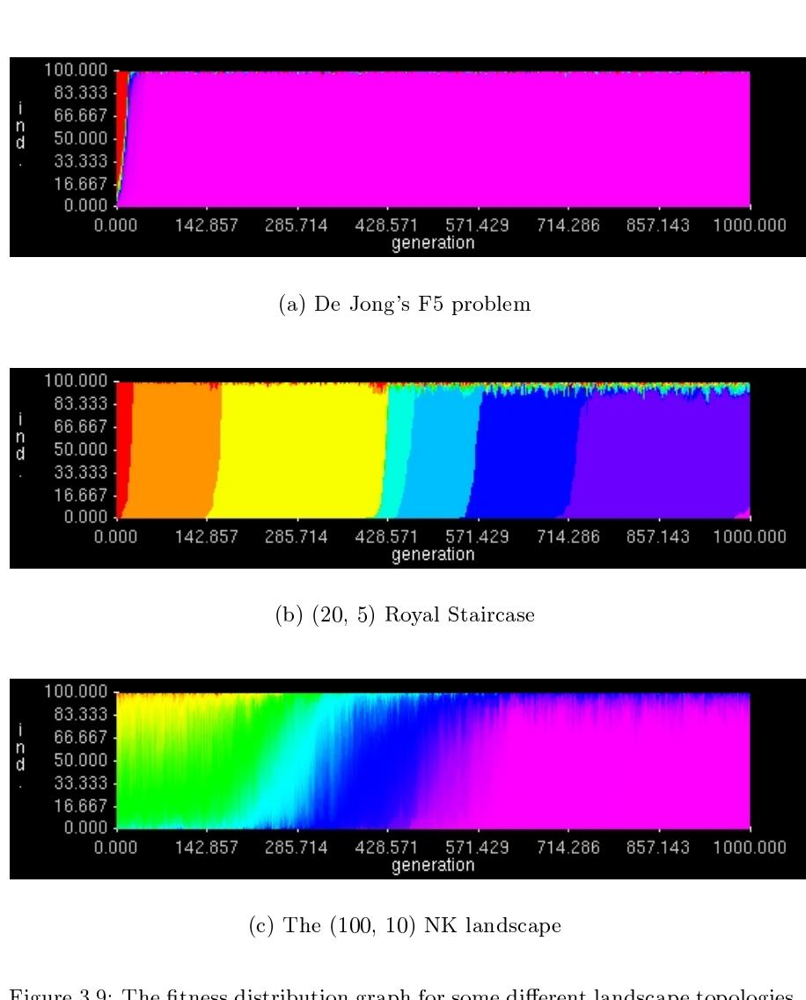  
The colours represent an individual's fitness, and are sorted form top (lowest, red) to bottom (highest, purple).

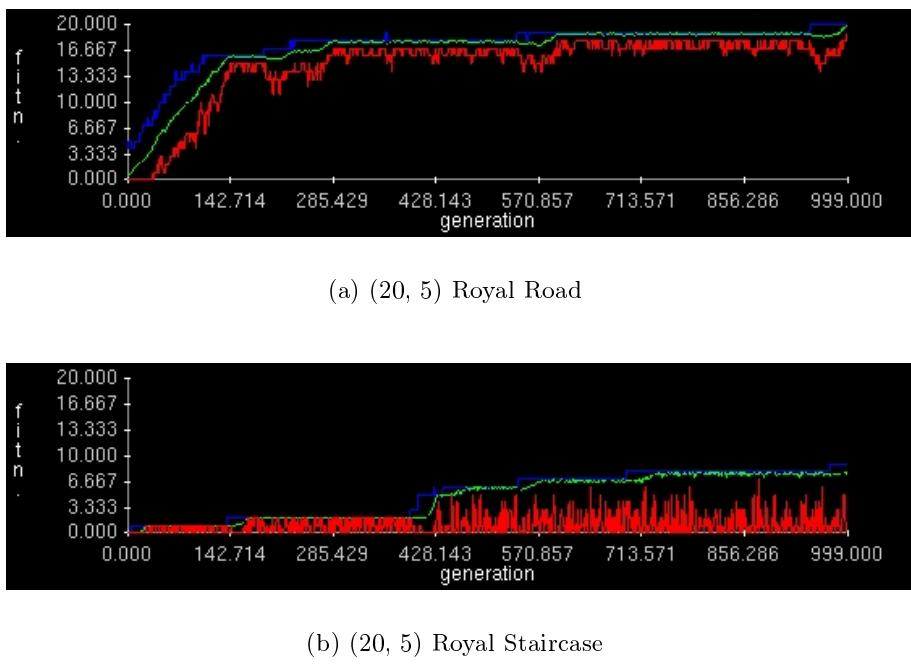  
Figure 3.10: The generation/fitness graph for the Royal Road and Royal Staircase problems. The lines depict best, average and worst fitness.

In the generation/cluster graphs showing the genotype convergence in figure 3.11, something else catches the eye. Because we are talking about genotype convergence here, it is important to note that with the parameters chosen, these problems are very close in length: 80 bits for De Jong's F3 and 100 bits for the other two problems.

• After evolution has stabilised, meaning that the algorithm has been at a (local) optimum for a long time, image 3.11(a) stays relatively unconverged, whereas images 3.11(b) and 3.11(c) are near total genotype convergence.   
• After fitness convergence, some clustering (apart from very short-lived orphan-clusters) is still taking place in image 3.11(c), but not in 3.11(a) and 3.11(b).

# 3.2.2 Different parameters for the NK landscape

Kauffman's NK landscapes are a way to adjust the epistasis and therefore difficulty of a problem with a single parameter. They are therefore a good way of comparing the visualisation results for different problem complexities with little other effects going on.

Figure 3.12 shows the generation/fitness graph for two values of K. We observe the following changes between a low and high K value:

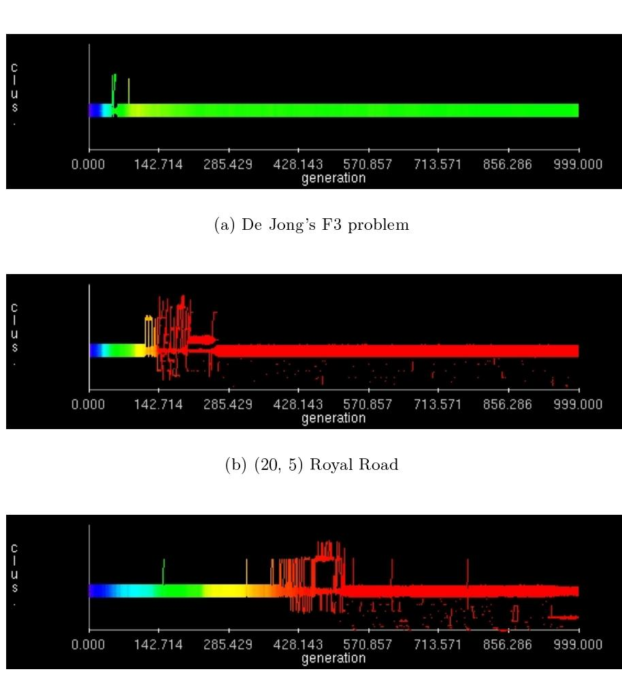  
(c) The (100, 10) NK landscape   
Figure 3.11: The generation/cluster graph for some different landscape topologies. Colour represents mean within-cluster distance from red (lowest, 0) to purple (highest, $L / 2$ ), and width represents cluster size.

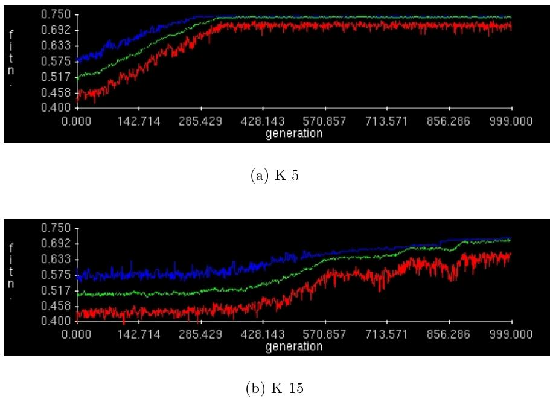  
Figure 3.12: The generation/fitness graph for different K values on a 100-bit NK landscape. The lines depict best, average and worst fitness.

• The low-K fitness lines start going up immediately while the high-K lines only start at around generation 300.   
•The distances between the best fitness and average fitness, as well as between the average fitness and worst fitness, are larger in the high-K case.   
The worst fitness line is more rugged when using a high value for K.

The fitness distribution graph, shown in figure 3.13, also shows some differences.

• Again, we can see that it takes a lot longer for the high-K graph to start displaying any consistent changes. However, the slopes do not seem to be significantly less steep. • Especially in the later generations, the gap between the top of the figure and the best-of-generation individuals is a lot bigger with a high K value.

# 3.3 Trajectory analysis

After analysing the trajectory of the algorithm on a 2-peak landscape, some more research seemed necessary. Unless under very strict and noneconomic circumstances, the algorithm will not split between the two peaks as I originally expected (shown in figure 3.14(a)), but rather starts climbing one of the two peaks very early in the evolution even in the absence of crossover; figure 3.14(b) shows this.

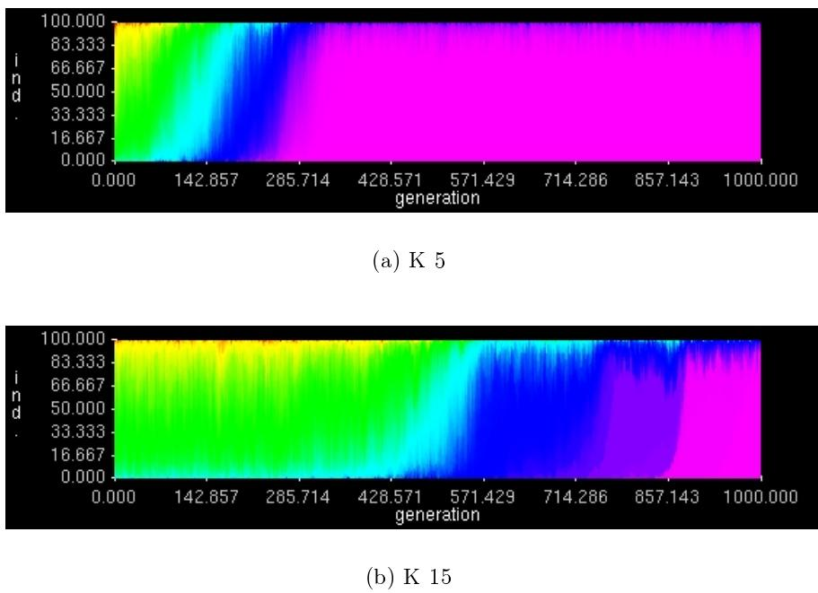  
Figure 3.13: The fitness distribution graph for different K values on a 100-bit NK landscape. The colours represent an individual's fitness, and are sorted form top (lowest, red) to bottom (highest, purple).

This causes some concern: what if one of the peaks is better than the other, and this difference is only apparent at the top of the peak? Figure 3.15 gives insight in this situation.

In figure 3.15(a), it can be seen that the percentage of runs that the algorithm is stuck at the suboptimal peak is near zero when the maximum fitness value of that peak is 90% of that of the main peak. When the peaks are the same height, this is of course random chance. Figure 3.15(b) shows that the actual averaged fitness stays very high (always above 0.99), with a local minimum near a secondary peak height of 0.965.

In certain cases, we can also track another part of the trajectory of a genetic algorithm, discussed in [Nimwegen, 1999]. Van Nimwegen sketches a view of the search in which a GA diffuses through neutral subbasins, and contracts through portals onto new fitness planes. This effect can be observed in figure 3.16. In this figure, we can see that the mean within-cluster distance contracts right after a jump to a higher fitness plane and slowly diffuses afterwards. Figure 3.17 shows generations 85 to 105 of the same run on the cluster visualisation. You can clearly see the population splitting up in a low-fitness and high-fitness cluster.

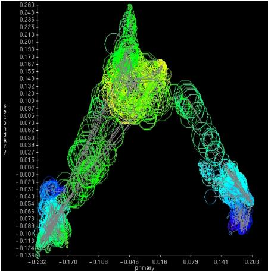

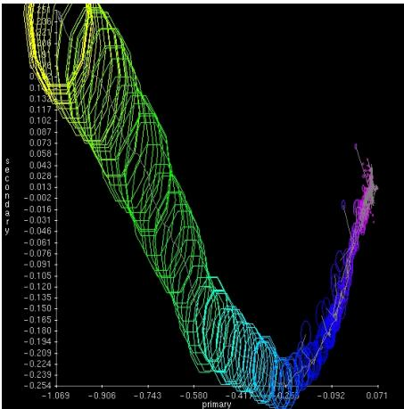

(a) 0.001 mutation rate, no crossover, 1.05 selection pressure. This configuration causes the algorithm to consider both peaks at once for a prolonged duration.

(b) The default parameters make the algorithm choose one peak very early in the evolution process.

Figure 3.14: The cluster visualisation for the 100-bit 2-peak problem. Colour represents mean cluster fitness from red (lowest) to purple (highest), and circle size represents mean within-cluster distance. Convergent k-means clustering was used, as this routine was shown to produce better results with large betweencluster distances.

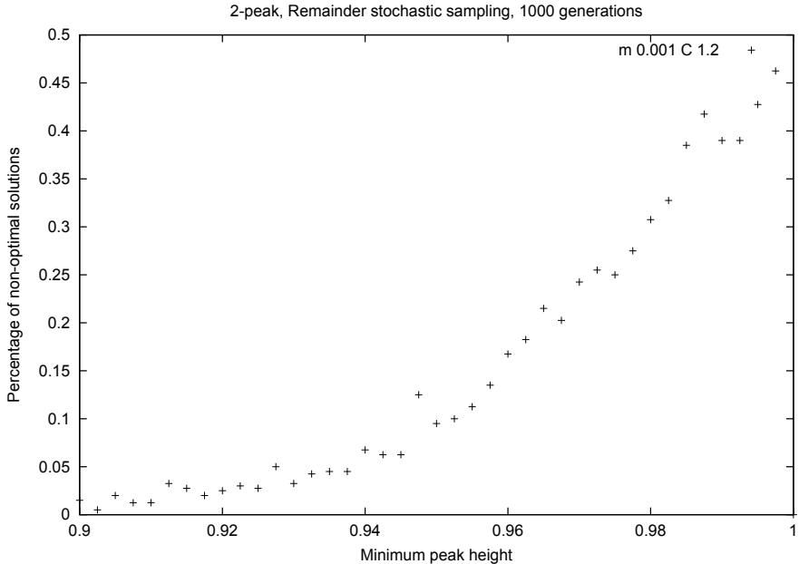  
(a) Percentage of non-optimal solutions plotted as a function of secondary peak height.

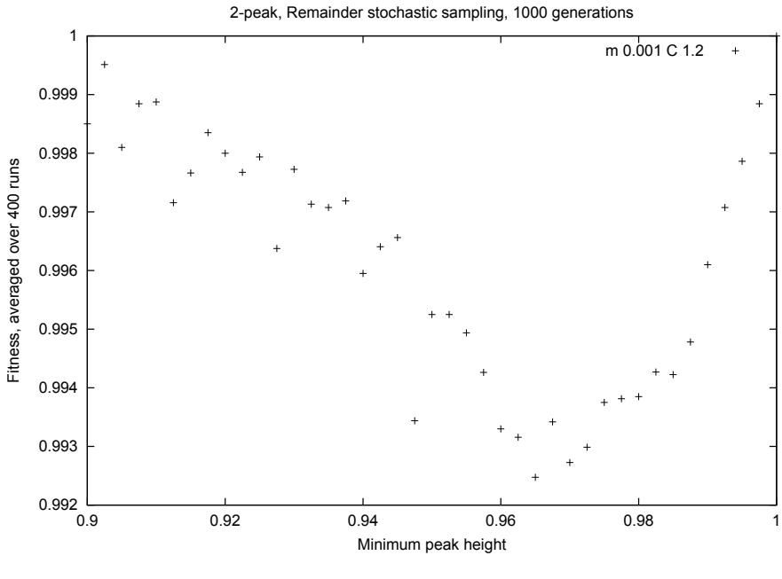  
(b) Average fitness plotted as a function of secondary peak height.   
Figure 3.15: Extra results on the trajectory of a genetic algorithm without crossover on the 100-bit 2-peak problem with varying secondary peak height.

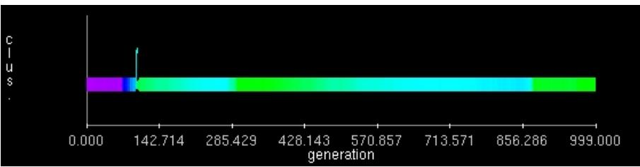  
Figure 3.16: The generation/cluster graph for the (20, 8) royal staircase problem. The green colour right after the first jump in fitness signifies a mean withincluster distance of 35, and the blue colour just before the second jump is a mean within-cluster distance of 50.

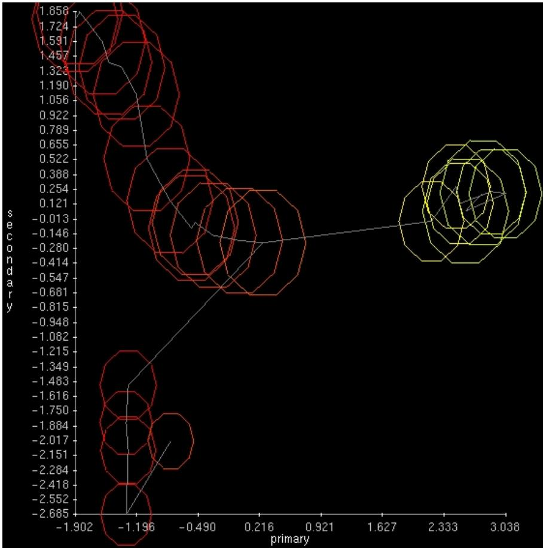  
Figure 3.17: The cluster visualisation for generations 85 to 105 of a run of the (20, 8) royal staircase problem. Colour represents mean cluster fitness from red (lowest) to purple (highest), and circle area represents cluster size.

# Chapter 4

# Discussion

This chapter discusses the results found in chapter 3. It follows the same format for ease of reference.

# 4.1 Parameter settings

# 4.1.1 Mutation pressure

The reasons for the behaviour observed in section 3.1.1 are simple: mutation causes disruption of solutions, and fitness convergence is therefore less quick in simulations done with higher mutation rates. Also, the mutation poses a limit on the amount of fitness convergence that can take place, because it will continue disrupting the population. Finally, the higher the mutation rate, the bigger the chance of the mutation to create radically lower fit individuals, especially after the search has reached smaller, higher-fitness plateaus.

This last characteristic is very clear from the fitness distribution graphs shown in figure 3.2: the rugged edges at the top right of graph 3.2(b) show not only the (relative) fitness of the lowest-fit individuals, but also how many of them there are, something not easily deductible from the generation/fitness graph in figure 3.1. It is this amount of lowest-fit individuals that most characterises the mutation force. This will become clear when we discuss the effect of selection pressure in the next section.

The drop in average fitness around generation 800 in image 3.2(b) is not directly a result of mutation, but rather of crossover. If a new best-fit individual is found some distance from the previous one, the population will be drawn there, but not instantly. There is a time when both solutions have individuals spread around them, and crossover between these is likely to yield lower fitness values than crossover within one such cluster, hence the drop in average fitness.

# 4.1.2 Selection pressure

Since selection pressure is the primary way to set the speed of the evolution, the findings in section 3.1.2 can not come as a surprise: exploiting good solutions by giving them more trials in the next generation will lead to greater fitness convergence and generally speedier evolution, provided the search does not get stuck in a local optimum. The slope of the generation/fitness graph and fitness distribution graph (figure 3.4) is therefore a better indication of the selection pressure than of the mutation rate, but should always be seen as the interaction of these two parameters with the problem domain.

As noted in the previous section, the amount of lowest-fit individuals is a better measure for the mutation rate, and this can be seen in figure 3.4. Changing the selection pressure does not notably change the ruggedness of the top right corner of the graph.

Having a greater chance of retaining the best-fit individual, also observed to be a characteristic of a high selection pressure, is of course the result of creating more copies of it in the next generation, thereby augmenting its survival rate through mutation and crossover. There is however a more efficient way of making sure the best-fit individual is not destroyed, called eletist selection. This method first copies the best-fit individual to the next generation and does not perform mutation or crossover on it. The rest of the evolution process remains the same, but with only $P - 1$ places left in the next generation.

Looking at observations about the generation/cluster graph in figure 3.5, we can say that the amount of long-lived clusters is lower under high selection pressures because even a slight drop in fitness will cause the algorithm to go exclusively with the higher-fitness solution. The fact that there are no clusters with large differences in fitness follows directly from this, but there only being clusters very close together has another reason, already noted in section 4.1.1: crossover. The high crossover rates used in genetic algorithms will disrupt differing solutions so much that in practice only one cluster will survive. I will discuss this more in detail in section 4.2.2.

Now that we have observed the effects of mutation- and selection pressure on the different graphs, we can try turning this around: which graph forms should we desire, and how should we obtain these forms? Of course, the average fitness should increase over time, but applying a strong selection pressure, observed to be the best way of achieving this, will just result in premature convergence. Increased mutation, which poses a limit on the genotype convergence possible, can then be used to keep the exploration going. Care must be take however that while this high-selection, high-mutation scheme can give good and quick results, it will tend to disrupt genotypes too much for any subtle local search to take place.

These ever present trade-offs are what make GAs nontrivial to adapt to a specific problem domain. The interaction of them with the problem also makes it impossible to determine optimal evolution parameters just by looking at the population composition via the various visualisations presented; what counts is the end result, and this cannot be predicted without intimate knowledge of the problem domain. What remains to us are broad generalisations about trends that have been observed to be good or bad, but this can vary significantly depending on the problem under consideration.

One of these trends is that a quite rapid takeover rate usually offers good results. While it might seem advantageous for the quality of the solution to have a very diverse population, most of the time this will result in too little progression, and will not pay off. It is better to try the run again with a new initial population than having a long single run which converges too slowly. Therefore we should look for steep slopes in the fitness distribution graph.

Another trend is that while the takeover rate should be quite fast, too much genotype convergence must be avoided. Outlier genotypes created by crossover or mutation must have a chance to develop, even if their fitness is lower than average. Therefore, we must favour fitness distribution graphs which show some not insignificant part of the population to be of lower fitness than the optimum in that generation. Looking at the cluster visualisation, this means clusters with relatively large within-cluster distances.

Of course, it can be profitable to have more local search at the end of the evolution in order to further optimise the solution. This can be done by lowering both the selection pressure and mutation pressure as a function of the generation, but this falls outside the scope of this thesis.

# 4.1.3 Selection scheme

As noted in section 3.1.3, the difference between stochastic sampling and remainder stochastic sampling is mainly one of stability. While the expected number of offspring of an individual is the same in both cases, the differences in fitness distribution between generations are a lot larger with stochastic sampling. The difference can be attributed to the decreased variation of the remainder stochastic sampling scheme: it depends less on random chance, and the makeup of nearby generations is therefore more likely to be similar. This effect is also likely to be the reason for the inconsistent clustering going on in figure 3.8(a).

The difference in genotype convergence is also directly related to this. Because less genotypes are lost due to random chance, the population converges more slowly. There is, however, not a significant difference in consistency of the clustering. As a matter of fact, any consistent clustering present in the images in figure 3.8 only occurs after the genotypes are significantly converged, being more a result of small irregularities than any large splits in the population. In this case, the main reason a clustering algorithm was employed  getting clearer statistics in the case of a divided population - is not present. This will be discussed more thoroughly in section 4.3.

# 4.2 Problem domains

# 4.2.1 Different landscape topologies

In section 3.2.1, we saw that the visualisations can not only be used to examine the genetic algorithm, but also to draw conclusions about the fitness landscape on which the search is taking place.

Via the fitness distribution graph we noted that in the problems under considerations three different fitness transitions can be observed, and we now look at the structure in the landscapes that explain those differences. De Jong's F5 has a very rapid transition from lowest-fitness to highest-fitness, and it is clear why from looking at figure 2.8: the algorithm will start with most individuals on the plane, and then randomly dive into one of the pits, becoming trapped. This pit can be either the global or a local optimum, but it is unlikely for the algorithm to escape from it. The pits are very steep, but not vertical, so higher and higher fitnesses will follow each other in rapid succession until the optimum is reached.

The Royal Staircase problem has even sharper transitions, and this is the result from vertical " walls": The algorithm does not climb a wall, it just passes onto the new fitness plane. This is very different from the NK landscape, in which the algorithm essentially climbs only one "slope" during evolution, with no consistent fitness changes occurring before or after. This is the difference between epochal evolution, in which fitness transitions are few and there are long periods of stasis in between, and continuous evolution, in which newer fitness values are continually reached until the algorithm becomes stuck.

We also examined the generation/fitness graph for the Royal Road and Royal Staircase problems, and found a significant difference in the worst fitness of a generation. Because we know the landscapes, this is easily explained as well: in Royal Road, the maximum damage a mutation can do is disturb one building block, while in Royal Staircase a mutation at the start of a chromosome can bring the individual to the lowest fitness possible. We can therefore look at the worst fitness line as a measure of the damage of mutation.

The last characteristic presented in section 3.2.1 was genotype convergence. We noted that De Jong's F3 function is not converged after reaching the global optimum, and the Royal Road problem is. This is of course because of De Jong's F3 having a global optimal plane, and the Royal Road a global optimal peak. What is important about this, however, is that it shows that just looking at genotype convergence does not predict the end of evolution. If genotype convergence is to be used as a stopping criterion, perhaps it would be better to look at the change in genotype convergence instead, for reasons of populations contracting onto new fitness planes as explained in section 4.3.

As for the noted difference between post-convergent clustering between the Royal Road problem and NK landscape, this is probably a result of the relative power of mutation and crossover: there are a lot of possible mutations on the NK landscape that will not reduce the fitness too much, while every mutation on the optimal solution to the Royal Road problem decreases the fitness by one unit. In other words: the (global) optimal peak of the Royal Road problem is much steeper than of the NK landscape.

# 4.2.2 Different parameters for the NK landscape

There are two main differences between the pictures shown in section 3.2.2. The first is that the landscape with a greater epistasis (high K value) takes much longer to start showing a consistent increase in fitness values. This has been observed in [Spears, 1998], and Spears gives results showing that this can be attributed to the effectiveness of the crossover operator. He shows this in light of the $\mathcal { P }$ -peak problem, but the results are much the same in the NK landscape presented here: high epistasis affects crossover in a negative way, because it is less likely to combine partial solutions into better ones. The operator only recovers from this in relatively converged populations, where the partial solutions are more compatible and therefore more probable to combine into better individuals.

The second difference is the fitness of non-optimal individuals in each generation. The fitness of non-optimal solutions is lower in the landscape with higher epistasis, and this can be understood in terms of mutation. The effect of mutation is greater if it disrupts more component terms of the solution, and since epistasis is the degree in which bits rely upon each other it is clear that mutation will have a much larger effect on an individual's fitness in high-epistasis landscapes.

Earlier, we noted that the amount of low-fitness individuals in a generation can be taken as a measure for the mutation pressure. Now we see that the fitness distribution graph does not show the entire picture in this regard: it is not probable that there are more lower-fit individuals in image 3.13(b) because mutation pressure remains the same, but the figure seems to imply this. In fact, one would expect less of them because their fitness is lower and selection will cut them out faster. Study shows that this is indeed the case, and that this can not easily be seen from the fitness distribution graph: because mutation has less of an effect, the colour difference between the optimal individual (at least, the best one found by the algorithm until that generation) and that of slightly mutated ones is barely distinguishable.

# 4.3 Trajectory analysis

Thus far, most of the observations about different parameters, etc. have been done using the generation/fitness graph and fitness distribution graph. The more innovative cluster visualisation and generation/cluster graphs seem to provide a lot less insight in the evolution than originally hoped, and this has one main reason: the population of a genetic algorithm does in general not visit multiple diverse solutions at any one time. It will cluster around one local optimum or in one neutral subbasin and rely on diffusion or lucky mutations/crossovers to free it from that state, in which case the entire population will escape onto a higher fitness plane (see [Nimwegen, 1999]).

The expected behaviour, that in the light of multiple local optima with the same fitness the algorithm would cluster near these optima until one proves to be a jumping point to a new plane, seems only to occur in very specific circumstances, as shown in figure 3.14. Usually, crossover and a high selection pressure will favour one of the optima over the other because of random chance. I mention crossover in this because, as mentioned in section 4.2.2, it inhibits evolution in high-epistasis landscapes until the population is relatively converged (while this may plead for less of an emphasis on crossover in genetic algorithms, this is erroneous. [Spears, 1998] shows that even in high-epistasis landscapes, crossover has a net positive effect on the evolution).

To further research this, the plots in figure 3.15 were made. They show that even though the algorithm does not climb the correct peak all the time, the reputation that GAs find good semi-optimal solutions still seems deserved: when, as in our case, the steepness of the peak depends on the ultimate peak height, the chance of choosing the wrong one to climb decreases faster-thanlinear in the penalty. This suggests that, in the general case, even a small difference in fitness will on average cause the algorithm to climb the better peak, provided that enough reinforcement is available.

The final figures presented in section 3.3, figures 3.16 and 3.17, show us the process of diffusion and escape in neutral subbasins. In figure 3.16, we can see that the population diffuses when no reinforcement from fitness values is available, and when a new fitness plane is found the population contracts onto it. Observe that at that time the population can be thought of as splitting into two clusters, one shrinking and one growing. Eventually, the part of the population on the lower fitness plane dies out and the process begins anew on the newfound plane. This is illustrated in figure 3.17. The reason that the lower-fitness cluster lies away from the parent cluster is because that cluster has been moving to the high fitness plane for a while before being distinct enough for the clustering algorithm to notice.

# Chapter 5

# Conclusions

In this thesis, I have presented some visualisations of genetic algorithms, and hinted at the information that can be gained from studying them. Parameter settings such as mutation and selection pressure can be deduced and informed by them, and certain aspects of the underlying fitness landscape such as fitness transitions can be distilled. In particular, I have introduced two new visualisations, one based on showing the overall fitness distribution and one based on dividing the population in clusters.

It was shown that the fitness distribution graph, based on Harvey and Thompson's 3d fitness graph, can in some cases provide us with more information than the standard generation/fitness graph. For example, it gives us a better image of the mutation pressure by allowing us to see the approximate number of low-fitness individuals rather than only the average fitness or absolute worst fitness.

The generation/cluster graph, which tries to show any clustering going on during a simulation run, has unfortunately not provided us with the insight I originally hoped, because any broad, consistent clustering was not seen to occur unless in very specially crafted circumstances. This happens because on the one hand, the efficiency of the search algorithm forces it to choose one path early in the simulation, and on the other, the crossover operator causes too much genotype disruption. However, the visualisation has not been wholly without merit, and perhaps it can be applied in different evolutionary algorithms.

# 5.1 Future work

First and foremost, the results in this thesis need more in-depth analysis, and especially testing on real-world applications. Only by trying to solve a real problem can the effectiveness of the visualisations be assessed and the impressions given in this thesis verified. Perhaps there are problems the results of which can better be analysed by clustering, though the results obtained with the $\mathcal { P }$ -peak problem seem to deny this.

I will point out some further avenues of research that could be pursued based on the work done in this thesis:

• While the program used to create the visualisations presented in this thesis supports it, we have not touched on the subject of predicting the eventual outcome of a simulation run by looking at preliminary versions of the graphs presented. Perhaps the visualisations can be used to prematurely abort a run because it can be seen to lead to no good solution.

• More research could be done into extracting information about a fitness landscape by examining visualisations of a search by a genetic algorithm through that landscape. We have seen some limited evidence that this is possible, and better visualisations and statistics crafted specifically for this purpose could help in this regard.   
• One could try better clustering algorithms and cluster stopping criteria (which determine how many clusters are present in a particular dataset) to examine more subtle clusterings. Using different variables to cluster on, such as phenotypic distance and fitness, is also a possibility.   
The statistics that were planned based on the clustering and not extensively used due to the problems experienced with the clustering: genotype convergence, growth and movement, could still be of use. The movement rate could be used to more accurately look at fitness transitions, in conjunction with the genotype convergence that was briefly visited.   
• It could be useful to apply the cluster visualisations to a different type of evolutionary algorithm that does not use crossover, such as Evolution Strategies [Rechenberg, 1973]. The absence of crossover will probably make those visualisation much more enlightening.

# Appendix A

# Default values

<table><tr><td>Parameter</td><td>Setting</td></tr><tr><td>Number of generations</td><td>1000</td></tr><tr><td>Population size</td><td>100</td></tr><tr><td>Selection scheme</td><td>Remainder stochastic sampling</td></tr><tr><td>Selection pressure</td><td>1.2</td></tr><tr><td>Tournament group size</td><td>2 (binary deterministic tournament selection)</td></tr><tr><td>Mutation rate</td><td>0.001</td></tr><tr><td>Crossover rate</td><td>0.6</td></tr><tr><td>Cluster method</td><td>Fuzzy c-means</td></tr><tr><td>Fuzzyness parameter µ</td><td>1.25</td></tr><tr><td>Fuzzy c-means stopping criterion €</td><td>1·10-3</td></tr><tr><td>Hartigan iteration threshold</td><td>10</td></tr></table>

# Appendix B

# Colour scales

Two colour scales were used in this thesis, one encoding the fitness value of an individual or cluster, and one encoding the mean within-cluster distance of a cluster. The fitness values scale is shown in figure B.1, in the case of a minimum found fitness of $0$ , and maximum of 1. This scale is a linearly interpolated hue scale from 0 (red) to $\frac { 5 \pi } { 3 }$ (purple) starting at the minimum found fitness and ending at the maximum.

  
Figure B.1: The colour scale for fitness values, starting at fitness 0 and ending at 1.

Because in most of this thesis we're not especially interested in the exact fitness values, the scale is not printed alongside each picture.

The scale for the within-cluster distance, shown in figure B.2, is more rigid. It uses the same hue scale, but fixed between 0 and $L / 2$ . The colours can therefore be compared between pictures, but care has to be taken when comparing pictures with large differences in genotype length. Note that in the figure, the scale is not displayed outside of the window found in the population.

  
Figure B.2: The colour scale for within-cluster error, starting at 0.44 and ending at 91.86. In this case, $L$ is 100.

# Appendix C

# Software engineering aspects

# C.1 Decomposition

The program that was written to create the visualisations presented in this thesis, GATA (Genetic Algorithm Trajectory Analysis), contains four modules, problem, simulation, analysis and visualisation. The problem module is designed to be easily modifiable to new domains, so the researcher can add new fitness functions painlessly. The simulation module does the actual search, thereby querying the problem module for the fitness values of specific genotypes. The analysis module analyses the population of each generation that comes out of the simulation, calculating clusters and other statistics. The visualisation module then displays this information based on the wishes of the user. See figure C.1 for a data flow diagram.

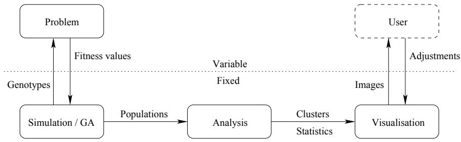  
Figure C.1: A data flow diagram for GATA. The fixed and variable separation is made to distinguish between parts that are easily modified, and those that are not readily changed.

The simulation, analysis and visualisation modules are implemented as separate threads. Apart from causing a speedup on a multiprocessor machine, this allows the user to interact smoothly with the visualisations while the simulation and analysis are still running. Synchronisation between the threads is implemented via signals; for example, if the analysis thread is finished before a new generation has been simulated, it blocks until it receives a signal from the

simulation thread.

# C.2 Libraries and utilities

While generating the results described in this thesis, I have used a number of libraries and utilities. These are briefly described here:

gcc The GNU Compiler Collection was used to compile GATA, which is written entirely in ANSI C. This cross-platform compiler was used under SUN Solaris as well as Red Hat Linux and Debian GNU/Linux. Gcc is a GNU project under control of the GCC Steering Committee.

pthread POSIX threads were used because they are supported on Solaris as well as Linux.

OpenGL The OpenGL API was used to draw graphics primitives, because it is cross-platform and easy to use. OpenGL is a registered trademark of Silicon Graphics, Inc.

GLUT The OpenGL Utility Toolkit was used to interface with the windowing system, again because it is cross-platform and simple, but also because it provides a minimal amount of overhead and allows for easy user interaction. It was written by Mark J. Kilgard.

libjpeg To generate the screenshots, I used libjpeg, by the Independent JPEG Group.

RANDLIB For generating normally distributed pseudo-random variables, I used the C version of the RANDLIB library by Barry W. Brown et al..

gsl Matrix manipulation routines and other linear algebra functions were used from the GNU Scientific Library.

pca I used the Principal Component Analysis routine from Fionn Murtagh [Murtagh, 1989], which contains routines from Numerical Recipes [Press et al., 1988].

doxygen The documentation for the project was written inside the source, and extracted using the doxygen documentation generato, written by Dimitri van Heesch.

gnuplot The gnuplot interactive plotting program was used to create the graphs in figure 3.15. Gnuplot was written by Thomas Williams et al..

MATLAB I used MATLAB, by The Mathworks, to generate the miscellaneous plots throughout this thesis, such as the landscape visualisations and cluster comparisons in chapter 2.

# C.3 Interaction

Although it is not explicitly used in the results presented in this thesis, the program supports user interaction to provide more detailed information than the graphs can depict. This information can be obtained by pointing the mouse at a particular place in a graph. The selected generation, cluster or individual's statistics will then be displayed by the visualisation module, as well as its location in the other graphs.

Figure C.2 shows a screenshot of the program in which the user has selected a cluster in the generation/cluster graph. This cluster is then also selected in the cluster visualisation, and its generation is selected in the generation/fitness graph and fitness distribution graph. The statistics relevant to the cluster, generation, size, within-cluster error and some derived statistics, are also displayed in a separate information window. Also, the colour mapping of its mean fitness and within-cluster error are selected in the colour scales at the bottom of the screen.

Note, too, that the user has selected to visualise only generations 0 through 300. It is possible to select arbitrary ranges of generations to visualise, and when the simulation and analysis modules have not yet caught up to the desired range, the visualisations will continue to update with new information until this is the case.

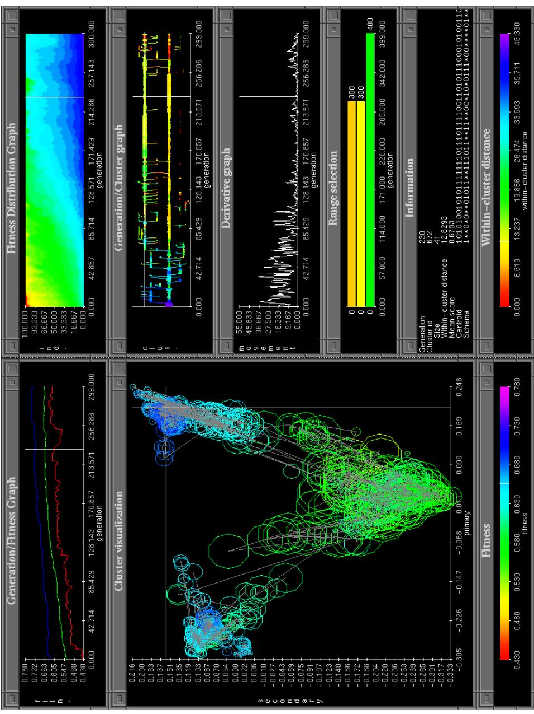  
Figure C.2: A screenshot of the program used to create the visualisations presented in this thesis. A cluster has been selected in the generation/cluster graph.

# Bibliography

[Altenberg, 1997] L. Altenberg. Nk fitness landscapes. In T. Baeck, D.B. Fogel, and Z. Michalewicz, editors, Handbook of Evolutionary Computation. Oxford University Press, 1997. http://dynamics.org/\~altenber/FTP/LeeNKFL. ps.

[Anderberg, 1973] M. R. Anderberg. Cluster Analysis for Applications. Academic Press, 1973.

[Antonisse, 1989] J. Antonisse. A new interpretation of schema notation that overturns the binary encoding constraint. In Proceedings of the Third International Conference on Genetic Algorithms, 1989.

[Baecker and Sherman, 1981] R. Baecker and D. Sherman. Sorting out sorting, 1981.

[Bagley, 1967] J.D. Bagley. The behaviour of adaptive systems which employ genetic and correlation algorithms. PhD thesis, University of Michigan, 1967.

[Barricelli, 1957] N.A. Barricelli. Symbiogenetic evolution processes realized by artificial methods. Methodos, 9:143182, 1957.

[Bezdek, 1981] J.C. Bezdek. Pattern Recognition with Fuzzy Objective Function Algorithms. Plenum Press, 1981.

[Brown, 1988] M. Brown. Algorithm Animation. MIT Press, 1988.

[Cole, 1998] Rowena Marie Cole. Clustering with genetic algorithms, 1998. http://www.cs.uwa.edu.au/pub/robvis/theses/RowenaCole.ps.gz.

[Collins, 1993] T.D. Collins. The visualisation of genetic algorithms. Master's thesis, De Montfort University, Leicester, 1993.

[Collins, 1998] T.D. Collins. The Appplication of Software Visualization Technology to Evolutionary Computation: A Case Study in Genetic Algorithms. PhD thesis, Knowledge Media Institute, The Open University, UK, 1998. http://kmi.open.ac.uk/people/trevor/archive/thesis.

[Dabs and Schoof, 1995] T. Dabs and J. Schoof. A graphical user interface for genetic algorithms, 1995. ftp://sunshine.informatik.uni-wuerzburg. de/pub/joscho/genetic/tr098s.ps%.gz.

[Darwin, 1859] C.R. Darwin. On the origin of species by means of natural selection or the preservation of favored races in the struggle for life. Murray, London, 1859.

[Dittrich et al., 1998] P. Dittrich, J. Ziegler, and W. Banzhaf. Mesoscopic analysis of self-evolution in an artificial chemistry. In C. Adami et al., editor, Artificial Life VI: Proceedings of the Sixth International Conference on Artificial Life. MIT Press, 1998. http://ls11-www.informatik.uni-dortmund. de/people/ziegler/ALIFEVI/alife%6.ps.

[Dybowski et al., 1996] R. Dybowski, T.D. Collins, and P.R. Weller. Visualization of binary string convergence by sammon mapping. In L.J. Fogel, P.J. Angeline, and T. Baeck, editors, Evolutionary Programming V, pages 377-383. MIT Press, 1996. http://kmi.open.ac.uk/people/trevor/publications/ EP96.ps.gz.

[Fraser, 1962] A.S. Fraser. Simulation of genetic systems. Journal of Theoretical Biology, 2:329346, 1962.

[Goldberg, 1989] D.E. Goldberg. Genetic Algorithms in Search, Optimization and Machine Learning. Addison-Wesley, 1989.

[Goldberg, 1991] D.E. Goldberg. Real-coded genetic algorithms, virtual alphabets, and blocking. Complex Systems, 5:139167, 1991.

[Goldstine and von Neumann, 1947] H. Goldstine and J. von Neumann. Planning and coding problems of an electronic computing instrument. In A. Taub, editor, von Neumann, J., Collected Works. Macmillan, 1947.

[Hartigan, 1975] J. Hartigan. Clustering Algorithms. Wiley, 1975.

[Harvey and Thompson, 1996] I. Harvey and A. Thompson. Through the labyrinth evolution finds a way: A silicon ridge. In The First International Conference on Evolvable Systems: From Biology to Hardware. Springer-Verlag, 1996. http://www.cogs.susx.ac.uk/ccnr/Papers/ Pub96/HarThoTLEFW.ps.gz.

[Holland, 1962] J.H. Holland. Outline for a logical theory in adaptive systems. Journal of the Association for Computing Machinery, 3:297-314, 1962.

[Holland, 1968] J.H. Holland. Hierarchical descriptions of universal spaces and adaptive systems. Technical report, University of Michigan, 1968.

[Holland, 1971] J.H. Holland. Processing and processors for schemata. In E. L. Jacks, editor, Associative information processing, pages 127146. American Elsevier, 1971.

[Jollffe, 1986] I.T. Jollffe. Principal Component Analysis. Springer-Verlag, 1986.

[Jones and Forrest, 1995] T. Jones and S. Forrest. Fitness distance correlation as a measure of problem difficulty for genetic algorithms, 1995. ftp://ftp. cs.unm.edu/pub/forrest/fdc-icga95.ps.gz.

[Jones, 1995] T. Jones. Evolutionary Algorithms, Fitness Landscapes and Search. PhD thesis, The University of New Mexico, Albuquerque, New Mexico, 1995. ftp://jones.tc/pub/phd/phd.ps.gz.

[Jong and Spears, 1990] K.A. De Jong and W.M. Spears. An analysis of the interacting roles of population size and crossover. In H.-P Schwefel and R. Maenner, editors, Proceedings of the International Workshop Parallel Problem Solving from Nature, pages 3847. Springer-Verlag, 1990. http: //www.aic.nrl.navy.mil/\~spears/papers/ppsn90.ps.gz.

[Jong, 1975] K. De Jong. An analysis of the behaviour of a class of genetic adaptive systems. PhD thesis, University of Michigan, 1975.

[Kauffman and Levin, 1987] S.A. Kauffman and S. Levin. Towards a general theory of adaptive walks on rugged landscapes. Journal of Theoretical Biology, 123:1145, 1987.

[MacQueen, 1967] J. MacQueen. Some methods for classification and analysis of multivariate observations. In L. LeCam and J. Neyman, editors, Proceedings of the Fifth Berkeley Symposium on Mathematical statistics and probability: Volume 1: Statistics, pages 281297. University of California Press, 1967.

[Michalewicz, 1996] Z. Michalewicz. Genetic Algorithms $^ +$ Data Structures = Evolution Programs. Springer-Verlag, 1996.

[Milligan and Cooper, 1985] G.W. Milligan and M.C. Cooper. An examination of procedures for determining the number of clusters in a dataset. Psychometrika, 50:159179, 1985.

[Mitchell et al., 1991] M. Mitchell, S. Forrest, and J.H. Holland. The royal road for genetic algorithms: Fitness landscapes and ga performance. In Toward a Practice of Autonomous Systems: Proceedings of the First European Conference on Artificial Life. MIT Press, 1991. http://www.santafe.edu/\~mm/ RoyalRoad.ps.gz.

[Mitchell, 1996] M. Mitchell. An Introduction to Genetic Algorithms. MIT Press, 1996.

[Murtagh, 1989] F. Murtagh. pca.c; principal component analysis in c, 1989. http://lib.stat.cmu.edu/multi/pca.c.

[Nassersharif et al., 1994] B. Nassersharif, D. Ence, and M. Au. Visualisation of evolution of genetic algorithms. In The Proceedings of the World Congress on Neural Networks, volume 1, pages 560565, 1994.

[Nimwegen, 1999] E. Van Nimwegen. The Statistical Dynamics of Epochal Evolution. PhD thesis, Universiteit Utrecht, NL, 1999. http://www.santafe. edu/\~erik/net_thesis.ps.

[Press et al., 1988] W.H. Press, S.A. Teukolsky, W.T. Vetterling, and B.P. Flannery. Numerical Recipes in C. Cambridge University Press, 1988. Online at http://lib-www.lanl.gov/numerical/index.html.

[Rechenberg, 1973] I. Rechenberg. Evolutionsstrategie: Optimierung technischer Systeme nach Prinzipien der biologischen Evolution. PhD thesis, Frommann-Holzboog, 1973.

[Spears, 1994] W. Spears. Visualizing genetic algorithms. Technical report, AI Center, Naval Research Laboratory, Washington, DC, 1994.

[Spears, 1998] W.M. Spears. The Role of Mutation and Recombination in Evolutionary Algorithms. PhD thesis, George Mason University, Fairfax, Virginia, 1998. http://www.aic.nrl.navy.mil/\~spears/papers/thesis. double.ps.gz.   
[Stadler, 1995] P. Stadler. Towards a theory of landscapes. In R. L'opez Pe na, editor, Complex Systems and Binary Networks. Santa Fe Institute Preprint, 1995. ftp://ftp.itc.univie.ac.at/pub/PREPRINTS/sta-95-01.ps.gz.   
[Stasko et al., 1998] J. Stasko, J. Domingue, M.H. Brown, and B.A. Price, editors. Software visualization: programming as a multimedia experience. MIT Press, 1998.   
[Stasko, 1990] J. Stasko. Tango: A framework and system for algorithm animation. Computer, 23:2739, 1990.   
[Wolpert and Macready, 1996] D.H. Wolpert and W. G. Macready. No free lunch theorems for search. Technical report, The Santa Fe Institute, 1996. ftp://ftp.santafe.edu/pub/wgm/nfl.ps.   
[Wright, 1932] S. Wright. The roles of mutation, inbreeding, crossbreeding and selection in evolution. In D.F. Jones, editor, Proceedings of the Sixth International Congress on Genetics, pages 356366, 1932.   
[Wu et al., 1999] A.S. Wu, K.A. De Jong, D.S. Burke, J.J. Grefenstette, and C.L. Ramsey. Visual analysis of evolutionary algorithms, 1999. ftp://ftp. aic.nrl.navy.mil/pub/aswu/papers/cec.99.ps.gz.   
[Yin and Germay, 1993] X. Yin and N. Germay. A fast genetic algorithm with sharing scheme using cluster methods in multimodal function optimization. In R. F. Albrecht, C. R. Reeves, and N. C. Steele, editors, Proceedings of the International Conference on Artificial Neural Nets and Genetic Algorithms, pages 450457. Springer-Verlag, 1993.