# The Practical Handbook of

# GENETIC ALGORITHMS

# Applications

SECOND EDITION

# The Practical Handbook of

# GENETIC ALGORITHMS

Applications

SECOND EDITION

Edited by Lance Chambers

CHAPMAN & HALL/CRC

Boca Raton London New York Washington, D.C.

This book contains information obtained from authentic and highly regarded sources. Reprinted material is quoted with permission, and sources are indicated. A wide variety of references are listed. Reasonable efforts have been made to publish reliable data and information, but the author and the publisher cannot assume responsibility for the validity of all materials or for the consequences of their use.

Neither this book nor any part may be reproduced or transmitted in any form or by any means, electronic or mechanical, including photocopying, microfilming, and recording, or by any information storage or retrieval system, without prior permission in writing from the publisher.

All rights reserved. Authorization to photocopy items for internal or personal use, or the personal or internal use of specific clients, may be granted by CRC Press LLC, provided that $\$ 50$ per page photocopied is paid directly to Copyright Clearance Center, 222 Rosewood Drive, Danvers, MA 01923 USA. The fee code for users of the Transactional Reporting Service is ISBN 1-58488-240- $9 / 0 1 / \mathfrak { F } 0 . 0 0 \substack { + \$ 5 0 }$ . The fee is subject to change without notice. For organizations that have been granted a photocopy license by the CCC, a separate system of payment has been arranged.

The consent of CRC Press LLC does not extend to copying for general distribution, for promotion, for creating new works, or for resale. Specific permission must be obtained in writing from CRC Press LLC for such copying.

Direct all inquiries to CRC Press LLC, 2000 N.W. Corporate Blvd., Boca Raton, Florida 33431.

Trademark Notice: Product or corporate names may be trademarks or registered trademarks, and are used only for identification and explanation, without intent to infringe.

# Preface

Bob Stern of CRC Press, to whom I am indebted, approached me in late 1999 asking if I was interested in developing a second edition of volume I of the Practical Handbook of Genetic Algorithms. My immediate response was an unequivocal "Yes!" This is the fourth book I have edited in the series and each time I have learned more about GAs and people working in the field. I am proud to be associated with each and every person with whom I have dealt with over the years. Each is dedicated to his or her work, committed to the spread of knowledge and has something of significant value to contribute.

This second edition of the first volume comes a number of years after the publication of the first. The reasons for this new edition arose because of the popularity of the first edition and the need to perform a number of functions for the GA community. These "functions" fall into two main categories: the need to keep practitioners abreast of recent discoveries/learning in the field and to very specifically update some of the best chapters from the first volume.

The book leads off with chapter 0, which is the same chapter as the first edition by Jim Everett on model building, model testing and model fitting. An excellent "How and Why." This chapter offers an excellent lead into the whole area of models and offers some sensible discussion of the use of genetic algorithms, which depends on a clear view of the nature of quantitative model building and testing. It considers the formulation of such models and the various approaches that might be taken to fit model parameters. Available optimization methods are discussed, ranging from analytical methods, through various types of hillclimbing, randomized search and genetic algorithms. A number of examples illustrate that modeling problems do not fall neatly into this clear-cut hierarchy. Consequently, a judicious selection of hybrid methods, selected according to the model context, is preferred to any pure method alone in designing efficient and effective methods for fitting parameters to quantitative models.

Chapter 1 by Roubos and Setnes deals with the automatic design of fuzzy rulebased models and classifiers from data. It is recognized that both accuracy and transparency are of major importance and we seek to keep the rule-based models small and comprehensible. An iterative approach for developing such fuzzy rulebased models is proposed. First, an initial model is derived from the data. Subsequently, a real-coded GA is applied in an iterative fashion, together with a rule-based simplification algorithm to optimize and simplify the model, respectively. The proposed modeling approach is demonstrated for a system identification and a classification problem. Results are compared to other approaches in the literature. The proposed modeling approach is more compact and interpretable.

Goldberg and Hammerham in Chapter 2, have extended their contribution to Volume III of the series (Chapter 6, pp 119238) by describing their current research, which applies this technology to a different problem area, designing automata that can recognize languages given a list of representative words in the language and a list of other words not in the language. The experimentation carried out indicates that in this problem domain also, smaller machine solutions are obtained by the MTF operator than the benchmark. Due to the small variation of machine sizes in the solution spaces of the languages tested (obtained empirically by Monte Carlo methods), MTF is expected to find solutions in a similar number of iterations as the other methods. While SFS obtained faster convergence on more languages than any other method, MTF has the overall best performance based on a more comprehensive set of evaluation criteria.

Taplin and Qiu, in Chapter 3, have contibuted material that very firmly grounds GA in solving real-world problems by employing GAs to solve the very complex problems associated with the staging of road construction projects. The task of selecting and scheduling a sequence of road construction and improvement projects is complicated by two characteristics of the road network. The first is that the impacts and benefits of previous projects are modified by succeeding ones because each changes some part of what is a highly interactive network. The change in benefits results from the choices made by road users to take advantage of whatever routes seem best to them as links are modified. The second problem is that some projects generate benefits as they are constructed, whereas others generate no benefits until they are completed.

There are three general ways of determining a schedule of road projects. The default method has been used to evaluate each project as if its impacts and benefits would be independent of all other projects and then to use the resulting cost-benefit ratios to rank the projects. This is far from optimal because the interactions are ignored. An improved method is to use rolling or sequential assessment. In this case, the first year's projects are selected, as before, by independent evaluation. Then all remaining projects are reevaluated, taking account of the impacts of the first-year projects, and so on through successive years. The resulting schedule is still sub-optimal but better than the simple ranking.

Another option is to construct a mathematical program. This can take account of some of the interactions between projects. In a linear program, it is easy to specify relationships such as a particular project not starting before another specific project or a cost reduction if two projects are scheduled in succession. Fairly simple traffic interactions can also be handled but network-wide traffic effects have to be analysed by a traffic assignment model (itself a complex programming task). Also, it is difficult to cope with deferred project benefits. Nevertheless, mathematical programming has been used to some extent for road project scheduling.

The novel option, introduced in this chapter, is to employ a GA which offers a convenient way of handling a scheduling problem closely allied to the travelling salesman problem while coping with a series of extraneous constraints and an objective function which has at its core a substantial optimising algorithm to allocate traffic.

The authors from City University of Hong Kong are Zhang, Chung, Lo, Hui, and Wu. Their contribution, Chapter 4, deals with the optimization of electronic circuits. It presents an implementation of a decoupled optimization technique for the design of switching regulators. The optimization process entails selection of the component values in the regulator to meet the static and dynamic requirements. Although the proposed approach inherits characteristics of evolutionary computations that involve randomness, recombination, and survival of the fittest, it does not perform a whole-circuit optimization. Consequently, intensive computations that are usually found in stochastic optimization techniques can be avoided. In the proposed optimization scheme, a regulator is decoupled into two components, namely, the power conversion stage (PCS) and the feedback network (FN). The PCS is optimized with the required static characteristics such as the input voltage and output load range, whils"t the FN is optimized with the required static characteristics of the whole system and the dynamic responses during the input and output disturbances. Systematic procedures for optimizing circuit components are described. The proposed technique is illustrated with the design of a buck regulator with overcurrent protection. The predicted results are compared with the published results available in the literature and are verified with experimental measurements.

Chapter 5 by Hallinan discusses the problems of feature selection and classification in the diagnosis of cervical cancer. Cervical cancer is one of the most common cancers, accounting for $6 \%$ of all malignancies in women. The standard screening test for cervical cancer is the Papanicolaou (or "Pap") smear, which involves visual examination of cervical cells under a microscope for evidence of abnormality.

Pap smear screening is labour-intensive and boring, but requires high precision, and thus appears on the surface to be extremely suitable for automation. Research has been done in this area since the late 1950s; it is one of the "classical" problems in automated image analysis.

In the last four decades or so, with the advent of powerful, reasonably priced computers and sophisticated algorithms, an alternative to the identification of malignant cells on a slide has become possible.

The approach to detection generally used is to capture digital images of visually normal cells from patients of known diagnosis (cancerous/precancerous condition or normal). A variety of features such as nuclear area, optical density, shape and texture features are then calculated from the images, and linear discriminant analysis is used to classify individual cells as either "normal" or "abnormal." An individual is then given a diagnosis on the basis of the proportion of abnormal cells detected on her Pap smear slide.

The problem with this approach is that while all visually normal cells from "normal" (i.e., cancer-free) patients may be assumed to be normal, not all such cells from "abnormal" patients will, in fact, be abnormal. The proportion of affected cells from an abnormal patient is not known a priori, and probably varies with the stage of the cancer, its rate of progression, and possibly other factors. This means that the "abnormal" cells used for establishing the canonical discriminant function are not, in fact, all abnormal, which reduces the accuracy of the classifier. Further noise is introduced into the classification procedure by the existence of two more-or-less arbitrary cutoff values - the value of the discriminant score at which individual cells are classified as "normal" or "abnormal," and the proportion of "abnormal" cells used to classify a patient as normal" or "abnormal.

GAs are employed to improve the ability of the system to discriminate and therefore enhance classification.

Chapter 6, dealing with "Algorithms for Multidimensional Scaling," offers insights into looking at the potential for using GAs to map a set of objects in a multidimensional space. GAs have a couple of advantages over the standard multidimensional scaling procedures that appear in many commercial computer packages. The most frequently cited advantage of Gas  the ability to avoid being trapped in a local optimum  applies in the case of multidimensional scaling. Using a GA or at least a hybrid GA, offers the opportunity to freely choose an appropriate objective function. This avoids the restrictions of the commercial packages, where the objective function is usually a standard function chosen for its stability of convergence rather than for its applicability to the user's particular research problem. The chapter details genetic operators appropriate to this class of problem, and uses them to build a GA for multidimensional scaling with fitness functions that can be chosen by the user. The algorithm is tested on a realistic problem, which shows that it converges to the global optimum in cases where a systematic hill-descending method becomes entrapped at a local optimum. The chapter also looks at how considerable computation effort can be saved with no loss of accuracy by using a hybrid method. For hybrid methods, the GA is brought in to "fine-tune" a solution, which has first been obtained using standard multidimensional scaling methods.

Chapter 7 by Lam and Yin describes various applications of GAs to transportation optimization problems. In the first section, GAs are employed as solution algorithms for advanced transport models; while in the second section, GAs are used as calibration tools for complex transport models. Both sections show that, similar to other fields, GAs provide an alternative powerful tool to a wide variety

of problems in the transportation domain.

It is well-known that many decision-making problems in transportation planning and management could be formulated as bilevel programming models (singleobjective or multi-objectives), that are intrinsically non-convex and it is thus difficult to find the global optimum. In the first example, a genetic-algorithmsbased (GAB) approach is proposed to solve the single-objective models. Compared with the previous heuristic algorithms, the GAB approach is much simpler in principle and more efficient in applications. In the second example, the GAB approach to accommodate multi-objective bilevel programming models is extended. It is shown that this approach can capture a number of Pareto solutions efficiently and simultaneously which can be attributed to the parallelism and globality of GAs.

Varela, Vela, Puente, Gomez and Vidal in Chapter 8 describe an approach to solve job shop scheduling problems by means of a GA which is adapted to the problem in various ways. First, a number of adjustments of the evaluation function are suggested; and then it is proposed that a strategy to generate a number of chromosomes of the initial population allows the introduction of heuristic knowledge from the problem domain. In order to do that, the variable and value ordering heuristics proposed by Norman Sadeh are exploited. These are a class of probability-based heuristics which are, in principle, set to guide a backtracking search strategy. The chapter validates all of the refinements introduced on well known benchmarks and reports experimental results showing that the introduction of the proposed refinements has an accumulative and positive effect on the performance of the GA.

Chapter 9, developed by Raich and Ghaboussi, discusses an evolutionary-based method called the implicit redundant representation genetic algorithm (IRR GA) is applied to evolve synthesis design solutions for an unstructured, multi-objective frame problem domain. The synthesis of frame structures presents a design problem that is difficult, if not impossible, for current design and optimization methods to formulate, let alone search. Searching for synthesis design solutions requires the optimization of structures with diverse structural topology and geometry. The topology and geometry define the number and the location of beams and columns in the frame structure. As the topology and geometry change during the search process, the number of design variables also change. To support the search for synthesis design solutions, an unstructured problem formulation that removes constraints that specify the number of design variables is used. Current optimization methods, including the simple genetic algorithm (SGA), are not able to model unstructured problem domains since these methods are not flexible enough to change the number of design variables optimized. The unstructured domain can be modeled successfully using the location-independent and redundant IRR GA representation.

The IRR GA uses redundancy to encode a variable number of locationindependent design variables in the representation of the problem domain. During evolution, the number and locations of the encoded variables dynamically change within each individual and across the population. The IRR GA provides several benefits: redundant segments protect existing encoded design variables from the disruption of crossover and mutation; new design variables may be designated within previously redundant segments; and the dimensions of the search space dynamically change as the number of design variables represented changes. The IRR GA synthesis design method is capable of generating novel frame designs that compare favorably with solutions obtained using a trial-and-error design process.

Craenen, Eiben and Marchiori in Chapter 10 develop a contribution that describes evolutionary algorithms (EAs) for constraint handling. Constraint handling is not straightforward in an EA because the search operators mutation and recombination are "blind" to constraints. Hence, there is no guarantee that if the parents satisfy some constraints the offspring will satisfy them as well. This suggests that the presence of constraints in a problem makes EAs intrinsically unsuited to solve this problem. This should especially hold when the problem does not contain an objective function to be optimized, but only constraints  the category of constraint satisfaction problems. A survey of related literature, however, indicates that there are quite a few successful attempts to evolutionary constraint satisfaction. Based on this survey, the authors identify a number of common features in these approaches and arrive at the conclusion that EAs can be effective constraint solvers when knowledge about the constraints is incorporated either into the genetic operators, in the fitness function, or in repair mechanisms. The chapter concludes by considering a number of key questions on research methodology.

Chapter 11 provides a very valuable approach to fine-tuning fuzzy rules. The chapter presents the design of a fuzzy logic controller (FLC) for a boost-type power factor corrector. A systematic offline design approach using the genetic algorithm to optimize the input and output fuzzy subsets in the FLC is proposed. Apart from avoiding complexities associated with nonlinear mathematical modeling of switching converters, circuit designers do not have to perform timeconsuming procedures of fine-tuning the fuzzy rules, which require sophisticated experience and intuitive reasoning as in many classical fuzzy-logic-controlled applications. Optimized by a multi-objective fitness function, the proposed control scheme integrates the FLC into the feedback path and a linear programming rule on controlling the duty time of the switch for shaping the input current waveform, making it unnecessary to sense the rectified input voltage. A 200-W experimental prototype has been built. The steady-state and transient responses of the converter under a large-signal change in the supply voltage and in the output load are investigated.

In Chapter 12, Grundler, from the University of Zagreb describes a new method of complex process control with the coordinating control unit based upon a genetic algorithm. The algorithm for the control of complex processes controlled by PID and fuzzy regulators at the first level and coordinating unit at the second level has been theoretically laid out. A genetic algorithm and its application to the proposed control method have been described in detail. The idea has been verified experimentally and by simulation in a two-stage laboratory plant. Minimal energy consumption criteria limited by given process response constraints have been applied, and improvements in relation to other known optimizing methods have been made. Independent and non-coordinating PID and fuzzy regulator parameter tuning have been performed using a genetic algorithm and the results achieved are the same or better than those obtained from traditional optimizing methods while at the same time the method proposed can be easily automated. Multilevel coordinated control using a genetic algorithm applied to a PID and a fuzzy regulator has been researched. The results of various traditional optimizing methods have been compared with an independent non-coordinating control and multilevel coordinating control using a genetic algorithm.

Chapter 13 discusses GA approaches to cancer treatment. The aim of radiation therapy is to cure the patient of malignant disease by irradiating tumours and infected tissue, whilst minimising the risk of complications by avoiding irradiation of normal tissue. To achieve this, a treatment plan, specifying a number of variables, including beam directions, energies and other factors, must be devised. At present, plans are developed by radiotherapy physicists, employing a time-consuming iterative approach. However, with advances in treatment technology which will make higher demands on planning soon to be available in clinical centres, computer optimisation of treatment plan parameters is being actively researched. These optimisation systems can provide treatment solutions that better approach the aims of therapy. However, direct optimisation of treatment goals by computer remains a time-consuming and computationally expensive process. With the increases in the demand for patient throughput, a more efficient means of planning treatments would be beneficial. Previous work by Knowles (1997) described a system which employs artificial neural networks to devise treatment plans for abdominal cancers. Plan parameters are produced instantly upon input of seven simple values, easily measured from the CT-scan of the patient. The neural network used in Knowles (1997) was trained with fairly standard backpropagation (Rumelhart et al., 1986) coupled with an adaptive momentum scheme. This chapter focuses on later work in which the neural network is trained using evolutionary algorithms. Results show that the neural network employing evolutionary training exhibits significantly better generalisation performance than the original system developed. Testing of the evolutionary neural network on clinical planning tasks at Royal Berkshire Hospital in Reading, UK, has been carried out. It was found that the system can readily produce clinically useful treatment plans, considerably quicker than the human-based iterative method. Finally, a new neural network system for breast cancer treatment planning was developed. As plans for breast cancer treatments differ greatly from plans for abdominal cancer treatments, a new network architecture was required. The system developed has again been tested on clinical planning tasks at Royal Berkshire Hospital and results show that, in some cases, plans which improve on those produced by the hospital are generated.

For those of you who are well-entrenched in the field, there are authors that you will recognise as being some of the best; and for those of you who are new to Gas, the same will apply  these are names you will certainly come to know and respect. The contributors to this edition come from a cross-section of academia and industry  theoreticians and practitioners. All make a significant contribution to our understanding of and ability to use GAs.

One of the main objectives of the series has been to develop a work that will allow practitioners to take the material offered and use it productively in their own work. This edition maintains that objective. To that end, some contributors have also included computer code so that their work can be duplicated and used productively in your own endeavours. I will willingly e-mail the code to you if you send a request to lchambers $@$ transport.wa.gov.au or it may be found on the CRC Press web site at www.crcpress.com.

The science and art of GA programming and application has come a long way in the last 5 years since the publication of the first edition. However, I consider GAs as still being a "new science" that has a long way to go before the bounds of the effects are well-defined and their ability to contribute in a meaningful manner to many fields of human endeavour are exhausted. We are, metaphorically, still "scratching the surface" of our understanding and applications of GAs. This book is designed to help scratch that surface just a little bit deeper and a little bit more.

As in the previous volumes, authors have come from countries around the world. In a world, which we are told is continually shrinking, it is pleasing to obtain first hand evidence of this shrinkage. As in the earlier volumes all communications were by e-mail which has dramatically sped up the whole process. But even so, a work of this nature invariably takes time.

The development of a chapter contribution to any field of serious endeavour is a task that must, of need, be taken on only after serious consideration and contemplation. I am happy to say that I believe all the authors contributing to this volume have gone through those processes and I believe that because of the manifest quality of the work presented.

Lance Chambers Perth, Western Australia lchambers $@$ transport.wa.gov.au

Note: I have not Americanised (sic) the spelling of English spelling contributors. So, as you read, you will find a number of words with s's where you may expect z's, and you may find a large number of u's where you might least expect them as in the word, "colour" and "behaviour." Please do not be perturbed. I believe the authors have the right to see their work in a form each recognises. I also have not altered the referencing forms used (we all understand the various forms and this should not detract from the book, but hopefully add some individuality) by the authors.

Ultimately, however, I am responsible for all alterations, errors and omissions.

# Contents

Chapter 0 Model Building, Model Testing and Model Fitting

# 0.1 Uses of Genetic Algorithms

0.1.1 Optimizing or Improving the Performance of Operating Systems   
0.1.2 Testing and Fitting Quantitative Models   
0.1.3 Maximizing vs. Minimizing   
0.1.4 Purpose of this Chapter

# 0.2 Quantitative Models

0.2.1 Parameters   
0.2.2 Revising the Model or Revising the Data?   
0.2.3 Hierarchic or Stepwise Model Building: The Role of Theory   
0.2.4 Significance and Meaningfulness

# 0.3 Analytical Optimization

0.3.1 An Example: Linear Regression

# 0.4 Iterative Hill-Climbing Techniques

0.4.1 Iterative Incremental Stepping Method   
0.4.2 An Example: Fitting the Continents Together   
0.4.3 Other Hill-Climbing Methods   
0.4.4 The Danger of Entrapment on Local Optima and Saddle Points   
0.4.5 The Application of Genetic Algorithms to Model Fitting

# 0.5 Assay Continuity in a Gold Prospect

0.5.1 Description of the Problem   
0.5.2 A Model of Data Continuity   
0.5.3 Fitting the Data to the Model   
0.5.4 The Appropriate Misfit Function   
0.5.5 Fitting Models of One or Two Parameters   
0.5.6 Fitting the Non-homogeneous Model 3

# 0.6 Conclusion

# Reference

# Chapter 1 Compact Fuzzy Models and Classifiers through Model Reduction and Evolutionary Optimization

# 1.1 Introduction

# 1.2 Fuzzy Modeling

1.2.1 The Takagi-Sugeno Fuzzy Model   
1.2.2 Data-Driven Identification by Clustering   
1.2.3 Estimating the Consequent Parameters

1.3 Transparency and Accuracy of Fuzzy Models 1.3.1 Rule Base Simplification 1.3.2 Genetic Multi-objective Optimization

# 1.4 Genetic Algorithms

1.4.1 Fuzzy Model Representation   
1.4.2 Selection Function   
1.4.3 Genetic Operators   
1.4.4 Crossover Operators   
1.4.5 Mutation Operators   
1.4.5.1 Constraints

# 1.5 Examples

1.5.1 Nonlinear Plant   
1.5.2 Proposed approach

# 1.6 TS Singleton Model

# 1.7 TS Linear Model

1.7.1 Iris Classification Problem   
1.7.2 Solutions in the literature   
1.7.3 Proposed Approach

# 1.8 Conclusion

References

# Chapter 2 On the Application of Reorganization Operators for Solving a Language Recognition Problem

# 2.1 Introduction

2.1.1 Performance across a New Problem Set   
2.1.2 Previous Work

# 2.2 Reorganization Operators

2.2.1 The Jefferson Benchmark

2.2.2 MTF   
2.2.3 SFS   
2.2.4 Competition

# 2.3 The Experimentation

2.3.1 The Languages   
2.3.2 Specific Considerations for the Language Recognition Problem

# 2.4 Data Obtained from the Experimentation

2.5 General Evaluation Criteria

# 2.6 Evaluation

2.6.1 Machine Size   
2.6.2 Convergence Rates   
2.6.3 Performance of MTF

# 2.7 Conclusions and Further Directions

References

Chapter 3 Using GA to Optimise the Selection and Scheduling of Road Projects

3.1 Introduction

# 3.2 Formulation of the Genetic Algorithm

3.2.1 The Objective   
3.2.2 The Elements of the Project Schedule   
3.2.3 The Genetic Algorithm

# 3.3 Mapping the GA String into a Project Schedule and Computing the Fitness

3.3.1 Data Required   
3.3.2 Imposing Constraints   
3.3.3 Calculation of Project Benefits   
3.3.4 Calculating Trip Generation, Route Choice and Link Loads

# 3.4 Results

3.4.1 Convergence of Solutions to the Problem   
3.4.2 The Solutions   
3.4.3 Similarity and Dissimilarity of Solutions: Euclidean Distance

3.5 Conclusions: Scheduling Interactive Road Projects by GA

3.5.1 Dissimilar Construction Schedules with High and Almost Equal Payoffs   
3.5.2 Similar Construction Schedules with Dissimilar Payoffs

References

# Chapter 4 Decoupled Optimization of Power Electronics Circuits Using Genetic Algorithms

4.1 Introduction

4.2 Decoupled Regulator Configuration

4.2.1 Optimization Mechanism of GA   
4.2.2 Chromosome and Population Structures   
4.2.3 Fitness Functions

# 4.3 Fitness Function for PCS

4.3.1 $\mathrm { O F } _ { 1 }$ for Objective (1) 4.3.2 $\mathrm { O F } _ { 2 }$ for Objective (2) $4 . 3 . 3 \mathrm { O F } _ { 3 }$ for Objective (3) $4 . 3 . 4 \mathrm { O F _ { 4 } }$ for Objective (4)

# 4.4 Fitness function for FN

4.4.1 $\mathrm { O F } _ { 5 }$ for Objective (1)   
$4 . 4 . 2 \mathrm { O F } _ { 6 }$ and $\mathrm { O F _ { 8 } }$ for Objective (2) and Objective ()   
$4 . 4 . 3 \mathrm { O F } _ { 8 }$ of Objective (3)

# 4.5 Steps of Optimization

4.6 Design Example

4.7 Conclusions

References

# Chapter 5 Feature Selection and Classification in the Diagnosis of Cervical Cancer

5.2 Feature Selection

# 5.3 Feature Selection by Genetic Algorithm

5.3.1 GA Encoding Schemes   
5.3.2 GAs and Neural Networks   
5.3.3 GA Feature Selection Performance   
5.3.4 Conclusions

# 5.4 Developing a Neural Genetic Classifier

5.4.1 Algorithm Design Issues   
5.4.2 Problem Representation   
5.4.3 Objective Function   
5.4.4 Selection Strategy   
5.4.5 Parameterization

# 5.5 Validation of the Algorithm

5.5.1 The Dataset   
5.5.2 Experiments on Two-Dimensional Data   
5.5.3 Results of Two-Dimensional Data Experiments   
5.5.4 Lessons from Artificial Data   
5.5.5 Experiments on a Cell Image Dataset

# 5.6Parameterization of the GA

5.6.1 Parameterization Experiments   
5.6.2 Results of Parameterization Experiments   
5.6.3 Selecting the Neural Network Architecture

# 5.7 Experiments with the Cell Image Dataset

5.7.1 Slide-Based vs. Cell-Based Features   
5.7.2 Comparison with the Standard Approach   
5.7.3 Discussion

References

Chapter 6 Algorithms for Multidimensional Scaling

# 6.1 Introduction

6.1.1 Scope of This Chapter   
6.1.2 What is Multidimensional Scaling?   
6.1.3 Standard Multidimensional Scaling Techniques

# 6.2 Multidimensional Scaling Examined in More Detail

6.2.1 A Simple One-Dimensional Example   
6.2.2 More than One Dimension   
6.2.3 Using Standard Multidimensional Scaling Methods

# 6.3 A Genetic Algorithm for Multidimensional Scaling

6.3.1 Random Mutation Operators   
6.3.2 Crossover Operators   
6.3.3 Selection Operators   
6.3.4 Design and Use of a Genetic Algorithm for Multidimensional Scaling

# 6.4 Experimental Results

6.4.1 Systematic Projection

6.4.2 Using the Genetic Algorithm   
6.4.3 A Hybrid Approach

# 6.5 The Computer Program

6.5.1 The Extend Model   
6.5.2 Definition of Parameters and Variables   
6.5.3 The Main Program   
6.5.4 Procedures and Functions   
6.5.5 Adapting the Program for C or $\mathrm { C } { + } { + }$

# 6.6 Using the Extend Program

References

Chapter 7 Genetic Algorithm-Based Approach for Transportation Optimization Problems

# 7.1 GA-Based Solution Approach for Transport Models

7.1.1 Introduction   
7.1.2 GAB Approach for Single-Objective Bilevel Programming Models   
7.1.3 GAB Approach for Multi-Objective Bilevel Programming Models   
7.1.4 Summary

# 7.2 GAB Calibration Approach for Transport Models

7.2.1 Introduction   
7.2.2 Review of TFS   
7.2.3 Calibration Measures   
7.2.4 GAB Calibration Procedure   
7.2.5 Calibration of TFS   
7.2.6 Case Study   
7.2.7 Summary

# 7.3 Concluding Remarks

# Список литературы

Appendix I: Notation

Chapter 8 Solving Job-Shop Scheduling Problems by Means of Genetic Algorithms

8.1 Introduction   
8.2 The Job-Shop Scheduling Constraint Satisfaction Problem   
8.3 The Genetic Algorithm

# 8.4 Fitness Refinement

8.4.1 Variable and Value Ordering Heuristics

8.5 Heuristic Initial Population

8.6 Experimental Results

8.7 Conclusions

References

Chapter 9 Applying the Implicit Redundant Representation Genetic Algorithm in an Unstructured Problem Domain

9.1 Introduction

# 9.2 Motivation for Frame Synthesis Research

9.2.1 Modeling the Conceptual Design Process   
9.2.2 Research in Frame Optimization

# 9.3 The Implicit Redundant Representation Genetic Algorithm

9.3.1 Implementation of the IRR GA Algorithm   
9.3.2 Suitability of the IRR GA in Conceptual Design

# 9.4 The IRR Genotype/Phenotype Representation

9.4.1 Provision of Dynamic Redundancy   
9.4.2 Controlling the Level of Redundancy in the IRR GA Initial Population

# 9.5 Applying the IRR GA to Frame Design Synthesis in an Unstructured Domain

9.5.1 Unstructured Design Problem Formulation   
9.5.2 IRR GA Genotype/Phenotype Representation for Frame Design Synthesis   
9.5.3 Use of Repair Strategies on Frame Design Alternatives   
9.5.4 Generation of Horizontal Members in Design Synthesis Alternatives   
9.5.5 Specification of Loads on Unstructured Frame Design Alternatives   
9.5.6 Finite-Element Analysis of Frame Structures   
9.5.7 Deletion of Dynamically Allocated Nodal Linked Lists

# 9.6 IRR GA Fitness Evaluation of Frame Design Synthesis Alternatives

9.6.1 Statement of Frame Design Objectives Used as Fitness Functions   
9.6.2 Application of Penalty Terms in IRR GA Fitness Evaluation

# 9.7 Discussion of the Genetic Control Operators Used by the IRR GA

9.7.1 Fitness Sharing among Individuals in the Population   
9.7.2 Tournament Selection of New Population Individuals   
9.7.3 Multiple Point Crossover of Binary Strings   
9.7.4 Single-Bit Mutation of Binary Strings

# 9.8 Results of the Implicit Redundant Representation Frame Synthesis Trials

9.8.1 Evolved Design Solutions for the Frame Synthesis Unstructured Domain   
9.8.2 Synthesis versus Optimization of Frame Design Solutions Using IRR GA

# 9.9 Concluding Remarks

References

Chapter 10 How to Handle Constraints with Evolutionary Algorithms

10.1 Introduction

10.2 Constraint Handling in EAs

10.3.1 Heuristic Genetic Operators   
10.3.2 Knowledge-Based Fitness and Genetic Operators   
10.3.3 Glass-Box Approach   
10.3.4 Genetic Local Search   
10.3.5 Co-evolutionary Approach   
10.3.6 Heuristic-Based Microgenetic Method   
10.3.7 Stepwise Adaptation of Weights

10.4 Discussion

10.5 Assessment of EAs for CSPs

10.6 Conclusion

References

# Chapter 11 An Optimized Fuzzy Logic Controller for Active Power Factor Corrector Using Genetic Algorithm

11.1 Introduction

# 11.2 FLC for the Boost Rectifier

11.2.1. Switching Rule for the Switch SW   
11.2.2 Fuzzy Logic Controller (FLC)   
11.2.3 Defuzzification

# 11.3 Optimization of FLC by the Genetic Algorithm

11.3.1 Structure of the Chromosome   
11.3.2 Initialization of $S _ { \mathrm { i } }$   
11.3.3 Formulation of Multi-objective Fitness Function   
11.3.4 Selection of Chromosomes   
11.3.5 Crossover and Mutation Operations   
11.3.6 Validation of S1: Recovery of Valid Fuzzy Subsets

# 11.4 Ilustrative Example

11.5 Conclusions

References

# Chapter 12 Multilevel Fuzzy Process Control Optimized by Genetic Algorithm

12.1 Introduction

12.2 Intelligent Control

12.3 Multilevel Control

12.3.1 Optimal Control Concept   
12.3.2 Process Stability during Genetic Algorithm Optimizing   
12.3.3 Optimizing Criteria

# 12.4 Optimizing Aided by Genetic Algorithm

12.4.1 Genetic Algorithm Parameters

12.5 Laboratory Cascaded Plant

12.6 Multilevel Control Using Genetic Algorithm 12.6.1 Non-coordinated Multilevel Control Using a PID Controller

12.7 Fuzzy Multilevel Coordinated Control

12.7.1 Decision Control Table

12.8 Conclusions

References

Chapter 13 Evolving Neural Networks for Cancer Radiotherapy

13.1 Introduction and Chapter Overview

# 13.2 An Introduction to Radiotherapy

13.2.1 Radiation Therapy Treatment Planning (RTP)   
13.2.2 Volumes   
13.2.3 Treatment Planning   
13.2.4 Recent Developments and Areas of Active Research   
13.2.5 Treatment Planning

13.3 Evolutionary Artificial Neural Networks

13.3.1 Evolving Network Weights   
13.3.2 Evolving Network Architectures   
13.3.3 Evolving Learning Rules   
13.3.4 EPNet   
13.3.5 Addition of Virtual Samples   
13.3.6 Summary

# 13.4 Radiotherapy Treatment Planning with EANNs

13.4.1 The Backpropogation ANN for Treatment Planning   
13.4.2 Development of an EANN   
13.4.3 EANN Results   
13.4.4 Breast Cancer Treatment Planning

# 13.5 Summary

# 13.6 Discussion and Future Work

# Acknowledgments

References

# Figures

Figure 0.1 Simple linear regression   
Figure 0.2 Iterative incremental stepping method   
Figure 0.3 Fitting contours on the opposite sides of an ocean   
Figure O.4 Least misfit for contours of steepest part of continental shelf   
Figure 0.5 The fit of the continents around the Atlantic   
Figure 0.6 Entrapment at a saddle point   
Figure 0.7 Cumulative distribution of gold assays, on log normal scale   
Figure 0.8 Assay continuity   
Figure 0.9 Log correlations as a function of r, the inter-assay distance   
Figure 0.10 Correlations as a function of r, the inter-assay distance   
Figure 0.11 Fitting model 0: ${ \rho } ( { \bf r } ) = { \sf a }$   
Figure 0.12 Fitting model 1: $\rho ( \mathbf { r } ) = \exp ( - \mathbf { k } \mathbf { r } )$   
Figure 0.13 Fitting model 2: $\rho ( \mathbf { r } ) = \alpha . \epsilon \times \ p ( - \epsilon \nu )$   
Figure 0.14 Comparing model 0, model 1 and model 2   
Figure 0.15 Fit of model 3 using systematic projection   
Figure 0.16 Fit of model 3 using the genetic algorithm   
Figure 1.1 Example of a linguistic fuzzy rule

Figure 1.2 Fuzzy sets are defined by fitting parametric functions (solid lines) to the projections (dots) of the point-wise defined fuzzy sets in the fuzzy partition matrix U

Figure 1.3 Transparency of the fuzzy rule base premise

Figure 1.4 Similarity-driven simplification

Figure 1.5 Two modeling schemes with multi-objective GA optimization

Figure 1.6 Input $u ( k )$ , unforced system $g ( k )$ , and output $y ( k )$ of the plant in (Equations 15 and 16)

Figure 1.7 Initial fuzzy sets and fuzzy sets in the reduced model

Figure 1.8 Local singleton models and the response surface

Figure 1.9 Simulation of the six-rule TS singleton model and error in the estimated output

Figure 1.10 Local linear TS-model derived in five steps: (a) initial model with ten clusters, (b) set merging, (c) GA-optimization, (d) set-merging, (e) final GA optimization

Figure 1.11 Simulation of the six-rule TS singleton model and the error in the estimated output

Figure 1.12 Local linear TS model and the response-surface

Figure 1.13 Iris data: setosa $( \times )$ , versicolor (O), and virginica ()

Figure 1.14 Initial fuzzy rule-based model with three rules and 33 misclassifications

Figure 1.15 Optimized fuzzy rule-based model with three rules and three misclassifications (Table 1.3-B)

Figure 1.16 Optimized and reduced fuzzy rule-based model with three rules and four misclassifications (Table 1.3-E)

Figure 2.1 16-state/148-bit FSA genome (G1) map

Figure 2.2 Outline of the Jefferson benchmark GA. The two inserts will be extra steps used in further sections as modifications to the original algorithm

Figure 2.3 An example of the crossover used

Figure 2.4 An example of the mutation operator used

Figure 2.5 Outline of the MTF operator

Figure 2.6 Four tables depiction of MTF algorithm on a four-state FSM genome

Figure 2.7 Outline of the SFS operator

Figure 2.12 16-state/148-bit FSA genome (G2) map

Figure 2.13 Table of parameters for the languages

Figure 2.14 The seeds used to initialize the random number generator for each run

Figure 2.15 Number of generations required to find a solution Figure 2.16 Number of generations required to find a solution Figure 2.17 Minimal number of states found in a solution Figure 2.18 Minimal number of states found in a solution Figure 2.19 Rankings of methods for each language based on machine size

Figure 2.20 Recommendations of methods for each language based on efficiency

Figure 2.21 Recommendations of languages for each method based on efficiency

Figure 3.1 The genetic algorithm for the road project construction timetable problem

Figure 3.2 Relationship between the timetable analysis period and project sub-periods

Figure 3.3 Procedure for calculation of the objective function value

Figure 3.4: Comparison of the Steps in the Improvement of the Objective Function Values of the best individuals over GA generations in ten experiments

Figure 3.5 Euclidean distance between two vectors in a $R 3$ space

Figure 3.6 Hypothetical superior solutions and surrounding inferior solutions

Figure 4.1 Block diagram of power electronics circuits: chromosome structures and the fitness functions

Figure 4.2 Objective functions

Figure 4.3 Typical transient response of $\nu _ { d }$   
Figure 4.4 Flowchart of the optimization steps of PCS   
Figure 4.5 Reproducion process   
Figure 4.6 Buck regulator with overcurrent protection   
Figure 4.7 $\Phi _ { p }$ and $\Phi _ { F }$ vs. the number of generation gen   
Figure 4.8 Simulated start-up transients when $\nu _ { i n }$ is $2 0 \mathrm { v }$ and $R _ { L }$ is $5 \Omega$   
Figure 4.9 Experimental start-up transients when $\nu _ { i n }$ is $2 0 \mathrm { v }$ and $R _ { L }$ is $5 \Omega$

Figure 4.10 Simulated start-up transients when $\nu _ { i n }$ is $6 0 \mathrm { v }$ and $R _ { L }$ is $5 \Omega$

Figure 4.11 Experimental start-up transients when $\nu _ { i n }$ is $6 0 \mathrm { v }$ and $R _ { L }$ is $5 \Omega$

Figure 4.12 Simulated transient responses when $\nu _ { i n }$ is changed from $2 0 \mathrm { v }$ to $4 0 \mathrm { v }$

Figure 4.13 Experimental transient responses when $\nu _ { i n }$ is changed from 20 V into 40 V

Figure 4.14 Simulated transient responses when $\mathbf { R } _ { \mathrm { L } }$ is changed from $5 \Omega$ to $1 0 \Omega$ and ${ \bf V _ { \mathrm { i n } } }$ is $4 0 \mathrm { v }$

Figure 4.15 Experimental transient responses when $R _ { L }$ is changed from $5 \Omega$ to $1 0 \Omega$ and $\nu _ { i n }$ is $4 0 \mathrm { V }$

Figure 4.16 Simulated transient responses when $R _ { L }$ is changed from $1 0 ~ \Omega$ to $5 \Omega$ and $\nu _ { i n }$ is $4 0 \mathrm { v }$

Figure 4.17 Experimental transient responses when $R _ { L }$ is changed from 10 $\Omega$ to $5 \Omega$ and $\nu _ { i n }$ is $4 0 \mathrm { V }$

Figure 5.1 Automated diagnosis from digital images

Figure 5.2 Architecture of the neural network

Figure 5.3 Organization of a chromosome coding for a simple three-layer neural network

Figure 5.4 Two dimensional training data

Figure 5.5 ROC curves for 2-D data: select 2 from 7 features, training set

Figure 5.6 ROC curves for 2-D data: select 2 from 7 features, test set

Figure 5.7 Performance of a "good" classifier (Run 1) compared with that of a "poor" classifier (Run 3) on training and validation data

Figure 5.8 Histogram of cell nuclear area

Figure 5.9 Correlation of AUC on the training data with maximum fitness for the parameterization experiments

Figure 5.10 The presence of abnormal cells shifts the distribution of a   
feature measured across all cells on a slide   
Figure 5.11 ROC curves for test on train results   
Figure 5.12 ROC curves for test on test results   
Figure 5.13 ROC curves for test on train results   
Figure 5.14 ROC curves for test on test results   
Figure 5.15 Generalizability of the MACs classifiers   
Figure 6.1 Global and local optima for the one-dimensional example   
Figure 6.2 Misfit function (Y) for the one-dimensional example   
Figure 6.3 Projected mutation   
Figure 6.4 The genetic algorithm control panel   
Figure 6.5 Systematic projection from ten random starting configurations   
Figure 6.6 Genetic algorithm using the same ten random starting   
configurations   
Figure 6.7 Starting from Eigen vectors and from the Alscal solution   
Figure 6.8 The Extend model   
Figure 6.9 The Extend simulation setup screen   
Figure 7.1 Example network 1   
Figure 7.2 Demand multiplier versus generation number   
Figure 7.3 Example network 2   
Figure 7.4 Pareto optimal solutions

Figure 7.5 Flowchart of GAB calibration algorithm Figure 7.6 Tuen Mun corridor network Figure 7.7 Integral network cost vs. perception error coefficient Figure 7.8 Total trip cost vs. perception error coefficient Figure 7.9 Link choice entropy vs. perception error coefficient Figure 7.10 Path choice entropy vs. perception error coefficient Figure 7.11 NCV vs. OD variation coefficient

Figure 7.12 Path choice entropy vs. perception error coefficient in the pilot tests

Figure 7.13 NCV vs OD variation coefficient in the pilot tests

Figure 7.14 Maximum fitness vs population size, generation, length of chromosome

Figure 7.15 Maximum fitness vs. crossover probability and mutation probability

Figure 7.16 Fitness vs perception error coefficient in the TFS calibration

Figure 7.17 Fitness vs OD variation coefficient in the TFS calibration

Figure 8.1 A JSS problem instance with three jobs

Figure 8.2 (a) Scheduling produced by the fitness1 strategy to the problem of Figure 8.1 from the individual (3 3 1 1 1 2 2 2). The fitness1 value is 13. (b) Scheduling produced from the same individual by the fitness2 strategy. The fitness2 value is 11

Figure 8.3 Results of convergence of six versions of the GA

Figure 8.4 Results about convergence of four versions of the GA along 1000 generations

Figure 8.5 Comparison of various versions of the GA in solving the FT10 problem instance

Figure 9.1 $\mathrm { C } { + } { + }$ code for main() function that implements the IRR GA

Figure 9.2 SIndividual data structure used for the population individuals

Figure 9.3 Comparison of generic IRR GA and SGA genotype representations

Figure 9.4 Dynamic redundancy provided by the IRR GA compared to the SGA

Figure 9.5 Models of structured and unstructured frame design problem formulations

Figure 9.6 Definition of design variables encoded in the IRR GA genotype

Figure 9.7 SNodeData structure for storing design variables

Figure 9.8 Definition of SaveNodes() function called by EvaluateBinary()

Figure 9.9 Definition of CreateNodeForList() and slsStore() called by SaveNodes()

Figure 9.10 Assembly of complete structure from design variables

Figure 9.11 Linked lists of SNodeData structures for frame structure defined in Figure 9.10

Figure 9.12 Definition of SStructure and SNode data structure for frame alternatives

Figure 9.13 EvaluateBinary() code segment for structures with less than two supports

Figure 9.14 Code segment for EvaluateBinary() and function DeleteSingleNode()

Figure 9.15 EvaluateBinary() code segment and function MakeSameNodes()

# Figure 9.16 Common list functions called by DeleteSingleNode() and MakeSameNodes()

Figure 9.17 Implementation of CreateHorzMembers()

Figure 9.18 SLoadVector data structure for structural loads and forces

Figure 9.19 Application of alternating span live loading to an example structure

Figure 9.20 Implementation of SetGravityLoad()

Figure 9.21 Application of wind loading to the exterior nodes of two example structures

Figure 9.22 SetWL() applies wind loading in each direction to frame structures

Figure 9.23 Deletion of arrays of linked lists created dynamically by the IRR GA program

Figure 9.24 Implementation of CalcVolumeFitness() and CalcFloorFitness()

Figure 9.25 Code segment of CalcHorzDeflPenalty()

Figure 9.26 Implementation of CalcVertDeflPenalty()

Figure 9.27 Implementation of CalcNodeSymPenalty()

Figure 9.28 Code segment from SelectString() implementing tournament selection

Figure 9.29 CrossoverBinary() code to set the number and location of multiple crossover sites

Figure 9.30 Frame design solutions for four trials represented by the fittest population individual of each IRR GA trial

Figure 9.31 Individuals in top $2 5 \%$ of the population ranked by fitness after one generation

Figure 9.32 Individuals in top $2 5 \%$ of the population after 50 generations   
Figure 9.33 Individuals in top $2 5 \%$ of the population after 200 generations   
Figure 9.34 Maximum fitness and average fitness of the IRR GA   
population over 500 generations for a single trial   
Figure 11.1 Block diagram of the boost rectifier with APFC and FLC   
Figure 11.2 Behavioral model of the APFC   
Figure 11.3 Structure of the fuzzy subsets and chromosomes   
Figure 11.4 Inference method   
Figure 11.5 Flowcharts   
Figure 11.6 Typical output response of the boost rectifier   
Figure 11.7 Crossover and mutation operations   
Figure 11.8 Validation of $S _ { i }$   
Figure 11.9 GA-trained membership functions   
Figure 11.10 Steady-state experimental waveforms when $R _ { L } = 1 1 0 \Omega$   
Figure 11.11 Transient responses when $R _ { L }$ is changed from $1 1 0 \Omega$ to 220   
$\Omega$   
Figure 11.12 Transient responses when $R _ { L }$ is changed from $2 2 0 \ \Omega$ to 110   
$\Omega$   
Figure 11.13 Transient responses when $\nu _ { i n }$ is changed from 110 V to 90 V   
Figure 11.14 Transient responses when $\nu _ { i n }$ is changed from $9 0 \mathrm { V }$ to 130 V   
Figure 11.15 Transient output and control voltages when $\nu _ { i n }$ is changed   
from 90 V to 130 V (Ch 1: output voltage (100 V/div); Ch2: control   
voltage (2 V/div); Timebase: 20 ms/div)

Figure 12.1 Block diagram of a coordinate control concept Figure 12.2 Block diagram of laboratory plant Figure 12.3 Photo of laboratory plant Figure 12.4 Block diagram of laboratory plant Figure 12.5 Block diagram of the first stage of plant Figure 12.6 Block diagram of the second stage of plant Figure 12.7 Block diagram of the connecting tube

Figure 12.8 First process stage response for Zeigler-Nichols and GA tuned PID, controller for step input ${ \bf q } _ { \mathrm { k l u } }$ from $\mathbf { q } _ { \mathrm { k l u } } = 0 . 5 1 / \mathrm { m i n }$ to $\mathbf { q } _ { \mathrm { k l u } } = 1 . 0 \mathrm { ~ l / m i n }$

Figure 12.9 Second process stage response for Ziegler-Nicholos and GA tuned $\mathrm { P I D } _ { 2 }$ controller for step input ${ \bf q } _ { { \bf k } 1 { \bf u } }$ from ${ \bf q } _ { \mathrm { k 1 u } } = 0 . 5 ~ \mathrm { l / m i n }$ to ${ \tt q } _ { \mathrm { k 1 u } } = 1 . 0$ 1/min

Figure 12.10 First stage response to step disturbance $q _ { k l u }$ (from $q _ { k l u } = 0 . 5$ l/min to $q _ { k l u } = 1 . 0$ l/min) controlled with genetic algorithm tuned decision tables

Figure 12.11 First stage response to step disturbance $q _ { k l u }$ (from $q _ { k l u } = 0 . 5$ $1 / \mathrm { m i n }$ to $q _ { k l u } = 0 . 2$ l/min) controlled with genetic algorithm tuned decision tables

Figure 12.12 Second stage response to step disturbance $q _ { k l u }$ (from $q _ { k l u } = 0 . 5$ $1 / \mathrm { m i n }$ to $q _ { k l u } = 1 . 0 \ \mathrm { l / m i n } \mathrm { ) }$ controlled with genetic algorithm tuned decision tables

Figure 12.13 Second stage response to step disturbance $q _ { k l u }$ (from $q _ { k l u } = 0 . 5$ l/min to $q _ { k I u } = 0 . 2 \ \mathrm { l / m i n } )$ controlled with genetic algorithm-tuned decision tables

Figure 12.14 Comparison of energy consumption for both stages, at different input step disturbances

Figure 12.15 Comparison of cumulative energy consumption for both stages of the laboratory plant for total of six steps input disturbances

Figure 12.16 Response of the first stage of a plant controlled by fuzzy controllers (decision tables are GA-tuned) for set point $\mathrm { T } _ { \mathrm { r } } = 3 7 ^ { \circ } \mathrm { C }$

Figure 12.17 Response of the second stage of a plant controlled by fuzzy controllers (decision tables are GA tuned) for set point $\mathrm { T } _ { \mathrm { r } } = 6 4 . 4 ^ { \circ } \mathrm { C }$

Figure 12.18 Behavior of the first stage of a plant controlled by fuzzy controllers (decision tables are GA tuned) for set point $\mathrm { T _ { r } } = 2 8 . 6 ^ { \circ } \mathrm { C }$

Figure 12.19 Behavior of the second stage of a plant controlled by fuzzy controllers (decision tables are GA tuned) for set point $\mathrm { T } _ { \mathrm { r } } = 4 7 . 5 ^ { \circ } \mathrm { C }$

Figure 12.20 First stage response with nonlinear characteristic of thyristor converter

Figure 12.21 Second stage response with nonlinear characteristic of thyristor converter

Figure 12.22 First stage process response for various optimizing criteria

Figure 12.23 Second stage process response for various optimizing criteria

Figure 13.1 A schematic showing a typical beam setup for treatment of a prostate cancer

Figure 13.2 The Philips multi-leaf collimator

Figure 13.3 A typical plot of the dose to a target volume plotted on a dosevolume histogram

Figure 13.4 A cost function vs. gantry angle plot with the allowed gantryangle-windows also displayed

Figure 13.5 A typical routine for evolution of connection weights. (From X. Yao, 1996.)

Figure 13.6 A typical cycle of the evolution of architectures. (From X. Yao, 1996.)

Figure 13.7 A typical cycle of the evolution of learning rules. (From X. Yao, 1996.)

Figure 13.8 Input measurements taken from a patient's CT-scan for input to the neural network. Inputs 1, 2, and 3 are lengths and inputs 4, 5, and 6 are angles

Figure 13.9 Neural network architecture showing inputs and outputs (some connection lines are not shown)

Figure 13.10 Encoding of the connection weights on a chromosome

Figure 13.11 A plot of training set error and validation set error against generation for the EANN

Figure 13.12 A plot of training set error and validation set error against epoch for SAM

# Tables

Table 1.1 Singleton TS fuzzy models for the dynamic plant

Table 1.2 Linear TS fuzzy models for the dynamic plant

Table 1.3 Fuzzy rule-based classifiers for the Iris data derived by means of scheme 1 (A,B,C) and scheme 2 (D,E,F)

Table 2.1 Four-state FSM with start state Q13

Table 2.2 FSM with of Table 2.1 after Step 1 of MTF

Table 2.3 FSM of Table 2.2 after Next States for Q0 reassigned

Table 2.4 FSM of Table 2.1 after MTF

Table 2.5 Four-state FSM with start state Q13

Table 2.6 FSM with of Table 2.5 after Step 1 of SFS

Table 2.7 FSM of Table 2.6 after Next States for Q0 Reassigned

Table 2.8 FSM of Table 2.5 after SFS

Table 3.1 Details of road projects proposed for the rural road network in the Pilbara and adjoining regions in Western Australia

Table 3.2 Effects of a project on travel time (TT) on link i

Table 3.3 Vehicle travel time on link $i$ in year t: TTi(t)

Table 3.4 Values of the best ten GA Iindividuals in each of experiments 1   
and 2

Table 3.5 Summary of the best ten investment sequences

Table 3.6 Project sequence for the best solution converted to annual investment

Table 3.7 Road project construction timetable determined by the best solution

Table 3.8 Euclidean distances between the best ten solutions

Table 3.9 Differences between solutions: Euclidean distance and program similarities

Table 3.10 Comparison of project implementation in the best and second best solutions (Euclidean distance $= 4 . 9 9$ )

Table 4.1 Parameters in GA optimization

Table 4.2(a) Initial values of $L$ and $C$ and the results after 500 generations

Table 4.2(b) Initial component values for the controller and the results after 500 generations

Table 5.1 Variables in the 2-D artificial data set

Table 5.2 Two-dimensional data: Selecting two features from seven

Table 5.3 Performance of run 3 with early stopping

Table 5.4 Description of BCCA dataset.

Table 5.5 Parameterization of the genetic algorithm

Table 5.6 Performance of slide-based and cell-based classifiers at various operating points

Table 5.7 Confusion matrix for stepwise linear discriminant analysis at operating point X

Table 5.8 Confusion matrix for best GA/NN at operating point Y

Table 5.9 Performance of the GA/NN and SLDA at the QC and PS operating points

Table 6.1 An example data matrix of inter-object distances ${ \mathrm { d } } _ { \mathrm { i j } }$

Table 6.2 Inter-city flying mileages

Table 7.1 Input data for example network 1

Table 7.2 Solutions with alternative algorithms

Table 7.3 Input data for example network

Table 7.4 Pareto optimal solutions

Table 7.5 OD matrix (passenger car units per hour)

Table 7.6 The link data of the network

Table 8.1 Individual and aggregate demands of the initial state of the problem of Figure. 8.1 for all tasks and resources over the time intervals

Table 8.2 Survivabilities of all ten tasks in the initial state of the problem of Figure 8.1 over the time intervals

Table 8.3 Comparison of six versions of the GA against the ORR & FSS heuristics

Table 8.4 Comparison of the heuristic strategies to generate individuals

Table 9.1 Values of scalar constants for calculating the fitness and penalty function

Table 10.1 Specific features of three implemented versions of H-GA

Table 10.2 Specific features of Arc-GA

Table 10.3 Main features of Glass-Box GA

Table 10.4 Main features of the GLS algorithm

Table 10.5 Main features of the co-evolutionary algorithm

Table 10.6 Main features of heuristic-based microgenetic algorithm

Table 10.7 Main features of the SAW-ing algorithm

Table 12.1 Comparison of optimizing results of PID controllers

Table 12.2 49-element control decision table

Table 12.3 Comparison of energy consumption for fuzzy controllers

Table 12.4 Decision control table tuned by genetic algorithm for the first process

Table 12.5 Decision control table tuned by genetic algorithm for the second process

Table 13.1 Summary of EANN training times

Table 13.2 Comparison of SAM and EANN generalisation performance

Table 13.3 Summary of EANN and SAM generalisation performance

Table 13.4 Best validation set errors at various training set errors for EANN and SAM

Table 13.5 Best validation set errors at various low training set errors for EANN and SAM

Table 13.6 Summary of breast cancer treatment plans produced by the EANN

# Chapter 0 Model Building, Model Testing and Model Fitting

# J.E. Everett

Department of Information Management and Marketing   
The University of Western Australia   
Nedlands, Western Australia 6009   
Phone (618) 9380-2908, Fax (618) 9380-1004   
e-mail jeverett@ecel.uwa.edu.au

# Abstract

Genetic algorithms are useful for testing and fitting quantitative models. Sensible discussion of this use of genetic algorithms depends upon a clear view of the nature of quantitative model building and testing. We consider the formulation of such models, and the various approaches that might be taken to fit model parameters. Available optimization methods are discussed, ranging from analytical methods, through various types of hill-climbing, randomized search and genetic algorithms. A number of examples illustrate that modeling problems do not fall neatly into this clear-cut hierarchy. Consequently, a judicious selection of hybrid methods, selected according to the model context, is preferred to any pure method alone in designing efficient and effective methods for fitting parameters to quantitative models.

# 0.1 Uses of Genetic Algorithms

# 0.1.1 Optimizing or Improving the Performance of Operating Systems

Genetic algorithms can be useful for two largely distinct purposes. One purpose is the selection of parameters to optimize the performance of a system. Usually we are concerned with a real or realistic operating system, such as a gas distribution pipeline system, traffic lights, travelling salesmen, allocation of funds to projects, scheduling, handling and blending of materials and so forth. Such operating systems typically depend upon decision parameters, chosen (perhaps within constraints) by the system designer or operator. Appropriate or inappropriate choice of decision parameters will cause the system to perform better or worse, as measured by some relevant objective or fitness function. In realistic systems, the interactions between the parameters are not generally amenable to analytical treatment, and the researcher has to resort to appropriate search techniques. Most published work has been concerned with this use of genetic algorithms, to optimize operating systems, or at least to improve them by approaching the optimum.

# 0.1.2 Testing and Fitting Quantitative Models

The second potential use for genetic algorithms has been less discussed, but lies in the field of testing and fitting quantitative models. Scientific research into a problem area can be described as an iterative process. An explanatory or descriptive model is constructed and data are collected and used to test the model. When discrepancies are found, the models are modified. The process is repeated until the problem is solved, or the researcher retires, dies, runs out of funds and interest passes on to a new problem area.

In using genetic algorithms to test and fit quantitative parameters, we are searching for parameters to optimize a fitness function. However, in contrast to the situation where we were trying to maximize the performance of an operating system, we are now trying to find parameters that minimize the misfit between the model and the data. The fitness function, perhaps more appropriately referred to as the "misfit function," will be some appropriate function of the difference between the observed data values and the data values that would be predicted from the model. Optimizing involves finding parameter values for the model that minimize the misfit function. In some applications, it is conventional to refer to the misfit function as the "loss" or "stress" function. For the purposes of this chapter, "fitness," "misfit," "loss" and "stress" can be considered as synonymous.

# 0.1.3 Maximizing vs. Minimizing

We have distinguished two major areas of potential for genetic algorithms: optimizing an operating system or fitting a quantitative model. This could be distinguished as the difference between maximizing an operating system's performance measure and minimizing the misfit between a model and a set of observed data. This distinction, while useful, must not be pressed too far, since maximizing and minimizing can always be interchanged. Maximizing an operating system's performance is equivalent to minimizing its shortfall from some unattainable ideal. Conversely, minimizing a misfit function is equivalent to maximizing the negative of the fitness function.

# 0.1.4 Purpose of this Chapter

The use of genetic algorithms to optimize or improve the performance of operating systems is discussed in many of the chapters of this book. The purpose of the present chapter is to concentrate on the second use of genetic algorithms: the fitting and testing of quantitative models. An example of such an application, which uses a genetic algorithm to fit multidimensional scaling models, appears in Chapter 6.

It is important to consider the strengths and limitations of the genetic algorithm method for model fitting. To understand whether genetic algorithms are appropriate for a particular problem, we must first consider the various types of quantitative model and appropriate ways of fitting and testing them. In so doing, we will see that there is not a one-to-one correspondence between problem types and methods of solution. A particular problem may contain elements from a range of model types. It may therefore be more appropriately tackled by a hybrid method, incorporating genetic algorithms with other methods, rather than by a single pure method.

# 0.2 Quantitative Models

# 0.2.1 Parameters

Quantitative models generally include one or more parameters. For example, consider a model that claims children's weights are linearly related to their heights. The model contains two parameters: the intercept (the weight of a hypothetical child of zero height) and the slope (the increase in weight for each unit increase in height). Such a model can be tested by searching for parameter values that fit real data to the model. Consider the children's weight and height model. If we could find no values of the intercept and slope parameters that adequately fit a set of real data to the model, we would be forced to abandon or to modify the model.

In cases where parameters could be found that adequately fit the data to the model, then the values of the parameters are likely to be of use in several ways. The parameter values will aid attempts to use the model as a summary way of describing reality, to make predictions about further as yet unobserved data, and perhaps even to give explicative power to the model.

# 0.2.2 Revising the Model or Revising the Data?

If an unacceptable mismatch occurs between a fondly treasured model and a set of data, then it may be justifiable, before abandoning or modifying the model, to question the validity or relevance of the data. Cynics might accuse some practitioners, notably a few economists and psychologists, of having a tendency to take this too far, to the extent of ignoring, discrediting or discounting any data that do not fit received models. However, in all sciences, the more established a model is, the greater the body of data evidence required to overthrow it.

# 0.2.3 Hierarchic or Stepwise Model Building: The Role of Theory

Generally, following the principal of Occam's razor, it is advisable to start with a too simplistic model. This usually means the model's parameters are less than are required. If a simplistic model is shown to inadequately fit observed data, then we reject the model in favor of a more complicated model with more parameters. In the height and weight example this might, for instance, be achieved by adding a quadratic term to the model equation predicting weight from height.

When building models of successively increasing complexity, it is preferable to base the models upon some theory. If we have a theory that says children's height would be expected to vary with household income, then we are justified in including the variable in the model. A variable is often included because it helps the model fit the data, but without any prior theoretical justification. That may be interesting exploratory model building, but more analysis of more data and explanatory development of the theory will be needed to place much credence on the result.

As we add parameters to a model, in a stepwise or hierarchic process of increasing complexity, we need to be able to test whether each new parameter added has improved the model sufficiently to warrant its inclusion. We also need some means of judging when the model has been made complex enough: that is, when the model fits the data acceptably well.

Deciding whether added parameters are justified, and whether a model adequately fits a data set, are often tricky questions. The concepts of significance and meaningfulness can help.

# 0.2.4 Significance and Meaningfulness

It is important to distinguish statistical significance from statistical meaningfulness. The explanatory power of a parameter can be statistically significant but not meaningful, or it can be meaningful without being significant, or it can be neither or both significant and meaningful.

In model building, we require any parameters we include to be statistically significant and to be meaningful. If a parameter is statistically significant, then that means a data set as extreme as found would be highly unlikely if the parameter were absent or zero. If a parameter is meaningful, then it explains a useful proportion of whatever it is that our model is setting out to explain.

The difference between significance and meaningfulness is best illustrated by an example. Consider samples of 1000 people from each of two large communities. Their heights have all been measured. The average height of one sample was 1 cm greater. The standard deviation of height for each sample was $1 0 ~ \mathrm { c m }$ . We would be justified in saying that there was a significant difference in height between the two communities because if there really were no difference between the population, the probability of getting such a sampling difference would be about $0 . 1 \%$ . Accordingly, we are forced to believe that the two communities really do differ in height. However, the difference between the communities" average heights is very small compared with the variability within each community. One way to put it is to say that the difference between the communities explains only $1 \%$ of the variance in height. Another way of looking at it is to compare two individuals chosen at random one from each community. The individual from the taller community will have a $46 \%$ chance of being shorter than the individual from the other community, instead of the $50 \%$ chance if we had not known about the difference. It would be fair to say that the difference between the two communities" heights, while significant, is not meaningful. Following Occam's razor, if we were building a model to predict height, we might not in this case consider it worthwhile to include community membership as a meaningfully predictive parameter.

Conversely, it can happen that a parameter appears to have great explicative power, but the evidence is insufficient to be significant. Consider the same example. If we had sampled just one member from each community and found they differed in height by $1 5 ~ \mathrm { c m }$ , that would be a meaningful pointer to further data gathering, but could not be considered significant evidence in its own right. In this case, we would have to collect more data before we could be sure that the apparently meaningful effect was not just a chance happening.

Before a new model, or an amplification of an existing model by adding further parameters, can be considered worth adopting, we need to demonstrate that its explanatory power (its power to reduce the misfit function) is both meaningful and significant.

In deciding whether a model is adequate, we need to examine the residual misfit:

•If the misfit is neither meaningful nor significant, we can rest content that we have a good model.   
If the misfit is significant but not meaningful, then we have an adequate working model.   
If the misfit is both significant and meaningful, the model needs further development.   
If the misfit is meaningful but not significant, we need to test further against more data.

The distinction between significance and meaningfulness provides one very strong reason for the use of quantitative methods both for improving operating systems and for building and testing models. The human brain operating in qualitative mode has a tendency to build a model upon anecdotal evidence, and subsequently to accept evidence that supports the model and reject or fail to notice evidence that does not support the model. A disciplined, carefully designed and well-documented quantitative approach can help us avoid this pitfall.

# 0.3 Analytical Optimization

Many problems of model fitting can be solved analytically, without recourse to iterative techniques such as genetic algorithms. In some cases, the analytical solubility is obvious. In other cases, the analytical solution may be more obscure and require analytical skills unavailable to the researcher.

An analytical solution lies beyond the powers of the researcher, or the problem may become non-analytical as we look at fuller data sets. The researcher might then be justified in using iterative methods even when they are not strictly needed.

However, the opposite case is also quite common: a little thought may reveal that the problem is analytically soluble. As we shall see, it can happen that parts of a more intractable problem can be solved analytically, reducing the number of parameters that have to be solved by iterative search. A hybrid approach including partly analytical methods can then reduce the complexity of an iterative solution.

# 0.3.1 An Example: Linear Regression

Linear regression models provide an example of problems that can be solved analytically.

Consider a set of $" \boldsymbol { \mathrm { n } } ^ { \prime \prime }$ data points $\{ { \bf x } _ { \mathrm { i } } , { \bf y } _ { \mathrm { i } } \}$ to which we wish to fit the linear model:

$$
\mathbf { y } = \mathbf { a } + \mathsf { b } \mathbf { x }
$$

The model has two parameters $\mathbf { \ddot { a } } ^ { , \ast }$ (the intercept) and "b" (the slope), as shown in Figure 0.1.

The misfit function to be minimized is the mean squared error F(a,b):

$$
\mathrm { F ( a , b ) = \sum ( a + b x _ { i } - y _ { i } ) ^ { 2 } / n }
$$

Differentiation of $\mathbf { F }$ with respect to a and b shows $\mathbf { F }$ is minimized when:

$$
\begin{array} { r l } & { \mathsf { b } = ( \sum \mathbf { y _ { i } } \sum \mathbf { x _ { i } } - \mathsf { n } \sum \mathbf { y _ { i } } \sum \mathbf { x _ { i } } ) / ( ( \sum \mathbf { x _ { i } } ) ^ { 2 } - \mathsf { n } { { \sum } } \mathbf { x _ { i } } ^ { 2 } ) } \\ & { \mathsf { a } = ( \sum \mathbf { y _ { i } } - \mathsf { b } \sum \mathbf { x _ { i } } ) / \mathsf { n } } \end{array}
$$

It is important that the misfit function be statistically appropriate. We might with reason believe that scatter around the straight line should increase with $\mathbf { X }$ . Use of the misfit function defined in Equation (2) would then lead to points of large x having too much relative weight. In this case, the misfit function to be minimized would be $\mathbf { F } / \mathbf { x }$ . Sometimes the appropriate misfit function can be optimized analytically, other times it cannot, even if the model may itself be quite simple.

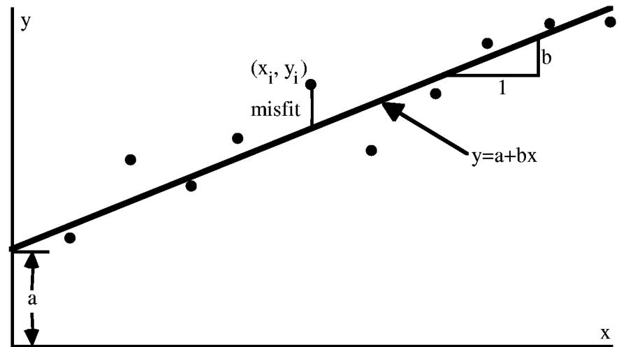  
Figure 0.1 Simple linear regression

More complicated linear regression models can be formed with multiple independent variables:

$$
\mathbf { y } = \mathbf { a } + \mathsf { b } _ { 1 } \mathbf { x } _ { 1 } + \mathsf { b } _ { 2 } \mathbf { x } _ { 2 } + \mathsf { b } _ { 3 } \mathbf { x } _ { 3 } + \mathsf { b } _ { 4 } \mathbf { x } _ { 4 } \ldots \ldots .
$$

Analytical solution of these multiple regression models is described in any standard statistics textbook, together with a variety of other analytically soluble models. However, many models and their misfit functions cannot be expressed in an analytically soluble form. In such a situation, we will need to consider iterative methods of solution.

# 0.4 Iterative Hill-Climbing Techniques

There are many situations where we need to find the global optimum (or a close approximation to the global optimum) of a multidimensional function, but we cannot optimize it analytically. For many years, various hill-climbing techniques have been used for iterative search towards an optimum. The term "hill-climbing" should strictly be applied only to maximizing problems, with techniques for minimizing being identified as "valley-descending." However, a simple reversal of sign converts a minimizing problem into a maximizing one, so it is customary to use the "hill-climbing" term to cover both situations.

A very common optimizing problem occurs when we try to fit some data to a model. The model may include a number of parameters, and we want to choose the parameters to minimize a function representing the "misfit" between the data and the model. The values of the parameters can be thought of as coordinates in a multidimensional space, and the process of seeking an optimum involves some form of systematic search through this multidimensional space.

# 0.4.1 Iterative Incremental Stepping Method

The simplest, moderately efficient way of searching for an optimum in a multidimensional space is by the iterative incremental stepping method, illustrated in Figure 0.2.

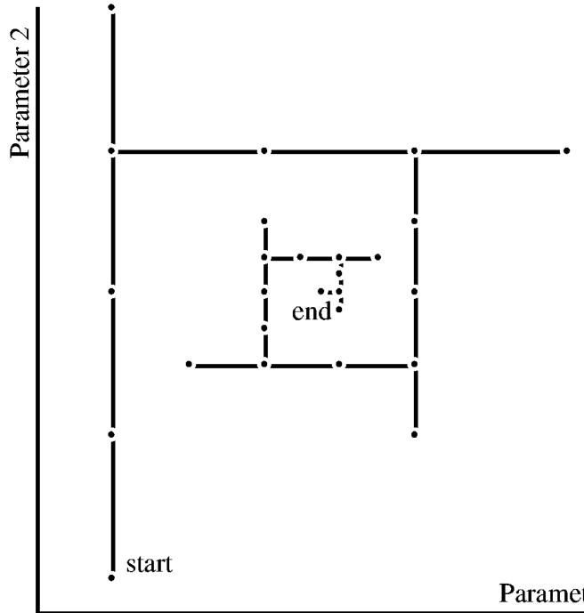  
Figure 0.2 Iterative incremental stepping method

In this simplest form of hill-climbing, we start with a guess as to the coordinates of the optimum. We then change one coordinate by a suitably chosen (or guessed) increment. If the function gets better, we keep moving in the same direction by the same increment. If the function gets worse, we undo the last increment, and start changing one of the other coordinates. This process continues through all the coordinates until all the coordinates have been tested. We then halve the increment, reverse its sign, and start again. The process continues until the increments have been halved enough times that the parameters have been determined with the desired accuracy.

# 0.4.2 An Example: Fitting the Continents Together

A good example of this simple iterative approach is the computer fit of the continents around the Atlantic. This study provided the first direct quantitative evidence for continental drift (Bullard, Everett and Smith, 1965). It had long been observed that the continents of Europe, Africa and North and South America looked as if they fit together. We digitized the spherical coordinates of the contours around the continents, and used a computer to fit the jigsaw together. The continental edges were fit by shifting one to overlay the other as closely as possible. This shifting, on the surface of a sphere, was equivalent to rotating one continental edge by a chosen angle around a pole of chosen latitude and longitude. There were thus three coordinates to choose to minimize the measure of misfit:

The angle of rotation

The latitude and longitude of the pole of rotation

The three coordinates were as shown in Figure O.3, in which point $\mathbf { P _ { i } }$ on one continental edge is rotated to point $\mathbf { P _ { i } } ^ { \prime }$ close to the other continental edge.

The misfit function, to be minimized, was the mean squared under-lap or overlap between the two continental edges after rotation.

If the under-lap or overlap is expressed as an angle of misfit ${ \bf { \alpha } } _ { \bf { { \alpha } } } \mathbf { { \alpha } } _ { \bf { { \alpha } } } \mathbf { { \alpha } } _ { \bf { { \alpha } } } \mathbf { { \alpha } } _ { \bf { { \alpha } } } \mathbf { { \alpha } } _ { \bf { { \alpha } } } \mathbf { { \alpha } } _ { \bf { { \alpha } } } \mathbf { { \alpha } } _ { \bf { { \alpha } } } \mathbf { { \alpha } } _ { \bf { { \alpha } } } \mathbf { { \alpha } } _ { \bf { { \alpha } } }$ , then the misfit function to be minimized is:

$$
\boldsymbol { \mathrm { F } } = \sum \boldsymbol { \mathrm { q } } _ { \mathrm { i } } ^ { 2 } / \boldsymbol { \mathrm { n } }
$$

It can easily be shown that $\mathbf { F }$ is minimized if $\boldsymbol { \Phi }$ , the angle of rotation is chosen so that:

$$
\textstyle \sum \phi _ { \mathrm { i } } = 0
$$

So, for any given center of rotation, the problem can be optimized analytically for the third parameter, the angle of rotation, by simply making the average overlap zero.

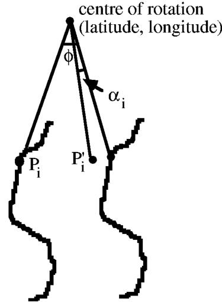  
Figure 0.3 Fitting contours on the opposite sides of an ocean

Minimizing the misfit can therefore be carried out using the iterative incremental stepping method, as shown above in Figure 0.2, with the two parameters being the latitude and longitude of the center of rotation. For each center of rotation being evaluated, the optimum angle of rotation is found analytically to make the average misfit zero.

A fourth parameter was the depth contour at which the continental edges were digitized. This parameter was treated by repeating the study for a number of contours: first for the coastline (zero depth contour) and then for the 200, 1000, 2000 and 4000 meter contours. Gratifyingly, the minimum misfit function was obtained for contours corresponding to the steepest part of the continental shelf, as shown in Figure 0.4.

This result, that the best fit was obtained for the contour line corresponding to the steepest part of the continental shelf, provided good theory-based support for the model. The theory of continental drift postulates that the continents around the Atlantic are the remains of a continental block that has been torn apart. On this theory, we would indeed expect to find that the steepest part of the continental shelf provides the best definition of the continental edge, and therefore best fits the reconstructed jigsaw.

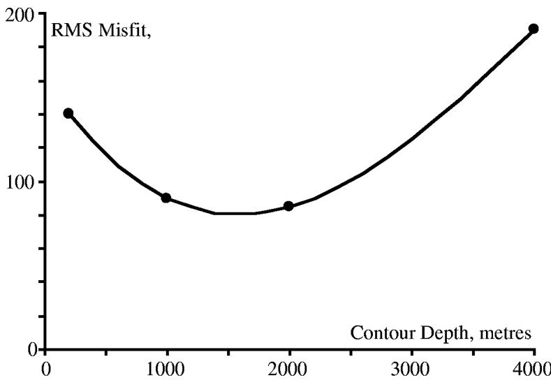  
Figure 0.4 Least misfit for contours of steepest part of continental shelf

The resulting map for the continents around the Atlantic is shown in Figure 0.5. Further examples of theory supporting the model are found in details of the map. For example, the extra overlap in the region of the Niger delta is explained: recent material was washed into the ocean, thus bulging out that portion of the African coastline.

# 0.4.3 Other Hill-Climbing Methods

A more direct approach to the optimum can be achieved by moving in the direction of steepest descent. If the function to be optimized is not directly differentiable, then the method of steepest decent may not improve the efficiency, because the direction of steepest descent may not be easily ascertained.

Another modification that can improve the efficiency of approach to the optimum is to determine the incremental step by a quadratic approximation to the function. The function is computed at its present location, and at two others equal amounts to either side. The increment is then calculated to take us to the minimum of the quadratic fitted through the three points. If the curvature is convex upwards, then the reflection is used. Repeating the process can lead us to the minimum in fewer steps than would be needed if we used the iterative incremental stepping method. A fuller description of this quadratic approximation method can be found in Chapter 6.

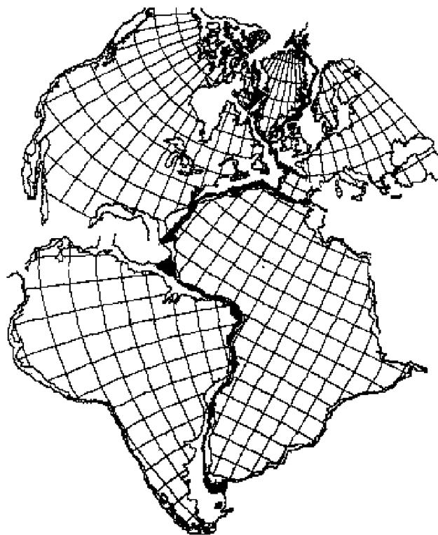  
Figure 0.5 The fit of the continents around the Atlantic

0.4.4 The Danger of Entrapment on Local Optima and Saddle Points

Although the continental drift problem required an iterative solution, the clear graphical nature of its solution suggested that local optima were not a problem of concern. This possibility was in fact checked for by starting the solution at a number of widely different centers of rotation, and finding that they all gave consistent convergence to the same optimum. When only two parameters require iterative solution, it is usually not difficult to establish graphically whether local optima are a problem. If the problem requires iteration on more than two parameters, then it may be very difficult to check for local optima.

While iterating along each parameter, it is also possible to become entrapped at a point minimizing each parameter. The point may be not a local optimum but just a saddle point. Figure 0.6 illustrates this possibility for a problem with two parameters, p and q. The point marked with an asterisk is a saddle point. The saddle point is a minimum with respect to changes in either parameter, p or q. However, it is a maximum along the direction $( \mathfrak { p } { + } \mathfrak { q } )$ , going from the bottom left to the top right of the graph. If we explore by changing each of the parameters p and q in turn, as in Figure 0.2, then we will wrongly conclude that we have reached a minimum.

# 0.4.5 The Application of Genetic Algorithms to Model Fitting

Difficulty arises for problems with multiple local optima, or even for problems where we do not know whether a single optimum is unique. Both the iterative incremental step and the steepest descent methods can lead to the solution being trapped in a local optimum. Restarting the iteration from multiple starting points may provide some safeguard against entrapment in a local minimum. Even then, there are problems where any starting point could lead us to a local optimum before we reached the global optimum. For this type of problem, genetic algorithms offer a preferable means of solution. Genetic algorithms offer the attraction that all parts of the feasible space are potentially available for exploration, so the global minimum should be attained if premature convergence can be avoided.

We will now consider a model building problem where a genetic algorithm can be usefully incorporated into the solution process.

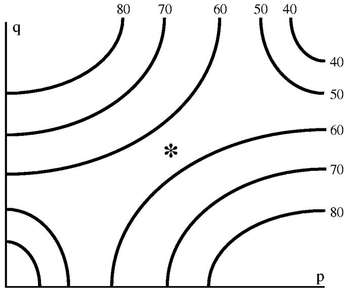  
Figure 0.6 Entrapment at a saddle point

# 0.5 Assay Continuity in a Gold Prospect

To illustrate the application of a genetic algorithm as one tool in fitting a series of hierarchical models, we will consider an example of economic significance.

# 0.5.1 Description of the Problem

There is a copper mine in Europe that has been mined underground since at least Roman times. The ore body measures nearly a kilometer square by a couple of hundred meters thick. It is now worked out as a copper mine, but only a very small proportion of the ore body has been removed. Over the past 40 years, as the body was mined, core samples were taken and assayed for gold and silver as well as copper. About 1500 of these assays are available, from locations scattered unevenly through the ore body.

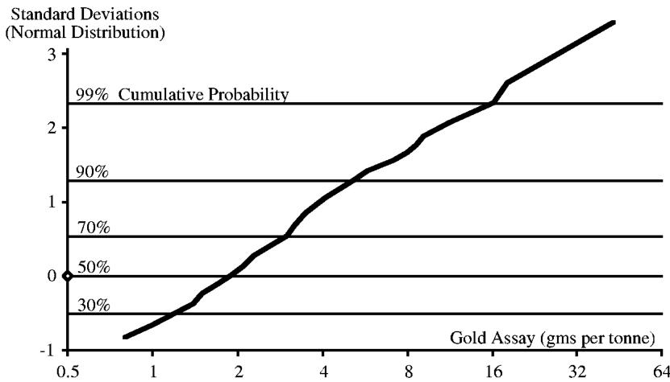  
Figure 0.7 Cumulative distribution of gold assays, on log normal scale

The cumulative distribution of the gold assay values is plotted on a log normal scale in Figure 0.7. The plot is close to being a straight line, confirming that the assay distribution is close to being log normal, as theory would predict for this type of ore body. If the gold concentration results from a large number of random multiplicative effects, then the Central Limit theorem would lead us to expect the logarithms of the gold assays to be normally distributed, as we have found.

The gold assays average about 2.6 g/tonne, have a median of 1.9 g/tonne, and correlate only weakly (0.17) with the copper assays. It is therefore reasonable to suppose that most of the gold has been left behind by the copper mining. The concentration of gold is not enough to warrant underground mining, but the prospect would make a very attractive open-cut mine, provided the gold assays were representative of the whole body.

To verify which parts of the ore body are worth open-cut mining, extensive further core-sample drilling is needed. Drilling is itself an expensive process, and it would be of great economic value to know how closely the drilling has to be carried out to give an adequate assessment of the gold content between the drill holes. If the holes are drilled too far apart, interpolation between them will not be valid, and expensive mistakes may be made in the mining plan. If the holes are drilled closer together than necessary, then much expensive drilling will have been wasted.

# 0.5.2 A Model of Data Continuity

Essentially, the problem reduces to estimating a data "continuity distance" across which gold assays can be considered reasonably well correlated. Assay values that are from locations far distant from one another will not be correlated. Assay values will become identical (within measurement error) as the distance between their locations tends to zero. So the expected correlation between a pair of assay values will range from close to one (actually the test/retest repeatability) when they have zero separation, down to zero correlation when they are far distant from each other. Two questions remain:

•How fast does the expected correlation diminishes with distance?

•What form does the diminution with distance take?

The second question can be answered by considering three points strung out along a straight line, separated by distances $\mathbf { r } _ { 1 2 }$ and ${ \bf r } _ { 2 3 }$ as shown in Figure O.8. Let the correlation between the assays at point 1 and point 2, points 2 and 3, and between points 1 and 3 be $\rho _ { 1 2 }$ $\rho _ { 2 3 }$ , $\rho _ { 1 3 }$ respectively.

$$
\displaystyle \longleftarrow \frac { \mathrm { \bf ~ r } _ { 1 2 } } { \mathrm { \bf ~ p } _ { 1 2 } } \frac { 2 \mathrm {  ~ \ l ~ } _ { 2 3 } } { \mathrm { \bf ~ p } _ { 2 3 } } 3
$$

Figure 0.8 Assay continuity

It can reasonably be argued that, in general, knowledge of the assay at point 2 gives us some information about the assay at point 3. The assay at point 1 tells us no more about point 3 than we already know from the assay at point 2. We have what is essentially a Markov process. This assumption is valid unless there can be shown to be some predictable cyclic pattern to the assay distribution.

Examples of Markov processes are familiar in marketing studies where, for instance, knowing what brand of toothpaste a customer bought two times back adds nothing to the predictive knowledge gained from knowing the brand they bought last time. In the field of finance, for the share market, if we know yesterday's share price, we will gain no further predictive insight into today's price by looking up what the price was the day before yesterday. The same model applies to the gold assays. The assay from point 1 tells us no more about the assay for point 3 than we have already learned from the assay at point 2, unless there is some predictable cyclic behavior in the assays.

Consequently, we can treat $\rho _ { 1 2 }$ and $\rho _ { 2 3 }$ as orthogonal, so:

$$
\begin{array} { r l } & { \mathsf { \rho } _ { 1 3 } = \mathsf { \rho } _ { 1 2 } \bullet \mathsf { \rho } _ { 2 3 } } \\ & { } \\ & { \mathsf { \rho } _ { \mathsf { P } } ( \mathbf { r } _ { 1 3 } ) = \mathsf { \rho } _ { \mathsf { P } } ( \mathbf { r } _ { 1 2 } + \mathbf { r } _ { 2 3 } ) = \mathsf { \rho } _ { \mathsf { P } } ( \mathbf { r } _ { 1 2 } ) \bullet \mathsf { \rho } _ { \mathsf { P } } ( \mathbf { r } _ { 2 3 } ) } \end{array}
$$

To satisfy Equation (9), and the limiting values $\rho ( 0 ) = 1$ , $\rho ( \infty ) = 0$ , we can postulate a negative exponential model for the correlation coefficient $\rho ( \mathbf { r } )$ , as a function of the distance r between the two locations being correlated.

$$
\begin{array} { r l } { \mathbf { M O D E L 1 } } & { { } \ p ( \mathbf { r } ) = \exp ( - \mathrm { k r } ) } \end{array}
$$

Model 1 has a single parameter, $\mathrm { k }$ whose reciprocal represents the distance at which the correlation coefficient falls to $( 1 / \mathrm { e } )$ of its initial value. The value of $\mathrm { k }$ answers our first question as to how fast the expected correlation diminishes with distance. However, the model makes two simplifying assumptions, which we may need to relax.

First, Model 1 assumes implicitly that the assay values have perfect accuracy. If the test/retest repeatability is not perfect, we should introduce a second parameter $\mathsf { a } = \mathsf { p } ( 0 )$ , where a $< 1$ . The model then becomes:

The second parameter, a, corresponds to the correlation that would be expected between repeat samples from the same location, or the test/retest repeatability. This question of the test/retest repeatability explains why we do not include the cross-products of assays with themselves to establish the correlation for zero distance. The auto cross-products would have an expectation of one, since they are not subject to test/retest error.

The other implicit assumption is that the material is homogeneous along the three directional axes x, y and $\mathbf { Z }$ If there is geological structure that pervades the entire body, then this assumption of homogeneity may be invalid. We then need to add more parameters to the model, expanding $\mathbf { k r }$ to allow for different rates of fall off $( \mathbf { k } _ { \mathrm { a } } , \mathbf { k } _ { \mathrm { b } } , \mathbf { k } _ { \mathrm { c } } )$ , along three orthogonal directions, or major axes, $( \mathbf { r } _ { \mathrm { a } } \ , \ \mathbf { r } _ { \mathrm { b } } \ , \ \mathbf { r } _ { \mathrm { c } } )$ .This modification of the model is still compatible with Figure 0.8 and Equation (9), but allows for the possibility that the correlation falls off at different rates in different directions.

$$
\mathrm { k } \mathbf { r } = \mathrm { s q r t } ( \mathrm { k _ { a } } ^ { 2 } \mathrm { \mathbf { r } _ { a } } ^ { 2 } + \mathrm { k _ { b } } ^ { 2 } \mathrm { \mathbf { r } _ { b } } ^ { 2 } + \mathrm { k _ { c } } ^ { 2 } \mathrm { \mathbf { r } _ { c } } ^ { 2 } )
$$

These three orthogonal directions of the major axes $( \mathbf { r } _ { \mathrm { a } } , \mathbf { r } _ { \mathrm { b } } , \mathbf { r } _ { \mathrm { c } } )$ can be defined by a set of three angles $( \alpha , \beta , \gamma )$ . Angles $\alpha$ and $\beta$ define the azimuth (degrees east of north) and inclination (angle upwards from the horizontal) of the first major axis. Angle $\gamma$ defines the direction (clockwise from vertical) of the second axis, in a plane orthogonal to the first. The direction of the third major axis is then automatically defined, being orthogonal to each of the first two. If two points are separated by distances $( \mathbf { x } , \mathbf { y } , \mathbf { z } )$ along north, east and vertical coordinates, then their separation along the three major axes is given by:

$$
\mathrm { \Delta r _ { a } = x . c o s \alpha . c o s \beta + y . s i n \alpha . c o s \beta \mathrm { + z . s i n \beta } }
$$

$$
\mathbf { r } _ { \mathrm { b } } = - \mathbf { x } ( \mathrm { s i n o . s i n } \gamma + \mathrm { c o s o . . s i n } \beta . \mathrm { c o s } \gamma ) + \mathbf { y } ( \mathrm { c o s o . s i n } \gamma - \mathrm { s i n } \alpha . \mathrm { s i n } \beta . \mathrm { c o s } \gamma ) + \mathbf { z } . \mathrm { c o s } \beta . \mathrm { c o s } \gamma
$$

$$
\mathbf { r } _ { c } = \mathrm { x } ( \mathrm { s i n } \alpha . \mathrm { c o s } \gamma \mathrm { - c o s } \alpha . \mathrm { s i n } \beta . \mathrm { s i n } \gamma ) - \mathrm { y } ( \mathrm { c o s } \alpha . \mathrm { c o s } \gamma + \mathrm { s i n } \alpha . \mathrm { s i n } \beta . \mathrm { s i n } \gamma ) + \mathbf { z } . \mathrm { c o s } \beta . \mathrm { s i n } \gamma
$$

The six parameters $( \mathrm { k } _ { \mathrm { a } } , \mathrm { k } _ { \mathrm { b } } , \mathrm { k } _ { \mathrm { c } } )$ and $( \alpha , \beta , \gamma )$ define three-dimensional ellipsoid surfaces of equal assay continuity. The correlation between assays at two separated points is now $\rho ( \mathbf { r } _ { \mathrm { a } } , \mathbf { r } _ { \mathrm { b } } , \mathbf { r } _ { \mathrm { c } } )$ , a function of $( \mathbf { r } _ { \mathrm { a } } , \mathbf { r } _ { \mathrm { b } } , \mathbf { r } _ { \mathrm { c } } )$ , the distance between the points along the directions of the three orthogonal major axes.

Allowing for the possibility of directional inhomogeneity, the model thus becomes:

$$
\rho ( \mathbf { r } _ { \mathrm { a } } , \mathbf { r } _ { \mathrm { b } } , \mathbf { r } _ { \mathrm { c } } ) = \mathrm { a . e x p } [ - \mathrm { s q r t } ( \mathrm { k _ { a } } ^ { 2 } { \mathbf { r } _ { \mathrm { a } } } ^ { 2 } + \mathrm { k _ { b } } ^ { 2 } { \mathbf { r } _ { \mathrm { b } } } ^ { 2 } + \mathrm { k _ { c } } ^ { 2 } { \mathbf { r } _ { \mathrm { c } } } ^ { 2 } ) ]
$$

In Model 3, the correlation coefficient still falls off exponentially in any direction, but the rate of fall-off depends upon the direction. Along the first major axis, the correlation falls off by a ratio $1 / \mathrm { e }$ for an increase of $1 /  { \mathrm { k _ { a } } }$ in the separation. Along

the second and third axes, the correlation falls off by 1/e when the separation increases by $1 / \mathrm { k _ { b } }$ and $1 /  { \mathrm { k } _ { \mathrm { c } } }$ , respectively.

# 0.5.2.1 A Model Hierarchy

In going from Model 1 to Model 2 to Model 3, as in Equations (10), (11) and (16), we are successively adding parameters:

$$
\begin{array} { l } { \displaystyle { \boldsymbol { \rho } } ( \mathbf { r } ) = \exp ( - \mathrm { k r } ) } \\ { \displaystyle { \boldsymbol { \rho } } ( \mathbf { r } ) = \mathrm { a . e x p } ( - \mathrm { k r } ) } \\ { \displaystyle { \boldsymbol { \rho } } ( \mathbf { r } _ { \mathrm { a } } , \mathbf { r } _ { \mathrm { b } } , \mathbf { r } _ { \mathrm { c } } ) = \mathrm { a . e x p } [ - \mathrm { s q r t } ( { \mathrm { k _ { a } } ^ { \mathrm { ~ 2 ~ } } } { \mathbf { r } _ { \mathrm { a } } } ^ { 2 } + { \mathrm { k _ { b } } ^ { \mathrm { ~ 2 ~ } } } { \mathbf { r } _ { \mathrm { b } } } ^ { 2 } + { \mathrm { k _ { c } } ^ { \mathrm { ~ 2 ~ } } } { \mathbf { r } _ { \mathrm { c } } } ^ { 2 } ) ] } \end{array}
$$

The three models can thus be considered as forming a hierarchy. In this hierarchy, each successive model adds explanatory power at the cost of using up more degrees of freedom in fitting more parameters. Model 1 is a special case of Model 2, and both are special cases of Model 3. As we go successively from Model 1 to Model 2 to Model 3, the goodness of fit (the minimized misfit function) cannot get worse, but may improve. We have to judge whether the improvement of fit achieved by each step is sufficient to justify the added complexity of the model.

# 0.5.3 Fitting the Data to the Model

As we have seen, the assay data were found to closely approximate a log normal distribution. Accordingly, the analysis to be described here was carried out on standardized logarithm values of the assays. Some assays had been reported as zero gold content: these were in reality not zero, but below a reportable threshold. The zero values were replaced by the arbitrary low measure of 0.25 g/tonne before taking logarithms. The logarithms of the assay values had their mean subtracted and were divided by the standard deviation, to give a standardized variable of zero mean, unit standard deviation and approximately normal distribution. The cross-product between any two of these values could therefore be taken as an estimate of the correlation coefficient. The cross products provide the raw material for testing Models 1, 2 and 3.

The 1576 assay observations yielded over 1,200,000 cross products (excluding the cross-products of assays with themselves). Of these cross-products, 362 corresponded to radial distances less than a meter, 1052 between 1 and 2 meters, then steadily increasing numbers for each 1-meter shell, up to 1957 in the interval between 15 and 16 meters. The average cross-product in each concentric shell can be used to estimate the correlation coefficient at the center of the shell.

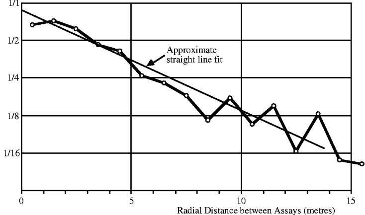  
Figure 0.9 Log correlations as a function of r, the inter-assay distance

Figure O.9 shows the average cross-product for each of these 1-meter shells. This provides an estimate of the correlation coefficient for each radial distance. The vertical scale is plotted logarithmically, so the negative exponential Model 1 or 2 (Equations 10 or 11) should yield a negatively sloping straight-line graph. The results appear to fit this model reasonably well.

The apparently increasing scatter as the radial distance increases is an artifact of the logarithmic scale. Figure 0.10 shows the same data plotted with a linear correlation scale. The curved thin line represents a negative exponential fitted by eye. It is clear that the scatter in the observed data does not vary greatly with the radial distance. There is also no particular evidence of any cyclic pattern to the assay values. The data provide empirical support for the exponential decay model that we had derived theoretically.

# 0.5.4 The Appropriate Misfit Function

The cross product of two items selected from a pair of correlated standardized normal distributions has an expected value equal to the correlation between the two distributions. We can accordingly construct a misfit function based upon the difference between the cross-product and the modeled correlation coefficient.

So, in using our Models 1, 2 or 3 to fit the correlation coefficient to the observed cross-products $\mathfrak { p } _ { \mathrm { i } }$ as a function of actual separation $\underline { { \mathbf { r } } } _ { \mathbf { i } } = ( \mathbf { x _ { i } } , \mathbf { y _ { i } } , \mathbf { z _ { i } } )$ , our objective is to minimize the misfit function:

In fitting a model, we are finding parameters to minimize F. The residual F, and the amount it is reduced as we go through the hierarchy of models, helps in judging the meaningfulness and overall explanatory power of the model.

We have seen that the available 1576 observations could yield more than a million cross-products. The model fitting to be described here will be based upon the 4674 cross-products that existed for assays separated by less than 5 meters. As discussed above, the cross-products were formed from the standardized deviations of the logarithms of the gold assays. Cross-products of assays with themselves were of course not used in the analysis.

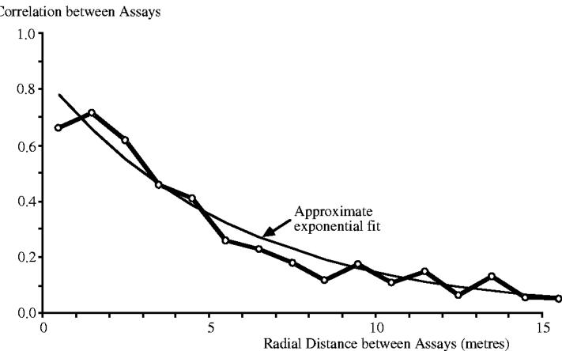  
Figure 0.10 Correlations as a function of r, the inter-assay distance

Using data for separations of less than 5 meters is admittedly rather arbitrary. To use the more than a million available cross-products would take too much computer time. An alternative approach would be to sample over a greater separation range. However, given the exponential fall-off model, the parameters will be less sensitive to data for greater separations. So it was decided to carry out these initial investigations with a manageable amount of data by limiting the separation between assays to 5 meters. The theoretical model of Figure 0.8 and Equation (9) gives us the reassurance that establishing the model for separations less than 5 meters should allow extrapolation to predict the correlation for greater separations.

# 0.5.5 Fitting Models of One or Two Parameters

We will first consider the models that require only one or two parameters. The misfit function for these models can be easily explored without recourse to a genetic algorithm. The analysis and graphs to be reported here were produced using an Excel spreadsheet.

# 0.5.5.1 Model 0

If we ignore the variation with r, the inter-assay distance, we would just treat the correlation coefficient as a constant, and so could postulate:

$$
\mathbf { M O D E L } \ : 0 \qquad \mathbf { \rho ( r ) = a }
$$

This model is clearly inadequate, since we have already strong evidence that $\rho$ does vary strongly with r. The estimate "a" will just be the average cross-product within the 5-meter radius that we are using data from. If we increased the data radius, the value of the parameter "a" would decrease.

The parameter "a" can be simply estimated analytically by computing the average value of the cross-product. The same answer can be obtained iteratively by minimizing the misfit function F in Equation (17), using the hill-climbing methods described in the earlier sections. The results are shown in Figure 0.11. The misfit function is U-shaped, with a single minimum. This procedure gives us a value of the misfit function, 1.4037, to compare with that obtained for the other models.

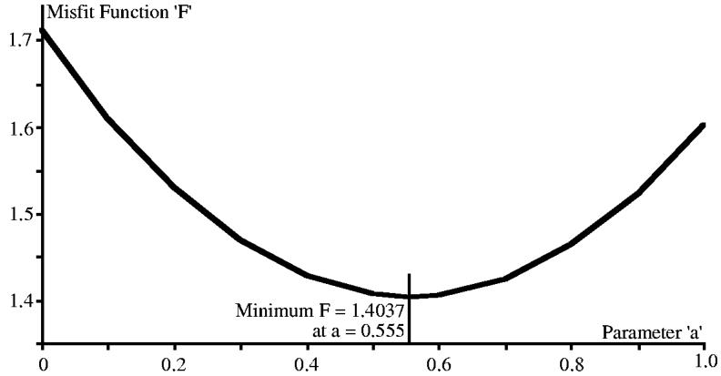  
Figure 0.11 Fitting model 0: $\boldsymbol { \rho } ( \mathbf { r } ) = \mathbf { a }$

It should be pointed out that Model 0 and Model 1 do not share a hierarchy, since each contains only a single parameter and they have different model structures. Models 2 and 3 can be considered as hierarchical developments from either of them.

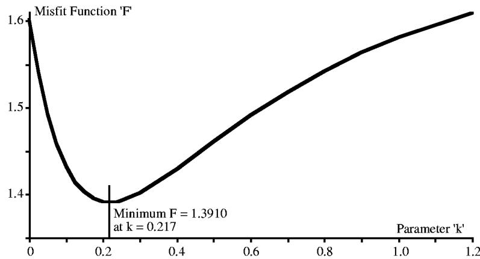  
Figure 0.12 Fitting model 1: $\rho ( \mathbf { r } ) = \mathbf { e x p } ( \mathbf { - k r } )$

# 0.5.5.2 Model 1

Model 1 again involves only a single parameter, k which cannot be solved for analytically. An iterative approach (as described in the earlier sections) is needed to find the value of the parameter to minimize the misfit function. Only one parameter is involved. We can easily explore the range of this parameter over its feasible range $( \mathbf { k } > 0 )$ and confirm that we are not trapped in a local minimum, so the model does not require a genetic algorithm. The graph in Figure 0.12 shows the results of this exploration.

Model 1 gives a misfit function of 1.3910, somewhat better than the misfit of 1.4037 for Model 0. This is to be expected, because the exponential decline with distance of Model 1 better agrees with our theoretical understanding of the way the correlation coefficient should vary with distance between the assays.

# 0.5.5.3 Model 2

Introducing a second parameter "a" as a constant multiplier forms Model 2. Since there are still only two parameters, it is easy enough to explore the feasible space iteratively, and establish that there is only the one global minimum for the misfit function F.

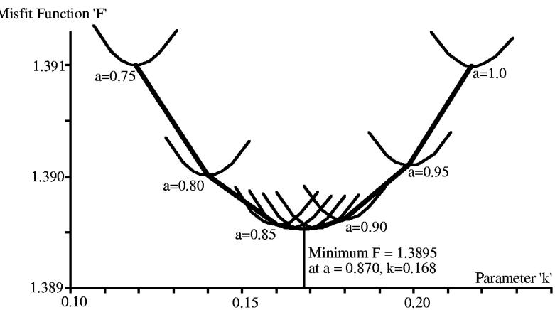  
Figure 0.13 Fitting model 2: $\rho ( \mathbf { r } ) = \mathbf { a . e x p } ( \mathbf { - k r } )$

The results for Model 2 are summarized in Figure 0.13. The thin-line graphs each show the variation of F with parameter k for a single value of the parameter a. The graphs are U-shaped curves with a clear minimum. The locus of these minima is the thick line, which is also U-shaped. Its minimum is the global minimum, which yields a minimum misfit function F equal to 1.3895, a marked improvement over the 1.3910 of Model 1. For this minimum, the parameter "a" is equal to 0.87 and parameter k equals 0.168.

It should be pointed out that a hybrid analytical and iterative combination finds the optimum fit to Model 2 more efficiently. For this hybrid approach, we combine Equations (11) and (17), to give the misfit function for Model 2 as:

$$
\mathrm { F = \sum [ p _ { i } - a . e x p ( - k r _ { i } ) ] ^ { 2 } / n }
$$

Setting to zero the differential with respect to "a,"

$$
\mathrm { a } = \sum [ \mathrm { p } _ { \mathrm { i } } . \mathrm { e x p } ( \mathrm { - k r } _ { \mathrm { i } } ) ] / \sum [ \mathrm { e x p } ( \mathrm { - 2 k r } _ { \mathrm { i } } ) ]
$$

So for any value of $\mathrm { k }$ , the optimum value of a can be calculated directly, without iteration. There is therefore need to explore only the one parameter, $\mathrm { k }$ ,iteratively. This procedure leads directly to the bold envelope curve of Figure 0.13.

# 0.5.5.4 Comparison of Model 0, Model 1 and Model 2

Figure 0.14 summarizes the results of the three models analyzed so far.

Model 0 is clearly inadequate, because it ignores the relation between correlation and inter-assay distance. Model 2 is preferable to Model 1 because it gives an improved misfit function, and because it allows for some test/retest inaccuracy in the assays.

Correlation between Assays

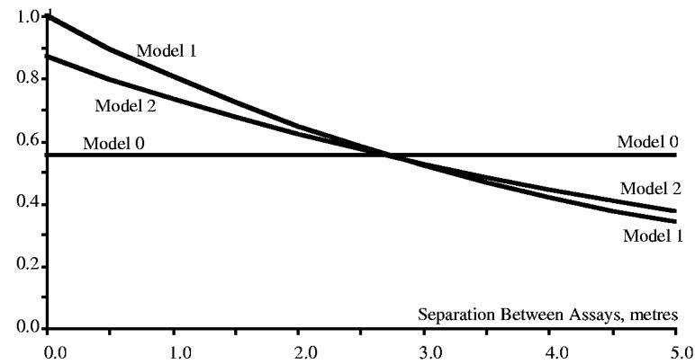  
Figure 0.14 Comparing model 0, model 1 and model 2

# 0.5.5.5 Interpretation of the Parameters

The assays are all from different locations. But the value 0.87 of the intercept parameter $\mathbf { \ddot { a } } ^ { , \ast }$ for Model 2 can be interpreted as our best estimate of the correlation that would be found between two assays made of samples taken from identical locations. However, each of these two assays can be considered as the combination of the "true" assay plus some orthogonal noise. Assuming the noise components of the two assays to be not correlated with each other, the accuracy of a single estimate, or the correlation between a single estimate and the "true" assay is given by $\surd \mathrm { a }$ .

The value 0.168 of the exponential slope parameter "k" tells us how quickly the correlation between two assays dies away as the distance between them decreases. The correlation between two assays will have dropped to one-half at a distance of about 3 meters, a quarter at 6 meters, and so on. Given that the data to which the model has been fitted includes distances up to only 5 meters, it might be objected that conclusions for greater distances are invalid extrapolations "out of the window." This objection would be valid if the model was purely exploratory, without any theory base. However, our multiplicative model of Equation (8) is based on theory. It predicts that doubling the inter-assay distance should square the correlation coefficient. With this theoretical base, we are justified in extrapolating the exponential fit beyond the data range, as long as we have no reason to doubt the theoretical model.

# 0.5.6 Fitting the Non-homogeneous Model 3

Model 3, as postulated in Equation (16), replaces the single distance variation parameter $^ { \ast } \mathrm { k } ^ { \prime \prime }$ by a set of six parameters. This allows for the fact that structure within the ore body may cause continuity to be greater in some directions than in others.

$$
\rho ( \mathbf { r } _ { \mathrm { a } } , \mathbf { r } _ { \mathrm { b } } , \mathbf { r } _ { \mathrm { c } } ) = \mathrm { a . e x p [ - s q r t ( k _ { \mathrm { a } } ^ { 2 } { \bf r } _ { \mathrm { a } } ^ { 2 } + k _ { \mathrm { b } } ^ { 2 } { \bf r } _ { \mathrm { b } } ^ { 2 } + k _ { \mathrm { c } } ^ { 2 } { \bf r } _ { \mathrm { c } } ^ { 2 } ) ] }
$$

We saw that the model includes seven parameters, the test/retest repeatability $\mathbf { \ddot { a } } ^ { , , }$ ; the three fall-off rates $( \operatorname { k } _ { a } , \ \operatorname { k } _ { \mathrm { b } } , \ \operatorname { k } _ { c } )$ ; and three angles $( \textsf { \textsf { d } } , \textsf { \textsf { \textsf {beta } } } , \textsf { \textsf { Y } } )$ defining the directions of the major axes, according to Equations (13) to (15). These last six parameters allow for the possibility that the orebody is not homogeneous. They can be used to define ellipsoid surfaces of equal continuity.

Although we cannot minimize the misfit function analytically with respect to these six parameters, we can again minimize analytically for the multiplying parameter "a." For any particular set of values of the parameters $( \mathrm { k } _ { a } , \mathrm { k } _ { \mathrm { b } } , \mathrm { k } _ { \mathrm { c } } )$ ; and three angles $( \alpha , \beta , \gamma )$ , the derivative ∂F/∂a is set to zero when:

$$
\mathrm { a = \sum [ p _ { i } . e x p [ - s q r t { ( k _ { a } ^ { 2 } r _ { a i } ^ { 2 } + k _ { b } ^ { 2 } r _ { b i } ^ { 2 } + k _ { c } ^ { 2 } r _ { c i } ^ { 2 } ) } ] ] / \sum [ e x p [ - 2 . s q r t { ( k _ { a } ^ { 2 } r _ { a i } ^ { 2 } + k _ { b } ^ { 2 } r _ { b i } ^ { 2 } + k _ { c } ^ { 2 } r _ { c i } ^ { 2 } ) } ] ] }
$$

In Equation (22), the cross-products $\mathbf { p } _ { \mathrm { i } }$ are values for assay pairs with separation $( \mathbf { r } _ { \mathrm { a i } } , \mathbf { r } _ { \mathrm { b i } } , \mathbf { r } _ { \mathrm { c i } } )$ . The model can thus be fitted by a hybrid algorithm, with one of the parameters being obtained analytically and the other six by using iterative search or a genetic algorithm.

An iterative search is not so attractive in solving for six parameters, because it now becomes very difficult to ensure against entrapment in a local minimum. Accordingly, a genetic algorithm was developed to solve the problem.

# 0.5.6.1 The Genetic Algorithm Program

The genetic algorithm was written using the simulation package Extend, with each generation of the genetic algorithm corresponding to one step of the simulation. The use of Extend as an engine for a genetic algorithm is described more fully in Chapter 6. The coding within Extend is in C. The program blocks used for building the genetic algorithm model are provided on disk, in an Extend library titled "GeneticCorrLib." The Extend model itself is the file "GeneticCorr."

The genetic algorithm used the familiar genetic operators of selection, crossover and mutation. Chapter 6 includes a detailed discussion of the application of these operators to a model having real (non-integer) parameters. It will be sufficient here to note that:

The population size used could be chosen, but in these runs was 20.   
•Selection was elite (retention of the single best yet solution) plus tournament (selection of the best out of each randomly chosen pair of parents).   
• "Crossover" was effected by random assignment of each parameter value, from the two parents to each of two offspring.   
•"Random Mutation" consisted of a normally distributed adjustment to each of the six parameters. The adjustment had zero mean and a preset standard deviation, referred to as the "mutation radius."   
• "Projection Mutation" involved projection to a quadratic minimum along a randomly chosen parameter. This operator is discussed fully in Chapter 6.   
• In each generation, the "best yet" member was unchanged, but nominated numbers of individuals were subjected to crossover, mutation and projection mutation. In these runs, in each generation, ten individuals (five pairs) were subjected to crossover, five to random mutation, and four to projection mutation. Since the method worked satisfactorily, optimization of these numbers was not examined.

The solution already obtained for Model 2 was used as a starting solution. For this homogenous solution, the initial values of $( \mathrm { k } _ { \mathrm { a } } , \mathrm { k } _ { \mathrm { b } } , \mathrm { k } _ { \mathrm { c } } )$ were each set equal to 0.168, and three angles $( \alpha , \beta , \gamma )$ were each set equal to zero.

The model was run for a preset number of generations (500), and kept track of the misfit function for the "best yet" solution at each generation. It also reported the values of the six iterated parameters for the "best yet" solution of the most recent generation, and calculated the "a" parameter, according to Equation (22).

As an alternative to running the genetic algorithm, the simulation could also be used in "Systematic Projection" mode. Here, as discussed in Chapter 6, each of the parameters in turn is projected to its quadratic optimum. This procedure is repeated in sequence for all six parameters until an apparent minimum is reached. As we have seen earlier, such a systematic downhill projection faces the possibility of entrapment on a local optimum, or even on a saddle point (see Figure 0.6).

# 0.5.6.2 Results Using Systematic Projection

The results of three runs using systematic projection are graphed in Figure 0.15. For each iteration, the solution was projected to the quadratic minimum along each of the six parameters $( \operatorname { k } _ { \mathrm { a } } , \operatorname { k } _ { \mathrm { b } } , \operatorname { k } _ { \mathrm { c } } )$ and $( \alpha , \beta , \gamma )$ . The order in which the six parameters were treated was different for each of the three runs. It is clear that at least one of the runs has become trapped on a local optimum (or possibly a saddle point, as in Figure 0.6).

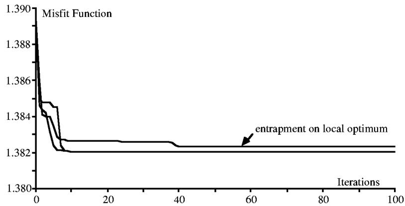  
Figure 0.15 Fit of model 3 using systematic projection

0.5.6.3 Results Using the Genetic Algorithm

Figure 0.16 shows the results for seven runs of the genetic algorithm. Although these took much longer to converge, they all converged to the same solution, suggesting that the genetic algorithm has provided a robust method for fitting the multiple parameters of Model 3.

# 0.5.6.4 Interpretation of the Results

At convergence, the parameters had the following values:

$$
= 0 . 8 8 ; ( \mathbf { k } _ { \mathrm { a } } , \mathbf { k } _ { \mathrm { b } } , \mathbf { k } _ { \mathrm { c } } ) = ( 0 . 3 0 7 , 0 . 0 0 1 , 0 . 0 0 6 ) ; ( \mathbf { \alpha } \propto \mathrm { , \beta } , \gamma ) = ( 3 4 ^ { \circ } , 1 9 ^ { \circ } , - 4 3 ^ { \circ } )
$$

The test/retest repeatability of 0.88 is similar to the 0.87 obtained for Model 2.

The results suggest that the fall-off of the correlation coefficient is indeed far from homogeneous with direction. Along the major axis, the fall-off rate is 0.307 per meter. This means the correlation decreases to a proportion $1 / \mathrm { e }$ in each 3.3 $( = 1 / 0 . 3 0 7 )$ meters. The figure corresponds to a halving of the correlation coefficient every 2.3 meters.

Along the other two axes, the fall-off of the correlation coefficient is much slower, on the order of $1 \%$ or less per meter.

The results are compatible with the geologically reasonable interpretation that the material has a planar or bedded structure. The correlation would be expected to fall off rapidly perpendicular to the planes, but to remain high if sampled within a plane.

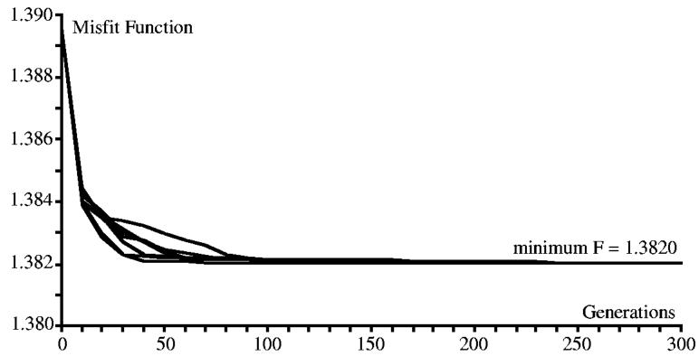  
Figure 0.16 Fit of model 3 using the genetic algorithm

The direction of the major axis is $3 4 ^ { \circ }$ east of north, pointing $1 9 ^ { \circ }$ up from the horizontal. The planes are therefore very steeply dipped $7 1 ^ { \circ }$ of horizontal). Vertical drilling may not be the most efficient form of drilling, since more information would be obtained by sampling along the direction of greatest variability, along the major axis. Collecting samples from trenches dug along lines pointing $3 4 ^ { \circ }$ east of north may be a more economical and efficient way of gathering data.

Further analysis of data divided into subsets from different locations within the project would be useful to determine whether the planar structure is uniform, or whether it varies in orientation in different parts of the ore body. If the latter turns out to be the case, then the results we have obtained represent some average over the whole prospect.

# 0.6 Conclusion

In this chapter, I have attempted to place genetic algorithms in context by considering some general issues of model building, model testing and model fitting. We have seen how genetic algorithms fit in the top end of a hierarchy of analytical and iterative solution methods.

The models that we wish to fit tend to be hierarchical, with models of increasing complexity being adopted only when simpler models prove inadequate. Similarly, analytical, hill-climbing and genetic algorithms form a hierarchy of tools. There is generally no point using an iterative method if an analytical one is available to do the job more efficiently. Similarly, genetic algorithms do not replace our standard techniques, but rather supplement them. As we have seen, hybrid approaches can be fruitful. Analytical techniques embedded in iterative solutions reduce the number of parameters needing iterative solution. Solutions obtained by iterative techniques on a simpler model provide useful starting values for parameters in a genetic algorithm.

Thus, genetic algorithms are most usefully viewed, not as a self-contained area of study, but rather as providing a useful set of tools and techniques to combine with methods of older vintage to enlarge the areas of useful modeling.

# Reference

Bullard E.C. Everett J.E. & Smith A.G. (1965). The fit of the continents around the Atlantic, Philosophical Transactions of the Royal Society, 258, 41-51.

# Chapter 1 Compact Fuzzy Models and Classifiers through Model Reduction and Evolutionary Optimization

Hans Roubos1 and Magne Setnes2

1 Delft University of Technology, Faculty of Information Technology and   
Sciences, Control Laboratory,   
P.O. Box 5031,   
2600 GA Delft,   
The Netherlands,   
hans@ieee.org,   
http://lcewww.et.tudelft.nl/   
2 Heineken Technical Services, Research & Development,   
Burgemeester Smeetsweg 1,   
2382 PH Zoeterwoude,   
The Netherlands, magne@ieee.org

# Abstract

The automatic design of fuzzy rule-based models and classifiers from data is considered. It is recognized that both accuracy and transparency are of major importance and we seek to keep the rule-based models small and comprehensible. An iterative approach for developing such fuzzy rule-based models is proposed. First, an initial model is derived from the data. Subsequently, a real-coded genetic algorithm (GA) is applied in an iterative fashion together with a rule base simplification algorithm in order to optimize and simplify the model, respectively. The proposed modeling approach is demonstrated for a system identification and a classification problem. Results are compared to other approaches in the literature. The proposed modeling approach gives more compact, interpretable and accurate models.

# 1.1 Introduction

Fuzzy sets and fuzzy logic, introduced in 1965 by Zadeh [1], are applied in a wide variety of disciplines. Fuzzy modeling is one of those disciplines which is often used in systems identification and control, fault diagnosis, classification and decision support systems [2,3]. Like many non-symbolic modeling methods such as neural networks, fuzzy models are also universal approximators [4]. However, fuzzy models differ from non-symbolic methods mainly in that they can represent knowledge in an inspectable manner using fuzzy if-then rules. This facilitates validation and correction by human experts and provides a way of communicating with the users. Fuzzy models can be built by encoding expert knowledge into linguistic rules, giving a transparent system with knowledge that can be maintained and expanded by human experts. However, knowledge acquisition is not a trivial task. Experts are not always available, and their knowledge is often incomplete, episodic and time-varying. Hence, there is an interest in data-driven fuzzy modeling.

Different approaches have been proposed to obtain fuzzy models from data. Most approaches, however, utilize only the function approximation capabilities of fuzzy systems, and little attention is paid to the qualitative aspects. This makes them less suited for applications in which emphasis is not only on accuracy, but also on interpretability, computational complexity and maintainability [5,6,7]. This chapter also focuses on the problem of obtaining compact, interpretable and accurate fuzzy rule-based models from data. We propose to combine the optimization ability of genetic algorithms (GAs) with other modeling and rulebased simplification tools.

GAs have received a lot of attention in systems modeling, owing its popularity to the possibility of searching irregular and high-dimensional solution spaces. GAs have been applied to learn both the antecedent and consequent parts of fuzzy rules, and models with both fixed and varying number of rules have been considered [8,9,10]. Also, GAs have been combined with other techniques like fuzzy clustering [11,12], neural networks [13,14,15], statistical information criteria [16], Kalman filters [16], hill-climbing [14] and even fuzzy expert control of the GAs operators [17], to mention some. This has resulted in a wide collection of GA-fuzzy modeling tools, but sadly, the transparency and compactness of the resulting rule-based model is often not considered to be of importance.

We show that different tools can be favorably combined to obtain compact fuzzy rule-based models of the Takagi-Sugeno (TS) type [18] with low complexity and good approximation accuracy. A modeling scheme is presented that combines three previously studied tools for rule-based modeling: fuzzy clustering [19], similarity-driven simplification [20], and constrained GAs [21,22]. By combining these tools, a powerful fuzzy modeling scheme is obtained. The algorithm starts with an initial model of locally identified rules, obtained by means of fuzzy clustering in the product space of sampled data. Fuzzy clustering helps ensure that the initial model is of low complexity with rules that cover the relevant regions of the systems input-output space. Thereafter, the fuzzy rule-based model is simplified and optimized in an iterative scheme using a constrained real-coded GA for optimization and the similarity-driven rule base simplification method. A multi-criterion objective is used by the GA to search not only for model accuracy but also for model redundancy. This redundancy is used by the simplification tool to reduce and simplify the fuzzy rule-based model. The result is a compact fuzzy rule-based model of low complexity with high accuracy. Finally, the GA is applied once with a criterion function where the redundancy is suppressed in order to get both distinguishable and accurate rules.

Next, Section 1.2 introduces fuzzy modeling and describes how to obtain an initial fuzzy model. In Section 1.3 transparency issues and the rule base simplification method are discussed and some iterative modeling schemes are proposed. Section 1.4 presents the GA-based optimization strategy. In Section 1.5, the method is demonstrated by means of two examples: (i) a nonlinear dynamic systems model and (ii) the Iris classification problem. The examples are known from the literature, and the results are compared to other methods published. Finally, Section 1.6 concludes this chapter.

# 1.2 Fuzzy Modeling

An important characteristic of fuzzy models is that they are based on partitioning information into fuzzy regions by means of fuzzy sets [23]. Contrary to classical set theory where a crisp set divides the universe of discourse into two groups, members and non-members, fuzzy sets allows us to describe various forms of gradual transition from total membership to total non-membership. This allows for smooth transitions from one region of operation to another. In each of these regions, the characteristics of the system are more or less different. The fuzzy model is typically a rule base with fuzzy rules capturing these characteristics by means of if-then rules with fuzzy predicates that establish relations between the relevant system variables (e.g., inputs and outputs). When the fuzzy predicates are associated with linguistic terms (labels), the fuzzy model becomes a qualitative description of the system using rules like

If the temperature is moderate and the volume is small then the pressure is low.

The fuzzy sets associated with the labels moderate, small and low are given by membership functions defined in the numerical domain of the respective system variables, temperature, volume and pressure, as illustrated in Figure 1.1. Such models are often called linguistic fuzzy models.

One of the most commonly used inference mechanisms in fuzzy models is the compositional rule of inference [23], a generalization of the traditional modus ponens known from classical logic. In applying this inference, the fuzzy model is seen as a relation R defined on $\mathrm { X } \times \mathrm { Y }$ , where $\mathbf { X }$ is the premise space and Y is the consequent space. Each rule is a fuzzy relation defining a locally valid model.

The total relation is composed by combining the relations defined by the individual rules. Different operators can be used for implementing this type of fuzzy inference. A method proposed by Mamdani [24] is frequently encountered in control engineering [25]. Mamdani fuzzy models use rules in which both the premise and consequent are described by fuzzy sets (Figure 1.1). Another fuzzy model type, often used in systems modeling and control, is the Takagi-Sugeno (TS) model [18]. Like the Mamdani model, it has a fuzzy premise; the consequents of the rules, however, are defined by (linear) functions of the premise variables. This makes them more suitable for modeling dynamic systems and for data-driven modeling. In the following we will consider fuzzy models of the TS type.

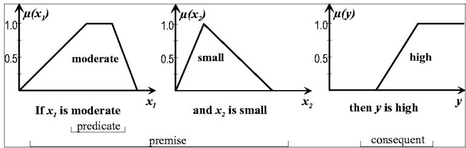  
Figure 1.1 Example of a linguistic fuzzy rule

# 1.2.1 The Takagi-Sugeno Fuzzy Model

Rule-based models of the TS type [18] are suitable for the approximation of a broad class of functions. The TS model consists of a set of rules where the rule consequents are often taken to be linear functions of the inputs:

$R _ { i } : \mathbf { H } x _ { 1 }$ is $A _ { i 1 }$ and ... $x _ { n }$ is $A _ { i n }$ then

$$
g _ { i } = p _ { i 1 } x _ { 1 } + . . . , p _ { i n } x _ { n } + p _ { i ( n + 1 ) } , ~ i = 1 , . . . , M .
$$

Here, $\pmb { x } = [ x _ { 1 } , \ x _ { 2 } , \ldots , \ x _ { n } ] ^ { \mathrm { T } }$ is the input vector and $g _ { i }$ the output (consequent). $R _ { i }$ denotes the ith rule, and $A _ { i 1 } , . . . , A _ { i n }$ are fuzzy sets defined in the antecedent space by membership functions $\mu _ { A i j } ( x _ { j } ) : \ \mathfrak { R } \to [ 0 , 1 ]$ , $p _ { i 1 } , \ldots , p _ { i ( n + 1 ) }$ are the consequent parameters and $M$ is the number of rules.

Each rule in the TS model defines a hyperplane in the antecedent-consequent product space, which locally approximates the real system's hypersurface. The output $y$ of the model is computed as a weighted sum of the individual rule contributions:

$$
y = \frac { \sum _ { i = 1 } ^ { M } \beta _ { i } g _ { i } } { \sum _ { i = 1 } ^ { M } \beta _ { i } } ,
$$

where $\beta _ { i }$ is the degree of fulfillment of the ith rule:

$$
\beta _ { i } = \prod _ { j = 1 } ^ { n } A _ { i j } ( x _ { j } ) , \quad i = 1 , . . . , M .
$$

$A _ { i j } ( x _ { j } )$ is the membership of input $x _ { j }$ in the fuzzy set $A _ { i j } ,$ i.e., it is the degree of match between the given fact and the proposition $A _ { i j }$ in the antecedent of the ith rule.

# 1.2.2 Data-Driven Identification by Clustering

Transparency is strongly related to the number of rules used by the model and to the partitioning of the input space (the premise of the rule base). Fixed membership functions are often used to partition the feature space [10]. Membership functions derived from the data, however, explain the data patterns in a better way. Typically, less sets and less rules result than in a fixed partition approach. If the membership functions derived from data have simple shapes and are well separated, then they can still be assigned meaningful linguistic labels by the domain experts.

Fuzzy clustering methods have proven useful for identifying this partitioning from data. Unlike the common approach of unsupervised clustering in the premise space (inputs only), when output data (labels) are available, it can be useful to supervise the clustering by considering the product space of the inputs and outputs. The cluster algorithm then seeks to establish groups within the data that are homogenous with regard to both the structure in the input and the output [5,26]. This is the approach followed here.

From data, an initial fuzzy rule-based model is derived in two steps. First, the fuzzy antecedents $A _ { i j }$ are determined by means of fuzzy clustering. Then, with the premise fixed, the rule consequents are determined by least squares parameter estimation [19]. For clustering, a regression matrix $\mathbf X ^ { \mathrm { T } } = [ \pmb { x } _ { 1 } , . . . , \pmb { x } _ { K } ]$ and an output vector $\mathbf { y } ^ { \mathrm { T } } = [ y _ { 1 } , \dots , y _ { K } ]$ are constructed from the available data. Note that the number of used inputs (features) is important for the transparency of the resulting model. However, we do not explicitly deal with feature selection in this chapter. Assuming that a proper data collection has been done, clustering takes place in the product space of $\mathbf { X }$ and $\textbf { y }$ to identify regions where the system can be locally approximated by TS rules. Various cluster algorithms exist, differing mainly in the shape or size of the cluster prototypes applied. In the following, we will apply the popular fuzzy $c$ -means algorithm [26].

Given the data ${ \cal Z } ^ { \mathrm { T } } = [ { \bf X } , { \bf y } ]$ , the cluster algorithm computes the fuzzy partition matrix $\mathrm { U }$ whose ikth element $\mu _ { i k } \in \ [ 0 , 1 ]$ is the membership degree of the data object $z _ { k } \in ~ Z$ , in cluster $i .$ The rows of $\mathrm { U }$ are thus multidimensional fuzzy sets (clusters) represented point-wise. Univariate fuzzy sets $A _ { i j }$ are obtained by projecting the rows of U onto the input variables $x _ { j }$ :

$$
\mu _ { A i j } ( x _ { j k } ) { = } \mathrm { p r o j } _ { j } ( \mu _ { i k } ) ,
$$

where proj is the point-wise projection operator [27]. The point-wise defined fuzzy sets $A _ { i j }$ are typically non-convex. However, the core and the corresponding left and right parts of the set can be recognized. To obtain reasonable, e.g., convex, fuzzy sets, in order to compute $\mu _ { A i j } ( x _ { j } )$ for any value of $x _ { j } ,$ ,the sets are approximated by fitting suitable parametric functions to the point-wise projections [19] as illustrated in Figure 1.2.

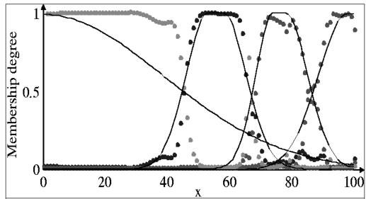  
Figure 1.2 Fuzzy sets are defined by fitting parametric functions (solid lines) to the projections (dots) of the point-wise defined fuzzy sets in the fuzzy partition matrix U

In the following, we apply triangular membership functions, given by the following parametric function:

$$
\mu ( x ; a , b , c ) { = } \operatorname* { m a x } \left( 0 , \operatorname* { m i n } \left( { \frac { x - a } { b - a } } , { \frac { c - x } { c - b } } \right) \right)
$$

If more smooth membership functions are used (e.g., (piece-wise) Gaussian or exponential functions), the resulting model will in general have a higher accuracy in fitting the training data. Such functions, however, are less suitable for linguistic interpretation.

# 1.2.3 Estimating the Consequent Parameters

Once the antecedent membership functions have been fixed, the consequent parameters $p _ { i q } , q = 1 , . . . , n + 1$ , of each individual rule are obtained as a local least squares estimate. Let $\theta _ { \mathrm { i } } = [ p _ { i 1 } , \ldots , p _ { i n } , p _ { i ( n + 1 ) } ] ^ { \mathrm { T } }$ , let $\mathbf { X } _ { \mathrm { e } }$ denote the matrix [X1] with rows $[ \pmb { x } _ { k } , \ 1 ]$ , and let $\mathbf { W } _ { i }$ denote a diagonal matrix in $\Re ^ { K \times K }$ having the degree of activation $\beta _ { i } \left( \pmb { x } _ { k } \right)$ (Eq. 3) as its $k$ th diagonal element. The consequents of the ith rule is the weighted least squares solution of ${ \bf { y } } = \mathrm { { X _ { e } } } \ \theta _ { i } + \varepsilon$ , where $\theta _ { \mathrm { i } }$ is given by:

$$
\mathbf { \Lambda } _ { i } = \left[ \mathbf { X } _ { \mathbf { e } } ^ { \mathrm { { T } } } \mathbf { W } _ { i } \mathbf { X } _ { \mathrm { { e } } } \right] ^ { 1 } \mathbf { X } _ { \mathbf { e } } ^ { \mathrm { { T } } } \mathbf { W } _ { i } { \mathbf { y } }
$$

# 1.3 Transparency and Accuracy of Fuzzy Models

The initial rule-based model constructed by fuzzy clustering typically fulfills many criteria for transparency and good semantic properties [6] (see Figure 1.3):

Moderate number of rules: fuzzy clustering helps ensure a comprehensive sized rule-based model with rules that describe important regions in the data.

Distinguishability: a low number of clusters induces distinguishable rules and membership functions.

Normality: by fitting parameterized functions to the projected clusters, normal and comprehensive membership functions are obtained that can be taken to represent linguistic terms.

Coverage: the deliberate overlap of the clusters (rules) and their position in populated regions of the input-output data space ensure that the model is able to derive an output for all occurring inputs.

The transparency and compactness of the rule-based model can be further improved by methods like rule reduction [28] or rule base simplification [20]. We will apply similarity-driven simplification, and this method is described in Section 1.3.1. The approximation capability of the rule-based model, however, remains sub-optimal. The projection of the clusters onto the input variables, and their approximation by parametric functions like triangular fuzzy sets, introduce a structural error since the resulting premise partition differs from the cluster partition matrix. Moreover, the separate identification of the rule antecedents and the rule consequents prohibits interactions between them during modeling. To improve the approximation capability of the rule-based model, we apply a GAbased optimization method as described in section 1.4.

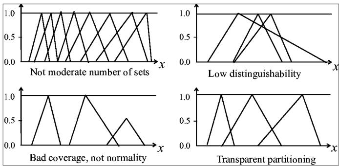  
Figure 1.3 Transparency of the fuzzy rule base premise

# 1.3.1 Rule Base Simplification

The similarity-driven rule base simplification method [20] uses a similarity measure to quantify the redundancy among the fuzzy sets in the fuzzy rule-based model. A similarity measure based on the set-theoretic operations of intersection and union is applied:

$$
S \left( A , B \right) = \frac { \left| A \cap B \right| } { \left| A \cup B \right| } ,
$$

where l.I denotes the cardinality of a set, and the $\curvearrowleft$ and $\cup$ operators represent the intersection and union, respectively. For discrete domains $x = \{ x _ { l } \ | \ l = 1 , 2 , . . . , \ \mathbf { m } \}$ , this can be written as:

$$
S ( A , B ) { = } \frac { { \displaystyle \sum _ { l = 1 } ^ { m } } \left( \mu _ { _ A } ( x _ { l } ) \wedge \mu _ { _ B } ( x _ { l } ) \right) } { { \displaystyle \sum _ { l = 1 } ^ { m } } \left( \mu _ { _ A } ( x _ { l } ) \vee \mu _ { _ B } ( x _ { l } ) \right) }
$$

where $\wedge$ and $\vee$ are the minimum and maximum operators, respectively.

$S$ is a symmetric measure in [0,1]. If $S ( A , B ) = 1$ , then the two membership functions $A$ and $B$ are equal. $S ( A , B )$ becomes 0 when the membership functions are non-overlapping. Similar fuzzy sets are merged when their similarity exceeds a user-defined threshold $\gamma \in \ [ 0 , 1 ]$ $( \gamma = 0 . 5$ is applied). Merging reduces the number of different fuzzy sets (linguistic terms) used in the model and thereby increases the transparency. If all the fuzzy sets for a feature are similar to the universal set, or if merging led to only one membership function for a feature, then this feature is eliminated from the model. The method is illustrated in Figure 1.4.

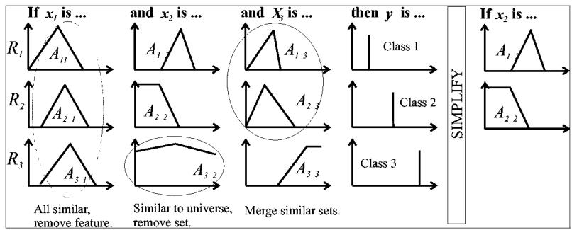  
Figure 1.4 Similarity-driven simplification

# 1.3.2 Genetic Multi-objective Optimization

To improve the accuracy and transparency of the rule-based model, we apply a GA-based optimization method [21,22,29]. When an initial fuzzy model has been obtained from data, it is successively simplified and optimized in an iterative fashion. Combinations of the GA with the rule base simplification described above can lead to different modeling schemes. Two different approaches are shown in Figure 1.5.

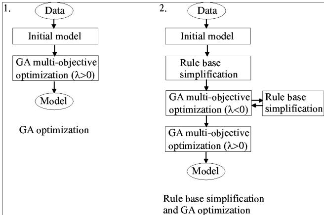  
Figure 1.5 Two modeling schemes with multi-objective GA optimization

The model accuracy is measured as the mean square error for system approximation (Equation 10) and in terms of the number of misclassifications for a classifier (Equation 11). To reduce the model complexity, the accuracy objective is combined with a similarity measure in the GA objective function. Similarity is rewarded during the iterative process, that is, the GA tries to emphasize the redundancy in the model. This redundancy is then used to remove unnecessary fuzzy sets in the next iteration. In the final step, fine-tuning is combined with a penalty for similar fuzzy sets in order to obtain a distinguishable term set for linguistic interpretation.

The GA seeks to minimize the following multi-objective function:

$$
J = ( 1 + \lambda S ^ { * } ) J ^ { * }
$$

where $J ^ { * }$ is either the mean squared error (MSE) for system, approximation problems:

$$
\boldsymbol { J } ^ { * } = \boldsymbol { \mathrm { M S E } } = \frac { 1 } { K } \sum _ { k = 1 } ^ { K } { \left( \boldsymbol { y } _ { k } - \boldsymbol { y } _ { k } \right) ^ { 2 } }
$$

where $\pmb { y }$ is the true output and $_ { y }$ is the model output, or for classification problems:

$$
J ^ { ' } = \frac { 1 } { K } \Bigg ( \sum _ { k = 1 } ^ { K } \left( y _ { k } - y _ { k } \right) ^ { ? } + \sigma \cdot \sum _ { k = 1 } ^ { K } \left( c _ { k } \neq c _ { k } \right) \Bigg )
$$

where the classification error is included, with $^ { c }$ the class and $\pmb { c }$ the predicted class and $\sigma$ a weight factor. The MSE was needed in previous optimization schemes without redundancy measures [22], to differentiate between various solutions with the same number of classification errors, and it was found to speed up the convergence of the GA. Moreover, it helps to find fuzzy rules with consequents in the neighborhood of the class labels which improves the accuracy and prevents the optimization for making a black-box model based on interpolation between rules only.

Finally, $S ^ { * } \in \ [ 0 , 1 ]$ is the average of the maximum pair-wise similarity that is present in each input, i.e., $S ^ { * }$ is an aggregated similarity measure for the total model:

$$
S ^ { ' } = \frac { 1 } { n } \sum _ { i = 1 } ^ { n } \left( \frac { \operatorname* { m a x } \left( S \left( A _ { i i } , A _ { i k } \right) \right) } { n s _ { i } - 1 } \right) , j , k \in 1 , 2 , . . . , n s _ { i } , j \neq k ,
$$

where $n$ is the number of inputs and $n s _ { \mathrm { i } }$ the number of sets for each input variable. The weighting function $\lambda \in \ [ - 1 , 1 ]$ determines whether similarity is rewarded $( \lambda <$ ) or penalized $( \lambda > 0 )$ .

# 1.4 Genetic Algorithms

Genetic algorithms (GAs) are gradient-free, parallel optimization algorithms that use a performance criterion for evaluation and a population of possible solutions to the search for a global optimum. GAs are capable of handling complex and irregular solution spaces, and they have been applied to various difficult optimization problems [30]. Moreover, GAs can handle high-dimensional, nonlinear optimization problems. Other algorithms based on combinatorial optimization, such as integer programming, dynamic programming and branchand-bound methods, are computationally expensive even for a moderate number of variables and often only handle a limited amount of alternatives.

GAs are inspired by the biological process of Darwinian evolution where selection, mutation and crossover play a major role. Good solutions are selected and manipulated to achieve new, and possibly better solutions. The manipulation is done by the genetic operators that work on the chromosomes in which the parameters of possible solutions are encoded. In each generation of the GA, the new solutions replace the solutions in the population that are selected for deletion.

We consider real-coded GAs [30,31]. Binary coded or classical GAs [32] are less efficient when applied to multidimensional, high-precision or continuous problems. The bit-strings can become very long and the search space blows up. Furthermore, CPU time is lost to the conversion between the binary and real representation. Other alphabets like the real coding can be favorably applied to variables in the continuous domain. In real-coded GAs or evolutionary methods, the variables appear directly in the chromosome and are modified by special genetic operators. Various real-coded GAs were recently reviewed in [33]. The main aspects of the proposed GA are discussed below and the implementation is summarized at the end of this section.

# 1.4.1 Fuzzy Model Representation

The GA simultaneously optimizes the rules antecedent parameters and the consequent parameters. Real-coded chromosomes are used to describe the solutions given as the parameters of the TS-fuzzy model. With a population size $L$ , we encode the parameters of each fuzzy model (solution) in a chromosome $s _ { l } , l$ $\mathbf { \Lambda } = \mathbf { \Lambda } 1 , . . . . , L$ , as a sequence of elements describing the fuzzy sets in the rule antecedents followed by the parameters of the rule consequents. For a model of $M$ fuzzy rules, triangular fuzzy sets (each given by three parameters), an $n$ - dimensional premise and $( n { + } 1 )$ parameters in each consequent function, a chromosome of length $N = M ( 3 n + ( n + 1 ) )$ is encoded as:

$$
\begin{array} { r } { \pmb { \mathscr { s } } _ { l } = \left( \mathrm { a n t } _ { 1 } , . . . , \mathrm { a n t } _ { M } , \theta _ { 1 } , . . . , \theta _ { M } \right) } \\ { \quad \pmb { \mathscr { s } } _ { l } = \left( \mathrm { a n t } _ { 1 } , . . . , \mathrm { a n t } _ { M } , \theta _ { 1 } , . . . , \theta _ { M } \right) , } \end{array}
$$

where $_ i$ contains the consequent parameters $p _ { i q }$ of rule $R _ { i } ,$ and $\mathrm { a n t } _ { i } = ~ ( a _ { i l } , ~ b _ { i l } ,$ $c _ { i l } , \ldots$ , $a _ { i n } , b _ { i n } , c _ { i n } )$ contains the parameters of the antecedent fuzzy sets $A _ { i j } , j = I , \ldots ,$ $n _ { \mathrm { { ; } } }$ according to (Eq. 5). In the initial population $\boldsymbol { S } ^ { 0 } { = } \{ \boldsymbol { s } _ { 1 } ^ { ~ 0 } , { \ldots } , \ \boldsymbol { s } _ { L } ^ { ~ 0 } \}$ , ${ \pmb s } _ { 1 } ^ { 0 }$ is the initial modl, and $s _ { 2 } ^ { 0 } , . . . , s _ { L } ^ { 0 }$ are created by random uniform variations aund ${ \pmb s } _ { I } ^ { ~ \theta }$ acknowledging the chromosome constraints (see Section 1.4.5).

# 1.4.2 Selection Function

The selection function is used to create evolutionary pressure. Well performing chromosomes have a higher chance of surviving. The roulette wheel selection method [30] is used to select $n _ { c }$ chromosomes for operation. The chance on the roulette-wheel is adaptive and is given as

$$
P _ { l } \Big / \sum _ { l ^ { \prime } } P _ { l ^ { \prime } } \mathrm { ~ , ~ w h e r e ~ } P _ { l } = \frac { \operatorname* { m i n } ( J _ { l } , ) } { J _ { l } } , { l , l ^ { \prime \prime } } \in \{ l , . . . , L \}
$$

and $J _ { l }$ is the performance (Eq. 9) of the model encoded in chromosome $s _ { l }$

The inverse of the selection function $( P _ { l } ^ { - 1 } )$ is used to select chromosomes for deletion. The best chromosome is always preserved in the population (elitist selection). The chance that a selected chromosome is used in a crossover operation is $90 \%$ and the chance for mutation is $10 \%$ (in this chapter). When a chromosome is selected for crossover or mutation, one of the three crossover or mutation operators, respectively, are applied with equal probability.

# 1.4.3 Genetic Operators

Two classical operators, simple arithmetic crossover and uniform mutation, and four special real-coded operators are used in the GA. In the following, $r \in \ [ 0 , 1 ]$ is a random number (uniform distribution), $t = \ \{ 0 , \ 1 , \ldots , T \}$ is the generation number, $\pmb { S } _ { v }$ and $\pmb { S } _ { w }$ are chromosomes selected for operation, $k \in \{ 1 , 2 , . . . , N \}$ is the position of an element in the chromosome, and $\nu _ { k } ^ { \mathrm { \ m i n } }$ and $\nu _ { k } ^ { \mathrm { { \ m a x } } }$ are the lower and upper bounds, respectively, on the parameter encoded by element $k$ .

# 1.4.4 Crossover Operators

For crossover operations, the chromosomes are selected in pairs $( \pmb { S } _ { v _ { 3 } } \pmb { S } _ { w } )$

Simple arithmetic crossover: ${ \pmb S } _ { \nu } ^ { \mathrm { ~ \# ~ } }$ and ${ \pmb S } _ { w } ^ { t }$ are crossed over at the kth position. The resulting offsprings are: $\boldsymbol { s _ { \nu } } ^ { \ t + 1 } = ( \nu _ { 1 } , . . . , \nu _ { k } , w _ { k + 1 } , . . . , w _ { N } )$ and ${ \boldsymbol { s _ { w } } ^ { t + 1 } } \mathrm { = } \ ( w _ { 1 } , . . . , w _ { k } , \nu _ { k + 1 } , . . . , \nu _ { N } ) .$ where $k$ is selected at random from $\{ 2 , . . . , N { - } 1 \}$ .

Whole arithmetic crossover: a linear combination of ${ s _ { \nu } } ^ { t }$ and ${ s _ { w } } ^ { t }$ resulting in ${ \pmb S } _ { \nu } ^ { \quad t + 1 } =$ $r ( s _ { \nu } ^ { ~ t } ) + ( 1  – r ) ( s _ { w } ^ { ~ t } )$ and ${ s _ { w } } ^ { t + 1 } = r ( { s _ { w } } ^ { t } ) + ( 1 - r ) ( { s _ { \nu } } ^ { t } )$ .

Heuristic crossover: ${ \pmb S } _ { v } ^ { \pmb t }$ and ${ \pmb S } _ { w } ^ { \quad t }$ are combined such that $s _ { \nu } ^ { \ t + 1 } = s _ { \nu } ^ { \ t } + r ( s _ { w } ^ { \ t } - s _ { \nu } ^ { \ t } )$ and ${ \pmb S } _ { w } ^ { \quad t + 1 } = { \pmb S } _ { w } ^ { \quad t } + r ( { \pmb S } _ { \nu } ^ { \quad t } - { \pmb S } _ { w } ^ { \quad t } )$ .

# 1.4.5 Mutation Operators

For mutation operations, single chromosomes are selected:

Uniform mutation: a random selected element $\nu _ { k } ,$ $\mathit { \Pi } _ { k } , \ k \in \ \left\{ 1 , 2 , . . . , N \right\}$ is replaced by ${ \nu _ { k } } ^ { \prime }$ , which is a random number in the range $[ \nu _ { k } ^ { \mathrm { \scriptsize ~ m i n } } , \nu _ { \mathrm { \textit { k } } } ^ { \mathrm { \scriptsize ~ m i n } } ]$ . The resulting chromosome is $\boldsymbol { s } _ { \nu } ^ { \ t + 1 } { = } ( \nu _ { 1 } { , } . . . , { \nu _ { k } } ^ { \prime } { , } . . . , { \nu _ { m } } )$ .

Multiple uniform mutation; uniform mutation of $n$ randomly selected elements, where $n$ is also selected at random from $\{ 1 , 2 , . . . , N \}$ .

Gaussian mutation; all elements of a chromosome are mutated such that $\boldsymbol { s _ { \nu } } ^ { \ t + 1 } { = } ( \nu _ { I } ^ { \prime } , { \ldots } , { \nu _ { k } } ^ { \prime } , { \ldots } , { \nu _ { m } } ^ { \prime } )$ where $\nu _ { k } ^ { \mathrm { ~ \prime ~ } } = \mathrm { ~ } \nu _ { k } + f _ { k } , \mathrm { ~ } k = \mathrm { ~ 1 ~ }$ ,2,..., $N _ { \ast }$ Here $f _ { k }$ is a random number drawn from a Gaussian distribution with zero mean and an adaptive variance $\underline { { \underline { { \mathbf { \Pi } } } } } = \frac { T - t } { T } \cdot \frac { \left( \underline { { \underline { { \mathbf { \Pi } } } } } _ { k } ^ { \operatorname* { m a x } } - \nu _ { k } ^ { \operatorname* { m i n } } \right) } { 3 }$ . The parameter tuning performed by this operator becomes finer and finer as the generation counter $t$ increases.

# 1.4.5.1 Constraints

To maintain the transparency properties of the initial rule-based model as discussed in Section 1.3, the optimization performed by the GA is subjected to two types of constraints: partition and search space.

The partition constraint ensures that the model can derive an output for all occurring inputs by prohibiting gaps in the partitions of the input (antecedent) variables. The coding of a fuzzy set must comply with (Equation 5), i.e., $a \leq b \leq$ c. To avoid gaps in the partition, pairs of neighboring fuzzy sets are constrained by $a _ { R } \leq c _ { L }$ ,where $L$ and $R$ denote left and right set, respectively. After initialization of the initial population and after each generation of the GA, these conditions are forced; e.g., if for some fuzzy set $a > b$ , then $^ a$ and $^ { b }$ are swapped, and if $a _ { R } > c _ { L }$ ,then $a _ { R }$ and $c _ { L }$ are swapped.

The GA search space is constrained by two user-defined bound parameters, $\alpha _ { 1 }$ and $\alpha _ { 2 }$ , that apply to the antecedent and the consequent parameters of the rules, respectively. The first bound, $\alpha _ { 1 }$ , is intended to maintain the distinguishability of the models term set (the fuzzy sets) by allowing the parameters describing the fuzzy sets $A _ { i j }$ to vary only within a bound of $\pm \alpha _ { 1 } { \cdot } | \mathrm { X } _ { j } |$ around their initial values, where $| \mathrm { X } _ { j } |$ is the length (range) of the domain on which the fuzzy sets $A _ { i j }$ are defined. By a low value of $\alpha _ { 1 }$ , one can avoid the generation of domain-wide, and multiple overlapping fuzzy sets, which is a typical feature of unconstrained optimization. The second bound, $\alpha _ { 2 }$ , is intended to maintain the local-model interpretation of the rules by allowing the $q$ th consequent parameter of the ith rule, $p _ { i q } ,$ to vary within a bound of $\pm \alpha _ { 2 } ( \operatorname* { m a x } _ { i } { ( p _ { i q } ) } - \operatorname* { m i n } _ { i } { ( p _ { i q } ) } )$ around its initial value.

The search space constraints are coded in the two vectors, $\pmb { \nu } ^ { \mathrm { m a x } } = [ \nu _ { 1 } ^ { \mathrm { \scriptsize ~ m a x } } , \dots , \nu _ { N } ^ { \mathrm { \scriptsize ~ m a x } } ]$ and $\pmb { \nu } ^ { \mathrm { m i n } } = [ \nu _ { 1 } ^ { \mathrm { \scriptsize ~ m i n } } , \dots , \nu _ { N } ^ { \mathrm { \scriptsize ~ m i n } } ]$ $N$ elements in a chromosome. During generation of the initial partition, and in the case of a uniform mutation, elements are generated at random within these bounds. Only the heuristic crossover and the Gaussian mutation can produce solutions that violate the bounds. After these operations, the constraints are forced, i.e., all elements $\nu _ { \mathrm { k } }$ of the operated chromosomes are subjected to $\nu _ { k } : =$ max $( \nu _ { k } ^ { \mathrm { { \ m i n } } }$ . $\operatorname* { m i n } ( \nu _ { k } , \nu _ { k } ^ { \operatorname* { m a x } } ) )$ .

# 1.4.5.2 Proposed algorithm

Given the pattern matrix $\mathrm { _ Z }$ and a fuzzy rule base, select the number of generations $T .$ , the population size $L$ , the number of operations $n _ { C }$ , and the constraints $\alpha _ { 1 }$ and $\alpha _ { 2 }$ .

Let ${ \bf S } ^ { \dagger }$ be the current population of solutions ${ \pmb s } _ { l } ^ { \dagger }$ ${ \bf \Phi } _ { l } ^ { \mathrm { t } } , l = 1 , 2 , \ldots , L$ , and let $J ^ { t }$ be the vector of corresponding values of the evaluation function:

Make an initial chromosome ${ \pmb s } _ { 1 } ^ { 0 }$ from the initial fuzzy rule-based model.

Calculat th nstraint $\pmb { \nu } ^ { \mathrm { m i n } }$ and $\pmb { \nu } ^ { \mathrm { m a x } }$ using ${ \pmb s } _ { 1 } ^ { 0 }$ and $\alpha _ { \mathrm { 1 } }$ and $\alpha _ { 2 }$ .

Create the initial population $\mathbf { S } ^ { 0 } = \ \{ s _ { 1 } ^ { \ 0 } , \ldots , s _ { \mathrm { L } } ^ { \ 0 } \}$ where ${ \pmb s } _ { 1 } ^ { 0 }$ , $l = 2 , \ldots , L$ are created by constrained random variations around of ${ \pmb s } _ { 1 } ^ { 0 }$ , and the partition constraints apply.

Repeat genetic optimization for $t = 0$ , 1, 2,.., T-1: Evaluate $S ^ { \mathrm { t } }$ by simulation and calculate $J ^ { t }$ . Select $\mathbf { n } _ { \mathrm { c } }$ chromosomes for operation. Select $\mathfrak { n } _ { \mathrm { C } }$ chromosomes for deletion. Operate on chromosomes acknowledging the search space constraints. Implement partition constraints. Create new population $\mathbf { S } ^ { { \mathrm { t + 1 } } }$ by substituting the operated chromosomes for those selected for deletion. Select best solution from ${ \mathrm S } ^ { \mathrm T }$ by evaluating $\boldsymbol { J } ^ { \mathrm { T } }$ .

# 1.5 Examples

# 1.5.1 Nonlinear Plant

We consider the $2 ^ { n d }$ -order nonlinear plant studied by Wang and Yen in [16,34,28]:

$$
y ( k ) = g ( y ( k - 1 ) , y ( k - 2 ) ) + u ( k ) ,
$$

with

$$
g { \big ( } y { \big ( } k - 1 { \big ) } , y { \big ( } k - 2 { \big ) } { \big ) } = { \frac { y { \big ( } k - 1 { \big ) } \cdot y { \big ( } k - 2 { \big ) } \cdot { \big ( } y { \big ( } k - 2 { \big ) } - 0 . 5 { \big ) } } { 1 + y ^ { 2 } { \big ( } k - 1 { \big ) } \cdot y ^ { 2 } { \big ( } k - 2 { \big ) } } } .
$$

The goal is to approximate the nonlinear component $g ( y ( k { - } 1 ) , y ( k { - } 2 ) )$ of the plant with a fuzzy model. In [16], 400 simulated data points were generated from the plant model (Equations 15 and 16). 200 samples of identification data were obtained with a random input signal $u ( k )$ uniformly distributed in [-1.5, 1.5], followed by 200 samples of evaluation data obtained using a sinusoid input signal $u ( k ) = \sin ( 2 \pi k / 2 5 )$ (Figure 1.6).

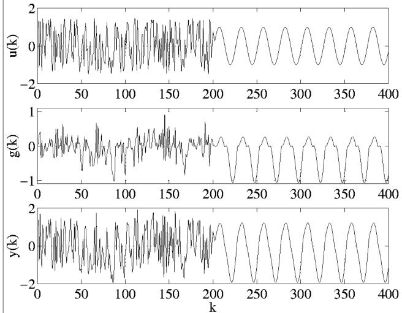  
Figure 1.6 Input ${ \pmb u } ( k )$ , unforced system ${ \pmb g } ( { \pmb k } )$ , and output ${ \bf y } ( k )$ of the plant in (Equations 15 and 16)

Solutions in the Literature

We compare our results with those obtained by the three different approaches described below. The best results obtained in each case are summarized in Table 1.1 and Table 1.2.

In [16], a GA was combined with a Kalman filter to obtain a fuzzy model of the plant. The antecedent fuzzy sets of 40 rules, encoded by Gaussian membership functions, were determined initially by clustering and kept fixed. A binary GA was used to select a subset of the initial 40 rules in order to produce a more compact rule-based model with better generalization properties. The consequents of the various models in the GA population were estimated after each generation by the Kalman filter, and an information criterion was used as the evaluation function to balance the trade-off between the number of rules and the model accuracy.

In [34], various information criteria were used to successively pick rules from a set of 36 rules in order to obtain a compact, but accurate model. The initial rulebased model was obtained by partitioning each of the two inputs $y ( k { - } 1 )$ and $y ( k { - } 2 )$ by six equally distributed fuzzy sets. The rules were picked in an order determined by an orthogonal transform.

In [28], various orthogonal transforms for rule selection and rule ordering were studied using an initial model with 25 rules. In this initial model, 20 rules were obtained by clustering, while five redundant rules were added to evaluate the selection performance of the studied techniques.

# 1.5.2 Proposed approach

We applied both of the modeling schemes proposed in section 1.4. For both methods, TS models with Singleton as well singleton as linear consequent functions were studied. The GA was applied with $L = 4 0$ , $n _ { C } = 1 0$ , $\alpha _ { 1 } = 2 5 \%$ , $\alpha _ { 2 } =$ $2 5 \%$ and $T = 4 0 0$ in the final optimization and $T = \ 2 0 0$ in the iterative optimization-complexity reduction step. The threshold $\lambda = 1$ for redundancy searches and $\lambda = - 1$ in the final optimization and the threshold for set merging was 0.5 and 0.8 for removing sets similar to the universal set.

# 1.6 TS Singleton Model

First we apply scheme 1 (Figure 1.5). A singleton TS model consisting of seven rules was obtained by fuzzy $c$ -means clustering and genetic optimization. The MSE for both training and validation data were comparable, indicating that the initial model is not over-fitted. By GA optimization, the MSE was reduced by $73 \%$ from $2 . 4 { \cdot } 1 0 ^ { - 2 }$ to $6 . 6 { \cdot } 1 0 ^ { - 3 }$ on the training data, and by $78 \%$ from $4 . 5 { \cdot } 1 0 ^ { - 2 }$ to $9 . 9 { \cdot } 1 0 ^ { - 3 }$ on the evaluation data.

Next, the proposed scheme 2 (Figure 1.5), including the complexity reduction step, was considered. During the iterative complexity reduction step, in each iteration the model was sought for redundancy, simplified and finally optimized by the GA. The model was reduced as follows in four steps: (i) simplification reduces from $7 + 7$ to $4 + 4$ fuzzy sets, (ii) to $3 + 4$ sets, (iii) to $3 + 3$ sets, (iv) to 3 $^ { + 2 }$ sets and one rule was removed. The final model, has only six rules, using $^ { 3 + }$ 2 fuzzy sets (Figure 1.7). The local submodels and the overall model are shown in

Figure 1.8. The identification and validation results, as well as the prediction error, are presented in Figure 1.9. The resulting singleton TS model is compact and has good approximation properties, except in the low region where almost no data was provided". The reduced model with six rules and five sets is almost as accurate as the optimized model with seven rules and 14 sets (Table 1.1).

Table 1.1 Singleton TS fuzzy models for the dynamic plant   

<table><tr><td rowspan=1 colspan=1>Ref.</td><td rowspan=1 colspan=1>No. of rules</td><td rowspan=1 colspan=1>No. of sets</td><td rowspan=1 colspan=1>MSEtrain</td><td rowspan=1 colspan=1>MSEEval</td></tr><tr><td rowspan=1 colspan=1>Wang andYen, 1999</td><td rowspan=1 colspan=1>40 (initial)28 (optimized)</td><td rowspan=1 colspan=1>40Gaussians(2D)28Gaussians(2D)</td><td rowspan=1 colspan=1>3.3e43.3e4</td><td rowspan=1 colspan=1>6.9e46.0e4</td></tr><tr><td rowspan=1 colspan=1>Yen andWang, 1998</td><td rowspan=1 colspan=1>36 (initial)23 (optimized)</td><td rowspan=1 colspan=1>12 B-splines12 B-splines</td><td rowspan=1 colspan=1>2.8e-$3.2e-5</td><td rowspan=1 colspan=1>5.1e-31.9e-3</td></tr><tr><td rowspan=1 colspan=1>Yen andWang, 1999</td><td rowspan=1 colspan=1>25 (initial)20 (optimized)</td><td rowspan=1 colspan=1>25Gaussians(2D)20Gaussians(2D)</td><td rowspan=1 colspan=1>2.3e46.8e4</td><td rowspan=1 colspan=1>4.1e42.4e4</td></tr><tr><td rowspan=1 colspan=1>This chapter</td><td rowspan=1 colspan=1>7 (initial)</td><td rowspan=1 colspan=1>14 triangulars</td><td rowspan=1 colspan=1>2.4e-2</td><td rowspan=1 colspan=1>4.5e-2</td></tr><tr><td rowspan=1 colspan=1>scheme 1</td><td rowspan=1 colspan=1>7 (optimized)</td><td rowspan=1 colspan=1>14 triangulars</td><td rowspan=1 colspan=1>6.6e-3</td><td rowspan=1 colspan=1>9.3e-3</td></tr><tr><td rowspan=1 colspan=1>scheme 2</td><td rowspan=1 colspan=1>6 (optimized)</td><td rowspan=1 colspan=1>5 triangulars</td><td rowspan=1 colspan=1>2.7e-3</td><td rowspan=1 colspan=1>9.5e-3</td></tr></table>

Linguistic labels as "negative," "zero" and "positive" can be assigned to the fuzzy sets, resulting in comprehensible rules.

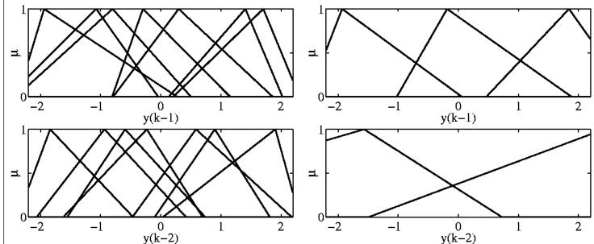  
Figure 1.7 Initial fuzzy sets and fuzzy sets in the reduced model

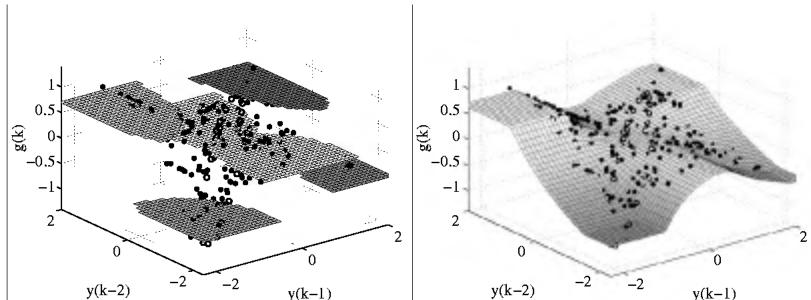  
Figure 1.8 Local singleton models and the response surface

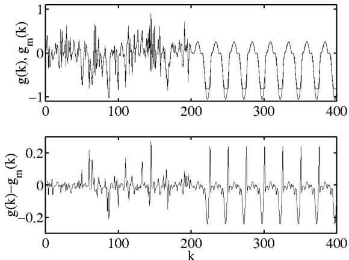  
Figure 1.9 Simulation of the six-rule TS singleton model and error in the estimated output

# 1.7 TS Linear Model

Subsequently, a TS model with linear consequents was considered, based on scheme 1 (Figure 1.5). Because of the more powerful approximation capabilities of the functional consequents, an initial model of only five rules was constructed by clustering. The MSE for both training and validation data were, as expected, better than for the singleton model. Moreover, the result on the validation data (low frequency signal) is twice as good as on the identification data, indicating the generality of the obtained model. By GA optimization, the MSE was reduced by $71 \%$ from $4 . 9 { \cdot } 1 0 ^ { - 3 }$ to $1 . 4 { \cdot } 1 0 ^ { - 3 }$ on the training data, and by $80 \%$ from $2 . 9 { \cdot } 1 0 ^ { - 3 }$ to $5 . 9 { \cdot } 1 0 ^ { - 4 }$ on the evaluation data.

Finally, a TS model with linear consequents was obtained by scheme 2 (Figure 1.5). The initial model was obtained with five clusters, resulting in a model with five rules and ten fuzzy sets. The model was reduced in two steps: (i) simplification reduces from $5 + 5$ to $3 + 5$ fuzzy sets, (ii) simplification reduces to $2 + 3$ sets. The resulting TS model with linear consequents has only five rules using $2 + 3$ fuzzy sets (Figure 1.10). The identification and validation results as well as the prediction error are presented in Figure 1.11. The approximation properties are better than for the singleton TS model. The linear consequent TS model also extrapolates well and the difficult part in the low region is nicely approximated. The local submodels and the overall model output are shown in Figure 1.12. The submodels approximate the local behavior well. Once again, the reduced and optimized TS model with five rules and five sets is comparable in accuracy to the initial TS model with five rules and ten fuzzy sets (Table 1.2).

Table 1.2 Linear TS fuzzy models for the dynamic plant   

<table><tr><td rowspan=1 colspan=1>Ref.</td><td rowspan=1 colspan=1>No. of Rules</td><td rowspan=1 colspan=1>No. of Sets</td><td rowspan=1 colspan=1>MSETrain</td><td rowspan=1 colspan=1>MSEEval.</td></tr><tr><td rowspan=1 colspan=1>Yen and Wang</td><td rowspan=1 colspan=1>36 (initial)</td><td rowspan=1 colspan=1>12 B-splines</td><td rowspan=1 colspan=1>1.9e^}$</td><td rowspan=1 colspan=1>2.9e^3</td></tr><tr><td rowspan=1 colspan=1>1998</td><td rowspan=1 colspan=1>24 (optimized)</td><td rowspan=1 colspan=1>12 B-splines</td><td rowspan=1 colspan=1>2.0e^}$</td><td rowspan=1 colspan=1>6.4e4</td></tr><tr><td rowspan=1 colspan=1>This chapter</td><td rowspan=1 colspan=1>5 (initial)</td><td rowspan=1 colspan=1>10 triangulars</td><td rowspan=1 colspan=1>4.9e^{3</td><td rowspan=1 colspan=1>2.9e^3</td></tr><tr><td rowspan=1 colspan=1>scheme 1</td><td rowspan=1 colspan=1>5 (optimized)</td><td rowspan=1 colspan=1>10 triangulars</td><td rowspan=1 colspan=1>1.4e-3</td><td rowspan=1 colspan=1>5.9e4</td></tr><tr><td rowspan=1 colspan=1>scheme 2</td><td rowspan=1 colspan=1>5 (optimized)</td><td rowspan=1 colspan=1>5 triangulars</td><td rowspan=1 colspan=1>8.3e4</td><td rowspan=1 colspan=1>3.5e4</td></tr></table>

From the results summarized in Table 1.1 and Table 1.2, we see that the proposed modeling approach is capable of obtaining good results using fewer rules and fuzzy sets than other approaches reported in the literature. Moreover, simple triangular membership functions were used as opposed to cubic $B$ -splines in [34] and Gaussian-type basis functions in [16,28]. By applying the GA after each rule base simplification step, not only accurate, but also compact and transparent rulebased models were obtained.

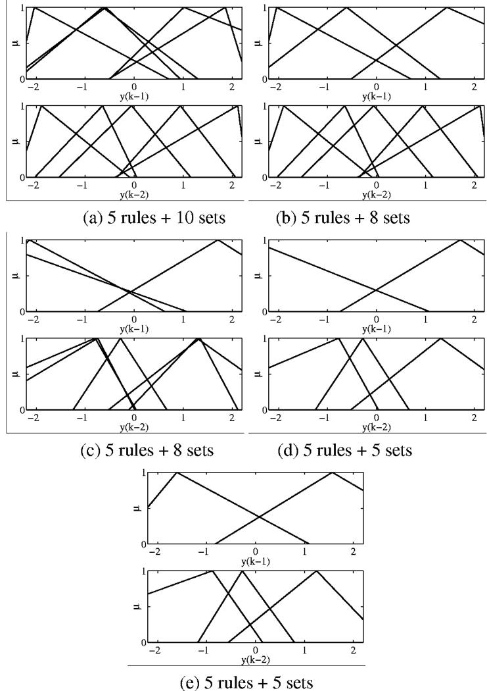  
Figure 1.10 Local linear TS-model derived in five steps: (a) initial model with ten clusters, (b) set merging, (c) GA-optimization, (d) set-merging, (e) final GA optimization

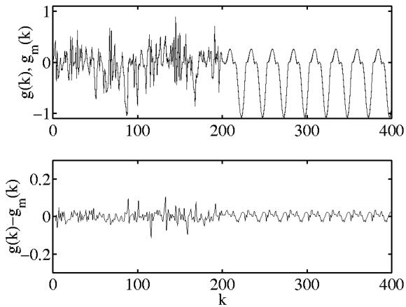  
Figure 1.11 Simulation of the six-rule TS singleton model and the error in the estimated output

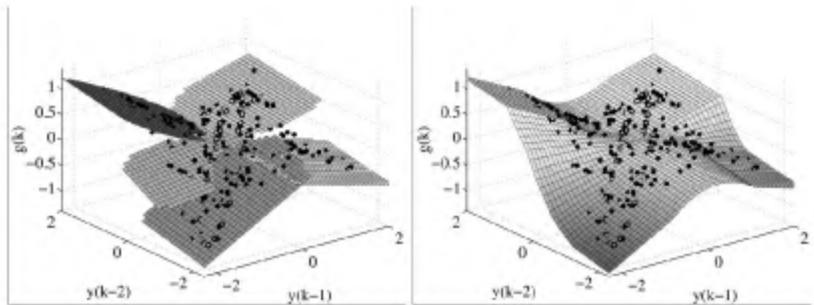  
Figure 1.12 Local linear TS model and the response-surface

# 1.7.1 Iris Classification Problem

The Iris data is a common benchmark in classification and pattern recognition studies [8,17,37,38]. The problem is low dimensional, which makes it suitable to illustrate the proposed algorithm. It contains 50 measurements of four features from each of the three species Iris setosa, Iris versicolor, and Iris virginica [39]. The original Iris data was recently republished in [37]. We label the species 1, 2 and 3, respectively, which gives a $5 \times 1 5 0$ pattern matrix $Z$ of observation vectors.

$$
\pmb { x } _ { k } ^ { T } = [ x _ { k 1 } , x _ { k 2 } , x _ { k 3 } , x _ { k 4 } , c _ { k } ] , \quad c _ { k } \in \{ 1 , 2 , 3 \} , \quad k = 1 , 2 , . . . , 1 5 0 ,
$$

where $x _ { k l } , x _ { k 2 } , x _ { k 3 } ,$ and $x _ { k 4 }$ are the sepal length, the sepal width, the petal length, and the petal width, respectively. The measurements are shown in Figure 1.13.

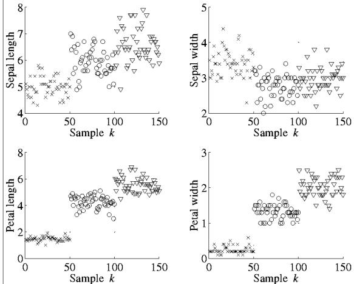  
Figure 1.13 Iris data: setosa $( \times )$ , versicolor (O), and virginica ()

# 1.7.2 Solutions in the literature

Ishibuchi et al. [38] reviewed nine fuzzy classifiers and ten non-fuzzy classifiers from the literature, giving between 3 and 24 misclassifications for the Iris classification problem for leaving-one-out validation. Bezdek et al. [40] compared various multiple prototype generation schemes. With the so-called dog-rabbit model, five prototypes were obtained which gave three resubstitution errors. In [41], a nearest prototype approach, with three prototypes selected by either a binary coded GA or random search, also gave three resubstitution errors. Shi et al. [17] used a GA with integer coding to learn a Mamdani-type fuzzy model. Starting with three fuzzy sets associated with each feature, the membership function shapes and types, and the fuzzy rule set, including the number of rules, were evolved using a GA. Furthermore, a fuzzy expert system was used to adapt the GA's learning parameters. After several trials with varying learning options, a four-rule model was obtained, which gave three errors in learning the data.

# 1.7.3 Proposed Approach

The fuzzy $c$ -means clustering was applied to obtain an initial TS model with singleton consequents. In order to perform classification, the output $y _ { k }$ of the TS model was used with the following classification rule:

$$
c _ { k } = \left\{ \begin{array} { l l } { 1 } & { \mathrm { i f } 0 . 5 < y _ { k } \leq 1 . 5 , } \\ { 2 } & { \mathrm { i f } 1 . 5 < y _ { k } \leq 2 . 5 , } \\ { 3 } & { \mathrm { i f } 2 . 5 < y _ { k } \leq 3 . 5 , } \end{array} \right.
$$

First, an initial model with three rules was constructed from clustering, where each rule described a class (singleton consequents). The classification accuracy of the initial model was rather discouraging, giving 33 misclassifications on the training data. The rule antecedents sets are shown in Figure 1.14 and the estimated rule consequents were {1.00, 2.10, 2.95}, which is close to the class labels as expected. These are changed for transparency reasons into {1,2,3} before further optimization. We applied both of the optimization schemes as proposed in Section 1.3. The GA was applied with $L = 4 0$ , $n _ { C } = 1 0$ , $T = 2 0 0$ in the iterative optimization-complexity reduction step and $T = ~ 4 0 0$ in the final optimization. The threshold for set merging was 0.5 and 0.8 for removing sets similar to the universal set. The weight $\sigma$ in the objective (Eq. 11) was 1 and the threshold $\lambda = 0 . 5$ for redundancy searches and $\lambda = - 0 . 5$ for the final optimization step. The other parameters are varied and given in Table 1.3.

First, scheme 1 was applied with all the data for learning and validation. The result is expected to be similar to the leave-one-out or resubstitution error, which needs many repetitions for an accurate average result and highly depends on the chosen samples. The results for three typical runs with different parameters are presented in Table 1.3 (A,B,C). The number of misclassification is quickly reduced to 3 or 4. The obtained model is accurate and is suitable for interpretation since the rules consequents are the same or close to the actual class labels such that each rule can be taken to describe a class. The fuzzy sets of the optimized model B are shown in Figure 1.15. The corresponding rules are:

$R _ { 1 }$ : If $x _ { 1 }$ is short and $x _ { 2 }$ is wide and $x _ { 3 }$ is short and $x _ { 4 }$ is narrow then the class is 1.   
$R _ { 2 }$ : If $x _ { 1 }$ is medium and $x _ { 2 }$ is narrow and $x _ { 3 }$ is medium and $x _ { 4 }$ is medium then the class is 2.   
$R _ { 3 }$ : If $x _ { 1 }$ is long and $x _ { 2 }$ is medium and $x _ { 3 }$ is long and $x _ { 4 }$ is wide then the class is 3.

Second, scheme 2 was applied. The results for three typical runs with different parameters are presented in Table 1.3 (D,E,F). The number of misclassification is quickly reduced to 1, 3 or 4. One intermediate model had 1 misclassification only but was not very transparent due to overlapping sets; however, it resulted in a perfect rule-interpolation which shows the good optimization property of the GA. The rule-base reduction is one or two times applied and, subsequently, the model is optimized for transparency. The resulting models are highly reduced while the misclassification error is not really increased. The fuzzy sets of the optimized model E are shown in Figure 1.16. The corresponding rules are:

$R _ { 1 }$ : If $x _ { 3 }$ is short and $x _ { 4 }$ is narrow then the class is 1.   
$R _ { 2 }$ : If $x _ { 3 }$ is medium and $x _ { 4 }$ is long then the class is 2.   
$R _ { 3 }$ : ${ \bf { u } } ^ { \mathbf { { \mathit { x } } } _ { 3 } }$ is long and $x _ { 4 }$ is wide then the class is 3.

The proposed iterative reduction scheme removed seven sets from the three-rule model and thereby removing two inputs. By comparing the reduced fuzzy model with the data in Figure 1.15, one observes that the inputs with the highest information content are maintained.

Table 1.3 Fuzzy rule-based classifiers for the Iris data derived by means of scheme 1 (A,B,C) and scheme 2 (D,E,F)   

<table><tr><td rowspan=1 colspan=1>No.</td><td rowspan=1 colspan=1>α1</td><td rowspan=1 colspan=1>$α2</td><td rowspan=1 colspan=1>λ</td><td rowspan=1 colspan=1>Rules</td><td rowspan=1 colspan=1>Misclass.</td></tr><tr><td rowspan=1 colspan=1>A</td><td rowspan=1 colspan=1>0.25</td><td rowspan=1 colspan=1>0.25</td><td rowspan=1 colspan=1>0/-0.5</td><td rowspan=1 colspan=1>{3333}</td><td rowspan=1 colspan=1>{4}</td></tr><tr><td rowspan=1 colspan=1>B</td><td rowspan=1 colspan=1>0.25</td><td rowspan=1 colspan=1>0</td><td rowspan=1 colspan=1>0/-0.5</td><td rowspan=1 colspan=1>{3333}</td><td rowspan=1 colspan=1>{3}</td></tr><tr><td rowspan=1 colspan=1>C</td><td rowspan=1 colspan=1>0.5</td><td rowspan=1 colspan=1>0</td><td rowspan=1 colspan=1>0/-0.5</td><td rowspan=1 colspan=1>{3333}</td><td rowspan=1 colspan=1>{2}</td></tr><tr><td rowspan=1 colspan=1>D</td><td rowspan=1 colspan=1>0.25</td><td rowspan=1 colspan=1>0.25</td><td rowspan=1 colspan=1>0.5/-0.5</td><td rowspan=1 colspan=1>{2133},{2232}, {0032}</td><td rowspan=1 colspan=1>{4}{3},{4}</td></tr><tr><td rowspan=1 colspan=1>E</td><td rowspan=1 colspan=1>0.25</td><td rowspan=1 colspan=1>0</td><td rowspan=1 colspan=1>0.5/-0.5</td><td rowspan=1 colspan=1>{2233}, {2032}, {0032}</td><td rowspan=1 colspan=1>{3},{3},{4}</td></tr><tr><td rowspan=1 colspan=1>F</td><td rowspan=1 colspan=1>0.5</td><td rowspan=1 colspan=1>0</td><td rowspan=1 colspan=1>0.5/-0.5</td><td rowspan=1 colspan=1>{2032}, {0032}</td><td rowspan=1 colspan=1>{1},{3},{4}</td></tr></table>

Note: Rules gives the number of sets for each input and misclassifications the performance, after each rule-base simplification step.

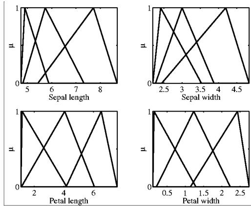  
Figure 1.14 Initial fuzzy rule-based model with three rules and 33 misclassifications

The results obtained with the proposed modeling approach for the Iris data case illustrate the power of the GA for optimizing fuzzy rule-based classifiers. By simultaneously optimizing the antecedent and/or consequent parts of the rules, according scheme 1, the GA found an optimum for the model parameters in the neighborhood of the initializations, which gave drastic improvements in the classification performance. Moreover, compact fuzzy models with a low amount of inputs and fuzzy sets were obtained by the proposed model reduction scheme 2. The results on the Iris data are nice; however, more complicated classification problems must be solved to prove the real power of the method. A modified version of the proposed algorithm is already applied in [42] to the Wine data that has three classes and 13 attributes.

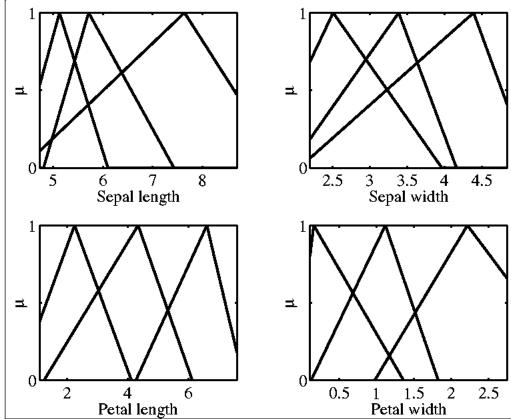  
Figure 1.15 Optimized fuzzy rule-based model with three rules and three misclassifications (Table 1.3-B)

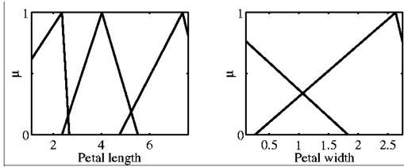  
Figure 1.16 Optimized and reduced fuzzy rule-based model with three rules and four misclassifications (Table 1.3-E)

# 1.8 Conclusion

We have described an approach to construct compact and transparent, yet accurate fuzzy rule-based models from measured input-output data. Methods for modeling, complexity reduction and optimization are combined in the approach. Fuzzy clustering is first used to obtain an initial rule-based model. Similaritybased simplification and GA-based optimization are then used in an iterative manner to decrease the complexity of the model while maintaining high accuracy. The proposed algorithm was successfully applied to two problems known from the literature. The accuracy of the obtained models was comparable to the results reported in the literature; however, the obtained models use fewer rules and less fuzzy sets than other models reported in the literature.

Acknowledgments The authors are grateful to Dr. Liang Wang, (co)author of references [16,34,28], for unconditionally sharing his results and computer code for this research.

# Список литературы

[1] L.A. Zadeh, Fuzzy sets, Information and Control, Vol. 8, pp. 338-353, 1965. [2] H.B. Verbruggen and R. Babuska, Fuzzy Logic Control - Advances in Applications, World Scientific, Singapore, 1999.   
[3] R. Isermann, On fuzzy logic applications for automatic control, supervision, and fault diagnosis, IEEE Transactions on Systems, Man and Cybernetics - Part A: Systems and Humans, Vol. 28, pp. 221-235, 1998.   
[4] B. Kosko, Fuzzy systems as universal approximators, IEEE Transactions on Computers, Vol. 43, pp. 1329-1333, 1994.   
[5] M. Setnes, R. Babuska, and H.B. Verbruggen, Rule-based modeling: Precision and transparency, IEEE Transactions on Systems, Man and Cybernetics - Part C: Applications and Reviews, Vol. 28, no. 1, pp. 165-169, 1998.   
[6] J. Valente de Oliveira, Semantic constraints for membership function optimization, IEEE Transactions on Fuzzy Systems, Vol. 19, no. 1, pp.128-138, 1999.   
[7] J.G. Martín-Blázquez, From approximative to descriptive models, in 9th IEEE International Conference of Fuzzy Systems, San Antonio, Texas, USA, May 7-10, 2000, IEEE, pp. 829-834.   
[8] H. Ishibuchi, T. Murata, and I.B. Türksen, Single-objective and two-objective genetic algorithms for selecting linguistic rules for pattern classification problems, Fuzzy Sets and Systems, Vol. 89, pp. 135-150, 1997. [9] C. H. Wang, T. -P. Hong, and S. -S. Tseng, Integrating fuzzy knowledge by genetic algorithms, Fuzzy Sets and Systems, Vol. 2, no. 4, pp. 138-149, 1998 [10] H. Ishibuchi, T.Nakashima, and T.Murata, Performance evaluation of fuzzy classifier systems for multidimensional pattern classification problems, IEEE Transactions on Systems, Man, and Cybernetics - Part B: Cybernetics, Vol. 29, no. 5, pp. 601-618, 1999.   
[11] L.O. Hall, I.B. Özyurt, and J.C. Bezdek, Clustering with genetically optimized approach, IEEE Transactions on Evolutionary Computing, Vol. 3, no. 2, pp. 103-112, 1999.   
[12] H.-S. Hwang, Control strategy for optimal compromise between trip time and energy consumption in a high-speed railway, IEEE Transactions on Systems, Man and Cybernetics, Part A: Systems and Humans, Vol. 28, no. 6, pp. 791-802, 1998.   
[13] I. Jagielska, C. Matthews, and T. Whitfort, An investigation into the application of neural networks, fuzzy logic, genetic algorithms, and rough sets to automated knowledge acquisition for classification problems, Neurocomputing, Vol. 24, pp. 37-54, 1999.   
[14] M. Russo, FuGeNeSys - a fuzzy genetic neural system for fuzzy modeling, IEEE Transactions on Fuzzy Systems, Vol. 6, no. 3, pp. 373-388, 1998.   
[15] A. Blanco, M. Delgado, and M.C. Pegalajar, A genetic algorithm to obtain the optimal recurrent neural network, International Journal of Approximate Reasoning, Vol. 23, pp. 67-83, 2000.   
[16] L. Wang and J. Yen, Extracting fuzzy rules for system modeling using a hybrid of genetic algorithms and Kalman filter, Fuzzy Sets and Systems, Vol. 101, pp. 353-362, 1999.   
[17] Y. Shi, R. Eberhart, and Y. Chen, Implementation of evolutionary fuzzy systems, IEEE Transactions on Fuzzy Sytems, Vol. 7, no. 2, pp. 109-119, 1999. [18] T. Takagi and M. Sugeno, Fuzzy identification of systems and its application to modeling and control, IEEE Transactions on Systems, Man and Cybernetics, Vol. 15, pp. 116-132, 1985.   
[19] R. Babuska, Fuzzy Modeling for Control, Kluwer Academic Publishers, Boston, 1998.   
[20] M. Setnes, R. Babuska, U. Kaymak, and H.R. van Nauta Lemke, Similarity measures in fuzzy rule base simplification, IEEE Transactions on Systems, Man and Cybernetics - Part B: Cybernetics, Vol. 28, no. 3, pp. 376-386, 1998.   
[21] M. Setnes and J.A. Roubos, Transparent fuzzy modeling using fuzzy clustering and GA's, in 18th International Conference of the North American Fuzzy Information Processing Society, New York, USA, June 10-12, 1999, NAFIPS, pp. 198-202.   
[22] M. Setnes and J.A. Roubos, GA-fuzzy modeling and classification: complexity and performance, IEEE Transactions on Fuzzy Systems, in press 2000.   
[23] L.A. Zadeh, Outline of a new approach to the analysis of complex systems and decision processes, IEEE Transactions on Systems, Man, and Cybernetics, Vol. 1, pp. 28-44, 1973.   
[24] E.H. Mamdani, Application of fuzzy algorithms for control of a simple dynamic plant, in Proceedings IEE, number 121, pp. 1585-1588, 1974.   
[25] R. Jager, Fuzzy Logic in Control, Ph.D. thesis, Delft University of Technology, Department of Electrical Engineering, Control Laboratory, 1995. [26] J.C. Bezdek, Pattern Recognition with Fuzzy Objective Functions, Plenum Press, New York, 1981.   
[27] R. Kruse, J. Gebhardt, and F. Klawonn, Foundations of Fuzzy Systems, John Wiley & Sons, Chichester, 1994.   
[28] J. Yen and L. Wang, Simplifying fuzzy rule-based models using orthogonal transformation methods, IEEE Transactions on Systems, Man and Cybernetics - Part B: Cybernetics, Vol. 29, no. 1, pp. 13-24, 1999.   
[29] J.A. Roubos and M. Setnes, Compact fuzzy models through complexity reduction and evolutionary optimization, in Proceedings 9th IEEE Conference on Fuzzy System, San Antonio, USA, May 7-10, 2000, pp 762-767.   
[30] Z. Michalewicz, Genetic Algorithms $^ +$ Data Structures $=$ Evolution Programs, Springer Verlag, New York, 2nd edition, 1994.   
[31] L.D. Davis, K. De Jong, M.D. Vose, and L.D. Whitley eds., Evolutionary Algorithms. The IMA Volumes in Mathematics and its Applications, Vol. 111, Springer, 1999.   
[32] D.E. Goldberg, Genetic Algorithms in Search, Optimization and Machine Learning, Addison-Wesley, Reading, MA, 1989.   
[33] F. Herrera, M. Lozano, and J.L. Verdegay, Tackling real-coded genetic algorithms: Operators and tools for behavioural analysis, Artificial Intelligence Review, Vol. 12, pp. 265-319, 1998.   
[34] J. Yen and L. Wang, Application of statistical information criteria for optimal fuzzy model construction, IEEE Transactions on Fuzzy Systems, Vol. 6, no. 3, pp. 362-371, 1998. [35]J.C. Bezdek, J.M. Keller, R.Krishnapuram, L.I. Kuncheva, and N.R. Pal, Will the real Iris data please stand up?, IEEE Transactions on Fuzzy Systems, Vol. 7, no. 3, pp. 368-369, 1999.   
[36] H. Ishibuchi and T. Nakashima, Voting in fuzzy rule-based systems for pattern classification problems, Fuzzy Sets and Systems, Vol. 103, pp. 223--238, 1999.   
[37] E. Anderson, The Irises of the Gaspe peninsula, Bulletin American Iris Society, Vol. 59, pp. 2-5, 1935.   
[38] J.C. Bezdek, T.R. Reichherzer, G.S. Lim, and Y. Attikiouzel, Multipleprototype classifier design, IEEE Transactions on Systems, Man and Cybernetics - Part Applications and Reviews, Vol. 28, no. 1, pp. 67-79, 1998.   
[39] L.I. Kuncheva and J.C. Bezdek, Nearest prototype classification: clustering, genetic algorithms, or random search?, IEEE Transactions on Systems, Man and Cybernetics - Part C: Applications and Reviews}, Vol. 28, no. 1, pp. 160-164, 1998.   
[40] J.A. Roubos, M. Setnes and J. Abonyi, Learning fuzzy classification rules from data, in Proceedings RASC2000: Recent Advances in Soft Computing, Leicester, U.K., June 29-30, 2000.

# Chapter 2 On the Application of Reorganization Operators for Solving a Language Recognition Problem

Robert Goldberg Dept of Computer Science Queens College 65-30 Kissena Blvd. Flushing, NY 11367

Natalie Hammerman   
Dept of Math and Computer Science   
Molloy College   
PO Box 5002   
Rockville Centre, NY 11571-5002

Goldberg@qcunix1.acc.qc.edunhammerman@fsmail.pace.edu

# Abstract

The co-authors (1998) previously introduced two reorganization operators (MTF and SFS) that facilitated the convergence of a genetic algorithm which uses a bitstring genome to represent a finite state machine. Smaller solutions were obtained with a faster convergence than the standard (benchmark) approaches. The current research applies this technology to a different problem area, designing automata that can recognize languages given a list of representative words in the language and a list of other words not in the language. The experimentation carried out indicates that in this problem domain also, smaller machine solutions were obtained by the MTF operator than the benchmark. Due to the small variation of machine sizes in the solution spaces of the languages tested (obtained empirically by Monte Carlo methods), MTF is expected to find solutions in a similar number of iterations as the other methods. While SFS obtained faster convergence on more languages than any other method, MTF has the overall best performance based on a more comprehensive set of evaluation criteria.

# 2.1 Introduction

Two reorganization operators were introduced that facilitated the convergence of a genetic algorithm using a bitstring genome to represent a finite state machine (Hammerman and Goldberg, 1999). The motivation behind these operators (MTF and SFS) is that equivalent FSMs would compete against each other in a population because of a reordering of the state numbers (names). Each of the algorithms, by reorganizing a population of these machines during run time, yielded uniform representation of equivalent FSMs with the same number of states. The MTF algorithm, in addition, was designed to shorten the defining length of the resultant schemata for an FSM genome. The authors originally applied these modified genetic algorithms to the trail following problem (John Muir trail of Jefferson et al., 1992) and smaller solutions were obtained with a faster convergence than the standard (benchmark) approaches (Goldberg and Hammerman, 1999).

Finite state machines describe solutions to a number of different application areas in artificial life and artificial intelligence research. This chapter analyzes the effects that reorganization operators have on genetic algorithms obtaining finite state machines that differentiate between words in a language and words not in the language (the language recognition problem.)

# 2.1.1 Performance across a New Problem Set

This research tests the reorganization operators on a new set of problems, constructing automata that recognize languages. Given an alphabet $\Sigma$ and a language $\mathbf { L } ( \Sigma ) \subseteq \Sigma ^ { * }$ , find an automata that can differentiate between words in L and words not in L. For the purposes of this research, L is assumed to be finite so that the language L is regular and can be recognized by a finite state automata.

The Tomita Test Set (1982) was used as the basis for the experimentation. This set consists of 14 languages. To add some complexity, the Tomita Test Set was augmented with six additional languages (Section 2.3.1). Two of the Tomita Set languages were deemed trivial for testing because solutions appeared in the initial randomly generated population before the operators were applied. Thus, 18 of these 20 languages were used for the experiments examining the effect of MTF and SFS on GA efficiency/convergence. A brief history of using finite state automata in evolutionary computation is now presented.

# 2.1.2 Previous Work

The finite state machine genome has been used to model diverse problems in conjunction with a simulated evolutionary process. Jefferson et al. (1992) and Angeline and Pollack (1993) used a finite state machine genome to breed an artificial ant capable of following an evaporating pheromone trail. This work was the original motivation for the reorganization operators discussed in this chapter and will be discussed next. The Jefferson et al. genetic algorithm (described in Section 2.2.1) will form the benchmark of the experimentation of this chapter. Fogel (1991), Angeline (1994), and Stanley et al. (1994) used FSMs to analyze the iterated prisoner's dilemma. MacLennan (1992) represented his simulated organisms (simorgs) by FSMs to explore communication development. This work is particularly interesting in that learning is passed on from generation to generation.

Jefferson et al. (1992) used a GA to locate an FSM which represents a strategy to successfully complete the John Muir trail with the application of a maximum of 200 pairs of transition-output rules. Traversing this trail from start to finish becomes progressively harder due to the increasing occurrence of unmarked sections along the trail. A successful trail following strategy was located by Jefferson et al.'s GA using a genome which allowed for an FSM with a maximum of 32 states. According to schema theory, shorter defining lengths are more beneficial to the growth of useful schemata (Goldberg 1989), which in turn enhances convergence rates. Based on this, the layout of the FSM within its genome should inhibit the GA's progress towards a solution.

In an attempt to enhance schema growth and provide a more efficient search with a GA, two reorganization operators (MTF and SFS, Sections 2.2.2 and 2.2.3 respectively) were designed for finite state machines that are represented by bit arrays (bitstrings). These operators were applied to successive generations of FSMs bred by a GA to see if one or both of these operators would hasten the search for a solution.

As shown in Goldberg and Hammerman (1999) for the trail following problem, the MTF algorithm performed better and resulted in faster (fewer generations and less processor time) convergence to a solution. The boost that MTF gave the GA on the trail following problem is impressive, but a set of tests on a single problem is not sufficient. The question arises as to whether the results are particular to this problem or whether the results will carry across other problems such as the language recognition problem considered in this chapter.

Section 2.2 presents the GA outline and modifications considered in this research (reorganization operators and competition). Section 2.3 details the experiments performed to see if similar results can be obtained by applying the reorganization operators. Then, Section 2.4 contains the evaluation criteria applied to the data from these experiments, and in Section 2.5 the data from these new experiments are evaluated. Conclusions and further research directions are presented in Section 2.6.

# 2.2 Reorganization Operators

This section introduces the genetic algorithm methods used in the experiments (Section 2.3). The benchmark used is that of Jefferson et al. (1992) which is described as a GA shell (based on Goldberg, 1989) for the modified operators of Section 2.2.2 (MTF) and of Section 2.2.3 (SFS). Section 2.2.4 considers the incorporation of competition.

# 2.2.1 The Jefferson Benchmark

The genetic algorithm involves manipulating data structures that represent solutions to a given problem. Generally, the population of genomes considered by a genetic algorithm consists of many thousands. Problems that involve constructing finite state automata typically utilize binary digit arrays (bitstrings) which encapsulate the information necessary to describe a Finite State Automata (start state designation, state transition table, final states designation).

Genome Map   
Figure 2.1 16-state/148-bit FSA genome (G1) map   

<table><tr><td rowspan=3 colspan=5>Bit #Contents</td><td rowspan=1 colspan=1>0</td><td rowspan=1 colspan=2>3          4               5</td><td rowspan=2 colspan=2>8                   9  12</td></tr><tr><td rowspan=1 colspan=1></td><td rowspan=1 colspan=1></td><td rowspan=1 colspan=1></td><td rowspan=2 colspan=1>next state</td></tr><tr><td rowspan=1 colspan=1>start state</td><td rowspan=1 colspan=1>start state</td><td rowspan=1 colspan=1>final           next state</td><td rowspan=1 colspan=1>next state</td></tr><tr><td rowspan=1 colspan=5></td><td rowspan=1 colspan=1></td><td rowspan=1 colspan=1></td><td rowspan=1 colspan=1>state?  for q0 with input 0</td><td rowspan=1 colspan=1></td><td rowspan=1 colspan=1>for q0 with input 1</td></tr><tr><td rowspan=1 colspan=5></td><td rowspan=1 colspan=1></td><td rowspan=1 colspan=1></td><td rowspan=1 colspan=1></td><td rowspan=2 colspan=2>14 17                 18 21</td></tr><tr><td rowspan=2 colspan=7>Bit #Contents</td><td rowspan=1 colspan=1>Bit #</td><td rowspan=1 colspan=2></td></tr><tr><td rowspan=1 colspan=1>final            next state</td><td rowspan=1 colspan=2>next state                 next state</td><td rowspan=1 colspan=1></td></tr><tr><td rowspan=1 colspan=7></td><td rowspan=1 colspan=1>state?  for q1 with input 0</td><td rowspan=1 colspan=2>for q1 with input 1</td></tr><tr><td rowspan=3 colspan=7>Bit #Contents</td><td></td><td></td><td></td></tr><tr><td rowspan=1 colspan=7>Bit #</td><td rowspan=1 colspan=1>4+9i            5+9i</td><td rowspan=1 colspan=2>12+9i</td></tr><tr><td rowspan=1 colspan=1>final            next state</td><td rowspan=1 colspan=2>next state                 next state</td><td rowspan=1 colspan=1></td></tr><tr><td rowspan=1 colspan=7></td><td rowspan=2 colspan=1>state? for qi with input 0139            140 143</td><td rowspan=2 colspan=2>for qi with input 1140 143                 144 147</td></tr><tr><td rowspan=1 colspan=4>Bit #</td><td rowspan=1 colspan=3></td></tr><tr><td rowspan=1 colspan=7>Contents</td><td rowspan=1 colspan=3>final            next state                 next state</td></tr><tr><td rowspan=1 colspan=10>state?  for q15 with input 0      for q15 with input</td></tr></table>

Before considering the finite state machine (FSM) as a genome, the FSM is defined. A finite state machine (FSM) is a transducer. It is defined as an ordered septuple $( \mathrm { Q } , \mathrm { s } , \mathrm { F } , \mathrm { I } , \mathrm { O } , \delta , \lambda )$ , where Q and I are finite sets; Q is a set of states; ${ \textbf { S } } { \in }$ $\mathrm { \bf Q }$ is the start state; $\mathsf { F } \subseteq \mathbf { Q }$ is the set of final states; I is a set of input symbols; O is a set of output symbols; δ: ${ \mathrm { Q } } { \times } { \mathrm { I } } \to { \mathrm { Q } }$ is a transition function; and $\lambda { : } \mathrm { Q } { \times } \mathrm { I }  \mathrm { O }$ is an output function. A finite state machine is initially in state s. It receives as input a string of symbols. An FSM which is in state $\mathbf q \in \mathbf Q$ and receiving input symbol a $\in \ \mathrm { I }$ will move to state $\mathbf { q } _ { \mathrm { n e x t } } \in \mathbf { \Omega } \mathbf { Q }$ and produce output $\mathbf { b } \in \mathrm { ~ O ~ }$ based on transmission rule $\delta ( \mathbf { q } , \mathbf { a } ) = \mathbf { q } _ { \mathrm { n e x t } }$ and output rule $\lambda \left( { \mathsf { q } } , { \mathsf { a } } \right) = { \mathsf { b } }$ This information can be stored in bit array (bitstring).

For the language recognition problem analyzed in this research, the languages chosen for the experimentation were based on the Tomita set (1982) and involve an alphabet of size 2 $\boldsymbol { \Sigma } = \{ 0 , 1 \} )$ . Also for this problem, there is no output for each input per se, but rather a designation of whether a given state is accepting upon the completion of the input (termed a final state). This is opposed to the finite state machine necessary for the trail following problem, for example, where an output directs the ant where to go next for each input scanned, and final state designation is omitted.

A mapping that implements a 16-state FSA for the language recognition problem is described pictorially in Figure 2.1. The start state designation occupies bits 0-3 since the maximum sized automata to be considered has 16 states. Then, for each of the possible 16 states, nine bits are allocated for the final state designation (1 bit) and for the next states of the two possible inputs (four bits each since 16 possible states.) Thus, a total of $4 + 9 * 1 6 = 1 4 8$ bits are necessary for each genome in the population.

# GA: Outline of a Genetic Algorithm

1) Randomly generate a population of genomes represented as bitstrings.   
2) Assign a fitness value to each individual in the population. [GA Insert #I1: Competition. See Section 2.2.4.]   
3) Selection: Retain the top $5 \%$ of the current population. [GA Insert #I2: Reorganization Operators. See Section 2.2.2 for MTF and Section 2.2.3 for SFS.] Randomly choose mating-pairs.   
4) Crossover: Randomly exchange genetic material between the two genomes in each mating pair to produce one child.   
5) Mutation: Randomly mutate (invert) bit(s) in the genomes of the children.   
6) Repeat from step 2 with this new population until some termination criteria is fulfilled.

# Figure 2.2 Outline of the Jefferson benchmark GA. The two inserts will be extra steps used in further sections as modifications to the original algorithm

Consider Figure 2.2 for an overview of the algorithm. This section introduces the genetic algorithm that manipulates the genome pool (termed population) in its search to find a solution to the problem with best "fitness." Fitness is a metric on the quality of a particular genome (solution), and in the context of the language recognition problem is the number of words in the language representative set that is recognized by the automata plus the number of words not in the language that are rejected. (Within the context of the trail following problem, instead of one bit for final state determination, two bits were used to describe the output and the fitness was simply the number of marked steps of the trail traversed within the given time frame.) The genetic algorithm shell that is used by many researchers is based on Goldberg (1989). The outline presented above (figure 2.2) indicates that the insertion point for incorporating into the modified benchmark the new operators, MTF and SFS, will come between steps 3a and 3b. The details of MTF will be presented in the next section and for SFS in the section following that.

Figure 2.3 An example of the crossover used   

<table><tr><td rowspan="2">a</td><td rowspan="2">parent 1 parent 2 child</td><td colspan="2">1011010001</td></tr><tr><td>0100111110 010</td><td>donor change donor</td></tr><tr><td rowspan="4">b)</td><td></td><td></td><td></td></tr><tr><td>parent 1</td><td>101 1010001</td><td>donor</td></tr><tr><td>parent 2 child</td><td>010 0111110 010 10</td><td>change donor</td></tr><tr><td></td><td></td><td></td></tr><tr><td rowspan="3">)</td><td>parent 1</td><td>101 10 10001</td><td></td></tr><tr><td>parent 2</td><td>010 01 11110</td><td>donor</td></tr><tr><td>child</td><td>010 10 1111</td><td>change donor</td></tr><tr><td rowspan="3">d)</td><td>parent 1</td><td>101 10 1000 1</td><td>donor</td></tr><tr><td>parent 2</td><td>010 01 1111 0</td><td></td></tr><tr><td>child</td><td>010 10 1111 1</td><td>done</td></tr></table>

Within the context of FSM genomes (Section 2.2.2), this algorithm will be considered the benchmark of Jefferson et al. (1992). Jefferson et al. started the GA with a population of 64K (65,536) randomly generated FSMs. The fitness of each FSM was the number of distinct marked steps the ant covered in 200 time steps. Based on this fitness, the top $5 \%$ of each generation was retained to parent the next generation. Once the parent pool was established, mating pairs were randomly selected from this pool without regard to fitness. Each mating pair produced a single offspring.

Crossover (Figure 2.3) and mutation (Figure 2.4) and were carried out at a rate of $1 \%$ per bit on the single offspring. To implement the per-bit crossover rate, one parent was selected as the initial bit donor. Bits were then copied from this parent's genome into the child's genome. A random number between O and 1 was generated as each bit was copied. When the random number was below 0.99, the bits of the donating parent were used for the next bit of the child; otherwise, the other parent became the bit donor for the next bit. Step Insert #I2 is not used by the benchmark and refers to the operators introduced in the next section. To

implement mutation, a random number was generated for each bit of the child.   
When the random number fell above 0.99, the corresponding bit was inverted.

Selected for mutation 0101011111   
Mutated 0111011111   
Selected for mutation 0111011111   
Mutated 0111011101

Figure 2.4 An example of the mutation operator used

# 2.2.2 MTF

The MTF (M ove To Front) operator has been described and tested in Hammerman and Goldberg (1999). It systematically reorganizes FSM genomes during GA execution so that the following two conditions hold true for each member of the current parent pool:

The significant data will reside in contiguous bits at the front of the genome.

Equivalent finite state machines (FSMs) with the same number of states will have identical representations.

Not only does this reorganization avoid competition between equivalent FSMs with different representations and the same number of states, but it also reduces schema length (Hammerman and Goldberg, 1999). According to schema theory, shorter defining lengths are more beneficial to the growth of useful schemata (Goldberg 1989), which in turn enhances convergence rates. A simple overview of the MTF algorithm is presented here in outline form (Figure 2.5) and an example is worked out illustrating the concepts (Figure 2.6). The reader is referred to the original chapter for further algorithmic details and C language implementations (Hammerman and Goldberg, 1999).

# MTF Operator: Move To Front

Assign the Start State as state O and set k, the next available state number, to 1.   
For each active state i of the current genome do For each input j do If Next State [i,j] has not been "moved" then Assign k as the Next State for state i with input j Increment k

Figure 2.5 Outline of the MTF operator

For step 2, state i is considered "active" if it is reachable (i.e., there exists a connected path) from the start state. For step 2.a.i, the Next State of state i with input j will have moved if it is the Next State of an active state i that has already been visited in the current genome or, alternatively, if its number is less than $\mathbf { k }$ . The MTF reorganization operator would be inserted between steps 3a and 3b of Figure 2.2. A pictorial example of how this operator would be applied to a genome is now depicted in Figure 2.6 (consisting of state transition Tables 2.1-2.4 for a four state finite state machine).

# MTF

Table 2.1 Four-state FSM with start state Q13   
Table 2.2 FSM with of Table 2.1 after Step 1 of MTF   

<table><tr><td rowspan=1 colspan=3>Start state Q13                                       reassigned:</td></tr><tr><td rowspan=1 colspan=1>Present State/Final State?</td><td rowspan=1 colspan=1>Next StateFor Input = 0</td><td rowspan=1 colspan=1>Next StateFor Input = 1</td></tr><tr><td rowspan=1 colspan=1>Q13/0</td><td rowspan=1 colspan=1>Q5</td><td rowspan=1 colspan=1>Q9</td></tr><tr><td rowspan=1 colspan=1>Q5/1</td><td rowspan=1 colspan=1>Q13</td><td rowspan=1 colspan=1>Q5</td></tr><tr><td rowspan=1 colspan=1>Q9/0</td><td rowspan=1 colspan=1>Q5</td><td rowspan=1 colspan=1>Q12</td></tr><tr><td rowspan=1 colspan=1>Q12/0</td><td rowspan=1 colspan=1>Q13</td><td rowspan=1 colspan=1>Q12</td></tr></table>

Start state Q0   
reassigned: Q0   

<table><tr><td rowspan=1 colspan=1>Present State/Final State?</td><td rowspan=1 colspan=1>Next StateFor Input = 0</td><td rowspan=1 colspan=1>Next StateFor Input = 1</td></tr><tr><td rowspan=1 colspan=1>Q0/0</td><td rowspan=1 colspan=1>Q5</td><td rowspan=1 colspan=1>Q9</td></tr><tr><td rowspan=1 colspan=1>Q5/1</td><td rowspan=1 colspan=1>Q0</td><td rowspan=1 colspan=1>Q5</td></tr><tr><td rowspan=1 colspan=1>Q9/0</td><td rowspan=1 colspan=1>Q5</td><td rowspan=1 colspan=1>Q12</td></tr><tr><td rowspan=1 colspan=1>Q12/0</td><td rowspan=1 colspan=1>Q0</td><td rowspan=1 colspan=1>Q12</td></tr></table>

Table 2.3 FSM of Table 2.2 after Next States for Q0 Reassigned   

<table><tr><td rowspan=1 colspan=3>Start state Q0                               reassigned: Q0,Q1,Q2</td></tr><tr><td rowspan=1 colspan=1>Present State/Final State?</td><td rowspan=1 colspan=1>Next StateFor Input = 0</td><td rowspan=1 colspan=1>Next StateFor Input = 1</td></tr><tr><td rowspan=1 colspan=1>Q0/0</td><td rowspan=1 colspan=1>Q1</td><td rowspan=1 colspan=1>Q2</td></tr><tr><td rowspan=1 colspan=1>Q1/1</td><td rowspan=1 colspan=1>Q0</td><td rowspan=1 colspan=1>Q1</td></tr><tr><td rowspan=1 colspan=1>Q2/0</td><td rowspan=1 colspan=1>Q1</td><td rowspan=1 colspan=1>Q12</td></tr><tr><td rowspan=1 colspan=1>Q12/0</td><td rowspan=1 colspan=1>Q0</td><td rowspan=1 colspan=1>Q12</td></tr></table>

Table 2.4 FSM of Table 2.1 after MTF   
Figure 2.6 Four tables depiction of MTF algorithm on a four-state FSM genome   

<table><tr><td rowspan=1 colspan=3>Start state Q0                               reassigned: Q0,Q1,Q2,Q3</td></tr><tr><td rowspan=1 colspan=1>Present State/Final State?</td><td rowspan=1 colspan=1>Next StateFor Input = 0</td><td rowspan=1 colspan=1>Next StateFor Input = 1</td></tr><tr><td rowspan=1 colspan=1>Q0/0</td><td rowspan=1 colspan=1>Q1</td><td rowspan=1 colspan=1>Q2</td></tr><tr><td rowspan=1 colspan=1>Q1/1</td><td rowspan=1 colspan=1>Q0</td><td rowspan=1 colspan=1>Q1</td></tr><tr><td rowspan=1 colspan=1>Q2/0</td><td rowspan=1 colspan=1>Q1</td><td rowspan=1 colspan=1>Q3</td></tr><tr><td rowspan=1 colspan=1>Q3/0</td><td rowspan=1 colspan=1>Q0</td><td rowspan=1 colspan=1>Q3</td></tr></table>

# 2.2.3 SFS

The reason that the reorganization operators were introduced is based on the following rationale: (1) sparse relevant genome data could be spread out along a large genome and (2) characterizations of families of finite state machines from their genomes is not a straightforward task. By simply reassigning the state numbers (or names), finite state automata can have many different representations. The consequence of these issues is that (1) useful schemata could have unnecessarily long defining lengths, and (2) finite state automata that differ only in state name, but are in fact equivalent, will be forced to compete against each other. This hinders the growth of useful schemata within the genetic algorithm. To compensate for these disadvantages in the last section, a new operator MTF was designed which placed the significant genome information at the front of the genome, thus shortening the defining length.

In this section, the SFS (Standardize Future State) operator has in mind the second consideration (unnecessary competition) while relaxing to some degree the first consideration (shorter defining lengths). Both operators standardize where the Next State would point to for each state of the automata. This policy tends to avoid unnecessary competition because the states of the equivalent machines will be renumbered consistently. Yet, in order to retain the effects of crossover, the SFS standardized automata will have information more spread out in the genome than their MTF counterparts. As well, if the calculated (standardized) position is not available, then the information will be placed in the genome as close to the current state's information as possible. Figure 2.7 outlines this procedure. (See Hammerman and Goldberg, 1999 for a C language implementation.) The mathematical calculation for the next state (step 2b of algorithm SFS, Figure 2.7) is presented in Figure 2.8. For the benefit of the reader, this is pictorially depicted in Figure 2.9 for max_num_states $= 3 2$ .

SFS operator: Standardize Future (Next) States

1) Standardize state O as the start state. Let cut_off $=$ max_num_states/2.

2) Reassign Present State/Next State pairs (when possible).

a) If the Next State of state i for input ${ \bf j } = 0 , 1$ has previously been assigned, no further action is necessary. Go to Step 2e.

Given state i, for input ${ \bf j } = 0 , 1$ suggest Next State k based on a standardization formula (calculated in Figure 2.8 and depicted in Figure 2.9).

c) If Next State k has already been assigned (conflict), then place on Conflict Queue.

d) Interchange states i and $\mathbf { k }$ , including all references to i and $\mathbf { k }$ in Next State part of transition table.

e) If some Present State has not been processed, go to beginning of Step 2.

3) For a state on Conflict Queue, reassign next state by placing it as close as possible to the Present State. Go to Step 2e.

Figure 2.7 Outline of the SFS operator

Present State   
$\mathrm { i } \leq$ cut_off-2   
$\textbf { i } =$ cut_off-1   
cut_off $\leq \mathrm { i } <$ max_num_states   
$\dot { 1 } =$ max_num_states   
Desired Next State   
${ \bf k } = 2 \mathrm { i } + \mathrm { j } + 1$   
${ \bf k } = { \bf \Phi }$ max_num_states-1   
${ \bf k } = 2$ (max_num_states-2- i)+j+1   
Place on the Conflict Queue

# Figure 2.8 Standardization formula for SFS algorithm (Step 2b, Figure 2.7)

Figure 2.10 presents a small example of the SFS algorithm on the same automata used to demonstrate the MTF algorithm in section 2.2 (Figure 2.5). The data is presented in state transition tables for a four-state machine.

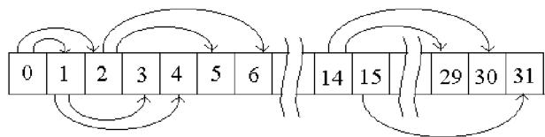  
SFS next state for present states 0-15

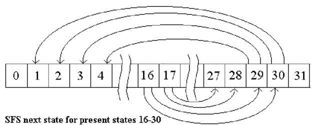  
Figure 2.9 Pictorial description of Figure 2.8 for max_num_states $=$ 32

SFS

Start state Q13

Table 2.5 Four-state FSM with start state Q13   
reassigned:   

<table><tr><td rowspan=1 colspan=1>Present State/Final State?</td><td rowspan=1 colspan=1>Next StateFor Input = 0</td><td rowspan=1 colspan=1>Next StateFor Input = 1</td></tr><tr><td rowspan=1 colspan=1>Q13/0</td><td rowspan=1 colspan=1>Q5</td><td rowspan=1 colspan=1>Q9</td></tr><tr><td rowspan=1 colspan=1>Q5/1</td><td rowspan=1 colspan=1>Q13</td><td rowspan=1 colspan=1>Q5</td></tr><tr><td rowspan=1 colspan=1>Q9/0</td><td rowspan=1 colspan=1>Q5</td><td rowspan=1 colspan=1>Q12</td></tr><tr><td rowspan=1 colspan=1>Q12/0</td><td rowspan=1 colspan=1>Q13</td><td rowspan=1 colspan=1>Q12</td></tr></table>

Table 2.6 FSM with of Table 2.5 after Step 1 of SFS   
Start state Q0   
reassigned: Q0   
Table 2.7 FSM of Table 2.6 after Next States for Q0 Reassigned   

<table><tr><td rowspan=1 colspan=1>Present State/Final State?</td><td rowspan=1 colspan=1>Next StateFor Input = 0</td><td rowspan=1 colspan=1>Next StateFor Input = 1</td></tr><tr><td rowspan=1 colspan=1>Q0/0</td><td rowspan=1 colspan=1>Q5</td><td rowspan=1 colspan=1>Q9</td></tr><tr><td rowspan=1 colspan=1>Q5/1</td><td rowspan=1 colspan=1>Q0</td><td rowspan=1 colspan=1>Q5</td></tr><tr><td rowspan=1 colspan=1>Q9/0</td><td rowspan=1 colspan=1>Q5</td><td rowspan=1 colspan=1>Q12</td></tr><tr><td rowspan=1 colspan=1>Q12/0</td><td rowspan=1 colspan=1>Q0</td><td rowspan=1 colspan=1>Q12</td></tr></table>

Start state Q0   
reassigned: Q0,Q1,Q2   

<table><tr><td rowspan=1 colspan=1>Present State/Final State?</td><td rowspan=1 colspan=1>Next StateFor Input = 0</td><td rowspan=1 colspan=1>Next StateFor Input = 1</td></tr><tr><td rowspan=1 colspan=1>Q0/0</td><td rowspan=1 colspan=1>Q1</td><td rowspan=1 colspan=1>Q2</td></tr><tr><td rowspan=1 colspan=1>Q1/1</td><td rowspan=1 colspan=1>Q0</td><td rowspan=1 colspan=1>Q1</td></tr><tr><td rowspan=1 colspan=1>Q2/0</td><td rowspan=1 colspan=1>Q1</td><td rowspan=1 colspan=1>Q12</td></tr><tr><td rowspan=1 colspan=1>Q12/0</td><td rowspan=1 colspan=1>Q0</td><td rowspan=1 colspan=1>Q12</td></tr></table>

Table 2.8 FSM of Table 2.5 after SFS   
Figure 2.10 Table depiction of SFS algorithm on a four-state FSM genome   

<table><tr><td rowspan=1 colspan=3>Start state Q0                               reassigned: Q0,Q1,Q2,Q6</td></tr><tr><td rowspan=1 colspan=1>Present State/Final State?</td><td rowspan=1 colspan=1>Next StateFor Input = 0</td><td rowspan=1 colspan=1>Next StateFor Input = 1</td></tr><tr><td rowspan=1 colspan=1>Q0/0</td><td rowspan=1 colspan=1>Q1</td><td rowspan=1 colspan=1>Q2</td></tr><tr><td rowspan=1 colspan=1>Q1/1</td><td rowspan=1 colspan=1>Q0</td><td rowspan=1 colspan=1>Q1</td></tr><tr><td rowspan=1 colspan=1>Q2/0</td><td rowspan=1 colspan=1>Q1</td><td rowspan=1 colspan=1>Q6</td></tr><tr><td rowspan=1 colspan=1>Q6/0</td><td rowspan=1 colspan=1>Q0</td><td rowspan=1 colspan=1>Q6</td></tr></table>

Note the consistency of Tables 2.7 and 2.8 with the Next State calculation of Figure 2.8; the Next State for Q12 with input 1 is reassigned to ${ \mathrm { Q } } ( 2 ^ { \ast } 2 { + } 1 { + } 1 ) =$ Q6.

# 2.2.4 Competition

A lesson borrowed from the evolutionary algorithm (EA) can be considered in a genetic algorithm as well. Each individual in the population competes against a fixed number of randomly chosen members of the population. The population is then ranked based on the number of wins. Generally, in the EA, the selection process retains the top half of the population for the next generation. The remaining half of the next generation is filled by applying mutation to each retained individual, with each individual producing a single child. Consequently, for each succeeding generation, parents and children compete against each other for a place in the following generation. This provides a changing environment (fitness landscape) and is less likely to converge prematurely (Fogel, 1994).

In an evolutionary algorithm, the fitness of an individual is determined by a competition with other individuals in the population, even in the situation where the fitness can be explicitly defined. When a genetic algorithm uses a fitnessbased selection process and the fitness is an explicitly defined function, the solution space consists of a static fitness landscape of valleys and hills for the population to overcome; this fitness landscape remains unchanged throughout a given run. Thus, the population could gravitate towards a local rather than a global optimum when the fitness landscape consists of multiple peaks.

These two different approaches (GA vs. EA) have relative strengths and weaknesses. Each one is more appropriate for different types of problems (Angeline and Pollack 1993), but a competition can easily be integrated into the fitness procedure of a genetic algorithm to reduce the chance of premature convergence. Since the newly designed reorganization operators of Sections 2.2.3 (MTF) and 2.2.4 (SFS) create a more homogeneous population by standardizing where the genome information will be found, these operators might make the GA more prone to premature convergence. Competition possibly can provide a mechanism of avoiding this. Figure 2.11 details the competition procedure. This step should be inserted after step 2 in Figure 2.2 which outlined the genetic algorithm shell used in this research (Section 2.1). Note that for this research, each FSM faced ${ \mathfrak { n } } = 1 0$ randomly chosen competitors. The reader is referred to Hammerman and Goldberg (1999) for C language implementation of this procedure.

# Competition: Dealing with Premature Convergence

1) Calculate the language recognition fitness of the individuals in the population.

2) For each individual i of the population do

a) Randomly select n competitors from the population.   
b) For each of the n competitors do i) Assign a score for this competition for individual i (1) 2 points, if fitness is higher than that of the competitor's (2) 1 points, if fitness is equal to that of the competitor's (3) 0 points, if fitness is lower than that of the competitor's   
c) Sum the competition scores

3)New fitness $= 1 0 0$ times total competition score $^ +$ original fitness.

Figure 2.11 Outline of competition procedure

# 2.3 The Experimentation

A standard test bed was needed to further test the effect of MTF and SFS on convergence. Angeline (1996) wrote that the Tomita Test Set is a semi-standard test set used to "induce FSAs [finite state automatons] with recurrent NNs [neural networks]." The Tomita Test Set consists of sets of strings representing 14 regular languages. Tomita (1982) used these sets to breed finite state automata (FSA) language recognizers. Angeline (1996) suggests "that a better test set would include some languages that are not regular." These languages should contain strings that are "beyond the capability of the representation so you can see how it tries to compensate."

As per Angeline's suggestion (1996), three additional sets were drawn up. These three sets were designed to represent languages which are not regular; however, reducing the description of each of these languages to a finite set as Tomita did, effectively reduces the language to a regular language. When creating each set, an attempt was made to capture some properties of the strings in the language. The Tomita Test Set and the three additional languages are presented in Section 2.3.1. Specific considerations for the language recognition problem are presented in Section 2.3.2. The experimentation results will be presented in Section 2.5 based on the evaluation criteria described in Section 2.4.

# 2.3.1 The Languages

There are seven Tomita sets (1982). Each set represents two languages and consists of two lists: a list of strings belonging to one of two of the defined regular languages and a list of strings which do not belong to that language. In the lists which follow, $\lambda$ represents the empty string.

Seven of the Tomita languages and sets representing those languages are as follows:

<table><tr><td colspan="2">L1: 1*</td><td colspan="2">L2: (10)*</td><td></td></tr><tr><td>in Ll</td><td>not in L1</td><td>| |</td><td>in L2</td><td>not in L</td></tr><tr><td>λ</td><td>0</td><td>|</td><td>λ</td><td>1</td></tr><tr><td>1</td><td>10</td><td>|</td><td>10</td><td>0</td></tr><tr><td>11</td><td>01</td><td>|</td><td>1010</td><td>11</td></tr><tr><td>111</td><td>00</td><td>|</td><td>101010</td><td>00</td></tr><tr><td>1111</td><td>011</td><td>|</td><td>10101010</td><td>01</td></tr><tr><td>11111</td><td>110</td><td>|</td><td>10101010101010</td><td>101</td></tr><tr><td>111111</td><td>11111110</td><td>|</td><td></td><td>100</td></tr><tr><td>1111111</td><td>10111111</td><td>|</td><td></td><td>1001010</td></tr><tr><td>11111111</td><td></td><td>|</td><td></td><td>10110</td></tr><tr><td></td><td></td><td>|</td><td></td><td>110101010</td></tr></table>

L3: Any string which does not contain an odd number of consecutive zeroes at some point in the string after the appearance of an odd number of consecutive ones.

<table><tr><td rowspan=1 colspan=1>in L3</td><td rowspan=1 colspan=1></td><td rowspan=1 colspan=1>not in L3</td></tr><tr><td rowspan=1 colspan=1></td><td rowspan=2 colspan=2>||                         10</td></tr><tr><td rowspan=1 colspan=1>λ</td></tr><tr><td rowspan=1 colspan=1>1</td><td rowspan=1 colspan=2>|                         101</td></tr><tr><td rowspan=1 colspan=1>0</td><td rowspan=1 colspan=2>|                         010</td></tr><tr><td rowspan=1 colspan=1>01</td><td rowspan=1 colspan=2>|                         1010</td></tr><tr><td rowspan=1 colspan=1>11</td><td rowspan=1 colspan=2>|                         1110</td></tr><tr><td rowspan=1 colspan=1>00</td><td rowspan=1 colspan=2>|                         1011</td></tr><tr><td rowspan=1 colspan=1>100</td><td rowspan=1 colspan=2>|                         10001</td></tr></table>

L4: No more than two consecutive 0's   

<table><tr><td rowspan=1 colspan=1>110                      |</td><td rowspan=1 colspan=1>|                         111010</td></tr><tr><td rowspan=1 colspan=1>111                      |</td><td rowspan=1 colspan=1>|                         1001000</td></tr><tr><td rowspan=1 colspan=1>000                      |</td><td rowspan=1 colspan=1>|                         11111000</td></tr><tr><td rowspan=1 colspan=1>100100                  |</td><td rowspan=1 colspan=1>|                         0111001101</td></tr><tr><td rowspan=1 colspan=1>110000011100001       |</td><td rowspan=2 colspan=1>|                         11011100110</td></tr><tr><td rowspan=1 colspan=1>111101100010011100</td></tr></table>

<table><tr><td>in L4</td><td>not in L4</td></tr><tr><td>λ</td><td>000</td></tr><tr><td>1</td><td>11000</td></tr><tr><td>0</td><td>0001</td></tr><tr><td>10</td><td>000000000</td></tr><tr><td>01</td><td>11111000011</td></tr><tr><td>00</td><td>1101010000010111</td></tr><tr><td>100100</td><td>1010010001</td></tr><tr><td>001111110100</td><td>0000</td></tr><tr><td>0100100100</td><td>00000</td></tr><tr><td>11100</td><td></td></tr><tr><td>010</td><td></td></tr></table>

L5: Even length strings which, when the bits are paired, have an even number of 01 or 10 pairs   

<table><tr><td></td><td>in L5</td><td>not in L5</td></tr><tr><td></td><td>λ</td><td>1</td></tr><tr><td>|</td><td>11</td><td>0</td></tr><tr><td></td><td>00</td><td>111</td></tr><tr><td>|</td><td>1001</td><td>010</td></tr><tr><td>|</td><td>0101</td><td>000000000</td></tr><tr><td>|</td><td>1010</td><td>1000</td></tr><tr><td>|</td><td>1000111101</td><td>01</td></tr><tr><td>|</td><td>1001100001111010</td><td>10</td></tr><tr><td>|</td><td>111111</td><td>1110010100</td></tr><tr><td></td><td></td><td>010111111110</td></tr><tr><td>|</td><td>0000</td><td></td></tr><tr><td>|</td><td>0001</td><td></td></tr><tr><td>|</td><td>011</td><td></td></tr></table>

L6: The difference between the number   
L7: $\mathbf { 0 ^ { * } 1 ^ { * } 0 ^ { * } 1 ^ { * } }$ of 1's and O's is 3n.   

<table><tr><td>in L6</td><td>not in L6</td><td>| in L7 |</td><td></td><td>not in L7</td></tr><tr><td>λ</td><td>1</td><td>|</td><td>λ</td><td>1010</td></tr><tr><td>10</td><td>0</td><td>|</td><td>1</td><td>00110011000</td></tr><tr><td>01</td><td>11</td><td>|</td><td>0</td><td>0101010101</td></tr><tr><td>1100</td><td>00</td><td>|</td><td>10</td><td>1011010</td></tr><tr><td>101010</td><td>101</td><td>|</td><td>01</td><td>10101</td></tr><tr><td>111</td><td>011</td><td>|</td><td>11111</td><td>010100</td></tr><tr><td>000000</td><td>11001</td><td>|</td><td>000</td><td>101001</td></tr><tr><td>10111</td><td>1111</td><td>|</td><td>00110011</td><td>100100110101</td></tr><tr><td>0111101111</td><td>00000000</td><td>|</td><td>0101</td><td></td></tr></table>

<table><tr><td>100100100</td><td>010111</td><td>|</td><td>0000100001111</td></tr><tr><td></td><td>10111101111</td><td>|</td><td>00100</td></tr><tr><td></td><td>1001001001</td><td>|</td><td>011111011111</td></tr><tr><td></td><td></td><td>|</td><td>00</td></tr></table>

Furthermore, incorporating Angeline's suggestion (1996), representative sets for three non-regular languages were drawn up. They are as follows:

L8: prime numbers in binary form   

<table><tr><td>in L8</td><td colspan="2">not in L8</td></tr><tr><td>10</td><td>λ</td><td>0110</td></tr><tr><td>11</td><td>0</td><td>0000110</td></tr><tr><td>101</td><td>1</td><td>0000000110</td></tr><tr><td>111</td><td>100</td><td>110011</td></tr><tr><td>1011</td><td>110</td><td>10110</td></tr><tr><td>1101</td><td>1000</td><td>11010</td></tr><tr><td>11111</td><td>1001</td><td>111110</td></tr><tr><td>100101</td><td>1010</td><td>10010110</td></tr><tr><td>1100111</td><td>1100</td><td>10010</td></tr><tr><td>10010111</td><td>1110</td><td></td></tr><tr><td>011</td><td></td><td>1001011</td></tr><tr><td>0011</td><td>1111</td><td>111111</td></tr><tr><td>0000011</td><td>11001</td><td></td></tr></table>

0000000011

<table><tr><td colspan="4">L9: 0&#x27;1</td></tr><tr><td>in L9</td><td>not in L9</td><td></td><td></td></tr><tr><td>λ</td><td>0</td><td>010</td><td>1010</td></tr><tr><td>01</td><td>1</td><td>011</td><td>1100</td></tr><tr><td>0011</td><td>00</td><td>100</td><td>1010011000111</td></tr><tr><td>000111</td><td>10</td><td>101</td><td>010011000111</td></tr><tr><td>00001111</td><td>11</td><td>110</td><td>010101</td></tr><tr><td>0000000011111111</td><td>000</td><td>111</td><td>01011</td></tr><tr><td colspan="2"></td><td>001</td><td>1000</td></tr></table>

# L10: Binary form of perfect squares

<table><tr><td colspan="2">in L10</td><td colspan="2">not in L10</td></tr><tr><td>0</td><td>0000100</td><td>λ</td><td>1110000</td></tr><tr><td>1</td><td>0000000100</td><td>10</td><td>11100000</td></tr><tr><td>100</td><td>10000</td><td>11</td><td>11100000000</td></tr><tr><td>1001</td><td>100000000</td><td>101</td><td>00000111</td></tr><tr><td>11001</td><td>1100100</td><td>110</td><td>000000111</td></tr><tr><td rowspan="2">0100</td><td>11001000000</td><td>111</td><td>100000</td></tr><tr><td></td><td>1100</td><td colspan="1">100000000000</td></tr><tr><td colspan="2"></td><td>00111</td><td>1100100000</td></tr></table>

There were several goals that were behind the selection of the strings in the sets for L8, L9, and L10. When designing these sets, different criteria were taken into account.

An attempt was made to keep the sets as small as possible even though a larger set would provide a better representation. For example, it is desirable for all prefixes of strings on the lists to also appear on the lists, but this would create rather large sets of strings. As it is, the sets for L8, L9, and L10 are much larger than Tomita's sets (1982).

Include some strings indicating a "pattern" in a language. For example, preceding a binary number with a string of zeroes does not change its value; therefore, in L8 and L10, a string preceded by zeroes is on the same list as the shorter string. Similarly, appending $" 0 0 "$ to the end of a binary number effectively multiplies it by four; consequently, in L10, a string ending with an even number of zeroes belongs on the same list as the one without the trailing zeroes. A few representative strings for each of these patterns have been included for L8 and L10.

In addition to defining L1 through L10, these ten sets are used to define ten more languages labeled L1c through L10c; by interchanging the list of strings belonging to a language with the list of strings which do not belong to that language another ten languages (L1c through L10c) are defined. The languages Li and Lic are called complementary languages. Section 2.3.2 will look at some aspects of the problem of accepting or rejecting strings in a language.

# 2.3.2 Specific Considerations for the Language Recognition Problem

While the solution to the language acceptance problem can be modeled by a finite state automaton, it differs significantly from the trail problem. First, using the GA to find an FSA for L1 and L1c was deemed too simple a problem to provide useful data for this study. Among other problems, finding a set of 100 seeds such that none of the seeds would result in a solution in generation 0 proved to be a problem. While it was doable, handpicking too many seeds for testing was not acceptable.

In the research for this chapter, no attempt was made to find solutions to the verbal descriptions or regular expressions defining the languages. Tomita (1982) focused on finding an FSA corresponding to the regular expression or verbal description of the language. The work for this chapter was limited to finding an FSA which defined the membership function for the representative set of strings for a given language. For any given language, the fitness function tested the strings on the two lists for that language. The fitness of an individual is the total number of strings which are correctly identified as to their membership or lack of membership in the language.

The benchmark, SFS, and MTF, each with competition (referred to as methods B2, M2 and S2) and without competition (referred to as methods B1, M1 and S1), were applied to a total of 18 sets—nine of the original ten sets (L2 through L10) and their complements (L2c through L10c). As the data became available, it was clear that MTF was not necessarily predominant with respect to efficiency. Consequently two hybrid methods were added to these experiments to see if either would consistently perform better than B1. For these hybrids, MTF and SFS were applied alternating generations, both with and without competition. MTF was applied to all even generations including to the initial generation, and SFS was applied to every odd generation. These two hybrids were labeled A1 (no competition) and A2 (competition included).

Several modifications were made to the C language programs used for the trail following problem (Hammerman and Goldberg, 1999). Obviously, the fitness function had to be changed for each language. The merge-sort for the trail following problem was replaced with a heap sort (Knuth, 1973) for the language recognition problem; the sort was used to locate the top $5 \%$ of the population. For the initial testing of the programs for the trail problem, a stable sort was desired. Also, for some of the early testing of the programs, it was necessary to sort the whole population. The merge-sort was deemed the best to use under these conditions. When the language recognition problem was studied, it was felt that a stable sort was no longer necessary. In addition, in each generation, sorting could stop once the parent pool was filled; the heap sort could accomplish this more efficiently. By replacing the merge-sort with the heap sort, runtime could be greatly reduced.

As previously mentioned, an FSA for the language problem is different from the FSM for the trail following problem. Consequently, the genome had to be modified, and the program functions involved in bitstring to FSM state transition table conversion and vice versa also had to be changed. Based on the nature of the trail problem, the finite state machine (generic FSM defined in Section 2.2.1) used to model a solution for the trail following problem is a transducer which produces an output/reaction each time a transition rule is applied. Thus, the FSM for the trail problem requires an output function in addition to the transition function. In addition, the set of final sets is empty.

In the case of the language recognition problem, the FSA is used to examine strings to determine whether or not they belong to a language. The finite state automaton implemented for this part of the study does not give a response with each application of a transition rule. Hence, an output function is not defined. When applying an FSA to a string and when the last character of a string brings the FSA into a final state, the string is accepted as a member of the language; otherwise, the string is rejected. Hence, in order to define a string's membership in a language, the corresponding FSA's set of final states cannot be empty.

To identify the membership function of strings with respect to given language, each present state has to be identified as to whether it is or is not a final state. This requires a single bit; 1 is used to indicate a final state. The 18 languages have two characters in their alphabets, so two next states are needed for each present state. The number of bits needed for each future state is strictly dependent on the maximum number of states permitted.

There were two lines of thought as to how to order the three pieces of data for each present state. One approach is that since the single bit defining a state as a final state is associated with the present state, it comes first. It is followed by the next state for an input of 0, which is then followed by the next state for an input of 1 (see Figure 2.1 of Section 2.2.1). However, this order actually ties that single bit closer to the next state for input 0 with respect to the crossover operator than for an input of 1. The probability of retaining the single bit defining final state status and the next state for an input of 1, and of disrupting the next state for input 0 is

$$
\sum _ { \mathbf { i } = 1 } ^ { \left\lfloor \frac { \mathrm { M } + 1 } { 2 } \right\rfloor } \mathbf { C } _ { 2 ^ { \mathrm { M } + 1 } } ^ { \mathsf { M } + 1 } \mathbf { P } _ { \mathrm { x } } ^ { 2 \mathrm { i } } ( 1 - \mathbf { P } _ { \mathrm { x } } ) ^ { 2 ( \mathrm { M } - \mathrm { i } ) }
$$

where $\mathbf { P _ { x } }$ is the per bit probability of crossover and M is the number of bits used to represent the state number. The reader is referred to the dissertation (Hammerman, 1999) for details about this formula and the subsequent formula (next paragraph), including the complete proof. For all but two (L2, and L2c) of the languages used for this part of the study, $\mathbf M = 4$ ; that is, the genome allows for 16 states. $\mathbf { P } _ { \mathrm { x } }$ was set at $1 \%$ . Thus, for a given present state, the probability that the single bit defining membership in the set of final states will be sent to a child with only the next state for input 1 is approximately 0.00094.

For a given present state, the probability that the single bit defining membership in the set of final states will be sent to a child with only the next state for input 0 is $( 1 - \mathbf { P } _ { \mathbf { x } } ) ^ { \mathbf { M } }$ [1- $( 1 { \cdot } \mathbf { P } _ { \mathbf { x } } ) ^ { \mathbf { M } } ]$ . Thus, for a 16-state machine and ${ \bf P } _ { \bf x } = { \bf \nabla } . 0 1$ , the total probability is approximately .04. This shows that for a given present state, the single bit defining membership in the set of final states is much more likely to transfer to a child with only the next state for input O intact than it is to transfer to an offspring with only the next state for input 1 intact. If instead, the bit defining membership in the set of final states is positioned between the two future states for a present state, crossover is equally likely to send that bit to a child with either of the next states. Figure 2.12 below shows the layout for such a genome allowing for a 16-state FSA; Figure 2.1 in Section 2.2.1 (above) contains the first 16-state genome map. To study the effects of the bias indicated, the experiments were also carried out with the latter of the two genomes.

Figure 2.12 16-state/148-bit FSA genome (G2) map   

<table><tr><td>Bit # 0 3 4 7</td><td>8</td><td>9</td><td>12</td></tr><tr><td>Contents start state</td><td>next state</td><td>final</td><td>next state</td></tr><tr><td></td><td>for q0 with input 0</td><td>state?</td><td>for q0 with input 1</td></tr><tr><td>Bit #</td><td>13 16</td><td>17</td><td>18 21</td></tr><tr><td>Contents</td><td>next state</td><td>final</td><td>next state</td></tr><tr><td></td><td>for q1 with input 0</td><td>state?</td><td>for q1 with input 1</td></tr><tr><td>Bit #</td><td>4+9i</td><td>8+9i</td><td>12+9i</td></tr><tr><td></td><td></td><td></td><td></td></tr><tr><td>Contents</td><td>next state</td><td>final</td><td>next state</td></tr><tr><td></td><td>for qi with input 0</td><td>state?</td><td>for qi with input 1</td></tr><tr><td>Bit #</td><td>139 142</td><td>143</td><td>144 147</td></tr><tr><td></td><td></td><td></td><td></td></tr><tr><td>Contents</td><td>next state</td><td>final</td><td>next state</td></tr><tr><td></td><td>for q15 with input 0</td><td>state?</td><td>for q15 with input</td></tr></table>

Tomita (1982) presented a set of solutions for his language recognition problems. Some of these solutions were in minimized form. The maximum number of states he presented for a single language was six. Clearly, it was not necessary to allow for a 32-state solution. Genome sizes of 4, 8, and 16 states were tried and population sizes of $2 ^ { 4 }$ up to $2 ^ { 1 0 }$ were tried, depending on the size of the genome. (All population sizes were powers of 2.) Note that a smaller genome has a smaller genome space, therefore a smaller population size can be used. The parent pool was kept in the neighborhood of the top $5 \%$ of the population with the parent pool containing a minimum of two parents in order to permit the possibility of crossover between two different parents as opposed to crossover between copies of a single individual.

As a result of this search for parameter values, the search by the GA for FSAs to define L1 and L1c was deemed inappropriate to provide useful data for this study due to the simplicity of these problems. As explained earlier, for several of the seeds the GA found a solution in generation 0. The table in Figure 2.13 indicates the final set of parameters chosen for each of the remaining languages. With a maximum of eight states, the genome contains 3 bits for the start state $+ 8$ states \* (2 inputs $^ { * } \ 3$ bits for each next states $+ \ 1$ bit for final state status) $= 5 9$ bits. Similarly for a maximum of 16 states, the number of bits in the genome is $4 +$ $1 6 ( 2 * 4 + 1 ) = 1 4 8$ bits.

Figure 2.13 Table of parameters for the languages   

<table><tr><td rowspan=1 colspan=1>Language</td><td rowspan=1 colspan=1>Maximum # of StatesAllowed</td><td rowspan=1 colspan=1>Population Size</td><td rowspan=1 colspan=1>Size ofParent Pool</td></tr><tr><td rowspan=1 colspan=1>L2 and L2c</td><td rowspan=1 colspan=1>8</td><td rowspan=1 colspan=1>32</td><td rowspan=1 colspan=1>2</td></tr><tr><td rowspan=1 colspan=1>L3 and L3c</td><td rowspan=1 colspan=1>16</td><td rowspan=1 colspan=1>128</td><td rowspan=1 colspan=1>6</td></tr><tr><td rowspan=1 colspan=1>L4 and L4c</td><td rowspan=1 colspan=1>16</td><td rowspan=1 colspan=1>64</td><td rowspan=1 colspan=1>3</td></tr><tr><td rowspan=1 colspan=1>L5 and L5c</td><td rowspan=1 colspan=1>16</td><td rowspan=1 colspan=1>128</td><td rowspan=1 colspan=1>6</td></tr><tr><td rowspan=1 colspan=1>L6</td><td rowspan=1 colspan=1>16</td><td rowspan=1 colspan=1>64</td><td rowspan=1 colspan=1>4</td></tr><tr><td rowspan=1 colspan=1>L6c</td><td rowspan=1 colspan=1>16</td><td rowspan=1 colspan=1>64</td><td rowspan=1 colspan=1>3</td></tr><tr><td rowspan=1 colspan=1>L7, L7c, L8, L8c, L9, and</td><td rowspan=1 colspan=1>16</td><td rowspan=1 colspan=1>128</td><td rowspan=1 colspan=1>6</td></tr><tr><td rowspan=1 colspan=1>L10 and L10c</td><td rowspan=1 colspan=1>16</td><td rowspan=1 colspan=1>256</td><td rowspan=1 colspan=1>13</td></tr></table>

The set of 100 seeds from the trail problem was used with a few changes for L2 and L2c. A few of the seeds for each of these languages yielded a solution in the initial generation. Since the GA terminates when a solution is found, the few seeds which resulted in a solution in generation 0 were changed to permit the GA to move beyond the initial population in every run. For L2, seeds .532596024438298 and .877693349889729 from the 0riginal list of 100 seeds (Figure 2.14) were changed to .532196024438298 and .877293349889729 respectively, and for L2c, .269971117907016 and .565954508722250 were altered to .269571117907016 and .565554508722250 respectively. The fourth digit in each of these seeds was decreased by four to get the two new seeds for each language. The remaining 98 seeds for each language were not changed. The following seeds were used to start the random number generator which first generated the initial population for each run and continued in use for the rest of the genetic algorithm.

0.396464773760275, 0.840485369411425, 0.353336097245244, 0.446583434796544,   
0.318692772311881, 0.886428433223031, 0.015582849408329, 0.584090220317272,   
0.159368626531805, 0.383715874807194, 0.691004373382196, 0.058858913592736,   
0.899854306161604, 0.163545950630365, 0.159071502581806, 0.533064714021855,   
0.604144189711239, 0.582699021207219, 0.269971117907016, 0.390478195463409,   
0.293400570118951, 0.742377406033981, 0.298525606318119, 0.075538078537782,   
0.404982633583334, 0.857377942708183, 0.941968323291899, 0.662830659789996,   
0.846475779930007, 0.002755081426884, 0.462379245025485, 0.532596024438298,   
0.787876620892920, 0.265612234971371, 0.982752263101030, 0.306785130614180,   
0.600855136489105, 0.608715653358658, 0.212438798201187, 0.885895130587606,   
0.304657101745793, 0.151859864068570, 0.337661902873531, 0.387476950965358,   
0.643609828900129, 0.753553275640016, 0.603616098781568, 0.531628251750810,   
0.459360316334315, 0.652488446971034, 0.327181163850650, 0.946370485960081,   
0.368039867432817, 0.943890339354468, 0.007428261719067, 0.516599949702389,   
0.272770952753351, 0.024299155634651, 0.591954502437812, 0.204963509751600,   
0.877693349889729, 0.059368693380250, 0.260842551926938, 0.302829184161332,   
0.891495219672155, 0.498198059134410, 0.710025580792159, 0.286413993907622,   
0.864923577399470, 0.675540671125631, 0.458489973232272, 0.959635562381060,   
0.774675406127844, 0.376551280801323, 0.228639116426205, 0.354533877294422,   
0.300318248151815, 0.669765831680721, 0.718966572477935, 0.565954508722250,   
0.824465313206080, 0.390611909814908, 0.818766311218223, 0.844008460045423,   
0.180467770090349, 0.943395886088908, 0.424886765414069, 0.520665778036708,   
0.065643754874575, 0.913508169204363, 0.882584572720003, 0.761364126692378,   
0.398922546078257, 0.688256841941055, 0.761548303519756, 0.405008799190391,   
0.125251137735066, 0.484633904711558, 0.222462553152592, 0.873121166037272

The runs were permitted to breed a maximum of 1000 generations recording the per run data. To see if the results would carry across a wide range of maxgens (maximum number of generations bred) rather than across only a few good choices for maxgen, data was collected for a wide range of values from unrealistically low to 1000, which is extremely high. This is in consideration of the fact that a researcher using a GA to locate the solution to a problem could very easily select an inappropriate value for maxgen. Hence, data was recorded for maxgens of 1000, 750, 500, 300, 250, 200, 150, 100, 75, 50, and 25.

# 2.4 Data Obtained from the Experimentation

This section presents in table form some significant pieces of empirical data obtained from the experimentation. The experiments outlined in the previous section indicated that two types of genomes were tested for the language

recognition problem and that the testing data involved languages L2-L10 and their complements L2c-L10c.   

<table><tr><td>G1</td><td>L2</td><td>L3</td><td>L4 L5 L6</td><td></td><td></td><td>L7</td><td></td><td></td><td>L8 L9 L10</td><td></td><td>L2cL3cL4cL5c L6c L7cL8c L9c_10c</td><td></td><td></td><td></td><td></td><td></td><td></td><td></td><td>B</td><td>B*</td><td>w</td><td>W*</td></tr><tr><td>A1</td><td>1</td><td>1</td><td>3</td><td>3</td><td></td><td>1</td><td></td><td></td><td></td><td>2</td><td></td><td></td><td></td><td></td><td></td><td></td><td>6</td><td></td><td>6</td><td>0</td><td>3</td><td></td></tr><tr><td>B1</td><td>1</td><td>1</td><td>4</td><td>4</td><td>1 2</td><td>3</td><td>2 2</td><td></td><td>2 3</td><td></td><td>3 2</td><td>3</td><td>6 5</td><td>9 7</td><td></td><td>3 4 4</td><td>5</td><td></td><td>5</td><td>2</td><td>8</td><td>0 4</td></tr><tr><td>M1</td><td>1</td><td>1</td><td>3</td><td>3</td><td>1</td><td>2</td><td>3</td><td></td><td>2</td><td>3</td><td>2</td><td>2</td><td>7</td><td>7</td><td>2</td><td>4 4</td><td>7</td><td></td><td>6</td><td>0</td><td>5</td><td></td></tr><tr><td>S1</td><td>1</td><td>1</td><td>3</td><td>2</td><td>1</td><td>1</td><td>2</td><td></td><td>2</td><td>1</td><td>2 2</td><td>2</td><td>7</td><td>9</td><td>3</td><td>3 4</td><td>6</td><td></td><td>9</td><td>2</td><td>3</td><td>3</td></tr><tr><td>EQU</td><td></td><td>1 1</td><td></td><td></td><td></td><td></td><td></td><td></td><td></td><td></td><td>1</td><td></td><td></td><td></td><td></td><td></td><td></td><td></td><td></td><td></td><td></td><td></td></tr><tr><td>G1/C</td><td>L2</td><td>L3 L4 L5</td><td></td><td></td><td>L6</td><td>L7</td><td></td><td>1</td><td>L8 L9 L10</td><td colspan="7">L2cL3cL4cL5cL6cL7cL8cL9c_10c</td><td>1</td><td></td><td>5 B B*W</td><td></td><td>5</td><td></td></tr><tr><td></td><td></td><td></td><td></td><td></td><td></td><td></td><td></td><td></td><td></td><td colspan="7"></td><td></td><td></td><td></td><td></td><td></td><td>W*</td></tr><tr><td>A2</td><td>1</td><td>1</td><td>3 3</td><td>3</td><td>1</td><td>2</td><td>1</td><td>3</td><td>2</td><td>2</td><td>1</td><td>2</td><td>8</td><td>9</td><td>2</td><td>3 7</td><td>9</td><td></td><td>8</td><td>1</td><td>4</td><td>1</td></tr><tr><td>B2 M2</td><td>1</td><td>1</td><td>2</td><td>4</td><td>2</td><td>2</td><td>2</td><td>3</td><td>2</td><td>4</td><td>3</td><td>2</td><td>8</td><td>12</td><td></td><td>4</td><td>10 7</td><td></td><td>2</td><td>0</td><td>10</td><td>5</td></tr><tr><td></td><td>1</td><td>1 1</td><td>2</td><td>3 3</td><td>1 1</td><td>2 3</td><td>1 3</td><td>2</td><td>2</td><td>3</td><td>1</td><td>2</td><td>8</td><td>8</td><td>3</td><td>4</td><td>6 6</td><td></td><td>7</td><td>0</td><td>3</td><td>0</td></tr><tr><td>S2</td><td>1</td><td></td><td></td><td></td><td></td><td></td><td></td><td></td><td>2</td><td></td><td>3</td><td>1</td><td>8</td><td>6</td><td></td><td>3</td><td>4 5</td><td></td><td>9</td><td>4</td><td>4</td><td>2</td></tr><tr><td>EQU</td><td></td><td>1 1</td><td></td><td></td><td></td><td></td><td></td><td></td><td>1</td><td></td><td></td><td>1</td><td></td><td></td><td></td><td></td><td></td><td></td><td></td><td></td><td></td><td></td></tr></table>

Figure 2.15 Number of generations required to find a solution. Data obtained by a genetic algorithm using the first genome with/out competition (/C). EQU indicates that all methods performed the same way for a given language. B(est)/W(orst) counts the number of languages for which a given method was the minimum/maximum number of generations when compared to the other methods. \* indicates that the minimum/maximum number was achieved solely by this method   
Figure 2.16 Number of generations required to find a solution. Data obtained by a genetic algorithm using the second genome with/out competition $( / \mathbf { C } )$ . EQ indicates that all methods performed the same way for a given language. B(est)/W(orst) counts the number of languages for which a given method was the minimum/maximum number of generations when compared to the other methods. \* indicates that the minimum/maximum number was achieved solely by this method   

<table><tr><td>G2</td><td></td><td></td><td>L2 L3 L4 L5 L6 L7 L8</td><td></td><td></td><td></td><td></td><td></td><td>L9 L10</td><td></td><td>L2cL3cL4cL5cL6cL7cL8cL9c_10c</td><td></td><td></td><td></td><td></td><td></td><td></td><td></td><td></td><td>B</td><td>B*</td><td>w</td><td>W*</td></tr><tr><td>A1</td><td></td><td>1</td><td>1</td><td>2</td><td>3</td><td>1</td><td>2</td><td>2</td><td>2</td><td>2</td><td></td><td></td><td></td><td></td><td>8</td><td></td><td></td><td>4</td><td></td><td>7</td><td>2</td><td>6</td><td></td></tr><tr><td>B1</td><td>1</td><td>1</td><td>3</td><td>4</td><td>1</td><td></td><td>2</td><td>2</td><td>2</td><td>2</td><td>2 2 1 2</td><td>3 3</td><td>8 6</td><td>8</td><td>3</td><td>4 3</td><td>5 7</td><td>7</td><td></td><td>6</td><td>0</td><td>8</td><td>1 3</td></tr><tr><td>M1</td><td>1</td><td>1</td><td>2</td><td>4</td><td>1</td><td></td><td>3</td><td>2</td><td>3</td><td>2</td><td>2</td><td>3 2</td><td>6</td><td></td><td>8 2</td><td>3</td><td>6</td><td>7</td><td></td><td>4</td><td>0</td><td>8</td><td>2</td></tr><tr><td>S1</td><td>1</td><td>1</td><td>2</td><td>3</td><td>1</td><td></td><td>2</td><td>2</td><td>2</td><td>1</td><td>1</td><td>3 2</td><td>7</td><td></td><td>7 1</td><td>4</td><td>6</td><td>6</td><td></td><td>9</td><td>3</td><td>2</td><td>0</td></tr><tr><td>EQU</td><td></td><td>1 1</td><td></td><td></td><td></td><td></td><td></td><td></td><td></td><td></td><td></td><td></td><td></td><td></td><td></td><td></td><td></td><td></td><td></td><td></td><td></td><td></td><td></td></tr><tr><td>G2/C</td><td></td><td>L2 L3 L4 L5 L6 L7 L8 L9 L10</td><td></td><td></td><td>1</td><td></td><td></td><td>1</td><td></td><td></td><td>L2cL3cL4cL5cL6cL7cL8cL9c_10c</td><td></td><td></td><td></td><td></td><td></td><td></td><td></td><td></td><td>4 B</td><td>B* W W*</td><td>4</td><td></td></tr><tr><td>A2</td><td></td><td></td><td></td><td></td><td></td><td></td><td></td><td></td><td></td><td></td><td></td><td></td><td></td><td></td><td></td><td></td><td></td><td></td><td></td><td></td><td></td><td></td><td></td></tr><tr><td>B2</td><td>1 1</td><td>1 1</td><td>2 3</td><td>3 4</td><td>2</td><td>2</td><td>2 3</td><td>2</td><td>2</td><td></td><td>2 3</td><td>N3</td><td>9</td><td>10</td><td>3</td><td>3</td><td>6</td><td>6</td><td></td><td>6</td><td>2</td><td>3</td><td>1</td></tr><tr><td>M2</td><td>1</td><td>1</td><td>3</td><td>3</td><td>2 2</td><td>3 2</td><td>2</td><td>2</td><td>1 2</td><td></td><td>2 2 2</td><td>2</td><td>6 8</td><td>5 11</td><td>3 3</td><td>4</td><td>7</td><td>7</td><td></td><td>4</td><td>3</td><td>9</td><td>5</td></tr><tr><td>S2</td><td>1</td><td>1</td><td>3</td><td>1</td><td>2</td><td>2</td><td>1</td><td>3</td><td>2</td><td></td><td>2 2</td><td>2</td><td>7</td><td>6</td><td>3</td><td>4 4</td><td>6 4</td><td>7 6</td><td></td><td>4 7</td><td>0 3</td><td>5</td><td>1 1</td></tr><tr><td></td><td></td><td></td><td></td><td></td><td></td><td></td><td></td><td></td><td></td><td></td><td></td><td></td><td></td><td></td><td></td><td></td><td></td><td></td><td></td><td></td><td></td><td>4</td><td></td></tr><tr><td>EQU</td><td></td><td>1 1</td><td></td><td></td><td>1</td><td></td><td></td><td></td><td></td><td></td><td>1</td><td></td><td></td><td></td><td>1</td><td></td><td></td><td></td><td></td><td>5</td><td></td><td>5</td><td></td></tr></table>

The data presented in Figures 2.15-2.18 will be first for determining the effects of the methods (Benchmark, MTF, SFS, and Alternating between MTF and SFS) without competition (name followed by a 1) on all of these languages with respect to the first generation that a solution appeared. Then the data for the methods incorporating competition (name followed by a 2) will be presented. This will be for the first genome G1 (data in Figure 2.15; genome map in Figure 2.1) followed by the same for the second genome G2 (data in Figure 2.16; genome map in Figure 2.12). After that, the same order will be used in presenting the data for the minimal sized solution found (Figures 2.17 and 2.18). It should be noted that these data are among all 100 seeds. Thus, a minimal solution found by one method may occur from a different seed than for another method. This data does not differentiate those situations.

Figure 2.17 Minimal number of states found in a solution. Data obtained by a genetic algorithm using the first genome with/out competition (/C). EQ indicates that all methods performed the same way for a given language. B(est)/W(orst) counts the number of languages that a given method was the minimum/maximum number of generations when compared to the other methods. \* indicates that the minimum/maximum number was achieved solely by this method   

<table><tr><td>G1</td><td>L2</td><td>L3</td><td>L4 L5</td><td></td><td>L6</td><td>L7</td><td></td><td></td><td>L8 L9 L10</td><td></td><td>L2cL3cL4cL5cL6cL7cL8cL9c_10c</td><td></td><td></td><td></td><td></td><td></td><td></td><td></td><td>B</td><td></td><td>B*</td><td>w</td><td>W*</td></tr><tr><td></td><td></td><td></td><td></td><td></td><td></td><td></td><td></td><td></td><td></td><td></td><td></td><td></td><td></td><td></td><td></td><td></td><td></td><td></td><td></td><td></td><td></td><td></td><td></td></tr><tr><td>A1 B1</td><td>3 3</td><td>3 3</td><td>5 7</td><td>5 7</td><td>7 8</td><td>7 7</td><td>5 6</td><td></td><td>6</td><td>3</td><td>3 7 5 8</td><td>7 9</td><td>8 10</td><td></td><td>8 6 9</td><td>8 6</td><td>9 11</td><td>10 9</td><td></td><td>10</td><td>2 0</td><td>4</td><td>1</td></tr><tr><td>M1</td><td>3</td><td>3</td><td>5</td><td>5</td><td>5</td><td>6</td><td>6</td><td></td><td>4 4</td><td>4</td><td>3 6</td><td>5</td><td></td><td>9</td><td>9</td><td>6 7</td><td>9</td><td>10</td><td></td><td>4 11</td><td>3</td><td>11</td><td>7</td></tr><tr><td>S1</td><td>3</td><td>4</td><td>8</td><td>7</td><td>5</td><td>7</td><td>6</td><td></td><td>5</td><td>3 3</td><td>3 5</td><td>8</td><td></td><td>8</td><td>9</td><td>6</td><td>5 8 9</td><td>9</td><td></td><td>8</td><td>1</td><td>4 7</td><td>1 2</td></tr><tr><td></td><td></td><td></td><td></td><td></td><td></td><td></td><td></td><td></td><td></td><td></td><td></td><td></td><td></td><td></td><td></td><td></td><td></td><td></td><td></td><td></td><td></td><td></td><td></td></tr><tr><td>EQU G1/C</td><td>1 L2</td><td>L3 L4 L5 L6 L7</td><td></td><td></td><td></td><td></td><td></td><td></td><td>L8 L9 L10</td><td></td><td>L2cL3cL4cL5cL6cL7cL8cL9c_10c</td><td></td><td></td><td></td><td></td><td></td><td></td><td></td><td></td><td>1</td><td></td><td>1</td><td></td></tr><tr><td></td><td></td><td></td><td></td><td></td><td></td><td></td><td></td><td></td><td></td><td></td><td></td><td></td><td></td><td></td><td></td><td></td><td></td><td></td><td></td><td>B</td><td>B*</td><td>W W*</td><td></td></tr><tr><td>A2 B2</td><td>3</td><td>3</td><td>6</td><td>6</td><td>5</td><td>5</td><td>6</td><td></td><td>4</td><td>3</td><td>3 6</td><td>7</td><td>9</td><td></td><td>8</td><td>7</td><td>5 9</td><td>9</td><td></td><td>10</td><td>2</td><td>3</td><td>0</td></tr><tr><td>M2</td><td>3 3</td><td>3 3</td><td>7 6</td><td>5 6</td><td>8</td><td>8</td><td>7</td><td></td><td>4</td><td>3</td><td>4 8</td><td>8</td><td></td><td>8</td><td>9</td><td>7</td><td>8</td><td>10 10</td><td></td><td>3</td><td>2</td><td>11</td><td>6</td></tr><tr><td>S2</td><td>3</td><td>3</td><td>6</td><td>6</td><td>4 6</td><td>6 8</td><td>4 6</td><td>4 8</td><td>3 3</td><td></td><td>3 6 3 6</td><td>7 7</td><td>9 9</td><td></td><td>8 9</td><td>5 7</td><td>6 8</td><td>9 9 10 11</td><td></td><td>11</td><td>3 0</td><td>2</td><td>0</td></tr><tr><td></td><td></td><td></td><td></td><td></td><td></td><td></td><td></td><td></td><td></td><td></td><td></td><td></td><td></td><td></td><td></td><td></td><td></td><td></td><td></td><td>4</td><td></td><td>9</td><td>2</td></tr><tr><td>EQU</td><td></td><td>1 1</td><td></td><td></td><td></td><td></td><td></td><td></td><td></td><td>1</td><td></td><td></td><td></td><td></td><td></td><td></td><td></td><td></td><td></td><td>3</td><td></td><td>3</td><td></td></tr></table>

Considering the large amounts of data generated and the variety of the results, the main focus here will be to state some observed trends (based on the tables presented in Figures 2.15-2.18). Overall, the best results were obtained by the methods without competition using the first genome. Despite the bias (or perhaps because of the bias?) that the first genome has in favoring the association between the final state status and the next state for input 0 over the next state for input 1, the first genome seems to be more effective than the second genome. More testing would be required to conclusively establish this observation as fact. SFS consistently has more "bests" than "worsts" over all four tables of faster convergence, while the opposite is true (except for genome G1 without competition) for the minimal size solution tables. MTF consistently has many more "bests" than "worsts" over all four tables of minimal sized solutions while the opposite is true for faster convergence using the second genome. Benchmark consistently has more "worsts" than "bests" in all tables and has more "worsts" than any other method across the tables. Alternating methods is consistently between MTF and SFS in all tables.

Figure 2.18 Minimal number of states found in a solution. Data obtained by a genetic algorithm using the second genome with/out competition (/C). EQ indicates that all methods performed the same way for a given language. B(est)/W(orst) counts the number of languages that a given method was the minimum/maximum number of generations when compared to the other methods. \* indicates that the minimum/maximum number was achieved solely by this method   

<table><tr><td>G2</td><td>L2</td><td></td><td>L3 L4 L5 L6</td><td></td><td></td><td></td><td>L7</td><td></td><td>L8 L9 L10</td><td></td><td></td><td>L2cL3c L4cL5c L6cL7c L8cL9c_10c</td><td></td><td></td><td></td><td></td><td></td><td></td><td></td><td>B</td><td>B*</td><td></td><td>w</td><td>W*</td></tr><tr><td>A1</td><td></td><td>3 3</td><td></td><td>6</td><td>6</td><td>6</td><td>5</td><td>4</td><td>5</td><td></td><td>3</td><td></td><td>7</td><td>8</td><td>9</td><td>6 6</td><td></td><td>10 10</td><td></td><td></td><td>5</td><td>2</td><td>3</td><td></td></tr><tr><td>B1</td><td>3</td><td>3</td><td>6</td><td></td><td>5</td><td>7</td><td>8</td><td>5</td><td>5</td><td>3 3</td><td>3</td><td>7 9</td><td>8</td><td>9</td><td>9</td><td>6 8</td><td></td><td>10 10</td><td></td><td></td><td>2</td><td>0</td><td>8</td><td>1 3</td></tr><tr><td>M1</td><td>3</td><td>3</td><td>5</td><td></td><td>5</td><td>6</td><td>5</td><td>6</td><td>5</td><td>3</td><td>3</td><td>5</td><td>8</td><td>8</td><td>9 6</td><td>5</td><td>9</td><td>10</td><td></td><td></td><td>8</td><td>4</td><td>2</td><td>0</td></tr><tr><td>S1</td><td>3</td><td>3</td><td>7</td><td></td><td>5</td><td>7</td><td>4</td><td>7</td><td>5</td><td>3</td><td>3</td><td>7</td><td>8</td><td>9</td><td>9</td><td>7 7</td><td>10</td><td>9</td><td></td><td></td><td>3</td><td>2</td><td>7</td><td>3</td></tr><tr><td>EQU</td><td></td><td>1 1</td><td></td><td></td><td></td><td></td><td></td><td></td><td></td><td>1 1</td><td>1</td><td></td><td></td><td></td><td>1</td><td></td><td></td><td></td><td></td><td></td><td></td><td></td><td></td><td></td></tr><tr><td>G2/C</td><td></td><td>L2 L3 L4 L5 L6 L7 L8 L9 L10</td><td></td><td></td><td></td><td></td><td></td><td></td><td></td><td></td><td colspan="7">L2cL3cL4cL5cL6cL7cL8cL9c_10c</td><td></td><td></td><td></td><td>6 B B*W W*</td><td></td><td>6</td><td></td></tr><tr><td></td><td></td><td></td><td></td><td></td><td></td><td></td><td></td><td></td><td></td><td></td><td colspan="7"></td><td></td><td></td><td></td><td></td><td></td><td></td><td></td></tr><tr><td>A2 B2</td><td>3</td><td>3</td><td>6 5</td><td>6</td><td>5</td><td>7</td><td></td><td>5</td><td>5</td><td>3</td><td>3</td><td>6 7</td><td>9</td><td></td><td>9 6</td><td>5</td><td>9</td><td>10</td><td></td><td>9</td><td>3</td><td></td><td>1</td><td></td></tr><tr><td>M2</td><td>3</td><td>3 3</td><td>5</td><td>5 6</td><td>6 5</td><td>7</td><td></td><td>7</td><td>6</td><td>3</td><td>7</td><td>8</td><td>6</td><td>9</td><td>10</td><td>8 6</td><td></td><td>10 11</td><td></td><td>2</td><td></td><td></td><td>6</td><td></td></tr><tr><td>S2</td><td>3 3</td><td>3</td><td>5</td><td>7</td><td>6</td><td></td><td>7</td><td>6</td><td>6</td><td>3</td><td>3 3</td><td>7 7</td><td>5 7</td><td>8 9</td><td>9</td><td>6</td><td>6</td><td>9 9</td><td></td><td>9</td><td></td><td></td><td></td><td>0</td></tr><tr><td></td><td></td><td></td><td></td><td></td><td></td><td></td><td>5</td><td>6</td><td>5</td><td>3</td><td></td><td></td><td></td><td></td><td>9</td><td>7</td><td>8</td><td>10 10</td><td></td><td>5</td><td>1</td><td></td><td>6</td><td>2</td></tr><tr><td>EQU</td><td></td><td>1 1</td><td></td><td></td><td></td><td></td><td></td><td></td><td></td><td>1</td><td></td><td></td><td></td><td></td><td></td><td></td><td></td><td></td><td></td><td></td><td>3</td><td></td><td>3</td><td></td></tr></table>

The results from the data are quite interesting in that we can conjecture that the SFS operator enables faster convergence for the language recognition problem, while the MTF operator enables smaller solutions to this problem. This is different from the results obtained by the trail following problem (Goldberg and Hammerman, 1999) where MTF enabled both faster convergence and smaller solutions. (Section 2.5 will address this concern.) Because of the variation of results among the genomes, and whether competition should be incorporated, we turn to a wider set of criteria in determining overall performance for the language recognition problem. These issues will be addressed in the next two sections detailing the protocol used to evaluate the total data from the experimentation.

# 2.5 General Evaluation Criteria

The 18 experiments (L2-L10 and L2c-L10c of Section 2.3) with the 8 methods per experiment (B1, B2, M1, M2, S1, S2, A1, A2), 100 runs per method, and 11 values of maxgen per run generated an immense amount of data. The data was subject to nine criteria for general evaluation of efficiency. The reader is referred to the dissertation (Hammerman, 1999) for full descriptions of these criteria. The criteria are K (Koza, 1992), $\mathbf { G } _ { \mathbf { A } \mathbf { v } }$ (average number of generations for successful runs), $\mathrm { T _ { A V : S } }$ (processor time corresponding to $\mathbf { G } _ { \mathrm { A V } } )$ , two $\mathbf { G } \mu \mathbf { s }$ and $\mathrm { T } \mu \mathrm { s }$ (mean number of generations and processor time considering both the failure rate and $\mathbf { G } _ { \mathrm { A V } }$ [or $\mathbf { T } _ { \mathrm { A V } } ]$ based on either subsets of the seed set used, or an entire population), and the probability of getting a solution first based on the number of generations and the corresponding processor times. The speedup (Angeline and Pollack, 1993) or percent increase when applicable was summarized for the nine criteria. The percent decrease for average machine size was also summarized and examined. All of these summaries/worksheets appear in the dissertation. A sample of these worksheets for languages L2, L2c and L8c appear in the appendix for elucidation of concepts that follow in this section. The reader is referred to the dissertation for the experimental results on the remainder of the languages.

The methods are recommended on two levels: first on the criterion level and then on the language level. In both cases, recommendation is based on a language showing some improvement in efficiency over B1 (the benchmark). On each worksheet, there is a separate table for each of seven of the nine criteria and machine size. The tables for two of the criteria $\mathtt { G } \mu$ and $\mathrm { T } \mu$ considering a finite sample have been omitted because in most cases they are identical to the tables for $\mathtt { G } \mu$ and $\mathrm { T } \mu$ for the population. When there are differences in these tables, the differences are minimal and have no effect on the recommendations.

To the left of some of the recommended methods (in the appendix) are the symbols ?, s or \*. These characters are the criterion level recommendations. The question mark or the appearance of two of these characters indicates some criteria recommend the methods while others do not and, thus, it is not clear how to rate that method. The s indicates that the method is considered equivalent in performance to B1. The \* indicates recommendation because the method is considered to have better performance than B1. A method is recommended for a criterion if the method generally shows improvement over the benchmark across the 11 maxgens, occasionally (if ever) matches the performance of the benchmark, and rarely (if ever) falls below the benchmark in a ranking. Poor performance for the extreme values of maxgen (lowest and/or highest values) is not considered a deterrent to recommendation.

A method is recommended for a language based on the following considerations:

It is marked with one of the three symbols on each of the tables for the nine criteria.

Most of the markings are \*.

Timing data is considered important so the method should be recommended with respect to some timing data.

$\mathbf { G } _ { \mathrm { A V } }$ and $\mathrm { T _ { A V : S } }$ are not considered critical to the recommendation except when there are very low failure rates. For example, for L8c (see appendix for worksheet), almost all of the methods do poorly with respect to $\mathbf { G } _ { \mathrm { A V } }$ and $\mathbf { T } _ { \mathbf { A V } : S }$ with smaller values of maxgen. The failure rate is high for the corresponding values of maxgen. A high failure rate will dominate the measures of the number of generations and amount of processor time. Consequently, the poor performance of the methods with respect to $\mathbf { G } _ { \mathbf { A } \mathbf { v } }$ and $\mathbf { T } _ { \mathbf { A V } : S }$ for the smaller values of maxgen does not prevent recommendation of a method for L8c.

Essentially, a method is recommended for a language if it does well for the language. Does well is interpreted to mean that the method is recommended for most but not necessarily all criteria. In addition to these criteria, the percent decrease in machine size is summarized and the methods are ranked based on the range of the percent decreases across the 11 values of maxgen. When the range for two methods is similar, the values for each maxgen are examined to determine rank.

The next section presents the evaluation of the complete experimentation based on the above described criteria.

# 2.6 Evaluation

The nine criteria selected in the previous section to evaluate efficiency and the single criteria for machine size are applied to 18 experiments: nine languages (L2 through L10) and the nine complementary languages (L2c through L10c). Each experiment consists of eight methods: B (benchmark), M (MTF), S (SFS), and A (hybrid which alternates between MTF and SFS) with the letter followed by a 1 (no competition) or 2 (competition incorporated into the fitness function).

# 2.6.1 Machine Size

With respect to machine size, the rankings only consider those machines which generally reduce machine size by more than $3 \%$ when compared to B1 across the 11 values of maxgen and generally have a 0.9 or better degree of confidence based on the U-test. Those which perform similar or worse than B1 are left out. (See sample worksheets in the appendix.) The rankings are determined by the range of the percent decreases for the average machine size as compared to B1 across the 11 maxgens. When the ranges are similar for two methods, the specific

values across the lines on the table in the appendix are compared. The rankings are as follows:   

<table><tr><td>L2</td><td>L2c</td><td>L3</td><td>L3c</td><td>L4</td><td>L4C</td></tr><tr><td>M2</td><td>A1</td><td>M1, M2 A1, A2</td><td>M2</td><td>M2</td><td>M2</td></tr><tr><td>A2</td><td>M1</td><td></td><td>M1</td><td>A2</td><td>M1</td></tr><tr><td>A1</td><td>M2</td><td>S1</td><td>A1 A2</td><td>M1</td><td>A2</td></tr><tr><td>M1 S1 B2</td><td></td><td></td><td></td><td>A1</td><td>S1</td></tr><tr><td>L5 &amp; L10</td><td>L5c</td><td>L6</td><td>L6c</td><td></td><td></td></tr><tr><td>M2</td><td>M2</td><td>M2</td><td>A2</td><td>L7 M2</td><td>L7c</td></tr><tr><td>A1</td><td>M1</td><td>A1, A2</td><td>M1</td><td></td><td>M1</td></tr><tr><td>M1</td><td></td><td>M1</td><td></td><td>M1</td><td>M2</td></tr><tr><td></td><td></td><td></td><td>M2 A1</td><td>A1</td><td>A2</td></tr><tr><td></td><td></td><td></td><td></td><td>A2, S1</td><td>A1</td></tr><tr><td>L8 M1, M2</td><td>L8C M2</td><td>L9 M1, M2</td><td>L9c</td><td>L10 &amp; L5</td><td>L10c</td></tr><tr><td>A1, A2</td><td>M1</td><td>A2</td><td>M1</td><td>M2</td><td>M1</td></tr><tr><td></td><td></td><td></td><td></td><td>A1</td><td>M2</td></tr><tr><td></td><td>Al, A2</td><td>A1</td><td></td><td>M1</td><td>A1</td></tr><tr><td></td><td>S1,S2,B2</td><td></td><td></td><td></td><td>A2</td></tr><tr><td></td><td></td><td></td><td></td><td></td><td></td></tr><tr><td></td><td></td><td></td><td></td><td></td><td></td></tr><tr><td></td><td></td><td></td><td></td><td></td><td>S1</td></tr></table>

When two methods appear on the same line of a list, they are considered to be equally effective in locating solutions with fewer states than B1.

Note that M1 and M2 produce smaller FSAs than B1, as indicated by the fact that both methods are on all the lists except one. For L9c, M2 did produce smaller FSAs than B1, but not enough to make the list. Recall that the methods appearing on the above lists are placed there only if they produce FSMs which are generally more than $3 \%$ smaller than those produced by B1 across the 11 maxgens. Also note that A1 and A2 appear on the lists rather frequently, indicating that the MTF part of these hybrids tends to influence these hybrids toward smaller solutions, just not as consistently as MTF.

# 2.6.2 Convergence Rates

With respect to efficiency/convergence, the results are first presented from the perspective of the languages and then from the perspective of the methods. The methods recommended for each language are as follows (order does not indicate that one method is better than another):

L2, L6: M1, M2, and A1 are recommended.   
L2c: M1 and A1 are recommended.   
L3: S1 and S2 are recommended.   
L3c, L10: S1 is recommended.   
L4: S1, S2, and A2 are recommended.   
L4c: S1, S2, and A1 are recommended.   
L5, L5c, L7: No method stands out as being consistently better than B1.   
L6c: M1, A1, A2, and S1 are recommended.   
L7c: M2 is recommended.   
L8: S1 and B2 are recommended.   
L8c: S1, S2, A1, and A2 are recommended.   
L9, L9c: B1 is the most efficient.   
L10c: S1 is good for maxgen $\geq 2 0 0$ based on criteria which include the fail rate.

For L8c (see appendix for worksheet data), all methods did not perform well on $\mathbf { G } _ { \mathrm { A v } }$ and $\mathrm { T _ { A V : S } }$ with smaller values of maxgen, but the failure rate is high for these values of maxgen and the failure rate has more of an influence on the number of generations and amount of processor time.

The same recommendations presented by method are as follows:

A1: L2, L2c, L4c, L8c, L6, L6c   
A2: L4, L6c, L8c   
B1: L9, L9c   
B2: L8   
M1: L2, L2c, L6, L6c   
M2: L2, L6, L7c   
S1: L3 L3c, L4, L4c, L6c, L8, L8c, L10   
S2: L3, L4, L4c, L8c

Note that the methods with competition do not seem to do as well as those without competition. Each is recommended for fewer languages than the corresponding method without competition.

Clearly, no one method prevails fully, based on this data. S1 is recommended more than the other methods (8 times out of 18 possibilities); this is consistent with the experimentation of S1 from the trail following problem. Yet, this is not enough for it to be considered generally better than B1. However, for the language recognition problem, MTF did not consistently outperform the other methods as it did for the trail problem, an issue now addressed.

# 2.6.3 Performance of MTF

The data in the previous section does not support the conclusions obtained from the trail problem (Goldberg and Hammerman, 1999) with respect to MTF. To understand why MTF performed nicely on the trail problem and did not do so well for the languages, it is necessary to look at the sizes of the solutions located by the GA. For the trail problem, M1 and M2 located FSMs which averaged between 11.32 and 13.91 states for a 32 state genome. Thus, for that problem domain with a 32-state genome (453 bits), the MTF-GAs used only $1 0 0 ^ { * } ( 1 1 . 3 2 / 3 2 ) \approx 3 5 \%$ to $1 0 0 ^ { * } ( 1 3 . 9 1 / 3 2 ) \approx 4 5 \%$ of the genome size since all the relevant data had been moved to the front of the genome. For the 453-bit genome, the MTF-GAs tend to produce significantly shorter schemata. For the other methods, however, the relevant data is spread across the genome. Recall that shorter useful schemata are more likely to survive crossover and increase their presence in subsequent generations. Therefore, it is reasonable that MTF is more efficient for the trail problem in terms of machine size and convergence rates.

The data for the language recognition problem is much different. The genome for L2 and L2c (see appendix for worksheet data) allows for a maximum of eight states. For these two languages, the average number of states in a the MTF-GA solutions ranges between 5.79 to 6.65, or $72 \%$ to $8 3 \%$ . For the remaining 16 languages (see dissertation for worksheet data), the genome allows for a maximum of 16 states. For these 16 languages, the average number of states in a solution ranges between 11.04 and 14.44. Thus for these languages, $1 0 0 ^ { * } ( 1 1 . 0 4 / 1 6 ) \approx 6 9 \%$ to $1 0 0 ^ { * } ( 1 4 . 4 4 / 1 6 ) \approx 9 0 \%$ of the genome's 148 bits is being used by MTF as opposed to $3 5 \%$ to $43 \%$ of the 453 bits required for the trail following problem. The genetic algorithm utilizing the MTF operator for these languages apparently does not get sufficiently smaller schemata than the other methods to allow MTF to consistently perform better than the benchmark.

The next section summarizes the conclusions of the data presented and suggests directions for further research.

# 2.7 Conclusions and Further Directions

This research extends prior efforts by the authors (1999) to study the effects of the reorganization of finite state automata stored as bitstring genomes for genetic algorithms. Two reorganization operators, MTF and SFS, were introduced (Hammerman and Goldberg, 1999) to prevent the competition of structurally equivalent finite state automata that differ only in the state names. These operators were applied to the trail following problem (Goldberg and Hammerman, 1999) with results indicating that MTF improves the convergence of the genetic algorithm and SFS, to a lesser degree. In addition, MTF provides smaller solutions to the problem because by moving the relevant genome information to the front, shorter defining lengths are generally obtained.

The current research applies these operators to a different domain, the language recognition problem. A set of languages (based on Tomita, 1982) were chosen as the testing data which provides a list of representative words that are members of the language and a second list of words that are not in the language, for each of 20 languages. An evaluation protocol (Section 2.4) was introduced to evaluate the efficiency of different methods. Initial experimentation showed that two of these languages were trivial in that random attempts found the solution in the initial population. For the remaining 18 languages, experimentation indicated that MTF (and SFS to a much lesser degree) obtained smaller solutions than the standard methods within a similar number of iterations. Previously (for the trail following problem), in addition to smaller solutions, faster convergence rates were experienced as well by MTF. In the current research, SFS had faster convergence in more cases than the other methods (benchmark had the least), but not to such an excessive degree that a general claim can yet be made. On the whole, the benchmark performed poorly relative to the reorganization methods.

Based on data obtained by Monte Carlo methods, the solution space of the language recognition problem requires much more of the genome than the trail following problem. Therefore, MTF did not outperform the other methods in terms of convergence rate because there was not much efficiency gained by moving the relevant portions of the genome to the front. From a practical standpoint, however, without any prior knowledge about the solution for a given problem, one generally tends to use a (much) larger genome than is necessary. Methods that spread out an individual across a genome are more susceptible to crossover. Methods that use more of the genome are more susceptible to mutation. Thus, while for the language recognition problem MTF did not offer tremendous savings in terms of the convergence rate to a solution, in a general application MTF is still expected to outperform the other methods and has been found to provide smaller solutions. Reorganization shows promise for genetic algorithms with finite state machine genomes, but more research is necessary before a reorganization paradigm can be recommended which produces consistent results across different problem sets.

These conclusions suggest a number of different directions for further research:

1) Examine the sensitivity of the different methods to other parameters such as the number of competitions.   
2) For MTF, examine the trade-off between improved performance due to a larger genome vs. the additional work incurred due to the increased size of the genome and the correspondingly larger population size.   
3 Consider hybrids of SFS and MTF that incorporate one method to jumpstart the search and resorts to another method to complete the process.   
4) Examine the effect of altering the fitness function to favor smaller machines over those with equal fitness.   
5) Store the genomes from generation to generation for progression analysis.   
6) Explore different mapping layouts of data in the genome.

# Список литературы

Angeline, Peter J. (1994) "An Alternate Interpretation of the Iterated Prisoner's Dilemma and the Evolution of Non-Mutual Cooperation." In Artificial Life IV, pp. 353-358, edited by Rodney A. Brooks and Pattie Maes. Cambridge, MA: MIT Press.

Angeline, Peter J. (1996) Personal communication.

Angeline, Peter J., and Jordan B. Pollack. (1993) "Evolutionary Module Acquisition." In Proceedings of the Second Annual Conference on Evolutionary Programming, edited by D.B. Fogel and W. Atmar. Palo Alto, CA: Morgan Kaufman.

Fogel, D. B. (1991) "The Evolution of Intelligent Decision Making in Gaming." Cybernetics and Systems, pp. 223-226, Vol. 22.

Fogel, D. B. (1993) "On the Philosophical Differences between Evolutionary Algorithms and Genetic Algorithms." In Proceedings of the Second Annual Conference on Evolutionary Programming, edited by D.B. Fogel and W. Atmar. Palo Alto, CA: Morgan Kaufman.

Fogel, D. B. (1994) "An Introduction to Simulated Evolutionary Optimization." IEEE Transactions on Neural Networks, pp. 3-14, Vol. 5, no. 1, Jan. 1994.

Goldberg, David E. (1989) Genetic Algorithms in Search, Optimization and Machine Learning. Reading, MA: Addison-Wesley.

Goldberg, Robert and Natalie Hammerman. (1999) "The Dynamic Reorganization of a Finite State Machine Genome." submitted to the IEEE Transactions on Evolutionary Computation.

Hammerman, Natalie. (1999) "The Effects of the Dynamic Reorganization of a Finite State Machine Genome on the Efficiency of a Genetic Algorithm." CUNY Doctoral Dissertation, UMI Press.

Hammerman, Natalie and Robert Goldberg. (1998) "Algorithms to Improve the Convergence of a Genetic Algorithm with a Finite State Machine Genome." in Lance Chambers, Editor: Handbook of Genetic Algorithms, Vol. 3, CRC Press, pp. 119-238.   
Jefferson, David, Robert Collins, Claus Cooper, Michael Dyer, Margot Flowers, Richard Korf, Charles Taylor, and Alan Wang. (1992) "Evolution as a Theme in Artificial Life: The Genesys/Tracker System." In Artificial Life II, pp. 549- 578, edited by Christopher G. Langton, Charles Taylor, J. Doyne Farmer, and Steen Rasmussen. Reading, MA: Addison-Wesley.   
Knuth, Donald E. (1998) The Art of Computer Programming: Sorting and Searching, $2 ^ { \mathrm { n d } }$ edition. Reading, MA: Addison-Wesley.   
Koza, John R. (1992) "Genetic Evolution and Co-evolution of Computer Programs." In Artificial Life II, pp. 603-629, edited by Christopher G. Langton, Charles Taylor, J. Doyne Farmer, and Steen Rasmussen. Reading, MA: Addison-Wesley.   
MacLennan, Bruce. (1992) "Synthetic Ethology: An Approach to the Study of Communication." In Artificial Life II, pp. 631-658, edited by Christopher G. Langton, Charles Taylor, J. Doyne Farmer, and Steen Rasmussen. Reading, MA: Addison-Wesley.   
Stanley, E. Ann, Dan Ashlock, and Leigh Tesfatsion. (1994) "Iterated Prisoner's Dilemma with Choice and Refusal of Partners." In Artificial Life III, pp. 131- 175, edited by Christopher G. Langton. Reading, MA: Addison-Wesley.

# Appendix: Worksheets for L2, L2c and L8c.

L2 worksheet average machine sizerecommendations M1, M2, A1 degree of confidence that method better than B1 degree of confidence < 90 or method worse than B1 average machine size maxgen->1000 750 500 300 250 200 150 100 75 50 25 ranking M2, A2, A1, M1, S1 M1 95- >94 > range 5.83 - 6.65 M299_ > A1 98- 96 95 96 93 91 F= 0-17 10 Gav= 6.23 - 16.6 l0 A2 99 > 989697 > 1-31 hi 8.43-33.24hi s1 94 .-> 91 92 90 \$2 B2 average machine size-%dec maxgen-> 1000 750 500 300 250 200 150 100 75 50 25 same as B1 range rank worse than B1 2.6-5 4 M1 5- > 49 > 353432264 \*: recommended 8.8-10 1 M210 >99-988.988920806 s: similar to B1 5-64 3 A1 6.4 >6.3- >545258545 ?: not conclusive 5.4-7.5 2 A2 7.5_>7.2 z- >6.25.46.16 6.3 11-3.7 5 s1 3.5- > 3.7. >2.932 > 1.1 S2 22-34 B2 3.2- 3.4 >2.223292.6- >   
Failure rate & K-speedup   
maxgen->1000 750 500 300250 200 150 100 75 50 25   
\$\\$ M1 1.3 1 6 14 13 12   
\$s\$ M2 1.316141.21.4 A1 1.5- >l1.2.. >1.3   
\$_\$ A2 13 12 11 1.2-_> s1 S2 1.3   
?s B2 1.1 1.3 Continued on next page.   
L2 continued   
Gav-speedup Tavs-speedup   
maxgen->1000 750 500 300 250 200 150100 75 50 25 maxgen-> 1000750 500 300 250200 150100 75 50 25 \* M11.6- > 1.4 1.5 1.7 1.4 1.1- > \* M11.5- > 1.4- > 1.6 1.3 1.1 \* M21.8- > 1.6- > 1.9 1.4 1.1 1.2 1.3 \* M21.5- > 1.4 -> 1.6 1.2 1.1 \* A1 1.6- > 1.5 1.4- -> 1.1 s 1.2-- > \* A1 1.5-- > 1.4- 1.1-- \* A21.2>1.6 1.4- > 1.2 1.1 1.2 1.1 \$s\$ A2 1.4 1.2-- -> 1.1 s1 1.1 1.4 1.2 1.1- > s1 1.11.3 1.1 1.1- >   
?s S2 1.1- > 1.1- > S2 \* B2 1.3- 1.2 1.11.2 B2 1.2 1.1   
Gmu:population-speedup Tmupopulation-speedup   
maxgen--> 1000 750 500 300 250 200 150 100 75 50 25 maxgen-> 1000 750 500 300 250 200 150 100 75 50 25 \* M1 1.6-- > 1.5 1.4 1.3 1.2 \* M1 1.5- --> 1.6 1.5- > 1.4 1.3 1.2 \* M2 1.1 1.2 1.3 1.5- >1.6 1.5 1.4 1.3- > \* M2 1.1 1.2 1.3-. -->1.4-- > 1.3 .2-- .-> \* A1 1.6-. 5 > 1.4 1.3- > \* A1 1.5-- V 1.4 1.3 [1.2- > $^ *$ A2 1.2-- .3 > 4 1.3 1.2- \* A2 1.1 1.2- > S1 1.1 1.1-> \$1 1 S2 1.1- > \$2   
\$\r}\$ B2 1.1- -> 1.2 B2 1.1   
poability f ewr eneations% robability ess por time%   
maxgen-> 1000 750 500 300 250 200 150 100 75 50 25 maxgen->1000 750 500 300 250 200 150100 75 50 25 \* M1 19- --> 1816 \* M113- ---> 14 13 12 9.2 \* M218- -> 17 18 \* M22.5- > 2.4--->2.5 2.4 2.1 \* A1 23- --> 22-- -23 \* A1 18- -> 16-- ->17 \* A2 8.3- >8.4 8.27.7 A2 \* \$1 9.1- > 9.5 9.8 9.3 9.5 12 \* 1 4.3- >4.2-->4.5-> 3.9 3.6 4.9 S2 s2 B2 1.9 B2 L2c worksheet average machine sizerecommendations M1,A1 degree of confidence that method better than B1 degree oence .0 eoor a 1 average machine size maxgen-> 1000 750 500 300 250 200 150 100 75 50 25 ranking A1, M1, M2 M196- > 97 96 .90 range 5.79 - 6.37 M2 95- >96 92 A198-- > 9996 F= 0-16 lo Gav= 6.5 - 15.35 lo A2 1-27 hi 7.77 - 32.99 hi s1 \$2 B2 average machine size-%dec maxgen->1000 750 500 300 250 200 150100 75 50 25 same as B1 range rank worse than B1 5.3-7 2 M1 6.7- ->6.8 7- > 5.3 \* recommended 2.3-5.7 3 M25.3- > 5.4 5.6 5.7 4.9 3.8 2.3 s: similar to B1 6.5-7.3 1 A1 7- --> 6.9 7.3-- ->6.5 ?: not conclusive 1.1 - 1.9 A2 1.6-- > 1.8-- --> 1.4 1.9 1.6 1.9 1.1 S1 2.1 -3.2 \$2 2.2- ->2.4>2.1-->2.5 3.23 2.3 B2 1.11.3->   
Failure rate & K-speedup   
maxgen-> 1000 750 500 300 250 200 150 100 75 50 25 $^ *$ M1 1.2 1.1-. > 1.4 M2 1.1 \* A1 1.2 1.1 1.3 1.4- -> A2 1.1 S1 1.2 \$2 1.2 B2 Continued on next page.   
L2c continued   
Gav-speedup Tav:s-speedup   
maxgen--> 1000 750 500 300 250 200 150 100 75 50 25 maxgen--> 1000 750 500 300 250 200 150 100 75 50 25 M1 1.2-. --> 1.1 1.2- \* M1 1.2-- -> 1.1-- ---> M2 1.1 1.2 M2 A1 14 > 1.3 1.4 \* A1 1.3- 1.1- A2 1.1 1.2 A2 11 s1 1.1 .2 1.3 s1 1.3 S2 1.1 1.1 1.3 S2 1.2 B2 1.1 B2   
Gmu:population-speedup Tmu:population-speedup   
maxgen--> 1000 750 500 300 250 200 150 100l 75 50 25 maxgen--> 1000 750 500 300 250 200 150 100 75 50 25 M1 12 1.3 \* M1 1.2-. 1.2 1.3 M2 1 M2 A1 1.4- .3 \* A1 .3- A2 1 A2 s1 S1 S2 ? S2 B2 B2   
probability of fewer generations-% inc probability of less procesor fime-% inc   
maxgen--> 1000 750 500 300 250 200 150 100 75 50 25 maxgen-> 1000 750 500 300 250 200 150 100 75 50 25 \* M1 15- > 16 19 \* M1 9 4 -> 9.3 6.2 99 12 M2 M2 \* A1 17- \* A1 10- A2 2.2 A2 s1 4.2 s1 S2 1366 s2. B2 B2   
L8c continued   
Gav-speedup Tavs-speedup   
maxgen--> 1000 750 500 300 250 200 150 100 75 50 25 maxgen--> 1000 750 500 300 250 200 150100 75 50 25 M1 1.1 1.1- > 2 2s M1 1.1 1.1. > M2 M2 2s A1 1.1 1.2-- > 1.1 A1 .1- > ? A2 11 1.2 -> 11. -> 2s A2 l11 s1 14 1.51.3 1.1 1.1 s1 14-. ≥ 1.2 1.1 \* S2 1.3 1.4_--> 1.2 11 3 ? S2 1.2. 3 -> 1.2. 2 B2 B2   
Gmupopulation-speedup Tmu.population-speedup   
maxgen-> 1000 750 500 300 250 200 150 100 7550 25 maxgen-> 1000 750 500 300 250 200 150 100 75 50 25 M1 11 M1 M2 M2 A1 1.1 1.2-- 1.3 ? 1.2 4 A1 2- 1 \* A2 1.1 12 -> 1 4 1.3 1 2 \* A2 1 1.3 ? \* s1 1 4. > 1.516 -> 15- ≥ 1 4 -> 13 \* S1 14. > 1.5- 16 14 Y 1 4 3- > # s2 1.2- -> 13 1 4 1 5 1 4 16 11 \* S2 1.2- 13 14 13 14 16. 5 B2 1.1- B2   
probability fwer eatons%i probability of less procesor time-% inc   
maxge7-> 1000 750 500 300250 200 15010075 50 25 maxgen--> 1000 750 500 300250 200 150100 75 50 25 M1 7 M1 8 M2 M2 \* A1 14. / 15 18 19 15 11 10 11 13 19 \* A1 9 1. / 9.7 12 13 86 4.2 4.5 11 A216>17 20 21 20 23 32 26 22 16 \* A28.3 8 9.2 11 12 10 13 21 15 12 4 s1 40 41 42 44 46 40 43 36 30 25 \* S1 37. > 38 40 41 36 39 31 6 21 \* 2 37>39 42 46 43 49 59- > 54 10 \* s2 31 30 32 34 38 35 41 49 50 45 B21816 B2

<table><tr><td rowspan=1 colspan=1></td><td rowspan=1 colspan=2>L8c</td><td rowspan=1 colspan=3>worksheet</td><td rowspan=1 colspan=1></td><td rowspan=1 colspan=1></td><td rowspan=1 colspan=1></td><td rowspan=1 colspan=1></td><td rowspan=1 colspan=1></td><td rowspan=1 colspan=1></td><td rowspan=1 colspan=1></td><td rowspan=1 colspan=1></td><td rowspan=1 colspan=4>average machine size-</td><td rowspan=1 colspan=1></td><td rowspan=1 colspan=1></td><td rowspan=1 colspan=1></td><td rowspan=1 colspan=1></td><td rowspan=1 colspan=1></td><td rowspan=1 colspan=1></td><td rowspan=1 colspan=1></td><td rowspan=1 colspan=1></td><td rowspan=1 colspan=1></td></tr><tr><td rowspan=1 colspan=1></td><td rowspan=1 colspan=1></td><td rowspan=1 colspan=1></td><td rowspan=1 colspan=2></td><td rowspan=1 colspan=1></td><td rowspan=1 colspan=1></td><td rowspan=1 colspan=1></td><td rowspan=1 colspan=1></td><td rowspan=1 colspan=1></td><td rowspan=1 colspan=1></td><td rowspan=1 colspan=1></td><td rowspan=1 colspan=1></td><td rowspan=1 colspan=1></td><td rowspan=1 colspan=1></td><td rowspan=1 colspan=6></td><td rowspan=1 colspan=1></td><td rowspan=1 colspan=1>∞d b</td><td rowspan=1 colspan=1>etter</td><td rowspan=1 colspan=1>han</td><td rowspan=1 colspan=1></td><td rowspan=1 colspan=1></td></tr><tr><td rowspan=1 colspan=1></td><td rowspan=1 colspan=1>e</td><td rowspan=1 colspan=1></td><td rowspan=1 colspan=2></td><td rowspan=1 colspan=1></td><td rowspan=1 colspan=4>A1, A2, S1, S2</td><td rowspan=1 colspan=1></td><td rowspan=1 colspan=1></td><td rowspan=1 colspan=1></td><td rowspan=1 colspan=1></td><td rowspan=1 colspan=1># : ins</td><td rowspan=1 colspan=6># : insufficient number of data points</td><td rowspan=1 colspan=1></td><td rowspan=1 colspan=1></td><td rowspan=1 colspan=1></td><td rowspan=1 colspan=1></td><td rowspan=1 colspan=1></td><td rowspan=1 colspan=1></td></tr><tr><td rowspan=1 colspan=1></td><td rowspan=1 colspan=1></td><td rowspan=1 colspan=1></td><td rowspan=1 colspan=2>all fail te</td><td rowspan=1 colspan=1></td><td rowspan=1 colspan=1></td><td rowspan=1 colspan=3>& Tay:s wher</td><td rowspan=1 colspan=1>fail</td><td rowspan=1 colspan=1></td><td rowspan=1 colspan=1></td><td rowspan=1 colspan=1></td><td rowspan=1 colspan=1></td><td rowspan=1 colspan=6>degree of confidence &lt; .90 or method worse than B1</td><td rowspan=1 colspan=1></td><td rowspan=1 colspan=1>d w</td><td rowspan=1 colspan=1></td><td rowspan=1 colspan=1></td><td rowspan=1 colspan=1></td><td rowspan=1 colspan=1></td></tr><tr><td rowspan=1 colspan=1></td><td rowspan=1 colspan=5>average machine size</td><td rowspan=1 colspan=1></td><td rowspan=1 colspan=1></td><td rowspan=1 colspan=1></td><td rowspan=1 colspan=1></td><td rowspan=1 colspan=1></td><td rowspan=1 colspan=1></td><td rowspan=1 colspan=1></td><td rowspan=1 colspan=1></td><td rowspan=1 colspan=1>maxgen--&gt;</td><td rowspan=1 colspan=1>--></td><td rowspan=1 colspan=5>10001750500300250</td><td rowspan=1 colspan=1>200</td><td rowspan=1 colspan=1>150</td><td rowspan=1 colspan=1>100</td><td rowspan=1 colspan=1>75</td><td rowspan=1 colspan=1>50</td><td rowspan=1 colspan=1>25</td></tr><tr><td rowspan=1 colspan=1></td><td rowspan=1 colspan=3>ranking</td><td rowspan=1 colspan=2>M1. M2.</td><td rowspan=1 colspan=1>A2</td><td rowspan=1 colspan=1>A13</td><td rowspan=1 colspan=1>i$</td><td rowspan=1 colspan=1>$2</td><td rowspan=1 colspan=1>B2}</td><td rowspan=1 colspan=1></td><td rowspan=1 colspan=1></td><td rowspan=1 colspan=1></td><td rowspan=1 colspan=1></td><td rowspan=1 colspan=1>M1</td><td rowspan=1 colspan=5>999</td><td rowspan=1 colspan=1>_</td><td rowspan=1 colspan=1></td><td rowspan=1 colspan=1></td><td rowspan=1 colspan=1>.-&gt;</td><td rowspan=1 colspan=1>99</td><td rowspan=1 colspan=1>.96</td></tr><tr><td rowspan=1 colspan=1></td><td rowspan=1 colspan=2>range</td><td rowspan=1 colspan=1></td><td rowspan=1 colspan=3>12.09 - 14.07</td><td rowspan=1 colspan=1></td><td rowspan=1 colspan=1></td><td rowspan=1 colspan=1></td><td rowspan=1 colspan=1></td><td rowspan=1 colspan=1></td><td rowspan=1 colspan=1></td><td rowspan=1 colspan=1></td><td rowspan=1 colspan=1></td><td rowspan=1 colspan=1>M2</td><td rowspan=1 colspan=8>999                  &gt;</td><td rowspan=1 colspan=1>98</td><td rowspan=1 colspan=1>95</td><td rowspan=1 colspan=1>#</td></tr><tr><td rowspan=1 colspan=1></td><td rowspan=1 colspan=1></td><td rowspan=1 colspan=1></td><td rowspan=1 colspan=1></td><td rowspan=1 colspan=1></td><td rowspan=1 colspan=1></td><td rowspan=1 colspan=1></td><td rowspan=1 colspan=1></td><td rowspan=1 colspan=1></td><td rowspan=1 colspan=1></td><td rowspan=1 colspan=1></td><td rowspan=1 colspan=1></td><td rowspan=1 colspan=1></td><td rowspan=1 colspan=1></td><td rowspan=1 colspan=1></td><td rowspan=1 colspan=1>A1</td><td rowspan=1 colspan=4>999      &gt;</td><td rowspan=1 colspan=4>99-      -&gt;</td><td rowspan=1 colspan=1>98</td><td rowspan=1 colspan=1></td><td rowspan=1 colspan=1></td></tr><tr><td rowspan=1 colspan=1></td><td rowspan=1 colspan=1>F=</td><td rowspan=1 colspan=2>2-85</td><td rowspan=1 colspan=1>lo</td><td rowspan=1 colspan=1></td><td rowspan=1 colspan=1>Gay</td><td rowspan=1 colspan=1></td><td rowspan=1 colspan=3>14.13 - 156.2lo</td><td rowspan=1 colspan=1></td><td rowspan=1 colspan=1></td><td rowspan=1 colspan=1></td><td rowspan=1 colspan=1></td><td rowspan=1 colspan=1>A2</td><td rowspan=1 colspan=4>999      &gt;</td><td rowspan=1 colspan=1>99</td><td rowspan=1 colspan=3>999.</td><td rowspan=1 colspan=1>&gt;</td><td rowspan=1 colspan=1>99</td><td rowspan=3 colspan=1></td></tr><tr><td rowspan=1 colspan=1></td><td rowspan=1 colspan=1></td><td rowspan=1 colspan=2>13-93</td><td rowspan=1 colspan=1>hi</td><td rowspan=1 colspan=1></td><td rowspan=1 colspan=1></td><td rowspan=1 colspan=1></td><td rowspan=1 colspan=3>17 - 271.49</td><td rowspan=1 colspan=1>hi</td><td rowspan=1 colspan=1></td><td rowspan=1 colspan=1></td><td rowspan=1 colspan=1></td><td rowspan=1 colspan=1>s1</td><td rowspan=1 colspan=4>99-</td><td rowspan=1 colspan=1></td><td rowspan=1 colspan=2>-&gt;</td><td rowspan=1 colspan=1>98</td><td rowspan=1 colspan=1>97</td><td rowspan=1 colspan=1>91</td></tr><tr><td rowspan=1 colspan=1></td><td rowspan=1 colspan=1></td><td rowspan=1 colspan=1></td><td rowspan=1 colspan=1></td><td rowspan=1 colspan=1></td><td rowspan=1 colspan=1></td><td rowspan=1 colspan=1></td><td rowspan=1 colspan=1></td><td rowspan=1 colspan=1></td><td rowspan=1 colspan=1></td><td rowspan=1 colspan=1></td><td rowspan=1 colspan=1></td><td rowspan=1 colspan=1></td><td rowspan=1 colspan=1></td><td rowspan=1 colspan=1></td><td rowspan=1 colspan=1>S2</td><td rowspan=1 colspan=1>97</td><td rowspan=1 colspan=1>98</td><td rowspan=1 colspan=2>99_--></td><td rowspan=1 colspan=1>98</td><td rowspan=1 colspan=1>97</td><td rowspan=1 colspan=1>99</td><td rowspan=1 colspan=1>98</td><td rowspan=1 colspan=1>97</td><td rowspan=1 colspan=1></td></tr><tr><td rowspan=1 colspan=1></td><td rowspan=1 colspan=1></td><td rowspan=1 colspan=1></td><td rowspan=1 colspan=1></td><td rowspan=1 colspan=1></td><td rowspan=1 colspan=1></td><td rowspan=1 colspan=1></td><td rowspan=1 colspan=1></td><td rowspan=1 colspan=1></td><td rowspan=1 colspan=1></td><td rowspan=1 colspan=1></td><td rowspan=1 colspan=1></td><td rowspan=1 colspan=1></td><td rowspan=1 colspan=1></td><td rowspan=1 colspan=1></td><td rowspan=1 colspan=1>B2</td><td rowspan=1 colspan=1></td><td rowspan=1 colspan=1>91</td><td rowspan=1 colspan=1>94</td><td rowspan=1 colspan=1>96--</td><td rowspan=1 colspan=1>--&gt;</td><td rowspan=1 colspan=1>95</td><td rowspan=1 colspan=1>98-</td><td rowspan=1 colspan=1>-&gt;</td><td rowspan=1 colspan=1>99</td><td rowspan=1 colspan=1>98</td><td rowspan=1 colspan=1>97</td></tr><tr><td rowspan=1 colspan=1></td><td rowspan=1 colspan=1></td><td rowspan=1 colspan=1></td><td rowspan=1 colspan=1></td><td rowspan=1 colspan=1></td><td rowspan=1 colspan=1></td><td rowspan=1 colspan=1></td><td rowspan=1 colspan=1></td><td rowspan=1 colspan=1></td><td rowspan=1 colspan=1></td><td rowspan=1 colspan=1></td><td rowspan=1 colspan=1></td><td rowspan=1 colspan=1></td><td rowspan=1 colspan=1></td><td rowspan=1 colspan=1></td><td rowspan=1 colspan=1></td><td rowspan=1 colspan=1></td><td rowspan=1 colspan=1></td><td rowspan=1 colspan=1></td><td rowspan=1 colspan=1></td><td rowspan=1 colspan=1></td><td rowspan=1 colspan=1></td><td rowspan=1 colspan=1></td><td rowspan=1 colspan=1></td><td rowspan=1 colspan=1></td><td rowspan=1 colspan=1></td><td rowspan=1 colspan=1></td></tr><tr><td rowspan=1 colspan=1></td><td rowspan=1 colspan=1></td><td rowspan=1 colspan=1></td><td rowspan=1 colspan=1></td><td rowspan=1 colspan=1></td><td rowspan=1 colspan=1></td><td rowspan=1 colspan=1></td><td rowspan=1 colspan=1></td><td rowspan=1 colspan=1></td><td rowspan=1 colspan=1></td><td rowspan=1 colspan=1></td><td rowspan=1 colspan=1></td><td rowspan=1 colspan=1></td><td rowspan=1 colspan=1>average ma</td><td rowspan=1 colspan=1></td><td rowspan=1 colspan=1></td><td rowspan=1 colspan=1>dec</td><td rowspan=1 colspan=1></td><td rowspan=1 colspan=1></td><td rowspan=1 colspan=1></td><td rowspan=1 colspan=1></td><td rowspan=1 colspan=1></td><td rowspan=1 colspan=1></td><td rowspan=1 colspan=1></td><td rowspan=1 colspan=1></td><td rowspan=1 colspan=1></td><td rowspan=1 colspan=1></td></tr><tr><td rowspan=1 colspan=1></td><td rowspan=1 colspan=1></td><td rowspan=1 colspan=1></td><td rowspan=1 colspan=1></td><td rowspan=1 colspan=1></td><td rowspan=1 colspan=1></td><td rowspan=1 colspan=1></td><td rowspan=1 colspan=1></td><td rowspan=1 colspan=1></td><td rowspan=1 colspan=1></td><td rowspan=1 colspan=1></td><td rowspan=1 colspan=1></td><td rowspan=1 colspan=1></td><td rowspan=1 colspan=1></td><td rowspan=1 colspan=1>maxa</td><td rowspan=1 colspan=1></td><td rowspan=1 colspan=1>1000</td><td rowspan=1 colspan=1>750</td><td rowspan=1 colspan=1>500</td><td rowspan=1 colspan=1>300</td><td rowspan=1 colspan=1>250</td><td rowspan=1 colspan=1>200</td><td rowspan=1 colspan=1>150</td><td rowspan=1 colspan=1>100</td><td rowspan=1 colspan=1>75</td><td rowspan=1 colspan=1>50</td><td rowspan=1 colspan=1>?</td></tr><tr><td rowspan=1 colspan=1></td><td rowspan=1 colspan=1></td><td rowspan=1 colspan=1>same</td><td rowspan=1 colspan=1></td><td rowspan=1 colspan=1></td><td rowspan=1 colspan=1></td><td rowspan=1 colspan=1></td><td rowspan=1 colspan=1></td><td rowspan=1 colspan=1></td><td rowspan=1 colspan=1></td><td rowspan=1 colspan=1></td><td rowspan=1 colspan=1></td><td rowspan=1 colspan=1></td><td rowspan=1 colspan=1>range</td><td rowspan=1 colspan=1>rank</td><td rowspan=1 colspan=1></td><td rowspan=1 colspan=1></td><td rowspan=1 colspan=1></td><td rowspan=1 colspan=1></td><td rowspan=1 colspan=1></td><td rowspan=1 colspan=1></td><td rowspan=1 colspan=1></td><td rowspan=1 colspan=1></td><td rowspan=1 colspan=1></td><td rowspan=1 colspan=1></td><td rowspan=1 colspan=1></td><td rowspan=1 colspan=1></td></tr><tr><td rowspan=1 colspan=1></td><td rowspan=1 colspan=1></td><td rowspan=1 colspan=1>wors</td><td rowspan=1 colspan=1></td><td rowspan=1 colspan=1>B1</td><td rowspan=1 colspan=1></td><td rowspan=1 colspan=1></td><td rowspan=1 colspan=1></td><td rowspan=1 colspan=1></td><td rowspan=1 colspan=1></td><td rowspan=1 colspan=1></td><td rowspan=1 colspan=1></td><td rowspan=1 colspan=1></td><td rowspan=1 colspan=1>8.1 - 10</td><td rowspan=1 colspan=1>2</td><td rowspan=1 colspan=1>M1</td><td rowspan=1 colspan=1>8.6</td><td rowspan=1 colspan=1></td><td rowspan=1 colspan=1></td><td rowspan=1 colspan=1>8 9</td><td rowspan=1 colspan=1>9.2</td><td rowspan=1 colspan=1>8</td><td rowspan=1 colspan=1>></td><td rowspan=1 colspan=1></td><td rowspan=1 colspan=1>10</td><td rowspan=1 colspan=1>9.7</td><td rowspan=1 colspan=1>8.7</td></tr><tr><td rowspan=1 colspan=1></td><td rowspan=1 colspan=1>*. re</td><td rowspan=1 colspan=1></td><td rowspan=1 colspan=1></td><td rowspan=1 colspan=1></td><td rowspan=1 colspan=1></td><td rowspan=1 colspan=1></td><td rowspan=1 colspan=1></td><td rowspan=1 colspan=1></td><td rowspan=1 colspan=1></td><td rowspan=1 colspan=1></td><td rowspan=1 colspan=1></td><td rowspan=1 colspan=1></td><td rowspan=1 colspan=1>2 - 12</td><td rowspan=1 colspan=1>1</td><td rowspan=1 colspan=1>M2</td><td rowspan=1 colspan=1>10</td><td rowspan=1 colspan=1>11-</td><td rowspan=1 colspan=1></td><td rowspan=1 colspan=1></td><td rowspan=1 colspan=1>-&gt;</td><td rowspan=1 colspan=1>12</td><td rowspan=1 colspan=1>11-</td><td rowspan=1 colspan=1>--&gt;</td><td rowspan=1 colspan=1></td><td rowspan=1 colspan=1>7.7</td><td rowspan=1 colspan=1></td></tr><tr><td rowspan=1 colspan=1></td><td rowspan=1 colspan=2>s: similar to B1</td><td rowspan=1 colspan=1> B1</td><td rowspan=1 colspan=1></td><td rowspan=1 colspan=1></td><td rowspan=1 colspan=1></td><td rowspan=1 colspan=1></td><td rowspan=1 colspan=1></td><td rowspan=1 colspan=1></td><td rowspan=1 colspan=1></td><td rowspan=1 colspan=1></td><td rowspan=1 colspan=1></td><td rowspan=1 colspan=1>3.4 - 7.6</td><td rowspan=1 colspan=1>3</td><td rowspan=1 colspan=1>A1</td><td rowspan=1 colspan=1>6.8</td><td rowspan=1 colspan=1>7.1</td><td rowspan=1 colspan=1></td><td rowspan=1 colspan=1>7.3</td><td rowspan=1 colspan=1>6.2</td><td rowspan=1 colspan=1>6</td><td rowspan=1 colspan=1></td><td rowspan=1 colspan=1></td><td rowspan=1 colspan=1>6.1</td><td rowspan=1 colspan=1>3.4</td><td rowspan=1 colspan=1></td></tr><tr><td rowspan=1 colspan=1></td><td rowspan=1 colspan=1></td><td rowspan=1 colspan=1></td><td rowspan=1 colspan=1></td><td rowspan=1 colspan=1></td><td rowspan=1 colspan=1></td><td rowspan=1 colspan=1></td><td rowspan=1 colspan=1></td><td rowspan=1 colspan=1></td><td rowspan=1 colspan=1></td><td rowspan=1 colspan=1></td><td rowspan=1 colspan=1></td><td rowspan=1 colspan=1></td><td rowspan=1 colspan=1>4.2-9</td><td rowspan=1 colspan=1>3</td><td rowspan=1 colspan=1>A2</td><td rowspan=1 colspan=1>6.1</td><td rowspan=1 colspan=1>6.2</td><td rowspan=1 colspan=1>66</td><td rowspan=1 colspan=1></td><td rowspan=1 colspan=1>5.6</td><td rowspan=1 colspan=1>6.3</td><td rowspan=1 colspan=1>7.9</td><td rowspan=1 colspan=1></td><td rowspan=1 colspan=1></td><td rowspan=1 colspan=1>7.1</td><td rowspan=1 colspan=1>.2</td></tr><tr><td rowspan=1 colspan=1></td><td rowspan=1 colspan=1></td><td rowspan=1 colspan=1></td><td rowspan=1 colspan=1>−</td><td rowspan=1 colspan=1>−</td><td rowspan=1 colspan=1>−</td><td rowspan=1 colspan=1>−</td><td rowspan=1 colspan=1>−</td><td rowspan=1 colspan=1>−</td><td rowspan=1 colspan=1>−</td><td rowspan=1 colspan=1>−</td><td rowspan=1 colspan=1>−</td><td rowspan=1 colspan=1>−</td><td rowspan=1 colspan=1>-6.6</td><td rowspan=1 colspan=1>4</td><td rowspan=1 colspan=1>s1</td><td rowspan=1 colspan=1>4.9</td><td rowspan=1 colspan=1>5.1</td><td rowspan=1 colspan=1>5.6</td><td rowspan=1 colspan=1>5.8</td><td rowspan=1 colspan=1>></td><td rowspan=1 colspan=1>6.3</td><td rowspan=1 colspan=1>6.6</td><td rowspan=1 colspan=1>4.9</td><td rowspan=1 colspan=1>5</td><td rowspan=1 colspan=1>4.3</td><td rowspan=1 colspan=1></td></tr><tr><td rowspan=1 colspan=1></td><td rowspan=1 colspan=1></td><td rowspan=1 colspan=1></td><td rowspan=1 colspan=1></td><td rowspan=1 colspan=1></td><td rowspan=1 colspan=1></td><td rowspan=1 colspan=1></td><td rowspan=1 colspan=1></td><td rowspan=1 colspan=1></td><td rowspan=1 colspan=1></td><td rowspan=1 colspan=1></td><td rowspan=1 colspan=1></td><td rowspan=1 colspan=1></td><td rowspan=1 colspan=1>1 - 6.5</td><td rowspan=1 colspan=1>4</td><td rowspan=1 colspan=1>S2</td><td rowspan=1 colspan=1>3.5</td><td rowspan=1 colspan=1>4.1</td><td rowspan=1 colspan=1>5.1</td><td rowspan=1 colspan=1>5.5</td><td rowspan=1 colspan=1>4.7-</td><td rowspan=1 colspan=1></td><td rowspan=1 colspan=1>6.3</td><td rowspan=1 colspan=1>6.5</td><td rowspan=1 colspan=1>6.2</td><td rowspan=1 colspan=1>4.4</td><td rowspan=1 colspan=1></td></tr><tr><td rowspan=1 colspan=1></td><td rowspan=1 colspan=1></td><td rowspan=1 colspan=1></td><td rowspan=1 colspan=1></td><td rowspan=1 colspan=1></td><td rowspan=1 colspan=1></td><td rowspan=1 colspan=1></td><td rowspan=1 colspan=1></td><td rowspan=1 colspan=1></td><td rowspan=1 colspan=1></td><td rowspan=1 colspan=1></td><td rowspan=1 colspan=1></td><td rowspan=1 colspan=1></td><td rowspan=1 colspan=1>1.6 - 10</td><td rowspan=1 colspan=1>4</td><td rowspan=1 colspan=1>B2</td><td rowspan=1 colspan=1>1.6</td><td rowspan=1 colspan=1>2.1</td><td rowspan=1 colspan=1>2.6</td><td rowspan=1 colspan=1>3.2</td><td rowspan=1 colspan=1>3.4</td><td rowspan=1 colspan=1>3.5</td><td rowspan=1 colspan=1>4.7</td><td rowspan=1 colspan=1>5.9</td><td rowspan=1 colspan=1>8.1</td><td rowspan=1 colspan=1>7.1</td><td rowspan=1 colspan=1>10</td></tr><tr><td rowspan=1 colspan=2>Eailure rate</td><td rowspan=1 colspan=1></td><td rowspan=1 colspan=1></td><td rowspan=1 colspan=1></td><td rowspan=1 colspan=1></td><td rowspan=1 colspan=1></td><td rowspan=1 colspan=1></td><td rowspan=1 colspan=1></td><td rowspan=1 colspan=1></td><td rowspan=1 colspan=1></td><td rowspan=1 colspan=1></td><td rowspan=1 colspan=1></td><td rowspan=1 colspan=1></td><td rowspan=1 colspan=1></td><td rowspan=1 colspan=1>−</td><td rowspan=1 colspan=1></td><td rowspan=1 colspan=1>−</td><td rowspan=1 colspan=1>−</td><td rowspan=1 colspan=1>−</td><td rowspan=1 colspan=1></td><td rowspan=1 colspan=1>−</td><td rowspan=1 colspan=1>−</td><td rowspan=1 colspan=1>−</td><td rowspan=1 colspan=1></td><td rowspan=1 colspan=1>−</td><td rowspan=1 colspan=1>−</td></tr><tr><td rowspan=1 colspan=2>maxgen--&gt;</td><td rowspan=1 colspan=1>1000</td><td rowspan=1 colspan=1>750</td><td rowspan=1 colspan=1>500</td><td rowspan=1 colspan=1>300</td><td rowspan=1 colspan=1>250</td><td rowspan=1 colspan=1>200</td><td rowspan=1 colspan=1>150</td><td rowspan=1 colspan=1>100</td><td rowspan=1 colspan=1>75</td><td rowspan=1 colspan=1>50</td><td rowspan=1 colspan=1>25</td><td rowspan=1 colspan=1></td><td rowspan=1 colspan=1></td><td rowspan=1 colspan=1></td><td rowspan=1 colspan=1></td><td rowspan=1 colspan=1></td><td rowspan=1 colspan=1></td><td rowspan=1 colspan=1></td><td rowspan=1 colspan=1></td><td rowspan=1 colspan=1></td><td rowspan=1 colspan=1></td><td rowspan=1 colspan=1></td><td rowspan=1 colspan=1></td><td rowspan=1 colspan=1></td><td rowspan=1 colspan=1></td></tr><tr><td rowspan=1 colspan=1></td><td rowspan=1 colspan=1>M1</td><td rowspan=2 colspan=1>−</td><td rowspan=2 colspan=1>−</td><td rowspan=2 colspan=1></td><td rowspan=1 colspan=1></td><td rowspan=1 colspan=1></td><td rowspan=1 colspan=1></td><td rowspan=1 colspan=1></td><td rowspan=1 colspan=1></td><td rowspan=1 colspan=1></td><td rowspan=1 colspan=1></td><td rowspan=1 colspan=1>1.1</td><td rowspan=1 colspan=1></td><td rowspan=1 colspan=1></td><td rowspan=1 colspan=1></td><td rowspan=1 colspan=1></td><td rowspan=1 colspan=1></td><td rowspan=1 colspan=1></td><td rowspan=1 colspan=1></td><td rowspan=1 colspan=1></td><td rowspan=1 colspan=1></td><td rowspan=1 colspan=1></td><td rowspan=1 colspan=1></td><td rowspan=1 colspan=1></td><td rowspan=1 colspan=1></td><td rowspan=1 colspan=1></td></tr><tr><td rowspan=1 colspan=1></td><td rowspan=1 colspan=1>M2</td><td rowspan=1 colspan=1></td><td rowspan=1 colspan=1></td><td rowspan=1 colspan=1></td><td rowspan=1 colspan=2></td><td rowspan=1 colspan=1></td><td rowspan=1 colspan=1></td><td rowspan=1 colspan=1></td><td rowspan=1 colspan=1></td><td rowspan=1 colspan=1></td><td rowspan=1 colspan=1></td><td rowspan=1 colspan=1></td><td rowspan=1 colspan=1></td><td rowspan=1 colspan=1></td><td rowspan=1 colspan=1></td><td rowspan=1 colspan=1></td><td rowspan=1 colspan=1></td><td rowspan=1 colspan=1></td><td rowspan=1 colspan=1></td><td rowspan=1 colspan=1></td><td rowspan=1 colspan=1></td><td rowspan=1 colspan=1>−</td></tr><tr><td rowspan=1 colspan=1>*</td><td rowspan=1 colspan=1>A1</td><td rowspan=1 colspan=1></td><td rowspan=1 colspan=1></td><td rowspan=1 colspan=1>1.1</td><td rowspan=1 colspan=1>1.3</td><td rowspan=1 colspan=1></td><td rowspan=1 colspan=1>1.2</td><td rowspan=1 colspan=1>1.1</td><td rowspan=1 colspan=1></td><td rowspan=1 colspan=1>&gt;</td><td rowspan=1 colspan=1></td><td rowspan=1 colspan=1>1.2</td><td rowspan=1 colspan=1></td><td rowspan=1 colspan=1></td><td rowspan=1 colspan=1></td><td rowspan=1 colspan=1></td><td rowspan=1 colspan=1></td><td rowspan=1 colspan=1></td><td rowspan=1 colspan=1></td><td rowspan=1 colspan=1></td><td rowspan=1 colspan=1></td><td rowspan=1 colspan=1></td><td rowspan=1 colspan=1></td><td rowspan=1 colspan=1></td><td rowspan=1 colspan=1></td><td rowspan=1 colspan=1></td></tr><tr><td rowspan=1 colspan=1>*</td><td rowspan=1 colspan=1>A2</td><td rowspan=1 colspan=1></td><td rowspan=1 colspan=1></td><td rowspan=1 colspan=1></td><td rowspan=1 colspan=1>1.1</td><td rowspan=1 colspan=1>1.2</td><td rowspan=1 colspan=1>1.1</td><td rowspan=1 colspan=1>1.2</td><td rowspan=1 colspan=1>1.4</td><td rowspan=1 colspan=1>1.2</td><td rowspan=1 colspan=1></td><td rowspan=1 colspan=1>1.2</td><td rowspan=1 colspan=1></td><td rowspan=1 colspan=1></td><td rowspan=1 colspan=1></td><td rowspan=1 colspan=1></td><td rowspan=1 colspan=1></td><td rowspan=1 colspan=1></td><td rowspan=1 colspan=1></td><td rowspan=1 colspan=1></td><td rowspan=1 colspan=1></td><td rowspan=1 colspan=1></td><td rowspan=1 colspan=1></td><td rowspan=1 colspan=1></td><td rowspan=1 colspan=1></td><td rowspan=1 colspan=1></td></tr><tr><td rowspan=1 colspan=1>*</td><td rowspan=1 colspan=1>S1</td><td rowspan=1 colspan=1>1.1--</td><td rowspan=1 colspan=1>--&gt;</td><td rowspan=1 colspan=1>1.4</td><td rowspan=1 colspan=1>1.6</td><td rowspan=1 colspan=1>1.7</td><td rowspan=1 colspan=1>1.5</td><td rowspan=1 colspan=1>1.6</td><td rowspan=1 colspan=1>1.5</td><td rowspan=1 colspan=2>1.4---&gt;</td><td rowspan=1 colspan=1></td><td rowspan=1 colspan=1></td><td rowspan=1 colspan=1></td><td rowspan=1 colspan=1></td><td rowspan=1 colspan=1></td><td rowspan=1 colspan=1></td><td rowspan=1 colspan=1></td><td rowspan=1 colspan=1></td><td rowspan=1 colspan=1></td><td rowspan=1 colspan=1></td><td rowspan=1 colspan=1></td><td rowspan=1 colspan=1></td><td rowspan=1 colspan=1></td><td rowspan=1 colspan=1></td><td rowspan=1 colspan=1>−</td></tr><tr><td rowspan=1 colspan=1>*</td><td rowspan=1 colspan=1>S2</td><td rowspan=1 colspan=1>1.1</td><td rowspan=1 colspan=1></td><td rowspan=1 colspan=1>1.1</td><td rowspan=1 colspan=1>1.3</td><td rowspan=1 colspan=1>1.4</td><td rowspan=1 colspan=1>1.3</td><td rowspan=1 colspan=1>1.5</td><td rowspan=1 colspan=1>1.7--</td><td rowspan=1 colspan=2>.-&gt;</td><td rowspan=1 colspan=1>1.1</td><td rowspan=1 colspan=1></td><td rowspan=1 colspan=1></td><td rowspan=1 colspan=1></td><td rowspan=1 colspan=1></td><td rowspan=1 colspan=1></td><td rowspan=1 colspan=1></td><td rowspan=1 colspan=1></td><td rowspan=1 colspan=1></td><td rowspan=1 colspan=1></td><td rowspan=1 colspan=1></td><td rowspan=1 colspan=1></td><td rowspan=1 colspan=1></td><td rowspan=1 colspan=1></td><td rowspan=1 colspan=1></td></tr><tr><td rowspan=1 colspan=1>?</td><td rowspan=1 colspan=1>B2</td><td rowspan=1 colspan=1>1.4</td><td rowspan=1 colspan=1>1.2</td><td rowspan=1 colspan=1>1.1-</td><td rowspan=1 colspan=1></td><td rowspan=1 colspan=1>-&gt;</td><td rowspan=1 colspan=1></td><td rowspan=1 colspan=1>1.1</td><td rowspan=1 colspan=1></td><td rowspan=1 colspan=2></td><td rowspan=1 colspan=1></td><td rowspan=1 colspan=1></td><td rowspan=1 colspan=1></td><td rowspan=1 colspan=1></td><td rowspan=1 colspan=1></td><td rowspan=1 colspan=1></td><td rowspan=1 colspan=1></td><td rowspan=1 colspan=1></td><td rowspan=1 colspan=1></td><td rowspan=1 colspan=1></td><td rowspan=1 colspan=1></td><td rowspan=1 colspan=1></td><td rowspan=1 colspan=1></td><td rowspan=1 colspan=1></td><td rowspan=1 colspan=1></td></tr></table>

# Chapter 3 Using GA to Optimise the Selection and Scheduling of Road Projects

John H.E. Taplin and Min Qiu

Department of Information Management and Marketing University of Western Australia

# 3.1 Introduction

The task of selecting and scheduling a sequence of road construction and improvement projects is complicated by two characteristics of the road network. The first is that the impacts and benefits of previous projects are modified by succeeding ones because each changes some part of what is a highly interactive network. The change in benefits results from the choices made by road users to take advantage of whatever routes seem best to them as links are modified. The second problem is that some projects generate benefits as they are constructed whereas others generate no benefits until they are completed.

There are three general ways of determining a schedule of road projects. The default method has been to evaluate each project as if its impacts and benefits would be independent of all other projects and then to use the resulting costbenefit ratios to rank the projects. This is far from optimal because the interactions are ignored. An improved method is to use rolling or sequential assessment. In this case, the first year's projects are selected, as before, by independent evaluation. Then all remaining projects are reevaluated, taking account of the impacts of the first-year projects, and so on through successive years. The resulting schedule is still sub-optimal but better than the simple ranking.

Another option is to construct a mathematical program. This can take account of some of the interactions between projects. In a linear program, it is easy to specify relationships such as a particular project not starting before another specific project or a cost reduction if two projects are scheduled in succession. Fairly simple traffic interactions can also be handled but network-wide traffic effects have to be analysed by a traffic assignment model. Also, it is difficult to cope with deferred project benefits. Nevertheless, mathematical programming has been used to some extent for road project scheduling.

The novel option is using a genetic algorithm which offers a convenient way of handling a scheduling problem closely allied to the travelling salesman problem while coping with a series of extraneous constraints and an objective function which has at its core a substantial optimising algorithm to allocate traffic. Something more than $90 \%$ of the entire computing time is taken by the traffic assignment algorithm.

The study area is in the north of Western Australia and includes the rural road network of the Pilbara and parts of the Gascoyne and Kimberley, together with a simplified network connecting to the rest of Western Australia and the eastern states. Details of the 34 project proposals to be assessed and scheduled are shown in Table 3.1

# 3.2 Formulation of the Genetic Algorithm

The genetic algorithm for this problem has the following components.

# 3.2.1 The Objective

The construction timetable for a group of road projects is required to maximise the resulting community welfare. In this study, the optimal construction timetable is found by maximising user and supplier cost savings.

# 3.2.2 The Elements of the Project Schedule

An order-based integer vector is used to represent the road project sequence. The vector is then transformed into the corresponding construction schedule. This specifies construction tasks, with start and finish times, and determines the resources required within budget constraints. Specifically, the schedule indicates:

•The proportions of each project to be constructed in one or more specific years   
The start and finish years of each project   
The corresponding expenditure by years   
The annual budgets estimated to be available   
Divisibility or indivisibility of benefits

# 3.2.3 The Genetic Algorithm

The genetic algorithm has the following features:

An Order-Based Integer Vector: to represent the sequence of investment in road projects.

20   

<table><tr><td rowspan="2">Project No.</td><td rowspan="2">Descriptiona</td><td rowspan="2">Predecessor Project No.</td><td>if Constructed in:b</td><td>if Constructed in:c</td><td>Project Cost ($m)Benefit DivisibilityPreferred Investment Profile</td><td rowspan="2"></td></tr><tr><td>One Two Stages Stage</td><td>One Stage</td><td>Two (% of Cost by Stages</td></tr><tr><td></td><td>Upgrade an unformed road to a gravel</td><td></td><td>2.10</td><td></td><td>Div</td><td>Constr. Years) 100</td></tr><tr><td></td><td>Upgrade a gravel road to a sealed road</td><td></td><td>6.30 4.90</td><td>Div</td><td>Div</td><td>100</td></tr><tr><td></td><td>Construct a formed road</td><td></td><td>10.20</td><td>Indiv</td><td>30</td><td>30 40</td></tr><tr><td></td><td>Upgrade a gravel road to a sealed road</td><td></td><td>15.26</td><td>Div</td><td>100</td><td></td></tr><tr><td></td><td>Upgrade a gravel road to a sealed road</td><td></td><td>6.54</td><td>Div</td><td>100</td><td></td></tr><tr><td></td><td>Construct a gravel road</td><td></td><td>7.70</td><td>Indiv</td><td>50</td><td>50</td></tr><tr><td></td><td>Upgrade a gravel road to a sealed road</td><td></td><td>4.90</td><td>Div</td><td>100</td><td></td></tr><tr><td>8</td><td>Upgrade a gravel road to a sealed road</td><td></td><td>10.60</td><td>Div</td><td>100</td><td></td></tr><tr><td>9</td><td>Construct a gravel road</td><td></td><td>2.50</td><td>Indiv</td><td>100</td><td></td></tr><tr><td>10</td><td>Upgrade an unformed road to a gravel</td><td></td><td>2.16</td><td></td><td>Div 100</td><td></td></tr><tr><td>11</td><td>Upgrade a gravel road to sealed road</td><td>10</td><td>6.48 5.04</td><td>Div</td><td>Div 100</td><td></td></tr><tr><td>12</td><td>Upgrade an unformed road to a gravel</td><td></td><td>1.83</td><td></td><td>Div 100</td><td></td></tr><tr><td>13</td><td>Upgrade a gravel road to a sealed road</td><td>12</td><td>5.49 4.27</td><td>Div</td><td>Div 100</td><td></td></tr><tr><td>14</td><td>Construct a formed road</td><td></td><td>38.00</td><td>Indiv</td><td>30</td><td>30 40</td></tr><tr><td>15</td><td>Construct an unformed road</td><td></td><td>5.30</td><td>Indiv</td><td>100</td><td></td></tr><tr><td>16</td><td>Construct a formed road</td><td></td><td>8.25 −</td><td>b</td><td>Indiv 50</td><td>50</td></tr><tr><td>17</td><td>Upgrade a formed road to a gravel road</td><td>16</td><td>14.85 8.25</td><td>ndiv</td><td>Div 50</td><td>50</td></tr><tr><td>18</td><td>Upgrade a gravel road to a sealed road</td><td></td><td>20.50</td><td>Div</td><td>100</td><td></td></tr><tr><td>19 20</td><td>Upgrade a gravel road to a sealed road Upgrade a gravel road to a sealed road</td><td></td><td>4.80 7.80</td><td>Div Div</td><td>100 100</td><td></td></tr></table>

<table><tr><td rowspan=2 colspan=1>21</td><td rowspan=2 colspan=1>Upgrade an unformed road a formed roadUpgrade a formed road to a gravel road</td><td rowspan=1 colspan=1></td><td rowspan=1 colspan=1>20.18</td><td rowspan=1 colspan=1>Div</td><td rowspan=1 colspan=1>50      50</td></tr><tr><td rowspan=1 colspan=1>21</td><td rowspan=1 colspan=1>45.40    30.27</td><td rowspan=1 colspan=1>Div      Div</td><td rowspan=1 colspan=1>50      50</td></tr><tr><td rowspan=1 colspan=1>23</td><td rowspan=1 colspan=1>Upgrade an unformed road a formed road</td><td rowspan=1 colspan=1></td><td rowspan=1 colspan=1>5.28</td><td rowspan=1 colspan=1>Div</td><td rowspan=1 colspan=1>100</td></tr><tr><td rowspan=1 colspan=1></td><td rowspan=1 colspan=1>Upgrade a formed road to a gravel road</td><td rowspan=1 colspan=1>23</td><td rowspan=1 colspan=1>14.56    8.73</td><td rowspan=1 colspan=1>Div      Div</td><td rowspan=1 colspan=1>100</td></tr><tr><td rowspan=1 colspan=1></td><td rowspan=1 colspan=1>Upgrade a formed road to a gravel road</td><td rowspan=1 colspan=1></td><td rowspan=1 colspan=1>18.21</td><td rowspan=1 colspan=1>Div</td><td rowspan=1 colspan=1>33      33 34</td></tr><tr><td rowspan=1 colspan=1></td><td rowspan=1 colspan=1>Upgrade a gravel road to a sealed road</td><td rowspan=1 colspan=1>25</td><td rowspan=1 colspan=1>54.64        42</td><td rowspan=1 colspan=1>Div      Div</td><td rowspan=1 colspan=1>33      33</td></tr><tr><td rowspan=2 colspan=1>29</td><td rowspan=2 colspan=1>Upgrade a formed road to a gravel roadUpgrade a gravel road to a sealed roadConstruct a formed road</td><td rowspan=2 colspan=1>27</td><td rowspan=2 colspan=1>            4.12.86        10 Div43.00</td><td rowspan=2 colspan=1>          Div 10010 Div         Div100Indiv</td><td rowspan=1 colspan=1>Div 100</td></tr><tr><td rowspan=1 colspan=1>30      3040</td></tr><tr><td rowspan=1 colspan=1>30</td><td rowspan=1 colspan=1>Upgrade a formed road to a gravel road</td><td rowspan=1 colspan=1></td><td rowspan=1 colspan=1>7.20</td><td rowspan=1 colspan=1>Div</td><td rowspan=1 colspan=1>33       33 34</td></tr><tr><td rowspan=1 colspan=1>31</td><td rowspan=1 colspan=1>Upgrade an unformed road to a formed</td><td rowspan=1 colspan=1></td><td rowspan=1 colspan=1>6.20</td><td rowspan=1 colspan=1>Div</td><td rowspan=1 colspan=1>33       33 34</td></tr><tr><td rowspan=1 colspan=1>32</td><td rowspan=1 colspan=1>Upgrade an unformed road to a formed</td><td rowspan=1 colspan=1></td><td rowspan=1 colspan=1>5.30</td><td rowspan=1 colspan=1>Div</td><td rowspan=1 colspan=1>50      50</td></tr><tr><td rowspan=1 colspan=1>33</td><td rowspan=1 colspan=1>Widen sealed pavement from 6.2m to</td><td rowspan=1 colspan=1></td><td rowspan=1 colspan=1>5.80</td><td rowspan=1 colspan=1>Div</td><td rowspan=1 colspan=1>100</td></tr><tr><td rowspan=1 colspan=1>34</td><td rowspan=1 colspan=1>Widen single sealed lane to two sealed</td><td rowspan=1 colspan=1></td><td rowspan=1 colspan=1>1.00</td><td rowspan=1 colspan=1>Div</td><td rowspan=1 colspan=1>100</td></tr></table>

20   
20 20 20   
20   
20   
20

Binary Tournament Selection: Two individuals are chosen at random from the population, and the better one is duplicated in the next generation, the process being repeated until the number of individuals in the next generation reaches the predetermined population size. Binary tournament selection is equivalent to a linear ranking selection and has the advantage that the linear ranking mechanism is implicitly embedded in the tournaments between individuals rather than explicitly realised by using an assignment function. This eliminates the process of defining the parameters in the assignment function.

Partially Mapped Crossover: A crossover operator exchanges information contained in two parent individuals chosen from the population to produce two offspring which then replace the parents. Parent individuals are chosen at random from the population. In each generation, the number of times a crossover operator is applied to the population $( N x )$ is determined by the probability of crossover $( p x )$ and the population size $( N )$ :

$$
\Nu _ { \mathrm { { s } } } = \Nu _ { \mathrm { { p _ { \mathrm { { s } } } } } }
$$

The partially mapped crossover operator follows Michalewicz (1992) but uses a different rule to fix duplicated elements. The following example shows how the operator works.

Two ranking strings $\pmb { R } ^ { \prime }$ and $\pmb { R } ^ { 2 }$ , which represent two sets of rankings of fifteen road projects, are chosen as parent individuals:

$$
\begin{array} { r } { \pmb { R } ^ { 1 } = \left[ \begin{array} { c c c c c c c c c c c c c c c c c c c c c c c c } { 2 } & { 3 } & { 1 } & { 1 3 } & { 4 } & { 8 } & { 1 4 } & { 1 5 } & { 6 } & { 7 } & { 1 1 } & { 9 } & { 1 2 } & { 5 } & { 1 0 } \end{array} \right] } \\ { \pmb { R } ^ { 2 } = \left[ \begin{array} { c c c c c c c c c c c c c c c c c c c c c } { 9 } & { 8 } & { 6 } & { 5 } & { 1 } & { 1 1 } & { 1 2 } & { 3 } & { 1 0 } & { 1 4 } & { 4 } & { 7 } & { 1 3 } & { 2 } & { 1 5 } \end{array} \right] } \end{array}
$$

The partial crossover operator randomly selects two common positions $( \mathbf { P } ^ { \vert }$ and ${ \bf P } ^ { 2 } )$ between which the corresponding elements swap information. The domains of these two positions are:

P2 [P +, ],      . $\begin{array} { r l } & { \mathrm { P } _ { \mathrm { 1 } } \in \left[ \mathrm { 1 } , \mathrm { ~ p } - \mathrm { 1 } \right] _ { \mathrm { ~ a n d } } } \\ & { \mathrm { P } _ { \mathrm { 2 } } \in \left[ \mathrm { P } _ { \mathrm { 1 } } + \mathrm { 1 } , \mathrm { ~ p } \right] _ { \mathrm { , ~ w } } } \end{array}$

In this example, suppose $P _ { \mathrm { 1 } } = 5$ and $P _ { \mathrm { ~ 2 ~ } } = 1 0$ , and the elements between these positions (including P, and P) are exchanged to obtain two offspring R' and R2. At this stage, the two offspring are infeasible because each of them has redundant elements, which need to be fixed:

Those elements identified in bold italic duplicate some of the swapped elements.   
Each of the individuals now has five duplicated elements which need to be fixed.

A stochastic method is used to fix duplicated traits in preference to a deterministic method because the latter sometimes produces offspring which are very similar to their parents. First, the two sets of duplicated elements are expressed in two vectors $\pmb { D } ^ { 1 }$ and $\pmb { D } ^ { 2 }$ :

$$
\begin{array} { l l l l l } { { { \pmb { { \cal D } } } ^ { 1 } = \bigl [ 3 } } & { { { \cal I } } } & { { { \cal I } { \cal I } } } & { { { \cal I } 2 } } & { { { \cal I } 0 \bigr ] , } } \\ { { } } & { { } } & { { } } & { { } } \\ { { { \pmb { { \cal D } } } ^ { 2 } = \bigl [ 8 } } & { { 6 } } & { { 4 } } & { { 7 } } & { { { \cal I } 5 \bigr ] . } } \end{array}
$$

If the repair were done in a deterministic way, then the information would simply be exchanged between the corresponding elements of the two vectors; that is,

$$
\begin{array} { r l } & { \mathrm { d } _ { \mathrm { i } } ^ { 1 } \Leftrightarrow \mathrm { d } _ { \mathrm { i } } ^ { 2 } \ ( \mathrm { w h e r e } \ i = 1 , . . . , 5 ) , \mathrm { t } } \\ & { } \\ & { \tilde { D } ^ { 1 } = \left[ { \vartheta \quad \begin{array} { r } { \delta \quad \notin \quad 7 \quad I 5 } \end{array} } \right] , } \\ & { } \\ & { \tilde { D } ^ { 2 } = \left[ 3 \quad I \quad I I \quad I 2 \quad I 0 \right] . } \end{array}
$$

Inserting these elements back into the duplicated positions on original $\tilde { R } ^ { \prime }$ and $\tilde { \pmb R } ^ { 2 }$ would give the following repaired ${ \tilde { R } } ^ { \prime }$ and $\tilde { \pmb R } ^ { 2 }$ :

$$
\begin{array} { r } { \tilde { R } ^ { 1 } = [ 2 \quad \& \quad 6 \quad 1 3 \quad \middle | \begin{array} { c c c c c c } { 1 } & { 1 1 } & { 1 2 } & { 3 } & { 1 0 } & { 1 4 } \\ & & & & & \\ & & & & & { \ddots } & & { I 5 } \end{array} ] , } \\ { \tilde { R } ^ { 2 } = [ \begin{array} { c c c c c c } { 9 } & { 3 } & { I } & { 5 } \\ & & & & { \ddots } \end{array} ] 4 \quad \& \quad 1 4 \quad 1 5 \quad 6 \quad 7 \quad I I \quad I 2 \quad 1 3 \quad 2 \quad I 0 ] . } \end{array}
$$

Such a deterministic procedure would not be a simple reversal of the original $R ^ { 1 }$ and $\pmb { R } ^ { 2 }$ but the result could be similar to such a reversal. The similarity is reduced by randomising the order of the swapped elements in vectors $\pmb { D } ^ { \prime }$ and $\pmb { D } ^ { 2 }$ The possibilities are the permutations of five traits from five elements (i.e., $5 * 4 * 3 *$

$2 ^ { * } 1 )$ . The following is the result of one possible stochastic swap between $\pmb { D } ^ { 1 }$ and $\pmb { D } ^ { 2 }$ :

$$
\begin{array} { c c c c c } { { } } & { { \stackrel { \cdot } { \cal D } { } ^ { 1 } = \big [ I { \boldsymbol 5 } } } & { { { \boldsymbol 4 } } } & { { 7 } } & { { 6 } } & { { { \boldsymbol \delta } \big ] , } } \\ { { } } & { { } } & { { } } & { { } } \\ { { \tilde { \cal D } { } ^ { 2 } = \big [ I { \boldsymbol 0 } } } & { { I { \boldsymbol 2 } } } & { { I } } & { { I I } } & { { 3 \big ] . } } \end{array}
$$

Now, when these elements are inserted back into the duplicated positions on original $\tilde { \pmb R } ^ { 1 }$ and ${ \tilde { R } } ^ { 2 }$ , the following repaired $\tilde { \pmb R } ^ { 1 }$ and ${ \tilde { R } } ^ { 2 }$ are obtained

$$
\begin{array} { c } { { \tilde { R } ^ { 1 } = [ 2 \begin{array} { c c c c c } { { \scriptstyle { I 5 } } } & { { \scriptstyle { 4 } } } & { { \scriptstyle { 1 3 } } } \\ { { } } & { { } } & { { } } \end{array} ] \begin{array} { c c c c c } { { 1 } } & { { 1 1 } } & { { 1 2 } } & { { 3 } } & { { 1 0 } } & { { 1 4 } } \\ { { } } & { { } } & { { } } & { { } } \end{array} ] \begin{array} { c c c c c } { { 7 } } & { { 9 } } & { { 6 } } & { { 5 } } & { { 8 } } \end{array} , } } \\ { { \tilde { R } ^ { 2 } = [ \begin{array} { c c c c c } { { } } & { { } } & { { } } & { { } } \\ { { 9 } } & { { { I \theta } } } & { { { I 2 } } } & { { 5 } } \end{array} ] \begin{array} { c c c c c } { { 4 } } & { { 8 } } & { { 1 4 } } & { { 1 5 } } & { { 6 } } & { { 7 } } \\ { { 4 } } & { { 8 } } & { { 1 4 } } & { { 1 5 } } & { { 6 } } & { { 7 } } \end{array} ] \begin{array} { c c c c c } { { } } & { { } } & { { } } & { { } } & { { } } \\ { { { I } } } & { { { I I } } } & { { 1 3 } } & { { 2 } } & { { 3 } } \end{array} ] . } } \end{array}
$$

This method fixes duplicated elements without creating new duplication, and the offspring keep some characteristics of the parents.

Mutation: The mutation operator randomly selects an individual from the population of order-based integer vectors and then chooses two elements in this individual to exchange positions. The following example shows how the mutation operator works.

An individual, say,

=[2 3 1 1 4 8 14 15 67 1 9 12 50 from the population, and the 4th element (13) and the 10th element (7) are chosen to be exchanged. When the chosen elements have been exchanged, the new individual is:

$$
\pmb { R } = \{ 2 \quad 3 \quad 1 \quad 7 \quad 4 \quad 8 \quad 1 4 \quad 1 5 \quad 6 \quad 1 3 \quad 1 1 \quad 9 \quad 1 2 \quad 5 \quad 1 0 \}
$$

Because such mutations of an ordered vector make only a modest change to the individual, they are performed at a relatively high rate.

# 3.2.3.1 Genetic Algorithm Parameters

The following parameters were specified:

Population size 200 and 500   
Number of generations 100   
Probability of partially mapped crossover 0.6   
Probability of mutation 0.5

3.2.3.2 Summary of the Genetic Algorithm Procedure

Figure 3.1 shows the procedure in diagrammatic form.

# 3.3 Mapping the GA String into a Project Schedule and Computing the Fitness

At every stage of the genetic algorithm computation, each project string must be converted to a feasible program of projects satisfying all constraints and the net present value calculated to give the fitness value.

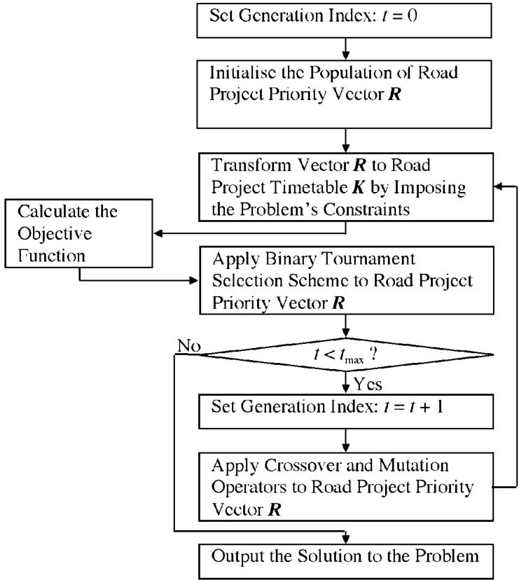  
Figure 3.1 The genetic algorithm for the road project construction timetable problem

The calculation of the objective function, which involves the application of transport models and the project evaluation process, is independent of the operators in the genetic algorithm. A road project construction timetable is taken as the input, and the objective function value is fed back to the genetic operators. The separation of the genetic operators from the calculation of the objective function makes it possible to use realistic transport models and a road project evaluation method without sacrificing the efficiency of the search for the optimum.

The order-based vector is transformed into a construction timetable on the assumption that when the construction of a road project needs to be spread over more than 1 year, then it is normally spread over consecutive years. This is based on the fact that construction of a project over non-consecutive years results in extra costs that are unlikely to engender extra benefits. The added costs are associated with setting up construction sites and mobilising construction equipment. If it is optimal to spread the construction of a road project over nonconsecutive years, then this study treats it as a project being constructed in stages, each of the stages being an individual sub-project scheduled separately.

# 3.3.1 Data Required

Information required to transform the order-based vector into a construction timetable includes data on constraints and the condition of alternative routes as well as data needed to calculate traffic flows and the value of network improvement. These requirements include:

•The base road network inventory to establish the network in the base case, including the link lengths and travel speeds to derive travel times on the links   
•Construction costs, annual budgets, limits to annual expenditure on individual projects, preferred investment profiles over years for individual projects, and projects constructed in stages   
The benefit divisibility or indivisibility of the projects   
•Populations and identified tourist destinations to be used in the light vehicle travel demand model   
•A fixed data file of origins and destinations of heavy vehicle traffic   
The value of time, vehicle operating costs, road maintenance costs by road classification and the discount rate

# 3.3.2 Imposing Constraints

A GA string is already a tentative project sequence but in mapping to a viable road construction timetable, it is necessary to conform to the following groups of constraints:

Construction staging requirements

Financial limitations:

- Annual budgets   
- Limits to annual expenditure on individual projects Preferred investment profiles over years for individual projects (engineering constraints)

The mapping process takes account of these constraints on the timetable as follows.

# Step 1: Projects to be Constructed in Stages

It is often reasonable to construct in stages, for example, to construct a gravel pavement and subsequently upgrade to sealed pavement when the traffic warrants it. In general, construction of the two stages together as a single project is cheaper than doing it in two separate stages.

If a project is constructed in stages and the objective function values indicate that a successor stage should be constructed before its predecessor stages, then this is a physical impossibility. The indicated reversal must be overridden and the relevant costs adjusted. For example, Project $A$ has two construction stages $A 1$ and A2 with costs of $c 1$ and $c 2$ , respectively. Stage $A 1$ is the predecessor of Stage $A 2$ If they are scheduled in a sequence of $A 2  \cdots  A 1$ with some other projects constructed in between, then the only way to implement this project is to construct it in one stage, because the prerequisite for constructing $A 2$ is the completion of $A 1$ Accordingly, Project $A$ is constructed in one stage.

In this step, all potentially staged projects are checked individually and the construction stages and related costs are adjusted as necessary. Project options are added to allow for a predecessor project being ranked lower than its successor project. In such a case, the construction of the successor project also includes the part that would otherwise be constructed as the predecessor project (i.e., the two projects are constructed in one stage). Therefore, the cost of the predecessor project becomes zero and that of the successor project is normally less than the sum of the two stages constructed separately.

# Step 2: Financial Constraints

The three constraints are imposed sequentially in descending order of project ranking.

# 1. Budget Constraints

If the annual budget available is more than the project cost, it may be allocated an amount of investment up to its cost in the year; otherwise, the project may be allocated at most the amount of budget left.

2. Limits to Yearly Expenditure on Individual Projects

If the amount of investment that could be allocated to a project is above the limit to annual expenditure on one project, then the amount of investment in the project in that year is at most equal to the expenditure limit.

3. Preferred Investment Profile for a Project

If the amount of investment that could be allocated to the project in a particular year is greater than the amount specified in the project's preferred profile, then the amount invested in the project is equal to the amount specified by the profile. If there is not enough budget to satisfy the investment profile in the year, the amount under-invested is carried over to the next year when expenditure on the project may exceed the profile.

The whole step is repeated until annual budgets are exhausted, projects that have not been allocated any investments being dropped from the 10-year program.

# 3.3.3 Calculation of Project Benefits

After each GA sequence has been converted to a road construction timetable which satisfies the constraints, the procedure to arrive at an objective function value is implemented, ending with the calculation of net present value. This requires the following processes and travel modelling:

•The base network and project construction sequence are used to derive the new road network, which changes in physical condition as project investments are made progressively   
The travel demand model is used to derive passenger vehicle origin/destination traffic volumes by years, based on populations and identified tourist destinations   
• The multipath traffic assignment model loads passenger vehicle origin/dcstination traffic onto thc nctwork   
•An all-or-nothing model is used to assign heavy vehicle traffic volumes to the network

# 3.3.3.1 Calculation of User Benefits from Projects

When a link is upgraded, the costs of using all routes which pass through that link are reduced, so that traffic will be diverted from other links to this one. In year $t$ , the user benefits, B(t), are given by:

$$
\mathbf { B } ( \mathbf { t } ) = \frac { 1 } { 2 } \left\{ \sum _ { \mathrm { i } } \left[ \mathbf { F } _ { \mathrm { i } } ^ { \mathrm { b } } ( \mathbf { t } ) + \mathbf { F } _ { \mathrm { i } } ^ { \mathrm { n } } ( \mathbf { t } ) \right] \cdot \mathbf { C } _ { \mathrm { i } } ^ { \mathrm { b } } ( \mathbf { t } ) - \sum _ { \mathrm { m } } \left[ \mathbf { F } _ { \mathrm { m } } ^ { \mathrm { b } } ( \mathbf { t } ) + \mathbf { F } _ { \mathrm { m } } ^ { \mathrm { n } } ( \mathbf { t } ) \right] \cdot \mathbf { C } _ { \mathrm { m } } ^ { \mathrm { n } } ( \mathbf { t } ) \right\}
$$

where: $\mathrm { F _ { \mathrm { 1 } } ^ { \mathrm { b } } ( t ) }$ year $t$ traffic flow on the base network assigned to base network link $l$

$\mathrm { F } _ { \mathrm { 1 } } ^ { \mathrm { n } } ( \mathrm { t } )$ year $t$ traffic flow on the new network assigned to base network link $l$

$\mathbf { C } _ { \mathrm { 1 } } ^ { \mathrm { b } } ( \mathrm { t } )$ travel cost on link $l$ in the base network in year $t$

$\mathrm { F _ { m } ^ { b } ( t ) }$ year $t$ traffic flow on the base network assigned to link $m$ in the new network,

$\mathrm { F _ { m } ^ { n } ( t ) }$ year $t$ traffic flow on the new network assigned to link $m$ in the new network,

$\mathbf { C } _ { \mathrm { m } } ^ { \mathrm { n } } ( \mathrm { t } )$ the travel cost on link $m$ in the new network.

# 3.3.3.2 Information Required

In Equation (1), link flows $\mathrm { F _ { \mathrm { 1 } } ^ { \mathrm { b } } ( t ) , \ F _ { \mathrm { 1 } } ^ { \mathrm { n } } ( t ) , \ F _ { \mathrm { 2 } } ^ { \mathrm { b } } ( t ) }$ and $\mathrm { F _ { m } ^ { n } ( t ) }$ are also functions of travel costs $\mathbf { C } _ { 1 } ^ { \mathfrak { b } } ( \mathfrak { t } )$ and $\mathrm { { C } _ { \mathrm { { m } } } ^ { \mathrm { { n } } } ( t ) }$ . This functional relationship is explained in Section 3.5. In this study, travel costs $\mathbf { C } _ { 1 } ^ { \flat } ( \mathbf { t } )$ and $\mathbf { C } _ { \mathrm { m } } ^ { \mathrm { n } } ( \mathrm { t } )$ include the travel time costs and the vehicle operating cost, and can be written as

where: $\mathrm { T T } _ { \mathrm { l } } ^ { \mathrm { b } } ( \mathrm { t } )$ travel time on link $l$ in the base network in year $t$ , $\mathrm { T T } _ { \mathrm { m } } ^ { \mathrm { n } } ( \mathrm { t } )$ travel time on link $m$ in the new network in year $t$ $\mathrm { { V O C } _ { 1 } ^ { b } }$ ()vehice perating cost onik $l$ in the base network in year $t$ $\mathrm { { V O C } _ { \mathrm { { m } } } ^ { \mathrm { { n } } } }$ (t) vehicle operating cost on link $m$ in the new network in year t, $\upsilon$ the value of a unit of time.

The benefit is the difference between vehicle operating costs in the base and project cases, so that fixed costs are irrelevant. The variable operating costs, including tyre wear, maintenance and fuel consumption, are taken to be a function of average speed or travel time only.

# 3.3.3.3 Divisibility of User Benefits and Relationship to Travel Times

If the performance of the network is improved when any part of the project is finished, then the project is benefit divisible (BD). If it has no effect on network performance until completed, then it is benefit indivisible (BI). Thus, a benefit divisible project can produce pro rata benefits in the course of construction, while a benefit indivisible one generates no benefits until the entire construction is completed. There are two important consequences.

1. A benefit indivisible (BI) project needs to be completed as soon as possible, whereas there is more flexibility to adapt a benefit divisible (BD) project to annual budgets and it may not need to be completed as soon as possible 2. If it cannot be completed within the specified program period, a BI project will make no contribution to calculated benefits whereas a BD project contributes in proportion to the degree of completion

Specific cases are as follows:

•New road links cannot be used by vehicles until the total project is finished (BI)   
• Upgrading pavement (e.g. gravel to sealed pavement) affects the existing formation and any part of the upgraded pavement project can be open to traffic immediately after completion (BD)   
•New lanes or widening are implemented on the existing formation, so that partly finished projects can be open to traffic immediately after completion (BD)   
A realigned road link is virtually constructed from scratch and most of the existing alignment is abandoned, so that realignment is like a new project and is benefit indivisible (BI)   
•A new bridge cannot serve vehicle traffic until the whole of the project is finished, and is benefit indivisible (BI)   
• Upgrading an existing bridge may be to enhance structural integrity, increase load capacity or to widen the bridge: - If the project requires closure during upgrading, it is benefit indivisible (BI).   
2)If the proiect onlv reauires partial closure. the upgraded part being open to

traffic immediately after completion, it is benefit divisible (BD)

Table 3.2 Effects of a project on travel time (TT) on link i   

<table><tr><td rowspan="2">Type of Project</td><td>Benefit Divisibility</td><td colspan="2">Travel Time</td></tr><tr><td>BD - Divisible</td><td>Base Case </td><td>Project Case </td></tr><tr><td>New link</td><td>BI - Indivisible BI</td><td>∞</td><td>TT&quot;</td></tr><tr><td>Upgrading pavement</td><td>BD</td><td>TTb</td><td>TT&quot;</td></tr><tr><td>Widening link</td><td>BD</td><td>TTb</td><td>TT&quot;</td></tr><tr><td>Adding lanes</td><td>BD</td><td>TTb</td><td>TT&quot;</td></tr><tr><td>Link realignment</td><td>BI</td><td>TTb</td><td>TT&quot;</td></tr><tr><td>New bridge</td><td>BI</td><td>∞</td><td>TT&quot;</td></tr><tr><td>Upgrading bridge</td><td>BI or BD</td><td>TTb or ∞</td><td>TT,&quot;</td></tr></table>

$\mathrm { T T _ { i } ^ { b } }$ is travel time on link i in the base case. Infinity "∞" means that the travel time is large enough to make the choice impossible. ${ } ^ { \mathrm { ~ b ~ } } \mathrm { T T _ { i } ^ { \mathrm { n } } }$ is travel time on link $i$ in the project case.

The changes in the physical condition of a link change average speed and travel time. The changes in travel time in different project situations are shown in Table 3.2 . $\mathrm { T T _ { i } ^ { b } }$ is the vehicle's travel time on link $i$ in the base case, and is determined by the link's initial physical condition. $\mathrm { T T } _ { \mathrm { i } } ^ { \mathrm { n } }$ is the vehicle's travel time on link i in the project case, and depends on the link's ultimate physical condition when the project is finished.

The analysis period is divided into two sub-periods, as shown in Figure 3.2 for project i. Construction is carried out and completed in the first sub-period and benefits accrue in the second.

A vehicle's travel time $\mathrm { T T } _ { \mathrm { i } } ^ { \mathrm { n } } ( \mathrm { t } )$ and travel speed $\mathrm { T S } _ { \mathrm { i } } ^ { \mathrm { n } } ( \mathbf { t } )$ on link $i$ in year t depend on the initial and ultimate travel times and speeds on the link, the construction status of the proposed project on the link, and whether the project is benefit divisible or indivisible. Formulae for calculating $\mathrm { T T } _ { \mathrm { i } } ^ { \mathrm { n } } ( \mathrm { t } )$ in the various cases are shown in Table 3.3.

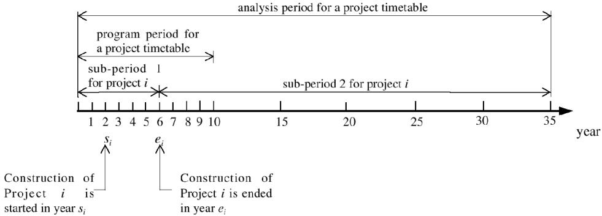  
Figure 3.2 Relationship between the timetable analysis period and project sub-periods

Table 3.3 Vehicle travel time on link i in year t: TTi(t)   

<table><tr><td rowspan="2">Construction Stage</td><td colspan="2">Project Type</td></tr><tr><td>Benefit Divisible</td><td>Benefit Indivisible</td></tr><tr><td>Not started (0 ≤ t &lt; si)</td><td>Lb TT(t) = TT b TSb</td><td>Lb TT (t) = TTb TSb</td></tr><tr><td>Started but incomplete (si ≤ TT,(t) = t ≤ ei)</td><td>LF(t) LR(t) + TS TSb</td><td>Li TT (t) = TTb TSb</td></tr><tr><td>Completed (ei &lt; t ≤ 35).</td><td>Li TT (t) = TTn TS</td><td>L TT (t) = TTn TS</td></tr><tr><td>Where: si</td><td></td><td>year in which the project on link i is started</td></tr><tr><td>ei</td><td></td><td>year in which the project on link i is completed</td></tr><tr><td>LFi(t)</td><td>length of the part of link i where construction has finished by year t</td><td></td></tr><tr><td>LR,(t)</td><td>length of the part of the link where construction has not finished by year t</td><td></td></tr><tr><td>L</td><td></td><td></td></tr><tr><td></td><td></td><td>length of link i in the base case, Ln</td></tr><tr><td>TS</td><td></td><td>travel speed on link i in the base case, TS</td></tr><tr><td>TTb</td><td></td><td>travel time on link i in the base case, TT&quot;</td></tr></table>

The formulae in Table 3.3 are based on three assumptions, the first being that during construction traffic can be detoured locally without causing serious congestion on nearby roads. The second is that, when construction of a benefit divisible project is partially complete, LF(t) is proportional to the percentage of project cost already spent. For benefit divisible projects, such as upgrading pavement, widening a link, or adding lanes, work on one section is assumed to be completed before another is commenced.

# 3.3.3.4 Maintenance Saving Benefits

Benefit Equation (1) is based on savings of travel time and vehicle operating costs, which are both dependent on traffic volumes, and does not include savings of road maintenance costs. For this study, it has been assumed that road maintenance costs are independent of traffic volumes. Pavement roughness is certainly affected by traffic volume and is reduced by maintenance work (Han 1999), but the focus here is on new road construction and upgrading rather than maintenance strategies. Therefore, average maintenance cost by road classification has been used.

In year t of the analysis period for a road project, the saving in road maintenance MC(t) can be positive or negative, depending on the maintenance costs in the base and project cases, and is equal to the difference between maintenance costs in the base and project cases:

where: $\mathbf { M C } ^ { \mathrm { { b } } } ( \mathbf { t } )$ year t maintenance cost in the base case $( = 0$ if the project is a new road link) $\mathbf { M C } ^ { \mathrm { n } } ( \mathbf { t } )$ year t maintenance cost in the project case

3.3.4 Calculating Trip Generation, Route Choice and Link Loads

The user benefits come from two types of traffic: heavy and light vehicles. A fixed matrix of origin-destination flows, determined primarily by mining activity, is used for heavy vehicle traffic. This is assigned to least cost routes, which are affected by the road projects.

Car and light vehicle user benefits can only be calculated after the impact of projects on user choices have been estimated. This requires a travel demand and route choice model, which is run for each period for every alternative configuration generated by the genetic algorithm. The number of trips between centroids i and $\mathrm { j }$ by route $\mathbf { k }$ . $\mathrm { T _ { i j } ^ { k } }$ , is given by the combined trip generation and route choice model:

$$
\mathrm { T _ { i j } ^ { k } = \frac { \alpha \Big [ \big ( 1 + \Phi _ { i } \xi \big ) P _ { i } \big ( 1 + \Phi _ { j } \xi \big ) P _ { j } \Big ] ^ { \beta } C _ { i j } ^ { m i n } \mathrm { ~ } ^ { \gamma } e ^ { \ 6 C _ { i j } ^ { k } / C _ { i j } ^ { m i n } } } { \displaystyle \sum _ { k \in K _ { i j } } e ^ { \alpha c _ { i j } ^ { k } / c _ { i j } ^ { m i n } } } }
$$

where: $\mathrm { C _ { i j } ^ { k } }$ the travel time between centroids i and j by route k   
$\mathrm { P i }$ , Pj populations at centroids i and j   
$\Phi \mathrm { i } , \Phi \mathrm { j }$ dummy variables: 1 for tourist destinations, 0 otherwise   
$\mathbf { C } _ { \mathrm { i j } } ^ { \mathrm { m i n } }$ the minimum travel time between centroids i and j   
$\alpha$ a scale parameter   
$\beta$ the demand elasticity with respect to population   
$\gamma$ the demand elasticity with respect travel time   
$\zeta$ population multiplier for tourist-destination centroids   
θ a route choice parameter   
${ \mathrm { K i j } }$ the set of reasonable routes, defined by the Dial (1971 ) single-passing rule, from i to j

The parameter values, obtained by maximum likelihood estimation, are:

<table><tr><td>α</td><td>0.04183</td></tr><tr><td>β</td><td>0.43304</td></tr><tr><td>γ</td><td>-1.82986</td></tr><tr><td>ξ</td><td>4.56253</td></tr><tr><td>θ</td><td>-14.9895</td></tr><tr><td></td><td></td></tr></table>

Travel routes and road links are related by a link-route incidence matrix whose elements are defined as:

$$
\delta _ { \mathrm { \scriptscriptstyle 1 } } ^ { \mathrm { \scriptscriptstyle k } } = \left\{ \begin{array} { l } { { 1 , \mathrm { i f } \mathrm { l i n k } \mathrm { l i s o n r o u t e } \mathrm { k } ( \mathrm { k } \in \mathrm { K } _ { \mathrm { i j } } ) , } } \\ { { 0 , \mathrm { o t h e r w i s e } . } } \end{array} \right.
$$

With the incidence matrix, the travel time of a route is obtained from travel times on individual links which compose the route:

$$
C _ { i j } ^ { k } = \sum _ { \forall l \in L } C _ { l } \delta _ { l } ^ { k } \mathrm { ~ }  ( k \in K _ { i j } )
$$

where l is a link and $\mathrm { L }$ is the set of all links in the network. The flow on $\operatorname { l i n k } 1 ( \hat { \mathcal { F } } _ { l } )$ i li:

The steps in the calculation are shown in Figure 3.3.

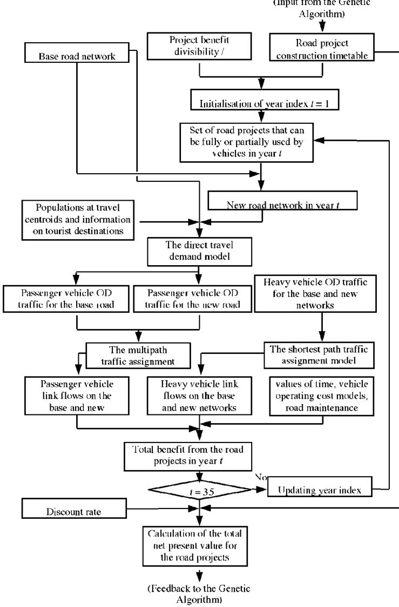  
Figure 3.3 Procedure for calculation of the objective function value

# 3.4 Results

Ten GA experiments were carried out, considerable diversity being found in those project sequences which come fairly close to the best in terms of net present value.

# 3.4.1 Convergence of Solutions to the Problem

Convergence in the experiments is shown in Figure 3.4. The ten experiments can be classified into three groups according to speed of convergence.

Rapid Convergence: In experiments 4 and 6, the best GA individual is reached after 16 and 3 generations. Experiments in this group generate "super" GA individuals at an early generation and they are so superior to other GA individuals that they inhibit the full exploration of the search space. In other words, the genetic algorithm finds premature solutions. The maximum objective function value of 8,330,211 reached in experiment 6 was the lowest maximum in the ten experiments.

Moderate Rate of Convergence: In experiments 1, 3, 7, 8 and 9, the best GA individual is reached between generations 23 and 70. Experiments in this group show normal convergence, thoroughly exploring the search space and then finding one or several solutions which are better than any later solution. Because the search space has been thoroughly explored, the final solution is more likely to be optimal. Experiment 1 reached the highest objective function value of all, 9,566,049.

Slow Convergence: In experiments 2, 5 and 10, the GA individuals continue to improve for more than 90 generations. Experiments in this group explore the search space even more thoroughly. However, an improving trend in the objective function continues almost to the end of 100 generations. If more GA generations were allowed, the objective function might improve further.

None of the ten experiments resulted in homogeneous GA individuals at the last generation. Table 3.4 lists objective function values for the best ten of $2 0 0 ~ \mathrm { G A }$ individuals at generation 100 (the last) in each of experiments 1 and 2, including the two largest objective function values in the ten experiments. It is clear that the GA populations have not been homogenised by generation 100, although the best result had been reached by the 36th generation.

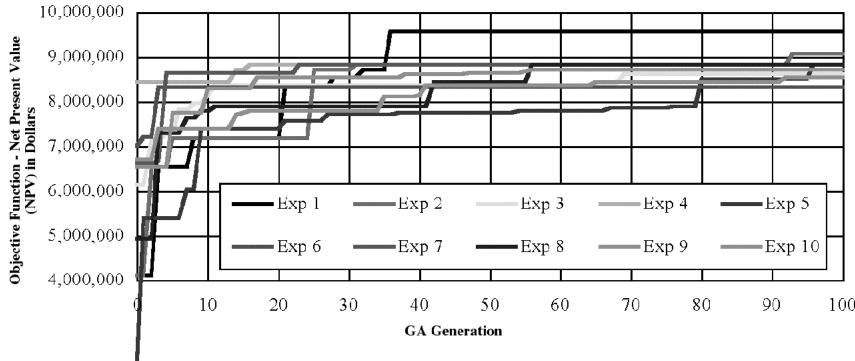  
Figure 3.4: Comparison of the Steps in the Improvement of the Objective Function Values of the Best individuals over GA Generations in Ten Experiments

Table 3.4 Values of the best ten GA Iindividuals in each of experiments 1 and 2   

<table><tr><td rowspan="2">Ranking of GA Individual</td><td colspan="2">Objective Function Value</td></tr><tr><td>Experiment 1</td><td>Experiment 2</td></tr><tr><td>1st</td><td>9,566,049</td><td>9,083,365</td></tr><tr><td>2nd</td><td>7,201,082</td><td>4,209,282</td></tr><tr><td>3rd</td><td>6,521,931</td><td>3,349,806</td></tr><tr><td>4th</td><td>1,016,665</td><td>1,228,772</td></tr><tr><td>5th</td><td>235,282</td><td>846,669</td></tr><tr><td>6th</td><td>120,496</td><td>247,767</td></tr><tr><td>7th</td><td>31,552</td><td>267,308</td></tr><tr><td>8th</td><td>−162,193</td><td>590,302</td></tr><tr><td>9th</td><td>-1,025,132</td><td>1,038,559</td></tr><tr><td>10th</td><td>−1,271,847</td><td>−3,713,518</td></tr></table>

In summary, experiments 1, 3, 7, 8 and 9 converge normally in 100 generations; experiments 4 and 6 exhibit premature convergence and experiments 2, 5 and 10 continued to improve. Experiment 1 has the largest objective function for the best

GA individual, which is likely to be a near-optimal solution to the project timetable for the 34 road projects in the Pilbara Region in Western Australia.

# 3.4.2 The Solutions

Although the projects are presented as a sequence, in reality they are grouped by year, with some being spread across adjoining years. A solution to the road project construction timetable problem is a collection of information on the various aspects of the road projects in question, between which the relationships are complicated. Solutions are presented in the following order:

Construction sequence and net present value for the ten best solutions (Table 3.5) Allocation of investment amounts according to the GA sequence so as to satisfy the annual budget constraints, the limits to annual expenditure on any one project and the preferred investment profiles (Table 3.6)   
A detailed construction timetable, containing all relevant information (Table 3.7)

# 3.4.2.1 The Ten Best Project Sequences

The project sequence and net present value for each of the best ten project schedules across all experiments are shown in Table 3.5 . The solution ranked first, which is in Experiment 1, is probably near-optimal. The other highly ranked GA individuals differ considerably in sequence, as well as in objective function values.

Although the entire ordered string of projects is presented, only those which could be completed within budget are actually implemented. All projects remain in the string but those which are not implemented have no influence on the solution or the calculated net present value. The projects to be implemented are shown in bold in each of the solutions in Table 3.5. In some cases, the final project is only partially completed in Year 10, the final construction year of the analysis.

The benefit from a road project in a sequence to be implemented in a network depends on the other projects in the sequence and the benefits and benefit-cost ratios for individual projects are unknown. The marginal benefit-cost ratio of an individual project could be calculated by deleting it from the optimal schedule, recalculating total benefits of the remaining project group and expressing the lost benefits as a ratio to the cost saved on the particular project.

Table 3.5 Summary of the best ten investment sequences   

<table><tr><td>Ranking of Solution</td><td>Road Project Construction Order</td><td>Net Present Value ($)</td></tr><tr><td>1st</td><td>8 23 22 6 18 7 14 25 28 31 33 9 21 2 27 13 10 5 20 34 29 12 26 19 11 17 32 4 3 30 24 16 1 15</td><td>9,566,049</td></tr><tr><td>2nd</td><td>15 34 8 21 1 10 18 23 4 24 17 3 5 31 19 14 26 22 2 33 16 32 28 9 20 11 29 25 30 7 12 13 6 27</td><td>9,083,365</td></tr><tr><td>3rd</td><td>1 21 8 4 17 24 27 33 19 5 12 16 34 3 22 29 18 14 6 15 23 28 9 7 10 20 2 25 13 31 30 32 26 11</td><td>8,825,857</td></tr><tr><td>4th</td><td>17 23 16 8 21 2 20 31 30 4 12 10 5 34 3 32 22 33 14 26 29 24 19 27 18 6 13 9 1 28 7 11 25 15</td><td>8,825,826</td></tr><tr><td>5th</td><td>30 2 8 16 22 32 4 5 20 24 31 7 26 27 21 28 17 19 33 3 11 15 6 13 34 1 23 29 25 14 10 9 12 18</td><td>8,824,625</td></tr><tr><td>6th</td><td>8 22 2 33 12 4 19 5 34 28 25 6 27 26 23 11 20 15 17 31 3 29 9 1 21 16 30 13 24 18 10 7 14 32</td><td>8,824,545</td></tr><tr><td>7th</td><td>8 22 2 33 12 4 19 5 34 28 11 6 27 26 23 25 20 15 17 31 3 29 9 1 21 16 30 13 24 18 10 7 14 32</td><td>8,824,536</td></tr><tr><td>8th</td><td>21 8 1 12 20 2 18 4 15 25 31 10 7 9 3 16 34 5 27 29 30 26 24 17 33 13 32 14 22 19 23 11 6 28</td><td>8,728,765</td></tr><tr><td>9th</td><td>22 8 23 24 33 2 21 6 12 13 5 26 17 18 15 30 19 14 16 28 31 11 9 7 20 27 29 10 1 25 32 4 3 34</td><td>8,615,099</td></tr><tr><td>10th</td><td>12 17 30 8 22 4 7 23 1 3 33 10 32 28 31 19 9 20 6 15 34 2 27 26 21 11 24 29 14 18 16 5 25 13</td><td>8,542,897</td></tr></table>

The projects in bold are those to be wholly or partly mplemented within the program perid which contribute teojectvnction. In se cases, an ut in bold is a 'predesso project o be lemene s p of its more highly ranked 'successor.'

# 3.4.2.2 Project Sequence Converted to Annual Investment

Table 3.6 shows the best project sequence converted to amounts invested by years. It shows how the computation procedure maps the sequence of projects in bold in the first row of Table 3.5 into annual expenditures. If there are insufficient funds to complete a project in a year, then further amounts are allocated to it in subsequent years. If a benefit indivisible project cannot be completed within a ten-year program period, nominal rather than actual amounts of investment are allocated to it during the program period. This leads to total investment in later years of the program (the 8th, 9th and 10th) being less than the annual budget of $\$ 27$ million. This treatment of such benefit indivisible projects is justified on two grounds:

The firmness of the schedule of road projects decreases with time because funding projcctions and travcl dcmand forccasts bccomc lcss rcliablc. Road project programming is a rolling process, which should be repeated every year or every few years. In the next programming round, those benefit indivisible projects which cannot be completed in the current program period will have an extended time span for completion, and the nominal amounts of investment in the projects will become actual amounts of investment in the new program period.

Projects 29 and 26 are the last two to enter the investment program of Table 3.6, thus exhausting the budget. Project 12, which came between them in the GA sequence (first case in Table 3.5 ). was a predecessor of Project 13, which enters the program in Year 7 and therefore absorbs Project 12. Such cases of absorption of predecessor by successor has been taken into account in the assessment of network effects and benefits for every GA individual in every generation. Other cases of predecessor-successor relationships in the best solution are considered in the next section.

It can also be seen in Table 3.6 that some projects are spread over more than two succcssivc ycars. This is duc to financial constraints, cithcr thc absolutc limit on annual expenditure on an individual project, as in Project 22, or the effect of a preferred investment profile, as in the case of Project 14 (which is also constrained by the absolute limit in its third construction year). In some cases, spreading over only two years is also due to a financial constraint specific to the project, as in Project 6 where the preferred investment profile has been imposed.

# 3.4.2.3 Full Statement of the Best Project Schedule

Details of the implementation plan for the best solution are shown in Table 3.7. Presentation in the table of the predecessor project numbers, divisibility of benefits, preferred investment profile by years, and budget provides a reminder that the solution had to satisfy a series of constraints.

As alrcady notcd, thc proccdurc for stagcd construction has a substantial cffcct. In Table 3.7 , cases where a predecessor project has been absorbed by its successor, because the successor is higher in the GA ranking, are:

<table><tr><td>Predecessor Project No.</td><td>Successor Project No.</td></tr><tr><td>1</td><td>2</td></tr><tr><td>12</td><td>13</td></tr><tr><td>21</td><td>22</td></tr><tr><td>27</td><td>28</td></tr></table>

Project 1 is very low in the ranking but the combination of 1 and 2 ranks high enough to be implemented in Year 7. An important case of two stages being constructed separately is provided by predecessor Project 25 followed by successor Project 26, with a two-year gap between.

# 3.4.3 Similarity and Dissimilarity of Solutions: Euclidean Distance

If the GA individuals with large objective function values cluster together in the search space, it is likely that there is a single peak in the vicinity of these individuals; otherwise, there may be multiple peaks. The shape of the search space is one of the factors affecting the ability of a genetic algorithm to find the optimal solution.

Three different types of outcome are observed in the actual genetic algorithm results:

• Similar project sequences with similar objective function values Significantly different project sequences but similar objective function values Similar project sequences but significantly different objective function values

These phenomena are associated with the interdependence of road project benefits. Because it is extremely difficult to investigate algebraically the shape of the search space of the road project problem, a numerical investigation is carried out. In each of the ten experiments, the best ten GA individuals represent ten good solutions obtained by running the genetic algorithm repeatedly. Pooling the best ten GA individuals in each of the ten experiments forms a set of 100 fair to good solutions for the problem and provides the basis for investigating the shape of the search space and the relationships between solutions.

20   
20   

<table><tr><td colspan="2">Year 1</td><td colspan="2">Year 2</td><td colspan="2">Year 3</td><td colspan="2">Year 4</td><td colspan="2">Year 5</td><td colspan="2">Year 6</td><td colspan="2">Year 7 $M</td><td colspan="2">Year 8 $M</td><td colspan="2">Year 9 $M</td><td colspan="2">Year 10</td></tr><tr><td>Proj No.</td><td>$M</td><td>Proj No.</td><td>$M</td><td>Proj No.</td><td>$M</td><td>Proj No.</td><td>$M</td><td>Proj No.</td><td>$M</td><td>Proj No.</td><td>$M</td><td>Proj No.</td><td>Proj No.</td><td></td><td>Proj No.</td><td></td><td>Proj No.</td><td>$M</td></tr><tr><td>8</td><td>10.60</td><td>22</td><td>13.50</td><td>22</td><td>13.50</td><td>22</td><td>7.28</td><td>14</td><td>11.40</td><td>14</td><td>13.50 14</td><td>1.70</td><td>31</td><td>2.11</td><td>29</td><td>13.5h</td><td>29</td><td>13.5</td></tr><tr><td>23</td><td>5.28</td><td>6 18</td><td>3.85</td><td>6</td><td>3.85</td><td>18</td><td>1.20</td><td>25</td><td>9.80</td><td>25</td><td>6.19 31</td><td>3.84</td><td>10</td><td>0.79</td><td>26</td><td>13.50</td><td>26</td><td>13.50</td></tr><tr><td>22</td><td>11.12</td><td></td><td>9.65</td><td>18</td><td>9.65</td><td>7 14</td><td>4.90</td><td>28</td><td>5.80</td><td>28 7.06</td><td>33</td><td>5.80</td><td>5</td><td>6.54</td><td></td><td></td><td></td><td></td></tr><tr><td></td><td></td><td colspan="2"></td><td></td><td></td><td>11.40 25 2.22</td><td></td><td></td><td>31</td><td>0.25</td><td>9 2</td><td>2.50 6.30</td><td>20 34</td><td>7.80 1.00</td><td></td><td></td><td></td></tr><tr><td colspan="2"></td><td colspan="2"></td><td></td><td></td><td></td><td></td><td></td><td></td><td></td><td>13 10</td><td>5.49 1.37</td><td>29</td><td>8.76</td><td></td><td></td><td></td></tr><tr><td colspan="2">27.00</td><td colspan="2">27.00</td><td>27.00</td><td></td><td>27.00</td><td></td><td>27.00</td><td></td><td>27.00</td><td></td><td>27.00</td><td>18.24</td><td></td><td>13.50</td><td>13.50</td><td></td></tr></table>

20

The Euclidean distance for any two vectors $X = \left( \mathbf { x } _ { 1 } , \quad \mathbf { x } _ { 2 } , \quad \cdots \quad \mathbf { x } _ { \mathrm { n } } \right)$ and Y =(y1, y2, . yn) in a Rn space can algebraically be written as:

$$
{ \bf d } _ { \mathrm { { x y } } } = \sqrt { \sum _ { i = 1 } ^ { \mathrm { n } } \left( { \bf y } _ { \mathrm { { i } } } - { \bf x } _ { \mathrm { { i } } } \right) ^ { 2 } } \mathrm { ~ , ~ }
$$

where $d _ { X y }$ is the Euclidean distance between vector $X$ and vector $Y$ .

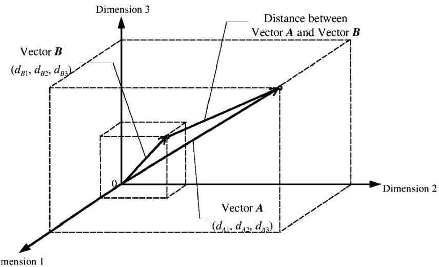  
Figure 3.5 Euclidean distance between two vectors in a R3 space

It is difficult to comprehend differences between road project construction timetables because the investment in each construction timetable has 340 elements or dimensions (i.e., 34 projects $\times ~ 1 0$ years). Consequently, it is not feasible to investigate the distribution of solutions by plotting objective values against the corresponding space dimensions, and a summary measurement for the space dimensions is necessary. Euclidean distance has been used to measure distance between vectors in the real number space (i.e., $R _ { \mathfrak { n } }$ , where $" \boldsymbol { R } "$ stands for a real number space and $" n "$ for the number of dimensions of the space), as shown in Figure 3.5 for two vectors in a $R _ { 3 }$ space.

20   

<table><tr><td rowspan=1 colspan=7>Project Specification</td><td rowspan=1 colspan=10>Amounts of Investment in Road Projects Over Years ($M)</td><td rowspan=2 colspan=1>TotalforEach Project($M)</td></tr><tr><td rowspan=1 colspan=1>No.</td><td rowspan=1 colspan=1>Cost($M)</td><td rowspan=1 colspan=1>Prede-cessorProjectNo.</td><td rowspan=1 colspan=1>WhetherDivisibleBenefits</td><td rowspan=1 colspan=3>PreferredInvestment Profileby Years(% of Cost)</td><td rowspan=1 colspan=1>1</td><td rowspan=1 colspan=1>2</td><td rowspan=1 colspan=1>3</td><td rowspan=1 colspan=1>4</td><td rowspan=1 colspan=1>5</td><td rowspan=1 colspan=1>6</td><td rowspan=1 colspan=1>7</td><td rowspan=1 colspan=1>8</td><td rowspan=1 colspan=1>9</td><td rowspan=1 colspan=1>10</td></tr><tr><td rowspan=1 colspan=1>1</td><td rowspan=1 colspan=1>0.00</td><td rowspan=1 colspan=1></td><td rowspan=1 colspan=1>Div</td><td rowspan=1 colspan=1>100</td><td rowspan=1 colspan=1></td><td rowspan=1 colspan=1></td><td rowspan=1 colspan=1></td><td rowspan=1 colspan=1></td><td rowspan=1 colspan=1></td><td rowspan=1 colspan=1></td><td rowspan=1 colspan=1></td><td rowspan=1 colspan=1></td><td rowspan=1 colspan=1></td><td rowspan=1 colspan=1></td><td rowspan=1 colspan=1></td><td rowspan=1 colspan=1></td><td rowspan=1 colspan=1>0.00</td></tr><tr><td rowspan=1 colspan=1>2</td><td rowspan=1 colspan=1>6.30</td><td rowspan=1 colspan=1>1</td><td rowspan=1 colspan=1>Div</td><td rowspan=1 colspan=1>100</td><td rowspan=1 colspan=1></td><td rowspan=1 colspan=1></td><td rowspan=1 colspan=1></td><td rowspan=1 colspan=1></td><td rowspan=1 colspan=1></td><td rowspan=1 colspan=1></td><td rowspan=1 colspan=1></td><td rowspan=1 colspan=1></td><td rowspan=1 colspan=1>6.30</td><td rowspan=1 colspan=1></td><td rowspan=1 colspan=1></td><td rowspan=1 colspan=1></td><td rowspan=1 colspan=1>6.30</td></tr><tr><td rowspan=1 colspan=1>3</td><td rowspan=1 colspan=1>10.20</td><td rowspan=1 colspan=1></td><td rowspan=1 colspan=1>Indiv</td><td rowspan=1 colspan=1>30</td><td rowspan=1 colspan=1>30</td><td rowspan=1 colspan=1>40</td><td rowspan=1 colspan=1></td><td rowspan=1 colspan=1></td><td rowspan=1 colspan=1></td><td rowspan=1 colspan=1></td><td rowspan=1 colspan=1></td><td rowspan=1 colspan=1></td><td rowspan=1 colspan=1></td><td rowspan=1 colspan=1></td><td rowspan=1 colspan=1></td><td rowspan=1 colspan=1></td><td rowspan=1 colspan=1>0.00</td></tr><tr><td rowspan=1 colspan=1>4</td><td rowspan=1 colspan=1>15.26</td><td rowspan=1 colspan=1></td><td rowspan=1 colspan=1>Div</td><td rowspan=1 colspan=1>100</td><td rowspan=1 colspan=1></td><td rowspan=1 colspan=1></td><td rowspan=1 colspan=1></td><td rowspan=1 colspan=1></td><td rowspan=1 colspan=1></td><td rowspan=1 colspan=1></td><td rowspan=1 colspan=1></td><td rowspan=1 colspan=1></td><td rowspan=1 colspan=1></td><td rowspan=1 colspan=1></td><td rowspan=1 colspan=1></td><td rowspan=1 colspan=1></td><td rowspan=1 colspan=1>0.00</td></tr><tr><td rowspan=1 colspan=1>5</td><td rowspan=1 colspan=1>6.54</td><td rowspan=1 colspan=1></td><td rowspan=1 colspan=1>Div</td><td rowspan=1 colspan=1>100</td><td rowspan=1 colspan=1></td><td rowspan=1 colspan=1></td><td rowspan=1 colspan=1></td><td rowspan=1 colspan=1></td><td rowspan=1 colspan=1></td><td rowspan=1 colspan=1></td><td rowspan=1 colspan=1></td><td rowspan=1 colspan=1></td><td rowspan=1 colspan=1></td><td rowspan=1 colspan=1>6.54</td><td rowspan=1 colspan=1></td><td rowspan=1 colspan=1></td><td rowspan=1 colspan=1>6.54</td></tr><tr><td rowspan=1 colspan=1>6</td><td rowspan=1 colspan=1>7.70</td><td rowspan=1 colspan=1></td><td rowspan=1 colspan=1>Indiv</td><td rowspan=1 colspan=1>50</td><td rowspan=1 colspan=1>50</td><td rowspan=1 colspan=1></td><td rowspan=1 colspan=1></td><td rowspan=1 colspan=1>3.85</td><td rowspan=1 colspan=1>3.85</td><td rowspan=1 colspan=1></td><td rowspan=1 colspan=1></td><td rowspan=1 colspan=1></td><td rowspan=1 colspan=1></td><td rowspan=1 colspan=1></td><td rowspan=1 colspan=1></td><td rowspan=1 colspan=1></td><td rowspan=1 colspan=1>7.70</td></tr><tr><td rowspan=1 colspan=1>7</td><td rowspan=1 colspan=1>4.90</td><td rowspan=1 colspan=1></td><td rowspan=1 colspan=1>Div</td><td rowspan=1 colspan=1>100</td><td rowspan=1 colspan=1></td><td rowspan=1 colspan=1></td><td rowspan=1 colspan=1></td><td rowspan=1 colspan=1></td><td rowspan=1 colspan=1></td><td rowspan=1 colspan=1>4.90</td><td rowspan=1 colspan=1></td><td rowspan=1 colspan=1></td><td rowspan=1 colspan=1></td><td rowspan=1 colspan=1></td><td rowspan=1 colspan=1></td><td rowspan=1 colspan=1></td><td rowspan=1 colspan=1>4.90</td></tr><tr><td rowspan=1 colspan=1>8</td><td rowspan=1 colspan=1>10.60</td><td rowspan=1 colspan=1></td><td rowspan=1 colspan=1>Div</td><td rowspan=1 colspan=1>100</td><td rowspan=1 colspan=1></td><td rowspan=1 colspan=1></td><td rowspan=1 colspan=1>10.60</td><td rowspan=1 colspan=1></td><td rowspan=1 colspan=1></td><td rowspan=1 colspan=1></td><td rowspan=1 colspan=1></td><td rowspan=1 colspan=1></td><td rowspan=1 colspan=1></td><td rowspan=1 colspan=1></td><td rowspan=1 colspan=1></td><td rowspan=1 colspan=1></td><td rowspan=1 colspan=1>10.60</td></tr><tr><td rowspan=1 colspan=1>9</td><td rowspan=1 colspan=1>2.50</td><td rowspan=1 colspan=1></td><td rowspan=1 colspan=1>Indiv</td><td rowspan=1 colspan=1>100</td><td rowspan=1 colspan=1></td><td rowspan=1 colspan=1></td><td rowspan=1 colspan=1></td><td rowspan=1 colspan=1></td><td rowspan=1 colspan=1></td><td rowspan=1 colspan=1></td><td rowspan=1 colspan=1></td><td rowspan=1 colspan=1></td><td rowspan=1 colspan=1>2.50</td><td rowspan=1 colspan=1></td><td rowspan=1 colspan=1></td><td rowspan=1 colspan=1></td><td rowspan=1 colspan=1>2.50</td></tr><tr><td rowspan=1 colspan=1>10</td><td rowspan=1 colspan=1>2.16</td><td rowspan=1 colspan=1></td><td rowspan=1 colspan=1>Div</td><td rowspan=1 colspan=1>100</td><td rowspan=1 colspan=1></td><td rowspan=1 colspan=1></td><td rowspan=1 colspan=1></td><td rowspan=1 colspan=1></td><td rowspan=1 colspan=1></td><td rowspan=1 colspan=1></td><td rowspan=1 colspan=1></td><td rowspan=1 colspan=1></td><td rowspan=1 colspan=1>1.37</td><td rowspan=1 colspan=1>0.79</td><td rowspan=1 colspan=1></td><td rowspan=1 colspan=1></td><td rowspan=1 colspan=1>2.16</td></tr><tr><td rowspan=1 colspan=1>11</td><td rowspan=1 colspan=1>5.04</td><td rowspan=1 colspan=1>10</td><td rowspan=1 colspan=1>Div</td><td rowspan=1 colspan=1>100</td><td rowspan=1 colspan=1></td><td rowspan=1 colspan=1></td><td rowspan=1 colspan=1></td><td rowspan=1 colspan=1></td><td rowspan=1 colspan=1></td><td rowspan=1 colspan=1></td><td rowspan=1 colspan=1></td><td rowspan=1 colspan=1></td><td rowspan=1 colspan=1></td><td rowspan=1 colspan=1></td><td rowspan=1 colspan=1></td><td rowspan=1 colspan=1></td><td rowspan=1 colspan=1>0.00</td></tr><tr><td rowspan=1 colspan=1>12</td><td rowspan=1 colspan=1>0.00</td><td rowspan=1 colspan=1></td><td rowspan=1 colspan=1>Div</td><td rowspan=1 colspan=1>100</td><td rowspan=1 colspan=1></td><td rowspan=1 colspan=1>−</td><td rowspan=1 colspan=1></td><td rowspan=1 colspan=1></td><td rowspan=1 colspan=1></td><td rowspan=1 colspan=1></td><td rowspan=1 colspan=1></td><td rowspan=1 colspan=1></td><td rowspan=1 colspan=1></td><td rowspan=1 colspan=1></td><td rowspan=1 colspan=1></td><td rowspan=1 colspan=1></td><td rowspan=1 colspan=1>0.00</td></tr><tr><td rowspan=1 colspan=1>13</td><td rowspan=1 colspan=1>5.49</td><td rowspan=1 colspan=1>12</td><td rowspan=1 colspan=1>Div</td><td rowspan=1 colspan=1>100</td><td rowspan=1 colspan=1></td><td rowspan=1 colspan=1></td><td rowspan=1 colspan=1></td><td rowspan=1 colspan=1></td><td rowspan=1 colspan=1></td><td rowspan=1 colspan=1></td><td rowspan=1 colspan=1></td><td rowspan=1 colspan=1></td><td rowspan=1 colspan=1>5.49</td><td rowspan=1 colspan=1></td><td rowspan=1 colspan=1></td><td rowspan=1 colspan=1></td><td rowspan=1 colspan=1>5.49</td></tr><tr><td rowspan=1 colspan=1>14</td><td rowspan=1 colspan=1>38.00</td><td rowspan=1 colspan=1></td><td rowspan=1 colspan=1>Indiv</td><td rowspan=1 colspan=1>30</td><td rowspan=1 colspan=1>30</td><td rowspan=1 colspan=1>40</td><td rowspan=1 colspan=1></td><td rowspan=1 colspan=1></td><td rowspan=1 colspan=1></td><td rowspan=1 colspan=1>11.40</td><td rowspan=1 colspan=1>11.40</td><td rowspan=1 colspan=1>13.50</td><td rowspan=1 colspan=1>1.70</td><td rowspan=1 colspan=1></td><td rowspan=1 colspan=1></td><td rowspan=1 colspan=1></td><td rowspan=1 colspan=1>38.00</td></tr></table>

20 20 20 20 20 2

<table><tr><td rowspan=1 colspan=1>15</td><td rowspan=1 colspan=1>5.30</td><td rowspan=1 colspan=1></td><td rowspan=1 colspan=1>Indiv</td><td rowspan=1 colspan=1>100</td><td rowspan=1 colspan=1></td><td rowspan=1 colspan=1></td><td rowspan=1 colspan=1></td><td rowspan=1 colspan=1></td><td rowspan=1 colspan=1></td><td rowspan=1 colspan=1></td><td rowspan=1 colspan=1></td><td rowspan=1 colspan=1></td><td rowspan=1 colspan=1></td><td rowspan=1 colspan=1></td><td rowspan=1 colspan=1></td><td rowspan=1 colspan=1></td><td rowspan=1 colspan=1>0.00</td></tr><tr><td rowspan=1 colspan=1>16</td><td rowspan=1 colspan=1>0.00</td><td rowspan=1 colspan=1></td><td rowspan=1 colspan=1>Indiv</td><td rowspan=1 colspan=1>50</td><td rowspan=1 colspan=1>50</td><td rowspan=1 colspan=1></td><td rowspan=1 colspan=1></td><td rowspan=1 colspan=1></td><td rowspan=1 colspan=1></td><td rowspan=1 colspan=1></td><td rowspan=1 colspan=1></td><td rowspan=1 colspan=1></td><td rowspan=1 colspan=1></td><td rowspan=1 colspan=1></td><td rowspan=1 colspan=1></td><td rowspan=1 colspan=1></td><td rowspan=1 colspan=1>0.00</td></tr><tr><td rowspan=1 colspan=1>17</td><td rowspan=1 colspan=1>14.85</td><td rowspan=1 colspan=1>16</td><td rowspan=1 colspan=1>Indiv</td><td rowspan=1 colspan=1>50</td><td rowspan=1 colspan=1>50</td><td rowspan=1 colspan=1></td><td rowspan=1 colspan=1></td><td rowspan=1 colspan=1></td><td rowspan=1 colspan=1></td><td rowspan=1 colspan=1></td><td rowspan=1 colspan=1></td><td rowspan=1 colspan=1></td><td rowspan=1 colspan=1></td><td rowspan=1 colspan=1></td><td rowspan=1 colspan=1></td><td rowspan=1 colspan=1></td><td rowspan=1 colspan=1>0.00</td></tr><tr><td rowspan=1 colspan=1>18</td><td rowspan=1 colspan=1>20.50</td><td rowspan=1 colspan=1></td><td rowspan=1 colspan=1>Div</td><td rowspan=1 colspan=1>100</td><td rowspan=1 colspan=1></td><td rowspan=1 colspan=1></td><td rowspan=1 colspan=1></td><td rowspan=1 colspan=1>9.65</td><td rowspan=1 colspan=1>9.65</td><td rowspan=1 colspan=1>1.20</td><td rowspan=1 colspan=1></td><td rowspan=1 colspan=1></td><td rowspan=1 colspan=1></td><td rowspan=1 colspan=1></td><td rowspan=1 colspan=1></td><td rowspan=1 colspan=1></td><td rowspan=1 colspan=1>20.50</td></tr><tr><td rowspan=1 colspan=1>19</td><td rowspan=1 colspan=1>4.80</td><td rowspan=1 colspan=1></td><td rowspan=1 colspan=1>Div</td><td rowspan=1 colspan=1>100</td><td rowspan=1 colspan=1></td><td rowspan=1 colspan=1></td><td rowspan=1 colspan=1></td><td rowspan=1 colspan=1></td><td rowspan=1 colspan=1></td><td rowspan=1 colspan=1></td><td rowspan=1 colspan=1></td><td rowspan=1 colspan=1></td><td rowspan=1 colspan=1></td><td rowspan=1 colspan=1></td><td rowspan=1 colspan=1></td><td rowspan=1 colspan=1></td><td rowspan=1 colspan=1>0.00</td></tr><tr><td rowspan=1 colspan=1>20</td><td rowspan=1 colspan=1>7.80</td><td rowspan=1 colspan=1></td><td rowspan=1 colspan=1>Div</td><td rowspan=1 colspan=1>100</td><td rowspan=1 colspan=1></td><td rowspan=1 colspan=1></td><td rowspan=1 colspan=1></td><td rowspan=1 colspan=1></td><td rowspan=1 colspan=1></td><td rowspan=1 colspan=1></td><td rowspan=1 colspan=1></td><td rowspan=1 colspan=1></td><td rowspan=1 colspan=1></td><td rowspan=1 colspan=1>7.80</td><td rowspan=1 colspan=1></td><td rowspan=1 colspan=1></td><td rowspan=1 colspan=1>7.80</td></tr><tr><td rowspan=1 colspan=1>21</td><td rowspan=1 colspan=1>0.00</td><td rowspan=1 colspan=1></td><td rowspan=1 colspan=1>Div</td><td rowspan=1 colspan=1>50</td><td rowspan=1 colspan=1>50</td><td rowspan=1 colspan=1></td><td rowspan=1 colspan=1></td><td rowspan=1 colspan=1></td><td rowspan=1 colspan=1></td><td rowspan=1 colspan=1></td><td rowspan=1 colspan=1></td><td rowspan=1 colspan=1></td><td rowspan=1 colspan=1></td><td rowspan=1 colspan=1></td><td rowspan=1 colspan=1></td><td rowspan=1 colspan=1></td><td rowspan=1 colspan=1>0.00</td></tr><tr><td rowspan=1 colspan=1>22</td><td rowspan=1 colspan=1>45.40</td><td rowspan=1 colspan=1>21</td><td rowspan=1 colspan=1>Div</td><td rowspan=1 colspan=1>50</td><td rowspan=1 colspan=1>50</td><td rowspan=1 colspan=1></td><td rowspan=1 colspan=1>11.12</td><td rowspan=1 colspan=1>13.50</td><td rowspan=1 colspan=1>13.50</td><td rowspan=1 colspan=1>7.28</td><td rowspan=1 colspan=1></td><td rowspan=1 colspan=1></td><td rowspan=1 colspan=1></td><td rowspan=1 colspan=1></td><td rowspan=1 colspan=1></td><td rowspan=1 colspan=1></td><td rowspan=1 colspan=1>45.40</td></tr><tr><td rowspan=1 colspan=1>23</td><td rowspan=1 colspan=1>5.28</td><td rowspan=1 colspan=1></td><td rowspan=1 colspan=1>Div</td><td rowspan=1 colspan=1>100</td><td rowspan=1 colspan=1></td><td rowspan=1 colspan=1></td><td rowspan=1 colspan=1>5.28</td><td rowspan=1 colspan=1></td><td rowspan=1 colspan=1></td><td rowspan=1 colspan=1></td><td rowspan=1 colspan=1></td><td rowspan=1 colspan=1></td><td rowspan=1 colspan=1></td><td rowspan=1 colspan=1></td><td rowspan=1 colspan=1></td><td rowspan=1 colspan=1></td><td rowspan=1 colspan=1>5.28</td></tr><tr><td rowspan=1 colspan=1>24</td><td rowspan=1 colspan=1>8.73</td><td rowspan=1 colspan=1>23</td><td rowspan=1 colspan=1>Div</td><td rowspan=1 colspan=1>100</td><td rowspan=1 colspan=1></td><td rowspan=1 colspan=1></td><td rowspan=1 colspan=1></td><td rowspan=1 colspan=1></td><td rowspan=1 colspan=1></td><td rowspan=1 colspan=1></td><td rowspan=1 colspan=1></td><td rowspan=1 colspan=1></td><td rowspan=1 colspan=1></td><td rowspan=1 colspan=1></td><td rowspan=1 colspan=1></td><td rowspan=1 colspan=1></td><td rowspan=1 colspan=1>0.00</td></tr><tr><td rowspan=1 colspan=1>25</td><td rowspan=1 colspan=1>18.21</td><td rowspan=1 colspan=1></td><td rowspan=1 colspan=1>Div</td><td rowspan=1 colspan=1>33</td><td rowspan=1 colspan=1>33</td><td rowspan=1 colspan=1>34</td><td rowspan=1 colspan=1></td><td rowspan=1 colspan=1></td><td rowspan=1 colspan=1></td><td rowspan=1 colspan=1>2.22</td><td rowspan=1 colspan=1>9.80</td><td rowspan=1 colspan=1>6.19</td><td rowspan=1 colspan=1></td><td rowspan=1 colspan=1></td><td rowspan=1 colspan=1></td><td rowspan=1 colspan=1></td><td rowspan=1 colspan=1>18.21</td></tr><tr><td rowspan=1 colspan=1>26</td><td rowspan=1 colspan=1>42.50</td><td rowspan=1 colspan=1>25</td><td rowspan=1 colspan=1>Div</td><td rowspan=1 colspan=1>33</td><td rowspan=1 colspan=1>33</td><td rowspan=1 colspan=1>34</td><td rowspan=1 colspan=1></td><td rowspan=1 colspan=1></td><td rowspan=1 colspan=1></td><td rowspan=1 colspan=1></td><td rowspan=1 colspan=1></td><td rowspan=1 colspan=1></td><td rowspan=1 colspan=1></td><td rowspan=1 colspan=1></td><td rowspan=1 colspan=1>13.50</td><td rowspan=1 colspan=1>13.50</td><td rowspan=1 colspan=1>27.00</td></tr><tr><td rowspan=1 colspan=1>27</td><td rowspan=1 colspan=1>0.00</td><td rowspan=1 colspan=1></td><td rowspan=1 colspan=1>Div</td><td rowspan=1 colspan=1>100</td><td rowspan=1 colspan=1></td><td rowspan=1 colspan=1></td><td rowspan=1 colspan=1></td><td rowspan=1 colspan=1></td><td rowspan=1 colspan=1></td><td rowspan=1 colspan=1></td><td rowspan=1 colspan=1></td><td rowspan=1 colspan=1></td><td rowspan=1 colspan=1></td><td rowspan=1 colspan=1></td><td rowspan=1 colspan=1></td><td rowspan=1 colspan=1></td><td rowspan=1 colspan=1>0.00</td></tr><tr><td rowspan=1 colspan=1>28</td><td rowspan=1 colspan=1>12.86</td><td rowspan=1 colspan=1>27</td><td rowspan=1 colspan=1>Div</td><td rowspan=1 colspan=1>100</td><td rowspan=1 colspan=1></td><td rowspan=1 colspan=1></td><td rowspan=1 colspan=1></td><td rowspan=1 colspan=1></td><td rowspan=1 colspan=1></td><td rowspan=1 colspan=1></td><td rowspan=1 colspan=1>5.80</td><td rowspan=1 colspan=1>7.06</td><td rowspan=1 colspan=1></td><td rowspan=1 colspan=1></td><td rowspan=1 colspan=1></td><td rowspan=1 colspan=1></td><td rowspan=1 colspan=1>12.86</td></tr><tr><td rowspan=1 colspan=1>29</td><td rowspan=1 colspan=1>43.00</td><td rowspan=1 colspan=1></td><td rowspan=1 colspan=1>Indiv</td><td rowspan=1 colspan=1>30</td><td rowspan=1 colspan=1>30</td><td rowspan=1 colspan=1>40</td><td rowspan=1 colspan=1></td><td rowspan=1 colspan=1></td><td rowspan=1 colspan=1></td><td rowspan=1 colspan=1></td><td rowspan=1 colspan=1></td><td rowspan=1 colspan=1></td><td rowspan=1 colspan=1></td><td rowspan=1 colspan=1></td><td rowspan=1 colspan=1></td><td rowspan=1 colspan=1></td><td rowspan=1 colspan=1>0.00</td></tr><tr><td rowspan=1 colspan=1>30</td><td rowspan=1 colspan=1>7.20</td><td rowspan=1 colspan=1></td><td rowspan=1 colspan=1>Div</td><td rowspan=1 colspan=1>33</td><td rowspan=1 colspan=1>33</td><td rowspan=1 colspan=1>34</td><td rowspan=1 colspan=1></td><td rowspan=1 colspan=1></td><td rowspan=1 colspan=1></td><td rowspan=1 colspan=1></td><td rowspan=1 colspan=1></td><td rowspan=1 colspan=1></td><td rowspan=1 colspan=1></td><td rowspan=1 colspan=1></td><td rowspan=1 colspan=1></td><td rowspan=1 colspan=1></td><td rowspan=1 colspan=1>0.00</td></tr><tr><td rowspan=1 colspan=1>31</td><td rowspan=1 colspan=1>6.20</td><td rowspan=1 colspan=1></td><td rowspan=1 colspan=1>Div</td><td rowspan=1 colspan=1>33</td><td rowspan=1 colspan=1>33</td><td rowspan=1 colspan=1>34</td><td rowspan=1 colspan=1></td><td rowspan=1 colspan=1></td><td rowspan=1 colspan=1></td><td rowspan=1 colspan=1></td><td rowspan=1 colspan=1></td><td rowspan=1 colspan=1>0.25</td><td rowspan=1 colspan=1>3.84</td><td rowspan=1 colspan=1>2.11</td><td rowspan=1 colspan=1></td><td rowspan=1 colspan=1></td><td rowspan=1 colspan=1>6.20</td></tr><tr><td rowspan=1 colspan=1>32</td><td rowspan=1 colspan=1>5.30</td><td rowspan=1 colspan=1></td><td rowspan=1 colspan=1>Div</td><td rowspan=1 colspan=1>50</td><td rowspan=1 colspan=1>50</td><td rowspan=1 colspan=1></td><td rowspan=1 colspan=1></td><td rowspan=1 colspan=1></td><td rowspan=1 colspan=1></td><td rowspan=1 colspan=1></td><td rowspan=1 colspan=1></td><td rowspan=1 colspan=1></td><td rowspan=1 colspan=1></td><td rowspan=1 colspan=1></td><td rowspan=1 colspan=1></td><td rowspan=1 colspan=1></td><td rowspan=1 colspan=1>0.00</td></tr><tr><td rowspan=1 colspan=1>33</td><td rowspan=1 colspan=1>5.80</td><td rowspan=1 colspan=1></td><td rowspan=1 colspan=1>Div</td><td rowspan=1 colspan=1>100</td><td rowspan=1 colspan=1></td><td rowspan=1 colspan=1></td><td rowspan=1 colspan=1></td><td rowspan=1 colspan=1></td><td rowspan=1 colspan=1></td><td rowspan=1 colspan=1></td><td rowspan=1 colspan=1></td><td rowspan=1 colspan=1></td><td rowspan=1 colspan=1>5.80</td><td rowspan=1 colspan=1></td><td rowspan=1 colspan=1></td><td rowspan=1 colspan=1></td><td rowspan=1 colspan=1>5.80</td></tr><tr><td rowspan=1 colspan=1>34</td><td rowspan=1 colspan=1>1.00</td><td rowspan=1 colspan=1></td><td rowspan=1 colspan=1>Div</td><td rowspan=1 colspan=1>100</td><td rowspan=1 colspan=1></td><td rowspan=1 colspan=1></td><td rowspan=1 colspan=1></td><td rowspan=1 colspan=1></td><td rowspan=1 colspan=1></td><td rowspan=1 colspan=1></td><td rowspan=1 colspan=1></td><td rowspan=1 colspan=1></td><td rowspan=1 colspan=1></td><td rowspan=1 colspan=1>1.00</td><td rowspan=1 colspan=1></td><td rowspan=1 colspan=1></td><td rowspan=1 colspan=1>1.00</td></tr><tr><td rowspan=1 colspan=4>Total Investment ($M)</td><td rowspan=1 colspan=3></td><td rowspan=1 colspan=1>27.00</td><td rowspan=1 colspan=1>27.00</td><td rowspan=1 colspan=1>27.00</td><td rowspan=1 colspan=1>27.00</td><td rowspan=1 colspan=1>27.00 27.00</td><td rowspan=1 colspan=1>27.00 27.00</td><td rowspan=1 colspan=1>27.00</td><td rowspan=1 colspan=1>18.24</td><td rowspan=1 colspan=1>13.50</td><td rowspan=1 colspan=1>13.50</td><td rowspan=1 colspan=1>234.24</td></tr></table>

20   
20 20 20

Two sets of Euclidean distances are calculated:

• Distances between the very best solution and other solutions in the set of 100 good solutions Distances between the second best solution and other solutions in the set of 100 good solutions

Table 3.8 Euclidean distances between the best ten solutions   

<table><tr><td rowspan="2"></td><td colspan="11">Eid </td></tr><tr><td>1st</td><td>2nd</td><td>3rd</td><td>4th</td><td>5th</td><td>6th</td><td>7th</td><td>8th</td><td>9th</td><td></td><td>10th</td></tr><tr><td>1st</td><td>0.00</td><td>4.99</td><td>5.23</td><td>4.66</td><td>5.09</td><td>4.86</td><td>5.09</td><td>5.00</td><td>4.87</td><td></td><td>4.96</td></tr><tr><td>2nd</td><td></td><td>0.00</td><td>4.96</td><td>4.44</td><td>4.99</td><td>4.98</td><td>4.96</td><td>4.81</td><td></td><td>4.92</td><td>5.45</td></tr><tr><td>3rd</td><td></td><td></td><td>0.00</td><td>4.14</td><td>4.98</td><td>4.71</td><td>4.78</td><td>5.16</td><td></td><td>4.55</td><td>5.61</td></tr><tr><td>4th</td><td></td><td></td><td></td><td>0.00</td><td>4.76</td><td>4.40</td><td>4.37</td><td>4.48</td><td></td><td>4.35</td><td>4.97</td></tr><tr><td>5th</td><td></td><td></td><td></td><td></td><td>0.00</td><td>4.62</td><td>4.67</td><td>5.36</td><td></td><td>4.95</td><td>5.49</td></tr><tr><td>6th</td><td></td><td></td><td></td><td></td><td></td><td>0.00</td><td>2.77</td><td>5.23</td><td></td><td>4.76</td><td>5.48</td></tr><tr><td>7th</td><td></td><td></td><td></td><td></td><td></td><td></td><td>0.00</td><td>5.18</td><td></td><td>4.54</td><td>5.14</td></tr><tr><td>8th</td><td></td><td></td><td></td><td></td><td></td><td></td><td></td><td></td><td>0.00</td><td>5.34</td><td>5.26</td></tr><tr><td>9th</td><td></td><td></td><td></td><td></td><td></td><td></td><td></td><td></td><td></td><td>0.00</td><td>5.36</td></tr><tr><td>10th</td><td></td><td></td><td></td><td></td><td></td><td></td><td></td><td></td><td></td><td></td><td>0.00</td></tr><tr><td>NPV ($M)</td><td>9.566</td><td>9.083</td><td>8.826</td><td>8.826</td><td>8.825</td><td></td><td>8.825</td><td>8.825</td><td>8.729</td><td>8.615</td><td>8.543</td></tr></table>

The matri of Euclidean distans between vectors in  real numbr spac is asymmericmatri with values of zero for the diagonal elements. In this case, the possible Euclidean distances range between 0 and 18.44.

The distances are calculated by using the amounts of investment in projects scaled by the corresponding project costs, i.e., the proportions of road projects constructed over years. The reason for this is that each of the 340 elements in the proportion matrix has a uniform domain range of [0,1], and the Euclidean distance accordingly has a domain range of

$$
\left[ { \sqrt { 3 4 0 \cdot 0 ^ { 2 } } } = 0 , { \sqrt { 3 4 0 \cdot 1 ^ { 2 } } } = 1 8 . 4 4 \right]
$$

The first set of distances (i.e., the Euclidean distances between the best solution and other solutions in the set of the 100 good solutions) has a minimum value of 4.3072 and a maximum value of 5.6512. The second set of distances (i.e., the Euclidean distances between the second best solution and other solutions in the set of the 100 good solutions) has a minimum value of 2.1539 and a maximum value of 5.6738. The Euclidean distance between the best solution and the second best solution is 4.9857. Euclidean distances between the best ten solutions are shown in Table 3.8.

Another way of illustrating differences and the practical meaning of Euclidean distance is presented in Table 3.9. The last two columns are not surprising in indicating that where the Euclidean distance is small, there is a high proportion of projects common to both solutions, with many of these being implemented over identical periods. The striking result is the dissimilarity of the two best solutions. Thus, it is of practical importance to take note of more than one GA solution because it may turn out that, for other reasons, the radically different plan given by the second best solution is more acceptable than the best and yet its implemcntation would mcan a ncgligiblc sacrificc in tcrms of total payoff.

Table 3.9 Differences between solutions: Euclidean distance and program similarities   

<table><tr><td></td><td>Best and Second Best Solutions</td><td>Second Best Solution and the Second Closest to it in</td><td>Sixth and Seventh Best Solutions</td></tr><tr><td colspan="2"></td><td>Euclidean Distance Number of projects (and percentage of total)</td><td></td></tr><tr><td>Total projects to be implemented by either solution</td><td>28 (100%)</td><td>26 (100%)</td><td>24 (100%)</td></tr><tr><td>Projects common to both solutions</td><td>12 (43%)</td><td>20 (77%)</td><td>23 (96%)</td></tr><tr><td>- Identical implementation periods and construction</td><td>1 (4%)</td><td>14 (54%)</td><td>12 (50%) ?</td></tr><tr><td>proportions Different implementation periods or construction</td><td>11 (39%)</td><td>6 (23%)</td><td>11 (46%) ?</td></tr><tr><td>proportions Projects not common to both solutions</td><td>16 (57%)</td><td>6 (23%)</td><td>1 (4%)</td></tr><tr><td>Euclidean distance between solutions</td><td>4.99</td><td>3.03</td><td>2.77</td></tr></table>

# 3.4.3.1 Similar Solutions with Close Objective Function Values

The Euclidean distance between the sixth and seventh best solutions is 2.77 (Table 3.8), meaning that the road project construction plans from the two solutions are very similar. Differences between them are merely in slight divergences in construction periods and project proportions. Yet another feature of the two solutions is that their objective function values are virtually the same, the objective function value being 8,824,545 for the sixth best solution and 8,824,536 for the seventh.

# 3.4.3.2 Different Solutions with Similar Objective Function Values

As shown in Table 3.8, the Euclidean distances between the best ten solutions, except for that between the sixth and seventh best solutions, are all greater than 4.0. If this is taken as the borderline between similarity and dissimilarity of solutions then all of the top ten, except for the sixth and seventh best, can be regarded as dissimilar from one another. On the other hand, as shown in Table 3.8, objective function values for these solutions are very close to each other. The largest objective function value is 9,566,049 and the smallest in the top ten is 8,542,897, a difference of $11 \%$ . If the results are expressed in cost-benefit terms, then the largest and smallest benefit-cost ratios differ by about $1 \%$ .

In order to capture differences between solutions in the context of the road network in question, the road project construction plans derived from the best and second-best solutions are shown in Table 3.10 . These solutions are shown to differ not only in projects to be implemented but also in their construction years and the proportions of projects to be implemented annually.

# 3.4.3.3 Similar Solutions with Dissimilar Payoffs: The Shape of the Search Space

It is apparent from Table 3.8 that a solution with a large objective function value may not be close, in terms of Euclidean distance, to the solution with the next highest objective function value. The best and second best solutions illustrate this point ( Table 3.9 and 3.10). For any two superior solutions with large objective function values, some inferior solutions with small objective function values may exist between the two superior solutions, as illustrated in three-dimension space $\boldsymbol { R } ^ { * }$ in Figure 3.6.

There are a number of examples in the top 100 solutions (some being shown in Table 3.8 ) of both spatial separation between solutions which have similar payoffs and also the spatial affinity in terms of Euclidean distance between solutions with very different payoffs. This phenomenon implies that around very good solutions to the road construction timetable problem, there may exist some inferior solutions ( Figure 3.6). If the inferior ones are developed from the good solutions through the evolutionary process in the genetic algorithm, they are likely to be similar in construction sequence but with significantly different objective function values.

Table 3.10 Comparison of project implementation in the best and second best solutions (Euclidean distance $\mathbf { \tau } = 4 . 9 9$   

<table><tr><td rowspan="2">Project</td><td rowspan="2">Solution</td><td colspan="11">Percentage of Proiect Constructed bv Years</td></tr><tr><td>1</td><td>2 3</td><td>4</td><td></td><td>5</td><td>6</td><td>7</td><td>8</td><td></td><td>9</td><td>10</td></tr><tr><td>1</td><td>Best 2nd Best</td><td>0.5</td><td>99.5</td><td></td><td></td><td></td><td></td><td></td><td></td><td></td><td></td><td></td></tr><tr><td>2</td><td>Best 2nd Best</td><td></td><td></td><td></td><td></td><td></td><td></td><td>100.0</td><td></td><td></td><td></td><td></td></tr><tr><td>3</td><td>Best 2nd Best</td><td></td><td></td><td></td><td></td><td></td><td></td><td></td><td></td><td></td><td>100.0</td><td></td></tr><tr><td>4</td><td>Best 2nd Best</td><td>88.5</td><td></td><td></td><td>30.0</td><td>30.0</td><td>40.0</td><td></td><td></td><td></td><td></td><td></td></tr><tr><td>5</td><td>Best 2nd Best</td><td></td><td></td><td></td><td>11.5</td><td></td><td></td><td></td><td></td><td>100.0</td><td></td><td></td></tr><tr><td>6</td><td>Best 2nd Best</td><td></td><td>50.0 50.0</td><td></td><td>97.9</td><td>2.1</td><td></td><td></td><td></td><td></td><td></td><td></td></tr><tr><td>7</td><td>Best 2nd Best</td><td></td><td></td><td></td><td>100.0</td><td></td><td></td><td></td><td></td><td></td><td></td><td></td></tr><tr><td>8</td><td>Best 2nd Best</td><td>100.0 100.0</td><td></td><td></td><td></td><td></td><td></td><td></td><td></td><td></td><td></td><td></td></tr><tr><td>9</td><td>Best 2nd Best</td><td></td><td></td><td></td><td></td><td></td><td></td><td>100.0</td><td></td><td></td><td></td><td></td></tr><tr><td>10</td><td>Best 2nd Best</td><td>100.0</td><td></td><td></td><td></td><td></td><td></td><td>63.3</td><td>36.7</td><td></td><td></td><td></td></tr><tr><td>11</td><td>Best 2nd Best</td><td></td><td></td><td></td><td></td><td></td><td></td><td></td><td></td><td></td><td></td><td></td></tr><tr><td>12</td><td>Best 2nd Best</td><td></td><td></td><td></td><td></td><td></td><td></td><td></td><td></td><td></td><td></td><td></td></tr><tr><td>13</td><td>Best 2nd Best</td><td></td><td></td><td></td><td></td><td></td><td></td><td>100.0</td><td></td><td></td><td></td><td></td></tr><tr><td>14</td><td>Best 2nd Best</td><td></td><td></td><td></td><td>30.0</td><td>30.0</td><td>35.5</td><td>4.5</td><td></td><td></td><td></td><td></td></tr><tr><td>15</td><td>Best 2nd Best</td><td>100.0</td><td></td><td></td><td></td><td>25.1</td><td>34.9</td><td>35.5</td><td>4.5</td><td></td><td></td><td></td></tr><tr><td>16</td><td>Best 2nd Best</td><td></td><td></td><td></td><td></td><td></td><td></td><td></td><td></td><td></td><td></td><td></td></tr><tr><td>17</td><td>Best 2nd Best</td><td></td><td></td><td></td><td>50.0 50.0</td><td></td><td></td><td></td><td></td><td></td><td></td><td></td></tr><tr><td>18</td><td>Best 2nd Best</td><td>47.1 47.1 61.8</td><td></td><td>38.2</td><td>5.9</td><td></td><td></td><td></td><td></td><td></td><td></td><td></td></tr><tr><td>19</td><td>Best</td><td></td><td colspan="8"></td><td></td><td></td></tr><tr><td></td><td>2nd Best</td><td colspan="7">100.0</td><td></td><td></td><td></td><td></td></tr></table>

Table 3.10 (cont'd)   

<table><tr><td rowspan=1 colspan=1>20</td><td rowspan=1 colspan=1>Best2nd Best</td><td rowspan=1 colspan=1>100.0</td></tr><tr><td rowspan=1 colspan=1>21</td><td rowspan=1 colspan=1>Best2nd Best</td><td rowspan=1 colspan=1>50.0 50.0</td></tr><tr><td rowspan=1 colspan=1>22</td><td rowspan=1 colspan=1>Best2nd Best</td><td rowspan=1 colspan=1>24.5 29.7 29.7 16.039.044.616.4</td></tr><tr><td rowspan=1 colspan=1>23</td><td rowspan=1 colspan=1>Best2nd Best</td><td rowspan=1 colspan=1>100.0100.0</td></tr><tr><td rowspan=1 colspan=1>24</td><td rowspan=1 colspan=1>Best2nd Best</td><td rowspan=1 colspan=1>4.495.6</td></tr><tr><td rowspan=1 colspan=1>25</td><td rowspan=1 colspan=1>Best2nd Best</td><td rowspan=1 colspan=1>12.2 53.8 34.0</td></tr><tr><td rowspan=1 colspan=1>26</td><td rowspan=1 colspan=1>Best2nd Best</td><td rowspan=1 colspan=1>31.8 31.813.9 20.8 24.7 24.7 15.8</td></tr><tr><td rowspan=1 colspan=1>27</td><td rowspan=1 colspan=1>Best2nd Best</td><td rowspan=1 colspan=1></td></tr><tr><td rowspan=1 colspan=1>28</td><td rowspan=1 colspan=1>Best2nd Best</td><td rowspan=1 colspan=1>45.1 54.90.3</td></tr><tr><td rowspan=1 colspan=1>29</td><td rowspan=1 colspan=1>Best2nd Best</td><td rowspan=1 colspan=1></td></tr><tr><td rowspan=1 colspan=1>30</td><td rowspan=1 colspan=1>Best2nd Best</td><td rowspan=1 colspan=1></td></tr><tr><td rowspan=1 colspan=1>31</td><td rowspan=1 colspan=1>Best2nd Best</td><td rowspan=1 colspan=1>4.0 62.0 34.033.0 33.0 34.0</td></tr><tr><td rowspan=1 colspan=1>32</td><td rowspan=1 colspan=1>Best2nd Best</td><td rowspan=1 colspan=1>50.0</td></tr><tr><td rowspan=1 colspan=1>33</td><td rowspan=1 colspan=1>Best2nd Best</td><td rowspan=1 colspan=1>100.0100.0</td></tr><tr><td rowspan=1 colspan=1>34</td><td rowspan=1 colspan=1>Best2nd Best</td><td rowspan=1 colspan=1>100.0100.0</td></tr></table>

A good example of similar road project solutions with radically different payoffs is provided by the second-best solution and its second-closest solution which are separated by a Euclidean distance of only 3.03 (second last column of Table 3.10). Twenty out of a total of 26 projects in the two solutions are the same and 14 have identical implementation timetables and construction proportions. However, the objective function value for the second-best solution is 9,083,365, whereas it is a very poor $^ { - 1 , 0 3 8 , 5 5 8 }$ for the other very similar solution. This suggests that in some situations, small differences between road project construction timetables may lead to a significant disparity between the corresponding net present values, one being economically desirable and the other highly undesirable on the net present value criterion.

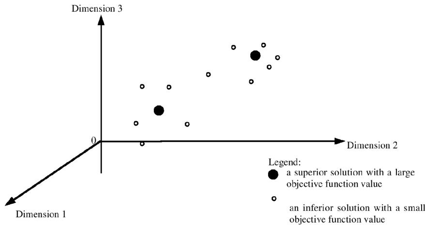  
Figure 3.6 Hypothetical superior solutions and surrounding inferior solutions

Thus, it is concluded that the search space of the road project problem has multiple peaks in the vicinity of the good solutions, with some of these peaks being surrounded by inferior solutions. This finding is consistent with the result of an early investigation into the shape of solution space for the transport network design problem (Pearman 1979), which is similar to the road project construction timetable problem in this study.

# 3.5 Conclusions: Scheduling Interactive Road Projects by GA

The results of this study to optimise the selection and scheduling of road projects are based only on road user and supplier effects, but other environmental and social impacts could be incorporated in the model. The narrow focus is appropriate in this rural area where the effects on road users and suppliers would dominate any comprehensive evaluation.

Not only does the genetic algorithm for the project scheduling problem generate an apparently best solution, but it also generates a set of very good solutions which make it easy for the decision-maker to select between alternatives without reducing the payoff to any substantial extent. The GA also discloses that traffic responses make the fitness of a program of road projects sensitive to small changes in project sequence. Two contrasting cases have emerged from the analysis, both having significant implications for practical decisions and the formulation of policy.

# 3.5.1 Dissimilar Construction Schedules with High and Almost Equal Payoffs

The presence of a number of good solutions makes the search for the optimal solution to the road project problem difficult and may even indicate that the optimum has not been found. However, the multiplicity of good but dissimilar solutions may be valuable for decision-makers. They are interested not only in the efficiency of resource allocation but also in other issues, such as environment protection and the development of the local economy. These considerations could influence a marginal decision. From a group of almost equally good solutions, in terms of narrowly specified resource allocation efficiency, decision-makers can choose the most effective by other criteria. In other words, they can choose a solution that is still good in terms of efficiency but better on other grounds.

# 3.5.2 Similar Construction Schedules with Dissimilar Payoffs

The presence of similar construction timetables with different economic payoffs, of which some are positive and high and the others are negative, has an important implication for practical decision-making on road investment programs. When a road project construction timetable with high economic payoff needs to be modified to a seemingly small degree, caution is required to avoid a substantial decrease in the total economic payoff which may be caused by the adjustment. The genetic algorithm search has generated a number of examples of programs with very poor payoff which differ only slightly from those giving excellent results. These show that small modifications may cause large and damaging results.

# Список литературы

Dial R. B. (1971) A Probabilistic Multipath Traffic Assignment Model which Obviates Path Enumeration, Transportation Research, Vol. 5, 83-111.   
Han R. L. (1999) Optimising Road Maintenance Projects on a Rural Network Using Genetic Algorithms, Proceedings of the Australian Transport Research Forum 1999, Perth, Australia, Vol. 23, 477-491.   
Michalewicz, Z. (1992) Genetic Algorithms $^ +$ Data Structures $=$ Evolution Programs, Springer-Verlag.   
Pearman, A.D. (1979) The Structure of the Solution Set to Network Optimisation Problems, Transportation Research, Vol. 13B, 81-90.

# Chapter 4 Decoupled Optimization of Power Electronics Circuits Using Genetic Algorithms

J. Zhang, Henry S. H. Chung, W. L. Lo, S. Y. R. Hui, and A. Wu

Department of Electronic Engineering   
City University of Hong Kong   
Tat Chee Avenue   
Hong Kong

# Abstract

This chapter presents an implementation of a decoupled optimization technique for design of switching regulators using genetic algorithms (GA). The optimization process entails selection of the component values in the regulator to meet the static and dynamic requirements. Although the proposed approach inherits characteristics of evolutionary computations that involve randomness, recombination, and survival of the fittest, it does not perform a whole-circuit optimization. Consequently, intensive computations that are usually found in stochastic optimization techniques can be avoided. In the proposed optimization scheme, a regulator is decoupled into two components, namely the power conversion stage (PCS) and the feedback network (FN). The PCS is optimized with the required static characteristics such as the input voltage and output load range, while the FN is optimized with the required static characteristics of the whole system and the dynamic responses during the input and output disturbances. Systematic procedures for optimizing circuit components are described. The proposed technique is illustrated with the design of a buck regulator with overcurrent protection. The predicted results are compared with the published results available in the literature and are verified with experimental measurements.

# 4.1 Introduction

It is now widely recognized that computer-aided-design (CAD) tools can reduce the time and cost of production for electrical circuit design. Although much research work is focused on the analysis of periodically switching circuits [1]-[3], techniques developed so far are not fully applicable for power electronics circuits (PEC). As the operation of the switches in PEC is dictated by various constraint equations, the topology duration and sequence of operation are dependent on the intrinsic circuit waveforms [1], [3].

In the last two decades, small-signal models have been widely applied in the design of feedback circuit for switching regulators. Among various approaches, the state-space averaging and its variant [4]-[7] are the most common ones. By recognizing that a converter has an output filter with corner frequency, which is much lower than the switching frequency, a linear time-invariant model can be derived to approximate the time-variant PEC. Based on the generic feature of slow-varying output, a concept of injected and absorbed current has been proposed [5]. This concept extracts the output capacitor from the circuit, yielding an order reduction in the system differential equations [6]. By performing a Bode plot of the converter characteristics and applying the classical control theories, circuit components in the feedback compensation network can be designed. Although the procedures are simple and elegant, they are usually applied to specific circuits and control schemes [8]-[9], which require comprehensive knowledge on the circuit operation. In addition, as the circuit has been converted into a mathematical model and its state variables have been averaged, no detailed information about the exact waveforms and the response profiles can be obtained. Circuit designers would sometimes find it difficult to predict precisely the circuit responses under large-signal conditions [7].

As power electronics technology continues to develop, there is a continuous need for automated synthesis that starts with a high-level statement of the desired behavior and optimizes the circuit component values for satisfying some required design objectives. About two decades ago, techniques for analog circuit design automation began to emerge. These methods incorporated heuristics [10], knowledge bases [11], simulated annealing [12], and other algorithms, in which circuit optimization techniques are a powerful adjunct in the design stage. Classical optimization techniques such as the gradient methods and hill-climbing techniques have been applied [13]-[14]. However, some methods might be subject to becoming trapped into local minima, leading to sub-optimal parameter values, and thus, having a limitation of operating in large, multimodal, and noisy spaces.

Over the last few years, modern stochastic optimization techniques involving evolutionary computation such as genetic algorithms (GA) [15] have been shown to be an effective way to find solutions close to the global optimum and are less dependent upon the initial starting point of the search [16]. A set of guided stochastic search procedures that are based loosely on the principles of genetics is formulated. The procedures are flexible, allowing mixed type, bounded decision variables and complex multifaceted goals. Although GA are appropriate for solving off-line engineering design problem, the stochastic search procedures are computationally intensive. The additional burden of performing an exhaustive or probabilistic search of each proposed trial solution in order to establish its sensitivity is very tedious. This chapter presents an implementation of a decoupled optimization technique for design of switching regulators using GAs. Circuit components are depicted as vectors of parameters that are usually named chromosomes. The constructed data structures are manipulated with the GA. The optimization process entails selection of the component values in the regulator to meet the static and dynamic requirements. Although the proposed approach inherits characteristics of evolutionary computations that involve randomness, recombination, and survival of the fittest, it does not perform a whole-circuit optimization so that intensive computations can be lessened. In the proposed optimization scheme, a regulator is decoupled into two components including the power conversion stage (PCS) and the feedback network (FN). The circuit components in the PCS are optimized with the required static characteristics such as the input voltage and output load range. The circuit components in the FN are optimized with the required static behaviors of the whole regulator and the dynamic responses during the input voltage and output load disturbances. Sec. II shows the decoupled regulator configuration. Section 4.3 describes the chromosome structures and the fitness functions for the PCS and FN in the GA optimization. Section 4.4 describes the optimization procedures. In Section 4.5, the proposed approach is illustrated with the design of a buck regulator with overcurrent protection. A prototype using the GA-optimized component values has been built. Simulated results are compared with the waveforms obtained in available literature and experimental measurements.

# 4.2 Decoupled Regulator Configuration

The basic block diagram of a power electronics circuit including the PCS and FN is shown in Figure 4.1. The PCS is supplied from the source $\nu _ { i n }$ to the load $R _ { L }$ The PCS consists of $I _ { P }$ resistors $( R ) , J _ { P }$ inductors $( L )$ , and $K _ { P }$ capacitors $( C )$ . The FN consists of $I _ { F }$ resistors, $J _ { F }$ inductors, and $K _ { F }$ capacitors. The resistors in the PCS represent the parasitic resistors of the components such as the equivalent series resistance of inductors and capacitors since no explicit resistors are usually added in power processing. The signal conditioner $H _ { o }$ converts the PCS output voltage $\nu _ { o }$ into a suitable form (i.e., $\nu _ { o } ^ { ~ \prime }$ for comparing with a reference voltage $\nu _ { r e f } .$ Their difference $\nu _ { d }$ is then sent to an error amplifier (EA). The EA output $\nu _ { e }$ is combined with the feedback signals $W _ { p }$ , derived from the PCS parameters, such as the inductor current and input voltage, to give an output control voltage $\nu _ { c o n }$ after performing a mathematical function $g ( \nu _ { e } , W _ { p } )$ . $\nu _ { c o n }$ is then modulated with a pulsewidth modulator to derive the required gate signals for driving the switches in the PCS. Mathematically, all passive components in the PCS and the FN can be represented with the use of two vectors $\Theta _ { P C S }$ and $\Theta _ { F N } ,$ respectively. They are defined as follows.

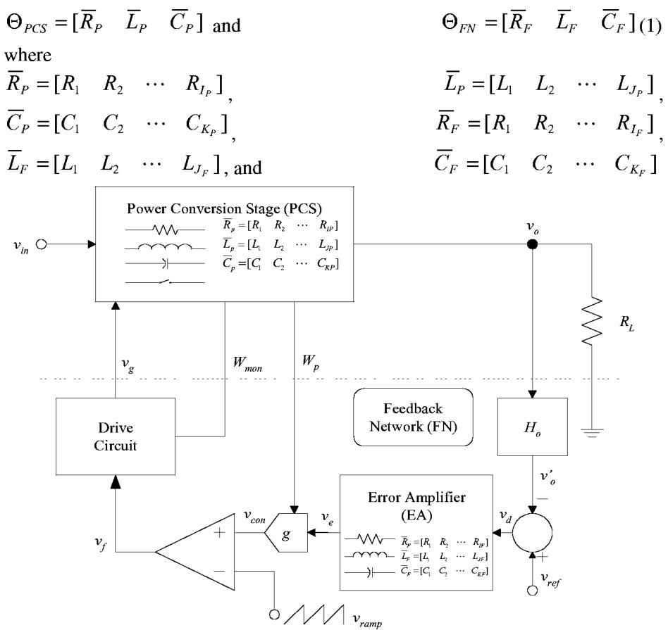  
Figure 4.1 Block diagram of power electronics circuits: chromosome structures and the fitness functions

Apart from satisfying the operating requirements, including the static and dynamic responses, the components might also be required to optimize for other factors such as the physical size and the total cost of the components. Conventional techniques usually perform a whole-circuit optimization, in which all components are optimized at the same time. Such approach will be computationally intensive because it involves considerable searching dimensions. In this chapter, $\Theta _ { P C S }$ and $\Theta _ { F N }$ are optimized separately with the GA by decoupling the PCS and FN. For example, if the searching dimension of the PCS is $N _ { P C S }$ and that of FN is $N _ { F N } ,$ , the total training time is equal to the sum of the time taking to train $N _ { P C S }$ parameters in the PCS and $N _ { F N }$ parameters in the FN. The required time will be shorter than training $( N _ { P C S } + N _ { F N } )$ parameters in the whole-circuit optimization. This new approach greatly simplifies the optimization procedures and reduces the computation time. The parameters in $\Theta _ { P C S }$ is optimized by considering the steady-state operating requirements in the PCS such as the input and output load range, steady-state error, and output ripple voltage. With the determined $\Theta _ { P C S }$ parameters in $\Theta _ { F N }$ are then optimized for the whole-system steady-state characteristics and dynamic behaviors such as the maximum overshoot and undershoot, and the settling time during the input and output disturbances.

# 4.2.1 Optimization Mechanism of GA

The parameters in $\Theta _ { P C S }$ and $\Theta _ { F N }$ are grouped in a chromosome-like structure. A group of these chromosomes constitutes a population. An index of merit (fitness value) is assigned to each individual chromosome, according to a defined fitness function. A new generation is evolved by a selection technique, in which there is a larger probability of the fittest individuals being chosen. Pairs of chosen chromosomes are used as the parents in the construction of the next generation. A new generation is produced as a result of reproduction operators applied on parents. There are two main reproduction operators, namely mutation and crossover. New generations are repeatedly produced until a predefined convergence level is reached.

# 4.2.2 Chromosome and Population Structures

The chromosome structure for optimization of $\Theta _ { P C S }$ and $\Theta _ { F N }$ is similar to Equation (1). The formats of the chromosome $C P$ for the PCS and the chromosome $C F$ for the FN in a population are as follows;

$$
{ \begin{array} { l l l l l l l l l l l l l } { C P = [ R _ { 1 } } & { R _ { 2 } } & { \cdots } & { R _ { I _ { P } } } & { \mid } & { L _ { 1 } } & { L _ { 2 } } & { \cdots } & { L _ { J _ { P } } } & { \mid } & { C _ { 1 } } & { C _ { 2 } } & { \cdots } & { C _ { K _ { P } } \mid } \\ { C F = [ R _ { 1 } } & { R _ { 2 } } & { \cdots } & { R _ { I _ { P } } } & { \mid } & { L _ { 1 } } & { L _ { 2 } } & { \cdots } & { L _ { J _ { F } } } & { \mid } & { C _ { 1 } } & { C _ { 2 } } & { \cdots } & { C _ { K _ { F } } \mid } \end{array} }
$$

$C P$ and $C F$ are coded as vectors of floating point numbers, of the same length as the solution vector. Each parameter in $C P$ and $C F$ is forced to be within the desired range. The precision of such an approach depends on the underlying machine, but is generally much better than that of the binary representation in conventional GA-training [17]. Same chromosome structure is defined in C language for $C P$ and $C F$ in their respective population,

typedef struct { long double \*RValue, \*LValue, \*CValue;

long double FitnessValue;   
}chromosome;

The values of the component are stored in arrays, which are pointed by RValue, LValue, and CValue, corresponding to each individual component type. The fitness value of the chromosome is stored in FitnessValue, which is determined by considering the static and dynamic responses, and its computation will be described in the next section. The chromosomes in the population are also stored in the form of structures. That is,

struct PCs_Population { int NumOfChromosOme, NumOfR, NumOfL, NumOfC; long double Rmin, Rmax, Lmin, Lmax, Cmin, Cmax; chromosome \*CP; };   
struct FN_Population { int NumOfChromosome, NumOfR, NumOfL, NumOfC; long double Rmin, Rmax, Lmin, Lmax, Cmin, Cmax; chromosome \*CF; };

The number of chromosomes in a population is stored in NumO f Chromosome. The chromosomes in the respective population are stored in arrays, which are pointed by CF and CP, respectively. The numbers of $R , L .$ , and $C$ in a chromosome are stored in NumOfR, NumOfL, and NumOfC, respectively. The searching space of each component value is bounded within a predefined range. That is, the values of $R , L$ , and $C$ will lie between [Rmin, Rmax], [Lmin, Lmax], and [Cmin, Cmax] in the respective population.

# 4.2.3 Fitness Functions

An index (fitness value) is assigned to each chromosome in the population according to a predefined fitness function. The fitness value shows the degree of attainment of the chromosome on the optimization objectives. In this chapter, a multi-objective optimization is adopted. Better chromosome will have a higher fitness value. The optimization objectives of the PCS are based on the steadystate behaviors and the optimization objectives of the FN are based on the steadystate behaviors of the whole system and dynamic responses under the input and output disturbances. Their definitions are described as follows.

# 4.3 Fitness Function for PCS

The fitness function $\Phi _ { P }$ for evaluating each chromosome in PCs_Population is based on the following considerations, including

1) The steady-state error of $\nu _ { o }$ within the required input voltage range $\nu _ { i n } \in$ $[ V _ { i n , \operatorname* { m i n } } , V _ { i n , \operatorname* { m a x } } ]$ and output load range $R _ { L } \in \lbrack R _ { L , \mathrm { m i n } } \ : , R _ { L , \mathrm { m a x } } \ : ]$   
2) The operation constraints on circuit components, such as the maximum voltage and current stresses, ripple voltage and ripple current   
3) The steady-state ripple voltage on $\nu _ { o } .$   
4) The intrinsic factors concerning with the components in the selected chromosome, such as the total cost, physical size, etc.

Hence, $\Phi _ { P }$ measures the attainment of a generic chromosome $C P$ for the above four objectives in the static operating conditions. Each objective is expressed by an objective function (OF). For the nth chromosome in the population, $\Phi _ { P }$ is expressed in the form of

$$
\begin{array}{c} \Phi _ { P } ( C P _ { n } ) = \sum _ { R _ { L } = R _ { L , \operatorname* { m i n } } , \mathscr { A } R _ { L } } ^ { R _ { L , \operatorname* { m a x } } } \sum _ { \nu _ { m } = V _ { m , \operatorname* { m i n } } , \mathscr { S } _ { \nu _ { m } } } ^ { V _ { m , \operatorname* { m a x } } } [ O F _ { 1 } ( R _ { L } , \nu _ { i n } , C P _ { n } ) + O F _ { 2 } ( R _ { L } , \nu _ { i n } , C P _ { n } ) +  \\ { O F \big ( R _ { l } , \nu _ { i n } , C P _ { n } \big ) + O F _ { 4 } ( R _ { L } , \nu _ { i n } , C P _ { n } ) ] } \end{array}
$$

where $\delta R _ { L }$ and $\delta \nu _ { i n }$ are the steps in varying $R _ { L }$ and $\nu _ { \mathrm { { i n } } } .$ respectively, for evaluating $\Phi _ { P }$ .The definitions all $O F \mathbf { s }$ in Equation (3) are defined as follows.

# 4.3.1 OF1 for Objective (1)

The steady state $\nu _ { o }$ is a crucial factor that considers the suitability of $\Theta _ { \mathrm { P C S } }$ in the population. The implied goal is to find whether there exists a value of $\nu _ { c o n }$ in Figure 4.1 such that the value of $\nu _ { o }$ after the signal conditioning of $H _ { o }$ [i.e., $\nu _ { o } ^ { ~ \prime } ]$ is same as $\nu _ { r e f } .$ An iterative Secant method [18] is applied to determine the steady state waveforms. An integral square error function $\boldsymbol { \mathrm { E } } _ { 2 } ^ { ( r ) }$ is defined in the rth iteration in order to estimate the closeness of ${ \nu _ { o } } ^ { , , }$ with $\nu _ { r e f }$ in $N _ { s }$ simulated samples, where

$$
{ { \bf E } _ { 2 } } ^ { ( r ) } = \sum _ { m = 1 } ^ { N _ { s } } [ { \nu _ { o } } ^ { , ( r ) } ( m ) - \nu _ { r e f } ] ^ { 2 }
$$

${ \nu _ { o } } ^ { \prime }$ is obtained by performing a time-domain simulation for a given value of $\nu _ { c o n }$ and the initial state vector $x ( 0 )$ in the PCS with the FN excluded. If $\mathbf { E } _ { 2 }$ is less than a tolerance ε, it is assumed that the system is in steady-state conditions. Otherwise, another guess of $\nu _ { c o n } ^ { ( r + 1 ) }$ and $x ^ { ( r + 1 ) } ( 0 )$ will be iterated by,

$$
\widetilde { x } ^ { \left( r + 1 \right) } = \widetilde { x } ^ { \left( r \right) } - \frac { \widetilde { x } ^ { \left( r \right) } - \widetilde { x } ^ { \left( r - 1 \right) } } { \mathbf { E } _ { 2 } ^ { \left( r \right) } - \mathbf { E } _ { 2 } ^ { \left( r - 1 \right) } } { \mathbf { E } _ { 2 } ^ { \left( r \right) } }
$$

where $\widetilde { \boldsymbol { x } } ^ { ( r ) } = \left[ \boldsymbol { \nu } _ { c o n } ^ { ( r ) } \quad \boldsymbol { x } ^ { ( r ) } ( 0 ) \right]$

$\widetilde { \boldsymbol { x } } ^ { ( r + 1 ) }$ l he However, the iteration will also be terminated when $r$ is larger than a preset number $N _ { r }$ .

Formulation of $O F _ { 1 }$ is based on $\mathbf { E } _ { 2 }$ The major objective is that if no steady-state solution can be found if $O F _ { 1 }$ should be small. Otherwise, $O F _ { 1 }$ should be large. $O F _ { 1 }$ is defined as follows,

$$
O F _ { 1 } = K _ { 1 } \ e ^ { - { \bf E } _ { 2 } / ( K _ { 2 } \pmb { \varepsilon } ) }
$$

where $K _ { 1 }$ is the maximum attainable value of $O F _ { 1 }$ and $K _ { 2 }$ adjusts the sensitivity of $O F _ { 1 }$ with respect to $\mathbf { E } _ { 2 }$ The relationships between $O F _ { 1 }$ and $( \mathsf { E } _ { 2 } / K _ { 2 } \varepsilon )$ are shown in Figure 4.2(a). It can be seen that $O F _ { 1 }$ decreases as $\mathrm { E } _ { 2 }$ increases. It shows a $90 \%$ reduction when $\mathbf { E } _ { 2 }$ is larger than 2.3 times $K _ { 2 }$ ε. Thus, if $K _ { 2 }$ is set smaller, higher creditable components will be selected for $\Theta _ { \mathrm { P C S } }$ .However, the searching process will become tight, causing longer computation time.

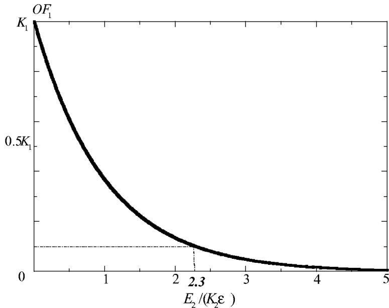  
(a) $O F _ { 1 }$ vs. $E _ { 2 } / K _ { 2 } \mathfrak { E }$

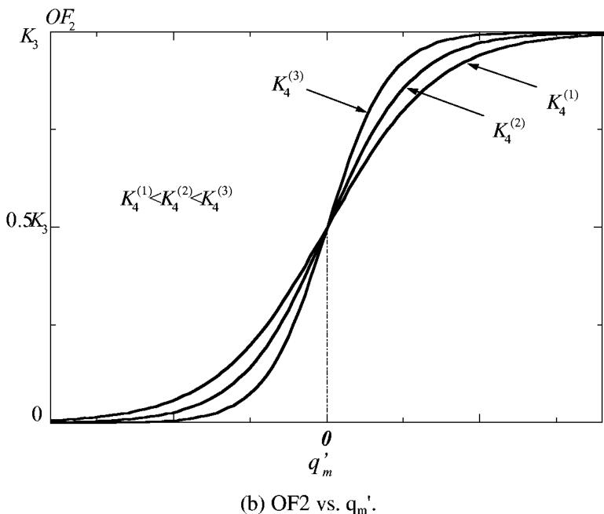  
Figure 4.2 Objective functions

# $4 . 3 . 2 ~ O F _ { 2 }$ for Objective (2)

Under the steady-state condition, there are constraints that control the operating limits of some waveforms. For example, if $\lambda _ { C }$ is the limit of a considered quantity $q$ , such as the maximum voltage stress across a switch, $O F _ { 2 }$ is defined as

$$
O F _ { 2 } = \sum _ { m = 1 } ^ { N _ { C } } \frac { K _ { 3 , m } } { 1 + e ^ { - K _ { 4 , m } ( \lambda _ { C , m } - q _ { m } ) } }
$$

where $N _ { C }$ is the number of constraints, $K _ { 3 , m }$ is the maximum value of the mth constraint, and $K _ { 4 , m }$ determines the sensitivity of considered quantity. If $K _ { 4 , m }$ is large, the variation of $O F _ { 2 }$ is more critical to the quantity variation. It will affect the searching process in the optimization. The relationships between ${ ( q _ { m } } ^ { \prime } = \lambda _ { C , m }$ - $q _ { m } )$ and $O F _ { 2 }$ are shown in Figure 4.2(b). If ${ q _ { m } } ^ { \dag }$ is large, $O F _ { 2 }$ will also be large. For example, if $\lambda _ { C }$ represents the maximum voltage rating of a switch and $q$ is the actual voltage stress, $O F _ { 2 }$ is large when $q$ is much smaller than $\lambda _ { C }$ (i.e., ${ q _ { m } } ^ { \prime } > > 0 $ .

# 4.3.3 $O F _ { 3 }$ for Objective (3)

The ripple voltage on $\nu _ { o }$ has to lie within a limit of $\pm \Delta \nu _ { o }$ around the expected output $\nu _ { o , e x p }$ A measure of the attainment of the chromosome $C P _ { n }$ in this objective is to count the area of $\nu _ { o }$ outside $\nu _ { o , e x p } \pm \Delta \nu _ { o }$ in $N _ { s }$ simulated samples. Hence, $O F _ { 3 }$ is defined as

$$
O F _ { 3 } = K _ { 5 } e ^ { - A _ { 1 } / K _ { 6 } }
$$

where $K _ { 5 }$ is the maximum attainable value for this objective, $K _ { 6 }$ is the decay constant for $O F _ { 3 } .$ , and $A _ { 1 }$ is the ripple area outside the tolerance band, for example $\pm 2 \%$ of $\nu _ { o , e x p }$ . Its form is similar to $O F _ { 1 }$ .Thus, $O F _ { 3 }$ decreases as $A _ { 1 }$ increases.

# 4.3.4 OF4for Objective (4)

Apart from the electrical performance of the PCS, some intrinsic factors relating to the components are considered in this objective function. Factors such as the cost, physical size, lifetime of the components can be included. In general, they are in nonlinear relationships with the components. Thus, $O F _ { 4 }$ can be expressed as

$$
O F _ { 4 } = \sum _ { i = 1 } ^ { I _ { P } } \Phi _ { R } ( R _ { i } ) + \sum _ { j = 1 } ^ { J _ { P } } \Phi _ { L } ( L _ { j } ) + \sum _ { k = 1 } ^ { K _ { P } } \Phi _ { C } ( C _ { k } )
$$

where $\Phi _ { R } \ , \ \Phi _ { L }$ , and $\Phi _ { C }$ are the objective functions for measuring individual component type. For example, if the cost of $L$ increases with its inductance, $\Phi _ { L }$ can be expressed

$$
\Phi _ { L } ( L _ { j } ) = \frac { K _ { 7 } } { L _ { j } }
$$

where $K _ { 7 }$ is a scaling factor. If $L _ { j }$ is large, $\Phi _ { L }$ will decrease accordingly.

# 4.4 Fitness function for FN

Similar to the PCS, the fitness function $\Phi _ { F }$ for evaluating each chromosome in FN_Population is based on several operating conditions, including

The steady-state error of $\nu _ { o }$ w  i ole $\nu _ { i n } \in [ V _ { i n , \operatorname* { m i n } }$ , $V _ { i n , \operatorname* { m a x } } ]$ and output load range $R _ { L } \in [ R _ { L , \operatorname* { m i n } } , R _ { L , \operatorname* { m a x } } ]$   
2) The maximum overshoot and undershoot, and the settling time of $\nu _ { o }$ (or $\nu _ { d , }$ during the startup   
3) The steady-state ripple voltage on $\nu _ { o }$   
4) The dynamic behaviors as in 2) during the input voltage and output load disturbances.

$\Phi _ { F }$ measures the attainment of $C F$ for the above four objectives. Mathematically, for the hth chromosome in the population, $\Phi _ { F }$ is expressed as

$$
\begin{array}{c} \Phi _ { F } ( C F _ { h } ) = [ \sum _ { R _ { L } = R _ { L , \mathrm { m i n } } , \delta R _ { L } } ^ { R _ { L , \mathrm { m a x } } } \sum _ { \nu _ { m } = V _ { m , \mathrm { m i n } } , \delta \nu _ { m } } ^ { V _ { m , \mathrm { m a x } } } O F _ { 5 } ( R _ { L } , \nu _ { i n } , C F _ { h } ) + O F _ { 6 } ( R _ { L } , \nu _ { i n } , C F _ { h } )  \\ { + O F _ { 7 } ( R _ { L } , \nu _ { i n } , C F _ { h } ) ] + O F _ { 8 } ( C F _ { h } ) } \end{array}
$$

The definitions of all $O F { \bf s }$ are described as follows.

# 4.4.1 OFs for Objective (1)

With a defined set of component values in the PCS, the steady state condition of the whole system is determined by the dual loop iteration method in [18]. As this objective is similar to $O F _ { 1 }$ , formulation of $O F _ { 5 }$ is also based on $\mathbf { E } _ { 2 }$ in Equation (5) and is defined as

$$
O F _ { 5 } = K _ { 8 } \ e ^ { - { \bf E } _ { 2 } / ( K _ { 9 } \ \mathfrak { E } ) }
$$

where $K _ { 8 }$ is the maximum attainable value of $O F _ { 3 }$ and $K _ { 9 }$ adjusts the sensitivity with respect to $\mathbf { E } _ { 2 }$ .

$4 . 4 . 2 \ : O F _ { 6 }$ and $O F _ { g }$ for Objective (2) and Objective (4)

D arxtl san  p $\nu _ { d } ,$ where

$$
\nu _ { d } = \nu _ { r e f } - \nu _ { o } \ ^ { , }
$$

A typical response of $\nu _ { d }$ is shown in Figure 4.3. $O F _ { 6 }$ and $O F _ { 8 }$ are used to measure the transient response of $\nu _ { d } ,$ including (1) the maximum overshoot, (2) the maximum undershoot, and (3) the settling time of the response, during the startup and disturbances, respectively. The general form of $O F _ { 6 }$ and $O F _ { 8 }$ can be expressed as

$$
\begin{array} { l } { { O F _ { 6 } = O V ( R _ { L } , \nu _ { i n } , C F _ { h } ) + U V ( R _ { L } , \nu _ { i n } , R _ { L } ) + S T ( R _ { L } , \nu _ { i n } , R _ { L } ) } } \\ { { \ } } \\ { { O F _ { 8 } = \displaystyle \sum _ { i = 1 } ^ { N _ { T } } O V ( R _ { L , i } , \nu _ { i n , i } , C F _ { h } ) + U V ( R _ { L , i } , \nu _ { i n , i } , R _ { L } ) + S T ( R _ { L , i } , \nu _ { i n , i } , R _ { L } ) } } \end{array}
$$

where $N _ { T }$ is the number of the input and load disturbances in the performance test.

In the above expressions, $O V , \ U V .$ and $S T$ are the objective functions for minimizing the maximum overshoot, maximum undershoot, and settling time of $\nu _ { d }$ They are defined as,

$$
O V = \frac { K _ { 1 0 } } { 1 + e ^ { - [ ( M _ { p 0 } - M _ { p } ) / \nu _ { r e f } ] / K _ { 1 1 } } }
$$

where $K _ { 1 0 }$ is the maximum attainable value of this objective function, $M _ { p 0 }$ is the desired maximum overshoot, $M _ { p }$ is the actual overshoot, and $K _ { 1 1 }$ is the passband constant.

$$
U V = \frac { K _ { 1 2 } } { 1 + e ^ { - [ ( M _ { \nu 0 } - M _ { \nu } ) / \nu _ { r e f } ] / K _ { 1 3 } } }
$$

where $K _ { 1 2 }$ is the maximum attainable value of this objective function, $M _ { \nu 0 }$ is the desired maximum undershoot, $M _ { \nu }$ is the actual undershoot, and $K _ { \scriptscriptstyle { 1 3 } }$ is the passband constant.

$$
S T = \frac { K _ { 1 4 } } { 1 + e ^ { - ( T _ { S 0 } - T _ { S } ) / K _ { 1 5 } } }
$$

where $K _ { 1 4 }$ is the maximum attainable value of the objective function, $T _ { s 0 }$ is the desired settling time, $T _ { s }$ is the actual settling time, and $K _ { \mathrm { 1 5 } }$ is the passband constant. $T _ { s }$ is defined as the settling time of $\nu _ { d }$ that falls within a $\pm \sigma \%$ band. That is,

$$
| \nu _ { d } ( t ) | \leq 0 . 0 1 \sigma _ { , t \geq T _ { S } }
$$

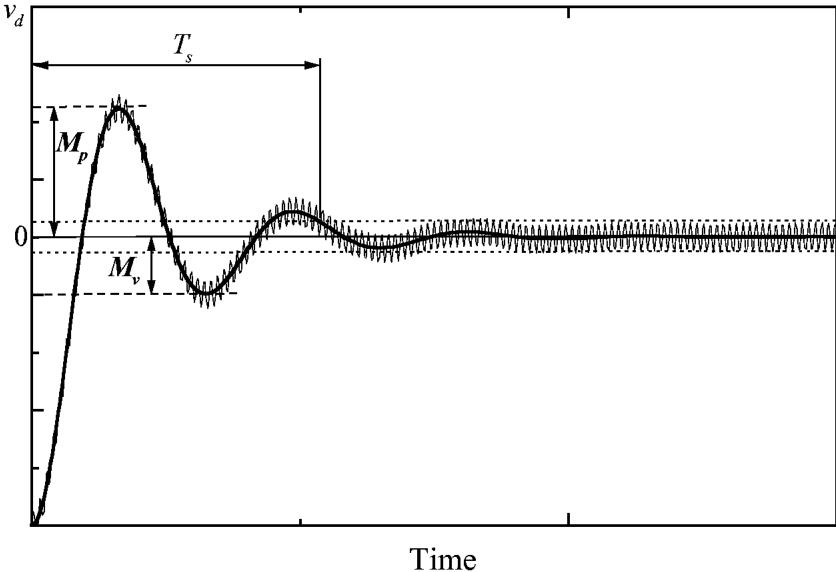  
Figure 4.3 Typical transient response of $\nu _ { d } .$

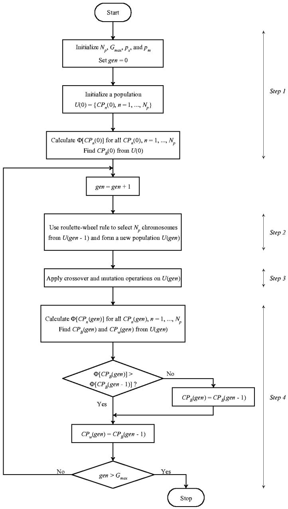  
Figure 4.4 Flowchart of the optimization steps of PCS

The definition of $O F _ { 8 }$ is the same as the criteria in the PCS optimization, in which the number of samples that are outside the tolerance band of the steady state output $\pm \Delta \nu _ { o }$ are measured. Hence $O F _ { 8 }$ is same as Equation (8). That is,

$$
O F _ { 8 } = O F _ { 3 } = K _ { 5 } e ^ { - A _ { 1 } / K _ { 6 } }
$$

The values of $\Phi _ { P }$ and $\Phi _ { F }$ are stored in the Fi tnessValue in the chromosome structure for quantifying their attainments. Their usage is described in the next section.

# 4.5 Steps of Optimization

The optimization procedures for the PCS and FN are similar. Their major differences are in the definitions of the fitness functions and population. Thus, with the aid of the flowchart in Figure 4.4, only the steps of optimizing the PCS in one generation are illustrated in the following.

# Step 1: Initialization

The population size $( N _ { p } )$ , which is the NumOf Chromosomes in Section 4.2, the maximum number of generations $( G _ { m a x } )$ , the probability of crossover operation $( p _ { x } )$ , the probability of mutation operation $( p _ { m } )$ , and the generation counter $( g e n )$ are initialized at the start of the optimization. Moreover, all chromosomes are initialized with random numbers, which lie within the practical design limits (i.e., Rmin $\le R _ { I } \le$ Rmax, Lmin $\leq L _ { j } \leq$ Lmax, $\mathtt { C m i n } \le C _ { k } \le \mathtt { C m a x } )$ . By using (4) [or (12) for FN optimization], the fitness values of all chromosomes are then calculated. The best chromosome in the initial generation $C P _ { B } ( 0 )$ having the highest fitness value {i.e., $\Phi [ C P _ { \scriptscriptstyle B } ( 0 ) ] = \mathrm { M a x } \{ \Phi [ C P _ { \scriptscriptstyle n } ( 0 ) ] , n = 1 , \ \dots \ N _ { p } \} .$ ,is then selected as reference for the next generation.

# Step 2: Selection of Chromosomes

A selection process, which is based on applying the roulette wheel rule, is performed. It starts with the calculation of the fitness value $\Phi _ { p } [ C P _ { n } ( g e n ) ]$ , the relative fitness value $\Phi _ { p , r } [ C P _ { n } ( g e n ) ]$ and the cumulative fitness value $\Phi _ { p , c } [ C P _ { n } ( g e n ) ]$ for the $C P _ { n } ( g e n )$ ,

$$
\Phi _ { p , r } [ C P _ { n } ( g e n ) ] { = } \frac { \Phi _ { p } [ C P _ { n } ( g e n ) ] } { \displaystyle \sum _ { z = 1 } ^ { N _ { p } } \Phi _ { p } [ C P _ { z } ( g e n ) ] }
$$

$$
\Phi _ { p , c } [ C P _ { n } ( g e n ) ] { = } \sum _ { z = 1 } ^ { n } \Phi _ { p , r } [ C P _ { z } ( g e n ) ]
$$

A random probability variable $p \in \ [ 0 , 1 ]$ is generated and compared with the cumulative fitness values $\Phi _ { p , c } [ C P _ { n } ( g e n ) ]$ for $n = 1 \ldots N _ { p } .$ If $\Phi _ { p , c } [ C P _ { z ^ { - 1 } } ( g e n ) ] < p <$ $\Phi _ { p , c } [ C P _ { z } ( g e n ) ]$ , $C P _ { z }$ is selected to be a member of the new population. This selection process is repeated until $N _ { p }$ members have been selected for the new population. In this selection process, the chromosomes with higher fitness values will have higher probability to survive. It is noted that same chromosome of having high fitness value might appear repeatedly in the new population.

# Step 3: Reproduction Operations

After the above selection process, a new chromosome is reproduced by performing two operations including crossover and mutation operations. The crossover operation is illustrated in Figure 4.5(a), in which two chromosomes are selected from the population for the crossover operation. In order to determine whether a chromosome will undergo a crossover operation, a random selection test (RST) is performed. The RST is based on generating a random number $p \in$ [0, 1] for the considered chromosome. If $p < p _ { x }$ , the chromosome will be selected for crossover. By performing a similar procedure, another chromosome will be chosen. [In Figure 4.5(a), $C P _ { 1 }$ and $C P _ { 2 }$ are illustrated.] A crossover point is selected randomly with equal probability from 1 to the total number of components in the chromosomes. The genes after the crossover point will be exchanged, thus, forming two new chromosomes (i.e., $C P _ { 1 } { } ^ { \prime }$ and $C P _ { 2 } ^ { \prime }$ ). The above operations are repeated until all members in the population have been considered.

The mutation operation, which is illustrated in Figure $4 . 5 ( \mathrm { b } )$ , also starts with a RST for each chromosome. If the generated random number $p \in \ [ 0 , \ 1 ]$ for a chromosome is larger than $p _ { m } ,$ the chromosome will undergo mutation. In Figure 4.5(b), $C P _ { 1 }$ is illustrated. The mutation is slightly different from the method with chromosome using binary representation. A random number will be generated for the respective type of component with the value lie within the limits of the components. For example, if a capacitor is selected for mutation, a random number will be generated in the range of [Cmin, Cmax] and will be substituted into the original component value (i.e., $C P _ { 1 } { } ^ { \prime }$ ). The procedures will be repeated until all members have been considered.

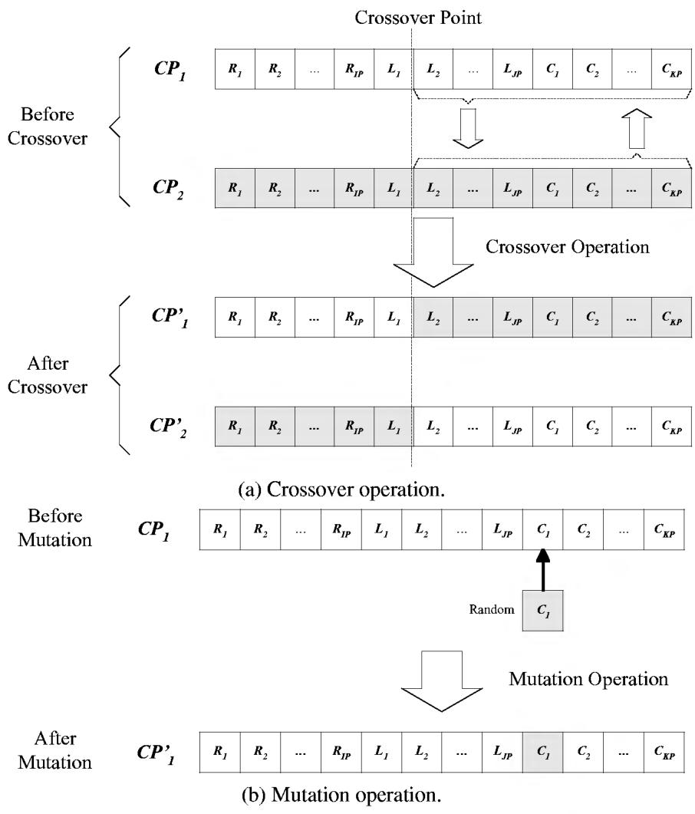  
Figure 4.5 Reproducion process

# Step 4: Elitist function

After finishing the reproduction operation and the calculation of the fitness value of each chromosome, the best member $C P _ { B } ( g e n )$ that has the largest fitness value and the worst member $C P _ { w } ( g e n )$ that has the smallest fitness value will be identified. $C P _ { B } ( g e n )$ will be compared with the best one in the last generation [i.e., $C P _ { B } ( g e n - 1 ) ]$ . If the fitness value of $C P _ { B } ( g e n )$ is smaller than the one of $C P _ { B } ( g e n - 1 )$ , the chromosome content of $C P _ { B } ( g e n - 1 )$ will replace the content of $C P _ { B } ( g e n )$ . Afterwards, the chromosome content of $C P _ { B } ( g e n \textrm { -- } 1 )$ will be substituted into $C P _ { \mathrm { { w } } } ( g e n )$ and the next GA cycle will be started from step (2).

# 4.6 Design Example

The proposed optimization scheme is illustrated with the design of a buck regulator with overcurrent protection [1]. The schematic is shown in Figure 4.6. The regulator consists of a classical buck converter and a proportional-plusintegral (PI) controller. The required specifications are as follows.

1) Input voltage range: 40 V ± 20 V   
2) Output load range: 5 Ω - 10 Ω   
3) Nominal output voltage: $5 \mathrm { V }$   
) Output ripple voltage: $1 \%$   
5) Switching frequency: $2 0 \mathrm { k H z }$   
8) Maximum settling time: 20 ms

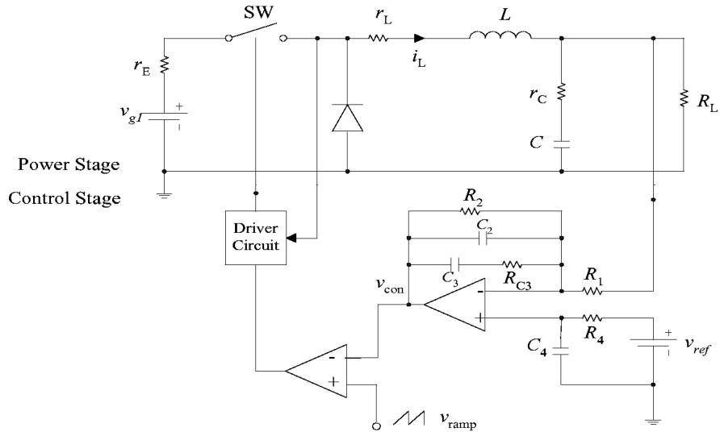  
Figure 4.6 Buck regulator with overcurrent protection

For the PCS, $L$ and $C$ are the design parameters and $R _ { L } , r _ { C }$ , and $r _ { E }$ are assumed to be known parameters. For the FN, all components are the design parameters. The parameters for the GA optimization are tabulated in Table 4.1. It takes 1 hour to optimize the PCS and 2 hours to optimize the FN on a Pentium II 300 MHz PC. Based on the design criteria in Section 4.3.1, Table 4. 2(a) shows the initial values of $L$ and $C$ and the results after 500 generations. The optimized values of the inductor and capacitor in the buck converter were found to be $1 9 4 \mu \mathrm { H }$ and 1054 $\mu \mathrm { F } ,$ , respectively. These two values are close to the ones in [1]. The PI controller is then optimized after the PCS optimization. Table 4.2(b) shows the initial component values for the controller and the optimized results after 500 generations. Figure 4.7 shows the fitness values of $\Phi _ { P }$ and $\Phi _ { F }$ versus the number of generation. It can be observed that the fitness value has come to a satisfactory level after 500 generations. The predicted results are then verified with experimental measurements.

Table 4.1 Parameters in GA optimization   

<table><tr><td rowspan=1 colspan=2>Power Conversion Stage (PCS)</td><td rowspan=1 colspan=2>Feedback Network (FN)</td></tr><tr><td rowspan=1 colspan=1>Parameter</td><td rowspan=1 colspan=1>Value</td><td rowspan=1 colspan=1>Parameter</td><td rowspan=1 colspan=1>Value</td></tr><tr><td rowspan=1 colspan=1>x</td><td rowspan=1 colspan=1>0.85</td><td rowspan=1 colspan=1>x</td><td rowspan=1 colspan=1>0.85</td></tr><tr><td rowspan=1 colspan=1>Pm</td><td rowspan=1 colspan=1>0.25</td><td rowspan=1 colspan=1>m</td><td rowspan=1 colspan=1>0.25</td></tr><tr><td rowspan=1 colspan=1>Gmax</td><td rowspan=1 colspan=1>500</td><td rowspan=1 colspan=1>Gmax</td><td rowspan=1 colspan=1>500</td></tr><tr><td rowspan=1 colspan=1>Np</td><td rowspan=1 colspan=1>30</td><td rowspan=1 colspan=1>Np</td><td rowspan=1 colspan=1>30</td></tr><tr><td rowspan=1 colspan=1>K1</td><td rowspan=1 colspan=1>2.0</td><td rowspan=1 colspan=1>K8</td><td rowspan=1 colspan=1>2.0</td></tr><tr><td rowspan=1 colspan=1>2ε</td><td rowspan=1 colspan=1>500</td><td rowspan=1 colspan=1>ε</td><td rowspan=1 colspan=1>500</td></tr><tr><td rowspan=1 colspan=1>K5</td><td rowspan=1 colspan=1>2.0</td><td rowspan=1 colspan=1>K10</td><td rowspan=1 colspan=1>4.0</td></tr><tr><td rowspan=1 colspan=1>K6</td><td rowspan=1 colspan=1>500</td><td rowspan=1 colspan=1>K1</td><td rowspan=1 colspan=1>0.0013647</td></tr><tr><td rowspan=1 colspan=1>Switchingfrequency</td><td rowspan=1 colspan=1>20 kHz</td><td rowspan=1 colspan=1>K12</td><td rowspan=1 colspan=1>4.0</td></tr><tr><td rowspan=1 colspan=1>Ramp voltage</td><td rowspan=1 colspan=1>0.2 V/μs</td><td rowspan=1 colspan=1>K13</td><td rowspan=1 colspan=1>0.006833</td></tr><tr><td rowspan=1 colspan=1>Vefe</td><td rowspan=1 colspan=1>5V</td><td rowspan=1 colspan=1>K14</td><td rowspan=1 colspan=1>4.0</td></tr><tr><td rowspan=1 colspan=1></td><td rowspan=1 colspan=1></td><td rowspan=1 colspan=1>T5o</td><td rowspan=1 colspan=1>0.005s</td></tr><tr><td rowspan=1 colspan=1></td><td rowspan=1 colspan=1></td><td rowspan=1 colspan=1>K15</td><td rowspan=1 colspan=1>0.0008</td></tr></table>

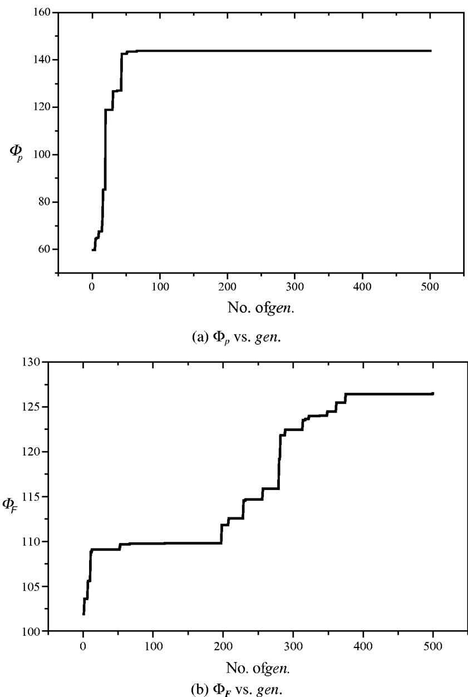  
Figure 4.7 $\Phi _ { p }$ and $\Phi _ { F }$ vs. the number of generation gen

# Table 4.2(a) Initial values of $\pmb { L }$ and $c$ and the results after 500 generations

Table 4.2(b) Initial component values for the controller and the results after 500 generations   

<table><tr><td rowspan=1 colspan=1>Component</td><td rowspan=1 colspan=1>Initial Value</td><td rowspan=1 colspan=1>Optimized value after 500 generations</td></tr><tr><td rowspan=1 colspan=1>L</td><td rowspan=1 colspan=1>200 μH</td><td rowspan=1 colspan=1>194 μH</td></tr><tr><td rowspan=1 colspan=1>C</td><td rowspan=1 colspan=1>1000 μF</td><td rowspan=1 colspan=1>1054 μF</td></tr></table>

<table><tr><td rowspan=1 colspan=1>Component</td><td rowspan=1 colspan=1>Initial Value</td><td rowspan=1 colspan=1>Optimal Value after 500 generations</td></tr><tr><td rowspan=1 colspan=1>RC3</td><td rowspan=1 colspan=1>4.7 kΩ</td><td rowspan=1 colspan=1>3.448 kΩ</td></tr><tr><td rowspan=1 colspan=1>C2</td><td rowspan=1 colspan=1>2 μF</td><td rowspan=1 colspan=1>5.863 μF</td></tr><tr><td rowspan=1 colspan=1>C3</td><td rowspan=1 colspan=1>3.3 μF</td><td rowspan=1 colspan=1>0.461 μF</td></tr><tr><td rowspan=1 colspan=1>R2</td><td rowspan=1 colspan=1>300 kΩ</td><td rowspan=1 colspan=1>766.56 kΩ</td></tr><tr><td rowspan=1 colspan=1>C4</td><td rowspan=1 colspan=1>1.8 μF</td><td rowspan=1 colspan=1>1.089 μF</td></tr><tr><td rowspan=1 colspan=1>RA</td><td rowspan=1 colspan=1>1 kΩ</td><td rowspan=1 colspan=1>6.535 kΩ</td></tr><tr><td rowspan=1 colspan=1>R1</td><td rowspan=1 colspan=1>0.6 kΩ</td><td rowspan=1 colspan=1>1.09356 kΩ</td></tr></table>

Firstly, two extreme operating conditions with input voltage equal $2 0 ~ \mathrm { V }$ and $6 0 \mathrm { V }$ are studied, respectively. The simulated startup transients when the input voltage is $2 0 ~ \mathrm { V }$ and the output load is $5 \ \Omega$ are shown in Figure 4.8. Compared with the original component values used in [1], the GA-optimized component values have better performance, giving smaller overshoot in the inductor current and faster settling time. Moreover, the steady-state error is zero and the output ripple voltage is less than $1 \%$ .Figure 4.9 shows the experimental results, which are all in close agreement with the predicted waveforms. When the input voltage is $6 0 ~ \mathrm { V }$ , the startup transients are shown in Figure 4.10 and the experimental results are shown in Figure 4.11. The settling time is less than $2 0 \mathrm { m s }$ in both input voltages. They are stable in the two extreme operating conditions. This confirms that the regulator with the GA-optimized component values give satisfactory results for the start-up transients.

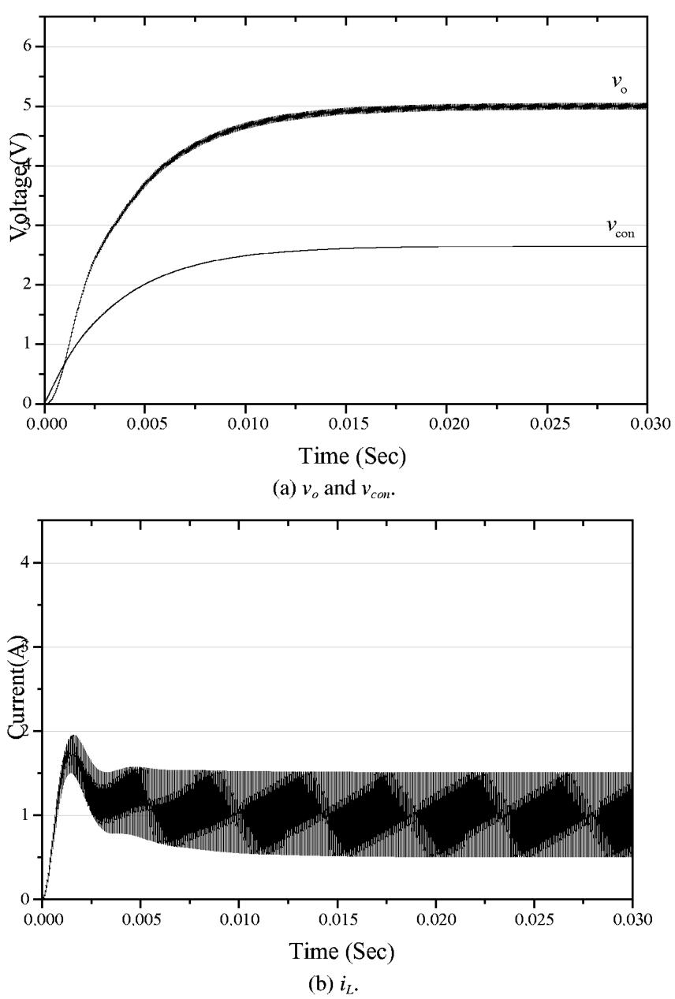  
Figure 4.8 Simulated start-up transients when $\nu _ { i n }$ is $\mathbf { 2 0 \ V }$ and $\pmb { R } _ { L }$ is ${ \ \pmb 5 } \Omega$

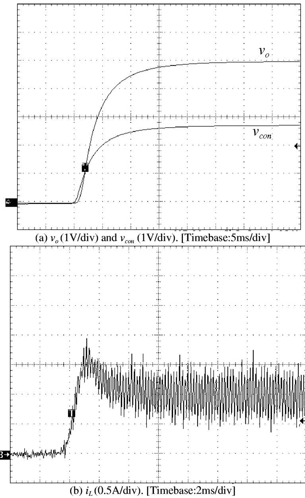  
Figure 4.9 Experimental start-up transients when $\nu _ { i n }$ is $\mathbf { 2 0 \ V }$ and ${ \pmb R } _ { L }$ is $\boldsymbol { \mathfrak { s } } \Omega$

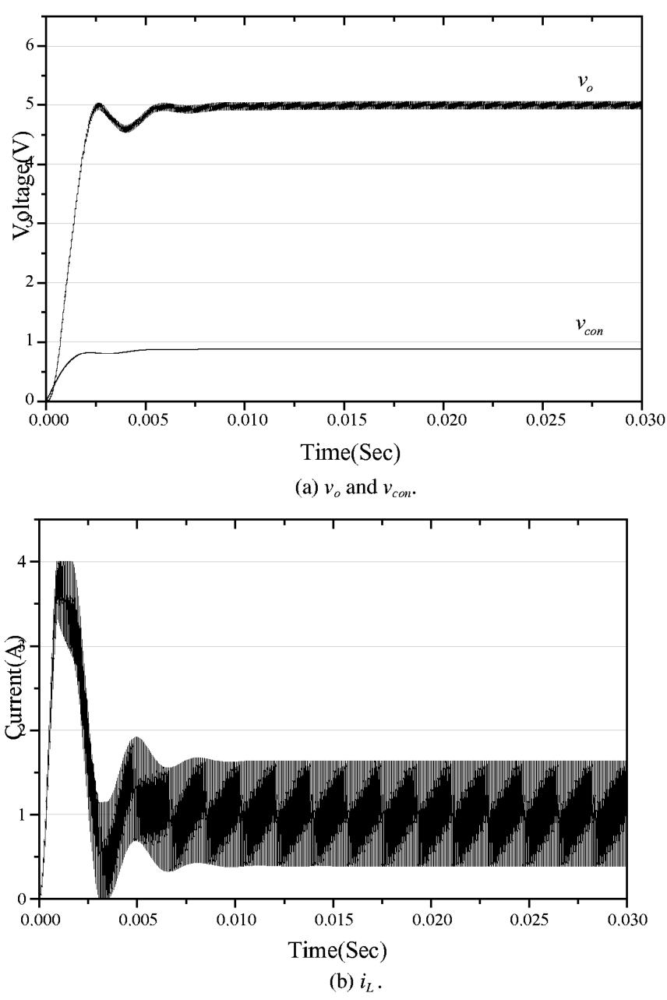  
Figure 4.10 Simulated start-up transients when $\nu _ { i n }$ is $\mathbf { 6 0 \ V }$ and ${ \pmb R } _ { L }$ is $\ 5 \ \Omega$

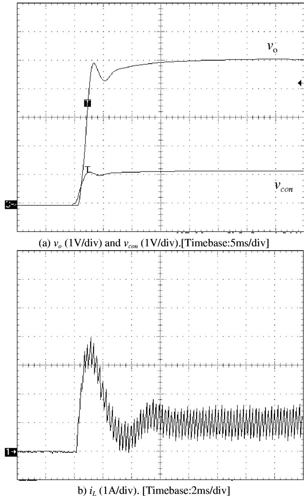  
Figure 4.11 Experimental start-up transients when $\nu _ { i n }$ is $\mathbf { 6 0 \ V }$ and ${ \pmb R } _ { L }$ is $\ 5 \ \Omega$

A similar large-signal disturbance test as [1] is performed. When the input voltage is $2 0 ~ \mathrm { V }$ and the regulator is in steady state, the input voltage is suddenly changed into $4 0 \mathrm { ~ V ~ }$ . The transients are shown in Figure 4.12. The experimental results are shown in Figure 4.13. Compared with [1], when the voltage is changed into $4 0 \mathrm { V }$ , the system will become unstable and is in sub-harmonic oscillation. With the optimized component values, the system is still stable.

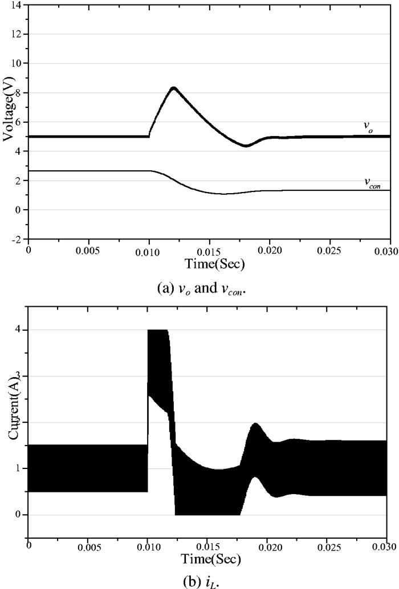  
Figure 4.12 Simulated transient responses when $\nu _ { i n }$ is changed from $\mathbf { 2 0 \Delta V }$ to 40 V

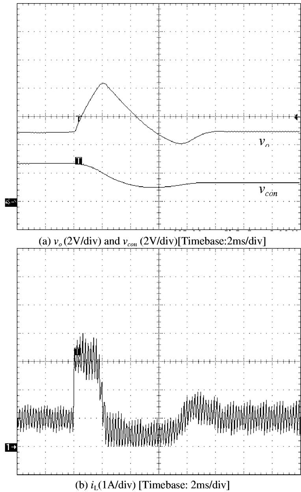  
Figure 4.13 Experimental transient responses when $\nu _ { i n }$ is changed from 20 V into 40 V

Similar tests on load disturbances are performed with the input voltage at $4 0 \mathrm { ~ V ~ }$ . When the system is in the steady state, the output load is suddenly changed from $5 ~ \Omega$ into $1 0 ~ \Omega$ . The simulated and experimental transients are shown in Figure 4.14 and Figure 4.15, respectively. Afterwards, the output load is changed into 5 $\Omega$ . The simulated and experimental transients are shown in Figures 4.16 and 4.17, respectively.

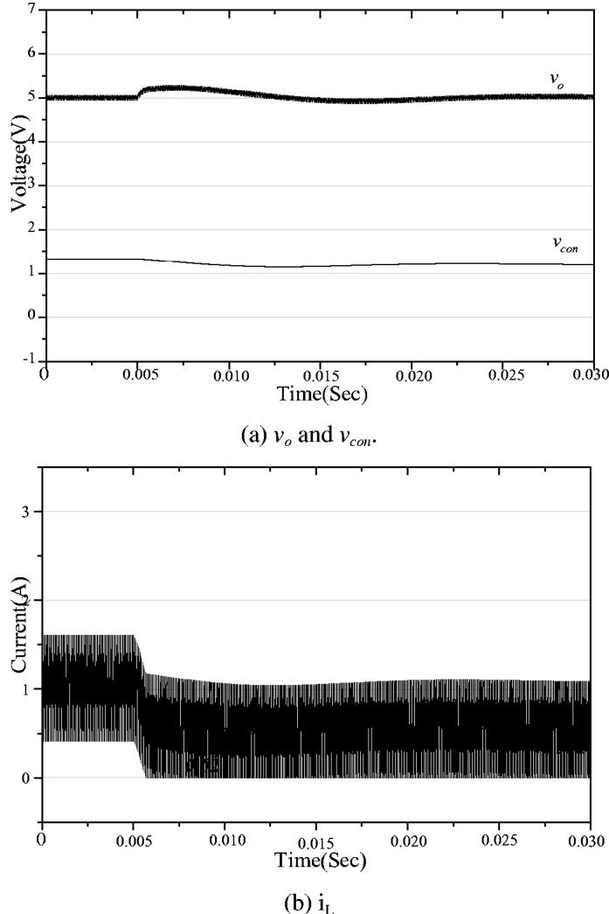  
Figure 4.14 Simulated transient responses when $\mathbf { R _ { L } }$ is changed from $\textbf { 5 } \Omega$ to $\mathbf { 1 0 } \Omega$ and ${ \bf { v _ { i n } } }$ is $\mathbf { 4 0 \ V }$

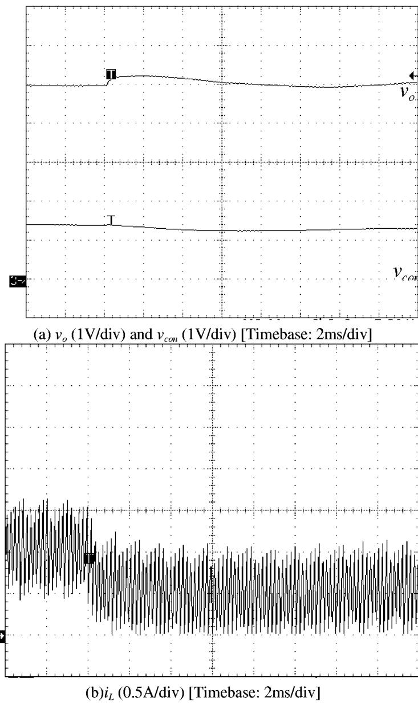  
Figure 4.15 Experimental transient responses when $\pmb { R } _ { L }$ is changed from 5 Ω to $\mathbf { 1 0 } \Omega$ and $\nu _ { i n }$ is $\mathbf { 4 0 \ V }$

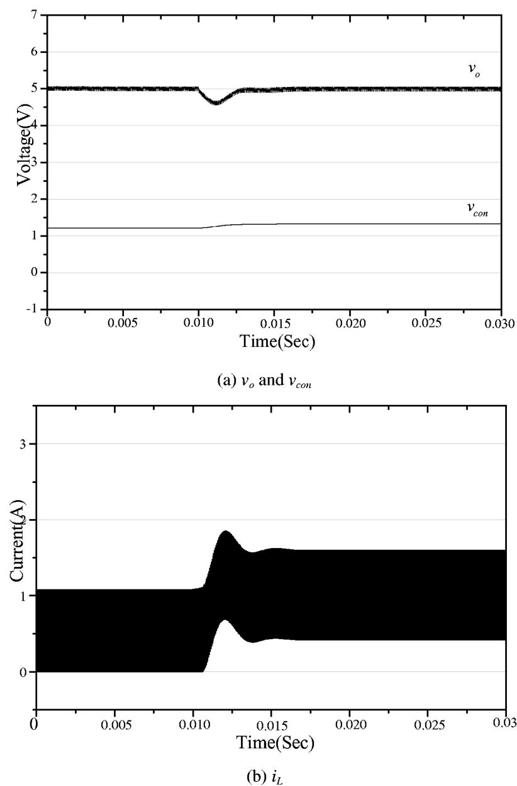  
Figure 4.16 Simulated transient responses when $\pmb { R } _ { L }$ is changed from $\mathbf { 1 0 } \ \Omega$ to ${ \ \pmb 5 } \Omega$ and $\nu _ { i n }$ is $\mathbf { 4 0 \ V }$

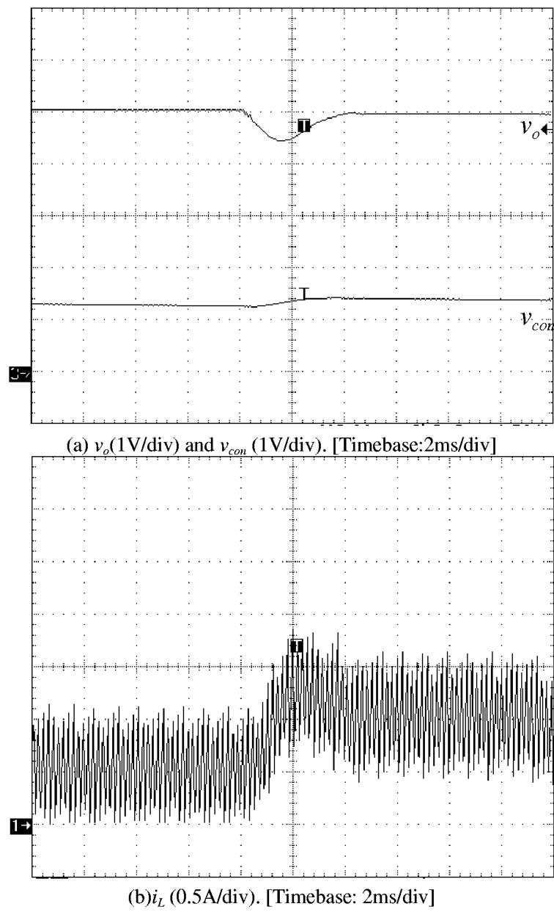  
Figure 4.17 Experimental transient responses when $\pmb { R } _ { L }$ is changed from ${ \bf 1 0 } \Omega$ to $\ 5 \ \Omega$ and $\nu _ { i n }$ is $\mathbf { 4 0 \ V }$

The experimental measurements agree well with the predicted results using the proposed off-line GA optimization technique. Both the static and the dynamic responses are close to the designed specifications, confirming the validity of the proposed optimization approach. In addition, it can be seen from the above tests that the proposed technique is independent of the operating mode of the PCS. For example, during the transient period at startup or large-signal disturbances, the converter may operate between continuous and discontinuous mode. It is because the optimization is based on the actual time-domain performance, without assuming any predetermined operating mode.

# 4.7 Conclusions

This chapter presents a systematic decoupled optimization technique for the design of switching regulators using genetic algorithms. The process entails the selection of the component values in the power conversion stage and the feedback network in the regulator to meet some defined static and dynamic requirements. No complicated mathematical analysis of the whole system is needed. The algorithm automatically determines the optimum values of the components to meet the specifications, independent of the circuit structure and control schemes. The proposed technique is illustrated with an example of a buck regulator. The predicted results are compared to the performance of the one in the available literature and are verified with experimental measurements. Further research will be dedicated to an automated synthesis of the circuit structure of the regulator.

# Список литературы

[1] D. Bedrosian and J. Vlach, "Time-domain analysis of networks with internally controlled switches," IEEE Trans. Circuits Systs. I, Vol. 39, pp. 199- 212, Mar. 1992.   
[2] T. Ström and S. Signell, "Analysis of periodically switched linear circuits," IEEE Trans. Circuits Systs., Vol. 24, pp. 531-541, Oct. 1977.   
[3] B. Wong and H. Chung, "An efficient technique for the time-domain simulation of power electronic circuits," IEEE Trans. Circuits Systs. I, Vol. 45, n0.4, pp. 364-376, Apr. 1998.   
[4] R. D. Middlebrook and S. Cuk, Advances in Switched-Mode Power Conversion, Pasadena, California, TESLACO, 1983.   
[5] P. R. Chetty, "Current injected equivalent circuit approach to modeling switching dc-dc converters," IEEE Trans. Aerosp. Electron. Syst., Vol. 17, pp. 802-808, Nov. 1981.   
[6] A.S. Kislovski, "On the role of physical insight in small-signal analysis of switching power converters," in Proc. 1993 IEEE Applied Power Electron. Conf. and Expo., APEC, pp. 624-630, 1993.   
[7] Y. S. Lee, Computer-Aided-Analysis of Switch-Mode Power Supplies, MarcelDekker, 1993.   
[8] R. D. Middlebrook, "Modelling current-programmed buck and boost regulators," IEEE Trans. Power Electron., Vol. 4, pp. 36-52, Jan. 1989.   
[9]G. C. Verghese, C. A. Bruzos, and K. N. Mahabir, "Averaged and sampleddata model for current-mode control: A reexamination," in Proc. PESC Record, 1989, pp. 484-491.   
[10] G. J. Sussman and R. M. Stallman, "Heuristic techniques in computer-aided circuit analysis," IEEE Trans. Circuits Systs., Vol. 22, Nov. 1975.   
[11] R. Harjani, R. A. Rutenbar, and L. R. Carley, "OASYS: a framework for analog circuit synthesis," IEEE Trans. Computer-Aided Design, Vol. 8, pp. 1247-1266, 1989.   
[12] E. S. Ochotta, R. A. Rutenbar, and L. R. Carley, "Synthesis of highperformance analog circuits in ASTRX/OBLX," IEEE Trans. Computer-Aided Design, Vol. 15, pp. 273-294, Mar. 1996.   
[13] L. P. Huelsman, "Optimization - a powerful tool for analysis and design," IEEE Trans. Circuits Systs. I, Vol. 40, no. 7, Jul. 1993.   
[14] R. E. Massara, Optimization Methods in Electronic Circuit Design, New York: Longman Scientific & Technical.   
[15] D. E. Goldberg, Genetic Algorithms in Search, Optimization and Machine Learning, Addison Wesley, 1989.   
[16] V. Petridis, S. Kazarlis, and A. Bakirtzis, "Varying fitness functions in genetic algorithm constrained optimization: the cutting stock and unit commitment problems," IEEE Trans. System, Man and Cybernetics B, Vol.28, no.5, pp. 629-640, Oct. 1998.   
[17] Z. Michalewicz, Genetic algorithms $^ +$ Data Structure $=$ Evolution Programs, Springer-Verlag, 1996.   
[18] B. Wong and H. Chung, "Steady-state analysis of PWM dc/dc switching regulators using iterative cycle time-domain simulation," IEEE Trans. Ind. Electron., Vol. 45, no. 3, pp. 421-432, June 1998.

# Chapter 5 Feature Selection and Classification in the Diagnosis of Cervical Cancer

Jennifer Hallinan

Institute for Molecular Biosciences University of Queensland St. Lucia, Brisbane, Australia 4072

j.Hallinan@imb.uq.edu.au

# 5.1 Introduction

Cervical cancer is one of the most common cancers, accounting for $6 \%$ of all malignancies in women (National Cancer Institute, 1999). The standard screening test for cervical cancer is the Papanicolaou (or "Pap") smear, which involves visual examination of cervical cells under a microscope for evidence of abnormality (Mackay, Beischer, Cox & Wood, 1983).

Pap smear screening is labour-intensive and boring, but requires high precision, and so appears on the surface to be extremely suitable for automation. Research has been done in this area since the late 1950s (Husain & Watts, 1988); it is one of the "classical" problems in automated image analysis (see also Banda-Gamboa, Ricketts, Cairns, Hussein, Tucker & Husain, 1992; Bartels, 1992 and Danielson, Kanagasingam, Jirgensen, Reith & Nesland, 1994).

It was initially assumed that an automated system would operate in essentially the same way as an expert human cytologist, scanning slides visually, and looking for the same changes in cells that the human would detect. Unfortunately, progress has been slow. Abnormal cells may represent only a few of the thousands of cells on a slide; and they may be difficult or impossible for a machine vision system to detect amid the irregular clumps of different types of cells and scattered debris commonly present on a Pap smear slide.

In the last four decades or so, with the advent of powerful, reasonably priced computers and sophisticated algorithms, an alternative to the identification of malignant cells on a slide has become possible. This is the detection of so-called Malignancy Associated Changes (MACs)  subvisual alterations to the texture of apparently normal cells from the vicinity of a cancerous or precancerous lesion.

The approach to MAC detection generally used is to capture digital images of visually normal cells from patients of known diagnosis (cancerous/precancerous condition or normal). A variety of features such as nuclear area, optical density, shape and texture features are then calculated from the images, and linear discriminant analysis is used to classify individual cells as either "normal" or "abnormal." An individual is then given a diagnosis on the basis of the proportion of abnormal cells detected on her Pap smear slide (Figure 5.1).

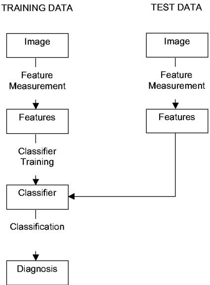  
Figure 5.1 Automated diagnosis from digital images

The problem with this approach is that while all visually normal cells from "normal" (i.e., cancer-free) patients may be assumed to be normal, not all such cells from "abnormal" patients will, in fact, be abnormal. The proportion of MAC-affected cells from an abnormal patient is not known a priori, and probably varies with the stage of the cancer, its rate of progression, and possibly other factors. This means that the "abnormal" cells used for establishing the canonical discriminant function are not, in fact, all abnormal, which reduces the accuracy of the classifier. Further noise is introduced into the classification procedure by the existence of two more-or-less arbitrary cutoff values: the value of the discriminant score at which individual cells are classified as "normal" or "abnormal," and the proportion of "abnormal" cells used to classify a patient as "normal" or ""abnormal.

# 5.2 Feature Selection

In the course of four decades of study into the phenomenon of MACs, literally hundreds of potentially discriminatory features have been proposed, measured and used. The choice of which features to measure and use has in general been a somewhat arbitrary one  the usual approach is to measure as many features as possible, and then look for useful variation in the measured values. This approach is acceptable for small academic studies, but for real-world applications a more systematic approach is desirable.

"Feature selection" is the process of selecting an optimum subset of features from the enormous set of potentially useful features which may be available in a given problem domain (Gose, Johnsonbough & Jost, 1996). It is often performed implicitly, by the human designer of a classifier selecting the features which appear to him or her to be of most potential use. In many cases, this approach is perfectly adequate; in many problem domains, enough is known about the characteristics of the problem for valid features to be identified a priori. A task such as the discrimination of normal cells from cancer cells is a good example cancer cells are larger and darker than normal cells, with a much larger nucleus/cytoplasm ratio. Features representing size and optical density should be sufficient to discriminate between the two types of cell in most cases.

The situation is not so clear-cut for MACs, however, since the changes are subvisual. Since a human observer cannot distinguish MAC-affected cells from normal cells, the choice of discriminatory features is far from obvious. An objective feature selection algorithm is required.

A feature selection algorithm aims to identify the optimum subset of features for a particular problem. This set has been defined as "the subset that performs the best under some classification system" (Jain & Zongker, 1997, p. 153). "Performs the best" here has been interpreted in two slightly different ways:

1. The subset of features which gives the lowest classification error (an unconstrained combinatorial optimization problem); or

2. The smallest subset of features for which the classification error proportion is below a set threshold (constrained combinatorial optimization) (Siedlecki & Sklansky, 1989).

Combining the above leads to the definition:

Feature selection is the process of selecting a subset $X$ of a feature set Y, such that

$$
J ( \boldsymbol { X } ) { = } \operatorname* { m a x } _ { \boldsymbol { Z } \subseteq \boldsymbol { Y } } J ( \boldsymbol { Z } )
$$

where $J ( X )$ is the feature selection criterion function for set $X$ . $J ( X )$ may be constrained with regard to the number of features incorporated and/or the maximum permissible error, and will be specific to a given classifier.

Why is feature selection worthwhile? Intuitively it would appear that simply measuring as many features as possible and including them all in the classification process would increase classification accuracy. This is not, however, always the case, and there are a number of inter-related reasons why feature selection is desirable.

3) Using a smaller feature set may improve classification accuracy by eliminating noise-inducing features (Jain & Zongker, 1997; Siedlecki & Sklansky, 1989).   
4) Small feature sets should be more generalizable to unseen data. If training data is in short supply, the use of a small number of features may reduce the risk of "overfitting" the parameters of a classifier to the training data (Yang & Honavar, 1998).   
5) The use of a small feature set raises the credibility of the estimated performance of the classifier (Siedlecki & Sklansky, 1989).   
6) Knowledge about the most informative features and the way in which they interact (via the classifier) may shed new light on the problem domain.   
7) Once the best features for a given classifier have been identified, the time and computation required to measure features may be reduced, which in turn may reduce the cost and/or running time of the system (Jain & Zongker, 1997; Vafaie & DeJong, 1992).   
8) If the development of the classifier involves a search or learning algorithm, reducing the number of features also reduces the search space that needs to be explored by the learning algorithm, and therefore may reduce the time needed to learn a sufficiently accurate classification function (Yang & Honavar,   
1998).

# 5.3 Feature Selection by Genetic Algorithm

Vafaie and DeJong (1992) point out that genetic algorithms (GAs) are best known for their ability to efficiently search large spaces about which little is known a priori. Genetic algorithms provide a viable alternative to statistical approaches for problem domains where the mathematical assumptions underlying the statistical model, such as smoothness, continuity and differentiability of a function, are not met (Chatterjee, Laudato & Lynch, 1996). The applicability of GAs to the optimum feature subset selection problem is obvious, and there has been considerable interest in this area in the last decade.

Vafaie and DeJong (1993) observe that many feature selection algorithms are "brittle"; that is, the quality of their results varies widely over data sets. They suggest that this is due to higher-order interactions between features causing local minima in search space in which the algorithm becomes trapped. GAs may escape from such minima by chance, since they are highly stochastic. Siedlecki and Sklansky (1989) suggested that the GA approach is particularly useful when the dimensionality of the entire feature set is greater than 20  not a large number by image processing standards. In contrast, however, Jain and Zongker (1997) found that the performance of their feature selection GA degraded for dimensions above $2 0 - 3 0$ . These contradictory findings have yet to be resolved.

GAs have been applied to the feature selection process in problem domains as diverse as theoretical problems (20 Trains problem, Lavrac, Gamberger & Turney, 1997), document retrieval (Martin-Bautista & Vila, 1998), speaker verification (Haydar, Demirekler & Yurtseven, 1998), medical diagnosis (Raymer, Sanschagrin, Puch, Venkataraman, Goodman & Kuhn, 1997; Yang & Honavar, 1998), discrimination of soil samples (Punch, Goodman, Pei, ChiaShun, Hovland & Enbody, 1993) and especially image and signal classification (e.g. Brill, Brown & Martin, 1992; Vafaie & DeJong, 1992; Smith, Fogarty & Johnson, 1994; Vafaie & Imam, 1994; Sahiner et al., 1996; Yang & Honavar, 1998; Chtioui, Bertrand & Barba, 1998; Wang, Chen & Pan, 1998). Despite this diversity there are some common themes which become apparent through a perusal of this literature.

# 5.3.1 GA Encoding Schemes

The usual approach to the use of GAs for feature selection involves encoding a set of $d$ features as a binary string of $d$ elements, in which a 0 in the string indicates that the corresponding feature is to be omitted, and a 1 that it is to be included. This problem representation has been almost universally adopted.

Punch et al. (1993) modified this approach by considering each bit as a weighting on the relevant feature. They then extended the representation to allow each weighting to range between 0 and 10 instead of 0 and 1, producing what they describe as a "warping" of feature space. This representation allows the relative importance of each feature to the final classifier to be assessed according to its weighting.

Whitley, Beveridge, Guerra-Salcedo and Graves (1997) used a representation known as a "messy genetic algorithm." In this type of GA each gene consists of a (Gene Number, Allele Value) pair, and a chromosome is a collection of such genes. Chromosomes may be variable in length, and the corresponding candidate solution may be underspecified (a given gene is not represented) or overspecified (a single gene is represented more than once). These authors interpreted a messy chromosome in such a way that every gene specified was included in the feature subset, and genes not so specified were not included. They applied their algorithm to a geometric matching problem and some synthetic feature selection problems, and conclude that the messy GA is particularly well suited to sparse subset feature selection problems, where the variable-length chromosome provides an efficient representation of the solution.

# 5.3.2 GAs and Neural Networks

GAs have been used for feature selection in combination with neural network classifiers by several authors. Yang and Honavar (1998) combined a neural net classifier with a genetic algorithm, using the GA to select features for classification by the neural net and incorporating the net as part of the objective function of the GA. They used an iterative constructive neural network learning algorithm to train the net, while the problem representation was the standard nbits for n-features binary string, with a 0 indicating that the corresponding feature was not used, and a 1 indicating that it was. The fitness function was designed to incorporate both classification accuracy and the cost of incorporating additional features, and therefore acted to reduce the number of features utilized.

Brill et al. (1992) combined a GA with a neural network classifier in a slightly different manner. The GA they used incorporated modified genetic operators, and consisted of a collection of populations which evolved separately for a specified number of generations before exchanging the best few solutions from each population with those from other populations. They claim that this genetic algorithm with punctuated equilibria has been shown to outperform a standard GA on several problems. These workers also used a nearest neighbour classifier instead of the neural network as the basis for the fitness function of the GA, because they found that training a neural network for each evaluation is prohibitively computationally expensive. The neural network was used in the assessment of the final classifier.

Sahiner et al. (1996) also used a simple binary representation in a GA to select features for the classification of breast masses in mammograms.

# 5.3.3 GA Feature Selection Performance

Most of the studies of GAs for feature selection found that feature selection did in fact produce a classifier which operated as well as one using the full feature set, although Haydar et al. (1998) found that reducing the data set actually reduced the error proportion in their speaker verification task by $4 . 5 \%$ . This finding provides support for the use of feature selection, but not necessarily for the use of a GA for feature selection. How does GA-based feature selection perform in comparison with other feature selection algorithms?

While some authors present either test-on-train results (Vafaie & Imam, 1994; Yang & Honavar, 1998) or results of the GA alone (Chtioui et al., 1998; Smith et al., 1994; Brill et al., 1992; Punch et al., 1993; Whitley et al., 1997), many workers report comparisons of the performance of a GA-based feature selection system against other, more traditional systems. Vafaie and De Jong (1992) found that in comparison with a sequential backward selection algorithm the GA produced more accurate classification, but at the cost of selecting a larger feature subset. Raymer et al. (1997) found that on two biomedical data sets the GA technique worked as well as feature weighting alone, while requiring fewer features.

Sahiner et al. (1996) compared GA feature selection and classification by a backpropagation neural network with stepwise linear discriminant analysis, using the area under the Receiver Operating Characteristic (ROC) curve both as a measure of fitness for the GA and as a means of comparison between the two techniques. They achieved an average area under the curve (AUC) of 0.9 for the GA/neural network combination, and 0.89 for stepwise LDA. Although these authors do not present standard errors for their curves, these are easily calculated from the data provided by the authors. The $9 5 \%$ confidence limits for the GA/NN curve are 0.855 to 0.945, and for the SLDA are 0.843 to 0.937, so the two techniques appear to be equivalent in classification power.

Siedlecki and Sklansky (1989) aimed to find the smallest subset of features for which the classification error on simulated data was below a given threshold. On their data sets, they claim that their GA outperforms all other nonexhaustive methods. Jain and Zongker (1997), however, claim that Siedlecki and Sklansky's GA reached convergence prematurely, at about the seventh or eighth generation, which may indicate excessive selection pressure keeping the GA at a suboptimal local error minimum (Chatterjee et al., 1996).

Another interesting comparison, this time between different types of GA, was carried out by Guerra-Salcedo and Whitley (1998), who compared the performance of a "traditional" GA, as described above, with a more flexible implementation incorporating novel genetic operators. They found that the latter outperformed the former on two image classification datasets. This finding supports the contention that GAs, although commonly touted as a general optimization tool, may benefit from some tailoring to the problem domain.

# 5.3.4 Conclusions

Genetic algorithms have been widely used for feature selection in the last decade or so. The GA approach is intuitively appealing; the possibility of evolving a near-optimum solution, with the flexibility to use any type of problem representation, in combination with any classifier, linear or nonlinear, is very attractive to researchers faced with complex multivariate problems. A common theme to all the literature reviewed, however, is the preliminary nature of the work  results tend to be "promising." This is hardly surprising, given the immaturity of the whole field of evolutionary computing; although the basic principles were proposed as early as the 1950s (Mitchell, 1996), it is only relatively recently that adequate computer power has been cheaply and readily available. Indeed, the earliest reference we found to the use of GAs in feature selection dates from 1989, just over a decade ago (Siedlecki & Sklansky, 1989).

GAs have generally been applied to the feature selection problem as an independent front end to a classifier. Given the power of this technique, it may be preferable to co-evolve the feature set and the classifier, in such a way that the feature set is tailored to the classifier produced. This approach has been referred to as the "wrapper" approach, since the GA acts as a search engine "wrapped" by a classifier, which forms the basis of the fitness function (Liu & Setiono, 1997; Guerra-Salcedo & Whitley, 1998). It promises to offer maximal power from the classifier, and there is some empirical evidence that this is the case (GuerraSalcedo & Whitley, 1998). This is the approach we decided to take for the detection of MACs  the co-evolution of a feature subset and a nonlinear (neural network) classifier. This combination promises to be a powerful approach to a non-trivial, real-world problem.

# 5.4 Developing a Neural Genetic Classifier

# 5.4.1 Algorithm Design Issues

There are a number of practical issues which must be considered in the design of a GA, particularly one involving a neural network. Perhaps the most important is computational feasibility - a GA consists of a population of individuals, the fitness of each of which must be assessed each generation. Since a GA may run for many generations, fitness assessment is frequently a performance bottleneck for a GA.

If the classifier to be incorporated in the GA is a simple one, such as a $k$ -nearest neighbour classifier, assessment of the fitness of an individual chromosome is straightforward. The chromosome is decoded and the set of features to which it refers is used by the classifier in the usual manner. If, however, the classifier has a stochastic element, the situation is not so clear-cut. A neural network, for example, is usually initialized with the weight vector set to small random values (Haykin, 1994). Each run of the neural network therefore starts from a different point in weight space, and depending upon the characteristics of the error surface, may converge at a different error minimum, which may or may not correspond to the global minimum. In order to overcome this problem neural networks trained by backpropagation are usually assessed on the basis of several runs with different random starting points, since the results of a single run may be atypical.

In the context of a genetic algorithm, the necessity for multiple runs of a neural network must be addressed. Evaluation of the fitness of a single chromosome involves training a neural net for each generation of the GA. Due to the stochastic element of neural net training, this process should be iterated several times to determine the general behaviour of a net on a given set of inputs; Setiono and Liu (1997) recommend 30 runs of the neural network. This adds to the already considerable computational overhead of this approach, while the question of whether an optimal classifier has been reached remains unanswered.

Attempts have been made to reduce the computational cost by using a simpler evaluation function in the GA and only training the neural network at the end of evolution (Brill et al., 1992), or by partially training only a subset of the networks in each generation (Guo & Gelfland, 1992; Yang & Honavar, 1998). A different approach to "training" the neural network is to allow the GA to select the weights for the network as well as the features to be classified. GAs have previously been used to evolve the weight vector and/or the architecture of neural networks (see Yao (1999) for a review of combined GA/neural network systems). The simultaneous evolution of a feature subset and a neural net weight vector appears to offer potential benefits as an approach to classifier construction. This is the approach taken for our algorithm.

# 5.4.2 Problem Representation

The most widely used neural net for classification is a three-layer feedforward perceptron. In the interests of simplicity of implementation and ease of understanding the behaviour of the system, a three-layer feedforward net was used for this algorithm, with a sigmoid activation function

$$
s i g ( x ) = \frac { 1 } { 1 + e ^ { - x } }
$$

on the hidden and output units, and an evolvable bias weight on the hidden nodes only (Figure 5.2).

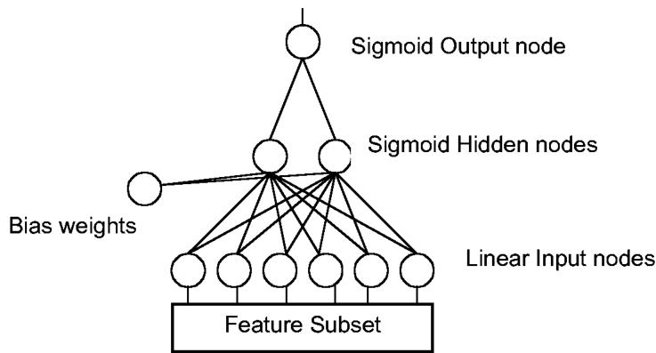  
Figure 5.2 Architecture of the neural network

Each net was encoded as a single binary string, with each eight bits coding for a single integer in the range 0 to 255. Eight bits was chosen as the length for the feature representation because there are 184 features in the large MACs data set, and eight bits can encode numbers from 0 to 255. The integers representing weights were also coded in eight bits so that feature "genes" and weight "genes" would be subject to the same chances of mutation and crossover. The weights associated with a given feature were located close to that feature to facilitate the development of schemata during evolution.

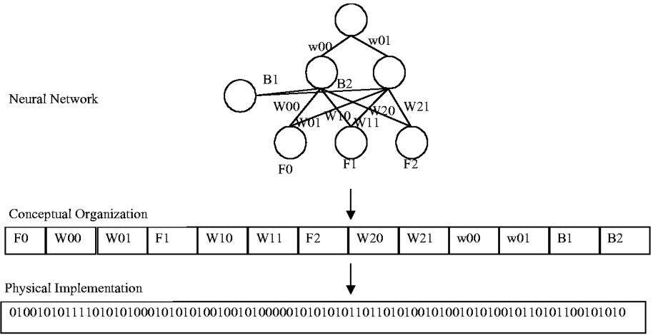  
Figure 5.3 Organization of a chromosome coding for a simple three-layer neural network

The organization of the chromosome is depicted in Figure 5.3. This figure shows the way in which the bit string which is the "individual" in the GA is interpreted as a string of numbers, which in turn is interpreted as a three-layer, fully connected feedforward network.

In this figure $F O \ldots F 2$ are features, W00 is the weight from feature 0 to hidden unit $0 , w O O$ is the weight from hidden unit 0 to output unit 0, and $B I$ and $B 2$ are the bias weights.

Assuming that fmeasured features are measured, integers representing features are then rescaled to lie between 0 and fmeasured-1 by multiplying by (fmeasured - $I ) / 2 5 5$ . The result was rounded, and this integer was interpreted as an index to a particular feature. Integers representing weights were scaled initially to lie in the range ±n, using:

$$
w ^ { \prime } { = } { \left( w ^ { \ast } \frac { 2 n } { 2 5 5 } \right) } { - } n
$$

vhere $w$ is the original integer, and $\pm n$ are the bounds of the weight range.

The original weight range chosen was $\pm 3 . 0$ . This weight range was chosen because it is fairly small and centered around 0.0, which is in the linear range of the sigmoid activation function used.

# 5.4.3 Objective Function

The objective function for the GA attempts to minimize the mean squared error of the net over the training data. That is, for each fitness assessment, a single chromosome is decoded into its neural net "phenotype." Each member of the training set is presented to the net, and the output and squared error are calculated. The errors are summed over the whole training set and divided by the number of training exemplars to give the Mean Squared Error (MSE).

$$
\ M S E = { \frac { \sum _ { x = 1 } ^ { n } \left( o - t \right) ^ { 2 } } { n } }
$$

where $o$ is the observed output, $t$ is the target output (0 or 1) and $n$ is the number of training exemplars.

The fitness of an individual chromosome is then (1 - MSE), and the GA attempts to maximize this.

# 5.4.4 Selection Strategy

Individuals are selected to reproduce on the basis of their fitness, so that fitter individuals from one generation will contribute proportionately more to the next generation than will individuals of low fitness. There have been many fitnessproportionate selection schemes proposed; perhaps the simplest is "roulettewheel" selection (Mitchell, 1996). Under this scheme each individual is allocated a slice of a circular "roulette wheel," of a size proportional to its fitness. The wheel is spun $N$ times for a population of $N$ individuals; the individual under the marker on each spin is selected as a parent for the next generation. Roulette-wheel selection has been criticized on the grounds that in a small population, chance effects can result in disproportionate allocation of offspring to individuals (Mitchell, 1996). However, it is easy to implement and has been widely used.

In addition to fitness-proportionate selection, generational replacement in the GA incorporated "elitism," in which the fittest $x$ percent (Generation Gap) of the previous generation is copied unchanged to the next generation. This strategy ensures that fit individuals are not lost due to chance.

# 5.4.5 Parameterization

The parameters used for the initial testing of the GA were those recommended by Mitchell (1996), to wit: population size 100, crossover rate 0.6, mutation rate 0.001. Generation gap was 0.1. These values were later modified in response to experimental findings.

# 5.5 Validation of the Algorithm

The GA/NN is highly nonlinear, and would be expected to perform well on a nonlinear classification problem. The first tests of the algorithm were therefore performed using several sets of artificial data.

# 5.5.1 The Dataset

Artificial data was generated in the form of points from a set of multidimensional, nested spheres. Parameters which could be set included the number of spheres (equivalent to the number of classes in the data), the dimensionality of the dataset and the radius of each sphere. This format was chosen because the nested spheres problem is clearly not linearly separable, but is readily visualizable by humans. Datasets can be plotted in order to visually check the distribution of the data and the performance of the algorithm.

The first data set consisted of a 2-dimensional, 2-class problem. 1000 points from each class were generated for the training set (a total of 2000 training cases), and an equivalent number was generated for each of a test set and a validation set. The spheres were centred on 0.5, the inner sphere having a radius of 0.25, and the outer forming an annulus of thickness 0.25 around the inner sphere. The data points comprising this training set are plotted in Figure 5.4.

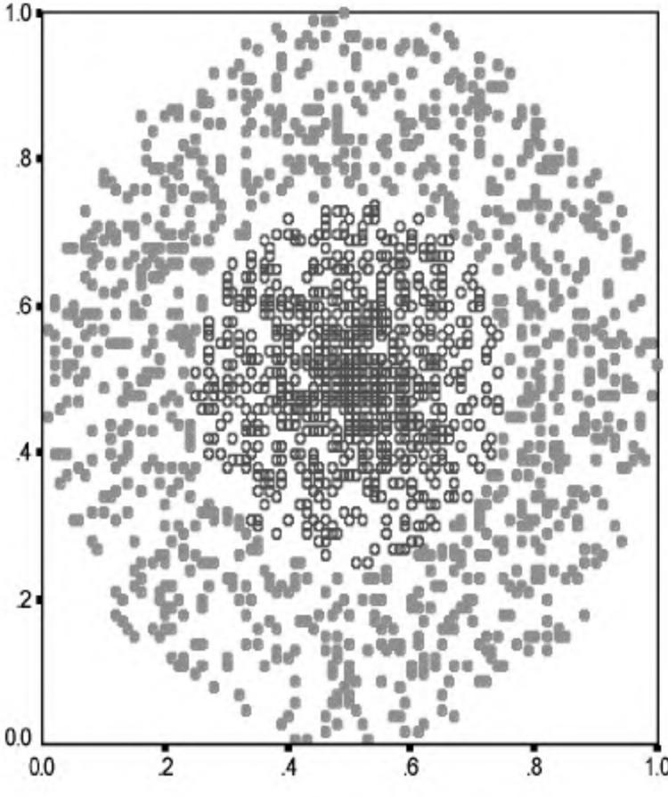  
Figure 5.4 Two dimensional training data

In addition to the two informative variables generated in this way, five additional variables with values in the range (0,1) were generated for each case. The variables are described in Table 5.1.

# 5.5.2 Experiments on Two-Dimensional Data

The genetic algorithm described previously was run on this data set. The neural network had two inputs, six hidden units and a single output. A mutation rate of 0.01, crossover rate of 0.6, generation gap of 0.1 and population size 100 were used. Runs were considered to have converged to a solution when the maximum fitness observed in the population remained unchanged for 50 generations.

Table 5.1 Variables in the 2-D artificial data set   

<table><tr><td rowspan=1 colspan=1>Variable</td><td rowspan=1 colspan=1>Description</td></tr><tr><td rowspan=1 colspan=1>0</td><td rowspan=1 colspan=1>x axis coordinate of 2-D sphere</td></tr><tr><td rowspan=1 colspan=1>1</td><td rowspan=1 colspan=1>y axis coordinate of 2-D sphere</td></tr><tr><td rowspan=1 colspan=1>2</td><td rowspan=1 colspan=1>random number in the range (0,1)</td></tr><tr><td rowspan=1 colspan=1>3</td><td rowspan=1 colspan=1>(Variable 0 + a random number in the range (0,1)) / 2</td></tr><tr><td rowspan=1 colspan=1>4</td><td rowspan=1 colspan=1>(Variable 0 * Variable 1) / 1.5; values &gt;1.0 set to 1.0</td></tr><tr><td rowspan=1 colspan=1>5</td><td rowspan=1 colspan=1>random number in the range (0,1)</td></tr><tr><td rowspan=1 colspan=1>6</td><td rowspan=1 colspan=1>(Variable 2 + Variable 5) / 2</td></tr></table>

In each generation of training, the individual identified as fittest on the training set was used to classify the validation data set, and its mean squared error on the validation set recorded. The performance of a classifier on a validation set can be used as a stopping criterion  when the validation performance begins to diverge from the performance on the training set, training should be stopped. The validation set was not used in this way for these experiments, but validation set results were recorded for later investigation into whether early stopping using a validation set would be a useful addition to the algorithm. At the end of training the fittest individual was used to classify the test set, and the results of this classification were recorded.

Over the course of several runs it became apparent that there was a strong tendency to select the same feature multiple times. Instead of selecting the features 0 and 1, which are the $\mathbf { X }$ and y coordinates of the points in the spheres, the algorithm tended to converge to 0,0 or 1,1. These points appear to represent local minima in the search space, in which the system tended to become trapped, although the correct solution was found occasionally. It was therefore decided to penalize any individual which selected the same feature more than once. This was accomplished by multiplying the SSE for each individual by a penalty factor during fitness evaluation (1.1 for each duplicate feature). This modification to the fitness function had the desired effect of eliminating the selection of duplicate features.

# 5.5.3 Results of Two-Dimensional Data Experiments

The results of 15 runs of the algorithm with different random number seeds are presented in Table 5.2. Of the 15 runs, the correct features (0, 1) were selected 12 times. On the other two runs, the features selected were 1 and 4. Feature 4 was created by multiplying together features 0 and 1, and dividing the result by 1.5; it is thus a reasonably good discriminator between the two classes. When the correct features were selected both training and test data was classified with high accuracy. When the wrong features were selected, however, accuracy on the test set was markedly reduced, indicating that the system is overfitting the training data.

Table 5.2 Two-dimensional data: Selecting two features from seven   

<table><tr><td rowspan=1 colspan=1>Run</td><td rowspan=1 colspan=1>Seed</td><td rowspan=1 colspan=1>Max Fitness</td><td rowspan=1 colspan=1>FeaturesSelected</td><td rowspan=1 colspan=1>AUC Train (SE)</td><td rowspan=1 colspan=1>AUC Test (SE)</td></tr><tr><td rowspan=1 colspan=1>1</td><td rowspan=1 colspan=1>1</td><td rowspan=1 colspan=1>0.967654</td><td rowspan=1 colspan=1>0,1</td><td rowspan=1 colspan=1>0.999 (0.001)</td><td rowspan=1 colspan=1>1.000 (0.000)</td></tr><tr><td rowspan=1 colspan=1>2</td><td rowspan=1 colspan=1>666</td><td rowspan=1 colspan=1>0.956097</td><td rowspan=1 colspan=1>0, 1</td><td rowspan=1 colspan=1>0.997 (0.001)</td><td rowspan=1 colspan=1>0.997(0.001)</td></tr><tr><td rowspan=1 colspan=1>3</td><td rowspan=1 colspan=1>94532</td><td rowspan=1 colspan=1>0.954428</td><td rowspan=1 colspan=1>1,4</td><td rowspan=1 colspan=1>0.996 (0.001)</td><td rowspan=1 colspan=1>0.776 (0.010)</td></tr><tr><td rowspan=1 colspan=1>4</td><td rowspan=1 colspan=1>1234</td><td rowspan=1 colspan=1>0.946097</td><td rowspan=1 colspan=1>01</td><td rowspan=1 colspan=1>0.997 (0.001)</td><td rowspan=1 colspan=1>0.997 (0.001)</td></tr><tr><td rowspan=1 colspan=1>5</td><td rowspan=1 colspan=1>5869</td><td rowspan=1 colspan=1>0.976209</td><td rowspan=1 colspan=1>0, 1</td><td rowspan=1 colspan=1>0.999(0.001)</td><td rowspan=1 colspan=1>1.000(0.000)</td></tr><tr><td rowspan=1 colspan=1>6</td><td rowspan=1 colspan=1>97421</td><td rowspan=1 colspan=1>0.962493</td><td rowspan=1 colspan=1>0,1</td><td rowspan=1 colspan=1>0.999 (0.001)</td><td rowspan=1 colspan=1>0.999 (0.001)</td></tr><tr><td rowspan=1 colspan=1>7</td><td rowspan=1 colspan=1>45</td><td rowspan=1 colspan=1>0.967025</td><td rowspan=1 colspan=1>0, 1</td><td rowspan=1 colspan=1>0.998 (0.001)</td><td rowspan=1 colspan=1>0.999 (0.001)</td></tr><tr><td rowspan=1 colspan=1>8</td><td rowspan=1 colspan=1>7654</td><td rowspan=1 colspan=1>0.973874</td><td rowspan=1 colspan=1>0,1</td><td rowspan=1 colspan=1>1.000 (0.000)</td><td rowspan=1 colspan=1>1.000 (0.000)</td></tr><tr><td rowspan=1 colspan=1>9</td><td rowspan=1 colspan=1>92354</td><td rowspan=1 colspan=1>0.965439</td><td rowspan=1 colspan=1>0, 1</td><td rowspan=1 colspan=1>0.999 (0.001)</td><td rowspan=1 colspan=1>0.999(0.001)</td></tr><tr><td rowspan=1 colspan=1>10</td><td rowspan=1 colspan=1>746</td><td rowspan=1 colspan=1>0.970483</td><td rowspan=1 colspan=1>0, 1</td><td rowspan=1 colspan=1>0.999 (0.001)</td><td rowspan=1 colspan=1>0.999(0.001)</td></tr><tr><td rowspan=1 colspan=1>11</td><td rowspan=1 colspan=1>88</td><td rowspan=1 colspan=1>0.973171</td><td rowspan=1 colspan=1>0,1</td><td rowspan=1 colspan=1>0.999 (0.001)</td><td rowspan=1 colspan=1>0.999(0.001)</td></tr><tr><td rowspan=1 colspan=1>12</td><td rowspan=1 colspan=1>500</td><td rowspan=1 colspan=1>0.968198</td><td rowspan=1 colspan=1>0, 1</td><td rowspan=1 colspan=1>0.999(0.001)</td><td rowspan=1 colspan=1>0.999(0.001)</td></tr><tr><td rowspan=1 colspan=1>13</td><td rowspan=1 colspan=1>678</td><td rowspan=1 colspan=1>0.960385</td><td rowspan=1 colspan=1>0, 1</td><td rowspan=1 colspan=1>0.997 (0.001)</td><td rowspan=1 colspan=1>0.997(0.001)</td></tr><tr><td rowspan=1 colspan=1>14</td><td rowspan=1 colspan=1>9812</td><td rowspan=1 colspan=1>0.958530</td><td rowspan=1 colspan=1>1,4</td><td rowspan=1 colspan=1>0.997 (0.001)</td><td rowspan=1 colspan=1>0.801 (0.010)</td></tr><tr><td rowspan=1 colspan=1>15</td><td rowspan=1 colspan=1>884</td><td rowspan=1 colspan=1>0.975198</td><td rowspan=1 colspan=1>0,1</td><td rowspan=1 colspan=1>1.000 (0.000)</td><td rowspan=1 colspan=1>1.000 (0.000)</td></tr></table>

The ROC curves for the first five runs of the training set are plotted in Figure 5.5 and for the test set in Figure 5.6. Only five of the 15 runs were plotted for each set to enhance the readability of the graphs; from Table 5.2 it can be seen that the other runs produced very similar results to those plotted.

In Figure 5.6, the aberrant curve is that for run 3, one of the two runs which selected a sub-optimal feature set. Although this classifier performed well on the training set, it performed quite poorly on the test set. A failure to generalize is often a symptom of overfitting of the training data. In order to check whether this phenomenon is occurring here, the results of the classifier on the validation set are useful. Figure 5.7 shows the performance of the classifiers from runs 1 and 3 on the training set, plotted against their performance on the validation set. The plots trace the evolution of performance from the initial generation to convergence in steps of one generation.

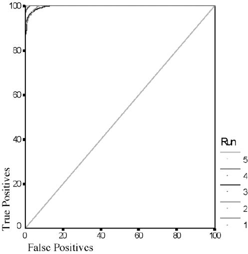  
Figure 5.5 ROC curves for 2-D data: select 2 from 7 features, training set

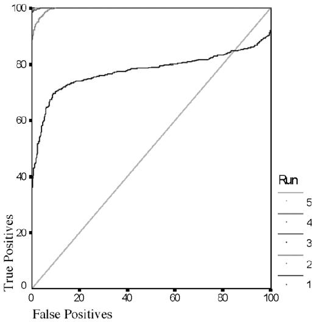  
Figure 5.6 ROC curves for 2-D data: select 2 from 7 features, test set

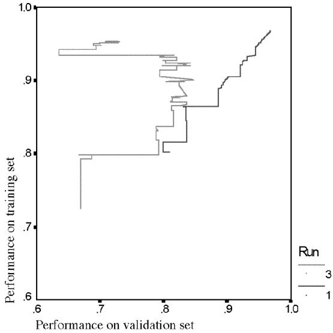  
Figure 5.7 Performance of a "good" classifier (Run 1) compared with that of a "poor" classifier (Run 3) on training and validation data

From Figure 5.7 it can be seen that Run 1, which selected the best features, had comparable performance on the training and validation sets throughout the course of training. Run 3, in comparison, always had better performance on the training data. At a point which corresponds to generation 65, performance on the two sets diverges sharply, and this is probably the point at which training would be stopped if the validation set were to be used for this purpose. Table 5.3 shows the performance of the Run 3 classifier, trained for 65 generations only, on the training and test data.

Table 5.3 Performance of run 3 with early stopping   

<table><tr><td rowspan=1 colspan=1>Run</td><td rowspan=1 colspan=1>Seed</td><td rowspan=1 colspan=1>Max Fitness</td><td rowspan=1 colspan=1>FeaturesSelected</td><td rowspan=1 colspan=1>AUC Train(SE)</td><td rowspan=1 colspan=1>AUC Test (SE)</td></tr><tr><td rowspan=1 colspan=1>3b</td><td rowspan=1 colspan=1>94532</td><td rowspan=1 colspan=1>0.905951</td><td rowspan=1 colspan=1>1,4</td><td rowspan=1 colspan=1>0.971 (0.004)</td><td rowspan=1 colspan=1>0.851 (0.009)</td></tr></table>

The difference between the performance of the classifier on the two data sets is still significantly different at the $9 5 \%$ level. It appears that for a problem which is heavily dependent on the selection of the correct features, early stopping of training using a validation set does not help to avoid overfitting of the training data.

# 5.5.4 Lessons from Artificial Data

On an artificial data set with large amounts of data, the GA/NN algorithm produces a classifier which selects the most discriminatory features 12 times out of 15, and generalizes well to unseen test data. This suggests that the algorithm can combine feature selection and classifier construction within the limits of the data set.

The main problem with the GA/NN algorithm is the length of time it takes to train. On a DEC workstation, a run involving long chromosomes coding for moderately complex neural networks (on the order of 6 to 10 inputs and 6 to 10 hidden units) can take anything from 6 hours to several days to run to convergence. Each run must be repeated several times, with a different seed for the random number generator each time, adding to the time requirement of the algorithm. This is not necessarily a major drawback; once the classifier has been trained, its application to new data is quick and easy. If the GA-trained classifier performs better than a standard classifier, the extra training time is not important. If this is not the case, however, the GA becomes irrelevant.

Why would a GA-based classifier be an improvement over standard techniques? Feature selection techniques are often applied to data sets having large numbers of features, but relatively few cases. Division of data into training and test sets, while essential, further aggravates the situation. In such a situation, the use of a subset of features is highly likely to lead to improved generalizability of a classifier. In addition, the use of a nonlinear classifier, such as a neural network, should improve performance on messy, real-world data sets. The algorithm described here permits network architecture to be kept simple, but strongly tailored to a feature subset, to reduce the computation time and enhance the generalizability of the resulting classifier.

# 5.5.5 Experiments on a Cell Image Datasel

The dataset for the next set of experiments consisted of nearly 100,000 digital images of thionin-stained cells from cervical smears, taken by the British Columbia Cancer Agency (BCCA) using their cytometer.

The data consists of nuclear images from slides which have previously been diagnosed by cytologists at the BCCA. British Columbia classifies Pap smears as severe dysplasia (sev in Table 5.4), benign cellular changes (ben), carcinoma in situ (cis), mild dysplasia (mld), moderate dysplasia (mod), negative (neg) or suspicious (susp).

Cervical smears in British Columbia are air-dried before staining, which may lead to enlarged, diffuse nuclei (Wittekind, 1985). Visual inspection of a subset of the cell images confirmed that there is a wide range in nuclear area and apparent density. In order to restrict analysis to visually normal cells, cutoffs were established for minimum and maximum nuclear area. This was done by measuring the nuclear area of all cells designated as "diploid" from 50 of the negative and 50 of the severe slides selected at random from the slides which were to be used as the training set. The distribution of nuclear area in this dataset is depicted in Figure 5.8.

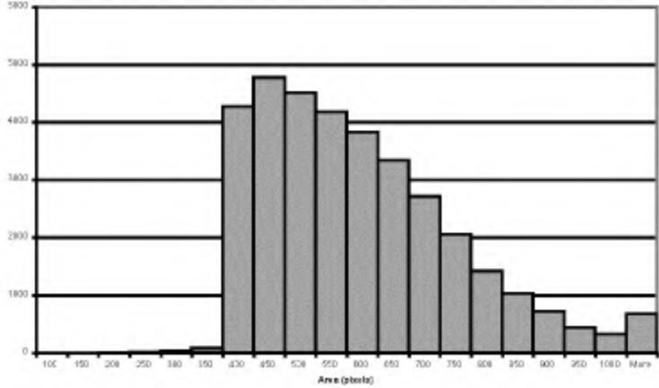  
Figure 5.8 Histogram of cell nuclear area

Inspection of Figure 5.8 led to the selection of a minimum nuclear area of 400 pixels and a maximum of 700 as the criteria for inclusion in the analysis.

The final experimental dataset consisted of all cells designated by the BCCA classifier as normal intermediate cells and meeting the above inclusion criteria from slides classified as "negative" (normals) or "moderate dysplasia," "severe dysplasia," or "carcinoma in situ" (abnormals). The data was divided into a training set and a test set of approximately equal size. The data sets are described in Table 5.4.

The images were segmented by BCCA. Ninety-three features were measured from the nucleus of every cell meeting the inclusion criteria in the training and test sets, and the mean and standard deviation of each feature was calculated for each slide, resulting in a total of 186 features. Each feature was scaled to lie in the range (0.0,1.0) using the maximum and minimum feature values observed in the training set. Scaled feature values in the test set which were less than 0.0 were set to 0.0, and those which were greater than 1.0 were set to 1.0.

Table 5.4 Description of BCCA dataset   

<table><tr><td rowspan=1 colspan=1></td><td rowspan=1 colspan=2>Training Set</td><td rowspan=1 colspan=2>Test Set</td><td rowspan=1 colspan=2>Total</td></tr><tr><td rowspan=1 colspan=1>Class</td><td rowspan=1 colspan=1>Cells</td><td rowspan=1 colspan=1>Slides</td><td rowspan=1 colspan=1>Cells</td><td rowspan=1 colspan=1>Slides</td><td rowspan=1 colspan=1>Cells</td><td rowspan=1 colspan=1>Slides</td></tr><tr><td rowspan=1 colspan=1>Normal</td><td rowspan=1 colspan=1>19,949</td><td rowspan=1 colspan=1>94</td><td rowspan=1 colspan=1>18,480</td><td rowspan=1 colspan=1>91</td><td rowspan=1 colspan=1>38,429</td><td rowspan=1 colspan=1>185</td></tr><tr><td rowspan=1 colspan=1>CIS</td><td rowspan=1 colspan=1>8,644</td><td rowspan=1 colspan=1>41</td><td rowspan=1 colspan=1>10,325</td><td rowspan=1 colspan=1>41</td><td rowspan=1 colspan=1>18,969</td><td rowspan=1 colspan=1>82</td></tr><tr><td rowspan=1 colspan=1>Sev</td><td rowspan=1 colspan=1>30,459</td><td rowspan=1 colspan=1>95</td><td rowspan=1 colspan=1>27,864</td><td rowspan=1 colspan=1>92</td><td rowspan=1 colspan=1>58,323</td><td rowspan=1 colspan=1>187</td></tr><tr><td rowspan=1 colspan=1>Mod</td><td rowspan=1 colspan=1>23,913</td><td rowspan=1 colspan=1>82</td><td rowspan=1 colspan=1>24,353</td><td rowspan=1 colspan=1>79</td><td rowspan=1 colspan=1>48,266</td><td rowspan=1 colspan=1>161</td></tr><tr><td rowspan=1 colspan=1>Abnormal</td><td rowspan=1 colspan=1>63,016</td><td rowspan=1 colspan=1>218</td><td rowspan=1 colspan=1>62,524</td><td rowspan=1 colspan=1>212</td><td rowspan=1 colspan=1>125,558</td><td rowspan=1 colspan=1>430</td></tr><tr><td rowspan=1 colspan=1>Total</td><td rowspan=1 colspan=1>82,965</td><td rowspan=1 colspan=1>312</td><td rowspan=1 colspan=1>81,004</td><td rowspan=1 colspan=1>303</td><td rowspan=1 colspan=1>163,987</td><td rowspan=1 colspan=1>615</td></tr></table>

# 5.6 Parameterization of the GA

The GA was set up to select the input features and weight vector for a fully connected feedforward network. Each run was repeated several times with a different random number seed each time, and a run was considered to have converged when the maximum fitness in the population remained unchanged for a specified number of generations (which varied between experiments).

The first task undertaken with this dataset was to parameterize the GA/NN algorithm. The parameterization experiments were performed using a neural network architecture with six inputs, three hidden units and a single, real-valued, output unit with a target value of 0.0 for normals and 1.0 for abnormals. The neural network architecture was explored systematically after the GA parameters had been set.

In a classification task it is important to keep the test set distinct at all times from the training set, in order to provide a valid test of the final classifier on completely unseen data. Consequently, all the parameterization experiments were performed using the training set alone.

# 5.6.1 Parameterization Experiments

The selection of parameter values for the GA was achieved using a simplex approach, starting with the values recommended by Mitchell (1996) (population size 20 to 50; mutation rate 0.001; crossover rate 0.6). One parameter at a time was varied and the GA run to convergence. "Convergence" was defined, for the purposes of this experiment, as 200 generations without an increase in the maximum fitness of the population. At the conclusion of each run, the maximum fitness achieved, and the generation at which it was reached, was recorded. The methodology used can be summarized as follows:

1. One parameter was selected and several runs were made with values of the parameter at, above and below those suggested in Mitchell (1996)   
2. The parameter setting which produced the highest maximum fitness at convergence of the GA was selected and used from then on   
3. Another parameter was selected, and the process iterated until all parameters were decided.

GA parameters such as mutation rate, crossover rate and population size were set before neural net architecture features, on the assumption that "optimal" settings for these parameters would apply to a range of similar architectures. This assumption was not tested.

# 5.6.2 Results of Parameterization Experiments

The results of the parameterization runs are shown in Table 5.5. The shaded column represents the final parameterization chosen.

Table 5.5 Parameterization of the genetic algorithm   

<table><tr><td rowspan=1 colspan=1></td><td rowspan=1 colspan=8>Run</td></tr><tr><td rowspan=1 colspan=1></td><td rowspan=1 colspan=1>1</td><td rowspan=1 colspan=1>2</td><td rowspan=1 colspan=1>3</td><td rowspan=1 colspan=1>4</td><td rowspan=1 colspan=1>5</td><td rowspan=1 colspan=1>6</td><td rowspan=1 colspan=1>7</td><td rowspan=1 colspan=1>8</td></tr><tr><td rowspan=1 colspan=1>Pop. Size</td><td rowspan=1 colspan=1>50</td><td rowspan=1 colspan=1>50</td><td rowspan=1 colspan=1>50</td><td rowspan=1 colspan=1>50</td><td rowspan=1 colspan=1>50</td><td rowspan=1 colspan=1>50</td><td rowspan=1 colspan=1>50</td><td rowspan=1 colspan=1>100</td></tr><tr><td rowspan=1 colspan=1>Crate1</td><td rowspan=1 colspan=1>0.6</td><td rowspan=1 colspan=1>0.8</td><td rowspan=1 colspan=1>0.4</td><td rowspan=1 colspan=1>0.6</td><td rowspan=1 colspan=1>0.6</td><td rowspan=1 colspan=1>0.6</td><td rowspan=1 colspan=1>0.6</td><td rowspan=1 colspan=1>0.6</td></tr><tr><td rowspan=1 colspan=1>Mrate²</td><td rowspan=1 colspan=1>0.001</td><td rowspan=1 colspan=1>0.001</td><td rowspan=1 colspan=1>0.001</td><td rowspan=1 colspan=1>0.01</td><td rowspan=1 colspan=1>0.1</td><td rowspan=1 colspan=1>0.01</td><td rowspan=1 colspan=1>0.01</td><td rowspan=1 colspan=1>0.01</td></tr><tr><td rowspan=1 colspan=1>Ggap^3</td><td rowspan=1 colspan=1>0.1</td><td rowspan=1 colspan=1>0.1</td><td rowspan=1 colspan=1>0.1</td><td rowspan=1 colspan=1>0.1</td><td rowspan=1 colspan=1>0.1</td><td rowspan=1 colspan=1>0.1</td><td rowspan=1 colspan=1>0.1</td><td rowspan=1 colspan=1>0.1</td></tr><tr><td rowspan=1 colspan=1>Inputs</td><td rowspan=1 colspan=1>6</td><td rowspan=1 colspan=1>6</td><td rowspan=1 colspan=1>6</td><td rowspan=1 colspan=1>6</td><td rowspan=1 colspan=1>6</td><td rowspan=1 colspan=1>6</td><td rowspan=1 colspan=1>6</td><td rowspan=1 colspan=1>6</td></tr><tr><td rowspan=1 colspan=1>Hunits</td><td rowspan=1 colspan=1>3</td><td rowspan=1 colspan=1>3</td><td rowspan=1 colspan=1>3</td><td rowspan=1 colspan=1>3</td><td rowspan=1 colspan=1>3</td><td rowspan=1 colspan=1>5</td><td rowspan=1 colspan=1>10</td><td rowspan=1 colspan=1>5</td></tr><tr><td rowspan=1 colspan=1>Fitness</td><td rowspan=1 colspan=1>.80752</td><td rowspan=1 colspan=1>.77995</td><td rowspan=1 colspan=1>.79909</td><td rowspan=1 colspan=1>.81991</td><td rowspan=1 colspan=1>.78152</td><td rowspan=1 colspan=1>.83874</td><td rowspan=1 colspan=1>.82175</td><td rowspan=1 colspan=1>.84305</td></tr><tr><td rowspan=1 colspan=1>Gen</td><td rowspan=1 colspan=1>3663</td><td rowspan=1 colspan=1>1281</td><td rowspan=1 colspan=1>1740</td><td rowspan=1 colspan=1>3251</td><td rowspan=1 colspan=1>300</td><td rowspan=1 colspan=1>4502</td><td rowspan=1 colspan=1>3800</td><td rowspan=1 colspan=1>3327</td></tr><tr><td rowspan=1 colspan=1>AUC Train</td><td rowspan=1 colspan=1>0.777(0.026)</td><td rowspan=1 colspan=1>0.695(0.031)</td><td rowspan=1 colspan=1>0.755(0.028)</td><td rowspan=1 colspan=1>0.805(0.025)</td><td rowspan=1 colspan=1>0.683(0.031)</td><td rowspan=1 colspan=1>0.848(0.021)</td><td rowspan=1 colspan=1>0.808(0.024)</td><td rowspan=1 colspan=1>0.850(0.021)</td></tr><tr><td rowspan=1 colspan=1>95% Lower</td><td rowspan=1 colspan=1>0.726</td><td rowspan=1 colspan=1>0.635</td><td rowspan=1 colspan=1>0.700</td><td rowspan=1 colspan=1>0.757</td><td rowspan=1 colspan=1>0.622</td><td rowspan=1 colspan=1>0.806</td><td rowspan=1 colspan=1>0.761</td><td rowspan=1 colspan=1>0.809</td></tr><tr><td rowspan=1 colspan=1>95% Upper</td><td rowspan=1 colspan=1>0.828</td><td rowspan=1 colspan=1>0.755</td><td rowspan=1 colspan=1>0.801</td><td rowspan=1 colspan=1>0.853</td><td rowspan=1 colspan=1>0.744</td><td rowspan=1 colspan=1>0.890</td><td rowspan=1 colspan=1>0.855</td><td rowspan=1 colspan=1>0.891</td></tr></table>

Crossover rate. 2Mutation rate. 3Generation gap  proportion of each generation carried over to the next generation. 4Generation at which convergence was achieved. 56Lower and upper limits of $9 5 \%$ confidence interval.

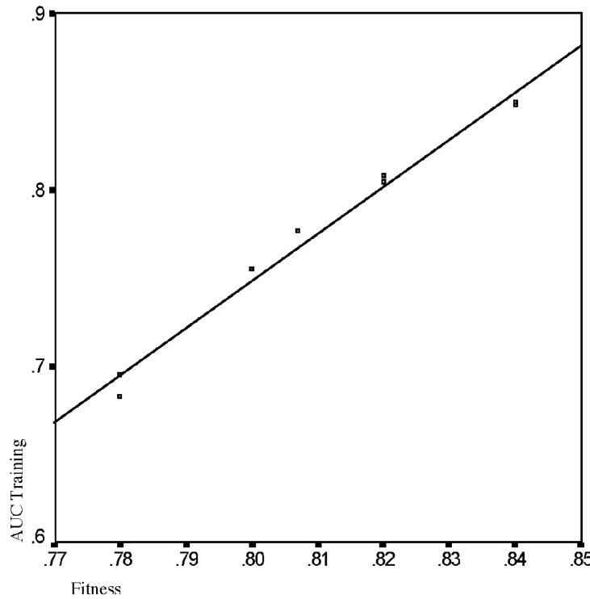  
Figure 5.9 Correlation of AUC on the training data with maximum fitness for the parameterization experiments

The major assumption made when using this methodology is that the maximum fitness achieved by the GA is a good measure of the performance of the classifier on the training (and hopefully the test) data. This assumption can be validated by inspection of Figure 5.9, in which the maximum fitness is plotted against the area under the curve on the training set for each run, along with the linear regression line of best fit for the data. The Pearson coefficient of correlation between the two measures is 0.9093.

# 5.6.3 Selecting the Neural Network Architecture

The choice of architecture of a neural network for given problem is rarely obvious. The approach generally taken is trial-and-error, with a "reasonable"

architecture selected initially, and then modified in the light of empirical results. The neural network architecture used for the parameterization runs described above (six inputs, three hidden units, one output) was selected because it appeared to represent a reasonable compromise between classification power and simplicity. In order to determine whether this is, in fact, a good architecture for this problem, several further experiments were carried out, with different parameters of the architecture varied systematically. These experiments also provide some insight into the robustness of the algorithm with respect to variations in architecture.

The experiments indicate that a robust choice for the configuration for this algorithm on this problem includes six inputs, three to five hidden units, and a single output, with a mutation rate for the GA of 0.01 and a crossover rate of 0.6. It is interesting to note that runs of the GA with different random number seeds or different parameterization select different feature subsets  there is very little commonality among the features selected. This phenomenon persists throughout the experiments, and appears to reflect the fundamental structure of the data for this problem.

There is one major problem with making decisions about the parameterization and architecture of the GA/NN in the way that we have done. This arises from the stochastic nature of the algorithm. Ideally, each configuration would be run multiple times with different random number seeds, in order to obtain a broad view of the behaviour of the algorithm. Because this is too time-consuming, decisions have been made on the basis of a single run of each configuration. The assumption here is that, although individual runs may be subject to random fluctuation, a valid overall picture will emerge.

# 5.7 Experiments with the Cell Image Dataset

Having established reasonable parameters for the GA, and a good architecture for the neural network, we now evaluate the performance of the GA/NN algorithm on the large cell image dataset, as described in Table 5.5. This data consists of a training set comprising 94 normal slides (18,480 cells) and 218 abnormal slides (62,524 cells), and a separate test set of 91 normal slides (38,429 cells) and 212 abnormal slides (125,558 cells).

# 5.7.1 Slide-Based vs. Cell-Based Features

The majority of MACs classifiers described in the literature have used a cell-bycell approach to classification, with each cell being classified as "normal" or "abnormal" and slides classified on the basis of the proportion of abnormal cells on the slide. There are a number of potential problems with this approach. First, it involves the use of two thresholds  the threshold score for classification of a cell as abnormal, and the threshold proportion of abnormal cells required to classify a slide as abnormal. These thresholds are usually chosen in an ad hoc manner, by inspection of the data. The second problem is the presence of an unknown, variable proportion of normal cells in any cell population designated as MACaffected. This proportion is impossible to quantify visually, since MACs are subvisual, and adds noise to the data which is used to train the classifier. This noise may well degrade the performance of the classifier.

To overcome these problems, a slide-based approach to classification may be useful. With this approach, features are measured from each cell, and then features for each slide, such as the mean and standard deviation of the feature values, are calculated from the cell measurements. It is hypothesized that the presence of MAC-affected cells on a slide will shift the feature distribution enough to change the summary statistics (Figure 5.10).

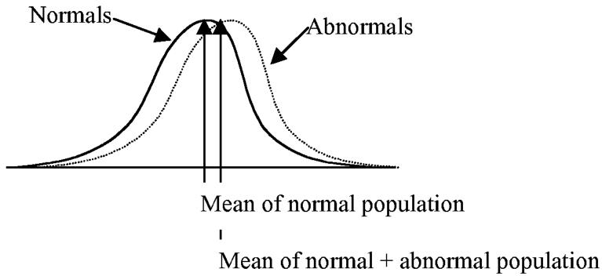  
Figure 5.10 The presence of abnormal cells shifts the distribution of a feature measured across all cells on a slide

The slide-by-slide approach was used for the GA parameterization experiments described in the previous section. In this section, we look more closely at the performance of slide features as compared with the usual cell-by-cell approach, using the entire large dataset.

Probably the most widely used summary statistics are the mean and standard deviation, which are based on the first two moments of the distribution. For a Gaussian distribution, these are the only two non-zero moments. There is no reason to believe that features measured from a cell image will have a Gaussian distribution. Other distributions will have non-zero values for the higher moments, but these are not considered here. Instead, we have also computed a non-parametric measure of central tendency  the median.

For the dataset described in Table 5.4, the mean, standard deviation and median for each feature across all cells was computed for each slide. The resulting data set contained 279 features. The GA/NN algorithm was run repeatedly with a different random number seed for each run, as described previously.

ROC curves for the cell-based and slide-based classifiers are shown in Figures 5.13 (test on training set) and 5.14 (test on unseen test data). The "optimal" classification threshold (point closest to the top left corner) is marked with an X in each case.

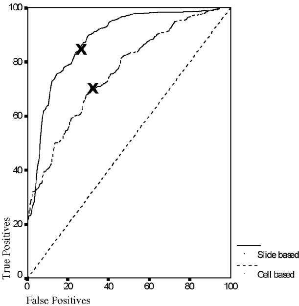  
Figure 5.11 ROC curves for test on train results

Summary statistics, of the type often reported as the results of MACs classifiers, were calculated for the threshold represented by the Xs in Figures 5.13 and 5.14. These statistics are presented in Table 5.6. There are two further operating points of particular interest to practitioners of cervical screening. An automated screener may be used as a primary scanner (PS, prescreening slides to reduce the laboratory workload) or as a quality control machine (QC, rescreening slides already screened by humans to check accuracy and identify missed positives) (Husain & Butler, 1994).

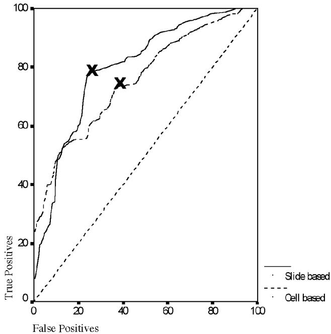  
Figure 5.12 ROC curves for test on test results

The operating points for both types of automated scanner have been identified. A prescreener should have very high sensitivity, and can afford a relatively high false positive proportion, since the slides it identifies will be rescreened by humans. The point on the ROC curve at which such a machine should operate is either $50 \%$ false positives or $7 5 \%$ false positives. For these analyses a cutoff of $7 5 \%$ false positives has been used. A machine to be used for quality control in a laboratory will generally operate at the $10 \%$ false positive point, since most positive slides will already have been identified by human screening, and large numbers of false alarms are expensive in a QC system.

Summary statistics for each of the classifiers at these points are also reported in Table 5.6.

On the training data, a classifier using the mean, standard deviation and median of the features values across a slide significantly outperforms one which uses the proportion of abnormal cells per slide. On the unseen test data, however, the difference between the AUCs for the two classifiers diminishes. The cell-based classifier performs better at the lower end of the ROC curve, but worse at the top end  the region in which a screening system must operate. Because the curves overlap (at about $50 \%$ true positives), the difference between the AUC for the two classifiers just fails to reach significance at the $9 5 \%$ level.

Table 5.6 Performance of slide-based and cell-based classifiers at various operating points   

<table><tr><td rowspan=1 colspan=1>Classifier</td><td rowspan=1 colspan=1>Dataset</td><td rowspan=1 colspan=1>Point</td><td rowspan=1 colspan=1>TruePositive(%)</td><td rowspan=1 colspan=1>FalsePositive(%)</td><td rowspan=1 colspan=1>Sensitivity(%)</td><td rowspan=1 colspan=1>Specificity(%)</td><td rowspan=1 colspan=1>Accuracy(%)</td></tr><tr><td rowspan=1 colspan=1>Slide based</td><td rowspan=1 colspan=1>Train</td><td rowspan=1 colspan=1>X</td><td rowspan=1 colspan=1>83.5</td><td rowspan=1 colspan=1>23.9</td><td rowspan=1 colspan=1>83.5</td><td rowspan=1 colspan=1>76.1</td><td rowspan=1 colspan=1>81</td></tr><tr><td rowspan=1 colspan=1>Cell based</td><td rowspan=1 colspan=1>Train</td><td rowspan=1 colspan=1>X</td><td rowspan=1 colspan=1>69.3</td><td rowspan=1 colspan=1>31.5</td><td rowspan=1 colspan=1>69.3</td><td rowspan=1 colspan=1>68.5</td><td rowspan=1 colspan=1>69</td></tr><tr><td rowspan=1 colspan=1></td><td rowspan=1 colspan=1></td><td rowspan=1 colspan=1></td><td rowspan=1 colspan=1></td><td rowspan=1 colspan=1></td><td rowspan=1 colspan=1></td><td rowspan=1 colspan=1></td><td rowspan=1 colspan=1></td></tr><tr><td rowspan=1 colspan=1>Slide based</td><td rowspan=1 colspan=1>Train</td><td rowspan=1 colspan=1>QC</td><td rowspan=1 colspan=1>62.0</td><td rowspan=1 colspan=1>10.0</td><td rowspan=1 colspan=1>62.0</td><td rowspan=1 colspan=1>90.0</td><td rowspan=1 colspan=1>71</td></tr><tr><td rowspan=1 colspan=1>Cell based</td><td rowspan=1 colspan=1>Train</td><td rowspan=1 colspan=1>QC</td><td rowspan=1 colspan=1>41.0</td><td rowspan=1 colspan=1>10.0</td><td rowspan=1 colspan=1>41.0</td><td rowspan=1 colspan=1>90.0</td><td rowspan=1 colspan=1>56</td></tr><tr><td rowspan=1 colspan=1></td><td rowspan=1 colspan=1></td><td rowspan=1 colspan=1></td><td rowspan=1 colspan=1></td><td rowspan=1 colspan=1></td><td rowspan=1 colspan=1></td><td rowspan=1 colspan=1></td><td rowspan=1 colspan=1></td></tr><tr><td rowspan=1 colspan=1>Slide based</td><td rowspan=1 colspan=1>Train</td><td rowspan=1 colspan=1>PS</td><td rowspan=1 colspan=1>99.0</td><td rowspan=1 colspan=1>75.0</td><td rowspan=1 colspan=1>99.0</td><td rowspan=1 colspan=1>25.0</td><td rowspan=1 colspan=1>77</td></tr><tr><td rowspan=1 colspan=1>Cell based</td><td rowspan=1 colspan=1>Train</td><td rowspan=1 colspan=1>PS</td><td rowspan=1 colspan=1>96.0</td><td rowspan=1 colspan=1>75.0</td><td rowspan=1 colspan=1>96.0</td><td rowspan=1 colspan=1>25.0</td><td rowspan=1 colspan=1>74</td></tr><tr><td rowspan=1 colspan=1></td><td rowspan=1 colspan=1></td><td rowspan=1 colspan=1></td><td rowspan=1 colspan=1></td><td rowspan=1 colspan=1></td><td rowspan=1 colspan=1></td><td rowspan=1 colspan=1></td><td rowspan=1 colspan=1></td></tr><tr><td rowspan=1 colspan=1>Slide based</td><td rowspan=1 colspan=1>Test</td><td rowspan=1 colspan=1>X</td><td rowspan=1 colspan=1>78.0</td><td rowspan=1 colspan=1>25.6</td><td rowspan=1 colspan=1>78.0</td><td rowspan=1 colspan=1>74.4</td><td rowspan=1 colspan=1>77</td></tr><tr><td rowspan=1 colspan=1>Cell based</td><td rowspan=1 colspan=1>Test</td><td rowspan=1 colspan=1>X</td><td rowspan=1 colspan=1>73.5</td><td rowspan=1 colspan=1>37.8</td><td rowspan=1 colspan=1>73.5</td><td rowspan=1 colspan=1>62.2</td><td rowspan=1 colspan=1>70</td></tr><tr><td rowspan=1 colspan=1></td><td rowspan=1 colspan=1></td><td rowspan=1 colspan=1></td><td rowspan=1 colspan=1></td><td rowspan=1 colspan=1></td><td rowspan=1 colspan=1></td><td rowspan=1 colspan=1></td><td rowspan=1 colspan=1></td></tr><tr><td rowspan=1 colspan=1>Slide based</td><td rowspan=1 colspan=1>Test</td><td rowspan=1 colspan=1>QC</td><td rowspan=1 colspan=1>35.0</td><td rowspan=1 colspan=1>10.0</td><td rowspan=1 colspan=1>35.0</td><td rowspan=1 colspan=1>90.0</td><td rowspan=1 colspan=1>51</td></tr><tr><td rowspan=1 colspan=1>Cell based</td><td rowspan=1 colspan=1>Test</td><td rowspan=1 colspan=1>QC</td><td rowspan=1 colspan=1>43.0</td><td rowspan=1 colspan=1>10.0</td><td rowspan=1 colspan=1>43.0</td><td rowspan=1 colspan=1>90.0</td><td rowspan=1 colspan=1>57</td></tr><tr><td rowspan=1 colspan=1></td><td rowspan=1 colspan=1></td><td rowspan=1 colspan=1></td><td rowspan=1 colspan=1></td><td rowspan=1 colspan=1></td><td rowspan=1 colspan=1></td><td rowspan=1 colspan=1></td><td rowspan=1 colspan=1></td></tr><tr><td rowspan=1 colspan=1>Slide based</td><td rowspan=1 colspan=1>Test</td><td rowspan=1 colspan=1>PS</td><td rowspan=1 colspan=1>97.0</td><td rowspan=1 colspan=1>75.0</td><td rowspan=1 colspan=1>97.0</td><td rowspan=1 colspan=1>25.0</td><td rowspan=1 colspan=1>76</td></tr><tr><td rowspan=1 colspan=1>Cell based</td><td rowspan=1 colspan=1>Test</td><td rowspan=1 colspan=1>PS</td><td rowspan=1 colspan=1>93.0</td><td rowspan=1 colspan=1>75.0</td><td rowspan=1 colspan=1>93.0</td><td rowspan=1 colspan=1>25.0</td><td rowspan=1 colspan=1>73</td></tr></table>

Despite the similarity of overall performance on test data, the two classifiers do differ significantly at point X. At this point, the classifiers differ on 76 cases, with the GA/NN being correct on 48 of these cases. A binomial test on this data gives a probability of 0.014 that this result would be achieved by chance. It can be concluded that the classifiers are significantly different at this point. For the QC point, the number of cases different is 79, with the GA/NN correct on 38 of these, giving a probability of 0.674; at the PS point the classifiers differ on 25 cases, with the GA/NN correct on 16, leading to a probability of 0.115.

# 5.7.2 Comparison with the Standard Approach

The slide-based dataset described in the previous section was used for a series of experiments designed to compare the performance of the classifier usually used for MACs detection, a stepwise linear discriminant analysis (SLDA) classifier, with the nonlinear GA/NN. The SLDA selected eight features, while the GA/NN was set up to select six or fewer features, as before. The ROC curves for the results of these experiments are plotted in Figures 5.13 and 5.14.

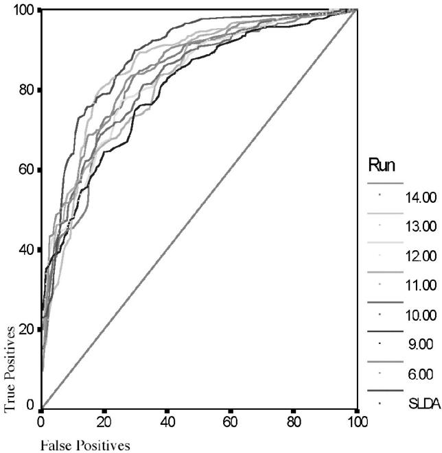  
Figure 5.13 ROC curves for test on train results

None of the test-on-test curves are significantly different from each other at the $9 5 \%$ level. The best of the GA curves is that from run number 12. Inspection of the ROC curve shows, however, that most of this advantage is in the lower part of the curve, away from the area in which a screener should operate. In the top section of the graph, the best curve is number 14. Figure 5.14 further shows the optimal operating point for the SLDA (point X) and for the classifier produced by run 14 (point Y). The confusion matrices for these points are shown in Tables 5.7 and 5.8.

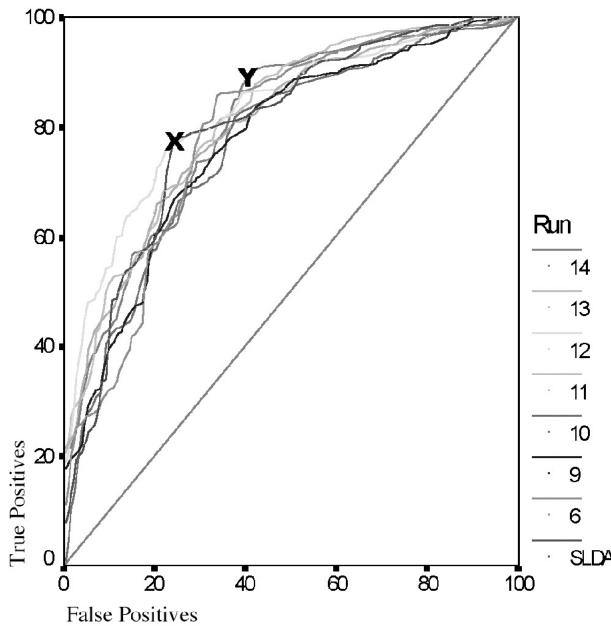  
Figure 5.14 ROC curves for test on test results

Table 5.7 Confusion matrix for stepwise linear discriminant analysis at operating point X   

<table><tr><td rowspan=1 colspan=1></td><td rowspan=1 colspan=2>Classification</td><td rowspan=1 colspan=1></td></tr><tr><td rowspan=1 colspan=1>True Diagnosis</td><td rowspan=1 colspan=1>Positive</td><td rowspan=1 colspan=1>Negative</td><td rowspan=1 colspan=1>Total</td></tr><tr><td rowspan=1 colspan=1>Positive</td><td rowspan=1 colspan=1>163</td><td rowspan=1 colspan=1>49</td><td rowspan=1 colspan=1>212</td></tr><tr><td rowspan=1 colspan=1>Negative</td><td rowspan=1 colspan=1>22</td><td rowspan=1 colspan=1>69</td><td rowspan=1 colspan=1>91</td></tr><tr><td rowspan=1 colspan=1>Total</td><td rowspan=1 colspan=1>185</td><td rowspan=1 colspan=1>118</td><td rowspan=1 colspan=1>303</td></tr></table>

Tables 5.7 and 5.8 illustrate that the GA/NN classifier is operating at a higher true positive point $( 8 8 \% )$ than the SLDA classifier $( 7 7 \% )$ , albeit with a correspondingly higher false positive proportion $40 \%$ compared with $2 4 \%$ . In order for the SLDA classifier to operate at the same true positive level, it would produce a false positive proportion of approximately $66 \%$ . Using the simple binomial test, the one-tailed probability that the two classifiers have the same performance is 0.063. The GA/NN does appear to outperform the SLDA classifier at the selected operating points.

Table 5.8 Confusion matrix for best GA/NN at operating point Y   

<table><tr><td rowspan=1 colspan=1></td><td rowspan=1 colspan=2>Classification</td><td rowspan=1 colspan=1></td></tr><tr><td rowspan=1 colspan=1>TrueDiagnosis</td><td rowspan=1 colspan=1>Positive</td><td rowspan=1 colspan=1>Negative</td><td rowspan=1 colspan=1>Total</td></tr><tr><td rowspan=1 colspan=1>Positive</td><td rowspan=1 colspan=1>187</td><td rowspan=1 colspan=1>25</td><td rowspan=1 colspan=1>212</td></tr><tr><td rowspan=1 colspan=1>Negative</td><td rowspan=1 colspan=1>36</td><td rowspan=1 colspan=1>55</td><td rowspan=1 colspan=1>91</td></tr><tr><td rowspan=1 colspan=1>Total</td><td rowspan=1 colspan=1>223</td><td rowspan=1 colspan=1>80</td><td rowspan=1 colspan=1>303</td></tr></table>

Table 5.9 Performance of the GA/NN and SLDA at the QC and PS operating points   

<table><tr><td rowspan=1 colspan=1>Classifier</td><td rowspan=1 colspan=1>Point</td><td rowspan=1 colspan=1>TruePos (%)</td><td rowspan=1 colspan=1>FalsePos (%)</td><td rowspan=1 colspan=1>Sensitivity(%)</td><td rowspan=1 colspan=1>Specificity(%)</td><td rowspan=1 colspan=1>Accuracy(%)</td></tr><tr><td rowspan=1 colspan=1>SLDA</td><td rowspan=1 colspan=1>QC</td><td rowspan=1 colspan=1>46.0</td><td rowspan=1 colspan=1>10.0</td><td rowspan=1 colspan=1>46</td><td rowspan=1 colspan=1>90</td><td rowspan=1 colspan=1>59</td></tr><tr><td rowspan=1 colspan=1>Run 12</td><td rowspan=1 colspan=1>QC</td><td rowspan=1 colspan=1>55.0</td><td rowspan=1 colspan=1>10.0</td><td rowspan=1 colspan=1>55</td><td rowspan=1 colspan=1>90</td><td rowspan=1 colspan=1>66</td></tr><tr><td rowspan=1 colspan=1></td><td rowspan=1 colspan=1></td><td rowspan=1 colspan=1></td><td rowspan=1 colspan=1></td><td rowspan=1 colspan=1></td><td rowspan=1 colspan=1></td><td rowspan=1 colspan=1></td></tr><tr><td rowspan=1 colspan=1>SLDA</td><td rowspan=1 colspan=1>PS</td><td rowspan=1 colspan=1>97.0</td><td rowspan=1 colspan=1>75.0</td><td rowspan=1 colspan=1>97</td><td rowspan=1 colspan=1>25</td><td rowspan=1 colspan=1>76</td></tr><tr><td rowspan=1 colspan=1>Run 12</td><td rowspan=1 colspan=1>PS</td><td rowspan=1 colspan=1>96.0</td><td rowspan=1 colspan=1>75.0</td><td rowspan=1 colspan=1>96</td><td rowspan=1 colspan=1>25</td><td rowspan=1 colspan=1>75</td></tr></table>

It is also interesting to compare the performance of the SLDA and GA/NN at the two points at which commercial screening systems operate  the quality control (QC) point and the prescreening (PS) point. Table 5.9 shows the performance of the SLDA and that of the best GA/NN run, run12, on the test data at both of these points.

At the QC point, the GA/NN outperformed the SLDA on 57 of 99 cases on which the two algorithms gave different classifications. Using a binomial test, these figures give

$$
\sum _ { s = 5 7 } ^ { 9 9 } { \frac { 9 9 ! } { 5 7 ! ( 9 9 - 5 7 ) } } ( 0 . 5 ) ^ { 9 9 } \quad ,
$$

a 0.08 probability that the GA/NN is no better than the SLDA.

At the PS point the two algorithms differ on 43 cases, with the GA/NN correct on 20 of these. The binomial test gives

$$
\sum _ { s = 2 0 } ^ { 4 3 } \frac { 4 3 ! } { 2 0 ! \big ( 4 3 - 2 0 \big ) } ( 0 . 5 ) ^ { 4 3 } \qquad ,
$$

or a probability of 0.73 that the performance of the two algorithms is the same. It can be concluded that the GA/NN is significantly better than the SLDA as a quality control screener, but not as a prescreener.

The final issue on which the algorithms may be usefully compared is that of generalizability. Figure 5.15 is the generalizability graph for the classifiers in Table 5.9. For each classifier, the AUC on the training data has been plotted against the AUC on the test data. A point falling on the diagonal $\mathbf { \rho } ( \mathbf { X } = \mathbf { y } )$ indicates good classifier generalizability; points lying below the diagonal represent classifiers with poorer generalizability. Point 2 is the SLDA; the other numbers indicate which run of the GA/NN each point represents.

It is clear from this figure that the SLDA classifier has the poorest generalization performance of any of the classifiers examined. The generalizability of the GA/NN classifiers is less variable than their classification performance.

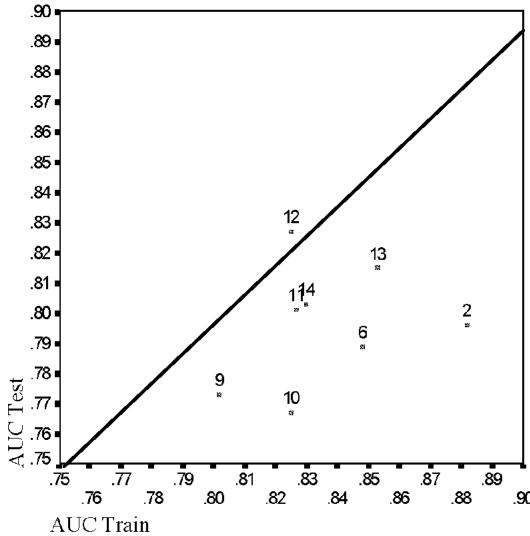  
Figure 5.15 Generalizability of the MACs classifiers

The point marked 2 is the stepwise LDA; the others are different runs of the GA. It can be concluded that the GA/NN algorithm produces classifiers which generalize more consistently than those produced by SLDA, while having similar specificity. Some runs of the GA/NN produce classifiers with greater sensitivity at their optimal operating point, but due to the stochastic nature of the algorithm this is not always the case.

# 5.7.3 Discussion

The GA/NN algorithm outperforms a standard linear classifier for MACs detection for specific points on the ROC curve. On the training data, the linear classifier performs better than any of the nonlinear classifiers, but this superior performance does not carry across to the test set, on which the nonlinear classifiers perform about as well as the linear classifier.

When the classifiers are compared at their respective optimum operating points, three of the seven nonlinear classifiers outperform the linear classifier. Despite this, the area under the ROC curves for the linear and nonlinear classifiers on the test data are not significantly different at the $9 5 \%$ level.

A secondary aim of this project was to investigate the contribution which could be made by evolutionary computation (EC) techniques to a difficult, real-world problem such as MACs detection. The approach selected here was deliberately kept simple, to enhance the comprehensibility of the system. Refinements to an algorithm can always be added as their potential usefulness becomes apparent, but the operation of a simple algorithm provides a "baseline" for comparison of future work. The approach used for this project was a simple genetic algorithm for the selection of a feature subset and the weight vector for the corresponding neural network classifier.

In experiments on nonlinear artificial datasets, the GA/NN algorithm performed well, selecting discriminatory features and classifying two-dimensional, two-class datasets with high accuracy. It can be concluded that the algorithm provides a valid approach to feature selection and classification.

On the MACs data the algorithm performed at or slightly above the level of the SLDA, but no great improvement in performance was apparent. This may be because of the structure of the data, or because of the inherent simplicity of the algorithm; these issues await further investigation. The question which remains to be addressed is "does an evolutionary computation approach have benefits for the solution of difficult classification problems such as MACs detection?"

The main disadvantage of an evolutionary computation approach is the time taken to train the classifier. Since each training run should be repeated several times with different random number seeds, running time is a consideration. It can be argued that training time for the classifier is irrelevant, since once trained most classifiers are quick to apply to new data. However, unless the EC approach provides significant benefits over the alternative, there is no reason to use a timeconsuming algorithm. SLDA is quick to apply and has a sound basis in statistical theory; unless the EC results are significantly better, it is hard to argue against the statistical approach.

With respect to MACs detection it appears that, while feature selection is valuable, the computational overhead of the GA/NN is not warranted. This finding is in keeping with those of several others using GAs for feature selection tasks (e.g., Vafaie & DeJong, 1992; Raymer et al., 1997; Sahiner et al., 1996); GAs do not appear to offer significant benefits for feature selection in practice.

# Список литературы

1. Banda-Gamboa, H., Ricketts, I., Cairns, A., Hussein, K., Tucker, J. & Husain, N. 1992. 'Automation in cervical cytology: An overview', Analytical Cellular Pathology, Vol. 4, p.25  48.   
2. Bartels, P. H. 1992. 'Computer-generated diagnosis and image analysis: An overview', Cancer: Diagnosis, Treatment, Research, Vol. 69, no. 6, p.1636 1642.   
3. Brill, F. Z., Brown, D. E. & Martin, W. N. 1992. 'Fast genetic selection of features for neural network classifiers', IEEE Transactions on Neural Networks. Vol. 3, no. 2, p.324-328   
4. Chatterjee, S., Laudato, M. & Lynch, L. A. 1996. 'Genetic algorithms and their statistical applications: an introduction', Computational Statistics and Data Analysis, Vol. 22, p.633 - 651.   
5. Chtioui, Y., Bertrand, D. & Barba, D. 1998. Feature selection by a genetic algorithm. Application to seed discrimination by artificial vision', Journal of Science of Food and Agriculture, Vol. 76, p.77  86.   
6. Danielson, H. E., Kanagasingam, Y. M., Jirgensen, T., Rieth, A. & Nesland, J. M. 1994. 'Objective analysis of chromatin structure as a tool for diagnosis and prognosis in cancer', Analytical and Quantitative Cytology and Histology, Vol. 16, no. 1, p.40  43.   
7. Gose, E., Johnsonbaugh, R. & Jost, S. 1996, Pattern Recognition and Image Analysis, Prentice-Hall PTR, Upper Saddle River, NJ.   
8. Guerra-Salcedo, C. & Whitley, D. 1998, "Genetic search for feature subset selection: A comparison between CHC and GENESIS," Symposium on Genetic Algorithms, July 22  25, University of Wisconsin, Madison.   
9. Guo, H. & Gelfand, S. B. 1992. 'Classification trees with neural network feature extraction', IEEE Transactions on Neural Networks, Vol. 3, no. 6, p.923 - 933.   
10. Haydar, A., Demirekler, M. & Yurtseven, M. K. 1998. 'Feature selection using genetic algorithm and its application to speaker verification', Electronics Letters, Vol. 34, no. 15, p.1457  1459.   
11. Haykin, S. 1994, Neural Networks: A Comprehensive Foundation, Macmillan College Publishing Company, New York.   
12. Husain, O. A. N. & Butler, E. B. 1994. "The role of automated scanners in quality control," in Automated Cancer Screening, ed H. K. Grohs & O. A. N. Husain, Igaku-Shoin, New York.   
13. Husain, N. & Watts, K. 1988. 'Computerized cell scanners', Physics Bulletin, Vol. 39, p.198  200.   
14. Jain, A. & Zongker, D. 1997. 'Feature selection: Evaluation, application and small sample performance', IEEE Transactions on Pattern Analysis and Machine Intelligence, Vol. 19, no. 2, p.153  158.   
15. Lavrac, N., Gamberger, D. & Turney, P. 1997. 'Cost-sensitive feature reduction applied to a hybrid genetic algorithm', Lecture Notes in Computer Science, Vol. 1160, p.127  134.   
16. Liu, H. & Setiono, R. 1997, "Feature selection and classification - a probabilistic wrapper approach," ${ { g } ^ { t h } }$ International Conference on Industrial and Engineering Applications of AI and Expert Systems, Fukuoka, Japan, June 1996, p. 419-424.   
17. Mackay, E. V., Beischer, N. A., Cox, R. J. & Wood, C. 1983, Illustrated Textbook of Gynaecology, W. B. Suanders/Bailliere Tindall, Sydney.   
18. Martin-Bautista, M. J. & Vila, M.-A. 1998. 'Applying genetic algorithms to the feature selection problem in information retrieval', Lecture Notes in Computer Science, Vol. 1495, p.272  281.   
19. Mitchell, M, 1996, An Introduction to Genetic Algorithms, MIT Press, Cambridge, MA.   
20. National Cancer Institute 1999, Website of the United States National Cancer Institute, http://cancernet.nci.nih.gov. Downloaded 26/5/99.   
21. Punch, W. F., Goodman, E. D., Pei, M., Chia-Shun, L., Hovland, P. & Enbody, R. 1993, "Further research on feature selection and classification using genetic algorithms," in Proceedings of the Fifth International Conference on Genetic Algorithms, Champaign, IL: 557 -564.   
22. Raymer, M. L., Sanschagrin, P. C., Punch, W. F., Venkataraman, S., Goodman, E. D. & Kuhn, L. 1997, "Simultaneous feature scaling and selection using a genetic algorithm," in Proceedings of the $7 ^ { t h }$ International Conference on Genetic Algorithms, East Lansing, MI, July 1923, 1997. ed Th. Bäck, Morgan Kaufmann, CA, p. 561—567.   
23. Sahiner, B., Chan, H. P., Wei, D., Petrick, N., Helvie, M. A., Adler, D. D. & Goodsitt, M. M. 1996. 'Image feature selection by a genetic algorithm: application to classification of mass and normal breast tissue', Medical Physics, Vol. 23, no. 10, p.1671 - 1684.   
24. Setiono, R. & Liu, H. 1997. 'Neural-network feature selector', IEEE Transactions on Neural Networks, Vol. 8, no. 3, p.654  662.   
25. Siedlecki, W. & Sklansky, J. 1989. 'A note on genetic algorithms for largescale feature selection', Pattern Recognition Letters, Vol. 10, no. 5, p.335 - 347.   
26. Smith, J. E., Fogarty, T. C. & Johnson, I. R. 1994, "Genetic feature selection for clustering and classification," in Proceedings of the IEE Colloquium on Genetic Algorithms in Image Processing and Vision, London IEE Digest 1994/193.   
27. Vafaie, H. & De Jong, K. 1992, "Genetic algorithms as a tool for feature selection in machine learning," in Proceedings of the International Conference on Tools with AI, Arlington, VA. IEEE Society Press, p. 200 204.   
28. Vafaie, H. & De Jong, K. 1992, "Genetic algorithms as a tool for feature selection in machine learning," in Proceedings of the International Conference on Tools with AI, Arlington, VA. IEEE Society Press, p. 200 204.   
29. Vafaie, H. & DeJong, K. 1993, "Robust feature selection algorithms," in Proceedings of the International Conference on Tools with AI, Boston, Mass., IEEE Computer Society Press, p. 356  364.   
30. Vafaie, H. & Imam, I. F. 1994, "Feature selection methods: Genetic algorithms vs. greedy-like search," in Proceedings of the International Conference on Fuzzy and Intelligent Control Systems, Louisville, KY.   
31. Wang, J.-W., Chen, C.-H. & Pan, J.-S. 1998. 'Genetic feature selection for texture classification using 2-D non-separable wavelet bases', IEICE Transactions on Fundamentals of Electronics, Communications and Computer Sciences Vol. 81, no. 8, p.1635  1644.   
32. Whitley, D., Beveridge, J. R., Guerra-Salcedo, C. & Graves, C. 1997, "Messy genetic algorithm for subset feature selection," in Proceedings of the 7th International Conference on Genetic Algorithms, July 19 - 23, East Lansing, MI.   
33. Wittekind, D. 1985. 'Standardization of dyes and stains for automated cell pattern recognition', Analytical and Quantitative Cytology and Histology, Vol. 7, no. 1, p.6  30.   
34. Yang, J. & Honavar, V. 1998. 'Feature subset selection using a genetic algorithm', IEEE Intelligent Systems, Vol. 13, p.44  49.   
35. Yao, X. 1999. Evolving artificial neural networks', Proceedings of the IEEE, Vol. 87, no. 9, p.1423  1447.

# Chapter 6 Algorithms for Multidimensional Scaling

# J.E. Everett

Department of Information Management and Marketing The University of Western Australia Nedlands, Western Australia 6009

e-mail jeverett@ecel.uwa.edu.au

# Abstract

In this chapter, we will be looking at the potential for using genetic algorithms to map a set of objects in a multidimensional space. Genetic algorithms have a couple of advantages over the standard multidimensional scaling procedures that appear in many commercial computer packages. We will see that the most frequently cited advantage of genetic algorithms, the ability to avoid being trapped in a local optimum, applies in the case of multidimensional scaling. Using a genetic algorithm, or at least a hybrid genetic algorithm, offers the opportunity to choose freely an appropriate objective function. This avoids the restrictions of the commercial packages, where the objective function is usually a standard function chosen for its stability of convergence rather than for its applicability to the user's particular research problem. We will develop some genetic operators appropriate to this class of problem, and use them to build a genetic algorithm for multidimensional scaling with fitness functions that can be chosen by the user. We will test the algorithm on a realistic problem, and show that it converges to the global optimum in cases where a systematic hill-descending method becomes entrapped at a local optimum. We will also look at how considerable computation effort can be saved with no loss of accuracy by using a hybrid method. For hybrid methods, the genetic algorithm is brought in to "fine tune" a solution, which has first been obtained using standard multidimensional scaling methods. Finally, a full program description will be given allowing the reader to implement the program, or a modification, in a C or $\mathrm { C } { + + }$ environment.

# 6.1 Introduction

# 6.1.1 Scope of This Chapter

In this chapter, we will be considering the nature and purpose of multidimensional scaling and the types of problems to which it can be applied. We shall see that multidimensional scaling techniques are susceptible to being trapped in local optima, and that it is important to use a measure of misfit that is statistically appropriate to the particular multidimensional scaling model being analyzed. These factors will be shown to be a problem with the standard multidimensional scaling techniques available in commercial statistical packages, a problem that can be overcome by using a suitable genetic or hybrid algorithm. A number of suitable genetic operators will be discussed, differing from the more standard genetic operators because of the continuous nature of the parameters, and because of the ascription of these parameters to individual objects. The problem of evolving the best mapping of a number of interacting bodies is analogous to the evolution of a social organism with a joint fitness function. This analogy will be developed. It provides a rationale for using the alternative genetic operators suggested.

Some extensive test results on a realistic multidimensional scaling problem will be reported and examined.

The chapter ends with a program listing and a full description of each of its component parts. The program is written in C, using the simulation package Extend. Any reasonably proficient user of the language should be able to transfer the program to another C or $\mathrm { C } { + } { + }$ environment.

# 6.1.2 What is Multidimensional Scaling?

In many situations, we have data on the interrelationships between a set of objects. These interrelationships might be, for example:

Distances or the travel times between cities •Perceived similarities between different brands of beer •Words shared between members of a group of languages •Frequencies with which libraries lend items to each other Frequencies with which journals cite each other Similarities between shades of colors • Correlation between adjectives used to describe people.

In each of the cases listed above, the data take the form of a matrix D, whose components ${ \mathrm { d } } _ { \mathrm { i j } }$ represent some measure of the similarity or dissimilarity between object "" and object "j." Each case is an example of a general and common situation. It would be useful to produce a mapping of the objects. This has been the subject of published research where multidimensional scaling has been used to produce such maps. On the map, the relative positions of the objects should provide a concise graphical representation of their interrelationships. Object " will be mapped at a point having coordinates $\mathbf { X _ { \mathrm { i f } } }$ , where f ranges from 1 up to however many dimensions are being mapped.

For example, in the case of the Morse code confusions, we would want a map where the symbols that get confused with each other most frequently appear close together. Symbols rarely confused with each other map far apart.

Multidimensional scaling is a modeling technique using the matrix of interrelationships between a set of objects. These interrelationships could either be measures of similarity (such as the rate of confusion between symbols in Morse code) or of dissimilarity (such as the travel time between pairs of cities). Multidimensional scaling techniques attempt to find a set of coordinates for the objects, in a multidimensional space, so that the most similar objects are plotted close together and the most dissimilar objects are plotted furthest apart.

# 6.1.2.1 Metric and Non-metric Multidimensional Scaling

In metric multidimensional scaling, the distances between objects are required to be proportional to the dissimilarities, or to some explicit function of the dissimilarities. In non-metric multidimensional scaling, this condition is relaxed to require only that the distances between the objects increase in the same order as the dissimilarities between the objects.

# 6.1.2.2 Choice of the Misfit or Stress Function

In a multidimensional scaling model, the parameters of the model are the coordinates at which we map the objects. These parameters, or coordinates, have to be chosen so as to minimize some measure of misfit, which will be a function of the differences between the observed inter-object data matrix, and a comparable matrix calculated from the model. As in most examples of model fitting, the fitness function is actually a misfit function, requiring minimizing. Multidimensional scaling texts tend to refer to this misfit function as "stress." Generalized treatments of nonlinear modeling commonly refer to it as "loss." For our purposes, fitness function, misfit, stress and loss will be treated as synonymous. In general, the fitness function to be minimized will here be referred to as misfit.

Standard multidimensional scaling procedures, commercially available in statistical computer packages such as SPSS, SAS and SYSTAT, use some convenient standard measure of misfit, chosen for its convergence properties, such as Kruskal's stress (Kruskal, 1964). However, the appropriate measure of misfit will be different for different problems, depending on the statistical nature of the model we are trying to fit. For example, when dissimilarities are distances, the misfit or stress may appropriately be some function of the squared errors between the computed and actual distances between objects. The treatment of error depends on a knowledge of the way the data were gathered, and therefore of how errors might arise. It may be statistically more appropriate to use absolute error instead of squared errors, or to proportionate the error to the inter-object distance. For frequency data, such as the rate of confusions in the Morse code example, the maximum likelihood fit may be obtained by choosing parameters (coordinates) to minimize a chi-square function of the difference between observed and predicted frequencies. Statistical packages do not readily allow the user to tailor the misfit or stress function in these statistically appropriate ways.

# 6.1.2.3 Choice of the Number of Dimensions

There is no reason why a mapping should be in only two dimensions, but we generally would want to produce a map with as few dimensions as possible. It is not surprising that most published work in multidimensional scaling has produced two-dimensional (or at most, three-dimensional) solutions. Mapping objects in one direction tends to be inadequate or trivial. More than three dimensions are impossible for us mere mortals to visualize. More than two dimensions are unpopular with editors who like to publish figures on flat pages, which can be easily understood.

In fitting a model to the data, for a given number of dimensions, the object coordinates will be chosen so as to minimize the residual misfit. Whatever function of misfit is used, it will be found that, unless a perfect fit has been obtained, the residual misfit can always be decreased by increasing the number of dimensions. In the limit, n objects can always be plotted perfectly in $\mathbf { n } - 1$ dimensions (although, in certain cases, some of the coordinates may be imaginary!). However, such a perfect fit may be entirely spurious, and an adequate fit may usually be obtained in fewer dimensions, with the residual misfit being ascribed to statistical error. Occam's razor (or its modern counterpart KISS) tells us that the preferred mapping model is one which represents the objects in as few dimensions as are needed to conform adequately to the interobject data. Again, it is important to have a misfit function appropriate to the statistical properties of the model being fitted. We can then reasonably decide whether residual misfit is significant or not, and therefore decide whether the mapping requires more or fewer dimensions.

If the misfit function is statistically appropriate to the way the data were formed or gathered, the appropriate number of dimensions will be achieved when the residual misfit becomes small enough to be ascribed to random error. In practice, we may compromise on meaningfulness rather than statistical significance, and accept a simpler model, of fewer dimensions, that explains most of the original misfit, even if it leaves a statistically significant residue. This compromise between meaningfulness and significance has been discussed more fully in the earlier chapter on Modeling (Chapter O), and is the essence of Occam's razor.

# 6.1.2.4 Replicated Data Matrices

A further extension of multidimensional scaling occurs when the data consist of several matrices, one for each respondent. These replicated data matrices may be treated as repeat estimates of the same configuration, so that a single best-fit map is produced. However, it may be reasonable to model each respondent as having a different map, with the same configuration, but stretched differently along the axes for different individual respondents. This refinement of multidimensional scaling is known as Indscal. For example, in the study of Morse code confusions by Shepard (1963), it was found that the symbols plotted on a two-dimensional map. One axis varied as the proportion of dashes in the symbol, so that Morse symbols containing mainly dashes were at one extreme, and those containing mainly dots were plotted at the other extreme. The second axis was found to relate to the number of items (dots or dashes) in the symbol, increasing from only one item to two, three, four and more item symbols. The data for individual operators could have been analyzed using Indscal. Individual respondents' maps would then be elongated in the first dimension for those operators who were less confused by the dot/dash distinction than by the number of dots and dashes. Those operators who had more trouble distinguishing dots from dashes rather than identifying the number of dots and dashes would produce maps elongated along the second dimension.

# 6.1.2.5 Arbitrary Choice of Axes

In ascribing coordinates to objects, a number of arbitrary choices do not affect the goodness of fit:

•Adding or subtracting a constant to coordinates of any particular dimension Reversing the axis of any dimension Rotating the entire set coordinate axes by any angle lying in any plane Scaling the entire set of coordinates by any consistent factor

Any of these operations will leave the misfit or stress function unaltered. To this extent, there are in theory an infinite number of global optima or, perhaps more appositely, an infinite number of representations of a single global solution. Some arbitrary rules have to be imposed to select which representation of the global solution to use. One set of rules used in the standard implementations is:

•Set the coordinates on each dimension to have zero mean   
•Make the first dimension be the one with greatest variance, and scale it to unit variance   
•Make each subsequent dimension be the remaining one of greatest variance

An alternative set of rules, computationally easier to implement is to •Set the first object to have zero coordinates in all directions $\mathbf { \sigma } _ { \mathbf { X } _ { \mathrm { l f } } } = 0$ , all Establish the first dimension with $\mathbf { \check { X } } _ { 2 1 } = 1$ , $\mathbf { X } _ { 2 \mathrm { f } } = 0$ for $\mathrm { f } > 1$ ) Establish further dimensions as needed with $\mathbf { \dot { X } } _ { \mathrm { n f } } = 0$ for $\mathbf { f } > \mathbf { n } - 1$ )

In this approach, each successive object is used to introduce a new dimension.

In models where the inter-object data are specifically distances, then the scaling of the coordinates will be determined, although their origin, sense and rotation will still be arbitrary.

# 6.1.3 Standard Multidimensional Scaling Techniques

Several multidimensional scaling procedures are available in commercial statistical computer packages. Each package tends to offer a variety of procedures, dealing with metric and non-metric methods, and single or multiple data matrices. Among the most used procedures are Alscal, Indscal, KYST and Multiscale. Their development, methods and applications are well described by Schiffman et al. (1981), Kruskal and Wish (1978), and Davies and Coxon (1982). They are available to researchers in many major statistical computer packages, including SPSS (Norusis, 1990) and SYSTAT (Wilkinson et al., 1992).

6.1.3.1 Limitations of the Standard Techniques

Standard multidimensional scaling methods have two deficiencies:

• The dangers of being trapped in a local minimum The statistical inappropriateness of the function being optimized

The standard multidimensional scaling methods use iterative optimization that can lead to a local minimum being reported instead of the global minimum. The advantages of genetic algorithms in searching the whole feasible space and avoiding convergence on local minima have been discussed by many authors (see, for example, Goldberg, 1989, and Davis, 1991). This advantage of genetic algorithms makes them worthy of consideration for solving multidimensional scaling problems.

The second deficiency of the standard multidimensional scaling methods is perhaps more serious, although less generally recognized. They optimize a misfit or stress function, which is a convenience function, chosen for its suitability for optimizing by hill-descending iteration. The type of data and sampling conditions under which the data have been obtained may well dictate a maximum-likelihood misfit function or other statistically appropriate function, which differs from the stress functions used in standard multidimensional scaling procedures. One great potential advantage of a genetic algorithm approach is that it allows the user to specify any appropriate function for optimizing.

The advantages that a genetic algorithm offers in overcoming these problems of the standard multidimensional scaling techniques will be discussed in more detail in the next section.

# 6.2 Multidimensional Scaling Examined in More Detail

# 6.2.1 A Simple One-Dimensional Example

In multidimensional scaling problems, we refer to the dimensionality of the solution as the number of dimensions in which the objects are being mapped. For a set of n objects, this object dimensionality could be any integer up to $\mathfrak { n } - 1$ .The object dimensionality should not be confused with the dimensionality of the parameter space. Parameter space has a much greater number of dimensions, one for each model parameter or coordinate, of the order of the number of objects multiplied by the number of object dimensions.

We will start by considering a simple problem, which in this particular case can be modeled perfectly with the objects lying in only one object dimension. The problem will seem quite trivial, but it exhibits more clearly some features that are essential to the treatment of more complicated and interesting problems of greater dimensionality.

Consider three objects, which we shall identify as Object n, for ${ \mathfrak { n } } = 1$ , 2 and 3. The distance ${ \bf d _ { i j } }$ has been measured between each pair of objects i and $\mathrm { j }$ , and is shown in Table 6.1.

Table 6.1 An example data matrix of inter-object distances ${ \bf { d } } _ { \bf { i j } }$   

<table><tr><td></td><td colspan="4">i</td></tr><tr><td rowspan="4">j</td><td></td><td>1</td><td>2 3</td></tr><tr><td>1</td><td>0 10</td><td>20</td></tr><tr><td>2</td><td>10</td><td>0 10</td></tr><tr><td>3</td><td>20</td><td>10 0</td></tr></table>

The purpose is to map the objects in one dimension, with Object i located at $\mathbf { X _ { i } } ,$ to minimize the average proportionate error in each measurement. Thus, a suitable misfit function to be minimized is:

$$
\mathrm { Y = \sum \lvert ( \lvert x _ { i } - x _ { j } \rvert - d _ { i j } ) \rvert / d _ { i j } }
$$

With no loss of generality, we can constrain $\mathbf { X } _ { 1 } = 0$ , since a shifting of the entire configuration does not change the inter-object distances.

Using a spreadsheet program, such as Excel or Lotus, we can calculate the function Y over a range of values of $\mathbf { X } _ { 2 }$ and ${ \bf { X } } _ { 3 }$ , keeping $\mathbf { X } _ { 1 }$ zero. The three objects fit perfectly (with $\mathrm { Y } = 0 $ ) if $\underline { { \mathbf { x } } } = ( 0 , 1 0 , 2 0 )$ , or its reflection $\underline { { \mathbf { x } } } = ( 0 , - 1 0 , - 2 0 )$ .This global solution is drawn in Figure 6.1, with the three objects being the three solid spheres. However, if we move Object 3 to ${ \bf X } _ { 3 } = 0$ , leaving the other two objects unmoved, we find a local minimum $\mathrm { Y } = 1$ at $\underline { { \mathbf { x } } } = ( 0 , 1 0 , 0 )$ . Small displacements of any single object from this local minimum cause $\mathrm { Y }$ initially to increase.

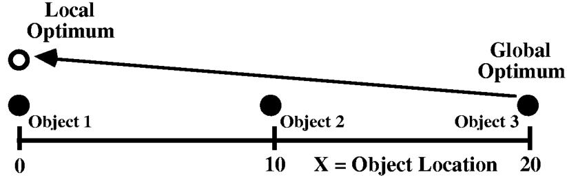  
Figure 6.1 Global and local optima for the one-dimensional example

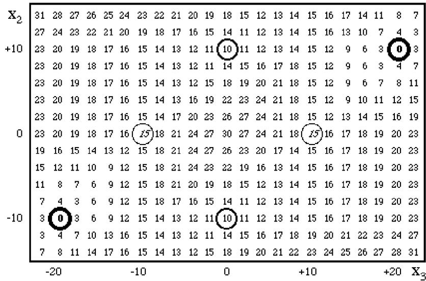  
Figure 6.2 Misfit function (Y) for the one-dimensional example

Figure 6.2 shows the misfit function values for the relevant range of values of $\mathbf { X } _ { 2 }$ and ${ \bf { X } } _ { 3 }$ . Values are shown on a grid interval of 2, for $\mathbf { X } _ { 2 }$ increasing vertically and for ${ \bf X } _ { 3 }$ increasing horizontally. The global minima are surrounded by heavy bold circles, the local minima by light bold, and the saddle points are italicised inside ordinary circles.

A simple hill-descending optimization is in danger of being trapped, not only at the local minimum of $\underline { { \mathbf { x } } } = ( 0 , 1 0 , 0 )$ , and its reflection, but also at the saddle point $\underline { { \mathbf { x } } } = ( 0 , 0 , 1 0 )$ and its reflection. It can be seen that the axes of the saddle point are tilted, so a method that numerically evaluates the gradients along the axes will not find a direction for descending to a lower misfit value.

The problem we have considered, of fitting three objects in one dimension, had two parameters that could be adjusted to optimize the fit. It was therefore a comparatively straightforward task to explore the global and local minima and the saddle points in the two-dimensional parameter space. If we increase the number of dimensions and/or the number of objects, the dimensionality of the parameter space (not to be confused with the dimensionality of the object space) increases, precluding graphical representation. This makes analysis very difficult. The problem is especially severe if (as in our example) the misfit function is not universally differentiable.

We might expect the problem of local optima to diminish as we increase the number of dimensions and/or the number of objects, since there are more parameters available along which descent could take place. However, it is still possible that objects closely line up within the object space, or within a subset of it, generating local optima of the form we have just encountered. Without evaluating the misfit function over the entire feasible space, we cannot be entirely sure that a reported solution is not just a local optimum. This entrapment problem remains a real danger in multidimensional scaling problems. It cannot be ruled out without knowing the solution. Since entrapment may generate a false solution, the problem is analogous to locking oneself out of the house and not being able to get in without first getting in to fetch the key. Any optimization method that has a danger of providing a local solution must be very suspect.

# 6.2.2 More than One Dimension

If we have n objects to be mapped $( \mathbf { i } = 1 , 2 \dots \mathbf { n } )$ in $\mathbf { g }$ dimensions $( \mathrm { f } = 1 , 2 , \ldots { } \mathbf { g } )$ , then the data ${ \bf { d } } _ { \mathrm { { i j } } }$ will comprise a matrix $\mathbf { D }$ measuring n by $\mathbf { n }$ , and the problem will require solution for $\mathbf { g } ( 2 \mathbf { n } { - } 1 { - } \mathbf { g } ) / 2$ coordinate parameters $\mathbf { X _ { \mathrm { i f } } }$ , where f goes from 1 to g, and i goes from $\mathrm { f } { + } 1$ to n.

Because any translation or rotation of the solution will not alter the inter-object distances, we can arbitrarily shift or translate the whole set of objects so that the first object is zero on all coordinates. Rotations then allow us to make zero all but one of the coordinates for the second object, all but two of the coordinates for the third object, and so on. These operations are equivalent to setting $\mathbf { X _ { i f } }$ to zero when $\mathbf { i } \leq \mathbf { f }$ .

The data matrix D, with elements ${ \mathrm { d } } _ { { \mathrm { i j } } } ,$ can be any appropriate measure of similarity or dissimilarity between the objects. At its simplest, it might just be measured inter-object distance, as in our one-dimensional example. In such a case, the diagonal of the data matrix will contain zeroes, and the data matrix $\mathbf { D }$ will be symmetric $\mathrm { ( d _ { i j } = d _ { j i } ) }$ , so there will be only $\mathbf { n } ( \mathbf { n } { - } 1 ) / 2$ independent data observations.

Consider a symmetric data matrix with a zero diagonal. The number of coordinate parameters will be equal to the number of independent data observations if the number of dimensions is equal to (n-1), one less than the number of objects. Such a symmetric zero diagonal data matrix can always be mapped into (n1), or less, dimensions. However, if the data matrix is not positive definite, the solution will not be real.

Multidimensional scaling methods are designed to find a solution in as few dimensions as possible that adequately fits the data matrix. For metric multidimensional scaling, this fit is done so that the inter-object distances are a ratio or interval transformation of the measured similarities or dissimilarities. For non-metric multidimensional scaling, the inter-object distances are a monotonic ordinal transformation of the measured similarities or dissimilarities, so that as far as possible the inter-object distances increase with decreasing similarity or increasing dissimilarity. In either case, we can refer to the transformed similarities or dissimilarities as "disparities." The usual approach with standard multidimensional scaling methods is to find an initial approximate solution in the desired number of dimensions, and then iterate in a hill-descending manner to minimize a misfit function, usually referred to as a "stress" function. For example, the Alscal procedure (Schiffman et al., 1981, pp 347-402) begins by transforming the similarities matrix to a positive definite vector product matrix and then extracting the eigen vectors, by solving:

Vector Product Transform of $\mathbf { D } = \mathbf { X } \mathbf { X } ^ { \prime }$

In this decomposition, $\mathbf { X }$ is a matrix composed of n vectors giving the dimensions of the solution for the n objects coordinates, arranged in order of decreasing variance (as indicated by their eigen values). The $\mathfrak { n } ^ { \mathrm { t h } }$ coordinate will of course be comprised of zeroes since, as we have seen, the solution can be fitted with (n-1) dimensions. If, for example, a two dimensional solution is to be fitted, then the first two vectors of X are used as a starting solution, and iterated to minimize a stress function. The usual stress function minimized is "s-stress." This is computed as the root mean square value of the difference between the squares of the computed and data disparities, divided by the fourth power of the data disparities (see Schiffman et al., 1981, p. 355-357). The s-stress function is used because it has differentiable properties that help in the iteration towards an optimum.

# 6.2.3 Using Standard Multidimensional Scaling Methods

We have already seen, in the introduction to this chapter, that there are two major problems in the use of standard multidimensional scaling procedures to fit a multidimensional space to a matrix of observed inter-object similarities or dissimilarities.

The first shortcoming considered was the danger of a local minimum being reported as the solution. This problem is inherent in all hill-descending methods where iterative search is confined to improving upon the solution by following downward gradients. A number of writers (for example, Goldberg, 1989, and Davis, 1991) have pointed out the advantage in this respect of using genetic algorithms, since they potentially search the entire feasible space, provided premature convergence is avoided.

The second and most serious shortcoming of standard multidimensional scaling procedures was seen to lie in the choice of the stress or misfit function. If we are trying to fit a multidimensional set of coordinates to some measured data, which has been obtained with some inherent measurement error or randomness, then the misfit function should relate to the statistical properties of the data. The misfit functions used in standard multidimensional procedures cannot generally be chosen by the user, and have been adopted for ease of convergence rather than for statistical appropriateness. In particular, the formulation of s-stress, used in Alscal and described above, will often not be appropriate to the measured data.

For example, if the data consists of distances between Roman legion campsites measured by counting the paces marched, and we are fitting coordinates to give computed distances $\mathrm { d _ { i j } } ^ { * }$ that best agree with the data distances ${ \bf d _ { i j } }$ , then sampling theory suggests that an appropriate measure of misfit to minimize is:

$$
\mathrm { Y = \sum ( d _ { i j } ^ { \mathrm { * } } - d _ { i j } ^ { \mathrm { * } } ) ^ { 2 } / d _ { i j } ^ { \mathrm { * } } }
$$

In other cases, the data measured may be the frequency of some sort of interaction between the objects, and the misfit function should more properly make use of the statistical properties of such frequency data. Kruskal and Wish (1978) describe a classic study by Rothkopf (1957), analyzed by Shepard (1963). The data comprised a table of frequencies that novices are confused when distinguishing between the 36 Morse code signals. The confusion frequencies were used as measures of similarities between the code signals. They were analyzed using multidimensional scaling to generate an interpretable two-dimensional map of the Morse code signals. It was found that the complexity of the signals increased in one direction and the proportion of dashes (as opposed to dots) increased along the second dimension. However, instead of the standard stress function, it would have been more appropriate to use a misfit measure that related the generation of confusions to a Poisson process, with the Poisson rate for each pair of Morse code signals depending upon their inter-object distance ${ \bf d _ { i j } }$ . Following Fienberg (1980, p. 40) a maximum likelihood solution could then be obtained by minimizing the function:

$$
\begin{array} { r } { \mathrm { Y } = \mathbf { G } ^ { 2 } = 2 \sum _ { \mathrm { i j } } \mathrm { F } _ { \mathrm { i j } } \cdot \log ( \mathrm { F } _ { \mathrm { i j } } / \mathrm { E } _ { \mathrm { i j } } ) } \end{array}
$$

where $\mathrm { { F _ { i j } } = }$ observed confusion frequency, $\mathrm { { { E } _ { i j } } = }$ modelled confusion frequency, and:

$$
\mathrm { E _ { i j } = e x p ( \mathrm { - d _ { i j } ) } }
$$

The log-likelihood function defined in Equation (4) has the fortunate property of being approximately a chi-squared distribution. The chi-square value can be partitioned, so that we can examine a series of hierarchical models step by step. We can fit the inter-object distances ${ \mathrm { d } } _ { \mathrm { i j } }$ to models having successively increasing numbers of dimensions. Increasing the model dimensions uses an increasing number of parameters and therefore leaves a decreasing number of degrees of freedom. The improvement in the chi-square can be tested for significance against the decrease in the number of degrees of freedom, to determine the required number of dimensions, beyond which improvement in fit is not significant. This method could, for example, have provided a statistical test of whether the Morse code signals were adequately representable in the two dimensions, or whether a third dimension should have been included.

In some cases, the data matrix may not be symmetric. For example, Everett and Pecotich (1991) discuss the mapping of journals based on the frequency with which they cite each other. In their model, the frequency $\mathrm { F _ { i j } }$ with which journal $\mathrm { j }$ cites journal i depends not only on their similarity $\mathrm { S _ { i j } }$ , but also upon the source importance $\mathrm { I _ { i } }$ of journal i, and the receptivity $\mathbf { R } _ { \mathrm { j } }$ of journal j. In their model, the expected citation frequencies $\mathbf { E _ { i j } }$ are given by:

$$
\mathrm { { E } _ { i j } = \mathrm { { I } _ { i } \mathrm { { R } _ { j } \mathrm { { S } _ { i j } } } } }
$$

They use an iterative procedure to find the maximum likelihood solutions to I and $\underline { { \mathbf { R } } }$ , then analyzed the resulting symmetric matrix S using standard

multidimensional scaling procedures, with the usual arbitrary rules applied to using the residual stress to judge how many dimensions to retain. They could instead have used the model:

$$
\mathbf { E _ { i j } } = \mathrm { { I _ { i } } \mathbf { R _ { j } } \ e x p ( - d _ { i j } ) }
$$

It would have then been possible to evaluate the chi-square for a series of hierarchical models where ${ \mathrm { d } } _ { \mathrm { i j } }$ has increasing dimensionality, to find the statistically significant number of dimensions in which the journals should be plotted.

The standard multidimensional scaling procedures available in statistical computing packages do not allow the user the opportunity to choose a statistically appropriate misfit function. This choice is not possible because the stress functions they do use have been designed to be differentiable and to facilitate convergence. On the other hand, genetic algorithms do not use the differential of the misfit function, but require only that the misfit function be calculable, so that it is not difficult for users to specify whatever function is statistically appropriate for the particular problem being solved.

We will now discuss the design of a genetic algorithm for solving multidimensional scaling problems, and report some preliminary test results.

# 6.3 A Genetic Algorithm for Multidimensional Scaling

Genetic algorithms, as described in many of the examples in this book, commonly use binary parameters, with each parameter being an integer encoded as a string of binary bits. The two most standard genetic operators of mutation and crossover have also been described in previous chapters.

In designing a genetic algorithm for multidimensional scaling, we will find some differences in the nature of the parameters, and in the genetic operators that are appropriate. The parameters in a multidimensional scaling model are the coordinates of the objects being mapped, so they are essentially continuous. The application of genetic algorithms to optimizing continuous (or "real") parameters has been discussed by Wright (1991).

In our multidimensional scaling case, the situation is further enriched by some ambiguity as to whether the set of objects being mapped is best thought of as the optimization of a single entity, or as optimization of a community of interacting individuals. We shall see that the latter analogy, treating the set of objects as an interacting community of individuals, provides some insight triggering the design of purpose-built genetic operators.

# 6.3.1 Random Mutation Operators

In mutation, one parameter is randomly selected, and its value changed, generally by a randomly selected amount.

# 6.3.1.1 Binary and Real Parameter Representations

In the more familiar binary coding, mutation randomly changes one or more bits in the parameter. One problem with binary coding is that increases and decreases are not symmetric. If a parameter has a value of 4 (coded as 100), then a single bit mutation can raise it to 5 (coded as 101), but the much more unlikely occurrence of all three bits changing simultaneously is needed to reduce it to 3 (coded as 011). This asymmetry can be avoided by using a modified form of binary coding, called Gray coding after its originator, in which each number's representation differs from each of its neighbors, above and below, by changing only one bit from $" 0 "$ to '1' or vice versa.

In either standard binary or Gray coding of integers, if the parameter is a binary coded integer with maximum feasible value $\mathbf { X } _ { \mathrm { m a x } }$ , then changing a randomly selected bit from $\mathbf { \epsilon } ^ { \bullet } 0 ^ { \bullet }$ to $\cdot _ { 1 } ,$ or vice versa, the parameter value is equally likely to change by $1 , 2 , 4 , \dots ( \mathrm { X } _ { \mathrm { m a x } } / 2 )$ units.

This greater likelihood of small changes, while allowing any size of change, has obvious attractions. It can be mimicked for real parameters by setting the mutation amplitude to $\pm \mathrm { X } _ { \mathrm { m a x } } / 2 ^ { \mathrm { p } }$ , where p is a randomly chosen integer in the range 1 to q, and $\mathrm { X } _ { \mathrm { m a x } } / 2 ^ { \mathrm { q } }$ is the smallest mutation increment to be considered, and the sign of the mutation is chosen randomly.

An alternative approach is to set the mutation to N(0, MutRad), a Gaussian distribution of zero mean and standard deviation MutRad, the desired mutation radius. Again, with this form of mutation smaller mutation steps are more likely, but larger steps are possible, so that the entire feasible space is potentially attainable. In an evolving algorithm, the mutation radius can start by encompassing the entire feasible space, and shrink to encompass a smaller search space as convergence is approached.

Like Gray coding, mutation of continuous parameters avoids the asymmetry we noted for standard binary-coded integer parameters. With either of the continuous parameter mutation procedures just described, not only are small changes in parameter value more likely than large changes, but negative changes have the same probability as positive changes of the same magnitude.

# 6.3.1.2 Projected Mutation: A Hybrid Operator

A third way to specify the mutation amplitude provides a hybrid approach, making use of the local shape of the misfit function. The method can be applied only if the misfit function is locally continuous (although not necessarily differentiable).

Figure 6.3 shows how the suggested projection mutation operator works. The parameter to be mutated is still randomly selected (so that a randomly selected object is shifted along a randomly selected direction). However, the direction and amount of the projection is determined by evaluating the function three times, for the object at its present location $( \mathbf { Y } _ { 1 } )$ and displaced small equal amounts $\Delta \mathbf { X }$ in opposite directions, to yield values $\mathrm { Y } _ { 0 }$ and $\mathrm { Y } _ { 2 }$ . A quadratic fit to these three values indicates whether the misfit function is locally concave upwards along the chosen direction. If it is, the mutation sends the object to the computed minimum of the quadratic fit. Otherwise, the object is sent in the downhill direction by an amount equal and opposite to its distance from the computed maximum of the quadratic fit. In Figure 6.3, both situations are depicted, with the original location in each case being the middle of the three evaluated points, identified by small circles. In the first case, where the curvature is concave downward, the solution is projected downhill to the right by a horizontal amount equal but opposite to the distance of the fitted quadratic maximum. In the second case, where the curvature is concave upward, the solution is projected downhill to the left, to the fitted quadratic minimum.

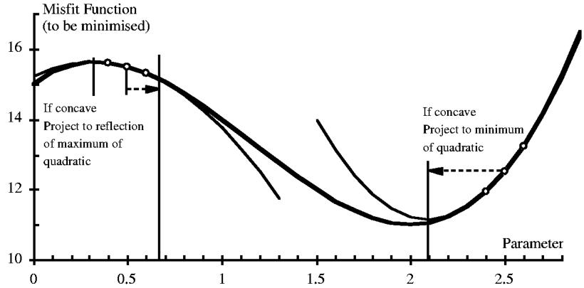  
Figure 6.3 Projected mutation

# 6.3.2 Crossover Operators

Crossover consists of the interchange of parameter values, generally between two parents, so that one offspring receives some of its parameter values from one parent, and some from the other. Generally, a second offspring is given the remaining parameter values from each parent.

Originally, a single crossover point was used (Goldberg, 1989). If the parameters were listed in order, an offspring would take all its parameters from one parent up to the crossover point (which could be in the middle of a parameter), and all the remaining parameters from the other parent. Under uniform crossover (Davis, 1991) each parameter (or even each bit of each parameter if they are binary coded) is equally likely to come from either parent. Uniform crossover can break up useful close coding, but has the opportunity to bring together useful distant coding. With continuous parameters, where the parameters have no natural ordering or association, an attractive compromise is to use uniform coding modified so that the offspring obtains each parameter at random from either parent.

In the multidimensional scaling, there is no a priori ordering of the objects. Suitable uniform crossover modifications would therefore be to get either:

•Each parameter (a coordinate on one dimension for one object) from a random parent, or Each object's full set of coordinates from a single random parent.

6.3.2.1 Inter-object Crossover

A third, unorthodox, form of crossover that can be considered is to use only a single parent, and to create a single offspring by interchanging the coordinate sets of a randomly selected pair of objects. This postulated crossover variant has the attraction that it could be expected to help in situations of entrapment, where a local optimum prevents one object passing closely by another towards its globally optimum location.

We can consider the set of objects being mapped as a sub-population or group of individuals whose misfit function is evaluated for the group rather than for the individual. Using a biological analogy, a colony of social animals (such as a coral colony or a beehive) may be considered either as a collection of individuals or as a single individual. If we view the objects as a set of individuals, then each individual's parameter set comprises its identifier "i" plus its set of coordinates. Inter-object crossover is then equivalent to a standard single point crossover, producing two new objects, each getting its identifier from one parent object and its coordinates from the other.

# 6.3.3 Selection Operators

We have considered how each generation may be created from parents, by various forms of mutation, crossover or combinations thereof. It remains to be considered how we should select which members of each generation to use as the basis for creating the following generation.

A fundamental principle of genetic algorithms is that the fittest members should breed. Many selection procedures have been implemented. It would appear preferable to avoid selection methods where a simple re-scaling of the fitness function would greatly change the selection probabilities.

Procedures based on rank have the advantage of not being susceptible to the scaling problem. One approach is to assign a selection probability that descends linearly from the most fit member (with the smallest misfit value) to zero for the least fit member (with the largest misfit value). Tournament selection can achieve this effect without the need to sort or rank the members. Two members are selected at random, and the most fit of the pair is used for breeding. The pair is returned to the potential selection pool, a new pair selected at random, the best one used for breeding, and so on until enough breeders have been selected. The selection with replacement process ensures that a single individual can be selected multiple times. This procedure is equivalent to ranking the population and giving them selection probabilities linearly related to rank, as shown in the following proof:

Consider m members, ranking from $\mathbf { r } = 1$ (least fit, with highest Y) to ${ \bf r } = { \bf m }$ (most fit, with lowest Y)   
•Each member has the same chance of selection for a tournament, a chance equal to $2 / \mathrm { m }$ .   
•But its chance of winning is equal to the chance that the other selected member has lower rank, a chance equal to (r-1)/(m-1)   
: $\mathrm { S o } \mathrm { P } ( \mathrm { w i n } ) { = } 2 ( \mathrm { r } { - } 1 ) / [ \mathrm { m ( m { - } 1 ) } ]$ , which is linear with rank

In selecting members of the next generation, it would appear unwise to lose hold of the best solution found in the previous generation. For this reason, an "elitist" selection procedure is often employed, with the "best yet" member of each generation being passed on unaltered into the next generation (in addition to receiving its normal chance to be selected for breeding).

# 6.3.4 Design and Use of a Genetic Algorithm for Multidimensional Scaling

To investigate some of the issues that have been discussed, a genetic algorithm program was designed, using the simulation package Extend, which is written in C. The algorithm has been used to fit the inter-object distances of ten cities in the United States. This example has been chosen because it is also used as a worked example in the SPSS implementation of the standard multidimensional scaling procedure Alscal (Norusis, 1990, pp. 397-409). The data as given there are shown in Table 6.2.

Table 6.2 Inter-city flying mileages   

<table><tr><td></td><td>Atlanta</td><td>Chicago</td><td>Denver</td><td>Houston</td><td>L.A.</td><td>Miami</td><td>N.Y.</td><td>S.F.</td><td>Seattle</td><td>D.C.</td></tr><tr><td>Atlanta</td><td>0</td><td>587</td><td>1,212</td><td>701</td><td>1,936</td><td>604</td><td>748</td><td>2,139</td><td>2,182</td><td>543</td></tr><tr><td>Chicago</td><td>587</td><td>0</td><td>920</td><td>940</td><td>1,745</td><td>1,188</td><td>713</td><td>1,858</td><td>1,737</td><td>597</td></tr><tr><td>Denver</td><td>1,212</td><td>920</td><td>0</td><td>879</td><td>831</td><td>1,726</td><td>1,631</td><td>949</td><td>1,021</td><td>1,494</td></tr><tr><td>Houston</td><td>701</td><td>940</td><td>879</td><td>0</td><td>1,374</td><td>968</td><td>1,420</td><td>1,645</td><td>1,891</td><td>1,220</td></tr><tr><td>Los Angeles</td><td>1,936</td><td>1,745</td><td>831</td><td>1,374</td><td>0</td><td>2,339</td><td>2,451</td><td>347</td><td>959</td><td>2,300</td></tr><tr><td>Miami</td><td>604</td><td>1,188</td><td>1,726</td><td>968</td><td>2,339</td><td>0</td><td>1,092</td><td>2,594</td><td>2,734</td><td>923</td></tr><tr><td>New York</td><td>748</td><td>713</td><td>1,631</td><td>1,420</td><td>2,451</td><td>1,092</td><td>0</td><td>2,571</td><td>2,408</td><td>205</td></tr><tr><td>San Francisco</td><td>2,139</td><td>1,858</td><td>949</td><td>1,645</td><td>347</td><td>2,594</td><td>2,571</td><td>0</td><td>678</td><td>2,442</td></tr><tr><td>Seattle</td><td>2,182</td><td>1,737</td><td>1,021</td><td>1,891</td><td>959</td><td>2,734</td><td>2,408</td><td>678</td><td>0</td><td>2,329</td></tr><tr><td>Washington D.C. 543</td><td></td><td>597</td><td>1,494</td><td>1,220</td><td>2,300</td><td>923</td><td>205</td><td>2,442</td><td>2,329</td><td>0</td></tr></table>

After Norusis, 1990, p. 399

On the reasonable assumption that the expected variance of any measured distance is proportional to the magnitude of that distance, the misfit (or stress) function to be minimized was expressed as the average of the squared misfits, each divided by the measured inter-city distance. The elements $\mathrm { d _ { i j } } ^ { * }$ representing the fitted distances and ${ \mathrm { d } } _ { \mathrm { i j } }$ the measured distances:

$$
\mathrm { \Omega _ { 1 } = Y = A v e r a g e [ ( d _ { i j } \mathrm { ^ { * } - d _ { i j } } ) ^ { 2 } / d _ { i j } ] }
$$

This is equivalent to the misfit function used in Equation (3) above, but expressed as an average rather than as a sum, to aid interpretation.

The genetic algorithm in Extend was built with a control panel, as shown in Figure 6.4. It was designed so that the inter-object distances could be pasted into the panel, and the results copied from the panel. The control panel permits specification of how many objects and dimensions are to be used, and whether the optimization is to be by systematic hill descent, or to use the genetic algorithm. If the genetic algorithm is being used, then the population size can be specified, together with how many members are to be subjected to each type of genetic operator. The allowed genetic operators, discussed in the previous sections, include:

•Projection Mutation of a randomly selected object along a randomly selected dimension, to the quadratic optimum, if the misfit function is upwardly concave for this locality and direction. If the function is downwardly concave, the projection is downhill to the reflection of the quadratic fit maximum, as shown in Figure 6.3

•Random Mutation of a randomly selected object along a randomly selected dimension, by an amount randomly selected from a normal distribution. The normal distribution has a zero mean, and a standard deviation set by a Mutation Radius, which shrinks in proportion to the root mean square misfit, as convergence is approached   
•Standard Crossover Pairing where each offspring takes the coordinates of each object from one of its two parents (the source parent being selected at random for each object)   
•Crossover Objects where an offspring is created from a single parent by interchanging the coordinate set of a randomly selected pair of objects

Figure 6.4 shows the control panel for a run, fitting an initial random configuration to the matrix of inter-city distances.

The initial coordinates can be specified, if it is not desired to start with all objects at the origin, or if a continuation is being run from the ending state of a previous run.

As the run progresses, the best fitting solution yet found (lowest $\mathrm { Y }$ valueis reported in the fitted coordinates table. This solution is preserved as a member of the new generation. The parents of the new generation are selected by pairwise tournament selection, which we have seen is equivalent to ranking the population and giving them selection probabilities linearly related to rank.

The C language coding for the program is listed at the end of this chapter.

# 6.4 Experimental Results

# 6.4.1 Systematic Projection

The program was run first using systematic projection, with only a single population member, projected to the quadratic minimum once for each parameter, during each iteration. Since the ten cities were being plotted in two dimensions, there were 20 projections during each iteration. The fitting was repeated for ten different starting configurations, each randomly generated by selecting each coordinate from a uniform distribution in the range zero to 2000 miles. The results for the ten runs are plotted in Figure 6.5.

It can be seen from Figure 6.5 that half the solutions converged to the global minimum, with the misfit function equal to 0.0045, but that the other five solutions became trapped on a local optimum, with the misfit function equal to 5.925.

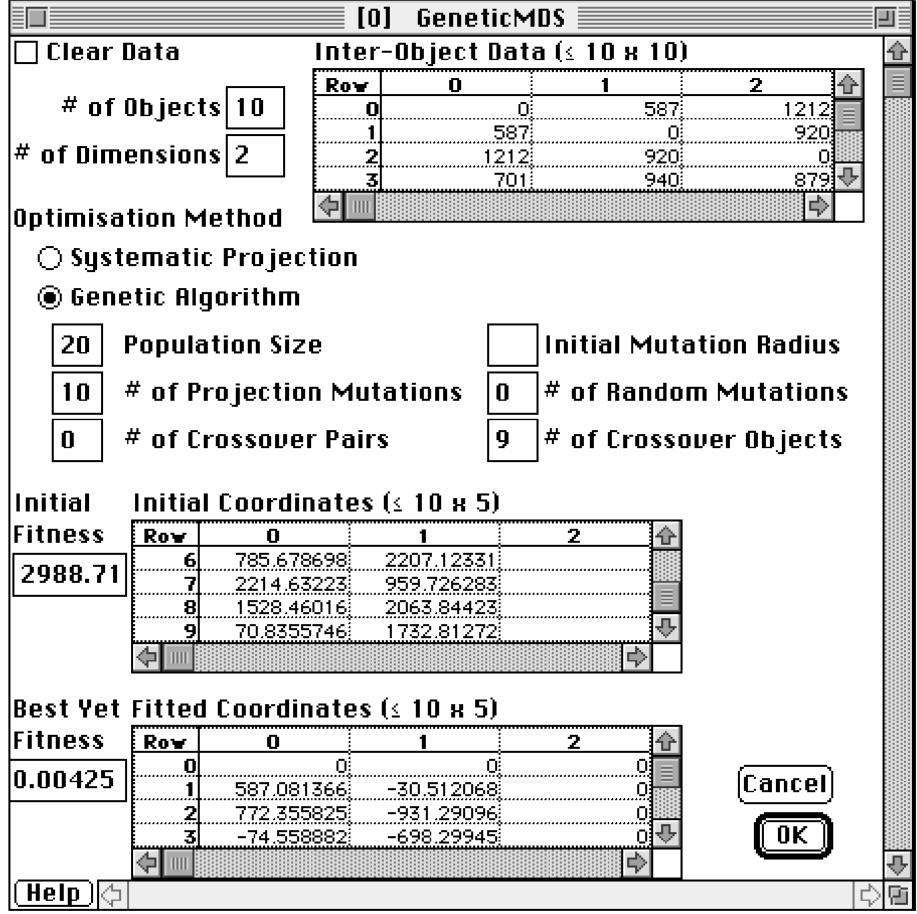  
Figure 6.4 The genetic algorithm control panel

Since the misfit function, Y, of Equation (8) is the average of the squared error divided by the inter-city distance, the global minimum corresponds to a believable standard error of plus or minus one mile in a distance of 220 miles, or 2.1 miles in a 1000-mile distance. The local optimum corresponds to an unbelievably high standard error of 77 miles in a 1000-mile inter-city distance.

# 6.4.2 Using the Genetic Algorithm

The genetic algorithm was used on the same set of ten starting configurations. For the genetic algorithm (as shown in the control panel of Figure 6.4) a population size of twenty was used. An elitist policy was used, with the best member of the previous generation being retained unaltered in the next. Nineteen tournament selections were made from the previous generation for breeding each new generation. Ten new generation members were created from their parents by a projection mutation (along one randomly selected dimension for one randomly selected city), and for the remaining nine members, a randomly selected pair of cities were interchanged.

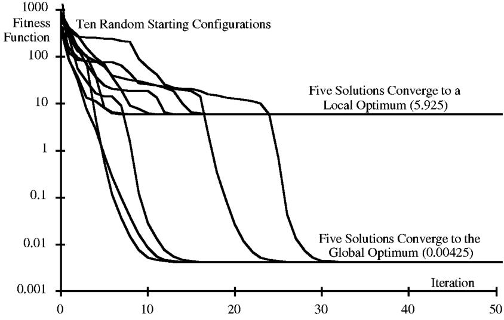  
Figure 6.5 Systematic projection from ten random starting configurations

Figure 6.6 shows that the genetic algorithm brought all ten starting configurations to the global optimum, even in the five cases where the systematic projection had resulted in entrapment on a local optimum.

As is commonly the case with genetic algorithm solutions, the reliability of convergence on the global optimum is bought at the cost of a greater number of computations.

# 6.4.3 A Hybrid Approach

A hybrid approach that can greatly reduce the computation effort is to use a starting configuration that has been obtained by a conventional method, and home in on the global optimum using the genetic algorithm. This hybrid approach is illustrated in Figure 6,7.

The eigen values were extracted from the vector product transformation of D, as shown in Equation (2) above. The vector product transformation is constructed by squaring the ${ \bf d _ { i j } }$ elements, subtracting the row and column means and adding the overall mean of this squared element matrix, and finally halving each element (see Schiffman et al., 1981, p. 350). Figure 6.7 shows that the genetic algorithm was able to converge the eigen solution to the global optimum in about 130 generations, only a moderate improvement upon the 150 to 200 needed for the random initial configurations. A much quicker convergence, in about 30 generations, was obtained using the Alscal solution in the SPSS computer package. As was discussed above, the Alscal solution optimizes a different misfit function, the s-stress, instead of the proportional error variance of Equation (8). Consequently, it is to be expected that the two different misfit functions will have different optimal solutions. The statistically inappropriate Alscal solution gives a convenient starting point for the genetic algorithm to approach the global optimum of the statistically appropriate misfit function.

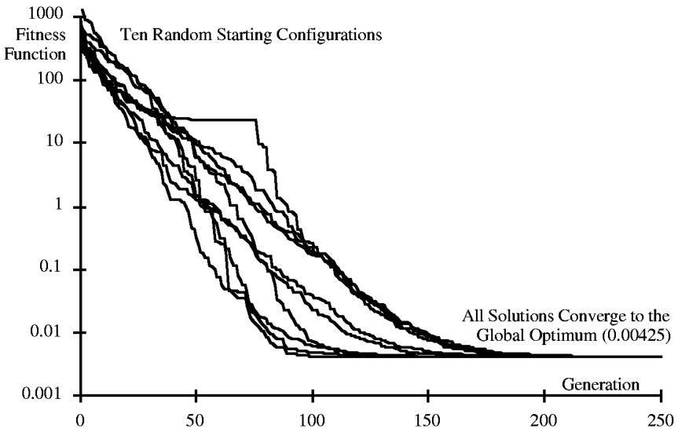  
Figure 6.6 Genetic algorithm using the same ten random starting configurations

Further investigations have been run, using standard genetic operators of random mutation and crossover of pairs of solutions, as described earlier. The same ten starting configurations were used as for Figures 6.5 and 6.6. The standard operators gave slower convergence than our projection mutation and object crossover operators. They were sometimes trapped on a local minimum, as was the systematic downhill projection of Figure 6.5. However, the possibility remains that the most efficient algorithm may need to be built from a combination of our modified operators with the standard genetic operators. The interested reader is invited to experiment, using and adapting the computer software provided.

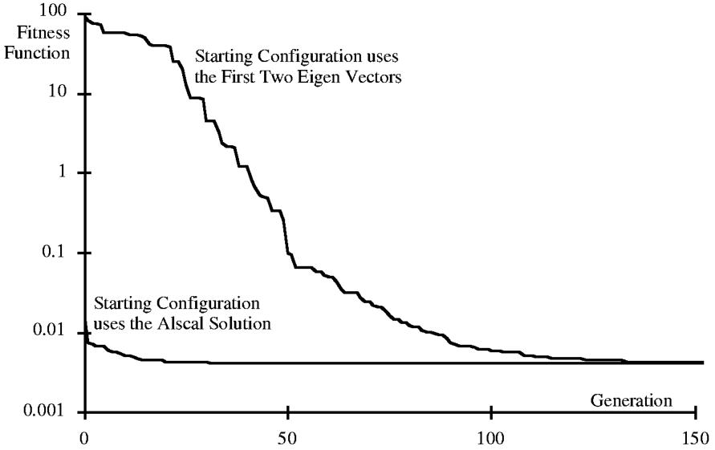  
Figure 6.7 Starting from Eigen vectors and from the Alscal solution

# 6.5 The Computer Program

# 6.5.1 The Extend Model

The computer program was written using the simulation package Extend, which is coded in a version of C. Users without Extend but some knowledge of C or $\mathrm { C } { + } { + }$ will be able to implement the program with little alteration.

  
Figure 6.8 The Extend model

Figure 6.8 shows the layout of the Extend model. It comprises a single program block, "HybridMDS," connected to the standard library plotter, which collects and displays spreadsheet and graphical output for each computer run.

Each simulation step in Extend corresponds to one generation of the genetic algorithm.

The program block can be double clicked to open up and display the control panel of Figure 6.4. As is standard with Extend, option-double-click on the program block displays the code listing of the block, in a form of C. The program is listed below.

# 6.5.2 Definition of Parameters and Variables

6.5.2.1 Within the Control Panel (Dialog Box)

A number of parameters are defined within the control panel or dialog box of Figure 6.4. These are:

ClearData Clicked if the control panel is to be cleared NumObj The number of objects to be mapped NumDim The number of dimensions to be mapped Data Inter-object source data (NumObj by NumObj) Xopt The number of dimensions to be mapped

You can choose to use systematic projection or the genetic algorithm by clicking one of:

SystProj To use systematic projection GenAlg To use the genetic algorithm

If you choose to use the genetic algorithm, you should specify:

NumPop The number of population members in each generation NumRandProj The number of members created by random projection NumCross The number of pairs created by crossover MutRad The initial mutation radius NumMut The number of members created by random mutation NumCrossObj The number of members created by object crossover

An initial configuration should be entered (random, eigen vectors or Alscal solution)

Xinit

The initial coordinate configuration (NumObj by NumDim)

The program reports into the control panel:

Avinit The initial average misfit value

And at each generation, updates:

Xopt The coordinate configuration of the best solution so far Avopt The average misfit value of the best solution so far

6.5.2.2 To the Library Plotter

The program block also has four connectors to the library plotter:

Con0Out The average misfit value of the best solution so far (Avopt)   
Con1Out $\mathbf { \delta } = \mathrm { Y } [ 0 ] = \mathbf { B } \mathrm { e s t }$ total misfit so far $=$ Avopt x NumObj x NumObj   
Con2Out $\scriptstyle = \mathrm { Y } [ 1 ] \}$ Two more total misfit values from   
Con3Out $= \mathrm { Y } [ 2 ] \}$ members of the current generation

6.5.2.3 Variables and Constants Set Within the Program Listing The following variables and constants are set within the program listing:

integer m, i, j, k, d, MaxObj, MaxDim, BlankRow, BlankCol, MaxPop, NumObjSq;

real Diff, Total, TotalSum, DX[20][20], X[][20][5], Y[], Xold[][20][5], Yold[];   
real Yopt, Yinit, Y0, Y1, Y2, DelX, DelX2, Temp, LogSqData[20][20];   
constant AllowObj is 10; constant AllowDim is 5; constant Increment is 100;

6.5.3 The Main Program

The main program comprises three Extend calls.

The first is activated when the control panel is closed, and checks that the data are valid:

on DialogClose { CHECKVALIDATA();}

The second acts at the start of a simulation, checks for valid data, and initialises the simulation:

On InitSim{CHECKVALIDATA(); TotalSum $/ =$ NumObj\*NumObj;DelX $=$ TotalSum/Increment; $_ { \mathrm { D e l X } 2 = 2 ^ { * } \mathrm { D e l X } }$ ; INITIALISE(; }

The third is activated at the each step of the simulation, and simulates one generation of the genetic algorithm (or one sequence of the systematic projection, if that is being used):

on Simulate {if(SystProj) $\mathrm { m } { = } 0$ ;for $\mathrm { i } { = } 0$ to MaxObj for $\mathrm { d } { = } \mathrm { 0 }$ to MaxDim   
DESCEND(;} else   
{TOURNELITEO; $\mathrm { m } { = } 1$ ; for ${ \bf k } { = } 1$ to NumRandProj RANDPROJ(; for ${ \bf k } { = } 1$ to NumCross CROSSOVER(O; for $\mathbf { k } { = } 1$ to NumCrossObj CROSSOBJ(O; MutRad=Sqrt(Avopt\*1000); for $\mathbf { k } { = } 1$ to NumMut MUTATEO; } XYoptGETO; Avopt=Yopt/NumObjSq; Con0Ou Avopt; if(NumPop> 1) Con1Ou $\mathbf { \Psi } =$ Y[0]; if(NumPop>2) Con2Out=Y[1]; if(NumPop>3) Con3Out=Y[2];}

# 6.5.4 Procedures and Functions

The main program calls upon several procedures. To make the program operation easier to follow, they will be listed here in the order in which they are called.

In the actual program listing, any procedure or function which is called must have already appeared in the listing, and therefore the listing order will not be the same as shown here.

# 6.5.4.1 CHECKVALIDATA()

Checks the input data for internal consistency.

Procedure CHECKVALIDATA()   
{if(SystProj) NumPop ${ \mathfrak { s } } 1$ ; if(ClearData) {NumObj $= 0$ ; NumDim $= 0$ ; for $\mathrm { i } { = } 0$ to AllowObj-1 {for $\mathrm { j } = 0$ to AllowObj-1 Data[i][j $= 0$ ; for $\mathrm { d } { = } \mathrm { 0 }$ to AllowDim-1 Xopt[i][d] $= 0$ ; }   
ClearData $= 0$ ; usererror("Data Cleared: Object Data Needed"); abort;}   
if(NumObj>AllowObj)OR(NumDim>Min2(AllowDim,NumObj-1))OR (NumDim<1)OR(NumObj<2))   
{usererror("Error: You must set the number of Objects in the range 2 to "+AllowObj $+ "$ and the number of Dimensions in the range 1 to " $^ +$ AllowDim+," but less than the number of Objects"); abort;}   
MaxObj=NumObj-1; MaxDim=NumDim-1; TotalSum ${ = } 0$ ; $^ { * * }$ CHECK FOR BLANK ROWS OR COLUMNS   
BlankRow $= 0$ ; for $\mathrm { i } { = } 0$ to MaxObj {Total=0; for $\scriptstyle \mathbf { j } = 0$ to MaxObj Total $+ =$ Data[i][j]; TotalSum $+ { = }$ Total; if(Total $\scriptstyle = = 0$ )BlankRow $+ { = } 1$ ;} BlankCol=0; for $\mathrm { i } { = } 0$ to MaxObj {Total=0; for $\scriptstyle \mathbf { j } = 0$ to MaxObj Total $+ =$ Data[j][i]; if(Total $\scriptstyle = = 0$ BlankCol $+ { = } 1$ ;}   
if(BlankRow+BlankCol>0) {usererror(BlankRow $^ +$ " Rows Total Zero   
"+BlankCol+" Columns Total Zero"); abort; }   
Temp $\scriptstyle 1 = 0$ ; for $\scriptstyle \mathbf { i } = 0$ to MaxObj for $\mathrm { d } { = } 0$ to MaxDim Temp+ $\ast =$ realabs(Xinit[i][d]); if (!((TotalSum ${ > } 0$ )&&(NumObj ${ > } 0$ )&&(NumDim>0)&&(NumPop>0))) {usererror("Blank Data"); abort; };   
if(GenAlg) if (!(MutRad>0)) {usererror("Set Mutation Radius"); abort;}; if (!SystProj) if(NumPop $< =$ NumRandProj $+ 2 ^ { * }$ NumCross+NumCrossObj $^ +$ NumMut) {usererror("Increase NumProj"); abort;}}

# 6.5.4.2 INITIALISE()

This initialises all the first generation to the initial configuration, entered in the control panel.

Procedure INITIALISE()   
{for $\mathrm { i } = 0$ to MaxObj for $\scriptstyle { \mathrm { j } = { \dot { 1 } } + 1 }$ to MaxObj LogSqData[i][j]= 2\*Log(Data[i]j]);   
MatCopy(Xopt,Xinit,NumObj,NumDim);   
for $\mathrm { m } { = } 0$ to MaxPop for $\mathrm { d } { = } 0$ to MaxDim for $\mathrm { i } { = } 0$ to MaxObj X[m][i][d]= Xinit[i][d];   
$\scriptstyle { \mathrm { m } } = 0$ ;Yinit=EVALUATE(; for $\scriptstyle { \mathrm { m } } = 0$ to MaxPop $\mathrm { Y } [ \mathbf { m } ] =$ Yinit; Yopt= Yinit; $\mathrm { N u m O b j S q } { = } \mathrm { ( N u m O b j ^ { * } M a x O b j ) } / 2 ;$ .   
Avinit=Yinit/(NumObjSq); Avopt=Avinit; MakeArray (X,NumPop); MakeArray (Y,NumPop);   
MakeArray (Xold,NumPop); MakeArray (Yold,NumPop); MaxPop $\vDash$ NumPop1;}

# 6.5.4.3 EVALUATE()

This function evaluates the misfit Y for the $\mathbf { m } ^ { \mathrm { t h } }$ population member. The misfit Y is the sum of the squared errors each divided by the inter-object distance, as defined in Equation (3) above.

real EVALUATE() {integer ip, jp, dp; real Y; $\mathrm { Y } { = } 0$ ; for ip=0 to MaxObj for $\mathrm { j } \mathsf { p } { = } \mathrm { i } \mathsf { p } { + } 1$ to MaxObj

{DX[ip][jp] $= 0$ ; for $\mathrm { d } { \mathsf { p } } { = } 0$ to MaxDim DX[ip][jp] $+ =$ (X[m][ip][dp]- $\mathrm { X } [ \mathrm { m } ] [ \mathrm { j } \mathsf { p } ] [ \mathrm { d } \mathsf { p } ] ) { \wedge } 2$ ; DX[ip][jp $\scriptstyle \left| = \right|$ SQRT(DX[ip]jp]);

$\mathrm { Y } { + } { = }$ (DX[ip][jp]-Data[ip][jp] $\scriptscriptstyle \uparrow 2$ )/Data[ip][jp];} return(Y); }

# 6.5.4.4 DESCEND()

This procedure projects the solution $\mathrm { Y } [ \mathbf { m } ] = \mathrm { f } \mathbf { n } ( \mathbf { X } )$ along the ${ \mathrm { d } } ^ { \mathrm { t h } }$ dimension of the $\mathbf { i } ^ { \mathrm { t h } }$ oj, to its quadracminium, as illustrate i Figur .3.

Procedure DESCEND( $\mathbf { Y } 1 { = } \mathbf { Y } [ \mathbf { m } ]$ ; X[m][i][d] $\mathbf { \partial } \cdot =$ DelX; Y0=EVALUATE (;   
X[m][i][d] $+ =$ DelX2; Y2=EVALUATEO;   
X[m][i][d] $\mathbf { \delta } \mathbf { \tilde { \delta } } \mathbf { = }$ DelX; Diff=( $\mathrm { Y 0 + Y 2 }$ )/2-Y1; if(Diff<>0) Temp=Delx\*(Y0- Y2)/Realabs( ${ 4 ^ { * } } \mathrm { { D i f f } } )$ ; X[m][i][d] $+ { = } ^ { \prime }$ Temp;   
Y[m]=EVALUATE(); i $\mathrm { f ( Y [ m ] > Y 0 ) }$ $\{ { \mathrm { Y } } [ { \mathrm { m } } ] { = } { \mathrm { Y } } 0$ ; X[m][i][d] $- =$ Temp;} }

# 6.5.4.5 TOURNELITEO

Here we preserve the best solution yet, then choose the rest of the breeders for the next generation by tournament contest of randomly selected pairs. A pair of the previous generation are chosen at random, and the better of the two is used for breeding.

Procedure TOURNELITEO) {integer mp, mq, BestYet;   
for $\mathrm { m } { = } 0$ to MaxPop $\{ \mathrm { Y o l d } [ \mathrm { m } ] { = } \mathrm { Y } [ \mathrm { m } ]$ ; for $\mathrm { i } { = } 0$ to MaxObj for $\mathrm { d } { = } \mathrm { 0 }$ to MaxDim Xold[m][i][d] $\lvert = \mathbf { X } [ \mathbf { m } ]$ [i][d]; }   
$\scriptstyle \mathrm { B e s t Y e t = 0 }$ ; for $\mathrm { m } { = } 1$ to MaxPop if $\mathrm { ( Y [ m ] < Y }$ [BestYet]) BestYet=m;   
if (BestYet>0) for $\mathrm { i } { = } 0$ to MaxObj for $\mathrm { d } { = } 0$ to MaxDim {X[0][i][d] $\vDash$ X[BestYet][i][d]; Y[0 $\mathrm { l } { = } \mathrm { Y }$ [BestYet];}   
for $\mathrm { m } { = } 1$ to MaxPop {mp=Random(NumPop); mq=Random(NumPop); if (Yold[mq]<Yold[mp]) mp=mq; $\scriptstyle \mathrm { Y [ m ] = Y o l d [ m p ] }$ ; for $\mathrm { i } { = } 0$ to MaxObj for $\scriptstyle \mathrm { d } = 0$ to MaxDim X[m][i][d]= Xold[mp][i][d];}}

# 6.5.4.6 RANDPROJ()

This procedure selects a random object, then projects it to the quadratic optimum along each coordinate.

Procedure RANDPROJ() { $\mathrm { i } =$ RANDOM(NumObj); for $\mathrm { d } { = } \mathrm { 0 }$ to MaxDim DESCEND(; $\mathrm { m } { + } { + } ;$ }

# 6.5.4.7 CROSSOVER()

This procedure assigns the objects of two parent solutions at random to two members of the next generation.

Procedure CROSSOVER() {integer ip, dp; real Dum; for ip=0 to MaxObj if(RANDOM(2)) for $\mathrm { d } { \mathsf { p } } { = } 0$ to MaxDim {Dum $\mathbf { \pi } = \mathbf { \pi }$ X[m][ip][dp]; X[m][ip][dp $\mathrm { l } { = } \mathrm { X }$ I $[ \mathbf { m } + 1$ ][ip][dp]; $\mathrm { X [ m + 1 ] [ i p ] [ d p ] = D u m ; } \mathrm { ] }$ Y[m]=EVALUATE(; $\mathbf { m } { + } { + }$ ; Y[m]=EVALUATE(); $\mathbf { m } { + } { + }$ ; }

6.5.4.8 CROSSOBJ()

Coordinates of two randomly selected objects are interchanged for a member of the population.

Procedure CROSSOBJ() {integer ip, jp, dp; real Dum;

# ip=RANDOM(NumObj); jp=RANDOM(NumObj); for $\mathrm { d } { \mathsf { p } } { = } 0$ to MaxDim {Dum=X[m][ip][dp]; X[m][ip][dp]=X[m][jp][dp]; X[m][jp][dp]=Dum;} Y[m]=EVALUATE(; $\mathbf { m } { + } { + } \mathbf { \cdot }$ }

6.5.4.9 MUTATEO

One randomly selected object is mutated a random distance (normally distributed, with standard deviation equal to the mutation radius). The mutation radius is revised each generation in the "on Simulate" call, so that it contracts at the same rate as the misfit function shrinks.

Procedure MUTATE()   
{i=RANDOM(NumObj); for $\mathrm { d } { = } \mathrm { 0 }$ to MaxDim X[m][i][d] $+ =$ Gaussian (0.0, MutRad); Y[m]=EVALUATEO; $\mathbf { m } { + } { + } ;$ }

6.5.4.10 XYoptGET()

Copies the best yet solution $\mathrm { ( m = 0 ) }$ into Yopt and Xopt.

Procedure XYoptGET() {integer ip, dp; $\mathrm { Y o p t = Y [ 0 ] }$ ; for $\mathrm { d } { \mathsf { p } } { = } 0$ to MaxDim for i $\scriptstyle 1 = 0$ to MaxObj Xopt[ip][dp $] { = }$ X[0][ip][dp]; }

6.5.5 Adapting the Program for $C$ or $C + +$

If Extend is not available to the user, then the following revisions are needed to implement the program in C or $\mathrm { C } { + } { + }$ . The program can also be translated into Pascal without major change.

6.5.5.1 Substitution for the Control Panel Input and Output

The following parameters (described in Section 6.4.2.1) should be read in, either from an input file such as a text spreadsheet, or by prompted request on the screen:

NumObj, NumDim, Data, Xopt, SystProj, GenAlg, NumPop, NumRandProj, NumCross, MutRad, NumMut, NumCrossObj, Xinit

Avinit can be reported to the screen at the start of the run.

Xopt, Avopt can be output for each generation, to a text file.

6.5.5.2 Substitution for the Library Plotter

Con0Out, Con1Out, Con2Out, Con3Out can be output for each generation, to a text file.

6.5.5.3 Changes to the Main Program

The commands within the three Extend calls will need to be incorporated into a main program.

on DialogClose and on InitSim commands would be unaltered;

on Simulate commands would be placed within a do-loop, with each iteration corresponding to one generation. The extent of the do-loop would be set to the number of generations required.

# 6.6 Using the Extend Program

To use the Extend program supplied requires version 2 or later of Extend (Imagine That, Inc.). The model itself (as shown in Figure 6.8) is in the file "GeneticMDS." It requires the library file "GeneticMDSLib" to supply the two blocks "HybridMDS" and the modified plotting routine "Plotter, I/O."

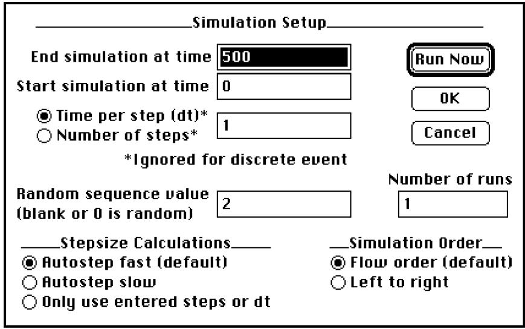  
Figure 6.9 The Extend simulation setup screen

Once the model file "GeneticMDS" has been opened, the control panel (as seen in Figure 6.4) can be opened by double-clicking on the "HybridMDS" block. Starting parameters can then be entered into the control panel. This can be done by directly typing them in. Other parameters, such as the inter-object distances or the initial solution may be better entered by copying and pasting them from a spreadsheet or other source file.

The Simulation Setup panel shown in Figure 6.9 can be brought down from the Run menu in Extend. The parameters should be entered as shown in Figure 6.9, except that the "End simulation at time" box can be changed if more or less than 500 generations are required.

The program can then be run. The "Plotter, I/O" block can be double-clicked to monitor progress of the simulation run.

# Список литературы

Davies, P.M. & Coxon, A.P.M. (Eds.) (1982). Key Texts in Multidimensional Scaling. London: Heinemann.   
Davis, L. (ed.) (1991). Handbook of Genetic Algorithms. New York: Van Nostrand Reinhold.   
Everett, J.E. & Pecotich, A. (1991). A combined loglinear/MDS model for mapping journals by citation analysis. Journal of the American Society for Information Science, 42, 405-413.   
Fienberg, S.E. (1980). The Analysis of Cross-Classified Categorical Data. 2nd ed. Cambridge, MA.: The MIT Press.   
Goldberg, D.E. (1989). Genetic Algorithms in Search, Optimization and Machine Learning. Beverly Hills: Sage.   
Kruskal, J.B. (1964). Nonmetric multidimensional scaling: A numerical method. Psychometrika, 29, 115-129.   
Kruskal, J.B. & Wish, M. (1978). Multidimensional Scaling. Beverly Hills: Sage.   
Norusis, M.J. (1990) $S P S S ^ { \mathfrak { G } }$ Base System User's Guide. Chicago: SPSS.   
Rothkopf, E.Z. (1957). A measure of stimulus similarity and errors in some paired-associate learning tasks. Journal of Experimental Psychology, 53, 94- 101.   
Schiffman, S., Reynolds, M.L. & Young, F.W. (1981). Introduction to Multidimensional Scaling. New York: Academic Press.   
Shepard, R.N. (1963) Analysis of proximities as a technique for the study of information processing in man. Human Factors, 5, 33-48.   
Wilkinson, L. Hill, M. & Vang, E. (1992) SYSTAT: Statistics. Evanston, IL: SYSTAT.   
Wright, A.H. (1991). Genetic algorithms for real parameter optimization, in Rawlins G.J.E., (Ed.) Foundations of Genetic Algorithms. San Mateo, CA: Morgan Kaufman, 205-218.

# Chapter 7 Genetic Algorithm-Based Approach for Transportation Optimization Problems

William H. K. Lam‡ and Y.F. Yin

Department of Civil and Structural Engineering. The Hong Kong Polytechnic University,   
Hung Hom, Kowloon,   
Hong Kong Special Administration Region, China

# Abstract

The motivation for using genetic algorithms (GAs) for transportation optimization problems is due to the globality, parallelism and robustness of GAs. In addition, GAs are simple and powerful in their search for improvement, and not fundamentally limited by restrictive assumption about the search space. Recent related studies using GAs have shown advantages in dealing with non-convexity, locality and complexity of transportation optimization problems, especially in optimal pavement management (Fwa et al., 1994), optimal traffic signal control (Hadi and Wallace, 1993; Memon and Bullen, 1996; Lo et al., 2000), urban transit system design problems (Pattnaik et al., 1998; Chakrobort et al., 1998), aircraft gate re-assignment problem (Gu and Chung, 1999) and origin-destination matrix estimation problem (Reddy and Chakroborty, 1999).

In this chapter, we present various applications of GAs to transportation optimization problems. In the first section, GAs are employed as solution algorithms for advanced transport models while in the second section, GAs are used as calibration tools for complex transport models. Both sections show that, similar to other fields, GAs provide an alternative powerful tool to a wide variety of problems in the transportation domain.

# 7.1 GA-Based Solution Approach for Transport Models

# 7.1.1 Introduction

In this section, we present two examples of applying GAs as solution algorithms for transportation optimization problems. It is well-known that many decisionmaking problems in transportation planing and management could be formulated as bilevel programming models (single-objective or multi-objectives) that are intrinsically non-convex and thus difficult to find the global optimum. In the first example, a genetic-algorithms-based (GAB) approach is proposed to solve the single-objective models. Compared with the previous heuristic algorithms, the GAB approach is much simpler in principle and more efficient in applications. Furthermore, it is believed that the GAB approach is more promising to achieve the global optimum based on the globality of GAs. In the second example, we extend the GAB approach to accommodate multi-objective bilevel programming models. It is shown that the GAB approach can capture a number of Pareto solutions efficiently and simultaneously, which attribute to the parallelism and globality of GAs.

# 7.1.2 GAB Approach for Single-Objective Bilevel Programming Models

In the decision-making problems for transportation system planning and management, the supplier of transportation services or the regulating agency wishes to determine optimal operation plans, rates, and controls, taking into account users" responses. Meanwhile, the user makes his or her travel choice decision in a user equilibrium (UE) manner, responding to these plans, rates and controls. These problems fit within the framework of a leader-follower or Stackelberg game, where the supplier or the regulating agency is the leader and the user is the follower (Fisk, 1984). Consequently, such a game can be expressed mathematically by a bilevel programming problem in which the upper-level problem represents the decision-making behavior of the supplier or of the regulating agency, and the lower-level problem represents the user travel choice behavior under the leader's decisions. Many of these types of decision-making problems have been formulated as bilevel programming models in the literature. Examples include road network design (LeBlanc and Boyce, 1986; Yang and Bell, 1998), balance of demand and supply of parking spaces (Lam et al., 1999), optimal ramp metering in freeway networks (Yang et al, 1994; Yang and Yagar, 1994), optimal congestion pricing (Yang and Lam, 1996), reserve capacity maximization of a signal-controlled road network (Wong and Yang, 1997) optimal speed detector density for the network with travel time information (Chan and Lam, 1998), etc.

# 7.1.2.1 Bilevel Programming Problems

In a Stackelberg game, the leader knows the followers who will respond to any decision he may make. In other words, the system manager can influence, but cannot control the travelers' travel choice behaviors. In the light of any control decision, travelers make their travel choices, specifically, route choice decisions in a user equilibrium manner. As Yang and Yagar (1994) stated, this interaction can be formulated as the following bilevel programming problem:

$$
\operatorname* { m i n } _ { \mathbf { u } } F ( \mathbf { u } , \mathbf { v } ( \mathbf { u } ) )
$$

where $\mathbf { v ( u ) }$ is implicitly defined by

$$
\operatorname* { m i n } _ { \mathbf { v } } f ( \mathbf { u } , \mathbf { v } )
$$

subject to $\mathbf { g } ( \mathbf { u } , \mathbf { v } ) \leq 0$

where $\begin{array} { r l } { F } & { { } = } \end{array}$ the objective function of the upper-level decision-maker (system manager); ${ \textbf { u } } =$ is the decision vector of the upper-level decision-maker (system manager); ${ \textbf { G } } =$ the constraint set of the upper-level decision vector; $f =$ the objective function of the lower-level decision-maker (travelers); ${ \bf \nabla } \mathbf { V } =$ the decision vector of the lower-level decision-maker (travelers); ${ \bf g } = { \bf \partial }$ the constraint set of the lower-level decision vector.

The upper-level problem of model (1) represents the decision-making behavior of the system manager. The system manager can choose many alternative system objectives $F$ Correspondingly, different control vectors $\mathbf { u }$ are determined.

It is assumed that for any given control pattern u, there is a unique equilibrium flow distribution, $\mathbf { v } ( \mathbf { u } )$ , obtained from the lower-level problem. $\mathbf { v ( u ) }$ is also referred to as the response or reaction function. It is noted that $\mathbf { v ( u ) }$ defined by the lower-level problem is, in effect, a nonlinear equity constraint of the upper-level problem; thus, whatever the objective function would be, the problem (1) is intrinsically non-convex and it might be difficult to search for a global optimum (Yang et al., 1994).

The lower-level problem of model (1) represents the user route choice behavior responding to the controls. It is assumed that the travelers make their route choices in a user equilibrium manner; the lower-level problem can be formulated as a standard user equilibrium (UE) traffic assignment problem, or as a stochastic user equilibrium (SUE) problem (Sheffi, 1985), or their variants.

A number of attempts have been made to solve the bilevel model (1), such as iterative optimization assignment algorithm by Asakura and Sasaki (1990), sensitivity analysis based (SAB) algorithm by Yang et al. (1994), a simulated annealing method by Friesz et al. (1992), etc. The sensitivity analysis-based (SAB) algorithm may be the most often cited and has been successfully applied to many problems (Yang et al, 1994; Yang and Yagar, 1994; Yang and Lam, 1996; Wong and Yang, 1997; Lam et al., 1999; etc.). The basic idea of the SAB algorithm is to formulate a local linear approximation of the upper-level objective function and the implicit, nonlinear constraints with the use of the derivative information from the sensitivity analysis of the equilibrium network flows. The resultant linear programming problem can then be solved by the well-known simplex method. One thus arrives at a new point from which a new linear programming problem is generated again. Therefore, the SAB algorithm is in fact a sequence of linear approximations to the original problem (Yang et al., 1994).

Despite the various intriguing attempts that were made in solving the bilevel programming problem, these algorithms are unfortunately either incapable of finding the global optimum or very computation intensive and impractical for problems of a realistic size (Yang and Bell, 1998). Even for the efficient SAB algorithm, the resultant converged solution might be a local optimum. Furthermore, the basic idea of sensitivity analysis for equilibrium network flows may be difficult for most practitioners. Therefore, it is still a challenging task for transportation researchers to develop a simpler efficient algorithm for the bilevel programming problems.

# 7.1.2.2 GAB Approach

The basic idea of the genetic algorithms-based (GAB) approach is to code the decision variables of the upper-level problem to finite strings and to calculate the fitness of each string by solving the lower-level problem. After the reproduction, crossover and mutation operations of GAs, the optimal string may be achieved. The GAB method is outlined as follows:

# GAB approach:

Step 0. Code the decision variable $\mathbf { u }$ of the upper-level problem to a finite string $x _ { j }$ ; determine the transform equation to map the objective function of upperlevel problem to a fitness function.

Step 1. Select at random the initial population X(1). Set $k { = } 1$ .

Step 2. Calculate the fitness functions for individuals ${ { x } _ { j } } ( k ) , k = 1 , 2 , \cdots , N$ by solving the lower-level optimization problem, for instance, user equilibrium assignment by Frank-Wolfe algorithm, and reproduce the population $\mathbf { X } ( k )$ according to the distribution of the fitness function values.

Step 3. By a random choice with probability $P _ { c }$ , carry out the crossover operation.

Step 4. By a random choice with probability $P _ { m }$ , carry out the mutation operation. Then we have a new population ${ \mathbf { X } } ( k + 1 )$ .

Step 5. If $k =$ maximum number of generations, the individual with the highest fitness is adopted as the optimal solution of the problem. Else, set $k = k + 1$ and return to Step 2.

At Step 0, the decision variable $u$ is usually mapped and represented by a string of binary alphabets. For problems with multi-variables, a sub-string represents each variable. The coding process is illustrated as below:

decision variables mapping $\begin{array} { c c c } { \mathrm { u } = \mathrm { \Delta u _ { 1 } ~ } \mid \mathrm { u } _ { 2 } } & { \mid \cdots \mid \mathrm { \Delta u _ { n } } } \\ { \downarrow } & { \downarrow } & { \downarrow } & { \downarrow } \end{array}$ chromosome (string) $\mathbf { x } = 0 1 0 1 | 0 1 1 1 | \cdots | 1 1 1 1$

The length of the sub-string can be determined by the following relationships with the desired precision of decision variables:

$$
\alpha { \ge } \log _ { 2 } \left( \frac { ( u _ { \mathrm { m a x } } - u _ { \mathrm { m i n } } ) } { \pi } + 1 \right)
$$

where $\pmb { \alpha }$ denotes the length of the sub-string; $\pi$ denotes the desired precision of the decision variables; $u _ { \mathrm { m a x } }$ and $u _ { \mathrm { m i n } }$ denote the upper and lower bound of the decision variables respectively. Another important task at Step $\boldsymbol { \theta }$ is the mapping of the upper-level objective function to the fitness form. The transformation is generally straightforward for most of the bilevel programming models. It is noteworthy that if there are other inequality constraints besides the bound constraints of the decision variables, the fitness function should be incorporated with the possible constraint violations by a penalty method.

It is obvious that the GAB approach is simple to implement. The work needed to be undertaken in the optimization process is to solve the lower-level problem by the conventional optimization techniques while the remaining works can be left to the "blackbox" of GAs. Fortunately, the lower-level problems are always easy to solve based on the fruitful works of transportation researchers.

# 7.1.2.3 Numerical Example

Wong and Yang (1997) defined and formulated the reserve capacity of a signalcontrolled road network. They measured the reserve capacity of the road network by how large a common multiplier could be applied to an existing origindestination (OD) matrix subject to the flow on each link not exceeding a prescribed degree of saturation. Since the traffic flows and link-exit capacities are dependent on the traffic signal settings in the signal-controlled road network, the key problem here is to determine the signal settings for maximization of the network reserve capacity. Their bilevel model is described as follows:

subject to

$$
\begin{array} { r l } & { \boldsymbol { \nu } _ { a } ( \mu , ? ) \leq p _ { a } C _ { a } ( ? ) \quad \forall a } \\ & { \mathbf { G } _ { \mathbf { i } } \lambda _ { i } \geq \mathbf { b _ { i } } \quad \quad \quad \forall i } \end{array}
$$

where the equilibrium flow $\nu _ { a } ( \mu , ? )$ is obtained by solving

$$
M i n i m i z e \sum _ { a } \int _ { 0 } ^ {  { \mathrm {  ~ v ~ } } _ { a } } t _ { a } ( \varpi , ? ) d \varpi
$$

subject to

$$
\begin{array} { l } { \displaystyle \sum _ { k } f _ { k } ^ { r s } = \mu q _ { r s } \qquad \forall r , s } \\ { \displaystyle f _ { k } ^ { r s } \geq 0 \qquad \forall k , r , s } \\ { \displaystyle \nu _ { a } = \sum _ { r s } \sum _ { k } f _ { k } ^ { r s } \delta _ { a k } ^ { r s } \qquad \forall a } \end{array}
$$

where $\mu \ =$ the OD matrix multiplier for the whole network; $\left| \ddot { E } = \mathrm { a } \right.$ vector of all signal split (proportions of green times); $C _ { a } { \big ( } { \big | } { \ddot { E } } { \big ) } =$ the link-exit capacity as a function of signal split $\mathbf { \Delta E } \cdot \mathbf { \nabla } ^ { p _ { a } = }$ the maximum acceptable degree of saturation for link $a$ ; matrix $\mathbf { G _ { i } }$ and vector $\mathbf { b } _ { i }$ are dependent on the specific timing specification for intersection $i$ , whether it is stagebased or groupbased (Allsop, 1989).

Wong and Yang (1997) used the following numerical example to illustrate their proposed model and SAB algorithm. Consider an example network, shown in

Figure 7.1, with seven links and six nodes, of which nodes $\mathbf { E }$ and $\mathbf { F }$ are signalcontrolled intersections. The current OD demand from node A to node $\mathbf { B }$ is 18 veh. $\mathrm { { \ m i n } ^ { - 1 } }$ and that from C to $\mathbf { D }$ is 6 veh.min-1. For the signalized intersections $\mathbf { E }$ and $\mathbf { F }$ , signal controls are represented by two independent splits $\lambda _ { \mathrm { { l } } }$ and $\lambda _ { 2 }$ respectively $( \lambda _ { 3 } = 1 - \lambda _ { 1 }$ , and $\lambda _ { 4 } = 1 - \lambda _ { 2 }$ ). The lower and upper bounds of the splits are $0 . 0 5 \leq \lambda _ { 1 } , \lambda _ { 2 } \leq 0 . 9 5$ . Assume that the maximum degree of saturation for all signal-controlled approaches takes the same value of $p \ = \ 0 . 9$ The following link travel time function is used

$$
t _ { a } ( \nu _ { a } ) = t _ { a } ^ { 0 } \left( 1 + 0 . 5 \cdot \left( \frac { \nu _ { a } } { \lambda _ { a } s _ { a } } \right) ^ { 2 } \right)
$$

where $\lambda _ { a } = 1 . 0$ for any link not connecting to a signal-controlled intersection.   
Free-flow link travel time $t _ { a } ^ { 0 }$ and link capacity $s _ { a }$ are given in Table 7.1.

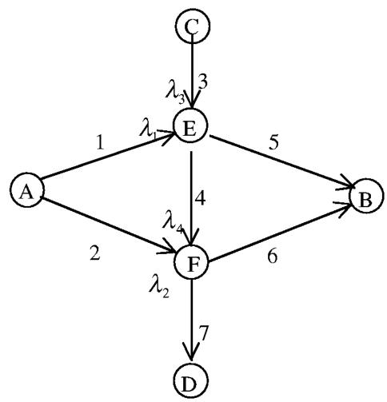  
Figure 7.1 Example network 1

Table 7.1 Input data for example network 1   

<table><tr><td rowspan=1 colspan=1>Link a</td><td rowspan=1 colspan=1>1</td><td rowspan=1 colspan=1>2</td><td rowspan=1 colspan=1>3</td><td rowspan=1 colspan=1>4</td><td rowspan=1 colspan=1>5</td><td rowspan=1 colspan=1>6</td><td rowspan=1 colspan=1>7</td></tr><tr><td rowspan=1 colspan=1>t</td><td rowspan=1 colspan=1>2.0</td><td rowspan=1 colspan=1>1.0</td><td rowspan=1 colspan=1>2.0</td><td rowspan=1 colspan=1>3.0</td><td rowspan=1 colspan=1>1.0</td><td rowspan=1 colspan=1>2.0</td><td rowspan=1 colspan=1>1.0</td></tr><tr><td rowspan=1 colspan=1>a</td><td rowspan=1 colspan=1>24</td><td rowspan=1 colspan=1>30</td><td rowspan=1 colspan=1>30</td><td rowspan=1 colspan=1>35</td><td rowspan=1 colspan=1>24</td><td rowspan=1 colspan=1>30</td><td rowspan=1 colspan=1>30</td></tr></table>

We apply the GAB algorithm to this numerical example. In the model (3), the violations of inequality constraint (3b) should be represented in the fitness function. For the present problem, we formulate two different mapping functions as follows:

$$
\begin{array} { r l } & { f _ { 1 } ( x ) = \left\{ \begin{array} { l l } { \mu } & { \nu _ { a } \left( \mu , \mathbf { \Sigma } _ { a } \right) \leq p _ { a } C _ { a } \left( \mathbf { \Sigma } _ { a } \right) } \\ { 0 } & { \nu _ { a } \left( \mu , \mathbf { \Sigma } _ { a } \right) > p _ { a } C _ { a } \left( \mathbf { \Sigma } _ { a } \right) } \end{array} \right. } \\ & { f _ { 2 } ( x ) = \left\{ \begin{array} { l l } & { \mu } & { \nu _ { a } \left( \mu , \boldsymbol { \ Z } _ { a } \right) \leq p _ { a } C _ { a } \left( \boldsymbol { \ Z } _ { a } \right) } \\ { \operatorname* { m a x } \biggr ( 0 , \mu - \operatorname* { m a x } \bigl ( x _ { a } ( \mu , \boldsymbol { \ Z } _ { a } ) - p _ { a } C _ { a } ( \boldsymbol { \ Z } _ { a } ) \bigr ) \biggr ) } & { \nu _ { a } ( \mu , \boldsymbol { \ Z } _ { a } ) > p _ { a } C _ { a } \left( \boldsymbol { \ Z } _ { a } \right) } \end{array} \right. } \end{array}
$$

The sub-string length of the OD matrix multiplier is 13 and that of $\lambda _ { \scriptscriptstyle 1 }$ and $\lambda _ { 2 }$ is 11. Thus, the precision is more than 0.001.

Following the recommendation by Goldberg (1989), the GAB algorithm is performed with the following parameters:

Population size is 50 Reproduction operator is binary tournament selection 1 Crossover operator is single-point crossover, and the probability is 0.6 1 Mutation operator is single-bit point mutation operator, and the probability is 0.0333 1 The maximum number of generations is 200

The convergence of the GAB algorithm with different fitness functions is shown in Figure 7.2. The resultant signal settings and OD demand multiplier are compared with that obtained by the SAB algorithm in Table 7.2.

The computation result of SAB listed here is a little different from that in Wong and Yang (1997). If we take their results, the flow on approach 3 in Figure 7.1 will exceed its maximum degree of saturation. We understand this difference is due to the programming precision in our C codes.

It can be seen in Figure 7.2 that the GAB algorithm with different fitness functions exhibits quite different convergence behavior. The algorithm with fitness function $f _ { 2 } ( x )$ converges more quickly. Actually, so far, we have only used the simple genetic algorithms in our numerical example in order to facilitate the presentation of the essential ideas. However, it should be noted that appropriate choices of advanced techniques and operators available in GAs would further improve the efficiency and breadth of the GAB approach.

Another observation from the current example is that both algorithms (SAB and GAB) converge to the same optimum. The upper-level objective function of model (3) takes a simple linear form, together with the nonlinear, implicit constraint. In such a case, the optimal solution will be located at the boundary of the constraint set (Yang and Bell, 1998). From the experimental computations, it is believed that the solution is the global optimum. It is also shown from the computations that there might be only one global optimum in the current example.

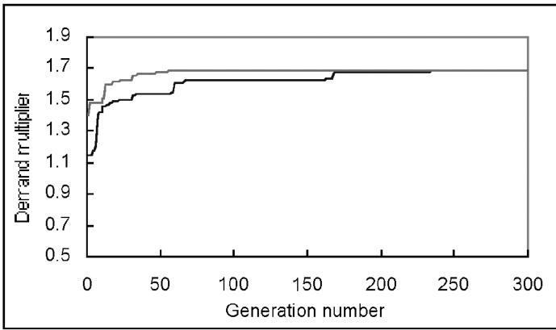  
Figure 7.2 Demand multiplier versus generation number

Table 7.2 Solutions with alternative algorithms   

<table><tr><td rowspan=2 colspan=1>Solution Algorithms</td><td rowspan=1 colspan=2>Signal Splits</td><td rowspan=1 colspan=1>Demand Multiplier</td></tr><tr><td rowspan=1 colspan=1>$λ_}$</td><td rowspan=1 colspan=1>$\_</td><td rowspan=1 colspan=1>µ</td></tr><tr><td rowspan=1 colspan=1>SAB</td><td rowspan=1 colspan=1>0.625</td><td rowspan=1 colspan=1>0.678</td><td rowspan=1 colspan=1>1.686</td></tr><tr><td rowspan=1 colspan=1>GAB</td><td rowspan=1 colspan=1>0.625</td><td rowspan=1 colspan=1>0.678</td><td rowspan=1 colspan=1>1.686</td></tr></table>

From the results of the numerical example, we can summarize some computation properties of the GAB approach as follows:

\* The GAB approach is efficient and very simple to implement. Based on the globality and parallelism of genetic algorithms, we believe that the GAB approach can lead to the global optimum   
\* In the non-uniqueness condition of global optima, the SAB and GAB algorithms may not always converge to the same point. Although the two converged points are quite different, the corresponding objective values are equal   
\* Appropriate choices of advanced techniques and operators available in GAs would further improve the efficiency of the GAB approach

\* The GAB approach requires more computation efforts than the previous sensitivity analysis-based (SAB) algorithm. In this numerical example, the convergence is achieved in four iterations by the SAB algorithm. However, the GAB approach avoids the complex computation of the sensitivity analysis for equilibrium network flows and does not need any derivative or other auxiliary knowledge; thus the GAB approach can be applied to a broader problem domains

# 7.1.3 GAB Approach for Multi-Objective Bilevel Programming Models

From the above discussion, we can observe that many decision-making problems for transportation system planning and management could be described mathematically as bilevel programming models. Furthermore, all the related models in the literature have been formulated as single-objective optimization problems. However, the decision-making problems of transportation planning and management are generally involved with multiple objectives because the supplier of transportation services, or the regulating agency, always has several aims and social concerns. Therefore, it is necessary to make some trade-offs among alternative system objectives. A weighted combination of these objectives is required, but in most cases it might not be simple enough to transform these differently measured and scaled objectives into comparable units. A better way is to apply multi-objective optimization (programming) to generate non-dominated or Pareto optimal alternatives and then multiple-criteria decision-making is used to evaluate and select the compromise solution from those non-inferior alternatives (Yang and Bell, 1998). Some recent studies using multi-objective optimization include network design (Friesz et al., 1993), air services planning (Flynn and Ratick, 1988), passenger train service planning (Chang et al., 2000).

It seems straightforward to formulate the transportation decision-making problems as multi-objective bilevel models. It can be foreseen that the multiobjective bilevel modeling approach can become a powerful, and possibly interactive, decision tool, allowing the decision-makers to learn about the problem before committing to a final decision. Unfortunately, due to their intrinsic nonconvexity and multiple objectives, such models are difficult to solve and thus their implementations are deterred in practice.

Because GAs deal with a population of points, it seems natural to use GAs for solving multi-objective optimization problems so as to capture a number of solutions simultaneously. Several GAB methods have been proposed recently (Tamaki et al., 1996). It is expected herein that the extension of the GAB approach is also capable of searching for multi-criteria optima in bilevel programming models.

# 7.1.3.1 Multi-Objective Bilevel Models

Decision-making problems for transportation system planning and management might be formulated as the following multi-objective bilevel programming problem:

$$
\operatorname* { m i n } _ { \mathbf { u } } \ \mathbf { F } ( \mathbf { u } , \mathbf { v } ( \mathbf { u } ) ) = \left\{ \begin{array} { c } { F _ { 1 } ( \mathbf { u } , \mathbf { v } ( \mathbf { u } ) ) } \\ { F _ { 2 } ( \mathbf { u } , \mathbf { v } ( \mathbf { u } ) ) } \\ { \cdots \cdots } \\ { F _ { k } ( \mathbf { u } , \mathbf { v } ( \mathbf { u } ) ) } \end{array} \right\}
$$

subject to $\mathbf { G } ( \mathbf { u } , \mathbf { v } ( \mathbf { u } ) ) \leq 0$

where $\mathbf { F ( u , v ( u ) ) } =$ the objective function vector of the upper-level decisionmaker (system manager); the other notations are the same as those in model (1).

The upper-level problem of model (7) represents the decision-making behavior of the system manager. The system manager may wish to achieve several alternative objectives within some constraints. For instance, Friesz et al. (1993) and Yang and Bell (1998) enumerate the objectives for network design problems so as to minimize the total user transport cost, total construction (improvement) costs, total vehicle miles traveled and total dwelling units taken for rights-of-way. Yang and Lam (1996) also suggest the minimization of the total network cost, maximization of total revenue and maximization of consumers' surplus as the objectives for optimal road toll problem.

The multi-objective optimization problem seeks for the optimal solutions that minimize the values of a set of objective functions within the feasible region. In the multi-objective optimization, as opposed to the single-objective optimization, there may not exist an unambiguous optimal solution due to the trade-off characteristics among the various objectives. Hence, a concept of the Pareto optimal set, a family of feasible solutions which is optimal in the sense that no improvement can be achieved in any objective without degradation in others, is introduced (Tamaki et al., 1996). Based on these non-dominated solutions, multiple-criteria decision-making would be used to evaluate and select the compromise. So far, several traditional methods such as the weighted sum method, the E -constraint method have been proposed to search the Pareto optimal solutions. However, such traditional methods cannot find the multiple Pareto optimal solutions simultaneously (Srinivas and Deb, 1995). Because the GAB method can search a number of Pareto optimal solutions in parallel, it has been highly emphasized in recent years. Tamaki et al. (1996) have given an excellent review on the GAB method for multi-objective optimization problems.

# 7.1.3.2 The Solution Procedure

In this section, we combine the GAB approach with the O-K algorithm (Osyczka and Kundu, 1995) to solve the multi-objective bilevel problem (7).

The basic idea of the O-K algorithm involves the evaluation of the fitness for each solution generated by the GAs and this fitness has a greater value if the solution is farther away from the existing Pareto set (Osyczka and Kundu, 1995).

The proposed hybrid algorithm is outlined as follow:

GA-Based Algorithm:

Step 1. Select at random the initial population $\mathbf { X } ( 1 )$ . Set $k { = } I$ .

Step 2. Decode each individual ${ x _ { j } } ( k ) , k = 1 , 2 , \cdots , N$ and then solve the lowerlevel optimization problem. Calculate the fitness value by O-K algorithm and generate the new Pareto solution set.

Step 3. Reproduce the population $\mathbf { X } ( k )$ according to the distribution of the fitness values and carry out the cross over operation by a random choice with probability $P _ { c }$ ,

Step 4. By a random choice with probability $P _ { m }$ , carry out the mutation operation. Then we have a new population $\mathbf { X } ( k + 1 )$ .

Step 5. If $k =$ maximum number of generations, the present Pareto solution set is adopted as the non-dominated solutions of the problem. Else, set $k = k + 1$ and return to Step 2.

For a detailed description of the O-K algorithm, readers may refer to Osyczka and Kundu (1995).

# 7.1.3.3 Numerical Example

In this section, we apply the proposed solution algorithm to a multi-objective bilevel programming model and present the computational results.

Yang and Lam (1996) presented a bilevel programming approach for determination of optimal road toll pattern. The low-level problem is a user equilibrium problem that describes users' route choice behavior. The upper-level problem is to determine the road tolls for minimizing the total network travel cost $( F _ { I } )$ or maximizing the total revenue $( F _ { 2 } )$ , or maximizing the ratio of the total revenue to total cost $( F _ { 3 } )$ .

The models in Yang and Lam (1996) are single-objective and we extend herein their model (the model of example 2 in Yang and Lam, 1996) to multi-objective optimization. It is noted that their third objective $( F _ { 3 } )$ is designed to consider both the congestion control and investment benefit simultaneously. Within the framework of the multi-objective optimization, we can incorporate the objective $F _ { 3 }$ into the objectives $F _ { I }$ and $F _ { 2 }$ . Therefore, a two-objective bilevel model for optimal road toll problem is formulated as below:

$$
\begin{array} { r l } { { M i n } } & { { } { \displaystyle \sum _ { a } \nu _ { a } \cdot t _ { a } ( \nu _ { a } ) } } \\ { { M a x } } & { { } { \displaystyle \sum _ { a } \nu _ { a } \cdot u _ { a } } } \end{array}
$$

subject to

$$
u _ { a } ^ { \mathrm { m i n } } \leq u _ { a } \leq u _ { a } ^ { \mathrm { m a x } } \qquad \forall a
$$

where $\nu _ { a }$ and $t _ { a } ( \nu _ { a } )$ are obtained by solving

$$
M i n \sum _ { \nu } \int _ { a } ^ { \nu _ { a } } t _ { a } ( \varpi , u _ { a } ) d \varpi
$$

subject to:

$$
\begin{array} { l l } { \displaystyle \sum _ { k } f _ { k } ^ { r s } = q _ { r s } } & { \forall r , s } \\ { \displaystyle f _ { k } ^ { r s } \geq 0 } & { \forall k , r , s } \\ { \displaystyle \nu _ { a } = \sum _ { r s } \sum _ { k } f _ { k } ^ { r s } \delta _ { a k } ^ { r s } } & { \forall a } \end{array}
$$

where $\nu _ { a } =$ the traffic volume on link $a$ : $t _ { a } =$ the travel time on link $^ { a }$ ; $u _ { a } =$ the toll charges on link $a$ ; $u _ { a } ^ { \mathrm { m i n } } =$ the lower bound of toll charges $a$ mx= the upper bound of toll charges on link $^ a$ ; $f _ { k } ^ { r s } =$ the traffic flow on route $k$ connecting OD pair $r s$ $q _ { r s } =$ the demand between OD pair $_ { r s }$ ; and $\delta _ { a k } ^ { r s } = 1$ if route $k$ uses link $^ { a }$ , and 0 otherwise.

The following input data are used in Yang and Lam (1996). Figure 7.3 shows the example network that consists of six nodes and seven links, of which all links are toll links. The following link travel time function is used

$$
t _ { a } \left( \nu _ { a } \right) = t _ { a } ^ { 0 } \left( 1 + 0 . 1 5 \cdot \left( \frac { \nu _ { a } } { s _ { a } } \right) ^ { 4 } \right)
$$

The free-flow link travel time $t _ { a } ^ { 0 }$ and link capacity $s _ { a }$ of the example network are given in Table 7.3. It is assumed that there are only two OD pairs $ 1  3 $ and $2  4$ ) and the demands are fixed to be $ { \mathbf { D } } _ { 1 3 } =  { \mathbf { D } } _ { 2 4 } = 3 0 . 0$ .The lower and upper bounds of the link tolls are set as: $0 . 0 \leq u _ { a } \leq 5 . 0$ for $a = 1 , 2$ and $0 . 0 \leq u _ { a } \leq 2 . 0$ for $\mathrm { a } = 3 , 4 , 5 , 6 , 7$ .

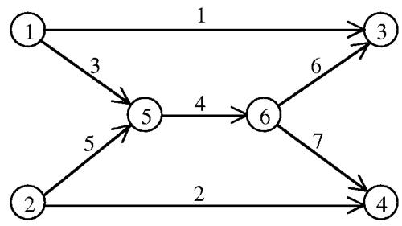

Figure 7.3 Example network 2   
Table 7.3 Input data for example network   

<table><tr><td rowspan=1 colspan=1>Link a</td><td rowspan=1 colspan=1>1</td><td rowspan=1 colspan=1>2</td><td rowspan=1 colspan=1>3</td><td rowspan=1 colspan=1>4</td><td rowspan=1 colspan=1>5</td><td rowspan=1 colspan=1>6</td><td rowspan=1 colspan=1>7</td></tr><tr><td rowspan=1 colspan=1>a$</td><td rowspan=1 colspan=1>8.0</td><td rowspan=1 colspan=1>9.0</td><td rowspan=1 colspan=1>2.0</td><td rowspan=1 colspan=1>6.0</td><td rowspan=1 colspan=1>3.0</td><td rowspan=1 colspan=1>3.0</td><td rowspan=1 colspan=1>4.0</td></tr><tr><td rowspan=1 colspan=1>a</td><td rowspan=1 colspan=1>20</td><td rowspan=1 colspan=1>20</td><td rowspan=1 colspan=1>20</td><td rowspan=1 colspan=1>40</td><td rowspan=1 colspan=1>20</td><td rowspan=1 colspan=1>25</td><td rowspan=1 colspan=1>25</td></tr></table>

Now, we apply the proposed GAB algorithm to this numerical example in which the sub-string length is determined to be 11 for all decision variables, and the precision is more than 0.005.

In addition, we take binary tournament selection as reproduction operator and single-bit point mutation operator as mutation operator. The solution algorithm described as above was coded in Borland $\mathrm { C } { + + }$ and run on a Toshiba Satellite 4030CDT notebook and the average CPU time for 50 populations and 500 generations was 25 minutes.

The resultant Pareto optimal solutions are illustrated in Figure 7.4. It can be seen that 79 Pareto optimal solutions are generated. These solutions can provide an efficient frontier to the decision-makers for consideration, so that they can choose and rank the solution in the multiple-criteria decision-making process.

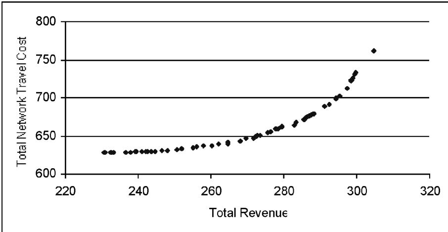  
Figure 7.4 Pareto optimal solutions

Table 7.4 gives some examples of the generated Pareto optimal solutions. It is noted that the first and second solutions in Table 7.4 are also the optimal solution of the single-objective model with objective $F _ { I }$ and $F _ { 2 }$ separately. Due to the nonconvexity of the bilevel optimization problems, there might exist multiple optimal solutions for single-objective bilevel optimization problems (Yang and Lam, 1996). However, most of the optimal solutions will be dominated by the Pareto optimal solutions in the multi-objective optimization. For instance, it is illustrated in Table 7.4 that the optimal solution of the single-objective $( F _ { I } )$ optimization problem reported by Yang and Lam (1996) is not the Pareto optimal solution of the multi-objective problem presented here.

It can be found that the proposed GAB algorithm is efficient to search simultaneously the Pareto optimal solutions of the multi-objective bilevel models. Furthermore, the algorithm is also simple in principle for transportation practitioners.

Table 7.4 Pareto optimal solutions   

<table><tr><td rowspan=1 colspan=1>ParetoOptimalSolutions</td><td rowspan=1 colspan=1>1</td><td rowspan=1 colspan=1>2</td><td rowspan=1 colspan=1>3</td><td rowspan=1 colspan=1>4</td><td rowspan=1 colspan=1>5</td><td rowspan=1 colspan=1>6</td><td rowspan=1 colspan=1>7</td><td rowspan=1 colspan=1>ga</td></tr><tr><td rowspan=1 colspan=1>TollPattern</td><td rowspan=1 colspan=1></td><td rowspan=1 colspan=1></td><td rowspan=1 colspan=1></td><td rowspan=1 colspan=1></td><td rowspan=1 colspan=1></td><td rowspan=1 colspan=1></td><td rowspan=1 colspan=1></td><td rowspan=1 colspan=1></td></tr><tr><td rowspan=1 colspan=1>Link 1</td><td rowspan=1 colspan=1>4.95</td><td rowspan=1 colspan=1>5.00</td><td rowspan=1 colspan=1>4.95</td><td rowspan=1 colspan=1>4.96</td><td rowspan=1 colspan=1>4.95</td><td rowspan=1 colspan=1>5.00</td><td rowspan=1 colspan=1>4.99</td><td rowspan=1 colspan=1>3.82</td></tr><tr><td rowspan=1 colspan=1>2</td><td rowspan=1 colspan=1>4.94</td><td rowspan=1 colspan=1>5.00</td><td rowspan=1 colspan=1>4.99</td><td rowspan=1 colspan=1>4.96</td><td rowspan=1 colspan=1>4.99</td><td rowspan=1 colspan=1>4.94</td><td rowspan=1 colspan=1>4.93</td><td rowspan=1 colspan=1>4.27</td></tr><tr><td rowspan=1 colspan=1>3</td><td rowspan=1 colspan=1>1.82</td><td rowspan=1 colspan=1>1.89</td><td rowspan=1 colspan=1>0.96</td><td rowspan=1 colspan=1>1.82</td><td rowspan=1 colspan=1>1.95</td><td rowspan=1 colspan=1>1.96</td><td rowspan=1 colspan=1>1.94</td><td rowspan=1 colspan=1>0.47</td></tr><tr><td rowspan=1 colspan=1>4</td><td rowspan=1 colspan=1>0.68</td><td rowspan=1 colspan=1>1.96</td><td rowspan=1 colspan=1>0.53</td><td rowspan=1 colspan=1>1.30</td><td rowspan=1 colspan=1>1.38</td><td rowspan=1 colspan=1>1.39</td><td rowspan=1 colspan=1>1.44</td><td rowspan=1 colspan=1>0.48</td></tr><tr><td rowspan=1 colspan=1>5</td><td rowspan=1 colspan=1>0.35</td><td rowspan=1 colspan=1>1.96</td><td rowspan=1 colspan=1>0.94</td><td rowspan=1 colspan=1>0.61</td><td rowspan=1 colspan=1>1.63</td><td rowspan=1 colspan=1>1.85</td><td rowspan=1 colspan=1>1.99</td><td rowspan=1 colspan=1>0.29</td></tr><tr><td rowspan=1 colspan=1>6</td><td rowspan=1 colspan=1>0.10</td><td rowspan=1 colspan=1>1.94</td><td rowspan=1 colspan=1>1.76</td><td rowspan=1 colspan=1>0.61</td><td rowspan=1 colspan=1>1.03</td><td rowspan=1 colspan=1>1.95</td><td rowspan=1 colspan=1>1.93</td><td rowspan=1 colspan=1>0.47</td></tr><tr><td rowspan=1 colspan=1>7</td><td rowspan=1 colspan=1>0.74</td><td rowspan=1 colspan=1>1.98</td><td rowspan=1 colspan=1>1.38</td><td rowspan=1 colspan=1>1.72</td><td rowspan=1 colspan=1>1.29</td><td rowspan=1 colspan=1>1.50</td><td rowspan=1 colspan=1>1.72</td><td rowspan=1 colspan=1>0.29</td></tr><tr><td rowspan=1 colspan=1>TotalNetworkCost</td><td rowspan=1 colspan=1>628.6</td><td rowspan=1 colspan=1>762.2</td><td rowspan=1 colspan=1>641.4</td><td rowspan=1 colspan=1>662.6</td><td rowspan=1 colspan=1>688.8</td><td rowspan=1 colspan=1>722.7</td><td rowspan=1 colspan=1>733.9</td><td rowspan=1 colspan=1>628.6</td></tr><tr><td rowspan=1 colspan=1>TotalRevenue</td><td rowspan=1 colspan=1>232.5</td><td rowspan=1 colspan=1>304.7</td><td rowspan=1 colspan=1>264.7</td><td rowspan=1 colspan=1>279.6</td><td rowspan=1 colspan=1>291.1</td><td rowspan=1 colspan=1>298.5</td><td rowspan=1 colspan=1>299.8</td><td rowspan=1 colspan=1>176.7</td></tr></table>

a The solution is reported by Yang and Lam (1996) and is a optimal solution of singleobjective model with objective $F _ { I }$ ; But it is dominated by the solution 1 and hence is not a Pareto optimal solution.

# 7.1.4 Summary

This section has proposed a GAB approach for solving the single-objective and multi-objective bilevel programming problems in transportation. The proposed solution approach is illustrated, using two numerical examples from the previous related studies.

For the single-objective bilevel programming models, it is found that the proposed GAB approach is efficient and much simpler than the previous related algorithms. Furthermore, based on the global perspective and implicit parallelism, it is believed that the proposed GAB approach can lead to the global optimum.

For the multi-objective bilevel programming models, it is found that the proposed algorithm is efficient to search simultaneously the Pareto optimal solutions, which also can attribute to the global perspective and implicit parallelism of GAs. The multi-objective bilevel modeling approach will provide a powerful, and possibly interactive, decision tool, allowing the decision-makers to learn about the problem before committing to a final decision.

# 7.2 GAB Calibration Approach for Transport Models

# 7.2.1 Introduction

The genetic algorithms (GAs) approach can provide a new alternative for calibration of transport models. GAs are advantageous because of their capability for optimized stochastic search (Goldberg, 1989). They have been widely used for the optimization of complex systems. For instance, the GAs technique has been used by Wong et al. (1998) for calibrating a land-use model (i.e.; Lowry model). In this section, a calibration algorithm based on GAs is presented for the calibration of the Traffic Flow Simulator (TFS) proposed by Lam and $\mathbf { X } \mathbf { u }$ (1999).

This section is structured as follows. Following the review of TFS, the measures that can be used for the TFS calibration are presented and discussed. Then the GAB calibration approach is described. A case study is employed for examination of the proposed calibration measures. Finally, a summary is given, together with recommendations for further study. Definitions of key variables that are employed in the remainder of the section are given in the Appendix.

# 7.2.2 Review of TFS

The TFS was proposed by Lam and Xu (1999) for the assessment of network travel time reliability (Iida, 1999) based on the partial traffic counts and a prior OD matrix. It can be formulated as

$$
- \sum _ { r s } q _ { r s } S _ { r s } [ c ^ { r s } ( \nu ) ] + \sum _ { a } \nu _ { a } t _ { a } ( \nu _ { a } ) - \sum _ { a } \int _ { 0 } ^ { \nu _ { a } } t _ { a } ( w ) d w + \lambda \sum _ { r s } \bigl ( q _ { r s } - \hat { q } _ { r s } \bigr ) ^ { 2 }
$$

subject to $\sum _ { r s } q _ { r s } p _ { e } ^ { r s } = \tilde { \nu } _ { e }$ , for links without detectors

$$
\widetilde { \mathbf { v } } _ { \mathrm { e } } = \overline { { \mathbf { v } } } _ { \mathrm { e } } + \mathbf { B } _ { 2 1 } \mathbf { B } _ { 1 1 } ^ { - 1 } \Big ( \hat { \mathbf { v } } _ { \mathrm { d } } - \overline { { \mathbf { v } } } _ { \mathrm { d } } \Big )
$$

In TFS, it is assumed that link flows are multivariate, normally distributed random variables (Daganzo, 1979). Link flows can be denoted as $\mathbf { v } \sim M V N ( \overline { { \mathbf { v } } } , \mathbf { B } )$ , where $\overline { { \mathbf { v } } }$ is the vector for the mean value of link flows and $\mathbf { B }$ is the variance/covariance matrix of link flow.

As partial traffic counts can be collected by detectors installed on some links, the link flows and variance/covariance matrix can be partitioned according to whether the links are installed with detectors or not. The order of the links can be rearranged so that the links with detectors appear first. If there are $_ m$ out of totally $n$ links installed with detectors, the link flow and mean link flow vector can be decomposed as shown below.

$$
\begin{array} { c c c c c c c } { \mathbf { v } = \left[ \nu _ { \mathrm { 1 } } } & { \cdots } & { \nu _ { m } } & { \vdots } & { \nu _ { m + 1 } } & { \cdots } & { \nu _ { n } \right] ^ { T } = \left[ \mathbf { v _ { d } } } & { \mathbf { v _ { e } } \right] ^ { T } } & \\ { \overline { { \mathbf { v } } } = \left[ \overline { { \nu } } _ { \mathrm { 1 } } } & { \cdots } & { \overline { { \nu } } _ { m } } & { \vdots } & { \overline { { \nu } } _ { m + 1 } } & { \cdots } & { \overline { { \nu } } _ { n } \right] ^ { T } = \left[ \overline { { \mathbf { v } } } _ { \mathbf { d } } } & { \overline { { \mathbf { v } } } _ { \mathbf { e } } \right] ^ { T } } & \end{array}
$$

Similarly, the link flow variance/covariance matrix $\mathbf { B }$ can also be decomposed as follows:

$$
\mathbf { B } = { \left[ \begin{array} { l l l l } { b _ { 1 , 1 } } & { \cdots } & { b _ { 1 , m } } \\ { \cdots } & { \cdots } & { \cdots } \\ { b _ { m , 1 } } & { \cdots } & { b _ { m , m } } \\ { \qquad \cdots } & { \cdots } & { b _ { m + 1 , m } } \\ { b _ { m + 1 , 1 } } & { \cdots } & { b _ { m + 1 , m } } \\ { \cdots } & { \cdots } & { \cdots } \\ { b _ { n , 1 } } & { \cdots } & { b _ { n , m } } \end{array} \right] } { \left[ \begin{array} { l l l } { b _ { 1 , m + 1 } } & { \cdots } & { b _ { 1 , n } } \\ { \cdots } & { \cdots } & { \cdots } \\ { b _ { m , m + 1 } } & { \cdots } & { b _ { m , n } } \\ { b _ { m + 1 , m + 1 } } & { \cdots } & { b _ { m + 1 , n } } \\ { \cdots } & { \cdots } & { b _ { m + 1 , n } } \\ { \cdots } & { \cdots } & { \cdots } \\ { b _ { n , m + 1 } } & { \cdots } & { b _ { n , n } } \end{array} \right] }  = { \left[ \begin{array} { l l } { \mathbf { B } _ { 1 1 } } & { \mathbf { B } _ { 1 2 } } \\ { \mathbf { B } _ { 2 1 } } & { \mathbf { B } _ { 2 2 } } \\ { \mathbf { B } _ { 2 2 } } & { \cdots } \end{array} \right] }
$$

From the probit-based stochastic user equilibrium assignment (Bolduc, 1999), the mean value of link flow $\overline { { \mathbf { v } } }$ and their covariance matrix $\mathbf { B }$ can be obtained. On the other hand, the actual link flow $\hat { \mathbf { v } } _ { \mathbf { d } }$ will be available for the links with detectors. However, a difference between $\hat { \mathbf { v } } _ { \mathbf { d } }$ and $\overline { { \mathbf { v } } } _ { \mathbf { d } }$ may exist due to various reasons such as inaccurate estimation of the OD matrix. The mean and variance of link flows on those links without detectors can be updated on the basis of the actual link flows obtained by the detectors. The mean value of link flow $\tilde { \mathbf { v } } _ { \mathbf { e } }$ can then be estimated from Equation (14).

In the proposed TFS, the perceived travel time on the kth path connecting OD pair $N \big ( c _ { k } ^ { r s } , \omega c _ { k } ^ { r s } \big )$ , where $c _ { k } ^ { r s }$ is the actual path travel time, $\omega$ is the perception error coefficient and will be calibrated in this section. The perception error coefficient is assumed to be known for application of the TFS. Note that different values taken by $\omega$ will result in different route choice patterns of drivers. The larger the parameter $\omega$ , the more diversified the route choice pattern (Bell and Iida, 1997).

On the other hand, the OD flows are not constant in real life due to stochastic variation in travel demand over time and/or the inconsistency of travel time with the time traffic counts obtained. It is assumed in the TFS that all the OD flows follow a normal distribution as below:

$$
Q _ { r s } \sim N ( q _ { r s } , \beta q _ { r s } )
$$

where $\beta$ is the OD variation coefficient. Such OD fluctuation has also been considered in the road network reliability analysis by Asakura and Kashiwadani (1991).

Apart from assessing the travel time reliability, the TFS can also provide the estimated link flows for the whole network, link/path travel times, together with their variances and covariances. In addition, the prior OD matrix can be updated simultaneously. In order to apply the TFS model in practice, the perception error coefficient $\omega$ and the OD variation coefficient $\beta$ have to be calibrated in advance.

# 7.2.3 Calibration Measures

The selection of suitable measures for the model calibration plays an important role in the whole calibration process. The suitable measures vary from one problem to the next due to the different characteristics of the problem under study. For the calibration of a single parameter, the best measure(s) should be a monotonic function of the parameter that is to be calibrated so as to guarantee that the parameter and the value of the chosen measure have a one-to-one mapping. Otherwise, two or more different parameter values may lead to the same result of the chosen measure. Hence, the value of a parameter cannot be determined uniquely if the selected measure is not sufficient for the calibration.

A combined trip distribution and assignment (CDA) model for networks with multi-user classes was calibrated by Lam and Huang (1992). It was shown that three quantities, the mean trip cost or the OD trip entropy or the integral network cost, could be used individually for the model calibration. And the OD trip entropy was found to be the best measure for the CDA model. The best measure that can be used for calibration of the TFS will be determined through a study on the characteristics of the following five measures.

The first measure is the integral network cost defined as:

$$
c _ { n } = \sum _ { a } \int _ { 0 } ^ { \nu _ { a } } t _ { a } ( x ) d x
$$

In fact, this is the objective function for the deterministic user equilibrium (DUE) model and is equivalent to the third item in the objective function (10) of TFS. It is noted that the integral network cost is a decreasing function with respect to the parameter to be calibrated for the CDA model as reported by Lam and Huang (1992). However, there is no evidence or rigorous theoretical proof that $c _ { n }$ is a monotonic function of the perception error coefficient $\omega$ .

The second measure is the total trip cost of a network as shown below:

$$
c _ { t } = \sum _ { a } \nu _ { a } t \big ( \nu _ { a } \big )
$$

It is the second item in the objective function (10) of TFS and is often used as the objective function for the traffic system optimization (SO) problem. It was found by Lam and Huang (1992) that the total trip cost will decrease when the dispersion parameter $\alpha$ of the CDA model increases. The increase of the dispersion parameter $\alpha$ in the logit-based CDA model is equivalent to 'reduction of perception error' that can be modeled by a decrease of the perception error coefficient $\omega$ in probit-based models (Sheffi, 1985). However, Maher and Hughes (1996) reported that in their probit model the reduction of the link-based dispersion coefficient does not always lead to a reduction in the total trip cost. In their example, the total trip cost increased while the dispersion coefficient decreased from 0.1 to 0. As defined before, $\omega$ is a path-based perception error coefficient and is not the same as the link-based dispersion coefficient that employed by Maher and Hughes (1996). As the total trip cost may not be a monotonic function of $\omega$ in the probit-based model, tests should therefore be carried out to determine whether the total trip cost can be used as a suitable measure for the TFS calibration.

Entropy is the best measure suggested for calibration of the CDA model (Lam and Huang, 1992). Under user equilibrium (UE) conditions, no driver can find an alternative path with less travel time than the path he has chosen. Intuitively, the whole system is extremely stable under UE conditions and entropy should be minimized. Due to the perception error in the stochastic user equilibrium (SUE) condition, some drivers do not choose the shortest path and the system status varies from a stable one to some stochastic cases. If the perception error coefficient approaches infinity, the status of the system is totally unstable. This may correspond to a maximum entropy. It is expected that the entropy is a monotonic function with respect to the perception error coefficient. There are two types of entropy to be tested in this section, the link choice entropy and the path choice entropy.

The link choice entropy, which is the third measure, can be simply defined as

$$
h _ { \scriptscriptstyle { l } } = - \sum _ { a } \nu _ { a } \ln \nu _ { \scriptscriptstyle { a } }
$$

The path choice entropy can be calculated based on the path flow information. However, such information is unavailable in the TFS, as the TFS is basically aimed to obtain/store the link flow information. Akamatsu (1997) proposed a decomposition formula as shown below to calculate the path choice entropy based on the link flow information. The path choice entropy, which is the fourth measure, is decomposed from the most likely link flow patterns over the network as follows:

$$
h _ { p } = - \sum _ { a } \nu _ { a } \ln \nu _ { a } + \sum _ { j } \Biggl ( \sum _ { i } \nu _ { i j } \Biggr ) \ln \Biggl ( \sum _ { i } \nu _ { i j } \Biggr )
$$

where $\nu _ { i j }$ $i$ to node $j$ and $\sum _ { i } \nu _ { i j }$ is the total flows entering node $j$ .

The above four measures are based on the mean values of link flows that are mainly affected by the perception error coefficient $\omega$ . On the other hand, the OD variation coefficient $\beta$ will affect the variations of link flows but with little impact on the mean values of link flows due to the normal distribution given by Equation (18). Therefore the measures for calibrating $\beta$ should be related to the variation of link flows. The network coefficient of variation (NCV), which was used by Asakura and Kashiwadani (1991) for calibration of link flow pattern, is considered as a measure for calibration of $\beta$ in this section.

In the TFS, the traffic flow on link $^ { a }$ follows a normal distribution of $N \left( \nu _ { { } _ { a } } , \sigma _ { { } _ { a } } ^ { 2 } \right)$ . Then the NCV, which is the fifth measure, can be defined as

$$
N C V = { \sqrt { \sum _ { a } \sigma _ { a } ^ { 2 } \left/ \sum _ { a } \nu _ { a } \right. } }
$$

The NCV provides an indication of link flow variation throughout the whole network.

The five measures proposed in this section will be examined, with an example used to investigate the best measures that can be applied for calibration of the TFS. It is easy to calibrate a single parameter of TFS, $\omega$ or $\beta$ , by choosing a suitable measure and using a one-dimension search technique. However, the TFS calibration is a complicated problem since two parameters have to be calibrated simultaneously. It may be difficult to find a suitable measure that is monotonic with respect to both of the parameters. Therefore, we have to choose measures that are suitable for the two parameters separately. The least squares formula can be used to integrate these measures to calibrate $\omega$ and $\beta$ simultaneously. Under such circumstances, the traditional one-dimension search technique can not be applied directely as it is difficult to find search directions for the two parameters respectively based on the least squares values. Therefore, a stochastic search technique is considered and a GAB approach is adopted for the calibration of TFS in this section.

# 7.2.4 GAB Calibration Procedure

The first step of GAs is to code the perception error coefficient $\omega$ and the OD variation coefficient $\beta$ as a binary finite-length string. Each coded string is called a chromosome and consists of a list of genes. In the binary coding employed in this section, each gene can either be 0 or 1. Each chromosome can be decoded and mapped to a certain value of $\omega$ and $\beta$ . If the feasible solution of $\omega$ is assumed to fall in the range of $\left[ \omega _ { \mathrm { m i n } } , \omega _ { \mathrm { m a x } } \right]$ , the length of the chromosome for coding of $\omega$ is $^ b$ , then the value of $\omega$ corresponding to a string of 1011 (the decimal integer is 11) can be decoded as

$$
\omega = \omega _ { \mathrm { m i n } } + \frac { 1 1 } { 2 ^ { b } } \big ( \omega _ { \mathrm { m a x } } - \omega _ { \mathrm { m i n } } \big )
$$

The length of the chromosome will influence the accuracy of the solution as well as the convergence of the algorithm. A decoding equation similar to Equation (24) can be applied for decoding $\beta$ accordingly. In the TFS calibration, the same length $^ b$ is adopted for coding both $\omega$ and $\beta$ .

In the operation of the GAs, each chromosome in the parent generation is evaluated to obtain their fitness with respect to an objective function. With the fitness values of all the chromosomes in the parent generation, three operators (reproduction, crossover and mutation) are used to generate new chromosomes, which will then produce the child generation. Considering that the objective of the TFS calibration is to select $\omega$ and $\beta$ that can best fit the OD matrix and the actual link counts together with their variations, the fitness can be defined as below.

$$
f ( \omega , \beta ) = u - \big ( M ( \omega , \beta ) - \hat { M } \big ) ^ { 2 }
$$

In Equation (25), $M ( \omega , \beta )$ is the value of the selected measure corresponding to $\omega$ and $\beta . \ \hat { M }$ is the value of the selected measure corresponding to the actual information or may be referred to as the target value of the selected measure, and $u$ is a constant to ensure that the fitness is always positive. The values of $\omega$ and $\beta$ corresponding to the maximum fitness value $f ( \omega , \beta )$ are the optimum calibrated parameters.

Reproduction is an operation process through which chromosomes are copied into the mating pool with a probability proportional to their fitness. A hybrid model based on the combination of tournament selection and an elitist model is adopted in this section. In the parent generation, two chromosomes will be selected randomly. The one with the higher fitness will be copied into the mating pool. The reproduction process will be carried out repeatedly until the number of chromosomes in the mating pool reaches the predetermined population size z. If the chromosome in the parent generation with the highest fitness is not reproduced, then it will be copied into the mating pool.

The crossover operator provides search capability in the GAs. The uniform crossover operator is adopted in this section. Two chromosomes in the mating pool will be randomly selected. A binary crossover mask with the same length as that of the chromosomes in the mating pool will be randomly generated according to a predetermined crossover probability $P _ { c }$ . Then the genes of the crossover mask will be scanned one by one. If a gene in the crossover mask is "1," the corresponding genes for the selected pair of chromosomes are exchanged; otherwise, they remain unchanged.

After the reproduction and crossover processes, the strings or the parameters in the child generation are improved. But these two processes may not lead to reliable results, since the optimal solution may be trapped into a local optimum. Mutation is a process used to overcome the above problem by the possibility of jumping out from a local optimum. The mutation process is done at the level of genes on the chromosomes obtained after the crossover. Each gene of a selected chromosome is allowed to mutate to the other possible value (i.e., in binary coding, if the gene is 0, it will change to 1) with a certain probability known as the mutation probability $P _ { m }$ .

# 7.2.5 Calibration of TFS

With the integration of GAs approach with TFS, the proposed calibration procedure can be described in the following steps.

Step 1. Initialize. Set generation count $g = 1$ , population count $n = 1$   
Step 2. Generate the initial population of chromosomes   
Step 3. Decode the $n ^ { \mathrm { t h } }$ chromosome to get the perception error coefficient $\omega$ and the OD variation coefficient $\beta$   
Step 4. Running TFS with $\omega$ and $\beta$   
Step 5. Calculate the fitness of the present chromosome   
Step 6. If $n$ equals the population size $z ,$ ,go to Step 7; otherwise, $n = n + 1$ , return to Step 3   
Step 7. If $g$ equals the predetermined maximum generation, go to Step 8; otherwise, generate the $g + I ^ { \mathrm { t h } }$ generation by reproduction, crossover and mutation operators, set $g = g + 1$ and $n = 1$ , then return to Step 3   
Step 8. Find the chromosome with the highest fitness value, the decoded parameter is the result of the calibration

The above calibration algorithm is illustrated in Figure 7.5 and will be tested using an example network in the next section.

# 7.2.6 Case Study

The Tuen Mun corridor network in Hong Kong is used in this section for examining the effectiveness of the proposed GAB calibration algorithm. As shown in Figure 7.6, the network consists of ten links and four nodes, in which three nodes are connected to the three zone centroids. The Bureau of Public Road (BPR) function is adopted as the link travel time function:

$$
t _ { { } _ { a } } ( \nu _ { { } _ { a } } ) = t _ { { } _ { a } } ^ { 0 } + k { \left( \frac { \nu _ { { } _ { a } } } { s _ { { } _ { a } } } \right) } ^ { p }
$$

The OD matrix is shown in Table 7.5. The relevant link data and the observed traffic flows are given in Table 7.6. Note that the observed link flows are obtained by the TFS with the perception error coefficient $\omega = 0 . 3$ and the OD variation coefficient $\beta = 0 . 5$ .

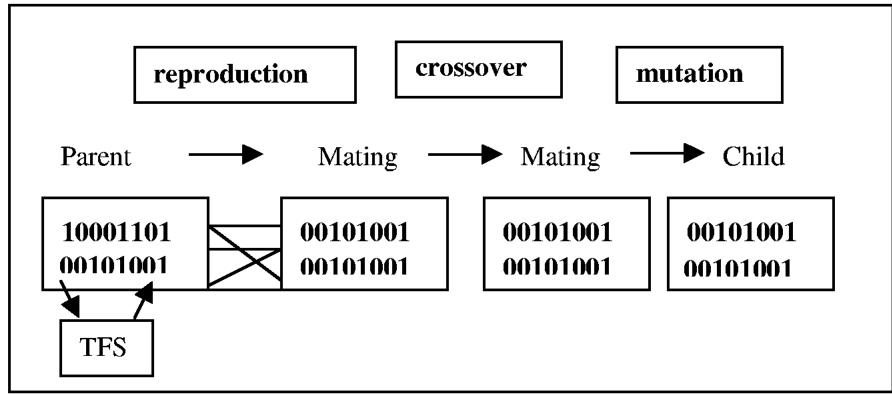  
Figure 7.5 Flowchart of GAB calibration algorithm

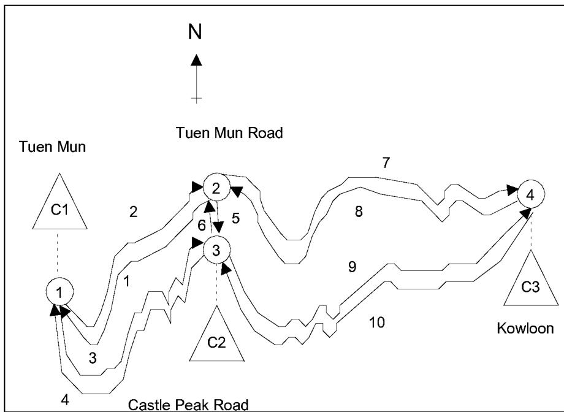

Figure 7.6 Tuen Mun corridor network Table 7.5 OD matrix (passenger car units per hour)   

<table><tr><td>To</td><td>C1</td><td>C2</td><td>C3</td></tr><tr><td>From</td><td></td><td></td><td>4952</td></tr><tr><td>C1 C2</td><td>- 313</td><td>220</td><td>127</td></tr><tr><td>C3</td><td></td><td>-</td><td></td></tr><tr><td></td><td>4492</td><td>78</td><td>-</td></tr></table>

Table 7.6 The link data of the network   

<table><tr><td colspan="1" rowspan="2">LinkNo.</td><td colspan="1" rowspan="2">a (0)(hrs)</td><td colspan="1" rowspan="2">(pcu/hr)</td><td colspan="2" rowspan="1">Parameters</td><td colspan="1" rowspan="2">Observed linkflow (pcu/hr)</td></tr><tr><td colspan="1" rowspan="1">p</td><td colspan="1" rowspan="1">k</td></tr><tr><td colspan="1" rowspan="1">1</td><td colspan="1" rowspan="1">0.0900</td><td colspan="1" rowspan="1">5175</td><td colspan="1" rowspan="1">3.5</td><td colspan="1" rowspan="1">0.1050</td><td colspan="1" rowspan="1">3360</td></tr><tr><td colspan="1" rowspan="1">2</td><td colspan="1" rowspan="1">0.0900</td><td colspan="1" rowspan="1">5175</td><td colspan="1" rowspan="1">3.5</td><td colspan="1" rowspan="1">0.1050</td><td colspan="1" rowspan="1">3687</td></tr><tr><td colspan="1" rowspan="1">3</td><td colspan="1" rowspan="1">0.1106</td><td colspan="1" rowspan="1">850</td><td colspan="1" rowspan="1">3.6</td><td colspan="1" rowspan="1">0.1408</td><td colspan="1" rowspan="1">1491</td></tr><tr><td colspan="1" rowspan="1">4</td><td colspan="1" rowspan="1">0.1106</td><td colspan="1" rowspan="1">850</td><td colspan="1" rowspan="1">3.6</td><td colspan="1" rowspan="1">0.1408</td><td colspan="1" rowspan="1">1451</td></tr><tr><td colspan="1" rowspan="1">5</td><td colspan="1" rowspan="1">0.0056</td><td colspan="1" rowspan="1">1150</td><td colspan="1" rowspan="1">3.6</td><td colspan="1" rowspan="1">0.0071</td><td colspan="1" rowspan="1">1476</td></tr><tr><td colspan="1" rowspan="1">6</td><td colspan="1" rowspan="1">0.0056</td><td colspan="1" rowspan="1">1150</td><td colspan="1" rowspan="1">3.6</td><td colspan="1" rowspan="1">0.0071</td><td colspan="1" rowspan="1">1569</td></tr><tr><td colspan="1" rowspan="1">7</td><td colspan="1" rowspan="1">0.0335</td><td colspan="1" rowspan="1">4800</td><td colspan="1" rowspan="1">3.6</td><td colspan="1" rowspan="1">0.0335</td><td colspan="1" rowspan="1">3743</td></tr><tr><td colspan="1" rowspan="1">8</td><td colspan="1" rowspan="1">0.0335</td><td colspan="1" rowspan="1">4800</td><td colspan="1" rowspan="1">3.6</td><td colspan="1" rowspan="1">0.0335</td><td colspan="1" rowspan="1">3323</td></tr><tr><td colspan="1" rowspan="1">9</td><td colspan="1" rowspan="1">0.0767</td><td colspan="1" rowspan="1">1000</td><td colspan="1" rowspan="1">3.6</td><td colspan="1" rowspan="1">0.1073</td><td colspan="1" rowspan="1">1368</td></tr><tr><td colspan="1" rowspan="1">10</td><td colspan="1" rowspan="1">0.0767</td><td colspan="1" rowspan="1">1000</td><td colspan="1" rowspan="1">3.6</td><td colspan="1" rowspan="1">0.1073</td><td colspan="1" rowspan="1">1279</td></tr></table>

# 7.2.6.1 Path Choice Entropy and NCV: the Best Measures for Calibration

The proposed calibration measures are tested with this example. Figure 7.7 shows the integral network cost with different $\omega$ in the example network. The integral network cost tends to increase with increasing $\omega$ when $\beta$ remains unchanged; thus, it can be used as an alternative measure.

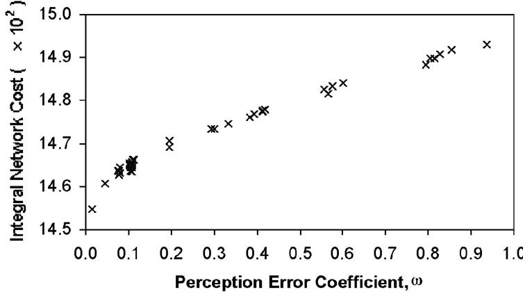  
Figure 7.7 Integral network cost vs. perception error coefficient

The total trip cost of the example network with various $\omega$ is plotted in Figure 7.8. It is obvious that the total trip cost is not a monotonic function of $\omega$ . When $\omega$ increases from 0 to 0.3, the total trip cost decreases, which leads to the same result reported by Maher and Hughes (1996). But the total trip cost turns to increase when the value of $\omega$ increases from 0.3 to 1.0. As a result, two different $\omega$ may have the same total trip cost. Therefore the total trip cost should not be used for the TFS calibration as it is preferred to have a monotonic relationship between the measure and the parameter.

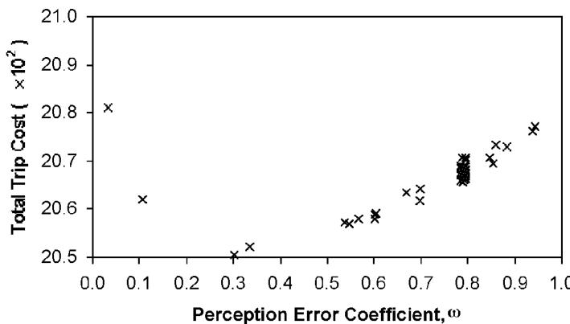  
Figure 7.8 Total trip cost vs. perception error coefficient

Both the link choice and path choice entropy have been tested. The results are presented in Figure 7.9 and 7.10 respectively. It can be seen that both entropy indices show monotonic tendency with respect to the perception error coefficient $\omega$ . And the curve of the path choice entropy seems to be more stable than that of the link choice entropy.

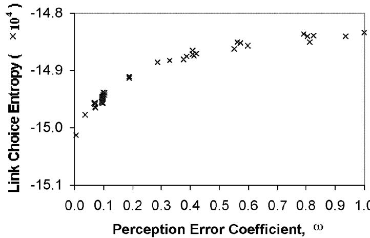  
Figure 7.9 Link choice entropy vs. perception error coefficient

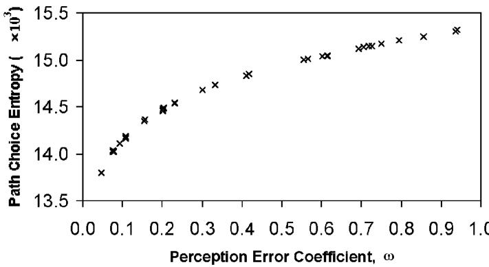  
Figure 7.10 Path choice entropy vs. perception error coefficient

The NCV values corresponding to different values of $\beta$ are plotted in Figure 7.11. It is clear that the NCV is a monotonic function with respect to $\beta$ , and therefore is suitable for the calibration of $\beta$ in the TFS.

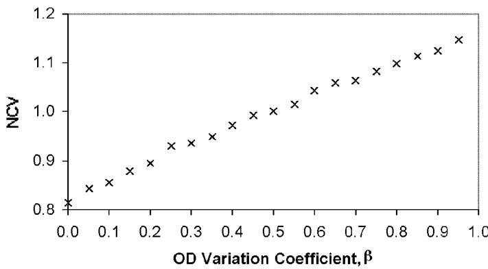  
Figure 7.11 NCV vs. OD variation coefficient

Based on the above results, it can be found that the path choice entropy and NCV are the best measures for the calibration of TFS in the example network, provided that all the link flow information is available. However, it may be difficult and expensive to collect the complete traffic flow data. In practice, partial flow information is usually available. In view of this, the combination of integral network cost and NCV would be the better alternative if the objective path choice entropy cannot be obtained, particularly when the complete link flow information is not available.

# 7.2.6.2 Calibration Results

The discussion on the calibration measures in the previous section is based on the assumption that one parameter changes while the other one remains unchanged. However, in the TFS calibration, two parameters $\omega$ and $\beta$ will be calibrated simultaneously.

By integration of the path choice entropy and NCV as the calibration measures, the fitness function (25) can be written as

$$
f = u - \eta _ { 1 } \Bigg ( \frac { h _ { p } ( \omega , \beta ) - \hat { h } _ { p } } { \hat { h } _ { p } } \Bigg ) ^ { 2 } - \eta _ { 2 } \Bigg ( \frac { N C V ( \omega , \beta ) - N C V _ { o } } { N C V _ { o } } \Bigg ) ^ { 2 } - \eta _ { 3 } \sum _ { r s } \Bigg ( \frac { q _ { r s } - \hat { q } _ { r s } } { \hat { q } _ { r s } } \Bigg ) ^ { 2 }
$$

where $\eta _ { 1 } , ~ \eta _ { 2 }$ and $\eta _ { 3 }$ are the coefficients to scale the corresponding least squares terms within the range of $[ 0 , 1 ]$ . These three coefficients can be determined by the following equations.

$$
\eta _ { \mathrm { l } } = \left( \frac { h _ { p } ^ { \operatorname* { m i n } } } { h _ { p } ^ { \operatorname* { m a x } } - h _ { p } ^ { \operatorname* { m i n } } } \right) ^ { 2 } , \eta _ { \mathrm { 2 } } = \left( \frac { N C V ^ { \operatorname* { m i n } } } { N C V ^ { \operatorname* { m a x } } - N C V ^ { \operatorname* { m i n } } } \right) ^ { 2 } \mathrm { a n d } \ \eta _ { \mathrm { 3 } } = \left( \frac { q _ { r s } ^ { \operatorname* { m i n } } } { q _ { r s } ^ { \operatorname* { m a x } } - q _ { r s } ^ { \operatorname* { m i n } } } \right) ^ { 2 } \mathrm { , }
$$

In order to determine the values of these coefficients, pilot tests on TFS are undertaken to find the approximate lower and upper limits of the path choice entropy and NCV. The path choice entropy with respect to $\omega$ is plotted in Figure 7.12. It can be seen that the monotonicity is not violated although the OD variation coefficient $\beta$ is not fixed. And the maximum path choice entropy is about 20,000, while the minimum is about 18,000. Therefore, the value of $\eta _ { \mathrm { 1 } }$ is set to 100.

Figure 7.13 shows the relationship between NCV and $\beta$ . It is obvious that the NCV is not a strictly monotonic function of $\beta$ in the calibration process due to the influence of various $\omega$ . According to Equation (28), $\eta _ { 2 }$ is initially set to be 0.2. By $\eta _ { 3 } = \left( \frac { 1 - \delta } { 2 \delta } \right) ^ { 2 }$ . Asuming $\delta = 0 . 5$ in the numerical example, $\eta _ { 3 } = 0 . 2 5$ .

Based on the initial values of $\eta _ { 1 }$ , $\eta _ { 2 }$ and $\eta _ { 3 }$ as shown above, it has been found that $u = 0 . 1$ can guarantee that the fitness value is always positive, ranging from 0 to 0.1. A multiplier of 1000 is used to amplify the fitness value to the range of [0,100]. Therefore the values for these coefficients in the TFS calibration are $u = 1 0 0$ , $\eta _ { \scriptscriptstyle 1 } = 1 0 ^ { 5 }$ and $\eta _ { _ 2 } = \eta _ { _ 3 } = 2 5 0$ . It should be noted that the determination of these parameters is based on the assumption that the information on traffic count and NCV is accurate. However, it is generally believed that the accuracy of traffic counts is greater than that of NCV. Hence, a greater value should be taken for $\eta _ { \mathrm { l } }$ .

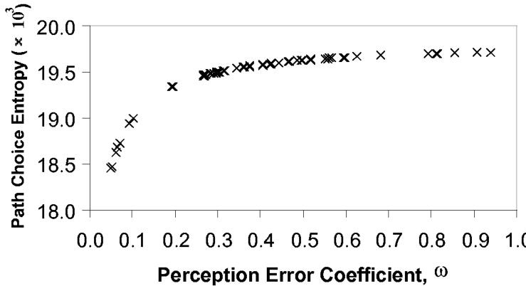  
Figure 7.12 Path choice entropy vs. perception error coefficient in the pilot tests

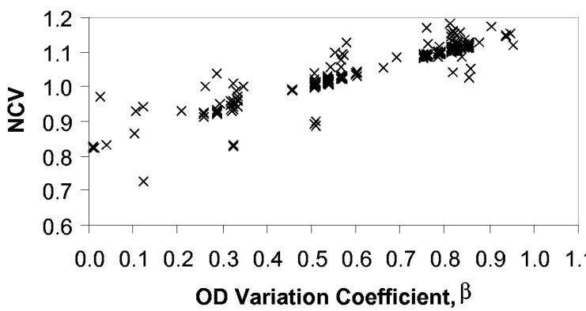  
Figure 7.13 NCV vs OD variation coefficient in the pilot tests

Before carrying out the calibration, some parameters in the GAs should be determined in advance. Such parameters include population size, length of chromosome, maximum number of generations, crossover probability and mutation probability. Several tests have been carried out with different combinations of population size, z, and chromosome length for coding each parameter, $^ b$ . The resultant maximum fitness values are presented in Figure 7.14.

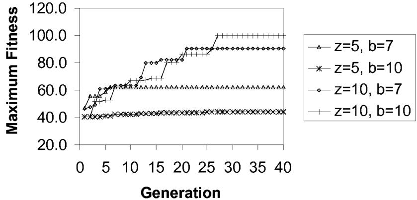  
Figure 7.14 Maximum fitness vs population size, generation, length of chromosome

In Figure 7.14, it can be seen that the test result of the combination of a population size of 10 with a length of 10 bits for each parameter leads to the largest fitness value of all three combinations. Therefore, the population size is set to be 10 and the maximum generation is set to be 30. Each parameter will be coded into a 10-bit length binary string and the chromosome will then have a total length of 20 bits.

Similarly, various combinations of crossover probability $P _ { c }$ and mutation probability $P _ { m }$ have been tested to find the suitable values of the captioned parameters for the example. The results of these tests are shown in Figure 7.15.

In Figure 7.15, it is obvious that the combination with the crossover probability of 0.5 and the mutation probability of 0.02 shows better result than the other four combinations. Therefore the crossover probability is set to be O.5 and the mutation probability is set to be 0.02. The hybrid reproduction operator described in the above section is adopted. The search space is $\omega \in [ 0 , 1 ]$ and $\beta \in [ 0 , 1 ]$ .

The TFS is calibrated based on the above coefficients and probabilities. Figure 7.16 shows the fitness values during the calibration iteration with respect to the perception error coefficient $\omega$ . The calibrated result of $\omega$ is found to be 0.299.

The relationship between the fitness value and the OD variation coefficient is presented in Figure 7.17. It is shown that the calibrated OD variation coefficient $\bar { \beta } = 0 . 5 0 9$ . The calibrated results of the two parameters are very close to their actual values $\alpha = 0 . 3$ and $\beta = 0 . 5$ respectively. The maximum relative calibration error is $1 . 8 \%$ only. So it can be concluded that the GAB calibration algorithm can be used for the TFS calibration as satisfactory results were found in the numerical example.

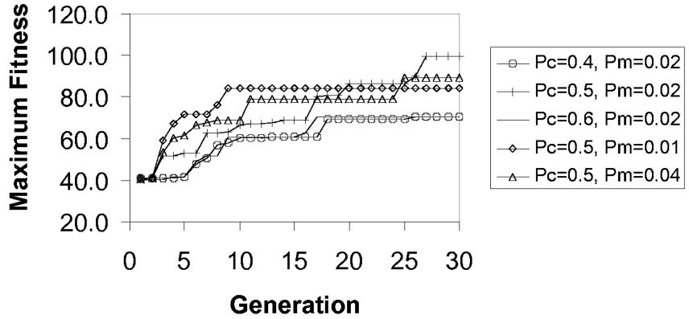  
Figure 7.15 Maximum fitness vs. crossover probability and mutation probability

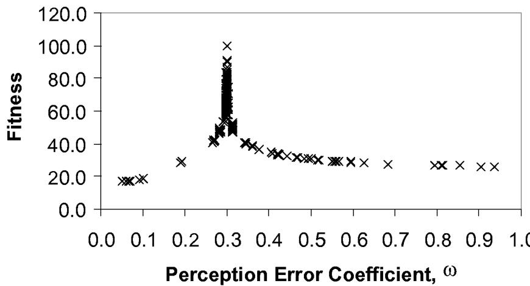  
Figure 7.16 Fitness vs perception error coefficient in the TFS calibration

# 7.2.7 Summary

A TFS has recently been proposed for the assessment of network reliability in terms of travel time reliability. However, the perception error coefficient $( \omega )$ and the OD variation coefficient $( \beta )$ need to be calibrated before the application of the model. In view of the complexity of the constrained probit-type SUE model in the TFS, a new algorithm based on GAs has been developed in this section. The proposed calibration algorithm has been tested on an example network. The calibration results are promising and the performance of the proposed calibration measures are illustrated. It is found that the path choice entropy and NCV are the best measures for the TFS calibration. The GAs parameters, such as population size, maximum generations, crossover probability and mutation probability, are optimized before the TFS calibration. Therefore, it can be concluded that the proposed GAB method is suitable for calibration of complex transport models.

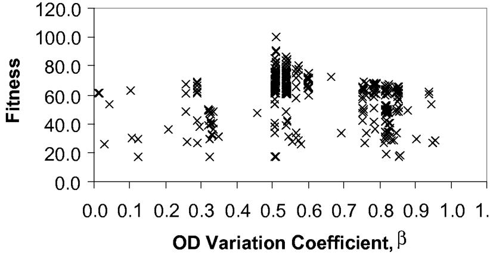  
Figure 7.17 Fitness vs OD variation coefficient in the TFS calibration

# 7.3 Concluding Remarks

It was shown in this chapter that GAs would provide new alternatives for modeling transport because of their simplicity, minimal problem restrictions, global perspective, and implicit parallelism. The GAB approach may serve as the solution algorithm, calibration method and other tools for transport modeling purpose. This chapter presented some applications of GAs to transportation optimization models.

In the first section, a GAB approach was proposed for solving the single-objective and multi-objective bilevel programming problems in transportation. The proposed solution approach was illustrated with the aid of two numerical examples from the previous related studies. It was found that the proposed GAB approach is much simpler and more efficient to search for the optimal solutions as compared to the previous related algorithms. Furthermore, based on the global perspective and implicit parallelism, it is believed that the proposed GAB approach can lead to the global optimum for transport-related bilevel programming problems.

In the second section, a calibration method based on GAs was presented for calibration of the Traffic Flow Simulator (TFS). The proposed calibration method was tested on an example network. It was found that the calibration results are promising and the proposed GAB method is suitable for calibration of advanced transport models.

GAs might be applicable to a wide variety of problems in the transportation domain. However, how to apply GAs to various transport problems depends on the nature or characteristics of the problem under study. First, the researchers should describe the problem with the concept or principle of GAs, then make appropriate choices of techniques and choose the operators available in GAs for application. Although GAB approaches generally require more computation efforts, these efforts are always worthwhile because no other approach is more promising than GAs in view of their simpleness, globality, parallelism and robustness.

# Список литературы

Akamatsu, T. (1997) Decomposition of path choice entropy in general transport networks. Transportation Science, 31, 349-362.   
Allsop, R.E. (1989). Evolving application of mathematical optimization in design and operation of individual signal-controlled road junctions. In Mathematics in Transportation Planning and Control, ed. J.D. Griffiths, 1-24, Clarendon Press, Oxford.   
Asakura, Y. and Sasaki, T. (1990). Formulation and feasibility test of optimal road network design model with endogenously determined travel demand. Proceedings of the ${ 5 } ^ { t h }$ World Conference on Transportation Research, Yokohama, Japan, July, 351-365.   
Asakura, Y. and Kashiwadani, M. (1991) Road network reliability caused by daily fluctuation of traffic flow. In Proceedings of 19th PTRC Summer Annual Meeting, Seminar G, 73-84. PTRC Education and Research Services Ltd., London.   
Bell, M.G.H. and Iida, Y. (1997) Transportation Network Analysis, Wiley, Chichester.   
Bolduc, D. (1999) A practical technique to estimate multinomial probit models in transportation. Transportation Research, 33B(2), 63-79.   
Chakroborty, P., Deb, K. and Srinivas B. (1998). Network-wide optimal scheduling of transit systems using genetic algorithms. Computer Aided Civil and Infrastructure Engineering, 13(5), 363-376.   
Chan, K.S. and Lam, W.H.K. (1998). A sensitivity analysis based algorithm for determining the optimal detector density of the network with variable message sign. Proceedings of the Third Conference of Hong Kong Society for Transportation Studies, Hong Kong, China, December, 247-256.   
Chang, Y.H., Yeh, C.H. and Shen, C.C. (2000). A multi-objective model for passenger train service planning: application to Taiwan's high-speed rail line. Transportation Research, 34B(2), 91-106.   
Daganzo, C.F. (1979) Multinomial Probit: The Theory and Its Application to Demand Forecasting, Academic Press, New York.   
Fisk, C.S. (1984). Game theory and transportation system modeling. Transportation Research, 18B(4/5), 301-313.   
Flynn, J. and Ratick, S. (1988). A multi-objective hierarchical covering model for the essential air services program. Transportation Science, 22,139-147.   
Friesz, T.L., Cho, H.J., Mehta, N.J., Tobin, R.L. and Anandalingam,G. (1992). A simulated annealing approach to the network design problem with variational inequality constraints. Transportation Science, 26(1), 18-26.   
Friesz, T.L., Anandalingam, G., Mehta, N.J., Nam, K., Shah, S. and Tobin, R.L.(1993). The multi-objective equilibrium network design problem revisited: a simulated annealing approach. European Journal of Operational Research, 65(1), 44-57.   
Fwa, T.F., Chan, W.T. and Tan, C.Y. (1994). Optimal programming by genetic algorithms for pavement management. Transportation Research Record, 1455, 31-40.   
Goldberg, D.E. (1989). Genetic Algorithms in Search, Optimization and Machine Learning. Addison-Wesley Publishing Company, Inc.   
Gu, Yu and Chung, C.A. (1999). Genetic algorithm approach to aircraft gate reassignment problem. Journal of Transportation Engineering, 125(5), 384- 389.   
Hadi, M.A. and Wallace, C.E. (1993). Hybrid genetic algorithm to optimize signal phasing and timing. Transportation Research Record, 1421, 104-112.   
Iida, Y. (1999) Basic concepts and future directions of road network reliability analysis. Journal of Advanced Transportation, 33(2), 125-134.   
Lam, W.H.K. and Huang, H.J. (1992) Calibration of the combined trip distribution and assignment model for multiple user classes. Transportation Research, 26B(4), 289-305.   
Lam, W.H.K. and Xu, G. (1999) A traffic flow simulator for network reliability assessment. Journal of Advanced Transportation, 33(2), 159-182.   
Lam, W.H.K., Tam, M.L., Yang H. and Wong, S.C. (1999) Balance of Demand and Supply of Parking Spaces. In Transportation and Traffic Theory, Edited by Ceder, A., Elsevier, Oxford, 707-731.   
LeBlanc, L. and Boyce, D.E. (1986). A bilevel programming for exact solution of the network design problem with user-optimal flows. Transportation Research, 20B(3), 259-265.   
Lo, H.K., Chang, E. and Chan, Y.C. (2000). Dynamic network traffic control. Forthcoming in Transportation Research-A.   
Maher, M.J. (1992) SAM: a stochastic assignment model. In Mathematics in Transport Planning and Control (J.D. Griffiths, ed.), 121-131. Clarendon Press, Oxford.   
Maher, M.J. and Hughes, P.C. (1996) Estimation of the potential benefits from an ATT system using a multiple user class stochastic user equilibrium assignment model. In Proceedings of the Fourth International Conference on Applications of Advanced Technologies in Transportation Engineering (Y.J. Stephanedes & F. Filippi, ed.), 700-704. ASCE, New York.   
Memon, G. Q. and Bullen, A.G.R. (1996). Multivariate optimization strategies for real-time traffic control signals. Transportation Research Record, 1554, 36-42.   
Osyczka, A. and Kundu, S. (1995). A new method to solve generalized multicriteria optimization problems using the simple genetic algorithm. Structural Optimization, 10, 94-99.   
Pattnaik, S.B., Mohan, S. and Tom, V.M. (1998). Urban bus transit route network design using genetic algorithm. Journal of Transportation Engineering, 124(4), 368-375.   
Reddy, K.H. and Chakroborty, P. (1999). Procedure to estimate the origindestination matrix from marginal trip totals and ordinal information on matrix elements. Transportation Planning and Technology, 22(4), 247-270.   
Sheffi, Y. (1985). Urban Transportation Network. Prentice-Hall, Englewood Cliffs, NJ.   
Srinvas, N. and Deb, K. (1995). Multi-objective optimization using nondominated sorting in genetic algorithms, Evolutionary Computation, 2(3), 221-248.   
Tamaki, H., Kita, H. and Kobayashi, S. (1996). Multi-objective optimization by genetic algorithm: a review. Proceedings of the 1996 IEEE International Conference on Evolutionary Computation, 517-522.   
Wong, S.C. and Yang, H. (1997). Reserve capacity of a signal-controlled road network. Transportation Research, 31B(5), 397-402.   
Wong, C.K., Wong, S.C. and Tong, C.O. (1998) A new methodology for calibrating the Lowry model. Journal of Urban Planning and Development, 124(2), 72-91.   
Yai, T., Iwakura, S. and Morichi, S. (1997) Multinomial probit with structured covariance for route choice behavior. Trans. Res.-B., 31(3), 195-207.   
Yang, H. and Yagar, S. (1994). Traffic assignment and traffic control in general freeway-arterial corridor systems. Transportation Research, 28B(6), 463-386.   
Yang, H., Yagar, S., Iida, Y. and Asakura, Y. (1994). An algorithm for the inflow control problem on urban freeway networks with user-optimal flows. Transportation Research, 28B(2), 123-139.   
Yang, H. (1995). Heuristic algorithms for the bilevel origin-destination matrix estimation problem. Transportation Research, 29B(4), 231-242.   
Yang, H. and Lam, W.H.K. (1996). Optimal road tolls under conditions of queuing and congestion. Transportation Research, 30A(5), 319-332.   
Yang, H. and Bell, M.G.H. (1998). Models and algorithms for road network design: a review and some new developments. Transport Review, 18(3), 257- 278.   
Yin, Y.F. (2000a). Genetic-algorithms-based approach for bilevel programming models. Journal of Transportation Engineering, 126(2), 115-120.   
Yin, Y.F. (2000b). Multi-objective bilevel optimization for transportation planning and management Problems. Journal of Advanced Transportation (Submitted).

# Appendix I: Notation

The following symbols are used in this chapter:

B $=$ variance/covariance matrix of link flows   
$C _ { a } ( \mathbb { L } ) =$   
$\boldsymbol { c } _ { k } ^ { r s }$ $=$ actual travel time on path $k$ between Origin-Destination (OD) pair rs   
$f$ $=$ the objective function of the lower-level decision maker (travelers)   
$f ( x )$ $=$ the fitness function   
$F$ $=$ the objective function of the upper-level decision-maker (system manager)   
F $=$ the objective function vector of the upper-level decision-maker (system manager)   
$f _ { k } ^ { r s }$ $=$ the traffic flow on the route $k$ connecting OD pair rs   
$\mathbf { G }$ $=$ the constraint set of the upper-level decision vector   
g $=$ the constraint set of the lower-level decision vector   
$p _ { a }$ $=$ the maximum acceptable degree of saturation for link $a$   
$p _ { a } ^ { r s }$ $=$ link choice proportion for link $^ a$ of OD pair $_ { r s }$ (i.e. proportion of flow from $r$ to $s$ using link $^ a$ ). According to the links equipped with detector or not, the link choice proportion can be divided into two subsets of $p _ { d } ^ { r s }$ and $p _ { e } ^ { r s }$   
$P _ { c }$ $=$ probability of crossover operation   
$P _ { m }$ $=$ probability of mutation operation   
$q _ { r s }$ $=$ the (mean) demand between OD pair rs   
$q _ { r s }$ $=$ prior Origin-Destination (OD) travel demand   
$s _ { a }$ $=$ capacity of link a   
$S _ { r s }$ $=$ expected minimum travel time between OD pair rs   
$t _ { a } ( \nu _ { a } )$ $=$ the link travel time of link a   
$t _ { a } ^ { \phantom { \dagger } }$ $=$ free-flow link travel time   
$\mathbf { u }$ $=$ the decision vector of the upper-level decision-maker   
$u _ { a }$ $=$ the toll charges on link a   
$\boldsymbol { u } _ { a } ^ { \mathrm { m i n } }$ $=$ the lower bound of toll charges on link a   
$u _ { a } ^ { \operatorname* { m a x } }$ $=$ the upper bound of toll charges on link a   
$u _ { \mathrm { m a x } }$ $=$ the upper bound of decision variables   
umin $=$ the lower bound of decision variables   
V $=$ the decision vector the lower-level decision-maker   
$\nu _ { a }$ $=$ the traffic volume on link $^ { a }$   
$\overline { { \nu } } _ { d }$ $=$ mean flow on link with detector   
$\nu _ { d }$ $=$ detected link flow   
$\overline { { \nu } } _ { e }$ $=$ mean flow on link without detector   
$\widetilde { \nu } _ { e }$ $=$ estimated flow on link without detector based on the detected data   
$x _ { j }$ = a finite string j   
$\mathbf { X } ( k )$ $=$ the population of generation $k$   
$Z ( x )$ $=$ the objective value of the upper-level problem   
$\alpha$ $=$ the length of sub-string   
$\beta$ $=$ coefficient of variance for OD variation   
$\omega$ $=$ coefficient of variance for perception error of path travel time   
$\mu$ $=$ the OD matrix multiplier for the whole network   
$\mathbf { \left| L \right. }$ $\mathbf { \lambda } = \mathbf { a }$ vector of all signal split ( proportions of green times)   
$\pi$ $=$ the desired precision of decision variables   
$\delta$ $=$ tolerance parameter of OD flows   
$\delta _ { a k } ^ { r s }$ $= 1$ if route $k$ uses link $^ a$ , and 0 otherwise

# Chapter 8 Solving Job-Shop Scheduling Problems by Means of Genetic Algorithms

Ramiro Varela\*, Camino R. Vela\*, Jorge Puente\*, Alberto Gomez\*\* and Ana M. Vidal

\*Centro de Inteligencia Artificial. \*\*Dpto. de Admon. de Empresas y Contabilidad   
Universidad de Oviedo. Campus deViesques. E-33271 Gijón. Spain.   
Tel. +34-8-5182032. FAX +34-8-5182125.   
e-mail: \* {ramiro, camino, puente} $@$ aic.uniovi.es, \*\*agomez@etsiig.uniovi.es http:llwww.aic.uniovi.es

# 8.1 Introduction

It is well known that sequencing problems are a subclass of combinatorial problems that arise everywhere. We can find problems of this class in many areas of industry, management and science, ranging from production organization to multiprocessor scheduling. This not only justifies the intensive research carried out in this field over the last several years (5, 6, 13, 16), but also the interest in finding new solutions to specific problems. Because sequencing problems are in general NP-hard, the only practical approaches are heuristic strategies (16, 25). Hence, one can find the application of almost every artificial intelligence technique; for instance, logic programming (12, 27), neural nets (1), machine learning (29), space state heuristic search (2, 11, 22), branch and bound (21), local search (25) and genetic algorithms (GAs) (4, 7, 19, 24, 17), among others. Jain and Meeran (13) summarize the main techniques applied to solve a family of these problems, the job-shop scheduling problem, together with the category each technique belongs to. The application of GAs to scheduling problems has interested many researchers because they seem to offer the ability to cope with the huge search spaces involved in optimising schedules.

In this work we describe an approach to solve job-shop scheduling problems by means of a GA which is adapted to the problem in various ways. First, a number of adjustments of the evaluation function are suggested, and then we propose a strategy to generate a number of chromosomes of the initial population that allows us to introduce heuristic knowledge from the problem domain. In order to do that, we exploit the variable and value ordering heuristics proposed by Norman Sadeh (22). These are a class of probability-based heuristics which are, in principle, aimed to guide a backtracking search strategy. We validated all the refinements introduced on well-known benchmarks and report experimental results showing that the introduction of the proposed refinements have an accumulative and positive effect on the performance of the GA. The software we have used in our experiments, as well as further releases, will be public through our Web site.

The remainder of this chapter is organized as follows. Section 8.2 introduces the job-shop constraint satisfaction problem. Section 8.3 describes the genetic algorithm used in this work, in particular the codification of chromosomes and the genetic operators; and discusses two possibilities to define the fitness function, as well as the refinements proposed to the evaluation function (i.e., the penalty and scaling techniques) and how these techniques can be adapted to the confronted problem. Section 8.4 reviews the variable and value ordering heuristics proposed by Sadeh. Section 8.5 describes the way we propose to generate the initial population from the probabilistic knowledge provided by these heuristics. Section 8.6 reports the experimental results; here, we consider results about the efficiency and convergence of various versions of the GA, and compare the GA performance against other approaches. And finally, in Section 8.7, we present the main conclusions and some ideas for future work.

# 8.2 The Job-Shop Scheduling Constraint Satisfaction Problem

The Job Shop Scheduling Problem (JSS) can be posed with small variations (1, 18, 22). In this work we consider the problem as posed in (22): the JSS requires scheduling a set of jobs $\{ J _ { I } , . . . , J _ { n } \}$ on a set of physical resources or machines $\{ R _ { I } , . . . , R _ { q } \}$ Each job $J _ { i }$ consists of a set of tasks or operations $\{ t _ { i l } , . . . , t _ { i m i } \}$ to be sequentially scheduled, and each task has a single resource requirement. We assume that every job has a release date and a due date between which all the tasks have to be performed. Each task has a fixed duration $d u _ { i j }$ and a start time $s t _ { i j }$ whose value has to be selected. The domain of possible start times of the tasks is initially constrained by the release and due dates.

Therefore, there are two non-unary constraints of the problem: precedence constraints and capacity constraints. Precedence constraints defined by the sequential routings of the tasks within a job translate into linear inequalities of the type: $s t _ { i l } + d u _ { i l } \le s t _ { i l + I }$ (i.e., $s t _ { i l }$ before $s t _ { i l + l } )$ . Capacity constraints that restrict the use of each resource to only one task at a time translate into disjunctive constraints of the form: $s t _ { i l } + d u _ { i l } \le s t _ { j k } \lor s t _ { j k } + d u _ { j k } \le s t _ { i l }$ (two tasks that use the same resource cannot overlap). The objective is to come up with a feasible solution as fast as possible, a solution being a vector of start times, one for each task, such that starting at these times all the tasks end without exceeding the due date and all the constraints are satisfied. None of the simplifying assumptions are required by the approach that will be discussed: jobs usually have different release and due dates, tasks within a job can have different duration, several resource requirements, and several alternatives for each of these requirements.

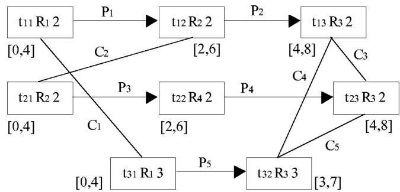  
Figure 8.1 A JSS problem instance with three jobs. The release dates have value 0 for every task and the due dates have value 10. The duration of the tasks is indicated within the boxes, together with the task identification and the resource requirement

Figure 8.1 depicts an example with three jobs $\{ J _ { I } , J _ { 2 } , J _ { 3 } \}$ and four physical resources $\{ R _ { I } , R _ { 2 } , R _ { 3 } , R _ { 4 } \}$ . It is assumed that the tasks of the first two jobs have duration of two time units, whereas the tasks of the third one have duration of three time units. The release time is 0 and the due date is 10. Label $P i$ represents a precedence constraint and label $C j$ represents a capacity constraint. Start time values constrained by the release and due dates and the duration time of tasks are represented as intervals. For instance, [0,4] represents all start times between time 0 and time 4, as allowed by the time granularity, namely {0,1,2,3,4}.

# 8.3 The Genetic Algorithm

GAs were successfully used to solve sequencing problems (7, 8, 9, 17, 18, 24), in particular the job-shop scheduling problem. In this section we describe a classic implementation whose components are taken from the literature. The codification of individuals is the permutation with repetition (4, 8, 17, 24). According to this codification, an individual represents a permutation of the whole set of operations of the problem at hand. Consider for example the problem depicted in Figure 8.1 and the permutation of its tasks $( t _ { 2 1 } t _ { 3 1 } t _ { 2 2 } t _ { 1 1 } t _ { 3 2 } t _ { 1 2 } t _ { 1 3 } t _ { 2 3 } )$ .From this permutation, an individual is obtained by replacing the identifier of each task by the number of its job; therefore, we obtain $( 2 \ 3 \ 2 \ I \ 3 \ I \ I \ 2 )$ . So, this representation should be understood to mean the following: the first 2 represents the first task of the second job, the first 3 is the first task of the third job, the second 2 is the second task of the second job, and so on. The main reason for introducing this representation of individuals is that every individual produced by the genetic operators is feasible, as we will see in the following paragraphs. The mutation operator we use in this work is the order-based mutation: two tasks are selected at random and their positions are interchanged. At the same time, we consider two crossover operators. First, the generalized order crossover (GOX) which works as follows: Consider the following two parents:

$$
P a r e n t I \ : ( I \ : 2 \ : 2 \ : I \ : 2 \ : I ) \qquad P a r e n t 2 \ : ( I \ : \underline { { { I } } } \ : 2 \ : 2 \ : I \ : 2 )
$$

A substring is selected at random from parent1, for example the underlined substring that includes the second 2 and the second 1, and these tasks are deleted in parent2. Afterwards, the substring is implanted in parent2 at the position where the first operation of the substring has occurred in parent2. So, in this case we obtain the offspring $\textit { ( 1 2 2 1 1 2 ) }$ . Another common crossover suitable for this codification is the generalized position crossover (GPX) which is similar to GOX. The only difference is the insertion position of the substring in the offspring, this position in GPX is the same as the first parent. In the example, the same result is obtained.

In order to define a fitness function, we have to consider which potential solution is represented by an individual. Remember that a solution to our job-shop problem is a scheduling of the tasks that satisfies every constraint of the problem, including, of course, the completion of every job by its due date. In this work, we consider that a potential solution is a scheduling of the tasks satisfying every constraint except, maybe, the completion of jobs by their due dates. So a potential solution is actually a solution when this constraint is also satisfied. In order to display the potential solution represented by an individual, and to establish a rating among individuals, we consider two possibilities to implement the fitness function that in the following we refer to as fitness1 and fitness2, respectively. In both cases, a strategy is defined to build a scheduling from the individual representation, then the completion time of every job is calculated, and the maximum value of these times, that is the makespan, is the fitness value of the individual. It is clear that the lower the fitness, the better the individual. Therefore, we have a minimization problem.

Now we describe the scheduling strategies of both fitness functions. In both of the cases, the sequence of tasks is enumerated following the order in which the tasks appear in the individual. For each task, a start time is assigned which is compatible with the start time assignments made to the previous tasks. In the first case, this start time is calculated as the largest completion time of those previous tasks sharing a constraint, either precedence or capacity, with the current task. In the second case, the start time assigned to the current task is the lowest possible that is compatible to the previous assignments. We clarify both strategies by means of an example. Consider the individual $( 3 ~ 3 ~ I ~ I ~ I ~ 2 ~ 2 ~ 2 ~ )$ , which represents a potential solution to the problem of Figure 8.1. Figure 8.2a shows the Gantt chart produced by the fitness1 scheduling strategy, and Figure $8 . 2 \mathrm { b }$ shows the correspondent chart produced by the fitness2. The fitness1 value is 13, whereas the fitness2 value is 11 for the individual. As we can observe, the individual does not represent a solution to either of the strategies.

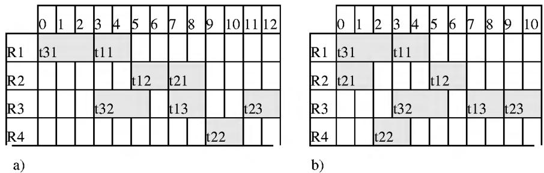  
Figure 8.2 (a) Scheduling produced by the fitness1 strategy to the problem of Figure 8.1 from the individual $( 3 \ 3 \ 1 \ 1 \ 1 \ 2 \ 2 )$ . The fitness1 value is 13. (b) Scheduling produced from the same individual by the fitness2 strategy. The fitness2 value is 11

It is clear that the fitness1 value is always greater than or equal to the fitness2 value, but the fitness2 function is more costly than the fitness1function. It is easy to see that the first one has a complexity of $O ( n )$ whereas the second has a complexity of $O ( n ^ { 2 } )$ , $n$ being the number of tasks of the problem. Moreover, as we will see in Section 8.6, for every scheduling that can eventually be produced by the fitness2 function, there is an individual that produces the same scheduling by the fitness1 strategy. Therefore, in principle, we adopt fitness1 due to its lower complexity. Nevertheless, in this work we also use the fitness2 in a number of experiments. Moreover, we use this second scheduling strategy as a basis for a heuristic repair method to obtain an improved chromosome as we will see in Section 8.5.

# 8.4 Fitness Refinement

The former fitness functions can be adjusted in order to better discriminate among good and bad individuals. Here we consider two common techniques (18) and adapt them to our problem

Penalty: this technique consists of adding to the fitness a value for each of the jobs exceeding its due date. This amount can be, for example, the exceeding time of each job or a fixed amount for each of the exceeding jobs. This refinement allows the GA to discriminate among individuals displaying the same makespan, but having different exceeding time beyond their due dates. But the results can be misleading due to the fact that the lowest fitness does not guarantee the lowest makespan.

Scaling: in this case, the objective is either to remark or smooth the difference between good and bad chromosomes in order to obtain a more accurate discrimination. The underlying idea is that small relative differences in the fitness of good and bad individuals do not facilitate the selection of the best individuals and the elimination of the worst. Whereas, large relative differences might produce a dominance of semi-optimum chromosomes and then a premature convergence of the GA. Here, we consider a linear scaling which consists of replacing the original fitness $f$ by

$$
f ^ { \prime } { = } f + b ,
$$

$^ { b }$ being a parameter which can be provided by the user or automatically determined from the problem either at the beginning or at each generation.

# 8.4.1 Variable and Value Ordering Heuristics

As we have pointed out in the introduction, one of the main contributions of this work will be the utilization of heuristic information in the initial population generation to solve JSS problems. Our purpose is to incorporate the variable and value ordering heuristics proposed by Sadeh and Fox in (22). These heuristics are based on a probabilistic model of the search space. A framework is introduced that accounts for the chance that a given value will be assigned to a variable and the chances that values assigned to different variables conflict with each other.

These heuristics are evaluated from the profile demands of the tasks for the resources. In particular the individual demand and the aggregate demand values are considered. The individual demand $D _ { i j } ( R _ { p } , T )$ of a task $\mathrm { t _ { i j } }$ for a resource $R _ { p }$ at time $T$ is simply computed by adding the probabilities $\sigma _ { i j } ( \tau )$ of the resource $R _ { p }$ demanded by the task $t _ { i j }$ at some time within the interval $I T - d u _ { i j } + I , T J$ The individual demand is an estimation of the reliance of a task on the availability of a resource. Consider, for example, the initial search state of the problem depicted in Figure 8.1. As the task $t _ { I 2 }$ has five possible start times or reservations, and assuming that there is no reason to believe that one reservation is more likely to be selected than another, each reservation is assigned an equal probability to be selected, in this case $I / 5$ .Given that the task $t _ { I 2 }$ has duration of 2 time units, this task will demand to the resource $R _ { 2 }$ at interval $4 { \le } t { < } 5$ if its start time is either 3 or 4. Hence, the individual demand of the task $t _ { I 2 }$ for resource $R _ { 2 }$ at this interval is estimated as $D _ { 1 2 } ( R _ { 2 } , t ) \ = \ \sigma _ { 1 2 } ( 3 ) + \sigma _ { 1 2 } ( 4 ) \ : = \ : 2 / 5$ . On the other hand, the aggregate demand $D _ { a g g r } ( R , \tau )$ for a resource is obtained by adding the individual demands of all tasks over the time. Table 8.1 shows the individual demands of all ten tasks of the problem, as well as the aggregate demands for all four resources. From the aggregate demand of a resource, a contention peak is identified. This is an interval of the aggregate demand of duration equal to the average duration of all the tasks with the highest demand. Table 8.1 shows the contention peaks of all four resources. Then, the task with the largest contribution to the contention peak of a resource is determined as the most critical and so it is selected first for reservation. This is the heuristic referred in (22) as ORR (Operation Resource Reliance).

Table 8.1 Individual and aggregate demands of the initial state of the problem of Figure. 8.1 for all tasks and resources over the time intervals. (The shadow regions correspond to the contention peaks of the respective resources.)   

<table><tr><td></td><td>0</td><td>1</td><td>2</td><td>3</td><td>4</td><td>5</td><td>6</td><td>7</td><td>8</td><td>9</td></tr><tr><td>D11(R1,T)</td><td>0.2</td><td>0.4</td><td>0.4</td><td>0.4</td><td>0.4</td><td>0.2</td><td></td><td></td><td></td><td></td></tr><tr><td>D31(R1,T)</td><td>0.2</td><td>0.4</td><td>0.6</td><td>0.6</td><td>0.4</td><td>0.2</td><td>0.2</td><td></td><td></td><td></td></tr><tr><td>Daggr(R1,T)</td><td>0.4</td><td>0.8</td><td>1</td><td>1</td><td>0.8</td><td>0.4</td><td>0.2</td><td></td><td></td><td></td></tr><tr><td>D12(R2,T)</td><td></td><td></td><td>0.2</td><td>0.4</td><td>0.4</td><td>0.4</td><td>0.4</td><td>0.2</td><td></td><td></td></tr><tr><td>D21(R2,T)</td><td>0.2</td><td>0.4</td><td>0.4</td><td>0.4</td><td>0.4</td><td>0.2</td><td></td><td></td><td></td><td></td></tr><tr><td>Daggr(R2,T)</td><td>0.2</td><td>0.4</td><td>0.6</td><td>0.8</td><td>0.8</td><td>0.6</td><td>0.4</td><td>0.2</td><td></td><td></td></tr><tr><td>D13(R3,T)</td><td></td><td></td><td></td><td></td><td>0.2</td><td>0.4</td><td>0.4</td><td>0.4</td><td>0.4</td><td>0.2</td></tr><tr><td>D23(R3,T)</td><td></td><td></td><td></td><td></td><td>0.2</td><td>0.4</td><td>0.4</td><td>0.4</td><td>0.4</td><td>0.2</td></tr><tr><td>D32(R3,T)</td><td></td><td></td><td></td><td>0.2</td><td>0.4</td><td>0.6</td><td>0.6</td><td>0.6</td><td>0.4</td><td>0.2</td></tr><tr><td>Daggr(R3,T)</td><td></td><td></td><td></td><td>0.2</td><td>0.8</td><td>1.4</td><td>1.4</td><td>1.4</td><td>1.2</td><td>0.6</td></tr><tr><td rowspan="2">D22(R4,T) Daggr(R4, T)</td><td></td><td></td><td>0.2</td><td>0.4</td><td>0.4</td><td>0.4</td><td>0.2</td><td></td><td></td><td></td></tr><tr><td></td><td></td><td>0.2</td><td>0.4</td><td>0.4</td><td>0.4</td><td>0.2</td><td></td><td></td><td></td></tr></table>

On the other hand, the value ordering heuristic proposed in (22) is also computed from the profile demands for the resources. Given a task $t _ { i j }$ that demands the resource $R _ { p }$ , the heuristic consists of estimating the survivability of the reservations. The survivability of a reservation $\langle s t _ { i j } { = } T \rangle$ is the probability that the reservation will not conflict with the resource requirements of other tasks, that is, the probability that none of the other tasks require the resource during the interval $I T , T \substack { + d u _ { i j } - I J }$ .When the task demands are for only one resource, this probability is estimated as

$$
\left( 1 - \frac { \cal A V G \big ( D ^ { a g g r } \big ( R _ { p } , \tau \big ) - D _ { i j } \big ( R _ { p } , \tau \big ) \big ) } { \cal A V G \big ( n _ { p } , ( \tau ) - 1 \big ) } \right) ^ { d V G \big ( n _ { p } ( \tau ) - 1 \big ) d u _ { y } * \big ( { \cal A V G } ( d u ) ^ { - 1 } \big ) }
$$

where $d u$ stands for the average duration of the tasks, $n _ { p } ( \tau )$ is the number of tasks that might demand the resource $R _ { p }$ at time $\tau$ and $A V G ( f ( \tau ) ;$ represents the average value of $f ( \tau )$ in the interval $I T , T \substack { + d u _ { i j } - I J }$ Table 8.2 shows the survivability of all the reservations possible for all ten tasks of the problem. In principle, the value ordering heuristic consists of trying first those reservations with large survivabilities. However, in (22), some more refinements are introduced: first, the survivabilites are utilized to estimate the number of solutions to a relaxation of the problem which are compatible with a reservation to a given task; and then this heuristic is combined with a filtering mechanism used to further refine the ranking of reservations. The resulting heuristic is referred as FSS (Filtered Survivable Schedules). For a full description of these heuristics, we refer the interested reader to (22).

Table 8.2 Survivabilities of all ten tasks in the initial state of the problem of Figure 8.1 over the time intervals   

<table><tr><td></td><td>0</td><td>1</td><td>2</td><td>3</td><td>4</td><td>5</td><td>6</td><td>7</td><td>8</td></tr><tr><td>11</td><td>0.75</td><td>0.57</td><td>0.48</td><td>0.48</td><td>0.57</td><td></td><td></td><td></td><td></td></tr><tr><td>t12</td><td></td><td></td><td>0.6</td><td>0.6</td><td>0.7</td><td>0.89</td><td>1</td><td></td><td></td></tr><tr><td>13</td><td></td><td></td><td></td><td></td><td>0.42</td><td>0.3</td><td>0.3</td><td>0.36</td><td>0.54</td></tr><tr><td>t21</td><td>1</td><td>0.89</td><td>0.7</td><td>0.6</td><td>0.6</td><td></td><td></td><td></td><td></td></tr><tr><td>t22</td><td></td><td></td><td>1</td><td>1</td><td>1</td><td>1</td><td>1</td><td></td><td></td></tr><tr><td>t23</td><td></td><td></td><td></td><td></td><td>0.4</td><td>0.3</td><td>0.3</td><td>0.36</td><td>0.54</td></tr><tr><td>t31</td><td>0.61</td><td>0.54</td><td>0.54</td><td>0.61</td><td>0.75</td><td></td><td></td><td></td><td></td></tr><tr><td>t32</td><td></td><td></td><td></td><td>0.54</td><td>0.35</td><td>0.27</td><td>0.27</td><td>0.35</td><td></td></tr></table>

# 8.5 Heuristic Initial Population

In this section, we describe the strategy to build up a heuristic initial population. Initialization in GAs is an important issue as proven in (10), even though some authors argue against this technique because it might produce premature convergence due to the dominance of sub-optimal individuals. We propose two different strategies to be used in conjunction to generate initial individuals. We refer to these strategies as heuristic-a and heuristic-b, respectively. The aim of the first is to introduce knowledge from the variable and value ordering heuristics into the initial population. The idea is first to consider the most critical resources, those with the highest contention peaks, and then try to put the tasks requiring these resources in a good position within the representation of individuals. We assume that a good position will be one that probably translates into an assignment of the starting time of the task to a value close to the time with the highest survivability of the task. In order to achieve such a distribution of tasks in the representation of individuals, we propose the following strategy.

First, determine the critical resources as the resources whose contention peaks are over the average of the contention peaks of all the resources. These will include the bottleneck and, possibly, other resources.

For each of the critical resources, determine the critical tasks as the set of tasks that demand the resource and order these tasks by their respective times of highest survivability.

Generate a set of individuals containing the critical tasks in the order determined before. Then, distribute the remainding tasks within the individual taking only into account the precedence constraints of the problem, selecting at random when there is more than one possibility.

The intuition behind heuristic-a is to assume that the relative ordering among the critical tasks, according to their times of maximum survivability, is a good building block to generate chromosomes.

On the other hand, the heuristic-b strategy consists of rebuilding an individual representation in such a way that both of the scheduling strategies, fitness1 and fitness2, produce the same result. This is a heuristic repair method that transforms an individual into another one which is better or, in the worst case, equal to the original. In this case, the purpose is that some holes that the fitness1 strategy might waste for a given chromosome are used in the transformed representation.

We clarify the application of both heuristics by means of an example. Consider the problem depicted in Figure 8.1. As is shown in Table 8.2, the most critical resource is $R _ { 4 }$ , which is required by the set of tasks $\{ t _ { I 3 } , t _ { 2 3 } , t _ { 3 2 } \}$ If we sort this set (the critical tasks) by the times of maximum survivabilities, the result is either $( t _ { 3 2 } ,$ $t _ { l 3 } , t _ { 2 3 } )$ or $( t _ { 3 2 } , t _ { 2 3 } , t _ { I 3 } )$ . Therefore, according to the strategy of heuristic-a, from the first ordering we could generate the individuals $( t _ { 3 I } t _ { 3 2 } t _ { I I } t _ { I 2 } t _ { I 3 } t _ { 2 I } t _ { 2 2 } t _ { 2 3 } )$ and $( t _ { I I } ~ t _ { 3 I }$ $t _ { 3 2 } t _ { 2 1 } t _ { 1 2 } t _ { 1 3 } t _ { 2 2 } t _ { 2 3 } )$ , which translated to the genetic algorithm notation are $\left( 3 3  I I I \right)$ 222)and $( 1 3 3 2 1 1 2 2 )$ respectively. At the same time, from the second ordering we could generate the chromosome $( t _ { 3 I } t _ { 2 I } t _ { 2 2 } t _ { I I } t _ { 3 2 } t _ { I 2 } t _ { 2 3 } t _ { I 3 } )$ , or $( 3 \ 2 \ 2 \ I \ 3$ $^ \textit { \textbf { l 2 } } I ,$ . Figure 8.2 depicts the scheduling produced from the first of the former individuals by functions fitness1 and fitness2 respectively.

From the scheduling of Figure 8.2b, following the heuristic-b, we can build an individual whose fitness1 value is equal to the fitness2 value of the original, by simply ordering the tasks by the values of their starting times in that scheduling. This individual is $\left( t _ { 2 1 } ~ t _ { 3 1 } ~ t _ { 2 2 } ~ t _ { 1 1 } ~ t _ { 3 2 } ~ t _ { 1 2 } ~ t _ { 1 3 } ~ t _ { 2 3 } \right)$ or $( 2 \ 3 \ 2 \ I \ 3 \ I \ I \ 2 )$ which is finally inserted as a new individual of the heuristic initial population. As we can observe, the relative ordering among the critical tasks is maintained after reconstruction. Therefore, the intuition behind heuristic-b is that it can maintain the building blocks as long as it reorganizes the remaining tasks so that the scheduling improves.

The overall approach to generate the initial population consists of generating a fraction of the chromosomes by first applying the heuristic-a strategy and then reconstructing these individuals by means of heuristic-b. The remainder of the chromosomes are generated at random in order to guarantee the diversity of the population.

# 8.6 Experimental Results

This section reports the results of an experimental study comparing various versions of our genetic algorithm. A preliminary version of a part of these results was also presented in (26). The test of data is the benchmark of 60 problems proposed in (22). These problems were randomly generated, each with five resources and ten jobs of five operations. Each job has to visit each of the five resources, and the order of visiting was randomly generated except for the bottleneck resources, which were each visited after a fixed number of operations. Two parameters were used to cover different scheduling conditions: $R G$ , a range parameter, controlled the distribution of release dates and due dates, and a bottleneck parameter, $B K$ , controlled the major bottleneck resources. Three values of $R G$ were used (0.0, 0.1 and 0.2). When $R G$ is 0.0, all release dates are the same, as well are due dates. For higher values of $R G$ , different values are determined from a uniform probability distribution parameterized by $R G$ Two values of $B K$ were considered (1 and 2), determining the number of bottleneck resources. Therefore, six groups of ten problems were generated.

We consider six versions of the genetic algorithm starting from a Basic (B) version with the initial population generated at random and the fitness1 function as defined in Section 8.4. We consider also a Local Search (LS) strategy; this is also a common approach (23) which can be implemented in many ways. Our LS approach consists of tuning the final solution by means of the heuristic repair method of the heuristic-b as reported in Section 8.5. Then we introduce the refinements described in the previous sections. That is, Penalty (P), in this case by adding to the fitness1 a value of 2 time units for each of the jobs exceeding its due date; and scaling (S) by defining the parameter $^ { b }$ of expression (1) to be

$$
b = - \sum _ { \stackrel { R _ { i } \in \{ R _ { 1 } , \ldots , R _ { N } \} } { R _ { i } \in \{ R _ { 1 } , \ldots , R _ { N } \} } } \sum d u _ { j k } : t _ { j k } \ r e q u i r e s \ t o \ R _ { i }
$$

where $N$ is the number of jobs. This is a solution of a problem relaxation where all sequential constraints are eliminated and every release date is assumed to be O. Hence, the cost of this solution is a lower bound of the best solution of the real problem. Of course, other relaxations can be considered to estimate the parameter $^ b$ , for example, the MST (Minimum Spanning Tree) relaxation described in (20). Finally, the Heuristic Initial Population (HIP) is considered; in this case, a number of (15) heuristic individuals were introduced into the initial population for each of the critical resources (1 or 2 in every case), while the remainding individuals were generated at random. Except for the Basic case, every version includes Local Search, even though this refinement in conjunction with the other refinements has a lower effect than when used together with the Basic approach.

Table 8.3 Comparison of six versions of the GA against the ORR & FSS heuristics   

<table><tr><td></td><td colspan="7">Percentage of Problems Solved by the GA</td><td colspan="2">ORR &amp; FSS</td></tr><tr><td></td><td>B</td><td>LS</td><td>P</td><td>S</td><td>P+S</td><td></td><td>HIP P+S+ HIP</td><td>Solved (%)</td><td>Time (sec)</td></tr><tr><td>RG=0.2 BK=1</td><td>45</td><td>71</td><td>77.3</td><td>78</td><td>90,7</td><td>98</td><td>100</td><td>100</td><td>88.5</td></tr><tr><td>RG=0.2 BK=2</td><td>12</td><td>29</td><td>42</td><td>47.3</td><td>56</td><td>100</td><td>100</td><td>100</td><td>93</td></tr><tr><td>RG=0.1 BK=1</td><td>72</td><td>82</td><td>87.3</td><td>94</td><td>97,3</td><td>100</td><td>100</td><td>80</td><td>331.5</td></tr><tr><td>RG=0.1 BK=2</td><td>25</td><td>40</td><td>50</td><td>66</td><td>70,67</td><td>100</td><td>100</td><td>90</td><td>184</td></tr><tr><td>RG=0.0 BK=1</td><td>83</td><td>87</td><td>91.3</td><td>94.7</td><td>98</td><td>100</td><td>100</td><td>70</td><td>475</td></tr><tr><td>RG=0.0 BK=2</td><td>31</td><td>41</td><td>45.3</td><td>65.3</td><td>67,3</td><td>90</td><td>98,7</td><td>80</td><td>300.5</td></tr></table>

Note: Different versions of the GA are obtained by combining the Basic (B) version with Local Search (LS), Penalty (P), Scaling (S) and Heuristic Initial Population (HIP). In every case, each of the 60 problems was solved 15 times. Then the mean values of the percentage of experiments solved is represented to every set of 10 problems with the same values of the parameters RG and BK. In every case, the running time of the GA to solve a problem was less than 1 second (the GA program is written in $C + +$ and run on a $2 3 3 \mathrm { \ : M H z }$ Pentium). The ORR & FSS heuristics are used to guide a backtracking schema and implemented in Allegro Common LISP on a DECstation 5000/200

In all of the experiments, we run the genetic algorithm with a population size of 100 individuals, the GOX operator, 50 generations and crossover probability and mutation probability values of 0.8 and 0.01 respectively. For each of the 60 problems, we run each one of the six versions of the algorithms 15 times, and report in Table 8.3 the mean values of the 15 executions for each of the six groups of ten problems defined by the parameters $R G$ and $B K$ In (22), some results were reported comparing the $O R R$ and $F S S$ ordering heuristics against a number of similar strategies to guide a classic depth first backtracking search algorithm in solving these problems. The last two columns of Table 8.3 show the summary of the results obtained by the ORR&FSS strategy presented in (22). The first component is the number of experiments of each group solved in less than 500 states, and the second shows the running time, in seconds, of the program when codified in Allegro Common LISP. As is pointed out in (22), the procedure runs about 30 times faster when written in $\mathrm { C } { + + }$ .

As we can see in Table 8.3, the performance of the GA improves as long as the refinements are introduced. The improvement is especially notable when all refinements are used in conjunction. In this case, almost all of the 60 problems are solved by the GA in less than 1 second.

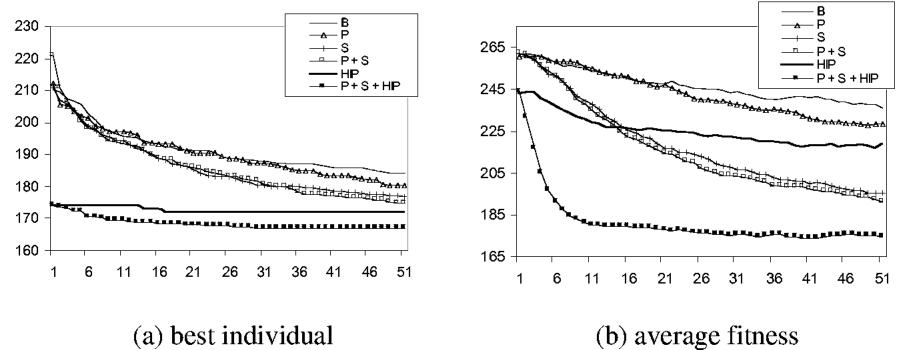  
Figure 8.3 Results of convergence of six versions of the GA. Mean values of 15 experiments are considered for one of the 60 problems. Because different versions uses different fitness functions, due to penalty and scaling, the fitness1 value is shown in every case, independently of the fitness function utilized

In addition to the efficiency of the GA, it is also worthwhile to consider the effect that the elements introduced produce on its convergence. As usual, we consider average and best fitness convergence along the generations. Figure 8.3 shows the convergence of all of the six versions of the genetic algorithm for one of the 60 problems. As before, mean values of 15 executions are represented. As we can observe in Figure 8.3, initial fitness values when starting from a heuristic initial population are smaller  as was expected. At the same time, convergence rates depend on the evaluation function; it can be observed that both of the refinements introduced, scaling and penalty, speed up the convergence. The mean fitness convergence is especially rapid when these refinements are used in conjunction with the heuristic initial population. In the case of the best individual, we can observe a similar influence of the refinements on the convergence. Here, it is worth noting that the introduction of heuristic individuals into the initial population does not provide much opportunity for improvement.

As we have noticed in Section 8.6, some authors (18) argue against seeding the initial population with non-random individuals. The argument is that these seeds might represent semi-optimal solutions that dominate the remainder of the population and conduct the GA rapidly towards local optima of the search space. This effect would be observed in the convergence graphics as a quick convergence during the first generations followed by a stabilization on a higher value than a normal non-premature convergence. Therefore we must experiment with a number of generations greater than 50 in order to clearly observe the stabilization of the best and mean fitness values. Figure 8.4 shows results from experiments on one of the 60 problems over 1000 generations. As we can observe, mean fitness values get stabilized after about 200 generations; the stabilization value depending on concrete version of the GA; but in any case, premature convergence is not observed. On the other hand, we can observe in Figure $8 . 4 \mathrm { a }$ the effect of premature convergence on the evolution of the best solution. As we can see, when penalty and scaling are used, the convergence of the GA is quicker than when these techniques are not used. Moreover, when the initial population is randomly generated, the best individual fitness obtained without the use of penalty and scaling improves with respect to the case of using these techniques after about 200 generations. At the same time, when the initial population is seeded with heuristic individuals the effect of the premature convergence is not observed, at least during the first 1000 generations. In any case, the effect of premature convergence can be reduced by smoothing the scaling and penalty parameters, as pointed out in (18). Consequently, we can consider that premature convergence is not a real problem in our approach, mainly when we are interested in obtaining good solutions as soon as possible, for instance by the time of 50 generations.

Another issue that is worth analyzing is the contribution of each of the heuristic-a and heuristic-b strategies to the characteristics of the heuristic individuals and to the GA performance. In the former experiments, these two strategies were used in conjunction to generate individuals. Now we consider some experiments from the application of each one independently of the other, and compare the results against their use in conjunction. Table 8.4 shows the results from experiments on four problems selected out of the 60 problems among the most hard to solve by the GA. In every case, the initial population is generated heuristically, first by means of the heuristic-a alone, then by the heuristic-b and finally by the conjunction of heuristic-a and heuristic-b. In these cases we show results about the mean and best fitness of the heuristic individuals introduced into the initial population, as well as the mean fitness of the last generation and the best solution found by the GA after 50 generations.

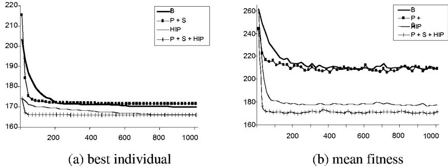  
Figure 8.4 Results about convergence of four versions of the GA along 1000 generations. Mean values of 15 experiments are considered for one of the 60 problems. As before, fitness1 values are shown in every case

As we can observe in Table 8.4, when both of the heuristics are used together the results are better than when they are used independently of each other. Moreover, if we compare the performance of heuristic-a and heuristic-b when each of them is used alone, we can observe that the mean and best fitness of the heuristic individuals, and consequently, the mean and best individuals of the initial generation are better when heuristic-b is used. However, the use of heuristic-a produces better final results; in particular, the number of solutions obtained in the 15 experiments is, in general, greater. In our opinion, this fact confirms the underlying idea of the heuristic-a strategy which, as we have pointed out, is aimed at generating good building blocks rather than generating individuals with low fitness.

The problems of the former set are actually small problems, they are of size $5 { \times } 1 0$ ; that is, 5 jobs of 10 tasks each. Now we consider the FT10 problem; this is a wellknown $1 0 { \times } 1 0$ problem that was proposed by Fisher and Thompson in 1963 but it was not solved to optimality until 21 years later. Figure 8.5 shows some results of solving this problem with different versions of the GA. In these experiments we have combined both evaluation functions fitness1 and fitness2 with scaling and the heuristic initial population. As we can see, in any case, the convergence is quicker with fitness2 than with fitness1, as could be expected. At the same time, the running time is about $20 \%$ higher with fitness2 than with fitness1. On the other hand, we can observe that the effect of the heuristic initial population changes drastically from one evaluation function to the other. When used in conjunction with fitness1, the heuristic initial population clearly improves the convergence; but in conjunction with fitness2, the improvement almost vanishes. However, the small improvement achieved by means of the heuristic initial population persists in other experiments. In our own opinion, this fact confirms that the use of heuristic initial population is a good idea even for larger problem instances than those proposed in (22), but also that more research effort is required in order to better exploit the knowledge the heuristics offer.

Table 8.4 Comparison of the heuristic strategies to generate individuals   

<table><tr><td></td><td></td><td colspan="2">Fitness of Heuristic Individuals</td><td colspan="2">Final Population Fitness</td><td>Number of Experiments</td></tr><tr><td>Problem</td><td>Heuristic</td><td>Mean</td><td>Best</td><td>Mean</td><td>Best</td><td>Solved</td></tr><tr><td rowspan="3">e0ddr2-10-by-5-9</td><td>a</td><td>249.4</td><td>206</td><td>185.9</td><td>171.8</td><td>4</td></tr><tr><td>b</td><td>196.8</td><td>176</td><td>184.4</td><td>174.1</td><td>0</td></tr><tr><td>a +b</td><td>201</td><td>172</td><td>175.1</td><td>168.3</td><td>13</td></tr><tr><td rowspan="3">ewddr2-10-by-5-9</td><td>a</td><td>260.6</td><td>213</td><td>196.9</td><td>184.6</td><td>11</td></tr><tr><td>b</td><td>209.6</td><td>188</td><td>197.8</td><td>186.3</td><td>15</td></tr><tr><td>a +b</td><td>204.6</td><td>175</td><td>175.1</td><td>166.5</td><td>15</td></tr><tr><td rowspan="3">enddr2-10-by-5-9</td><td>a</td><td>247.5</td><td>223</td><td>188.1</td><td>174.9</td><td>13</td></tr><tr><td>b</td><td>203.5</td><td>183</td><td>195.9</td><td>181.2</td><td>4</td></tr><tr><td>a +b</td><td>196.7</td><td>174</td><td>174.7</td><td>166.8</td><td>15</td></tr><tr><td rowspan="3">ewddr1-10-by-5-8</td><td>a</td><td>222.5</td><td>185</td><td>161.7</td><td>155.9</td><td>12</td></tr><tr><td></td><td>189.4</td><td>169</td><td>171.9</td><td>164.1</td><td>2</td></tr><tr><td>a + b</td><td>181.2</td><td>153</td><td>157.3</td><td>153</td><td>15</td></tr></table>

Note: Here we consider four problems that are among the most difficult to solve using GAs. We display the mean and best fitness values of the heuristic individuals generated, as well as the results after running the GA 15 times, starting from an initial population seeded with these individuals

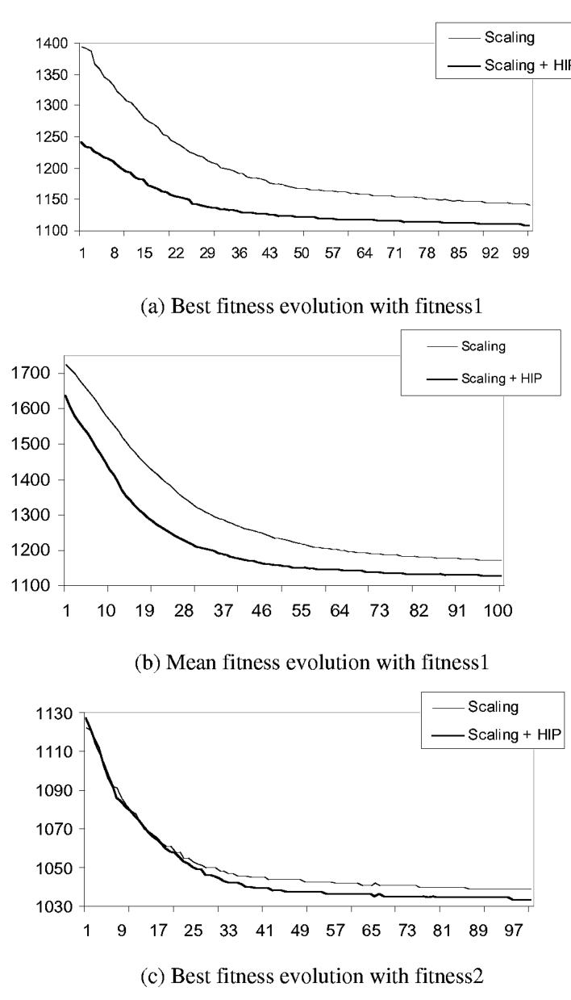

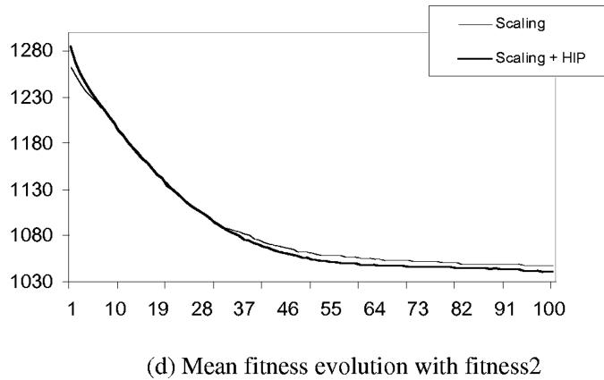  
Figure 8.5 Comparison of various versions of the GA in solving the FT10 problem instance. Whenever scaling is used, the value of the parameter b is - 930. (930 is the value of the optimum makespan for this problem.) Mean values of 50 experiments are shown. The running time of an experiment is about 1 second. In these experiments we have used the GPX operator and crossover and mutation probabilities of 0.8 and 0.01, respectively

# 8.7 Conclusions

GAs are suitable tools for complex problem-solving such as job-shop and related problems. But, as it was pointed in (17), the efficiency of standard GAs in search of near-optimal solutions is limited. However, when combined with other techniques like simulated annealing (14) or local search (28), GAs are quite competitive with the most efficient approaches. For example, in (17), Mattfeld proposed a strategy to hybridize a GA with a local search strategy and a structured population that produces very good results on the most popular benchmarks of job-shop problems. The local search transforms every individual into a near local optimum, and the structured population is used to constrain mating among neighbors.

In this chapter, we have presented a strategy to hybridize a standard GA by introducing heuristic knowledge in a fraction of individuals of the initial population. The experimental results reported show that this strategy accelerates the convergence during the first generations and that the improvement is particularly good when the problem instance presents bottleneck resources. Hence it looks to be appropriate when a solution to the problem is required as soon as possible. However, in order to made a full exploitation of a heuristic initial population, further investigations should be carried out. Therefore, we propose for subsequent research a number of ideas, such as exploiting all the information provided by the variable and value ordering heuristics, as well as other related heuristics, as well as systematic experimentation combining the heuristic initial population with other strategies such as local search and structured populations.

# Список литературы

1 Adorf, H.M. and Johnston, M. D. A discrete stochastic neural network algoritm for constraint satisfaction problems. Proc. of the International Joint Conference on Neural Networks. San Diego. 1990.   
2 Beck, J.C. and Fox, M.S. Dynamic problem structure analysis as a basis for constraint-directed scheduling heuristics. Artificial Intelligence, 117, 31-81, 2000.   
3 Blazewicz, J., Domschke, W. and Pesch, E. The job shop scheduling problem: Conventional and new solution techniques, European Journal of Operational Research, 93, 1-33, 1996.   
4 Bierwirth, C. A generalized permutation approach to jobshop scheduling with genetic algorithms. OR Spectrum, 17, 87-92, 1995.   
5 Conway, R.W., Maxwell, W.L. and Miller, L.W. Theory of Scheduling, Reading, MA, Addison-Wesley, 1967.   
6 Corne, D. and P. Ross. Practical Issues and Recent Advances in Job- and Open- Shop Scheduling. Eds. D. Dasgupta and Z. Michalewicz. SpringerVerlag.   
7 Dorndorf, U. and Pesch, E. Evolution based learning in a job shop scheduling environment, Computers & Operations Research, 22, 25-40, 1995   
8 Fang, H.L., Ross, P., and Corne, D. A promising genetic algorithm approach to job-shop scheduling, rescheduling, and open-shop scheduling problems, in Proceedings of the Fifth International Conference On Genetic Algorithms, 1993, 375-382.   
9 Goldberg, D. Genetic Algorithms in Search, Optimization & Machine Learning, Addison-Wesley, Reading, MA, 1985.   
10 Grefenstette, J.J. Incorporating problem specific knowledge in genetic algorithms, in Genetic Algorithms and Simulated Annealing, Morgan Kaufmann (1987), 42-60.   
11 Hatzikonstantis, L. and Besant, C.B. Job-shop scheduling using certain heuristic search. The International Journal of Advanced Manufacturing Technology, 7, 251-261, 1992.   
12 Hentenryck, H. Simonis and M. Dincbas. Constraint satisfaction using constraint logic programming. Artificial Intelligence, 58, 113-159, 1992.   
13 Jain, A.S. and Meeran, S. Deterministic job-shop scheduling: Past, present and future. European Journal of Operational Research, 113, 390-434, 1999.   
14 Kolonko, M. Some new results on simulated annealing applied to the job shop scheduling problems. European Journal of Operational Research, 113, 123-136, 1999.   
15 Larrosa, J. and Messeguer, P. Generic CSP techniques for the job-shop problem, in Methodology and Tools in Knowledge-Based Systems, Lecture Notes in Artificial Intelligence, 1415, Mira, J., del Pobil, A.P., and Ali, M. (eds.), Springer, 1998, 46-55.   
16 Maccarthy, B.L. and Liu, J. Addressing the gap in scheduling research: a review of optimization and heuristic methods in production scheduling. International Journal Production Research, 31, 59-79, 1993.   
17 Mattfeld, D.C. Evolutionary Search and the Job Shop. Investigations on Genetic Algorithms for Production Scheduling. Springer-Verlag, November 1995.   
18 Michalewicz, Z. Genetic Algorithms $^ +$ Data Structures $=$ Evolution Program, Second, Extended Edition, Springer-Verlag. 1994.   
19 Parreño, J., Gómez, A., and Priore, P. FMS loading and scheduling problem solving using genetic algorithms. in INFORMS XXXIV, Barcelona, 1997, 156-166.   
20 Pearl, J. Heuristics. Intelligent Search Strategies for Computer Problem Solving. Addison-Wesley 1984.   
21 Varela, R., Vela, C.R., Puente, J. and Alonso, C. Parallel Logic Programming for Problem Solving, International Journal of Parallel Programming, to appear in June 2000.   
22 Yamada, T. and Nakano, R., Scheduling by genetic local search with multistep crossover. In Fourth Int. Conf. on Parallel Problem Solving from Nature (PPSN IV), Berlin, Germany, 22-26 Sep., 960-969, 1996.   
23 Zweben, M. Davis, E., Daun, B., Drascher, E., Deale, M. and Eskey, M. Learning to improve constraint-based scheduling. Artificial Intelligence 58, 271-296, 1992.

# Chapter 9 Applying the Implicit Redundant Representation Genetic Algorithm in an Unstructured Problem Domain

A.M. Raich and J. Ghaboussi   
Department of Civil and Environmental Engineering   
University of Illinois at Urbana-Champaign   
Urbana, IL 61801

# 9.1 Introduction

An evolutionary-based method called the implicit redundant representation genetic algorithm (IRR GA) is applied to evolve synthesis design solutions for an unstructured, multi-objective frame problem domain. The synthesis of frame structures presents a design problem that is difficult, if not impossible, for current design and optimization methods to formulate, let alone search. Searching for synthesis design solutions requires the optimization of structures with diverse structural topology and geometry. The topology and geometry define the number and the location of beams and columns in the frame structure. As the topology and geometry change during the search process, the number of design variables also changes. To support the search for synthesis design solutions, an unstructured problem formulation that removes constraints that specify the number of design variables is used. Current optimization methods, including the simple genetic algorithm (SGA) are not able to model unstructured problem domains since these methods are not flexible enough to change the number of design variables optimized. The unstructured domain can be modeled successfully using the location-independent and redundant IRR GA representation.

The IRR GA uses redundancy to encode a variable number of locationindependent design variables in the representation of the problem domain. During evolution, the number and location of the encoded variables dynamically change within each individual and across the population. The IRR GA provides several benefits: redundant segments protect existing encoded design variables from the disruption of crossover and mutation; new design variables may be designated within previously redundant segments; and the dimensions of the search space dynamically change as the number of design variables represented changes (Raich & Ghaboussi, 1997). The IRR GA synthesis design method is capable of generating novel frame designs that compare favorably with solutions obtained using a trial-and-error design process (Raich & Ghaboussi, 1999).

# 9.2 Motivation for Frame Synthesis Research

Structural optimization lowers the total cost of frame structures by reducing the volume of material used and the fabrication and construction time. The optimization process is constrained by having to satisfy code requirements and serviceability limits. Previously, the sizes of the beams and columns in frame structures with fixed topology and geometry were commonly optimized during the final stage of design. This type of discrete structural optimization is called shape optimization. During shape optimization, the number of design variables is equal to the number of members in the structure and remains fixed.

# 9.2.1 Modeling the Conceptual Design Process

The pressure to design more economical structures, however, has necessitated research that focuses on applying optimization techniques earlier in the design process during conceptual design. The conceptual design process consists of the following steps (Reich & Fenves, 1995):

Problem statement detailing the design criteria:

1. Synthesis of potential design alternatives   
2. Calculation of level of objective satisfaction and constraint violation   
3. Modification of design alternatives   
4. Selection of design(s) for further optimization and analysis

The motivation for focusing on conceptual design is the realization that greater cost savings result from design changes made during conceptual design than for design changes made later in the design process. Optimization of the conceptual design process requires concurrent design and analysis of design solutions. These methods must not only optimize the shape of individual beams and columns in the structure, but must also optimize the topology and geometry of the structure itself. Performing geometry optimization defines the length of the members and the location of the joints within the problem domain. Providing changes to the geometry of the structure during design requires the designation of additional design variables that optimize the geometric location of the joints in the structure. The total number of design variables optimized remains fixed and known. Topology optimization is performed to define the number of joints in the structure, the joint support locations, and the number of members connected to each joint. The optimal number of members and joints is unknown and must be allowed to change during optimization.

# 9.2.2 Research in Frame Optimization

Camp, Pezeshk, & Cao (1998) researched the shape optimization of a single-bay, eight-story frame and a three-bay, three-story frame under three loading conditions for a structure with a fixed geometry and topology. Sugimoto & Banali (1996) also analyzed the performance of GAs on the shape optimization of structural frames. Grierson & Park (1996) used GAs to develop the conceptual topology design of three-dimensional building frameworks based on cost analysis to determine the optimal bay size and number of stories for structures with fixed topology. In addition to GAs, researchers have applied other optimization methods to the shape optimization of frames. Simoes (1996) investigated the shape optimization of two-bay, three-story, semi-rigid frames with fixed topology and geometry. Saka (1997) applied the optimality criteria method to optimize the shapes of tapered steel beams and frames with one or two bays having fixed topology and geometry.

# 9.3 The Implicit Redundant Representation Genetic Algorithm

Genetic algorithms provide a random directed search method that borrows both its form and search operators from natural evolution. The defining components of the genetic algorithm selected by the designer are: the genotype/phenotype representation of the problem domain, fitness evaluation and penalty functions, selection scheme, crossover and mutation methods, and crossover and mutation rates. This chapter discusses the application of an evolutionary-based search methodology called the implicit redundant representation (IRR) (Raich & Ghaboussi, 1997), which extends the GA first proposed by Holland (1975) and the simple GA (SGA) further developed by Goldberg (1989) to the synthesis of frame design solutions.

The IRR GA was developed to support the synthesis of design solutions defined in unstructured problem domains (Raich & Ghaboussi, 1999). The IRR GA uses redundancy to encode a varying number of location-independent design variables to represent the diverse alternatives modeled in the unstructured problem domain. Since the number of design variables to be optimized is not known, the number cannot be fixed in the encoded representation. Instead, the number of encoded design variables is itself a variable to be optimized. The IRR GA population individuals can dynamically change the number of encoded design variables during the evolutionary process through the actions of crossover and mutation. The concurrent optimization of the shape, geometry, and topology of frame structures that is performed by the IRR GA is not currently available using any existing design or optimization method. The simple genetic algorithm (SGA), for example, does not have the representational flexibility required to represent diverse topology and geometry configurations. The performance of the IRR GA was shown to be better than an SGA and a structured GA experimentally on a cantilever beam optimization problem (Raich & Ghaboussi, 1997). The IRR GA method is robust enough to handle multi-objectives, multiple loading environments, and a dynamically changing number of design variables while concurrently optimizing the size, geometry and topology of frame design solutions.

void main() { // Initialize Random Population of Binary Encoded Strings InitBinary(); // Start Generational Cycle while ( m_iIterations $<$ MAX_GEN) { // Evaluate fitness of binary encoded strings in population EvaluateBinary(); // Select Individuals based on fitness (); // Perform crossover operations CrossOver(); // Perform mutation operations MutationBinary(); m_iIterations $^ { + + }$ ; } }

# Figure 9.1 $\mathbf { C } { + + }$ code for main() function that implements the IRR GA

// Provides all of the IRR GA values required for the evolutionary   
process   
struct SIndividual{ int m_iString[STR_LENGTH];// Array of bit values for each individual float m_fPenalty[NUM_PENALTY]; // Array of penalty function values float m_fFitness[NUM_FITNESS]; // Array of fitness function values float m_fTotalFitness;// Result of Composite Fitness Evaluation };   
// Array of individuals in current population   
struct SIndividual Pool [POP_SIZE];

# 9.3.1 Implementation of the IRR GA Algorithm

The IRR GA iterative computational algorithm is the same algorithm as used for the SGA. Figure 9.1 lists the main() $\mathrm { C } { + } { + }$ code that implements the IRR GA. The functions for SelectString(), CrossOver(), and MutationBinary() are the same as used in a typical SGA program. The distinct differences between the IRR GA and the SGA occur in InitBinary() and EvaluateBinary(). The implementation requirements of these two functions will be discussed in greater detail in this chapter.

The designer selects the population size based on diversity and computational issues and the IRR GA randomly initializes the bit values of the population individuals. The IRR GA program stores the binary-bit string values, the calculated individual penalty and fitness values, and the calculated overall fitness of each individual in the population in SIndividual data structures. The entire population of individuals in the program is stored as an array of SIndividual data structures in the variable Pool[] as defined in Figure 9.2.

# 9.3.2 Suitability of the IRR GA in Conceptual Design

The evolutionary optimization process performed by genetic algorithms parallels the conceptual design process. The GA operations of maintaining a population of solutions, fitness evaluation and selection, and application of crossover and mutation parallel the conceptual design operations of synthesis of potential design alternatives, calculation of objective satisfaction and constraint violation, and modification of the design alternatives. The benefits of using GAs to represent and search for synthesis design solutions were discussed by Roston and Sturges (1996):

1. Explores a wide (grammer-defined) space of design alternatives not limited to present design configurations   
2. Supports a diverse range of design alternatives for application or additional, more refined optimization   
3. Performs the conceptual design process of synthesis and analysis concurrently

# 9.4 The IRR Genotype/Phenotype Representation

Genetic algorithms work with an encoding of the design variables that defines a genotype representation of the solution. The genotype representation is decoded during fitness evaluation into a phenotype representation, which consists of the decoded values of the design variables that define a solution. The IRR genotype representation provides a mechanism that allows essential and redundant sections of the encoded binary-bit string to interact dynamically. The essential segments of the string encode the design variables. The portions of the IRR GA string that do not encode gene instances are the redundant segments. In order to provide space to define redundant segments within the string, the IRR GA uses a string length that is longer than the length required to encode only the design variables. All individuals in the population have the same string length. The design variables encoded in each individual represent a complete solution to the problem, but the number of encoded variables defining the solution may be different. The binarybit strings in the population are initialized by the function InitBinary() using the defined string length, which for the examples presented in this chapter is 600 bits. The IRR GA genotype representation consists of the design variables and additional redundant segments that do not currently contain encoded design variables.

In the IRR GA, the encoded design variables are called gene instances. Each gene instance encoded in the IRR string, as shown in Figure 9.3(a), consists of two parts: a pre-selected Gene Locator (GL) pattern and the encoded design variable. The GL pattern, which is a selected pattern of bit values such as [1 1 1], identifies the location of the gene instance in the string. The design variable is encoded in the string by a pre-specified number of bits similar to other GAs. The specific location of each gene instance in the string is not fixed by the IRR. Instead, each gene instance is allowed to drift within the length of the string.

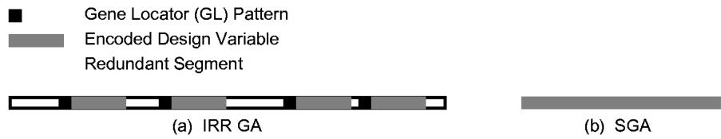  
Figure 9.3 Comparison of generic IRR GA and SGA genotype representations. (From Raich & Ghaboussi, in press.)

The IRR GA genotype representation is distinct from the SGA representation. In a SGA, the design variables are also encoded as $n$ -bit binary numbers, but the encoded design variables are concatenated together. The locations of SGA design variables remain fixed and the SGA genotype does not contain any redundant segments, as shown in Figure 9.3(b).

Design variables are decoded from the IRR GA genotype by parsing the string from left to right and locating each distinct occurrence of the GL pattern. Every time a GL pattern is located, a design variable is decoded from the following nbits of the string. Then, the parsing of the string continues until the next GL pattern is found. No overlap of the GL patterns and design variables is allowed.

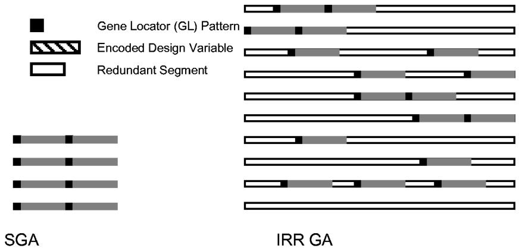  
Figure 9.4 Dynamic redundancy provided by the IRR GA compared to the SGA

# 9.4.1 Provision of Dynamic Redundancy

One benefit of the IRR GA is that the designer does not need to specify the number of design variables to be represented. The IRR GA allows the number of variables encoded to change dynamically from generation to generation and between the individuals in the population. Figure 9.4 shows the expanded range of potential design variable encodings using the dynamic redundancy provided in the IRR GA genotype compared to the SGA genotype (Raich & Ghaboussi, 1997). In the SGA, there is only one way of encoding the design variables for all individuals in the population. The randomly initialized population of IRR GA strings, in comparison, is composed of dissimilar strings that vary in the number and location of the encoded design variables and redundant segments. Providing dynamic redundancy allows the IRR GA to search for solutions effectively in unstructured problems by encoding a variable number of location-independent design variables and allowing self-organization of the linkage of the encoded design variables. A severe reduction in the number of variables represented in the IRR GA genotype often occurs during evolution. This type of dynamic behavior cannot be captured by SGAs.

The use of non-coding (redundant) segments has been previously researched (Levenick 1991; Wu & Lindsay, 1996). The non-coding segments were used to separate the encoded design variables in the string, but were assigned a fixed location and length in all individuals. In addition, these non-coding segments remained redundant. The dynamic redudancy permits the locations and length of redundant segements to change during evolution. The redundant segments protect existing gene instances from the disruption of crossover and mutation, while providing a mechanism for forming new gene instances in the previously redundant segements in future generations by the actions of crossover and mutation. More details concerning the development and application of the IRR GA are found in Raich & Ghaboussi (1997).

# 9.4.2 Controlling the Level of Redundancy in the IRR GA Initial Population

The selection of an appropriate level of redundancy is an important design consideration in the IRR GA. The level of redundancy in the IRR GA representation determines whether population individuals can evolve the number of design variables required to represent the optimal solution. The average initial redundancy ratio of the individuals in the population is calculated by first evaluating the probability of an occurrence of a GL pattern consisting of $n$ bits all having the same allele value, such as [0 0 0] or [1 1 1 1]:

$$
\rho = \beta ^ { n } \bigg ( \frac { 1 - \beta } { 1 - \beta ^ { n } } \bigg ) \sum _ { j = 0 } ^ { n - 1 } \beta ^ { j }
$$

where $\rho$ is the probability of a single occurrence of a specific GL pattern; $\beta$ is the probability of a single occurrence of the specified bit value; and $n$ is the number of bits specified in the GL pattern. For the GL pattern of [1 1 1] used in the examples presented, $\beta = 0 . 5$ and Equation (1) sets $\rho = 0 . 0 7 1 4 2 8 5 7$ .

The initial redundancy ratio of individuals in the randomly initialized population is defined as the ratio between the number of redundant bits and the total string length, $l _ { S }$

$$
\mathit { R a t i o } = \frac { 1 } { l _ { s } } \left[ l _ { s } - ( l _ { s } + n ) \frac { ( l _ { s } - l _ { s } + 1 ) \rho } { ( 1 + l _ { s } \rho ) } \right]
$$

where $l _ { g }$ is the length of the encoded design variable(s). The average initial redundancy ratio used in the frame synthesis examples presented in this chapter was approximately 0.35 for the GL pattern [1 1 1], a string length of 600 bits, and a 19-bit encoded gene consisting of the encoded design variables. Therefore, an average of 17 gene instances were initialized in the 600-bit strings encoding the individual in the population. After the evolutionary process starts, the level of redundancy will change within the individuals in the population as the number of encoded gene instance dynamically changes.

The level of redundancy required is a problem-dependent control parameter, and therefore must be selected by the user. If the level of redundancy is set too low, the IRR GA has difficulty adding and maintaining a desirable number of gene instances, which is very detrimental to performance. Although the impact on performance is not as significant, a high level of redundancy forces the IRR GA to spend more effort in removing excess gene instances than in optimizing existing gene instances.

# 9.5 Applying the IRR GA to Frame Design Synthesis in an Unstructured Domain

This section presents the IRR GA genotype/phenotype representation for the unstructured frame synthesis design problem. Moment-resistant plane frames are common structural elements in buildings. The exterior walls of steel frame buildings are constructed using frames with open, rectangular bay areas in between the columns at each story to allow for windows. In order to calculate how well the solution encoded in each individual satisfies the problem objectives and constraints, the design variables encoded in the IRR GA genotype must be decoded into the IRR GA phenotype representation. The design variables represented by the IRR GA are defined during the problem domain formulation. The implementation details concerning applying repair strategies, assembling design alternatives, generating horizontal members, and calculating the loading carried by the structures are also discussed. In each section, the program elements and descriptive code segments required for the IRR GA $\mathrm { C } { + } +$ program development are discussed.

# 9.5.1 Unstructured Design Problem Formulation

The design problem selected is the synthesis of a plane frame structure with a maximum total width of $6 0 ^ { \prime } 0 ^ { \prime \prime }$ and a maximum structure height of $4 2 \mathrm { { ' } 0 \mathrm { { ' } ' } }$ (three floor levels). The magnitudes of the dead load, live load, and wind load are set and the frames have pinned support nodes. The corresponding structured and unstructured frame problem domains are shown in Figures 9.5(a) and (b), respectively, to compare the two approaches (Raich & Ghaboussi, 1999). The structured frame problem domain defines the location and connectivity of all 15 members using a fixed topology and geometry. The bay widths and floor heights for the two-bay, three-story structure are defined and the loading configurations are fixed. The only remaining design variables to optimize are the individual member properties (i.e., shape optimization). The unstructured frame problem domain, in comparison, is defined only by dimensional bounds placed on the maximum width and height and the statement of the location of plane(s) of possible loading and support placement. The structural loading applied is a function of the structural topology and geometry and varies for each design synthesis alternative. All other design information required, including the number and location of joints and members, member properties, support location, member connectivity, number of stories, and size and number of bays, is determined by optimizing the design variables.

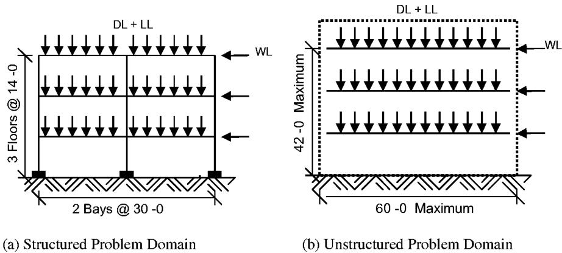  
Figure 9.5 Models of structured and unstructured frame design problem formulations. (From Raich & Ghaboussi, in press.)

# 9.5.2 IRR GA Genotype/Phenotype Representation for Frame Design Synthesis

Formulating the frame design problem to take advantage of the unstructured domain and the flexible IRR GA representation requires defining a formal grammar for the design variables. Defining the design grammar is simplified since the grammar is explicit in the genotype/phenotype representation defined by the IRR GA itself.

# 9.5.2.1 Encoding Frame Members as Design Variables

Assembling frame design solutions within the unstructured problem domain shown in Figure 9.5(b) requires knowledge about the number of members, the member depths, and the member locations, which are defined by the nodal coordinates, in the structure. All of the design information needed to model a single frame member is encoded in a single IRR gene instance identified by the GL pattern [1 1 1] in the order shown in Figure 9.6(a): the y-coordinate of node 1 (Y1); the y-coordinate of node 2 (Y2); the $\mathbf { X }$ -coordinate of node 1 (X1); the xcoordinate of node 2 (X2); the depth of the non-horizontal member (Depth 1); the depth of any horizontal member connected to the right of node 1 (Depth2); and the depth of any horizontal member connected to the right of node 2 (Depth 3). These design variables define the non-horizontal member coordinates, nodal incidences, and member depth as shown in Figure 9.6(b).

The nodal $\mathbf { X }$ -coordinates (X1,X2) are encoded as three-bit binary numbers (BITS_X 3) and are mapped to discrete values in the range (360.0,360.0). The ycoordinates (Y1,Y2) are encoded as two-bit binary numbers (BITS_Y 2). Each of the four binary values corresponds to a discrete floor level (0,1,2,3). The three member depths are three-bit binary numbers (BITS_DEPTH 3) that encode eight discrete member depths {5,10,15,20,25,30,40,50}. All members have steel tube cross-sections of fixed width and thickness with a variable depth.

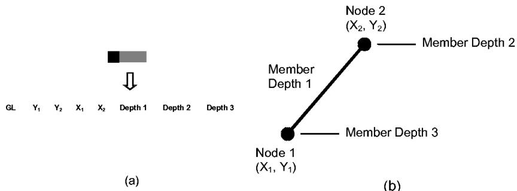  
Figure 9.6 Definition of design variables encoded in the IRR GA genotype. (From Raich & Ghaboussi, in press.)

9.5.2.2 Definition of Member Data Structures

The decoded member information is stored using an array of pointers to data structures organized in ordered linked lists. The SNodeData structure stores the node locations and corresponding horizontal member depths. A linked list is created for each floor level of the structure and initialized with two pointers that identify the start (m_pStart[NUM_LEVEL]) and end (m_pLast[NUM_LEVEL]) of the list. Two SNodeData structures, as defined in Figure 9.7, are created for each decoded member (one for each defined node). The SNodeData structures are inserted into the linked list for the floor levels identified by the Y-coordinate. Each node that is decoded from the IRR GA string is inserted into the correct floor level linked list and ordered by increasing value of the x-coordinates.

The IRR GA allows individuals in the population to have a different number of design variables that define diverse nodal locations and member positions. The maintenance of the linked lists is useful in assembling the complete structure from the design variables encoded in the IRR GA individuals, including the following functions discussed in this chapter:

2) Grouping support nodes at the ground level 3) Grouping nodes at each floor level 4) Generating the horizontal members for the entire structure 5) Applying the alternating span live loading and the wind loading 6) Calculating the maximum floor area objective (fitness function) • Calculating the vertical and horizontal deflection penalties • Calculating the nodal symmetry penalty

// Structure used to construct the ordered linked lists of nodes   
for each floor level   
struct SNodeData{ int m_iNodeNum; // Assigned Node Number float m_fxCoord; // X-coord. of node float m_fHorzDepth; // Decoded Horz. depth struct SNodeData\* m_pNextNode; // Pointer to next node in   
linked list   
};   
// Pointers to maintain the start and end of each linked list for   
each floor level   
struct SNodeData \*m_pStart[NUM_LEVELS], \*m_pLast [NUM_LEVELS];   
// Array that tracks the number of nodes in each level's linked   
list int m_iTallyNodes[NUM_LEVELS];

# Figure 9.7 SNodeData structure for storing design variables

9.5.2.3 Creation of Linked Lists of Pointers Using SaveNodes()

The first function that EvaluateBinary() calls is SaveNodes(). The SaveNodes() function parses the binary bit strings in the population to locate the encoded GL patterns identifying the encoded design variables. The function SaveNodes() listed in Figure 9.8 is called for each individual, $j$ When a GL pattern is found, SaveNodes() performs the genotype to phenotype mapping of the design variable values and then creates two new SNodeStructs using the function CreateNodeForList(iCurrentNode) to store the decoded member and nodal information. The new SNodeStructs are inserted into their proper location in the linked lists using the function slsStore(l). The functions CreateNodeForList() and slsStore() are defined in Figure 9.9.

in saveNoues (j)   
{ m_iMemberNum $\qquad = \ 0$ ; // Current member number   
being decoded from IRR GA string iCurrentNode $\ l = \ \ l \ b \_ { 1 }$ ; // Current node number $\begin{array} { l l l } { \dot { \textbf { 1 } } } & { = } & { 0 ~ , } \end{array}$ //… Start parsing IRR GA string   
to locate encoded gene instances while ( i $< =$ STR_LENGTH - (3 + 2\*BITS_X + 2\*BITS_Y +   
3\*BITS_DEPTH)){ iTemp $\qquad = \ 0$ ; for $\begin{array}{c} ( \mathbf { k } ~ = ~ 0 ; ~ \mathbf { k } ~ < ~ 3 ; ~ \mathbf { k } + + )  \end{array} \left\{ \begin{array} { l l } { \begin{array} { r l r } \end{array} } \end{array} \right.$ // … Looking for GL   
Pattern [1 1 1] … if (Pool[j].m_iString $\begin{array} { r l r } { [ \mathbf { i } + \mathbf { k } ] } & { { } = = } & { 1 } \end{array}$ iTemp $^ { 1 + + }$ ; $\begin{array} { r } { \begin{array} { c c c } { \boxed { \begin{array} { r c l } \end{array} } } & { \quad } & { \begin{array} { r c l } \end{array} } \\ { \dot { \bf { i } } \pounds \ \quad ( } & { { \bf { i } } \mathrm { { T e m p } } } & { = = \ 3 \ ) \ \left\{ \begin{array} { r c l } \end{array} \right. } \end{array} } \end{array}$ 11 … Found GL   
Pattern .. $\textrm { \textbf { i } } = \textrm { \textbf { i } } + \textrm { \textbf { 3 } } ;$ //... Decode $\mathtt { Y }$ Nodal Coordinate using mapping to integer values   
directly ... Solutions[j].NodeXY[iCurrentNode].m_fY =   
GetParameter(BITS_Y,i,j) \*STORY_HEIGHT; $\begin{array} { r } { \dot { \textbf { 1 } } = \dot { \textbf { 1 } } + \mathtt { B I T S \_ Y } ; } \end{array}$ Solutions[j].NodeXY [iCurrentNode $+ .$ 1].m_fY $=$   
GetParameter(BITS_Y,i,j) \*STORY_HEIGHT; $\mathrm { ~ \bf ~ i ~ } = \mathrm { ~ \bf ~ i ~ } + \mathtt { B I T S \_ Y } ;$ //.… Check if nodes on same level (horizontal member) - keeplook for next GL pattern … if (Solutions[j].NodeXY[iCurrentNode $+ 2 1$ .m_fY $\downarrow =$ Solutions[j].NodeXY[iCurrentNode].m_fY) { //.… Decode X Nodal Coordinates using mapping to discrete values . Solutions[jl.NodeXY[iCurrentNode].m_fX =   
StoreXCoord(); $\dot { \textbf { 1 } } = \dot { \textbf { 1 } } + \mathtt { B I T S \_ X } .$ . Solutions[j] .NodeXY [iCurrentNode $+ 2 1$ .m_fX $=$ StoreXCoord(); i = i + BITS_X; // Decode current member's nodal incidences   
connections Solutions[j].m_iMemConnect[m_iMemberNum\*nne] $=$   
iCurrentNode; Solutions[j].m_iMemConnect [m_iMemberNum\*nne $^ { + 1 }$ ] $=$   
iCurrentNode $^ { + 1 }$

// Decode current member's depth using mapping tc discrete values Solutions[j].m_fDepth[m_iMemberNum] = StoreMemberDepth(); $\mathrm { ~ \bf ~ i ~ } = \mathrm { ~ \bf ~ i ~ } + $ BITS_DEPTH; // Create new node structure for starting node including decoded horizontal depth int error $=$ CreateNodeInsertList(iCurrentNode); if (error $\mathbf { \Sigma } = \mathbf { \Sigma } \cdot \mathbf { \Sigma }$ ) return 1; $\mathrm { ~ \bf ~ \underline { ~ } { ~ i ~ } ~ } = \mathrm { ~ \bf ~ i ~ } + \mathrm { ~ \bf ~ \underline { ~ } { ~ } { ~ \bf ~ \underline { ~ } { ~ } { ~ \bf ~ \underline { ~ } { ~ } { ~ \bf ~ \underline { ~ } { ~ } { ~ \bf ~ \underline { ~ } { ~ } { ~ \bf ~ \underline { ~ } { ~ } { ~ \bf ~ \underline { ~ } { ~ } { ~ \bf ~ \underline { ~ } { ~ } { ~ \bf } ~ } { ~ } } } } ~ } } ~ } }$ BITS_DEPTH; // Store first node in linked list sls_store((int)Solutions[j].NodeXY[iCurrentNode].m_fY/STORY_ HEIGHT); m_iTallyNode[(int)Solutions[j].NodeXY[iCurrentNode].m_fY/STO RY_HEIGHT] $^ { + + }$ ; // Create new node structure for ending node error $=$ CreateNodeForList(iCurrentNode $^ { + 1 }$ ) ; if (error $\ c = \ \ b { \ b } \ b { \ b } \ b { \ b } \ b { \ b } \ b { \ b } { \ b } $ )return 1; $\mathrm { ~ \bf ~ i ~ } = \mathrm { ~ \bf ~ i ~ } + $ BITS_DEPTH; // Store second node in linked list sls_store((int)Solutions[j].NodeXY[iCurrentNode $^ { + 1 ] }$ .Y/STORY_H EIGHT); m_iTallyNode[(int)Solutions[j].NodeXY [iCurrentNode $+ 1 1$ .Y/STOR Y_HEIGHT] $^ { + + }$ ; iCurrentNode $+ = ~ 2$ ; // Added two nodes to structure m_iMemberNum $^ { + + }$ ; // Added one member to structure } el $\begin{array} { r l r } { { \bf 3 } \in \mathrm { ~ \bf ~ i ~ } } & { { } = } & { \dot { \bf 1 } \mathrm { ~  ~ \mathbb ~ - ~ } \left( \ k _ { 2 } + \ k _ { \mathrm { B I T S } } \mathrm { ~  ~ \underline { ~ } { ~ Y ~ } ~ } \right) \ ; } \end{array}$ } else $\dot { \bf 1 } + +$ ; // Continue parsing IRR GA string for GI pattern } return 0; // No memory errors }

# Figure 9.8 Definition of SaveNodes() function called by EvaluateBinary()

int CreateNodeForList(iCurrentNode)   
{ m_pNewNode $=$ new SNodeData; if (!m_pNewNode) { printf("\nOut of memory"); return 1; } m_pNewNode->m_fNodeNum $=$ iCurrentNode; m_pNewNode->m_fX $=$ Solutions[j].NodeXY[iCurrentNode].m_fX; m_pNewNode->m_fHorzDepth $=$ StoreHorzDepth();   
}   
void slsStore(iLevel)   
{ pTempNode $=$ m_pStart[iLevel]; if (!m_pLast[iLevel]){ // Insert first element in the list m_pNewNode->m_pNextNode $=$ NULL; m_pLast [iLevel] $=$ m_pNewNode; m_pStart[iLevel] $=$ m_pNewNode; return; } pold $=$ NULL; while (pTempNode){ if (pTempNode->m_fX < m_pNewNode->m_fX) { pold $=$ pTempNode; pTempNode $=$ pTempNode->m_pNextNode; } else{ if (pold){ // …Insert in middle of list … pold- ${ \tt > } { \tt m }$ _pNextNode $=$ m_pNewNode; m_pNewNode->m_pNextNode $=$ pTempNode; return; } m_pNewNode->m_pNextNode $=$ pTempNode; // … Insert as new first element .. m_pStart [iLevel] $=$ m_pNewNode; return; } m_pNewNode->m_pNextNode $=$ NULL; // Insert as last element m_pLast [iLevel]->m_pNextNode $=$ m_pNewNode; m_pLast [iLevel] $=$ m_pNewNode; }

# Figure 9.9 Definition of CreateNodeForList() and slsStore() called by SaveNodes()

# 9.5.2.4 Construction of Complete Design Synthesis Alternatives

Assembling a complete frame synthesis alternative consists of defining: the nonhorizontal member locations using the nodal coordinates decoded from the IRR genotype and generating the horizontal members based on the locations of the decoded nodal coordinates. The two horizontal member depths decoded from each gene instance are used to generate horizontal members. Figure 9.10 shows the frame structure decoded from an IRR GA genotype having four encoded gene instances. At this point, the structure is defined by the four non-horizontal members. Using the member and nodal information decoded, the complete frame structure is assembled by generating three horizontal members.

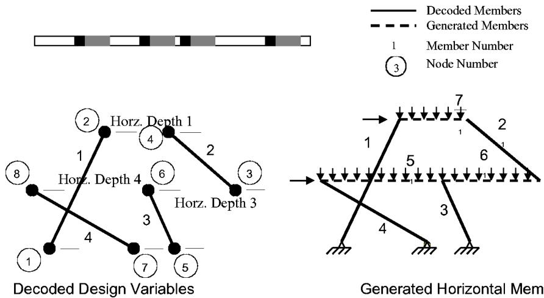  
Figure 9.10 Assembly of complete structure from design variables   
Figure 9.11 shows an example of the arrays of linked lists created by SaveNodes() to represent the four-member frame structure shown in Figure 9.10. There are three floor levels in this example. SaveNodes() creates an ordered linked list of SNodeData structures for each of the three floor levels with $m _ { - } p S t a r t { I } J$ and m_pLast[] aiding the manipulation of the linked lists. The number of nodes at each floor level is maintained by m_iTallyNode as shown.

The necessary design information that describes each design alternative is stored using data structure, SStructure. The entire population of solutions is stored in the program variable Solutions[], which consists of an array of SStructures. Figure 9.12 defines the SStructure data structure that contains the number of members and nodes in the structure, the depths of all members, the member connectivity, and the nodal coordinates.

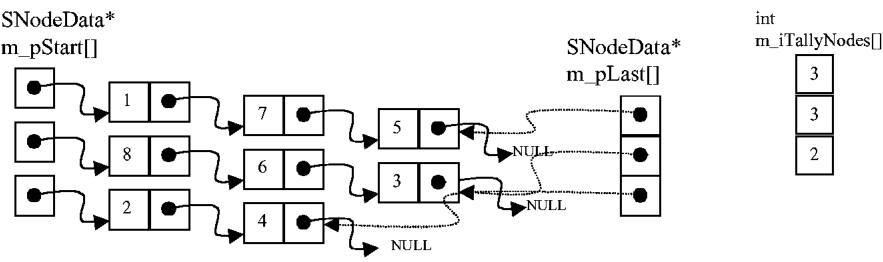  
Figure 9.11 Linked lists of SNodeData structures for frame structure defined inFigure 9.10   
Figure 9.12 Definition of SStructure and SNode data structure for frame alternatives

struct SStructure{ int m_iNumMem; // Total number of members in current structure int m_iNumNodes; // Total number of nodes in current structure float m_fDepth[MAX_MEM]; // Array of member lengths in   
current structure int m_iMemCon[MAx_MEM_2]; // Array of nodal connections for   
members struct SNode NodeXY[MAX_NODES]; /1 Array of nodal   
coordinates for members   
};   
// Array of current structures that make up the current solutions   
in the population   
struct SStructure Solutions [POP_SIZE];   
// To save the nodal coordinates of each node   
struct SNode{ float m_fX; float m_fY;   
};

# 9.5.3 Use of Repair Strategies on Frame Design Alternatives

Repair strategies can be applied to candidate solutions to transform infeasible frame solutions into feasible solutions. During the IRR GA synthesis and optimization of the unstructured design solutions, however, no attempt is made to correct the deficiencies of an infeasible solution. The solutions compete as is. In some cases, the flexibility of the unstructured formulation allows the configuration of structures having features that impair the finite-element structural analysis. An analysis is required for each individual in the population in order to calculate fitness and penalty values. Therefore, repair strategies are applied to pre-processing the design data for the finite-element analysis.

# 9.5.3.1 Ensuring a Minimum Number of Support Nodes

The easiest problem to detect is not having enough support nodes for the frame structure. For two-dimensional frames, the minimum number of pinned support nodes required for structural analysis is two. Otherwise, unstable structures are analyzed. Within the unstructured formulation, there is no explicit constraint stating the number of supports. If an evolved structure has fewer than two supports, the structure is assigned a minimum fitness as shown in Figure 9.13 and no analysis is performed. The low fitness designates this individual of the population as a lethal, and lethal individuals are typically removed from the IRR GA population within a few generations by selection pressure.

//.… Checking for at least two supports in the frame structure…   
if (m_iTallyNode[0] < 2){ // … Set lethal penalties to the penalty   
and fitness terms for $\mathrm { ~ \bf ~ \underline { ~ } { ~ i ~ } ~ } = \mathrm { ~ \bf ~ 0 ~ }$ ; i < NUM_PENALTY; $\dot { \bf 1 } + +$ ) { Pool[j].m_fPenalty[i] = 0.001; } for $\mathrm { ~ \bf ~ \underline { ~ } { ~ i ~ } ~ } = \mathrm { ~ \bf ~ 0 ~ }$ ; i < NUM_FITNESS; $\dot { \bf 1 } + +$ ) { Pool[j].m_fFitness[i] $\begin{array} { r l r } { \mathbf { \omega } } & { { } = } & { 0 \cdot 0 0 1 } \end{array}$ ; }   
}

# 9.5.3.2 Deletion of Single Nodes on Floor Levels

Another pre-processing step is the modification of structures having only a single node defined on a specific floor level. This repair strategy removes the single node from the structure, along with its connecting member and the node connected to the other end of the member. The occurrence of a single node is not common since the population individuals are initialized with an excess number of encoded members and the number of encoded members is reduced during evolution.

The function that performs the single node deletion, DeleteSingleNode(), is called by EvaluateBinary(). The program code required to implement DeleteSingleNode() is shown in Figure 9.14. Removing a node from the structure requires removing the corresponding node from the linked lists and reassigning the node numbers and member incidences currently stored. In addition, the connecting member must be found and deleted. Since the support level has already been checked for less than two supports, the support node level is not included in this function.

// … Looking for single nodes on any level to delete in   
EvaluateBinary()   
while (iLevel $<$ NUM_LEVELS){ if (m_iTallyNode[iLevel] == 1){ // Found single node DeleteSingleNode(m_pStart[iLevel]->m_iNodeNum, j); m_iMemberNum--; // Removed one member ${ \mathrm { n n ~ } = \mathrm { ~ } \mathrm { n n ~ } - \mathrm { ~ } 2 \mathrm { ~ } ; }$ // Removed two nodes iLevel $\qquad = \quad \beth$ ; // Reset search to lowest   
level } else iLevel $^ { + + }$ ;   
}   
void DeleteSingleNode(iDelNode, j)   
{ // … Search for member number and node numbers (either end   
of member). for (int $\mathrm { ~ \bf ~ i ~ } = \mathrm { ~ \bf ~ 0 ~ }$ ; $\dot { \mathrm { ~ \bf ~ i ~ } } < \mathrm { ~ \bf ~ m ~ }$ _iMemberNum; $\dot { \bf 1 } + +$ ) { if (Solutions[j].m_iMemCon[i\*nne] $= =$ iDelNode Solutions[j].m_iMemberCon[i\*nne+1] = = iDelNode){ iDelMem $\mathbf { \Sigma } = \mathbf { \Sigma } \dot { \mathbf { \Sigma } } \dot { \mathbf { \Sigma } }$ ; // … Found member to delete .… iNode_1 $=$ Solutions[j].m_iMemCon[i\*nne]; iNode_2 $=$ Solutions[j].m_iMemCon $[ \mathbf { i } \star \mathbf { n } \mathbf { n } \mathbf { e } + 1 ]$ ; if (iNode_ $\mathrm { ~ \underline { ~ } { ~ } ~ } ^ { \mathrm { ~ 1 ~ } } <$ iNode_2){ // … Delete lower   
node first .… swap $=$ iNode_2; iNode_2 $=$ iNode_1; iNode_1 $=$ swap; } } } //.. Change nodal coordinates … ChangeNodalCoordinates(iNode_1,nn); //nn is global value of   
number nodes

ChangeNodalCoordinates(iNode_2,nn-1); // … Change member incidences … ChangeMemberIncidences(iNode_1); ChangeMemberIncidences(iNode_2); //.. Delete Member iDelMem.. for $\begin{array} { r l } { \dot { \mathbf { 1 } } } & { { } = } \end{array}$ iDelMem; i $<$ m_iMemberNum-1; $\dot { \bf 1 } + +$ ) { Solutions[j].m_iMemCon[i\*nne] Solutions[j].m_iMemCon[ $^ { ( \mathrm { ~ i ~ } + 1 }$ )\*nne]; Solutions[j].m_iMemCon $[ \mathbf { i } \star \mathbf { n n e } + 1 ]$ = Solutions[j].m_iMemCon[ $( \bar { \bf i } + 1 ) ^ { \overline { { \star } } } { \tt n } { \tt n } \in + 1 ]$ ; Solutions[j].m_fDepth[i] $=$ Solutions[j].m_fDepth $[ \dot { \bf 1 } + \dot { \bf 2 } ]$ ; } // … Delete Nodes From Linked List … for (iLevel $\qquad = \ 0$ ; iLevel $<$ NUM_LEVELS; iLevel $^ { + + }$ ) { DeleteNodeList(iNode_1,iLevel); DeleteNodeList(iNode_2,iLevel); } //… Change Node Numbers in linked list … ChangeNodeList(iNode_1); ChangeNodeList(iNode_2); }

# Figure 9.14 Code segment for EvaluateBinary() and function DeleteSingleNode()

In some cases, the process of combining two nodes into one node will result in a single node with at least two connecting members being defined. This triangular configuration of structural members is allowed to remain since it may be beneficial to structural stiffness and therefore increase the fitness of the individual.

# 9.5.3.3 Replacement of Geometrically Similar Nodes with a Single Node

Occasionally, structures decoded from the IRR GA genotype have nodes defined in close proximity to each other on a single floor level. To prevent the extra analysis time created by short members, a repair strategy is applied using the function MakeSameNode(), which combines the two nodes into a single node. MakeSameNode() is called by EvaluateBinary() when two nodes in the structure are within a $6 0 ^ { \prime \prime }$ set tolerance, as shown in the listing in Figure 9.15.

ptr_2 = m_pStart [iLevel]; k = m_iTallyNode[iLevel]-1; for (i = 0; i < k; $\dot { \bf 1 } + +$ { $\mathtt { p t r \_ 1 } = \mathtt { p t r \_ 2 }$ ; // … Look at two nodes at a   
time ptr_2 = ptr_1->m_pNextNode; if (ptr_2 != NULL){ if (fabs(NodeXY[ptr $2 - > \mathsf { m }$ _iNodeNum].X - NodeXY [ptr_1->m_iNodeNum]   
.x)<60.0){   
MakeSameNode $( \mathtt { p t r \_ 1 - > m }$ _iNodeNum,ptr_ $2 - \scriptstyle > { \mathfrak { m } }$ _iNodeNum ,iLevel); ptr_2 = ptr_1; // …. Reset with same node again nn--; // … Deleted one node .… } } }   
void MakeSameNode(iFirst,iold,iLevel)   
{ // … Change member incidences … for (int $\mathrm { ~ \bf ~ i ~ } = \mathrm { ~ \bf ~ 0 ~ }$ ; $\mathrm { ~ \bf ~ i ~ } < \mathrm { ~ \bf ~ m ~ }$ _iMemberNum; $\dot { \bf 1 } + +$ { if (Solutions[j].m_iMemCon[i\*nne $] \quad = = \ \mathrm { i o } 1$ d){ Solutions[j].m_iMemCon[i\*nne] $=$ iFirst; } if (Solutions[j].m_iMemCon[ $\mathtt { \star n n e + 1 } ]$ $+ 1 ] \ \mathrm { ~ \ r ~ { ~ \ r ~ { ~ i ~ o ~ l ~ c ~ } ~ } ~ }$ { Solutions[j].m_iMemCon] $\mathtt { i } \star \mathtt { n n e } + \mathtt { 1 } ]$ $=$ iFirst; } } ChangeMemberIncidences(iold); //.. Change nodal coordinates … ChangeNodalCoordinates(iold,nn); // Delete nodes from linked list DeleteNodeList(iLevel); //… Change Node Numbers in linked list … ChangeNodeList(iold);   
}

Both the EvaluateBinary() code segment that calls the MakeSameNode() function and the code for the MakeSameNode() function are shown.

The common functions called by DeleteNodes() and MakeSameNodes()   
concerning the deletion of nodes from the linked lists (DeleteNodeList() and   
slDelete()), and the modification of node coordinates (ChangeNodal   
Coordinates()), node numbers in the linked list (ChangeNodeList()), and member   
incidences (ChangeMemberIncidences()), are listed in Figure 9.16. All of these   
functions use the linked lists of pointers to the SNodeData structures extensively.   
void DeleteNodeList(iold, iLevel)   
{   
prevPtr $\qquad = \ 0$ ; // . Global pointer used by slDelete() …   
tempPtr $=$ m_pStart [iLevel];   
count $=$ m_iTallyNode[iLevel];   
for $\mathrm { ~ \bf ~ k ~ } = \mathrm { ~ \bf ~ 0 ~ }$ ; $\mathrm { ~ \bf ~ k ~ } <$ count; $\ k + +$ { if (tempPtr->m_iNodeNum $= =$ iold){ delPtr $=$ tempPtr; sldelete(iLevel); // Remove delPtr   
structure on iLevel m_iTallyNode[iLevel] $\AA - \thinspace = \thinspace 1$ ; // Removed one node   
on iLevel $\begin{array} { r c l } { \mathbf { k } } & { = } & { \mathbf { 1 } 0 0 ; } \end{array}$ } else{ prevPtr $=$ tempPtr; tempPtr $=$ tempPtr->m_pNextNode; }   
}   
}   
void slDelete(iLevel)   
{   
if (prevPtr) prevPtr->m_pNextNode $=$ delPtr->m_pNextNode; else m_pStart [iLevel] $=$ delPtr->m_pNextNode; if (delPtr $= =$ m_pLast[iLevel] && prevPtr) m_pLast[iLevel] $=$   
prevPtr; free(delPtr);   
}   
void ChangeNodalCoordinates(iNode, iNumNodes)   
{   
for $\begin{array} { r l } { \dot { \mathbf { 1 } } } & { { } = } \end{array}$ iNode; i < iNumNodes; $\dot { \bf 1 } + +$ ) { Solutions[j].NodeXY[i].m_fX   
Solutions[j] .NodeXY $[ \dot { \bf 1 } + \dot { \bf 2 } ]$ .m_fx;

Solutions[j].NodeXY[i].m_fY Solutions [j].NodeXY $[ \mathbf { i } + \mathbf { 1 } ]$ .m_fY; } } void ChangeNodeList(iold) { for (iLevel $\qquad = \quad 0$ ; iLevel $<$ NUM_LEVELS; iLevel $^ { + + }$ ) { if (m_iTallyNode[i] > 0){ tempPtr $=$ m_pStart [iLevel]; for $\mathrm { ~ \bf ~ k ~ } = \mathrm { ~ \bf ~ 0 ~ }$ ; k < m_iTallyNode[iLevel]; $\mathbf { k } + +$ { if (tempPtr->m_iNodeNum $>$ iold) //.….Decrement node numbers tempPtr->m_iNodeNum $=$ tempPtr->m_iNodeNum - 1; tempPtr $=$ tempPtr->m_pNextNode; } } } } void ChangeMemberIncidence(iNode) { for $\mathrm { ~  ~ { ~ i ~ } ~ } = \mathrm { ~ \ r ~ { ~ 0 ~ } ~ }$ ; $\mathrm { ~ \bf ~ i ~ } < \mathrm { ~ \bf ~ m ~ } _ { . }$ iMemberNum; $\dot { \bf 1 } + +$ ){ if (Solutions[j].m_iMemCon[i\*nne] > iNode){ //.. Decrement con. node numbers … Solutions[j].m_iMemCon[i\*nne] Solutions[j].m_iMemCon [i\*nne] - 1; } if (Solutions[j].m_iMemCon[i\*nne+1] $>$ iNode){ Solutions[j].m_iMemCon[i\*nne+1] Solutions[j].m_iMemCon $[ \mathbf { i } \star \mathbf { n n e } + \ b { 1 } ] - \ b { 1 }$ ; } } }

# 9.5.4 Generation of Horizontal Members in Design Synthesis Alternatives

After the design variables are decoded and the repair strategies are applied, the IRR GA program function calls the CreateHorzMembers() function. The function code is listed in Figure 9.17. This function uses the nodal information contained in the linked lists to generate all of the horizontal members at each floor level.

These horizontal members are the structural beams in the frame and carry the dead and live uniform loading. The beam length is modeled as three separate beam elements to aid in calculating the deflection penalties at the nodes. Therefore, two new SNodeData structures are created and inserted into the linked lists at the third points of the horizontal member's length.

void CreateHorzMembers(int j)   
{ for (int iLevel $\ l = \ \beth$ ; iLevel $<$ NUM_LEVELS; iLevel $^ { + + }$ ) { int iHorzNodes $\qquad = \ 0$ ; ptr_ $\mathrm { ~ 2 ~ } = \mathrm { ~ m ~ }$ _pStart[iLevel]; // … Start with first node   
in list for $\mathrm { ~ \\\ ~ i ~ ~ } = \mathrm { ~ \ ~ 0 ~ }$ ; $\mathrm { ~ \bf ~ i ~ } < \mathrm { ~ \bf ~ m ~ }$ _iTallyNode[iLevel]-1; $\dot { \bf 1 } + +$ { $\mathtt { p t r \_ 1 } = \mathtt { p t r \_ 2 }$ ; ptr_2 = ptr_1->m_pNextNode; Solutions[j].m_iMemCon[Solutions[j].m_iNumMem\*nne] $=$ ptr_1-   
>m_iNodeNum; Solutions[j].m_iMemCon[Solutions[j].m_iNumMem\*nne $^ { + 1 }$ ] $=$   
ptr_2->m_iNodeNum; increment $=$ ((Solutions[j].NodeXY[Solutions[j].m_iMemCon [Solutions[j].m _iNumMem\*nne $+ .$ 1]].m_fx) (Solutions[j].NodeXY[Solutions[j].m_iMemCon[Solutions[j].m iNumMem\*nne]].m_fX))/3.0; startDist $=$ Solutions[j].NodeXY [Solutions[j].m_iMemCon[Solutions[j].m_i NumMem\*nne]].m_fX; pr e v i ou s =   
Solutions[j].m_iMemCon[Solutions[j].m_iNumMem\*nne]; fin i sh =   
Solutions[j].m_iMemCon[Solutions[j].m_iNumMem\*nne+1]; for $\mathrm { ~ \bf ~ \chi ~ } ( \bf { k } _ { \mathrm { ~ \bf ~ \chi ~ } } = \mathrm { ~ \bf ~ 0 ~ }$ ; k < 3; ${ \bf k } + +$ { if $( \textbf { k } : = \textbf { 2 }$ { // Create new node m_pNewNode $=$ new SNodeData; m_pNewNode->m_iNodeNum $=$ Solutions[j].m_iNumNodes $^ +$ 1;   
//Increment node num m_pNewNode->m_fxCoord $=$ startDist $^ +$ increment\* $( \mathbf { k } + \mathbf { 1 } )$ ; slsStore(iLevel); // Store in linked list Solutions[j].NodeXY [Solutions [j].m_iNumNodes $+ 2 ]$ .m_fX $=$   
m_pNewNode->m_fxCoord; Solutions[j].NodeXY[Solutions[j].m_iNumNodes $^ { + 1 }$ ] . $\begin{array} { r l } { \mathbf { m } _ { - } \mathbf { f } \mathbf { Y } } & { { } = } \end{array}$ (double)iLevel\*STORY_HEIGHT; Solutions[j].m_iNumNodes $^ { + + }$ ;

iHorzNodes ${ + + }$ ; }// Add node to level } Solutions[j].m_iMemCon[Solutions[j].m_iNumMem\*nne] $=$ previous; i f ( k = = 2 ) Solutions[j].m_iMemCon[Solutions [j].m_iNumMem\*nne $^ { + 1 }$ ] $=$ finish; else Solutions[j].m_iMemCon[Solutions[j].m_iNumMem\*nne $^ { + 1 }$ ] = Solutions[j].m_iNumNodes; // New Node previous $=$ Solutions[j].m_iNumNodes; Solutions[j].m_fDepth[Solutions[j].m_iNumMem] $=$ ptr_1- >m_fHorzDepth; Solutions[j].m_iNumMem $^ { + + }$ ; // Add new member } } m_iTallyNode[iLevel] $=$ m_iTallyNode[iLevel] $^ +$ iHorzNodes; // Add up nodes } }

# Figure 9.17 Implementation of CreateHorzMembers()

# 9.5.5 Specification of Loads on Unstructured Frame Design Alternatives

The loading carried by each design alternatives must be specified before finiteelement analysis is performed. Using the unstructured formulation for the plane frame design problem requires a solution to the newly created problem of how to apply the gravity and wind loading to the diverse structures evolved. The loading cannot be applied to a fixed set of member or nodes, as is the case for structured design problems, since the same members and nodes are not always present in different unstructured design alternatives. The loading is independently determined based on the distinct topology and geometry of each IRR GA individual in the population. Evaluating diverse individuals with different loading conditions increases the design complexity of the search space, because some design alternatives will not be required to carry as much load as others.

The SLoadVector data structure stores the vector of loads applied to the structure, $m \_ d A l V e c [ ]$ , and the vector of forces, m_fForce[], returned by the finite-element analysis as defined in Figure 9.18. A finite element analysis is performed using the load vectors defined for all of the load cases defined in the vector P[NUM_LOAD_CASES] of SLoadVector structures.

struct SLoadVector{ double m_dAlVec[MAx_ROwS]; // Vector of Calc. Loads for a   
Load Case float m_fForce [MAX_ROWS $\star _ { \star }$ ; // Vector of Calc. Forces   
After Analysis   
};   
struct SLoadVector P[NUM_LOAD_CASES];

Applying the required LRFD code load combinations to potentially nonsymmetric frame structures requires a total of four load cases: two load cases for $1 . 2 ^ { * }$ Dead Load $+ ~ 1 . 6 ^ { * }$ Live Load on alternating spans and two load cases for $0 . 9 ^ { * }$ Dead Load $\pm 1 . 0 ^ { * }$ Wind Load in each horizontal direction.

# 9.5.5.1 Specification of Gravity Loads

For two load cases, live load is applied to alternating spans defined by the location of nodes along each floor level as shown in Figure 9.19. The topologyand geometry-dependent live loading has a significant impact on the definition of the live loading the design alternative carries.

EvaluateBinary() calls the function SetGravityLoad() to assign the dead and live uniform loading for each of the four load cases defined. Figure 9.20 lists the code implementing SetGravityLoad(). This function relies on using the nodal data contained by the arrays of linked lists of SNodeData structures created previously. The members that carry gravity loading are identified by traversing the linked lists at each floor level. Each horizontal member span consists of the three submembers created by CreateHorzMembers() in Section 5.4. The functions SetDL() and SetLL() calculate the equivalent nodal loads for the uniform member loading applied and store the nodal loads in $m \_ f A l V e c [ ]$ in the SLoadVector structure.

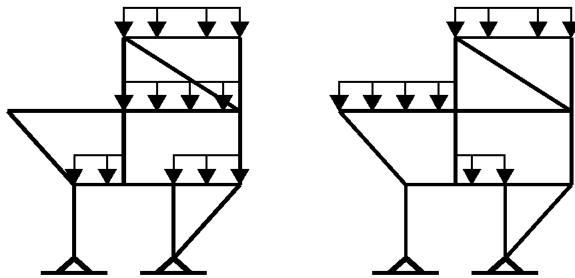  
Figure 9.19 Application of alternating span live loading to an example structure

void SetGravityLoad()   
{ LEVEL_FLAG $\ l = \ \ l \perp$ ; // … Flag for designating   
alternate levels counter $\qquad = \ 0$ ; // … Used to set uniform fixed-end   
forces for (iLevel $\ l = \ \beth$ ; iLevel $<$ NUM_LEVELS; iLevel $^ { + + }$ ) { FLAG $=$ LEVEL_FLAG; ptr_1 = m_pStart[iLevel]; // … Begin traversing   
linked lists $\mathrm { { 1 0 o p } ~ = ~ 0 ; }$ for $\mathrm { ~ \bf ~ \underline { ~ } { ~ i ~ } ~ } = \mathrm { ~ \bf ~ 0 ~ }$ ; $\mathrm { ~ \bf ~ i ~ } < \mathrm { ~ \bf ~ m ~ } _ { - }$ _iTallyNode[iLevel]-1; $\dot { \bf 1 } + +$ ){ if (loop $= 3$ ){ // … Number of divisions is 3   
currently $\mathrm { 1 0 o p ~ = ~ } 0 ;$ if (FLAG) $\qquad = 0$ FLAG = 1; // Switch   
alternating spans for LL else FLAG $\qquad = \ 0$ ; } $\mathrm { { \bf ~ p t r \underline { { ~ 2 ~ } } } ~ } = \mathrm { { \bf ~ p t r \underline { { ~ } } { ~ 1 - } > } } \mathrm { { \bf ~ p N e x t N o d e } }$ ; SetDL $( \mathtt { p t r \_ 1 - > m }$ _iNodeNum, ptr_2->m_iNodeNum);   
// Assign Dead Load SetLL $\{ \mathtt { p t r \_ 1 } \mathtt { - } \mathtt { > m } \mathtt { \_ }$ _iNodeNum, ptr_2->m_iNodeNum, FLAG, counter); // Assign Live counter $^ { + + }$ ; $\begin{array} { r l } & { \mathrm { p t r \underline { { \tau } } 1 \hfill ~ = ~ \mathrm { p t r \underline { { \tau } } 1 - > m \_ p N e x t N o d e } ; } } \\ & { \mathrm { l o o p } + + ; } \end{array}$ } if_ (m_pTallyNode[iLevel] > 1){ // … Switch for   
alternating levels if (LEVEL_FLAG $\qquad = \qquad \ b \_ \mathrm { ~ 1 ~ }$ )LEVEL_FLAG $\qquad = \quad 0$ else LEVEL_FLAG $\ c = \ 1$ ; } }   
}

# 9.5.5.2 Specification of Wind Loads

Wind load is applied at the locations of the exterior nodes on each floor level, depending upon the direction of the wind. Figure 9.21 shows two examples of applying wind loading to the left exterior nodes of the structures. The exterior nodes at each floor level are stored by the m_pStart[] and m_pLast[] pointers created when the linked lists of nodes were created in the function SaveNodes(). The wind loading is calculated by the SetWL() function that assigns the wind load to the nodes at the exterior of the structure as listed in Figure 9.22.

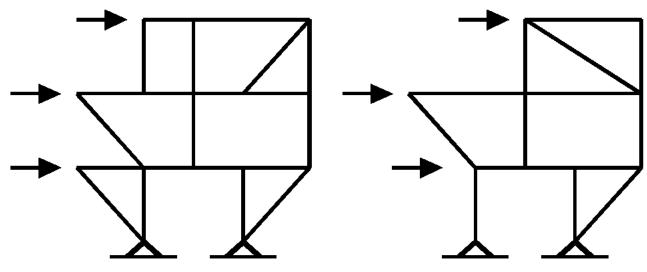  
Figure 9.21 Application of wind loading to the exterior nodes of two example structures   
Figure 9.22 SetWL() applies wind loading in each direction to frame structures

void Set_WL()   
{ float fWindFront $= \ : 3 0 \ : . 0 / \ : ( 1 2 \ : . 0 ^ { \star } 1 2 \ : . 0 )$ ; //… Magnitude of   
wind loading CalcMultLoad(); // … Determine wind load factors   
for floors for (iLevel $\ l = \ \beth$ ; iLevel $<$ NUM_LEVELS; iLevel $^ { + + }$ ){ if (m_pTallyNode[iLevel] > 3){ // … Wind From Left Side - Load Case 2 … P[2].m_dAlVec[((m_pStart[iLevel] $- > \mathsf { m }$ _iNodeNum)-   
1)\*3] = 1.0\*(144.0)\*(BAY_WIDTH) $\star 1 . 3 \star$ fWindFront\*multLoad[iLevel]; // … Wind From Right Side - Load Case 3 . P[3].m_dAlVec[((m_pLast[iLevel]->m_iNodeNum) -   
1)\*3] = -1.0\*(144.0)\*(BAY_WIDTH) $^ { \star 1 }$ . $^ { 3 \star }$ fWindFront\*multLoad[iLevel]; } }   
}

# 9.5.6 Finite-Element Analysis of Frame Structures

In order to calculate the level of penalty violation and the fitness of each individual in the population for the frame problem domain, a separate finiteelement analysis must be performed. The analysis is required to determine whether the forces in each member are within allowable limits and to ensure that the horizontal and vertical deflections of the structure are within serviceability limits. EvaluateBinary() handles the calls to the following functions for finiteelement analysis prior to the calculation of fitness and penalty functions:

CalcProp(int j); // Calculate member properties for current   
solution SetGravityLoad(); // Create P load vector for load   
cases 1-4 SetWL(); // Create P load vector for load cases 1   
and 2 Assem(); // Assembly stiffness matrix K Bound(); // Apply boundary conditions error $=$ SolveMatrixEq(); // Solve Ku = P by inverting   
stiffness matrix K Force(); // Calculate member forces

# 9.5.7 Deletion of Dynamically Allocated Nodal Linked Lists

Managing the memory allocated by the program to create the arrays of linked lists of pointer to SNodeData structures requires cleaning up after the fitness evaluation of each individual in the population is completed. Figure 9.23 shows the EvaluateBinary() code segment that frees all of the memory allocated dynamically.

# 9.6 IRR GA Fitness Evaluation of Frame Design Synthesis Alternatives

The frame synthesis problem is multi-objective and requires the careful selection of the form and weighting of the fitness and penalty functions to effectively search the complex problem domain. This section defines the required multiobjective fitness functions and penalty functions used by the IRR GA to evaluate the fitness of individuals in the population.

# 9.6.1 Statement of Frame Design Objectives Used as Fitness Functions

In the structured formulation, only a single objective is required: minimize the volume of material. However, optimizing using only this single objective in the unstructured formulation results in the evolution of minimal structures (two member frames). Therefore, a second objective is required: maximize the total floor space in the frame. The two design objectives of minimum structural weight and maximum floor area compete against each other and trade-offs between the two objectives will occur.

// Delete Structure Information in linked list   
for (iLevel $\qquad = \quad 0$ ; iLevel $<$ NUM_LEVELS; iLevel $^ { + + }$ ) { ptrDel $=$ m_pStart [iLevel]; for $\mathrm { ~  ~ { ~ i ~ } ~ } = \mathrm { ~ \ r ~ { ~ 0 ~ } ~ }$ ; i $<$ m_iTallyNode[iLevel]; $\dot { \mathbf { \lambda } } + \mathbf { \lambda } +$ { tempPtr $=$ ptrDel; ptrDel $=$ ptrDel->m_pNextNode; free(tempPtr); }   
}

# Figure 9.23 Deletion of arrays of linked lists created dynamically by the IRR GA program

The non-penalized IRR GA fitness functions that correspond to the volume objective, $F \nu$ , and the floor area objective, $F _ { F } ,$ are stated:

$$
F \nu = \left[ \frac { \displaystyle \left( C _ { \nu } - \sum _ { i = 1 } ^ { m } \rho A _ { i } l _ { i } \right) } { C _ { \nu } } \right] ^ { \alpha _ { \nu } } F _ { F } = \left[ \frac { \displaystyle \sum _ { j = 1 } ^ { m h } l _ { j } } { L _ { H } } \right] ^ { \alpha }
$$

where $_ { m }$ is the total number of members, mh is the number of horizontal members, $C \nu$ is a selected scalar value that is larger than the maximum expected volume, $L _ { H }$ is the maximum floor space defined by the dimensional bounds of the problem domain, and $\alpha _ { V }$ and $\alpha _ { F }$ are selected exponential terms.

Figure 9.24 lists the functions CalcVolumeFitness() and CalcFloorFitness() called by EvaluateBinary() to calculate the fitness measures defined in Equation (3). CalcFloorFitness() uses the start and end pointers to linked list of SNodeData structures to quickly sum the length of all the floor in the structure. The fitness values calculated for each individual in the population are stored in the SPopulation structure by the variables $m \_ F i t n e s s / \theta J$ and m_fFitness[1], which correspond to the volume and floor fitness functions, respectively.

float CalcVolumeFitness(j) { float fVolume = 0.0;

for $\mathrm { ~  ~ { ~ i ~ } ~ } = \mathrm { ~ \ r ~ { ~ 0 ~ } ~ }$ ; $\mathrm  ~ \bf ~ \underline { ~ } { ~ \bf ~ \underline { ~ } { ~ \bf ~ \underline { ~ } { ~ \bf ~ \underline { ~ } { ~ \bf ~ \underline { ~ } { ~ \bf ~ \underline { ~ } { ~ \bf ~ \underline { ~ } { ~ \bf ~ \underline { ~ } { ~ \bf ~ } { ~ \bf ~ \underline { ~ } { ~ \bf ~ } { ~ \bf } ~ \underline { ~ } { ~ \bf } ~ } } } } } ~ } ~ } ~ }$ Solutions[j].m_fNumMem; $\dot { \bf 1 } + +$ ){ // •\*• Sum volumes of all members fVolume $+ =$ m_fProp[i\*nne] $\star _ { \mathfrak { m } }$ _fLength[i]/pow(12.0,3.0); } fVolume $=$ (600.0 - fVolume)/600.0; // Calc. value of fitness function if (fVolume $< ~ 0 . 0$ fVolume $\begin{array} { r l } { = } & { { } 0 \mathrm { ~ . ~ } 0 0 0 1 } \end{array}$ ; return fVolume; } float CalcFloorFitness(int j) { float fFloorArea $= ~ 0 , 0$ ; for (iLevel $\ l = \ \ l \perp$ ; iLevel $<$ NUM_LEVELS; iLevel $^ { + + }$ ){ if (m_pStart[iLevel]) { fFloorArea $+ =$ abs(Solutions[j].NodeXY[m_pStart[iLevel]->m_iNodeNum].m_fX Solutions[j].NodeXY [m_pLast [iLeve] - >m_iNodeNum].m_fX); } } return fFloorArea/MAx_FL_AREA; // Calc. value of fitness function }

9.6.2 Application of Penalty Terms in IRR GA Fitness Evaluation

# 9.6.2.1 Stress Penalty Function

A stress penalty function, $P _ { S }$ , reduces the fitness of frame design alternatives that violate the code specified maximum stress criteria:

$$
P s = \left[ \frac { \displaystyle \left( C _ { s } - \prod _ { j = 1 } ^ { m } I n t \big ( M _ { j } , M _ { j a l l } , P _ { j } , P _ { j a l l } \big ) \right) } { \displaystyle C s } \right] ^ { \alpha }
$$

where Int() is the interaction ratio defined by the code, $M _ { j }$ is the design moment in member $j ,$ $M _ { j a l l }$ is the allowable moment in member $j$ , $P _ { j }$ is the design axial force in member $j$ , and $\mathbf { P } _ { j a l l }$ is the allowable axial force in member $j$ .

EvaluateBinary() calls the function CalcStressPenalty() for each individual in the population after finite-element analysis is performed. Using the member forces determined by the analysis, CalcStressPenalty() calculates the actual axial, shear, and bending stresses in each member. These stress values are compared with the maximum allowable stresses that each member may carry, which is determined using the member properties according to the LRFD code requirements. If the actual stresses in the member are less than the allowable, no penalty is applied. If the actual stresses exceed the allowable stresses, then Equation (4) is used to calculate the penalty. The values of the stress penalites are stored in the variables m_fPenalty[0] through $m \_ f P e n a l t y [ 3 ]$ in the SPopulation structure,which correspond to the load cases 0 to 3 applied to the structure and analyzed, respectively.

# 9.6.2.2 Deflection Penalty Functions

The frame design solutions must also satisfy serviceability limits. The horizontal deflection, $P _ { H D } ,$ of the structure must satisfy the allowable interstory drift limits and the vertical deflection, $P _ { { V D } } ,$ is limited to a deflection of less than l/360 along the member length:

$$
P _ { D } = \left[ \frac { C _ { D } - \displaystyle \prod _ { l = 1 } ^ { n } \left( l . 0 + \frac { \Delta _ { l } } { \Delta _ { \operatorname* { m a x } } } \right) } { C _ { D } } \right] ^ { \alpha \nu }
$$

where $n$ is the number of nodes considered for horizontal or vertical deflection, $\Delta _ { \imath }$ is the horizontal or vertical deflection of node $l$ exceeding the limit, and $\Delta _ { \mathrm { m a x } }$ is the maximum deflection limit allowed.

EvaluateBinary() calls CalcHorzDeflPenalty() to calculate the penalty for excessive horziontal deflections caused by interstory drift between the floor levels. CalcHorzDeflPenaty() uses the SNodeData linked lists to identify the exterior nodes at each floor level as shown in the partial function code listing in Figure 9.25. The deflection at the exterior nodes identified by m_pStart[] and m_pLast[] are used to calculate the interstory drifts. The relative displacement is compared at each floor level. If the relative displacement (interstory drift) exceeds the code specified limits, a penalty is applied. Excessive horizontal deflection is checked for load cases 2 and 3, which combine gravity and wind loading. The values of the horizontal deflection penalites are stored in the variables m_fPenalty[4] and m_fPenalty[5] in the SPopulation structure for the load cases 2 and 3, respectively.

// Calculating Horizontal Penalty in the function   
CalcHorzDeflPenalty(a)   
number $\ c = ~ \ b { \textrm { 1 . 0 } }$ ;   
for (iLevel $\ c = \ 2$ ; iLevel $<$ NUM_LEVELS; iLevel ${ + + }$ ){ if (m_iTallyNode[iLevel] $> ~ 1$ { // … Check for more than a   
single node iUpper $=$ m_pStart[iLevel]->m_iNodeNum-1\*ndf; iLower $=$ m_pStart [iLevel-number]->m_iNodeNum-1\*ndf; // … Floors moving in opposite directions … if ((P[a].m_fAlVec[iUpper] < 0.0 & &   
P[a].m_fAlVec[iLower] $> = ~ 0 , 0$ |l (P[a].al [iUpper] $> = ~ 0 . 0$ && P[a].m_fAlVec[iLower] < 0.0)){ if ((fabs(P[a].m_fAlVec[iUpper]) + fabs(P[a].m_fAlVec[iLower])) > max_story_drift\*number){ fHorzDefl $=$ fHorzDefl $\star$ (pen_H_defl)\*(1.0 + fabs(P[a].m_fAl Vec[iUpper]) $^ +$ fabs(P[a].m_fAlVec[iLower])/10.0); } } // … Floors moving in same direction … else{ if (fabs(P[a].m_fAlVec[iUpper] - P[a].m_fAlVec[iLower]) > max_story_drift\*number){ fHorzDefl $=$ fHorzDefl\*(pen_H_defl)\*(1.0   
+ fabs(P[a].m_fAl Vec[iUpper]) $^ +$ fabs(P[a].m_fAlVec[iLower])/10.0); } } } else number $+ = ~ 1 . 0$ // … Skip to next floor   
level ...   
}

EvaluateBinary() cals CalcVertDeflPenalty() to calculate the penalty for excessive vertical deflections caused by gravity loading applied along the horizontal members. CalcVertDeflPenaty() uses the linked lists to identify the nodes along each floor as shown in the $\mathrm { C } { + } { + }$ code listed in Figure 9.25. The vertical displacement at each node is compared to the serviceability limit of 0.25 inches. If the nodal deflection exceeds the code-specified limits, a penalty is applied relative to the actual vertical deflection. Excessive vertical deflection is checked for load cases 0 and 1, which apply gravity loading. The values of the vertical defleciton penalites are stored in the variables $m \_ f P e n a l t y [ 6 { \cal J }$ and m_fPenalty[7] in the SPopulation structure for load cases O and 1, respectively.

float CalcVertDeflPenalty(a)   
{ float fVertPenalty; for (iLevel $\ l = \ \beth$ ; iLevel $<$ NUM_LEVELS; iLevel $^ { + + }$ ) { if (m_iTallyNode[iLevel] $> ~ 1$ ) { ptr_p $=$ m_pStart[iLevel]; for $\mathrm { ~ \bf ~ \underline { ~ } { ~ i ~ } ~ } = \mathrm { ~ \bf ~ 0 ~ }$ ; i < m_iTallyNode[iLevel]; $\dot { \bf 1 } + +$ ){ if (fabs(P[a].m_fAlVec[(ptr_p->m_iNodeNum  
1)\*ndf $^ { + 1 ] }$ ) > .25){ fVertPenalty   
fVertPenalty\*(pen_V_defl)\*(1.0 + fabs(P[a].m_fAlVec[(ptr_p->m_iNodeNum1)\*ndf+1])/10.0); } ptr_p $=$ ptr_p->m_pNextNode; } } } fVertPenalty $=$ (2000.0 - fVertPenalty)/2000.0; if (fVertPenalty $< ~ 0 . 0$ fVertPenalty $\begin{array} { r l } { = } & { { } 0 \mathrm { ~ . ~ } 0 0 0 1 } \end{array}$ ; return fVertPenalty;   
}

# Figure 9.26 Implementation of Calc VertDeflPenalty()

# 9.6.2.3 Symmetry Penalty Functions

Aesthetics are introduced into the frame synthesis search process by promoting the symmtric placement of structural members, $P _ { S M } ,$ and nodes, $P _ { S N }$ The symmetry penalties apply selection pressure to the IRR GA search process that

encourages the convergence to symmetrical frame design solutions, while still allowing the consideration of nonsymmetrical member and node placements.

$$
P _ { S N } = \left[ { \frac { S y m N o d e s } { C s _ { N } } } \right] ^ { Q S N } P _ { S M } = \left[ { \frac { S y m M e m b e r s } { N u m M e m b e r - N u m C e n t e r } } \right] ^ { Q S M }
$$

where SymNodes is the number of symmetrical nodes, SymMembers is the number of symmetrical members, NumMember is the number of total decoded (non-horizontal) members, and NumCenter is the number of members located at the center line of the structure.

CalcNodeSymPenalty() and CalcMemSymPenalty() functions are called by EvaluateBinary() to calculate the symmetry penalties stated in Equation (6) before the horizontal members are generated by CreateHorzMembers( ). Therefore, only the non-horizontal members decoded from the IRR GA genotype are constrained by the member symmetry penalty. CalcNodeSymPenalty() uses the SNodeData linked lists to identify the nodes along each floor as shown in Figure 9.27. Nodes located symmetrically within 48 inches are counted as symmetric nodes. In comparison, CalcMemSymPenalty() uses the member incidences stored in the array m_iMemConnect[] in the SStructure structure Individual directly to determine symmetric placement of members. The number of symmetric nodes and members is counted for the structure and the penalties are calculated. The calculated value of the node symmetric penalty is stored in $m \_ f P e n a l t y / 8 J$ and the member symmetry penalty is stored in m_fPenalty[9] in the SPopulation structure Pool.

float CalcNodeSymPenalty()   
{ fNodeSym $\mathit { \Omega } = \mathit { \Omega } 0 , 0$ // … Number of symmetric nodes for (iLevel $\qquad = \ 0$ ; iLevel $<$ NUM_LEVELS; iLevel $^ { + + }$ ){ if (m_iTallyNode[iLevel] $\mathrm { ~ \tt ~ > ~ } \mathrm { ~ \tt ~ \bot ~ }$ { ptr_ $2 \quad = { }$ m_pStart[iLevel]; // … Traverse linked list ptr_1 $=$ ptr_2->m_pNextNode; // … Compare members left of center with all members in the   
structure while (ptr_2 && Solutions[j].NodeXY[ptr_2->m_iNodeNum].m_fX   
< -30.0){ while(ptr_1){ if (Solutions[j].NodeXY [ptr_1->m_iNodeNum].m_fX > 30.0){ if (fabs(Solutions[j].NodeXY[ptr_2->m_iNodeNum].m_fX

Solutions[j].NodeXY[ptr_1->m_iNodeNum].m_fX) < 48.0){ fNodeSym $+ =$ 1.0; // … Symmetric node located } } ptr_1 $=$ ptr_1->m_pNextNode; } ptr_2 = ptr_2-> m_pNextNode; if (ptr_2) ptr_1 $=$ ptr_2-> m_pNextNode; } } } if (fNodeSym $< = ~ 3 0 . 0$ )fNodeSym $=$ fNodeSym/30.0; else fNodeSym $= ~ 1 , 0$ ; return fNodeSym; }

# Figure 9.27 Implementation of CalcNodeSymPenalty()

# 9.6.2.4 Composite Fitness Function

A product composite penalty term, $P _ { \mathit { T O T } } ,$ that magnifies the differences existing between the individual penalty terms defined in Equations (4) to (6) was defined:

$$
P _ { T O T } = \sum _ { k = 1 } ^ { l } P _ { s } ^ { k } * \sum _ { k = 1 } ^ { h } P _ { H D } ^ { k } * \sum _ { k = 1 } ^ { j } P _ { V D } ^ { k } * P _ { S N } * P _ { S M }
$$

where $l$ is the number of load cases analyzed, $h$ is the number of horizontal load cases, and $j$ is the number of vertical load cases.

The product composite fitness function is composed of the two fitness function de  qua  nd h  pealync ter e y $P _ { \mathit { T O T } }$ in Equation (7):

$$
m a x F [ x ] = F _ { V } * F _ { F } * P _ { T O T }
$$

For each individual in the population, the fitness function stated by Equation (8) is evaluated. This evaluation takes place in the IRR GA function SelectString(), which also contains the tournament selection operations that will be discussed in Section 9.7.1. Table 9.1 presents a summary of the scalar values used for the fitness and penalty functions stated in Equations (3) to (6).

Table 9.1 Values of scalar constants for calculating the fitness and penalty function. (From Raich & Ghaboussi, in press.)   

<table><tr><td>Scalar Term</td><td>Scalar Value</td></tr><tr><td>Cv</td><td>600.0</td></tr><tr><td>Cs</td><td>2000.0</td></tr><tr><td>CvD</td><td>2000.0</td></tr><tr><td>CHD</td><td>2000.0</td></tr><tr><td>CSN</td><td>30.0</td></tr><tr><td>Ov</td><td>1.0</td></tr><tr><td>αF</td><td>1.0</td></tr><tr><td>OvD</td><td>4.0</td></tr><tr><td>QHD</td><td>4.1</td></tr><tr><td>OsN</td><td>0.1</td></tr><tr><td>αsm</td><td>0.1</td></tr><tr><td>LH</td><td>2268.0</td></tr></table>

# 9.7 Discussion of the Genetic Control Operators Used by the IRR GA

# 9.7.1 Fitness Sharing among Individuals in the Population

The search space for frame designs includes multiple, equally optimal solutions. To prevent the population from converging to a single optimum, fitness sharing was applied. Fitness sharing distributes the population among multiple solutions so that only a few individuals are maintained in the vicinity of each solution in the search space (Goldberg & Richardson, 1987). The fitness of each individual in the current population is reduced based on the number of similar individuals in the population. A modified fitness value is calculated for each population individual by dividing the fitness, $F$ , calculated by the niche count of the individual, $m _ { i } ,$ . which is defined by:

$$
m _ { i } = \sum _ { j \in p o p } s h ( d _ { i j } )
$$

where $d _ { i j }$ is the Euclidean distance measure between individuals $i$ and $j$ .

The sharing function applied was the same as defined by Goldberg (1989) with a similarity measure, $\sigma _ { \mathrm { { s } } } ,$ of 0.05 to control the size of the niche. The sharing function is defined using the similarity measure:

$$
s h ( d _ { i j } ) = \{ 1 - ( \frac { d _ { i j } } { \sigma _ { s } } ) ^ { \alpha } \quad i f \quad d _ { i j } < \sigma _ { s } \quad
$$

// Tournament Selection in SelectString()   
for $( \ j { \mathrm { ~ \scriptsize ~ = ~ } } 0$ ; j $<$ POP_SIZE; ${ \dot { \bf { \bar { \jmath } } } } + + { \bf { \bar { \rho } } } .$ {   
fCurrentWinFit $= \ - 1 . 0$ ; for $\mathrm { ~ \bf ~ k ~ } = \mathrm { ~ \bf ~ 0 ~ }$ ; k < TOURN_SIZE; ${ \bf k } + +$ ){ // Randomly select individuals for tournament group iTournMem $=$ (int)   
(float)rand()/(float)RAND_MAX $\star$ (float)POP_SIZE; fNumNeighbor $\mathit { \Theta } = \mathit { \Theta } 0 , 0$ ; for $\mathrm { ~ \\\ ~ i ~ ~ } = \mathrm { ~ \ ~ 0 ~ }$ ; i < POP_SIZE; $\dot { \bf 1 } + +$ ){ // Calculate niche count for fitness sharing if (iTournMem < i){ if (dist[loc] [i] < 0.10) fNumNeighbor $+ =$ (1.0   
dist [loc] [i]/0.10)/2.0;   
} else{ if (dist[i] [loc] < 0.10) fNumNeighbor $+ =$ (1.0   
dist[i] [1oc]/0.10)/2.0; } } if (fNumNeighbor < 1.0) count1 = 1.0; // Using modified fitness value determine winner of   
tournament if (Pool [iTournMem].m_fTotalFitness/fNumNeighbor $>$   
fCurrentWinFit){ selected[j] $=$ iTournWin; fCurrentWinFit $=$ Pool [iTournMem].m_fTotalFitness/fNumNeighbor; } }

# 9.7.2 Tournament Selection of New Population Individuals

Tournament selection is used to select the next-generation population in the IRR GA examples presented. The modified fitness values determined using fitness sharing provide the basis of competition for the tournament. The individual with the highest fitness in the tournament group is selected as the winner of the tournament and the selection process continues by selecting a new tournament group randomly. The use of tournament selection reduces the occurrence of premature convergence during early generations. The high selection pressure created by large fitness differences among population individuals, which are the result of large penalties, can result in premature convergence. In later generations, tournament selection helps maintain a higher level of selection after the population fitness has become similar. Tournament selection for the design synthesis problem used a tournament size of five competing individuals. In the IRR GA program, tournament selection is performed in SelectString(). A code segment from SelectString() that implements tournament selection with fitness sharing is shown in Figure 9.28.

To prevent the loss of the fittest individual from the current population due to low selection pressure or the disruption or crossover or mutation, an elitist strategy was used. The fittest individual in the current population was copied to the next generation bypassing genetic manipulation.

# 9.7.3 Multiple Point Crossover of Binary Strings

Multi-point crossover was used to increase the number of string segments recombined and to reduce the size of each segment exchanged. A random, normal distribution, with a mean of ten crossovers and a standard deviation of two, was used to set the number of crossover sites along the strings. Two individuals were randomly paired from the set of tournament-selected individuals; the string was cut virtually at multiple, random location; and the portions of the string between the cuts were exchanged. Eshelman (1991) cited the benefits of using a higher number of crossovers, with even-numbered crossovers providing more benefit than odd-numbered crossovers. The IRR GA protects the individuals from disruption due to crossover through the use of redundancy and also the inclusion of an elitist individual. Therefore, the high rate of crossover of 1.0 used in the frame design synthesis problem may be beneficial to explore the search space.

Figure 9.29 details the implementation of multiple crossover in CrossOverBinary(). The locations of the crossover sites are randomly generated and are stored initially in an ordered linked list of SCrossList structures. CrossoverStore() inserts new crossover sites into the linked lists and is the same function as slsStore(), which was defined in Section 5.2.3 in this chapter, except that it stores different data structures. The linked list allows the ordering of the crossover locations sequentially and the ability to easily change the number of defined crossover sites. Crossover is performed on two selected individuals by swapping string segments at the site[ $J$ bit.

for $\mathrm { ~ \bf ~ \underline { ~ } { ~ i ~ } ~ } = \mathrm { ~ \bf ~ 0 ~ }$ ; i < iNumSites; $\dot { \bf 1 } + +$ ){ m_pNewCross $=$ new SCrossList; // … Create new cross site m_pNewCross->m_iSite $=$ floor((float)rand()/(float)   
(RAND_MAX\*STR_LENGTH)); CrossoverStore(); // … Store in ordered linked list   
}   
// … Store ordered linked list of sites in sitel ] array …   
for $\mathrm { ~ \bf ~ i ~ } = \mathrm { ~ \bf ~ 0 ~ }$ ; i < iNumSites; $\dot { \bf 1 } + +$ ){ site[i] $=$ m_pFirst->m_iSite; temp_ptr $=$ m_pFirst; m_pFirst $=$ m_pFirst->m_pNextSite; free(temp_ptr); // … Delete current site   
from list   
}   
if (iNumSites $> ~ 0$ ){ // … Add final site at end site [iNumSites] $=$ STR_LENGTH-1; iNumSites $^ { + + }$   
}

# Figure 9.29 CrossoverBinary() code to set the number and location of multiple crossover sites

# 9.7.4 Single-Bit Mutation of Binary Strings

Mutation was applied to the individuals in the population using single bit mutation with a mutation rate of 0.0033. Single-bit mutation flips the randomly selected encoded bit value from zero to one, or vice versa.

# 9.8 Results of the Implicit Redundant Representation Frame Synthesis Trials

The unstructured frame synthesis problem defined in this chapter qualifies for Goldberg's (1989) definition of a sufficiently difficult problem: "The problem must be epistatic and misleading." The search for solutions using the IRR GA requires determining the highly fit building blocks of the best design alternative. The fit building blocks for a structure with 13 members, however, will not be the same as the fit building blocks for a structure with 16 members. The fitness landscape searched by the IRR GA changes dynamically during optimization. Each distinct topology and geometry will have a fitness landscape defined in a distinct dimensional search space. If the topology or geometry changes, then a new fitness landscape will be searched. The dynamic changing of fitness landscapes can be viewed as taking different cuts of the unstructured search space. Once a good cut is found, the IRR GA should exploit the information in the search for synthesis design alternatives.

# 9.8.1 Evolved Design Solutions for the Frame Synthesis Unstructured Domain

Multiple, randomly initialized IRR GA trials were performed using the product composite fitness function stated in Equation (8) (Raich & Ghaboussi, 1999). All trials used a population size of either 100 or 200, a string length of 600, and tournament size of 5. Each IRR GA trail was started with a different random initial seed. The synthesis design solutions obtained after 500 generations for four IRR GA synthesis trials are shown in Figure 9.30.

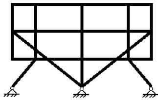  
Figure 9.30 Frame design solutions for four trials represented by the fittest population individual of each IRR GA trial. (From Raich & Ghaboussi, in press.)

The frame design synthesis solutions evolved by the IRR GA define structural elements that incorporate tension members, inclined column members, and stiff, triangular subsystems within the frame structural system. The IRR GA also evolves structural load-carrying systems that use separate systems for the first floor loading and for the second and third floor loading. For example, the design solution shown in the bottom, right-hand corner of Figure 9.31 carries the second and third floor loading to the foundation using an arch structural system.

The synthesis design solutions evolved by the IRR GA cover a diverse range of good frame design solutions with varying topology and geometry without requiring a separate problem statement for each topology and geometry considered or the definition of heuristics for member addition and removal. The IRR GA search method was able to generate novel frame designs that compared favorably with solutions obtained using a trial-and-error design process (Raich & Ghaboussi, 1999).

# 9.8.2 Synthesis versus Optimization of Frame Design Solutions Using IRR GA

The process of evolving frame synthesis design solutions is investigated by examining the features of the fitter individual in the IRR GA population at specific generations. During each generation, a new population is selected based on fitness, and crossover and mutation are applied to the selected individuals to create new individuals that retain the beneficial characteristics of their parents. The number of supports, connections, and members evolved by the IRR GA design solutions are constrained implicitly in the trials presented.

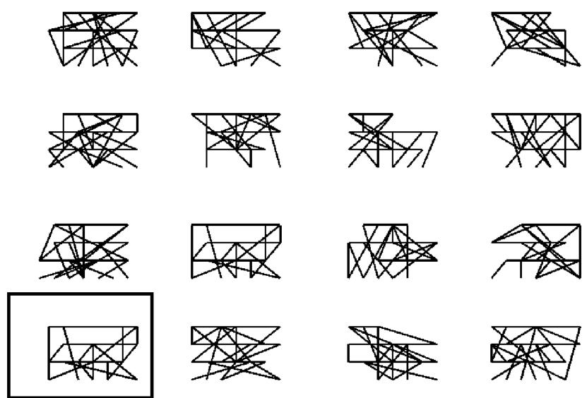  
Figure 9.31 Individuals in top $25 \%$ of the population ranked by fitness after one generation.

The IRR GA evolutionary process starts with a population of randomly initialized individuals as shown in Figure 9.31 (Raich & Ghaboussi, 1999). This figure shows a sub-set of the population as defined by 16 individuals that are among the fittest in the current population. The fittest solution in the current population is shown enclosed by the box in the lower left corner. The IRR GA frame design solutions represented by individuals are diverse. None of the design solutions maximize the floor space and no design features have propagated throughout the population, as is expected.

Figure 9.32 shows a group of 16 individuals representing highly fit design solutions for the same IRR GA trial after 50 generations were completed. The population individuals are still diverse. However, several common features are identified in the fittest individuals in the population: cross-bracing at the third story; symmetric inclined columns; and the extension of the floor area bounds to the maximum domain dimensions. After 200 generations, the fittest individuals have fully incorporated these design features into the population as shown in Figure 9.33. Although the fittest individual in the population has converged to fixed topology and geometry, the remaining individuals have different topology and geometry due to the effects of crossover and mutation on the IRR GA representation.

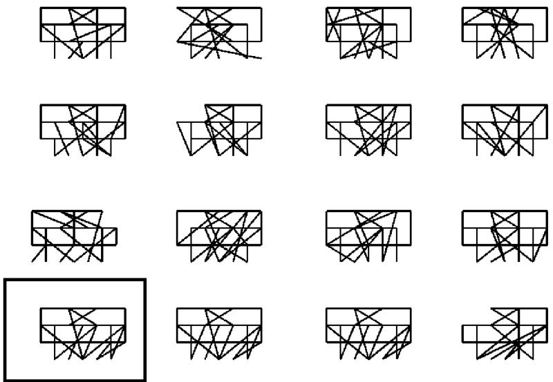  
Figure 9.32 Individuals in top $25 \%$ of the population after 50 generations.

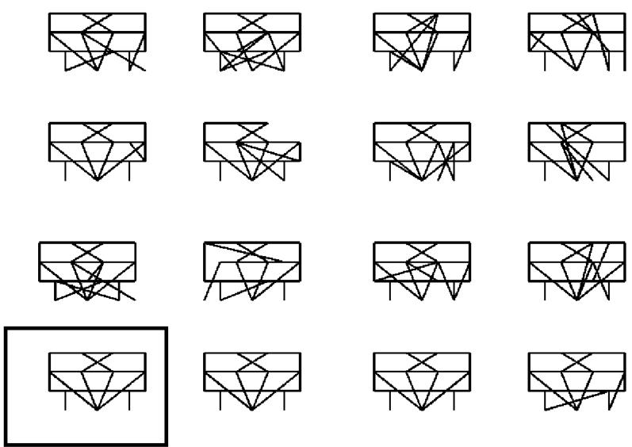  
Figure 9.33 Individuals in top $25 \%$ of the population after 200 generations.

The evolutionary process of synthesis and optimization is examined by viewing a graph of the maximum fitness for a single IRR GA trial as shown in Figure 9.34 (Raich & Ghaboussi, 1999). During early generations, the IRR GA is synthesizing the topology and geometry of the design solutions as shown in Figures 9.31 to 9.33. During this stage, the topology and geometry of the fittest individual in the population may change between generations. The IRR GA stops synthesizing design solutions when the population converges on a highly fit topology and geometry. For the remaining generations, the IRR GA performs shape optimization. Shape optimization uses the topology and geometry of the fittest design alternative that was evolved during the synthesis process, as shown in Figure 9.34.

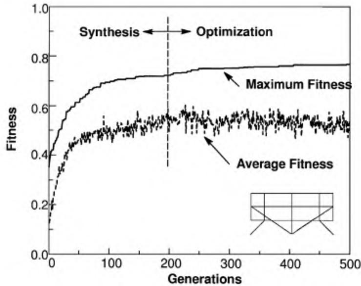  
Figure 9.34 Maximum fitness and average fitness of the IRR GA population over 500 generations for a single trial.

# 9.9 Concluding Remarks

This chapter discussed the application of the implicit redundant representation genetic algorithm to the unstructured problem of frame design synthesis. The results obtained for the IRR GA synthesis method reinforce the benefits of providing topology and geometry optimization. The IRR GA provides significant benefits for representing unstructured problems by using dynamic redundancy and implicit constraints on the number of design variables optimized.

# Список литературы

Camp,C., Pezeshk, S. & Cao, G. (1998). Optimized design of two-dimensional structures using genetic algorithm. ASCE Journal of Structural Engineering, 124(5), 551-559.   
Eshelman, L.J. & Schaffer, J.D. (1991). Preventing premature convergence in genetic algorithms by preventing incest. In R.K. Belew and L.B. Booker (Eds.), Proceedings of the Fourth International Conference on Genetic Algorithms (pp. 115-122). San Mateo, CA: Morgan Kaufmann.   
Goldberg, D.E. (1989). Genetic Algorithms in Search, Optimization, and Machine Learning. Reading, MA: Addison-Wesley.   
Goldberg, D.E. & Richardson, J.T. (1987). Genetic algorithms with sharing for multimodal function optimization. In J.J. Grefenstette (Ed.), Proceedings of the Second International Conference on Genetic Algorithms (pp. 41-49). Hillsdale, NJ: Lawrence Erlbaum Associates.   
Grierson, D.E. & Park, K.W. (1996). Optimal conceptual topological design. In D.M. Frangopol and F.Y. Cheng (Eds.), Advances in Structural Optimization, Proceedings of the First US-Japan Joint Seminar on Structural Optimization, Structures Congress "96 (pp. 91-96). New York, NY: ASCE.   
Holland, J.H. (1975). Adaptation in Natural and Artificial Systems. Ann Arbor, MI: The University of Michigan Press.   
Levenick, J.R. (1991). Inserting introns improves genetic algorithm success rate: taking a cue from biology. In R.K. Belew and L.B. Booker (Eds.), Proceedings of the Fourth International Conference on Genetic Algorithms (pp. 123-127). San Mateo, CA: Morgan Kaufmann.   
Raich, A.M. & Ghaboussi, J. (in press). Evolving the topology and geometry of frame structures during optimization. Structural Optimization, Heidelberg: Springer-Verlag, in press.   
Raich, A.M. & Ghaboussi, J. (1999). Evolving structural design solutions using an implicit redundant genetic algorithm. In Banzhaf, W., et.al. (eds.), GECCO99: Proceedings of the Genetic and Evolutionary Computation Conference (pp. 1691-1698). San Franciso, CA: Morgan Kaufman.   
Raich, A.M. & Ghaboussi, J. (1997). Implicit redundant representation in genetic algorithms. Evolutionary Computation, 5(3), 277-302.   
Reich, Y. & Fenves, S.J. (1995). System that learns to design cable-stayed bridges. ASCE Journal of Structural Engineering, 121(7), 1090-1100.   
Roston, G.P. & Sturges, R.H. (1996). Using the genetic design methodology for structure configuration. Microcomputers in Civil Engineering, 11, 175-183.   
Saka, M.P. (1997). Optimum design of steel frames with tapered members. Computers & Structures, 63(4), 797-811.   
Simoes, L.M.C. (1996). Optimization of frames with semi-rigid connections. Computers & Structures, 60(4), 531-539.   
Sugimoto, H. & Bianli, L. (1996). Fully-stressed design of framed structures with discrete variables and application of genetic algorithm. In D.M. Frangopol and F.Y. Cheng (Eds.), Advances in Structural Optimization, Proceedings of the First US-Japan Joint Seminar on Structural Optimization, Structures Congress "96 (pp. 180-191). New York, NY: ASCE.   
Wu, A.S. & Lindsay, R.K. (1996). A comparison of the fixed and floating building block representation in the genetic algorithm. Evolutionary Computation, 4(2).

# Chapter 10 How to Handle Constraints with Evolutionary Algorithms

B.G.W. Craenen, A.E. Eiben and E. Marchiori

Vrije Universiteit Amsterdam (VU Amsterdam)   
De Boelelaan 1081a   
1081 HV Amsterdam   
Gusz Eiben is also affiliated with:   
Leiden Institute for Advanced Computer Science (LIACS)   
Niels Bohrweg 1   
2333 CA Leiden

http://www.cs.vu.nl/\~gusz http://www.cs.vu.nl/\~elena http://www.cs.vu.nl/\~bcraenen gusz@cs.vu.nl elena@cs.vu.nl bcraenen@cs.vu.nl

# Abstract

In this chapter we describe evolutionary algorithms (EAs) for constraint handling. Constraint handling is not straightforward in an EA because the search operators mutation and recombination are "blind" to constraints. Hence, there is no guarantee that if the parents satisfy some constraints the offspring will satisfy them as well. This suggests that the presence of constraints in a problem makes EAs intrinsically unsuited to solve this problem. This should especially hold when the problem does not contain an objective function to be optimized, but only constraints  the category of constraint satisfaction problems. A survey of related literature, however, indicates that there are quite a few successful attempts to evolutionary constraint satisfaction. Based on this survey, we identify a number of common features in these approaches and arrive at the conclusion that EAs can be effective constraint solvers when knowledge about the constraints is incorporated either into the genetic operators, in the fitness function, or in repair mechanisms. We conclude by considering a number of key questions on research methodology.

# 10.1 Introduction

Many practical problems can be formalized as constrained (optimization) problems. These problems are in general tough (NP-hard); hence, they need heuristic algorithms in order to be (approximately) solved in a short time.

EAs show a good ratio of (implementation) effort to performance, and are acknowledged as good solvers for tough problems. However, no standard EA takes constraints into account. That is, the regular search operators, mutation and recombination, in evolutionary programming, evolution strategies, genetic algorithms, and genetic programming, are "blind" to constraints. Hence, even if the parents are satisfying some constraints, they might very well get offspring violating them. Technically, this means that EAs perform unconstrained search. This observation suggests that EAs are intrinsically unsuited to handle constrained problems.

In this chapter we will have a closer look at this phenomenon. We start with describing approaches for handling constraints in evolutionary computation. Next we present an overview of EAs for constraint satisfaction problems, pointing out the key features that have been added to the standard EA machinery in order to handle constraints. In Section 10.4 we summarize the main lessons learned from the overview and indicate where constraints provide extra information on the problem and how this information can be utilized by an evolutionary algorithm. Thereafter, Section 10.5 handles a number of methodological considerations regarding research on solving constraint satisfaction problems (CSPs) by means of EAs. The final section concludes this chapter by reiterating that EAs are suited to treat constrained problems and touches on a couple of promising research directions.

# 10.2 Constraint Handling in EAs

There are many ways to handle constraints in an EA. At a high conceptual level we can distinguish two cases, depending on whether they are handled indirectly or directly. Indirect constraint handling means that we circumvent the problem of satisfying constraints by incorporating them in the fitness function f such that f optimal implies that the constraints are satisfied, and use the optimization power of the EA to find a solution. By direct constraint handling we mean that we leave the constraints as they are and "adapt" the EA to enforce them. We will return later to the differences between these two cases. Let us note that direct and indirect constraint handling can be applied in combination, i.e., in one application we can: handle all constraints indirectly; handle all constraints directly; or, handle some constraints directly and others indirectly. Formally, indirect constraint handling means transforming constraints into optimization objectives. The resulting problem transformation imposes the requirement that the (eliminated)

constraints are satisfied if the (new) optimization objectives are at their optima. This implies that the given problem is transformed into an equivalent problem meaning that the two problems share the same solutions.' For a given constrained problem, several equivalent problems can be defined by choosing the subset of the constraints to be eliminated and/or defining the objective function measuring their satisfaction differently. So, there are two important questions to be answered.

Which constraints should be handled directly (kept as constraints) and which should be handled indirectly (replaced by optimization objectives)? How to define the optimization objectives corresponding to indirectly handled constraints?

Treating constraints directly implies that violating them is not reflected in the fitness function, thus there is no bias towards chromosomes satisfying them. Therefore, the population will not become less and less infeasible w.r.t. these constraints.2

This means that we have to create and maintain feasible chromosomes in the population. The basic problem in this case is that the regular genetic operators are blind to constraints, mutating one or crossing over two feasible chromosomes can result in infeasible offspring. Typical approaches to handle constraints directly are the following:

. Eliminating infeasible candidates • Repairing infeasible candidates • Preserving feasibility by special operators • Decoding, i.e., transforming the search space

Eliminating infeasible candidates is very inefficient, and therefore hardly applicable. Repairing infeasible candidates requires a repair procedure that modifies a given chromosome such that it will not violate constraints. This technique is thus problem dependent; but if a good repair procedure can be developed, then it works well in practice, see for instance Section 4.5 in [34] for a comparative case study. The preserving approach amounts to designing and applying problem specific operators that do preserve the feasibility of parent chromosomes. Using such operators, the search becomes quasi-free because the offspring remains in the feasible search space, if the parents were feasible. This is the case in sequencing applications, where a feasible chromosome contains each label (allele) exactly once. The well-known order-based crossovers [20,47] are designed to preserve this property. Note that the preserving approach requires the creation of a feasible initial population, which can be NP-hard, e.g., for the traveling salesman problem with time windows. Finally, decoding can simplify the problem and allow an efficient EA. Formally, decoding can be seen as shifting to a search space that is different from the cartesian product of the domains of the variables in the original problem formulation. Elements of the new search space ${ \sf S } ^ { \prime }$ serve as inputs for a decoding procedure that creates feasible solutions, and it is assumed that a free (modulo preserving operators) search can be performed in $S ^ { \prime }$ by an EA. For a nice illustration we refer again to Section 4.5 in [34].

In case of indirect constraint handling, the optimization objectives replacing the constraints are traditionally viewed as penalties for constraint violation, hence to be minimized. In general, penalties are given for violated constraints although some (problem specific) EAs allocate penalties for wrongly instantiated variables or, when different from the other options, as the distance to a feasible solution.

Advantages of indirect constraint handling are:

• Generality • Reduction of the problem to ^simple' optimization • Possibility of embedding user preferences by means of weights

Disadvantages of indirect constraint handling are:

• Loss of information by packing everything in a single number • Does not work well for sparse problems • How to merge original objective function with penalties

There are other classification schemes of constraint handling techniques in EC. For instance, the categorization in [33] distinguishes pro-choice and pro-life techniques, where pro-choice encompasses eliminating, decoding, and preserving, while pro-life covers penalty based and repairing approaches. Overviews and comparisons published on evolutionary computation techniques for constraint handling s0 far mainly concern continuous domains, [30,31,32,35]. Constraint handling in continuous and discrete domains relies to a certain extent on the same ideas. There are, however, also differences; for instance, in continuous domains constraints can be characterized as linear, nonlinear, etc., and in case of linear constraints, special averaging recombination operators can guarantee that offspring of feasible parents are feasible. In discrete domains, this is impossible.

The rest of this chapter is concerned with a comparative analysis of a number of methods based on EAs for solving CSPs that have been so far introduced. Our comparison is mainly based on the way constraints are handled, either directly or indirectly. Therefore, our discussion will not take into account the particular parameters setting of a GA, like the role of mutation and crossover rates, or the role of the selection mechanism and the size of the population. This survey does not pretend to be a comprehensive account of all the works on solving CSP using EAs. It is rather meant to emphasize the main ideas on constraint handling (over finite domains) which have been employed in evolutionary algorithms.

# 10.3 Evolutionary CSP Solvers

Usually a CSP is stated as a problem of finding an instantiation of variables $\mathbf { V } _ { 1 } , \ldots ,$ ${ \tt V } _ { \mathfrak { n } }$ within the finite domains $\mathbf { D } _ { 1 }$ ,, $\mathbf { D _ { \eta } }$ such that constraints (relations) $\mathrm { { C } } _ { 1 }$ ,.., $\mathtt { C _ { m } }$ prescribed for (some of) the variables hold. One may be interested in one, some or all solutions, or only in the existence of a solution.

In recent years there have been reports on quite a few EAs for solving CSPs (for finding one solution) having a satisfactory performance. The majority of these EAs perform indirect constraint handling by means of a penalty-based fitness function, and possibly incorporate knowledge about the CSP into the genetic operators, the fitness function, or as a part module in the form of local search. First, we describe four approaches for solving CSPs using GAs that exploit information on the constraint network. Next, we discuss three other methods for solving CSPs which make use of an adaptive fitness function in order to enhance the search for a good (approximate) solution.

# 10.3.1 Heuristic Genetic Operators

In [15,16], Eiben et al. propose to incorporate existing CSP heuristics into genetic operators. Two heuristic-based genetic operators are specified: an asexual operator that transforms one individual into a new one and a multi-parent operator that generates one offspring using two or more parents. The asexual heuristicbased genetic operator selects a number of variables in a given individual, and then chooses new values for these variables. Both steps are guided by a heuristic: for instance, the selected variables are those involved in the largest number of violated constraints, and the new values for those variables are the values which maximize the number of constraints that become satisfied. The basic mechanism of the multi-parent heuristic crossover operator is scanning: for each position, the values of the variables of the parents in that position are used to determine the value of the variable in that position in the child. The selection of the value is done using the heuristic employed in the asexual operator. The difference with the asexual heuristic operator is that the heuristic does not evaluate all possible values but only those of the variables in the parents. The multi-parent crossover is applied to more parents (typical value 5) and produces one child.

The main features of three EAs based on this approach, called H-GA.1, H-GA.2, and H-GA.3, are illustrated in Table 10.1. In the H-GA.1 version, the heuristicbased genetic operator serves as the main search operator assisted by (random) mutation. In H-GA.3, it accompanies the multi-parent crossover in a role which is normally filled in by mutation.

Table 10.1 Specific features of three implemented versions of H-GA   

<table><tr><td rowspan=1 colspan=1></td><td rowspan=1 colspan=1>Version 1</td><td rowspan=1 colspan=1>Version 2</td><td rowspan=1 colspan=1>Version 3</td></tr><tr><td rowspan=1 colspan=1>Main operator</td><td rowspan=1 colspan=1>Asexualoperator</td><td rowspan=1 colspan=1>crossover</td><td rowspan=1 colspan=1>crossover</td></tr><tr><td rowspan=1 colspan=1>Secondary operator Random mutation</td><td rowspan=1 colspan=1>Secondary operator Random mutation</td><td rowspan=1 colspan=1>Random mutation</td><td rowspan=1 colspan=1>Asexual  heuristicoperator</td></tr><tr><td rowspan=1 colspan=1>Fitness function</td><td rowspan=1 colspan=3>Number of violated constraints</td></tr><tr><td rowspan=1 colspan=1>Extra</td><td rowspan=1 colspan=3>None</td></tr></table>

# 10.3.2 Knowledge-Based Fitness and Genetic Operators

In [45,44], M.C. Riff Rojas introduces an EA for solving CSPs which uses information about the constraint network in the fitness function and in the genetic operators (crossover and mutation). The fitness function is based on the notion of error evaluation of a constraint. The error evaluation of a constraint is the sum of the number of variables of the constraint and the number of variables that are connected to these variables in the CSP network. The fitness function of an individual, called arc-fitness, is the sum of error evaluations of all the violated constraints in the individual. The mutation operator, called arc-mutation, selects randomly a variable of an individual and assigns to that variable the value that minimizes the sum of the error-evaluations of the constraints involving that variable. The crossover operator, called arc-crossover, selects randomly two parents and builds an offspring by means of the following iterative procedure over all the constraints of the considered CSP. Constraints are ordered according to their error-evaluation with respect to instantiations of the variables that violate the constraints. For the two variables of a selected (binary) constraint c, say $\mathbf { V _ { i } } , \mathbf { V _ { j } }$ , the following cases are distinguished.

If none of the two variables are instantiated in the offspring under construction, then:

If none of the parents satisfies c, then a pair of values for $\mathbf { V _ { i } } , \mathbf { V _ { j } }$ from the parents is selected which minimizes the sum of the error evaluations of the constraints containing $\mathbf { V _ { i } }$ or $\mathbf { V _ { j } }$ whose other variables are already instantiated in the offspring

If there is one parent which satisfies c, then that parent supplies the values for the child   
If both parents satisfy c, then the parent which has the higher fitness provides its values for $\mathbf { V _ { i } } , \mathbf { V _ { j } }$

If only one variable, say $\mathbf { V _ { i } } ,$ is not instantiated in the offspring under construction, then the value for $\mathbf { V _ { j } }$ is selected from the parent minimizing the sum of the error-evaluations of the constraints involving vi.

If both variables are instantiated in the offspring under construction, then the next constraint (in the ordering described above) is selected.

The main features of a GA based on this approach are summarized in Table 10.2.

Table 10.2 Specific features of Arc-GA   

<table><tr><td rowspan=1 colspan=1>Crossover operator</td><td rowspan=1 colspan=1>Arc-crossover operator</td></tr><tr><td rowspan=1 colspan=1>Mutation operator</td><td rowspan=1 colspan=1>Arc-mutation operator</td></tr><tr><td rowspan=1 colspan=1>Fitness function</td><td rowspan=1 colspan=1>Arc-fitness</td></tr><tr><td rowspan=1 colspan=1>Extra</td><td rowspan=1 colspan=1>None</td></tr></table>

# 10.3.3 Glass-Box Approach

In [28], E. Marchiori introduces an EA for solving CSPs which transforms constraints into a canonical form in such a way that there is only one single (type of) primitive constraint. This approach, called glass-box approach, is used in constraint programming [49], where CSPs are given in implicit form by means of formulas of a given specification language. For instance, for the N-Queens Problem, we have the well-known formulation in terms of the following constraints, where abs denotes absolute value:

$\mathbf { V _ { i } } \neq \mathbf { V _ { j } }$ for all $\mathrm { i } \neq \mathrm { j }$ (two queens cannot be on the same row) $\mathrm { { a b s } ( v _ { \mathrm { l } } - \ v _ { j } ) \neq \mathrm { { a b s } ( I \ - \ j ) } }$ for all $\mathrm { i } \neq \mathrm { j }$ (two queens cannot be on the same diagonal)

By decomposing complex constraints into primitive ones, the resulting constraints have the same granularity and therefore the same intrinsic difficulty. This rewriting of constraints, called constraint processing, is done in two steps: elimination of functional constraints (as in GENOCOP [34]) and decomposition of the CSP into primitive constraints. The choice of primitive constraints depends on the specification language. The primitive constraints chosen in the examples considered in [28], the N-Queens Problem and the Five Houses Puzzle, are linear inequalities of the form: $\mathsf { { a } { \cdot } v _ { i } } - \mathsf { \beta } \mathsf { { b } } { \cdot } \mathsf { v _ { j } } \neq \mathsf { \gamma }$ . When all constraints are reduced to the same form, a single probabilistic repair rule is applied, called dependency propagation. The repair rule used in the examples is of the form if $\mathsf { { \alpha } } \cdot \mathsf { p _ { i } } - \mathsf { { \beta } } \cdot \mathsf { p _ { j } } =$ γ then change $\mathfrak { p } _ { \mathrm { i } }$ or pj. The violated constraints are processed in random order. Repairing a violated constraint can result in the production of new violated constraints, which will not be repaired. Thus, at the end of the repairing process, the chromosome will not in general be a solution. Note that this kind of EA is designed under the assumption that CSPs are given in implicit form by means of formulas in some specification language.

A simple heuristic can be used in the repair rule by selecting the variable whose value has to be changed as the one which occurs in the largest number of constraints, and by setting its value to a different value in the variable domain. The main features of this EA are summarized in Table 10.3.

Table 10.3 Main features of Glass-Box GA   

<table><tr><td rowspan=1 colspan=1>Crossover operator</td><td rowspan=1 colspan=1>One-point crossover</td></tr><tr><td rowspan=1 colspan=1>Mutation operator</td><td rowspan=1 colspan=1>Random mutation</td></tr><tr><td rowspan=1 colspan=1>Fitness function</td><td rowspan=1 colspan=1>Number of violated constraints</td></tr><tr><td rowspan=1 colspan=1>Extra</td><td rowspan=1 colspan=1>Repair rule</td></tr></table>

# 10.3.4 Genetic Local Search

In [29], Marchiori and Steenbeek introduced a genetic local search (GLS) algorithm for random binary CSPs, called RIGA (Repair Improve GA). In this approach, heuristic information is not incorporated into the GA operators or fitness function, but is included into the GA as a separate module in the form of a local search procedure. The idea is to combine a simple GA with a local search procedure, where the GA is used to explore the search space, while the local search procedure is mainly responsible for the exploitation.

In RIGA, the local search applied to a chromosome produces a consistent partial instantiation, that is, only some of the variables of the CSP have a value, and each constraint of the CSP whose variables are all instantiated is satisfied. Moreover, this partial instantiation is maximal, that is, it cannot be extended by binding some non-instantiated variable to a value without violating consistency. A chromosome is a sequence of actual domains (a actual domain is a subset of the domain), one for each variable of the CSP.

RIGA consists of two main phases:

Repair: a chromosome is transformed into a consistent partial instantiation by removing values from the actual domains of the variables Improve: the consistent partial instantiation is optimized and maximized

The main features of the GLS algorithm are summarized in Table 10.4.

Table 10.4 Main features of the GLS algorithm   

<table><tr><td rowspan=1 colspan=1>Crossover operator</td><td rowspan=1 colspan=1>Uniform</td></tr><tr><td rowspan=1 colspan=1>Mutation operator</td><td rowspan=1 colspan=1>Random mutation</td></tr><tr><td rowspan=1 colspan=1>Fitness function</td><td rowspan=1 colspan=1>Number of instantiated variables</td></tr><tr><td rowspan=1 colspan=1>Extra</td><td rowspan=1 colspan=1>Local search</td></tr></table>

# $I 0 . 3 . 5 { \ : } C o$ -evolutionary Approach

This approach has been tested by Paredis on different problems, such as neural net learning [40], constraint satisfaction [39,40] and searching for cellular automata that solve the density classification task [41].

In the co-evolutionary approach for CSPs two populations evolve according to a predator-prey model: a population of (candidate) solutions and a population of constraints. The selection pressure on individuals of one population depends on the fitness of the members of the other population. The fitness of an individual in either of these populations is based on a history of encounters. An encounter means that a constraint from the constraint population is matched with a chromosome from the solutions population. If the constraint is not violated by the chromosome, the individual from the solutions population gets a point. Otherwise, the constraint gets a point. The fitness of an individual is the number of points it has obtained in the last 25 encounters. In this way, individuals in the constraint population which have been often violated by members of the solutions population have higher fitness. This forces the solutions to concentrate on more difficult constraints. At every generation of the EA, 20 encounters are executed by repeatedly selecting pairs of individuals from the populations, biasing the selection towards fitter individuals. Clearly, mutation and crossover are only applied to the solutions population. Parents for crossover are selected using linear ranked selection [50]. The main features of this EA are summarized in Table 10.5.

Table 10.5 Main features of the co-evolutionary algorithm   

<table><tr><td rowspan=1 colspan=1>Crossover operator</td><td rowspan=1 colspan=1>Two-point crossover</td></tr><tr><td rowspan=1 colspan=1>Random mutation</td><td rowspan=1 colspan=1></td></tr><tr><td rowspan=1 colspan=1>Fitness function</td><td rowspan=1 colspan=1>Number of points in last 25 encounters</td></tr><tr><td rowspan=1 colspan=1>Extra</td><td rowspan=1 colspan=1>Co-evolution</td></tr><tr><td></td><td rowspan=1 colspan=1></td></tr></table>

Another noteworthy example of using a co-evolutionary approach to solving satisfaction problems was done by Hisashi Handa et al. in [23,24]. Here, the host population of solutions competes with a parasite population of useful schemata.

These and successive papers explore the use of different operators as well as demonstrate the effectiveness of this kind of co-evolutionary approach.

# 10.3.6 Heuristic-Based Microgenetic Method

In the approach proposed by Dozier et al. in [7], and further refined in [4,8], information about the constraints is incorporated both in the genetic operators and in the fitness function. In the Microgenetic Iterative Descent algorithm, the fitness function is adaptive and employs Morris' Breakout Creating Mechanism to escape from local optima. At each generation, an offspring is created by mutating a specific gene of the selected chromosome, called the pivot gene, and that offspring replaces the worst individual of the actual population. The new value for that gene as well as the pivot gene are heuristically selected. Roughly, the fitness function of a chromosome is determined by adding a suitable penalty term to the number of constraint violations the chromosome is involved in. The penalty term is the sum of the weights of all the breakouts³ whose values occur in the chromosome. The set of breakouts is initially empty and it is modified during the execution by increasing the weights of breakouts and by adding new breakouts according to the technique used in the Iterative Descent Method [38].

Table 10.6 Main features of heuristic-based microgenetic algorithm   

<table><tr><td rowspan=1 colspan=1>Crossover operator</td><td rowspan=1 colspan=1>None</td></tr><tr><td rowspan=1 colspan=1>Mutation operator</td><td rowspan=1 colspan=1>Single-point heuristic mutation</td></tr><tr><td rowspan=1 colspan=1>Fitness function</td><td rowspan=1 colspan=1>Heuristic based</td></tr><tr><td rowspan=1 colspan=1>Extra</td><td rowspan=1 colspan=1>None</td></tr></table>

In [4,8], this algorithm is improved by introducing a number of novel features, like a mechanism for reducing the number of redundant evaluations, a novel crossover operator, and a technique for detecting inconsistency.

# 10.3.7 Stepwise Adaptation of Weights

The Stepwise Adaptation of Weights (SAW) mechanism has been introduced by Eiben and van der Hauw [11] as an improved version of the weight adaptation mechanism of Eiben, Raué and Ruttkay [17,18]. In several comparisons the SAW-ing EA proved to be a superior technique for solving specific CSPs [2,12,14]. The basic idea behind the SAW-ing mechanism is that constraints that are not satisfied after a certain number of steps must be hard, and thus must be given a high weight (penalty). The realization of this idea constitutes initializing the weights at 1 and re-setting them by adding a value δw after a certain period. Re-setting is only applied to those constraints that are violated by the best individual of the given population. Earlier studies indicated the good performance of a simple $( 1 + 1 )$ scheme, using a singleton population and exclusively mutation to create offspring. The representation is based on a permutation of the problem variables; a permutation is transformed to a partial instantiation by a simple decoder that considers the variables in the order they occur in the chromosome and assigns the first possible domain value to that variable. If no value is possible without introducing a constraint violation, the variable is left uninstantiated. Uninstantiated variables are then penalized and the fitness of the chromosome (a permutation) is the total of these penalties. Let us note that penalizing uninstantiated variables is a much rougher estimation of solution quality than penalizing violated constraints. This option worked well for graph coloring.

Table 10.7 Main features of the SA W-ing algorithm   

<table><tr><td rowspan=1 colspan=1>Crossover operator</td><td rowspan=1 colspan=1>Uniform</td></tr><tr><td rowspan=1 colspan=1>Mutation operator</td><td rowspan=1 colspan=1>Random mutation</td></tr><tr><td rowspan=1 colspan=1>Fitness function</td><td rowspan=1 colspan=1>Based on the hardness of constraints</td></tr><tr><td rowspan=1 colspan=1>Extra</td><td rowspan=1 colspan=1>A decoder to obtain a consistent partial instantiation</td></tr></table>

# 10.4 Discussion

The amount and quality of work in the area of evolutionary CSP solving certainly refutes the initial intuitive hypothesis that EAs are intrinsically unsuited for constrained problems. This raises the question: what makes EAs able to solve CSPs? Looking at the specific features of EAs for CSPs, one can distinguish two categories. In the first category we find heuristics that can be incorporated in almost any EA component, the fitness function, the variation operators mutation and recombination, the selection mechanism, or used in a repair procedure. The second category is formed by adaptive features, in particular a fitness function that is being modified during a run. All reported algorithms fall into one of these categories and that of Dozier et al. belongs to both.

A careful look at the above features discloses that they are all based on information related to the constraints themselves. The very fact that the (global) problem to be solved is defined in terms of (local) constraints to be satisfied facilitates the design and usage of "tricks." The scope of applicability of these tricks is limited to constrained problems,4 but not necessarily to a particular CSP, like SAT or graph coloring. The first category of tricks is based on the fact that the presence of constraints facilitates measures on sub-individual structures. For instance, one gene (variable) can be evaluated by the number of conflicts its present value is involved in. Such sub-individual measures are not possible, for example, in a pure function optimization problem, where only a whole individual can be evaluated. These measures are typically used as evaluation heuristics giving hints on how to proceed in constructing an offspring, or in repairing a given individual. The second category is based on the fact that the composite nature of the problem leads to a composite evaluation function. Such a composite function can be tuned during a run by adding new nogoods (Dozier), modifying weights (SAW-ing), or changing the reference set of constraints used to calculate it (co-evolution).

Browsing through the literature, there are other aspects that (some of) the papers share. Apparently, indirect constraint handling is more common practice than direct constraint handling. On the other hand, in almost all applications, some heuristics are used even if the transformed problem is a free optimization problem, and these heuristics are meant to increase the chance of satisfying constraints. In other words, constraints are handled directly by these heuristics.

Another noteworthy property that occurs repeatedly in EAs for CSPs is the small size of the population. Common EA wisdom suggests that big populations are better than small ones for they can keep genetic diversity easier, respectively longer. From personal communications with authors and personal experience, it turns out that using small populations is always justified by experiments. Exactly because small populations contradict one's intuition, such setups are only taken after substantial experimental justification. Such an experimental comparison sometimes leads to surprising outcomes, for instance, that the optimal setup is to use a population of size 1 and only mutation as search operator [2,10]. In this case, it is legitimate to ask whether the resulting algorithm is still evolutionary or is it only just a hill-climber. Clearly, this is a judgment call, but as most people in evolutionary computation accept the $( 1 + 1 )$ and the (1,1) evolution strategy as members of the family, it is legitimate to say that one still has an EA in this case.

Summarizing, it seems possible to extract some guidelines from existing literature on how to tackle a CSP by evolutionary algorithms. A short list of promising options is:

Use, possibly existing, heuristics to estimate the quality of sub-individual entities (like one variable assignment) in the components of the EA: fitness function, mutation and recombination operators, selection, repair mechanism

Exploit the composite nature of the fitness function and change its composition over time. During the search, information is collected (e.g., on which constraints are hard); this information can be very well utilized

Try small populations and mutation-only schemes

# 10.5 Assessment of EAs for CSPs

The foregoing sections have indicated that evolutionary algorithms can solve constrained problems, in particular CSPs. But are these evolutionary CSP solvers competitive with traditional techniques? Some papers draw a comparison between an EA and another technique, for instance, on 3-SAT and graph 3-coloring. In general, however, this question is still open.

Performing an experimental comparison between algorithms, in particular, between evolutionary and other type of problem solvers, implies a number of methodological questions:

Which benchmark problems and problem instances should be used?

Which competitor algorithms should be used?

Which comparative measures should be used?

As for the problems and problem instances, one can distinguish two main approaches: the repository and the generator approach. The first one amounts to obtaining prepared problem instances that are freely available from (Web-based) repositories; for instance, the Constraints Archive at http://www.cs.unh.edu/ccc/ archive. The advantage of this approach is that the problem instances are "interesting" in the sense that other researchers have already investigated and evaluated them. Besides, an archive often contains performance reports of other techniques, thereby providing direct feedback on one's own achievements. Using a problem instance generator (which of course could be coming from an archive) means that problem instances are produced on-the-spot. Such a generator usually has some problem-specific parameters, for instance, the number of clauses and the number of variables for 3-SAT, or the constraint density and constraint tightness for binary CSPs. The advantage of this approach is that the hardness of the problem instances can be tuned by the parameters of the generator. Recent research has shed light on the location of really hard problem instances, the socalled phase transition, for different classes of problems [5,21,22,25,36,42,43,46]. A generator makes it possible to perform a systematic investigation in and around the hardest parameter range. The currently available EA literature mostly follows the repository approach tackling commonly studied problems, like N-queens,5 3- SAT, graph coloring, or the Zebra puzzle. Dozier et al. use a random problem instance generator for binary $\mathrm { C S } \bar { \bf P } \mathrm { s } ^ { 6 }$ which creates instances for different constraint tightness and density values [7]. Later on this generator was adopted and reimplemented by Eiben et al. [13].

Advice on the choice for a competitor algorithm boils down to the same suggestion: choose the best one available to represent a real challenge. Implementing this principle is, of course, not always simple. It could be hard to find out which specific algorithm shows the best performance on a given (type of) problem. This is not only due to the difficulties of finding information. Sometimes, it is not clear which criteria to use for basing the choice upon.

This problem leads us to the third aspect of comparative experimental research: that of the comparative measures. The performance of a problem-solving algorithm can be measured in different ways. Speed and solution quality are widely used, and for stochastic algorithms, as EAs are, the probability of finding a solution (of certain quality) is also a common measure.

Speed is often measured in elapsed computer time, CPU time, or user time. However, this measure is dependent on the specific hardware, operating system, compiler, network load, etc. and therefore is ill-suited for reproducible research. In other words, repeating the same experiments, possibly elsewhere, may lead to different results. For generate-and-test style algorithms, as EAs are, a common way around this problem is to count the number of points visited in the search space. Since EAs immediately evaluate each newly generated candidate solution, this measure is usually expressed as the number of fitness evaluations. Forced by the stochastic nature of Eas, this is always measured over a number of independent runs and the Average number of Evaluations to a Solution (AES) is used. It is important to note that the average is only taken over the successful runs ("to a Solution"), otherwise, the actually used maximum number of evaluations would distort the statistics. Fair as this measure seems, there are two possible problems with it. First, it could be misleading if an EA uses "hidden labor," for instance some heuristics incorporated in the genetic operators, in the fitness function, or in a local search module (like in GLS). The extra computational effort due to hidden labor can increase performance, but is invisible to the AES measure.' Second, it can be difficult to apply AES for comparing an EA with search algorithms that do not work in the same search space. An EA is iteratively improving complete candidate solutions, so one elementary search step is the creation of one new candidate solution. However, a constructive search algorithm would work in the space of partial solutions (including the complete ones that an EA is searching through) and one elementary search step is extending the current solution. Counting the number of elementary search steps is misleading if the search steps are different. A common treatment for both of these problems with AES (hidden labor, different search steps) is to compare the scale-up behavior of the algorithms. To this end, a problem is needed that is scalable, that is, its size can be changed. The number of variables is a natural scale-up parameter for many problems. Two different types of methods can then be compared by plotting their own speed measure figures against the problem size. Even though the measures used in each curve are different, the steepness information is a fair basis for comparison: the curve that grows at a higher rate indicates an inferior algorithm.

Solution quality of approximate algorithms for optimization is most commonly defined as the distance to an optimum at termination, e.g., $\lvert \mathrm { f } _ { \mathrm { b e s t } } - \mathrm { f } _ { \mathrm { o p t } } \rvert$ , where f is the function to be optimized, $\mathrm { f } _ { \mathrm { b e s t } }$ is the f value of best candidate solution found in the given run, and $\mathrm { f _ { o p t } }$ is the optimal f value. For stochastic algorithms, this is averaged over a number of independent runs and in evolutionary computing the Mean Best Fitness (MBF) is a commonly used name for this measure. As we have seen in this chapter, for constraint satisfaction problems, it is not straightforward what f to use  there are more sensible options. For comparing the solution quality of algorithms, this means that there are more sensible quality measures. The problem is then, that most probably one would use the function f that has been used to find a solution and this can be different for another algorithm. For instance, algorithm A could use the number of unsatisfied constraints as fitness function and algorithm B could use the number of wrong variable instantiations. It is then not clear what measure to use for comparing the two algorithms. Moreover, in constraint satisfaction, it is often not good enough to be close to a solution. A candidate is either good (satisfies all constraints) or bad (violates some constraints). In this case, it makes no sense to look at the distance to a solution as a quality measure, hence the MBF measure is not appropriate.

The third measure which is often used to judge stochastic algorithms, and thus EAs, is the probability of finding a solution (of certain quality). This probability can be estimated by performing a number of independent runs under the same setup on the same type of problems and keep a record on the percentage of runs that did find a solution. This Success Rate (SR) completes the picture obtained by AES and MBF. Note that SR and MBF are related but do provide different information, and all different combinations of good/bad SR/MBF are possible. For instance, bad (low) SR and good (high) MBF indicate a good approximator algorithm: it gets close, but misses the last step to hit the solution. Likewise, a good (high) SR and a bad (low) MBF combination is also possible. Such a combination shows that the algorithm mostly performs perfectly, but sometimes it does a very bad job.

# 10.6 Conclusion

This survey of related work disclosed how EAs can be made successful in solving CSPs. Roughly classifying the options we encountered, the key features are the utilization of heuristics and/or the adaptation of the fitness function during a run. Both features are based on the structure of the problems in question, so in a way the problem of how to treat CSPs carries its own solution.

In particular, constraints facilitate the use of sub-individual measures to evaluate parts of candidate solutions. Such sub-individual measures are not possible, for example, in a pure function optimization problem, where only a whole individual can be evaluated. These measures lead to heuristics that can be incorporated in practically any component of an EA, the fitness function, mutation and recombination operators, selection, or used in a repair (or local search) mechanism.

Likewise, it is the presence of constraints that leads to a fitness function composed from separate pieces. This composition or the relative importance of the components can be changed over time. During the search, information is collected (e.g., on which constraints are hard) and this information can be very well utilized.

The field of evolutionary constraint satisfaction is relatively new. Intensive investigations started approximately in the mid-1990s, while evolutionary computing itself has it roots in the 1960s. Because of the short history, coherence is lacking and the findings of individual experimental studies cannot be generalized (yet). There are a number of research directions that should be pursued in the future for further development. These include:

Study of the problem area. A lot can be learned from the traditional constrained literature about such problems. Existing knowledge should be imported into core EC research   
Cross-fertilization between the insights concerning EAs for (continuous) COPs and (discrete) CSPs. At present, these two sub-areas are practically unrelated   
Sound methodology: how to set up fair experimental research, how to obtain good benchmarks, how to compare EAs with other techniques. Theory: better analysis of the specific features of constrained problems, and the influence of these features on EA behavior

# Список литературы

[1] Genetic Algorithms, San Francisco, CA, 1997. Morgan Kaufmann.

[2] Th. Bäck, A.E. Eiben, and M.E. Vink. A superior evolutionary algorithm for 3-SAT. In V.W. Porto, N. Saravanan, D. Waagen, and A.E. Eiben, editors, Proceedings of the 7th Annual Conference on Evolutionary Programming, number 1477 in Lecture Notes in Computer Science, pages 125-136, Berlin, 1998. Springer-Verlag.   
[3] R.K. Belew and L.B. Booker, editors. Proceedings of the 4th International Conference on Genetic Algorithms. Morgan Kaufmann, 1991.   
[4] J. Bowen and G. Dozier. Solving constraint satisfaction problems using a genetic/systematic search hybride that realizes when to quit. In Eshelman [19], pages 122-129.   
[5] P. Cheeseman, B. Kenefsky, and W.M. Taylor. Where the really hard problems are. In J. Mylopoulos and R. Reiter, editors, Proceedings of the 12th IJCAI, pages 331-337. Morgan Kaufmann, 1991.   
[6] A.G. Cohn, editor. Proceedings of the 1lth European Conference on Artificial Intelligence, New York, NY, 1994. John Wiley & Sons.   
[7] G. Dozier, J. Bowen, and D. Bahler. Solving small and large constraint satisfaction problems using a heuristic-based microgenetic algorithm. In IEEE [26], pages 306-311.   
[8] G. Dozier, J. Bowen, and D. Bahler. Solving randomly generated constraint satisfaction problems using a micro-evolutionary hybrid that evolves a population of hill-climbers. In Proceedings of the 2nd IEEE Conference on Evolutionary Computation, pages 614-619. IEEE Computer Society Press, 1995.   
[9] J. Eggermont, A.E. Eiben, and J.I. van Hemert. Adapting the fitness function i  or datamiig. In R.Poli, P.Nordin, W.B.Lanon, and T.C. Fary, editors, Genetic Programming, Proceedings of EuroGP'99, volume 1598 of Lecture Notes in Computer Science, pages 195-204. Springer-Verlag, 1999.   
[10] A.E. Eiben and J.K. van der Hauw. Solving 3-SAT with adaptive genetic algorithms. In IEEE [27], pages 81-86.   
[11] A.E. Eiben and J.K. van der Hauw. Adaptive penalties for evolutionary graph-coloring. In J.-K. Hao, E. Lutton, E. Ronald, M. Schoenauer, and D. Snyers, editors, Artificial Evolution '97, number 1363 in Lecture Notes in Computer Science, pages 95-106, Berlin, 1998. Springer-Verlag.   
[12] A.E. Eiben, J.K. van der Hauw, and J.I. van Hemert. Graph coloring with adaptive evolutionary algorithms. Journal of Heuristics, 4(1):25-46, 1998.   
[13] A.E. Eiben, J.I. van Hemert, E. Marchiori, and A.G. Steenbeek. Solving binary constraint satisfaction problems using evolutionary algorithms with an adaptive fitness function. In A.E. Eiben, Th. Bäck, M. Schoenauer, and H.-P. Schwefel, editors, Proceedings of the 5th Conference on Parallel Problem Solving from Nature, number 1498 in Lecture Notes in Computer Science, pages 196-205, Berlin, 1998. Springer-Verlag.   
[14] A.E. Eiben and J.I. van Hemert. SAW-ing EAs: Adapting the fitness function for solving constrainted problems. In D. Corne, M. Dorigo, and F. Glover, editors, New Ideas in Optimization, pages 389-402. McGraw-Hill, 1999.   
[15] A.E. Eiben, P.-E. Raué, and Zs. Ruttkay. Heuristic genetic algorithms for constrained problems, part i: Principles. Technical Report IR-337, Vrije Universiteit Amsterdam, 1993.   
[16] A.E. Eiben, P-E. Raué, and Zs. Ruttkay. Solving constraint satisfaction problems using genetic algorithms. In IEEE [26], pages 542-547.   
[17] A.E. Eiben, P.-E. Raué, and Zs. Ruttkay. Constrained problems. In L. Chambers, editor, Practical Handbook of Genetic Algorithms, pages 307- 365. CRC Press, 1995.   
[18] A.E. Eiben and Zs. Ruttkay. Self-adaptivity for constraint satisfaction: Learning penalty functions. In Proceedings of the 3rd IEEE Conference on Evolutionary Computation, pages 258-261. IEEE Computer Society Press, 1996.   
[19] L.J. Eshelman, editor. Proceedings of the 6th International Conference on Genetic Algorithms. Morgan Kaufmann Publishers, Inc., 1995.   
[20] B.R. Fox and M.B. McMahon. Genetic operators for sequencing problems. In G. Rawlins, editor, Foundations of Genetic Algorithms, pages 284-300. Morgan Kaufmann Publishers, 1991.   
[21] I. Gent, E. MacIntyre, P. Prosser, and T. Walsh. Scaling effects in the CSP phase transition. In U. Monanari and F. Rossi, editors, Principles and Practice of Constraint Programming - CP95, Berlin, 1995. Springer-Verlag.   
[22] I. Gent and T. Walsh. Unsatisfied variables in local search. In J. Hallam, editor, Hybrid Problems, Hybrid Solutions. IOS Press, 1995.   
[23] H. Handa, N. Baba, O. Katai, T. Sawaragi, and T. Horiuchi. Genetic algorithm involving coevolution mechanism to search for effective genetic information. In IEEE [27].   
[24] H. Handa, C. O. Katai, N. Baba, and T. Sawaragi. Solving constraint satisfaction problems by using coevolutionary genetic algorithms. In Proceedings of the 5th IEEE Conference on Evolutionary Computation, pages 21-26. IEEE Computer Society Press, 1998.   
[25] T. Hogg and C. Williams. The hardest constraint problems: A double phase transition. Artificial Intelligence, 69:359-377, 1994.   
[26] Proceedings of the 1st IEEE Conference on Evolutionary Computation. IEEE Computer Society Press, 1994.   
[27] Proceedings of the 4th IEEE Conference on Evolutionary Computation. IEEE Computer Society Press, 1997.   
[28] E. Marchiori. Combining constraint processing and genetic algorithms for constraint satisfaction problems. In Bäck [1], pages 330-337.   
[29] E. Marchiori and A. Steenbeek. Genetic local search algorithm for random binary constraint satisfaction problems. In Proceedings of the ACM Symposium on Applied Computing, 2000, pages 454-462.   
[30] Z. Michalewicz. Genetic algorithms, numerical optimization, and constraints. In Eshelman [19], pages 151-158.   
[31] Z. Michalewicz. A survey of constraint handling techniques in evolutionary computation methods. In J.R. McDonnell, R.G. Reynolds, and D.B. Fogel, editors, Proceedings of the 4th Annual Conference on Evolutionary Programming, pages 135-155, Cambridge, MA, 1995. MIT Press.   
[32] Z. Michalewicz and N. Attia. Evolutionary optimization of constrained problems. In A.V. Sebald and L.J. Fogel, editors, Proceedings of the 3rd Annual Conference on Evolutionary Programming, pages 98-108. World Scientific, 1994.   
[33] Z. Michalewicz and M. Michalewicz. Pro-life versus pro-choice strategies in evolutionary computation techniques. In M. Palaniswami, Y. Attikiouzel, R.J. Marks, D. Fogel, and T. Fukuda, editors, Computational Intelligence: A Dynamic System Perspective, pages 137-151. IEEE Computer Society Press, 1995.   
[34] Z. Michalewicz and M. Schoenauer. Evolutionary algorithms for constrained parameter optimization problems. Evolutionary Computation, 4(1):1-32, 1996.   
[35] Z. Michalewicz and M. Schoenauer. Evolutionary algorithms for constrained parameter optimization problems. Journal of Evolutionary Computation, 4(1):1-32, 1996.   
[36] D. Mitchell, B. Selman, and H.J. Levesque. Hard and easy distributions of SAT problems. In Proceedings of the 10th National Conference on Artificial Intelligence, AAAI-92, pages 459-465. AAAI Press/The MIT Press, 1992.   
[37] P. Morris. On the density of solutions in equilibrium points for the n-queens problem. In Proceedings of the 9th International Conference on Artificial Intelligence (AAAI-92), pages 428-433, 1992.   
[38] P. Morris. The breakout method for escaping from local minima. In Proceedings of the 11th National Conference on Artificial Intelligence, AAAI93, pages 40-45. AAAI Press/The MIT Press, 1993.   
[39] J. Paredis. Coevolutionary constraint satisfaction. In Y. Davidor, H.-P. Schwefel, and R. Männer, editors, Proceedings of the 3rd Conference on Parallel Problem Solving from Nature, number 866 in Lecture Notes in Computer Science, pages 46-55, Berlin, 1994. Springer-Verlag.   
[40] J. Paredis. Co-evolutionary computation. Artificial Life, 2(4):355-375, 1995.   
[41] J. Paredis. Coevolving cellular automata: Be aware of the red queen. In Bäck [1].   
[42] P. Prosser. Binary constraint satisfaction problems: Some are harder than others. In Cohn [6], pages 95-99.

[43] P. Prosser. An empirical study of phase transitions in binary constraint satisfaction problems. Journal of Artificial Intelligence, 81:81-109, 1996.

[44] M.C. Riff-Rojas. Evolutionary search guided by the constraint network to solve CSP. In Belew and Booker [3], pages 337-348.

[45] M.C. Riff-Rojas. Using the knowledge of the constraint network to design an evolutionary algorithm that solves CSP. In Belew and Booker [3], pages 279- 284.

[46] B.M. Smith. Phase transition and the mushy region in constraint satisfaction problems. In Cohn [6], pages 100-104.

[47] T. Starkweather, S. McDaniel, K. Mathias, D. Whitley, and C. Whitley. A comparison of genetic sequenceing operators. In Belew and Booker [3], pages 69-76.

[48] E.P.K. Tsang. Foundations of Constraint Satisfaction. Academic Press, 1993.

[49] P. van Hentenryck, V. Saraswat, and Y. Deville. Constraint processing in cc(fd). In A. Podelski, editor, Constraint Programming: Basics and Trends. Springer-Verlag, Berlin, 1995.

[50] D. Whitley. The GENITOR algorithm and selection pressure: Why rankbased allocation of reproductive trials is best. In J.D. Schaffer, editor, Proceedings of the 3rd International Conference on Genetic Algorithms, pages 116-123, San Mateo, CA, 1989. Morgan Kaufmann Publishers.

# Notes:

1Actually, it is sufficient to require that the solutions of the transformed problem are also solutions of the original problem but this nuance is not relevant for this discussion.

2 At this point, we should make a distinction between feasibility in the original problem context and (relaxed) feasibility in the context of the transformed problem. For example, we could introduce the name allowability for the conjunction of those constraints that are handled directly. However, to keep the discussion simple, we will use the term feasibility for both cases.

3A breakout consists of two parts:)a pair f values that violates a constraint;   
a weight associated to that pair.

4 Actually, this is not entirely true. For instance, the SAW-ing technique can be easily imported into GP for machine learning applications, cf. [9].

5 This problem has a rather exceptional feature: if its size (the number of queens) is increased, it gets easier [37]. This makes it somewhat uninteresting as the traditional "scale-up competition" won't work with it.

Binary CSPs (where each constraint concerns exactly two variables) form a nice problem class. While they have a transparent structure, it holds that every CSP is equivalent to a binary CSP [48].

7 In the CSP literature, the number of constraint checks is used commonly as speed measure. It seems an interesting option to use this to measure in combination with or as an alternative to the AES measure in evolutionary computing.

# Chapter 11 An Optimized Fuzzy Logic Controller for Active Power Factor Corrector Using Genetic Algorithm

Henry S.H. Chung\*\*, Eugene P.W. Tam†, S.Y.R. Hui†, and W. L. Lo#

# Abstract

This chapter presents the design of a fuzzy logic controller (FLC) for boost-type power factor corrector. A systematic off-line design approach using the genetic algorithm to optimize the input and output fuzzy subsets in the FLC is proposed. Apart from avoiding complexities associated with nonlinear mathematical modeling of switching converters, circuit designers do not have to perform time-consuming procedures of fine-tuning the fuzzy rules, which require sophisticated experience and intuitive reasoning as in many classical fuzzy-logic-controlled applications. Optimized by a multi-objective fitness function, the proposed control scheme integrates the FLC into the feedback path and a linear programming rule on controlling the duty time of the switch for shaping the input current waveform, making it unnecessary to sense the rectified input voltage. A 200-W experimental prototype has been built. The steady-state and transient responses of the converter under a large-signal change in the supply voltage and in the output load are investigated.

# 11.1 Introduction

Since the early 1970s, many small-signal modeling, analysis, and control techniques [1]-[4] for pulse-width-modulated (PWM) switching converters have been proposed. Among various approaches, the most common ones are the averaging technique and its variants. Starting from the state-space descriptions of each converter topology and using small-ripple approximation, an averaged linear timeinvariant model is derived to replace the time-varying circuit. The averaged signals are perturbed and then the derived equations are linearized by neglecting the second- and higher-order terms. After separating the ac and dc parts, s-domain transfer functions can be formulated. The methodology is simple and elegant, and

allows for the derivation of various closed-form transfer functions. However, the small-signal model becomes inapplicable when the operating point of the converter is shifted, such as a large-signal change in the input voltage and output load. Thus, the validity of these methods is restricted to small-signal analysis, and a major drawback would be the very limited range of fluctuation of system variables around the nominal operating point. In order to retrieve more useful information about the system, it is crucial that the model retains as many of the nonlinear properties of the physical system as possible. Recent research has been directed towards the use of applying nonlinear control principles to the dynamic control of converters. The fuzzy logic controller (FLC) has gained practical success in industrial process control and has become popular among engineers. It deals with problems that have vagueness or uncertainty, and uses membership functions with values between zero and one to solve problems. It can give robust adaptive response of a drive with nonlinearity, parameter variation and load disturbance effect [5]. Many articles [5]- [8] for motor drives, dc-dc, and dc-ac converters address performance and design issues of using fuzzy logic to perform nonlinear control of the switching action. No exact models of converters are required. The system is controlled by the fuzzy control algorithm, in which a set of linguistic rules is embedded in accordance with the designer's experience and intuitive reasoning. However, as in many expert systems, the rule base quality is difficult to investigate analytically. Thus, optimization of such an FLC is not easy. Moreover, the development of an FLC for the power factor corrector (PFC) [9] is still in slow pace.

This chapter presents an optimized fuzzy logic control scheme for a boost-type PFC. The two key features of the methodology include (1) the integration of a fuzzy logic control technique into the feedback path and (2) the use of linear programming rules on the PWM ramp voltage to control the duty cycle of the switch for shaping the input current waveform. The latter feature makes it unnecessary to sense the input voltage. Apart from avoiding complexities associated with nonlinear mathematical modeling of switching converters, the fuzzy sets used in the FLC are determined by an off-line optimization approach using the genetic algorithm (GA). Circuit designers become unnecessary to perform time-consuming procedures of fine-tuning the fuzzy rules, which require sophisticated experience and intuitive reasoning as in many classical fuzzy-logic-controlled applications. The GA emulates the natural genetic evolution processes, having the advantages that the search is executed at multiple searching points concurrently and statistically, and is free from terminating at local minimum points. In this chapter, the GA is used to optimize the membership functions of the input and output fuzzy subsets in the FLC, in order to ensure satisfactory closed-loop transient responses.

Recent research developed at City University of Hong Kong shows that the FLC can be optimized for minimal fuzzy memberships and rules by using hierarchical genetic algorithms (HGA) [10]. The HGA is a general approach for optimization of the number of input, output fuzzy subsets, parameters of membership functions and rule table. However, both simulation and practical experience show that reasonable performance can also be achieved with a fixed number of optimized input and output fuzzy subsets. In order to give a compromise between the training time and the quality of the optimization results, the number of the fuzzy memberships is fixed and only the membership functions are optimized in this chapter. It will be shown that satisfactory optimization results can be obtained with this approach. Section 11.2 includes the linear programming rule for the boost rectifier and for the operations of the FLC. Section 11.3 shows the GA optimization procedures of the fuzzy rules. Section 11.4 gives the experimental results of a 200-w PFC prototype. The steady-state and transient responses under a large-signal change in the supply voltage and the output load are investigated. Section 11.5 gives the conclusions.

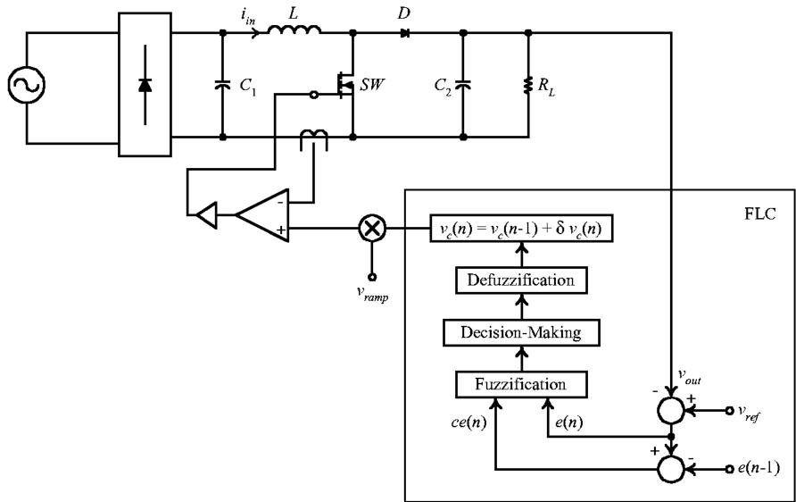  
Figure 11.1 Block diagram of the boost rectifier with APFC and FLC

# 11.2 FLC for the Boost Rectifier

Figure 11.1 shows the block diagram of the proposed boost rectifier with PFC. The input and output of the fuzzy logic system implemented in a digital signal processor (DSP). It is only necessary to sense the slow-varying output voltage $\nu _ { o u t }$ The fast

varying input current $i _ { i n }$ is compared to the product of the FLC output and a standard ramp function. The DSP is not required to generate a fast PWM signal at the switching frequency $f _ { S }$ .

# 11.2.1. Switching Rule for the Switch SW

Figure 11.2 shows the behavioral model of the boost converter [11]. $\nu _ { i n }$ is the supply voltage of the converter. $D _ { o n }$ represents the duty cycle of SW. If the waveform of $i _ { i n }$ varies in accordance with $\nu _ { i n } ,$ it must make the converter look resistive at the input terminal. When the converter is operating in continuous conduction mode (CCM), $\nu _ { i n } = \left( 1 - D _ { o n } \right) \nu _ { o u t }$ [11],

$$
\frac { \nu _ { i n } } { i _ { i n } } = R _ { i n } = \frac { ( 1 - D _ { o n } ) \nu _ { o u t } } { i _ { i n } }
$$

where $R _ { i n }$ is the fictitious input resistance. If $\nu _ { i n }$ and $\nu _ { o u t }$ are fixed, $i _ { i n }$ and the output power can be adjusted by controlling $R _ { i n }$ .The average switch current $i _ { s }$ can be related with $i _ { i n }$ by

$$
i _ { s } = D _ { o n } \ i _ { i n } \Rightarrow i _ { i n } = \frac { i _ { s } } { D _ { o n } }
$$

If the operation of the rectifier is in CCM and the current ripple of the input current is small, the on-state switch current $I _ { s , \mathrm { o n } }$ can be approximated by

$$
I _ { s , \mathrm { o n } } = i _ { i n }
$$

By substituting Equation (2) into Equation (1),

$$
I _ { s , \mathrm { o n } } = \frac { \nu _ { o u t } } { R _ { i n } } \left( 1 - D _ { o n } \right) = \frac { \nu _ { o u t } } { R _ { i n } } \left( 1 - \frac { 1 } { T _ { s } } t _ { o n } \right)
$$

$t _ { o n } = D _ { o n } T _ { s }$ is the on-time of SW and $T _ { s } ( = 1 / f _ { s } )$ is the switching period. Equation (4) gives the required relationship between $I _ { s , \mathrm { o n } }$ and $t _ { o n }$ , in order to keep the input side resistive. For practical implementation, a current reference function $i _ { r e f } ( t )$ that gives a similar expression to Equation (4) is used, in order to follow the condition in Equation (4). That is,

$$
i _ { r e f } { ( t ) } = \frac { \nu _ { o u t } } { R _ { i n } } ( 1 - \frac { 1 } { T _ { s } } t ) { = } \nu _ { c } ( t ) \nu _ { r a m p } ( t )
$$

The waveform of $i _ { r e f } ( t )$ is similar to a ramp function in classical a PWM switching converter, but the amplitude is adjustable and is controlled by $\nu _ { c } ( t )$ . Thus, the switch current can compare with $i _ { r e f } ( t )$ , so that $t _ { o n }$ will be in accordance with the above relationship. As shown in Equation (5), $i _ { r e f } ( t )$ is derived from the product of the FLC output $\nu _ { c } ( t )$ , which gives the control action of $\nu _ { o u t } \ / \ R _ { i n }$ in steady state, and a standard ramp function $\nu _ { r a m p } ( t )$ that generates a function of $( 1 - t / T _ { S } )$ . $\nu _ { c } ( t )$ is a slow-varying function. Compared with the classical current mode controller [9], the proposed system eliminates the requirement for sensing the input voltage for input current synchronization. This approach gives a similar effect like the nonlinear carrier control in [12], but presents simpler methodology as in [13] and [14].

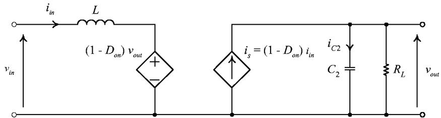  
Figure 11.2 Behavioral model of the APFC

# 11.2.2 Fuzzy Logic Controller (FLC)

One of the advantages of FLC is that it does not require an accurate mathematical model of the whole system. The control action in the FLC is determined by a set of fuzzy rules. Figure 11.1 shows the configuration of the FLC. The output voltage of the PFC is sampled. At the nth sampling instant, two quantities are supplying to the FLC, including an output voltage error $e$ and an output voltage error change $c e$ . They are defined as

$$
e ( n ) = \nu _ { r e f } - \nu _ { o u t } ( n ) \mathrm { a n d } c e ( n ) = e ( n ) - e ( n - 1 ) ^ { ( }
$$

where $\nu _ { r e f }$ is the reference voltage. The FLC consists of three major components [15], including fuzzification, decision-making, and defuzzification. They are described as below.

# 11.2.2.1 Fuzzification

Fuzzification is to map $e$ and $c e$ into suitable linguistic values. In this chapter seven fuzzy subsets are defined for $e$ and $c e$ , including negative big $( N B )$ , negative medium (NM), negative small (NS), zero (ZE), positive small $( P S )$ , positive medium $( P M )$ , and positive big $( P B )$ . Each input variable (i.e., $e$ and $c e$ ) is assigned to a membership value $\mu$ corresponding to an individual fuzzy subset. The number of fuzzy subsets is not fixed and depends on the input resolution required. In general, the larger the number of fuzzy subsets, the higher is the input resolution. Figure 11.3(a) shows the membership functions that are in triangular shape. Typically, the functions are evenly distributed [5]-[8], [15]. That is, $x _ { i , j 1 } = x _ { i , ( j - 1 ) 2 }$ , $x _ { i , j 2 } = x _ { i , ( j - 1 ) 3 }$ , and $x _ { i , j 3 } = x _ { i , ( j + 1 ) 2 }$ for $j = 1 , . . . , 6$ . It must be noted that such an evenly distributed membership approach has no practical justification. In this chapter, the distribution of the membership functions is not limited to such an arrangement, but is optimized by applying the GA. In practice, mapping of $e$ and $c e$ into the fuzzy subsets is achieved by scaling their magnitude linearly. That is,

$$
e ^ { \prime } { = } \beta e { \mathrm { ~ a n d ~ } } c e ^ { \prime } { = } \gamma c e
$$

where $\beta$ and $\gamma$ are constant scaling factors. $e ^ { \prime }$ and $c e ^ { \prime }$ are variables that lie along the input range of the respective fuzzy subset. A method, which is based on the steadystate output of the PFC, is used to decide the values of $\beta$ and $\gamma .$ Consider the PFC output circuit in Figure 11.2, $i _ { s } ( t )$ is assumed to be a rectified sinusoidal waveform at the line frequency $f _ { L }$ Thus,

$$
\begin{array} { r } { i _ { s } ( t ) = I _ { m } \ | \sin \omega _ { L } \ t | , \ \omega _ { L } = 2 \pi f _ { L } . } \end{array}
$$

The output capacitor current $i _ { C 2 } ( t )$ can be expressed as

$$
i _ { C 2 } ( t ) = i _ { s } ( t ) - \frac { V _ { o u t } } { R _ { L } }
$$

where $V _ { o u t }$ is the average output voltage.

As the average value of $i _ { C 2 } ( t )$ equals zero,

$$
\frac { \mathfrak { G } _ { L } } { \pi } \int _ { 0 } ^ { \pi / \mathfrak { o } _ { L } } i _ { s } ( t ) d t = \frac { V _ { o u t } } { R _ { L } } \Rightarrow I _ { m } = \frac { \pi } { 2 } \frac { V _ { o u t } } { R _ { L } }
$$

The output ripple voltage $\Delta \nu _ { o u t }$ can be approximated by

$$
\begin{array} { l } { { \displaystyle \Delta \nu _ { o u t } = \frac { 1 } { C _ { 2 } } \int _ { t _ { 1 } } ^ { t _ { 2 } } i _ { C 2 } ( t ) d t = \frac { V _ { o u t } } { { \bf \sigma } _ { \{ 0 } _ { L } } C _ { 2 } { \bf \sigma } _ { R _ { L } } } ( \sqrt { { \pi } ^ { 2 } - 4 } - \pi + 2 \sin ^ { - 1 } \frac { 2 } { \pi } ) , }  \\ { { \displaystyle t _ { 1 } = \frac { \sin ^ { - 1 } { \bf \sigma } ( 2 / \pi ) } { { \bf \sigma } _ { L } } , t _ { 2 } = \frac { \pi - { \bf \sigma } _ { L } t _ { 1 } } { { \bf \sigma } _ { L } } . } } \end{array}
$$

where $t _ { 1 }$ and $t _ { 2 }$ are the times at which $i _ { C 2 } ( t ) = 0$ in one half cycle.

$\nu _ { o u t }$ contains a ripple voltage $\nu _ { r i p p l e }$ with peak-to-peak value of $\Delta \nu _ { o u t }$ in the steady state. $e ^ { \prime }$ varies between $\left[ - \Delta \nu _ { o u t } \left. \beta \right. / 2 \mathrm { ~ , ~ } \Delta \nu _ { o u t } \left. \beta \right. / 2 \right]$ In this investigation, the ripple is assigned to vary within one-third of the fuzzy subset input extremes at heavy load condition. Thus,

$$
\beta = \frac { 1 } { \Delta \nu _ { o u t } } \cdot \frac { 1 } { 3 } ( e _ { \mathrm { m a x } } ^ { , } - e _ { \mathrm { m i n } } ^ { , } )
$$

where $e _ { \mathrm { { m a x } } } ^ { \prime }$ and $e _ { \mathrm { { m i n } } } ^ { \prime }$ are the maximum and minimum values of the $e ^ { \prime }$ fuzzy subset input shown in Figure 11.3. If $\nu _ { r i p p l e }$ is assumed to be sinusoidal, the frequency will be at $2 f _ { L }$

$$
\nu _ { r i p p l e } ( t ) \cong \frac { \Delta \nu _ { o u t } } { 2 } \sin 2 \ : \{ \mathfrak { o } _ { L } \ : t \Rightarrow \dot { \nu } _ { r i p p l e } ( t ) \cong \Delta \nu _ { o u t } \ : \mathfrak { o } _ { L } \ : \cos 2 \ : \mathfrak { o } _ { L } \ : t
$$

As $\dot { \nu } _ { r i p p l e }$ varies between $- \Delta \nu _ { o u t } \mathbf { \Omega } _ { } \omega _ { L }$ and $\Delta \nu _ { o u t } \mathfrak { o } _ { L } , c e ^ { \prime }$ will vary between $- \Delta \nu _ { o u t } \ \omega _ { L } / f _ { s a m p }$ and $\Delta \nu _ { o u t } \mathfrak { O } _ { L } / f _ { s a m p }$ in each sample, where $f _ { s a m p }$ is the sampling frequency of $\nu _ { o u t }$ . In this chapter, this variation is mapped to vary between two-thirds of the fuzzy subset input extremes,

$$
\gamma = \cfrac { f _ { s a m p } } { 2 ~ \Delta \nu _ { o u t } ~ \mathfrak { o } _ { L } } \cdot \frac { 2 } { 3 } ( c e _ { \mathrm { \ m a x } } ^ { \prime } - c e _ { \mathrm { \ m i n } } ^ { \prime } )
$$

where $c e _ { \mathrm { { \ m a x } } } ^ { \prime }$ and $c e _ { \mathrm { \ m i n } } ^ { \mathrm { * } }$ are the maximum and minimum values of the $c e ^ { \prime }$ fuzzy subset input.

The selection of the mapping range of $e ^ { \prime }$ and $c e ^ { \prime }$ at steady state in Equations (12) and (14) are based on a compromise between the sensitivity of the FLC and the regulation speed. The effects of using different $\beta$ and $\gamma$ on the transient responses will be demonstrated with the practical example in Section 11.4.

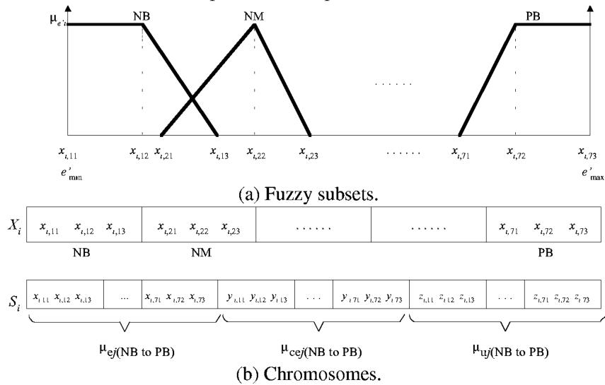  
Figure 11.3 Structure of the fuzzy subsets and chromosomes

# 11.2.2.2 Decision-Making

Decision-making infers fuzzy control action from knowledge of the fuzzy rules and the linguistic variable definition. The control rules that determine the output of the FLC are based on the knowledge of the system behavior being controlled. The fuzzy inference method is illustrated in Figure 11.4. As every $e ^ { \prime }$ and $c e ^ { \prime }$ belong to at most two fuzzy subsets (Figure 11.3), a maximum of four rules have to be considered in every sample. For example, if $e ^ { \prime } = a$ and $c e ^ { \prime } = b$ , $a$ has non-zero membership values for $N B$ and $N M$ and $^ b$ has non-zero membership values for $N M$ and $N S$ . Four rules including (NB, NM), (NB, NS), (NM, NM), and $( N M , N S )$ have to be considered. Consider the rule $( N B , N M )$ ; a value $_ { m }$ is determined by applying the Mandani's min fuzzy implication, where

$$
m = \operatorname* { m i n } [ \mu _ { e \ ? ( N B ) } ( a ) , \mu _ { c e \ ? ( N M ) } ( b ) ]
$$

The fuzzy set $\mu _ { \mathrm { u l } } ( u )$ is derived as shown in Figure 11.4. The same operation is applied for other rules. The union of all the fuzzy sets $\mu _ { \mathrm { u l } } ( u ) , \mu _ { \mathrm { u } 2 } ( u ) , \mu _ { \mathrm { u } 3 } ( u )$ , and $\mu _ { \mathrm { u } 4 } ( u )$ is formed as shown in Figure 11.4. The actual output of the FLC is then obtained by defuzzification.

# 11.2.3 Defuzzification

Defuzzification is the process to convert the inferred fuzzy control action to a crisp value. The output of the FLC is the change of $\nu _ { c } ( n )$ in Equation (5). The actual value is determined by adding $\nu _ { c } ( n \mathrm { - } 1 )$ to the calculated change,

$$
\nu _ { c } ( n ) = \nu _ { c } ( n - 1 ) + 8 \nu _ { c } ( n )
$$

During this operation, a crisp value for $u = \delta \nu _ { c } ( n )$ is calculated by using the "center of sum method." Let $A _ { q }$ be the area of the trapezoidal fuzzy set inferred by the qth control rule and $u _ { q }$ be the horizontal distance between the centroid of $A _ { q }$ and the vertical axis. The defuzzified output is calculated by the following formula

$$
u = \frac { \displaystyle { \sum _ { q = 1 } ^ { N } } u _ { q } \ A _ { q } } { \displaystyle { \sum _ { q = 1 } ^ { N } } A _ { q } }
$$

where $N$ is the total number of control rules. Equation (16) gives an integrating effect, which can remove steady-state error. The calculated control voltage is then sent to the output of the FLC and then to multiply the ramp voltage $\nu _ { r a m p }$ in Equation (5).

# 11.3 Optimization of FLC by the Genetic Algorithm

# 11.3.1 Structure of the Chromosome

By applying the GA, the membership functions of the fuzzy subsets in the fuzzification are optimized. It is illustrated with a flowchart in Figure 11.5(a). For a generic chromosome $S _ { i }$ in a population $U _ { D }$ having $N _ { s }$ members (where $i \in [ 1 , N _ { s } ] )$ , the parameters are arranged as shown in Figure 11.3(b). It consists of 63 integer numbers and can be divided into three components. Each component corresponds to the fuzzy subsets for $e ^ { \prime } , \ c e ^ { \prime }$ ,and $\boldsymbol { u }$ and contains the parameters of the seven membership functions. As shown in Figure 11.3(a), three points including the two ending points and one peak point, define each membership function. Mathematically,

$$
S _ { i } = [ X _ { i } Y _ { i } Z _ { i } ]
$$

where

$$
\begin{array} { r l } { X _ { i } } & { { } = [ x _ { i , 1 1 } x _ { i , 1 2 } x _ { i , 1 3 \dots } x _ { i , 7 1 } x _ { i , 7 2 } x _ { i } , _ { 7 3 } ] , } \\ { Y _ { i } } & { { } = [ y _ { i , 1 1 } y _ { i , 1 2 } y _ { i , 1 3 \dots } y _ { i , 7 1 } y _ { i , 7 2 } y _ { i } , _ { 7 3 } ] , } \\ { Z _ { i } } & { { } = [ z _ { i , 1 1 } z _ { i , 1 2 } z _ { i , 1 3 \dots } z _ { i , 7 1 } z _ { i , 7 2 } z _ { i } , _ { 7 3 } ] } \end{array}
$$

# 11.3.2 Initialization of $S _ { i }$

First, the size of the population $( N _ { s } )$ , the maximum number of generations $( G _ { m a x } )$ , the probability of crossover $( p _ { x } )$ , and the probability of mutation $( p _ { m } )$ are initialized. Second, the chromosome is initialized with a random selection process. As the parameters in $\mu _ { e i } , \ : \mu _ { c e ^ { \prime } i } ,$ and $\mu _ { u i }$ are initialized similarly, initialization of $\mu _ { e \tilde { \iota } }$ is illustrated in the following.

# 11.3.2.1 The peak point

Seven random integers that are in the range of $[ e _ { \mathrm { \ m i n } } ^ { \prime } ~ e _ { \mathrm { \ m a x } } ^ { \prime } ]$ are generated for the initialization of all peak points (i.e., $x _ { i , 1 2 } , x _ { i , 2 2 } . . . x _ { i , 7 2 } )$ of the membership functions $\mu _ { e ^ { \prime \prime } i } ( e ^ { \prime } )$ in Figure 11.3(a). The generated random integers are checked with the condition that

$$
x _ { i , ( j + 1 ) 2 } - x _ { i , j 2 } \geq \frac { e _ { \mathrm { ~ m a x ~ } } ^ { \prime } - e _ { \mathrm { ~ m i n ~ } } ^ { \prime } } { 8 } , j = 1 \mathrm { ~ . ~ . ~ . ~ 6 ~ }
$$

This is to ensure sufficient separation between the peak points of the initial fuzzy subsets. If the above conditions cannot be satisfied, another set of random integers will be generated.

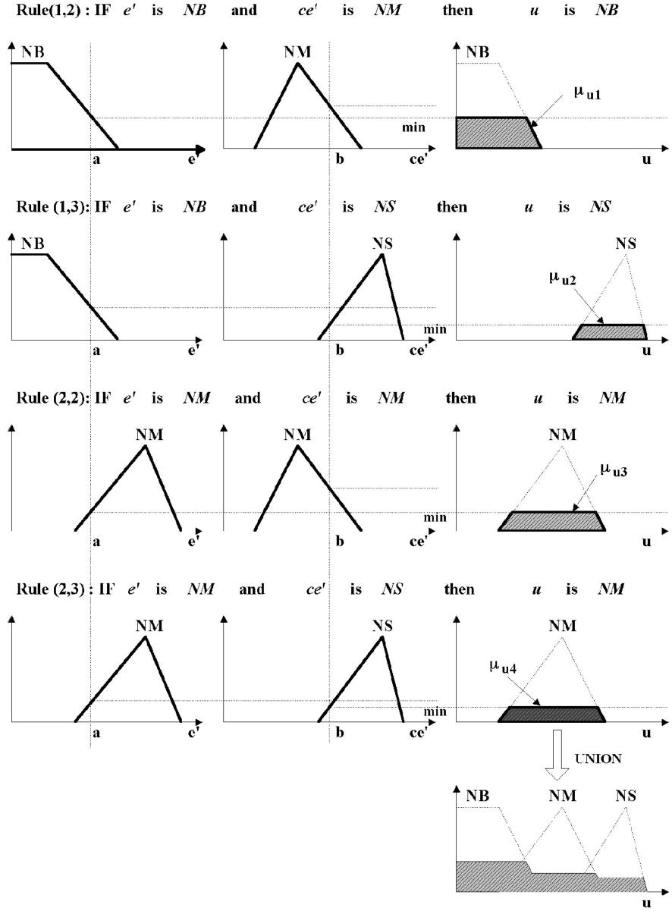  
Figure 11.4 Inference method

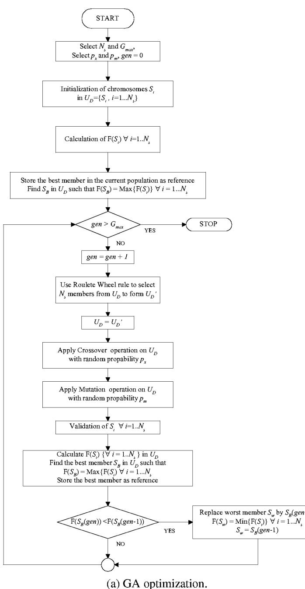

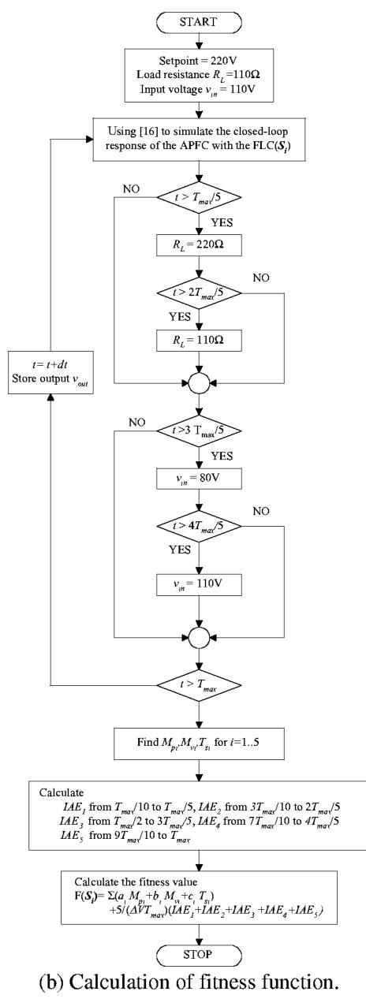  
Figure 11.5 Flowcharts

# 11.3.2.2 The Two End Points

The two end points of each membership function are governed by the following constraints. Apart from $x _ { i , 1 1 }$ and $x _ { i , 7 3 } , x _ { i , j 1 }$ and $x _ { i , j 3 }$ are randomly chosen so that $x _ { i , j 1 }$ E $[ x _ { i , ( j - 1 ) 2 } x _ { i , ( j - 1 ) 3 } ]$ and $\mathfrak { c } _ { i , j 3 } \mathfrak { E } \ [ \ : x _ { i ^ { \prime } j 2 } \ : x _ { i , ( j + 1 ) 2 } ]$ for the jth membership function. For example, $x _ { i , 1 3 }$ is selected randomly within the interval of $[ x _ { i , 1 2 } \ x _ { i , 2 2 } ]$ and $x _ { i , 2 1 }$ is selected randomly within the interval of $[ x _ { i , 1 2 } x _ { \mathrm { i } , 1 3 } ]$ . This is to ensure the existence of an overlapping region between the adjacent fuzzy subsets. The above membership function initialization procedure is repeated for the other input and output membership functions $\mu _ { c e ^ { \prime } i } ( e ^ { \prime } )$ and $\mu _ { u i } ( u )$ .

# 11.3.3 Formulation of Multi-objective Fitness Function

After the initializations, the GA goes into the evaluation procedures. Fitness values that measure the degree of attainment of the optimization objectives of all $S _ { i }$ in the current population are calculated. The multi-objective fitness function $F [ S _ { i } ( k ) ]$ in the $k$ th generation is defined in terms of the time-domain performance index, including the maximum overshoot, undershoot, and settling time in a performance test. The procedure is illustrated with the flowchart in Figure 11.5(b). The test involves a step change of the set point at start up, a load change at $T _ { \mathrm { m a x } } / 5$ and at $2 T _ { \mathrm { m a x } } / 5$ , a supply voltage change at $3 T _ { \mathrm { m a x } } / 5$ and at $4 T _ { \mathrm { m a x } } / 5$ , where $T _ { m a x }$ is the maximum time of the performance test. A typical output response is shown in Figure 11.6. The output response of the boost rectifier with the FLC using the parameters in $S _ { i }$ is studied by a performance test, which is simulated with the method in [16]. $F [ S _ { i } ( k ) ]$ is defined as

$$
F [ S _ { i } ( k ) ] = \{ O [ S _ { i } ( k ) ] + P [ S _ { i } ( k ) ] \} ^ { - 1 }
$$

$O [ S _ { i } ( k ) ]$ and $P [ S _ { i } ( k ) ]$ are defined as

$$
\begin{array} { l } { \displaystyle O [ S _ { i } ( k ) ] = \sum _ { i = 1 } ^ { S } [ a _ { i } M _ { p i } + b _ { i } M _ { v i } + c _ { i } T _ { s i } ] } \\ { \displaystyle P [ S _ { i } ( k ) ] = \frac { 5 } { \Delta V ~ T _ { \mathrm { m a x } } } \{ \int _ { T _ { \mathrm { m a x } } } ^ { T _ { \mathrm { m a x } } / 5 } \lvert e ( t ) \rvert d t + \int _ { 3 T _ { \mathrm { m a x } } / 1 0 } ^ { 2 T _ { \mathrm { m a x } } / 5 } \lvert e ( t ) \rvert d t + \int _ { T _ { \mathrm { m a x } } / 2 } ^ { 3 T _ { \mathrm { m a x } } / 5 } \lvert e ( t ) \rvert d t } \\ { \displaystyle \qquad + \int _ { 7 T _ { \mathrm { m a x } } / 1 0 } ^ { 4 T _ { \mathrm { m a x } } / 5 } \lvert e ( t ) \rvert d t + \int _ { 9 T _ { \mathrm { m a x } } / 1 0 } ^ { T _ { \mathrm { m a x } } } \lvert e ( t ) \rvert d t \} } \end{array}
$$

where $a _ { i } , b _ { i } ,$ and $c _ { i }$ are constant weighting factors, $M _ { p i } , M _ { v i }$ and $T _ { s i }$ are the maximum overshoot, undershoot and settling time of the filtered output response within a tolerance band of $\pm 2 \%$ (The cutoff frequency of the filter is at $f _ { L } / 3 . )$ ; and $e ( t )$ is the error between the simulated output voltage (i.e., $\nu _ { o u t } )$ and the reference voltage $( \nu _ { r e f } )$ . $O [ S _ { i } ( k ) ]$ measures the sum of maximum overshoot, undershoot, and settling time for the transient response in different sections of the performance test. $P [ S _ { i } ( k ) ]$ considers the steady-state ripple as a penalty factor in the overall fitness function. It calculates the steady-state integral absolute error (IAE) in different sections of the performance test. All the IAE values are normalized with the area within the $\pm \Delta V$ tolerance band of $( 2 \Delta V T _ { \mathrm { { m a x } } } / 1 0 )$ .

# 11.3.4 Selection of Chromosomes

According to the roulette wheel rule, chromosomes with larger fitness value will have higher probability to survive. The selection process starts with the calculation of the fitness value $F [ S _ { i } ( k ) ]$ ,the relative fitness value $F _ { r } [ S _ { i } ( k ) ]$ and the cumulative fitness value $F _ { c } [ S _ { i } ( k ) ]$ for all $S _ { i }$ in the current generation. $F _ { r } [ S _ { i } ( k ) ]$ and $F _ { c } [ S _ { i } ( k ) ]$ are defined as

$$
F _ { r } [ S _ { i } ( k ) ] = F [ S _ { i } ( k ) ] / \sum _ { \nu = 1 } ^ { N _ { s } } F [ S _ { \nu } ( k ) ] { \mathrm { ~ a n d ~ } } F _ { c } [ S _ { i } ( k ) ] = \sum _ { \nu = 1 } ^ { i } F _ { r } [ S _ { \nu } ( k ) ]
$$

A random probability variable $p \in \ [ 0 , 1 ]$ is generated and is used to decide the selection of $S _ { i }$ If $F _ { c } [ S _ { i - 1 } ( k ) ] < p < F _ { c } [ S _ { i } ( k ) ]$ , $S _ { i }$ will be chosen to be a member of the new population. This selection process is repeated until $N _ { s }$ members have been selected into the new population.

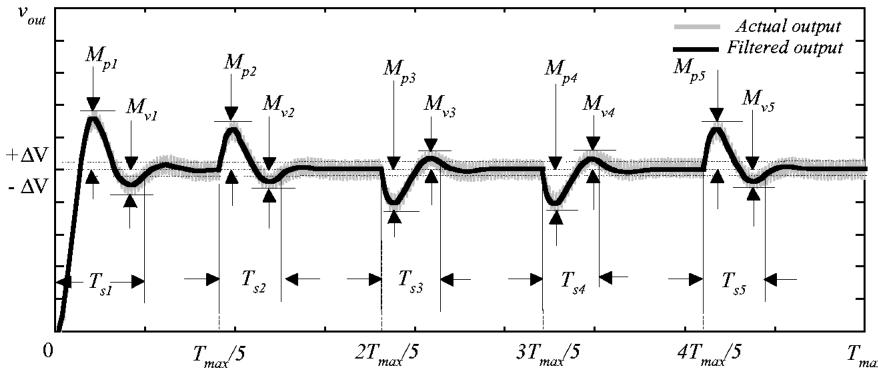  
Figure 11.6 Typical output response of the boost rectifier

# 11.3.5 Crossover and Mutation Operations

A random selection test considers each chromosome in the current population sequentially. Crossover will be carried out whenever two chromosomes are selected. A probability of crossover $p _ { x } \in \ [ 0 , 1 ]$ is predefined. In order to decide whether $S _ { i }$ will perform crossover, a random number $p \in [ 0 , 1 ]$ is generated for $S _ { i }$ If $p \ < \ p _ { x } ,$ . $S _ { i }$ is selected for crossover. Otherwise, the next member is considered. In this chapter, a single point crossover is used. The operation is illustrated in Figure 11.7. Consider the crossover operation for two chromosomes $S _ { 1 } = [ X _ { 1 } \ : Y _ { 1 } \ : Z _ { 1 } ]$ and $S _ { 2 }$ $= [ X _ { 2 } Y _ { 2 } Z _ { 2 } ]$ , the crossover point is first selected randomly of equal probability for $X _ { 1 }$ and $X _ { 2 }$ . The genes after the selected crossover point will be exchanged between the two parents $X _ { 1 }$ and $X _ { 2 }$ , forming two children. Similar operations will be performed for $Y _ { 1 }$ and $Y _ { 2 }$ and $Z _ { 1 }$ and $Z _ { 2 }$ .

The mutation operation is carried out by random selection of $S _ { i }$ with a predefined probability $p _ { m . }$ Each membership function in $X _ { i } : ( x _ { i , j 1 } , \ x _ { i , j 2 } , \ x _ { i , j 3 } )$ for $j = 1$ to 7 is selected for mutation when a generated random number $p \in [ 0 , 1 ]$ is smaller than $p _ { m }$ . Any one of the following operations will be performed with equal probability.

1) Operation 1: $x _ { i , j 1 }$ is replaced by a random number with the constraint that it is in the interval of $[ x _ { i , ( j - 1 ) 1 } , x _ { i , ( j - 1 ) 3 } ]$ .   
2) Operation 2: $x _ { i , j 2 }$ is replaced by a random number with the constraint that it is in the interval of $[ x _ { i , j 1 } , x _ { i , j 3 } ]$ .   
Operation 3: $x _ { i , j 3 }$ is replaced by a random number with the constraint that it is in the interval of $[ x _ { i , ( j + 1 ) 1 } , x _ { i , ( j + 1 ) 3 } ]$ .

The above steps are repeated for $Y _ { i }$ and $Z _ { i }$ until the whole string of $S _ { i }$ is considered.

<table><tr><td rowspan=1 colspan=1>1,11 x1,12 x1,13</td><td rowspan=1 colspan=2></td><td rowspan=1 colspan=2>x1,71 X1,72 x1,73</td><td rowspan=1 colspan=1>$ 1,11 1,12 1,13</td><td rowspan=1 colspan=3></td><td rowspan=1 colspan=2>$y1,71 1,72 1,13</td><td rowspan=1 colspan=1>Z1,11 21,21 21,13</td><td rowspan=1 colspan=2></td><td rowspan=1 colspan=1>21,71 21,72 21,73</td></tr><tr><td rowspan=1 colspan=2></td><td rowspan=1 colspan=2>↑</td><td rowspan=1 colspan=3></td><td></td><td rowspan=1 colspan=2></td><td rowspan=1 colspan=3>↑</td><td rowspan=1 colspan=2></td><td rowspan=1 colspan=1></td></tr><tr><td rowspan=1 colspan=1>x2,11 x2,12 x2,13</td><td rowspan=1 colspan=2>· . ·</td><td rowspan=1 colspan=2>x2,71 x2,72 x2,73</td><td rowspan=1 colspan=1>2,11 2,122,13</td><td rowspan=1 colspan=3>· . ·</td><td rowspan=1 colspan=2>2,71 2,72 2,73</td><td rowspan=1 colspan=1>Z2,11 2,12 2,13</td><td rowspan=1 colspan=2>· · .</td><td rowspan=1 colspan=1>Z2,71 Z2,72 Z2,73</td></tr></table>

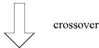

<table><tr><td rowspan=1 colspan=1>x1,11 x1,12 1,13</td><td rowspan=1 colspan=1></td><td rowspan=1 colspan=1>x2,71 x2,72 x2,73 y1,11 1,121,13</td><td rowspan=1 colspan=1>x2,71 x2,72 x2,73 y1,11 1,121,13</td><td rowspan=1 colspan=1></td><td rowspan=1 colspan=1>2,7l2,22,73 Z1,11 21,21 21,13</td><td rowspan=1 colspan=1>2,7l2,22,73 Z1,11 21,21 21,13</td><td rowspan=1 colspan=1></td><td rowspan=1 colspan=1>Z2,71 22,72 22,73</td></tr></table>

<table><tr><td rowspan=1 colspan=1>x2,11 x2,12 x2,13</td><td rowspan=1 colspan=1>. ..</td><td rowspan=1 colspan=1>x1,71 x1,72 1,73 y2,112,12 2,13</td><td rowspan=1 colspan=1>x1,71 x1,72 1,73 y2,112,12 2,13</td><td rowspan=1 colspan=1>...</td><td rowspan=1 colspan=1>1,71 1,72 1,73 Z2,11 2,12 22,13</td><td rowspan=1 colspan=1>1,71 1,72 1,73 Z2,11 2,12 22,13</td><td rowspan=1 colspan=1>. · .</td><td rowspan=1 colspan=1>Z1,71 21,72 21,73</td></tr></table>

(a) Crossover.

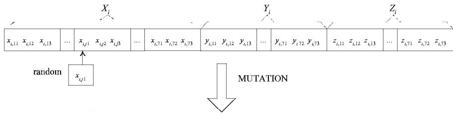  
Figure 11.7 Crossover and mutation operations

<table><tr><td rowspan=1 colspan=1>x,11 x,12 x,13</td><td rowspan=1 colspan=1>...</td><td rowspan=1 colspan=1>$\qx1}$</td><td rowspan=1 colspan=1>$x{2 x{rx3}$</td><td rowspan=1 colspan=1></td><td rowspan=1 colspan=1>xi,71 xi,72 x,73</td><td rowspan=1 colspan=1>,1,12,13</td><td rowspan=1 colspan=1></td><td rowspan=1 colspan=1>1 2 3</td><td rowspan=1 colspan=1>zi,11 z,12 2z,13</td><td rowspan=1 colspan=1>···</td><td rowspan=1 colspan=1>zh71 Z,72 z,73</td></tr></table>

Mutation

# 11.3.6 Validation of $S _ { I } .$ :Recovery of Valid Fuzzy Subsets

The new population of $S _ { i }$ will go through a validation procedure, in order to ensure that no undefined region exists. The validation procedure checks with the existence of $x _ { i , j 3 } < x _ { i , ( j + 1 ) 1 }$ for $j = 1 . . . 7$ If a particular $j$ appears, there is an undefined region in the interval of $[ \ X _ { i , j 3 } \ X _ { i , ( j + 1 ) 1 } ]$ A corrective procedure for the continuity of fuzzy subset is required. Consider the example in Figure 11.8, it can be seen that no membership function is defined for the interval of $[ x _ { i , 3 3 } ~ x _ { i , 4 1 } ]$ . The correction method is to interchange the entries $x _ { i , 3 3 }$ and $x _ { i , 4 1 }$ , so that the fuzzy subsets become overlap in the undefined region.

After the above processes, the best member $S _ { B } ( k )$ in the current population with the highest fitness value will be compared with the best one in the last generation of $S _ { B } ( k - 1 )$ . If the fitness value $F [ S _ { B } ( k ) ]$ is larger than $F [ S _ { B } ( k { - } 1 ) ]$ , next GA training cycle will be performed. Otherwise, the worst member $S _ { w } ( k )$ (i.e., $F [ S _ { w } ( k ) ] =$ $\operatorname* { m i n } \{ F [ S _ { i } ( k ) ] \}$ for $i = 1 \dots N _ { S } )$ in the current population will be replaced by $S _ { B } ( k { - } 1 )$ . Next GA training will be continued. The GA training will be terminated when the number of generation exceeds $G _ { m a x } .$ The best member $S ^ { * }$ of the latest generation is assigned as the optimal solution to the FLC design problem and the entry of $S ^ { * } =$ $[ X ^ { * } Y ^ { * } Z ^ { * } ]$ becomes the optimal membership function for the input and output fuzzy subsets for the FLC.

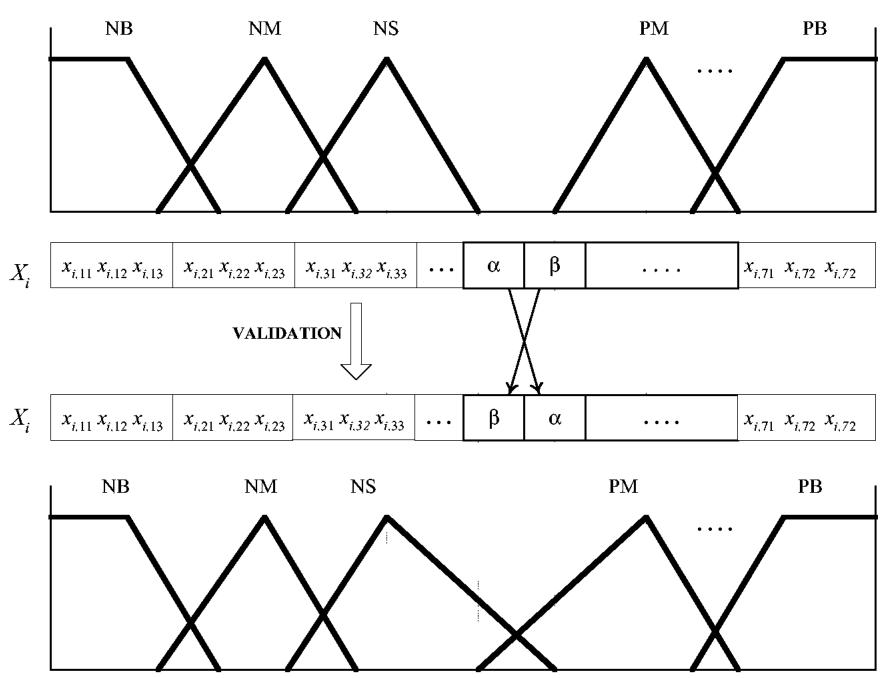  
Figure 11.8 Validation of $S _ { i }$

# 11.4 Illustrative Example

Static and dynamic behaviors of a practical boost rectifier are investigated. The specifications of the rectifier are as follows:

1) Input ac voltage, $1 1 0 \mathrm { V } \pm 2 0 \mathrm { V }$ , $5 0 \ \mathrm { H z }$   
2) Regulated output dc voltage, $2 2 0 \mathrm { v }$   
3) Output load resistance range, $1 1 0 \Omega - 2 2 0 \Omega$

The values of $\beta$ and $\gamma$ are chosen to be 3 and 60, respectively, which are based on the selection criteria in Sec. 11.2.2.1. In the performance test using GA training, the following simulations have been performed:

1) Step change in the set point of $2 2 0 \mathrm { V }$ at start-up   
2) Load resistance change from $1 1 0 \Omega$ to $2 2 0 \Omega$ at 300 ms   
3) Load resistance change from $2 2 0 \Omega$ to $1 1 0 \Omega$ at $6 0 0 \mathrm { m s }$   
4) Supply voltage change from $1 1 0 \mathrm { V }$ to $9 0 \mathrm { V }$ at 900 ms

The fitness function $F [ S _ { i } ( k ) ]$ in Equation (20) with $a _ { i } = b _ { i } = c _ { i } = 1$ is used. After 50 generations of GA optimization, the results of the optimal input, output fuzzy subsets and the fuzzy rule table are shown in Figure 11.9. It takes 2 hours in the optimization process in Section 11.3 on a 300-MHz 586-based PC. The GA-trained FLC is then applied to the prototype. The steady-state and the large-signal transient responses are investigated. Figure 11.10 shows the steady-state waveforms for $R _ { L } = $ $1 1 0 \Omega$ . It can be seen that the input current is in phase with the input voltage, showing unity power factor. It can be also observed that the output voltage varies at a frequency of $1 0 0 ~ \mathrm { H z }$ and the peak-to-peak ripple voltage of $1 6 ~ \mathrm { V }$ . These are consistent with the assumption made in Section 11.2.2.1. When the system has been entered into steady state, there is a step change in the load resistance from $1 1 0 \Omega$ to $2 2 0 \Omega$ with constant input voltage of $1 1 0 \mathrm { ~ V ~ }$ The transient waveforms are shown in Figure 11.11. The output has an overshoot of $10 \%$ and the settling time is less than $2 0 ~ \mathrm { { m s } }$ (about one line-frequency cycle) within the $5 \%$ band. Afterwards, the load resistance is switched back into $1 1 0 \Omega$ . The transients are shown in Figure 11.12. The output has an undershoot of less than $10 \%$ and the settling time is also less than $2 0 \mathrm { m s }$ .

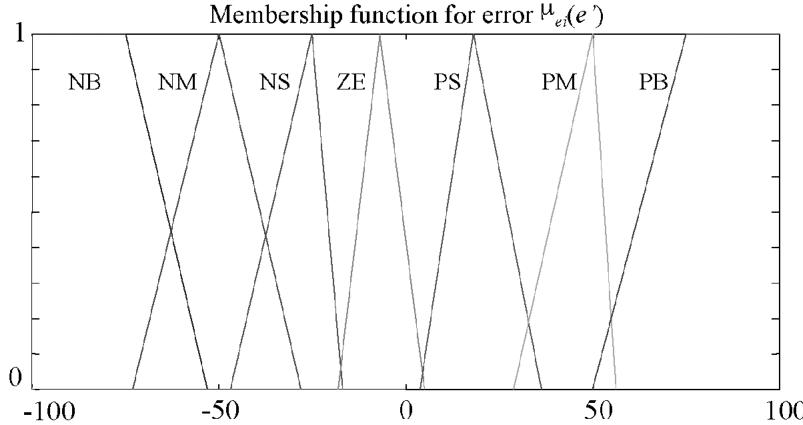

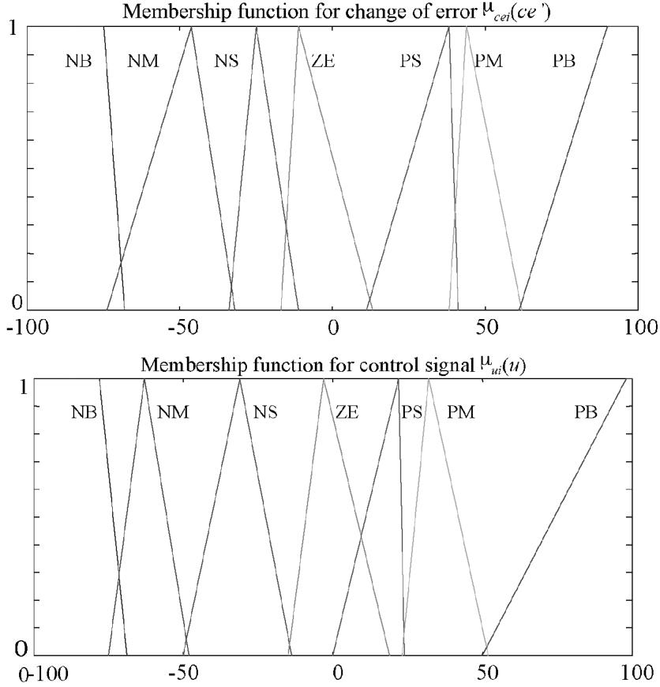  
Figure 11.9 GA-trained membership functions

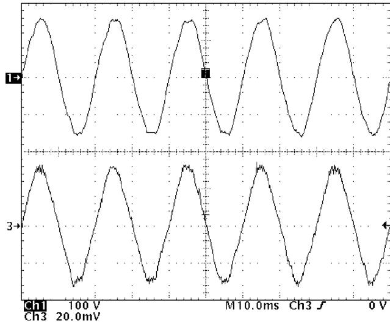

(a) Input voltage and input current waveforms.

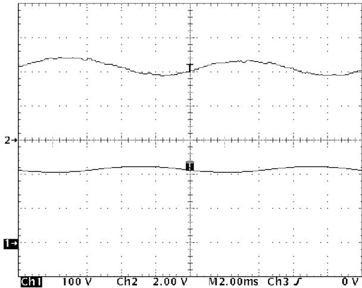  
[Ch 1: Input voltage (100V/div), Ch3: Input current (4A/div), Timebase: 10ms/div]   
Figure 11.10 Steady-state experimental waveforms when $R _ { L } = 1 1 0 \Omega$ .

(b) Output and control voltages. [Ch 1: Output voltage (100V/div), Ch2: Control voltage (2V/div), Timebase: 2ms/div]

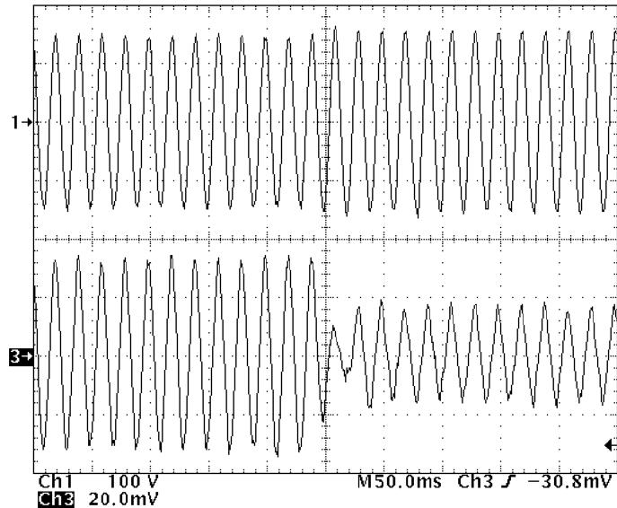  
(a) Input voltage and input current waveforms.

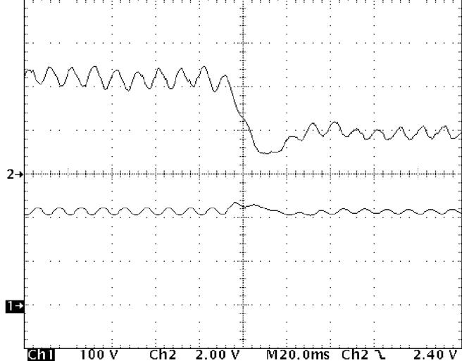  
[Ch 1: Input voltage (100V/div), Ch3: Input current (4A/div), Timebase: 50ms/div]   
Figure 11.11 Transient responses when ${ \pmb R } _ { L }$ is changed from 110 Ω to $\mathbf { 2 2 0 } \ \Omega$

(b) Output and control voltages. [Ch 1: Output voltage (100V/div), Ch2: Control voltage (2V/div), Timebase: 20ms/div]

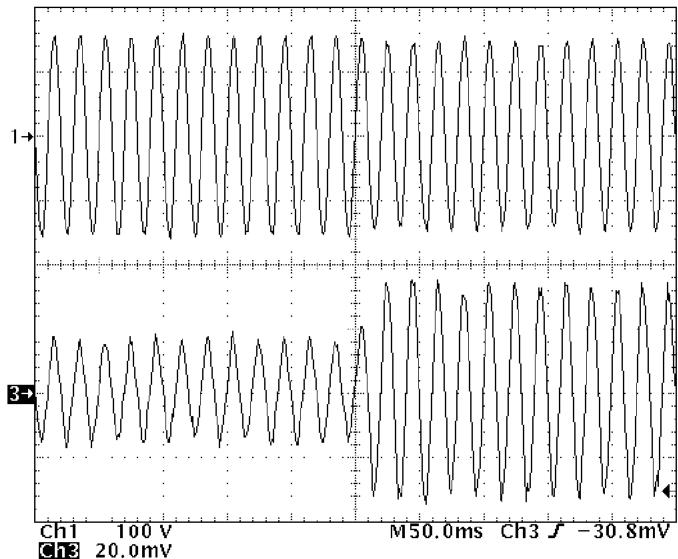

(a) Input voltage and input current waveforms.

[Ch 1: Input voltage (100V/div), Ch3: Input current (4A/div), Timebase: 50ms/div]

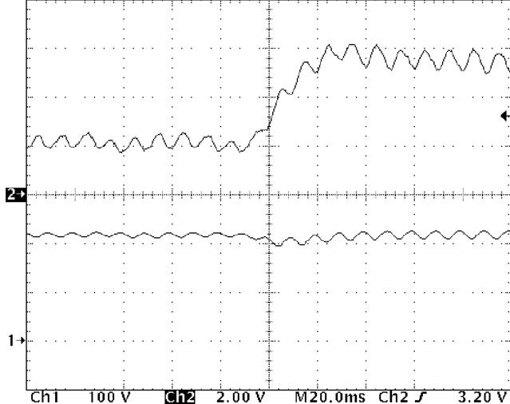  
Figure 11.12 Transient responses when $\pmb { R } _ { L }$ is changed from $\mathbf { 2 2 0 } \Omega$ to 110 $\Omega$ .

(b) Output and control voltages. [Ch 1: Output voltage (100V/div), Ch2: Control voltage (2V/div), Timebase: 20ms/div]

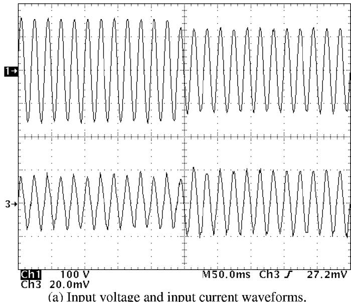  
Ch 1: Input voltage (100V/div), Ch3: Input current (4A/div), Timebase: 50ms/div]

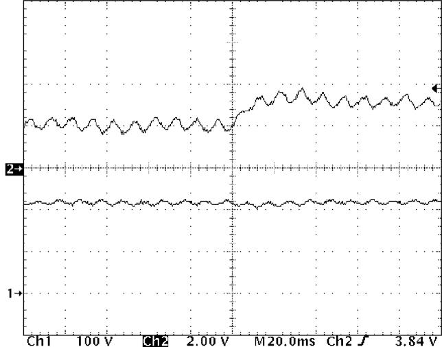  
Figure 11.13 Transient responses when $\nu _ { i n }$ is changed from 110 V to 90 V

(b) Output and control voltages. [Ch 1: Output voltage (100V/div), Ch2: Control voltage (2V/div), Timebase: 20ms/div]

Another test on large-signal change in $\nu _ { i n }$ has been performed. $\nu _ { i n }$ is changed from $1 1 0 \mathrm { ~ V ~ }$ to $9 0 \mathrm { ~ V ~ }$ with the load resistance unchanged. The transient responses are shown in Figure 11.13. The output voltage is almost unchanged within the $5 \%$ band. Moreover, the input current waveform is still sinusoidal during the transient period.

When the system becomes stable, $\nu _ { i n }$ is switched into $1 3 0 \mathrm { ~ V ~ }$ , which is outside the designed operating range. The transient waveforms are shown in Figure 11.14. There is an overshoot of about $10 \%$ in the output voltage and the settling time is less than $2 0 ~ \mathrm { { m s } }$ again. It can be seen from the above that the system is stable during the large-signal change in the input voltage and the output load.

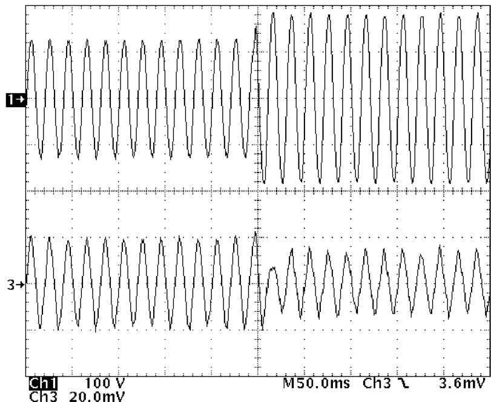

(a) Input voltage and input current waveforms. [Ch 1: Input voltage (100V/div), Ch3: Input current (4A/div), Timebase: 50ms/div]

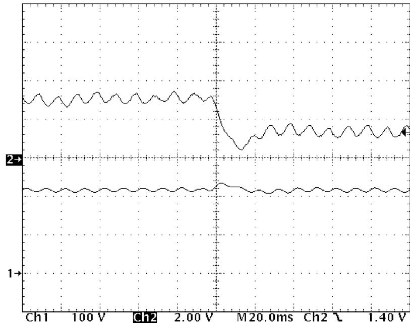  
Figure 11.14 Transient responses when $\nu _ { i n }$ is changed from 90 V to 130 V

(b) Output and control voltages. [Ch 1: Output voltage (100V/div), Ch2: Control voltage (2V/div), Timebase: 20ms/div]

Finally, the effects of using different values of $\beta$ and $\gamma$ on the transient responses are studied. Figure 11.15a shows the transient control and output voltages when the input voltage is changed from $9 0 ~ \mathrm { V }$ to $1 3 0 \mathrm { ~ V ~ }$ with $\beta = 1$ and $\gamma = 2 0$ , which are smaller than the previously assigned values. It can be observed that the control voltage is less sensitive to the output ripple voltage and the settling time is longer than the original one in Figure 11.14b. Figure 11.15b shows the transient responses when the scaling factors are increased into $\beta = 6$ and $\gamma = 1 2 0$ , which are larger than the previously assigned values. The control voltage becomes more sensitive to the output ripple voltage. In addition, the transient control voltage is relatively more oscillatory than the original one and also exhibits a momentarily zero control action.

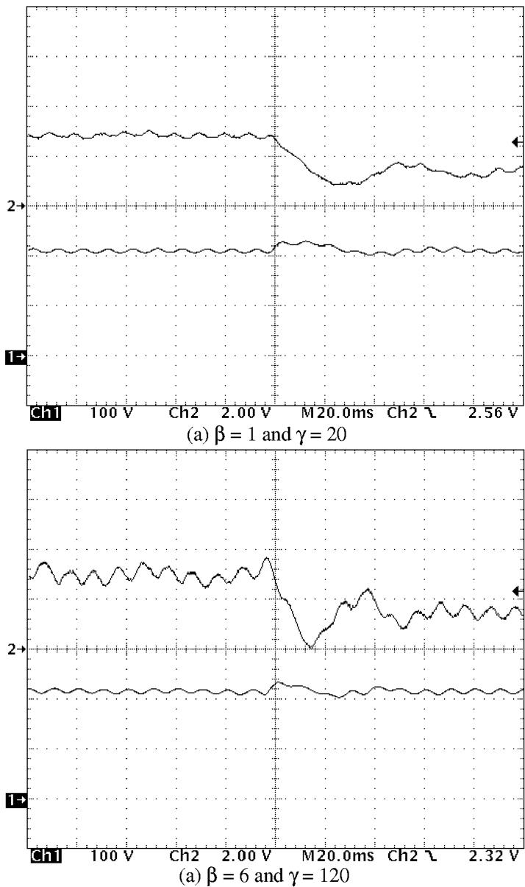  
Figure 11.15 Transient output and control voltages when $\nu _ { i n }$ is changed from 90 V to $\mathbf { 1 3 0 \Delta V }$ (Ch 1: output voltage (100 V/div); Ch2: control voltage (2 V/div); Timebase: ${ \bf 2 0 m s } / { \bf d i v }$

# 11.5 Conclusions

A GA-optimized FLC for ac-dc boost rectifier with PFC is described. It integrates a fuzzy logic control technique into the feedback path and a linear programming rule into the control of the magnitude of the ramp voltage, in order to adjust the duty cycle of the switch for the input current shaping. The proposed approach avoids complexities associated with nonlinear mathematical modeling of switching converters and circuit designers become unnecessary to perform time-consuming procedures of fine-tuning the fuzzy rules, which require sophisticated experience and intuitive reasoning as in many classical fuzzy-logic-controlled applications. Instead of generating a fast-changing PWM signal, the digital signal processor is required to generate a slow-varying dc signal only for determining the PWM ramp function. The FLC is optimized by a multi-objective fitness function. Moreover, it is unnecessary to sense the supply voltage for shaping the input current. Experimental measurements have confirmed that the system, under large-signal variation in the supply voltage and the output load, is still stable.

# Список литературы

[1] R.D. Middlebrook and S. Cuk, "A general unified approach to modeling switching converter power stages," in Proc. IEEE Power Electron. Spec. Conf. Rec., 1976, pp. 18-34.   
[2] F.C. Lee, R.A. Carter, "Investigations of stability and dynamic performances of switching regulators employing current injected control," IEEE Trans. Aerospace and Electronic Systems, 19, 274-287, Mar. 1983.   
[3] D. Czarkowski and M.K. Kazimierczuk, "Linear circuit models of PWM flyback and buck/boost converters," IEEE Trans. Circuits Syst. - Part I, 39, 688-693, Aug. 1992.   
[4] R.D. Middlebrook, "Modeling of current-programmed buck and boost regulators," IEEE Trans. Power Electronics, 4, 36-52, Jan. 1989.   
[5] B. Bose, "High performance control of induction motor drives," IEEE Industrial Electronics Society Newsletter, 45, 7-11, Sept. 1998.   
[6] F. Ueno, T. Inoue, I. Oota, and M. Sasaki, "Regulation of Cuk converters using fuzzy controllers," in INTELEC "91 Record, 261-267, 1991   
[7] T. Gupta, R.R. Boudreaux, R.M. Nelms, and J.Y. Hung, "Implementation of a fuzzy controller for dc-dc controllers using an inexpensive 8-b microcontroller," IEEE Trans. Ind. Electron., 44, 661-669, Oct. 1997.   
[8] S. Saetieo and D.A. Torrey, "Fuzzy logic control of a space-vector PWM current regulator for three-phase power converters," IEEE Trans. Power Electron., 13, 419-426, May 1998.   
[9] M. Rashid, Power Electronics, Circuits, Devices, and Applications, 2nd edition. Prentice Hall.   
[10] K.S. Tang, K. Man, Z. Liu, and S. Kwong, "Minimal fuzzy memberships and rules using hierarchical genetic algorithms," IEEE Trans. Ind. Electron., 45, 162-169, Feb. 1998.   
[11] Y.S. Lee, Computer-Aided Analysis and Design of Switch-Mode Power Supplies, Marcel Dekker, 1993.   
[12] D. Maksimovic, Y. Jang, and R.W. Erickson, "Nonlinear-carrier control for high-power-factor boost rectifier," IEEE Trans. Power Electron., 11, 578- 584, Jul. 1996.   
[13] S. Ben-Yaakov, "PWM converters with resistive input," IEEE Trans. Ind. Electron., 45, 519-520, Jun. 1998.   
[14] J. Hwang and C. Hsu, "A new 8 pin power factor correction and pulse width modulator controller for off-line power supplies," in Proc. IEEE Applied Power Electronics Conference and Exposition, APEC "99, Dallas, 1999, 1143-1149.   
[15] B. Kosko, Neural Networks and Fuzzy Systems. Englewood Cliffs, NJ: Prentice-Hall, 1992.   
[16] B.K.H. Wong and H. Chung, "An efficient technique for the time-domain simulation of power electronic circuits," IEEE Trans. Circuits Systs.  Part I, 45, 364-376, Apr. 1998

# Chapter 12 Multilevel Fuzzy Process Control Optimized by Genetic Algorithm

# Darko Grundler

Faculty of Textile Technology University of Zagreb Pierottieva 6 10000 Zagreb, Croatia darko.grundler@sk.tel.he http://public.srce.hr/\~dgrund

# Abstract

A new method is described for complex process control with the coordinating control unit based upon a genetic algorithm. The algorithm for the control of complex processes controlled by PID and fuzzy regulators at the first level and a coordinating unit at the second level has been theoretically laid out. A genetic algorithm and its application to the proposed control method have been described in detail. The idea has been verified experimentally and by simulation in a twostage laboratory plant. Minimal energy consumption criteria limited by given process response constraints have been applied, and improvements in relation to other known optimizing methods have been made. Independent and noncoordinating PID and fuzzy regulator parameter tuning has been performed using a genetic algorithm and the results achieved are the same or better than using traditional optimizing methods and at the same time the method proposed can be easily automated. Multilevel coordinated control using a genetic algorithm applied to a PID and a fuzzy regulator has been researched. The results of various traditional optimizing methods have been compared with an independent noncoordinating control and multilevel coordinating control using a genetic algorithm. The best results have been achieved with the multilevel coordinating fuzzy control optimized by a genetic algorithm.

# 12.1 Introduction

The research presented here has been spurred by the possibility of applying the methods of intelligent control in two-level cascaded nonlinear plants, where operating conditions change and where they significantly impact the control conditions. It is supposed that two cascaded processes should be under coordinated and adaptive control, so that in case of disturbances, optimal functioning is retained under given plant conditions and environment conditions.

One possible solution is the implementation of fuzzy logic control. In this way, it is possible to control a process heuristically. An evolutionary optimizing procedure has been selected in this chapter as a supplement to fuzzy logic control, with the basic idea of finding a global extreme, from the point of view of a particular criterion regarding the system as a whole. Genetic algorithms are the method selected here because they are characterized by a number of properties appropriate for the application described. It is independent of the nature of the task to be optimized; it does not ask for a mathematical model, nor for a detailed experience of the process. Genetic algorithms can be linked to fuzzy and PID regulators and can be applied on computers. The method is theoretically sound and has been experimentally verified through solving various tasks [Goldberg, 1986].

The concept of the research and the results obtained are presented in three parts. The first part presents the concept of multilevel fuzzy process control optimized by a genetic algorithm. The second describes cascaded laboratory plant used in simulation and experimental verification of the concept. The third and final part gives the results obtained, discussion and conclusion.

# 12.2 Intelligent Control

The concept of intelligent control is a relatively new one and lacks a clear definition. One of the reasons is the ambiguity of the concept of "intelligence" and different approaches to its understanding. Within the confines of the research described here, intelligent control is control which imitates the problem-solving processes of people, animals and biological systems, or simply solves the tasks in the same ways. An intelligent controller is defined in the same way [Passino 1993]:

The physical device called a controller is an intelligent controller if it is developed and/or implemented with a) an intelligent control methodology or b) conventional systems/control techniques to emulate/perform control functions that are normally performed by humans/animals/biological systems.

Optimizing the behavior of the process in most cases means simply tuning of controller parameters [Bramlette, 1989; Oliveira, 1991; Bäck, 1993]. For the controllers built upon a comprehensive and well-founded theory, such as, for example, PID regulators, in most cases tuning could be done analytically on a mathematical model. Problems occur when a PID or fuzzy regulator is applied to a process, the mathematical model of which was, for some reason, not known (complexity of the process, insufficient familiarity with it, etc.), or when the model was nonlinear, which made it impossible to apply a known theoretical base. In these types of cases, tuning is done based on experience, often with quite satisfactory results and speed of solution and often more acceptable than analytical processes.

The introduction of fuzzy controllers [Braae, 1979; Baldwin, 1980; Dubois, 1980; Sugeno, 1985; Guilamo, 1987; Stipanicev, 1987; Buckley, 1992; Chen, 1993; Chen, 1993a] introduced completely new problems regarding the tuning of controller parameters. The basic assumption for the application of a fuzzy controller is that it is impossible to construct a satisfactory mathematical model of the process in question; thus, the controller is built up on the basis of a linguistic description of process behavior. Fuzzy controller parameters are a representation of a linguistic description of the process, and are directly dependent on the isomorphism of the description and real behavior of the process. Controller tuning can be done so that the linguistic description of the process is improved, which is in itself limited by perceptive and cognitive abilities of the person describing the process. This is why fuzzy controller parameters cannot be tuned employing analytical methods, but only on the basis of experience or some of the evolutionary processes of optimizing.

Tuning of controller parameters applied to complex plants, consisting of a number of processes linked together, is not an easy task [Mesarovi, 1970; Zadeh, 1973; Findeisen, 1978; Bahnasavi, 1990; Hall, 1991; Lin, 1991; Sugeno, 1991]. The procedures of evolutionary optimizing have proved to be quite applicable in the area [Freeman, 1990; Karr, 1991; Pham, 1991; Linkens, 1992; Cooper, 1993; Lee, 1993].

Research described here has concentrated on finding the possibilities of applying genetic algorithms in optimizing controller parameters applied to complex plants consisting of a number of sub-processes, linked together. The nature of genetic algorithms and contemporary research make an analytical analysis of a complex coordinated control possible [Vose, 1993]. Besides principal and general suppositions and conclusions, the only methods to be used in the research are simulation and experiment.

# 12.3 Multilevel Control

# 12.3.1 Optimal Control Concept

The key task was to investigate the possibility of maintaining the best operating conditions of the class of cascaded processes with coordinate control in an unsteady environment. Cascaded processes are here understood as the processes consisting of a number of stages, where the output (or outputs) of one of the processes represents a disturbance input for the next one, as shown in Figure 12.1. The links within the process are such that a particular process can impact only the next stage, from which the name cascaded processes comes. The first stage is not impacted by any of the following stages, while the final one has no further stage to exert influence upon.

Key properties of cascaded processes, as shown in Figure 12.1, are:

Control is performed through local controllers and a coordinating unit. Control is divided into two levels: local and coordinating. The existence of a single coordinating unit is supposed. Only local controllers can have direct impact on the plant. The coordinating unit can act only on local controller parameters and not directly on the plant.

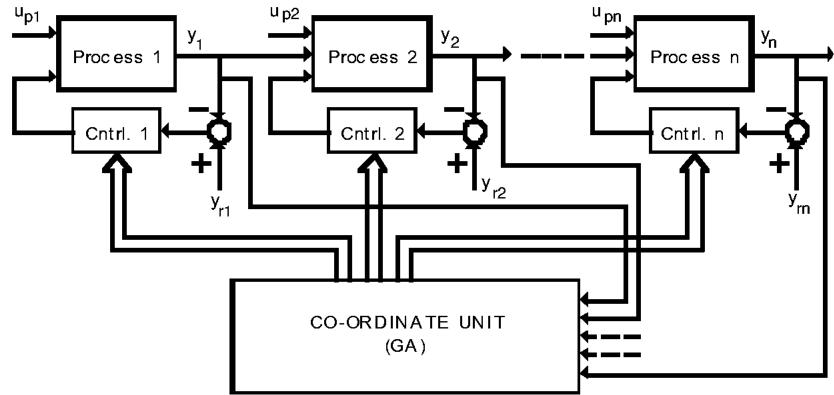  
Figure 12.1 Block diagram of a coordinate control concept

The input of a particular controller is the output of the adequate local process. The inputs to coordinating unit are the outputs of all the local processes. The number of inputs of a coordinating unit $\mathbf { N } _ { \mathrm { c o } }$ can also be smaller: $\mathrm { N _ { p } } \geq \mathrm { N _ { c o } } \geq 1$ , where $\Nu _ { \mathrm { p } }$ is the number of local processes. If we exclude the impact of the coordinating unit on local controller parameters, each of local controllers acts independently and in accordance with well-known principles of feedback control. Each local controller is limited to a single local process and has no information on the state of the other local processes. There is no   
communication between local controllers; i.e., there is no data exchange.   
Individual local processes have different characteristics and mutually   
independent parameters. Each of the local processes can be controlled   
independently.

Local process controllers can be PID controllers or fuzzy controllers.

The criterion of process optimality as a whole is not contained in any single controller, neither as a part nor as a whole.

This chapter suggests tuning of PID and fuzzy controller parameters. There are two reasons for choosing these two regulators. On one hand, such a choice makes possible the usage of optimizing procedures in existing plants equipped with PID and fuzzy controllers. On the other, conventional methods of control by PID and fuzzy controller can be used for comparison with the results obtained in research.

The reasons to apply multilevel coordinated control are:

It is possible to introduce the criterion of optimizing for the whole of the cascaded process, i.e., the best operating conditions, from the point of view of the process as a whole and the criterion concerning the system as a whole O The coordination unit makes possible indirect communication among local controllers • Reliability of the system as a whole increases (there is certain possibility of control even in the case of faulty operation of a particular local controller) • Lower sensitivity of the system to disturbances, as the impact of disturbances can be compensated for by simultaneous action by a number of local controllers and the local activities of each of the controllers

The parameters of each of the processes are limited (regarding energy, space, etc.). The system programmer can select some of the constraints. The following important characteristics have been taken for granted in the course of research:

. There are two levels of control: direct and coordinating   
√ A single coordinating unit is used at the level of coordination, while different ones (PID, fuzzy) are used at the level of direct control of local processes A genetic algorithm is used as a coordination procedure The input of a local controller is the output of local process and the inputs of a coordinating unit are available outputs of local processes Process stability is maintained by limiting local controller parameters within the known range of stability (defined during the constructing of the system or through direct experience) In case of the faulty operation of a local controller, the coordinating unit will continue the procedure of optimizing, based on data available, influencing available local controllers. In modern microprocessor-based controllers, it is relatively easy to include a certain degree of ability to detect faulty operation

# 12.3.2 Process Stability during Genetic Algorithm Optimizing

The problem of system stability has been comprehensively investigated and reported. A number of theories have been developed which help in process analysis and synthesis from the point of view of stability [Hahn, 1963].

If we regard the matter from the point of view of stability, we should suppose that individual process phases are controlled locally, before a coordinating level is applied. The supposition implies that, before applying a coordinating level of control, there is a known set of parameters belonging to local controllers, for which the whole system is stable.

The following procedure was used in simulations:

A step disturbance input of known amplitude is applied to the input of a local process (with controller parameters unchanged)   
• The output of each stage of the process is monitored. If any of the outputs, within a given period of monitoring, exceeds given limits, the local process in question was considered unstable for the set of parameters. Simulation is stopped in such a case and the set of parameters causing unstable functioning of the system recorded. Such a set of parameters was further on in the research considered inadmissible   
• Repetition of the procedure allowed the definition of the controller parameter range for which the system is stable. The procedure was made a part of a genetic algorithm and was performed simultaneously with it

In a real system, where it is impossible to organize a simulation, an experimental approach could be used, which can be described as follows:

A step disturbance input of known amplitude is applied to the input of a local process (with controller parameters unchanged) Monitor system output and, in case of instability, return the controller parameters into the stability area (i.e., to the values recorded before the application of coordinating level). If it is an existing system, we can suppose that before the trial the system was stable, meaning that this set of parameters can at least be used as a set for which the system is stable. If we suppose that controller parameters were also tuned before, using experience, it means that there must be a person who can tune the controller parameters in such a way as to bring the process into an area of stability. Furthermore, there must be a range of parameter values for which the system is stable; i.e., there must exist a possibility of tuning the parameters in the area of stability. The set of parameters that causes unstable functioning of the system should be recorded Repetition of the trial will allow the definition of the controller parameter range for which the system is stable. If it is possible, on the basis of previous tuning of the parameters, define the stability range on the basis of experience, it is not necessary to organize an experiment, and the data can be used to determine the set of values of controller parameter in the stable area

The procedure described can be built into the procedure of tuning by genetic algorithm and, besides fitness, stability can be established for each parameter population. If we have in mind the fact that, in a genetic algorithm, it is necessary to assess process response to be able to grade the quality of each individual, defining stability does not prolong calculation time - it only changes the procedure by introducing variations of input value.

# 12.3.3 Optimizing Criteria

Each optimizing procedure includes optimizing criterion, i.e., the criterion that should ensure optimal behavior of the system. Various optimizing criteria can be set for one and the same process, such as rise time, overshoot, energy consumption, etc. It is necessary, sometimes, to include a few goals that are controversial into the criterion, such as, for example, minimal energy consumption and short response time.

Genetic algorithms have an advantage over other optimizing methods in that optimizing is independent of the optimizing criterion selected (provided adequate parameter representation is selected for the application of the genetic algorithm). The level of optimality of the solution in a genetic algorithm equals its fitness; i.e., its performance index becomes the measure of success of the individual in a genetic algorithm population. There is, as can be seen, a direct link between the optimal solution and genetic algorithm fitness.

The fitness of each individual in a genetic algorithm is the measure the individual has been adapted to the problem that is solved employing this individual. It means that fitness is the measure of optimality of the solution offered, as represented by an individual from the genetic algorithm. The basis of genetic algorithms is the selection of individuals in accordance with their fitness; thus, fitness is obviously a critical criterion for optimization.

The following procedure was used throughout the simulation and experimental research:

1) Step disturbance input is imposed onto the input of the i-th local process.

We must suppose that the i-th system is in a steady state. This condition, which can prolong the procedure of optimizing by genetic algorithm, is necessary for assessing the impact of step input.

As the process is a complex one, where there are links of input and output of two or more local processes, we can suppose that only on some inputs (those not linked with the outputs of other local processes) is it possible to step input to process. If there are more possibilities, then the choice of the input where step input will be imposed depends upon the process and local controller characteristics. In such a case it is possible to impose step input successively to a number (or all) of the available inputs, as well as to assess optimality based on the response obtained.

2) The change of controller parameter should result in such a control that can achieve minimal energy consumption, satisfying at the same time given constraints.

The following is important to stress for the research described here:

Constraints that should be obeyed are concerned with keeping the response within given limits C Optimizing is done, respecting the above constraints, within the known and finite time period $t _ { p }$ Stability of the system within the range of controller parameter change is supposed, in accordance with the above-described way of ensuring stability Optimizing criterion $J$ is energy consumption, with the optimum being minimal energy consumption (min J):

$$
m i n J = m i n \frac { I } { n } \sum _ { j = I } ^ { n } A _ { j } \intop _ { t _ { I } } ^ { t _ { 2 } } P _ { j } d t \quad ,
$$

under conditions:

$$
| \varepsilon _ { j } | \leq \varepsilon _ { j m } \mathrm { ~ f o r ~ } T _ { r } \mathrm { ~ , ~ } ( t _ { 1 } \leq t _ { p } \leq t _ { 2 } ) \mathrm { ~ , ~ }
$$

where:

$j$ local process index $( \mathsf { j } = 1 , 2 , . . . , \mathsf { n } )$   
$n$ total number of local processes $\mathbf { \rho } ( \mathbf { n } \geq 1 )$   
$A _ { j }$ weight factor of the $j .$ -th local process $( 0 \leq \mathbf { A j } \leq 1 )$   
$P _ { j }$ heater power of the $j \cdot$ -th local process   
$\varepsilon _ { j m }$ control quality factor (allowed deviation of output)   
$\varepsilon _ { j }$ error (difference between output and set point)   
$T _ { r }$ set point of the output   
$t _ { 1 } , t _ { 2 }$ beginning $( t _ { 1 } )$ and end $( t _ { 2 } )$ moment of observing period $\left( \mathrm { t } _ { 1 } \leq \mathrm { t } _ { 2 } \right)$   
$t _ { p }$ optimizing (observing) period $( t _ { p } = t _ { 2 } – t _ { 1 } )$

Optimizing criterion selected, in its general form, takes into account the responses of all the n local processes. The weight factors, $A _ { j } ,$ enables the selection of all, or just some of the outputs of local controllers in optimizing, i.e., makes possible attributing various shares to particular local processes.

In the course of simulations, it became obvious that it is not enough to optimize employing single step disturbance input (with one amplitude value of step input only), thus in employing multi-step input the expression (1) gets the form:

$$
m i n J _ { m } = m i n \Bigg [ \sum _ { p = I } ^ { s } \left[ \frac { I } { n } \sum _ { j = I } ^ { n } A _ { j } \intop _ { t _ { I } } ^ { t _ { 2 } } P _ { j } d t \right] \Bigg ] ,
$$

where s is number of different step inputs. The need to introduce more step inputs is explained in detail in the chapter on tuning fuzzy controller parameters.

# 12.4 Optimizing Aided by Genetic Algorithm

The application of genetic algorithms in optimizing controlled plants can be found in the literature [Michalewicz, 1990; Michalewicz, 1992]. Known applications include the usage of genetic algorithms in designing lateral autopilots [Krishnakumar, 1992], in optimizing controller of plane wing bending [Krishnakumar, 1992], in controlling pH [Karr, 1993] etc. [Karr, 1991; Pham, 1991; Castro, 1993; Cooper, 1993; Linkens, 1992; Nomura, 1992; Lee, 1993]. Taking into account the literature and characteristics of genetic algorithms, we can say that the main areas of applying genetic algorithms in optimizing are optimizing adaptive controllers, optimizing fuzzy controllers and optimizing systems with more optimizing criteria.

# 12.4.1 Genetic Algorithm Parameters

The basic aim of the research described here was to show, in principle and practice, the applicability of the genetic algorithm in optimizing the behavior of complex systems. This is why a canonical genetic algorithm was selected to check the basic idea. A genetic algorithm with the characteristics given below was selected to perform the optimization.

Solution representation. A fixed-length and parameter-position binary string representation was selected. The binary string consists of segments, representing parameters. Any particular parameter within the string has a fixed and unchangeable position throughout optimizing (it is position dependent). The length of the string depends upon the resolution selected for each of the parameters, as well as upon the number of parameters. Once selected, the length of a binary string is not changed throughout optimization.

Population size. The population size was selected on the basis of recommendations found in the literature and upon practical experience [Grundler, 1997] and is in the range $3 0 < \mu < 9 0$ .

Recombination. Two basic genetic algorithm operators were applied: crossover and mutation.

Crossover. One point crossover operator was used. Crossover probability ${ \mathfrak { p } } _ { \mathrm { c } } = 0 . 7$ was selected on the basis of literature and previous experience. The choice followed recommendations [DeJong, 1975] and experimental researches [Grundler, 1992; Grundler, 1992a; Grundler, 1997].

Mutation. A canonical mutation operator was selected, i.e. change of a bit at a randomly selected spot in the binary string, with the probability of ${ \mathfrak { p } } _ { \mathrm { m } } = 0 . 0 2 5$ . The value selected is based on the literature [Grefenstette 1986], as well as on the author's experiments [Grundler 1992; 1992a; 1997].

Algorithm termination conditions. Genetic algorithms are stochastic algorithms, which lead to "as good a solution as possible." Genetic algorithms contain no mechanisms that would make possible identification of a particular solution as absolutely the best; there is only the mechanism defining whether a particular solution is better or worse than the others tested. This is why there is need for a constraint on the number of iterations in a genetic algorithm; the constraints should be imposed by the user. Selection of this constraint can have a significant impact on the quality of optimizing and duration of calculation, so it should be carefully considered. Unfortunately, the stochastic nature of genetic algorithms makes analytical analysis of optimal constraints impossible [Holland, 1975; Bethke, 1980; Ackley, 1987; Goldberg, 1989)], and practical experience constitutes the only available guideline.

An algorithm can be shorter than determined by the constraint regarding the number of iterations, provided additional condition is selected for algorithm termination. For example, if the theoretical maximal fitness value of the algorithm is known, it is possible to select a constraint regarding maximal fitness. An algorithm is terminated when the following condition is fulfilled:

$\mathrm { f _ { t } } \geq \mathrm { l _ { p } } { \cdot } \mathrm { f _ { m a x } }$   
where   
$\mathrm { f _ { t } }$ maximal fitness of current generation (iteration)   
$1 _ { \mathrm { p } }$ quality factor $( 0 < \mathrm { l _ { p } } < 1 )$   
fmax maximal theoretical fitness

Due to the stochastic nature of genetic algorithms, with the algorithm termination criterion selected, as above, it is impossible to determine in advance the duration of the algorithm. Theoretically, it is possible that for the selected $\boldsymbol { \mathrm { l } } _ { \mathrm { p } }$ the condition (4) is never fulfilled, meaning the algorithm would never end. It is thus necessary almost always to introduce an additional constraint on the number of iterations, which ensures termination of the computation.

The maximum fitness value is seldom known in practice. This is why a more favorable constraint is one regarding increment of maximal fitness. Minimal increment of maximal fitness can be heuristically chosen, at which the algorithm should be terminated. Using the criterion of increment of maximal fitness, the calculation is terminated when the following condition is fulfilled:

$$
\mathrm f _ { \mathrm { \ m a x } } ^ { \mathrm { ( i ) } } - \mathrm f _ { \mathrm { \ m a x } } ^ { \mathrm { ( i - 1 ) } } \le \Delta _ { \mathrm { m p } }
$$

# where

$\Delta _ { \mathrm { m p } }$ selected increment of maximal fitness (this is genetic algorithm parameter, and has to be defined in advance)

$\mathrm { f ^ { ( i ) } } _ { \operatorname* { m a x } }$ maximal fitness of current generation (iteration) $\mathrm { f } ^ { \mathrm { ( i - 1 ) } } \operatorname* { m a x }$ maximal fitness of previous generation (iteration)

There are certain problems with the above constraint. The first is the danger of premature algorithm termination if the same value of maximal fitness is obtained in two succeeding generations. The probability of this is reversal proportional to the number of individuals and the size of the search space. The other problem is the danger of maximal fitness variation between generations, which can lead to the situation where the difference of maximal fitness between neighboring generations is higher than between those that are farther apart.

The problems described can be significantly reduced by selection of termination criteria, in which the termination of the calculation is determined by the difference between maximal fitness of the current generation and the mean value $\mathrm { f } _ { \mathrm { m a x } }$ of certain numbers of past generations:

$$
p _ { m a x } ^ { i } \cdot \frac { I } { k } \sum _ { j = I } ^ { k } p _ { m a x } ^ { ( i - 1 ) } \leq \Delta _ { m p } ,
$$

where $\mathbf { k }$ is the number of previous generations that will be used for calculation.

# 12.5 Laboratory Cascaded Plant

Checking the idea of multilevel coordinated control was done on a laboratory plant (process), shown in Figures 12.2 and 12.3. A mathematical model of the plant was made, and matched with the experiment through comprehensive and numerous experiments [Bozicevic, 1988b; Ferber, 1990]. Optimizing the system with regard to the criterion of minimal energy consumption, with the given constraints of response, was done using a computer simulation, employing the mathematical model mentioned. This approach was chosen because it makes the iterative procedure of a genetic algorithm considerably faster, when compared to direct optimizing on the plant itself.

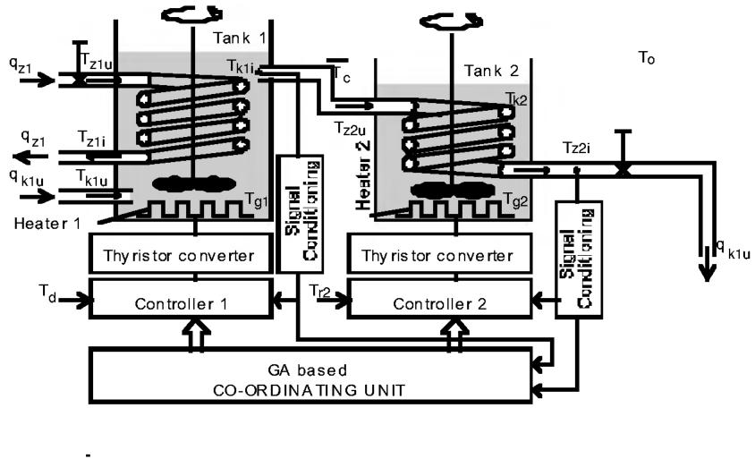  
Figure 12.2 Block diagram of laboratory plant

The laboratory cascaded plant consists of a cascade of two heat exchangers (boiler 1 and boiler 2). In the first heat exchanger, heat is exchanged among the heater (heater 1), coil tube, boiler content and environment. The coil tube incorporated makes cooling possible. It is possible to control heater power, and thus control the first heat exchanger. The liquid level within the first boiler is kept constant (not shown in the drawing), and the mixer ensures constant temperature of the liquid at all points. The liquid flowrate through the first heat exchanger depends on the consumption and its disturbance input, i.e., the flowrate ${ \bf q } _ { \bf k l u }$ is a disturbance. Using the connecting tube, the liquid overflows into the coil tube of the second boiler. The liquid level inside the second boiler is also kept constant (not shown in the drawing), while mixing ensures an even temperature at all points. The liquid flowrate through the second exchanger is the same as the flowrate through the first one and connecting tube, and is a disturbance. Varying the power of boiler heater 2 can control the process.

The process described is a cascade of two independently controlled processes, with common disturbance inputs: flowrate $\mathbf { q } _ { \mathrm { k 1 u } }$ The basic task of control is to keep the given temperature $\mathbf { T } _ { \mathrm { z 2 i } }$ constant at the outlet from the coil tube of the second boiler, regardless of the variations in the flowrate through the system caused by liquid consumption.

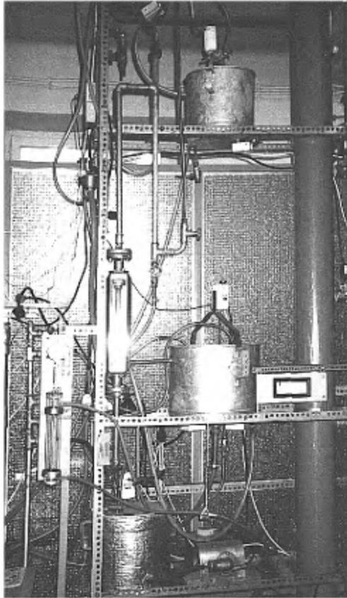  
Figure 12.3 Photo of laboratory plant

In creating a mathematical model of the system, it is necessary to introduce simplifications, which makes the model simpler, while not significantly influencing its credibility. In creating the model described here, the following was supposed:

Physical characteristics of the liquid (density and specific heat coefficient) are constant within the temperature range observed

• Coefficients of heat transfer are constant within the temperature range observed Liquid mixing in the boiler is ideal; i.e., the temperature of the liquid in the boiler is the same at all spots (achieved by intensive mixing and relatively small boiler volume).   
√ Liquid level in the boiler is constant (inlet flowrate is equal to outlet flowrate)

Heat accumulation in the boiler walls and coil tube walls can be neglected.

Heat exchange between the coil tube and environment is described as the temperature difference and logarithm dependence of the average temperature of the liquid in the coil tube.

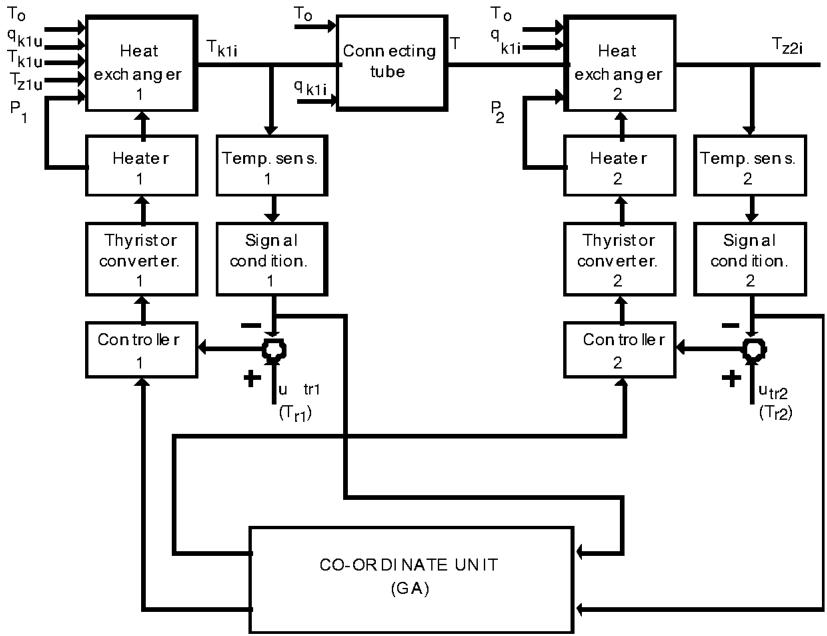  
Figure 12.4 Block diagram of laboratory plant   
Figure 12.4 shows the mutual dependence and connections between heat exchangers. Control inputs are the powers of the heaters $\mathbf { P } _ { 1 }$ and ${ \bf P } _ { 2 }$ (indirectly, via control voltage and thyristor converter), while set points of the temperature are $\mathbf { T } _ { \mathbf { r } 1 }$ and $\mathrm { { T } } _ { \mathrm { { r } } 2 }$ . Outputs of the heat exchangers 1 and 2 are liquid temperature at the outlet of boiler number 1 $( \mathbf { T } _ { \mathrm { k } 1 \mathrm { i } } )$ and liquid temperature at the outlet of coil tube number $2 ( \mathrm { T } _ { \mathrm { z 2 i } } )$ . Disturbance inputs are: environment temperature $( \mathbf { T } _ { \mathrm { o } } )$ , liquid temperature

at the inlet of boiler number 1 $( \mathbf { T } _ { \mathrm { k } 1 \mathrm { u } } )$ , liquid temperature at the inlet of coil tube number 1 $( \mathbf { T } _ { \mathrm { z l u } } )$ , input flowrate to boiler number 1 $( { \bf q } _ { \bf k 1 u } )$ , output flowrate from the boiler number 1 $( \mathbf { q } _ { \mathrm { { k 1 i } } } )$ , as well as the flowrate through the coil tube of boiler number 2 $( \mathbf { q } _ { z 2 } )$ . The flowrate through the coil tube of boiler number 1 $( \mathbf { q } _ { \mathrm { z 1 } } )$ is constant, while ${ \bf q } _ { \mathrm { k l u } } = { \bf q } _ { \mathrm { k l l } } = { \bf q } _ { \mathrm { z 2 } }$ . Throughout the research the values $\mathrm { \bf T } _ { \mathrm { o } } .$ . $\mathbf { T } _ { \mathrm { k l u } } , \ \mathbf { T } _ { \mathrm { z l u } }$ and $\mathbf { q } _ { \mathrm { z 1 } }$ are constant, and disturbance input is $\mathbf { q } _ { \mathrm { k 1 u } } ,$

Mathematical model of the system is based on heat balance equation, with a general form as follows:

$$
\frac { d Q } { d t } = \frac { d Q _ { d } } { d t } - \frac { d Q _ { o } } { d t } ,
$$

i.e. heat change is equal to input heat change, reduced by the change of output heat $\mathrm { \Delta Q }$ is heat, $\mathrm { Q _ { d } }$ is input heat, $\mathrm { Q } _ { \mathrm { o } }$ is output heat, t is time). Thus, heat balance of the liquid in the first boiler is as follows:

$$
\begin{array} { r c l } { \displaystyle \frac { d Q _ { k l } } { d t } = V _ { k l } \cdot \mathsf { p } \cdot c _ { p } \cdot \frac { d T _ { k l i } } { d t } \enspace , } \\ { \displaystyle \frac { d Q _ { d k l } } { d t } = q _ { k l u } \cdot \mathsf { p } \cdot c _ { p } \cdot T _ { k l u } + U _ { g l } \cdot A _ { g l } \cdot \left( T _ { g l } - T _ { k l i } \right) \enspace , } \\ { \displaystyle \frac { d Q _ { o k l } } { d t } = q _ { k l i } \cdot \mathsf { p } \cdot c _ { p } \cdot T _ { k l i } + U _ { k l } \cdot A _ { k l } \cdot \left( T _ { k l i } - T _ { o } \right) + U _ { z l } \cdot A _ { z l } \cdot \left( T _ { k l i } - \overline { { T _ { z l } } } \right) \enspace , } \end{array}
$$

where:

$Q _ { k l }$ boiler number 1 accumulated liquid heat, J   
$Q _ { d k l }$ boiler number 1 input liquid heat, J   
$Q _ { o k l }$ boiler number 1 output liquid heat, J   
$T _ { o }$ environment temperature, $\mathcal { C }$   
$T _ { k l i }$ liquid temperature on the output from boiler number 1, $\mathring { \mathbf { C } }$   
$T _ { k l u }$ liquid temperature on the input to boiler number 1, $\mathrm { { } ^ { \circ } C }$   
$T _ { g I }$ heater temperature in the boiler number 1, $ { \mathrm { ~  ~ \circ ~ } } _ { \mathrm { { C } } }$   
$\overline { { T _ { z } } } _ { l }$ average temperature of the liquid of coil tube number 1, $\mathrm { { } ^ { \circ } C }$   
$U _ { k l }$ coefficient of heat transfer from boiler number 1 to environment, $\mathrm { W } / \mathrm { m } ^ { 2 } \mathrm { K }$   
$U _ { g I }$ coefficient of heat transfer for heater number 1, $\mathrm { W } / \mathrm { m } ^ { 2 } \mathrm { K }$   
$U _ { z I }$ coefficient of heat transfer for coil tube number 1, $\mathrm { W } / \mathrm { m } ^ { 2 } \mathrm { K }$   
$A _ { k l }$ outside area of boiler number 1 (area which exchanges heat with the environment), $\mathrm { m } ^ { 2 }$   
$A _ { g I }$ area of heater number 1 (area which exchanges heat with the liquid in the boiler), $\mathbf { m } ^ { 2 }$   
$A _ { z } { _ { t } }$ area of coil tube number 1 (area which exchanges heat with the liquid in the boiler), $\mathbf { m } ^ { 2 }$   
$V _ { k l }$ boiler number 1 volume, $\mathbf { m } ^ { 3 }$   
$q _ { k l u }$ boiler number 1 input flowrate, $1 / \mathrm { m i n }$   
$q _ { k l i }$ boiler number 1 output flowrate, $1 / \mathrm { m i n }$   
$\rho$ liquid density for water, $\rho = 1 0 0 0 \mathrm { k g } / \mathrm { m } ^ { 3 }$   
$c _ { p }$ liquid specific thermal capacity for water, $\mathrm { c _ { p } } { = } 4 2 0 0 \ \mathrm { J / k g \ K }$

If Equations (8) to (10) are substituted into Equation (7), the following expression is obtained for the first boiler:

$$
\begin{array} { r l } & { \frac { d { T } _ { k l i } } { d t } = \frac { q _ { k l u } } { V _ { k 1 } } \cdot \left( { \tau } _ { k l u } \cdot { T } _ { k l i } \right) + \frac { { U } _ { g _ { l } } \cdot { A } _ { g _ { l } } } { V _ { k { l } } \cdot \rho \cdot c _ { p } } \cdot \left( { \tau } _ { g _ { l } } \cdot { T } _ { k { l i } } \right) } \\ & { - \frac { { U } _ { z _ { l } } \cdot { A } _ { z { l } } } { V _ { k { l } } \cdot \rho \cdot c _ { p } } \cdot \left( { \tau } _ { k { l i } } \cdot { T } _ { z { l } } \right) \frac { { U } _ { k { l } } \cdot { A } _ { k { l } } } { V _ { k { l } } \cdot \rho \cdot c _ { p } } \cdot \left( { \tau } _ { k { l i } } \cdot { T } _ { o } \right) . } \end{array}
$$

Boiler number 1 heat balance equations are:

$$
\begin{array} { r c l } { { } } & { { } } & { { \displaystyle \frac { d Q _ { z l } } { d t } = V _ { z l } \cdot \mathsf { p } \cdot c _ { p } \cdot \frac { d \overline { { { T _ { z l } } } } } { d t } \ , } } \\ { { } } & { { } } & { { } } \\ { { } } & { { } } & { { \displaystyle \frac { d Q _ { d z l } } { d t } = q _ { z l u } \cdot \mathsf { p } \cdot c _ { p } \cdot T _ { z l u } + U _ { z l } \cdot A _ { z l } \cdot ( T _ { k l i } \cdot \overline { { { T _ { z l } } } } ) \ , } } \\ { { } } & { { } } & { { } } \\ { { } } & { { } } & { { \displaystyle \frac { d Q _ { o z l } } { d t } = q _ { k l i } \cdot \mathsf { p } \cdot c _ { p } \cdot T _ { k l i } \ , } } \end{array}
$$

# where

$Q _ { z I }$ coil tube number 1 liquid heat, J   
$Q _ { d z I }$ coil tube number 1 input liquid heat, J   
$Q _ { o z I }$ coil tube number 1 output liquid heat, J   
$T _ { z l u }$ liquid temperature on the input of coil tube number 1, $\mathrm { { } ^ { \circ } C }$   
$V _ { z I }$ coil tube number 1 volume, $\mathbf { m } ^ { 3 }$   
$q _ { z l u }$ coil tube number 1 input flowrate $( \mathsf { q } _ { \mathrm { z 1 } \mathrm { u } } = \mathsf { q } _ { \mathrm { z 1 1 } } = \mathsf { q } _ { \mathrm { z 1 } } )$ , 1/min   
If the Equations (13) to (15) are substituted into Equation (7) the following   
expression is obtained for the first boiler coil tube:

$$
\frac { \overline { { d T _ { z 1 } } } } { d t } = \frac { q _ { z 1 } } { V _ { z 1 } } \cdot \big ( T _ { z 1 u } - T _ { z 1 i } \big ) + \frac { U _ { z 1 } \cdot A _ { z 1 } } { V _ { z 1 } \cdot \rho \cdot c _ { p } } \cdot \big ( T _ { k 1 i } - \overline { { T _ { z 1 } } } \big ) ,
$$

where $T _ { z l i }$ is the liquid temperature at the outlet from the coil tube number 1, in $ { \mathcal { C } }$ Additional equation, yielding $\overline { { T _ { z I } } }$ as a function of $T _ { z l u }$ and $T _ { z l i }$ is as follows:

$$
\overline { { { T _ { z l } } } } = T _ { k l i } - \frac { ( T _ { z l i } - T _ { z l u } ) } { l n \frac { ( T _ { k l i } - T _ { z l u } ) } { ( T _ { k l i } - T _ { z l i } ) } } \mathrm { ~ . ~ }
$$

Heater number 1 heat balance equations are:

$$
\begin{array} { r c l } { { } } & { { } } & { { \displaystyle \frac { d Q _ { g l } } { d t } = m _ { g l } \cdot c _ { p g l } \cdot \frac { d T _ { g l } } { d t } ~ , } } \\ { { } } & { { } } & { { } } \\ { { } } & { { } } & { { \displaystyle \frac { d Q _ { d g l } } { d t } = P _ { l } ~ , } } \\ { { } } & { { } } & { { } } \\ { { } } & { { } } & { { \displaystyle \frac { d Q _ { o g l } } { d t } = U _ { g l } \cdot A _ { g l } \cdot \left( T _ { g l } - T _ { k l i } \right) } } \end{array}
$$

where

If the Equations (18) to (20) are substituted into Equation (7) the following expression is obtained for the first boiler heater:

$$
\frac { d T _ { g 1 } } { d t } = \frac { P _ { 1 } } { m _ { g 1 } \cdot c _ { p g 1 } } - \frac { U _ { g 1 } \cdot A _ { g 1 } } { m _ { g 1 } \cdot c _ { p g 1 } } \cdot \left( T _ { g 1 } - T _ { k 1 } \right) .
$$

Connection tube heat balance equations are:

$$
\begin{array} { r c l } { { } } & { { } } & { { \displaystyle \frac { d Q _ { c } } { d t } = V _ { c } \cdot { \bf p } \cdot { \bf c } _ { P } \cdot \frac { d \overline { { { T _ { c } } } } } { d t } \ : \ : \ : , } } \\ { { } } & { { } } & { { \displaystyle \frac { d Q _ { d c } } { d t } = q _ { k l i } \cdot { \bf p } \cdot { \bf c } _ { P } \cdot { \bf T } _ { k l i } \ : \ : \ : , } } \end{array}
$$

$$
\frac { d Q _ { o c } } { d t } { = } U _ { c } { \cdot } A _ { c } { \cdot } ( \overline { { T _ { c } } } { - } T _ { o } ) + q _ { k l i } { \cdot } \mathsf { p } { \cdot } c _ { p } { \cdot } T _ { z 2 u } \mathrm { ~ \ , ~ }
$$

where

$Q _ { c }$ connection tube liquid heat, J   
$Q _ { d c }$ connection tube liquid input heat, J   
$Q _ { o c }$ connection tube liquid output heat, J   
$T _ { z 2 u }$ liquid temperature on the input of coil tube number 2, $\mathrm { { } ^ { \circ } C }$   
$\overline { { T _ { c } } }$ average temperature of the connection tube, $ { \mathrm { ~  ~ \circ ~ } } _ { \bf C }$   
$U _ { c }$ coefficient of heat transfer from connection tube to environment, $\mathrm { W } / \mathrm { m } ^ { 2 } \mathrm { K }$   
$A _ { c }$ area of connection tube (area which exchanges heat with environment), \$m{2}\$   
$V _ { c }$ connection tube volume, $\mathbf { m } ^ { 3 }$

If the Equations (22) to (24) are substituted into Equation (7) the following expression is obtained for the connecting tube:

$$
\frac { d \overline { { T _ { c } } } } { d t } { = } \frac { q _ { k 1 i } } { V _ { c } } { \bf \cdot } \left( T _ { k l i } \cdot T _ { z 2 u } \right) { - } \frac { U _ { c } \cdot A _ { c } } { V _ { c } \cdot \rho \cdot c _ { p } } { \bf \cdot } \left( \overline { { T _ { c } } } { - } T _ { o } \right) { \bf \cdot } \left( \overline { { T _ { c } } } { - } T _ { o } \right) { \bf \cdot }
$$

Additional equation, yielding $\approx \mathrm { a s }$ a function of $T _ { z 2 u }$ and $T _ { k l i }$ is as follows:

$$
\overline { { T _ { c } } } = T _ { o } - \frac { ( T _ { z 2 u } - T _ { k l i } ) } { l n \frac { ( T _ { o } - T _ { k l i } ) } { ( T _ { o } - T _ { z 2 u } ) } } \mathrm { ~ . ~ }
$$

Accordingly, the expressions for the second phase of the process can be obtained:

$$
{ \frac { d T _ { k 2 } } { d t } } = { \frac { U _ { g _ { 2 } } \cdot A _ { g _ { 2 } } } { V _ { k 2 } \cdot \mathsf { p } \cdot c _ { p } } } \cdot ( T _ { g _ { 2 } } \cdot T _ { k 2 } ) \cdot { \frac { U _ { k 2 } \cdot A _ { k 2 } } { V _ { k 2 } \cdot \mathsf { p } \cdot c _ { p } } } \cdot ( T _ { k 2 } \cdot T _ { o } ) \cdot { \frac { U _ { z 2 } \cdot A _ { z 2 } } { V _ { k 2 } \cdot \mathsf { p } \cdot c _ { p } } } \cdot ( T _ { k 2 } \cdot { \overline { { T _ { z 2 } } } } ) ,
$$

$$
\begin{array} { l } { { { \frac { d \overline { { { T _ { z 2 } } } } } { d t } = { \frac { q _ { k l i } } { V _ { z 2 } } } \cdot ( T _ { z 2 u } - T _ { z 2 i } ) + { \frac { U _ { z 2 } \cdot A _ { z 2 } } { V _ { z 2 } \cdot \mathsf { P } \cdot c _ { p } } } \cdot ( T _ { k 2 } \cdot \overline { { { T _ { z 2 } } } } ) \mathrm { ~ , } } } } \\ { { { \overline { { { T _ { z 2 } } } } = T _ { k 2 } \cdot { \frac { ( T _ { z 2 i } \cdot T _ { z 2 u } ) } { l n { \frac { ( T _ { k 2 } \cdot T _ { z 2 u } ) } { ( T _ { k 2 } \cdot T _ { z 2 i } ) } } } } \ , } } } \\ { { { \frac { d T _ { g _ { 2 } } } { d t } = { \frac { P _ { 2 } } { m _ { g _ { 2 } } \cdot c _ { p g _ { 2 } } } } \cdot { \frac { U _ { g _ { 2 } } \cdot A _ { g _ { 2 } } } { m _ { g _ { 2 } } \cdot c _ { p g _ { 2 } } } } \cdot ( T _ { g _ { 2 } } \cdot T _ { k 2 } ) \mathrm { ~ , } } } } \end{array}
$$

# where

$T _ { k 2 }$ boiler number 2 liquid temperature, $ { \mathcal { C } }$   
$T _ { g 2 }$ heater temperature in boiler number 2, $\mathrm { { } ^ { \circ } C }$   
T2u liquid temperature on the input of coil tube number 2, $\mathrm { { } ^ { \circ } C }$   
$T _ { z 2 i }$ liquid temperature on the output of coil tube number 2, $\mathcal { \mathrm { C } }$   
$\overline { { T _ { z 2 } } }$ average temperature of the liquid of coil tube number 2, $\mathrm { { } ^ { \circ } C }$   
$U _ { g 2 } ,$ coefficient of heat transfer for heater number 2, $\mathrm { W } / \mathrm { m } ^ { 2 } \mathrm { K }$   
$U _ { k 2 }$ coefficient of heat transfer from boiler number 2 to environment, $\mathrm { W } / \mathrm { m } ^ { 2 } \mathrm { K }$   
$U _ { z 2 }$ coefficient of heat transfer for coil tube number 2, $\mathrm { W } / \mathrm { m } ^ { 2 } \mathrm { K }$   
Ag2 area of heater number 2 (area which exchanges heat with the liquid in the boiler), $\mathbf { m } ^ { 2 }$   
Ak2 outside area of boiler number 2 (area which exchanges heat with environment), $\mathrm { m } ^ { 2 }$   
$A _ { z 2 }$ area of coil tube number 2 (area which exchanges heat with liquid in the boiler), $\mathbf { m } ^ { 2 }$   
$V _ { k 2 }$ boiler number 2 volume, $\mathbf { m } ^ { 3 }$   
$V _ { z 2 }$ coil tube number 2 volume, $\mathbf { m } ^ { 3 }$   
$P _ { 2 }$ heater number 2 power, W   
$m _ { g 2 }$ heater number 2 mass, kg   
$c _ { p { \bf g } ^ { 2 } }$ heater number 2 specific thermal capacity, J/kgK

Simulations were done under assumption of linear dependence of heater power to control voltage, i.e. controller output. At the end of simulations, the results are given with the model of thyristor converter of non-linear dependence of power on the heater upon controller output (output from the controller). Bridge thyristor converter model is:

$$
u _ { r e f } = \frac { u _ { e f } } { \sqrt { \pi } } \cdot \sqrt { \left[ \pi - \alpha + \frac { I } { 2 } \cdot { s i n } ( 2 \alpha ) \right] } ,
$$

where:

$\mathfrak { X }$ thyristor conducting angle $( 0 \leq \alpha \leq \pi )$ $u _ { e f }$ thyristor input effective voltage value $( 2 2 0 \mathrm { V } )$ $\displaystyle { \boldsymbol { u } } _ { r e f }$ heater effective voltage value Heater power depends on thyristor conducting angle:

$$
P _ { g } = \frac { u ^ { 2 } e f } { R _ { g } \cdot \pi } \cdot \left[ \boldsymbol { \pi } - \boldsymbol { \alpha } + \frac { I } { 2 } \cdot \boldsymbol { s i n } ( 2 \boldsymbol { \alpha } ) \right] \mathrm { ~ , ~ }
$$

where $P _ { g }$ is heater power and $R _ { g }$ is heater resistance.

The thyristor conducting angle linearly depends on control voltage, i.e. $\mathbf { \boldsymbol { \mathbf { \mathit { q } } } } = \mathbf { \boldsymbol { \mathbf { k } } } _ { \mathrm { s } } { \cdot } \mathbf { \boldsymbol { \mathbf { \mathit { u } } } } _ { \mathrm { u } }$ where ${ \bf k } _ { s }$ is constant and $\mathbf { u } _ { \mathrm { u } }$ is the control voltage (controller output). The thyristor temperature sensor has time constant $\mathbf { T } _ { \mathrm { t } } < 2$ seconds and it does not influence the results of simulation, as the sampling period is 10 seconds.

Figures 12.5 to 12.7 show a block scheme of the laboratory cascaded process. The mathematical model is nonlinear, which is quite obvious on block schemes (multiplication of the flowrate by temperatures, division and logarithmic computation in additional equation).

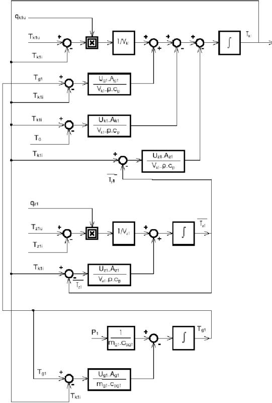  
Figure 12.5 Block diagram of the first stage of plant

Heat exchanger 1. Calculated based upon measured physical plant characteristics: $\mathbf { V } _ { \mathrm { k 1 } } = 1 . 2 5 ~ 1 0 ^ { - 2 } ~ \mathbf { m } ^ { 3 }$ , $\mathbf { A } _ { \mathrm { k 1 } } = 3 . 0 5 ~ 1 0 ^ { - 1 } ~ \mathbf { m } ^ { 2 }$ , $\mathrm { V _ { z 1 } } = 3 . 5 ~ 1 0 ^ { - 4 } ~ \mathrm { m } ^ { 3 }$ $\mathbf { A } _ { \mathrm { z 1 } } = 1 . 6 5$ $1 0 ^ { - 1 } \mathbf { m } ^ { 2 }$ Measured data: $\mathrm { U _ { k 1 } } = 1 7 . 1 \ \mathrm { W / m ^ { 2 } } \ \mathrm { K }$ $\mathrm { U _ { z 1 } } = 8 9 9 \mathrm { W } / \mathrm { m } ^ { 2 } \mathrm { \ K }$ $\mathrm { U } _ { \mathrm { g 1 } } \mathrm { A } _ { \mathrm { g 1 } } = 2 2 \ \mathrm { W } / \mathrm { K }$ , $\begin{array} { r } { \mathbf { m } _ { \mathbf { g } 1 } \mathbf { c } _ { \mathrm { p g 1 } } = 9 9 2 \ \mathbf { J } / \mathrm { K } . } \end{array}$ .

Connecting tube. Calculated based upon measured physical plant characteristics: $\mathrm { V } _ { \mathrm { c } } = 1 . 2 1 0 ^ { - 4 } \mathrm { m } ^ { 3 }$ , $\mathbf { A } _ { \mathrm { c } } = 0 . 3 1 0 ^ { - 1 } \mathbf { m } ^ { 2 }$ Measured data: $\mathrm { U } _ { \mathrm { c } } { = } 5 . 2 \ \mathrm { W } / \mathrm { m } ^ { 2 } \mathrm { K }$ .

Heat exchanger 2. Calculated based upon measured physical plant characteristics: $\mathbf { V } _ { \mathrm { k } 2 } = 1 . 3 1 \ 1 0 ^ { - 2 } \ \mathbf { m } ^ { 3 }$ , $\mathbf { A } _ { \mathrm { k } 2 } = 3 . 4 4 \ 1 0 ^ { - 1 } \ \mathbf { m } ^ { 2 }$ , $\mathrm { V } _ { \mathrm { z 2 } } = 4 . 7 ~ 1 0 ^ { - 4 } ~ \mathrm { m } ^ { 3 }$ , $\mathbf { A } _ { \mathrm { z } 2 } = 2 . 2 2$ $1 0 ^ { - 1 } \mathbf { m } ^ { 2 }$ Measured data: $\mathrm { U } _ { { \bf k } 2 } = 1 7 . 8 \mathrm { \ W } / \mathrm { m } ^ { 2 } \mathrm { \ K }$ . $\mathrm { U } _ { \mathrm { z } 2 } = 9 8 7 \ \mathrm { W } / \mathrm { m } ^ { 2 } \ \mathrm { K }$ $\mathrm { U } _ { { \mathrm { g } } 2 } \mathrm { A } _ { { \mathrm { g } } 2 } { = } 3 0 \ \mathrm { W } / \mathrm { K }$ , $\begin{array} { r } { \mathbf { m } _ { \mathbf { g } 2 } \mathbf { c } _ { \mathrm { p } \mathbf { g } 2 } = 1 0 2 3 \mathrm { J } / \mathrm { K } . } \end{array}$ .

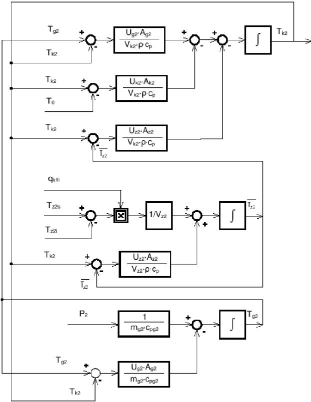  
Figure 12.6 Block diagram of the second stage of plant

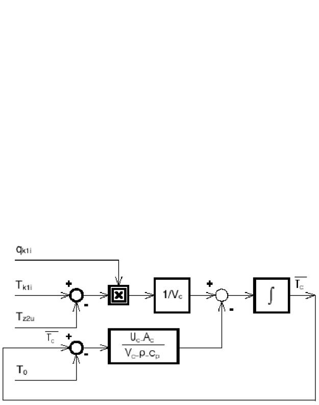  
Figure 12.7 Block diagram of the connecting tube

Liquid (water): $\rho = 1 0 0 0 \mathrm { k g } / \mathrm { m } ^ { 3 }$ $c _ { p } = 4 2 0 0 ~ \mathrm { J / k g } ~ \mathrm { K }$

The procedure of defining system parameter by measuring was described by [Ferber, 1990]. System parameter limitations are caused by physical characteristics of the plant, liquid and environment:

Power of heater 1: $0 \mathrm { \ W } < P _ { I } < 2 4 0 0 \mathrm { \ W }$ Power of heater 2: $0 \mathrm { \ W } < P _ { 2 } < 2 4 0 0 \mathrm { \ W }$ Flowrate: $\begin{array} { l } { \mathrm { 0 } \mathrm { 1 / m i n } < q _ { k l u } < 1 \mathrm { 1 / m i n } } \\ { \mathrm { e } ; \mathrm { ~ \quad ~ 0 ~ } ^ { \circ } \mathrm { C } < T _ { o } < 5 0 ^ { \circ } \mathrm { C } } \end{array}$ Environment temperatur

The following working conditions were set up: $T _ { o } = 2 5 \mathrm { ~ \ ' C }$ , $q _ { k l u } = 0 . 5 \mathrm { 1 / m i n }$ $( q _ { k l u } =$ $q _ { k l } \ _ { i } = q _ { z 2 } )$ .Heat exchanger $1 { : } P _ { I } { = } 1 0 0 0 \ \mathrm { W }$ , $T _ { \mathit { k l u } } = 1 0 . 0 \mathrm { ~ \mathrm { ~ \textdegree ~ } }$ , $T _ { \mathit { k l I } } { = } 3 2 . 8 \mathrm { ~ \overset { \circ } { C } }$ , $T _ { g l } = 7 8 . 3$ $\mathcal { \mathrm { C } }$ , $q _ { z l } = 0 . 1$ l/min, $T _ { z l u } = 1 0 . 0 \mathrm { ~ \ ' C }$ , $T _ { s z I } = 3 1 . 7 \mathrm { ~ \ ' C }$ , $T _ { z I I } = 3 2 . 8 \mathrm { ~ \ ' ~ C ~ }$ Heat exchanger 2: $P _ { 2 } = 1 0 0 0 ~ \mathrm { { W } }$ , $T _ { k 2 } = 5 6 . 0 \mathrm { ~ } ^ { \circ } \mathrm { C }$ , $T _ { g 2 } = 8 9 . 3 \mathrm { ~ } ^ { \circ } \mathrm { C }$ , $T _ { z 2 u } = 3 2 . 8 \mathrm { ~ \ ' ~ C ~ }$ , $T _ { s z 2 } = 5 2 . 3 \mathrm { ~ \ ' ~ C ~ }$ $T _ { z 2 I } = 5 5 . 9$ $\mathcal { \mathrm { C } }$ Connection tube: $T _ { c u } = ~ 3 2 . 8 ~ \mathrm { ~ \overset { \circ } { C } }$ , $T _ { c s } = 3 2 . 8 \mathrm { ~ \normalfont ~ \circ ~ } _ { \mathrm { { C } } }$ , $T _ { c i } = ~ 3 2 . 8 ~ \mathrm { ~ \overset { \circ } { C } }$ Detailed experimental checking was done of matching the mathematical model to laboratory plant [Ferber, 1990], and a satisfying degree of agreement was found.

# 12.6 Multilevel Control Using Genetic Algorithm

The conventional optimizing procedure for a complex process consists of locally controlled processes, and are performed separately optimizing each local process behavior. Parameters of each controller applied at each local process are separately tuned. Optimizing criterion is a local one and refers only to the local process in question.

# 12.6.1 Non-coordinated Multilevel Control Using a PID Controller

PID controllers have become standard elements of controlled systems, thanks to their adequate characteristics, properly developed theoretical basis, relatively simple use and low price. PID controller behavior is well known and theoretically explained [Bozicevic, 1988; Desphande, 1981; Shinskey, 1979]. In non-linear processes and processes of higher complexity, where it is not easy to perform an analytical analysis, PID controllers are tuned heuristically. A comprehensive representation of various conventional procedures for tuning PID controller parameters can be found in the literature [McMillan, 1983; Astroem & Haegglund, 1988].

Non-coordinated PID control was done by applying a genetic algorithm independently to each local process, tuning the three parameters: $\mathrm { K } _ { \mathrm { r } }$ , Ti, $\mathrm { T _ { d } }$ A PID controller was selected for the first stage of the process, as controller no. 1, described by the following mathematical model:

$$
P _ { 1 } \left( t \right) = K _ { r l } \cdot \left[ \varepsilon _ { 1 } \left( t \right) + \frac { 1 } { T _ { i 1 } } \int \varepsilon _ { 1 } \left( t \right) \cdot d t + T _ { d 1 } \cdot \frac { d \varepsilon _ { 1 } \left( t \right) } { d t } \right] ,
$$

where

$P ^ { l }$ controller output, W (indirect, by controller voltage and thyristor converter)   
$K _ { r l }$ controller gain   
$T _ { i I }$ controller integral time constant, s   
$T _ { d I }$ controller derivate time constant, s   
$\varepsilon _ { I } ( t )$ feedback error, controller input, $\mathcal { C }$ (indirect, by temperature sensor and resulting voltage)

$$
\mathfrak { e } _ { 1 } ( t ) { = } T _ { r 1 } ( t ) { - } T _ { k 1 i } ( t )
$$

where $\mathrm { T } _ { \mathrm { r } 1 }$ is set point (reference), $^ \circ \mathrm { C }$ (indirect, by voltage $U _ { r l }$ ${ \bf \omega } _ { r l } ^ { l } , T _ { r l } = c _ { s } { \cdot } U _ { r l } ,$ $c _ { s }$ is constant). For discrete system difference equation of $\mathbf { P I D } _ { 1 }$ controller is:

$$
P _ { 1 d ( i ) } = K _ { r 1 } \Bigg [ \mathfrak { E } _ { 1 ( i ) } + \frac { T } { T _ { i 1 } } \sum _ { k = 0 } ^ { i } \mathfrak { E } _ { 1 ( k ) } + T _ { d 1 } \cdot \frac { \Delta \mathfrak { E } _ { 1 ( i ) } } { T } \Bigg ] ,
$$

where

i sampling period index, $\varDelta \varepsilon _ { I } = \varepsilon _ { I ( i ) } - \varepsilon _ { I ( i - I ) }$ change of error within sampling period

The adequate model of $\mathrm { { P I D } } _ { 2 }$ controller for the second stage of the process is described analogously.

In process simulation and differential equation involving solving, a fourth-order Runge-Kutta method was used. System optimizing is done by independently tuning the PID controller parameters $K _ { r } , T _ { i }$ and $T _ { d }$ for each stage.

PID controller parameters are represented as a binary strings: $K _ { p } \in I , I = \{ 0 , 1 \} ^ { m }$ , $T _ { i } \in J$ $J = \{ 0 , 1 \} ^ { n }$ , $T _ { d } \in K$ $K = \{ 0 , 1 \} ^ { p }$ , where

$K _ { p } , T _ { i } , T _ { d }$ PID controller parameters $m$ binary string length for the parameter $K _ { p }$ $n$ binary string length for the parameter $T _ { i }$ $p$ binary string length for the parameter $T _ { d }$

Resolution of a particular parameter depends upon parameter precision asked for, expressed as a percentage:

$$
r _ { i } = \frac { 1 } { 2 ^ { d i } } \cdot 1 0 0 ,
$$

where

$r _ { i }$ $i$ -th parameter resolution $d _ { i }$ $i$ -th parameter binary string length

Equation (37) gives the overall binary string length for all the three parameters, related to the resolution asked for:

$$
d _ { P I D } = \Gamma \left[ \frac { l n ( 1 0 0 ) - l n ( \bar { t } _ { k p } ) } { l n ( 2 ) } \right] + \Gamma \left[ \frac { l n ( 1 0 0 ) - l n ( r _ { T i } ) } { l n ( 2 ) } \right] + \Gamma \left[ \frac { l n ( 1 0 0 ) - l n ( r _ { T d } ) } { l n ( 2 ) } \right] ,
$$

where

$d _ { P I D }$ binary string length $r _ { k p }$ resolution for the parameter $K _ { p } , \%$ $r _ { T i }$ resolution for the parameter $T _ { i } , \%$ $r _ { T d }$ resolution for the parameter $T _ { d } , \%$ [ operator "nearest greater integer."

With the selected $r _ { k p } = r _ { T i } = r _ { T d } = 0 . 1 \%$ , $d _ { P I D } = 3 0$ bit. As the higher number of bits had no significant impact on the duration of the simulation calculation, a $d _ { P I D } = 4 8$ bit was selected (3 parameters for each string of 16 bits), which yielded the resolution of $r _ { k p } = r _ { T i } = r _ { T d } = 0 . 0 0 1 5 3 \%$ .

From the point of view of system stability, the most important elements in PID controller tuning are parameter constraints. The analysis should be performed in the process design phase, i.e. the stability range of the PID controller is known, or is implied in theexecution of the genetic algorithm.

The optimizing procedure is carried out separately for each plant stage under the following conditions (system is at rest): $T _ { o } = 2 5 . 0 \mathrm { ~ \ ' C }$ , $P _ { I } = 1 0 0 0 ~ \mathrm { { W } }$ , ${ \bf q } _ { \bf k l u } = 0 . 5$ l/min, $T _ { k l u } = 1 0 \mathrm { ~ \ ^ { \circ } C }$ $T _ { \mathit { k l I } } { = } 3 2 . 8 \mathrm { ~ \overset { \circ } { C } }$ $q _ { z l } = 0 . 1$ l/min, $T _ { z I u } = 1 0 \mathrm { ~ \textdegree ~ C ~ }$ $T _ { z I I } { = 3 2 . 8 \mathrm { ~ \ ' ~ C ~ } }$ , $T _ { z 2 u } =$

$3 2 . 8 \ \mathrm { { \stackrel { \circ } { C } } }$ . $P _ { 2 } = 1 0 0 0 ~ \mathrm { { W } }$ , $T _ { k 2 } = 5 5 . 9 \mathrm { ~ } ^ { \circ } \mathrm { C }$ $T _ { z 2 I } { = 5 5 . 9 \mathrm { ~ \textdegree ~ } }$ Disturbance input was a step change in the flowrate $q _ { k l u }$ .

Tuning of PID controller parameters was done for both the first and second stage, with optimizing criterion being minimal energy consumption. Normalized fitness for the first stage was:

$$
\begin{array} { r } { f _ { p l } = \frac { \displaystyle P _ { u 1 } \cdot t _ { w } - \displaystyle \int P _ { 1 } \cdot d t } { \displaystyle P _ { u 1 } \cdot t _ { w } } , } \end{array}
$$

where

$t _ { w } = 3 0 0 0 \mathrm { ~ s ~ }$ , with constraints: $| \mathfrak { E } _ { 1 } | \le 0 . 0 5 { \cdot } T _ { r I }$ , for $( 1 0 0 0 \leq t _ { p } \leq 3 0 0 0 )$ , and $f _ { p l } = 0$ for $| \mathfrak { E } _ { 1 } | > 0 . 0 5 { \cdot } T _ { r I }$ , for $( 1 0 0 0 \mathrm { s } \leq t _ { p } \leq 3 0 0 0 \mathrm { s } )$ .

The fitness selected $f _ { p I }$ is maximal $( f _ { p l m a x } = 1 )$ when energy consumption is minimal in the observed period $( 0 < t < t _ { w } )$ . Normalization is achieved with the term $P _ { u I } \cdot t _ { w }$ , which is the maximum possible energy consumption in the observed time $P _ { u l }$ is maximum heater power). The fitness selected $f _ { p l }$ is minimal $( f _ { p l m i n } = 0 )$ when maximum energy consumption is possible $( P _ { u l } { \cdot } t _ { w } )$ in the observed period (0 $< t < t _ { w _ { c } }$ . The energy consumption measurement period was selected in view of the nature of the chemical process, where it is essential to keep the temperature from 0 s to a maximum of $3 0 0 0 \mathrm { s }$ .

Together with the energy criterion in Equation (38), the expression (39) introduced a constraint, which should not be exceeded by the plant output. The constraint was the allowed deviation of the plant output, within $5 \%$ of the set point after $1 0 0 0 \ s$ , and was indirectly, through the expression (39) included as a penalty function into the criterion. There were no output constraints within $0 \ s < t$ $< 1 0 0 0 \mathrm { ~ s ~ }$ Accordingly, from the point of view of the genetic algorithm, all the outputs used within the limits set were equally valid, regardless of their response shape. The criterion selected did not optimize the response shape from the points of view of rise time, overshoot, etc., but from the point of view of minimal energy consumption, which should be taken into account in assessing the results. The constraint described was selected for two reasons. First, process behavior requirements were to be met, from the point of view of plant function. Second, we wanted to show the possibilities of optimizing using complex optimizing criteria, with no need to change the basic genetic algorithm.

The genetic algorithm was set in action sequentially for six different step disturbance inputs, so as to ensure the search of the whole solutions space, thus making total fitness as follows:

$$
f _ { p u } = \frac { f _ { p q l } + f _ { p q 2 } + f _ { p q 3 } + f _ { p q 4 } + f _ { p q 5 } + f _ { p q 6 } } { 6 } ,
$$

where

$f _ { p u }$ total fitness $f _ { p q i }$ $i$ -th step disturbance input fitness

The following step inputs were used in simulation:

1. step input (fitness $f _ { p q l . }$ : $q _ { k l u }$ step from $0 . 5 1 / \mathrm { m i n }$ to $1 . 0 1 / \mathrm { m i n }$   
2. step input (fitness $f _ { p q 2 } )$ : $q _ { k l u }$ step from $0 . 5 1 / \mathrm { m i n }$ to $0 . 8 1 / \mathrm { m i n }$   
3. step input (fitness $f _ { p q 3 } )$ : $q _ { k l u }$ step from $0 . 5 1 / \mathrm { m i n }$ to $0 . 6 1 / \mathrm { m i n }$   
4. step input (fitness $f _ { p q 4 } )$ : $q _ { k l u }$ step from $0 . 5 1 / \mathrm { m i n }$ to $0 . 4 1 / \mathrm { { m i n } }$   
5. step input (fitness $f _ { p q 5 } )$ : $q _ { k l u }$ step from $0 . 5 1 / \mathrm { m i n }$ to $0 . 2 1 / \mathrm { m i n }$   
6. step input (fitness $f _ { p q 6 } )$ : $q _ { k l u }$ step from $0 . 5 1 / \mathrm { m i n }$ to $0 . 0 1 / \mathrm { m i n }$

The following genetic algorithm parameters were used:

Population size $= 3 0$

Number of generations $N _ { g } = 5 0$

Number of parameters within the chromosome $N _ { p } { = } 3$

Chromosome representation: binary

Length of binary coded chromosome/resolution $d _ { p i d } / r _ { p } = 4 8 / 1 . 5 3 ^ { * } 1 0 ^ { - 5 }$ (all three parameters are of equal size)

Crossover: one point

Crossover probability $p _ { c } = 0 . 7$

Mutation probability $p _ { m } = 0 . 0 2 5$

Genetic algorithm parameters were selected following recommendations from literature, and based on numerous experiments [Grundler, 1997].

$\mathrm { { P I D } _ { 1 } }$ controller parameters of the first stage of laboratory cascaded process, obtained by genetic algorithm, are: $K _ { r g l } = 9 . 3$ , $T _ { i g l } = 8 9 0 ~ \mathrm { s }$ , $T _ { d g I } = 0 . 4 4 \mathrm { ~ s ~ }$ . An example of the response of the first stage of the laboratory process controlled by $\mathbf { P I D } _ { 1 }$ controller, the parameters of which were tuned using the genetic algorithm described, can be seen in Figure 12.8. Parameter optimizing is not reflected in view of minimal energy consumption (see Tab. 12.1), but it can be clearly seen that, due to the output constraints, a set of PID controller parameters is obtained which is satisfactory from the point of view of response shape quality. It should be noted that it is a sideefect, and not a result of the primary tasko optimizing. As a comparison by the end of the chapter we will show that PID controller parameter optimizing by a genetic algorithm does not yield any better results from the point of view of minimal energy consumption than other conventional procedures of parameter tuning.

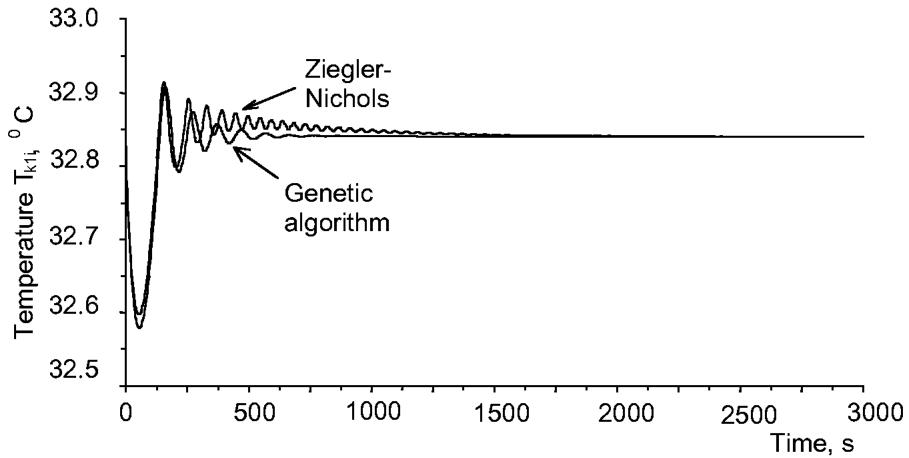  
Figure 12.8 First process stage response for Zeigler-Nichols and GA tuned PID, controller for step input $\mathbf { q _ { k 1 u } } \mathbf { f r o m \ q _ { k 1 u } } = \mathbf { 0 . 5 } \mathbf { l } / \mathbf { m i n }$ to $\bf q _ { \mathrm { k 1 u } } = 1 . 0 1 / m i n$

For the purpose of comparison of the results obtained by tuning $\mathbf { P I D } _ { 1 }$ controller parameters for the first stage by genetic algorithm, they were also tuned employing the Ziegler-Nicholos method. It is used to enhance controller gain $K _ { r }$ until the process is brought into the oscillating state. On the basis of the gain obtained in the above way $K _ { r k } = 7 0$ , as well as the frequency of oscillations $f _ { o s c } =$ $1 / 4 0 ~ \mathrm { H z }$ , PID controller parameters are defined using the following expressions (Åsröm, 1988): $K _ { r } = 0 . 6 \mathsf { K } _ { \mathrm { r k } }$ . $T _ { I } { = } 0 . 5 1 / \mathrm { f } _ { \mathrm { o s c } }$ . $T _ { d } { = } 0 . 1 2 ~ 1 / \mathrm { f _ { o s c } }$

Table 12.1 Comparison of optimizing results of PID controllers   

<table><tr><td colspan="1" rowspan="1">Step InputQk1u</td><td colspan="1" rowspan="1">Ziegler-Nichols</td><td colspan="1" rowspan="1">GeneticAlgorithm</td><td colspan="1" rowspan="1">Ziegler-Nichols</td><td colspan="1" rowspan="1">GeneticAlgorithm</td></tr><tr><td colspan="1" rowspan="1">(l/min)</td><td colspan="1" rowspan="1">(E1, Wh)</td><td colspan="1" rowspan="1">(E1, Wh)</td><td colspan="1" rowspan="1">(E2, Wh)</td><td colspan="1" rowspan="1">(E2, Wh)</td></tr><tr><td colspan="1" rowspan="1">1.0</td><td colspan="1" rowspan="1">1509</td><td colspan="1" rowspan="1">1509</td><td colspan="1" rowspan="1">1546</td><td colspan="1" rowspan="1">1544</td></tr><tr><td colspan="1" rowspan="1">0.8</td><td colspan="1" rowspan="1">1237</td><td colspan="1" rowspan="1">1237</td><td colspan="1" rowspan="1">1256</td><td colspan="1" rowspan="1">1256</td></tr><tr><td colspan="1" rowspan="1">0.6</td><td colspan="1" rowspan="1">964</td><td colspan="1" rowspan="1">964</td><td colspan="1" rowspan="1">973</td><td colspan="1" rowspan="1">973</td></tr><tr><td colspan="1" rowspan="1">0.4</td><td colspan="1" rowspan="1">691</td><td colspan="1" rowspan="1">692</td><td colspan="1" rowspan="1">782</td><td colspan="1" rowspan="1">783</td></tr><tr><td colspan="1" rowspan="1">0.2</td><td colspan="1" rowspan="1">419</td><td colspan="1" rowspan="1">419</td><td colspan="1" rowspan="1">466</td><td colspan="1" rowspan="1">466</td></tr><tr><td colspan="1" rowspan="1">0.0</td><td colspan="1" rowspan="1">146</td><td colspan="1" rowspan="1">146</td><td colspan="1" rowspan="1">148</td><td colspan="1" rowspan="1">148</td></tr><tr><td colspan="1" rowspan="1">Total</td><td colspan="1" rowspan="1">4966</td><td colspan="1" rowspan="1">4967</td><td colspan="1" rowspan="1">5171</td><td colspan="1" rowspan="1">5170</td></tr></table>

The following $\mathbf { P I D } _ { 1 }$ controller parameters for the first stage process are defined using this method: $K _ { r z l } = 4 2$ , $T _ { i z I } = 2 0 ~ \mathrm { s }$ , $T _ { d z I } = 4 . 8 ~ \mathrm { s }$ .

The comparison of the response shape of the two methods for parameter tuning is not adequate, as the genetic algorithm does not optimize response shape, but energy consumption. Still, matching of response shapes is quite obvious, which can be attributed to output constraints of $\pm 5 \%$ , introduced in optimizing by genetic algorithm.

Although the Ziegler-Nicholos method does not include the energy criterion, while the genetic algorithm does, the result obtained, from the point of view of energy consumption is approximately the same (see Table 12.1). It comes from the nature of the PID controller, the parameters of which are defined by the selection of output constraints ( $5 \%$ of the allowed deviation of the output from the value set in the period of $1 0 0 0 \mathrm { ~ s ~ } < t < 3 0 0 0 \mathrm { ~ s ~ }$ ). It is impossible to tune the parameters further, from the point of view of minimal energy consumption.

It is impossible to tune the $\mathrm { P I D } _ { 2 }$ controller parameters for the second stage by step disturbance input to the second stage, because of the cascade connection with the previous process. Therefore, the following procedure was implemented instead. $\mathbf { P I D } _ { 1 }$ controller parameters for the first stage were set to reflect optimal values obtained by independent tuning using a genetic algorithm for the first stage of the process $K _ { r g l } = 9 . 3$ , $T _ { i g I } = 8 9 0 ~ \mathrm { s }$ , $T _ { d g l } = 0 . 4 4 ~ \mathrm { s }$ ). Step input was then forced onto the first stage, and independent tuning of $\mathrm { P I D } _ { 2 }$ controller parameters for the second phase of the process performed. The same parameters for the genetic algorithm were applied as for the first stage. Fitness was $f _ { p u } ,$ following the expression (40) and the same steady state and same step disturbance input were selected.

$\mathrm { P I D } _ { 2 }$ controller parameters for the second stage, obtained by tuning with the genetic algorithm, were as follows: $K _ { r g 2 } = 1 . 8$ , $T _ { i g 2 } = 7 2 1$ s, $T _ { d g 2 } = 0 . 4 5 ~ \mathrm { s }$ .

For the purpose of comparison of the results obtained by tuning $ { \mathbf { P } }  { \mathrm { I D } _ { 2 } }$ controller parameters for the second stage by genetic algorithm, they were also tuned employing the Ziegler-Nicholos method (under the same conditions and the same input, in the same way as for the first stage of the process). On the basis of $\mathrm { K } _ { \mathrm { r k } } { = } 5$ defined in this way, and $f _ { o s c } = 1 / 1 5 5 ~ \mathrm { H z }$ , the following $\mathrm { P I D } _ { 2 }$ controller parameters were defined for the second stage: $K _ { r z 2 } = 3$ , $T _ { i z 2 } = 7 7 . 5 ~ \mathrm { s }$ , $T _ { d z 2 } = 1 8 . 6$ s. Response example of the first stage laboratory process by $\mathrm { P I D } _ { 2 }$ controller, the parameters of which were tuned employing the genetic algorithm described, is shown in Figure 12.9.

Table 12.1 shows energy consumption in controlling a laboratory plant by PID controllers, the parameters of which were tuned by a genetic algorithm and Ziegler-Nichols method.

It can be concluded, on the basis of the results of tuning PID controller parameters as presented, that the method of optimizing proposed here is not adequate, as it does not offer better results than those obtained by traditional methods, at least from the point of view of minimal energy consumption.

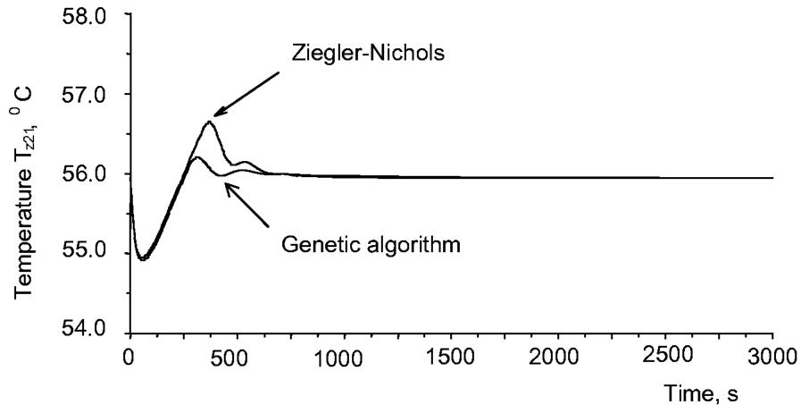  
Figure 12.9 Second process stage response for Ziegler-Nicholos and GA tuned $\mathbf { P I D } _ { 2 }$ controller for step input ${ \bf q } _ { { \bf k } 1 { \bf u } }$ from ${ \bf q } _ { { \bf k } 1 { \bf u } } = { \bf 0 . 5 }$ l/min to ${ \bf q } _ { { \bf k } 1 { \bf u } } = 1 . 0$ 1/min

Although a satisfactory result, from the point of view of the optimizing criterion given, was not obtained, the research described here indirectly points out a useful fact: that it is possible to tune PID controller parameters from the point of view of response minimal deviation from the set point. If the output constraint given is taken as a criterion for optimizing, then parameter tuning is successful and the result obtained satisfies the criterion completely. This fact can be used in PID controller parameter tuning in cases when it is important to optimize the behavior of regulated processes in view of response deviation from the set point.

# 12.7 Fuzzy Multilevel Coordinated Control

A multilevel control, aided by a genetic algorithm, gives the best results when applied to fuzzy controllers. In coordinated control, decision tables are simultaneously tuned with both fuzzy controllers, while satisfying optimizing criteria regarding the system as a whole.

Fuzzy controller parameter tuning is a key issue of the quality and efficiency of fuzzy logic control [Stipanicev, 1987; Karr, 1991]. Investigations have mostly been heuristic by nature, and there has been no accurate measure from the point of view of fitness achieved. Only recently, investigators have tried to tune controller parameters employing evolutionary procedures, but they were quite demanding regarding the resources used and thus questionable for use with adaptable controllers [Freeman, 1990; Karr, 1991; Pham, 1991; Linkens, 1992; Cooper, 1993].

Analytical procedures for optimizing fuzzy controllers are of little use, as the function of membership and the control rules are subjective in nature. Besides experience, the only method applicable is the method of trial and error, which can take a lot of time and be quite unsatisfactory. Some results have been obtained by using adaptable fuzzy controllers [Shhao, 1988; Stipanicev, 1991; Zhang, 1992], but all these procedures suppose certain process properties, or include some additional experience.

Two central and mutually dependent fuzzy controller parameters are control rules and membership functions of primary terms. Fuzzy controller synthesis is usually done so that one of these parameters is kept constant, while the other one is tuned [Karr, 1991].

Characteristics of genetic algorithms are almost ideal for optimizing fuzzy controller parameters, as confirmed by the examples of usage in recent literature [Androulakis, 1991; Pham, 1991; Krishnakumar, 1992; Kristinsson, 1992; Michalewitz, 1992; Nomura, 1992; Castro, 1993; Cooper, 1993].

Defining membership functions of primary terms is in principle a much simpler procedure than defining control rules. The reason is the fact that primary terms are not connected to the nature of the process in question, but are rather general terms, which can be equally generally defined, thus being valid for any process. It is, consequently, quite common to define seven primary terms and attribute them a triangular shape [Stipanicev, 1989]. Seven terms are selected as the uppermost border of the operative's perceptive abilities on the one hand, and as a minimum of acceptable control quality on the other. Although initial investigations in employing genetic algorithms in tuning the fuzzy controller membership functions yielded some promising results [Karr, 1991], and indicated possibilities of certain adaptability on the part of fuzzy controller, the fact remains that primary terms are not directly connected to the process. Tuning the primary terms, which is a typical procedure for most of the methods found in the literature, the meaning of the primary term tuned is changed, which can easily result in severing the semantic link of the primary term and the experience of the operator.

Control rules are directly connected with the nature of the process and are significantly dependent upon its properties. Control rules are a direct image of subjective knowledge of the process, and are thus the foundations of a fuzzy controller. Optimizing control rules is the most important part of the process of fuzzy controller optimizing, and it is consequently performed in this chapter. For each set of inputs, controller output is calculated employing control rules. The basic disadvantage of such an approach is the duration of the calculation. In the processes with a number of inputs, calculation time can be so long as to either require too expensive hardware or a time too long for practical application in view of plant dynamics. From the very beginnings of the application of fuzzy controllers, the problem has been solved by simplifying the calculation or by creating a decision table. The first method results in only a partial reduction of the time needed for the calculation, while the second one reduces the necessary time considerably, but at the expense of control accuracy.

The reasons for selecting a decision table as a parameter for fuzzy controller tuning are as follows:

1) Processing the decision table and not the control rules, ensures that the process is made considerably faster, as it is not necessary to calculate the value of controller output. A decision table can be made by using fast, simple and inexpensive hardware (e.g. RAM or EEROM). The alteration of a decision table in such cases is simple and fast.   
2) The number of primary terms, which is, due to subjective assessment, limited to around ten (most often seven), can be, when a decision control table is used in processing with a genetic algorithm, enlarged.   
3) A decision table is easy to represent in a form adequate for processing with a genetic algorithm.

# 12.7.1 Decision Control Table

The structure of decision control table selected (used in most of the literature consulted) is a multidimensional vector, the elements of which are real numbers in the range from 0 to $V _ { m a x } .$ Each decision table element is binary coded with $b _ { I }$ bits. The decision control table has the size $b _ { n }$ (expressed in number of bits) from:

$$
b _ { n } { = } b _ { I } { \cdot } \prod _ { i = 1 } ^ { m _ { u } } S _ { i } \quad ,
$$

where

$b _ { n }$ total number of bits of decision table $b _ { I }$ number of bits of one element of decision table

$S _ { i }$ number of primary terms $m _ { u }$ number of controller inputs

Total search space $s _ { p }$ is $s _ { p } = 2 ^ { b n }$ . Even in a simple case with two inputs, each with seven primary terms and binary coded output with 16 bits total, search space size exceeds $1 0 ^ { 2 3 6 }$ !

Table 12.2 49-element control decision table   

<table><tr><td rowspan=1 colspan=1></td><td rowspan=1 colspan=8>Error</td></tr><tr><td rowspan=8 colspan=1>Change inError</td><td rowspan=1 colspan=1></td><td rowspan=1 colspan=1>nv</td><td rowspan=1 colspan=1>ns</td><td rowspan=1 colspan=1>nm</td><td rowspan=1 colspan=1>p0</td><td rowspan=1 colspan=1>pm</td><td rowspan=1 colspan=1>ps</td><td rowspan=1 colspan=1>pv</td></tr><tr><td rowspan=1 colspan=1>dpv</td><td rowspan=1 colspan=1>m11</td><td rowspan=1 colspan=1>m12</td><td rowspan=1 colspan=1>m13</td><td rowspan=1 colspan=1>m14</td><td rowspan=1 colspan=1>m15</td><td rowspan=1 colspan=1>m16</td><td rowspan=1 colspan=1>m1</td></tr><tr><td rowspan=1 colspan=1>dps</td><td rowspan=1 colspan=1>m21</td><td rowspan=1 colspan=1>m22</td><td rowspan=1 colspan=1>m23</td><td rowspan=1 colspan=1>m24</td><td rowspan=1 colspan=1>m25</td><td rowspan=1 colspan=1>m26</td><td rowspan=1 colspan=1>m27</td></tr><tr><td rowspan=1 colspan=1>dpm</td><td rowspan=1 colspan=1>m31</td><td rowspan=1 colspan=1>m32</td><td rowspan=1 colspan=1>m33</td><td rowspan=1 colspan=1>m34</td><td rowspan=1 colspan=1>m35</td><td rowspan=1 colspan=1>m36</td><td rowspan=1 colspan=1>m37</td></tr><tr><td rowspan=1 colspan=1>d0</td><td rowspan=1 colspan=1>$m41</td><td rowspan=1 colspan=1>$m42</td><td rowspan=1 colspan=1>m43</td><td rowspan=1 colspan=1>m44</td><td rowspan=1 colspan=1>m45</td><td rowspan=1 colspan=1>m46</td><td rowspan=1 colspan=1>m47</td></tr><tr><td rowspan=1 colspan=1>dnm</td><td rowspan=1 colspan=1>m51</td><td rowspan=1 colspan=1>m52</td><td rowspan=1 colspan=1>m53</td><td rowspan=1 colspan=1>m54</td><td rowspan=1 colspan=1>m55</td><td rowspan=1 colspan=1>m56</td><td rowspan=1 colspan=1>m57</td></tr><tr><td rowspan=1 colspan=1>dns</td><td rowspan=1 colspan=1>m61</td><td rowspan=1 colspan=1>m62</td><td rowspan=1 colspan=1>m63</td><td rowspan=1 colspan=1>m64</td><td rowspan=1 colspan=1>m65</td><td rowspan=1 colspan=1>m66</td><td rowspan=1 colspan=1>m67</td></tr><tr><td rowspan=1 colspan=1>dnv</td><td rowspan=1 colspan=1>m71</td><td rowspan=1 colspan=1>m72</td><td rowspan=1 colspan=1>m73</td><td rowspan=1 colspan=1>m74</td><td rowspan=1 colspan=1>m75</td><td rowspan=1 colspan=1>m76</td><td rowspan=1 colspan=1>m77</td></tr></table>

In simulations described below, the number of primary terms selected was $S _ { i } ~ = 7$ . A 49-member control decision table (49 elements are tuned) was selected as a tuning parameter for fuzzy controllers. The structure can be seen in Table 12.2.

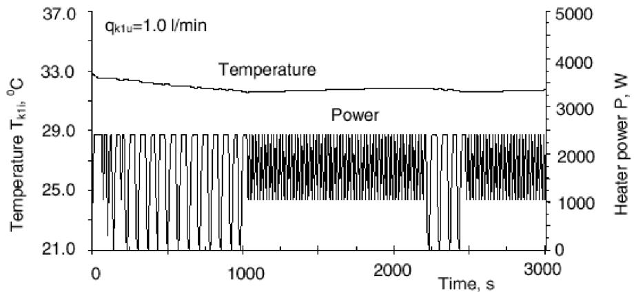  
Figure 12.10 First stage response to step disturbance $\pmb { q } _ { k l u }$ (from $q _ { k l u } = 0 . 5$ l/min to $q _ { k I u } = 1 . 0 \ \mathrm { l / m i n } )$ controlled with genetic algorithm tuned decision tables

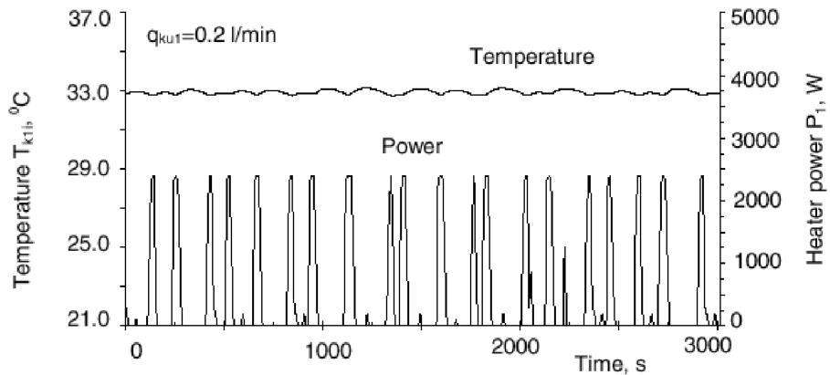  
Figures 12.10 to 12.13 show the response of a laboratory cascaded plant controlled by a fuzzy controller, with a decision control table being tuned by a genetic algorithm (coordinated tuning). Responses for various steps inputs $q _ { k l u }$ are shown, under working conditions described, and given set point and constraints.

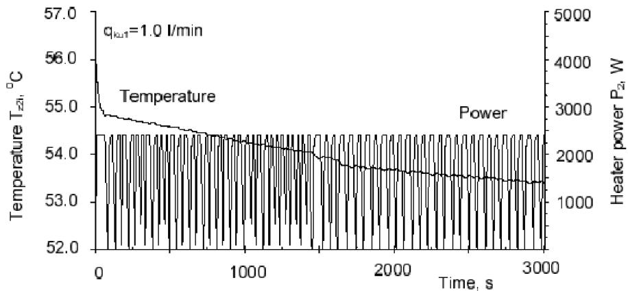  
Figure 12.11 First stage response to step disturbance $\pmb { q } _ { k l u }$ (from $q _ { k I u } = 0 . 5$ l/min to $q _ { k l u } = 0 . 2 \ \mathrm { l / m i n } )$ controlled with genetic algorithm tuned decision tables   
Figure 12.12 Second stage response to step disturbance $\mathbf { \widetilde { q } } _ { k l u }$ (from $\mathbf { q } _ { k l u } = \mathbf { 0 . 5 }$ l/min to $q _ { k I u } = 1 . 0 \ \mathrm { l / m i n } )$ controlled with genetic algorithm tuned decision tables

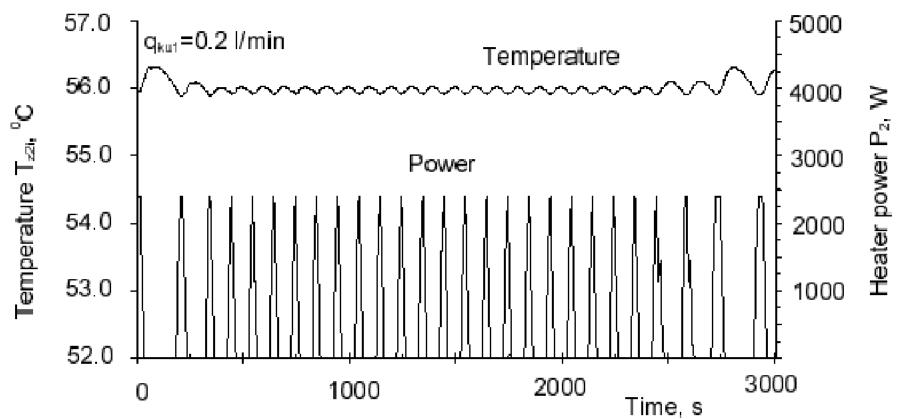  
Table 12.3 shows parallel total energy consumption of both stages of the laboratory plant controlled by decision tables tuned heuristically and GA tuned, in a non-coordinated and coordinated way.   
Figure 12.13 Second stage response to step disturbance $\mathbf { \widetilde { q } } _ { k l u }$ (from $\mathbf { q } _ { k I u } = \mathbf { 0 . 5 }$ l/min to ${ q _ { k l u } = 0 . 2 \ 1 / \mathrm { { m i n } ) } }$ controlled with genetic algorithm-tuned decision tables

Table 12.3 Comparison of energy consumption for fuzzy controllers   
Figure 12.14 shows a comparison of energy consumption for both stages, at different input step disturbances. It can be seen that better results are obtained with fuzzy controllers tuned in a coordinated way by a genetic algorithm than   

<table><tr><td>Step Input Qklu</td><td>Heuristically Tuned Controller</td><td>GA Tuned in a Non- coordinated Way</td><td>GA Tuned in a Coordinated Way</td></tr><tr><td>(l/min)</td><td>(E1+E2, Wh)</td><td>(E1+E2, Wh)</td><td>(E1+E2, Wh)</td></tr><tr><td>1.0</td><td>3063</td><td>2997</td><td>2853</td></tr><tr><td>0.8</td><td>2511</td><td>2447</td><td>2372</td></tr><tr><td>0.6</td><td>1960</td><td>1926</td><td>1913</td></tr><tr><td>0.4</td><td>1396</td><td>1407</td><td>1402</td></tr><tr><td>0.2</td><td>852</td><td>883</td><td>852</td></tr><tr><td>0.0</td><td>301</td><td>342</td><td>311</td></tr><tr><td>Total</td><td>10083</td><td>10002</td><td>9703</td></tr></table>

with other methods of controller parameter tuning, particularly for inputs where higher energy consumption is required.

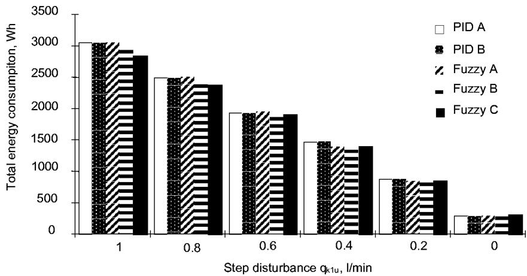  
Figure 12.14 Comparison of energy consumption for both stages, at different input step disturbances

Figures 12.14 and 12.15 legend:

PID A Ziegler-Nichols tuned PID controllers PID B GA tuned PID controllers Fuzzy A Heuristically tuned fuzzy controller Fuzzy B GA tuned fuzzy controller without coordinating unit Fuzzy C GA tuned fuzzy controller with coordinating unit

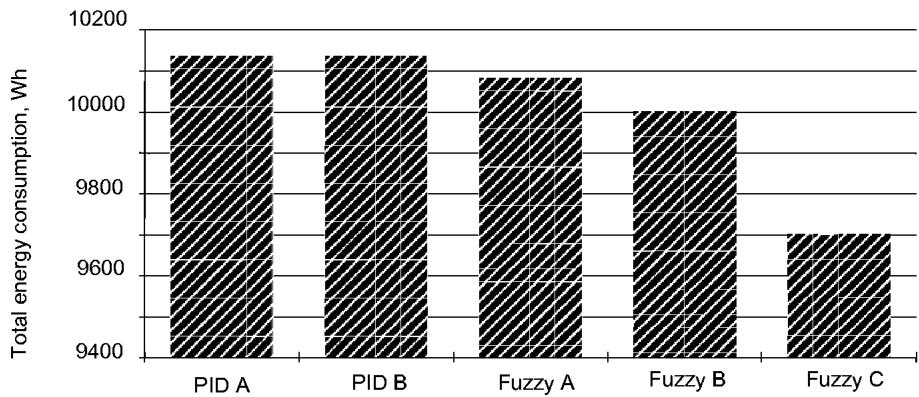  
Figure 12.15 Comparison of cumulative energy consumption for both stages of the laboratory plant for total of six steps input disturbances

Figure 12.15 shows a comparison of total energy consumption for both stages of the laboratory plant for six input step disturbances $( q _ { k l u } = 0 . 0 ~ \mathrm { 1 / m i n }$ $q _ { k l u } = 0 . 2$ l/min, $q _ { k l u } = 0 . 4 ~ \mathrm { 1 / m i n }$ $q _ { k l u } = 0 . 6 \mathrm { 1 / m i n }$ , $q _ { k l u } = 0 . 8 ~ \mathrm { 1 / m i n }$ , $q _ { k l u } = 1 . 0 \ \mathrm { l / m i n } )$ . It can be seen that the best results, from the point of view of energy consumption, are obtained in using fuzzy controllers tuned in a coordinated way by a genetic algorithm. Savings are realized at the expense of negative deviation of the temperature from the set point. This is why special attention should be paid to all the system behavior characteristics in the selection of optimizing criteria, so as to prevent unfavorable results through neglecting some of the important characteristics of tuning.

Figures 12.16 to 12.19 show responses of the laboratory process when using different controllers and different methods of controller parameter tuning. Step disturbance input acts upon the input of the first stage of the laboratory process in intervals of $3 0 0 0 \ \mathrm { s }$ , this being the time in which response was monitored in tuning using a genetic algorithm. This time period is part of the optimizing criterion and the procedure of tuning does not guarantee fulfillment of the criterion for any period longer than $3 0 0 0 \ \mathrm { s } .$ If the criterion is to be fulfilled for a longer period, it is necessary to perform the procedure for an adequate time. The procedure described does not guarantee permanent fulfillment of optimizing criterion (infinite time). Criterion of energy should be kept in mind again.

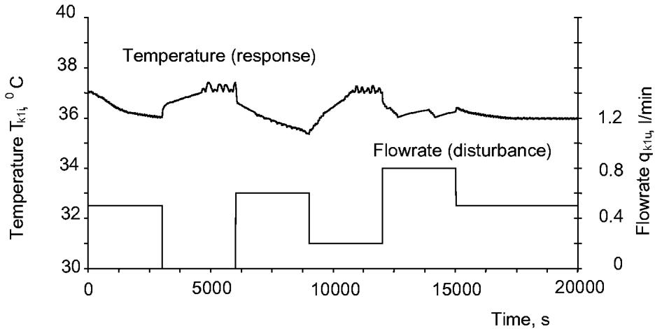

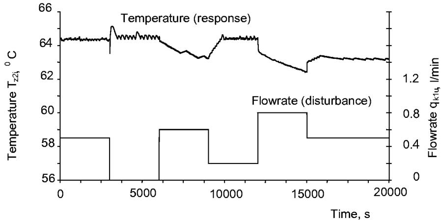  
Figure 12.16 Response of the first stage of a plant controlled by fuzzy controllers (decision tables are GA-tuned) for set point $\mathbf { T } _ { \mathbf { r } } { } = 3 7 ^ { \circ } \mathbf { C }$   
Figure 12.17 Response of the second stage of a plant controlled by fuzzy controllers (decision tables are GA tuned) for set point $\mathbf { T _ { r } } { = } 6 4 . 4 ^ { \circ } \mathbf { C }$

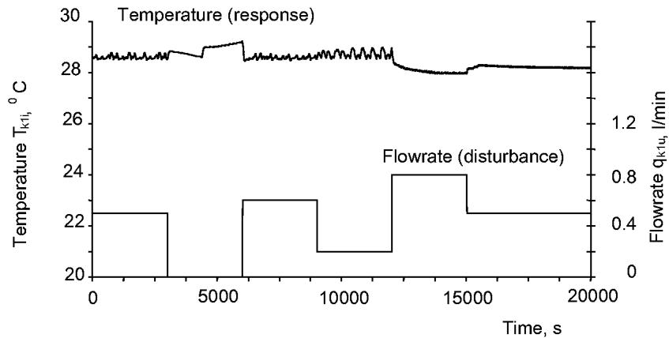  
Figure 12.18 Behavior of the first stage of a plant controlled by fuzzy controllers (decision tables are GA tuned) for set point $\mathbf { T _ { r } } \mathbf { = } 2 8 . 6 ^ { \circ } \mathbf { C }$

All the simulations described were done for one and the same set point: $T _ { o } = 2 5 . 0$ $\mathcal { C }$ , $P _ { I } = 1 0 0 0 ~ \mathrm { { W } }$ , $q _ { k l u } = 0 . 5 \mathrm { 1 / m i n }$ $T _ { k l u } = 1 0 \mathrm { ~ } ^ { \circ } \mathrm { C }$ , $T _ { \mathit { k l I } } { = } 3 2 . 8 \mathrm { ~ \overset { \circ } { C } }$ , $q _ { z l } = 0 . 1$ 1/min, $T _ { z l u } =$ $1 0 ~ \mathrm { { ^ \circ C } }$ $T _ { z I I } = 3 2 . 8 \mathrm { ~ \ ' ~ C ~ }$ , $T _ { z 2 u } = 3 2 . 8 \mathrm { ~ \overset { \circ } { C } }$ , $P _ { 2 } = 1 0 0 0 ~ \mathrm { { W } }$ , $T _ { k 2 } = 5 5 . 9 \mathrm { ~ } ^ { \circ } \mathrm { C }$ , $T _ { z 2 I } { = 5 5 . 9 \mathrm { ~ \textdegree ~ } }$ and with the same decision control tables (Tables 12.4 and 12.5). It should be checked whether the decision table obtained in the above way can also be applied to process control in other set points, or will it be necessary to re-tune the fuzzy controller parameters. For this purpose, a simulation of the system behavior was organized for various set points, and shown in Figures 12.16 to 12.19.

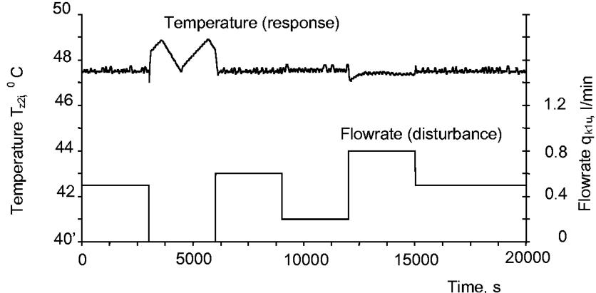  
Figure 12.19 Behavior of the second stage of a plant controlled by fuzzy controllers (decision tables are GA tuned) for set point $\mathbf { T _ { r } } \mathbf { = } \mathbf { 4 7 . 5 } ^ { \circ } \mathbf { C }$

Figure 12.16 and 12.17 show behavior of a plant controlled by fuzzy controllers (decision tables are GA tuned) for the following working conditions: $T _ { o } = 2 5 . 0 \mathrm { ~ \ ' C }$ $P _ { I } = 1 2 0 0 ~ \mathrm { \bf W }$ $q _ { k l u } = 0 . 5 1 / \mathrm { { m i n } }$ $T _ { k l u } = 1 0 \mathrm { ~ \textdegree C }$ , $T _ { \mathit { k l I } } = 3 7 \mathrm { ~ \overset { \circ } { C } }$ , $q _ { z l } = 0 . 1 \ \mathrm { l / m i n }$ , $T _ { z I u } = 1 0 \mathrm { ~ \ ' C }$ $T _ { z I I } = 3 7 \mathrm { ~ \mathrm { ~ \textdegree ~ } ~ }$ , $T _ { z 2 u } = 3 7 \mathrm { ~ \textdegree ~ }$ , $P _ { 2 } = 1 2 0 0 ~ \mathrm { W }$ , $T _ { \mathit { k } 2 } { = } 6 4 . 4 \mathrm { ~ \overset { \circ } { C } }$ , $T _ { z 2 I } = 6 4 . 4 \mathrm { ~ } ^ { \circ } \mathrm { C }$ Set point for the first stage is: $T _ { r } = 3 7 \mathrm { ~ \overset { \circ } { C } }$ Set point for the second stage is: $T _ { r } { = } 6 4 . 4 \ \mathrm { ~ \overset { \circ } { C } }$ .

Table 12.4 Decision control table tuned by genetic algorithm for the first process   

<table><tr><td rowspan=1 colspan=1>0.24</td><td rowspan=1 colspan=1>0.29</td><td rowspan=1 colspan=1>0.65</td><td rowspan=1 colspan=1>0.48</td><td rowspan=1 colspan=1>0.48</td><td rowspan=1 colspan=1>0.62</td><td rowspan=1 colspan=1>0.06</td></tr><tr><td rowspan=1 colspan=1>0.13</td><td rowspan=1 colspan=1>0.92</td><td rowspan=1 colspan=1>0.16</td><td rowspan=1 colspan=1>0.03</td><td rowspan=1 colspan=1>0.94</td><td rowspan=1 colspan=1>0.81</td><td rowspan=1 colspan=1>0.84</td></tr><tr><td rowspan=1 colspan=1>0.52</td><td rowspan=1 colspan=1>0.17</td><td rowspan=1 colspan=1>0.51</td><td rowspan=1 colspan=1>0.06</td><td rowspan=1 colspan=1>0.52</td><td rowspan=1 colspan=1>0.56</td><td rowspan=1 colspan=1>0.22</td></tr><tr><td rowspan=1 colspan=1>0.76</td><td rowspan=1 colspan=1>0.19</td><td rowspan=1 colspan=1>0.68</td><td rowspan=1 colspan=1>0.27</td><td rowspan=1 colspan=1>0.92</td><td rowspan=1 colspan=1>0.51</td><td rowspan=1 colspan=1>1.00</td></tr><tr><td rowspan=1 colspan=1>0.21</td><td rowspan=1 colspan=1>0.71</td><td rowspan=1 colspan=1>0.27</td><td rowspan=1 colspan=1>0.68</td><td rowspan=1 colspan=1>0.71</td><td rowspan=1 colspan=1>0.40</td><td rowspan=1 colspan=1>0.92</td></tr><tr><td rowspan=1 colspan=1>0.54</td><td rowspan=1 colspan=1>0.06</td><td rowspan=1 colspan=1>0.05</td><td rowspan=1 colspan=1>0.84</td><td rowspan=1 colspan=1>0.97</td><td rowspan=1 colspan=1>0.03</td><td rowspan=1 colspan=1>0.25</td></tr><tr><td rowspan=1 colspan=1>0.27</td><td rowspan=1 colspan=1>0.44</td><td rowspan=1 colspan=1>0.41</td><td rowspan=1 colspan=1>0.98</td><td rowspan=1 colspan=1>0.54</td><td rowspan=1 colspan=1>0.76</td><td rowspan=1 colspan=1>0.84</td></tr></table>

Table 12.5 Decision control table tuned by genetic algorithm for the second process   
Figure 12.18 and 12.19 show behavior of a plant controlled by fuzzy controllers (decision tables are GA tuned) for the following working conditions: $\bar { T } _ { o } = 2 5 . 0 \ \mathrm { ^ { \circ } C }$ , $P _ { I } = 8 0 0 ~ \mathrm { W }$ , $q _ { k l u } = 0 . 5 \mathrm { 1 / m i n }$ , $T _ { \mathit { k l u } } = 1 0 \mathrm { ~ \mathrm { ~ \textdegree ~ } ~ }$ , $T _ { \mathit { k l I } } = 2 8 . 6 \mathrm { ~ \overset { \circ } { C } }$ , $q _ { z l } = 0 . 1 ~ \mathrm { { l / m i n } }$ , $T _ { z l u } = 1 0$   

<table><tr><td rowspan=1 colspan=1>0.24</td><td rowspan=1 colspan=1>0.03</td><td rowspan=1 colspan=1>0.56</td><td rowspan=1 colspan=1>0.08</td><td rowspan=1 colspan=1>0.32</td><td rowspan=1 colspan=1>0.78</td><td rowspan=1 colspan=1>0.24</td></tr><tr><td rowspan=1 colspan=1>0.10</td><td rowspan=1 colspan=1>0.13</td><td rowspan=1 colspan=1>0.78</td><td rowspan=1 colspan=1>0.52</td><td rowspan=1 colspan=1>0.08</td><td rowspan=1 colspan=1>0.40</td><td rowspan=1 colspan=1>0.75</td></tr><tr><td rowspan=1 colspan=1>0.49</td><td rowspan=1 colspan=1>0.25</td><td rowspan=1 colspan=1>0.03</td><td rowspan=1 colspan=1>0.81</td><td rowspan=1 colspan=1>0.27</td><td rowspan=1 colspan=1>0.60</td><td rowspan=1 colspan=1>0.02</td></tr><tr><td rowspan=1 colspan=1>0.71</td><td rowspan=1 colspan=1>0.75</td><td rowspan=1 colspan=1>0.13</td><td rowspan=1 colspan=1>0.41</td><td rowspan=1 colspan=1>0.52</td><td rowspan=1 colspan=1>0.83</td><td rowspan=1 colspan=1>0.37</td></tr><tr><td rowspan=1 colspan=1>0.65</td><td rowspan=1 colspan=1>0.89</td><td rowspan=1 colspan=1>0.05</td><td rowspan=1 colspan=1>0.06</td><td rowspan=1 colspan=1>0.35</td><td rowspan=1 colspan=1>0.73</td><td rowspan=1 colspan=1>0.37</td></tr><tr><td rowspan=1 colspan=1>0.24</td><td rowspan=1 colspan=1>0.17</td><td rowspan=1 colspan=1>0.10</td><td rowspan=1 colspan=1>0.86</td><td rowspan=1 colspan=1>0.59</td><td rowspan=1 colspan=1>0.17</td><td rowspan=1 colspan=1>0.98</td></tr><tr><td rowspan=1 colspan=1>0.30</td><td rowspan=1 colspan=1>0.44</td><td rowspan=1 colspan=1>0.89</td><td rowspan=1 colspan=1>0.00</td><td rowspan=1 colspan=1>0.83</td><td rowspan=1 colspan=1>0.83</td><td rowspan=1 colspan=1>0.95</td></tr></table>

$\mathcal { \mathrm { C } }$ $T _ { z I I } { = 2 8 . 6 ~ ^ { \circ } \mathrm { C } }$ $T _ { z 2 u } = 2 8 . 6 \mathrm { ~ \ ' C }$ $P _ { 2 } = 8 0 0 ~ \mathrm { W }$ , $T _ { k 2 } = 4 7 . 5 \mathrm { ~ } ^ { \circ } \mathrm { ~ C ~ }$ $T _ { z 2 I } { = } 4 7 . 5 \mathrm { ~ } ^ { \circ } \mathrm { C }$ Set point for the first stage is: $T _ { r } { = } 2 8 . 6 \mathrm { ~ \ : } ^ { \circ } \mathrm { C }$ Set point for the second stage is: $T _ { r } { = } 4 7 . 5 \mathrm { ~ } \mathrm { ~ } \mathrm { ~ C ~ }$ .

Up to now it has been assumed that heater power is linearly dependant on control voltage, i.e., controller output. By introducing a nonlinear thyristor converter, the results are somewhat altered. Figures 12.20 and 12.21 show examples of response with nonlinear characteristic of a thyristor converter.

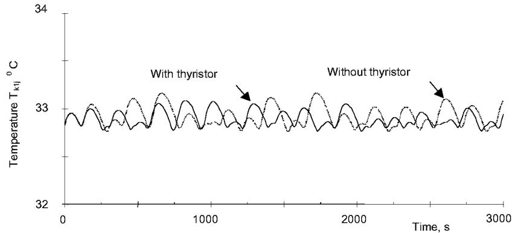  
Figure 12.20 First stage response with nonlinear characteristic of thyristor converter

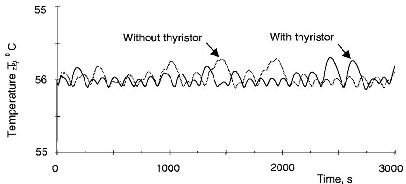  
Figure 12.21 Second stage response with nonlinear characteristic of thyristor converter

Figure 12.20 shows the response of the laboratory plants first stage for a relatively big negative step disturbance (reduction of flowrate from 0.5 to $0 . 2 1 / \mathrm { m i n }$ . Figure

12.21 shows the response of the laboratory plant second stage for a relatively big negative step disturbance (reduction of flowrate from 0.5 to $0 . 2 1 / \mathrm { m i n }$ ).

In principle, we can conclude that the non-linear characteristic thyristor converter impacts a few of the factors:

Response oscillations for both stages are somewhat reduced, as can be seen in all the examples presented. Oscillations are not eliminated in any of the cases, and the reduction depends upon the step input disturbance and set point   
Absolutely maximum response deviation from the set point is reduced in both stages, especially so for a relative big positive step input disturbance (relatively high increase in flowrate)   
Total energy consumption is higher, but not significantly so; the overall difference of energy consumption between linear and non-linear characteristic for the six inputs used in simulation was $- 0 . 6 \%$ (higher energy consumption for nonlinearity)

The procedure of tuning decision table parameters as proposed is independent of optimizing criterion, which is one of its biggest advantages. Besides criteria which concern only energy, or those related only to error, some combinat,ions can also be used. For example, one can use combined criteria in the form:

$$
f _ { _ { p i } } ~ = ~ { \frac { 2 ~ \cdot ~ P _ { u l } ~ t _ { w } ~ - ~ \displaystyle \int _ { 0 } ^ { t _ { w } } \left( T _ { p } \cdot P _ { 1 } + T _ { e } \cdot e _ { 1 } ^ { 2 } \right) ~ { - } ~ \displaystyle \int _ { 0 } ^ { t _ { w } } \left( T _ { p } \cdot P _ { 2 } + T _ { e } \cdot e _ { 2 } ^ { 2 } \right) } { 2 ~ \cdot ~ P _ { u l } ~ t _ { w } } } ~ ,
$$

where

$P _ { I } , P _ { 2 }$ power of the heaters   
$e _ { I } , \ e _ { 2 }$ error (difference between set point and output)   
$t$ time   
$t _ { w }$ optimizing interval   
$T _ { p }$ weight term of energy consumption   
$T _ { e }$ weight term of error

Selecting adequate weight terms, a combined criterion can yield process behavior, which is a compromise between energy savings and response deviation from set point. For example, Figures 12.22 and 12.23 show process response for various criteria: ITSE criteria, minimal energy consumption criteria and combined criteria in Equation (44) when equal weight terms $( T _ { p } = T _ { e } )$ are selected.

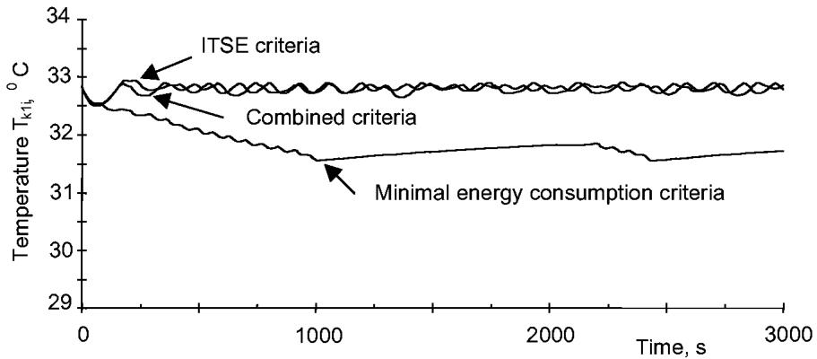  
Figure 12.22 First stage process response for various optimizing criteria

In the first two cases, considerably lower response deviation from set point can be seen, especially when response monitoring time is longer. Nevertheless, contrary to expectations, the criterion of minimum of integral of time times the square of the error does not yield much better results (lower oscillations through longer time) from the combined criterion, although certain improvement is quite obvious for $t > 1 5 0 0 ~ \mathrm { s }$ . The main reason for this is the discrete decision table, which makes total elimination of oscillations impossible. Prolonged oscillations are considered an inherent disadvantage of the proposed method for tuning decision control table parameters. Further reduction of oscillations is possible, but only using some other control algorithm.

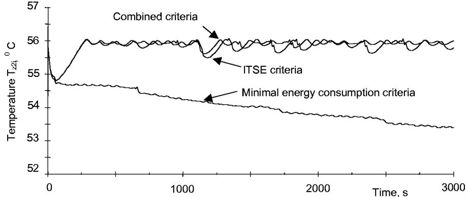  
Figure 12.23 Second stage process response for various optimizing criteria

There are two basic methods of realizing fuzzy multilevel control optimized by a genetic algorithm: offline and online.

The application on a mathematical model matches the simulation research described. Realization on a computer is rather simple, presenting no practical problem. The main disadvantage of applying the process on a model is the need to develop a mathematical model in a form that enables a solution to be reached, i.e., that enables response calculation within a time domain. As fuzzy controllers are applied primarily in situations where it is impossible to perform control by some conventional procedure, as formal analysis and synthesis of the system are impossible, it is obviously restricted in application. One of the uses of fuzzy multilevel control optimized by a genetic algorithm on a mathematical model is in the case of tuning a number of parameters, which is a characteristic of fuzzy controllers. Conventional optimizing methods are not applicable for optimizing a large number of parameters (for example, 98 parameters as was done in this research), as calculation time is unacceptable. The efficiency of a genetic algorithm is independent of the number of parameters (up to the limits of the computer used, i.e., memory available and software used for processing), which is another important reason for choosing to apply a genetic algorithm. A crucial advantage of applying the optimizing procedure on a system model is its rather short duration, compared to implementing it on a real process.

Fuzzy multilevel control optimized by a genetic algorithm can also be applied to an online system. A prerequisite is, of course, that the system is controlled by fuzzy controllers, decision control tables which are tuned heuristically and that there is no mathematical model of the system.

Control and optimizing using a PC is adequate for simulation optimizing, or when critical time parameters of the system are such that control and optimizing algorithms can be implemented fast enough. If this is not the case, special controllers should be designed and optimizing applied that will be able to implement the algorithms in a spcified time. Regarding calculation time, two parts of calculating should be distinguished: control and optimizing.

System control is done on the basis of actually available decision control tables and is separated from the procedure of optimizing. The control algorithm is implemented in a considerably shorter time than the optimizing algorithm. It is thus quite feasible to design a control unit separately from an optimizing (coordination) unit. Communication between the units should be ensured, so as to make it possible to send the decision control table, obtained by an optimizing algorithm, to the control unit.

The control unit should implement the whole of the control algorithm in a time shorter than the sampling interval. Control using a decision control table is a simple variant, as the total calculation consists of acquiring the values stored from the memory and passing them to a D/A converter. Implementation time depends on the hardware and software configuration used.

The main advantages of applying the procedure in a real system are its simple implementation and the possibility of automated optimizing, with no need to know the mathematical model of the process. Heuristic knowledge of system behavior is all that is necessary and the decision control table represents it for fuzzy controllers. Alteration of the optimizing criterion requires no change in the system (except, of course, a change in the genetic algorithm fitness function, which contains the criterion). In applying the optimizing procedure to some other process, it is necessary to change the heuristic decision control table (or tables), while the rest of the system can remain unchanged. Universal applicability of the procedure proposed is ensured in this way.

The main disadvantage of the proposed application of fuzzy multilevel control optimized by a genetic algorithm to a real system is the time necessary to implement the genetic algorithm. With the population of 90 individuals, and implementation of 70 generations (as selected in the simulation research presented), the time necessary to implement the algorithm is $9 0 { \cdot } 7 0 { \cdot } t _ { w }$ , where $t _ { w }$ is response monitoring time in the course of the genetic algorithm implementation. The procedure is much more applicable for optimizing when the response should be monitored in shorter intervals, i.e., when $t _ { w }$ is relatively small.

# 12.8 Conclusions

The principal aim of the research performed was to determine a control procedure that can sustain cascaded processes within given limits, fulfilling a particular criterion relating to the system as a whole (e.g., minimal energy consumption) in an unsteady environment. Various conventional methods were investigated, and evolutionary optimizing selected as the most favorable approach. Fuzzy logic control was investigated as a basis for unification of heuristic knowledge with the evolutionary procedure. A practical algorithm for system behavior optimizing was developed by tuning the decision control table for fuzzy controllers using a genetic algorithm.

A laboratory cascaded plant was used as a basis for simulation research. Experimental comparison of mathematical model and real process behavior was done. The process was investigated from the points of view of control by conventional procedures and evolutionary optimized control. The criterion of energy, i.e., minimal energy consumption in controlling a cascaded process, was used as the optimizing criterion in the course of the simulation research described. A precondition was fulfilling given constraints of response deviation from the set point.

From the point of view of the minimal energy consumption criterion, the best simulation results were obtained by two-level coordinated control by a fuzzy controller employing decision control tables which were tuned using a genetic algorithm. Assuming that the first level of control uses a fuzzy logic controller, the task of the second level is to coordinate and obtain optimal system behavior in a changing environment. Comparison of results obtained by evolutionary and heuristically tuned PID and fuzzy controllers was done. Coordinated multilevel control aided by a genetic algorithm was better regarding the fulfillment of the minimal energy consumption criterion preset, while response was also kept within the given limits ( $\pm 5 \%$ temperature deviation from the set point). Despite the relative complexity and nonlinearity of the system process-controller, the efficiency of the genetic algorithm is relatively high. Algorithm convergence, depending upon the process and controller parameters, is within the range of 30 to 70 generations. Genetic algorithms imply the adaptation to various conditions of (sampling interval, control inputs values span, etc.). The procedure described leads to a global extreme and no broadening of algorithm adaptation is necessary in searching the solutions space with more than one local extreme.

The decision control table, once tuned, yields satisfactory results in the environment of a working point for which optimizing was done (temperature deviation $\pm 1 5 \%$ around the working point). For the working points which deviate considerably from the tuning point, it is necessary to re-tune the decision control table.

Easy implementation and inherent adaptability characterize the evolutionary procedure of multilevel coordinated control proposed. Furthermore, there are no problems in practical application. It is quite easy to automate the proposed fuzzy multilevel process control optimized by a genetic algorithm using existing equipment and contemporary technology. A coordinating unit and genetic algorithm can be used on general-purpose computers, or a special microprocessor unit can be constructed for the purpose of coordination. In both cases, there should be no hardware or software problems in executing the idea in practice.

The main disadvantage of the procedure proposed is the need to assess the quality of a relatively large number of system responses. As each response is monitored for a period of time, total time necessary to implement the procedure is the product of multiplying the number of individuals in the population, the number of iterations and monitoring time (disregarding the time necessary for algorithm implementation on a computer, which is in principle considerably shorter than the monitoring time). This is no problem in simulation research, but applying it to real systems optimizing time can be beyond acceptable limits. The applicability of the procedure should thus be assessed in view of the time needed for monitoring.

Fuzzy multilevel process control optimized by a genetic algorithm is not a substitute for conventional optimizing procedures. It is a useful addition to the heuristic methods of control, especially fuzzy logic control.

# Список литературы

[Ackley, 1987] Ackley, D.H., An empirical study of bit vector function optimization, in Genetic Algorithms and Simulated Anealing, Morgan Kaufmann, 1987, 170 - 204.   
[Androulakis, 1991] Androulakis, I.P., Venkatasubramanian, V., A genetic algorithm framework for proces design and optimization, Computers Chem. Eng., 15(4), 1991, 217 - 228.   
[Aström, 1984] Aström, K.J., Haegglund, T., Automatic tuning of simple regulators with specifications on phase and amplitude margins, Automatica, 20, 1984, 645 - 651.   
[Bäck, 1993] Bäck, T., Schwefel, H.P., An overview of evolutionary algorithms for parameter optimization, Evolutionary Computation GA, 1(1), 1993, 1 - 23.   
[Bahnasawi, 1990] Bahnasawi, A.A., Alfuhaid A.S., and Mahmoud M.S., Decentralized and hierarchical control of interconnected uncertain systems, IEE Proc. Control Theory and Applications, 137(5), 1990, 311 - 321.   
[Baldwin, 1980] Baldwin, J.F., Guild, N.C.F., Modelling controllers using fuzzy relations, Kybernetes, 9, 1980, 223 - 229.   
[Bethke, 1981] Bethke, A.D., Genetic Algorithms as function optimizes, Disertation Abstracts International, 41(9) 3505B, 9, 1981.   
[Bozicevic, 1988] Bozicevic, J., Temelji automatike, Sustavno glediste i automatika, automatsko reguliranje, (in Croatian), Skolska knjiga, Zagreb, 7. Izdanje, UDK 007.5:62-5 (035), 1988.   
[Bozicevic, 1988a] Bozicevic, J., Stipanicev, D., Development of a fuzzy transducer, IMEKO, 1988, 139-142.   
[Bozicevic, 1988b] Bozicevic, J., Stipanicev, D., Teaching and training of the fuzzy process control, Proc. ISA88, 1988, 1577 - 1582.   
[Braae, 1979] Braae, M., Rutherford, D.A., Theoretical and linguistic aspects of the fuzzy logic controller, Automatica, 15, 1979, 553 - 577.   
[Bramlette, 1989] Bramlette, M.F., Cusin, R., A comparative evaluation of search methods applied to parametric design, genetic algorithms and their applications, Proc. of the Third Intl. Conf. on Genetic Algorithms, San Mateo, CA, 1989, 213 - 218.   
[Buckley, 1992] Buckley, J.J., Nonlinear fuzzy controller, Information Sciences, 60(3), 1992, 261 - 274.   
[Castro, 1993] Castro, J.L., Delgado, M., Herrera, F., A learning method of fuzzy reasoning by genetic algorithms, Proc. of First European Congress on Fuzzy and Intelligent Technologies, EUFIF 93, Aachen, Germany, Sept. 7-10, 1993. II, 1993, 804-809.   
[Chen, 1993] Chen, C.L., Chen P.C., Chen C.K., Analysis and design of fuzzy control-system, Fuzzy Sets and Control Systems, 57(2), 1993, 125 - 140.   
[Chen, 1993a] Chen, J.Q., Chen L.J., Study on stability of fuzzy closed-loop control-systems, Fuzzy Sets and Control Systems, 57(2), 1993, 159 - 168.   
[Cooper, 1993] Cooper, M.G., Vidal, J.J., Genetic design of fuzzy controllers, Second Int. Conf. On Fuzzy Theory and Technology, Durham, NC, USA, 1993.   
[De Jong, 1975] De Jong, K.A., Analysis of the Behavior of a Class of Genetic Adaptive Systems, Ph.D. thesis, Dept. of Computer and Communication Sciences, Univ. of Mich., 1975.   
[Desphande, 1981] Desphande, P.B., Ash, R.H., Elements of Computer Process Control with Advanced Control Applications, Research Triangle Park, NC: ISA, 1981.   
[Dubois, 1980] Dubois, D., Fuzzy Sets and Systems, Academic Press, New York, ISBN 0-12-222750-6, 1980.   
[Ferber, 1990] Ferber, T., Lingvisticko modeliranje i vodenje stupnjevitog procesa izmjene topline, (in Croatian), Diplomski rad, Tehnoloski fakultet sveucilista u Zagrebu, Kemijsko tehnoloski studij, Zagreb, 1990.   
[Findeisen, 1978] Findeisen, W., Hierarchical Control Systems - An Introduction, Intern. Institute for Applied Systems Analysis, 1978.   
[Freeman, 1990] Freeman, L.M., Krishnakumar, K., Karr, C.L., I Meredith, D., Tuning Fuzzy Logic Controllers Using Genetic Algorithms - Aerospace Applications, Aerospace Applications of Artificial Intelligence Conference, Dayton, OH, USA, 1990.   
[Goldberg, 1986] Goldberg, D.E., Thomas, A.L., Genetic Algorithms: A bibliography 1962-1986, TCGA Report No 86001, Tuscaloosa: Univ. of Alabama, USA, 1986.   
[Goldberg, 1989] Goldberg, D.E., Genetic Algorithm in Search, Optimization, and Machine Learning, Addison-Wesley, Reading MA, 1989.   
[Grefenstette, 1986] Grefenstette, J.J., Optimisation of control parameters for genetic algorithms, IEEE Trans. on Systems, Man and Cybernetics, 16(1), 1986, 122 - 128.   
[Grundler, 1992] Grundler, D., Ugadanje parametara funkcije pripadnosti neizrazitog regulatora upotrebom genetickog algoritma, (in Croatian), 15. Strucno znanstveni skup MIPRO 92, 1992.   
[Grundler, 1992a] Grundler, D., Bozicevic, J., Sinteza neizrazitog regulatora primjenom genetickog algoritma, (in Croatian), Prvi simpozij Umjetna inteligencija pri mjerenju i vodenju, 1992.   
[Grundler, 1997] Grundler, D., Multilevel Fuzzy Process Control Optimized by Genetic Algorithm, Doctoral dissertation, Fakultet elektrotehnike i ra_unalstva, Zagreb, Croatia, (on Croatian language), 1997.   
[Guilamo, 1987] Guilamo, P.J., Fuzzy logic allows creation of precise process controllers, EDN, April1987, 201 - 204.   
[Hahn, 1963] Hahn, W., Theory and application of Lyapunovs direct method, Englewood Cliffs, NJ Prentice-Hall Inc., USA, 1963.   
[Hall, 1991] Hall, S.R., Crawley E.F., How J.P., Ward B., Hierarchical control architecture for intelligent structures, Journal of Guidance Control and Dynamics, 14(3), 1991, 503 - 512.   
[Holland, 1975] Holland, J.H., Adoption in Natural and Artificial Systems, The University of Michigan Press, Ann Arbor, USA, 1975.   
[Karr, 1991] Karr, C., Genetic algorithms for fuzzy controllers, AI Expert, 2, 1991, 26-33.   
[Krishnakumar, 1992] Krishnakumar, K., Goldberg, D.E., Control system optimization using genetic algorithms, Journal of Guidance, Control and Dynamics, 15(3), 1992, 735 - 740.   
[Kristinsson, 1992] Kristinsson, K., Dumont, G.A., System identification and control using genetic algorithms, IEEE Trans. on System, Man and Cybernetics, 22(5), 1992, 1033 - 1046.   
[Lee, 1993] Lee, M.A., Takagi, H., Integrating design stages of fuzzy systems using genetic algorithms, Proc. of the Second IEEE Int. Conf. on Fuzzy Systems, New York, USA, 1993, 612 - 617.   
[Lin, 1991] Lin, J.A., Roberts P.D., New coordination strategy for online hierarchical optimizing control of large-scale industrial-processes, Internatioal Journal of Control, 54(5), 1991, 1075 - 1096.   
[Linkens, 1992] Linkens, D.A., Nyongesa, H.O., A real-time genetic algorithm for fuzzy control, in IEE Colloquium on Genetic Algorithms for Control Systems Engineering, Digest 1992/106, 1 - 4.   
[McMillan, 1983] McMillan, G.K., Tuning and Control Loop Performance, Instrument Society of America, Research Tirangle Park, NC, USA, 1983.   
[Mesarovic, 1970] Mesarovic, M.D., Macko, D., Takahara, Y., Theory of Hierarchical, Multilevel Systems, Academic Press, New York, USA, 1970.   
[Michalewicz, 1990] Michalewicz, Z., Krawczyk, J., Kazemi, M., Janikow, C., Genetic algorithm and optimal control problems, in proc. of the 29th IEEE Conf on Decision and Control, Honolulu, Hawaii, USA, December 5-7, 1990, 1664 - 1666.   
[Michalewicz, 1992] Michalewicz, Z., Genetic Algorithms $^ +$ Data Structures $=$ Evolution Programs, Springer-Verlag, 1992.

[Passino, 1993] [Pham, 1991] [Rechenberg, 1973] [Shao, 1988]

Nomura, H., Hayashi, I., Wakami, N., A learning method of simplified fuzzy reasoning by genetic algorithm, Proc. of the Int. Fuzzy Systems and Intelligent Control, Conference, Lousville, KY, USA, 1992, 236 - 245.   
Oliveira, P., Sequeira, J., Sentieiro, J., Selection of controller parameters using genetic algorithms, in S.G. Tzafestas, ed., Engineering Systems with Intelligence, Kluwer Academic, The Netherlands, 1991, 431 - 438. Passino, K.M., Bridging the gap between conventional and intelligent control, IEEE Control Systems, 6, 1993, 12-18.   
Pham, D.T., Karaboga, D., Optimum design of fuzzy logic controllers using genetic algorithms, Journal of Systems Engineering, 1(2), 1991, 114 - 118.   
Rechenberg, I., Evolutionsstrategie: optimierung technischer Systeme nach Prinzipien der biologischen Evolution, Fommann-Holzboog Verlag, Stuttgart, 1973. Shao, S., Fuzzy self-organizing controller and its application for dynamic processes, Fuzzy Sets and Systems, 26, 1988, 151 - 164.   
Shinskey, F.G., Process Control Sytems Application Design Adjustment, McGraw-Hill, New York, USA, 1979.   
Stipanicev, D., Neizraziti Regulatori za Vodenje Slozenih Procesa, (in Croatian), Doktorska disertacija, Elektrotehni_ki fakultet u Zagrebu, 1987.   
Stipanicev, D., Teorija i primjena neizrazitog povratnog vodenja, (in Croatian), Automatika, 30, 1989, 179 - 188. Stipanicev, D., De Neyer M., Gorez, R., Self-tuning self-organising fuzzy robot control, IFAC Symp. on Robot Control SYROCO '91, 16-18 Sept. 1991. Vienna, 1991.   
Sugeno, M., Industrial Application of Fuzzy Control, North Holland, New York, USA, 1985.   
Sugeno, M., Tanaka, K., Successive identification of fuzzy model and its applications to prediction of

[Shinskey, 1979] [Stipanicev, 1987] [Stipanicev, 1989] [Stipanicev, 1991] [Sugeno, 1985] [Sugeno, 1991] [Vose, 1993] [Whitley, 1993]

complex systems, Fuzzy Sets and Systems, 42, 1991, 315 - 344.   
Vose, M., (D. Whitley, Ed.), Modeling Simple Genetic Algorithms, Foundations of Genetic Algorithms 2, Morgan Kaufmann, 1993, 63 - 73.   
Whitley, D., A Genetic Algorithm Tutorial, Colorado State University, Dept. of CS, TR CS-93-103, ftp from beethoven.cs.colostate.edu, 1993.   
Zadeh, L.A., Outline of a new approach to the analysis of complex systems and decision processes, IEEE Trans. Syst. Man Cybern., SMC-1, 1973, 28 - 44.   
Zhang, B.S., Edmunds, J.M., Self-organizing fuzzy-logic controller, IEE Proceedings-D Control Theory and Applications, 139(5), 1992, 460 - 464

[Zadeh, 1973] [Zhang, 1992]

# Chapter 13 Evolving Neural Networks for Cancer Radiotherapy

Joshua D. Knowles and David W. Corne

School of Computer Science, Cybernetics and Electronic Engineering   
University of Reading   
Whiteknights   
Reading RG6 6AY, UK   
[J.D.Knowles, D.W.Corne]@reading.ac.uk

# 13.1. Introduction and Chapter Overview

The aim of radiation therapy is to cure the patient of malignant disease by irradiating tumours and infected tissue, whilst minimising the risk of complications by avoiding irradiation of normal tissue. To achieve this, a treatment plan, specifying a number of variables including beam directions, energies and other factors, must be devised. At present, plans are developed by radiotherapy physicists, employing a time-consuming iterative approach. However, with advances in treatment technology which will make higher demands on planning soon to be available in clinical centres, computer optimisation of treatment plan parameters is being actively researched. These optimisation systems can provide treatment solutions that better approach the aims of therapy. However, direct optimisation of treatment goals by computer remains a time-consuming and computationally expensive process. With the increases in the demand for patient throughput, a more efficient means of planning treatments would be beneficial. Previous work by Knowles (1997) described a system which employs artificial neural networks to devise treatment plans for abdominal cancers. Plan parameters are produced instantly upon input of seven simple values, easily measured from the CT-scan of the patient. The neural network used in Knowles (1997) was trained with fairly standard backpropagation (Rumelhart et al., 1986) coupled with an adaptive momentum scheme. In this chapter, we focus on later work in which the neural network is trained using evolutionary algorithms. Results show that the neural network employing evolutionary training exhibits significantly better generalisation performance than the original system developed. Testing of the evolutionary neural network on clinical planning tasks at Royal Berkshire Hospital in Reading, UK, has been carried out. It has been found that the system can readily produce clinically useful treatment plans, considerably quicker than the human-based iterative method.

Finally, a new neural network system for breast cancer treatment planning was developed. As plans for breast cancer treatments differ greatly from plans for abdominal cancer treatments, a new network architecture was required. The system developed has again been tested on clinical planning tasks at Royal Berkshire Hospital and results show that, in some cases, plans which improve on those produced by the hospital are generated.

The remainder of this chapter is set out as follows. Section 13.2 provides background in the domain of radiation therapy. This is necessary to set the context in which the evolutionary neural network operates, and to gain an appreciation of the choices of input and output coding and other parameters. Section 13.3 reviews and discusses evolutionary algorithm training of neural networks. Section 13.4 then describes our application of evolutionary neural networks to the radiotherapy of abdominal cancer and breast cancer. Section 13.5 concludes and summarises the chapter, and discusses future work.

# 13.2 An Introduction to Radiotherapy

# 13.2.1 Radiation Therapy Treatment Planning (RTP)

The aim of curative radiation therapy is to deliver a lethal dose to the macroscopic disease (the tumour) and also to the estimated extent of microscopic disease (infected cells expected to be close to the tumour site) without causing unwanted and unnecessary side effects for the patient. In order to meet this aim, a large, homogeneous radiation dose should be shaped to accurately cover the desired target volume while the dose to healthy tissue, especially the critical organs, should be minimised.

The treatment of a patient can be broken down into several stages. At each stage, decisions and choices must be made which may affect later stages. A general outline is given by the following eight-stage process:

(i) Identify the disease, its stage and extent   
(ii) Collect 3-D medical imaging information on the patient's disease   
(iii) Describe the location of the disease to be treated by using medical images   
(iv) Transfer the images to a 3-D treatment planning system   
(v) Determine the radiation beam orientations, field-sizes and intensities to be employed   
(vi) Predict the response   
(vii) Treat the patient   
(viii) Verify the treatment

Stages (i), (ii) and (iii) above, could be lumped together under the heading "diagnosis" and stages (iv), (v) and (vi), similarly, form what is termed "treatment planning." In recent years, significant advances have been made in all of the above stages, especially in imaging techniques, treatment planning facilities and treatment methods themselves. Some of these advances are discussed later in this section.

In a conventional, modern hospital, $X$ -ray computed tomomgraphy (CT) imaging is the most common method for recovering the detailed information needed to begin treatment planning. The images resulting from CT scans each show a section through the patient, indicating the outline of the body as well as the electron density of internal tissues, from which critical organs, bones and the tumour itself can all be identified. The images are initially used to determine the part of the patient that should undergo exposure to a high radiation dose. This is known as the planning target volume (PTV). After the PTV has been established, the images are scanned into a treatment planning computer. The computer enables a treatment plan to be devised and predicts the distribution of radiation dose that will result from the plan. By iteratively adjusting the plan, an acceptable distribution of dose (that meets the aim of the treatment) should be obtained. Treatment is then carried out according to the plan.

# 13.2.2 Volumes

Treatment planning centres on so-called volumes, which are 3-D chunks of the patient identified and delineated early in the planning process. The Planning Target Volume (PTV) described above is made up of two sub-volumes; the Gross Tumour Volume and the Clinical Target Volume. The Gross Tumor Volume is defined as the demonstrable macroscopic extent of tumour either palpable, visible, or detectable by conventional radiography, ultrasound, radio-isotope scans, CT or magnetic resonance scanning. The Clinical Target Volume is defined as a tissue volume containing a demonstrable GTV and a "biological" margin. The margin is an estimate of the subclinical, microscopic, malignant disease adjacent to, or surrounding, the GTV. It is based on knowledge from surgical and post-mortem specimens and patterns of tumour recurrence, as well as clinical experience. It is a subjective but important estimate of the biological volume which must receive tumoricidal dose.

The Planning Target Volume is a geometrical concept, and it is defined to select appropriate beam sizes and beam arrangements in order to ensure that the prescribed dose is actually absorbed in the CTV. Because of patient movement, the movement of internal organs due to respiration and to the variation in size and shape of organs (e.g., different fillings of the bladder) it is necessary to add a further geometric margin when determining the volume that is planned to receive tumoricidal dose. The Planning Target Volume includes this margin in addition to the CTV itself.

A further important volume concerns nearby organs at risk. These are normal tissues whose radiation sensitivity may significantly influence treatment planning and/or prescribed dose. Depending on the sensitivity and position of the organs at risk, it may be necessary to compromise the dose to the PTV in order to avoid fatal or severely damaging doses to the patient.

# 13.2.3 Treatment Planning

Treatment planning is the stage in radiotherapy in which the aims of the treatment are transformed into a detailed plan describing exactly how radiation will be delivered to the patient. By this stage, images of the patient will have been collected and the target volumes and organs at risk will have been determined. In a modern hospital, the images and volumes are scanned into a treatment planning computer where the images can be viewed. The planning computer contains data and algorithms for calculating radiation dose, taking account of tissue electron density, beam intensity, duration of treatment and a number of other factors.

The physicist planning the treatment views the images, and using experience formulates an initial plan. The centre of the PTV is marked on the CT scans; it is known as the isocentre and is the point at which the X-ray beams are directed. With abdominal cancers, a co-planar, three-beam setup is usually employed. (see Figure 13.1) The gantry angles of each beam are determined first. This is carried out with the aim of producing homogeneous coverage of the target volume and of avoiding the organs at risk. With the angles selected, the widths of the beams are chosen next so that the PTV is covered by the beams. The duration that each beam will remain active during treatment is selected next. These parameters are known as beam weights.

In addition to the angles, widths and weights of the beams to be used, the physicist may also employ methods of shaping the beams or attenuating them across their width. To shape a beam, a metal block may be placed in its path. If necessary, blocks can be manufactured to give a particular beam shape. To attenuate a beam across its width, a wedge-shaped piece of metal can be placed in its path. Motorised wedges which move in and out of the path of the beam during treatment, can be employed to give a range of possible degrees of attenuation.

For the treatment of abdominal cancers, blocks are rarely employed but wedges to attenuate the beams are used to ensure a homogeneous dose in the planning target volume. With the use of motorised wedges, the physicist must select the relative amount of time that a $6 0 ^ { \circ }$ wedge will remain in the path of the beam, normalised to 1.00 for the whole treatment. These parameters are known as the wedge weights.

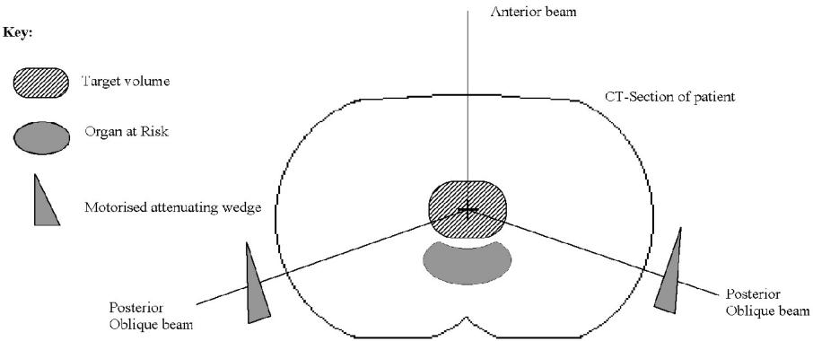  
Figure 13.1 A schematic showing a typical beam setup for treatment of a prostate cancer

With all the treatment parameters selected and keyed into the planning computer, the physicist can now view the predicted distribution of radiation dose that will result from his plan. The computer produces an isodose plot, showing the dose contours and the position and value of the maximum dose (the hotspot). By looking at the isodose contours, the physicist can estimate which parameters in his plan to change in order to produce a better dose distribution than resulted from his first attempt. The plan is then changed and the isodose contours are recalculated. By iteratively adjusting beam weights, angles and wedge weights and continually checking the predicted dose distribution, a satisfactory plan can be produced. This process can be quite time-consuming, especially when a nonstandard beam setup is required. With abdominal cancers, the setup usually follows a standard arrangement but adjusting the beam and wedge weights can still take approximately 15 minutes. Once a satisfactory plan has been developed, a printout of all the parameters is produced. This is then passed to the radiotherapist to set up the treatment machines and deliver the treatment.

# 13.2.4 Recent Developments and Areas of Active Research

Radiation therapy has, in the last decade, undergone development of almost all the different techniques and processes that it comprises. Key developments are in imaging techniques, treatment modalities, prediction of treatment outcome, and treatment planning. In this section we will focus on recent developments in treatment planning. However, we will start by noting some developments in treatment modalities and methods for the prediction of treatment outcomes since these impinge on the way treatments are planned. The role of this section in the chapter is mainly to support consideration of further and extended research directions for the use of evolutionary neural networks or other emerging software technologies in radiotherapy cancer treatment.

# 13.2.4.1 Treatment Modalities

An overall theme of developments in radiotherapy treatment is new methods for shaping the X-ray beams and for modulating their spatial intensity. Such new treatment modalities, in turn, require new and more complex methods of treatment planning as well as models for the prediction of the outcome of treatment. Traditionally, radiation therapy employs a few (three or four) co-planar X-ray fields directed at the target volume from various angles. The beams may be shaped using metal blocks so that organs at risk, which are laterally close to the target volume, are spared. However, because manufacturing blocks for each treatment is both time-consuming and expensive, they are not employed as frequently as they might be. Non-uniform or intensity-modulated beams may be achieved by the use of compensators or wedges. These are used in order to save organs at risk longitudinal to the target volume from the point of view of the beam. As with blocks, manufacturing compensators for each treatment is too time-consuming in practice and so their use is diminished. Motorised wedges, on the other hand, are easy to use but do not provide the possibility of modulating beams to give a complex intensity profile, required for optimal conformance to the target volume.

Multi-leaf collimators (MLCs, see Figure 13.2) provide the most promising solution to shaping beam profiles and they can also be made to dynamically modulate beam intensities. MLCs are made up of a set of retractable metal leaves; each leaf being able to move independently of the others. The position of the leaves is computer controlled in the most modern systems, allowing beam shapes to be set at the planning computer with the other treatment plan parameters.

Modulating the intensities of $\mathbf { X }$ -ray fields in such a way that dose distributions conform to even the most demanding of target volume shapes, is the state-of-theart in radiotherapy. Several different methods for achieving intensity modulation have been developed and their theoretical performances have been calculated, but few have been tested extensively. Dynamic multi-leaf collimators, tomotherapy and scanned elementary beams all allow arbitrarily non-uniform doses to be administered.

These new treatment modalities put much higher demands on the physicist planning the treatment. In order to take full advantage of them, some efficient method of obtaining a good plan must be employed: it is not feasible that a physicist can, by trial and error, plan the modulation and shaping of beams as well as their angles. With the availability of these new treatment modalities on the horizon, there has been much work in finding good methods for planning treatments which use them. Some of these are described later in this section.

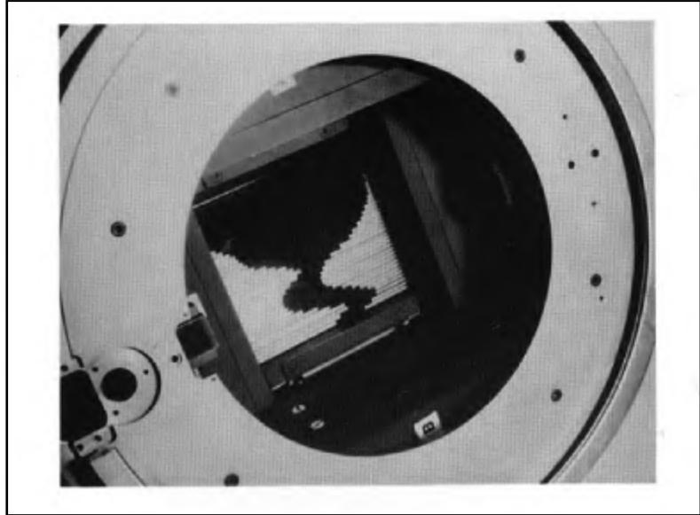  
Figure 13.2 The Elekta multi-leaf collimator

# 13.2.4.2 Prediction of Treatment Outcome

In order to effectively plan and administer radiation therapy, it would be ideal to be able to objectively establish the quality of a plan. As it is the aim of curative therapy to cure the patient of cancer without reducing their quality of life through damage to healthy tissue. The best method for establishing the quality of a treatment plan would be to have an objective measure of the predicted treatment outcome. This should be based on statistical studies of the outcomes of treatments and should correlate cure rates and complication rates with the dose administered to the various organs of the patients. This ideal is fraught with problems and controversies but methods for predicting treatment outcome are being developed. These objective metrics have recently been used in some state-of-the-art, developmental planning systems for optimising the treatment plans.

At present, in a conventional, modern hospital, the physicist assesses the quality of a plan by observing the distribution of dose calculated by the planning computer. Guidelines produced by the International Commission on Radiation

Units and Measurements (ICRU, 1993) instruct physicists as to the maximum and minimum acceptable doses in the target volume and organs at risk. By using his experience, the physicist is able to reach a compromise deemed to be an effective treatment plan. However, several problems present themselves with this approach. First, physicists disagree as to the quality of a plan and may even make different choices from one day to the next (Willoughby et al, 1996). Second, with the advent of new treatment modalities which offer the possibility of greater conformance of dose to the target volume, computers which can find optimal beam parameters must be employed and hence there is a need for an objective measure of plan quality to drive the optimisation. Third, if there is no measure (except an isodose distribution diagram) of the treatment administered, it is very difficult to build up a reliable statistical database from which to make future predictions.

Some hospitals have the facility of producing dose-volume histograms (DVH, see Figure 13.3), which show the dose delivered to partial volumes that have been identified on the CT data. Sometimes, these are viewed in conjunction with the isodose distribution to assess the quality of a plan. However, even dose-volume histograms are open to interpretation and can be subject to error or can give misleading information. Thus, many researchers have been seeking a way of objectively evaluating the quality of dose-volume histograms (histogram reduction) or of finding a different measure altogether.

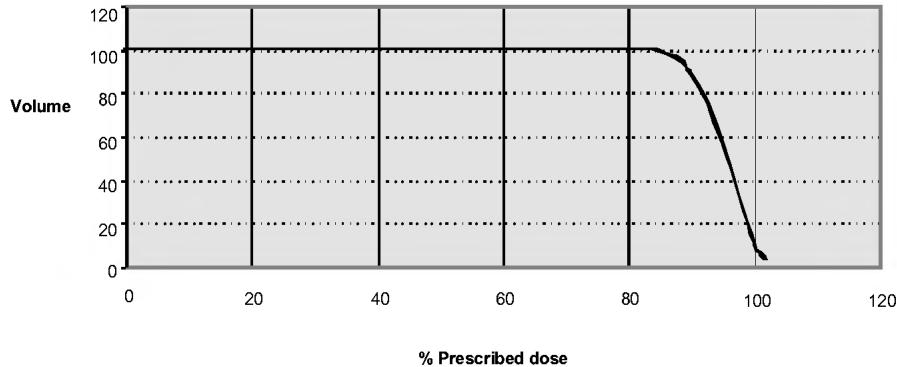  
Figure 13.3 A typical plot of the dose to a target volume plotted on a dosevolume histogram

Two metrics are usually employed, reflecting the aims of therapy. The first metric is the Tumour Control Probability (TCP) and the second is the Normal Tissue Complication Probability (NTCP). Webb (1997) reviews the different methods that have been developed for calculating TCP and NTCP and highlights the controversies that surround them. He also describes a method by Jain et al. (1994), which ranks treatment plans using proxy attributes: A single figure of merit is calculated by combining different proxy attributes, i.e., the percentage of the target volume receiving at least the prescription dose. Each attribute is weighted depending on its perceived importance. This method is useful because it avoids the controversy of predicting clinical outcome but still provides an objective measure which can be recorded and/or used for computer optimisation. It also allows clinicians the freedom they have at present in making decisions about plan quality but does not allow them to be blindly inconsistent. In the future, as these approaches are used by more and more hospitals, statistical data will become available for refining the models so that they better approximate the true quality of a treatment plan.

One other method for assessing plan quality is described in a paper by Willoughby et al. (1996). An artificial neural network is employed to evaluate the plan quality, utilising 3-D dose distribution information from a dose-volume histogram. To begin with, a physicist was shown 135 treatment plans on three separate occasions and asked to score them. The consistency the physicist achieved (defined to be within one point on the five point scale) was $8 8 \%$ . The neural network was then trained on the plans under a supervised learning paradigm using the physicist's evaluations as target outputs. Upon testing, it was found that the neural network was able to score plans within one point of the physicist's score 82 to $84 \%$ of the time  comparable with the consistency of the physicist. Further research is expected to improve upon this performance. This method appears promising as another method for use in optimising treatment plans although a finer scale of assessment may be necessary.

# 13.2.5 Treatment Planning

Improvements in treatment planning can come about from developments in a number of different areas. These include new methods of computing dose to a point, improvements in the graphical representation of the patient's internal structure (including the use of virtual reality), new methods of predicting treatment outcome or evaluating plan quality (described above) and the advent of inverse planning. The latter refers to the technology now under development, whereby the physicist is merely required to give information about the required dose distribution and the planning computer actually computes the treatment plan parameters. This is the most important development in treatment planning. It has the potential to speed up the planning process (important in busy and underresourced hospitals) and, more importantly, to improve plan quality and consistency. In fact, with the new treatment modalities of collimated and intensity-modulated beams, it is essential to have some efficient method for calculating treatment plans. Inverse planning is that method. In this section, recent research in inverse planning will be described and evaluated.

Inverse treatment planning techniques fall into two broad classes.

(i) Analytic techniques. For intensity-modulated beams, these involve deconvolving a dose-kernel from a desired dose distribution to obtain the distribution of desired photon fluence with attenuation factors to create profiles of beam intensity. (ii) Iterative techniques. Linear programming techniques, simulated annealing and genetic algorithms have all been used to optimise the treatment plan.

There are problems with (i) above, however. In order to find a solution it is necessary to employ negative beam intensities, which have no physical meaning. In fact, some of the work in analytic techniques cite a paper by Birkhoff (1940) in which it was shown that an arbitrary 2-D drawing could be described by the superposition of a series of straight lines from different directions each with different uniform darkness. The lines, however, were allowed to have negative darkness (i.e., to act like an eraser) in order to obtain a solution.

Sherouse (1993) has developed an elegant method of finding the best way to combine wedged fields for maximising the uniformity of dose to the PTV. However, with the advent of fully intensity-modulated beams, much more work has concentrated on finding methods of planning treatments using these.

Much research has taken the approach of (ii) above. As long ago as 1970, Newton (1970) published a paper, "What Next in Radiation Treatment Optimisation?," but it has only been in recent years that the availability of powerful computers has allowed optimisation of treatment plans to be realised in practice. Attempts have been made to optimise all of the following, either in isolation or in combination: number of fields, orientation of fields, intensity profiles of IMBs, beam weights and wedge weights, and collimation or shaping of beams.

There are controversies over the number of fields that are strictly necessary; Mackie et al. (1994) argues it is better to use a large number of beams because dose can then be spread out more in the organs at risk, a more uniform dose can be achieved in the PTV and that machines which can deliver many fields can also deliver few, where the converse is not true. Brahme (1994) argues for the use of few beams, claiming that tumours can be induced if whole organs at risk are irradiated, especially in children. He also points out that machines capable of delivering large numbers of fields may only be available in a few large centres, even well into the next century. Thus, there is value in both those optimisations which consider few beams and those which consider many, at least until the controversy is settled. With few beams, it is more necessary to optimise beam orientation effectively, a problem considered to be one of the most demanding in inverse planning (see Webb, 1997).

# 13.2.4.4 Optimisation of Beam Orientation

Rowbottom et al. (1997) have shown the advantage of optimising beam orientation in the simple case of prostate treatments with three co-planar fields. They used a ray tracing technique to calculate a cost function based on the number of voxels (volume elements) irradiated by a beam at each possible orientation. This gives a plot of cost against gantry angle from which the best beam orientations can be selected. Figure 13.4 shows one of the plots that has been produced. Using this technique, they found an average increase in TCP of $5 . 6 \%$ for a fixed rectal NTCP of $1 \%$ . The report states that in prostate cancers, the use of a few beams is essential because of the number and proximity of the OARs and thus improvements in setting beam orientations, although giving only relatively small benefits, are nonetheless important. The technique developed could be extended to non-coplanar beams for head and neck treatments where the gains may be more significant. At present, the optimisation employs a global search and is thus restrictively time-consuming. Techniques for more intelligent searching are currently being investigated (personal communication).

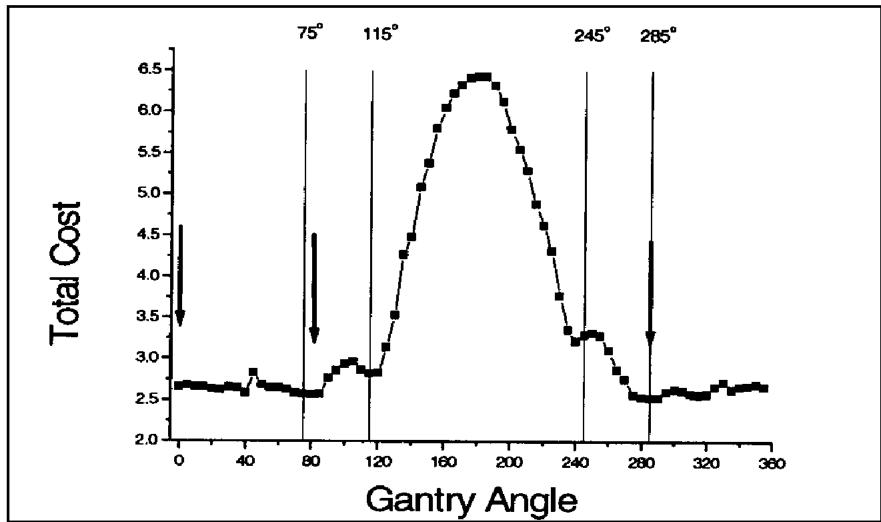  
Figure $\mathbf { 1 3 . 4 \ A }$ cost function vs. gantry angle plot with the allowed gantryangle-windows also displayed. The arrows show the optimal beam positions selected for the patient. (From Rowbottom et al., 1997)

# 13.2.4.5 Optimisation Using Simulated Annealing

Webb (1991; 1992) has favoured the use of simulated annealing (SA) in much of the work he has carried out in optimising treatment plans. In his 1991 paper he reports a technique for finding beam weights for fields defined by a multi-leaf collimator. Model problems simulating the overlap that exists between the prostate (PTV) and the rectum (OAR) were considered. The technique described relied on dividing each field into two, one "seeing" just the PTV and the other "seeing" both the PTV and the OAR. The optimisation then calculates two different sets of weights for each orientation of the MLC, one for the part "seeing" the PTV, the other for the part also "seeing" the OAR. Results on the three model problems described in the paper show significant advantage in using the optimisation of so-called part fields over conventional open-field treatment planning. However, the optimisation is computationally expensive, taking 1.7 hours of processor time on a DEC VAX 3900 for 40,000 iterations. The cost function (objective function) employed relies on setting target relative doses for each volume considered and minimising the difference between the prescribed and actual doses. This method has advantages and disadvantages. The controversy with cost functions based on TCP and NTCP are avoided and the prescription of desired dose is left to the operator. However, the choice of dose distribution affects the performance of the optimisation so that some experience inusing the system is required in order to gain the maximum benefit from it, and to prevent it from converging too slowly. In part ⅡI of his work (Webb, 1992), Webb considers 2-D modulation of the intensity of the fields. This time, each beam is considered as being made up of pixels each having uniform intensity but varying from one pixel to the next. The optimisation problem now becomes finding the optimum set of intensities for the all the pixels. Results showed improvements over the partial field technique described in part I, verifying the theoretical advantages of using intensity modulated beams. Computation time was slightly longer, approximately 3 hours on a DEC VAX 3900.

Oldham and Webb (1995) reported on a more clinically relevant system and compared its performance with that of human planners. The new system employed fast simulated annealing, modifications to the cost function and the beam model, resulting in a significantly faster system running on an IBM RISC 6000. The optimisation was limited to finding a set of uniform beam weights, the orientations having been selected a priori "by eye." With three fields the performance of the optimisation algorithm was similar to the human planners. With seven fields (equally spaced), the human planner experienced difficulty in finding a good solution but the optimisation algorithm was able to find better solutions than with the three-field plan although only four of the seven fields were effectively used. This latter result shows the advantage of using optimisation techniques over traditional forward planning even in the case where only simple, open fields are available. The authors report that the optimisation takes approximately 15 minutes to perform 40,000 iterations.

Mageras and Mohan (1993) also employ fast simulated annealing to search for an optimum set of beam weights from a search space of 54 non-coplanar beams. Their approach uses biological cost functions based on TCP and NTCP and is thus slower than the later paper of Webb, described above. Their results, like those of Webb, show that with a larger number of beams, it is possible to increase the prostate TCP without increasing the rectum NTCP.

# 13.4.2.6 Optimisation Using Other Techniques

Langer et al. (1996) compare the performance of fast simulated annealing with that of mixed integer programming (MIP) on the same optimisation tasks. The goal was to maximize the minimum tumour dose while keeping the dose in required fractions of normal organ volumes below a threshold for damage. Over 19 trials on six archived cases of abdominal tumours with varying numbers of beams, orientations and widths, the mixed integer approach was never found to be worse than that of simulated annealing. The mixed integer algorithm produced a minimum tumour dose that was at least 1.8 Gy higher than that produced by simulated annealing on seven of the trials. On average, MIP required 3.5 minutes to find a solution, compared with 145 minutes for simulated annealing. With the number of iterations reduced by a factor of 10 for simulated annealing, its performance deteriorated and it remained more than four times slower than mixed integer programming.

Genetic algorithms have also been employed for optimisation of treatment plans. Langer et al. (1996a) compare the solutions obtained by a genetic algorithm with those obtained by simulated annealing. They optimise up to 36 uniformly spaced co-planar beams with the objective of maximising the minimum tumour dose. They report that the genetic algorithm found solutions in an average of 49 minutes over 19 trials using a DEC station 5000/200 ULTRIX. They do not describe the degree to which the GA performed better than SA at meeting the objective for all the trials. Only one result is quoted in which the GA returned a minimum tumour dose 7 Gy higher than SA achieved.

# 13.3 Evolutionary Artificial Neural Networks

It has been recognised that by employing evolutionary strategies for finding optimal (or near-optimal) neural networks, better learning and generalisation can be achieved. A good recent review of evolutionary artificial neural networks (EANNs) is provided by Yao (1997). Yao states that evolution in this context can be performed at three different levels (or combinations of them). The first level is the evolution of the network weights (and thresholds), i.e., replacing a traditional learning algorithm such as backpropagation with an evolutionary algorithm. The second level is to evolve the network architecture or topology, possibly including the transfer functions of the nodes. The third level is to evolve the learning rule used to train the network. The latter could mean simply evolving the best set of parameter settings for the backpropagation algorithm or, more ambitiously, to evolve a whole new training method. While it is true that these three levels describe nearly all the work in EANNs, a paper by Cho and Cha (1996) reports a further level at which evolution can be employed in training neural networks, in which virtual training data is evolved. In the following, we briefly describe each of these techniques.

# 13.3.1 Evolving Network Weights

When training a feedforward neural network such as a multilayer perceptron, backpropagation is often employed. As stated previously, backpropagation is a local search method which performs approximate steepest gradient descent in the error space. It is thus susceptible to two inherent problems: it can get stuck in local minima  a problem which becomes heightened when the search space is particularly complex and multimodal, and it requires a differentiable error space to work efficiently. In addition, it has been found that backpropagation does not perform well with networks with more than two or three hidden layers (Bartlett & Downs, 1990). These problems and others have prompted research into employing evolutionary techniques to find the best set of network weights. EANNs have several obvious advantages over BP: genetic algorithms and evolutionary approaches are able to find global minima in complex, multimodal spaces, they do not require a differentiable error function and they are more flexible, allowing the fitness evaluation to be changed to take into account extra factors that are not easy to incorporate in the backpropagation algorithm.

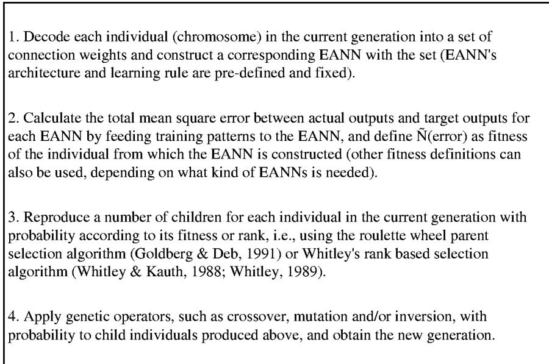  
Figure 13.5 A typical routine for evolution of connection weights. (From X. Yao, 1996.)

A typical evolutionary scheme for evolving connection weights is given in Figure 13.5. In order to evolve network weights in an EANN, some encoding method must be employed. There are two possibilities: binary encoding or real valued encoding. The former is problematic because either the bit strings become excessively long or very discrete values for each weight must be used. However, if a binary encoding does give sufficient resolution on a particular problem, it is relatively simple to implement the genetic algorithm because standard (canonical) operators can be used. With real-valued encodings, the strings are much more compact and allow almost continuous weights to be generated. With real-number chromosomes, however, non-standard operators must be developed. This can be an advantage because the operators used can be tailored to the problem of finding weights in a neural network or, even more specifically, to the particular problem at hand.

Montana and Davis (1989) used a neural network to perform texture characterization. The complexity of the search space caused backpropagation to continually get stuck in local minima far from the optimum solution. Thus, an EANN was developed, employing a real-valued encoding and several heuristic genetic operators, to solve the problem. The weights and thresholds in the network were encoded on the chromosome in a particular order to allow efficient use of the heuristic operators. To begin with, the weights on the chromosomes were initialised to random values taken from a two-sided exponential distribution function with a mean of 0.0 and an absolute value of 1.0, given by $e ^ { - \| x \| }$ . This is different from the usual initialisation employed in backpropagation  taking random numbers from a normal distribution. The double exponential reflects the observation that optimal solutions tend to contain predominantly weights with small absolute values but that they can have some weights with arbitrarily large absolute values. The different heuristic operators were then developed and tested. The operators fell into three categories: mutations, crossovers and hill-climbs. The authors compared the different operators with each other and then selected the best combination. The best combination was then compared with backpropagation: it continues to learn long after the BP algorithm has become trapped in a local minimum.

In other situations, EANNs are outperformed by backpropagation, especially fast variations of it such as simple adaptive momentum (Swanston et al., 1994) or conjugate gradient descent (Moller, 1993). However, it is possible to hybridise the search process in order to further accelerate learning or to increase the chances of finding a global minimum. This can be done by initially employing a genetic algorithm in order to sample the search space. Once a promising region has been found, fast backpropagation can take over to quickly converge to a solution. In theory, this method should be superior to random initialisation of the weights for backpropagation, but little work has been carried out to verify this hypothesis.

# 13.3.2 Evolving Network Architectures

Normally, when designing and training a neural network, different architectures must be tried before one that seems effective is found. Of course, there is no guarantee that the final architecture selected is the best possible one and for large problems this method becomes impractical. In addition, changes in other network parameters such as the learning algorithm or the number of epochs affect the best choice of architecture. This interdependence makes it extremely difficult to find optimal architectures for a given problem. EANNs which evolve network architectures can (partially) solve these problems.

2. Train each EANN with the decoded architecture by a pre-defined and fixed learning rule (but some parameters of the learning rule may be adaptive and learned during training), starting from different sets of random initial values of connection weights and, if any, learning rule parameters.

3. Calculate the fitness of each individual (encoded architecture) based on the above training results; e.g., based on the smallest total mean square error of training, or testing if more emphasis is laid on generalisation, the shortest training time, the architecture complexity (fewest nodes and connections and the like), etc.

4. Reproduce a number of children for each individual in the current generation with probability according to its fitness or rank.

5. Apply genetic operators, such as crossover, mutation and/or in-version, with probability to child individuals produced above, and obtain the new generation.

Figure 13.6 A typical cycle of the evolution of architectures. (From X. Yao, 996.)

Most EANNs for evolving architectures use either a constructive method in which nodes are added to an initially small network or a destructive method where an initially large network is pruned. A typical cycle for either method is given in Figure 13.6. Ya0 and Liu (1995; 1996; 1996a; 1996b) use a combination of both techniques in their EPNET algorithm which also evolves network weights. As with all genetic algorithms, the first stage in implementation is to decide upon a method for encoding the different possible members of the population, in this case network architectures. Direct encoding is the most obvious method; each link between nodes is encoded by either a 0 or a 1, depending on whether that link is part of the current network architecture or not. This method is obviously problematic for large networks because the chromosomes become increasingly cumbersome and always limit the size of the network. However, for small networks, encoding each connection can lead to interesting and unexpected architectures that would not normally be tried. For larger problems, an indirect method of encoding architectures is more suitable. Only important features are encoded such as the number of hidden layers, number of nodes in each layer and some information about connectedness. This method is much more compact than direct encoding but it does place some constraints on the patterns of connection that the EANN can investigte. Yip and Yu (1996) have used an indirect coding technique to evolve architectures for an EANN used to classify coffee by odour. An even more promising technique in evolving architectures is to encode developmental rules. Rather than evolving the architecture directly, the aim is to find the best set of rules for developing a good architecture. These rules are encoded, selected, combined and mutated in the normal way. This method is the most promising for large networks because the developmental rules do not need to grow with the size of the network. To find optimal architectures, some method of evaluating their fitness must be employed. The usual technique is to train each candidate network for a given number of epochs using BP or some other training algorithm and then calculate its mean training set error (or validation error). However, because there is great interdependence between architectures, training methods and number of epochs, it may be more profitable to only partially train each network before assigning fitness and making selections for reproduction. This is the method developed by Ya0 and Liu (1995; 1996a; 1996b).

# 13.3.3 Evolving Learning Rules

The rules used to train an EANN can also be evolved (see Figure 13.7). This can amount to adaptively adjusting BP parameters, or more ambitiously, to optimising the learning rule (weight update rule) itself. Hancock et al. (1991) have shown that another learning rule based on a thresholding function developed by Artola et al. performs better than the Hebbian learning rule which is commonly employed. However, little work has been carried out on evolving the learning rule itself due to the difficulty in encoding rules onto a chromosome. Some authors (Harp and Samad, 1991) have combined evolution of the BP parameters with the evolution of architectures by encoding them both on the same chromosome. An effect of such an encoding strategy is the further exploration of interactions between learning algorithms and architectures, so that an optimal combination of a BP algorithm and an architecture can be evolved.

4. Reproduce a number of children for each individual in the current generation with probability according to its fitness or rank.

5. Apply genetic operators, such as crossover, mutation and/or inversion, with probability to child individuals produced above, and obtain the new generation.

# 13.3.4 EPNet

Yao and Liu (1995; 1996a; 1996b) stress the difference between optimisation and learning in neural networks. Although optimisation techniques are usually employed to train neural networks, the real goal is not to find an optimal architecture and set of weights for producing an output with the least training set error. Real learning occurs only when the neural network has been trained so that it can generalise to new patterns taken from the same population as the training set but that were not contained in it. As was stated in Section 13.1, correct architecture has an important effect on the ability of a neural network to generalise. However, in an evolutionary strategy (EANN), further emphasis can be placed on the goal of generalisation. To do this, training of the members of a population on the training set is augmented by selection rules which take into account the ability of the networks to generalise. Yao and Liu also believe that architectures and weights should be evolved simultaneously if good generalisation is to result. Yao (1997) has developed a model for an EANN in which the three different levels of evolution all occur but at different timescales.

The evolution of weights occurs at the fastest timescale with the evolution of architectures on an intermediate timescale and learning rule evolution on the slowest timescale. This model has not yet been implemented. However, Yao and Liu (1995; 1996a; 1996b) have developed an algorithm called EPNet which combines the first two levels, weight evolution and architecture evolution. Networks with random initial architectures are partially trained using BP and evaluated. Evaluation and selection then occur based on the improvement in the error in generalization. Depending on the network which is selected for reproduction, simulated annealing may be used to update the weights in place of BP or the architecture may be pruned or grown. The partial training method removes, to some extent, the noise inherent in evaluating network architectures which have been trained from random initial weights. Yao and Liu do not use crossover in their evolution of architectures because of the difficulty in encoding them so that crossover samples the hyperplane in a meaningful way so that offspring have a good chance of being better than their parents. Instead, they employ reproduction from a single parent with the architecture being either pruned or grown. Pruning is always tried first so that a parsimonious network results. They report encouraging results on four different test problems with architectures which are smaller than usually needed to solve these problems.

With optimisation, we are only interested in the best or optimal solution and the rest of the population can be disregarded. However, with learning and generalisation as a goal, it is profitable to combine the information stored in the population as a whole. To combine the networks, Yao and Liu use several different mathematical techniques, including the recursive least squares algorithm. Their results show that an ensemble network made from combining a range of population members after training has been completed always outperforms the best member of the population on generalisation.

# 13.3.5 Addition of Virtual Samples

An interesting and unique piece of work by Cho and Cha (1996) describes a fourth method of employing evolutionary techniques to increasing the learning capabilities of a neural network. It relates to the information contained in the training set and how this affects the generalisation ability of the network. In many real-world applications, the training set available to train the network is prohibitively small and this adversely affects the generalisation performance of the network. Cho and Cha have developed a method for adding virtual training set examples to the initial training set. A population of networks is trained on the problem but at each generation, a fixed number of virtual samples are added to the training set. First, an area of the input space where training set examples are not present or sparse is chosen. Then the nearest neighbouring training set vectors to the centre of this area are computed. One of the nearest neighbours is then chosen at random and the network which learned this vector best is selected. If it learned well enough a new vitual input vector some fixed distance from the training set example is generated and the best network is then presented with the new input vector. The output of the network becomes the new target value for the virtual input vector. The virtual input and target are added to the rest of the training set. If the best network had not learned well enough on the nearest neighbouring training vector to the part of the input space chosen, then a new part of the space is selected. This is to avoid generating unreliable training examples. The authors report that their method is a first attempt at generating new sample points and that further investigation is necessary to improve the algorithm, specifically to further safeguard against generating unreliable examples.

However, this idea is an interesting one because in some applications (including my own), the collection of data with which to train the network is very timeconsuming, and at times not possible.

# 13.3.6 Summary

Each of the methods described above is of interest as regards evolving neural networks for the radiotherapy treatment planning problem. In this study, since generalisation is of the greatest importance in producing reliable treatment plans for patients that are different to those cases contained in the training set, those methods which produce better generalisation performance are particularly important. However, a further important factor is the platform requirements of such a system, since live applications in radiotherapy treatment clinics are likely to have little more available than an old PC. Taking such considerations into account, the work reported on here followed the seminal work of Montana and Davis for evolving weights and thresholds using heuristic operators on a realvalued encoding. As we will see, this proved to be efficient, and very fruitful at increasing the generalisation performance of the neural network.

# 13.4 Radiotherapy Treatment Planning with EANNs

# 13.4.1 The Backpropogation ANN for Treatment Planning

The use of artificial neural networks (ANNs) for radiotherapy planning (RTP) was first described in Knowles (1997), using a modified backpropogation training algorithm. Here we provide an overview of that work, before going on to describe the subsequent work on evolutionary algoirthm-based training.

In cooperation with Jane Lord (principal physicist at the Radiation Physics Department of Royal Berkshire Hospital, Reading, UK), suitable input data and target treatment plan parameters for a neural network were decided as follows. We considered a common treatment setup for abdominal and prostate cancers in which treatment is performed by a machine which has three radiation beams. These are the three indicated previously in Figure 13.1, and also indicated in figure 13.8. Planning treatment in this scenario involves first aiming each beam directly at the centre of the tumour. Beam 1, the anterior beam, is fixed in position; but beams 2 and 3 are free to be repositioned within certain constraints, as long as their aim remains directly at the centre of the tumour. Once positions have thus been chosen for beams 2 and 3 (see Figure 13.8), it remains to decide the so-called beam weights for each of the three beams, and the wedge positions (see Figure 13.1). Beam weight is simply the length of time for which a particular beam is switched on. The wedge positions, as mentioned previously, affect the degree of attenuation of the dose across the beam's width.

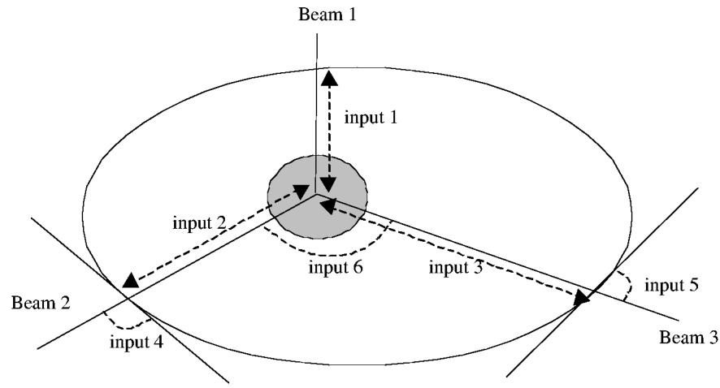  
Figure 13.8 Input measurements taken from a patient's CT-scan for input to the neural network. Inputs 1, 2, and 3 are lengths and inputs 4, 5, and 6 are angles

It was decided that an ideal role for the neural network would be to produce suitable beam weights and wedge positions, following the manual positioning of beams 1 and 2. The inputs to the neural network were measurements taken from the patient's CT-scan with beam positions imposed, as illustrated in Figure 13.8. Each input is a measurement simply obtained from the CT-scan. The key coordinates involved are the so-called "axis," which is the centre of the tumour region (shaded in figure 13.8), and the entry points into the patient of the three radiation beams. Inputs 1, 2, and 3 are respectively the skin-to-axis distances for beams 1, 2 and 3. Inputs 4 and 5 are respectively the angles between the beam and skin normal for beams 2 and 3, and input 6 is the angle between beams 2 and 3 themselves. The seventh, and last, input simply indicated whether the cancer type was prostate, rectum, or bladder.

A neural network was set up with the architecture shown in Figure 13.9. It was trained using 20 treatment plans collected from the Royal Berkshire Hospital for several patients and its generalisation performance was monitored during training by observing the error on the validation set (5 of the 20 plans).

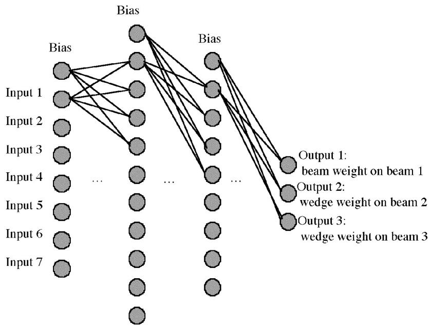  
Figure 13.9 Neural network architecture showing inputs and outputs (some connection lines are not shown)

The resulting trained network was of the system was tested on a separate set of ten patients, and the plans (beam weights and wedge positions) produced by the neural network were compared with plans independently produced by trained clinicians and evaluated by the head radiotherapist. Evaluation of the resulting treatment plans was done by generating the resultant dose distribution using the hospital's treatment planning software, and each dose distribution produced by the neural network on the test set was qualitatively graded by the head radiotherapist. In this way, $7 7 \%$ of the plans produced by the neural network were given grade A, meaning that they needed no adjustment to be clinically used. $100 \%$ of the plans gave treatment plans which were within the guidelines set out by the International Commission on Radiation Therapy Units and Measurements (ICRU, 1993) for acceptable treatment plans. Following this work, we also experimented with a technique for accelerating the learning called called Simple Adaptive Momentum (SAM) (Swanston et al., 1994). This was found to halve the network's training time without compromising the results.

The techniques used and results obtained by this system were encouraging; however, several areas for development were identified. In particular, generalisation performance was considered the key factor, and we therefore explored the use of evolutionary algorithm trained neural networks to see if this resulted in improved generalisation.

# 13.4.2 Development of an EANN

Several Evolutionary Artificial Neural Networks (EANNs) were developed with the aim of comparing the performance of genetic algorithms at finding neural network connection weights with that of backpropagation. Using the same architecture that was used in the original MLP and the MLP incorporating SAM, genetic algorithms for optimising the network weights were developed.

The 195 weights and thresholds of the neural network were encoded as a chromosome in the way illustrated by Figure 13.10. A real-valued encoding was used for simplicity and because it allows easier implementation of heurisitic genetic operators.

A typical cycle of the evolution of connection weights has been given in Figure 13.5. As a first attempt, an algorithm with the following features was written:

Chromosome encoding: 195 floating point genes, each representing a network weight or threshold Population size: 50 chromosomes   
√ Weight initialisation: Random values taken from a Normal Probability Distribution with a mean of 0.0 and standard deviation of 1.0 (as for the backprop algorithm).   
• Creation of new generation: Generational Replacement   
• Fitness assignment: (Worst summed squared error on training set - summed squared error on training set)   
• Selection operator: Tournament Selection (Goldberg, 1990; Goldberg and Deb, 1991)   
• Crossover rate: $100 \%$   
• Crossover operator: Two point crossover generating one child   
• Mutation rate: $1 \%$ of genes in all new chromosomes   
• Mutation operator: Current value changed by random value in the range -0.5 to $+ 0 . 5$

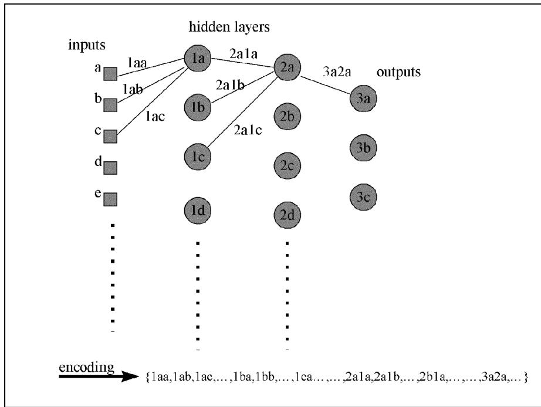  
Figure 13.10 Encoding of the connection weights on a chromosome

This algorithm resulted in very slow training and converged to a poor training set error. The suspected reason for the poor performance was the method of updating each generation used, i.e., generational replacement. This required the calculation of the error and the assignment of fitness for a whole generation of (50) chromosomes, many of which were worse than in the previous generation or were duplicates thereof. Because calculating the summed error is by far the most computationally intensive part of the algorithm, the generational replacement scheme is inefficient in this application.

In order to overcome this problem, a "steady-state without duplicates, replace worst" GA was investigated next (Davis, 1991; Syswerda, 1991). With the same operators as in the previous algorithm, the steady-state GA was far faster because only the error produced by the new gene required calculation, the errors relating to the rest of the population being already known. However, this algorithm still converged to a very poor training set error.

Montana and Davis (Montana and Davis, 1989) have developed seminal genetic algorithm methods and operators specifically for the evolution of neural network weights. These methods and operators were employed next. The weight initialisation was changed from the normal probability distribution to the twosided exponential distribution favoured by Davis. The two point crossover operator was replaced by the Crossover Nodes operator. Crossover Nodes works by selecting one or more neural network nodes in one of the two parent chromosomes undergoing reproduction. All the weights and the threshold ingoing to that node are then replaced by the corresponding weights and threshold in the corresponding node in the other parent chromosome. This operator is thought to work well because it preserves the synergism between various weights in the network, never breaking the logical subgroup of weights ingoing to a node. Finally, the Random Mutate operator was replaced by the Mutate Nodes operator. Mutate Nodes, like Crossover Nodes, preserves logical subgroups. It does this by mutating only the weights ingoing to a particular node, leaving other weights alone. The mutation itself adds a value taken from the initial double exponential distribution to the weight's current value. In both, the Crossover Nodes and Mutate Nodes operators, the number of nodes that are selected for change is variable. Experimentation with the parameter choices for these and for the crossover and mutate rates was undertaken to find the best settings.

It was found that the EANN employing the initialisation and operators described above could reach a much lower training set error than the previous algorithm tried. However, at this stage, a means of assessing its ability to generalise had not been included. To remedy this, implementation of a means of calculating the validation set error was included. As with the backpropagation algorithm, the validation set error could then be monitored during training to determine the best time to stop the EANN.

Once the means of calculating the validation error was included in the EANN, it was observed that on some occasions this error did not seem to increase (unlike the backprop-trained ANN) as it was trained for more and more generations. This led to a hypothesis that the EANN could have the potential to improve upon the generalisation ability shown by the MLP employing either standard backpropagation or SAM.

At this stage, however, the EANN was not able to match the low training set error achieved using SAM. In order to compare their generalisation performance, it was necessary to make further improvements to the EANN. It was found that by reducing the magnitude of the mutations generated by the mutate operator to approximately one fifth of their original size, faster learning and lower errors were achievced. A further discovery was that greater diversity in the early stages of learning, which effectively slows down the reduction in training set error, leads to a lower validation error and therefore better generalisation. To take advantage of this, the tournament selection criterion was changed so that the better of two genes competing to be parents only has a slightly higher probability of being selected than its rival. Further methods of ensuring diversity were also devised. These included the following: (1) increasing the mutate rate over time; (2) randomly selecting a simple two point crossover operator to be used in place of the Montana and Davis crossover nodes operator described above; (3) increasing the probability of selecting the less fit of two potential parents over time. To ensure that these methods were kept under control, a further technique was employed. After a number of new generations, the mutation rate is cut to zero and the selection criteria reverts to a normal, strict selection of the best gene from a tournament of three or more genes. This set of parameters remains for a small number of generations and has the effect of "weeding out" the bad genes that have remained in the population under the less competitive regime. Following this period, the parameters return to their original values to allow diversity again. This cycle is repeated several times during training. The periods of weeding out bad genes has been dubbed "killer periods." Inclusion of these techniques led to training set errors as low as those achieved using SAM. The final GA parameter choices were as follows:

• Chromosome encoding: 195 floating point genes, each representing a network weight or threshold   
D Population size: 50   
• Replacement method: Steady state, 1 child per generation, replace worst Chromosome initialisation: Random values from a probability distribution of the form $\mathrm { e } ^ { \mathrm { - } \| \mathrm { x } \| }$ , a two-sided exponential distribution with a mean of 0.0 and a mean absolute value of 1.0 Selection method: Tournament between two chromosomes with a probability of O.6 of the fitter chromosome being selected. During "killer periods," this changes to a tournament between three or more genes with a probability of 1.0 of the fittest gene being selected   
√ Mutate rate: $70 \%$ , increasing to $9 5 \%$ during training run; no mutations occur during "killer periods"   
• Mutate operator: Mutate nodes (Montana and Davis 1989); all genes relating to two neural net nodes changed by random amounts generated from initialisation distribution but scaled by 1/(4.5).   
• Crossover rate: $30 \%$ , reducing to $5 \%$ during training run; $100 \%$ during "killer periods."   
• Crossover operator: Crossover nodes (Montana and Davis 1989); all genes relating to two neural network nodes crossed over, interspersed with $20 \%$ use

of standard two point crossover operator; during "killer periods," no two point crossover is used

In all of the EANNs developed, the means of evaluating each chromosome was the same. The summed squared error of all the outputs on all the plans in the training set was calculated for each new chromosome generated. Because tournament selection was being employed, an explicit fitness did not need to be calculated: the chromosome with the smallest summed error was simply judged to be the "winner" in each tournament. However, this method of evaluating chromosomes is not ideal. Several observations made while training and testing the EANNs indicate that summed squared error on the neural network outputs is not a good means of judging what the neural network performance on the treatment planning task will actually be like. These observations are listed below:

1. Many of the neural networks developed and tested produced treatment plan parameter values that differed greatly from the values employed by the hospital in their treatment plans. Despite this, when the parameter values produced by these neural networks were keyed into the hospital's planning computer, a good treatment plan resulted.   
2.Sets of parameter values which turned out to be good usually exhibited a similar relationship to those determined by the hospital. That is, if one parameter value was higher than that determined by the hospital, then the values of the other parameters were also higher.   
3.According to neural network theory, training of the network should be terminated when the minimum validation error is reached. However, it was observed that better performance resulted when the training set error was reduced to below 0.08, even if this caused a slight increase in validation error. This, it is hypothesised, is because with further training the neural network seems to learn to copy the relationship between the output parameter values. Learning this does not, however, show up when the individual errors on each output are being used as the sole measure of performance.

From these observations, it was clear that a better method of evaluating chromosomes would have been to use an error function which incorporated some means of judging relationships between parameter values. To do this effectively, however, would have required more data and access to the RBH planning computers, in order that the error function could be made to correlate actual EANN performance on planning tasks with the error being assigned to the chromosomes. In the case of the breast cancer treatment planning system (see Section 13.4.4), a simple means of incorporating the relationship between output parameter values was developed and this resulted in better performance.

# 13.4.3 EANN Results

The final version of the EANN is significantly slower than the SAM algorithm. The mean time to train the EANN to a summed training set error of 0.09 on 20 plans with five as validation data only, is about 24 seconds, averaged over ten runs, as illustrated in table 13.1.

Table 13.1 Summary of EANN training times   

<table><tr><td rowspan=1 colspan=1></td><td rowspan=1 colspan=1>EANN</td></tr><tr><td rowspan=1 colspan=1>Number of Runs</td><td rowspan=1 colspan=1>10</td></tr><tr><td rowspan=1 colspan=1>Size of Training Set</td><td rowspan=1 colspan=1>20 plans</td></tr><tr><td rowspan=1 colspan=1>Final Training Set Error</td><td rowspan=1 colspan=1>0.09</td></tr><tr><td rowspan=1 colspan=1>Mean Time for Training</td><td rowspan=1 colspan=1>23.95s ± 7.458s (at 95% confidence level)</td></tr><tr><td rowspan=1 colspan=1>Standard Deviation in Training Time</td><td rowspan=1 colspan=1>12.03s</td></tr></table>

However, the EANN exhibits significantly better generalisation performance than the SAM algorithm. Figure 13.11 depicts one run of the EANN, and shows how the summed training set error and summed validation set error change as the network is trained. Figure 13.12 depicts the same information for a run of the SAM algorithm. These two graphs are both typical and characteristic of the repective training methods. In the graph depicting a run of the EANN, all the values of the summed training set error and of the summed validation set error are plotted for all chromosomes which have a summed training set error within $10 \%$ of the best chromosome evolved so far. This method of plotting points was chosen to ensure that a true representation of the EANN's generalisation performance was presented. (If only the chromosomes with low validation set error are plotted, the graphs do not represent the true ability of the EANN to generalise. This is because the network weights which happen to be good on the particular data in the validation set are being selected, giving a falsely optimistic view of the generalisation performance of the network on any unseen data. The method used here avoids this by plotting all chromosomes of a particular training set error, regardless of their quality on the validation set.

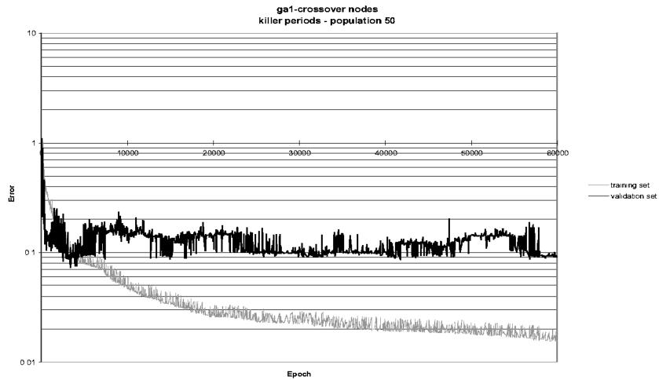  
Figure 13.11 A plot of training set error and validation set error against generation for the EANN

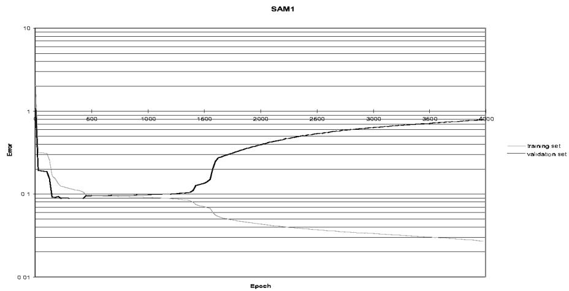  
Figure 13.12 A plot of training set error and validation set error against epoch for SAM

These graphs show that with the SAM algorithm, the summed validation set error increases monotonically as the summed training set error falls below about 0.1, whereas with the EANN the summed validation set error does not show such a tendency to rise as training continues to reduce the summed training set error. The result is that at low training set errors of below 0.05, the validation set error of the EANN has not increased greatly and hence the network's ability to generalise has not been compromised by the further training. In contrast, training the SAM algorithm down to a summed training set error of 0.05 results in a large increase in the summed validation set error, thereby compromising generalisation performance. Training the EANN for 60,000 generations is usually sufficient for the summed training set error to have levelled off. The time to train the EANN for 60,000 generations with a training set of 30 prostate plans, using ten as validation data only, is approximately 300 seconds. This is about one order of magnitude longer than is required to train the neural net to the optimimum point using the SAM algorithm. However, the optimum point with the SAM algorithm is just after the summed validation set error has begun to rise, when the summed training set error is at about 0.08. With the EANN, training can continue indefinitely without much detriment to the generalisation performance and hence summed training set errors of as low as 0.02 can be achieved.

In order to present a statisitical comparison of the EANN with the SAM algorithm, data from 20 runs of each program were recorded. In the following statistical analysis, the quoted validation error for the EANN at any particular training set error is the approximate mean at that training set error, as judged from the graph. This is to avoid biasing the results towards the EA trained network, whose validation error fluctuates at any given training set error. The quoted training set errors are approximate. The closest point to each value, from the data gathered, has been used. This does not affect the outcome of the results and the difference between any training set error quoted and the actual value is never more than 0.003. The sample mean validation set error (over the 20 runs) and confidence thereof were calculated for training set errors of 0.09, 0.08, 0.07, 0.06 and 0.05, for both training methods (see Table 13.2). The change in validation set error over the period when the training set error fell from 0.09 to 0.05 was then calculated for all the runs. From this data, the sample mean change in validation set error and confidence thereof was calculated for both training methods (see Table 13.3). The results given below show that the sample mean increase in validation set error over this period is between 1.84 and 18.0 times lower for the evolutionary trained network as for the backpropagation trained network (at a confidence level of $9 5 \%$ ).

Table 13.2 Comparison of SAM and EANN generalisation performance   

<table><tr><td rowspan=1 colspan=1></td><td rowspan=1 colspan=1>EANN</td><td rowspan=1 colspan=1>SAM</td></tr><tr><td rowspan=1 colspan=1>Mean validation error at training set error of 0.09</td><td rowspan=1 colspan=1>0.1419</td><td rowspan=1 colspan=1>0.08974</td></tr><tr><td rowspan=1 colspan=1>SD</td><td rowspan=1 colspan=1>0.06344</td><td rowspan=1 colspan=1>0.004651</td></tr><tr><td rowspan=1 colspan=1>95% Confidence Level</td><td rowspan=1 colspan=1>0.02780</td><td rowspan=1 colspan=1>0.002038</td></tr></table>

<table><tr><td rowspan=1 colspan=1>Mean validation error at training set error of 0.08</td><td rowspan=1 colspan=1>0.1533</td><td rowspan=1 colspan=1>0.1013</td></tr><tr><td rowspan=1 colspan=1>SD</td><td rowspan=1 colspan=1>0.1072</td><td rowspan=1 colspan=1>0.005652</td></tr><tr><td rowspan=1 colspan=1>95% Confidence Level</td><td rowspan=1 colspan=1>0.04696</td><td rowspan=1 colspan=1>0.002477</td></tr></table>

<table><tr><td rowspan=1 colspan=1>Mean validation error at training set error of 0.07</td><td rowspan=1 colspan=1>0.1810</td><td rowspan=1 colspan=1>0.1257</td></tr><tr><td rowspan=1 colspan=1>SD</td><td rowspan=1 colspan=1>0.1049</td><td rowspan=1 colspan=1>0.01830</td></tr><tr><td rowspan=1 colspan=1>95% Confidence Level</td><td rowspan=1 colspan=1>0.04597</td><td rowspan=1 colspan=1>0.008453</td></tr></table>

<table><tr><td rowspan=1 colspan=1>Mean validation error at training set error of 0.06</td><td rowspan=1 colspan=1>0.1834</td><td rowspan=1 colspan=1>0.1678</td></tr><tr><td rowspan=1 colspan=1>SD</td><td rowspan=1 colspan=1>0.1201</td><td rowspan=1 colspan=1>0.03092</td></tr><tr><td rowspan=1 colspan=1>95% Confidence Level</td><td rowspan=1 colspan=1>0.05262</td><td rowspan=1 colspan=1>0.01429</td></tr></table>

Table 13.3 Summary of EANN and SAM generalisation performance   

<table><tr><td rowspan=1 colspan=1>Mean validation error at training set error of 0.05</td><td rowspan=1 colspan=1>0.1818</td><td rowspan=1 colspan=1>0.2432</td></tr><tr><td rowspan=1 colspan=1>SD</td><td rowspan=1 colspan=1>0.1175</td><td rowspan=1 colspan=1>0.05833</td></tr><tr><td rowspan=1 colspan=1>95% Confidence Level</td><td rowspan=1 colspan=1>0.05151</td><td rowspan=1 colspan=1>0.02694</td></tr></table>

<table><tr><td rowspan=1 colspan=1></td><td rowspan=1 colspan=1>EANN</td><td rowspan=1 colspan=1>SAM</td></tr><tr><td rowspan=1 colspan=1>Mean change in validation set error as training seterror decreases from 0.09 to 0.05</td><td rowspan=1 colspan=1>+0.03988</td><td rowspan=1 colspan=1>+0.1537</td></tr><tr><td rowspan=1 colspan=1>SD</td><td rowspan=1 colspan=1>0.06825</td><td rowspan=1 colspan=1>0.05477</td></tr><tr><td rowspan=1 colspan=1>95% Confidence Level</td><td rowspan=1 colspan=1>0.02991</td><td rowspan=1 colspan=1>0.02530</td></tr></table>

A t-test was performed on the above data. The t-value obtained was 5.628, indicating that the increase in validation set error as training set error is reduced, is significantly less  at the $9 9 \%$ confidence level  in the EANN than in SAM. (For $9 9 \%$ confidence, $\mathrm { t } \geq 2 . 3 2 6 )$

It can be seen that the neural network trained using SAM has a lower mean validation error for training set errors of 0.06 and above. However, as can be seen from the standard deviation from each mean, the EANN's validation errors vary far more than those of the backpropagation trained network. This means that the best results of the EANN are better than the best results of the SAM trained networks, even at this level of training set error (see Table 13.4).

Table 13.4 Best validation set errors at various training set errors for EANN and SAM   

<table><tr><td rowspan=1 colspan=1></td><td rowspan=1 colspan=1>EANN</td><td rowspan=1 colspan=1>SAM</td></tr><tr><td rowspan=1 colspan=1>Best validation set error for training set error of 0.09</td><td rowspan=1 colspan=1>0.08696</td><td rowspan=1 colspan=1>0.8461</td></tr><tr><td rowspan=1 colspan=1>Best validation set error for training set error of 0.08</td><td rowspan=1 colspan=1>0.09163</td><td rowspan=1 colspan=1>0.09321</td></tr><tr><td rowspan=1 colspan=1>Best validation set error for training set error of 0.07</td><td rowspan=1 colspan=1>0.08172</td><td rowspan=1 colspan=1>0.1071</td></tr><tr><td rowspan=1 colspan=1>Best validation set error for training set error of 0.06</td><td rowspan=1 colspan=1>0.08383</td><td rowspan=1 colspan=1>0.1321</td></tr></table>

Since it is common practice to choose the best network from a number of runs, these results again underline the better performance that can be obtained from the EANN.

Table 13.5 Best validation set errors at various low training set errors for EANN and SAM   

<table><tr><td rowspan=1 colspan=1></td><td rowspan=1 colspan=1>EANN</td><td rowspan=1 colspan=1>SAM</td></tr><tr><td rowspan=1 colspan=1>Best validation set error for training set error of 0.05</td><td rowspan=1 colspan=1>0.08742</td><td rowspan=1 colspan=1>0.2124</td></tr><tr><td rowspan=1 colspan=1>Best validation set error for training set error of 0.04</td><td rowspan=1 colspan=1>0.1425</td><td rowspan=1 colspan=1>0.2673</td></tr><tr><td rowspan=1 colspan=1>Best validation set error for training set error of 0.03</td><td rowspan=1 colspan=1>0.1167</td><td rowspan=1 colspan=1>0.3237</td></tr><tr><td rowspan=1 colspan=1>Best validation set error for training set error of 0.02</td><td rowspan=1 colspan=1>0.09819</td><td rowspan=1 colspan=1>0.5024</td></tr></table>

At training set errors of 0.05 and below, the EANN has a far lower mean validation set error, as highlighted by Table 13.5. On the best runs of the EANN, the validation error is of the order of five times as small as the validation errors achieved by the best SAM trained network at a training set error of 0.02.

It was not deemed necessary or useful to calculate mean values for the above data since neither network reaches training errors this low very frequently. When they do, the SAM trained network's validation error is consistently high whereas the EANN's validation error varies considerably from run to run. It is sufficient here to show that the EANN's best validation error is far lower than that of the SAM trained network from the five or six runs which happened to reach this low level of training set error.

We can imagine two explanations as to why the evolutionary method of training the neural network leads to better generalisation performance than the method based on backpropagation of errors. First, the EANN starts with a population of points in the search space, and through sampling these it finds areas of the space which are promising. In the early stages of the run, many hyperplanes are sampled and so those areas which are likely to give a close approximation the general desired mapping have a good chance of being found. The more slowly the population converges in the early stages of the run, the more likely the algorithm is to find these generally good areas because it has more chance to sample more of the space. This is why it was found that slowing down the algorithm in the early stages by reducing the selection pressure leads to better generalisation performance. With the backpropagation algorithm, optimisation begins from a single random point in the search space. This point is highly unlikely (given the search space has 195 dimensions) to be one which is in a generally good area of the search space. From this point, however, it is usually possible, by performing gradient descent, to reduce the error for the particular examples in the training set. In fact, training for a long time on the training set can actually induce the neural network to learn the particular training examples and their target outputs so that a very good mapping is achieved on the training set (Haykin, 1994, pp.176-179). But, because the starting point was probably not in a good part of the search space for performing the general mapping which is desired and because any learning from the start point is achieved through gradient descent, it is unlikely that a very good general mapping will be found. Second, when the evolutionary algorithm is running, it is possible for it to evolve almost any possible combination of network weights and thresholds because of the randomised nature with which it generates new candidate chromosomes. This is not the case with the backpropagation algorithm which is completely deterministic after the random initialisation. Every time the patterns have been passed through the network and the summed training error has been calculated, all the weights in the network are updated. This means that from any given point in the search space, only one point (differing in every neural network weight) can possibly be tried next. Thus, many points which lie nearby the current point and which may offer better generalisation performance can never be found.

The results and discussion presented above indicate the performance advantages achieved by using an EANN when judged by the summed errors on the training and validation sets. However, the performance of the system at producing accurate treatment plans is of greater importance than the above statistical analysis. To test the EANN's ability to produce treatment plans, the following method was employed:

1. Measurements from an unseen CT-scan of a prostate cancer case were taken   
2. These measurements were then placed on the inputs of the EANN   
3.The resultant output parameters generated by the EANN were keyed into the hospital's forward planning computer   
4. The dose distribution was observed and compared with the dose distribution of the hospital's original treatment plan   
5. Two dose-volume histograms comparing the hospital's plan and the EANN's plan were produced

Ten plans were produced. In all cases, the dose distribution fell within the guidelines of the ICRU. The dose-volume histograms produced showed that the EANN learnt to emulate human planners in their choice of treatment plan parameters with high precision.

# 13.4.4 Breast Cancer Treatment Planning

Treatment plans for breast cancer differ from those of abdominal cancers in a number of different ways. In abdominal cancers, the target volume is restricted to the gross tumour volume plus a margin, whereas in breast treatments the target is the breast as a whole. Two beams only are used and the arrangement is such that the two beams are tangential to the chest wall. The major problem to overcome in planning breast treatments is to obtain a homogeneous distribution of dose over the volume of the breast, in contrast to abdominal cancers where the major problem is avoiding irradiation of organs at risk which lie near the target volume. The shape and position of the target volume in abdominal cancers such as the prostate does not differ greatly from patient to patient. In breast cancer, the shape and size of the target differs greatly from patient to patient, for obvious reasons. In breast treatments there are only four parameters to determine the values of: the weight of each beam and the weight of the wedge on each beam. In the vast majority of cases, the former are both set to one and the problem becomes one of adjusting the two wedges so that a uniform distribution of dose in the breast tissue results. If too little wedge is employed, dose will be concentrated at the top of the breast. With too much wedge, the concentration of dose falls to the lower edges of the breast.

In order to develop a neural network system for determining the values of the two wedge weights in the treatment plan, it was first necessary to decide upon features of the patient that the system could correlate with the wedge weights to be employed. By observing several treatment plans and through discussion with Jane

Lord, it was decided that the angle between the skin normal and the beam, for each beam, would be used as inputs to the neural network, together with the skin to isocentre distance for each beam. They are easy to measure from the CT-scan of the patient and could be measured by a computer program in a commercial system. Although these four parameters do give some information about the size and shape of the breast to be treated, it was expected that further features, such as the calculation of moments, may need to be added in order for the neural network to correlate the features with the wedge angles to be employed. However, just data on these four features from 20 breast plans was collected to begin with.

The EANN which had been developed for prostate cancer treatment planning was used as a basis to begin developing the breast cancer planning system. The number of neural network inputs was changed to four, one for each of the features described above. The number of outputs was changed to two, one output for the value of each wedge weight. The remainder of the architecture was left unchanged from that used in the prostate planning system. As before, the data set was split into a training set and a validation set. The network was then trained using the same operators as for the final EANN described in Section 13.4.2.

As had been expected, the EANN had great difficulty in learning to map the input vector of the data onto the target values of the output vector (representing the two wedge weights). The mean squared errors on both the training set and the validation set remained at an unacceptably high level. This was confirmed by observing the actual output values that the neural network was generating and comparing these with the wedge weights that had been selected by the human planner. Initially, it was suspected that there was insufficient information in the input vector for the neural network to learn to generate wedge angles that agreed with those determined by the human planner. However, before adding more features to the input vector, which would have meant devising new metrics for measuring breast shape and size, two methods for improving the EANN's performance on the current task were investigated.

First, it was noted that the EANN was having difficulty in learning to produce two wedge weights that were of different values. The two outputs it produced were usually very close in magnitude. This was in contrast to the target values on some of the training set plans, where significantly different degrees of wedge had been employed on the two beams. To overcome this problem, a third target value the scaled difference between target one and target two  was calculated for each of the training set plans. Then, a third output neuron was added to the neural network and this neuron was trained to match the third target value. By explicitly training the neural network to match the difference between the two target values, it was hoped that it would generate wedge weights that were closer to those produced by the human planner. Testing of the new EANN resulted in some encouraging results: it began to match the difference between the two target values and hence the wedge weights it generated seemed to be more like those produced by the human planner. However, the summed squared errors remained too high, indicating that it was still having trouble matching the target values closely. It was suspected that the mapping from the feature vector to the output vector which the neural network was being trained to perform for breast cancer plans was more complicated than the mapping it had learned for prostate plans. If this was the case, a larger number of nodes in the hidden layers would be necessary. This was the next strategy tried. Two extra nodes were added to both hidden layers of neurons and the EANN was retrained on the data set. The performance improved dramatically, reaching a lower mean squared error on both the training and validation sets. When the actual output values were observed and compared with the target values, it was evident the EANN could now map most of the input vectors in the data set onto wedge weights which were close to the weights arrived at by the human planner.

Testing of the system at the hospital was carried out in the same way as for the EANN which generated prostate treatment plans. New, unseen CT-scans were used from which the relevant features were measured. Each feature vector was then placed on the EANN's inputs and the resultant wedge angles were keyed into the hospital's planning computer. The dose distributions resulting from these wedge weights were then observed and compared with those arrived at by human planners. Ten such plans were produced and qualitative results of these are shown in Table 13.6. It is evident from these results that an EANN could be a useful tool for generating breast cancer treatment plans, as was the case for prostate treatment plans. Table 13.6 qualitatively summarises all of the ten plans produced by the EANN. The qualitative grade given to each plan is based on the following grading system:

Grade A  The plan would be acceptable for use by the hospital and it is as good or better than the human developed plan with which it was compared.

Grade B  The plan was within documented guidelines for an acceptable plan but it was not judged to be as good as the human developed plan with which it was compared.

Grade C  The plan was unacceptable, resulting in a poor dose distribution.

The plans were judged by Jane Lord, principal physicist at RBH. Although the results are good and the system could be used in its current configuration, extra features from the CT-scans may enhance the performance further. At present, the system generates the wedge angles from just four simple CT-scan features. More information about the shape of the target volume may lead to more accurate and consistent treatment plans.

Table 13.6 Summary of breast cancer treatment plans produced by the EANN   

<table><tr><td rowspan=1 colspan=1>PlanNumber</td><td rowspan=1 colspan=1>Grade</td><td rowspan=1 colspan=1>Comments</td></tr><tr><td rowspan=1 colspan=1>1</td><td rowspan=1 colspan=1>A</td><td rowspan=1 colspan=1>Better than hospital&#x27;s plan</td></tr><tr><td rowspan=1 colspan=1>2</td><td rowspan=1 colspan=1>B</td><td rowspan=1 colspan=1>Insufficient wedge employed</td></tr><tr><td rowspan=1 colspan=1>3</td><td rowspan=1 colspan=1>A</td><td></td></tr><tr><td rowspan=1 colspan=1>4</td><td rowspan=1 colspan=1>A</td><td></td></tr><tr><td rowspan=1 colspan=1>5</td><td rowspan=1 colspan=1>C</td><td rowspan=1 colspan=1>Too much wedge. The target volume was beyond that which theEANN had trained on.</td></tr><tr><td rowspan=1 colspan=1>6</td><td rowspan=1 colspan=1>A</td><td></td></tr><tr><td rowspan=1 colspan=1>7</td><td rowspan=1 colspan=1>B</td><td rowspan=1 colspan=1>Insufficient wedge employed</td></tr><tr><td rowspan=1 colspan=1>8</td><td rowspan=1 colspan=1>A</td><td></td></tr><tr><td rowspan=1 colspan=1>9</td><td rowspan=1 colspan=1>A</td><td></td></tr><tr><td rowspan=1 colspan=1>10</td><td rowspan=1 colspan=1>A</td><td rowspan=1 colspan=1>Better than hospital&#x27;s plan</td></tr></table>

# 13.5 Summary

A neural network system for generating radiation therapy treatment plans was developed which employed the standard backpropagation learning rule and was trained on 42 cases of abdominal cancers. The system was tested on 22 unseen CT-scans of patients suffering from abdominal cancers. The treatment plans it generated matched the quality of human-generated treatment plans in $7 7 \%$ of the test cases. The system required seven numbers to be entered, easily identified from the CT data, and produced the treatment plan parameters instantly. This is in contrast to the optimisation techniques developed by other researchers, where more information must be given to the system and the time to generate a treatment plan is measured in minutes. As a great deal of research is being carried out at present with the aim of developing the next generation of Radiation Therapy Treatment Planning systems, novel methods such as the use of ANNs, which can improve on current techniques, do have commercial potential.

Research into the use of evolutionary techniques was then carried out and an EANN, based on the system above, was developed. By employing a genetic algorithm to optimise the network weights and thresholds, it was hoped that the accuracy of the system could be improved. After the development of several versions, a method based upon the work of Montana and Davis (1989) was implemented. This EANN exhibited better generalisation capabilities than the SAM system. With further alterations, based on observing the EANN's characterisitics during the learning process, the overall performance was further enhanced. Graphs showing the mean squared error on the training set and on the validation set were produced for 20 runs of both the EANN and the SAM network. Statisitical techniques were used to show that the EANN exhibited significantly greater generalization performance than the SAM system. The EANN was then tested at Royal Berkshire Hospital. Ten unseen CT-scans of patients suffering from abdominal cancer were used for testing. The treatment plans produced for these cases were stored in the hospital's planning computer. Dose-volume histograms of these plans and of the plan originally generated by human planners were produced. The histograms show that the plans produced by the EANN system lead to treatments that are nearly equivalent to human planned treatments.

A system for developing breast cancer treatment plans was developed in order to investigate whether the approach taken for abdominal cancers could be transported to cancers in other parts of the body. Although there was initial skepticism about the chances of the system producing good treatment plans for breast cancer cases, using only simple features from the CT-scan of the target volumes, with changes to the EANN developed for prostate cancer planning, acceptable plans were produced. A larger neural network with an additional redundant output was employed to solve the more complex mapping of input to output that was necessary. The limited test results for the breast cancer treatment planning system were encouraging, suggesting that with more work it may be possible that systems could be developed for planning treatments for cancers at other sites in the body.

Another method for evaluating the quality of the chromosomes (neural networks) in the population would have been to develop a heuristic error function. Because the quality of plans produced by the neural network was observed to depend more on the relationship between the output parameters rather than the value of the parameters themselves, this could have been incorporated into the assignment of fitness. This technique was partially employed in the breast cancer planning system where an extra, redundant output was added to the network but it was not investigated in the prostate treatment planning system at all. In order to do this, the output values produced and their relationship to one another would have had to have been correlated with the perceived quality of the plan produced. To do this, far more access to the Royal Berkshire Hospital's planning computers would have been necessary.

The network architecture used was developed by trial and error. With the breast cancer treatments, this architecture was enlarged to allow learning to occur. However, in both the prostate and breast treatment planning systems, it is unlikely that an optimal network architecture was employed. Evolutionary methods for finding optimal architectures were not investigated due to the difficulty of encoding the different architectures on the chromosomes, and due to the time constraints of the project. This omission may have affected the performance of the neural network system, especially its ability to generalise.

Some researchers have found that evolving network weights and thresholds by the use of a genetic algorithm is not as efficient as using a fast variant of backpropagation such as SAM (Kitano, 1990). Some of them have developed systems in which a genetic algorithm is employed to find the best partition of the search space to begin optimisation from and then employ a gradient descent algorithm from there (Belew et al., 1991). This method may have been worthwhile investigating as it holds the possibility of combining the speed of the SAM network with the generalisation ability exhibited by the EANN. The results presented here show that the genetic algorithm requires of the order of ten times as long as SAM to optimise the neural network weights. However, because of the increased generalisation performance, the EANN was considered superior to the SAM system. Combining the two approaches as described above has not yet been investigated. In fact, the converse method in which SAM was used to generate partial solutions then used as initial chromosomes in the EANN was tried. This technique did not lead to any advantages in performance, however.

# 13.6 Discussion and Future Work

As the next generation of radiation therapy treatment machines are being developed, methods of planning the treatments to be administered are being researched. Many of these methods employ optimisation techniques to find the best combination of beam parameters to treat the patient, given the aims of radiation therapy and information about the position and size of the target volume and organs at risk. These techniques have been shown to produce more accurate treatment plans than can be generated by human physicists, especially when large numbers of beams are available or the beams can be intensity modulated. However, optimisation is very computationally expensive, and with the everincreasing patient numbers seen in hospitals and the limited financial resources available in the health service, this approach may not be viable. Methods for producing treatment plans quickly and cheaply are needed. The use of ANNs for planning treatments was explored in this work for only fairly simple treatments, but the results obtained show that adequately trained ANNs can generate treatment plan parameters accurately and quickly, using relatively inexpensive computers. Ongoing work, in conjunction with Steve Webb and Sarah Gulliford at the Institute for Cancer Research, Royal Marsden Hospital, is exploring the use of ANNs for more complicated treatments involving refined shaping of the beam intensities for breast cancer treatments.

This chapter has described planning systems developed for two different cancer sites: the abdomen and the breast. In both cases, an EANN was developed which was trained using treatment plans developed by humans. The EANN was then tested to examine whether it could generate the necessary treatment plan parameters, given CT-data from real cancer cases. In both the sites investigated, the treatment plans produced by the EANN were within guidelines for safe and effective treatment for the vast majority of cases. However, because the EANN was trained from human example plans, its performance was limited. A hypothesis can be stated regarding the further development of the EANN method of generating treatment plans: a neural network trained from examples produced by a computer optimisation of treatment plan parameters would have the potential to generate treatment plans which were in advance of the capabilities of human planners, and in a much reduced time than can be achieved using optimisation techniques directly. The investigation of the truth of this hypothesis constitutes the most important and exciting area in which further work could be carried out.

Several approaches to investigating the truth of the hypothesis stated above could be taken. The first of these would be to take a sample set of data from an optimisation algorithm that had already been developed. This data would need to describe the information given to the optimisation algorithm and the final treatment plan parameter values that it arrived at. The data could then be used to train the neural network with the aim of learning to map the input information directly onto the treatment plan parameters.

However, this method may not be very realistic because there may exist no repeatable mapping from the inputs to the outputs. In addition, plans generated by the EANN which fell short of being exactly the same as those produced by the optimisation algorithm could be very poor or could be very good. The EANN would not have any means of measuring the actual quality of the plan and so the training could turn out to be a futile exercise. A more viable approach would be to connect the EANN directly to a system which can calculate dose distributions (and preferably evaluate their quality). Then the EANN could be trained to find a set of network weights (and an architecture if necessary) that maximised the summed quality score for the set of input training patterns that were being used to train it. Even if such a method was developed, it still remains unlikely that optimal plans would result from the use of a neural network in isolation. A more realistic goal would be to develop a system that could very quickly produce a near-optimal solution. This partial solution would then be subject to direct optimisation. For this kind of hybrid approach to be useful, the solution developed by the EANN needs to be very close to the optimal solution for all cases, otherwise, the optimisation may take a long time or result in a sub-optimal solution. For such an accurate mapping to be achieved, it would probably be necessary to divide up the space of possible input vectors and then to train a separate neural network for each division of the space. Then when a new plan was needed, the neural network relating to the area of the input space that the new patient fell into would be employed. Another approach would be to train large numbers of neural networks, each with a different training set so that their performance, while all good, differed slightly from one another. Then when a new plan was needed, all the neural networks could produce a plan and the best one could be selected using a plan evaluation method. This latter technique would be extremely fast as the EANN's described in this chapter calculate their outputs in less than one hundredth of a second. So, even if they generated their solutions in series, the speed of such an ensemble of EANNs would be far faster than an iterative optimisation technique, assuming one of the plans was acceptable without adjustment. This latter technique seems to hold great potential as it is our experience that even identical EANNs trained on the same set of training data learn differently (due to the randomised nature of the training method) and will produce markedly different plans, all of a high quality.

The treatment parameters that the neural network is trained to generate could, of course, be changed from the simple parameters that have been considered in this chapter. Beam angles and settings for a MLC or for IMBs could be generated. The latter is probably the most demanding parameter set to generate and it is quite possible that generating IMB settings may be beyond the scope of what neural networks can learn to do.

Development of the EANN itself is another avenue of research that could be the focus of future work in this area. As was described in Section 13.3, learning rules, architectures and network weights can all be optimised in an EANN. In addition, the method of Cho and Cha (1996) for generating virtual sample points may be useful when limited data is available for training an EANN. However, Cho and Cha's method is always susceptible to generating misleading training examples and would need further development if it was to be applied to training EANNs for RTP.

# Acknowledgments

We would like to acknowledge the assistance and support of the following people: Andrew Wheatley for discussing the original idea for a neural net RTP system with the first author; Jane Lord of RBH for her expertise, time and willingness to help; David Bloomfield for sorting out many coding errors and help with file handling; Steve Webb for inviting the first author to the Royal Marsden and convincing him to buy his book; Mark Bishop for his course on neural networks and Rachel McCrindle for running the M.Sc. course during which much of this work was undertaken.

# Список литературы

Bartlett, P. and Downs, T. (1990) "Training a neural network with a genetic   
algorithm." Technical Report, Dept. of Electrical Engineering., University of Queensland.   
Belew, R.K., McInerney, J. and Schraudolph, N.N. (1991) "Evolving networks: using genetic algorithm with connectionist learning." Technical Report #CS90- 174, Computer Science and Engineering Dept., University of California at San Diego.   
Birkhoff, G.D. "On drawings composed of uniform straight lines." J. Math. Pures. Appl, 19, 221-236.   
Brahme, A. (1994) "Inverse radiation therapy planning: principles and   
possiblities." Proceedings of the $I I ^ { t h }$ International Conference on The Use of Computers in Radiation Therapy, pp 6-7.   
Cho, S and Cha, K. (1996) "Evolution of neural network training set through   
addition of virtual samples." IEEE Transactions on Evolutionary Computation.   
Davis, L. (ed.) (1991) Handbook of Genetic Algorithms, Van Nostrand Reinhold.   
ICRU Report 50 (1993) "Prescribing Recording and Reporting Photon Beam   
Therapy." International Commission on Radiation Units and Measurements.   
Goldberg, D. (1990) "A Note on Boltzmann Tournament Selection for Genetic Algorithms and Population-oriented Simulated Annealing." TCGA 90003, Engineering Mechanics, Univ. Alabama.   
Goldberg, D. and Deb, K. (1991) "A comparative analysis of selection schemes used in genetic algorithms." Foundations of Genetic Algorithms, G. Rawlins, ed. Morgan-Kaufmann, pp 69-93.   
Hancock, P.J.B., Smith, L.S. and Phillips, W.A. (1991) "A biologically supported   
error-correcting learning rule." Proceedings of the International Conference on   
Artificial Neural Networks, Vol.1, pp. 531-536.   
Harp, S.A. and Samad, T. (1991) "Genetic synthesis of neural network   
architecture." In Handbook of Genetic Algorithms, pp. 203-221, Van Nostrand Reinhold.   
Haykin, S. (1994) Neural Networks: A Comprehensive Foundation, PrenticeHall, Inc.   
Jain, N.L., Kahn, M.G., Graham, M.V. and Purdy, J.A. (1994) "3D conformal   
radiation therapy V. Decision-theoretic evaluation of radiation treatment plans."   
Proceedings of the $I I ^ { t h }$ Conference on the Use of Computers in Radiation Therapy, pp. 8-9.   
Kitano, H. (1990) "Empirical studies on the speed of convergence of neural   
network's training using genetic algorithms." Proc. of the ${ { \boldsymbol { \mathit { \& } } } ^ { t h } }$ National Conference of AI, pp. 789-795, MIT Press.   
Knowles, J.D. (1997) "The Determination of Treatment Plan Parameters for the Radiotherapy Treatment of Patients Suffering from Abdominal Cancers." RUCS   
Technical Report No: RUCS97TRV034A, University of Reading.   
Langer, M., Brown, R., Morrill, R., Lane, R. and Lee, O. (1996) "A comparison of mixed integer linear programming and fast simulated annealing for   
optimizing beam weights in radiation therapy." Med. Phys. 23 (6), pp 957-964.   
Langer, M., Brown, R., Morrill, R., Lane, R. and Lee, O. (1996a) "A generic   
genetic algorithm for calculating beam weights." Med. Phys., 23, (6), pp. 965- 971.   
Mageras, G.S. and Mohan, R. (1993) "Application of fast simulated annealing to optimization of conformal radiation treatments." Med.Phys., 20, (3).   
Mackie, T.R., Holmes, T.W., Deasy, J.O. and Reckwerdt, P.J. (1994) "New   
trends in treatment planning." Proceedings of the World Conference on edical Physics and Biomedical Engineering, Rio de Janeiro.   
Moller, M.F. (1993) "A scaled conjugate gradient algorithm for fast supervised   
learning." Neural Networks, 6, pp. 525-533.   
Montana, D. and Davis, L. (1989) "Training feedforward neural networks using   
genetic algorithms." Proceedings of the Eleventh International Conference on   
Artificial Intelligence, pp. 762-767.   
Newton, C.M. (1970) "What next in radiation treatment optimisation? Computers   
in radiotherapy." Proceedings of the $3 ^ { r d }$ International Conference on Computers   
in Radiotherapy.   
Oldham, M. and Webb, S. (1995) "The optimisation and inherent limitations of   
3D conformal radiotherapy of the prostate." The British Journal of Radiology, 68, 882-893.   
Rowbottom, C.G., Webb, S., and Oldham, M. (1997) "Determination of The Optimum Beam Configurations in Radiotherapy Treatmant Planning." The Royal Marsden NHS Trust and The Institute of Cancer Research.   
Rumelhart, D.E., Hinton, G.E. and Williams, R.J. (1986) "Learning   
representations by back-propagation of errors." In Parallel Distributed Processing: Exploration in the Microstructure of Cognition (D.E. Rumelhart   
and J.L. McClelland, Eds.), Vol. 1, Chapter 8, MIT Press.   
Sherouse, G.W. (1993) "A mathematical basis for selection of wedge angle and   
orientation." Med. Phys., 20, pp. 1211-1218.   
Swanston, D.J., Bishop, J.M. and Mitchell, R.J. (1994) "Simple adaptive momentum: new algorithm for training multilayer perceptrons." Electronics Letters, Vol. 30, No.18.   
Syswerda, G. (1991) "A study of reproduction in generational and steady-state   
genetic algorithms." Foundations of Genetic Algorithms, G. Rawlins, Ed.   
Morgan-Kaufmann, pp. 94-101.   
Webb, S. (1991) "Optimization by simulated annealing of three-dimensional conformal treatment planning for radiation fields defined by a multileaf collimator." Phys. Med. Biol., Vol. 36, No. 9, 1201-1226.   
Webb, S. (1992) "Optimization by simulated annealing of three-dimensional   
conformal treatment planning for radiation fields defined by a multileaf collimator II. Inclusion of two-dimensional modulation of the X-ray intensity." Phys. Med. Biol., Vol. 37, No. 8, 1689-1704.   
Webb, S. (1997) "The Physics of Conformal Radiotherapy: Advances in Technology." IOP Publishing Ltd.   
Whitley, D. and Kauth, J. (1988) "GENITOR: a different genetic algorithm."   
Proceedings of the Rocky Mountain Conference on Artificial Intelligence,   
pp.118-130.   
Whitley, D. (1989) "The GENITOR algorithm and selective pressure."   
Proceedings of the $3 ^ { r d }$ International Conference on Genetic Algorithms, pp. 116-   
121.   
Willoughby, T.W., Starkschall, G. Janjan, N.A. and Rosen, I.I. (1996) "Evaluation and scoring of radiotherapy treatment plans using an artificial neural network." Int. J. Radiation Oncology Biol. Phys., Vol 34, No. 4, pp. 923- 930.   
Yao, X. and Liu, Y. (1995) "A new evolutionary system for evolving artificial neural networks." IEEE Transactions on Neural Networks, Vol. 8, No. 3.   
Yao, X. and Liu, Y. (1996) "Making Use of Population Information in Evolutionary Artificial Neural Networks," IEEE Transactions on Systems, Man and Cybernetics.   
Yao, X. and Liu, Y. (1996a) "Ensemble structure of evolutionary artificial neural   
networks." Proceedings of the 1996 IEEE International Conference on Evolutionary Computation.   
Yao, X and Liu, Y. (1996b) "A population-based learning algorithm which learns both architectures and weights of neural networks." Chinese Journal of Advanced Software Research, Vol. 3, No. 1.   
Yao, X (1997) "A review of evolutionary artificial neural networks." International Journal of Intelligent Systems, 8, 539-567.

Yip, D.H.F and Yu, W.H.W. (1996) "Classification of coffee using artificial neural network." Proceedings of the 1996 IEEE International Conference on Evolutionary Computation.