# Chapter 1

# FORMAL ADAPTIVE SYSTEMS

# 1.1 Introduction

The sdjective "adaptive" is frequently encountered in the highly scientific and technological age in which we live. We read of sophisticated radar guidance systems which are capable of adapting quickly to changes in terrain and thus permit high-speed low-altitude flying. The space program has focused our attention on the need for machines which are flexible enough to adapt their responses to unexpected environmental factors. Artificial intelligence research has generated complex game-playing computer programs which have learned by experience to play better than their authors. Biologists continue to study the fascinating adaptive capabilities of organisms as simple as bacteria and as complex as man.

The question as to what constitutes an adaptive system has been widely debated, most recently in Tsypkin's survey of control theory (197l). This debate will not be continued here; rather, a broad view of what constitutes an adaptive system will be adopted, a view succinctly stated by Tsypkin (1971, p. 45):

... the most characteristic feature of adaptation is an accumulation and slow usage of the current information to eliminate the uncertainty due to insufficient a priori information and for the purpose of optimizing a certain selected performance indel.

Tsypkin has fooused his attention on artifioial adaptive systems used in control theory, Holland (i975), on the other hand, has been studying the characteristics of both natural and artificial adaptive systems from this broad viewpoint. Out of this work has come a foreal framework for describing, analyzing, and comparing adaptive systems. This framework is the basis for the formal definition of adaptive systems used in this thesis. However, before presenting the formalism, let us consider some examples of problems which are candidates for an adaptive solution.

# 1.2 Some Problems for Adaptation

I am particularly interested in the application of adaptive system theory to the problem of adaptive software design, This bias will show itself in the choice of examples and applications discussed in this thesis, The reader is reminded that the adaptive system theory presented here is limited in its application only by the imagination, and he is encouraged to consider examples from his own experience.

# 1.2.1 Data Structure Design

Suppose we are faced with designing a data structure for a generalized information-retrieval system. If it is really intended to be general purpose, the characteristics of input data sets are unknown at design time. A standard approaoh is to assume randon input and choose the data

structure which ninimizes some performance criterion for a standard set of data structure operations (e.g, search, delete, insert). Unfortunately, many applications consist of distinetly non-random input resulting in sub-optimal performance. An adaptive approach would explore the possibility of deferring the choice of a specific data structure until the characteristics of a particular data set are available in order to erhance on-line performance.

# 1.2.2 Algorithm Design

Suppose we are faced with designing a sophisticated time-sharing system whioh supports a large number of batch and terminal users simultaneously. The heart of such a system is a supervisor program which is responsible for sharing limited system resources among competing processes. The performance of a time-sharing system (usually specified in terms of terminal response time, batch throughput, and system overhead) is directly affected both by the algorithms chosen for resource sharing and by the demand characteristics for syatem resources. Unfortunately, the demand characteristics can vary widely from day to day and are often difricult to predict. A standard approsch is to base resource sharing algorithms on average demand characteristics and hence obtain good performance "on the average". An adaptive approach would explore the possibility of modifying resource sharing algorithms in response to current demand characteristics (see, for example,

# Bauer (1974)).

# 1.2.3 Game-playing Programs

Some of the most fascinating aspects of software design have arisen in the area of game-playing programs. Credible systems have been developed for playing games as complex as checkers and chess. The difficulty in designing such programs lies in our inability to specify a winning strategy in a precise algorithmic way. The standard approach has been to specify as precisely as possible the strategies used by expert players. Unspecified parameters (of which there are many) are erternally "tuned" during development by observing their effects on performance. This approach has led to the development of several good chess-playing programs, An adaptive approach would erplore not only the possibility of self-tuning programs, but also the possibility of strategy-generating systems.

# 1.2.4 Two-armed Bandits

Two-armed bandit problems arise in the context of statistical decision theory, but have conslderable bearing on tho problem of adaptation. In its simplest form, the problon is stated as follows: you are presented with two slot-machines, one of which pays better than the other. If you are unaware of which is the better-paying machine, what strategy would you use to minimize your expected losses over N trials? The optimal (but alas, non-realizable) strategy is to play the better-paying machine all the time. Lacking this a priori information, the problem becomes one of minimizing the expected number of trials to the lower-paying machine. Each trial yields more information sbout the relative performances of the two machines, The goal is to exploit this information as quickly and efficiently as possible. It should be ciear by now that two-armed bandit problems capture adaptation in its simplest form: the dynamic gathering and erploltation of information to reduce uncertainty and improve performance.

# 1.3 A Formal Framework

With these examples in mind, we now ask what are the essential characteristics of adaptation. It has already been suggested that a problem in adaptation arises out of a lack of e priori information which prevents one from choosing between competing alternative solutions to the problem. Implicit in the idea of competing solutions is a measure of performance used to compare alternative solutions. The performance of a solution is a function both of its own characteristics and the partioular environment in which it is tested. Adaptation consiats of a strategy for generating better-performing solutions to the problem by reducing the initial uncertainty about the environment via feedback information made available during the evaluation of particular solutions.

Holland has been studying the properties of both natural and artificial systems, Out of these studies has come a formalism for representing problems in adaptation which will be used in this thesis. Briefly, a problem in adaptation is formally represented as:

B: the set of environments to be faced.   
A: a set of structures describing alternative solutions to the problem.   
U: a performance measure for evaluating solutions in a particular environment, i.e. U: A x E → R (H representing the real line)

I: a feedback function providing dynamic information to the adaptive system about the performance of a particular solution in a particular environment, i.e. $\texttt { I 1 A x E } \to \texttt { B } ^ { n }$

S: the collection of adaptive strategies under study. Each s e s is a strategy for generating better-performing solutions based on feedback information from previous trial solutions, i.e.

X: the criterion used for comparing the performances of adaptive strategies, i.e.

As an example of the formalism, consider how one might formally represent the previously disoussed problem of choosing data structures for an infornation retrieval Bystem:

E: the set of all possible input data sets.   
A: the set of alternative data structures.   
U: the performance of the information-retrieval system on a particular data set.   
I: data structure performance statistics (e.g- search, insert, delete timings).   
S: alternative strategies for changing data structures based on input data set characteristics.   
X: usually U averaged over random samples from E.

# 1.4 The Problem of Function Optimization

In this section we will consider the olose relationship between the problems of adaptation and function optimization, Function optimization is a well-studied problem in applied mathematics and is briefly stated as follows: given a function f: $\tt A \to \tt \hat { B }$ , find those points in A on which r takes its marimum (minimum) values. To see its relationship to the problem of adaptation. consider again the formalism discussed above. The performance measure U: A $\pmb { x }$ E-\*R is more precisely the composition of two functions, a behavioral function B:A1 $\Xi \to \mathbb { R } ^ { \perp }$ specifying the behavioral characteristics of a particular solution in a particular environment, and a metric function M: $\mathtt { B } ^ { \mathtt { N } } \mathtt { \Gamma } \mathtt { \Gamma } \mathtt { \Gamma } \mathtt { \ E }$ specifying the performance rating associated with behavioral characteristics, We

can further emphasize the role of the environnent by considering lyvioral $\{ v _ { e } \} _ { \theta \leq E }$ where each be is simply the restriction of B to A x {e} . In this way adaptation can be viewed as attempting to optimize the performance measure ue : A-+H associated with a particular environment eeE and defined by ug(a) = M(b (a)). The difficulty of the problem of adaptation (i.e. the initial uncertainty) can then be expressed in terms of the richness of the set $\{ u _ { \theta } \} _ { e \in E }$ of performance measures. Because of this olose relationship between the two problems it is worth considering the applicability of function optimization theory to the problem of adaptive system design.

Function optimization theory is generally divided intc two areas: constrained and unconstrained problems. The tractability of a constrained problem is often highly dependent on the complerity of the constraints; finding the maximum is often eclipsed by the problem of staying within the constraints. From an adaptive systoms point of view, the problem of constraints can be subsumed in the definition of the representation space A and the performance measures $\{ u _ { e } \}$ , For example, a complexly constrained space H can be embedded in a simply constrained space A with ue defined to take on its minimal value on A-H. For these reasons we will restrict our attention to unconstrained problems which, as far as any implementation is concerned, are really linearly constrained problems where the constraints are of the form

$$
1 ( 1 ) \leq x ( 1 ) \leq n ( 1 ) , 1 = 1 , \ldots , n .
$$

A second observation restricts our attention even further. It is the case that the performance measure ue is almost never available in analytic form. Recall from above that $u _ { e }$ is really the composition of $z _ { \ominus }$ and M. While M is often explicitly expressed in analytic form, $\mathsf { b } _ { \mathsf { e } }$ , the behavior function, is generally only a "black bor" representing the complexity of the problem under adaptation. This observation immediately rules out classical analytic techniques and those iterative techniques which depend on exact expressions for first and possibly sécond order partial derivatives.

A third observation, and perhaps the most critical as far as the applicability of function optimization theory is concerned. is the fact that for problems of any complerity the behavioral function b_ (and hence in general u) is a high-dimensional, non-linear, multimodal funotion. As a consequence standard optimization techniques which assume lincarity or unimodality, or techniques whose computation time grows rapidly with dimensionality are generally inapplicable to the adaptation problem.

with these constraints we are left with only a few alternative optimization techniques. The most commonly proposed search technique for multimodal functions is to run one's favorite local (unimodal) optimizer repeatedly using random starting points, the assumption being that cach local marimun will be encountered after a suffioient number of trials. Alternate approaches perforn some type of patterned search over the whole space looking for likely areas in which the local optimizer should be employed. Finally, for problems of high dimensionality, several authors (see, for erample, Rastrigin (1963) or Schumer & Stoiglitz (i968)) have recommended reverting to various forms of random search.

Whether or not these techniques produce the kind of adaptive performance we would like is at this point an open question which will be explored further in this thesis. Comparisons of function optimizers center around the number of function evaluations required to find the optimum within a certain tolerance. The emphasis here is on convergence. In contrast, adaptation is also concerned with the quality of interin performance, the criterion often involving the integral of the performance curve.

# 1.5 A Reduction in Scope

Having stated and explored the general framework for probloms in adaptation, we will now focus our attention on a apeoiric class of adaptive systems which will be the object of this study.

In the first place, we will consider only disorete time-scale adaptive systems, A time step generally consists of generating, testing, and receiving feedback about a particular solution to the problem, The interpretation of a time step is, of course, applicationdependent.

Secondly, we will be concerned with the design of adaptive systems in which the only available feedback is the value of the performance measure ${ \check { \mathbf { u } } } _ { \otimes }$ , Such systems are usually termed "first-order" feedback systems in the sense that the very minimal feedback information available about the behavior of a particular solution is its performance rating.

Finally, we will restrict our attention to two adaptive system performance criteria ( $\pmb { \chi }$ and ${ \pmb x } ^ { * }$ defined below). The motivation for these criteria arises from the concept of robustness, We say that an adaptive system is robust if it is able to generate and maintain acceptable solutions to a problem across a wide variety of environments. In order to formalize this concept, consider first the definition of local robustness, i.e. the ability of a strategy to generate and maintain acceptable solutions to a problem in a particular environment, Two such measures will be used in this thesis: local on-line performance and local off-line performance. On-line performance $\tt { r _ { e } } : \tt { s } \to \tt { a }$ will be defined as follows:

$$
x _ { 0 } ( s ) = \frac { 1 } { \sum \limits _ { i = 1 } ^ { n } s _ { i } } \cdot \sum \limits _ { t = 1 } ^ { n _ { p } } c _ { t } \cdot u _ { p } ( a _ { t } )
$$

That is, the performance of strategy s in environment e is a weighted average of the performances ue(at) of the generated solutions $a _ { t }$ over a time period $\pmb { \tau } _ { \pmb { \theta } }$ . Online performance measures are motivated by situations in which adaptive systems are being used to dynamically improve the overall performance of an on-line system such as a time-sharing system. In such situations every new solution generated by the adaptive system for testing 1s included in the overall performance rating of the system.

In contrast, local off-line performance $\pi ^ { * } : s \neq \pi ^ { } \pi$ will be defined as:

$$
x _ { g } ^ { * } ( s ) = \frac { 1 } { \sum \limits _ { i = 1 } ^ { \infty } s _ { i } } + \sum \limits _ { t = 1 } ^ { \infty } s _ { t } - u _ { g } ^ { * } ( a _ { t } )
$$

where $u _ { e } ^ { \bullet } ( \mathbf { a } _ { t } ) \ ^ { \underline { { \mathsf { d } } } } \ \mathbf { a } \mathbf { i } \mathrm { n } \ \left\{ u _ { e } ( \mathbf { a } _ { 1 } ) , \ \ldots , \ \mathfrak { a } _ { e } ( \mathbf { a } _ { t } ) \right\}$ . ofr-lline performance is motivated by situations in which the testing and evaluation of solutions is done off-line and is not inoluded in the overall performance evaluation, In these situations the on-line system runs with the best solution generated to that point while ofr-line adaptation is continuing- off-line performance is much closer to the standard measure of performance for function optimizers, The magnitude of triak errors is not included; only progress toward the minimum is

measured. As a consequence, off-line performance places heavier emphasis on convergence while on-line perfornance emphasizes initial performance.

In both cases, the weights $a _ { t }$ provide a means of shifting the emphasis. If they are increasing $( c _ { t } < c _ { t + 1 } )$ more emphasis is placed on convergence. If they are decreasing $( a _ { t } > c _ { t + 1 } )$ , more emphasis is placed on initial performance. Por our purposes $\tt c _ { t } = 1$ for all t is sufficient.

Global robustness is now defined in terms of these local measures. On-line performance X: $\mathbb { s } \to \mathbb { R }$ is given by:

$$
\ X ( s ) = \frac { 1 } { \sum \limits _ { i = 1 } ^ { n } w _ { e } } \cdot \sum \limits _ { E ^ { 1 } } ^ { s } w _ { e ^ { - X } e ^ { ( s ) } }
$$

Off-line performance is similarly given by:

$$
x ^ { \ast } ( s ) = \frac { 1 } { \sum \limits _ { i = 1 } ^ { n } w _ { e } } \cdot \sum \limits _ { E ^ { \prime } } ^ { \infty } w _ { e } \cdot x _ { e } ^ { \ast } ( s )
$$

In both cases, the weights $\yen 6$ can be used to assign relative difficulties to the alternative environments.

# 1.6 Summary

In this chapter we have attempted to define formally what we mean by a problem in adaptation and have dis

cussed some practical examples of such problems, We have noted the close relationship between the problems of adaptation and function optimization, and we have seen that the bulk of optimization techniques is not generally applioable to the design of adaptive systems, Finally, we have defined the specific class of adaptive systems which will be the subject of further study in the following chapters.

# Chapter 2

# GENETIC ADAPTIVE MODELS

# 2.1 Introduction

In the discussion of function optimization theory in chapter 1, we noted that, although the problems of adaptation and optimization are closely related, most of the standard optimization techniques are inadequate for adaptive problems of any complexity, This inadequacy can be viewed as an inability to process information relating to global aspects of the function to be optimized. Extremely efficient techniques have been developed for finding the nearest local maximum of a function; however, attempts to ertend these techniques to find global marima have met with little success. Some global search techniques have been proposed for low-dimensional problems (see, for example, Hill (1969) or Bremermann (1970)), their computation time growing rapidly with dimensionality, As a consequence, most global searching is accomplished with some form of random search. From an adaptive system point of viow, random search is extremely inefficient because it makes no use of the available feedback information to reduce the initial uncertainty surrounding the problem for adaptation, These observations suggest a critical question for adaptive system design: are there efficient ways to exploit global information about a problem in order to generate better-performing solutions?

This thesis is part of a larger researoh project which is attempting to answer such questions under the direction of John Holland at the University of Miohigan. The basio point of view of this research is that nature is an extremely rich source of eramples of sophisticated information processing and adaptation. The gosl of this project is to understand and abstract from natural systems the mechanisms of adaptation in order to design artificial systems of comparable sophistication. This research has centered around the design of artificial systems derived from standard models of heredity and evolution in the fiel of population genetics which we will briefly review.

# 2.2 Genetic Population Models

Population genetics is concerned with the characteristios of heredity and evolution at the population level. It assumes a Mendelian view of the mechanisms of heredity, 1.e. genetie material is represented as strands of chromosomes consisting of genes which control observable properties in the individuals making up the population. A population is viewed as a dynamic pool of genetic information, the characteristics of whioh change from generation to generation in response to environmental factors. Numerous examples exist which demonstrate the ability of a population of organisms to adapt over a period of generations to compler changes in its environment. The goal 1s to explain these observable adaptations in terms of

the lechanisms of heredity and evolution.

In a genetic population model, individuals are represented purely in terms of their genetic makeup. Representations of genetic material vary from simple one-chromosome individuals (haploid models) to complex multichromosome individuals (polyplold models). Having specified a representation for genetic material, the observable characteristics of an individual are defined as functions of the chromosomal genes. Environmental pressures, specified in terms of these observable characteristics, assign a measure of "fitness" to an individual. Finally, the dynamics of population development are defined in terms of fitness, life-death cycles, mating rules, mobility, sex, species, and so on.

We, of course, are not concerned with modeling the development of blological populations per se; rather, we are concerned with understanding the mechanisms of adaptation which provide for such development. Unfettered by biological facts, we are free to construct artificlal systems whioh capture the essence of these mechanisms. The erciting aspect of this approach, as we will see, is that even very simple artificlal systems exhibit considerable adaptive capabilities.

# 2.3 Reproductive Plans

In this section we will describe the basic class of artificial adaptive systems which has arisen from the

genetic population models, This class of adaptive systems, called reproductive plans, was first proposed by Holland; subsequent varlations heve been studied by others (see, for eIample, Caviccio (1970), Hollstien (1971), Frantz (1972)).

Recall from the formalism introduced in chapter 1 that alternative solutions to the problem for adaptation are represented by the set A. In a reproductive plan, the memory of the system at time t consists of a population A(t) of $\pmb { \mathbb { M } }$ individuals $a _ { 1 t }$ from A together with their associated performance ratings $\mathbf { u } _ { \ominus } \{ \ a _ { 1 } \mathbf { \epsilon } _ { 1 } \}$ , These representations $a _ { 1 t }$ of solutions to the problem for adaptation are considered the genetic material to be processed by a reproductive plan. New individuals (and hence new alternative solutions) are produced by simulating genetic population dynamics. That is, individuals from A(t) are selected as parents and idealized genetic operators are applied to produce offspring. More specifically, a reproductive plan operates as follows:

Randomly generate A(o) Por each ait in A(t). compute and save ug(ait). \* u(ait) Generate A(t+l) by selecting individuals from A(t) via the selection probability distribution and applying genetic operators to them.

To get a feeling for how reproductive plans work, note that the expected number of offspring produced by an individual is proportional to its performance. This can be seen by considering the process of selecting individuals for reproduction as N samples from A(t) with replacement using the selection probability distribution. Hence, the erpected number of offspring from individual $a _ { 1 t }$ is given by

$$
\begin{array} { r l } { { \mathfrak { O } } ( \mathbf { a } _ { 1 \mathbf { f } } ) } & { \sim \mathbb { N } \cdot \mathbb { P } ( \mathbf { a } _ { 1 \mathbf { f } } ) \ , } \\ & { = \mathbb { N } \cdot \frac { \mathbf { u } _ { \mathbf { g } } ( \mathbf { a } _ { 1 \mathbf { f } } ) } { \mathbf { K } } \textstyle ( \mathbf { a } _ { 1 \mathbf { f } } ) } \\ & { \qquad \quad \overset \cong \ \sum _ { i = 1 } ^ { \infty } \mathbf { u } _ { \mathbf { g } } ( \mathbf { a } _ { 1 \mathbf { f } } ) } \\ & { = \frac { \mathbf { u } _ { \mathbf { g } } ( \mathbf { a } _ { 1 \mathbf { f } } ) } { \frac { 1 } { \mathbf { K } } } \ , } \\ & { = \frac { \mathbf { u } _ { \mathbf { g } } ( \mathbf { a } _ { 1 \mathbf { f } } ) } { \frac { 1 } { \mathbf { K } } } \ \widetilde { \mathbf { u } } _ { \mathbf { g } } \left( \mathbf { a } _ { 1 \mathbf { f } } \right) } \\ & { \qquad \quad \overset \cong \mathbb { u } _ { \mathbf { g } } \left( \mathbf { a } _ { 1 \mathbf { f } } \right) } \\ & { = \frac { \mathbf { u } _ { \mathbf { g } } \left( \mathbf { a } _ { 1 \mathbf { f } } \right) } { \frac { 1 } { \mathbf { K } } \left( \mathbf { a } ( 1 + 1 ) \right) } } \end{array}
$$

So we see that individuals with average performance ratings produce on the average 1 offspring while better individuals produce more than 1 and poorer individuals produce less than 1, Hence, with no other mechanisms for adaptation, reproduction proportional to fitness produces a sequence of generations A(t) in which the best individual in A(o) takes over a larger and larger proportion of the population.

However, in nature and in these artificial systems, offspring are almost never exact duplicates of a parent, It is the role of genetio operators to erploit this selection process by producing new individuals which have highperformance expectations, The choice of operators is motivated by the mechanisms of nature: crossover, mutation, inversion, and so on. The eract form taken by such operators depends on the "genetic" representation chosen for individuals in A. In order to see more clearly the role of genetic operators, let us consider a very simple (from a biological viewpoint) reproductive plan which exhibits surprising adaptive capabilities.

# 2.4 The Basio Reproductive Plan: B1

The simplest reproductive plans use fixed-length haploid representations for elements of A. That is, an individual is represented by a single chromosome consisting of a fized number (f) of genes:

1 2 3 \$x-1\$

Each gene position is defined to take on one of a specified number of (allele) values. Hence, the set A of all possible individuals can be considered an $\pmb { \ l }$ -dimensional space in which an individual is represented by the value of its genes, To obtain a representation of this form for a specific problem for adaptation, alternative solutions to the problem are characterized uniquely by an ordered set

or & parameters which in turn play the role of genes.

Having thus defined the representation space A, a reproductive plan is now free to explore A by submitting individuals for testing and evaluation as solutions to the problem, The basic reproductive plan aocomplishes this via two genetic operators: crossover and mutation. To specify precisely how these operators work, we let an element ${ \mathfrak { a } } _ { \mathfrak { L } }$ from A be represented as the string $\pmb { \tau _ { 1 1 } } \pmb { \Psi _ { 1 2 } }$ $\pmb { \tau } _ { 1 2 }$ in which the $\yen 123$ represent the gene values (alleles).

Crossover generates a new individual ${ \tt a } _ { \bf k }$ from two existing individuals ${ \tt a } _ { \tt i }$ and ${ \tt a } _ { \tt f }$ by concatenating an initial gene segment frou $a _ { 1 }$ with a final gene segment from $a _ { j } \cdot$ The segments are defined by selecting a crossover point via a random sample from a uniform distribution over the $\textstyle { \pmb { \imath } } - { \pmb { 1 } }$ positions between the genes. So, for erample, if crossover ocours between the second and third gene positions, individual ${ \pmb { \mathrm { a } } } _ { \mathbf { k } }$ is generated from $a _ { 1 }$ and ${ \mathfrak { a } } _ { \mathfrak { j } }$ as illustrated:

The crossover operation is embedded in plan Al in the following way, Given an individual $a _ { 1 } t$ selected from A(t) to produce an offspring, a mate $a _ { 1 } t$ is chosen from A(t) using the selection probabilities. An offspring is then produced by crossover,

So we see that the strategy employed by crossover in searching A for better-performing solutions consists of constructing new sample points from existing ones selected on the basis of performance. Notice that if a particular allele (gene value) $\mathfrak { r } _ { \mathtt { i } , \mathtt { j } }$ is not present in A(t), no offspring produced by crossover will contain $\yen 123$ In other words, crossover is unable to generate points in the subspace $\texttt { v } _ { 1 } \texttt { x } \texttt { v } _ { 2 } \texttt { x } \ldots \texttt { x } \{ \texttt { v } _ { 1 , 1 } \} \texttt { x } \ldots \texttt { x } \texttt { v } _ { 4 }$ of A. An allele can be missing from A(t) for several reasons. It may have been deleted by selection because of associated poor performance, It may also be missing simply because of the limited size of A(t). Obviously, if $| v _ { 1 } | = 1 0 0 0$ , a minimum population of size 1000 is requlred for A(t) to contain an instance of each $\pmb { \tau _ { 1 ,  j } } \cdot$ ,In plan Ri new alleles are introduced into A(t) by the second genetic operator: mutation.

Mutation generates a new individual by independently modifying the value of one or more genes of an existing individual. A gene is seleoted for modification via a random sample fron a uniform distribution over the $\pmb { \ l }$ gene positions. The new gene value is selected via a random sample from a uniform distribution over the associated set of alleles $\mathfrak { v } _ { \mathfrak { g } }$ . So, for example, if individual ${ \^ { \mathfrak { a } } } _ { \mathfrak { L } }$ 1s selected to undergo a mutation at position 2, an individual $a _ { j } = v _ { 1 1 } v _ { 1 2 } v _ { 1 3 } \ldots v _ { 1 2 }$ is generated, The mutation operator is embedded in plan Al as follows: a small

percentage of individuals generated by crossover for $\pmb { \mathbb { A } } ( \pmb { \mathbb { r } } { + } \pmb { \mathbb { 1 } } )$ ) additionally undergo a mutation. In nature the probability of a gene undergoing mutation is generally less than .ool indicating that mutation (a form of random search) is not the primary genetic operator, Rather, it should be viewed as a background operator guaranteeing no allele will permanently disappear from A(t).

In order to evaluate the adaptive capabilities of plan R1, an environment E was defined consisting of a broad class of performance measures ${ \tt u } _ { \tt g }$ defined on A (see appendix A). Included were instances of continuous, discontinuous, convex, non-conver, unimodal, multimodal, lowdimensional and high-dimensional functions as well as functions with Gaussian noise. The pian R1 was implemented in PLl and its behavior observed over E in comparison to pure random search (see appendix C). While R1 did not always converge to a global maximum in the time allotted, it erhibited a considerable improvement over the performance generated by random search, Typical curves from these simulations are shown below:

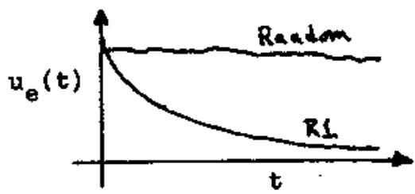

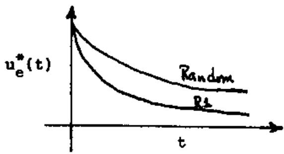

Recall that the performance criteria $\pmb { \cal x }$ and $\mathbf { x } ^ { \ast }$ for adaptive systems were defined in terms of the average values of ${ \check { \mathbf { u } } } _ { \otimes }$ and ${ \check { \mathbf { u } } } _ { \tilde { \mathbf { \Theta } } } ^ { \ast }$ , respeotively, over time. With these encouraging results, we consider in more detail the properties of plan R1.

# 2.5 K-armed Bandits

Before we explore in more detail the way in which plan Al searches the space A for better-performing elements, we will take a brief, but relevant, diversion to consider solutions to the generalization of the Z-armed bandit problem introduced in section l.2, namely, the optimal allocation of trials to X machines. Holland (i975) has shown a mathematical solution erists if one is given a bit more a priori information about the K machines, Suppose we know that each machine pays stochastioally according to a normal distribution $\mathbb { N } \{ \mathbf { u } _ { \mathbf { i } } , \mathbf { a } _ { \mathbf { i } } ^ { 2 } \}$ , but we are not told which distribution is associated with which machine. In this case, an optimal strategy for allocating T trials to the K machines is roughly characterized as follows:

allocate exponentially more of the T trials to the observed best than to the remaining K-i maohines, where the exact form of the exponential depends on the K distributions $\mathbb { N } \{ \mathbf { \mathfrak { u } } _ { \mathbf { \mathfrak { i } } } , \mathbf { \mathfrak { s } } _ { \mathbf { \mathfrak { i } } } ^ { 2 } \}$ . Notice that this strategy is non-realizeable in that no strategy can decide which machine will be the observed best after $\pmb { \mathfrak { T } }$ trials without allocating the T trials, and then it is too late to distribute the trials optimally, However, such a solution gives us a characterization of the way in which trials should be allocated, and it yields a lower bound on the expected losses over T trials, The question, of course, is whether there are any realizeable strategies which are good approximations to the optimal one. To answer this question, we consider in more detail the optimal solution to the 2-armed bandit problem,

In this case we have two machines B1 and B2 which pay according to the distributions $\mathbb { N } ( \mathbb { u } _ { 1 } , \mathbb { s } _ { 1 } ^ { 2 } )$ and $\mathbb { N } ( \mathbf { u } _ { 2 } , \mathbf { s } _ { 2 } ^ { 2 } )$ respectively, Por convenience, let Bl be the machine with the higher payoff and $\widetilde { \tt B 1 }$ be the machine with the highest observed payorf after all $\pmb { \mathbb { T } }$ trials have been allocated with $\pmb { \tau _ { 1 } }$ going to $\widetilde { \pmb { \mathtt { B } } \pmb { 1 } }$ and $\mathfrak { t } _ { 2 }$ to $\widetilde { \mathtt { B } } 2$ • Holland (1975) has shown that the erpected loss incurred over these T trials i8 given by:

$$
\mathbf { L } ( \mathbf { t } _ { 1 } , \mathbf { t } _ { 2 } ) = \left| \mathbf { u } _ { 1 } - \mathbf { u } _ { 2 } \right| * \left[ \mathbf { \bar { t } } _ { 1 } * \mathbf { q } ( \mathbf { t } _ { 1 } , \mathbf { t } _ { 2 } ) + \mathbf { \bar { t } } _ { 2 } * ( 1 - \mathbf { q } ( \mathbf { t } _ { 1 } , \mathbf { t } _ { 2 } ) \mathbf { \bar { t } } ) \right]
$$

where $a ( t _ { 1 } , t _ { 2 } )$ is the probability that B2 will be the observed best and is well-approximated by

$$
q ( t _ { 1 } , t _ { 2 } ) = \frac { 1 } { \sqrt { 2 \pi } } \ast \frac { \varphi \ast \mathrm { p } ( - x ^ { 2 } / 2 ) } { x } \mathrm { ~ , ~ x ~ = ~ } \frac { u _ { 1 } - u _ { 2 } } { \sqrt { \mathrm { ~ s _ { 1 } ^ { 2 } / t _ { 1 } ~ + ~ s _ { 2 } ^ { 2 } / t _ { 2 } ~ } } }
$$

To get a feeling for how $\mathbb { L } ( \mathfrak { t } _ { 1 } , \mathfrak { t } _ { 2 } )$ varies over the interval $0 < t _ { 2 } < \tt { T }$ , consider $\pmb { \mathrm { L } }$ rewritten as a function of Ti

$$
\begin{array} { r c l } { { \mathbb { L } ( \mathbb { T } , \mathbb { t } _ { 2 } ) } } & { { = } } & { { \Big \{ \mathrm { \normalfont ~ u } _ { 1 } { - } \mathrm { \normalfont ~ u } _ { 2 } \Big \} ~ * \Bigg [ ( \mathbb { T } { - } \mathbb { t } _ { 2 } ) { * } \mathrm { \normalfont ~ \forall ~ } ( \mathbb { T } , \mathbb { t } _ { 2 } ) ~ + ~ \mathbb { t } _ { 2 } { * } ( \mathbb { 1 } { - } \mathbb { q } ( \mathbb { T } , \mathbb { t } _ { 2 } ) ) \Bigg ] } } \\ { { } } & { { } } & { { } } \\ { { * } } &  { \lfloor \mathrm { \normalfont ~ u } _ { 1 } { - } \mathrm { \normalfont ~ u } _ { 2 } \Big \{ ~ * ~ [ ( \mathbb { T } { - } 2 \mathbb { t } _ { 2 } ) { * } \mathrm { \normalfont ~ q } ( \mathbb { T } , \mathbb { t } _ { 2 } ) ~ + ~ \mathbb { t } _ { 2 } ] } \end{array}
$$

As illustrated in figure 2.1, the torn

$$
\{ \pmb { \mathrm { T } } \pmb { \mathrm { - } } 2 \pmb { \mathrm { t } } _ { 2 } \} \nu \mathrm { q } ( \pmb { \mathrm { T } } , \pmb { \mathrm { t } } _ { 2 } ) \cong ( \pmb { \mathrm { T } } \pmb { \mathrm { - } } 2 \pmb { \mathrm { t } } _ { 2 } ) \ast \frac { 1 } { \sqrt { 2 \pi } } \ast \frac { \mathrm { e x p } ( - \pmb { \mathrm { x } } ^ { 2 } / 2 ) } { \pmb { \mathrm { x } } }
$$

dominates L for seall values of $t _ { 2 }$ , but drops off exponentially as a function of $t _ { 2 }$ since

$$
x = \frac { a _ { 1 } - a _ { 2 } } { \sqrt { a _ { 1 } ^ { 2 } / t _ { 1 } + s _ { 2 } ^ { 2 } / t _ { 2 } } } \frac { \cong \frac { u _ { 1 } - u _ { 2 } } { \sqrt { a _ { 2 } ^ { 2 } / t _ { 2 } } } = ( \frac { u _ { 1 } - u _ { 2 } } { s _ { 2 } } ) _ { * } \sqrt { t _ { 2 } ^ { * } } = k _ { 2 } \sqrt { t _ { 2 } ^ { * } } } { \sqrt { s _ { 2 } ^ { 2 } / t _ { 2 } } }
$$

$$
\therefore ( \pi - 2 \theta _ { 2 } ) \times \frac { 1 } { \sqrt { 2 \pi } } \times \frac { \exp ( - \mathbf { x } ^ { 2 } / 2 ) } { \mathbf { x } } \cong \frac { \mathbb { T } } { \sqrt { 2 \pi } } \times \frac { \exp ( - \mathbf { k } _ { 2 } ^ { 2 } \mathbf { t } _ { 2 } / 2 ) } { \mathbf { k } _ { 2 } \sqrt { \mathbf { t } _ { 2 } } }
$$

$$
= \frac { \pi } { \sum _ { \mathbf { k } _ { 2 } } \sqrt { 2 \pi } } + \frac { \exp ( - \alpha _ { 2 } t _ { 2 } ) } { \sqrt { t _ { 2 } } }
$$

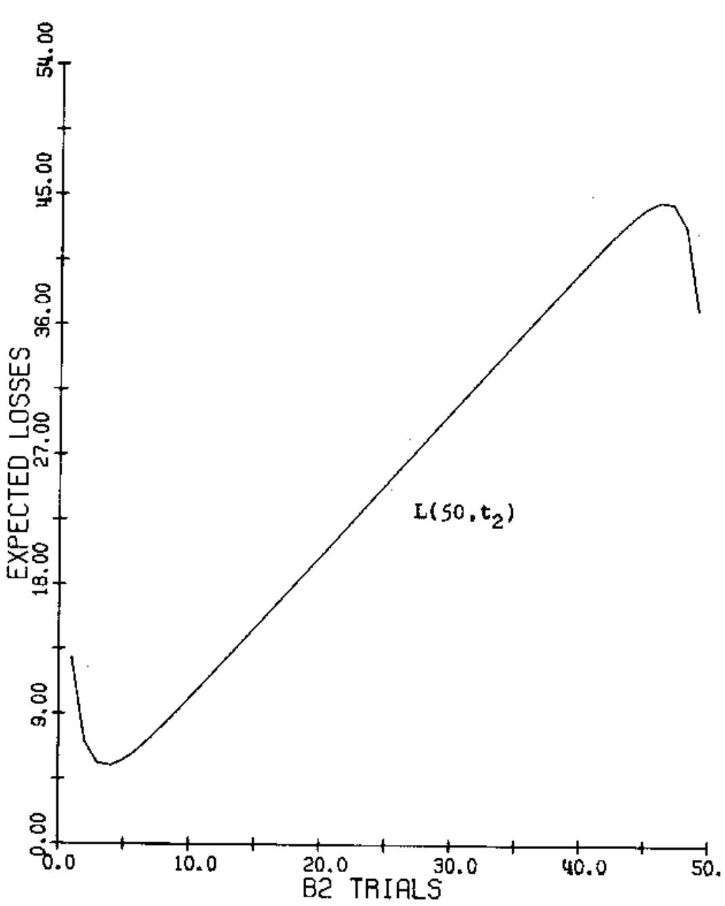  
Figure 2.1: Erpeoted losses over 50 trials on bandits B1(9,1) and B2(8,1).

As t2 increases, the term t2 dominates and L ia essentially linear with respect to $t _ { 2 }$ , Finally, as $\tt t _ { 2 } \to \tt T$ •

$$
( \mathbb { r } - 2 \mathsf { t } _ { 2 } ) \ast \mathbb { 1 } ( \mathbb { T } , \mathsf { t } _ { 2 } ) \div \frac { - \mathbb { T } } { \sqrt { 2 \pi } } \ast \frac { \mathbb { e } \mathbb { x } \mathbb { p } ( - \mathsf { k } _ { 1 } ^ { 2 } \mathsf { t } _ { 1 } / 2 ) } { \mathsf { x } _ { 1 } \sqrt { \mathsf { t } _ { 1 } ^ { 1 } } } = \frac { - \mathbb { T } } { \mathsf { k } _ { 1 } \sqrt { 2 \pi } } \ast \frac { \mathbb { e } \mathbb { x } \mathbb { p } ( - \mathsf { a } _ { 1 } \mathsf { t } _ { 1 } ) } { \sqrt { \mathsf { t } _ { 1 } } }
$$

re-emerges as the dominant term with a negative sign.

In order to minimize our expected losses over T trials, we must find the value $\mathfrak { t } _ { 2 } ^ { * }$ such that

$$
\mathbf { L } ( \mathbb { T } , \mathbf { t } _ { 2 } ^ { * } ) \ \leq \ \mathbf { L } ( \mathbb { T } , \mathbf { t } _ { 2 } ) , 0 < \mathbf { t } _ { 2 } < \mathbb { T }
$$

Finding an analytic expression for $\mathfrak { t } _ { 2 } ^ { * }$ by considering those points at which $\bf \Pi _ { \overline { { d t } } _ { 2 } } ^ { \underline { { d I } } } = \epsilon _ { \mathrm { ~ } 0 }$ is fairly complex. Holland (1975). for example, has derived the approrimation

$$
t _ { 2 } ^ { \frac { 1 } { 2 } } \wedge b ^ { - 2 } + \ln [ \frac { b ^ { 4 } \pi ^ { 2 } } { 8 \pi \cdot \ln ( \pi ^ { 2 } ) } ] \cdot b = \frac { u _ { 1 } - u _ { 2 } } { s _ { 2 } }
$$

Por our purposes the optimum is found via a one-dimensional iterative search technique applied directly to L for various values of T. Figure 2.2 illustrates how the optimal loss function $\mathbb { L } ( \mathbb { T } , \mathbb { t } _ { 2 } ^ { * } )$ varies with T. It is this kind of performance that a realizeable strategy must hope to approximate, Finally, figure 2.3 illustrates the_ previously mentioned relationship betwen $\ t _ { 1 } ^ { * } = \tau _ { * } t _ { 2 } ^ { * }$ and $t _ { 2 } ^ { \frac { \pi } { 2 } }$ , namely, that an optimal strategy allocates ex

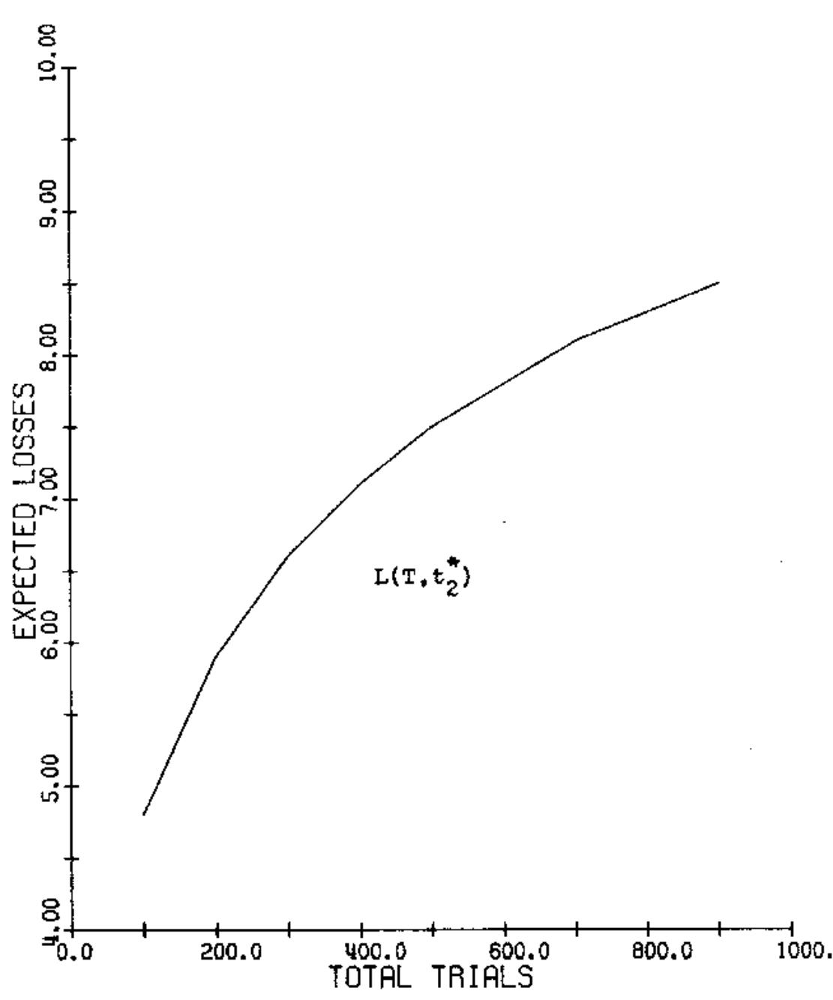  
Figure 2.2: Optimal losses incurred over T trials on two bandits B1(9.1)and B2(8,1).

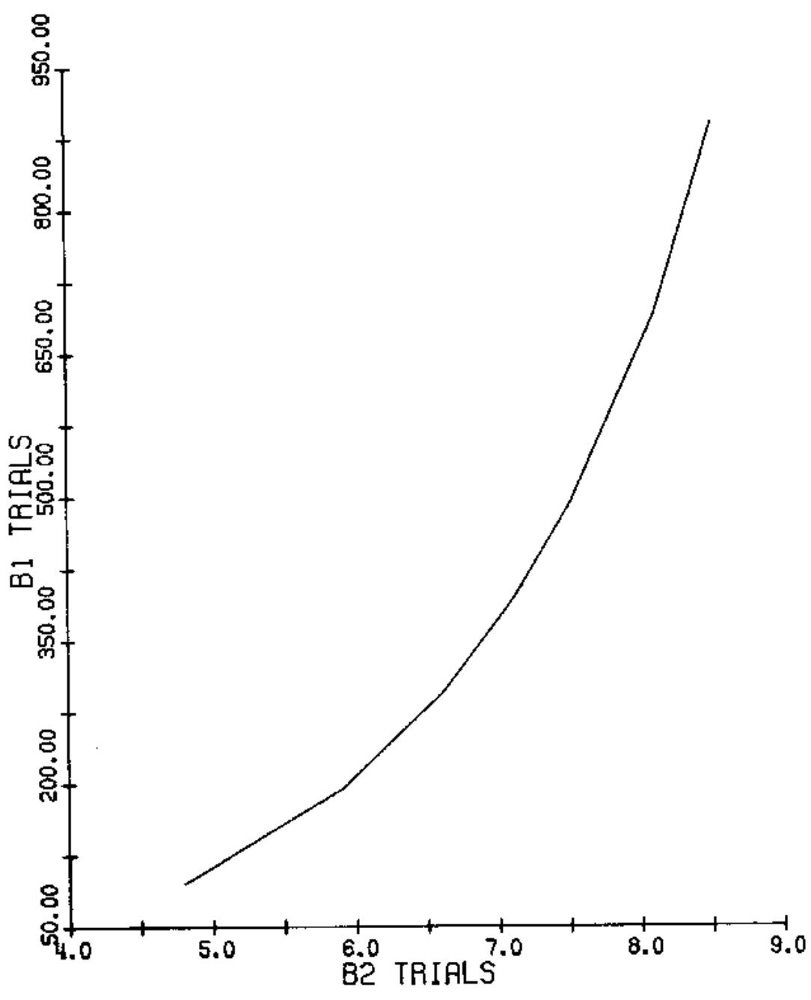  
Figure 2.3: Optimal distribution of T trials between two bandits B1(9,1) and B2(8,1).

ponentially more trials to the observed best.

We are now in a position to evaluate the performance of some realizeable strategies. The first one which comes to aind is the standard decision theory approach (hereafter referred to as DTs) which goes as follows: allocate a small number t of trials to each machine; then allocate the remaining T-2t trials to the observed best, Paralleling the preceding analysis, we have an expected loss function:

$$
\begin{array} { r l r } { \mathbb { L } _ { 1 } ( \mathbb { T } , \mathbb { t } ) } & { = } & { \left\{ \textbf { u } _ { 1 } { - } \mathbf { u } _ { 2 } \right\} ~ * ~ \left[ \left. \mathbb { T } { - } \mathbb { t } \right. { + } \mathbb { q } \left( \mathbb { t } \right) + \mathbb { t } { - } \mathbb { t } \big ( 1 { - } \mathbb { q } \left( \mathbb { t } \right) \big ) \right] } \end{array}
$$

where ${ \mathfrak { q } } \left( \ t \right)$ is the probability that B2 is the observed best after allocating t trials to each machine. In this case we have

$$
\begin{array} { r l r } & { } & { { \mathbb { q } } \left( { \bf t } \right) \ \stackrel { \approx } { = } \frac { 1 } { \sqrt { 2 \pi } } \ast \frac { \exp \left( - { \bf x } ^ { 2 } / 2 \right) } { \pi } \mathrm {  ~ \cdot ~ } { \bf x } = \frac { { \mathbb { u } } _ { 1 } - { \mathbb { u } } _ { 2 } } { \sqrt { \frac { { \bf x } _ { 1 } ^ { 2 } / { \bf t } + { \bf \epsilon } { \bf \epsilon } \cdot \sqrt { { \bf \epsilon } } ^ { 2 } / { \bf \epsilon } } } } } \\ & { } & { = \frac { \mathrm {  ~ \cdot ~ } { \bf u } _ { 1 } - { \bf u } _ { 2 } } { \sqrt { - \frac { { \bf x } _ { 1 } ^ { 2 } } { { \bf u } _ { 1 } ^ { 2 } + { \bf \epsilon } \cdot \sqrt { { \bf \epsilon } } ^ { 2 } } } } \ast \sqrt { { \bf t } } } \end{array}
$$

Again, we seek the value $\mathbf { t } ^ { \ast }$ . $0 < t ^ { \ast } < \frac { \pi } { 2 } \cdot$ which minimizes $\mathbb { L } _ { 1 } \left\{ \mathbb { T } , \mathbb { t } \right\}$ , as illustrated by figure $z _ { \cdot } 4$ . It should be clear that we can define a DTS which, when given $\pmb { \mathbb { T } }$ $\mathfrak { u } _ { 1 } \cdot \mathfrak { u } _ { 2 } \cdot \mathfrak { s } _ { 1 } .$ and s2, computes the optimal initial sample size t\* and allocates its trials accordingly. Intuitively one feels that this Drs will approrimate the optimal strategy as T increases. Figure 2.5. however, illustrates that it i8 a fairly crude approrimation since the optimal number of trials allocated to Bz grows very slowly with T.

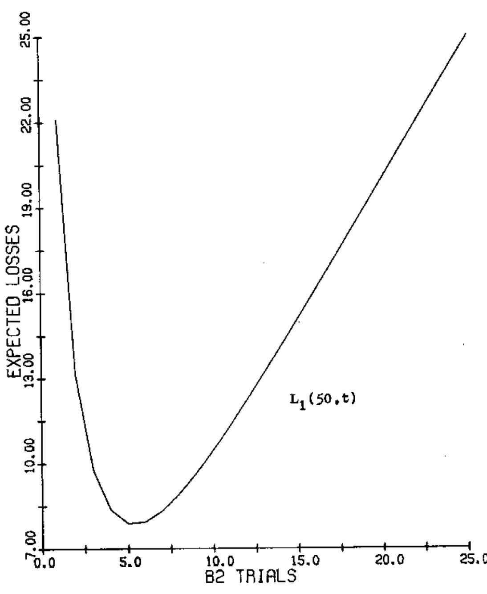  
Figure 2.4: DTS erpected losses over 50 trials on bandits B1(9.1)and B2(8,1).

A seoond more interesting approach incorporates some of the ideas presented in the discussion of reproductive plans in section 2.3. The basic idea is to make a series of reversible decisions during the sequence of trials rather than one non-reversible decision. This is accomplished by defining a selection probability distribution over the machines. Initially, the distribution is uniform; however, it changes over tlme as follows:

$$
\bar { \bf { r } } _ { 1 } ( t { + } 1 ) = \mathbb { P } _ { 1 } ( t ) \ast \frac { \overline { { \bf { r } _ { 1 } } } ( t ) } { \overline { { \bf { r } } } ( t ) } \ast \mathrm { K } _ { t + 1 }
$$

That is, the probability of selecting machine i changes over time in proportion to its observed performance relative to the average, where $\kappa _ { \tt t + 1 }$ is the normalization factor required for $\sum \limits _ { i } ^ { \infty } r _ { 1 } ( t + 1 ) = 1$ . If at each time step we select a machine for trial by sampling from this timevarying seleotion distribution, it should be clear that a machine which continues to show above-average performance will rapidly dominate the allocation of trials.

Initially t samples are allocated to each machine for estimates $\overline { { \hat { \mathbf { r } } } } _ { 1 } ( \mathfrak { t } )$ of $\mathbf { u _ { 1 } }$ before the first decision is made. This, of course, incurs an initial loss $| u _ { 1 } - u _ { 2 } | \neq 2$ . but adds certainty to the subsequent decisions, As $\pmb { \mathrm { \hat { \Pi } } } \pmb { \mathrm { \hat { \Pi } } } \pmb { \mathrm { \hat { \Pi } } } \pmb { \mathrm { \hat { \Pi } } }$ , the initial overhead is reduced at the expense of making decisions with more unoertainty.

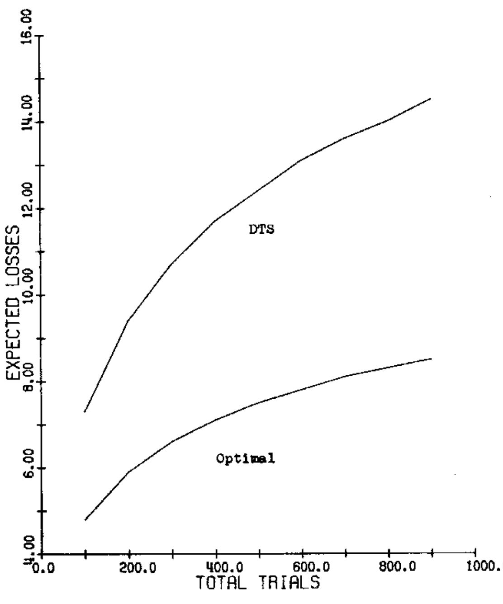  
Figure 2.5: A comparison of the eipected losses for DTS_ and the optimal on two bandits Bi(9,1) and B2(8.1).

So we have expected losses over T trials given by:

$$
\mathbb { L } _ { 2 } ( \mathbb { T } , \sf t ) = \left| \mathbb { u } _ { 1 } \mathbb { - u } _ { 2 } \right| \bullet \sf t + \mathbb { T } _ { 2 } ( \mathbb { T } , \sf t )
$$

where $\widetilde { \bf L } _ { 2 } ( { \bf T } , { \bf t } )$ speoiries the expected losses during the time-varying decision processes from $\pmb { z } \pmb { 1 } + \pmb { 1 }$ to T, We can express $\tilde { \mathfrak { L } } _ { 2 }$ as

$$
T _ { 2 } ( I , t ) = \sum \limits _ { j = 2 t + 1 } ^ { I } l ( j )
$$

where $l ( j )$ is the expected loss on the $j ^ { \tt t h }$ trial and 1s given by

$$
f ( j ) = \ \lfloor \mathfrak { u } _ { 1 } - \mathfrak { u } _ { 2 } \lfloor \neq \sum _ { 2 } ( j ) \}
$$

where $\Xi \left[ \mathcal { F } _ { 2 } ( \ F _ { 1 } ) \right]$ is the expeoted value of the selection probability $\mathfrak { p } _ { 2 } \{ \mathfrak { s } \}$ at time j.

While it is relatively straightforward to calculate the erpected initial value. $\Xi \left[ \underline { { \mathsf { P } } } _ { 2 } ( 2 t ) \right]$ , subsequent expected values are ertremely difficult to analyze since the transition funotion

$$
\begin{array} { r } { \mathtt { P } _ { 2 } ( \mathtt { t } + 1 ) \ = \ \mathtt { P } _ { 2 } ( \mathtt { t } ) + \mathtt { \Gamma } \frac { \overline { { \vec { \mathbf { r } } _ { 2 } } } ( \mathtt { t } ) } { \overline { { \vec { \mathbf { f } } } } ( \mathtt { t } ) } \ \ J \ast \mathtt { K } _ { \mathtt { t } + 1 } } \end{array}
$$

is non-Markovian and depends on the random variable $t _ { 2 } ( t )$ the number of trials allocated to B2 through time $\pmb { \mathscr { t } }$ .

Consequently, we are faced with optimizing $\bar { \mathbf { L } } _ { 2 } ( \bar { \mathbf { T } } , \mathbf { t } )$ with respect to t by simulation as illustrated in figure 2.6. Two hundred samples were taken of $\mathtt { L } _ { 2 } ( 1 0 0 , \mathtt { t } )$ for

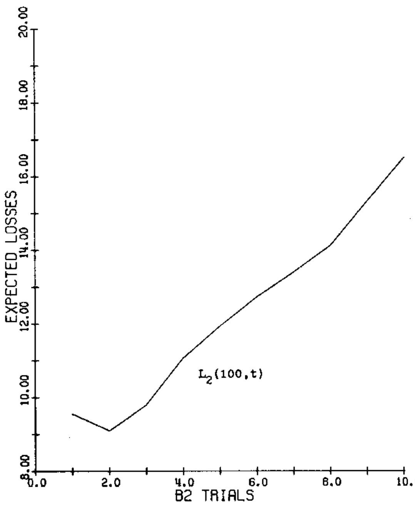  
Figure 2.6: Simulated losses over 100 triala using TvS . on two bandits B1(9,1) and B2(8,1).

t-1,2.3....,i0. These figures, and others not shown here. suggest that a good approrimation for $\hbar ^ { * }$ is given by:

$$
t ^ { * } \geq \frac { \sqrt { s _ { 1 } ^ { 2 } + s _ { 2 } ^ { 2 } } } { u _ { 1 } - u _ { 2 } }
$$

which, for the illustrated case, yields $\operatorname { t } ^ { * } \geq \sqrt { 2 } \ \mathrm { o r t } ^ { * } \ \cong \ 2 .$ This formulation is motivated as follows: choose enough initial samples t so that, with a priori probability q, $\overline { { \hat { \mathbf { f } } _ { 1 } } } ( \mathsf { t } ) \ - \ \overline { { \hat { \mathbf { f } } _ { 2 } } } ( \mathsf { t } )$ will have the same sign as ${ \mathfrak { u } } _ { 1 } { - } { \mathfrak { u } } _ { 2 }$ We know the a priori probabilities associated with f,(t) - f2(t) falling in the interval $( u _ { 1 } - u _ { 2 } ) \pm 5 + \sqrt { \frac { s _ { 1 } ^ { 2 } / t + s _ { 2 } ^ { 2 } / t ^ { 2 } } { \sqrt { t } } }$ For the signs to be the same, we must have

$$
\boxed { \begin{array} { r l } { \| u _ { 1 } - u _ { 2 } \| \ge } & { \mathbb { E } \ast \frac { \sqrt { s _ { 1 } ^ { 2 } / \tau + s _ { 2 } ^ { 2 } / \tau } } { \sqrt { \tau } } } \\ { \mathbf { t } \ge } & { \mathbf { E } \ast \frac { \sqrt { s _ { 1 } ^ { 2 } + s _ { 2 } ^ { 2 } } } { | u _ { 1 } - u _ { 2 } | } } \end{array} }
$$

or

The value $\pmb { \mathrm { x } } = 1$ or $q = 6 8$ seemed to fit the data best,

Using the above approrimation for ${ \mathfrak { t } } ^ { * }$ , figure 2.7 compares the expected Tvs losses with those of the two previous strategies and illustrates that it rapidly approaches the optimal one. Finally. figure 2.8 compares the way in which the three strategies divide the trials between the two machines.

With this analysis in mind, we now consider in more detail how adaptive plan Al allocates its trials within the space A.

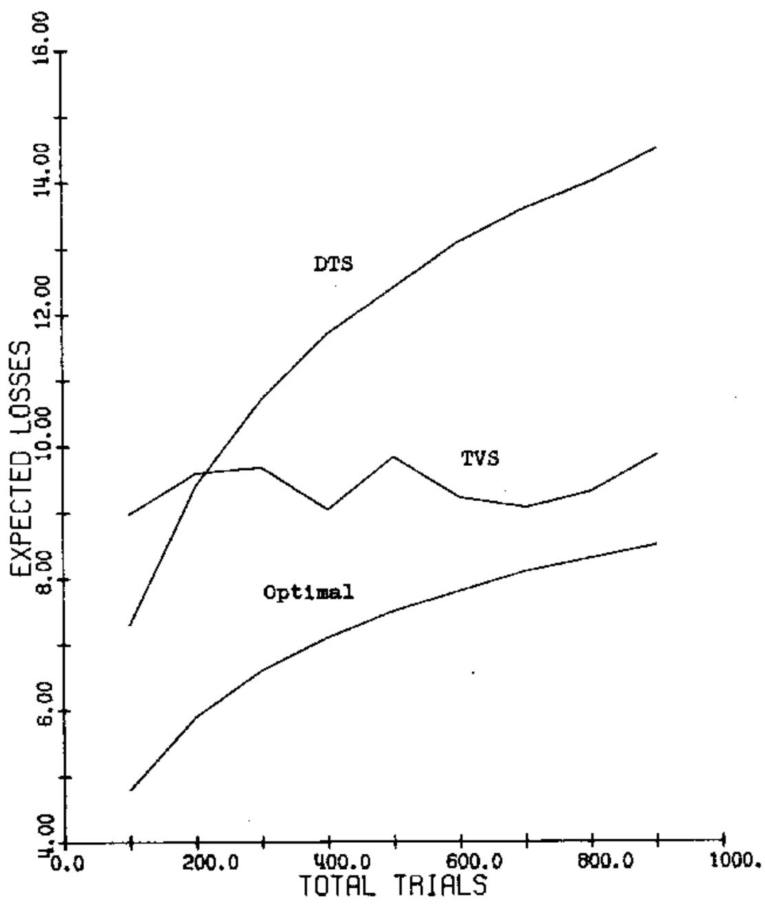  
Figure 2.7: A comparison of expected losses over T trials on two bandits B1(9,1) and B2(8,1).

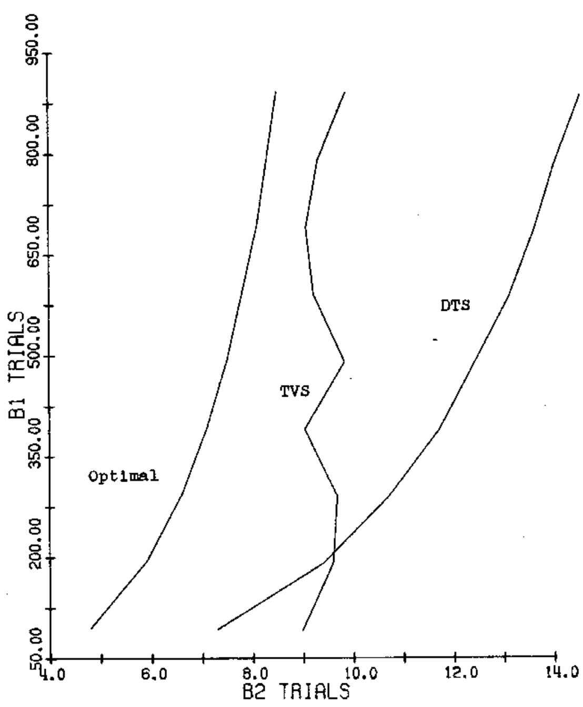  
Figure 2.8: A comparison of the allocation of T trials to two bandits Bl(9.1) and B2(8.1).

# 2.6 Hyperplane Analysis of R1

In this section we will attempt to understand more clearly how the genetic plan R1 searches the representation space A for better-performing elements by focusing our attention on hyperplane partitions of A as suggested by Holland (1975).

As suggested in section $2 \cdot 4$ , we consider A as an -dimensional space in which a point $a _ { 1 } \in$ A is specified by giving its & gene values <vil....vi7. A rth-order hyporplane is then defined to be the $( l - k )$ -dimensional subspace of A specified by giving only $\textbf { \textbf { k } }$ of the $2$ gene values. These hyperplanes can be represented visually as

follows:

$$
\begin{array} { r l } & { \begin{array} { r l } { 0 \mathrm { ~ --- ~ } { \mathrm { ~  ~ \psi ~ } } _ { 1 } \mathrm { ~  ~ \psi ~ } _ { 1 } = \mathrm { ~  ~ \psi ~ } _ { 1 } \mathrm { ~  ~ \psi ~ } _ { 1 } = \mathrm { ~  ~ \psi ~ } _ { 1 } \biggr \} } \\ & { \mathrm { ~  ~ \psi ~ } _ { - 1 1 \mathrm { ~ \tiny ~ \cdots ~ } \mathrm { ~ \ e ~ } } = \mathrm { ~  ~ \psi ~ } _ { 1 } \mathrm { ~  ~ \psi ~ } _ { \mathrm { ~ \tiny ~ \cdot ~ } } \mathrm { ~  ~ \psi ~ } _ { 1 2 } = \mathrm { ~ \mathbb { 1 } ~ \ e ~ \ } { \mathrm { ~  ~ \psi ~ } } _ { 1 3 } = \mathrm { ~ \mathbb { 1 } ~ } \biggr \} } \end{array} } \end{array}
$$

If we consider all possible hyperplanes which can be defined by specifying the gene values of a fired set of K positions, this set $\{ \theta _ { 1 } \}$ of hyperplanes forms a uniform prtition othe space A.Fo exaple, ifv -. allowable values for the first position, then

$$
\begin{array} { l } { { \tt H _ { 1 } ^ { \mathrm { } } = 0 \cdots \ldots } } \\ { { } } \\ { { \tt H _ { 2 } ^ { \mathrm { } } = 1 \ldots \ldots } } \end{array} .
$$

form a first-order partition of A with exaotly half of the points falling in each hyperplane. If we consider the performance measure $u _ { e } + A  B$ restricted to a particular hyperplane,

$$
u _ { \phi } \{ _ { \tt A _ { 1 } } : u _ { \tt A } : \phi _ { \tt A }
$$

it has a well-defined mean and variance which are, of course, unknonn to an adaptive strategy, Hence, associated with each hyperplane partition $\left\{ { \tt H } _ { 1 } \right\} _ { 1 = 1 } ^ { \tt K }$ of the space A, is a K-armed bandit problem, namely, the optimal allocation of trials among the partition elements $\mathfrak { X } _ { 1 }$ . Since any sequence of trials in A simultaneously distributes trials among the elements of each of the b $\sum \limits _ { j = 0 } ^ { \infty } ( \frac { k } { j } ) = 2 ^ { j }$ distinct hyperplane partitions of A. we cañ view the problem of searching A as simultaneously solving $2 ^ { 8 } x _ { 1 }$ -armed bandit problems. The question we are exploring in this section is how well plan R1 allocates its trials to these $\mathtt { z _ { j } }$ -armed bandits.

In order to accomplish this we fix our attention on a particular hyperplane partition $\{ I _ { 1 } \}$ in relationship to the population A(t) of $\pmb { \mathfrak { N } }$ individuals maintained by plan R1. Since $\{ A _ { 1 } \}$ is a parition of the space Aa $\alpha _ { 1 t }$ in A(t) lies in some $\mathtt { H } _ { \mathtt { 1 } }$ . Let $M _ { \mathbf { 1 } } ( t )$ represent the number of individuals from $\Delta ( t )$ which lie in $\mathtt { E _ { 1 } }$ at time t. Because of the way in which the selection probabilities were defined for reproductive plans (section 2.3), we

know that the expected nunber of offspring $0 \{ \mathbb { E } _ { 1 }$ ) produced by individuals in $\mathbf { \delta } \mathbf { \tilde { a } _ { \mathbf { i } } }$ at time $\pmb { \mathfrak { r } }$ is given by:

$$
\begin{array} { r l } { { \Theta } ( \mathtt { R } _ { 1 } ) \ \mapsto \ } & { \overset { \mathtt { N } _ { 1 } ( \mathtt { t } ) } { \Longleftrightarrow } \ \overset { \mathtt { N } _ { \mathtt { t } } ( \mathtt { a } _ { 3 } \mathtt { t } ) } { \Longleftrightarrow } } \\ & { \overset { \mathtt { N } _ { 1 } ( \mathtt { t } ) } { \Longleftrightarrow } \ \overset { \mathtt { N } _ { \mathtt { t } } ( \mathtt { t } ) } { \overbrace { \overline { { \mathtt { m } } } _ { \mathtt { t } } ( \mathtt { t } ) } } } \\ & { = \ \overset { \mathtt { N } _ { 1 } ( \mathtt { t } ) } { \ = } \ \overset { \mathtt { N } _ { 1 } ( \mathtt { t } ) } { \ = } \overset { \mathtt { N } _ { \mathtt { t } } ( \mathtt { t } ) } { \ = } \overset { \mathtt { N } _ { \mathtt { t } } ( \mathtt { t } ) } { \ = } } \\ & { = \ \mathtt { N } _ { 1 } ( \mathtt { t } ) \ast } \end{array}
$$

If in fact the offspring $\mathcal { O } \{ \mathtt { E } _ { \mathtt { i } } \}$ themselves lie in $\mathbf { \delta H _ { 4 } } \cdot$ then we have

$$
x _ { 1 } ( t + 1 ) = x _ { 2 } ( t ) + \frac { \widetilde { u } _ { e } ( \widetilde { u } _ { 1 } ( t ) ) } { \widetilde { u } _ { e } ( t ) }
$$

That is, the number of trials allocated to $\Im _ { \mathstrut }$ varies from one time step to the next in proportion to its performance relative to the average, which of course is the Tvs solution to the K-armed bandit problem discussed in the preceding section.

Whether or not $\mathfrak { o } ( \mathtt { E } _ { \mathtt { l } } ) \subseteq \mathtt { E } _ { \mathtt { l } }$ depends on the genetic operators used to construct them. In plan Rl there are two such operators: crossover and mutation. An offapring will lie in $\Xi _ { \pm }$ only if the i positions which derine $\mathtt { \mathtt { u } _ { 1 } }$ remain unchanged between parent and offspring. Intuitively, if crossover occurs within these defining positions, one or more of them will likely be changed. Hence it is fairly easy to show that the probability of a parent in $\mathtt { R _ { 1 } }$ producing an offspring outside ${ \tt a } _ { \tt _ { 1 } }$ is no greater than $\frac { a ( z _ { 1 } ) - 1 } { l - 1 }$ , where $\mathbb { d } \left. \mathbb { E } _ { \mathfrak { L } } \right.$ is the "definition length" of $\mathbf { z } _ { \mathbf { i } }$ : namely, the length of the smallest segment containing all the defining positions of $\mathtt { H } _ { \mathtt { l } }$ as illustrated below,

As a consequence we note that crossover has little effect on the allocatlon of trials to the bandits associated with short-definition hyperplanes (relative to $2 )$ , while the allocation of trials to long-definition hyperplanes is considerably disrupted.

The probability of a parent in $\mathtt { E _ { 4 } }$ producing an offspring outside $\Xi _ { \mathfrak { L } }$ via mutation is just $\mathbb { P } _ { \varpi } * \frac { \mathtt { k } } { \ell }$ where ${ \pmb { \mathrm { p } } } _ { \pmb { \mathrm { m } } }$ is the probability of a gene undergoing a mutation and $\pmb { \mathrm { \lambda } } \mathbf { k }$ is the order of $\Xi _ { \mathbf { 1 } }$ . In nature and generally in plan B, $\mathtt { P _ { m } } \le \mathtt { \_ { 0 0 1 } }$ , Hence, mutation has very little effect on the allocation of trials according to performance.

In summary, then, by looking at hyperplane partitions of A, we have gained considerable insight into the behavior of reproductive plans, In the first place, this analysis ylelds a oriterion for artificial genetic operators, namely, the ability to generate new individuals in A without disturbing too much the near-optimal Tvs allocation of trials. Secondly, we can now describe the way plan R1 searches the space A. It generates near-optimal allocation of trials simultaneously to short-definition hyperplane partitions, As elements of high-performance hyperplanes begin to dominate A(t), we have a reduction in the dimension of A and a corresponding reduction in the definition lengths of hyperplanes, providing for another cycle of near-optimal sampling.

# 2.7 An Example of R1

As an illustration of the discussion in the previous sections, we consider a simple problem for adaptation. Suppose each alternative solution to a problem is represented by a single real number in the interval $[ 0 . 1 0 ]$ with a precision of 2 decimal places. Suppose further than the performance associated with each solution point is given by $r ( x ) = x ^ { 2 }$ with the higher valued solutions being the better ones. We choose the representation space A for Hi as follows: There are $( 1 0 - 0 ) \times 1 0 ^ { 2 }$ distinct solutions; hence, $2 0 g _ { 2 } ( 1 0 ^ { 3 } ) = 1 0$ bits are required for a binary representation. The correspondence between $[ 0 . 1 0 ]$ and A is given by;

$$
\textbf { z } = \frac { \mathbf { a _ { \pm } } } { 1 0 0 }
$$

So, for example,

In order to see how Ri searches A, we focus our attention initially on a first-order partition $\mathfrak { P } _ { 1 }$ defined by:

$$
\begin{array} { l } { \mathbb { H } _ { 1 , 1 } : \ 0 \dots \dots \dots } \\ { \mathbb { H } _ { 1 , 2 } \colon \dots \dots \dots } \end{array}
$$

$\mathbb { P } _ { 1 }$ simply divides the space in half:

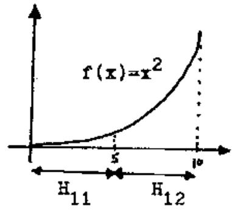

Since E1 generates an initial populstion A(o) randomly from a uniform distribution over A, we expect half of A(o) to lie in $\mathtt { H } _ { 1 1 }$ and half in $\mathtt { E } _ { 1 2 }$ , Notice, however, that T(11)<T(H12). Since P1 is a short-definition partition relative to -10. plan Rl will allocate trials to H11 and $\mathtt { E } _ { 1 z }$ according to the near optimal time-varying strategy (rvs) described earlier, In other words, Bl quickly generates a population A(t) consisting almost entirely of individuals from H2

We now consider a refinement $\mathfrak { p } _ { 2 }$ of $\pmb { \mathrm { p } } _ { \mathbf { 1 } }$ given by:

$$
\begin{array} { r } { \mathbb { H } _ { 2 1 } { : } 0 0 \mathrm { = - s . ~ c . = - } } \\ { \mathbb { H } _ { 2 2 } { : } 0 1 \mathrm { = - s . ~ e . = - } } \\ { \mathbb { E } _ { 2 3 } { : } 1 0 \mathrm { = - s . ~ c . = - } } \\ { \mathbb { H } _ { 2 4 } { : } 1 1 \mathrm { = - s . ~ c . = - } } \end{array}
$$

$\mathtt { P } _ { 2 }$ simply divides the space in quarters:

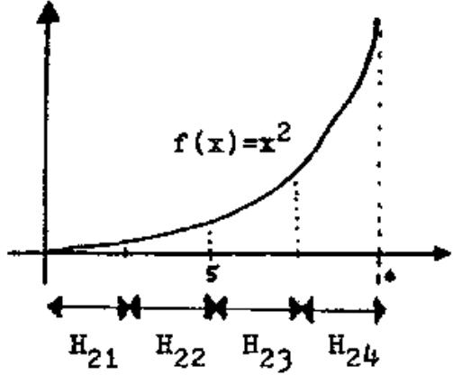

As we noted above, Rl rapidly generates a population $\mathsf { a } ( \mathsf { t } _ { 1 } )$ 1n which most individuals begin with a l. This is in effect a reduction in the search space A to an $\pmb { \ell } { - } 1$ dinensional space. Hence, after a few generations, $\mathtt { P } _ { 2 }$ effeotively becomes a first-order partition of $\mathbf { A } _ { \pmb { \lambda } - 1 }$ to which HI now allocates a near-optimal sequence of trials. Since $\overline { { \hat { \mathbf { r } } } } ( \mathbb { B } _ { 2 3 } ) < \overline { { \hat { \mathbf { r } } } } ( \mathbb { E } _ { 2 4 } )$ , H1 rapidly generates a population $\Delta ( t _ { 2 } )$ which lies almost entirely in $a _ { 2 4 }$ , effecting yet another reduction in the search space.

The important thing to note here is that the same remarks hold for any other short-definition partitions, for example:

---\*----. .--1

While such partitions are harder to visualize, each is being sampled at a near-optimal rate simultaneously by Bl. It is this parallelism which gives even simple reproductive plans like R1 their surprising adaptive capabilities,

# 2.8 Summary

In this chapter we have defined a class of genetio adaptive models called reproductive plans. These artificial systems are motivated by the kinds of models used in population genetics to explain the adaptive behavior of natural systems. The central feature of these reproduotive plans is that new solutions to the problem for adaptation are generated by selecting individuals from the current population on the basis of their observed performance to produce offspring via genetic operators. By focusing our attention on hyperplanes on A rather than individual elements of A, we were able to characterize the way in which reproductive plans search A, and the characterization provided a criterion for genetio operators. Finally, we saw that even the simple reproductive plan B1, because of its ability to simultaneously allocate $^ \ast$ trials at a nearoptimal rate to a large number of hyperplanes on A, exhibit considerable improvement over random search.