# Chapter 3

# STOCHASTIC EFFECTS IN FINITE GENETIC MODELS

# 3.1 Introduction

In this chapter we will erplore the characteristics of finite genetic adaptive systems, that is, genetic plans which have limited memory and time to adapt to the problem at hand. As one might erpect, the behavior of such systems can vary considerably from the norm predicted by mathematical analysis involving expected values, the law of large numbers, and limit theorems. The motivation for analyzing finite models, of course, is that they correspond to the observed behavior in any practical application of genetic adaptive systems. We will pursue this analysis by considering in more detail the characteristics of plan A1 introduced in the preceding chapter.

# 3.2 The Problem of Premature Convergence

We begin by analyzing the behavior of plan R1 on test function Fl (see appendix A). Here the problem consists of finding the minimum point on the three dimensional parabolic surface given by

$$
\texttt { F 1 } ( \texttt X ) = \sum _ { 1 } ^ { 3 } x _ { 1 } ^ { 2 } , x _ { 1 } \leq 5 , 1 2 , \Delta \texttt x _ { 1 } = 0 1
$$

As illustrated in appendix C, plan Rl generates an erponential decrease in both f(t) and $f ^ { \mu } ( t )$ over the interval $1 \leq t \leq 1 0 . 0 0 0$ , However, since Rl is a stochastic process, these curves represent the performance of R1 averaged over the number of independent runs. Table 3.1 depicts the behavior of R1 for a particular run on test function Fl. Notice that there is little or no improvement in f(t) and $\pmb { f } ^ { \ast } ( \pmb { \tau } )$ from $\mathtt { t } = 3 0 0 0$ on, even though $\hat { \mathbf { r } } ^ { * } \{ \hat { \mathbf { \tau } } \}$ is still greater than the minimum of zero at the origin. This behavior is typical of plan Rl. After an initial reduction in f(t) and $\pmb { \mathrm { e } } ^ { * } ( \pmb { \mathrm { t } } )$ , a threshold seems to be crossed after which little or no improvement is generated. If we look more closely at the population

A(t) maintained by R1, the reason for this lack of improvement becomes clear: each individual in A(3ooo) is very nearly alike. Recall that plan Ri uses a binary genetic representation for points in the solution space

A. That is, eaoh gene position can take on only the values 0 or 1, and for this problem, $| \Delta | = ( 1 0 ^ { 3 } ) ^ { 3 } = 1 0 ^ { 9 }$ requiring $l = 3 0$ gene positions. If we consider A(t) a reservoir of gene values (alleles), the "lost" column in table 3.1 illustrates that in A(3000) 22 of the 30 gene positions have no instances of one of the two possible alleles. That is, plan Rl has converged to a particular allele in all but 8 positions and hence reduced the search space for crossover to $2 ^ { 8 } = 2 5 6$ points. Moreover, if we say that plan Ri has effectively converged to a particular allele whenever an allele is

<table><tr><td rowspan=1 colspan=1>20</td><td rowspan=1 colspan=1>O</td><td rowspan=1 colspan=1>1</td><td rowspan=1 colspan=1>2</td><td rowspan=1 colspan=1>a</td><td rowspan=1 colspan=1>1</td><td rowspan=1 colspan=1>2</td><td rowspan=1 colspan=1>20</td><td rowspan=1 colspan=1>E</td></tr><tr><td rowspan=1 colspan=1>0</td><td rowspan=1 colspan=1>0</td><td rowspan=1 colspan=1>1</td><td rowspan=1 colspan=1>2</td><td rowspan=1 colspan=1>6</td><td rowspan=1 colspan=1>$\frac{ }$</td><td rowspan=1 colspan=1>2</td><td rowspan=1 colspan=1>R</td><td rowspan=1 colspan=1></td></tr><tr><td rowspan=1 colspan=1></td><td rowspan=1 colspan=1>9102</td><td rowspan=1 colspan=1>0</td><td rowspan=1 colspan=1></td><td rowspan=1 colspan=1>S</td><td rowspan=1 colspan=1></td><td rowspan=1 colspan=1>0</td><td rowspan=1 colspan=1></td><td rowspan=1 colspan=1>0</td></tr><tr><td rowspan=1 colspan=1>f</td><td rowspan=1 colspan=1>S</td><td rowspan=1 colspan=1>11*20</td><td rowspan=1 colspan=1></td><td rowspan=1 colspan=1></td><td rowspan=1 colspan=1>A</td><td rowspan=1 colspan=1>A</td><td rowspan=1 colspan=1>S</td><td rowspan=1 colspan=1>5</td></tr><tr><td rowspan=1 colspan=1>Buos</td><td rowspan=1 colspan=1>-</td><td rowspan=1 colspan=1>5</td><td rowspan=1 colspan=1>9</td><td rowspan=1 colspan=1>23</td><td rowspan=1 colspan=1>0</td><td rowspan=1 colspan=1>O0</td><td rowspan=1 colspan=1>5</td><td rowspan=1 colspan=1></td></tr><tr><td rowspan=1 colspan=1> TTLE</td><td rowspan=1 colspan=1>0</td><td rowspan=1 colspan=1>3R</td><td rowspan=1 colspan=1></td><td rowspan=1 colspan=1>0</td><td rowspan=1 colspan=1>0</td><td rowspan=1 colspan=1>0</td><td rowspan=1 colspan=1>0</td><td rowspan=1 colspan=1>0</td></tr></table>

found in more than $9 5 \%$ of the population, then the "converged" column in table 3.1 illustrates that by $\tt { t } = 3 0 0 0$ , Rl has effectively converged in 25 of the 30 positions.

This reduction in the search space A is precisely the behavior discussed in chapter 2. Unfortunately. however, in this case the optimum for Pl is not containec in the reduced subspace. Nor is it very likely that plan Hi will find the optimum for $t > 3 0 0 0$ , To see this recall that crossover can generate a point in A for trial only if all the alleles for that point are present in the population. Hence, crossover effectively searches only the reduced subspace of 256 points. Moreover, because of the similarity of individuals in A(30oo), the results of many crossovers will be to produce an offspring identical with one of the parents, providing no new points for trial. Comparing the "trials" column and the "generation" column in table 3.1 illustrates this reduced effectiveness of Rl as alleles are lost from the population, Initially, nearly 50 new trials are generated per generation by crossover and mutation. However, from generation 60 on ( $t > 3 0 0 0 )$ , there are fewer than 15 new trials per generation.

Restating these observations in terms of the hyperplane analysis of chapter 2 yields further insight into the problem. For 25 of the 30 first-order hyperplane partitions of A, plan Rl has chosen to allocate almost all of the trials from $\tt { t } = 3 0 0 0$ on to one of the two oompeting partition elements. However, if we consider the symmetry of test function Fl on A, it should be clear that every first-order partition of A presents plan Ri with a 2-armed bandit problem in which the machines have equal payoffs, In other words, no particular allele has an advantage over its competitor; yet in 25 of 30 positions, one allele seems to have almost completely dominated, effecting a dramatic reduction in the search space.

Immediately one thinks of increasing the mutation rate as a simple direct way of maintaining variability in the population, But we must be careful at this point of applying a cure to a symptom rather than the problem. Certainly increasing mutation will increase the varlation in the population maintained by A1 on Fl. But recall that on Fi no particular allele has an advantage over its competitor, For the other functions in E there clearly are alleles which yield much higher performance than their competitors. Increasing mutation in these cases will retard the dominance of the better perforwing alleles and slow the adaptive response. What we attempt to understand in this chapter is why R1 has such a high rate of allele loss on Fi. The hope is that understanding this problem will provide insight into improved performance on E.

# 3.3 Genetic Drift

The phenomenon of genetic drift is a well-studied problem in population genetics. Since it is an artifact of the application of random selection processes to finite populations, it has considerable bearing on the finite genetic models under study in this chapter.

Genetic drift can be illustrated by the following simple stochastic model. Suppose we have a population A(t) of N individuals and we generate A(t+1) by making N uniformly random selections from A(t) with replacement and apply no genetic operators. Again we focus our attention on the alleles of a particular gene and observe the number of instances of these alleles in the population. If we assume a binary genetic representation and a uniformly random initial population A(o), then the expected number of 0-alleles $\mathtt { R } _ { 1 } ( \mathtt { t } )$ for gene $\pmb { \downarrow }$ is N/2. However, as $\pmb { \ t { \tau } }$ increases, the variance of $a _ { 1 } ( t )$ also increases to the extent that wide deviations from the norm are quite likely.

To see this more clearly, we can represent the above model as a Markov process in which the states are simply the $\mathbf { \Delta } \mathbf { N } { + 1 }$ possible values of $\Xi _ { \underline { { \uparrow } } } \left( \ t \right)$ , The transition probability $\tt P _ { j k }$ is simply the probability of k successes in N Bernouli trials with a probability of suocess on each trial of $g / \mu$ , That is,

$$
\mathbb { P } _ { \mathbf { j } \mathbf { k } } ~ = ~ ( \mathbf { \Delta } _ { \mathbf { k } } ^ { \mathbf { N } } ) ~ ( \mathbf { \Delta } _ { \overline { { \mathbf { N } } } } ^ { \mathbf { j } } ) ^ { \mathbf { k } } ( \mathbf { \Delta } _ { \mathbf { N } } ^ { \mathbf { - } } ) ^ { \mathbf { N - k } }
$$

The initlal state probabilities $\pmb { \mathbb { P } } _ { \mathbf { \pmb { \Sigma } } } \mathbf { \pmb { \Sigma } } _ { \mathbf { \pmb { \Sigma } } }$ are simply

$$
\mathbf { P } _ { \mathrm { k } } = \mathbb { P } _ { \frac { \mathrm { N } } { 2 } , \mathrm { k } } = \big ( \mathbf { \frac { \mathrm { N } } { 2 } } \big ) \big ( \frac { 1 } { 2 } \big ) ^ { \mathrm { k } } \big ( \frac { 1 } { 2 } \big ) ^ { \mathrm { N - k } } = \big ( \mathbf { \frac { \mathrm { N } } { \mathrm { k } } } \big ) \big ( \frac { 1 } { 2 } \big ) ^ { \mathrm { N } }
$$

With no genetic operators defined, it should be clear that states R, (t) = 0 and B,(t) = N are absorbing states, Since the other N-1 states are all transient, the probability of being in either of the absorbing states increases over time and in fact approaches I. of even more interest is the expected number of generations to first entry into a particular state. We are interested in those states in which one of the alleles under observation has managed to dominate a certain percentage of the population. To illustrate the effects of genetic drift we will focus our attention on 4 states: 70, 80, 90, and $1 0 0 \%$ dominance.

The expected number of generations fjx to first entry into state k from state j is given by:

$$
r _ { j k } = \sum \limits _ { n = 0 } ^ { \infty } \mathrm { ~ \texttt ~ { ~ n ~ + ~ f ~ } ~ } _ { j k } ^ { n }
$$

where $r _ { 1 1 x } ^ { n }$ is the probability of first entry to k from j in exactly n steps. Unfortunately, the computation of these expected values is difficult since the terms $\pmb { \mathfrak { c } } _ { 4 \mathbf { k } } ^ { \mathrm { ~ n ~ } }$ are computed recursively as

$$
\bf \Phi _ { p _ { j k } } ^ { n } = \sum _ { i = 1 } ^ { n } \Pi _ { f _ { j k } } ^ { \phantom { i } } = \sum _ { g _ { k k } } \Pi _ { n = 1 } ^ { n - 1 }
$$

in terms of the extended transition probabilities $\tt P _ { j k } ^ { n }$ which are themselves computed by raising the transition matrir

$$
\texttt { F } = \ \left\{ \mathtt { p } _ { \mathtt { i j } } \right\}
$$

to the ${ \mathfrak { n } } ^ { \mathtt { t h } }$ power.

However, for our purposes, we can estimate the expected values by simulation, the results of which are illustrated in figure 3.l. As might be expected, the number of generations to reach a particular state of dominance is a linear function of population size. The slopes associated with the (70, 80,90, and $1 0 0 \%$ ) states are roughly 1/5, 2/5. $4 / 5$ , and $8 / 5$ allowing for a predicted rate of dominance. Figure 3.2 illustrates more clearly the role of population size in increasing the expected number of generations to first entry into one of the four states. Moreover, it illustrates that the effects of genetic drift cannot be ignored even in a population of size loo if the number of generations exceeds 50.

To reduce these stochastic effects over the interval of adaptation, we can of course increase the population size sufficiently to minimize genetic drift, but we do so at the expense of maintaining a larger population and in general a slower adaptive response, A second alternative which immediately comes to mind is to add a mutation operator which would counteract the allele loss due to genetic drirt and allow smaller population sizes To evaluate this alternative, a mutation operator can be easily added to the Markov process discussed above. While the addition of mutation complicates the erpected value computations even more, it is intuitively clear that the states O and N are no longer absorbing states. Figures 3.3 and 3.4 illustrate the effects of several mutation rates on the simulated Markov process with populations of size 50 and 100. As might be expected, one mutation per generation is sufficient to increase the expected first-entry times to the 10o%-loss state beyond the bounds of a practical adaptive interval. However, the effects on the first entry times to the other states are much less pronounced. The expected first entry to a 9o%-loss state with a population of size 50 is still less than 60 generations.

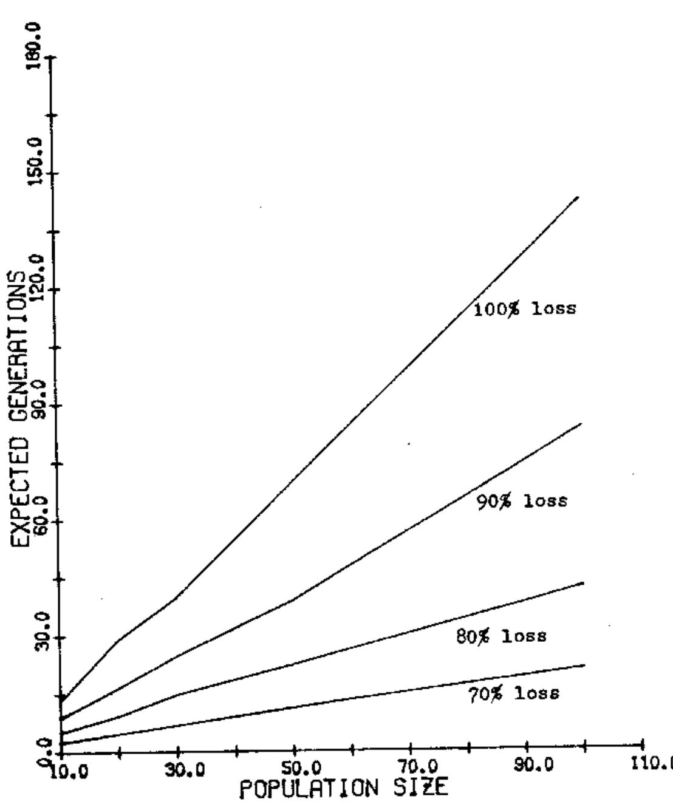  
Figure 3.l: The rate of allele loss due to genetic drift as a function of population size.

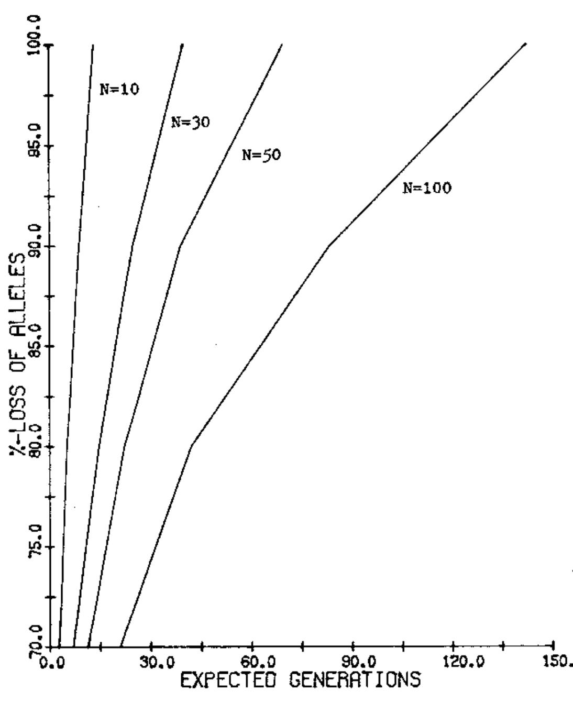  
Figure 3.2: The rate of allele loss due to genetio drift as a function of population size.

# 3.4 The Effects of Population Size on R1

The analysis of the preceding sections has yielded considerable insight into the behavior of plan R1. As we have seen, the loss of alleles from A(t) corresponds to a dramatic decrease in the space being searched by Ri, If this reduced space does not contain the optimum, we have seen that R1 will very likely remain on a non-optimal plateau with mutation providing only a low-probability chance of escape, Since this is the case, it is critical that alleles are lost only if their com

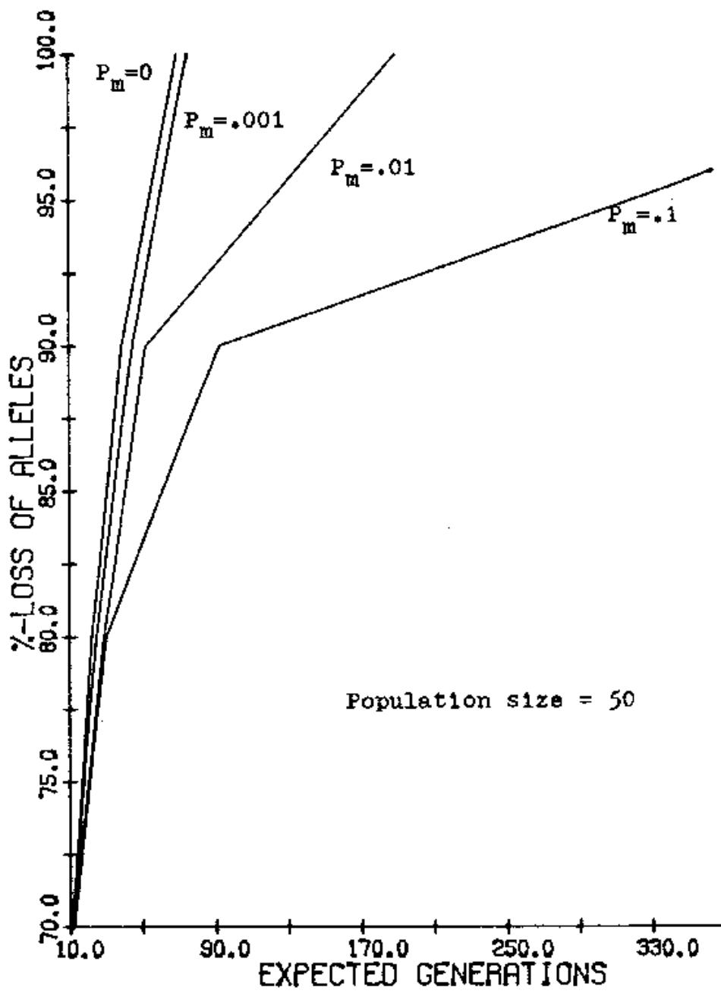  
Figure 3.3: The rate of allele loss due to genetic drift as a function of the mutation rate.

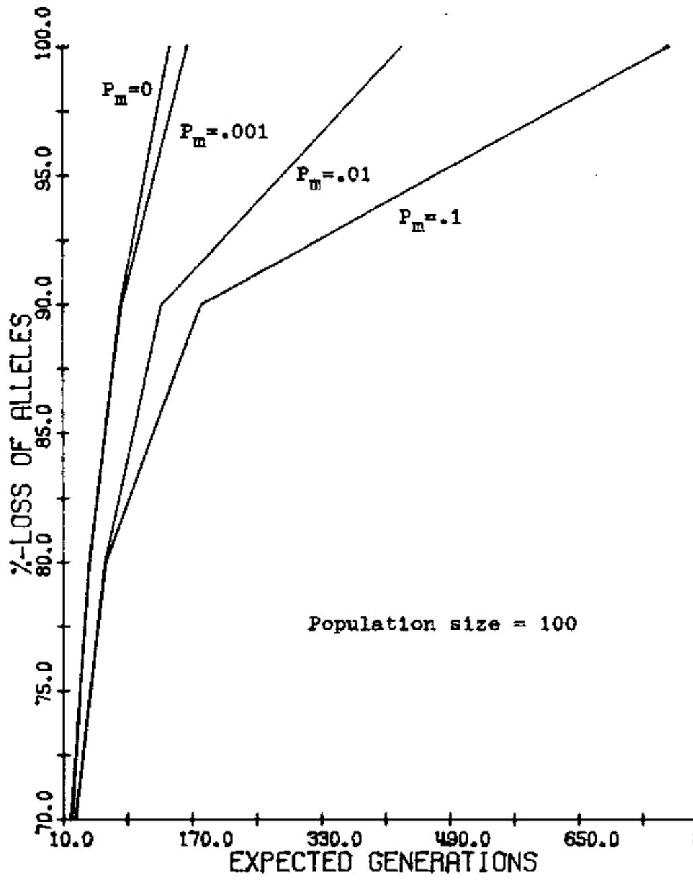  
Figure 3.4: The rate of allele loss due to genetic drift as a function of the mutation rate.

petitors are in fact better, However, on test function Fl, alleles are lost even when there is no selection differential and Rl converges to a non-optimal plateau. The preceding section suggests that this may be due in part to stochastic effects and suggests two approaches for alleviating the problem: changing the population size and the mutation rate of plan Ri. In this section we explore the effects of population size on the behavior of Ri.

Recall from appendix C that plan Rl maintained a population of 50 individuals and a mutation rate of .001 Note further from table 3.1 that 100 generations had elapsed by the time A1 generated A(300o). Referring back to figure $3 . 3$ , we see that for a population size of 50 and a mutation rate of .o01, the erpected number of generations for the simulated Markov process to enter the $1 0 0 \%$ -loss state was approximately 75. Hence, the allele loss observed in A(30oo) could be due entirely to genetic drift. If this is the case, increasing the population size should reduce considerably the rate of allele loss on test function Fi. Whether or not this will also improve the performance of Rl on Fi is not quite so obvious. Clearly, premature convergence is to be avoided. However, increasing the population size may also have the effect of slowing down the rate of convergence beyond acceptable bounds.

In order to evaluate these hypotheses, the behavior of Rl on Fi was also observed with population sizes of 100 and 20o, leaving the mutation rate unchanged at .001. Figure 3.5 contrasts the average rate of allele loss for the various population sizes. As expected, increasing the population size reduces the allele loss considerably over the interval of observation. The effect here is heightened by the fact that the time scale is in terms of the number of trials rather than the number of generations. That is, the allele loss was reduced in part because fewer generations (and hence fewer stochastic effects) were involved in generating the same number of sample points.

So we see that the problem of premature loss of alleles can be effectively removed by increasing the population size maintained by R1. However, it remains to be seen what effect this has on the performance of Rl. Recall from chapter i that two local measures of adaptive performance were defined for functions in E:

$$
x _ { e } ^ { * } ( s ) = \frac { 1 } { 1 } \sum \limits _ { t = 1 } ^ { 1 } r _ { e } ^ { * } ( t )
$$

$$
x _ { e } ( s ) = \frac { 1 } { \pi } \sum \limits _ { t = 1 } ^ { \pi } r _ { e } ( t )
$$

where $\pmb { \mathcal { \hat { \mathbf { r } } } } _ { \bullet } ( \pmb { \tau } )$ is the performance rating given to the sample solution generated by the adaptive plans for evaluation

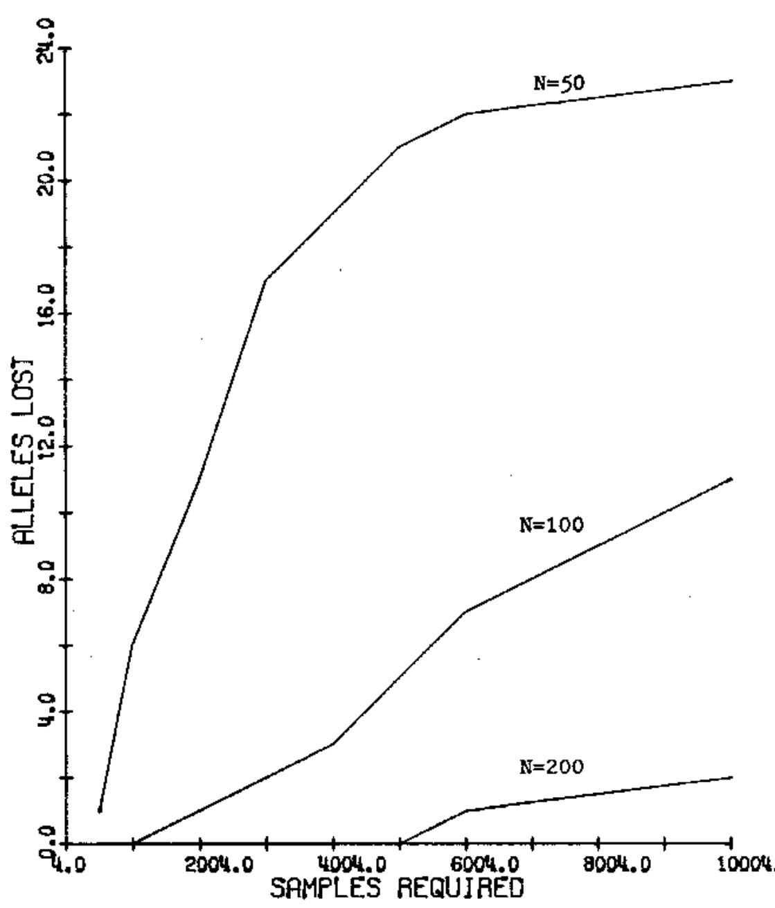  
Figure 3.5: The effeots of population size on allele loss for R1 on test function Fl.

at time $\pmb { \updownarrow }$ , and where $\widehat { \mathbf { r } } _ { \widehat { \mathbf { e } } } ^ { \bullet } ( \mathtt { t } )$ is defined by:

$$
\mathfrak { r } _ { \mathfrak { e } } ^ { \psi } ( \mathfrak { t } ) \ = \ \operatorname* { m i n } \left\{ \mathfrak { r } _ { \mathfrak { e } } ( 1 ) , \mathfrak { r } _ { \mathfrak { e } } ( 2 ) , \ \dots , \ \mathfrak { r } _ { \mathfrak { e } } ( \mathfrak { t } ) \right\}
$$

Figure 3.6 illustrates the effects of population size on ${ \mathbf { \mathbb { R } } } 1 ^ { \bullet } ( \mathfrak { t } )$ . The tradeoff here is clear. Initially B1(50) outperforms the larger populations, but converges prematurely to a non-optimal plateau. Bi(100) and Rl(200) respond more slowly but yield better long-term performance

Figure 3-7 illustrates the effects of population size on Fi(t). Here the interval required for the tradeoff to become apparent is considerably longer with El(50) outperforming the others over the first 25,000 trials,

At this point a few words of explanation about the notation being developed in chapter 3 is in order. As we shall see, genetic plan Rl is really a family of plans defined by such parameters as the population size, the mutation rate, and so on. Specific members of this family will be designated by notation of the form R1(x,Y,Z) specirying the actual parameter values. For purposes of clarity, two notational conveniences will be used. Pirst, parameters which have not yet been introduced into the discussion will be suppressed. So, for example, in the preceding paragraph we refer to Ri(x) even though by the end of the chapter four parameters will have been defined. Secondly, in a particular contert where it is clear that only one

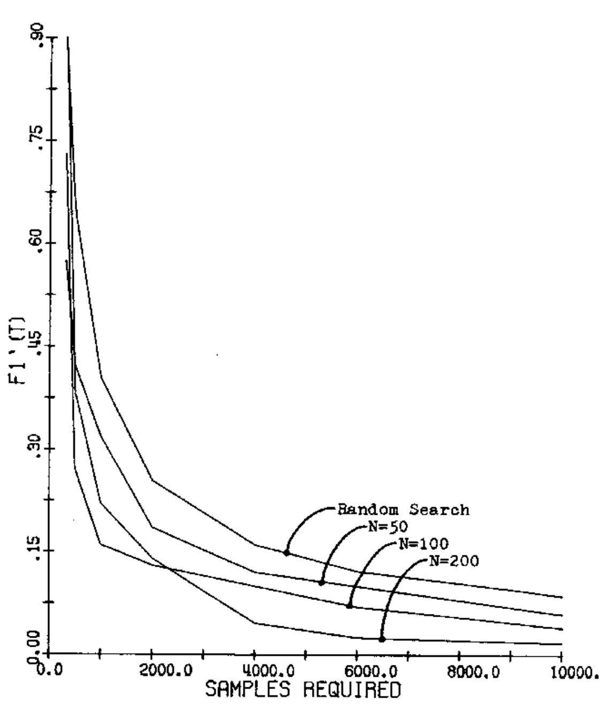  
Figure 3.6: The effects of population size on off-line performance of B1 on test function F1.

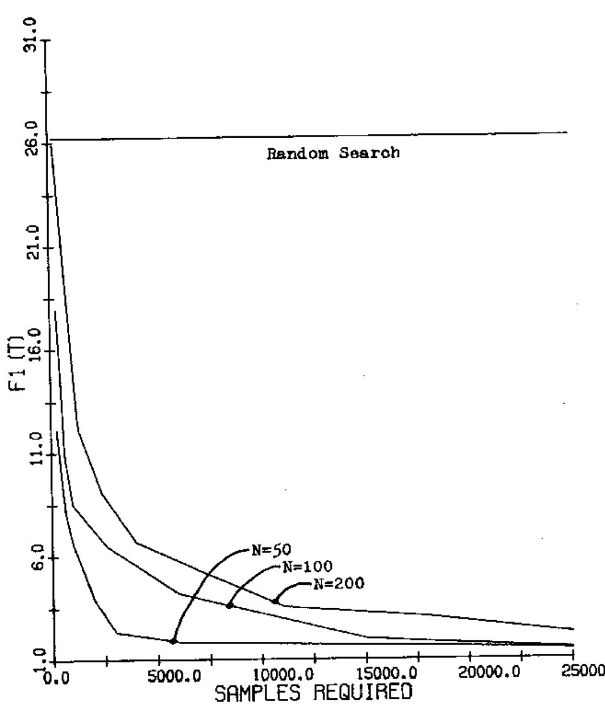  
Figure 3.7: T The effeots of population size on on-line performance of Ri on test function Fil.

parameter is under study, the values of the other parameters will be suppressed, So, for example, we may refer to R1(z) in situations in which X and Y are clearly fixed.

# 3.5 The Effects of Mutation Rate on R1

In this section we explore the second alternative approach to the problem of premature allele loss on F1, namely, changing the mutation rate for Bi. Recall from appendir C that R1 maintained a population of 50 individuals and a mutation rate of .ool. Referring back to figur 3.3 we note that a considerable reduction in allele loss was achieved in the simulated Markov process with a population size of 50 by increasing the mutation rate. This suggests that the allele loss in Rl might also be reduced by increasing the mutation rate. How an increase in the mutation rate will affect the performance of R1 is not so obvious. Clearly, reducing the premature allele loss will increase the potential for improving long-term performance as we saw in the previous section. However, recall that in chapter 2 we were able to neglect the effects of mutation (at .ooi) on the near-optimal sampling rate of Rl. As we increase the rate of mutation, we increase its effects on sampling which, in turn, may negatively affect the performance of Bl.

In order to evaluate these hypotheses, the behavior of R1 on F1 was observed with mutation rates of .005, .01.

.02, and .i, leaving the population size unohanged at 50. Figure 3.8 contrasts the average rate of allele loss for the various mutation rates. As expected, increasing the mutation rate reduces considerably the allele loss over the interval of observation. Clearly, the problem of premature allele loss can be solved by raising the mutation rate. However, its effect on the performance of Rl must also be considered.

Figure 3.9 illustrates the effects of increasing the mutation rate on the off-line performance of R1 on Fl. Increasing the mutation rate has the effect of improving initial performance. As noted earlier, a mutation rate of the same order of magnitude as l/PoP_SIZE seems to be about the best setting- Increasing the rate more definitely degrades ofr-line performance. These observations tend to confirm our intuition about Rl. With too low a mutation rate, the performance of Rl is degraded by the premature loss of alleles. With too high a mutation rate, the performance is degraded by the sub-optimal allocation of trlals to competing hyperplanes.

Figure 3.io illustrates the effects of increasing the mutation rate on the on-line performance of Rl on F1. Here the effects of mutation are clear. When every trial counts in the performance rating, any increase in the application of a random search operator like mutation has a degrading effect on the performance of RI.

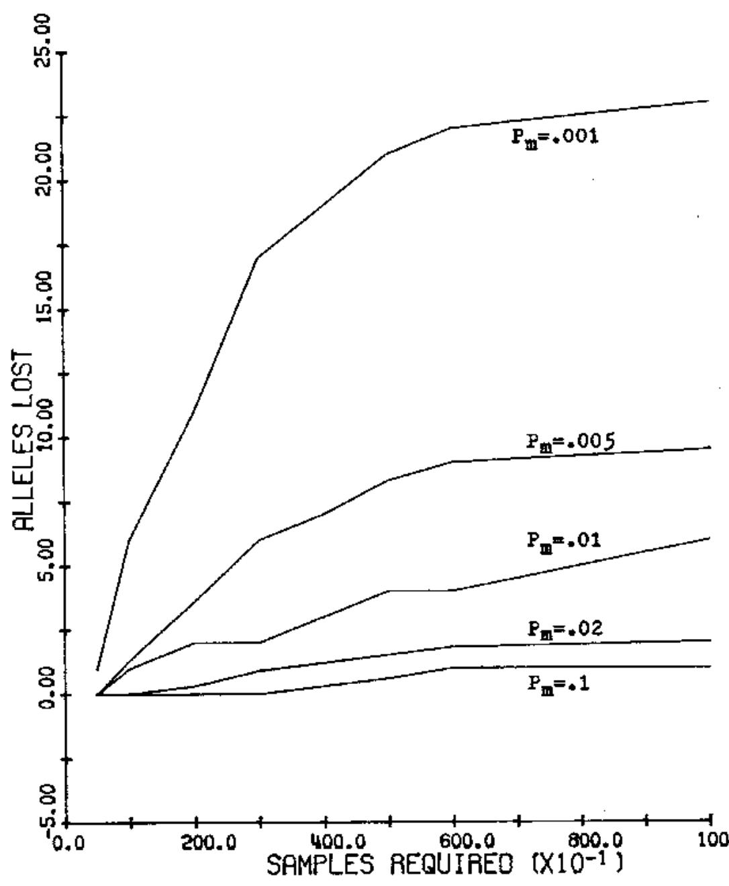  
3.8: The effects of mutation rate on allele loss for A1 on test function Fl.

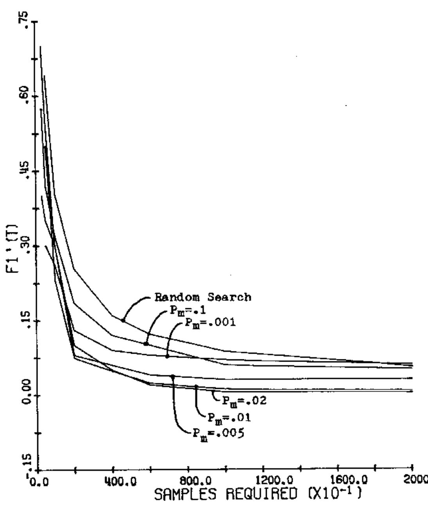  
Figure 3.9r The effects of mutation rate on off-line performance of Rl on test function Fl.

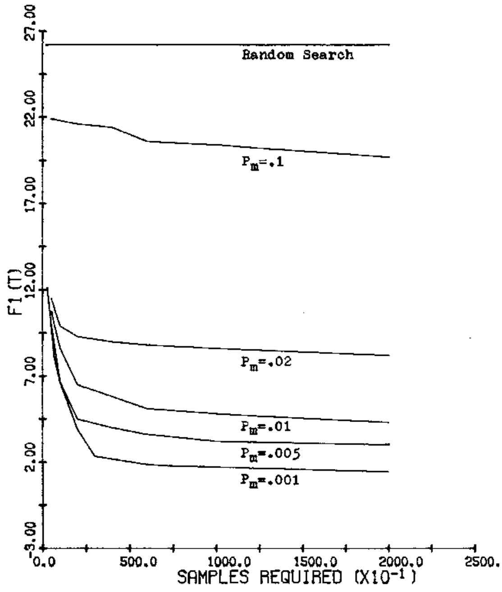  
Figure 3.10: The effects of mutation rate on on-line performance of R1 on test function Fl.

# 3.6 The Effects of Crossover Rate on R1

As described in appendix C. plan Ri produces an individual for the next generation A( $\hbar + 1$ ) by selecting two parents, applying crossover to produce an offspring, and then applying mutation to each gene position with probability $\mathtt { P _ { \overline { { \mathbf { u } } } } }$ • In this section we expiore the effects of reduoing the number of individuals in $\mathsf { A } ( \mathsf { t } + \mathsf { 1 } ) .$ produced by orossover. Thls varlation is easily accomplished within the framework or R1 as follows:

Do $\bar { \bf \Phi } { \bf \equiv } { \bf 0 }$ to POP_SIZE:

- select an individual $a _ { 1 t }$ from A(t) using the selection probabilities.   
- with probability $\mathbf { P } _ { \mathsf { S } }$ apply crossover to $a _ { 1 } t _ { \mathfrak { c } }$ by selecting a mate from A(t) using the selection probabilitles and choosing a crossover point.   
- apply mutation at each gene position with probability ${ \tt P } _ { \tt m }$ .

Since crossover is the principle search operator in R1, the effect of lowering the crossover rate is to reduce the number of new trials per generation. This reduction should in turn heighten the stochastic effects noted in the previous sections and increase the rate of allele loss generated by H1 on Fi. As a consequence, we would expect the performance of R1 to be adversely affected, since fewer trials will have been allocated before the allele loss has reduced A(t) to a nearly uniform population.

In order to evaluate these hypotheses, the behavior of A1 on test function Fl was observed with crossover rates of $z _ { 0 } = \frac { 1 } { 2 }$ , .6, and . $\downarrow$ , leaving the population size and mutation rate unchanged at N = 50 and Pm = .001.

Figure 3.ll compares the rate of allele loss for R1 on Fl as a function of the crossover rate, As expected, the rate of allele loss increases as the crossover rate decreases. Figures 3.12 and 3.13 compare the off-line and on-line performance curves for R1 on Fi as a function of the crossover rate. Here the results were unerpected. In spite of the fact that the rate of allele loss is increased, lowering the crossover rate initlally improved performance. Only when the crossover rate was lowered to ,4 was any negative effect on performance observed.

In an attempt to understand thts phenomenon, consider for a moment the effects of the two genetic operators: crossover and mutation. Until the allele loss in A(t) is extensive, applying crossover to two individuals generally produces an offspring quite distinct from either parent. On the other hand, applying mutation to an individual at the rate of .o01 changes on the average $h \mapsto \{ \ v { i } . 0 0 \tau \}$ alleles. In the case of test function F1, the number of genes per individual is $l = 3 0$ , so that crossover affects on the average .03 gene positions. So we see that with only these two genetic operators, lowering the orossover rate in R1 has the effect of increasing the likelihood that members of A(t) will produce an offspring nearly identical to themselves, if not identical, Since parents are

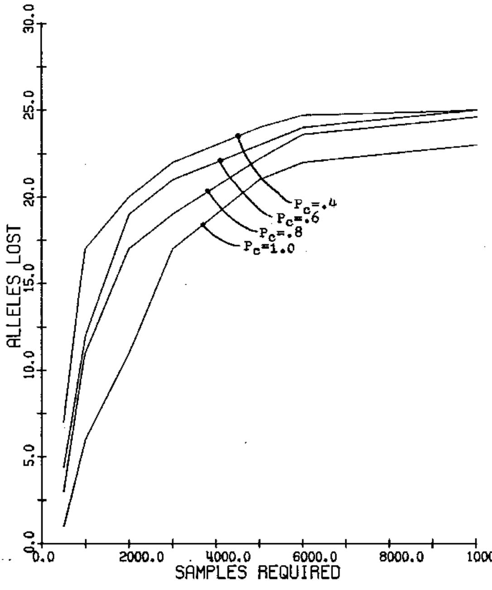  
Figure 3.11: The effects of crossover rate on allele loss for Rl on test function Fl.

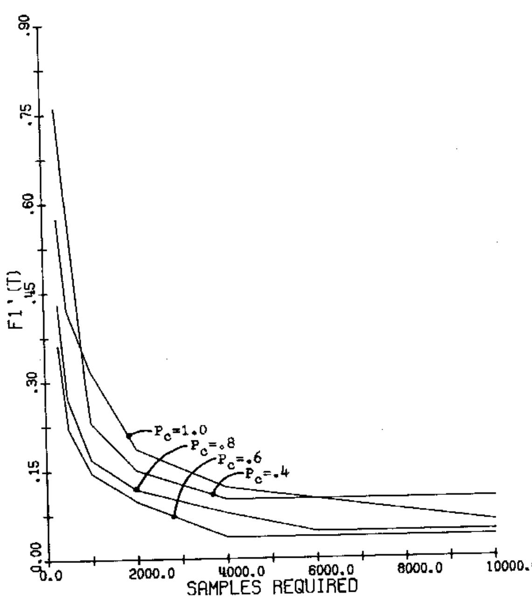  
Figure 3.12: The effects of crossover rate on off-line performance of R1 on test funotion F1.

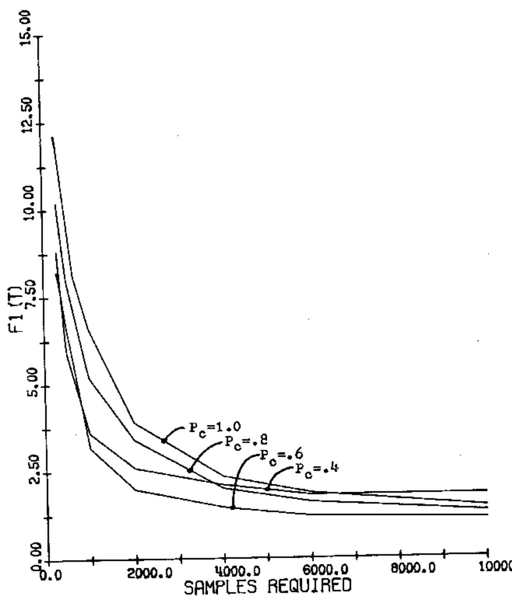  
Figure 3.13: 7 The effects of crossover rate on on-line performance of H1 on test function Fl.

selected on the basis of performance, the result is to inorease the probability of high-performance individuals surviving into the next generation. Here again we encounter the delicate tradeoff between further exploration and preserving the status quo, Applying crossover at the rate of 1.o seems to be too high a sampling rate for Hi(50..0o1). High-performance individuals are discarded faster than crossover can produce improvements, terminating with the usual premature convergence due to allele loss. On the other had, a crossover rate of .4 seems to be too low a sampling rate for Ri(50,.0o1). Too little erploration combined with the increased rate of allele loss causes rapid convergenge to a non-optimal plateau.

# 3.7 The Effects of Generation Gap on R1

Recall that plan R1 is designed to produce the next generation A $t + 1$ ) by replacing all N individuals from $\blacktriangle ( t )$ , A genetic model of this type is described as having non-overlapping generations; that is, parents do not exist simultaneously with their offspring. It 1s not imediately clear whether non-overlapping generations are good or bad in an artificial genetic adaptive model. From an implementation point of view, the distinction poses the classic tradeoff between storage and cpu time, Non-overlapping models require storage for two populations: A(t) and $\mathbb { A } ( \mathbb { t } { + } 1 )$ . If generations overlap, less storege is required, but

more generations are required (recomputing selection probabilities) to produce the same number of trials. In this seotion we ignore the time-space tradeoff and explore the effect of overlapping generations on the performance of R1.

Overlapping generations can be incorporated into Hl by adding a new parameter called the generation gap G which specifies the fraction of A(t+1) to be generated via the genetic operators, Obviously. G must lie in the range O4Gs1 with G = 1 the default value used in the previous simulations, If ${ \pmb G } \ll { \pmb 1 }$ , the remaining positions in A( $\hbar + 1$ ) are filled by selecting individuals from A(t) without replacement using a uniform distribution. As before, we inquire as to the expected number of offspring produced by an indiv1dual ${ \mathfrak { a } } _ { 1 \mathfrak { t } }$ in A(t). If we assume that the selection probabilities do not change much over the life-time of an individual, then on any particular generation the expected number of offepring from $\mathbf { a } _ { \mathfrak { i t } }$ is given by:

$$
( N _ { \# } { \mathbb G } ) \quad \# \ \mathbb { p } \{ \mathsf { a } _ { \pm t } \}
$$

where N ia the population size and. $p ( a _ { 1 t } )$ is the probability of selecting $a _ { 1 , t } .$ , The number of generations $a _ { 1 t }$ is expected to survive is simply the walting time to extinotion. Each goneration $a _ { 1 t }$ has a probability G of disappearing: : hence, the waiting time is $\frac { 1 } { \tt g }$ and the total number of offspring produced by $a _ { 1 t }$ is given by:

$$
( \frac { \mathbb { N } { \neq } \mathbb { G } } { \mathbb { G } } ) { \neq } \mathbb { p } \{ \mathbf { a } _ { 1 \mathbf { t } } \} = \mathbb { N } { \neq } \mathbb { p } \{ \mathbf { a } _ { 1 \mathbf { t } } \}
$$

which is the same as the non-overlapping model.

On the basis of our erperiences with the crossover rate, we would expect that reducing the generation gap should increase the rate of allele loss since fewer trials are made per generation. Its effect on performance is not quite so obvious, Clearly, the reduced sampling rate should improve the performance of A1(50,.001) on Fl as it did in the case of crossover. However, note that the individuals which are likely to survive into the nert generation are selected at random, rather than on the basis of performance. This should reduce the extent of the improvement observed when the crossover rate was reduced.

In order to evaluate these hypotheses, the behavior of A1 was observed on F1 with generation gaps of .8, .6, and. $\pmb { \psi }$ leaving the population size, mutation rate, and crossover rate unchanged at $\yen 50$ , $\mathbb { P } _ { \mathtt { m } } = \mathtt { \Omega } \mathtt { \cdot } 0 0 1$ and $\bar { \bf \Delta } _ { \odot } = { \bf \Delta 1 . 0 . }$

Figure $3 . 1 4$ compares the rate of allele loss for R1 on Fl as a function of the generation gap. As erpected, the rate of allele loss increases as the generation gap decreases. Figures 3.15 and 3.16 compare the off-line and on-line performance curves for R1 on F1 as a funotion of the generation gap. As expeoted, lonering the generation gap provides an initial improvement in performance

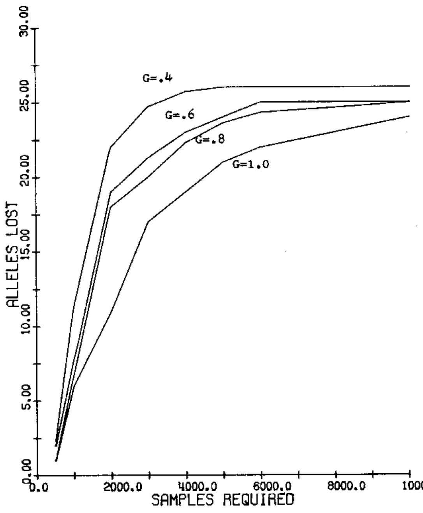  
Figure 3.14: The effects of generation gap on allele loss of R1 on test function Fi.

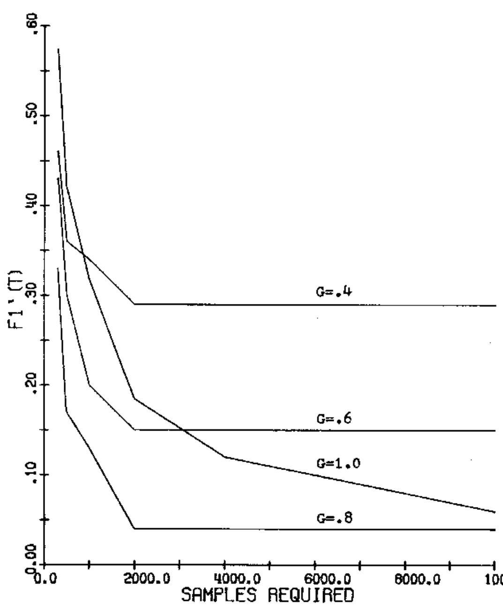  
Figure 3.i5: The effects of generation gap on off-line performance of Rl on test function F1.

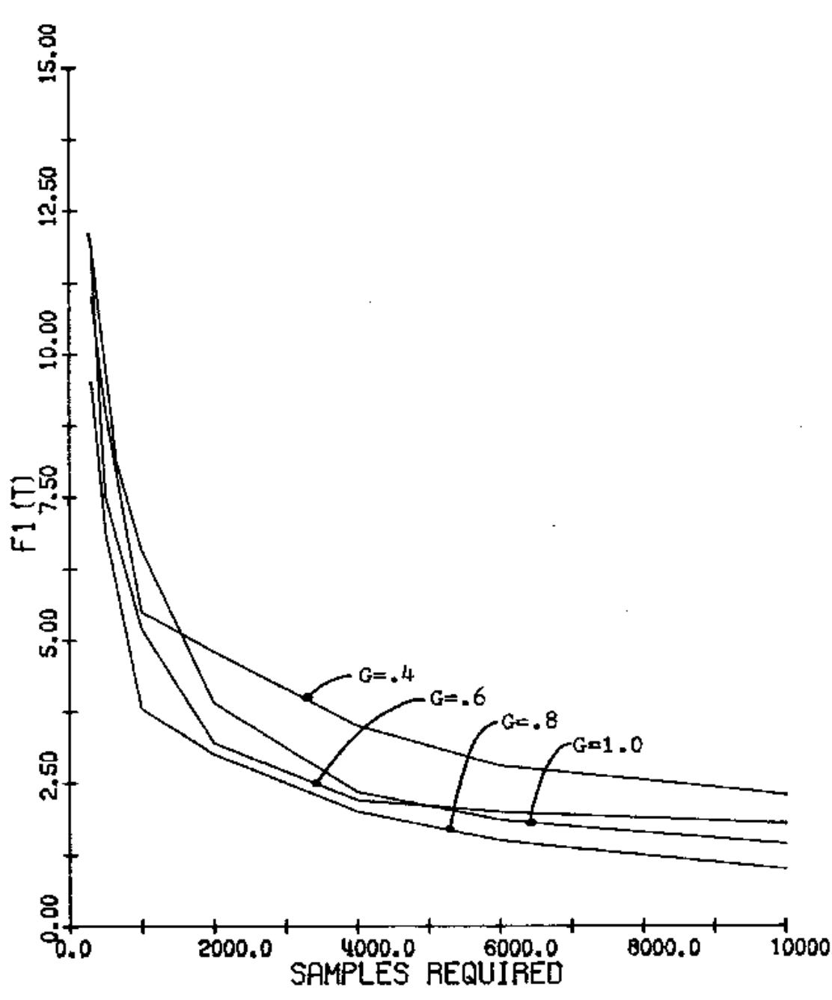  
Figure 3.16: The effects of generation gap on on-line performance of Ri on test funetion Fl.

but also produces an earlier convergence to a non-optimal plateau, the improvement being considerably less dramatic than that generated by a corresponding reduction in the crossover rate.

# 3.8 Improying the Performance of E1 on F1

In the preceding sections we have isolated several parameters in the definition of plan Al and have explored the effects of independently changing these parameters on the behavior of R1 on test function F1. The motivation for these studies was to gain further insight into how R1 operates and, in particular, to analyze the problem of premature convergence to a non-optimal plateau, As we have seen, no one of the parameters studied both satisfactorily resoives the problem of premature convergence and substantially improves the performance of Rl on Fl. In this section we explore the possibility of resolving these problems by changing various combinations of parameter settings for Rl.

In this chapter R1 has evolved into a family of genetio plans, a member of which is selected by specifying the values of four parameters; the population size N, the mutation rate $\mathtt { P _ { \overline { { \mathbf { u } } } } }$ , the crossover rate $\pmb { \mathrm { p } } _ { \pmb { \mathrm { c } } }$ , and the generatlon gap G. Ideally, we would like to apply optinization techniques to the space of algorithms defined by these parameters and optimize with respect to premature allele loss, off-line, and on-line performance.

In reality, however, this approach i8 prohibited by the cost involved in analyzing the behavior of a single member of this family. Because each plan is a stochastic process, at least 5 (and often more) simulations are required to produce analysis measuroments within reasonable standard error limits. In terms of present university rates, this can mean a cost of as much as \$5o to evaluate a single plan on Fi alone. We will avoid this problem by applying the insight gained from the previous sections to the selection of a few well-chosen combinations of parameters to confirm and extend our understanding of the basic genetic plan R1.

We begin by noting that of the four parameters analyzed, reducing the crossover rate produced the single best improvement in the performance of Rl on Fi, even though the allele loss rate actually increased in the process. This, we felt, was due to the reduced sampling rate effected by reducing the number of new individuals produced by crossover. As we observed, reducing the generation gap also lowered the sampling rate, but the improvement in performance is not as substantial as the corresponding reduction in crossover because of the difference in the kind of individual most likoly to survive into the next generation. If these observations are correot, we would eipect that sampling rates produced by a combination of reduced crossover rates and generation gaps should not be as effective in improving the performance of R1 on F1 as the equivalent sampling rate produced by crossover alone,

In order to evaluate this hypothesis, the behavior of Rl on F1 was observed for $\pmb { \mathscr { u } }$ different combinations of crossover rates and generation gaps $\{ \mathfrak { P } _ { \mathtt { C } } { = } _ { \bullet } \mathfrak { S } _ { \bullet } \mathfrak { G } { = } 1 . 0 \}$ $\{ \pmb { \mathbb { P } } _ { 0 } { \bf = } . 8 , \pmb { \mathbb { G } } { \bf = } . 8 \}$ $\{ \pmb { \mathbb { P } } _ { \mathbf { c } } { \mp } . { \pmb { \ 6 } } , { \pmb { \ 6 } } { \pmb { = 1 } } , { \pmb { \ 0 } } \}$ , and $( P _ { c } = . 6 , G = . 8 )$ , holding the population size and mutation rate fixed at $N = 5 0$ and $\pmb { \mathbb { P } } _ { \pmb { \ m } } = . 0 0 1$ , The performance curves generated by these combinations on test function Fl are illustrated in Figures 3.17 and 3.18, and they confirm our intuition about the behavior of plan R1. R1(.8,.8) performed better on F1 than Ri(.8,1.0), but not as well as Ri(.6,1.0) which has an equivalent sampling rate. As we saw previously, a combined sampling rate of less than .6 (in this case H1(.6,.8)) adversely affects the performance of Ri on Fi. These observations suggest that reasonable settings for the crossover rate and generation gap of Rl are approximately $\tt P _ { c } = . 6$ and $\mathtt { G } { = } 1 \cdot 0$ :

Alternatively, we saw that increasing the mutation rate improved considerably the allele loss rate, but the effects on performance were mixed, The best online performance was generated by a mutation rate of approrimately $\pmb { \mathrm { p } } _ { \pmb { \mathrm { u } } } = \pmb { \mathrm { 1 } } / \pmb { \mathrm { u } }$ while any increase in mutation adversely affected on-line performance. This, we felt, was due to the fact that mutation is in fact an effective method for combatting premature allele loss and, hence, improving off-line performance. But because it accomplishes this in its random sampling style, the price is paid in its adverse effect on on-line performance. If these observations are correct, we should erpect to see the same kind of behavior changes produced by varying the mutation of R1 $\left. 5 0 , \mathbf { z } , \mathbf { \delta } . 6 , \mathbf { 1 } . 0 \right.$ as we SaW with R1(50,1,1.0,1.0), but perhaps less dramatic changes since a crossover rate of .6 has already improved the performance ourves.

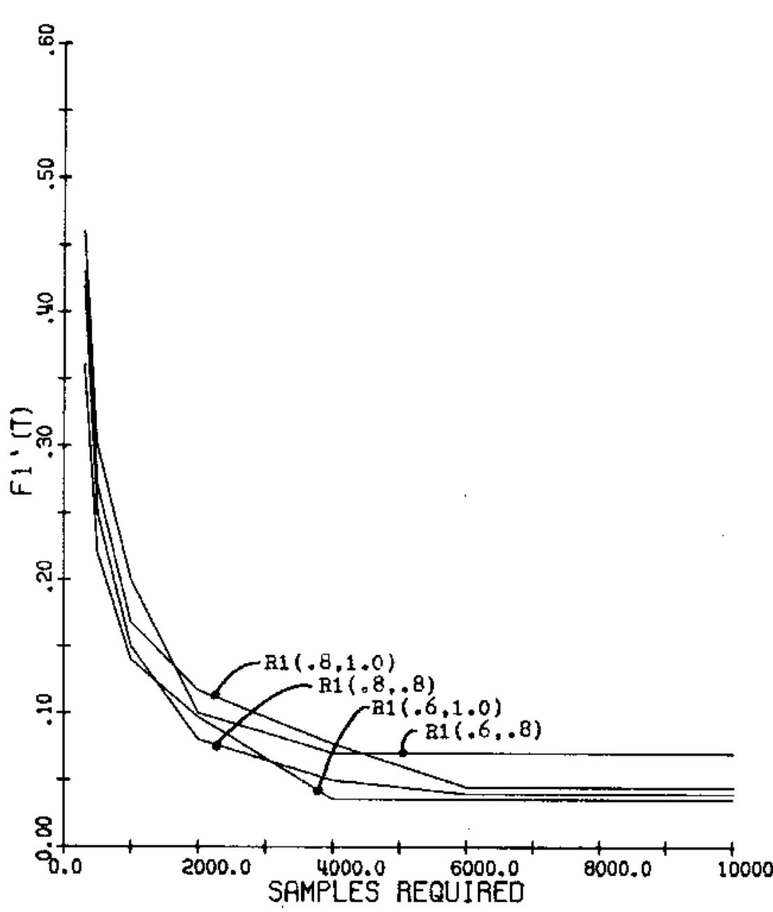  
Figure 3.17: Off-line performance of Hi on Fl as a function of crossover rate and generation gap,

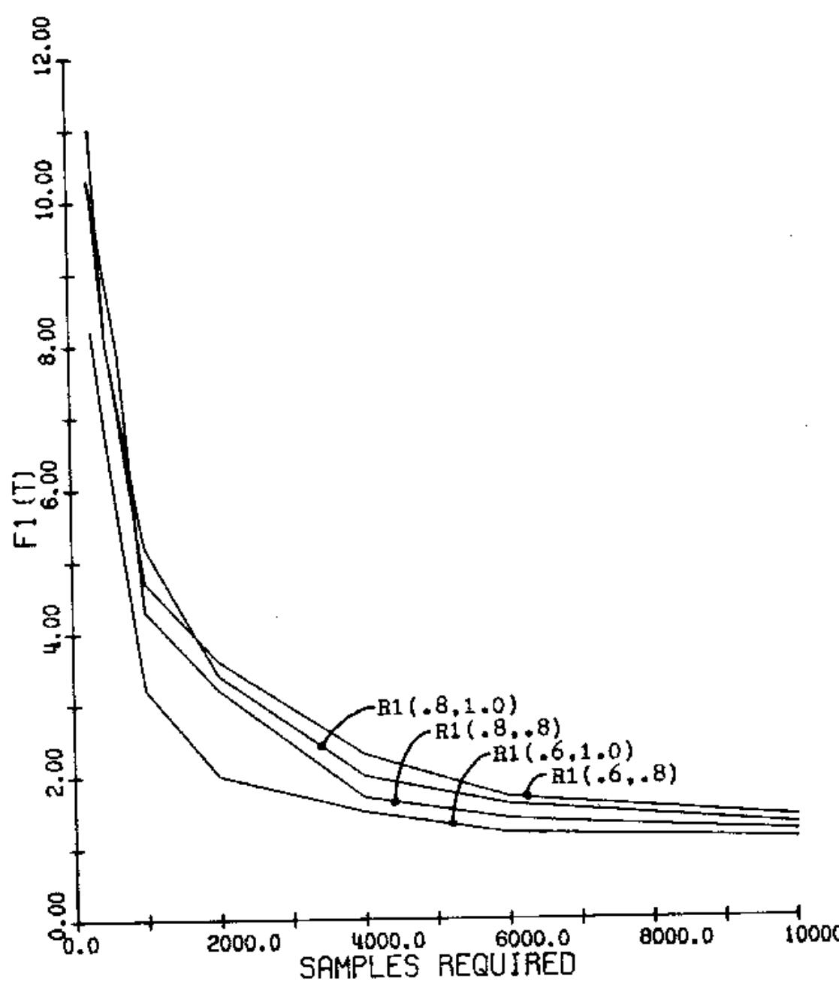  
Figure 3.18: On-line performance of H1 on F1 as a function of crossover rate and generation gap.

To evaluate these hypotheses, the behavior of RI on Fi was observed with mutation rates of $\pmb { \mathrm { p } } _ { \pmb { \mathrm { u } } } \mathbf { = } _ { \bullet } \pmb { 0 } \pmb { 0 } \pmb { 1 }$ . .01. and .1, leaving the population size, the crossover rate, and the generation gap fixed at $N = 5 0$ $\rho _ { e } = \delta$ , and $\mathtt { G } \mathtt { = } \mathtt { 1 } \mathtt { \cdot 0 }$ : Figures 3.19 and 3.20 compare the performance curves generated by the various mutation rates. These observatlons confirm our intuition about the effects of mutation on the performance of R1 and emphasize again the tradeoff between on-line and off-line performance.

Finally, we observed that increasing the population size reduced the rate of premature allele loss, but its effects on the performance of Al were mixed. Larger populations responded more slowly but generated better long-term off-line performance, while increasing the population size adversely affected on-line performance over the interval of observation. This, we felt, was due to the fact that increasing the population size reduces considerably the allele loss and hence improves long-term performance, but at the cost of taking more samples before a decision (a generation) is made con

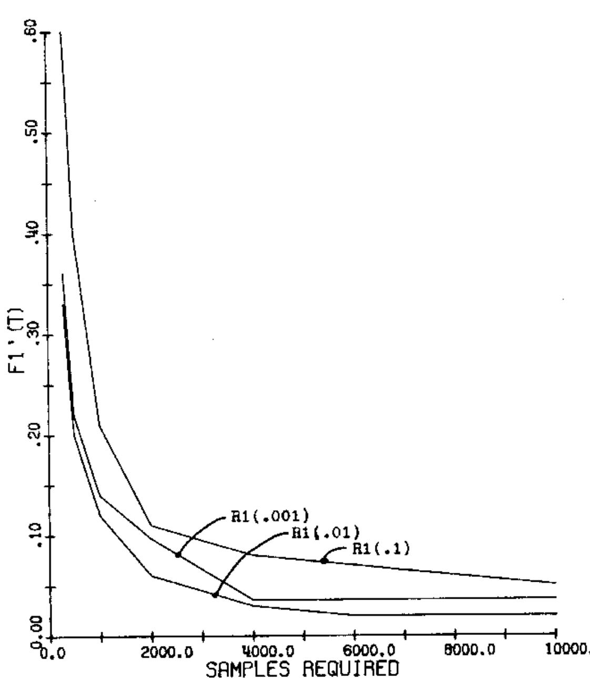  
Figure 3.19: Off-line performance of A1 on Fi as a function of mutation rate.

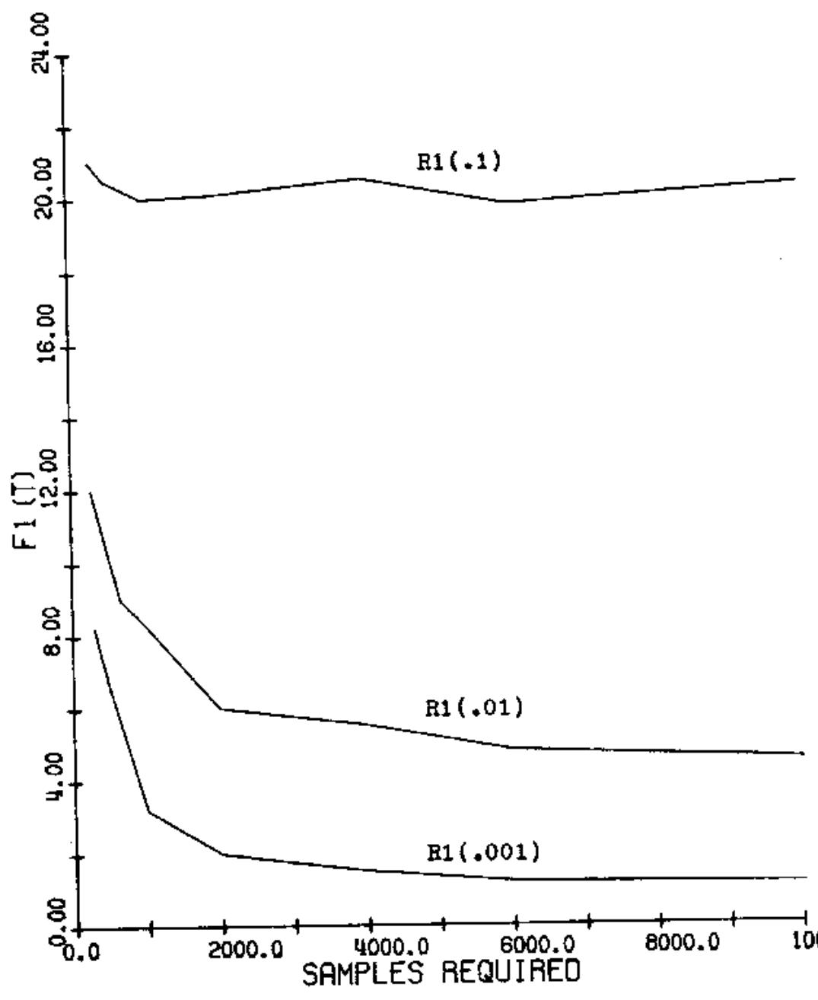  
Figure 3.20: On-line performance of.A1 on Fl as a function of mutation rate.

cerning the re-distribution of trials. If these observations are correct, we should erpect to see the same kind of changes in the behavior produced by increasing the population size of $\yen 123,456,789$ as We saw with H1 $\left. \mathbf { x } , . 0 0 1 , 1 . 0 , 1 . 0 \right.$ , but perhaps less dramatic changes since a crossover rate of .6 has already improved the performance curves.

To evaluate these hypotheses, the behavior of R1 . on Fi was analyzed for population sizes of $N = 5 0$ , 100, and 2oo, leaving the mutation rate, the crossover rate, and the generation gap unchanged at $\mathbb { P } _ { \mathbb { m } ^ { \Xi } \bullet \bullet 0 0 1 }$ , $\mathtt { P _ { c } } = \mathtt { . 6 }$ : and $\mathtt { G } = \mathtt { 1 } \mathtt { \cdot 0 }$ . Figures 3.21 and 3.22 compare the performance curves produced by the various population sizes, These observations confirm our intuition about the effects of population size and emphasize again the tradeoff between on-line and off-line performance.

These observations also suggest that no particular combination of the four parameter settings is going to dramatically improve the performance of Rl on F1, and that perhaps the off-line performance generated by Ri(50,.01,.6,1.0) and the on-line performance generated by R1(50,.001,.6,1.0) are about the best that can be expected from the basic genetic plan Bl.

# 3.9 Summary

We began this chapter by noting that, although plan H1 outperforms random search on test function Fl, it.

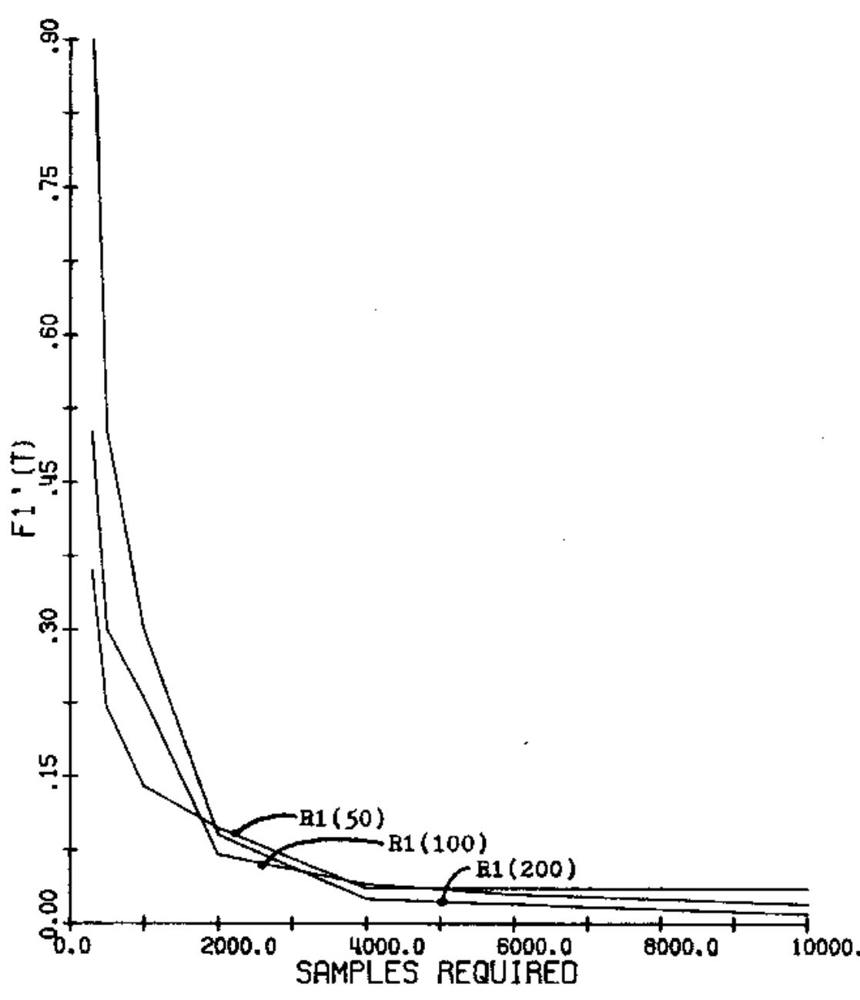  
Figure 3.21: Off-line performance of H1 on F1 as a funotion of population size.

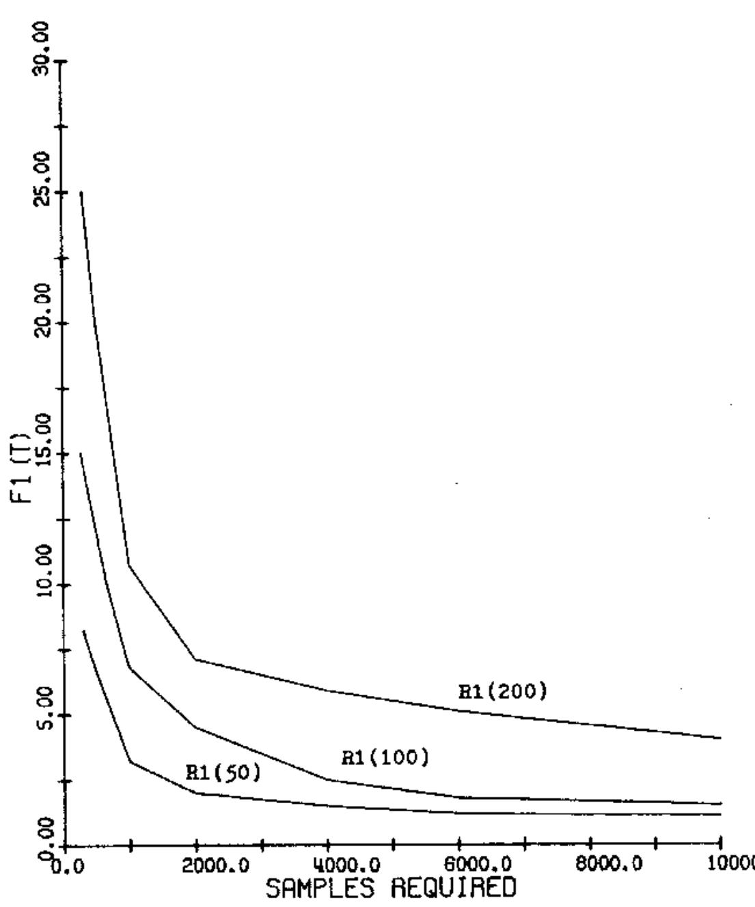  
Figure 3.22: On-line perforwance of R1 on F1 as a function of population size.

suffers from the problem of premature convergence to a non-optimal performance plateau caused by a loss of alleles in $\Delta ( t )$ , even though on Fi no allele has any selective advantage over its competitor. We saw via Markov process simulation that such allele loss rates car in fact be caused by the stochastic side-erfects of generating new populations from old ones using only a finite number of random samples. In order to understand and, perhaps, alleviate the problem, the effects of changing various parameters of genetic plan R1 were analyzed, As we observed, increasing the population size maintained by B1 reduces considerably the rate of allele loss, but also. poses a tradeoff in performance. Larger populations respond more slowly, but yield better long-term performance. Alternatively, the allele loss can be counteracted by increasing the mutation rate. However, the effects on performance are mixed. A mutation rate of about i/Pop_sIzE seems to generate the best off-line performance for Rl. But any increase in the mutation rate adversely affects on-line performance. Redueing the crossover rate did nothing to alleviate the premature convergence problem; rather, it increased the rate of allele loss. Surpriaingly, however, it did effect an improvement in the initial perforuance of X1, suggesting that generating $\mathbb { A } \{ t + 1 \}$ ) by replacing every individual in A(t) was, perhaps, too high a sampling rate. Reducing the generation gap of Ei was also ob

served to increase the rate of allele loss rather than alleviate it. As with crossover, even with the increased rate of allele loss, an improvement in initial performance was observed. Finally, several combinations of parameter values were analyzed in an attempt to improve the performance of RI on Fl. As we observed, no particular settings significantly improved performance suggesting that this is about the best we can erpect from R1 on F1.