# Chapter 4

# PERFORNANCE EVALUATION OF GENETIC ADAPTIVE PLANS

# 4.1 Introduction

In the preoeding chapters we have introduced a class of genetic adaptive algorithms for study, and we have focused our attention in partioular on the behavioral characteristics of the basic family of plans R1 on test function Fi. The emphasis has been on understanding how these adaptive models operate in finite time and space. In this chapter we apply the insight gained by these studies to the problem of improving the performance of genetic adaptive plans on E.

# 4.2 The Performance of Rl on E

In the last chapter we studied the effects of chang ing the various parameters of Ri on its performance on test function Fi. In this section we will ertend these observations to the performance of Rl on E. As noted earlier, optimizing the performance of Rl over its parameter space is prohibited by the cost of simulation analysis on existing facilities. As before, however, we extend our insight by analyzing a few wellchosen members of the family of plans defined by RI. Recall that in choosing a partioular member in B1, four parameters must be specified: the population size N, the mutation rate ${ \pmb { \mathrm { p } } } _ { \pmb { \mathrm { a } } }$ , the crossover rate $\mathtt { P _ { \circ } }$ , and the generation gap G. Based on the results of the previous chapter, the following members were chosen for analysis on E:

Recall from chapter I that, for each $\pmb { \mathscr { t } } _ { \pmb { \theta } }$ in the environment E, local robustness was defined by

$$
\bf { x _ { e } ( \bar { \tau } ) _ { \tau } = \displaystyle \frac { 1 } { \tilde { \tau } } \sum _ { i = 1 } ^ { \tilde { \tau } } \Delta _ { f _ { e } ( t ) } }
$$

for on-line performance and

$$
\mathbf { x } _ { \ominus } ^ { * } ( \mho ) \ = \ \frac { 1 } { \tilde { \mathrm { T } } } \sum _ { 1 = 1 } ^ { \mathrm { T } } \ \mathbf { f } _ { \ominus } ^ { * } ( t )
$$

for off-line performance with the associated global measures of robustness defined by

$$
X _ { \Xi } ( \tau ) = \big \{ \frac { 1 } { \Xi } \big \} \sum _ { \Xi } ^ { \bullet } \mathtt { r _ { e } } ( \tau )
$$

and

$$
X _ { \mathbf { g } } ^ { \mathbf { ^ { * } } } ( \mathbb { T } ) = \frac { 1 } { \vert \overline { { \mathbf { g } } } \vert } \sum _ { \mathbf { \vec { g } } } ^ { } \mathbf { x } _ { \mathbf { \textsc { s } } } ^ { \bullet } ( \mathbb { T } )
$$

respectively. Based on previous experience and with an eye for practical applications, T=6ooo was chosen as a reasonable bound on the interval of observation. Tables $\pmb { \ 4 }$ .1a and 4.1b summarize the performance measures obtained from this evaluation and there were very few surprises.

The first three members analyzed differed only in thelr crossover rates of 1.0, .8, and .6 respectively. As we observed before on test function Fl, reducing the crossover rate improves both off-line and on-line performance. The fourth member analyzed illustrates that on E as well as Fi, reducing the generation gap is not as effective as reducing the crossover rate. The firth and sirth members analyzed confirm on E the observation regarding the tradeoff between off-line and on-line performance presented by changing the mutation rate. The only mild surprise came with the evaluation of the last two members supporting a population of size 100. Contrary to our earlier observations, increasing the population size degraded both off-line and on-line performance indices. Upon reflection, however, the reason for this change seems clear. Recall that our earlier observations over 10,o0o trials suggested that increasing the population size improved long-term performance at the expense of short-term performance. By shortening the evaluation period to 6ooo trials, we have put more emphasis on the short-term behavior and

<table><tr><td rowspan=1 colspan=1>T=6000</td><td rowspan=1 colspan=1>N =50$P_0E$G\^o=1.0$</td><td rowspan=1 colspan=1>N=50P{001EP=8$G\^ }=10$</td><td rowspan=1 colspan=1>1N =50P=.001mPa  6G=1.0</td><td rowspan=1 colspan=1>N:50P${m01Pc=.8$G8$</td><td rowspan=1 colspan=1>N=50P=1.0</td><td rowspan=1 colspan=1>N =50Pm01$P}=$$c^ }=1.0$</td><td rowspan=1 colspan=1>N =100$P_01$PPc=.8G=1.0</td><td rowspan=1 colspan=1>N =100Pm001a$$G=1.0$</td></tr><tr><td rowspan=1 colspan=1>$\_r)</td><td rowspan=1 colspan=1>.22</td><td rowspan=1 colspan=1>199</td><td rowspan=1 colspan=1>.146</td><td rowspan=1 colspan=1>.185</td><td rowspan=1 colspan=1>.136</td><td rowspan=1 colspan=1>169</td><td rowspan=1 colspan=1>.214</td><td rowspan=1 colspan=1>.157</td></tr><tr><td rowspan=1 colspan=1>$\{ra)}$</td><td rowspan=1 colspan=1>.34</td><td rowspan=1 colspan=1>.23</td><td rowspan=1 colspan=1>.31</td><td rowspan=1 colspan=1>36</td><td rowspan=1 colspan=1>.199</td><td rowspan=1 colspan=1>.147</td><td rowspan=1 colspan=1>288</td><td rowspan=1 colspan=1>.248</td></tr><tr><td rowspan=1 colspan=1>$xp3</td><td rowspan=1 colspan=1>-26.2</td><td rowspan=1 colspan=1>-26.5</td><td rowspan=1 colspan=1>-27.2</td><td rowspan=1 colspan=1>-26.4</td><td rowspan=1 colspan=1>-26.6</td><td rowspan=1 colspan=1>-26.4</td><td rowspan=1 colspan=1>-26.1</td><td rowspan=1 colspan=1>-26.8</td></tr><tr><td rowspan=1 colspan=1>$x\{{{)}$</td><td rowspan=1 colspan=1>35.9</td><td rowspan=1 colspan=1>34.67</td><td rowspan=1 colspan=1>34.5</td><td rowspan=1 colspan=1>37.5</td><td rowspan=1 colspan=1>34.1</td><td rowspan=1 colspan=1>34.2</td><td rowspan=1 colspan=1>36.6</td><td rowspan=1 colspan=1>37.8</td></tr><tr><td rowspan=1 colspan=1>$\{{)}$</td><td rowspan=1 colspan=1>4.13</td><td rowspan=1 colspan=1>3.75</td><td rowspan=1 colspan=1>2.56</td><td rowspan=1 colspan=1>3.58</td><td rowspan=1 colspan=1>3.31</td><td rowspan=1 colspan=1>2.46</td><td rowspan=1 colspan=1>4.92</td><td rowspan=1 colspan=1>4.75</td></tr><tr><td rowspan=1 colspan=1>$x\r)$</td><td rowspan=1 colspan=1>2.88</td><td rowspan=1 colspan=1>2.47</td><td rowspan=1 colspan=1>2.06</td><td rowspan=1 colspan=1>2.64</td><td rowspan=1 colspan=1>2.23</td><td rowspan=1 colspan=1>2.11</td><td rowspan=1 colspan=1>3.18</td><td rowspan=1 colspan=1>3.23</td></tr></table>

<table><tr><td rowspan=1 colspan=1>T=6000</td><td rowspan=1 colspan=1>N=50G=1.0</td><td rowspan=1 colspan=1>N =50Pn=.001ttP</td><td rowspan=1 colspan=1>N =50Pm=01G=1.0</td><td rowspan=1 colspan=1>}N^=50$$P_{m}= .001P.8$G}=8$</td><td rowspan=1 colspan=1>N =50$P_mo$P8$$G=1.0</td><td rowspan=1 colspan=1>N =50$Pm.01$P=6$G\}=1.0$</td><td rowspan=1 colspan=1>N =100Pm=.001Po8$G=10$</td><td rowspan=1 colspan=1>N =100P001$Po$G =1.0</td></tr><tr><td rowspan=1 colspan=1>IF1(T)</td><td rowspan=1 colspan=1>4.6</td><td rowspan=1 colspan=1>4.27</td><td rowspan=1 colspan=1>3.65</td><td rowspan=1 colspan=1>4.02</td><td rowspan=1 colspan=1>7.35</td><td rowspan=1 colspan=1>7.6</td><td rowspan=1 colspan=1>6.94</td><td rowspan=1 colspan=1>5.69</td></tr><tr><td rowspan=1 colspan=1>1F2(T)</td><td rowspan=1 colspan=1>78.4</td><td rowspan=1 colspan=1>76.8</td><td rowspan=1 colspan=1>76.7</td><td rowspan=1 colspan=1>78.4</td><td rowspan=1 colspan=1>161.6</td><td rowspan=1 colspan=1>160.5</td><td rowspan=1 colspan=1>134.8</td><td rowspan=1 colspan=1>114.37</td></tr><tr><td rowspan=1 colspan=1>1p3(T)</td><td rowspan=1 colspan=1>-22.1</td><td rowspan=1 colspan=1>-23.17</td><td rowspan=1 colspan=1>-23.3</td><td rowspan=1 colspan=1>-22.1</td><td rowspan=1 colspan=1>-18.4</td><td rowspan=1 colspan=1>-19.01</td><td rowspan=1 colspan=1>-21.4</td><td rowspan=1 colspan=1>-21.3</td></tr><tr><td rowspan=1 colspan=1>$p4(T)</td><td rowspan=1 colspan=1>97.3</td><td rowspan=1 colspan=1>93.2</td><td rowspan=1 colspan=1>89.9</td><td rowspan=1 colspan=1>96.5</td><td rowspan=1 colspan=1>127.8</td><td rowspan=1 colspan=1>128.4</td><td rowspan=1 colspan=1>102.7</td><td rowspan=1 colspan=1>98.14</td></tr><tr><td rowspan=1 colspan=1>$\_p{5T</td><td rowspan=1 colspan=1>42.2</td><td rowspan=1 colspan=1>34.1</td><td rowspan=1 colspan=1>36.5</td><td rowspan=1 colspan=1>41.2</td><td rowspan=1 colspan=1>84.1</td><td rowspan=1 colspan=1>92.2</td><td rowspan=1 colspan=1>45.4</td><td rowspan=1 colspan=1>38.1</td></tr><tr><td rowspan=1 colspan=1>$xy(T</td><td rowspan=1 colspan=1>40.08</td><td rowspan=1 colspan=1>37.04</td><td rowspan=1 colspan=1>36.69</td><td rowspan=1 colspan=1>39.60</td><td rowspan=1 colspan=1>72.49</td><td rowspan=1 colspan=1>73.94</td><td rowspan=1 colspan=1>53.61</td><td rowspan=1 colspan=1>47.01</td></tr></table>

hence should erpect to see a performance degradation.

These results confirm our earlier observations of the behavior of B4, and they suggest that the off-line performance of R1(50,.01..6,1.0) and the on-line performance by R1(50..001..6.1.0) are about the best that can be expected from these simple genetic plans.

# $4 . 3$ Elitist Model R2

Earlier observations of the behavior of Rl suggested that generating N new individuals for each new population A(t+i) was in fact too high a sampling rate. Highperformance individuals were lost before the genetic operators were able to produce improvements. An improvement in performance was obtained by reducing the crossover rate and/or the generation gap which, in turn, reduced the number of new individuals produced for A(t+l). Moreover, we observed that reducing the crossover rate produced better performance improvements than a corresponding reduction in the generation gap. This, we felt, was due to the fact that, because of the selection processes, high-performance individuals were more likely to survive into the next generation via a reduction in the crossover rate than with a reduction in the generation gap, In this section we consider the implications of giving high-performance individuals special treatment by modifying the basic plan R1 to include the following elitist policy:

Let $a ^ { \mu } ( t )$ be the best individual generated up to time $\pmb { \ t { \tau } }$ , Ir, after generating A( $t + 1$ ) in the usual fashion, $a ^ { \prime } ( t )$ 18 not in A( $( t + 1 )$ , then include a\*(t) to A(t+1) as the $( N + 1 ) ^ { t h }$ member.

Such a policy guarantees that the best individual generated will not be lost from one generation to the next as a consequence of sampling effects or the application of genetic operators. From the hyperplane analysis point of view, this policy will bias the distribution of trials in favor of those hyperplane partition elements which have produced the best-performing individual. This suggests that the effect of such a policy on performance may be to improve local search at the erpense of global search.

In order to evaluate the effects of such a policy, two members of this family were evaluated on E: and $\begin{array} { l } { { \tt R 2 } \left( \xi 0 \ldots 0 0 1 \ldots 8 , 1 \ldots 0 \right) } \\ { { \tt R 2 } \left( \xi 0 \ldots 0 0 1 \ldots 6 , 1 \ldots 0 \right) } \end{array}$

Figures $4 . 1 - 4 . 3$ compare the behavior of these plans with their A1 counterparts on test function Fi. Figure 4.1 illustrates that the allele loss rate is slightly better with B2. This is probably due to the fact-that appending the best individual to $\Delta ( t + 1 )$ prevents one or two alleles from being counted as lost. Figures 4.2 and 4.) illustrate that Bz produces both off-line and on-line curves for F1 which are significantly better than those produced by R1.

FiG 4.1: R2 AllElE LOSS ON F1

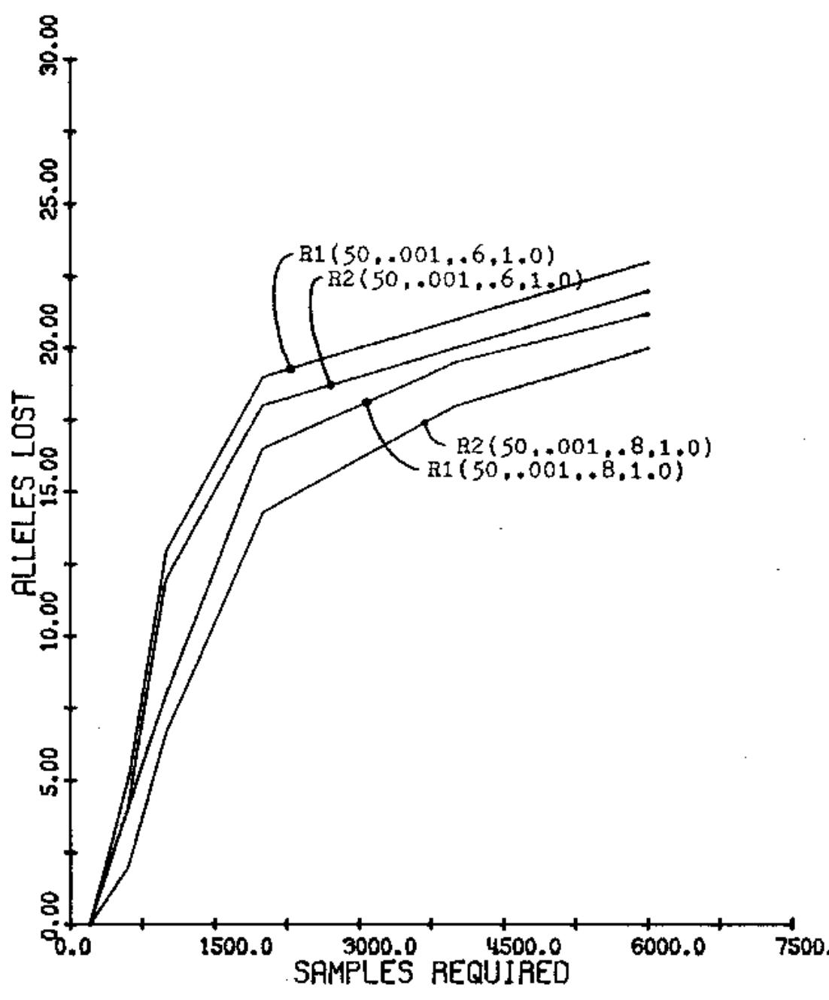  
Figure 4.1: Allele loss for R2 on Fl.

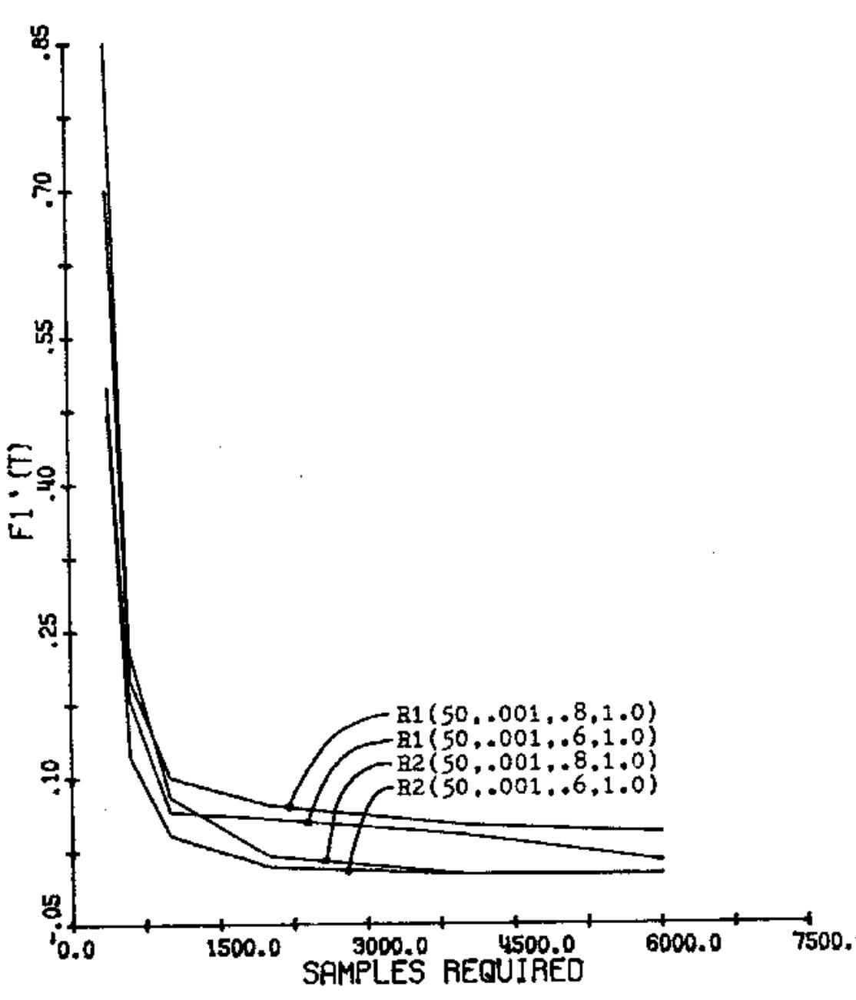  
Figure 4.2: off-line performance curves for R2 on F1.

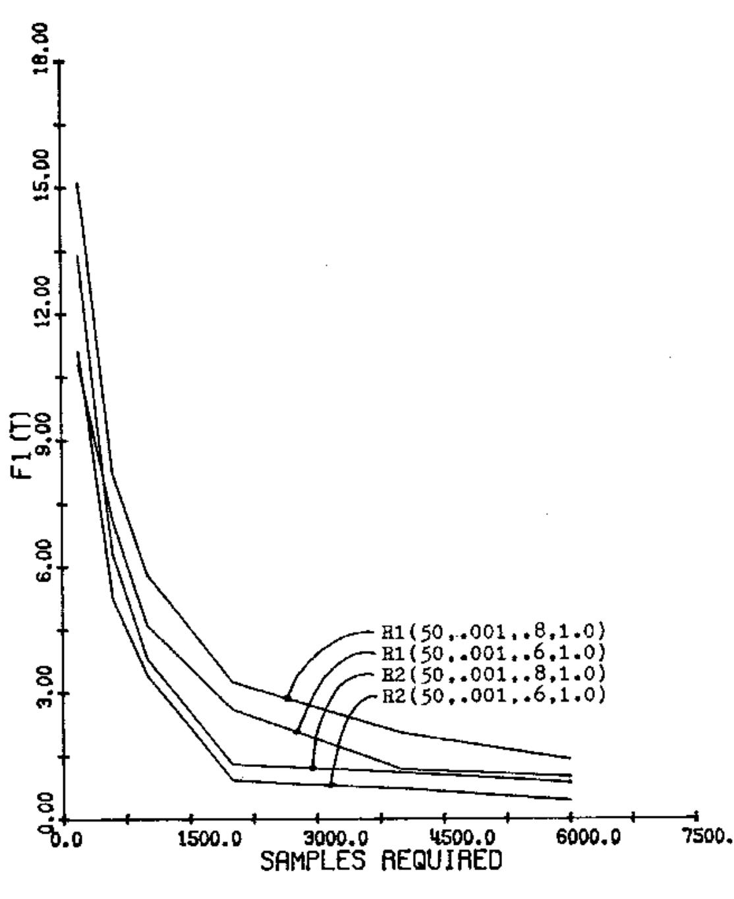  
Figure 4.3: On-line performance curves for R2 on F1.

Finally, the assooiated performance indices for both off-line and on-line performance are tabulated below in comparison with their A1 counterparts:

<table><tr><td rowspan=2 colspan=1>T=6000</td><td rowspan=2 colspan=1>R1(.8) I</td><td></td><td></td><td></td></tr><tr><td rowspan=1 colspan=1>B2(.8) 1</td><td rowspan=1 colspan=1>R1(.6)2</td><td rowspan=1 colspan=1>B2(.6)</td></tr><tr><td rowspan=1 colspan=1>$\</td><td rowspan=1 colspan=1>.199</td><td rowspan=1 colspan=1>.178</td><td rowspan=1 colspan=1>.146</td><td rowspan=1 colspan=1>.093</td></tr><tr><td rowspan=1 colspan=1>$\p)</td><td rowspan=1 colspan=1>.230</td><td rowspan=1 colspan=1>.076</td><td rowspan=1 colspan=1>.310</td><td rowspan=1 colspan=1>.182</td></tr><tr><td rowspan=1 colspan=1>$\\)$</td><td rowspan=1 colspan=1>-26.5</td><td rowspan=1 colspan=1>-26.3</td><td rowspan=1 colspan=1>-27.2</td><td rowspan=1 colspan=1>-27.1</td></tr><tr><td rowspan=1 colspan=1>$\p)</td><td rowspan=1 colspan=1>34.67</td><td rowspan=1 colspan=1>29.61</td><td rowspan=1 colspan=1>34.5</td><td rowspan=1 colspan=1>26.76</td></tr><tr><td rowspan=1 colspan=1>$\}$</td><td rowspan=1 colspan=1>3.75</td><td rowspan=1 colspan=1>5.86</td><td rowspan=1 colspan=1>2.56</td><td rowspan=1 colspan=1>3.95</td></tr><tr><td rowspan=1 colspan=1>$x\r)$</td><td rowspan=1 colspan=1>2.47</td><td rowspan=1 colspan=1>1.88</td><td rowspan=1 colspan=1>2.06</td><td rowspan=1 colspan=1>.778</td></tr></table>

<table><tr><td rowspan=1 colspan=1>T=60001</td><td rowspan=1 colspan=1>R1(.8)</td><td rowspan=1 colspan=1>R2(.8)</td><td rowspan=1 colspan=1>  R1(.6)1</td><td rowspan=1 colspan=1>R2(.6)</td></tr><tr><td rowspan=1 colspan=1>$1_p{T</td><td rowspan=1 colspan=1>4.27</td><td rowspan=1 colspan=1>2.88</td><td rowspan=1 colspan=1>3.65</td><td rowspan=1 colspan=1>2.71</td></tr><tr><td rowspan=1 colspan=1>$\p2T</td><td rowspan=1 colspan=1>76.8</td><td rowspan=1 colspan=1>51.73</td><td rowspan=1 colspan=1>76.7</td><td rowspan=1 colspan=1>50.46</td></tr><tr><td rowspan=1 colspan=1>$\F3{T</td><td rowspan=1 colspan=1>-23.17</td><td rowspan=1 colspan=1>-22.9</td><td rowspan=1 colspan=1>-23.3</td><td rowspan=1 colspan=1>-24.02</td></tr><tr><td rowspan=1 colspan=1>$\p4T 0</td><td rowspan=1 colspan=1>93.2</td><td rowspan=1 colspan=1>65.8</td><td rowspan=1 colspan=1>89.9</td><td rowspan=1 colspan=1>59.92</td></tr><tr><td rowspan=1 colspan=1>$\_p5(}</td><td rowspan=1 colspan=1>34.1</td><td rowspan=1 colspan=1>36.2</td><td rowspan=1 colspan=1>36.2</td><td rowspan=1 colspan=1>37.49</td></tr><tr><td rowspan=1 colspan=1>$x_{g(T</td><td rowspan=1 colspan=1>37.04</td><td rowspan=1 colspan=1>26.74</td><td rowspan=1 colspan=1>36.69 1</td><td rowspan=1 colspan=1>25.31</td></tr></table>

These results confirm our intuition about the behavior of elitist plan R2. Because of its more conservative sampling polioy, on-line performance is consistently improved. ofr-line performance is improved as well, but notice that the improvements come on the unimodal surfaces, particularly F4, while the performance degraded significantly on FS.

# 4.4 Expected Value Model B3

The problem of premature allele loss and the subsequent convergence to a non-optimal plateau which was analyzed closely in the previous chapter has still not been resolved. As we have seen, changing the various parameters of the genetic models affects both the allele loss rate and performance curves on test function F1, but gives no satisfactory solution to either. In this section we explore the possibility of resolving these problems by modifying the sampling techniques used in HI and R2.

We begin by focusing our attention again on the two competing hyperplanes associated with a particular gene position. As we have seen, test function Fl has the characteristic that it has the same average value on both partition elements, so that neither hyperplane theoretically has any selective advantage over the other. However, the next generation A(t+l) is produced by taking a finite number of samples from A(t) using a selection distribution computed from sample means. This opens the door for stochastic side effects from two sources: the error involved in the sample means (and hence the seleotion probabilities), and the error involved in only taking a finite sample from A(t) using the selection distribution. The error in the sample means is, of course, a function of the population size and the variance of F1 on the associated hyperplanes, and can be resolved, as we have

seen, by increasing the population size at the erpense of initial performance. The Markov process simulations in the section on genetic drift modelled the second source of error which, we have seen, cannot be ignored. In Rl and R2 this sampling process is used to produce the offspring of individuals in A(t). As a consequence, the actual number of offspring produced by an individual can differ markedly from the erpected number of offspring. As we saw in chapter 2, the offspring determine the number of trials allocated to a particular hyperplane in the next generation. Hence, the sampling side-effects can lead to considerable disparities between the expected and actual number of trials allocated to competing pairs of hyperplanes. This suggests that we consider redefining the sampling process used in Ri and R2 in such a way as to force the actual number of offspring to more closely approrimate the expected number.

Genetic adaptive plan R3 attempts to accomplish this in the following way. The expected number of offspring. u(ait)/u(t), is computed and associated with each individual ait in A(t) before selection begins. Each time an individual is selected as a partner for crossover, its associated offspring count is deoremented by .5. Each time an individual is selected to produce an offspring without applying crossover, its associated offspring count is decremented by 1. When the offspring count falls below zero, an individual is no longer available

for selection.

This modification to the selection process forces the actual number of offspring to always be less than $u ( a _ { 1 t } ) / \sqrt { u ( t ) } + 1$ and generally less than $u ( a _ { 1 t } ) / \overline { { u ( t ) } } + . 5 .$ resulting in a leveling effect on the sampling error. If the high rate of allele loss exhibited by Ri and R2 on F1 is due in part to this sampling error, R3 should exhibit a reduced rate of allele loss and a corresponding improvement in performance.

In order to evaluate these hypotheses, the following three members from the family of plans defined by R3 were chosen for evaluation on E:

R3(50..001,1.0,1.0) R3(50,.001, .8,1.0) A3(50..001. .6.1.0)

Figures $4 . 4 - 4 . 6$ compare the behavior of R3(50,.001..6.1.0 on F1 with its corresponding R1 and H2 counterparts, Figure $4 . 4$ illustrates that, as we had hoped, the allele loss rate is considerably reduced with the modified sampling technique. Figures $4 . 5$ and $4 . 6$ compare the performance curves of Ri, R2, and R3 for test function F1. Notice that R3 performed significantly better than Ri on Fi, but not quite as well as R2.

Finally, the associated performance indices for both off-line and on-line performance of R3 on E are tabulated below in comparison with H1 and R2:

# Fig 4.4: R3 Allele Loss On F1

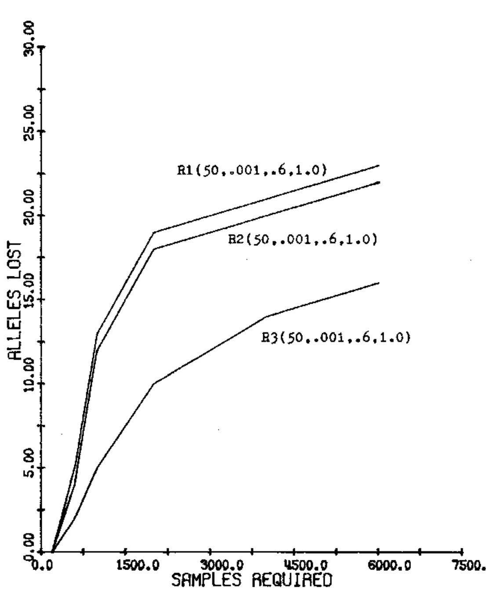  
Figure 4.4: Allele loss for H3 on Fl.

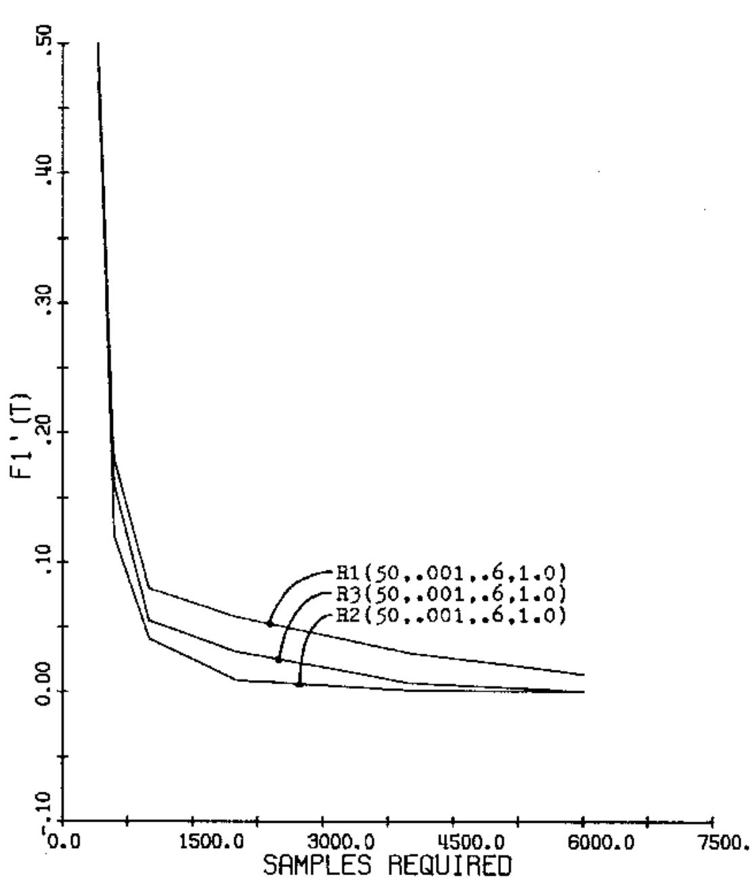  
Figure 4.5: Off-line performance curve for R3 on F1.

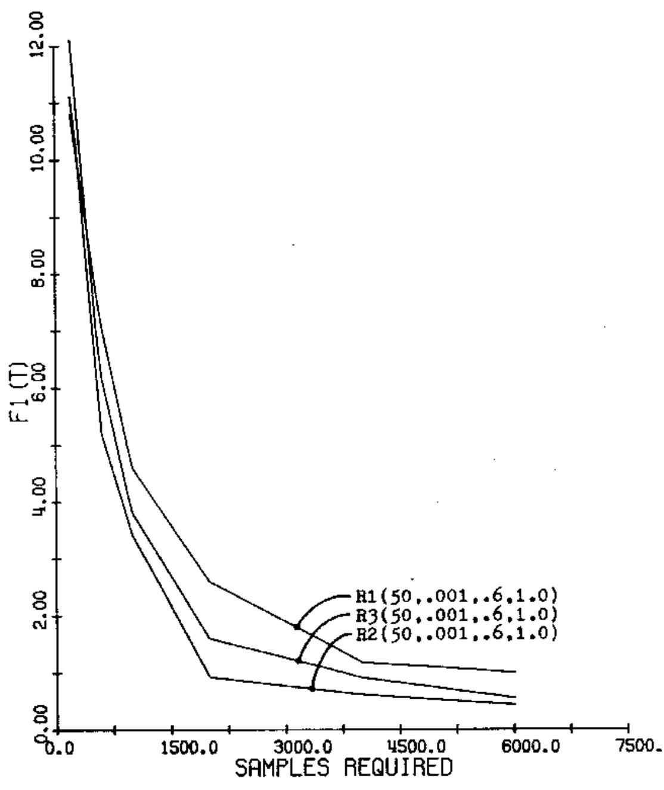  
Figure 4.6: On-line performance curve for R3 on F1.

<table><tr><td rowspan=1 colspan=1>T=6000</td><td rowspan=1 colspan=1>|R3(1.0)</td><td rowspan=1 colspan=1>B3(.8)r</td><td rowspan=1 colspan=1>B3(.6)</td><td rowspan=1 colspan=1>R2(.6)/</td><td rowspan=1 colspan=1>R1(.6)</td></tr><tr><td rowspan=1 colspan=1>$x\p</td><td rowspan=1 colspan=1>.410</td><td rowspan=1 colspan=1>.130</td><td rowspan=1 colspan=1>.166</td><td rowspan=1 colspan=1>.093</td><td rowspan=1 colspan=1>.146</td></tr><tr><td rowspan=1 colspan=1>$xp</td><td rowspan=1 colspan=1>.428</td><td rowspan=1 colspan=1>.213</td><td rowspan=1 colspan=1>.364</td><td rowspan=1 colspan=1>.182</td><td rowspan=1 colspan=1>.310</td></tr><tr><td rowspan=1 colspan=1>$\f()</td><td rowspan=1 colspan=1>-27.3</td><td rowspan=1 colspan=1>-27.1</td><td rowspan=1 colspan=1>-27.2</td><td rowspan=1 colspan=1>-27.1</td><td rowspan=1 colspan=1>-27.2</td></tr><tr><td rowspan=1 colspan=1>$\_p)</td><td rowspan=1 colspan=1>21.17</td><td rowspan=1 colspan=1>20.22</td><td rowspan=1 colspan=1>21.07</td><td rowspan=1 colspan=1>26.76</td><td rowspan=1 colspan=1>34.5</td></tr><tr><td rowspan=1 colspan=1>$\p5</td><td rowspan=1 colspan=1>4.31</td><td rowspan=1 colspan=1>2.86</td><td rowspan=1 colspan=1>3.20</td><td rowspan=1 colspan=1>3.95</td><td rowspan=1 colspan=1>2.56</td></tr><tr><td rowspan=1 colspan=1>$x\ra}$ 1</td><td rowspan=1 colspan=1>.196</td><td rowspan=1 colspan=1>-.735</td><td rowspan=1 colspan=1>-,483]</td><td rowspan=1 colspan=1>778</td><td rowspan=1 colspan=1>2.06</td></tr></table>

<table><tr><td rowspan=2 colspan=1>T=6000</td><td rowspan=2 colspan=1>R3(1.0)1</td><td rowspan=2 colspan=1>R3(.8)2</td><td rowspan=2 colspan=1>R3(.6)1</td><td rowspan=2 colspan=1>A2(.6)</td><td></td></tr><tr><td rowspan=1 colspan=1>R1(.6)</td></tr><tr><td rowspan=1 colspan=1>$XF1T</td><td rowspan=1 colspan=1>3.53</td><td rowspan=1 colspan=1>2.41</td><td rowspan=1 colspan=1>3.42</td><td rowspan=1 colspan=1>2.71</td><td rowspan=1 colspan=1>3.65</td></tr><tr><td rowspan=1 colspan=1>$\_p2(T</td><td rowspan=1 colspan=1>65.65</td><td rowspan=1 colspan=1>46.64</td><td rowspan=1 colspan=1>55.15</td><td rowspan=1 colspan=1>50.46</td><td rowspan=1 colspan=1>76.7</td></tr><tr><td rowspan=1 colspan=1>$xf^3$</td><td rowspan=1 colspan=1>-24.6</td><td rowspan=1 colspan=1>-24.87</td><td rowspan=1 colspan=1>-24.94</td><td rowspan=1 colspan=1>-24.02</td><td rowspan=1 colspan=1>-23.3</td></tr><tr><td rowspan=1 colspan=1>$\_p_{</td><td rowspan=1 colspan=1>48.28</td><td rowspan=1 colspan=1>49.08</td><td rowspan=1 colspan=1>44.18</td><td rowspan=1 colspan=1>59.92</td><td rowspan=1 colspan=1>89.9</td></tr><tr><td rowspan=1 colspan=1>$\_p5(T</td><td rowspan=1 colspan=1>36.46</td><td rowspan=1 colspan=1>32.29</td><td rowspan=1 colspan=1>37.31</td><td rowspan=1 colspan=1>37.49</td><td rowspan=1 colspan=1>36.2</td></tr><tr><td rowspan=1 colspan=1>xE(T)  </td><td rowspan=1 colspan=1>  25.46</td><td rowspan=1 colspan=1>21.68</td><td rowspan=1 colspan=1>22.65</td><td rowspan=1 colspan=1>25.31</td><td rowspan=1 colspan=1>36.69</td></tr></table>

These results yield two interesting observations. First, note that R3(.8) performed slightly better on E than R3(.6), suggesting that, by reducing the sampling error, a higher sampling rate can be supported, Secondly, note that, although HZ outperformed R3 on Fi, R3 showed an overall improvement in robustness on E. Both of these observations confirm our intuition about the behavior of the elitist and expected value models.

# 4.5 Elitiat Expected Value Model R4

At this point in the analysis of genetic adaptive plans, it is difficult to resist combining the two previous models to produce an expeoted value model with an elitiat polioy. The motivation here is to increase our confidence in the observations and inferences made so far about the behavior of genetic plans, rather than providing new insights. If our analysis of the preceding sections is correct, we should expect that adding an elitist policy to R3 should improve its performance on the unimodal surfaces at the expense of multimodal performance.

In order to evaluate this hypothesis, two members of R4 were chosen for analysis on B:

$$
\begin{array} { l } { { \tt B 4 } ( \xi 0 \ldots 0 0 1 \ldots 8 , 1 \ldots 0 ) } \\ { { \tt B 4 } ( \xi 0 \ldots 0 0 1 \ldots 6 , 1 \ldots 0 ) } \end{array}
$$

Figures $4 . 7 - 4 . 9$ compare the behavior of $\pm ( \frac { 1 } { 2 } 4 ( \cdot 6 )$ on test function F1 with its R2 and R3 counterparts. Figure $4 . 7$ illustrates again that adding an elitist policy reduces slightly the allele loss rate on Fl. Figures $4 , 8$ and $4 . 9$ illustrate the improved off-line and on-line performance curves generated by R4.

Finally, the associated performance indices for both off-line and on-line performance of B4 on E are tabulated below in comparison with R3 and R2:

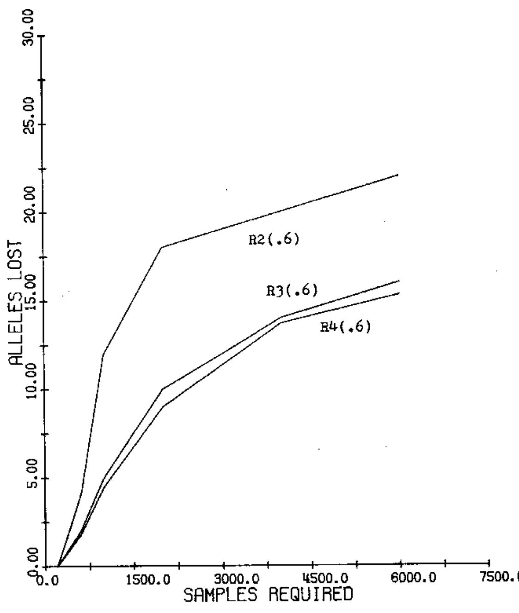  
Pigure 4.7: Allele loss for R4 on F1.

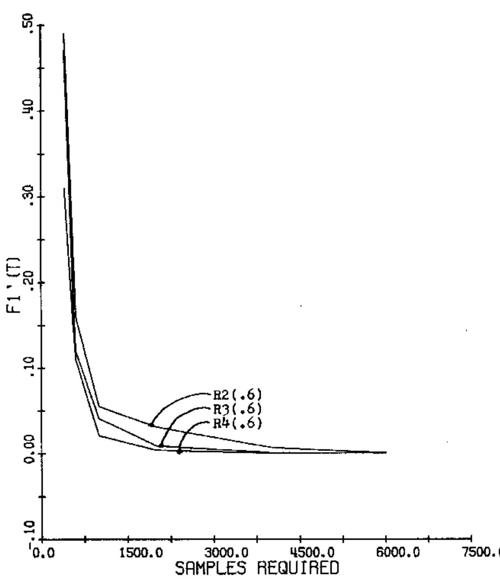  
Figure 4.8: off-line performance curve for B4 on F1.

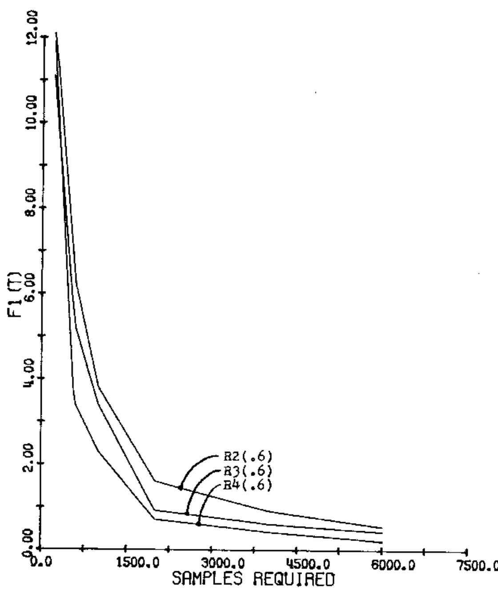  
Figure 4.9: On-line performance curve for B4 on Fl.

<table><tr><td rowspan=2 colspan=1>T=6000R4(.8)</td><td rowspan=2 colspan=1>T=6000R4(.8)1</td><td rowspan=2 colspan=1>B4(.6)1</td><td rowspan=2 colspan=1>R3(.8)</td><td rowspan=2 colspan=1>R3(.6)</td><td></td></tr><tr><td rowspan=1 colspan=1>R2(.6)</td></tr><tr><td rowspan=1 colspan=1>$</td><td rowspan=1 colspan=1>.097</td><td rowspan=1 colspan=1>.113</td><td rowspan=1 colspan=1>.130</td><td rowspan=1 colspan=1>.166</td><td rowspan=1 colspan=1>.093</td></tr><tr><td rowspan=1 colspan=1>$\)</td><td rowspan=1 colspan=1>.201</td><td rowspan=1 colspan=1>.221</td><td rowspan=1 colspan=1>.213</td><td rowspan=1 colspan=1>.364</td><td rowspan=1 colspan=1>.182</td></tr><tr><td rowspan=1 colspan=1>$f)</td><td rowspan=1 colspan=1>-27.5</td><td rowspan=1 colspan=1>-28.2</td><td rowspan=1 colspan=1>-27.1</td><td rowspan=1 colspan=1>-27.2</td><td rowspan=1 colspan=1>-27.1</td></tr><tr><td rowspan=1 colspan=1>$xp(</td><td rowspan=1 colspan=1>18.21</td><td rowspan=1 colspan=1>17.62</td><td rowspan=1 colspan=1>20.22</td><td rowspan=1 colspan=1>21.07</td><td rowspan=1 colspan=1>26.76</td></tr><tr><td rowspan=1 colspan=1>$\p)</td><td rowspan=1 colspan=1>2.98</td><td rowspan=1 colspan=1>3.34</td><td rowspan=1 colspan=1>2.86</td><td rowspan=1 colspan=1>3.20</td><td rowspan=1 colspan=1>3.95</td></tr><tr><td rowspan=1 colspan=1>$X_E(T)</td><td rowspan=1 colspan=1>-1.20</td><td rowspan=1 colspan=1>-1.38</td><td rowspan=1 colspan=1>-.735</td><td rowspan=1 colspan=1>-.483</td><td rowspan=1 colspan=1>.778</td></tr></table>

$$
\begin{array} { r }  \frac { 1 2 6 0 0 0 } { 1 8 8 0 1 } [ \begin{array} { c c c c c c c c } { 1 8 4 ( \cdot 8 ) } & { | 8 1 6 ( \cdot 6 ) } & { | 8 3 ( \cdot 8 ) } & { | 8 3 ( \cdot 6 ) } & { | 8 2 ( \cdot 6 )  | } & { | 8 2 ( \cdot 6 )  | } & { | 8 2 ( \cdot 6 )  | } & { | 8 3 ( \cdot 6 )  } & { | 8 3 ( \cdot 6 )  | } & { | 8 3 ( \cdot 6 )  } & { | 8 3 ( \cdot 6 )  } & { | 8 3 ( \cdot 6 )  | } \\ { \frac { 1 2 6 0 } { 1 8 \cdot 1 1 } ( \mathbb { T } ) \cdot | 1 \cdot \frac { 2 \cdot 6 1 1 } { 2 \cdot 3 2 }  \frac { 2 \cdot 6 1 1 } { 2 \cdot 3 2 } } & { \frac { 2 \cdot 6 1 4 } { 2 \cdot 6 1 } } & { \frac { 3 \cdot 4 \cdot 6 1 } { 3 \cdot 1 6 } } & { \frac { 2 \cdot 6 1 6 } { 2 \cdot 3 \cdot 1 6 } } & { \frac { 2 \cdot 7 1 } { 2 \cdot 3 \cdot 1 6 } } & { \frac { 2 \cdot 6 1 6 } { 3 \cdot 1 6 } } & { \frac { 2 \cdot 6 1 6 } { 3 \cdot 1 6 } } & { \frac { 2 \cdot 6 1 1 } { 2 \cdot 3 \cdot 1 6 } } \\ { \frac { 1 2 \cdot 3 \cdot 6 1 5 } { 1 \cdot 3 \cdot 1 5 \cdot 1 0 \cdot 1 } } & { \frac { - 2 \cdot 6 1 6 } { 2 \cdot 3 \cdot 1 9 } } & { \frac { - 2 4 \cdot 6 8 7 } { 2 \cdot 1 \cdot 6 8 \cdot 1 7 } } & { \frac { - 2 4 \cdot 6 1 \cdot 9 1 } { 2 \cdot 3 \cdot 1 6 \cdot 1 } } & { \frac { - 2 4 \cdot 6 0 2 } { 2 \cdot 1 \cdot 6 \cdot 2 2 } } & { \frac { 2 \cdot 6 1 \cdot 0 2 } { 2 \cdot 1 \cdot 6 \cdot 1 0 \cdot 2 } } & { \frac { 2 \cdot 6 1 \cdot 2 \cdot 2 \cdot 6 1 } { 2 \cdot 3 \cdot 1 6 \cdot 1 0 \cdot 1 } } & { \frac { 2 \cdot 6 1 \cdot 2 \cdot 6 1 } { 2 \cdot 3 \cdot 1 6 \cdot 1 0 \cdot 1 } } & { \frac { 2 \cdot 6 1 \cdot 6 1 } { 3 \cdot 1 \cdot 1 0 \cdot 1 0 \cdot 1 0 \cdot 1 0 \cdot 1 0 \cdot 1 0 } } &  \frac  \end{array} \end{array}
$$

These results suggest that our intuition about the effects of an elitist policy on the behavior of these genetic plans is correot. The performance on the unimodal surfaces ( $\mathbf { \tilde { P I } } \mathbf { - } \mathbf { \tilde { P 4 } } _ { \mathrm { : } } ^ { \prime }$ ) is considerably improved at the erpense of performance on the dirfioult multimodal surface F5. Notice however that performance on F5 was only slightly affected (an observation which will be explored more fully later) and, as a consequence, B4 generated the best overall performance we have seen on E.

It is worth considering at this point whether the performance generated by 84(50,.001,.6,1.0) 1s about the best R4 can do on E. We have been evaluating these particular parameter settings to provide straightrorward comparisons with the preceding models. However, the changes we have made to the genetic algorithm may also affect the choice of the parameter settings. To answer this question, the performance of the following members of R4 was evaluated on Er

$$
\begin{array} { r } { \begin{array} { r l } & { \mathbb { R } ^ { 4 } ( \quad ; 0 \quad \ldots 0 0 1 \ldots 8 \cdot 1 \ldots 0 ) } \\ & { \mathbb { R } ^ { 4 } ( \quad \xi 0 \quad \ldots 0 0 1 \ldots 6 \cdot 1 \ldots 0 ) } \\ & { \mathbb { R } ^ { 4 } ( \quad \xi 0 \quad \ldots 0 0 1 \ldots 6 \cdot 1 \ldots 0 ) } \\ & { \mathbb { R } ^ { 4 } ( \quad \xi 0 \quad \ldots 0 0 1 \ldots 6 \cdot 1 \ldots 0 ) } \\ & { \mathbb { R } ^ { 4 } ( \quad \xi 0 \quad \ldots 0 1 \quad \ldots 6 \cdot 1 \ldots 0 ) } \\ & { \mathbb { R } ^ { 4 } ( \quad \xi 0 \quad \ldots 0 5 \quad \ldots 6 \cdot 1 \ldots 0 ) } \\ & { \mathbb { R } ^ { 4 } ( \quad \xi 0 \quad \ldots 0 0 1 \ldots 6 \quad \ldots \quad 8 ) } \\ & { \mathbb { R } ^ { 4 } ( \quad \xi 0 \quad \ldots 0 0 1 \ldots 6 \quad \ldots 6 \quad \ldots 6 ) } \\ & { \mathbb { R } ^ { 4 } ( \quad \xi 0 \quad \ldots 0 0 1 \ldots 6 \quad \ldots 6 \quad \ldots 6 ) } \\ & { \mathbb { R } ^ { 4 } ( \quad 1 0 0 \quad \ldots 0 0 1 \ldots 6 \cdot 1 \ldots 0 ) } \end{array} } \end{array}
$$

Tables 4.2a and 4.2b compare the off-line and on-line performance indices for each of the parameter settings. The first three members evaluated differ only in their crossover rates and they suggest that a crossover rate of .6 is still a reasonable choice. Notice, however, that because of the overall inprovement in performance, R4 is considerably less sensitive than Rl to changes in the crossover rate. The fourth and fifth members illustrate the effects of an increased mutation rate. Here the results differed from before. Inoreasing the mutation rate degraded both the off-line and on-line performance of Rl. This observation will be explored in more detail later. The sixth and seventh members illustrate again the negative effect on performance generated by reducing the generation gap, And the last member evaluated illustrates again that increasing the population size degrades performance over the interval of observatiom.

<table><tr><td rowspan=1 colspan=1>T-6000</td><td rowspan=1 colspan=1>N =50P$\1.0$</td><td rowspan=1 colspan=1>N =50Pm01Po$$G\a10$</td><td rowspan=1 colspan=1>N =50Pm01$$\^r=1.0$</td><td rowspan=1 colspan=1>N =50$Pm$$P=6$G=1.0</td><td rowspan=1 colspan=1>N =50Pm=05P=6G=1.0$</td><td rowspan=1 colspan=1>N =50$Pm01$Po6$$$\o=8$</td><td rowspan=1 colspan=1>N =50$Pm01=6$G6</td><td rowspan=1 colspan=1>N =100Pm001Pc6$c^{=10$</td></tr><tr><td rowspan=1 colspan=1>$x\_</td><td rowspan=1 colspan=1>.097</td><td rowspan=1 colspan=1>.113</td><td rowspan=1 colspan=1>.134</td><td rowspan=1 colspan=1>.068</td><td rowspan=1 colspan=1>.128</td><td rowspan=1 colspan=1>.213</td><td rowspan=1 colspan=1>.112</td><td rowspan=1 colspan=1>.103</td></tr><tr><td></td><td rowspan=2 colspan=1>.201</td><td rowspan=2 colspan=1>.221</td><td rowspan=2 colspan=1>,205</td><td rowspan=2 colspan=1>.259</td><td rowspan=2 colspan=1>.240</td><td rowspan=2 colspan=1>.193</td><td rowspan=2 colspan=1>.410</td><td rowspan=2 colspan=1>.148</td></tr><tr><td rowspan=1 colspan=1>$\)</td></tr><tr><td></td><td></td><td rowspan=2 colspan=1>-28.2</td><td rowspan=2 colspan=1>-28.5</td><td rowspan=2 colspan=1>-27.6</td><td rowspan=2 colspan=1>-26.1</td><td rowspan=2 colspan=1>-27.9</td><td rowspan=2 colspan=1>-28.2</td><td rowspan=2 colspan=1>-27.5</td></tr><tr><td rowspan=1 colspan=1>$x\)</td><td rowspan=1 colspan=1>-27.5</td></tr><tr><td></td><td></td><td rowspan=2 colspan=1>17.62</td><td rowspan=2 colspan=1>16.24</td><td rowspan=2 colspan=1>21.81</td><td rowspan=2 colspan=1>35.98</td><td rowspan=2 colspan=1>21.66</td><td rowspan=2 colspan=1>17.1</td><td rowspan=2 colspan=1>28.5</td></tr><tr><td rowspan=1 colspan=1>$\\f)</td><td rowspan=1 colspan=1>18.21</td></tr><tr><td></td><td></td><td></td><td rowspan=2 colspan=1>8.53</td><td rowspan=2 colspan=1>3.98</td><td rowspan=2 colspan=1>3.51</td><td rowspan=2 colspan=1>2.81</td><td rowspan=2 colspan=1>11.5</td><td rowspan=2 colspan=1>5.39</td></tr><tr><td rowspan=2 colspan=1>$\r{}$</td><td rowspan=2 colspan=1>2.98</td><td rowspan=2 colspan=1>3.34</td></tr><tr><td rowspan=2 colspan=1>-.678</td><td rowspan=2 colspan=1>-.297</td><td rowspan=2 colspan=1>2.75</td><td rowspan=2 colspan=1>.605</td><td rowspan=2 colspan=1>.184</td><td rowspan=2 colspan=1>1.33</td></tr><tr><td rowspan=1 colspan=1>$x{)$</td><td rowspan=1 colspan=1>-1.20</td><td rowspan=1 colspan=1>-1.38</td></tr></table>

<table><tr><td rowspan=3 colspan=1>T=6000</td><td></td><td></td><td></td><td></td><td></td><td></td><td></td><td></td></tr><tr><td rowspan=2 colspan=1> N =50</td><td rowspan=2 colspan=1>N =50Pm0010P6$$\^ =10$</td><td rowspan=2 colspan=1>N =50$Pm01$P.4G=1.0</td><td rowspan=2 colspan=1>N =50$Pm01$P=6$$G10$</td><td rowspan=2 colspan=1>N =50$P_m05$O0-O </td><td rowspan=2 colspan=1>N =50$Pm=01Po66$G\o=$</td><td rowspan=2 colspan=1>N =50Pm001P 6$Ga6$</td><td rowspan=2 colspan=1>[-01 IN =100G1.$</td></tr><tr><td rowspan=7 colspan=1>[-01 IN =100G1.$4.6362.9-24.0568.3843.8231.14</td></tr><tr><td rowspan=1 colspan=1>1P1(T)</td><td rowspan=1 colspan=1>2.41</td><td rowspan=1 colspan=1>2.32</td><td rowspan=1 colspan=1>2.30</td><td rowspan=1 colspan=1>5.88</td><td rowspan=1 colspan=1>15.83</td><td rowspan=1 colspan=1>2.35</td><td rowspan=1 colspan=1>2.42</td><td rowspan=1 colspan=1>4.63</td></tr><tr><td rowspan=1 colspan=1>$xp2T)</td><td rowspan=1 colspan=1>35.46</td><td rowspan=1 colspan=1>34.76</td><td rowspan=1 colspan=1>40.02</td><td rowspan=1 colspan=1>105.0</td><td rowspan=1 colspan=1>221.72</td><td rowspan=1 colspan=1>42.35</td><td rowspan=1 colspan=1>41.44</td><td rowspan=1 colspan=1>62.9</td></tr><tr><td rowspan=1 colspan=1>$\_pP3(</td><td rowspan=1 colspan=1>-25.35</td><td rowspan=1 colspan=1>-26.49</td><td rowspan=1 colspan=1>-27.01</td><td rowspan=1 colspan=1>-21.5</td><td rowspan=1 colspan=1>-14.04</td><td rowspan=1 colspan=1>-26.1</td><td rowspan=1 colspan=1>-26.2</td><td rowspan=1 colspan=1>-24.05</td></tr><tr><td rowspan=1 colspan=1>$\p4({</td><td rowspan=1 colspan=1>42.53</td><td rowspan=1 colspan=1>40.73</td><td rowspan=1 colspan=1>39.03</td><td rowspan=1 colspan=1>96.38</td><td rowspan=1 colspan=1>182.0</td><td rowspan=1 colspan=1>47.14</td><td rowspan=1 colspan=1>49.2</td><td rowspan=1 colspan=1>68.38</td></tr><tr><td rowspan=1 colspan=1>$\p5(</td><td rowspan=1 colspan=1>33.59</td><td rowspan=1 colspan=1>34.34</td><td rowspan=1 colspan=1>35.06</td><td rowspan=1 colspan=1>91.46</td><td rowspan=1 colspan=1>207.1</td><td rowspan=1 colspan=1>36.76</td><td rowspan=1 colspan=1>41.28</td><td rowspan=1 colspan=1>43.82</td></tr><tr><td rowspan=1 colspan=1>$x_{(}</td><td rowspan=1 colspan=1>17.73</td><td rowspan=1 colspan=1>17.12</td><td rowspan=1 colspan=1>17.88</td><td rowspan=1 colspan=1>55.45</td><td rowspan=1 colspan=1>122.5</td><td rowspan=1 colspan=1>20.50</td><td rowspan=1 colspan=1>21.63</td><td rowspan=1 colspan=1>31.14</td></tr></table>

In surmary, then, these results suggest that the performance generated by $\mathtt { B 4 } ( 5 0 \dots 0 0 1 \dots 6 , 1 \dots 0 )$ is about the best B4 can do on E. It is important, however, to emphasize the ertent of the improvements in performance we have achieved by moving to type R4 genetic plans. Becall from the evaluation in appendix C that, if on-line performance is desired, one simply cannot afford to use random search, Even the simplest genetic plan generates significantly better on-line performance. However, when measuring off-line performance, we saw that random search gave Ri considerably stiffer competition and produced in several cases better performing individuals over the interval of observation. To illustrate the improved performance of R4, figures $4 . 1 0 \cdot 4 . 1 4$ compare the offline performance curves of random search on each of the test functions in E with the best curves generated by H1 and R4 as well as the (unattainable) optimal off-line curve given by:

$$
\mathbf { f } ^ { * } ( \mathbf { t } ) ~ = ~ \mathbb { M } \mathbf { T } \mathbb { N } ( \mathbf { f } ) , \mathbf { t } = 1 , \dots , \mathbb { 1 }
$$

On test functions Fl and F2 plan $\tt R 4$ located the minimum without difficulty within the interval of observation. On the larger search spaces associated with F3 and $7 4$ the minimum was not found within 6ooo trials. But notice that the problem of pre-mature convergence to a nonoptimal plateau is no longer evident, Consistant progress is made over the entire interval of observation. Only on the dirficult multimodal surface defined by F5 do we still see convergence to a non-optimal plateau. It is this problem which will be addressed in the next sections,

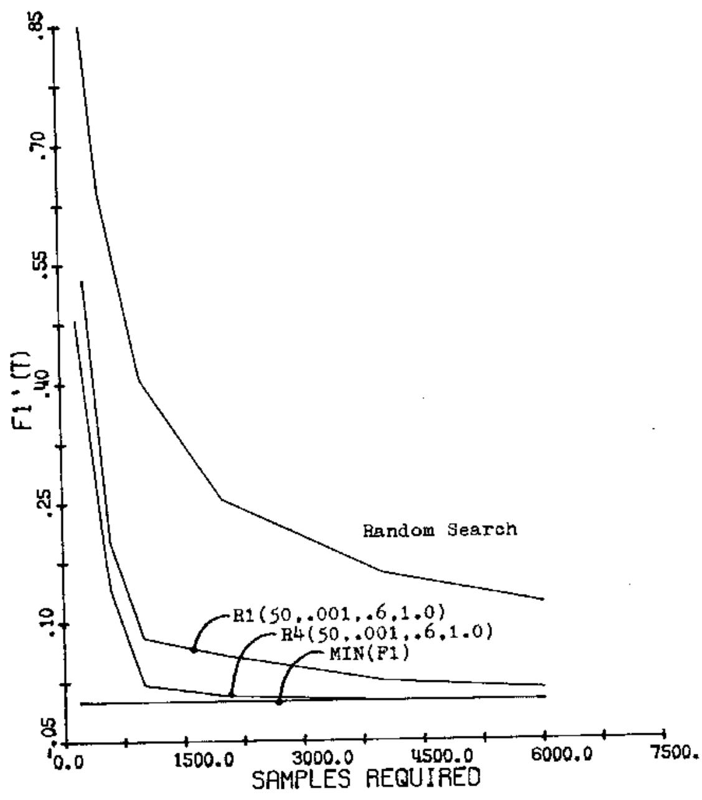  
Figure 4.1o: A comparison of off-line performance curves generated on F1.

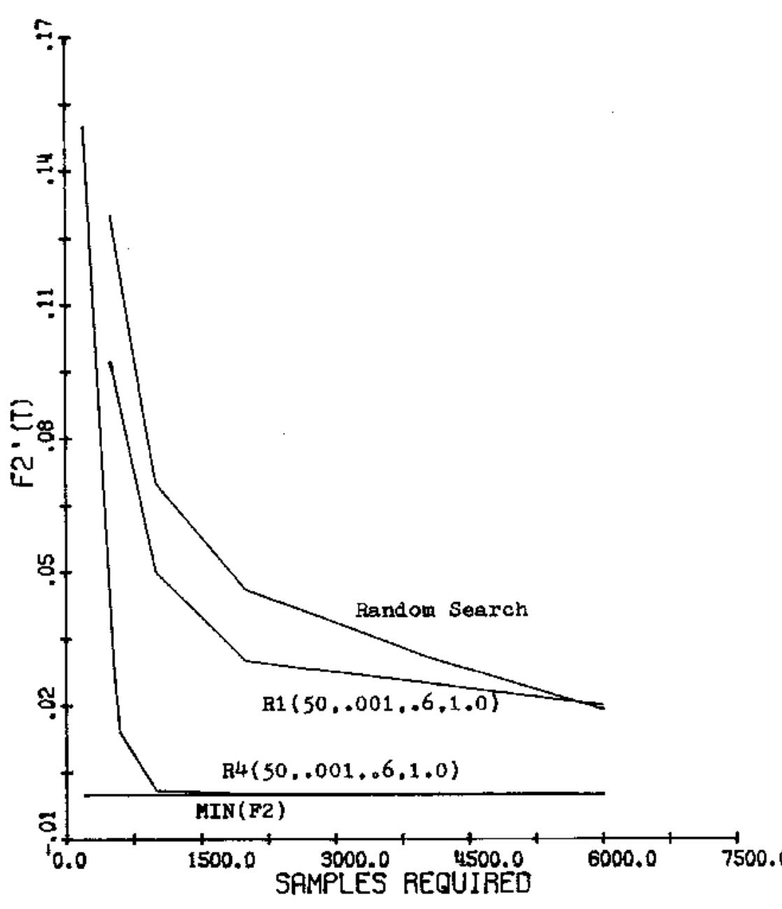  
Figure 4.1l: A comparison of off-line performance curves generated on P2.

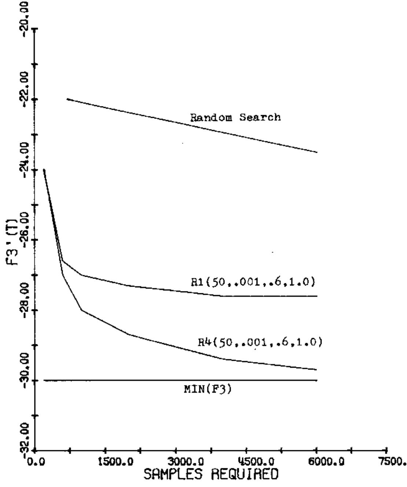  
Figure 4.i2: A comparison of off-line performanoe curves generated on F3.

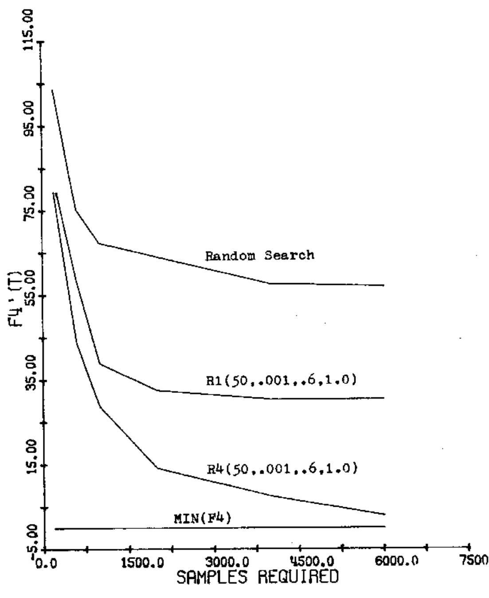  
Figure 4.13: A comparison of off-line performance curves generated on F4.

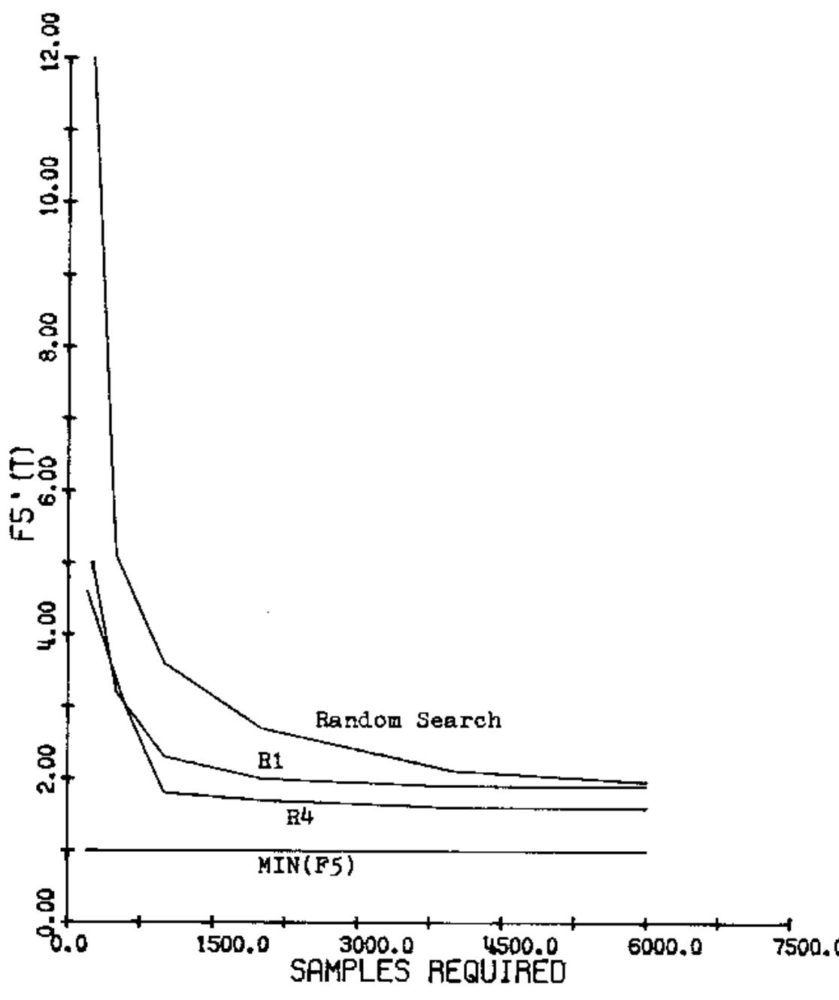  
Figure 4.14: A comparison of off-line performance curves generated on F5.

# 4.6 Improving the Performance of R4 on P5

As noted in the previous section, considerable progress has been made in improving the performance of finite genetic models on E, By modifying the sampling technique used in R1 so that the actual number of offspring more closely approrimate the expected number, the allele loss rate due to stochastic side-effeots has been reduced considerably with a corresponding improvement in performance. In addition, by adding an elitist policy to A3. significant improvement on the unimodal surfaces was observed. Figure 4.15 summarizes the remaining fly in the ointment: the performance of genetic plans on F5. By going to plan R3, the premature convergence generated by R1 was replaced by an off-line performance curve which made slow but steady progress over the interval of observation. Adding the elitist polioy to R3 improved initial off-line performance, but once again we observe convergence to a non-optimal plateau. This also suggests an erplanation to the

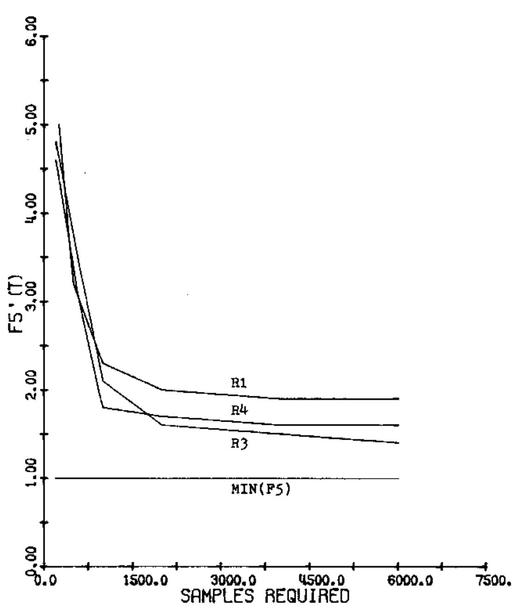  
Figure 4.15: off-line performance curves for genetic plans on F5.

observation noted in the previous section that adding an elitist policy to B3 did not degrade the performance indices for R4 on F5 as much as had been erpected. As figure 4.15 illustrates, the average values (performance indices) of the ofr-line curves generated by H3 and R4 are very nearly the same. Over a longer time interval, the negative effects of the premature convergence with R4 would have been more clearly seen. In this section we address the problem of improving the global search properties of R4 without, hopefully, having to give up the improved local performance.

We begin by considering this problem in terms of the hyperplane analysis introduced in chapter 2. Recall that genetic plans have the property that the best of competing hyperplanes were allooated an exponentially increasing number of trials relative to their competitors. This property was shown to be a consequence of the fact that the number of instances of a particular hyperplane in A(t) changed over time in proportion to the hyperplane's performance relative to its competitors. If a particular hyperplane outperforms its competitors for a relatively small number of generations, we saw that the number of instances of that hyperplane in A(t) increased exponentially to a point of complete dominance. When such a hyperplane is in fact the best, this is precisely what we want to happen with the corresponding allele loss effecting a reduction in the search space.

However, we are working with finlte genetic plans which maintain reasonably small populations which evaluate hyperplane performance via sample means based on a relatively small number of samples, As a consequence, it is not difficult to imagine that some of the premature allel loss observed may be the result of non-optimal hyperplane appearing to be the best for a suffioiently long time to effect a reduction in the search space. More to the point, it is easy to imagine that on the difficult surface defined by F5 a hyperplane associated with a relatively good local optimum could quickly dominate A(t) and cause the observed premature convergence, These observations suggest that the premature allele loss rate and the performance of genetic plans on multimodal functions could be improved by making it more difficult for hyperplanes to dominate A(t). It should be clear, however, that overall performance on E may be seriously degraded unless a solution is chosen carefully, since it is precisely this erponential increase in trials which generates the kind of performance exhibited by R4 on the unimodal surfaces. What we seek is a solution which permits exponential exploitation of the observed best without allowing them to readily dominate a finite population. This suggests that, rather than allow exponential growth until total dominance occurs, genetic plans should admit "controlled" growth in the form of an $" 8 "$ curve as illustrated below:

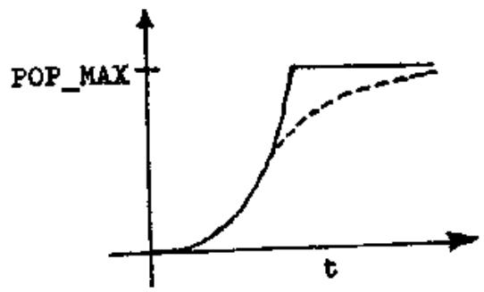

Such an approach permits initial erponential exploitation of hyperplanes for rapid performance improvements, while at the same time making it considerably more difficult for a hyperplane to completely dominate A(t).

The difficulty, of course, is in finding a reasonable implementation for this conceptually simple solution. Consider for a moment the alternatives within the R4 framework. Increasing the population size serves both to improve the sample mcans and increase the time required for a hyperplane to dominate A(t). As we have seen, however, this results in a significant degradation in performance over the interval of observation. Increasing the generation gap reduces the rate at which decisions are made and hence the rate of dominance. However, within the genetio contert, a value larger than 1.0 makes no sense, Increasing the crossover rate has the opposite effect from that desired. As we san in chapter 2, crossover becomes increasingly less likely to interfere with hyperplane growth as it begins to dominate A(t). Increasing the mutation rate seems to be the only possible solution within the R4

framework. As the number of instances of a particular hyperplane begin to dominate A(t), the number of their offspring erpected to undergo mutation increases and effects a reduction in the hyperplane's growth rate.

In order to explore the aspects of such a solution, the performance of R4 was evaluated on F5 with mutation rates of .001, .005. .01, and .05, respectively. Figure 4.16 illustrates clearly the effect that increasing the mutation rate has on the off-line performance of R4 on F5. As the mutation rate increases, the shape of the off-line performance curve changes to reflect less dramatie initial performance and more unifore progress over the entire interval of observation. Note that R4(.o1) very nearly converges to the minimum within 6ooo trials, However, its initial performance is less impressive than E4(.ooi). This suggests an explanation to the observation noted in the previous section that, unlike R1, the performance of R4 on E was actually degrading slightly by increasing the mutation rate from .0oi to .0l. With R1, increasing the mutation rate served to reduce its high rate of allele loss and.improve performance. However, with R4's reduced allele loss rate and improved local performance, increasing the mutation rate generated an improvement in longer-term performance at the expense of initial performance. Had we evaluated R4 over a longer time interval, the long-term improvements would have been more clearly visible.

Finally, figure 4.i7 illustrates clearly what we have

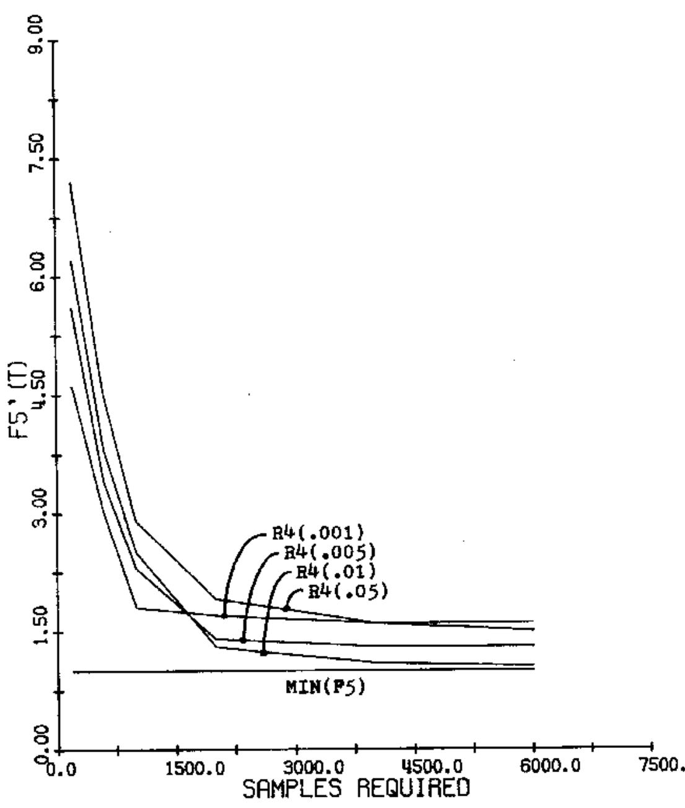  
Figure 4.16: Ofr-line performance for R4 on F5 as a funotion of mutation rate.

FIG. 4.17: ON-LINE PERFORMANCE OF A4 ON F5 seen before, If on-line performance is required, any increase in the mutation rate seriously degrades performance.

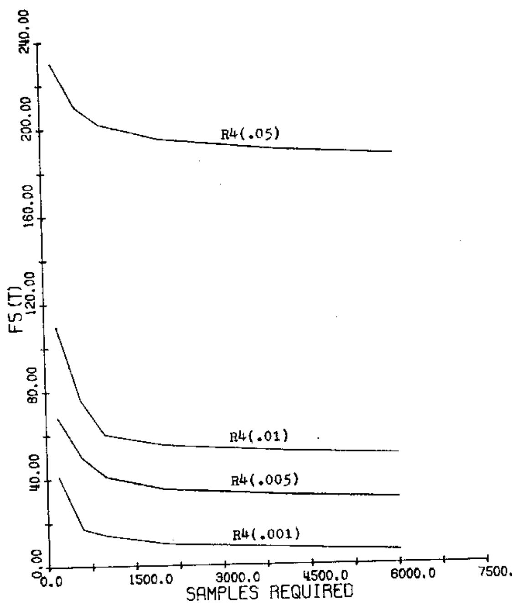  
On-line performance for R4 on F5 as a Figure 4.17: ( function of mutation rate.

# 4.7 Cronding Factor Model R5

Holland has suggested that the kind of controlled growth we seek in finite genetic models occurs in nature as a consequence of crowding. That is, as more and more like individuals dominate an environmental niohe, the competition for limited resources increases rapidly resulting in lower life expectancies and birth rate. In this section we consider the effects of including such a feature in genetic adaptive plans as an alternate to increasing the mutation rate in order to improve performance on multimodal surfaces.

If we think of the genetic plans in terms of the overlapping generation models, connections between the natural and artificial systems are more intuitive. In particular, consider a model in which only a few offepring are produced each generation $( 0 . 8 . 6 = . 1 )$ , Plans of this sort produce A $t + 1$ ) as follows:

- produce G\*N offspring using selection and the genetio operators   
- using a uniform distribution on A(t), insert the G\*N offspring into A(t) by seleoting G\*N individuals to "die",

Stated in this form, the concept of life expectancy is more clearly defined for these artifioial systems. And, as we noted in chapter 3, the expected number of offspring of an individual is directly related to the number of generations It survives. What we seek is a method for reducing the life expectancy of individuals which are instances of a hyperplane rapidly dominating A(t).

One interesting approach to this problem is as follows. When selecting an individual in A(t) to die, pick several candidates initially and choose that one which is most sim1lar to the new individual being inserted into the population. For the genetic models under study here, similarity is defined in terms of the number of matching binary alleles. Intultively, this approach has the right characteristics. Until a hyperplane begins to dominate, the modified replacement policy has little effect, allowing initial exponential growth. However, as a hyperplane begins to dominate A(t), instances of that hyperplane become increasingly more likely to be replaced by other instances, resulting in reduction in the hyperplane growth rate.

This approach will clearly increase the amount of processing required to produce the nert generation. Additional information (which, incidentally, has a derivative-like flavor) is being computed at each time step to control the allocation of trials, In this section, however, we nill ignore the processing time tradeoffs and concentrate on the effects of this approach on the performance of genetio plans on E.

In order to gain further insight into this approach to controlled gronth, a fifth parameter was defined for the

# 138

genetio plans under study: a crowding factor parameter CF which specifies the number of individuals initially seleeted as candidates to be replaced by a particular offspring. CF=1 is equivalent to no crowding factor, and as CF inoreases, the more likely it becomes that similar individuals replace one another, As an initial study of the effects of the crowding factor, the behavior of the following four members of this new class of genetic plans was analyzed: R5(50..001..6,.1,CF) where CF = 1. 2. 3. and 4. Figure 4.18 illustrates the allele loss rates of each of the plans on test function Fl. Recall that, because of the symmetry of Fi, theoretically there should be no allele loss. As one can see, increasing the crowding factor results in a dramatic deorease in the allele loss rate. Figures 4.19 and 4.20 give the off-line and on-line performance ourves generated by these plans on test function F5. Hecall that these studies were motivated by the observation that the off-line performance curves of R4 on F5 suggested that premature convergence was still a problem on multimodal surfaces. Figure 4.19 illustrates that the crowding factor has in fact the right effect on F5 with R5(2) very nearly converging to the global minimum within the interval of observation. Figure 4.20 illustrates that, like mutation increasing the crowding factor adversely affects on-line per formance. This, of course, is due to the constraints placed on the number of samples allocated to the observed best.

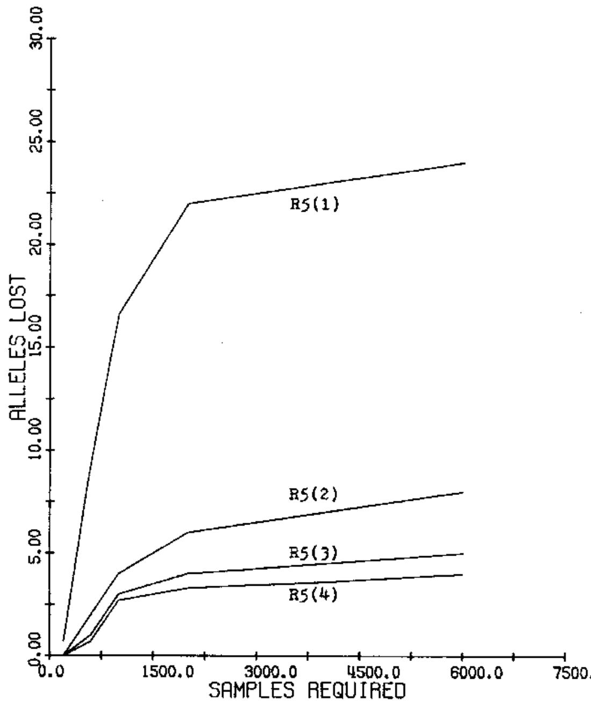  
Figure 4.18: Allele loss for R5 on F1.

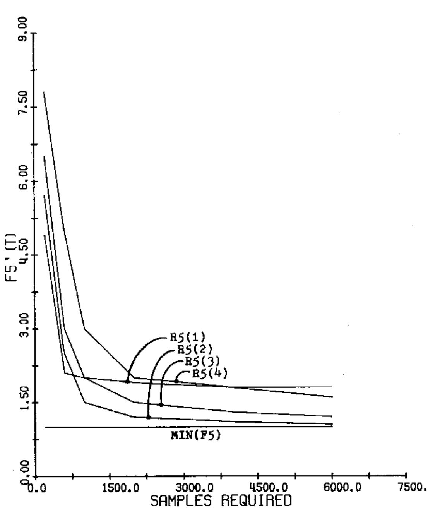  
Figure 4.19: off-line performance for R5 on F5 as a function of the orowding faotor.

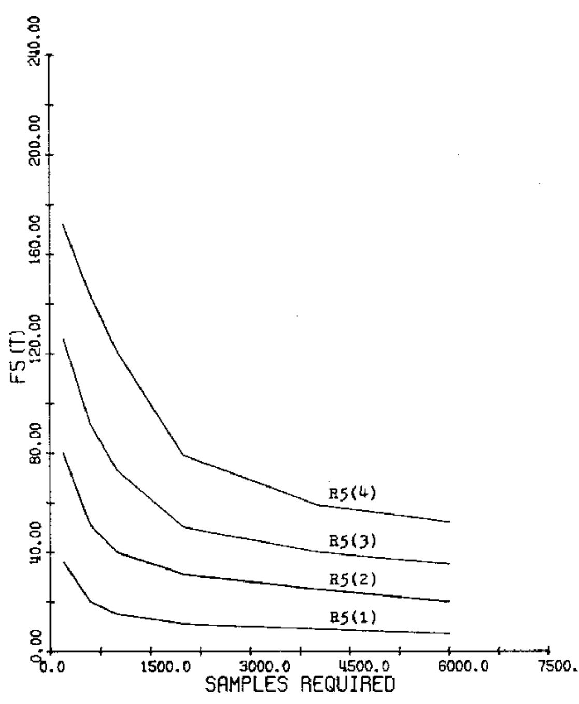  
Figure 4.20: On-line performance for R5 on P5 as a function of the crowding factor.

Any reduction slows the overall improvenent rate. Notice, however, that these negative effects are not nearly so severe with increases in the crowding factor as they are with increases in mutation, The reason seems obvious. Mutation controls the growth rate by randomly changing allele values, an approach which becomes more likely to produce performance degradation as adaptation progresses, On the other hand, the crowding factor provides the same kind of controlled growth rate by reducing the number of offspring produced by instances of dominating hyperplanes, rather than modifying offspring allele values.

We began this analysis of the crowding factor by arbitrarily choosing an overlapping generation model for which $\tt G = \tt _ { \bullet } \tt { 1 }$ , Since we saw in previous studies that increasing the generation gap led to improved performance, it is of interest to explore that possibility here. In this situation we do not have quite the freedom in choosing G that we had before since as G increases beyond .5, the concept of the crowding factor becomes less meaningful, and makes little sense at all if nearly all the population is being replaced. As a consequence, the effects of crowding were analyzed for two other values of G, .2 and .4. Figures 4.21 and 4.22 give the off-line performance curves for each of these settings and illustrate two points of interest. The first observation is that, for the same crowding factor, increasing the

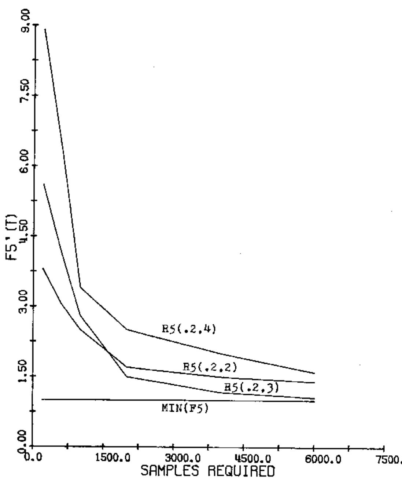  
Figure 4.21: Off-line performance for R5 on P5 as a function of the crowding factor.

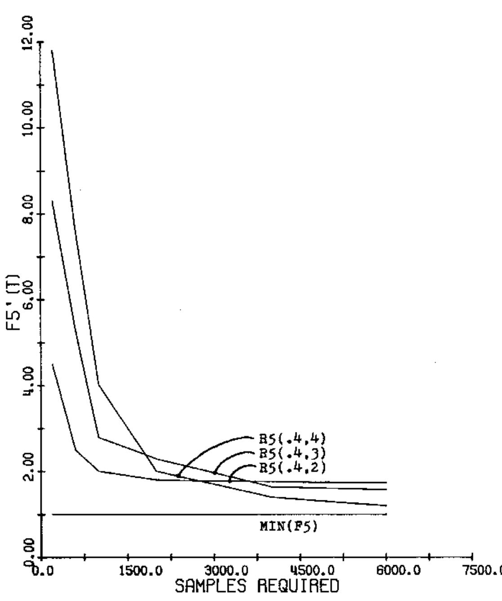  
Figure 4.22: off-line performance for R5 on F5 as a funotion of the orowding faotor.

generation gap actually degraded the off-line performance curves of A5 on F5. In each case an increase in the crowding factor was required to preserve the same kind of performance curve. These observations suggest an interesting interaction between crowding and generation gaps: the larger the generation $\mathtt { g a p }$ , the less effective crowding becomes, One possible explanation for this interaction is as follows. As the generation gap increases, the lifespan (in terms of generations) of an individual is reduced with a compensating increase in the number of offspring per generation. The crowding factor operates by reducing the lifespan of individuals and, hence, with shorter average lifespans its effectiveness is reduced.

Finally, it rewains to be seen what effect crowding has on the overall performance of genetic plans on E. To analyze these effects, the following members of R5 were evaluated on E:

$$
\begin{array} { r l } & { \mathrm { R } \boldsymbol { \xi } \left( \boldsymbol { \xi } 0 , . . 0 0 1 , . . 6 , . . 1 , 2 \right) } \\ & { \mathrm { R } \boldsymbol { \xi } \left( \boldsymbol { \xi } 0 , . . 0 0 1 , . . 6 , . . 1 , 3 \right) } \\ & { \mathrm { R } \boldsymbol { \xi } \left( \boldsymbol { \xi } 0 , . . 0 0 1 , . . 6 , . . 1 , 4 \right) } \\ & { \mathrm { R } \boldsymbol { \xi } \left( \boldsymbol { \xi } 0 , . . 0 0 1 , . . 6 , . . 2 , 4 \right) } \\ & { \mathrm { R } \boldsymbol { \xi } \left( \boldsymbol { \xi } 0 , . . 0 0 1 , . . 6 , . . 2 , 2 \right) } \\ & { \mathrm { R } \boldsymbol { \xi } \left( \boldsymbol { \xi } 0 , . . 0 0 1 , . . 6 , . . 2 , 3 \right) } \\ & { \mathrm { R } \boldsymbol { \xi } \left( \boldsymbol { \xi } 0 , . . 0 0 1 , . . 6 , . . 2 , 4 \right) } \\ & { \mathrm { R } \boldsymbol { \xi } \left( \boldsymbol { \xi } 0 , . . 0 0 1 , . . 6 , . . 4 , 3 \right) } \\ & { \mathrm { R } \boldsymbol { \xi } \left( \boldsymbol { \xi } 0 , . . 0 0 1 , . . 6 , . . 4 , 4 \right) } \\ & { \mathrm { R } \boldsymbol { \xi } \left( \boldsymbol { \xi } 0 , . . 0 0 1 , . . 6 , . . 4 , 4 \right) } \end{array}
$$

Tables 4.3a and 4.3b give the corresponding off-line and on-line performance indices computed over 6ooo trlals. As in the previous section these results indicate quite clearly the tradeorfs in performance we face. Including a crowding factor in genetic plans improves significantly

<table><tr><td colspan="1" rowspan="1">T=6000</td><td colspan="1" rowspan="1">R5(.1.2)</td><td colspan="1" rowspan="1">R5(.1.3)</td><td colspan="1" rowspan="1">85(.1,4</td><td colspan="1" rowspan="1">R5(.2,2)</td><td colspan="1" rowspan="1">R5(.2.3)</td><td colspan="1" rowspan="1">R5(.2.4)</td><td colspan="1" rowspan="1">R5(.4,3)</td><td colspan="1" rowspan="1">R5(.4,4</td></tr><tr><td colspan="1" rowspan="1">$\ra{}$</td><td colspan="1" rowspan="1">.186</td><td colspan="1" rowspan="1">.185</td><td colspan="1" rowspan="1">093</td><td colspan="1" rowspan="1">.092</td><td colspan="1" rowspan="1">.103</td><td colspan="1" rowspan="1">.161</td><td colspan="1" rowspan="1">.170</td><td colspan="1" rowspan="1">129</td></tr><tr><td colspan="1" rowspan="1">$\^</td><td colspan="1" rowspan="1">.284</td><td colspan="1" rowspan="1">.111</td><td colspan="1" rowspan="1">.103</td><td colspan="1" rowspan="1">.226</td><td colspan="1" rowspan="1">.125</td><td colspan="1" rowspan="1">.097</td><td colspan="1" rowspan="1">.476</td><td colspan="1" rowspan="1">.411</td></tr><tr><td colspan="1" rowspan="1">$\r)}$</td><td colspan="1" rowspan="1">-26.8</td><td colspan="1" rowspan="1">-26.38</td><td colspan="1" rowspan="1">-25.9</td><td colspan="1" rowspan="1">-27.5</td><td colspan="1" rowspan="1">-26.73</td><td colspan="1" rowspan="1">-27.08</td><td colspan="1" rowspan="1">-27.18</td><td colspan="1" rowspan="1">-26.5</td></tr><tr><td colspan="1" rowspan="1">$\ra)$</td><td colspan="1" rowspan="1">21.79</td><td colspan="1" rowspan="1">28.55</td><td colspan="1" rowspan="1">28.85</td><td colspan="1" rowspan="1">19.36</td><td colspan="1" rowspan="1">25.13</td><td colspan="1" rowspan="1">23.85</td><td colspan="1" rowspan="1">22.73</td><td colspan="1" rowspan="1">23.36</td></tr><tr><td colspan="1" rowspan="1">$\$</td><td colspan="1" rowspan="1">3.07</td><td colspan="1" rowspan="1">4.48</td><td colspan="1" rowspan="1">5.07</td><td colspan="1" rowspan="1">5.28</td><td colspan="1" rowspan="1">4.79</td><td colspan="1" rowspan="1">4.37</td><td colspan="1" rowspan="1">3.88</td><td colspan="1" rowspan="1">3.21</td></tr><tr><td colspan="1" rowspan="1">$x\ra}$</td><td colspan="1" rowspan="1">-.299</td><td colspan="1" rowspan="1">1.39</td><td colspan="1" rowspan="1">1.64</td><td colspan="1" rowspan="1">-508</td><td colspan="1" rowspan="1">.684</td><td colspan="1" rowspan="1">279</td><td colspan="1" rowspan="1">.015</td><td colspan="1" rowspan="1">.122</td></tr><tr><td colspan="1" rowspan="1">T=6000</td><td colspan="1" rowspan="1">B5(.1.2)</td><td colspan="1" rowspan="1">B5(.1.3)</td><td colspan="1" rowspan="1">R5(.1,4)R5(.2,2)</td><td colspan="1" rowspan="1">R5(.1,4)R5(.2,2)</td><td colspan="1" rowspan="1">R5(.2.3</td><td colspan="1" rowspan="1">R5(.2,4)</td><td colspan="1" rowspan="1">R5(.4.3)|B5(.4,4)</td><td colspan="1" rowspan="1">R5(.4.3)|B5(.4,4)</td></tr><tr><td colspan="1" rowspan="1">$1F1(T</td><td colspan="1" rowspan="1">6.49</td><td colspan="1" rowspan="1">7.47</td><td colspan="1" rowspan="1">7.02</td><td colspan="1" rowspan="1">5.03</td><td colspan="1" rowspan="1">6.94</td><td colspan="1" rowspan="1">6.79</td><td colspan="1" rowspan="1">6.42</td><td colspan="1" rowspan="1">6.90</td></tr><tr><td colspan="1" rowspan="1">$1p2(t)</td><td colspan="1" rowspan="1">130.05</td><td colspan="1" rowspan="1">145.85</td><td colspan="1" rowspan="1">152.24</td><td colspan="1" rowspan="1">100.84</td><td colspan="1" rowspan="1">134.26</td><td colspan="1" rowspan="1">128.11</td><td colspan="1" rowspan="1">112.85</td><td colspan="1" rowspan="1">127.7</td></tr><tr><td colspan="1" rowspan="1">$\p3}$</td><td colspan="1" rowspan="1">-20.95</td><td colspan="1" rowspan="1">-18.64</td><td colspan="1" rowspan="1">-17.7</td><td colspan="1" rowspan="1">-21.46</td><td colspan="1" rowspan="1">-20.4</td><td colspan="1" rowspan="1">-18.8</td><td colspan="1" rowspan="1">-21.1</td><td colspan="1" rowspan="1">-19.0</td></tr><tr><td colspan="1" rowspan="1">\p4()</td><td colspan="1" rowspan="1">76.2</td><td colspan="1" rowspan="1">95.85</td><td colspan="1" rowspan="1">101.87</td><td colspan="1" rowspan="1">71.37</td><td colspan="1" rowspan="1">87.12</td><td colspan="1" rowspan="1">91.83</td><td colspan="1" rowspan="1">74.99</td><td colspan="1" rowspan="1">87.11</td></tr><tr><td colspan="1" rowspan="1">$\P5</td><td colspan="1" rowspan="1">45.3</td><td colspan="1" rowspan="1">58.5</td><td colspan="1" rowspan="1">65.14</td><td colspan="1" rowspan="1">46.7</td><td colspan="1" rowspan="1">56.39</td><td colspan="1" rowspan="1">66.28</td><td colspan="1" rowspan="1">67.12</td><td colspan="1" rowspan="1">67.89</td></tr><tr><td colspan="1" rowspan="1">$x_{(</td><td colspan="1" rowspan="1">47.36</td><td colspan="1" rowspan="1">57.81</td><td colspan="1" rowspan="1">61.71</td><td colspan="1" rowspan="1">40.49</td><td colspan="1" rowspan="1">52.86</td><td colspan="1" rowspan="1">54.84</td><td colspan="1" rowspan="1">48.06</td><td colspan="1" rowspan="1">53.12</td></tr></table>

their performance on multimodal surfaces at the expense of rapid convergence on the unimodal surfaces. On the other hand, the distinction between these tradeoffs becomes less evident as the interval of observation increases and more emphasis is placed on convergence.

# 4.8 Generalized Crossover Model R6

Recall from the hyperplane analysis introduced in chapter 2 that genetic plans generate near-optimal allocation of trials to competing hyperplanes whose definition length (the shortest gene segment containing all the fired positions) was short relative to the chromosome length I. This was due to the fact that crossover disrupted the allocation of trials according to performance with a probability directly proportional to the definition length of a hyperplane. This means that the performance of the genetic plans under study may in fact be representation dependent, That is, one binary representation of the space to be searched may be less affected by crossover than another representation because high-performance groups of alleles are physically closer together. One solution to this problem is to allow the representation itself undergo adaptation be introducing a genetic inversion operator which physically permutes genes on a chromosome without loss of functional position. Studies by Franz (i972) suggest that changes effeoted by inversion are difricult to

detect ercept perhaps in long-term behavior. Since we are concerned with practical applications, we explore an alternate approach in this section: the possibility of modifying the crossover operator itself to reduce representation dependencies.

Recall again how crossover has been defined to this point. After selecting two individuals, a crossover point is selected uniformly from the &-1 positions between the $x$ genes. The offspring consists of the first segment of the first parent up to the crossover point and the remaining segment of the second parent. If we think of a chromosowe as a circle with the first gene immedi-. ately following the last

then it becomes immediately olear that there are in fact 2 crossover points: one fired at position zero and the other randomly selected.

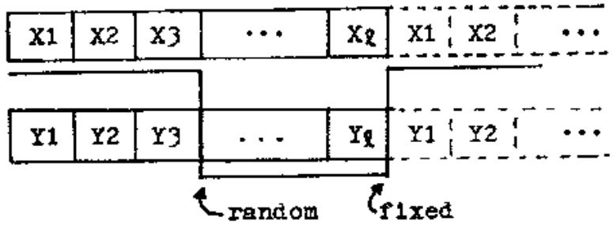

An immediate generalization to the present crossover operator is to allow both crossover points to be randomly selected. Further generalization can be made by allowing an arbitrary number of crossover points. But notice that the actual number of crossover points is always

an even number since (from the circular viewpoint) you always end up back where you started,

In order to understand what effeots these changes have on the allocation of trials to competing hyperplanes we generalize the discussions of chapter 2. We need to compute the probability that an offspring after crossover lies in a different hyperplane partition element than its parent. If we let $\mathbf { x } _ { 1 } , ~ \mathbf { x } _ { 2 } , ~ \cdots , ~ \mathbf { x } _ { \mathbf { k } }$ be the k positions defining a hyperplane, then the offspring will certainly lie in the same hyperplane if there were an even number of crossover points between each conseoutive pair of fixed points $( x _ { 1 } , x _ { 3 } )$ , Hence, if we think of the hyper-. plane's k fixed points as dividing a chromosome into k segments (in the circular viewpoint), the probability of staying in the same hyperplane is at least as great as the probability that each segment contains an even number of crossover points. Hestating this as the probability of the loss of an offspring to another hyperplane, we have:

$$
\texttt { P r } [ \cos \tt { s o v e r } \gamma \tt { 1 o s s } ] \leq 1 - \tt { P } _ { n k }
$$

where $\tt P _ { r l E }$ is the probability that each of the k segments received an even number (including zero) of the $\scriptstyle \mathtt { n } = 2 \mathtt { m }$ crossover points,

In order to get a feeling for how these probabilities change by increasing the number of orossover points, consider the effects on second-order hyperplanes. They divide the chromosome up into two segments of length

X1=x2-x1 and 2=-(x2-1) with the probability of a randomly selected crossover point falling in one of them given by $l _ { 1 } / l$ . If we assume the convention that whenever an odd number of crossover points are randomly selected, the final even crossover point is defined to occur at position zero, then we have:

$$
\mathbb { P } _ { { \bf n } 2 } = \sum _ { { \bf i } = 0 } ^ { \bf n } \left( { \bf i } _ { 2 1 } ^ { { \bf n } } \right) \left( \frac { \ell _ { 1 } } { \ell } \right) ^ { 2 { \bf i } } \left( \frac { \ell _ { 2 } } { \ell } \right) ^ { { \bf n } - 2 { \bf i } }
$$

where n is the number of randomly selected crossover points with $m = n / 2$ (integer division).

Figure $4 . 2 3$ illustrates how the loss probability 1-P_n2\$ changes both as a function of the definition length $l _ { 1 }$ and the number of randomly selected crossover points n for second order hyperplanes with a chromosome length of &=30. Notice that there are two distinct families of curves: one for n even and one for n odd. When an odd number of crossover points are randomly selected, the probability of loss for widely spaced fixed points remains high since it remains likely that all the crossover points will fall in the long segment defined by the two fixed points. On the other hand, randomly selecting an even number of crossover points immediately drops the loss probabilities to .5 or less with $2 / 2$ spacings becoming the most likely victims.

How these generalizations of the crossover operator will affect the performance of genetic plans is not clear. We may find that they reduce representation dependencies at the cost of lower overall performance on E. On the other hand one can imâgine that perhaps a modest increase in the number of randomly selected crossover points may generate performance improvements while larger numbers of crossover points may be too disruptive to the allocation of trials to higher order hyperplanes.

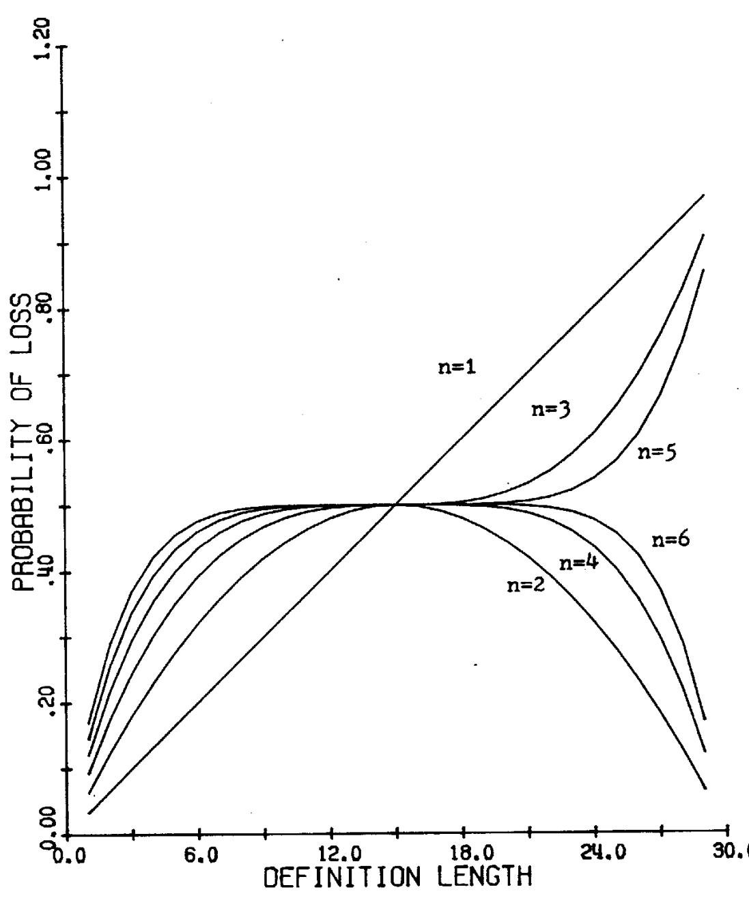  
Figure 4.23: Loss probability curves for second order hyperplanes on chromosomes of length 30 as a function of the number of crossover points.

To explore these possibilities, plan R5 was modified to accept a sixth parameter, CP, which specifies the number of crossover points to be randomly selected. Up to this point we have been implicitly using a value of $\mathtt { C P = 1 }$ . If CP is odd, the final crossover point is assumed to occur at position zero.

As an initial attempt to understand the implications of generalized crossover, five members of R6 were evaluated on test function F1:

$$
\begin{array} { r } { \mathtt { R 6 } \left\{ \xi 0 \ _ { * } \cdot \ 0 0 1 \ \dots 6 \ , 1 \cdot 0 \ , 1 \ , 1 \right\} } \\ { \mathtt { R 6 } \left\{ \xi 0 \ \bullet \ . \ 0 0 1 \ \bullet \ . 6 \ , 1 \cdot 0 \ , 1 \ , 2 \right\} } \\ { \mathtt { R 6 } \left( \xi 0 \ \bullet \ . \ 0 0 1 \ \dots 6 \ , 1 \ . 0 \ , 1 \ , 3 \right) } \\ { \mathtt { R 6 } \left( \xi 0 \ \bullet \ . \ 0 0 1 \ \dots 6 \ . 1 \ . 0 \ , 1 \ , 4 \right) } \\ { \mathtt { R 6 } \left( \xi 0 \ \bullet \ . \ 0 0 1 \ \dots 6 \ . 1 \ . 0 \ , 1 \ , 8 \right) } \end{array}
$$

Figure $4 , 2 4$ depicts the allele loss generated by these members of R6 on test function Fl, and illustrates that the allele loss rate actually increases as cP does. This is a surprising observation for which an explanation is not immediately clear. It may very well be the case that the previous disruption of the allocation of trials to the longer hyperplanes may have counteracted some

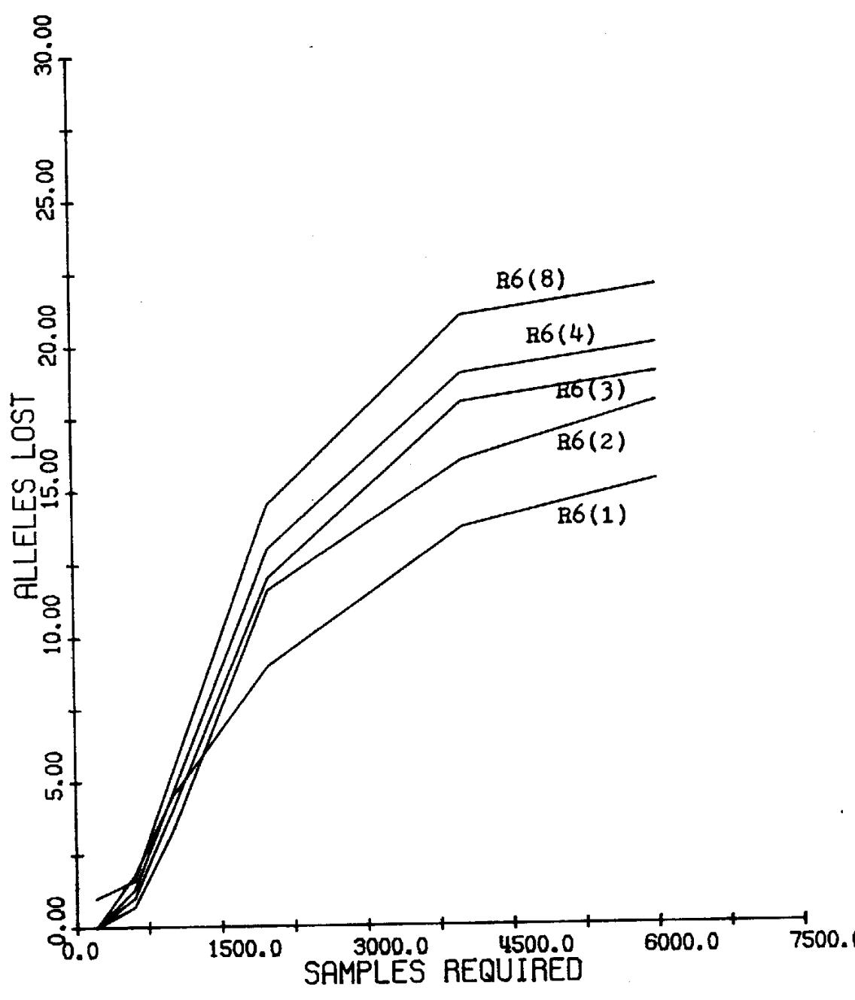  
Figure 4.24: Allele loss for R6 on F1 as a function of the number of crossover points.

of the stochastic side-effects of genetic drift and, hence, the removal of some of this disruption opened the door for increased allele loss.

Figures 4.25 and 4.26 give the off-line and on-line performance curves generated by these members of R6 on Fl. In general, increasing the number of crossover points seems to degrade slightly the off-line performance of R6 with R6(8) exhibiting the old problem of premature convergence. This is probably due to the previously noted increased allele loss rate. It is also interesting to note that initial on-line performance also degrades somewhat as CP increases, suggesting that increasing the number of crossover points leads to a less conservative sampling policy in the initial stages of adaptation.

Finally, to evaluate the effects of generalized crossover on the performance of R6 on E, the behavior of the following members was analyzed on E:

$$
\begin{array} { r l } & { \mathtt { R 6 } ( \xi 0 \ \bullet \ \circ 0 1 \ \bullet \ 6 , 1 \bullet 0 , 1 \ 1 , 1 ) . } \\ & { \mathtt { R 6 } ( \xi 0 \ \bullet \ \circ 0 1 \ \bullet \ 6 , 1 \ \bullet 0 \ 1 \ , 2 ) } \\ & { \mathtt { R 6 } ( \xi 0 \ \bullet \ \circ 0 1 \ \bullet \ 6 , 1 \ \bullet 0 \ 1 \ , 3 ) } \\ & { \mathtt { R 6 } ( \xi 0 \ \bullet \ \circ 0 1 \ \bullet \ 6 \ 1 \ \bullet \ 0 \ 1 \ , 4 ) } \\ & { \mathtt { R 6 } ( \xi 0 \ \bullet \ \circ 0 1 \ \bullet \ 6 , 1 \ \bullet \ 0 \ 1 \ , 8 ) } \\ & { \mathtt { R 6 } ( \xi 0 \ \bullet \ \circ 0 1 \ \bullet \ 6 , 1 \ \bullet \ 0 \ , 1 \ , 2 ) } \\ & { \mathtt { R 6 } ( \xi 0 \ \bullet \ \circ 1 \ \bullet \ 6 , 1 \ \bullet \ 2 \ , 2 ) } \\ & { \mathtt { R 6 } ( \xi 0 \ \bullet \ \circ 0 1 \ , \bullet \ 6 \ , \ 1 \bullet \ 2 \ , 2 ) } \end{array}
$$

Tables $4 . 4 a$ and $4 , 4 b$ summarize the off-line and on-line performance indices for these evaluations over 6ooo trials. The first five members analyzed differed only in the number of crossover points selected. The best overall off-line performance was achieved with $\tt C P = 2$ , chiefly on the basis of its performance on $\pmb { \mathcal { F } } \pmb { 4 }$ • Note that

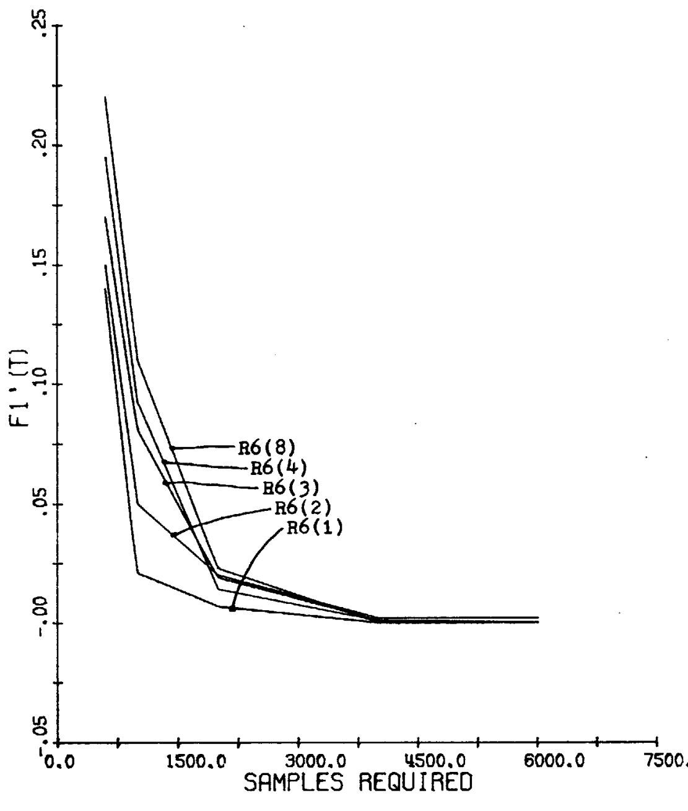  
Figure 4.25: Off-line performanee curves for R6 on F1 as a function of the number of crossover points.

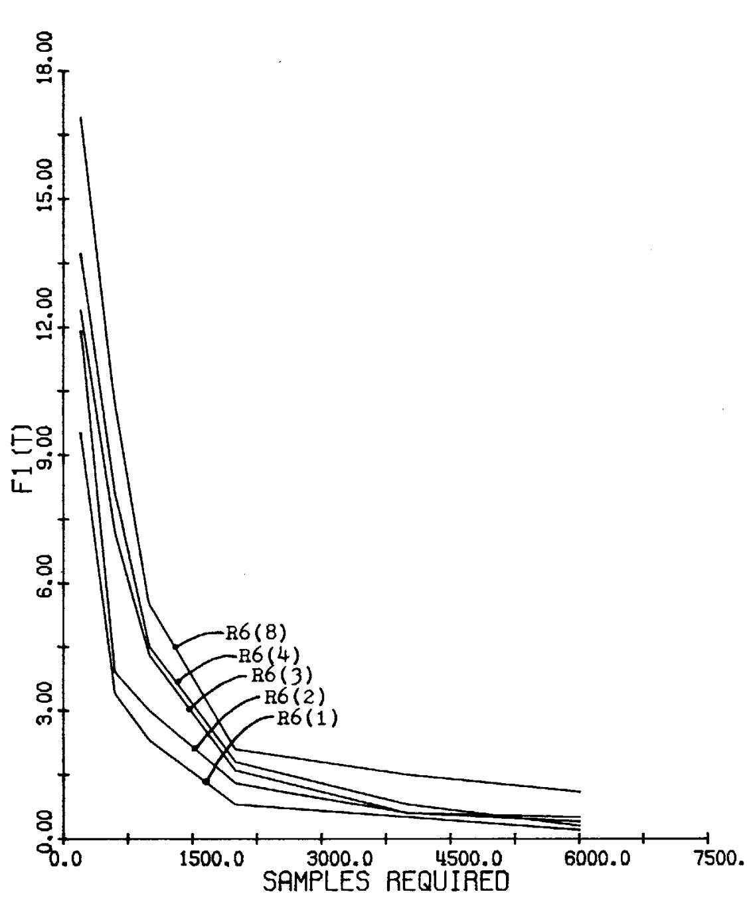  
Figure 4.26: On-line performance curves for R6 on F1 as a function of the number of crossover points.

<table><tr><td></td><td></td><td></td><td></td><td></td><td></td><td colspan="1" rowspan="2">$Pc=CP=2</td><td colspan="1" rowspan="2">G =.1CF=2CP=2</td></tr><tr><td colspan="1" rowspan="1">T=6000</td><td colspan="1" rowspan="1">CP=1</td><td colspan="1" rowspan="1">CP=2</td><td colspan="1" rowspan="1">CP=3</td><td colspan="1" rowspan="1">CP=4</td><td colspan="1" rowspan="1">CP=8</td></tr><tr><td colspan="1" rowspan="1">$x\r)</td><td colspan="1" rowspan="1">.113</td><td colspan="1" rowspan="1">.117</td><td colspan="1" rowspan="1">.122</td><td colspan="1" rowspan="1">.127</td><td colspan="1" rowspan="1">.138</td><td colspan="1" rowspan="1">.129</td><td colspan="1" rowspan="1">.116</td></tr><tr><td colspan="1" rowspan="1">$\)</td><td colspan="1" rowspan="1">.221</td><td colspan="1" rowspan="1">.197</td><td colspan="1" rowspan="1">.237</td><td colspan="1" rowspan="1">.244</td><td colspan="1" rowspan="1">.289</td><td colspan="1" rowspan="1">.133</td><td colspan="1" rowspan="1">.215</td></tr><tr><td colspan="1" rowspan="1">$\()</td><td colspan="1" rowspan="1">-28.2</td><td colspan="1" rowspan="1">-27.99</td><td colspan="1" rowspan="1">-27.86</td><td colspan="1" rowspan="1">-27.53</td><td colspan="1" rowspan="1">-26.91</td><td colspan="1" rowspan="1">-28.3</td><td colspan="1" rowspan="1">-27.1</td></tr><tr><td colspan="1" rowspan="1">$\)</td><td colspan="1" rowspan="1">17.62</td><td colspan="1" rowspan="1">14.01</td><td colspan="1" rowspan="1">18.19</td><td colspan="1" rowspan="1">21.06</td><td colspan="1" rowspan="1">25.23</td><td colspan="1" rowspan="1">19.59</td><td colspan="1" rowspan="1">23.9</td></tr><tr><td colspan="1" rowspan="1">$\{)</td><td colspan="1" rowspan="1">3.34</td><td colspan="1" rowspan="1">4.74</td><td colspan="1" rowspan="1">5.27</td><td colspan="1" rowspan="1">5.61</td><td colspan="1" rowspan="1">5.85</td><td colspan="1" rowspan="1">3.95</td><td colspan="1" rowspan="1">3.87</td></tr><tr><td colspan="1" rowspan="1">$x\)</td><td colspan="1" rowspan="1">-1.38</td><td colspan="1" rowspan="1">-1.79</td><td colspan="1" rowspan="1">-.808</td><td colspan="1" rowspan="1">-.098</td><td colspan="1" rowspan="1">.919</td><td colspan="1" rowspan="1">-.899</td><td colspan="1" rowspan="1">.200</td></tr><tr><td></td><td></td><td></td><td></td><td></td><td colspan="1" rowspan="2">CP=8</td><td colspan="1" rowspan="2">$Pc=0$CP=2</td><td colspan="1" rowspan="2">G =.1CF=2CP=2</td></tr><tr><td colspan="1" rowspan="1">T=6000</td><td colspan="1" rowspan="1">CP=1</td><td colspan="1" rowspan="1">CP=2</td><td colspan="1" rowspan="1">CP=3</td><td colspan="1" rowspan="1">CP=4</td></tr><tr><td colspan="1" rowspan="1">$1F1(T)</td><td colspan="1" rowspan="1">2.32</td><td colspan="1" rowspan="1">2.67</td><td colspan="1" rowspan="1">2.88</td><td colspan="1" rowspan="1">3.23</td><td colspan="1" rowspan="1">3.51</td><td colspan="1" rowspan="1">6.47</td><td colspan="1" rowspan="1">5.07</td></tr><tr><td colspan="1" rowspan="1">1p2(T)</td><td colspan="1" rowspan="1">34.76</td><td colspan="1" rowspan="1">36.99</td><td colspan="1" rowspan="1">38.97</td><td colspan="1" rowspan="1">41.25</td><td colspan="1" rowspan="1">46.85</td><td colspan="1" rowspan="1">112.6</td><td colspan="1" rowspan="1">96.7</td></tr><tr><td colspan="1" rowspan="1">$xp3(</td><td colspan="1" rowspan="1">-26.49</td><td colspan="1" rowspan="1">-26.17</td><td colspan="1" rowspan="1">-25.83</td><td colspan="1" rowspan="1">-25.14</td><td colspan="1" rowspan="1">-24.61</td><td colspan="1" rowspan="1">-22.16</td><td colspan="1" rowspan="1">-22.5</td></tr><tr><td colspan="1" rowspan="1">xp4(T)</td><td colspan="1" rowspan="1">40.73</td><td colspan="1" rowspan="1">37.54</td><td colspan="1" rowspan="1">42.64</td><td colspan="1" rowspan="1">47.97</td><td colspan="1" rowspan="1">49.8</td><td colspan="1" rowspan="1">95.9</td><td colspan="1" rowspan="1">83.8</td></tr><tr><td colspan="1" rowspan="1">$\p5(T</td><td colspan="1" rowspan="1">34.34</td><td colspan="1" rowspan="1">36.91</td><td colspan="1" rowspan="1">38.27</td><td colspan="1" rowspan="1">42.38</td><td colspan="1" rowspan="1">45.63</td><td colspan="1" rowspan="1">82.65</td><td colspan="1" rowspan="1">74.5</td></tr><tr><td colspan="1" rowspan="1">XB(T)</td><td colspan="1" rowspan="1">17.12</td><td colspan="1" rowspan="1">17.59</td><td colspan="1" rowspan="1">19.39</td><td colspan="1" rowspan="1">21.94</td><td colspan="1" rowspan="1">24.24</td><td colspan="1" rowspan="1">55.09</td><td colspan="1" rowspan="1">47.51</td></tr></table>

performance of F5 degrades significantly as CP increases, indicating again how important a low allele loss rate is. As we saw on Fl, on-line performance degrades significantly as CP increases.

The last two members were chosen as likely candidates to improve the off-line performance of R6 on E. Time and resources prohibited a more detailed analysis of the six parameters defining R6. However, since we had earlier noted the increased allele loss rate of R6 on F1, the two most likely candidates for improvement were increased mutation rates and the crowding factor. One instance of each was chosen; neither improved offline performance over 6ooo trials and, as we have seen before, both degrade on-line performance.

# 4.9 Summary

We began this chapter by analyzing the performance of the basic family Ri of genetic plans on E. While this family outperforms random search on E, we noted that there was considerable room for improvement. To this basic plan we added an elitist policy which biased the allocation of trials slightly toward the hyperplanes which produced the currently best individual. This resulted in improved performance on E, particularly on the unimodal surfaces. In fact, performance on F5 was degraded suggesting that an elitist policy improves the local search properties of genetic plans. As an

alternative, expected value model R3 was introduced which attempted to improve performance by minimizing the difference between the actual and expected number of offspring produced by $\cdot$ individuals in A(t). This produced a significant increase in performance on E. R3 was then modified to include the previously mentioned elitist policy. Again the performance on $\pmb { \mathrm { z } }$ was improved to the extent that on test functions $\tt F 1 - \tt F 4$ , there were no signs of premature convergence over the interval of observation Rather, $\mathtt { R 4 }$ generated steady progress toward the minimum with convergence within 600o trials on F1 and F2. F5, however, remained a difficult challenge. To that end, several members of the R4 family were analyzed on F5 to see whether a change in parameters would improve the off-line performance curve. Increasing the mutation rate to .01 seemed about the most effective change for F5 but resulted in an overall decrease in off-line performance on E. As an alternative approach to improving the global search properties of R4, a crowding factor model was introduced which attempted to slow the growth rate of hyperplanes beginning to dominate the finite population A(t). Like increasing the mutation rate, the crowding factor improved off-line performance on F5 at the expense of on-line performance, but the tradeoff was less pronounced. Finally, generalized crossover model R6 was introduced in an attempt to alleviate possible representation problems caused by

the disrupting effect crossover has on long-definition hyperplanes. By allowing several crossover points to occur when generating an offspring, the disruptiveness on long-definition hyperplanes can be considerably reduced. Although time did not permit a complete analysis of the effects, no significant improvement in performance on E was noted. In fact overall performance was seen to degrade as the number of crossover points increased.