# Chapter 5

# PERFORNANCE ANALYSIS OF FUNCTION OPTIMIZERS

# 5.1 Introduction

In the last two chapters we have developed a class of genetic plans which performs well on the environment E in comparison with random search. In this chapter we provide an alternate point of comparison by evaluating the performance of several function optimization techniques on E.

In our discussion of function optimization in chapte: 1, we noted that the problem of finding function extrema. has generally been divided into two subproblems: finding the nearest local extremum (local or unimodal search) and finding the global extremum (global or multimodal search). Many sophisticated techniques have been developed which solve the local search problem (see, for example, Jacoby and Kowalik(1972) or Huang(1970)). However, much less success is evident for the global search problem. Several approaches have been proposed if appropriate bounds can be assumed on the derivatives of the functions to be optimized (see, for example, Bremermann (1970) or Brent (1971)). Alternatively, one can perform some sort of patterned search in an attempt to locate the global optimum (see, for example, Hill (1969)). Unfortunately, for most of these techniques the computation time grows rapidly with the dimensionalit!

of the problem, and they are used in practice only for low-dimensional problems. As a consequence, one is left with two alternatives for a more general global function optimizer. Either one runs a good local optimizer a sufficiently large number of times to assure all local optima have been found or revert to some form of random search. Since we know we can do better than random search with the genetic algorithms, we consider in this chapter the alternative of restarting a local optimizer.

# 5.2 Local Optimization Techniques

The most successful local minimization techniques have come from the area of iterative descent methods. The idea here is to reduce the problem of finding the minimum to a sequence of one-dimensional searches along a direction vector Pk• That is, at each step a point Xk+1 is generated where Xk+1 = xk +λkPk and f(kk+1)<f(kk). The techniques differ in how the direction vector $\mathtt { P _ { k } }$ and the step size $\lambda _ { \tt { k } }$ are chosen. We will consider two dirferent techniques, one which requires that derivative information be available for the function being optimized and one which does not.

A well-studied approach to the choice of direction vectors is to perform a sequence of one-dimensional minimizations along a sequence of conjugate directions. If the function to be minimized is quadratic of dimension n, then in theory only n such one-dimensional minimizations are required for convergence. In practice, however, conjugate direction techniques are applied to arbitrary functions with heuristic modifications to prevent the conjugate directions from becoming linearly dependent and reducing the search space. Powell (1964) proposed a technique for calculating conjugate directions without derivative information by means of a series of one-dimensional minimizations. Subsequently, Brent (1971) and others have made modifications to improve the performance of this approach. Since Brent's algorithm is available in software form (PRAxIs), it seemed a reasonable choice as a representative of conjugate direction methods which do not require derivatives.

A somewhat more sophisticated approach to the problem of local minimization, using variable metric methods, was introduced by Fletcher and.Powell (1963) with subsequent variations proposed by Broyden (i970) and Huang (197o). In this case a sequence of nxn "metric" matrices (where n is the dimensionality of the search space) are constructed using gradient information to simultaneously provide a linear transformation of the search space into one less badly scaled and provide a sequence of conjugate directions for one-dimensional searches. As a consequence, each step is computationally more expensive than, for example, the previous approach (particularly when n is large), but generally requires no more than n steps on quadratic functions even when

the function to be minimized is badly scaled. In practice, variable metric methods are applied to arbitrary functions with heuristics for preventing the metric matrices Hx from becoming singular. Since the Fletcher-Powell algorithm is available in software form (Dfp), it seemed a reasonable choice as a representative of the variable metric methods.

# 5.3 Performance Evaluation Conventions

One of the most difficult things to find in the function optimization literature is a comprehensive comparative analysis of the performance of various optimization techniques. Invariably, a paper will cite as performance evidence the fact that one technique required fewer function evaluations to minimize a particular function from a particular starting point. In reality one finds that the comparison depends not only on the starting point but also on a number of "hidden" parameters such as one-dimensional search accuracies, initial step sizes, estimates of scaling, and so on. Applying the algorithm to a different function or even a different starting point requires more parameter "tuning" for the published results. In this thesis we have been concerned with the quality of robustness, that is, the ability of an algorithm to perform well in a wide variety of situations. For function optimization analysis, this suggests that we evaluate algorithms

over a variety of starting points and require that any "hidden" parameters be fixed over the duration of the evaluation.

In order to provide direct comparisons with the performance of the genetic algorithms on E, several conventions were adopted. On-line and off-line performance measurements were made for PRAxIS and DFP in each of two modes: local mode and global mode. In local mode, a random starting point is chosen and the algorithm is run until it converges. If convergence occurs within 6000 trials (the interval of observation), the performance measures are extrapolated from the point of convergence out to 6000 trials by assuming ${ \bf f _ { e } ( t ) ^ { \alpha } = \bf f _ { e } ^ { * } ( t ) ^ { \alpha } = \widetilde { \mathbb { F } \mathbb { M } \mathbb { T } \mathbb { M } } . }$ where FMIN-is the minimum at convergence. By averaging this . performance over a number of random starting points, we have a direct comparison between local optimizers and genetic plans. In global mode, the algorithm is restarted with a new random starting point each time it converges until it has allocated 6ooo trials. By averaging global performance over a number of random initial starting points, we have a direct comparison between proposed global optimizers and genetic plans.

Hecall from appendix A that each test function in E was in fact restricted to a bounded subspace of $\Xi ^ { n }$ of the form $\{ I _ { 1 } \leq 0$ • PRAXIS and DFP are unconstrained minimization techniques. No attempt was made to prevent excursions outside of the bounded search space. How

ever, all random starting points were chosen from a uniform distribution over the bounded search space. Recall also that the bounded spaces were discretized by specifying a resolution factor Axi. For fairness in comparison, no finer resolution of the minimum was required of PRAXIS and DFP. For PRAXIS convergence is assumed when successive extimates of the minimum essentially satisfy

$$
| x _ { k } - x _ { k - 1 } | \leq \texttt { T }
$$

For each test function in E, T was set to the discretization factor $\Delta \mathbf { x _ { i } }$ • For DFP, convergence is assumed whenever the gradient at a particular estimate of the minimum ${ \pmb x } _ { \mathbf { k } }$ satisfies

$$
G ( x _ { k } ) \leq \epsilon
$$

For each test function in E, E was set to $G ( x _ { \mathrm { m i n } } + \Delta x _ { 1 } )$ : the gradient one resolution step away from the minimum.

Finally, an attempt was made to equalize the fact that DFP required derivative information about the functions being minimized. As we noted in chapter 1. in many adaptive system applications, the performance functions to be optimized are not available in mathematical closed forms. Rather, they are usually "black box" problems for which only function values are readily available. This means that derivative information must be estimated by function evaluations taken small distances away. This suggests that gradient information

is equivalent at the very least to n function evaluations (where n is the dimension of the space) and perhaps 2n or more depending on the accuracy required. Since the DFP algorithm we used expected exact derivative information, it seemed unfair to use derivative estimates. Rather, exact derivatives were computed upon request for each of the test functions in E, but at the same time n function evaluations were computed as a conservative way of equalizing for this additional information.

5.4 Performance Evaluation of PRAxIS and DFP Figures 5.1 - 5.10 give the off-line and on-line performance curves produced by PRAxIS and DFP in local mode. Each of these curves represents the average of 20 independent trials using random starting points within the bounded subspaces defined in appendix A.

Figures 5.1 and 5.2 illustrate the performance of PRAXIS and DFP on test function F1. Notice the time scale here in relationship to those of the genetic algorithms in the previous chapter. Both PRAxIs and DFP converge within 6o trials while the genetic algorithms required several thousand. These curves indicate the kind of performance which is possible with local optimizers when the assumptions about the function being minimized actually hold. With a low-dimensional, nicely scaled quadratic function like Fl, one can hardly do better. The on-line performance curves on F1 bring

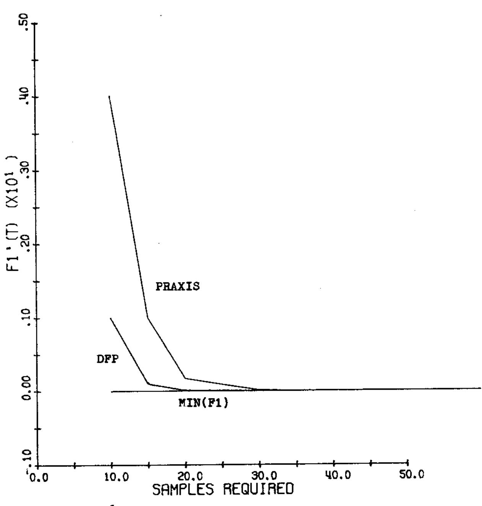  
Figure 5.l: Ofr-line performance curves for PRAxIs and DFP in local mode on Fl.

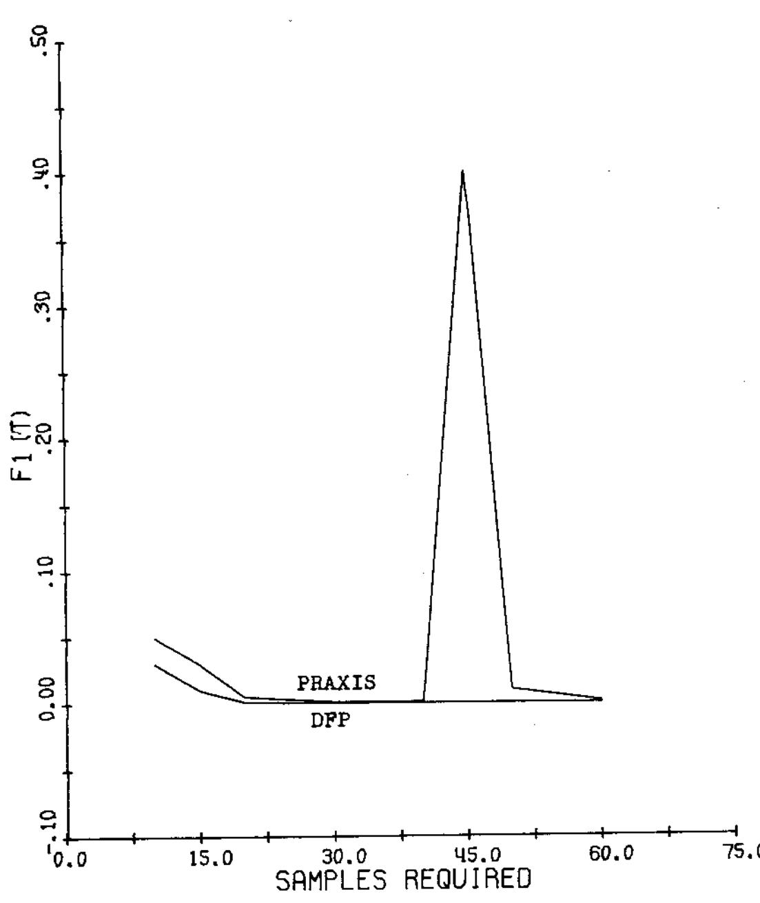  
Figure 5.2: On-line performance curves for PRAxIs and DFP in local mode on Fl.

out an interesting characteristic of PRAxIs. To avoid the problem of being caught in a narrow valley, when convergence is imminent, PRAxIs tries several steps in random directions. This shows up immediately in on-line performance since the probability of improvement is small.

Figures 5.3 and $5 . 4$ illustrate the local performance curves generated on F2. F2 violates several of the assumptions made concerning the function to be minimized. It is non-conver and non-quadratic, and is also badly scaled. Again, both DFP and PRAxIS converged in far less time than the genetic algorithms, although they both required considerably more trials than on Fl. Notice again how the random strategy of PRAxIs shows up in the final stages of on-line performance.

Figures 5.5 and 5.6 illustrate the local performance curves generated on F3. As they indicate, F3 gave both local optimizers considerably more difficulty than F1 and F2. The stopping criterion used by PRAxIs was never satisfied within 6ooo trials, requiring manual termination. On the other hand, because DFP used a gradient stopping criterion, it stopped almost immediately on whatever plateau was selected by the random starting point. As a consequence, in local mode it converged on the average to AvE(r3) = -2.5, whick was then ertrapolated as discussed earlier over the remainder of the 6ooo trials.

Figures 5.7 and 5.8 illustrate the local performance curves generated on F4. Recall that F4 was a high dimensional quartic with Gaussian noise. Here we see a considerable difference in the performance of the algorithms. PRAxIs seemed to make no better progress than random search on F4, while DFP easily outperformed the genetic algorithms. This suggests that PRAxIs is considerably more sensitive to noise than DFp. To verify this, PRAxIS was evaluated on F4 with the Gaussian noise reduced from N(0,1) to N(0..01). As illustrated, this resulted in considerable improvement in the performance of PRAXIS. It is interesting to speculate why PRAXIS is so much more sensitive to noise. Recall that PRAXIS constructs a conjugate direction without derivatives via a sequence of n one-dimensional minimizations. It is quite easy to imagine that this process is sensitive to noise, particularly with high-dimensional problems.

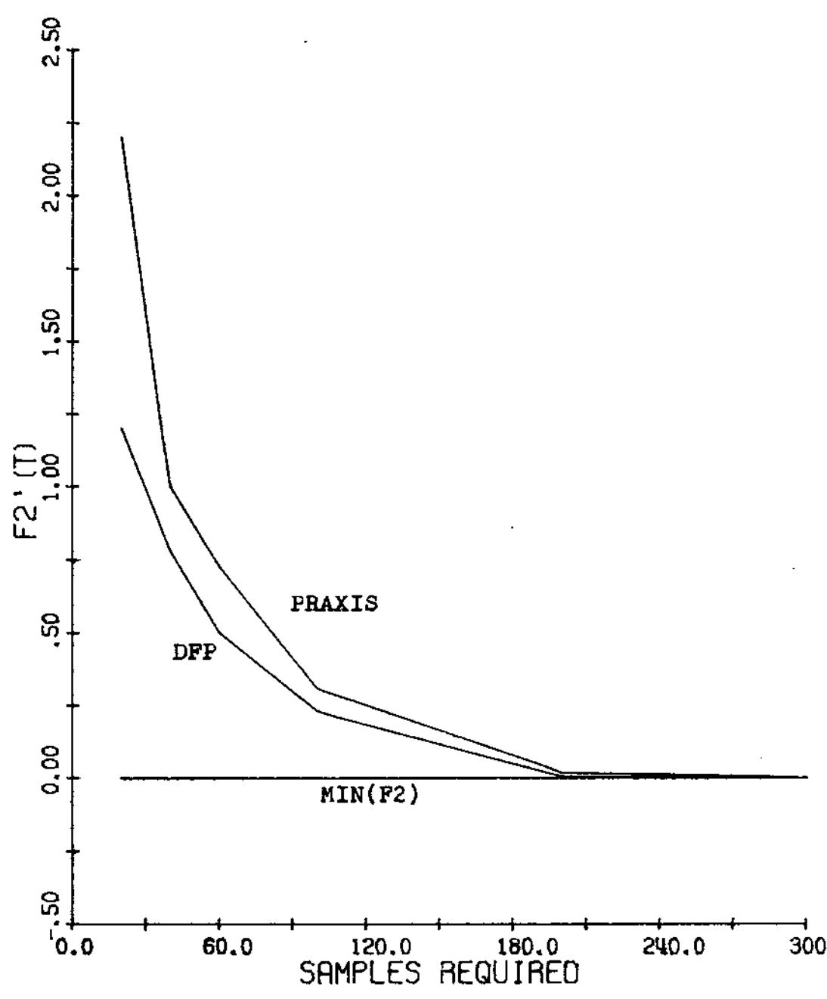  
Figure 5.3: Orr-line performance curves for PRAxIs and DFP in local mode on F2.

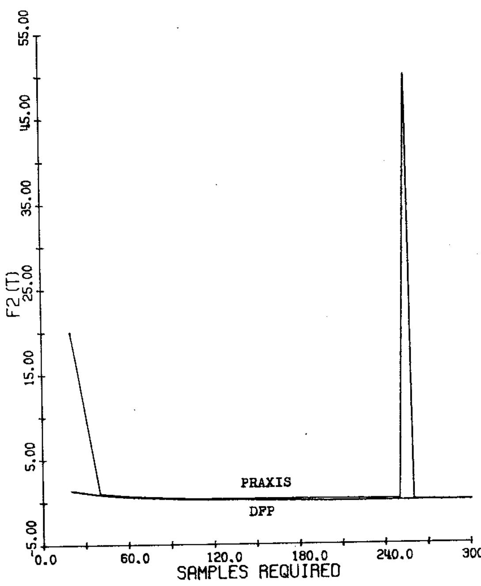  
Figure 5.4: On-line performance curves for PRAxIs and DFP in local mode on F2.

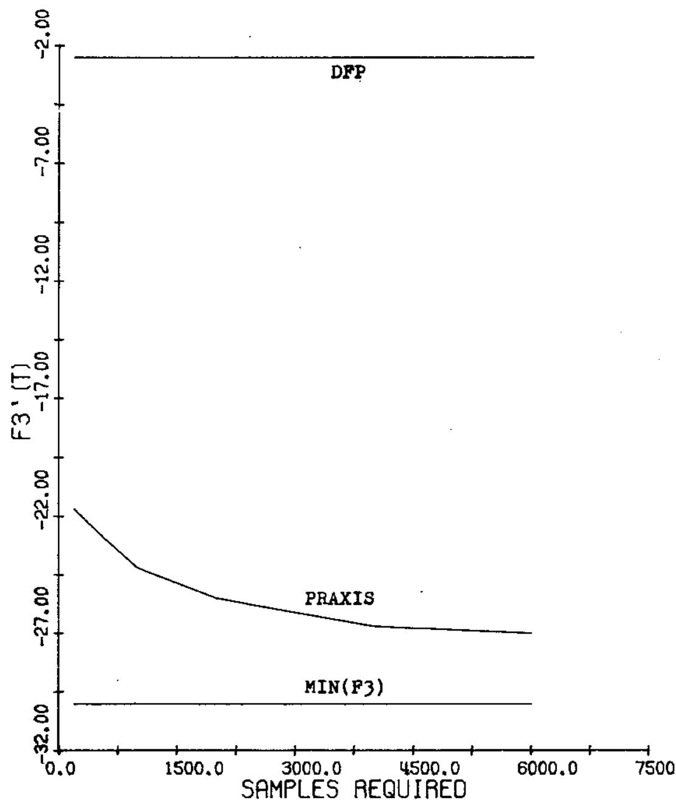  
Figure 5.5: Off-line performance curves for PRAxIs and DFP in local mode on F3.

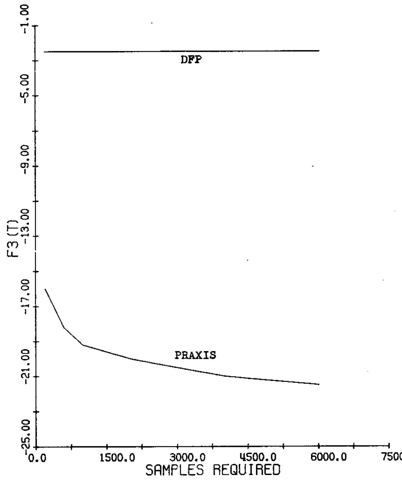  
Figure 5.6: On-line performance curves for PRAxIs and DFP in local mode on F3.

Finally, figures 5.9 and 5.10 illustrate the local performance curves generated on F5. The results are pretty much as expected. In local mode, both PRAXIS and DFp converge rapidly to the nearest local minimum, which when evaluated over a number of independent trials with random starting points yields convergence to the average value of F5 on its local minima.

At this point it is fairly easy to predict what will happen when we switch PRAxIS and DFP to global mode. On Fi and F2 there will be essentially no change in off-line performance since convergence is already

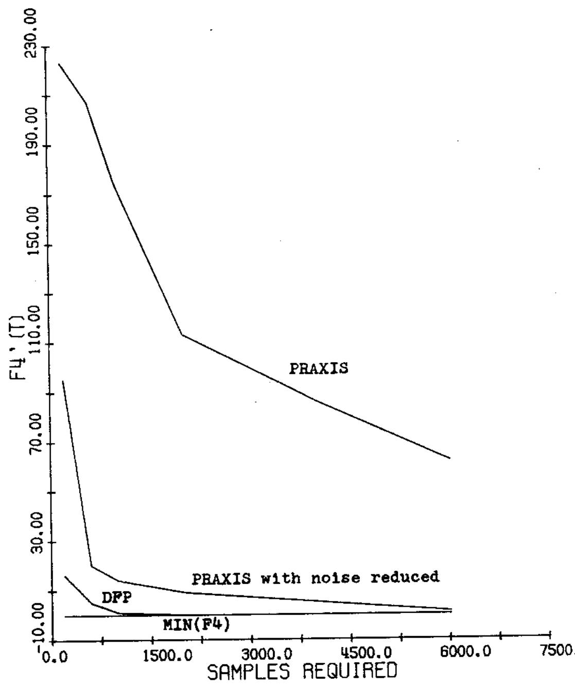  
Figure 5.7: Off-line performance curves for PRAxIS and DFP in local mode. on F4.

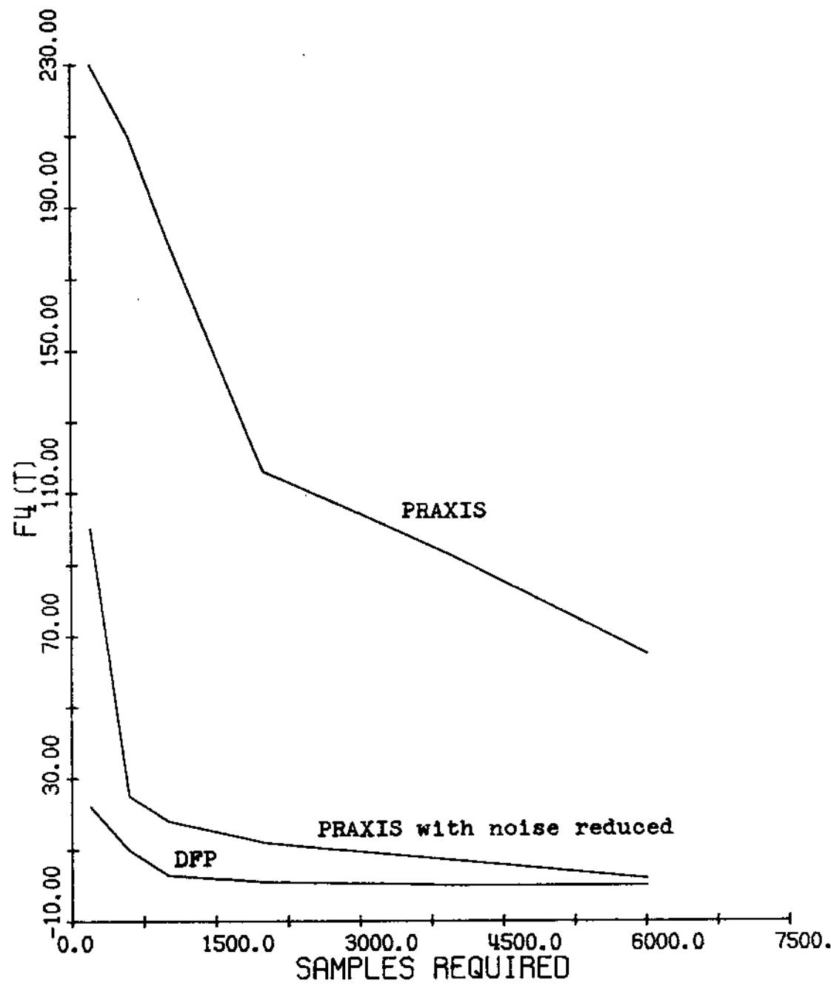  
Figure 5.8: On-line performance curves for PRAxIs and DFP in local mode on F4.

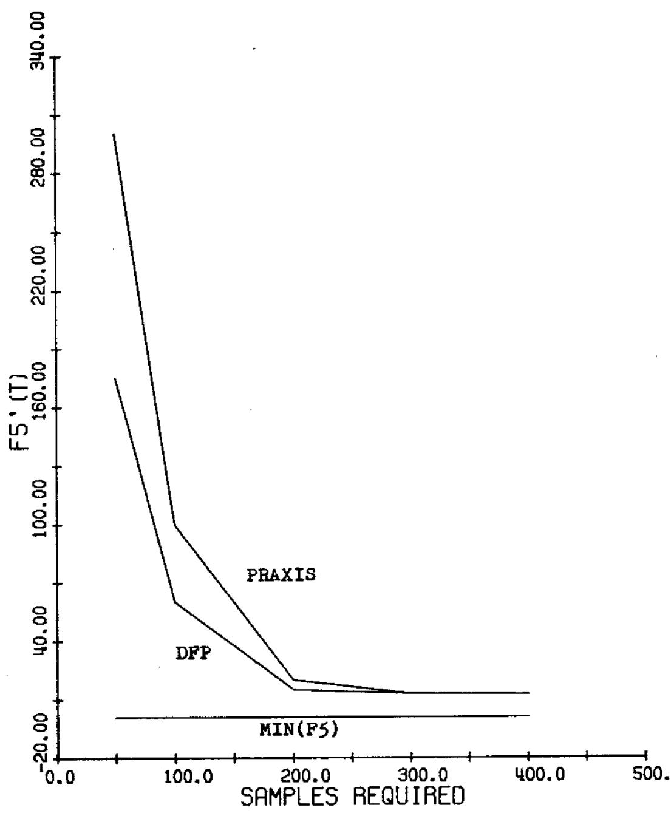  
Figure 5.9: Off-line performance curves for PRAxIs and DFP in local mode on F5.

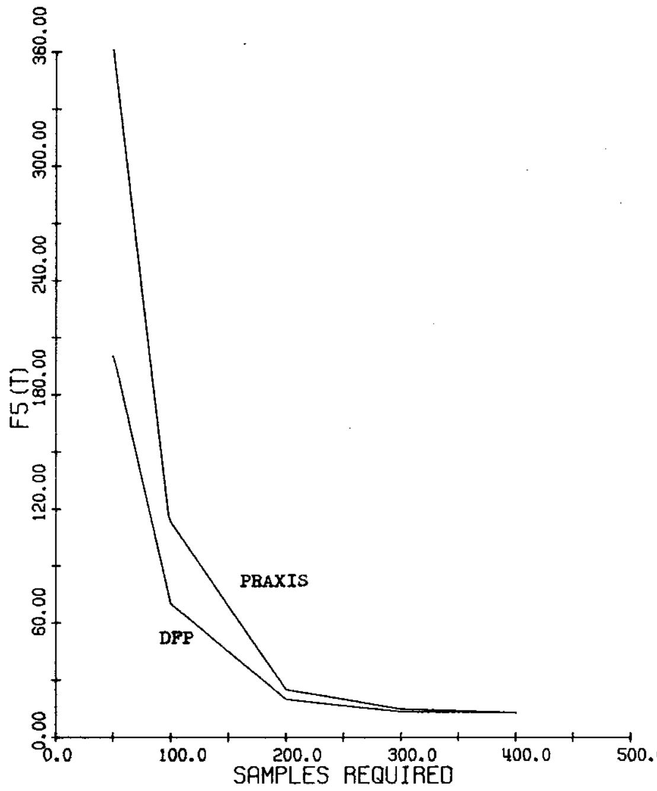  
Figure 5.io: On-line performance curves for PRAxIS and DFP in local mode on F5.

achieved within 6ooo trials. Notice, however, that restarting a local optimizer will have a definite effect on on-line performance, degrading it considerably. This is the same kind of tradoff between local and global search we observed with the genetic algorithms.

Switching to global mode on F3 will not affect the performance of PRAxIs at all since it did not converge in local mode within 6ooo trials. Global mode will, however, improve the performance of DFP on F3, but, as illustrated by S.1l, it can do no better than random search since each restart is followed almost immediately by convergence. As a consequence both are outperformed, for example, by R4 on F3.

On F4, PRAxIs in global mode is unchanged since It did not converge in 6ooo trials. Since DFP did converge, switching to global mode will leave off-line performance unchanged, and degrade on-line performance.

The interesting case is, of course, the effect of switching PRAxIS and DFP to global mode on the performance curves for F5. Since in local mode both PRAXIS and DFP converged to the nearest local minimum in about 300-400 trials, each gets restarted about 15-20 times in 6ooo trials. Since each of the 25 local optima is about the same size, we would expect that on the average the global minimum will not be found in 6000 trials. Figure 5.12 illustrates that this is, in fact, true for both optimizers, and indicates that R4, for

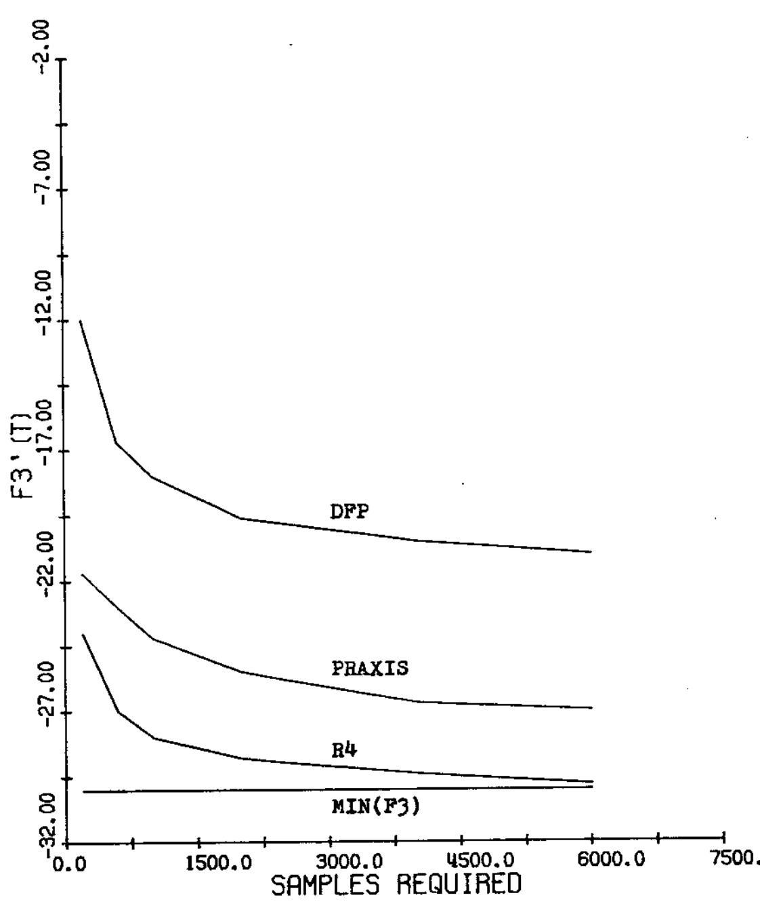  
Figure 5.ll: off-line performance curves for PRAxIs and DFP in global mode on F3.

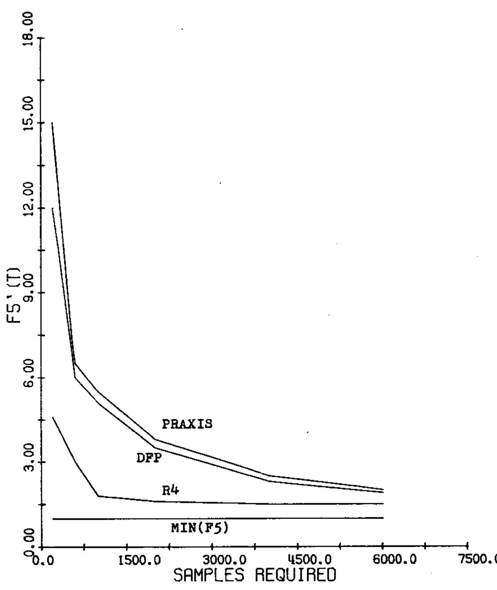  
Figure 5.12: Off-line performance curves for PRAxIs and DFP in global mode on F5.

example, outperforms both on F5.

Finally, tables 5.1a and 5.1b give the off-line and on-line performance indices for PRAxIS and DFP evaluated over 6ooo trials in both local and global mode. In general DFP outperformed PRAxIS on E. both in local and global mode. This is particularly true for on-line performance where the random search element in PRAxIs degraded performance considerably. Notice that both present a tradeoff between local and global rode. In local mode, rapid convergence to a possibly non-optimal minimum yields better on-line performance. On the other hand, restarting the optinizers increases the chances of finding the global optimum at the expense of on-line performance. In global mode, DFP came in a close second to $\mathtt { R 4 }$ on off-line performance. DFP did better on Fl, F2, and F4 while R4 was clearly the winner on F3 and F5. With respect to on-line performance, DFP outperformed R4 in local mode but not in global mode.

# 5.5 Summary

In this chapter we have attempted to provide a point of comparison for the behavior of genetic plans on E by evaluating the performance of two well-known function optimization techniques: a conjugate direction method and a variable metric method. Each were evaluated on E over 6o00 trials in both local (normal) mode and a global mode which continued to restart the algorithms

<table><tr><td colspan="3" rowspan="2">Local         GlobalT=6000     PRAXIS       PRAXIS</td><td colspan="1" rowspan="2">LocalDFP</td><td colspan="1" rowspan="2">GlobalDFP</td><td colspan="1" rowspan="2">R4(50..001..6,1.0)</td><td colspan="5" rowspan="2">RandomSearch</td></tr><tr><td colspan="5" rowspan="1">T=6000</td></tr><tr><td colspan="1" rowspan="1">$\)•</td><td colspan="1" rowspan="1">.003</td><td colspan="1" rowspan="1">.003</td><td colspan="1" rowspan="1">.002</td><td colspan="1" rowspan="1">.002</td><td colspan="1" rowspan="1">.114</td><td colspan="5" rowspan="1">.36</td></tr><tr><td colspan="1" rowspan="1">$\p2</td><td colspan="1" rowspan="1">.051</td><td colspan="1" rowspan="1">.051</td><td colspan="1" rowspan="1">.003</td><td colspan="1" rowspan="1">.003</td><td colspan="1" rowspan="1">.221</td><td colspan="5" rowspan="1">.35</td></tr><tr><td colspan="1" rowspan="1">*$\)</td><td colspan="1" rowspan="1">-25.47</td><td colspan="1" rowspan="1">-25.47</td><td colspan="1" rowspan="1">-2.5</td><td colspan="1" rowspan="1">-18.27</td><td colspan="1" rowspan="1">-28.2</td><td colspan="5" rowspan="1">-22.7</td></tr><tr><td colspan="1" rowspan="1">$\{{)$</td><td colspan="1" rowspan="1">135.39</td><td colspan="1" rowspan="1">135.39</td><td colspan="1" rowspan="1">3.95</td><td colspan="1" rowspan="1">3.95</td><td colspan="1" rowspan="1">17.62</td><td colspan="5" rowspan="1">66.3</td></tr><tr><td colspan="1" rowspan="1">$\)$</td><td colspan="1" rowspan="1">18.65</td><td colspan="1" rowspan="1">10.52</td><td colspan="1" rowspan="1">17.14</td><td colspan="1" rowspan="1">9.63</td><td colspan="1" rowspan="1">3.34</td><td colspan="5" rowspan="1">4.82</td></tr><tr><td colspan="1" rowspan="1">$x_{)</td><td colspan="1" rowspan="1">25.72</td><td colspan="1" rowspan="1">24.1</td><td colspan="1" rowspan="1">3.72</td><td colspan="1" rowspan="1">-.937</td><td colspan="1" rowspan="1">-1.38</td><td colspan="5" rowspan="1">9.83</td></tr><tr><td colspan="6" rowspan="2">R4(50.I     Local         Global       Local       GLOBAL         .001.6,T=6000        PRAXIS        PRAXIS         DFP          DFP              1.0)</td><td colspan="1" rowspan="2">RandomSearch</td></tr><tr><td colspan="1" rowspan="1">IT=6000</td><td colspan="1" rowspan="1">LocalPRAXIS</td><td colspan="1" rowspan="1">GlobalPRAXIS</td><td colspan="1" rowspan="1">LocalDFP</td><td colspan="1" rowspan="1">GLOBALDFP</td></tr><tr><td colspan="1" rowspan="1">F1(T</td><td colspan="1" rowspan="1">.005</td><td colspan="1" rowspan="1">6.55</td><td colspan="1" rowspan="1">.004</td><td colspan="1" rowspan="1">4.71</td><td colspan="1" rowspan="1">2.32</td><td colspan="1" rowspan="1">26.2</td></tr><tr><td colspan="1" rowspan="1">\p2(T</td><td colspan="1" rowspan="1">1348.6</td><td colspan="1" rowspan="1">2967.6</td><td colspan="1" rowspan="1">.042</td><td colspan="1" rowspan="1">11.57</td><td colspan="1" rowspan="1">34.76</td><td colspan="1" rowspan="1">494.05</td></tr><tr><td colspan="1" rowspan="1">\F3T</td><td colspan="1" rowspan="1">-16.84</td><td colspan="1" rowspan="1">-16.84</td><td colspan="1" rowspan="1">-2.5</td><td colspan="1" rowspan="1">-2.5</td><td colspan="1" rowspan="1">-26.49</td><td colspan="1" rowspan="1">-2.5</td></tr><tr><td colspan="1" rowspan="1">$\p{</td><td colspan="1" rowspan="1">149.57</td><td colspan="1" rowspan="1">149.57</td><td colspan="1" rowspan="1">5.62</td><td colspan="1" rowspan="1">54.62</td><td colspan="1" rowspan="1">40.73</td><td colspan="1" rowspan="1">249.6</td></tr><tr><td colspan="1" rowspan="1">$\_p</td><td colspan="1" rowspan="1">21.98</td><td colspan="1" rowspan="1">203.17</td><td colspan="1" rowspan="1">18.57</td><td colspan="1" rowspan="1">187.56</td><td colspan="1" rowspan="1">34.34</td><td colspan="1" rowspan="1">473.3</td></tr><tr><td colspan="1" rowspan="1">XE(T)</td><td colspan="1" rowspan="1">244.2</td><td colspan="1" rowspan="1">662.01</td><td colspan="1" rowspan="1">4.35</td><td colspan="1" rowspan="1">51.19</td><td colspan="1" rowspan="1">17.12</td><td colspan="1" rowspan="1">147.61</td></tr></table>

after convergence if 6ooo trials had not been allocated. In general, we found that the variable metric method, DFP, outperformed the conjugate direction method. In fairness to PRAxIs, however, we must remember that DFP was given exact derivative information about the test functions in E upon request. If the derivatives had been estimated or if a cost of more than n function evaluations had been exacted for each derivative com- . putation, the differences in performance would have been less. During the evaluation, two interesting facts about PRAxIs were uncovered. In the first place, its heuristic strategies for avoiding stagnation on resolution ridges exacted a heavy toll when measuring on-line performance. This, of course, reflects the emphasis of the function optimization literature on convergence. Secondly, PRAxIs was seen to be quite sensitive to noise, performing no better on $\pmb { F 4 }$ than random search. This suggests that the matrix updating techniques used by DFP to generate the conjugate directions of search are considerably less sensitive to noise than the constructive techniques used by PRAxIs, particularly in high-dimensional spaces.

Finally, we saw that DFP performed about as well as the genetic plans on E, but the tradeoffs were sharply drawn. On functions F1, F2, and $\sqrt { 4 }$ which approximate the assumptions made by DFP about the function to be minimized, DFP was clearly the better choice. The

situation is, however, exactly reversed on F3 and F5 with R4 the obvious choice. These observations suggest that the genetic plans hold a valld position in both the fields of adaptation and function optimization. filling the gap between the efficient local search techniques and inefficient random search.

# Chapter 6

# SUMMARY AND CONCLUSIONS

We began this thesis by introducing a formalism for the study of adaptive systems and, within this framework, we defined a means of evaluating the performance of adaptive systems. The central feature of the evaluation process was the concept of robustness: the ability of an adaptive system to rapidly respond to its environment over a broad range of situations. To provide a concrete measure of robustness, a family E of environment response surfaces was carefully chosen to include representatives of a wide variety of response surfaces. When evaluating an adaptive system on a member of E, two distinct performance curves were monitored during adaptation: on-line performance and off-line performance. On-line performance evaluated every trial produced during adaptation, reflecting those situations in which an adaptive system is used to dynamically alter the performance of a system. Off-line performance evaluated only trials produced during adaptation which resulted in improved performance, reflecting situations in which testing can be done independently of the system being controlled.

Within this evaluation framework, a class of genetic adaptive systems was introduced for analysis and evaluation. These artificial genetic systems, called reproductive plans, generate adaptive responses by simulating the information processing achieved in natural systems via the mechanisms of heredity and evolution. By introducing the concept of hyperplane partitions of the representation space, it was shown that reproductive plans have good theoretical properties with respect to the optimal allocation of trials to competing hyperplane partition elements. The performance of an elementary member, H1, of this class of genetic plans was evaluated on E and was shown to be superior to pure random search both in on-line and off-line performance. However, as defined, R1 was seen to converge quite regularly to a non-optimal plateau. Analysis suggested that this was due in part to the stochastic side-effects of random samples on a finite population. The effects of varying four parameters in the definition of R1 were analyzed in the hope of removing the problem of premature convergence and improving the performance of R1 on E. Increasing the population size was shown to reduce the stochastic effects and improve long-term performance at the expense of slower initial response. Increasing the mutation rate was seen to improve off-line performance at the expense of online performance. Reducing the crossover rate resulted in an overall improvement in performance, suggesting that producing a generation of completely new individuals was too high a sampling rate. Finally, reducing the generation gap was shown to yield the same kind of overall improvement in performance as crossover, but not as

dramatic.

As an alternative to modifying the parameters of H1, several modifications to the basic algorithm were analyzed for their effects on premature convergence and performance. An elitist policy favoring hyperplanes which produced the best individuals was shown to improve local search performance at the expense of global search. Modifying the sampling technique so that the actual number of offspring of an individual more closely approximated the expected value produced the best overall improvement in performance. Combining the erpected value model with the elitist policy generated the best performance of any of the genetic plans analyzed on E, although the problem of premature convergence on F5 still remained. Both increasing the mutation rate and including a crowding factor were shown to resolve the problem of local convergence on R5, but at the expense of performance on the unimodal surfaces. Finally, a brief analysis of a generalized crossover model produced no significant improvement in the performance of genetic plans on E.

To provide an alternate point of comparison for performance on E (in addition to random search), two standard function optimization techniques were also evaluated on E. Each was run in their normal (local search) mode as well as a global mode in which, after local convergence, they were restarted at random starting points in an attempt to find the global minimum. Both

techniques outperformed the genetic algorithms on those surfaces in E for which they were designed. However, the genetic algorithms were seen to be superior on the discontinuous and multimodal surfaces in E.

As a consequence of these studies, several points of interest have been brought out. In the first place, it seems fairly clear that it is difficult, if not impossible, to simultaneously provide high-level off-line and on-line performance. Fortunately, most applications demand one, but not both. But it would be nice to provide a single solution to both. ofr-line performance emphasizes convergence while on-line performance stresses short-term performance. As we have seen, better convergence properties are obtained by bold exploration in the early stages of adaptation, while short term performance is improved by the more conservative sampling policies. These distinctions are sharpened by the fact that in any practical situation evaluation is performed over a relatively short time interval. The longer the evaluation period, the less important short-term performance becomes.

A second point of interest brought out is the disparity between the mathematical characteristics of genetic plans and their implementation behavior. As we have seen, the fact that genetic plans support a finite population over a finite period of time can lead to considerably lower performance levels than predicted math

ematically. Because the genetic plans operate in terms of a sequence of trial allocation decisions based on finite sampling distributions and sample means, they were seen to be quite sensitive to the associated stochastic errors. By minimizing as much as possible these stochastic side-effects, the implementation performance of genetic plans was improved considerably.

A third point of interest was brought out in the comparative analysis of function optimization techniques. As with many other difficult problems in computer science, adaptation poses the tradeoff between a general solution to the problem and performance. By making assumptions about the kind of response surfaces to be faced, ertremely efficient performance can be generated on a relatively small class of functions. It is clear that no genetic algorithm is going to minimize a conver quadratic function in 50 trials. On the other hand, it is clear that if such assumptions are not met, then genetic algorithms provide a considerably better alternative than random search without making any assumptions about the form of the response surface.

These studies also suggest several interesting areas for future research. Neither time nor resources permitted ertensive evaluation of the generalized crossover operator. Further study may support the intuition that performance improvements could be achieved for small increases in the number of crossover points.

Another area worth exploring is to consider the effects of a diploid representation. That is, each gene position has two alleles with a "dominance" map specifying its functional value. Dominance has a very direct bearing on the problem of allele loss in finite populations.

Finally, it would be of interest to. explore the possibility of introducing "species" into the genetic algorithm. This also has direct bearing on the problem of allele loss allowing. for example, exponential exploitation of a local minimum without the problem of complete population dominance.