# Chapter 4

# Review of Related Work

This chapter examines the support already available for fullling GA users' visualization requirements. Section 4.1 describes a range of visualizations available for showing the key characteristics of GAs suggested in the overview of EC (Chapter 2). Section 4.2 presents a brief overview of some systems which exemplify these key characteristics. Finally, Section 4.3 concludes this chapter with a summary of the contributions made by these systems.

# 4.1 Visualizing a GA's Key Characteristics

Section 2.3 identied a set of seven key characteristics of GAs that were considered potentially useful for understanding a GA's search behaviour; namely: showing the operation of the GA, the quality of the solutions found, the chromosomes' genotypes and phenotypes, the GA's sampling of the search space, the user's ability to navigate through the GA's execution, and editing the GA's population or algorithm conguration. These were used to inform the design of the GA user questionnaire used in Chapter 3, and are used again here to structure this section, where their relevance to the GA user's visualization needs is discussed along with the visualization support currently available; each subsection concludes with a summary of the contributions made.

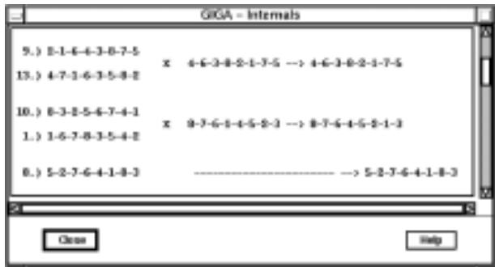  
Figure 4.1: The internals window available in Giga for showing the actions of the reproduction operators of a GA.

This example was taken from [Dabs and Schoof, 1995, page 8].

# 4.1.1 The Operation of the GA's Component Parts

Visualizing the operation of the GA's component parts, i.e. the actions of the algorithm's selection and reproduction operators, can be done either by using a static or dynamic illustration. The static illustration benets from being easy to present on paper as well as the computer screen, although viewing a dynamic illustration (i.e. an animation) is often a more eective and more engaging representation.

An example of a static illustration of a GA's components is the \internals window" available in the Graphical user Interface for Genetic Algorithms (\Giga") [Dabs and Schoof, 1995]. This view illustrates the internal operations of the GA such as the crossover and mutation operators (see Figure 4.1). A sample dynamic algorithm animation of a GA was produced by David Brogan using an SV system called \Tango" [Stasko, 1989]. Brogan's illustrative example is included in the example visualizations supplied with the X windows version of Tango, available via ftp from per.cc.gatech.edu (see directory /pub/xtango). A screen view is shown in Figure 4.2 depicting both phenotype and genotype visualizations. An algorithm animation is shown at the bottom of the view which illustrates the actions of the GA's genetic operators.

# Contribution

The actions of the GA's operators drive the GA's search in the problem space. Therefore, it would be reasonable to assume that illustrating the execution of the operators would provide some insight into GA's search behaviour. However, both the Giga and Tango visualizations of the GA's genetic operators are impractical for real problems. Neither visualization scales up for use on standard-sized GA populations. Furthermore, the level of insight that can be achieved from these views is at the microscopic level of the chromosomes' genes and provides little insight into the behaviour of the overall system.

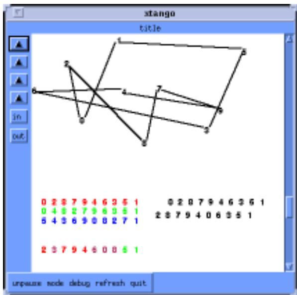  
Figure 4.2: An Xtango visualization illustrating a GA with a population containing three decimal valued chromosomes. The upper section illustrates the phenotype data i.e. the traveling salesman problem, the lower section shows an animated view of the genotype data (i.e. the decimal chromosomes) and the actions of the selection and reproduction operators used in the GA.

Examining the actions of the GA's selection and reproduction operators was one of the GA characteristics that the study respondents were not directly interested in other than as an educational or debugging aid. Therefore, the visualization of the GA's operators is not pursued further within this thesis, although provision for such support could be made in the future using the visualization framework presented in Chapter 6.

# 4.1.2 The Quality of the Solutions Found by the GA

Examining the quality of the solutions found by a GA is an important part of applying a GA. Monitoring the GA's progress can be used to inform the user's decision to end the GA's run, or as a post-mortem technique for illustrating the GA's run. This subsection presents a variety of techniques for showing the quality of a GA's solutions, including both summaries and complete accounts of the entire run's results, as well as the results in individual populations.

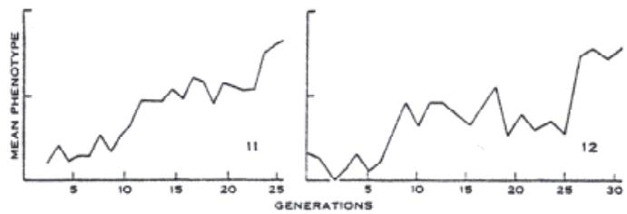  
Figure 4.3: Two mean phenotype versus generation number graphs taken from [Fraser, 1957] (Figures 11 and 12).

The standard method for presenting a summary of the entire run's results is to plot some aspect of the population's tness ratings for each generation. These visualizations are commonly referred to as \tness versus generation number" or \tness versus time" graphs. Fitness versus time graphs rst appeared in one of the earliest papers on simulated evolution written by A. S. Fraser in 1957 [Fraser, 1957]. Fraser used 2D line graphs to illustrate the changes in the population's average phenotype tness value over successive generations. An example taken from Fraser's paper is shown in Figure 4.3.

A variety of tness versus time graphs are commonly used today, examples include \online" and \oine" tness ratings (i.e. the mean tness rating, and mean current-best tness rating across all generations [De Jong, 1980]), as well as the best and worst tness ratings in each population [Goldberg, 1989], [Davis, 1991], [Baeck, 1996].

Although the tness versus time graph is the most commonly used representation of the GA's entire run, it is incomplete in that it only provides an indication of the chromosomes' tness ratings in each population rather than the actual chromosomes' tness ratings. The 3D tness graph presented in [Harvey and Thompson, 1996] provides a more complete view, showing the tness ratings of every chromosome in a tness-ordered population (see Figure 4.4).

The 3D tness graph presents all the chromosomes' tness ratings, but if presented as a static view some sections of the lines may be hidden by earlier and tter line sections. A solution to this problem is to let the user control the viewing position by rotating the 3D image about its own axes. Another point to be noted regarding the 3D tness graph is that the individual lines do not refer to the same chromosomes, rather they refer to chromosomes at the same position in the tness ordered population across dierent generations.

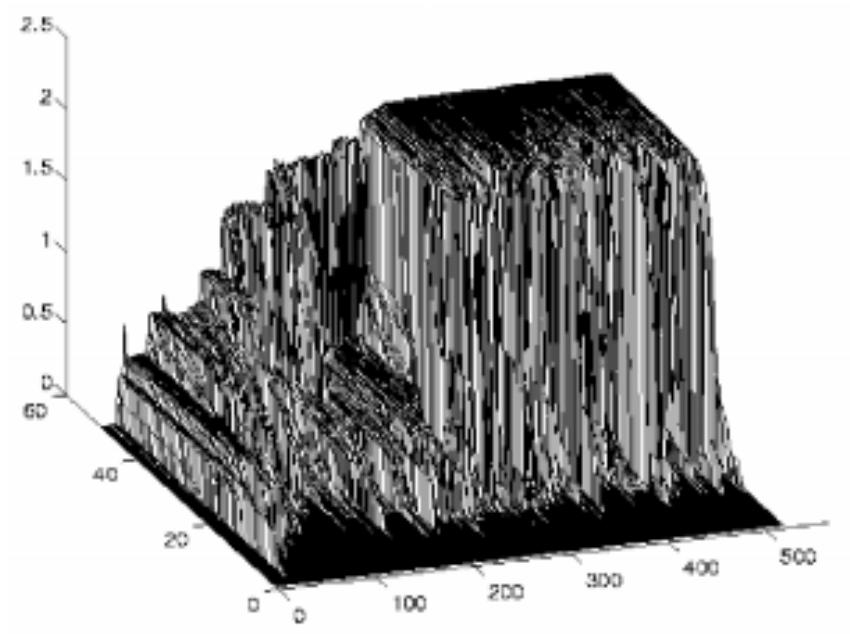  
Figure 4.4: An example of a 3D tness graph. The tness rating of each individual in the population is plotted over each generation. The tness ratings are plotted on the y axis $\mathrm { y } = 0$ to 2.5), the position of each chromosome in the tness ordered population is plotted on the $\times$ axis $\mathbf { \boldsymbol { x } } = 0$ to 50), and the generation number is plotted on the $\textsf { Z }$ axis $z = 0$ to 522). This gure was taken from [Harvey and Thompson, 1996].

Rather than examining the quality of the solutions found during the course of the GA's run, a number of visualization techniques for illustrating the tness ratings of the chromosomes in a single generation were proposed in a previous pro ject [Collins, 1993]. The techniques explored included block diagrams, colour maps, bar charts, radial line graphs and radial point plots.

\Hinton diagrams" are used in the study of articial neural networks to illustrate the strengths of the links between the nodes in a network (see [Rumelhart and McClelland, 1986, page 103]). A Hinton diagram is made up of a series of coloured blocks used to indicate the network weights, the size of the block indicates the magnitude of each link's weighting, and the colour; black or white, indicates whether the weight is positive or negative. A diagram based on the Hinton diagram illustrates the tness values of the chromosomes in a population (see Figure 4.5). The size of each block indicates

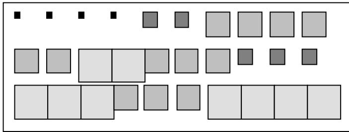

Figure 4.5: A Hinton style block diagram. This gure illustrates each chromosome in the population as a square block; the size of the block indicates the chromosome's tness rating. Colour is used to highlight the chromosomes' level of tness, here the tness ratings are split into four bands corresponding to the four sizes of blocks used in the gure. This gure was taken from [Collins, 1993a] where texture was used to indicate colour on a black and white printer.

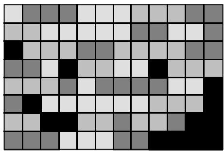

Figure 4.6: A Colour Map showing the tness rating of every chromosome in a population, each chromosome is represented as a block; the block's colour indicates the chromosome's tness rating. This gure was taken from [Collins, 1993a] where texture was used to indicate colour on a black and white printer.

each chromosome's tness rating, and its colour in the spectrum red through to blue indicates the chromosome's tness rating in the range of the minimum to maximum tness ratings found during the GA's entire run.

A colour map shows the tness rating of every chromosome in a population. These are similar to Hinton-style diagrams but use colour only to indicate each chromosome's tness rating, the size of each square remains constant (see Figure 4.6). The ordering of the individual squares in a colour map can be used to illustrate dierent aspects of the population, ordering by tness emphasizes the frequency of individuals with similar tness ratings, whilst ordering by a similarity measure can emphasize the diversity of the population and the possibility of multiple solutions.

Coastline tness diagrams show the tness rating of each chromosome in the population as a long

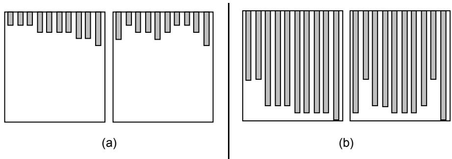

Figure 4.7: A Coastline Fitness Diagram showing the chromosomes in two populations (a) and (b), here a tness ordered view is shown on the left and a similarity (i.e. Hamming distance) ordered view is shown on the right for populations (a) and (b). Both views are ordered from left to right for increasing tness and similarity ratings. This gure was taken from [Collins, 1993a].

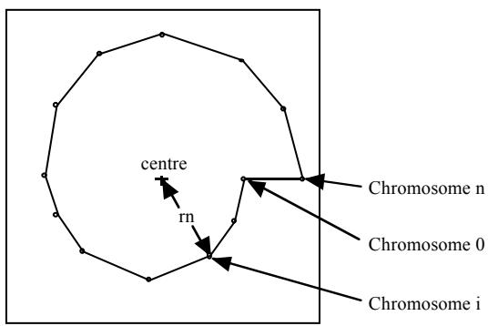

Figure 4.8: A radial plot of the tness ratings in a single generation. The radial line trace shows the tness ratings of the chromosomes in a tness ordered population the distance $( \mathsf { m } )$ from the centre to the line indicates the magnitude of the tness rating.

vertical bar; the height of each bar indicates each chromosome's tness rating. Like colour maps, dierent ordering methods can be applied in order to illustrate dierent features of the population. For example, the tness rating could be used to illustrate the diversity in tness, or a similarity rating (such as Hamming distance to the ttest) can be used to indicate the diversity in the chromosomes' values. Figure 4.7 shows the coastline tness diagrams of two populations, one for an unt population (a) and one for a t population (b), the two views in each case illustrate alternate ordering methods; by tness (shown on the left) and Hamming distance to the ttest (shown on the right).

In a radial tness diagram a single radial line trace is used to illustrate all of the chromosomes' tness ratings in a tness ordered population. The angular position indicates each individual chro

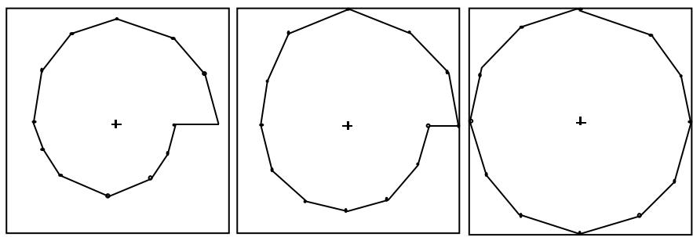  
Figure 4.9: Three radial tness plots illustrating three dierent stages during an algorithm's execution.

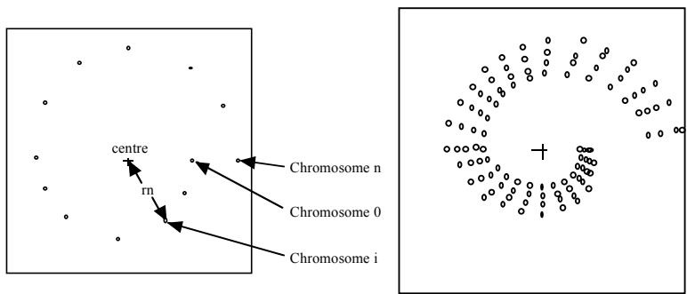

Figure 4.10: A radial tness plot. Each individual's tness rating is represented as a dot. The tness ordered position of each chromosome is represented by the angular position of each dot, the distance $( \mathsf { m } )$ of a dot from the origin indicates the magnitude of the tness rating, and the dot's colour indicates the generation number in which it last appeared.

mosome's position in the tness ordered population, and the distance from the centre of the plot to the line trace indicates the magnitude of the tness rating (see Figure 4.8). Initially the trace is a spiral, highlighting the dierence between the worst and the best tness ratings, however as the chromosomes converge their tness ratings become similar and so the radial plot becomes more circular (as shown in Figure 4.9).

The nal tness plot suggested in [Collins, 1993] was a Fossil tness diagram. These can be used to present either the tness ratings of the chromosomes in a single generation, or the tness ratings of all the chromosomes in every population across a number of generations (see Figure 4.10).

In both cases each chromosome is represented as a dot. The angular position of each dot indicates the chromosome's position in the tness ordered population, the distance from the centre of the display to each dot indicates the chromosome's tness rating, and the colour of the dot indicates the generation in which that chromosome last appeared, ranging from red for generation 0 to blue for the nal generation. The overall result is a series of coloured markings, similar in shape to an ammonite (i.e. a spiral fossil). The number of dots at each angular position illustrates the diversity in the chromosomes' tness ratings, in the tness ordered population, over an entire GA run. Again like the 3D tness graph, the same angular position does not indicate the same chromosome in dierent generations, rather each angular position shows all of the chromosomes at the same position in a tness ordered population.

# Contribution

None of the tness plots described in this subsection suer from any scaling problems, all of these plots are applicable to any size of population and any form of EA. Table 4.1 summarizes the dening characteristics of each tness visualization.

Although there are a range of visualizations available for showing the quality of the solutions found during a GA's run, the results of the GA user study indicated that the traditional 2D tness versus time graph was by far the most popular (see Section B.3, Question 7.3). However, several respondents also indicated a need for a more detailed understanding of the GA's run. These responses refer to a need to understand the local structure of the search space and the relationship between the local structure and tness ratings, rather than a more complete understanding of the chromosomes' tness ratings in each population. The provision of this is discussed in subsection 4.1.5.

# 4.1.3 The Chromosomes' Genotypes

Viewing the chromosomes' genotypes is usually carried out either for an entire population or a subset of the population, for example by displaying the best chromosome or top ve chromosomes in each generation. Although displaying the genotype of a few chromosomes per generation gives the user an indication of the solutions currently being considered it is impossible for the user to view every chromosome from every generation and grasp the GA's behaviour - there is simply too much information for the user to deal with. As a result, several systems have been developed using visualization techniques to represent this information in a more manageable form.

Three chromosome icons were introduced in [Collins, 1993] for illustrating the chromosomes' genotypes; the \trace icon," \DNA strip" and \colour strip" (see Figure 4.11). A \trace icon" is a 2D

Table 4.1: The dening features of a range of EA tness visualizations.   

<table><tr><td rowspan=1 colspan=3>VISU ALIZATION</td><td rowspan=1 colspan=1>GRAPHIC</td><td rowspan=1 colspan=1>CONTENT</td><td rowspan=1 colspan=1>PERIOD</td></tr><tr><td rowspan=1 colspan=3>2D Fitness vs time graphs</td><td rowspan=1 colspan=1>2D line graph</td><td rowspan=1 colspan=1>Summary of fitnessratings</td><td rowspan=1 colspan=1>per generation for ev-ery generation</td></tr><tr><td rowspan=1 colspan=3>3D Fitness vs time graphs</td><td rowspan=1 colspan=1>3D line graph</td><td rowspan=1 colspan=1>Every chromosome&#x27;s fit-ness rating</td><td rowspan=1 colspan=1>per generation for ev-ery generation</td></tr><tr><td rowspan=2 colspan=3>Hinton style block diagrams•.  </td><td rowspan=4 colspan=1>2D extendedpoint plot</td><td rowspan=6 colspan=1>The chromosomes&#x27; fit-ness ratings</td><td rowspan=5 colspan=1>for     a     singlegeneration</td></tr><tr><td rowspan=1 colspan=1></td></tr><tr><td rowspan=1 colspan=3>Colour maps</td></tr><tr><td rowspan=1 colspan=3>Coastline fitness diagrams00U0000m(a)           (b)</td></tr><tr><td rowspan=1 colspan=3>Radial fitness diagrams</td><td rowspan=1 colspan=1>2D radial linegraph</td></tr><tr><td rowspan=1 colspan=3>Fossil fitness diagrams</td><td rowspan=1 colspan=1>2D    radialpoint plot</td><td rowspan=1 colspan=1>for a single gen-eration, or pergeneration for everygeneration</td></tr></table>

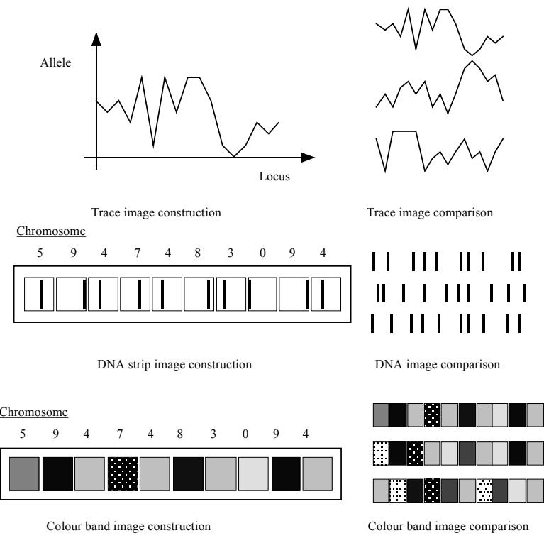  
Figure 4.11: Three example chromosome icons showing the design of line trace, DNA strip, and colour band icons.

This gure was taken from [Collins, 1993a], where texture was used to indicate colour on a black and white printer.

line trace of the allele held at each locus in the chromosome. The variation in the vertical position of the trace at each line segment indicates the allele's position in the coding alphabet for each locus. A \DNA strip" is a 2D line plot showing each allele as a vertical bar, the horizontal position of the bar indicates the allele's position in the coding alphabet. Thirdly, a \colour strip" icon shows the allele held at each chromosome locus as a coloured block, the colour of each block indicates the allele's position in the coding alphabet.

Bill Spears at the US Naval Research Lab has also explored the use of visualization within GAs [Spears, 1994]. In order to illustrate the chromosomes in a specic population Spears suggested illustrating the alleles in a population of binary chromosomes as black and white pixel dots. The resulting pixel-oriented visualization shows a random set of black and white pixels for the initial population with patterns of vertical black and white lines forming during the GA's run indicating common genes between neighbouring chromosomes (see Figure 4.12).

Although developed separately, the pixel-based genotype visualization proposed by Spears is similar to the color strip icon proposed by Collins. Spears' representation can illustrate bigger genotypes and white pixels. The entire population is shown here in 100 rows each chromosome is shown as a single row of 1008 pixels.

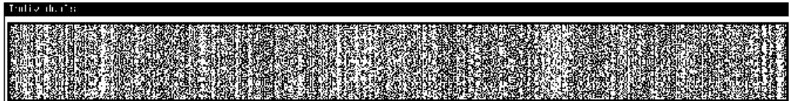  
Figure 4.12: A high dimensional visualization showing a population of 100, 1008 bit binary chromosomes as black

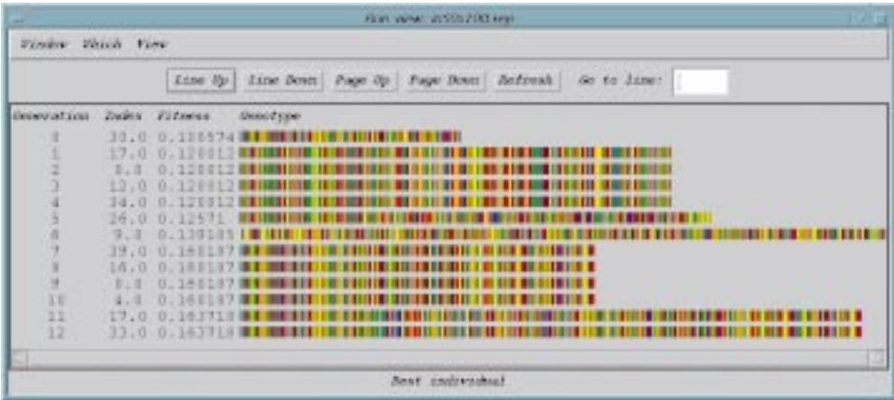  
Figure 4.13: An example of a Vis \run window," illustrating the best individual from each generation using a \zebra" representation.

than the color strip icon in the same amount of screen space, but the legibility of each pixel point would be poorer than the legibility of each coloured block. For any specic application the purpose of the visualization should be used to determine the balance between screen economics and image legibility. The purpose of Spears' pixel-oriented visualization is to help people spot emerging patterns within the population, where as the purpose of the colour strip icon was to directly illustrate the alleles in each chromosome's genotype.

Another more recent pro ject at the US Naval Research Lab has been exploring the use of GAs for modelling viruses (the \Virtual Virus" pro ject [Grefenstette et al., 1997]). As part of this pro ject an oine (post-mortem) visualization tool called Vis has been developed to support the detailed analysis of a GA's run [Wu et al., 1997], [Wu et al., 1998]. Vis presents three dierent perspectives on a GA's run. Run windows display information on the entire run (typically showing one entry per generation, see Figure 4.13). Population windows display single individuals from a single generation (see Figure 4.14). Thirdly, Individual windows display information about a single individual (see

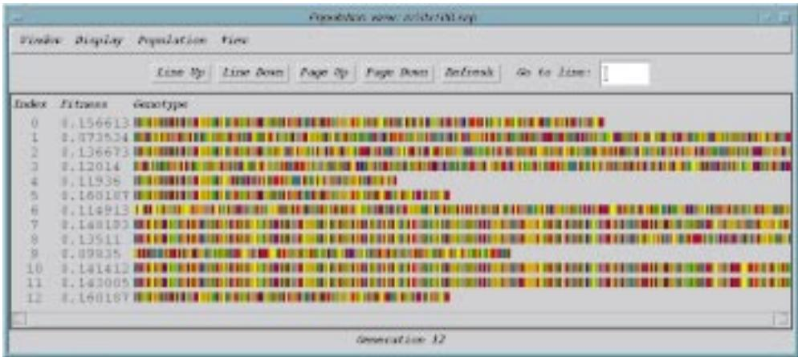  
Figure 4.14: An example of a Vis \population window" illustrating all the individuals in a single generation using a \zebra" representation.

Figure 4.15). Within Vis multiple windows can be viewed simultaneously.

Five dierent genotype representations are available in Vis, namely; \text," \zebra," \neapolitan," \colour coded" and \gene location" representations. The representation used within any of the windows can be changed at any time via the \Views" menu. The text representation simply displays the individuals using a xed width type font. The zebra representation displays binary chromosomes as strips of black and white bars, like a zebra's stripes. The neapolitan representation displays every pair of binary alleles as a coloured bar, where $0 0 =$ black, $1 1 =$ white, $0 1 =$ magenta, and $1 0 =$ orange. The colour coded representation is used to illustrate multi-letter alphabets (i.e. coding alphabets with more than two symbols), where each unique letter is shown by a dierent coloured bar (e.g. $\textrm { A } =$ blue, C = red, G = yellow, and T = green). Finally, the gene location representation can be used to highlight the occurrence of building blocks (i.e. groups of symbols or partial solutions), dierent coloured strips are used to identify dierent building blocks.

Although it is easier to identify trends within the population using a chromosome icon representation rather than printed text, both printed text and chromosome icons present the same amount of information and therefore, suer from the same drawback i.e. when applied to large populations they both contain too much information for the user to deal with. As a solution to this [Collins, 1993] proposed three composite representations for summarizing the chromosomes' genotypes; \overlaid line trace icons," \population bar charts," and \allele versus locus frequency matrices" (see Figure 4.16).

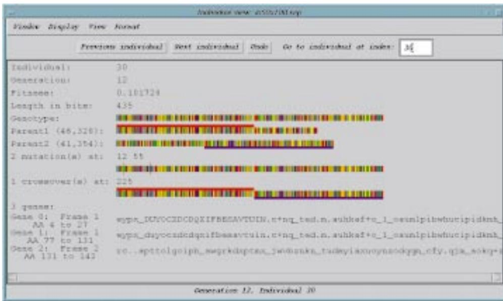  
Figure 4.15: An example of a Vis \individual window" showing the data held on a single individual.

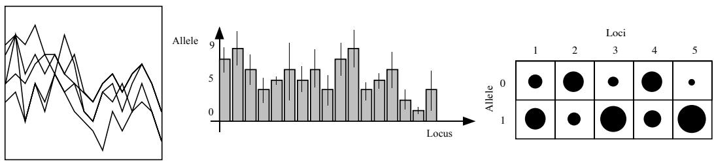  
Figure 4.16: Three example genotype visualizations; \overlaid chromosome icons" (left), a \population bar chart"

(middle) and an \allele versus locus frequency matrix" (right). These three chromosome visualizations are taken from [Collins, 1993a].

The overlaid line trace icons representation is produced by plotting an enlarged version of every chromosome's line trace icon on the same set of axes. The composite image indicates the allele diversity at each locus within the population, by the number of vertically aligned separate line segments. For large (i.e. most practical) population sizes the overlaid chromosome icon representation becomes overloaded and dicult to read (see Section 5.2.3, Figure 5.4 on page 142 regarding the graphic density and angular separation of legible images). Although the line trace icons identify each chromosome and its alleles, they do not indicate the frequency of each chromosome (or chromosome building block). Therefore, the user can see when the population is completely converged at a specic locus, but they cannot see the diversity of the population prior to that point. For example, a population containing equal numbers of two dierent chromosomes would look the same as a population that contained $9 0 \%$ of one chromosome and $1 0 \%$ of an other.

The population bar chart summarizes the alleles that are present within the chromosomes in the population. Each bar indicates the alleles present at each locus, the height of the bar is used to indicate the most frequent allele at that locus. Lines are added to indicate the minimum and maximum allele values at each locus for the current population. Although this gives an indication of the population's diversity, like the overlaid chromosome icon representation it does not illustrate the distribution of the alleles. As a result, the user is no better informed about the diversity of the chromosomes in the population.

Thirdly, al lele versus locus frequency matrices illustrate the distribution of the allele within a population. By viewing the allele versus locus frequency matrices of subsequent generations the user can see how the allele's distribution varies during the GA's run. This shows both the convergence and diversity of the alleles. However, it does not show any information regarding the local structure of the alleles within each chromosome. The allele versus locus frequency matrix gives a clear summary of the distribution of alleles and is perhaps the clearest of the three genotype summary representations proposed in [Collins, 1993].

# Contribution

Although exploring the ne-grained details of the individual chromosomes can be very useful for examining the solutions found, like the visualization of the genetic operators, it is at too ne-grained a level of detail to help people follow the overall search behaviour of the algorithm. The responses given in the GA user study (Section B.3, Questions 7.1, 7.2, and 8.1) indicated that the respondents also believed that displaying all the chromosomes would present too much information for their purpose. They also considered the selection of a subset of the chromosomes in each generation to be a dicult task, resulting in an un-representative, or possibly misguiding, visualization. Therefore, genotype visualizations must be used carefully to complement the user's exploration of the the GA's search behaviour. Perhaps if used in tandem with a visualization of the GA's sampling of the search space, the ne-grained focus that genotype visualization provides could be directed toward the more signicant and interesting chromosomes within the GA's run.

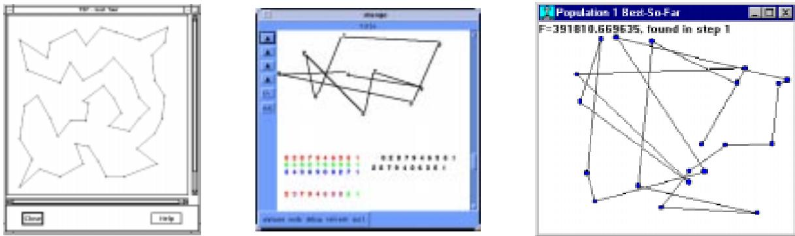  
Figure 4.17: Three example phenotype visualizations for the traveling salesperson problem. These images were taken from Giga, XTango and EvoNet's Genetic Algorithm Software Development Package, respectively.

# 4.1.4 The Chromosomes' Phenotypes

Visualizing the chromosomes' phenotypes is a very eective way of illustrating the solutions being considered by the GA (see Figure 4.17). Several education-oriented GA tools illustrate the GA's phenotypes, specically for the traveling salesperson problem1 . Examples include the \best individual window" in Giga, the phenotype view presented in the Xtango sample GA visualization and the \Best-So-Far" window available in the Genetic Algorithm Software Development Package produced by EvoNet, the European Network of Excellence on Evolutionary Computation (available from http://www.dcs.napier.ac.uk/evonet/Coordinator/html/software.html).

Although visualizing the chromosomes' phenotypes can produce a very salient illustration of the solutions being considered they are specic to the problem being solved and therefore, as new problems are attempted new views must be produced. If the eort involved in producing the view is perceived to be greater than the benet achieved through its use then the user will be disinclined to produce new views.

This \ease of production" threshold is a serious problem for SV. Producing any new visualization requires some form of programming. The important issue here is to ensure that the programming involved is sucient to fully express what the user needs, whilst remaining at a sucient level of abstraction such that the user does not get deterred by technically demanding graphics programming.

Balsa [Brown and Sedgewick, 1985], Tango [Stasko, 1990], Zeus [Brown, 1991], or Viz [Domingue et al., 1992], is to facilitate the development of new views. Although a great deal of work has been done in SV, establishing a sucient level of expressiveness whilst maintaining ease of use is a dicult trade o (see [Repenning and Ambach, 1996]). As a solution to this problem John Stasko, author of the Tango and Polka SV environments, developed \Samba," an interpreted, interactive animation front-end to Polka [Stasko, 1996]. Samba is used by students in an undergraduate algorithms class at the Georgia Institute of Technology to produce algorithm animations from recorded data les or the output of a program piped directly to Samba2.

# Contribution

Producing problem-specic visualizations of the chromosomes' phenotypes is a very salient illustration of the GA's solutions. Such views explicitly illustrate the link between the chromosomes' genotype and phenotype. This is why phenotype visualizations are so useful when illustrating the GA's operation within an educational context. However, visualizing all of the chromosomes' phenotypes in a typical GA produces too much information for the user to digest easily, yet like the genotype visualization described in the previous subsection selecting a representative subset can be problematic. Again, perhaps such detailed views are best used selectively to illustrate the more important chromosomes in the GA's run.

# 4.1.5 The GA's Sampling of the Search Space

The term \search space" is used repeatedly in this thesis to refer to the complete set of all allele combinations available within any given coding alphabet. Exploring the GA's sampling (i.e. searching) of that space is one way of viewing the GA's behaviour. This subsection describes some of the available visualizations.

In addition to his genotype visualization tool, Bill Spears also produced two visualization tools to illustrate the GA's sampling of the search space; one for one-dimensional problems and a second for two-dimensional problems [Spears, 1994]. The rst tool uses a 2D line graph to illustrate the tness rating (plotted on the y axis) of each chromosome (plotted on the x axis). The second tool adopts 2The term \piped" is used here with reference to the UNIX pipe command \j" e.g. ${ } ^ { 6 6 } \%$ yourprog j samba".

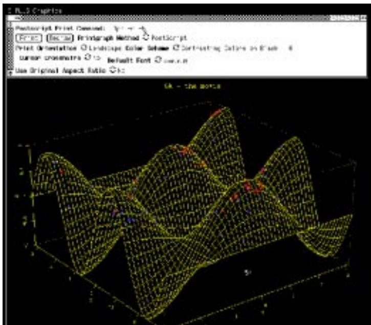  
Figure 4.18: A 3D surface plot showing the tness surface for a two dimensional search space. The chromosomes from old generations shown as blue dots and the chromosomes in the current generation shown as red dots, this gure was taken from [Spears, 1994].

a similar approach but uses a 3D plot to show the variation in tness for two-dimensional tness functions. In the 3D visualization the individual chromosomes are shown as points on a 3D tness surface, as the GA evolves old chromosomes from previous generations are drawn as blue points and chromosomes created in the current generation are drawn as red dots (see Figure 4.18). Both of these tools illustrate the GA's sampling of the search space by explicitly plotting a line or surface showing the tness landscape (i.e. the complete search space with its associated tness ratings) and highlighting the population's sampling points. However, this approach is not possible for real problems in which the tness landscape (i.e. the tness rating for every possible chromosome) is unknown.

Around the same time Nassersharif, Ence and Au from the University of Nevada, Las Vegas were working on another 3D visualization of a GA's tness landscape [Nassersharif et al., 1994]. As with Spears' second tool, Nassersharif et al. visualized GAs solving two-dimensional problems. In this case the problem space is plotted as a three-dimensional scatterplot in which the two problem dimensions are plotted on the x and z axes, with the corresponding tness ratings plotted on the y axis (Figure

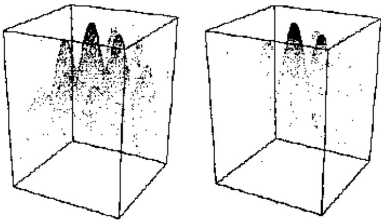  
Figure 4.19: Nassersharif, Ence and Au's scatterplot visualization for GAs solving two-dimensional problems. This gure (taken from [Nassersharif et al., 1994, page I-564]) shows scatterplots for generation 0 (left) and generation 10 (right). The $\times$ and z axes illustrate the two problem dimensions and the vertical y axis illustrates the tness ratings, note the convergence toward tter solutions shown in generation 10.

4.19). Rather than illustrating the entire tness surface and then highlighting the GA's sampling of it, Nassersharif et al. used 3D scatterplot visualizations to show only the population's sample points i.e. the population's chromosomes without the tness surface.

As noted in both [Spears, 1994] and [Nassersharif et al., 1994], GAs are not typically applied to one or two dimensional problems, they are more often applied to high-dimensional problems whose search space cannot be directly illustrated in two or three dimensional space. Therefore, a number of people have explored similarity metrics for illustrating the GA's sampling of high dimensional search spaces.

In [Collins, 1993] a suggestion was made to use 2D scatterplots to illustrate the distribution of a population's chromosomes. Each chromosome in the population can be represented by a dot in a 2D scatterplot, the coordinate of each dot indicates some problem-specic data measure, for example the chromosome's tness rating versus its similarity measure (such as the chromosome's Hamming distance to the ttest). Selecting an informative similarity measure is the key to this view's eectiveness. As noted by several of the respondents, Hamming distance is not a very eective similarity measure. It is in fact a non-unique measure (i.e. 0000 is equidistant from 1100 and 0011). In addition to using a dot to illustrate each chromosome [Collins, 1993] also used chromosome icons to represent each chromosome, an example visualization is given in Figure 4.20.

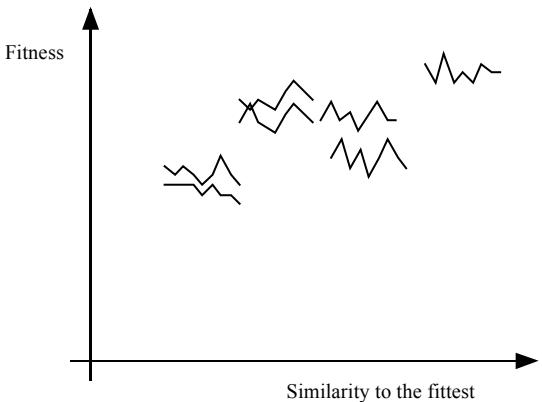  
Figure 4.20: A data space view using the chromosomes tness rating (y axis) and similarity to the ttest chromosome ( $\mathrm { \dot { \times } }$ axis) to plot line trace icons of each chromosome. This gure was taken from [Collins, 1993a].

Since the time the above visualization was rst proposed, further work on GA similarity metrics has been carried out as a means for judging the problem complexity and population diversity. For example, Terry Jones and Stephanie Forrest have explored the correlation between the tness values of all the chromosomes in a GA's run and the chromosomes' similarity to the nal solution (measured either by the Hamming distance for binary chromosomes or the Euclidean distance for non-binary chromosomes). The resulting measure of problem complexity is referred to as the \tness distance correlation" [Jones and Forrest, 1995]. Simon Ronald's work on distance functions for order-based encodings (as used for representing the traveling salesperson problem) measures the genotypic or phenotypic similarity between the chromosomes in a population. These measures are then used as a means for preserving the population's diversity during a GA's run (see [Ronald, 1995], or [Ronald, 1997] and [Ronald, 1998]).

# Contribution

The working practices of the surveyed GA users indicated a strong interest in the GA's sampling of the search space. When asked about visualizing the rate of change in the populations' tness values, six of the nineteen respondents indicated that they wanted to know more about the solutions considered by the GA than the tness versus time graph could give (see Section B.3, Question 7.3). Furthermore, the respondents were strongly in favour of visualizations illustrating a similarity rating for each chromosome in the population, such as the Hamming distance to the ttest chromosome (see Section B.3, Question 8.4). The only doubts expressed were with regard to the quality of the similarity measure used. The choice of similarity measure was generally considered to depend on the specic problem domain and representation used in the GA.

Showing a 2D or 3D visual representation of the search space enables the user to judge the diversity of the population and identify the formation of chromosome clusters. Although a similar impression can be gained from similarity measures of the population's chromosomes, measures based on a specic search space sample (i.e. the chromosomes in a specic population or GA run) rather than the complete search space lack a consistent scale and therefore, comparisons across dierent populations or dierent runs can be dicult. However, if a consistent representation for high-dimensional problem spaces could be found then salient search space visualizations such as those proposed by [Spears, 1994] and [Nassersharif et al., 1994] could be produced for GA's solving high-dimensional problems.

# 4.1.6 Navigating the GA's Search

# Navigating a GA's execution

GAmeter [Kapsalis et al., 1993], Giga [Dabs and Schoof, 1995], and the Genetic Algorithm Software Development Package produced by EvoNet, are just three example systems that enable the user to \play" the GA's run like a movie, \pause" the execution of the GA, and \step" forward a single step (i.e. one generation). Using these controls the user can pause the execution of their algorithm, make a change to the algorithm's parameters and restart it, or step forward generation by generation in order to examine the GA's execution.

Within the eld of SV a number of systems support the bi-directional control of the program's execution. These rst appeared in systems like Henry Lieberman's \ZStep" system [Lieberman, 1984], Marc Eisenstadt and Mike Brayshaw's Transparent Prolog Machine (\Tpm") [Eisenstadt and Brayshaw, 1987], and Thomas Moher's PROcess Visualization and Debugging Environment (\Provide") [Moher, 1988]. Bi-directional navigational control over the program's execution is usually achieved by periodically recording the program's current state and then producing the visualizations using the recorded history of events. As a result, the user can navigate forwards and backwards through the program's recorded history and the resulting visualizations will show the forwards and backwards execution of the program.

# Navigating a GA's Fitness Landscape

Another form of navigation that may prove useful within EC is the navigation of the tness surface. Although generally used to navigate a program's execution a similar approach could be used to identify regions of interest within the range of tness values from a GA's run, e.g. to identify the best chromosomes found by the GA. The navigation of the GA's execution and the discovered regions of the tness landscape both require immediate visual feedback.

\Dynamic Queries" [Shneiderman, 1994] incorporate the use of direct manipulation and immediate feedback to query databases. An \AlphaSlider" [Osada et al., 1993] is an example of a dynamic query interface. The AlphaSlider enables users to select an item or range of items of interest within a dataset. A range-dening alphaslider looks like a regular scroll bar, except that rather than identifying a single point in a range as a small square, the alphaslider identies a range within a range as a bar with draggable arrow buttons at both ends. These arrow buttons dene the start and end of the range of interest within an ordered data set. The rectangular bar itself can also be dragged to pan across the data set. Continuous feedback keeps the user informed of their current position within the data set.

# Contribution

Within the GA user study the proposal for a bi-directional control mechanism was strongly supported (see Section B.4, Question 10.1). Using a similar approach to that commonly applied within SV, a bidirectional navigation controller could be introduced for the user to navigate the GA's run, generation by generation. In addition to a movie-player styled controller for exploring the GA's execution by generation, alphasliders can be used to dene ranges of tness ratings and generation numbers to be displayed. For example, an alphaslider could be used to control the displayed content of a search space visualization, displaying the top 5% of all the generations chromosomes would show the user how many good solutions the GA had considered during its run.

Within this pro ject GA users appear to consider their algorithms in two ways; as a series of evolving generations and as a search technique for exploring problem spaces. By enabling GA users to query a GA's execution in terms of its generation-based execution and its exploration of the problem space, both forms of understanding can be supported.