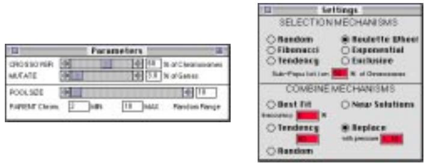
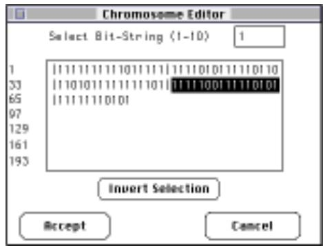
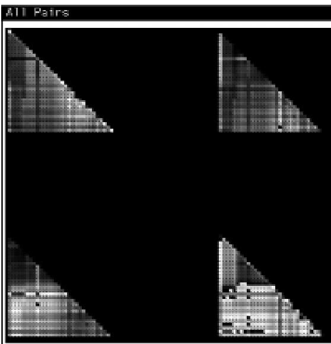
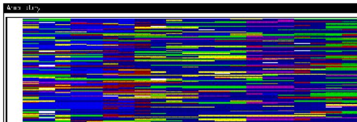
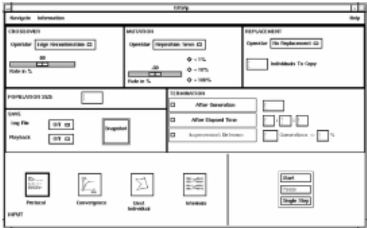
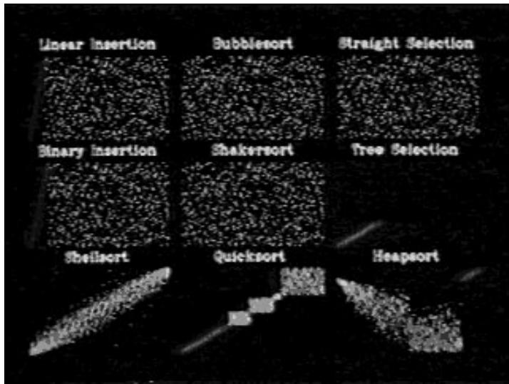
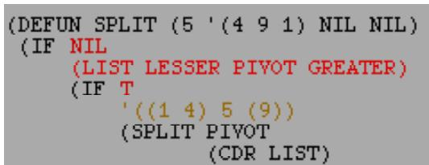
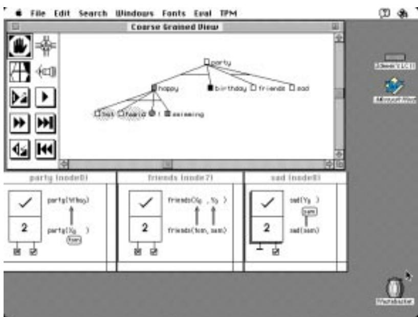
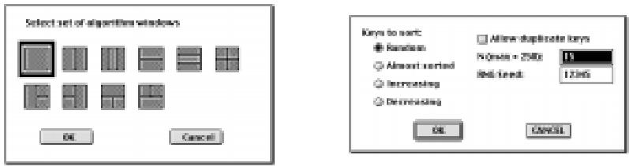

  
Figure 4.21: The dialog boxes available in GAmeter for editing the GA's parameter (left) and algorithm settings (right).

  
Figure 4.22: The bit string editor dialog used in GAmeter to edit a chromosome's alleles.

# 4.1.7 Editing the GA

A variety of GA systems enable the user to design their GAs using a library of predened selection and reproduction components with default parameter settings and interactive parameter controls (examples include GAmeter [Kapsalis et al., 1993] shown in Figure 4.21, Giga [Dabs and Schoof, 1995], Evos [Baeck, 1996], and EvoNet's GA Software Development Package). Within environments that allow the user to pause and restart the GA's execution, these settings can be altered during the course of the GA's run.

Editing can also be carried out at the data level (rather than the algorithm level). The GA user could directly alter the values of the chromosomes within the GA's population. GAmeter [Kapsalis et al., 1993], facilitates this with the use of a \Bit String Editor" (see Figure 4.22). This allows the user to edit a selected chromosome from the current population, and either set all of the alleles in a selected section of the chromosome to one, set all the alleles in a selected section to zero, or invert the alleles in a selected section (i.e. 0s to 1s and 1s to 0s). An on-the-spot evaluation can also be carried out to identify the eect of any changes made.

# Contribution

Enabling the user to intervene in the evolutionary process, either to alter the algorithm or the population data, has both pros and cons. One of the pros is that providing there is sucient visualization support, the user can explore the eects of any changes they make. This can be an engaging way to learn about the GA's search behaviour and the impact of the user's choice of algorithm design. Another pro is the fact that the user can introduce domain knowledge by seeding or biasing the population with specic genes. However, one of the cons is that any form of intervention interferes with the GA's evolutionary search. Both the pros in terms of knowledge injection and education, as well as the cons were noted by some of the questionnaire respondents (see Section B.4, Question 10.3).

The common means of altering a GA's algorithm components or parameter settings through a pop-up dialog is a clear and eective approach. However, the means for altering the individual chromosomes in a population is perhaps less obvious. The bit string editor in GAmeter allows the user to change the alleles in selected sections of a chromosome. If the aim of altering the GA's chromosomes is to introduce domain knowledge then the user must translate that knowledge into the chromosome's representation and alter the values accordingly. Yet, in practice biasing the GA's search may not be so simple as encoding a desired solution, rather the user may want to bias the GA away from sub-optimal clusters and towards unconsidered regions of the search space. Viewing the GA's sampling of the search space during the GA's evolutionary search may be one way of guiding such a choice. Within such a view it may also be possible directly to manipulate the GA's chromosome representations such that the GA is dragged away from sub-optimal clusters and toward unconsidered regions of the search space.

# 4.2 An Overview of the Existing Visualization Support

This section presents a brief description of each of the visualization systems referred to in the previous section. The intention of this subsection is to give the reader an appreciation of the contribution made by each system \as a whole." Subsection 4.2.1 describes each of the GA visualizations, subsection 4.2.2 describes the SV systems, and subsection 4.2.3 describes the use of information visualizations.

This work is presented in chronological order.

# 4.2.1 GA Systems

This subsection presents an overview of the GA systems referred to in Section 4.1.

# Col lins - GA Visualizations

The proposal for this thesis was based on the work presented in [Collins, 1993], some of which is summarized in [Routen and Collins, 1993]. This earlier research identied a range of graphical representations for producing GA visualizations. A number of graphical representations were developed for showing the tness ratings of the chromosomes in the population for a specic generation, and for showing a summary of the population's tness ratings over a number of generations (see Table 4.1 on page 92 for a summary). Three icon represenations for illustrating a GA's chromosomes were also developed, see Figure 4.16 on page 96.

Three genotype visualizations were also produced: overlaid chromosome icons, population bar charts, and allele versus locus frequency matrices (see Figure 4.16 on page 96). The last representation proposed in [Collins, 1993] is referred to as a \data space diagram" (see Figure 4.20). Each chromosome is plotted as a point on a 2D scatterplot, the chromosomes' similarity to the ttest chromosome are plotted on the x axis and the chromosomes' tness ratings are plotted on the y axis. In addition to plotting each chromosome as a point, any of the three proposed chromosome icons can be used as point images in the data space diagram.

Representations similar to those presented in [Collins, 1993] have since been used in a range of GA visualization tools, see [Spears, 1994], [Wu et al., 1998], and [Pohlheim, 1998]. Further information on this work can be found in [Collins, 1993] and [Routen and Collins, 1993].

# Kapsalis, Smith and Mann - GAmeter

GAmeter is a graphical tool that can be used on Macintosh personal computers and UNIX based workstations. Three dierent output windows are available showing statistical data of the GA's progress, the chromosomes in the current population and a graph of the GA's results. A bit string editor is also available for changing individual chromosomes in the population (see Figure 4.14). New problems are introduced to GAmeter by using \skeleton les" (i.e. program templates) so that GAmeter can access the information it requires. The user can continuously manipulate the GA's parameters and algorithm settings during the GA's run (as shown in Figure 4.21) as well as stop, step, start and reset the GA's execution.

Further information on GAmeter can be found in [Kapsalis et al., 1993], [Mann, 1994], or on the world wide web, see

http://www.sys.uea.ac.uk/Research/researchareas/MAG/GAmeter/

# Spears - 5 GA Visualization tools

Bill Spears from the US Naval Research Labs in Washington, D.C. presented 5 visualization tools for exploring GAs. The rst tool (referred to above as a \2D tness landscape") was intended for use on one variable tness functions and presents a 2D line graph showing how the tness rating (on one axis) varies with dierent variable values (on the other axis). The second tool adopted a similar approach but used a 2D surface plot to show the variation in tness for two variable tness functions (this has been referred to as a \3D tness landscape," see Figure 4.4). Spears' third visualization tool, referred to above as a \pixel oriented visualization," shows the binary chromosomes in a population as black and white pixels where a black pixel indicates a 1 and a white pixel indicates a 0 (an example is given in Figure 4.12, page 94).

The fourth tool, not discussed in the previous section, shows how the 2nd order schemata, i.e. two digit building blocks - 00, 01, 10 and 11, are distributed within a population. Figure 4.23 shows an example, the four triangular views show the frequency of each 2nd order schema (00 top left, 01 top right, 10 bottom left, 11 bottom right) between each pair of bits, i and j, along the chromosomes in the population. The value (i.e. greyscale) of each lled circle at position (i, j) indicates the frequency of the schema for that pair of bits. This can also be extended to show the distinction of third order schemata (i.e. 000, 001, 010 . . . 111) using eight triangular images rather than four.

Spears' fth and nal visualization tool shows the ancestry of a GA's population by colouring each unique individual in the initial population a dierent colour and then showing the chromosomes in subsequent generations as strips of colours made up from their parents. For example, if single point crossover was applied to a blue chromosome and a red chromosome, two new chromosomes would be

Figure 4.23: A visualization of 2nd order schemata (i.e. schemata with two dened values). The four triangular images illustrate the frequency of four dierent 2nd order schema across all possible combinations of loci; 00 (top left), 01 (top right), 10 (bottom left), and 11 (bottom right). The frequency of each schema is indicated by the corresponding circle's gray value; a black circle indicates that the schema does not occur in the population through to a white circle which indicates the schema appears several times.

produced - one would be shown with a red and then blue strip, and the other with a blue and then red strip. Figure 4.24 shows a population of one hundred thirty bit chromosomes after twenty ve generations.

Further information on Spears' ve visualization tools can be found in [Spears, 1994].

# Dabs and Schoof - Giga

Giga is a Graphical user Interface for Genetic Algorithms aimed at providing a similar environment to that of GAmeter, i.e. an easy to use, extendable GA tool [Dabs and Schoof, 1995]. The main interface in Giga (see Figure 4.25) provides similar functionality to the parameter and algorithm settings dialogs in GAmeter (Figure 4.21). Here the user can select their genetic operators and parameter settings within the one dialog, as well as controlling the execution, dening the termination conditions, selecting a view, and recording the GA's execution.

Execution control is possible only in the forward direction with start, pause and single step options (see Figure 4.25, bottom right). The termination conditions are set either to a particular generation

Figure 4.24: A visualization of the ancestry of a GA's population. The one hundred thirty bit chromosomes in the initial population were each given a separate colour, this visualization shows how the chromosomes from the initial generation have been recombined in order to produce the twenty fth generation.

Figure 4.25: The main interface used in Giga. Included in the interface are dialogs to alter the GA's parameters (top), a dialog to select views (bottom left), and a dialog to start, pause and step the GA's execution (bottom right). This gure was taken from [Dabs and Schoof, 1995, page 4].

number, a specic time period, or after a period of no signicant improvement (see Figure 4.25, middle right). Four standard view types are available from the main interface; the protocol window details the GA's best individuals over the last fteen generations, the convergence window presents a tness versus time graph for either the best, average or worst individual in each population, the best individual window provides a phenotype visualization (see Figure 4.17) based on a (user-supplied) problem-specic view, and the internals window illustrates the internal operations of the GA such as the crossover and mutation operators (Figure 4.1).

A GA's execution can be recorded as either a single snapshot, playback le, or log le (see Figure 4.25, middle left). A single snapshot stores only one generation's data. A playback le stores only enough information to reconstruct the GA's execution i.e. the GA's initial parameters, the initial random number seed, the problem data, and any parameter changes made during execution. The log le records all the information created during a GA's execution including every population's contents and parameter changes. This is intended for use after execution as a source le for further analysis or visualization. Extensions to Giga are made by the use of template program les that can be rewritten by the user to represent their problems and algorithm components. Although this is not trivial the use of consistent, modular code packages makes this process a routine formality for those uent in the implementation language (in this case, C).

Current work on Giga is aimed at producing a system suitable for parallel GAs. Further information on Giga can be obtained from Jochen Schoof (email schoof@informatik.uni-wuerzburg.de) or on the world wide web, see

http://www-info2.informatik.uni-wuerzburg.de/ga pap e.html

# Wu - Vis

Vis is an oine (post-mortem) visualization tool to support the detailed analysis of a GA's run. The user supplies a data le of their GA's output and then applies Vis to produce textual and graphical views. The GA's execution can be explored using a bi-directional control panel. The three dierent views available in Vis provide three dierent levels of detail; run windows show a coarse-grained view of the GA's entire run (typically showing one entry per generation, see Figure 4.13 on page 94), population windows show a medium-grained view of the individuals from a single generation (Figure 4.14), and individual windows provide a ne-grained view of single individuals (see Figure 4.15). As stated earlier, ve dierent representations are available for displaying the genotypes in these three views: Text representations simply display the individuals using text in a xed width font. Zebra representations display binary chromosomes as strips of black and white bars. Neapolitan representations display every pair of binary alleles as a coloured bar, where 00 = black, $1 1 =$ white, 01 = magenta, and $1 0 =$ orange. Colour coded representations illustrate multi-letter alphabets (i.e. coding alphabets with more than two symbols), where each unique letter is shown a by a dierent coloured bar (e.g. A = blue, $\mathrm { C } = \mathrm { r e d }$ , G = yellow, and T = green). Finally, the gene location representation illustrates the occurrence of building blocks (i.e. groups of symbols or partial solutions), where dierent coloured strips are used to identify dierent building blocks.

  
Figure 4.26: A screen image taken from Ronald Baecker's 30 minute movie on sorting algorithms. This image shows three insertion sort algorithms (left column), three exchange sort algorithms (middle column), and three selection sort algorithms (right column).

Further information on Vis can be found in [Wu and Lindsay, 1997] and [Wu et al., 1998].

# 4.2.2 SV Systems

The genesis of modern SV is attributed to a 30 minute narrated colour video made in 1981 by Ron Baecker at the University of Toronto [Baecker, 1981]. The video was produced in order to help people understand the operation of sorting algorithms. Baecker and his colleagues wrote a computer program that displayed the current state of a number sorting algorithm as a set of dots on the computer screen. The position of each dot indicated each number's current position in the set. A video recorder was then used to lm every state of the number set displayed on the screen as the algorithm stepped through each stage of the sorting algorithm, lming a few frames of each state.

Once the algorithm had completed sorting the numbers, the video was then replayed from start to end and the dots appeared to move into place according to the behaviour of the algorithm. This approach was used to create animations of nine types of sorting algorithms: three insertion sort algorithms; linear insertion, binary insertion and shell sort, three exchange sort algorithms; bubble sort, tree sort and quicksort, and three selection sort algorithms; straight selection, tree selection and heap sort selection (see Figure 4.26).

  
Figure 4.27: A screen shot taken from ZStep. In this code view the current focus of the stepper is shown in yellow and the recently substituted variable values are shown in red.

Since 1981 computer technology has advanced signicantly, enabling the production of smooth computer animations. Although the original work done by Baecker was to support peoples' understanding of sorting algorithms, SV work is carried out on all aspects of computer software i.e. the program's code, data and algorithm. This subsection gives a brief description of the SV systems referred to in the previous section. A more complete review of SV can be found in [Price et al., 1993], [Roman and Cox, 1993], [Collins, 1995] or [Stasko et al., 1998].

# Lieberman - ZStep

ZStep is a debugging tool for Lisp that integrates a code stepper with a text editor [Lieberman, 1984]. ZStep enables the user to follow the execution of a Lisp program by substituting values for variables in the source code during the program's execution. The user can navigate either forwards or backwards through the program's execution and \zoom in" on a bug, examining the program initially at a coarse level of detail, then at increasingly ner levels until the bug is located (see Figure 4.27).

ZStep94 is a more recent version of ZStep recently developed by Henry Lieberman, see [Lieberman and Fry, 1995] for details. Further information on ZStep and ZStep94 can be found on the world wide web, see

http://lieber.www.media.mit.edu/people/lieber/Lieberary/ZStep/ZStep.html

# Moher - Provide

The primary goal of the Provide system is to allow users to observe and control a program's execution at a suitable level of abstraction [Moher, 1988]. To this end Provide enables users to specify any program ob jects of interest; graphical views of these ob jects are then allocated a permanent display area and these views are automatically maintained during program's execution. Another signicant feature of Provide is its playback facility in which users can control the apparent speed and direction of execution.

  
Figure 4.28: A screen shot taken from Tpm version 1.11. The coarse-grained view at the top shows the complete execution space of the program, the individual Aorta diagrams at the bottom show a ne-grained view of the program's individual goals.

# Eisenstadt and Brayshaw - Tpm

Tpm is a visualization tool for tracing Prolog programs. Like ZStep and Provide, Tpm supports the bi-directional navigation of a program's execution. The visualizations in Tpm are available as coarse-grained and ne-grained views that share a common \goal tree" metaphor illustrating the structure of the program.

The coarse-grained view represents each goal in the execution of a Prolog program as a node in a graphical tree; squares indicate user-dened goals, circles indicate system primitives, and triangles indicate compressed sections of the tree (see Figure 4.28). The colour of each node indicates the goal's current state; white nodes (green on a colour display) have been successful, white nodes with a thick outline are currently pending, black nodes (red on a colour display) have failed and grey nodes (pink on a colour display) were initially successful but failed during backtracking. The ne grained view represents the Prolog goals using \Aorta" diagrams i.e. And/OR Trees-Augmented diagrams, which explain the ne-grained details of goal unication.

  
Figure 4.29: A pair of screen shots depicting the set-up phase of a Balsa session for a number sorting algorithm.

The rst screen view (left) illustrates the display layout selection dialogue in the centre of the screen. The second screen view (right) illustrates the parameter selection dialogue. In this particular example the user may select the initial organization of the numbers (currently set to a random ordering), the number of numbers to be sorted, and the random number generator's initial seed value.

A more recent extension of this pro ject produced an information management system to support the production of graphical program tracers called \Mre" (the Multiple Representation Environment). Mre has been applied to produce a trace tool for programs written in Parlog, a parallel version of Prolog, see [Brayshaw, 1990] and [Brayshaw, 1994]. A world wide web version of Tpm has also recently been implemented in Java for The Open University's Internet Software Visualization Lab (\ISVL") [Domingue and Mulholland, 1997a], [Domingue and Mulholland, 1997b], see http://kmi.open.ac.uk/people/paulm/isvl.html

Further information regarding Tpm can found in [Eisenstadt and Brayshaw, 1987], [Eisenstadt and Brayshaw, 1988], or on the world wide web, see http://kmi.open.ac.uk/kmi-misc/tpm/tpm.html

# Brown - Balsa

The Brown ALgorithm Simulator and Animator, \Balsa," was developed by Marc Brown at Brown University, Rhode Island. Balsa was the rst algorithm animation environment to support a highlevel user interface, enabling users to interact with the dynamically changing graphical representations of their programs [Brown and Sedgewick, 1985]. Balsa was designed as an educational aid to support the teaching of computer algorithms.

Interaction with Balsa is based around four dierent user types; the \Algorithm Designer," the \Animator," the \Scriptwriter" and nally, the \End User." The algorithm designer provides the programs to be animated, identies any \interesting events" which need to be visualized, and