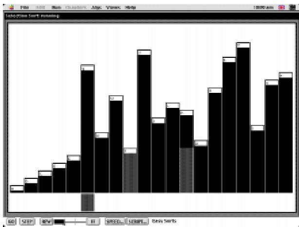

Figure 4.30: A screen shot depicting the run phase of a Balsa session for a number sorting algorithm. The numbers are represented by vertical columns, the magnitude of each number is represented by the height of the corresponding column. As the numbers are sorted by the algorithm, the columns are moved and reordered by height.

contributes to the design of the graphical representations used. The animator's task is then to implement the views that make up the graphical presentations. The scriptwriter is the person who constructs the scripts for the animation, i.e. what information is shown to the end user and when. Finally, the end user makes use of these scripts to view the dynamic graphical representations of a program's algorithm.

The interaction style for the end user is referred to as a \set-up and run" cycle [Brown, 1988]. In the set-up phase the end user arranges the display layout, the algorithms they wish to view, and the parameters they want to associate with each algorithm (including its input generator and output views, see Figure 4.29). Once set up the end user runs the algorithm and observes the results (see Figure 4.30).

Balsa does not support the bi-directional control of the program's execution. The user can either run the program and stop at the next stoppoint, pause at the next stoppoint, stop at the next steppoint, pause at the next steppoint or reset the program back to the start of the execution. The terms \stoppoint" and \steppoint" are taken from Mac Pascal; stoppoints are more commonly known as breakpoints, i.e. points inserted into the program to stop its execution, steppoints are equivalent to the steps of the program's execution i.e. a steppoint occurs after every command.

Further information on Balsa can be found in [Brown and Sedgewick, 1985], [Brown, 1987], or

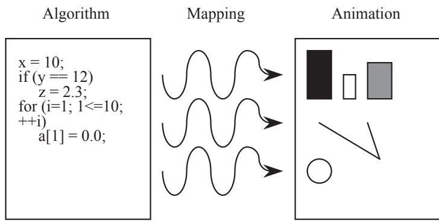  
Figure 4.31: John Stasko's algorithm animation framework as used in Tango. This gure was taken from [Stasko,

1989, page 34].

[Brown, 1988].

# Stasko - Tango

Tango the Transition based ANimation GeneratiOn framework and system was developed by John Stasko while at Brown University. Tango was devised for describing, specifying, analyzing and formalizing the elements involved in animating algorithms [Stasko, 1989]. The framework contains three primary components; namely: the \algorithm," \mapping" and \animation" components (Figure 4.31).

The algorithm component adopts an event-driven approach in which any events important to the algorithm's semantics are identied by the algorithm designer and are referred to as \algorithm operators." These are then used to model procedure calls, mapping the algorithm to the animation. The procedure calls are then used to create the animation control le which constitutes the mapping component of the framework. The animation component contains the graphical ob jects, whose location, size and colour will change during animation, and the operations that control the animation. The approach devised here for generating smooth animations is referred to as the \Path Transition Paradigm" [Stasko, 1990].

Four abstract data types are used within the path transition paradigm; \images," \locations," \transitions" and \paths." Images are either \primary images" such as lines, rectangles, circles and text, or \composite images" which are collections of primary images with specied geometric relationships. Locations are simply positions within the animation co-ordinate system, identied by

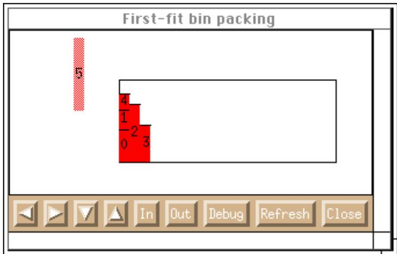

Figure 4.32: A screen view taken from a Tango animation of a rst-t binpacking algorithm. The elements are inserted into the rectangle and tried against each column position until a large enough free-space is found to house them. The control bar shown at the bottom of the gure allows the user to pan around the view, zoom in and out, switch the debugger on/o, alter the refresh rate, and close the view.

an (x, y) co-ordinate pair. The path is an ordered sequence of (x, y) co-ordinate pairs where each pair designates a relative oset from the previous position, and a relative time component used to control the smoothness of the animation. Finally the transition component provides the animation with actions to modify the attributes of the image. An example screen view taken from a Tango animation is given in Figure 4.32.

Further information on Tango can found in [Stasko, 1989], [Stasko, 1990], or on the world wide web, see

http://www.cc.gatech.edu/gvu/softviz/SoftViz.html

# Domingue, Eisenstadt and Price - Vital and Viz

The Vital pro ject was a four and a half year Esprit II research and development pro ject, completed in April 1995, involving nine organizations in ve dierent countries. The aim of the pro ject was to provide both methodological and software support for the development of large, industrial, embedded Knowledge-Based System (\KBS") applications. SV was seen as an opportunity to enhance the users' control of the individual tools within the Vital Workbench. In order to support this a separate visualization framework and software library called \Viz"3 was created [Domingue et al., 1992]. Viz 3Note the \Viz" visualization framework should not be confused with the \Vis" GA visualization tool developed by enables the user (i.e. KBS developer) to dene and construct visualizations of their systems using a very high level programming language. A program's execution data is stored in a history database which is used as the basis for creating dierent views of that program's execution. These views are then made available to the user who can choose which views are displayed.

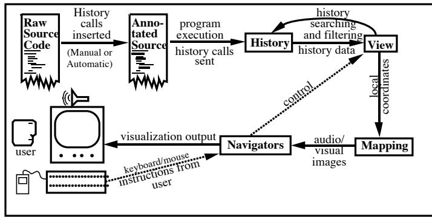  
Figure 4.33: The architecture of $\mathrm { V I Z }$ . This gure was taken from [Domingue et al., 1993, page 9].

To orchestrate this Viz uses a story-telling metaphor in which the program's elements (i.e. functions, data structures, lines of code, etc.) are referred to as \players." The players are identied by the user and annotations are made either to the code or the code interpreter, such that the player's values are recorded in the History database when interesting \events" occur. A diagram of the Viz architecture showing the dierent sub-components of Viz is given in Figure 4.33.

There are four main components to Viz, namely the \History," \Views," \Mappings," and \Navigators" components. The history component holds a record of all key events that occur over the duration of the program's execution. The views component provides the styles in which a particular set of players, states, or events can be presented. The mappings are the encodings used to present the players' state changes, either graphically, or audibly within each view. Finally, the navigators are the tools or techniques used to interact with the user. They allow the user to traverse a view, move between multiple views, change scale, compress or expand ob jects, and move forwards or backwards through the program's execution.

The Viz visualization framework and software library is capable of producing not only program visualizations (i.e. program data and code visualizations) but also algorithm animations. The extent to which the Viz framework and library is used within the Vital pro ject is illustrated in Figure 4.34. The Problem Solving Architecture and Code Visualizations are examples of program visualizations, they closely illustrate the actions of the code and states of the data being manipulated by the KBS. The Domain and Expert Scripted Visualizations are similar to algorithm visualizations where abstract representations are used to illustrate the KBS's operations.

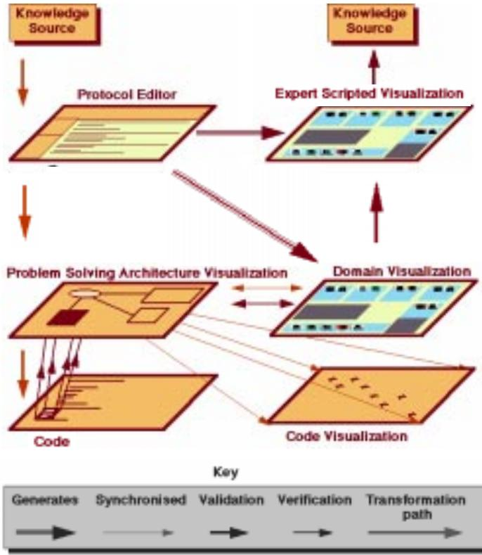  
Figure 4.34: An illustration of the software visualization support provided by Vital. This gure was taken from [Domingue, 1995, page 8].

Further information on the Viz framework and the Vital Workbench can be found in [Domingue et al., 1992], [Domingue et al., 1993] and on the world wide web, see http://kmi.open.ac.uk/people/john/sv/viz/viz.html http://kmi.open.ac.uk/people/john/vital/vital.html

# Brown and Najork - Zeus

After developing Balsa Marc Brown went to work at the Digital Equipment Corporation (DEC) where, along with Marc Na jork, he developed an algorithm animation system called Zeus. This was designed to provide support for both algorithm animation and multi-view editing.

The use of annotations to indicate \interesting events" in an algorithm is still used, however, added features include the use of ob jects, strong typing, parallelism and the graphical development of views [Brown, 1991]. The use of ob jects encourages the reuse of code and facilitates the construction of composite views. The introduction of a graphical editor aids the construction of new view components and the adoption of strong typing provides an opportunity for generating automatic visualizations. A screen shot taken from a Zeus binpacking animation is given in Figure 4.35.

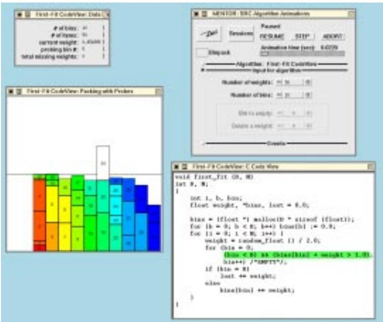  
Figure 4.35: A screen shot taken from a Zeus binpacking algorithm animation. A control panel is shown in the top right window, a code visualization is shown in the bottom right window, an algorithm animation is shown in the bottom left window, and the algorithm's progress is shown in the top left data window.

Further information on Zeus can be found in [Brown, 1991], [Brown and Hershberger, 1992], [Brown and Na jork, 1993], or on the world wide web, see http://www.research.digital.com/SRC/zeus/home.html

# Stasko - Parade and Polka

After John Stasko developed Tango he moved to the Georgia Institute of Technology where he created Parade, a PARallel program Animation Development Environment. The focus of the Parade pro ject was to enable the use of \application-specic" visualization to assist the debugging and correctness-checking of parallel programs. Application-specic program views in this context are dened as views that illustrate the program's semantics, its fundamental methodologies and the inherent application domain.

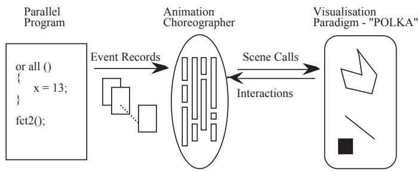

Figure 4.36: An overview of Parade highlighting its three major components; the \Parallel Program" component extracts the information required for producing the visualizations, the \Animation Choreographer" gathers the program information from the parallel program component and organizes it into a preferred format, and the \Visualization Paradigm" takes the choreographed program details and presents them in an apparently continuous smooth animation to the user. Any user interaction is passed to the animation choreographer by the visualization paradigm where it is acted upon. This gure was taken from [Stasko and Kramer, 1992, page 4].

Parade is made up of three components; the \parallel program," \animation choreographer," and the \visualization paradigm" (Figure 4.36). The paral lel program component extracts the necessary program information on which to base the views. The animation choreographer is responsible for the gathering of the program information and its subsequent organization into a preferred structure identied by the user (via the visualization paradigm). The third component, the visualization paradigm, passes the user's actions back to the animation choreographer and presents the choreographed program details in a smooth animated form. The visualization paradigm in Parade is called Polka (Parallel Ob ject-oriented Low Key Animation) [Stasko and Kraemer, 1992]. Polka is an ob ject-oriented system written in C++ that provides high-level graphical-ob ject primitives and motion primitives for the construction of algorithm visualizations and animations. Polka is available for both the X Windows and Silicon Graphics GL systems; the Silicon Graphics GL version supports the use of 3D graphics.

The Polka animation methodology is a combination of principles from the path transition paradigm [Stasko, 1990] and traditional 3D production animation systems. Figure 4.37 illustrates the hierarchy of a Polka animation. An animation is made up of a series of Views with each view being made up of \Locations," \Actions" and \AnimOb jects." An AnimObject is the base class for all graphical ob jects (either 2D or 3D); ob jects are created by the \Originate" method and deleted by the \Delete" method. Locations in Polka can be used to reference and remember important positions for later use. Locations are real-valued $\mathrm { ( x , ~ y ) }$ markers in the view co-ordinate system. The Action class supports the simple movements or changes to be made to the AnimOb jects, an action ob ject has a type such as \move," \color," or \resize" and a list of (x, y) oset pairs dening a two dimensional sequence in the view co-ordinate system. The most signicant feature of the Polka system is its support for concurrent animation that accurately illustrates parallel program concurrency. This is enforced by the programming of each AnimOb ject with actions to occur at particular view frame times. The \Animate" method within the animator class then checks all of the AnimOb jects for each view and ensures that any actions programmed to occur at the current frame time are executed and the appropriate \update" and \draw" methods are invoked.

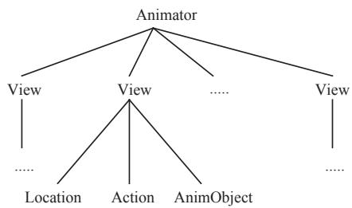  
Figure 4.37: A hierarchy diagram illustrating the structure of a Polka animation. The animator module controls the smooth animation of all the views by ensuring that each animation action is allocated a time-frame. This gure was taken from [Stasko and Kramer, 1992, page 5].

Polka maintains the simple modication of graphical ob jects along paths approach cultivated in Stasko's path transition paradigm and adds the capability to program actions into ob jects at desired animation times. Two screen images illustrating both 2D and 3D visualizations from Polka are shown in Figure 4.38. The view on the left of the rst image is a \blocks view" showing each element in an array as a block whose height indicates the element's value, and horizontal position indicates its position in the array. The view on the right is a \chart view" in which the horizontal lines are used to represent the swapping of elements; the start and end points of these lines indicate the positions of the elements being swapped. Colour is used in both views to indicate the partitioning of the array.

The second 3D image shows a quicksort algorithm. In this visualization the small blue boxes to the right represent the elements being sorted, the position of each blue box on the y axis indicates the element's relative value, and its position on the z axes (depth) indicates the elements position in the array. The multicoloured \exchange" planes to the left of the blue boxes illustrate the algorithm's

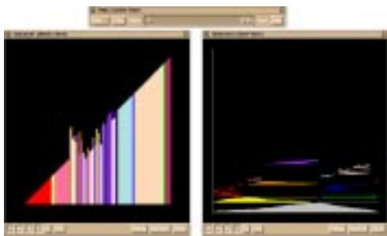

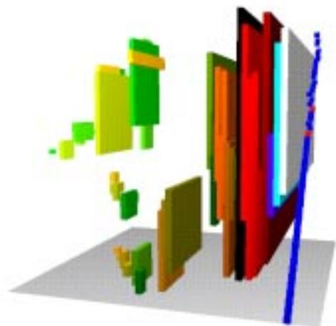

Figure 4.38: Two screen shots showing 2D and 3D Polka visualizations. The 2D visualization on the left shows the execution of a parallel quicksort algorithm, this visualization contains a control panel (top), a blocks view (left, height $=$ value, horizontal position $=$ position in array), and a chart view (right, vertical position $=$ execution time, horizontal lines $=$ swapping elements). The 3D visualization shown on the right shows the execution of a quicksort algorithm in a single 3D view (y axis $=$ element value, $\times$ axis $=$ execution time, z axis depth $=$ position in array).

history from start to nish, shown from right to left.

Further information on Parade and Polka can be found in [Stasko, 1995], [Stasko and Kraemer, 1992], [Stasko, 1994], or on the world wide web, see http://www.cc.gatech.edu/gvu/softviz/SoftViz.html http://www.cc.gatech.edu/gvu/softviz/parviz/polkaanims.html

# 4.2.3 Information Visualization

# Shneiderman, Osada and Ahlberg - Dynamic Queries

\Dynamic Query Interfaces" seek to apply the principles of direct manipulation to database query methods [Shneiderman, 1994]. Shneiderman identied four dening features of dynamic queries:

1. The visual presentation of a query's components and results.

2. Rapid, incremental and reversible control over a query.

3. Selection by pointing rather than typing.

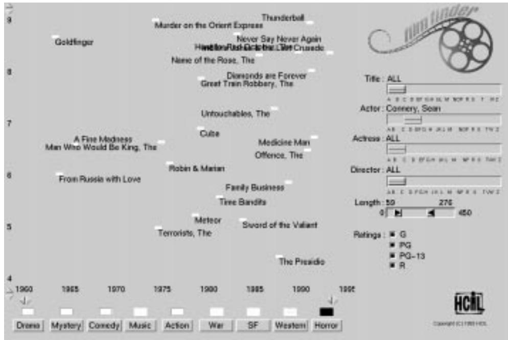  
Figure 4.39: The FilmFinder system which uses alphasliders to identify; lm titles, leading actors, leading actresses, directors, and the lm length. The $\times$ axis is used to indicate the year of release and the y axis indicates its popularity through cinema ticket sales.

4. Immediate and continuous feedback.

An example application which uses the dynamic query approach is the \FilmFinder" system [Ahlberg and Shneiderman, 1994]. In FilmFinder a database of lm details are accessed through the use of alphasliders and buttons, with the resulting information being displayed in a 2D scatterplot. An example screen shot of the FilmFinder system being used to nd a selection of lms staring Sean Connery is given in Figure 4.39. This and other FilmFinder views are available on the world wide web, see http://www.cs.chalmers.se /SSKKII/ivee-dumps/filmfinder.html

An \AlphaSlider" is an example of a dynamic query interface [Osada et al., 1993]. Continuous feedback keeps the user informed of their current position within the data set. A rectangular button is used in a range-dening alphaslider to identify a range of interest. Dragging the left and right hand edges of the rectangular button denes the start and end of the data range, and the rectangle itself can also be dragged to pan across the data set.

A selection of some of the work done using dynamic queries can be found in Christopher Ahlberg's world wide web site on information visualization and exploration, see

http://www.cs.chalmers.se/SSKKII/ivee.html

More recently a pro ject exploring the use of dynamic queries for SV has started at Washington State University; further information can be found at the exploratory visualization world wide web site, see

http://swarm.cs.wustl.edu/ \~ roman/QueryVis.html

# 4.3 Summary of the Contributions Made

In this chapter the existing visualization support tools and techniques suitable for displaying the key characteristics of GAs have been introduced, and their suitability for supporting the user's understanding of the GA's search behaviour has been discussed. The nal summary draws together the contributions made and remaining work to be done.

The conclusions of the user study highlighted a need to support the user's understanding of the GA's search behaviour. Of the key characteristics discussed, visualizing the GA's sampling of the search space is most eective for illustrating the GA's search behaviour. Although measures of the populations' diversity or problem complexity may be useful to indicate the GA's search behaviour, actually seeing the GA's search behaviour gives the user a more direct insight. The only problem with this approach is representing the high dimensional search space on a two dimensional screen.

Other key characteristics of signicance for this pro ject are the navigation of the GA's execution and visualizing the quality of the GA's solutions. The provision of bi-directional navigation support for viewing the GA's execution generation by generation and the potential use of dynamic queries for exploring sections of the search space, are two new approaches for GA navigation which have proven to be extremely useful within the respective elds of SV and information visualization. Visualizing the quality of the GA's solutions using a tness versus time graph is the most common form of GA visualization simply because it shows the GA user something that they need to know. The provision of a tness versus time graph is an essential view that can be augmented either with a vertical line to highlight the current generation, or with a rectangle to highlight the range of generations and tness ratings being displayed in other views.

Editing the GA's parameters and operators may be useful for the GA user yet it is not directly a part of the GA's visualization, however, if visualization support for understanding the GA's search behaviour is not available then it will be dicult for the user to judge the eects of any changes made except those which directly in
uence the quality of the nal result. Editing the chromosomes in the GA's population is not a common step involved in using a GA, but it may be a useful way of introducing problem specic knowledge or exploring the GA's behaviour. Although human-intervention of this nature could be considered intrusive or even damaging to the GA's operation, such arguments are outside the scope of this pro ject, where the primary concern is for supporting the GA user. Supporting the editing of the GA's chromosomes may be achieved by providing an interactive search space visualization. This could be used to explore unconsidered sections of the search space independently of the GA's population, seeding the population with specic chromosomes, or (if the user wishes) for moving chromosomes in the population to new positions in the search space.

Visualizing the chromosomes' (genotypes or phenotypes) involves the use of detailed (problemindependent or problem-dependent) views of the solutions being considered by the GA. Viewing all the chromosomes in a population produces a lot of information and unless the user is specically interested in examining the population's chromosomes (as they are with Vis in the Virtual Virus pro ject), such visualizations should be used selectively so that the GA user can identify the individuals that they are interested in. The last key characteristic examined was visualizing the GA's operators, which is an eective educational visualization but is not an informative visualization of the GA's overall search behaviour.

In conclusion, visualizing the GA's sampling of the search space, navigating the GA's execution and coverage of the search space, and displaying the quality of the solutions found by the GA, are the three most important forms of visualization support for the user wanting to understand the GA's search behaviour, the provision of which is discussed in the next chapter.