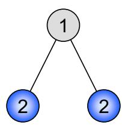

# Chapter 6

# Maximal Independent Set

In this chapter we present a highlight of this course, a fast maximal independent set (MIS) algorithm. The algorithm is the first randomized algorithm that we study in this class. In distributed computing, randomization is a powerful and therefore omnipresent concept, as it allows for relatively simple yet efficient algorithms. As such the studied algorithm is archetypal.

A MIS is a basic building block in distributed computing, some other problems pretty much follow directly from the MIS problem. At the end of this chapter, we will give two examples: matching and vertex coloring (see Chapter 1).

# 6.1 MIS

Definition 6.1 (Independent Set). Given an undirected Graph $G = ( V , E )$ an independent set is a subset of nodes $U \subseteq V$ , such that no two nodes in $U$ are adjacent. An independent set is maximal if no node can be added without violating independence. An independent set of maximum cardinality is called maximum.

  
Figure 6.1: Example graph with 1) a maximal independent set (MIS) and 2) a maximum independent set (MaxIS).

# Remarks:

• Computing a maximum independent set (MaxIS) is a notoriously difficult problem. It is equivalent to maximum clique on the complementary graph. Both problems are NP-hard, in fact not approximable within $n ^ { \frac { 1 } { 2 } - \epsilon }$ .

• In this course we concentrate on the maximal independent set (MIS) problem. Please note that MIS and MaxIS can be quite different, indeed e.g. on a star graph the MIS is $\Theta ( n )$ smaller than the MaxIS (cf. Figure 6.1).

Computing a MIS sequentially is trivial: Scan the nodes in arbitrary order. If a node $u$ does not violate independence, add $u$ to the MIS. If $\boldsymbol { u }$ violates independence, discard $u$ . So the only question is how to compute a MIS in a distributed way.

# Algorithm 29 Slow MIS

Require: Node IDs Every node $v$ executes the following code:   
1: if all neighbors of $v$ with larger identifiers have decided not to join the MIS then   
2: $v$ decides to join the MIS   
3: end if

# Remarks:

Not surprisingly the slow algorithm is not better than the sequential algorithm in the worst case, because there might be one single point of activity at any time. Formally:

Theorem 6.2 (Analysis of Algorithm 29). Algorithm 29 features a time complexity of $O ( n )$ and a message complexity of $O ( m )$ .

# Remarks:

This is not very exciting.   
• There is a relation between independent sets and node coloring (Chapter 1), since each color class is an independent set, however, not necessarily a MIS. Still, starting with a coloring, one can easily derive a MIS algorithm: We first choose all nodes of the first color. Then, for each additional color we add “in parallel” (without conflict) as many nodes as possible. Thus the following corollary holds:

Corollary 6.3. Given a coloring algorithm that needs $C$ colors and runs in time $T$ , we can construct a MIS in time $C + T$ .

# Remarks:

Using Theorem 1.17 and Corollary 6.3 we get a distributed deterministic MIS algorithm for trees (and for bounded degree graphs) with time complexity $O ( \log ^ { * } n )$ .

With a lower bound argument one can show that this deterministic MIS algorithm for rings is asymptotically optimal. There have been attempts to extend Algorithm 5 to more general graphs, however, so far without much success. Below we present a radically different approach that uses randomization. Please note that the algorithm and the analysis below is not identical with the algorithm in Peleg’s book.

# 6.2 Fast MIS from 1986

# Algorithm 30 Fast MIS

The algorithm operates in synchronous rounds, grouped into phases.

A single phase is as follows:   
1) Each node $v$ marks itself with probability $\frac { 1 } { 2 d ( v ) }$ , where $d ( v )$ is the current degree of $v$ .   
2) If no higher degree neighbor of $v$ is also marked, node $v$ joins the MIS. If a higher degree neighbor of $\boldsymbol { v }$ is marked, node $v$ unmarks itself again. (If the neighbors have the same degree, ties are broken arbitrarily, e.g., by identifier). 3) Delete all nodes that joined the MIS and their neighbors, as they cannot join the MIS anymore.

# Remarks:

Correctness in the sense that the algorithm produces an independent set is relatively simple: Steps 1 and 2 make sure that if a node $v$ joins the MIS, then $\boldsymbol { v }$ ’s neighbors do not join the MIS at the same time. Step 3 makes sure that $v$ ’s neighbors will never join the MIS. Likewise the algorithm eventually produces a MIS, because the node with the highest degree will mark itself at some point in Step 1. So the only remaining question is how fast the algorithm terminates. To understand this, we need to dig a bit deeper.

Lemma 6.4 (Joining MIS). A node v joins the MIS in step 2 with probability $\begin{array} { r } { p \geq \frac { 1 } { 4 d ( v ) } } \end{array}$ .

Proof: Let $M$ be the set of marked nodes in step 1. Let $H ( v )$ be the set of neighbors of $\boldsymbol { v }$ with higher degree, or same degree and higher identifier. Using independence of the random choices of $v$ and nodes in $H ( v )$ in Step 1 we get

$$
\begin{array} { r c l } { P \left[ v \notin \mathrm { M I S } | v \in M \right] } & { = } & { P \left[ \exists w \in H ( v ) , w \in M | v \in M \right] } \\ & { = } & { P \left[ \exists w \in H ( v ) , w \in M \right] } \\ & { \leq } & { \displaystyle \sum _ { w \in H ( v ) } P \left[ w \in M \right] = \sum _ { w \in H ( v ) } \frac { 1 } { 2 d ( w ) } } \\ & { \leq } & { \displaystyle \sum _ { w \in H ( v ) } \frac { 1 } { 2 d ( v ) } \leq \frac { d ( v ) } { 2 d ( v ) } = \frac { 1 } { 2 } . } \end{array}
$$

Then

$$
P \left[ { v \in \mathrm { M I S } } \right] = P \left[ { v \in \mathrm { M I S } } | { v \in M } \right] \cdot P \left[ { v \in M } \right] \geq { \frac { 1 } { 2 } } \cdot { \frac { 1 } { 2 d ( v ) } } .
$$

Lemma 6.5 (Good Nodes). A node v is called good if

$$
\sum _ { w \in N ( v ) } \frac 1 { 2 d ( w ) } \geq \frac 1 6 .
$$

Otherwise we call $v$ $a$ bad node. A good node will be removed in Step 3 with probability $\begin{array} { r } { p \geq \frac { 1 } { 3 6 } } \end{array}$ .

Proof: Let node $\boldsymbol { v }$ be good. Intuitively, good nodes have lots of low-degree neighbors, thus chances are high that one of them goes into the independent set, in which case $v$ will be removed in step 3 of the algorithm.

If there is a neighbor $w \in N ( v )$ with degree at most 2 we are done: With Lemma 6.4 the probability that node $w$ joins the MIS is at least $\frac { 1 } { 8 }$ , and our good node will be removed in Step 3.

So all we need to worry about is that all neighbors have at least degree 3: For any neighbor $w$ of $\boldsymbol { v }$ we have $\begin{array} { r } { \frac { 1 } { 2 d ( w ) } \leq \frac { 1 } { 6 } } \end{array}$ . Since $\sum _ { w \in N ( v ) } \frac 1 { 2 d ( w ) } \geq \frac 1 6$ there is a subset of neighbors $S \subseteq N ( v )$ such that $\frac { 1 } { 6 } \leq \sum _ { w \in S } \frac { 1 } { 2 d ( w ) } \leq \frac { 1 } { 3 }$

We can now bound the probability that node $v$ will be removed. Let therefore $R$ be the event of $\boldsymbol { v }$ being removed. Again, if a neighbor of $v$ joins the MIS in Step 2, node $v$ will be removed in Step 3. We have

$$
\begin{array} { r c l } { P \left[ R \right] } & { \geq } & { P \left[ \exists u \in S , u \in \mathrm { M I S } \right] } \\ & { \geq } & { \displaystyle \sum _ { u \in S } P \left[ u \in \mathrm { M I S } \right] - \sum _ { \substack { u , w \in S ; u \neq w } } P \left[ u \in \mathrm { M I S ~ a n d ~ } w \in \mathrm { M I S } \right] . } \end{array}
$$

For the last inequality we used the inclusion-exclusion principle truncated after the second order terms. Let $M$ again be the set of marked nodes after Step 1. Using $P \left[ u \in M \right] \geq P \left[ u \in \mathrm { M I S } \right]$ we get

$$
\begin{array} { r c l } { P \left[ R \right] } & { \geq } & { \displaystyle \sum _ { u \in S } P \left[ u \in \mathrm { M I S } \right] - \sum _ { u , w \in S : u \ne w } P \left[ u \in M \mathrm { ~ a n d ~ } w \in M \right] } \\ & { \geq } & { \displaystyle \sum _ { u \in S } P \left[ u \in \mathrm { M I S } \right] - \sum _ { u \in S } \sum _ { w \in S } P \left[ u \in M \right] \cdot P \left[ w \in M \right] } \\ & { \geq } & { \displaystyle \sum _ { u \in S } \frac { 1 } { 4 d ( u ) } - \sum _ { u \in S } \sum _ { w \in S } \frac { 1 } { 2 d ( u ) } \frac { 1 } { 2 d ( w ) } } \\ & { \geq } & { \displaystyle \sum _ { u \in S } \frac { 1 } { 2 d ( u ) } \left( \frac { 1 } { 2 } - \sum _ { w \in S } \frac { 1 } { 2 d ( w ) } \right) \geq \frac { 1 } { 6 } \left( \frac { 1 } { 2 } - \frac { 1 } { 3 } \right) = \frac { 1 } { 3 6 } . } \end{array}
$$

# Remarks:

• We would be almost finished if we could prove that many nodes are good in each phase. Unfortunately this is not the case: In a star-graph, for instance, only a single node is good! We need to find a work-around.

Lemma 6.6 (Good Edges). An edge $\boldsymbol { e } = \left( u , v \right)$ is called bad if both u and v are bad; else the edge is called good. The following holds: At any time at least half of the edges are good.

Proof: For the proof we construct a directed auxiliary graph: Direct each edge towards the higher degree node (if both nodes have the same degree direct it towards the higher identifier). Now we need a little helper lemma before we can continue with the proof.

Lemma 6.7. A bad node has outdegree at least twice its indegree.

Proof: For the sake of contradiction, assume that a bad node $v$ does not have outdegree at least twice its indegree. In other words, at least one third of the neighbor nodes (let’s call them $S$ ) have degree at most $d ( v )$ . But then

$$
\sum _ { w \in N ( v ) } \frac { 1 } { 2 d ( w ) } \geq \sum _ { w \in S } \frac { 1 } { 2 d ( w ) } \geq \sum _ { w \in S } \frac { 1 } { 2 d ( v ) } \geq \frac { d ( v ) } { 3 } \frac { 1 } { 2 d ( v ) } = \frac { 1 } { 6 }
$$

which means $v$ is good, a contradiction.

Continuing the proof of Lemma 6.6: According to Lemma 6.7 the number of edges directed into bad nodes is at most half the number of edges directed out of bad nodes. Thus, the number of edges directed into bad nodes is at most half the number of edges. Thus, at least half of the edges are directed into good nodes. Since these edges are not bad, they must be good.

Theorem 6.8 (Analysis of Algorithm 30). Algorithm 30 terminates in expected time $O ( \log n )$ .

Proof: With Lemma 6.5 a good node (and therefore a good edge!) will be deleted with constant probability. Since at least half of the edges are good (Lemma 6.6) a constant fraction of edges will be deleted in each phase.

More formally: With Lemmas 6.5 and 6.6 we know that at least half of the edges will be removed with probability at least $1 / 3 6$ . Let $R$ be the number of edges to be removed. Using linearity of expectation we know that $\mathbb { E } \left[ R \right] \geq$ $m / 7 2$ , $m$ being the total number of edges at the start of a phase. Now let $p : = P \left[ R \leq \mathbb { E } \left[ R \right] / 2 \right]$ . Bounding the expectation yields

$$
\operatorname { \mathbb { E } } \left[ R \right] = \sum _ { r } P \left[ R = r \right] \cdot r \leq p \cdot \operatorname { \mathbb { E } } \left[ R \right] / 2 + ( 1 - p ) \cdot m .
$$

Solving for $p$ we get

$$
p \leq \frac { m - \mathbb { E } \left[ R \right] } { m - \mathbb { E } \left[ R \right] / 2 } < \frac { m - \mathbb { E } \left[ R \right] / 2 } { m } \leq 1 - 1 / 1 4 4 .
$$

In other words, with probability at least 1/144 at least $m / 1 4 4$ edges are removed in a phase. After expected $O ( \log m )$ phases all edges are deleted. Since $m \leq n ^ { 2 }$ and thus $O ( \log m ) = O ( \log n )$ the Theorem follows. ✷

# Remarks:

• With a bit of more math one can even show that Algorithm 30 terminates in time $O ( \log n )$ “with high probability”.   
• The presented algorithm is a simplified version of an algorithm by Michael Luby, published 1986 in the SIAM Journal of Computing. Around the same time there have been a number of other papers dealing with the same or related problems, for instance by Alon, Babai, and Itai, or by Israeli and Itai. The analysis presented here takes elements of all these papers, and from other papers on distributed weighted matching. The analysis in the book by David Peleg is different, and only achieves $O ( \log ^ { 2 } n )$ time.   
Though not as incredibly fast as the $\log ^ { * }$ -coloring algorithm for trees, this algorithm is very general. It works on any graph, needs no identifiers, and can easily be made asynchronous.   
Surprisingly, much later, there have been half a dozen more papers published, with much worse results!! In 2002, for instance, there was a paper with linear running time, improving on a 1994 paper with cubic running time, restricted to trees!   
In 2009, M´etivier, Robson, Saheb-Djahromi and Zemmari found a slightly simpler way to analyze a similar MIS algorithm.

# 6.3 Fast MIS from 2009

# Algorithm 31 Fast MIS 2

The algorithm operates in synchronous rounds, grouped into phases.   
A single phase is as follows:   
1) Each node $v$ chooses a random value $r ( v ) \in [ 0 , 1 ]$ and sends it to its neighbors.   
2) If $r ( v ) < r ( w )$ for all neighbors $w \in N ( v )$ , node $v$ enters the MIS and informs its neighbors.   
3) If $v$ or a neighbor of $v$ entered the MIS, $v$ terminates ( $\boldsymbol { v }$ and all edges adjacent to $\boldsymbol { v }$ are removed from the graph), otherwise $v$ enters the next phase.

# Remarks:

Correctness in the sense that the algorithm produces an independent set is simple: Steps 1 and 2 make sure that if a node $v$ joins the MIS, then $\boldsymbol { v }$ ’s neighbors do not join the MIS at the same time. Step 3 makes sure that $\boldsymbol { v }$ ’s neighbors will never join the MIS.   
Likewise the algorithm eventually produces a MIS, because the node with the globally smallest value will always join the MIS, hence there is progress.   
So the only remaining question is how fast the algorithm terminates. To understand this, we need to dig a bit deeper.

Our proof will rest on a simple, yet powerful observation about expected values of random variables that may not be independent:

Theorem 6.9 (Linearity of Expectation). Let $X _ { i }$ , $i = 1 , \ldots , k$ denote random variables, then

$$
\mathbb { E } \left[ \sum _ { i } X _ { i } \right] = \sum _ { i } \mathbb { E } \left[ X _ { i } \right] .
$$

Proof. It is sufficient to prove $\mathbb { E } \left[ X + Y \right] = \mathbb { E } \left[ X \right] + \mathbb { E } \left[ Y \right]$ for two random variables $X$ and $Y$ , because then the statement follows by induction. Since

$$
\begin{array} { r l r } { P \left[ \left( X , Y \right) = \left( x , y \right) \right] } & { = } & { P \left[ X = x \right] \cdot P \left[ Y = y | X = x \right] } \\ & { = } & { P \left[ Y = y \right] \cdot P \left[ X = x | Y = y \right] } \end{array}
$$

we get that

$$
\begin{array} { l c l } { \mathbb { E } \left[ X + Y \right] } & { = } & { \displaystyle \sum _ { ( X , Y ) = ( x , y ) } P \left[ ( X , Y ) = ( x , y ) \right] \cdot ( x + y ) } \\ & { = } & { \displaystyle \sum _ { X = x } \sum _ { Y = y } P \left[ X = x \right] \cdot P \left[ Y = y | X = x \right] \cdot x } \\ & { + } & { \displaystyle \sum _ { Y = y } \sum _ { X = x } P \left[ Y = y \right] \cdot P \left[ X = x | Y = y \right] \cdot y } \\ & { = } & { \displaystyle \sum _ { X = x } P \left[ X = x \right] \cdot x + \sum _ { Y = y } P \left[ Y = y \right] \cdot y } \\ & { = } & { \mathbb { E } \left[ X \right] + \mathbb { E } \left[ Y \right] . } \end{array}
$$

# Remarks:

• How can we prove that the algorithm only needs $O ( \log n )$ phases in expectation? It would be great if this algorithm managed to remove a constant fraction of nodes in each phase. Unfortunately, it does not. Instead we will prove that the number of edges decreases quickly. Again, it would be great if any single edge was removed with constant probability in Step 3. But again, unfortunately, this is not the case. • Maybe we can argue about the expected number of edges to be removed in one single phase? Let’s see: A node $v$ enters the MIS with probability $1 / ( d ( v ) + 1 )$ , where $d ( v )$ is the degree of node $v$ . By doing so, not only are $v$ ’s edges removed, but indeed all the edges of $v$ ’s neighbors as well – generally these are much more than $d ( v )$ edges. So there is hope, but we need to be careful: If we do this the most naive way, we will count the same edge many times. How can we fix this? The nice observation is that it is enough to count just some of the removed edges. Given a new MIS node $v$ and a neighbor $w \in N ( v )$ , we count the edges only if $r ( v ) < r ( x )$ for all $x \in N ( w )$ . This looks promising. In a star graph, for instance, only the smallest random value can be accounted for removing all the edges of the star.

Lemma 6.10 (Edge Removal). In a single phase, we remove at least half of the edges in expectation.

Proof: To simplify the notation, at the start of our phase, the graph is simply $G = ( V , E )$ . Suppose that a node $\boldsymbol { v }$ joins the MIS in this phase, i.e., $r ( v ) < r ( w )$ for all neighbors $w \in N ( v )$ . If in addition we have $r ( v ) < r ( x )$ for all neighbors $x$ of a neighbor $w$ of $v$ , we call this event ( $v  w$ ). The probability of event ( $v  w$ ) is at least $1 / ( d ( v ) + d ( w ) )$ , since $d ( v ) + d ( w )$ is the maximum number of nodes adjacent to $\boldsymbol { v }$ or $w$ (or both). As $\boldsymbol { v }$ joins the MIS, all edges $( w , x )$ will be removed; there are $d ( w )$ of these edges.

In order to count the removed edges, we need to weight events properly.

Whether we remove the edges adjacent to $w$ because of event $v  w$ ) is a random variable $X _ { ( v  w ) }$ . If event ( $v  w$ ) occurs, $X _ { ( v  w ) }$ has the value $d ( w )$ , if not it has the value $0$ . For each edge $\{ v , w \}$ we have two such variables, the event $X _ { ( v  w ) }$ and $X _ { ( w  v ) }$ . Due to Theorem 6.9, the expected value of the sum $X$ of all these random variables is at least

$$
\begin{array} { r c l } { \mathbb { E } [ X ] } & { = } & { \displaystyle \sum _ { \{ v , w \} \in E } \mathbb { E } \big [ X _ { ( v  w ) } \big ] + \mathbb { E } \big [ X _ { ( w  v ) } \big ] } \\ & { = } & { \displaystyle \sum _ { \{ v , w \} \in E } P [ \mathrm { E v e n t ~ } ( v  w ) \big ] \cdot d ( w ) + P [ \mathrm { E v e n t ~ } ( w  v ) ] \cdot d ( v )  } \\ & { \displaystyle \sum _ { \{ v , w \} \in E } \frac { d ( w ) } { d ( v ) + d ( w ) } + \frac { d ( v ) } { d ( w ) + d ( v ) } } \\ & { = } & { \displaystyle \sum _ { \{ v , w \} \in E } 1 = | E | . } \end{array}
$$

In other words, in expectation all edges are removed in a single phase?!? Probably not. This means that we still counted some edges more than once. Indeed, for an edge $\{ v , w \} \in E$ our random variable $X$ includes the edge if the event ( $u  v$ ) happens, but $X$ also includes the edge if the event ( $x  w$ ) happens. So we may have counted the edge $\{ v , w \}$ twice. Fortunately however, not more than twice, because at most one event ( $\cdot  v$ ) and at most one event $\cdot  w$ ) can happen. If ( $u  v$ ) happens, we know that $r ( u ) < r ( w )$ for all $w \in N ( v )$ ; hence another ( $u ^ { \prime } \to v$ ) cannot happen because $r ( u ^ { \prime } ) > r ( u ) \in N ( v )$ . Therefore the random variable $X$ must be divided by 2. In other words, in expectation at least half of the edges are removed.

# Remarks:

• This enables us to follow a bound on the expected running time of Algorithm 31 quite easily.

Theorem 6.11 (Expected running time of Algorithm 31). Algorithm 31 terminates after at most $3 \log _ { 4 / 3 } m + 1 \in O ( \log n )$ phases in expectation.

Proof: The probability that in a single phase at least a quarter of all edges are removed is at least $1 / 3$ . For the sake of contradiction, assume not. Then with probability less than $1 / 3$ we may be lucky and many (potentially all) edges are removed. With probability more than $2 / 3$ less than $1 / 4$ of the edges are removed. Hence the expected fraction of removed edges is strictly less than $1 / 3 \cdot 1 + 2 / 3 \cdot 1 / 4 = 1 / 2$ . This contradicts Lemma 6.10.

Hence, at least every third phase is “good” and removes at least a quarter of the edges. To get rid of all but two edges we need $\log _ { 4 / 3 } m$ good phases in expectation. The last two edges will certainly be removed in the next phase. Hence a total of $3 \log _ { 4 / 3 } m + 1$ phases are enough in expectation.

# Remarks:

Sometimes one expects a bit more of an algorithm: Not only should the expected time to terminate be good, but the algorithm should always terminate quickly. As this is impossible in randomized algorithms (after all, the random choices may be “unlucky” all the time!), researchers often settle for a compromise, and just demand that the probability that the algorithm does not terminate in the specified time can be made absurdly small. For our algorithm, this can be deduced from Lemma 6.10 and another standard tool, namely Chernoff’s Bound.

Definition 6.12 (W.h.p.). We say that an algorithm terminates w.h.p. (with high probability) within $O ( t )$ time if it does so with probability at least $1 - 1 / n ^ { c }$ for any choice of $c \geq 1$ . Here c may affect the constants in the Big-O notation because it is considered $a$ “tunable constant” and usually kept small.

Definition 6.13 (Chernoff’s Bound). Let $\textstyle X = \sum _ { i = 1 } ^ { k } X _ { i }$ be the sum of $k$ independent $0 - 1$ random variables. Then Chernoff’s bound states that w.h.p.

$$
| X - \mathbb { E } [ X ] | \in O \left( \log n + { \sqrt { \mathbb { E } [ X ] \log n } } \right) .
$$

Corollary 6.14 (Running Time of Algorithm 31). Algorithm 31 terminates w.h.p. in $O ( \log n )$ time.

Proof: In Theorem 6.11 we used that independently of everything that happened before, in each phase we have a constant probability $p$ that a quarter of the edges are removed. Call such a phase good. For some constants $C _ { 1 }$ and $C _ { 2 }$ , let us check after $C _ { 1 } \log n + C _ { 2 } \in O ( \log n )$ phases, in how many phases at least a quarter of the edges have been removed. In expectation, these are at least $p ( C _ { 1 } \log n + C _ { 2 } )$ many. Now we look at the random variable X = (C1 log n+C2i=1 Xi, where the Xi if $X$ is at least $x$ with some probability, then the probability that we have $x$ good phases can only be larger (if no edges are left, certainly “all” of the remaining edges are removed). To $X$ we can apply Chernoff’s bound. If $C _ { 1 }$ and $C _ { 2 }$ are chosen large enough, they will overcome the constants in the Big- $O$ from Chernoff’s bound, i.e., w.h.p. it holds that $| X - \mathbb { E } [ X ] | \leq \mathbb { E } [ X ] / 2$ , implying $X \geq \mathbb { E } [ X ] / 2$ . Choosing $C _ { 1 }$ large enough, we will have w.h.p. sufficiently many good phases, i.e., the algorithm terminates w.h.p. in $O ( \log n )$ phases.

# Remarks:

The algorithm can be improved a bit more even. Drawing random real numbers in each phase for instance is not necessary. One can achieve the same by sending only a total of $O ( \log n )$ random (and as many nonrandom) bits over each edge.   
• One of the main open problems in distributed computing is whether one can beat this logarithmic time, or at least achieve it with a deterministic algorithm.

Let’s turn our attention to applications of MIS next.

# 6.4 Applications

Definition 6.15 (Matching). Given a graph $G = ( V , E )$ $a$ matching is a subset of edges $M \subseteq E$ , such that no two edges in M are adjacent (i.e., where no node is adjacent to two edges in the matching). A matching is maximal if no edge can be added without violating the above constraint. A matching of maximum cardinality is called maximum. A matching is called perfect if each node is adjacent to an edge in the matching.

# Remarks:

In contrast to MaxIS, a maximum matching can be found in polynomial time (Blossom algorithm by Jack Edmonds), and is also easy to approximate (in fact, already any maximal matching is a 2-approximation).   
• An independent set algorithm is also a matching algorithm: Let $G =$ $( V , E )$ be the graph for which we want to construct the matching. The auxiliary graph $G ^ { \prime }$ is defined as follows: for every edge in $G$ there is a node in $G ^ { \prime }$ ; two nodes in $G ^ { \prime }$ are connected by an edge if their respective edges in $G$ are adjacent. A (maximal) independent set in $G ^ { \prime }$ is a (maximal) matching in G, and vice versa. Using Algorithm 31 directly produces a $O ( \log n )$ bound for maximal matching.   
• More importantly, our MIS algorithm can also be used for vertex coloring (Problem 1.1):

# Algorithm 32 General Graph Coloring

1: Given a graph $G = ( V , E )$ we virtually build a graph $G ^ { \prime } = ( V ^ { \prime } , E ^ { \prime } )$ as follows:   
2: Every node $v \in V$ clones itself ${ d ( v ) + 1 }$ times $( v _ { 0 } , \ldots , v _ { d ( v ) } \in V ^ { \prime } ,$ ), $d ( v )$ being the degree of $v$ in $G$ .   
3: The edge set $E ^ { \prime }$ of $G ^ { \prime }$ is as follows:   
4: First all clones are in a clique: $( v _ { i } , v _ { j } ) \in E ^ { \prime }$ , for all $v \in V$ and all $0 \leq i <$ $j \leq d ( v )$   
5: Second all $i ^ { t h }$ clones of neighbors in the original graph $G$ are connected: $( u _ { i } , v _ { i } ) \in E ^ { \prime }$ , for all $( u , v ) \in E$ and all $0 \leq i \leq \operatorname* { m i n } ( d ( u ) , d ( v ) )$ .   
6: Now we simply run (simulate) the fast MIS Algorithm 31 on $G ^ { \prime }$ .   
7: If node $v _ { i }$ is in the MIS in $G ^ { \prime }$ , then node $v$ gets color $i$ .

Theorem 6.16 (Analysis of Algorithm 32). Algorithm 32 $( \Delta + 1 )$ -colors an arbitrary graph in $O ( \log n )$ time, with high probability, $\Delta$ being the largest degree in the graph.

Proof: Thanks to the clique among the clones at most one clone is in the MIS. And because of the $d ( v ) + 1$ clones of node $v$ every node will get a free color! The running time remains logarithmic since $G ^ { \prime }$ has $O \left( n ^ { 2 } \right)$ nodes and the exponent becomes a constant factor when applying the logarithm.

# Remarks:

This solves our open problem from Chapter 1.1!   
• Together with Corollary 6.3 we get quite close ties between (∆+1)-coloring and the MIS problem.   
However, in general Algorithm 32 is not the best distributed algorithm for $O ( \Delta )$ -coloring. For fast distributed vertex coloring please check Kothapalli, Onus, Scheideler, Schindelhauer, IPDPS 2006. This algorithm is based on a $O ( \log \log n )$ time edge coloring algorithm by Grable and Panconesi, 1997.   
Computing a MIS also solves another graph problem on graphs of bounded independence.

Definition 6.17 (Bounded Independence). $G = ( V , E )$ is of bounded independence, if each neighborhood contains at most a constant number of independent (i.e., mutually non-adjacent) nodes.

Definition 6.18 ((Minimum) Dominating Sets). A dominating set is a subset of the nodes such that each node is in the set or adjacent to a node in the set. $A$ minimum dominating set is a dominating set containing the least possible number of nodes.

# Remarks:

• In general, finding a dominating set less than factor $\log n$ larger than an minimum dominating set is NP-hard.   
• Any MIS is a dominating set: if a node was not covered, it could join the independent set.   
In general a MIS and a minimum dominating sets have not much in common (think of a star). For graphs of bounded independence, this is different.

Corollary 6.19. On graphs of bounded independence, a constant-factor approximation to a minimum dominating set can be found in time $O ( \log n )$ w.h.p.

Proof: Denote by $M$ a minimum dominating set and by $I$ a MIS. Since $M$ is a dominating set, each node from $I$ is in $M$ or adjacent to a node in $M$ . Since the graph is of bounded independence, no node in $M$ is adjacent to more than constantly many nodes from $I$ . Thus, $| I | \in O ( | M | )$ . Therefore, we can compute a MIS with Algorithm 31 and output it as the dominating set, which takes $O ( \log n )$ rounds w.h.p.